# Kern Mega Stress Test (5000+ lines)

## Table of Contents

- [Section 1: Nested Checklist Bug Tests](#section-1-nested-checklist-bug-tests)

- [Section 2: Code Blocks — Every Language](#section-2-code-blocks--every-language)

- [Section 3: Super Long Code Block (200+ lines)](#section-3-super-long-code-block-200-lines)

- [Section 4: Complex Mermaid Diagrams](#section-4-complex-mermaid-diagrams)

- [Section 5: Math / LaTeX](#section-5-math--latex)

- [Section 6: Tables](#section-6-tables)

- [Section 7: CJK and International Text](#section-7-cjk-and-international-text)

- [Section 8: Deep Nesting](#section-8-deep-nesting)

- [Section 9: Links and Images](#section-9-links-and-images)

- [Section 10: Edge Cases](#section-10-edge-cases)

- [Section 11: Volume Test (Filler Content)](#section-11-volume-test-filler-content)

## Section 1: Nested Checklist Bug Tests

### Test 1A: Basic checked vs unchecked

Only checked items should be struck through:

- [x] Checked — SHOULD be struck through

- [ ] Unchecked — should NOT be struck through

- [x] Checked — SHOULD be struck through

- [ ] Unchecked — should NOT be struck through

### Test 1B: Checked items inside unchecked parent

Parent bullets should NOT inherit strikethrough from children:

- Parent bullet (should be NORMAL)

  - [x] Child checked (struck through)

  - [ ] Child unchecked (normal)

  - [x] Child checked (struck through)

- Another parent (should be NORMAL)

  - [ ] Child unchecked (normal)

  - [x] Child checked (struck through)

### Test 1C: Unchecked items inside checked parent

- [x] Parent checked (struck through)
  - [ ] Child unchecked — should this inherit parent strike?

  - [x] Child checked (struck through)

- [ ] Parent unchecked (normal)
  - [x] Child checked (struck through)

  - [ ] Child unchecked (normal)

### Test 1D: 4-level deep nesting

- Level 0 bullet (NORMAL)

  - [x] Level 1 checked (struck)
    - [ ] Level 2 unchecked (normal)
      - [x] Level 3 checked (struck)

      - [ ] Level 3 unchecked (normal)

    - [x] Level 2 checked (struck)
      - [ ] Level 3 unchecked (normal)

  - [ ] Level 1 unchecked (normal)
    - [x] Level 2 checked (struck)

    - [ ] Level 2 unchecked (normal)

### Test 1E: Mixed checked/unchecked at every level

- [ ] L0 unchecked
  - [x] L1 checked
    - [ ] L2 unchecked
      - [x] L3 checked

    - [x] L2 checked
      - [ ] L3 unchecked

  - [ ] L1 unchecked
    - [x] L2 checked

    - [ ] L2 unchecked

- [x] L0 checked
  - [ ] L1 unchecked
    - [x] L2 checked

  - [x] L1 checked
    - [ ] L2 unchecked

### Test 1F: Checklist inside ordered list

1. First ordered item (NORMAL)

   - [x] Sub-task done (struck)

   - [ ] Sub-task pending (normal)
2. Second ordered item (NORMAL)

   - [x] Done (struck)

   - [x] Done (struck)
3. Third ordered item (NORMAL)

   - [ ] Pending (normal)

   - [ ] Pending (normal)

### Test 1G: Checklist with rich content

- [x] **Bold checked** — struck through with bold

- [ ] *Italic unchecked* — normal with italic

- [x] `Code checked` — struck through with code

- [ ] [Link unchecked](https://example.com) — normal with link

- [x] **Bold** and *italic* and `code` and [link](https://example.com) — all struck

- [ ] ~~Already strikethrough~~ unchecked — normal (double strike?)

### Test 1H: All-checked list

- [x] Item 1

- [x] Item 2

- [x] Item 3

- [x] Item 4

- [x] Item 5

### Test 1I: All-unchecked list

- [ ] Item 1

- [ ] Item 2

- [ ] Item 3

- [ ] Item 4

- [ ] Item 5

### Test 1J: Single checked in long list

- [ ] Item 1

- [ ] Item 2

- [ ] Item 3

- [ ] Item 4

- [ ] Item 5

- [ ] Item 6

- [ ] Item 7

- [ ] Item 8

- [ ] Item 9

- [x] Item 10 ← only this one struck

- [ ] Item 11

- [ ] Item 12

- [ ] Item 13

- [ ] Item 14

- [ ] Item 15

- [ ] Item 16

- [ ] Item 17

- [ ] Item 18

- [ ] Item 19

- [ ] Item 20

### Test 1K: Checklist inside blockquote

> Project tasks:
>
> - [x] Design complete
>
> - [ ] Implementation pending
>
> - [x] Tests written
>
> - [ ] Documentation needed

### Test 1L: Inline ordered checkboxes (Kern signature feature)

The `1. - [x] text` syntax renders as a numbered list with an inline checkbox — no nesting:

1. <br />

   - [x] Checked ordered item
2. <br />

   - [ ] Unchecked ordered item
3. <br />

   - [x] Another checked item
4. <br />

   - [ ] Another unchecked item

### Test 1M: Direct ordered checkboxes (GitHub-style)

The `1. [x] text` syntax (no dash) also works:

1. [x] Checked via direct syntax
2. [ ] Unchecked via direct syntax
3. [x] Third item checked
4. [ ] Fourth item unchecked

### Test 1N: Inline ordered checkboxes (dash syntax)

The `1. - [x] text` syntax flattens into a numbered item with inline checkbox:

1. <br />

   - [x] First checked item
2. <br />

   - [ ] Second unchecked item
3. <br />

   - [x] Third checked item
4. <br />

   - [ ] Fourth unchecked item
5. <br />

   - [x] Fifth checked item

### Test 1O: Inline ordered checkboxes (direct syntax)

The `1. [x] text` syntax (no dash) also shows number + checkbox inline:

1. [x] Direct checked item
2. [ ] Direct unchecked item
3. [x] Another direct checked
4. [ ] Another direct unchecked

### Test 1P: Nested checklists (indented, 2 levels)

- [x] Parent checked
  - [ ] Child unchecked inside checked parent

  - [x] Child checked inside checked parent

- [ ] Parent unchecked
  - [x] Child checked inside unchecked parent

  - [ ] Child unchecked inside unchecked parent

### Test 1Q: Numbered > Checklist (indented, 2 levels)

1. First ordered item

   - [x] Task done under ordered

   - [ ] Task pending under ordered
2. Second ordered item

   - [x] All complete

   - [ ] Still working
3. Third ordered item

   - [x] Done

   - [x] Also done

### Test 1R: Checklist > Numbered (indented, 2 levels)

- [x] Completed parent task
  1. Sub-step one
  2. Sub-step two
  3. Sub-step three

- [ ] Pending parent task
  1. First thing to do
  2. Second thing to do

### Test 1S: Four-level deep nesting

1. Level 1 ordered

   - Level 2 bullet

     - [x] Level 3 checked
       1. Level 4 ordered under checked
       2. Another level 4

     - [ ] Level 3 unchecked
       1. Level 4 ordered under unchecked

   - Another level 2

     - [x] All done here

### Test 1T: Alternating list types

- [x] Checklist L1
  1. Ordered L2

     - [x] Checklist L3
       1. Ordered L4
  1. Another ordered L2

     - [ ] Unchecked L3
       1. Ordered under unchecked

- [ ] Unchecked L1
  1. Ordered L2

     - [x] Checked L3

     - [ ] Unchecked L3
  2. More ordered L2

     - [x] All done here

### Test 1U: Reverse inline — Bullet wrapping ordered checkbox

The `- 1. [x] text` syntax (bullet > ordered checkbox). Expected: `• 1. ☑ text`

- <br />

  1. [x] Bullet wrapping ordered checked

- <br />

  1. [ ] Bullet wrapping ordered unchecked

- <br />

  1. [x] Another checked reverse

- <br />

  1. [ ] Another unchecked reverse

### Test 1V: Triple nesting — Ordered > Bullet > Ordered checkbox

The `1. - 1. [x] text` syntax (three levels). Expected: `1. • 1. ☑ text`

1. <br />

   - <br />

     1. [x] Triple nested checked

2. <br />

   - <br />

     1. [ ] Triple nested unchecked

3. <br />

   - <br />

     1. [x] Third triple checked

### Test 1W: Mixed ordered list — checkboxes and plain items

Same ordered list with both checkbox and non-checkbox items:

1. [x] First item is checked
2. Second item has no checkbox
3. [x] Third item is checked
4. [ ] Fourth item is unchecked
5. Fifth item is plain text
6. [x] Sixth item is checked

### Test 1X: Double-digit ordered checkboxes

Test that wider numbers (10+) still render correctly alongside checkboxes:

1. [x] Item one
2. [x] Item two
3. [x] Item three
4. [x] Item four
5. [x] Item five
6. [x] Item six
7. [x] Item seven
8. [x] Item eight
9. [ ] Item nine
10. [x] Item ten
11. [ ] Item eleven
12. [x] Item twelve

### Test 1Y: All unchecked variants

Every inline checkbox format with unchecked state:

1. [ ] Direct ordered unchecked

2. <br />3. 

   - [ ] Dash-syntax ordered unchecked

- <br />

  1. [ ] Reverse (bullet > ordered) unchecked

1. <br />

   - <br />

     1. [ ] Triple nested unchecked

### Test 1Z: Edge cases

Single-item inline nested:

1. <br />

   - [x] Only child item

Long text in inline nested:

1. <br />

   - [x] This is a much longer text item to verify that wrapping behavior works correctly when the inline nested checkbox has substantial content that extends beyond the visible width of the editor

Back-to-back inline nested (consecutive):

1. <br />

   - [x] First consecutive

2. <br />

   - [x] Second consecutive

3. <br />

   - [x] Third consecutive

4. <br />

   - [ ] Fourth consecutive unchecked

5. <br />

   - [x] Fifth consecutive

***

## Section 2: Code Blocks — Every Language

### javascript

```javascript
// DOM manipulation + async
async function fetchUsers(apiUrl) {
  const response = await fetch(apiUrl);
  if (!response.ok) throw new Error(`HTTP ${response.status}`);
  const users = await response.json();
  const list = document.getElementById("user-list");
  users.forEach(({ name, email, id }) => {
    const li = document.createElement("li");
    li.textContent = `${name} <${email}>`;
    li.dataset.userId = id;
    list.appendChild(li);
  });
  return users.length;
}
fetchUsers("https://api.example.com/users").then(console.log);
```

### typescript

```typescript
// Generic utility types + decorators
interface Repository<T extends { id: string }> {
  findById(id: string): Promise<T | null>;
  findAll(filter?: Partial<T>): Promise<T[]>;
  save(entity: T): Promise<T>;
  delete(id: string): Promise<boolean>;
}

type ReadOnly<T> = { readonly [K in keyof T]: T[K] };

class UserRepo implements Repository<User> {
  private cache = new Map<string, User>();

  async findById(id: string): Promise<User | null> {
    return this.cache.get(id) ?? null;
  }
  async findAll(filter?: Partial<User>): Promise<User[]> {
    return [...this.cache.values()].filter(u =>
      !filter || Object.entries(filter).every(([k, v]) => u[k as keyof User] === v)
    );
  }
  async save(entity: User): Promise<User> {
    this.cache.set(entity.id, entity);
    return entity;
  }
  async delete(id: string): Promise<boolean> {
    return this.cache.delete(id);
  }
}
```

### python

```python
# Dataclass + context manager + generator
from dataclasses import dataclass, field
from contextlib import contextmanager
from typing import Generator, Optional
import logging

logger = logging.getLogger(__name__)

@dataclass
class DatabaseConfig:
    host: str = "localhost"
    port: int = 5432
    database: str = "myapp"
    pool_size: int = 10
    _connections: list = field(default_factory=list, repr=False)

    @contextmanager
    def connect(self) -> Generator:
        conn = f"conn://{self.host}:{self.port}/{self.database}"
        self._connections.append(conn)
        logger.info(f"Opened {conn} (pool: {len(self._connections)})")
        try:
            yield conn
        finally:
            self._connections.remove(conn)
            logger.info(f"Closed {conn}")

    def query(self, sql: str, params: Optional[tuple] = None):
        with self.connect() as conn:
            return f"[{conn}] {sql} {params or ''}"
```

### rust

```rust
// Traits, enums, pattern matching, lifetimes
use std::collections::HashMap;
use std::fmt;

#[derive(Debug, Clone)]
enum Token<'a> {
    Number(f64),
    String(&'a str),
    Identifier(&'a str),
    Operator(char),
    Eof,
}

impl<'a> fmt::Display for Token<'a> {
    fn fmt(&self, f: &mut fmt::Formatter<'_>) -> fmt::Result {
        match self {
            Token::Number(n) => write!(f, "NUM({})", n),
            Token::String(s) => write!(f, "STR(\"{}\")", s),
            Token::Identifier(id) => write!(f, "ID({})", id),
            Token::Operator(op) => write!(f, "OP({})", op),
            Token::Eof => write!(f, "EOF"),
        }
    }
}

fn tokenize(input: &str) -> Vec<Token> {
    let mut tokens = Vec::new();
    let mut chars = input.chars().peekable();
    while let Some(&ch) = chars.peek() {
        match ch {
            '0'..='9' => {
                let num: String = std::iter::from_fn(|| {
                    chars.peek().filter(|c| c.is_ascii_digit() || **c == '.').map(|_| chars.next().unwrap())
                }).collect();
                tokens.push(Token::Number(num.parse().unwrap()));
            }
            '+' | '-' | '*' | '/' => {
                tokens.push(Token::Operator(chars.next().unwrap()));
            }
            _ => { chars.next(); }
        }
    }
    tokens.push(Token::Eof);
    tokens
}
```

### go

```go
// HTTP server with middleware, goroutines, channels
package main

import (
    "context"
    "fmt"
    "log"
    "net/http"
    "sync"
    "time"
)

type Middleware func(http.Handler) http.Handler

func Logger(next http.Handler) http.Handler {
    return http.HandlerFunc(func(w http.ResponseWriter, r *http.Request) {
        start := time.Now()
        next.ServeHTTP(w, r)
        log.Printf("%s %s %v", r.Method, r.URL.Path, time.Since(start))
    })
}

func RateLimit(rps int) Middleware {
    var mu sync.Mutex
    tokens := rps
    go func() {
        ticker := time.NewTicker(time.Second / time.Duration(rps))
        defer ticker.Stop()
        for range ticker.C {
            mu.Lock()
            if tokens < rps { tokens++ }
            mu.Unlock()
        }
    }()
    return func(next http.Handler) http.Handler {
        return http.HandlerFunc(func(w http.ResponseWriter, r *http.Request) {
            mu.Lock()
            if tokens <= 0 {
                mu.Unlock()
                http.Error(w, "rate limited", http.StatusTooManyRequests)
                return
            }
            tokens--
            mu.Unlock()
            next.ServeHTTP(w, r)
        })
    }
}
```

### c

```c
/* Binary search tree with insert, search, free */
#include <stdio.h>
#include <stdlib.h>
#include <string.h>

typedef struct Node {
    int key;
    char value[64];
    struct Node *left, *right;
} Node;

Node* create_node(int key, const char* value) {
    Node* node = (Node*)malloc(sizeof(Node));
    node->key = key;
    strncpy(node->value, value, 63);
    node->value[63] = '\0';
    node->left = node->right = NULL;
    return node;
}

Node* insert(Node* root, int key, const char* value) {
    if (!root) return create_node(key, value);
    if (key < root->key)
        root->left = insert(root->left, key, value);
    else if (key > root->key)
        root->right = insert(root->right, key, value);
    else
        strncpy(root->value, value, 63);
    return root;
}

const char* search(Node* root, int key) {
    if (!root) return NULL;
    if (key == root->key) return root->value;
    return key < root->key ? search(root->left, key) : search(root->right, key);
}

void free_tree(Node* root) {
    if (!root) return;
    free_tree(root->left);
    free_tree(root->right);
    free(root);
}
```

### cpp

```cpp
// RAII smart pointers, templates, STL algorithms
#include <algorithm>
#include <iostream>
#include <memory>
#include <string>
#include <vector>

template <typename T>
class ThreadSafeQueue {
    std::vector<T> data_;
    mutable std::mutex mutex_;

public:
    void push(T value) {
        std::lock_guard<std::mutex> lock(mutex_);
        data_.push_back(std::move(value));
    }

    std::optional<T> pop() {
        std::lock_guard<std::mutex> lock(mutex_);
        if (data_.empty()) return std::nullopt;
        T val = std::move(data_.back());
        data_.pop_back();
        return val;
    }

    [[nodiscard]] size_t size() const {
        std::lock_guard<std::mutex> lock(mutex_);
        return data_.size();
    }

    template <typename Pred>
    std::vector<T> filter(Pred predicate) const {
        std::lock_guard<std::mutex> lock(mutex_);
        std::vector<T> result;
        std::copy_if(data_.begin(), data_.end(),
                     std::back_inserter(result), predicate);
        return result;
    }
};
```

### java

```java
// Generics, streams, records, sealed interfaces
import java.util.*;
import java.util.stream.*;

public sealed interface Shape permits Circle, Rectangle, Triangle {
    double area();
    double perimeter();
}

public record Circle(double radius) implements Shape {
    @Override public double area() { return Math.PI * radius * radius; }
    @Override public double perimeter() { return 2 * Math.PI * radius; }
}

public record Rectangle(double width, double height) implements Shape {
    @Override public double area() { return width * height; }
    @Override public double perimeter() { return 2 * (width + height); }
}

public record Triangle(double a, double b, double c) implements Shape {
    @Override
    public double area() {
        double s = (a + b + c) / 2;
        return Math.sqrt(s * (s - a) * (s - b) * (s - c));
    }
    @Override public double perimeter() { return a + b + c; }
}
```

### kotlin

```kotlin
// Data class, sealed class, coroutines, extension functions
import kotlinx.coroutines.*

sealed class Result<out T> {
    data class Success<T>(val data: T) : Result<T>()
    data class Error(val message: String, val cause: Throwable? = null) : Result<Nothing>()
    data object Loading : Result<Nothing>()
}

data class User(val id: Long, val name: String, val email: String)

fun String.isValidEmail(): Boolean =
    matches(Regex("^[A-Za-z0-9+_.-]+@[A-Za-z0-9.-]+$"))

suspend fun fetchUser(id: Long): Result<User> = withContext(Dispatchers.IO) {
    try {
        delay(100) // simulate network
        Result.Success(User(id, "User $id", "user$id@example.com"))
    } catch (e: Exception) {
        Result.Error("Failed to fetch user $id", e)
    }
}

fun main() = runBlocking {
    val users = (1L..5L).map { async { fetchUser(it) } }.awaitAll()
    users.filterIsInstance<Result.Success<User>>()
        .forEach { println("${it.data.name}: ${it.data.email}") }
}
```

### swift

```swift
// Protocol-oriented, async/await, property wrappers
import Foundation

@propertyWrapper
struct Clamped<Value: Comparable> {
    var wrappedValue: Value {
        didSet { wrappedValue = min(max(wrappedValue, range.lowerBound), range.upperBound) }
    }
    let range: ClosedRange<Value>

    init(wrappedValue: Value, _ range: ClosedRange<Value>) {
        self.range = range
        self.wrappedValue = min(max(wrappedValue, range.lowerBound), range.upperBound)
    }
}

protocol Fetchable: Decodable, Sendable {
    static var endpoint: String { get }
}

actor NetworkManager {
    private let session: URLSession
    private var cache: [String: Data] = [:]

    init(session: URLSession = .shared) { self.session = session }

    func fetch<T: Fetchable>(_ type: T.Type) async throws -> T {
        if let cached = cache[T.endpoint] {
            return try JSONDecoder().decode(T.self, from: cached)
        }
        let url = URL(string: "https://api.example.com/\(T.endpoint)")!
        let (data, _) = try await session.data(from: url)
        cache[T.endpoint] = data
        return try JSONDecoder().decode(T.self, from: data)
    }
}
```

### ruby

```ruby
# Metaprogramming, blocks, modules, DSL
module Validatable
  def self.included(base)
    base.extend(ClassMethods)
    base.instance_variable_set(:@validations, [])
  end

  module ClassMethods
    def validates(field, **options)
      @validations << { field: field, **options }
    end

    def validations = @validations
  end

  def valid?
    self.class.validations.all? do |v|
      value = send(v[:field])
      case
      when v[:presence] then !value.nil? && !value.to_s.empty?
      when v[:length] then value.to_s.length.between?(*v[:length].minmax)
      when v[:format] then value.to_s.match?(v[:format])
      else true
      end
    end
  end
end

class User
  include Validatable
  attr_accessor :name, :email, :age

  validates :name, presence: true, length: 2..50
  validates :email, presence: true, format: /\A[\w+.-]+@[\w.-]+\z/
  validates :age, presence: true
end
```

### php

```php
<?php
// Type hints, attributes, enums, fibers
enum Status: string {
    case Active = 'active';
    case Inactive = 'inactive';
    case Pending = 'pending';
}

#[Attribute(Attribute::TARGET_METHOD)]
class Route {
    public function __construct(
        public readonly string $method,
        public readonly string $path,
    ) {}
}

class UserController {
    private array $users = [];

    #[Route('GET', '/users')]
    public function index(): array {
        return array_filter($this->users, fn(User $u) => $u->status === Status::Active);
    }

    #[Route('POST', '/users')]
    public function create(string $name, string $email): User {
        $user = new User(
            id: count($this->users) + 1,
            name: $name,
            email: $email,
            status: Status::Pending,
        );
        $this->users[] = $user;
        return $user;
    }
}
```

### sql

```sql
-- Complex queries: CTEs, window functions, JSON
WITH monthly_revenue AS (
    SELECT
        DATE_TRUNC('month', o.created_at) AS month,
        p.category,
        SUM(oi.quantity * oi.unit_price) AS revenue,
        COUNT(DISTINCT o.customer_id) AS unique_customers
    FROM orders o
    JOIN order_items oi ON o.id = oi.order_id
    JOIN products p ON oi.product_id = p.id
    WHERE o.status = 'completed'
      AND o.created_at >= NOW() - INTERVAL '12 months'
    GROUP BY 1, 2
),
ranked AS (
    SELECT *,
        ROW_NUMBER() OVER (PARTITION BY month ORDER BY revenue DESC) AS rank,
        LAG(revenue) OVER (PARTITION BY category ORDER BY month) AS prev_revenue,
        revenue - LAG(revenue) OVER (PARTITION BY category ORDER BY month) AS growth
    FROM monthly_revenue
)
SELECT month, category, revenue, unique_customers, rank,
       ROUND(growth / NULLIF(prev_revenue, 0) * 100, 1) AS growth_pct
FROM ranked
WHERE rank <= 5
ORDER BY month DESC, rank;
```

### html

```html
<!-- Semantic HTML5 with ARIA, forms, media -->
<!DOCTYPE html>
<html lang="en">
<head>
    <meta charset="UTF-8">
    <meta name="viewport" content="width=device-width, initial-scale=1.0">
    <title>Dashboard — Kern Editor</title>
    <link rel="stylesheet" href="/styles/main.css">
</head>
<body>
    <header role="banner">
        <nav aria-label="Main navigation">
            <ul>
                <li><a href="/" aria-current="page">Home</a></li>
                <li><a href="/docs">Docs</a></li>
            </ul>
        </nav>
    </header>
    <main id="content" role="main">
        <section aria-labelledby="stats-heading">
            <h2 id="stats-heading">Statistics</h2>
            <dl>
                <dt>Total Users</dt>
                <dd>12,847</dd>
            </dl>
        </section>
        <form action="/api/submit" method="POST">
            <label for="email">Email</label>
            <input type="email" id="email" name="email" required
                   placeholder="user@example.com" autocomplete="email">
            <button type="submit">Subscribe</button>
        </form>
    </main>
</body>
</html>
```

### css

```css
/* Grid layout, custom properties, animations, container queries */
:root {
  --color-primary: #007aff;
  --color-surface: #f5f5f7;
  --spacing-unit: 8px;
  --font-sans: -apple-system, BlinkMacSystemFont, "SF Pro Text", sans-serif;
  --shadow-card: 0 2px 8px rgba(0, 0, 0, 0.08);
}

@container (min-width: 600px) {
  .card-grid {
    grid-template-columns: repeat(auto-fill, minmax(280px, 1fr));
  }
}

.card {
  background: var(--color-surface);
  border-radius: calc(var(--spacing-unit) * 2);
  padding: calc(var(--spacing-unit) * 3);
  box-shadow: var(--shadow-card);
  transition: transform 0.2s ease, box-shadow 0.2s ease;

  &:hover {
    transform: translateY(-2px);
    box-shadow: 0 4px 16px rgba(0, 0, 0, 0.12);
  }

  & .title { font: 600 1.25rem var(--font-sans); }
  & .badge { background: var(--color-primary); color: white; }
}

@keyframes fadeSlideIn {
  from { opacity: 0; transform: translateY(20px); }
  to { opacity: 1; transform: translateY(0); }
}
```

### scss

```scss
// Mixins, functions, maps, nesting, loops
$breakpoints: (
  sm: 640px,
  md: 768px,
  lg: 1024px,
  xl: 1280px,
);

@mixin respond-to($name) {
  @if map-has-key($breakpoints, $name) {
    @media (min-width: map-get($breakpoints, $name)) { @content; }
  } @else {
    @warn "Unknown breakpoint: #{$name}";
  }
}

@function spacing($multiplier: 1) {
  @return $multiplier * 8px;
}

.sidebar {
  width: 100%;
  padding: spacing(2);

  @include respond-to(md) { width: 280px; }
  @include respond-to(lg) { width: 320px; }

  &__nav {
    list-style: none;
    @each $state, $color in (active: #007aff, hover: #e3f2ff, disabled: #ccc) {
      &--#{$state} { background: $color; }
    }
  }
}
```

### yaml

```yaml
# Kubernetes deployment with multiple resources
apiVersion: apps/v1
kind: Deployment
metadata:
  name: kern-api
  namespace: production
  labels:
    app: kern
    tier: backend
    version: v2.1.0
spec:
  replicas: 3
  strategy:
    type: RollingUpdate
    rollingUpdate:
      maxSurge: 1
      maxUnavailable: 0
  selector:
    matchLabels:
      app: kern
  template:
    metadata:
      annotations:
        prometheus.io/scrape: "true"
        prometheus.io/port: "9090"
    spec:
      containers:
        - name: api
          image: ghcr.io/kern/api:2.1.0
          ports:
            - containerPort: 8080
          env:
            - name: DATABASE_URL
              valueFrom:
                secretKeyRef:
                  name: db-credentials
                  key: url
          resources:
            requests: { cpu: "250m", memory: "512Mi" }
            limits: { cpu: "1000m", memory: "1Gi" }
          livenessProbe:
            httpGet: { path: /health, port: 8080 }
            initialDelaySeconds: 15
```

### json

```json
{
  "name": "kern-editor",
  "version": "1.0.0",
  "description": "A native macOS WYSIWYG markdown editor",
  "engines": { "node": ">=20.0.0" },
  "scripts": {
    "build": "vite build",
    "dev": "vite --port 3000",
    "test": "vitest run",
    "lint": "eslint src/ --ext .ts,.tsx"
  },
  "dependencies": {
    "@milkdown/crepe": "7.18.0",
    "mermaid": "^11.0.0"
  },
  "devDependencies": {
    "typescript": "^5.4.0",
    "vite": "^6.0.0",
    "vitest": "^2.0.0",
    "eslint": "^9.0.0"
  },
  "repository": {
    "type": "git",
    "url": "https://github.com/example/kern-editor"
  },
  "license": "MIT"
}
```

### toml

```toml
# Rust Cargo.toml with workspace
[workspace]
members = ["core", "cli", "web"]
resolver = "2"

[workspace.package]
version = "0.5.0"
edition = "2021"
authors = ["Kern Team <team@kern.dev>"]
license = "MIT OR Apache-2.0"
rust-version = "1.75"

[workspace.dependencies]
tokio = { version = "1.35", features = ["full"] }
serde = { version = "1.0", features = ["derive"] }
serde_json = "1.0"
tracing = "0.1"
anyhow = "1.0"

[package]
name = "kern-core"
version.workspace = true
edition.workspace = true

[dependencies]
tokio = { workspace = true }
serde = { workspace = true }

[[bin]]
name = "kern"
path = "src/main.rs"
```

### xml

```xml
<?xml version="1.0" encoding="UTF-8"?>
<project xmlns="http://maven.apache.org/POM/4.0.0"
         xmlns:xsi="http://www.w3.org/2001/XMLSchema-instance"
         xsi:schemaLocation="http://maven.apache.org/POM/4.0.0
                             http://maven.apache.org/xsd/maven-4.0.0.xsd">
    <modelVersion>4.0.0</modelVersion>
    <groupId>dev.kern</groupId>
    <artifactId>kern-server</artifactId>
    <version>1.0-SNAPSHOT</version>
    <packaging>jar</packaging>

    <properties>
        <java.version>21</java.version>
        <spring.version>3.2.0</spring.version>
    </properties>

    <dependencies>
        <dependency>
            <groupId>org.springframework.boot</groupId>
            <artifactId>spring-boot-starter-web</artifactId>
            <version>${spring.version}</version>
        </dependency>
    </dependencies>
</project>
```

### bash

```bash
#!/bin/bash
# Deployment script with error handling, colors, logging
set -euo pipefail

readonly RED='\033[0;31m'
readonly GREEN='\033[0;32m'
readonly YELLOW='\033[1;33m'
readonly NC='\033[0m'

log() { echo -e "${GREEN}[$(date +%H:%M:%S)]${NC} $*"; }
warn() { echo -e "${YELLOW}[WARN]${NC} $*" >&2; }
error() { echo -e "${RED}[ERROR]${NC} $*" >&2; exit 1; }

readonly APP_NAME="${1:?Usage: $0 <app-name> <environment>}"
readonly ENVIRONMENT="${2:?Usage: $0 <app-name> <environment>}"

deploy() {
    log "Deploying $APP_NAME to $ENVIRONMENT..."

    local image="ghcr.io/kern/${APP_NAME}:${GIT_SHA:-$(git rev-parse --short HEAD)}"
    log "Image: $image"

    if ! docker pull "$image" 2>/dev/null; then
        error "Failed to pull image: $image"
    fi

    local old_container
    old_container=$(docker ps -q --filter "name=${APP_NAME}" || true)
    if [[ -n "$old_container" ]]; then
        warn "Stopping old container: $old_container"
        docker stop "$old_container" && docker rm "$old_container"
    fi

    docker run -d --name "$APP_NAME" --restart unless-stopped \
        -p 8080:8080 -e "ENV=$ENVIRONMENT" "$image"

    log "Deployed successfully!"
}

deploy
```

### powershell

```powershell
# System administration with error handling
param(
    [Parameter(Mandatory=$true)]
    [string]$ServerName,

    [ValidateSet("Start", "Stop", "Restart")]
    [string]$Action = "Restart",

    [int]$TimeoutSeconds = 300
)

$ErrorActionPreference = "Stop"

function Write-Log {
    param([string]$Message, [string]$Level = "INFO")
    $timestamp = Get-Date -Format "yyyy-MM-dd HH:mm:ss"
    Write-Host "[$timestamp][$Level] $Message" -ForegroundColor $(
        switch ($Level) {
            "ERROR" { "Red" }
            "WARN"  { "Yellow" }
            default { "Green" }
        }
    )
}

try {
    Write-Log "Performing $Action on $ServerName..."
    $service = Get-Service -ComputerName $ServerName -Name "KernService"

    switch ($Action) {
        "Stop"    { $service | Stop-Service -Force }
        "Start"   { $service | Start-Service }
        "Restart" { $service | Restart-Service -Force }
    }

    Write-Log "$Action completed successfully on $ServerName"
} catch {
    Write-Log "Failed: $_" -Level "ERROR"
    throw
}
```

### lua

```lua
-- Game entity system with metatables
local Entity = {}
Entity.__index = Entity

function Entity.new(name, x, y)
    local self = setmetatable({}, Entity)
    self.name = name
    self.x = x or 0
    self.y = y or 0
    self.components = {}
    self.active = true
    return self
end

function Entity:addComponent(name, component)
    self.components[name] = component
    component.entity = self
    if component.init then component:init() end
    return self
end

function Entity:update(dt)
    if not self.active then return end
    for _, comp in pairs(self.components) do
        if comp.update then comp:update(dt) end
    end
end

-- Physics component
local Physics = {}
Physics.__index = Physics

function Physics.new(mass, friction)
    return setmetatable({
        mass = mass or 1.0,
        friction = friction or 0.98,
        vx = 0, vy = 0,
    }, Physics)
end

function Physics:update(dt)
    self.entity.x = self.entity.x + self.vx * dt
    self.entity.y = self.entity.y + self.vy * dt
    self.vx = self.vx * self.friction
    self.vy = self.vy * self.friction
end
```

### haskell

```haskell
-- Type classes, monads, algebraic data types
module Parser where

import Control.Monad (void)
import Data.Char (isAlpha, isDigit, isSpace)

data Expr
    = Lit Double
    | Var String
    | BinOp Op Expr Expr
    | UnaryOp Op Expr
    | FunCall String [Expr]
    deriving (Show, Eq)

data Op = Add | Sub | Mul | Div | Pow
    deriving (Show, Eq)

newtype Parser a = Parser { runParser :: String -> Maybe (a, String) }

instance Functor Parser where
    fmap f (Parser p) = Parser $ \s -> do
        (a, rest) <- p s
        Just (f a, rest)

instance Applicative Parser where
    pure x = Parser $ \s -> Just (x, s)
    (Parser pf) <*> (Parser pa) = Parser $ \s -> do
        (f, rest1) <- pf s
        (a, rest2) <- pa rest1
        Just (f a, rest2)

instance Monad Parser where
    (Parser pa) >>= f = Parser $ \s -> do
        (a, rest) <- pa s
        runParser (f a) rest

satisfy :: (Char -> Bool) -> Parser Char
satisfy pred = Parser $ \case
    (c:cs) | pred c -> Just (c, cs)
    _ -> Nothing
```

### elixir

```elixir
# GenServer, pattern matching, pipes, protocols
defmodule Cache do
  use GenServer

  @default_ttl :timer.minutes(5)

  # Client API
  def start_link(opts \\ []) do
    GenServer.start_link(__MODULE__, %{}, Keyword.put_new(opts, :name, __MODULE__))
  end

  def get(key), do: GenServer.call(__MODULE__, {:get, key})
  def put(key, value, ttl \\ @default_ttl), do: GenServer.cast(__MODULE__, {:put, key, value, ttl})
  def delete(key), do: GenServer.cast(__MODULE__, {:delete, key})

  # Server callbacks
  @impl true
  def init(_) do
    schedule_cleanup()
    {:ok, %{}}
  end

  @impl true
  def handle_call({:get, key}, _from, state) do
    case Map.get(state, key) do
      {value, expires_at} when expires_at > System.monotonic_time(:millisecond) ->
        {:reply, {:ok, value}, state}
      _ ->
        {:reply, :error, Map.delete(state, key)}
    end
  end

  @impl true
  def handle_cast({:put, key, value, ttl}, state) do
    expires_at = System.monotonic_time(:millisecond) + ttl
    {:noreply, Map.put(state, key, {value, expires_at})}
  end

  defp schedule_cleanup do
    Process.send_after(self(), :cleanup, @default_ttl)
  end
end
```

### clojure

```clojure
;;; Ring handler with middleware composition
(ns kern.api.handler
  (:require [clojure.string :as str]
            [ring.middleware.json :refer [wrap-json-response wrap-json-body]]
            [ring.middleware.cors :refer [wrap-cors]]
            [ring.util.response :as resp]))

(defn wrap-logging [handler]
  (fn [request]
    (let [start  (System/currentTimeMillis)
          result (handler request)
          elapsed (- (System/currentTimeMillis) start)]
      (println (format "%s %s %dms" (:request-method request) (:uri request) elapsed))
      result)))

(defmulti handle-route (fn [req] [(:request-method req) (:uri req)]))

(defmethod handle-route [:get "/api/users"] [_]
  (resp/response {:users [{:id 1 :name "Alice"} {:id 2 :name "Bob"}]}))

(defmethod handle-route [:post "/api/users"] [{:keys [body]}]
  (let [{:keys [name email]} body]
    (if (and name email)
      (resp/created "/api/users/3" {:id 3 :name name :email email})
      (resp/bad-request {:error "name and email required"}))))

(defmethod handle-route :default [req]
  (resp/not-found {:error "not found"}))

(def app
  (-> handle-route
      wrap-json-body
      wrap-json-response
      wrap-logging
      (wrap-cors :access-control-allow-origin [#".*"])))
```

### scala

```scala
// Case classes, for-comprehension, implicits, futures
import scala.concurrent.{Future, ExecutionContext}
import scala.util.{Success, Failure}

case class User(id: Long, name: String, email: String)
case class Order(id: Long, userId: Long, total: BigDecimal, items: List[OrderItem])
case class OrderItem(productId: Long, name: String, qty: Int, price: BigDecimal)

trait UserRepository:
  def findById(id: Long)(using ec: ExecutionContext): Future[Option[User]]
  def findAll(using ec: ExecutionContext): Future[List[User]]

trait OrderRepository:
  def findByUserId(userId: Long)(using ec: ExecutionContext): Future[List[Order]]

class OrderService(users: UserRepository, orders: OrderRepository):
  def getUserOrders(userId: Long)(using ec: ExecutionContext): Future[Option[(User, List[Order])]] =
    for
      maybeUser   <- users.findById(userId)
      userOrders  <- orders.findByUserId(userId)
    yield maybeUser.map(user => (user, userOrders))

  def totalSpent(userId: Long)(using ec: ExecutionContext): Future[BigDecimal] =
    orders.findByUserId(userId).map(_.map(_.total).sum)
```

### r

```r
# Statistical analysis with tidyverse
library(tidyverse)
library(ggplot2)

# Load and clean data
raw_data <- read_csv("experiments.csv") %>%
  filter(!is.na(value), group %in% c("control", "treatment")) %>%
  mutate(
    log_value = log10(value + 1),
    group = factor(group, levels = c("control", "treatment")),
    date = as.Date(timestamp)
  )

# Summary statistics
summary_stats <- raw_data %>%
  group_by(group) %>%
  summarise(
    n = n(),
    mean = mean(value),
    sd = sd(value),
    median = median(value),
    ci_lower = mean - qt(0.975, n() - 1) * sd / sqrt(n()),
    ci_upper = mean + qt(0.975, n() - 1) * sd / sqrt(n()),
    .groups = "drop"
  )

# Two-sample t-test
test_result <- t.test(
  value ~ group,
  data = raw_data,
  alternative = "two.sided",
  var.equal = FALSE
)

cat(sprintf("t = %.3f, p = %.4f\n", test_result$statistic, test_result$p.value))
```

### perl

```perl
#!/usr/bin/perl
# Log parser with regex, hashes, file I/O
use strict;
use warnings;
use File::Find;
use Getopt::Long;

my ($log_dir, $pattern, $output);
GetOptions(
    'dir=s'     => \$log_dir,
    'pattern=s' => \$pattern,
    'output=s'  => \$output,
) or die "Usage: $0 --dir <path> --pattern <regex> [--output <file>]\n";

$log_dir //= '/var/log';
$pattern //= 'ERROR|WARN|FATAL';

my %stats;
my @matches;

find(sub {
    return unless -f && /\.log$/;
    open my $fh, '<', $_ or warn "Cannot open $_: $!" and return;
    while (my $line = <$fh>) {
        chomp $line;
        if ($line =~ /($pattern)/i) {
            my $level = uc($1);
            $stats{$level}++;
            push @matches, { file => $File::Find::name, line => $., text => $line };
        }
    }
    close $fh;
}, $log_dir);

printf "%-10s %d\n", $_, $stats{$_} for sort keys %stats;
printf "Total matches: %d\n", scalar @matches;
```

### dart

```dart
// Null safety, streams, isolates, freezed
import 'dart:async';
import 'dart:convert';
import 'dart:isolate';

sealed class AppState {
  const AppState();
}
class Loading extends AppState { const Loading(); }
class Loaded extends AppState {
  final List<Todo> todos;
  const Loaded(this.todos);
}
class Error extends AppState {
  final String message;
  const Error(this.message);
}

class Todo {
  final int id;
  final String title;
  final bool completed;

  const Todo({required this.id, required this.title, this.completed = false});

  Todo copyWith({String? title, bool? completed}) =>
    Todo(id: id, title: title ?? this.title, completed: completed ?? this.completed);

  factory Todo.fromJson(Map<String, dynamic> json) => Todo(
    id: json['id'] as int,
    title: json['title'] as String,
    completed: json['completed'] as bool? ?? false,
  );
}

class TodoBloc {
  final _stateController = StreamController<AppState>.broadcast();
  Stream<AppState> get state => _stateController.stream;

  Future<void> loadTodos() async {
    _stateController.add(const Loading());
    try {
      final todos = await Isolate.run(() => _parseTodos(mockData));
      _stateController.add(Loaded(todos));
    } catch (e) {
      _stateController.add(Error(e.toString()));
    }
  }
}
```

### zig

```zig
// Allocators, error unions, comptime, SIMD
const std = @import("std");
const mem = std.mem;
const Allocator = mem.Allocator;

pub fn Matrix(comptime T: type) type {
    return struct {
        data: []T,
        rows: usize,
        cols: usize,
        allocator: Allocator,

        const Self = @This();

        pub fn init(allocator: Allocator, rows: usize, cols: usize) !Self {
            const data = try allocator.alloc(T, rows * cols);
            @memset(data, 0);
            return .{ .data = data, .rows = rows, .cols = cols, .allocator = allocator };
        }

        pub fn deinit(self: *Self) void {
            self.allocator.free(self.data);
        }

        pub fn get(self: Self, row: usize, col: usize) T {
            return self.data[row * self.cols + col];
        }

        pub fn set(self: *Self, row: usize, col: usize, val: T) void {
            self.data[row * self.cols + col] = val;
        }

        pub fn multiply(self: Self, other: Self, allocator: Allocator) !Self {
            std.debug.assert(self.cols == other.rows);
            var result = try Self.init(allocator, self.rows, other.cols);
            for (0..self.rows) |i| {
                for (0..other.cols) |j| {
                    var sum: T = 0;
                    for (0..self.cols) |k| {
                        sum += self.get(i, k) * other.get(k, j);
                    }
                    result.set(i, j, sum);
                }
            }
            return result;
        }
    };
}
```

### ocaml

```ocaml
(* Algebraic types, functors, pattern matching *)
module type ORDERED = sig
  type t
  val compare : t -> t -> int
end

module BinaryTree (Ord : ORDERED) = struct
  type 'a tree =
    | Empty
    | Node of 'a tree * Ord.t * 'a * 'a tree

  let rec insert key value = function
    | Empty -> Node (Empty, key, value, Empty)
    | Node (left, k, v, right) ->
      let c = Ord.compare key k in
      if c < 0 then Node (insert key value left, k, v, right)
      else if c > 0 then Node (left, k, v, insert key value right)
      else Node (left, key, value, right)

  let rec find key = function
    | Empty -> None
    | Node (left, k, v, right) ->
      let c = Ord.compare key k in
      if c = 0 then Some v
      else if c < 0 then find key left
      else find key right

  let rec fold f acc = function
    | Empty -> acc
    | Node (left, k, v, right) ->
      let acc = fold f acc left in
      let acc = f acc k v in
      fold f acc right

  let to_list tree = List.rev (fold (fun acc k v -> (k, v) :: acc) [] tree)
end
```

### graphql

```graphql
# Schema with types, queries, mutations, subscriptions
type User {
  id: ID!
  name: String!
  email: String!
  avatar: String
  posts(first: Int = 10, after: String): PostConnection!
  followers: [User!]!
  createdAt: DateTime!
}

type Post {
  id: ID!
  title: String!
  content: String!
  author: User!
  tags: [Tag!]!
  comments(first: Int = 20): [Comment!]!
  likeCount: Int!
  publishedAt: DateTime
}

type PostConnection {
  edges: [PostEdge!]!
  pageInfo: PageInfo!
  totalCount: Int!
}

input CreatePostInput {
  title: String!
  content: String!
  tagIds: [ID!]
  publishNow: Boolean = false
}

type Query {
  user(id: ID!): User
  posts(filter: PostFilter, sort: PostSort): PostConnection!
  search(query: String!, type: SearchType): [SearchResult!]!
}

type Mutation {
  createPost(input: CreatePostInput!): Post!
  updatePost(id: ID!, input: UpdatePostInput!): Post!
  deletePost(id: ID!): Boolean!
  toggleLike(postId: ID!): Post!
}

type Subscription {
  postCreated: Post!
  commentAdded(postId: ID!): Comment!
}
```

### protobuf

```protobuf
// gRPC service definition with nested messages
syntax = "proto3";

package kern.api.v1;

option go_package = "github.com/kern/api/v1;apiv1";
option java_multiple_files = true;

import "google/protobuf/timestamp.proto";
import "google/protobuf/field_mask.proto";

message Document {
  string id = 1;
  string title = 2;
  string content = 3;
  DocumentStatus status = 4;
  google.protobuf.Timestamp created_at = 5;
  google.protobuf.Timestamp updated_at = 6;
  map<string, string> metadata = 7;

  enum DocumentStatus {
    DOCUMENT_STATUS_UNSPECIFIED = 0;
    DRAFT = 1;
    PUBLISHED = 2;
    ARCHIVED = 3;
  }
}

service DocumentService {
  rpc CreateDocument(CreateDocumentRequest) returns (Document);
  rpc GetDocument(GetDocumentRequest) returns (Document);
  rpc ListDocuments(ListDocumentsRequest) returns (ListDocumentsResponse);
  rpc UpdateDocument(UpdateDocumentRequest) returns (Document);
  rpc DeleteDocument(DeleteDocumentRequest) returns (google.protobuf.Empty);
  rpc WatchDocuments(WatchDocumentsRequest) returns (stream DocumentEvent);
}

message ListDocumentsRequest {
  int32 page_size = 1;
  string page_token = 2;
  string filter = 3;
  string order_by = 4;
}
```

### dockerfile

```dockerfile
# Multi-stage build with security best practices
FROM node:20-alpine AS deps
WORKDIR /app
COPY package.json package-lock.json ./
RUN npm ci --production=false

FROM node:20-alpine AS builder
WORKDIR /app
COPY --from=deps /app/node_modules ./node_modules
COPY . .
RUN npm run build && npm prune --production

FROM gcr.io/distroless/nodejs20-debian12 AS runner
WORKDIR /app
ENV NODE_ENV=production
ENV PORT=8080

COPY --from=builder --chown=nonroot:nonroot /app/dist ./dist
COPY --from=builder --chown=nonroot:nonroot /app/node_modules ./node_modules
COPY --from=builder --chown=nonroot:nonroot /app/package.json ./

USER nonroot:nonroot
EXPOSE 8080

HEALTHCHECK --interval=30s --timeout=3s --retries=3 \
  CMD ["node", "-e", "fetch('http://localhost:8080/health').then(r => process.exit(r.ok ? 0 : 1))"]

ENTRYPOINT ["node", "dist/server.js"]
```

### makefile

```makefile
# Project build system with phony targets, variables, functions
CC := clang
CFLAGS := -Wall -Wextra -Werror -std=c17 -O2
LDFLAGS := -lpthread -lm
SRC_DIR := src
BUILD_DIR := build
BIN := $(BUILD_DIR)/kern

SOURCES := $(wildcard $(SRC_DIR)/*.c)
OBJECTS := $(SOURCES:$(SRC_DIR)/%.c=$(BUILD_DIR)/%.o)
DEPS := $(OBJECTS:.o=.d)

.PHONY: all clean test install

all: $(BIN)

$(BIN): $(OBJECTS) | $(BUILD_DIR)
	$(CC) $(OBJECTS) -o $@ $(LDFLAGS)
	@echo "Built $@"

$(BUILD_DIR)/%.o: $(SRC_DIR)/%.c | $(BUILD_DIR)
	$(CC) $(CFLAGS) -MMD -MP -c $< -o $@

$(BUILD_DIR):
	@mkdir -p $@

clean:
	rm -rf $(BUILD_DIR)

test: $(BIN)
	@./tests/run_tests.sh

-include $(DEPS)
```

### terraform

```terraform
# AWS infrastructure with modules and data sources
terraform {
  required_version = ">= 1.6.0"
  required_providers {
    aws = { source = "hashicorp/aws", version = "~> 5.0" }
  }
  backend "s3" {
    bucket = "kern-terraform-state"
    key    = "prod/terraform.tfstate"
    region = "ap-northeast-2"
  }
}

variable "environment" {
  type    = string
  default = "production"
}

resource "aws_ecs_service" "api" {
  name            = "kern-api-${var.environment}"
  cluster         = aws_ecs_cluster.main.id
  task_definition = aws_ecs_task_definition.api.arn
  desired_count   = 3
  launch_type     = "FARGATE"

  network_configuration {
    subnets          = aws_subnet.private[*].id
    security_groups  = [aws_security_group.api.id]
    assign_public_ip = false
  }

  load_balancer {
    target_group_arn = aws_lb_target_group.api.arn
    container_name   = "api"
    container_port   = 8080
  }

  lifecycle {
    ignore_changes = [desired_count]
  }
}

output "api_endpoint" {
  value = "https://${aws_lb.main.dns_name}/api"
}
```

***

## Section 3: Super Long Code Block (200+ lines)

This tests rendering performance with a very long code block:

```python
"""
Complete HTTP API framework with routing, middleware, and request handling.
This is a 200+ line code block to stress-test CodeMirror rendering.
"""
import json
import re
import socket
import threading
from dataclasses import dataclass, field
from enum import Enum
from typing import Any, Callable, Optional
from urllib.parse import parse_qs, urlparse


class HttpMethod(Enum):
    GET = "GET"
    POST = "POST"
    PUT = "PUT"
    DELETE = "DELETE"
    PATCH = "PATCH"
    OPTIONS = "OPTIONS"


@dataclass
class Request:
    method: str = "GET"
    path: str = "/"
    headers: dict = field(default_factory=dict)
    query_params: dict = field(default_factory=dict)
    body: bytes = b''
    path_params: dict = field(default_factory=dict)

    @property
    def json(self) -> Any:
        try:
            return json.loads(self.body.decode('utf-8'))
        except (json.JSONDecodeError, UnicodeDecodeError):
            return None

    @property
    def content_type(self) -> str:
        return self.headers.get("content-type", "")


@dataclass
class Response:
    status_code: int = 200
    body: str = ""
    headers: dict = field(default_factory=dict)

    def to_bytes(self) -> bytes:
        status_messages = {
            200: "OK", 201: "Created", 204: "No Content",
            400: "Bad Request", 401: "Unauthorized", 403: "Forbidden",
            404: "Not Found", 405: "Method Not Allowed",
            500: "Internal Server Error",
        }
        status_msg = status_messages.get(self.status_code, "Unknown")
        headers = self.headers.copy()
        headers.setdefault("Content-Type", "application/json")
        headers["Content-Length"] = str(len(self.body.encode("utf-8")))
        header_lines = "\r\n".join(f"{k}: {v}" for k, v in headers.items())
        return f"HTTP/1.1 {self.status_code} {status_msg}\r\n{header_lines}\r\n\r\n{self.body}".encode("utf-8")


def json_response(data: Any, status: int = 200) -> Response:
    return Response(
        status_code=status,
        body=json.dumps(data, indent=2),
        headers={"Content-Type": "application/json"},
    )


class Router:
    def __init__(self):
        self.routes: list[tuple[str, str, Callable]] = []
        self.middleware: list[Callable] = []

    def route(self, method: str, path: str):
        def decorator(handler: Callable):
            pattern = re.sub(r':([\w]+)', r'(?P<\1>[\w-]+)', path)
            self.routes.append((method.upper(), pattern, handler))
            return handler
        return decorator

    def get(self, path: str):
        return self.route("GET", path)

    def post(self, path: str):
        return self.route("POST", path)

    def put(self, path: str):
        return self.route("PUT", path)

    def delete(self, path: str):
        return self.route("DELETE", path)

    def use(self, middleware: Callable):
        self.middleware.append(middleware)

    def resolve(self, method: str, path: str) -> Optional[tuple[Callable, dict]]:
        for route_method, pattern, handler in self.routes:
            if route_method != method.upper():
                continue
            match = re.fullmatch(pattern, path)
            if match:
                return handler, match.groupdict()
        return None


class HttpServer:
    def __init__(self, host: str = '0.0.0.0', port: int = 8080):
        self.host = host
        self.port = port
        self.router = Router()
        self._running = False

    def parse_request(self, raw: bytes) -> Request:
        text = raw.decode("utf-8", errors="replace")
        lines = text.split("\r\n")
        method, path_query, _ = lines[0].split(" ", 2)
        parsed = urlparse(path_query)
        headers = {}
        body_start = 0
        for i, line in enumerate(lines[1:], 1):
            if not line:
                body_start = i + 1
                break
            key, _, value = line.partition(": ")
            headers[key.lower()] = value
        body = "\r\n".join(lines[body_start:]).encode("utf-8") if body_start else b""
        return Request(
            method=method,
            path=parsed.path,
            headers=headers,
            query_params=parse_qs(parsed.query),
            body=body,
        )

    def handle_client(self, conn: socket.socket, addr: tuple):
        try:
            raw = conn.recv(65536)
            if not raw:
                return
            request = self.parse_request(raw)
            # Apply middleware
            for mw in self.router.middleware:
                result = mw(request)
                if isinstance(result, Response):
                    conn.sendall(result.to_bytes())
                    return
            # Route matching
            match = self.router.resolve(request.method, request.path)
            if match:
                handler, path_params = match
                request.path_params = path_params
                response = handler(request)
            else:
                response = json_response({"error": "Not Found"}, 404)
            conn.sendall(response.to_bytes())
        except Exception as e:
            error_resp = json_response({"error": str(e)}, 500)
            conn.sendall(error_resp.to_bytes())
        finally:
            conn.close()

    def start(self):
        self._running = True
        server = socket.socket(socket.AF_INET, socket.SOCK_STREAM)
        server.setsockopt(socket.SOL_SOCKET, socket.SO_REUSEADDR, 1)
        server.bind((self.host, self.port))
        server.listen(128)
        print(f"Listening on {self.host}:{self.port}")
        while self._running:
            conn, addr = server.accept()
            thread = threading.Thread(target=self.handle_client, args=(conn, addr))
            thread.daemon = True
            thread.start()


# Example usage
if __name__ == "__main__":
    app = HttpServer(port=3000)
    router = app.router

    # In-memory store
    users = {}
    next_id = 1

    # Logging middleware
    def log_request(req: Request):
        print(f"{req.method} {req.path}")
        return None  # Continue processing

    router.use(log_request)

    @router.get("/api/users")
    def list_users(req: Request) -> Response:
        return json_response(list(users.values()))

    @router.get("/api/users/:id")
    def get_user(req: Request) -> Response:
        user_id = int(req.path_params["id"])
        if user_id in users:
            return json_response(users[user_id])
        return json_response({"error": "User not found"}, 404)

    @router.post("/api/users")
    def create_user(req: Request) -> Response:
        global next_id
        data = req.json
        if not data or 'name' not in data:
            return json_response({"error": "name required"}, 400)
        user = {"id": next_id, "name": data["name"], "email": data.get("email", "")}
        users[next_id] = user
        next_id += 1
        return json_response(user, 201)

    @router.delete("/api/users/:id")
    def delete_user(req: Request) -> Response:
        user_id = int(req.path_params["id"])
        if user_id in users:
            del users[user_id]
            return Response(status_code=204, body="")
        return json_response({"error": "User not found"}, 404)

    app.start()
```

***

## Section 4: Complex Mermaid Diagrams

### 4A: Complex Flowchart (20+ nodes, subgraphs)

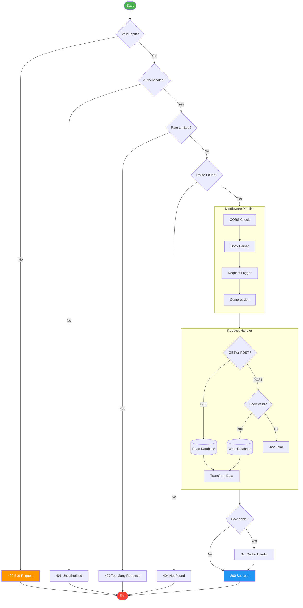

### 4B: Complex Sequence Diagram (6+ participants)

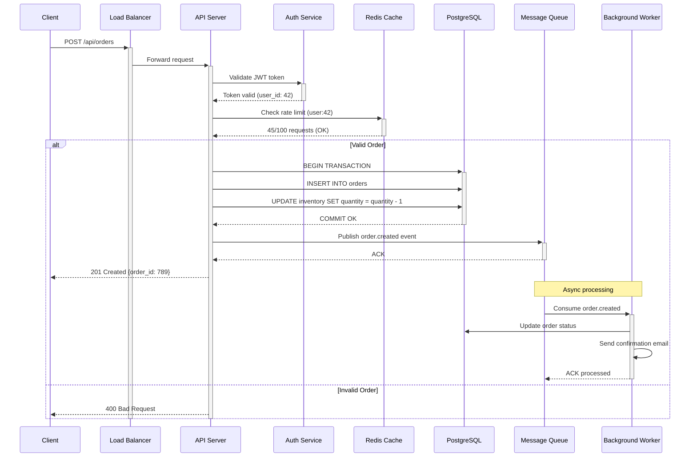

### 4C: Class Diagram (5+ classes)

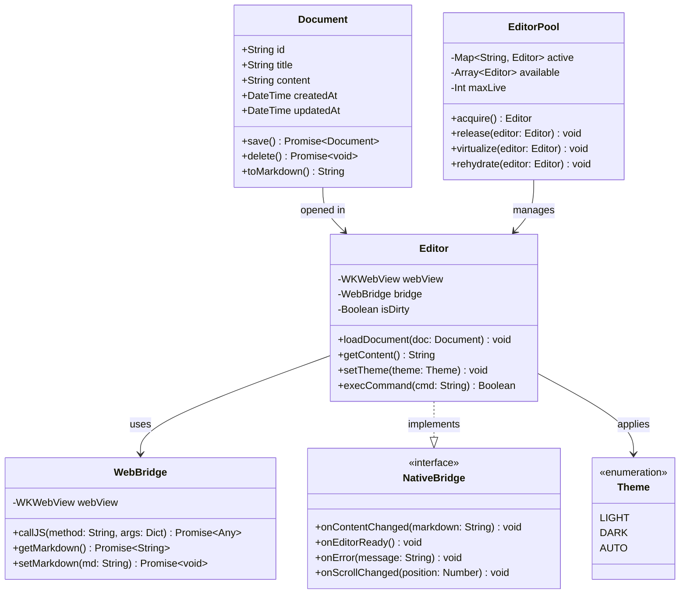

### 4D: State Diagram (10+ states)

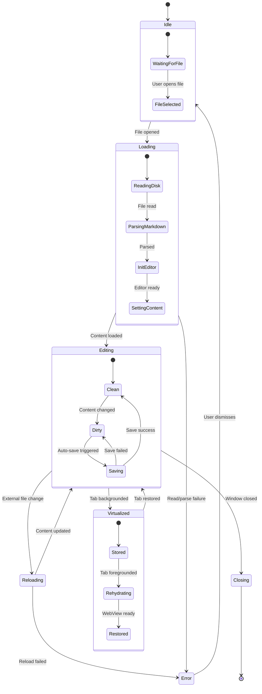

### 4E: Entity Relationship Diagram

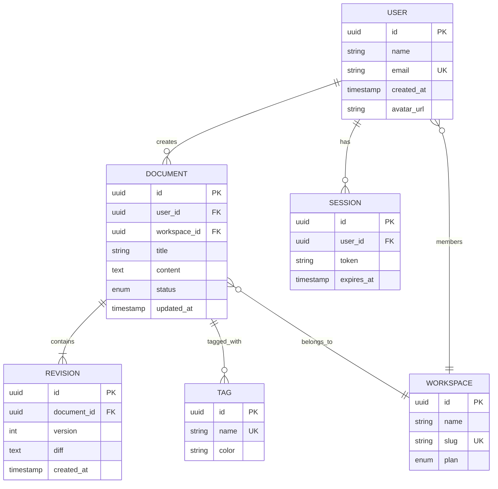

### 4F: Gantt Chart

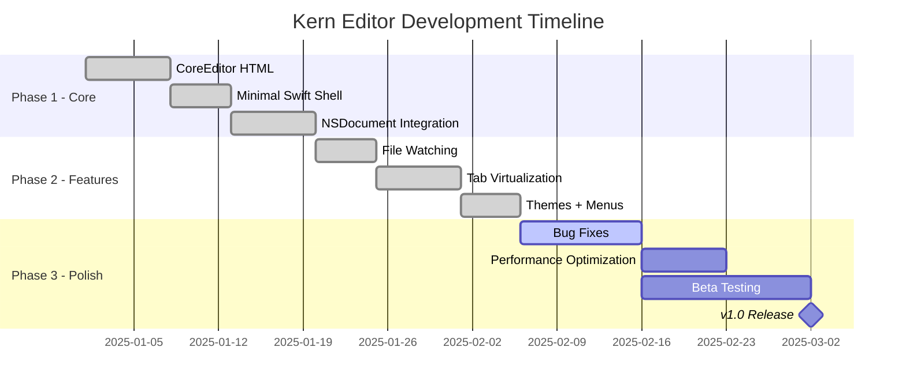

### 4G: Pie Chart

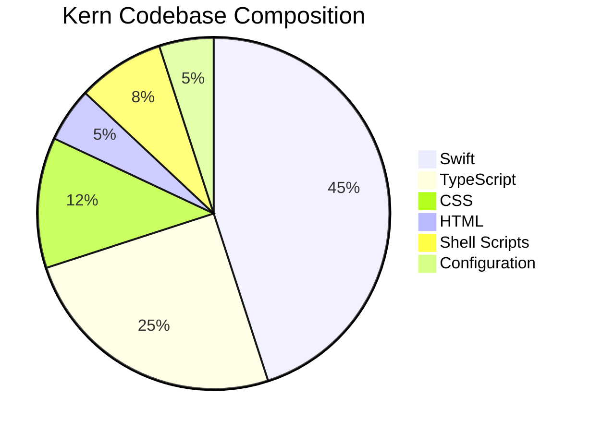

### 4H: Git Graph

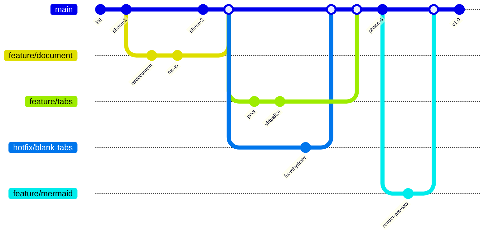

### 4I: Mindmap

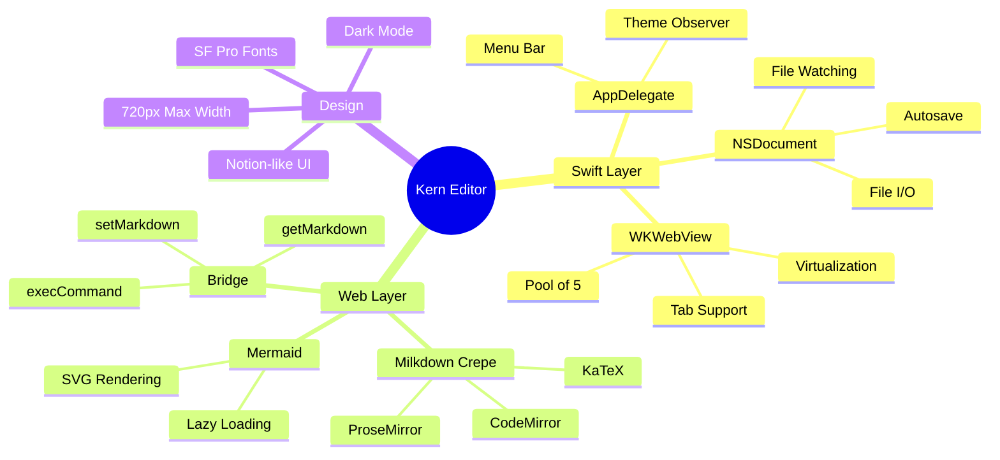

### 4J: Timeline

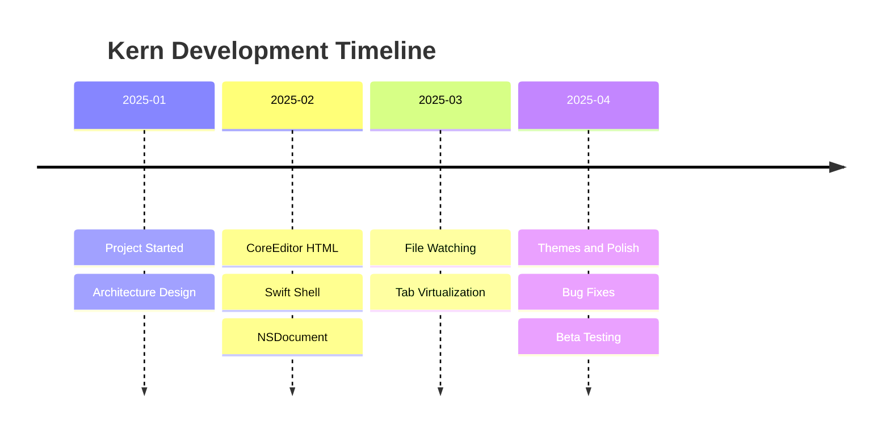

### 4K: Journey Diagram

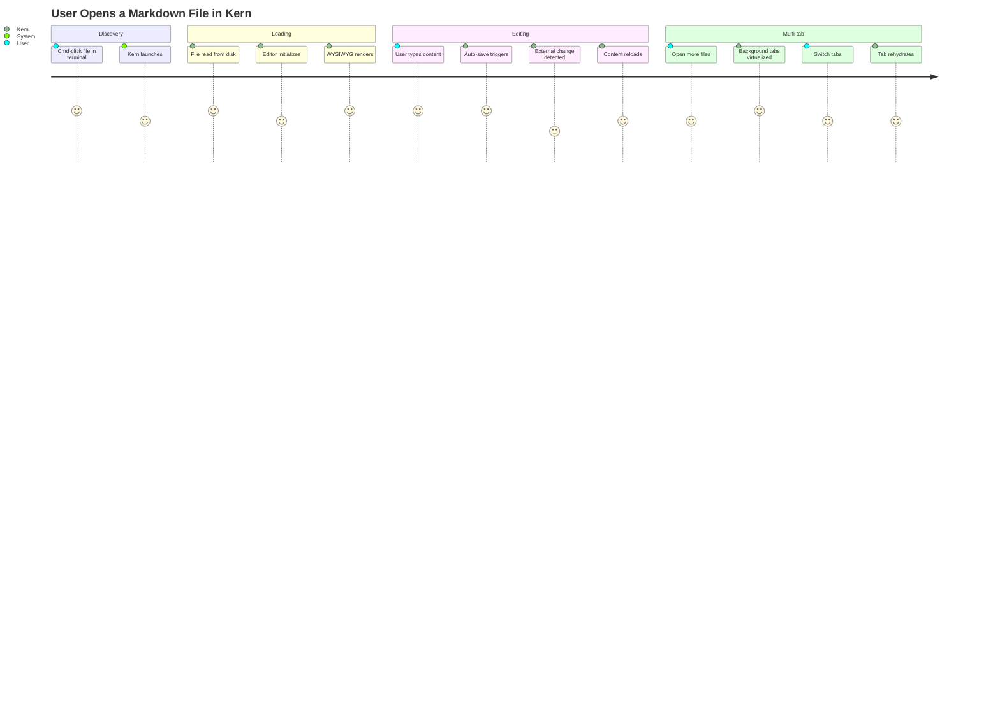

### 4L: Sankey Diagram (experimental)

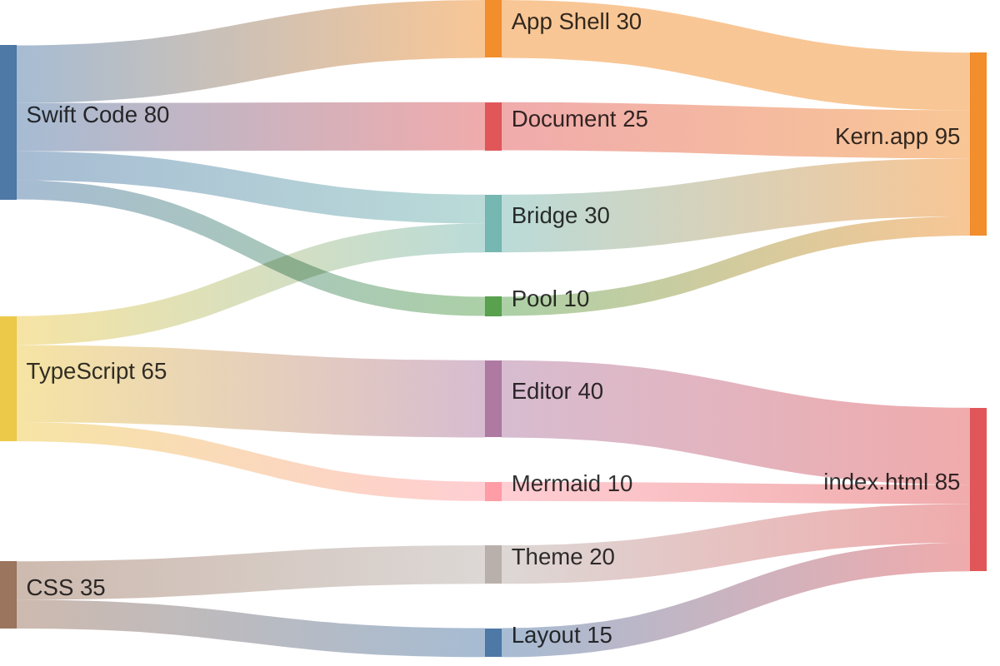

***

## Section 5: Math / LaTeX

### Inline Math

Simple: $E = mc^2$, $a^2 + b^2 = c^2$, $x = frac{-b pm sqrt{b^2 - 4ac}}{2a}$

Medium: $sum_{i=1}^{n} i = frac{n(n+1)}{2}$, $prod_{k=1}^{n} k = n!$, $int_0^1 x^2 dx = frac{1}{3}$

Complex: $oint_C mathbf{F} cdot dmathbf{r} = iint_S (nabla times mathbf{F}) cdot dmathbf{S}$

Greek: $alpha, beta, gamma, delta, epsilon, zeta, eta, theta, iota, kappa, lambda, mu, nu, xi, pi, rho, sigma, tau, upsilon, phi, chi, psi, omega$

### Block Math — Matrices

$$
A = begin{pmatrix} a_{11} & a_{12} & a_{13} \\ a_{21} & a_{22} & a_{23} \\ a_{31} & a_{32} & a_{33} end{pmatrix}
$$

### Block Math — Integral

$$
int_{-infty}^{infty} e^{-x^2} dx = sqrt{pi}
$$

### Block Math — Summation

$$
sum_{n=0}^{infty} frac{x^n}{n!} = e^x
$$

### Block Math — Piecewise Function

$$
f(x) = begin{cases} x^2 & text{if } x geq 0 \\ -x^2 & text{if } x < 0 \\ text{undefined} & text{if } x = infty end{cases}
$$

### Block Math — Aligned Equations

$$
begin{aligned}
nabla cdot mathbf{E} &= frac{rho}{epsilon_0} \
nabla cdot mathbf{B} &= 0 \
nabla times mathbf{E} &= -frac{partial mathbf{B}}{partial t} \
nabla times mathbf{B} &= mu_0 mathbf{J} + mu_0 epsilon_0 frac{partial mathbf{E}}{partial t}
end{aligned}
$$

### Block Math — Nested Fractions

$$
cfrac{1}{1 + cfrac{1}{1 + cfrac{1}{1 + cfrac{1}{1 + cfrac{1}{x}}}}}
$$

### Block Math — Very Long Equation

$$
frac{d}{dx}left[int_{a(x)}^{b(x)} f(x, t) , dtright] = f(x, b(x)) cdot b'(x) - f(x, a(x)) cdot a'(x) + int_{a(x)}^{b(x)} frac{partial}{partial x} f(x, t) , dt
$$

***

## Section 6: Tables

### Standard Table (5 columns, 10 rows)

| ID | Name | Language | Stars | License |
| --- | --- | --- | --- | --- |
| 1 | Project-A | Swift | 1234 | MIT |
| 2 | Project-B | TypeScript | 2468 | Apache-2.0 |
| 3 | Project-C | Python | 3702 | GPL-3.0 |
| 4 | Project-D | Rust | 4936 | BSD-3 |
| 5 | Project-E | Go | 6170 | ISC |
| 6 | Project-F | C | 7404 | MPL-2.0 |
| 7 | Project-G | Java | 8638 | MIT |
| 8 | Project-H | Kotlin | 9872 | Apache-2.0 |
| 9 | Project-I | Ruby | 11106 | MIT |
| 10 | Project-J | Elixir | 12340 | Apache-2.0 |

### Wide Table (12 columns — horizontal scroll test)

| Col1 | Col2 | Col3 | Col4 | Col5 | Col6 | Col7 | Col8 | Col9 | Col10 | Col11 | Col12 |
| --- | --- | --- | --- | --- | --- | --- | --- | --- | --- | --- | --- |
| Data-1-1 | Data-1-2 | Data-1-3 | Data-1-4 | Data-1-5 | Data-1-6 | Data-1-7 | Data-1-8 | Data-1-9 | Data-1-10 | Data-1-11 | Data-1-12 |
| Data-2-1 | Data-2-2 | Data-2-3 | Data-2-4 | Data-2-5 | Data-2-6 | Data-2-7 | Data-2-8 | Data-2-9 | Data-2-10 | Data-2-11 | Data-2-12 |
| Data-3-1 | Data-3-2 | Data-3-3 | Data-3-4 | Data-3-5 | Data-3-6 | Data-3-7 | Data-3-8 | Data-3-9 | Data-3-10 | Data-3-11 | Data-3-12 |
| Data-4-1 | Data-4-2 | Data-4-3 | Data-4-4 | Data-4-5 | Data-4-6 | Data-4-7 | Data-4-8 | Data-4-9 | Data-4-10 | Data-4-11 | Data-4-12 |
| Data-5-1 | Data-5-2 | Data-5-3 | Data-5-4 | Data-5-5 | Data-5-6 | Data-5-7 | Data-5-8 | Data-5-9 | Data-5-10 | Data-5-11 | Data-5-12 |

### Table with Rich Content

| Feature | Status | Notes |
| --- | --- | --- |
| **Bold** editing | `done` | *Italic note* |
| [Link](https://example.com) | ~~removed~~ | `code in cell` |
| $E=mc^2$ | **active** | See [docs](https://example.com) |

### Table with Alignment

| Left | Center | Right |
| :--- | :---: | ---: |
| Left aligned text | Centered text | Right aligned text |
| More left | More center | More right |
| Short | Mid | Long content here |

### Minimal Table

| A | B |
| --- | --- |
| 1 | 2 |

***

## Section 7: CJK and International Text

### Korean (한국어)

Kern 에디터는 한국어 텍스트를 완벽하게 지원합니다. 마크다운 문서를 WYSIWYG 모드로 편집할 수 있으며, 한글 입력기(IME)와 호환됩니다.

프로그래밍에서 가장 중요한 것은 코드의 가독성입니다. 좋은 코드는 다른 개발자가 읽었을 때 쉽게 이해할 수 있어야 하며, 유지보수가 용이해야 합니다. 변수명과 함수명은 그 역할을 명확하게 드러내야 하고, 주석은 '왜'를 설명해야 합니다.

Kern은 macOS 네이티브 앱으로, Swift와 AppKit을 사용하여 개발되었습니다. 웹 에디터 엔진인 Milkdown Crepe를 WKWebView에 로드하여 고품질 마크다운 편집 환경을 제공합니다.

### Japanese (日本語)

日本語のテキストレンダリングテストです。漢字（かんじ）、ひらがな、カタカナの混合テキストが正しく表示されることを確認します。

プログラミングにおいて、コードの品質は非常に重要です。きれいなコードを書くことで、チームの生産性が向上し、バグの発生を抑えることができます。

### Simplified Chinese (简体中文)

这是简体中文文本渲染测试。Kern编辑器应该能够正确显示所有中文字符，包括常用汉字和标点符号。

软件开发是一个持续学习的过程。从需求分析到系统设计，从编码实现到测试部署，每个环节都需要严谨的态度和专业的技能。

### Traditional Chinese (繁體中文)

繁體中文文本測試。確認所有繁體字符能夠正確顯示，包括臺灣和香港地區常用的字體。

### Arabic (العربية) — RTL

هذا نص اختبار باللغة العربية. يجب أن يتم عرض النص من اليمين إلى اليسار بشكل صحيح. البرمجة هي فن وعلم في آن واحد.

### Hebrew (עברית) — RTL

זהו טקסט בדיקה בעברית. הטקסט צריך להיות מוצג מימין לשמאל. תכנות הוא אומנות ומדע כאחד.

### Thai (ภาษาไทย)

ทดสอบการแสดงผลภาษาไทย ตัวอักษรไทยควรแสดงผลได้อย่างถูกต้อง รวมถึงสระ วรรณยุกต์ และตัวเลขไทย ๑๒๓๔๕

### Hindi (हिन्दी)

यह हिंदी पाठ प्रदर्शन परीक्षण है। देवनागरी लिपि में लिखा गया पाठ सही ढंग से प्रदर्शित होना चाहिए।

### Emoji Paragraph

🎉 Welcome to the emoji test! 👋 Here are some common emoji: 🚀 rocket, 💻 laptop, 📝 memo, ✅ check, ❌ cross, ⚠️ warning, 🔥 fire, 💯 100, 🎯 target, 🌈 rainbow, 🦀 crab (Rust!), 🐍 snake (Python!), ☕ coffee (Java!), 💎 gem (Ruby!), 🍎 apple (Swift!)

### Mixed Scripts

## This paragraph mixes English with 한국어 Korean, 日本語 Japanese, 中文 Chinese, العربية Arabic, and emoji 🌏. All should render correctly in the same line without layout breaking.

## Section 8: Deep Nesting

### Bullet list nested 6+ levels

- Level 0

  - Level 1

    - Level 2

      - Level 3

        - Level 4

          - Level 5

            - Level 6 (very deep)

            - Another at level 6

          - Back to level 5

        - Back to level 4

      - Back to level 3

    - Back to level 2

  - Back to level 1

- Back to level 0

### Ordered list nested 5+ levels

1. First at level 0

   1. Level 1 item a

      1. Level 2 item i

         1. Level 3 item A

            1. Level 4 item I
            2. Level 4 item II
         1. Level 3 item B
      1. Level 2 item ii
   1. Level 1 item b
1. Second at level 0

   1. Level 1 under second

      1. Level 2 under second

### Blockquote nested 4+ levels

> Level 1 blockquote
>
> > Level 2 blockquote
> >
> > > Level 3 blockquote
> > >
> > > > Level 4 blockquote — this is very deeply nested
> > > > and continues on the next line
> > > > Back to level 3
> > > > Back to level 2
> > > > Back to level 1

### Mixed nesting: ordered > bullet > checklist > blockquote

1. Ordered item 1

   - Bullet under ordered

     - [x] Checked task under bullet > Blockquote under checklist > with multiple lines

     - [ ] Unchecked task > Another blockquote

   - Another bullet

     - [x] Done

     - [ ] Pending
2. Ordered item 2

   - Bullet

     - [x] Task

### Alternating ordered and unordered

1. Ordered

   - Unordered

     1. Ordered again

        - Unordered again

          1. Ordered once more

             - Unordered once more

***

## Section 9: Links and Images

### Regular links

- [Milkdown Documentation](https://milkdown.dev)

- [GitHub](https://github.com)

- [Apple Developer](https://developer.apple.com)

- [MDN Web Docs](https://developer.mozilla.org)

- [TypeScript Handbook](https://www.typescriptlang.org/docs/handbook/)

### Link with title

[Hover me for title](https://example.com "This is a link title")

### Autolinks

Visit <https://example.com> for more information.

### HTTPS Images (various sizes)

Small image (200x50):


Medium image (400x100):


Large image (800x200):


Square image (300x300):


### Broken image (404 — error handling test)


### Image inside a link

[](https://example.com)

***

## Section 10: Edge Cases

### Very long single line (500+ characters)

AAAAAAAAAAAAAAAAAAAAAAAAAAAAAAAAAAAAAAAAAAAAAAAAAAAAAAAAAAAAAAAAAAAAAAAAAAAAAAAAAAAAAAAAAAAAAAAAAAAAAAAAAAAAAAAAAAAAAAAAAAAAAAAAAAAAAAAAAAAAAAAAAAAAAAAAAAAAAAAAAAAAAAAAAAAAAAAAAAAAAAAAAAAAAAAAAAAAAAAAAAAAAAAAAAAAAAAAAAAAAAAAAAAAAAAAAAAAAAAAAAAAAAAAAAAAAAAAAAAAAAAAAAAAAAAAAAAAAAAAAAAAAAAAAAAAAAAAAAAAAAAAAAAAAAAAAAAAAAAAAAAAAAAAAAAAAAAAAAAAAAAAAAAAAAAAAAAAAAAAAAAAAAAAAAAAAAAAAAAAAAAAAAAAAAAAAAAAAAAAAAAAAAAAAAAAAAAAAAAAAAAAAAAAAAAAAAAAAAAAAAAAAAAAAAAAAAAAAAAAAAAAAAAAAAAAAAAAAAAAAAAAAAAAAAAAAAAAAAAAAAAAAAAAAAAAAAAAAAAAAAAAAAAAAAAAAAAAAAAAAAAAAAAAAAAAAAAAAAAAAAAAAAAAAAAAAAAAAAAAAAAAAAAAAAAAAAAAAAAA

### Empty code block


### Code block with only whitespace

```
   
  
 
```

### Special characters

Angle brackets: < > < >

Ampersand: & &

Quotes: " ' \` \`\`

Symbols: ~!@#$%^&\*()_+-=[]{}|;:,.<>?/

Backslash:  \\

### Nested blockquote with code block inside

> Here is a blockquote containing code:
>
> ```python
> def hello():
>     print("Hello from inside a blockquote!")
> ```
>
> And some text after the code block.

### Horizontal rules in various formats

Above rule 1 (three hyphens):

***

Above rule 2 (three asterisks):

***

Above rule 3 (three underscores):

***

### Consecutive headings

# Heading 1

## Heading 2

### Heading 3

#### Heading 4

##### Heading 5

###### Heading 6

### Very Long Heading That Goes On And On And Should Still Render Properly Without Breaking The Layout Or Causing Horizontal Scrollbars In The Editor

Content after the long heading.

### HTML entities

© ® ™ — – … « » •  

### Escaped markdown characters

\*not italic\* \*\*not bold\*\* \`not code\` [not a link] # not a heading

***

## Section 10B: Heading Checkboxes (Kern Extension)

Each pair below shows a plain heading then a checkbox heading at the same level. The checkbox heading should be the same font size as the plain one — just with a checkbox icon prepended. Checked headings also get strikethrough + dimmed opacity.

Crepe heading sizes: H1 = 32px bold, H2 = 24px, H3 = 20px, H4 = 28px, H5 = 24px, H6 = 18px.

## Plain H2 (24px, semibold)

## [x] Checked H2 (24px, semibold — strikethrough, dimmed)

## [ ] Unchecked H2 (24px, semibold — empty checkbox icon)

### Plain H3 (20px, semibold)

### [x] Checked H3 (20px — strikethrough, dimmed)

### [ ] Unchecked H3 (20px — empty checkbox icon)

#### Plain H4 (28px, semibold)

#### [x] Checked H4 (28px — strikethrough, dimmed)

#### [ ] Unchecked H4 (28px — empty checkbox icon)

##### Plain H5 (24px, semibold — same size as H2)

##### [x] Checked H5 (24px — strikethrough, dimmed)

##### [ ] Unchecked H5 (24px — empty checkbox icon)

###### Plain H6 (18px, semibold — smallest)

###### [x] Checked H6 (18px — strikethrough, dimmed)

###### [ ] Unchecked H6 (18px — empty checkbox icon)

### [x] Heading With **Bold** and *Italic* Content

Mixed inline formatting inside a heading checkbox.

### [ ] Heading With `inline code` Inside

Code formatting inside a heading checkbox.

***

## Section 11: Volume Test (Filler Content)

The following content is generated to push the document past 5000 lines,
testing the editor's performance with large documents.

### Volume Section 1

Lorem ipsum dolor sit amet, consectetur adipiscing elit. Sed do eiusmod tempor incididunt ut labore et dolore magna aliqua. *Ut* enim ad minim veniam, quis nostrud exercitation ullamco laboris nisi ut aliquip ex ea commodo consequat.

Praesent dapibus, neque id cursus faucibus, **tortor** neque egestas augue, eu vulputate magna eros eu erat. Aliquam erat volutpat. Nam dui mi, tincidunt quis, accumsan porttitor, facilisis luctus, metus.

### Volume Section 2

Performance is a feature, not an afterthought. Every millisecond of startup time, every megabyte of **memory,** and every frame of animation contributes to the overall user experience.

Lorem ipsum dolor sit amet, consectetur adipiscing *elit.* Sed do eiusmod tempor incididunt ut labore et dolore magna aliqua. Ut enim ad minim veniam, quis nostrud exercitation ullamco laboris nisi ut aliquip ex ea commodo consequat.

### Volume Section 3

A markdown editor should respect the format's simplicity while providing visual feedback that helps writers focus on content rather than syntax. **WYSIWYG** rendering bridges the gap between raw text and final output.

A markdown editor should respect the format's simplicity ~~while~~ providing visual feedback that helps writers focus on content rather than syntax. WYSIWYG rendering bridges the gap between raw text and final output.

### Volume Section 4

Praesent dapibus, neque id cursus faucibus, tortor neque egestas augue, eu vulputate magna eros eu erat. ~~Aliquam~~ erat volutpat. Nam dui mi, tincidunt quis, accumsan porttitor, facilisis luctus, metus.

Phasellus ultrices *nulla* quis nibh. Quisque a lectus. Donec consectetuer ligula vulputate sem tristique cursus. Nam nulla quam, gravida non, commodo a, sodales sit amet, nisi.

Software engineering requires careful planning, systematic testing, and continuous improvement. Every line `of` code should serve a purpose, and every abstraction should earn its place in the architecture.

### Volume Section 5

Praesent dapibus, neque id cursus faucibus, tortor neque egestas augue, eu vulputate magna eros eu erat. Aliquam erat volutpat. Nam dui mi, tincidunt quis, accumsan porttitor, `facilisis` luctus, metus.

Duis aute irure dolor in reprehenderit in voluptate velit esse cillum dolore eu fugiat nulla pariatur. Excepteur sint occaecat cupidatat non proident, sunt in culpa qui officia deserunt mollit anim id est laborum.

```python
x = sum(i**2 for i in range(100))
print(f'Result: {x}')
```

### Volume Section 6

Pellentesque fermentum dolor. Aliquam quam lectus, facilisis auctor, ultrices ut, elementum vulputate, nunc. Sed adipiscing ornare risus. Morbi est est, blandit `sit` amet, sagittis vel, euismod vel, velit.

Lorem ipsum dolor sit amet, consectetur adipiscing elit. Sed do eiusmod tempor incididunt ut labore et dolore magna aliqua. Ut enim ad minim veniam, quis nostrud exercitation ullamco laboris nisi ut ~~aliquip~~ ex ea commodo consequat.

Duis aute irure dolor in reprehenderit in voluptate velit esse cillum dolore eu fugiat **nulla** pariatur. Excepteur sint occaecat cupidatat non proident, sunt in culpa qui officia deserunt mollit anim id est laborum.

### Volume Section 7

Performance is a feature, not an afterthought. Every millisecond of startup time, every ~~megabyte~~ of memory, and every frame of animation contributes to the overall user experience.

Praesent dapibus, neque id cursus faucibus, tortor neque egestas augue, eu vulputate magna eros eu erat. Aliquam erat volutpat. Nam dui mi, tincidunt quis, **accumsan** porttitor, facilisis luctus, metus.

Lorem ipsum dolor sit amet, consectetur adipiscing elit. Sed do eiusmod tempor incididunt ut labore et `dolore` magna aliqua. Ut enim ad minim veniam, quis nostrud exercitation ullamco laboris nisi ut aliquip ex ea commodo consequat.

| Key | Value |
| --- | --- |
| item-0 | value-0 |
| item-1 | value-1 |
| item-2 | value-2 |

### Volume Section 8

Praesent dapibus, neque id cursus faucibus, tortor neque egestas augue, eu vulputate magna eros eu erat. Aliquam erat volutpat. Nam dui mi, tincidunt quis, accumsan porttitor, facilisis luctus, metus.

Phasellus ultrices nulla quis nibh. Quisque a lectus. Donec consectetuer ligula vulputate sem tristique cursus. Nam `nulla` quam, gravida non, commodo a, sodales sit amet, nisi.

- Item 1 in volume section 8

- Item 2 in volume section 8

- Item 3 in volume section 8

- Item 4 in volume section 8

### Volume Section 9

Pellentesque fermentum dolor. Aliquam quam lectus, facilisis auctor, ultrices ut, elementum vulputate, nunc. *Sed* adipiscing ornare risus. Morbi est est, blandit sit amet, sagittis vel, euismod vel, velit.

Phasellus ultrices nulla quis nibh. Quisque a lectus. Donec consectetuer ligula vulputate sem tristique cursus. Nam nulla quam, gravida non, commodo a, sodales **sit** amet, nisi.

### Volume Section 10

A markdown editor should respect the format's simplicity while providing visual feedback that helps writers focus on content rather than syntax. WYSIWYG rendering bridges the *gap* between raw text and final output.

Curabitur pretium tincidunt lacus. Nulla gravida orci a odio. Nullam varius, turpis et commodo pharetra, est eros bibendum elit, nec luctus magna felis sollicitudin mauris. Integer in mauris eu nibh euismod gravida.

```swift
let greeting = "Hello, World!"
print(greeting)
```

- [x] Completed task

- [x] Pending task

- [x] Another done

### Volume Section 11

Pellentesque fermentum dolor. *Aliquam* quam lectus, facilisis auctor, ultrices ut, elementum vulputate, nunc. Sed adipiscing ornare risus. Morbi est est, blandit sit amet, sagittis vel, euismod vel, velit.

Lorem ipsum dolor sit amet, consectetur adipiscing elit. Sed do eiusmod tempor incididunt ut labore et dolore magna aliqua. Ut enim ad minim veniam, quis nostrud exercitation ullamco laboris nisi ut aliquip ex ea commodo consequat.

### Volume Section 12

Duis aute irure dolor in reprehenderit in voluptate ~~velit~~ esse cillum dolore eu fugiat nulla pariatur. Excepteur sint occaecat cupidatat non proident, sunt in culpa qui officia deserunt mollit anim id est laborum.

Pellentesque fermentum dolor. Aliquam quam lectus, facilisis auctor, ultrices ut, elementum vulputate, nunc. Sed adipiscing ornare risus. Morbi est est, blandit sit amet, sagittis vel, euismod vel, velit.

Software engineering requires careful planning, systematic testing, and continuous improvement. Every line of code should serve a purpose, and every abstraction should earn its place in the architecture.

> This is a blockquote in volume section.
> It contains multiple lines of content.

### Volume Section 13

Phasellus ultrices nulla quis nibh. Quisque *a* lectus. Donec consectetuer ligula vulputate sem tristique cursus. Nam nulla quam, gravida non, commodo a, sodales sit amet, nisi.

A markdown editor should respect the format's simplicity while providing visual feedback that helps writers focus on content rather `than` syntax. WYSIWYG rendering bridges the gap between raw text and final output.

### Volume Section 14

Performance is a feature, not an afterthought. Every millisecond of startup time, every megabyte `of` memory, and every frame of animation contributes to the overall user experience.

Praesent dapibus, neque id cursus faucibus, ~~tortor~~ neque egestas augue, eu vulputate magna eros eu erat. Aliquam erat volutpat. Nam dui mi, tincidunt quis, accumsan porttitor, facilisis luctus, metus.

The best editors are **the** ones that get out of your way. They should load instantly, render faithfully, and save automatically. No setup wizards, no configuration files, no learning curves.

| Key | Value |
| --- | --- |
| item-0 | value-0 |
| item-1 | value-1 |
| item-2 | value-2 |

### Volume Section 15

Curabitur pretium tincidunt lacus. Nulla gravida orci a odio. Nullam varius, turpis et commodo pharetra, est eros bibendum elit, nec luctus magna *felis* sollicitudin mauris. Integer in mauris eu nibh euismod gravida.

Software engineering requires careful planning, systematic testing, and continuous improvement. Every line of code should serve a purpose, and every abstraction **should** earn its place in the architecture.

```rust
let v: Vec<i32> = (0..10).collect();
println!("{:?}", v);
```

Inline math: $x_15 = sqrt{15}$

$$
sum_{i=1}^{15} i^2 = frac{15(15+1)(2 cdot 15+1)}{6}
$$

### Volume Section 16

Performance is a feature, not an afterthought. Every millisecond of startup time, every megabyte of memory, ~~and~~ every frame of animation contributes to the overall user experience.

Phasellus ultrices nulla quis nibh. Quisque a lectus. Donec consectetuer ligula vulputate sem tristique cursus. Nam nulla quam, gravida **non,** commodo a, sodales sit amet, nisi.

Duis aute irure dolor in reprehenderit in voluptate velit esse cillum dolore eu fugiat nulla pariatur. Excepteur sint occaecat cupidatat non proident, sunt ~~in~~ culpa qui officia deserunt mollit anim id est laborum.

- Item 1 in volume section 16

- Item 2 in volume section 16

- Item 3 in volume section 16

- Item 4 in volume section 16

### Volume Section 17

Pellentesque fermentum dolor. Aliquam quam `lectus,` facilisis auctor, ultrices ut, elementum vulputate, nunc. Sed adipiscing ornare risus. Morbi est est, blandit sit amet, sagittis vel, euismod vel, velit.

Software engineering requires careful planning, systematic testing, and continuous improvement. Every line of code should serve a purpose, and every abstraction should earn its place in the architecture.

Lorem ipsum dolor sit amet, consectetur adipiscing elit. Sed do eiusmod tempor incididunt ut labore et dolore magna ~~aliqua.~~ Ut enim ad minim veniam, quis nostrud exercitation ullamco laboris nisi ut aliquip ex ea commodo consequat.

### Volume Section 18

A markdown editor should respect `the` format's simplicity while providing visual feedback that helps writers focus on content rather than syntax. WYSIWYG rendering bridges the gap between raw text and final output.

A markdown editor should respect the format's simplicity while providing visual feedback that helps writers focus on content rather than syntax. *WYSIWYG* rendering bridges the gap between raw text and final output.

### Volume Section 19

Pellentesque fermentum dolor. Aliquam quam lectus, facilisis ~~auctor,~~ ultrices ut, elementum vulputate, nunc. Sed adipiscing ornare risus. Morbi est est, blandit sit amet, sagittis vel, euismod vel, velit.

A markdown ~~editor~~ should respect the format's simplicity while providing visual feedback that helps writers focus on content rather than syntax. WYSIWYG rendering bridges the gap between raw text and final output.

### Volume Section 20

The best **editors** are the ones that get out of your way. They should load instantly, render faithfully, and save automatically. No setup wizards, no configuration files, no learning curves.

Pellentesque fermentum dolor. Aliquam quam lectus, facilisis auctor, ultrices ut, elementum *vulputate,* nunc. Sed adipiscing ornare risus. Morbi est est, blandit sit amet, sagittis vel, euismod vel, velit.

Lorem ipsum dolor sit amet, consectetur adipiscing elit. Sed do eiusmod tempor incididunt ut labore et dolore ~~magna~~ aliqua. Ut enim ad minim veniam, quis nostrud exercitation ullamco laboris nisi ut aliquip ex ea commodo consequat.

```python
x = sum(i**2 for i in range(100))
print(f'Result: {x}')
```

- [x] Completed task

- [ ] Pending task

- [x] Another done

### Volume Section 21

The best editors are ~~the~~ ones that get out of your way. They should load instantly, render faithfully, and save automatically. No setup wizards, no configuration files, no learning curves.

Curabitur pretium tincidunt lacus. Nulla gravida orci a odio. Nullam varius, turpis et commodo pharetra, est eros bibendum elit, nec luctus magna felis sollicitudin mauris. Integer in mauris eu nibh euismod gravida.

| Key | Value |
| --- | --- |
| item-0 | value-0 |
| item-1 | value-1 |
| item-2 | value-2 |

### Volume Section 22

Phasellus ultrices nulla quis nibh. Quisque a lectus. Donec consectetuer ligula vulputate sem tristique cursus. Nam nulla quam, ~~gravida~~ non, commodo a, sodales sit amet, nisi.

Software engineering requires careful planning, systematic testing, and ~~continuous~~ improvement. Every line of code should serve a purpose, and every abstraction should earn its place in the architecture.

### Volume Section 23

Phasellus ultrices nulla quis nibh. Quisque a lectus. Donec consectetuer ligula vulputate sem tristique `cursus.` Nam nulla quam, gravida non, commodo a, sodales sit amet, nisi.

The best editors are the ones that get out of your way. They should load instantly, render faithfully, and save automatically. No setup wizards, no configuration files, no learning curves.

### Volume Section 24

Praesent dapibus, neque id cursus faucibus, tortor neque egestas **augue,** eu vulputate magna eros eu erat. Aliquam erat volutpat. Nam dui mi, tincidunt quis, accumsan porttitor, facilisis luctus, metus.

Pellentesque fermentum ~~dolor.~~ Aliquam quam lectus, facilisis auctor, ultrices ut, elementum vulputate, nunc. Sed adipiscing ornare risus. Morbi est est, blandit sit amet, sagittis vel, euismod vel, velit.

- Item 1 in volume section 24

- Item 2 in volume section 24

- Item 3 in volume section 24

- Item 4 in volume section 24

> This is a blockquote in volume section.
> It contains multiple lines of content.

### Volume Section 25

Performance is a feature, not an afterthought. Every millisecond **of** startup time, every megabyte of memory, and every frame of animation contributes to the overall user experience.

Duis aute irure dolor in reprehenderit in voluptate velit esse cillum dolore eu fugiat nulla pariatur. Excepteur sint occaecat cupidatat non proident, sunt in **culpa** qui officia deserunt mollit anim id est laborum.

```javascript
const arr = [1, 2, 3].map(x => x * 2);
console.log(arr);
```

### Volume Section 26

Lorem ipsum dolor sit amet, consectetur adipiscing elit. Sed do eiusmod tempor incididunt ut labore et dolore magna aliqua. Ut enim ad minim **veniam,** quis nostrud exercitation ullamco laboris nisi ut aliquip ex ea commodo consequat.

A markdown editor should respect the format's simplicity while `providing` visual feedback that helps writers focus on content rather than syntax. WYSIWYG rendering bridges the gap between raw text and final output.

### Volume Section 27

Praesent dapibus, neque id cursus faucibus, tortor neque egestas augue, eu vulputate magna eros eu erat. Aliquam erat volutpat. *Nam* dui mi, tincidunt quis, accumsan porttitor, facilisis luctus, metus.

Performance is a feature, not an afterthought. Every millisecond of startup time, every megabyte of memory, and every frame of animation contributes to the overall user experience.

Praesent dapibus, neque id cursus faucibus, tortor neque egestas augue, eu vulputate magna eros eu erat. Aliquam erat volutpat. Nam dui mi, tincidunt quis, accumsan porttitor, facilisis luctus, metus.

### Volume Section 28

Duis aute irure dolor in reprehenderit in voluptate velit esse cillum dolore eu fugiat nulla pariatur. Excepteur sint occaecat cupidatat non proident, sunt in culpa qui officia deserunt mollit anim id est laborum.

Pellentesque fermentum dolor. Aliquam quam lectus, facilisis auctor, ultrices ut, elementum vulputate, nunc. Sed adipiscing ornare risus. Morbi est est, blandit sit amet, sagittis vel, euismod vel, velit.

| Key | Value |
| --- | --- |
| item-0 | value-0 |
| item-1 | value-1 |
| item-2 | value-2 |

### Volume Section 29

Lorem ipsum dolor sit amet, consectetur adipiscing elit. **Sed** do eiusmod tempor incididunt ut labore et dolore magna aliqua. Ut enim ad minim veniam, quis nostrud exercitation ullamco laboris nisi ut aliquip ex ea commodo consequat.

Software engineering requires careful planning, systematic testing, and continuous improvement. Every line of code should serve a purpose, and every abstraction should earn its place `in` the architecture.

Duis aute irure dolor in reprehenderit in voluptate velit *esse* cillum dolore eu fugiat nulla pariatur. Excepteur sint occaecat cupidatat non proident, sunt in culpa qui officia deserunt mollit anim id est laborum.

### Volume Section 30

A markdown editor should respect the format's simplicity while providing visual feedback that helps writers focus *on* content rather than syntax. WYSIWYG rendering bridges the gap between raw text and final output.

Software engineering requires careful planning, systematic testing, `and` continuous improvement. Every line of code should serve a purpose, and every abstraction should earn its place in the architecture.

```rust
let v: Vec<i32> = (0..10).collect();
println!("{:?}", v);
```

- [x] Completed task

- [ ] Pending task

- [x] Another done

Inline math: $x_30 = sqrt{30}$

$$
sum_{i=1}^{30} i^2 = frac{30(30+1)(2 cdot 30+1)}{6}
$$

### Volume Section 31

Duis aute irure dolor in reprehenderit in voluptate velit esse cillum dolore eu fugiat nulla pariatur. ~~Excepteur~~ sint occaecat cupidatat non proident, sunt in culpa qui officia deserunt mollit anim id est laborum.

Duis aute irure ~~dolor~~ in reprehenderit in voluptate velit esse cillum dolore eu fugiat nulla pariatur. Excepteur sint occaecat cupidatat non proident, sunt in culpa qui officia deserunt mollit anim id est laborum.

### Volume Section 32

Duis aute irure dolor in reprehenderit in voluptate velit esse cillum dolore eu fugiat nulla pariatur. Excepteur sint occaecat cupidatat non proident, sunt in culpa qui *officia* deserunt mollit anim id est laborum.

Curabitur pretium tincidunt lacus. Nulla gravida orci a odio. Nullam varius, turpis et commodo pharetra, est eros bibendum elit, nec luctus magna felis sollicitudin mauris. Integer in mauris eu nibh euismod gravida.

- Item 1 in volume section 32

- Item 2 in volume section 32

- Item 3 in volume section 32

- Item 4 in volume section 32

### Volume Section 33

Praesent dapibus, neque id cursus faucibus, tortor neque egestas augue, eu vulputate magna eros **eu** erat. Aliquam erat volutpat. Nam dui mi, tincidunt quis, accumsan porttitor, facilisis luctus, metus.

Curabitur pretium tincidunt lacus. Nulla gravida orci a odio. Nullam varius, turpis et commodo **pharetra,** est eros bibendum elit, nec luctus magna felis sollicitudin mauris. Integer in mauris eu nibh euismod gravida.

Software engineering requires careful planning, systematic testing, and continuous improvement. Every line of code should serve a purpose, and every abstraction should earn its place in the architecture.

### Volume Section 34

Software engineering requires careful planning, systematic testing, and continuous improvement. Every line of code should serve a purpose, and every abstraction should earn its ~~place~~ in the architecture.

The best editors are the ones *that* get out of your way. They should load instantly, render faithfully, and save automatically. No setup wizards, no configuration files, no learning curves.

Phasellus ultrices nulla quis nibh. Quisque a lectus. **Donec** consectetuer ligula vulputate sem tristique cursus. Nam nulla quam, gravida non, commodo a, sodales sit amet, nisi.

### Volume Section 35

Pellentesque fermentum dolor. **Aliquam** quam lectus, facilisis auctor, ultrices ut, elementum vulputate, nunc. Sed adipiscing ornare risus. Morbi est est, blandit sit amet, sagittis vel, euismod vel, velit.

Performance is a feature, not an afterthought. Every millisecond of startup time, every megabyte of memory, and ~~every~~ frame of animation contributes to the overall user experience.

```go
fmt.Println("Hello from Go")
```

| Key | Value |
| --- | --- |
| item-0 | value-0 |
| item-1 | value-1 |
| item-2 | value-2 |

### Volume Section 36

Lorem ipsum dolor sit amet, consectetur adipiscing *elit.* Sed do eiusmod tempor incididunt ut labore et dolore magna aliqua. Ut enim ad minim veniam, quis nostrud exercitation ullamco laboris nisi ut aliquip ex ea commodo consequat.

Duis aute irure dolor in reprehenderit in voluptate velit esse cillum dolore eu fugiat nulla pariatur. Excepteur sint occaecat cupidatat non **proident,** sunt in culpa qui officia deserunt mollit anim id est laborum.

> This is a blockquote in volume section.
> It contains multiple lines of content.

### Volume Section 37

Software engineering requires careful planning, ~~systematic~~ testing, and continuous improvement. Every line of code should serve a purpose, and every abstraction should earn its place in the architecture.

Praesent dapibus, neque id cursus faucibus, tortor neque egestas augue, eu vulputate magna eros eu erat. Aliquam erat volutpat. Nam ~~dui~~ mi, tincidunt quis, accumsan porttitor, facilisis luctus, metus.

### Volume Section 38

Performance is a feature, not an afterthought. Every millisecond of startup time, every megabyte of memory, and every frame of animation contributes to the overall user experience.

Performance is a feature, not an afterthought. Every millisecond of startup time, every megabyte of memory, and every frame of ~~animation~~ contributes to the overall user experience.

### Volume Section 39

Phasellus ultrices nulla quis nibh. Quisque a lectus. `Donec` consectetuer ligula vulputate sem tristique cursus. Nam nulla quam, gravida non, commodo a, sodales sit amet, nisi.

Praesent dapibus, neque id cursus faucibus, tortor neque egestas augue, eu vulputate magna eros eu erat. Aliquam erat volutpat. Nam dui mi, tincidunt quis, accumsan porttitor, facilisis luctus, metus.

Curabitur pretium tincidunt lacus. Nulla gravida orci a odio. Nullam varius, turpis et commodo pharetra, est eros bibendum elit, nec luctus magna felis `sollicitudin` mauris. Integer in mauris eu nibh euismod gravida.

### Volume Section 40

Pellentesque fermentum dolor. Aliquam **quam** lectus, facilisis auctor, ultrices ut, elementum vulputate, nunc. Sed adipiscing ornare risus. Morbi est est, blandit sit amet, sagittis vel, euismod vel, velit.

The best editors are the ones that get out of your way. They should load instantly, render faithfully, and save automatically. ~~No~~ setup wizards, no configuration files, no learning curves.

Duis aute irure dolor ~~in~~ reprehenderit in voluptate velit esse cillum dolore eu fugiat nulla pariatur. Excepteur sint occaecat cupidatat non proident, sunt in culpa qui officia deserunt mollit anim id est laborum.

```javascript
const arr = [1, 2, 3].map(x => x * 2);
console.log(arr);
```

- [x] Completed task

- [ ] Pending task

- [x] Another done

- Item 1 in volume section 40

- Item 2 in volume section 40

- Item 3 in volume section 40

- Item 4 in volume section 40

### Volume Section 41

Curabitur pretium tincidunt lacus. Nulla gravida orci a odio. Nullam varius, turpis et **commodo** pharetra, est eros bibendum elit, nec luctus magna felis sollicitudin mauris. Integer in mauris eu nibh euismod gravida.

Praesent dapibus, neque id cursus faucibus, tortor neque egestas augue, eu vulputate magna `eros` eu erat. Aliquam erat volutpat. Nam dui mi, tincidunt quis, accumsan porttitor, facilisis luctus, metus.

Curabitur pretium tincidunt lacus. Nulla gravida orci a odio. Nullam varius, turpis et commodo pharetra, est ~~eros~~ bibendum elit, nec luctus magna felis sollicitudin mauris. Integer in mauris eu nibh euismod gravida.

### Volume Section 42

Performance is a feature, not an afterthought. Every millisecond of startup time, every megabyte of memory, and every frame of animation contributes ~~to~~ the overall user experience.

Lorem ipsum dolor sit amet, consectetur adipiscing elit. Sed do eiusmod tempor incididunt ut labore et dolore magna aliqua. Ut enim **ad** minim veniam, quis nostrud exercitation ullamco laboris nisi ut aliquip ex ea commodo consequat.

Curabitur pretium tincidunt lacus. Nulla gravida orci a odio. Nullam **varius,** turpis et commodo pharetra, est eros bibendum elit, nec luctus magna felis sollicitudin mauris. Integer in mauris eu nibh euismod gravida.

| Key | Value |
| --- | --- |
| item-0 | value-0 |
| item-1 | value-1 |
| item-2 | value-2 |

### Volume Section 43

A markdown editor should respect the `format's` simplicity while providing visual feedback that helps writers focus on content rather than syntax. WYSIWYG rendering bridges the gap between raw text and final output.

Phasellus ultrices nulla quis nibh. Quisque a lectus. Donec consectetuer ligula vulputate sem tristique cursus. Nam nulla quam, gravida non, commodo *a,* sodales sit amet, nisi.

### Volume Section 44

Praesent dapibus, neque id cursus faucibus, tortor neque egestas augue, eu vulputate magna eros eu erat. Aliquam erat volutpat. Nam dui mi, tincidunt `quis,` accumsan porttitor, facilisis luctus, metus.

A markdown editor should respect the format's simplicity while providing visual feedback that helps writers focus on `content` rather than syntax. WYSIWYG rendering bridges the gap between raw text and final output.

Lorem ipsum dolor sit amet, consectetur adipiscing elit. Sed do eiusmod tempor incididunt ut labore et dolore magna aliqua. Ut enim ad minim veniam, quis nostrud exercitation ullamco laboris nisi ut aliquip ex ea commodo consequat.

### Volume Section 45

Lorem ipsum `dolor` sit amet, consectetur adipiscing elit. Sed do eiusmod tempor incididunt ut labore et dolore magna aliqua. Ut enim ad minim veniam, quis nostrud exercitation ullamco laboris nisi ut aliquip ex ea commodo consequat.

Curabitur pretium tincidunt lacus. Nulla gravida orci a odio. Nullam varius, turpis et commodo pharetra, est eros bibendum elit, nec luctus magna `felis` sollicitudin mauris. Integer in mauris eu nibh euismod gravida.

Curabitur pretium tincidunt lacus. Nulla gravida orci a odio. Nullam varius, turpis et commodo pharetra, est eros bibendum elit, nec luctus magna felis sollicitudin mauris. Integer in mauris eu nibh euismod gravida.

```go
fmt.Println("Hello from Go")
```

Inline math: $x_45 = sqrt{45}$

$$
sum_{i=1}^{45} i^2 = frac{45(45+1)(2 cdot 45+1)}{6}
$$

### Volume Section 46

A markdown **editor** should respect the format's simplicity while providing visual feedback that helps writers focus on content rather than syntax. WYSIWYG rendering bridges the gap between raw text and final output.

Duis aute irure dolor in reprehenderit in voluptate velit esse cillum dolore eu fugiat nulla pariatur. Excepteur sint occaecat cupidatat non proident, sunt in culpa qui officia deserunt mollit anim *id* est laborum.

A markdown editor `should` respect the format's simplicity while providing visual feedback that helps writers focus on content rather than syntax. WYSIWYG rendering bridges the gap between raw text and final output.

### Volume Section 47

Software engineering requires careful planning, systematic **testing,** and continuous improvement. Every line of code should serve a purpose, and every abstraction should earn its place in the architecture.

Phasellus ultrices nulla quis nibh. Quisque a lectus. Donec consectetuer ligula vulputate sem **tristique** cursus. Nam nulla quam, gravida non, commodo a, sodales sit amet, nisi.

### Volume Section 48

Praesent dapibus, neque id cursus faucibus, tortor neque egestas augue, eu vulputate magna eros eu erat. Aliquam erat volutpat. Nam dui mi, tincidunt *quis,* accumsan porttitor, facilisis luctus, metus.

Duis aute irure dolor in reprehenderit in voluptate velit esse cillum dolore eu ~~fugiat~~ nulla pariatur. Excepteur sint occaecat cupidatat non proident, sunt in culpa qui officia deserunt mollit anim id est laborum.

Software engineering requires careful planning, systematic testing, and continuous improvement. Every line of code should serve a purpose, and every abstraction *should* earn its place in the architecture.

- Item 1 in volume section 48

- Item 2 in volume section 48

- Item 3 in volume section 48

- Item 4 in volume section 48

> This is a blockquote in volume section.
> It contains multiple lines of content.

### Volume Section 49

Curabitur pretium tincidunt lacus. Nulla gravida orci a odio. Nullam varius, turpis et commodo pharetra, est eros bibendum elit, nec luctus magna felis sollicitudin mauris. Integer in *mauris* eu nibh euismod gravida.

Software engineering *requires* careful planning, systematic testing, and continuous improvement. Every line of code should serve a purpose, and every abstraction should earn its place in the architecture.

| Key | Value |
| --- | --- |
| item-0 | value-0 |
| item-1 | value-1 |
| item-2 | value-2 |

### Volume Section 50

Software engineering requires careful planning, systematic testing, and continuous improvement. Every line of code should serve a purpose, and every abstraction should earn *its* place in the architecture.

Phasellus ultrices nulla quis nibh. Quisque a **lectus.** Donec consectetuer ligula vulputate sem tristique cursus. Nam nulla quam, gravida non, commodo a, sodales sit amet, nisi.

Software engineering requires careful planning, systematic testing, and continuous improvement. Every line of code should serve a purpose, and every abstraction should earn its place in the architecture.

```javascript
const arr = [1, 2, 3].map(x => x * 2);
console.log(arr);
```

- [x] Completed task

- [ ] Pending task

- [x] Another done

### Volume Section 51

The best editors are the ones that get out of your way. They `should` load instantly, render faithfully, and save automatically. No setup wizards, no configuration files, no learning curves.

Praesent dapibus, neque id cursus faucibus, tortor neque egestas **augue,** eu vulputate magna eros eu erat. Aliquam erat volutpat. Nam dui mi, tincidunt quis, accumsan porttitor, facilisis luctus, metus.

### Volume Section 52

Software engineering requires careful planning, systematic testing, and continuous improvement. Every line `of` code should serve a purpose, and every abstraction should earn its place in the architecture.

Duis aute irure dolor in reprehenderit in voluptate velit esse cillum dolore eu fugiat nulla pariatur. Excepteur sint occaecat cupidatat non proident, sunt in culpa qui `officia` deserunt mollit anim id est laborum.

### Volume Section 53

A markdown editor should respect the format's simplicity while providing visual feedback that helps ~~writers~~ focus on content rather than syntax. WYSIWYG rendering bridges the gap between raw text and final output.

Pellentesque fermentum **dolor.** Aliquam quam lectus, facilisis auctor, ultrices ut, elementum vulputate, nunc. Sed adipiscing ornare risus. Morbi est est, blandit sit amet, sagittis vel, euismod vel, velit.

Phasellus ultrices nulla quis nibh. Quisque a ~~lectus.~~ Donec consectetuer ligula vulputate sem tristique cursus. Nam nulla quam, gravida non, commodo a, sodales sit amet, nisi.

### Volume Section 54

Lorem ipsum dolor sit amet, consectetur adipiscing elit. ~~Sed~~ do eiusmod tempor incididunt ut labore et dolore magna aliqua. Ut enim ad minim veniam, quis nostrud exercitation ullamco laboris nisi ut aliquip ex ea commodo consequat.

Software engineering requires careful planning, systematic testing, and continuous improvement. Every line of `code` should serve a purpose, and every abstraction should earn its place in the architecture.

Software engineering requires careful planning, systematic testing, and continuous improvement. Every line of code should serve a purpose, and every abstraction ~~should~~ earn its place in the architecture.

### Volume Section 55

Software engineering requires careful planning, systematic testing, and continuous improvement. Every line of code should serve a purpose, and every *abstraction* should earn its place in the architecture.

Phasellus ultrices nulla quis nibh. Quisque a lectus. Donec consectetuer ligula vulputate sem tristique cursus. Nam nulla quam, gravida non, commodo a, sodales sit amet, nisi.

```python
x = sum(i**2 for i in range(100))
print(f'Result: {x}')
```

### Volume Section 56

Pellentesque fermentum dolor. Aliquam quam lectus, facilisis auctor, ultrices ut, elementum vulputate, nunc. Sed adipiscing **ornare** risus. Morbi est est, blandit sit amet, sagittis vel, euismod vel, velit.

Pellentesque fermentum dolor. Aliquam quam lectus, facilisis auctor, ultrices ut, elementum vulputate, nunc. Sed adipiscing ornare risus. Morbi est est, blandit `sit` amet, sagittis vel, euismod vel, velit.

| Key | Value |
| --- | --- |
| item-0 | value-0 |
| item-1 | value-1 |
| item-2 | value-2 |

- Item 1 in volume section 56

- Item 2 in volume section 56

- Item 3 in volume section 56

- Item 4 in volume section 56

### Volume Section 57

Phasellus ultrices nulla quis nibh. Quisque a lectus. Donec consectetuer ligula vulputate sem tristique cursus. Nam nulla quam, `gravida` non, commodo a, sodales sit amet, nisi.

Software engineering requires careful planning, systematic testing, and continuous improvement. Every line of code should serve a purpose, and every abstraction should earn its place in the architecture.

### Volume Section 58

A markdown editor should respect the *format's* simplicity while providing visual feedback that helps writers focus on content rather than syntax. WYSIWYG rendering bridges the gap between raw text and final output.

Software engineering requires careful planning, systematic testing, and continuous improvement. Every line of code should serve a purpose, and every abstraction should earn its place in the architecture.

Curabitur pretium tincidunt lacus. Nulla gravida orci a odio. Nullam varius, turpis et commodo pharetra, est eros bibendum elit, nec luctus ~~magna~~ felis sollicitudin mauris. Integer in mauris eu nibh euismod gravida.

### Volume Section 59

Software engineering requires careful planning, systematic testing, and continuous improvement. Every line of code should serve a purpose, and **every** abstraction should earn its place in the architecture.

Phasellus ultrices nulla quis nibh. Quisque a lectus. Donec consectetuer ligula *vulputate* sem tristique cursus. Nam nulla quam, gravida non, commodo a, sodales sit amet, nisi.

Software engineering requires careful planning, systematic testing, and continuous improvement. Every line of code should serve a purpose, and every ~~abstraction~~ should earn its place in the architecture.

### Volume Section 60

The best editors are the ones that get out of your way. They should load instantly, render faithfully, and save automatically. No setup wizards, no configuration files, no learning curves.

Praesent dapibus, neque id cursus faucibus, tortor neque egestas augue, eu vulputate magna eros eu erat. Aliquam erat volutpat. Nam dui mi, tincidunt quis, accumsan porttitor, facilisis luctus, metus.

Curabitur pretium tincidunt lacus. Nulla gravida orci a odio. Nullam varius, turpis et commodo pharetra, est eros bibendum elit, nec luctus magna felis **sollicitudin** mauris. Integer in mauris eu nibh euismod gravida.

```swift
let greeting = "Hello, World!"
print(greeting)
```

- [x] Completed task

- [ ] Pending task

- [x] Another done

> This is a blockquote in volume section.
> It contains multiple lines of content.

Inline math: $x_60 = sqrt{60}$

$$
sum_{i=1}^{60} i^2 = frac{60(60+1)(2 cdot 60+1)}{6}
$$

### Volume Section 61

Duis aute irure dolor in reprehenderit in voluptate velit esse cillum dolore eu fugiat nulla pariatur. Excepteur sint occaecat cupidatat non proident, sunt in culpa qui officia deserunt *mollit* anim id est laborum.

Phasellus ultrices nulla quis nibh. Quisque a lectus. Donec *consectetuer* ligula vulputate sem tristique cursus. Nam nulla quam, gravida non, commodo a, sodales sit amet, nisi.

Curabitur pretium **tincidunt** lacus. Nulla gravida orci a odio. Nullam varius, turpis et commodo pharetra, est eros bibendum elit, nec luctus magna felis sollicitudin mauris. Integer in mauris eu nibh euismod gravida.

### Volume Section 62

The best editors are the ones that get out of your way. They should load instantly, render faithfully, and save automatically. **No** setup wizards, no configuration files, no learning curves.

The best editors are the ones that get out of your way. They should load ~~instantly,~~ render faithfully, and save automatically. No setup wizards, no configuration files, no learning curves.

### Volume Section 63

Software engineering requires careful planning, systematic testing, and continuous improvement. Every line of code should serve a purpose, and every abstraction should earn its place in the architecture.

Praesent dapibus, neque id cursus faucibus, **tortor** neque egestas augue, eu vulputate magna eros eu erat. Aliquam erat volutpat. Nam dui mi, tincidunt quis, accumsan porttitor, facilisis luctus, metus.

| Key | Value |
| --- | --- |
| item-0 | value-0 |
| item-1 | value-1 |
| item-2 | value-2 |

### Volume Section 64

Software engineering requires careful planning, systematic testing, and continuous *improvement.* Every line of code should serve a purpose, and every abstraction should earn its place in the architecture.

A markdown editor should respect the format's simplicity while providing visual feedback that helps writers focus **on** content rather than syntax. WYSIWYG rendering bridges the gap between raw text and final output.

- Item 1 in volume section 64

- Item 2 in volume section 64

- Item 3 in volume section 64

- Item 4 in volume section 64

### Volume Section 65

Duis aute irure dolor in reprehenderit in voluptate velit esse cillum dolore eu fugiat nulla pariatur. *Excepteur* sint occaecat cupidatat non proident, sunt in culpa qui officia deserunt mollit anim id est laborum.

The best editors are the ones that get out of your way. They should load instantly, render faithfully, and save automatically. No setup ~~wizards,~~ no configuration files, no learning curves.

```go
fmt.Println("Hello from Go")
```

### Volume Section 66

The best editors are the ones that get out of your way. They should load instantly, render faithfully, and save automatically. ~~No~~ setup wizards, no configuration files, no learning curves.

Software engineering requires careful planning, systematic testing, and continuous improvement. Every line of code should serve a purpose, and every abstraction should earn its place in the architecture.

Curabitur pretium tincidunt lacus. Nulla gravida orci a odio. Nullam varius, turpis et commodo pharetra, est eros bibendum elit, nec luctus magna felis sollicitudin mauris. Integer in mauris eu nibh euismod gravida.

### Volume Section 67

Phasellus ultrices nulla quis nibh. Quisque a lectus. Donec `consectetuer` ligula vulputate sem tristique cursus. Nam nulla quam, gravida non, commodo a, sodales sit amet, nisi.

A markdown editor should respect the format's simplicity while providing visual feedback that helps writers focus on *content* rather than syntax. WYSIWYG rendering bridges the gap between raw text and final output.

Phasellus ultrices nulla quis nibh. Quisque a lectus. Donec consectetuer ligula vulputate sem tristique cursus. Nam **nulla** quam, gravida non, commodo a, sodales sit amet, nisi.

### Volume Section 68

Praesent dapibus, neque id cursus faucibus, tortor neque egestas augue, `eu` vulputate magna eros eu erat. Aliquam erat volutpat. Nam dui mi, tincidunt quis, accumsan porttitor, facilisis luctus, metus.

Pellentesque fermentum dolor. Aliquam quam lectus, facilisis auctor, ultrices ut, elementum vulputate, nunc. Sed adipiscing ornare risus. Morbi est **est,** blandit sit amet, sagittis vel, euismod vel, velit.

Curabitur pretium tincidunt lacus. Nulla gravida *orci* a odio. Nullam varius, turpis et commodo pharetra, est eros bibendum elit, nec luctus magna felis sollicitudin mauris. Integer in mauris eu nibh euismod gravida.

### Volume Section 69

Curabitur pretium tincidunt lacus. Nulla gravida orci a odio. Nullam varius, turpis et commodo pharetra, est eros bibendum elit, nec luctus magna felis sollicitudin *mauris.* Integer in mauris eu nibh euismod gravida.

Duis aute irure dolor in reprehenderit in voluptate velit esse cillum dolore eu fugiat nulla pariatur. Excepteur sint occaecat cupidatat non proident, sunt in culpa qui officia deserunt mollit anim id est laborum.

Pellentesque fermentum dolor. Aliquam quam lectus, facilisis auctor, ultrices ut, elementum vulputate, nunc. Sed adipiscing ornare risus. Morbi est est, blandit sit amet, sagittis vel, euismod vel, velit.

### Volume Section 70

Lorem ipsum dolor sit amet, consectetur adipiscing elit. Sed do eiusmod tempor incididunt ut labore et dolore magna aliqua. Ut enim ad minim veniam, quis nostrud exercitation ullamco laboris nisi ut aliquip ex ea commodo consequat.

Software engineering requires careful planning, systematic testing, and continuous improvement. Every line of code should serve a purpose, and every **abstraction** should earn its place in the architecture.

Performance is a feature, not an afterthought. Every millisecond of startup time, every megabyte of memory, and every frame of animation contributes to the overall user experience.

```python
x = sum(i**2 for i in range(100))
print(f'Result: {x}')
```

| Key | Value |
| --- | --- |
| item-0 | value-0 |
| item-1 | value-1 |
| item-2 | value-2 |

- [x] Completed task

- [ ] Pending task

- [x] Another done

### Volume Section 71

Phasellus ultrices nulla quis nibh. Quisque a lectus. Donec consectetuer ligula vulputate sem tristique cursus. Nam nulla quam, gravida non, commodo a, sodales sit amet, nisi.

A markdown editor should respect the format's simplicity while providing visual feedback that helps writers focus on content rather than syntax. WYSIWYG rendering bridges the ~~gap~~ between raw text and final output.

Performance is a feature, not an afterthought. Every millisecond of startup time, every megabyte of memory, and every frame of animation contributes to the overall user experience.

### Volume Section 72

Phasellus ultrices nulla quis nibh. Quisque a lectus. Donec consectetuer ligula vulputate sem tristique cursus. Nam nulla quam, gravida non, commodo a, sodales sit amet, nisi.

Lorem ipsum dolor sit amet, consectetur adipiscing elit. Sed do eiusmod tempor incididunt ut labore et dolore magna aliqua. Ut enim ad minim veniam, quis nostrud `exercitation` ullamco laboris nisi ut aliquip ex ea commodo consequat.

- Item 1 in volume section 72

- Item 2 in volume section 72

- Item 3 in volume section 72

- Item 4 in volume section 72

> This is a blockquote in volume section.
> It contains multiple lines of content.

### Volume Section 73

Curabitur pretium tincidunt lacus. Nulla gravida orci a odio. Nullam varius, turpis et commodo pharetra, est eros bibendum elit, nec luctus magna felis sollicitudin mauris. Integer in mauris eu nibh euismod gravida.

Curabitur pretium tincidunt lacus. Nulla gravida orci a odio. Nullam varius, turpis et commodo pharetra, est eros bibendum elit, nec luctus ~~magna~~ felis sollicitudin mauris. Integer in mauris eu nibh euismod gravida.

Lorem ipsum dolor sit amet, consectetur adipiscing elit. Sed do eiusmod tempor incididunt ut labore et dolore magna aliqua. Ut enim ad minim veniam, quis nostrud exercitation ~~ullamco~~ laboris nisi ut aliquip ex ea commodo consequat.

### Volume Section 74

Duis aute irure dolor in reprehenderit in voluptate velit esse cillum dolore eu fugiat nulla pariatur. Excepteur sint occaecat cupidatat non proident, sunt in culpa qui officia deserunt mollit anim id est laborum.

Curabitur pretium tincidunt lacus. Nulla gravida orci a odio. Nullam varius, turpis et commodo pharetra, est eros bibendum elit, nec luctus magna felis sollicitudin mauris. Integer in mauris eu nibh euismod gravida.

### Volume Section 75

Lorem ipsum dolor sit amet, consectetur adipiscing elit. Sed do eiusmod tempor incididunt ut labore et dolore magna aliqua. Ut enim ad minim veniam, quis nostrud exercitation ullamco laboris nisi ut aliquip ex ea commodo consequat.

Pellentesque fermentum dolor. Aliquam quam lectus, facilisis auctor, ultrices ut, elementum vulputate, nunc. Sed adipiscing ornare risus. Morbi est est, blandit sit amet, sagittis vel, euismod vel, velit.

```swift
let greeting = "Hello, World!"
print(greeting)
```

Inline math: $x_75 = sqrt{75}$

$$
sum_{i=1}^{75} i^2 = frac{75(75+1)(2 cdot 75+1)}{6}
$$

### Volume Section 76

Software engineering requires careful planning, systematic testing, and continuous improvement. Every line of code should serve a purpose, and every abstraction should earn its place in the architecture.

Phasellus ultrices nulla quis nibh. Quisque a lectus. Donec consectetuer ligula vulputate sem tristique cursus. Nam nulla quam, gravida non, commodo a, sodales sit amet, nisi.

Lorem ipsum dolor sit amet, `consectetur` adipiscing elit. Sed do eiusmod tempor incididunt ut labore et dolore magna aliqua. Ut enim ad minim veniam, quis nostrud exercitation ullamco laboris nisi ut aliquip ex ea commodo consequat.

### Volume Section 77

Duis aute irure dolor in reprehenderit in voluptate velit esse cillum dolore eu fugiat nulla pariatur. Excepteur sint occaecat cupidatat non proident, sunt in culpa qui **officia** deserunt mollit anim id est laborum.

Lorem ipsum dolor sit amet, consectetur adipiscing elit. Sed do eiusmod tempor incididunt ut labore et dolore *magna* aliqua. Ut enim ad minim veniam, quis nostrud exercitation ullamco laboris nisi ut aliquip ex ea commodo consequat.

| Key | Value |
| --- | --- |
| item-0 | value-0 |
| item-1 | value-1 |
| item-2 | value-2 |

### Volume Section 78

Performance is a feature, not an *afterthought.* Every millisecond of startup time, every megabyte of memory, and every frame of animation contributes to the overall user experience.

Curabitur pretium tincidunt lacus. Nulla gravida orci a odio. Nullam varius, turpis et commodo pharetra, est eros **bibendum** elit, nec luctus magna felis sollicitudin mauris. Integer in mauris eu nibh euismod gravida.

### Volume Section 79

The best editors are the ones that get out of your way. They should load instantly, render faithfully, and save automatically. No setup wizards, `no` configuration files, no learning curves.

Pellentesque fermentum dolor. Aliquam quam lectus, facilisis ~~auctor,~~ ultrices ut, elementum vulputate, nunc. Sed adipiscing ornare risus. Morbi est est, blandit sit amet, sagittis vel, euismod vel, velit.

### Volume Section 80

Curabitur pretium tincidunt lacus. Nulla gravida orci a odio. Nullam varius, **turpis** et commodo pharetra, est eros bibendum elit, nec luctus magna felis sollicitudin mauris. Integer in mauris eu nibh euismod gravida.

Performance is `a` feature, not an afterthought. Every millisecond of startup time, every megabyte of memory, and every frame of animation contributes to the overall user experience.

```go
fmt.Println("Hello from Go")
```

- [x] Completed task

- [ ] Pending task

- [x] Another done

- Item 1 in volume section 80

- Item 2 in volume section 80

- Item 3 in volume section 80

- Item 4 in volume section 80

***

*End of Kern Mega Stress Test — 5000+ lines of comprehensive markdown content*

### Extended Volume Section 81

Database design is one of the most ~~consequential~~ decisions in application architecture. Schema changes are expensive, data migrations are risky, and poor indexing strategies create performance cliffs.

Type systems serve as lightweight formal verification, catching entire categories of bugs at compile time *rather* than runtime. The trade-off between type safety and development velocity depends heavily on project scale and team experience.

Type systems serve as lightweight formal `verification,` catching entire categories of bugs at compile time rather than runtime. The trade-off between type safety and development velocity depends heavily on project scale and team experience.

- [ ] Task 1 in section 81

- [x] Task 2 in section 81

- [x] Task 3 in section 81

- [x] Task 4 in section 81

- [ ] Task 5 in section 81

### Extended Volume Section 82

The best documentation is the one that actually gets maintained. Living documentation that is generated from or validated against the ~~codebase~~ is far more valuable than static documents that drift out of date.

Performance optimization should always be guided by profiling data, never by intuition alone. Premature optimization wastes development time on bottlenecks that don't exist while real problems `go` unaddressed.

Database design is one of the most consequential decisions in application architecture. Schema changes are expensive, data migrations are risky, and poor *indexing* strategies create performance cliffs.

### Extended Volume Section 83

Monitoring and observability are not optional for production systems. Without proper logging, metrics, and tracing, debugging production issues becomes an exercise in *guesswork* and frustration.

Distributed systems introduce failure modes that don't exist in single-process applications. **Network** partitions, clock skew, and message ordering create scenarios that are impossible to test exhaustively.

### Extended Volume Section 84

API design is a user interface problem. The consumers of your API are developers, and their productivity depends on clear naming conventions, **consistent** error handling, and comprehensive documentation.

Monitoring and observability are not optional for production systems. Without proper logging, metrics, and tracing, debugging production issues becomes an exercise in guesswork and frustration.

The architecture of modern software systems often mirrors the organizational structure of the teams that build them. This ~~observation,~~ known as Conway's Law, has profound implications for how we design microservices, APIs, and deployment pipelines.

The architecture of modern software systems often mirrors the organizational structure of the teams that build them. This observation, known as Conway's Law, has profound implications for how *we* design microservices, APIs, and deployment pipelines.

```swift
func greet(_ name: String) -> String { "Hello, \(name)\!" }
```

| Metric | Value | Status |
| --- | --- | --- |
| metric-0 | 83 | WARN |
| metric-1 | 532 | OK |
| metric-2 | 621 | WARN |
| metric-3 | 53 | WARN |

### Extended Volume Section 85

Performance optimization should always be guided by profiling data, never by intuition alone. Premature optimization wastes development time on bottlenecks that don't exist *while* real problems go unaddressed.

The best documentation is the one that actually gets maintained. Living documentation that is generated from or validated against the codebase is far more valuable than static documents that drift out of date.

### Extended Volume Section 86

Type systems serve as lightweight formal verification, catching entire categories of bugs **at** compile time rather than runtime. The trade-off between type safety and development velocity depends heavily on project scale and team experience.

Concurrent programming *introduces* subtle bugs that are difficult to reproduce and even harder to fix. Race conditions, deadlocks, and priority inversions lurk in codepaths that appear correct under normal load but fail catastrophically under stress.

Monitoring and observability are not optional for production systems. Without proper logging, metrics, and tracing, debugging production issues becomes an exercise in guesswork and frustration.

Concurrent programming introduces subtle bugs that are difficult to reproduce and even harder to fix. Race conditions, deadlocks, and priority inversions lurk in codepaths that appear correct under **normal** load but fail catastrophically under stress.

### Extended Volume Section 87

Code reviews serve multiple purposes beyond finding bugs: they spread knowledge across the team, enforce coding standards, and provide opportunities **for** mentoring junior developers.

Database design is one of the most consequential decisions in application *architecture.* Schema changes are expensive, data migrations are risky, and poor indexing strategies create performance cliffs.

### Extended Volume Section 88

Database design is one of the most **consequential** decisions in application architecture. Schema changes are expensive, data migrations are risky, and poor indexing strategies create performance cliffs.

Security is a process, not a feature. Every input must be validated, every secret must be encrypted, and every permission must be explicitly granted. Defense in depth requires layers of protection at every level.

Code reviews serve multiple purposes beyond finding bugs: they spread knowledge across the team, enforce coding standards, and provide opportunities for mentoring junior developers.

Type systems serve as lightweight formal verification, catching entire categories of bugs at compile time rather than runtime. The trade-off between type safety and development velocity depends heavily on project scale and team experience.

```python
def process(items):
    return [x for x in items if x > 0]
```

- Bullet point 1: The best documentation is the one that actually gets maintai

- Bullet point 2: The best documentation is the one that actually gets maintai

- Bullet point 3: Distributed systems introduce failure modes that don't exist

### Extended Volume Section 89

Type systems serve as lightweight formal verification, catching entire categories of bugs at compile time rather than runtime. The trade-off between type safety and development velocity depends **heavily** on project scale and team experience.

Concurrent programming introduces subtle bugs that are difficult *to* reproduce and even harder to fix. Race conditions, deadlocks, and priority inversions lurk in codepaths that appear correct under normal load but fail catastrophically under stress.

Code reviews serve multiple purposes beyond *finding* bugs: they spread knowledge across the team, enforce coding standards, and provide opportunities for mentoring junior developers.

Database design is one of *the* most consequential decisions in application architecture. Schema changes are expensive, data migrations are risky, and poor indexing strategies create performance cliffs.

### Extended Volume Section 90

Automated testing creates a safety net that enables confident refactoring. Without tests, every code change carries the risk of introducing regressions that may not be discovered until production.

Performance optimization should always be guided by profiling data, **never** by intuition alone. Premature optimization wastes development time on bottlenecks that don't exist while real problems go unaddressed.

Automated testing creates a safety net **that** enables confident refactoring. Without tests, every code change carries the risk of introducing regressions that may not be discovered until production.

API design is a user interface problem. The consumers of **your** API are developers, and their productivity depends on clear naming conventions, consistent error handling, and comprehensive documentation.

| Metric | Value | Status |
| --- | --- | --- |
| metric-0 | 853 | OK |
| metric-1 | 346 | OK |
| metric-2 | 387 | WARN |
| metric-3 | 345 | WARN |

- [ ] Task 1 in section 90

- [ ] Task 2 in section 90

- [ ] Task 3 in section 90

- [x] Task 4 in section 90

### Extended Volume Section 91

The best documentation is the one that actually gets maintained. Living documentation that is generated from or validated against the codebase is far more valuable than static documents that drift out of date.

Monitoring and observability are not optional for production `systems.` Without proper logging, metrics, and tracing, debugging production issues becomes an exercise in guesswork and frustration.

Security is a process, not a feature. Every input must be validated, every secret must `be` encrypted, and every permission must be explicitly granted. Defense in depth requires layers of protection at every level.

### Extended Volume Section 92

The best documentation is the one that actually gets maintained. Living documentation that is generated from or validated against the codebase is far more `valuable` than static documents that drift out of date.

Performance optimization should always be guided by profiling data, never by intuition alone. Premature optimization wastes development time on bottlenecks that don't exist while real *problems* go unaddressed.

```ruby
puts (1..10).select(&:odd?).map { |n| n ** 2 }
```

### Extended Volume Section 93

Monitoring and observability are not optional for production systems. Without proper logging, metrics, and tracing, debugging production issues becomes an exercise in guesswork and frustration.

Database design is one of the most consequential decisions **in** application architecture. Schema changes are expensive, data migrations are risky, and poor indexing strategies create performance cliffs.

API design is a user interface problem. The consumers of `your` API are developers, and their productivity depends on clear naming conventions, consistent error handling, and comprehensive documentation.

### Extended Volume Section 94

API design is a user `interface` problem. The consumers of your API are developers, and their productivity depends on clear naming conventions, consistent error handling, and comprehensive documentation.

Database design is one of the most consequential decisions in application architecture. Schema changes are expensive, data migrations are risky, and poor indexing strategies create performance cliffs.

Security is a process, not a feature. Every input must be `validated,` every secret must be encrypted, and every permission must be explicitly granted. Defense in depth requires layers of protection at every level.

### Extended Volume Section 95

Security is a process, not a feature. Every input must be validated, every secret must be encrypted, and every permission must be explicitly granted. Defense in depth requires layers *of* protection at every level.

Database design is one of the most consequential decisions in application *architecture.* Schema changes are expensive, data migrations are risky, and poor indexing strategies create performance cliffs.

Automated `testing` creates a safety net that enables confident refactoring. Without tests, every code change carries the risk of introducing regressions that may not be discovered until production.

### Extended Volume Section 96

Code reviews serve multiple purposes beyond finding *bugs:* they spread knowledge across the team, enforce coding standards, and provide opportunities for mentoring junior developers.

Security is a process, not a feature. Every input must be validated, every secret must be encrypted, and every permission must be explicitly granted. Defense in depth requires layers of protection at every level.

The best documentation is the one that actually gets maintained. Living documentation that is generated from or validated against the codebase is far more valuable *than* static documents that drift out of date.

Database design is one of the most consequential decisions in application architecture. Schema changes are expensive, data migrations are risky, and poor indexing strategies create performance cliffs.

```python
def process(items):
    return [x for x in items if x > 0]
```

| Metric | Value | Status |
| --- | --- | --- |
| metric-0 | 514 | FAIL |
| metric-1 | 208 | OK |

### Extended Volume Section 97

Code reviews serve multiple purposes beyond finding bugs: they spread knowledge across the team, enforce coding standards, and provide opportunities for mentoring *junior* developers.

API design is a user interface problem. The consumers of your API are developers, and their productivity depends on clear naming conventions, consistent error handling, and comprehensive documentation.

Performance optimization should always be guided by profiling data, never by intuition alone. Premature optimization wastes development time on bottlenecks that don't exist while real problems go unaddressed.

Monitoring and observability are not optional for production systems. Without proper logging, metrics, and tracing, debugging production issues ~~becomes~~ an exercise in guesswork and frustration.

### Extended Volume Section 98

Distributed systems introduce failure modes that don't exist in single-process applications. Network partitions, clock skew, and message ordering create scenarios that ~~are~~ impossible to test exhaustively.

Code reviews serve multiple purposes beyond finding **bugs:** they spread knowledge across the team, enforce coding standards, and provide opportunities for mentoring junior developers.

Concurrent programming introduces subtle bugs that are difficult to reproduce and even harder to fix. Race conditions, deadlocks, and priority **inversions** lurk in codepaths that appear correct under normal load but fail catastrophically under stress.

Distributed systems **introduce** failure modes that don't exist in single-process applications. Network partitions, clock skew, and message ordering create scenarios that are impossible to test exhaustively.

### Extended Volume Section 99

Code reviews serve multiple purposes beyond finding bugs: they spread knowledge across ~~the~~ team, enforce coding standards, and provide opportunities for mentoring junior developers.

Security is a process, not a feature. Every input must be validated, every secret must be encrypted, and every *permission* must be explicitly granted. Defense in depth requires layers of protection at every level.

Concurrent programming introduces subtle bugs that are difficult to reproduce and even harder to fix. Race conditions, deadlocks, and priority inversions lurk in codepaths that appear correct under normal load but fail catastrophically under stress.

- [ ] Task 1 in section 99

- [ ] Task 2 in section 99

- [x] Task 3 in section 99

- Bullet point 1: The best documentation is the one that actually gets maintai

- Bullet point 2: The best documentation is the one that actually gets maintai

- Bullet point 3: Database design is one of the most consequential decisions i

- Bullet point 4: Database design is one of the most consequential decisions i

### Extended Volume Section 100

The best documentation is the one `that` actually gets maintained. Living documentation that is generated from or validated against the codebase is far more valuable than static documents that drift out of date.

Code reviews serve multiple purposes beyond finding `bugs:` they spread knowledge across the team, enforce coding standards, and provide opportunities for mentoring junior developers.

Monitoring and observability are not optional for production systems. Without proper logging, metrics, and tracing, debugging production issues becomes an exercise in guesswork and frustration.

Type systems serve as lightweight formal verification, catching entire categories of bugs at compile time rather than runtime. The trade-off between type safety and development velocity depends heavily on project scale ~~and~~ team experience.

```java
System.out.println("Hello from Java");
```

### Extended Volume Section 101

Type systems serve as lightweight ~~formal~~ verification, catching entire categories of bugs at compile time rather than runtime. The trade-off between type safety and development velocity depends heavily on project scale and team experience.

Performance optimization should always be guided by profiling data, never by intuition alone. Premature optimization ~~wastes~~ development time on bottlenecks that don't exist while real problems go unaddressed.

The architecture of modern software systems often mirrors `the` organizational structure of the teams that build them. This observation, known as Conway's Law, has profound implications for how we design microservices, APIs, and deployment pipelines.

Monitoring and observability `are` not optional for production systems. Without proper logging, metrics, and tracing, debugging production issues becomes an exercise in guesswork and frustration.

### Extended Volume Section 102

The ~~best~~ documentation is the one that actually gets maintained. Living documentation that is generated from or validated against the codebase is far more valuable than static documents that drift out of date.

Security is a process, not a feature. Every input must be validated, every secret must be encrypted, and **every** permission must be explicitly granted. Defense in depth requires layers of protection at every level.

Distributed systems introduce failure modes that don't exist in single-process applications. Network partitions, clock skew, and message ordering create scenarios that are impossible to test exhaustively.

Code reviews serve multiple purposes beyond *finding* bugs: they spread knowledge across the team, enforce coding standards, and provide opportunities for mentoring junior developers.

| Metric | Value | Status |
| --- | --- | --- |
| metric-0 | 943 | OK |
| metric-1 | 407 | OK |
| metric-2 | 49 | WARN |
| metric-3 | 524 | OK |

### Extended Volume Section 103

Code reviews serve multiple purposes beyond finding bugs: they spread knowledge across the team, enforce coding standards, and provide opportunities for mentoring junior developers.

The architecture of modern software systems often mirrors the organizational structure of the teams that build them. This observation, known as Conway's Law, has profound implications for *how* we design microservices, APIs, and deployment pipelines.

Performance optimization should always be guided by profiling data, never by intuition alone. Premature optimization wastes development time on bottlenecks that don't exist while real problems go unaddressed.

Type systems serve as lightweight formal verification, catching entire categories of bugs at compile time rather than runtime. `The` trade-off between type safety and development velocity depends heavily on project scale and team experience.

### Extended Volume Section 104

Automated testing creates ~~a~~ safety net that enables confident refactoring. Without tests, every code change carries the risk of introducing regressions that may not be discovered until production.

Performance optimization should always be guided by profiling data, never by intuition alone. Premature optimization wastes development time on bottlenecks that don't exist while real ~~problems~~ go unaddressed.

Type systems serve as lightweight formal verification, catching entire categories of bugs at compile time rather than runtime. The trade-off between type safety ~~and~~ development velocity depends heavily on project scale and team experience.

Concurrent programming introduces subtle bugs that are difficult *to* reproduce and even harder to fix. Race conditions, deadlocks, and priority inversions lurk in codepaths that appear correct under normal load but fail catastrophically under stress.

```typescript
function id<T>(x: T): T { return x; }
```

### Extended Volume Section 105

API design is **a** user interface problem. The consumers of your API are developers, and their productivity depends on clear naming conventions, consistent error handling, and comprehensive documentation.

API design is a user interface problem. The consumers of your API are developers, and their productivity depends on clear naming conventions, consistent error handling, and comprehensive documentation.

### Extended Volume Section 106

Automated testing creates a safety net that enables confident refactoring. Without tests, every code change carries the risk of introducing regressions that may not be discovered *until* production.

Distributed systems introduce failure modes that don't exist in single-process applications. Network partitions, clock skew, and message ordering create scenarios ~~that~~ are impossible to test exhaustively.

### Extended Volume Section 107

Automated testing creates a safety net that enables confident refactoring. Without tests, every code change carries the risk of introducing regressions that may not be **discovered** until production.

Automated testing creates a safety net that enables confident refactoring. Without tests, every code change carries the risk of introducing regressions that may not be discovered until production.

### Extended Volume Section 108

Code reviews serve multiple purposes beyond **finding** bugs: they spread knowledge across the team, enforce coding standards, and provide opportunities for mentoring junior developers.

Type systems serve as lightweight formal verification, catching entire categories of bugs at compile time rather than runtime. The trade-off between type safety and development velocity depends heavily on project scale and ~~team~~ experience.

```python
def process(items):
    return [x for x in items if x > 0]
```

| Metric | Value | Status |
| --- | --- | --- |
| metric-0 | 386 | FAIL |
| metric-1 | 813 | OK |

- [x] Task 1 in section 108

- [x] Task 2 in section 108

- [x] Task 3 in section 108

### Extended Volume Section 109

Type systems serve as lightweight formal verification, catching entire categories of bugs at compile time rather than runtime. The trade-off between type safety and development velocity depends heavily on project scale and team experience.

Automated testing creates a safety net that enables confident `refactoring.` Without tests, every code change carries the risk of introducing regressions that may not be discovered until production.

### Extended Volume Section 110

The architecture of modern software systems often mirrors the organizational structure of the teams that build them. This observation, known as Conway's Law, has profound implications **for** how we design microservices, APIs, and deployment pipelines.

Code reviews serve multiple purposes beyond *finding* bugs: they spread knowledge across the team, enforce coding standards, and provide opportunities for mentoring junior developers.

The architecture of modern software systems often mirrors the organizational structure of the teams that build them. This observation, ~~known~~ as Conway's Law, has profound implications for how we design microservices, APIs, and deployment pipelines.

Code reviews serve multiple purposes beyond finding bugs: they spread **knowledge** across the team, enforce coding standards, and provide opportunities for mentoring junior developers.

- Bullet point 1: Database design is one of the most consequential decisions i

- Bullet point 2: Concurrent programming introduces subtle bugs that are diffi

- Bullet point 3: The architecture of modern software systems often mirrors th

- Bullet point 4: Automated testing creates a safety net that enables confiden

### Extended Volume Section 111

Distributed systems introduce failure modes that don't exist in single-process applications. Network partitions, clock skew, and message ordering create scenarios that are `impossible` to test exhaustively.

Automated testing creates a safety net that enables confident refactoring. Without tests, every code change carries the risk of introducing regressions that `may` not be discovered until production.

### Extended Volume Section 112

Database design is one of the most consequential decisions ~~in~~ application architecture. Schema changes are expensive, data migrations are risky, and poor indexing strategies create performance cliffs.

Performance optimization should always be guided by profiling data, never by intuition alone. Premature optimization wastes development time *on* bottlenecks that don't exist while real problems go unaddressed.

```python
def process(items):
    return [x for x in items if x > 0]
```

### Extended Volume Section 113

The best documentation is the one that actually gets maintained. Living documentation that is generated from or validated against the codebase is far more valuable than static documents that drift out of date.

API design is a user interface problem. The consumers of your API are developers, and their productivity depends on clear naming conventions, consistent *error* handling, and comprehensive documentation.

Type systems serve as lightweight formal verification, catching entire categories of bugs at compile time rather than runtime. The trade-off between type safety and development velocity depends **heavily** on project scale and team experience.

### Extended Volume Section 114

Performance optimization should always be guided by profiling data, never by intuition alone. Premature optimization wastes development time on bottlenecks that `don't` exist while real problems go unaddressed.

Type systems serve as lightweight formal verification, catching entire categories of bugs at compile time rather than runtime. The trade-off between type safety and development velocity depends heavily on project scale and team experience.

| Metric | Value | Status |
| --- | --- | --- |
| metric-0 | 580 | OK |
| metric-1 | 858 | OK |

### Extended Volume Section 115

Type systems serve as lightweight formal verification, catching entire categories of bugs at compile time rather than runtime. The trade-off **between** type safety and development velocity depends heavily on project scale and team experience.

Code reviews serve multiple purposes beyond ~~finding~~ bugs: they spread knowledge across the team, enforce coding standards, and provide opportunities for mentoring junior developers.

### Extended Volume Section 116

Type **systems** serve as lightweight formal verification, catching entire categories of bugs at compile time rather than runtime. The trade-off between type safety and development velocity depends heavily on project scale and team experience.

API design is a user interface problem. The consumers of your API are developers, and their productivity depends on clear naming conventions, consistent error handling, and comprehensive documentation.

Concurrent programming introduces subtle bugs that are difficult to reproduce and ~~even~~ harder to fix. Race conditions, deadlocks, and priority inversions lurk in codepaths that appear correct under normal load but fail catastrophically under stress.

```rust
fn main() { println\!("Hello, Kern\!"); }
```

### Extended Volume Section 117

Database design is one of the most consequential decisions in application architecture. Schema changes are expensive, data migrations are risky, and poor indexing strategies create performance cliffs.

Distributed systems introduce `failure` modes that don't exist in single-process applications. Network partitions, clock skew, and message ordering create scenarios that are impossible to test exhaustively.

API design is a user interface *problem.* The consumers of your API are developers, and their productivity depends on clear naming conventions, consistent error handling, and comprehensive documentation.

- [x] Task 1 in section 117

- [ ] Task 2 in section 117

- [x] Task 3 in section 117

- [ ] Task 4 in section 117

- [ ] Task 5 in section 117

### Extended Volume Section 118

Type systems serve as lightweight formal verification, catching entire categories of bugs at compile time rather than runtime. The trade-off between type safety and development velocity depends heavily on project scale *and* team experience.

Type systems serve as lightweight formal verification, catching entire categories of bugs at compile time rather than *runtime.* The trade-off between type safety and development velocity depends heavily on project scale and team experience.

### Extended Volume Section 119

API design is a user interface problem. The consumers of your API are developers, and their productivity depends on clear naming conventions, ~~consistent~~ error handling, and comprehensive documentation.

API design is *a* user interface problem. The consumers of your API are developers, and their productivity depends on clear naming conventions, consistent error handling, and comprehensive documentation.

Performance optimization should always be guided by profiling data, never by intuition alone. Premature optimization wastes development *time* on bottlenecks that don't exist while real problems go unaddressed.

Security is a process, not a feature. Every input must be validated, every secret must be encrypted, and every permission must be explicitly granted. Defense in depth requires layers of protection at every level.

### Extended Volume Section 120

API design is *a* user interface problem. The consumers of your API are developers, and their productivity depends on clear naming conventions, consistent error handling, and comprehensive documentation.

Code reviews serve multiple purposes beyond finding bugs: they spread knowledge ~~across~~ the team, enforce coding standards, and provide opportunities for mentoring junior developers.

Automated testing creates a safety net that enables confident refactoring. Without tests, every code change carries *the* risk of introducing regressions that may not be discovered until production.

Concurrent programming **introduces** subtle bugs that are difficult to reproduce and even harder to fix. Race conditions, deadlocks, and priority inversions lurk in codepaths that appear correct under normal load but fail catastrophically under stress.

```ruby
puts (1..10).select(&:odd?).map { |n| n ** 2 }
```

| Metric | Value | Status |
| --- | --- | --- |
| metric-0 | 323 | OK |
| metric-1 | 948 | OK |

### Extended Volume Section 121

Code reviews serve multiple purposes beyond `finding` bugs: they spread knowledge across the team, enforce coding standards, and provide opportunities for mentoring junior developers.

Security is a process, not a feature. Every input must be validated, every secret must be encrypted, **and** every permission must be explicitly granted. Defense in depth requires layers of protection at every level.

Distributed systems introduce failure modes that don't exist in single-process applications. Network partitions, clock skew, and message `ordering` create scenarios that are impossible to test exhaustively.

Performance optimization should always be guided by profiling data, never by intuition alone. Premature optimization wastes development time on bottlenecks that don't exist while `real` problems go unaddressed.

- Bullet point 1: Type systems serve as lightweight formal verification, catch

- Bullet point 2: Automated testing creates a safety net that enables confiden

- Bullet point 3: Database design is one of the most consequential decisions i

### Extended Volume Section 122

The best documentation is the one that actually gets maintained. ~~Living~~ documentation that is generated from or validated against the codebase is far more valuable than static documents that drift out of date.

Code reviews serve multiple purposes beyond finding bugs: they spread knowledge across the team, enforce coding standards, and provide opportunities for mentoring junior developers.

### Extended Volume Section 123

The architecture of modern software systems often mirrors the organizational structure of the teams that build them. This observation, known as Conway's Law, *has* profound implications for how we design microservices, APIs, and deployment pipelines.

Type systems serve as lightweight formal verification, catching entire categories of bugs at compile time rather than runtime. The trade-off between type safety and development velocity depends heavily on project scale and team experience.

### Extended Volume Section 124

Automated testing creates a safety net that enables confident refactoring. Without tests, every code change carries the risk of introducing regressions that may not be discovered until production.

Performance optimization should always be guided by profiling data, never by intuition alone. Premature optimization wastes development time *on* bottlenecks that don't exist while real problems go unaddressed.

```javascript
const sum = arr.reduce((a, b) => a + b, 0);
```

### Extended Volume Section 125

The architecture of modern software systems often mirrors the organizational structure of *the* teams that build them. This observation, known as Conway's Law, has profound implications for how we design microservices, APIs, and deployment pipelines.

Performance optimization should always be guided by profiling data, never by ~~intuition~~ alone. Premature optimization wastes development time on bottlenecks that don't exist while real problems go unaddressed.

### Extended Volume Section 126

Concurrent programming introduces subtle bugs that are difficult to reproduce and even harder to fix. Race conditions, deadlocks, and priority inversions lurk in codepaths that appear correct under normal load but fail catastrophically under stress.

Concurrent programming introduces subtle bugs that are difficult to reproduce and even harder to fix. Race conditions, deadlocks, and priority inversions lurk in codepaths that appear correct under **normal** load but fail catastrophically under stress.

The best documentation is the one that actually gets maintained. Living documentation that is generated from or validated against the codebase is far more valuable than static documents `that` drift out of date.

| Metric | Value | Status |
| --- | --- | --- |
| metric-0 | 434 | FAIL |
| metric-1 | 898 | WARN |
| metric-2 | 787 | FAIL |

- [ ] Task 1 in section 126

- [x] Task 2 in section 126

- [x] Task 3 in section 126

- [ ] Task 4 in section 126

- [ ] Task 5 in section 126

### Extended Volume Section 127

Performance optimization should always be guided by profiling data, `never` by intuition alone. Premature optimization wastes development time on bottlenecks that don't exist while real problems go unaddressed.

Distributed systems introduce failure `modes` that don't exist in single-process applications. Network partitions, clock skew, and message ordering create scenarios that are impossible to test exhaustively.

### Extended Volume Section 128

Distributed systems introduce failure modes that don't exist in single-process applications. Network partitions, clock skew, and message ordering create scenarios *that* are impossible to test exhaustively.

Performance optimization should always be guided by profiling data, never by intuition alone. Premature optimization wastes development time on bottlenecks that don't exist while real problems go unaddressed.

API ~~design~~ is a user interface problem. The consumers of your API are developers, and their productivity depends on clear naming conventions, consistent error handling, and comprehensive documentation.

```go
func main() { fmt.Println("Hello, Kern\!") }
```

### Extended Volume Section 129

Database design is one **of** the most consequential decisions in application architecture. Schema changes are expensive, data migrations are risky, and poor indexing strategies create performance cliffs.

Code reviews serve multiple purposes beyond finding bugs: they spread knowledge across the team, enforce coding standards, and provide opportunities for mentoring junior developers.

### Extended Volume Section 130

Automated testing creates a safety net that enables confident refactoring. Without tests, every code change carries the *risk* of introducing regressions that may not be discovered until production.

Distributed systems introduce failure modes that don't exist in single-process applications. Network partitions, clock skew, and message ordering create scenarios that are impossible ~~to~~ test exhaustively.

Concurrent programming introduces subtle bugs that are difficult to reproduce and even harder to fix. Race conditions, deadlocks, and priority inversions lurk in codepaths that appear correct under normal load but fail catastrophically under stress.

### Extended Volume Section 131

Concurrent programming introduces subtle bugs that are difficult to reproduce and even harder to fix. Race conditions, deadlocks, and priority inversions lurk in codepaths that appear correct under normal load but fail catastrophically under stress.

The best documentation is the one that actually gets maintained. Living documentation that is generated from `or` validated against the codebase is far more valuable than static documents that drift out of date.

### Extended Volume Section 132

Concurrent programming **introduces** subtle bugs that are difficult to reproduce and even harder to fix. Race conditions, deadlocks, and priority inversions lurk in codepaths that appear correct under normal load but fail catastrophically under stress.

Distributed systems introduce *failure* modes that don't exist in single-process applications. Network partitions, clock skew, and message ordering create scenarios that are impossible to test exhaustively.

Database design is one of the most consequential decisions in application architecture. Schema changes are expensive, data migrations are risky, and poor indexing strategies create performance cliffs.

Security is **a** process, not a feature. Every input must be validated, every secret must be encrypted, and every permission must be explicitly granted. Defense in depth requires layers of protection at every level.

```javascript
const sum = arr.reduce((a, b) => a + b, 0);
```

| Metric | Value | Status |
| --- | --- | --- |
| metric-0 | 224 | OK |
| metric-1 | 684 | FAIL |
| metric-2 | 110 | OK |

- Bullet point 1: Code reviews serve multiple purposes beyond finding bugs: th

- Bullet point 2: Type systems serve as lightweight formal verification, catch

- Bullet point 3: Type systems serve as lightweight formal verification, catch

- Bullet point 4: The best documentation is the one that actually gets maintai

### Extended Volume Section 133

Type systems serve as lightweight formal verification, catching entire categories of bugs at compile time rather than runtime. The trade-off between type safety and development velocity depends **heavily** on project scale and team experience.

Code reviews serve multiple purposes beyond finding bugs: they spread knowledge across the team, enforce coding standards, and provide opportunities for mentoring junior developers.

Database design is one of the most consequential decisions in application architecture. Schema changes are expensive, data migrations are risky, and **poor** indexing strategies create performance cliffs.

### Extended Volume Section 134

Code reviews serve multiple purposes beyond finding bugs: they spread knowledge across the team, enforce coding standards, `and` provide opportunities for mentoring junior developers.

Code reviews serve multiple purposes beyond `finding` bugs: they spread knowledge across the team, enforce coding standards, and provide opportunities for mentoring junior developers.

### Extended Volume Section 135

Concurrent programming introduces ~~subtle~~ bugs that are difficult to reproduce and even harder to fix. Race conditions, deadlocks, and priority inversions lurk in codepaths that appear correct under normal load but fail catastrophically under stress.

Concurrent programming introduces subtle bugs that are difficult to reproduce and even harder to fix. Race conditions, deadlocks, and priority inversions lurk in codepaths that appear correct under normal load but fail catastrophically under stress.

Database design is one of `the` most consequential decisions in application architecture. Schema changes are expensive, data migrations are risky, and poor indexing strategies create performance cliffs.

Distributed systems introduce failure modes that don't exist in single-process applications. Network partitions, clock skew, and *message* ordering create scenarios that are impossible to test exhaustively.

- [ ] Task 1 in section 135

- [ ] Task 2 in section 135

- [x] Task 3 in section 135

- [x] Task 4 in section 135

- [ ] Task 5 in section 135

### Extended Volume Section 136

Performance optimization should always be guided by profiling data, never by ~~intuition~~ alone. Premature optimization wastes development time on bottlenecks that don't exist while real problems go unaddressed.

Type systems serve as lightweight formal verification, catching entire categories of bugs at compile time ~~rather~~ than runtime. The trade-off between type safety and development velocity depends heavily on project scale and team experience.

```swift
func greet(_ name: String) -> String { "Hello, \(name)\!" }
```

### Extended Volume Section 137

API design is *a* user interface problem. The consumers of your API are developers, and their productivity depends on clear naming conventions, consistent error handling, and comprehensive documentation.

API design is a user interface problem. The consumers of your API are developers, *and* their productivity depends on clear naming conventions, consistent error handling, and comprehensive documentation.

Distributed `systems` introduce failure modes that don't exist in single-process applications. Network partitions, clock skew, and message ordering create scenarios that are impossible to test exhaustively.

The best documentation is the one that actually gets maintained. Living documentation that is generated from or validated against the codebase is far more valuable than static documents that drift out of date.

### Extended Volume Section 138

Concurrent programming introduces subtle bugs that are difficult to reproduce and even harder to fix. Race conditions, deadlocks, and priority inversions lurk in codepaths that appear correct under normal load but fail catastrophically under stress.

Concurrent programming introduces subtle bugs that are difficult to reproduce and even harder to fix. Race conditions, deadlocks, and priority inversions lurk in codepaths that appear correct under normal load but fail catastrophically under stress.

Concurrent programming introduces subtle bugs that **are** difficult to reproduce and even harder to fix. Race conditions, deadlocks, and priority inversions lurk in codepaths that appear correct under normal load but fail catastrophically under stress.

Performance optimization should *always* be guided by profiling data, never by intuition alone. Premature optimization wastes development time on bottlenecks that don't exist while real problems go unaddressed.

| Metric | Value | Status |
| --- | --- | --- |
| metric-0 | 197 | OK |
| metric-1 | 151 | FAIL |
| metric-2 | 265 | FAIL |

### Extended Volume Section 139

Type systems serve as lightweight formal verification, catching entire categories of bugs at **compile** time rather than runtime. The trade-off between type safety and development velocity depends heavily on project scale and team experience.

Distributed systems introduce failure `modes` that don't exist in single-process applications. Network partitions, clock skew, and message ordering create scenarios that are impossible to test exhaustively.

The architecture of modern software systems often mirrors the organizational structure of the teams `that` build them. This observation, known as Conway's Law, has profound implications for how we design microservices, APIs, and deployment pipelines.

### Extended Volume Section 140

Automated testing creates a safety net that enables confident refactoring. Without tests, every code change carries the **risk** of introducing regressions that may not be discovered until production.

Monitoring and observability are not optional for production systems. Without proper logging, metrics, and tracing, debugging production issues becomes an exercise `in` guesswork and frustration.

Monitoring and observability are not optional for production systems. Without proper logging, metrics, and tracing, debugging production issues ~~becomes~~ an exercise in guesswork and frustration.

```swift
func greet(_ name: String) -> String { "Hello, \(name)\!" }
```

### Extended Volume Section 141

Automated testing creates a safety **net** that enables confident refactoring. Without tests, every code change carries the risk of introducing regressions that may not be discovered until production.

The best documentation is the one that actually gets maintained. Living ~~documentation~~ that is generated from or validated against the codebase is far more valuable than static documents that drift out of date.

### Extended Volume Section 142

Performance optimization should always be guided by ~~profiling~~ data, never by intuition alone. Premature optimization wastes development time on bottlenecks that don't exist while real problems go unaddressed.

Distributed systems introduce failure modes that don't exist in single-process applications. Network partitions, clock skew, and message ordering create scenarios that are impossible to test exhaustively.

Type systems serve as lightweight formal verification, catching entire categories of bugs at compile time rather than runtime. The trade-off between type safety ~~and~~ development velocity depends heavily on project scale and team experience.

Type systems serve as lightweight formal verification, catching entire categories of bugs at compile time rather than runtime. The trade-off **between** type safety and development velocity depends heavily on project scale and team experience.

### Extended Volume Section 143

Distributed systems introduce failure modes that don't exist in single-process applications. Network partitions, clock skew, and message ordering create `scenarios` that are impossible to test exhaustively.

Type systems serve as lightweight formal verification, catching entire categories of bugs at compile time rather than runtime. The trade-off between type safety and development velocity depends heavily on project scale and team experience.

- Bullet point 1: Concurrent programming introduces subtle bugs that are diffi

- Bullet point 2: API design is a user interface problem. The consumers of you

- Bullet point 3: Automated testing creates a safety net that enables confiden

### Extended Volume Section 144

API design is a user interface problem. The consumers of `your` API are developers, and their productivity depends on clear naming conventions, consistent error handling, and comprehensive documentation.

Type systems serve as lightweight formal verification, catching entire categories of bugs at compile time rather than runtime. The trade-off between type **safety** and development velocity depends heavily on project scale and team experience.

The best documentation is the one that actually gets maintained. Living documentation that is generated from or validated `against` the codebase is far more valuable than static documents that drift out of date.

The architecture of modern software systems often mirrors the organizational structure of the teams that build them. This observation, known as Conway's Law, has profound implications for how we design microservices, APIs, and deployment pipelines.

```rust
fn main() { println\!("Hello, Kern\!"); }
```

| Metric | Value | Status |
| --- | --- | --- |
| metric-0 | 162 | OK |
| metric-1 | 180 | FAIL |
| metric-2 | 95 | WARN |
| metric-3 | 401 | WARN |

- [x] Task 1 in section 144

- [ ] Task 2 in section 144

- [x] Task 3 in section 144

- [x] Task 4 in section 144

- [ ] Task 5 in section 144

### Extended Volume Section 145

Automated testing creates a safety **net** that enables confident refactoring. Without tests, every code change carries the risk of introducing regressions that may not be discovered until production.

Code reviews serve multiple purposes beyond finding bugs: they spread knowledge across the team, enforce coding standards, and provide opportunities for mentoring **junior** developers.

### Extended Volume Section 146

Automated testing creates a safety net that enables confident refactoring. Without tests, every `code` change carries the risk of introducing regressions that may not be discovered until production.

Distributed systems introduce failure modes that don't exist ~~in~~ single-process applications. Network partitions, clock skew, and message ordering create scenarios that are impossible to test exhaustively.

### Extended Volume Section 147

Distributed systems introduce failure modes that don't exist in single-process applications. Network partitions, clock skew, and message ordering create scenarios that are `impossible` to test exhaustively.

Code reviews serve multiple purposes beyond finding bugs: they spread knowledge across the team, *enforce* coding standards, and provide opportunities for mentoring junior developers.

### Extended Volume Section 148

Security is a process, not a feature. Every input `must` be validated, every secret must be encrypted, and every permission must be explicitly granted. Defense in depth requires layers of protection at every level.

The best documentation is the one that actually gets maintained. Living documentation that is generated from or validated against the codebase is **far** more valuable than static documents that drift out of date.

```go
func main() { fmt.Println("Hello, Kern\!") }
```

### Extended Volume Section 149

Performance optimization should always be guided by profiling data, never by intuition alone. Premature ~~optimization~~ wastes development time on bottlenecks that don't exist while real problems go unaddressed.

API design is a user `interface` problem. The consumers of your API are developers, and their productivity depends on clear naming conventions, consistent error handling, and comprehensive documentation.

### Extended Volume Section 150

Database design is one of the most consequential decisions in application architecture. Schema changes are expensive, data migrations are risky, and poor indexing strategies create performance cliffs.

Concurrent programming introduces subtle bugs that are difficult to reproduce and even harder to fix. Race conditions, deadlocks, and priority inversions lurk in **codepaths** that appear correct under normal load but fail catastrophically under stress.

Monitoring and observability are not optional for production systems. Without proper logging, metrics, and tracing, debugging production issues becomes an exercise in guesswork and frustration.

| Metric | Value | Status |
| --- | --- | --- |
| metric-0 | 68 | WARN |
| metric-1 | 901 | WARN |
| metric-2 | 248 | FAIL |
| metric-3 | 39 | OK |

### Extended Volume Section 151

Concurrent programming introduces subtle bugs that are difficult to reproduce and even harder to fix. Race conditions, deadlocks, and priority inversions lurk in ~~codepaths~~ that appear correct under normal load but fail catastrophically under stress.

Type systems serve as lightweight formal verification, catching entire categories of bugs at compile time rather than runtime. The trade-off between type safety ~~and~~ development velocity depends heavily on project scale and team experience.

The architecture of modern software **systems** often mirrors the organizational structure of the teams that build them. This observation, known as Conway's Law, has profound implications for how we design microservices, APIs, and deployment pipelines.

### Extended Volume Section 152

The best documentation is the one that actually gets maintained. Living documentation that is generated from or validated against the codebase is far more **valuable** than static documents that drift out of date.

Monitoring and observability are not optional for ~~production~~ systems. Without proper logging, metrics, and tracing, debugging production issues becomes an exercise in guesswork and frustration.

```java
System.out.println("Hello from Java");
```

### Extended Volume Section 153

Security *is* a process, not a feature. Every input must be validated, every secret must be encrypted, and every permission must be explicitly granted. Defense in depth requires layers of protection at every level.

The best ~~documentation~~ is the one that actually gets maintained. Living documentation that is generated from or validated against the codebase is far more valuable than static documents that drift out of date.

Performance optimization should always be guided by profiling data, never by intuition alone. Premature optimization wastes development time on bottlenecks that don't exist while real problems go unaddressed.

- [x] Task 1 in section 153

- [x] Task 2 in section 153

- [x] Task 3 in section 153

### Extended Volume Section 154

Monitoring and observability are not optional for production systems. Without ~~proper~~ logging, metrics, and tracing, debugging production issues becomes an exercise in guesswork and frustration.

The architecture of `modern` software systems often mirrors the organizational structure of the teams that build them. This observation, known as Conway's Law, has profound implications for how we design microservices, APIs, and deployment pipelines.

The architecture of *modern* software systems often mirrors the organizational structure of the teams that build them. This observation, known as Conway's Law, has profound implications for how we design microservices, APIs, and deployment pipelines.

Distributed systems introduce failure modes that don't exist in single-process applications. Network partitions, `clock` skew, and message ordering create scenarios that are impossible to test exhaustively.

- Bullet point 1: Type systems serve as lightweight formal verification, catch

- Bullet point 2: Code reviews serve multiple purposes beyond finding bugs: th

- Bullet point 3: Distributed systems introduce failure modes that don't exist

- Bullet point 4: Automated testing creates a safety net that enables confiden

### Extended Volume Section 155

Type systems serve `as` lightweight formal verification, catching entire categories of bugs at compile time rather than runtime. The trade-off between type safety and development velocity depends heavily on project scale and team experience.

Distributed systems introduce failure modes that don't exist in single-process applications. Network ~~partitions,~~ clock skew, and message ordering create scenarios that are impossible to test exhaustively.

Performance optimization should always be guided by profiling data, never by intuition alone. Premature optimization wastes development time on bottlenecks that don't exist while real problems go unaddressed.

Security is a process, not a feature. Every input must be validated, every secret must be encrypted, *and* every permission must be explicitly granted. Defense in depth requires layers of protection at every level.

### Extended Volume Section 156

Code reviews serve multiple purposes beyond finding bugs: they spread knowledge across the team, enforce coding **standards,** and provide opportunities for mentoring junior developers.

Database design is one of the most consequential decisions in application architecture. Schema changes are expensive, data migrations are risky, and poor indexing strategies create performance cliffs.

The best documentation is the one that actually gets ~~maintained.~~ Living documentation that is generated from or validated against the codebase is far more valuable than static documents that drift out of date.

Code reviews serve multiple purposes beyond finding bugs: they spread knowledge across the team, enforce coding **standards,** and provide opportunities for mentoring junior developers.

```typescript
function id<T>(x: T): T { return x; }
```

| Metric | Value | Status |
| --- | --- | --- |
| metric-0 | 720 | WARN |
| metric-1 | 238 | OK |

### Extended Volume Section 157

The best documentation is the one that actually gets maintained. Living documentation that is generated from or validated against the codebase is far more valuable than static **documents** that drift out of date.

Type systems serve as lightweight formal verification, catching entire categories of bugs at compile time `rather` than runtime. The trade-off between type safety and development velocity depends heavily on project scale and team experience.

Code reviews serve multiple purposes beyond finding bugs: they spread knowledge across the team, enforce coding standards, and provide opportunities for mentoring junior developers.

Automated testing creates a safety net that enables confident refactoring. Without tests, every *code* change carries the risk of introducing regressions that may not be discovered until production.

### Extended Volume Section 158

Automated testing creates a safety net that enables confident refactoring. Without tests, every code change carries the risk of introducing regressions that may not be discovered *until* production.

The architecture of modern software systems often mirrors the organizational ~~structure~~ of the teams that build them. This observation, known as Conway's Law, has profound implications for how we design microservices, APIs, and deployment pipelines.

Monitoring and observability are not optional for production systems. Without proper logging, metrics, and tracing, `debugging` production issues becomes an exercise in guesswork and frustration.

### Extended Volume Section 159

Monitoring and observability are not optional for production systems. Without proper logging, metrics, and tracing, debugging production issues becomes an exercise `in` guesswork and frustration.

The best documentation is the one that actually gets maintained. Living documentation that is generated from or validated against the codebase *is* far more valuable than static documents that drift out of date.

Automated testing creates a safety net that enables confident refactoring. Without tests, every code change carries the risk of *introducing* regressions that may not be discovered until production.

The best documentation is the one that actually gets maintained. Living documentation that is generated from or validated against the **codebase** is far more valuable than static documents that drift out of date.

### Final Volume Section 160

Edge computing moves processing closer to data sources, reducing latency and bandwidth requirements. IoT devices `and` CDNs benefit significantly from edge architectures.

Zero-trust security models assume no implicit trust regardless of `network` location. Every request must be authenticated, authorized, and encrypted.

Serverless computing abstracts server management entirely, charging only for actual compute time. Functions-as-a-service **platforms** handle scaling automatically.

1. Ordered item 1
2. Ordered item 2
3. Ordered item 3
4. Ordered item 4

### Final Volume Section 161

Zero-trust security models assume no implicit trust regardless of network location. Every request ~~must~~ be authenticated, authorized, and encrypted.

GraphQL provides a flexible **alternative** to REST APIs, enabling clients to request exactly the data they need. This reduces over-fetching and eliminates the need for multiple endpoints.

Event-driven architectures decouple producers from consumers, enabling scalable and resilient systems. **Message** brokers like Kafka and RabbitMQ provide the backbone for asynchronous communication.

Functional programming encourages immutability, pure functions, and declarative data transformations. These principles lead to code that is easier to test and ~~reason~~ about.

### Final Volume Section 162

GraphQL provides a flexible alternative to REST APIs, enabling clients to request exactly the data they need. This reduces `over-fetching` and eliminates the need for multiple endpoints.

Event-driven architectures decouple producers from consumers, enabling scalable and resilient systems. Message brokers like Kafka and RabbitMQ provide the backbone for *asynchronous* communication.

GraphQL provides a flexible alternative to REST APIs, enabling clients to request exactly the data they need. *This* reduces over-fetching and eliminates the need for multiple endpoints.

Machine learning models are only as good as the data they are trained on. Data quality, bias detection, and **model** interpretability are critical concerns for production ML systems.

> Important note for section 162: always measure before optimizing.

### Final Volume Section 163

Zero-trust security models assume no ~~implicit~~ trust regardless of network location. Every request must be authenticated, authorized, and encrypted.

Serverless computing ~~abstracts~~ server management entirely, charging only for actual compute time. Functions-as-a-service platforms handle scaling automatically.

Serverless computing abstracts server management entirely, charging only for actual compute `time.` Functions-as-a-service platforms handle scaling automatically.

Edge computing moves processing ~~closer~~ to data sources, reducing latency and bandwidth requirements. IoT devices and CDNs benefit significantly from edge architectures.

### Final Volume Section 164

Container orchestration platforms like Kubernetes abstract away infrastructure management, allowing teams to focus on application logic rather than server provisioning.

GraphQL provides a flexible alternative to REST ~~APIs,~~ enabling clients to request exactly the data they need. This reduces over-fetching and eliminates the need for multiple endpoints.

Machine learning models are only as good as the data they are trained on. Data quality, bias detection, and model interpretability are critical concerns for production ML systems.

Container orchestration platforms like Kubernetes abstract away infrastructure management, allowing teams to focus on application logic **rather** than server provisioning.

### Final Volume Section 165

Machine learning models are only as good as the data they are trained on. Data quality, bias detection, `and` model interpretability are critical concerns for production ML systems.

GraphQL provides a flexible alternative to REST **APIs,** enabling clients to request exactly the data they need. This reduces over-fetching and eliminates the need for multiple endpoints.

Container orchestration platforms like ~~Kubernetes~~ abstract away infrastructure management, allowing teams to focus on application logic rather than server provisioning.

Zero-trust security **models** assume no implicit trust regardless of network location. Every request must be authenticated, authorized, and encrypted.

Edge computing moves processing closer to data sources, reducing latency and bandwidth requirements. IoT devices and CDNs benefit significantly `from` edge architectures.

> Important note for section 165: always measure before optimizing.

1. Ordered item 1
2. Ordered item 2
3. Ordered item 3
4. Ordered item 4

### Final Volume Section 166

GraphQL *provides* a flexible alternative to REST APIs, enabling clients to request exactly the data they need. This reduces over-fetching and eliminates the need for multiple endpoints.

Event-driven architectures decouple producers from consumers, enabling scalable and resilient systems. Message brokers like Kafka and RabbitMQ provide the backbone for asynchronous communication.

Machine learning models are only as good as the data they are trained on. Data quality, bias detection, and model interpretability are critical concerns for production ML systems.

Machine learning models are only as good as the data they are trained on. Data quality, bias detection, and model interpretability are critical concerns for production ML systems.

Edge computing moves processing closer to data sources, reducing latency and ~~bandwidth~~ requirements. IoT devices and CDNs benefit significantly from edge architectures.

### Final Volume Section 167

Serverless computing abstracts server management entirely, ~~charging~~ only for actual compute time. Functions-as-a-service platforms handle scaling automatically.

Zero-trust security models assume no implicit trust regardless of network location. Every request must be authenticated, authorized, **and** encrypted.

Zero-trust security `models` assume no implicit trust regardless of network location. Every request must be authenticated, authorized, and encrypted.

GraphQL provides a flexible alternative to REST APIs, enabling clients to request exactly the data they need. This reduces ~~over-fetching~~ and eliminates the need for multiple endpoints.

Machine learning models are only `as` good as the data they are trained on. Data quality, bias detection, and model interpretability are critical concerns for production ML systems.

### Final Volume Section 168

Edge computing moves processing closer to data sources, reducing latency and bandwidth requirements. **IoT** devices and CDNs benefit significantly from edge architectures.

GraphQL provides a flexible alternative to REST APIs, enabling clients to request exactly the data they `need.` This reduces over-fetching and eliminates the need for multiple endpoints.

Serverless computing abstracts server management entirely, charging only for actual compute time. Functions-as-a-service platforms handle scaling automatically.

Container orchestration platforms like Kubernetes `abstract` away infrastructure management, allowing teams to focus on application logic rather than server provisioning.

Event-driven architectures decouple producers from consumers, enabling scalable and resilient `systems.` Message brokers like Kafka and RabbitMQ provide the backbone for asynchronous communication.

> Important note for section 168: always measure before optimizing.

### Final Volume Section 169

Machine learning models are only as ~~good~~ as the data they are trained on. Data quality, bias detection, and model interpretability are critical concerns for production ML systems.

Zero-trust security models assume no implicit trust regardless of network location. Every request must be ~~authenticated,~~ authorized, and encrypted.

Container orchestration platforms like Kubernetes abstract away infrastructure management, allowing teams to focus on application logic rather than server provisioning.

Event-driven architectures decouple producers from consumers, enabling scalable and resilient systems. **Message** brokers like Kafka and RabbitMQ provide the backbone for asynchronous communication.

### Final Volume Section 170

Zero-trust security models assume no implicit trust ~~regardless~~ of network location. Every request must be authenticated, authorized, and encrypted.

Container orchestration platforms like ~~Kubernetes~~ abstract away infrastructure management, allowing teams to focus on application logic rather than server provisioning.

GraphQL provides a flexible alternative to REST APIs, enabling clients to request exactly the data ~~they~~ need. This reduces over-fetching and eliminates the need for multiple endpoints.

Machine learning models are only as good as the data they are trained on. Data quality, bias detection, and model interpretability are critical concerns for production ML systems.

1. Ordered item 1
2. Ordered item 2
3. Ordered item 3
4. Ordered item 4

### Final Volume Section 171

Functional programming encourages immutability, pure functions, and `declarative` data transformations. These principles lead to code that is easier to test and reason about.

Container orchestration platforms like Kubernetes abstract away infrastructure management, allowing teams to focus on application logic rather than server provisioning.

Edge computing moves processing closer to data sources, reducing latency and bandwidth `requirements.` IoT devices and CDNs benefit significantly from edge architectures.

> Important note for section 171: always measure before optimizing.

### Final Volume Section 172

Functional programming encourages immutability, pure functions, and declarative data transformations. These principles lead to code that is easier to test and reason about.

Edge computing moves processing closer to data sources, reducing **latency** and bandwidth requirements. IoT devices and CDNs benefit significantly from edge architectures.

WebAssembly opens `new` possibilities for running high-performance code in web browsers. Languages like Rust and C++ can now target the browser runtime with near-native speed.

Serverless *computing* abstracts server management entirely, charging only for actual compute time. Functions-as-a-service platforms handle scaling automatically.

Zero-trust security models **assume** no implicit trust regardless of network location. Every request must be authenticated, authorized, and encrypted.

### Final Volume Section 173

Container orchestration platforms like Kubernetes abstract away infrastructure management, allowing teams to focus on application logic `rather` than server provisioning.

Continuous integration and continuous deployment pipelines automate the build, test, and release process, reducing human error and accelerating delivery cycles.

Functional programming encourages immutability, pure functions, and declarative data transformations. These principles lead to code that is easier `to` test and reason about.

Continuous integration and continuous deployment pipelines automate the build, test, and release process, reducing human *error* and accelerating delivery cycles.

Zero-trust security models assume no implicit trust regardless of network location. Every request *must* be authenticated, authorized, and encrypted.

### Final Volume Section 174

GraphQL provides a flexible alternative to REST APIs, enabling clients to request exactly `the` data they need. This reduces over-fetching and eliminates the need for multiple endpoints.

Edge computing moves processing closer to data sources, reducing latency and bandwidth requirements. `IoT` devices and CDNs benefit significantly from edge architectures.

Machine learning models are only as good *as* the data they are trained on. Data quality, bias detection, and model interpretability are critical concerns for production ML systems.

> Important note for section 174: always measure before optimizing.

### Final Volume Section 175

Functional programming encourages immutability, pure functions, and declarative ~~data~~ transformations. These principles lead to code that is easier to test and reason about.

Container orchestration platforms like Kubernetes abstract away infrastructure management, allowing teams to focus on application logic rather than server provisioning.

Serverless computing abstracts server management entirely, charging **only** for actual compute time. Functions-as-a-service platforms handle scaling automatically.

1. Ordered item 1
2. Ordered item 2
3. Ordered item 3
4. Ordered item 4

### Final Volume Section 176

Edge computing moves processing closer to data sources, reducing latency and bandwidth **requirements.** IoT devices and CDNs benefit significantly from edge architectures.

GraphQL provides a flexible alternative to REST ~~APIs,~~ enabling clients to request exactly the data they need. This reduces over-fetching and eliminates the need for multiple endpoints.

Machine learning models are only as good as the data they are trained on. Data quality, bias detection, and model interpretability are critical concerns for production ML systems.

Serverless computing abstracts server management entirely, charging only for actual compute time. Functions-as-a-service platforms handle scaling automatically.

### Final Volume Section 177

Functional programming encourages immutability, pure functions, and declarative data transformations. These principles lead to code that is ~~easier~~ to test and reason about.

Container orchestration platforms like Kubernetes abstract away infrastructure management, `allowing` teams to focus on application logic rather than server provisioning.

Machine learning models are only as good as the data they `are` trained on. Data quality, bias detection, and model interpretability are critical concerns for production ML systems.

WebAssembly opens new possibilities for running *high-performance* code in web browsers. Languages like Rust and C++ can now target the browser runtime with near-native speed.

> Important note for section 177: always measure before optimizing.

### Final Volume Section 178

WebAssembly opens new possibilities for running high-performance code in web browsers. Languages like Rust and C++ can now target `the` browser runtime with near-native speed.

WebAssembly opens new possibilities for *running* high-performance code in web browsers. Languages like Rust and C++ can now target the browser runtime with near-native speed.

Machine learning models are only as good as the data they are trained on. Data `quality,` bias detection, and model interpretability are critical concerns for production ML systems.

### Final Volume Section 179

GraphQL provides a flexible alternative to REST APIs, enabling clients to request exactly the data they need. This reduces over-fetching and eliminates the need for multiple endpoints.

Functional programming encourages immutability, pure functions, and declarative data transformations. These principles lead to code that is easier to test ~~and~~ reason about.

Edge computing moves processing closer `to` data sources, reducing latency and bandwidth requirements. IoT devices and CDNs benefit significantly from edge architectures.

Edge computing moves processing closer to data sources, reducing latency and bandwidth requirements. IoT devices and `CDNs` benefit significantly from edge architectures.

WebAssembly opens new possibilities for running high-performance ~~code~~ in web browsers. Languages like Rust and C++ can now target the browser runtime with near-native speed.

### Final Volume Section 180

Functional programming encourages immutability, pure functions, and declarative data transformations. These principles lead to code that is easier to test and reason about.

Container orchestration platforms like Kubernetes abstract away infrastructure *management,* allowing teams to focus on application logic rather than server provisioning.

Event-driven architectures decouple producers from consumers, enabling scalable and resilient systems. Message brokers like Kafka and RabbitMQ provide the `backbone` for asynchronous communication.

Edge computing moves processing closer to data sources, reducing latency and bandwidth requirements. IoT devices and CDNs benefit `significantly` from edge architectures.

> Important note for section 180: always measure before optimizing.

1. Ordered item 1
2. Ordered item 2
3. Ordered item 3
4. Ordered item 4

### Final Volume Section 181

Zero-trust security models assume no implicit trust regardless of network location. Every request must be authenticated, authorized, **and** encrypted.

GraphQL provides a flexible alternative to REST APIs, enabling clients to request exactly the data they need. This reduces over-fetching and eliminates the need **for** multiple endpoints.

GraphQL provides a flexible alternative to REST APIs, enabling clients to request exactly the data they need. This reduces over-fetching and eliminates *the* need for multiple endpoints.

Event-driven architectures decouple producers from consumers, enabling scalable and resilient systems. Message brokers ~~like~~ Kafka and RabbitMQ provide the backbone for asynchronous communication.

Functional programming encourages immutability, pure functions, and declarative data transformations. These principles lead to code that is easier to test and reason about.

### Final Volume Section 182

Machine learning models are only as good as the data they are trained on. **Data** quality, bias detection, and model interpretability are critical concerns for production ML systems.

GraphQL provides a flexible alternative to REST APIs, enabling clients to request exactly the data they *need.* This reduces over-fetching and eliminates the need for multiple endpoints.

Event-driven architectures decouple producers from consumers, enabling scalable and resilient systems. Message brokers like Kafka and RabbitMQ provide the backbone for *asynchronous* communication.

GraphQL provides a flexible alternative to REST APIs, enabling clients to request exactly the data they need. This reduces over-fetching and eliminates the need for multiple endpoints.

### Final Volume Section 183

GraphQL provides a flexible alternative to REST APIs, enabling clients to request exactly the data they need. This reduces over-fetching and eliminates **the** need for multiple endpoints.

Machine learning models are only as good as the data they are trained on. Data quality, bias detection, and model interpretability are critical concerns for production ML systems.

Container orchestration platforms like Kubernetes abstract *away* infrastructure management, allowing teams to focus on application logic rather than server provisioning.

> Important note for section 183: always measure before optimizing.

### Final Volume Section 184

Container ~~orchestration~~ platforms like Kubernetes abstract away infrastructure management, allowing teams to focus on application logic rather than server provisioning.

Functional programming encourages immutability, pure functions, and declarative data transformations. These principles lead to code that is easier to test and reason about.

Serverless computing abstracts server management entirely, charging only for actual compute time. Functions-as-a-service platforms **handle** scaling automatically.

Zero-trust security models assume no implicit *trust* regardless of network location. Every request must be authenticated, authorized, and encrypted.

Machine learning models are only as good as the data they are trained on. Data **quality,** bias detection, and model interpretability are critical concerns for production ML systems.

### Final Volume Section 185

Functional programming encourages immutability, pure functions, and declarative data transformations. These principles lead to code that is easier ~~to~~ test and reason about.

WebAssembly opens new possibilities for running high-performance code in **web** browsers. Languages like Rust and C++ can now target the browser runtime with near-native speed.

Zero-trust security models assume no implicit `trust` regardless of network location. Every request must be authenticated, authorized, and encrypted.

Event-driven architectures decouple producers from consumers, enabling scalable and resilient systems. Message brokers like *Kafka* and RabbitMQ provide the backbone for asynchronous communication.

1. Ordered item 1
2. Ordered item 2
3. Ordered item 3
4. Ordered item 4

### Final Volume Section 186

Container orchestration platforms like Kubernetes abstract away infrastructure `management,` allowing teams to focus on application logic rather than server provisioning.

GraphQL provides a flexible alternative to REST ~~APIs,~~ enabling clients to request exactly the data they need. This reduces over-fetching and eliminates the need for multiple endpoints.

Serverless computing abstracts server management entirely, charging only for actual compute time. Functions-as-a-service platforms **handle** scaling automatically.

> Important note for section 186: always measure before optimizing.

### Final Volume Section 187

Functional programming encourages immutability, pure functions, and declarative data transformations. These principles lead to code that is **easier** to test and reason about.

Machine learning models are only as good as the data they are trained on. Data quality, bias detection, and model interpretability are critical concerns ~~for~~ production ML systems.

WebAssembly opens new possibilities for running high-performance code in web browsers. Languages like ~~Rust~~ and C++ can now target the browser runtime with near-native speed.

### Final Volume Section 188

Container *orchestration* platforms like Kubernetes abstract away infrastructure management, allowing teams to focus on application logic rather than server provisioning.

Event-driven architectures decouple producers from consumers, enabling `scalable` and resilient systems. Message brokers like Kafka and RabbitMQ provide the backbone for asynchronous communication.

Functional programming encourages immutability, pure functions, and declarative data transformations. These principles lead to code ~~that~~ is easier to test and reason about.

Zero-trust security models assume no implicit trust regardless of network *location.* Every request must be authenticated, authorized, and encrypted.

Functional programming encourages immutability, pure functions, and declarative data transformations. These principles lead to code that is easier `to` test and reason about.

### Final Volume Section 189

Continuous integration and continuous deployment pipelines automate the build, test, ~~and~~ release process, reducing human error and accelerating delivery cycles.

Machine learning models are only as good as the data they are trained on. Data quality, bias detection, and model interpretability are critical concerns `for` production ML systems.

Container orchestration platforms like Kubernetes abstract away infrastructure management, allowing teams to focus on application `logic` rather than server provisioning.

GraphQL provides a flexible alternative to REST APIs, enabling clients to request exactly the ~~data~~ they need. This reduces over-fetching and eliminates the need for multiple endpoints.

Continuous integration and continuous deployment pipelines automate the build, test, and release ~~process,~~ reducing human error and accelerating delivery cycles.

> Important note for section 189: always measure before optimizing.

### Final Volume Section 190

Zero-trust *security* models assume no implicit trust regardless of network location. Every request must be authenticated, authorized, and encrypted.

Container *orchestration* platforms like Kubernetes abstract away infrastructure management, allowing teams to focus on application logic rather than server provisioning.

Machine learning models are only as good as the data they are trained on. Data quality, bias detection, and model interpretability are critical concerns for production ML systems.

Event-driven `architectures` decouple producers from consumers, enabling scalable and resilient systems. Message brokers like Kafka and RabbitMQ provide the backbone for asynchronous communication.

1. Ordered item 1
2. Ordered item 2
3. Ordered item 3
4. Ordered item 4

### Final Volume Section 191

Functional programming encourages immutability, pure functions, and `declarative` data transformations. These principles lead to code that is easier to test and reason about.

Continuous integration and continuous deployment pipelines automate the build, test, and release process, reducing `human` error and accelerating delivery cycles.

Continuous integration and continuous deployment **pipelines** automate the build, test, and release process, reducing human error and accelerating delivery cycles.

WebAssembly opens new possibilities for running high-performance code in web browsers. Languages like Rust and C++ can now target the browser runtime with **near-native** speed.

Zero-trust security models assume no implicit trust regardless of network **location.** Every request must be authenticated, authorized, and encrypted.

### Final Volume Section 192

Continuous integration and continuous deployment pipelines automate the *build,* test, and release process, reducing human error and accelerating delivery cycles.

WebAssembly opens new possibilities *for* running high-performance code in web browsers. Languages like Rust and C++ can now target the browser runtime with near-native speed.

Edge computing moves processing closer to data sources, reducing latency and bandwidth requirements. IoT devices and CDNs benefit significantly from `edge` architectures.

Machine learning models are only as good as the data they are trained on. Data quality, bias detection, and model interpretability are critical concerns `for` production ML systems.

> Important note for section 192: always measure before optimizing.

### Final Volume Section 193

Edge computing moves **processing** closer to data sources, reducing latency and bandwidth requirements. IoT devices and CDNs benefit significantly from edge architectures.

WebAssembly opens new possibilities for running high-performance code in web browsers. Languages like Rust and C++ can now target `the` browser runtime with near-native speed.

Zero-trust security models assume no implicit trust regardless *of* network location. Every request must be authenticated, authorized, and encrypted.

### Final Volume Section 194

Container orchestration platforms like Kubernetes abstract away infrastructure management, allowing teams to focus on application logic rather than server provisioning.

Zero-trust security models assume no implicit trust regardless of network **location.** Every request must be authenticated, authorized, and encrypted.

WebAssembly opens new possibilities for running high-performance code in web *browsers.* Languages like Rust and C++ can now target the browser runtime with near-native speed.

### Final Volume Section 195

Zero-trust security models assume no implicit trust regardless of network location. Every request must be authenticated, authorized, and encrypted.

Continuous integration and continuous deployment pipelines automate the build, test, **and** release process, reducing human error and accelerating delivery cycles.

Functional programming encourages immutability, pure functions, and declarative data transformations. These principles lead to code that is easier to test and ~~reason~~ about.

Functional programming encourages immutability, pure functions, and declarative data transformations. These principles **lead** to code that is easier to test and reason about.

Zero-trust security models assume no implicit trust regardless of network location. Every request must be authenticated, authorized, and encrypted.

> Important note for section 195: always measure before optimizing.

1. Ordered item 1
2. Ordered item 2
3. Ordered item 3
4. Ordered item 4

### Final Volume Section 196

Machine learning models are only as good as the data they are trained on. Data quality, **bias** detection, and model interpretability are critical concerns for production ML systems.

Machine learning models are only as good as the data they are trained on. Data quality, bias detection, and model ~~interpretability~~ are critical concerns for production ML systems.

GraphQL provides a flexible alternative to REST APIs, enabling clients to request exactly the data they need. This reduces over-fetching and eliminates the need for multiple endpoints.

### Final Volume Section 197

WebAssembly opens new possibilities for running high-performance code in web browsers. Languages like Rust **and** C++ can now target the browser runtime with near-native speed.

Event-driven architectures decouple producers from consumers, enabling scalable and resilient systems. Message brokers ~~like~~ Kafka and RabbitMQ provide the backbone for asynchronous communication.

Continuous integration and continuous deployment pipelines automate the build, test, and release **process,** reducing human error and accelerating delivery cycles.

### Final Volume Section 198

Container orchestration platforms like Kubernetes abstract away infrastructure management, allowing teams to focus on application logic rather than server provisioning.

Machine learning models are only as good as the data they are **trained** on. Data quality, bias detection, and model interpretability are critical concerns for production ML systems.

Edge computing moves processing closer to data sources, reducing latency and bandwidth requirements. **IoT** devices and CDNs benefit significantly from edge architectures.

Functional programming encourages immutability, pure ~~functions,~~ and declarative data transformations. These principles lead to code that is easier to test and reason about.

> Important note for section 198: always measure before optimizing.

### Final Volume Section 199

Serverless computing abstracts server management entirely, charging only for actual `compute` time. Functions-as-a-service platforms handle scaling automatically.

Continuous integration and continuous deployment pipelines automate the build, test, and release process, reducing human error and accelerating delivery cycles.

WebAssembly opens new possibilities for running ~~high-performance~~ code in web browsers. Languages like Rust and C++ can now target the browser runtime with near-native speed.

Event-driven architectures decouple producers from consumers, enabling scalable and resilient systems. Message brokers like Kafka and RabbitMQ provide the *backbone* for asynchronous communication.

Machine learning models are only as good as the data they are trained on. Data quality, bias detection, and **model** interpretability are critical concerns for production ML systems.

### Final Volume Section 200

Continuous integration and continuous deployment pipelines automate the build, test, and release process, reducing human error and accelerating delivery cycles.

Machine learning models are only as good `as` the data they are trained on. Data quality, bias detection, and model interpretability are critical concerns for production ML systems.

Edge computing moves processing closer to data sources, reducing latency and bandwidth requirements. IoT devices and CDNs benefit significantly from edge architectures.

1. Ordered item 1
2. Ordered item 2
3. Ordered item 3
4. Ordered item 4

### Final Volume Section 201

Continuous integration and continuous *deployment* pipelines automate the build, test, and release process, reducing human error and accelerating delivery cycles.

Zero-trust security models assume no implicit trust regardless ~~of~~ network location. Every request must be authenticated, authorized, and encrypted.

WebAssembly opens new possibilities for running high-performance code in web browsers. Languages like Rust and **C++** can now target the browser runtime with near-native speed.

Continuous integration and continuous deployment pipelines automate the ~~build,~~ test, and release process, reducing human error and accelerating delivery cycles.

GraphQL provides a flexible alternative to REST APIs, enabling clients to request exactly the data they need. This `reduces` over-fetching and eliminates the need for multiple endpoints.

> Important note for section 201: always measure before optimizing.

### Final Volume Section 202

Event-driven architectures decouple producers from consumers, enabling scalable and resilient systems. Message brokers like Kafka and RabbitMQ provide the backbone for asynchronous communication.

Continuous integration and continuous deployment pipelines automate the build, test, and release process, reducing `human` error and accelerating delivery cycles.

Container orchestration platforms like Kubernetes abstract away infrastructure management, allowing **teams** to focus on application logic rather than server provisioning.

Machine learning models are only as good as the data they `are` trained on. Data quality, bias detection, and model interpretability are critical concerns for production ML systems.

### Final Volume Section 203

Edge computing moves processing closer to data sources, reducing latency and bandwidth requirements. IoT devices and CDNs benefit significantly from edge architectures.

Machine learning models are only as good as the data they are trained on. Data quality, `bias` detection, and model interpretability are critical concerns for production ML systems.

Serverless computing abstracts server management entirely, charging only for actual compute time. Functions-as-a-service platforms **handle** scaling automatically.

Functional programming encourages immutability, pure functions, and declarative data transformations. These principles lead to code that is easier to test *and* reason about.

Edge computing moves processing *closer* to data sources, reducing latency and bandwidth requirements. IoT devices and CDNs benefit significantly from edge architectures.

### Final Volume Section 204

Event-driven architectures decouple producers from consumers, enabling scalable and resilient systems. Message brokers like Kafka and RabbitMQ provide the backbone for asynchronous communication.

WebAssembly opens new possibilities for running high-performance code in web browsers. Languages like Rust and C++ can now target the browser runtime with near-native speed.

Event-driven architectures decouple producers from consumers, enabling scalable and *resilient* systems. Message brokers like Kafka and RabbitMQ provide the backbone for asynchronous communication.

Edge computing moves processing *closer* to data sources, reducing latency and bandwidth requirements. IoT devices and CDNs benefit significantly from edge architectures.

> Important note for section 204: always measure before optimizing.

### Final Volume Section 205

Machine learning models are only as good as the data they are trained *on.* Data quality, bias detection, and model interpretability are critical concerns for production ML systems.

Continuous integration and continuous deployment pipelines automate the build, `test,` and release process, reducing human error and accelerating delivery cycles.

WebAssembly opens new possibilities for running high-performance **code** in web browsers. Languages like Rust and C++ can now target the browser runtime with near-native speed.

Serverless computing abstracts server management entirely, charging only for actual compute `time.` Functions-as-a-service platforms handle scaling automatically.

1. Ordered item 1
2. Ordered item 2
3. Ordered item 3
4. Ordered item 4

### Final Volume Section 206

WebAssembly opens ~~new~~ possibilities for running high-performance code in web browsers. Languages like Rust and C++ can now target the browser runtime with near-native speed.

Event-driven architectures decouple producers from consumers, enabling scalable and resilient systems. Message brokers like Kafka ~~and~~ RabbitMQ provide the backbone for asynchronous communication.

Container orchestration platforms like Kubernetes abstract away infrastructure management, allowing teams to focus on `application` logic rather than server provisioning.

Edge computing moves processing closer to data sources, reducing latency and bandwidth requirements. IoT devices `and` CDNs benefit significantly from edge architectures.

GraphQL provides a **flexible** alternative to REST APIs, enabling clients to request exactly the data they need. This reduces over-fetching and eliminates the need for multiple endpoints.

### Final Volume Section 207

Event-driven architectures decouple producers from consumers, enabling scalable and resilient systems. Message brokers like Kafka and RabbitMQ provide the backbone for asynchronous communication.

Serverless computing abstracts server management entirely, charging only for actual compute ~~time.~~ Functions-as-a-service platforms handle scaling automatically.

Zero-trust security models assume no implicit trust regardless of network location. Every request must be authenticated, authorized, **and** encrypted.

GraphQL provides a flexible alternative to REST APIs, enabling clients to request exactly the data they need. This reduces over-fetching and eliminates the need for multiple endpoints.

Event-driven architectures decouple producers from *consumers,* enabling scalable and resilient systems. Message brokers like Kafka and RabbitMQ provide the backbone for asynchronous communication.

> Important note for section 207: always measure before optimizing.

### Final Volume Section 208

Machine learning models are only *as* good as the data they are trained on. Data quality, bias detection, and model interpretability are critical concerns for production ML systems.

Container orchestration platforms like Kubernetes abstract away infrastructure *management,* allowing teams to focus on application logic rather than server provisioning.

Serverless computing abstracts server management entirely, charging only for ~~actual~~ compute time. Functions-as-a-service platforms handle scaling automatically.

Edge computing moves processing closer to data sources, reducing *latency* and bandwidth requirements. IoT devices and CDNs benefit significantly from edge architectures.

Zero-trust security models assume no implicit trust regardless of network location. Every request must be authenticated, authorized, and encrypted.

### Final Volume Section 209

Continuous integration and continuous deployment pipelines automate the build, **test,** and release process, reducing human error and accelerating delivery cycles.

Continuous integration and ~~continuous~~ deployment pipelines automate the build, test, and release process, reducing human error and accelerating delivery cycles.

Continuous integration and continuous deployment pipelines automate the build, test, and release process, reducing human error and **accelerating** delivery cycles.

Serverless computing abstracts server `management` entirely, charging only for actual compute time. Functions-as-a-service platforms handle scaling automatically.

Functional programming encourages immutability, pure functions, and declarative data transformations. These principles lead to code that is easier to test and reason about.

***

*End of Kern Mega Stress Test*Padding line 1: The quick brown fox jumps over the lazy dog. **Bold** and *italic* and `code` test.

Padding line 2: The quick brown fox jumps over the lazy dog. **Bold** and *italic* and `code` test.

Padding line 3: The quick brown fox jumps over the lazy dog. **Bold** and *italic* and `code` test.

Padding line 4: The quick brown fox jumps over the lazy dog. **Bold** and *italic* and `code` test.

Padding line 5: The quick brown fox jumps over the lazy dog. **Bold** and *italic* and `code` test.

Padding line 6: The quick brown fox jumps over the lazy dog. **Bold** and *italic* and `code` test.

Padding line 7: The quick brown fox jumps over the lazy dog. **Bold** and *italic* and `code` test.

Padding line 8: The quick brown fox jumps over the lazy dog. **Bold** and *italic* and `code` test.

Padding line 9: The quick brown fox jumps over the lazy dog. **Bold** and *italic* and `code` test.

Padding line 10: The quick brown fox jumps over the lazy dog. **Bold** and *italic* and `code` test.

Padding line 11: The quick brown fox jumps over the lazy dog. **Bold** and *italic* and `code` test.

Padding line 12: The quick brown fox jumps over the lazy dog. **Bold** and *italic* and `code` test.

Padding line 13: The quick brown fox jumps over the lazy dog. **Bold** and *italic* and `code` test.

Padding line 14: The quick brown fox jumps over the lazy dog. **Bold** and *italic* and `code` test.

Padding line 15: The quick brown fox jumps over the lazy dog. **Bold** and *italic* and `code` test.

Padding line 16: The quick brown fox jumps over the lazy dog. **Bold** and *italic* and `code` test.

Padding line 17: The quick brown fox jumps over the lazy dog. **Bold** and *italic* and `code` test.

Padding line 18: The quick brown fox jumps over the lazy dog. **Bold** and *italic* and `code` test.

Padding line 19: The quick brown fox jumps over the lazy dog. **Bold** and *italic* and `code` test.

Padding line 20: The quick brown fox jumps over the lazy dog. **Bold** and *italic* and `code` test.

Padding line 21: The quick brown fox jumps over the lazy dog. **Bold** and *italic* and `code` test.

Padding line 22: The quick brown fox jumps over the lazy dog. **Bold** and *italic* and `code` test.

Padding line 23: The quick brown fox jumps over the lazy dog. **Bold** and *italic* and `code` test.

Padding line 24: The quick brown fox jumps over the lazy dog. **Bold** and *italic* and `code` test.

Padding line 25: The quick brown fox jumps over the lazy dog. **Bold** and *italic* and `code` test.

Padding line 26: The quick brown fox jumps over the lazy dog. **Bold** and *italic* and `code` test.

Padding line 27: The quick brown fox jumps over the lazy dog. **Bold** and *italic* and `code` test.

Padding line 28: The quick brown fox jumps over the lazy dog. **Bold** and *italic* and `code` test.

Padding line 29: The quick brown fox jumps over the lazy dog. **Bold** and *italic* and `code` test.

Padding line 30: The quick brown fox jumps over the lazy dog. **Bold** and *italic* and `code` test.

<!-- BEGIN PERMUTATION APPENDIX -->

## Section 12: Permutation Core (Embedded Ultimate Fixture)

This section is auto-generated by scripts/sync_mega_permutation_appendix.py.
It guarantees that mega-stress-test.md contains all feature combinations and action seeds.

### UI Action Program Matrix

Generated action programs used by exhaustive typing/action tests:

#### Depth 1

- moveLeft
- moveRight
- moveLineStart
- moveLineEnd
- moveDocumentStart
- moveDocumentEnd
- insertASCII_then_backspace
- insertNewline_then_backspace
- space_then_backspace
- selectWord_preserve
- selectLine_preserve
- cut_then_paste
- undo_then_redo
- toggleBold_twice
- toggleItalic_twice
- toggleCode_twice

#### Depth 2

- moveLeft + moveLeft
- moveLeft + moveRight
- moveLeft + moveLineStart
- moveLeft + moveLineEnd
- moveLeft + moveDocumentStart
- moveLeft + moveDocumentEnd
- moveLeft + insertASCII_then_backspace
- moveLeft + insertNewline_then_backspace
- moveLeft + space_then_backspace
- moveLeft + selectWord_preserve
- moveLeft + selectLine_preserve
- moveLeft + cut_then_paste
- moveLeft + undo_then_redo
- moveLeft + toggleBold_twice
- moveLeft + toggleItalic_twice
- moveLeft + toggleCode_twice
- moveRight + moveLeft
- moveRight + moveRight
- moveRight + moveLineStart
- moveRight + moveLineEnd
- moveRight + moveDocumentStart
- moveRight + moveDocumentEnd
- moveRight + insertASCII_then_backspace
- moveRight + insertNewline_then_backspace
- moveRight + space_then_backspace
- moveRight + selectWord_preserve
- moveRight + selectLine_preserve
- moveRight + cut_then_paste
- moveRight + undo_then_redo
- moveRight + toggleBold_twice
- moveRight + toggleItalic_twice
- moveRight + toggleCode_twice
- moveLineStart + moveLeft
- moveLineStart + moveRight
- moveLineStart + moveLineStart
- moveLineStart + moveLineEnd
- moveLineStart + moveDocumentStart
- moveLineStart + moveDocumentEnd
- moveLineStart + insertASCII_then_backspace
- moveLineStart + insertNewline_then_backspace
- moveLineStart + space_then_backspace
- moveLineStart + selectWord_preserve
- moveLineStart + selectLine_preserve
- moveLineStart + cut_then_paste
- moveLineStart + undo_then_redo
- moveLineStart + toggleBold_twice
- moveLineStart + toggleItalic_twice
- moveLineStart + toggleCode_twice
- moveLineEnd + moveLeft
- moveLineEnd + moveRight
- moveLineEnd + moveLineStart
- moveLineEnd + moveLineEnd
- moveLineEnd + moveDocumentStart
- moveLineEnd + moveDocumentEnd
- moveLineEnd + insertASCII_then_backspace
- moveLineEnd + insertNewline_then_backspace
- moveLineEnd + space_then_backspace
- moveLineEnd + selectWord_preserve
- moveLineEnd + selectLine_preserve
- moveLineEnd + cut_then_paste
- moveLineEnd + undo_then_redo
- moveLineEnd + toggleBold_twice
- moveLineEnd + toggleItalic_twice
- moveLineEnd + toggleCode_twice
- moveDocumentStart + moveLeft
- moveDocumentStart + moveRight
- moveDocumentStart + moveLineStart
- moveDocumentStart + moveLineEnd
- moveDocumentStart + moveDocumentStart
- moveDocumentStart + moveDocumentEnd
- moveDocumentStart + insertASCII_then_backspace
- moveDocumentStart + insertNewline_then_backspace
- moveDocumentStart + space_then_backspace
- moveDocumentStart + selectWord_preserve
- moveDocumentStart + selectLine_preserve
- moveDocumentStart + cut_then_paste
- moveDocumentStart + undo_then_redo
- moveDocumentStart + toggleBold_twice
- moveDocumentStart + toggleItalic_twice
- moveDocumentStart + toggleCode_twice
- moveDocumentEnd + moveLeft
- moveDocumentEnd + moveRight
- moveDocumentEnd + moveLineStart
- moveDocumentEnd + moveLineEnd
- moveDocumentEnd + moveDocumentStart
- moveDocumentEnd + moveDocumentEnd
- moveDocumentEnd + insertASCII_then_backspace
- moveDocumentEnd + insertNewline_then_backspace
- moveDocumentEnd + space_then_backspace
- moveDocumentEnd + selectWord_preserve
- moveDocumentEnd + selectLine_preserve
- moveDocumentEnd + cut_then_paste
- moveDocumentEnd + undo_then_redo
- moveDocumentEnd + toggleBold_twice
- moveDocumentEnd + toggleItalic_twice
- moveDocumentEnd + toggleCode_twice
- insertASCII_then_backspace + moveLeft
- insertASCII_then_backspace + moveRight
- insertASCII_then_backspace + moveLineStart
- insertASCII_then_backspace + moveLineEnd
- insertASCII_then_backspace + moveDocumentStart
- insertASCII_then_backspace + moveDocumentEnd
- insertASCII_then_backspace + insertASCII_then_backspace
- insertASCII_then_backspace + insertNewline_then_backspace
- insertASCII_then_backspace + space_then_backspace
- insertASCII_then_backspace + selectWord_preserve
- insertASCII_then_backspace + selectLine_preserve
- insertASCII_then_backspace + cut_then_paste
- insertASCII_then_backspace + undo_then_redo
- insertASCII_then_backspace + toggleBold_twice
- insertASCII_then_backspace + toggleItalic_twice
- insertASCII_then_backspace + toggleCode_twice
- insertNewline_then_backspace + moveLeft
- insertNewline_then_backspace + moveRight
- insertNewline_then_backspace + moveLineStart
- insertNewline_then_backspace + moveLineEnd
- insertNewline_then_backspace + moveDocumentStart
- insertNewline_then_backspace + moveDocumentEnd
- insertNewline_then_backspace + insertASCII_then_backspace
- insertNewline_then_backspace + insertNewline_then_backspace
- insertNewline_then_backspace + space_then_backspace
- insertNewline_then_backspace + selectWord_preserve
- insertNewline_then_backspace + selectLine_preserve
- insertNewline_then_backspace + cut_then_paste
- insertNewline_then_backspace + undo_then_redo
- insertNewline_then_backspace + toggleBold_twice
- insertNewline_then_backspace + toggleItalic_twice
- insertNewline_then_backspace + toggleCode_twice
- space_then_backspace + moveLeft
- space_then_backspace + moveRight
- space_then_backspace + moveLineStart
- space_then_backspace + moveLineEnd
- space_then_backspace + moveDocumentStart
- space_then_backspace + moveDocumentEnd
- space_then_backspace + insertASCII_then_backspace
- space_then_backspace + insertNewline_then_backspace
- space_then_backspace + space_then_backspace
- space_then_backspace + selectWord_preserve
- space_then_backspace + selectLine_preserve
- space_then_backspace + cut_then_paste
- space_then_backspace + undo_then_redo
- space_then_backspace + toggleBold_twice
- space_then_backspace + toggleItalic_twice
- space_then_backspace + toggleCode_twice
- selectWord_preserve + moveLeft
- selectWord_preserve + moveRight
- selectWord_preserve + moveLineStart
- selectWord_preserve + moveLineEnd
- selectWord_preserve + moveDocumentStart
- selectWord_preserve + moveDocumentEnd
- selectWord_preserve + insertASCII_then_backspace
- selectWord_preserve + insertNewline_then_backspace
- selectWord_preserve + space_then_backspace
- selectWord_preserve + selectWord_preserve
- selectWord_preserve + selectLine_preserve
- selectWord_preserve + cut_then_paste
- selectWord_preserve + undo_then_redo
- selectWord_preserve + toggleBold_twice
- selectWord_preserve + toggleItalic_twice
- selectWord_preserve + toggleCode_twice
- selectLine_preserve + moveLeft
- selectLine_preserve + moveRight
- selectLine_preserve + moveLineStart
- selectLine_preserve + moveLineEnd
- selectLine_preserve + moveDocumentStart
- selectLine_preserve + moveDocumentEnd
- selectLine_preserve + insertASCII_then_backspace
- selectLine_preserve + insertNewline_then_backspace
- selectLine_preserve + space_then_backspace
- selectLine_preserve + selectWord_preserve
- selectLine_preserve + selectLine_preserve
- selectLine_preserve + cut_then_paste
- selectLine_preserve + undo_then_redo
- selectLine_preserve + toggleBold_twice
- selectLine_preserve + toggleItalic_twice
- selectLine_preserve + toggleCode_twice
- cut_then_paste + moveLeft
- cut_then_paste + moveRight
- cut_then_paste + moveLineStart
- cut_then_paste + moveLineEnd
- cut_then_paste + moveDocumentStart
- cut_then_paste + moveDocumentEnd
- cut_then_paste + insertASCII_then_backspace
- cut_then_paste + insertNewline_then_backspace
- cut_then_paste + space_then_backspace
- cut_then_paste + selectWord_preserve
- cut_then_paste + selectLine_preserve
- cut_then_paste + cut_then_paste
- cut_then_paste + undo_then_redo
- cut_then_paste + toggleBold_twice
- cut_then_paste + toggleItalic_twice
- cut_then_paste + toggleCode_twice
- undo_then_redo + moveLeft
- undo_then_redo + moveRight
- undo_then_redo + moveLineStart
- undo_then_redo + moveLineEnd
- undo_then_redo + moveDocumentStart
- undo_then_redo + moveDocumentEnd
- undo_then_redo + insertASCII_then_backspace
- undo_then_redo + insertNewline_then_backspace
- undo_then_redo + space_then_backspace
- undo_then_redo + selectWord_preserve
- undo_then_redo + selectLine_preserve
- undo_then_redo + cut_then_paste
- undo_then_redo + undo_then_redo
- undo_then_redo + toggleBold_twice
- undo_then_redo + toggleItalic_twice
- undo_then_redo + toggleCode_twice
- toggleBold_twice + moveLeft
- toggleBold_twice + moveRight
- toggleBold_twice + moveLineStart
- toggleBold_twice + moveLineEnd
- toggleBold_twice + moveDocumentStart
- toggleBold_twice + moveDocumentEnd
- toggleBold_twice + insertASCII_then_backspace
- toggleBold_twice + insertNewline_then_backspace
- toggleBold_twice + space_then_backspace
- toggleBold_twice + selectWord_preserve
- toggleBold_twice + selectLine_preserve
- toggleBold_twice + cut_then_paste
- toggleBold_twice + undo_then_redo
- toggleBold_twice + toggleBold_twice
- toggleBold_twice + toggleItalic_twice
- toggleBold_twice + toggleCode_twice
- toggleItalic_twice + moveLeft
- toggleItalic_twice + moveRight
- toggleItalic_twice + moveLineStart
- toggleItalic_twice + moveLineEnd
- toggleItalic_twice + moveDocumentStart
- toggleItalic_twice + moveDocumentEnd
- toggleItalic_twice + insertASCII_then_backspace
- toggleItalic_twice + insertNewline_then_backspace
- toggleItalic_twice + space_then_backspace
- toggleItalic_twice + selectWord_preserve
- toggleItalic_twice + selectLine_preserve
- toggleItalic_twice + cut_then_paste
- toggleItalic_twice + undo_then_redo
- toggleItalic_twice + toggleBold_twice
- toggleItalic_twice + toggleItalic_twice
- toggleItalic_twice + toggleCode_twice
- toggleCode_twice + moveLeft
- toggleCode_twice + moveRight
- toggleCode_twice + moveLineStart
- toggleCode_twice + moveLineEnd
- toggleCode_twice + moveDocumentStart
- toggleCode_twice + moveDocumentEnd
- toggleCode_twice + insertASCII_then_backspace
- toggleCode_twice + insertNewline_then_backspace
- toggleCode_twice + space_then_backspace
- toggleCode_twice + selectWord_preserve
- toggleCode_twice + selectLine_preserve
- toggleCode_twice + cut_then_paste
- toggleCode_twice + undo_then_redo
- toggleCode_twice + toggleBold_twice
- toggleCode_twice + toggleItalic_twice
- toggleCode_twice + toggleCode_twice

#### Depth 3

- moveLeft + moveLeft + moveLeft
- moveLeft + moveLeft + moveRight
- moveLeft + moveLeft + moveLineStart
- moveLeft + moveLeft + moveLineEnd
- moveLeft + moveLeft + moveDocumentStart
- moveLeft + moveLeft + moveDocumentEnd
- moveLeft + moveLeft + insertASCII_then_backspace
- moveLeft + moveLeft + insertNewline_then_backspace
- moveLeft + moveLeft + space_then_backspace
- moveLeft + moveLeft + selectWord_preserve
- moveLeft + moveLeft + selectLine_preserve
- moveLeft + moveLeft + cut_then_paste
- moveLeft + moveLeft + undo_then_redo
- moveLeft + moveLeft + toggleBold_twice
- moveLeft + moveLeft + toggleItalic_twice
- moveLeft + moveLeft + toggleCode_twice
- moveLeft + moveRight + moveLeft
- moveLeft + moveRight + moveRight
- moveLeft + moveRight + moveLineStart
- moveLeft + moveRight + moveLineEnd
- moveLeft + moveRight + moveDocumentStart
- moveLeft + moveRight + moveDocumentEnd
- moveLeft + moveRight + insertASCII_then_backspace
- moveLeft + moveRight + insertNewline_then_backspace
- moveLeft + moveRight + space_then_backspace
- moveLeft + moveRight + selectWord_preserve
- moveLeft + moveRight + selectLine_preserve
- moveLeft + moveRight + cut_then_paste
- moveLeft + moveRight + undo_then_redo
- moveLeft + moveRight + toggleBold_twice
- moveLeft + moveRight + toggleItalic_twice
- moveLeft + moveRight + toggleCode_twice
- moveLeft + moveLineStart + moveLeft
- moveLeft + moveLineStart + moveRight
- moveLeft + moveLineStart + moveLineStart
- moveLeft + moveLineStart + moveLineEnd
- moveLeft + moveLineStart + moveDocumentStart
- moveLeft + moveLineStart + moveDocumentEnd
- moveLeft + moveLineStart + insertASCII_then_backspace
- moveLeft + moveLineStart + insertNewline_then_backspace
- moveLeft + moveLineStart + space_then_backspace
- moveLeft + moveLineStart + selectWord_preserve
- moveLeft + moveLineStart + selectLine_preserve
- moveLeft + moveLineStart + cut_then_paste
- moveLeft + moveLineStart + undo_then_redo
- moveLeft + moveLineStart + toggleBold_twice
- moveLeft + moveLineStart + toggleItalic_twice
- moveLeft + moveLineStart + toggleCode_twice
- moveLeft + moveLineEnd + moveLeft
- moveLeft + moveLineEnd + moveRight
- moveLeft + moveLineEnd + moveLineStart
- moveLeft + moveLineEnd + moveLineEnd
- moveLeft + moveLineEnd + moveDocumentStart
- moveLeft + moveLineEnd + moveDocumentEnd
- moveLeft + moveLineEnd + insertASCII_then_backspace
- moveLeft + moveLineEnd + insertNewline_then_backspace
- moveLeft + moveLineEnd + space_then_backspace
- moveLeft + moveLineEnd + selectWord_preserve
- moveLeft + moveLineEnd + selectLine_preserve
- moveLeft + moveLineEnd + cut_then_paste
- moveLeft + moveLineEnd + undo_then_redo
- moveLeft + moveLineEnd + toggleBold_twice
- moveLeft + moveLineEnd + toggleItalic_twice
- moveLeft + moveLineEnd + toggleCode_twice
- moveLeft + moveDocumentStart + moveLeft
- moveLeft + moveDocumentStart + moveRight
- moveLeft + moveDocumentStart + moveLineStart
- moveLeft + moveDocumentStart + moveLineEnd
- moveLeft + moveDocumentStart + moveDocumentStart
- moveLeft + moveDocumentStart + moveDocumentEnd
- moveLeft + moveDocumentStart + insertASCII_then_backspace
- moveLeft + moveDocumentStart + insertNewline_then_backspace
- moveLeft + moveDocumentStart + space_then_backspace
- moveLeft + moveDocumentStart + selectWord_preserve
- moveLeft + moveDocumentStart + selectLine_preserve
- moveLeft + moveDocumentStart + cut_then_paste
- moveLeft + moveDocumentStart + undo_then_redo
- moveLeft + moveDocumentStart + toggleBold_twice
- moveLeft + moveDocumentStart + toggleItalic_twice
- moveLeft + moveDocumentStart + toggleCode_twice
- moveLeft + moveDocumentEnd + moveLeft
- moveLeft + moveDocumentEnd + moveRight
- moveLeft + moveDocumentEnd + moveLineStart
- moveLeft + moveDocumentEnd + moveLineEnd
- moveLeft + moveDocumentEnd + moveDocumentStart
- moveLeft + moveDocumentEnd + moveDocumentEnd
- moveLeft + moveDocumentEnd + insertASCII_then_backspace
- moveLeft + moveDocumentEnd + insertNewline_then_backspace
- moveLeft + moveDocumentEnd + space_then_backspace
- moveLeft + moveDocumentEnd + selectWord_preserve
- moveLeft + moveDocumentEnd + selectLine_preserve
- moveLeft + moveDocumentEnd + cut_then_paste
- moveLeft + moveDocumentEnd + undo_then_redo
- moveLeft + moveDocumentEnd + toggleBold_twice
- moveLeft + moveDocumentEnd + toggleItalic_twice
- moveLeft + moveDocumentEnd + toggleCode_twice
- moveLeft + insertASCII_then_backspace + moveLeft
- moveLeft + insertASCII_then_backspace + moveRight
- moveLeft + insertASCII_then_backspace + moveLineStart
- moveLeft + insertASCII_then_backspace + moveLineEnd
- moveLeft + insertASCII_then_backspace + moveDocumentStart
- moveLeft + insertASCII_then_backspace + moveDocumentEnd
- moveLeft + insertASCII_then_backspace + insertASCII_then_backspace
- moveLeft + insertASCII_then_backspace + insertNewline_then_backspace
- moveLeft + insertASCII_then_backspace + space_then_backspace
- moveLeft + insertASCII_then_backspace + selectWord_preserve
- moveLeft + insertASCII_then_backspace + selectLine_preserve
- moveLeft + insertASCII_then_backspace + cut_then_paste
- moveLeft + insertASCII_then_backspace + undo_then_redo
- moveLeft + insertASCII_then_backspace + toggleBold_twice
- moveLeft + insertASCII_then_backspace + toggleItalic_twice
- moveLeft + insertASCII_then_backspace + toggleCode_twice
- moveLeft + insertNewline_then_backspace + moveLeft
- moveLeft + insertNewline_then_backspace + moveRight
- moveLeft + insertNewline_then_backspace + moveLineStart
- moveLeft + insertNewline_then_backspace + moveLineEnd
- moveLeft + insertNewline_then_backspace + moveDocumentStart
- moveLeft + insertNewline_then_backspace + moveDocumentEnd
- moveLeft + insertNewline_then_backspace + insertASCII_then_backspace
- moveLeft + insertNewline_then_backspace + insertNewline_then_backspace
- moveLeft + insertNewline_then_backspace + space_then_backspace
- moveLeft + insertNewline_then_backspace + selectWord_preserve
- moveLeft + insertNewline_then_backspace + selectLine_preserve
- moveLeft + insertNewline_then_backspace + cut_then_paste
- moveLeft + insertNewline_then_backspace + undo_then_redo
- moveLeft + insertNewline_then_backspace + toggleBold_twice
- moveLeft + insertNewline_then_backspace + toggleItalic_twice
- moveLeft + insertNewline_then_backspace + toggleCode_twice
- moveLeft + space_then_backspace + moveLeft
- moveLeft + space_then_backspace + moveRight
- moveLeft + space_then_backspace + moveLineStart
- moveLeft + space_then_backspace + moveLineEnd
- moveLeft + space_then_backspace + moveDocumentStart
- moveLeft + space_then_backspace + moveDocumentEnd
- moveLeft + space_then_backspace + insertASCII_then_backspace
- moveLeft + space_then_backspace + insertNewline_then_backspace
- moveLeft + space_then_backspace + space_then_backspace
- moveLeft + space_then_backspace + selectWord_preserve
- moveLeft + space_then_backspace + selectLine_preserve
- moveLeft + space_then_backspace + cut_then_paste
- moveLeft + space_then_backspace + undo_then_redo
- moveLeft + space_then_backspace + toggleBold_twice
- moveLeft + space_then_backspace + toggleItalic_twice
- moveLeft + space_then_backspace + toggleCode_twice
- moveLeft + selectWord_preserve + moveLeft
- moveLeft + selectWord_preserve + moveRight
- moveLeft + selectWord_preserve + moveLineStart
- moveLeft + selectWord_preserve + moveLineEnd
- moveLeft + selectWord_preserve + moveDocumentStart
- moveLeft + selectWord_preserve + moveDocumentEnd
- moveLeft + selectWord_preserve + insertASCII_then_backspace
- moveLeft + selectWord_preserve + insertNewline_then_backspace
- moveLeft + selectWord_preserve + space_then_backspace
- moveLeft + selectWord_preserve + selectWord_preserve
- moveLeft + selectWord_preserve + selectLine_preserve
- moveLeft + selectWord_preserve + cut_then_paste
- moveLeft + selectWord_preserve + undo_then_redo
- moveLeft + selectWord_preserve + toggleBold_twice
- moveLeft + selectWord_preserve + toggleItalic_twice
- moveLeft + selectWord_preserve + toggleCode_twice
- moveLeft + selectLine_preserve + moveLeft
- moveLeft + selectLine_preserve + moveRight
- moveLeft + selectLine_preserve + moveLineStart
- moveLeft + selectLine_preserve + moveLineEnd
- moveLeft + selectLine_preserve + moveDocumentStart
- moveLeft + selectLine_preserve + moveDocumentEnd
- moveLeft + selectLine_preserve + insertASCII_then_backspace
- moveLeft + selectLine_preserve + insertNewline_then_backspace
- moveLeft + selectLine_preserve + space_then_backspace
- moveLeft + selectLine_preserve + selectWord_preserve
- moveLeft + selectLine_preserve + selectLine_preserve
- moveLeft + selectLine_preserve + cut_then_paste
- moveLeft + selectLine_preserve + undo_then_redo
- moveLeft + selectLine_preserve + toggleBold_twice
- moveLeft + selectLine_preserve + toggleItalic_twice
- moveLeft + selectLine_preserve + toggleCode_twice
- moveLeft + cut_then_paste + moveLeft
- moveLeft + cut_then_paste + moveRight
- moveLeft + cut_then_paste + moveLineStart
- moveLeft + cut_then_paste + moveLineEnd
- moveLeft + cut_then_paste + moveDocumentStart
- moveLeft + cut_then_paste + moveDocumentEnd
- moveLeft + cut_then_paste + insertASCII_then_backspace
- moveLeft + cut_then_paste + insertNewline_then_backspace
- moveLeft + cut_then_paste + space_then_backspace
- moveLeft + cut_then_paste + selectWord_preserve
- moveLeft + cut_then_paste + selectLine_preserve
- moveLeft + cut_then_paste + cut_then_paste
- moveLeft + cut_then_paste + undo_then_redo
- moveLeft + cut_then_paste + toggleBold_twice
- moveLeft + cut_then_paste + toggleItalic_twice
- moveLeft + cut_then_paste + toggleCode_twice
- moveLeft + undo_then_redo + moveLeft
- moveLeft + undo_then_redo + moveRight
- moveLeft + undo_then_redo + moveLineStart
- moveLeft + undo_then_redo + moveLineEnd
- moveLeft + undo_then_redo + moveDocumentStart
- moveLeft + undo_then_redo + moveDocumentEnd
- moveLeft + undo_then_redo + insertASCII_then_backspace
- moveLeft + undo_then_redo + insertNewline_then_backspace
- moveLeft + undo_then_redo + space_then_backspace
- moveLeft + undo_then_redo + selectWord_preserve
- moveLeft + undo_then_redo + selectLine_preserve
- moveLeft + undo_then_redo + cut_then_paste
- moveLeft + undo_then_redo + undo_then_redo
- moveLeft + undo_then_redo + toggleBold_twice
- moveLeft + undo_then_redo + toggleItalic_twice
- moveLeft + undo_then_redo + toggleCode_twice
- moveLeft + toggleBold_twice + moveLeft
- moveLeft + toggleBold_twice + moveRight
- moveLeft + toggleBold_twice + moveLineStart
- moveLeft + toggleBold_twice + moveLineEnd
- moveLeft + toggleBold_twice + moveDocumentStart
- moveLeft + toggleBold_twice + moveDocumentEnd
- moveLeft + toggleBold_twice + insertASCII_then_backspace
- moveLeft + toggleBold_twice + insertNewline_then_backspace
- moveLeft + toggleBold_twice + space_then_backspace
- moveLeft + toggleBold_twice + selectWord_preserve
- moveLeft + toggleBold_twice + selectLine_preserve
- moveLeft + toggleBold_twice + cut_then_paste
- moveLeft + toggleBold_twice + undo_then_redo
- moveLeft + toggleBold_twice + toggleBold_twice
- moveLeft + toggleBold_twice + toggleItalic_twice
- moveLeft + toggleBold_twice + toggleCode_twice
- moveLeft + toggleItalic_twice + moveLeft
- moveLeft + toggleItalic_twice + moveRight
- moveLeft + toggleItalic_twice + moveLineStart
- moveLeft + toggleItalic_twice + moveLineEnd
- moveLeft + toggleItalic_twice + moveDocumentStart
- moveLeft + toggleItalic_twice + moveDocumentEnd
- moveLeft + toggleItalic_twice + insertASCII_then_backspace
- moveLeft + toggleItalic_twice + insertNewline_then_backspace
- moveLeft + toggleItalic_twice + space_then_backspace
- moveLeft + toggleItalic_twice + selectWord_preserve
- moveLeft + toggleItalic_twice + selectLine_preserve
- moveLeft + toggleItalic_twice + cut_then_paste
- moveLeft + toggleItalic_twice + undo_then_redo
- moveLeft + toggleItalic_twice + toggleBold_twice
- moveLeft + toggleItalic_twice + toggleItalic_twice
- moveLeft + toggleItalic_twice + toggleCode_twice
- moveLeft + toggleCode_twice + moveLeft
- moveLeft + toggleCode_twice + moveRight
- moveLeft + toggleCode_twice + moveLineStart
- moveLeft + toggleCode_twice + moveLineEnd
- moveLeft + toggleCode_twice + moveDocumentStart
- moveLeft + toggleCode_twice + moveDocumentEnd
- moveLeft + toggleCode_twice + insertASCII_then_backspace
- moveLeft + toggleCode_twice + insertNewline_then_backspace
- moveLeft + toggleCode_twice + space_then_backspace
- moveLeft + toggleCode_twice + selectWord_preserve
- moveLeft + toggleCode_twice + selectLine_preserve
- moveLeft + toggleCode_twice + cut_then_paste
- moveLeft + toggleCode_twice + undo_then_redo
- moveLeft + toggleCode_twice + toggleBold_twice
- moveLeft + toggleCode_twice + toggleItalic_twice
- moveLeft + toggleCode_twice + toggleCode_twice
- moveRight + moveLeft + moveLeft
- moveRight + moveLeft + moveRight
- moveRight + moveLeft + moveLineStart
- moveRight + moveLeft + moveLineEnd
- moveRight + moveLeft + moveDocumentStart
- moveRight + moveLeft + moveDocumentEnd
- moveRight + moveLeft + insertASCII_then_backspace
- moveRight + moveLeft + insertNewline_then_backspace
- moveRight + moveLeft + space_then_backspace
- moveRight + moveLeft + selectWord_preserve
- moveRight + moveLeft + selectLine_preserve
- moveRight + moveLeft + cut_then_paste
- moveRight + moveLeft + undo_then_redo
- moveRight + moveLeft + toggleBold_twice
- moveRight + moveLeft + toggleItalic_twice
- moveRight + moveLeft + toggleCode_twice
- moveRight + moveRight + moveLeft
- moveRight + moveRight + moveRight
- moveRight + moveRight + moveLineStart
- moveRight + moveRight + moveLineEnd
- moveRight + moveRight + moveDocumentStart
- moveRight + moveRight + moveDocumentEnd
- moveRight + moveRight + insertASCII_then_backspace
- moveRight + moveRight + insertNewline_then_backspace
- moveRight + moveRight + space_then_backspace
- moveRight + moveRight + selectWord_preserve
- moveRight + moveRight + selectLine_preserve
- moveRight + moveRight + cut_then_paste
- moveRight + moveRight + undo_then_redo
- moveRight + moveRight + toggleBold_twice
- moveRight + moveRight + toggleItalic_twice
- moveRight + moveRight + toggleCode_twice
- moveRight + moveLineStart + moveLeft
- moveRight + moveLineStart + moveRight
- moveRight + moveLineStart + moveLineStart
- moveRight + moveLineStart + moveLineEnd
- moveRight + moveLineStart + moveDocumentStart
- moveRight + moveLineStart + moveDocumentEnd
- moveRight + moveLineStart + insertASCII_then_backspace
- moveRight + moveLineStart + insertNewline_then_backspace
- moveRight + moveLineStart + space_then_backspace
- moveRight + moveLineStart + selectWord_preserve
- moveRight + moveLineStart + selectLine_preserve
- moveRight + moveLineStart + cut_then_paste
- moveRight + moveLineStart + undo_then_redo
- moveRight + moveLineStart + toggleBold_twice
- moveRight + moveLineStart + toggleItalic_twice
- moveRight + moveLineStart + toggleCode_twice
- moveRight + moveLineEnd + moveLeft
- moveRight + moveLineEnd + moveRight
- moveRight + moveLineEnd + moveLineStart
- moveRight + moveLineEnd + moveLineEnd
- moveRight + moveLineEnd + moveDocumentStart
- moveRight + moveLineEnd + moveDocumentEnd
- moveRight + moveLineEnd + insertASCII_then_backspace
- moveRight + moveLineEnd + insertNewline_then_backspace
- moveRight + moveLineEnd + space_then_backspace
- moveRight + moveLineEnd + selectWord_preserve
- moveRight + moveLineEnd + selectLine_preserve
- moveRight + moveLineEnd + cut_then_paste
- moveRight + moveLineEnd + undo_then_redo
- moveRight + moveLineEnd + toggleBold_twice
- moveRight + moveLineEnd + toggleItalic_twice
- moveRight + moveLineEnd + toggleCode_twice
- moveRight + moveDocumentStart + moveLeft
- moveRight + moveDocumentStart + moveRight
- moveRight + moveDocumentStart + moveLineStart
- moveRight + moveDocumentStart + moveLineEnd
- moveRight + moveDocumentStart + moveDocumentStart
- moveRight + moveDocumentStart + moveDocumentEnd
- moveRight + moveDocumentStart + insertASCII_then_backspace
- moveRight + moveDocumentStart + insertNewline_then_backspace
- moveRight + moveDocumentStart + space_then_backspace
- moveRight + moveDocumentStart + selectWord_preserve
- moveRight + moveDocumentStart + selectLine_preserve
- moveRight + moveDocumentStart + cut_then_paste
- moveRight + moveDocumentStart + undo_then_redo
- moveRight + moveDocumentStart + toggleBold_twice
- moveRight + moveDocumentStart + toggleItalic_twice
- moveRight + moveDocumentStart + toggleCode_twice
- moveRight + moveDocumentEnd + moveLeft
- moveRight + moveDocumentEnd + moveRight
- moveRight + moveDocumentEnd + moveLineStart
- moveRight + moveDocumentEnd + moveLineEnd
- moveRight + moveDocumentEnd + moveDocumentStart
- moveRight + moveDocumentEnd + moveDocumentEnd
- moveRight + moveDocumentEnd + insertASCII_then_backspace
- moveRight + moveDocumentEnd + insertNewline_then_backspace
- moveRight + moveDocumentEnd + space_then_backspace
- moveRight + moveDocumentEnd + selectWord_preserve
- moveRight + moveDocumentEnd + selectLine_preserve
- moveRight + moveDocumentEnd + cut_then_paste
- moveRight + moveDocumentEnd + undo_then_redo
- moveRight + moveDocumentEnd + toggleBold_twice
- moveRight + moveDocumentEnd + toggleItalic_twice
- moveRight + moveDocumentEnd + toggleCode_twice
- moveRight + insertASCII_then_backspace + moveLeft
- moveRight + insertASCII_then_backspace + moveRight
- moveRight + insertASCII_then_backspace + moveLineStart
- moveRight + insertASCII_then_backspace + moveLineEnd
- moveRight + insertASCII_then_backspace + moveDocumentStart
- moveRight + insertASCII_then_backspace + moveDocumentEnd
- moveRight + insertASCII_then_backspace + insertASCII_then_backspace
- moveRight + insertASCII_then_backspace + insertNewline_then_backspace
- moveRight + insertASCII_then_backspace + space_then_backspace
- moveRight + insertASCII_then_backspace + selectWord_preserve
- moveRight + insertASCII_then_backspace + selectLine_preserve
- moveRight + insertASCII_then_backspace + cut_then_paste
- moveRight + insertASCII_then_backspace + undo_then_redo
- moveRight + insertASCII_then_backspace + toggleBold_twice
- moveRight + insertASCII_then_backspace + toggleItalic_twice
- moveRight + insertASCII_then_backspace + toggleCode_twice
- moveRight + insertNewline_then_backspace + moveLeft
- moveRight + insertNewline_then_backspace + moveRight
- moveRight + insertNewline_then_backspace + moveLineStart
- moveRight + insertNewline_then_backspace + moveLineEnd
- moveRight + insertNewline_then_backspace + moveDocumentStart
- moveRight + insertNewline_then_backspace + moveDocumentEnd
- moveRight + insertNewline_then_backspace + insertASCII_then_backspace
- moveRight + insertNewline_then_backspace + insertNewline_then_backspace
- moveRight + insertNewline_then_backspace + space_then_backspace
- moveRight + insertNewline_then_backspace + selectWord_preserve
- moveRight + insertNewline_then_backspace + selectLine_preserve
- moveRight + insertNewline_then_backspace + cut_then_paste
- moveRight + insertNewline_then_backspace + undo_then_redo
- moveRight + insertNewline_then_backspace + toggleBold_twice
- moveRight + insertNewline_then_backspace + toggleItalic_twice
- moveRight + insertNewline_then_backspace + toggleCode_twice
- moveRight + space_then_backspace + moveLeft
- moveRight + space_then_backspace + moveRight
- moveRight + space_then_backspace + moveLineStart
- moveRight + space_then_backspace + moveLineEnd
- moveRight + space_then_backspace + moveDocumentStart
- moveRight + space_then_backspace + moveDocumentEnd
- moveRight + space_then_backspace + insertASCII_then_backspace
- moveRight + space_then_backspace + insertNewline_then_backspace
- moveRight + space_then_backspace + space_then_backspace
- moveRight + space_then_backspace + selectWord_preserve
- moveRight + space_then_backspace + selectLine_preserve
- moveRight + space_then_backspace + cut_then_paste
- moveRight + space_then_backspace + undo_then_redo
- moveRight + space_then_backspace + toggleBold_twice
- moveRight + space_then_backspace + toggleItalic_twice
- moveRight + space_then_backspace + toggleCode_twice
- moveRight + selectWord_preserve + moveLeft
- moveRight + selectWord_preserve + moveRight
- moveRight + selectWord_preserve + moveLineStart
- moveRight + selectWord_preserve + moveLineEnd
- moveRight + selectWord_preserve + moveDocumentStart
- moveRight + selectWord_preserve + moveDocumentEnd
- moveRight + selectWord_preserve + insertASCII_then_backspace
- moveRight + selectWord_preserve + insertNewline_then_backspace
- moveRight + selectWord_preserve + space_then_backspace
- moveRight + selectWord_preserve + selectWord_preserve
- moveRight + selectWord_preserve + selectLine_preserve
- moveRight + selectWord_preserve + cut_then_paste
- moveRight + selectWord_preserve + undo_then_redo
- moveRight + selectWord_preserve + toggleBold_twice
- moveRight + selectWord_preserve + toggleItalic_twice
- moveRight + selectWord_preserve + toggleCode_twice
- moveRight + selectLine_preserve + moveLeft
- moveRight + selectLine_preserve + moveRight
- moveRight + selectLine_preserve + moveLineStart
- moveRight + selectLine_preserve + moveLineEnd
- moveRight + selectLine_preserve + moveDocumentStart
- moveRight + selectLine_preserve + moveDocumentEnd
- moveRight + selectLine_preserve + insertASCII_then_backspace
- moveRight + selectLine_preserve + insertNewline_then_backspace
- moveRight + selectLine_preserve + space_then_backspace
- moveRight + selectLine_preserve + selectWord_preserve
- moveRight + selectLine_preserve + selectLine_preserve
- moveRight + selectLine_preserve + cut_then_paste
- moveRight + selectLine_preserve + undo_then_redo
- moveRight + selectLine_preserve + toggleBold_twice
- moveRight + selectLine_preserve + toggleItalic_twice
- moveRight + selectLine_preserve + toggleCode_twice
- moveRight + cut_then_paste + moveLeft
- moveRight + cut_then_paste + moveRight
- moveRight + cut_then_paste + moveLineStart
- moveRight + cut_then_paste + moveLineEnd
- moveRight + cut_then_paste + moveDocumentStart
- moveRight + cut_then_paste + moveDocumentEnd
- moveRight + cut_then_paste + insertASCII_then_backspace
- moveRight + cut_then_paste + insertNewline_then_backspace
- moveRight + cut_then_paste + space_then_backspace
- moveRight + cut_then_paste + selectWord_preserve
- moveRight + cut_then_paste + selectLine_preserve
- moveRight + cut_then_paste + cut_then_paste
- moveRight + cut_then_paste + undo_then_redo
- moveRight + cut_then_paste + toggleBold_twice
- moveRight + cut_then_paste + toggleItalic_twice
- moveRight + cut_then_paste + toggleCode_twice
- moveRight + undo_then_redo + moveLeft
- moveRight + undo_then_redo + moveRight
- moveRight + undo_then_redo + moveLineStart
- moveRight + undo_then_redo + moveLineEnd
- moveRight + undo_then_redo + moveDocumentStart
- moveRight + undo_then_redo + moveDocumentEnd
- moveRight + undo_then_redo + insertASCII_then_backspace
- moveRight + undo_then_redo + insertNewline_then_backspace
- moveRight + undo_then_redo + space_then_backspace
- moveRight + undo_then_redo + selectWord_preserve
- moveRight + undo_then_redo + selectLine_preserve
- moveRight + undo_then_redo + cut_then_paste
- moveRight + undo_then_redo + undo_then_redo
- moveRight + undo_then_redo + toggleBold_twice
- moveRight + undo_then_redo + toggleItalic_twice
- moveRight + undo_then_redo + toggleCode_twice
- moveRight + toggleBold_twice + moveLeft
- moveRight + toggleBold_twice + moveRight
- moveRight + toggleBold_twice + moveLineStart
- moveRight + toggleBold_twice + moveLineEnd
- moveRight + toggleBold_twice + moveDocumentStart
- moveRight + toggleBold_twice + moveDocumentEnd
- moveRight + toggleBold_twice + insertASCII_then_backspace
- moveRight + toggleBold_twice + insertNewline_then_backspace
- moveRight + toggleBold_twice + space_then_backspace
- moveRight + toggleBold_twice + selectWord_preserve
- moveRight + toggleBold_twice + selectLine_preserve
- moveRight + toggleBold_twice + cut_then_paste
- moveRight + toggleBold_twice + undo_then_redo
- moveRight + toggleBold_twice + toggleBold_twice
- moveRight + toggleBold_twice + toggleItalic_twice
- moveRight + toggleBold_twice + toggleCode_twice
- moveRight + toggleItalic_twice + moveLeft
- moveRight + toggleItalic_twice + moveRight
- moveRight + toggleItalic_twice + moveLineStart
- moveRight + toggleItalic_twice + moveLineEnd
- moveRight + toggleItalic_twice + moveDocumentStart
- moveRight + toggleItalic_twice + moveDocumentEnd
- moveRight + toggleItalic_twice + insertASCII_then_backspace
- moveRight + toggleItalic_twice + insertNewline_then_backspace
- moveRight + toggleItalic_twice + space_then_backspace
- moveRight + toggleItalic_twice + selectWord_preserve
- moveRight + toggleItalic_twice + selectLine_preserve
- moveRight + toggleItalic_twice + cut_then_paste
- moveRight + toggleItalic_twice + undo_then_redo
- moveRight + toggleItalic_twice + toggleBold_twice
- moveRight + toggleItalic_twice + toggleItalic_twice
- moveRight + toggleItalic_twice + toggleCode_twice
- moveRight + toggleCode_twice + moveLeft
- moveRight + toggleCode_twice + moveRight
- moveRight + toggleCode_twice + moveLineStart
- moveRight + toggleCode_twice + moveLineEnd
- moveRight + toggleCode_twice + moveDocumentStart
- moveRight + toggleCode_twice + moveDocumentEnd
- moveRight + toggleCode_twice + insertASCII_then_backspace
- moveRight + toggleCode_twice + insertNewline_then_backspace
- moveRight + toggleCode_twice + space_then_backspace
- moveRight + toggleCode_twice + selectWord_preserve
- moveRight + toggleCode_twice + selectLine_preserve
- moveRight + toggleCode_twice + cut_then_paste
- moveRight + toggleCode_twice + undo_then_redo
- moveRight + toggleCode_twice + toggleBold_twice
- moveRight + toggleCode_twice + toggleItalic_twice
- moveRight + toggleCode_twice + toggleCode_twice
- moveLineStart + moveLeft + moveLeft
- moveLineStart + moveLeft + moveRight
- moveLineStart + moveLeft + moveLineStart
- moveLineStart + moveLeft + moveLineEnd
- moveLineStart + moveLeft + moveDocumentStart
- moveLineStart + moveLeft + moveDocumentEnd
- moveLineStart + moveLeft + insertASCII_then_backspace
- moveLineStart + moveLeft + insertNewline_then_backspace
- moveLineStart + moveLeft + space_then_backspace
- moveLineStart + moveLeft + selectWord_preserve
- moveLineStart + moveLeft + selectLine_preserve
- moveLineStart + moveLeft + cut_then_paste
- moveLineStart + moveLeft + undo_then_redo
- moveLineStart + moveLeft + toggleBold_twice
- moveLineStart + moveLeft + toggleItalic_twice
- moveLineStart + moveLeft + toggleCode_twice
- moveLineStart + moveRight + moveLeft
- moveLineStart + moveRight + moveRight
- moveLineStart + moveRight + moveLineStart
- moveLineStart + moveRight + moveLineEnd
- moveLineStart + moveRight + moveDocumentStart
- moveLineStart + moveRight + moveDocumentEnd
- moveLineStart + moveRight + insertASCII_then_backspace
- moveLineStart + moveRight + insertNewline_then_backspace
- moveLineStart + moveRight + space_then_backspace
- moveLineStart + moveRight + selectWord_preserve
- moveLineStart + moveRight + selectLine_preserve
- moveLineStart + moveRight + cut_then_paste
- moveLineStart + moveRight + undo_then_redo
- moveLineStart + moveRight + toggleBold_twice
- moveLineStart + moveRight + toggleItalic_twice
- moveLineStart + moveRight + toggleCode_twice
- moveLineStart + moveLineStart + moveLeft
- moveLineStart + moveLineStart + moveRight
- moveLineStart + moveLineStart + moveLineStart
- moveLineStart + moveLineStart + moveLineEnd
- moveLineStart + moveLineStart + moveDocumentStart
- moveLineStart + moveLineStart + moveDocumentEnd
- moveLineStart + moveLineStart + insertASCII_then_backspace
- moveLineStart + moveLineStart + insertNewline_then_backspace
- moveLineStart + moveLineStart + space_then_backspace
- moveLineStart + moveLineStart + selectWord_preserve
- moveLineStart + moveLineStart + selectLine_preserve
- moveLineStart + moveLineStart + cut_then_paste
- moveLineStart + moveLineStart + undo_then_redo
- moveLineStart + moveLineStart + toggleBold_twice
- moveLineStart + moveLineStart + toggleItalic_twice
- moveLineStart + moveLineStart + toggleCode_twice
- moveLineStart + moveLineEnd + moveLeft
- moveLineStart + moveLineEnd + moveRight
- moveLineStart + moveLineEnd + moveLineStart
- moveLineStart + moveLineEnd + moveLineEnd
- moveLineStart + moveLineEnd + moveDocumentStart
- moveLineStart + moveLineEnd + moveDocumentEnd
- moveLineStart + moveLineEnd + insertASCII_then_backspace
- moveLineStart + moveLineEnd + insertNewline_then_backspace
- moveLineStart + moveLineEnd + space_then_backspace
- moveLineStart + moveLineEnd + selectWord_preserve
- moveLineStart + moveLineEnd + selectLine_preserve
- moveLineStart + moveLineEnd + cut_then_paste
- moveLineStart + moveLineEnd + undo_then_redo
- moveLineStart + moveLineEnd + toggleBold_twice
- moveLineStart + moveLineEnd + toggleItalic_twice
- moveLineStart + moveLineEnd + toggleCode_twice
- moveLineStart + moveDocumentStart + moveLeft
- moveLineStart + moveDocumentStart + moveRight
- moveLineStart + moveDocumentStart + moveLineStart
- moveLineStart + moveDocumentStart + moveLineEnd
- moveLineStart + moveDocumentStart + moveDocumentStart
- moveLineStart + moveDocumentStart + moveDocumentEnd
- moveLineStart + moveDocumentStart + insertASCII_then_backspace
- moveLineStart + moveDocumentStart + insertNewline_then_backspace
- moveLineStart + moveDocumentStart + space_then_backspace
- moveLineStart + moveDocumentStart + selectWord_preserve
- moveLineStart + moveDocumentStart + selectLine_preserve
- moveLineStart + moveDocumentStart + cut_then_paste
- moveLineStart + moveDocumentStart + undo_then_redo
- moveLineStart + moveDocumentStart + toggleBold_twice
- moveLineStart + moveDocumentStart + toggleItalic_twice
- moveLineStart + moveDocumentStart + toggleCode_twice
- moveLineStart + moveDocumentEnd + moveLeft
- moveLineStart + moveDocumentEnd + moveRight
- moveLineStart + moveDocumentEnd + moveLineStart
- moveLineStart + moveDocumentEnd + moveLineEnd
- moveLineStart + moveDocumentEnd + moveDocumentStart
- moveLineStart + moveDocumentEnd + moveDocumentEnd
- moveLineStart + moveDocumentEnd + insertASCII_then_backspace
- moveLineStart + moveDocumentEnd + insertNewline_then_backspace
- moveLineStart + moveDocumentEnd + space_then_backspace
- moveLineStart + moveDocumentEnd + selectWord_preserve
- moveLineStart + moveDocumentEnd + selectLine_preserve
- moveLineStart + moveDocumentEnd + cut_then_paste
- moveLineStart + moveDocumentEnd + undo_then_redo
- moveLineStart + moveDocumentEnd + toggleBold_twice
- moveLineStart + moveDocumentEnd + toggleItalic_twice
- moveLineStart + moveDocumentEnd + toggleCode_twice
- moveLineStart + insertASCII_then_backspace + moveLeft
- moveLineStart + insertASCII_then_backspace + moveRight
- moveLineStart + insertASCII_then_backspace + moveLineStart
- moveLineStart + insertASCII_then_backspace + moveLineEnd
- moveLineStart + insertASCII_then_backspace + moveDocumentStart
- moveLineStart + insertASCII_then_backspace + moveDocumentEnd
- moveLineStart + insertASCII_then_backspace + insertASCII_then_backspace
- moveLineStart + insertASCII_then_backspace + insertNewline_then_backspace
- moveLineStart + insertASCII_then_backspace + space_then_backspace
- moveLineStart + insertASCII_then_backspace + selectWord_preserve
- moveLineStart + insertASCII_then_backspace + selectLine_preserve
- moveLineStart + insertASCII_then_backspace + cut_then_paste
- moveLineStart + insertASCII_then_backspace + undo_then_redo
- moveLineStart + insertASCII_then_backspace + toggleBold_twice
- moveLineStart + insertASCII_then_backspace + toggleItalic_twice
- moveLineStart + insertASCII_then_backspace + toggleCode_twice
- moveLineStart + insertNewline_then_backspace + moveLeft
- moveLineStart + insertNewline_then_backspace + moveRight
- moveLineStart + insertNewline_then_backspace + moveLineStart
- moveLineStart + insertNewline_then_backspace + moveLineEnd
- moveLineStart + insertNewline_then_backspace + moveDocumentStart
- moveLineStart + insertNewline_then_backspace + moveDocumentEnd
- moveLineStart + insertNewline_then_backspace + insertASCII_then_backspace
- moveLineStart + insertNewline_then_backspace + insertNewline_then_backspace
- moveLineStart + insertNewline_then_backspace + space_then_backspace
- moveLineStart + insertNewline_then_backspace + selectWord_preserve
- moveLineStart + insertNewline_then_backspace + selectLine_preserve
- moveLineStart + insertNewline_then_backspace + cut_then_paste
- moveLineStart + insertNewline_then_backspace + undo_then_redo
- moveLineStart + insertNewline_then_backspace + toggleBold_twice
- moveLineStart + insertNewline_then_backspace + toggleItalic_twice
- moveLineStart + insertNewline_then_backspace + toggleCode_twice
- moveLineStart + space_then_backspace + moveLeft
- moveLineStart + space_then_backspace + moveRight
- moveLineStart + space_then_backspace + moveLineStart
- moveLineStart + space_then_backspace + moveLineEnd
- moveLineStart + space_then_backspace + moveDocumentStart
- moveLineStart + space_then_backspace + moveDocumentEnd
- moveLineStart + space_then_backspace + insertASCII_then_backspace
- moveLineStart + space_then_backspace + insertNewline_then_backspace
- moveLineStart + space_then_backspace + space_then_backspace
- moveLineStart + space_then_backspace + selectWord_preserve
- moveLineStart + space_then_backspace + selectLine_preserve
- moveLineStart + space_then_backspace + cut_then_paste
- moveLineStart + space_then_backspace + undo_then_redo
- moveLineStart + space_then_backspace + toggleBold_twice
- moveLineStart + space_then_backspace + toggleItalic_twice
- moveLineStart + space_then_backspace + toggleCode_twice
- moveLineStart + selectWord_preserve + moveLeft
- moveLineStart + selectWord_preserve + moveRight
- moveLineStart + selectWord_preserve + moveLineStart
- moveLineStart + selectWord_preserve + moveLineEnd
- moveLineStart + selectWord_preserve + moveDocumentStart
- moveLineStart + selectWord_preserve + moveDocumentEnd
- moveLineStart + selectWord_preserve + insertASCII_then_backspace
- moveLineStart + selectWord_preserve + insertNewline_then_backspace
- moveLineStart + selectWord_preserve + space_then_backspace
- moveLineStart + selectWord_preserve + selectWord_preserve
- moveLineStart + selectWord_preserve + selectLine_preserve
- moveLineStart + selectWord_preserve + cut_then_paste
- moveLineStart + selectWord_preserve + undo_then_redo
- moveLineStart + selectWord_preserve + toggleBold_twice
- moveLineStart + selectWord_preserve + toggleItalic_twice
- moveLineStart + selectWord_preserve + toggleCode_twice
- moveLineStart + selectLine_preserve + moveLeft
- moveLineStart + selectLine_preserve + moveRight
- moveLineStart + selectLine_preserve + moveLineStart
- moveLineStart + selectLine_preserve + moveLineEnd
- moveLineStart + selectLine_preserve + moveDocumentStart
- moveLineStart + selectLine_preserve + moveDocumentEnd
- moveLineStart + selectLine_preserve + insertASCII_then_backspace
- moveLineStart + selectLine_preserve + insertNewline_then_backspace
- moveLineStart + selectLine_preserve + space_then_backspace
- moveLineStart + selectLine_preserve + selectWord_preserve
- moveLineStart + selectLine_preserve + selectLine_preserve
- moveLineStart + selectLine_preserve + cut_then_paste
- moveLineStart + selectLine_preserve + undo_then_redo
- moveLineStart + selectLine_preserve + toggleBold_twice
- moveLineStart + selectLine_preserve + toggleItalic_twice
- moveLineStart + selectLine_preserve + toggleCode_twice
- moveLineStart + cut_then_paste + moveLeft
- moveLineStart + cut_then_paste + moveRight
- moveLineStart + cut_then_paste + moveLineStart
- moveLineStart + cut_then_paste + moveLineEnd
- moveLineStart + cut_then_paste + moveDocumentStart
- moveLineStart + cut_then_paste + moveDocumentEnd
- moveLineStart + cut_then_paste + insertASCII_then_backspace
- moveLineStart + cut_then_paste + insertNewline_then_backspace
- moveLineStart + cut_then_paste + space_then_backspace
- moveLineStart + cut_then_paste + selectWord_preserve
- moveLineStart + cut_then_paste + selectLine_preserve
- moveLineStart + cut_then_paste + cut_then_paste
- moveLineStart + cut_then_paste + undo_then_redo
- moveLineStart + cut_then_paste + toggleBold_twice
- moveLineStart + cut_then_paste + toggleItalic_twice
- moveLineStart + cut_then_paste + toggleCode_twice
- moveLineStart + undo_then_redo + moveLeft
- moveLineStart + undo_then_redo + moveRight
- moveLineStart + undo_then_redo + moveLineStart
- moveLineStart + undo_then_redo + moveLineEnd
- moveLineStart + undo_then_redo + moveDocumentStart
- moveLineStart + undo_then_redo + moveDocumentEnd
- moveLineStart + undo_then_redo + insertASCII_then_backspace
- moveLineStart + undo_then_redo + insertNewline_then_backspace
- moveLineStart + undo_then_redo + space_then_backspace
- moveLineStart + undo_then_redo + selectWord_preserve
- moveLineStart + undo_then_redo + selectLine_preserve
- moveLineStart + undo_then_redo + cut_then_paste
- moveLineStart + undo_then_redo + undo_then_redo
- moveLineStart + undo_then_redo + toggleBold_twice
- moveLineStart + undo_then_redo + toggleItalic_twice
- moveLineStart + undo_then_redo + toggleCode_twice
- moveLineStart + toggleBold_twice + moveLeft
- moveLineStart + toggleBold_twice + moveRight
- moveLineStart + toggleBold_twice + moveLineStart
- moveLineStart + toggleBold_twice + moveLineEnd
- moveLineStart + toggleBold_twice + moveDocumentStart
- moveLineStart + toggleBold_twice + moveDocumentEnd
- moveLineStart + toggleBold_twice + insertASCII_then_backspace
- moveLineStart + toggleBold_twice + insertNewline_then_backspace
- moveLineStart + toggleBold_twice + space_then_backspace
- moveLineStart + toggleBold_twice + selectWord_preserve
- moveLineStart + toggleBold_twice + selectLine_preserve
- moveLineStart + toggleBold_twice + cut_then_paste
- moveLineStart + toggleBold_twice + undo_then_redo
- moveLineStart + toggleBold_twice + toggleBold_twice
- moveLineStart + toggleBold_twice + toggleItalic_twice
- moveLineStart + toggleBold_twice + toggleCode_twice
- moveLineStart + toggleItalic_twice + moveLeft
- moveLineStart + toggleItalic_twice + moveRight
- moveLineStart + toggleItalic_twice + moveLineStart
- moveLineStart + toggleItalic_twice + moveLineEnd
- moveLineStart + toggleItalic_twice + moveDocumentStart
- moveLineStart + toggleItalic_twice + moveDocumentEnd
- moveLineStart + toggleItalic_twice + insertASCII_then_backspace
- moveLineStart + toggleItalic_twice + insertNewline_then_backspace
- moveLineStart + toggleItalic_twice + space_then_backspace
- moveLineStart + toggleItalic_twice + selectWord_preserve
- moveLineStart + toggleItalic_twice + selectLine_preserve
- moveLineStart + toggleItalic_twice + cut_then_paste
- moveLineStart + toggleItalic_twice + undo_then_redo
- moveLineStart + toggleItalic_twice + toggleBold_twice
- moveLineStart + toggleItalic_twice + toggleItalic_twice
- moveLineStart + toggleItalic_twice + toggleCode_twice
- moveLineStart + toggleCode_twice + moveLeft
- moveLineStart + toggleCode_twice + moveRight
- moveLineStart + toggleCode_twice + moveLineStart
- moveLineStart + toggleCode_twice + moveLineEnd
- moveLineStart + toggleCode_twice + moveDocumentStart
- moveLineStart + toggleCode_twice + moveDocumentEnd
- moveLineStart + toggleCode_twice + insertASCII_then_backspace
- moveLineStart + toggleCode_twice + insertNewline_then_backspace
- moveLineStart + toggleCode_twice + space_then_backspace
- moveLineStart + toggleCode_twice + selectWord_preserve
- moveLineStart + toggleCode_twice + selectLine_preserve
- moveLineStart + toggleCode_twice + cut_then_paste
- moveLineStart + toggleCode_twice + undo_then_redo
- moveLineStart + toggleCode_twice + toggleBold_twice
- moveLineStart + toggleCode_twice + toggleItalic_twice
- moveLineStart + toggleCode_twice + toggleCode_twice
- moveLineEnd + moveLeft + moveLeft
- moveLineEnd + moveLeft + moveRight
- moveLineEnd + moveLeft + moveLineStart
- moveLineEnd + moveLeft + moveLineEnd
- moveLineEnd + moveLeft + moveDocumentStart
- moveLineEnd + moveLeft + moveDocumentEnd
- moveLineEnd + moveLeft + insertASCII_then_backspace
- moveLineEnd + moveLeft + insertNewline_then_backspace
- moveLineEnd + moveLeft + space_then_backspace
- moveLineEnd + moveLeft + selectWord_preserve
- moveLineEnd + moveLeft + selectLine_preserve
- moveLineEnd + moveLeft + cut_then_paste
- moveLineEnd + moveLeft + undo_then_redo
- moveLineEnd + moveLeft + toggleBold_twice
- moveLineEnd + moveLeft + toggleItalic_twice
- moveLineEnd + moveLeft + toggleCode_twice
- moveLineEnd + moveRight + moveLeft
- moveLineEnd + moveRight + moveRight
- moveLineEnd + moveRight + moveLineStart
- moveLineEnd + moveRight + moveLineEnd
- moveLineEnd + moveRight + moveDocumentStart
- moveLineEnd + moveRight + moveDocumentEnd
- moveLineEnd + moveRight + insertASCII_then_backspace
- moveLineEnd + moveRight + insertNewline_then_backspace
- moveLineEnd + moveRight + space_then_backspace
- moveLineEnd + moveRight + selectWord_preserve
- moveLineEnd + moveRight + selectLine_preserve
- moveLineEnd + moveRight + cut_then_paste
- moveLineEnd + moveRight + undo_then_redo
- moveLineEnd + moveRight + toggleBold_twice
- moveLineEnd + moveRight + toggleItalic_twice
- moveLineEnd + moveRight + toggleCode_twice
- moveLineEnd + moveLineStart + moveLeft
- moveLineEnd + moveLineStart + moveRight
- moveLineEnd + moveLineStart + moveLineStart
- moveLineEnd + moveLineStart + moveLineEnd
- moveLineEnd + moveLineStart + moveDocumentStart
- moveLineEnd + moveLineStart + moveDocumentEnd
- moveLineEnd + moveLineStart + insertASCII_then_backspace
- moveLineEnd + moveLineStart + insertNewline_then_backspace
- moveLineEnd + moveLineStart + space_then_backspace
- moveLineEnd + moveLineStart + selectWord_preserve
- moveLineEnd + moveLineStart + selectLine_preserve
- moveLineEnd + moveLineStart + cut_then_paste
- moveLineEnd + moveLineStart + undo_then_redo
- moveLineEnd + moveLineStart + toggleBold_twice
- moveLineEnd + moveLineStart + toggleItalic_twice
- moveLineEnd + moveLineStart + toggleCode_twice
- moveLineEnd + moveLineEnd + moveLeft
- moveLineEnd + moveLineEnd + moveRight
- moveLineEnd + moveLineEnd + moveLineStart
- moveLineEnd + moveLineEnd + moveLineEnd
- moveLineEnd + moveLineEnd + moveDocumentStart
- moveLineEnd + moveLineEnd + moveDocumentEnd
- moveLineEnd + moveLineEnd + insertASCII_then_backspace
- moveLineEnd + moveLineEnd + insertNewline_then_backspace
- moveLineEnd + moveLineEnd + space_then_backspace
- moveLineEnd + moveLineEnd + selectWord_preserve
- moveLineEnd + moveLineEnd + selectLine_preserve
- moveLineEnd + moveLineEnd + cut_then_paste
- moveLineEnd + moveLineEnd + undo_then_redo
- moveLineEnd + moveLineEnd + toggleBold_twice
- moveLineEnd + moveLineEnd + toggleItalic_twice
- moveLineEnd + moveLineEnd + toggleCode_twice
- moveLineEnd + moveDocumentStart + moveLeft
- moveLineEnd + moveDocumentStart + moveRight
- moveLineEnd + moveDocumentStart + moveLineStart
- moveLineEnd + moveDocumentStart + moveLineEnd
- moveLineEnd + moveDocumentStart + moveDocumentStart
- moveLineEnd + moveDocumentStart + moveDocumentEnd
- moveLineEnd + moveDocumentStart + insertASCII_then_backspace
- moveLineEnd + moveDocumentStart + insertNewline_then_backspace
- moveLineEnd + moveDocumentStart + space_then_backspace
- moveLineEnd + moveDocumentStart + selectWord_preserve
- moveLineEnd + moveDocumentStart + selectLine_preserve
- moveLineEnd + moveDocumentStart + cut_then_paste
- moveLineEnd + moveDocumentStart + undo_then_redo
- moveLineEnd + moveDocumentStart + toggleBold_twice
- moveLineEnd + moveDocumentStart + toggleItalic_twice
- moveLineEnd + moveDocumentStart + toggleCode_twice
- moveLineEnd + moveDocumentEnd + moveLeft
- moveLineEnd + moveDocumentEnd + moveRight
- moveLineEnd + moveDocumentEnd + moveLineStart
- moveLineEnd + moveDocumentEnd + moveLineEnd
- moveLineEnd + moveDocumentEnd + moveDocumentStart
- moveLineEnd + moveDocumentEnd + moveDocumentEnd
- moveLineEnd + moveDocumentEnd + insertASCII_then_backspace
- moveLineEnd + moveDocumentEnd + insertNewline_then_backspace
- moveLineEnd + moveDocumentEnd + space_then_backspace
- moveLineEnd + moveDocumentEnd + selectWord_preserve
- moveLineEnd + moveDocumentEnd + selectLine_preserve
- moveLineEnd + moveDocumentEnd + cut_then_paste
- moveLineEnd + moveDocumentEnd + undo_then_redo
- moveLineEnd + moveDocumentEnd + toggleBold_twice
- moveLineEnd + moveDocumentEnd + toggleItalic_twice
- moveLineEnd + moveDocumentEnd + toggleCode_twice
- moveLineEnd + insertASCII_then_backspace + moveLeft
- moveLineEnd + insertASCII_then_backspace + moveRight
- moveLineEnd + insertASCII_then_backspace + moveLineStart
- moveLineEnd + insertASCII_then_backspace + moveLineEnd
- moveLineEnd + insertASCII_then_backspace + moveDocumentStart
- moveLineEnd + insertASCII_then_backspace + moveDocumentEnd
- moveLineEnd + insertASCII_then_backspace + insertASCII_then_backspace
- moveLineEnd + insertASCII_then_backspace + insertNewline_then_backspace
- moveLineEnd + insertASCII_then_backspace + space_then_backspace
- moveLineEnd + insertASCII_then_backspace + selectWord_preserve
- moveLineEnd + insertASCII_then_backspace + selectLine_preserve
- moveLineEnd + insertASCII_then_backspace + cut_then_paste
- moveLineEnd + insertASCII_then_backspace + undo_then_redo
- moveLineEnd + insertASCII_then_backspace + toggleBold_twice
- moveLineEnd + insertASCII_then_backspace + toggleItalic_twice
- moveLineEnd + insertASCII_then_backspace + toggleCode_twice
- moveLineEnd + insertNewline_then_backspace + moveLeft
- moveLineEnd + insertNewline_then_backspace + moveRight
- moveLineEnd + insertNewline_then_backspace + moveLineStart
- moveLineEnd + insertNewline_then_backspace + moveLineEnd
- moveLineEnd + insertNewline_then_backspace + moveDocumentStart
- moveLineEnd + insertNewline_then_backspace + moveDocumentEnd
- moveLineEnd + insertNewline_then_backspace + insertASCII_then_backspace
- moveLineEnd + insertNewline_then_backspace + insertNewline_then_backspace
- moveLineEnd + insertNewline_then_backspace + space_then_backspace
- moveLineEnd + insertNewline_then_backspace + selectWord_preserve
- moveLineEnd + insertNewline_then_backspace + selectLine_preserve
- moveLineEnd + insertNewline_then_backspace + cut_then_paste
- moveLineEnd + insertNewline_then_backspace + undo_then_redo
- moveLineEnd + insertNewline_then_backspace + toggleBold_twice
- moveLineEnd + insertNewline_then_backspace + toggleItalic_twice
- moveLineEnd + insertNewline_then_backspace + toggleCode_twice
- moveLineEnd + space_then_backspace + moveLeft
- moveLineEnd + space_then_backspace + moveRight
- moveLineEnd + space_then_backspace + moveLineStart
- moveLineEnd + space_then_backspace + moveLineEnd
- moveLineEnd + space_then_backspace + moveDocumentStart
- moveLineEnd + space_then_backspace + moveDocumentEnd
- moveLineEnd + space_then_backspace + insertASCII_then_backspace
- moveLineEnd + space_then_backspace + insertNewline_then_backspace
- moveLineEnd + space_then_backspace + space_then_backspace
- moveLineEnd + space_then_backspace + selectWord_preserve
- moveLineEnd + space_then_backspace + selectLine_preserve
- moveLineEnd + space_then_backspace + cut_then_paste
- moveLineEnd + space_then_backspace + undo_then_redo
- moveLineEnd + space_then_backspace + toggleBold_twice
- moveLineEnd + space_then_backspace + toggleItalic_twice
- moveLineEnd + space_then_backspace + toggleCode_twice
- moveLineEnd + selectWord_preserve + moveLeft
- moveLineEnd + selectWord_preserve + moveRight
- moveLineEnd + selectWord_preserve + moveLineStart
- moveLineEnd + selectWord_preserve + moveLineEnd
- moveLineEnd + selectWord_preserve + moveDocumentStart
- moveLineEnd + selectWord_preserve + moveDocumentEnd
- moveLineEnd + selectWord_preserve + insertASCII_then_backspace
- moveLineEnd + selectWord_preserve + insertNewline_then_backspace
- moveLineEnd + selectWord_preserve + space_then_backspace
- moveLineEnd + selectWord_preserve + selectWord_preserve
- moveLineEnd + selectWord_preserve + selectLine_preserve
- moveLineEnd + selectWord_preserve + cut_then_paste
- moveLineEnd + selectWord_preserve + undo_then_redo
- moveLineEnd + selectWord_preserve + toggleBold_twice
- moveLineEnd + selectWord_preserve + toggleItalic_twice
- moveLineEnd + selectWord_preserve + toggleCode_twice
- moveLineEnd + selectLine_preserve + moveLeft
- moveLineEnd + selectLine_preserve + moveRight
- moveLineEnd + selectLine_preserve + moveLineStart
- moveLineEnd + selectLine_preserve + moveLineEnd
- moveLineEnd + selectLine_preserve + moveDocumentStart
- moveLineEnd + selectLine_preserve + moveDocumentEnd
- moveLineEnd + selectLine_preserve + insertASCII_then_backspace
- moveLineEnd + selectLine_preserve + insertNewline_then_backspace
- moveLineEnd + selectLine_preserve + space_then_backspace
- moveLineEnd + selectLine_preserve + selectWord_preserve
- moveLineEnd + selectLine_preserve + selectLine_preserve
- moveLineEnd + selectLine_preserve + cut_then_paste
- moveLineEnd + selectLine_preserve + undo_then_redo
- moveLineEnd + selectLine_preserve + toggleBold_twice
- moveLineEnd + selectLine_preserve + toggleItalic_twice
- moveLineEnd + selectLine_preserve + toggleCode_twice
- moveLineEnd + cut_then_paste + moveLeft
- moveLineEnd + cut_then_paste + moveRight
- moveLineEnd + cut_then_paste + moveLineStart
- moveLineEnd + cut_then_paste + moveLineEnd
- moveLineEnd + cut_then_paste + moveDocumentStart
- moveLineEnd + cut_then_paste + moveDocumentEnd
- moveLineEnd + cut_then_paste + insertASCII_then_backspace
- moveLineEnd + cut_then_paste + insertNewline_then_backspace
- moveLineEnd + cut_then_paste + space_then_backspace
- moveLineEnd + cut_then_paste + selectWord_preserve
- moveLineEnd + cut_then_paste + selectLine_preserve
- moveLineEnd + cut_then_paste + cut_then_paste
- moveLineEnd + cut_then_paste + undo_then_redo
- moveLineEnd + cut_then_paste + toggleBold_twice
- moveLineEnd + cut_then_paste + toggleItalic_twice
- moveLineEnd + cut_then_paste + toggleCode_twice
- moveLineEnd + undo_then_redo + moveLeft
- moveLineEnd + undo_then_redo + moveRight
- moveLineEnd + undo_then_redo + moveLineStart
- moveLineEnd + undo_then_redo + moveLineEnd
- moveLineEnd + undo_then_redo + moveDocumentStart
- moveLineEnd + undo_then_redo + moveDocumentEnd
- moveLineEnd + undo_then_redo + insertASCII_then_backspace
- moveLineEnd + undo_then_redo + insertNewline_then_backspace
- moveLineEnd + undo_then_redo + space_then_backspace
- moveLineEnd + undo_then_redo + selectWord_preserve
- moveLineEnd + undo_then_redo + selectLine_preserve
- moveLineEnd + undo_then_redo + cut_then_paste
- moveLineEnd + undo_then_redo + undo_then_redo
- moveLineEnd + undo_then_redo + toggleBold_twice
- moveLineEnd + undo_then_redo + toggleItalic_twice
- moveLineEnd + undo_then_redo + toggleCode_twice
- moveLineEnd + toggleBold_twice + moveLeft
- moveLineEnd + toggleBold_twice + moveRight
- moveLineEnd + toggleBold_twice + moveLineStart
- moveLineEnd + toggleBold_twice + moveLineEnd
- moveLineEnd + toggleBold_twice + moveDocumentStart
- moveLineEnd + toggleBold_twice + moveDocumentEnd
- moveLineEnd + toggleBold_twice + insertASCII_then_backspace
- moveLineEnd + toggleBold_twice + insertNewline_then_backspace
- moveLineEnd + toggleBold_twice + space_then_backspace
- moveLineEnd + toggleBold_twice + selectWord_preserve
- moveLineEnd + toggleBold_twice + selectLine_preserve
- moveLineEnd + toggleBold_twice + cut_then_paste
- moveLineEnd + toggleBold_twice + undo_then_redo
- moveLineEnd + toggleBold_twice + toggleBold_twice
- moveLineEnd + toggleBold_twice + toggleItalic_twice
- moveLineEnd + toggleBold_twice + toggleCode_twice
- moveLineEnd + toggleItalic_twice + moveLeft
- moveLineEnd + toggleItalic_twice + moveRight
- moveLineEnd + toggleItalic_twice + moveLineStart
- moveLineEnd + toggleItalic_twice + moveLineEnd
- moveLineEnd + toggleItalic_twice + moveDocumentStart
- moveLineEnd + toggleItalic_twice + moveDocumentEnd
- moveLineEnd + toggleItalic_twice + insertASCII_then_backspace
- moveLineEnd + toggleItalic_twice + insertNewline_then_backspace
- moveLineEnd + toggleItalic_twice + space_then_backspace
- moveLineEnd + toggleItalic_twice + selectWord_preserve
- moveLineEnd + toggleItalic_twice + selectLine_preserve
- moveLineEnd + toggleItalic_twice + cut_then_paste
- moveLineEnd + toggleItalic_twice + undo_then_redo
- moveLineEnd + toggleItalic_twice + toggleBold_twice
- moveLineEnd + toggleItalic_twice + toggleItalic_twice
- moveLineEnd + toggleItalic_twice + toggleCode_twice
- moveLineEnd + toggleCode_twice + moveLeft
- moveLineEnd + toggleCode_twice + moveRight
- moveLineEnd + toggleCode_twice + moveLineStart
- moveLineEnd + toggleCode_twice + moveLineEnd
- moveLineEnd + toggleCode_twice + moveDocumentStart
- moveLineEnd + toggleCode_twice + moveDocumentEnd
- moveLineEnd + toggleCode_twice + insertASCII_then_backspace
- moveLineEnd + toggleCode_twice + insertNewline_then_backspace
- moveLineEnd + toggleCode_twice + space_then_backspace
- moveLineEnd + toggleCode_twice + selectWord_preserve
- moveLineEnd + toggleCode_twice + selectLine_preserve
- moveLineEnd + toggleCode_twice + cut_then_paste
- moveLineEnd + toggleCode_twice + undo_then_redo
- moveLineEnd + toggleCode_twice + toggleBold_twice
- moveLineEnd + toggleCode_twice + toggleItalic_twice
- moveLineEnd + toggleCode_twice + toggleCode_twice
- moveDocumentStart + moveLeft + moveLeft
- moveDocumentStart + moveLeft + moveRight
- moveDocumentStart + moveLeft + moveLineStart
- moveDocumentStart + moveLeft + moveLineEnd
- moveDocumentStart + moveLeft + moveDocumentStart
- moveDocumentStart + moveLeft + moveDocumentEnd
- moveDocumentStart + moveLeft + insertASCII_then_backspace
- moveDocumentStart + moveLeft + insertNewline_then_backspace
- moveDocumentStart + moveLeft + space_then_backspace
- moveDocumentStart + moveLeft + selectWord_preserve
- moveDocumentStart + moveLeft + selectLine_preserve
- moveDocumentStart + moveLeft + cut_then_paste
- moveDocumentStart + moveLeft + undo_then_redo
- moveDocumentStart + moveLeft + toggleBold_twice
- moveDocumentStart + moveLeft + toggleItalic_twice
- moveDocumentStart + moveLeft + toggleCode_twice
- moveDocumentStart + moveRight + moveLeft
- moveDocumentStart + moveRight + moveRight
- moveDocumentStart + moveRight + moveLineStart
- moveDocumentStart + moveRight + moveLineEnd
- moveDocumentStart + moveRight + moveDocumentStart
- moveDocumentStart + moveRight + moveDocumentEnd
- moveDocumentStart + moveRight + insertASCII_then_backspace
- moveDocumentStart + moveRight + insertNewline_then_backspace
- moveDocumentStart + moveRight + space_then_backspace
- moveDocumentStart + moveRight + selectWord_preserve
- moveDocumentStart + moveRight + selectLine_preserve
- moveDocumentStart + moveRight + cut_then_paste
- moveDocumentStart + moveRight + undo_then_redo
- moveDocumentStart + moveRight + toggleBold_twice
- moveDocumentStart + moveRight + toggleItalic_twice
- moveDocumentStart + moveRight + toggleCode_twice
- moveDocumentStart + moveLineStart + moveLeft
- moveDocumentStart + moveLineStart + moveRight
- moveDocumentStart + moveLineStart + moveLineStart
- moveDocumentStart + moveLineStart + moveLineEnd
- moveDocumentStart + moveLineStart + moveDocumentStart
- moveDocumentStart + moveLineStart + moveDocumentEnd
- moveDocumentStart + moveLineStart + insertASCII_then_backspace
- moveDocumentStart + moveLineStart + insertNewline_then_backspace
- moveDocumentStart + moveLineStart + space_then_backspace
- moveDocumentStart + moveLineStart + selectWord_preserve
- moveDocumentStart + moveLineStart + selectLine_preserve
- moveDocumentStart + moveLineStart + cut_then_paste
- moveDocumentStart + moveLineStart + undo_then_redo
- moveDocumentStart + moveLineStart + toggleBold_twice
- moveDocumentStart + moveLineStart + toggleItalic_twice
- moveDocumentStart + moveLineStart + toggleCode_twice
- moveDocumentStart + moveLineEnd + moveLeft
- moveDocumentStart + moveLineEnd + moveRight
- moveDocumentStart + moveLineEnd + moveLineStart
- moveDocumentStart + moveLineEnd + moveLineEnd
- moveDocumentStart + moveLineEnd + moveDocumentStart
- moveDocumentStart + moveLineEnd + moveDocumentEnd
- moveDocumentStart + moveLineEnd + insertASCII_then_backspace
- moveDocumentStart + moveLineEnd + insertNewline_then_backspace
- moveDocumentStart + moveLineEnd + space_then_backspace
- moveDocumentStart + moveLineEnd + selectWord_preserve
- moveDocumentStart + moveLineEnd + selectLine_preserve
- moveDocumentStart + moveLineEnd + cut_then_paste
- moveDocumentStart + moveLineEnd + undo_then_redo
- moveDocumentStart + moveLineEnd + toggleBold_twice
- moveDocumentStart + moveLineEnd + toggleItalic_twice
- moveDocumentStart + moveLineEnd + toggleCode_twice
- moveDocumentStart + moveDocumentStart + moveLeft
- moveDocumentStart + moveDocumentStart + moveRight
- moveDocumentStart + moveDocumentStart + moveLineStart
- moveDocumentStart + moveDocumentStart + moveLineEnd
- moveDocumentStart + moveDocumentStart + moveDocumentStart
- moveDocumentStart + moveDocumentStart + moveDocumentEnd
- moveDocumentStart + moveDocumentStart + insertASCII_then_backspace
- moveDocumentStart + moveDocumentStart + insertNewline_then_backspace
- moveDocumentStart + moveDocumentStart + space_then_backspace
- moveDocumentStart + moveDocumentStart + selectWord_preserve
- moveDocumentStart + moveDocumentStart + selectLine_preserve
- moveDocumentStart + moveDocumentStart + cut_then_paste
- moveDocumentStart + moveDocumentStart + undo_then_redo
- moveDocumentStart + moveDocumentStart + toggleBold_twice
- moveDocumentStart + moveDocumentStart + toggleItalic_twice
- moveDocumentStart + moveDocumentStart + toggleCode_twice
- moveDocumentStart + moveDocumentEnd + moveLeft
- moveDocumentStart + moveDocumentEnd + moveRight
- moveDocumentStart + moveDocumentEnd + moveLineStart
- moveDocumentStart + moveDocumentEnd + moveLineEnd
- moveDocumentStart + moveDocumentEnd + moveDocumentStart
- moveDocumentStart + moveDocumentEnd + moveDocumentEnd
- moveDocumentStart + moveDocumentEnd + insertASCII_then_backspace
- moveDocumentStart + moveDocumentEnd + insertNewline_then_backspace
- moveDocumentStart + moveDocumentEnd + space_then_backspace
- moveDocumentStart + moveDocumentEnd + selectWord_preserve
- moveDocumentStart + moveDocumentEnd + selectLine_preserve
- moveDocumentStart + moveDocumentEnd + cut_then_paste
- moveDocumentStart + moveDocumentEnd + undo_then_redo
- moveDocumentStart + moveDocumentEnd + toggleBold_twice
- moveDocumentStart + moveDocumentEnd + toggleItalic_twice
- moveDocumentStart + moveDocumentEnd + toggleCode_twice
- moveDocumentStart + insertASCII_then_backspace + moveLeft
- moveDocumentStart + insertASCII_then_backspace + moveRight
- moveDocumentStart + insertASCII_then_backspace + moveLineStart
- moveDocumentStart + insertASCII_then_backspace + moveLineEnd
- moveDocumentStart + insertASCII_then_backspace + moveDocumentStart
- moveDocumentStart + insertASCII_then_backspace + moveDocumentEnd
- moveDocumentStart + insertASCII_then_backspace + insertASCII_then_backspace
- moveDocumentStart + insertASCII_then_backspace + insertNewline_then_backspace
- moveDocumentStart + insertASCII_then_backspace + space_then_backspace
- moveDocumentStart + insertASCII_then_backspace + selectWord_preserve
- moveDocumentStart + insertASCII_then_backspace + selectLine_preserve
- moveDocumentStart + insertASCII_then_backspace + cut_then_paste
- moveDocumentStart + insertASCII_then_backspace + undo_then_redo
- moveDocumentStart + insertASCII_then_backspace + toggleBold_twice
- moveDocumentStart + insertASCII_then_backspace + toggleItalic_twice
- moveDocumentStart + insertASCII_then_backspace + toggleCode_twice
- moveDocumentStart + insertNewline_then_backspace + moveLeft
- moveDocumentStart + insertNewline_then_backspace + moveRight
- moveDocumentStart + insertNewline_then_backspace + moveLineStart
- moveDocumentStart + insertNewline_then_backspace + moveLineEnd
- moveDocumentStart + insertNewline_then_backspace + moveDocumentStart
- moveDocumentStart + insertNewline_then_backspace + moveDocumentEnd
- moveDocumentStart + insertNewline_then_backspace + insertASCII_then_backspace
- moveDocumentStart + insertNewline_then_backspace + insertNewline_then_backspace
- moveDocumentStart + insertNewline_then_backspace + space_then_backspace
- moveDocumentStart + insertNewline_then_backspace + selectWord_preserve
- moveDocumentStart + insertNewline_then_backspace + selectLine_preserve
- moveDocumentStart + insertNewline_then_backspace + cut_then_paste
- moveDocumentStart + insertNewline_then_backspace + undo_then_redo
- moveDocumentStart + insertNewline_then_backspace + toggleBold_twice
- moveDocumentStart + insertNewline_then_backspace + toggleItalic_twice
- moveDocumentStart + insertNewline_then_backspace + toggleCode_twice
- moveDocumentStart + space_then_backspace + moveLeft
- moveDocumentStart + space_then_backspace + moveRight
- moveDocumentStart + space_then_backspace + moveLineStart
- moveDocumentStart + space_then_backspace + moveLineEnd
- moveDocumentStart + space_then_backspace + moveDocumentStart
- moveDocumentStart + space_then_backspace + moveDocumentEnd
- moveDocumentStart + space_then_backspace + insertASCII_then_backspace
- moveDocumentStart + space_then_backspace + insertNewline_then_backspace
- moveDocumentStart + space_then_backspace + space_then_backspace
- moveDocumentStart + space_then_backspace + selectWord_preserve
- moveDocumentStart + space_then_backspace + selectLine_preserve
- moveDocumentStart + space_then_backspace + cut_then_paste
- moveDocumentStart + space_then_backspace + undo_then_redo
- moveDocumentStart + space_then_backspace + toggleBold_twice
- moveDocumentStart + space_then_backspace + toggleItalic_twice
- moveDocumentStart + space_then_backspace + toggleCode_twice
- moveDocumentStart + selectWord_preserve + moveLeft
- moveDocumentStart + selectWord_preserve + moveRight
- moveDocumentStart + selectWord_preserve + moveLineStart
- moveDocumentStart + selectWord_preserve + moveLineEnd
- moveDocumentStart + selectWord_preserve + moveDocumentStart
- moveDocumentStart + selectWord_preserve + moveDocumentEnd
- moveDocumentStart + selectWord_preserve + insertASCII_then_backspace
- moveDocumentStart + selectWord_preserve + insertNewline_then_backspace
- moveDocumentStart + selectWord_preserve + space_then_backspace
- moveDocumentStart + selectWord_preserve + selectWord_preserve
- moveDocumentStart + selectWord_preserve + selectLine_preserve
- moveDocumentStart + selectWord_preserve + cut_then_paste
- moveDocumentStart + selectWord_preserve + undo_then_redo
- moveDocumentStart + selectWord_preserve + toggleBold_twice
- moveDocumentStart + selectWord_preserve + toggleItalic_twice
- moveDocumentStart + selectWord_preserve + toggleCode_twice
- moveDocumentStart + selectLine_preserve + moveLeft
- moveDocumentStart + selectLine_preserve + moveRight
- moveDocumentStart + selectLine_preserve + moveLineStart
- moveDocumentStart + selectLine_preserve + moveLineEnd
- moveDocumentStart + selectLine_preserve + moveDocumentStart
- moveDocumentStart + selectLine_preserve + moveDocumentEnd
- moveDocumentStart + selectLine_preserve + insertASCII_then_backspace
- moveDocumentStart + selectLine_preserve + insertNewline_then_backspace
- moveDocumentStart + selectLine_preserve + space_then_backspace
- moveDocumentStart + selectLine_preserve + selectWord_preserve
- moveDocumentStart + selectLine_preserve + selectLine_preserve
- moveDocumentStart + selectLine_preserve + cut_then_paste
- moveDocumentStart + selectLine_preserve + undo_then_redo
- moveDocumentStart + selectLine_preserve + toggleBold_twice
- moveDocumentStart + selectLine_preserve + toggleItalic_twice
- moveDocumentStart + selectLine_preserve + toggleCode_twice
- moveDocumentStart + cut_then_paste + moveLeft
- moveDocumentStart + cut_then_paste + moveRight
- moveDocumentStart + cut_then_paste + moveLineStart
- moveDocumentStart + cut_then_paste + moveLineEnd
- moveDocumentStart + cut_then_paste + moveDocumentStart
- moveDocumentStart + cut_then_paste + moveDocumentEnd
- moveDocumentStart + cut_then_paste + insertASCII_then_backspace
- moveDocumentStart + cut_then_paste + insertNewline_then_backspace
- moveDocumentStart + cut_then_paste + space_then_backspace
- moveDocumentStart + cut_then_paste + selectWord_preserve
- moveDocumentStart + cut_then_paste + selectLine_preserve
- moveDocumentStart + cut_then_paste + cut_then_paste
- moveDocumentStart + cut_then_paste + undo_then_redo
- moveDocumentStart + cut_then_paste + toggleBold_twice
- moveDocumentStart + cut_then_paste + toggleItalic_twice
- moveDocumentStart + cut_then_paste + toggleCode_twice
- moveDocumentStart + undo_then_redo + moveLeft
- moveDocumentStart + undo_then_redo + moveRight
- moveDocumentStart + undo_then_redo + moveLineStart
- moveDocumentStart + undo_then_redo + moveLineEnd
- moveDocumentStart + undo_then_redo + moveDocumentStart
- moveDocumentStart + undo_then_redo + moveDocumentEnd
- moveDocumentStart + undo_then_redo + insertASCII_then_backspace
- moveDocumentStart + undo_then_redo + insertNewline_then_backspace
- moveDocumentStart + undo_then_redo + space_then_backspace
- moveDocumentStart + undo_then_redo + selectWord_preserve
- moveDocumentStart + undo_then_redo + selectLine_preserve
- moveDocumentStart + undo_then_redo + cut_then_paste
- moveDocumentStart + undo_then_redo + undo_then_redo
- moveDocumentStart + undo_then_redo + toggleBold_twice
- moveDocumentStart + undo_then_redo + toggleItalic_twice
- moveDocumentStart + undo_then_redo + toggleCode_twice
- moveDocumentStart + toggleBold_twice + moveLeft
- moveDocumentStart + toggleBold_twice + moveRight
- moveDocumentStart + toggleBold_twice + moveLineStart
- moveDocumentStart + toggleBold_twice + moveLineEnd
- moveDocumentStart + toggleBold_twice + moveDocumentStart
- moveDocumentStart + toggleBold_twice + moveDocumentEnd
- moveDocumentStart + toggleBold_twice + insertASCII_then_backspace
- moveDocumentStart + toggleBold_twice + insertNewline_then_backspace
- moveDocumentStart + toggleBold_twice + space_then_backspace
- moveDocumentStart + toggleBold_twice + selectWord_preserve
- moveDocumentStart + toggleBold_twice + selectLine_preserve
- moveDocumentStart + toggleBold_twice + cut_then_paste
- moveDocumentStart + toggleBold_twice + undo_then_redo
- moveDocumentStart + toggleBold_twice + toggleBold_twice
- moveDocumentStart + toggleBold_twice + toggleItalic_twice
- moveDocumentStart + toggleBold_twice + toggleCode_twice
- moveDocumentStart + toggleItalic_twice + moveLeft
- moveDocumentStart + toggleItalic_twice + moveRight
- moveDocumentStart + toggleItalic_twice + moveLineStart
- moveDocumentStart + toggleItalic_twice + moveLineEnd
- moveDocumentStart + toggleItalic_twice + moveDocumentStart
- moveDocumentStart + toggleItalic_twice + moveDocumentEnd
- moveDocumentStart + toggleItalic_twice + insertASCII_then_backspace
- moveDocumentStart + toggleItalic_twice + insertNewline_then_backspace
- moveDocumentStart + toggleItalic_twice + space_then_backspace
- moveDocumentStart + toggleItalic_twice + selectWord_preserve
- moveDocumentStart + toggleItalic_twice + selectLine_preserve
- moveDocumentStart + toggleItalic_twice + cut_then_paste
- moveDocumentStart + toggleItalic_twice + undo_then_redo
- moveDocumentStart + toggleItalic_twice + toggleBold_twice
- moveDocumentStart + toggleItalic_twice + toggleItalic_twice
- moveDocumentStart + toggleItalic_twice + toggleCode_twice
- moveDocumentStart + toggleCode_twice + moveLeft
- moveDocumentStart + toggleCode_twice + moveRight
- moveDocumentStart + toggleCode_twice + moveLineStart
- moveDocumentStart + toggleCode_twice + moveLineEnd
- moveDocumentStart + toggleCode_twice + moveDocumentStart
- moveDocumentStart + toggleCode_twice + moveDocumentEnd
- moveDocumentStart + toggleCode_twice + insertASCII_then_backspace
- moveDocumentStart + toggleCode_twice + insertNewline_then_backspace
- moveDocumentStart + toggleCode_twice + space_then_backspace
- moveDocumentStart + toggleCode_twice + selectWord_preserve
- moveDocumentStart + toggleCode_twice + selectLine_preserve
- moveDocumentStart + toggleCode_twice + cut_then_paste
- moveDocumentStart + toggleCode_twice + undo_then_redo
- moveDocumentStart + toggleCode_twice + toggleBold_twice
- moveDocumentStart + toggleCode_twice + toggleItalic_twice
- moveDocumentStart + toggleCode_twice + toggleCode_twice
- moveDocumentEnd + moveLeft + moveLeft
- moveDocumentEnd + moveLeft + moveRight
- moveDocumentEnd + moveLeft + moveLineStart
- moveDocumentEnd + moveLeft + moveLineEnd
- moveDocumentEnd + moveLeft + moveDocumentStart
- moveDocumentEnd + moveLeft + moveDocumentEnd
- moveDocumentEnd + moveLeft + insertASCII_then_backspace
- moveDocumentEnd + moveLeft + insertNewline_then_backspace
- moveDocumentEnd + moveLeft + space_then_backspace
- moveDocumentEnd + moveLeft + selectWord_preserve
- moveDocumentEnd + moveLeft + selectLine_preserve
- moveDocumentEnd + moveLeft + cut_then_paste
- moveDocumentEnd + moveLeft + undo_then_redo
- moveDocumentEnd + moveLeft + toggleBold_twice
- moveDocumentEnd + moveLeft + toggleItalic_twice
- moveDocumentEnd + moveLeft + toggleCode_twice
- moveDocumentEnd + moveRight + moveLeft
- moveDocumentEnd + moveRight + moveRight
- moveDocumentEnd + moveRight + moveLineStart
- moveDocumentEnd + moveRight + moveLineEnd
- moveDocumentEnd + moveRight + moveDocumentStart
- moveDocumentEnd + moveRight + moveDocumentEnd
- moveDocumentEnd + moveRight + insertASCII_then_backspace
- moveDocumentEnd + moveRight + insertNewline_then_backspace
- moveDocumentEnd + moveRight + space_then_backspace
- moveDocumentEnd + moveRight + selectWord_preserve
- moveDocumentEnd + moveRight + selectLine_preserve
- moveDocumentEnd + moveRight + cut_then_paste
- moveDocumentEnd + moveRight + undo_then_redo
- moveDocumentEnd + moveRight + toggleBold_twice
- moveDocumentEnd + moveRight + toggleItalic_twice
- moveDocumentEnd + moveRight + toggleCode_twice
- moveDocumentEnd + moveLineStart + moveLeft
- moveDocumentEnd + moveLineStart + moveRight
- moveDocumentEnd + moveLineStart + moveLineStart
- moveDocumentEnd + moveLineStart + moveLineEnd
- moveDocumentEnd + moveLineStart + moveDocumentStart
- moveDocumentEnd + moveLineStart + moveDocumentEnd
- moveDocumentEnd + moveLineStart + insertASCII_then_backspace
- moveDocumentEnd + moveLineStart + insertNewline_then_backspace
- moveDocumentEnd + moveLineStart + space_then_backspace
- moveDocumentEnd + moveLineStart + selectWord_preserve
- moveDocumentEnd + moveLineStart + selectLine_preserve
- moveDocumentEnd + moveLineStart + cut_then_paste
- moveDocumentEnd + moveLineStart + undo_then_redo
- moveDocumentEnd + moveLineStart + toggleBold_twice
- moveDocumentEnd + moveLineStart + toggleItalic_twice
- moveDocumentEnd + moveLineStart + toggleCode_twice
- moveDocumentEnd + moveLineEnd + moveLeft
- moveDocumentEnd + moveLineEnd + moveRight
- moveDocumentEnd + moveLineEnd + moveLineStart
- moveDocumentEnd + moveLineEnd + moveLineEnd
- moveDocumentEnd + moveLineEnd + moveDocumentStart
- moveDocumentEnd + moveLineEnd + moveDocumentEnd
- moveDocumentEnd + moveLineEnd + insertASCII_then_backspace
- moveDocumentEnd + moveLineEnd + insertNewline_then_backspace
- moveDocumentEnd + moveLineEnd + space_then_backspace
- moveDocumentEnd + moveLineEnd + selectWord_preserve
- moveDocumentEnd + moveLineEnd + selectLine_preserve
- moveDocumentEnd + moveLineEnd + cut_then_paste
- moveDocumentEnd + moveLineEnd + undo_then_redo
- moveDocumentEnd + moveLineEnd + toggleBold_twice
- moveDocumentEnd + moveLineEnd + toggleItalic_twice
- moveDocumentEnd + moveLineEnd + toggleCode_twice
- moveDocumentEnd + moveDocumentStart + moveLeft
- moveDocumentEnd + moveDocumentStart + moveRight
- moveDocumentEnd + moveDocumentStart + moveLineStart
- moveDocumentEnd + moveDocumentStart + moveLineEnd
- moveDocumentEnd + moveDocumentStart + moveDocumentStart
- moveDocumentEnd + moveDocumentStart + moveDocumentEnd
- moveDocumentEnd + moveDocumentStart + insertASCII_then_backspace
- moveDocumentEnd + moveDocumentStart + insertNewline_then_backspace
- moveDocumentEnd + moveDocumentStart + space_then_backspace
- moveDocumentEnd + moveDocumentStart + selectWord_preserve
- moveDocumentEnd + moveDocumentStart + selectLine_preserve
- moveDocumentEnd + moveDocumentStart + cut_then_paste
- moveDocumentEnd + moveDocumentStart + undo_then_redo
- moveDocumentEnd + moveDocumentStart + toggleBold_twice
- moveDocumentEnd + moveDocumentStart + toggleItalic_twice
- moveDocumentEnd + moveDocumentStart + toggleCode_twice
- moveDocumentEnd + moveDocumentEnd + moveLeft
- moveDocumentEnd + moveDocumentEnd + moveRight
- moveDocumentEnd + moveDocumentEnd + moveLineStart
- moveDocumentEnd + moveDocumentEnd + moveLineEnd
- moveDocumentEnd + moveDocumentEnd + moveDocumentStart
- moveDocumentEnd + moveDocumentEnd + moveDocumentEnd
- moveDocumentEnd + moveDocumentEnd + insertASCII_then_backspace
- moveDocumentEnd + moveDocumentEnd + insertNewline_then_backspace
- moveDocumentEnd + moveDocumentEnd + space_then_backspace
- moveDocumentEnd + moveDocumentEnd + selectWord_preserve
- moveDocumentEnd + moveDocumentEnd + selectLine_preserve
- moveDocumentEnd + moveDocumentEnd + cut_then_paste
- moveDocumentEnd + moveDocumentEnd + undo_then_redo
- moveDocumentEnd + moveDocumentEnd + toggleBold_twice
- moveDocumentEnd + moveDocumentEnd + toggleItalic_twice
- moveDocumentEnd + moveDocumentEnd + toggleCode_twice
- moveDocumentEnd + insertASCII_then_backspace + moveLeft
- moveDocumentEnd + insertASCII_then_backspace + moveRight
- moveDocumentEnd + insertASCII_then_backspace + moveLineStart
- moveDocumentEnd + insertASCII_then_backspace + moveLineEnd
- moveDocumentEnd + insertASCII_then_backspace + moveDocumentStart
- moveDocumentEnd + insertASCII_then_backspace + moveDocumentEnd
- moveDocumentEnd + insertASCII_then_backspace + insertASCII_then_backspace
- moveDocumentEnd + insertASCII_then_backspace + insertNewline_then_backspace
- moveDocumentEnd + insertASCII_then_backspace + space_then_backspace
- moveDocumentEnd + insertASCII_then_backspace + selectWord_preserve
- moveDocumentEnd + insertASCII_then_backspace + selectLine_preserve
- moveDocumentEnd + insertASCII_then_backspace + cut_then_paste
- moveDocumentEnd + insertASCII_then_backspace + undo_then_redo
- moveDocumentEnd + insertASCII_then_backspace + toggleBold_twice
- moveDocumentEnd + insertASCII_then_backspace + toggleItalic_twice
- moveDocumentEnd + insertASCII_then_backspace + toggleCode_twice
- moveDocumentEnd + insertNewline_then_backspace + moveLeft
- moveDocumentEnd + insertNewline_then_backspace + moveRight
- moveDocumentEnd + insertNewline_then_backspace + moveLineStart
- moveDocumentEnd + insertNewline_then_backspace + moveLineEnd
- moveDocumentEnd + insertNewline_then_backspace + moveDocumentStart
- moveDocumentEnd + insertNewline_then_backspace + moveDocumentEnd
- moveDocumentEnd + insertNewline_then_backspace + insertASCII_then_backspace
- moveDocumentEnd + insertNewline_then_backspace + insertNewline_then_backspace
- moveDocumentEnd + insertNewline_then_backspace + space_then_backspace
- moveDocumentEnd + insertNewline_then_backspace + selectWord_preserve
- moveDocumentEnd + insertNewline_then_backspace + selectLine_preserve
- moveDocumentEnd + insertNewline_then_backspace + cut_then_paste
- moveDocumentEnd + insertNewline_then_backspace + undo_then_redo
- moveDocumentEnd + insertNewline_then_backspace + toggleBold_twice
- moveDocumentEnd + insertNewline_then_backspace + toggleItalic_twice
- moveDocumentEnd + insertNewline_then_backspace + toggleCode_twice
- moveDocumentEnd + space_then_backspace + moveLeft
- moveDocumentEnd + space_then_backspace + moveRight
- moveDocumentEnd + space_then_backspace + moveLineStart
- moveDocumentEnd + space_then_backspace + moveLineEnd
- moveDocumentEnd + space_then_backspace + moveDocumentStart
- moveDocumentEnd + space_then_backspace + moveDocumentEnd
- moveDocumentEnd + space_then_backspace + insertASCII_then_backspace
- moveDocumentEnd + space_then_backspace + insertNewline_then_backspace
- moveDocumentEnd + space_then_backspace + space_then_backspace
- moveDocumentEnd + space_then_backspace + selectWord_preserve
- moveDocumentEnd + space_then_backspace + selectLine_preserve
- moveDocumentEnd + space_then_backspace + cut_then_paste
- moveDocumentEnd + space_then_backspace + undo_then_redo
- moveDocumentEnd + space_then_backspace + toggleBold_twice
- moveDocumentEnd + space_then_backspace + toggleItalic_twice
- moveDocumentEnd + space_then_backspace + toggleCode_twice
- moveDocumentEnd + selectWord_preserve + moveLeft
- moveDocumentEnd + selectWord_preserve + moveRight
- moveDocumentEnd + selectWord_preserve + moveLineStart
- moveDocumentEnd + selectWord_preserve + moveLineEnd
- moveDocumentEnd + selectWord_preserve + moveDocumentStart
- moveDocumentEnd + selectWord_preserve + moveDocumentEnd
- moveDocumentEnd + selectWord_preserve + insertASCII_then_backspace
- moveDocumentEnd + selectWord_preserve + insertNewline_then_backspace
- moveDocumentEnd + selectWord_preserve + space_then_backspace
- moveDocumentEnd + selectWord_preserve + selectWord_preserve
- moveDocumentEnd + selectWord_preserve + selectLine_preserve
- moveDocumentEnd + selectWord_preserve + cut_then_paste
- moveDocumentEnd + selectWord_preserve + undo_then_redo
- moveDocumentEnd + selectWord_preserve + toggleBold_twice
- moveDocumentEnd + selectWord_preserve + toggleItalic_twice
- moveDocumentEnd + selectWord_preserve + toggleCode_twice
- moveDocumentEnd + selectLine_preserve + moveLeft
- moveDocumentEnd + selectLine_preserve + moveRight
- moveDocumentEnd + selectLine_preserve + moveLineStart
- moveDocumentEnd + selectLine_preserve + moveLineEnd
- moveDocumentEnd + selectLine_preserve + moveDocumentStart
- moveDocumentEnd + selectLine_preserve + moveDocumentEnd
- moveDocumentEnd + selectLine_preserve + insertASCII_then_backspace
- moveDocumentEnd + selectLine_preserve + insertNewline_then_backspace
- moveDocumentEnd + selectLine_preserve + space_then_backspace
- moveDocumentEnd + selectLine_preserve + selectWord_preserve
- moveDocumentEnd + selectLine_preserve + selectLine_preserve
- moveDocumentEnd + selectLine_preserve + cut_then_paste
- moveDocumentEnd + selectLine_preserve + undo_then_redo
- moveDocumentEnd + selectLine_preserve + toggleBold_twice
- moveDocumentEnd + selectLine_preserve + toggleItalic_twice
- moveDocumentEnd + selectLine_preserve + toggleCode_twice
- moveDocumentEnd + cut_then_paste + moveLeft
- moveDocumentEnd + cut_then_paste + moveRight
- moveDocumentEnd + cut_then_paste + moveLineStart
- moveDocumentEnd + cut_then_paste + moveLineEnd
- moveDocumentEnd + cut_then_paste + moveDocumentStart
- moveDocumentEnd + cut_then_paste + moveDocumentEnd
- moveDocumentEnd + cut_then_paste + insertASCII_then_backspace
- moveDocumentEnd + cut_then_paste + insertNewline_then_backspace
- moveDocumentEnd + cut_then_paste + space_then_backspace
- moveDocumentEnd + cut_then_paste + selectWord_preserve
- moveDocumentEnd + cut_then_paste + selectLine_preserve
- moveDocumentEnd + cut_then_paste + cut_then_paste
- moveDocumentEnd + cut_then_paste + undo_then_redo
- moveDocumentEnd + cut_then_paste + toggleBold_twice
- moveDocumentEnd + cut_then_paste + toggleItalic_twice
- moveDocumentEnd + cut_then_paste + toggleCode_twice
- moveDocumentEnd + undo_then_redo + moveLeft
- moveDocumentEnd + undo_then_redo + moveRight
- moveDocumentEnd + undo_then_redo + moveLineStart
- moveDocumentEnd + undo_then_redo + moveLineEnd
- moveDocumentEnd + undo_then_redo + moveDocumentStart
- moveDocumentEnd + undo_then_redo + moveDocumentEnd
- moveDocumentEnd + undo_then_redo + insertASCII_then_backspace
- moveDocumentEnd + undo_then_redo + insertNewline_then_backspace
- moveDocumentEnd + undo_then_redo + space_then_backspace
- moveDocumentEnd + undo_then_redo + selectWord_preserve
- moveDocumentEnd + undo_then_redo + selectLine_preserve
- moveDocumentEnd + undo_then_redo + cut_then_paste
- moveDocumentEnd + undo_then_redo + undo_then_redo
- moveDocumentEnd + undo_then_redo + toggleBold_twice
- moveDocumentEnd + undo_then_redo + toggleItalic_twice
- moveDocumentEnd + undo_then_redo + toggleCode_twice
- moveDocumentEnd + toggleBold_twice + moveLeft
- moveDocumentEnd + toggleBold_twice + moveRight
- moveDocumentEnd + toggleBold_twice + moveLineStart
- moveDocumentEnd + toggleBold_twice + moveLineEnd
- moveDocumentEnd + toggleBold_twice + moveDocumentStart
- moveDocumentEnd + toggleBold_twice + moveDocumentEnd
- moveDocumentEnd + toggleBold_twice + insertASCII_then_backspace
- moveDocumentEnd + toggleBold_twice + insertNewline_then_backspace
- moveDocumentEnd + toggleBold_twice + space_then_backspace
- moveDocumentEnd + toggleBold_twice + selectWord_preserve
- moveDocumentEnd + toggleBold_twice + selectLine_preserve
- moveDocumentEnd + toggleBold_twice + cut_then_paste
- moveDocumentEnd + toggleBold_twice + undo_then_redo
- moveDocumentEnd + toggleBold_twice + toggleBold_twice
- moveDocumentEnd + toggleBold_twice + toggleItalic_twice
- moveDocumentEnd + toggleBold_twice + toggleCode_twice
- moveDocumentEnd + toggleItalic_twice + moveLeft
- moveDocumentEnd + toggleItalic_twice + moveRight
- moveDocumentEnd + toggleItalic_twice + moveLineStart
- moveDocumentEnd + toggleItalic_twice + moveLineEnd
- moveDocumentEnd + toggleItalic_twice + moveDocumentStart
- moveDocumentEnd + toggleItalic_twice + moveDocumentEnd
- moveDocumentEnd + toggleItalic_twice + insertASCII_then_backspace
- moveDocumentEnd + toggleItalic_twice + insertNewline_then_backspace
- moveDocumentEnd + toggleItalic_twice + space_then_backspace
- moveDocumentEnd + toggleItalic_twice + selectWord_preserve
- moveDocumentEnd + toggleItalic_twice + selectLine_preserve
- moveDocumentEnd + toggleItalic_twice + cut_then_paste
- moveDocumentEnd + toggleItalic_twice + undo_then_redo
- moveDocumentEnd + toggleItalic_twice + toggleBold_twice
- moveDocumentEnd + toggleItalic_twice + toggleItalic_twice
- moveDocumentEnd + toggleItalic_twice + toggleCode_twice
- moveDocumentEnd + toggleCode_twice + moveLeft
- moveDocumentEnd + toggleCode_twice + moveRight
- moveDocumentEnd + toggleCode_twice + moveLineStart
- moveDocumentEnd + toggleCode_twice + moveLineEnd
- moveDocumentEnd + toggleCode_twice + moveDocumentStart
- moveDocumentEnd + toggleCode_twice + moveDocumentEnd
- moveDocumentEnd + toggleCode_twice + insertASCII_then_backspace
- moveDocumentEnd + toggleCode_twice + insertNewline_then_backspace
- moveDocumentEnd + toggleCode_twice + space_then_backspace
- moveDocumentEnd + toggleCode_twice + selectWord_preserve
- moveDocumentEnd + toggleCode_twice + selectLine_preserve
- moveDocumentEnd + toggleCode_twice + cut_then_paste
- moveDocumentEnd + toggleCode_twice + undo_then_redo
- moveDocumentEnd + toggleCode_twice + toggleBold_twice
- moveDocumentEnd + toggleCode_twice + toggleItalic_twice
- moveDocumentEnd + toggleCode_twice + toggleCode_twice
- insertASCII_then_backspace + moveLeft + moveLeft
- insertASCII_then_backspace + moveLeft + moveRight
- insertASCII_then_backspace + moveLeft + moveLineStart
- insertASCII_then_backspace + moveLeft + moveLineEnd
- insertASCII_then_backspace + moveLeft + moveDocumentStart
- insertASCII_then_backspace + moveLeft + moveDocumentEnd
- insertASCII_then_backspace + moveLeft + insertASCII_then_backspace
- insertASCII_then_backspace + moveLeft + insertNewline_then_backspace
- insertASCII_then_backspace + moveLeft + space_then_backspace
- insertASCII_then_backspace + moveLeft + selectWord_preserve
- insertASCII_then_backspace + moveLeft + selectLine_preserve
- insertASCII_then_backspace + moveLeft + cut_then_paste
- insertASCII_then_backspace + moveLeft + undo_then_redo
- insertASCII_then_backspace + moveLeft + toggleBold_twice
- insertASCII_then_backspace + moveLeft + toggleItalic_twice
- insertASCII_then_backspace + moveLeft + toggleCode_twice
- insertASCII_then_backspace + moveRight + moveLeft
- insertASCII_then_backspace + moveRight + moveRight
- insertASCII_then_backspace + moveRight + moveLineStart
- insertASCII_then_backspace + moveRight + moveLineEnd
- insertASCII_then_backspace + moveRight + moveDocumentStart
- insertASCII_then_backspace + moveRight + moveDocumentEnd
- insertASCII_then_backspace + moveRight + insertASCII_then_backspace
- insertASCII_then_backspace + moveRight + insertNewline_then_backspace
- insertASCII_then_backspace + moveRight + space_then_backspace
- insertASCII_then_backspace + moveRight + selectWord_preserve
- insertASCII_then_backspace + moveRight + selectLine_preserve
- insertASCII_then_backspace + moveRight + cut_then_paste
- insertASCII_then_backspace + moveRight + undo_then_redo
- insertASCII_then_backspace + moveRight + toggleBold_twice
- insertASCII_then_backspace + moveRight + toggleItalic_twice
- insertASCII_then_backspace + moveRight + toggleCode_twice
- insertASCII_then_backspace + moveLineStart + moveLeft
- insertASCII_then_backspace + moveLineStart + moveRight
- insertASCII_then_backspace + moveLineStart + moveLineStart
- insertASCII_then_backspace + moveLineStart + moveLineEnd
- insertASCII_then_backspace + moveLineStart + moveDocumentStart
- insertASCII_then_backspace + moveLineStart + moveDocumentEnd
- insertASCII_then_backspace + moveLineStart + insertASCII_then_backspace
- insertASCII_then_backspace + moveLineStart + insertNewline_then_backspace
- insertASCII_then_backspace + moveLineStart + space_then_backspace
- insertASCII_then_backspace + moveLineStart + selectWord_preserve
- insertASCII_then_backspace + moveLineStart + selectLine_preserve
- insertASCII_then_backspace + moveLineStart + cut_then_paste
- insertASCII_then_backspace + moveLineStart + undo_then_redo
- insertASCII_then_backspace + moveLineStart + toggleBold_twice
- insertASCII_then_backspace + moveLineStart + toggleItalic_twice
- insertASCII_then_backspace + moveLineStart + toggleCode_twice
- insertASCII_then_backspace + moveLineEnd + moveLeft
- insertASCII_then_backspace + moveLineEnd + moveRight
- insertASCII_then_backspace + moveLineEnd + moveLineStart
- insertASCII_then_backspace + moveLineEnd + moveLineEnd
- insertASCII_then_backspace + moveLineEnd + moveDocumentStart
- insertASCII_then_backspace + moveLineEnd + moveDocumentEnd
- insertASCII_then_backspace + moveLineEnd + insertASCII_then_backspace
- insertASCII_then_backspace + moveLineEnd + insertNewline_then_backspace
- insertASCII_then_backspace + moveLineEnd + space_then_backspace
- insertASCII_then_backspace + moveLineEnd + selectWord_preserve
- insertASCII_then_backspace + moveLineEnd + selectLine_preserve
- insertASCII_then_backspace + moveLineEnd + cut_then_paste
- insertASCII_then_backspace + moveLineEnd + undo_then_redo
- insertASCII_then_backspace + moveLineEnd + toggleBold_twice
- insertASCII_then_backspace + moveLineEnd + toggleItalic_twice
- insertASCII_then_backspace + moveLineEnd + toggleCode_twice
- insertASCII_then_backspace + moveDocumentStart + moveLeft
- insertASCII_then_backspace + moveDocumentStart + moveRight
- insertASCII_then_backspace + moveDocumentStart + moveLineStart
- insertASCII_then_backspace + moveDocumentStart + moveLineEnd
- insertASCII_then_backspace + moveDocumentStart + moveDocumentStart
- insertASCII_then_backspace + moveDocumentStart + moveDocumentEnd
- insertASCII_then_backspace + moveDocumentStart + insertASCII_then_backspace
- insertASCII_then_backspace + moveDocumentStart + insertNewline_then_backspace
- insertASCII_then_backspace + moveDocumentStart + space_then_backspace
- insertASCII_then_backspace + moveDocumentStart + selectWord_preserve
- insertASCII_then_backspace + moveDocumentStart + selectLine_preserve
- insertASCII_then_backspace + moveDocumentStart + cut_then_paste
- insertASCII_then_backspace + moveDocumentStart + undo_then_redo
- insertASCII_then_backspace + moveDocumentStart + toggleBold_twice
- insertASCII_then_backspace + moveDocumentStart + toggleItalic_twice
- insertASCII_then_backspace + moveDocumentStart + toggleCode_twice
- insertASCII_then_backspace + moveDocumentEnd + moveLeft
- insertASCII_then_backspace + moveDocumentEnd + moveRight
- insertASCII_then_backspace + moveDocumentEnd + moveLineStart
- insertASCII_then_backspace + moveDocumentEnd + moveLineEnd
- insertASCII_then_backspace + moveDocumentEnd + moveDocumentStart
- insertASCII_then_backspace + moveDocumentEnd + moveDocumentEnd
- insertASCII_then_backspace + moveDocumentEnd + insertASCII_then_backspace
- insertASCII_then_backspace + moveDocumentEnd + insertNewline_then_backspace
- insertASCII_then_backspace + moveDocumentEnd + space_then_backspace
- insertASCII_then_backspace + moveDocumentEnd + selectWord_preserve
- insertASCII_then_backspace + moveDocumentEnd + selectLine_preserve
- insertASCII_then_backspace + moveDocumentEnd + cut_then_paste
- insertASCII_then_backspace + moveDocumentEnd + undo_then_redo
- insertASCII_then_backspace + moveDocumentEnd + toggleBold_twice
- insertASCII_then_backspace + moveDocumentEnd + toggleItalic_twice
- insertASCII_then_backspace + moveDocumentEnd + toggleCode_twice
- insertASCII_then_backspace + insertASCII_then_backspace + moveLeft
- insertASCII_then_backspace + insertASCII_then_backspace + moveRight
- insertASCII_then_backspace + insertASCII_then_backspace + moveLineStart
- insertASCII_then_backspace + insertASCII_then_backspace + moveLineEnd
- insertASCII_then_backspace + insertASCII_then_backspace + moveDocumentStart
- insertASCII_then_backspace + insertASCII_then_backspace + moveDocumentEnd
- insertASCII_then_backspace + insertASCII_then_backspace + insertASCII_then_backspace
- insertASCII_then_backspace + insertASCII_then_backspace + insertNewline_then_backspace
- insertASCII_then_backspace + insertASCII_then_backspace + space_then_backspace
- insertASCII_then_backspace + insertASCII_then_backspace + selectWord_preserve
- insertASCII_then_backspace + insertASCII_then_backspace + selectLine_preserve
- insertASCII_then_backspace + insertASCII_then_backspace + cut_then_paste
- insertASCII_then_backspace + insertASCII_then_backspace + undo_then_redo
- insertASCII_then_backspace + insertASCII_then_backspace + toggleBold_twice
- insertASCII_then_backspace + insertASCII_then_backspace + toggleItalic_twice
- insertASCII_then_backspace + insertASCII_then_backspace + toggleCode_twice
- insertASCII_then_backspace + insertNewline_then_backspace + moveLeft
- insertASCII_then_backspace + insertNewline_then_backspace + moveRight
- insertASCII_then_backspace + insertNewline_then_backspace + moveLineStart
- insertASCII_then_backspace + insertNewline_then_backspace + moveLineEnd
- insertASCII_then_backspace + insertNewline_then_backspace + moveDocumentStart
- insertASCII_then_backspace + insertNewline_then_backspace + moveDocumentEnd
- insertASCII_then_backspace + insertNewline_then_backspace + insertASCII_then_backspace
- insertASCII_then_backspace + insertNewline_then_backspace + insertNewline_then_backspace
- insertASCII_then_backspace + insertNewline_then_backspace + space_then_backspace
- insertASCII_then_backspace + insertNewline_then_backspace + selectWord_preserve
- insertASCII_then_backspace + insertNewline_then_backspace + selectLine_preserve
- insertASCII_then_backspace + insertNewline_then_backspace + cut_then_paste
- insertASCII_then_backspace + insertNewline_then_backspace + undo_then_redo
- insertASCII_then_backspace + insertNewline_then_backspace + toggleBold_twice
- insertASCII_then_backspace + insertNewline_then_backspace + toggleItalic_twice
- insertASCII_then_backspace + insertNewline_then_backspace + toggleCode_twice
- insertASCII_then_backspace + space_then_backspace + moveLeft
- insertASCII_then_backspace + space_then_backspace + moveRight
- insertASCII_then_backspace + space_then_backspace + moveLineStart
- insertASCII_then_backspace + space_then_backspace + moveLineEnd
- insertASCII_then_backspace + space_then_backspace + moveDocumentStart
- insertASCII_then_backspace + space_then_backspace + moveDocumentEnd
- insertASCII_then_backspace + space_then_backspace + insertASCII_then_backspace
- insertASCII_then_backspace + space_then_backspace + insertNewline_then_backspace
- insertASCII_then_backspace + space_then_backspace + space_then_backspace
- insertASCII_then_backspace + space_then_backspace + selectWord_preserve
- insertASCII_then_backspace + space_then_backspace + selectLine_preserve
- insertASCII_then_backspace + space_then_backspace + cut_then_paste
- insertASCII_then_backspace + space_then_backspace + undo_then_redo
- insertASCII_then_backspace + space_then_backspace + toggleBold_twice
- insertASCII_then_backspace + space_then_backspace + toggleItalic_twice
- insertASCII_then_backspace + space_then_backspace + toggleCode_twice
- insertASCII_then_backspace + selectWord_preserve + moveLeft
- insertASCII_then_backspace + selectWord_preserve + moveRight
- insertASCII_then_backspace + selectWord_preserve + moveLineStart
- insertASCII_then_backspace + selectWord_preserve + moveLineEnd
- insertASCII_then_backspace + selectWord_preserve + moveDocumentStart
- insertASCII_then_backspace + selectWord_preserve + moveDocumentEnd
- insertASCII_then_backspace + selectWord_preserve + insertASCII_then_backspace
- insertASCII_then_backspace + selectWord_preserve + insertNewline_then_backspace
- insertASCII_then_backspace + selectWord_preserve + space_then_backspace
- insertASCII_then_backspace + selectWord_preserve + selectWord_preserve
- insertASCII_then_backspace + selectWord_preserve + selectLine_preserve
- insertASCII_then_backspace + selectWord_preserve + cut_then_paste
- insertASCII_then_backspace + selectWord_preserve + undo_then_redo
- insertASCII_then_backspace + selectWord_preserve + toggleBold_twice
- insertASCII_then_backspace + selectWord_preserve + toggleItalic_twice
- insertASCII_then_backspace + selectWord_preserve + toggleCode_twice
- insertASCII_then_backspace + selectLine_preserve + moveLeft
- insertASCII_then_backspace + selectLine_preserve + moveRight
- insertASCII_then_backspace + selectLine_preserve + moveLineStart
- insertASCII_then_backspace + selectLine_preserve + moveLineEnd
- insertASCII_then_backspace + selectLine_preserve + moveDocumentStart
- insertASCII_then_backspace + selectLine_preserve + moveDocumentEnd
- insertASCII_then_backspace + selectLine_preserve + insertASCII_then_backspace
- insertASCII_then_backspace + selectLine_preserve + insertNewline_then_backspace
- insertASCII_then_backspace + selectLine_preserve + space_then_backspace
- insertASCII_then_backspace + selectLine_preserve + selectWord_preserve
- insertASCII_then_backspace + selectLine_preserve + selectLine_preserve
- insertASCII_then_backspace + selectLine_preserve + cut_then_paste
- insertASCII_then_backspace + selectLine_preserve + undo_then_redo
- insertASCII_then_backspace + selectLine_preserve + toggleBold_twice
- insertASCII_then_backspace + selectLine_preserve + toggleItalic_twice
- insertASCII_then_backspace + selectLine_preserve + toggleCode_twice
- insertASCII_then_backspace + cut_then_paste + moveLeft
- insertASCII_then_backspace + cut_then_paste + moveRight
- insertASCII_then_backspace + cut_then_paste + moveLineStart
- insertASCII_then_backspace + cut_then_paste + moveLineEnd
- insertASCII_then_backspace + cut_then_paste + moveDocumentStart
- insertASCII_then_backspace + cut_then_paste + moveDocumentEnd
- insertASCII_then_backspace + cut_then_paste + insertASCII_then_backspace
- insertASCII_then_backspace + cut_then_paste + insertNewline_then_backspace
- insertASCII_then_backspace + cut_then_paste + space_then_backspace
- insertASCII_then_backspace + cut_then_paste + selectWord_preserve
- insertASCII_then_backspace + cut_then_paste + selectLine_preserve
- insertASCII_then_backspace + cut_then_paste + cut_then_paste
- insertASCII_then_backspace + cut_then_paste + undo_then_redo
- insertASCII_then_backspace + cut_then_paste + toggleBold_twice
- insertASCII_then_backspace + cut_then_paste + toggleItalic_twice
- insertASCII_then_backspace + cut_then_paste + toggleCode_twice
- insertASCII_then_backspace + undo_then_redo + moveLeft
- insertASCII_then_backspace + undo_then_redo + moveRight
- insertASCII_then_backspace + undo_then_redo + moveLineStart
- insertASCII_then_backspace + undo_then_redo + moveLineEnd
- insertASCII_then_backspace + undo_then_redo + moveDocumentStart
- insertASCII_then_backspace + undo_then_redo + moveDocumentEnd
- insertASCII_then_backspace + undo_then_redo + insertASCII_then_backspace
- insertASCII_then_backspace + undo_then_redo + insertNewline_then_backspace
- insertASCII_then_backspace + undo_then_redo + space_then_backspace
- insertASCII_then_backspace + undo_then_redo + selectWord_preserve
- insertASCII_then_backspace + undo_then_redo + selectLine_preserve
- insertASCII_then_backspace + undo_then_redo + cut_then_paste
- insertASCII_then_backspace + undo_then_redo + undo_then_redo
- insertASCII_then_backspace + undo_then_redo + toggleBold_twice
- insertASCII_then_backspace + undo_then_redo + toggleItalic_twice
- insertASCII_then_backspace + undo_then_redo + toggleCode_twice
- insertASCII_then_backspace + toggleBold_twice + moveLeft
- insertASCII_then_backspace + toggleBold_twice + moveRight
- insertASCII_then_backspace + toggleBold_twice + moveLineStart
- insertASCII_then_backspace + toggleBold_twice + moveLineEnd
- insertASCII_then_backspace + toggleBold_twice + moveDocumentStart
- insertASCII_then_backspace + toggleBold_twice + moveDocumentEnd
- insertASCII_then_backspace + toggleBold_twice + insertASCII_then_backspace
- insertASCII_then_backspace + toggleBold_twice + insertNewline_then_backspace
- insertASCII_then_backspace + toggleBold_twice + space_then_backspace
- insertASCII_then_backspace + toggleBold_twice + selectWord_preserve
- insertASCII_then_backspace + toggleBold_twice + selectLine_preserve
- insertASCII_then_backspace + toggleBold_twice + cut_then_paste
- insertASCII_then_backspace + toggleBold_twice + undo_then_redo
- insertASCII_then_backspace + toggleBold_twice + toggleBold_twice
- insertASCII_then_backspace + toggleBold_twice + toggleItalic_twice
- insertASCII_then_backspace + toggleBold_twice + toggleCode_twice
- insertASCII_then_backspace + toggleItalic_twice + moveLeft
- insertASCII_then_backspace + toggleItalic_twice + moveRight
- insertASCII_then_backspace + toggleItalic_twice + moveLineStart
- insertASCII_then_backspace + toggleItalic_twice + moveLineEnd
- insertASCII_then_backspace + toggleItalic_twice + moveDocumentStart
- insertASCII_then_backspace + toggleItalic_twice + moveDocumentEnd
- insertASCII_then_backspace + toggleItalic_twice + insertASCII_then_backspace
- insertASCII_then_backspace + toggleItalic_twice + insertNewline_then_backspace
- insertASCII_then_backspace + toggleItalic_twice + space_then_backspace
- insertASCII_then_backspace + toggleItalic_twice + selectWord_preserve
- insertASCII_then_backspace + toggleItalic_twice + selectLine_preserve
- insertASCII_then_backspace + toggleItalic_twice + cut_then_paste
- insertASCII_then_backspace + toggleItalic_twice + undo_then_redo
- insertASCII_then_backspace + toggleItalic_twice + toggleBold_twice
- insertASCII_then_backspace + toggleItalic_twice + toggleItalic_twice
- insertASCII_then_backspace + toggleItalic_twice + toggleCode_twice
- insertASCII_then_backspace + toggleCode_twice + moveLeft
- insertASCII_then_backspace + toggleCode_twice + moveRight
- insertASCII_then_backspace + toggleCode_twice + moveLineStart
- insertASCII_then_backspace + toggleCode_twice + moveLineEnd
- insertASCII_then_backspace + toggleCode_twice + moveDocumentStart
- insertASCII_then_backspace + toggleCode_twice + moveDocumentEnd
- insertASCII_then_backspace + toggleCode_twice + insertASCII_then_backspace
- insertASCII_then_backspace + toggleCode_twice + insertNewline_then_backspace
- insertASCII_then_backspace + toggleCode_twice + space_then_backspace
- insertASCII_then_backspace + toggleCode_twice + selectWord_preserve
- insertASCII_then_backspace + toggleCode_twice + selectLine_preserve
- insertASCII_then_backspace + toggleCode_twice + cut_then_paste
- insertASCII_then_backspace + toggleCode_twice + undo_then_redo
- insertASCII_then_backspace + toggleCode_twice + toggleBold_twice
- insertASCII_then_backspace + toggleCode_twice + toggleItalic_twice
- insertASCII_then_backspace + toggleCode_twice + toggleCode_twice
- insertNewline_then_backspace + moveLeft + moveLeft
- insertNewline_then_backspace + moveLeft + moveRight
- insertNewline_then_backspace + moveLeft + moveLineStart
- insertNewline_then_backspace + moveLeft + moveLineEnd
- insertNewline_then_backspace + moveLeft + moveDocumentStart
- insertNewline_then_backspace + moveLeft + moveDocumentEnd
- insertNewline_then_backspace + moveLeft + insertASCII_then_backspace
- insertNewline_then_backspace + moveLeft + insertNewline_then_backspace
- insertNewline_then_backspace + moveLeft + space_then_backspace
- insertNewline_then_backspace + moveLeft + selectWord_preserve
- insertNewline_then_backspace + moveLeft + selectLine_preserve
- insertNewline_then_backspace + moveLeft + cut_then_paste
- insertNewline_then_backspace + moveLeft + undo_then_redo
- insertNewline_then_backspace + moveLeft + toggleBold_twice
- insertNewline_then_backspace + moveLeft + toggleItalic_twice
- insertNewline_then_backspace + moveLeft + toggleCode_twice
- insertNewline_then_backspace + moveRight + moveLeft
- insertNewline_then_backspace + moveRight + moveRight
- insertNewline_then_backspace + moveRight + moveLineStart
- insertNewline_then_backspace + moveRight + moveLineEnd
- insertNewline_then_backspace + moveRight + moveDocumentStart
- insertNewline_then_backspace + moveRight + moveDocumentEnd
- insertNewline_then_backspace + moveRight + insertASCII_then_backspace
- insertNewline_then_backspace + moveRight + insertNewline_then_backspace
- insertNewline_then_backspace + moveRight + space_then_backspace
- insertNewline_then_backspace + moveRight + selectWord_preserve
- insertNewline_then_backspace + moveRight + selectLine_preserve
- insertNewline_then_backspace + moveRight + cut_then_paste
- insertNewline_then_backspace + moveRight + undo_then_redo
- insertNewline_then_backspace + moveRight + toggleBold_twice
- insertNewline_then_backspace + moveRight + toggleItalic_twice
- insertNewline_then_backspace + moveRight + toggleCode_twice
- insertNewline_then_backspace + moveLineStart + moveLeft
- insertNewline_then_backspace + moveLineStart + moveRight
- insertNewline_then_backspace + moveLineStart + moveLineStart
- insertNewline_then_backspace + moveLineStart + moveLineEnd
- insertNewline_then_backspace + moveLineStart + moveDocumentStart
- insertNewline_then_backspace + moveLineStart + moveDocumentEnd
- insertNewline_then_backspace + moveLineStart + insertASCII_then_backspace
- insertNewline_then_backspace + moveLineStart + insertNewline_then_backspace
- insertNewline_then_backspace + moveLineStart + space_then_backspace
- insertNewline_then_backspace + moveLineStart + selectWord_preserve
- insertNewline_then_backspace + moveLineStart + selectLine_preserve
- insertNewline_then_backspace + moveLineStart + cut_then_paste
- insertNewline_then_backspace + moveLineStart + undo_then_redo
- insertNewline_then_backspace + moveLineStart + toggleBold_twice
- insertNewline_then_backspace + moveLineStart + toggleItalic_twice
- insertNewline_then_backspace + moveLineStart + toggleCode_twice
- insertNewline_then_backspace + moveLineEnd + moveLeft
- insertNewline_then_backspace + moveLineEnd + moveRight
- insertNewline_then_backspace + moveLineEnd + moveLineStart
- insertNewline_then_backspace + moveLineEnd + moveLineEnd
- insertNewline_then_backspace + moveLineEnd + moveDocumentStart
- insertNewline_then_backspace + moveLineEnd + moveDocumentEnd
- insertNewline_then_backspace + moveLineEnd + insertASCII_then_backspace
- insertNewline_then_backspace + moveLineEnd + insertNewline_then_backspace
- insertNewline_then_backspace + moveLineEnd + space_then_backspace
- insertNewline_then_backspace + moveLineEnd + selectWord_preserve
- insertNewline_then_backspace + moveLineEnd + selectLine_preserve
- insertNewline_then_backspace + moveLineEnd + cut_then_paste
- insertNewline_then_backspace + moveLineEnd + undo_then_redo
- insertNewline_then_backspace + moveLineEnd + toggleBold_twice
- insertNewline_then_backspace + moveLineEnd + toggleItalic_twice
- insertNewline_then_backspace + moveLineEnd + toggleCode_twice
- insertNewline_then_backspace + moveDocumentStart + moveLeft
- insertNewline_then_backspace + moveDocumentStart + moveRight
- insertNewline_then_backspace + moveDocumentStart + moveLineStart
- insertNewline_then_backspace + moveDocumentStart + moveLineEnd
- insertNewline_then_backspace + moveDocumentStart + moveDocumentStart
- insertNewline_then_backspace + moveDocumentStart + moveDocumentEnd
- insertNewline_then_backspace + moveDocumentStart + insertASCII_then_backspace
- insertNewline_then_backspace + moveDocumentStart + insertNewline_then_backspace
- insertNewline_then_backspace + moveDocumentStart + space_then_backspace
- insertNewline_then_backspace + moveDocumentStart + selectWord_preserve
- insertNewline_then_backspace + moveDocumentStart + selectLine_preserve
- insertNewline_then_backspace + moveDocumentStart + cut_then_paste
- insertNewline_then_backspace + moveDocumentStart + undo_then_redo
- insertNewline_then_backspace + moveDocumentStart + toggleBold_twice
- insertNewline_then_backspace + moveDocumentStart + toggleItalic_twice
- insertNewline_then_backspace + moveDocumentStart + toggleCode_twice
- insertNewline_then_backspace + moveDocumentEnd + moveLeft
- insertNewline_then_backspace + moveDocumentEnd + moveRight
- insertNewline_then_backspace + moveDocumentEnd + moveLineStart
- insertNewline_then_backspace + moveDocumentEnd + moveLineEnd
- insertNewline_then_backspace + moveDocumentEnd + moveDocumentStart
- insertNewline_then_backspace + moveDocumentEnd + moveDocumentEnd
- insertNewline_then_backspace + moveDocumentEnd + insertASCII_then_backspace
- insertNewline_then_backspace + moveDocumentEnd + insertNewline_then_backspace
- insertNewline_then_backspace + moveDocumentEnd + space_then_backspace
- insertNewline_then_backspace + moveDocumentEnd + selectWord_preserve
- insertNewline_then_backspace + moveDocumentEnd + selectLine_preserve
- insertNewline_then_backspace + moveDocumentEnd + cut_then_paste
- insertNewline_then_backspace + moveDocumentEnd + undo_then_redo
- insertNewline_then_backspace + moveDocumentEnd + toggleBold_twice
- insertNewline_then_backspace + moveDocumentEnd + toggleItalic_twice
- insertNewline_then_backspace + moveDocumentEnd + toggleCode_twice
- insertNewline_then_backspace + insertASCII_then_backspace + moveLeft
- insertNewline_then_backspace + insertASCII_then_backspace + moveRight
- insertNewline_then_backspace + insertASCII_then_backspace + moveLineStart
- insertNewline_then_backspace + insertASCII_then_backspace + moveLineEnd
- insertNewline_then_backspace + insertASCII_then_backspace + moveDocumentStart
- insertNewline_then_backspace + insertASCII_then_backspace + moveDocumentEnd
- insertNewline_then_backspace + insertASCII_then_backspace + insertASCII_then_backspace
- insertNewline_then_backspace + insertASCII_then_backspace + insertNewline_then_backspace
- insertNewline_then_backspace + insertASCII_then_backspace + space_then_backspace
- insertNewline_then_backspace + insertASCII_then_backspace + selectWord_preserve
- insertNewline_then_backspace + insertASCII_then_backspace + selectLine_preserve
- insertNewline_then_backspace + insertASCII_then_backspace + cut_then_paste
- insertNewline_then_backspace + insertASCII_then_backspace + undo_then_redo
- insertNewline_then_backspace + insertASCII_then_backspace + toggleBold_twice
- insertNewline_then_backspace + insertASCII_then_backspace + toggleItalic_twice
- insertNewline_then_backspace + insertASCII_then_backspace + toggleCode_twice
- insertNewline_then_backspace + insertNewline_then_backspace + moveLeft
- insertNewline_then_backspace + insertNewline_then_backspace + moveRight
- insertNewline_then_backspace + insertNewline_then_backspace + moveLineStart
- insertNewline_then_backspace + insertNewline_then_backspace + moveLineEnd
- insertNewline_then_backspace + insertNewline_then_backspace + moveDocumentStart
- insertNewline_then_backspace + insertNewline_then_backspace + moveDocumentEnd
- insertNewline_then_backspace + insertNewline_then_backspace + insertASCII_then_backspace
- insertNewline_then_backspace + insertNewline_then_backspace + insertNewline_then_backspace
- insertNewline_then_backspace + insertNewline_then_backspace + space_then_backspace
- insertNewline_then_backspace + insertNewline_then_backspace + selectWord_preserve
- insertNewline_then_backspace + insertNewline_then_backspace + selectLine_preserve
- insertNewline_then_backspace + insertNewline_then_backspace + cut_then_paste
- insertNewline_then_backspace + insertNewline_then_backspace + undo_then_redo
- insertNewline_then_backspace + insertNewline_then_backspace + toggleBold_twice
- insertNewline_then_backspace + insertNewline_then_backspace + toggleItalic_twice
- insertNewline_then_backspace + insertNewline_then_backspace + toggleCode_twice
- insertNewline_then_backspace + space_then_backspace + moveLeft
- insertNewline_then_backspace + space_then_backspace + moveRight
- insertNewline_then_backspace + space_then_backspace + moveLineStart
- insertNewline_then_backspace + space_then_backspace + moveLineEnd
- insertNewline_then_backspace + space_then_backspace + moveDocumentStart
- insertNewline_then_backspace + space_then_backspace + moveDocumentEnd
- insertNewline_then_backspace + space_then_backspace + insertASCII_then_backspace
- insertNewline_then_backspace + space_then_backspace + insertNewline_then_backspace
- insertNewline_then_backspace + space_then_backspace + space_then_backspace
- insertNewline_then_backspace + space_then_backspace + selectWord_preserve
- insertNewline_then_backspace + space_then_backspace + selectLine_preserve
- insertNewline_then_backspace + space_then_backspace + cut_then_paste
- insertNewline_then_backspace + space_then_backspace + undo_then_redo
- insertNewline_then_backspace + space_then_backspace + toggleBold_twice
- insertNewline_then_backspace + space_then_backspace + toggleItalic_twice
- insertNewline_then_backspace + space_then_backspace + toggleCode_twice
- insertNewline_then_backspace + selectWord_preserve + moveLeft
- insertNewline_then_backspace + selectWord_preserve + moveRight
- insertNewline_then_backspace + selectWord_preserve + moveLineStart
- insertNewline_then_backspace + selectWord_preserve + moveLineEnd
- insertNewline_then_backspace + selectWord_preserve + moveDocumentStart
- insertNewline_then_backspace + selectWord_preserve + moveDocumentEnd
- insertNewline_then_backspace + selectWord_preserve + insertASCII_then_backspace
- insertNewline_then_backspace + selectWord_preserve + insertNewline_then_backspace
- insertNewline_then_backspace + selectWord_preserve + space_then_backspace
- insertNewline_then_backspace + selectWord_preserve + selectWord_preserve
- insertNewline_then_backspace + selectWord_preserve + selectLine_preserve
- insertNewline_then_backspace + selectWord_preserve + cut_then_paste
- insertNewline_then_backspace + selectWord_preserve + undo_then_redo
- insertNewline_then_backspace + selectWord_preserve + toggleBold_twice
- insertNewline_then_backspace + selectWord_preserve + toggleItalic_twice
- insertNewline_then_backspace + selectWord_preserve + toggleCode_twice
- insertNewline_then_backspace + selectLine_preserve + moveLeft
- insertNewline_then_backspace + selectLine_preserve + moveRight
- insertNewline_then_backspace + selectLine_preserve + moveLineStart
- insertNewline_then_backspace + selectLine_preserve + moveLineEnd
- insertNewline_then_backspace + selectLine_preserve + moveDocumentStart
- insertNewline_then_backspace + selectLine_preserve + moveDocumentEnd
- insertNewline_then_backspace + selectLine_preserve + insertASCII_then_backspace
- insertNewline_then_backspace + selectLine_preserve + insertNewline_then_backspace
- insertNewline_then_backspace + selectLine_preserve + space_then_backspace
- insertNewline_then_backspace + selectLine_preserve + selectWord_preserve
- insertNewline_then_backspace + selectLine_preserve + selectLine_preserve
- insertNewline_then_backspace + selectLine_preserve + cut_then_paste
- insertNewline_then_backspace + selectLine_preserve + undo_then_redo
- insertNewline_then_backspace + selectLine_preserve + toggleBold_twice
- insertNewline_then_backspace + selectLine_preserve + toggleItalic_twice
- insertNewline_then_backspace + selectLine_preserve + toggleCode_twice
- insertNewline_then_backspace + cut_then_paste + moveLeft
- insertNewline_then_backspace + cut_then_paste + moveRight
- insertNewline_then_backspace + cut_then_paste + moveLineStart
- insertNewline_then_backspace + cut_then_paste + moveLineEnd
- insertNewline_then_backspace + cut_then_paste + moveDocumentStart
- insertNewline_then_backspace + cut_then_paste + moveDocumentEnd
- insertNewline_then_backspace + cut_then_paste + insertASCII_then_backspace
- insertNewline_then_backspace + cut_then_paste + insertNewline_then_backspace
- insertNewline_then_backspace + cut_then_paste + space_then_backspace
- insertNewline_then_backspace + cut_then_paste + selectWord_preserve
- insertNewline_then_backspace + cut_then_paste + selectLine_preserve
- insertNewline_then_backspace + cut_then_paste + cut_then_paste
- insertNewline_then_backspace + cut_then_paste + undo_then_redo
- insertNewline_then_backspace + cut_then_paste + toggleBold_twice
- insertNewline_then_backspace + cut_then_paste + toggleItalic_twice
- insertNewline_then_backspace + cut_then_paste + toggleCode_twice
- insertNewline_then_backspace + undo_then_redo + moveLeft
- insertNewline_then_backspace + undo_then_redo + moveRight
- insertNewline_then_backspace + undo_then_redo + moveLineStart
- insertNewline_then_backspace + undo_then_redo + moveLineEnd
- insertNewline_then_backspace + undo_then_redo + moveDocumentStart
- insertNewline_then_backspace + undo_then_redo + moveDocumentEnd
- insertNewline_then_backspace + undo_then_redo + insertASCII_then_backspace
- insertNewline_then_backspace + undo_then_redo + insertNewline_then_backspace
- insertNewline_then_backspace + undo_then_redo + space_then_backspace
- insertNewline_then_backspace + undo_then_redo + selectWord_preserve
- insertNewline_then_backspace + undo_then_redo + selectLine_preserve
- insertNewline_then_backspace + undo_then_redo + cut_then_paste
- insertNewline_then_backspace + undo_then_redo + undo_then_redo
- insertNewline_then_backspace + undo_then_redo + toggleBold_twice
- insertNewline_then_backspace + undo_then_redo + toggleItalic_twice
- insertNewline_then_backspace + undo_then_redo + toggleCode_twice
- insertNewline_then_backspace + toggleBold_twice + moveLeft
- insertNewline_then_backspace + toggleBold_twice + moveRight
- insertNewline_then_backspace + toggleBold_twice + moveLineStart
- insertNewline_then_backspace + toggleBold_twice + moveLineEnd
- insertNewline_then_backspace + toggleBold_twice + moveDocumentStart
- insertNewline_then_backspace + toggleBold_twice + moveDocumentEnd
- insertNewline_then_backspace + toggleBold_twice + insertASCII_then_backspace
- insertNewline_then_backspace + toggleBold_twice + insertNewline_then_backspace
- insertNewline_then_backspace + toggleBold_twice + space_then_backspace
- insertNewline_then_backspace + toggleBold_twice + selectWord_preserve
- insertNewline_then_backspace + toggleBold_twice + selectLine_preserve
- insertNewline_then_backspace + toggleBold_twice + cut_then_paste
- insertNewline_then_backspace + toggleBold_twice + undo_then_redo
- insertNewline_then_backspace + toggleBold_twice + toggleBold_twice
- insertNewline_then_backspace + toggleBold_twice + toggleItalic_twice
- insertNewline_then_backspace + toggleBold_twice + toggleCode_twice
- insertNewline_then_backspace + toggleItalic_twice + moveLeft
- insertNewline_then_backspace + toggleItalic_twice + moveRight
- insertNewline_then_backspace + toggleItalic_twice + moveLineStart
- insertNewline_then_backspace + toggleItalic_twice + moveLineEnd
- insertNewline_then_backspace + toggleItalic_twice + moveDocumentStart
- insertNewline_then_backspace + toggleItalic_twice + moveDocumentEnd
- insertNewline_then_backspace + toggleItalic_twice + insertASCII_then_backspace
- insertNewline_then_backspace + toggleItalic_twice + insertNewline_then_backspace
- insertNewline_then_backspace + toggleItalic_twice + space_then_backspace
- insertNewline_then_backspace + toggleItalic_twice + selectWord_preserve
- insertNewline_then_backspace + toggleItalic_twice + selectLine_preserve
- insertNewline_then_backspace + toggleItalic_twice + cut_then_paste
- insertNewline_then_backspace + toggleItalic_twice + undo_then_redo
- insertNewline_then_backspace + toggleItalic_twice + toggleBold_twice
- insertNewline_then_backspace + toggleItalic_twice + toggleItalic_twice
- insertNewline_then_backspace + toggleItalic_twice + toggleCode_twice
- insertNewline_then_backspace + toggleCode_twice + moveLeft
- insertNewline_then_backspace + toggleCode_twice + moveRight
- insertNewline_then_backspace + toggleCode_twice + moveLineStart
- insertNewline_then_backspace + toggleCode_twice + moveLineEnd
- insertNewline_then_backspace + toggleCode_twice + moveDocumentStart
- insertNewline_then_backspace + toggleCode_twice + moveDocumentEnd
- insertNewline_then_backspace + toggleCode_twice + insertASCII_then_backspace
- insertNewline_then_backspace + toggleCode_twice + insertNewline_then_backspace
- insertNewline_then_backspace + toggleCode_twice + space_then_backspace
- insertNewline_then_backspace + toggleCode_twice + selectWord_preserve
- insertNewline_then_backspace + toggleCode_twice + selectLine_preserve
- insertNewline_then_backspace + toggleCode_twice + cut_then_paste
- insertNewline_then_backspace + toggleCode_twice + undo_then_redo
- insertNewline_then_backspace + toggleCode_twice + toggleBold_twice
- insertNewline_then_backspace + toggleCode_twice + toggleItalic_twice
- insertNewline_then_backspace + toggleCode_twice + toggleCode_twice
- space_then_backspace + moveLeft + moveLeft
- space_then_backspace + moveLeft + moveRight
- space_then_backspace + moveLeft + moveLineStart
- space_then_backspace + moveLeft + moveLineEnd
- space_then_backspace + moveLeft + moveDocumentStart
- space_then_backspace + moveLeft + moveDocumentEnd
- space_then_backspace + moveLeft + insertASCII_then_backspace
- space_then_backspace + moveLeft + insertNewline_then_backspace
- space_then_backspace + moveLeft + space_then_backspace
- space_then_backspace + moveLeft + selectWord_preserve
- space_then_backspace + moveLeft + selectLine_preserve
- space_then_backspace + moveLeft + cut_then_paste
- space_then_backspace + moveLeft + undo_then_redo
- space_then_backspace + moveLeft + toggleBold_twice
- space_then_backspace + moveLeft + toggleItalic_twice
- space_then_backspace + moveLeft + toggleCode_twice
- space_then_backspace + moveRight + moveLeft
- space_then_backspace + moveRight + moveRight
- space_then_backspace + moveRight + moveLineStart
- space_then_backspace + moveRight + moveLineEnd
- space_then_backspace + moveRight + moveDocumentStart
- space_then_backspace + moveRight + moveDocumentEnd
- space_then_backspace + moveRight + insertASCII_then_backspace
- space_then_backspace + moveRight + insertNewline_then_backspace
- space_then_backspace + moveRight + space_then_backspace
- space_then_backspace + moveRight + selectWord_preserve
- space_then_backspace + moveRight + selectLine_preserve
- space_then_backspace + moveRight + cut_then_paste
- space_then_backspace + moveRight + undo_then_redo
- space_then_backspace + moveRight + toggleBold_twice
- space_then_backspace + moveRight + toggleItalic_twice
- space_then_backspace + moveRight + toggleCode_twice
- space_then_backspace + moveLineStart + moveLeft
- space_then_backspace + moveLineStart + moveRight
- space_then_backspace + moveLineStart + moveLineStart
- space_then_backspace + moveLineStart + moveLineEnd
- space_then_backspace + moveLineStart + moveDocumentStart
- space_then_backspace + moveLineStart + moveDocumentEnd
- space_then_backspace + moveLineStart + insertASCII_then_backspace
- space_then_backspace + moveLineStart + insertNewline_then_backspace
- space_then_backspace + moveLineStart + space_then_backspace
- space_then_backspace + moveLineStart + selectWord_preserve
- space_then_backspace + moveLineStart + selectLine_preserve
- space_then_backspace + moveLineStart + cut_then_paste
- space_then_backspace + moveLineStart + undo_then_redo
- space_then_backspace + moveLineStart + toggleBold_twice
- space_then_backspace + moveLineStart + toggleItalic_twice
- space_then_backspace + moveLineStart + toggleCode_twice
- space_then_backspace + moveLineEnd + moveLeft
- space_then_backspace + moveLineEnd + moveRight
- space_then_backspace + moveLineEnd + moveLineStart
- space_then_backspace + moveLineEnd + moveLineEnd
- space_then_backspace + moveLineEnd + moveDocumentStart
- space_then_backspace + moveLineEnd + moveDocumentEnd
- space_then_backspace + moveLineEnd + insertASCII_then_backspace
- space_then_backspace + moveLineEnd + insertNewline_then_backspace
- space_then_backspace + moveLineEnd + space_then_backspace
- space_then_backspace + moveLineEnd + selectWord_preserve
- space_then_backspace + moveLineEnd + selectLine_preserve
- space_then_backspace + moveLineEnd + cut_then_paste
- space_then_backspace + moveLineEnd + undo_then_redo
- space_then_backspace + moveLineEnd + toggleBold_twice
- space_then_backspace + moveLineEnd + toggleItalic_twice
- space_then_backspace + moveLineEnd + toggleCode_twice
- space_then_backspace + moveDocumentStart + moveLeft
- space_then_backspace + moveDocumentStart + moveRight
- space_then_backspace + moveDocumentStart + moveLineStart
- space_then_backspace + moveDocumentStart + moveLineEnd
- space_then_backspace + moveDocumentStart + moveDocumentStart
- space_then_backspace + moveDocumentStart + moveDocumentEnd
- space_then_backspace + moveDocumentStart + insertASCII_then_backspace
- space_then_backspace + moveDocumentStart + insertNewline_then_backspace
- space_then_backspace + moveDocumentStart + space_then_backspace
- space_then_backspace + moveDocumentStart + selectWord_preserve
- space_then_backspace + moveDocumentStart + selectLine_preserve
- space_then_backspace + moveDocumentStart + cut_then_paste
- space_then_backspace + moveDocumentStart + undo_then_redo
- space_then_backspace + moveDocumentStart + toggleBold_twice
- space_then_backspace + moveDocumentStart + toggleItalic_twice
- space_then_backspace + moveDocumentStart + toggleCode_twice
- space_then_backspace + moveDocumentEnd + moveLeft
- space_then_backspace + moveDocumentEnd + moveRight
- space_then_backspace + moveDocumentEnd + moveLineStart
- space_then_backspace + moveDocumentEnd + moveLineEnd
- space_then_backspace + moveDocumentEnd + moveDocumentStart
- space_then_backspace + moveDocumentEnd + moveDocumentEnd
- space_then_backspace + moveDocumentEnd + insertASCII_then_backspace
- space_then_backspace + moveDocumentEnd + insertNewline_then_backspace
- space_then_backspace + moveDocumentEnd + space_then_backspace
- space_then_backspace + moveDocumentEnd + selectWord_preserve
- space_then_backspace + moveDocumentEnd + selectLine_preserve
- space_then_backspace + moveDocumentEnd + cut_then_paste
- space_then_backspace + moveDocumentEnd + undo_then_redo
- space_then_backspace + moveDocumentEnd + toggleBold_twice
- space_then_backspace + moveDocumentEnd + toggleItalic_twice
- space_then_backspace + moveDocumentEnd + toggleCode_twice
- space_then_backspace + insertASCII_then_backspace + moveLeft
- space_then_backspace + insertASCII_then_backspace + moveRight
- space_then_backspace + insertASCII_then_backspace + moveLineStart
- space_then_backspace + insertASCII_then_backspace + moveLineEnd
- space_then_backspace + insertASCII_then_backspace + moveDocumentStart
- space_then_backspace + insertASCII_then_backspace + moveDocumentEnd
- space_then_backspace + insertASCII_then_backspace + insertASCII_then_backspace
- space_then_backspace + insertASCII_then_backspace + insertNewline_then_backspace
- space_then_backspace + insertASCII_then_backspace + space_then_backspace
- space_then_backspace + insertASCII_then_backspace + selectWord_preserve
- space_then_backspace + insertASCII_then_backspace + selectLine_preserve
- space_then_backspace + insertASCII_then_backspace + cut_then_paste
- space_then_backspace + insertASCII_then_backspace + undo_then_redo
- space_then_backspace + insertASCII_then_backspace + toggleBold_twice
- space_then_backspace + insertASCII_then_backspace + toggleItalic_twice
- space_then_backspace + insertASCII_then_backspace + toggleCode_twice
- space_then_backspace + insertNewline_then_backspace + moveLeft
- space_then_backspace + insertNewline_then_backspace + moveRight
- space_then_backspace + insertNewline_then_backspace + moveLineStart
- space_then_backspace + insertNewline_then_backspace + moveLineEnd
- space_then_backspace + insertNewline_then_backspace + moveDocumentStart
- space_then_backspace + insertNewline_then_backspace + moveDocumentEnd
- space_then_backspace + insertNewline_then_backspace + insertASCII_then_backspace
- space_then_backspace + insertNewline_then_backspace + insertNewline_then_backspace
- space_then_backspace + insertNewline_then_backspace + space_then_backspace
- space_then_backspace + insertNewline_then_backspace + selectWord_preserve
- space_then_backspace + insertNewline_then_backspace + selectLine_preserve
- space_then_backspace + insertNewline_then_backspace + cut_then_paste
- space_then_backspace + insertNewline_then_backspace + undo_then_redo
- space_then_backspace + insertNewline_then_backspace + toggleBold_twice
- space_then_backspace + insertNewline_then_backspace + toggleItalic_twice
- space_then_backspace + insertNewline_then_backspace + toggleCode_twice
- space_then_backspace + space_then_backspace + moveLeft
- space_then_backspace + space_then_backspace + moveRight
- space_then_backspace + space_then_backspace + moveLineStart
- space_then_backspace + space_then_backspace + moveLineEnd
- space_then_backspace + space_then_backspace + moveDocumentStart
- space_then_backspace + space_then_backspace + moveDocumentEnd
- space_then_backspace + space_then_backspace + insertASCII_then_backspace
- space_then_backspace + space_then_backspace + insertNewline_then_backspace
- space_then_backspace + space_then_backspace + space_then_backspace
- space_then_backspace + space_then_backspace + selectWord_preserve
- space_then_backspace + space_then_backspace + selectLine_preserve
- space_then_backspace + space_then_backspace + cut_then_paste
- space_then_backspace + space_then_backspace + undo_then_redo
- space_then_backspace + space_then_backspace + toggleBold_twice
- space_then_backspace + space_then_backspace + toggleItalic_twice
- space_then_backspace + space_then_backspace + toggleCode_twice
- space_then_backspace + selectWord_preserve + moveLeft
- space_then_backspace + selectWord_preserve + moveRight
- space_then_backspace + selectWord_preserve + moveLineStart
- space_then_backspace + selectWord_preserve + moveLineEnd
- space_then_backspace + selectWord_preserve + moveDocumentStart
- space_then_backspace + selectWord_preserve + moveDocumentEnd
- space_then_backspace + selectWord_preserve + insertASCII_then_backspace
- space_then_backspace + selectWord_preserve + insertNewline_then_backspace
- space_then_backspace + selectWord_preserve + space_then_backspace
- space_then_backspace + selectWord_preserve + selectWord_preserve
- space_then_backspace + selectWord_preserve + selectLine_preserve
- space_then_backspace + selectWord_preserve + cut_then_paste
- space_then_backspace + selectWord_preserve + undo_then_redo
- space_then_backspace + selectWord_preserve + toggleBold_twice
- space_then_backspace + selectWord_preserve + toggleItalic_twice
- space_then_backspace + selectWord_preserve + toggleCode_twice
- space_then_backspace + selectLine_preserve + moveLeft
- space_then_backspace + selectLine_preserve + moveRight
- space_then_backspace + selectLine_preserve + moveLineStart
- space_then_backspace + selectLine_preserve + moveLineEnd
- space_then_backspace + selectLine_preserve + moveDocumentStart
- space_then_backspace + selectLine_preserve + moveDocumentEnd
- space_then_backspace + selectLine_preserve + insertASCII_then_backspace
- space_then_backspace + selectLine_preserve + insertNewline_then_backspace
- space_then_backspace + selectLine_preserve + space_then_backspace
- space_then_backspace + selectLine_preserve + selectWord_preserve
- space_then_backspace + selectLine_preserve + selectLine_preserve
- space_then_backspace + selectLine_preserve + cut_then_paste
- space_then_backspace + selectLine_preserve + undo_then_redo
- space_then_backspace + selectLine_preserve + toggleBold_twice
- space_then_backspace + selectLine_preserve + toggleItalic_twice
- space_then_backspace + selectLine_preserve + toggleCode_twice
- space_then_backspace + cut_then_paste + moveLeft
- space_then_backspace + cut_then_paste + moveRight
- space_then_backspace + cut_then_paste + moveLineStart
- space_then_backspace + cut_then_paste + moveLineEnd
- space_then_backspace + cut_then_paste + moveDocumentStart
- space_then_backspace + cut_then_paste + moveDocumentEnd
- space_then_backspace + cut_then_paste + insertASCII_then_backspace
- space_then_backspace + cut_then_paste + insertNewline_then_backspace
- space_then_backspace + cut_then_paste + space_then_backspace
- space_then_backspace + cut_then_paste + selectWord_preserve
- space_then_backspace + cut_then_paste + selectLine_preserve
- space_then_backspace + cut_then_paste + cut_then_paste
- space_then_backspace + cut_then_paste + undo_then_redo
- space_then_backspace + cut_then_paste + toggleBold_twice
- space_then_backspace + cut_then_paste + toggleItalic_twice
- space_then_backspace + cut_then_paste + toggleCode_twice
- space_then_backspace + undo_then_redo + moveLeft
- space_then_backspace + undo_then_redo + moveRight
- space_then_backspace + undo_then_redo + moveLineStart
- space_then_backspace + undo_then_redo + moveLineEnd
- space_then_backspace + undo_then_redo + moveDocumentStart
- space_then_backspace + undo_then_redo + moveDocumentEnd
- space_then_backspace + undo_then_redo + insertASCII_then_backspace
- space_then_backspace + undo_then_redo + insertNewline_then_backspace
- space_then_backspace + undo_then_redo + space_then_backspace
- space_then_backspace + undo_then_redo + selectWord_preserve
- space_then_backspace + undo_then_redo + selectLine_preserve
- space_then_backspace + undo_then_redo + cut_then_paste
- space_then_backspace + undo_then_redo + undo_then_redo
- space_then_backspace + undo_then_redo + toggleBold_twice
- space_then_backspace + undo_then_redo + toggleItalic_twice
- space_then_backspace + undo_then_redo + toggleCode_twice
- space_then_backspace + toggleBold_twice + moveLeft
- space_then_backspace + toggleBold_twice + moveRight
- space_then_backspace + toggleBold_twice + moveLineStart
- space_then_backspace + toggleBold_twice + moveLineEnd
- space_then_backspace + toggleBold_twice + moveDocumentStart
- space_then_backspace + toggleBold_twice + moveDocumentEnd
- space_then_backspace + toggleBold_twice + insertASCII_then_backspace
- space_then_backspace + toggleBold_twice + insertNewline_then_backspace
- space_then_backspace + toggleBold_twice + space_then_backspace
- space_then_backspace + toggleBold_twice + selectWord_preserve
- space_then_backspace + toggleBold_twice + selectLine_preserve
- space_then_backspace + toggleBold_twice + cut_then_paste
- space_then_backspace + toggleBold_twice + undo_then_redo
- space_then_backspace + toggleBold_twice + toggleBold_twice
- space_then_backspace + toggleBold_twice + toggleItalic_twice
- space_then_backspace + toggleBold_twice + toggleCode_twice
- space_then_backspace + toggleItalic_twice + moveLeft
- space_then_backspace + toggleItalic_twice + moveRight
- space_then_backspace + toggleItalic_twice + moveLineStart
- space_then_backspace + toggleItalic_twice + moveLineEnd
- space_then_backspace + toggleItalic_twice + moveDocumentStart
- space_then_backspace + toggleItalic_twice + moveDocumentEnd
- space_then_backspace + toggleItalic_twice + insertASCII_then_backspace
- space_then_backspace + toggleItalic_twice + insertNewline_then_backspace
- space_then_backspace + toggleItalic_twice + space_then_backspace
- space_then_backspace + toggleItalic_twice + selectWord_preserve
- space_then_backspace + toggleItalic_twice + selectLine_preserve
- space_then_backspace + toggleItalic_twice + cut_then_paste
- space_then_backspace + toggleItalic_twice + undo_then_redo
- space_then_backspace + toggleItalic_twice + toggleBold_twice
- space_then_backspace + toggleItalic_twice + toggleItalic_twice
- space_then_backspace + toggleItalic_twice + toggleCode_twice
- space_then_backspace + toggleCode_twice + moveLeft
- space_then_backspace + toggleCode_twice + moveRight
- space_then_backspace + toggleCode_twice + moveLineStart
- space_then_backspace + toggleCode_twice + moveLineEnd
- space_then_backspace + toggleCode_twice + moveDocumentStart
- space_then_backspace + toggleCode_twice + moveDocumentEnd
- space_then_backspace + toggleCode_twice + insertASCII_then_backspace
- space_then_backspace + toggleCode_twice + insertNewline_then_backspace
- space_then_backspace + toggleCode_twice + space_then_backspace
- space_then_backspace + toggleCode_twice + selectWord_preserve
- space_then_backspace + toggleCode_twice + selectLine_preserve
- space_then_backspace + toggleCode_twice + cut_then_paste
- space_then_backspace + toggleCode_twice + undo_then_redo
- space_then_backspace + toggleCode_twice + toggleBold_twice
- space_then_backspace + toggleCode_twice + toggleItalic_twice
- space_then_backspace + toggleCode_twice + toggleCode_twice
- selectWord_preserve + moveLeft + moveLeft
- selectWord_preserve + moveLeft + moveRight
- selectWord_preserve + moveLeft + moveLineStart
- selectWord_preserve + moveLeft + moveLineEnd
- selectWord_preserve + moveLeft + moveDocumentStart
- selectWord_preserve + moveLeft + moveDocumentEnd
- selectWord_preserve + moveLeft + insertASCII_then_backspace
- selectWord_preserve + moveLeft + insertNewline_then_backspace
- selectWord_preserve + moveLeft + space_then_backspace
- selectWord_preserve + moveLeft + selectWord_preserve
- selectWord_preserve + moveLeft + selectLine_preserve
- selectWord_preserve + moveLeft + cut_then_paste
- selectWord_preserve + moveLeft + undo_then_redo
- selectWord_preserve + moveLeft + toggleBold_twice
- selectWord_preserve + moveLeft + toggleItalic_twice
- selectWord_preserve + moveLeft + toggleCode_twice
- selectWord_preserve + moveRight + moveLeft
- selectWord_preserve + moveRight + moveRight
- selectWord_preserve + moveRight + moveLineStart
- selectWord_preserve + moveRight + moveLineEnd
- selectWord_preserve + moveRight + moveDocumentStart
- selectWord_preserve + moveRight + moveDocumentEnd
- selectWord_preserve + moveRight + insertASCII_then_backspace
- selectWord_preserve + moveRight + insertNewline_then_backspace
- selectWord_preserve + moveRight + space_then_backspace
- selectWord_preserve + moveRight + selectWord_preserve
- selectWord_preserve + moveRight + selectLine_preserve
- selectWord_preserve + moveRight + cut_then_paste
- selectWord_preserve + moveRight + undo_then_redo
- selectWord_preserve + moveRight + toggleBold_twice
- selectWord_preserve + moveRight + toggleItalic_twice
- selectWord_preserve + moveRight + toggleCode_twice
- selectWord_preserve + moveLineStart + moveLeft
- selectWord_preserve + moveLineStart + moveRight
- selectWord_preserve + moveLineStart + moveLineStart
- selectWord_preserve + moveLineStart + moveLineEnd
- selectWord_preserve + moveLineStart + moveDocumentStart
- selectWord_preserve + moveLineStart + moveDocumentEnd
- selectWord_preserve + moveLineStart + insertASCII_then_backspace
- selectWord_preserve + moveLineStart + insertNewline_then_backspace
- selectWord_preserve + moveLineStart + space_then_backspace
- selectWord_preserve + moveLineStart + selectWord_preserve
- selectWord_preserve + moveLineStart + selectLine_preserve
- selectWord_preserve + moveLineStart + cut_then_paste
- selectWord_preserve + moveLineStart + undo_then_redo
- selectWord_preserve + moveLineStart + toggleBold_twice
- selectWord_preserve + moveLineStart + toggleItalic_twice
- selectWord_preserve + moveLineStart + toggleCode_twice
- selectWord_preserve + moveLineEnd + moveLeft
- selectWord_preserve + moveLineEnd + moveRight
- selectWord_preserve + moveLineEnd + moveLineStart
- selectWord_preserve + moveLineEnd + moveLineEnd
- selectWord_preserve + moveLineEnd + moveDocumentStart
- selectWord_preserve + moveLineEnd + moveDocumentEnd
- selectWord_preserve + moveLineEnd + insertASCII_then_backspace
- selectWord_preserve + moveLineEnd + insertNewline_then_backspace
- selectWord_preserve + moveLineEnd + space_then_backspace
- selectWord_preserve + moveLineEnd + selectWord_preserve
- selectWord_preserve + moveLineEnd + selectLine_preserve
- selectWord_preserve + moveLineEnd + cut_then_paste
- selectWord_preserve + moveLineEnd + undo_then_redo
- selectWord_preserve + moveLineEnd + toggleBold_twice
- selectWord_preserve + moveLineEnd + toggleItalic_twice
- selectWord_preserve + moveLineEnd + toggleCode_twice
- selectWord_preserve + moveDocumentStart + moveLeft
- selectWord_preserve + moveDocumentStart + moveRight
- selectWord_preserve + moveDocumentStart + moveLineStart
- selectWord_preserve + moveDocumentStart + moveLineEnd
- selectWord_preserve + moveDocumentStart + moveDocumentStart
- selectWord_preserve + moveDocumentStart + moveDocumentEnd
- selectWord_preserve + moveDocumentStart + insertASCII_then_backspace
- selectWord_preserve + moveDocumentStart + insertNewline_then_backspace
- selectWord_preserve + moveDocumentStart + space_then_backspace
- selectWord_preserve + moveDocumentStart + selectWord_preserve
- selectWord_preserve + moveDocumentStart + selectLine_preserve
- selectWord_preserve + moveDocumentStart + cut_then_paste
- selectWord_preserve + moveDocumentStart + undo_then_redo
- selectWord_preserve + moveDocumentStart + toggleBold_twice
- selectWord_preserve + moveDocumentStart + toggleItalic_twice
- selectWord_preserve + moveDocumentStart + toggleCode_twice
- selectWord_preserve + moveDocumentEnd + moveLeft
- selectWord_preserve + moveDocumentEnd + moveRight
- selectWord_preserve + moveDocumentEnd + moveLineStart
- selectWord_preserve + moveDocumentEnd + moveLineEnd
- selectWord_preserve + moveDocumentEnd + moveDocumentStart
- selectWord_preserve + moveDocumentEnd + moveDocumentEnd
- selectWord_preserve + moveDocumentEnd + insertASCII_then_backspace
- selectWord_preserve + moveDocumentEnd + insertNewline_then_backspace
- selectWord_preserve + moveDocumentEnd + space_then_backspace
- selectWord_preserve + moveDocumentEnd + selectWord_preserve
- selectWord_preserve + moveDocumentEnd + selectLine_preserve
- selectWord_preserve + moveDocumentEnd + cut_then_paste
- selectWord_preserve + moveDocumentEnd + undo_then_redo
- selectWord_preserve + moveDocumentEnd + toggleBold_twice
- selectWord_preserve + moveDocumentEnd + toggleItalic_twice
- selectWord_preserve + moveDocumentEnd + toggleCode_twice
- selectWord_preserve + insertASCII_then_backspace + moveLeft
- selectWord_preserve + insertASCII_then_backspace + moveRight
- selectWord_preserve + insertASCII_then_backspace + moveLineStart
- selectWord_preserve + insertASCII_then_backspace + moveLineEnd
- selectWord_preserve + insertASCII_then_backspace + moveDocumentStart
- selectWord_preserve + insertASCII_then_backspace + moveDocumentEnd
- selectWord_preserve + insertASCII_then_backspace + insertASCII_then_backspace
- selectWord_preserve + insertASCII_then_backspace + insertNewline_then_backspace
- selectWord_preserve + insertASCII_then_backspace + space_then_backspace
- selectWord_preserve + insertASCII_then_backspace + selectWord_preserve
- selectWord_preserve + insertASCII_then_backspace + selectLine_preserve
- selectWord_preserve + insertASCII_then_backspace + cut_then_paste
- selectWord_preserve + insertASCII_then_backspace + undo_then_redo
- selectWord_preserve + insertASCII_then_backspace + toggleBold_twice
- selectWord_preserve + insertASCII_then_backspace + toggleItalic_twice
- selectWord_preserve + insertASCII_then_backspace + toggleCode_twice
- selectWord_preserve + insertNewline_then_backspace + moveLeft
- selectWord_preserve + insertNewline_then_backspace + moveRight
- selectWord_preserve + insertNewline_then_backspace + moveLineStart
- selectWord_preserve + insertNewline_then_backspace + moveLineEnd
- selectWord_preserve + insertNewline_then_backspace + moveDocumentStart
- selectWord_preserve + insertNewline_then_backspace + moveDocumentEnd
- selectWord_preserve + insertNewline_then_backspace + insertASCII_then_backspace
- selectWord_preserve + insertNewline_then_backspace + insertNewline_then_backspace
- selectWord_preserve + insertNewline_then_backspace + space_then_backspace
- selectWord_preserve + insertNewline_then_backspace + selectWord_preserve
- selectWord_preserve + insertNewline_then_backspace + selectLine_preserve
- selectWord_preserve + insertNewline_then_backspace + cut_then_paste
- selectWord_preserve + insertNewline_then_backspace + undo_then_redo
- selectWord_preserve + insertNewline_then_backspace + toggleBold_twice
- selectWord_preserve + insertNewline_then_backspace + toggleItalic_twice
- selectWord_preserve + insertNewline_then_backspace + toggleCode_twice
- selectWord_preserve + space_then_backspace + moveLeft
- selectWord_preserve + space_then_backspace + moveRight
- selectWord_preserve + space_then_backspace + moveLineStart
- selectWord_preserve + space_then_backspace + moveLineEnd
- selectWord_preserve + space_then_backspace + moveDocumentStart
- selectWord_preserve + space_then_backspace + moveDocumentEnd
- selectWord_preserve + space_then_backspace + insertASCII_then_backspace
- selectWord_preserve + space_then_backspace + insertNewline_then_backspace
- selectWord_preserve + space_then_backspace + space_then_backspace
- selectWord_preserve + space_then_backspace + selectWord_preserve
- selectWord_preserve + space_then_backspace + selectLine_preserve
- selectWord_preserve + space_then_backspace + cut_then_paste
- selectWord_preserve + space_then_backspace + undo_then_redo
- selectWord_preserve + space_then_backspace + toggleBold_twice
- selectWord_preserve + space_then_backspace + toggleItalic_twice
- selectWord_preserve + space_then_backspace + toggleCode_twice
- selectWord_preserve + selectWord_preserve + moveLeft
- selectWord_preserve + selectWord_preserve + moveRight
- selectWord_preserve + selectWord_preserve + moveLineStart
- selectWord_preserve + selectWord_preserve + moveLineEnd
- selectWord_preserve + selectWord_preserve + moveDocumentStart
- selectWord_preserve + selectWord_preserve + moveDocumentEnd
- selectWord_preserve + selectWord_preserve + insertASCII_then_backspace
- selectWord_preserve + selectWord_preserve + insertNewline_then_backspace
- selectWord_preserve + selectWord_preserve + space_then_backspace
- selectWord_preserve + selectWord_preserve + selectWord_preserve
- selectWord_preserve + selectWord_preserve + selectLine_preserve
- selectWord_preserve + selectWord_preserve + cut_then_paste
- selectWord_preserve + selectWord_preserve + undo_then_redo
- selectWord_preserve + selectWord_preserve + toggleBold_twice
- selectWord_preserve + selectWord_preserve + toggleItalic_twice
- selectWord_preserve + selectWord_preserve + toggleCode_twice
- selectWord_preserve + selectLine_preserve + moveLeft
- selectWord_preserve + selectLine_preserve + moveRight
- selectWord_preserve + selectLine_preserve + moveLineStart
- selectWord_preserve + selectLine_preserve + moveLineEnd
- selectWord_preserve + selectLine_preserve + moveDocumentStart
- selectWord_preserve + selectLine_preserve + moveDocumentEnd
- selectWord_preserve + selectLine_preserve + insertASCII_then_backspace
- selectWord_preserve + selectLine_preserve + insertNewline_then_backspace
- selectWord_preserve + selectLine_preserve + space_then_backspace
- selectWord_preserve + selectLine_preserve + selectWord_preserve
- selectWord_preserve + selectLine_preserve + selectLine_preserve
- selectWord_preserve + selectLine_preserve + cut_then_paste
- selectWord_preserve + selectLine_preserve + undo_then_redo
- selectWord_preserve + selectLine_preserve + toggleBold_twice
- selectWord_preserve + selectLine_preserve + toggleItalic_twice
- selectWord_preserve + selectLine_preserve + toggleCode_twice
- selectWord_preserve + cut_then_paste + moveLeft
- selectWord_preserve + cut_then_paste + moveRight
- selectWord_preserve + cut_then_paste + moveLineStart
- selectWord_preserve + cut_then_paste + moveLineEnd
- selectWord_preserve + cut_then_paste + moveDocumentStart
- selectWord_preserve + cut_then_paste + moveDocumentEnd
- selectWord_preserve + cut_then_paste + insertASCII_then_backspace
- selectWord_preserve + cut_then_paste + insertNewline_then_backspace
- selectWord_preserve + cut_then_paste + space_then_backspace
- selectWord_preserve + cut_then_paste + selectWord_preserve
- selectWord_preserve + cut_then_paste + selectLine_preserve
- selectWord_preserve + cut_then_paste + cut_then_paste
- selectWord_preserve + cut_then_paste + undo_then_redo
- selectWord_preserve + cut_then_paste + toggleBold_twice
- selectWord_preserve + cut_then_paste + toggleItalic_twice
- selectWord_preserve + cut_then_paste + toggleCode_twice
- selectWord_preserve + undo_then_redo + moveLeft
- selectWord_preserve + undo_then_redo + moveRight
- selectWord_preserve + undo_then_redo + moveLineStart
- selectWord_preserve + undo_then_redo + moveLineEnd
- selectWord_preserve + undo_then_redo + moveDocumentStart
- selectWord_preserve + undo_then_redo + moveDocumentEnd
- selectWord_preserve + undo_then_redo + insertASCII_then_backspace
- selectWord_preserve + undo_then_redo + insertNewline_then_backspace
- selectWord_preserve + undo_then_redo + space_then_backspace
- selectWord_preserve + undo_then_redo + selectWord_preserve
- selectWord_preserve + undo_then_redo + selectLine_preserve
- selectWord_preserve + undo_then_redo + cut_then_paste
- selectWord_preserve + undo_then_redo + undo_then_redo
- selectWord_preserve + undo_then_redo + toggleBold_twice
- selectWord_preserve + undo_then_redo + toggleItalic_twice
- selectWord_preserve + undo_then_redo + toggleCode_twice
- selectWord_preserve + toggleBold_twice + moveLeft
- selectWord_preserve + toggleBold_twice + moveRight
- selectWord_preserve + toggleBold_twice + moveLineStart
- selectWord_preserve + toggleBold_twice + moveLineEnd
- selectWord_preserve + toggleBold_twice + moveDocumentStart
- selectWord_preserve + toggleBold_twice + moveDocumentEnd
- selectWord_preserve + toggleBold_twice + insertASCII_then_backspace
- selectWord_preserve + toggleBold_twice + insertNewline_then_backspace
- selectWord_preserve + toggleBold_twice + space_then_backspace
- selectWord_preserve + toggleBold_twice + selectWord_preserve
- selectWord_preserve + toggleBold_twice + selectLine_preserve
- selectWord_preserve + toggleBold_twice + cut_then_paste
- selectWord_preserve + toggleBold_twice + undo_then_redo
- selectWord_preserve + toggleBold_twice + toggleBold_twice
- selectWord_preserve + toggleBold_twice + toggleItalic_twice
- selectWord_preserve + toggleBold_twice + toggleCode_twice
- selectWord_preserve + toggleItalic_twice + moveLeft
- selectWord_preserve + toggleItalic_twice + moveRight
- selectWord_preserve + toggleItalic_twice + moveLineStart
- selectWord_preserve + toggleItalic_twice + moveLineEnd
- selectWord_preserve + toggleItalic_twice + moveDocumentStart
- selectWord_preserve + toggleItalic_twice + moveDocumentEnd
- selectWord_preserve + toggleItalic_twice + insertASCII_then_backspace
- selectWord_preserve + toggleItalic_twice + insertNewline_then_backspace
- selectWord_preserve + toggleItalic_twice + space_then_backspace
- selectWord_preserve + toggleItalic_twice + selectWord_preserve
- selectWord_preserve + toggleItalic_twice + selectLine_preserve
- selectWord_preserve + toggleItalic_twice + cut_then_paste
- selectWord_preserve + toggleItalic_twice + undo_then_redo
- selectWord_preserve + toggleItalic_twice + toggleBold_twice
- selectWord_preserve + toggleItalic_twice + toggleItalic_twice
- selectWord_preserve + toggleItalic_twice + toggleCode_twice
- selectWord_preserve + toggleCode_twice + moveLeft
- selectWord_preserve + toggleCode_twice + moveRight
- selectWord_preserve + toggleCode_twice + moveLineStart
- selectWord_preserve + toggleCode_twice + moveLineEnd
- selectWord_preserve + toggleCode_twice + moveDocumentStart
- selectWord_preserve + toggleCode_twice + moveDocumentEnd
- selectWord_preserve + toggleCode_twice + insertASCII_then_backspace
- selectWord_preserve + toggleCode_twice + insertNewline_then_backspace
- selectWord_preserve + toggleCode_twice + space_then_backspace
- selectWord_preserve + toggleCode_twice + selectWord_preserve
- selectWord_preserve + toggleCode_twice + selectLine_preserve
- selectWord_preserve + toggleCode_twice + cut_then_paste
- selectWord_preserve + toggleCode_twice + undo_then_redo
- selectWord_preserve + toggleCode_twice + toggleBold_twice
- selectWord_preserve + toggleCode_twice + toggleItalic_twice
- selectWord_preserve + toggleCode_twice + toggleCode_twice
- selectLine_preserve + moveLeft + moveLeft
- selectLine_preserve + moveLeft + moveRight
- selectLine_preserve + moveLeft + moveLineStart
- selectLine_preserve + moveLeft + moveLineEnd
- selectLine_preserve + moveLeft + moveDocumentStart
- selectLine_preserve + moveLeft + moveDocumentEnd
- selectLine_preserve + moveLeft + insertASCII_then_backspace
- selectLine_preserve + moveLeft + insertNewline_then_backspace
- selectLine_preserve + moveLeft + space_then_backspace
- selectLine_preserve + moveLeft + selectWord_preserve
- selectLine_preserve + moveLeft + selectLine_preserve
- selectLine_preserve + moveLeft + cut_then_paste
- selectLine_preserve + moveLeft + undo_then_redo
- selectLine_preserve + moveLeft + toggleBold_twice
- selectLine_preserve + moveLeft + toggleItalic_twice
- selectLine_preserve + moveLeft + toggleCode_twice
- selectLine_preserve + moveRight + moveLeft
- selectLine_preserve + moveRight + moveRight
- selectLine_preserve + moveRight + moveLineStart
- selectLine_preserve + moveRight + moveLineEnd
- selectLine_preserve + moveRight + moveDocumentStart
- selectLine_preserve + moveRight + moveDocumentEnd
- selectLine_preserve + moveRight + insertASCII_then_backspace
- selectLine_preserve + moveRight + insertNewline_then_backspace
- selectLine_preserve + moveRight + space_then_backspace
- selectLine_preserve + moveRight + selectWord_preserve
- selectLine_preserve + moveRight + selectLine_preserve
- selectLine_preserve + moveRight + cut_then_paste
- selectLine_preserve + moveRight + undo_then_redo
- selectLine_preserve + moveRight + toggleBold_twice
- selectLine_preserve + moveRight + toggleItalic_twice
- selectLine_preserve + moveRight + toggleCode_twice
- selectLine_preserve + moveLineStart + moveLeft
- selectLine_preserve + moveLineStart + moveRight
- selectLine_preserve + moveLineStart + moveLineStart
- selectLine_preserve + moveLineStart + moveLineEnd
- selectLine_preserve + moveLineStart + moveDocumentStart
- selectLine_preserve + moveLineStart + moveDocumentEnd
- selectLine_preserve + moveLineStart + insertASCII_then_backspace
- selectLine_preserve + moveLineStart + insertNewline_then_backspace
- selectLine_preserve + moveLineStart + space_then_backspace
- selectLine_preserve + moveLineStart + selectWord_preserve
- selectLine_preserve + moveLineStart + selectLine_preserve
- selectLine_preserve + moveLineStart + cut_then_paste
- selectLine_preserve + moveLineStart + undo_then_redo
- selectLine_preserve + moveLineStart + toggleBold_twice
- selectLine_preserve + moveLineStart + toggleItalic_twice
- selectLine_preserve + moveLineStart + toggleCode_twice
- selectLine_preserve + moveLineEnd + moveLeft
- selectLine_preserve + moveLineEnd + moveRight
- selectLine_preserve + moveLineEnd + moveLineStart
- selectLine_preserve + moveLineEnd + moveLineEnd
- selectLine_preserve + moveLineEnd + moveDocumentStart
- selectLine_preserve + moveLineEnd + moveDocumentEnd
- selectLine_preserve + moveLineEnd + insertASCII_then_backspace
- selectLine_preserve + moveLineEnd + insertNewline_then_backspace
- selectLine_preserve + moveLineEnd + space_then_backspace
- selectLine_preserve + moveLineEnd + selectWord_preserve
- selectLine_preserve + moveLineEnd + selectLine_preserve
- selectLine_preserve + moveLineEnd + cut_then_paste
- selectLine_preserve + moveLineEnd + undo_then_redo
- selectLine_preserve + moveLineEnd + toggleBold_twice
- selectLine_preserve + moveLineEnd + toggleItalic_twice
- selectLine_preserve + moveLineEnd + toggleCode_twice
- selectLine_preserve + moveDocumentStart + moveLeft
- selectLine_preserve + moveDocumentStart + moveRight
- selectLine_preserve + moveDocumentStart + moveLineStart
- selectLine_preserve + moveDocumentStart + moveLineEnd
- selectLine_preserve + moveDocumentStart + moveDocumentStart
- selectLine_preserve + moveDocumentStart + moveDocumentEnd
- selectLine_preserve + moveDocumentStart + insertASCII_then_backspace
- selectLine_preserve + moveDocumentStart + insertNewline_then_backspace
- selectLine_preserve + moveDocumentStart + space_then_backspace
- selectLine_preserve + moveDocumentStart + selectWord_preserve
- selectLine_preserve + moveDocumentStart + selectLine_preserve
- selectLine_preserve + moveDocumentStart + cut_then_paste
- selectLine_preserve + moveDocumentStart + undo_then_redo
- selectLine_preserve + moveDocumentStart + toggleBold_twice
- selectLine_preserve + moveDocumentStart + toggleItalic_twice
- selectLine_preserve + moveDocumentStart + toggleCode_twice
- selectLine_preserve + moveDocumentEnd + moveLeft
- selectLine_preserve + moveDocumentEnd + moveRight
- selectLine_preserve + moveDocumentEnd + moveLineStart
- selectLine_preserve + moveDocumentEnd + moveLineEnd
- selectLine_preserve + moveDocumentEnd + moveDocumentStart
- selectLine_preserve + moveDocumentEnd + moveDocumentEnd
- selectLine_preserve + moveDocumentEnd + insertASCII_then_backspace
- selectLine_preserve + moveDocumentEnd + insertNewline_then_backspace
- selectLine_preserve + moveDocumentEnd + space_then_backspace
- selectLine_preserve + moveDocumentEnd + selectWord_preserve
- selectLine_preserve + moveDocumentEnd + selectLine_preserve
- selectLine_preserve + moveDocumentEnd + cut_then_paste
- selectLine_preserve + moveDocumentEnd + undo_then_redo
- selectLine_preserve + moveDocumentEnd + toggleBold_twice
- selectLine_preserve + moveDocumentEnd + toggleItalic_twice
- selectLine_preserve + moveDocumentEnd + toggleCode_twice
- selectLine_preserve + insertASCII_then_backspace + moveLeft
- selectLine_preserve + insertASCII_then_backspace + moveRight
- selectLine_preserve + insertASCII_then_backspace + moveLineStart
- selectLine_preserve + insertASCII_then_backspace + moveLineEnd
- selectLine_preserve + insertASCII_then_backspace + moveDocumentStart
- selectLine_preserve + insertASCII_then_backspace + moveDocumentEnd
- selectLine_preserve + insertASCII_then_backspace + insertASCII_then_backspace
- selectLine_preserve + insertASCII_then_backspace + insertNewline_then_backspace
- selectLine_preserve + insertASCII_then_backspace + space_then_backspace
- selectLine_preserve + insertASCII_then_backspace + selectWord_preserve
- selectLine_preserve + insertASCII_then_backspace + selectLine_preserve
- selectLine_preserve + insertASCII_then_backspace + cut_then_paste
- selectLine_preserve + insertASCII_then_backspace + undo_then_redo
- selectLine_preserve + insertASCII_then_backspace + toggleBold_twice
- selectLine_preserve + insertASCII_then_backspace + toggleItalic_twice
- selectLine_preserve + insertASCII_then_backspace + toggleCode_twice
- selectLine_preserve + insertNewline_then_backspace + moveLeft
- selectLine_preserve + insertNewline_then_backspace + moveRight
- selectLine_preserve + insertNewline_then_backspace + moveLineStart
- selectLine_preserve + insertNewline_then_backspace + moveLineEnd
- selectLine_preserve + insertNewline_then_backspace + moveDocumentStart
- selectLine_preserve + insertNewline_then_backspace + moveDocumentEnd
- selectLine_preserve + insertNewline_then_backspace + insertASCII_then_backspace
- selectLine_preserve + insertNewline_then_backspace + insertNewline_then_backspace
- selectLine_preserve + insertNewline_then_backspace + space_then_backspace
- selectLine_preserve + insertNewline_then_backspace + selectWord_preserve
- selectLine_preserve + insertNewline_then_backspace + selectLine_preserve
- selectLine_preserve + insertNewline_then_backspace + cut_then_paste
- selectLine_preserve + insertNewline_then_backspace + undo_then_redo
- selectLine_preserve + insertNewline_then_backspace + toggleBold_twice
- selectLine_preserve + insertNewline_then_backspace + toggleItalic_twice
- selectLine_preserve + insertNewline_then_backspace + toggleCode_twice
- selectLine_preserve + space_then_backspace + moveLeft
- selectLine_preserve + space_then_backspace + moveRight
- selectLine_preserve + space_then_backspace + moveLineStart
- selectLine_preserve + space_then_backspace + moveLineEnd
- selectLine_preserve + space_then_backspace + moveDocumentStart
- selectLine_preserve + space_then_backspace + moveDocumentEnd
- selectLine_preserve + space_then_backspace + insertASCII_then_backspace
- selectLine_preserve + space_then_backspace + insertNewline_then_backspace
- selectLine_preserve + space_then_backspace + space_then_backspace
- selectLine_preserve + space_then_backspace + selectWord_preserve
- selectLine_preserve + space_then_backspace + selectLine_preserve
- selectLine_preserve + space_then_backspace + cut_then_paste
- selectLine_preserve + space_then_backspace + undo_then_redo
- selectLine_preserve + space_then_backspace + toggleBold_twice
- selectLine_preserve + space_then_backspace + toggleItalic_twice
- selectLine_preserve + space_then_backspace + toggleCode_twice
- selectLine_preserve + selectWord_preserve + moveLeft
- selectLine_preserve + selectWord_preserve + moveRight
- selectLine_preserve + selectWord_preserve + moveLineStart
- selectLine_preserve + selectWord_preserve + moveLineEnd
- selectLine_preserve + selectWord_preserve + moveDocumentStart
- selectLine_preserve + selectWord_preserve + moveDocumentEnd
- selectLine_preserve + selectWord_preserve + insertASCII_then_backspace
- selectLine_preserve + selectWord_preserve + insertNewline_then_backspace
- selectLine_preserve + selectWord_preserve + space_then_backspace
- selectLine_preserve + selectWord_preserve + selectWord_preserve
- selectLine_preserve + selectWord_preserve + selectLine_preserve
- selectLine_preserve + selectWord_preserve + cut_then_paste
- selectLine_preserve + selectWord_preserve + undo_then_redo
- selectLine_preserve + selectWord_preserve + toggleBold_twice
- selectLine_preserve + selectWord_preserve + toggleItalic_twice
- selectLine_preserve + selectWord_preserve + toggleCode_twice
- selectLine_preserve + selectLine_preserve + moveLeft
- selectLine_preserve + selectLine_preserve + moveRight
- selectLine_preserve + selectLine_preserve + moveLineStart
- selectLine_preserve + selectLine_preserve + moveLineEnd
- selectLine_preserve + selectLine_preserve + moveDocumentStart
- selectLine_preserve + selectLine_preserve + moveDocumentEnd
- selectLine_preserve + selectLine_preserve + insertASCII_then_backspace
- selectLine_preserve + selectLine_preserve + insertNewline_then_backspace
- selectLine_preserve + selectLine_preserve + space_then_backspace
- selectLine_preserve + selectLine_preserve + selectWord_preserve
- selectLine_preserve + selectLine_preserve + selectLine_preserve
- selectLine_preserve + selectLine_preserve + cut_then_paste
- selectLine_preserve + selectLine_preserve + undo_then_redo
- selectLine_preserve + selectLine_preserve + toggleBold_twice
- selectLine_preserve + selectLine_preserve + toggleItalic_twice
- selectLine_preserve + selectLine_preserve + toggleCode_twice
- selectLine_preserve + cut_then_paste + moveLeft
- selectLine_preserve + cut_then_paste + moveRight
- selectLine_preserve + cut_then_paste + moveLineStart
- selectLine_preserve + cut_then_paste + moveLineEnd
- selectLine_preserve + cut_then_paste + moveDocumentStart
- selectLine_preserve + cut_then_paste + moveDocumentEnd
- selectLine_preserve + cut_then_paste + insertASCII_then_backspace
- selectLine_preserve + cut_then_paste + insertNewline_then_backspace
- selectLine_preserve + cut_then_paste + space_then_backspace
- selectLine_preserve + cut_then_paste + selectWord_preserve
- selectLine_preserve + cut_then_paste + selectLine_preserve
- selectLine_preserve + cut_then_paste + cut_then_paste
- selectLine_preserve + cut_then_paste + undo_then_redo
- selectLine_preserve + cut_then_paste + toggleBold_twice
- selectLine_preserve + cut_then_paste + toggleItalic_twice
- selectLine_preserve + cut_then_paste + toggleCode_twice
- selectLine_preserve + undo_then_redo + moveLeft
- selectLine_preserve + undo_then_redo + moveRight
- selectLine_preserve + undo_then_redo + moveLineStart
- selectLine_preserve + undo_then_redo + moveLineEnd
- selectLine_preserve + undo_then_redo + moveDocumentStart
- selectLine_preserve + undo_then_redo + moveDocumentEnd
- selectLine_preserve + undo_then_redo + insertASCII_then_backspace
- selectLine_preserve + undo_then_redo + insertNewline_then_backspace
- selectLine_preserve + undo_then_redo + space_then_backspace
- selectLine_preserve + undo_then_redo + selectWord_preserve
- selectLine_preserve + undo_then_redo + selectLine_preserve
- selectLine_preserve + undo_then_redo + cut_then_paste
- selectLine_preserve + undo_then_redo + undo_then_redo
- selectLine_preserve + undo_then_redo + toggleBold_twice
- selectLine_preserve + undo_then_redo + toggleItalic_twice
- selectLine_preserve + undo_then_redo + toggleCode_twice
- selectLine_preserve + toggleBold_twice + moveLeft
- selectLine_preserve + toggleBold_twice + moveRight
- selectLine_preserve + toggleBold_twice + moveLineStart
- selectLine_preserve + toggleBold_twice + moveLineEnd
- selectLine_preserve + toggleBold_twice + moveDocumentStart
- selectLine_preserve + toggleBold_twice + moveDocumentEnd
- selectLine_preserve + toggleBold_twice + insertASCII_then_backspace
- selectLine_preserve + toggleBold_twice + insertNewline_then_backspace
- selectLine_preserve + toggleBold_twice + space_then_backspace
- selectLine_preserve + toggleBold_twice + selectWord_preserve
- selectLine_preserve + toggleBold_twice + selectLine_preserve
- selectLine_preserve + toggleBold_twice + cut_then_paste
- selectLine_preserve + toggleBold_twice + undo_then_redo
- selectLine_preserve + toggleBold_twice + toggleBold_twice
- selectLine_preserve + toggleBold_twice + toggleItalic_twice
- selectLine_preserve + toggleBold_twice + toggleCode_twice
- selectLine_preserve + toggleItalic_twice + moveLeft
- selectLine_preserve + toggleItalic_twice + moveRight
- selectLine_preserve + toggleItalic_twice + moveLineStart
- selectLine_preserve + toggleItalic_twice + moveLineEnd
- selectLine_preserve + toggleItalic_twice + moveDocumentStart
- selectLine_preserve + toggleItalic_twice + moveDocumentEnd
- selectLine_preserve + toggleItalic_twice + insertASCII_then_backspace
- selectLine_preserve + toggleItalic_twice + insertNewline_then_backspace
- selectLine_preserve + toggleItalic_twice + space_then_backspace
- selectLine_preserve + toggleItalic_twice + selectWord_preserve
- selectLine_preserve + toggleItalic_twice + selectLine_preserve
- selectLine_preserve + toggleItalic_twice + cut_then_paste
- selectLine_preserve + toggleItalic_twice + undo_then_redo
- selectLine_preserve + toggleItalic_twice + toggleBold_twice
- selectLine_preserve + toggleItalic_twice + toggleItalic_twice
- selectLine_preserve + toggleItalic_twice + toggleCode_twice
- selectLine_preserve + toggleCode_twice + moveLeft
- selectLine_preserve + toggleCode_twice + moveRight
- selectLine_preserve + toggleCode_twice + moveLineStart
- selectLine_preserve + toggleCode_twice + moveLineEnd
- selectLine_preserve + toggleCode_twice + moveDocumentStart
- selectLine_preserve + toggleCode_twice + moveDocumentEnd
- selectLine_preserve + toggleCode_twice + insertASCII_then_backspace
- selectLine_preserve + toggleCode_twice + insertNewline_then_backspace
- selectLine_preserve + toggleCode_twice + space_then_backspace
- selectLine_preserve + toggleCode_twice + selectWord_preserve
- selectLine_preserve + toggleCode_twice + selectLine_preserve
- selectLine_preserve + toggleCode_twice + cut_then_paste
- selectLine_preserve + toggleCode_twice + undo_then_redo
- selectLine_preserve + toggleCode_twice + toggleBold_twice
- selectLine_preserve + toggleCode_twice + toggleItalic_twice
- selectLine_preserve + toggleCode_twice + toggleCode_twice
- cut_then_paste + moveLeft + moveLeft
- cut_then_paste + moveLeft + moveRight
- cut_then_paste + moveLeft + moveLineStart
- cut_then_paste + moveLeft + moveLineEnd
- cut_then_paste + moveLeft + moveDocumentStart
- cut_then_paste + moveLeft + moveDocumentEnd
- cut_then_paste + moveLeft + insertASCII_then_backspace
- cut_then_paste + moveLeft + insertNewline_then_backspace
- cut_then_paste + moveLeft + space_then_backspace
- cut_then_paste + moveLeft + selectWord_preserve
- cut_then_paste + moveLeft + selectLine_preserve
- cut_then_paste + moveLeft + cut_then_paste
- cut_then_paste + moveLeft + undo_then_redo
- cut_then_paste + moveLeft + toggleBold_twice
- cut_then_paste + moveLeft + toggleItalic_twice
- cut_then_paste + moveLeft + toggleCode_twice
- cut_then_paste + moveRight + moveLeft
- cut_then_paste + moveRight + moveRight
- cut_then_paste + moveRight + moveLineStart
- cut_then_paste + moveRight + moveLineEnd
- cut_then_paste + moveRight + moveDocumentStart
- cut_then_paste + moveRight + moveDocumentEnd
- cut_then_paste + moveRight + insertASCII_then_backspace
- cut_then_paste + moveRight + insertNewline_then_backspace
- cut_then_paste + moveRight + space_then_backspace
- cut_then_paste + moveRight + selectWord_preserve
- cut_then_paste + moveRight + selectLine_preserve
- cut_then_paste + moveRight + cut_then_paste
- cut_then_paste + moveRight + undo_then_redo
- cut_then_paste + moveRight + toggleBold_twice
- cut_then_paste + moveRight + toggleItalic_twice
- cut_then_paste + moveRight + toggleCode_twice
- cut_then_paste + moveLineStart + moveLeft
- cut_then_paste + moveLineStart + moveRight
- cut_then_paste + moveLineStart + moveLineStart
- cut_then_paste + moveLineStart + moveLineEnd
- cut_then_paste + moveLineStart + moveDocumentStart
- cut_then_paste + moveLineStart + moveDocumentEnd
- cut_then_paste + moveLineStart + insertASCII_then_backspace
- cut_then_paste + moveLineStart + insertNewline_then_backspace
- cut_then_paste + moveLineStart + space_then_backspace
- cut_then_paste + moveLineStart + selectWord_preserve
- cut_then_paste + moveLineStart + selectLine_preserve
- cut_then_paste + moveLineStart + cut_then_paste
- cut_then_paste + moveLineStart + undo_then_redo
- cut_then_paste + moveLineStart + toggleBold_twice
- cut_then_paste + moveLineStart + toggleItalic_twice
- cut_then_paste + moveLineStart + toggleCode_twice
- cut_then_paste + moveLineEnd + moveLeft
- cut_then_paste + moveLineEnd + moveRight
- cut_then_paste + moveLineEnd + moveLineStart
- cut_then_paste + moveLineEnd + moveLineEnd
- cut_then_paste + moveLineEnd + moveDocumentStart
- cut_then_paste + moveLineEnd + moveDocumentEnd
- cut_then_paste + moveLineEnd + insertASCII_then_backspace
- cut_then_paste + moveLineEnd + insertNewline_then_backspace
- cut_then_paste + moveLineEnd + space_then_backspace
- cut_then_paste + moveLineEnd + selectWord_preserve
- cut_then_paste + moveLineEnd + selectLine_preserve
- cut_then_paste + moveLineEnd + cut_then_paste
- cut_then_paste + moveLineEnd + undo_then_redo
- cut_then_paste + moveLineEnd + toggleBold_twice
- cut_then_paste + moveLineEnd + toggleItalic_twice
- cut_then_paste + moveLineEnd + toggleCode_twice
- cut_then_paste + moveDocumentStart + moveLeft
- cut_then_paste + moveDocumentStart + moveRight
- cut_then_paste + moveDocumentStart + moveLineStart
- cut_then_paste + moveDocumentStart + moveLineEnd
- cut_then_paste + moveDocumentStart + moveDocumentStart
- cut_then_paste + moveDocumentStart + moveDocumentEnd
- cut_then_paste + moveDocumentStart + insertASCII_then_backspace
- cut_then_paste + moveDocumentStart + insertNewline_then_backspace
- cut_then_paste + moveDocumentStart + space_then_backspace
- cut_then_paste + moveDocumentStart + selectWord_preserve
- cut_then_paste + moveDocumentStart + selectLine_preserve
- cut_then_paste + moveDocumentStart + cut_then_paste
- cut_then_paste + moveDocumentStart + undo_then_redo
- cut_then_paste + moveDocumentStart + toggleBold_twice
- cut_then_paste + moveDocumentStart + toggleItalic_twice
- cut_then_paste + moveDocumentStart + toggleCode_twice
- cut_then_paste + moveDocumentEnd + moveLeft
- cut_then_paste + moveDocumentEnd + moveRight
- cut_then_paste + moveDocumentEnd + moveLineStart
- cut_then_paste + moveDocumentEnd + moveLineEnd
- cut_then_paste + moveDocumentEnd + moveDocumentStart
- cut_then_paste + moveDocumentEnd + moveDocumentEnd
- cut_then_paste + moveDocumentEnd + insertASCII_then_backspace
- cut_then_paste + moveDocumentEnd + insertNewline_then_backspace
- cut_then_paste + moveDocumentEnd + space_then_backspace
- cut_then_paste + moveDocumentEnd + selectWord_preserve
- cut_then_paste + moveDocumentEnd + selectLine_preserve
- cut_then_paste + moveDocumentEnd + cut_then_paste
- cut_then_paste + moveDocumentEnd + undo_then_redo
- cut_then_paste + moveDocumentEnd + toggleBold_twice
- cut_then_paste + moveDocumentEnd + toggleItalic_twice
- cut_then_paste + moveDocumentEnd + toggleCode_twice
- cut_then_paste + insertASCII_then_backspace + moveLeft
- cut_then_paste + insertASCII_then_backspace + moveRight
- cut_then_paste + insertASCII_then_backspace + moveLineStart
- cut_then_paste + insertASCII_then_backspace + moveLineEnd
- cut_then_paste + insertASCII_then_backspace + moveDocumentStart
- cut_then_paste + insertASCII_then_backspace + moveDocumentEnd
- cut_then_paste + insertASCII_then_backspace + insertASCII_then_backspace
- cut_then_paste + insertASCII_then_backspace + insertNewline_then_backspace
- cut_then_paste + insertASCII_then_backspace + space_then_backspace
- cut_then_paste + insertASCII_then_backspace + selectWord_preserve
- cut_then_paste + insertASCII_then_backspace + selectLine_preserve
- cut_then_paste + insertASCII_then_backspace + cut_then_paste
- cut_then_paste + insertASCII_then_backspace + undo_then_redo
- cut_then_paste + insertASCII_then_backspace + toggleBold_twice
- cut_then_paste + insertASCII_then_backspace + toggleItalic_twice
- cut_then_paste + insertASCII_then_backspace + toggleCode_twice
- cut_then_paste + insertNewline_then_backspace + moveLeft
- cut_then_paste + insertNewline_then_backspace + moveRight
- cut_then_paste + insertNewline_then_backspace + moveLineStart
- cut_then_paste + insertNewline_then_backspace + moveLineEnd
- cut_then_paste + insertNewline_then_backspace + moveDocumentStart
- cut_then_paste + insertNewline_then_backspace + moveDocumentEnd
- cut_then_paste + insertNewline_then_backspace + insertASCII_then_backspace
- cut_then_paste + insertNewline_then_backspace + insertNewline_then_backspace
- cut_then_paste + insertNewline_then_backspace + space_then_backspace
- cut_then_paste + insertNewline_then_backspace + selectWord_preserve
- cut_then_paste + insertNewline_then_backspace + selectLine_preserve
- cut_then_paste + insertNewline_then_backspace + cut_then_paste
- cut_then_paste + insertNewline_then_backspace + undo_then_redo
- cut_then_paste + insertNewline_then_backspace + toggleBold_twice
- cut_then_paste + insertNewline_then_backspace + toggleItalic_twice
- cut_then_paste + insertNewline_then_backspace + toggleCode_twice
- cut_then_paste + space_then_backspace + moveLeft
- cut_then_paste + space_then_backspace + moveRight
- cut_then_paste + space_then_backspace + moveLineStart
- cut_then_paste + space_then_backspace + moveLineEnd
- cut_then_paste + space_then_backspace + moveDocumentStart
- cut_then_paste + space_then_backspace + moveDocumentEnd
- cut_then_paste + space_then_backspace + insertASCII_then_backspace
- cut_then_paste + space_then_backspace + insertNewline_then_backspace
- cut_then_paste + space_then_backspace + space_then_backspace
- cut_then_paste + space_then_backspace + selectWord_preserve
- cut_then_paste + space_then_backspace + selectLine_preserve
- cut_then_paste + space_then_backspace + cut_then_paste
- cut_then_paste + space_then_backspace + undo_then_redo
- cut_then_paste + space_then_backspace + toggleBold_twice
- cut_then_paste + space_then_backspace + toggleItalic_twice
- cut_then_paste + space_then_backspace + toggleCode_twice
- cut_then_paste + selectWord_preserve + moveLeft
- cut_then_paste + selectWord_preserve + moveRight
- cut_then_paste + selectWord_preserve + moveLineStart
- cut_then_paste + selectWord_preserve + moveLineEnd
- cut_then_paste + selectWord_preserve + moveDocumentStart
- cut_then_paste + selectWord_preserve + moveDocumentEnd
- cut_then_paste + selectWord_preserve + insertASCII_then_backspace
- cut_then_paste + selectWord_preserve + insertNewline_then_backspace
- cut_then_paste + selectWord_preserve + space_then_backspace
- cut_then_paste + selectWord_preserve + selectWord_preserve
- cut_then_paste + selectWord_preserve + selectLine_preserve
- cut_then_paste + selectWord_preserve + cut_then_paste
- cut_then_paste + selectWord_preserve + undo_then_redo
- cut_then_paste + selectWord_preserve + toggleBold_twice
- cut_then_paste + selectWord_preserve + toggleItalic_twice
- cut_then_paste + selectWord_preserve + toggleCode_twice
- cut_then_paste + selectLine_preserve + moveLeft
- cut_then_paste + selectLine_preserve + moveRight
- cut_then_paste + selectLine_preserve + moveLineStart
- cut_then_paste + selectLine_preserve + moveLineEnd
- cut_then_paste + selectLine_preserve + moveDocumentStart
- cut_then_paste + selectLine_preserve + moveDocumentEnd
- cut_then_paste + selectLine_preserve + insertASCII_then_backspace
- cut_then_paste + selectLine_preserve + insertNewline_then_backspace
- cut_then_paste + selectLine_preserve + space_then_backspace
- cut_then_paste + selectLine_preserve + selectWord_preserve
- cut_then_paste + selectLine_preserve + selectLine_preserve
- cut_then_paste + selectLine_preserve + cut_then_paste
- cut_then_paste + selectLine_preserve + undo_then_redo
- cut_then_paste + selectLine_preserve + toggleBold_twice
- cut_then_paste + selectLine_preserve + toggleItalic_twice
- cut_then_paste + selectLine_preserve + toggleCode_twice
- cut_then_paste + cut_then_paste + moveLeft
- cut_then_paste + cut_then_paste + moveRight
- cut_then_paste + cut_then_paste + moveLineStart
- cut_then_paste + cut_then_paste + moveLineEnd
- cut_then_paste + cut_then_paste + moveDocumentStart
- cut_then_paste + cut_then_paste + moveDocumentEnd
- cut_then_paste + cut_then_paste + insertASCII_then_backspace
- cut_then_paste + cut_then_paste + insertNewline_then_backspace
- cut_then_paste + cut_then_paste + space_then_backspace
- cut_then_paste + cut_then_paste + selectWord_preserve
- cut_then_paste + cut_then_paste + selectLine_preserve
- cut_then_paste + cut_then_paste + cut_then_paste
- cut_then_paste + cut_then_paste + undo_then_redo
- cut_then_paste + cut_then_paste + toggleBold_twice
- cut_then_paste + cut_then_paste + toggleItalic_twice
- cut_then_paste + cut_then_paste + toggleCode_twice
- cut_then_paste + undo_then_redo + moveLeft
- cut_then_paste + undo_then_redo + moveRight
- cut_then_paste + undo_then_redo + moveLineStart
- cut_then_paste + undo_then_redo + moveLineEnd
- cut_then_paste + undo_then_redo + moveDocumentStart
- cut_then_paste + undo_then_redo + moveDocumentEnd
- cut_then_paste + undo_then_redo + insertASCII_then_backspace
- cut_then_paste + undo_then_redo + insertNewline_then_backspace
- cut_then_paste + undo_then_redo + space_then_backspace
- cut_then_paste + undo_then_redo + selectWord_preserve
- cut_then_paste + undo_then_redo + selectLine_preserve
- cut_then_paste + undo_then_redo + cut_then_paste
- cut_then_paste + undo_then_redo + undo_then_redo
- cut_then_paste + undo_then_redo + toggleBold_twice
- cut_then_paste + undo_then_redo + toggleItalic_twice
- cut_then_paste + undo_then_redo + toggleCode_twice
- cut_then_paste + toggleBold_twice + moveLeft
- cut_then_paste + toggleBold_twice + moveRight
- cut_then_paste + toggleBold_twice + moveLineStart
- cut_then_paste + toggleBold_twice + moveLineEnd
- cut_then_paste + toggleBold_twice + moveDocumentStart
- cut_then_paste + toggleBold_twice + moveDocumentEnd
- cut_then_paste + toggleBold_twice + insertASCII_then_backspace
- cut_then_paste + toggleBold_twice + insertNewline_then_backspace
- cut_then_paste + toggleBold_twice + space_then_backspace
- cut_then_paste + toggleBold_twice + selectWord_preserve
- cut_then_paste + toggleBold_twice + selectLine_preserve
- cut_then_paste + toggleBold_twice + cut_then_paste
- cut_then_paste + toggleBold_twice + undo_then_redo
- cut_then_paste + toggleBold_twice + toggleBold_twice
- cut_then_paste + toggleBold_twice + toggleItalic_twice
- cut_then_paste + toggleBold_twice + toggleCode_twice
- cut_then_paste + toggleItalic_twice + moveLeft
- cut_then_paste + toggleItalic_twice + moveRight
- cut_then_paste + toggleItalic_twice + moveLineStart
- cut_then_paste + toggleItalic_twice + moveLineEnd
- cut_then_paste + toggleItalic_twice + moveDocumentStart
- cut_then_paste + toggleItalic_twice + moveDocumentEnd
- cut_then_paste + toggleItalic_twice + insertASCII_then_backspace
- cut_then_paste + toggleItalic_twice + insertNewline_then_backspace
- cut_then_paste + toggleItalic_twice + space_then_backspace
- cut_then_paste + toggleItalic_twice + selectWord_preserve
- cut_then_paste + toggleItalic_twice + selectLine_preserve
- cut_then_paste + toggleItalic_twice + cut_then_paste
- cut_then_paste + toggleItalic_twice + undo_then_redo
- cut_then_paste + toggleItalic_twice + toggleBold_twice
- cut_then_paste + toggleItalic_twice + toggleItalic_twice
- cut_then_paste + toggleItalic_twice + toggleCode_twice
- cut_then_paste + toggleCode_twice + moveLeft
- cut_then_paste + toggleCode_twice + moveRight
- cut_then_paste + toggleCode_twice + moveLineStart
- cut_then_paste + toggleCode_twice + moveLineEnd
- cut_then_paste + toggleCode_twice + moveDocumentStart
- cut_then_paste + toggleCode_twice + moveDocumentEnd
- cut_then_paste + toggleCode_twice + insertASCII_then_backspace
- cut_then_paste + toggleCode_twice + insertNewline_then_backspace
- cut_then_paste + toggleCode_twice + space_then_backspace
- cut_then_paste + toggleCode_twice + selectWord_preserve
- cut_then_paste + toggleCode_twice + selectLine_preserve
- cut_then_paste + toggleCode_twice + cut_then_paste
- cut_then_paste + toggleCode_twice + undo_then_redo
- cut_then_paste + toggleCode_twice + toggleBold_twice
- cut_then_paste + toggleCode_twice + toggleItalic_twice
- cut_then_paste + toggleCode_twice + toggleCode_twice
- undo_then_redo + moveLeft + moveLeft
- undo_then_redo + moveLeft + moveRight
- undo_then_redo + moveLeft + moveLineStart
- undo_then_redo + moveLeft + moveLineEnd
- undo_then_redo + moveLeft + moveDocumentStart
- undo_then_redo + moveLeft + moveDocumentEnd
- undo_then_redo + moveLeft + insertASCII_then_backspace
- undo_then_redo + moveLeft + insertNewline_then_backspace
- undo_then_redo + moveLeft + space_then_backspace
- undo_then_redo + moveLeft + selectWord_preserve
- undo_then_redo + moveLeft + selectLine_preserve
- undo_then_redo + moveLeft + cut_then_paste
- undo_then_redo + moveLeft + undo_then_redo
- undo_then_redo + moveLeft + toggleBold_twice
- undo_then_redo + moveLeft + toggleItalic_twice
- undo_then_redo + moveLeft + toggleCode_twice
- undo_then_redo + moveRight + moveLeft
- undo_then_redo + moveRight + moveRight
- undo_then_redo + moveRight + moveLineStart
- undo_then_redo + moveRight + moveLineEnd
- undo_then_redo + moveRight + moveDocumentStart
- undo_then_redo + moveRight + moveDocumentEnd
- undo_then_redo + moveRight + insertASCII_then_backspace
- undo_then_redo + moveRight + insertNewline_then_backspace
- undo_then_redo + moveRight + space_then_backspace
- undo_then_redo + moveRight + selectWord_preserve
- undo_then_redo + moveRight + selectLine_preserve
- undo_then_redo + moveRight + cut_then_paste
- undo_then_redo + moveRight + undo_then_redo
- undo_then_redo + moveRight + toggleBold_twice
- undo_then_redo + moveRight + toggleItalic_twice
- undo_then_redo + moveRight + toggleCode_twice
- undo_then_redo + moveLineStart + moveLeft
- undo_then_redo + moveLineStart + moveRight
- undo_then_redo + moveLineStart + moveLineStart
- undo_then_redo + moveLineStart + moveLineEnd
- undo_then_redo + moveLineStart + moveDocumentStart
- undo_then_redo + moveLineStart + moveDocumentEnd
- undo_then_redo + moveLineStart + insertASCII_then_backspace
- undo_then_redo + moveLineStart + insertNewline_then_backspace
- undo_then_redo + moveLineStart + space_then_backspace
- undo_then_redo + moveLineStart + selectWord_preserve
- undo_then_redo + moveLineStart + selectLine_preserve
- undo_then_redo + moveLineStart + cut_then_paste
- undo_then_redo + moveLineStart + undo_then_redo
- undo_then_redo + moveLineStart + toggleBold_twice
- undo_then_redo + moveLineStart + toggleItalic_twice
- undo_then_redo + moveLineStart + toggleCode_twice
- undo_then_redo + moveLineEnd + moveLeft
- undo_then_redo + moveLineEnd + moveRight
- undo_then_redo + moveLineEnd + moveLineStart
- undo_then_redo + moveLineEnd + moveLineEnd
- undo_then_redo + moveLineEnd + moveDocumentStart
- undo_then_redo + moveLineEnd + moveDocumentEnd
- undo_then_redo + moveLineEnd + insertASCII_then_backspace
- undo_then_redo + moveLineEnd + insertNewline_then_backspace
- undo_then_redo + moveLineEnd + space_then_backspace
- undo_then_redo + moveLineEnd + selectWord_preserve
- undo_then_redo + moveLineEnd + selectLine_preserve
- undo_then_redo + moveLineEnd + cut_then_paste
- undo_then_redo + moveLineEnd + undo_then_redo
- undo_then_redo + moveLineEnd + toggleBold_twice
- undo_then_redo + moveLineEnd + toggleItalic_twice
- undo_then_redo + moveLineEnd + toggleCode_twice
- undo_then_redo + moveDocumentStart + moveLeft
- undo_then_redo + moveDocumentStart + moveRight
- undo_then_redo + moveDocumentStart + moveLineStart
- undo_then_redo + moveDocumentStart + moveLineEnd
- undo_then_redo + moveDocumentStart + moveDocumentStart
- undo_then_redo + moveDocumentStart + moveDocumentEnd
- undo_then_redo + moveDocumentStart + insertASCII_then_backspace
- undo_then_redo + moveDocumentStart + insertNewline_then_backspace
- undo_then_redo + moveDocumentStart + space_then_backspace
- undo_then_redo + moveDocumentStart + selectWord_preserve
- undo_then_redo + moveDocumentStart + selectLine_preserve
- undo_then_redo + moveDocumentStart + cut_then_paste
- undo_then_redo + moveDocumentStart + undo_then_redo
- undo_then_redo + moveDocumentStart + toggleBold_twice
- undo_then_redo + moveDocumentStart + toggleItalic_twice
- undo_then_redo + moveDocumentStart + toggleCode_twice
- undo_then_redo + moveDocumentEnd + moveLeft
- undo_then_redo + moveDocumentEnd + moveRight
- undo_then_redo + moveDocumentEnd + moveLineStart
- undo_then_redo + moveDocumentEnd + moveLineEnd
- undo_then_redo + moveDocumentEnd + moveDocumentStart
- undo_then_redo + moveDocumentEnd + moveDocumentEnd
- undo_then_redo + moveDocumentEnd + insertASCII_then_backspace
- undo_then_redo + moveDocumentEnd + insertNewline_then_backspace
- undo_then_redo + moveDocumentEnd + space_then_backspace
- undo_then_redo + moveDocumentEnd + selectWord_preserve
- undo_then_redo + moveDocumentEnd + selectLine_preserve
- undo_then_redo + moveDocumentEnd + cut_then_paste
- undo_then_redo + moveDocumentEnd + undo_then_redo
- undo_then_redo + moveDocumentEnd + toggleBold_twice
- undo_then_redo + moveDocumentEnd + toggleItalic_twice
- undo_then_redo + moveDocumentEnd + toggleCode_twice
- undo_then_redo + insertASCII_then_backspace + moveLeft
- undo_then_redo + insertASCII_then_backspace + moveRight
- undo_then_redo + insertASCII_then_backspace + moveLineStart
- undo_then_redo + insertASCII_then_backspace + moveLineEnd
- undo_then_redo + insertASCII_then_backspace + moveDocumentStart
- undo_then_redo + insertASCII_then_backspace + moveDocumentEnd
- undo_then_redo + insertASCII_then_backspace + insertASCII_then_backspace
- undo_then_redo + insertASCII_then_backspace + insertNewline_then_backspace
- undo_then_redo + insertASCII_then_backspace + space_then_backspace
- undo_then_redo + insertASCII_then_backspace + selectWord_preserve
- undo_then_redo + insertASCII_then_backspace + selectLine_preserve
- undo_then_redo + insertASCII_then_backspace + cut_then_paste
- undo_then_redo + insertASCII_then_backspace + undo_then_redo
- undo_then_redo + insertASCII_then_backspace + toggleBold_twice
- undo_then_redo + insertASCII_then_backspace + toggleItalic_twice
- undo_then_redo + insertASCII_then_backspace + toggleCode_twice
- undo_then_redo + insertNewline_then_backspace + moveLeft
- undo_then_redo + insertNewline_then_backspace + moveRight
- undo_then_redo + insertNewline_then_backspace + moveLineStart
- undo_then_redo + insertNewline_then_backspace + moveLineEnd
- undo_then_redo + insertNewline_then_backspace + moveDocumentStart
- undo_then_redo + insertNewline_then_backspace + moveDocumentEnd
- undo_then_redo + insertNewline_then_backspace + insertASCII_then_backspace
- undo_then_redo + insertNewline_then_backspace + insertNewline_then_backspace
- undo_then_redo + insertNewline_then_backspace + space_then_backspace
- undo_then_redo + insertNewline_then_backspace + selectWord_preserve
- undo_then_redo + insertNewline_then_backspace + selectLine_preserve
- undo_then_redo + insertNewline_then_backspace + cut_then_paste
- undo_then_redo + insertNewline_then_backspace + undo_then_redo
- undo_then_redo + insertNewline_then_backspace + toggleBold_twice
- undo_then_redo + insertNewline_then_backspace + toggleItalic_twice
- undo_then_redo + insertNewline_then_backspace + toggleCode_twice
- undo_then_redo + space_then_backspace + moveLeft
- undo_then_redo + space_then_backspace + moveRight
- undo_then_redo + space_then_backspace + moveLineStart
- undo_then_redo + space_then_backspace + moveLineEnd
- undo_then_redo + space_then_backspace + moveDocumentStart
- undo_then_redo + space_then_backspace + moveDocumentEnd
- undo_then_redo + space_then_backspace + insertASCII_then_backspace
- undo_then_redo + space_then_backspace + insertNewline_then_backspace
- undo_then_redo + space_then_backspace + space_then_backspace
- undo_then_redo + space_then_backspace + selectWord_preserve
- undo_then_redo + space_then_backspace + selectLine_preserve
- undo_then_redo + space_then_backspace + cut_then_paste
- undo_then_redo + space_then_backspace + undo_then_redo
- undo_then_redo + space_then_backspace + toggleBold_twice
- undo_then_redo + space_then_backspace + toggleItalic_twice
- undo_then_redo + space_then_backspace + toggleCode_twice
- undo_then_redo + selectWord_preserve + moveLeft
- undo_then_redo + selectWord_preserve + moveRight
- undo_then_redo + selectWord_preserve + moveLineStart
- undo_then_redo + selectWord_preserve + moveLineEnd
- undo_then_redo + selectWord_preserve + moveDocumentStart
- undo_then_redo + selectWord_preserve + moveDocumentEnd
- undo_then_redo + selectWord_preserve + insertASCII_then_backspace
- undo_then_redo + selectWord_preserve + insertNewline_then_backspace
- undo_then_redo + selectWord_preserve + space_then_backspace
- undo_then_redo + selectWord_preserve + selectWord_preserve
- undo_then_redo + selectWord_preserve + selectLine_preserve
- undo_then_redo + selectWord_preserve + cut_then_paste
- undo_then_redo + selectWord_preserve + undo_then_redo
- undo_then_redo + selectWord_preserve + toggleBold_twice
- undo_then_redo + selectWord_preserve + toggleItalic_twice
- undo_then_redo + selectWord_preserve + toggleCode_twice
- undo_then_redo + selectLine_preserve + moveLeft
- undo_then_redo + selectLine_preserve + moveRight
- undo_then_redo + selectLine_preserve + moveLineStart
- undo_then_redo + selectLine_preserve + moveLineEnd
- undo_then_redo + selectLine_preserve + moveDocumentStart
- undo_then_redo + selectLine_preserve + moveDocumentEnd
- undo_then_redo + selectLine_preserve + insertASCII_then_backspace
- undo_then_redo + selectLine_preserve + insertNewline_then_backspace
- undo_then_redo + selectLine_preserve + space_then_backspace
- undo_then_redo + selectLine_preserve + selectWord_preserve
- undo_then_redo + selectLine_preserve + selectLine_preserve
- undo_then_redo + selectLine_preserve + cut_then_paste
- undo_then_redo + selectLine_preserve + undo_then_redo
- undo_then_redo + selectLine_preserve + toggleBold_twice
- undo_then_redo + selectLine_preserve + toggleItalic_twice
- undo_then_redo + selectLine_preserve + toggleCode_twice
- undo_then_redo + cut_then_paste + moveLeft
- undo_then_redo + cut_then_paste + moveRight
- undo_then_redo + cut_then_paste + moveLineStart
- undo_then_redo + cut_then_paste + moveLineEnd
- undo_then_redo + cut_then_paste + moveDocumentStart
- undo_then_redo + cut_then_paste + moveDocumentEnd
- undo_then_redo + cut_then_paste + insertASCII_then_backspace
- undo_then_redo + cut_then_paste + insertNewline_then_backspace
- undo_then_redo + cut_then_paste + space_then_backspace
- undo_then_redo + cut_then_paste + selectWord_preserve
- undo_then_redo + cut_then_paste + selectLine_preserve
- undo_then_redo + cut_then_paste + cut_then_paste
- undo_then_redo + cut_then_paste + undo_then_redo
- undo_then_redo + cut_then_paste + toggleBold_twice
- undo_then_redo + cut_then_paste + toggleItalic_twice
- undo_then_redo + cut_then_paste + toggleCode_twice
- undo_then_redo + undo_then_redo + moveLeft
- undo_then_redo + undo_then_redo + moveRight
- undo_then_redo + undo_then_redo + moveLineStart
- undo_then_redo + undo_then_redo + moveLineEnd
- undo_then_redo + undo_then_redo + moveDocumentStart
- undo_then_redo + undo_then_redo + moveDocumentEnd
- undo_then_redo + undo_then_redo + insertASCII_then_backspace
- undo_then_redo + undo_then_redo + insertNewline_then_backspace
- undo_then_redo + undo_then_redo + space_then_backspace
- undo_then_redo + undo_then_redo + selectWord_preserve
- undo_then_redo + undo_then_redo + selectLine_preserve
- undo_then_redo + undo_then_redo + cut_then_paste
- undo_then_redo + undo_then_redo + undo_then_redo
- undo_then_redo + undo_then_redo + toggleBold_twice
- undo_then_redo + undo_then_redo + toggleItalic_twice
- undo_then_redo + undo_then_redo + toggleCode_twice
- undo_then_redo + toggleBold_twice + moveLeft
- undo_then_redo + toggleBold_twice + moveRight
- undo_then_redo + toggleBold_twice + moveLineStart
- undo_then_redo + toggleBold_twice + moveLineEnd
- undo_then_redo + toggleBold_twice + moveDocumentStart
- undo_then_redo + toggleBold_twice + moveDocumentEnd
- undo_then_redo + toggleBold_twice + insertASCII_then_backspace
- undo_then_redo + toggleBold_twice + insertNewline_then_backspace
- undo_then_redo + toggleBold_twice + space_then_backspace
- undo_then_redo + toggleBold_twice + selectWord_preserve
- undo_then_redo + toggleBold_twice + selectLine_preserve
- undo_then_redo + toggleBold_twice + cut_then_paste
- undo_then_redo + toggleBold_twice + undo_then_redo
- undo_then_redo + toggleBold_twice + toggleBold_twice
- undo_then_redo + toggleBold_twice + toggleItalic_twice
- undo_then_redo + toggleBold_twice + toggleCode_twice
- undo_then_redo + toggleItalic_twice + moveLeft
- undo_then_redo + toggleItalic_twice + moveRight
- undo_then_redo + toggleItalic_twice + moveLineStart
- undo_then_redo + toggleItalic_twice + moveLineEnd
- undo_then_redo + toggleItalic_twice + moveDocumentStart
- undo_then_redo + toggleItalic_twice + moveDocumentEnd
- undo_then_redo + toggleItalic_twice + insertASCII_then_backspace
- undo_then_redo + toggleItalic_twice + insertNewline_then_backspace
- undo_then_redo + toggleItalic_twice + space_then_backspace
- undo_then_redo + toggleItalic_twice + selectWord_preserve
- undo_then_redo + toggleItalic_twice + selectLine_preserve
- undo_then_redo + toggleItalic_twice + cut_then_paste
- undo_then_redo + toggleItalic_twice + undo_then_redo
- undo_then_redo + toggleItalic_twice + toggleBold_twice
- undo_then_redo + toggleItalic_twice + toggleItalic_twice
- undo_then_redo + toggleItalic_twice + toggleCode_twice
- undo_then_redo + toggleCode_twice + moveLeft
- undo_then_redo + toggleCode_twice + moveRight
- undo_then_redo + toggleCode_twice + moveLineStart
- undo_then_redo + toggleCode_twice + moveLineEnd
- undo_then_redo + toggleCode_twice + moveDocumentStart
- undo_then_redo + toggleCode_twice + moveDocumentEnd
- undo_then_redo + toggleCode_twice + insertASCII_then_backspace
- undo_then_redo + toggleCode_twice + insertNewline_then_backspace
- undo_then_redo + toggleCode_twice + space_then_backspace
- undo_then_redo + toggleCode_twice + selectWord_preserve
- undo_then_redo + toggleCode_twice + selectLine_preserve
- undo_then_redo + toggleCode_twice + cut_then_paste
- undo_then_redo + toggleCode_twice + undo_then_redo
- undo_then_redo + toggleCode_twice + toggleBold_twice
- undo_then_redo + toggleCode_twice + toggleItalic_twice
- undo_then_redo + toggleCode_twice + toggleCode_twice
- toggleBold_twice + moveLeft + moveLeft
- toggleBold_twice + moveLeft + moveRight
- toggleBold_twice + moveLeft + moveLineStart
- toggleBold_twice + moveLeft + moveLineEnd
- toggleBold_twice + moveLeft + moveDocumentStart
- toggleBold_twice + moveLeft + moveDocumentEnd
- toggleBold_twice + moveLeft + insertASCII_then_backspace
- toggleBold_twice + moveLeft + insertNewline_then_backspace
- toggleBold_twice + moveLeft + space_then_backspace
- toggleBold_twice + moveLeft + selectWord_preserve
- toggleBold_twice + moveLeft + selectLine_preserve
- toggleBold_twice + moveLeft + cut_then_paste
- toggleBold_twice + moveLeft + undo_then_redo
- toggleBold_twice + moveLeft + toggleBold_twice
- toggleBold_twice + moveLeft + toggleItalic_twice
- toggleBold_twice + moveLeft + toggleCode_twice
- toggleBold_twice + moveRight + moveLeft
- toggleBold_twice + moveRight + moveRight
- toggleBold_twice + moveRight + moveLineStart
- toggleBold_twice + moveRight + moveLineEnd
- toggleBold_twice + moveRight + moveDocumentStart
- toggleBold_twice + moveRight + moveDocumentEnd
- toggleBold_twice + moveRight + insertASCII_then_backspace
- toggleBold_twice + moveRight + insertNewline_then_backspace
- toggleBold_twice + moveRight + space_then_backspace
- toggleBold_twice + moveRight + selectWord_preserve
- toggleBold_twice + moveRight + selectLine_preserve
- toggleBold_twice + moveRight + cut_then_paste
- toggleBold_twice + moveRight + undo_then_redo
- toggleBold_twice + moveRight + toggleBold_twice
- toggleBold_twice + moveRight + toggleItalic_twice
- toggleBold_twice + moveRight + toggleCode_twice
- toggleBold_twice + moveLineStart + moveLeft
- toggleBold_twice + moveLineStart + moveRight
- toggleBold_twice + moveLineStart + moveLineStart
- toggleBold_twice + moveLineStart + moveLineEnd
- toggleBold_twice + moveLineStart + moveDocumentStart
- toggleBold_twice + moveLineStart + moveDocumentEnd
- toggleBold_twice + moveLineStart + insertASCII_then_backspace
- toggleBold_twice + moveLineStart + insertNewline_then_backspace
- toggleBold_twice + moveLineStart + space_then_backspace
- toggleBold_twice + moveLineStart + selectWord_preserve
- toggleBold_twice + moveLineStart + selectLine_preserve
- toggleBold_twice + moveLineStart + cut_then_paste
- toggleBold_twice + moveLineStart + undo_then_redo
- toggleBold_twice + moveLineStart + toggleBold_twice
- toggleBold_twice + moveLineStart + toggleItalic_twice
- toggleBold_twice + moveLineStart + toggleCode_twice
- toggleBold_twice + moveLineEnd + moveLeft
- toggleBold_twice + moveLineEnd + moveRight
- toggleBold_twice + moveLineEnd + moveLineStart
- toggleBold_twice + moveLineEnd + moveLineEnd
- toggleBold_twice + moveLineEnd + moveDocumentStart
- toggleBold_twice + moveLineEnd + moveDocumentEnd
- toggleBold_twice + moveLineEnd + insertASCII_then_backspace
- toggleBold_twice + moveLineEnd + insertNewline_then_backspace
- toggleBold_twice + moveLineEnd + space_then_backspace
- toggleBold_twice + moveLineEnd + selectWord_preserve
- toggleBold_twice + moveLineEnd + selectLine_preserve
- toggleBold_twice + moveLineEnd + cut_then_paste
- toggleBold_twice + moveLineEnd + undo_then_redo
- toggleBold_twice + moveLineEnd + toggleBold_twice
- toggleBold_twice + moveLineEnd + toggleItalic_twice
- toggleBold_twice + moveLineEnd + toggleCode_twice
- toggleBold_twice + moveDocumentStart + moveLeft
- toggleBold_twice + moveDocumentStart + moveRight
- toggleBold_twice + moveDocumentStart + moveLineStart
- toggleBold_twice + moveDocumentStart + moveLineEnd
- toggleBold_twice + moveDocumentStart + moveDocumentStart
- toggleBold_twice + moveDocumentStart + moveDocumentEnd
- toggleBold_twice + moveDocumentStart + insertASCII_then_backspace
- toggleBold_twice + moveDocumentStart + insertNewline_then_backspace
- toggleBold_twice + moveDocumentStart + space_then_backspace
- toggleBold_twice + moveDocumentStart + selectWord_preserve
- toggleBold_twice + moveDocumentStart + selectLine_preserve
- toggleBold_twice + moveDocumentStart + cut_then_paste
- toggleBold_twice + moveDocumentStart + undo_then_redo
- toggleBold_twice + moveDocumentStart + toggleBold_twice
- toggleBold_twice + moveDocumentStart + toggleItalic_twice
- toggleBold_twice + moveDocumentStart + toggleCode_twice
- toggleBold_twice + moveDocumentEnd + moveLeft
- toggleBold_twice + moveDocumentEnd + moveRight
- toggleBold_twice + moveDocumentEnd + moveLineStart
- toggleBold_twice + moveDocumentEnd + moveLineEnd
- toggleBold_twice + moveDocumentEnd + moveDocumentStart
- toggleBold_twice + moveDocumentEnd + moveDocumentEnd
- toggleBold_twice + moveDocumentEnd + insertASCII_then_backspace
- toggleBold_twice + moveDocumentEnd + insertNewline_then_backspace
- toggleBold_twice + moveDocumentEnd + space_then_backspace
- toggleBold_twice + moveDocumentEnd + selectWord_preserve
- toggleBold_twice + moveDocumentEnd + selectLine_preserve
- toggleBold_twice + moveDocumentEnd + cut_then_paste
- toggleBold_twice + moveDocumentEnd + undo_then_redo
- toggleBold_twice + moveDocumentEnd + toggleBold_twice
- toggleBold_twice + moveDocumentEnd + toggleItalic_twice
- toggleBold_twice + moveDocumentEnd + toggleCode_twice
- toggleBold_twice + insertASCII_then_backspace + moveLeft
- toggleBold_twice + insertASCII_then_backspace + moveRight
- toggleBold_twice + insertASCII_then_backspace + moveLineStart
- toggleBold_twice + insertASCII_then_backspace + moveLineEnd
- toggleBold_twice + insertASCII_then_backspace + moveDocumentStart
- toggleBold_twice + insertASCII_then_backspace + moveDocumentEnd
- toggleBold_twice + insertASCII_then_backspace + insertASCII_then_backspace
- toggleBold_twice + insertASCII_then_backspace + insertNewline_then_backspace
- toggleBold_twice + insertASCII_then_backspace + space_then_backspace
- toggleBold_twice + insertASCII_then_backspace + selectWord_preserve
- toggleBold_twice + insertASCII_then_backspace + selectLine_preserve
- toggleBold_twice + insertASCII_then_backspace + cut_then_paste
- toggleBold_twice + insertASCII_then_backspace + undo_then_redo
- toggleBold_twice + insertASCII_then_backspace + toggleBold_twice
- toggleBold_twice + insertASCII_then_backspace + toggleItalic_twice
- toggleBold_twice + insertASCII_then_backspace + toggleCode_twice
- toggleBold_twice + insertNewline_then_backspace + moveLeft
- toggleBold_twice + insertNewline_then_backspace + moveRight
- toggleBold_twice + insertNewline_then_backspace + moveLineStart
- toggleBold_twice + insertNewline_then_backspace + moveLineEnd
- toggleBold_twice + insertNewline_then_backspace + moveDocumentStart
- toggleBold_twice + insertNewline_then_backspace + moveDocumentEnd
- toggleBold_twice + insertNewline_then_backspace + insertASCII_then_backspace
- toggleBold_twice + insertNewline_then_backspace + insertNewline_then_backspace
- toggleBold_twice + insertNewline_then_backspace + space_then_backspace
- toggleBold_twice + insertNewline_then_backspace + selectWord_preserve
- toggleBold_twice + insertNewline_then_backspace + selectLine_preserve
- toggleBold_twice + insertNewline_then_backspace + cut_then_paste
- toggleBold_twice + insertNewline_then_backspace + undo_then_redo
- toggleBold_twice + insertNewline_then_backspace + toggleBold_twice
- toggleBold_twice + insertNewline_then_backspace + toggleItalic_twice
- toggleBold_twice + insertNewline_then_backspace + toggleCode_twice
- toggleBold_twice + space_then_backspace + moveLeft
- toggleBold_twice + space_then_backspace + moveRight
- toggleBold_twice + space_then_backspace + moveLineStart
- toggleBold_twice + space_then_backspace + moveLineEnd
- toggleBold_twice + space_then_backspace + moveDocumentStart
- toggleBold_twice + space_then_backspace + moveDocumentEnd
- toggleBold_twice + space_then_backspace + insertASCII_then_backspace
- toggleBold_twice + space_then_backspace + insertNewline_then_backspace
- toggleBold_twice + space_then_backspace + space_then_backspace
- toggleBold_twice + space_then_backspace + selectWord_preserve
- toggleBold_twice + space_then_backspace + selectLine_preserve
- toggleBold_twice + space_then_backspace + cut_then_paste
- toggleBold_twice + space_then_backspace + undo_then_redo
- toggleBold_twice + space_then_backspace + toggleBold_twice
- toggleBold_twice + space_then_backspace + toggleItalic_twice
- toggleBold_twice + space_then_backspace + toggleCode_twice
- toggleBold_twice + selectWord_preserve + moveLeft
- toggleBold_twice + selectWord_preserve + moveRight
- toggleBold_twice + selectWord_preserve + moveLineStart
- toggleBold_twice + selectWord_preserve + moveLineEnd
- toggleBold_twice + selectWord_preserve + moveDocumentStart
- toggleBold_twice + selectWord_preserve + moveDocumentEnd
- toggleBold_twice + selectWord_preserve + insertASCII_then_backspace
- toggleBold_twice + selectWord_preserve + insertNewline_then_backspace
- toggleBold_twice + selectWord_preserve + space_then_backspace
- toggleBold_twice + selectWord_preserve + selectWord_preserve
- toggleBold_twice + selectWord_preserve + selectLine_preserve
- toggleBold_twice + selectWord_preserve + cut_then_paste
- toggleBold_twice + selectWord_preserve + undo_then_redo
- toggleBold_twice + selectWord_preserve + toggleBold_twice
- toggleBold_twice + selectWord_preserve + toggleItalic_twice
- toggleBold_twice + selectWord_preserve + toggleCode_twice
- toggleBold_twice + selectLine_preserve + moveLeft
- toggleBold_twice + selectLine_preserve + moveRight
- toggleBold_twice + selectLine_preserve + moveLineStart
- toggleBold_twice + selectLine_preserve + moveLineEnd
- toggleBold_twice + selectLine_preserve + moveDocumentStart
- toggleBold_twice + selectLine_preserve + moveDocumentEnd
- toggleBold_twice + selectLine_preserve + insertASCII_then_backspace
- toggleBold_twice + selectLine_preserve + insertNewline_then_backspace
- toggleBold_twice + selectLine_preserve + space_then_backspace
- toggleBold_twice + selectLine_preserve + selectWord_preserve
- toggleBold_twice + selectLine_preserve + selectLine_preserve
- toggleBold_twice + selectLine_preserve + cut_then_paste
- toggleBold_twice + selectLine_preserve + undo_then_redo
- toggleBold_twice + selectLine_preserve + toggleBold_twice
- toggleBold_twice + selectLine_preserve + toggleItalic_twice
- toggleBold_twice + selectLine_preserve + toggleCode_twice
- toggleBold_twice + cut_then_paste + moveLeft
- toggleBold_twice + cut_then_paste + moveRight
- toggleBold_twice + cut_then_paste + moveLineStart
- toggleBold_twice + cut_then_paste + moveLineEnd
- toggleBold_twice + cut_then_paste + moveDocumentStart
- toggleBold_twice + cut_then_paste + moveDocumentEnd
- toggleBold_twice + cut_then_paste + insertASCII_then_backspace
- toggleBold_twice + cut_then_paste + insertNewline_then_backspace
- toggleBold_twice + cut_then_paste + space_then_backspace
- toggleBold_twice + cut_then_paste + selectWord_preserve
- toggleBold_twice + cut_then_paste + selectLine_preserve
- toggleBold_twice + cut_then_paste + cut_then_paste
- toggleBold_twice + cut_then_paste + undo_then_redo
- toggleBold_twice + cut_then_paste + toggleBold_twice
- toggleBold_twice + cut_then_paste + toggleItalic_twice
- toggleBold_twice + cut_then_paste + toggleCode_twice
- toggleBold_twice + undo_then_redo + moveLeft
- toggleBold_twice + undo_then_redo + moveRight
- toggleBold_twice + undo_then_redo + moveLineStart
- toggleBold_twice + undo_then_redo + moveLineEnd
- toggleBold_twice + undo_then_redo + moveDocumentStart
- toggleBold_twice + undo_then_redo + moveDocumentEnd
- toggleBold_twice + undo_then_redo + insertASCII_then_backspace
- toggleBold_twice + undo_then_redo + insertNewline_then_backspace
- toggleBold_twice + undo_then_redo + space_then_backspace
- toggleBold_twice + undo_then_redo + selectWord_preserve
- toggleBold_twice + undo_then_redo + selectLine_preserve
- toggleBold_twice + undo_then_redo + cut_then_paste
- toggleBold_twice + undo_then_redo + undo_then_redo
- toggleBold_twice + undo_then_redo + toggleBold_twice
- toggleBold_twice + undo_then_redo + toggleItalic_twice
- toggleBold_twice + undo_then_redo + toggleCode_twice
- toggleBold_twice + toggleBold_twice + moveLeft
- toggleBold_twice + toggleBold_twice + moveRight
- toggleBold_twice + toggleBold_twice + moveLineStart
- toggleBold_twice + toggleBold_twice + moveLineEnd
- toggleBold_twice + toggleBold_twice + moveDocumentStart
- toggleBold_twice + toggleBold_twice + moveDocumentEnd
- toggleBold_twice + toggleBold_twice + insertASCII_then_backspace
- toggleBold_twice + toggleBold_twice + insertNewline_then_backspace
- toggleBold_twice + toggleBold_twice + space_then_backspace
- toggleBold_twice + toggleBold_twice + selectWord_preserve
- toggleBold_twice + toggleBold_twice + selectLine_preserve
- toggleBold_twice + toggleBold_twice + cut_then_paste
- toggleBold_twice + toggleBold_twice + undo_then_redo
- toggleBold_twice + toggleBold_twice + toggleBold_twice
- toggleBold_twice + toggleBold_twice + toggleItalic_twice
- toggleBold_twice + toggleBold_twice + toggleCode_twice
- toggleBold_twice + toggleItalic_twice + moveLeft
- toggleBold_twice + toggleItalic_twice + moveRight
- toggleBold_twice + toggleItalic_twice + moveLineStart
- toggleBold_twice + toggleItalic_twice + moveLineEnd
- toggleBold_twice + toggleItalic_twice + moveDocumentStart
- toggleBold_twice + toggleItalic_twice + moveDocumentEnd
- toggleBold_twice + toggleItalic_twice + insertASCII_then_backspace
- toggleBold_twice + toggleItalic_twice + insertNewline_then_backspace
- toggleBold_twice + toggleItalic_twice + space_then_backspace
- toggleBold_twice + toggleItalic_twice + selectWord_preserve
- toggleBold_twice + toggleItalic_twice + selectLine_preserve
- toggleBold_twice + toggleItalic_twice + cut_then_paste
- toggleBold_twice + toggleItalic_twice + undo_then_redo
- toggleBold_twice + toggleItalic_twice + toggleBold_twice
- toggleBold_twice + toggleItalic_twice + toggleItalic_twice
- toggleBold_twice + toggleItalic_twice + toggleCode_twice
- toggleBold_twice + toggleCode_twice + moveLeft
- toggleBold_twice + toggleCode_twice + moveRight
- toggleBold_twice + toggleCode_twice + moveLineStart
- toggleBold_twice + toggleCode_twice + moveLineEnd
- toggleBold_twice + toggleCode_twice + moveDocumentStart
- toggleBold_twice + toggleCode_twice + moveDocumentEnd
- toggleBold_twice + toggleCode_twice + insertASCII_then_backspace
- toggleBold_twice + toggleCode_twice + insertNewline_then_backspace
- toggleBold_twice + toggleCode_twice + space_then_backspace
- toggleBold_twice + toggleCode_twice + selectWord_preserve
- toggleBold_twice + toggleCode_twice + selectLine_preserve
- toggleBold_twice + toggleCode_twice + cut_then_paste
- toggleBold_twice + toggleCode_twice + undo_then_redo
- toggleBold_twice + toggleCode_twice + toggleBold_twice
- toggleBold_twice + toggleCode_twice + toggleItalic_twice
- toggleBold_twice + toggleCode_twice + toggleCode_twice
- toggleItalic_twice + moveLeft + moveLeft
- toggleItalic_twice + moveLeft + moveRight
- toggleItalic_twice + moveLeft + moveLineStart
- toggleItalic_twice + moveLeft + moveLineEnd
- toggleItalic_twice + moveLeft + moveDocumentStart
- toggleItalic_twice + moveLeft + moveDocumentEnd
- toggleItalic_twice + moveLeft + insertASCII_then_backspace
- toggleItalic_twice + moveLeft + insertNewline_then_backspace
- toggleItalic_twice + moveLeft + space_then_backspace
- toggleItalic_twice + moveLeft + selectWord_preserve
- toggleItalic_twice + moveLeft + selectLine_preserve
- toggleItalic_twice + moveLeft + cut_then_paste
- toggleItalic_twice + moveLeft + undo_then_redo
- toggleItalic_twice + moveLeft + toggleBold_twice
- toggleItalic_twice + moveLeft + toggleItalic_twice
- toggleItalic_twice + moveLeft + toggleCode_twice
- toggleItalic_twice + moveRight + moveLeft
- toggleItalic_twice + moveRight + moveRight
- toggleItalic_twice + moveRight + moveLineStart
- toggleItalic_twice + moveRight + moveLineEnd
- toggleItalic_twice + moveRight + moveDocumentStart
- toggleItalic_twice + moveRight + moveDocumentEnd
- toggleItalic_twice + moveRight + insertASCII_then_backspace
- toggleItalic_twice + moveRight + insertNewline_then_backspace
- toggleItalic_twice + moveRight + space_then_backspace
- toggleItalic_twice + moveRight + selectWord_preserve
- toggleItalic_twice + moveRight + selectLine_preserve
- toggleItalic_twice + moveRight + cut_then_paste
- toggleItalic_twice + moveRight + undo_then_redo
- toggleItalic_twice + moveRight + toggleBold_twice
- toggleItalic_twice + moveRight + toggleItalic_twice
- toggleItalic_twice + moveRight + toggleCode_twice
- toggleItalic_twice + moveLineStart + moveLeft
- toggleItalic_twice + moveLineStart + moveRight
- toggleItalic_twice + moveLineStart + moveLineStart
- toggleItalic_twice + moveLineStart + moveLineEnd
- toggleItalic_twice + moveLineStart + moveDocumentStart
- toggleItalic_twice + moveLineStart + moveDocumentEnd
- toggleItalic_twice + moveLineStart + insertASCII_then_backspace
- toggleItalic_twice + moveLineStart + insertNewline_then_backspace
- toggleItalic_twice + moveLineStart + space_then_backspace
- toggleItalic_twice + moveLineStart + selectWord_preserve
- toggleItalic_twice + moveLineStart + selectLine_preserve
- toggleItalic_twice + moveLineStart + cut_then_paste
- toggleItalic_twice + moveLineStart + undo_then_redo
- toggleItalic_twice + moveLineStart + toggleBold_twice
- toggleItalic_twice + moveLineStart + toggleItalic_twice
- toggleItalic_twice + moveLineStart + toggleCode_twice
- toggleItalic_twice + moveLineEnd + moveLeft
- toggleItalic_twice + moveLineEnd + moveRight
- toggleItalic_twice + moveLineEnd + moveLineStart
- toggleItalic_twice + moveLineEnd + moveLineEnd
- toggleItalic_twice + moveLineEnd + moveDocumentStart
- toggleItalic_twice + moveLineEnd + moveDocumentEnd
- toggleItalic_twice + moveLineEnd + insertASCII_then_backspace
- toggleItalic_twice + moveLineEnd + insertNewline_then_backspace
- toggleItalic_twice + moveLineEnd + space_then_backspace
- toggleItalic_twice + moveLineEnd + selectWord_preserve
- toggleItalic_twice + moveLineEnd + selectLine_preserve
- toggleItalic_twice + moveLineEnd + cut_then_paste
- toggleItalic_twice + moveLineEnd + undo_then_redo
- toggleItalic_twice + moveLineEnd + toggleBold_twice
- toggleItalic_twice + moveLineEnd + toggleItalic_twice
- toggleItalic_twice + moveLineEnd + toggleCode_twice
- toggleItalic_twice + moveDocumentStart + moveLeft
- toggleItalic_twice + moveDocumentStart + moveRight
- toggleItalic_twice + moveDocumentStart + moveLineStart
- toggleItalic_twice + moveDocumentStart + moveLineEnd
- toggleItalic_twice + moveDocumentStart + moveDocumentStart
- toggleItalic_twice + moveDocumentStart + moveDocumentEnd
- toggleItalic_twice + moveDocumentStart + insertASCII_then_backspace
- toggleItalic_twice + moveDocumentStart + insertNewline_then_backspace
- toggleItalic_twice + moveDocumentStart + space_then_backspace
- toggleItalic_twice + moveDocumentStart + selectWord_preserve
- toggleItalic_twice + moveDocumentStart + selectLine_preserve
- toggleItalic_twice + moveDocumentStart + cut_then_paste
- toggleItalic_twice + moveDocumentStart + undo_then_redo
- toggleItalic_twice + moveDocumentStart + toggleBold_twice
- toggleItalic_twice + moveDocumentStart + toggleItalic_twice
- toggleItalic_twice + moveDocumentStart + toggleCode_twice
- toggleItalic_twice + moveDocumentEnd + moveLeft
- toggleItalic_twice + moveDocumentEnd + moveRight
- toggleItalic_twice + moveDocumentEnd + moveLineStart
- toggleItalic_twice + moveDocumentEnd + moveLineEnd
- toggleItalic_twice + moveDocumentEnd + moveDocumentStart
- toggleItalic_twice + moveDocumentEnd + moveDocumentEnd
- toggleItalic_twice + moveDocumentEnd + insertASCII_then_backspace
- toggleItalic_twice + moveDocumentEnd + insertNewline_then_backspace
- toggleItalic_twice + moveDocumentEnd + space_then_backspace
- toggleItalic_twice + moveDocumentEnd + selectWord_preserve
- toggleItalic_twice + moveDocumentEnd + selectLine_preserve
- toggleItalic_twice + moveDocumentEnd + cut_then_paste
- toggleItalic_twice + moveDocumentEnd + undo_then_redo
- toggleItalic_twice + moveDocumentEnd + toggleBold_twice
- toggleItalic_twice + moveDocumentEnd + toggleItalic_twice
- toggleItalic_twice + moveDocumentEnd + toggleCode_twice
- toggleItalic_twice + insertASCII_then_backspace + moveLeft
- toggleItalic_twice + insertASCII_then_backspace + moveRight
- toggleItalic_twice + insertASCII_then_backspace + moveLineStart
- toggleItalic_twice + insertASCII_then_backspace + moveLineEnd
- toggleItalic_twice + insertASCII_then_backspace + moveDocumentStart
- toggleItalic_twice + insertASCII_then_backspace + moveDocumentEnd
- toggleItalic_twice + insertASCII_then_backspace + insertASCII_then_backspace
- toggleItalic_twice + insertASCII_then_backspace + insertNewline_then_backspace
- toggleItalic_twice + insertASCII_then_backspace + space_then_backspace
- toggleItalic_twice + insertASCII_then_backspace + selectWord_preserve
- toggleItalic_twice + insertASCII_then_backspace + selectLine_preserve
- toggleItalic_twice + insertASCII_then_backspace + cut_then_paste
- toggleItalic_twice + insertASCII_then_backspace + undo_then_redo
- toggleItalic_twice + insertASCII_then_backspace + toggleBold_twice
- toggleItalic_twice + insertASCII_then_backspace + toggleItalic_twice
- toggleItalic_twice + insertASCII_then_backspace + toggleCode_twice
- toggleItalic_twice + insertNewline_then_backspace + moveLeft
- toggleItalic_twice + insertNewline_then_backspace + moveRight
- toggleItalic_twice + insertNewline_then_backspace + moveLineStart
- toggleItalic_twice + insertNewline_then_backspace + moveLineEnd
- toggleItalic_twice + insertNewline_then_backspace + moveDocumentStart
- toggleItalic_twice + insertNewline_then_backspace + moveDocumentEnd
- toggleItalic_twice + insertNewline_then_backspace + insertASCII_then_backspace
- toggleItalic_twice + insertNewline_then_backspace + insertNewline_then_backspace
- toggleItalic_twice + insertNewline_then_backspace + space_then_backspace
- toggleItalic_twice + insertNewline_then_backspace + selectWord_preserve
- toggleItalic_twice + insertNewline_then_backspace + selectLine_preserve
- toggleItalic_twice + insertNewline_then_backspace + cut_then_paste
- toggleItalic_twice + insertNewline_then_backspace + undo_then_redo
- toggleItalic_twice + insertNewline_then_backspace + toggleBold_twice
- toggleItalic_twice + insertNewline_then_backspace + toggleItalic_twice
- toggleItalic_twice + insertNewline_then_backspace + toggleCode_twice
- toggleItalic_twice + space_then_backspace + moveLeft
- toggleItalic_twice + space_then_backspace + moveRight
- toggleItalic_twice + space_then_backspace + moveLineStart
- toggleItalic_twice + space_then_backspace + moveLineEnd
- toggleItalic_twice + space_then_backspace + moveDocumentStart
- toggleItalic_twice + space_then_backspace + moveDocumentEnd
- toggleItalic_twice + space_then_backspace + insertASCII_then_backspace
- toggleItalic_twice + space_then_backspace + insertNewline_then_backspace
- toggleItalic_twice + space_then_backspace + space_then_backspace
- toggleItalic_twice + space_then_backspace + selectWord_preserve
- toggleItalic_twice + space_then_backspace + selectLine_preserve
- toggleItalic_twice + space_then_backspace + cut_then_paste
- toggleItalic_twice + space_then_backspace + undo_then_redo
- toggleItalic_twice + space_then_backspace + toggleBold_twice
- toggleItalic_twice + space_then_backspace + toggleItalic_twice
- toggleItalic_twice + space_then_backspace + toggleCode_twice
- toggleItalic_twice + selectWord_preserve + moveLeft
- toggleItalic_twice + selectWord_preserve + moveRight
- toggleItalic_twice + selectWord_preserve + moveLineStart
- toggleItalic_twice + selectWord_preserve + moveLineEnd
- toggleItalic_twice + selectWord_preserve + moveDocumentStart
- toggleItalic_twice + selectWord_preserve + moveDocumentEnd
- toggleItalic_twice + selectWord_preserve + insertASCII_then_backspace
- toggleItalic_twice + selectWord_preserve + insertNewline_then_backspace
- toggleItalic_twice + selectWord_preserve + space_then_backspace
- toggleItalic_twice + selectWord_preserve + selectWord_preserve
- toggleItalic_twice + selectWord_preserve + selectLine_preserve
- toggleItalic_twice + selectWord_preserve + cut_then_paste
- toggleItalic_twice + selectWord_preserve + undo_then_redo
- toggleItalic_twice + selectWord_preserve + toggleBold_twice
- toggleItalic_twice + selectWord_preserve + toggleItalic_twice
- toggleItalic_twice + selectWord_preserve + toggleCode_twice
- toggleItalic_twice + selectLine_preserve + moveLeft
- toggleItalic_twice + selectLine_preserve + moveRight
- toggleItalic_twice + selectLine_preserve + moveLineStart
- toggleItalic_twice + selectLine_preserve + moveLineEnd
- toggleItalic_twice + selectLine_preserve + moveDocumentStart
- toggleItalic_twice + selectLine_preserve + moveDocumentEnd
- toggleItalic_twice + selectLine_preserve + insertASCII_then_backspace
- toggleItalic_twice + selectLine_preserve + insertNewline_then_backspace
- toggleItalic_twice + selectLine_preserve + space_then_backspace
- toggleItalic_twice + selectLine_preserve + selectWord_preserve
- toggleItalic_twice + selectLine_preserve + selectLine_preserve
- toggleItalic_twice + selectLine_preserve + cut_then_paste
- toggleItalic_twice + selectLine_preserve + undo_then_redo
- toggleItalic_twice + selectLine_preserve + toggleBold_twice
- toggleItalic_twice + selectLine_preserve + toggleItalic_twice
- toggleItalic_twice + selectLine_preserve + toggleCode_twice
- toggleItalic_twice + cut_then_paste + moveLeft
- toggleItalic_twice + cut_then_paste + moveRight
- toggleItalic_twice + cut_then_paste + moveLineStart
- toggleItalic_twice + cut_then_paste + moveLineEnd
- toggleItalic_twice + cut_then_paste + moveDocumentStart
- toggleItalic_twice + cut_then_paste + moveDocumentEnd
- toggleItalic_twice + cut_then_paste + insertASCII_then_backspace
- toggleItalic_twice + cut_then_paste + insertNewline_then_backspace
- toggleItalic_twice + cut_then_paste + space_then_backspace
- toggleItalic_twice + cut_then_paste + selectWord_preserve
- toggleItalic_twice + cut_then_paste + selectLine_preserve
- toggleItalic_twice + cut_then_paste + cut_then_paste
- toggleItalic_twice + cut_then_paste + undo_then_redo
- toggleItalic_twice + cut_then_paste + toggleBold_twice
- toggleItalic_twice + cut_then_paste + toggleItalic_twice
- toggleItalic_twice + cut_then_paste + toggleCode_twice
- toggleItalic_twice + undo_then_redo + moveLeft
- toggleItalic_twice + undo_then_redo + moveRight
- toggleItalic_twice + undo_then_redo + moveLineStart
- toggleItalic_twice + undo_then_redo + moveLineEnd
- toggleItalic_twice + undo_then_redo + moveDocumentStart
- toggleItalic_twice + undo_then_redo + moveDocumentEnd
- toggleItalic_twice + undo_then_redo + insertASCII_then_backspace
- toggleItalic_twice + undo_then_redo + insertNewline_then_backspace
- toggleItalic_twice + undo_then_redo + space_then_backspace
- toggleItalic_twice + undo_then_redo + selectWord_preserve
- toggleItalic_twice + undo_then_redo + selectLine_preserve
- toggleItalic_twice + undo_then_redo + cut_then_paste
- toggleItalic_twice + undo_then_redo + undo_then_redo
- toggleItalic_twice + undo_then_redo + toggleBold_twice
- toggleItalic_twice + undo_then_redo + toggleItalic_twice
- toggleItalic_twice + undo_then_redo + toggleCode_twice
- toggleItalic_twice + toggleBold_twice + moveLeft
- toggleItalic_twice + toggleBold_twice + moveRight
- toggleItalic_twice + toggleBold_twice + moveLineStart
- toggleItalic_twice + toggleBold_twice + moveLineEnd
- toggleItalic_twice + toggleBold_twice + moveDocumentStart
- toggleItalic_twice + toggleBold_twice + moveDocumentEnd
- toggleItalic_twice + toggleBold_twice + insertASCII_then_backspace
- toggleItalic_twice + toggleBold_twice + insertNewline_then_backspace
- toggleItalic_twice + toggleBold_twice + space_then_backspace
- toggleItalic_twice + toggleBold_twice + selectWord_preserve
- toggleItalic_twice + toggleBold_twice + selectLine_preserve
- toggleItalic_twice + toggleBold_twice + cut_then_paste
- toggleItalic_twice + toggleBold_twice + undo_then_redo
- toggleItalic_twice + toggleBold_twice + toggleBold_twice
- toggleItalic_twice + toggleBold_twice + toggleItalic_twice
- toggleItalic_twice + toggleBold_twice + toggleCode_twice
- toggleItalic_twice + toggleItalic_twice + moveLeft
- toggleItalic_twice + toggleItalic_twice + moveRight
- toggleItalic_twice + toggleItalic_twice + moveLineStart
- toggleItalic_twice + toggleItalic_twice + moveLineEnd
- toggleItalic_twice + toggleItalic_twice + moveDocumentStart
- toggleItalic_twice + toggleItalic_twice + moveDocumentEnd
- toggleItalic_twice + toggleItalic_twice + insertASCII_then_backspace
- toggleItalic_twice + toggleItalic_twice + insertNewline_then_backspace
- toggleItalic_twice + toggleItalic_twice + space_then_backspace
- toggleItalic_twice + toggleItalic_twice + selectWord_preserve
- toggleItalic_twice + toggleItalic_twice + selectLine_preserve
- toggleItalic_twice + toggleItalic_twice + cut_then_paste
- toggleItalic_twice + toggleItalic_twice + undo_then_redo
- toggleItalic_twice + toggleItalic_twice + toggleBold_twice
- toggleItalic_twice + toggleItalic_twice + toggleItalic_twice
- toggleItalic_twice + toggleItalic_twice + toggleCode_twice
- toggleItalic_twice + toggleCode_twice + moveLeft
- toggleItalic_twice + toggleCode_twice + moveRight
- toggleItalic_twice + toggleCode_twice + moveLineStart
- toggleItalic_twice + toggleCode_twice + moveLineEnd
- toggleItalic_twice + toggleCode_twice + moveDocumentStart
- toggleItalic_twice + toggleCode_twice + moveDocumentEnd
- toggleItalic_twice + toggleCode_twice + insertASCII_then_backspace
- toggleItalic_twice + toggleCode_twice + insertNewline_then_backspace
- toggleItalic_twice + toggleCode_twice + space_then_backspace
- toggleItalic_twice + toggleCode_twice + selectWord_preserve
- toggleItalic_twice + toggleCode_twice + selectLine_preserve
- toggleItalic_twice + toggleCode_twice + cut_then_paste
- toggleItalic_twice + toggleCode_twice + undo_then_redo
- toggleItalic_twice + toggleCode_twice + toggleBold_twice
- toggleItalic_twice + toggleCode_twice + toggleItalic_twice
- toggleItalic_twice + toggleCode_twice + toggleCode_twice
- toggleCode_twice + moveLeft + moveLeft
- toggleCode_twice + moveLeft + moveRight
- toggleCode_twice + moveLeft + moveLineStart
- toggleCode_twice + moveLeft + moveLineEnd
- toggleCode_twice + moveLeft + moveDocumentStart
- toggleCode_twice + moveLeft + moveDocumentEnd
- toggleCode_twice + moveLeft + insertASCII_then_backspace
- toggleCode_twice + moveLeft + insertNewline_then_backspace
- toggleCode_twice + moveLeft + space_then_backspace
- toggleCode_twice + moveLeft + selectWord_preserve
- toggleCode_twice + moveLeft + selectLine_preserve
- toggleCode_twice + moveLeft + cut_then_paste
- toggleCode_twice + moveLeft + undo_then_redo
- toggleCode_twice + moveLeft + toggleBold_twice
- toggleCode_twice + moveLeft + toggleItalic_twice
- toggleCode_twice + moveLeft + toggleCode_twice
- toggleCode_twice + moveRight + moveLeft
- toggleCode_twice + moveRight + moveRight
- toggleCode_twice + moveRight + moveLineStart
- toggleCode_twice + moveRight + moveLineEnd
- toggleCode_twice + moveRight + moveDocumentStart
- toggleCode_twice + moveRight + moveDocumentEnd
- toggleCode_twice + moveRight + insertASCII_then_backspace
- toggleCode_twice + moveRight + insertNewline_then_backspace
- toggleCode_twice + moveRight + space_then_backspace
- toggleCode_twice + moveRight + selectWord_preserve
- toggleCode_twice + moveRight + selectLine_preserve
- toggleCode_twice + moveRight + cut_then_paste
- toggleCode_twice + moveRight + undo_then_redo
- toggleCode_twice + moveRight + toggleBold_twice
- toggleCode_twice + moveRight + toggleItalic_twice
- toggleCode_twice + moveRight + toggleCode_twice
- toggleCode_twice + moveLineStart + moveLeft
- toggleCode_twice + moveLineStart + moveRight
- toggleCode_twice + moveLineStart + moveLineStart
- toggleCode_twice + moveLineStart + moveLineEnd
- toggleCode_twice + moveLineStart + moveDocumentStart
- toggleCode_twice + moveLineStart + moveDocumentEnd
- toggleCode_twice + moveLineStart + insertASCII_then_backspace
- toggleCode_twice + moveLineStart + insertNewline_then_backspace
- toggleCode_twice + moveLineStart + space_then_backspace
- toggleCode_twice + moveLineStart + selectWord_preserve
- toggleCode_twice + moveLineStart + selectLine_preserve
- toggleCode_twice + moveLineStart + cut_then_paste
- toggleCode_twice + moveLineStart + undo_then_redo
- toggleCode_twice + moveLineStart + toggleBold_twice
- toggleCode_twice + moveLineStart + toggleItalic_twice
- toggleCode_twice + moveLineStart + toggleCode_twice
- toggleCode_twice + moveLineEnd + moveLeft
- toggleCode_twice + moveLineEnd + moveRight
- toggleCode_twice + moveLineEnd + moveLineStart
- toggleCode_twice + moveLineEnd + moveLineEnd
- toggleCode_twice + moveLineEnd + moveDocumentStart
- toggleCode_twice + moveLineEnd + moveDocumentEnd
- toggleCode_twice + moveLineEnd + insertASCII_then_backspace
- toggleCode_twice + moveLineEnd + insertNewline_then_backspace
- toggleCode_twice + moveLineEnd + space_then_backspace
- toggleCode_twice + moveLineEnd + selectWord_preserve
- toggleCode_twice + moveLineEnd + selectLine_preserve
- toggleCode_twice + moveLineEnd + cut_then_paste
- toggleCode_twice + moveLineEnd + undo_then_redo
- toggleCode_twice + moveLineEnd + toggleBold_twice
- toggleCode_twice + moveLineEnd + toggleItalic_twice
- toggleCode_twice + moveLineEnd + toggleCode_twice
- toggleCode_twice + moveDocumentStart + moveLeft
- toggleCode_twice + moveDocumentStart + moveRight
- toggleCode_twice + moveDocumentStart + moveLineStart
- toggleCode_twice + moveDocumentStart + moveLineEnd
- toggleCode_twice + moveDocumentStart + moveDocumentStart
- toggleCode_twice + moveDocumentStart + moveDocumentEnd
- toggleCode_twice + moveDocumentStart + insertASCII_then_backspace
- toggleCode_twice + moveDocumentStart + insertNewline_then_backspace
- toggleCode_twice + moveDocumentStart + space_then_backspace
- toggleCode_twice + moveDocumentStart + selectWord_preserve
- toggleCode_twice + moveDocumentStart + selectLine_preserve
- toggleCode_twice + moveDocumentStart + cut_then_paste
- toggleCode_twice + moveDocumentStart + undo_then_redo
- toggleCode_twice + moveDocumentStart + toggleBold_twice
- toggleCode_twice + moveDocumentStart + toggleItalic_twice
- toggleCode_twice + moveDocumentStart + toggleCode_twice
- toggleCode_twice + moveDocumentEnd + moveLeft
- toggleCode_twice + moveDocumentEnd + moveRight
- toggleCode_twice + moveDocumentEnd + moveLineStart
- toggleCode_twice + moveDocumentEnd + moveLineEnd
- toggleCode_twice + moveDocumentEnd + moveDocumentStart
- toggleCode_twice + moveDocumentEnd + moveDocumentEnd
- toggleCode_twice + moveDocumentEnd + insertASCII_then_backspace
- toggleCode_twice + moveDocumentEnd + insertNewline_then_backspace
- toggleCode_twice + moveDocumentEnd + space_then_backspace
- toggleCode_twice + moveDocumentEnd + selectWord_preserve
- toggleCode_twice + moveDocumentEnd + selectLine_preserve
- toggleCode_twice + moveDocumentEnd + cut_then_paste
- toggleCode_twice + moveDocumentEnd + undo_then_redo
- toggleCode_twice + moveDocumentEnd + toggleBold_twice
- toggleCode_twice + moveDocumentEnd + toggleItalic_twice
- toggleCode_twice + moveDocumentEnd + toggleCode_twice
- toggleCode_twice + insertASCII_then_backspace + moveLeft
- toggleCode_twice + insertASCII_then_backspace + moveRight
- toggleCode_twice + insertASCII_then_backspace + moveLineStart
- toggleCode_twice + insertASCII_then_backspace + moveLineEnd
- toggleCode_twice + insertASCII_then_backspace + moveDocumentStart
- toggleCode_twice + insertASCII_then_backspace + moveDocumentEnd
- toggleCode_twice + insertASCII_then_backspace + insertASCII_then_backspace
- toggleCode_twice + insertASCII_then_backspace + insertNewline_then_backspace
- toggleCode_twice + insertASCII_then_backspace + space_then_backspace
- toggleCode_twice + insertASCII_then_backspace + selectWord_preserve
- toggleCode_twice + insertASCII_then_backspace + selectLine_preserve
- toggleCode_twice + insertASCII_then_backspace + cut_then_paste
- toggleCode_twice + insertASCII_then_backspace + undo_then_redo
- toggleCode_twice + insertASCII_then_backspace + toggleBold_twice
- toggleCode_twice + insertASCII_then_backspace + toggleItalic_twice
- toggleCode_twice + insertASCII_then_backspace + toggleCode_twice
- toggleCode_twice + insertNewline_then_backspace + moveLeft
- toggleCode_twice + insertNewline_then_backspace + moveRight
- toggleCode_twice + insertNewline_then_backspace + moveLineStart
- toggleCode_twice + insertNewline_then_backspace + moveLineEnd
- toggleCode_twice + insertNewline_then_backspace + moveDocumentStart
- toggleCode_twice + insertNewline_then_backspace + moveDocumentEnd
- toggleCode_twice + insertNewline_then_backspace + insertASCII_then_backspace
- toggleCode_twice + insertNewline_then_backspace + insertNewline_then_backspace
- toggleCode_twice + insertNewline_then_backspace + space_then_backspace
- toggleCode_twice + insertNewline_then_backspace + selectWord_preserve
- toggleCode_twice + insertNewline_then_backspace + selectLine_preserve
- toggleCode_twice + insertNewline_then_backspace + cut_then_paste
- toggleCode_twice + insertNewline_then_backspace + undo_then_redo
- toggleCode_twice + insertNewline_then_backspace + toggleBold_twice
- toggleCode_twice + insertNewline_then_backspace + toggleItalic_twice
- toggleCode_twice + insertNewline_then_backspace + toggleCode_twice
- toggleCode_twice + space_then_backspace + moveLeft
- toggleCode_twice + space_then_backspace + moveRight
- toggleCode_twice + space_then_backspace + moveLineStart
- toggleCode_twice + space_then_backspace + moveLineEnd
- toggleCode_twice + space_then_backspace + moveDocumentStart
- toggleCode_twice + space_then_backspace + moveDocumentEnd
- toggleCode_twice + space_then_backspace + insertASCII_then_backspace
- toggleCode_twice + space_then_backspace + insertNewline_then_backspace
- toggleCode_twice + space_then_backspace + space_then_backspace
- toggleCode_twice + space_then_backspace + selectWord_preserve
- toggleCode_twice + space_then_backspace + selectLine_preserve
- toggleCode_twice + space_then_backspace + cut_then_paste
- toggleCode_twice + space_then_backspace + undo_then_redo
- toggleCode_twice + space_then_backspace + toggleBold_twice
- toggleCode_twice + space_then_backspace + toggleItalic_twice
- toggleCode_twice + space_then_backspace + toggleCode_twice
- toggleCode_twice + selectWord_preserve + moveLeft
- toggleCode_twice + selectWord_preserve + moveRight
- toggleCode_twice + selectWord_preserve + moveLineStart
- toggleCode_twice + selectWord_preserve + moveLineEnd
- toggleCode_twice + selectWord_preserve + moveDocumentStart
- toggleCode_twice + selectWord_preserve + moveDocumentEnd
- toggleCode_twice + selectWord_preserve + insertASCII_then_backspace
- toggleCode_twice + selectWord_preserve + insertNewline_then_backspace
- toggleCode_twice + selectWord_preserve + space_then_backspace
- toggleCode_twice + selectWord_preserve + selectWord_preserve
- toggleCode_twice + selectWord_preserve + selectLine_preserve
- toggleCode_twice + selectWord_preserve + cut_then_paste
- toggleCode_twice + selectWord_preserve + undo_then_redo
- toggleCode_twice + selectWord_preserve + toggleBold_twice
- toggleCode_twice + selectWord_preserve + toggleItalic_twice
- toggleCode_twice + selectWord_preserve + toggleCode_twice
- toggleCode_twice + selectLine_preserve + moveLeft
- toggleCode_twice + selectLine_preserve + moveRight
- toggleCode_twice + selectLine_preserve + moveLineStart
- toggleCode_twice + selectLine_preserve + moveLineEnd
- toggleCode_twice + selectLine_preserve + moveDocumentStart
- toggleCode_twice + selectLine_preserve + moveDocumentEnd
- toggleCode_twice + selectLine_preserve + insertASCII_then_backspace
- toggleCode_twice + selectLine_preserve + insertNewline_then_backspace
- toggleCode_twice + selectLine_preserve + space_then_backspace
- toggleCode_twice + selectLine_preserve + selectWord_preserve
- toggleCode_twice + selectLine_preserve + selectLine_preserve
- toggleCode_twice + selectLine_preserve + cut_then_paste
- toggleCode_twice + selectLine_preserve + undo_then_redo
- toggleCode_twice + selectLine_preserve + toggleBold_twice
- toggleCode_twice + selectLine_preserve + toggleItalic_twice
- toggleCode_twice + selectLine_preserve + toggleCode_twice
- toggleCode_twice + cut_then_paste + moveLeft
- toggleCode_twice + cut_then_paste + moveRight
- toggleCode_twice + cut_then_paste + moveLineStart
- toggleCode_twice + cut_then_paste + moveLineEnd
- toggleCode_twice + cut_then_paste + moveDocumentStart
- toggleCode_twice + cut_then_paste + moveDocumentEnd
- toggleCode_twice + cut_then_paste + insertASCII_then_backspace
- toggleCode_twice + cut_then_paste + insertNewline_then_backspace
- toggleCode_twice + cut_then_paste + space_then_backspace
- toggleCode_twice + cut_then_paste + selectWord_preserve
- toggleCode_twice + cut_then_paste + selectLine_preserve
- toggleCode_twice + cut_then_paste + cut_then_paste
- toggleCode_twice + cut_then_paste + undo_then_redo
- toggleCode_twice + cut_then_paste + toggleBold_twice
- toggleCode_twice + cut_then_paste + toggleItalic_twice
- toggleCode_twice + cut_then_paste + toggleCode_twice
- toggleCode_twice + undo_then_redo + moveLeft
- toggleCode_twice + undo_then_redo + moveRight
- toggleCode_twice + undo_then_redo + moveLineStart
- toggleCode_twice + undo_then_redo + moveLineEnd
- toggleCode_twice + undo_then_redo + moveDocumentStart
- toggleCode_twice + undo_then_redo + moveDocumentEnd
- toggleCode_twice + undo_then_redo + insertASCII_then_backspace
- toggleCode_twice + undo_then_redo + insertNewline_then_backspace
- toggleCode_twice + undo_then_redo + space_then_backspace
- toggleCode_twice + undo_then_redo + selectWord_preserve
- toggleCode_twice + undo_then_redo + selectLine_preserve
- toggleCode_twice + undo_then_redo + cut_then_paste
- toggleCode_twice + undo_then_redo + undo_then_redo
- toggleCode_twice + undo_then_redo + toggleBold_twice
- toggleCode_twice + undo_then_redo + toggleItalic_twice
- toggleCode_twice + undo_then_redo + toggleCode_twice
- toggleCode_twice + toggleBold_twice + moveLeft
- toggleCode_twice + toggleBold_twice + moveRight
- toggleCode_twice + toggleBold_twice + moveLineStart
- toggleCode_twice + toggleBold_twice + moveLineEnd
- toggleCode_twice + toggleBold_twice + moveDocumentStart
- toggleCode_twice + toggleBold_twice + moveDocumentEnd
- toggleCode_twice + toggleBold_twice + insertASCII_then_backspace
- toggleCode_twice + toggleBold_twice + insertNewline_then_backspace
- toggleCode_twice + toggleBold_twice + space_then_backspace
- toggleCode_twice + toggleBold_twice + selectWord_preserve
- toggleCode_twice + toggleBold_twice + selectLine_preserve
- toggleCode_twice + toggleBold_twice + cut_then_paste
- toggleCode_twice + toggleBold_twice + undo_then_redo
- toggleCode_twice + toggleBold_twice + toggleBold_twice
- toggleCode_twice + toggleBold_twice + toggleItalic_twice
- toggleCode_twice + toggleBold_twice + toggleCode_twice
- toggleCode_twice + toggleItalic_twice + moveLeft
- toggleCode_twice + toggleItalic_twice + moveRight
- toggleCode_twice + toggleItalic_twice + moveLineStart
- toggleCode_twice + toggleItalic_twice + moveLineEnd
- toggleCode_twice + toggleItalic_twice + moveDocumentStart
- toggleCode_twice + toggleItalic_twice + moveDocumentEnd
- toggleCode_twice + toggleItalic_twice + insertASCII_then_backspace
- toggleCode_twice + toggleItalic_twice + insertNewline_then_backspace
- toggleCode_twice + toggleItalic_twice + space_then_backspace
- toggleCode_twice + toggleItalic_twice + selectWord_preserve
- toggleCode_twice + toggleItalic_twice + selectLine_preserve
- toggleCode_twice + toggleItalic_twice + cut_then_paste
- toggleCode_twice + toggleItalic_twice + undo_then_redo
- toggleCode_twice + toggleItalic_twice + toggleBold_twice
- toggleCode_twice + toggleItalic_twice + toggleItalic_twice
- toggleCode_twice + toggleItalic_twice + toggleCode_twice
- toggleCode_twice + toggleCode_twice + moveLeft
- toggleCode_twice + toggleCode_twice + moveRight
- toggleCode_twice + toggleCode_twice + moveLineStart
- toggleCode_twice + toggleCode_twice + moveLineEnd
- toggleCode_twice + toggleCode_twice + moveDocumentStart
- toggleCode_twice + toggleCode_twice + moveDocumentEnd
- toggleCode_twice + toggleCode_twice + insertASCII_then_backspace
- toggleCode_twice + toggleCode_twice + insertNewline_then_backspace
- toggleCode_twice + toggleCode_twice + space_then_backspace
- toggleCode_twice + toggleCode_twice + selectWord_preserve
- toggleCode_twice + toggleCode_twice + selectLine_preserve
- toggleCode_twice + toggleCode_twice + cut_then_paste
- toggleCode_twice + toggleCode_twice + undo_then_redo
- toggleCode_twice + toggleCode_twice + toggleBold_twice
- toggleCode_twice + toggleCode_twice + toggleItalic_twice
- toggleCode_twice + toggleCode_twice + toggleCode_twice

### Embedded Ultimate Fixture

# Kern Ultimate Stress Test (Permutation Dense)

This file is intentionally dense with feature and action permutations.
It is the canonical fixture for exhaustive typing/action matrix tests.

## Table of Contents

- [Heading Matrix](#heading-matrix)
- [List And Task Matrix](#list-and-task-matrix)
- [Inline Formatting Matrix](#inline-formatting-matrix)
- [Code Fence Language Matrix](#code-fence-language-matrix)
- [Table Matrix](#table-matrix)
- [Blockquote And Rule Matrix](#blockquote-and-rule-matrix)
- [Math Matrix](#math-matrix)
- [Image Matrix](#image-matrix)
- [Mermaid Matrix](#mermaid-matrix)
- [Action Permutation Seeds](#action-permutation-seeds)
- [Typing Volume Tail](#typing-volume-tail)

## Heading Matrix

# H1 plain heading
# [ ] H1 unchecked task heading
# [x] H1 checked task heading

## H2 plain heading
## [ ] H2 unchecked task heading
## [x] H2 checked task heading

### H3 plain heading
### [ ] H3 unchecked task heading
### [x] H3 checked task heading

#### H4 plain heading
#### [ ] H4 unchecked task heading
#### [x] H4 checked task heading

##### H5 plain heading
##### [ ] H5 unchecked task heading
##### [x] H5 checked task heading

###### H6 plain heading
###### [ ] H6 unchecked task heading
###### [x] H6 checked task heading

## List And Task Matrix

### Bullet marker `-`

- plain item
- nested parent
  - nested child
- [ ] task using marker -
  - [ ] nested task
- [x] task using marker -
  - [x] nested task

### Bullet marker `*`

* plain item
* nested parent
  * nested child
* [ ] task using marker *
  * [ ] nested task
* [x] task using marker *
  * [x] nested task

### Bullet marker `+`

+ plain item
+ nested parent
  + nested child
+ [ ] task using marker +
  + [ ] nested task
+ [x] task using marker +
  + [x] nested task

### Ordered lists and ordered tasks

1. plain ordered item
1. [ ] ordered unchecked task
1. [x] ordered checked task
2. plain ordered item
2. [ ] ordered unchecked task
2. [x] ordered checked task
9. plain ordered item
9. [ ] ordered unchecked task
9. [x] ordered checked task
10. plain ordered item
10. [ ] ordered unchecked task
10. [x] ordered checked task
42. plain ordered item
42. [ ] ordered unchecked task
42. [x] ordered checked task

### Standalone task shortcuts

[ ] standalone unchecked
[x] standalone checked
[] standalone shortcut without space

### Mixed nesting permutations

1. ordered parent 1
   - [ ] child unchecked task
   - [x] child checked task
   - child plain bullet
     1. grandchild ordered
     1. [ ] grandchild ordered task
     1. [x] grandchild ordered checked task
2. ordered parent 2
   - [ ] child unchecked task
   - [x] child checked task
   - child plain bullet
     1. grandchild ordered
     1. [ ] grandchild ordered task
     1. [x] grandchild ordered checked task
3. ordered parent 3
   - [ ] child unchecked task
   - [x] child checked task
   - child plain bullet
     1. grandchild ordered
     1. [ ] grandchild ordered task
     1. [x] grandchild ordered checked task
4. ordered parent 4
   - [ ] child unchecked task
   - [x] child checked task
   - child plain bullet
     1. grandchild ordered
     1. [ ] grandchild ordered task
     1. [x] grandchild ordered checked task
5. ordered parent 5
   - [ ] child unchecked task
   - [x] child checked task
   - child plain bullet
     1. grandchild ordered
     1. [ ] grandchild ordered task
     1. [x] grandchild ordered checked task
6. ordered parent 6
   - [ ] child unchecked task
   - [x] child checked task
   - child plain bullet
     1. grandchild ordered
     1. [ ] grandchild ordered task
     1. [x] grandchild ordered checked task
7. ordered parent 7
   - [ ] child unchecked task
   - [x] child checked task
   - child plain bullet
     1. grandchild ordered
     1. [ ] grandchild ordered task
     1. [x] grandchild ordered checked task
8. ordered parent 8
   - [ ] child unchecked task
   - [x] child checked task
   - child plain bullet
     1. grandchild ordered
     1. [ ] grandchild ordered task
     1. [x] grandchild ordered checked task

## Inline Formatting Matrix

### Singles

- `bold` => **bold**
- `italic` => *italic*
- `strike` => ~~strike~~
- `code` => `code`
- `link` => [link](https://example.com/path?q=1#frag)

### Pair combinations

- `bold+italic` => **bold** then *italic*
- `bold+strike` => **bold** then ~~strike~~
- `bold+code` => **bold** then `code`
- `bold+link` => **bold** then [link](https://example.com/path?q=1#frag)
- `italic+strike` => *italic* then ~~strike~~
- `italic+code` => *italic* then `code`
- `italic+link` => *italic* then [link](https://example.com/path?q=1#frag)
- `strike+code` => ~~strike~~ then `code`
- `strike+link` => ~~strike~~ then [link](https://example.com/path?q=1#frag)
- `code+link` => `code` then [link](https://example.com/path?q=1#frag)

### Triple combinations

- `bold+italic+strike` => **bold** / *italic* / ~~strike~~
- `bold+italic+code` => **bold** / *italic* / `code`
- `bold+italic+link` => **bold** / *italic* / [link](https://example.com/path?q=1#frag)
- `bold+strike+code` => **bold** / ~~strike~~ / `code`
- `bold+strike+link` => **bold** / ~~strike~~ / [link](https://example.com/path?q=1#frag)
- `bold+code+link` => **bold** / `code` / [link](https://example.com/path?q=1#frag)
- `italic+strike+code` => *italic* / ~~strike~~ / `code`
- `italic+strike+link` => *italic* / ~~strike~~ / [link](https://example.com/path?q=1#frag)
- `italic+code+link` => *italic* / `code` / [link](https://example.com/path?q=1#frag)
- `strike+code+link` => ~~strike~~ / `code` / [link](https://example.com/path?q=1#frag)

## Code Fence Language Matrix

### javascript

```javascript
const answer = 42;
console.log(`answer=${answer}`);
```

### typescript

```typescript
interface User { id: number; name: string }
const u: User = { id: 1, name: 'A' };
```

### python

```python
def fib(n: int) -> list[int]:
    return [0, 1][:n]
```

### rust

```rust
fn main() {
    println!("hi");
}
```

### go

```go
package main
func main() { println("hi") }
```

### swift

```swift
struct User { let id: Int }
print(User(id: 1))
```

### kotlin

```kotlin
data class User(val id: Int)
println(User(1))
```

### ruby

```ruby
class User; attr_accessor :id; end
puts User.new
```

### java

```java
record User(int id) {}
System.out.println(new User(1));
```

### c

```c
int main(void) {
  puts("hi");
  return 0;
}
```

### cpp

```cpp
int main() {
  std::cout << "hi";
}
```

### bash

```bash
for f in *.md; do
  echo "$f"
done
```

### zsh

```zsh
typeset -a items=(a b c)
print -l -- $items
```

### powershell

```powershell
Write-Host "hello"
Get-ChildItem .
```

### sql

```sql
SELECT id, name FROM users WHERE active = 1;
UPDATE users SET active = 0 WHERE id = 42;
```

### json

```json
{"name":"kern","enabled":true}
```

### yaml

```yaml
name: kern
enabled: true
```

### toml

```toml
[editor]
name = 'kern'
```

### html

```html
<section><h1>Kern</h1></section>
```

### css

```css
.editor { display: grid; gap: 12px; }
```

### xml

```xml
<root><item id="1"/></root>
```

### dockerfile

```dockerfile
FROM swift:6.0
RUN swift --version
```

### lua

```lua
print("hello")
```

### php

```php
<?php
echo "hello";
```

## Table Matrix

| Left | Center | Right |
| :--- | :----: | ----: |
| alpha | beta | gamma |
| **bold** | `code` | [link](https://example.com) |

| Feature | GFM Default | Kern Extensions |
| --- | --- | --- |
| Ordered tasks | literal | rendered |
| Heading checkboxes | literal | rendered |

## Blockquote And Rule Matrix

> "The best way to predict the future is to invent it."
> - [ ] quoted unchecked task
> - [x] quoted checked task
> 1. quoted ordered item
> 1. [ ] quoted ordered task

---

***

___

## Math Matrix

Inline math examples: $E=mc^2$, $\alpha+\beta=\gamma$, and $\sum_{i=1}^{n} i = n(n+1)/2$.

$$
\int_{-\infty}^{\infty} e^{-x^2} dx = \sqrt{\pi}
$$

$$
A = \begin{pmatrix} 1 & 2 \\ 3 & 4 \end{pmatrix}
$$

## Image Matrix


## Mermaid Matrix

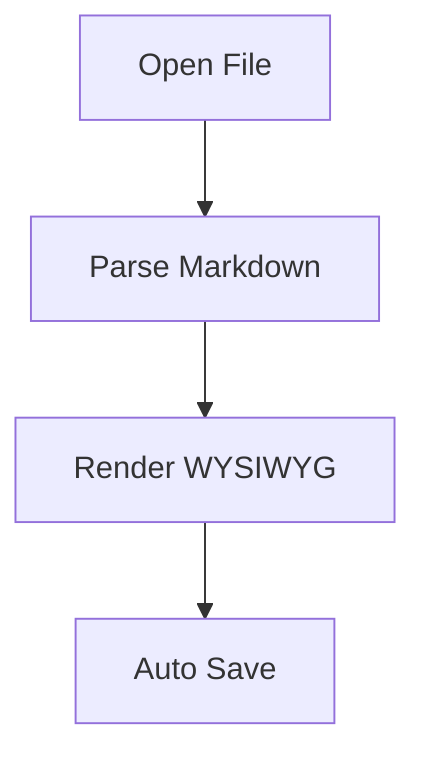

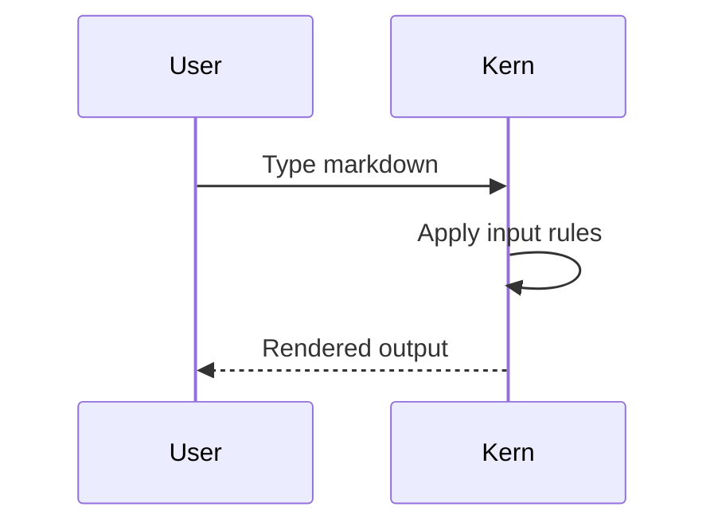

## Action Permutation Seeds

These lines are intentionally repetitive for typing/backspace/replace permutations.

- ACTION-SEED-001: alpha beta gamma delta 1
- ACTION-SEED-002: alpha beta gamma delta 2
- ACTION-SEED-003: alpha beta gamma delta 3
- ACTION-SEED-004: alpha beta gamma delta 4
- ACTION-SEED-005: alpha beta gamma delta 5
- ACTION-SEED-006: alpha beta gamma delta 6
- ACTION-SEED-007: alpha beta gamma delta 7
- ACTION-SEED-008: alpha beta gamma delta 8
- ACTION-SEED-009: alpha beta gamma delta 9
- ACTION-SEED-010: alpha beta gamma delta 10
- ACTION-SEED-011: alpha beta gamma delta 11
- ACTION-SEED-012: alpha beta gamma delta 12
- ACTION-SEED-013: alpha beta gamma delta 13
- ACTION-SEED-014: alpha beta gamma delta 14
- ACTION-SEED-015: alpha beta gamma delta 15
- ACTION-SEED-016: alpha beta gamma delta 16
- ACTION-SEED-017: alpha beta gamma delta 17
- ACTION-SEED-018: alpha beta gamma delta 18
- ACTION-SEED-019: alpha beta gamma delta 19
- ACTION-SEED-020: alpha beta gamma delta 20
- ACTION-SEED-021: alpha beta gamma delta 21
- ACTION-SEED-022: alpha beta gamma delta 22
- ACTION-SEED-023: alpha beta gamma delta 23
- ACTION-SEED-024: alpha beta gamma delta 24
- ACTION-SEED-025: alpha beta gamma delta 25
- ACTION-SEED-026: alpha beta gamma delta 26
- ACTION-SEED-027: alpha beta gamma delta 27
- ACTION-SEED-028: alpha beta gamma delta 28
- ACTION-SEED-029: alpha beta gamma delta 29
- ACTION-SEED-030: alpha beta gamma delta 30
- ACTION-SEED-031: alpha beta gamma delta 31
- ACTION-SEED-032: alpha beta gamma delta 32
- ACTION-SEED-033: alpha beta gamma delta 33
- ACTION-SEED-034: alpha beta gamma delta 34
- ACTION-SEED-035: alpha beta gamma delta 35
- ACTION-SEED-036: alpha beta gamma delta 36
- ACTION-SEED-037: alpha beta gamma delta 37
- ACTION-SEED-038: alpha beta gamma delta 38
- ACTION-SEED-039: alpha beta gamma delta 39
- ACTION-SEED-040: alpha beta gamma delta 40
- ACTION-SEED-041: alpha beta gamma delta 41
- ACTION-SEED-042: alpha beta gamma delta 42
- ACTION-SEED-043: alpha beta gamma delta 43
- ACTION-SEED-044: alpha beta gamma delta 44
- ACTION-SEED-045: alpha beta gamma delta 45
- ACTION-SEED-046: alpha beta gamma delta 46
- ACTION-SEED-047: alpha beta gamma delta 47
- ACTION-SEED-048: alpha beta gamma delta 48
- ACTION-SEED-049: alpha beta gamma delta 49
- ACTION-SEED-050: alpha beta gamma delta 50
- ACTION-SEED-051: alpha beta gamma delta 51
- ACTION-SEED-052: alpha beta gamma delta 52
- ACTION-SEED-053: alpha beta gamma delta 53
- ACTION-SEED-054: alpha beta gamma delta 54
- ACTION-SEED-055: alpha beta gamma delta 55
- ACTION-SEED-056: alpha beta gamma delta 56
- ACTION-SEED-057: alpha beta gamma delta 57
- ACTION-SEED-058: alpha beta gamma delta 58
- ACTION-SEED-059: alpha beta gamma delta 59
- ACTION-SEED-060: alpha beta gamma delta 60
- ACTION-SEED-061: alpha beta gamma delta 61
- ACTION-SEED-062: alpha beta gamma delta 62
- ACTION-SEED-063: alpha beta gamma delta 63
- ACTION-SEED-064: alpha beta gamma delta 64
- ACTION-SEED-065: alpha beta gamma delta 65
- ACTION-SEED-066: alpha beta gamma delta 66
- ACTION-SEED-067: alpha beta gamma delta 67
- ACTION-SEED-068: alpha beta gamma delta 68
- ACTION-SEED-069: alpha beta gamma delta 69
- ACTION-SEED-070: alpha beta gamma delta 70
- ACTION-SEED-071: alpha beta gamma delta 71
- ACTION-SEED-072: alpha beta gamma delta 72
- ACTION-SEED-073: alpha beta gamma delta 73
- ACTION-SEED-074: alpha beta gamma delta 74
- ACTION-SEED-075: alpha beta gamma delta 75
- ACTION-SEED-076: alpha beta gamma delta 76
- ACTION-SEED-077: alpha beta gamma delta 77
- ACTION-SEED-078: alpha beta gamma delta 78
- ACTION-SEED-079: alpha beta gamma delta 79
- ACTION-SEED-080: alpha beta gamma delta 80
- ACTION-SEED-081: alpha beta gamma delta 81
- ACTION-SEED-082: alpha beta gamma delta 82
- ACTION-SEED-083: alpha beta gamma delta 83
- ACTION-SEED-084: alpha beta gamma delta 84
- ACTION-SEED-085: alpha beta gamma delta 85
- ACTION-SEED-086: alpha beta gamma delta 86
- ACTION-SEED-087: alpha beta gamma delta 87
- ACTION-SEED-088: alpha beta gamma delta 88
- ACTION-SEED-089: alpha beta gamma delta 89
- ACTION-SEED-090: alpha beta gamma delta 90
- ACTION-SEED-091: alpha beta gamma delta 91
- ACTION-SEED-092: alpha beta gamma delta 92
- ACTION-SEED-093: alpha beta gamma delta 93
- ACTION-SEED-094: alpha beta gamma delta 94
- ACTION-SEED-095: alpha beta gamma delta 95
- ACTION-SEED-096: alpha beta gamma delta 96
- ACTION-SEED-097: alpha beta gamma delta 97
- ACTION-SEED-098: alpha beta gamma delta 98
- ACTION-SEED-099: alpha beta gamma delta 99
- ACTION-SEED-100: alpha beta gamma delta 100
- ACTION-SEED-101: alpha beta gamma delta 101
- ACTION-SEED-102: alpha beta gamma delta 102
- ACTION-SEED-103: alpha beta gamma delta 103
- ACTION-SEED-104: alpha beta gamma delta 104
- ACTION-SEED-105: alpha beta gamma delta 105
- ACTION-SEED-106: alpha beta gamma delta 106
- ACTION-SEED-107: alpha beta gamma delta 107
- ACTION-SEED-108: alpha beta gamma delta 108
- ACTION-SEED-109: alpha beta gamma delta 109
- ACTION-SEED-110: alpha beta gamma delta 110
- ACTION-SEED-111: alpha beta gamma delta 111
- ACTION-SEED-112: alpha beta gamma delta 112
- ACTION-SEED-113: alpha beta gamma delta 113
- ACTION-SEED-114: alpha beta gamma delta 114
- ACTION-SEED-115: alpha beta gamma delta 115
- ACTION-SEED-116: alpha beta gamma delta 116
- ACTION-SEED-117: alpha beta gamma delta 117
- ACTION-SEED-118: alpha beta gamma delta 118
- ACTION-SEED-119: alpha beta gamma delta 119
- ACTION-SEED-120: alpha beta gamma delta 120
- ACTION-SEED-121: alpha beta gamma delta 121
- ACTION-SEED-122: alpha beta gamma delta 122
- ACTION-SEED-123: alpha beta gamma delta 123
- ACTION-SEED-124: alpha beta gamma delta 124
- ACTION-SEED-125: alpha beta gamma delta 125
- ACTION-SEED-126: alpha beta gamma delta 126
- ACTION-SEED-127: alpha beta gamma delta 127
- ACTION-SEED-128: alpha beta gamma delta 128
- ACTION-SEED-129: alpha beta gamma delta 129
- ACTION-SEED-130: alpha beta gamma delta 130
- ACTION-SEED-131: alpha beta gamma delta 131
- ACTION-SEED-132: alpha beta gamma delta 132
- ACTION-SEED-133: alpha beta gamma delta 133
- ACTION-SEED-134: alpha beta gamma delta 134
- ACTION-SEED-135: alpha beta gamma delta 135
- ACTION-SEED-136: alpha beta gamma delta 136
- ACTION-SEED-137: alpha beta gamma delta 137
- ACTION-SEED-138: alpha beta gamma delta 138
- ACTION-SEED-139: alpha beta gamma delta 139
- ACTION-SEED-140: alpha beta gamma delta 140
- ACTION-SEED-141: alpha beta gamma delta 141
- ACTION-SEED-142: alpha beta gamma delta 142
- ACTION-SEED-143: alpha beta gamma delta 143
- ACTION-SEED-144: alpha beta gamma delta 144
- ACTION-SEED-145: alpha beta gamma delta 145
- ACTION-SEED-146: alpha beta gamma delta 146
- ACTION-SEED-147: alpha beta gamma delta 147
- ACTION-SEED-148: alpha beta gamma delta 148
- ACTION-SEED-149: alpha beta gamma delta 149
- ACTION-SEED-150: alpha beta gamma delta 150
- ACTION-SEED-151: alpha beta gamma delta 151
- ACTION-SEED-152: alpha beta gamma delta 152
- ACTION-SEED-153: alpha beta gamma delta 153
- ACTION-SEED-154: alpha beta gamma delta 154
- ACTION-SEED-155: alpha beta gamma delta 155
- ACTION-SEED-156: alpha beta gamma delta 156
- ACTION-SEED-157: alpha beta gamma delta 157
- ACTION-SEED-158: alpha beta gamma delta 158
- ACTION-SEED-159: alpha beta gamma delta 159
- ACTION-SEED-160: alpha beta gamma delta 160
- ACTION-SEED-161: alpha beta gamma delta 161
- ACTION-SEED-162: alpha beta gamma delta 162
- ACTION-SEED-163: alpha beta gamma delta 163
- ACTION-SEED-164: alpha beta gamma delta 164
- ACTION-SEED-165: alpha beta gamma delta 165
- ACTION-SEED-166: alpha beta gamma delta 166
- ACTION-SEED-167: alpha beta gamma delta 167
- ACTION-SEED-168: alpha beta gamma delta 168
- ACTION-SEED-169: alpha beta gamma delta 169
- ACTION-SEED-170: alpha beta gamma delta 170
- ACTION-SEED-171: alpha beta gamma delta 171
- ACTION-SEED-172: alpha beta gamma delta 172
- ACTION-SEED-173: alpha beta gamma delta 173
- ACTION-SEED-174: alpha beta gamma delta 174
- ACTION-SEED-175: alpha beta gamma delta 175
- ACTION-SEED-176: alpha beta gamma delta 176
- ACTION-SEED-177: alpha beta gamma delta 177
- ACTION-SEED-178: alpha beta gamma delta 178
- ACTION-SEED-179: alpha beta gamma delta 179
- ACTION-SEED-180: alpha beta gamma delta 180
- ACTION-SEED-181: alpha beta gamma delta 181
- ACTION-SEED-182: alpha beta gamma delta 182
- ACTION-SEED-183: alpha beta gamma delta 183
- ACTION-SEED-184: alpha beta gamma delta 184
- ACTION-SEED-185: alpha beta gamma delta 185
- ACTION-SEED-186: alpha beta gamma delta 186
- ACTION-SEED-187: alpha beta gamma delta 187
- ACTION-SEED-188: alpha beta gamma delta 188
- ACTION-SEED-189: alpha beta gamma delta 189
- ACTION-SEED-190: alpha beta gamma delta 190
- ACTION-SEED-191: alpha beta gamma delta 191
- ACTION-SEED-192: alpha beta gamma delta 192
- ACTION-SEED-193: alpha beta gamma delta 193
- ACTION-SEED-194: alpha beta gamma delta 194
- ACTION-SEED-195: alpha beta gamma delta 195
- ACTION-SEED-196: alpha beta gamma delta 196
- ACTION-SEED-197: alpha beta gamma delta 197
- ACTION-SEED-198: alpha beta gamma delta 198
- ACTION-SEED-199: alpha beta gamma delta 199
- ACTION-SEED-200: alpha beta gamma delta 200
- ACTION-SEED-201: alpha beta gamma delta 201
- ACTION-SEED-202: alpha beta gamma delta 202
- ACTION-SEED-203: alpha beta gamma delta 203
- ACTION-SEED-204: alpha beta gamma delta 204
- ACTION-SEED-205: alpha beta gamma delta 205
- ACTION-SEED-206: alpha beta gamma delta 206
- ACTION-SEED-207: alpha beta gamma delta 207
- ACTION-SEED-208: alpha beta gamma delta 208
- ACTION-SEED-209: alpha beta gamma delta 209
- ACTION-SEED-210: alpha beta gamma delta 210
- ACTION-SEED-211: alpha beta gamma delta 211
- ACTION-SEED-212: alpha beta gamma delta 212
- ACTION-SEED-213: alpha beta gamma delta 213
- ACTION-SEED-214: alpha beta gamma delta 214
- ACTION-SEED-215: alpha beta gamma delta 215
- ACTION-SEED-216: alpha beta gamma delta 216
- ACTION-SEED-217: alpha beta gamma delta 217
- ACTION-SEED-218: alpha beta gamma delta 218
- ACTION-SEED-219: alpha beta gamma delta 219
- ACTION-SEED-220: alpha beta gamma delta 220
- ACTION-SEED-221: alpha beta gamma delta 221
- ACTION-SEED-222: alpha beta gamma delta 222
- ACTION-SEED-223: alpha beta gamma delta 223
- ACTION-SEED-224: alpha beta gamma delta 224
- ACTION-SEED-225: alpha beta gamma delta 225
- ACTION-SEED-226: alpha beta gamma delta 226
- ACTION-SEED-227: alpha beta gamma delta 227
- ACTION-SEED-228: alpha beta gamma delta 228
- ACTION-SEED-229: alpha beta gamma delta 229
- ACTION-SEED-230: alpha beta gamma delta 230
- ACTION-SEED-231: alpha beta gamma delta 231
- ACTION-SEED-232: alpha beta gamma delta 232
- ACTION-SEED-233: alpha beta gamma delta 233
- ACTION-SEED-234: alpha beta gamma delta 234
- ACTION-SEED-235: alpha beta gamma delta 235
- ACTION-SEED-236: alpha beta gamma delta 236
- ACTION-SEED-237: alpha beta gamma delta 237
- ACTION-SEED-238: alpha beta gamma delta 238
- ACTION-SEED-239: alpha beta gamma delta 239
- ACTION-SEED-240: alpha beta gamma delta 240

## Typing Volume Tail

Volume line 0001: quick brown fox with **bold**, *italic*, `code`, [link](https://example.com/1), and task marker [ ] candidate.
Volume line 0002: quick brown fox with **bold**, *italic*, `code`, [link](https://example.com/2), and task marker [ ] candidate.
Volume line 0003: quick brown fox with **bold**, *italic*, `code`, [link](https://example.com/3), and task marker [ ] candidate.
Volume line 0004: quick brown fox with **bold**, *italic*, `code`, [link](https://example.com/4), and task marker [ ] candidate.
Volume line 0005: quick brown fox with **bold**, *italic*, `code`, [link](https://example.com/5), and task marker [ ] candidate.
Volume line 0006: quick brown fox with **bold**, *italic*, `code`, [link](https://example.com/6), and task marker [ ] candidate.
Volume line 0007: quick brown fox with **bold**, *italic*, `code`, [link](https://example.com/7), and task marker [ ] candidate.
Volume line 0008: quick brown fox with **bold**, *italic*, `code`, [link](https://example.com/8), and task marker [ ] candidate.
Volume line 0009: quick brown fox with **bold**, *italic*, `code`, [link](https://example.com/9), and task marker [ ] candidate.
Volume line 0010: quick brown fox with **bold**, *italic*, `code`, [link](https://example.com/10), and task marker [ ] candidate.
Volume line 0011: quick brown fox with **bold**, *italic*, `code`, [link](https://example.com/11), and task marker [ ] candidate.
Volume line 0012: quick brown fox with **bold**, *italic*, `code`, [link](https://example.com/12), and task marker [ ] candidate.
Volume line 0013: quick brown fox with **bold**, *italic*, `code`, [link](https://example.com/13), and task marker [ ] candidate.
Volume line 0014: quick brown fox with **bold**, *italic*, `code`, [link](https://example.com/14), and task marker [ ] candidate.
Volume line 0015: quick brown fox with **bold**, *italic*, `code`, [link](https://example.com/15), and task marker [ ] candidate.
Volume line 0016: quick brown fox with **bold**, *italic*, `code`, [link](https://example.com/16), and task marker [ ] candidate.
Volume line 0017: quick brown fox with **bold**, *italic*, `code`, [link](https://example.com/17), and task marker [ ] candidate.
Volume line 0018: quick brown fox with **bold**, *italic*, `code`, [link](https://example.com/18), and task marker [ ] candidate.
Volume line 0019: quick brown fox with **bold**, *italic*, `code`, [link](https://example.com/19), and task marker [ ] candidate.
Volume line 0020: quick brown fox with **bold**, *italic*, `code`, [link](https://example.com/20), and task marker [ ] candidate.
Volume line 0021: quick brown fox with **bold**, *italic*, `code`, [link](https://example.com/21), and task marker [ ] candidate.
Volume line 0022: quick brown fox with **bold**, *italic*, `code`, [link](https://example.com/22), and task marker [ ] candidate.
Volume line 0023: quick brown fox with **bold**, *italic*, `code`, [link](https://example.com/23), and task marker [ ] candidate.
Volume line 0024: quick brown fox with **bold**, *italic*, `code`, [link](https://example.com/24), and task marker [ ] candidate.
Volume line 0025: quick brown fox with **bold**, *italic*, `code`, [link](https://example.com/25), and task marker [ ] candidate.
- [ ] checkpoint task 25
1. ordered checkpoint 25
---

Volume line 0026: quick brown fox with **bold**, *italic*, `code`, [link](https://example.com/26), and task marker [ ] candidate.
Volume line 0027: quick brown fox with **bold**, *italic*, `code`, [link](https://example.com/27), and task marker [ ] candidate.
Volume line 0028: quick brown fox with **bold**, *italic*, `code`, [link](https://example.com/28), and task marker [ ] candidate.
Volume line 0029: quick brown fox with **bold**, *italic*, `code`, [link](https://example.com/29), and task marker [ ] candidate.
Volume line 0030: quick brown fox with **bold**, *italic*, `code`, [link](https://example.com/30), and task marker [ ] candidate.
Volume line 0031: quick brown fox with **bold**, *italic*, `code`, [link](https://example.com/31), and task marker [ ] candidate.
Volume line 0032: quick brown fox with **bold**, *italic*, `code`, [link](https://example.com/32), and task marker [ ] candidate.
Volume line 0033: quick brown fox with **bold**, *italic*, `code`, [link](https://example.com/33), and task marker [ ] candidate.
Volume line 0034: quick brown fox with **bold**, *italic*, `code`, [link](https://example.com/34), and task marker [ ] candidate.
Volume line 0035: quick brown fox with **bold**, *italic*, `code`, [link](https://example.com/35), and task marker [ ] candidate.
Volume line 0036: quick brown fox with **bold**, *italic*, `code`, [link](https://example.com/36), and task marker [ ] candidate.
Volume line 0037: quick brown fox with **bold**, *italic*, `code`, [link](https://example.com/37), and task marker [ ] candidate.
Volume line 0038: quick brown fox with **bold**, *italic*, `code`, [link](https://example.com/38), and task marker [ ] candidate.
Volume line 0039: quick brown fox with **bold**, *italic*, `code`, [link](https://example.com/39), and task marker [ ] candidate.
Volume line 0040: quick brown fox with **bold**, *italic*, `code`, [link](https://example.com/40), and task marker [ ] candidate.
Volume line 0041: quick brown fox with **bold**, *italic*, `code`, [link](https://example.com/41), and task marker [ ] candidate.
Volume line 0042: quick brown fox with **bold**, *italic*, `code`, [link](https://example.com/42), and task marker [ ] candidate.
Volume line 0043: quick brown fox with **bold**, *italic*, `code`, [link](https://example.com/43), and task marker [ ] candidate.
Volume line 0044: quick brown fox with **bold**, *italic*, `code`, [link](https://example.com/44), and task marker [ ] candidate.
Volume line 0045: quick brown fox with **bold**, *italic*, `code`, [link](https://example.com/45), and task marker [ ] candidate.
Volume line 0046: quick brown fox with **bold**, *italic*, `code`, [link](https://example.com/46), and task marker [ ] candidate.
Volume line 0047: quick brown fox with **bold**, *italic*, `code`, [link](https://example.com/47), and task marker [ ] candidate.
Volume line 0048: quick brown fox with **bold**, *italic*, `code`, [link](https://example.com/48), and task marker [ ] candidate.
Volume line 0049: quick brown fox with **bold**, *italic*, `code`, [link](https://example.com/49), and task marker [ ] candidate.
Volume line 0050: quick brown fox with **bold**, *italic*, `code`, [link](https://example.com/50), and task marker [ ] candidate.
- [ ] checkpoint task 50
1. ordered checkpoint 50
---

Volume line 0051: quick brown fox with **bold**, *italic*, `code`, [link](https://example.com/51), and task marker [ ] candidate.
Volume line 0052: quick brown fox with **bold**, *italic*, `code`, [link](https://example.com/52), and task marker [ ] candidate.
Volume line 0053: quick brown fox with **bold**, *italic*, `code`, [link](https://example.com/53), and task marker [ ] candidate.
Volume line 0054: quick brown fox with **bold**, *italic*, `code`, [link](https://example.com/54), and task marker [ ] candidate.
Volume line 0055: quick brown fox with **bold**, *italic*, `code`, [link](https://example.com/55), and task marker [ ] candidate.
Volume line 0056: quick brown fox with **bold**, *italic*, `code`, [link](https://example.com/56), and task marker [ ] candidate.
Volume line 0057: quick brown fox with **bold**, *italic*, `code`, [link](https://example.com/57), and task marker [ ] candidate.
Volume line 0058: quick brown fox with **bold**, *italic*, `code`, [link](https://example.com/58), and task marker [ ] candidate.
Volume line 0059: quick brown fox with **bold**, *italic*, `code`, [link](https://example.com/59), and task marker [ ] candidate.
Volume line 0060: quick brown fox with **bold**, *italic*, `code`, [link](https://example.com/60), and task marker [ ] candidate.
Volume line 0061: quick brown fox with **bold**, *italic*, `code`, [link](https://example.com/61), and task marker [ ] candidate.
Volume line 0062: quick brown fox with **bold**, *italic*, `code`, [link](https://example.com/62), and task marker [ ] candidate.
Volume line 0063: quick brown fox with **bold**, *italic*, `code`, [link](https://example.com/63), and task marker [ ] candidate.
Volume line 0064: quick brown fox with **bold**, *italic*, `code`, [link](https://example.com/64), and task marker [ ] candidate.
Volume line 0065: quick brown fox with **bold**, *italic*, `code`, [link](https://example.com/65), and task marker [ ] candidate.
Volume line 0066: quick brown fox with **bold**, *italic*, `code`, [link](https://example.com/66), and task marker [ ] candidate.
Volume line 0067: quick brown fox with **bold**, *italic*, `code`, [link](https://example.com/67), and task marker [ ] candidate.
Volume line 0068: quick brown fox with **bold**, *italic*, `code`, [link](https://example.com/68), and task marker [ ] candidate.
Volume line 0069: quick brown fox with **bold**, *italic*, `code`, [link](https://example.com/69), and task marker [ ] candidate.
Volume line 0070: quick brown fox with **bold**, *italic*, `code`, [link](https://example.com/70), and task marker [ ] candidate.
Volume line 0071: quick brown fox with **bold**, *italic*, `code`, [link](https://example.com/71), and task marker [ ] candidate.
Volume line 0072: quick brown fox with **bold**, *italic*, `code`, [link](https://example.com/72), and task marker [ ] candidate.
Volume line 0073: quick brown fox with **bold**, *italic*, `code`, [link](https://example.com/73), and task marker [ ] candidate.
Volume line 0074: quick brown fox with **bold**, *italic*, `code`, [link](https://example.com/74), and task marker [ ] candidate.
Volume line 0075: quick brown fox with **bold**, *italic*, `code`, [link](https://example.com/75), and task marker [ ] candidate.
- [ ] checkpoint task 75
1. ordered checkpoint 75
---

Volume line 0076: quick brown fox with **bold**, *italic*, `code`, [link](https://example.com/76), and task marker [ ] candidate.
Volume line 0077: quick brown fox with **bold**, *italic*, `code`, [link](https://example.com/77), and task marker [ ] candidate.
Volume line 0078: quick brown fox with **bold**, *italic*, `code`, [link](https://example.com/78), and task marker [ ] candidate.
Volume line 0079: quick brown fox with **bold**, *italic*, `code`, [link](https://example.com/79), and task marker [ ] candidate.
Volume line 0080: quick brown fox with **bold**, *italic*, `code`, [link](https://example.com/80), and task marker [ ] candidate.
Volume line 0081: quick brown fox with **bold**, *italic*, `code`, [link](https://example.com/81), and task marker [ ] candidate.
Volume line 0082: quick brown fox with **bold**, *italic*, `code`, [link](https://example.com/82), and task marker [ ] candidate.
Volume line 0083: quick brown fox with **bold**, *italic*, `code`, [link](https://example.com/83), and task marker [ ] candidate.
Volume line 0084: quick brown fox with **bold**, *italic*, `code`, [link](https://example.com/84), and task marker [ ] candidate.
Volume line 0085: quick brown fox with **bold**, *italic*, `code`, [link](https://example.com/85), and task marker [ ] candidate.
Volume line 0086: quick brown fox with **bold**, *italic*, `code`, [link](https://example.com/86), and task marker [ ] candidate.
Volume line 0087: quick brown fox with **bold**, *italic*, `code`, [link](https://example.com/87), and task marker [ ] candidate.
Volume line 0088: quick brown fox with **bold**, *italic*, `code`, [link](https://example.com/88), and task marker [ ] candidate.
Volume line 0089: quick brown fox with **bold**, *italic*, `code`, [link](https://example.com/89), and task marker [ ] candidate.
Volume line 0090: quick brown fox with **bold**, *italic*, `code`, [link](https://example.com/90), and task marker [ ] candidate.
Volume line 0091: quick brown fox with **bold**, *italic*, `code`, [link](https://example.com/91), and task marker [ ] candidate.
Volume line 0092: quick brown fox with **bold**, *italic*, `code`, [link](https://example.com/92), and task marker [ ] candidate.
Volume line 0093: quick brown fox with **bold**, *italic*, `code`, [link](https://example.com/93), and task marker [ ] candidate.
Volume line 0094: quick brown fox with **bold**, *italic*, `code`, [link](https://example.com/94), and task marker [ ] candidate.
Volume line 0095: quick brown fox with **bold**, *italic*, `code`, [link](https://example.com/95), and task marker [ ] candidate.
Volume line 0096: quick brown fox with **bold**, *italic*, `code`, [link](https://example.com/96), and task marker [ ] candidate.
Volume line 0097: quick brown fox with **bold**, *italic*, `code`, [link](https://example.com/97), and task marker [ ] candidate.
Volume line 0098: quick brown fox with **bold**, *italic*, `code`, [link](https://example.com/98), and task marker [ ] candidate.
Volume line 0099: quick brown fox with **bold**, *italic*, `code`, [link](https://example.com/99), and task marker [ ] candidate.
Volume line 0100: quick brown fox with **bold**, *italic*, `code`, [link](https://example.com/100), and task marker [ ] candidate.
- [ ] checkpoint task 100
1. ordered checkpoint 100
---

Volume line 0101: quick brown fox with **bold**, *italic*, `code`, [link](https://example.com/101), and task marker [ ] candidate.
Volume line 0102: quick brown fox with **bold**, *italic*, `code`, [link](https://example.com/102), and task marker [ ] candidate.
Volume line 0103: quick brown fox with **bold**, *italic*, `code`, [link](https://example.com/103), and task marker [ ] candidate.
Volume line 0104: quick brown fox with **bold**, *italic*, `code`, [link](https://example.com/104), and task marker [ ] candidate.
Volume line 0105: quick brown fox with **bold**, *italic*, `code`, [link](https://example.com/105), and task marker [ ] candidate.
Volume line 0106: quick brown fox with **bold**, *italic*, `code`, [link](https://example.com/106), and task marker [ ] candidate.
Volume line 0107: quick brown fox with **bold**, *italic*, `code`, [link](https://example.com/107), and task marker [ ] candidate.
Volume line 0108: quick brown fox with **bold**, *italic*, `code`, [link](https://example.com/108), and task marker [ ] candidate.
Volume line 0109: quick brown fox with **bold**, *italic*, `code`, [link](https://example.com/109), and task marker [ ] candidate.
Volume line 0110: quick brown fox with **bold**, *italic*, `code`, [link](https://example.com/110), and task marker [ ] candidate.
Volume line 0111: quick brown fox with **bold**, *italic*, `code`, [link](https://example.com/111), and task marker [ ] candidate.
Volume line 0112: quick brown fox with **bold**, *italic*, `code`, [link](https://example.com/112), and task marker [ ] candidate.
Volume line 0113: quick brown fox with **bold**, *italic*, `code`, [link](https://example.com/113), and task marker [ ] candidate.
Volume line 0114: quick brown fox with **bold**, *italic*, `code`, [link](https://example.com/114), and task marker [ ] candidate.
Volume line 0115: quick brown fox with **bold**, *italic*, `code`, [link](https://example.com/115), and task marker [ ] candidate.
Volume line 0116: quick brown fox with **bold**, *italic*, `code`, [link](https://example.com/116), and task marker [ ] candidate.
Volume line 0117: quick brown fox with **bold**, *italic*, `code`, [link](https://example.com/117), and task marker [ ] candidate.
Volume line 0118: quick brown fox with **bold**, *italic*, `code`, [link](https://example.com/118), and task marker [ ] candidate.
Volume line 0119: quick brown fox with **bold**, *italic*, `code`, [link](https://example.com/119), and task marker [ ] candidate.
Volume line 0120: quick brown fox with **bold**, *italic*, `code`, [link](https://example.com/120), and task marker [ ] candidate.
Volume line 0121: quick brown fox with **bold**, *italic*, `code`, [link](https://example.com/121), and task marker [ ] candidate.
Volume line 0122: quick brown fox with **bold**, *italic*, `code`, [link](https://example.com/122), and task marker [ ] candidate.
Volume line 0123: quick brown fox with **bold**, *italic*, `code`, [link](https://example.com/123), and task marker [ ] candidate.
Volume line 0124: quick brown fox with **bold**, *italic*, `code`, [link](https://example.com/124), and task marker [ ] candidate.
Volume line 0125: quick brown fox with **bold**, *italic*, `code`, [link](https://example.com/125), and task marker [ ] candidate.
- [ ] checkpoint task 125
1. ordered checkpoint 125
---

Volume line 0126: quick brown fox with **bold**, *italic*, `code`, [link](https://example.com/126), and task marker [ ] candidate.
Volume line 0127: quick brown fox with **bold**, *italic*, `code`, [link](https://example.com/127), and task marker [ ] candidate.
Volume line 0128: quick brown fox with **bold**, *italic*, `code`, [link](https://example.com/128), and task marker [ ] candidate.
Volume line 0129: quick brown fox with **bold**, *italic*, `code`, [link](https://example.com/129), and task marker [ ] candidate.
Volume line 0130: quick brown fox with **bold**, *italic*, `code`, [link](https://example.com/130), and task marker [ ] candidate.
Volume line 0131: quick brown fox with **bold**, *italic*, `code`, [link](https://example.com/131), and task marker [ ] candidate.
Volume line 0132: quick brown fox with **bold**, *italic*, `code`, [link](https://example.com/132), and task marker [ ] candidate.
Volume line 0133: quick brown fox with **bold**, *italic*, `code`, [link](https://example.com/133), and task marker [ ] candidate.
Volume line 0134: quick brown fox with **bold**, *italic*, `code`, [link](https://example.com/134), and task marker [ ] candidate.
Volume line 0135: quick brown fox with **bold**, *italic*, `code`, [link](https://example.com/135), and task marker [ ] candidate.
Volume line 0136: quick brown fox with **bold**, *italic*, `code`, [link](https://example.com/136), and task marker [ ] candidate.
Volume line 0137: quick brown fox with **bold**, *italic*, `code`, [link](https://example.com/137), and task marker [ ] candidate.
Volume line 0138: quick brown fox with **bold**, *italic*, `code`, [link](https://example.com/138), and task marker [ ] candidate.
Volume line 0139: quick brown fox with **bold**, *italic*, `code`, [link](https://example.com/139), and task marker [ ] candidate.
Volume line 0140: quick brown fox with **bold**, *italic*, `code`, [link](https://example.com/140), and task marker [ ] candidate.
Volume line 0141: quick brown fox with **bold**, *italic*, `code`, [link](https://example.com/141), and task marker [ ] candidate.
Volume line 0142: quick brown fox with **bold**, *italic*, `code`, [link](https://example.com/142), and task marker [ ] candidate.
Volume line 0143: quick brown fox with **bold**, *italic*, `code`, [link](https://example.com/143), and task marker [ ] candidate.
Volume line 0144: quick brown fox with **bold**, *italic*, `code`, [link](https://example.com/144), and task marker [ ] candidate.
Volume line 0145: quick brown fox with **bold**, *italic*, `code`, [link](https://example.com/145), and task marker [ ] candidate.
Volume line 0146: quick brown fox with **bold**, *italic*, `code`, [link](https://example.com/146), and task marker [ ] candidate.
Volume line 0147: quick brown fox with **bold**, *italic*, `code`, [link](https://example.com/147), and task marker [ ] candidate.
Volume line 0148: quick brown fox with **bold**, *italic*, `code`, [link](https://example.com/148), and task marker [ ] candidate.
Volume line 0149: quick brown fox with **bold**, *italic*, `code`, [link](https://example.com/149), and task marker [ ] candidate.
Volume line 0150: quick brown fox with **bold**, *italic*, `code`, [link](https://example.com/150), and task marker [ ] candidate.
- [ ] checkpoint task 150
1. ordered checkpoint 150
---

Volume line 0151: quick brown fox with **bold**, *italic*, `code`, [link](https://example.com/151), and task marker [ ] candidate.
Volume line 0152: quick brown fox with **bold**, *italic*, `code`, [link](https://example.com/152), and task marker [ ] candidate.
Volume line 0153: quick brown fox with **bold**, *italic*, `code`, [link](https://example.com/153), and task marker [ ] candidate.
Volume line 0154: quick brown fox with **bold**, *italic*, `code`, [link](https://example.com/154), and task marker [ ] candidate.
Volume line 0155: quick brown fox with **bold**, *italic*, `code`, [link](https://example.com/155), and task marker [ ] candidate.
Volume line 0156: quick brown fox with **bold**, *italic*, `code`, [link](https://example.com/156), and task marker [ ] candidate.
Volume line 0157: quick brown fox with **bold**, *italic*, `code`, [link](https://example.com/157), and task marker [ ] candidate.
Volume line 0158: quick brown fox with **bold**, *italic*, `code`, [link](https://example.com/158), and task marker [ ] candidate.
Volume line 0159: quick brown fox with **bold**, *italic*, `code`, [link](https://example.com/159), and task marker [ ] candidate.
Volume line 0160: quick brown fox with **bold**, *italic*, `code`, [link](https://example.com/160), and task marker [ ] candidate.
Volume line 0161: quick brown fox with **bold**, *italic*, `code`, [link](https://example.com/161), and task marker [ ] candidate.
Volume line 0162: quick brown fox with **bold**, *italic*, `code`, [link](https://example.com/162), and task marker [ ] candidate.
Volume line 0163: quick brown fox with **bold**, *italic*, `code`, [link](https://example.com/163), and task marker [ ] candidate.
Volume line 0164: quick brown fox with **bold**, *italic*, `code`, [link](https://example.com/164), and task marker [ ] candidate.
Volume line 0165: quick brown fox with **bold**, *italic*, `code`, [link](https://example.com/165), and task marker [ ] candidate.
Volume line 0166: quick brown fox with **bold**, *italic*, `code`, [link](https://example.com/166), and task marker [ ] candidate.
Volume line 0167: quick brown fox with **bold**, *italic*, `code`, [link](https://example.com/167), and task marker [ ] candidate.
Volume line 0168: quick brown fox with **bold**, *italic*, `code`, [link](https://example.com/168), and task marker [ ] candidate.
Volume line 0169: quick brown fox with **bold**, *italic*, `code`, [link](https://example.com/169), and task marker [ ] candidate.
Volume line 0170: quick brown fox with **bold**, *italic*, `code`, [link](https://example.com/170), and task marker [ ] candidate.
Volume line 0171: quick brown fox with **bold**, *italic*, `code`, [link](https://example.com/171), and task marker [ ] candidate.
Volume line 0172: quick brown fox with **bold**, *italic*, `code`, [link](https://example.com/172), and task marker [ ] candidate.
Volume line 0173: quick brown fox with **bold**, *italic*, `code`, [link](https://example.com/173), and task marker [ ] candidate.
Volume line 0174: quick brown fox with **bold**, *italic*, `code`, [link](https://example.com/174), and task marker [ ] candidate.
Volume line 0175: quick brown fox with **bold**, *italic*, `code`, [link](https://example.com/175), and task marker [ ] candidate.
- [ ] checkpoint task 175
1. ordered checkpoint 175
---

Volume line 0176: quick brown fox with **bold**, *italic*, `code`, [link](https://example.com/176), and task marker [ ] candidate.
Volume line 0177: quick brown fox with **bold**, *italic*, `code`, [link](https://example.com/177), and task marker [ ] candidate.
Volume line 0178: quick brown fox with **bold**, *italic*, `code`, [link](https://example.com/178), and task marker [ ] candidate.
Volume line 0179: quick brown fox with **bold**, *italic*, `code`, [link](https://example.com/179), and task marker [ ] candidate.
Volume line 0180: quick brown fox with **bold**, *italic*, `code`, [link](https://example.com/180), and task marker [ ] candidate.
Volume line 0181: quick brown fox with **bold**, *italic*, `code`, [link](https://example.com/181), and task marker [ ] candidate.
Volume line 0182: quick brown fox with **bold**, *italic*, `code`, [link](https://example.com/182), and task marker [ ] candidate.
Volume line 0183: quick brown fox with **bold**, *italic*, `code`, [link](https://example.com/183), and task marker [ ] candidate.
Volume line 0184: quick brown fox with **bold**, *italic*, `code`, [link](https://example.com/184), and task marker [ ] candidate.
Volume line 0185: quick brown fox with **bold**, *italic*, `code`, [link](https://example.com/185), and task marker [ ] candidate.
Volume line 0186: quick brown fox with **bold**, *italic*, `code`, [link](https://example.com/186), and task marker [ ] candidate.
Volume line 0187: quick brown fox with **bold**, *italic*, `code`, [link](https://example.com/187), and task marker [ ] candidate.
Volume line 0188: quick brown fox with **bold**, *italic*, `code`, [link](https://example.com/188), and task marker [ ] candidate.
Volume line 0189: quick brown fox with **bold**, *italic*, `code`, [link](https://example.com/189), and task marker [ ] candidate.
Volume line 0190: quick brown fox with **bold**, *italic*, `code`, [link](https://example.com/190), and task marker [ ] candidate.
Volume line 0191: quick brown fox with **bold**, *italic*, `code`, [link](https://example.com/191), and task marker [ ] candidate.
Volume line 0192: quick brown fox with **bold**, *italic*, `code`, [link](https://example.com/192), and task marker [ ] candidate.
Volume line 0193: quick brown fox with **bold**, *italic*, `code`, [link](https://example.com/193), and task marker [ ] candidate.
Volume line 0194: quick brown fox with **bold**, *italic*, `code`, [link](https://example.com/194), and task marker [ ] candidate.
Volume line 0195: quick brown fox with **bold**, *italic*, `code`, [link](https://example.com/195), and task marker [ ] candidate.
Volume line 0196: quick brown fox with **bold**, *italic*, `code`, [link](https://example.com/196), and task marker [ ] candidate.
Volume line 0197: quick brown fox with **bold**, *italic*, `code`, [link](https://example.com/197), and task marker [ ] candidate.
Volume line 0198: quick brown fox with **bold**, *italic*, `code`, [link](https://example.com/198), and task marker [ ] candidate.
Volume line 0199: quick brown fox with **bold**, *italic*, `code`, [link](https://example.com/199), and task marker [ ] candidate.
Volume line 0200: quick brown fox with **bold**, *italic*, `code`, [link](https://example.com/200), and task marker [ ] candidate.
- [ ] checkpoint task 200
1. ordered checkpoint 200
---

Volume line 0201: quick brown fox with **bold**, *italic*, `code`, [link](https://example.com/201), and task marker [ ] candidate.
Volume line 0202: quick brown fox with **bold**, *italic*, `code`, [link](https://example.com/202), and task marker [ ] candidate.
Volume line 0203: quick brown fox with **bold**, *italic*, `code`, [link](https://example.com/203), and task marker [ ] candidate.
Volume line 0204: quick brown fox with **bold**, *italic*, `code`, [link](https://example.com/204), and task marker [ ] candidate.
Volume line 0205: quick brown fox with **bold**, *italic*, `code`, [link](https://example.com/205), and task marker [ ] candidate.
Volume line 0206: quick brown fox with **bold**, *italic*, `code`, [link](https://example.com/206), and task marker [ ] candidate.
Volume line 0207: quick brown fox with **bold**, *italic*, `code`, [link](https://example.com/207), and task marker [ ] candidate.
Volume line 0208: quick brown fox with **bold**, *italic*, `code`, [link](https://example.com/208), and task marker [ ] candidate.
Volume line 0209: quick brown fox with **bold**, *italic*, `code`, [link](https://example.com/209), and task marker [ ] candidate.
Volume line 0210: quick brown fox with **bold**, *italic*, `code`, [link](https://example.com/210), and task marker [ ] candidate.
Volume line 0211: quick brown fox with **bold**, *italic*, `code`, [link](https://example.com/211), and task marker [ ] candidate.
Volume line 0212: quick brown fox with **bold**, *italic*, `code`, [link](https://example.com/212), and task marker [ ] candidate.
Volume line 0213: quick brown fox with **bold**, *italic*, `code`, [link](https://example.com/213), and task marker [ ] candidate.
Volume line 0214: quick brown fox with **bold**, *italic*, `code`, [link](https://example.com/214), and task marker [ ] candidate.
Volume line 0215: quick brown fox with **bold**, *italic*, `code`, [link](https://example.com/215), and task marker [ ] candidate.
Volume line 0216: quick brown fox with **bold**, *italic*, `code`, [link](https://example.com/216), and task marker [ ] candidate.
Volume line 0217: quick brown fox with **bold**, *italic*, `code`, [link](https://example.com/217), and task marker [ ] candidate.
Volume line 0218: quick brown fox with **bold**, *italic*, `code`, [link](https://example.com/218), and task marker [ ] candidate.
Volume line 0219: quick brown fox with **bold**, *italic*, `code`, [link](https://example.com/219), and task marker [ ] candidate.
Volume line 0220: quick brown fox with **bold**, *italic*, `code`, [link](https://example.com/220), and task marker [ ] candidate.
Volume line 0221: quick brown fox with **bold**, *italic*, `code`, [link](https://example.com/221), and task marker [ ] candidate.
Volume line 0222: quick brown fox with **bold**, *italic*, `code`, [link](https://example.com/222), and task marker [ ] candidate.
Volume line 0223: quick brown fox with **bold**, *italic*, `code`, [link](https://example.com/223), and task marker [ ] candidate.
Volume line 0224: quick brown fox with **bold**, *italic*, `code`, [link](https://example.com/224), and task marker [ ] candidate.
Volume line 0225: quick brown fox with **bold**, *italic*, `code`, [link](https://example.com/225), and task marker [ ] candidate.
- [ ] checkpoint task 225
1. ordered checkpoint 225
---

Volume line 0226: quick brown fox with **bold**, *italic*, `code`, [link](https://example.com/226), and task marker [ ] candidate.
Volume line 0227: quick brown fox with **bold**, *italic*, `code`, [link](https://example.com/227), and task marker [ ] candidate.
Volume line 0228: quick brown fox with **bold**, *italic*, `code`, [link](https://example.com/228), and task marker [ ] candidate.
Volume line 0229: quick brown fox with **bold**, *italic*, `code`, [link](https://example.com/229), and task marker [ ] candidate.
Volume line 0230: quick brown fox with **bold**, *italic*, `code`, [link](https://example.com/230), and task marker [ ] candidate.
Volume line 0231: quick brown fox with **bold**, *italic*, `code`, [link](https://example.com/231), and task marker [ ] candidate.
Volume line 0232: quick brown fox with **bold**, *italic*, `code`, [link](https://example.com/232), and task marker [ ] candidate.
Volume line 0233: quick brown fox with **bold**, *italic*, `code`, [link](https://example.com/233), and task marker [ ] candidate.
Volume line 0234: quick brown fox with **bold**, *italic*, `code`, [link](https://example.com/234), and task marker [ ] candidate.
Volume line 0235: quick brown fox with **bold**, *italic*, `code`, [link](https://example.com/235), and task marker [ ] candidate.
Volume line 0236: quick brown fox with **bold**, *italic*, `code`, [link](https://example.com/236), and task marker [ ] candidate.
Volume line 0237: quick brown fox with **bold**, *italic*, `code`, [link](https://example.com/237), and task marker [ ] candidate.
Volume line 0238: quick brown fox with **bold**, *italic*, `code`, [link](https://example.com/238), and task marker [ ] candidate.
Volume line 0239: quick brown fox with **bold**, *italic*, `code`, [link](https://example.com/239), and task marker [ ] candidate.
Volume line 0240: quick brown fox with **bold**, *italic*, `code`, [link](https://example.com/240), and task marker [ ] candidate.
Volume line 0241: quick brown fox with **bold**, *italic*, `code`, [link](https://example.com/241), and task marker [ ] candidate.
Volume line 0242: quick brown fox with **bold**, *italic*, `code`, [link](https://example.com/242), and task marker [ ] candidate.
Volume line 0243: quick brown fox with **bold**, *italic*, `code`, [link](https://example.com/243), and task marker [ ] candidate.
Volume line 0244: quick brown fox with **bold**, *italic*, `code`, [link](https://example.com/244), and task marker [ ] candidate.
Volume line 0245: quick brown fox with **bold**, *italic*, `code`, [link](https://example.com/245), and task marker [ ] candidate.
Volume line 0246: quick brown fox with **bold**, *italic*, `code`, [link](https://example.com/246), and task marker [ ] candidate.
Volume line 0247: quick brown fox with **bold**, *italic*, `code`, [link](https://example.com/247), and task marker [ ] candidate.
Volume line 0248: quick brown fox with **bold**, *italic*, `code`, [link](https://example.com/248), and task marker [ ] candidate.
Volume line 0249: quick brown fox with **bold**, *italic*, `code`, [link](https://example.com/249), and task marker [ ] candidate.
Volume line 0250: quick brown fox with **bold**, *italic*, `code`, [link](https://example.com/250), and task marker [ ] candidate.
- [ ] checkpoint task 250
1. ordered checkpoint 250
---

Volume line 0251: quick brown fox with **bold**, *italic*, `code`, [link](https://example.com/251), and task marker [ ] candidate.
Volume line 0252: quick brown fox with **bold**, *italic*, `code`, [link](https://example.com/252), and task marker [ ] candidate.
Volume line 0253: quick brown fox with **bold**, *italic*, `code`, [link](https://example.com/253), and task marker [ ] candidate.
Volume line 0254: quick brown fox with **bold**, *italic*, `code`, [link](https://example.com/254), and task marker [ ] candidate.
Volume line 0255: quick brown fox with **bold**, *italic*, `code`, [link](https://example.com/255), and task marker [ ] candidate.
Volume line 0256: quick brown fox with **bold**, *italic*, `code`, [link](https://example.com/256), and task marker [ ] candidate.
Volume line 0257: quick brown fox with **bold**, *italic*, `code`, [link](https://example.com/257), and task marker [ ] candidate.
Volume line 0258: quick brown fox with **bold**, *italic*, `code`, [link](https://example.com/258), and task marker [ ] candidate.
Volume line 0259: quick brown fox with **bold**, *italic*, `code`, [link](https://example.com/259), and task marker [ ] candidate.
Volume line 0260: quick brown fox with **bold**, *italic*, `code`, [link](https://example.com/260), and task marker [ ] candidate.
Volume line 0261: quick brown fox with **bold**, *italic*, `code`, [link](https://example.com/261), and task marker [ ] candidate.
Volume line 0262: quick brown fox with **bold**, *italic*, `code`, [link](https://example.com/262), and task marker [ ] candidate.
Volume line 0263: quick brown fox with **bold**, *italic*, `code`, [link](https://example.com/263), and task marker [ ] candidate.
Volume line 0264: quick brown fox with **bold**, *italic*, `code`, [link](https://example.com/264), and task marker [ ] candidate.
Volume line 0265: quick brown fox with **bold**, *italic*, `code`, [link](https://example.com/265), and task marker [ ] candidate.
Volume line 0266: quick brown fox with **bold**, *italic*, `code`, [link](https://example.com/266), and task marker [ ] candidate.
Volume line 0267: quick brown fox with **bold**, *italic*, `code`, [link](https://example.com/267), and task marker [ ] candidate.
Volume line 0268: quick brown fox with **bold**, *italic*, `code`, [link](https://example.com/268), and task marker [ ] candidate.
Volume line 0269: quick brown fox with **bold**, *italic*, `code`, [link](https://example.com/269), and task marker [ ] candidate.
Volume line 0270: quick brown fox with **bold**, *italic*, `code`, [link](https://example.com/270), and task marker [ ] candidate.
Volume line 0271: quick brown fox with **bold**, *italic*, `code`, [link](https://example.com/271), and task marker [ ] candidate.
Volume line 0272: quick brown fox with **bold**, *italic*, `code`, [link](https://example.com/272), and task marker [ ] candidate.
Volume line 0273: quick brown fox with **bold**, *italic*, `code`, [link](https://example.com/273), and task marker [ ] candidate.
Volume line 0274: quick brown fox with **bold**, *italic*, `code`, [link](https://example.com/274), and task marker [ ] candidate.
Volume line 0275: quick brown fox with **bold**, *italic*, `code`, [link](https://example.com/275), and task marker [ ] candidate.
- [ ] checkpoint task 275
1. ordered checkpoint 275
---

Volume line 0276: quick brown fox with **bold**, *italic*, `code`, [link](https://example.com/276), and task marker [ ] candidate.
Volume line 0277: quick brown fox with **bold**, *italic*, `code`, [link](https://example.com/277), and task marker [ ] candidate.
Volume line 0278: quick brown fox with **bold**, *italic*, `code`, [link](https://example.com/278), and task marker [ ] candidate.
Volume line 0279: quick brown fox with **bold**, *italic*, `code`, [link](https://example.com/279), and task marker [ ] candidate.
Volume line 0280: quick brown fox with **bold**, *italic*, `code`, [link](https://example.com/280), and task marker [ ] candidate.
Volume line 0281: quick brown fox with **bold**, *italic*, `code`, [link](https://example.com/281), and task marker [ ] candidate.
Volume line 0282: quick brown fox with **bold**, *italic*, `code`, [link](https://example.com/282), and task marker [ ] candidate.
Volume line 0283: quick brown fox with **bold**, *italic*, `code`, [link](https://example.com/283), and task marker [ ] candidate.
Volume line 0284: quick brown fox with **bold**, *italic*, `code`, [link](https://example.com/284), and task marker [ ] candidate.
Volume line 0285: quick brown fox with **bold**, *italic*, `code`, [link](https://example.com/285), and task marker [ ] candidate.
Volume line 0286: quick brown fox with **bold**, *italic*, `code`, [link](https://example.com/286), and task marker [ ] candidate.
Volume line 0287: quick brown fox with **bold**, *italic*, `code`, [link](https://example.com/287), and task marker [ ] candidate.
Volume line 0288: quick brown fox with **bold**, *italic*, `code`, [link](https://example.com/288), and task marker [ ] candidate.
Volume line 0289: quick brown fox with **bold**, *italic*, `code`, [link](https://example.com/289), and task marker [ ] candidate.
Volume line 0290: quick brown fox with **bold**, *italic*, `code`, [link](https://example.com/290), and task marker [ ] candidate.
Volume line 0291: quick brown fox with **bold**, *italic*, `code`, [link](https://example.com/291), and task marker [ ] candidate.
Volume line 0292: quick brown fox with **bold**, *italic*, `code`, [link](https://example.com/292), and task marker [ ] candidate.
Volume line 0293: quick brown fox with **bold**, *italic*, `code`, [link](https://example.com/293), and task marker [ ] candidate.
Volume line 0294: quick brown fox with **bold**, *italic*, `code`, [link](https://example.com/294), and task marker [ ] candidate.
Volume line 0295: quick brown fox with **bold**, *italic*, `code`, [link](https://example.com/295), and task marker [ ] candidate.
Volume line 0296: quick brown fox with **bold**, *italic*, `code`, [link](https://example.com/296), and task marker [ ] candidate.
Volume line 0297: quick brown fox with **bold**, *italic*, `code`, [link](https://example.com/297), and task marker [ ] candidate.
Volume line 0298: quick brown fox with **bold**, *italic*, `code`, [link](https://example.com/298), and task marker [ ] candidate.
Volume line 0299: quick brown fox with **bold**, *italic*, `code`, [link](https://example.com/299), and task marker [ ] candidate.
Volume line 0300: quick brown fox with **bold**, *italic*, `code`, [link](https://example.com/300), and task marker [ ] candidate.
- [ ] checkpoint task 300
1. ordered checkpoint 300
---

Volume line 0301: quick brown fox with **bold**, *italic*, `code`, [link](https://example.com/301), and task marker [ ] candidate.
Volume line 0302: quick brown fox with **bold**, *italic*, `code`, [link](https://example.com/302), and task marker [ ] candidate.
Volume line 0303: quick brown fox with **bold**, *italic*, `code`, [link](https://example.com/303), and task marker [ ] candidate.
Volume line 0304: quick brown fox with **bold**, *italic*, `code`, [link](https://example.com/304), and task marker [ ] candidate.
Volume line 0305: quick brown fox with **bold**, *italic*, `code`, [link](https://example.com/305), and task marker [ ] candidate.
Volume line 0306: quick brown fox with **bold**, *italic*, `code`, [link](https://example.com/306), and task marker [ ] candidate.
Volume line 0307: quick brown fox with **bold**, *italic*, `code`, [link](https://example.com/307), and task marker [ ] candidate.
Volume line 0308: quick brown fox with **bold**, *italic*, `code`, [link](https://example.com/308), and task marker [ ] candidate.
Volume line 0309: quick brown fox with **bold**, *italic*, `code`, [link](https://example.com/309), and task marker [ ] candidate.
Volume line 0310: quick brown fox with **bold**, *italic*, `code`, [link](https://example.com/310), and task marker [ ] candidate.
Volume line 0311: quick brown fox with **bold**, *italic*, `code`, [link](https://example.com/311), and task marker [ ] candidate.
Volume line 0312: quick brown fox with **bold**, *italic*, `code`, [link](https://example.com/312), and task marker [ ] candidate.
Volume line 0313: quick brown fox with **bold**, *italic*, `code`, [link](https://example.com/313), and task marker [ ] candidate.
Volume line 0314: quick brown fox with **bold**, *italic*, `code`, [link](https://example.com/314), and task marker [ ] candidate.
Volume line 0315: quick brown fox with **bold**, *italic*, `code`, [link](https://example.com/315), and task marker [ ] candidate.
Volume line 0316: quick brown fox with **bold**, *italic*, `code`, [link](https://example.com/316), and task marker [ ] candidate.
Volume line 0317: quick brown fox with **bold**, *italic*, `code`, [link](https://example.com/317), and task marker [ ] candidate.
Volume line 0318: quick brown fox with **bold**, *italic*, `code`, [link](https://example.com/318), and task marker [ ] candidate.
Volume line 0319: quick brown fox with **bold**, *italic*, `code`, [link](https://example.com/319), and task marker [ ] candidate.
Volume line 0320: quick brown fox with **bold**, *italic*, `code`, [link](https://example.com/320), and task marker [ ] candidate.
Volume line 0321: quick brown fox with **bold**, *italic*, `code`, [link](https://example.com/321), and task marker [ ] candidate.
Volume line 0322: quick brown fox with **bold**, *italic*, `code`, [link](https://example.com/322), and task marker [ ] candidate.
Volume line 0323: quick brown fox with **bold**, *italic*, `code`, [link](https://example.com/323), and task marker [ ] candidate.
Volume line 0324: quick brown fox with **bold**, *italic*, `code`, [link](https://example.com/324), and task marker [ ] candidate.
Volume line 0325: quick brown fox with **bold**, *italic*, `code`, [link](https://example.com/325), and task marker [ ] candidate.
- [ ] checkpoint task 325
1. ordered checkpoint 325
---

Volume line 0326: quick brown fox with **bold**, *italic*, `code`, [link](https://example.com/326), and task marker [ ] candidate.
Volume line 0327: quick brown fox with **bold**, *italic*, `code`, [link](https://example.com/327), and task marker [ ] candidate.
Volume line 0328: quick brown fox with **bold**, *italic*, `code`, [link](https://example.com/328), and task marker [ ] candidate.
Volume line 0329: quick brown fox with **bold**, *italic*, `code`, [link](https://example.com/329), and task marker [ ] candidate.
Volume line 0330: quick brown fox with **bold**, *italic*, `code`, [link](https://example.com/330), and task marker [ ] candidate.
Volume line 0331: quick brown fox with **bold**, *italic*, `code`, [link](https://example.com/331), and task marker [ ] candidate.
Volume line 0332: quick brown fox with **bold**, *italic*, `code`, [link](https://example.com/332), and task marker [ ] candidate.
Volume line 0333: quick brown fox with **bold**, *italic*, `code`, [link](https://example.com/333), and task marker [ ] candidate.
Volume line 0334: quick brown fox with **bold**, *italic*, `code`, [link](https://example.com/334), and task marker [ ] candidate.
Volume line 0335: quick brown fox with **bold**, *italic*, `code`, [link](https://example.com/335), and task marker [ ] candidate.
Volume line 0336: quick brown fox with **bold**, *italic*, `code`, [link](https://example.com/336), and task marker [ ] candidate.
Volume line 0337: quick brown fox with **bold**, *italic*, `code`, [link](https://example.com/337), and task marker [ ] candidate.
Volume line 0338: quick brown fox with **bold**, *italic*, `code`, [link](https://example.com/338), and task marker [ ] candidate.
Volume line 0339: quick brown fox with **bold**, *italic*, `code`, [link](https://example.com/339), and task marker [ ] candidate.
Volume line 0340: quick brown fox with **bold**, *italic*, `code`, [link](https://example.com/340), and task marker [ ] candidate.
Volume line 0341: quick brown fox with **bold**, *italic*, `code`, [link](https://example.com/341), and task marker [ ] candidate.
Volume line 0342: quick brown fox with **bold**, *italic*, `code`, [link](https://example.com/342), and task marker [ ] candidate.
Volume line 0343: quick brown fox with **bold**, *italic*, `code`, [link](https://example.com/343), and task marker [ ] candidate.
Volume line 0344: quick brown fox with **bold**, *italic*, `code`, [link](https://example.com/344), and task marker [ ] candidate.
Volume line 0345: quick brown fox with **bold**, *italic*, `code`, [link](https://example.com/345), and task marker [ ] candidate.
Volume line 0346: quick brown fox with **bold**, *italic*, `code`, [link](https://example.com/346), and task marker [ ] candidate.
Volume line 0347: quick brown fox with **bold**, *italic*, `code`, [link](https://example.com/347), and task marker [ ] candidate.
Volume line 0348: quick brown fox with **bold**, *italic*, `code`, [link](https://example.com/348), and task marker [ ] candidate.
Volume line 0349: quick brown fox with **bold**, *italic*, `code`, [link](https://example.com/349), and task marker [ ] candidate.
Volume line 0350: quick brown fox with **bold**, *italic*, `code`, [link](https://example.com/350), and task marker [ ] candidate.
- [ ] checkpoint task 350
1. ordered checkpoint 350
---

Volume line 0351: quick brown fox with **bold**, *italic*, `code`, [link](https://example.com/351), and task marker [ ] candidate.
Volume line 0352: quick brown fox with **bold**, *italic*, `code`, [link](https://example.com/352), and task marker [ ] candidate.
Volume line 0353: quick brown fox with **bold**, *italic*, `code`, [link](https://example.com/353), and task marker [ ] candidate.
Volume line 0354: quick brown fox with **bold**, *italic*, `code`, [link](https://example.com/354), and task marker [ ] candidate.
Volume line 0355: quick brown fox with **bold**, *italic*, `code`, [link](https://example.com/355), and task marker [ ] candidate.
Volume line 0356: quick brown fox with **bold**, *italic*, `code`, [link](https://example.com/356), and task marker [ ] candidate.
Volume line 0357: quick brown fox with **bold**, *italic*, `code`, [link](https://example.com/357), and task marker [ ] candidate.
Volume line 0358: quick brown fox with **bold**, *italic*, `code`, [link](https://example.com/358), and task marker [ ] candidate.
Volume line 0359: quick brown fox with **bold**, *italic*, `code`, [link](https://example.com/359), and task marker [ ] candidate.
Volume line 0360: quick brown fox with **bold**, *italic*, `code`, [link](https://example.com/360), and task marker [ ] candidate.
Volume line 0361: quick brown fox with **bold**, *italic*, `code`, [link](https://example.com/361), and task marker [ ] candidate.
Volume line 0362: quick brown fox with **bold**, *italic*, `code`, [link](https://example.com/362), and task marker [ ] candidate.
Volume line 0363: quick brown fox with **bold**, *italic*, `code`, [link](https://example.com/363), and task marker [ ] candidate.
Volume line 0364: quick brown fox with **bold**, *italic*, `code`, [link](https://example.com/364), and task marker [ ] candidate.
Volume line 0365: quick brown fox with **bold**, *italic*, `code`, [link](https://example.com/365), and task marker [ ] candidate.
Volume line 0366: quick brown fox with **bold**, *italic*, `code`, [link](https://example.com/366), and task marker [ ] candidate.
Volume line 0367: quick brown fox with **bold**, *italic*, `code`, [link](https://example.com/367), and task marker [ ] candidate.
Volume line 0368: quick brown fox with **bold**, *italic*, `code`, [link](https://example.com/368), and task marker [ ] candidate.
Volume line 0369: quick brown fox with **bold**, *italic*, `code`, [link](https://example.com/369), and task marker [ ] candidate.
Volume line 0370: quick brown fox with **bold**, *italic*, `code`, [link](https://example.com/370), and task marker [ ] candidate.
Volume line 0371: quick brown fox with **bold**, *italic*, `code`, [link](https://example.com/371), and task marker [ ] candidate.
Volume line 0372: quick brown fox with **bold**, *italic*, `code`, [link](https://example.com/372), and task marker [ ] candidate.
Volume line 0373: quick brown fox with **bold**, *italic*, `code`, [link](https://example.com/373), and task marker [ ] candidate.
Volume line 0374: quick brown fox with **bold**, *italic*, `code`, [link](https://example.com/374), and task marker [ ] candidate.
Volume line 0375: quick brown fox with **bold**, *italic*, `code`, [link](https://example.com/375), and task marker [ ] candidate.
- [ ] checkpoint task 375
1. ordered checkpoint 375
---

Volume line 0376: quick brown fox with **bold**, *italic*, `code`, [link](https://example.com/376), and task marker [ ] candidate.
Volume line 0377: quick brown fox with **bold**, *italic*, `code`, [link](https://example.com/377), and task marker [ ] candidate.
Volume line 0378: quick brown fox with **bold**, *italic*, `code`, [link](https://example.com/378), and task marker [ ] candidate.
Volume line 0379: quick brown fox with **bold**, *italic*, `code`, [link](https://example.com/379), and task marker [ ] candidate.
Volume line 0380: quick brown fox with **bold**, *italic*, `code`, [link](https://example.com/380), and task marker [ ] candidate.
Volume line 0381: quick brown fox with **bold**, *italic*, `code`, [link](https://example.com/381), and task marker [ ] candidate.
Volume line 0382: quick brown fox with **bold**, *italic*, `code`, [link](https://example.com/382), and task marker [ ] candidate.
Volume line 0383: quick brown fox with **bold**, *italic*, `code`, [link](https://example.com/383), and task marker [ ] candidate.
Volume line 0384: quick brown fox with **bold**, *italic*, `code`, [link](https://example.com/384), and task marker [ ] candidate.
Volume line 0385: quick brown fox with **bold**, *italic*, `code`, [link](https://example.com/385), and task marker [ ] candidate.
Volume line 0386: quick brown fox with **bold**, *italic*, `code`, [link](https://example.com/386), and task marker [ ] candidate.
Volume line 0387: quick brown fox with **bold**, *italic*, `code`, [link](https://example.com/387), and task marker [ ] candidate.
Volume line 0388: quick brown fox with **bold**, *italic*, `code`, [link](https://example.com/388), and task marker [ ] candidate.
Volume line 0389: quick brown fox with **bold**, *italic*, `code`, [link](https://example.com/389), and task marker [ ] candidate.
Volume line 0390: quick brown fox with **bold**, *italic*, `code`, [link](https://example.com/390), and task marker [ ] candidate.
Volume line 0391: quick brown fox with **bold**, *italic*, `code`, [link](https://example.com/391), and task marker [ ] candidate.
Volume line 0392: quick brown fox with **bold**, *italic*, `code`, [link](https://example.com/392), and task marker [ ] candidate.
Volume line 0393: quick brown fox with **bold**, *italic*, `code`, [link](https://example.com/393), and task marker [ ] candidate.
Volume line 0394: quick brown fox with **bold**, *italic*, `code`, [link](https://example.com/394), and task marker [ ] candidate.
Volume line 0395: quick brown fox with **bold**, *italic*, `code`, [link](https://example.com/395), and task marker [ ] candidate.
Volume line 0396: quick brown fox with **bold**, *italic*, `code`, [link](https://example.com/396), and task marker [ ] candidate.
Volume line 0397: quick brown fox with **bold**, *italic*, `code`, [link](https://example.com/397), and task marker [ ] candidate.
Volume line 0398: quick brown fox with **bold**, *italic*, `code`, [link](https://example.com/398), and task marker [ ] candidate.
Volume line 0399: quick brown fox with **bold**, *italic*, `code`, [link](https://example.com/399), and task marker [ ] candidate.
Volume line 0400: quick brown fox with **bold**, *italic*, `code`, [link](https://example.com/400), and task marker [ ] candidate.
- [ ] checkpoint task 400
1. ordered checkpoint 400
---

Volume line 0401: quick brown fox with **bold**, *italic*, `code`, [link](https://example.com/401), and task marker [ ] candidate.
Volume line 0402: quick brown fox with **bold**, *italic*, `code`, [link](https://example.com/402), and task marker [ ] candidate.
Volume line 0403: quick brown fox with **bold**, *italic*, `code`, [link](https://example.com/403), and task marker [ ] candidate.
Volume line 0404: quick brown fox with **bold**, *italic*, `code`, [link](https://example.com/404), and task marker [ ] candidate.
Volume line 0405: quick brown fox with **bold**, *italic*, `code`, [link](https://example.com/405), and task marker [ ] candidate.
Volume line 0406: quick brown fox with **bold**, *italic*, `code`, [link](https://example.com/406), and task marker [ ] candidate.
Volume line 0407: quick brown fox with **bold**, *italic*, `code`, [link](https://example.com/407), and task marker [ ] candidate.
Volume line 0408: quick brown fox with **bold**, *italic*, `code`, [link](https://example.com/408), and task marker [ ] candidate.
Volume line 0409: quick brown fox with **bold**, *italic*, `code`, [link](https://example.com/409), and task marker [ ] candidate.
Volume line 0410: quick brown fox with **bold**, *italic*, `code`, [link](https://example.com/410), and task marker [ ] candidate.
Volume line 0411: quick brown fox with **bold**, *italic*, `code`, [link](https://example.com/411), and task marker [ ] candidate.
Volume line 0412: quick brown fox with **bold**, *italic*, `code`, [link](https://example.com/412), and task marker [ ] candidate.
Volume line 0413: quick brown fox with **bold**, *italic*, `code`, [link](https://example.com/413), and task marker [ ] candidate.
Volume line 0414: quick brown fox with **bold**, *italic*, `code`, [link](https://example.com/414), and task marker [ ] candidate.
Volume line 0415: quick brown fox with **bold**, *italic*, `code`, [link](https://example.com/415), and task marker [ ] candidate.
Volume line 0416: quick brown fox with **bold**, *italic*, `code`, [link](https://example.com/416), and task marker [ ] candidate.
Volume line 0417: quick brown fox with **bold**, *italic*, `code`, [link](https://example.com/417), and task marker [ ] candidate.
Volume line 0418: quick brown fox with **bold**, *italic*, `code`, [link](https://example.com/418), and task marker [ ] candidate.
Volume line 0419: quick brown fox with **bold**, *italic*, `code`, [link](https://example.com/419), and task marker [ ] candidate.
Volume line 0420: quick brown fox with **bold**, *italic*, `code`, [link](https://example.com/420), and task marker [ ] candidate.
Volume line 0421: quick brown fox with **bold**, *italic*, `code`, [link](https://example.com/421), and task marker [ ] candidate.
Volume line 0422: quick brown fox with **bold**, *italic*, `code`, [link](https://example.com/422), and task marker [ ] candidate.
Volume line 0423: quick brown fox with **bold**, *italic*, `code`, [link](https://example.com/423), and task marker [ ] candidate.
Volume line 0424: quick brown fox with **bold**, *italic*, `code`, [link](https://example.com/424), and task marker [ ] candidate.
Volume line 0425: quick brown fox with **bold**, *italic*, `code`, [link](https://example.com/425), and task marker [ ] candidate.
- [ ] checkpoint task 425
1. ordered checkpoint 425
---

Volume line 0426: quick brown fox with **bold**, *italic*, `code`, [link](https://example.com/426), and task marker [ ] candidate.
Volume line 0427: quick brown fox with **bold**, *italic*, `code`, [link](https://example.com/427), and task marker [ ] candidate.
Volume line 0428: quick brown fox with **bold**, *italic*, `code`, [link](https://example.com/428), and task marker [ ] candidate.
Volume line 0429: quick brown fox with **bold**, *italic*, `code`, [link](https://example.com/429), and task marker [ ] candidate.
Volume line 0430: quick brown fox with **bold**, *italic*, `code`, [link](https://example.com/430), and task marker [ ] candidate.
Volume line 0431: quick brown fox with **bold**, *italic*, `code`, [link](https://example.com/431), and task marker [ ] candidate.
Volume line 0432: quick brown fox with **bold**, *italic*, `code`, [link](https://example.com/432), and task marker [ ] candidate.
Volume line 0433: quick brown fox with **bold**, *italic*, `code`, [link](https://example.com/433), and task marker [ ] candidate.
Volume line 0434: quick brown fox with **bold**, *italic*, `code`, [link](https://example.com/434), and task marker [ ] candidate.
Volume line 0435: quick brown fox with **bold**, *italic*, `code`, [link](https://example.com/435), and task marker [ ] candidate.
Volume line 0436: quick brown fox with **bold**, *italic*, `code`, [link](https://example.com/436), and task marker [ ] candidate.
Volume line 0437: quick brown fox with **bold**, *italic*, `code`, [link](https://example.com/437), and task marker [ ] candidate.
Volume line 0438: quick brown fox with **bold**, *italic*, `code`, [link](https://example.com/438), and task marker [ ] candidate.
Volume line 0439: quick brown fox with **bold**, *italic*, `code`, [link](https://example.com/439), and task marker [ ] candidate.
Volume line 0440: quick brown fox with **bold**, *italic*, `code`, [link](https://example.com/440), and task marker [ ] candidate.
Volume line 0441: quick brown fox with **bold**, *italic*, `code`, [link](https://example.com/441), and task marker [ ] candidate.
Volume line 0442: quick brown fox with **bold**, *italic*, `code`, [link](https://example.com/442), and task marker [ ] candidate.
Volume line 0443: quick brown fox with **bold**, *italic*, `code`, [link](https://example.com/443), and task marker [ ] candidate.
Volume line 0444: quick brown fox with **bold**, *italic*, `code`, [link](https://example.com/444), and task marker [ ] candidate.
Volume line 0445: quick brown fox with **bold**, *italic*, `code`, [link](https://example.com/445), and task marker [ ] candidate.
Volume line 0446: quick brown fox with **bold**, *italic*, `code`, [link](https://example.com/446), and task marker [ ] candidate.
Volume line 0447: quick brown fox with **bold**, *italic*, `code`, [link](https://example.com/447), and task marker [ ] candidate.
Volume line 0448: quick brown fox with **bold**, *italic*, `code`, [link](https://example.com/448), and task marker [ ] candidate.
Volume line 0449: quick brown fox with **bold**, *italic*, `code`, [link](https://example.com/449), and task marker [ ] candidate.
Volume line 0450: quick brown fox with **bold**, *italic*, `code`, [link](https://example.com/450), and task marker [ ] candidate.
- [ ] checkpoint task 450
1. ordered checkpoint 450
---

Volume line 0451: quick brown fox with **bold**, *italic*, `code`, [link](https://example.com/451), and task marker [ ] candidate.
Volume line 0452: quick brown fox with **bold**, *italic*, `code`, [link](https://example.com/452), and task marker [ ] candidate.
Volume line 0453: quick brown fox with **bold**, *italic*, `code`, [link](https://example.com/453), and task marker [ ] candidate.
Volume line 0454: quick brown fox with **bold**, *italic*, `code`, [link](https://example.com/454), and task marker [ ] candidate.
Volume line 0455: quick brown fox with **bold**, *italic*, `code`, [link](https://example.com/455), and task marker [ ] candidate.
Volume line 0456: quick brown fox with **bold**, *italic*, `code`, [link](https://example.com/456), and task marker [ ] candidate.
Volume line 0457: quick brown fox with **bold**, *italic*, `code`, [link](https://example.com/457), and task marker [ ] candidate.
Volume line 0458: quick brown fox with **bold**, *italic*, `code`, [link](https://example.com/458), and task marker [ ] candidate.
Volume line 0459: quick brown fox with **bold**, *italic*, `code`, [link](https://example.com/459), and task marker [ ] candidate.
Volume line 0460: quick brown fox with **bold**, *italic*, `code`, [link](https://example.com/460), and task marker [ ] candidate.
Volume line 0461: quick brown fox with **bold**, *italic*, `code`, [link](https://example.com/461), and task marker [ ] candidate.
Volume line 0462: quick brown fox with **bold**, *italic*, `code`, [link](https://example.com/462), and task marker [ ] candidate.
Volume line 0463: quick brown fox with **bold**, *italic*, `code`, [link](https://example.com/463), and task marker [ ] candidate.
Volume line 0464: quick brown fox with **bold**, *italic*, `code`, [link](https://example.com/464), and task marker [ ] candidate.
Volume line 0465: quick brown fox with **bold**, *italic*, `code`, [link](https://example.com/465), and task marker [ ] candidate.
Volume line 0466: quick brown fox with **bold**, *italic*, `code`, [link](https://example.com/466), and task marker [ ] candidate.
Volume line 0467: quick brown fox with **bold**, *italic*, `code`, [link](https://example.com/467), and task marker [ ] candidate.
Volume line 0468: quick brown fox with **bold**, *italic*, `code`, [link](https://example.com/468), and task marker [ ] candidate.
Volume line 0469: quick brown fox with **bold**, *italic*, `code`, [link](https://example.com/469), and task marker [ ] candidate.
Volume line 0470: quick brown fox with **bold**, *italic*, `code`, [link](https://example.com/470), and task marker [ ] candidate.
Volume line 0471: quick brown fox with **bold**, *italic*, `code`, [link](https://example.com/471), and task marker [ ] candidate.
Volume line 0472: quick brown fox with **bold**, *italic*, `code`, [link](https://example.com/472), and task marker [ ] candidate.
Volume line 0473: quick brown fox with **bold**, *italic*, `code`, [link](https://example.com/473), and task marker [ ] candidate.
Volume line 0474: quick brown fox with **bold**, *italic*, `code`, [link](https://example.com/474), and task marker [ ] candidate.
Volume line 0475: quick brown fox with **bold**, *italic*, `code`, [link](https://example.com/475), and task marker [ ] candidate.
- [ ] checkpoint task 475
1. ordered checkpoint 475
---

Volume line 0476: quick brown fox with **bold**, *italic*, `code`, [link](https://example.com/476), and task marker [ ] candidate.
Volume line 0477: quick brown fox with **bold**, *italic*, `code`, [link](https://example.com/477), and task marker [ ] candidate.
Volume line 0478: quick brown fox with **bold**, *italic*, `code`, [link](https://example.com/478), and task marker [ ] candidate.
Volume line 0479: quick brown fox with **bold**, *italic*, `code`, [link](https://example.com/479), and task marker [ ] candidate.
Volume line 0480: quick brown fox with **bold**, *italic*, `code`, [link](https://example.com/480), and task marker [ ] candidate.
Volume line 0481: quick brown fox with **bold**, *italic*, `code`, [link](https://example.com/481), and task marker [ ] candidate.
Volume line 0482: quick brown fox with **bold**, *italic*, `code`, [link](https://example.com/482), and task marker [ ] candidate.
Volume line 0483: quick brown fox with **bold**, *italic*, `code`, [link](https://example.com/483), and task marker [ ] candidate.
Volume line 0484: quick brown fox with **bold**, *italic*, `code`, [link](https://example.com/484), and task marker [ ] candidate.
Volume line 0485: quick brown fox with **bold**, *italic*, `code`, [link](https://example.com/485), and task marker [ ] candidate.
Volume line 0486: quick brown fox with **bold**, *italic*, `code`, [link](https://example.com/486), and task marker [ ] candidate.
Volume line 0487: quick brown fox with **bold**, *italic*, `code`, [link](https://example.com/487), and task marker [ ] candidate.
Volume line 0488: quick brown fox with **bold**, *italic*, `code`, [link](https://example.com/488), and task marker [ ] candidate.
Volume line 0489: quick brown fox with **bold**, *italic*, `code`, [link](https://example.com/489), and task marker [ ] candidate.
Volume line 0490: quick brown fox with **bold**, *italic*, `code`, [link](https://example.com/490), and task marker [ ] candidate.
Volume line 0491: quick brown fox with **bold**, *italic*, `code`, [link](https://example.com/491), and task marker [ ] candidate.
Volume line 0492: quick brown fox with **bold**, *italic*, `code`, [link](https://example.com/492), and task marker [ ] candidate.
Volume line 0493: quick brown fox with **bold**, *italic*, `code`, [link](https://example.com/493), and task marker [ ] candidate.
Volume line 0494: quick brown fox with **bold**, *italic*, `code`, [link](https://example.com/494), and task marker [ ] candidate.
Volume line 0495: quick brown fox with **bold**, *italic*, `code`, [link](https://example.com/495), and task marker [ ] candidate.
Volume line 0496: quick brown fox with **bold**, *italic*, `code`, [link](https://example.com/496), and task marker [ ] candidate.
Volume line 0497: quick brown fox with **bold**, *italic*, `code`, [link](https://example.com/497), and task marker [ ] candidate.
Volume line 0498: quick brown fox with **bold**, *italic*, `code`, [link](https://example.com/498), and task marker [ ] candidate.
Volume line 0499: quick brown fox with **bold**, *italic*, `code`, [link](https://example.com/499), and task marker [ ] candidate.
Volume line 0500: quick brown fox with **bold**, *italic*, `code`, [link](https://example.com/500), and task marker [ ] candidate.
- [ ] checkpoint task 500
1. ordered checkpoint 500
---

Volume line 0501: quick brown fox with **bold**, *italic*, `code`, [link](https://example.com/501), and task marker [ ] candidate.
Volume line 0502: quick brown fox with **bold**, *italic*, `code`, [link](https://example.com/502), and task marker [ ] candidate.
Volume line 0503: quick brown fox with **bold**, *italic*, `code`, [link](https://example.com/503), and task marker [ ] candidate.
Volume line 0504: quick brown fox with **bold**, *italic*, `code`, [link](https://example.com/504), and task marker [ ] candidate.
Volume line 0505: quick brown fox with **bold**, *italic*, `code`, [link](https://example.com/505), and task marker [ ] candidate.
Volume line 0506: quick brown fox with **bold**, *italic*, `code`, [link](https://example.com/506), and task marker [ ] candidate.
Volume line 0507: quick brown fox with **bold**, *italic*, `code`, [link](https://example.com/507), and task marker [ ] candidate.
Volume line 0508: quick brown fox with **bold**, *italic*, `code`, [link](https://example.com/508), and task marker [ ] candidate.
Volume line 0509: quick brown fox with **bold**, *italic*, `code`, [link](https://example.com/509), and task marker [ ] candidate.
Volume line 0510: quick brown fox with **bold**, *italic*, `code`, [link](https://example.com/510), and task marker [ ] candidate.
Volume line 0511: quick brown fox with **bold**, *italic*, `code`, [link](https://example.com/511), and task marker [ ] candidate.
Volume line 0512: quick brown fox with **bold**, *italic*, `code`, [link](https://example.com/512), and task marker [ ] candidate.
Volume line 0513: quick brown fox with **bold**, *italic*, `code`, [link](https://example.com/513), and task marker [ ] candidate.
Volume line 0514: quick brown fox with **bold**, *italic*, `code`, [link](https://example.com/514), and task marker [ ] candidate.
Volume line 0515: quick brown fox with **bold**, *italic*, `code`, [link](https://example.com/515), and task marker [ ] candidate.
Volume line 0516: quick brown fox with **bold**, *italic*, `code`, [link](https://example.com/516), and task marker [ ] candidate.
Volume line 0517: quick brown fox with **bold**, *italic*, `code`, [link](https://example.com/517), and task marker [ ] candidate.
Volume line 0518: quick brown fox with **bold**, *italic*, `code`, [link](https://example.com/518), and task marker [ ] candidate.
Volume line 0519: quick brown fox with **bold**, *italic*, `code`, [link](https://example.com/519), and task marker [ ] candidate.
Volume line 0520: quick brown fox with **bold**, *italic*, `code`, [link](https://example.com/520), and task marker [ ] candidate.
Volume line 0521: quick brown fox with **bold**, *italic*, `code`, [link](https://example.com/521), and task marker [ ] candidate.
Volume line 0522: quick brown fox with **bold**, *italic*, `code`, [link](https://example.com/522), and task marker [ ] candidate.
Volume line 0523: quick brown fox with **bold**, *italic*, `code`, [link](https://example.com/523), and task marker [ ] candidate.
Volume line 0524: quick brown fox with **bold**, *italic*, `code`, [link](https://example.com/524), and task marker [ ] candidate.
Volume line 0525: quick brown fox with **bold**, *italic*, `code`, [link](https://example.com/525), and task marker [ ] candidate.
- [ ] checkpoint task 525
1. ordered checkpoint 525
---

Volume line 0526: quick brown fox with **bold**, *italic*, `code`, [link](https://example.com/526), and task marker [ ] candidate.
Volume line 0527: quick brown fox with **bold**, *italic*, `code`, [link](https://example.com/527), and task marker [ ] candidate.
Volume line 0528: quick brown fox with **bold**, *italic*, `code`, [link](https://example.com/528), and task marker [ ] candidate.
Volume line 0529: quick brown fox with **bold**, *italic*, `code`, [link](https://example.com/529), and task marker [ ] candidate.
Volume line 0530: quick brown fox with **bold**, *italic*, `code`, [link](https://example.com/530), and task marker [ ] candidate.
Volume line 0531: quick brown fox with **bold**, *italic*, `code`, [link](https://example.com/531), and task marker [ ] candidate.
Volume line 0532: quick brown fox with **bold**, *italic*, `code`, [link](https://example.com/532), and task marker [ ] candidate.
Volume line 0533: quick brown fox with **bold**, *italic*, `code`, [link](https://example.com/533), and task marker [ ] candidate.
Volume line 0534: quick brown fox with **bold**, *italic*, `code`, [link](https://example.com/534), and task marker [ ] candidate.
Volume line 0535: quick brown fox with **bold**, *italic*, `code`, [link](https://example.com/535), and task marker [ ] candidate.
Volume line 0536: quick brown fox with **bold**, *italic*, `code`, [link](https://example.com/536), and task marker [ ] candidate.
Volume line 0537: quick brown fox with **bold**, *italic*, `code`, [link](https://example.com/537), and task marker [ ] candidate.
Volume line 0538: quick brown fox with **bold**, *italic*, `code`, [link](https://example.com/538), and task marker [ ] candidate.
Volume line 0539: quick brown fox with **bold**, *italic*, `code`, [link](https://example.com/539), and task marker [ ] candidate.
Volume line 0540: quick brown fox with **bold**, *italic*, `code`, [link](https://example.com/540), and task marker [ ] candidate.
Volume line 0541: quick brown fox with **bold**, *italic*, `code`, [link](https://example.com/541), and task marker [ ] candidate.
Volume line 0542: quick brown fox with **bold**, *italic*, `code`, [link](https://example.com/542), and task marker [ ] candidate.
Volume line 0543: quick brown fox with **bold**, *italic*, `code`, [link](https://example.com/543), and task marker [ ] candidate.
Volume line 0544: quick brown fox with **bold**, *italic*, `code`, [link](https://example.com/544), and task marker [ ] candidate.
Volume line 0545: quick brown fox with **bold**, *italic*, `code`, [link](https://example.com/545), and task marker [ ] candidate.
Volume line 0546: quick brown fox with **bold**, *italic*, `code`, [link](https://example.com/546), and task marker [ ] candidate.
Volume line 0547: quick brown fox with **bold**, *italic*, `code`, [link](https://example.com/547), and task marker [ ] candidate.
Volume line 0548: quick brown fox with **bold**, *italic*, `code`, [link](https://example.com/548), and task marker [ ] candidate.
Volume line 0549: quick brown fox with **bold**, *italic*, `code`, [link](https://example.com/549), and task marker [ ] candidate.
Volume line 0550: quick brown fox with **bold**, *italic*, `code`, [link](https://example.com/550), and task marker [ ] candidate.
- [ ] checkpoint task 550
1. ordered checkpoint 550
---

Volume line 0551: quick brown fox with **bold**, *italic*, `code`, [link](https://example.com/551), and task marker [ ] candidate.
Volume line 0552: quick brown fox with **bold**, *italic*, `code`, [link](https://example.com/552), and task marker [ ] candidate.
Volume line 0553: quick brown fox with **bold**, *italic*, `code`, [link](https://example.com/553), and task marker [ ] candidate.
Volume line 0554: quick brown fox with **bold**, *italic*, `code`, [link](https://example.com/554), and task marker [ ] candidate.
Volume line 0555: quick brown fox with **bold**, *italic*, `code`, [link](https://example.com/555), and task marker [ ] candidate.
Volume line 0556: quick brown fox with **bold**, *italic*, `code`, [link](https://example.com/556), and task marker [ ] candidate.
Volume line 0557: quick brown fox with **bold**, *italic*, `code`, [link](https://example.com/557), and task marker [ ] candidate.
Volume line 0558: quick brown fox with **bold**, *italic*, `code`, [link](https://example.com/558), and task marker [ ] candidate.
Volume line 0559: quick brown fox with **bold**, *italic*, `code`, [link](https://example.com/559), and task marker [ ] candidate.
Volume line 0560: quick brown fox with **bold**, *italic*, `code`, [link](https://example.com/560), and task marker [ ] candidate.
Volume line 0561: quick brown fox with **bold**, *italic*, `code`, [link](https://example.com/561), and task marker [ ] candidate.
Volume line 0562: quick brown fox with **bold**, *italic*, `code`, [link](https://example.com/562), and task marker [ ] candidate.
Volume line 0563: quick brown fox with **bold**, *italic*, `code`, [link](https://example.com/563), and task marker [ ] candidate.
Volume line 0564: quick brown fox with **bold**, *italic*, `code`, [link](https://example.com/564), and task marker [ ] candidate.
Volume line 0565: quick brown fox with **bold**, *italic*, `code`, [link](https://example.com/565), and task marker [ ] candidate.
Volume line 0566: quick brown fox with **bold**, *italic*, `code`, [link](https://example.com/566), and task marker [ ] candidate.
Volume line 0567: quick brown fox with **bold**, *italic*, `code`, [link](https://example.com/567), and task marker [ ] candidate.
Volume line 0568: quick brown fox with **bold**, *italic*, `code`, [link](https://example.com/568), and task marker [ ] candidate.
Volume line 0569: quick brown fox with **bold**, *italic*, `code`, [link](https://example.com/569), and task marker [ ] candidate.
Volume line 0570: quick brown fox with **bold**, *italic*, `code`, [link](https://example.com/570), and task marker [ ] candidate.
Volume line 0571: quick brown fox with **bold**, *italic*, `code`, [link](https://example.com/571), and task marker [ ] candidate.
Volume line 0572: quick brown fox with **bold**, *italic*, `code`, [link](https://example.com/572), and task marker [ ] candidate.
Volume line 0573: quick brown fox with **bold**, *italic*, `code`, [link](https://example.com/573), and task marker [ ] candidate.
Volume line 0574: quick brown fox with **bold**, *italic*, `code`, [link](https://example.com/574), and task marker [ ] candidate.
Volume line 0575: quick brown fox with **bold**, *italic*, `code`, [link](https://example.com/575), and task marker [ ] candidate.
- [ ] checkpoint task 575
1. ordered checkpoint 575
---

Volume line 0576: quick brown fox with **bold**, *italic*, `code`, [link](https://example.com/576), and task marker [ ] candidate.
Volume line 0577: quick brown fox with **bold**, *italic*, `code`, [link](https://example.com/577), and task marker [ ] candidate.
Volume line 0578: quick brown fox with **bold**, *italic*, `code`, [link](https://example.com/578), and task marker [ ] candidate.
Volume line 0579: quick brown fox with **bold**, *italic*, `code`, [link](https://example.com/579), and task marker [ ] candidate.
Volume line 0580: quick brown fox with **bold**, *italic*, `code`, [link](https://example.com/580), and task marker [ ] candidate.
Volume line 0581: quick brown fox with **bold**, *italic*, `code`, [link](https://example.com/581), and task marker [ ] candidate.
Volume line 0582: quick brown fox with **bold**, *italic*, `code`, [link](https://example.com/582), and task marker [ ] candidate.
Volume line 0583: quick brown fox with **bold**, *italic*, `code`, [link](https://example.com/583), and task marker [ ] candidate.
Volume line 0584: quick brown fox with **bold**, *italic*, `code`, [link](https://example.com/584), and task marker [ ] candidate.
Volume line 0585: quick brown fox with **bold**, *italic*, `code`, [link](https://example.com/585), and task marker [ ] candidate.
Volume line 0586: quick brown fox with **bold**, *italic*, `code`, [link](https://example.com/586), and task marker [ ] candidate.
Volume line 0587: quick brown fox with **bold**, *italic*, `code`, [link](https://example.com/587), and task marker [ ] candidate.
Volume line 0588: quick brown fox with **bold**, *italic*, `code`, [link](https://example.com/588), and task marker [ ] candidate.
Volume line 0589: quick brown fox with **bold**, *italic*, `code`, [link](https://example.com/589), and task marker [ ] candidate.
Volume line 0590: quick brown fox with **bold**, *italic*, `code`, [link](https://example.com/590), and task marker [ ] candidate.
Volume line 0591: quick brown fox with **bold**, *italic*, `code`, [link](https://example.com/591), and task marker [ ] candidate.
Volume line 0592: quick brown fox with **bold**, *italic*, `code`, [link](https://example.com/592), and task marker [ ] candidate.
Volume line 0593: quick brown fox with **bold**, *italic*, `code`, [link](https://example.com/593), and task marker [ ] candidate.
Volume line 0594: quick brown fox with **bold**, *italic*, `code`, [link](https://example.com/594), and task marker [ ] candidate.
Volume line 0595: quick brown fox with **bold**, *italic*, `code`, [link](https://example.com/595), and task marker [ ] candidate.
Volume line 0596: quick brown fox with **bold**, *italic*, `code`, [link](https://example.com/596), and task marker [ ] candidate.
Volume line 0597: quick brown fox with **bold**, *italic*, `code`, [link](https://example.com/597), and task marker [ ] candidate.
Volume line 0598: quick brown fox with **bold**, *italic*, `code`, [link](https://example.com/598), and task marker [ ] candidate.
Volume line 0599: quick brown fox with **bold**, *italic*, `code`, [link](https://example.com/599), and task marker [ ] candidate.
Volume line 0600: quick brown fox with **bold**, *italic*, `code`, [link](https://example.com/600), and task marker [ ] candidate.
- [ ] checkpoint task 600
1. ordered checkpoint 600
---

Volume line 0601: quick brown fox with **bold**, *italic*, `code`, [link](https://example.com/601), and task marker [ ] candidate.
Volume line 0602: quick brown fox with **bold**, *italic*, `code`, [link](https://example.com/602), and task marker [ ] candidate.
Volume line 0603: quick brown fox with **bold**, *italic*, `code`, [link](https://example.com/603), and task marker [ ] candidate.
Volume line 0604: quick brown fox with **bold**, *italic*, `code`, [link](https://example.com/604), and task marker [ ] candidate.
Volume line 0605: quick brown fox with **bold**, *italic*, `code`, [link](https://example.com/605), and task marker [ ] candidate.
Volume line 0606: quick brown fox with **bold**, *italic*, `code`, [link](https://example.com/606), and task marker [ ] candidate.
Volume line 0607: quick brown fox with **bold**, *italic*, `code`, [link](https://example.com/607), and task marker [ ] candidate.
Volume line 0608: quick brown fox with **bold**, *italic*, `code`, [link](https://example.com/608), and task marker [ ] candidate.
Volume line 0609: quick brown fox with **bold**, *italic*, `code`, [link](https://example.com/609), and task marker [ ] candidate.
Volume line 0610: quick brown fox with **bold**, *italic*, `code`, [link](https://example.com/610), and task marker [ ] candidate.
Volume line 0611: quick brown fox with **bold**, *italic*, `code`, [link](https://example.com/611), and task marker [ ] candidate.
Volume line 0612: quick brown fox with **bold**, *italic*, `code`, [link](https://example.com/612), and task marker [ ] candidate.
Volume line 0613: quick brown fox with **bold**, *italic*, `code`, [link](https://example.com/613), and task marker [ ] candidate.
Volume line 0614: quick brown fox with **bold**, *italic*, `code`, [link](https://example.com/614), and task marker [ ] candidate.
Volume line 0615: quick brown fox with **bold**, *italic*, `code`, [link](https://example.com/615), and task marker [ ] candidate.
Volume line 0616: quick brown fox with **bold**, *italic*, `code`, [link](https://example.com/616), and task marker [ ] candidate.
Volume line 0617: quick brown fox with **bold**, *italic*, `code`, [link](https://example.com/617), and task marker [ ] candidate.
Volume line 0618: quick brown fox with **bold**, *italic*, `code`, [link](https://example.com/618), and task marker [ ] candidate.
Volume line 0619: quick brown fox with **bold**, *italic*, `code`, [link](https://example.com/619), and task marker [ ] candidate.
Volume line 0620: quick brown fox with **bold**, *italic*, `code`, [link](https://example.com/620), and task marker [ ] candidate.
Volume line 0621: quick brown fox with **bold**, *italic*, `code`, [link](https://example.com/621), and task marker [ ] candidate.
Volume line 0622: quick brown fox with **bold**, *italic*, `code`, [link](https://example.com/622), and task marker [ ] candidate.
Volume line 0623: quick brown fox with **bold**, *italic*, `code`, [link](https://example.com/623), and task marker [ ] candidate.
Volume line 0624: quick brown fox with **bold**, *italic*, `code`, [link](https://example.com/624), and task marker [ ] candidate.
Volume line 0625: quick brown fox with **bold**, *italic*, `code`, [link](https://example.com/625), and task marker [ ] candidate.
- [ ] checkpoint task 625
1. ordered checkpoint 625
---

Volume line 0626: quick brown fox with **bold**, *italic*, `code`, [link](https://example.com/626), and task marker [ ] candidate.
Volume line 0627: quick brown fox with **bold**, *italic*, `code`, [link](https://example.com/627), and task marker [ ] candidate.
Volume line 0628: quick brown fox with **bold**, *italic*, `code`, [link](https://example.com/628), and task marker [ ] candidate.
Volume line 0629: quick brown fox with **bold**, *italic*, `code`, [link](https://example.com/629), and task marker [ ] candidate.
Volume line 0630: quick brown fox with **bold**, *italic*, `code`, [link](https://example.com/630), and task marker [ ] candidate.
Volume line 0631: quick brown fox with **bold**, *italic*, `code`, [link](https://example.com/631), and task marker [ ] candidate.
Volume line 0632: quick brown fox with **bold**, *italic*, `code`, [link](https://example.com/632), and task marker [ ] candidate.
Volume line 0633: quick brown fox with **bold**, *italic*, `code`, [link](https://example.com/633), and task marker [ ] candidate.
Volume line 0634: quick brown fox with **bold**, *italic*, `code`, [link](https://example.com/634), and task marker [ ] candidate.
Volume line 0635: quick brown fox with **bold**, *italic*, `code`, [link](https://example.com/635), and task marker [ ] candidate.
Volume line 0636: quick brown fox with **bold**, *italic*, `code`, [link](https://example.com/636), and task marker [ ] candidate.
Volume line 0637: quick brown fox with **bold**, *italic*, `code`, [link](https://example.com/637), and task marker [ ] candidate.
Volume line 0638: quick brown fox with **bold**, *italic*, `code`, [link](https://example.com/638), and task marker [ ] candidate.
Volume line 0639: quick brown fox with **bold**, *italic*, `code`, [link](https://example.com/639), and task marker [ ] candidate.
Volume line 0640: quick brown fox with **bold**, *italic*, `code`, [link](https://example.com/640), and task marker [ ] candidate.
Volume line 0641: quick brown fox with **bold**, *italic*, `code`, [link](https://example.com/641), and task marker [ ] candidate.
Volume line 0642: quick brown fox with **bold**, *italic*, `code`, [link](https://example.com/642), and task marker [ ] candidate.
Volume line 0643: quick brown fox with **bold**, *italic*, `code`, [link](https://example.com/643), and task marker [ ] candidate.
Volume line 0644: quick brown fox with **bold**, *italic*, `code`, [link](https://example.com/644), and task marker [ ] candidate.
Volume line 0645: quick brown fox with **bold**, *italic*, `code`, [link](https://example.com/645), and task marker [ ] candidate.
Volume line 0646: quick brown fox with **bold**, *italic*, `code`, [link](https://example.com/646), and task marker [ ] candidate.
Volume line 0647: quick brown fox with **bold**, *italic*, `code`, [link](https://example.com/647), and task marker [ ] candidate.
Volume line 0648: quick brown fox with **bold**, *italic*, `code`, [link](https://example.com/648), and task marker [ ] candidate.
Volume line 0649: quick brown fox with **bold**, *italic*, `code`, [link](https://example.com/649), and task marker [ ] candidate.
Volume line 0650: quick brown fox with **bold**, *italic*, `code`, [link](https://example.com/650), and task marker [ ] candidate.
- [ ] checkpoint task 650
1. ordered checkpoint 650
---

Volume line 0651: quick brown fox with **bold**, *italic*, `code`, [link](https://example.com/651), and task marker [ ] candidate.
Volume line 0652: quick brown fox with **bold**, *italic*, `code`, [link](https://example.com/652), and task marker [ ] candidate.
Volume line 0653: quick brown fox with **bold**, *italic*, `code`, [link](https://example.com/653), and task marker [ ] candidate.
Volume line 0654: quick brown fox with **bold**, *italic*, `code`, [link](https://example.com/654), and task marker [ ] candidate.
Volume line 0655: quick brown fox with **bold**, *italic*, `code`, [link](https://example.com/655), and task marker [ ] candidate.
Volume line 0656: quick brown fox with **bold**, *italic*, `code`, [link](https://example.com/656), and task marker [ ] candidate.
Volume line 0657: quick brown fox with **bold**, *italic*, `code`, [link](https://example.com/657), and task marker [ ] candidate.
Volume line 0658: quick brown fox with **bold**, *italic*, `code`, [link](https://example.com/658), and task marker [ ] candidate.
Volume line 0659: quick brown fox with **bold**, *italic*, `code`, [link](https://example.com/659), and task marker [ ] candidate.
Volume line 0660: quick brown fox with **bold**, *italic*, `code`, [link](https://example.com/660), and task marker [ ] candidate.
Volume line 0661: quick brown fox with **bold**, *italic*, `code`, [link](https://example.com/661), and task marker [ ] candidate.
Volume line 0662: quick brown fox with **bold**, *italic*, `code`, [link](https://example.com/662), and task marker [ ] candidate.
Volume line 0663: quick brown fox with **bold**, *italic*, `code`, [link](https://example.com/663), and task marker [ ] candidate.
Volume line 0664: quick brown fox with **bold**, *italic*, `code`, [link](https://example.com/664), and task marker [ ] candidate.
Volume line 0665: quick brown fox with **bold**, *italic*, `code`, [link](https://example.com/665), and task marker [ ] candidate.
Volume line 0666: quick brown fox with **bold**, *italic*, `code`, [link](https://example.com/666), and task marker [ ] candidate.
Volume line 0667: quick brown fox with **bold**, *italic*, `code`, [link](https://example.com/667), and task marker [ ] candidate.
Volume line 0668: quick brown fox with **bold**, *italic*, `code`, [link](https://example.com/668), and task marker [ ] candidate.
Volume line 0669: quick brown fox with **bold**, *italic*, `code`, [link](https://example.com/669), and task marker [ ] candidate.
Volume line 0670: quick brown fox with **bold**, *italic*, `code`, [link](https://example.com/670), and task marker [ ] candidate.
Volume line 0671: quick brown fox with **bold**, *italic*, `code`, [link](https://example.com/671), and task marker [ ] candidate.
Volume line 0672: quick brown fox with **bold**, *italic*, `code`, [link](https://example.com/672), and task marker [ ] candidate.
Volume line 0673: quick brown fox with **bold**, *italic*, `code`, [link](https://example.com/673), and task marker [ ] candidate.
Volume line 0674: quick brown fox with **bold**, *italic*, `code`, [link](https://example.com/674), and task marker [ ] candidate.
Volume line 0675: quick brown fox with **bold**, *italic*, `code`, [link](https://example.com/675), and task marker [ ] candidate.
- [ ] checkpoint task 675
1. ordered checkpoint 675
---

Volume line 0676: quick brown fox with **bold**, *italic*, `code`, [link](https://example.com/676), and task marker [ ] candidate.
Volume line 0677: quick brown fox with **bold**, *italic*, `code`, [link](https://example.com/677), and task marker [ ] candidate.
Volume line 0678: quick brown fox with **bold**, *italic*, `code`, [link](https://example.com/678), and task marker [ ] candidate.
Volume line 0679: quick brown fox with **bold**, *italic*, `code`, [link](https://example.com/679), and task marker [ ] candidate.
Volume line 0680: quick brown fox with **bold**, *italic*, `code`, [link](https://example.com/680), and task marker [ ] candidate.
Volume line 0681: quick brown fox with **bold**, *italic*, `code`, [link](https://example.com/681), and task marker [ ] candidate.
Volume line 0682: quick brown fox with **bold**, *italic*, `code`, [link](https://example.com/682), and task marker [ ] candidate.
Volume line 0683: quick brown fox with **bold**, *italic*, `code`, [link](https://example.com/683), and task marker [ ] candidate.
Volume line 0684: quick brown fox with **bold**, *italic*, `code`, [link](https://example.com/684), and task marker [ ] candidate.
Volume line 0685: quick brown fox with **bold**, *italic*, `code`, [link](https://example.com/685), and task marker [ ] candidate.
Volume line 0686: quick brown fox with **bold**, *italic*, `code`, [link](https://example.com/686), and task marker [ ] candidate.
Volume line 0687: quick brown fox with **bold**, *italic*, `code`, [link](https://example.com/687), and task marker [ ] candidate.
Volume line 0688: quick brown fox with **bold**, *italic*, `code`, [link](https://example.com/688), and task marker [ ] candidate.
Volume line 0689: quick brown fox with **bold**, *italic*, `code`, [link](https://example.com/689), and task marker [ ] candidate.
Volume line 0690: quick brown fox with **bold**, *italic*, `code`, [link](https://example.com/690), and task marker [ ] candidate.
Volume line 0691: quick brown fox with **bold**, *italic*, `code`, [link](https://example.com/691), and task marker [ ] candidate.
Volume line 0692: quick brown fox with **bold**, *italic*, `code`, [link](https://example.com/692), and task marker [ ] candidate.
Volume line 0693: quick brown fox with **bold**, *italic*, `code`, [link](https://example.com/693), and task marker [ ] candidate.
Volume line 0694: quick brown fox with **bold**, *italic*, `code`, [link](https://example.com/694), and task marker [ ] candidate.
Volume line 0695: quick brown fox with **bold**, *italic*, `code`, [link](https://example.com/695), and task marker [ ] candidate.
Volume line 0696: quick brown fox with **bold**, *italic*, `code`, [link](https://example.com/696), and task marker [ ] candidate.
Volume line 0697: quick brown fox with **bold**, *italic*, `code`, [link](https://example.com/697), and task marker [ ] candidate.
Volume line 0698: quick brown fox with **bold**, *italic*, `code`, [link](https://example.com/698), and task marker [ ] candidate.
Volume line 0699: quick brown fox with **bold**, *italic*, `code`, [link](https://example.com/699), and task marker [ ] candidate.
Volume line 0700: quick brown fox with **bold**, *italic*, `code`, [link](https://example.com/700), and task marker [ ] candidate.
- [ ] checkpoint task 700
1. ordered checkpoint 700
---


*End of Kern Ultimate Stress Test*

<!-- END PERMUTATION APPENDIX -->
