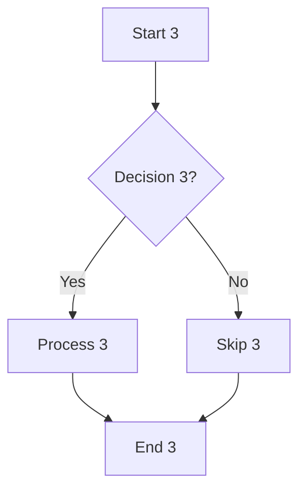
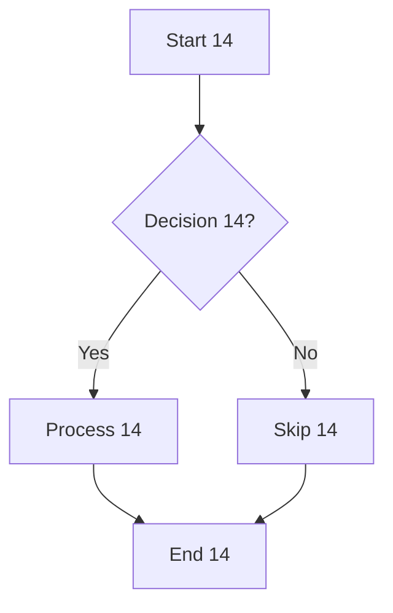
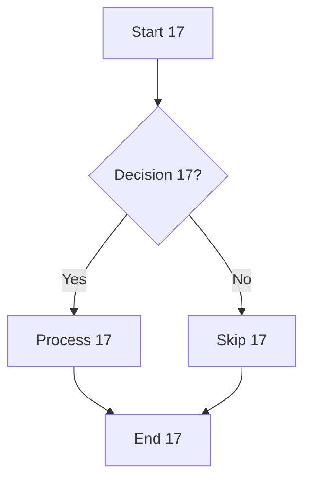
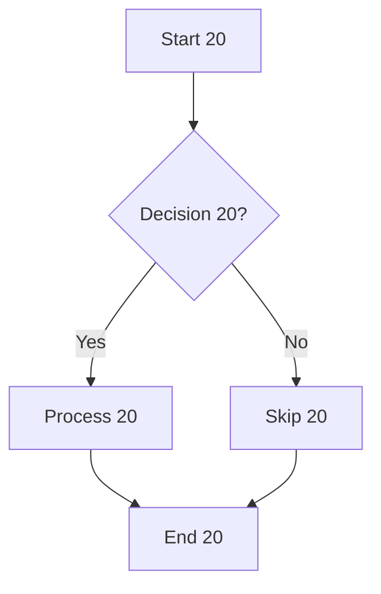

# Native Editor Benchmark (Feature-Dense)

This file is designed to stress all codec paths with realistic Markdown content.
Zero filler — every line exercises a real codec feature.

## Table of Contents

- [Heading Hierarchy](#heading-hierarchy)
- [Inline Formatting Blocks](#inline-formatting-blocks)
- [Bullet Lists](#bullet-lists)
- [Ordered Lists](#ordered-lists)
- [Task Lists](#task-lists)
- [Mixed Nested Lists](#mixed-nested-lists)
- [Code Fence Matrix](#code-fence-matrix)
- [Table Matrix](#table-matrix)
- [Math Blocks](#math-blocks)
- [Blockquote Matrix](#blockquote-matrix)
- [Horizontal Rules](#horizontal-rules)
- [Image References](#image-references)
- [Mermaid Diagrams](#mermaid-diagrams)
- [Heading Checkboxes](#heading-checkboxes)
- [Link Variants](#link-variants)
- [Dense Paragraph Blocks](#dense-paragraph-blocks)

## Heading Hierarchy

# Heading Level 1 — Cycle 1 with **bold** and *italic* markers

Paragraph under H1 cycle 1: **bold text** and *italic text* and `inline code` and [link to docs](https://example.com/docs/1) and ~~strikethrough~~ for testing the full inline parser in a heading context.

## Heading Level 2 — Cycle 1 with **bold** and *italic* markers

Paragraph under H2 cycle 1: **bold text** and *italic text* and `inline code` and [link to docs](https://example.com/docs/1) and ~~strikethrough~~ for testing the full inline parser in a heading context.

### Heading Level 3 — Cycle 1 with **bold** and *italic* markers

Paragraph under H3 cycle 1: **bold text** and *italic text* and `inline code` and [link to docs](https://example.com/docs/1) and ~~strikethrough~~ for testing the full inline parser in a heading context.

#### Heading Level 4 — Cycle 1 with **bold** and *italic* markers

Paragraph under H4 cycle 1: **bold text** and *italic text* and `inline code` and [link to docs](https://example.com/docs/1) and ~~strikethrough~~ for testing the full inline parser in a heading context.

##### Heading Level 5 — Cycle 1 with **bold** and *italic* markers

Paragraph under H5 cycle 1: **bold text** and *italic text* and `inline code` and [link to docs](https://example.com/docs/1) and ~~strikethrough~~ for testing the full inline parser in a heading context.

###### Heading Level 6 — Cycle 1 with **bold** and *italic* markers

Paragraph under H6 cycle 1: **bold text** and *italic text* and `inline code` and [link to docs](https://example.com/docs/1) and ~~strikethrough~~ for testing the full inline parser in a heading context.

# Heading Level 1 — Cycle 2 with **bold** and *italic* markers

Paragraph under H1 cycle 2: **bold text** and *italic text* and `inline code` and [link to docs](https://example.com/docs/2) and ~~strikethrough~~ for testing the full inline parser in a heading context.

## Heading Level 2 — Cycle 2 with **bold** and *italic* markers

Paragraph under H2 cycle 2: **bold text** and *italic text* and `inline code` and [link to docs](https://example.com/docs/2) and ~~strikethrough~~ for testing the full inline parser in a heading context.

### Heading Level 3 — Cycle 2 with **bold** and *italic* markers

Paragraph under H3 cycle 2: **bold text** and *italic text* and `inline code` and [link to docs](https://example.com/docs/2) and ~~strikethrough~~ for testing the full inline parser in a heading context.

#### Heading Level 4 — Cycle 2 with **bold** and *italic* markers

Paragraph under H4 cycle 2: **bold text** and *italic text* and `inline code` and [link to docs](https://example.com/docs/2) and ~~strikethrough~~ for testing the full inline parser in a heading context.

##### Heading Level 5 — Cycle 2 with **bold** and *italic* markers

Paragraph under H5 cycle 2: **bold text** and *italic text* and `inline code` and [link to docs](https://example.com/docs/2) and ~~strikethrough~~ for testing the full inline parser in a heading context.

###### Heading Level 6 — Cycle 2 with **bold** and *italic* markers

Paragraph under H6 cycle 2: **bold text** and *italic text* and `inline code` and [link to docs](https://example.com/docs/2) and ~~strikethrough~~ for testing the full inline parser in a heading context.

# Heading Level 1 — Cycle 3 with **bold** and *italic* markers

Paragraph under H1 cycle 3: **bold text** and *italic text* and `inline code` and [link to docs](https://example.com/docs/3) and ~~strikethrough~~ for testing the full inline parser in a heading context.

## Heading Level 2 — Cycle 3 with **bold** and *italic* markers

Paragraph under H2 cycle 3: **bold text** and *italic text* and `inline code` and [link to docs](https://example.com/docs/3) and ~~strikethrough~~ for testing the full inline parser in a heading context.

### Heading Level 3 — Cycle 3 with **bold** and *italic* markers

Paragraph under H3 cycle 3: **bold text** and *italic text* and `inline code` and [link to docs](https://example.com/docs/3) and ~~strikethrough~~ for testing the full inline parser in a heading context.

#### Heading Level 4 — Cycle 3 with **bold** and *italic* markers

Paragraph under H4 cycle 3: **bold text** and *italic text* and `inline code` and [link to docs](https://example.com/docs/3) and ~~strikethrough~~ for testing the full inline parser in a heading context.

##### Heading Level 5 — Cycle 3 with **bold** and *italic* markers

Paragraph under H5 cycle 3: **bold text** and *italic text* and `inline code` and [link to docs](https://example.com/docs/3) and ~~strikethrough~~ for testing the full inline parser in a heading context.

###### Heading Level 6 — Cycle 3 with **bold** and *italic* markers

Paragraph under H6 cycle 3: **bold text** and *italic text* and `inline code` and [link to docs](https://example.com/docs/3) and ~~strikethrough~~ for testing the full inline parser in a heading context.

# Heading Level 1 — Cycle 4 with **bold** and *italic* markers

Paragraph under H1 cycle 4: **bold text** and *italic text* and `inline code` and [link to docs](https://example.com/docs/4) and ~~strikethrough~~ for testing the full inline parser in a heading context.

## Heading Level 2 — Cycle 4 with **bold** and *italic* markers

Paragraph under H2 cycle 4: **bold text** and *italic text* and `inline code` and [link to docs](https://example.com/docs/4) and ~~strikethrough~~ for testing the full inline parser in a heading context.

### Heading Level 3 — Cycle 4 with **bold** and *italic* markers

Paragraph under H3 cycle 4: **bold text** and *italic text* and `inline code` and [link to docs](https://example.com/docs/4) and ~~strikethrough~~ for testing the full inline parser in a heading context.

#### Heading Level 4 — Cycle 4 with **bold** and *italic* markers

Paragraph under H4 cycle 4: **bold text** and *italic text* and `inline code` and [link to docs](https://example.com/docs/4) and ~~strikethrough~~ for testing the full inline parser in a heading context.

##### Heading Level 5 — Cycle 4 with **bold** and *italic* markers

Paragraph under H5 cycle 4: **bold text** and *italic text* and `inline code` and [link to docs](https://example.com/docs/4) and ~~strikethrough~~ for testing the full inline parser in a heading context.

###### Heading Level 6 — Cycle 4 with **bold** and *italic* markers

Paragraph under H6 cycle 4: **bold text** and *italic text* and `inline code` and [link to docs](https://example.com/docs/4) and ~~strikethrough~~ for testing the full inline parser in a heading context.

# Heading Level 1 — Cycle 5 with **bold** and *italic* markers

Paragraph under H1 cycle 5: **bold text** and *italic text* and `inline code` and [link to docs](https://example.com/docs/5) and ~~strikethrough~~ for testing the full inline parser in a heading context.

## Heading Level 2 — Cycle 5 with **bold** and *italic* markers

Paragraph under H2 cycle 5: **bold text** and *italic text* and `inline code` and [link to docs](https://example.com/docs/5) and ~~strikethrough~~ for testing the full inline parser in a heading context.

### Heading Level 3 — Cycle 5 with **bold** and *italic* markers

Paragraph under H3 cycle 5: **bold text** and *italic text* and `inline code` and [link to docs](https://example.com/docs/5) and ~~strikethrough~~ for testing the full inline parser in a heading context.

#### Heading Level 4 — Cycle 5 with **bold** and *italic* markers

Paragraph under H4 cycle 5: **bold text** and *italic text* and `inline code` and [link to docs](https://example.com/docs/5) and ~~strikethrough~~ for testing the full inline parser in a heading context.

##### Heading Level 5 — Cycle 5 with **bold** and *italic* markers

Paragraph under H5 cycle 5: **bold text** and *italic text* and `inline code` and [link to docs](https://example.com/docs/5) and ~~strikethrough~~ for testing the full inline parser in a heading context.

###### Heading Level 6 — Cycle 5 with **bold** and *italic* markers

Paragraph under H6 cycle 5: **bold text** and *italic text* and `inline code` and [link to docs](https://example.com/docs/5) and ~~strikethrough~~ for testing the full inline parser in a heading context.

# Heading Level 1 — Cycle 6 with **bold** and *italic* markers

Paragraph under H1 cycle 6: **bold text** and *italic text* and `inline code` and [link to docs](https://example.com/docs/6) and ~~strikethrough~~ for testing the full inline parser in a heading context.

## Heading Level 2 — Cycle 6 with **bold** and *italic* markers

Paragraph under H2 cycle 6: **bold text** and *italic text* and `inline code` and [link to docs](https://example.com/docs/6) and ~~strikethrough~~ for testing the full inline parser in a heading context.

### Heading Level 3 — Cycle 6 with **bold** and *italic* markers

Paragraph under H3 cycle 6: **bold text** and *italic text* and `inline code` and [link to docs](https://example.com/docs/6) and ~~strikethrough~~ for testing the full inline parser in a heading context.

#### Heading Level 4 — Cycle 6 with **bold** and *italic* markers

Paragraph under H4 cycle 6: **bold text** and *italic text* and `inline code` and [link to docs](https://example.com/docs/6) and ~~strikethrough~~ for testing the full inline parser in a heading context.

##### Heading Level 5 — Cycle 6 with **bold** and *italic* markers

Paragraph under H5 cycle 6: **bold text** and *italic text* and `inline code` and [link to docs](https://example.com/docs/6) and ~~strikethrough~~ for testing the full inline parser in a heading context.

###### Heading Level 6 — Cycle 6 with **bold** and *italic* markers

Paragraph under H6 cycle 6: **bold text** and *italic text* and `inline code` and [link to docs](https://example.com/docs/6) and ~~strikethrough~~ for testing the full inline parser in a heading context.

# Heading Level 1 — Cycle 7 with **bold** and *italic* markers

Paragraph under H1 cycle 7: **bold text** and *italic text* and `inline code` and [link to docs](https://example.com/docs/7) and ~~strikethrough~~ for testing the full inline parser in a heading context.

## Heading Level 2 — Cycle 7 with **bold** and *italic* markers

Paragraph under H2 cycle 7: **bold text** and *italic text* and `inline code` and [link to docs](https://example.com/docs/7) and ~~strikethrough~~ for testing the full inline parser in a heading context.

### Heading Level 3 — Cycle 7 with **bold** and *italic* markers

Paragraph under H3 cycle 7: **bold text** and *italic text* and `inline code` and [link to docs](https://example.com/docs/7) and ~~strikethrough~~ for testing the full inline parser in a heading context.

#### Heading Level 4 — Cycle 7 with **bold** and *italic* markers

Paragraph under H4 cycle 7: **bold text** and *italic text* and `inline code` and [link to docs](https://example.com/docs/7) and ~~strikethrough~~ for testing the full inline parser in a heading context.

##### Heading Level 5 — Cycle 7 with **bold** and *italic* markers

Paragraph under H5 cycle 7: **bold text** and *italic text* and `inline code` and [link to docs](https://example.com/docs/7) and ~~strikethrough~~ for testing the full inline parser in a heading context.

###### Heading Level 6 — Cycle 7 with **bold** and *italic* markers

Paragraph under H6 cycle 7: **bold text** and *italic text* and `inline code` and [link to docs](https://example.com/docs/7) and ~~strikethrough~~ for testing the full inline parser in a heading context.

# Heading Level 1 — Cycle 8 with **bold** and *italic* markers

Paragraph under H1 cycle 8: **bold text** and *italic text* and `inline code` and [link to docs](https://example.com/docs/8) and ~~strikethrough~~ for testing the full inline parser in a heading context.

## Heading Level 2 — Cycle 8 with **bold** and *italic* markers

Paragraph under H2 cycle 8: **bold text** and *italic text* and `inline code` and [link to docs](https://example.com/docs/8) and ~~strikethrough~~ for testing the full inline parser in a heading context.

### Heading Level 3 — Cycle 8 with **bold** and *italic* markers

Paragraph under H3 cycle 8: **bold text** and *italic text* and `inline code` and [link to docs](https://example.com/docs/8) and ~~strikethrough~~ for testing the full inline parser in a heading context.

#### Heading Level 4 — Cycle 8 with **bold** and *italic* markers

Paragraph under H4 cycle 8: **bold text** and *italic text* and `inline code` and [link to docs](https://example.com/docs/8) and ~~strikethrough~~ for testing the full inline parser in a heading context.

##### Heading Level 5 — Cycle 8 with **bold** and *italic* markers

Paragraph under H5 cycle 8: **bold text** and *italic text* and `inline code` and [link to docs](https://example.com/docs/8) and ~~strikethrough~~ for testing the full inline parser in a heading context.

###### Heading Level 6 — Cycle 8 with **bold** and *italic* markers

Paragraph under H6 cycle 8: **bold text** and *italic text* and `inline code` and [link to docs](https://example.com/docs/8) and ~~strikethrough~~ for testing the full inline parser in a heading context.

# Heading Level 1 — Cycle 9 with **bold** and *italic* markers

Paragraph under H1 cycle 9: **bold text** and *italic text* and `inline code` and [link to docs](https://example.com/docs/9) and ~~strikethrough~~ for testing the full inline parser in a heading context.

## Heading Level 2 — Cycle 9 with **bold** and *italic* markers

Paragraph under H2 cycle 9: **bold text** and *italic text* and `inline code` and [link to docs](https://example.com/docs/9) and ~~strikethrough~~ for testing the full inline parser in a heading context.

### Heading Level 3 — Cycle 9 with **bold** and *italic* markers

Paragraph under H3 cycle 9: **bold text** and *italic text* and `inline code` and [link to docs](https://example.com/docs/9) and ~~strikethrough~~ for testing the full inline parser in a heading context.

#### Heading Level 4 — Cycle 9 with **bold** and *italic* markers

Paragraph under H4 cycle 9: **bold text** and *italic text* and `inline code` and [link to docs](https://example.com/docs/9) and ~~strikethrough~~ for testing the full inline parser in a heading context.

##### Heading Level 5 — Cycle 9 with **bold** and *italic* markers

Paragraph under H5 cycle 9: **bold text** and *italic text* and `inline code` and [link to docs](https://example.com/docs/9) and ~~strikethrough~~ for testing the full inline parser in a heading context.

###### Heading Level 6 — Cycle 9 with **bold** and *italic* markers

Paragraph under H6 cycle 9: **bold text** and *italic text* and `inline code` and [link to docs](https://example.com/docs/9) and ~~strikethrough~~ for testing the full inline parser in a heading context.

# Heading Level 1 — Cycle 10 with **bold** and *italic* markers

Paragraph under H1 cycle 10: **bold text** and *italic text* and `inline code` and [link to docs](https://example.com/docs/10) and ~~strikethrough~~ for testing the full inline parser in a heading context.

## Heading Level 2 — Cycle 10 with **bold** and *italic* markers

Paragraph under H2 cycle 10: **bold text** and *italic text* and `inline code` and [link to docs](https://example.com/docs/10) and ~~strikethrough~~ for testing the full inline parser in a heading context.

### Heading Level 3 — Cycle 10 with **bold** and *italic* markers

Paragraph under H3 cycle 10: **bold text** and *italic text* and `inline code` and [link to docs](https://example.com/docs/10) and ~~strikethrough~~ for testing the full inline parser in a heading context.

#### Heading Level 4 — Cycle 10 with **bold** and *italic* markers

Paragraph under H4 cycle 10: **bold text** and *italic text* and `inline code` and [link to docs](https://example.com/docs/10) and ~~strikethrough~~ for testing the full inline parser in a heading context.

##### Heading Level 5 — Cycle 10 with **bold** and *italic* markers

Paragraph under H5 cycle 10: **bold text** and *italic text* and `inline code` and [link to docs](https://example.com/docs/10) and ~~strikethrough~~ for testing the full inline parser in a heading context.

###### Heading Level 6 — Cycle 10 with **bold** and *italic* markers

Paragraph under H6 cycle 10: **bold text** and *italic text* and `inline code` and [link to docs](https://example.com/docs/10) and ~~strikethrough~~ for testing the full inline parser in a heading context.

# Heading Level 1 — Cycle 11 with **bold** and *italic* markers

Paragraph under H1 cycle 11: **bold text** and *italic text* and `inline code` and [link to docs](https://example.com/docs/11) and ~~strikethrough~~ for testing the full inline parser in a heading context.

## Heading Level 2 — Cycle 11 with **bold** and *italic* markers

Paragraph under H2 cycle 11: **bold text** and *italic text* and `inline code` and [link to docs](https://example.com/docs/11) and ~~strikethrough~~ for testing the full inline parser in a heading context.

### Heading Level 3 — Cycle 11 with **bold** and *italic* markers

Paragraph under H3 cycle 11: **bold text** and *italic text* and `inline code` and [link to docs](https://example.com/docs/11) and ~~strikethrough~~ for testing the full inline parser in a heading context.

#### Heading Level 4 — Cycle 11 with **bold** and *italic* markers

Paragraph under H4 cycle 11: **bold text** and *italic text* and `inline code` and [link to docs](https://example.com/docs/11) and ~~strikethrough~~ for testing the full inline parser in a heading context.

##### Heading Level 5 — Cycle 11 with **bold** and *italic* markers

Paragraph under H5 cycle 11: **bold text** and *italic text* and `inline code` and [link to docs](https://example.com/docs/11) and ~~strikethrough~~ for testing the full inline parser in a heading context.

###### Heading Level 6 — Cycle 11 with **bold** and *italic* markers

Paragraph under H6 cycle 11: **bold text** and *italic text* and `inline code` and [link to docs](https://example.com/docs/11) and ~~strikethrough~~ for testing the full inline parser in a heading context.

# Heading Level 1 — Cycle 12 with **bold** and *italic* markers

Paragraph under H1 cycle 12: **bold text** and *italic text* and `inline code` and [link to docs](https://example.com/docs/12) and ~~strikethrough~~ for testing the full inline parser in a heading context.

## Heading Level 2 — Cycle 12 with **bold** and *italic* markers

Paragraph under H2 cycle 12: **bold text** and *italic text* and `inline code` and [link to docs](https://example.com/docs/12) and ~~strikethrough~~ for testing the full inline parser in a heading context.

### Heading Level 3 — Cycle 12 with **bold** and *italic* markers

Paragraph under H3 cycle 12: **bold text** and *italic text* and `inline code` and [link to docs](https://example.com/docs/12) and ~~strikethrough~~ for testing the full inline parser in a heading context.

#### Heading Level 4 — Cycle 12 with **bold** and *italic* markers

Paragraph under H4 cycle 12: **bold text** and *italic text* and `inline code` and [link to docs](https://example.com/docs/12) and ~~strikethrough~~ for testing the full inline parser in a heading context.

##### Heading Level 5 — Cycle 12 with **bold** and *italic* markers

Paragraph under H5 cycle 12: **bold text** and *italic text* and `inline code` and [link to docs](https://example.com/docs/12) and ~~strikethrough~~ for testing the full inline parser in a heading context.

###### Heading Level 6 — Cycle 12 with **bold** and *italic* markers

Paragraph under H6 cycle 12: **bold text** and *italic text* and `inline code` and [link to docs](https://example.com/docs/12) and ~~strikethrough~~ for testing the full inline parser in a heading context.

# Heading Level 1 — Cycle 13 with **bold** and *italic* markers

Paragraph under H1 cycle 13: **bold text** and *italic text* and `inline code` and [link to docs](https://example.com/docs/13) and ~~strikethrough~~ for testing the full inline parser in a heading context.

## Heading Level 2 — Cycle 13 with **bold** and *italic* markers

Paragraph under H2 cycle 13: **bold text** and *italic text* and `inline code` and [link to docs](https://example.com/docs/13) and ~~strikethrough~~ for testing the full inline parser in a heading context.

### Heading Level 3 — Cycle 13 with **bold** and *italic* markers

Paragraph under H3 cycle 13: **bold text** and *italic text* and `inline code` and [link to docs](https://example.com/docs/13) and ~~strikethrough~~ for testing the full inline parser in a heading context.

#### Heading Level 4 — Cycle 13 with **bold** and *italic* markers

Paragraph under H4 cycle 13: **bold text** and *italic text* and `inline code` and [link to docs](https://example.com/docs/13) and ~~strikethrough~~ for testing the full inline parser in a heading context.

##### Heading Level 5 — Cycle 13 with **bold** and *italic* markers

Paragraph under H5 cycle 13: **bold text** and *italic text* and `inline code` and [link to docs](https://example.com/docs/13) and ~~strikethrough~~ for testing the full inline parser in a heading context.

###### Heading Level 6 — Cycle 13 with **bold** and *italic* markers

Paragraph under H6 cycle 13: **bold text** and *italic text* and `inline code` and [link to docs](https://example.com/docs/13) and ~~strikethrough~~ for testing the full inline parser in a heading context.

# Heading Level 1 — Cycle 14 with **bold** and *italic* markers

Paragraph under H1 cycle 14: **bold text** and *italic text* and `inline code` and [link to docs](https://example.com/docs/14) and ~~strikethrough~~ for testing the full inline parser in a heading context.

## Heading Level 2 — Cycle 14 with **bold** and *italic* markers

Paragraph under H2 cycle 14: **bold text** and *italic text* and `inline code` and [link to docs](https://example.com/docs/14) and ~~strikethrough~~ for testing the full inline parser in a heading context.

### Heading Level 3 — Cycle 14 with **bold** and *italic* markers

Paragraph under H3 cycle 14: **bold text** and *italic text* and `inline code` and [link to docs](https://example.com/docs/14) and ~~strikethrough~~ for testing the full inline parser in a heading context.

#### Heading Level 4 — Cycle 14 with **bold** and *italic* markers

Paragraph under H4 cycle 14: **bold text** and *italic text* and `inline code` and [link to docs](https://example.com/docs/14) and ~~strikethrough~~ for testing the full inline parser in a heading context.

##### Heading Level 5 — Cycle 14 with **bold** and *italic* markers

Paragraph under H5 cycle 14: **bold text** and *italic text* and `inline code` and [link to docs](https://example.com/docs/14) and ~~strikethrough~~ for testing the full inline parser in a heading context.

###### Heading Level 6 — Cycle 14 with **bold** and *italic* markers

Paragraph under H6 cycle 14: **bold text** and *italic text* and `inline code` and [link to docs](https://example.com/docs/14) and ~~strikethrough~~ for testing the full inline parser in a heading context.

# Heading Level 1 — Cycle 15 with **bold** and *italic* markers

Paragraph under H1 cycle 15: **bold text** and *italic text* and `inline code` and [link to docs](https://example.com/docs/15) and ~~strikethrough~~ for testing the full inline parser in a heading context.

## Heading Level 2 — Cycle 15 with **bold** and *italic* markers

Paragraph under H2 cycle 15: **bold text** and *italic text* and `inline code` and [link to docs](https://example.com/docs/15) and ~~strikethrough~~ for testing the full inline parser in a heading context.

### Heading Level 3 — Cycle 15 with **bold** and *italic* markers

Paragraph under H3 cycle 15: **bold text** and *italic text* and `inline code` and [link to docs](https://example.com/docs/15) and ~~strikethrough~~ for testing the full inline parser in a heading context.

#### Heading Level 4 — Cycle 15 with **bold** and *italic* markers

Paragraph under H4 cycle 15: **bold text** and *italic text* and `inline code` and [link to docs](https://example.com/docs/15) and ~~strikethrough~~ for testing the full inline parser in a heading context.

##### Heading Level 5 — Cycle 15 with **bold** and *italic* markers

Paragraph under H5 cycle 15: **bold text** and *italic text* and `inline code` and [link to docs](https://example.com/docs/15) and ~~strikethrough~~ for testing the full inline parser in a heading context.

###### Heading Level 6 — Cycle 15 with **bold** and *italic* markers

Paragraph under H6 cycle 15: **bold text** and *italic text* and `inline code` and [link to docs](https://example.com/docs/15) and ~~strikethrough~~ for testing the full inline parser in a heading context.

# Heading Level 1 — Cycle 16 with **bold** and *italic* markers

Paragraph under H1 cycle 16: **bold text** and *italic text* and `inline code` and [link to docs](https://example.com/docs/16) and ~~strikethrough~~ for testing the full inline parser in a heading context.

## Heading Level 2 — Cycle 16 with **bold** and *italic* markers

Paragraph under H2 cycle 16: **bold text** and *italic text* and `inline code` and [link to docs](https://example.com/docs/16) and ~~strikethrough~~ for testing the full inline parser in a heading context.

### Heading Level 3 — Cycle 16 with **bold** and *italic* markers

Paragraph under H3 cycle 16: **bold text** and *italic text* and `inline code` and [link to docs](https://example.com/docs/16) and ~~strikethrough~~ for testing the full inline parser in a heading context.

#### Heading Level 4 — Cycle 16 with **bold** and *italic* markers

Paragraph under H4 cycle 16: **bold text** and *italic text* and `inline code` and [link to docs](https://example.com/docs/16) and ~~strikethrough~~ for testing the full inline parser in a heading context.

##### Heading Level 5 — Cycle 16 with **bold** and *italic* markers

Paragraph under H5 cycle 16: **bold text** and *italic text* and `inline code` and [link to docs](https://example.com/docs/16) and ~~strikethrough~~ for testing the full inline parser in a heading context.

###### Heading Level 6 — Cycle 16 with **bold** and *italic* markers

Paragraph under H6 cycle 16: **bold text** and *italic text* and `inline code` and [link to docs](https://example.com/docs/16) and ~~strikethrough~~ for testing the full inline parser in a heading context.

# Heading Level 1 — Cycle 17 with **bold** and *italic* markers

Paragraph under H1 cycle 17: **bold text** and *italic text* and `inline code` and [link to docs](https://example.com/docs/17) and ~~strikethrough~~ for testing the full inline parser in a heading context.

## Heading Level 2 — Cycle 17 with **bold** and *italic* markers

Paragraph under H2 cycle 17: **bold text** and *italic text* and `inline code` and [link to docs](https://example.com/docs/17) and ~~strikethrough~~ for testing the full inline parser in a heading context.

### Heading Level 3 — Cycle 17 with **bold** and *italic* markers

Paragraph under H3 cycle 17: **bold text** and *italic text* and `inline code` and [link to docs](https://example.com/docs/17) and ~~strikethrough~~ for testing the full inline parser in a heading context.

#### Heading Level 4 — Cycle 17 with **bold** and *italic* markers

Paragraph under H4 cycle 17: **bold text** and *italic text* and `inline code` and [link to docs](https://example.com/docs/17) and ~~strikethrough~~ for testing the full inline parser in a heading context.

##### Heading Level 5 — Cycle 17 with **bold** and *italic* markers

Paragraph under H5 cycle 17: **bold text** and *italic text* and `inline code` and [link to docs](https://example.com/docs/17) and ~~strikethrough~~ for testing the full inline parser in a heading context.

###### Heading Level 6 — Cycle 17 with **bold** and *italic* markers

Paragraph under H6 cycle 17: **bold text** and *italic text* and `inline code` and [link to docs](https://example.com/docs/17) and ~~strikethrough~~ for testing the full inline parser in a heading context.

# Heading Level 1 — Cycle 18 with **bold** and *italic* markers

Paragraph under H1 cycle 18: **bold text** and *italic text* and `inline code` and [link to docs](https://example.com/docs/18) and ~~strikethrough~~ for testing the full inline parser in a heading context.

## Heading Level 2 — Cycle 18 with **bold** and *italic* markers

Paragraph under H2 cycle 18: **bold text** and *italic text* and `inline code` and [link to docs](https://example.com/docs/18) and ~~strikethrough~~ for testing the full inline parser in a heading context.

### Heading Level 3 — Cycle 18 with **bold** and *italic* markers

Paragraph under H3 cycle 18: **bold text** and *italic text* and `inline code` and [link to docs](https://example.com/docs/18) and ~~strikethrough~~ for testing the full inline parser in a heading context.

#### Heading Level 4 — Cycle 18 with **bold** and *italic* markers

Paragraph under H4 cycle 18: **bold text** and *italic text* and `inline code` and [link to docs](https://example.com/docs/18) and ~~strikethrough~~ for testing the full inline parser in a heading context.

##### Heading Level 5 — Cycle 18 with **bold** and *italic* markers

Paragraph under H5 cycle 18: **bold text** and *italic text* and `inline code` and [link to docs](https://example.com/docs/18) and ~~strikethrough~~ for testing the full inline parser in a heading context.

###### Heading Level 6 — Cycle 18 with **bold** and *italic* markers

Paragraph under H6 cycle 18: **bold text** and *italic text* and `inline code` and [link to docs](https://example.com/docs/18) and ~~strikethrough~~ for testing the full inline parser in a heading context.

# Heading Level 1 — Cycle 19 with **bold** and *italic* markers

Paragraph under H1 cycle 19: **bold text** and *italic text* and `inline code` and [link to docs](https://example.com/docs/19) and ~~strikethrough~~ for testing the full inline parser in a heading context.

## Heading Level 2 — Cycle 19 with **bold** and *italic* markers

Paragraph under H2 cycle 19: **bold text** and *italic text* and `inline code` and [link to docs](https://example.com/docs/19) and ~~strikethrough~~ for testing the full inline parser in a heading context.

### Heading Level 3 — Cycle 19 with **bold** and *italic* markers

Paragraph under H3 cycle 19: **bold text** and *italic text* and `inline code` and [link to docs](https://example.com/docs/19) and ~~strikethrough~~ for testing the full inline parser in a heading context.

#### Heading Level 4 — Cycle 19 with **bold** and *italic* markers

Paragraph under H4 cycle 19: **bold text** and *italic text* and `inline code` and [link to docs](https://example.com/docs/19) and ~~strikethrough~~ for testing the full inline parser in a heading context.

##### Heading Level 5 — Cycle 19 with **bold** and *italic* markers

Paragraph under H5 cycle 19: **bold text** and *italic text* and `inline code` and [link to docs](https://example.com/docs/19) and ~~strikethrough~~ for testing the full inline parser in a heading context.

###### Heading Level 6 — Cycle 19 with **bold** and *italic* markers

Paragraph under H6 cycle 19: **bold text** and *italic text* and `inline code` and [link to docs](https://example.com/docs/19) and ~~strikethrough~~ for testing the full inline parser in a heading context.

# Heading Level 1 — Cycle 20 with **bold** and *italic* markers

Paragraph under H1 cycle 20: **bold text** and *italic text* and `inline code` and [link to docs](https://example.com/docs/20) and ~~strikethrough~~ for testing the full inline parser in a heading context.

## Heading Level 2 — Cycle 20 with **bold** and *italic* markers

Paragraph under H2 cycle 20: **bold text** and *italic text* and `inline code` and [link to docs](https://example.com/docs/20) and ~~strikethrough~~ for testing the full inline parser in a heading context.

### Heading Level 3 — Cycle 20 with **bold** and *italic* markers

Paragraph under H3 cycle 20: **bold text** and *italic text* and `inline code` and [link to docs](https://example.com/docs/20) and ~~strikethrough~~ for testing the full inline parser in a heading context.

#### Heading Level 4 — Cycle 20 with **bold** and *italic* markers

Paragraph under H4 cycle 20: **bold text** and *italic text* and `inline code` and [link to docs](https://example.com/docs/20) and ~~strikethrough~~ for testing the full inline parser in a heading context.

##### Heading Level 5 — Cycle 20 with **bold** and *italic* markers

Paragraph under H5 cycle 20: **bold text** and *italic text* and `inline code` and [link to docs](https://example.com/docs/20) and ~~strikethrough~~ for testing the full inline parser in a heading context.

###### Heading Level 6 — Cycle 20 with **bold** and *italic* markers

Paragraph under H6 cycle 20: **bold text** and *italic text* and `inline code` and [link to docs](https://example.com/docs/20) and ~~strikethrough~~ for testing the full inline parser in a heading context.

# Heading Level 1 — Cycle 21 with **bold** and *italic* markers

Paragraph under H1 cycle 21: **bold text** and *italic text* and `inline code` and [link to docs](https://example.com/docs/21) and ~~strikethrough~~ for testing the full inline parser in a heading context.

## Heading Level 2 — Cycle 21 with **bold** and *italic* markers

Paragraph under H2 cycle 21: **bold text** and *italic text* and `inline code` and [link to docs](https://example.com/docs/21) and ~~strikethrough~~ for testing the full inline parser in a heading context.

### Heading Level 3 — Cycle 21 with **bold** and *italic* markers

Paragraph under H3 cycle 21: **bold text** and *italic text* and `inline code` and [link to docs](https://example.com/docs/21) and ~~strikethrough~~ for testing the full inline parser in a heading context.

#### Heading Level 4 — Cycle 21 with **bold** and *italic* markers

Paragraph under H4 cycle 21: **bold text** and *italic text* and `inline code` and [link to docs](https://example.com/docs/21) and ~~strikethrough~~ for testing the full inline parser in a heading context.

##### Heading Level 5 — Cycle 21 with **bold** and *italic* markers

Paragraph under H5 cycle 21: **bold text** and *italic text* and `inline code` and [link to docs](https://example.com/docs/21) and ~~strikethrough~~ for testing the full inline parser in a heading context.

###### Heading Level 6 — Cycle 21 with **bold** and *italic* markers

Paragraph under H6 cycle 21: **bold text** and *italic text* and `inline code` and [link to docs](https://example.com/docs/21) and ~~strikethrough~~ for testing the full inline parser in a heading context.

# Heading Level 1 — Cycle 22 with **bold** and *italic* markers

Paragraph under H1 cycle 22: **bold text** and *italic text* and `inline code` and [link to docs](https://example.com/docs/22) and ~~strikethrough~~ for testing the full inline parser in a heading context.

## Heading Level 2 — Cycle 22 with **bold** and *italic* markers

Paragraph under H2 cycle 22: **bold text** and *italic text* and `inline code` and [link to docs](https://example.com/docs/22) and ~~strikethrough~~ for testing the full inline parser in a heading context.

### Heading Level 3 — Cycle 22 with **bold** and *italic* markers

Paragraph under H3 cycle 22: **bold text** and *italic text* and `inline code` and [link to docs](https://example.com/docs/22) and ~~strikethrough~~ for testing the full inline parser in a heading context.

#### Heading Level 4 — Cycle 22 with **bold** and *italic* markers

Paragraph under H4 cycle 22: **bold text** and *italic text* and `inline code` and [link to docs](https://example.com/docs/22) and ~~strikethrough~~ for testing the full inline parser in a heading context.

##### Heading Level 5 — Cycle 22 with **bold** and *italic* markers

Paragraph under H5 cycle 22: **bold text** and *italic text* and `inline code` and [link to docs](https://example.com/docs/22) and ~~strikethrough~~ for testing the full inline parser in a heading context.

###### Heading Level 6 — Cycle 22 with **bold** and *italic* markers

Paragraph under H6 cycle 22: **bold text** and *italic text* and `inline code` and [link to docs](https://example.com/docs/22) and ~~strikethrough~~ for testing the full inline parser in a heading context.

# Heading Level 1 — Cycle 23 with **bold** and *italic* markers

Paragraph under H1 cycle 23: **bold text** and *italic text* and `inline code` and [link to docs](https://example.com/docs/23) and ~~strikethrough~~ for testing the full inline parser in a heading context.

## Heading Level 2 — Cycle 23 with **bold** and *italic* markers

Paragraph under H2 cycle 23: **bold text** and *italic text* and `inline code` and [link to docs](https://example.com/docs/23) and ~~strikethrough~~ for testing the full inline parser in a heading context.

### Heading Level 3 — Cycle 23 with **bold** and *italic* markers

Paragraph under H3 cycle 23: **bold text** and *italic text* and `inline code` and [link to docs](https://example.com/docs/23) and ~~strikethrough~~ for testing the full inline parser in a heading context.

#### Heading Level 4 — Cycle 23 with **bold** and *italic* markers

Paragraph under H4 cycle 23: **bold text** and *italic text* and `inline code` and [link to docs](https://example.com/docs/23) and ~~strikethrough~~ for testing the full inline parser in a heading context.

##### Heading Level 5 — Cycle 23 with **bold** and *italic* markers

Paragraph under H5 cycle 23: **bold text** and *italic text* and `inline code` and [link to docs](https://example.com/docs/23) and ~~strikethrough~~ for testing the full inline parser in a heading context.

###### Heading Level 6 — Cycle 23 with **bold** and *italic* markers

Paragraph under H6 cycle 23: **bold text** and *italic text* and `inline code` and [link to docs](https://example.com/docs/23) and ~~strikethrough~~ for testing the full inline parser in a heading context.

# Heading Level 1 — Cycle 24 with **bold** and *italic* markers

Paragraph under H1 cycle 24: **bold text** and *italic text* and `inline code` and [link to docs](https://example.com/docs/24) and ~~strikethrough~~ for testing the full inline parser in a heading context.

## Heading Level 2 — Cycle 24 with **bold** and *italic* markers

Paragraph under H2 cycle 24: **bold text** and *italic text* and `inline code` and [link to docs](https://example.com/docs/24) and ~~strikethrough~~ for testing the full inline parser in a heading context.

### Heading Level 3 — Cycle 24 with **bold** and *italic* markers

Paragraph under H3 cycle 24: **bold text** and *italic text* and `inline code` and [link to docs](https://example.com/docs/24) and ~~strikethrough~~ for testing the full inline parser in a heading context.

#### Heading Level 4 — Cycle 24 with **bold** and *italic* markers

Paragraph under H4 cycle 24: **bold text** and *italic text* and `inline code` and [link to docs](https://example.com/docs/24) and ~~strikethrough~~ for testing the full inline parser in a heading context.

##### Heading Level 5 — Cycle 24 with **bold** and *italic* markers

Paragraph under H5 cycle 24: **bold text** and *italic text* and `inline code` and [link to docs](https://example.com/docs/24) and ~~strikethrough~~ for testing the full inline parser in a heading context.

###### Heading Level 6 — Cycle 24 with **bold** and *italic* markers

Paragraph under H6 cycle 24: **bold text** and *italic text* and `inline code` and [link to docs](https://example.com/docs/24) and ~~strikethrough~~ for testing the full inline parser in a heading context.

# Heading Level 1 — Cycle 25 with **bold** and *italic* markers

Paragraph under H1 cycle 25: **bold text** and *italic text* and `inline code` and [link to docs](https://example.com/docs/25) and ~~strikethrough~~ for testing the full inline parser in a heading context.

## Heading Level 2 — Cycle 25 with **bold** and *italic* markers

Paragraph under H2 cycle 25: **bold text** and *italic text* and `inline code` and [link to docs](https://example.com/docs/25) and ~~strikethrough~~ for testing the full inline parser in a heading context.

### Heading Level 3 — Cycle 25 with **bold** and *italic* markers

Paragraph under H3 cycle 25: **bold text** and *italic text* and `inline code` and [link to docs](https://example.com/docs/25) and ~~strikethrough~~ for testing the full inline parser in a heading context.

#### Heading Level 4 — Cycle 25 with **bold** and *italic* markers

Paragraph under H4 cycle 25: **bold text** and *italic text* and `inline code` and [link to docs](https://example.com/docs/25) and ~~strikethrough~~ for testing the full inline parser in a heading context.

##### Heading Level 5 — Cycle 25 with **bold** and *italic* markers

Paragraph under H5 cycle 25: **bold text** and *italic text* and `inline code` and [link to docs](https://example.com/docs/25) and ~~strikethrough~~ for testing the full inline parser in a heading context.

###### Heading Level 6 — Cycle 25 with **bold** and *italic* markers

Paragraph under H6 cycle 25: **bold text** and *italic text* and `inline code` and [link to docs](https://example.com/docs/25) and ~~strikethrough~~ for testing the full inline parser in a heading context.

# Heading Level 1 — Cycle 26 with **bold** and *italic* markers

Paragraph under H1 cycle 26: **bold text** and *italic text* and `inline code` and [link to docs](https://example.com/docs/26) and ~~strikethrough~~ for testing the full inline parser in a heading context.

## Heading Level 2 — Cycle 26 with **bold** and *italic* markers

Paragraph under H2 cycle 26: **bold text** and *italic text* and `inline code` and [link to docs](https://example.com/docs/26) and ~~strikethrough~~ for testing the full inline parser in a heading context.

### Heading Level 3 — Cycle 26 with **bold** and *italic* markers

Paragraph under H3 cycle 26: **bold text** and *italic text* and `inline code` and [link to docs](https://example.com/docs/26) and ~~strikethrough~~ for testing the full inline parser in a heading context.

#### Heading Level 4 — Cycle 26 with **bold** and *italic* markers

Paragraph under H4 cycle 26: **bold text** and *italic text* and `inline code` and [link to docs](https://example.com/docs/26) and ~~strikethrough~~ for testing the full inline parser in a heading context.

##### Heading Level 5 — Cycle 26 with **bold** and *italic* markers

Paragraph under H5 cycle 26: **bold text** and *italic text* and `inline code` and [link to docs](https://example.com/docs/26) and ~~strikethrough~~ for testing the full inline parser in a heading context.

###### Heading Level 6 — Cycle 26 with **bold** and *italic* markers

Paragraph under H6 cycle 26: **bold text** and *italic text* and `inline code` and [link to docs](https://example.com/docs/26) and ~~strikethrough~~ for testing the full inline parser in a heading context.

# Heading Level 1 — Cycle 27 with **bold** and *italic* markers

Paragraph under H1 cycle 27: **bold text** and *italic text* and `inline code` and [link to docs](https://example.com/docs/27) and ~~strikethrough~~ for testing the full inline parser in a heading context.

## Heading Level 2 — Cycle 27 with **bold** and *italic* markers

Paragraph under H2 cycle 27: **bold text** and *italic text* and `inline code` and [link to docs](https://example.com/docs/27) and ~~strikethrough~~ for testing the full inline parser in a heading context.

### Heading Level 3 — Cycle 27 with **bold** and *italic* markers

Paragraph under H3 cycle 27: **bold text** and *italic text* and `inline code` and [link to docs](https://example.com/docs/27) and ~~strikethrough~~ for testing the full inline parser in a heading context.

#### Heading Level 4 — Cycle 27 with **bold** and *italic* markers

Paragraph under H4 cycle 27: **bold text** and *italic text* and `inline code` and [link to docs](https://example.com/docs/27) and ~~strikethrough~~ for testing the full inline parser in a heading context.

##### Heading Level 5 — Cycle 27 with **bold** and *italic* markers

Paragraph under H5 cycle 27: **bold text** and *italic text* and `inline code` and [link to docs](https://example.com/docs/27) and ~~strikethrough~~ for testing the full inline parser in a heading context.

###### Heading Level 6 — Cycle 27 with **bold** and *italic* markers

Paragraph under H6 cycle 27: **bold text** and *italic text* and `inline code` and [link to docs](https://example.com/docs/27) and ~~strikethrough~~ for testing the full inline parser in a heading context.

# Heading Level 1 — Cycle 28 with **bold** and *italic* markers

Paragraph under H1 cycle 28: **bold text** and *italic text* and `inline code` and [link to docs](https://example.com/docs/28) and ~~strikethrough~~ for testing the full inline parser in a heading context.

## Heading Level 2 — Cycle 28 with **bold** and *italic* markers

Paragraph under H2 cycle 28: **bold text** and *italic text* and `inline code` and [link to docs](https://example.com/docs/28) and ~~strikethrough~~ for testing the full inline parser in a heading context.

### Heading Level 3 — Cycle 28 with **bold** and *italic* markers

Paragraph under H3 cycle 28: **bold text** and *italic text* and `inline code` and [link to docs](https://example.com/docs/28) and ~~strikethrough~~ for testing the full inline parser in a heading context.

#### Heading Level 4 — Cycle 28 with **bold** and *italic* markers

Paragraph under H4 cycle 28: **bold text** and *italic text* and `inline code` and [link to docs](https://example.com/docs/28) and ~~strikethrough~~ for testing the full inline parser in a heading context.

##### Heading Level 5 — Cycle 28 with **bold** and *italic* markers

Paragraph under H5 cycle 28: **bold text** and *italic text* and `inline code` and [link to docs](https://example.com/docs/28) and ~~strikethrough~~ for testing the full inline parser in a heading context.

###### Heading Level 6 — Cycle 28 with **bold** and *italic* markers

Paragraph under H6 cycle 28: **bold text** and *italic text* and `inline code` and [link to docs](https://example.com/docs/28) and ~~strikethrough~~ for testing the full inline parser in a heading context.

# Heading Level 1 — Cycle 29 with **bold** and *italic* markers

Paragraph under H1 cycle 29: **bold text** and *italic text* and `inline code` and [link to docs](https://example.com/docs/29) and ~~strikethrough~~ for testing the full inline parser in a heading context.

## Heading Level 2 — Cycle 29 with **bold** and *italic* markers

Paragraph under H2 cycle 29: **bold text** and *italic text* and `inline code` and [link to docs](https://example.com/docs/29) and ~~strikethrough~~ for testing the full inline parser in a heading context.

### Heading Level 3 — Cycle 29 with **bold** and *italic* markers

Paragraph under H3 cycle 29: **bold text** and *italic text* and `inline code` and [link to docs](https://example.com/docs/29) and ~~strikethrough~~ for testing the full inline parser in a heading context.

#### Heading Level 4 — Cycle 29 with **bold** and *italic* markers

Paragraph under H4 cycle 29: **bold text** and *italic text* and `inline code` and [link to docs](https://example.com/docs/29) and ~~strikethrough~~ for testing the full inline parser in a heading context.

##### Heading Level 5 — Cycle 29 with **bold** and *italic* markers

Paragraph under H5 cycle 29: **bold text** and *italic text* and `inline code` and [link to docs](https://example.com/docs/29) and ~~strikethrough~~ for testing the full inline parser in a heading context.

###### Heading Level 6 — Cycle 29 with **bold** and *italic* markers

Paragraph under H6 cycle 29: **bold text** and *italic text* and `inline code` and [link to docs](https://example.com/docs/29) and ~~strikethrough~~ for testing the full inline parser in a heading context.

# Heading Level 1 — Cycle 30 with **bold** and *italic* markers

Paragraph under H1 cycle 30: **bold text** and *italic text* and `inline code` and [link to docs](https://example.com/docs/30) and ~~strikethrough~~ for testing the full inline parser in a heading context.

## Heading Level 2 — Cycle 30 with **bold** and *italic* markers

Paragraph under H2 cycle 30: **bold text** and *italic text* and `inline code` and [link to docs](https://example.com/docs/30) and ~~strikethrough~~ for testing the full inline parser in a heading context.

### Heading Level 3 — Cycle 30 with **bold** and *italic* markers

Paragraph under H3 cycle 30: **bold text** and *italic text* and `inline code` and [link to docs](https://example.com/docs/30) and ~~strikethrough~~ for testing the full inline parser in a heading context.

#### Heading Level 4 — Cycle 30 with **bold** and *italic* markers

Paragraph under H4 cycle 30: **bold text** and *italic text* and `inline code` and [link to docs](https://example.com/docs/30) and ~~strikethrough~~ for testing the full inline parser in a heading context.

##### Heading Level 5 — Cycle 30 with **bold** and *italic* markers

Paragraph under H5 cycle 30: **bold text** and *italic text* and `inline code` and [link to docs](https://example.com/docs/30) and ~~strikethrough~~ for testing the full inline parser in a heading context.

###### Heading Level 6 — Cycle 30 with **bold** and *italic* markers

Paragraph under H6 cycle 30: **bold text** and *italic text* and `inline code` and [link to docs](https://example.com/docs/30) and ~~strikethrough~~ for testing the full inline parser in a heading context.

# Heading Level 1 — Cycle 31 with **bold** and *italic* markers

Paragraph under H1 cycle 31: **bold text** and *italic text* and `inline code` and [link to docs](https://example.com/docs/31) and ~~strikethrough~~ for testing the full inline parser in a heading context.

## Heading Level 2 — Cycle 31 with **bold** and *italic* markers

Paragraph under H2 cycle 31: **bold text** and *italic text* and `inline code` and [link to docs](https://example.com/docs/31) and ~~strikethrough~~ for testing the full inline parser in a heading context.

### Heading Level 3 — Cycle 31 with **bold** and *italic* markers

Paragraph under H3 cycle 31: **bold text** and *italic text* and `inline code` and [link to docs](https://example.com/docs/31) and ~~strikethrough~~ for testing the full inline parser in a heading context.

#### Heading Level 4 — Cycle 31 with **bold** and *italic* markers

Paragraph under H4 cycle 31: **bold text** and *italic text* and `inline code` and [link to docs](https://example.com/docs/31) and ~~strikethrough~~ for testing the full inline parser in a heading context.

##### Heading Level 5 — Cycle 31 with **bold** and *italic* markers

Paragraph under H5 cycle 31: **bold text** and *italic text* and `inline code` and [link to docs](https://example.com/docs/31) and ~~strikethrough~~ for testing the full inline parser in a heading context.

###### Heading Level 6 — Cycle 31 with **bold** and *italic* markers

Paragraph under H6 cycle 31: **bold text** and *italic text* and `inline code` and [link to docs](https://example.com/docs/31) and ~~strikethrough~~ for testing the full inline parser in a heading context.

# Heading Level 1 — Cycle 32 with **bold** and *italic* markers

Paragraph under H1 cycle 32: **bold text** and *italic text* and `inline code` and [link to docs](https://example.com/docs/32) and ~~strikethrough~~ for testing the full inline parser in a heading context.

## Heading Level 2 — Cycle 32 with **bold** and *italic* markers

Paragraph under H2 cycle 32: **bold text** and *italic text* and `inline code` and [link to docs](https://example.com/docs/32) and ~~strikethrough~~ for testing the full inline parser in a heading context.

### Heading Level 3 — Cycle 32 with **bold** and *italic* markers

Paragraph under H3 cycle 32: **bold text** and *italic text* and `inline code` and [link to docs](https://example.com/docs/32) and ~~strikethrough~~ for testing the full inline parser in a heading context.

#### Heading Level 4 — Cycle 32 with **bold** and *italic* markers

Paragraph under H4 cycle 32: **bold text** and *italic text* and `inline code` and [link to docs](https://example.com/docs/32) and ~~strikethrough~~ for testing the full inline parser in a heading context.

##### Heading Level 5 — Cycle 32 with **bold** and *italic* markers

Paragraph under H5 cycle 32: **bold text** and *italic text* and `inline code` and [link to docs](https://example.com/docs/32) and ~~strikethrough~~ for testing the full inline parser in a heading context.

###### Heading Level 6 — Cycle 32 with **bold** and *italic* markers

Paragraph under H6 cycle 32: **bold text** and *italic text* and `inline code` and [link to docs](https://example.com/docs/32) and ~~strikethrough~~ for testing the full inline parser in a heading context.

# Heading Level 1 — Cycle 33 with **bold** and *italic* markers

Paragraph under H1 cycle 33: **bold text** and *italic text* and `inline code` and [link to docs](https://example.com/docs/33) and ~~strikethrough~~ for testing the full inline parser in a heading context.

## Heading Level 2 — Cycle 33 with **bold** and *italic* markers

Paragraph under H2 cycle 33: **bold text** and *italic text* and `inline code` and [link to docs](https://example.com/docs/33) and ~~strikethrough~~ for testing the full inline parser in a heading context.

### Heading Level 3 — Cycle 33 with **bold** and *italic* markers

Paragraph under H3 cycle 33: **bold text** and *italic text* and `inline code` and [link to docs](https://example.com/docs/33) and ~~strikethrough~~ for testing the full inline parser in a heading context.

#### Heading Level 4 — Cycle 33 with **bold** and *italic* markers

Paragraph under H4 cycle 33: **bold text** and *italic text* and `inline code` and [link to docs](https://example.com/docs/33) and ~~strikethrough~~ for testing the full inline parser in a heading context.

##### Heading Level 5 — Cycle 33 with **bold** and *italic* markers

Paragraph under H5 cycle 33: **bold text** and *italic text* and `inline code` and [link to docs](https://example.com/docs/33) and ~~strikethrough~~ for testing the full inline parser in a heading context.

###### Heading Level 6 — Cycle 33 with **bold** and *italic* markers

Paragraph under H6 cycle 33: **bold text** and *italic text* and `inline code` and [link to docs](https://example.com/docs/33) and ~~strikethrough~~ for testing the full inline parser in a heading context.

# Heading Level 1 — Cycle 34 with **bold** and *italic* markers

Paragraph under H1 cycle 34: **bold text** and *italic text* and `inline code` and [link to docs](https://example.com/docs/34) and ~~strikethrough~~ for testing the full inline parser in a heading context.

## Heading Level 2 — Cycle 34 with **bold** and *italic* markers

Paragraph under H2 cycle 34: **bold text** and *italic text* and `inline code` and [link to docs](https://example.com/docs/34) and ~~strikethrough~~ for testing the full inline parser in a heading context.

### Heading Level 3 — Cycle 34 with **bold** and *italic* markers

Paragraph under H3 cycle 34: **bold text** and *italic text* and `inline code` and [link to docs](https://example.com/docs/34) and ~~strikethrough~~ for testing the full inline parser in a heading context.

#### Heading Level 4 — Cycle 34 with **bold** and *italic* markers

Paragraph under H4 cycle 34: **bold text** and *italic text* and `inline code` and [link to docs](https://example.com/docs/34) and ~~strikethrough~~ for testing the full inline parser in a heading context.

##### Heading Level 5 — Cycle 34 with **bold** and *italic* markers

Paragraph under H5 cycle 34: **bold text** and *italic text* and `inline code` and [link to docs](https://example.com/docs/34) and ~~strikethrough~~ for testing the full inline parser in a heading context.

###### Heading Level 6 — Cycle 34 with **bold** and *italic* markers

Paragraph under H6 cycle 34: **bold text** and *italic text* and `inline code` and [link to docs](https://example.com/docs/34) and ~~strikethrough~~ for testing the full inline parser in a heading context.

# Heading Level 1 — Cycle 35 with **bold** and *italic* markers

Paragraph under H1 cycle 35: **bold text** and *italic text* and `inline code` and [link to docs](https://example.com/docs/35) and ~~strikethrough~~ for testing the full inline parser in a heading context.

## Heading Level 2 — Cycle 35 with **bold** and *italic* markers

Paragraph under H2 cycle 35: **bold text** and *italic text* and `inline code` and [link to docs](https://example.com/docs/35) and ~~strikethrough~~ for testing the full inline parser in a heading context.

### Heading Level 3 — Cycle 35 with **bold** and *italic* markers

Paragraph under H3 cycle 35: **bold text** and *italic text* and `inline code` and [link to docs](https://example.com/docs/35) and ~~strikethrough~~ for testing the full inline parser in a heading context.

#### Heading Level 4 — Cycle 35 with **bold** and *italic* markers

Paragraph under H4 cycle 35: **bold text** and *italic text* and `inline code` and [link to docs](https://example.com/docs/35) and ~~strikethrough~~ for testing the full inline parser in a heading context.

##### Heading Level 5 — Cycle 35 with **bold** and *italic* markers

Paragraph under H5 cycle 35: **bold text** and *italic text* and `inline code` and [link to docs](https://example.com/docs/35) and ~~strikethrough~~ for testing the full inline parser in a heading context.

###### Heading Level 6 — Cycle 35 with **bold** and *italic* markers

Paragraph under H6 cycle 35: **bold text** and *italic text* and `inline code` and [link to docs](https://example.com/docs/35) and ~~strikethrough~~ for testing the full inline parser in a heading context.

# Heading Level 1 — Cycle 36 with **bold** and *italic* markers

Paragraph under H1 cycle 36: **bold text** and *italic text* and `inline code` and [link to docs](https://example.com/docs/36) and ~~strikethrough~~ for testing the full inline parser in a heading context.

## Heading Level 2 — Cycle 36 with **bold** and *italic* markers

Paragraph under H2 cycle 36: **bold text** and *italic text* and `inline code` and [link to docs](https://example.com/docs/36) and ~~strikethrough~~ for testing the full inline parser in a heading context.

### Heading Level 3 — Cycle 36 with **bold** and *italic* markers

Paragraph under H3 cycle 36: **bold text** and *italic text* and `inline code` and [link to docs](https://example.com/docs/36) and ~~strikethrough~~ for testing the full inline parser in a heading context.

#### Heading Level 4 — Cycle 36 with **bold** and *italic* markers

Paragraph under H4 cycle 36: **bold text** and *italic text* and `inline code` and [link to docs](https://example.com/docs/36) and ~~strikethrough~~ for testing the full inline parser in a heading context.

##### Heading Level 5 — Cycle 36 with **bold** and *italic* markers

Paragraph under H5 cycle 36: **bold text** and *italic text* and `inline code` and [link to docs](https://example.com/docs/36) and ~~strikethrough~~ for testing the full inline parser in a heading context.

###### Heading Level 6 — Cycle 36 with **bold** and *italic* markers

Paragraph under H6 cycle 36: **bold text** and *italic text* and `inline code` and [link to docs](https://example.com/docs/36) and ~~strikethrough~~ for testing the full inline parser in a heading context.

# Heading Level 1 — Cycle 37 with **bold** and *italic* markers

Paragraph under H1 cycle 37: **bold text** and *italic text* and `inline code` and [link to docs](https://example.com/docs/37) and ~~strikethrough~~ for testing the full inline parser in a heading context.

## Heading Level 2 — Cycle 37 with **bold** and *italic* markers

Paragraph under H2 cycle 37: **bold text** and *italic text* and `inline code` and [link to docs](https://example.com/docs/37) and ~~strikethrough~~ for testing the full inline parser in a heading context.

### Heading Level 3 — Cycle 37 with **bold** and *italic* markers

Paragraph under H3 cycle 37: **bold text** and *italic text* and `inline code` and [link to docs](https://example.com/docs/37) and ~~strikethrough~~ for testing the full inline parser in a heading context.

#### Heading Level 4 — Cycle 37 with **bold** and *italic* markers

Paragraph under H4 cycle 37: **bold text** and *italic text* and `inline code` and [link to docs](https://example.com/docs/37) and ~~strikethrough~~ for testing the full inline parser in a heading context.

##### Heading Level 5 — Cycle 37 with **bold** and *italic* markers

Paragraph under H5 cycle 37: **bold text** and *italic text* and `inline code` and [link to docs](https://example.com/docs/37) and ~~strikethrough~~ for testing the full inline parser in a heading context.

###### Heading Level 6 — Cycle 37 with **bold** and *italic* markers

Paragraph under H6 cycle 37: **bold text** and *italic text* and `inline code` and [link to docs](https://example.com/docs/37) and ~~strikethrough~~ for testing the full inline parser in a heading context.

# Heading Level 1 — Cycle 38 with **bold** and *italic* markers

Paragraph under H1 cycle 38: **bold text** and *italic text* and `inline code` and [link to docs](https://example.com/docs/38) and ~~strikethrough~~ for testing the full inline parser in a heading context.

## Heading Level 2 — Cycle 38 with **bold** and *italic* markers

Paragraph under H2 cycle 38: **bold text** and *italic text* and `inline code` and [link to docs](https://example.com/docs/38) and ~~strikethrough~~ for testing the full inline parser in a heading context.

### Heading Level 3 — Cycle 38 with **bold** and *italic* markers

Paragraph under H3 cycle 38: **bold text** and *italic text* and `inline code` and [link to docs](https://example.com/docs/38) and ~~strikethrough~~ for testing the full inline parser in a heading context.

#### Heading Level 4 — Cycle 38 with **bold** and *italic* markers

Paragraph under H4 cycle 38: **bold text** and *italic text* and `inline code` and [link to docs](https://example.com/docs/38) and ~~strikethrough~~ for testing the full inline parser in a heading context.

##### Heading Level 5 — Cycle 38 with **bold** and *italic* markers

Paragraph under H5 cycle 38: **bold text** and *italic text* and `inline code` and [link to docs](https://example.com/docs/38) and ~~strikethrough~~ for testing the full inline parser in a heading context.

###### Heading Level 6 — Cycle 38 with **bold** and *italic* markers

Paragraph under H6 cycle 38: **bold text** and *italic text* and `inline code` and [link to docs](https://example.com/docs/38) and ~~strikethrough~~ for testing the full inline parser in a heading context.

# Heading Level 1 — Cycle 39 with **bold** and *italic* markers

Paragraph under H1 cycle 39: **bold text** and *italic text* and `inline code` and [link to docs](https://example.com/docs/39) and ~~strikethrough~~ for testing the full inline parser in a heading context.

## Heading Level 2 — Cycle 39 with **bold** and *italic* markers

Paragraph under H2 cycle 39: **bold text** and *italic text* and `inline code` and [link to docs](https://example.com/docs/39) and ~~strikethrough~~ for testing the full inline parser in a heading context.

### Heading Level 3 — Cycle 39 with **bold** and *italic* markers

Paragraph under H3 cycle 39: **bold text** and *italic text* and `inline code` and [link to docs](https://example.com/docs/39) and ~~strikethrough~~ for testing the full inline parser in a heading context.

#### Heading Level 4 — Cycle 39 with **bold** and *italic* markers

Paragraph under H4 cycle 39: **bold text** and *italic text* and `inline code` and [link to docs](https://example.com/docs/39) and ~~strikethrough~~ for testing the full inline parser in a heading context.

##### Heading Level 5 — Cycle 39 with **bold** and *italic* markers

Paragraph under H5 cycle 39: **bold text** and *italic text* and `inline code` and [link to docs](https://example.com/docs/39) and ~~strikethrough~~ for testing the full inline parser in a heading context.

###### Heading Level 6 — Cycle 39 with **bold** and *italic* markers

Paragraph under H6 cycle 39: **bold text** and *italic text* and `inline code` and [link to docs](https://example.com/docs/39) and ~~strikethrough~~ for testing the full inline parser in a heading context.

# Heading Level 1 — Cycle 40 with **bold** and *italic* markers

Paragraph under H1 cycle 40: **bold text** and *italic text* and `inline code` and [link to docs](https://example.com/docs/40) and ~~strikethrough~~ for testing the full inline parser in a heading context.

## Heading Level 2 — Cycle 40 with **bold** and *italic* markers

Paragraph under H2 cycle 40: **bold text** and *italic text* and `inline code` and [link to docs](https://example.com/docs/40) and ~~strikethrough~~ for testing the full inline parser in a heading context.

### Heading Level 3 — Cycle 40 with **bold** and *italic* markers

Paragraph under H3 cycle 40: **bold text** and *italic text* and `inline code` and [link to docs](https://example.com/docs/40) and ~~strikethrough~~ for testing the full inline parser in a heading context.

#### Heading Level 4 — Cycle 40 with **bold** and *italic* markers

Paragraph under H4 cycle 40: **bold text** and *italic text* and `inline code` and [link to docs](https://example.com/docs/40) and ~~strikethrough~~ for testing the full inline parser in a heading context.

##### Heading Level 5 — Cycle 40 with **bold** and *italic* markers

Paragraph under H5 cycle 40: **bold text** and *italic text* and `inline code` and [link to docs](https://example.com/docs/40) and ~~strikethrough~~ for testing the full inline parser in a heading context.

###### Heading Level 6 — Cycle 40 with **bold** and *italic* markers

Paragraph under H6 cycle 40: **bold text** and *italic text* and `inline code` and [link to docs](https://example.com/docs/40) and ~~strikethrough~~ for testing the full inline parser in a heading context.

# Heading Level 1 — Cycle 41 with **bold** and *italic* markers

Paragraph under H1 cycle 41: **bold text** and *italic text* and `inline code` and [link to docs](https://example.com/docs/41) and ~~strikethrough~~ for testing the full inline parser in a heading context.

## Heading Level 2 — Cycle 41 with **bold** and *italic* markers

Paragraph under H2 cycle 41: **bold text** and *italic text* and `inline code` and [link to docs](https://example.com/docs/41) and ~~strikethrough~~ for testing the full inline parser in a heading context.

### Heading Level 3 — Cycle 41 with **bold** and *italic* markers

Paragraph under H3 cycle 41: **bold text** and *italic text* and `inline code` and [link to docs](https://example.com/docs/41) and ~~strikethrough~~ for testing the full inline parser in a heading context.

#### Heading Level 4 — Cycle 41 with **bold** and *italic* markers

Paragraph under H4 cycle 41: **bold text** and *italic text* and `inline code` and [link to docs](https://example.com/docs/41) and ~~strikethrough~~ for testing the full inline parser in a heading context.

##### Heading Level 5 — Cycle 41 with **bold** and *italic* markers

Paragraph under H5 cycle 41: **bold text** and *italic text* and `inline code` and [link to docs](https://example.com/docs/41) and ~~strikethrough~~ for testing the full inline parser in a heading context.

###### Heading Level 6 — Cycle 41 with **bold** and *italic* markers

Paragraph under H6 cycle 41: **bold text** and *italic text* and `inline code` and [link to docs](https://example.com/docs/41) and ~~strikethrough~~ for testing the full inline parser in a heading context.

# Heading Level 1 — Cycle 42 with **bold** and *italic* markers

Paragraph under H1 cycle 42: **bold text** and *italic text* and `inline code` and [link to docs](https://example.com/docs/42) and ~~strikethrough~~ for testing the full inline parser in a heading context.

## Heading Level 2 — Cycle 42 with **bold** and *italic* markers

Paragraph under H2 cycle 42: **bold text** and *italic text* and `inline code` and [link to docs](https://example.com/docs/42) and ~~strikethrough~~ for testing the full inline parser in a heading context.

### Heading Level 3 — Cycle 42 with **bold** and *italic* markers

Paragraph under H3 cycle 42: **bold text** and *italic text* and `inline code` and [link to docs](https://example.com/docs/42) and ~~strikethrough~~ for testing the full inline parser in a heading context.

#### Heading Level 4 — Cycle 42 with **bold** and *italic* markers

Paragraph under H4 cycle 42: **bold text** and *italic text* and `inline code` and [link to docs](https://example.com/docs/42) and ~~strikethrough~~ for testing the full inline parser in a heading context.

##### Heading Level 5 — Cycle 42 with **bold** and *italic* markers

Paragraph under H5 cycle 42: **bold text** and *italic text* and `inline code` and [link to docs](https://example.com/docs/42) and ~~strikethrough~~ for testing the full inline parser in a heading context.

###### Heading Level 6 — Cycle 42 with **bold** and *italic* markers

Paragraph under H6 cycle 42: **bold text** and *italic text* and `inline code` and [link to docs](https://example.com/docs/42) and ~~strikethrough~~ for testing the full inline parser in a heading context.

# Heading Level 1 — Cycle 43 with **bold** and *italic* markers

Paragraph under H1 cycle 43: **bold text** and *italic text* and `inline code` and [link to docs](https://example.com/docs/43) and ~~strikethrough~~ for testing the full inline parser in a heading context.

## Heading Level 2 — Cycle 43 with **bold** and *italic* markers

Paragraph under H2 cycle 43: **bold text** and *italic text* and `inline code` and [link to docs](https://example.com/docs/43) and ~~strikethrough~~ for testing the full inline parser in a heading context.

### Heading Level 3 — Cycle 43 with **bold** and *italic* markers

Paragraph under H3 cycle 43: **bold text** and *italic text* and `inline code` and [link to docs](https://example.com/docs/43) and ~~strikethrough~~ for testing the full inline parser in a heading context.

#### Heading Level 4 — Cycle 43 with **bold** and *italic* markers

Paragraph under H4 cycle 43: **bold text** and *italic text* and `inline code` and [link to docs](https://example.com/docs/43) and ~~strikethrough~~ for testing the full inline parser in a heading context.

##### Heading Level 5 — Cycle 43 with **bold** and *italic* markers

Paragraph under H5 cycle 43: **bold text** and *italic text* and `inline code` and [link to docs](https://example.com/docs/43) and ~~strikethrough~~ for testing the full inline parser in a heading context.

###### Heading Level 6 — Cycle 43 with **bold** and *italic* markers

Paragraph under H6 cycle 43: **bold text** and *italic text* and `inline code` and [link to docs](https://example.com/docs/43) and ~~strikethrough~~ for testing the full inline parser in a heading context.

# Heading Level 1 — Cycle 44 with **bold** and *italic* markers

Paragraph under H1 cycle 44: **bold text** and *italic text* and `inline code` and [link to docs](https://example.com/docs/44) and ~~strikethrough~~ for testing the full inline parser in a heading context.

## Heading Level 2 — Cycle 44 with **bold** and *italic* markers

Paragraph under H2 cycle 44: **bold text** and *italic text* and `inline code` and [link to docs](https://example.com/docs/44) and ~~strikethrough~~ for testing the full inline parser in a heading context.

### Heading Level 3 — Cycle 44 with **bold** and *italic* markers

Paragraph under H3 cycle 44: **bold text** and *italic text* and `inline code` and [link to docs](https://example.com/docs/44) and ~~strikethrough~~ for testing the full inline parser in a heading context.

#### Heading Level 4 — Cycle 44 with **bold** and *italic* markers

Paragraph under H4 cycle 44: **bold text** and *italic text* and `inline code` and [link to docs](https://example.com/docs/44) and ~~strikethrough~~ for testing the full inline parser in a heading context.

##### Heading Level 5 — Cycle 44 with **bold** and *italic* markers

Paragraph under H5 cycle 44: **bold text** and *italic text* and `inline code` and [link to docs](https://example.com/docs/44) and ~~strikethrough~~ for testing the full inline parser in a heading context.

###### Heading Level 6 — Cycle 44 with **bold** and *italic* markers

Paragraph under H6 cycle 44: **bold text** and *italic text* and `inline code` and [link to docs](https://example.com/docs/44) and ~~strikethrough~~ for testing the full inline parser in a heading context.

# Heading Level 1 — Cycle 45 with **bold** and *italic* markers

Paragraph under H1 cycle 45: **bold text** and *italic text* and `inline code` and [link to docs](https://example.com/docs/45) and ~~strikethrough~~ for testing the full inline parser in a heading context.

## Heading Level 2 — Cycle 45 with **bold** and *italic* markers

Paragraph under H2 cycle 45: **bold text** and *italic text* and `inline code` and [link to docs](https://example.com/docs/45) and ~~strikethrough~~ for testing the full inline parser in a heading context.

### Heading Level 3 — Cycle 45 with **bold** and *italic* markers

Paragraph under H3 cycle 45: **bold text** and *italic text* and `inline code` and [link to docs](https://example.com/docs/45) and ~~strikethrough~~ for testing the full inline parser in a heading context.

#### Heading Level 4 — Cycle 45 with **bold** and *italic* markers

Paragraph under H4 cycle 45: **bold text** and *italic text* and `inline code` and [link to docs](https://example.com/docs/45) and ~~strikethrough~~ for testing the full inline parser in a heading context.

##### Heading Level 5 — Cycle 45 with **bold** and *italic* markers

Paragraph under H5 cycle 45: **bold text** and *italic text* and `inline code` and [link to docs](https://example.com/docs/45) and ~~strikethrough~~ for testing the full inline parser in a heading context.

###### Heading Level 6 — Cycle 45 with **bold** and *italic* markers

Paragraph under H6 cycle 45: **bold text** and *italic text* and `inline code` and [link to docs](https://example.com/docs/45) and ~~strikethrough~~ for testing the full inline parser in a heading context.

# Heading Level 1 — Cycle 46 with **bold** and *italic* markers

Paragraph under H1 cycle 46: **bold text** and *italic text* and `inline code` and [link to docs](https://example.com/docs/46) and ~~strikethrough~~ for testing the full inline parser in a heading context.

## Heading Level 2 — Cycle 46 with **bold** and *italic* markers

Paragraph under H2 cycle 46: **bold text** and *italic text* and `inline code` and [link to docs](https://example.com/docs/46) and ~~strikethrough~~ for testing the full inline parser in a heading context.

### Heading Level 3 — Cycle 46 with **bold** and *italic* markers

Paragraph under H3 cycle 46: **bold text** and *italic text* and `inline code` and [link to docs](https://example.com/docs/46) and ~~strikethrough~~ for testing the full inline parser in a heading context.

#### Heading Level 4 — Cycle 46 with **bold** and *italic* markers

Paragraph under H4 cycle 46: **bold text** and *italic text* and `inline code` and [link to docs](https://example.com/docs/46) and ~~strikethrough~~ for testing the full inline parser in a heading context.

##### Heading Level 5 — Cycle 46 with **bold** and *italic* markers

Paragraph under H5 cycle 46: **bold text** and *italic text* and `inline code` and [link to docs](https://example.com/docs/46) and ~~strikethrough~~ for testing the full inline parser in a heading context.

###### Heading Level 6 — Cycle 46 with **bold** and *italic* markers

Paragraph under H6 cycle 46: **bold text** and *italic text* and `inline code` and [link to docs](https://example.com/docs/46) and ~~strikethrough~~ for testing the full inline parser in a heading context.

# Heading Level 1 — Cycle 47 with **bold** and *italic* markers

Paragraph under H1 cycle 47: **bold text** and *italic text* and `inline code` and [link to docs](https://example.com/docs/47) and ~~strikethrough~~ for testing the full inline parser in a heading context.

## Heading Level 2 — Cycle 47 with **bold** and *italic* markers

Paragraph under H2 cycle 47: **bold text** and *italic text* and `inline code` and [link to docs](https://example.com/docs/47) and ~~strikethrough~~ for testing the full inline parser in a heading context.

### Heading Level 3 — Cycle 47 with **bold** and *italic* markers

Paragraph under H3 cycle 47: **bold text** and *italic text* and `inline code` and [link to docs](https://example.com/docs/47) and ~~strikethrough~~ for testing the full inline parser in a heading context.

#### Heading Level 4 — Cycle 47 with **bold** and *italic* markers

Paragraph under H4 cycle 47: **bold text** and *italic text* and `inline code` and [link to docs](https://example.com/docs/47) and ~~strikethrough~~ for testing the full inline parser in a heading context.

##### Heading Level 5 — Cycle 47 with **bold** and *italic* markers

Paragraph under H5 cycle 47: **bold text** and *italic text* and `inline code` and [link to docs](https://example.com/docs/47) and ~~strikethrough~~ for testing the full inline parser in a heading context.

###### Heading Level 6 — Cycle 47 with **bold** and *italic* markers

Paragraph under H6 cycle 47: **bold text** and *italic text* and `inline code` and [link to docs](https://example.com/docs/47) and ~~strikethrough~~ for testing the full inline parser in a heading context.

# Heading Level 1 — Cycle 48 with **bold** and *italic* markers

Paragraph under H1 cycle 48: **bold text** and *italic text* and `inline code` and [link to docs](https://example.com/docs/48) and ~~strikethrough~~ for testing the full inline parser in a heading context.

## Heading Level 2 — Cycle 48 with **bold** and *italic* markers

Paragraph under H2 cycle 48: **bold text** and *italic text* and `inline code` and [link to docs](https://example.com/docs/48) and ~~strikethrough~~ for testing the full inline parser in a heading context.

### Heading Level 3 — Cycle 48 with **bold** and *italic* markers

Paragraph under H3 cycle 48: **bold text** and *italic text* and `inline code` and [link to docs](https://example.com/docs/48) and ~~strikethrough~~ for testing the full inline parser in a heading context.

#### Heading Level 4 — Cycle 48 with **bold** and *italic* markers

Paragraph under H4 cycle 48: **bold text** and *italic text* and `inline code` and [link to docs](https://example.com/docs/48) and ~~strikethrough~~ for testing the full inline parser in a heading context.

##### Heading Level 5 — Cycle 48 with **bold** and *italic* markers

Paragraph under H5 cycle 48: **bold text** and *italic text* and `inline code` and [link to docs](https://example.com/docs/48) and ~~strikethrough~~ for testing the full inline parser in a heading context.

###### Heading Level 6 — Cycle 48 with **bold** and *italic* markers

Paragraph under H6 cycle 48: **bold text** and *italic text* and `inline code` and [link to docs](https://example.com/docs/48) and ~~strikethrough~~ for testing the full inline parser in a heading context.

# Heading Level 1 — Cycle 49 with **bold** and *italic* markers

Paragraph under H1 cycle 49: **bold text** and *italic text* and `inline code` and [link to docs](https://example.com/docs/49) and ~~strikethrough~~ for testing the full inline parser in a heading context.

## Heading Level 2 — Cycle 49 with **bold** and *italic* markers

Paragraph under H2 cycle 49: **bold text** and *italic text* and `inline code` and [link to docs](https://example.com/docs/49) and ~~strikethrough~~ for testing the full inline parser in a heading context.

### Heading Level 3 — Cycle 49 with **bold** and *italic* markers

Paragraph under H3 cycle 49: **bold text** and *italic text* and `inline code` and [link to docs](https://example.com/docs/49) and ~~strikethrough~~ for testing the full inline parser in a heading context.

#### Heading Level 4 — Cycle 49 with **bold** and *italic* markers

Paragraph under H4 cycle 49: **bold text** and *italic text* and `inline code` and [link to docs](https://example.com/docs/49) and ~~strikethrough~~ for testing the full inline parser in a heading context.

##### Heading Level 5 — Cycle 49 with **bold** and *italic* markers

Paragraph under H5 cycle 49: **bold text** and *italic text* and `inline code` and [link to docs](https://example.com/docs/49) and ~~strikethrough~~ for testing the full inline parser in a heading context.

###### Heading Level 6 — Cycle 49 with **bold** and *italic* markers

Paragraph under H6 cycle 49: **bold text** and *italic text* and `inline code` and [link to docs](https://example.com/docs/49) and ~~strikethrough~~ for testing the full inline parser in a heading context.

# Heading Level 1 — Cycle 50 with **bold** and *italic* markers

Paragraph under H1 cycle 50: **bold text** and *italic text* and `inline code` and [link to docs](https://example.com/docs/50) and ~~strikethrough~~ for testing the full inline parser in a heading context.

## Heading Level 2 — Cycle 50 with **bold** and *italic* markers

Paragraph under H2 cycle 50: **bold text** and *italic text* and `inline code` and [link to docs](https://example.com/docs/50) and ~~strikethrough~~ for testing the full inline parser in a heading context.

### Heading Level 3 — Cycle 50 with **bold** and *italic* markers

Paragraph under H3 cycle 50: **bold text** and *italic text* and `inline code` and [link to docs](https://example.com/docs/50) and ~~strikethrough~~ for testing the full inline parser in a heading context.

#### Heading Level 4 — Cycle 50 with **bold** and *italic* markers

Paragraph under H4 cycle 50: **bold text** and *italic text* and `inline code` and [link to docs](https://example.com/docs/50) and ~~strikethrough~~ for testing the full inline parser in a heading context.

##### Heading Level 5 — Cycle 50 with **bold** and *italic* markers

Paragraph under H5 cycle 50: **bold text** and *italic text* and `inline code` and [link to docs](https://example.com/docs/50) and ~~strikethrough~~ for testing the full inline parser in a heading context.

###### Heading Level 6 — Cycle 50 with **bold** and *italic* markers

Paragraph under H6 cycle 50: **bold text** and *italic text* and `inline code` and [link to docs](https://example.com/docs/50) and ~~strikethrough~~ for testing the full inline parser in a heading context.

# Heading Level 1 — Cycle 51 with **bold** and *italic* markers

Paragraph under H1 cycle 51: **bold text** and *italic text* and `inline code` and [link to docs](https://example.com/docs/51) and ~~strikethrough~~ for testing the full inline parser in a heading context.

## Heading Level 2 — Cycle 51 with **bold** and *italic* markers

Paragraph under H2 cycle 51: **bold text** and *italic text* and `inline code` and [link to docs](https://example.com/docs/51) and ~~strikethrough~~ for testing the full inline parser in a heading context.

### Heading Level 3 — Cycle 51 with **bold** and *italic* markers

Paragraph under H3 cycle 51: **bold text** and *italic text* and `inline code` and [link to docs](https://example.com/docs/51) and ~~strikethrough~~ for testing the full inline parser in a heading context.

#### Heading Level 4 — Cycle 51 with **bold** and *italic* markers

Paragraph under H4 cycle 51: **bold text** and *italic text* and `inline code` and [link to docs](https://example.com/docs/51) and ~~strikethrough~~ for testing the full inline parser in a heading context.

##### Heading Level 5 — Cycle 51 with **bold** and *italic* markers

Paragraph under H5 cycle 51: **bold text** and *italic text* and `inline code` and [link to docs](https://example.com/docs/51) and ~~strikethrough~~ for testing the full inline parser in a heading context.

###### Heading Level 6 — Cycle 51 with **bold** and *italic* markers

Paragraph under H6 cycle 51: **bold text** and *italic text* and `inline code` and [link to docs](https://example.com/docs/51) and ~~strikethrough~~ for testing the full inline parser in a heading context.

# Heading Level 1 — Cycle 52 with **bold** and *italic* markers

Paragraph under H1 cycle 52: **bold text** and *italic text* and `inline code` and [link to docs](https://example.com/docs/52) and ~~strikethrough~~ for testing the full inline parser in a heading context.

## Heading Level 2 — Cycle 52 with **bold** and *italic* markers

Paragraph under H2 cycle 52: **bold text** and *italic text* and `inline code` and [link to docs](https://example.com/docs/52) and ~~strikethrough~~ for testing the full inline parser in a heading context.

### Heading Level 3 — Cycle 52 with **bold** and *italic* markers

Paragraph under H3 cycle 52: **bold text** and *italic text* and `inline code` and [link to docs](https://example.com/docs/52) and ~~strikethrough~~ for testing the full inline parser in a heading context.

#### Heading Level 4 — Cycle 52 with **bold** and *italic* markers

Paragraph under H4 cycle 52: **bold text** and *italic text* and `inline code` and [link to docs](https://example.com/docs/52) and ~~strikethrough~~ for testing the full inline parser in a heading context.

##### Heading Level 5 — Cycle 52 with **bold** and *italic* markers

Paragraph under H5 cycle 52: **bold text** and *italic text* and `inline code` and [link to docs](https://example.com/docs/52) and ~~strikethrough~~ for testing the full inline parser in a heading context.

###### Heading Level 6 — Cycle 52 with **bold** and *italic* markers

Paragraph under H6 cycle 52: **bold text** and *italic text* and `inline code` and [link to docs](https://example.com/docs/52) and ~~strikethrough~~ for testing the full inline parser in a heading context.

# Heading Level 1 — Cycle 53 with **bold** and *italic* markers

Paragraph under H1 cycle 53: **bold text** and *italic text* and `inline code` and [link to docs](https://example.com/docs/53) and ~~strikethrough~~ for testing the full inline parser in a heading context.

## Heading Level 2 — Cycle 53 with **bold** and *italic* markers

Paragraph under H2 cycle 53: **bold text** and *italic text* and `inline code` and [link to docs](https://example.com/docs/53) and ~~strikethrough~~ for testing the full inline parser in a heading context.

### Heading Level 3 — Cycle 53 with **bold** and *italic* markers

Paragraph under H3 cycle 53: **bold text** and *italic text* and `inline code` and [link to docs](https://example.com/docs/53) and ~~strikethrough~~ for testing the full inline parser in a heading context.

#### Heading Level 4 — Cycle 53 with **bold** and *italic* markers

Paragraph under H4 cycle 53: **bold text** and *italic text* and `inline code` and [link to docs](https://example.com/docs/53) and ~~strikethrough~~ for testing the full inline parser in a heading context.

##### Heading Level 5 — Cycle 53 with **bold** and *italic* markers

Paragraph under H5 cycle 53: **bold text** and *italic text* and `inline code` and [link to docs](https://example.com/docs/53) and ~~strikethrough~~ for testing the full inline parser in a heading context.

###### Heading Level 6 — Cycle 53 with **bold** and *italic* markers

Paragraph under H6 cycle 53: **bold text** and *italic text* and `inline code` and [link to docs](https://example.com/docs/53) and ~~strikethrough~~ for testing the full inline parser in a heading context.

# Heading Level 1 — Cycle 54 with **bold** and *italic* markers

Paragraph under H1 cycle 54: **bold text** and *italic text* and `inline code` and [link to docs](https://example.com/docs/54) and ~~strikethrough~~ for testing the full inline parser in a heading context.

## Heading Level 2 — Cycle 54 with **bold** and *italic* markers

Paragraph under H2 cycle 54: **bold text** and *italic text* and `inline code` and [link to docs](https://example.com/docs/54) and ~~strikethrough~~ for testing the full inline parser in a heading context.

### Heading Level 3 — Cycle 54 with **bold** and *italic* markers

Paragraph under H3 cycle 54: **bold text** and *italic text* and `inline code` and [link to docs](https://example.com/docs/54) and ~~strikethrough~~ for testing the full inline parser in a heading context.

#### Heading Level 4 — Cycle 54 with **bold** and *italic* markers

Paragraph under H4 cycle 54: **bold text** and *italic text* and `inline code` and [link to docs](https://example.com/docs/54) and ~~strikethrough~~ for testing the full inline parser in a heading context.

##### Heading Level 5 — Cycle 54 with **bold** and *italic* markers

Paragraph under H5 cycle 54: **bold text** and *italic text* and `inline code` and [link to docs](https://example.com/docs/54) and ~~strikethrough~~ for testing the full inline parser in a heading context.

###### Heading Level 6 — Cycle 54 with **bold** and *italic* markers

Paragraph under H6 cycle 54: **bold text** and *italic text* and `inline code` and [link to docs](https://example.com/docs/54) and ~~strikethrough~~ for testing the full inline parser in a heading context.

# Heading Level 1 — Cycle 55 with **bold** and *italic* markers

Paragraph under H1 cycle 55: **bold text** and *italic text* and `inline code` and [link to docs](https://example.com/docs/55) and ~~strikethrough~~ for testing the full inline parser in a heading context.

## Heading Level 2 — Cycle 55 with **bold** and *italic* markers

Paragraph under H2 cycle 55: **bold text** and *italic text* and `inline code` and [link to docs](https://example.com/docs/55) and ~~strikethrough~~ for testing the full inline parser in a heading context.

### Heading Level 3 — Cycle 55 with **bold** and *italic* markers

Paragraph under H3 cycle 55: **bold text** and *italic text* and `inline code` and [link to docs](https://example.com/docs/55) and ~~strikethrough~~ for testing the full inline parser in a heading context.

#### Heading Level 4 — Cycle 55 with **bold** and *italic* markers

Paragraph under H4 cycle 55: **bold text** and *italic text* and `inline code` and [link to docs](https://example.com/docs/55) and ~~strikethrough~~ for testing the full inline parser in a heading context.

##### Heading Level 5 — Cycle 55 with **bold** and *italic* markers

Paragraph under H5 cycle 55: **bold text** and *italic text* and `inline code` and [link to docs](https://example.com/docs/55) and ~~strikethrough~~ for testing the full inline parser in a heading context.

###### Heading Level 6 — Cycle 55 with **bold** and *italic* markers

Paragraph under H6 cycle 55: **bold text** and *italic text* and `inline code` and [link to docs](https://example.com/docs/55) and ~~strikethrough~~ for testing the full inline parser in a heading context.

# Heading Level 1 — Cycle 56 with **bold** and *italic* markers

Paragraph under H1 cycle 56: **bold text** and *italic text* and `inline code` and [link to docs](https://example.com/docs/56) and ~~strikethrough~~ for testing the full inline parser in a heading context.

## Heading Level 2 — Cycle 56 with **bold** and *italic* markers

Paragraph under H2 cycle 56: **bold text** and *italic text* and `inline code` and [link to docs](https://example.com/docs/56) and ~~strikethrough~~ for testing the full inline parser in a heading context.

### Heading Level 3 — Cycle 56 with **bold** and *italic* markers

Paragraph under H3 cycle 56: **bold text** and *italic text* and `inline code` and [link to docs](https://example.com/docs/56) and ~~strikethrough~~ for testing the full inline parser in a heading context.

#### Heading Level 4 — Cycle 56 with **bold** and *italic* markers

Paragraph under H4 cycle 56: **bold text** and *italic text* and `inline code` and [link to docs](https://example.com/docs/56) and ~~strikethrough~~ for testing the full inline parser in a heading context.

##### Heading Level 5 — Cycle 56 with **bold** and *italic* markers

Paragraph under H5 cycle 56: **bold text** and *italic text* and `inline code` and [link to docs](https://example.com/docs/56) and ~~strikethrough~~ for testing the full inline parser in a heading context.

###### Heading Level 6 — Cycle 56 with **bold** and *italic* markers

Paragraph under H6 cycle 56: **bold text** and *italic text* and `inline code` and [link to docs](https://example.com/docs/56) and ~~strikethrough~~ for testing the full inline parser in a heading context.

# Heading Level 1 — Cycle 57 with **bold** and *italic* markers

Paragraph under H1 cycle 57: **bold text** and *italic text* and `inline code` and [link to docs](https://example.com/docs/57) and ~~strikethrough~~ for testing the full inline parser in a heading context.

## Heading Level 2 — Cycle 57 with **bold** and *italic* markers

Paragraph under H2 cycle 57: **bold text** and *italic text* and `inline code` and [link to docs](https://example.com/docs/57) and ~~strikethrough~~ for testing the full inline parser in a heading context.

### Heading Level 3 — Cycle 57 with **bold** and *italic* markers

Paragraph under H3 cycle 57: **bold text** and *italic text* and `inline code` and [link to docs](https://example.com/docs/57) and ~~strikethrough~~ for testing the full inline parser in a heading context.

#### Heading Level 4 — Cycle 57 with **bold** and *italic* markers

Paragraph under H4 cycle 57: **bold text** and *italic text* and `inline code` and [link to docs](https://example.com/docs/57) and ~~strikethrough~~ for testing the full inline parser in a heading context.

##### Heading Level 5 — Cycle 57 with **bold** and *italic* markers

Paragraph under H5 cycle 57: **bold text** and *italic text* and `inline code` and [link to docs](https://example.com/docs/57) and ~~strikethrough~~ for testing the full inline parser in a heading context.

###### Heading Level 6 — Cycle 57 with **bold** and *italic* markers

Paragraph under H6 cycle 57: **bold text** and *italic text* and `inline code` and [link to docs](https://example.com/docs/57) and ~~strikethrough~~ for testing the full inline parser in a heading context.

# Heading Level 1 — Cycle 58 with **bold** and *italic* markers

Paragraph under H1 cycle 58: **bold text** and *italic text* and `inline code` and [link to docs](https://example.com/docs/58) and ~~strikethrough~~ for testing the full inline parser in a heading context.

## Heading Level 2 — Cycle 58 with **bold** and *italic* markers

Paragraph under H2 cycle 58: **bold text** and *italic text* and `inline code` and [link to docs](https://example.com/docs/58) and ~~strikethrough~~ for testing the full inline parser in a heading context.

### Heading Level 3 — Cycle 58 with **bold** and *italic* markers

Paragraph under H3 cycle 58: **bold text** and *italic text* and `inline code` and [link to docs](https://example.com/docs/58) and ~~strikethrough~~ for testing the full inline parser in a heading context.

#### Heading Level 4 — Cycle 58 with **bold** and *italic* markers

Paragraph under H4 cycle 58: **bold text** and *italic text* and `inline code` and [link to docs](https://example.com/docs/58) and ~~strikethrough~~ for testing the full inline parser in a heading context.

##### Heading Level 5 — Cycle 58 with **bold** and *italic* markers

Paragraph under H5 cycle 58: **bold text** and *italic text* and `inline code` and [link to docs](https://example.com/docs/58) and ~~strikethrough~~ for testing the full inline parser in a heading context.

###### Heading Level 6 — Cycle 58 with **bold** and *italic* markers

Paragraph under H6 cycle 58: **bold text** and *italic text* and `inline code` and [link to docs](https://example.com/docs/58) and ~~strikethrough~~ for testing the full inline parser in a heading context.

# Heading Level 1 — Cycle 59 with **bold** and *italic* markers

Paragraph under H1 cycle 59: **bold text** and *italic text* and `inline code` and [link to docs](https://example.com/docs/59) and ~~strikethrough~~ for testing the full inline parser in a heading context.

## Heading Level 2 — Cycle 59 with **bold** and *italic* markers

Paragraph under H2 cycle 59: **bold text** and *italic text* and `inline code` and [link to docs](https://example.com/docs/59) and ~~strikethrough~~ for testing the full inline parser in a heading context.

### Heading Level 3 — Cycle 59 with **bold** and *italic* markers

Paragraph under H3 cycle 59: **bold text** and *italic text* and `inline code` and [link to docs](https://example.com/docs/59) and ~~strikethrough~~ for testing the full inline parser in a heading context.

#### Heading Level 4 — Cycle 59 with **bold** and *italic* markers

Paragraph under H4 cycle 59: **bold text** and *italic text* and `inline code` and [link to docs](https://example.com/docs/59) and ~~strikethrough~~ for testing the full inline parser in a heading context.

##### Heading Level 5 — Cycle 59 with **bold** and *italic* markers

Paragraph under H5 cycle 59: **bold text** and *italic text* and `inline code` and [link to docs](https://example.com/docs/59) and ~~strikethrough~~ for testing the full inline parser in a heading context.

###### Heading Level 6 — Cycle 59 with **bold** and *italic* markers

Paragraph under H6 cycle 59: **bold text** and *italic text* and `inline code` and [link to docs](https://example.com/docs/59) and ~~strikethrough~~ for testing the full inline parser in a heading context.

# Heading Level 1 — Cycle 60 with **bold** and *italic* markers

Paragraph under H1 cycle 60: **bold text** and *italic text* and `inline code` and [link to docs](https://example.com/docs/60) and ~~strikethrough~~ for testing the full inline parser in a heading context.

## Heading Level 2 — Cycle 60 with **bold** and *italic* markers

Paragraph under H2 cycle 60: **bold text** and *italic text* and `inline code` and [link to docs](https://example.com/docs/60) and ~~strikethrough~~ for testing the full inline parser in a heading context.

### Heading Level 3 — Cycle 60 with **bold** and *italic* markers

Paragraph under H3 cycle 60: **bold text** and *italic text* and `inline code` and [link to docs](https://example.com/docs/60) and ~~strikethrough~~ for testing the full inline parser in a heading context.

#### Heading Level 4 — Cycle 60 with **bold** and *italic* markers

Paragraph under H4 cycle 60: **bold text** and *italic text* and `inline code` and [link to docs](https://example.com/docs/60) and ~~strikethrough~~ for testing the full inline parser in a heading context.

##### Heading Level 5 — Cycle 60 with **bold** and *italic* markers

Paragraph under H5 cycle 60: **bold text** and *italic text* and `inline code` and [link to docs](https://example.com/docs/60) and ~~strikethrough~~ for testing the full inline parser in a heading context.

###### Heading Level 6 — Cycle 60 with **bold** and *italic* markers

Paragraph under H6 cycle 60: **bold text** and *italic text* and `inline code` and [link to docs](https://example.com/docs/60) and ~~strikethrough~~ for testing the full inline parser in a heading context.

# Heading Level 1 — Cycle 61 with **bold** and *italic* markers

Paragraph under H1 cycle 61: **bold text** and *italic text* and `inline code` and [link to docs](https://example.com/docs/61) and ~~strikethrough~~ for testing the full inline parser in a heading context.

## Heading Level 2 — Cycle 61 with **bold** and *italic* markers

Paragraph under H2 cycle 61: **bold text** and *italic text* and `inline code` and [link to docs](https://example.com/docs/61) and ~~strikethrough~~ for testing the full inline parser in a heading context.

### Heading Level 3 — Cycle 61 with **bold** and *italic* markers

Paragraph under H3 cycle 61: **bold text** and *italic text* and `inline code` and [link to docs](https://example.com/docs/61) and ~~strikethrough~~ for testing the full inline parser in a heading context.

#### Heading Level 4 — Cycle 61 with **bold** and *italic* markers

Paragraph under H4 cycle 61: **bold text** and *italic text* and `inline code` and [link to docs](https://example.com/docs/61) and ~~strikethrough~~ for testing the full inline parser in a heading context.

##### Heading Level 5 — Cycle 61 with **bold** and *italic* markers

Paragraph under H5 cycle 61: **bold text** and *italic text* and `inline code` and [link to docs](https://example.com/docs/61) and ~~strikethrough~~ for testing the full inline parser in a heading context.

###### Heading Level 6 — Cycle 61 with **bold** and *italic* markers

Paragraph under H6 cycle 61: **bold text** and *italic text* and `inline code` and [link to docs](https://example.com/docs/61) and ~~strikethrough~~ for testing the full inline parser in a heading context.

# Heading Level 1 — Cycle 62 with **bold** and *italic* markers

Paragraph under H1 cycle 62: **bold text** and *italic text* and `inline code` and [link to docs](https://example.com/docs/62) and ~~strikethrough~~ for testing the full inline parser in a heading context.

## Heading Level 2 — Cycle 62 with **bold** and *italic* markers

Paragraph under H2 cycle 62: **bold text** and *italic text* and `inline code` and [link to docs](https://example.com/docs/62) and ~~strikethrough~~ for testing the full inline parser in a heading context.

### Heading Level 3 — Cycle 62 with **bold** and *italic* markers

Paragraph under H3 cycle 62: **bold text** and *italic text* and `inline code` and [link to docs](https://example.com/docs/62) and ~~strikethrough~~ for testing the full inline parser in a heading context.

#### Heading Level 4 — Cycle 62 with **bold** and *italic* markers

Paragraph under H4 cycle 62: **bold text** and *italic text* and `inline code` and [link to docs](https://example.com/docs/62) and ~~strikethrough~~ for testing the full inline parser in a heading context.

##### Heading Level 5 — Cycle 62 with **bold** and *italic* markers

Paragraph under H5 cycle 62: **bold text** and *italic text* and `inline code` and [link to docs](https://example.com/docs/62) and ~~strikethrough~~ for testing the full inline parser in a heading context.

###### Heading Level 6 — Cycle 62 with **bold** and *italic* markers

Paragraph under H6 cycle 62: **bold text** and *italic text* and `inline code` and [link to docs](https://example.com/docs/62) and ~~strikethrough~~ for testing the full inline parser in a heading context.

# Heading Level 1 — Cycle 63 with **bold** and *italic* markers

Paragraph under H1 cycle 63: **bold text** and *italic text* and `inline code` and [link to docs](https://example.com/docs/63) and ~~strikethrough~~ for testing the full inline parser in a heading context.

## Heading Level 2 — Cycle 63 with **bold** and *italic* markers

Paragraph under H2 cycle 63: **bold text** and *italic text* and `inline code` and [link to docs](https://example.com/docs/63) and ~~strikethrough~~ for testing the full inline parser in a heading context.

### Heading Level 3 — Cycle 63 with **bold** and *italic* markers

Paragraph under H3 cycle 63: **bold text** and *italic text* and `inline code` and [link to docs](https://example.com/docs/63) and ~~strikethrough~~ for testing the full inline parser in a heading context.

#### Heading Level 4 — Cycle 63 with **bold** and *italic* markers

Paragraph under H4 cycle 63: **bold text** and *italic text* and `inline code` and [link to docs](https://example.com/docs/63) and ~~strikethrough~~ for testing the full inline parser in a heading context.

##### Heading Level 5 — Cycle 63 with **bold** and *italic* markers

Paragraph under H5 cycle 63: **bold text** and *italic text* and `inline code` and [link to docs](https://example.com/docs/63) and ~~strikethrough~~ for testing the full inline parser in a heading context.

###### Heading Level 6 — Cycle 63 with **bold** and *italic* markers

Paragraph under H6 cycle 63: **bold text** and *italic text* and `inline code` and [link to docs](https://example.com/docs/63) and ~~strikethrough~~ for testing the full inline parser in a heading context.

# Heading Level 1 — Cycle 64 with **bold** and *italic* markers

Paragraph under H1 cycle 64: **bold text** and *italic text* and `inline code` and [link to docs](https://example.com/docs/64) and ~~strikethrough~~ for testing the full inline parser in a heading context.

## Heading Level 2 — Cycle 64 with **bold** and *italic* markers

Paragraph under H2 cycle 64: **bold text** and *italic text* and `inline code` and [link to docs](https://example.com/docs/64) and ~~strikethrough~~ for testing the full inline parser in a heading context.

### Heading Level 3 — Cycle 64 with **bold** and *italic* markers

Paragraph under H3 cycle 64: **bold text** and *italic text* and `inline code` and [link to docs](https://example.com/docs/64) and ~~strikethrough~~ for testing the full inline parser in a heading context.

#### Heading Level 4 — Cycle 64 with **bold** and *italic* markers

Paragraph under H4 cycle 64: **bold text** and *italic text* and `inline code` and [link to docs](https://example.com/docs/64) and ~~strikethrough~~ for testing the full inline parser in a heading context.

##### Heading Level 5 — Cycle 64 with **bold** and *italic* markers

Paragraph under H5 cycle 64: **bold text** and *italic text* and `inline code` and [link to docs](https://example.com/docs/64) and ~~strikethrough~~ for testing the full inline parser in a heading context.

###### Heading Level 6 — Cycle 64 with **bold** and *italic* markers

Paragraph under H6 cycle 64: **bold text** and *italic text* and `inline code` and [link to docs](https://example.com/docs/64) and ~~strikethrough~~ for testing the full inline parser in a heading context.

# Heading Level 1 — Cycle 65 with **bold** and *italic* markers

Paragraph under H1 cycle 65: **bold text** and *italic text* and `inline code` and [link to docs](https://example.com/docs/65) and ~~strikethrough~~ for testing the full inline parser in a heading context.

## Heading Level 2 — Cycle 65 with **bold** and *italic* markers

Paragraph under H2 cycle 65: **bold text** and *italic text* and `inline code` and [link to docs](https://example.com/docs/65) and ~~strikethrough~~ for testing the full inline parser in a heading context.

### Heading Level 3 — Cycle 65 with **bold** and *italic* markers

Paragraph under H3 cycle 65: **bold text** and *italic text* and `inline code` and [link to docs](https://example.com/docs/65) and ~~strikethrough~~ for testing the full inline parser in a heading context.

#### Heading Level 4 — Cycle 65 with **bold** and *italic* markers

Paragraph under H4 cycle 65: **bold text** and *italic text* and `inline code` and [link to docs](https://example.com/docs/65) and ~~strikethrough~~ for testing the full inline parser in a heading context.

##### Heading Level 5 — Cycle 65 with **bold** and *italic* markers

Paragraph under H5 cycle 65: **bold text** and *italic text* and `inline code` and [link to docs](https://example.com/docs/65) and ~~strikethrough~~ for testing the full inline parser in a heading context.

###### Heading Level 6 — Cycle 65 with **bold** and *italic* markers

Paragraph under H6 cycle 65: **bold text** and *italic text* and `inline code` and [link to docs](https://example.com/docs/65) and ~~strikethrough~~ for testing the full inline parser in a heading context.

# Heading Level 1 — Cycle 66 with **bold** and *italic* markers

Paragraph under H1 cycle 66: **bold text** and *italic text* and `inline code` and [link to docs](https://example.com/docs/66) and ~~strikethrough~~ for testing the full inline parser in a heading context.

## Heading Level 2 — Cycle 66 with **bold** and *italic* markers

Paragraph under H2 cycle 66: **bold text** and *italic text* and `inline code` and [link to docs](https://example.com/docs/66) and ~~strikethrough~~ for testing the full inline parser in a heading context.

### Heading Level 3 — Cycle 66 with **bold** and *italic* markers

Paragraph under H3 cycle 66: **bold text** and *italic text* and `inline code` and [link to docs](https://example.com/docs/66) and ~~strikethrough~~ for testing the full inline parser in a heading context.

#### Heading Level 4 — Cycle 66 with **bold** and *italic* markers

Paragraph under H4 cycle 66: **bold text** and *italic text* and `inline code` and [link to docs](https://example.com/docs/66) and ~~strikethrough~~ for testing the full inline parser in a heading context.

##### Heading Level 5 — Cycle 66 with **bold** and *italic* markers

Paragraph under H5 cycle 66: **bold text** and *italic text* and `inline code` and [link to docs](https://example.com/docs/66) and ~~strikethrough~~ for testing the full inline parser in a heading context.

###### Heading Level 6 — Cycle 66 with **bold** and *italic* markers

Paragraph under H6 cycle 66: **bold text** and *italic text* and `inline code` and [link to docs](https://example.com/docs/66) and ~~strikethrough~~ for testing the full inline parser in a heading context.

# Heading Level 1 — Cycle 67 with **bold** and *italic* markers

Paragraph under H1 cycle 67: **bold text** and *italic text* and `inline code` and [link to docs](https://example.com/docs/67) and ~~strikethrough~~ for testing the full inline parser in a heading context.

## Heading Level 2 — Cycle 67 with **bold** and *italic* markers

Paragraph under H2 cycle 67: **bold text** and *italic text* and `inline code` and [link to docs](https://example.com/docs/67) and ~~strikethrough~~ for testing the full inline parser in a heading context.

### Heading Level 3 — Cycle 67 with **bold** and *italic* markers

Paragraph under H3 cycle 67: **bold text** and *italic text* and `inline code` and [link to docs](https://example.com/docs/67) and ~~strikethrough~~ for testing the full inline parser in a heading context.

#### Heading Level 4 — Cycle 67 with **bold** and *italic* markers

Paragraph under H4 cycle 67: **bold text** and *italic text* and `inline code` and [link to docs](https://example.com/docs/67) and ~~strikethrough~~ for testing the full inline parser in a heading context.

##### Heading Level 5 — Cycle 67 with **bold** and *italic* markers

Paragraph under H5 cycle 67: **bold text** and *italic text* and `inline code` and [link to docs](https://example.com/docs/67) and ~~strikethrough~~ for testing the full inline parser in a heading context.

###### Heading Level 6 — Cycle 67 with **bold** and *italic* markers

Paragraph under H6 cycle 67: **bold text** and *italic text* and `inline code` and [link to docs](https://example.com/docs/67) and ~~strikethrough~~ for testing the full inline parser in a heading context.

# Heading Level 1 — Cycle 68 with **bold** and *italic* markers

Paragraph under H1 cycle 68: **bold text** and *italic text* and `inline code` and [link to docs](https://example.com/docs/68) and ~~strikethrough~~ for testing the full inline parser in a heading context.

## Heading Level 2 — Cycle 68 with **bold** and *italic* markers

Paragraph under H2 cycle 68: **bold text** and *italic text* and `inline code` and [link to docs](https://example.com/docs/68) and ~~strikethrough~~ for testing the full inline parser in a heading context.

### Heading Level 3 — Cycle 68 with **bold** and *italic* markers

Paragraph under H3 cycle 68: **bold text** and *italic text* and `inline code` and [link to docs](https://example.com/docs/68) and ~~strikethrough~~ for testing the full inline parser in a heading context.

#### Heading Level 4 — Cycle 68 with **bold** and *italic* markers

Paragraph under H4 cycle 68: **bold text** and *italic text* and `inline code` and [link to docs](https://example.com/docs/68) and ~~strikethrough~~ for testing the full inline parser in a heading context.

##### Heading Level 5 — Cycle 68 with **bold** and *italic* markers

Paragraph under H5 cycle 68: **bold text** and *italic text* and `inline code` and [link to docs](https://example.com/docs/68) and ~~strikethrough~~ for testing the full inline parser in a heading context.

###### Heading Level 6 — Cycle 68 with **bold** and *italic* markers

Paragraph under H6 cycle 68: **bold text** and *italic text* and `inline code` and [link to docs](https://example.com/docs/68) and ~~strikethrough~~ for testing the full inline parser in a heading context.

# Heading Level 1 — Cycle 69 with **bold** and *italic* markers

Paragraph under H1 cycle 69: **bold text** and *italic text* and `inline code` and [link to docs](https://example.com/docs/69) and ~~strikethrough~~ for testing the full inline parser in a heading context.

## Heading Level 2 — Cycle 69 with **bold** and *italic* markers

Paragraph under H2 cycle 69: **bold text** and *italic text* and `inline code` and [link to docs](https://example.com/docs/69) and ~~strikethrough~~ for testing the full inline parser in a heading context.

### Heading Level 3 — Cycle 69 with **bold** and *italic* markers

Paragraph under H3 cycle 69: **bold text** and *italic text* and `inline code` and [link to docs](https://example.com/docs/69) and ~~strikethrough~~ for testing the full inline parser in a heading context.

#### Heading Level 4 — Cycle 69 with **bold** and *italic* markers

Paragraph under H4 cycle 69: **bold text** and *italic text* and `inline code` and [link to docs](https://example.com/docs/69) and ~~strikethrough~~ for testing the full inline parser in a heading context.

##### Heading Level 5 — Cycle 69 with **bold** and *italic* markers

Paragraph under H5 cycle 69: **bold text** and *italic text* and `inline code` and [link to docs](https://example.com/docs/69) and ~~strikethrough~~ for testing the full inline parser in a heading context.

###### Heading Level 6 — Cycle 69 with **bold** and *italic* markers

Paragraph under H6 cycle 69: **bold text** and *italic text* and `inline code` and [link to docs](https://example.com/docs/69) and ~~strikethrough~~ for testing the full inline parser in a heading context.

# Heading Level 1 — Cycle 70 with **bold** and *italic* markers

Paragraph under H1 cycle 70: **bold text** and *italic text* and `inline code` and [link to docs](https://example.com/docs/70) and ~~strikethrough~~ for testing the full inline parser in a heading context.

## Heading Level 2 — Cycle 70 with **bold** and *italic* markers

Paragraph under H2 cycle 70: **bold text** and *italic text* and `inline code` and [link to docs](https://example.com/docs/70) and ~~strikethrough~~ for testing the full inline parser in a heading context.

### Heading Level 3 — Cycle 70 with **bold** and *italic* markers

Paragraph under H3 cycle 70: **bold text** and *italic text* and `inline code` and [link to docs](https://example.com/docs/70) and ~~strikethrough~~ for testing the full inline parser in a heading context.

#### Heading Level 4 — Cycle 70 with **bold** and *italic* markers

Paragraph under H4 cycle 70: **bold text** and *italic text* and `inline code` and [link to docs](https://example.com/docs/70) and ~~strikethrough~~ for testing the full inline parser in a heading context.

##### Heading Level 5 — Cycle 70 with **bold** and *italic* markers

Paragraph under H5 cycle 70: **bold text** and *italic text* and `inline code` and [link to docs](https://example.com/docs/70) and ~~strikethrough~~ for testing the full inline parser in a heading context.

###### Heading Level 6 — Cycle 70 with **bold** and *italic* markers

Paragraph under H6 cycle 70: **bold text** and *italic text* and `inline code` and [link to docs](https://example.com/docs/70) and ~~strikethrough~~ for testing the full inline parser in a heading context.

# Heading Level 1 — Cycle 71 with **bold** and *italic* markers

Paragraph under H1 cycle 71: **bold text** and *italic text* and `inline code` and [link to docs](https://example.com/docs/71) and ~~strikethrough~~ for testing the full inline parser in a heading context.

## Heading Level 2 — Cycle 71 with **bold** and *italic* markers

Paragraph under H2 cycle 71: **bold text** and *italic text* and `inline code` and [link to docs](https://example.com/docs/71) and ~~strikethrough~~ for testing the full inline parser in a heading context.

### Heading Level 3 — Cycle 71 with **bold** and *italic* markers

Paragraph under H3 cycle 71: **bold text** and *italic text* and `inline code` and [link to docs](https://example.com/docs/71) and ~~strikethrough~~ for testing the full inline parser in a heading context.

#### Heading Level 4 — Cycle 71 with **bold** and *italic* markers

Paragraph under H4 cycle 71: **bold text** and *italic text* and `inline code` and [link to docs](https://example.com/docs/71) and ~~strikethrough~~ for testing the full inline parser in a heading context.

##### Heading Level 5 — Cycle 71 with **bold** and *italic* markers

Paragraph under H5 cycle 71: **bold text** and *italic text* and `inline code` and [link to docs](https://example.com/docs/71) and ~~strikethrough~~ for testing the full inline parser in a heading context.

###### Heading Level 6 — Cycle 71 with **bold** and *italic* markers

Paragraph under H6 cycle 71: **bold text** and *italic text* and `inline code` and [link to docs](https://example.com/docs/71) and ~~strikethrough~~ for testing the full inline parser in a heading context.

# Heading Level 1 — Cycle 72 with **bold** and *italic* markers

Paragraph under H1 cycle 72: **bold text** and *italic text* and `inline code` and [link to docs](https://example.com/docs/72) and ~~strikethrough~~ for testing the full inline parser in a heading context.

## Heading Level 2 — Cycle 72 with **bold** and *italic* markers

Paragraph under H2 cycle 72: **bold text** and *italic text* and `inline code` and [link to docs](https://example.com/docs/72) and ~~strikethrough~~ for testing the full inline parser in a heading context.

### Heading Level 3 — Cycle 72 with **bold** and *italic* markers

Paragraph under H3 cycle 72: **bold text** and *italic text* and `inline code` and [link to docs](https://example.com/docs/72) and ~~strikethrough~~ for testing the full inline parser in a heading context.

#### Heading Level 4 — Cycle 72 with **bold** and *italic* markers

Paragraph under H4 cycle 72: **bold text** and *italic text* and `inline code` and [link to docs](https://example.com/docs/72) and ~~strikethrough~~ for testing the full inline parser in a heading context.

##### Heading Level 5 — Cycle 72 with **bold** and *italic* markers

Paragraph under H5 cycle 72: **bold text** and *italic text* and `inline code` and [link to docs](https://example.com/docs/72) and ~~strikethrough~~ for testing the full inline parser in a heading context.

###### Heading Level 6 — Cycle 72 with **bold** and *italic* markers

Paragraph under H6 cycle 72: **bold text** and *italic text* and `inline code` and [link to docs](https://example.com/docs/72) and ~~strikethrough~~ for testing the full inline parser in a heading context.

# Heading Level 1 — Cycle 73 with **bold** and *italic* markers

Paragraph under H1 cycle 73: **bold text** and *italic text* and `inline code` and [link to docs](https://example.com/docs/73) and ~~strikethrough~~ for testing the full inline parser in a heading context.

## Heading Level 2 — Cycle 73 with **bold** and *italic* markers

Paragraph under H2 cycle 73: **bold text** and *italic text* and `inline code` and [link to docs](https://example.com/docs/73) and ~~strikethrough~~ for testing the full inline parser in a heading context.

### Heading Level 3 — Cycle 73 with **bold** and *italic* markers

Paragraph under H3 cycle 73: **bold text** and *italic text* and `inline code` and [link to docs](https://example.com/docs/73) and ~~strikethrough~~ for testing the full inline parser in a heading context.

#### Heading Level 4 — Cycle 73 with **bold** and *italic* markers

Paragraph under H4 cycle 73: **bold text** and *italic text* and `inline code` and [link to docs](https://example.com/docs/73) and ~~strikethrough~~ for testing the full inline parser in a heading context.

##### Heading Level 5 — Cycle 73 with **bold** and *italic* markers

Paragraph under H5 cycle 73: **bold text** and *italic text* and `inline code` and [link to docs](https://example.com/docs/73) and ~~strikethrough~~ for testing the full inline parser in a heading context.

###### Heading Level 6 — Cycle 73 with **bold** and *italic* markers

Paragraph under H6 cycle 73: **bold text** and *italic text* and `inline code` and [link to docs](https://example.com/docs/73) and ~~strikethrough~~ for testing the full inline parser in a heading context.

# Heading Level 1 — Cycle 74 with **bold** and *italic* markers

Paragraph under H1 cycle 74: **bold text** and *italic text* and `inline code` and [link to docs](https://example.com/docs/74) and ~~strikethrough~~ for testing the full inline parser in a heading context.

## Heading Level 2 — Cycle 74 with **bold** and *italic* markers

Paragraph under H2 cycle 74: **bold text** and *italic text* and `inline code` and [link to docs](https://example.com/docs/74) and ~~strikethrough~~ for testing the full inline parser in a heading context.

### Heading Level 3 — Cycle 74 with **bold** and *italic* markers

Paragraph under H3 cycle 74: **bold text** and *italic text* and `inline code` and [link to docs](https://example.com/docs/74) and ~~strikethrough~~ for testing the full inline parser in a heading context.

#### Heading Level 4 — Cycle 74 with **bold** and *italic* markers

Paragraph under H4 cycle 74: **bold text** and *italic text* and `inline code` and [link to docs](https://example.com/docs/74) and ~~strikethrough~~ for testing the full inline parser in a heading context.

##### Heading Level 5 — Cycle 74 with **bold** and *italic* markers

Paragraph under H5 cycle 74: **bold text** and *italic text* and `inline code` and [link to docs](https://example.com/docs/74) and ~~strikethrough~~ for testing the full inline parser in a heading context.

###### Heading Level 6 — Cycle 74 with **bold** and *italic* markers

Paragraph under H6 cycle 74: **bold text** and *italic text* and `inline code` and [link to docs](https://example.com/docs/74) and ~~strikethrough~~ for testing the full inline parser in a heading context.

# Heading Level 1 — Cycle 75 with **bold** and *italic* markers

Paragraph under H1 cycle 75: **bold text** and *italic text* and `inline code` and [link to docs](https://example.com/docs/75) and ~~strikethrough~~ for testing the full inline parser in a heading context.

## Heading Level 2 — Cycle 75 with **bold** and *italic* markers

Paragraph under H2 cycle 75: **bold text** and *italic text* and `inline code` and [link to docs](https://example.com/docs/75) and ~~strikethrough~~ for testing the full inline parser in a heading context.

### Heading Level 3 — Cycle 75 with **bold** and *italic* markers

Paragraph under H3 cycle 75: **bold text** and *italic text* and `inline code` and [link to docs](https://example.com/docs/75) and ~~strikethrough~~ for testing the full inline parser in a heading context.

#### Heading Level 4 — Cycle 75 with **bold** and *italic* markers

Paragraph under H4 cycle 75: **bold text** and *italic text* and `inline code` and [link to docs](https://example.com/docs/75) and ~~strikethrough~~ for testing the full inline parser in a heading context.

##### Heading Level 5 — Cycle 75 with **bold** and *italic* markers

Paragraph under H5 cycle 75: **bold text** and *italic text* and `inline code` and [link to docs](https://example.com/docs/75) and ~~strikethrough~~ for testing the full inline parser in a heading context.

###### Heading Level 6 — Cycle 75 with **bold** and *italic* markers

Paragraph under H6 cycle 75: **bold text** and *italic text* and `inline code` and [link to docs](https://example.com/docs/75) and ~~strikethrough~~ for testing the full inline parser in a heading context.

# Heading Level 1 — Cycle 76 with **bold** and *italic* markers

Paragraph under H1 cycle 76: **bold text** and *italic text* and `inline code` and [link to docs](https://example.com/docs/76) and ~~strikethrough~~ for testing the full inline parser in a heading context.

## Heading Level 2 — Cycle 76 with **bold** and *italic* markers

Paragraph under H2 cycle 76: **bold text** and *italic text* and `inline code` and [link to docs](https://example.com/docs/76) and ~~strikethrough~~ for testing the full inline parser in a heading context.

### Heading Level 3 — Cycle 76 with **bold** and *italic* markers

Paragraph under H3 cycle 76: **bold text** and *italic text* and `inline code` and [link to docs](https://example.com/docs/76) and ~~strikethrough~~ for testing the full inline parser in a heading context.

#### Heading Level 4 — Cycle 76 with **bold** and *italic* markers

Paragraph under H4 cycle 76: **bold text** and *italic text* and `inline code` and [link to docs](https://example.com/docs/76) and ~~strikethrough~~ for testing the full inline parser in a heading context.

##### Heading Level 5 — Cycle 76 with **bold** and *italic* markers

Paragraph under H5 cycle 76: **bold text** and *italic text* and `inline code` and [link to docs](https://example.com/docs/76) and ~~strikethrough~~ for testing the full inline parser in a heading context.

###### Heading Level 6 — Cycle 76 with **bold** and *italic* markers

Paragraph under H6 cycle 76: **bold text** and *italic text* and `inline code` and [link to docs](https://example.com/docs/76) and ~~strikethrough~~ for testing the full inline parser in a heading context.

# Heading Level 1 — Cycle 77 with **bold** and *italic* markers

Paragraph under H1 cycle 77: **bold text** and *italic text* and `inline code` and [link to docs](https://example.com/docs/77) and ~~strikethrough~~ for testing the full inline parser in a heading context.

## Heading Level 2 — Cycle 77 with **bold** and *italic* markers

Paragraph under H2 cycle 77: **bold text** and *italic text* and `inline code` and [link to docs](https://example.com/docs/77) and ~~strikethrough~~ for testing the full inline parser in a heading context.

### Heading Level 3 — Cycle 77 with **bold** and *italic* markers

Paragraph under H3 cycle 77: **bold text** and *italic text* and `inline code` and [link to docs](https://example.com/docs/77) and ~~strikethrough~~ for testing the full inline parser in a heading context.

#### Heading Level 4 — Cycle 77 with **bold** and *italic* markers

Paragraph under H4 cycle 77: **bold text** and *italic text* and `inline code` and [link to docs](https://example.com/docs/77) and ~~strikethrough~~ for testing the full inline parser in a heading context.

##### Heading Level 5 — Cycle 77 with **bold** and *italic* markers

Paragraph under H5 cycle 77: **bold text** and *italic text* and `inline code` and [link to docs](https://example.com/docs/77) and ~~strikethrough~~ for testing the full inline parser in a heading context.

###### Heading Level 6 — Cycle 77 with **bold** and *italic* markers

Paragraph under H6 cycle 77: **bold text** and *italic text* and `inline code` and [link to docs](https://example.com/docs/77) and ~~strikethrough~~ for testing the full inline parser in a heading context.

# Heading Level 1 — Cycle 78 with **bold** and *italic* markers

Paragraph under H1 cycle 78: **bold text** and *italic text* and `inline code` and [link to docs](https://example.com/docs/78) and ~~strikethrough~~ for testing the full inline parser in a heading context.

## Heading Level 2 — Cycle 78 with **bold** and *italic* markers

Paragraph under H2 cycle 78: **bold text** and *italic text* and `inline code` and [link to docs](https://example.com/docs/78) and ~~strikethrough~~ for testing the full inline parser in a heading context.

### Heading Level 3 — Cycle 78 with **bold** and *italic* markers

Paragraph under H3 cycle 78: **bold text** and *italic text* and `inline code` and [link to docs](https://example.com/docs/78) and ~~strikethrough~~ for testing the full inline parser in a heading context.

#### Heading Level 4 — Cycle 78 with **bold** and *italic* markers

Paragraph under H4 cycle 78: **bold text** and *italic text* and `inline code` and [link to docs](https://example.com/docs/78) and ~~strikethrough~~ for testing the full inline parser in a heading context.

##### Heading Level 5 — Cycle 78 with **bold** and *italic* markers

Paragraph under H5 cycle 78: **bold text** and *italic text* and `inline code` and [link to docs](https://example.com/docs/78) and ~~strikethrough~~ for testing the full inline parser in a heading context.

###### Heading Level 6 — Cycle 78 with **bold** and *italic* markers

Paragraph under H6 cycle 78: **bold text** and *italic text* and `inline code` and [link to docs](https://example.com/docs/78) and ~~strikethrough~~ for testing the full inline parser in a heading context.

# Heading Level 1 — Cycle 79 with **bold** and *italic* markers

Paragraph under H1 cycle 79: **bold text** and *italic text* and `inline code` and [link to docs](https://example.com/docs/79) and ~~strikethrough~~ for testing the full inline parser in a heading context.

## Heading Level 2 — Cycle 79 with **bold** and *italic* markers

Paragraph under H2 cycle 79: **bold text** and *italic text* and `inline code` and [link to docs](https://example.com/docs/79) and ~~strikethrough~~ for testing the full inline parser in a heading context.

### Heading Level 3 — Cycle 79 with **bold** and *italic* markers

Paragraph under H3 cycle 79: **bold text** and *italic text* and `inline code` and [link to docs](https://example.com/docs/79) and ~~strikethrough~~ for testing the full inline parser in a heading context.

#### Heading Level 4 — Cycle 79 with **bold** and *italic* markers

Paragraph under H4 cycle 79: **bold text** and *italic text* and `inline code` and [link to docs](https://example.com/docs/79) and ~~strikethrough~~ for testing the full inline parser in a heading context.

##### Heading Level 5 — Cycle 79 with **bold** and *italic* markers

Paragraph under H5 cycle 79: **bold text** and *italic text* and `inline code` and [link to docs](https://example.com/docs/79) and ~~strikethrough~~ for testing the full inline parser in a heading context.

###### Heading Level 6 — Cycle 79 with **bold** and *italic* markers

Paragraph under H6 cycle 79: **bold text** and *italic text* and `inline code` and [link to docs](https://example.com/docs/79) and ~~strikethrough~~ for testing the full inline parser in a heading context.

# Heading Level 1 — Cycle 80 with **bold** and *italic* markers

Paragraph under H1 cycle 80: **bold text** and *italic text* and `inline code` and [link to docs](https://example.com/docs/80) and ~~strikethrough~~ for testing the full inline parser in a heading context.

## Heading Level 2 — Cycle 80 with **bold** and *italic* markers

Paragraph under H2 cycle 80: **bold text** and *italic text* and `inline code` and [link to docs](https://example.com/docs/80) and ~~strikethrough~~ for testing the full inline parser in a heading context.

### Heading Level 3 — Cycle 80 with **bold** and *italic* markers

Paragraph under H3 cycle 80: **bold text** and *italic text* and `inline code` and [link to docs](https://example.com/docs/80) and ~~strikethrough~~ for testing the full inline parser in a heading context.

#### Heading Level 4 — Cycle 80 with **bold** and *italic* markers

Paragraph under H4 cycle 80: **bold text** and *italic text* and `inline code` and [link to docs](https://example.com/docs/80) and ~~strikethrough~~ for testing the full inline parser in a heading context.

##### Heading Level 5 — Cycle 80 with **bold** and *italic* markers

Paragraph under H5 cycle 80: **bold text** and *italic text* and `inline code` and [link to docs](https://example.com/docs/80) and ~~strikethrough~~ for testing the full inline parser in a heading context.

###### Heading Level 6 — Cycle 80 with **bold** and *italic* markers

Paragraph under H6 cycle 80: **bold text** and *italic text* and `inline code` and [link to docs](https://example.com/docs/80) and ~~strikethrough~~ for testing the full inline parser in a heading context.

# Heading Level 1 — Cycle 81 with **bold** and *italic* markers

Paragraph under H1 cycle 81: **bold text** and *italic text* and `inline code` and [link to docs](https://example.com/docs/81) and ~~strikethrough~~ for testing the full inline parser in a heading context.

## Heading Level 2 — Cycle 81 with **bold** and *italic* markers

Paragraph under H2 cycle 81: **bold text** and *italic text* and `inline code` and [link to docs](https://example.com/docs/81) and ~~strikethrough~~ for testing the full inline parser in a heading context.

### Heading Level 3 — Cycle 81 with **bold** and *italic* markers

Paragraph under H3 cycle 81: **bold text** and *italic text* and `inline code` and [link to docs](https://example.com/docs/81) and ~~strikethrough~~ for testing the full inline parser in a heading context.

#### Heading Level 4 — Cycle 81 with **bold** and *italic* markers

Paragraph under H4 cycle 81: **bold text** and *italic text* and `inline code` and [link to docs](https://example.com/docs/81) and ~~strikethrough~~ for testing the full inline parser in a heading context.

##### Heading Level 5 — Cycle 81 with **bold** and *italic* markers

Paragraph under H5 cycle 81: **bold text** and *italic text* and `inline code` and [link to docs](https://example.com/docs/81) and ~~strikethrough~~ for testing the full inline parser in a heading context.

###### Heading Level 6 — Cycle 81 with **bold** and *italic* markers

Paragraph under H6 cycle 81: **bold text** and *italic text* and `inline code` and [link to docs](https://example.com/docs/81) and ~~strikethrough~~ for testing the full inline parser in a heading context.

# Heading Level 1 — Cycle 82 with **bold** and *italic* markers

Paragraph under H1 cycle 82: **bold text** and *italic text* and `inline code` and [link to docs](https://example.com/docs/82) and ~~strikethrough~~ for testing the full inline parser in a heading context.

## Heading Level 2 — Cycle 82 with **bold** and *italic* markers

Paragraph under H2 cycle 82: **bold text** and *italic text* and `inline code` and [link to docs](https://example.com/docs/82) and ~~strikethrough~~ for testing the full inline parser in a heading context.

### Heading Level 3 — Cycle 82 with **bold** and *italic* markers

Paragraph under H3 cycle 82: **bold text** and *italic text* and `inline code` and [link to docs](https://example.com/docs/82) and ~~strikethrough~~ for testing the full inline parser in a heading context.

#### Heading Level 4 — Cycle 82 with **bold** and *italic* markers

Paragraph under H4 cycle 82: **bold text** and *italic text* and `inline code` and [link to docs](https://example.com/docs/82) and ~~strikethrough~~ for testing the full inline parser in a heading context.

##### Heading Level 5 — Cycle 82 with **bold** and *italic* markers

Paragraph under H5 cycle 82: **bold text** and *italic text* and `inline code` and [link to docs](https://example.com/docs/82) and ~~strikethrough~~ for testing the full inline parser in a heading context.

###### Heading Level 6 — Cycle 82 with **bold** and *italic* markers

Paragraph under H6 cycle 82: **bold text** and *italic text* and `inline code` and [link to docs](https://example.com/docs/82) and ~~strikethrough~~ for testing the full inline parser in a heading context.

# Heading Level 1 — Cycle 83 with **bold** and *italic* markers

Paragraph under H1 cycle 83: **bold text** and *italic text* and `inline code` and [link to docs](https://example.com/docs/83) and ~~strikethrough~~ for testing the full inline parser in a heading context.

## Heading Level 2 — Cycle 83 with **bold** and *italic* markers

Paragraph under H2 cycle 83: **bold text** and *italic text* and `inline code` and [link to docs](https://example.com/docs/83) and ~~strikethrough~~ for testing the full inline parser in a heading context.

### Heading Level 3 — Cycle 83 with **bold** and *italic* markers

Paragraph under H3 cycle 83: **bold text** and *italic text* and `inline code` and [link to docs](https://example.com/docs/83) and ~~strikethrough~~ for testing the full inline parser in a heading context.

#### Heading Level 4 — Cycle 83 with **bold** and *italic* markers

Paragraph under H4 cycle 83: **bold text** and *italic text* and `inline code` and [link to docs](https://example.com/docs/83) and ~~strikethrough~~ for testing the full inline parser in a heading context.

##### Heading Level 5 — Cycle 83 with **bold** and *italic* markers

Paragraph under H5 cycle 83: **bold text** and *italic text* and `inline code` and [link to docs](https://example.com/docs/83) and ~~strikethrough~~ for testing the full inline parser in a heading context.

###### Heading Level 6 — Cycle 83 with **bold** and *italic* markers

Paragraph under H6 cycle 83: **bold text** and *italic text* and `inline code` and [link to docs](https://example.com/docs/83) and ~~strikethrough~~ for testing the full inline parser in a heading context.

# Heading Level 1 — Cycle 84 with **bold** and *italic* markers

Paragraph under H1 cycle 84: **bold text** and *italic text* and `inline code` and [link to docs](https://example.com/docs/84) and ~~strikethrough~~ for testing the full inline parser in a heading context.

## Heading Level 2 — Cycle 84 with **bold** and *italic* markers

Paragraph under H2 cycle 84: **bold text** and *italic text* and `inline code` and [link to docs](https://example.com/docs/84) and ~~strikethrough~~ for testing the full inline parser in a heading context.

### Heading Level 3 — Cycle 84 with **bold** and *italic* markers

Paragraph under H3 cycle 84: **bold text** and *italic text* and `inline code` and [link to docs](https://example.com/docs/84) and ~~strikethrough~~ for testing the full inline parser in a heading context.

#### Heading Level 4 — Cycle 84 with **bold** and *italic* markers

Paragraph under H4 cycle 84: **bold text** and *italic text* and `inline code` and [link to docs](https://example.com/docs/84) and ~~strikethrough~~ for testing the full inline parser in a heading context.

##### Heading Level 5 — Cycle 84 with **bold** and *italic* markers

Paragraph under H5 cycle 84: **bold text** and *italic text* and `inline code` and [link to docs](https://example.com/docs/84) and ~~strikethrough~~ for testing the full inline parser in a heading context.

###### Heading Level 6 — Cycle 84 with **bold** and *italic* markers

Paragraph under H6 cycle 84: **bold text** and *italic text* and `inline code` and [link to docs](https://example.com/docs/84) and ~~strikethrough~~ for testing the full inline parser in a heading context.

# Heading Level 1 — Cycle 85 with **bold** and *italic* markers

Paragraph under H1 cycle 85: **bold text** and *italic text* and `inline code` and [link to docs](https://example.com/docs/85) and ~~strikethrough~~ for testing the full inline parser in a heading context.

## Heading Level 2 — Cycle 85 with **bold** and *italic* markers

Paragraph under H2 cycle 85: **bold text** and *italic text* and `inline code` and [link to docs](https://example.com/docs/85) and ~~strikethrough~~ for testing the full inline parser in a heading context.

### Heading Level 3 — Cycle 85 with **bold** and *italic* markers

Paragraph under H3 cycle 85: **bold text** and *italic text* and `inline code` and [link to docs](https://example.com/docs/85) and ~~strikethrough~~ for testing the full inline parser in a heading context.

#### Heading Level 4 — Cycle 85 with **bold** and *italic* markers

Paragraph under H4 cycle 85: **bold text** and *italic text* and `inline code` and [link to docs](https://example.com/docs/85) and ~~strikethrough~~ for testing the full inline parser in a heading context.

##### Heading Level 5 — Cycle 85 with **bold** and *italic* markers

Paragraph under H5 cycle 85: **bold text** and *italic text* and `inline code` and [link to docs](https://example.com/docs/85) and ~~strikethrough~~ for testing the full inline parser in a heading context.

###### Heading Level 6 — Cycle 85 with **bold** and *italic* markers

Paragraph under H6 cycle 85: **bold text** and *italic text* and `inline code` and [link to docs](https://example.com/docs/85) and ~~strikethrough~~ for testing the full inline parser in a heading context.

# Heading Level 1 — Cycle 86 with **bold** and *italic* markers

Paragraph under H1 cycle 86: **bold text** and *italic text* and `inline code` and [link to docs](https://example.com/docs/86) and ~~strikethrough~~ for testing the full inline parser in a heading context.

## Heading Level 2 — Cycle 86 with **bold** and *italic* markers

Paragraph under H2 cycle 86: **bold text** and *italic text* and `inline code` and [link to docs](https://example.com/docs/86) and ~~strikethrough~~ for testing the full inline parser in a heading context.

### Heading Level 3 — Cycle 86 with **bold** and *italic* markers

Paragraph under H3 cycle 86: **bold text** and *italic text* and `inline code` and [link to docs](https://example.com/docs/86) and ~~strikethrough~~ for testing the full inline parser in a heading context.

#### Heading Level 4 — Cycle 86 with **bold** and *italic* markers

Paragraph under H4 cycle 86: **bold text** and *italic text* and `inline code` and [link to docs](https://example.com/docs/86) and ~~strikethrough~~ for testing the full inline parser in a heading context.

##### Heading Level 5 — Cycle 86 with **bold** and *italic* markers

Paragraph under H5 cycle 86: **bold text** and *italic text* and `inline code` and [link to docs](https://example.com/docs/86) and ~~strikethrough~~ for testing the full inline parser in a heading context.

###### Heading Level 6 — Cycle 86 with **bold** and *italic* markers

Paragraph under H6 cycle 86: **bold text** and *italic text* and `inline code` and [link to docs](https://example.com/docs/86) and ~~strikethrough~~ for testing the full inline parser in a heading context.

# Heading Level 1 — Cycle 87 with **bold** and *italic* markers

Paragraph under H1 cycle 87: **bold text** and *italic text* and `inline code` and [link to docs](https://example.com/docs/87) and ~~strikethrough~~ for testing the full inline parser in a heading context.

## Heading Level 2 — Cycle 87 with **bold** and *italic* markers

Paragraph under H2 cycle 87: **bold text** and *italic text* and `inline code` and [link to docs](https://example.com/docs/87) and ~~strikethrough~~ for testing the full inline parser in a heading context.

### Heading Level 3 — Cycle 87 with **bold** and *italic* markers

Paragraph under H3 cycle 87: **bold text** and *italic text* and `inline code` and [link to docs](https://example.com/docs/87) and ~~strikethrough~~ for testing the full inline parser in a heading context.

#### Heading Level 4 — Cycle 87 with **bold** and *italic* markers

Paragraph under H4 cycle 87: **bold text** and *italic text* and `inline code` and [link to docs](https://example.com/docs/87) and ~~strikethrough~~ for testing the full inline parser in a heading context.

##### Heading Level 5 — Cycle 87 with **bold** and *italic* markers

Paragraph under H5 cycle 87: **bold text** and *italic text* and `inline code` and [link to docs](https://example.com/docs/87) and ~~strikethrough~~ for testing the full inline parser in a heading context.

###### Heading Level 6 — Cycle 87 with **bold** and *italic* markers

Paragraph under H6 cycle 87: **bold text** and *italic text* and `inline code` and [link to docs](https://example.com/docs/87) and ~~strikethrough~~ for testing the full inline parser in a heading context.

# Heading Level 1 — Cycle 88 with **bold** and *italic* markers

Paragraph under H1 cycle 88: **bold text** and *italic text* and `inline code` and [link to docs](https://example.com/docs/88) and ~~strikethrough~~ for testing the full inline parser in a heading context.

## Heading Level 2 — Cycle 88 with **bold** and *italic* markers

Paragraph under H2 cycle 88: **bold text** and *italic text* and `inline code` and [link to docs](https://example.com/docs/88) and ~~strikethrough~~ for testing the full inline parser in a heading context.

### Heading Level 3 — Cycle 88 with **bold** and *italic* markers

Paragraph under H3 cycle 88: **bold text** and *italic text* and `inline code` and [link to docs](https://example.com/docs/88) and ~~strikethrough~~ for testing the full inline parser in a heading context.

#### Heading Level 4 — Cycle 88 with **bold** and *italic* markers

Paragraph under H4 cycle 88: **bold text** and *italic text* and `inline code` and [link to docs](https://example.com/docs/88) and ~~strikethrough~~ for testing the full inline parser in a heading context.

##### Heading Level 5 — Cycle 88 with **bold** and *italic* markers

Paragraph under H5 cycle 88: **bold text** and *italic text* and `inline code` and [link to docs](https://example.com/docs/88) and ~~strikethrough~~ for testing the full inline parser in a heading context.

###### Heading Level 6 — Cycle 88 with **bold** and *italic* markers

Paragraph under H6 cycle 88: **bold text** and *italic text* and `inline code` and [link to docs](https://example.com/docs/88) and ~~strikethrough~~ for testing the full inline parser in a heading context.

# Heading Level 1 — Cycle 89 with **bold** and *italic* markers

Paragraph under H1 cycle 89: **bold text** and *italic text* and `inline code` and [link to docs](https://example.com/docs/89) and ~~strikethrough~~ for testing the full inline parser in a heading context.

## Heading Level 2 — Cycle 89 with **bold** and *italic* markers

Paragraph under H2 cycle 89: **bold text** and *italic text* and `inline code` and [link to docs](https://example.com/docs/89) and ~~strikethrough~~ for testing the full inline parser in a heading context.

### Heading Level 3 — Cycle 89 with **bold** and *italic* markers

Paragraph under H3 cycle 89: **bold text** and *italic text* and `inline code` and [link to docs](https://example.com/docs/89) and ~~strikethrough~~ for testing the full inline parser in a heading context.

#### Heading Level 4 — Cycle 89 with **bold** and *italic* markers

Paragraph under H4 cycle 89: **bold text** and *italic text* and `inline code` and [link to docs](https://example.com/docs/89) and ~~strikethrough~~ for testing the full inline parser in a heading context.

##### Heading Level 5 — Cycle 89 with **bold** and *italic* markers

Paragraph under H5 cycle 89: **bold text** and *italic text* and `inline code` and [link to docs](https://example.com/docs/89) and ~~strikethrough~~ for testing the full inline parser in a heading context.

###### Heading Level 6 — Cycle 89 with **bold** and *italic* markers

Paragraph under H6 cycle 89: **bold text** and *italic text* and `inline code` and [link to docs](https://example.com/docs/89) and ~~strikethrough~~ for testing the full inline parser in a heading context.

# Heading Level 1 — Cycle 90 with **bold** and *italic* markers

Paragraph under H1 cycle 90: **bold text** and *italic text* and `inline code` and [link to docs](https://example.com/docs/90) and ~~strikethrough~~ for testing the full inline parser in a heading context.

## Heading Level 2 — Cycle 90 with **bold** and *italic* markers

Paragraph under H2 cycle 90: **bold text** and *italic text* and `inline code` and [link to docs](https://example.com/docs/90) and ~~strikethrough~~ for testing the full inline parser in a heading context.

### Heading Level 3 — Cycle 90 with **bold** and *italic* markers

Paragraph under H3 cycle 90: **bold text** and *italic text* and `inline code` and [link to docs](https://example.com/docs/90) and ~~strikethrough~~ for testing the full inline parser in a heading context.

#### Heading Level 4 — Cycle 90 with **bold** and *italic* markers

Paragraph under H4 cycle 90: **bold text** and *italic text* and `inline code` and [link to docs](https://example.com/docs/90) and ~~strikethrough~~ for testing the full inline parser in a heading context.

##### Heading Level 5 — Cycle 90 with **bold** and *italic* markers

Paragraph under H5 cycle 90: **bold text** and *italic text* and `inline code` and [link to docs](https://example.com/docs/90) and ~~strikethrough~~ for testing the full inline parser in a heading context.

###### Heading Level 6 — Cycle 90 with **bold** and *italic* markers

Paragraph under H6 cycle 90: **bold text** and *italic text* and `inline code` and [link to docs](https://example.com/docs/90) and ~~strikethrough~~ for testing the full inline parser in a heading context.

# Heading Level 1 — Cycle 91 with **bold** and *italic* markers

Paragraph under H1 cycle 91: **bold text** and *italic text* and `inline code` and [link to docs](https://example.com/docs/91) and ~~strikethrough~~ for testing the full inline parser in a heading context.

## Heading Level 2 — Cycle 91 with **bold** and *italic* markers

Paragraph under H2 cycle 91: **bold text** and *italic text* and `inline code` and [link to docs](https://example.com/docs/91) and ~~strikethrough~~ for testing the full inline parser in a heading context.

### Heading Level 3 — Cycle 91 with **bold** and *italic* markers

Paragraph under H3 cycle 91: **bold text** and *italic text* and `inline code` and [link to docs](https://example.com/docs/91) and ~~strikethrough~~ for testing the full inline parser in a heading context.

#### Heading Level 4 — Cycle 91 with **bold** and *italic* markers

Paragraph under H4 cycle 91: **bold text** and *italic text* and `inline code` and [link to docs](https://example.com/docs/91) and ~~strikethrough~~ for testing the full inline parser in a heading context.

##### Heading Level 5 — Cycle 91 with **bold** and *italic* markers

Paragraph under H5 cycle 91: **bold text** and *italic text* and `inline code` and [link to docs](https://example.com/docs/91) and ~~strikethrough~~ for testing the full inline parser in a heading context.

###### Heading Level 6 — Cycle 91 with **bold** and *italic* markers

Paragraph under H6 cycle 91: **bold text** and *italic text* and `inline code` and [link to docs](https://example.com/docs/91) and ~~strikethrough~~ for testing the full inline parser in a heading context.

# Heading Level 1 — Cycle 92 with **bold** and *italic* markers

Paragraph under H1 cycle 92: **bold text** and *italic text* and `inline code` and [link to docs](https://example.com/docs/92) and ~~strikethrough~~ for testing the full inline parser in a heading context.

## Heading Level 2 — Cycle 92 with **bold** and *italic* markers

Paragraph under H2 cycle 92: **bold text** and *italic text* and `inline code` and [link to docs](https://example.com/docs/92) and ~~strikethrough~~ for testing the full inline parser in a heading context.

### Heading Level 3 — Cycle 92 with **bold** and *italic* markers

Paragraph under H3 cycle 92: **bold text** and *italic text* and `inline code` and [link to docs](https://example.com/docs/92) and ~~strikethrough~~ for testing the full inline parser in a heading context.

#### Heading Level 4 — Cycle 92 with **bold** and *italic* markers

Paragraph under H4 cycle 92: **bold text** and *italic text* and `inline code` and [link to docs](https://example.com/docs/92) and ~~strikethrough~~ for testing the full inline parser in a heading context.

##### Heading Level 5 — Cycle 92 with **bold** and *italic* markers

Paragraph under H5 cycle 92: **bold text** and *italic text* and `inline code` and [link to docs](https://example.com/docs/92) and ~~strikethrough~~ for testing the full inline parser in a heading context.

###### Heading Level 6 — Cycle 92 with **bold** and *italic* markers

Paragraph under H6 cycle 92: **bold text** and *italic text* and `inline code` and [link to docs](https://example.com/docs/92) and ~~strikethrough~~ for testing the full inline parser in a heading context.

# Heading Level 1 — Cycle 93 with **bold** and *italic* markers

Paragraph under H1 cycle 93: **bold text** and *italic text* and `inline code` and [link to docs](https://example.com/docs/93) and ~~strikethrough~~ for testing the full inline parser in a heading context.

## Heading Level 2 — Cycle 93 with **bold** and *italic* markers

Paragraph under H2 cycle 93: **bold text** and *italic text* and `inline code` and [link to docs](https://example.com/docs/93) and ~~strikethrough~~ for testing the full inline parser in a heading context.

### Heading Level 3 — Cycle 93 with **bold** and *italic* markers

Paragraph under H3 cycle 93: **bold text** and *italic text* and `inline code` and [link to docs](https://example.com/docs/93) and ~~strikethrough~~ for testing the full inline parser in a heading context.

#### Heading Level 4 — Cycle 93 with **bold** and *italic* markers

Paragraph under H4 cycle 93: **bold text** and *italic text* and `inline code` and [link to docs](https://example.com/docs/93) and ~~strikethrough~~ for testing the full inline parser in a heading context.

##### Heading Level 5 — Cycle 93 with **bold** and *italic* markers

Paragraph under H5 cycle 93: **bold text** and *italic text* and `inline code` and [link to docs](https://example.com/docs/93) and ~~strikethrough~~ for testing the full inline parser in a heading context.

###### Heading Level 6 — Cycle 93 with **bold** and *italic* markers

Paragraph under H6 cycle 93: **bold text** and *italic text* and `inline code` and [link to docs](https://example.com/docs/93) and ~~strikethrough~~ for testing the full inline parser in a heading context.

# Heading Level 1 — Cycle 94 with **bold** and *italic* markers

Paragraph under H1 cycle 94: **bold text** and *italic text* and `inline code` and [link to docs](https://example.com/docs/94) and ~~strikethrough~~ for testing the full inline parser in a heading context.

## Heading Level 2 — Cycle 94 with **bold** and *italic* markers

Paragraph under H2 cycle 94: **bold text** and *italic text* and `inline code` and [link to docs](https://example.com/docs/94) and ~~strikethrough~~ for testing the full inline parser in a heading context.

### Heading Level 3 — Cycle 94 with **bold** and *italic* markers

Paragraph under H3 cycle 94: **bold text** and *italic text* and `inline code` and [link to docs](https://example.com/docs/94) and ~~strikethrough~~ for testing the full inline parser in a heading context.

#### Heading Level 4 — Cycle 94 with **bold** and *italic* markers

Paragraph under H4 cycle 94: **bold text** and *italic text* and `inline code` and [link to docs](https://example.com/docs/94) and ~~strikethrough~~ for testing the full inline parser in a heading context.

##### Heading Level 5 — Cycle 94 with **bold** and *italic* markers

Paragraph under H5 cycle 94: **bold text** and *italic text* and `inline code` and [link to docs](https://example.com/docs/94) and ~~strikethrough~~ for testing the full inline parser in a heading context.

###### Heading Level 6 — Cycle 94 with **bold** and *italic* markers

Paragraph under H6 cycle 94: **bold text** and *italic text* and `inline code` and [link to docs](https://example.com/docs/94) and ~~strikethrough~~ for testing the full inline parser in a heading context.

# Heading Level 1 — Cycle 95 with **bold** and *italic* markers

Paragraph under H1 cycle 95: **bold text** and *italic text* and `inline code` and [link to docs](https://example.com/docs/95) and ~~strikethrough~~ for testing the full inline parser in a heading context.

## Heading Level 2 — Cycle 95 with **bold** and *italic* markers

Paragraph under H2 cycle 95: **bold text** and *italic text* and `inline code` and [link to docs](https://example.com/docs/95) and ~~strikethrough~~ for testing the full inline parser in a heading context.

### Heading Level 3 — Cycle 95 with **bold** and *italic* markers

Paragraph under H3 cycle 95: **bold text** and *italic text* and `inline code` and [link to docs](https://example.com/docs/95) and ~~strikethrough~~ for testing the full inline parser in a heading context.

#### Heading Level 4 — Cycle 95 with **bold** and *italic* markers

Paragraph under H4 cycle 95: **bold text** and *italic text* and `inline code` and [link to docs](https://example.com/docs/95) and ~~strikethrough~~ for testing the full inline parser in a heading context.

##### Heading Level 5 — Cycle 95 with **bold** and *italic* markers

Paragraph under H5 cycle 95: **bold text** and *italic text* and `inline code` and [link to docs](https://example.com/docs/95) and ~~strikethrough~~ for testing the full inline parser in a heading context.

###### Heading Level 6 — Cycle 95 with **bold** and *italic* markers

Paragraph under H6 cycle 95: **bold text** and *italic text* and `inline code` and [link to docs](https://example.com/docs/95) and ~~strikethrough~~ for testing the full inline parser in a heading context.

# Heading Level 1 — Cycle 96 with **bold** and *italic* markers

Paragraph under H1 cycle 96: **bold text** and *italic text* and `inline code` and [link to docs](https://example.com/docs/96) and ~~strikethrough~~ for testing the full inline parser in a heading context.

## Heading Level 2 — Cycle 96 with **bold** and *italic* markers

Paragraph under H2 cycle 96: **bold text** and *italic text* and `inline code` and [link to docs](https://example.com/docs/96) and ~~strikethrough~~ for testing the full inline parser in a heading context.

### Heading Level 3 — Cycle 96 with **bold** and *italic* markers

Paragraph under H3 cycle 96: **bold text** and *italic text* and `inline code` and [link to docs](https://example.com/docs/96) and ~~strikethrough~~ for testing the full inline parser in a heading context.

#### Heading Level 4 — Cycle 96 with **bold** and *italic* markers

Paragraph under H4 cycle 96: **bold text** and *italic text* and `inline code` and [link to docs](https://example.com/docs/96) and ~~strikethrough~~ for testing the full inline parser in a heading context.

##### Heading Level 5 — Cycle 96 with **bold** and *italic* markers

Paragraph under H5 cycle 96: **bold text** and *italic text* and `inline code` and [link to docs](https://example.com/docs/96) and ~~strikethrough~~ for testing the full inline parser in a heading context.

###### Heading Level 6 — Cycle 96 with **bold** and *italic* markers

Paragraph under H6 cycle 96: **bold text** and *italic text* and `inline code` and [link to docs](https://example.com/docs/96) and ~~strikethrough~~ for testing the full inline parser in a heading context.

# Heading Level 1 — Cycle 97 with **bold** and *italic* markers

Paragraph under H1 cycle 97: **bold text** and *italic text* and `inline code` and [link to docs](https://example.com/docs/97) and ~~strikethrough~~ for testing the full inline parser in a heading context.

## Heading Level 2 — Cycle 97 with **bold** and *italic* markers

Paragraph under H2 cycle 97: **bold text** and *italic text* and `inline code` and [link to docs](https://example.com/docs/97) and ~~strikethrough~~ for testing the full inline parser in a heading context.

### Heading Level 3 — Cycle 97 with **bold** and *italic* markers

Paragraph under H3 cycle 97: **bold text** and *italic text* and `inline code` and [link to docs](https://example.com/docs/97) and ~~strikethrough~~ for testing the full inline parser in a heading context.

#### Heading Level 4 — Cycle 97 with **bold** and *italic* markers

Paragraph under H4 cycle 97: **bold text** and *italic text* and `inline code` and [link to docs](https://example.com/docs/97) and ~~strikethrough~~ for testing the full inline parser in a heading context.

##### Heading Level 5 — Cycle 97 with **bold** and *italic* markers

Paragraph under H5 cycle 97: **bold text** and *italic text* and `inline code` and [link to docs](https://example.com/docs/97) and ~~strikethrough~~ for testing the full inline parser in a heading context.

###### Heading Level 6 — Cycle 97 with **bold** and *italic* markers

Paragraph under H6 cycle 97: **bold text** and *italic text* and `inline code` and [link to docs](https://example.com/docs/97) and ~~strikethrough~~ for testing the full inline parser in a heading context.

# Heading Level 1 — Cycle 98 with **bold** and *italic* markers

Paragraph under H1 cycle 98: **bold text** and *italic text* and `inline code` and [link to docs](https://example.com/docs/98) and ~~strikethrough~~ for testing the full inline parser in a heading context.

## Heading Level 2 — Cycle 98 with **bold** and *italic* markers

Paragraph under H2 cycle 98: **bold text** and *italic text* and `inline code` and [link to docs](https://example.com/docs/98) and ~~strikethrough~~ for testing the full inline parser in a heading context.

### Heading Level 3 — Cycle 98 with **bold** and *italic* markers

Paragraph under H3 cycle 98: **bold text** and *italic text* and `inline code` and [link to docs](https://example.com/docs/98) and ~~strikethrough~~ for testing the full inline parser in a heading context.

#### Heading Level 4 — Cycle 98 with **bold** and *italic* markers

Paragraph under H4 cycle 98: **bold text** and *italic text* and `inline code` and [link to docs](https://example.com/docs/98) and ~~strikethrough~~ for testing the full inline parser in a heading context.

##### Heading Level 5 — Cycle 98 with **bold** and *italic* markers

Paragraph under H5 cycle 98: **bold text** and *italic text* and `inline code` and [link to docs](https://example.com/docs/98) and ~~strikethrough~~ for testing the full inline parser in a heading context.

###### Heading Level 6 — Cycle 98 with **bold** and *italic* markers

Paragraph under H6 cycle 98: **bold text** and *italic text* and `inline code` and [link to docs](https://example.com/docs/98) and ~~strikethrough~~ for testing the full inline parser in a heading context.

# Heading Level 1 — Cycle 99 with **bold** and *italic* markers

Paragraph under H1 cycle 99: **bold text** and *italic text* and `inline code` and [link to docs](https://example.com/docs/99) and ~~strikethrough~~ for testing the full inline parser in a heading context.

## Heading Level 2 — Cycle 99 with **bold** and *italic* markers

Paragraph under H2 cycle 99: **bold text** and *italic text* and `inline code` and [link to docs](https://example.com/docs/99) and ~~strikethrough~~ for testing the full inline parser in a heading context.

### Heading Level 3 — Cycle 99 with **bold** and *italic* markers

Paragraph under H3 cycle 99: **bold text** and *italic text* and `inline code` and [link to docs](https://example.com/docs/99) and ~~strikethrough~~ for testing the full inline parser in a heading context.

#### Heading Level 4 — Cycle 99 with **bold** and *italic* markers

Paragraph under H4 cycle 99: **bold text** and *italic text* and `inline code` and [link to docs](https://example.com/docs/99) and ~~strikethrough~~ for testing the full inline parser in a heading context.

##### Heading Level 5 — Cycle 99 with **bold** and *italic* markers

Paragraph under H5 cycle 99: **bold text** and *italic text* and `inline code` and [link to docs](https://example.com/docs/99) and ~~strikethrough~~ for testing the full inline parser in a heading context.

###### Heading Level 6 — Cycle 99 with **bold** and *italic* markers

Paragraph under H6 cycle 99: **bold text** and *italic text* and `inline code` and [link to docs](https://example.com/docs/99) and ~~strikethrough~~ for testing the full inline parser in a heading context.

# Heading Level 1 — Cycle 100 with **bold** and *italic* markers

Paragraph under H1 cycle 100: **bold text** and *italic text* and `inline code` and [link to docs](https://example.com/docs/100) and ~~strikethrough~~ for testing the full inline parser in a heading context.

## Heading Level 2 — Cycle 100 with **bold** and *italic* markers

Paragraph under H2 cycle 100: **bold text** and *italic text* and `inline code` and [link to docs](https://example.com/docs/100) and ~~strikethrough~~ for testing the full inline parser in a heading context.

### Heading Level 3 — Cycle 100 with **bold** and *italic* markers

Paragraph under H3 cycle 100: **bold text** and *italic text* and `inline code` and [link to docs](https://example.com/docs/100) and ~~strikethrough~~ for testing the full inline parser in a heading context.

#### Heading Level 4 — Cycle 100 with **bold** and *italic* markers

Paragraph under H4 cycle 100: **bold text** and *italic text* and `inline code` and [link to docs](https://example.com/docs/100) and ~~strikethrough~~ for testing the full inline parser in a heading context.

##### Heading Level 5 — Cycle 100 with **bold** and *italic* markers

Paragraph under H5 cycle 100: **bold text** and *italic text* and `inline code` and [link to docs](https://example.com/docs/100) and ~~strikethrough~~ for testing the full inline parser in a heading context.

###### Heading Level 6 — Cycle 100 with **bold** and *italic* markers

Paragraph under H6 cycle 100: **bold text** and *italic text* and `inline code` and [link to docs](https://example.com/docs/100) and ~~strikethrough~~ for testing the full inline parser in a heading context.

# Heading Level 1 — Cycle 101 with **bold** and *italic* markers

Paragraph under H1 cycle 101: **bold text** and *italic text* and `inline code` and [link to docs](https://example.com/docs/101) and ~~strikethrough~~ for testing the full inline parser in a heading context.

## Heading Level 2 — Cycle 101 with **bold** and *italic* markers

Paragraph under H2 cycle 101: **bold text** and *italic text* and `inline code` and [link to docs](https://example.com/docs/101) and ~~strikethrough~~ for testing the full inline parser in a heading context.

### Heading Level 3 — Cycle 101 with **bold** and *italic* markers

Paragraph under H3 cycle 101: **bold text** and *italic text* and `inline code` and [link to docs](https://example.com/docs/101) and ~~strikethrough~~ for testing the full inline parser in a heading context.

#### Heading Level 4 — Cycle 101 with **bold** and *italic* markers

Paragraph under H4 cycle 101: **bold text** and *italic text* and `inline code` and [link to docs](https://example.com/docs/101) and ~~strikethrough~~ for testing the full inline parser in a heading context.

##### Heading Level 5 — Cycle 101 with **bold** and *italic* markers

Paragraph under H5 cycle 101: **bold text** and *italic text* and `inline code` and [link to docs](https://example.com/docs/101) and ~~strikethrough~~ for testing the full inline parser in a heading context.

###### Heading Level 6 — Cycle 101 with **bold** and *italic* markers

Paragraph under H6 cycle 101: **bold text** and *italic text* and `inline code` and [link to docs](https://example.com/docs/101) and ~~strikethrough~~ for testing the full inline parser in a heading context.

# Heading Level 1 — Cycle 102 with **bold** and *italic* markers

Paragraph under H1 cycle 102: **bold text** and *italic text* and `inline code` and [link to docs](https://example.com/docs/102) and ~~strikethrough~~ for testing the full inline parser in a heading context.

## Heading Level 2 — Cycle 102 with **bold** and *italic* markers

Paragraph under H2 cycle 102: **bold text** and *italic text* and `inline code` and [link to docs](https://example.com/docs/102) and ~~strikethrough~~ for testing the full inline parser in a heading context.

### Heading Level 3 — Cycle 102 with **bold** and *italic* markers

Paragraph under H3 cycle 102: **bold text** and *italic text* and `inline code` and [link to docs](https://example.com/docs/102) and ~~strikethrough~~ for testing the full inline parser in a heading context.

#### Heading Level 4 — Cycle 102 with **bold** and *italic* markers

Paragraph under H4 cycle 102: **bold text** and *italic text* and `inline code` and [link to docs](https://example.com/docs/102) and ~~strikethrough~~ for testing the full inline parser in a heading context.

##### Heading Level 5 — Cycle 102 with **bold** and *italic* markers

Paragraph under H5 cycle 102: **bold text** and *italic text* and `inline code` and [link to docs](https://example.com/docs/102) and ~~strikethrough~~ for testing the full inline parser in a heading context.

###### Heading Level 6 — Cycle 102 with **bold** and *italic* markers

Paragraph under H6 cycle 102: **bold text** and *italic text* and `inline code` and [link to docs](https://example.com/docs/102) and ~~strikethrough~~ for testing the full inline parser in a heading context.

# Heading Level 1 — Cycle 103 with **bold** and *italic* markers

Paragraph under H1 cycle 103: **bold text** and *italic text* and `inline code` and [link to docs](https://example.com/docs/103) and ~~strikethrough~~ for testing the full inline parser in a heading context.

## Heading Level 2 — Cycle 103 with **bold** and *italic* markers

Paragraph under H2 cycle 103: **bold text** and *italic text* and `inline code` and [link to docs](https://example.com/docs/103) and ~~strikethrough~~ for testing the full inline parser in a heading context.

### Heading Level 3 — Cycle 103 with **bold** and *italic* markers

Paragraph under H3 cycle 103: **bold text** and *italic text* and `inline code` and [link to docs](https://example.com/docs/103) and ~~strikethrough~~ for testing the full inline parser in a heading context.

#### Heading Level 4 — Cycle 103 with **bold** and *italic* markers

Paragraph under H4 cycle 103: **bold text** and *italic text* and `inline code` and [link to docs](https://example.com/docs/103) and ~~strikethrough~~ for testing the full inline parser in a heading context.

##### Heading Level 5 — Cycle 103 with **bold** and *italic* markers

Paragraph under H5 cycle 103: **bold text** and *italic text* and `inline code` and [link to docs](https://example.com/docs/103) and ~~strikethrough~~ for testing the full inline parser in a heading context.

###### Heading Level 6 — Cycle 103 with **bold** and *italic* markers

Paragraph under H6 cycle 103: **bold text** and *italic text* and `inline code` and [link to docs](https://example.com/docs/103) and ~~strikethrough~~ for testing the full inline parser in a heading context.

# Heading Level 1 — Cycle 104 with **bold** and *italic* markers

Paragraph under H1 cycle 104: **bold text** and *italic text* and `inline code` and [link to docs](https://example.com/docs/104) and ~~strikethrough~~ for testing the full inline parser in a heading context.

## Heading Level 2 — Cycle 104 with **bold** and *italic* markers

Paragraph under H2 cycle 104: **bold text** and *italic text* and `inline code` and [link to docs](https://example.com/docs/104) and ~~strikethrough~~ for testing the full inline parser in a heading context.

### Heading Level 3 — Cycle 104 with **bold** and *italic* markers

Paragraph under H3 cycle 104: **bold text** and *italic text* and `inline code` and [link to docs](https://example.com/docs/104) and ~~strikethrough~~ for testing the full inline parser in a heading context.

#### Heading Level 4 — Cycle 104 with **bold** and *italic* markers

Paragraph under H4 cycle 104: **bold text** and *italic text* and `inline code` and [link to docs](https://example.com/docs/104) and ~~strikethrough~~ for testing the full inline parser in a heading context.

##### Heading Level 5 — Cycle 104 with **bold** and *italic* markers

Paragraph under H5 cycle 104: **bold text** and *italic text* and `inline code` and [link to docs](https://example.com/docs/104) and ~~strikethrough~~ for testing the full inline parser in a heading context.

###### Heading Level 6 — Cycle 104 with **bold** and *italic* markers

Paragraph under H6 cycle 104: **bold text** and *italic text* and `inline code` and [link to docs](https://example.com/docs/104) and ~~strikethrough~~ for testing the full inline parser in a heading context.

# Heading Level 1 — Cycle 105 with **bold** and *italic* markers

Paragraph under H1 cycle 105: **bold text** and *italic text* and `inline code` and [link to docs](https://example.com/docs/105) and ~~strikethrough~~ for testing the full inline parser in a heading context.

## Heading Level 2 — Cycle 105 with **bold** and *italic* markers

Paragraph under H2 cycle 105: **bold text** and *italic text* and `inline code` and [link to docs](https://example.com/docs/105) and ~~strikethrough~~ for testing the full inline parser in a heading context.

### Heading Level 3 — Cycle 105 with **bold** and *italic* markers

Paragraph under H3 cycle 105: **bold text** and *italic text* and `inline code` and [link to docs](https://example.com/docs/105) and ~~strikethrough~~ for testing the full inline parser in a heading context.

#### Heading Level 4 — Cycle 105 with **bold** and *italic* markers

Paragraph under H4 cycle 105: **bold text** and *italic text* and `inline code` and [link to docs](https://example.com/docs/105) and ~~strikethrough~~ for testing the full inline parser in a heading context.

##### Heading Level 5 — Cycle 105 with **bold** and *italic* markers

Paragraph under H5 cycle 105: **bold text** and *italic text* and `inline code` and [link to docs](https://example.com/docs/105) and ~~strikethrough~~ for testing the full inline parser in a heading context.

###### Heading Level 6 — Cycle 105 with **bold** and *italic* markers

Paragraph under H6 cycle 105: **bold text** and *italic text* and `inline code` and [link to docs](https://example.com/docs/105) and ~~strikethrough~~ for testing the full inline parser in a heading context.

# Heading Level 1 — Cycle 106 with **bold** and *italic* markers

Paragraph under H1 cycle 106: **bold text** and *italic text* and `inline code` and [link to docs](https://example.com/docs/106) and ~~strikethrough~~ for testing the full inline parser in a heading context.

## Heading Level 2 — Cycle 106 with **bold** and *italic* markers

Paragraph under H2 cycle 106: **bold text** and *italic text* and `inline code` and [link to docs](https://example.com/docs/106) and ~~strikethrough~~ for testing the full inline parser in a heading context.

### Heading Level 3 — Cycle 106 with **bold** and *italic* markers

Paragraph under H3 cycle 106: **bold text** and *italic text* and `inline code` and [link to docs](https://example.com/docs/106) and ~~strikethrough~~ for testing the full inline parser in a heading context.

#### Heading Level 4 — Cycle 106 with **bold** and *italic* markers

Paragraph under H4 cycle 106: **bold text** and *italic text* and `inline code` and [link to docs](https://example.com/docs/106) and ~~strikethrough~~ for testing the full inline parser in a heading context.

##### Heading Level 5 — Cycle 106 with **bold** and *italic* markers

Paragraph under H5 cycle 106: **bold text** and *italic text* and `inline code` and [link to docs](https://example.com/docs/106) and ~~strikethrough~~ for testing the full inline parser in a heading context.

###### Heading Level 6 — Cycle 106 with **bold** and *italic* markers

Paragraph under H6 cycle 106: **bold text** and *italic text* and `inline code` and [link to docs](https://example.com/docs/106) and ~~strikethrough~~ for testing the full inline parser in a heading context.

# Heading Level 1 — Cycle 107 with **bold** and *italic* markers

Paragraph under H1 cycle 107: **bold text** and *italic text* and `inline code` and [link to docs](https://example.com/docs/107) and ~~strikethrough~~ for testing the full inline parser in a heading context.

## Heading Level 2 — Cycle 107 with **bold** and *italic* markers

Paragraph under H2 cycle 107: **bold text** and *italic text* and `inline code` and [link to docs](https://example.com/docs/107) and ~~strikethrough~~ for testing the full inline parser in a heading context.

### Heading Level 3 — Cycle 107 with **bold** and *italic* markers

Paragraph under H3 cycle 107: **bold text** and *italic text* and `inline code` and [link to docs](https://example.com/docs/107) and ~~strikethrough~~ for testing the full inline parser in a heading context.

#### Heading Level 4 — Cycle 107 with **bold** and *italic* markers

Paragraph under H4 cycle 107: **bold text** and *italic text* and `inline code` and [link to docs](https://example.com/docs/107) and ~~strikethrough~~ for testing the full inline parser in a heading context.

##### Heading Level 5 — Cycle 107 with **bold** and *italic* markers

Paragraph under H5 cycle 107: **bold text** and *italic text* and `inline code` and [link to docs](https://example.com/docs/107) and ~~strikethrough~~ for testing the full inline parser in a heading context.

###### Heading Level 6 — Cycle 107 with **bold** and *italic* markers

Paragraph under H6 cycle 107: **bold text** and *italic text* and `inline code` and [link to docs](https://example.com/docs/107) and ~~strikethrough~~ for testing the full inline parser in a heading context.

# Heading Level 1 — Cycle 108 with **bold** and *italic* markers

Paragraph under H1 cycle 108: **bold text** and *italic text* and `inline code` and [link to docs](https://example.com/docs/108) and ~~strikethrough~~ for testing the full inline parser in a heading context.

## Heading Level 2 — Cycle 108 with **bold** and *italic* markers

Paragraph under H2 cycle 108: **bold text** and *italic text* and `inline code` and [link to docs](https://example.com/docs/108) and ~~strikethrough~~ for testing the full inline parser in a heading context.

### Heading Level 3 — Cycle 108 with **bold** and *italic* markers

Paragraph under H3 cycle 108: **bold text** and *italic text* and `inline code` and [link to docs](https://example.com/docs/108) and ~~strikethrough~~ for testing the full inline parser in a heading context.

#### Heading Level 4 — Cycle 108 with **bold** and *italic* markers

Paragraph under H4 cycle 108: **bold text** and *italic text* and `inline code` and [link to docs](https://example.com/docs/108) and ~~strikethrough~~ for testing the full inline parser in a heading context.

##### Heading Level 5 — Cycle 108 with **bold** and *italic* markers

Paragraph under H5 cycle 108: **bold text** and *italic text* and `inline code` and [link to docs](https://example.com/docs/108) and ~~strikethrough~~ for testing the full inline parser in a heading context.

###### Heading Level 6 — Cycle 108 with **bold** and *italic* markers

Paragraph under H6 cycle 108: **bold text** and *italic text* and `inline code` and [link to docs](https://example.com/docs/108) and ~~strikethrough~~ for testing the full inline parser in a heading context.

# Heading Level 1 — Cycle 109 with **bold** and *italic* markers

Paragraph under H1 cycle 109: **bold text** and *italic text* and `inline code` and [link to docs](https://example.com/docs/109) and ~~strikethrough~~ for testing the full inline parser in a heading context.

## Heading Level 2 — Cycle 109 with **bold** and *italic* markers

Paragraph under H2 cycle 109: **bold text** and *italic text* and `inline code` and [link to docs](https://example.com/docs/109) and ~~strikethrough~~ for testing the full inline parser in a heading context.

### Heading Level 3 — Cycle 109 with **bold** and *italic* markers

Paragraph under H3 cycle 109: **bold text** and *italic text* and `inline code` and [link to docs](https://example.com/docs/109) and ~~strikethrough~~ for testing the full inline parser in a heading context.

#### Heading Level 4 — Cycle 109 with **bold** and *italic* markers

Paragraph under H4 cycle 109: **bold text** and *italic text* and `inline code` and [link to docs](https://example.com/docs/109) and ~~strikethrough~~ for testing the full inline parser in a heading context.

##### Heading Level 5 — Cycle 109 with **bold** and *italic* markers

Paragraph under H5 cycle 109: **bold text** and *italic text* and `inline code` and [link to docs](https://example.com/docs/109) and ~~strikethrough~~ for testing the full inline parser in a heading context.

###### Heading Level 6 — Cycle 109 with **bold** and *italic* markers

Paragraph under H6 cycle 109: **bold text** and *italic text* and `inline code` and [link to docs](https://example.com/docs/109) and ~~strikethrough~~ for testing the full inline parser in a heading context.

# Heading Level 1 — Cycle 110 with **bold** and *italic* markers

Paragraph under H1 cycle 110: **bold text** and *italic text* and `inline code` and [link to docs](https://example.com/docs/110) and ~~strikethrough~~ for testing the full inline parser in a heading context.

## Heading Level 2 — Cycle 110 with **bold** and *italic* markers

Paragraph under H2 cycle 110: **bold text** and *italic text* and `inline code` and [link to docs](https://example.com/docs/110) and ~~strikethrough~~ for testing the full inline parser in a heading context.

### Heading Level 3 — Cycle 110 with **bold** and *italic* markers

Paragraph under H3 cycle 110: **bold text** and *italic text* and `inline code` and [link to docs](https://example.com/docs/110) and ~~strikethrough~~ for testing the full inline parser in a heading context.

#### Heading Level 4 — Cycle 110 with **bold** and *italic* markers

Paragraph under H4 cycle 110: **bold text** and *italic text* and `inline code` and [link to docs](https://example.com/docs/110) and ~~strikethrough~~ for testing the full inline parser in a heading context.

##### Heading Level 5 — Cycle 110 with **bold** and *italic* markers

Paragraph under H5 cycle 110: **bold text** and *italic text* and `inline code` and [link to docs](https://example.com/docs/110) and ~~strikethrough~~ for testing the full inline parser in a heading context.

###### Heading Level 6 — Cycle 110 with **bold** and *italic* markers

Paragraph under H6 cycle 110: **bold text** and *italic text* and `inline code` and [link to docs](https://example.com/docs/110) and ~~strikethrough~~ for testing the full inline parser in a heading context.

# Heading Level 1 — Cycle 111 with **bold** and *italic* markers

Paragraph under H1 cycle 111: **bold text** and *italic text* and `inline code` and [link to docs](https://example.com/docs/111) and ~~strikethrough~~ for testing the full inline parser in a heading context.

## Heading Level 2 — Cycle 111 with **bold** and *italic* markers

Paragraph under H2 cycle 111: **bold text** and *italic text* and `inline code` and [link to docs](https://example.com/docs/111) and ~~strikethrough~~ for testing the full inline parser in a heading context.

### Heading Level 3 — Cycle 111 with **bold** and *italic* markers

Paragraph under H3 cycle 111: **bold text** and *italic text* and `inline code` and [link to docs](https://example.com/docs/111) and ~~strikethrough~~ for testing the full inline parser in a heading context.

#### Heading Level 4 — Cycle 111 with **bold** and *italic* markers

Paragraph under H4 cycle 111: **bold text** and *italic text* and `inline code` and [link to docs](https://example.com/docs/111) and ~~strikethrough~~ for testing the full inline parser in a heading context.

##### Heading Level 5 — Cycle 111 with **bold** and *italic* markers

Paragraph under H5 cycle 111: **bold text** and *italic text* and `inline code` and [link to docs](https://example.com/docs/111) and ~~strikethrough~~ for testing the full inline parser in a heading context.

###### Heading Level 6 — Cycle 111 with **bold** and *italic* markers

Paragraph under H6 cycle 111: **bold text** and *italic text* and `inline code` and [link to docs](https://example.com/docs/111) and ~~strikethrough~~ for testing the full inline parser in a heading context.

# Heading Level 1 — Cycle 112 with **bold** and *italic* markers

Paragraph under H1 cycle 112: **bold text** and *italic text* and `inline code` and [link to docs](https://example.com/docs/112) and ~~strikethrough~~ for testing the full inline parser in a heading context.

## Heading Level 2 — Cycle 112 with **bold** and *italic* markers

Paragraph under H2 cycle 112: **bold text** and *italic text* and `inline code` and [link to docs](https://example.com/docs/112) and ~~strikethrough~~ for testing the full inline parser in a heading context.

### Heading Level 3 — Cycle 112 with **bold** and *italic* markers

Paragraph under H3 cycle 112: **bold text** and *italic text* and `inline code` and [link to docs](https://example.com/docs/112) and ~~strikethrough~~ for testing the full inline parser in a heading context.

#### Heading Level 4 — Cycle 112 with **bold** and *italic* markers

Paragraph under H4 cycle 112: **bold text** and *italic text* and `inline code` and [link to docs](https://example.com/docs/112) and ~~strikethrough~~ for testing the full inline parser in a heading context.

##### Heading Level 5 — Cycle 112 with **bold** and *italic* markers

Paragraph under H5 cycle 112: **bold text** and *italic text* and `inline code` and [link to docs](https://example.com/docs/112) and ~~strikethrough~~ for testing the full inline parser in a heading context.

###### Heading Level 6 — Cycle 112 with **bold** and *italic* markers

Paragraph under H6 cycle 112: **bold text** and *italic text* and `inline code` and [link to docs](https://example.com/docs/112) and ~~strikethrough~~ for testing the full inline parser in a heading context.

# Heading Level 1 — Cycle 113 with **bold** and *italic* markers

Paragraph under H1 cycle 113: **bold text** and *italic text* and `inline code` and [link to docs](https://example.com/docs/113) and ~~strikethrough~~ for testing the full inline parser in a heading context.

## Heading Level 2 — Cycle 113 with **bold** and *italic* markers

Paragraph under H2 cycle 113: **bold text** and *italic text* and `inline code` and [link to docs](https://example.com/docs/113) and ~~strikethrough~~ for testing the full inline parser in a heading context.

### Heading Level 3 — Cycle 113 with **bold** and *italic* markers

Paragraph under H3 cycle 113: **bold text** and *italic text* and `inline code` and [link to docs](https://example.com/docs/113) and ~~strikethrough~~ for testing the full inline parser in a heading context.

#### Heading Level 4 — Cycle 113 with **bold** and *italic* markers

Paragraph under H4 cycle 113: **bold text** and *italic text* and `inline code` and [link to docs](https://example.com/docs/113) and ~~strikethrough~~ for testing the full inline parser in a heading context.

##### Heading Level 5 — Cycle 113 with **bold** and *italic* markers

Paragraph under H5 cycle 113: **bold text** and *italic text* and `inline code` and [link to docs](https://example.com/docs/113) and ~~strikethrough~~ for testing the full inline parser in a heading context.

###### Heading Level 6 — Cycle 113 with **bold** and *italic* markers

Paragraph under H6 cycle 113: **bold text** and *italic text* and `inline code` and [link to docs](https://example.com/docs/113) and ~~strikethrough~~ for testing the full inline parser in a heading context.

# Heading Level 1 — Cycle 114 with **bold** and *italic* markers

Paragraph under H1 cycle 114: **bold text** and *italic text* and `inline code` and [link to docs](https://example.com/docs/114) and ~~strikethrough~~ for testing the full inline parser in a heading context.

## Heading Level 2 — Cycle 114 with **bold** and *italic* markers

Paragraph under H2 cycle 114: **bold text** and *italic text* and `inline code` and [link to docs](https://example.com/docs/114) and ~~strikethrough~~ for testing the full inline parser in a heading context.

### Heading Level 3 — Cycle 114 with **bold** and *italic* markers

Paragraph under H3 cycle 114: **bold text** and *italic text* and `inline code` and [link to docs](https://example.com/docs/114) and ~~strikethrough~~ for testing the full inline parser in a heading context.

#### Heading Level 4 — Cycle 114 with **bold** and *italic* markers

Paragraph under H4 cycle 114: **bold text** and *italic text* and `inline code` and [link to docs](https://example.com/docs/114) and ~~strikethrough~~ for testing the full inline parser in a heading context.

##### Heading Level 5 — Cycle 114 with **bold** and *italic* markers

Paragraph under H5 cycle 114: **bold text** and *italic text* and `inline code` and [link to docs](https://example.com/docs/114) and ~~strikethrough~~ for testing the full inline parser in a heading context.

###### Heading Level 6 — Cycle 114 with **bold** and *italic* markers

Paragraph under H6 cycle 114: **bold text** and *italic text* and `inline code` and [link to docs](https://example.com/docs/114) and ~~strikethrough~~ for testing the full inline parser in a heading context.

# Heading Level 1 — Cycle 115 with **bold** and *italic* markers

Paragraph under H1 cycle 115: **bold text** and *italic text* and `inline code` and [link to docs](https://example.com/docs/115) and ~~strikethrough~~ for testing the full inline parser in a heading context.

## Heading Level 2 — Cycle 115 with **bold** and *italic* markers

Paragraph under H2 cycle 115: **bold text** and *italic text* and `inline code` and [link to docs](https://example.com/docs/115) and ~~strikethrough~~ for testing the full inline parser in a heading context.

### Heading Level 3 — Cycle 115 with **bold** and *italic* markers

Paragraph under H3 cycle 115: **bold text** and *italic text* and `inline code` and [link to docs](https://example.com/docs/115) and ~~strikethrough~~ for testing the full inline parser in a heading context.

#### Heading Level 4 — Cycle 115 with **bold** and *italic* markers

Paragraph under H4 cycle 115: **bold text** and *italic text* and `inline code` and [link to docs](https://example.com/docs/115) and ~~strikethrough~~ for testing the full inline parser in a heading context.

##### Heading Level 5 — Cycle 115 with **bold** and *italic* markers

Paragraph under H5 cycle 115: **bold text** and *italic text* and `inline code` and [link to docs](https://example.com/docs/115) and ~~strikethrough~~ for testing the full inline parser in a heading context.

###### Heading Level 6 — Cycle 115 with **bold** and *italic* markers

Paragraph under H6 cycle 115: **bold text** and *italic text* and `inline code` and [link to docs](https://example.com/docs/115) and ~~strikethrough~~ for testing the full inline parser in a heading context.

# Heading Level 1 — Cycle 116 with **bold** and *italic* markers

Paragraph under H1 cycle 116: **bold text** and *italic text* and `inline code` and [link to docs](https://example.com/docs/116) and ~~strikethrough~~ for testing the full inline parser in a heading context.

## Heading Level 2 — Cycle 116 with **bold** and *italic* markers

Paragraph under H2 cycle 116: **bold text** and *italic text* and `inline code` and [link to docs](https://example.com/docs/116) and ~~strikethrough~~ for testing the full inline parser in a heading context.

### Heading Level 3 — Cycle 116 with **bold** and *italic* markers

Paragraph under H3 cycle 116: **bold text** and *italic text* and `inline code` and [link to docs](https://example.com/docs/116) and ~~strikethrough~~ for testing the full inline parser in a heading context.

#### Heading Level 4 — Cycle 116 with **bold** and *italic* markers

Paragraph under H4 cycle 116: **bold text** and *italic text* and `inline code` and [link to docs](https://example.com/docs/116) and ~~strikethrough~~ for testing the full inline parser in a heading context.

##### Heading Level 5 — Cycle 116 with **bold** and *italic* markers

Paragraph under H5 cycle 116: **bold text** and *italic text* and `inline code` and [link to docs](https://example.com/docs/116) and ~~strikethrough~~ for testing the full inline parser in a heading context.

###### Heading Level 6 — Cycle 116 with **bold** and *italic* markers

Paragraph under H6 cycle 116: **bold text** and *italic text* and `inline code` and [link to docs](https://example.com/docs/116) and ~~strikethrough~~ for testing the full inline parser in a heading context.

# Heading Level 1 — Cycle 117 with **bold** and *italic* markers

Paragraph under H1 cycle 117: **bold text** and *italic text* and `inline code` and [link to docs](https://example.com/docs/117) and ~~strikethrough~~ for testing the full inline parser in a heading context.

## Heading Level 2 — Cycle 117 with **bold** and *italic* markers

Paragraph under H2 cycle 117: **bold text** and *italic text* and `inline code` and [link to docs](https://example.com/docs/117) and ~~strikethrough~~ for testing the full inline parser in a heading context.

### Heading Level 3 — Cycle 117 with **bold** and *italic* markers

Paragraph under H3 cycle 117: **bold text** and *italic text* and `inline code` and [link to docs](https://example.com/docs/117) and ~~strikethrough~~ for testing the full inline parser in a heading context.

#### Heading Level 4 — Cycle 117 with **bold** and *italic* markers

Paragraph under H4 cycle 117: **bold text** and *italic text* and `inline code` and [link to docs](https://example.com/docs/117) and ~~strikethrough~~ for testing the full inline parser in a heading context.

##### Heading Level 5 — Cycle 117 with **bold** and *italic* markers

Paragraph under H5 cycle 117: **bold text** and *italic text* and `inline code` and [link to docs](https://example.com/docs/117) and ~~strikethrough~~ for testing the full inline parser in a heading context.

###### Heading Level 6 — Cycle 117 with **bold** and *italic* markers

Paragraph under H6 cycle 117: **bold text** and *italic text* and `inline code` and [link to docs](https://example.com/docs/117) and ~~strikethrough~~ for testing the full inline parser in a heading context.

# Heading Level 1 — Cycle 118 with **bold** and *italic* markers

Paragraph under H1 cycle 118: **bold text** and *italic text* and `inline code` and [link to docs](https://example.com/docs/118) and ~~strikethrough~~ for testing the full inline parser in a heading context.

## Heading Level 2 — Cycle 118 with **bold** and *italic* markers

Paragraph under H2 cycle 118: **bold text** and *italic text* and `inline code` and [link to docs](https://example.com/docs/118) and ~~strikethrough~~ for testing the full inline parser in a heading context.

### Heading Level 3 — Cycle 118 with **bold** and *italic* markers

Paragraph under H3 cycle 118: **bold text** and *italic text* and `inline code` and [link to docs](https://example.com/docs/118) and ~~strikethrough~~ for testing the full inline parser in a heading context.

#### Heading Level 4 — Cycle 118 with **bold** and *italic* markers

Paragraph under H4 cycle 118: **bold text** and *italic text* and `inline code` and [link to docs](https://example.com/docs/118) and ~~strikethrough~~ for testing the full inline parser in a heading context.

##### Heading Level 5 — Cycle 118 with **bold** and *italic* markers

Paragraph under H5 cycle 118: **bold text** and *italic text* and `inline code` and [link to docs](https://example.com/docs/118) and ~~strikethrough~~ for testing the full inline parser in a heading context.

###### Heading Level 6 — Cycle 118 with **bold** and *italic* markers

Paragraph under H6 cycle 118: **bold text** and *italic text* and `inline code` and [link to docs](https://example.com/docs/118) and ~~strikethrough~~ for testing the full inline parser in a heading context.

# Heading Level 1 — Cycle 119 with **bold** and *italic* markers

Paragraph under H1 cycle 119: **bold text** and *italic text* and `inline code` and [link to docs](https://example.com/docs/119) and ~~strikethrough~~ for testing the full inline parser in a heading context.

## Heading Level 2 — Cycle 119 with **bold** and *italic* markers

Paragraph under H2 cycle 119: **bold text** and *italic text* and `inline code` and [link to docs](https://example.com/docs/119) and ~~strikethrough~~ for testing the full inline parser in a heading context.

### Heading Level 3 — Cycle 119 with **bold** and *italic* markers

Paragraph under H3 cycle 119: **bold text** and *italic text* and `inline code` and [link to docs](https://example.com/docs/119) and ~~strikethrough~~ for testing the full inline parser in a heading context.

#### Heading Level 4 — Cycle 119 with **bold** and *italic* markers

Paragraph under H4 cycle 119: **bold text** and *italic text* and `inline code` and [link to docs](https://example.com/docs/119) and ~~strikethrough~~ for testing the full inline parser in a heading context.

##### Heading Level 5 — Cycle 119 with **bold** and *italic* markers

Paragraph under H5 cycle 119: **bold text** and *italic text* and `inline code` and [link to docs](https://example.com/docs/119) and ~~strikethrough~~ for testing the full inline parser in a heading context.

###### Heading Level 6 — Cycle 119 with **bold** and *italic* markers

Paragraph under H6 cycle 119: **bold text** and *italic text* and `inline code` and [link to docs](https://example.com/docs/119) and ~~strikethrough~~ for testing the full inline parser in a heading context.

# Heading Level 1 — Cycle 120 with **bold** and *italic* markers

Paragraph under H1 cycle 120: **bold text** and *italic text* and `inline code` and [link to docs](https://example.com/docs/120) and ~~strikethrough~~ for testing the full inline parser in a heading context.

## Heading Level 2 — Cycle 120 with **bold** and *italic* markers

Paragraph under H2 cycle 120: **bold text** and *italic text* and `inline code` and [link to docs](https://example.com/docs/120) and ~~strikethrough~~ for testing the full inline parser in a heading context.

### Heading Level 3 — Cycle 120 with **bold** and *italic* markers

Paragraph under H3 cycle 120: **bold text** and *italic text* and `inline code` and [link to docs](https://example.com/docs/120) and ~~strikethrough~~ for testing the full inline parser in a heading context.

#### Heading Level 4 — Cycle 120 with **bold** and *italic* markers

Paragraph under H4 cycle 120: **bold text** and *italic text* and `inline code` and [link to docs](https://example.com/docs/120) and ~~strikethrough~~ for testing the full inline parser in a heading context.

##### Heading Level 5 — Cycle 120 with **bold** and *italic* markers

Paragraph under H5 cycle 120: **bold text** and *italic text* and `inline code` and [link to docs](https://example.com/docs/120) and ~~strikethrough~~ for testing the full inline parser in a heading context.

###### Heading Level 6 — Cycle 120 with **bold** and *italic* markers

Paragraph under H6 cycle 120: **bold text** and *italic text* and `inline code` and [link to docs](https://example.com/docs/120) and ~~strikethrough~~ for testing the full inline parser in a heading context.

# Heading Level 1 — Cycle 121 with **bold** and *italic* markers

Paragraph under H1 cycle 121: **bold text** and *italic text* and `inline code` and [link to docs](https://example.com/docs/121) and ~~strikethrough~~ for testing the full inline parser in a heading context.

## Heading Level 2 — Cycle 121 with **bold** and *italic* markers

Paragraph under H2 cycle 121: **bold text** and *italic text* and `inline code` and [link to docs](https://example.com/docs/121) and ~~strikethrough~~ for testing the full inline parser in a heading context.

### Heading Level 3 — Cycle 121 with **bold** and *italic* markers

Paragraph under H3 cycle 121: **bold text** and *italic text* and `inline code` and [link to docs](https://example.com/docs/121) and ~~strikethrough~~ for testing the full inline parser in a heading context.

#### Heading Level 4 — Cycle 121 with **bold** and *italic* markers

Paragraph under H4 cycle 121: **bold text** and *italic text* and `inline code` and [link to docs](https://example.com/docs/121) and ~~strikethrough~~ for testing the full inline parser in a heading context.

##### Heading Level 5 — Cycle 121 with **bold** and *italic* markers

Paragraph under H5 cycle 121: **bold text** and *italic text* and `inline code` and [link to docs](https://example.com/docs/121) and ~~strikethrough~~ for testing the full inline parser in a heading context.

###### Heading Level 6 — Cycle 121 with **bold** and *italic* markers

Paragraph under H6 cycle 121: **bold text** and *italic text* and `inline code` and [link to docs](https://example.com/docs/121) and ~~strikethrough~~ for testing the full inline parser in a heading context.

# Heading Level 1 — Cycle 122 with **bold** and *italic* markers

Paragraph under H1 cycle 122: **bold text** and *italic text* and `inline code` and [link to docs](https://example.com/docs/122) and ~~strikethrough~~ for testing the full inline parser in a heading context.

## Heading Level 2 — Cycle 122 with **bold** and *italic* markers

Paragraph under H2 cycle 122: **bold text** and *italic text* and `inline code` and [link to docs](https://example.com/docs/122) and ~~strikethrough~~ for testing the full inline parser in a heading context.

### Heading Level 3 — Cycle 122 with **bold** and *italic* markers

Paragraph under H3 cycle 122: **bold text** and *italic text* and `inline code` and [link to docs](https://example.com/docs/122) and ~~strikethrough~~ for testing the full inline parser in a heading context.

#### Heading Level 4 — Cycle 122 with **bold** and *italic* markers

Paragraph under H4 cycle 122: **bold text** and *italic text* and `inline code` and [link to docs](https://example.com/docs/122) and ~~strikethrough~~ for testing the full inline parser in a heading context.

##### Heading Level 5 — Cycle 122 with **bold** and *italic* markers

Paragraph under H5 cycle 122: **bold text** and *italic text* and `inline code` and [link to docs](https://example.com/docs/122) and ~~strikethrough~~ for testing the full inline parser in a heading context.

###### Heading Level 6 — Cycle 122 with **bold** and *italic* markers

Paragraph under H6 cycle 122: **bold text** and *italic text* and `inline code` and [link to docs](https://example.com/docs/122) and ~~strikethrough~~ for testing the full inline parser in a heading context.

# Heading Level 1 — Cycle 123 with **bold** and *italic* markers

Paragraph under H1 cycle 123: **bold text** and *italic text* and `inline code` and [link to docs](https://example.com/docs/123) and ~~strikethrough~~ for testing the full inline parser in a heading context.

## Heading Level 2 — Cycle 123 with **bold** and *italic* markers

Paragraph under H2 cycle 123: **bold text** and *italic text* and `inline code` and [link to docs](https://example.com/docs/123) and ~~strikethrough~~ for testing the full inline parser in a heading context.

### Heading Level 3 — Cycle 123 with **bold** and *italic* markers

Paragraph under H3 cycle 123: **bold text** and *italic text* and `inline code` and [link to docs](https://example.com/docs/123) and ~~strikethrough~~ for testing the full inline parser in a heading context.

#### Heading Level 4 — Cycle 123 with **bold** and *italic* markers

Paragraph under H4 cycle 123: **bold text** and *italic text* and `inline code` and [link to docs](https://example.com/docs/123) and ~~strikethrough~~ for testing the full inline parser in a heading context.

##### Heading Level 5 — Cycle 123 with **bold** and *italic* markers

Paragraph under H5 cycle 123: **bold text** and *italic text* and `inline code` and [link to docs](https://example.com/docs/123) and ~~strikethrough~~ for testing the full inline parser in a heading context.

###### Heading Level 6 — Cycle 123 with **bold** and *italic* markers

Paragraph under H6 cycle 123: **bold text** and *italic text* and `inline code` and [link to docs](https://example.com/docs/123) and ~~strikethrough~~ for testing the full inline parser in a heading context.

# Heading Level 1 — Cycle 124 with **bold** and *italic* markers

Paragraph under H1 cycle 124: **bold text** and *italic text* and `inline code` and [link to docs](https://example.com/docs/124) and ~~strikethrough~~ for testing the full inline parser in a heading context.

## Heading Level 2 — Cycle 124 with **bold** and *italic* markers

Paragraph under H2 cycle 124: **bold text** and *italic text* and `inline code` and [link to docs](https://example.com/docs/124) and ~~strikethrough~~ for testing the full inline parser in a heading context.

### Heading Level 3 — Cycle 124 with **bold** and *italic* markers

Paragraph under H3 cycle 124: **bold text** and *italic text* and `inline code` and [link to docs](https://example.com/docs/124) and ~~strikethrough~~ for testing the full inline parser in a heading context.

#### Heading Level 4 — Cycle 124 with **bold** and *italic* markers

Paragraph under H4 cycle 124: **bold text** and *italic text* and `inline code` and [link to docs](https://example.com/docs/124) and ~~strikethrough~~ for testing the full inline parser in a heading context.

##### Heading Level 5 — Cycle 124 with **bold** and *italic* markers

Paragraph under H5 cycle 124: **bold text** and *italic text* and `inline code` and [link to docs](https://example.com/docs/124) and ~~strikethrough~~ for testing the full inline parser in a heading context.

###### Heading Level 6 — Cycle 124 with **bold** and *italic* markers

Paragraph under H6 cycle 124: **bold text** and *italic text* and `inline code` and [link to docs](https://example.com/docs/124) and ~~strikethrough~~ for testing the full inline parser in a heading context.

# Heading Level 1 — Cycle 125 with **bold** and *italic* markers

Paragraph under H1 cycle 125: **bold text** and *italic text* and `inline code` and [link to docs](https://example.com/docs/125) and ~~strikethrough~~ for testing the full inline parser in a heading context.

## Heading Level 2 — Cycle 125 with **bold** and *italic* markers

Paragraph under H2 cycle 125: **bold text** and *italic text* and `inline code` and [link to docs](https://example.com/docs/125) and ~~strikethrough~~ for testing the full inline parser in a heading context.

### Heading Level 3 — Cycle 125 with **bold** and *italic* markers

Paragraph under H3 cycle 125: **bold text** and *italic text* and `inline code` and [link to docs](https://example.com/docs/125) and ~~strikethrough~~ for testing the full inline parser in a heading context.

#### Heading Level 4 — Cycle 125 with **bold** and *italic* markers

Paragraph under H4 cycle 125: **bold text** and *italic text* and `inline code` and [link to docs](https://example.com/docs/125) and ~~strikethrough~~ for testing the full inline parser in a heading context.

##### Heading Level 5 — Cycle 125 with **bold** and *italic* markers

Paragraph under H5 cycle 125: **bold text** and *italic text* and `inline code` and [link to docs](https://example.com/docs/125) and ~~strikethrough~~ for testing the full inline parser in a heading context.

###### Heading Level 6 — Cycle 125 with **bold** and *italic* markers

Paragraph under H6 cycle 125: **bold text** and *italic text* and `inline code` and [link to docs](https://example.com/docs/125) and ~~strikethrough~~ for testing the full inline parser in a heading context.

# Heading Level 1 — Cycle 126 with **bold** and *italic* markers

Paragraph under H1 cycle 126: **bold text** and *italic text* and `inline code` and [link to docs](https://example.com/docs/126) and ~~strikethrough~~ for testing the full inline parser in a heading context.

## Heading Level 2 — Cycle 126 with **bold** and *italic* markers

Paragraph under H2 cycle 126: **bold text** and *italic text* and `inline code` and [link to docs](https://example.com/docs/126) and ~~strikethrough~~ for testing the full inline parser in a heading context.

### Heading Level 3 — Cycle 126 with **bold** and *italic* markers

Paragraph under H3 cycle 126: **bold text** and *italic text* and `inline code` and [link to docs](https://example.com/docs/126) and ~~strikethrough~~ for testing the full inline parser in a heading context.

#### Heading Level 4 — Cycle 126 with **bold** and *italic* markers

Paragraph under H4 cycle 126: **bold text** and *italic text* and `inline code` and [link to docs](https://example.com/docs/126) and ~~strikethrough~~ for testing the full inline parser in a heading context.

##### Heading Level 5 — Cycle 126 with **bold** and *italic* markers

Paragraph under H5 cycle 126: **bold text** and *italic text* and `inline code` and [link to docs](https://example.com/docs/126) and ~~strikethrough~~ for testing the full inline parser in a heading context.

###### Heading Level 6 — Cycle 126 with **bold** and *italic* markers

Paragraph under H6 cycle 126: **bold text** and *italic text* and `inline code` and [link to docs](https://example.com/docs/126) and ~~strikethrough~~ for testing the full inline parser in a heading context.

# Heading Level 1 — Cycle 127 with **bold** and *italic* markers

Paragraph under H1 cycle 127: **bold text** and *italic text* and `inline code` and [link to docs](https://example.com/docs/127) and ~~strikethrough~~ for testing the full inline parser in a heading context.

## Heading Level 2 — Cycle 127 with **bold** and *italic* markers

Paragraph under H2 cycle 127: **bold text** and *italic text* and `inline code` and [link to docs](https://example.com/docs/127) and ~~strikethrough~~ for testing the full inline parser in a heading context.

### Heading Level 3 — Cycle 127 with **bold** and *italic* markers

Paragraph under H3 cycle 127: **bold text** and *italic text* and `inline code` and [link to docs](https://example.com/docs/127) and ~~strikethrough~~ for testing the full inline parser in a heading context.

#### Heading Level 4 — Cycle 127 with **bold** and *italic* markers

Paragraph under H4 cycle 127: **bold text** and *italic text* and `inline code` and [link to docs](https://example.com/docs/127) and ~~strikethrough~~ for testing the full inline parser in a heading context.

##### Heading Level 5 — Cycle 127 with **bold** and *italic* markers

Paragraph under H5 cycle 127: **bold text** and *italic text* and `inline code` and [link to docs](https://example.com/docs/127) and ~~strikethrough~~ for testing the full inline parser in a heading context.

###### Heading Level 6 — Cycle 127 with **bold** and *italic* markers

Paragraph under H6 cycle 127: **bold text** and *italic text* and `inline code` and [link to docs](https://example.com/docs/127) and ~~strikethrough~~ for testing the full inline parser in a heading context.

# Heading Level 1 — Cycle 128 with **bold** and *italic* markers

Paragraph under H1 cycle 128: **bold text** and *italic text* and `inline code` and [link to docs](https://example.com/docs/128) and ~~strikethrough~~ for testing the full inline parser in a heading context.

## Heading Level 2 — Cycle 128 with **bold** and *italic* markers

Paragraph under H2 cycle 128: **bold text** and *italic text* and `inline code` and [link to docs](https://example.com/docs/128) and ~~strikethrough~~ for testing the full inline parser in a heading context.

### Heading Level 3 — Cycle 128 with **bold** and *italic* markers

Paragraph under H3 cycle 128: **bold text** and *italic text* and `inline code` and [link to docs](https://example.com/docs/128) and ~~strikethrough~~ for testing the full inline parser in a heading context.

#### Heading Level 4 — Cycle 128 with **bold** and *italic* markers

Paragraph under H4 cycle 128: **bold text** and *italic text* and `inline code` and [link to docs](https://example.com/docs/128) and ~~strikethrough~~ for testing the full inline parser in a heading context.

##### Heading Level 5 — Cycle 128 with **bold** and *italic* markers

Paragraph under H5 cycle 128: **bold text** and *italic text* and `inline code` and [link to docs](https://example.com/docs/128) and ~~strikethrough~~ for testing the full inline parser in a heading context.

###### Heading Level 6 — Cycle 128 with **bold** and *italic* markers

Paragraph under H6 cycle 128: **bold text** and *italic text* and `inline code` and [link to docs](https://example.com/docs/128) and ~~strikethrough~~ for testing the full inline parser in a heading context.

# Heading Level 1 — Cycle 129 with **bold** and *italic* markers

Paragraph under H1 cycle 129: **bold text** and *italic text* and `inline code` and [link to docs](https://example.com/docs/129) and ~~strikethrough~~ for testing the full inline parser in a heading context.

## Heading Level 2 — Cycle 129 with **bold** and *italic* markers

Paragraph under H2 cycle 129: **bold text** and *italic text* and `inline code` and [link to docs](https://example.com/docs/129) and ~~strikethrough~~ for testing the full inline parser in a heading context.

### Heading Level 3 — Cycle 129 with **bold** and *italic* markers

Paragraph under H3 cycle 129: **bold text** and *italic text* and `inline code` and [link to docs](https://example.com/docs/129) and ~~strikethrough~~ for testing the full inline parser in a heading context.

#### Heading Level 4 — Cycle 129 with **bold** and *italic* markers

Paragraph under H4 cycle 129: **bold text** and *italic text* and `inline code` and [link to docs](https://example.com/docs/129) and ~~strikethrough~~ for testing the full inline parser in a heading context.

##### Heading Level 5 — Cycle 129 with **bold** and *italic* markers

Paragraph under H5 cycle 129: **bold text** and *italic text* and `inline code` and [link to docs](https://example.com/docs/129) and ~~strikethrough~~ for testing the full inline parser in a heading context.

###### Heading Level 6 — Cycle 129 with **bold** and *italic* markers

Paragraph under H6 cycle 129: **bold text** and *italic text* and `inline code` and [link to docs](https://example.com/docs/129) and ~~strikethrough~~ for testing the full inline parser in a heading context.

# Heading Level 1 — Cycle 130 with **bold** and *italic* markers

Paragraph under H1 cycle 130: **bold text** and *italic text* and `inline code` and [link to docs](https://example.com/docs/130) and ~~strikethrough~~ for testing the full inline parser in a heading context.

## Heading Level 2 — Cycle 130 with **bold** and *italic* markers

Paragraph under H2 cycle 130: **bold text** and *italic text* and `inline code` and [link to docs](https://example.com/docs/130) and ~~strikethrough~~ for testing the full inline parser in a heading context.

### Heading Level 3 — Cycle 130 with **bold** and *italic* markers

Paragraph under H3 cycle 130: **bold text** and *italic text* and `inline code` and [link to docs](https://example.com/docs/130) and ~~strikethrough~~ for testing the full inline parser in a heading context.

#### Heading Level 4 — Cycle 130 with **bold** and *italic* markers

Paragraph under H4 cycle 130: **bold text** and *italic text* and `inline code` and [link to docs](https://example.com/docs/130) and ~~strikethrough~~ for testing the full inline parser in a heading context.

##### Heading Level 5 — Cycle 130 with **bold** and *italic* markers

Paragraph under H5 cycle 130: **bold text** and *italic text* and `inline code` and [link to docs](https://example.com/docs/130) and ~~strikethrough~~ for testing the full inline parser in a heading context.

###### Heading Level 6 — Cycle 130 with **bold** and *italic* markers

Paragraph under H6 cycle 130: **bold text** and *italic text* and `inline code` and [link to docs](https://example.com/docs/130) and ~~strikethrough~~ for testing the full inline parser in a heading context.

# Heading Level 1 — Cycle 131 with **bold** and *italic* markers

Paragraph under H1 cycle 131: **bold text** and *italic text* and `inline code` and [link to docs](https://example.com/docs/131) and ~~strikethrough~~ for testing the full inline parser in a heading context.

## Heading Level 2 — Cycle 131 with **bold** and *italic* markers

Paragraph under H2 cycle 131: **bold text** and *italic text* and `inline code` and [link to docs](https://example.com/docs/131) and ~~strikethrough~~ for testing the full inline parser in a heading context.

### Heading Level 3 — Cycle 131 with **bold** and *italic* markers

Paragraph under H3 cycle 131: **bold text** and *italic text* and `inline code` and [link to docs](https://example.com/docs/131) and ~~strikethrough~~ for testing the full inline parser in a heading context.

#### Heading Level 4 — Cycle 131 with **bold** and *italic* markers

Paragraph under H4 cycle 131: **bold text** and *italic text* and `inline code` and [link to docs](https://example.com/docs/131) and ~~strikethrough~~ for testing the full inline parser in a heading context.

##### Heading Level 5 — Cycle 131 with **bold** and *italic* markers

Paragraph under H5 cycle 131: **bold text** and *italic text* and `inline code` and [link to docs](https://example.com/docs/131) and ~~strikethrough~~ for testing the full inline parser in a heading context.

###### Heading Level 6 — Cycle 131 with **bold** and *italic* markers

Paragraph under H6 cycle 131: **bold text** and *italic text* and `inline code` and [link to docs](https://example.com/docs/131) and ~~strikethrough~~ for testing the full inline parser in a heading context.

# Heading Level 1 — Cycle 132 with **bold** and *italic* markers

Paragraph under H1 cycle 132: **bold text** and *italic text* and `inline code` and [link to docs](https://example.com/docs/132) and ~~strikethrough~~ for testing the full inline parser in a heading context.

## Heading Level 2 — Cycle 132 with **bold** and *italic* markers

Paragraph under H2 cycle 132: **bold text** and *italic text* and `inline code` and [link to docs](https://example.com/docs/132) and ~~strikethrough~~ for testing the full inline parser in a heading context.

### Heading Level 3 — Cycle 132 with **bold** and *italic* markers

Paragraph under H3 cycle 132: **bold text** and *italic text* and `inline code` and [link to docs](https://example.com/docs/132) and ~~strikethrough~~ for testing the full inline parser in a heading context.

#### Heading Level 4 — Cycle 132 with **bold** and *italic* markers

Paragraph under H4 cycle 132: **bold text** and *italic text* and `inline code` and [link to docs](https://example.com/docs/132) and ~~strikethrough~~ for testing the full inline parser in a heading context.

##### Heading Level 5 — Cycle 132 with **bold** and *italic* markers

Paragraph under H5 cycle 132: **bold text** and *italic text* and `inline code` and [link to docs](https://example.com/docs/132) and ~~strikethrough~~ for testing the full inline parser in a heading context.

###### Heading Level 6 — Cycle 132 with **bold** and *italic* markers

Paragraph under H6 cycle 132: **bold text** and *italic text* and `inline code` and [link to docs](https://example.com/docs/132) and ~~strikethrough~~ for testing the full inline parser in a heading context.

# Heading Level 1 — Cycle 133 with **bold** and *italic* markers

Paragraph under H1 cycle 133: **bold text** and *italic text* and `inline code` and [link to docs](https://example.com/docs/133) and ~~strikethrough~~ for testing the full inline parser in a heading context.

## Heading Level 2 — Cycle 133 with **bold** and *italic* markers

Paragraph under H2 cycle 133: **bold text** and *italic text* and `inline code` and [link to docs](https://example.com/docs/133) and ~~strikethrough~~ for testing the full inline parser in a heading context.

### Heading Level 3 — Cycle 133 with **bold** and *italic* markers

Paragraph under H3 cycle 133: **bold text** and *italic text* and `inline code` and [link to docs](https://example.com/docs/133) and ~~strikethrough~~ for testing the full inline parser in a heading context.

#### Heading Level 4 — Cycle 133 with **bold** and *italic* markers

Paragraph under H4 cycle 133: **bold text** and *italic text* and `inline code` and [link to docs](https://example.com/docs/133) and ~~strikethrough~~ for testing the full inline parser in a heading context.

##### Heading Level 5 — Cycle 133 with **bold** and *italic* markers

Paragraph under H5 cycle 133: **bold text** and *italic text* and `inline code` and [link to docs](https://example.com/docs/133) and ~~strikethrough~~ for testing the full inline parser in a heading context.

###### Heading Level 6 — Cycle 133 with **bold** and *italic* markers

Paragraph under H6 cycle 133: **bold text** and *italic text* and `inline code` and [link to docs](https://example.com/docs/133) and ~~strikethrough~~ for testing the full inline parser in a heading context.

# Heading Level 1 — Cycle 134 with **bold** and *italic* markers

Paragraph under H1 cycle 134: **bold text** and *italic text* and `inline code` and [link to docs](https://example.com/docs/134) and ~~strikethrough~~ for testing the full inline parser in a heading context.

## Heading Level 2 — Cycle 134 with **bold** and *italic* markers

Paragraph under H2 cycle 134: **bold text** and *italic text* and `inline code` and [link to docs](https://example.com/docs/134) and ~~strikethrough~~ for testing the full inline parser in a heading context.

### Heading Level 3 — Cycle 134 with **bold** and *italic* markers

Paragraph under H3 cycle 134: **bold text** and *italic text* and `inline code` and [link to docs](https://example.com/docs/134) and ~~strikethrough~~ for testing the full inline parser in a heading context.

#### Heading Level 4 — Cycle 134 with **bold** and *italic* markers

Paragraph under H4 cycle 134: **bold text** and *italic text* and `inline code` and [link to docs](https://example.com/docs/134) and ~~strikethrough~~ for testing the full inline parser in a heading context.

##### Heading Level 5 — Cycle 134 with **bold** and *italic* markers

Paragraph under H5 cycle 134: **bold text** and *italic text* and `inline code` and [link to docs](https://example.com/docs/134) and ~~strikethrough~~ for testing the full inline parser in a heading context.

###### Heading Level 6 — Cycle 134 with **bold** and *italic* markers

Paragraph under H6 cycle 134: **bold text** and *italic text* and `inline code` and [link to docs](https://example.com/docs/134) and ~~strikethrough~~ for testing the full inline parser in a heading context.

# Heading Level 1 — Cycle 135 with **bold** and *italic* markers

Paragraph under H1 cycle 135: **bold text** and *italic text* and `inline code` and [link to docs](https://example.com/docs/135) and ~~strikethrough~~ for testing the full inline parser in a heading context.

## Heading Level 2 — Cycle 135 with **bold** and *italic* markers

Paragraph under H2 cycle 135: **bold text** and *italic text* and `inline code` and [link to docs](https://example.com/docs/135) and ~~strikethrough~~ for testing the full inline parser in a heading context.

### Heading Level 3 — Cycle 135 with **bold** and *italic* markers

Paragraph under H3 cycle 135: **bold text** and *italic text* and `inline code` and [link to docs](https://example.com/docs/135) and ~~strikethrough~~ for testing the full inline parser in a heading context.

#### Heading Level 4 — Cycle 135 with **bold** and *italic* markers

Paragraph under H4 cycle 135: **bold text** and *italic text* and `inline code` and [link to docs](https://example.com/docs/135) and ~~strikethrough~~ for testing the full inline parser in a heading context.

##### Heading Level 5 — Cycle 135 with **bold** and *italic* markers

Paragraph under H5 cycle 135: **bold text** and *italic text* and `inline code` and [link to docs](https://example.com/docs/135) and ~~strikethrough~~ for testing the full inline parser in a heading context.

###### Heading Level 6 — Cycle 135 with **bold** and *italic* markers

Paragraph under H6 cycle 135: **bold text** and *italic text* and `inline code` and [link to docs](https://example.com/docs/135) and ~~strikethrough~~ for testing the full inline parser in a heading context.

# Heading Level 1 — Cycle 136 with **bold** and *italic* markers

Paragraph under H1 cycle 136: **bold text** and *italic text* and `inline code` and [link to docs](https://example.com/docs/136) and ~~strikethrough~~ for testing the full inline parser in a heading context.

## Heading Level 2 — Cycle 136 with **bold** and *italic* markers

Paragraph under H2 cycle 136: **bold text** and *italic text* and `inline code` and [link to docs](https://example.com/docs/136) and ~~strikethrough~~ for testing the full inline parser in a heading context.

### Heading Level 3 — Cycle 136 with **bold** and *italic* markers

Paragraph under H3 cycle 136: **bold text** and *italic text* and `inline code` and [link to docs](https://example.com/docs/136) and ~~strikethrough~~ for testing the full inline parser in a heading context.

#### Heading Level 4 — Cycle 136 with **bold** and *italic* markers

Paragraph under H4 cycle 136: **bold text** and *italic text* and `inline code` and [link to docs](https://example.com/docs/136) and ~~strikethrough~~ for testing the full inline parser in a heading context.

##### Heading Level 5 — Cycle 136 with **bold** and *italic* markers

Paragraph under H5 cycle 136: **bold text** and *italic text* and `inline code` and [link to docs](https://example.com/docs/136) and ~~strikethrough~~ for testing the full inline parser in a heading context.

###### Heading Level 6 — Cycle 136 with **bold** and *italic* markers

Paragraph under H6 cycle 136: **bold text** and *italic text* and `inline code` and [link to docs](https://example.com/docs/136) and ~~strikethrough~~ for testing the full inline parser in a heading context.

# Heading Level 1 — Cycle 137 with **bold** and *italic* markers

Paragraph under H1 cycle 137: **bold text** and *italic text* and `inline code` and [link to docs](https://example.com/docs/137) and ~~strikethrough~~ for testing the full inline parser in a heading context.

## Heading Level 2 — Cycle 137 with **bold** and *italic* markers

Paragraph under H2 cycle 137: **bold text** and *italic text* and `inline code` and [link to docs](https://example.com/docs/137) and ~~strikethrough~~ for testing the full inline parser in a heading context.

### Heading Level 3 — Cycle 137 with **bold** and *italic* markers

Paragraph under H3 cycle 137: **bold text** and *italic text* and `inline code` and [link to docs](https://example.com/docs/137) and ~~strikethrough~~ for testing the full inline parser in a heading context.

#### Heading Level 4 — Cycle 137 with **bold** and *italic* markers

Paragraph under H4 cycle 137: **bold text** and *italic text* and `inline code` and [link to docs](https://example.com/docs/137) and ~~strikethrough~~ for testing the full inline parser in a heading context.

##### Heading Level 5 — Cycle 137 with **bold** and *italic* markers

Paragraph under H5 cycle 137: **bold text** and *italic text* and `inline code` and [link to docs](https://example.com/docs/137) and ~~strikethrough~~ for testing the full inline parser in a heading context.

###### Heading Level 6 — Cycle 137 with **bold** and *italic* markers

Paragraph under H6 cycle 137: **bold text** and *italic text* and `inline code` and [link to docs](https://example.com/docs/137) and ~~strikethrough~~ for testing the full inline parser in a heading context.

# Heading Level 1 — Cycle 138 with **bold** and *italic* markers

Paragraph under H1 cycle 138: **bold text** and *italic text* and `inline code` and [link to docs](https://example.com/docs/138) and ~~strikethrough~~ for testing the full inline parser in a heading context.

## Heading Level 2 — Cycle 138 with **bold** and *italic* markers

Paragraph under H2 cycle 138: **bold text** and *italic text* and `inline code` and [link to docs](https://example.com/docs/138) and ~~strikethrough~~ for testing the full inline parser in a heading context.

### Heading Level 3 — Cycle 138 with **bold** and *italic* markers

Paragraph under H3 cycle 138: **bold text** and *italic text* and `inline code` and [link to docs](https://example.com/docs/138) and ~~strikethrough~~ for testing the full inline parser in a heading context.

#### Heading Level 4 — Cycle 138 with **bold** and *italic* markers

Paragraph under H4 cycle 138: **bold text** and *italic text* and `inline code` and [link to docs](https://example.com/docs/138) and ~~strikethrough~~ for testing the full inline parser in a heading context.

##### Heading Level 5 — Cycle 138 with **bold** and *italic* markers

Paragraph under H5 cycle 138: **bold text** and *italic text* and `inline code` and [link to docs](https://example.com/docs/138) and ~~strikethrough~~ for testing the full inline parser in a heading context.

###### Heading Level 6 — Cycle 138 with **bold** and *italic* markers

Paragraph under H6 cycle 138: **bold text** and *italic text* and `inline code` and [link to docs](https://example.com/docs/138) and ~~strikethrough~~ for testing the full inline parser in a heading context.

# Heading Level 1 — Cycle 139 with **bold** and *italic* markers

Paragraph under H1 cycle 139: **bold text** and *italic text* and `inline code` and [link to docs](https://example.com/docs/139) and ~~strikethrough~~ for testing the full inline parser in a heading context.

## Heading Level 2 — Cycle 139 with **bold** and *italic* markers

Paragraph under H2 cycle 139: **bold text** and *italic text* and `inline code` and [link to docs](https://example.com/docs/139) and ~~strikethrough~~ for testing the full inline parser in a heading context.

### Heading Level 3 — Cycle 139 with **bold** and *italic* markers

Paragraph under H3 cycle 139: **bold text** and *italic text* and `inline code` and [link to docs](https://example.com/docs/139) and ~~strikethrough~~ for testing the full inline parser in a heading context.

#### Heading Level 4 — Cycle 139 with **bold** and *italic* markers

Paragraph under H4 cycle 139: **bold text** and *italic text* and `inline code` and [link to docs](https://example.com/docs/139) and ~~strikethrough~~ for testing the full inline parser in a heading context.

##### Heading Level 5 — Cycle 139 with **bold** and *italic* markers

Paragraph under H5 cycle 139: **bold text** and *italic text* and `inline code` and [link to docs](https://example.com/docs/139) and ~~strikethrough~~ for testing the full inline parser in a heading context.

###### Heading Level 6 — Cycle 139 with **bold** and *italic* markers

Paragraph under H6 cycle 139: **bold text** and *italic text* and `inline code` and [link to docs](https://example.com/docs/139) and ~~strikethrough~~ for testing the full inline parser in a heading context.

# Heading Level 1 — Cycle 140 with **bold** and *italic* markers

Paragraph under H1 cycle 140: **bold text** and *italic text* and `inline code` and [link to docs](https://example.com/docs/140) and ~~strikethrough~~ for testing the full inline parser in a heading context.

## Heading Level 2 — Cycle 140 with **bold** and *italic* markers

Paragraph under H2 cycle 140: **bold text** and *italic text* and `inline code` and [link to docs](https://example.com/docs/140) and ~~strikethrough~~ for testing the full inline parser in a heading context.

### Heading Level 3 — Cycle 140 with **bold** and *italic* markers

Paragraph under H3 cycle 140: **bold text** and *italic text* and `inline code` and [link to docs](https://example.com/docs/140) and ~~strikethrough~~ for testing the full inline parser in a heading context.

#### Heading Level 4 — Cycle 140 with **bold** and *italic* markers

Paragraph under H4 cycle 140: **bold text** and *italic text* and `inline code` and [link to docs](https://example.com/docs/140) and ~~strikethrough~~ for testing the full inline parser in a heading context.

##### Heading Level 5 — Cycle 140 with **bold** and *italic* markers

Paragraph under H5 cycle 140: **bold text** and *italic text* and `inline code` and [link to docs](https://example.com/docs/140) and ~~strikethrough~~ for testing the full inline parser in a heading context.

###### Heading Level 6 — Cycle 140 with **bold** and *italic* markers

Paragraph under H6 cycle 140: **bold text** and *italic text* and `inline code` and [link to docs](https://example.com/docs/140) and ~~strikethrough~~ for testing the full inline parser in a heading context.

# Heading Level 1 — Cycle 141 with **bold** and *italic* markers

Paragraph under H1 cycle 141: **bold text** and *italic text* and `inline code` and [link to docs](https://example.com/docs/141) and ~~strikethrough~~ for testing the full inline parser in a heading context.

## Heading Level 2 — Cycle 141 with **bold** and *italic* markers

Paragraph under H2 cycle 141: **bold text** and *italic text* and `inline code` and [link to docs](https://example.com/docs/141) and ~~strikethrough~~ for testing the full inline parser in a heading context.

### Heading Level 3 — Cycle 141 with **bold** and *italic* markers

Paragraph under H3 cycle 141: **bold text** and *italic text* and `inline code` and [link to docs](https://example.com/docs/141) and ~~strikethrough~~ for testing the full inline parser in a heading context.

#### Heading Level 4 — Cycle 141 with **bold** and *italic* markers

Paragraph under H4 cycle 141: **bold text** and *italic text* and `inline code` and [link to docs](https://example.com/docs/141) and ~~strikethrough~~ for testing the full inline parser in a heading context.

##### Heading Level 5 — Cycle 141 with **bold** and *italic* markers

Paragraph under H5 cycle 141: **bold text** and *italic text* and `inline code` and [link to docs](https://example.com/docs/141) and ~~strikethrough~~ for testing the full inline parser in a heading context.

###### Heading Level 6 — Cycle 141 with **bold** and *italic* markers

Paragraph under H6 cycle 141: **bold text** and *italic text* and `inline code` and [link to docs](https://example.com/docs/141) and ~~strikethrough~~ for testing the full inline parser in a heading context.

# Heading Level 1 — Cycle 142 with **bold** and *italic* markers

Paragraph under H1 cycle 142: **bold text** and *italic text* and `inline code` and [link to docs](https://example.com/docs/142) and ~~strikethrough~~ for testing the full inline parser in a heading context.

## Heading Level 2 — Cycle 142 with **bold** and *italic* markers

Paragraph under H2 cycle 142: **bold text** and *italic text* and `inline code` and [link to docs](https://example.com/docs/142) and ~~strikethrough~~ for testing the full inline parser in a heading context.

### Heading Level 3 — Cycle 142 with **bold** and *italic* markers

Paragraph under H3 cycle 142: **bold text** and *italic text* and `inline code` and [link to docs](https://example.com/docs/142) and ~~strikethrough~~ for testing the full inline parser in a heading context.

#### Heading Level 4 — Cycle 142 with **bold** and *italic* markers

Paragraph under H4 cycle 142: **bold text** and *italic text* and `inline code` and [link to docs](https://example.com/docs/142) and ~~strikethrough~~ for testing the full inline parser in a heading context.

##### Heading Level 5 — Cycle 142 with **bold** and *italic* markers

Paragraph under H5 cycle 142: **bold text** and *italic text* and `inline code` and [link to docs](https://example.com/docs/142) and ~~strikethrough~~ for testing the full inline parser in a heading context.

###### Heading Level 6 — Cycle 142 with **bold** and *italic* markers

Paragraph under H6 cycle 142: **bold text** and *italic text* and `inline code` and [link to docs](https://example.com/docs/142) and ~~strikethrough~~ for testing the full inline parser in a heading context.

# Heading Level 1 — Cycle 143 with **bold** and *italic* markers

Paragraph under H1 cycle 143: **bold text** and *italic text* and `inline code` and [link to docs](https://example.com/docs/143) and ~~strikethrough~~ for testing the full inline parser in a heading context.

## Heading Level 2 — Cycle 143 with **bold** and *italic* markers

Paragraph under H2 cycle 143: **bold text** and *italic text* and `inline code` and [link to docs](https://example.com/docs/143) and ~~strikethrough~~ for testing the full inline parser in a heading context.

### Heading Level 3 — Cycle 143 with **bold** and *italic* markers

Paragraph under H3 cycle 143: **bold text** and *italic text* and `inline code` and [link to docs](https://example.com/docs/143) and ~~strikethrough~~ for testing the full inline parser in a heading context.

#### Heading Level 4 — Cycle 143 with **bold** and *italic* markers

Paragraph under H4 cycle 143: **bold text** and *italic text* and `inline code` and [link to docs](https://example.com/docs/143) and ~~strikethrough~~ for testing the full inline parser in a heading context.

##### Heading Level 5 — Cycle 143 with **bold** and *italic* markers

Paragraph under H5 cycle 143: **bold text** and *italic text* and `inline code` and [link to docs](https://example.com/docs/143) and ~~strikethrough~~ for testing the full inline parser in a heading context.

###### Heading Level 6 — Cycle 143 with **bold** and *italic* markers

Paragraph under H6 cycle 143: **bold text** and *italic text* and `inline code` and [link to docs](https://example.com/docs/143) and ~~strikethrough~~ for testing the full inline parser in a heading context.

# Heading Level 1 — Cycle 144 with **bold** and *italic* markers

Paragraph under H1 cycle 144: **bold text** and *italic text* and `inline code` and [link to docs](https://example.com/docs/144) and ~~strikethrough~~ for testing the full inline parser in a heading context.

## Heading Level 2 — Cycle 144 with **bold** and *italic* markers

Paragraph under H2 cycle 144: **bold text** and *italic text* and `inline code` and [link to docs](https://example.com/docs/144) and ~~strikethrough~~ for testing the full inline parser in a heading context.

### Heading Level 3 — Cycle 144 with **bold** and *italic* markers

Paragraph under H3 cycle 144: **bold text** and *italic text* and `inline code` and [link to docs](https://example.com/docs/144) and ~~strikethrough~~ for testing the full inline parser in a heading context.

#### Heading Level 4 — Cycle 144 with **bold** and *italic* markers

Paragraph under H4 cycle 144: **bold text** and *italic text* and `inline code` and [link to docs](https://example.com/docs/144) and ~~strikethrough~~ for testing the full inline parser in a heading context.

##### Heading Level 5 — Cycle 144 with **bold** and *italic* markers

Paragraph under H5 cycle 144: **bold text** and *italic text* and `inline code` and [link to docs](https://example.com/docs/144) and ~~strikethrough~~ for testing the full inline parser in a heading context.

###### Heading Level 6 — Cycle 144 with **bold** and *italic* markers

Paragraph under H6 cycle 144: **bold text** and *italic text* and `inline code` and [link to docs](https://example.com/docs/144) and ~~strikethrough~~ for testing the full inline parser in a heading context.

# Heading Level 1 — Cycle 145 with **bold** and *italic* markers

Paragraph under H1 cycle 145: **bold text** and *italic text* and `inline code` and [link to docs](https://example.com/docs/145) and ~~strikethrough~~ for testing the full inline parser in a heading context.

## Heading Level 2 — Cycle 145 with **bold** and *italic* markers

Paragraph under H2 cycle 145: **bold text** and *italic text* and `inline code` and [link to docs](https://example.com/docs/145) and ~~strikethrough~~ for testing the full inline parser in a heading context.

### Heading Level 3 — Cycle 145 with **bold** and *italic* markers

Paragraph under H3 cycle 145: **bold text** and *italic text* and `inline code` and [link to docs](https://example.com/docs/145) and ~~strikethrough~~ for testing the full inline parser in a heading context.

#### Heading Level 4 — Cycle 145 with **bold** and *italic* markers

Paragraph under H4 cycle 145: **bold text** and *italic text* and `inline code` and [link to docs](https://example.com/docs/145) and ~~strikethrough~~ for testing the full inline parser in a heading context.

##### Heading Level 5 — Cycle 145 with **bold** and *italic* markers

Paragraph under H5 cycle 145: **bold text** and *italic text* and `inline code` and [link to docs](https://example.com/docs/145) and ~~strikethrough~~ for testing the full inline parser in a heading context.

###### Heading Level 6 — Cycle 145 with **bold** and *italic* markers

Paragraph under H6 cycle 145: **bold text** and *italic text* and `inline code` and [link to docs](https://example.com/docs/145) and ~~strikethrough~~ for testing the full inline parser in a heading context.

# Heading Level 1 — Cycle 146 with **bold** and *italic* markers

Paragraph under H1 cycle 146: **bold text** and *italic text* and `inline code` and [link to docs](https://example.com/docs/146) and ~~strikethrough~~ for testing the full inline parser in a heading context.

## Heading Level 2 — Cycle 146 with **bold** and *italic* markers

Paragraph under H2 cycle 146: **bold text** and *italic text* and `inline code` and [link to docs](https://example.com/docs/146) and ~~strikethrough~~ for testing the full inline parser in a heading context.

### Heading Level 3 — Cycle 146 with **bold** and *italic* markers

Paragraph under H3 cycle 146: **bold text** and *italic text* and `inline code` and [link to docs](https://example.com/docs/146) and ~~strikethrough~~ for testing the full inline parser in a heading context.

#### Heading Level 4 — Cycle 146 with **bold** and *italic* markers

Paragraph under H4 cycle 146: **bold text** and *italic text* and `inline code` and [link to docs](https://example.com/docs/146) and ~~strikethrough~~ for testing the full inline parser in a heading context.

##### Heading Level 5 — Cycle 146 with **bold** and *italic* markers

Paragraph under H5 cycle 146: **bold text** and *italic text* and `inline code` and [link to docs](https://example.com/docs/146) and ~~strikethrough~~ for testing the full inline parser in a heading context.

###### Heading Level 6 — Cycle 146 with **bold** and *italic* markers

Paragraph under H6 cycle 146: **bold text** and *italic text* and `inline code` and [link to docs](https://example.com/docs/146) and ~~strikethrough~~ for testing the full inline parser in a heading context.

# Heading Level 1 — Cycle 147 with **bold** and *italic* markers

Paragraph under H1 cycle 147: **bold text** and *italic text* and `inline code` and [link to docs](https://example.com/docs/147) and ~~strikethrough~~ for testing the full inline parser in a heading context.

## Heading Level 2 — Cycle 147 with **bold** and *italic* markers

Paragraph under H2 cycle 147: **bold text** and *italic text* and `inline code` and [link to docs](https://example.com/docs/147) and ~~strikethrough~~ for testing the full inline parser in a heading context.

### Heading Level 3 — Cycle 147 with **bold** and *italic* markers

Paragraph under H3 cycle 147: **bold text** and *italic text* and `inline code` and [link to docs](https://example.com/docs/147) and ~~strikethrough~~ for testing the full inline parser in a heading context.

#### Heading Level 4 — Cycle 147 with **bold** and *italic* markers

Paragraph under H4 cycle 147: **bold text** and *italic text* and `inline code` and [link to docs](https://example.com/docs/147) and ~~strikethrough~~ for testing the full inline parser in a heading context.

##### Heading Level 5 — Cycle 147 with **bold** and *italic* markers

Paragraph under H5 cycle 147: **bold text** and *italic text* and `inline code` and [link to docs](https://example.com/docs/147) and ~~strikethrough~~ for testing the full inline parser in a heading context.

###### Heading Level 6 — Cycle 147 with **bold** and *italic* markers

Paragraph under H6 cycle 147: **bold text** and *italic text* and `inline code` and [link to docs](https://example.com/docs/147) and ~~strikethrough~~ for testing the full inline parser in a heading context.

# Heading Level 1 — Cycle 148 with **bold** and *italic* markers

Paragraph under H1 cycle 148: **bold text** and *italic text* and `inline code` and [link to docs](https://example.com/docs/148) and ~~strikethrough~~ for testing the full inline parser in a heading context.

## Heading Level 2 — Cycle 148 with **bold** and *italic* markers

Paragraph under H2 cycle 148: **bold text** and *italic text* and `inline code` and [link to docs](https://example.com/docs/148) and ~~strikethrough~~ for testing the full inline parser in a heading context.

### Heading Level 3 — Cycle 148 with **bold** and *italic* markers

Paragraph under H3 cycle 148: **bold text** and *italic text* and `inline code` and [link to docs](https://example.com/docs/148) and ~~strikethrough~~ for testing the full inline parser in a heading context.

#### Heading Level 4 — Cycle 148 with **bold** and *italic* markers

Paragraph under H4 cycle 148: **bold text** and *italic text* and `inline code` and [link to docs](https://example.com/docs/148) and ~~strikethrough~~ for testing the full inline parser in a heading context.

##### Heading Level 5 — Cycle 148 with **bold** and *italic* markers

Paragraph under H5 cycle 148: **bold text** and *italic text* and `inline code` and [link to docs](https://example.com/docs/148) and ~~strikethrough~~ for testing the full inline parser in a heading context.

###### Heading Level 6 — Cycle 148 with **bold** and *italic* markers

Paragraph under H6 cycle 148: **bold text** and *italic text* and `inline code` and [link to docs](https://example.com/docs/148) and ~~strikethrough~~ for testing the full inline parser in a heading context.

# Heading Level 1 — Cycle 149 with **bold** and *italic* markers

Paragraph under H1 cycle 149: **bold text** and *italic text* and `inline code` and [link to docs](https://example.com/docs/149) and ~~strikethrough~~ for testing the full inline parser in a heading context.

## Heading Level 2 — Cycle 149 with **bold** and *italic* markers

Paragraph under H2 cycle 149: **bold text** and *italic text* and `inline code` and [link to docs](https://example.com/docs/149) and ~~strikethrough~~ for testing the full inline parser in a heading context.

### Heading Level 3 — Cycle 149 with **bold** and *italic* markers

Paragraph under H3 cycle 149: **bold text** and *italic text* and `inline code` and [link to docs](https://example.com/docs/149) and ~~strikethrough~~ for testing the full inline parser in a heading context.

#### Heading Level 4 — Cycle 149 with **bold** and *italic* markers

Paragraph under H4 cycle 149: **bold text** and *italic text* and `inline code` and [link to docs](https://example.com/docs/149) and ~~strikethrough~~ for testing the full inline parser in a heading context.

##### Heading Level 5 — Cycle 149 with **bold** and *italic* markers

Paragraph under H5 cycle 149: **bold text** and *italic text* and `inline code` and [link to docs](https://example.com/docs/149) and ~~strikethrough~~ for testing the full inline parser in a heading context.

###### Heading Level 6 — Cycle 149 with **bold** and *italic* markers

Paragraph under H6 cycle 149: **bold text** and *italic text* and `inline code` and [link to docs](https://example.com/docs/149) and ~~strikethrough~~ for testing the full inline parser in a heading context.

# Heading Level 1 — Cycle 150 with **bold** and *italic* markers

Paragraph under H1 cycle 150: **bold text** and *italic text* and `inline code` and [link to docs](https://example.com/docs/150) and ~~strikethrough~~ for testing the full inline parser in a heading context.

## Heading Level 2 — Cycle 150 with **bold** and *italic* markers

Paragraph under H2 cycle 150: **bold text** and *italic text* and `inline code` and [link to docs](https://example.com/docs/150) and ~~strikethrough~~ for testing the full inline parser in a heading context.

### Heading Level 3 — Cycle 150 with **bold** and *italic* markers

Paragraph under H3 cycle 150: **bold text** and *italic text* and `inline code` and [link to docs](https://example.com/docs/150) and ~~strikethrough~~ for testing the full inline parser in a heading context.

#### Heading Level 4 — Cycle 150 with **bold** and *italic* markers

Paragraph under H4 cycle 150: **bold text** and *italic text* and `inline code` and [link to docs](https://example.com/docs/150) and ~~strikethrough~~ for testing the full inline parser in a heading context.

##### Heading Level 5 — Cycle 150 with **bold** and *italic* markers

Paragraph under H5 cycle 150: **bold text** and *italic text* and `inline code` and [link to docs](https://example.com/docs/150) and ~~strikethrough~~ for testing the full inline parser in a heading context.

###### Heading Level 6 — Cycle 150 with **bold** and *italic* markers

Paragraph under H6 cycle 150: **bold text** and *italic text* and `inline code` and [link to docs](https://example.com/docs/150) and ~~strikethrough~~ for testing the full inline parser in a heading context.

# Heading Level 1 — Cycle 151 with **bold** and *italic* markers

Paragraph under H1 cycle 151: **bold text** and *italic text* and `inline code` and [link to docs](https://example.com/docs/151) and ~~strikethrough~~ for testing the full inline parser in a heading context.

## Heading Level 2 — Cycle 151 with **bold** and *italic* markers

Paragraph under H2 cycle 151: **bold text** and *italic text* and `inline code` and [link to docs](https://example.com/docs/151) and ~~strikethrough~~ for testing the full inline parser in a heading context.

### Heading Level 3 — Cycle 151 with **bold** and *italic* markers

Paragraph under H3 cycle 151: **bold text** and *italic text* and `inline code` and [link to docs](https://example.com/docs/151) and ~~strikethrough~~ for testing the full inline parser in a heading context.

#### Heading Level 4 — Cycle 151 with **bold** and *italic* markers

Paragraph under H4 cycle 151: **bold text** and *italic text* and `inline code` and [link to docs](https://example.com/docs/151) and ~~strikethrough~~ for testing the full inline parser in a heading context.

##### Heading Level 5 — Cycle 151 with **bold** and *italic* markers

Paragraph under H5 cycle 151: **bold text** and *italic text* and `inline code` and [link to docs](https://example.com/docs/151) and ~~strikethrough~~ for testing the full inline parser in a heading context.

###### Heading Level 6 — Cycle 151 with **bold** and *italic* markers

Paragraph under H6 cycle 151: **bold text** and *italic text* and `inline code` and [link to docs](https://example.com/docs/151) and ~~strikethrough~~ for testing the full inline parser in a heading context.

# Heading Level 1 — Cycle 152 with **bold** and *italic* markers

Paragraph under H1 cycle 152: **bold text** and *italic text* and `inline code` and [link to docs](https://example.com/docs/152) and ~~strikethrough~~ for testing the full inline parser in a heading context.

## Heading Level 2 — Cycle 152 with **bold** and *italic* markers

Paragraph under H2 cycle 152: **bold text** and *italic text* and `inline code` and [link to docs](https://example.com/docs/152) and ~~strikethrough~~ for testing the full inline parser in a heading context.

### Heading Level 3 — Cycle 152 with **bold** and *italic* markers

Paragraph under H3 cycle 152: **bold text** and *italic text* and `inline code` and [link to docs](https://example.com/docs/152) and ~~strikethrough~~ for testing the full inline parser in a heading context.

#### Heading Level 4 — Cycle 152 with **bold** and *italic* markers

Paragraph under H4 cycle 152: **bold text** and *italic text* and `inline code` and [link to docs](https://example.com/docs/152) and ~~strikethrough~~ for testing the full inline parser in a heading context.

##### Heading Level 5 — Cycle 152 with **bold** and *italic* markers

Paragraph under H5 cycle 152: **bold text** and *italic text* and `inline code` and [link to docs](https://example.com/docs/152) and ~~strikethrough~~ for testing the full inline parser in a heading context.

###### Heading Level 6 — Cycle 152 with **bold** and *italic* markers

Paragraph under H6 cycle 152: **bold text** and *italic text* and `inline code` and [link to docs](https://example.com/docs/152) and ~~strikethrough~~ for testing the full inline parser in a heading context.

# Heading Level 1 — Cycle 153 with **bold** and *italic* markers

Paragraph under H1 cycle 153: **bold text** and *italic text* and `inline code` and [link to docs](https://example.com/docs/153) and ~~strikethrough~~ for testing the full inline parser in a heading context.

## Heading Level 2 — Cycle 153 with **bold** and *italic* markers

Paragraph under H2 cycle 153: **bold text** and *italic text* and `inline code` and [link to docs](https://example.com/docs/153) and ~~strikethrough~~ for testing the full inline parser in a heading context.

### Heading Level 3 — Cycle 153 with **bold** and *italic* markers

Paragraph under H3 cycle 153: **bold text** and *italic text* and `inline code` and [link to docs](https://example.com/docs/153) and ~~strikethrough~~ for testing the full inline parser in a heading context.

#### Heading Level 4 — Cycle 153 with **bold** and *italic* markers

Paragraph under H4 cycle 153: **bold text** and *italic text* and `inline code` and [link to docs](https://example.com/docs/153) and ~~strikethrough~~ for testing the full inline parser in a heading context.

##### Heading Level 5 — Cycle 153 with **bold** and *italic* markers

Paragraph under H5 cycle 153: **bold text** and *italic text* and `inline code` and [link to docs](https://example.com/docs/153) and ~~strikethrough~~ for testing the full inline parser in a heading context.

###### Heading Level 6 — Cycle 153 with **bold** and *italic* markers

Paragraph under H6 cycle 153: **bold text** and *italic text* and `inline code` and [link to docs](https://example.com/docs/153) and ~~strikethrough~~ for testing the full inline parser in a heading context.

# Heading Level 1 — Cycle 154 with **bold** and *italic* markers

Paragraph under H1 cycle 154: **bold text** and *italic text* and `inline code` and [link to docs](https://example.com/docs/154) and ~~strikethrough~~ for testing the full inline parser in a heading context.

## Heading Level 2 — Cycle 154 with **bold** and *italic* markers

Paragraph under H2 cycle 154: **bold text** and *italic text* and `inline code` and [link to docs](https://example.com/docs/154) and ~~strikethrough~~ for testing the full inline parser in a heading context.

### Heading Level 3 — Cycle 154 with **bold** and *italic* markers

Paragraph under H3 cycle 154: **bold text** and *italic text* and `inline code` and [link to docs](https://example.com/docs/154) and ~~strikethrough~~ for testing the full inline parser in a heading context.

#### Heading Level 4 — Cycle 154 with **bold** and *italic* markers

Paragraph under H4 cycle 154: **bold text** and *italic text* and `inline code` and [link to docs](https://example.com/docs/154) and ~~strikethrough~~ for testing the full inline parser in a heading context.

##### Heading Level 5 — Cycle 154 with **bold** and *italic* markers

Paragraph under H5 cycle 154: **bold text** and *italic text* and `inline code` and [link to docs](https://example.com/docs/154) and ~~strikethrough~~ for testing the full inline parser in a heading context.

###### Heading Level 6 — Cycle 154 with **bold** and *italic* markers

Paragraph under H6 cycle 154: **bold text** and *italic text* and `inline code` and [link to docs](https://example.com/docs/154) and ~~strikethrough~~ for testing the full inline parser in a heading context.

# Heading Level 1 — Cycle 155 with **bold** and *italic* markers

Paragraph under H1 cycle 155: **bold text** and *italic text* and `inline code` and [link to docs](https://example.com/docs/155) and ~~strikethrough~~ for testing the full inline parser in a heading context.

## Heading Level 2 — Cycle 155 with **bold** and *italic* markers

Paragraph under H2 cycle 155: **bold text** and *italic text* and `inline code` and [link to docs](https://example.com/docs/155) and ~~strikethrough~~ for testing the full inline parser in a heading context.

### Heading Level 3 — Cycle 155 with **bold** and *italic* markers

Paragraph under H3 cycle 155: **bold text** and *italic text* and `inline code` and [link to docs](https://example.com/docs/155) and ~~strikethrough~~ for testing the full inline parser in a heading context.

#### Heading Level 4 — Cycle 155 with **bold** and *italic* markers

Paragraph under H4 cycle 155: **bold text** and *italic text* and `inline code` and [link to docs](https://example.com/docs/155) and ~~strikethrough~~ for testing the full inline parser in a heading context.

##### Heading Level 5 — Cycle 155 with **bold** and *italic* markers

Paragraph under H5 cycle 155: **bold text** and *italic text* and `inline code` and [link to docs](https://example.com/docs/155) and ~~strikethrough~~ for testing the full inline parser in a heading context.

###### Heading Level 6 — Cycle 155 with **bold** and *italic* markers

Paragraph under H6 cycle 155: **bold text** and *italic text* and `inline code` and [link to docs](https://example.com/docs/155) and ~~strikethrough~~ for testing the full inline parser in a heading context.

# Heading Level 1 — Cycle 156 with **bold** and *italic* markers

Paragraph under H1 cycle 156: **bold text** and *italic text* and `inline code` and [link to docs](https://example.com/docs/156) and ~~strikethrough~~ for testing the full inline parser in a heading context.

## Heading Level 2 — Cycle 156 with **bold** and *italic* markers

Paragraph under H2 cycle 156: **bold text** and *italic text* and `inline code` and [link to docs](https://example.com/docs/156) and ~~strikethrough~~ for testing the full inline parser in a heading context.

### Heading Level 3 — Cycle 156 with **bold** and *italic* markers

Paragraph under H3 cycle 156: **bold text** and *italic text* and `inline code` and [link to docs](https://example.com/docs/156) and ~~strikethrough~~ for testing the full inline parser in a heading context.

#### Heading Level 4 — Cycle 156 with **bold** and *italic* markers

Paragraph under H4 cycle 156: **bold text** and *italic text* and `inline code` and [link to docs](https://example.com/docs/156) and ~~strikethrough~~ for testing the full inline parser in a heading context.

##### Heading Level 5 — Cycle 156 with **bold** and *italic* markers

Paragraph under H5 cycle 156: **bold text** and *italic text* and `inline code` and [link to docs](https://example.com/docs/156) and ~~strikethrough~~ for testing the full inline parser in a heading context.

###### Heading Level 6 — Cycle 156 with **bold** and *italic* markers

Paragraph under H6 cycle 156: **bold text** and *italic text* and `inline code` and [link to docs](https://example.com/docs/156) and ~~strikethrough~~ for testing the full inline parser in a heading context.

# Heading Level 1 — Cycle 157 with **bold** and *italic* markers

Paragraph under H1 cycle 157: **bold text** and *italic text* and `inline code` and [link to docs](https://example.com/docs/157) and ~~strikethrough~~ for testing the full inline parser in a heading context.

## Heading Level 2 — Cycle 157 with **bold** and *italic* markers

Paragraph under H2 cycle 157: **bold text** and *italic text* and `inline code` and [link to docs](https://example.com/docs/157) and ~~strikethrough~~ for testing the full inline parser in a heading context.

### Heading Level 3 — Cycle 157 with **bold** and *italic* markers

Paragraph under H3 cycle 157: **bold text** and *italic text* and `inline code` and [link to docs](https://example.com/docs/157) and ~~strikethrough~~ for testing the full inline parser in a heading context.

#### Heading Level 4 — Cycle 157 with **bold** and *italic* markers

Paragraph under H4 cycle 157: **bold text** and *italic text* and `inline code` and [link to docs](https://example.com/docs/157) and ~~strikethrough~~ for testing the full inline parser in a heading context.

##### Heading Level 5 — Cycle 157 with **bold** and *italic* markers

Paragraph under H5 cycle 157: **bold text** and *italic text* and `inline code` and [link to docs](https://example.com/docs/157) and ~~strikethrough~~ for testing the full inline parser in a heading context.

###### Heading Level 6 — Cycle 157 with **bold** and *italic* markers

Paragraph under H6 cycle 157: **bold text** and *italic text* and `inline code` and [link to docs](https://example.com/docs/157) and ~~strikethrough~~ for testing the full inline parser in a heading context.

# Heading Level 1 — Cycle 158 with **bold** and *italic* markers

Paragraph under H1 cycle 158: **bold text** and *italic text* and `inline code` and [link to docs](https://example.com/docs/158) and ~~strikethrough~~ for testing the full inline parser in a heading context.

## Heading Level 2 — Cycle 158 with **bold** and *italic* markers

Paragraph under H2 cycle 158: **bold text** and *italic text* and `inline code` and [link to docs](https://example.com/docs/158) and ~~strikethrough~~ for testing the full inline parser in a heading context.

### Heading Level 3 — Cycle 158 with **bold** and *italic* markers

Paragraph under H3 cycle 158: **bold text** and *italic text* and `inline code` and [link to docs](https://example.com/docs/158) and ~~strikethrough~~ for testing the full inline parser in a heading context.

#### Heading Level 4 — Cycle 158 with **bold** and *italic* markers

Paragraph under H4 cycle 158: **bold text** and *italic text* and `inline code` and [link to docs](https://example.com/docs/158) and ~~strikethrough~~ for testing the full inline parser in a heading context.

##### Heading Level 5 — Cycle 158 with **bold** and *italic* markers

Paragraph under H5 cycle 158: **bold text** and *italic text* and `inline code` and [link to docs](https://example.com/docs/158) and ~~strikethrough~~ for testing the full inline parser in a heading context.

###### Heading Level 6 — Cycle 158 with **bold** and *italic* markers

Paragraph under H6 cycle 158: **bold text** and *italic text* and `inline code` and [link to docs](https://example.com/docs/158) and ~~strikethrough~~ for testing the full inline parser in a heading context.

# Heading Level 1 — Cycle 159 with **bold** and *italic* markers

Paragraph under H1 cycle 159: **bold text** and *italic text* and `inline code` and [link to docs](https://example.com/docs/159) and ~~strikethrough~~ for testing the full inline parser in a heading context.

## Heading Level 2 — Cycle 159 with **bold** and *italic* markers

Paragraph under H2 cycle 159: **bold text** and *italic text* and `inline code` and [link to docs](https://example.com/docs/159) and ~~strikethrough~~ for testing the full inline parser in a heading context.

### Heading Level 3 — Cycle 159 with **bold** and *italic* markers

Paragraph under H3 cycle 159: **bold text** and *italic text* and `inline code` and [link to docs](https://example.com/docs/159) and ~~strikethrough~~ for testing the full inline parser in a heading context.

#### Heading Level 4 — Cycle 159 with **bold** and *italic* markers

Paragraph under H4 cycle 159: **bold text** and *italic text* and `inline code` and [link to docs](https://example.com/docs/159) and ~~strikethrough~~ for testing the full inline parser in a heading context.

##### Heading Level 5 — Cycle 159 with **bold** and *italic* markers

Paragraph under H5 cycle 159: **bold text** and *italic text* and `inline code` and [link to docs](https://example.com/docs/159) and ~~strikethrough~~ for testing the full inline parser in a heading context.

###### Heading Level 6 — Cycle 159 with **bold** and *italic* markers

Paragraph under H6 cycle 159: **bold text** and *italic text* and `inline code` and [link to docs](https://example.com/docs/159) and ~~strikethrough~~ for testing the full inline parser in a heading context.

# Heading Level 1 — Cycle 160 with **bold** and *italic* markers

Paragraph under H1 cycle 160: **bold text** and *italic text* and `inline code` and [link to docs](https://example.com/docs/160) and ~~strikethrough~~ for testing the full inline parser in a heading context.

## Heading Level 2 — Cycle 160 with **bold** and *italic* markers

Paragraph under H2 cycle 160: **bold text** and *italic text* and `inline code` and [link to docs](https://example.com/docs/160) and ~~strikethrough~~ for testing the full inline parser in a heading context.

### Heading Level 3 — Cycle 160 with **bold** and *italic* markers

Paragraph under H3 cycle 160: **bold text** and *italic text* and `inline code` and [link to docs](https://example.com/docs/160) and ~~strikethrough~~ for testing the full inline parser in a heading context.

#### Heading Level 4 — Cycle 160 with **bold** and *italic* markers

Paragraph under H4 cycle 160: **bold text** and *italic text* and `inline code` and [link to docs](https://example.com/docs/160) and ~~strikethrough~~ for testing the full inline parser in a heading context.

##### Heading Level 5 — Cycle 160 with **bold** and *italic* markers

Paragraph under H5 cycle 160: **bold text** and *italic text* and `inline code` and [link to docs](https://example.com/docs/160) and ~~strikethrough~~ for testing the full inline parser in a heading context.

###### Heading Level 6 — Cycle 160 with **bold** and *italic* markers

Paragraph under H6 cycle 160: **bold text** and *italic text* and `inline code` and [link to docs](https://example.com/docs/160) and ~~strikethrough~~ for testing the full inline parser in a heading context.

# Heading Level 1 — Cycle 161 with **bold** and *italic* markers

Paragraph under H1 cycle 161: **bold text** and *italic text* and `inline code` and [link to docs](https://example.com/docs/161) and ~~strikethrough~~ for testing the full inline parser in a heading context.

## Heading Level 2 — Cycle 161 with **bold** and *italic* markers

Paragraph under H2 cycle 161: **bold text** and *italic text* and `inline code` and [link to docs](https://example.com/docs/161) and ~~strikethrough~~ for testing the full inline parser in a heading context.

### Heading Level 3 — Cycle 161 with **bold** and *italic* markers

Paragraph under H3 cycle 161: **bold text** and *italic text* and `inline code` and [link to docs](https://example.com/docs/161) and ~~strikethrough~~ for testing the full inline parser in a heading context.

#### Heading Level 4 — Cycle 161 with **bold** and *italic* markers

Paragraph under H4 cycle 161: **bold text** and *italic text* and `inline code` and [link to docs](https://example.com/docs/161) and ~~strikethrough~~ for testing the full inline parser in a heading context.

##### Heading Level 5 — Cycle 161 with **bold** and *italic* markers

Paragraph under H5 cycle 161: **bold text** and *italic text* and `inline code` and [link to docs](https://example.com/docs/161) and ~~strikethrough~~ for testing the full inline parser in a heading context.

###### Heading Level 6 — Cycle 161 with **bold** and *italic* markers

Paragraph under H6 cycle 161: **bold text** and *italic text* and `inline code` and [link to docs](https://example.com/docs/161) and ~~strikethrough~~ for testing the full inline parser in a heading context.

# Heading Level 1 — Cycle 162 with **bold** and *italic* markers

Paragraph under H1 cycle 162: **bold text** and *italic text* and `inline code` and [link to docs](https://example.com/docs/162) and ~~strikethrough~~ for testing the full inline parser in a heading context.

## Heading Level 2 — Cycle 162 with **bold** and *italic* markers

Paragraph under H2 cycle 162: **bold text** and *italic text* and `inline code` and [link to docs](https://example.com/docs/162) and ~~strikethrough~~ for testing the full inline parser in a heading context.

### Heading Level 3 — Cycle 162 with **bold** and *italic* markers

Paragraph under H3 cycle 162: **bold text** and *italic text* and `inline code` and [link to docs](https://example.com/docs/162) and ~~strikethrough~~ for testing the full inline parser in a heading context.

#### Heading Level 4 — Cycle 162 with **bold** and *italic* markers

Paragraph under H4 cycle 162: **bold text** and *italic text* and `inline code` and [link to docs](https://example.com/docs/162) and ~~strikethrough~~ for testing the full inline parser in a heading context.

##### Heading Level 5 — Cycle 162 with **bold** and *italic* markers

Paragraph under H5 cycle 162: **bold text** and *italic text* and `inline code` and [link to docs](https://example.com/docs/162) and ~~strikethrough~~ for testing the full inline parser in a heading context.

###### Heading Level 6 — Cycle 162 with **bold** and *italic* markers

Paragraph under H6 cycle 162: **bold text** and *italic text* and `inline code` and [link to docs](https://example.com/docs/162) and ~~strikethrough~~ for testing the full inline parser in a heading context.

# Heading Level 1 — Cycle 163 with **bold** and *italic* markers

Paragraph under H1 cycle 163: **bold text** and *italic text* and `inline code` and [link to docs](https://example.com/docs/163) and ~~strikethrough~~ for testing the full inline parser in a heading context.

## Heading Level 2 — Cycle 163 with **bold** and *italic* markers

Paragraph under H2 cycle 163: **bold text** and *italic text* and `inline code` and [link to docs](https://example.com/docs/163) and ~~strikethrough~~ for testing the full inline parser in a heading context.

### Heading Level 3 — Cycle 163 with **bold** and *italic* markers

Paragraph under H3 cycle 163: **bold text** and *italic text* and `inline code` and [link to docs](https://example.com/docs/163) and ~~strikethrough~~ for testing the full inline parser in a heading context.

#### Heading Level 4 — Cycle 163 with **bold** and *italic* markers

Paragraph under H4 cycle 163: **bold text** and *italic text* and `inline code` and [link to docs](https://example.com/docs/163) and ~~strikethrough~~ for testing the full inline parser in a heading context.

##### Heading Level 5 — Cycle 163 with **bold** and *italic* markers

Paragraph under H5 cycle 163: **bold text** and *italic text* and `inline code` and [link to docs](https://example.com/docs/163) and ~~strikethrough~~ for testing the full inline parser in a heading context.

###### Heading Level 6 — Cycle 163 with **bold** and *italic* markers

Paragraph under H6 cycle 163: **bold text** and *italic text* and `inline code` and [link to docs](https://example.com/docs/163) and ~~strikethrough~~ for testing the full inline parser in a heading context.

# Heading Level 1 — Cycle 164 with **bold** and *italic* markers

Paragraph under H1 cycle 164: **bold text** and *italic text* and `inline code` and [link to docs](https://example.com/docs/164) and ~~strikethrough~~ for testing the full inline parser in a heading context.

## Heading Level 2 — Cycle 164 with **bold** and *italic* markers

Paragraph under H2 cycle 164: **bold text** and *italic text* and `inline code` and [link to docs](https://example.com/docs/164) and ~~strikethrough~~ for testing the full inline parser in a heading context.

### Heading Level 3 — Cycle 164 with **bold** and *italic* markers

Paragraph under H3 cycle 164: **bold text** and *italic text* and `inline code` and [link to docs](https://example.com/docs/164) and ~~strikethrough~~ for testing the full inline parser in a heading context.

#### Heading Level 4 — Cycle 164 with **bold** and *italic* markers

Paragraph under H4 cycle 164: **bold text** and *italic text* and `inline code` and [link to docs](https://example.com/docs/164) and ~~strikethrough~~ for testing the full inline parser in a heading context.

##### Heading Level 5 — Cycle 164 with **bold** and *italic* markers

Paragraph under H5 cycle 164: **bold text** and *italic text* and `inline code` and [link to docs](https://example.com/docs/164) and ~~strikethrough~~ for testing the full inline parser in a heading context.

###### Heading Level 6 — Cycle 164 with **bold** and *italic* markers

Paragraph under H6 cycle 164: **bold text** and *italic text* and `inline code` and [link to docs](https://example.com/docs/164) and ~~strikethrough~~ for testing the full inline parser in a heading context.

# Heading Level 1 — Cycle 165 with **bold** and *italic* markers

Paragraph under H1 cycle 165: **bold text** and *italic text* and `inline code` and [link to docs](https://example.com/docs/165) and ~~strikethrough~~ for testing the full inline parser in a heading context.

## Heading Level 2 — Cycle 165 with **bold** and *italic* markers

Paragraph under H2 cycle 165: **bold text** and *italic text* and `inline code` and [link to docs](https://example.com/docs/165) and ~~strikethrough~~ for testing the full inline parser in a heading context.

### Heading Level 3 — Cycle 165 with **bold** and *italic* markers

Paragraph under H3 cycle 165: **bold text** and *italic text* and `inline code` and [link to docs](https://example.com/docs/165) and ~~strikethrough~~ for testing the full inline parser in a heading context.

#### Heading Level 4 — Cycle 165 with **bold** and *italic* markers

Paragraph under H4 cycle 165: **bold text** and *italic text* and `inline code` and [link to docs](https://example.com/docs/165) and ~~strikethrough~~ for testing the full inline parser in a heading context.

##### Heading Level 5 — Cycle 165 with **bold** and *italic* markers

Paragraph under H5 cycle 165: **bold text** and *italic text* and `inline code` and [link to docs](https://example.com/docs/165) and ~~strikethrough~~ for testing the full inline parser in a heading context.

###### Heading Level 6 — Cycle 165 with **bold** and *italic* markers

Paragraph under H6 cycle 165: **bold text** and *italic text* and `inline code` and [link to docs](https://example.com/docs/165) and ~~strikethrough~~ for testing the full inline parser in a heading context.

# Heading Level 1 — Cycle 166 with **bold** and *italic* markers

Paragraph under H1 cycle 166: **bold text** and *italic text* and `inline code` and [link to docs](https://example.com/docs/166) and ~~strikethrough~~ for testing the full inline parser in a heading context.

## Heading Level 2 — Cycle 166 with **bold** and *italic* markers

Paragraph under H2 cycle 166: **bold text** and *italic text* and `inline code` and [link to docs](https://example.com/docs/166) and ~~strikethrough~~ for testing the full inline parser in a heading context.

### Heading Level 3 — Cycle 166 with **bold** and *italic* markers

Paragraph under H3 cycle 166: **bold text** and *italic text* and `inline code` and [link to docs](https://example.com/docs/166) and ~~strikethrough~~ for testing the full inline parser in a heading context.

#### Heading Level 4 — Cycle 166 with **bold** and *italic* markers

Paragraph under H4 cycle 166: **bold text** and *italic text* and `inline code` and [link to docs](https://example.com/docs/166) and ~~strikethrough~~ for testing the full inline parser in a heading context.

##### Heading Level 5 — Cycle 166 with **bold** and *italic* markers

Paragraph under H5 cycle 166: **bold text** and *italic text* and `inline code` and [link to docs](https://example.com/docs/166) and ~~strikethrough~~ for testing the full inline parser in a heading context.

###### Heading Level 6 — Cycle 166 with **bold** and *italic* markers

Paragraph under H6 cycle 166: **bold text** and *italic text* and `inline code` and [link to docs](https://example.com/docs/166) and ~~strikethrough~~ for testing the full inline parser in a heading context.

# Heading Level 1 — Cycle 167 with **bold** and *italic* markers

Paragraph under H1 cycle 167: **bold text** and *italic text* and `inline code` and [link to docs](https://example.com/docs/167) and ~~strikethrough~~ for testing the full inline parser in a heading context.

## Heading Level 2 — Cycle 167 with **bold** and *italic* markers

Paragraph under H2 cycle 167: **bold text** and *italic text* and `inline code` and [link to docs](https://example.com/docs/167) and ~~strikethrough~~ for testing the full inline parser in a heading context.

### Heading Level 3 — Cycle 167 with **bold** and *italic* markers

Paragraph under H3 cycle 167: **bold text** and *italic text* and `inline code` and [link to docs](https://example.com/docs/167) and ~~strikethrough~~ for testing the full inline parser in a heading context.

#### Heading Level 4 — Cycle 167 with **bold** and *italic* markers

Paragraph under H4 cycle 167: **bold text** and *italic text* and `inline code` and [link to docs](https://example.com/docs/167) and ~~strikethrough~~ for testing the full inline parser in a heading context.

##### Heading Level 5 — Cycle 167 with **bold** and *italic* markers

Paragraph under H5 cycle 167: **bold text** and *italic text* and `inline code` and [link to docs](https://example.com/docs/167) and ~~strikethrough~~ for testing the full inline parser in a heading context.

###### Heading Level 6 — Cycle 167 with **bold** and *italic* markers

Paragraph under H6 cycle 167: **bold text** and *italic text* and `inline code` and [link to docs](https://example.com/docs/167) and ~~strikethrough~~ for testing the full inline parser in a heading context.

# Heading Level 1 — Cycle 168 with **bold** and *italic* markers

Paragraph under H1 cycle 168: **bold text** and *italic text* and `inline code` and [link to docs](https://example.com/docs/168) and ~~strikethrough~~ for testing the full inline parser in a heading context.

## Heading Level 2 — Cycle 168 with **bold** and *italic* markers

Paragraph under H2 cycle 168: **bold text** and *italic text* and `inline code` and [link to docs](https://example.com/docs/168) and ~~strikethrough~~ for testing the full inline parser in a heading context.

### Heading Level 3 — Cycle 168 with **bold** and *italic* markers

Paragraph under H3 cycle 168: **bold text** and *italic text* and `inline code` and [link to docs](https://example.com/docs/168) and ~~strikethrough~~ for testing the full inline parser in a heading context.

#### Heading Level 4 — Cycle 168 with **bold** and *italic* markers

Paragraph under H4 cycle 168: **bold text** and *italic text* and `inline code` and [link to docs](https://example.com/docs/168) and ~~strikethrough~~ for testing the full inline parser in a heading context.

##### Heading Level 5 — Cycle 168 with **bold** and *italic* markers

Paragraph under H5 cycle 168: **bold text** and *italic text* and `inline code` and [link to docs](https://example.com/docs/168) and ~~strikethrough~~ for testing the full inline parser in a heading context.

###### Heading Level 6 — Cycle 168 with **bold** and *italic* markers

Paragraph under H6 cycle 168: **bold text** and *italic text* and `inline code` and [link to docs](https://example.com/docs/168) and ~~strikethrough~~ for testing the full inline parser in a heading context.

# Heading Level 1 — Cycle 169 with **bold** and *italic* markers

Paragraph under H1 cycle 169: **bold text** and *italic text* and `inline code` and [link to docs](https://example.com/docs/169) and ~~strikethrough~~ for testing the full inline parser in a heading context.

## Heading Level 2 — Cycle 169 with **bold** and *italic* markers

Paragraph under H2 cycle 169: **bold text** and *italic text* and `inline code` and [link to docs](https://example.com/docs/169) and ~~strikethrough~~ for testing the full inline parser in a heading context.

### Heading Level 3 — Cycle 169 with **bold** and *italic* markers

Paragraph under H3 cycle 169: **bold text** and *italic text* and `inline code` and [link to docs](https://example.com/docs/169) and ~~strikethrough~~ for testing the full inline parser in a heading context.

#### Heading Level 4 — Cycle 169 with **bold** and *italic* markers

Paragraph under H4 cycle 169: **bold text** and *italic text* and `inline code` and [link to docs](https://example.com/docs/169) and ~~strikethrough~~ for testing the full inline parser in a heading context.

##### Heading Level 5 — Cycle 169 with **bold** and *italic* markers

Paragraph under H5 cycle 169: **bold text** and *italic text* and `inline code` and [link to docs](https://example.com/docs/169) and ~~strikethrough~~ for testing the full inline parser in a heading context.

###### Heading Level 6 — Cycle 169 with **bold** and *italic* markers

Paragraph under H6 cycle 169: **bold text** and *italic text* and `inline code` and [link to docs](https://example.com/docs/169) and ~~strikethrough~~ for testing the full inline parser in a heading context.

# Heading Level 1 — Cycle 170 with **bold** and *italic* markers

Paragraph under H1 cycle 170: **bold text** and *italic text* and `inline code` and [link to docs](https://example.com/docs/170) and ~~strikethrough~~ for testing the full inline parser in a heading context.

## Heading Level 2 — Cycle 170 with **bold** and *italic* markers

Paragraph under H2 cycle 170: **bold text** and *italic text* and `inline code` and [link to docs](https://example.com/docs/170) and ~~strikethrough~~ for testing the full inline parser in a heading context.

### Heading Level 3 — Cycle 170 with **bold** and *italic* markers

Paragraph under H3 cycle 170: **bold text** and *italic text* and `inline code` and [link to docs](https://example.com/docs/170) and ~~strikethrough~~ for testing the full inline parser in a heading context.

#### Heading Level 4 — Cycle 170 with **bold** and *italic* markers

Paragraph under H4 cycle 170: **bold text** and *italic text* and `inline code` and [link to docs](https://example.com/docs/170) and ~~strikethrough~~ for testing the full inline parser in a heading context.

##### Heading Level 5 — Cycle 170 with **bold** and *italic* markers

Paragraph under H5 cycle 170: **bold text** and *italic text* and `inline code` and [link to docs](https://example.com/docs/170) and ~~strikethrough~~ for testing the full inline parser in a heading context.

###### Heading Level 6 — Cycle 170 with **bold** and *italic* markers

Paragraph under H6 cycle 170: **bold text** and *italic text* and `inline code` and [link to docs](https://example.com/docs/170) and ~~strikethrough~~ for testing the full inline parser in a heading context.

# Heading Level 1 — Cycle 171 with **bold** and *italic* markers

Paragraph under H1 cycle 171: **bold text** and *italic text* and `inline code` and [link to docs](https://example.com/docs/171) and ~~strikethrough~~ for testing the full inline parser in a heading context.

## Heading Level 2 — Cycle 171 with **bold** and *italic* markers

Paragraph under H2 cycle 171: **bold text** and *italic text* and `inline code` and [link to docs](https://example.com/docs/171) and ~~strikethrough~~ for testing the full inline parser in a heading context.

### Heading Level 3 — Cycle 171 with **bold** and *italic* markers

Paragraph under H3 cycle 171: **bold text** and *italic text* and `inline code` and [link to docs](https://example.com/docs/171) and ~~strikethrough~~ for testing the full inline parser in a heading context.

#### Heading Level 4 — Cycle 171 with **bold** and *italic* markers

Paragraph under H4 cycle 171: **bold text** and *italic text* and `inline code` and [link to docs](https://example.com/docs/171) and ~~strikethrough~~ for testing the full inline parser in a heading context.

##### Heading Level 5 — Cycle 171 with **bold** and *italic* markers

Paragraph under H5 cycle 171: **bold text** and *italic text* and `inline code` and [link to docs](https://example.com/docs/171) and ~~strikethrough~~ for testing the full inline parser in a heading context.

###### Heading Level 6 — Cycle 171 with **bold** and *italic* markers

Paragraph under H6 cycle 171: **bold text** and *italic text* and `inline code` and [link to docs](https://example.com/docs/171) and ~~strikethrough~~ for testing the full inline parser in a heading context.

# Heading Level 1 — Cycle 172 with **bold** and *italic* markers

Paragraph under H1 cycle 172: **bold text** and *italic text* and `inline code` and [link to docs](https://example.com/docs/172) and ~~strikethrough~~ for testing the full inline parser in a heading context.

## Heading Level 2 — Cycle 172 with **bold** and *italic* markers

Paragraph under H2 cycle 172: **bold text** and *italic text* and `inline code` and [link to docs](https://example.com/docs/172) and ~~strikethrough~~ for testing the full inline parser in a heading context.

### Heading Level 3 — Cycle 172 with **bold** and *italic* markers

Paragraph under H3 cycle 172: **bold text** and *italic text* and `inline code` and [link to docs](https://example.com/docs/172) and ~~strikethrough~~ for testing the full inline parser in a heading context.

#### Heading Level 4 — Cycle 172 with **bold** and *italic* markers

Paragraph under H4 cycle 172: **bold text** and *italic text* and `inline code` and [link to docs](https://example.com/docs/172) and ~~strikethrough~~ for testing the full inline parser in a heading context.

##### Heading Level 5 — Cycle 172 with **bold** and *italic* markers

Paragraph under H5 cycle 172: **bold text** and *italic text* and `inline code` and [link to docs](https://example.com/docs/172) and ~~strikethrough~~ for testing the full inline parser in a heading context.

###### Heading Level 6 — Cycle 172 with **bold** and *italic* markers

Paragraph under H6 cycle 172: **bold text** and *italic text* and `inline code` and [link to docs](https://example.com/docs/172) and ~~strikethrough~~ for testing the full inline parser in a heading context.

# Heading Level 1 — Cycle 173 with **bold** and *italic* markers

Paragraph under H1 cycle 173: **bold text** and *italic text* and `inline code` and [link to docs](https://example.com/docs/173) and ~~strikethrough~~ for testing the full inline parser in a heading context.

## Heading Level 2 — Cycle 173 with **bold** and *italic* markers

Paragraph under H2 cycle 173: **bold text** and *italic text* and `inline code` and [link to docs](https://example.com/docs/173) and ~~strikethrough~~ for testing the full inline parser in a heading context.

### Heading Level 3 — Cycle 173 with **bold** and *italic* markers

Paragraph under H3 cycle 173: **bold text** and *italic text* and `inline code` and [link to docs](https://example.com/docs/173) and ~~strikethrough~~ for testing the full inline parser in a heading context.

#### Heading Level 4 — Cycle 173 with **bold** and *italic* markers

Paragraph under H4 cycle 173: **bold text** and *italic text* and `inline code` and [link to docs](https://example.com/docs/173) and ~~strikethrough~~ for testing the full inline parser in a heading context.

##### Heading Level 5 — Cycle 173 with **bold** and *italic* markers

Paragraph under H5 cycle 173: **bold text** and *italic text* and `inline code` and [link to docs](https://example.com/docs/173) and ~~strikethrough~~ for testing the full inline parser in a heading context.

###### Heading Level 6 — Cycle 173 with **bold** and *italic* markers

Paragraph under H6 cycle 173: **bold text** and *italic text* and `inline code` and [link to docs](https://example.com/docs/173) and ~~strikethrough~~ for testing the full inline parser in a heading context.

# Heading Level 1 — Cycle 174 with **bold** and *italic* markers

Paragraph under H1 cycle 174: **bold text** and *italic text* and `inline code` and [link to docs](https://example.com/docs/174) and ~~strikethrough~~ for testing the full inline parser in a heading context.

## Heading Level 2 — Cycle 174 with **bold** and *italic* markers

Paragraph under H2 cycle 174: **bold text** and *italic text* and `inline code` and [link to docs](https://example.com/docs/174) and ~~strikethrough~~ for testing the full inline parser in a heading context.

### Heading Level 3 — Cycle 174 with **bold** and *italic* markers

Paragraph under H3 cycle 174: **bold text** and *italic text* and `inline code` and [link to docs](https://example.com/docs/174) and ~~strikethrough~~ for testing the full inline parser in a heading context.

#### Heading Level 4 — Cycle 174 with **bold** and *italic* markers

Paragraph under H4 cycle 174: **bold text** and *italic text* and `inline code` and [link to docs](https://example.com/docs/174) and ~~strikethrough~~ for testing the full inline parser in a heading context.

##### Heading Level 5 — Cycle 174 with **bold** and *italic* markers

Paragraph under H5 cycle 174: **bold text** and *italic text* and `inline code` and [link to docs](https://example.com/docs/174) and ~~strikethrough~~ for testing the full inline parser in a heading context.

###### Heading Level 6 — Cycle 174 with **bold** and *italic* markers

Paragraph under H6 cycle 174: **bold text** and *italic text* and `inline code` and [link to docs](https://example.com/docs/174) and ~~strikethrough~~ for testing the full inline parser in a heading context.

# Heading Level 1 — Cycle 175 with **bold** and *italic* markers

Paragraph under H1 cycle 175: **bold text** and *italic text* and `inline code` and [link to docs](https://example.com/docs/175) and ~~strikethrough~~ for testing the full inline parser in a heading context.

## Heading Level 2 — Cycle 175 with **bold** and *italic* markers

Paragraph under H2 cycle 175: **bold text** and *italic text* and `inline code` and [link to docs](https://example.com/docs/175) and ~~strikethrough~~ for testing the full inline parser in a heading context.

### Heading Level 3 — Cycle 175 with **bold** and *italic* markers

Paragraph under H3 cycle 175: **bold text** and *italic text* and `inline code` and [link to docs](https://example.com/docs/175) and ~~strikethrough~~ for testing the full inline parser in a heading context.

#### Heading Level 4 — Cycle 175 with **bold** and *italic* markers

Paragraph under H4 cycle 175: **bold text** and *italic text* and `inline code` and [link to docs](https://example.com/docs/175) and ~~strikethrough~~ for testing the full inline parser in a heading context.

##### Heading Level 5 — Cycle 175 with **bold** and *italic* markers

Paragraph under H5 cycle 175: **bold text** and *italic text* and `inline code` and [link to docs](https://example.com/docs/175) and ~~strikethrough~~ for testing the full inline parser in a heading context.

###### Heading Level 6 — Cycle 175 with **bold** and *italic* markers

Paragraph under H6 cycle 175: **bold text** and *italic text* and `inline code` and [link to docs](https://example.com/docs/175) and ~~strikethrough~~ for testing the full inline parser in a heading context.

# Heading Level 1 — Cycle 176 with **bold** and *italic* markers

Paragraph under H1 cycle 176: **bold text** and *italic text* and `inline code` and [link to docs](https://example.com/docs/176) and ~~strikethrough~~ for testing the full inline parser in a heading context.

## Heading Level 2 — Cycle 176 with **bold** and *italic* markers

Paragraph under H2 cycle 176: **bold text** and *italic text* and `inline code` and [link to docs](https://example.com/docs/176) and ~~strikethrough~~ for testing the full inline parser in a heading context.

### Heading Level 3 — Cycle 176 with **bold** and *italic* markers

Paragraph under H3 cycle 176: **bold text** and *italic text* and `inline code` and [link to docs](https://example.com/docs/176) and ~~strikethrough~~ for testing the full inline parser in a heading context.

#### Heading Level 4 — Cycle 176 with **bold** and *italic* markers

Paragraph under H4 cycle 176: **bold text** and *italic text* and `inline code` and [link to docs](https://example.com/docs/176) and ~~strikethrough~~ for testing the full inline parser in a heading context.

##### Heading Level 5 — Cycle 176 with **bold** and *italic* markers

Paragraph under H5 cycle 176: **bold text** and *italic text* and `inline code` and [link to docs](https://example.com/docs/176) and ~~strikethrough~~ for testing the full inline parser in a heading context.

###### Heading Level 6 — Cycle 176 with **bold** and *italic* markers

Paragraph under H6 cycle 176: **bold text** and *italic text* and `inline code` and [link to docs](https://example.com/docs/176) and ~~strikethrough~~ for testing the full inline parser in a heading context.

# Heading Level 1 — Cycle 177 with **bold** and *italic* markers

Paragraph under H1 cycle 177: **bold text** and *italic text* and `inline code` and [link to docs](https://example.com/docs/177) and ~~strikethrough~~ for testing the full inline parser in a heading context.

## Heading Level 2 — Cycle 177 with **bold** and *italic* markers

Paragraph under H2 cycle 177: **bold text** and *italic text* and `inline code` and [link to docs](https://example.com/docs/177) and ~~strikethrough~~ for testing the full inline parser in a heading context.

### Heading Level 3 — Cycle 177 with **bold** and *italic* markers

Paragraph under H3 cycle 177: **bold text** and *italic text* and `inline code` and [link to docs](https://example.com/docs/177) and ~~strikethrough~~ for testing the full inline parser in a heading context.

#### Heading Level 4 — Cycle 177 with **bold** and *italic* markers

Paragraph under H4 cycle 177: **bold text** and *italic text* and `inline code` and [link to docs](https://example.com/docs/177) and ~~strikethrough~~ for testing the full inline parser in a heading context.

##### Heading Level 5 — Cycle 177 with **bold** and *italic* markers

Paragraph under H5 cycle 177: **bold text** and *italic text* and `inline code` and [link to docs](https://example.com/docs/177) and ~~strikethrough~~ for testing the full inline parser in a heading context.

###### Heading Level 6 — Cycle 177 with **bold** and *italic* markers

Paragraph under H6 cycle 177: **bold text** and *italic text* and `inline code` and [link to docs](https://example.com/docs/177) and ~~strikethrough~~ for testing the full inline parser in a heading context.

# Heading Level 1 — Cycle 178 with **bold** and *italic* markers

Paragraph under H1 cycle 178: **bold text** and *italic text* and `inline code` and [link to docs](https://example.com/docs/178) and ~~strikethrough~~ for testing the full inline parser in a heading context.

## Heading Level 2 — Cycle 178 with **bold** and *italic* markers

Paragraph under H2 cycle 178: **bold text** and *italic text* and `inline code` and [link to docs](https://example.com/docs/178) and ~~strikethrough~~ for testing the full inline parser in a heading context.

### Heading Level 3 — Cycle 178 with **bold** and *italic* markers

Paragraph under H3 cycle 178: **bold text** and *italic text* and `inline code` and [link to docs](https://example.com/docs/178) and ~~strikethrough~~ for testing the full inline parser in a heading context.

#### Heading Level 4 — Cycle 178 with **bold** and *italic* markers

Paragraph under H4 cycle 178: **bold text** and *italic text* and `inline code` and [link to docs](https://example.com/docs/178) and ~~strikethrough~~ for testing the full inline parser in a heading context.

##### Heading Level 5 — Cycle 178 with **bold** and *italic* markers

Paragraph under H5 cycle 178: **bold text** and *italic text* and `inline code` and [link to docs](https://example.com/docs/178) and ~~strikethrough~~ for testing the full inline parser in a heading context.

###### Heading Level 6 — Cycle 178 with **bold** and *italic* markers

Paragraph under H6 cycle 178: **bold text** and *italic text* and `inline code` and [link to docs](https://example.com/docs/178) and ~~strikethrough~~ for testing the full inline parser in a heading context.

# Heading Level 1 — Cycle 179 with **bold** and *italic* markers

Paragraph under H1 cycle 179: **bold text** and *italic text* and `inline code` and [link to docs](https://example.com/docs/179) and ~~strikethrough~~ for testing the full inline parser in a heading context.

## Heading Level 2 — Cycle 179 with **bold** and *italic* markers

Paragraph under H2 cycle 179: **bold text** and *italic text* and `inline code` and [link to docs](https://example.com/docs/179) and ~~strikethrough~~ for testing the full inline parser in a heading context.

### Heading Level 3 — Cycle 179 with **bold** and *italic* markers

Paragraph under H3 cycle 179: **bold text** and *italic text* and `inline code` and [link to docs](https://example.com/docs/179) and ~~strikethrough~~ for testing the full inline parser in a heading context.

#### Heading Level 4 — Cycle 179 with **bold** and *italic* markers

Paragraph under H4 cycle 179: **bold text** and *italic text* and `inline code` and [link to docs](https://example.com/docs/179) and ~~strikethrough~~ for testing the full inline parser in a heading context.

##### Heading Level 5 — Cycle 179 with **bold** and *italic* markers

Paragraph under H5 cycle 179: **bold text** and *italic text* and `inline code` and [link to docs](https://example.com/docs/179) and ~~strikethrough~~ for testing the full inline parser in a heading context.

###### Heading Level 6 — Cycle 179 with **bold** and *italic* markers

Paragraph under H6 cycle 179: **bold text** and *italic text* and `inline code` and [link to docs](https://example.com/docs/179) and ~~strikethrough~~ for testing the full inline parser in a heading context.

# Heading Level 1 — Cycle 180 with **bold** and *italic* markers

Paragraph under H1 cycle 180: **bold text** and *italic text* and `inline code` and [link to docs](https://example.com/docs/180) and ~~strikethrough~~ for testing the full inline parser in a heading context.

## Heading Level 2 — Cycle 180 with **bold** and *italic* markers

Paragraph under H2 cycle 180: **bold text** and *italic text* and `inline code` and [link to docs](https://example.com/docs/180) and ~~strikethrough~~ for testing the full inline parser in a heading context.

### Heading Level 3 — Cycle 180 with **bold** and *italic* markers

Paragraph under H3 cycle 180: **bold text** and *italic text* and `inline code` and [link to docs](https://example.com/docs/180) and ~~strikethrough~~ for testing the full inline parser in a heading context.

#### Heading Level 4 — Cycle 180 with **bold** and *italic* markers

Paragraph under H4 cycle 180: **bold text** and *italic text* and `inline code` and [link to docs](https://example.com/docs/180) and ~~strikethrough~~ for testing the full inline parser in a heading context.

##### Heading Level 5 — Cycle 180 with **bold** and *italic* markers

Paragraph under H5 cycle 180: **bold text** and *italic text* and `inline code` and [link to docs](https://example.com/docs/180) and ~~strikethrough~~ for testing the full inline parser in a heading context.

###### Heading Level 6 — Cycle 180 with **bold** and *italic* markers

Paragraph under H6 cycle 180: **bold text** and *italic text* and `inline code` and [link to docs](https://example.com/docs/180) and ~~strikethrough~~ for testing the full inline parser in a heading context.

# Heading Level 1 — Cycle 181 with **bold** and *italic* markers

Paragraph under H1 cycle 181: **bold text** and *italic text* and `inline code` and [link to docs](https://example.com/docs/181) and ~~strikethrough~~ for testing the full inline parser in a heading context.

## Heading Level 2 — Cycle 181 with **bold** and *italic* markers

Paragraph under H2 cycle 181: **bold text** and *italic text* and `inline code` and [link to docs](https://example.com/docs/181) and ~~strikethrough~~ for testing the full inline parser in a heading context.

### Heading Level 3 — Cycle 181 with **bold** and *italic* markers

Paragraph under H3 cycle 181: **bold text** and *italic text* and `inline code` and [link to docs](https://example.com/docs/181) and ~~strikethrough~~ for testing the full inline parser in a heading context.

#### Heading Level 4 — Cycle 181 with **bold** and *italic* markers

Paragraph under H4 cycle 181: **bold text** and *italic text* and `inline code` and [link to docs](https://example.com/docs/181) and ~~strikethrough~~ for testing the full inline parser in a heading context.

##### Heading Level 5 — Cycle 181 with **bold** and *italic* markers

Paragraph under H5 cycle 181: **bold text** and *italic text* and `inline code` and [link to docs](https://example.com/docs/181) and ~~strikethrough~~ for testing the full inline parser in a heading context.

###### Heading Level 6 — Cycle 181 with **bold** and *italic* markers

Paragraph under H6 cycle 181: **bold text** and *italic text* and `inline code` and [link to docs](https://example.com/docs/181) and ~~strikethrough~~ for testing the full inline parser in a heading context.

# Heading Level 1 — Cycle 182 with **bold** and *italic* markers

Paragraph under H1 cycle 182: **bold text** and *italic text* and `inline code` and [link to docs](https://example.com/docs/182) and ~~strikethrough~~ for testing the full inline parser in a heading context.

## Heading Level 2 — Cycle 182 with **bold** and *italic* markers

Paragraph under H2 cycle 182: **bold text** and *italic text* and `inline code` and [link to docs](https://example.com/docs/182) and ~~strikethrough~~ for testing the full inline parser in a heading context.

### Heading Level 3 — Cycle 182 with **bold** and *italic* markers

Paragraph under H3 cycle 182: **bold text** and *italic text* and `inline code` and [link to docs](https://example.com/docs/182) and ~~strikethrough~~ for testing the full inline parser in a heading context.

#### Heading Level 4 — Cycle 182 with **bold** and *italic* markers

Paragraph under H4 cycle 182: **bold text** and *italic text* and `inline code` and [link to docs](https://example.com/docs/182) and ~~strikethrough~~ for testing the full inline parser in a heading context.

##### Heading Level 5 — Cycle 182 with **bold** and *italic* markers

Paragraph under H5 cycle 182: **bold text** and *italic text* and `inline code` and [link to docs](https://example.com/docs/182) and ~~strikethrough~~ for testing the full inline parser in a heading context.

###### Heading Level 6 — Cycle 182 with **bold** and *italic* markers

Paragraph under H6 cycle 182: **bold text** and *italic text* and `inline code` and [link to docs](https://example.com/docs/182) and ~~strikethrough~~ for testing the full inline parser in a heading context.

# Heading Level 1 — Cycle 183 with **bold** and *italic* markers

Paragraph under H1 cycle 183: **bold text** and *italic text* and `inline code` and [link to docs](https://example.com/docs/183) and ~~strikethrough~~ for testing the full inline parser in a heading context.

## Heading Level 2 — Cycle 183 with **bold** and *italic* markers

Paragraph under H2 cycle 183: **bold text** and *italic text* and `inline code` and [link to docs](https://example.com/docs/183) and ~~strikethrough~~ for testing the full inline parser in a heading context.

### Heading Level 3 — Cycle 183 with **bold** and *italic* markers

Paragraph under H3 cycle 183: **bold text** and *italic text* and `inline code` and [link to docs](https://example.com/docs/183) and ~~strikethrough~~ for testing the full inline parser in a heading context.

#### Heading Level 4 — Cycle 183 with **bold** and *italic* markers

Paragraph under H4 cycle 183: **bold text** and *italic text* and `inline code` and [link to docs](https://example.com/docs/183) and ~~strikethrough~~ for testing the full inline parser in a heading context.

##### Heading Level 5 — Cycle 183 with **bold** and *italic* markers

Paragraph under H5 cycle 183: **bold text** and *italic text* and `inline code` and [link to docs](https://example.com/docs/183) and ~~strikethrough~~ for testing the full inline parser in a heading context.

###### Heading Level 6 — Cycle 183 with **bold** and *italic* markers

Paragraph under H6 cycle 183: **bold text** and *italic text* and `inline code` and [link to docs](https://example.com/docs/183) and ~~strikethrough~~ for testing the full inline parser in a heading context.

# Heading Level 1 — Cycle 184 with **bold** and *italic* markers

Paragraph under H1 cycle 184: **bold text** and *italic text* and `inline code` and [link to docs](https://example.com/docs/184) and ~~strikethrough~~ for testing the full inline parser in a heading context.

## Heading Level 2 — Cycle 184 with **bold** and *italic* markers

Paragraph under H2 cycle 184: **bold text** and *italic text* and `inline code` and [link to docs](https://example.com/docs/184) and ~~strikethrough~~ for testing the full inline parser in a heading context.

### Heading Level 3 — Cycle 184 with **bold** and *italic* markers

Paragraph under H3 cycle 184: **bold text** and *italic text* and `inline code` and [link to docs](https://example.com/docs/184) and ~~strikethrough~~ for testing the full inline parser in a heading context.

#### Heading Level 4 — Cycle 184 with **bold** and *italic* markers

Paragraph under H4 cycle 184: **bold text** and *italic text* and `inline code` and [link to docs](https://example.com/docs/184) and ~~strikethrough~~ for testing the full inline parser in a heading context.

##### Heading Level 5 — Cycle 184 with **bold** and *italic* markers

Paragraph under H5 cycle 184: **bold text** and *italic text* and `inline code` and [link to docs](https://example.com/docs/184) and ~~strikethrough~~ for testing the full inline parser in a heading context.

###### Heading Level 6 — Cycle 184 with **bold** and *italic* markers

Paragraph under H6 cycle 184: **bold text** and *italic text* and `inline code` and [link to docs](https://example.com/docs/184) and ~~strikethrough~~ for testing the full inline parser in a heading context.

# Heading Level 1 — Cycle 185 with **bold** and *italic* markers

Paragraph under H1 cycle 185: **bold text** and *italic text* and `inline code` and [link to docs](https://example.com/docs/185) and ~~strikethrough~~ for testing the full inline parser in a heading context.

## Heading Level 2 — Cycle 185 with **bold** and *italic* markers

Paragraph under H2 cycle 185: **bold text** and *italic text* and `inline code` and [link to docs](https://example.com/docs/185) and ~~strikethrough~~ for testing the full inline parser in a heading context.

### Heading Level 3 — Cycle 185 with **bold** and *italic* markers

Paragraph under H3 cycle 185: **bold text** and *italic text* and `inline code` and [link to docs](https://example.com/docs/185) and ~~strikethrough~~ for testing the full inline parser in a heading context.

#### Heading Level 4 — Cycle 185 with **bold** and *italic* markers

Paragraph under H4 cycle 185: **bold text** and *italic text* and `inline code` and [link to docs](https://example.com/docs/185) and ~~strikethrough~~ for testing the full inline parser in a heading context.

##### Heading Level 5 — Cycle 185 with **bold** and *italic* markers

Paragraph under H5 cycle 185: **bold text** and *italic text* and `inline code` and [link to docs](https://example.com/docs/185) and ~~strikethrough~~ for testing the full inline parser in a heading context.

###### Heading Level 6 — Cycle 185 with **bold** and *italic* markers

Paragraph under H6 cycle 185: **bold text** and *italic text* and `inline code` and [link to docs](https://example.com/docs/185) and ~~strikethrough~~ for testing the full inline parser in a heading context.

# Heading Level 1 — Cycle 186 with **bold** and *italic* markers

Paragraph under H1 cycle 186: **bold text** and *italic text* and `inline code` and [link to docs](https://example.com/docs/186) and ~~strikethrough~~ for testing the full inline parser in a heading context.

## Heading Level 2 — Cycle 186 with **bold** and *italic* markers

Paragraph under H2 cycle 186: **bold text** and *italic text* and `inline code` and [link to docs](https://example.com/docs/186) and ~~strikethrough~~ for testing the full inline parser in a heading context.

### Heading Level 3 — Cycle 186 with **bold** and *italic* markers

Paragraph under H3 cycle 186: **bold text** and *italic text* and `inline code` and [link to docs](https://example.com/docs/186) and ~~strikethrough~~ for testing the full inline parser in a heading context.

#### Heading Level 4 — Cycle 186 with **bold** and *italic* markers

Paragraph under H4 cycle 186: **bold text** and *italic text* and `inline code` and [link to docs](https://example.com/docs/186) and ~~strikethrough~~ for testing the full inline parser in a heading context.

##### Heading Level 5 — Cycle 186 with **bold** and *italic* markers

Paragraph under H5 cycle 186: **bold text** and *italic text* and `inline code` and [link to docs](https://example.com/docs/186) and ~~strikethrough~~ for testing the full inline parser in a heading context.

###### Heading Level 6 — Cycle 186 with **bold** and *italic* markers

Paragraph under H6 cycle 186: **bold text** and *italic text* and `inline code` and [link to docs](https://example.com/docs/186) and ~~strikethrough~~ for testing the full inline parser in a heading context.

# Heading Level 1 — Cycle 187 with **bold** and *italic* markers

Paragraph under H1 cycle 187: **bold text** and *italic text* and `inline code` and [link to docs](https://example.com/docs/187) and ~~strikethrough~~ for testing the full inline parser in a heading context.

## Heading Level 2 — Cycle 187 with **bold** and *italic* markers

Paragraph under H2 cycle 187: **bold text** and *italic text* and `inline code` and [link to docs](https://example.com/docs/187) and ~~strikethrough~~ for testing the full inline parser in a heading context.

### Heading Level 3 — Cycle 187 with **bold** and *italic* markers

Paragraph under H3 cycle 187: **bold text** and *italic text* and `inline code` and [link to docs](https://example.com/docs/187) and ~~strikethrough~~ for testing the full inline parser in a heading context.

#### Heading Level 4 — Cycle 187 with **bold** and *italic* markers

Paragraph under H4 cycle 187: **bold text** and *italic text* and `inline code` and [link to docs](https://example.com/docs/187) and ~~strikethrough~~ for testing the full inline parser in a heading context.

##### Heading Level 5 — Cycle 187 with **bold** and *italic* markers

Paragraph under H5 cycle 187: **bold text** and *italic text* and `inline code` and [link to docs](https://example.com/docs/187) and ~~strikethrough~~ for testing the full inline parser in a heading context.

###### Heading Level 6 — Cycle 187 with **bold** and *italic* markers

Paragraph under H6 cycle 187: **bold text** and *italic text* and `inline code` and [link to docs](https://example.com/docs/187) and ~~strikethrough~~ for testing the full inline parser in a heading context.

# Heading Level 1 — Cycle 188 with **bold** and *italic* markers

Paragraph under H1 cycle 188: **bold text** and *italic text* and `inline code` and [link to docs](https://example.com/docs/188) and ~~strikethrough~~ for testing the full inline parser in a heading context.

## Heading Level 2 — Cycle 188 with **bold** and *italic* markers

Paragraph under H2 cycle 188: **bold text** and *italic text* and `inline code` and [link to docs](https://example.com/docs/188) and ~~strikethrough~~ for testing the full inline parser in a heading context.

### Heading Level 3 — Cycle 188 with **bold** and *italic* markers

Paragraph under H3 cycle 188: **bold text** and *italic text* and `inline code` and [link to docs](https://example.com/docs/188) and ~~strikethrough~~ for testing the full inline parser in a heading context.

#### Heading Level 4 — Cycle 188 with **bold** and *italic* markers

Paragraph under H4 cycle 188: **bold text** and *italic text* and `inline code` and [link to docs](https://example.com/docs/188) and ~~strikethrough~~ for testing the full inline parser in a heading context.

##### Heading Level 5 — Cycle 188 with **bold** and *italic* markers

Paragraph under H5 cycle 188: **bold text** and *italic text* and `inline code` and [link to docs](https://example.com/docs/188) and ~~strikethrough~~ for testing the full inline parser in a heading context.

###### Heading Level 6 — Cycle 188 with **bold** and *italic* markers

Paragraph under H6 cycle 188: **bold text** and *italic text* and `inline code` and [link to docs](https://example.com/docs/188) and ~~strikethrough~~ for testing the full inline parser in a heading context.

# Heading Level 1 — Cycle 189 with **bold** and *italic* markers

Paragraph under H1 cycle 189: **bold text** and *italic text* and `inline code` and [link to docs](https://example.com/docs/189) and ~~strikethrough~~ for testing the full inline parser in a heading context.

## Heading Level 2 — Cycle 189 with **bold** and *italic* markers

Paragraph under H2 cycle 189: **bold text** and *italic text* and `inline code` and [link to docs](https://example.com/docs/189) and ~~strikethrough~~ for testing the full inline parser in a heading context.

### Heading Level 3 — Cycle 189 with **bold** and *italic* markers

Paragraph under H3 cycle 189: **bold text** and *italic text* and `inline code` and [link to docs](https://example.com/docs/189) and ~~strikethrough~~ for testing the full inline parser in a heading context.

#### Heading Level 4 — Cycle 189 with **bold** and *italic* markers

Paragraph under H4 cycle 189: **bold text** and *italic text* and `inline code` and [link to docs](https://example.com/docs/189) and ~~strikethrough~~ for testing the full inline parser in a heading context.

##### Heading Level 5 — Cycle 189 with **bold** and *italic* markers

Paragraph under H5 cycle 189: **bold text** and *italic text* and `inline code` and [link to docs](https://example.com/docs/189) and ~~strikethrough~~ for testing the full inline parser in a heading context.

###### Heading Level 6 — Cycle 189 with **bold** and *italic* markers

Paragraph under H6 cycle 189: **bold text** and *italic text* and `inline code` and [link to docs](https://example.com/docs/189) and ~~strikethrough~~ for testing the full inline parser in a heading context.

# Heading Level 1 — Cycle 190 with **bold** and *italic* markers

Paragraph under H1 cycle 190: **bold text** and *italic text* and `inline code` and [link to docs](https://example.com/docs/190) and ~~strikethrough~~ for testing the full inline parser in a heading context.

## Heading Level 2 — Cycle 190 with **bold** and *italic* markers

Paragraph under H2 cycle 190: **bold text** and *italic text* and `inline code` and [link to docs](https://example.com/docs/190) and ~~strikethrough~~ for testing the full inline parser in a heading context.

### Heading Level 3 — Cycle 190 with **bold** and *italic* markers

Paragraph under H3 cycle 190: **bold text** and *italic text* and `inline code` and [link to docs](https://example.com/docs/190) and ~~strikethrough~~ for testing the full inline parser in a heading context.

#### Heading Level 4 — Cycle 190 with **bold** and *italic* markers

Paragraph under H4 cycle 190: **bold text** and *italic text* and `inline code` and [link to docs](https://example.com/docs/190) and ~~strikethrough~~ for testing the full inline parser in a heading context.

##### Heading Level 5 — Cycle 190 with **bold** and *italic* markers

Paragraph under H5 cycle 190: **bold text** and *italic text* and `inline code` and [link to docs](https://example.com/docs/190) and ~~strikethrough~~ for testing the full inline parser in a heading context.

###### Heading Level 6 — Cycle 190 with **bold** and *italic* markers

Paragraph under H6 cycle 190: **bold text** and *italic text* and `inline code` and [link to docs](https://example.com/docs/190) and ~~strikethrough~~ for testing the full inline parser in a heading context.

# Heading Level 1 — Cycle 191 with **bold** and *italic* markers

Paragraph under H1 cycle 191: **bold text** and *italic text* and `inline code` and [link to docs](https://example.com/docs/191) and ~~strikethrough~~ for testing the full inline parser in a heading context.

## Heading Level 2 — Cycle 191 with **bold** and *italic* markers

Paragraph under H2 cycle 191: **bold text** and *italic text* and `inline code` and [link to docs](https://example.com/docs/191) and ~~strikethrough~~ for testing the full inline parser in a heading context.

### Heading Level 3 — Cycle 191 with **bold** and *italic* markers

Paragraph under H3 cycle 191: **bold text** and *italic text* and `inline code` and [link to docs](https://example.com/docs/191) and ~~strikethrough~~ for testing the full inline parser in a heading context.

#### Heading Level 4 — Cycle 191 with **bold** and *italic* markers

Paragraph under H4 cycle 191: **bold text** and *italic text* and `inline code` and [link to docs](https://example.com/docs/191) and ~~strikethrough~~ for testing the full inline parser in a heading context.

##### Heading Level 5 — Cycle 191 with **bold** and *italic* markers

Paragraph under H5 cycle 191: **bold text** and *italic text* and `inline code` and [link to docs](https://example.com/docs/191) and ~~strikethrough~~ for testing the full inline parser in a heading context.

###### Heading Level 6 — Cycle 191 with **bold** and *italic* markers

Paragraph under H6 cycle 191: **bold text** and *italic text* and `inline code` and [link to docs](https://example.com/docs/191) and ~~strikethrough~~ for testing the full inline parser in a heading context.

# Heading Level 1 — Cycle 192 with **bold** and *italic* markers

Paragraph under H1 cycle 192: **bold text** and *italic text* and `inline code` and [link to docs](https://example.com/docs/192) and ~~strikethrough~~ for testing the full inline parser in a heading context.

## Heading Level 2 — Cycle 192 with **bold** and *italic* markers

Paragraph under H2 cycle 192: **bold text** and *italic text* and `inline code` and [link to docs](https://example.com/docs/192) and ~~strikethrough~~ for testing the full inline parser in a heading context.

### Heading Level 3 — Cycle 192 with **bold** and *italic* markers

Paragraph under H3 cycle 192: **bold text** and *italic text* and `inline code` and [link to docs](https://example.com/docs/192) and ~~strikethrough~~ for testing the full inline parser in a heading context.

#### Heading Level 4 — Cycle 192 with **bold** and *italic* markers

Paragraph under H4 cycle 192: **bold text** and *italic text* and `inline code` and [link to docs](https://example.com/docs/192) and ~~strikethrough~~ for testing the full inline parser in a heading context.

##### Heading Level 5 — Cycle 192 with **bold** and *italic* markers

Paragraph under H5 cycle 192: **bold text** and *italic text* and `inline code` and [link to docs](https://example.com/docs/192) and ~~strikethrough~~ for testing the full inline parser in a heading context.

###### Heading Level 6 — Cycle 192 with **bold** and *italic* markers

Paragraph under H6 cycle 192: **bold text** and *italic text* and `inline code` and [link to docs](https://example.com/docs/192) and ~~strikethrough~~ for testing the full inline parser in a heading context.

# Heading Level 1 — Cycle 193 with **bold** and *italic* markers

Paragraph under H1 cycle 193: **bold text** and *italic text* and `inline code` and [link to docs](https://example.com/docs/193) and ~~strikethrough~~ for testing the full inline parser in a heading context.

## Heading Level 2 — Cycle 193 with **bold** and *italic* markers

Paragraph under H2 cycle 193: **bold text** and *italic text* and `inline code` and [link to docs](https://example.com/docs/193) and ~~strikethrough~~ for testing the full inline parser in a heading context.

### Heading Level 3 — Cycle 193 with **bold** and *italic* markers

Paragraph under H3 cycle 193: **bold text** and *italic text* and `inline code` and [link to docs](https://example.com/docs/193) and ~~strikethrough~~ for testing the full inline parser in a heading context.

#### Heading Level 4 — Cycle 193 with **bold** and *italic* markers

Paragraph under H4 cycle 193: **bold text** and *italic text* and `inline code` and [link to docs](https://example.com/docs/193) and ~~strikethrough~~ for testing the full inline parser in a heading context.

##### Heading Level 5 — Cycle 193 with **bold** and *italic* markers

Paragraph under H5 cycle 193: **bold text** and *italic text* and `inline code` and [link to docs](https://example.com/docs/193) and ~~strikethrough~~ for testing the full inline parser in a heading context.

###### Heading Level 6 — Cycle 193 with **bold** and *italic* markers

Paragraph under H6 cycle 193: **bold text** and *italic text* and `inline code` and [link to docs](https://example.com/docs/193) and ~~strikethrough~~ for testing the full inline parser in a heading context.

# Heading Level 1 — Cycle 194 with **bold** and *italic* markers

Paragraph under H1 cycle 194: **bold text** and *italic text* and `inline code` and [link to docs](https://example.com/docs/194) and ~~strikethrough~~ for testing the full inline parser in a heading context.

## Heading Level 2 — Cycle 194 with **bold** and *italic* markers

Paragraph under H2 cycle 194: **bold text** and *italic text* and `inline code` and [link to docs](https://example.com/docs/194) and ~~strikethrough~~ for testing the full inline parser in a heading context.

### Heading Level 3 — Cycle 194 with **bold** and *italic* markers

Paragraph under H3 cycle 194: **bold text** and *italic text* and `inline code` and [link to docs](https://example.com/docs/194) and ~~strikethrough~~ for testing the full inline parser in a heading context.

#### Heading Level 4 — Cycle 194 with **bold** and *italic* markers

Paragraph under H4 cycle 194: **bold text** and *italic text* and `inline code` and [link to docs](https://example.com/docs/194) and ~~strikethrough~~ for testing the full inline parser in a heading context.

##### Heading Level 5 — Cycle 194 with **bold** and *italic* markers

Paragraph under H5 cycle 194: **bold text** and *italic text* and `inline code` and [link to docs](https://example.com/docs/194) and ~~strikethrough~~ for testing the full inline parser in a heading context.

###### Heading Level 6 — Cycle 194 with **bold** and *italic* markers

Paragraph under H6 cycle 194: **bold text** and *italic text* and `inline code` and [link to docs](https://example.com/docs/194) and ~~strikethrough~~ for testing the full inline parser in a heading context.

# Heading Level 1 — Cycle 195 with **bold** and *italic* markers

Paragraph under H1 cycle 195: **bold text** and *italic text* and `inline code` and [link to docs](https://example.com/docs/195) and ~~strikethrough~~ for testing the full inline parser in a heading context.

## Heading Level 2 — Cycle 195 with **bold** and *italic* markers

Paragraph under H2 cycle 195: **bold text** and *italic text* and `inline code` and [link to docs](https://example.com/docs/195) and ~~strikethrough~~ for testing the full inline parser in a heading context.

### Heading Level 3 — Cycle 195 with **bold** and *italic* markers

Paragraph under H3 cycle 195: **bold text** and *italic text* and `inline code` and [link to docs](https://example.com/docs/195) and ~~strikethrough~~ for testing the full inline parser in a heading context.

#### Heading Level 4 — Cycle 195 with **bold** and *italic* markers

Paragraph under H4 cycle 195: **bold text** and *italic text* and `inline code` and [link to docs](https://example.com/docs/195) and ~~strikethrough~~ for testing the full inline parser in a heading context.

##### Heading Level 5 — Cycle 195 with **bold** and *italic* markers

Paragraph under H5 cycle 195: **bold text** and *italic text* and `inline code` and [link to docs](https://example.com/docs/195) and ~~strikethrough~~ for testing the full inline parser in a heading context.

###### Heading Level 6 — Cycle 195 with **bold** and *italic* markers

Paragraph under H6 cycle 195: **bold text** and *italic text* and `inline code` and [link to docs](https://example.com/docs/195) and ~~strikethrough~~ for testing the full inline parser in a heading context.

# Heading Level 1 — Cycle 196 with **bold** and *italic* markers

Paragraph under H1 cycle 196: **bold text** and *italic text* and `inline code` and [link to docs](https://example.com/docs/196) and ~~strikethrough~~ for testing the full inline parser in a heading context.

## Heading Level 2 — Cycle 196 with **bold** and *italic* markers

Paragraph under H2 cycle 196: **bold text** and *italic text* and `inline code` and [link to docs](https://example.com/docs/196) and ~~strikethrough~~ for testing the full inline parser in a heading context.

### Heading Level 3 — Cycle 196 with **bold** and *italic* markers

Paragraph under H3 cycle 196: **bold text** and *italic text* and `inline code` and [link to docs](https://example.com/docs/196) and ~~strikethrough~~ for testing the full inline parser in a heading context.

#### Heading Level 4 — Cycle 196 with **bold** and *italic* markers

Paragraph under H4 cycle 196: **bold text** and *italic text* and `inline code` and [link to docs](https://example.com/docs/196) and ~~strikethrough~~ for testing the full inline parser in a heading context.

##### Heading Level 5 — Cycle 196 with **bold** and *italic* markers

Paragraph under H5 cycle 196: **bold text** and *italic text* and `inline code` and [link to docs](https://example.com/docs/196) and ~~strikethrough~~ for testing the full inline parser in a heading context.

###### Heading Level 6 — Cycle 196 with **bold** and *italic* markers

Paragraph under H6 cycle 196: **bold text** and *italic text* and `inline code` and [link to docs](https://example.com/docs/196) and ~~strikethrough~~ for testing the full inline parser in a heading context.

# Heading Level 1 — Cycle 197 with **bold** and *italic* markers

Paragraph under H1 cycle 197: **bold text** and *italic text* and `inline code` and [link to docs](https://example.com/docs/197) and ~~strikethrough~~ for testing the full inline parser in a heading context.

## Heading Level 2 — Cycle 197 with **bold** and *italic* markers

Paragraph under H2 cycle 197: **bold text** and *italic text* and `inline code` and [link to docs](https://example.com/docs/197) and ~~strikethrough~~ for testing the full inline parser in a heading context.

### Heading Level 3 — Cycle 197 with **bold** and *italic* markers

Paragraph under H3 cycle 197: **bold text** and *italic text* and `inline code` and [link to docs](https://example.com/docs/197) and ~~strikethrough~~ for testing the full inline parser in a heading context.

#### Heading Level 4 — Cycle 197 with **bold** and *italic* markers

Paragraph under H4 cycle 197: **bold text** and *italic text* and `inline code` and [link to docs](https://example.com/docs/197) and ~~strikethrough~~ for testing the full inline parser in a heading context.

##### Heading Level 5 — Cycle 197 with **bold** and *italic* markers

Paragraph under H5 cycle 197: **bold text** and *italic text* and `inline code` and [link to docs](https://example.com/docs/197) and ~~strikethrough~~ for testing the full inline parser in a heading context.

###### Heading Level 6 — Cycle 197 with **bold** and *italic* markers

Paragraph under H6 cycle 197: **bold text** and *italic text* and `inline code` and [link to docs](https://example.com/docs/197) and ~~strikethrough~~ for testing the full inline parser in a heading context.

# Heading Level 1 — Cycle 198 with **bold** and *italic* markers

Paragraph under H1 cycle 198: **bold text** and *italic text* and `inline code` and [link to docs](https://example.com/docs/198) and ~~strikethrough~~ for testing the full inline parser in a heading context.

## Heading Level 2 — Cycle 198 with **bold** and *italic* markers

Paragraph under H2 cycle 198: **bold text** and *italic text* and `inline code` and [link to docs](https://example.com/docs/198) and ~~strikethrough~~ for testing the full inline parser in a heading context.

### Heading Level 3 — Cycle 198 with **bold** and *italic* markers

Paragraph under H3 cycle 198: **bold text** and *italic text* and `inline code` and [link to docs](https://example.com/docs/198) and ~~strikethrough~~ for testing the full inline parser in a heading context.

#### Heading Level 4 — Cycle 198 with **bold** and *italic* markers

Paragraph under H4 cycle 198: **bold text** and *italic text* and `inline code` and [link to docs](https://example.com/docs/198) and ~~strikethrough~~ for testing the full inline parser in a heading context.

##### Heading Level 5 — Cycle 198 with **bold** and *italic* markers

Paragraph under H5 cycle 198: **bold text** and *italic text* and `inline code` and [link to docs](https://example.com/docs/198) and ~~strikethrough~~ for testing the full inline parser in a heading context.

###### Heading Level 6 — Cycle 198 with **bold** and *italic* markers

Paragraph under H6 cycle 198: **bold text** and *italic text* and `inline code` and [link to docs](https://example.com/docs/198) and ~~strikethrough~~ for testing the full inline parser in a heading context.

# Heading Level 1 — Cycle 199 with **bold** and *italic* markers

Paragraph under H1 cycle 199: **bold text** and *italic text* and `inline code` and [link to docs](https://example.com/docs/199) and ~~strikethrough~~ for testing the full inline parser in a heading context.

## Heading Level 2 — Cycle 199 with **bold** and *italic* markers

Paragraph under H2 cycle 199: **bold text** and *italic text* and `inline code` and [link to docs](https://example.com/docs/199) and ~~strikethrough~~ for testing the full inline parser in a heading context.

### Heading Level 3 — Cycle 199 with **bold** and *italic* markers

Paragraph under H3 cycle 199: **bold text** and *italic text* and `inline code` and [link to docs](https://example.com/docs/199) and ~~strikethrough~~ for testing the full inline parser in a heading context.

#### Heading Level 4 — Cycle 199 with **bold** and *italic* markers

Paragraph under H4 cycle 199: **bold text** and *italic text* and `inline code` and [link to docs](https://example.com/docs/199) and ~~strikethrough~~ for testing the full inline parser in a heading context.

##### Heading Level 5 — Cycle 199 with **bold** and *italic* markers

Paragraph under H5 cycle 199: **bold text** and *italic text* and `inline code` and [link to docs](https://example.com/docs/199) and ~~strikethrough~~ for testing the full inline parser in a heading context.

###### Heading Level 6 — Cycle 199 with **bold** and *italic* markers

Paragraph under H6 cycle 199: **bold text** and *italic text* and `inline code` and [link to docs](https://example.com/docs/199) and ~~strikethrough~~ for testing the full inline parser in a heading context.

# Heading Level 1 — Cycle 200 with **bold** and *italic* markers

Paragraph under H1 cycle 200: **bold text** and *italic text* and `inline code` and [link to docs](https://example.com/docs/200) and ~~strikethrough~~ for testing the full inline parser in a heading context.

## Heading Level 2 — Cycle 200 with **bold** and *italic* markers

Paragraph under H2 cycle 200: **bold text** and *italic text* and `inline code` and [link to docs](https://example.com/docs/200) and ~~strikethrough~~ for testing the full inline parser in a heading context.

### Heading Level 3 — Cycle 200 with **bold** and *italic* markers

Paragraph under H3 cycle 200: **bold text** and *italic text* and `inline code` and [link to docs](https://example.com/docs/200) and ~~strikethrough~~ for testing the full inline parser in a heading context.

#### Heading Level 4 — Cycle 200 with **bold** and *italic* markers

Paragraph under H4 cycle 200: **bold text** and *italic text* and `inline code` and [link to docs](https://example.com/docs/200) and ~~strikethrough~~ for testing the full inline parser in a heading context.

##### Heading Level 5 — Cycle 200 with **bold** and *italic* markers

Paragraph under H5 cycle 200: **bold text** and *italic text* and `inline code` and [link to docs](https://example.com/docs/200) and ~~strikethrough~~ for testing the full inline parser in a heading context.

###### Heading Level 6 — Cycle 200 with **bold** and *italic* markers

Paragraph under H6 cycle 200: **bold text** and *italic text* and `inline code` and [link to docs](https://example.com/docs/200) and ~~strikethrough~~ for testing the full inline parser in a heading context.

# Heading Level 1 — Cycle 201 with **bold** and *italic* markers

Paragraph under H1 cycle 201: **bold text** and *italic text* and `inline code` and [link to docs](https://example.com/docs/201) and ~~strikethrough~~ for testing the full inline parser in a heading context.

## Heading Level 2 — Cycle 201 with **bold** and *italic* markers

Paragraph under H2 cycle 201: **bold text** and *italic text* and `inline code` and [link to docs](https://example.com/docs/201) and ~~strikethrough~~ for testing the full inline parser in a heading context.

### Heading Level 3 — Cycle 201 with **bold** and *italic* markers

Paragraph under H3 cycle 201: **bold text** and *italic text* and `inline code` and [link to docs](https://example.com/docs/201) and ~~strikethrough~~ for testing the full inline parser in a heading context.

#### Heading Level 4 — Cycle 201 with **bold** and *italic* markers

Paragraph under H4 cycle 201: **bold text** and *italic text* and `inline code` and [link to docs](https://example.com/docs/201) and ~~strikethrough~~ for testing the full inline parser in a heading context.

##### Heading Level 5 — Cycle 201 with **bold** and *italic* markers

Paragraph under H5 cycle 201: **bold text** and *italic text* and `inline code` and [link to docs](https://example.com/docs/201) and ~~strikethrough~~ for testing the full inline parser in a heading context.

###### Heading Level 6 — Cycle 201 with **bold** and *italic* markers

Paragraph under H6 cycle 201: **bold text** and *italic text* and `inline code` and [link to docs](https://example.com/docs/201) and ~~strikethrough~~ for testing the full inline parser in a heading context.

# Heading Level 1 — Cycle 202 with **bold** and *italic* markers

Paragraph under H1 cycle 202: **bold text** and *italic text* and `inline code` and [link to docs](https://example.com/docs/202) and ~~strikethrough~~ for testing the full inline parser in a heading context.

## Heading Level 2 — Cycle 202 with **bold** and *italic* markers

Paragraph under H2 cycle 202: **bold text** and *italic text* and `inline code` and [link to docs](https://example.com/docs/202) and ~~strikethrough~~ for testing the full inline parser in a heading context.

### Heading Level 3 — Cycle 202 with **bold** and *italic* markers

Paragraph under H3 cycle 202: **bold text** and *italic text* and `inline code` and [link to docs](https://example.com/docs/202) and ~~strikethrough~~ for testing the full inline parser in a heading context.

#### Heading Level 4 — Cycle 202 with **bold** and *italic* markers

Paragraph under H4 cycle 202: **bold text** and *italic text* and `inline code` and [link to docs](https://example.com/docs/202) and ~~strikethrough~~ for testing the full inline parser in a heading context.

##### Heading Level 5 — Cycle 202 with **bold** and *italic* markers

Paragraph under H5 cycle 202: **bold text** and *italic text* and `inline code` and [link to docs](https://example.com/docs/202) and ~~strikethrough~~ for testing the full inline parser in a heading context.

###### Heading Level 6 — Cycle 202 with **bold** and *italic* markers

Paragraph under H6 cycle 202: **bold text** and *italic text* and `inline code` and [link to docs](https://example.com/docs/202) and ~~strikethrough~~ for testing the full inline parser in a heading context.

# Heading Level 1 — Cycle 203 with **bold** and *italic* markers

Paragraph under H1 cycle 203: **bold text** and *italic text* and `inline code` and [link to docs](https://example.com/docs/203) and ~~strikethrough~~ for testing the full inline parser in a heading context.

## Heading Level 2 — Cycle 203 with **bold** and *italic* markers

Paragraph under H2 cycle 203: **bold text** and *italic text* and `inline code` and [link to docs](https://example.com/docs/203) and ~~strikethrough~~ for testing the full inline parser in a heading context.

### Heading Level 3 — Cycle 203 with **bold** and *italic* markers

Paragraph under H3 cycle 203: **bold text** and *italic text* and `inline code` and [link to docs](https://example.com/docs/203) and ~~strikethrough~~ for testing the full inline parser in a heading context.

#### Heading Level 4 — Cycle 203 with **bold** and *italic* markers

Paragraph under H4 cycle 203: **bold text** and *italic text* and `inline code` and [link to docs](https://example.com/docs/203) and ~~strikethrough~~ for testing the full inline parser in a heading context.

##### Heading Level 5 — Cycle 203 with **bold** and *italic* markers

Paragraph under H5 cycle 203: **bold text** and *italic text* and `inline code` and [link to docs](https://example.com/docs/203) and ~~strikethrough~~ for testing the full inline parser in a heading context.

###### Heading Level 6 — Cycle 203 with **bold** and *italic* markers

Paragraph under H6 cycle 203: **bold text** and *italic text* and `inline code` and [link to docs](https://example.com/docs/203) and ~~strikethrough~~ for testing the full inline parser in a heading context.

# Heading Level 1 — Cycle 204 with **bold** and *italic* markers

Paragraph under H1 cycle 204: **bold text** and *italic text* and `inline code` and [link to docs](https://example.com/docs/204) and ~~strikethrough~~ for testing the full inline parser in a heading context.

## Heading Level 2 — Cycle 204 with **bold** and *italic* markers

Paragraph under H2 cycle 204: **bold text** and *italic text* and `inline code` and [link to docs](https://example.com/docs/204) and ~~strikethrough~~ for testing the full inline parser in a heading context.

### Heading Level 3 — Cycle 204 with **bold** and *italic* markers

Paragraph under H3 cycle 204: **bold text** and *italic text* and `inline code` and [link to docs](https://example.com/docs/204) and ~~strikethrough~~ for testing the full inline parser in a heading context.

#### Heading Level 4 — Cycle 204 with **bold** and *italic* markers

Paragraph under H4 cycle 204: **bold text** and *italic text* and `inline code` and [link to docs](https://example.com/docs/204) and ~~strikethrough~~ for testing the full inline parser in a heading context.

##### Heading Level 5 — Cycle 204 with **bold** and *italic* markers

Paragraph under H5 cycle 204: **bold text** and *italic text* and `inline code` and [link to docs](https://example.com/docs/204) and ~~strikethrough~~ for testing the full inline parser in a heading context.

###### Heading Level 6 — Cycle 204 with **bold** and *italic* markers

Paragraph under H6 cycle 204: **bold text** and *italic text* and `inline code` and [link to docs](https://example.com/docs/204) and ~~strikethrough~~ for testing the full inline parser in a heading context.

# Heading Level 1 — Cycle 205 with **bold** and *italic* markers

Paragraph under H1 cycle 205: **bold text** and *italic text* and `inline code` and [link to docs](https://example.com/docs/205) and ~~strikethrough~~ for testing the full inline parser in a heading context.

## Heading Level 2 — Cycle 205 with **bold** and *italic* markers

Paragraph under H2 cycle 205: **bold text** and *italic text* and `inline code` and [link to docs](https://example.com/docs/205) and ~~strikethrough~~ for testing the full inline parser in a heading context.

### Heading Level 3 — Cycle 205 with **bold** and *italic* markers

Paragraph under H3 cycle 205: **bold text** and *italic text* and `inline code` and [link to docs](https://example.com/docs/205) and ~~strikethrough~~ for testing the full inline parser in a heading context.

#### Heading Level 4 — Cycle 205 with **bold** and *italic* markers

Paragraph under H4 cycle 205: **bold text** and *italic text* and `inline code` and [link to docs](https://example.com/docs/205) and ~~strikethrough~~ for testing the full inline parser in a heading context.

##### Heading Level 5 — Cycle 205 with **bold** and *italic* markers

Paragraph under H5 cycle 205: **bold text** and *italic text* and `inline code` and [link to docs](https://example.com/docs/205) and ~~strikethrough~~ for testing the full inline parser in a heading context.

###### Heading Level 6 — Cycle 205 with **bold** and *italic* markers

Paragraph under H6 cycle 205: **bold text** and *italic text* and `inline code` and [link to docs](https://example.com/docs/205) and ~~strikethrough~~ for testing the full inline parser in a heading context.

# Heading Level 1 — Cycle 206 with **bold** and *italic* markers

Paragraph under H1 cycle 206: **bold text** and *italic text* and `inline code` and [link to docs](https://example.com/docs/206) and ~~strikethrough~~ for testing the full inline parser in a heading context.

## Heading Level 2 — Cycle 206 with **bold** and *italic* markers

Paragraph under H2 cycle 206: **bold text** and *italic text* and `inline code` and [link to docs](https://example.com/docs/206) and ~~strikethrough~~ for testing the full inline parser in a heading context.

### Heading Level 3 — Cycle 206 with **bold** and *italic* markers

Paragraph under H3 cycle 206: **bold text** and *italic text* and `inline code` and [link to docs](https://example.com/docs/206) and ~~strikethrough~~ for testing the full inline parser in a heading context.

#### Heading Level 4 — Cycle 206 with **bold** and *italic* markers

Paragraph under H4 cycle 206: **bold text** and *italic text* and `inline code` and [link to docs](https://example.com/docs/206) and ~~strikethrough~~ for testing the full inline parser in a heading context.

##### Heading Level 5 — Cycle 206 with **bold** and *italic* markers

Paragraph under H5 cycle 206: **bold text** and *italic text* and `inline code` and [link to docs](https://example.com/docs/206) and ~~strikethrough~~ for testing the full inline parser in a heading context.

###### Heading Level 6 — Cycle 206 with **bold** and *italic* markers

Paragraph under H6 cycle 206: **bold text** and *italic text* and `inline code` and [link to docs](https://example.com/docs/206) and ~~strikethrough~~ for testing the full inline parser in a heading context.

# Heading Level 1 — Cycle 207 with **bold** and *italic* markers

Paragraph under H1 cycle 207: **bold text** and *italic text* and `inline code` and [link to docs](https://example.com/docs/207) and ~~strikethrough~~ for testing the full inline parser in a heading context.

## Heading Level 2 — Cycle 207 with **bold** and *italic* markers

Paragraph under H2 cycle 207: **bold text** and *italic text* and `inline code` and [link to docs](https://example.com/docs/207) and ~~strikethrough~~ for testing the full inline parser in a heading context.

### Heading Level 3 — Cycle 207 with **bold** and *italic* markers

Paragraph under H3 cycle 207: **bold text** and *italic text* and `inline code` and [link to docs](https://example.com/docs/207) and ~~strikethrough~~ for testing the full inline parser in a heading context.

#### Heading Level 4 — Cycle 207 with **bold** and *italic* markers

Paragraph under H4 cycle 207: **bold text** and *italic text* and `inline code` and [link to docs](https://example.com/docs/207) and ~~strikethrough~~ for testing the full inline parser in a heading context.

##### Heading Level 5 — Cycle 207 with **bold** and *italic* markers

Paragraph under H5 cycle 207: **bold text** and *italic text* and `inline code` and [link to docs](https://example.com/docs/207) and ~~strikethrough~~ for testing the full inline parser in a heading context.

###### Heading Level 6 — Cycle 207 with **bold** and *italic* markers

Paragraph under H6 cycle 207: **bold text** and *italic text* and `inline code` and [link to docs](https://example.com/docs/207) and ~~strikethrough~~ for testing the full inline parser in a heading context.

# Heading Level 1 — Cycle 208 with **bold** and *italic* markers

Paragraph under H1 cycle 208: **bold text** and *italic text* and `inline code` and [link to docs](https://example.com/docs/208) and ~~strikethrough~~ for testing the full inline parser in a heading context.

## Heading Level 2 — Cycle 208 with **bold** and *italic* markers

Paragraph under H2 cycle 208: **bold text** and *italic text* and `inline code` and [link to docs](https://example.com/docs/208) and ~~strikethrough~~ for testing the full inline parser in a heading context.

### Heading Level 3 — Cycle 208 with **bold** and *italic* markers

Paragraph under H3 cycle 208: **bold text** and *italic text* and `inline code` and [link to docs](https://example.com/docs/208) and ~~strikethrough~~ for testing the full inline parser in a heading context.

#### Heading Level 4 — Cycle 208 with **bold** and *italic* markers

Paragraph under H4 cycle 208: **bold text** and *italic text* and `inline code` and [link to docs](https://example.com/docs/208) and ~~strikethrough~~ for testing the full inline parser in a heading context.

##### Heading Level 5 — Cycle 208 with **bold** and *italic* markers

Paragraph under H5 cycle 208: **bold text** and *italic text* and `inline code` and [link to docs](https://example.com/docs/208) and ~~strikethrough~~ for testing the full inline parser in a heading context.

###### Heading Level 6 — Cycle 208 with **bold** and *italic* markers

Paragraph under H6 cycle 208: **bold text** and *italic text* and `inline code` and [link to docs](https://example.com/docs/208) and ~~strikethrough~~ for testing the full inline parser in a heading context.

# Heading Level 1 — Cycle 209 with **bold** and *italic* markers

Paragraph under H1 cycle 209: **bold text** and *italic text* and `inline code` and [link to docs](https://example.com/docs/209) and ~~strikethrough~~ for testing the full inline parser in a heading context.

## Heading Level 2 — Cycle 209 with **bold** and *italic* markers

Paragraph under H2 cycle 209: **bold text** and *italic text* and `inline code` and [link to docs](https://example.com/docs/209) and ~~strikethrough~~ for testing the full inline parser in a heading context.

### Heading Level 3 — Cycle 209 with **bold** and *italic* markers

Paragraph under H3 cycle 209: **bold text** and *italic text* and `inline code` and [link to docs](https://example.com/docs/209) and ~~strikethrough~~ for testing the full inline parser in a heading context.

#### Heading Level 4 — Cycle 209 with **bold** and *italic* markers

Paragraph under H4 cycle 209: **bold text** and *italic text* and `inline code` and [link to docs](https://example.com/docs/209) and ~~strikethrough~~ for testing the full inline parser in a heading context.

##### Heading Level 5 — Cycle 209 with **bold** and *italic* markers

Paragraph under H5 cycle 209: **bold text** and *italic text* and `inline code` and [link to docs](https://example.com/docs/209) and ~~strikethrough~~ for testing the full inline parser in a heading context.

###### Heading Level 6 — Cycle 209 with **bold** and *italic* markers

Paragraph under H6 cycle 209: **bold text** and *italic text* and `inline code` and [link to docs](https://example.com/docs/209) and ~~strikethrough~~ for testing the full inline parser in a heading context.

# Heading Level 1 — Cycle 210 with **bold** and *italic* markers

Paragraph under H1 cycle 210: **bold text** and *italic text* and `inline code` and [link to docs](https://example.com/docs/210) and ~~strikethrough~~ for testing the full inline parser in a heading context.

## Heading Level 2 — Cycle 210 with **bold** and *italic* markers

Paragraph under H2 cycle 210: **bold text** and *italic text* and `inline code` and [link to docs](https://example.com/docs/210) and ~~strikethrough~~ for testing the full inline parser in a heading context.

### Heading Level 3 — Cycle 210 with **bold** and *italic* markers

Paragraph under H3 cycle 210: **bold text** and *italic text* and `inline code` and [link to docs](https://example.com/docs/210) and ~~strikethrough~~ for testing the full inline parser in a heading context.

#### Heading Level 4 — Cycle 210 with **bold** and *italic* markers

Paragraph under H4 cycle 210: **bold text** and *italic text* and `inline code` and [link to docs](https://example.com/docs/210) and ~~strikethrough~~ for testing the full inline parser in a heading context.

##### Heading Level 5 — Cycle 210 with **bold** and *italic* markers

Paragraph under H5 cycle 210: **bold text** and *italic text* and `inline code` and [link to docs](https://example.com/docs/210) and ~~strikethrough~~ for testing the full inline parser in a heading context.

###### Heading Level 6 — Cycle 210 with **bold** and *italic* markers

Paragraph under H6 cycle 210: **bold text** and *italic text* and `inline code` and [link to docs](https://example.com/docs/210) and ~~strikethrough~~ for testing the full inline parser in a heading context.

# Heading Level 1 — Cycle 211 with **bold** and *italic* markers

Paragraph under H1 cycle 211: **bold text** and *italic text* and `inline code` and [link to docs](https://example.com/docs/211) and ~~strikethrough~~ for testing the full inline parser in a heading context.

## Heading Level 2 — Cycle 211 with **bold** and *italic* markers

Paragraph under H2 cycle 211: **bold text** and *italic text* and `inline code` and [link to docs](https://example.com/docs/211) and ~~strikethrough~~ for testing the full inline parser in a heading context.

### Heading Level 3 — Cycle 211 with **bold** and *italic* markers

Paragraph under H3 cycle 211: **bold text** and *italic text* and `inline code` and [link to docs](https://example.com/docs/211) and ~~strikethrough~~ for testing the full inline parser in a heading context.

#### Heading Level 4 — Cycle 211 with **bold** and *italic* markers

Paragraph under H4 cycle 211: **bold text** and *italic text* and `inline code` and [link to docs](https://example.com/docs/211) and ~~strikethrough~~ for testing the full inline parser in a heading context.

##### Heading Level 5 — Cycle 211 with **bold** and *italic* markers

Paragraph under H5 cycle 211: **bold text** and *italic text* and `inline code` and [link to docs](https://example.com/docs/211) and ~~strikethrough~~ for testing the full inline parser in a heading context.

###### Heading Level 6 — Cycle 211 with **bold** and *italic* markers

Paragraph under H6 cycle 211: **bold text** and *italic text* and `inline code` and [link to docs](https://example.com/docs/211) and ~~strikethrough~~ for testing the full inline parser in a heading context.

# Heading Level 1 — Cycle 212 with **bold** and *italic* markers

Paragraph under H1 cycle 212: **bold text** and *italic text* and `inline code` and [link to docs](https://example.com/docs/212) and ~~strikethrough~~ for testing the full inline parser in a heading context.

## Heading Level 2 — Cycle 212 with **bold** and *italic* markers

Paragraph under H2 cycle 212: **bold text** and *italic text* and `inline code` and [link to docs](https://example.com/docs/212) and ~~strikethrough~~ for testing the full inline parser in a heading context.

### Heading Level 3 — Cycle 212 with **bold** and *italic* markers

Paragraph under H3 cycle 212: **bold text** and *italic text* and `inline code` and [link to docs](https://example.com/docs/212) and ~~strikethrough~~ for testing the full inline parser in a heading context.

#### Heading Level 4 — Cycle 212 with **bold** and *italic* markers

Paragraph under H4 cycle 212: **bold text** and *italic text* and `inline code` and [link to docs](https://example.com/docs/212) and ~~strikethrough~~ for testing the full inline parser in a heading context.

##### Heading Level 5 — Cycle 212 with **bold** and *italic* markers

Paragraph under H5 cycle 212: **bold text** and *italic text* and `inline code` and [link to docs](https://example.com/docs/212) and ~~strikethrough~~ for testing the full inline parser in a heading context.

###### Heading Level 6 — Cycle 212 with **bold** and *italic* markers

Paragraph under H6 cycle 212: **bold text** and *italic text* and `inline code` and [link to docs](https://example.com/docs/212) and ~~strikethrough~~ for testing the full inline parser in a heading context.

# Heading Level 1 — Cycle 213 with **bold** and *italic* markers

Paragraph under H1 cycle 213: **bold text** and *italic text* and `inline code` and [link to docs](https://example.com/docs/213) and ~~strikethrough~~ for testing the full inline parser in a heading context.

## Heading Level 2 — Cycle 213 with **bold** and *italic* markers

Paragraph under H2 cycle 213: **bold text** and *italic text* and `inline code` and [link to docs](https://example.com/docs/213) and ~~strikethrough~~ for testing the full inline parser in a heading context.

### Heading Level 3 — Cycle 213 with **bold** and *italic* markers

Paragraph under H3 cycle 213: **bold text** and *italic text* and `inline code` and [link to docs](https://example.com/docs/213) and ~~strikethrough~~ for testing the full inline parser in a heading context.

#### Heading Level 4 — Cycle 213 with **bold** and *italic* markers

Paragraph under H4 cycle 213: **bold text** and *italic text* and `inline code` and [link to docs](https://example.com/docs/213) and ~~strikethrough~~ for testing the full inline parser in a heading context.

##### Heading Level 5 — Cycle 213 with **bold** and *italic* markers

Paragraph under H5 cycle 213: **bold text** and *italic text* and `inline code` and [link to docs](https://example.com/docs/213) and ~~strikethrough~~ for testing the full inline parser in a heading context.

###### Heading Level 6 — Cycle 213 with **bold** and *italic* markers

Paragraph under H6 cycle 213: **bold text** and *italic text* and `inline code` and [link to docs](https://example.com/docs/213) and ~~strikethrough~~ for testing the full inline parser in a heading context.

# Heading Level 1 — Cycle 214 with **bold** and *italic* markers

Paragraph under H1 cycle 214: **bold text** and *italic text* and `inline code` and [link to docs](https://example.com/docs/214) and ~~strikethrough~~ for testing the full inline parser in a heading context.

## Heading Level 2 — Cycle 214 with **bold** and *italic* markers

Paragraph under H2 cycle 214: **bold text** and *italic text* and `inline code` and [link to docs](https://example.com/docs/214) and ~~strikethrough~~ for testing the full inline parser in a heading context.

### Heading Level 3 — Cycle 214 with **bold** and *italic* markers

Paragraph under H3 cycle 214: **bold text** and *italic text* and `inline code` and [link to docs](https://example.com/docs/214) and ~~strikethrough~~ for testing the full inline parser in a heading context.

#### Heading Level 4 — Cycle 214 with **bold** and *italic* markers

Paragraph under H4 cycle 214: **bold text** and *italic text* and `inline code` and [link to docs](https://example.com/docs/214) and ~~strikethrough~~ for testing the full inline parser in a heading context.

##### Heading Level 5 — Cycle 214 with **bold** and *italic* markers

Paragraph under H5 cycle 214: **bold text** and *italic text* and `inline code` and [link to docs](https://example.com/docs/214) and ~~strikethrough~~ for testing the full inline parser in a heading context.

###### Heading Level 6 — Cycle 214 with **bold** and *italic* markers

Paragraph under H6 cycle 214: **bold text** and *italic text* and `inline code` and [link to docs](https://example.com/docs/214) and ~~strikethrough~~ for testing the full inline parser in a heading context.

# Heading Level 1 — Cycle 215 with **bold** and *italic* markers

Paragraph under H1 cycle 215: **bold text** and *italic text* and `inline code` and [link to docs](https://example.com/docs/215) and ~~strikethrough~~ for testing the full inline parser in a heading context.

## Heading Level 2 — Cycle 215 with **bold** and *italic* markers

Paragraph under H2 cycle 215: **bold text** and *italic text* and `inline code` and [link to docs](https://example.com/docs/215) and ~~strikethrough~~ for testing the full inline parser in a heading context.

### Heading Level 3 — Cycle 215 with **bold** and *italic* markers

Paragraph under H3 cycle 215: **bold text** and *italic text* and `inline code` and [link to docs](https://example.com/docs/215) and ~~strikethrough~~ for testing the full inline parser in a heading context.

#### Heading Level 4 — Cycle 215 with **bold** and *italic* markers

Paragraph under H4 cycle 215: **bold text** and *italic text* and `inline code` and [link to docs](https://example.com/docs/215) and ~~strikethrough~~ for testing the full inline parser in a heading context.

##### Heading Level 5 — Cycle 215 with **bold** and *italic* markers

Paragraph under H5 cycle 215: **bold text** and *italic text* and `inline code` and [link to docs](https://example.com/docs/215) and ~~strikethrough~~ for testing the full inline parser in a heading context.

###### Heading Level 6 — Cycle 215 with **bold** and *italic* markers

Paragraph under H6 cycle 215: **bold text** and *italic text* and `inline code` and [link to docs](https://example.com/docs/215) and ~~strikethrough~~ for testing the full inline parser in a heading context.

# Heading Level 1 — Cycle 216 with **bold** and *italic* markers

Paragraph under H1 cycle 216: **bold text** and *italic text* and `inline code` and [link to docs](https://example.com/docs/216) and ~~strikethrough~~ for testing the full inline parser in a heading context.

## Heading Level 2 — Cycle 216 with **bold** and *italic* markers

Paragraph under H2 cycle 216: **bold text** and *italic text* and `inline code` and [link to docs](https://example.com/docs/216) and ~~strikethrough~~ for testing the full inline parser in a heading context.

### Heading Level 3 — Cycle 216 with **bold** and *italic* markers

Paragraph under H3 cycle 216: **bold text** and *italic text* and `inline code` and [link to docs](https://example.com/docs/216) and ~~strikethrough~~ for testing the full inline parser in a heading context.

#### Heading Level 4 — Cycle 216 with **bold** and *italic* markers

Paragraph under H4 cycle 216: **bold text** and *italic text* and `inline code` and [link to docs](https://example.com/docs/216) and ~~strikethrough~~ for testing the full inline parser in a heading context.

##### Heading Level 5 — Cycle 216 with **bold** and *italic* markers

Paragraph under H5 cycle 216: **bold text** and *italic text* and `inline code` and [link to docs](https://example.com/docs/216) and ~~strikethrough~~ for testing the full inline parser in a heading context.

###### Heading Level 6 — Cycle 216 with **bold** and *italic* markers

Paragraph under H6 cycle 216: **bold text** and *italic text* and `inline code` and [link to docs](https://example.com/docs/216) and ~~strikethrough~~ for testing the full inline parser in a heading context.

# Heading Level 1 — Cycle 217 with **bold** and *italic* markers

Paragraph under H1 cycle 217: **bold text** and *italic text* and `inline code` and [link to docs](https://example.com/docs/217) and ~~strikethrough~~ for testing the full inline parser in a heading context.

## Heading Level 2 — Cycle 217 with **bold** and *italic* markers

Paragraph under H2 cycle 217: **bold text** and *italic text* and `inline code` and [link to docs](https://example.com/docs/217) and ~~strikethrough~~ for testing the full inline parser in a heading context.

### Heading Level 3 — Cycle 217 with **bold** and *italic* markers

Paragraph under H3 cycle 217: **bold text** and *italic text* and `inline code` and [link to docs](https://example.com/docs/217) and ~~strikethrough~~ for testing the full inline parser in a heading context.

#### Heading Level 4 — Cycle 217 with **bold** and *italic* markers

Paragraph under H4 cycle 217: **bold text** and *italic text* and `inline code` and [link to docs](https://example.com/docs/217) and ~~strikethrough~~ for testing the full inline parser in a heading context.

##### Heading Level 5 — Cycle 217 with **bold** and *italic* markers

Paragraph under H5 cycle 217: **bold text** and *italic text* and `inline code` and [link to docs](https://example.com/docs/217) and ~~strikethrough~~ for testing the full inline parser in a heading context.

###### Heading Level 6 — Cycle 217 with **bold** and *italic* markers

Paragraph under H6 cycle 217: **bold text** and *italic text* and `inline code` and [link to docs](https://example.com/docs/217) and ~~strikethrough~~ for testing the full inline parser in a heading context.

# Heading Level 1 — Cycle 218 with **bold** and *italic* markers

Paragraph under H1 cycle 218: **bold text** and *italic text* and `inline code` and [link to docs](https://example.com/docs/218) and ~~strikethrough~~ for testing the full inline parser in a heading context.

## Heading Level 2 — Cycle 218 with **bold** and *italic* markers

Paragraph under H2 cycle 218: **bold text** and *italic text* and `inline code` and [link to docs](https://example.com/docs/218) and ~~strikethrough~~ for testing the full inline parser in a heading context.

### Heading Level 3 — Cycle 218 with **bold** and *italic* markers

Paragraph under H3 cycle 218: **bold text** and *italic text* and `inline code` and [link to docs](https://example.com/docs/218) and ~~strikethrough~~ for testing the full inline parser in a heading context.

#### Heading Level 4 — Cycle 218 with **bold** and *italic* markers

Paragraph under H4 cycle 218: **bold text** and *italic text* and `inline code` and [link to docs](https://example.com/docs/218) and ~~strikethrough~~ for testing the full inline parser in a heading context.

##### Heading Level 5 — Cycle 218 with **bold** and *italic* markers

Paragraph under H5 cycle 218: **bold text** and *italic text* and `inline code` and [link to docs](https://example.com/docs/218) and ~~strikethrough~~ for testing the full inline parser in a heading context.

###### Heading Level 6 — Cycle 218 with **bold** and *italic* markers

Paragraph under H6 cycle 218: **bold text** and *italic text* and `inline code` and [link to docs](https://example.com/docs/218) and ~~strikethrough~~ for testing the full inline parser in a heading context.

# Heading Level 1 — Cycle 219 with **bold** and *italic* markers

Paragraph under H1 cycle 219: **bold text** and *italic text* and `inline code` and [link to docs](https://example.com/docs/219) and ~~strikethrough~~ for testing the full inline parser in a heading context.

## Heading Level 2 — Cycle 219 with **bold** and *italic* markers

Paragraph under H2 cycle 219: **bold text** and *italic text* and `inline code` and [link to docs](https://example.com/docs/219) and ~~strikethrough~~ for testing the full inline parser in a heading context.

### Heading Level 3 — Cycle 219 with **bold** and *italic* markers

Paragraph under H3 cycle 219: **bold text** and *italic text* and `inline code` and [link to docs](https://example.com/docs/219) and ~~strikethrough~~ for testing the full inline parser in a heading context.

#### Heading Level 4 — Cycle 219 with **bold** and *italic* markers

Paragraph under H4 cycle 219: **bold text** and *italic text* and `inline code` and [link to docs](https://example.com/docs/219) and ~~strikethrough~~ for testing the full inline parser in a heading context.

##### Heading Level 5 — Cycle 219 with **bold** and *italic* markers

Paragraph under H5 cycle 219: **bold text** and *italic text* and `inline code` and [link to docs](https://example.com/docs/219) and ~~strikethrough~~ for testing the full inline parser in a heading context.

###### Heading Level 6 — Cycle 219 with **bold** and *italic* markers

Paragraph under H6 cycle 219: **bold text** and *italic text* and `inline code` and [link to docs](https://example.com/docs/219) and ~~strikethrough~~ for testing the full inline parser in a heading context.

# Heading Level 1 — Cycle 220 with **bold** and *italic* markers

Paragraph under H1 cycle 220: **bold text** and *italic text* and `inline code` and [link to docs](https://example.com/docs/220) and ~~strikethrough~~ for testing the full inline parser in a heading context.

## Heading Level 2 — Cycle 220 with **bold** and *italic* markers

Paragraph under H2 cycle 220: **bold text** and *italic text* and `inline code` and [link to docs](https://example.com/docs/220) and ~~strikethrough~~ for testing the full inline parser in a heading context.

### Heading Level 3 — Cycle 220 with **bold** and *italic* markers

Paragraph under H3 cycle 220: **bold text** and *italic text* and `inline code` and [link to docs](https://example.com/docs/220) and ~~strikethrough~~ for testing the full inline parser in a heading context.

#### Heading Level 4 — Cycle 220 with **bold** and *italic* markers

Paragraph under H4 cycle 220: **bold text** and *italic text* and `inline code` and [link to docs](https://example.com/docs/220) and ~~strikethrough~~ for testing the full inline parser in a heading context.

##### Heading Level 5 — Cycle 220 with **bold** and *italic* markers

Paragraph under H5 cycle 220: **bold text** and *italic text* and `inline code` and [link to docs](https://example.com/docs/220) and ~~strikethrough~~ for testing the full inline parser in a heading context.

###### Heading Level 6 — Cycle 220 with **bold** and *italic* markers

Paragraph under H6 cycle 220: **bold text** and *italic text* and `inline code` and [link to docs](https://example.com/docs/220) and ~~strikethrough~~ for testing the full inline parser in a heading context.

# Heading Level 1 — Cycle 221 with **bold** and *italic* markers

Paragraph under H1 cycle 221: **bold text** and *italic text* and `inline code` and [link to docs](https://example.com/docs/221) and ~~strikethrough~~ for testing the full inline parser in a heading context.

## Heading Level 2 — Cycle 221 with **bold** and *italic* markers

Paragraph under H2 cycle 221: **bold text** and *italic text* and `inline code` and [link to docs](https://example.com/docs/221) and ~~strikethrough~~ for testing the full inline parser in a heading context.

### Heading Level 3 — Cycle 221 with **bold** and *italic* markers

Paragraph under H3 cycle 221: **bold text** and *italic text* and `inline code` and [link to docs](https://example.com/docs/221) and ~~strikethrough~~ for testing the full inline parser in a heading context.

#### Heading Level 4 — Cycle 221 with **bold** and *italic* markers

Paragraph under H4 cycle 221: **bold text** and *italic text* and `inline code` and [link to docs](https://example.com/docs/221) and ~~strikethrough~~ for testing the full inline parser in a heading context.

##### Heading Level 5 — Cycle 221 with **bold** and *italic* markers

Paragraph under H5 cycle 221: **bold text** and *italic text* and `inline code` and [link to docs](https://example.com/docs/221) and ~~strikethrough~~ for testing the full inline parser in a heading context.

###### Heading Level 6 — Cycle 221 with **bold** and *italic* markers

Paragraph under H6 cycle 221: **bold text** and *italic text* and `inline code` and [link to docs](https://example.com/docs/221) and ~~strikethrough~~ for testing the full inline parser in a heading context.

# Heading Level 1 — Cycle 222 with **bold** and *italic* markers

Paragraph under H1 cycle 222: **bold text** and *italic text* and `inline code` and [link to docs](https://example.com/docs/222) and ~~strikethrough~~ for testing the full inline parser in a heading context.

## Heading Level 2 — Cycle 222 with **bold** and *italic* markers

Paragraph under H2 cycle 222: **bold text** and *italic text* and `inline code` and [link to docs](https://example.com/docs/222) and ~~strikethrough~~ for testing the full inline parser in a heading context.

### Heading Level 3 — Cycle 222 with **bold** and *italic* markers

Paragraph under H3 cycle 222: **bold text** and *italic text* and `inline code` and [link to docs](https://example.com/docs/222) and ~~strikethrough~~ for testing the full inline parser in a heading context.

#### Heading Level 4 — Cycle 222 with **bold** and *italic* markers

Paragraph under H4 cycle 222: **bold text** and *italic text* and `inline code` and [link to docs](https://example.com/docs/222) and ~~strikethrough~~ for testing the full inline parser in a heading context.

##### Heading Level 5 — Cycle 222 with **bold** and *italic* markers

Paragraph under H5 cycle 222: **bold text** and *italic text* and `inline code` and [link to docs](https://example.com/docs/222) and ~~strikethrough~~ for testing the full inline parser in a heading context.

###### Heading Level 6 — Cycle 222 with **bold** and *italic* markers

Paragraph under H6 cycle 222: **bold text** and *italic text* and `inline code` and [link to docs](https://example.com/docs/222) and ~~strikethrough~~ for testing the full inline parser in a heading context.

# Heading Level 1 — Cycle 223 with **bold** and *italic* markers

Paragraph under H1 cycle 223: **bold text** and *italic text* and `inline code` and [link to docs](https://example.com/docs/223) and ~~strikethrough~~ for testing the full inline parser in a heading context.

## Heading Level 2 — Cycle 223 with **bold** and *italic* markers

Paragraph under H2 cycle 223: **bold text** and *italic text* and `inline code` and [link to docs](https://example.com/docs/223) and ~~strikethrough~~ for testing the full inline parser in a heading context.

### Heading Level 3 — Cycle 223 with **bold** and *italic* markers

Paragraph under H3 cycle 223: **bold text** and *italic text* and `inline code` and [link to docs](https://example.com/docs/223) and ~~strikethrough~~ for testing the full inline parser in a heading context.

#### Heading Level 4 — Cycle 223 with **bold** and *italic* markers

Paragraph under H4 cycle 223: **bold text** and *italic text* and `inline code` and [link to docs](https://example.com/docs/223) and ~~strikethrough~~ for testing the full inline parser in a heading context.

##### Heading Level 5 — Cycle 223 with **bold** and *italic* markers

Paragraph under H5 cycle 223: **bold text** and *italic text* and `inline code` and [link to docs](https://example.com/docs/223) and ~~strikethrough~~ for testing the full inline parser in a heading context.

###### Heading Level 6 — Cycle 223 with **bold** and *italic* markers

Paragraph under H6 cycle 223: **bold text** and *italic text* and `inline code` and [link to docs](https://example.com/docs/223) and ~~strikethrough~~ for testing the full inline parser in a heading context.

# Heading Level 1 — Cycle 224 with **bold** and *italic* markers

Paragraph under H1 cycle 224: **bold text** and *italic text* and `inline code` and [link to docs](https://example.com/docs/224) and ~~strikethrough~~ for testing the full inline parser in a heading context.

## Heading Level 2 — Cycle 224 with **bold** and *italic* markers

Paragraph under H2 cycle 224: **bold text** and *italic text* and `inline code` and [link to docs](https://example.com/docs/224) and ~~strikethrough~~ for testing the full inline parser in a heading context.

### Heading Level 3 — Cycle 224 with **bold** and *italic* markers

Paragraph under H3 cycle 224: **bold text** and *italic text* and `inline code` and [link to docs](https://example.com/docs/224) and ~~strikethrough~~ for testing the full inline parser in a heading context.

#### Heading Level 4 — Cycle 224 with **bold** and *italic* markers

Paragraph under H4 cycle 224: **bold text** and *italic text* and `inline code` and [link to docs](https://example.com/docs/224) and ~~strikethrough~~ for testing the full inline parser in a heading context.

##### Heading Level 5 — Cycle 224 with **bold** and *italic* markers

Paragraph under H5 cycle 224: **bold text** and *italic text* and `inline code` and [link to docs](https://example.com/docs/224) and ~~strikethrough~~ for testing the full inline parser in a heading context.

###### Heading Level 6 — Cycle 224 with **bold** and *italic* markers

Paragraph under H6 cycle 224: **bold text** and *italic text* and `inline code` and [link to docs](https://example.com/docs/224) and ~~strikethrough~~ for testing the full inline parser in a heading context.

# Heading Level 1 — Cycle 225 with **bold** and *italic* markers

Paragraph under H1 cycle 225: **bold text** and *italic text* and `inline code` and [link to docs](https://example.com/docs/225) and ~~strikethrough~~ for testing the full inline parser in a heading context.

## Heading Level 2 — Cycle 225 with **bold** and *italic* markers

Paragraph under H2 cycle 225: **bold text** and *italic text* and `inline code` and [link to docs](https://example.com/docs/225) and ~~strikethrough~~ for testing the full inline parser in a heading context.

### Heading Level 3 — Cycle 225 with **bold** and *italic* markers

Paragraph under H3 cycle 225: **bold text** and *italic text* and `inline code` and [link to docs](https://example.com/docs/225) and ~~strikethrough~~ for testing the full inline parser in a heading context.

#### Heading Level 4 — Cycle 225 with **bold** and *italic* markers

Paragraph under H4 cycle 225: **bold text** and *italic text* and `inline code` and [link to docs](https://example.com/docs/225) and ~~strikethrough~~ for testing the full inline parser in a heading context.

##### Heading Level 5 — Cycle 225 with **bold** and *italic* markers

Paragraph under H5 cycle 225: **bold text** and *italic text* and `inline code` and [link to docs](https://example.com/docs/225) and ~~strikethrough~~ for testing the full inline parser in a heading context.

###### Heading Level 6 — Cycle 225 with **bold** and *italic* markers

Paragraph under H6 cycle 225: **bold text** and *italic text* and `inline code` and [link to docs](https://example.com/docs/225) and ~~strikethrough~~ for testing the full inline parser in a heading context.

# Heading Level 1 — Cycle 226 with **bold** and *italic* markers

Paragraph under H1 cycle 226: **bold text** and *italic text* and `inline code` and [link to docs](https://example.com/docs/226) and ~~strikethrough~~ for testing the full inline parser in a heading context.

## Heading Level 2 — Cycle 226 with **bold** and *italic* markers

Paragraph under H2 cycle 226: **bold text** and *italic text* and `inline code` and [link to docs](https://example.com/docs/226) and ~~strikethrough~~ for testing the full inline parser in a heading context.

### Heading Level 3 — Cycle 226 with **bold** and *italic* markers

Paragraph under H3 cycle 226: **bold text** and *italic text* and `inline code` and [link to docs](https://example.com/docs/226) and ~~strikethrough~~ for testing the full inline parser in a heading context.

#### Heading Level 4 — Cycle 226 with **bold** and *italic* markers

Paragraph under H4 cycle 226: **bold text** and *italic text* and `inline code` and [link to docs](https://example.com/docs/226) and ~~strikethrough~~ for testing the full inline parser in a heading context.

##### Heading Level 5 — Cycle 226 with **bold** and *italic* markers

Paragraph under H5 cycle 226: **bold text** and *italic text* and `inline code` and [link to docs](https://example.com/docs/226) and ~~strikethrough~~ for testing the full inline parser in a heading context.

###### Heading Level 6 — Cycle 226 with **bold** and *italic* markers

Paragraph under H6 cycle 226: **bold text** and *italic text* and `inline code` and [link to docs](https://example.com/docs/226) and ~~strikethrough~~ for testing the full inline parser in a heading context.

# Heading Level 1 — Cycle 227 with **bold** and *italic* markers

Paragraph under H1 cycle 227: **bold text** and *italic text* and `inline code` and [link to docs](https://example.com/docs/227) and ~~strikethrough~~ for testing the full inline parser in a heading context.

## Heading Level 2 — Cycle 227 with **bold** and *italic* markers

Paragraph under H2 cycle 227: **bold text** and *italic text* and `inline code` and [link to docs](https://example.com/docs/227) and ~~strikethrough~~ for testing the full inline parser in a heading context.

### Heading Level 3 — Cycle 227 with **bold** and *italic* markers

Paragraph under H3 cycle 227: **bold text** and *italic text* and `inline code` and [link to docs](https://example.com/docs/227) and ~~strikethrough~~ for testing the full inline parser in a heading context.

#### Heading Level 4 — Cycle 227 with **bold** and *italic* markers

Paragraph under H4 cycle 227: **bold text** and *italic text* and `inline code` and [link to docs](https://example.com/docs/227) and ~~strikethrough~~ for testing the full inline parser in a heading context.

##### Heading Level 5 — Cycle 227 with **bold** and *italic* markers

Paragraph under H5 cycle 227: **bold text** and *italic text* and `inline code` and [link to docs](https://example.com/docs/227) and ~~strikethrough~~ for testing the full inline parser in a heading context.

###### Heading Level 6 — Cycle 227 with **bold** and *italic* markers

Paragraph under H6 cycle 227: **bold text** and *italic text* and `inline code` and [link to docs](https://example.com/docs/227) and ~~strikethrough~~ for testing the full inline parser in a heading context.

# Heading Level 1 — Cycle 228 with **bold** and *italic* markers

Paragraph under H1 cycle 228: **bold text** and *italic text* and `inline code` and [link to docs](https://example.com/docs/228) and ~~strikethrough~~ for testing the full inline parser in a heading context.

## Heading Level 2 — Cycle 228 with **bold** and *italic* markers

Paragraph under H2 cycle 228: **bold text** and *italic text* and `inline code` and [link to docs](https://example.com/docs/228) and ~~strikethrough~~ for testing the full inline parser in a heading context.

### Heading Level 3 — Cycle 228 with **bold** and *italic* markers

Paragraph under H3 cycle 228: **bold text** and *italic text* and `inline code` and [link to docs](https://example.com/docs/228) and ~~strikethrough~~ for testing the full inline parser in a heading context.

#### Heading Level 4 — Cycle 228 with **bold** and *italic* markers

Paragraph under H4 cycle 228: **bold text** and *italic text* and `inline code` and [link to docs](https://example.com/docs/228) and ~~strikethrough~~ for testing the full inline parser in a heading context.

##### Heading Level 5 — Cycle 228 with **bold** and *italic* markers

Paragraph under H5 cycle 228: **bold text** and *italic text* and `inline code` and [link to docs](https://example.com/docs/228) and ~~strikethrough~~ for testing the full inline parser in a heading context.

###### Heading Level 6 — Cycle 228 with **bold** and *italic* markers

Paragraph under H6 cycle 228: **bold text** and *italic text* and `inline code` and [link to docs](https://example.com/docs/228) and ~~strikethrough~~ for testing the full inline parser in a heading context.

# Heading Level 1 — Cycle 229 with **bold** and *italic* markers

Paragraph under H1 cycle 229: **bold text** and *italic text* and `inline code` and [link to docs](https://example.com/docs/229) and ~~strikethrough~~ for testing the full inline parser in a heading context.

## Heading Level 2 — Cycle 229 with **bold** and *italic* markers

Paragraph under H2 cycle 229: **bold text** and *italic text* and `inline code` and [link to docs](https://example.com/docs/229) and ~~strikethrough~~ for testing the full inline parser in a heading context.

### Heading Level 3 — Cycle 229 with **bold** and *italic* markers

Paragraph under H3 cycle 229: **bold text** and *italic text* and `inline code` and [link to docs](https://example.com/docs/229) and ~~strikethrough~~ for testing the full inline parser in a heading context.

#### Heading Level 4 — Cycle 229 with **bold** and *italic* markers

Paragraph under H4 cycle 229: **bold text** and *italic text* and `inline code` and [link to docs](https://example.com/docs/229) and ~~strikethrough~~ for testing the full inline parser in a heading context.

##### Heading Level 5 — Cycle 229 with **bold** and *italic* markers

Paragraph under H5 cycle 229: **bold text** and *italic text* and `inline code` and [link to docs](https://example.com/docs/229) and ~~strikethrough~~ for testing the full inline parser in a heading context.

###### Heading Level 6 — Cycle 229 with **bold** and *italic* markers

Paragraph under H6 cycle 229: **bold text** and *italic text* and `inline code` and [link to docs](https://example.com/docs/229) and ~~strikethrough~~ for testing the full inline parser in a heading context.

# Heading Level 1 — Cycle 230 with **bold** and *italic* markers

Paragraph under H1 cycle 230: **bold text** and *italic text* and `inline code` and [link to docs](https://example.com/docs/230) and ~~strikethrough~~ for testing the full inline parser in a heading context.

## Heading Level 2 — Cycle 230 with **bold** and *italic* markers

Paragraph under H2 cycle 230: **bold text** and *italic text* and `inline code` and [link to docs](https://example.com/docs/230) and ~~strikethrough~~ for testing the full inline parser in a heading context.

### Heading Level 3 — Cycle 230 with **bold** and *italic* markers

Paragraph under H3 cycle 230: **bold text** and *italic text* and `inline code` and [link to docs](https://example.com/docs/230) and ~~strikethrough~~ for testing the full inline parser in a heading context.

#### Heading Level 4 — Cycle 230 with **bold** and *italic* markers

Paragraph under H4 cycle 230: **bold text** and *italic text* and `inline code` and [link to docs](https://example.com/docs/230) and ~~strikethrough~~ for testing the full inline parser in a heading context.

##### Heading Level 5 — Cycle 230 with **bold** and *italic* markers

Paragraph under H5 cycle 230: **bold text** and *italic text* and `inline code` and [link to docs](https://example.com/docs/230) and ~~strikethrough~~ for testing the full inline parser in a heading context.

###### Heading Level 6 — Cycle 230 with **bold** and *italic* markers

Paragraph under H6 cycle 230: **bold text** and *italic text* and `inline code` and [link to docs](https://example.com/docs/230) and ~~strikethrough~~ for testing the full inline parser in a heading context.

# Heading Level 1 — Cycle 231 with **bold** and *italic* markers

Paragraph under H1 cycle 231: **bold text** and *italic text* and `inline code` and [link to docs](https://example.com/docs/231) and ~~strikethrough~~ for testing the full inline parser in a heading context.

## Heading Level 2 — Cycle 231 with **bold** and *italic* markers

Paragraph under H2 cycle 231: **bold text** and *italic text* and `inline code` and [link to docs](https://example.com/docs/231) and ~~strikethrough~~ for testing the full inline parser in a heading context.

### Heading Level 3 — Cycle 231 with **bold** and *italic* markers

Paragraph under H3 cycle 231: **bold text** and *italic text* and `inline code` and [link to docs](https://example.com/docs/231) and ~~strikethrough~~ for testing the full inline parser in a heading context.

#### Heading Level 4 — Cycle 231 with **bold** and *italic* markers

Paragraph under H4 cycle 231: **bold text** and *italic text* and `inline code` and [link to docs](https://example.com/docs/231) and ~~strikethrough~~ for testing the full inline parser in a heading context.

##### Heading Level 5 — Cycle 231 with **bold** and *italic* markers

Paragraph under H5 cycle 231: **bold text** and *italic text* and `inline code` and [link to docs](https://example.com/docs/231) and ~~strikethrough~~ for testing the full inline parser in a heading context.

###### Heading Level 6 — Cycle 231 with **bold** and *italic* markers

Paragraph under H6 cycle 231: **bold text** and *italic text* and `inline code` and [link to docs](https://example.com/docs/231) and ~~strikethrough~~ for testing the full inline parser in a heading context.

# Heading Level 1 — Cycle 232 with **bold** and *italic* markers

Paragraph under H1 cycle 232: **bold text** and *italic text* and `inline code` and [link to docs](https://example.com/docs/232) and ~~strikethrough~~ for testing the full inline parser in a heading context.

## Heading Level 2 — Cycle 232 with **bold** and *italic* markers

Paragraph under H2 cycle 232: **bold text** and *italic text* and `inline code` and [link to docs](https://example.com/docs/232) and ~~strikethrough~~ for testing the full inline parser in a heading context.

### Heading Level 3 — Cycle 232 with **bold** and *italic* markers

Paragraph under H3 cycle 232: **bold text** and *italic text* and `inline code` and [link to docs](https://example.com/docs/232) and ~~strikethrough~~ for testing the full inline parser in a heading context.

#### Heading Level 4 — Cycle 232 with **bold** and *italic* markers

Paragraph under H4 cycle 232: **bold text** and *italic text* and `inline code` and [link to docs](https://example.com/docs/232) and ~~strikethrough~~ for testing the full inline parser in a heading context.

##### Heading Level 5 — Cycle 232 with **bold** and *italic* markers

Paragraph under H5 cycle 232: **bold text** and *italic text* and `inline code` and [link to docs](https://example.com/docs/232) and ~~strikethrough~~ for testing the full inline parser in a heading context.

###### Heading Level 6 — Cycle 232 with **bold** and *italic* markers

Paragraph under H6 cycle 232: **bold text** and *italic text* and `inline code` and [link to docs](https://example.com/docs/232) and ~~strikethrough~~ for testing the full inline parser in a heading context.

# Heading Level 1 — Cycle 233 with **bold** and *italic* markers

Paragraph under H1 cycle 233: **bold text** and *italic text* and `inline code` and [link to docs](https://example.com/docs/233) and ~~strikethrough~~ for testing the full inline parser in a heading context.

## Heading Level 2 — Cycle 233 with **bold** and *italic* markers

Paragraph under H2 cycle 233: **bold text** and *italic text* and `inline code` and [link to docs](https://example.com/docs/233) and ~~strikethrough~~ for testing the full inline parser in a heading context.

### Heading Level 3 — Cycle 233 with **bold** and *italic* markers

Paragraph under H3 cycle 233: **bold text** and *italic text* and `inline code` and [link to docs](https://example.com/docs/233) and ~~strikethrough~~ for testing the full inline parser in a heading context.

#### Heading Level 4 — Cycle 233 with **bold** and *italic* markers

Paragraph under H4 cycle 233: **bold text** and *italic text* and `inline code` and [link to docs](https://example.com/docs/233) and ~~strikethrough~~ for testing the full inline parser in a heading context.

##### Heading Level 5 — Cycle 233 with **bold** and *italic* markers

Paragraph under H5 cycle 233: **bold text** and *italic text* and `inline code` and [link to docs](https://example.com/docs/233) and ~~strikethrough~~ for testing the full inline parser in a heading context.

###### Heading Level 6 — Cycle 233 with **bold** and *italic* markers

Paragraph under H6 cycle 233: **bold text** and *italic text* and `inline code` and [link to docs](https://example.com/docs/233) and ~~strikethrough~~ for testing the full inline parser in a heading context.

# Heading Level 1 — Cycle 234 with **bold** and *italic* markers

Paragraph under H1 cycle 234: **bold text** and *italic text* and `inline code` and [link to docs](https://example.com/docs/234) and ~~strikethrough~~ for testing the full inline parser in a heading context.

## Heading Level 2 — Cycle 234 with **bold** and *italic* markers

Paragraph under H2 cycle 234: **bold text** and *italic text* and `inline code` and [link to docs](https://example.com/docs/234) and ~~strikethrough~~ for testing the full inline parser in a heading context.

### Heading Level 3 — Cycle 234 with **bold** and *italic* markers

Paragraph under H3 cycle 234: **bold text** and *italic text* and `inline code` and [link to docs](https://example.com/docs/234) and ~~strikethrough~~ for testing the full inline parser in a heading context.

#### Heading Level 4 — Cycle 234 with **bold** and *italic* markers

Paragraph under H4 cycle 234: **bold text** and *italic text* and `inline code` and [link to docs](https://example.com/docs/234) and ~~strikethrough~~ for testing the full inline parser in a heading context.

##### Heading Level 5 — Cycle 234 with **bold** and *italic* markers

Paragraph under H5 cycle 234: **bold text** and *italic text* and `inline code` and [link to docs](https://example.com/docs/234) and ~~strikethrough~~ for testing the full inline parser in a heading context.

###### Heading Level 6 — Cycle 234 with **bold** and *italic* markers

Paragraph under H6 cycle 234: **bold text** and *italic text* and `inline code` and [link to docs](https://example.com/docs/234) and ~~strikethrough~~ for testing the full inline parser in a heading context.

# Heading Level 1 — Cycle 235 with **bold** and *italic* markers

Paragraph under H1 cycle 235: **bold text** and *italic text* and `inline code` and [link to docs](https://example.com/docs/235) and ~~strikethrough~~ for testing the full inline parser in a heading context.

## Heading Level 2 — Cycle 235 with **bold** and *italic* markers

Paragraph under H2 cycle 235: **bold text** and *italic text* and `inline code` and [link to docs](https://example.com/docs/235) and ~~strikethrough~~ for testing the full inline parser in a heading context.

### Heading Level 3 — Cycle 235 with **bold** and *italic* markers

Paragraph under H3 cycle 235: **bold text** and *italic text* and `inline code` and [link to docs](https://example.com/docs/235) and ~~strikethrough~~ for testing the full inline parser in a heading context.

#### Heading Level 4 — Cycle 235 with **bold** and *italic* markers

Paragraph under H4 cycle 235: **bold text** and *italic text* and `inline code` and [link to docs](https://example.com/docs/235) and ~~strikethrough~~ for testing the full inline parser in a heading context.

##### Heading Level 5 — Cycle 235 with **bold** and *italic* markers

Paragraph under H5 cycle 235: **bold text** and *italic text* and `inline code` and [link to docs](https://example.com/docs/235) and ~~strikethrough~~ for testing the full inline parser in a heading context.

###### Heading Level 6 — Cycle 235 with **bold** and *italic* markers

Paragraph under H6 cycle 235: **bold text** and *italic text* and `inline code` and [link to docs](https://example.com/docs/235) and ~~strikethrough~~ for testing the full inline parser in a heading context.

# Heading Level 1 — Cycle 236 with **bold** and *italic* markers

Paragraph under H1 cycle 236: **bold text** and *italic text* and `inline code` and [link to docs](https://example.com/docs/236) and ~~strikethrough~~ for testing the full inline parser in a heading context.

## Heading Level 2 — Cycle 236 with **bold** and *italic* markers

Paragraph under H2 cycle 236: **bold text** and *italic text* and `inline code` and [link to docs](https://example.com/docs/236) and ~~strikethrough~~ for testing the full inline parser in a heading context.

### Heading Level 3 — Cycle 236 with **bold** and *italic* markers

Paragraph under H3 cycle 236: **bold text** and *italic text* and `inline code` and [link to docs](https://example.com/docs/236) and ~~strikethrough~~ for testing the full inline parser in a heading context.

#### Heading Level 4 — Cycle 236 with **bold** and *italic* markers

Paragraph under H4 cycle 236: **bold text** and *italic text* and `inline code` and [link to docs](https://example.com/docs/236) and ~~strikethrough~~ for testing the full inline parser in a heading context.

##### Heading Level 5 — Cycle 236 with **bold** and *italic* markers

Paragraph under H5 cycle 236: **bold text** and *italic text* and `inline code` and [link to docs](https://example.com/docs/236) and ~~strikethrough~~ for testing the full inline parser in a heading context.

###### Heading Level 6 — Cycle 236 with **bold** and *italic* markers

Paragraph under H6 cycle 236: **bold text** and *italic text* and `inline code` and [link to docs](https://example.com/docs/236) and ~~strikethrough~~ for testing the full inline parser in a heading context.

# Heading Level 1 — Cycle 237 with **bold** and *italic* markers

Paragraph under H1 cycle 237: **bold text** and *italic text* and `inline code` and [link to docs](https://example.com/docs/237) and ~~strikethrough~~ for testing the full inline parser in a heading context.

## Heading Level 2 — Cycle 237 with **bold** and *italic* markers

Paragraph under H2 cycle 237: **bold text** and *italic text* and `inline code` and [link to docs](https://example.com/docs/237) and ~~strikethrough~~ for testing the full inline parser in a heading context.

### Heading Level 3 — Cycle 237 with **bold** and *italic* markers

Paragraph under H3 cycle 237: **bold text** and *italic text* and `inline code` and [link to docs](https://example.com/docs/237) and ~~strikethrough~~ for testing the full inline parser in a heading context.

#### Heading Level 4 — Cycle 237 with **bold** and *italic* markers

Paragraph under H4 cycle 237: **bold text** and *italic text* and `inline code` and [link to docs](https://example.com/docs/237) and ~~strikethrough~~ for testing the full inline parser in a heading context.

##### Heading Level 5 — Cycle 237 with **bold** and *italic* markers

Paragraph under H5 cycle 237: **bold text** and *italic text* and `inline code` and [link to docs](https://example.com/docs/237) and ~~strikethrough~~ for testing the full inline parser in a heading context.

###### Heading Level 6 — Cycle 237 with **bold** and *italic* markers

Paragraph under H6 cycle 237: **bold text** and *italic text* and `inline code` and [link to docs](https://example.com/docs/237) and ~~strikethrough~~ for testing the full inline parser in a heading context.

# Heading Level 1 — Cycle 238 with **bold** and *italic* markers

Paragraph under H1 cycle 238: **bold text** and *italic text* and `inline code` and [link to docs](https://example.com/docs/238) and ~~strikethrough~~ for testing the full inline parser in a heading context.

## Heading Level 2 — Cycle 238 with **bold** and *italic* markers

Paragraph under H2 cycle 238: **bold text** and *italic text* and `inline code` and [link to docs](https://example.com/docs/238) and ~~strikethrough~~ for testing the full inline parser in a heading context.

### Heading Level 3 — Cycle 238 with **bold** and *italic* markers

Paragraph under H3 cycle 238: **bold text** and *italic text* and `inline code` and [link to docs](https://example.com/docs/238) and ~~strikethrough~~ for testing the full inline parser in a heading context.

#### Heading Level 4 — Cycle 238 with **bold** and *italic* markers

Paragraph under H4 cycle 238: **bold text** and *italic text* and `inline code` and [link to docs](https://example.com/docs/238) and ~~strikethrough~~ for testing the full inline parser in a heading context.

##### Heading Level 5 — Cycle 238 with **bold** and *italic* markers

Paragraph under H5 cycle 238: **bold text** and *italic text* and `inline code` and [link to docs](https://example.com/docs/238) and ~~strikethrough~~ for testing the full inline parser in a heading context.

###### Heading Level 6 — Cycle 238 with **bold** and *italic* markers

Paragraph under H6 cycle 238: **bold text** and *italic text* and `inline code` and [link to docs](https://example.com/docs/238) and ~~strikethrough~~ for testing the full inline parser in a heading context.

# Heading Level 1 — Cycle 239 with **bold** and *italic* markers

Paragraph under H1 cycle 239: **bold text** and *italic text* and `inline code` and [link to docs](https://example.com/docs/239) and ~~strikethrough~~ for testing the full inline parser in a heading context.

## Heading Level 2 — Cycle 239 with **bold** and *italic* markers

Paragraph under H2 cycle 239: **bold text** and *italic text* and `inline code` and [link to docs](https://example.com/docs/239) and ~~strikethrough~~ for testing the full inline parser in a heading context.

### Heading Level 3 — Cycle 239 with **bold** and *italic* markers

Paragraph under H3 cycle 239: **bold text** and *italic text* and `inline code` and [link to docs](https://example.com/docs/239) and ~~strikethrough~~ for testing the full inline parser in a heading context.

#### Heading Level 4 — Cycle 239 with **bold** and *italic* markers

Paragraph under H4 cycle 239: **bold text** and *italic text* and `inline code` and [link to docs](https://example.com/docs/239) and ~~strikethrough~~ for testing the full inline parser in a heading context.

##### Heading Level 5 — Cycle 239 with **bold** and *italic* markers

Paragraph under H5 cycle 239: **bold text** and *italic text* and `inline code` and [link to docs](https://example.com/docs/239) and ~~strikethrough~~ for testing the full inline parser in a heading context.

###### Heading Level 6 — Cycle 239 with **bold** and *italic* markers

Paragraph under H6 cycle 239: **bold text** and *italic text* and `inline code` and [link to docs](https://example.com/docs/239) and ~~strikethrough~~ for testing the full inline parser in a heading context.

# Heading Level 1 — Cycle 240 with **bold** and *italic* markers

Paragraph under H1 cycle 240: **bold text** and *italic text* and `inline code` and [link to docs](https://example.com/docs/240) and ~~strikethrough~~ for testing the full inline parser in a heading context.

## Heading Level 2 — Cycle 240 with **bold** and *italic* markers

Paragraph under H2 cycle 240: **bold text** and *italic text* and `inline code` and [link to docs](https://example.com/docs/240) and ~~strikethrough~~ for testing the full inline parser in a heading context.

### Heading Level 3 — Cycle 240 with **bold** and *italic* markers

Paragraph under H3 cycle 240: **bold text** and *italic text* and `inline code` and [link to docs](https://example.com/docs/240) and ~~strikethrough~~ for testing the full inline parser in a heading context.

#### Heading Level 4 — Cycle 240 with **bold** and *italic* markers

Paragraph under H4 cycle 240: **bold text** and *italic text* and `inline code` and [link to docs](https://example.com/docs/240) and ~~strikethrough~~ for testing the full inline parser in a heading context.

##### Heading Level 5 — Cycle 240 with **bold** and *italic* markers

Paragraph under H5 cycle 240: **bold text** and *italic text* and `inline code` and [link to docs](https://example.com/docs/240) and ~~strikethrough~~ for testing the full inline parser in a heading context.

###### Heading Level 6 — Cycle 240 with **bold** and *italic* markers

Paragraph under H6 cycle 240: **bold text** and *italic text* and `inline code` and [link to docs](https://example.com/docs/240) and ~~strikethrough~~ for testing the full inline parser in a heading context.

# Heading Level 1 — Cycle 241 with **bold** and *italic* markers

Paragraph under H1 cycle 241: **bold text** and *italic text* and `inline code` and [link to docs](https://example.com/docs/241) and ~~strikethrough~~ for testing the full inline parser in a heading context.

## Heading Level 2 — Cycle 241 with **bold** and *italic* markers

Paragraph under H2 cycle 241: **bold text** and *italic text* and `inline code` and [link to docs](https://example.com/docs/241) and ~~strikethrough~~ for testing the full inline parser in a heading context.

### Heading Level 3 — Cycle 241 with **bold** and *italic* markers

Paragraph under H3 cycle 241: **bold text** and *italic text* and `inline code` and [link to docs](https://example.com/docs/241) and ~~strikethrough~~ for testing the full inline parser in a heading context.

#### Heading Level 4 — Cycle 241 with **bold** and *italic* markers

Paragraph under H4 cycle 241: **bold text** and *italic text* and `inline code` and [link to docs](https://example.com/docs/241) and ~~strikethrough~~ for testing the full inline parser in a heading context.

##### Heading Level 5 — Cycle 241 with **bold** and *italic* markers

Paragraph under H5 cycle 241: **bold text** and *italic text* and `inline code` and [link to docs](https://example.com/docs/241) and ~~strikethrough~~ for testing the full inline parser in a heading context.

###### Heading Level 6 — Cycle 241 with **bold** and *italic* markers

Paragraph under H6 cycle 241: **bold text** and *italic text* and `inline code` and [link to docs](https://example.com/docs/241) and ~~strikethrough~~ for testing the full inline parser in a heading context.

# Heading Level 1 — Cycle 242 with **bold** and *italic* markers

Paragraph under H1 cycle 242: **bold text** and *italic text* and `inline code` and [link to docs](https://example.com/docs/242) and ~~strikethrough~~ for testing the full inline parser in a heading context.

## Heading Level 2 — Cycle 242 with **bold** and *italic* markers

Paragraph under H2 cycle 242: **bold text** and *italic text* and `inline code` and [link to docs](https://example.com/docs/242) and ~~strikethrough~~ for testing the full inline parser in a heading context.

### Heading Level 3 — Cycle 242 with **bold** and *italic* markers

Paragraph under H3 cycle 242: **bold text** and *italic text* and `inline code` and [link to docs](https://example.com/docs/242) and ~~strikethrough~~ for testing the full inline parser in a heading context.

#### Heading Level 4 — Cycle 242 with **bold** and *italic* markers

Paragraph under H4 cycle 242: **bold text** and *italic text* and `inline code` and [link to docs](https://example.com/docs/242) and ~~strikethrough~~ for testing the full inline parser in a heading context.

##### Heading Level 5 — Cycle 242 with **bold** and *italic* markers

Paragraph under H5 cycle 242: **bold text** and *italic text* and `inline code` and [link to docs](https://example.com/docs/242) and ~~strikethrough~~ for testing the full inline parser in a heading context.

###### Heading Level 6 — Cycle 242 with **bold** and *italic* markers

Paragraph under H6 cycle 242: **bold text** and *italic text* and `inline code` and [link to docs](https://example.com/docs/242) and ~~strikethrough~~ for testing the full inline parser in a heading context.

# Heading Level 1 — Cycle 243 with **bold** and *italic* markers

Paragraph under H1 cycle 243: **bold text** and *italic text* and `inline code` and [link to docs](https://example.com/docs/243) and ~~strikethrough~~ for testing the full inline parser in a heading context.

## Heading Level 2 — Cycle 243 with **bold** and *italic* markers

Paragraph under H2 cycle 243: **bold text** and *italic text* and `inline code` and [link to docs](https://example.com/docs/243) and ~~strikethrough~~ for testing the full inline parser in a heading context.

### Heading Level 3 — Cycle 243 with **bold** and *italic* markers

Paragraph under H3 cycle 243: **bold text** and *italic text* and `inline code` and [link to docs](https://example.com/docs/243) and ~~strikethrough~~ for testing the full inline parser in a heading context.

#### Heading Level 4 — Cycle 243 with **bold** and *italic* markers

Paragraph under H4 cycle 243: **bold text** and *italic text* and `inline code` and [link to docs](https://example.com/docs/243) and ~~strikethrough~~ for testing the full inline parser in a heading context.

##### Heading Level 5 — Cycle 243 with **bold** and *italic* markers

Paragraph under H5 cycle 243: **bold text** and *italic text* and `inline code` and [link to docs](https://example.com/docs/243) and ~~strikethrough~~ for testing the full inline parser in a heading context.

###### Heading Level 6 — Cycle 243 with **bold** and *italic* markers

Paragraph under H6 cycle 243: **bold text** and *italic text* and `inline code` and [link to docs](https://example.com/docs/243) and ~~strikethrough~~ for testing the full inline parser in a heading context.

# Heading Level 1 — Cycle 244 with **bold** and *italic* markers

Paragraph under H1 cycle 244: **bold text** and *italic text* and `inline code` and [link to docs](https://example.com/docs/244) and ~~strikethrough~~ for testing the full inline parser in a heading context.

## Heading Level 2 — Cycle 244 with **bold** and *italic* markers

Paragraph under H2 cycle 244: **bold text** and *italic text* and `inline code` and [link to docs](https://example.com/docs/244) and ~~strikethrough~~ for testing the full inline parser in a heading context.

### Heading Level 3 — Cycle 244 with **bold** and *italic* markers

Paragraph under H3 cycle 244: **bold text** and *italic text* and `inline code` and [link to docs](https://example.com/docs/244) and ~~strikethrough~~ for testing the full inline parser in a heading context.

#### Heading Level 4 — Cycle 244 with **bold** and *italic* markers

Paragraph under H4 cycle 244: **bold text** and *italic text* and `inline code` and [link to docs](https://example.com/docs/244) and ~~strikethrough~~ for testing the full inline parser in a heading context.

##### Heading Level 5 — Cycle 244 with **bold** and *italic* markers

Paragraph under H5 cycle 244: **bold text** and *italic text* and `inline code` and [link to docs](https://example.com/docs/244) and ~~strikethrough~~ for testing the full inline parser in a heading context.

###### Heading Level 6 — Cycle 244 with **bold** and *italic* markers

Paragraph under H6 cycle 244: **bold text** and *italic text* and `inline code` and [link to docs](https://example.com/docs/244) and ~~strikethrough~~ for testing the full inline parser in a heading context.

# Heading Level 1 — Cycle 245 with **bold** and *italic* markers

Paragraph under H1 cycle 245: **bold text** and *italic text* and `inline code` and [link to docs](https://example.com/docs/245) and ~~strikethrough~~ for testing the full inline parser in a heading context.

## Heading Level 2 — Cycle 245 with **bold** and *italic* markers

Paragraph under H2 cycle 245: **bold text** and *italic text* and `inline code` and [link to docs](https://example.com/docs/245) and ~~strikethrough~~ for testing the full inline parser in a heading context.

### Heading Level 3 — Cycle 245 with **bold** and *italic* markers

Paragraph under H3 cycle 245: **bold text** and *italic text* and `inline code` and [link to docs](https://example.com/docs/245) and ~~strikethrough~~ for testing the full inline parser in a heading context.

#### Heading Level 4 — Cycle 245 with **bold** and *italic* markers

Paragraph under H4 cycle 245: **bold text** and *italic text* and `inline code` and [link to docs](https://example.com/docs/245) and ~~strikethrough~~ for testing the full inline parser in a heading context.

##### Heading Level 5 — Cycle 245 with **bold** and *italic* markers

Paragraph under H5 cycle 245: **bold text** and *italic text* and `inline code` and [link to docs](https://example.com/docs/245) and ~~strikethrough~~ for testing the full inline parser in a heading context.

###### Heading Level 6 — Cycle 245 with **bold** and *italic* markers

Paragraph under H6 cycle 245: **bold text** and *italic text* and `inline code` and [link to docs](https://example.com/docs/245) and ~~strikethrough~~ for testing the full inline parser in a heading context.

# Heading Level 1 — Cycle 246 with **bold** and *italic* markers

Paragraph under H1 cycle 246: **bold text** and *italic text* and `inline code` and [link to docs](https://example.com/docs/246) and ~~strikethrough~~ for testing the full inline parser in a heading context.

## Heading Level 2 — Cycle 246 with **bold** and *italic* markers

Paragraph under H2 cycle 246: **bold text** and *italic text* and `inline code` and [link to docs](https://example.com/docs/246) and ~~strikethrough~~ for testing the full inline parser in a heading context.

### Heading Level 3 — Cycle 246 with **bold** and *italic* markers

Paragraph under H3 cycle 246: **bold text** and *italic text* and `inline code` and [link to docs](https://example.com/docs/246) and ~~strikethrough~~ for testing the full inline parser in a heading context.

#### Heading Level 4 — Cycle 246 with **bold** and *italic* markers

Paragraph under H4 cycle 246: **bold text** and *italic text* and `inline code` and [link to docs](https://example.com/docs/246) and ~~strikethrough~~ for testing the full inline parser in a heading context.

##### Heading Level 5 — Cycle 246 with **bold** and *italic* markers

Paragraph under H5 cycle 246: **bold text** and *italic text* and `inline code` and [link to docs](https://example.com/docs/246) and ~~strikethrough~~ for testing the full inline parser in a heading context.

###### Heading Level 6 — Cycle 246 with **bold** and *italic* markers

Paragraph under H6 cycle 246: **bold text** and *italic text* and `inline code` and [link to docs](https://example.com/docs/246) and ~~strikethrough~~ for testing the full inline parser in a heading context.

# Heading Level 1 — Cycle 247 with **bold** and *italic* markers

Paragraph under H1 cycle 247: **bold text** and *italic text* and `inline code` and [link to docs](https://example.com/docs/247) and ~~strikethrough~~ for testing the full inline parser in a heading context.

## Heading Level 2 — Cycle 247 with **bold** and *italic* markers

Paragraph under H2 cycle 247: **bold text** and *italic text* and `inline code` and [link to docs](https://example.com/docs/247) and ~~strikethrough~~ for testing the full inline parser in a heading context.

### Heading Level 3 — Cycle 247 with **bold** and *italic* markers

Paragraph under H3 cycle 247: **bold text** and *italic text* and `inline code` and [link to docs](https://example.com/docs/247) and ~~strikethrough~~ for testing the full inline parser in a heading context.

#### Heading Level 4 — Cycle 247 with **bold** and *italic* markers

Paragraph under H4 cycle 247: **bold text** and *italic text* and `inline code` and [link to docs](https://example.com/docs/247) and ~~strikethrough~~ for testing the full inline parser in a heading context.

##### Heading Level 5 — Cycle 247 with **bold** and *italic* markers

Paragraph under H5 cycle 247: **bold text** and *italic text* and `inline code` and [link to docs](https://example.com/docs/247) and ~~strikethrough~~ for testing the full inline parser in a heading context.

###### Heading Level 6 — Cycle 247 with **bold** and *italic* markers

Paragraph under H6 cycle 247: **bold text** and *italic text* and `inline code` and [link to docs](https://example.com/docs/247) and ~~strikethrough~~ for testing the full inline parser in a heading context.

# Heading Level 1 — Cycle 248 with **bold** and *italic* markers

Paragraph under H1 cycle 248: **bold text** and *italic text* and `inline code` and [link to docs](https://example.com/docs/248) and ~~strikethrough~~ for testing the full inline parser in a heading context.

## Heading Level 2 — Cycle 248 with **bold** and *italic* markers

Paragraph under H2 cycle 248: **bold text** and *italic text* and `inline code` and [link to docs](https://example.com/docs/248) and ~~strikethrough~~ for testing the full inline parser in a heading context.

### Heading Level 3 — Cycle 248 with **bold** and *italic* markers

Paragraph under H3 cycle 248: **bold text** and *italic text* and `inline code` and [link to docs](https://example.com/docs/248) and ~~strikethrough~~ for testing the full inline parser in a heading context.

#### Heading Level 4 — Cycle 248 with **bold** and *italic* markers

Paragraph under H4 cycle 248: **bold text** and *italic text* and `inline code` and [link to docs](https://example.com/docs/248) and ~~strikethrough~~ for testing the full inline parser in a heading context.

##### Heading Level 5 — Cycle 248 with **bold** and *italic* markers

Paragraph under H5 cycle 248: **bold text** and *italic text* and `inline code` and [link to docs](https://example.com/docs/248) and ~~strikethrough~~ for testing the full inline parser in a heading context.

###### Heading Level 6 — Cycle 248 with **bold** and *italic* markers

Paragraph under H6 cycle 248: **bold text** and *italic text* and `inline code` and [link to docs](https://example.com/docs/248) and ~~strikethrough~~ for testing the full inline parser in a heading context.

# Heading Level 1 — Cycle 249 with **bold** and *italic* markers

Paragraph under H1 cycle 249: **bold text** and *italic text* and `inline code` and [link to docs](https://example.com/docs/249) and ~~strikethrough~~ for testing the full inline parser in a heading context.

## Heading Level 2 — Cycle 249 with **bold** and *italic* markers

Paragraph under H2 cycle 249: **bold text** and *italic text* and `inline code` and [link to docs](https://example.com/docs/249) and ~~strikethrough~~ for testing the full inline parser in a heading context.

### Heading Level 3 — Cycle 249 with **bold** and *italic* markers

Paragraph under H3 cycle 249: **bold text** and *italic text* and `inline code` and [link to docs](https://example.com/docs/249) and ~~strikethrough~~ for testing the full inline parser in a heading context.

#### Heading Level 4 — Cycle 249 with **bold** and *italic* markers

Paragraph under H4 cycle 249: **bold text** and *italic text* and `inline code` and [link to docs](https://example.com/docs/249) and ~~strikethrough~~ for testing the full inline parser in a heading context.

##### Heading Level 5 — Cycle 249 with **bold** and *italic* markers

Paragraph under H5 cycle 249: **bold text** and *italic text* and `inline code` and [link to docs](https://example.com/docs/249) and ~~strikethrough~~ for testing the full inline parser in a heading context.

###### Heading Level 6 — Cycle 249 with **bold** and *italic* markers

Paragraph under H6 cycle 249: **bold text** and *italic text* and `inline code` and [link to docs](https://example.com/docs/249) and ~~strikethrough~~ for testing the full inline parser in a heading context.

# Heading Level 1 — Cycle 250 with **bold** and *italic* markers

Paragraph under H1 cycle 250: **bold text** and *italic text* and `inline code` and [link to docs](https://example.com/docs/250) and ~~strikethrough~~ for testing the full inline parser in a heading context.

## Heading Level 2 — Cycle 250 with **bold** and *italic* markers

Paragraph under H2 cycle 250: **bold text** and *italic text* and `inline code` and [link to docs](https://example.com/docs/250) and ~~strikethrough~~ for testing the full inline parser in a heading context.

### Heading Level 3 — Cycle 250 with **bold** and *italic* markers

Paragraph under H3 cycle 250: **bold text** and *italic text* and `inline code` and [link to docs](https://example.com/docs/250) and ~~strikethrough~~ for testing the full inline parser in a heading context.

#### Heading Level 4 — Cycle 250 with **bold** and *italic* markers

Paragraph under H4 cycle 250: **bold text** and *italic text* and `inline code` and [link to docs](https://example.com/docs/250) and ~~strikethrough~~ for testing the full inline parser in a heading context.

##### Heading Level 5 — Cycle 250 with **bold** and *italic* markers

Paragraph under H5 cycle 250: **bold text** and *italic text* and `inline code` and [link to docs](https://example.com/docs/250) and ~~strikethrough~~ for testing the full inline parser in a heading context.

###### Heading Level 6 — Cycle 250 with **bold** and *italic* markers

Paragraph under H6 cycle 250: **bold text** and *italic text* and `inline code` and [link to docs](https://example.com/docs/250) and ~~strikethrough~~ for testing the full inline parser in a heading context.

# Heading Level 1 — Cycle 251 with **bold** and *italic* markers

Paragraph under H1 cycle 251: **bold text** and *italic text* and `inline code` and [link to docs](https://example.com/docs/251) and ~~strikethrough~~ for testing the full inline parser in a heading context.

## Heading Level 2 — Cycle 251 with **bold** and *italic* markers

Paragraph under H2 cycle 251: **bold text** and *italic text* and `inline code` and [link to docs](https://example.com/docs/251) and ~~strikethrough~~ for testing the full inline parser in a heading context.

### Heading Level 3 — Cycle 251 with **bold** and *italic* markers

Paragraph under H3 cycle 251: **bold text** and *italic text* and `inline code` and [link to docs](https://example.com/docs/251) and ~~strikethrough~~ for testing the full inline parser in a heading context.

#### Heading Level 4 — Cycle 251 with **bold** and *italic* markers

Paragraph under H4 cycle 251: **bold text** and *italic text* and `inline code` and [link to docs](https://example.com/docs/251) and ~~strikethrough~~ for testing the full inline parser in a heading context.

##### Heading Level 5 — Cycle 251 with **bold** and *italic* markers

Paragraph under H5 cycle 251: **bold text** and *italic text* and `inline code` and [link to docs](https://example.com/docs/251) and ~~strikethrough~~ for testing the full inline parser in a heading context.

###### Heading Level 6 — Cycle 251 with **bold** and *italic* markers

Paragraph under H6 cycle 251: **bold text** and *italic text* and `inline code` and [link to docs](https://example.com/docs/251) and ~~strikethrough~~ for testing the full inline parser in a heading context.

# Heading Level 1 — Cycle 252 with **bold** and *italic* markers

Paragraph under H1 cycle 252: **bold text** and *italic text* and `inline code` and [link to docs](https://example.com/docs/252) and ~~strikethrough~~ for testing the full inline parser in a heading context.

## Heading Level 2 — Cycle 252 with **bold** and *italic* markers

Paragraph under H2 cycle 252: **bold text** and *italic text* and `inline code` and [link to docs](https://example.com/docs/252) and ~~strikethrough~~ for testing the full inline parser in a heading context.

### Heading Level 3 — Cycle 252 with **bold** and *italic* markers

Paragraph under H3 cycle 252: **bold text** and *italic text* and `inline code` and [link to docs](https://example.com/docs/252) and ~~strikethrough~~ for testing the full inline parser in a heading context.

#### Heading Level 4 — Cycle 252 with **bold** and *italic* markers

Paragraph under H4 cycle 252: **bold text** and *italic text* and `inline code` and [link to docs](https://example.com/docs/252) and ~~strikethrough~~ for testing the full inline parser in a heading context.

##### Heading Level 5 — Cycle 252 with **bold** and *italic* markers

Paragraph under H5 cycle 252: **bold text** and *italic text* and `inline code` and [link to docs](https://example.com/docs/252) and ~~strikethrough~~ for testing the full inline parser in a heading context.

###### Heading Level 6 — Cycle 252 with **bold** and *italic* markers

Paragraph under H6 cycle 252: **bold text** and *italic text* and `inline code` and [link to docs](https://example.com/docs/252) and ~~strikethrough~~ for testing the full inline parser in a heading context.

# Heading Level 1 — Cycle 253 with **bold** and *italic* markers

Paragraph under H1 cycle 253: **bold text** and *italic text* and `inline code` and [link to docs](https://example.com/docs/253) and ~~strikethrough~~ for testing the full inline parser in a heading context.

## Heading Level 2 — Cycle 253 with **bold** and *italic* markers

Paragraph under H2 cycle 253: **bold text** and *italic text* and `inline code` and [link to docs](https://example.com/docs/253) and ~~strikethrough~~ for testing the full inline parser in a heading context.

### Heading Level 3 — Cycle 253 with **bold** and *italic* markers

Paragraph under H3 cycle 253: **bold text** and *italic text* and `inline code` and [link to docs](https://example.com/docs/253) and ~~strikethrough~~ for testing the full inline parser in a heading context.

#### Heading Level 4 — Cycle 253 with **bold** and *italic* markers

Paragraph under H4 cycle 253: **bold text** and *italic text* and `inline code` and [link to docs](https://example.com/docs/253) and ~~strikethrough~~ for testing the full inline parser in a heading context.

##### Heading Level 5 — Cycle 253 with **bold** and *italic* markers

Paragraph under H5 cycle 253: **bold text** and *italic text* and `inline code` and [link to docs](https://example.com/docs/253) and ~~strikethrough~~ for testing the full inline parser in a heading context.

###### Heading Level 6 — Cycle 253 with **bold** and *italic* markers

Paragraph under H6 cycle 253: **bold text** and *italic text* and `inline code` and [link to docs](https://example.com/docs/253) and ~~strikethrough~~ for testing the full inline parser in a heading context.

# Heading Level 1 — Cycle 254 with **bold** and *italic* markers

Paragraph under H1 cycle 254: **bold text** and *italic text* and `inline code` and [link to docs](https://example.com/docs/254) and ~~strikethrough~~ for testing the full inline parser in a heading context.

## Heading Level 2 — Cycle 254 with **bold** and *italic* markers

Paragraph under H2 cycle 254: **bold text** and *italic text* and `inline code` and [link to docs](https://example.com/docs/254) and ~~strikethrough~~ for testing the full inline parser in a heading context.

### Heading Level 3 — Cycle 254 with **bold** and *italic* markers

Paragraph under H3 cycle 254: **bold text** and *italic text* and `inline code` and [link to docs](https://example.com/docs/254) and ~~strikethrough~~ for testing the full inline parser in a heading context.

#### Heading Level 4 — Cycle 254 with **bold** and *italic* markers

Paragraph under H4 cycle 254: **bold text** and *italic text* and `inline code` and [link to docs](https://example.com/docs/254) and ~~strikethrough~~ for testing the full inline parser in a heading context.

##### Heading Level 5 — Cycle 254 with **bold** and *italic* markers

Paragraph under H5 cycle 254: **bold text** and *italic text* and `inline code` and [link to docs](https://example.com/docs/254) and ~~strikethrough~~ for testing the full inline parser in a heading context.

###### Heading Level 6 — Cycle 254 with **bold** and *italic* markers

Paragraph under H6 cycle 254: **bold text** and *italic text* and `inline code` and [link to docs](https://example.com/docs/254) and ~~strikethrough~~ for testing the full inline parser in a heading context.

# Heading Level 1 — Cycle 255 with **bold** and *italic* markers

Paragraph under H1 cycle 255: **bold text** and *italic text* and `inline code` and [link to docs](https://example.com/docs/255) and ~~strikethrough~~ for testing the full inline parser in a heading context.

## Heading Level 2 — Cycle 255 with **bold** and *italic* markers

Paragraph under H2 cycle 255: **bold text** and *italic text* and `inline code` and [link to docs](https://example.com/docs/255) and ~~strikethrough~~ for testing the full inline parser in a heading context.

### Heading Level 3 — Cycle 255 with **bold** and *italic* markers

Paragraph under H3 cycle 255: **bold text** and *italic text* and `inline code` and [link to docs](https://example.com/docs/255) and ~~strikethrough~~ for testing the full inline parser in a heading context.

#### Heading Level 4 — Cycle 255 with **bold** and *italic* markers

Paragraph under H4 cycle 255: **bold text** and *italic text* and `inline code` and [link to docs](https://example.com/docs/255) and ~~strikethrough~~ for testing the full inline parser in a heading context.

##### Heading Level 5 — Cycle 255 with **bold** and *italic* markers

Paragraph under H5 cycle 255: **bold text** and *italic text* and `inline code` and [link to docs](https://example.com/docs/255) and ~~strikethrough~~ for testing the full inline parser in a heading context.

###### Heading Level 6 — Cycle 255 with **bold** and *italic* markers

Paragraph under H6 cycle 255: **bold text** and *italic text* and `inline code` and [link to docs](https://example.com/docs/255) and ~~strikethrough~~ for testing the full inline parser in a heading context.

# Heading Level 1 — Cycle 256 with **bold** and *italic* markers

Paragraph under H1 cycle 256: **bold text** and *italic text* and `inline code` and [link to docs](https://example.com/docs/256) and ~~strikethrough~~ for testing the full inline parser in a heading context.

## Heading Level 2 — Cycle 256 with **bold** and *italic* markers

Paragraph under H2 cycle 256: **bold text** and *italic text* and `inline code` and [link to docs](https://example.com/docs/256) and ~~strikethrough~~ for testing the full inline parser in a heading context.

### Heading Level 3 — Cycle 256 with **bold** and *italic* markers

Paragraph under H3 cycle 256: **bold text** and *italic text* and `inline code` and [link to docs](https://example.com/docs/256) and ~~strikethrough~~ for testing the full inline parser in a heading context.

#### Heading Level 4 — Cycle 256 with **bold** and *italic* markers

Paragraph under H4 cycle 256: **bold text** and *italic text* and `inline code` and [link to docs](https://example.com/docs/256) and ~~strikethrough~~ for testing the full inline parser in a heading context.

##### Heading Level 5 — Cycle 256 with **bold** and *italic* markers

Paragraph under H5 cycle 256: **bold text** and *italic text* and `inline code` and [link to docs](https://example.com/docs/256) and ~~strikethrough~~ for testing the full inline parser in a heading context.

###### Heading Level 6 — Cycle 256 with **bold** and *italic* markers

Paragraph under H6 cycle 256: **bold text** and *italic text* and `inline code` and [link to docs](https://example.com/docs/256) and ~~strikethrough~~ for testing the full inline parser in a heading context.

# Heading Level 1 — Cycle 257 with **bold** and *italic* markers

Paragraph under H1 cycle 257: **bold text** and *italic text* and `inline code` and [link to docs](https://example.com/docs/257) and ~~strikethrough~~ for testing the full inline parser in a heading context.

## Heading Level 2 — Cycle 257 with **bold** and *italic* markers

Paragraph under H2 cycle 257: **bold text** and *italic text* and `inline code` and [link to docs](https://example.com/docs/257) and ~~strikethrough~~ for testing the full inline parser in a heading context.

### Heading Level 3 — Cycle 257 with **bold** and *italic* markers

Paragraph under H3 cycle 257: **bold text** and *italic text* and `inline code` and [link to docs](https://example.com/docs/257) and ~~strikethrough~~ for testing the full inline parser in a heading context.

#### Heading Level 4 — Cycle 257 with **bold** and *italic* markers

Paragraph under H4 cycle 257: **bold text** and *italic text* and `inline code` and [link to docs](https://example.com/docs/257) and ~~strikethrough~~ for testing the full inline parser in a heading context.

##### Heading Level 5 — Cycle 257 with **bold** and *italic* markers

Paragraph under H5 cycle 257: **bold text** and *italic text* and `inline code` and [link to docs](https://example.com/docs/257) and ~~strikethrough~~ for testing the full inline parser in a heading context.

###### Heading Level 6 — Cycle 257 with **bold** and *italic* markers

Paragraph under H6 cycle 257: **bold text** and *italic text* and `inline code` and [link to docs](https://example.com/docs/257) and ~~strikethrough~~ for testing the full inline parser in a heading context.

# Heading Level 1 — Cycle 258 with **bold** and *italic* markers

Paragraph under H1 cycle 258: **bold text** and *italic text* and `inline code` and [link to docs](https://example.com/docs/258) and ~~strikethrough~~ for testing the full inline parser in a heading context.

## Heading Level 2 — Cycle 258 with **bold** and *italic* markers

Paragraph under H2 cycle 258: **bold text** and *italic text* and `inline code` and [link to docs](https://example.com/docs/258) and ~~strikethrough~~ for testing the full inline parser in a heading context.

### Heading Level 3 — Cycle 258 with **bold** and *italic* markers

Paragraph under H3 cycle 258: **bold text** and *italic text* and `inline code` and [link to docs](https://example.com/docs/258) and ~~strikethrough~~ for testing the full inline parser in a heading context.

#### Heading Level 4 — Cycle 258 with **bold** and *italic* markers

Paragraph under H4 cycle 258: **bold text** and *italic text* and `inline code` and [link to docs](https://example.com/docs/258) and ~~strikethrough~~ for testing the full inline parser in a heading context.

##### Heading Level 5 — Cycle 258 with **bold** and *italic* markers

Paragraph under H5 cycle 258: **bold text** and *italic text* and `inline code` and [link to docs](https://example.com/docs/258) and ~~strikethrough~~ for testing the full inline parser in a heading context.

###### Heading Level 6 — Cycle 258 with **bold** and *italic* markers

Paragraph under H6 cycle 258: **bold text** and *italic text* and `inline code` and [link to docs](https://example.com/docs/258) and ~~strikethrough~~ for testing the full inline parser in a heading context.

# Heading Level 1 — Cycle 259 with **bold** and *italic* markers

Paragraph under H1 cycle 259: **bold text** and *italic text* and `inline code` and [link to docs](https://example.com/docs/259) and ~~strikethrough~~ for testing the full inline parser in a heading context.

## Heading Level 2 — Cycle 259 with **bold** and *italic* markers

Paragraph under H2 cycle 259: **bold text** and *italic text* and `inline code` and [link to docs](https://example.com/docs/259) and ~~strikethrough~~ for testing the full inline parser in a heading context.

### Heading Level 3 — Cycle 259 with **bold** and *italic* markers

Paragraph under H3 cycle 259: **bold text** and *italic text* and `inline code` and [link to docs](https://example.com/docs/259) and ~~strikethrough~~ for testing the full inline parser in a heading context.

#### Heading Level 4 — Cycle 259 with **bold** and *italic* markers

Paragraph under H4 cycle 259: **bold text** and *italic text* and `inline code` and [link to docs](https://example.com/docs/259) and ~~strikethrough~~ for testing the full inline parser in a heading context.

##### Heading Level 5 — Cycle 259 with **bold** and *italic* markers

Paragraph under H5 cycle 259: **bold text** and *italic text* and `inline code` and [link to docs](https://example.com/docs/259) and ~~strikethrough~~ for testing the full inline parser in a heading context.

###### Heading Level 6 — Cycle 259 with **bold** and *italic* markers

Paragraph under H6 cycle 259: **bold text** and *italic text* and `inline code` and [link to docs](https://example.com/docs/259) and ~~strikethrough~~ for testing the full inline parser in a heading context.

# Heading Level 1 — Cycle 260 with **bold** and *italic* markers

Paragraph under H1 cycle 260: **bold text** and *italic text* and `inline code` and [link to docs](https://example.com/docs/260) and ~~strikethrough~~ for testing the full inline parser in a heading context.

## Heading Level 2 — Cycle 260 with **bold** and *italic* markers

Paragraph under H2 cycle 260: **bold text** and *italic text* and `inline code` and [link to docs](https://example.com/docs/260) and ~~strikethrough~~ for testing the full inline parser in a heading context.

### Heading Level 3 — Cycle 260 with **bold** and *italic* markers

Paragraph under H3 cycle 260: **bold text** and *italic text* and `inline code` and [link to docs](https://example.com/docs/260) and ~~strikethrough~~ for testing the full inline parser in a heading context.

#### Heading Level 4 — Cycle 260 with **bold** and *italic* markers

Paragraph under H4 cycle 260: **bold text** and *italic text* and `inline code` and [link to docs](https://example.com/docs/260) and ~~strikethrough~~ for testing the full inline parser in a heading context.

##### Heading Level 5 — Cycle 260 with **bold** and *italic* markers

Paragraph under H5 cycle 260: **bold text** and *italic text* and `inline code` and [link to docs](https://example.com/docs/260) and ~~strikethrough~~ for testing the full inline parser in a heading context.

###### Heading Level 6 — Cycle 260 with **bold** and *italic* markers

Paragraph under H6 cycle 260: **bold text** and *italic text* and `inline code` and [link to docs](https://example.com/docs/260) and ~~strikethrough~~ for testing the full inline parser in a heading context.

# Heading Level 1 — Cycle 261 with **bold** and *italic* markers

Paragraph under H1 cycle 261: **bold text** and *italic text* and `inline code` and [link to docs](https://example.com/docs/261) and ~~strikethrough~~ for testing the full inline parser in a heading context.

## Heading Level 2 — Cycle 261 with **bold** and *italic* markers

Paragraph under H2 cycle 261: **bold text** and *italic text* and `inline code` and [link to docs](https://example.com/docs/261) and ~~strikethrough~~ for testing the full inline parser in a heading context.

### Heading Level 3 — Cycle 261 with **bold** and *italic* markers

Paragraph under H3 cycle 261: **bold text** and *italic text* and `inline code` and [link to docs](https://example.com/docs/261) and ~~strikethrough~~ for testing the full inline parser in a heading context.

#### Heading Level 4 — Cycle 261 with **bold** and *italic* markers

Paragraph under H4 cycle 261: **bold text** and *italic text* and `inline code` and [link to docs](https://example.com/docs/261) and ~~strikethrough~~ for testing the full inline parser in a heading context.

##### Heading Level 5 — Cycle 261 with **bold** and *italic* markers

Paragraph under H5 cycle 261: **bold text** and *italic text* and `inline code` and [link to docs](https://example.com/docs/261) and ~~strikethrough~~ for testing the full inline parser in a heading context.

###### Heading Level 6 — Cycle 261 with **bold** and *italic* markers

Paragraph under H6 cycle 261: **bold text** and *italic text* and `inline code` and [link to docs](https://example.com/docs/261) and ~~strikethrough~~ for testing the full inline parser in a heading context.

# Heading Level 1 — Cycle 262 with **bold** and *italic* markers

Paragraph under H1 cycle 262: **bold text** and *italic text* and `inline code` and [link to docs](https://example.com/docs/262) and ~~strikethrough~~ for testing the full inline parser in a heading context.

## Heading Level 2 — Cycle 262 with **bold** and *italic* markers

Paragraph under H2 cycle 262: **bold text** and *italic text* and `inline code` and [link to docs](https://example.com/docs/262) and ~~strikethrough~~ for testing the full inline parser in a heading context.

### Heading Level 3 — Cycle 262 with **bold** and *italic* markers

Paragraph under H3 cycle 262: **bold text** and *italic text* and `inline code` and [link to docs](https://example.com/docs/262) and ~~strikethrough~~ for testing the full inline parser in a heading context.

#### Heading Level 4 — Cycle 262 with **bold** and *italic* markers

Paragraph under H4 cycle 262: **bold text** and *italic text* and `inline code` and [link to docs](https://example.com/docs/262) and ~~strikethrough~~ for testing the full inline parser in a heading context.

##### Heading Level 5 — Cycle 262 with **bold** and *italic* markers

Paragraph under H5 cycle 262: **bold text** and *italic text* and `inline code` and [link to docs](https://example.com/docs/262) and ~~strikethrough~~ for testing the full inline parser in a heading context.

###### Heading Level 6 — Cycle 262 with **bold** and *italic* markers

Paragraph under H6 cycle 262: **bold text** and *italic text* and `inline code` and [link to docs](https://example.com/docs/262) and ~~strikethrough~~ for testing the full inline parser in a heading context.

# Heading Level 1 — Cycle 263 with **bold** and *italic* markers

Paragraph under H1 cycle 263: **bold text** and *italic text* and `inline code` and [link to docs](https://example.com/docs/263) and ~~strikethrough~~ for testing the full inline parser in a heading context.

## Heading Level 2 — Cycle 263 with **bold** and *italic* markers

Paragraph under H2 cycle 263: **bold text** and *italic text* and `inline code` and [link to docs](https://example.com/docs/263) and ~~strikethrough~~ for testing the full inline parser in a heading context.

### Heading Level 3 — Cycle 263 with **bold** and *italic* markers

Paragraph under H3 cycle 263: **bold text** and *italic text* and `inline code` and [link to docs](https://example.com/docs/263) and ~~strikethrough~~ for testing the full inline parser in a heading context.

#### Heading Level 4 — Cycle 263 with **bold** and *italic* markers

Paragraph under H4 cycle 263: **bold text** and *italic text* and `inline code` and [link to docs](https://example.com/docs/263) and ~~strikethrough~~ for testing the full inline parser in a heading context.

##### Heading Level 5 — Cycle 263 with **bold** and *italic* markers

Paragraph under H5 cycle 263: **bold text** and *italic text* and `inline code` and [link to docs](https://example.com/docs/263) and ~~strikethrough~~ for testing the full inline parser in a heading context.

###### Heading Level 6 — Cycle 263 with **bold** and *italic* markers

Paragraph under H6 cycle 263: **bold text** and *italic text* and `inline code` and [link to docs](https://example.com/docs/263) and ~~strikethrough~~ for testing the full inline parser in a heading context.

# Heading Level 1 — Cycle 264 with **bold** and *italic* markers

Paragraph under H1 cycle 264: **bold text** and *italic text* and `inline code` and [link to docs](https://example.com/docs/264) and ~~strikethrough~~ for testing the full inline parser in a heading context.

## Heading Level 2 — Cycle 264 with **bold** and *italic* markers

Paragraph under H2 cycle 264: **bold text** and *italic text* and `inline code` and [link to docs](https://example.com/docs/264) and ~~strikethrough~~ for testing the full inline parser in a heading context.

### Heading Level 3 — Cycle 264 with **bold** and *italic* markers

Paragraph under H3 cycle 264: **bold text** and *italic text* and `inline code` and [link to docs](https://example.com/docs/264) and ~~strikethrough~~ for testing the full inline parser in a heading context.

#### Heading Level 4 — Cycle 264 with **bold** and *italic* markers

Paragraph under H4 cycle 264: **bold text** and *italic text* and `inline code` and [link to docs](https://example.com/docs/264) and ~~strikethrough~~ for testing the full inline parser in a heading context.

##### Heading Level 5 — Cycle 264 with **bold** and *italic* markers

Paragraph under H5 cycle 264: **bold text** and *italic text* and `inline code` and [link to docs](https://example.com/docs/264) and ~~strikethrough~~ for testing the full inline parser in a heading context.

###### Heading Level 6 — Cycle 264 with **bold** and *italic* markers

Paragraph under H6 cycle 264: **bold text** and *italic text* and `inline code` and [link to docs](https://example.com/docs/264) and ~~strikethrough~~ for testing the full inline parser in a heading context.

# Heading Level 1 — Cycle 265 with **bold** and *italic* markers

Paragraph under H1 cycle 265: **bold text** and *italic text* and `inline code` and [link to docs](https://example.com/docs/265) and ~~strikethrough~~ for testing the full inline parser in a heading context.

## Heading Level 2 — Cycle 265 with **bold** and *italic* markers

Paragraph under H2 cycle 265: **bold text** and *italic text* and `inline code` and [link to docs](https://example.com/docs/265) and ~~strikethrough~~ for testing the full inline parser in a heading context.

### Heading Level 3 — Cycle 265 with **bold** and *italic* markers

Paragraph under H3 cycle 265: **bold text** and *italic text* and `inline code` and [link to docs](https://example.com/docs/265) and ~~strikethrough~~ for testing the full inline parser in a heading context.

#### Heading Level 4 — Cycle 265 with **bold** and *italic* markers

Paragraph under H4 cycle 265: **bold text** and *italic text* and `inline code` and [link to docs](https://example.com/docs/265) and ~~strikethrough~~ for testing the full inline parser in a heading context.

##### Heading Level 5 — Cycle 265 with **bold** and *italic* markers

Paragraph under H5 cycle 265: **bold text** and *italic text* and `inline code` and [link to docs](https://example.com/docs/265) and ~~strikethrough~~ for testing the full inline parser in a heading context.

###### Heading Level 6 — Cycle 265 with **bold** and *italic* markers

Paragraph under H6 cycle 265: **bold text** and *italic text* and `inline code` and [link to docs](https://example.com/docs/265) and ~~strikethrough~~ for testing the full inline parser in a heading context.

# Heading Level 1 — Cycle 266 with **bold** and *italic* markers

Paragraph under H1 cycle 266: **bold text** and *italic text* and `inline code` and [link to docs](https://example.com/docs/266) and ~~strikethrough~~ for testing the full inline parser in a heading context.

## Heading Level 2 — Cycle 266 with **bold** and *italic* markers

Paragraph under H2 cycle 266: **bold text** and *italic text* and `inline code` and [link to docs](https://example.com/docs/266) and ~~strikethrough~~ for testing the full inline parser in a heading context.

### Heading Level 3 — Cycle 266 with **bold** and *italic* markers

Paragraph under H3 cycle 266: **bold text** and *italic text* and `inline code` and [link to docs](https://example.com/docs/266) and ~~strikethrough~~ for testing the full inline parser in a heading context.

#### Heading Level 4 — Cycle 266 with **bold** and *italic* markers

Paragraph under H4 cycle 266: **bold text** and *italic text* and `inline code` and [link to docs](https://example.com/docs/266) and ~~strikethrough~~ for testing the full inline parser in a heading context.

##### Heading Level 5 — Cycle 266 with **bold** and *italic* markers

Paragraph under H5 cycle 266: **bold text** and *italic text* and `inline code` and [link to docs](https://example.com/docs/266) and ~~strikethrough~~ for testing the full inline parser in a heading context.

###### Heading Level 6 — Cycle 266 with **bold** and *italic* markers

Paragraph under H6 cycle 266: **bold text** and *italic text* and `inline code` and [link to docs](https://example.com/docs/266) and ~~strikethrough~~ for testing the full inline parser in a heading context.

# Heading Level 1 — Cycle 267 with **bold** and *italic* markers

Paragraph under H1 cycle 267: **bold text** and *italic text* and `inline code` and [link to docs](https://example.com/docs/267) and ~~strikethrough~~ for testing the full inline parser in a heading context.

## Heading Level 2 — Cycle 267 with **bold** and *italic* markers

Paragraph under H2 cycle 267: **bold text** and *italic text* and `inline code` and [link to docs](https://example.com/docs/267) and ~~strikethrough~~ for testing the full inline parser in a heading context.

### Heading Level 3 — Cycle 267 with **bold** and *italic* markers

Paragraph under H3 cycle 267: **bold text** and *italic text* and `inline code` and [link to docs](https://example.com/docs/267) and ~~strikethrough~~ for testing the full inline parser in a heading context.

#### Heading Level 4 — Cycle 267 with **bold** and *italic* markers

Paragraph under H4 cycle 267: **bold text** and *italic text* and `inline code` and [link to docs](https://example.com/docs/267) and ~~strikethrough~~ for testing the full inline parser in a heading context.

##### Heading Level 5 — Cycle 267 with **bold** and *italic* markers

Paragraph under H5 cycle 267: **bold text** and *italic text* and `inline code` and [link to docs](https://example.com/docs/267) and ~~strikethrough~~ for testing the full inline parser in a heading context.

###### Heading Level 6 — Cycle 267 with **bold** and *italic* markers

Paragraph under H6 cycle 267: **bold text** and *italic text* and `inline code` and [link to docs](https://example.com/docs/267) and ~~strikethrough~~ for testing the full inline parser in a heading context.

# Heading Level 1 — Cycle 268 with **bold** and *italic* markers

Paragraph under H1 cycle 268: **bold text** and *italic text* and `inline code` and [link to docs](https://example.com/docs/268) and ~~strikethrough~~ for testing the full inline parser in a heading context.

## Heading Level 2 — Cycle 268 with **bold** and *italic* markers

Paragraph under H2 cycle 268: **bold text** and *italic text* and `inline code` and [link to docs](https://example.com/docs/268) and ~~strikethrough~~ for testing the full inline parser in a heading context.

### Heading Level 3 — Cycle 268 with **bold** and *italic* markers

Paragraph under H3 cycle 268: **bold text** and *italic text* and `inline code` and [link to docs](https://example.com/docs/268) and ~~strikethrough~~ for testing the full inline parser in a heading context.

#### Heading Level 4 — Cycle 268 with **bold** and *italic* markers

Paragraph under H4 cycle 268: **bold text** and *italic text* and `inline code` and [link to docs](https://example.com/docs/268) and ~~strikethrough~~ for testing the full inline parser in a heading context.

##### Heading Level 5 — Cycle 268 with **bold** and *italic* markers

Paragraph under H5 cycle 268: **bold text** and *italic text* and `inline code` and [link to docs](https://example.com/docs/268) and ~~strikethrough~~ for testing the full inline parser in a heading context.

###### Heading Level 6 — Cycle 268 with **bold** and *italic* markers

Paragraph under H6 cycle 268: **bold text** and *italic text* and `inline code` and [link to docs](https://example.com/docs/268) and ~~strikethrough~~ for testing the full inline parser in a heading context.

# Heading Level 1 — Cycle 269 with **bold** and *italic* markers

Paragraph under H1 cycle 269: **bold text** and *italic text* and `inline code` and [link to docs](https://example.com/docs/269) and ~~strikethrough~~ for testing the full inline parser in a heading context.

## Heading Level 2 — Cycle 269 with **bold** and *italic* markers

Paragraph under H2 cycle 269: **bold text** and *italic text* and `inline code` and [link to docs](https://example.com/docs/269) and ~~strikethrough~~ for testing the full inline parser in a heading context.

### Heading Level 3 — Cycle 269 with **bold** and *italic* markers

Paragraph under H3 cycle 269: **bold text** and *italic text* and `inline code` and [link to docs](https://example.com/docs/269) and ~~strikethrough~~ for testing the full inline parser in a heading context.

#### Heading Level 4 — Cycle 269 with **bold** and *italic* markers

Paragraph under H4 cycle 269: **bold text** and *italic text* and `inline code` and [link to docs](https://example.com/docs/269) and ~~strikethrough~~ for testing the full inline parser in a heading context.

##### Heading Level 5 — Cycle 269 with **bold** and *italic* markers

Paragraph under H5 cycle 269: **bold text** and *italic text* and `inline code` and [link to docs](https://example.com/docs/269) and ~~strikethrough~~ for testing the full inline parser in a heading context.

###### Heading Level 6 — Cycle 269 with **bold** and *italic* markers

Paragraph under H6 cycle 269: **bold text** and *italic text* and `inline code` and [link to docs](https://example.com/docs/269) and ~~strikethrough~~ for testing the full inline parser in a heading context.

# Heading Level 1 — Cycle 270 with **bold** and *italic* markers

Paragraph under H1 cycle 270: **bold text** and *italic text* and `inline code` and [link to docs](https://example.com/docs/270) and ~~strikethrough~~ for testing the full inline parser in a heading context.

## Heading Level 2 — Cycle 270 with **bold** and *italic* markers

Paragraph under H2 cycle 270: **bold text** and *italic text* and `inline code` and [link to docs](https://example.com/docs/270) and ~~strikethrough~~ for testing the full inline parser in a heading context.

### Heading Level 3 — Cycle 270 with **bold** and *italic* markers

Paragraph under H3 cycle 270: **bold text** and *italic text* and `inline code` and [link to docs](https://example.com/docs/270) and ~~strikethrough~~ for testing the full inline parser in a heading context.

#### Heading Level 4 — Cycle 270 with **bold** and *italic* markers

Paragraph under H4 cycle 270: **bold text** and *italic text* and `inline code` and [link to docs](https://example.com/docs/270) and ~~strikethrough~~ for testing the full inline parser in a heading context.

##### Heading Level 5 — Cycle 270 with **bold** and *italic* markers

Paragraph under H5 cycle 270: **bold text** and *italic text* and `inline code` and [link to docs](https://example.com/docs/270) and ~~strikethrough~~ for testing the full inline parser in a heading context.

###### Heading Level 6 — Cycle 270 with **bold** and *italic* markers

Paragraph under H6 cycle 270: **bold text** and *italic text* and `inline code` and [link to docs](https://example.com/docs/270) and ~~strikethrough~~ for testing the full inline parser in a heading context.

# Heading Level 1 — Cycle 271 with **bold** and *italic* markers

Paragraph under H1 cycle 271: **bold text** and *italic text* and `inline code` and [link to docs](https://example.com/docs/271) and ~~strikethrough~~ for testing the full inline parser in a heading context.

## Heading Level 2 — Cycle 271 with **bold** and *italic* markers

Paragraph under H2 cycle 271: **bold text** and *italic text* and `inline code` and [link to docs](https://example.com/docs/271) and ~~strikethrough~~ for testing the full inline parser in a heading context.

### Heading Level 3 — Cycle 271 with **bold** and *italic* markers

Paragraph under H3 cycle 271: **bold text** and *italic text* and `inline code` and [link to docs](https://example.com/docs/271) and ~~strikethrough~~ for testing the full inline parser in a heading context.

#### Heading Level 4 — Cycle 271 with **bold** and *italic* markers

Paragraph under H4 cycle 271: **bold text** and *italic text* and `inline code` and [link to docs](https://example.com/docs/271) and ~~strikethrough~~ for testing the full inline parser in a heading context.

##### Heading Level 5 — Cycle 271 with **bold** and *italic* markers

Paragraph under H5 cycle 271: **bold text** and *italic text* and `inline code` and [link to docs](https://example.com/docs/271) and ~~strikethrough~~ for testing the full inline parser in a heading context.

###### Heading Level 6 — Cycle 271 with **bold** and *italic* markers

Paragraph under H6 cycle 271: **bold text** and *italic text* and `inline code` and [link to docs](https://example.com/docs/271) and ~~strikethrough~~ for testing the full inline parser in a heading context.

# Heading Level 1 — Cycle 272 with **bold** and *italic* markers

Paragraph under H1 cycle 272: **bold text** and *italic text* and `inline code` and [link to docs](https://example.com/docs/272) and ~~strikethrough~~ for testing the full inline parser in a heading context.

## Heading Level 2 — Cycle 272 with **bold** and *italic* markers

Paragraph under H2 cycle 272: **bold text** and *italic text* and `inline code` and [link to docs](https://example.com/docs/272) and ~~strikethrough~~ for testing the full inline parser in a heading context.

### Heading Level 3 — Cycle 272 with **bold** and *italic* markers

Paragraph under H3 cycle 272: **bold text** and *italic text* and `inline code` and [link to docs](https://example.com/docs/272) and ~~strikethrough~~ for testing the full inline parser in a heading context.

#### Heading Level 4 — Cycle 272 with **bold** and *italic* markers

Paragraph under H4 cycle 272: **bold text** and *italic text* and `inline code` and [link to docs](https://example.com/docs/272) and ~~strikethrough~~ for testing the full inline parser in a heading context.

##### Heading Level 5 — Cycle 272 with **bold** and *italic* markers

Paragraph under H5 cycle 272: **bold text** and *italic text* and `inline code` and [link to docs](https://example.com/docs/272) and ~~strikethrough~~ for testing the full inline parser in a heading context.

###### Heading Level 6 — Cycle 272 with **bold** and *italic* markers

Paragraph under H6 cycle 272: **bold text** and *italic text* and `inline code` and [link to docs](https://example.com/docs/272) and ~~strikethrough~~ for testing the full inline parser in a heading context.

# Heading Level 1 — Cycle 273 with **bold** and *italic* markers

Paragraph under H1 cycle 273: **bold text** and *italic text* and `inline code` and [link to docs](https://example.com/docs/273) and ~~strikethrough~~ for testing the full inline parser in a heading context.

## Heading Level 2 — Cycle 273 with **bold** and *italic* markers

Paragraph under H2 cycle 273: **bold text** and *italic text* and `inline code` and [link to docs](https://example.com/docs/273) and ~~strikethrough~~ for testing the full inline parser in a heading context.

### Heading Level 3 — Cycle 273 with **bold** and *italic* markers

Paragraph under H3 cycle 273: **bold text** and *italic text* and `inline code` and [link to docs](https://example.com/docs/273) and ~~strikethrough~~ for testing the full inline parser in a heading context.

#### Heading Level 4 — Cycle 273 with **bold** and *italic* markers

Paragraph under H4 cycle 273: **bold text** and *italic text* and `inline code` and [link to docs](https://example.com/docs/273) and ~~strikethrough~~ for testing the full inline parser in a heading context.

##### Heading Level 5 — Cycle 273 with **bold** and *italic* markers

Paragraph under H5 cycle 273: **bold text** and *italic text* and `inline code` and [link to docs](https://example.com/docs/273) and ~~strikethrough~~ for testing the full inline parser in a heading context.

###### Heading Level 6 — Cycle 273 with **bold** and *italic* markers

Paragraph under H6 cycle 273: **bold text** and *italic text* and `inline code` and [link to docs](https://example.com/docs/273) and ~~strikethrough~~ for testing the full inline parser in a heading context.

# Heading Level 1 — Cycle 274 with **bold** and *italic* markers

Paragraph under H1 cycle 274: **bold text** and *italic text* and `inline code` and [link to docs](https://example.com/docs/274) and ~~strikethrough~~ for testing the full inline parser in a heading context.

## Heading Level 2 — Cycle 274 with **bold** and *italic* markers

Paragraph under H2 cycle 274: **bold text** and *italic text* and `inline code` and [link to docs](https://example.com/docs/274) and ~~strikethrough~~ for testing the full inline parser in a heading context.

### Heading Level 3 — Cycle 274 with **bold** and *italic* markers

Paragraph under H3 cycle 274: **bold text** and *italic text* and `inline code` and [link to docs](https://example.com/docs/274) and ~~strikethrough~~ for testing the full inline parser in a heading context.

#### Heading Level 4 — Cycle 274 with **bold** and *italic* markers

Paragraph under H4 cycle 274: **bold text** and *italic text* and `inline code` and [link to docs](https://example.com/docs/274) and ~~strikethrough~~ for testing the full inline parser in a heading context.

##### Heading Level 5 — Cycle 274 with **bold** and *italic* markers

Paragraph under H5 cycle 274: **bold text** and *italic text* and `inline code` and [link to docs](https://example.com/docs/274) and ~~strikethrough~~ for testing the full inline parser in a heading context.

###### Heading Level 6 — Cycle 274 with **bold** and *italic* markers

Paragraph under H6 cycle 274: **bold text** and *italic text* and `inline code` and [link to docs](https://example.com/docs/274) and ~~strikethrough~~ for testing the full inline parser in a heading context.

# Heading Level 1 — Cycle 275 with **bold** and *italic* markers

Paragraph under H1 cycle 275: **bold text** and *italic text* and `inline code` and [link to docs](https://example.com/docs/275) and ~~strikethrough~~ for testing the full inline parser in a heading context.

## Heading Level 2 — Cycle 275 with **bold** and *italic* markers

Paragraph under H2 cycle 275: **bold text** and *italic text* and `inline code` and [link to docs](https://example.com/docs/275) and ~~strikethrough~~ for testing the full inline parser in a heading context.

### Heading Level 3 — Cycle 275 with **bold** and *italic* markers

Paragraph under H3 cycle 275: **bold text** and *italic text* and `inline code` and [link to docs](https://example.com/docs/275) and ~~strikethrough~~ for testing the full inline parser in a heading context.

#### Heading Level 4 — Cycle 275 with **bold** and *italic* markers

Paragraph under H4 cycle 275: **bold text** and *italic text* and `inline code` and [link to docs](https://example.com/docs/275) and ~~strikethrough~~ for testing the full inline parser in a heading context.

##### Heading Level 5 — Cycle 275 with **bold** and *italic* markers

Paragraph under H5 cycle 275: **bold text** and *italic text* and `inline code` and [link to docs](https://example.com/docs/275) and ~~strikethrough~~ for testing the full inline parser in a heading context.

###### Heading Level 6 — Cycle 275 with **bold** and *italic* markers

Paragraph under H6 cycle 275: **bold text** and *italic text* and `inline code` and [link to docs](https://example.com/docs/275) and ~~strikethrough~~ for testing the full inline parser in a heading context.

# Heading Level 1 — Cycle 276 with **bold** and *italic* markers

Paragraph under H1 cycle 276: **bold text** and *italic text* and `inline code` and [link to docs](https://example.com/docs/276) and ~~strikethrough~~ for testing the full inline parser in a heading context.

## Heading Level 2 — Cycle 276 with **bold** and *italic* markers

Paragraph under H2 cycle 276: **bold text** and *italic text* and `inline code` and [link to docs](https://example.com/docs/276) and ~~strikethrough~~ for testing the full inline parser in a heading context.

### Heading Level 3 — Cycle 276 with **bold** and *italic* markers

Paragraph under H3 cycle 276: **bold text** and *italic text* and `inline code` and [link to docs](https://example.com/docs/276) and ~~strikethrough~~ for testing the full inline parser in a heading context.

#### Heading Level 4 — Cycle 276 with **bold** and *italic* markers

Paragraph under H4 cycle 276: **bold text** and *italic text* and `inline code` and [link to docs](https://example.com/docs/276) and ~~strikethrough~~ for testing the full inline parser in a heading context.

##### Heading Level 5 — Cycle 276 with **bold** and *italic* markers

Paragraph under H5 cycle 276: **bold text** and *italic text* and `inline code` and [link to docs](https://example.com/docs/276) and ~~strikethrough~~ for testing the full inline parser in a heading context.

###### Heading Level 6 — Cycle 276 with **bold** and *italic* markers

Paragraph under H6 cycle 276: **bold text** and *italic text* and `inline code` and [link to docs](https://example.com/docs/276) and ~~strikethrough~~ for testing the full inline parser in a heading context.

# Heading Level 1 — Cycle 277 with **bold** and *italic* markers

Paragraph under H1 cycle 277: **bold text** and *italic text* and `inline code` and [link to docs](https://example.com/docs/277) and ~~strikethrough~~ for testing the full inline parser in a heading context.

## Heading Level 2 — Cycle 277 with **bold** and *italic* markers

Paragraph under H2 cycle 277: **bold text** and *italic text* and `inline code` and [link to docs](https://example.com/docs/277) and ~~strikethrough~~ for testing the full inline parser in a heading context.

### Heading Level 3 — Cycle 277 with **bold** and *italic* markers

Paragraph under H3 cycle 277: **bold text** and *italic text* and `inline code` and [link to docs](https://example.com/docs/277) and ~~strikethrough~~ for testing the full inline parser in a heading context.

#### Heading Level 4 — Cycle 277 with **bold** and *italic* markers

Paragraph under H4 cycle 277: **bold text** and *italic text* and `inline code` and [link to docs](https://example.com/docs/277) and ~~strikethrough~~ for testing the full inline parser in a heading context.

##### Heading Level 5 — Cycle 277 with **bold** and *italic* markers

Paragraph under H5 cycle 277: **bold text** and *italic text* and `inline code` and [link to docs](https://example.com/docs/277) and ~~strikethrough~~ for testing the full inline parser in a heading context.

###### Heading Level 6 — Cycle 277 with **bold** and *italic* markers

Paragraph under H6 cycle 277: **bold text** and *italic text* and `inline code` and [link to docs](https://example.com/docs/277) and ~~strikethrough~~ for testing the full inline parser in a heading context.

# Heading Level 1 — Cycle 278 with **bold** and *italic* markers

Paragraph under H1 cycle 278: **bold text** and *italic text* and `inline code` and [link to docs](https://example.com/docs/278) and ~~strikethrough~~ for testing the full inline parser in a heading context.

## Heading Level 2 — Cycle 278 with **bold** and *italic* markers

Paragraph under H2 cycle 278: **bold text** and *italic text* and `inline code` and [link to docs](https://example.com/docs/278) and ~~strikethrough~~ for testing the full inline parser in a heading context.

### Heading Level 3 — Cycle 278 with **bold** and *italic* markers

Paragraph under H3 cycle 278: **bold text** and *italic text* and `inline code` and [link to docs](https://example.com/docs/278) and ~~strikethrough~~ for testing the full inline parser in a heading context.

#### Heading Level 4 — Cycle 278 with **bold** and *italic* markers

Paragraph under H4 cycle 278: **bold text** and *italic text* and `inline code` and [link to docs](https://example.com/docs/278) and ~~strikethrough~~ for testing the full inline parser in a heading context.

##### Heading Level 5 — Cycle 278 with **bold** and *italic* markers

Paragraph under H5 cycle 278: **bold text** and *italic text* and `inline code` and [link to docs](https://example.com/docs/278) and ~~strikethrough~~ for testing the full inline parser in a heading context.

###### Heading Level 6 — Cycle 278 with **bold** and *italic* markers

Paragraph under H6 cycle 278: **bold text** and *italic text* and `inline code` and [link to docs](https://example.com/docs/278) and ~~strikethrough~~ for testing the full inline parser in a heading context.

# Heading Level 1 — Cycle 279 with **bold** and *italic* markers

Paragraph under H1 cycle 279: **bold text** and *italic text* and `inline code` and [link to docs](https://example.com/docs/279) and ~~strikethrough~~ for testing the full inline parser in a heading context.

## Heading Level 2 — Cycle 279 with **bold** and *italic* markers

Paragraph under H2 cycle 279: **bold text** and *italic text* and `inline code` and [link to docs](https://example.com/docs/279) and ~~strikethrough~~ for testing the full inline parser in a heading context.

### Heading Level 3 — Cycle 279 with **bold** and *italic* markers

Paragraph under H3 cycle 279: **bold text** and *italic text* and `inline code` and [link to docs](https://example.com/docs/279) and ~~strikethrough~~ for testing the full inline parser in a heading context.

#### Heading Level 4 — Cycle 279 with **bold** and *italic* markers

Paragraph under H4 cycle 279: **bold text** and *italic text* and `inline code` and [link to docs](https://example.com/docs/279) and ~~strikethrough~~ for testing the full inline parser in a heading context.

##### Heading Level 5 — Cycle 279 with **bold** and *italic* markers

Paragraph under H5 cycle 279: **bold text** and *italic text* and `inline code` and [link to docs](https://example.com/docs/279) and ~~strikethrough~~ for testing the full inline parser in a heading context.

###### Heading Level 6 — Cycle 279 with **bold** and *italic* markers

Paragraph under H6 cycle 279: **bold text** and *italic text* and `inline code` and [link to docs](https://example.com/docs/279) and ~~strikethrough~~ for testing the full inline parser in a heading context.

# Heading Level 1 — Cycle 280 with **bold** and *italic* markers

Paragraph under H1 cycle 280: **bold text** and *italic text* and `inline code` and [link to docs](https://example.com/docs/280) and ~~strikethrough~~ for testing the full inline parser in a heading context.

## Heading Level 2 — Cycle 280 with **bold** and *italic* markers

Paragraph under H2 cycle 280: **bold text** and *italic text* and `inline code` and [link to docs](https://example.com/docs/280) and ~~strikethrough~~ for testing the full inline parser in a heading context.

### Heading Level 3 — Cycle 280 with **bold** and *italic* markers

Paragraph under H3 cycle 280: **bold text** and *italic text* and `inline code` and [link to docs](https://example.com/docs/280) and ~~strikethrough~~ for testing the full inline parser in a heading context.

#### Heading Level 4 — Cycle 280 with **bold** and *italic* markers

Paragraph under H4 cycle 280: **bold text** and *italic text* and `inline code` and [link to docs](https://example.com/docs/280) and ~~strikethrough~~ for testing the full inline parser in a heading context.

##### Heading Level 5 — Cycle 280 with **bold** and *italic* markers

Paragraph under H5 cycle 280: **bold text** and *italic text* and `inline code` and [link to docs](https://example.com/docs/280) and ~~strikethrough~~ for testing the full inline parser in a heading context.

###### Heading Level 6 — Cycle 280 with **bold** and *italic* markers

Paragraph under H6 cycle 280: **bold text** and *italic text* and `inline code` and [link to docs](https://example.com/docs/280) and ~~strikethrough~~ for testing the full inline parser in a heading context.

# Heading Level 1 — Cycle 281 with **bold** and *italic* markers

Paragraph under H1 cycle 281: **bold text** and *italic text* and `inline code` and [link to docs](https://example.com/docs/281) and ~~strikethrough~~ for testing the full inline parser in a heading context.

## Heading Level 2 — Cycle 281 with **bold** and *italic* markers

Paragraph under H2 cycle 281: **bold text** and *italic text* and `inline code` and [link to docs](https://example.com/docs/281) and ~~strikethrough~~ for testing the full inline parser in a heading context.

### Heading Level 3 — Cycle 281 with **bold** and *italic* markers

Paragraph under H3 cycle 281: **bold text** and *italic text* and `inline code` and [link to docs](https://example.com/docs/281) and ~~strikethrough~~ for testing the full inline parser in a heading context.

#### Heading Level 4 — Cycle 281 with **bold** and *italic* markers

Paragraph under H4 cycle 281: **bold text** and *italic text* and `inline code` and [link to docs](https://example.com/docs/281) and ~~strikethrough~~ for testing the full inline parser in a heading context.

##### Heading Level 5 — Cycle 281 with **bold** and *italic* markers

Paragraph under H5 cycle 281: **bold text** and *italic text* and `inline code` and [link to docs](https://example.com/docs/281) and ~~strikethrough~~ for testing the full inline parser in a heading context.

###### Heading Level 6 — Cycle 281 with **bold** and *italic* markers

Paragraph under H6 cycle 281: **bold text** and *italic text* and `inline code` and [link to docs](https://example.com/docs/281) and ~~strikethrough~~ for testing the full inline parser in a heading context.

# Heading Level 1 — Cycle 282 with **bold** and *italic* markers

Paragraph under H1 cycle 282: **bold text** and *italic text* and `inline code` and [link to docs](https://example.com/docs/282) and ~~strikethrough~~ for testing the full inline parser in a heading context.

## Heading Level 2 — Cycle 282 with **bold** and *italic* markers

Paragraph under H2 cycle 282: **bold text** and *italic text* and `inline code` and [link to docs](https://example.com/docs/282) and ~~strikethrough~~ for testing the full inline parser in a heading context.

### Heading Level 3 — Cycle 282 with **bold** and *italic* markers

Paragraph under H3 cycle 282: **bold text** and *italic text* and `inline code` and [link to docs](https://example.com/docs/282) and ~~strikethrough~~ for testing the full inline parser in a heading context.

#### Heading Level 4 — Cycle 282 with **bold** and *italic* markers

Paragraph under H4 cycle 282: **bold text** and *italic text* and `inline code` and [link to docs](https://example.com/docs/282) and ~~strikethrough~~ for testing the full inline parser in a heading context.

##### Heading Level 5 — Cycle 282 with **bold** and *italic* markers

Paragraph under H5 cycle 282: **bold text** and *italic text* and `inline code` and [link to docs](https://example.com/docs/282) and ~~strikethrough~~ for testing the full inline parser in a heading context.

###### Heading Level 6 — Cycle 282 with **bold** and *italic* markers

Paragraph under H6 cycle 282: **bold text** and *italic text* and `inline code` and [link to docs](https://example.com/docs/282) and ~~strikethrough~~ for testing the full inline parser in a heading context.

# Heading Level 1 — Cycle 283 with **bold** and *italic* markers

Paragraph under H1 cycle 283: **bold text** and *italic text* and `inline code` and [link to docs](https://example.com/docs/283) and ~~strikethrough~~ for testing the full inline parser in a heading context.

## Heading Level 2 — Cycle 283 with **bold** and *italic* markers

Paragraph under H2 cycle 283: **bold text** and *italic text* and `inline code` and [link to docs](https://example.com/docs/283) and ~~strikethrough~~ for testing the full inline parser in a heading context.

### Heading Level 3 — Cycle 283 with **bold** and *italic* markers

Paragraph under H3 cycle 283: **bold text** and *italic text* and `inline code` and [link to docs](https://example.com/docs/283) and ~~strikethrough~~ for testing the full inline parser in a heading context.

#### Heading Level 4 — Cycle 283 with **bold** and *italic* markers

Paragraph under H4 cycle 283: **bold text** and *italic text* and `inline code` and [link to docs](https://example.com/docs/283) and ~~strikethrough~~ for testing the full inline parser in a heading context.

##### Heading Level 5 — Cycle 283 with **bold** and *italic* markers

Paragraph under H5 cycle 283: **bold text** and *italic text* and `inline code` and [link to docs](https://example.com/docs/283) and ~~strikethrough~~ for testing the full inline parser in a heading context.

###### Heading Level 6 — Cycle 283 with **bold** and *italic* markers

Paragraph under H6 cycle 283: **bold text** and *italic text* and `inline code` and [link to docs](https://example.com/docs/283) and ~~strikethrough~~ for testing the full inline parser in a heading context.

# Heading Level 1 — Cycle 284 with **bold** and *italic* markers

Paragraph under H1 cycle 284: **bold text** and *italic text* and `inline code` and [link to docs](https://example.com/docs/284) and ~~strikethrough~~ for testing the full inline parser in a heading context.

## Heading Level 2 — Cycle 284 with **bold** and *italic* markers

Paragraph under H2 cycle 284: **bold text** and *italic text* and `inline code` and [link to docs](https://example.com/docs/284) and ~~strikethrough~~ for testing the full inline parser in a heading context.

### Heading Level 3 — Cycle 284 with **bold** and *italic* markers

Paragraph under H3 cycle 284: **bold text** and *italic text* and `inline code` and [link to docs](https://example.com/docs/284) and ~~strikethrough~~ for testing the full inline parser in a heading context.

#### Heading Level 4 — Cycle 284 with **bold** and *italic* markers

Paragraph under H4 cycle 284: **bold text** and *italic text* and `inline code` and [link to docs](https://example.com/docs/284) and ~~strikethrough~~ for testing the full inline parser in a heading context.

##### Heading Level 5 — Cycle 284 with **bold** and *italic* markers

Paragraph under H5 cycle 284: **bold text** and *italic text* and `inline code` and [link to docs](https://example.com/docs/284) and ~~strikethrough~~ for testing the full inline parser in a heading context.

###### Heading Level 6 — Cycle 284 with **bold** and *italic* markers

Paragraph under H6 cycle 284: **bold text** and *italic text* and `inline code` and [link to docs](https://example.com/docs/284) and ~~strikethrough~~ for testing the full inline parser in a heading context.

# Heading Level 1 — Cycle 285 with **bold** and *italic* markers

Paragraph under H1 cycle 285: **bold text** and *italic text* and `inline code` and [link to docs](https://example.com/docs/285) and ~~strikethrough~~ for testing the full inline parser in a heading context.

## Heading Level 2 — Cycle 285 with **bold** and *italic* markers

Paragraph under H2 cycle 285: **bold text** and *italic text* and `inline code` and [link to docs](https://example.com/docs/285) and ~~strikethrough~~ for testing the full inline parser in a heading context.

### Heading Level 3 — Cycle 285 with **bold** and *italic* markers

Paragraph under H3 cycle 285: **bold text** and *italic text* and `inline code` and [link to docs](https://example.com/docs/285) and ~~strikethrough~~ for testing the full inline parser in a heading context.

#### Heading Level 4 — Cycle 285 with **bold** and *italic* markers

Paragraph under H4 cycle 285: **bold text** and *italic text* and `inline code` and [link to docs](https://example.com/docs/285) and ~~strikethrough~~ for testing the full inline parser in a heading context.

##### Heading Level 5 — Cycle 285 with **bold** and *italic* markers

Paragraph under H5 cycle 285: **bold text** and *italic text* and `inline code` and [link to docs](https://example.com/docs/285) and ~~strikethrough~~ for testing the full inline parser in a heading context.

###### Heading Level 6 — Cycle 285 with **bold** and *italic* markers

Paragraph under H6 cycle 285: **bold text** and *italic text* and `inline code` and [link to docs](https://example.com/docs/285) and ~~strikethrough~~ for testing the full inline parser in a heading context.

# Heading Level 1 — Cycle 286 with **bold** and *italic* markers

Paragraph under H1 cycle 286: **bold text** and *italic text* and `inline code` and [link to docs](https://example.com/docs/286) and ~~strikethrough~~ for testing the full inline parser in a heading context.

## Heading Level 2 — Cycle 286 with **bold** and *italic* markers

Paragraph under H2 cycle 286: **bold text** and *italic text* and `inline code` and [link to docs](https://example.com/docs/286) and ~~strikethrough~~ for testing the full inline parser in a heading context.

### Heading Level 3 — Cycle 286 with **bold** and *italic* markers

Paragraph under H3 cycle 286: **bold text** and *italic text* and `inline code` and [link to docs](https://example.com/docs/286) and ~~strikethrough~~ for testing the full inline parser in a heading context.

#### Heading Level 4 — Cycle 286 with **bold** and *italic* markers

Paragraph under H4 cycle 286: **bold text** and *italic text* and `inline code` and [link to docs](https://example.com/docs/286) and ~~strikethrough~~ for testing the full inline parser in a heading context.

##### Heading Level 5 — Cycle 286 with **bold** and *italic* markers

Paragraph under H5 cycle 286: **bold text** and *italic text* and `inline code` and [link to docs](https://example.com/docs/286) and ~~strikethrough~~ for testing the full inline parser in a heading context.

###### Heading Level 6 — Cycle 286 with **bold** and *italic* markers

Paragraph under H6 cycle 286: **bold text** and *italic text* and `inline code` and [link to docs](https://example.com/docs/286) and ~~strikethrough~~ for testing the full inline parser in a heading context.

# Heading Level 1 — Cycle 287 with **bold** and *italic* markers

Paragraph under H1 cycle 287: **bold text** and *italic text* and `inline code` and [link to docs](https://example.com/docs/287) and ~~strikethrough~~ for testing the full inline parser in a heading context.

## Heading Level 2 — Cycle 287 with **bold** and *italic* markers

Paragraph under H2 cycle 287: **bold text** and *italic text* and `inline code` and [link to docs](https://example.com/docs/287) and ~~strikethrough~~ for testing the full inline parser in a heading context.

### Heading Level 3 — Cycle 287 with **bold** and *italic* markers

Paragraph under H3 cycle 287: **bold text** and *italic text* and `inline code` and [link to docs](https://example.com/docs/287) and ~~strikethrough~~ for testing the full inline parser in a heading context.

#### Heading Level 4 — Cycle 287 with **bold** and *italic* markers

Paragraph under H4 cycle 287: **bold text** and *italic text* and `inline code` and [link to docs](https://example.com/docs/287) and ~~strikethrough~~ for testing the full inline parser in a heading context.

##### Heading Level 5 — Cycle 287 with **bold** and *italic* markers

Paragraph under H5 cycle 287: **bold text** and *italic text* and `inline code` and [link to docs](https://example.com/docs/287) and ~~strikethrough~~ for testing the full inline parser in a heading context.

###### Heading Level 6 — Cycle 287 with **bold** and *italic* markers

Paragraph under H6 cycle 287: **bold text** and *italic text* and `inline code` and [link to docs](https://example.com/docs/287) and ~~strikethrough~~ for testing the full inline parser in a heading context.

# Heading Level 1 — Cycle 288 with **bold** and *italic* markers

Paragraph under H1 cycle 288: **bold text** and *italic text* and `inline code` and [link to docs](https://example.com/docs/288) and ~~strikethrough~~ for testing the full inline parser in a heading context.

## Heading Level 2 — Cycle 288 with **bold** and *italic* markers

Paragraph under H2 cycle 288: **bold text** and *italic text* and `inline code` and [link to docs](https://example.com/docs/288) and ~~strikethrough~~ for testing the full inline parser in a heading context.

### Heading Level 3 — Cycle 288 with **bold** and *italic* markers

Paragraph under H3 cycle 288: **bold text** and *italic text* and `inline code` and [link to docs](https://example.com/docs/288) and ~~strikethrough~~ for testing the full inline parser in a heading context.

#### Heading Level 4 — Cycle 288 with **bold** and *italic* markers

Paragraph under H4 cycle 288: **bold text** and *italic text* and `inline code` and [link to docs](https://example.com/docs/288) and ~~strikethrough~~ for testing the full inline parser in a heading context.

##### Heading Level 5 — Cycle 288 with **bold** and *italic* markers

Paragraph under H5 cycle 288: **bold text** and *italic text* and `inline code` and [link to docs](https://example.com/docs/288) and ~~strikethrough~~ for testing the full inline parser in a heading context.

###### Heading Level 6 — Cycle 288 with **bold** and *italic* markers

Paragraph under H6 cycle 288: **bold text** and *italic text* and `inline code` and [link to docs](https://example.com/docs/288) and ~~strikethrough~~ for testing the full inline parser in a heading context.

# Heading Level 1 — Cycle 289 with **bold** and *italic* markers

Paragraph under H1 cycle 289: **bold text** and *italic text* and `inline code` and [link to docs](https://example.com/docs/289) and ~~strikethrough~~ for testing the full inline parser in a heading context.

## Heading Level 2 — Cycle 289 with **bold** and *italic* markers

Paragraph under H2 cycle 289: **bold text** and *italic text* and `inline code` and [link to docs](https://example.com/docs/289) and ~~strikethrough~~ for testing the full inline parser in a heading context.

### Heading Level 3 — Cycle 289 with **bold** and *italic* markers

Paragraph under H3 cycle 289: **bold text** and *italic text* and `inline code` and [link to docs](https://example.com/docs/289) and ~~strikethrough~~ for testing the full inline parser in a heading context.

#### Heading Level 4 — Cycle 289 with **bold** and *italic* markers

Paragraph under H4 cycle 289: **bold text** and *italic text* and `inline code` and [link to docs](https://example.com/docs/289) and ~~strikethrough~~ for testing the full inline parser in a heading context.

##### Heading Level 5 — Cycle 289 with **bold** and *italic* markers

Paragraph under H5 cycle 289: **bold text** and *italic text* and `inline code` and [link to docs](https://example.com/docs/289) and ~~strikethrough~~ for testing the full inline parser in a heading context.

###### Heading Level 6 — Cycle 289 with **bold** and *italic* markers

Paragraph under H6 cycle 289: **bold text** and *italic text* and `inline code` and [link to docs](https://example.com/docs/289) and ~~strikethrough~~ for testing the full inline parser in a heading context.

# Heading Level 1 — Cycle 290 with **bold** and *italic* markers

Paragraph under H1 cycle 290: **bold text** and *italic text* and `inline code` and [link to docs](https://example.com/docs/290) and ~~strikethrough~~ for testing the full inline parser in a heading context.

## Heading Level 2 — Cycle 290 with **bold** and *italic* markers

Paragraph under H2 cycle 290: **bold text** and *italic text* and `inline code` and [link to docs](https://example.com/docs/290) and ~~strikethrough~~ for testing the full inline parser in a heading context.

### Heading Level 3 — Cycle 290 with **bold** and *italic* markers

Paragraph under H3 cycle 290: **bold text** and *italic text* and `inline code` and [link to docs](https://example.com/docs/290) and ~~strikethrough~~ for testing the full inline parser in a heading context.

#### Heading Level 4 — Cycle 290 with **bold** and *italic* markers

Paragraph under H4 cycle 290: **bold text** and *italic text* and `inline code` and [link to docs](https://example.com/docs/290) and ~~strikethrough~~ for testing the full inline parser in a heading context.

##### Heading Level 5 — Cycle 290 with **bold** and *italic* markers

Paragraph under H5 cycle 290: **bold text** and *italic text* and `inline code` and [link to docs](https://example.com/docs/290) and ~~strikethrough~~ for testing the full inline parser in a heading context.

###### Heading Level 6 — Cycle 290 with **bold** and *italic* markers

Paragraph under H6 cycle 290: **bold text** and *italic text* and `inline code` and [link to docs](https://example.com/docs/290) and ~~strikethrough~~ for testing the full inline parser in a heading context.

# Heading Level 1 — Cycle 291 with **bold** and *italic* markers

Paragraph under H1 cycle 291: **bold text** and *italic text* and `inline code` and [link to docs](https://example.com/docs/291) and ~~strikethrough~~ for testing the full inline parser in a heading context.

## Heading Level 2 — Cycle 291 with **bold** and *italic* markers

Paragraph under H2 cycle 291: **bold text** and *italic text* and `inline code` and [link to docs](https://example.com/docs/291) and ~~strikethrough~~ for testing the full inline parser in a heading context.

### Heading Level 3 — Cycle 291 with **bold** and *italic* markers

Paragraph under H3 cycle 291: **bold text** and *italic text* and `inline code` and [link to docs](https://example.com/docs/291) and ~~strikethrough~~ for testing the full inline parser in a heading context.

#### Heading Level 4 — Cycle 291 with **bold** and *italic* markers

Paragraph under H4 cycle 291: **bold text** and *italic text* and `inline code` and [link to docs](https://example.com/docs/291) and ~~strikethrough~~ for testing the full inline parser in a heading context.

##### Heading Level 5 — Cycle 291 with **bold** and *italic* markers

Paragraph under H5 cycle 291: **bold text** and *italic text* and `inline code` and [link to docs](https://example.com/docs/291) and ~~strikethrough~~ for testing the full inline parser in a heading context.

###### Heading Level 6 — Cycle 291 with **bold** and *italic* markers

Paragraph under H6 cycle 291: **bold text** and *italic text* and `inline code` and [link to docs](https://example.com/docs/291) and ~~strikethrough~~ for testing the full inline parser in a heading context.

# Heading Level 1 — Cycle 292 with **bold** and *italic* markers

Paragraph under H1 cycle 292: **bold text** and *italic text* and `inline code` and [link to docs](https://example.com/docs/292) and ~~strikethrough~~ for testing the full inline parser in a heading context.

## Heading Level 2 — Cycle 292 with **bold** and *italic* markers

Paragraph under H2 cycle 292: **bold text** and *italic text* and `inline code` and [link to docs](https://example.com/docs/292) and ~~strikethrough~~ for testing the full inline parser in a heading context.

### Heading Level 3 — Cycle 292 with **bold** and *italic* markers

Paragraph under H3 cycle 292: **bold text** and *italic text* and `inline code` and [link to docs](https://example.com/docs/292) and ~~strikethrough~~ for testing the full inline parser in a heading context.

#### Heading Level 4 — Cycle 292 with **bold** and *italic* markers

Paragraph under H4 cycle 292: **bold text** and *italic text* and `inline code` and [link to docs](https://example.com/docs/292) and ~~strikethrough~~ for testing the full inline parser in a heading context.

##### Heading Level 5 — Cycle 292 with **bold** and *italic* markers

Paragraph under H5 cycle 292: **bold text** and *italic text* and `inline code` and [link to docs](https://example.com/docs/292) and ~~strikethrough~~ for testing the full inline parser in a heading context.

###### Heading Level 6 — Cycle 292 with **bold** and *italic* markers

Paragraph under H6 cycle 292: **bold text** and *italic text* and `inline code` and [link to docs](https://example.com/docs/292) and ~~strikethrough~~ for testing the full inline parser in a heading context.

# Heading Level 1 — Cycle 293 with **bold** and *italic* markers

Paragraph under H1 cycle 293: **bold text** and *italic text* and `inline code` and [link to docs](https://example.com/docs/293) and ~~strikethrough~~ for testing the full inline parser in a heading context.

## Heading Level 2 — Cycle 293 with **bold** and *italic* markers

Paragraph under H2 cycle 293: **bold text** and *italic text* and `inline code` and [link to docs](https://example.com/docs/293) and ~~strikethrough~~ for testing the full inline parser in a heading context.

### Heading Level 3 — Cycle 293 with **bold** and *italic* markers

Paragraph under H3 cycle 293: **bold text** and *italic text* and `inline code` and [link to docs](https://example.com/docs/293) and ~~strikethrough~~ for testing the full inline parser in a heading context.

#### Heading Level 4 — Cycle 293 with **bold** and *italic* markers

Paragraph under H4 cycle 293: **bold text** and *italic text* and `inline code` and [link to docs](https://example.com/docs/293) and ~~strikethrough~~ for testing the full inline parser in a heading context.

##### Heading Level 5 — Cycle 293 with **bold** and *italic* markers

Paragraph under H5 cycle 293: **bold text** and *italic text* and `inline code` and [link to docs](https://example.com/docs/293) and ~~strikethrough~~ for testing the full inline parser in a heading context.

###### Heading Level 6 — Cycle 293 with **bold** and *italic* markers

Paragraph under H6 cycle 293: **bold text** and *italic text* and `inline code` and [link to docs](https://example.com/docs/293) and ~~strikethrough~~ for testing the full inline parser in a heading context.

# Heading Level 1 — Cycle 294 with **bold** and *italic* markers

Paragraph under H1 cycle 294: **bold text** and *italic text* and `inline code` and [link to docs](https://example.com/docs/294) and ~~strikethrough~~ for testing the full inline parser in a heading context.

## Heading Level 2 — Cycle 294 with **bold** and *italic* markers

Paragraph under H2 cycle 294: **bold text** and *italic text* and `inline code` and [link to docs](https://example.com/docs/294) and ~~strikethrough~~ for testing the full inline parser in a heading context.

### Heading Level 3 — Cycle 294 with **bold** and *italic* markers

Paragraph under H3 cycle 294: **bold text** and *italic text* and `inline code` and [link to docs](https://example.com/docs/294) and ~~strikethrough~~ for testing the full inline parser in a heading context.

#### Heading Level 4 — Cycle 294 with **bold** and *italic* markers

Paragraph under H4 cycle 294: **bold text** and *italic text* and `inline code` and [link to docs](https://example.com/docs/294) and ~~strikethrough~~ for testing the full inline parser in a heading context.

##### Heading Level 5 — Cycle 294 with **bold** and *italic* markers

Paragraph under H5 cycle 294: **bold text** and *italic text* and `inline code` and [link to docs](https://example.com/docs/294) and ~~strikethrough~~ for testing the full inline parser in a heading context.

###### Heading Level 6 — Cycle 294 with **bold** and *italic* markers

Paragraph under H6 cycle 294: **bold text** and *italic text* and `inline code` and [link to docs](https://example.com/docs/294) and ~~strikethrough~~ for testing the full inline parser in a heading context.

# Heading Level 1 — Cycle 295 with **bold** and *italic* markers

Paragraph under H1 cycle 295: **bold text** and *italic text* and `inline code` and [link to docs](https://example.com/docs/295) and ~~strikethrough~~ for testing the full inline parser in a heading context.

## Heading Level 2 — Cycle 295 with **bold** and *italic* markers

Paragraph under H2 cycle 295: **bold text** and *italic text* and `inline code` and [link to docs](https://example.com/docs/295) and ~~strikethrough~~ for testing the full inline parser in a heading context.

### Heading Level 3 — Cycle 295 with **bold** and *italic* markers

Paragraph under H3 cycle 295: **bold text** and *italic text* and `inline code` and [link to docs](https://example.com/docs/295) and ~~strikethrough~~ for testing the full inline parser in a heading context.

#### Heading Level 4 — Cycle 295 with **bold** and *italic* markers

Paragraph under H4 cycle 295: **bold text** and *italic text* and `inline code` and [link to docs](https://example.com/docs/295) and ~~strikethrough~~ for testing the full inline parser in a heading context.

##### Heading Level 5 — Cycle 295 with **bold** and *italic* markers

Paragraph under H5 cycle 295: **bold text** and *italic text* and `inline code` and [link to docs](https://example.com/docs/295) and ~~strikethrough~~ for testing the full inline parser in a heading context.

###### Heading Level 6 — Cycle 295 with **bold** and *italic* markers

Paragraph under H6 cycle 295: **bold text** and *italic text* and `inline code` and [link to docs](https://example.com/docs/295) and ~~strikethrough~~ for testing the full inline parser in a heading context.

# Heading Level 1 — Cycle 296 with **bold** and *italic* markers

Paragraph under H1 cycle 296: **bold text** and *italic text* and `inline code` and [link to docs](https://example.com/docs/296) and ~~strikethrough~~ for testing the full inline parser in a heading context.

## Heading Level 2 — Cycle 296 with **bold** and *italic* markers

Paragraph under H2 cycle 296: **bold text** and *italic text* and `inline code` and [link to docs](https://example.com/docs/296) and ~~strikethrough~~ for testing the full inline parser in a heading context.

### Heading Level 3 — Cycle 296 with **bold** and *italic* markers

Paragraph under H3 cycle 296: **bold text** and *italic text* and `inline code` and [link to docs](https://example.com/docs/296) and ~~strikethrough~~ for testing the full inline parser in a heading context.

#### Heading Level 4 — Cycle 296 with **bold** and *italic* markers

Paragraph under H4 cycle 296: **bold text** and *italic text* and `inline code` and [link to docs](https://example.com/docs/296) and ~~strikethrough~~ for testing the full inline parser in a heading context.

##### Heading Level 5 — Cycle 296 with **bold** and *italic* markers

Paragraph under H5 cycle 296: **bold text** and *italic text* and `inline code` and [link to docs](https://example.com/docs/296) and ~~strikethrough~~ for testing the full inline parser in a heading context.

###### Heading Level 6 — Cycle 296 with **bold** and *italic* markers

Paragraph under H6 cycle 296: **bold text** and *italic text* and `inline code` and [link to docs](https://example.com/docs/296) and ~~strikethrough~~ for testing the full inline parser in a heading context.

# Heading Level 1 — Cycle 297 with **bold** and *italic* markers

Paragraph under H1 cycle 297: **bold text** and *italic text* and `inline code` and [link to docs](https://example.com/docs/297) and ~~strikethrough~~ for testing the full inline parser in a heading context.

## Heading Level 2 — Cycle 297 with **bold** and *italic* markers

Paragraph under H2 cycle 297: **bold text** and *italic text* and `inline code` and [link to docs](https://example.com/docs/297) and ~~strikethrough~~ for testing the full inline parser in a heading context.

### Heading Level 3 — Cycle 297 with **bold** and *italic* markers

Paragraph under H3 cycle 297: **bold text** and *italic text* and `inline code` and [link to docs](https://example.com/docs/297) and ~~strikethrough~~ for testing the full inline parser in a heading context.

#### Heading Level 4 — Cycle 297 with **bold** and *italic* markers

Paragraph under H4 cycle 297: **bold text** and *italic text* and `inline code` and [link to docs](https://example.com/docs/297) and ~~strikethrough~~ for testing the full inline parser in a heading context.

##### Heading Level 5 — Cycle 297 with **bold** and *italic* markers

Paragraph under H5 cycle 297: **bold text** and *italic text* and `inline code` and [link to docs](https://example.com/docs/297) and ~~strikethrough~~ for testing the full inline parser in a heading context.

###### Heading Level 6 — Cycle 297 with **bold** and *italic* markers

Paragraph under H6 cycle 297: **bold text** and *italic text* and `inline code` and [link to docs](https://example.com/docs/297) and ~~strikethrough~~ for testing the full inline parser in a heading context.

# Heading Level 1 — Cycle 298 with **bold** and *italic* markers

Paragraph under H1 cycle 298: **bold text** and *italic text* and `inline code` and [link to docs](https://example.com/docs/298) and ~~strikethrough~~ for testing the full inline parser in a heading context.

## Heading Level 2 — Cycle 298 with **bold** and *italic* markers

Paragraph under H2 cycle 298: **bold text** and *italic text* and `inline code` and [link to docs](https://example.com/docs/298) and ~~strikethrough~~ for testing the full inline parser in a heading context.

### Heading Level 3 — Cycle 298 with **bold** and *italic* markers

Paragraph under H3 cycle 298: **bold text** and *italic text* and `inline code` and [link to docs](https://example.com/docs/298) and ~~strikethrough~~ for testing the full inline parser in a heading context.

#### Heading Level 4 — Cycle 298 with **bold** and *italic* markers

Paragraph under H4 cycle 298: **bold text** and *italic text* and `inline code` and [link to docs](https://example.com/docs/298) and ~~strikethrough~~ for testing the full inline parser in a heading context.

##### Heading Level 5 — Cycle 298 with **bold** and *italic* markers

Paragraph under H5 cycle 298: **bold text** and *italic text* and `inline code` and [link to docs](https://example.com/docs/298) and ~~strikethrough~~ for testing the full inline parser in a heading context.

###### Heading Level 6 — Cycle 298 with **bold** and *italic* markers

Paragraph under H6 cycle 298: **bold text** and *italic text* and `inline code` and [link to docs](https://example.com/docs/298) and ~~strikethrough~~ for testing the full inline parser in a heading context.

# Heading Level 1 — Cycle 299 with **bold** and *italic* markers

Paragraph under H1 cycle 299: **bold text** and *italic text* and `inline code` and [link to docs](https://example.com/docs/299) and ~~strikethrough~~ for testing the full inline parser in a heading context.

## Heading Level 2 — Cycle 299 with **bold** and *italic* markers

Paragraph under H2 cycle 299: **bold text** and *italic text* and `inline code` and [link to docs](https://example.com/docs/299) and ~~strikethrough~~ for testing the full inline parser in a heading context.

### Heading Level 3 — Cycle 299 with **bold** and *italic* markers

Paragraph under H3 cycle 299: **bold text** and *italic text* and `inline code` and [link to docs](https://example.com/docs/299) and ~~strikethrough~~ for testing the full inline parser in a heading context.

#### Heading Level 4 — Cycle 299 with **bold** and *italic* markers

Paragraph under H4 cycle 299: **bold text** and *italic text* and `inline code` and [link to docs](https://example.com/docs/299) and ~~strikethrough~~ for testing the full inline parser in a heading context.

##### Heading Level 5 — Cycle 299 with **bold** and *italic* markers

Paragraph under H5 cycle 299: **bold text** and *italic text* and `inline code` and [link to docs](https://example.com/docs/299) and ~~strikethrough~~ for testing the full inline parser in a heading context.

###### Heading Level 6 — Cycle 299 with **bold** and *italic* markers

Paragraph under H6 cycle 299: **bold text** and *italic text* and `inline code` and [link to docs](https://example.com/docs/299) and ~~strikethrough~~ for testing the full inline parser in a heading context.

# Heading Level 1 — Cycle 300 with **bold** and *italic* markers

Paragraph under H1 cycle 300: **bold text** and *italic text* and `inline code` and [link to docs](https://example.com/docs/300) and ~~strikethrough~~ for testing the full inline parser in a heading context.

## Heading Level 2 — Cycle 300 with **bold** and *italic* markers

Paragraph under H2 cycle 300: **bold text** and *italic text* and `inline code` and [link to docs](https://example.com/docs/300) and ~~strikethrough~~ for testing the full inline parser in a heading context.

### Heading Level 3 — Cycle 300 with **bold** and *italic* markers

Paragraph under H3 cycle 300: **bold text** and *italic text* and `inline code` and [link to docs](https://example.com/docs/300) and ~~strikethrough~~ for testing the full inline parser in a heading context.

#### Heading Level 4 — Cycle 300 with **bold** and *italic* markers

Paragraph under H4 cycle 300: **bold text** and *italic text* and `inline code` and [link to docs](https://example.com/docs/300) and ~~strikethrough~~ for testing the full inline parser in a heading context.

##### Heading Level 5 — Cycle 300 with **bold** and *italic* markers

Paragraph under H5 cycle 300: **bold text** and *italic text* and `inline code` and [link to docs](https://example.com/docs/300) and ~~strikethrough~~ for testing the full inline parser in a heading context.

###### Heading Level 6 — Cycle 300 with **bold** and *italic* markers

Paragraph under H6 cycle 300: **bold text** and *italic text* and `inline code` and [link to docs](https://example.com/docs/300) and ~~strikethrough~~ for testing the full inline parser in a heading context.

# Heading Level 1 — Cycle 301 with **bold** and *italic* markers

Paragraph under H1 cycle 301: **bold text** and *italic text* and `inline code` and [link to docs](https://example.com/docs/301) and ~~strikethrough~~ for testing the full inline parser in a heading context.

## Heading Level 2 — Cycle 301 with **bold** and *italic* markers

Paragraph under H2 cycle 301: **bold text** and *italic text* and `inline code` and [link to docs](https://example.com/docs/301) and ~~strikethrough~~ for testing the full inline parser in a heading context.

### Heading Level 3 — Cycle 301 with **bold** and *italic* markers

Paragraph under H3 cycle 301: **bold text** and *italic text* and `inline code` and [link to docs](https://example.com/docs/301) and ~~strikethrough~~ for testing the full inline parser in a heading context.

#### Heading Level 4 — Cycle 301 with **bold** and *italic* markers

Paragraph under H4 cycle 301: **bold text** and *italic text* and `inline code` and [link to docs](https://example.com/docs/301) and ~~strikethrough~~ for testing the full inline parser in a heading context.

##### Heading Level 5 — Cycle 301 with **bold** and *italic* markers

Paragraph under H5 cycle 301: **bold text** and *italic text* and `inline code` and [link to docs](https://example.com/docs/301) and ~~strikethrough~~ for testing the full inline parser in a heading context.

###### Heading Level 6 — Cycle 301 with **bold** and *italic* markers

Paragraph under H6 cycle 301: **bold text** and *italic text* and `inline code` and [link to docs](https://example.com/docs/301) and ~~strikethrough~~ for testing the full inline parser in a heading context.

# Heading Level 1 — Cycle 302 with **bold** and *italic* markers

Paragraph under H1 cycle 302: **bold text** and *italic text* and `inline code` and [link to docs](https://example.com/docs/302) and ~~strikethrough~~ for testing the full inline parser in a heading context.

## Heading Level 2 — Cycle 302 with **bold** and *italic* markers

Paragraph under H2 cycle 302: **bold text** and *italic text* and `inline code` and [link to docs](https://example.com/docs/302) and ~~strikethrough~~ for testing the full inline parser in a heading context.

### Heading Level 3 — Cycle 302 with **bold** and *italic* markers

Paragraph under H3 cycle 302: **bold text** and *italic text* and `inline code` and [link to docs](https://example.com/docs/302) and ~~strikethrough~~ for testing the full inline parser in a heading context.

#### Heading Level 4 — Cycle 302 with **bold** and *italic* markers

Paragraph under H4 cycle 302: **bold text** and *italic text* and `inline code` and [link to docs](https://example.com/docs/302) and ~~strikethrough~~ for testing the full inline parser in a heading context.

##### Heading Level 5 — Cycle 302 with **bold** and *italic* markers

Paragraph under H5 cycle 302: **bold text** and *italic text* and `inline code` and [link to docs](https://example.com/docs/302) and ~~strikethrough~~ for testing the full inline parser in a heading context.

###### Heading Level 6 — Cycle 302 with **bold** and *italic* markers

Paragraph under H6 cycle 302: **bold text** and *italic text* and `inline code` and [link to docs](https://example.com/docs/302) and ~~strikethrough~~ for testing the full inline parser in a heading context.

# Heading Level 1 — Cycle 303 with **bold** and *italic* markers

Paragraph under H1 cycle 303: **bold text** and *italic text* and `inline code` and [link to docs](https://example.com/docs/303) and ~~strikethrough~~ for testing the full inline parser in a heading context.

## Heading Level 2 — Cycle 303 with **bold** and *italic* markers

Paragraph under H2 cycle 303: **bold text** and *italic text* and `inline code` and [link to docs](https://example.com/docs/303) and ~~strikethrough~~ for testing the full inline parser in a heading context.

### Heading Level 3 — Cycle 303 with **bold** and *italic* markers

Paragraph under H3 cycle 303: **bold text** and *italic text* and `inline code` and [link to docs](https://example.com/docs/303) and ~~strikethrough~~ for testing the full inline parser in a heading context.

#### Heading Level 4 — Cycle 303 with **bold** and *italic* markers

Paragraph under H4 cycle 303: **bold text** and *italic text* and `inline code` and [link to docs](https://example.com/docs/303) and ~~strikethrough~~ for testing the full inline parser in a heading context.

##### Heading Level 5 — Cycle 303 with **bold** and *italic* markers

Paragraph under H5 cycle 303: **bold text** and *italic text* and `inline code` and [link to docs](https://example.com/docs/303) and ~~strikethrough~~ for testing the full inline parser in a heading context.

###### Heading Level 6 — Cycle 303 with **bold** and *italic* markers

Paragraph under H6 cycle 303: **bold text** and *italic text* and `inline code` and [link to docs](https://example.com/docs/303) and ~~strikethrough~~ for testing the full inline parser in a heading context.

# Heading Level 1 — Cycle 304 with **bold** and *italic* markers

Paragraph under H1 cycle 304: **bold text** and *italic text* and `inline code` and [link to docs](https://example.com/docs/304) and ~~strikethrough~~ for testing the full inline parser in a heading context.

## Heading Level 2 — Cycle 304 with **bold** and *italic* markers

Paragraph under H2 cycle 304: **bold text** and *italic text* and `inline code` and [link to docs](https://example.com/docs/304) and ~~strikethrough~~ for testing the full inline parser in a heading context.

### Heading Level 3 — Cycle 304 with **bold** and *italic* markers

Paragraph under H3 cycle 304: **bold text** and *italic text* and `inline code` and [link to docs](https://example.com/docs/304) and ~~strikethrough~~ for testing the full inline parser in a heading context.

#### Heading Level 4 — Cycle 304 with **bold** and *italic* markers

Paragraph under H4 cycle 304: **bold text** and *italic text* and `inline code` and [link to docs](https://example.com/docs/304) and ~~strikethrough~~ for testing the full inline parser in a heading context.

##### Heading Level 5 — Cycle 304 with **bold** and *italic* markers

Paragraph under H5 cycle 304: **bold text** and *italic text* and `inline code` and [link to docs](https://example.com/docs/304) and ~~strikethrough~~ for testing the full inline parser in a heading context.

###### Heading Level 6 — Cycle 304 with **bold** and *italic* markers

Paragraph under H6 cycle 304: **bold text** and *italic text* and `inline code` and [link to docs](https://example.com/docs/304) and ~~strikethrough~~ for testing the full inline parser in a heading context.

# Heading Level 1 — Cycle 305 with **bold** and *italic* markers

Paragraph under H1 cycle 305: **bold text** and *italic text* and `inline code` and [link to docs](https://example.com/docs/305) and ~~strikethrough~~ for testing the full inline parser in a heading context.

## Heading Level 2 — Cycle 305 with **bold** and *italic* markers

Paragraph under H2 cycle 305: **bold text** and *italic text* and `inline code` and [link to docs](https://example.com/docs/305) and ~~strikethrough~~ for testing the full inline parser in a heading context.

### Heading Level 3 — Cycle 305 with **bold** and *italic* markers

Paragraph under H3 cycle 305: **bold text** and *italic text* and `inline code` and [link to docs](https://example.com/docs/305) and ~~strikethrough~~ for testing the full inline parser in a heading context.

#### Heading Level 4 — Cycle 305 with **bold** and *italic* markers

Paragraph under H4 cycle 305: **bold text** and *italic text* and `inline code` and [link to docs](https://example.com/docs/305) and ~~strikethrough~~ for testing the full inline parser in a heading context.

##### Heading Level 5 — Cycle 305 with **bold** and *italic* markers

Paragraph under H5 cycle 305: **bold text** and *italic text* and `inline code` and [link to docs](https://example.com/docs/305) and ~~strikethrough~~ for testing the full inline parser in a heading context.

###### Heading Level 6 — Cycle 305 with **bold** and *italic* markers

Paragraph under H6 cycle 305: **bold text** and *italic text* and `inline code` and [link to docs](https://example.com/docs/305) and ~~strikethrough~~ for testing the full inline parser in a heading context.

# Heading Level 1 — Cycle 306 with **bold** and *italic* markers

Paragraph under H1 cycle 306: **bold text** and *italic text* and `inline code` and [link to docs](https://example.com/docs/306) and ~~strikethrough~~ for testing the full inline parser in a heading context.

## Heading Level 2 — Cycle 306 with **bold** and *italic* markers

Paragraph under H2 cycle 306: **bold text** and *italic text* and `inline code` and [link to docs](https://example.com/docs/306) and ~~strikethrough~~ for testing the full inline parser in a heading context.

### Heading Level 3 — Cycle 306 with **bold** and *italic* markers

Paragraph under H3 cycle 306: **bold text** and *italic text* and `inline code` and [link to docs](https://example.com/docs/306) and ~~strikethrough~~ for testing the full inline parser in a heading context.

#### Heading Level 4 — Cycle 306 with **bold** and *italic* markers

Paragraph under H4 cycle 306: **bold text** and *italic text* and `inline code` and [link to docs](https://example.com/docs/306) and ~~strikethrough~~ for testing the full inline parser in a heading context.

##### Heading Level 5 — Cycle 306 with **bold** and *italic* markers

Paragraph under H5 cycle 306: **bold text** and *italic text* and `inline code` and [link to docs](https://example.com/docs/306) and ~~strikethrough~~ for testing the full inline parser in a heading context.

###### Heading Level 6 — Cycle 306 with **bold** and *italic* markers

Paragraph under H6 cycle 306: **bold text** and *italic text* and `inline code` and [link to docs](https://example.com/docs/306) and ~~strikethrough~~ for testing the full inline parser in a heading context.

# Heading Level 1 — Cycle 307 with **bold** and *italic* markers

Paragraph under H1 cycle 307: **bold text** and *italic text* and `inline code` and [link to docs](https://example.com/docs/307) and ~~strikethrough~~ for testing the full inline parser in a heading context.

## Heading Level 2 — Cycle 307 with **bold** and *italic* markers

Paragraph under H2 cycle 307: **bold text** and *italic text* and `inline code` and [link to docs](https://example.com/docs/307) and ~~strikethrough~~ for testing the full inline parser in a heading context.

### Heading Level 3 — Cycle 307 with **bold** and *italic* markers

Paragraph under H3 cycle 307: **bold text** and *italic text* and `inline code` and [link to docs](https://example.com/docs/307) and ~~strikethrough~~ for testing the full inline parser in a heading context.

#### Heading Level 4 — Cycle 307 with **bold** and *italic* markers

Paragraph under H4 cycle 307: **bold text** and *italic text* and `inline code` and [link to docs](https://example.com/docs/307) and ~~strikethrough~~ for testing the full inline parser in a heading context.

##### Heading Level 5 — Cycle 307 with **bold** and *italic* markers

Paragraph under H5 cycle 307: **bold text** and *italic text* and `inline code` and [link to docs](https://example.com/docs/307) and ~~strikethrough~~ for testing the full inline parser in a heading context.

###### Heading Level 6 — Cycle 307 with **bold** and *italic* markers

Paragraph under H6 cycle 307: **bold text** and *italic text* and `inline code` and [link to docs](https://example.com/docs/307) and ~~strikethrough~~ for testing the full inline parser in a heading context.

# Heading Level 1 — Cycle 308 with **bold** and *italic* markers

Paragraph under H1 cycle 308: **bold text** and *italic text* and `inline code` and [link to docs](https://example.com/docs/308) and ~~strikethrough~~ for testing the full inline parser in a heading context.

## Heading Level 2 — Cycle 308 with **bold** and *italic* markers

Paragraph under H2 cycle 308: **bold text** and *italic text* and `inline code` and [link to docs](https://example.com/docs/308) and ~~strikethrough~~ for testing the full inline parser in a heading context.

### Heading Level 3 — Cycle 308 with **bold** and *italic* markers

Paragraph under H3 cycle 308: **bold text** and *italic text* and `inline code` and [link to docs](https://example.com/docs/308) and ~~strikethrough~~ for testing the full inline parser in a heading context.

#### Heading Level 4 — Cycle 308 with **bold** and *italic* markers

Paragraph under H4 cycle 308: **bold text** and *italic text* and `inline code` and [link to docs](https://example.com/docs/308) and ~~strikethrough~~ for testing the full inline parser in a heading context.

##### Heading Level 5 — Cycle 308 with **bold** and *italic* markers

Paragraph under H5 cycle 308: **bold text** and *italic text* and `inline code` and [link to docs](https://example.com/docs/308) and ~~strikethrough~~ for testing the full inline parser in a heading context.

###### Heading Level 6 — Cycle 308 with **bold** and *italic* markers

Paragraph under H6 cycle 308: **bold text** and *italic text* and `inline code` and [link to docs](https://example.com/docs/308) and ~~strikethrough~~ for testing the full inline parser in a heading context.

# Heading Level 1 — Cycle 309 with **bold** and *italic* markers

Paragraph under H1 cycle 309: **bold text** and *italic text* and `inline code` and [link to docs](https://example.com/docs/309) and ~~strikethrough~~ for testing the full inline parser in a heading context.

## Heading Level 2 — Cycle 309 with **bold** and *italic* markers

Paragraph under H2 cycle 309: **bold text** and *italic text* and `inline code` and [link to docs](https://example.com/docs/309) and ~~strikethrough~~ for testing the full inline parser in a heading context.

### Heading Level 3 — Cycle 309 with **bold** and *italic* markers

Paragraph under H3 cycle 309: **bold text** and *italic text* and `inline code` and [link to docs](https://example.com/docs/309) and ~~strikethrough~~ for testing the full inline parser in a heading context.

#### Heading Level 4 — Cycle 309 with **bold** and *italic* markers

Paragraph under H4 cycle 309: **bold text** and *italic text* and `inline code` and [link to docs](https://example.com/docs/309) and ~~strikethrough~~ for testing the full inline parser in a heading context.

##### Heading Level 5 — Cycle 309 with **bold** and *italic* markers

Paragraph under H5 cycle 309: **bold text** and *italic text* and `inline code` and [link to docs](https://example.com/docs/309) and ~~strikethrough~~ for testing the full inline parser in a heading context.

###### Heading Level 6 — Cycle 309 with **bold** and *italic* markers

Paragraph under H6 cycle 309: **bold text** and *italic text* and `inline code` and [link to docs](https://example.com/docs/309) and ~~strikethrough~~ for testing the full inline parser in a heading context.

# Heading Level 1 — Cycle 310 with **bold** and *italic* markers

Paragraph under H1 cycle 310: **bold text** and *italic text* and `inline code` and [link to docs](https://example.com/docs/310) and ~~strikethrough~~ for testing the full inline parser in a heading context.

## Heading Level 2 — Cycle 310 with **bold** and *italic* markers

Paragraph under H2 cycle 310: **bold text** and *italic text* and `inline code` and [link to docs](https://example.com/docs/310) and ~~strikethrough~~ for testing the full inline parser in a heading context.

### Heading Level 3 — Cycle 310 with **bold** and *italic* markers

Paragraph under H3 cycle 310: **bold text** and *italic text* and `inline code` and [link to docs](https://example.com/docs/310) and ~~strikethrough~~ for testing the full inline parser in a heading context.

#### Heading Level 4 — Cycle 310 with **bold** and *italic* markers

Paragraph under H4 cycle 310: **bold text** and *italic text* and `inline code` and [link to docs](https://example.com/docs/310) and ~~strikethrough~~ for testing the full inline parser in a heading context.

##### Heading Level 5 — Cycle 310 with **bold** and *italic* markers

Paragraph under H5 cycle 310: **bold text** and *italic text* and `inline code` and [link to docs](https://example.com/docs/310) and ~~strikethrough~~ for testing the full inline parser in a heading context.

###### Heading Level 6 — Cycle 310 with **bold** and *italic* markers

Paragraph under H6 cycle 310: **bold text** and *italic text* and `inline code` and [link to docs](https://example.com/docs/310) and ~~strikethrough~~ for testing the full inline parser in a heading context.

# Heading Level 1 — Cycle 311 with **bold** and *italic* markers

Paragraph under H1 cycle 311: **bold text** and *italic text* and `inline code` and [link to docs](https://example.com/docs/311) and ~~strikethrough~~ for testing the full inline parser in a heading context.

## Heading Level 2 — Cycle 311 with **bold** and *italic* markers

Paragraph under H2 cycle 311: **bold text** and *italic text* and `inline code` and [link to docs](https://example.com/docs/311) and ~~strikethrough~~ for testing the full inline parser in a heading context.

### Heading Level 3 — Cycle 311 with **bold** and *italic* markers

Paragraph under H3 cycle 311: **bold text** and *italic text* and `inline code` and [link to docs](https://example.com/docs/311) and ~~strikethrough~~ for testing the full inline parser in a heading context.

#### Heading Level 4 — Cycle 311 with **bold** and *italic* markers

Paragraph under H4 cycle 311: **bold text** and *italic text* and `inline code` and [link to docs](https://example.com/docs/311) and ~~strikethrough~~ for testing the full inline parser in a heading context.

##### Heading Level 5 — Cycle 311 with **bold** and *italic* markers

Paragraph under H5 cycle 311: **bold text** and *italic text* and `inline code` and [link to docs](https://example.com/docs/311) and ~~strikethrough~~ for testing the full inline parser in a heading context.

###### Heading Level 6 — Cycle 311 with **bold** and *italic* markers

Paragraph under H6 cycle 311: **bold text** and *italic text* and `inline code` and [link to docs](https://example.com/docs/311) and ~~strikethrough~~ for testing the full inline parser in a heading context.

# Heading Level 1 — Cycle 312 with **bold** and *italic* markers

Paragraph under H1 cycle 312: **bold text** and *italic text* and `inline code` and [link to docs](https://example.com/docs/312) and ~~strikethrough~~ for testing the full inline parser in a heading context.

## Heading Level 2 — Cycle 312 with **bold** and *italic* markers

Paragraph under H2 cycle 312: **bold text** and *italic text* and `inline code` and [link to docs](https://example.com/docs/312) and ~~strikethrough~~ for testing the full inline parser in a heading context.

### Heading Level 3 — Cycle 312 with **bold** and *italic* markers

Paragraph under H3 cycle 312: **bold text** and *italic text* and `inline code` and [link to docs](https://example.com/docs/312) and ~~strikethrough~~ for testing the full inline parser in a heading context.

#### Heading Level 4 — Cycle 312 with **bold** and *italic* markers

Paragraph under H4 cycle 312: **bold text** and *italic text* and `inline code` and [link to docs](https://example.com/docs/312) and ~~strikethrough~~ for testing the full inline parser in a heading context.

##### Heading Level 5 — Cycle 312 with **bold** and *italic* markers

Paragraph under H5 cycle 312: **bold text** and *italic text* and `inline code` and [link to docs](https://example.com/docs/312) and ~~strikethrough~~ for testing the full inline parser in a heading context.

###### Heading Level 6 — Cycle 312 with **bold** and *italic* markers

Paragraph under H6 cycle 312: **bold text** and *italic text* and `inline code` and [link to docs](https://example.com/docs/312) and ~~strikethrough~~ for testing the full inline parser in a heading context.

# Heading Level 1 — Cycle 313 with **bold** and *italic* markers

Paragraph under H1 cycle 313: **bold text** and *italic text* and `inline code` and [link to docs](https://example.com/docs/313) and ~~strikethrough~~ for testing the full inline parser in a heading context.

## Heading Level 2 — Cycle 313 with **bold** and *italic* markers

Paragraph under H2 cycle 313: **bold text** and *italic text* and `inline code` and [link to docs](https://example.com/docs/313) and ~~strikethrough~~ for testing the full inline parser in a heading context.

### Heading Level 3 — Cycle 313 with **bold** and *italic* markers

Paragraph under H3 cycle 313: **bold text** and *italic text* and `inline code` and [link to docs](https://example.com/docs/313) and ~~strikethrough~~ for testing the full inline parser in a heading context.

#### Heading Level 4 — Cycle 313 with **bold** and *italic* markers

Paragraph under H4 cycle 313: **bold text** and *italic text* and `inline code` and [link to docs](https://example.com/docs/313) and ~~strikethrough~~ for testing the full inline parser in a heading context.

##### Heading Level 5 — Cycle 313 with **bold** and *italic* markers

Paragraph under H5 cycle 313: **bold text** and *italic text* and `inline code` and [link to docs](https://example.com/docs/313) and ~~strikethrough~~ for testing the full inline parser in a heading context.

###### Heading Level 6 — Cycle 313 with **bold** and *italic* markers

Paragraph under H6 cycle 313: **bold text** and *italic text* and `inline code` and [link to docs](https://example.com/docs/313) and ~~strikethrough~~ for testing the full inline parser in a heading context.

# Heading Level 1 — Cycle 314 with **bold** and *italic* markers

Paragraph under H1 cycle 314: **bold text** and *italic text* and `inline code` and [link to docs](https://example.com/docs/314) and ~~strikethrough~~ for testing the full inline parser in a heading context.

## Heading Level 2 — Cycle 314 with **bold** and *italic* markers

Paragraph under H2 cycle 314: **bold text** and *italic text* and `inline code` and [link to docs](https://example.com/docs/314) and ~~strikethrough~~ for testing the full inline parser in a heading context.

### Heading Level 3 — Cycle 314 with **bold** and *italic* markers

Paragraph under H3 cycle 314: **bold text** and *italic text* and `inline code` and [link to docs](https://example.com/docs/314) and ~~strikethrough~~ for testing the full inline parser in a heading context.

#### Heading Level 4 — Cycle 314 with **bold** and *italic* markers

Paragraph under H4 cycle 314: **bold text** and *italic text* and `inline code` and [link to docs](https://example.com/docs/314) and ~~strikethrough~~ for testing the full inline parser in a heading context.

##### Heading Level 5 — Cycle 314 with **bold** and *italic* markers

Paragraph under H5 cycle 314: **bold text** and *italic text* and `inline code` and [link to docs](https://example.com/docs/314) and ~~strikethrough~~ for testing the full inline parser in a heading context.

###### Heading Level 6 — Cycle 314 with **bold** and *italic* markers

Paragraph under H6 cycle 314: **bold text** and *italic text* and `inline code` and [link to docs](https://example.com/docs/314) and ~~strikethrough~~ for testing the full inline parser in a heading context.

# Heading Level 1 — Cycle 315 with **bold** and *italic* markers

Paragraph under H1 cycle 315: **bold text** and *italic text* and `inline code` and [link to docs](https://example.com/docs/315) and ~~strikethrough~~ for testing the full inline parser in a heading context.

## Heading Level 2 — Cycle 315 with **bold** and *italic* markers

Paragraph under H2 cycle 315: **bold text** and *italic text* and `inline code` and [link to docs](https://example.com/docs/315) and ~~strikethrough~~ for testing the full inline parser in a heading context.

### Heading Level 3 — Cycle 315 with **bold** and *italic* markers

Paragraph under H3 cycle 315: **bold text** and *italic text* and `inline code` and [link to docs](https://example.com/docs/315) and ~~strikethrough~~ for testing the full inline parser in a heading context.

#### Heading Level 4 — Cycle 315 with **bold** and *italic* markers

Paragraph under H4 cycle 315: **bold text** and *italic text* and `inline code` and [link to docs](https://example.com/docs/315) and ~~strikethrough~~ for testing the full inline parser in a heading context.

##### Heading Level 5 — Cycle 315 with **bold** and *italic* markers

Paragraph under H5 cycle 315: **bold text** and *italic text* and `inline code` and [link to docs](https://example.com/docs/315) and ~~strikethrough~~ for testing the full inline parser in a heading context.

###### Heading Level 6 — Cycle 315 with **bold** and *italic* markers

Paragraph under H6 cycle 315: **bold text** and *italic text* and `inline code` and [link to docs](https://example.com/docs/315) and ~~strikethrough~~ for testing the full inline parser in a heading context.

# Heading Level 1 — Cycle 316 with **bold** and *italic* markers

Paragraph under H1 cycle 316: **bold text** and *italic text* and `inline code` and [link to docs](https://example.com/docs/316) and ~~strikethrough~~ for testing the full inline parser in a heading context.

## Heading Level 2 — Cycle 316 with **bold** and *italic* markers

Paragraph under H2 cycle 316: **bold text** and *italic text* and `inline code` and [link to docs](https://example.com/docs/316) and ~~strikethrough~~ for testing the full inline parser in a heading context.

### Heading Level 3 — Cycle 316 with **bold** and *italic* markers

Paragraph under H3 cycle 316: **bold text** and *italic text* and `inline code` and [link to docs](https://example.com/docs/316) and ~~strikethrough~~ for testing the full inline parser in a heading context.

#### Heading Level 4 — Cycle 316 with **bold** and *italic* markers

Paragraph under H4 cycle 316: **bold text** and *italic text* and `inline code` and [link to docs](https://example.com/docs/316) and ~~strikethrough~~ for testing the full inline parser in a heading context.

##### Heading Level 5 — Cycle 316 with **bold** and *italic* markers

Paragraph under H5 cycle 316: **bold text** and *italic text* and `inline code` and [link to docs](https://example.com/docs/316) and ~~strikethrough~~ for testing the full inline parser in a heading context.

###### Heading Level 6 — Cycle 316 with **bold** and *italic* markers

Paragraph under H6 cycle 316: **bold text** and *italic text* and `inline code` and [link to docs](https://example.com/docs/316) and ~~strikethrough~~ for testing the full inline parser in a heading context.

# Heading Level 1 — Cycle 317 with **bold** and *italic* markers

Paragraph under H1 cycle 317: **bold text** and *italic text* and `inline code` and [link to docs](https://example.com/docs/317) and ~~strikethrough~~ for testing the full inline parser in a heading context.

## Heading Level 2 — Cycle 317 with **bold** and *italic* markers

Paragraph under H2 cycle 317: **bold text** and *italic text* and `inline code` and [link to docs](https://example.com/docs/317) and ~~strikethrough~~ for testing the full inline parser in a heading context.

### Heading Level 3 — Cycle 317 with **bold** and *italic* markers

Paragraph under H3 cycle 317: **bold text** and *italic text* and `inline code` and [link to docs](https://example.com/docs/317) and ~~strikethrough~~ for testing the full inline parser in a heading context.

#### Heading Level 4 — Cycle 317 with **bold** and *italic* markers

Paragraph under H4 cycle 317: **bold text** and *italic text* and `inline code` and [link to docs](https://example.com/docs/317) and ~~strikethrough~~ for testing the full inline parser in a heading context.

##### Heading Level 5 — Cycle 317 with **bold** and *italic* markers

Paragraph under H5 cycle 317: **bold text** and *italic text* and `inline code` and [link to docs](https://example.com/docs/317) and ~~strikethrough~~ for testing the full inline parser in a heading context.

###### Heading Level 6 — Cycle 317 with **bold** and *italic* markers

Paragraph under H6 cycle 317: **bold text** and *italic text* and `inline code` and [link to docs](https://example.com/docs/317) and ~~strikethrough~~ for testing the full inline parser in a heading context.

# Heading Level 1 — Cycle 318 with **bold** and *italic* markers

Paragraph under H1 cycle 318: **bold text** and *italic text* and `inline code` and [link to docs](https://example.com/docs/318) and ~~strikethrough~~ for testing the full inline parser in a heading context.

## Heading Level 2 — Cycle 318 with **bold** and *italic* markers

Paragraph under H2 cycle 318: **bold text** and *italic text* and `inline code` and [link to docs](https://example.com/docs/318) and ~~strikethrough~~ for testing the full inline parser in a heading context.

### Heading Level 3 — Cycle 318 with **bold** and *italic* markers

Paragraph under H3 cycle 318: **bold text** and *italic text* and `inline code` and [link to docs](https://example.com/docs/318) and ~~strikethrough~~ for testing the full inline parser in a heading context.

#### Heading Level 4 — Cycle 318 with **bold** and *italic* markers

Paragraph under H4 cycle 318: **bold text** and *italic text* and `inline code` and [link to docs](https://example.com/docs/318) and ~~strikethrough~~ for testing the full inline parser in a heading context.

##### Heading Level 5 — Cycle 318 with **bold** and *italic* markers

Paragraph under H5 cycle 318: **bold text** and *italic text* and `inline code` and [link to docs](https://example.com/docs/318) and ~~strikethrough~~ for testing the full inline parser in a heading context.

###### Heading Level 6 — Cycle 318 with **bold** and *italic* markers

Paragraph under H6 cycle 318: **bold text** and *italic text* and `inline code` and [link to docs](https://example.com/docs/318) and ~~strikethrough~~ for testing the full inline parser in a heading context.

# Heading Level 1 — Cycle 319 with **bold** and *italic* markers

Paragraph under H1 cycle 319: **bold text** and *italic text* and `inline code` and [link to docs](https://example.com/docs/319) and ~~strikethrough~~ for testing the full inline parser in a heading context.

## Heading Level 2 — Cycle 319 with **bold** and *italic* markers

Paragraph under H2 cycle 319: **bold text** and *italic text* and `inline code` and [link to docs](https://example.com/docs/319) and ~~strikethrough~~ for testing the full inline parser in a heading context.

### Heading Level 3 — Cycle 319 with **bold** and *italic* markers

Paragraph under H3 cycle 319: **bold text** and *italic text* and `inline code` and [link to docs](https://example.com/docs/319) and ~~strikethrough~~ for testing the full inline parser in a heading context.

#### Heading Level 4 — Cycle 319 with **bold** and *italic* markers

Paragraph under H4 cycle 319: **bold text** and *italic text* and `inline code` and [link to docs](https://example.com/docs/319) and ~~strikethrough~~ for testing the full inline parser in a heading context.

##### Heading Level 5 — Cycle 319 with **bold** and *italic* markers

Paragraph under H5 cycle 319: **bold text** and *italic text* and `inline code` and [link to docs](https://example.com/docs/319) and ~~strikethrough~~ for testing the full inline parser in a heading context.

###### Heading Level 6 — Cycle 319 with **bold** and *italic* markers

Paragraph under H6 cycle 319: **bold text** and *italic text* and `inline code` and [link to docs](https://example.com/docs/319) and ~~strikethrough~~ for testing the full inline parser in a heading context.

# Heading Level 1 — Cycle 320 with **bold** and *italic* markers

Paragraph under H1 cycle 320: **bold text** and *italic text* and `inline code` and [link to docs](https://example.com/docs/320) and ~~strikethrough~~ for testing the full inline parser in a heading context.

## Heading Level 2 — Cycle 320 with **bold** and *italic* markers

Paragraph under H2 cycle 320: **bold text** and *italic text* and `inline code` and [link to docs](https://example.com/docs/320) and ~~strikethrough~~ for testing the full inline parser in a heading context.

### Heading Level 3 — Cycle 320 with **bold** and *italic* markers

Paragraph under H3 cycle 320: **bold text** and *italic text* and `inline code` and [link to docs](https://example.com/docs/320) and ~~strikethrough~~ for testing the full inline parser in a heading context.

#### Heading Level 4 — Cycle 320 with **bold** and *italic* markers

Paragraph under H4 cycle 320: **bold text** and *italic text* and `inline code` and [link to docs](https://example.com/docs/320) and ~~strikethrough~~ for testing the full inline parser in a heading context.

##### Heading Level 5 — Cycle 320 with **bold** and *italic* markers

Paragraph under H5 cycle 320: **bold text** and *italic text* and `inline code` and [link to docs](https://example.com/docs/320) and ~~strikethrough~~ for testing the full inline parser in a heading context.

###### Heading Level 6 — Cycle 320 with **bold** and *italic* markers

Paragraph under H6 cycle 320: **bold text** and *italic text* and `inline code` and [link to docs](https://example.com/docs/320) and ~~strikethrough~~ for testing the full inline parser in a heading context.

# Heading Level 1 — Cycle 321 with **bold** and *italic* markers

Paragraph under H1 cycle 321: **bold text** and *italic text* and `inline code` and [link to docs](https://example.com/docs/321) and ~~strikethrough~~ for testing the full inline parser in a heading context.

## Heading Level 2 — Cycle 321 with **bold** and *italic* markers

Paragraph under H2 cycle 321: **bold text** and *italic text* and `inline code` and [link to docs](https://example.com/docs/321) and ~~strikethrough~~ for testing the full inline parser in a heading context.

### Heading Level 3 — Cycle 321 with **bold** and *italic* markers

Paragraph under H3 cycle 321: **bold text** and *italic text* and `inline code` and [link to docs](https://example.com/docs/321) and ~~strikethrough~~ for testing the full inline parser in a heading context.

#### Heading Level 4 — Cycle 321 with **bold** and *italic* markers

Paragraph under H4 cycle 321: **bold text** and *italic text* and `inline code` and [link to docs](https://example.com/docs/321) and ~~strikethrough~~ for testing the full inline parser in a heading context.

##### Heading Level 5 — Cycle 321 with **bold** and *italic* markers

Paragraph under H5 cycle 321: **bold text** and *italic text* and `inline code` and [link to docs](https://example.com/docs/321) and ~~strikethrough~~ for testing the full inline parser in a heading context.

###### Heading Level 6 — Cycle 321 with **bold** and *italic* markers

Paragraph under H6 cycle 321: **bold text** and *italic text* and `inline code` and [link to docs](https://example.com/docs/321) and ~~strikethrough~~ for testing the full inline parser in a heading context.

# Heading Level 1 — Cycle 322 with **bold** and *italic* markers

Paragraph under H1 cycle 322: **bold text** and *italic text* and `inline code` and [link to docs](https://example.com/docs/322) and ~~strikethrough~~ for testing the full inline parser in a heading context.

## Heading Level 2 — Cycle 322 with **bold** and *italic* markers

Paragraph under H2 cycle 322: **bold text** and *italic text* and `inline code` and [link to docs](https://example.com/docs/322) and ~~strikethrough~~ for testing the full inline parser in a heading context.

### Heading Level 3 — Cycle 322 with **bold** and *italic* markers

Paragraph under H3 cycle 322: **bold text** and *italic text* and `inline code` and [link to docs](https://example.com/docs/322) and ~~strikethrough~~ for testing the full inline parser in a heading context.

#### Heading Level 4 — Cycle 322 with **bold** and *italic* markers

Paragraph under H4 cycle 322: **bold text** and *italic text* and `inline code` and [link to docs](https://example.com/docs/322) and ~~strikethrough~~ for testing the full inline parser in a heading context.

##### Heading Level 5 — Cycle 322 with **bold** and *italic* markers

Paragraph under H5 cycle 322: **bold text** and *italic text* and `inline code` and [link to docs](https://example.com/docs/322) and ~~strikethrough~~ for testing the full inline parser in a heading context.

###### Heading Level 6 — Cycle 322 with **bold** and *italic* markers

Paragraph under H6 cycle 322: **bold text** and *italic text* and `inline code` and [link to docs](https://example.com/docs/322) and ~~strikethrough~~ for testing the full inline parser in a heading context.

# Heading Level 1 — Cycle 323 with **bold** and *italic* markers

Paragraph under H1 cycle 323: **bold text** and *italic text* and `inline code` and [link to docs](https://example.com/docs/323) and ~~strikethrough~~ for testing the full inline parser in a heading context.

## Heading Level 2 — Cycle 323 with **bold** and *italic* markers

Paragraph under H2 cycle 323: **bold text** and *italic text* and `inline code` and [link to docs](https://example.com/docs/323) and ~~strikethrough~~ for testing the full inline parser in a heading context.

### Heading Level 3 — Cycle 323 with **bold** and *italic* markers

Paragraph under H3 cycle 323: **bold text** and *italic text* and `inline code` and [link to docs](https://example.com/docs/323) and ~~strikethrough~~ for testing the full inline parser in a heading context.

#### Heading Level 4 — Cycle 323 with **bold** and *italic* markers

Paragraph under H4 cycle 323: **bold text** and *italic text* and `inline code` and [link to docs](https://example.com/docs/323) and ~~strikethrough~~ for testing the full inline parser in a heading context.

##### Heading Level 5 — Cycle 323 with **bold** and *italic* markers

Paragraph under H5 cycle 323: **bold text** and *italic text* and `inline code` and [link to docs](https://example.com/docs/323) and ~~strikethrough~~ for testing the full inline parser in a heading context.

###### Heading Level 6 — Cycle 323 with **bold** and *italic* markers

Paragraph under H6 cycle 323: **bold text** and *italic text* and `inline code` and [link to docs](https://example.com/docs/323) and ~~strikethrough~~ for testing the full inline parser in a heading context.

# Heading Level 1 — Cycle 324 with **bold** and *italic* markers

Paragraph under H1 cycle 324: **bold text** and *italic text* and `inline code` and [link to docs](https://example.com/docs/324) and ~~strikethrough~~ for testing the full inline parser in a heading context.

## Heading Level 2 — Cycle 324 with **bold** and *italic* markers

Paragraph under H2 cycle 324: **bold text** and *italic text* and `inline code` and [link to docs](https://example.com/docs/324) and ~~strikethrough~~ for testing the full inline parser in a heading context.

### Heading Level 3 — Cycle 324 with **bold** and *italic* markers

Paragraph under H3 cycle 324: **bold text** and *italic text* and `inline code` and [link to docs](https://example.com/docs/324) and ~~strikethrough~~ for testing the full inline parser in a heading context.

#### Heading Level 4 — Cycle 324 with **bold** and *italic* markers

Paragraph under H4 cycle 324: **bold text** and *italic text* and `inline code` and [link to docs](https://example.com/docs/324) and ~~strikethrough~~ for testing the full inline parser in a heading context.

##### Heading Level 5 — Cycle 324 with **bold** and *italic* markers

Paragraph under H5 cycle 324: **bold text** and *italic text* and `inline code` and [link to docs](https://example.com/docs/324) and ~~strikethrough~~ for testing the full inline parser in a heading context.

###### Heading Level 6 — Cycle 324 with **bold** and *italic* markers

Paragraph under H6 cycle 324: **bold text** and *italic text* and `inline code` and [link to docs](https://example.com/docs/324) and ~~strikethrough~~ for testing the full inline parser in a heading context.

# Heading Level 1 — Cycle 325 with **bold** and *italic* markers

Paragraph under H1 cycle 325: **bold text** and *italic text* and `inline code` and [link to docs](https://example.com/docs/325) and ~~strikethrough~~ for testing the full inline parser in a heading context.

## Heading Level 2 — Cycle 325 with **bold** and *italic* markers

Paragraph under H2 cycle 325: **bold text** and *italic text* and `inline code` and [link to docs](https://example.com/docs/325) and ~~strikethrough~~ for testing the full inline parser in a heading context.

### Heading Level 3 — Cycle 325 with **bold** and *italic* markers

Paragraph under H3 cycle 325: **bold text** and *italic text* and `inline code` and [link to docs](https://example.com/docs/325) and ~~strikethrough~~ for testing the full inline parser in a heading context.

#### Heading Level 4 — Cycle 325 with **bold** and *italic* markers

Paragraph under H4 cycle 325: **bold text** and *italic text* and `inline code` and [link to docs](https://example.com/docs/325) and ~~strikethrough~~ for testing the full inline parser in a heading context.

##### Heading Level 5 — Cycle 325 with **bold** and *italic* markers

Paragraph under H5 cycle 325: **bold text** and *italic text* and `inline code` and [link to docs](https://example.com/docs/325) and ~~strikethrough~~ for testing the full inline parser in a heading context.

###### Heading Level 6 — Cycle 325 with **bold** and *italic* markers

Paragraph under H6 cycle 325: **bold text** and *italic text* and `inline code` and [link to docs](https://example.com/docs/325) and ~~strikethrough~~ for testing the full inline parser in a heading context.

# Heading Level 1 — Cycle 326 with **bold** and *italic* markers

Paragraph under H1 cycle 326: **bold text** and *italic text* and `inline code` and [link to docs](https://example.com/docs/326) and ~~strikethrough~~ for testing the full inline parser in a heading context.

## Heading Level 2 — Cycle 326 with **bold** and *italic* markers

Paragraph under H2 cycle 326: **bold text** and *italic text* and `inline code` and [link to docs](https://example.com/docs/326) and ~~strikethrough~~ for testing the full inline parser in a heading context.

### Heading Level 3 — Cycle 326 with **bold** and *italic* markers

Paragraph under H3 cycle 326: **bold text** and *italic text* and `inline code` and [link to docs](https://example.com/docs/326) and ~~strikethrough~~ for testing the full inline parser in a heading context.

#### Heading Level 4 — Cycle 326 with **bold** and *italic* markers

Paragraph under H4 cycle 326: **bold text** and *italic text* and `inline code` and [link to docs](https://example.com/docs/326) and ~~strikethrough~~ for testing the full inline parser in a heading context.

##### Heading Level 5 — Cycle 326 with **bold** and *italic* markers

Paragraph under H5 cycle 326: **bold text** and *italic text* and `inline code` and [link to docs](https://example.com/docs/326) and ~~strikethrough~~ for testing the full inline parser in a heading context.

###### Heading Level 6 — Cycle 326 with **bold** and *italic* markers

Paragraph under H6 cycle 326: **bold text** and *italic text* and `inline code` and [link to docs](https://example.com/docs/326) and ~~strikethrough~~ for testing the full inline parser in a heading context.

# Heading Level 1 — Cycle 327 with **bold** and *italic* markers

Paragraph under H1 cycle 327: **bold text** and *italic text* and `inline code` and [link to docs](https://example.com/docs/327) and ~~strikethrough~~ for testing the full inline parser in a heading context.

## Heading Level 2 — Cycle 327 with **bold** and *italic* markers

Paragraph under H2 cycle 327: **bold text** and *italic text* and `inline code` and [link to docs](https://example.com/docs/327) and ~~strikethrough~~ for testing the full inline parser in a heading context.

### Heading Level 3 — Cycle 327 with **bold** and *italic* markers

Paragraph under H3 cycle 327: **bold text** and *italic text* and `inline code` and [link to docs](https://example.com/docs/327) and ~~strikethrough~~ for testing the full inline parser in a heading context.

#### Heading Level 4 — Cycle 327 with **bold** and *italic* markers

Paragraph under H4 cycle 327: **bold text** and *italic text* and `inline code` and [link to docs](https://example.com/docs/327) and ~~strikethrough~~ for testing the full inline parser in a heading context.

##### Heading Level 5 — Cycle 327 with **bold** and *italic* markers

Paragraph under H5 cycle 327: **bold text** and *italic text* and `inline code` and [link to docs](https://example.com/docs/327) and ~~strikethrough~~ for testing the full inline parser in a heading context.

###### Heading Level 6 — Cycle 327 with **bold** and *italic* markers

Paragraph under H6 cycle 327: **bold text** and *italic text* and `inline code` and [link to docs](https://example.com/docs/327) and ~~strikethrough~~ for testing the full inline parser in a heading context.

# Heading Level 1 — Cycle 328 with **bold** and *italic* markers

Paragraph under H1 cycle 328: **bold text** and *italic text* and `inline code` and [link to docs](https://example.com/docs/328) and ~~strikethrough~~ for testing the full inline parser in a heading context.

## Heading Level 2 — Cycle 328 with **bold** and *italic* markers

Paragraph under H2 cycle 328: **bold text** and *italic text* and `inline code` and [link to docs](https://example.com/docs/328) and ~~strikethrough~~ for testing the full inline parser in a heading context.

### Heading Level 3 — Cycle 328 with **bold** and *italic* markers

Paragraph under H3 cycle 328: **bold text** and *italic text* and `inline code` and [link to docs](https://example.com/docs/328) and ~~strikethrough~~ for testing the full inline parser in a heading context.

#### Heading Level 4 — Cycle 328 with **bold** and *italic* markers

Paragraph under H4 cycle 328: **bold text** and *italic text* and `inline code` and [link to docs](https://example.com/docs/328) and ~~strikethrough~~ for testing the full inline parser in a heading context.

##### Heading Level 5 — Cycle 328 with **bold** and *italic* markers

Paragraph under H5 cycle 328: **bold text** and *italic text* and `inline code` and [link to docs](https://example.com/docs/328) and ~~strikethrough~~ for testing the full inline parser in a heading context.

###### Heading Level 6 — Cycle 328 with **bold** and *italic* markers

Paragraph under H6 cycle 328: **bold text** and *italic text* and `inline code` and [link to docs](https://example.com/docs/328) and ~~strikethrough~~ for testing the full inline parser in a heading context.

# Heading Level 1 — Cycle 329 with **bold** and *italic* markers

Paragraph under H1 cycle 329: **bold text** and *italic text* and `inline code` and [link to docs](https://example.com/docs/329) and ~~strikethrough~~ for testing the full inline parser in a heading context.

## Heading Level 2 — Cycle 329 with **bold** and *italic* markers

Paragraph under H2 cycle 329: **bold text** and *italic text* and `inline code` and [link to docs](https://example.com/docs/329) and ~~strikethrough~~ for testing the full inline parser in a heading context.

### Heading Level 3 — Cycle 329 with **bold** and *italic* markers

Paragraph under H3 cycle 329: **bold text** and *italic text* and `inline code` and [link to docs](https://example.com/docs/329) and ~~strikethrough~~ for testing the full inline parser in a heading context.

#### Heading Level 4 — Cycle 329 with **bold** and *italic* markers

Paragraph under H4 cycle 329: **bold text** and *italic text* and `inline code` and [link to docs](https://example.com/docs/329) and ~~strikethrough~~ for testing the full inline parser in a heading context.

##### Heading Level 5 — Cycle 329 with **bold** and *italic* markers

Paragraph under H5 cycle 329: **bold text** and *italic text* and `inline code` and [link to docs](https://example.com/docs/329) and ~~strikethrough~~ for testing the full inline parser in a heading context.

###### Heading Level 6 — Cycle 329 with **bold** and *italic* markers

Paragraph under H6 cycle 329: **bold text** and *italic text* and `inline code` and [link to docs](https://example.com/docs/329) and ~~strikethrough~~ for testing the full inline parser in a heading context.

# Heading Level 1 — Cycle 330 with **bold** and *italic* markers

Paragraph under H1 cycle 330: **bold text** and *italic text* and `inline code` and [link to docs](https://example.com/docs/330) and ~~strikethrough~~ for testing the full inline parser in a heading context.

## Heading Level 2 — Cycle 330 with **bold** and *italic* markers

Paragraph under H2 cycle 330: **bold text** and *italic text* and `inline code` and [link to docs](https://example.com/docs/330) and ~~strikethrough~~ for testing the full inline parser in a heading context.

### Heading Level 3 — Cycle 330 with **bold** and *italic* markers

Paragraph under H3 cycle 330: **bold text** and *italic text* and `inline code` and [link to docs](https://example.com/docs/330) and ~~strikethrough~~ for testing the full inline parser in a heading context.

#### Heading Level 4 — Cycle 330 with **bold** and *italic* markers

Paragraph under H4 cycle 330: **bold text** and *italic text* and `inline code` and [link to docs](https://example.com/docs/330) and ~~strikethrough~~ for testing the full inline parser in a heading context.

##### Heading Level 5 — Cycle 330 with **bold** and *italic* markers

Paragraph under H5 cycle 330: **bold text** and *italic text* and `inline code` and [link to docs](https://example.com/docs/330) and ~~strikethrough~~ for testing the full inline parser in a heading context.

###### Heading Level 6 — Cycle 330 with **bold** and *italic* markers

Paragraph under H6 cycle 330: **bold text** and *italic text* and `inline code` and [link to docs](https://example.com/docs/330) and ~~strikethrough~~ for testing the full inline parser in a heading context.

# Heading Level 1 — Cycle 331 with **bold** and *italic* markers

Paragraph under H1 cycle 331: **bold text** and *italic text* and `inline code` and [link to docs](https://example.com/docs/331) and ~~strikethrough~~ for testing the full inline parser in a heading context.

## Heading Level 2 — Cycle 331 with **bold** and *italic* markers

Paragraph under H2 cycle 331: **bold text** and *italic text* and `inline code` and [link to docs](https://example.com/docs/331) and ~~strikethrough~~ for testing the full inline parser in a heading context.

### Heading Level 3 — Cycle 331 with **bold** and *italic* markers

Paragraph under H3 cycle 331: **bold text** and *italic text* and `inline code` and [link to docs](https://example.com/docs/331) and ~~strikethrough~~ for testing the full inline parser in a heading context.

#### Heading Level 4 — Cycle 331 with **bold** and *italic* markers

Paragraph under H4 cycle 331: **bold text** and *italic text* and `inline code` and [link to docs](https://example.com/docs/331) and ~~strikethrough~~ for testing the full inline parser in a heading context.

##### Heading Level 5 — Cycle 331 with **bold** and *italic* markers

Paragraph under H5 cycle 331: **bold text** and *italic text* and `inline code` and [link to docs](https://example.com/docs/331) and ~~strikethrough~~ for testing the full inline parser in a heading context.

###### Heading Level 6 — Cycle 331 with **bold** and *italic* markers

Paragraph under H6 cycle 331: **bold text** and *italic text* and `inline code` and [link to docs](https://example.com/docs/331) and ~~strikethrough~~ for testing the full inline parser in a heading context.

# Heading Level 1 — Cycle 332 with **bold** and *italic* markers

Paragraph under H1 cycle 332: **bold text** and *italic text* and `inline code` and [link to docs](https://example.com/docs/332) and ~~strikethrough~~ for testing the full inline parser in a heading context.

## Heading Level 2 — Cycle 332 with **bold** and *italic* markers

Paragraph under H2 cycle 332: **bold text** and *italic text* and `inline code` and [link to docs](https://example.com/docs/332) and ~~strikethrough~~ for testing the full inline parser in a heading context.

### Heading Level 3 — Cycle 332 with **bold** and *italic* markers

Paragraph under H3 cycle 332: **bold text** and *italic text* and `inline code` and [link to docs](https://example.com/docs/332) and ~~strikethrough~~ for testing the full inline parser in a heading context.

#### Heading Level 4 — Cycle 332 with **bold** and *italic* markers

Paragraph under H4 cycle 332: **bold text** and *italic text* and `inline code` and [link to docs](https://example.com/docs/332) and ~~strikethrough~~ for testing the full inline parser in a heading context.

##### Heading Level 5 — Cycle 332 with **bold** and *italic* markers

Paragraph under H5 cycle 332: **bold text** and *italic text* and `inline code` and [link to docs](https://example.com/docs/332) and ~~strikethrough~~ for testing the full inline parser in a heading context.

###### Heading Level 6 — Cycle 332 with **bold** and *italic* markers

Paragraph under H6 cycle 332: **bold text** and *italic text* and `inline code` and [link to docs](https://example.com/docs/332) and ~~strikethrough~~ for testing the full inline parser in a heading context.

# Heading Level 1 — Cycle 333 with **bold** and *italic* markers

Paragraph under H1 cycle 333: **bold text** and *italic text* and `inline code` and [link to docs](https://example.com/docs/333) and ~~strikethrough~~ for testing the full inline parser in a heading context.

## Heading Level 2 — Cycle 333 with **bold** and *italic* markers

Paragraph under H2 cycle 333: **bold text** and *italic text* and `inline code` and [link to docs](https://example.com/docs/333) and ~~strikethrough~~ for testing the full inline parser in a heading context.

### Heading Level 3 — Cycle 333 with **bold** and *italic* markers

Paragraph under H3 cycle 333: **bold text** and *italic text* and `inline code` and [link to docs](https://example.com/docs/333) and ~~strikethrough~~ for testing the full inline parser in a heading context.

#### Heading Level 4 — Cycle 333 with **bold** and *italic* markers

Paragraph under H4 cycle 333: **bold text** and *italic text* and `inline code` and [link to docs](https://example.com/docs/333) and ~~strikethrough~~ for testing the full inline parser in a heading context.

##### Heading Level 5 — Cycle 333 with **bold** and *italic* markers

Paragraph under H5 cycle 333: **bold text** and *italic text* and `inline code` and [link to docs](https://example.com/docs/333) and ~~strikethrough~~ for testing the full inline parser in a heading context.

###### Heading Level 6 — Cycle 333 with **bold** and *italic* markers

Paragraph under H6 cycle 333: **bold text** and *italic text* and `inline code` and [link to docs](https://example.com/docs/333) and ~~strikethrough~~ for testing the full inline parser in a heading context.

# Heading Level 1 — Cycle 334 with **bold** and *italic* markers

Paragraph under H1 cycle 334: **bold text** and *italic text* and `inline code` and [link to docs](https://example.com/docs/334) and ~~strikethrough~~ for testing the full inline parser in a heading context.

## Heading Level 2 — Cycle 334 with **bold** and *italic* markers

Paragraph under H2 cycle 334: **bold text** and *italic text* and `inline code` and [link to docs](https://example.com/docs/334) and ~~strikethrough~~ for testing the full inline parser in a heading context.

### Heading Level 3 — Cycle 334 with **bold** and *italic* markers

Paragraph under H3 cycle 334: **bold text** and *italic text* and `inline code` and [link to docs](https://example.com/docs/334) and ~~strikethrough~~ for testing the full inline parser in a heading context.

#### Heading Level 4 — Cycle 334 with **bold** and *italic* markers

Paragraph under H4 cycle 334: **bold text** and *italic text* and `inline code` and [link to docs](https://example.com/docs/334) and ~~strikethrough~~ for testing the full inline parser in a heading context.

##### Heading Level 5 — Cycle 334 with **bold** and *italic* markers

Paragraph under H5 cycle 334: **bold text** and *italic text* and `inline code` and [link to docs](https://example.com/docs/334) and ~~strikethrough~~ for testing the full inline parser in a heading context.

###### Heading Level 6 — Cycle 334 with **bold** and *italic* markers

Paragraph under H6 cycle 334: **bold text** and *italic text* and `inline code` and [link to docs](https://example.com/docs/334) and ~~strikethrough~~ for testing the full inline parser in a heading context.

# Heading Level 1 — Cycle 335 with **bold** and *italic* markers

Paragraph under H1 cycle 335: **bold text** and *italic text* and `inline code` and [link to docs](https://example.com/docs/335) and ~~strikethrough~~ for testing the full inline parser in a heading context.

## Heading Level 2 — Cycle 335 with **bold** and *italic* markers

Paragraph under H2 cycle 335: **bold text** and *italic text* and `inline code` and [link to docs](https://example.com/docs/335) and ~~strikethrough~~ for testing the full inline parser in a heading context.

### Heading Level 3 — Cycle 335 with **bold** and *italic* markers

Paragraph under H3 cycle 335: **bold text** and *italic text* and `inline code` and [link to docs](https://example.com/docs/335) and ~~strikethrough~~ for testing the full inline parser in a heading context.

#### Heading Level 4 — Cycle 335 with **bold** and *italic* markers

Paragraph under H4 cycle 335: **bold text** and *italic text* and `inline code` and [link to docs](https://example.com/docs/335) and ~~strikethrough~~ for testing the full inline parser in a heading context.

##### Heading Level 5 — Cycle 335 with **bold** and *italic* markers

Paragraph under H5 cycle 335: **bold text** and *italic text* and `inline code` and [link to docs](https://example.com/docs/335) and ~~strikethrough~~ for testing the full inline parser in a heading context.

###### Heading Level 6 — Cycle 335 with **bold** and *italic* markers

Paragraph under H6 cycle 335: **bold text** and *italic text* and `inline code` and [link to docs](https://example.com/docs/335) and ~~strikethrough~~ for testing the full inline parser in a heading context.

# Heading Level 1 — Cycle 336 with **bold** and *italic* markers

Paragraph under H1 cycle 336: **bold text** and *italic text* and `inline code` and [link to docs](https://example.com/docs/336) and ~~strikethrough~~ for testing the full inline parser in a heading context.

## Heading Level 2 — Cycle 336 with **bold** and *italic* markers

Paragraph under H2 cycle 336: **bold text** and *italic text* and `inline code` and [link to docs](https://example.com/docs/336) and ~~strikethrough~~ for testing the full inline parser in a heading context.

### Heading Level 3 — Cycle 336 with **bold** and *italic* markers

Paragraph under H3 cycle 336: **bold text** and *italic text* and `inline code` and [link to docs](https://example.com/docs/336) and ~~strikethrough~~ for testing the full inline parser in a heading context.

#### Heading Level 4 — Cycle 336 with **bold** and *italic* markers

Paragraph under H4 cycle 336: **bold text** and *italic text* and `inline code` and [link to docs](https://example.com/docs/336) and ~~strikethrough~~ for testing the full inline parser in a heading context.

##### Heading Level 5 — Cycle 336 with **bold** and *italic* markers

Paragraph under H5 cycle 336: **bold text** and *italic text* and `inline code` and [link to docs](https://example.com/docs/336) and ~~strikethrough~~ for testing the full inline parser in a heading context.

###### Heading Level 6 — Cycle 336 with **bold** and *italic* markers

Paragraph under H6 cycle 336: **bold text** and *italic text* and `inline code` and [link to docs](https://example.com/docs/336) and ~~strikethrough~~ for testing the full inline parser in a heading context.

# Heading Level 1 — Cycle 337 with **bold** and *italic* markers

Paragraph under H1 cycle 337: **bold text** and *italic text* and `inline code` and [link to docs](https://example.com/docs/337) and ~~strikethrough~~ for testing the full inline parser in a heading context.

## Heading Level 2 — Cycle 337 with **bold** and *italic* markers

Paragraph under H2 cycle 337: **bold text** and *italic text* and `inline code` and [link to docs](https://example.com/docs/337) and ~~strikethrough~~ for testing the full inline parser in a heading context.

### Heading Level 3 — Cycle 337 with **bold** and *italic* markers

Paragraph under H3 cycle 337: **bold text** and *italic text* and `inline code` and [link to docs](https://example.com/docs/337) and ~~strikethrough~~ for testing the full inline parser in a heading context.

#### Heading Level 4 — Cycle 337 with **bold** and *italic* markers

Paragraph under H4 cycle 337: **bold text** and *italic text* and `inline code` and [link to docs](https://example.com/docs/337) and ~~strikethrough~~ for testing the full inline parser in a heading context.

##### Heading Level 5 — Cycle 337 with **bold** and *italic* markers

Paragraph under H5 cycle 337: **bold text** and *italic text* and `inline code` and [link to docs](https://example.com/docs/337) and ~~strikethrough~~ for testing the full inline parser in a heading context.

###### Heading Level 6 — Cycle 337 with **bold** and *italic* markers

Paragraph under H6 cycle 337: **bold text** and *italic text* and `inline code` and [link to docs](https://example.com/docs/337) and ~~strikethrough~~ for testing the full inline parser in a heading context.

# Heading Level 1 — Cycle 338 with **bold** and *italic* markers

Paragraph under H1 cycle 338: **bold text** and *italic text* and `inline code` and [link to docs](https://example.com/docs/338) and ~~strikethrough~~ for testing the full inline parser in a heading context.

## Heading Level 2 — Cycle 338 with **bold** and *italic* markers

Paragraph under H2 cycle 338: **bold text** and *italic text* and `inline code` and [link to docs](https://example.com/docs/338) and ~~strikethrough~~ for testing the full inline parser in a heading context.

### Heading Level 3 — Cycle 338 with **bold** and *italic* markers

Paragraph under H3 cycle 338: **bold text** and *italic text* and `inline code` and [link to docs](https://example.com/docs/338) and ~~strikethrough~~ for testing the full inline parser in a heading context.

#### Heading Level 4 — Cycle 338 with **bold** and *italic* markers

Paragraph under H4 cycle 338: **bold text** and *italic text* and `inline code` and [link to docs](https://example.com/docs/338) and ~~strikethrough~~ for testing the full inline parser in a heading context.

##### Heading Level 5 — Cycle 338 with **bold** and *italic* markers

Paragraph under H5 cycle 338: **bold text** and *italic text* and `inline code` and [link to docs](https://example.com/docs/338) and ~~strikethrough~~ for testing the full inline parser in a heading context.

###### Heading Level 6 — Cycle 338 with **bold** and *italic* markers

Paragraph under H6 cycle 338: **bold text** and *italic text* and `inline code` and [link to docs](https://example.com/docs/338) and ~~strikethrough~~ for testing the full inline parser in a heading context.

# Heading Level 1 — Cycle 339 with **bold** and *italic* markers

Paragraph under H1 cycle 339: **bold text** and *italic text* and `inline code` and [link to docs](https://example.com/docs/339) and ~~strikethrough~~ for testing the full inline parser in a heading context.

## Heading Level 2 — Cycle 339 with **bold** and *italic* markers

Paragraph under H2 cycle 339: **bold text** and *italic text* and `inline code` and [link to docs](https://example.com/docs/339) and ~~strikethrough~~ for testing the full inline parser in a heading context.

### Heading Level 3 — Cycle 339 with **bold** and *italic* markers

Paragraph under H3 cycle 339: **bold text** and *italic text* and `inline code` and [link to docs](https://example.com/docs/339) and ~~strikethrough~~ for testing the full inline parser in a heading context.

#### Heading Level 4 — Cycle 339 with **bold** and *italic* markers

Paragraph under H4 cycle 339: **bold text** and *italic text* and `inline code` and [link to docs](https://example.com/docs/339) and ~~strikethrough~~ for testing the full inline parser in a heading context.

##### Heading Level 5 — Cycle 339 with **bold** and *italic* markers

Paragraph under H5 cycle 339: **bold text** and *italic text* and `inline code` and [link to docs](https://example.com/docs/339) and ~~strikethrough~~ for testing the full inline parser in a heading context.

###### Heading Level 6 — Cycle 339 with **bold** and *italic* markers

Paragraph under H6 cycle 339: **bold text** and *italic text* and `inline code` and [link to docs](https://example.com/docs/339) and ~~strikethrough~~ for testing the full inline parser in a heading context.

# Heading Level 1 — Cycle 340 with **bold** and *italic* markers

Paragraph under H1 cycle 340: **bold text** and *italic text* and `inline code` and [link to docs](https://example.com/docs/340) and ~~strikethrough~~ for testing the full inline parser in a heading context.

## Heading Level 2 — Cycle 340 with **bold** and *italic* markers

Paragraph under H2 cycle 340: **bold text** and *italic text* and `inline code` and [link to docs](https://example.com/docs/340) and ~~strikethrough~~ for testing the full inline parser in a heading context.

### Heading Level 3 — Cycle 340 with **bold** and *italic* markers

Paragraph under H3 cycle 340: **bold text** and *italic text* and `inline code` and [link to docs](https://example.com/docs/340) and ~~strikethrough~~ for testing the full inline parser in a heading context.

#### Heading Level 4 — Cycle 340 with **bold** and *italic* markers

Paragraph under H4 cycle 340: **bold text** and *italic text* and `inline code` and [link to docs](https://example.com/docs/340) and ~~strikethrough~~ for testing the full inline parser in a heading context.

##### Heading Level 5 — Cycle 340 with **bold** and *italic* markers

Paragraph under H5 cycle 340: **bold text** and *italic text* and `inline code` and [link to docs](https://example.com/docs/340) and ~~strikethrough~~ for testing the full inline parser in a heading context.

###### Heading Level 6 — Cycle 340 with **bold** and *italic* markers

Paragraph under H6 cycle 340: **bold text** and *italic text* and `inline code` and [link to docs](https://example.com/docs/340) and ~~strikethrough~~ for testing the full inline parser in a heading context.

# Heading Level 1 — Cycle 341 with **bold** and *italic* markers

Paragraph under H1 cycle 341: **bold text** and *italic text* and `inline code` and [link to docs](https://example.com/docs/341) and ~~strikethrough~~ for testing the full inline parser in a heading context.

## Heading Level 2 — Cycle 341 with **bold** and *italic* markers

Paragraph under H2 cycle 341: **bold text** and *italic text* and `inline code` and [link to docs](https://example.com/docs/341) and ~~strikethrough~~ for testing the full inline parser in a heading context.

### Heading Level 3 — Cycle 341 with **bold** and *italic* markers

Paragraph under H3 cycle 341: **bold text** and *italic text* and `inline code` and [link to docs](https://example.com/docs/341) and ~~strikethrough~~ for testing the full inline parser in a heading context.

#### Heading Level 4 — Cycle 341 with **bold** and *italic* markers

Paragraph under H4 cycle 341: **bold text** and *italic text* and `inline code` and [link to docs](https://example.com/docs/341) and ~~strikethrough~~ for testing the full inline parser in a heading context.

##### Heading Level 5 — Cycle 341 with **bold** and *italic* markers

Paragraph under H5 cycle 341: **bold text** and *italic text* and `inline code` and [link to docs](https://example.com/docs/341) and ~~strikethrough~~ for testing the full inline parser in a heading context.

###### Heading Level 6 — Cycle 341 with **bold** and *italic* markers

Paragraph under H6 cycle 341: **bold text** and *italic text* and `inline code` and [link to docs](https://example.com/docs/341) and ~~strikethrough~~ for testing the full inline parser in a heading context.

# Heading Level 1 — Cycle 342 with **bold** and *italic* markers

Paragraph under H1 cycle 342: **bold text** and *italic text* and `inline code` and [link to docs](https://example.com/docs/342) and ~~strikethrough~~ for testing the full inline parser in a heading context.

## Heading Level 2 — Cycle 342 with **bold** and *italic* markers

Paragraph under H2 cycle 342: **bold text** and *italic text* and `inline code` and [link to docs](https://example.com/docs/342) and ~~strikethrough~~ for testing the full inline parser in a heading context.

### Heading Level 3 — Cycle 342 with **bold** and *italic* markers

Paragraph under H3 cycle 342: **bold text** and *italic text* and `inline code` and [link to docs](https://example.com/docs/342) and ~~strikethrough~~ for testing the full inline parser in a heading context.

#### Heading Level 4 — Cycle 342 with **bold** and *italic* markers

Paragraph under H4 cycle 342: **bold text** and *italic text* and `inline code` and [link to docs](https://example.com/docs/342) and ~~strikethrough~~ for testing the full inline parser in a heading context.

##### Heading Level 5 — Cycle 342 with **bold** and *italic* markers

Paragraph under H5 cycle 342: **bold text** and *italic text* and `inline code` and [link to docs](https://example.com/docs/342) and ~~strikethrough~~ for testing the full inline parser in a heading context.

###### Heading Level 6 — Cycle 342 with **bold** and *italic* markers

Paragraph under H6 cycle 342: **bold text** and *italic text* and `inline code` and [link to docs](https://example.com/docs/342) and ~~strikethrough~~ for testing the full inline parser in a heading context.

# Heading Level 1 — Cycle 343 with **bold** and *italic* markers

Paragraph under H1 cycle 343: **bold text** and *italic text* and `inline code` and [link to docs](https://example.com/docs/343) and ~~strikethrough~~ for testing the full inline parser in a heading context.

## Heading Level 2 — Cycle 343 with **bold** and *italic* markers

Paragraph under H2 cycle 343: **bold text** and *italic text* and `inline code` and [link to docs](https://example.com/docs/343) and ~~strikethrough~~ for testing the full inline parser in a heading context.

### Heading Level 3 — Cycle 343 with **bold** and *italic* markers

Paragraph under H3 cycle 343: **bold text** and *italic text* and `inline code` and [link to docs](https://example.com/docs/343) and ~~strikethrough~~ for testing the full inline parser in a heading context.

#### Heading Level 4 — Cycle 343 with **bold** and *italic* markers

Paragraph under H4 cycle 343: **bold text** and *italic text* and `inline code` and [link to docs](https://example.com/docs/343) and ~~strikethrough~~ for testing the full inline parser in a heading context.

##### Heading Level 5 — Cycle 343 with **bold** and *italic* markers

Paragraph under H5 cycle 343: **bold text** and *italic text* and `inline code` and [link to docs](https://example.com/docs/343) and ~~strikethrough~~ for testing the full inline parser in a heading context.

###### Heading Level 6 — Cycle 343 with **bold** and *italic* markers

Paragraph under H6 cycle 343: **bold text** and *italic text* and `inline code` and [link to docs](https://example.com/docs/343) and ~~strikethrough~~ for testing the full inline parser in a heading context.

# Heading Level 1 — Cycle 344 with **bold** and *italic* markers

Paragraph under H1 cycle 344: **bold text** and *italic text* and `inline code` and [link to docs](https://example.com/docs/344) and ~~strikethrough~~ for testing the full inline parser in a heading context.

## Heading Level 2 — Cycle 344 with **bold** and *italic* markers

Paragraph under H2 cycle 344: **bold text** and *italic text* and `inline code` and [link to docs](https://example.com/docs/344) and ~~strikethrough~~ for testing the full inline parser in a heading context.

### Heading Level 3 — Cycle 344 with **bold** and *italic* markers

Paragraph under H3 cycle 344: **bold text** and *italic text* and `inline code` and [link to docs](https://example.com/docs/344) and ~~strikethrough~~ for testing the full inline parser in a heading context.

#### Heading Level 4 — Cycle 344 with **bold** and *italic* markers

Paragraph under H4 cycle 344: **bold text** and *italic text* and `inline code` and [link to docs](https://example.com/docs/344) and ~~strikethrough~~ for testing the full inline parser in a heading context.

##### Heading Level 5 — Cycle 344 with **bold** and *italic* markers

Paragraph under H5 cycle 344: **bold text** and *italic text* and `inline code` and [link to docs](https://example.com/docs/344) and ~~strikethrough~~ for testing the full inline parser in a heading context.

###### Heading Level 6 — Cycle 344 with **bold** and *italic* markers

Paragraph under H6 cycle 344: **bold text** and *italic text* and `inline code` and [link to docs](https://example.com/docs/344) and ~~strikethrough~~ for testing the full inline parser in a heading context.

# Heading Level 1 — Cycle 345 with **bold** and *italic* markers

Paragraph under H1 cycle 345: **bold text** and *italic text* and `inline code` and [link to docs](https://example.com/docs/345) and ~~strikethrough~~ for testing the full inline parser in a heading context.

## Heading Level 2 — Cycle 345 with **bold** and *italic* markers

Paragraph under H2 cycle 345: **bold text** and *italic text* and `inline code` and [link to docs](https://example.com/docs/345) and ~~strikethrough~~ for testing the full inline parser in a heading context.

### Heading Level 3 — Cycle 345 with **bold** and *italic* markers

Paragraph under H3 cycle 345: **bold text** and *italic text* and `inline code` and [link to docs](https://example.com/docs/345) and ~~strikethrough~~ for testing the full inline parser in a heading context.

#### Heading Level 4 — Cycle 345 with **bold** and *italic* markers

Paragraph under H4 cycle 345: **bold text** and *italic text* and `inline code` and [link to docs](https://example.com/docs/345) and ~~strikethrough~~ for testing the full inline parser in a heading context.

##### Heading Level 5 — Cycle 345 with **bold** and *italic* markers

Paragraph under H5 cycle 345: **bold text** and *italic text* and `inline code` and [link to docs](https://example.com/docs/345) and ~~strikethrough~~ for testing the full inline parser in a heading context.

###### Heading Level 6 — Cycle 345 with **bold** and *italic* markers

Paragraph under H6 cycle 345: **bold text** and *italic text* and `inline code` and [link to docs](https://example.com/docs/345) and ~~strikethrough~~ for testing the full inline parser in a heading context.

# Heading Level 1 — Cycle 346 with **bold** and *italic* markers

Paragraph under H1 cycle 346: **bold text** and *italic text* and `inline code` and [link to docs](https://example.com/docs/346) and ~~strikethrough~~ for testing the full inline parser in a heading context.

## Heading Level 2 — Cycle 346 with **bold** and *italic* markers

Paragraph under H2 cycle 346: **bold text** and *italic text* and `inline code` and [link to docs](https://example.com/docs/346) and ~~strikethrough~~ for testing the full inline parser in a heading context.

### Heading Level 3 — Cycle 346 with **bold** and *italic* markers

Paragraph under H3 cycle 346: **bold text** and *italic text* and `inline code` and [link to docs](https://example.com/docs/346) and ~~strikethrough~~ for testing the full inline parser in a heading context.

#### Heading Level 4 — Cycle 346 with **bold** and *italic* markers

Paragraph under H4 cycle 346: **bold text** and *italic text* and `inline code` and [link to docs](https://example.com/docs/346) and ~~strikethrough~~ for testing the full inline parser in a heading context.

##### Heading Level 5 — Cycle 346 with **bold** and *italic* markers

Paragraph under H5 cycle 346: **bold text** and *italic text* and `inline code` and [link to docs](https://example.com/docs/346) and ~~strikethrough~~ for testing the full inline parser in a heading context.

###### Heading Level 6 — Cycle 346 with **bold** and *italic* markers

Paragraph under H6 cycle 346: **bold text** and *italic text* and `inline code` and [link to docs](https://example.com/docs/346) and ~~strikethrough~~ for testing the full inline parser in a heading context.

# Heading Level 1 — Cycle 347 with **bold** and *italic* markers

Paragraph under H1 cycle 347: **bold text** and *italic text* and `inline code` and [link to docs](https://example.com/docs/347) and ~~strikethrough~~ for testing the full inline parser in a heading context.

## Heading Level 2 — Cycle 347 with **bold** and *italic* markers

Paragraph under H2 cycle 347: **bold text** and *italic text* and `inline code` and [link to docs](https://example.com/docs/347) and ~~strikethrough~~ for testing the full inline parser in a heading context.

### Heading Level 3 — Cycle 347 with **bold** and *italic* markers

Paragraph under H3 cycle 347: **bold text** and *italic text* and `inline code` and [link to docs](https://example.com/docs/347) and ~~strikethrough~~ for testing the full inline parser in a heading context.

#### Heading Level 4 — Cycle 347 with **bold** and *italic* markers

Paragraph under H4 cycle 347: **bold text** and *italic text* and `inline code` and [link to docs](https://example.com/docs/347) and ~~strikethrough~~ for testing the full inline parser in a heading context.

##### Heading Level 5 — Cycle 347 with **bold** and *italic* markers

Paragraph under H5 cycle 347: **bold text** and *italic text* and `inline code` and [link to docs](https://example.com/docs/347) and ~~strikethrough~~ for testing the full inline parser in a heading context.

###### Heading Level 6 — Cycle 347 with **bold** and *italic* markers

Paragraph under H6 cycle 347: **bold text** and *italic text* and `inline code` and [link to docs](https://example.com/docs/347) and ~~strikethrough~~ for testing the full inline parser in a heading context.

# Heading Level 1 — Cycle 348 with **bold** and *italic* markers

Paragraph under H1 cycle 348: **bold text** and *italic text* and `inline code` and [link to docs](https://example.com/docs/348) and ~~strikethrough~~ for testing the full inline parser in a heading context.

## Heading Level 2 — Cycle 348 with **bold** and *italic* markers

Paragraph under H2 cycle 348: **bold text** and *italic text* and `inline code` and [link to docs](https://example.com/docs/348) and ~~strikethrough~~ for testing the full inline parser in a heading context.

### Heading Level 3 — Cycle 348 with **bold** and *italic* markers

Paragraph under H3 cycle 348: **bold text** and *italic text* and `inline code` and [link to docs](https://example.com/docs/348) and ~~strikethrough~~ for testing the full inline parser in a heading context.

#### Heading Level 4 — Cycle 348 with **bold** and *italic* markers

Paragraph under H4 cycle 348: **bold text** and *italic text* and `inline code` and [link to docs](https://example.com/docs/348) and ~~strikethrough~~ for testing the full inline parser in a heading context.

##### Heading Level 5 — Cycle 348 with **bold** and *italic* markers

Paragraph under H5 cycle 348: **bold text** and *italic text* and `inline code` and [link to docs](https://example.com/docs/348) and ~~strikethrough~~ for testing the full inline parser in a heading context.

###### Heading Level 6 — Cycle 348 with **bold** and *italic* markers

Paragraph under H6 cycle 348: **bold text** and *italic text* and `inline code` and [link to docs](https://example.com/docs/348) and ~~strikethrough~~ for testing the full inline parser in a heading context.

# Heading Level 1 — Cycle 349 with **bold** and *italic* markers

Paragraph under H1 cycle 349: **bold text** and *italic text* and `inline code` and [link to docs](https://example.com/docs/349) and ~~strikethrough~~ for testing the full inline parser in a heading context.

## Heading Level 2 — Cycle 349 with **bold** and *italic* markers

Paragraph under H2 cycle 349: **bold text** and *italic text* and `inline code` and [link to docs](https://example.com/docs/349) and ~~strikethrough~~ for testing the full inline parser in a heading context.

### Heading Level 3 — Cycle 349 with **bold** and *italic* markers

Paragraph under H3 cycle 349: **bold text** and *italic text* and `inline code` and [link to docs](https://example.com/docs/349) and ~~strikethrough~~ for testing the full inline parser in a heading context.

#### Heading Level 4 — Cycle 349 with **bold** and *italic* markers

Paragraph under H4 cycle 349: **bold text** and *italic text* and `inline code` and [link to docs](https://example.com/docs/349) and ~~strikethrough~~ for testing the full inline parser in a heading context.

##### Heading Level 5 — Cycle 349 with **bold** and *italic* markers

Paragraph under H5 cycle 349: **bold text** and *italic text* and `inline code` and [link to docs](https://example.com/docs/349) and ~~strikethrough~~ for testing the full inline parser in a heading context.

###### Heading Level 6 — Cycle 349 with **bold** and *italic* markers

Paragraph under H6 cycle 349: **bold text** and *italic text* and `inline code` and [link to docs](https://example.com/docs/349) and ~~strikethrough~~ for testing the full inline parser in a heading context.

# Heading Level 1 — Cycle 350 with **bold** and *italic* markers

Paragraph under H1 cycle 350: **bold text** and *italic text* and `inline code` and [link to docs](https://example.com/docs/350) and ~~strikethrough~~ for testing the full inline parser in a heading context.

## Heading Level 2 — Cycle 350 with **bold** and *italic* markers

Paragraph under H2 cycle 350: **bold text** and *italic text* and `inline code` and [link to docs](https://example.com/docs/350) and ~~strikethrough~~ for testing the full inline parser in a heading context.

### Heading Level 3 — Cycle 350 with **bold** and *italic* markers

Paragraph under H3 cycle 350: **bold text** and *italic text* and `inline code` and [link to docs](https://example.com/docs/350) and ~~strikethrough~~ for testing the full inline parser in a heading context.

#### Heading Level 4 — Cycle 350 with **bold** and *italic* markers

Paragraph under H4 cycle 350: **bold text** and *italic text* and `inline code` and [link to docs](https://example.com/docs/350) and ~~strikethrough~~ for testing the full inline parser in a heading context.

##### Heading Level 5 — Cycle 350 with **bold** and *italic* markers

Paragraph under H5 cycle 350: **bold text** and *italic text* and `inline code` and [link to docs](https://example.com/docs/350) and ~~strikethrough~~ for testing the full inline parser in a heading context.

###### Heading Level 6 — Cycle 350 with **bold** and *italic* markers

Paragraph under H6 cycle 350: **bold text** and *italic text* and `inline code` and [link to docs](https://example.com/docs/350) and ~~strikethrough~~ for testing the full inline parser in a heading context.

# Heading Level 1 — Cycle 351 with **bold** and *italic* markers

Paragraph under H1 cycle 351: **bold text** and *italic text* and `inline code` and [link to docs](https://example.com/docs/351) and ~~strikethrough~~ for testing the full inline parser in a heading context.

## Heading Level 2 — Cycle 351 with **bold** and *italic* markers

Paragraph under H2 cycle 351: **bold text** and *italic text* and `inline code` and [link to docs](https://example.com/docs/351) and ~~strikethrough~~ for testing the full inline parser in a heading context.

### Heading Level 3 — Cycle 351 with **bold** and *italic* markers

Paragraph under H3 cycle 351: **bold text** and *italic text* and `inline code` and [link to docs](https://example.com/docs/351) and ~~strikethrough~~ for testing the full inline parser in a heading context.

#### Heading Level 4 — Cycle 351 with **bold** and *italic* markers

Paragraph under H4 cycle 351: **bold text** and *italic text* and `inline code` and [link to docs](https://example.com/docs/351) and ~~strikethrough~~ for testing the full inline parser in a heading context.

##### Heading Level 5 — Cycle 351 with **bold** and *italic* markers

Paragraph under H5 cycle 351: **bold text** and *italic text* and `inline code` and [link to docs](https://example.com/docs/351) and ~~strikethrough~~ for testing the full inline parser in a heading context.

###### Heading Level 6 — Cycle 351 with **bold** and *italic* markers

Paragraph under H6 cycle 351: **bold text** and *italic text* and `inline code` and [link to docs](https://example.com/docs/351) and ~~strikethrough~~ for testing the full inline parser in a heading context.

# Heading Level 1 — Cycle 352 with **bold** and *italic* markers

Paragraph under H1 cycle 352: **bold text** and *italic text* and `inline code` and [link to docs](https://example.com/docs/352) and ~~strikethrough~~ for testing the full inline parser in a heading context.

## Heading Level 2 — Cycle 352 with **bold** and *italic* markers

Paragraph under H2 cycle 352: **bold text** and *italic text* and `inline code` and [link to docs](https://example.com/docs/352) and ~~strikethrough~~ for testing the full inline parser in a heading context.

### Heading Level 3 — Cycle 352 with **bold** and *italic* markers

Paragraph under H3 cycle 352: **bold text** and *italic text* and `inline code` and [link to docs](https://example.com/docs/352) and ~~strikethrough~~ for testing the full inline parser in a heading context.

#### Heading Level 4 — Cycle 352 with **bold** and *italic* markers

Paragraph under H4 cycle 352: **bold text** and *italic text* and `inline code` and [link to docs](https://example.com/docs/352) and ~~strikethrough~~ for testing the full inline parser in a heading context.

##### Heading Level 5 — Cycle 352 with **bold** and *italic* markers

Paragraph under H5 cycle 352: **bold text** and *italic text* and `inline code` and [link to docs](https://example.com/docs/352) and ~~strikethrough~~ for testing the full inline parser in a heading context.

###### Heading Level 6 — Cycle 352 with **bold** and *italic* markers

Paragraph under H6 cycle 352: **bold text** and *italic text* and `inline code` and [link to docs](https://example.com/docs/352) and ~~strikethrough~~ for testing the full inline parser in a heading context.

# Heading Level 1 — Cycle 353 with **bold** and *italic* markers

Paragraph under H1 cycle 353: **bold text** and *italic text* and `inline code` and [link to docs](https://example.com/docs/353) and ~~strikethrough~~ for testing the full inline parser in a heading context.

## Heading Level 2 — Cycle 353 with **bold** and *italic* markers

Paragraph under H2 cycle 353: **bold text** and *italic text* and `inline code` and [link to docs](https://example.com/docs/353) and ~~strikethrough~~ for testing the full inline parser in a heading context.

### Heading Level 3 — Cycle 353 with **bold** and *italic* markers

Paragraph under H3 cycle 353: **bold text** and *italic text* and `inline code` and [link to docs](https://example.com/docs/353) and ~~strikethrough~~ for testing the full inline parser in a heading context.

#### Heading Level 4 — Cycle 353 with **bold** and *italic* markers

Paragraph under H4 cycle 353: **bold text** and *italic text* and `inline code` and [link to docs](https://example.com/docs/353) and ~~strikethrough~~ for testing the full inline parser in a heading context.

##### Heading Level 5 — Cycle 353 with **bold** and *italic* markers

Paragraph under H5 cycle 353: **bold text** and *italic text* and `inline code` and [link to docs](https://example.com/docs/353) and ~~strikethrough~~ for testing the full inline parser in a heading context.

###### Heading Level 6 — Cycle 353 with **bold** and *italic* markers

Paragraph under H6 cycle 353: **bold text** and *italic text* and `inline code` and [link to docs](https://example.com/docs/353) and ~~strikethrough~~ for testing the full inline parser in a heading context.

# Heading Level 1 — Cycle 354 with **bold** and *italic* markers

Paragraph under H1 cycle 354: **bold text** and *italic text* and `inline code` and [link to docs](https://example.com/docs/354) and ~~strikethrough~~ for testing the full inline parser in a heading context.

## Heading Level 2 — Cycle 354 with **bold** and *italic* markers

Paragraph under H2 cycle 354: **bold text** and *italic text* and `inline code` and [link to docs](https://example.com/docs/354) and ~~strikethrough~~ for testing the full inline parser in a heading context.

### Heading Level 3 — Cycle 354 with **bold** and *italic* markers

Paragraph under H3 cycle 354: **bold text** and *italic text* and `inline code` and [link to docs](https://example.com/docs/354) and ~~strikethrough~~ for testing the full inline parser in a heading context.

#### Heading Level 4 — Cycle 354 with **bold** and *italic* markers

Paragraph under H4 cycle 354: **bold text** and *italic text* and `inline code` and [link to docs](https://example.com/docs/354) and ~~strikethrough~~ for testing the full inline parser in a heading context.

##### Heading Level 5 — Cycle 354 with **bold** and *italic* markers

Paragraph under H5 cycle 354: **bold text** and *italic text* and `inline code` and [link to docs](https://example.com/docs/354) and ~~strikethrough~~ for testing the full inline parser in a heading context.

###### Heading Level 6 — Cycle 354 with **bold** and *italic* markers

Paragraph under H6 cycle 354: **bold text** and *italic text* and `inline code` and [link to docs](https://example.com/docs/354) and ~~strikethrough~~ for testing the full inline parser in a heading context.

# Heading Level 1 — Cycle 355 with **bold** and *italic* markers

Paragraph under H1 cycle 355: **bold text** and *italic text* and `inline code` and [link to docs](https://example.com/docs/355) and ~~strikethrough~~ for testing the full inline parser in a heading context.

## Heading Level 2 — Cycle 355 with **bold** and *italic* markers

Paragraph under H2 cycle 355: **bold text** and *italic text* and `inline code` and [link to docs](https://example.com/docs/355) and ~~strikethrough~~ for testing the full inline parser in a heading context.

### Heading Level 3 — Cycle 355 with **bold** and *italic* markers

Paragraph under H3 cycle 355: **bold text** and *italic text* and `inline code` and [link to docs](https://example.com/docs/355) and ~~strikethrough~~ for testing the full inline parser in a heading context.

#### Heading Level 4 — Cycle 355 with **bold** and *italic* markers

Paragraph under H4 cycle 355: **bold text** and *italic text* and `inline code` and [link to docs](https://example.com/docs/355) and ~~strikethrough~~ for testing the full inline parser in a heading context.

##### Heading Level 5 — Cycle 355 with **bold** and *italic* markers

Paragraph under H5 cycle 355: **bold text** and *italic text* and `inline code` and [link to docs](https://example.com/docs/355) and ~~strikethrough~~ for testing the full inline parser in a heading context.

###### Heading Level 6 — Cycle 355 with **bold** and *italic* markers

Paragraph under H6 cycle 355: **bold text** and *italic text* and `inline code` and [link to docs](https://example.com/docs/355) and ~~strikethrough~~ for testing the full inline parser in a heading context.

# Heading Level 1 — Cycle 356 with **bold** and *italic* markers

Paragraph under H1 cycle 356: **bold text** and *italic text* and `inline code` and [link to docs](https://example.com/docs/356) and ~~strikethrough~~ for testing the full inline parser in a heading context.

## Heading Level 2 — Cycle 356 with **bold** and *italic* markers

Paragraph under H2 cycle 356: **bold text** and *italic text* and `inline code` and [link to docs](https://example.com/docs/356) and ~~strikethrough~~ for testing the full inline parser in a heading context.

### Heading Level 3 — Cycle 356 with **bold** and *italic* markers

Paragraph under H3 cycle 356: **bold text** and *italic text* and `inline code` and [link to docs](https://example.com/docs/356) and ~~strikethrough~~ for testing the full inline parser in a heading context.

#### Heading Level 4 — Cycle 356 with **bold** and *italic* markers

Paragraph under H4 cycle 356: **bold text** and *italic text* and `inline code` and [link to docs](https://example.com/docs/356) and ~~strikethrough~~ for testing the full inline parser in a heading context.

##### Heading Level 5 — Cycle 356 with **bold** and *italic* markers

Paragraph under H5 cycle 356: **bold text** and *italic text* and `inline code` and [link to docs](https://example.com/docs/356) and ~~strikethrough~~ for testing the full inline parser in a heading context.

###### Heading Level 6 — Cycle 356 with **bold** and *italic* markers

Paragraph under H6 cycle 356: **bold text** and *italic text* and `inline code` and [link to docs](https://example.com/docs/356) and ~~strikethrough~~ for testing the full inline parser in a heading context.

# Heading Level 1 — Cycle 357 with **bold** and *italic* markers

Paragraph under H1 cycle 357: **bold text** and *italic text* and `inline code` and [link to docs](https://example.com/docs/357) and ~~strikethrough~~ for testing the full inline parser in a heading context.

## Heading Level 2 — Cycle 357 with **bold** and *italic* markers

Paragraph under H2 cycle 357: **bold text** and *italic text* and `inline code` and [link to docs](https://example.com/docs/357) and ~~strikethrough~~ for testing the full inline parser in a heading context.

### Heading Level 3 — Cycle 357 with **bold** and *italic* markers

Paragraph under H3 cycle 357: **bold text** and *italic text* and `inline code` and [link to docs](https://example.com/docs/357) and ~~strikethrough~~ for testing the full inline parser in a heading context.

#### Heading Level 4 — Cycle 357 with **bold** and *italic* markers

Paragraph under H4 cycle 357: **bold text** and *italic text* and `inline code` and [link to docs](https://example.com/docs/357) and ~~strikethrough~~ for testing the full inline parser in a heading context.

##### Heading Level 5 — Cycle 357 with **bold** and *italic* markers

Paragraph under H5 cycle 357: **bold text** and *italic text* and `inline code` and [link to docs](https://example.com/docs/357) and ~~strikethrough~~ for testing the full inline parser in a heading context.

###### Heading Level 6 — Cycle 357 with **bold** and *italic* markers

Paragraph under H6 cycle 357: **bold text** and *italic text* and `inline code` and [link to docs](https://example.com/docs/357) and ~~strikethrough~~ for testing the full inline parser in a heading context.

# Heading Level 1 — Cycle 358 with **bold** and *italic* markers

Paragraph under H1 cycle 358: **bold text** and *italic text* and `inline code` and [link to docs](https://example.com/docs/358) and ~~strikethrough~~ for testing the full inline parser in a heading context.

## Heading Level 2 — Cycle 358 with **bold** and *italic* markers

Paragraph under H2 cycle 358: **bold text** and *italic text* and `inline code` and [link to docs](https://example.com/docs/358) and ~~strikethrough~~ for testing the full inline parser in a heading context.

### Heading Level 3 — Cycle 358 with **bold** and *italic* markers

Paragraph under H3 cycle 358: **bold text** and *italic text* and `inline code` and [link to docs](https://example.com/docs/358) and ~~strikethrough~~ for testing the full inline parser in a heading context.

#### Heading Level 4 — Cycle 358 with **bold** and *italic* markers

Paragraph under H4 cycle 358: **bold text** and *italic text* and `inline code` and [link to docs](https://example.com/docs/358) and ~~strikethrough~~ for testing the full inline parser in a heading context.

##### Heading Level 5 — Cycle 358 with **bold** and *italic* markers

Paragraph under H5 cycle 358: **bold text** and *italic text* and `inline code` and [link to docs](https://example.com/docs/358) and ~~strikethrough~~ for testing the full inline parser in a heading context.

###### Heading Level 6 — Cycle 358 with **bold** and *italic* markers

Paragraph under H6 cycle 358: **bold text** and *italic text* and `inline code` and [link to docs](https://example.com/docs/358) and ~~strikethrough~~ for testing the full inline parser in a heading context.

# Heading Level 1 — Cycle 359 with **bold** and *italic* markers

Paragraph under H1 cycle 359: **bold text** and *italic text* and `inline code` and [link to docs](https://example.com/docs/359) and ~~strikethrough~~ for testing the full inline parser in a heading context.

## Heading Level 2 — Cycle 359 with **bold** and *italic* markers

Paragraph under H2 cycle 359: **bold text** and *italic text* and `inline code` and [link to docs](https://example.com/docs/359) and ~~strikethrough~~ for testing the full inline parser in a heading context.

### Heading Level 3 — Cycle 359 with **bold** and *italic* markers

Paragraph under H3 cycle 359: **bold text** and *italic text* and `inline code` and [link to docs](https://example.com/docs/359) and ~~strikethrough~~ for testing the full inline parser in a heading context.

#### Heading Level 4 — Cycle 359 with **bold** and *italic* markers

Paragraph under H4 cycle 359: **bold text** and *italic text* and `inline code` and [link to docs](https://example.com/docs/359) and ~~strikethrough~~ for testing the full inline parser in a heading context.

##### Heading Level 5 — Cycle 359 with **bold** and *italic* markers

Paragraph under H5 cycle 359: **bold text** and *italic text* and `inline code` and [link to docs](https://example.com/docs/359) and ~~strikethrough~~ for testing the full inline parser in a heading context.

###### Heading Level 6 — Cycle 359 with **bold** and *italic* markers

Paragraph under H6 cycle 359: **bold text** and *italic text* and `inline code` and [link to docs](https://example.com/docs/359) and ~~strikethrough~~ for testing the full inline parser in a heading context.

# Heading Level 1 — Cycle 360 with **bold** and *italic* markers

Paragraph under H1 cycle 360: **bold text** and *italic text* and `inline code` and [link to docs](https://example.com/docs/360) and ~~strikethrough~~ for testing the full inline parser in a heading context.

## Heading Level 2 — Cycle 360 with **bold** and *italic* markers

Paragraph under H2 cycle 360: **bold text** and *italic text* and `inline code` and [link to docs](https://example.com/docs/360) and ~~strikethrough~~ for testing the full inline parser in a heading context.

### Heading Level 3 — Cycle 360 with **bold** and *italic* markers

Paragraph under H3 cycle 360: **bold text** and *italic text* and `inline code` and [link to docs](https://example.com/docs/360) and ~~strikethrough~~ for testing the full inline parser in a heading context.

#### Heading Level 4 — Cycle 360 with **bold** and *italic* markers

Paragraph under H4 cycle 360: **bold text** and *italic text* and `inline code` and [link to docs](https://example.com/docs/360) and ~~strikethrough~~ for testing the full inline parser in a heading context.

##### Heading Level 5 — Cycle 360 with **bold** and *italic* markers

Paragraph under H5 cycle 360: **bold text** and *italic text* and `inline code` and [link to docs](https://example.com/docs/360) and ~~strikethrough~~ for testing the full inline parser in a heading context.

###### Heading Level 6 — Cycle 360 with **bold** and *italic* markers

Paragraph under H6 cycle 360: **bold text** and *italic text* and `inline code` and [link to docs](https://example.com/docs/360) and ~~strikethrough~~ for testing the full inline parser in a heading context.

# Heading Level 1 — Cycle 361 with **bold** and *italic* markers

Paragraph under H1 cycle 361: **bold text** and *italic text* and `inline code` and [link to docs](https://example.com/docs/361) and ~~strikethrough~~ for testing the full inline parser in a heading context.

## Heading Level 2 — Cycle 361 with **bold** and *italic* markers

Paragraph under H2 cycle 361: **bold text** and *italic text* and `inline code` and [link to docs](https://example.com/docs/361) and ~~strikethrough~~ for testing the full inline parser in a heading context.

### Heading Level 3 — Cycle 361 with **bold** and *italic* markers

Paragraph under H3 cycle 361: **bold text** and *italic text* and `inline code` and [link to docs](https://example.com/docs/361) and ~~strikethrough~~ for testing the full inline parser in a heading context.

#### Heading Level 4 — Cycle 361 with **bold** and *italic* markers

Paragraph under H4 cycle 361: **bold text** and *italic text* and `inline code` and [link to docs](https://example.com/docs/361) and ~~strikethrough~~ for testing the full inline parser in a heading context.

##### Heading Level 5 — Cycle 361 with **bold** and *italic* markers

Paragraph under H5 cycle 361: **bold text** and *italic text* and `inline code` and [link to docs](https://example.com/docs/361) and ~~strikethrough~~ for testing the full inline parser in a heading context.

###### Heading Level 6 — Cycle 361 with **bold** and *italic* markers

Paragraph under H6 cycle 361: **bold text** and *italic text* and `inline code` and [link to docs](https://example.com/docs/361) and ~~strikethrough~~ for testing the full inline parser in a heading context.

# Heading Level 1 — Cycle 362 with **bold** and *italic* markers

Paragraph under H1 cycle 362: **bold text** and *italic text* and `inline code` and [link to docs](https://example.com/docs/362) and ~~strikethrough~~ for testing the full inline parser in a heading context.

## Heading Level 2 — Cycle 362 with **bold** and *italic* markers

Paragraph under H2 cycle 362: **bold text** and *italic text* and `inline code` and [link to docs](https://example.com/docs/362) and ~~strikethrough~~ for testing the full inline parser in a heading context.

### Heading Level 3 — Cycle 362 with **bold** and *italic* markers

Paragraph under H3 cycle 362: **bold text** and *italic text* and `inline code` and [link to docs](https://example.com/docs/362) and ~~strikethrough~~ for testing the full inline parser in a heading context.

#### Heading Level 4 — Cycle 362 with **bold** and *italic* markers

Paragraph under H4 cycle 362: **bold text** and *italic text* and `inline code` and [link to docs](https://example.com/docs/362) and ~~strikethrough~~ for testing the full inline parser in a heading context.

##### Heading Level 5 — Cycle 362 with **bold** and *italic* markers

Paragraph under H5 cycle 362: **bold text** and *italic text* and `inline code` and [link to docs](https://example.com/docs/362) and ~~strikethrough~~ for testing the full inline parser in a heading context.

###### Heading Level 6 — Cycle 362 with **bold** and *italic* markers

Paragraph under H6 cycle 362: **bold text** and *italic text* and `inline code` and [link to docs](https://example.com/docs/362) and ~~strikethrough~~ for testing the full inline parser in a heading context.

# Heading Level 1 — Cycle 363 with **bold** and *italic* markers

Paragraph under H1 cycle 363: **bold text** and *italic text* and `inline code` and [link to docs](https://example.com/docs/363) and ~~strikethrough~~ for testing the full inline parser in a heading context.

## Heading Level 2 — Cycle 363 with **bold** and *italic* markers

Paragraph under H2 cycle 363: **bold text** and *italic text* and `inline code` and [link to docs](https://example.com/docs/363) and ~~strikethrough~~ for testing the full inline parser in a heading context.

### Heading Level 3 — Cycle 363 with **bold** and *italic* markers

Paragraph under H3 cycle 363: **bold text** and *italic text* and `inline code` and [link to docs](https://example.com/docs/363) and ~~strikethrough~~ for testing the full inline parser in a heading context.

#### Heading Level 4 — Cycle 363 with **bold** and *italic* markers

Paragraph under H4 cycle 363: **bold text** and *italic text* and `inline code` and [link to docs](https://example.com/docs/363) and ~~strikethrough~~ for testing the full inline parser in a heading context.

##### Heading Level 5 — Cycle 363 with **bold** and *italic* markers

Paragraph under H5 cycle 363: **bold text** and *italic text* and `inline code` and [link to docs](https://example.com/docs/363) and ~~strikethrough~~ for testing the full inline parser in a heading context.

###### Heading Level 6 — Cycle 363 with **bold** and *italic* markers

Paragraph under H6 cycle 363: **bold text** and *italic text* and `inline code` and [link to docs](https://example.com/docs/363) and ~~strikethrough~~ for testing the full inline parser in a heading context.

# Heading Level 1 — Cycle 364 with **bold** and *italic* markers

Paragraph under H1 cycle 364: **bold text** and *italic text* and `inline code` and [link to docs](https://example.com/docs/364) and ~~strikethrough~~ for testing the full inline parser in a heading context.

## Heading Level 2 — Cycle 364 with **bold** and *italic* markers

Paragraph under H2 cycle 364: **bold text** and *italic text* and `inline code` and [link to docs](https://example.com/docs/364) and ~~strikethrough~~ for testing the full inline parser in a heading context.

### Heading Level 3 — Cycle 364 with **bold** and *italic* markers

Paragraph under H3 cycle 364: **bold text** and *italic text* and `inline code` and [link to docs](https://example.com/docs/364) and ~~strikethrough~~ for testing the full inline parser in a heading context.

#### Heading Level 4 — Cycle 364 with **bold** and *italic* markers

Paragraph under H4 cycle 364: **bold text** and *italic text* and `inline code` and [link to docs](https://example.com/docs/364) and ~~strikethrough~~ for testing the full inline parser in a heading context.

##### Heading Level 5 — Cycle 364 with **bold** and *italic* markers

Paragraph under H5 cycle 364: **bold text** and *italic text* and `inline code` and [link to docs](https://example.com/docs/364) and ~~strikethrough~~ for testing the full inline parser in a heading context.

###### Heading Level 6 — Cycle 364 with **bold** and *italic* markers

Paragraph under H6 cycle 364: **bold text** and *italic text* and `inline code` and [link to docs](https://example.com/docs/364) and ~~strikethrough~~ for testing the full inline parser in a heading context.

# Heading Level 1 — Cycle 365 with **bold** and *italic* markers

Paragraph under H1 cycle 365: **bold text** and *italic text* and `inline code` and [link to docs](https://example.com/docs/365) and ~~strikethrough~~ for testing the full inline parser in a heading context.

## Heading Level 2 — Cycle 365 with **bold** and *italic* markers

Paragraph under H2 cycle 365: **bold text** and *italic text* and `inline code` and [link to docs](https://example.com/docs/365) and ~~strikethrough~~ for testing the full inline parser in a heading context.

### Heading Level 3 — Cycle 365 with **bold** and *italic* markers

Paragraph under H3 cycle 365: **bold text** and *italic text* and `inline code` and [link to docs](https://example.com/docs/365) and ~~strikethrough~~ for testing the full inline parser in a heading context.

#### Heading Level 4 — Cycle 365 with **bold** and *italic* markers

Paragraph under H4 cycle 365: **bold text** and *italic text* and `inline code` and [link to docs](https://example.com/docs/365) and ~~strikethrough~~ for testing the full inline parser in a heading context.

##### Heading Level 5 — Cycle 365 with **bold** and *italic* markers

Paragraph under H5 cycle 365: **bold text** and *italic text* and `inline code` and [link to docs](https://example.com/docs/365) and ~~strikethrough~~ for testing the full inline parser in a heading context.

###### Heading Level 6 — Cycle 365 with **bold** and *italic* markers

Paragraph under H6 cycle 365: **bold text** and *italic text* and `inline code` and [link to docs](https://example.com/docs/365) and ~~strikethrough~~ for testing the full inline parser in a heading context.

# Heading Level 1 — Cycle 366 with **bold** and *italic* markers

Paragraph under H1 cycle 366: **bold text** and *italic text* and `inline code` and [link to docs](https://example.com/docs/366) and ~~strikethrough~~ for testing the full inline parser in a heading context.

## Heading Level 2 — Cycle 366 with **bold** and *italic* markers

Paragraph under H2 cycle 366: **bold text** and *italic text* and `inline code` and [link to docs](https://example.com/docs/366) and ~~strikethrough~~ for testing the full inline parser in a heading context.

### Heading Level 3 — Cycle 366 with **bold** and *italic* markers

Paragraph under H3 cycle 366: **bold text** and *italic text* and `inline code` and [link to docs](https://example.com/docs/366) and ~~strikethrough~~ for testing the full inline parser in a heading context.

#### Heading Level 4 — Cycle 366 with **bold** and *italic* markers

Paragraph under H4 cycle 366: **bold text** and *italic text* and `inline code` and [link to docs](https://example.com/docs/366) and ~~strikethrough~~ for testing the full inline parser in a heading context.

##### Heading Level 5 — Cycle 366 with **bold** and *italic* markers

Paragraph under H5 cycle 366: **bold text** and *italic text* and `inline code` and [link to docs](https://example.com/docs/366) and ~~strikethrough~~ for testing the full inline parser in a heading context.

###### Heading Level 6 — Cycle 366 with **bold** and *italic* markers

Paragraph under H6 cycle 366: **bold text** and *italic text* and `inline code` and [link to docs](https://example.com/docs/366) and ~~strikethrough~~ for testing the full inline parser in a heading context.

# Heading Level 1 — Cycle 367 with **bold** and *italic* markers

Paragraph under H1 cycle 367: **bold text** and *italic text* and `inline code` and [link to docs](https://example.com/docs/367) and ~~strikethrough~~ for testing the full inline parser in a heading context.

## Heading Level 2 — Cycle 367 with **bold** and *italic* markers

Paragraph under H2 cycle 367: **bold text** and *italic text* and `inline code` and [link to docs](https://example.com/docs/367) and ~~strikethrough~~ for testing the full inline parser in a heading context.

### Heading Level 3 — Cycle 367 with **bold** and *italic* markers

Paragraph under H3 cycle 367: **bold text** and *italic text* and `inline code` and [link to docs](https://example.com/docs/367) and ~~strikethrough~~ for testing the full inline parser in a heading context.

#### Heading Level 4 — Cycle 367 with **bold** and *italic* markers

Paragraph under H4 cycle 367: **bold text** and *italic text* and `inline code` and [link to docs](https://example.com/docs/367) and ~~strikethrough~~ for testing the full inline parser in a heading context.

##### Heading Level 5 — Cycle 367 with **bold** and *italic* markers

Paragraph under H5 cycle 367: **bold text** and *italic text* and `inline code` and [link to docs](https://example.com/docs/367) and ~~strikethrough~~ for testing the full inline parser in a heading context.

###### Heading Level 6 — Cycle 367 with **bold** and *italic* markers

Paragraph under H6 cycle 367: **bold text** and *italic text* and `inline code` and [link to docs](https://example.com/docs/367) and ~~strikethrough~~ for testing the full inline parser in a heading context.

# Heading Level 1 — Cycle 368 with **bold** and *italic* markers

Paragraph under H1 cycle 368: **bold text** and *italic text* and `inline code` and [link to docs](https://example.com/docs/368) and ~~strikethrough~~ for testing the full inline parser in a heading context.

## Heading Level 2 — Cycle 368 with **bold** and *italic* markers

Paragraph under H2 cycle 368: **bold text** and *italic text* and `inline code` and [link to docs](https://example.com/docs/368) and ~~strikethrough~~ for testing the full inline parser in a heading context.

### Heading Level 3 — Cycle 368 with **bold** and *italic* markers

Paragraph under H3 cycle 368: **bold text** and *italic text* and `inline code` and [link to docs](https://example.com/docs/368) and ~~strikethrough~~ for testing the full inline parser in a heading context.

#### Heading Level 4 — Cycle 368 with **bold** and *italic* markers

Paragraph under H4 cycle 368: **bold text** and *italic text* and `inline code` and [link to docs](https://example.com/docs/368) and ~~strikethrough~~ for testing the full inline parser in a heading context.

##### Heading Level 5 — Cycle 368 with **bold** and *italic* markers

Paragraph under H5 cycle 368: **bold text** and *italic text* and `inline code` and [link to docs](https://example.com/docs/368) and ~~strikethrough~~ for testing the full inline parser in a heading context.

###### Heading Level 6 — Cycle 368 with **bold** and *italic* markers

Paragraph under H6 cycle 368: **bold text** and *italic text* and `inline code` and [link to docs](https://example.com/docs/368) and ~~strikethrough~~ for testing the full inline parser in a heading context.

# Heading Level 1 — Cycle 369 with **bold** and *italic* markers

Paragraph under H1 cycle 369: **bold text** and *italic text* and `inline code` and [link to docs](https://example.com/docs/369) and ~~strikethrough~~ for testing the full inline parser in a heading context.

## Heading Level 2 — Cycle 369 with **bold** and *italic* markers

Paragraph under H2 cycle 369: **bold text** and *italic text* and `inline code` and [link to docs](https://example.com/docs/369) and ~~strikethrough~~ for testing the full inline parser in a heading context.

### Heading Level 3 — Cycle 369 with **bold** and *italic* markers

Paragraph under H3 cycle 369: **bold text** and *italic text* and `inline code` and [link to docs](https://example.com/docs/369) and ~~strikethrough~~ for testing the full inline parser in a heading context.

#### Heading Level 4 — Cycle 369 with **bold** and *italic* markers

Paragraph under H4 cycle 369: **bold text** and *italic text* and `inline code` and [link to docs](https://example.com/docs/369) and ~~strikethrough~~ for testing the full inline parser in a heading context.

##### Heading Level 5 — Cycle 369 with **bold** and *italic* markers

Paragraph under H5 cycle 369: **bold text** and *italic text* and `inline code` and [link to docs](https://example.com/docs/369) and ~~strikethrough~~ for testing the full inline parser in a heading context.

###### Heading Level 6 — Cycle 369 with **bold** and *italic* markers

Paragraph under H6 cycle 369: **bold text** and *italic text* and `inline code` and [link to docs](https://example.com/docs/369) and ~~strikethrough~~ for testing the full inline parser in a heading context.

# Heading Level 1 — Cycle 370 with **bold** and *italic* markers

Paragraph under H1 cycle 370: **bold text** and *italic text* and `inline code` and [link to docs](https://example.com/docs/370) and ~~strikethrough~~ for testing the full inline parser in a heading context.

## Heading Level 2 — Cycle 370 with **bold** and *italic* markers

Paragraph under H2 cycle 370: **bold text** and *italic text* and `inline code` and [link to docs](https://example.com/docs/370) and ~~strikethrough~~ for testing the full inline parser in a heading context.

### Heading Level 3 — Cycle 370 with **bold** and *italic* markers

Paragraph under H3 cycle 370: **bold text** and *italic text* and `inline code` and [link to docs](https://example.com/docs/370) and ~~strikethrough~~ for testing the full inline parser in a heading context.

#### Heading Level 4 — Cycle 370 with **bold** and *italic* markers

Paragraph under H4 cycle 370: **bold text** and *italic text* and `inline code` and [link to docs](https://example.com/docs/370) and ~~strikethrough~~ for testing the full inline parser in a heading context.

##### Heading Level 5 — Cycle 370 with **bold** and *italic* markers

Paragraph under H5 cycle 370: **bold text** and *italic text* and `inline code` and [link to docs](https://example.com/docs/370) and ~~strikethrough~~ for testing the full inline parser in a heading context.

###### Heading Level 6 — Cycle 370 with **bold** and *italic* markers

Paragraph under H6 cycle 370: **bold text** and *italic text* and `inline code` and [link to docs](https://example.com/docs/370) and ~~strikethrough~~ for testing the full inline parser in a heading context.

# Heading Level 1 — Cycle 371 with **bold** and *italic* markers

Paragraph under H1 cycle 371: **bold text** and *italic text* and `inline code` and [link to docs](https://example.com/docs/371) and ~~strikethrough~~ for testing the full inline parser in a heading context.

## Heading Level 2 — Cycle 371 with **bold** and *italic* markers

Paragraph under H2 cycle 371: **bold text** and *italic text* and `inline code` and [link to docs](https://example.com/docs/371) and ~~strikethrough~~ for testing the full inline parser in a heading context.

### Heading Level 3 — Cycle 371 with **bold** and *italic* markers

Paragraph under H3 cycle 371: **bold text** and *italic text* and `inline code` and [link to docs](https://example.com/docs/371) and ~~strikethrough~~ for testing the full inline parser in a heading context.

#### Heading Level 4 — Cycle 371 with **bold** and *italic* markers

Paragraph under H4 cycle 371: **bold text** and *italic text* and `inline code` and [link to docs](https://example.com/docs/371) and ~~strikethrough~~ for testing the full inline parser in a heading context.

##### Heading Level 5 — Cycle 371 with **bold** and *italic* markers

Paragraph under H5 cycle 371: **bold text** and *italic text* and `inline code` and [link to docs](https://example.com/docs/371) and ~~strikethrough~~ for testing the full inline parser in a heading context.

###### Heading Level 6 — Cycle 371 with **bold** and *italic* markers

Paragraph under H6 cycle 371: **bold text** and *italic text* and `inline code` and [link to docs](https://example.com/docs/371) and ~~strikethrough~~ for testing the full inline parser in a heading context.

# Heading Level 1 — Cycle 372 with **bold** and *italic* markers

Paragraph under H1 cycle 372: **bold text** and *italic text* and `inline code` and [link to docs](https://example.com/docs/372) and ~~strikethrough~~ for testing the full inline parser in a heading context.

## Heading Level 2 — Cycle 372 with **bold** and *italic* markers

Paragraph under H2 cycle 372: **bold text** and *italic text* and `inline code` and [link to docs](https://example.com/docs/372) and ~~strikethrough~~ for testing the full inline parser in a heading context.

### Heading Level 3 — Cycle 372 with **bold** and *italic* markers

Paragraph under H3 cycle 372: **bold text** and *italic text* and `inline code` and [link to docs](https://example.com/docs/372) and ~~strikethrough~~ for testing the full inline parser in a heading context.

#### Heading Level 4 — Cycle 372 with **bold** and *italic* markers

Paragraph under H4 cycle 372: **bold text** and *italic text* and `inline code` and [link to docs](https://example.com/docs/372) and ~~strikethrough~~ for testing the full inline parser in a heading context.

##### Heading Level 5 — Cycle 372 with **bold** and *italic* markers

Paragraph under H5 cycle 372: **bold text** and *italic text* and `inline code` and [link to docs](https://example.com/docs/372) and ~~strikethrough~~ for testing the full inline parser in a heading context.

###### Heading Level 6 — Cycle 372 with **bold** and *italic* markers

Paragraph under H6 cycle 372: **bold text** and *italic text* and `inline code` and [link to docs](https://example.com/docs/372) and ~~strikethrough~~ for testing the full inline parser in a heading context.

# Heading Level 1 — Cycle 373 with **bold** and *italic* markers

Paragraph under H1 cycle 373: **bold text** and *italic text* and `inline code` and [link to docs](https://example.com/docs/373) and ~~strikethrough~~ for testing the full inline parser in a heading context.

## Heading Level 2 — Cycle 373 with **bold** and *italic* markers

Paragraph under H2 cycle 373: **bold text** and *italic text* and `inline code` and [link to docs](https://example.com/docs/373) and ~~strikethrough~~ for testing the full inline parser in a heading context.

### Heading Level 3 — Cycle 373 with **bold** and *italic* markers

Paragraph under H3 cycle 373: **bold text** and *italic text* and `inline code` and [link to docs](https://example.com/docs/373) and ~~strikethrough~~ for testing the full inline parser in a heading context.

#### Heading Level 4 — Cycle 373 with **bold** and *italic* markers

Paragraph under H4 cycle 373: **bold text** and *italic text* and `inline code` and [link to docs](https://example.com/docs/373) and ~~strikethrough~~ for testing the full inline parser in a heading context.

##### Heading Level 5 — Cycle 373 with **bold** and *italic* markers

Paragraph under H5 cycle 373: **bold text** and *italic text* and `inline code` and [link to docs](https://example.com/docs/373) and ~~strikethrough~~ for testing the full inline parser in a heading context.

###### Heading Level 6 — Cycle 373 with **bold** and *italic* markers

Paragraph under H6 cycle 373: **bold text** and *italic text* and `inline code` and [link to docs](https://example.com/docs/373) and ~~strikethrough~~ for testing the full inline parser in a heading context.

# Heading Level 1 — Cycle 374 with **bold** and *italic* markers

Paragraph under H1 cycle 374: **bold text** and *italic text* and `inline code` and [link to docs](https://example.com/docs/374) and ~~strikethrough~~ for testing the full inline parser in a heading context.

## Heading Level 2 — Cycle 374 with **bold** and *italic* markers

Paragraph under H2 cycle 374: **bold text** and *italic text* and `inline code` and [link to docs](https://example.com/docs/374) and ~~strikethrough~~ for testing the full inline parser in a heading context.

### Heading Level 3 — Cycle 374 with **bold** and *italic* markers

Paragraph under H3 cycle 374: **bold text** and *italic text* and `inline code` and [link to docs](https://example.com/docs/374) and ~~strikethrough~~ for testing the full inline parser in a heading context.

#### Heading Level 4 — Cycle 374 with **bold** and *italic* markers

Paragraph under H4 cycle 374: **bold text** and *italic text* and `inline code` and [link to docs](https://example.com/docs/374) and ~~strikethrough~~ for testing the full inline parser in a heading context.

##### Heading Level 5 — Cycle 374 with **bold** and *italic* markers

Paragraph under H5 cycle 374: **bold text** and *italic text* and `inline code` and [link to docs](https://example.com/docs/374) and ~~strikethrough~~ for testing the full inline parser in a heading context.

###### Heading Level 6 — Cycle 374 with **bold** and *italic* markers

Paragraph under H6 cycle 374: **bold text** and *italic text* and `inline code` and [link to docs](https://example.com/docs/374) and ~~strikethrough~~ for testing the full inline parser in a heading context.

# Heading Level 1 — Cycle 375 with **bold** and *italic* markers

Paragraph under H1 cycle 375: **bold text** and *italic text* and `inline code` and [link to docs](https://example.com/docs/375) and ~~strikethrough~~ for testing the full inline parser in a heading context.

## Heading Level 2 — Cycle 375 with **bold** and *italic* markers

Paragraph under H2 cycle 375: **bold text** and *italic text* and `inline code` and [link to docs](https://example.com/docs/375) and ~~strikethrough~~ for testing the full inline parser in a heading context.

### Heading Level 3 — Cycle 375 with **bold** and *italic* markers

Paragraph under H3 cycle 375: **bold text** and *italic text* and `inline code` and [link to docs](https://example.com/docs/375) and ~~strikethrough~~ for testing the full inline parser in a heading context.

#### Heading Level 4 — Cycle 375 with **bold** and *italic* markers

Paragraph under H4 cycle 375: **bold text** and *italic text* and `inline code` and [link to docs](https://example.com/docs/375) and ~~strikethrough~~ for testing the full inline parser in a heading context.

##### Heading Level 5 — Cycle 375 with **bold** and *italic* markers

Paragraph under H5 cycle 375: **bold text** and *italic text* and `inline code` and [link to docs](https://example.com/docs/375) and ~~strikethrough~~ for testing the full inline parser in a heading context.

###### Heading Level 6 — Cycle 375 with **bold** and *italic* markers

Paragraph under H6 cycle 375: **bold text** and *italic text* and `inline code` and [link to docs](https://example.com/docs/375) and ~~strikethrough~~ for testing the full inline parser in a heading context.

# Heading Level 1 — Cycle 376 with **bold** and *italic* markers

Paragraph under H1 cycle 376: **bold text** and *italic text* and `inline code` and [link to docs](https://example.com/docs/376) and ~~strikethrough~~ for testing the full inline parser in a heading context.

## Heading Level 2 — Cycle 376 with **bold** and *italic* markers

Paragraph under H2 cycle 376: **bold text** and *italic text* and `inline code` and [link to docs](https://example.com/docs/376) and ~~strikethrough~~ for testing the full inline parser in a heading context.

### Heading Level 3 — Cycle 376 with **bold** and *italic* markers

Paragraph under H3 cycle 376: **bold text** and *italic text* and `inline code` and [link to docs](https://example.com/docs/376) and ~~strikethrough~~ for testing the full inline parser in a heading context.

#### Heading Level 4 — Cycle 376 with **bold** and *italic* markers

Paragraph under H4 cycle 376: **bold text** and *italic text* and `inline code` and [link to docs](https://example.com/docs/376) and ~~strikethrough~~ for testing the full inline parser in a heading context.

##### Heading Level 5 — Cycle 376 with **bold** and *italic* markers

Paragraph under H5 cycle 376: **bold text** and *italic text* and `inline code` and [link to docs](https://example.com/docs/376) and ~~strikethrough~~ for testing the full inline parser in a heading context.

###### Heading Level 6 — Cycle 376 with **bold** and *italic* markers

Paragraph under H6 cycle 376: **bold text** and *italic text* and `inline code` and [link to docs](https://example.com/docs/376) and ~~strikethrough~~ for testing the full inline parser in a heading context.

# Heading Level 1 — Cycle 377 with **bold** and *italic* markers

Paragraph under H1 cycle 377: **bold text** and *italic text* and `inline code` and [link to docs](https://example.com/docs/377) and ~~strikethrough~~ for testing the full inline parser in a heading context.

## Heading Level 2 — Cycle 377 with **bold** and *italic* markers

Paragraph under H2 cycle 377: **bold text** and *italic text* and `inline code` and [link to docs](https://example.com/docs/377) and ~~strikethrough~~ for testing the full inline parser in a heading context.

### Heading Level 3 — Cycle 377 with **bold** and *italic* markers

Paragraph under H3 cycle 377: **bold text** and *italic text* and `inline code` and [link to docs](https://example.com/docs/377) and ~~strikethrough~~ for testing the full inline parser in a heading context.

#### Heading Level 4 — Cycle 377 with **bold** and *italic* markers

Paragraph under H4 cycle 377: **bold text** and *italic text* and `inline code` and [link to docs](https://example.com/docs/377) and ~~strikethrough~~ for testing the full inline parser in a heading context.

##### Heading Level 5 — Cycle 377 with **bold** and *italic* markers

Paragraph under H5 cycle 377: **bold text** and *italic text* and `inline code` and [link to docs](https://example.com/docs/377) and ~~strikethrough~~ for testing the full inline parser in a heading context.

###### Heading Level 6 — Cycle 377 with **bold** and *italic* markers

Paragraph under H6 cycle 377: **bold text** and *italic text* and `inline code` and [link to docs](https://example.com/docs/377) and ~~strikethrough~~ for testing the full inline parser in a heading context.

# Heading Level 1 — Cycle 378 with **bold** and *italic* markers

Paragraph under H1 cycle 378: **bold text** and *italic text* and `inline code` and [link to docs](https://example.com/docs/378) and ~~strikethrough~~ for testing the full inline parser in a heading context.

## Heading Level 2 — Cycle 378 with **bold** and *italic* markers

Paragraph under H2 cycle 378: **bold text** and *italic text* and `inline code` and [link to docs](https://example.com/docs/378) and ~~strikethrough~~ for testing the full inline parser in a heading context.

### Heading Level 3 — Cycle 378 with **bold** and *italic* markers

Paragraph under H3 cycle 378: **bold text** and *italic text* and `inline code` and [link to docs](https://example.com/docs/378) and ~~strikethrough~~ for testing the full inline parser in a heading context.

#### Heading Level 4 — Cycle 378 with **bold** and *italic* markers

Paragraph under H4 cycle 378: **bold text** and *italic text* and `inline code` and [link to docs](https://example.com/docs/378) and ~~strikethrough~~ for testing the full inline parser in a heading context.

##### Heading Level 5 — Cycle 378 with **bold** and *italic* markers

Paragraph under H5 cycle 378: **bold text** and *italic text* and `inline code` and [link to docs](https://example.com/docs/378) and ~~strikethrough~~ for testing the full inline parser in a heading context.

###### Heading Level 6 — Cycle 378 with **bold** and *italic* markers

Paragraph under H6 cycle 378: **bold text** and *italic text* and `inline code` and [link to docs](https://example.com/docs/378) and ~~strikethrough~~ for testing the full inline parser in a heading context.

# Heading Level 1 — Cycle 379 with **bold** and *italic* markers

Paragraph under H1 cycle 379: **bold text** and *italic text* and `inline code` and [link to docs](https://example.com/docs/379) and ~~strikethrough~~ for testing the full inline parser in a heading context.

## Heading Level 2 — Cycle 379 with **bold** and *italic* markers

Paragraph under H2 cycle 379: **bold text** and *italic text* and `inline code` and [link to docs](https://example.com/docs/379) and ~~strikethrough~~ for testing the full inline parser in a heading context.

### Heading Level 3 — Cycle 379 with **bold** and *italic* markers

Paragraph under H3 cycle 379: **bold text** and *italic text* and `inline code` and [link to docs](https://example.com/docs/379) and ~~strikethrough~~ for testing the full inline parser in a heading context.

#### Heading Level 4 — Cycle 379 with **bold** and *italic* markers

Paragraph under H4 cycle 379: **bold text** and *italic text* and `inline code` and [link to docs](https://example.com/docs/379) and ~~strikethrough~~ for testing the full inline parser in a heading context.

##### Heading Level 5 — Cycle 379 with **bold** and *italic* markers

Paragraph under H5 cycle 379: **bold text** and *italic text* and `inline code` and [link to docs](https://example.com/docs/379) and ~~strikethrough~~ for testing the full inline parser in a heading context.

###### Heading Level 6 — Cycle 379 with **bold** and *italic* markers

Paragraph under H6 cycle 379: **bold text** and *italic text* and `inline code` and [link to docs](https://example.com/docs/379) and ~~strikethrough~~ for testing the full inline parser in a heading context.

# Heading Level 1 — Cycle 380 with **bold** and *italic* markers

Paragraph under H1 cycle 380: **bold text** and *italic text* and `inline code` and [link to docs](https://example.com/docs/380) and ~~strikethrough~~ for testing the full inline parser in a heading context.

## Heading Level 2 — Cycle 380 with **bold** and *italic* markers

Paragraph under H2 cycle 380: **bold text** and *italic text* and `inline code` and [link to docs](https://example.com/docs/380) and ~~strikethrough~~ for testing the full inline parser in a heading context.

### Heading Level 3 — Cycle 380 with **bold** and *italic* markers

Paragraph under H3 cycle 380: **bold text** and *italic text* and `inline code` and [link to docs](https://example.com/docs/380) and ~~strikethrough~~ for testing the full inline parser in a heading context.

#### Heading Level 4 — Cycle 380 with **bold** and *italic* markers

Paragraph under H4 cycle 380: **bold text** and *italic text* and `inline code` and [link to docs](https://example.com/docs/380) and ~~strikethrough~~ for testing the full inline parser in a heading context.

##### Heading Level 5 — Cycle 380 with **bold** and *italic* markers

Paragraph under H5 cycle 380: **bold text** and *italic text* and `inline code` and [link to docs](https://example.com/docs/380) and ~~strikethrough~~ for testing the full inline parser in a heading context.

###### Heading Level 6 — Cycle 380 with **bold** and *italic* markers

Paragraph under H6 cycle 380: **bold text** and *italic text* and `inline code` and [link to docs](https://example.com/docs/380) and ~~strikethrough~~ for testing the full inline parser in a heading context.

# Heading Level 1 — Cycle 381 with **bold** and *italic* markers

Paragraph under H1 cycle 381: **bold text** and *italic text* and `inline code` and [link to docs](https://example.com/docs/381) and ~~strikethrough~~ for testing the full inline parser in a heading context.

## Heading Level 2 — Cycle 381 with **bold** and *italic* markers

Paragraph under H2 cycle 381: **bold text** and *italic text* and `inline code` and [link to docs](https://example.com/docs/381) and ~~strikethrough~~ for testing the full inline parser in a heading context.

### Heading Level 3 — Cycle 381 with **bold** and *italic* markers

Paragraph under H3 cycle 381: **bold text** and *italic text* and `inline code` and [link to docs](https://example.com/docs/381) and ~~strikethrough~~ for testing the full inline parser in a heading context.

#### Heading Level 4 — Cycle 381 with **bold** and *italic* markers

Paragraph under H4 cycle 381: **bold text** and *italic text* and `inline code` and [link to docs](https://example.com/docs/381) and ~~strikethrough~~ for testing the full inline parser in a heading context.

##### Heading Level 5 — Cycle 381 with **bold** and *italic* markers

Paragraph under H5 cycle 381: **bold text** and *italic text* and `inline code` and [link to docs](https://example.com/docs/381) and ~~strikethrough~~ for testing the full inline parser in a heading context.

###### Heading Level 6 — Cycle 381 with **bold** and *italic* markers

Paragraph under H6 cycle 381: **bold text** and *italic text* and `inline code` and [link to docs](https://example.com/docs/381) and ~~strikethrough~~ for testing the full inline parser in a heading context.

# Heading Level 1 — Cycle 382 with **bold** and *italic* markers

Paragraph under H1 cycle 382: **bold text** and *italic text* and `inline code` and [link to docs](https://example.com/docs/382) and ~~strikethrough~~ for testing the full inline parser in a heading context.

## Heading Level 2 — Cycle 382 with **bold** and *italic* markers

Paragraph under H2 cycle 382: **bold text** and *italic text* and `inline code` and [link to docs](https://example.com/docs/382) and ~~strikethrough~~ for testing the full inline parser in a heading context.

### Heading Level 3 — Cycle 382 with **bold** and *italic* markers

Paragraph under H3 cycle 382: **bold text** and *italic text* and `inline code` and [link to docs](https://example.com/docs/382) and ~~strikethrough~~ for testing the full inline parser in a heading context.

#### Heading Level 4 — Cycle 382 with **bold** and *italic* markers

Paragraph under H4 cycle 382: **bold text** and *italic text* and `inline code` and [link to docs](https://example.com/docs/382) and ~~strikethrough~~ for testing the full inline parser in a heading context.

##### Heading Level 5 — Cycle 382 with **bold** and *italic* markers

Paragraph under H5 cycle 382: **bold text** and *italic text* and `inline code` and [link to docs](https://example.com/docs/382) and ~~strikethrough~~ for testing the full inline parser in a heading context.

###### Heading Level 6 — Cycle 382 with **bold** and *italic* markers

Paragraph under H6 cycle 382: **bold text** and *italic text* and `inline code` and [link to docs](https://example.com/docs/382) and ~~strikethrough~~ for testing the full inline parser in a heading context.

# Heading Level 1 — Cycle 383 with **bold** and *italic* markers

Paragraph under H1 cycle 383: **bold text** and *italic text* and `inline code` and [link to docs](https://example.com/docs/383) and ~~strikethrough~~ for testing the full inline parser in a heading context.

## Heading Level 2 — Cycle 383 with **bold** and *italic* markers

Paragraph under H2 cycle 383: **bold text** and *italic text* and `inline code` and [link to docs](https://example.com/docs/383) and ~~strikethrough~~ for testing the full inline parser in a heading context.

### Heading Level 3 — Cycle 383 with **bold** and *italic* markers

Paragraph under H3 cycle 383: **bold text** and *italic text* and `inline code` and [link to docs](https://example.com/docs/383) and ~~strikethrough~~ for testing the full inline parser in a heading context.

#### Heading Level 4 — Cycle 383 with **bold** and *italic* markers

Paragraph under H4 cycle 383: **bold text** and *italic text* and `inline code` and [link to docs](https://example.com/docs/383) and ~~strikethrough~~ for testing the full inline parser in a heading context.

##### Heading Level 5 — Cycle 383 with **bold** and *italic* markers

Paragraph under H5 cycle 383: **bold text** and *italic text* and `inline code` and [link to docs](https://example.com/docs/383) and ~~strikethrough~~ for testing the full inline parser in a heading context.

###### Heading Level 6 — Cycle 383 with **bold** and *italic* markers

Paragraph under H6 cycle 383: **bold text** and *italic text* and `inline code` and [link to docs](https://example.com/docs/383) and ~~strikethrough~~ for testing the full inline parser in a heading context.

# Heading Level 1 — Cycle 384 with **bold** and *italic* markers

Paragraph under H1 cycle 384: **bold text** and *italic text* and `inline code` and [link to docs](https://example.com/docs/384) and ~~strikethrough~~ for testing the full inline parser in a heading context.

## Heading Level 2 — Cycle 384 with **bold** and *italic* markers

Paragraph under H2 cycle 384: **bold text** and *italic text* and `inline code` and [link to docs](https://example.com/docs/384) and ~~strikethrough~~ for testing the full inline parser in a heading context.

### Heading Level 3 — Cycle 384 with **bold** and *italic* markers

Paragraph under H3 cycle 384: **bold text** and *italic text* and `inline code` and [link to docs](https://example.com/docs/384) and ~~strikethrough~~ for testing the full inline parser in a heading context.

#### Heading Level 4 — Cycle 384 with **bold** and *italic* markers

Paragraph under H4 cycle 384: **bold text** and *italic text* and `inline code` and [link to docs](https://example.com/docs/384) and ~~strikethrough~~ for testing the full inline parser in a heading context.

##### Heading Level 5 — Cycle 384 with **bold** and *italic* markers

Paragraph under H5 cycle 384: **bold text** and *italic text* and `inline code` and [link to docs](https://example.com/docs/384) and ~~strikethrough~~ for testing the full inline parser in a heading context.

###### Heading Level 6 — Cycle 384 with **bold** and *italic* markers

Paragraph under H6 cycle 384: **bold text** and *italic text* and `inline code` and [link to docs](https://example.com/docs/384) and ~~strikethrough~~ for testing the full inline parser in a heading context.

# Heading Level 1 — Cycle 385 with **bold** and *italic* markers

Paragraph under H1 cycle 385: **bold text** and *italic text* and `inline code` and [link to docs](https://example.com/docs/385) and ~~strikethrough~~ for testing the full inline parser in a heading context.

## Heading Level 2 — Cycle 385 with **bold** and *italic* markers

Paragraph under H2 cycle 385: **bold text** and *italic text* and `inline code` and [link to docs](https://example.com/docs/385) and ~~strikethrough~~ for testing the full inline parser in a heading context.

### Heading Level 3 — Cycle 385 with **bold** and *italic* markers

Paragraph under H3 cycle 385: **bold text** and *italic text* and `inline code` and [link to docs](https://example.com/docs/385) and ~~strikethrough~~ for testing the full inline parser in a heading context.

#### Heading Level 4 — Cycle 385 with **bold** and *italic* markers

Paragraph under H4 cycle 385: **bold text** and *italic text* and `inline code` and [link to docs](https://example.com/docs/385) and ~~strikethrough~~ for testing the full inline parser in a heading context.

##### Heading Level 5 — Cycle 385 with **bold** and *italic* markers

Paragraph under H5 cycle 385: **bold text** and *italic text* and `inline code` and [link to docs](https://example.com/docs/385) and ~~strikethrough~~ for testing the full inline parser in a heading context.

###### Heading Level 6 — Cycle 385 with **bold** and *italic* markers

Paragraph under H6 cycle 385: **bold text** and *italic text* and `inline code` and [link to docs](https://example.com/docs/385) and ~~strikethrough~~ for testing the full inline parser in a heading context.

# Heading Level 1 — Cycle 386 with **bold** and *italic* markers

Paragraph under H1 cycle 386: **bold text** and *italic text* and `inline code` and [link to docs](https://example.com/docs/386) and ~~strikethrough~~ for testing the full inline parser in a heading context.

## Heading Level 2 — Cycle 386 with **bold** and *italic* markers

Paragraph under H2 cycle 386: **bold text** and *italic text* and `inline code` and [link to docs](https://example.com/docs/386) and ~~strikethrough~~ for testing the full inline parser in a heading context.

### Heading Level 3 — Cycle 386 with **bold** and *italic* markers

Paragraph under H3 cycle 386: **bold text** and *italic text* and `inline code` and [link to docs](https://example.com/docs/386) and ~~strikethrough~~ for testing the full inline parser in a heading context.

#### Heading Level 4 — Cycle 386 with **bold** and *italic* markers

Paragraph under H4 cycle 386: **bold text** and *italic text* and `inline code` and [link to docs](https://example.com/docs/386) and ~~strikethrough~~ for testing the full inline parser in a heading context.

##### Heading Level 5 — Cycle 386 with **bold** and *italic* markers

Paragraph under H5 cycle 386: **bold text** and *italic text* and `inline code` and [link to docs](https://example.com/docs/386) and ~~strikethrough~~ for testing the full inline parser in a heading context.

###### Heading Level 6 — Cycle 386 with **bold** and *italic* markers

Paragraph under H6 cycle 386: **bold text** and *italic text* and `inline code` and [link to docs](https://example.com/docs/386) and ~~strikethrough~~ for testing the full inline parser in a heading context.

# Heading Level 1 — Cycle 387 with **bold** and *italic* markers

Paragraph under H1 cycle 387: **bold text** and *italic text* and `inline code` and [link to docs](https://example.com/docs/387) and ~~strikethrough~~ for testing the full inline parser in a heading context.

## Heading Level 2 — Cycle 387 with **bold** and *italic* markers

Paragraph under H2 cycle 387: **bold text** and *italic text* and `inline code` and [link to docs](https://example.com/docs/387) and ~~strikethrough~~ for testing the full inline parser in a heading context.

### Heading Level 3 — Cycle 387 with **bold** and *italic* markers

Paragraph under H3 cycle 387: **bold text** and *italic text* and `inline code` and [link to docs](https://example.com/docs/387) and ~~strikethrough~~ for testing the full inline parser in a heading context.

#### Heading Level 4 — Cycle 387 with **bold** and *italic* markers

Paragraph under H4 cycle 387: **bold text** and *italic text* and `inline code` and [link to docs](https://example.com/docs/387) and ~~strikethrough~~ for testing the full inline parser in a heading context.

##### Heading Level 5 — Cycle 387 with **bold** and *italic* markers

Paragraph under H5 cycle 387: **bold text** and *italic text* and `inline code` and [link to docs](https://example.com/docs/387) and ~~strikethrough~~ for testing the full inline parser in a heading context.

###### Heading Level 6 — Cycle 387 with **bold** and *italic* markers

Paragraph under H6 cycle 387: **bold text** and *italic text* and `inline code` and [link to docs](https://example.com/docs/387) and ~~strikethrough~~ for testing the full inline parser in a heading context.

# Heading Level 1 — Cycle 388 with **bold** and *italic* markers

Paragraph under H1 cycle 388: **bold text** and *italic text* and `inline code` and [link to docs](https://example.com/docs/388) and ~~strikethrough~~ for testing the full inline parser in a heading context.

## Heading Level 2 — Cycle 388 with **bold** and *italic* markers

Paragraph under H2 cycle 388: **bold text** and *italic text* and `inline code` and [link to docs](https://example.com/docs/388) and ~~strikethrough~~ for testing the full inline parser in a heading context.

### Heading Level 3 — Cycle 388 with **bold** and *italic* markers

Paragraph under H3 cycle 388: **bold text** and *italic text* and `inline code` and [link to docs](https://example.com/docs/388) and ~~strikethrough~~ for testing the full inline parser in a heading context.

#### Heading Level 4 — Cycle 388 with **bold** and *italic* markers

Paragraph under H4 cycle 388: **bold text** and *italic text* and `inline code` and [link to docs](https://example.com/docs/388) and ~~strikethrough~~ for testing the full inline parser in a heading context.

##### Heading Level 5 — Cycle 388 with **bold** and *italic* markers

Paragraph under H5 cycle 388: **bold text** and *italic text* and `inline code` and [link to docs](https://example.com/docs/388) and ~~strikethrough~~ for testing the full inline parser in a heading context.

###### Heading Level 6 — Cycle 388 with **bold** and *italic* markers

Paragraph under H6 cycle 388: **bold text** and *italic text* and `inline code` and [link to docs](https://example.com/docs/388) and ~~strikethrough~~ for testing the full inline parser in a heading context.

# Heading Level 1 — Cycle 389 with **bold** and *italic* markers

Paragraph under H1 cycle 389: **bold text** and *italic text* and `inline code` and [link to docs](https://example.com/docs/389) and ~~strikethrough~~ for testing the full inline parser in a heading context.

## Heading Level 2 — Cycle 389 with **bold** and *italic* markers

Paragraph under H2 cycle 389: **bold text** and *italic text* and `inline code` and [link to docs](https://example.com/docs/389) and ~~strikethrough~~ for testing the full inline parser in a heading context.

### Heading Level 3 — Cycle 389 with **bold** and *italic* markers

Paragraph under H3 cycle 389: **bold text** and *italic text* and `inline code` and [link to docs](https://example.com/docs/389) and ~~strikethrough~~ for testing the full inline parser in a heading context.

#### Heading Level 4 — Cycle 389 with **bold** and *italic* markers

Paragraph under H4 cycle 389: **bold text** and *italic text* and `inline code` and [link to docs](https://example.com/docs/389) and ~~strikethrough~~ for testing the full inline parser in a heading context.

##### Heading Level 5 — Cycle 389 with **bold** and *italic* markers

Paragraph under H5 cycle 389: **bold text** and *italic text* and `inline code` and [link to docs](https://example.com/docs/389) and ~~strikethrough~~ for testing the full inline parser in a heading context.

###### Heading Level 6 — Cycle 389 with **bold** and *italic* markers

Paragraph under H6 cycle 389: **bold text** and *italic text* and `inline code` and [link to docs](https://example.com/docs/389) and ~~strikethrough~~ for testing the full inline parser in a heading context.

# Heading Level 1 — Cycle 390 with **bold** and *italic* markers

Paragraph under H1 cycle 390: **bold text** and *italic text* and `inline code` and [link to docs](https://example.com/docs/390) and ~~strikethrough~~ for testing the full inline parser in a heading context.

## Heading Level 2 — Cycle 390 with **bold** and *italic* markers

Paragraph under H2 cycle 390: **bold text** and *italic text* and `inline code` and [link to docs](https://example.com/docs/390) and ~~strikethrough~~ for testing the full inline parser in a heading context.

### Heading Level 3 — Cycle 390 with **bold** and *italic* markers

Paragraph under H3 cycle 390: **bold text** and *italic text* and `inline code` and [link to docs](https://example.com/docs/390) and ~~strikethrough~~ for testing the full inline parser in a heading context.

#### Heading Level 4 — Cycle 390 with **bold** and *italic* markers

Paragraph under H4 cycle 390: **bold text** and *italic text* and `inline code` and [link to docs](https://example.com/docs/390) and ~~strikethrough~~ for testing the full inline parser in a heading context.

##### Heading Level 5 — Cycle 390 with **bold** and *italic* markers

Paragraph under H5 cycle 390: **bold text** and *italic text* and `inline code` and [link to docs](https://example.com/docs/390) and ~~strikethrough~~ for testing the full inline parser in a heading context.

###### Heading Level 6 — Cycle 390 with **bold** and *italic* markers

Paragraph under H6 cycle 390: **bold text** and *italic text* and `inline code` and [link to docs](https://example.com/docs/390) and ~~strikethrough~~ for testing the full inline parser in a heading context.

# Heading Level 1 — Cycle 391 with **bold** and *italic* markers

Paragraph under H1 cycle 391: **bold text** and *italic text* and `inline code` and [link to docs](https://example.com/docs/391) and ~~strikethrough~~ for testing the full inline parser in a heading context.

## Heading Level 2 — Cycle 391 with **bold** and *italic* markers

Paragraph under H2 cycle 391: **bold text** and *italic text* and `inline code` and [link to docs](https://example.com/docs/391) and ~~strikethrough~~ for testing the full inline parser in a heading context.

### Heading Level 3 — Cycle 391 with **bold** and *italic* markers

Paragraph under H3 cycle 391: **bold text** and *italic text* and `inline code` and [link to docs](https://example.com/docs/391) and ~~strikethrough~~ for testing the full inline parser in a heading context.

#### Heading Level 4 — Cycle 391 with **bold** and *italic* markers

Paragraph under H4 cycle 391: **bold text** and *italic text* and `inline code` and [link to docs](https://example.com/docs/391) and ~~strikethrough~~ for testing the full inline parser in a heading context.

##### Heading Level 5 — Cycle 391 with **bold** and *italic* markers

Paragraph under H5 cycle 391: **bold text** and *italic text* and `inline code` and [link to docs](https://example.com/docs/391) and ~~strikethrough~~ for testing the full inline parser in a heading context.

###### Heading Level 6 — Cycle 391 with **bold** and *italic* markers

Paragraph under H6 cycle 391: **bold text** and *italic text* and `inline code` and [link to docs](https://example.com/docs/391) and ~~strikethrough~~ for testing the full inline parser in a heading context.

# Heading Level 1 — Cycle 392 with **bold** and *italic* markers

Paragraph under H1 cycle 392: **bold text** and *italic text* and `inline code` and [link to docs](https://example.com/docs/392) and ~~strikethrough~~ for testing the full inline parser in a heading context.

## Heading Level 2 — Cycle 392 with **bold** and *italic* markers

Paragraph under H2 cycle 392: **bold text** and *italic text* and `inline code` and [link to docs](https://example.com/docs/392) and ~~strikethrough~~ for testing the full inline parser in a heading context.

### Heading Level 3 — Cycle 392 with **bold** and *italic* markers

Paragraph under H3 cycle 392: **bold text** and *italic text* and `inline code` and [link to docs](https://example.com/docs/392) and ~~strikethrough~~ for testing the full inline parser in a heading context.

#### Heading Level 4 — Cycle 392 with **bold** and *italic* markers

Paragraph under H4 cycle 392: **bold text** and *italic text* and `inline code` and [link to docs](https://example.com/docs/392) and ~~strikethrough~~ for testing the full inline parser in a heading context.

##### Heading Level 5 — Cycle 392 with **bold** and *italic* markers

Paragraph under H5 cycle 392: **bold text** and *italic text* and `inline code` and [link to docs](https://example.com/docs/392) and ~~strikethrough~~ for testing the full inline parser in a heading context.

###### Heading Level 6 — Cycle 392 with **bold** and *italic* markers

Paragraph under H6 cycle 392: **bold text** and *italic text* and `inline code` and [link to docs](https://example.com/docs/392) and ~~strikethrough~~ for testing the full inline parser in a heading context.

# Heading Level 1 — Cycle 393 with **bold** and *italic* markers

Paragraph under H1 cycle 393: **bold text** and *italic text* and `inline code` and [link to docs](https://example.com/docs/393) and ~~strikethrough~~ for testing the full inline parser in a heading context.

## Heading Level 2 — Cycle 393 with **bold** and *italic* markers

Paragraph under H2 cycle 393: **bold text** and *italic text* and `inline code` and [link to docs](https://example.com/docs/393) and ~~strikethrough~~ for testing the full inline parser in a heading context.

### Heading Level 3 — Cycle 393 with **bold** and *italic* markers

Paragraph under H3 cycle 393: **bold text** and *italic text* and `inline code` and [link to docs](https://example.com/docs/393) and ~~strikethrough~~ for testing the full inline parser in a heading context.

#### Heading Level 4 — Cycle 393 with **bold** and *italic* markers

Paragraph under H4 cycle 393: **bold text** and *italic text* and `inline code` and [link to docs](https://example.com/docs/393) and ~~strikethrough~~ for testing the full inline parser in a heading context.

##### Heading Level 5 — Cycle 393 with **bold** and *italic* markers

Paragraph under H5 cycle 393: **bold text** and *italic text* and `inline code` and [link to docs](https://example.com/docs/393) and ~~strikethrough~~ for testing the full inline parser in a heading context.

###### Heading Level 6 — Cycle 393 with **bold** and *italic* markers

Paragraph under H6 cycle 393: **bold text** and *italic text* and `inline code` and [link to docs](https://example.com/docs/393) and ~~strikethrough~~ for testing the full inline parser in a heading context.

# Heading Level 1 — Cycle 394 with **bold** and *italic* markers

Paragraph under H1 cycle 394: **bold text** and *italic text* and `inline code` and [link to docs](https://example.com/docs/394) and ~~strikethrough~~ for testing the full inline parser in a heading context.

## Heading Level 2 — Cycle 394 with **bold** and *italic* markers

Paragraph under H2 cycle 394: **bold text** and *italic text* and `inline code` and [link to docs](https://example.com/docs/394) and ~~strikethrough~~ for testing the full inline parser in a heading context.

### Heading Level 3 — Cycle 394 with **bold** and *italic* markers

Paragraph under H3 cycle 394: **bold text** and *italic text* and `inline code` and [link to docs](https://example.com/docs/394) and ~~strikethrough~~ for testing the full inline parser in a heading context.

#### Heading Level 4 — Cycle 394 with **bold** and *italic* markers

Paragraph under H4 cycle 394: **bold text** and *italic text* and `inline code` and [link to docs](https://example.com/docs/394) and ~~strikethrough~~ for testing the full inline parser in a heading context.

##### Heading Level 5 — Cycle 394 with **bold** and *italic* markers

Paragraph under H5 cycle 394: **bold text** and *italic text* and `inline code` and [link to docs](https://example.com/docs/394) and ~~strikethrough~~ for testing the full inline parser in a heading context.

###### Heading Level 6 — Cycle 394 with **bold** and *italic* markers

Paragraph under H6 cycle 394: **bold text** and *italic text* and `inline code` and [link to docs](https://example.com/docs/394) and ~~strikethrough~~ for testing the full inline parser in a heading context.

# Heading Level 1 — Cycle 395 with **bold** and *italic* markers

Paragraph under H1 cycle 395: **bold text** and *italic text* and `inline code` and [link to docs](https://example.com/docs/395) and ~~strikethrough~~ for testing the full inline parser in a heading context.

## Heading Level 2 — Cycle 395 with **bold** and *italic* markers

Paragraph under H2 cycle 395: **bold text** and *italic text* and `inline code` and [link to docs](https://example.com/docs/395) and ~~strikethrough~~ for testing the full inline parser in a heading context.

### Heading Level 3 — Cycle 395 with **bold** and *italic* markers

Paragraph under H3 cycle 395: **bold text** and *italic text* and `inline code` and [link to docs](https://example.com/docs/395) and ~~strikethrough~~ for testing the full inline parser in a heading context.

#### Heading Level 4 — Cycle 395 with **bold** and *italic* markers

Paragraph under H4 cycle 395: **bold text** and *italic text* and `inline code` and [link to docs](https://example.com/docs/395) and ~~strikethrough~~ for testing the full inline parser in a heading context.

##### Heading Level 5 — Cycle 395 with **bold** and *italic* markers

Paragraph under H5 cycle 395: **bold text** and *italic text* and `inline code` and [link to docs](https://example.com/docs/395) and ~~strikethrough~~ for testing the full inline parser in a heading context.

###### Heading Level 6 — Cycle 395 with **bold** and *italic* markers

Paragraph under H6 cycle 395: **bold text** and *italic text* and `inline code` and [link to docs](https://example.com/docs/395) and ~~strikethrough~~ for testing the full inline parser in a heading context.

# Heading Level 1 — Cycle 396 with **bold** and *italic* markers

Paragraph under H1 cycle 396: **bold text** and *italic text* and `inline code` and [link to docs](https://example.com/docs/396) and ~~strikethrough~~ for testing the full inline parser in a heading context.

## Heading Level 2 — Cycle 396 with **bold** and *italic* markers

Paragraph under H2 cycle 396: **bold text** and *italic text* and `inline code` and [link to docs](https://example.com/docs/396) and ~~strikethrough~~ for testing the full inline parser in a heading context.

### Heading Level 3 — Cycle 396 with **bold** and *italic* markers

Paragraph under H3 cycle 396: **bold text** and *italic text* and `inline code` and [link to docs](https://example.com/docs/396) and ~~strikethrough~~ for testing the full inline parser in a heading context.

#### Heading Level 4 — Cycle 396 with **bold** and *italic* markers

Paragraph under H4 cycle 396: **bold text** and *italic text* and `inline code` and [link to docs](https://example.com/docs/396) and ~~strikethrough~~ for testing the full inline parser in a heading context.

##### Heading Level 5 — Cycle 396 with **bold** and *italic* markers

Paragraph under H5 cycle 396: **bold text** and *italic text* and `inline code` and [link to docs](https://example.com/docs/396) and ~~strikethrough~~ for testing the full inline parser in a heading context.

###### Heading Level 6 — Cycle 396 with **bold** and *italic* markers

Paragraph under H6 cycle 396: **bold text** and *italic text* and `inline code` and [link to docs](https://example.com/docs/396) and ~~strikethrough~~ for testing the full inline parser in a heading context.

# Heading Level 1 — Cycle 397 with **bold** and *italic* markers

Paragraph under H1 cycle 397: **bold text** and *italic text* and `inline code` and [link to docs](https://example.com/docs/397) and ~~strikethrough~~ for testing the full inline parser in a heading context.

## Heading Level 2 — Cycle 397 with **bold** and *italic* markers

Paragraph under H2 cycle 397: **bold text** and *italic text* and `inline code` and [link to docs](https://example.com/docs/397) and ~~strikethrough~~ for testing the full inline parser in a heading context.

### Heading Level 3 — Cycle 397 with **bold** and *italic* markers

Paragraph under H3 cycle 397: **bold text** and *italic text* and `inline code` and [link to docs](https://example.com/docs/397) and ~~strikethrough~~ for testing the full inline parser in a heading context.

#### Heading Level 4 — Cycle 397 with **bold** and *italic* markers

Paragraph under H4 cycle 397: **bold text** and *italic text* and `inline code` and [link to docs](https://example.com/docs/397) and ~~strikethrough~~ for testing the full inline parser in a heading context.

##### Heading Level 5 — Cycle 397 with **bold** and *italic* markers

Paragraph under H5 cycle 397: **bold text** and *italic text* and `inline code` and [link to docs](https://example.com/docs/397) and ~~strikethrough~~ for testing the full inline parser in a heading context.

###### Heading Level 6 — Cycle 397 with **bold** and *italic* markers

Paragraph under H6 cycle 397: **bold text** and *italic text* and `inline code` and [link to docs](https://example.com/docs/397) and ~~strikethrough~~ for testing the full inline parser in a heading context.

# Heading Level 1 — Cycle 398 with **bold** and *italic* markers

Paragraph under H1 cycle 398: **bold text** and *italic text* and `inline code` and [link to docs](https://example.com/docs/398) and ~~strikethrough~~ for testing the full inline parser in a heading context.

## Heading Level 2 — Cycle 398 with **bold** and *italic* markers

Paragraph under H2 cycle 398: **bold text** and *italic text* and `inline code` and [link to docs](https://example.com/docs/398) and ~~strikethrough~~ for testing the full inline parser in a heading context.

### Heading Level 3 — Cycle 398 with **bold** and *italic* markers

Paragraph under H3 cycle 398: **bold text** and *italic text* and `inline code` and [link to docs](https://example.com/docs/398) and ~~strikethrough~~ for testing the full inline parser in a heading context.

#### Heading Level 4 — Cycle 398 with **bold** and *italic* markers

Paragraph under H4 cycle 398: **bold text** and *italic text* and `inline code` and [link to docs](https://example.com/docs/398) and ~~strikethrough~~ for testing the full inline parser in a heading context.

##### Heading Level 5 — Cycle 398 with **bold** and *italic* markers

Paragraph under H5 cycle 398: **bold text** and *italic text* and `inline code` and [link to docs](https://example.com/docs/398) and ~~strikethrough~~ for testing the full inline parser in a heading context.

###### Heading Level 6 — Cycle 398 with **bold** and *italic* markers

Paragraph under H6 cycle 398: **bold text** and *italic text* and `inline code` and [link to docs](https://example.com/docs/398) and ~~strikethrough~~ for testing the full inline parser in a heading context.

# Heading Level 1 — Cycle 399 with **bold** and *italic* markers

Paragraph under H1 cycle 399: **bold text** and *italic text* and `inline code` and [link to docs](https://example.com/docs/399) and ~~strikethrough~~ for testing the full inline parser in a heading context.

## Heading Level 2 — Cycle 399 with **bold** and *italic* markers

Paragraph under H2 cycle 399: **bold text** and *italic text* and `inline code` and [link to docs](https://example.com/docs/399) and ~~strikethrough~~ for testing the full inline parser in a heading context.

### Heading Level 3 — Cycle 399 with **bold** and *italic* markers

Paragraph under H3 cycle 399: **bold text** and *italic text* and `inline code` and [link to docs](https://example.com/docs/399) and ~~strikethrough~~ for testing the full inline parser in a heading context.

#### Heading Level 4 — Cycle 399 with **bold** and *italic* markers

Paragraph under H4 cycle 399: **bold text** and *italic text* and `inline code` and [link to docs](https://example.com/docs/399) and ~~strikethrough~~ for testing the full inline parser in a heading context.

##### Heading Level 5 — Cycle 399 with **bold** and *italic* markers

Paragraph under H5 cycle 399: **bold text** and *italic text* and `inline code` and [link to docs](https://example.com/docs/399) and ~~strikethrough~~ for testing the full inline parser in a heading context.

###### Heading Level 6 — Cycle 399 with **bold** and *italic* markers

Paragraph under H6 cycle 399: **bold text** and *italic text* and `inline code` and [link to docs](https://example.com/docs/399) and ~~strikethrough~~ for testing the full inline parser in a heading context.

# Heading Level 1 — Cycle 400 with **bold** and *italic* markers

Paragraph under H1 cycle 400: **bold text** and *italic text* and `inline code` and [link to docs](https://example.com/docs/400) and ~~strikethrough~~ for testing the full inline parser in a heading context.

## Heading Level 2 — Cycle 400 with **bold** and *italic* markers

Paragraph under H2 cycle 400: **bold text** and *italic text* and `inline code` and [link to docs](https://example.com/docs/400) and ~~strikethrough~~ for testing the full inline parser in a heading context.

### Heading Level 3 — Cycle 400 with **bold** and *italic* markers

Paragraph under H3 cycle 400: **bold text** and *italic text* and `inline code` and [link to docs](https://example.com/docs/400) and ~~strikethrough~~ for testing the full inline parser in a heading context.

#### Heading Level 4 — Cycle 400 with **bold** and *italic* markers

Paragraph under H4 cycle 400: **bold text** and *italic text* and `inline code` and [link to docs](https://example.com/docs/400) and ~~strikethrough~~ for testing the full inline parser in a heading context.

##### Heading Level 5 — Cycle 400 with **bold** and *italic* markers

Paragraph under H5 cycle 400: **bold text** and *italic text* and `inline code` and [link to docs](https://example.com/docs/400) and ~~strikethrough~~ for testing the full inline parser in a heading context.

###### Heading Level 6 — Cycle 400 with **bold** and *italic* markers

Paragraph under H6 cycle 400: **bold text** and *italic text* and `inline code` and [link to docs](https://example.com/docs/400) and ~~strikethrough~~ for testing the full inline parser in a heading context.

## Inline Formatting Blocks

Block 1.0: **bold text** in a sentence about formatting with extra context words and more detail for line length and density
Block 1.1: *italic text* flowing with regular content and additional descriptive words for density and realism here today
Block 1.2: ~~strikethrough text~~ marked for deletion with surrounding context and explanation words for the benchmark
Block 1.3: `inline code` with backtick delimiters and surrounding text for realism in the benchmark fixture content
Block 1.4: [link text](https://example.com/path?q=1&r=2#frag) embedded in prose with more words around it for length
Block 1.5: ***bold italic combined*** emphasis markers with surrounding paragraph text for length and density content
Block 1.6: **bold with *italic inside* it** nested styles demonstrated with extra words for size and code path coverage
Block 1.7: **~~bold strikethrough combo~~** combined decorations in a realistic sentence with more content around it
Block 1.8: Multiple `code` spans `inline` with `three` different `code` segments `in` one line here for code coverage
Block 1.9: Text with $E=mc^2$ inline math and more text with $\alpha=\beta$ another formula inline here for density
Block 1.10: [link1](url1) and [link2](url2) and [link3](url3) three consecutive links in one row for link parsing test
Block 1.11: **b***i*~~s~~`c`[l](u)**b***i*~~s~~`c`[l](u)**b***i*~~s~~`c`[l](u) dense repetitive inline formatting run
Block 1.12: Escaped \* asterisk and \` backtick and \[ bracket and \\ backslash literal characters in the benchmark
Block 1.13: **bold **[**linked text**](https://example.com)** inside bold** with surrounding context words and more text here
Block 1.14: *~~italic strike~~* and **~~bold strike~~** and ***bold italic*** all format combos on a single line here

Block 2.0: **bold text** in a sentence about formatting with extra context words and more detail for line length and density
Block 2.1: *italic text* flowing with regular content and additional descriptive words for density and realism here today
Block 2.2: ~~strikethrough text~~ marked for deletion with surrounding context and explanation words for the benchmark
Block 2.3: `inline code` with backtick delimiters and surrounding text for realism in the benchmark fixture content
Block 2.4: [link text](https://example.com/path?q=1&r=2#frag) embedded in prose with more words around it for length
Block 2.5: ***bold italic combined*** emphasis markers with surrounding paragraph text for length and density content
Block 2.6: **bold with *italic inside* it** nested styles demonstrated with extra words for size and code path coverage
Block 2.7: **~~bold strikethrough combo~~** combined decorations in a realistic sentence with more content around it
Block 2.8: Multiple `code` spans `inline` with `three` different `code` segments `in` one line here for code coverage
Block 2.9: Text with $E=mc^2$ inline math and more text with $\alpha=\beta$ another formula inline here for density
Block 2.10: [link1](url1) and [link2](url2) and [link3](url3) three consecutive links in one row for link parsing test
Block 2.11: **b***i*~~s~~`c`[l](u)**b***i*~~s~~`c`[l](u)**b***i*~~s~~`c`[l](u) dense repetitive inline formatting run
Block 2.12: Escaped \* asterisk and \` backtick and \[ bracket and \\ backslash literal characters in the benchmark
Block 2.13: **bold **[**linked text**](https://example.com)** inside bold** with surrounding context words and more text here
Block 2.14: *~~italic strike~~* and **~~bold strike~~** and ***bold italic*** all format combos on a single line here

Block 3.0: **bold text** in a sentence about formatting with extra context words and more detail for line length and density
Block 3.1: *italic text* flowing with regular content and additional descriptive words for density and realism here today
Block 3.2: ~~strikethrough text~~ marked for deletion with surrounding context and explanation words for the benchmark
Block 3.3: `inline code` with backtick delimiters and surrounding text for realism in the benchmark fixture content
Block 3.4: [link text](https://example.com/path?q=1&r=2#frag) embedded in prose with more words around it for length
Block 3.5: ***bold italic combined*** emphasis markers with surrounding paragraph text for length and density content
Block 3.6: **bold with *italic inside* it** nested styles demonstrated with extra words for size and code path coverage
Block 3.7: **~~bold strikethrough combo~~** combined decorations in a realistic sentence with more content around it
Block 3.8: Multiple `code` spans `inline` with `three` different `code` segments `in` one line here for code coverage
Block 3.9: Text with $E=mc^2$ inline math and more text with $\alpha=\beta$ another formula inline here for density
Block 3.10: [link1](url1) and [link2](url2) and [link3](url3) three consecutive links in one row for link parsing test
Block 3.11: **b***i*~~s~~`c`[l](u)**b***i*~~s~~`c`[l](u)**b***i*~~s~~`c`[l](u) dense repetitive inline formatting run
Block 3.12: Escaped \* asterisk and \` backtick and \[ bracket and \\ backslash literal characters in the benchmark
Block 3.13: **bold **[**linked text**](https://example.com)** inside bold** with surrounding context words and more text here
Block 3.14: *~~italic strike~~* and **~~bold strike~~** and ***bold italic*** all format combos on a single line here

Block 4.0: **bold text** in a sentence about formatting with extra context words and more detail for line length and density
Block 4.1: *italic text* flowing with regular content and additional descriptive words for density and realism here today
Block 4.2: ~~strikethrough text~~ marked for deletion with surrounding context and explanation words for the benchmark
Block 4.3: `inline code` with backtick delimiters and surrounding text for realism in the benchmark fixture content
Block 4.4: [link text](https://example.com/path?q=1&r=2#frag) embedded in prose with more words around it for length
Block 4.5: ***bold italic combined*** emphasis markers with surrounding paragraph text for length and density content
Block 4.6: **bold with *italic inside* it** nested styles demonstrated with extra words for size and code path coverage
Block 4.7: **~~bold strikethrough combo~~** combined decorations in a realistic sentence with more content around it
Block 4.8: Multiple `code` spans `inline` with `three` different `code` segments `in` one line here for code coverage
Block 4.9: Text with $E=mc^2$ inline math and more text with $\alpha=\beta$ another formula inline here for density
Block 4.10: [link1](url1) and [link2](url2) and [link3](url3) three consecutive links in one row for link parsing test
Block 4.11: **b***i*~~s~~`c`[l](u)**b***i*~~s~~`c`[l](u)**b***i*~~s~~`c`[l](u) dense repetitive inline formatting run
Block 4.12: Escaped \* asterisk and \` backtick and \[ bracket and \\ backslash literal characters in the benchmark
Block 4.13: **bold **[**linked text**](https://example.com)** inside bold** with surrounding context words and more text here
Block 4.14: *~~italic strike~~* and **~~bold strike~~** and ***bold italic*** all format combos on a single line here

Block 5.0: **bold text** in a sentence about formatting with extra context words and more detail for line length and density
Block 5.1: *italic text* flowing with regular content and additional descriptive words for density and realism here today
Block 5.2: ~~strikethrough text~~ marked for deletion with surrounding context and explanation words for the benchmark
Block 5.3: `inline code` with backtick delimiters and surrounding text for realism in the benchmark fixture content
Block 5.4: [link text](https://example.com/path?q=1&r=2#frag) embedded in prose with more words around it for length
Block 5.5: ***bold italic combined*** emphasis markers with surrounding paragraph text for length and density content
Block 5.6: **bold with *italic inside* it** nested styles demonstrated with extra words for size and code path coverage
Block 5.7: **~~bold strikethrough combo~~** combined decorations in a realistic sentence with more content around it
Block 5.8: Multiple `code` spans `inline` with `three` different `code` segments `in` one line here for code coverage
Block 5.9: Text with $E=mc^2$ inline math and more text with $\alpha=\beta$ another formula inline here for density
Block 5.10: [link1](url1) and [link2](url2) and [link3](url3) three consecutive links in one row for link parsing test
Block 5.11: **b***i*~~s~~`c`[l](u)**b***i*~~s~~`c`[l](u)**b***i*~~s~~`c`[l](u) dense repetitive inline formatting run
Block 5.12: Escaped \* asterisk and \` backtick and \[ bracket and \\ backslash literal characters in the benchmark
Block 5.13: **bold **[**linked text**](https://example.com)** inside bold** with surrounding context words and more text here
Block 5.14: *~~italic strike~~* and **~~bold strike~~** and ***bold italic*** all format combos on a single line here

Block 6.0: **bold text** in a sentence about formatting with extra context words and more detail for line length and density
Block 6.1: *italic text* flowing with regular content and additional descriptive words for density and realism here today
Block 6.2: ~~strikethrough text~~ marked for deletion with surrounding context and explanation words for the benchmark
Block 6.3: `inline code` with backtick delimiters and surrounding text for realism in the benchmark fixture content
Block 6.4: [link text](https://example.com/path?q=1&r=2#frag) embedded in prose with more words around it for length
Block 6.5: ***bold italic combined*** emphasis markers with surrounding paragraph text for length and density content
Block 6.6: **bold with *italic inside* it** nested styles demonstrated with extra words for size and code path coverage
Block 6.7: **~~bold strikethrough combo~~** combined decorations in a realistic sentence with more content around it
Block 6.8: Multiple `code` spans `inline` with `three` different `code` segments `in` one line here for code coverage
Block 6.9: Text with $E=mc^2$ inline math and more text with $\alpha=\beta$ another formula inline here for density
Block 6.10: [link1](url1) and [link2](url2) and [link3](url3) three consecutive links in one row for link parsing test
Block 6.11: **b***i*~~s~~`c`[l](u)**b***i*~~s~~`c`[l](u)**b***i*~~s~~`c`[l](u) dense repetitive inline formatting run
Block 6.12: Escaped \* asterisk and \` backtick and \[ bracket and \\ backslash literal characters in the benchmark
Block 6.13: **bold **[**linked text**](https://example.com)** inside bold** with surrounding context words and more text here
Block 6.14: *~~italic strike~~* and **~~bold strike~~** and ***bold italic*** all format combos on a single line here

Block 7.0: **bold text** in a sentence about formatting with extra context words and more detail for line length and density
Block 7.1: *italic text* flowing with regular content and additional descriptive words for density and realism here today
Block 7.2: ~~strikethrough text~~ marked for deletion with surrounding context and explanation words for the benchmark
Block 7.3: `inline code` with backtick delimiters and surrounding text for realism in the benchmark fixture content
Block 7.4: [link text](https://example.com/path?q=1&r=2#frag) embedded in prose with more words around it for length
Block 7.5: ***bold italic combined*** emphasis markers with surrounding paragraph text for length and density content
Block 7.6: **bold with *italic inside* it** nested styles demonstrated with extra words for size and code path coverage
Block 7.7: **~~bold strikethrough combo~~** combined decorations in a realistic sentence with more content around it
Block 7.8: Multiple `code` spans `inline` with `three` different `code` segments `in` one line here for code coverage
Block 7.9: Text with $E=mc^2$ inline math and more text with $\alpha=\beta$ another formula inline here for density
Block 7.10: [link1](url1) and [link2](url2) and [link3](url3) three consecutive links in one row for link parsing test
Block 7.11: **b***i*~~s~~`c`[l](u)**b***i*~~s~~`c`[l](u)**b***i*~~s~~`c`[l](u) dense repetitive inline formatting run
Block 7.12: Escaped \* asterisk and \` backtick and \[ bracket and \\ backslash literal characters in the benchmark
Block 7.13: **bold **[**linked text**](https://example.com)** inside bold** with surrounding context words and more text here
Block 7.14: *~~italic strike~~* and **~~bold strike~~** and ***bold italic*** all format combos on a single line here

Block 8.0: **bold text** in a sentence about formatting with extra context words and more detail for line length and density
Block 8.1: *italic text* flowing with regular content and additional descriptive words for density and realism here today
Block 8.2: ~~strikethrough text~~ marked for deletion with surrounding context and explanation words for the benchmark
Block 8.3: `inline code` with backtick delimiters and surrounding text for realism in the benchmark fixture content
Block 8.4: [link text](https://example.com/path?q=1&r=2#frag) embedded in prose with more words around it for length
Block 8.5: ***bold italic combined*** emphasis markers with surrounding paragraph text for length and density content
Block 8.6: **bold with *italic inside* it** nested styles demonstrated with extra words for size and code path coverage
Block 8.7: **~~bold strikethrough combo~~** combined decorations in a realistic sentence with more content around it
Block 8.8: Multiple `code` spans `inline` with `three` different `code` segments `in` one line here for code coverage
Block 8.9: Text with $E=mc^2$ inline math and more text with $\alpha=\beta$ another formula inline here for density
Block 8.10: [link1](url1) and [link2](url2) and [link3](url3) three consecutive links in one row for link parsing test
Block 8.11: **b***i*~~s~~`c`[l](u)**b***i*~~s~~`c`[l](u)**b***i*~~s~~`c`[l](u) dense repetitive inline formatting run
Block 8.12: Escaped \* asterisk and \` backtick and \[ bracket and \\ backslash literal characters in the benchmark
Block 8.13: **bold **[**linked text**](https://example.com)** inside bold** with surrounding context words and more text here
Block 8.14: *~~italic strike~~* and **~~bold strike~~** and ***bold italic*** all format combos on a single line here

Block 9.0: **bold text** in a sentence about formatting with extra context words and more detail for line length and density
Block 9.1: *italic text* flowing with regular content and additional descriptive words for density and realism here today
Block 9.2: ~~strikethrough text~~ marked for deletion with surrounding context and explanation words for the benchmark
Block 9.3: `inline code` with backtick delimiters and surrounding text for realism in the benchmark fixture content
Block 9.4: [link text](https://example.com/path?q=1&r=2#frag) embedded in prose with more words around it for length
Block 9.5: ***bold italic combined*** emphasis markers with surrounding paragraph text for length and density content
Block 9.6: **bold with *italic inside* it** nested styles demonstrated with extra words for size and code path coverage
Block 9.7: **~~bold strikethrough combo~~** combined decorations in a realistic sentence with more content around it
Block 9.8: Multiple `code` spans `inline` with `three` different `code` segments `in` one line here for code coverage
Block 9.9: Text with $E=mc^2$ inline math and more text with $\alpha=\beta$ another formula inline here for density
Block 9.10: [link1](url1) and [link2](url2) and [link3](url3) three consecutive links in one row for link parsing test
Block 9.11: **b***i*~~s~~`c`[l](u)**b***i*~~s~~`c`[l](u)**b***i*~~s~~`c`[l](u) dense repetitive inline formatting run
Block 9.12: Escaped \* asterisk and \` backtick and \[ bracket and \\ backslash literal characters in the benchmark
Block 9.13: **bold **[**linked text**](https://example.com)** inside bold** with surrounding context words and more text here
Block 9.14: *~~italic strike~~* and **~~bold strike~~** and ***bold italic*** all format combos on a single line here

Block 10.0: **bold text** in a sentence about formatting with extra context words and more detail for line length and density
Block 10.1: *italic text* flowing with regular content and additional descriptive words for density and realism here today
Block 10.2: ~~strikethrough text~~ marked for deletion with surrounding context and explanation words for the benchmark
Block 10.3: `inline code` with backtick delimiters and surrounding text for realism in the benchmark fixture content
Block 10.4: [link text](https://example.com/path?q=1&r=2#frag) embedded in prose with more words around it for length
Block 10.5: ***bold italic combined*** emphasis markers with surrounding paragraph text for length and density content
Block 10.6: **bold with *italic inside* it** nested styles demonstrated with extra words for size and code path coverage
Block 10.7: **~~bold strikethrough combo~~** combined decorations in a realistic sentence with more content around it
Block 10.8: Multiple `code` spans `inline` with `three` different `code` segments `in` one line here for code coverage
Block 10.9: Text with $E=mc^2$ inline math and more text with $\alpha=\beta$ another formula inline here for density
Block 10.10: [link1](url1) and [link2](url2) and [link3](url3) three consecutive links in one row for link parsing test
Block 10.11: **b***i*~~s~~`c`[l](u)**b***i*~~s~~`c`[l](u)**b***i*~~s~~`c`[l](u) dense repetitive inline formatting run
Block 10.12: Escaped \* asterisk and \` backtick and \[ bracket and \\ backslash literal characters in the benchmark
Block 10.13: **bold **[**linked text**](https://example.com)** inside bold** with surrounding context words and more text here
Block 10.14: *~~italic strike~~* and **~~bold strike~~** and ***bold italic*** all format combos on a single line here

Block 11.0: **bold text** in a sentence about formatting with extra context words and more detail for line length and density
Block 11.1: *italic text* flowing with regular content and additional descriptive words for density and realism here today
Block 11.2: ~~strikethrough text~~ marked for deletion with surrounding context and explanation words for the benchmark
Block 11.3: `inline code` with backtick delimiters and surrounding text for realism in the benchmark fixture content
Block 11.4: [link text](https://example.com/path?q=1&r=2#frag) embedded in prose with more words around it for length
Block 11.5: ***bold italic combined*** emphasis markers with surrounding paragraph text for length and density content
Block 11.6: **bold with *italic inside* it** nested styles demonstrated with extra words for size and code path coverage
Block 11.7: **~~bold strikethrough combo~~** combined decorations in a realistic sentence with more content around it
Block 11.8: Multiple `code` spans `inline` with `three` different `code` segments `in` one line here for code coverage
Block 11.9: Text with $E=mc^2$ inline math and more text with $\alpha=\beta$ another formula inline here for density
Block 11.10: [link1](url1) and [link2](url2) and [link3](url3) three consecutive links in one row for link parsing test
Block 11.11: **b***i*~~s~~`c`[l](u)**b***i*~~s~~`c`[l](u)**b***i*~~s~~`c`[l](u) dense repetitive inline formatting run
Block 11.12: Escaped \* asterisk and \` backtick and \[ bracket and \\ backslash literal characters in the benchmark
Block 11.13: **bold **[**linked text**](https://example.com)** inside bold** with surrounding context words and more text here
Block 11.14: *~~italic strike~~* and **~~bold strike~~** and ***bold italic*** all format combos on a single line here

Block 12.0: **bold text** in a sentence about formatting with extra context words and more detail for line length and density
Block 12.1: *italic text* flowing with regular content and additional descriptive words for density and realism here today
Block 12.2: ~~strikethrough text~~ marked for deletion with surrounding context and explanation words for the benchmark
Block 12.3: `inline code` with backtick delimiters and surrounding text for realism in the benchmark fixture content
Block 12.4: [link text](https://example.com/path?q=1&r=2#frag) embedded in prose with more words around it for length
Block 12.5: ***bold italic combined*** emphasis markers with surrounding paragraph text for length and density content
Block 12.6: **bold with *italic inside* it** nested styles demonstrated with extra words for size and code path coverage
Block 12.7: **~~bold strikethrough combo~~** combined decorations in a realistic sentence with more content around it
Block 12.8: Multiple `code` spans `inline` with `three` different `code` segments `in` one line here for code coverage
Block 12.9: Text with $E=mc^2$ inline math and more text with $\alpha=\beta$ another formula inline here for density
Block 12.10: [link1](url1) and [link2](url2) and [link3](url3) three consecutive links in one row for link parsing test
Block 12.11: **b***i*~~s~~`c`[l](u)**b***i*~~s~~`c`[l](u)**b***i*~~s~~`c`[l](u) dense repetitive inline formatting run
Block 12.12: Escaped \* asterisk and \` backtick and \[ bracket and \\ backslash literal characters in the benchmark
Block 12.13: **bold **[**linked text**](https://example.com)** inside bold** with surrounding context words and more text here
Block 12.14: *~~italic strike~~* and **~~bold strike~~** and ***bold italic*** all format combos on a single line here

Block 13.0: **bold text** in a sentence about formatting with extra context words and more detail for line length and density
Block 13.1: *italic text* flowing with regular content and additional descriptive words for density and realism here today
Block 13.2: ~~strikethrough text~~ marked for deletion with surrounding context and explanation words for the benchmark
Block 13.3: `inline code` with backtick delimiters and surrounding text for realism in the benchmark fixture content
Block 13.4: [link text](https://example.com/path?q=1&r=2#frag) embedded in prose with more words around it for length
Block 13.5: ***bold italic combined*** emphasis markers with surrounding paragraph text for length and density content
Block 13.6: **bold with *italic inside* it** nested styles demonstrated with extra words for size and code path coverage
Block 13.7: **~~bold strikethrough combo~~** combined decorations in a realistic sentence with more content around it
Block 13.8: Multiple `code` spans `inline` with `three` different `code` segments `in` one line here for code coverage
Block 13.9: Text with $E=mc^2$ inline math and more text with $\alpha=\beta$ another formula inline here for density
Block 13.10: [link1](url1) and [link2](url2) and [link3](url3) three consecutive links in one row for link parsing test
Block 13.11: **b***i*~~s~~`c`[l](u)**b***i*~~s~~`c`[l](u)**b***i*~~s~~`c`[l](u) dense repetitive inline formatting run
Block 13.12: Escaped \* asterisk and \` backtick and \[ bracket and \\ backslash literal characters in the benchmark
Block 13.13: **bold **[**linked text**](https://example.com)** inside bold** with surrounding context words and more text here
Block 13.14: *~~italic strike~~* and **~~bold strike~~** and ***bold italic*** all format combos on a single line here

Block 14.0: **bold text** in a sentence about formatting with extra context words and more detail for line length and density
Block 14.1: *italic text* flowing with regular content and additional descriptive words for density and realism here today
Block 14.2: ~~strikethrough text~~ marked for deletion with surrounding context and explanation words for the benchmark
Block 14.3: `inline code` with backtick delimiters and surrounding text for realism in the benchmark fixture content
Block 14.4: [link text](https://example.com/path?q=1&r=2#frag) embedded in prose with more words around it for length
Block 14.5: ***bold italic combined*** emphasis markers with surrounding paragraph text for length and density content
Block 14.6: **bold with *italic inside* it** nested styles demonstrated with extra words for size and code path coverage
Block 14.7: **~~bold strikethrough combo~~** combined decorations in a realistic sentence with more content around it
Block 14.8: Multiple `code` spans `inline` with `three` different `code` segments `in` one line here for code coverage
Block 14.9: Text with $E=mc^2$ inline math and more text with $\alpha=\beta$ another formula inline here for density
Block 14.10: [link1](url1) and [link2](url2) and [link3](url3) three consecutive links in one row for link parsing test
Block 14.11: **b***i*~~s~~`c`[l](u)**b***i*~~s~~`c`[l](u)**b***i*~~s~~`c`[l](u) dense repetitive inline formatting run
Block 14.12: Escaped \* asterisk and \` backtick and \[ bracket and \\ backslash literal characters in the benchmark
Block 14.13: **bold **[**linked text**](https://example.com)** inside bold** with surrounding context words and more text here
Block 14.14: *~~italic strike~~* and **~~bold strike~~** and ***bold italic*** all format combos on a single line here

Block 15.0: **bold text** in a sentence about formatting with extra context words and more detail for line length and density
Block 15.1: *italic text* flowing with regular content and additional descriptive words for density and realism here today
Block 15.2: ~~strikethrough text~~ marked for deletion with surrounding context and explanation words for the benchmark
Block 15.3: `inline code` with backtick delimiters and surrounding text for realism in the benchmark fixture content
Block 15.4: [link text](https://example.com/path?q=1&r=2#frag) embedded in prose with more words around it for length
Block 15.5: ***bold italic combined*** emphasis markers with surrounding paragraph text for length and density content
Block 15.6: **bold with *italic inside* it** nested styles demonstrated with extra words for size and code path coverage
Block 15.7: **~~bold strikethrough combo~~** combined decorations in a realistic sentence with more content around it
Block 15.8: Multiple `code` spans `inline` with `three` different `code` segments `in` one line here for code coverage
Block 15.9: Text with $E=mc^2$ inline math and more text with $\alpha=\beta$ another formula inline here for density
Block 15.10: [link1](url1) and [link2](url2) and [link3](url3) three consecutive links in one row for link parsing test
Block 15.11: **b***i*~~s~~`c`[l](u)**b***i*~~s~~`c`[l](u)**b***i*~~s~~`c`[l](u) dense repetitive inline formatting run
Block 15.12: Escaped \* asterisk and \` backtick and \[ bracket and \\ backslash literal characters in the benchmark
Block 15.13: **bold **[**linked text**](https://example.com)** inside bold** with surrounding context words and more text here
Block 15.14: *~~italic strike~~* and **~~bold strike~~** and ***bold italic*** all format combos on a single line here

Block 16.0: **bold text** in a sentence about formatting with extra context words and more detail for line length and density
Block 16.1: *italic text* flowing with regular content and additional descriptive words for density and realism here today
Block 16.2: ~~strikethrough text~~ marked for deletion with surrounding context and explanation words for the benchmark
Block 16.3: `inline code` with backtick delimiters and surrounding text for realism in the benchmark fixture content
Block 16.4: [link text](https://example.com/path?q=1&r=2#frag) embedded in prose with more words around it for length
Block 16.5: ***bold italic combined*** emphasis markers with surrounding paragraph text for length and density content
Block 16.6: **bold with *italic inside* it** nested styles demonstrated with extra words for size and code path coverage
Block 16.7: **~~bold strikethrough combo~~** combined decorations in a realistic sentence with more content around it
Block 16.8: Multiple `code` spans `inline` with `three` different `code` segments `in` one line here for code coverage
Block 16.9: Text with $E=mc^2$ inline math and more text with $\alpha=\beta$ another formula inline here for density
Block 16.10: [link1](url1) and [link2](url2) and [link3](url3) three consecutive links in one row for link parsing test
Block 16.11: **b***i*~~s~~`c`[l](u)**b***i*~~s~~`c`[l](u)**b***i*~~s~~`c`[l](u) dense repetitive inline formatting run
Block 16.12: Escaped \* asterisk and \` backtick and \[ bracket and \\ backslash literal characters in the benchmark
Block 16.13: **bold **[**linked text**](https://example.com)** inside bold** with surrounding context words and more text here
Block 16.14: *~~italic strike~~* and **~~bold strike~~** and ***bold italic*** all format combos on a single line here

Block 17.0: **bold text** in a sentence about formatting with extra context words and more detail for line length and density
Block 17.1: *italic text* flowing with regular content and additional descriptive words for density and realism here today
Block 17.2: ~~strikethrough text~~ marked for deletion with surrounding context and explanation words for the benchmark
Block 17.3: `inline code` with backtick delimiters and surrounding text for realism in the benchmark fixture content
Block 17.4: [link text](https://example.com/path?q=1&r=2#frag) embedded in prose with more words around it for length
Block 17.5: ***bold italic combined*** emphasis markers with surrounding paragraph text for length and density content
Block 17.6: **bold with *italic inside* it** nested styles demonstrated with extra words for size and code path coverage
Block 17.7: **~~bold strikethrough combo~~** combined decorations in a realistic sentence with more content around it
Block 17.8: Multiple `code` spans `inline` with `three` different `code` segments `in` one line here for code coverage
Block 17.9: Text with $E=mc^2$ inline math and more text with $\alpha=\beta$ another formula inline here for density
Block 17.10: [link1](url1) and [link2](url2) and [link3](url3) three consecutive links in one row for link parsing test
Block 17.11: **b***i*~~s~~`c`[l](u)**b***i*~~s~~`c`[l](u)**b***i*~~s~~`c`[l](u) dense repetitive inline formatting run
Block 17.12: Escaped \* asterisk and \` backtick and \[ bracket and \\ backslash literal characters in the benchmark
Block 17.13: **bold **[**linked text**](https://example.com)** inside bold** with surrounding context words and more text here
Block 17.14: *~~italic strike~~* and **~~bold strike~~** and ***bold italic*** all format combos on a single line here

Block 18.0: **bold text** in a sentence about formatting with extra context words and more detail for line length and density
Block 18.1: *italic text* flowing with regular content and additional descriptive words for density and realism here today
Block 18.2: ~~strikethrough text~~ marked for deletion with surrounding context and explanation words for the benchmark
Block 18.3: `inline code` with backtick delimiters and surrounding text for realism in the benchmark fixture content
Block 18.4: [link text](https://example.com/path?q=1&r=2#frag) embedded in prose with more words around it for length
Block 18.5: ***bold italic combined*** emphasis markers with surrounding paragraph text for length and density content
Block 18.6: **bold with *italic inside* it** nested styles demonstrated with extra words for size and code path coverage
Block 18.7: **~~bold strikethrough combo~~** combined decorations in a realistic sentence with more content around it
Block 18.8: Multiple `code` spans `inline` with `three` different `code` segments `in` one line here for code coverage
Block 18.9: Text with $E=mc^2$ inline math and more text with $\alpha=\beta$ another formula inline here for density
Block 18.10: [link1](url1) and [link2](url2) and [link3](url3) three consecutive links in one row for link parsing test
Block 18.11: **b***i*~~s~~`c`[l](u)**b***i*~~s~~`c`[l](u)**b***i*~~s~~`c`[l](u) dense repetitive inline formatting run
Block 18.12: Escaped \* asterisk and \` backtick and \[ bracket and \\ backslash literal characters in the benchmark
Block 18.13: **bold **[**linked text**](https://example.com)** inside bold** with surrounding context words and more text here
Block 18.14: *~~italic strike~~* and **~~bold strike~~** and ***bold italic*** all format combos on a single line here

Block 19.0: **bold text** in a sentence about formatting with extra context words and more detail for line length and density
Block 19.1: *italic text* flowing with regular content and additional descriptive words for density and realism here today
Block 19.2: ~~strikethrough text~~ marked for deletion with surrounding context and explanation words for the benchmark
Block 19.3: `inline code` with backtick delimiters and surrounding text for realism in the benchmark fixture content
Block 19.4: [link text](https://example.com/path?q=1&r=2#frag) embedded in prose with more words around it for length
Block 19.5: ***bold italic combined*** emphasis markers with surrounding paragraph text for length and density content
Block 19.6: **bold with *italic inside* it** nested styles demonstrated with extra words for size and code path coverage
Block 19.7: **~~bold strikethrough combo~~** combined decorations in a realistic sentence with more content around it
Block 19.8: Multiple `code` spans `inline` with `three` different `code` segments `in` one line here for code coverage
Block 19.9: Text with $E=mc^2$ inline math and more text with $\alpha=\beta$ another formula inline here for density
Block 19.10: [link1](url1) and [link2](url2) and [link3](url3) three consecutive links in one row for link parsing test
Block 19.11: **b***i*~~s~~`c`[l](u)**b***i*~~s~~`c`[l](u)**b***i*~~s~~`c`[l](u) dense repetitive inline formatting run
Block 19.12: Escaped \* asterisk and \` backtick and \[ bracket and \\ backslash literal characters in the benchmark
Block 19.13: **bold **[**linked text**](https://example.com)** inside bold** with surrounding context words and more text here
Block 19.14: *~~italic strike~~* and **~~bold strike~~** and ***bold italic*** all format combos on a single line here

Block 20.0: **bold text** in a sentence about formatting with extra context words and more detail for line length and density
Block 20.1: *italic text* flowing with regular content and additional descriptive words for density and realism here today
Block 20.2: ~~strikethrough text~~ marked for deletion with surrounding context and explanation words for the benchmark
Block 20.3: `inline code` with backtick delimiters and surrounding text for realism in the benchmark fixture content
Block 20.4: [link text](https://example.com/path?q=1&r=2#frag) embedded in prose with more words around it for length
Block 20.5: ***bold italic combined*** emphasis markers with surrounding paragraph text for length and density content
Block 20.6: **bold with *italic inside* it** nested styles demonstrated with extra words for size and code path coverage
Block 20.7: **~~bold strikethrough combo~~** combined decorations in a realistic sentence with more content around it
Block 20.8: Multiple `code` spans `inline` with `three` different `code` segments `in` one line here for code coverage
Block 20.9: Text with $E=mc^2$ inline math and more text with $\alpha=\beta$ another formula inline here for density
Block 20.10: [link1](url1) and [link2](url2) and [link3](url3) three consecutive links in one row for link parsing test
Block 20.11: **b***i*~~s~~`c`[l](u)**b***i*~~s~~`c`[l](u)**b***i*~~s~~`c`[l](u) dense repetitive inline formatting run
Block 20.12: Escaped \* asterisk and \` backtick and \[ bracket and \\ backslash literal characters in the benchmark
Block 20.13: **bold **[**linked text**](https://example.com)** inside bold** with surrounding context words and more text here
Block 20.14: *~~italic strike~~* and **~~bold strike~~** and ***bold italic*** all format combos on a single line here

Block 21.0: **bold text** in a sentence about formatting with extra context words and more detail for line length and density
Block 21.1: *italic text* flowing with regular content and additional descriptive words for density and realism here today
Block 21.2: ~~strikethrough text~~ marked for deletion with surrounding context and explanation words for the benchmark
Block 21.3: `inline code` with backtick delimiters and surrounding text for realism in the benchmark fixture content
Block 21.4: [link text](https://example.com/path?q=1&r=2#frag) embedded in prose with more words around it for length
Block 21.5: ***bold italic combined*** emphasis markers with surrounding paragraph text for length and density content
Block 21.6: **bold with *italic inside* it** nested styles demonstrated with extra words for size and code path coverage
Block 21.7: **~~bold strikethrough combo~~** combined decorations in a realistic sentence with more content around it
Block 21.8: Multiple `code` spans `inline` with `three` different `code` segments `in` one line here for code coverage
Block 21.9: Text with $E=mc^2$ inline math and more text with $\alpha=\beta$ another formula inline here for density
Block 21.10: [link1](url1) and [link2](url2) and [link3](url3) three consecutive links in one row for link parsing test
Block 21.11: **b***i*~~s~~`c`[l](u)**b***i*~~s~~`c`[l](u)**b***i*~~s~~`c`[l](u) dense repetitive inline formatting run
Block 21.12: Escaped \* asterisk and \` backtick and \[ bracket and \\ backslash literal characters in the benchmark
Block 21.13: **bold **[**linked text**](https://example.com)** inside bold** with surrounding context words and more text here
Block 21.14: *~~italic strike~~* and **~~bold strike~~** and ***bold italic*** all format combos on a single line here

Block 22.0: **bold text** in a sentence about formatting with extra context words and more detail for line length and density
Block 22.1: *italic text* flowing with regular content and additional descriptive words for density and realism here today
Block 22.2: ~~strikethrough text~~ marked for deletion with surrounding context and explanation words for the benchmark
Block 22.3: `inline code` with backtick delimiters and surrounding text for realism in the benchmark fixture content
Block 22.4: [link text](https://example.com/path?q=1&r=2#frag) embedded in prose with more words around it for length
Block 22.5: ***bold italic combined*** emphasis markers with surrounding paragraph text for length and density content
Block 22.6: **bold with *italic inside* it** nested styles demonstrated with extra words for size and code path coverage
Block 22.7: **~~bold strikethrough combo~~** combined decorations in a realistic sentence with more content around it
Block 22.8: Multiple `code` spans `inline` with `three` different `code` segments `in` one line here for code coverage
Block 22.9: Text with $E=mc^2$ inline math and more text with $\alpha=\beta$ another formula inline here for density
Block 22.10: [link1](url1) and [link2](url2) and [link3](url3) three consecutive links in one row for link parsing test
Block 22.11: **b***i*~~s~~`c`[l](u)**b***i*~~s~~`c`[l](u)**b***i*~~s~~`c`[l](u) dense repetitive inline formatting run
Block 22.12: Escaped \* asterisk and \` backtick and \[ bracket and \\ backslash literal characters in the benchmark
Block 22.13: **bold **[**linked text**](https://example.com)** inside bold** with surrounding context words and more text here
Block 22.14: *~~italic strike~~* and **~~bold strike~~** and ***bold italic*** all format combos on a single line here

Block 23.0: **bold text** in a sentence about formatting with extra context words and more detail for line length and density
Block 23.1: *italic text* flowing with regular content and additional descriptive words for density and realism here today
Block 23.2: ~~strikethrough text~~ marked for deletion with surrounding context and explanation words for the benchmark
Block 23.3: `inline code` with backtick delimiters and surrounding text for realism in the benchmark fixture content
Block 23.4: [link text](https://example.com/path?q=1&r=2#frag) embedded in prose with more words around it for length
Block 23.5: ***bold italic combined*** emphasis markers with surrounding paragraph text for length and density content
Block 23.6: **bold with *italic inside* it** nested styles demonstrated with extra words for size and code path coverage
Block 23.7: **~~bold strikethrough combo~~** combined decorations in a realistic sentence with more content around it
Block 23.8: Multiple `code` spans `inline` with `three` different `code` segments `in` one line here for code coverage
Block 23.9: Text with $E=mc^2$ inline math and more text with $\alpha=\beta$ another formula inline here for density
Block 23.10: [link1](url1) and [link2](url2) and [link3](url3) three consecutive links in one row for link parsing test
Block 23.11: **b***i*~~s~~`c`[l](u)**b***i*~~s~~`c`[l](u)**b***i*~~s~~`c`[l](u) dense repetitive inline formatting run
Block 23.12: Escaped \* asterisk and \` backtick and \[ bracket and \\ backslash literal characters in the benchmark
Block 23.13: **bold **[**linked text**](https://example.com)** inside bold** with surrounding context words and more text here
Block 23.14: *~~italic strike~~* and **~~bold strike~~** and ***bold italic*** all format combos on a single line here

Block 24.0: **bold text** in a sentence about formatting with extra context words and more detail for line length and density
Block 24.1: *italic text* flowing with regular content and additional descriptive words for density and realism here today
Block 24.2: ~~strikethrough text~~ marked for deletion with surrounding context and explanation words for the benchmark
Block 24.3: `inline code` with backtick delimiters and surrounding text for realism in the benchmark fixture content
Block 24.4: [link text](https://example.com/path?q=1&r=2#frag) embedded in prose with more words around it for length
Block 24.5: ***bold italic combined*** emphasis markers with surrounding paragraph text for length and density content
Block 24.6: **bold with *italic inside* it** nested styles demonstrated with extra words for size and code path coverage
Block 24.7: **~~bold strikethrough combo~~** combined decorations in a realistic sentence with more content around it
Block 24.8: Multiple `code` spans `inline` with `three` different `code` segments `in` one line here for code coverage
Block 24.9: Text with $E=mc^2$ inline math and more text with $\alpha=\beta$ another formula inline here for density
Block 24.10: [link1](url1) and [link2](url2) and [link3](url3) three consecutive links in one row for link parsing test
Block 24.11: **b***i*~~s~~`c`[l](u)**b***i*~~s~~`c`[l](u)**b***i*~~s~~`c`[l](u) dense repetitive inline formatting run
Block 24.12: Escaped \* asterisk and \` backtick and \[ bracket and \\ backslash literal characters in the benchmark
Block 24.13: **bold **[**linked text**](https://example.com)** inside bold** with surrounding context words and more text here
Block 24.14: *~~italic strike~~* and **~~bold strike~~** and ***bold italic*** all format combos on a single line here

Block 25.0: **bold text** in a sentence about formatting with extra context words and more detail for line length and density
Block 25.1: *italic text* flowing with regular content and additional descriptive words for density and realism here today
Block 25.2: ~~strikethrough text~~ marked for deletion with surrounding context and explanation words for the benchmark
Block 25.3: `inline code` with backtick delimiters and surrounding text for realism in the benchmark fixture content
Block 25.4: [link text](https://example.com/path?q=1&r=2#frag) embedded in prose with more words around it for length
Block 25.5: ***bold italic combined*** emphasis markers with surrounding paragraph text for length and density content
Block 25.6: **bold with *italic inside* it** nested styles demonstrated with extra words for size and code path coverage
Block 25.7: **~~bold strikethrough combo~~** combined decorations in a realistic sentence with more content around it
Block 25.8: Multiple `code` spans `inline` with `three` different `code` segments `in` one line here for code coverage
Block 25.9: Text with $E=mc^2$ inline math and more text with $\alpha=\beta$ another formula inline here for density
Block 25.10: [link1](url1) and [link2](url2) and [link3](url3) three consecutive links in one row for link parsing test
Block 25.11: **b***i*~~s~~`c`[l](u)**b***i*~~s~~`c`[l](u)**b***i*~~s~~`c`[l](u) dense repetitive inline formatting run
Block 25.12: Escaped \* asterisk and \` backtick and \[ bracket and \\ backslash literal characters in the benchmark
Block 25.13: **bold **[**linked text**](https://example.com)** inside bold** with surrounding context words and more text here
Block 25.14: *~~italic strike~~* and **~~bold strike~~** and ***bold italic*** all format combos on a single line here

Block 26.0: **bold text** in a sentence about formatting with extra context words and more detail for line length and density
Block 26.1: *italic text* flowing with regular content and additional descriptive words for density and realism here today
Block 26.2: ~~strikethrough text~~ marked for deletion with surrounding context and explanation words for the benchmark
Block 26.3: `inline code` with backtick delimiters and surrounding text for realism in the benchmark fixture content
Block 26.4: [link text](https://example.com/path?q=1&r=2#frag) embedded in prose with more words around it for length
Block 26.5: ***bold italic combined*** emphasis markers with surrounding paragraph text for length and density content
Block 26.6: **bold with *italic inside* it** nested styles demonstrated with extra words for size and code path coverage
Block 26.7: **~~bold strikethrough combo~~** combined decorations in a realistic sentence with more content around it
Block 26.8: Multiple `code` spans `inline` with `three` different `code` segments `in` one line here for code coverage
Block 26.9: Text with $E=mc^2$ inline math and more text with $\alpha=\beta$ another formula inline here for density
Block 26.10: [link1](url1) and [link2](url2) and [link3](url3) three consecutive links in one row for link parsing test
Block 26.11: **b***i*~~s~~`c`[l](u)**b***i*~~s~~`c`[l](u)**b***i*~~s~~`c`[l](u) dense repetitive inline formatting run
Block 26.12: Escaped \* asterisk and \` backtick and \[ bracket and \\ backslash literal characters in the benchmark
Block 26.13: **bold **[**linked text**](https://example.com)** inside bold** with surrounding context words and more text here
Block 26.14: *~~italic strike~~* and **~~bold strike~~** and ***bold italic*** all format combos on a single line here

Block 27.0: **bold text** in a sentence about formatting with extra context words and more detail for line length and density
Block 27.1: *italic text* flowing with regular content and additional descriptive words for density and realism here today
Block 27.2: ~~strikethrough text~~ marked for deletion with surrounding context and explanation words for the benchmark
Block 27.3: `inline code` with backtick delimiters and surrounding text for realism in the benchmark fixture content
Block 27.4: [link text](https://example.com/path?q=1&r=2#frag) embedded in prose with more words around it for length
Block 27.5: ***bold italic combined*** emphasis markers with surrounding paragraph text for length and density content
Block 27.6: **bold with *italic inside* it** nested styles demonstrated with extra words for size and code path coverage
Block 27.7: **~~bold strikethrough combo~~** combined decorations in a realistic sentence with more content around it
Block 27.8: Multiple `code` spans `inline` with `three` different `code` segments `in` one line here for code coverage
Block 27.9: Text with $E=mc^2$ inline math and more text with $\alpha=\beta$ another formula inline here for density
Block 27.10: [link1](url1) and [link2](url2) and [link3](url3) three consecutive links in one row for link parsing test
Block 27.11: **b***i*~~s~~`c`[l](u)**b***i*~~s~~`c`[l](u)**b***i*~~s~~`c`[l](u) dense repetitive inline formatting run
Block 27.12: Escaped \* asterisk and \` backtick and \[ bracket and \\ backslash literal characters in the benchmark
Block 27.13: **bold **[**linked text**](https://example.com)** inside bold** with surrounding context words and more text here
Block 27.14: *~~italic strike~~* and **~~bold strike~~** and ***bold italic*** all format combos on a single line here

Block 28.0: **bold text** in a sentence about formatting with extra context words and more detail for line length and density
Block 28.1: *italic text* flowing with regular content and additional descriptive words for density and realism here today
Block 28.2: ~~strikethrough text~~ marked for deletion with surrounding context and explanation words for the benchmark
Block 28.3: `inline code` with backtick delimiters and surrounding text for realism in the benchmark fixture content
Block 28.4: [link text](https://example.com/path?q=1&r=2#frag) embedded in prose with more words around it for length
Block 28.5: ***bold italic combined*** emphasis markers with surrounding paragraph text for length and density content
Block 28.6: **bold with *italic inside* it** nested styles demonstrated with extra words for size and code path coverage
Block 28.7: **~~bold strikethrough combo~~** combined decorations in a realistic sentence with more content around it
Block 28.8: Multiple `code` spans `inline` with `three` different `code` segments `in` one line here for code coverage
Block 28.9: Text with $E=mc^2$ inline math and more text with $\alpha=\beta$ another formula inline here for density
Block 28.10: [link1](url1) and [link2](url2) and [link3](url3) three consecutive links in one row for link parsing test
Block 28.11: **b***i*~~s~~`c`[l](u)**b***i*~~s~~`c`[l](u)**b***i*~~s~~`c`[l](u) dense repetitive inline formatting run
Block 28.12: Escaped \* asterisk and \` backtick and \[ bracket and \\ backslash literal characters in the benchmark
Block 28.13: **bold **[**linked text**](https://example.com)** inside bold** with surrounding context words and more text here
Block 28.14: *~~italic strike~~* and **~~bold strike~~** and ***bold italic*** all format combos on a single line here

Block 29.0: **bold text** in a sentence about formatting with extra context words and more detail for line length and density
Block 29.1: *italic text* flowing with regular content and additional descriptive words for density and realism here today
Block 29.2: ~~strikethrough text~~ marked for deletion with surrounding context and explanation words for the benchmark
Block 29.3: `inline code` with backtick delimiters and surrounding text for realism in the benchmark fixture content
Block 29.4: [link text](https://example.com/path?q=1&r=2#frag) embedded in prose with more words around it for length
Block 29.5: ***bold italic combined*** emphasis markers with surrounding paragraph text for length and density content
Block 29.6: **bold with *italic inside* it** nested styles demonstrated with extra words for size and code path coverage
Block 29.7: **~~bold strikethrough combo~~** combined decorations in a realistic sentence with more content around it
Block 29.8: Multiple `code` spans `inline` with `three` different `code` segments `in` one line here for code coverage
Block 29.9: Text with $E=mc^2$ inline math and more text with $\alpha=\beta$ another formula inline here for density
Block 29.10: [link1](url1) and [link2](url2) and [link3](url3) three consecutive links in one row for link parsing test
Block 29.11: **b***i*~~s~~`c`[l](u)**b***i*~~s~~`c`[l](u)**b***i*~~s~~`c`[l](u) dense repetitive inline formatting run
Block 29.12: Escaped \* asterisk and \` backtick and \[ bracket and \\ backslash literal characters in the benchmark
Block 29.13: **bold **[**linked text**](https://example.com)** inside bold** with surrounding context words and more text here
Block 29.14: *~~italic strike~~* and **~~bold strike~~** and ***bold italic*** all format combos on a single line here

Block 30.0: **bold text** in a sentence about formatting with extra context words and more detail for line length and density
Block 30.1: *italic text* flowing with regular content and additional descriptive words for density and realism here today
Block 30.2: ~~strikethrough text~~ marked for deletion with surrounding context and explanation words for the benchmark
Block 30.3: `inline code` with backtick delimiters and surrounding text for realism in the benchmark fixture content
Block 30.4: [link text](https://example.com/path?q=1&r=2#frag) embedded in prose with more words around it for length
Block 30.5: ***bold italic combined*** emphasis markers with surrounding paragraph text for length and density content
Block 30.6: **bold with *italic inside* it** nested styles demonstrated with extra words for size and code path coverage
Block 30.7: **~~bold strikethrough combo~~** combined decorations in a realistic sentence with more content around it
Block 30.8: Multiple `code` spans `inline` with `three` different `code` segments `in` one line here for code coverage
Block 30.9: Text with $E=mc^2$ inline math and more text with $\alpha=\beta$ another formula inline here for density
Block 30.10: [link1](url1) and [link2](url2) and [link3](url3) three consecutive links in one row for link parsing test
Block 30.11: **b***i*~~s~~`c`[l](u)**b***i*~~s~~`c`[l](u)**b***i*~~s~~`c`[l](u) dense repetitive inline formatting run
Block 30.12: Escaped \* asterisk and \` backtick and \[ bracket and \\ backslash literal characters in the benchmark
Block 30.13: **bold **[**linked text**](https://example.com)** inside bold** with surrounding context words and more text here
Block 30.14: *~~italic strike~~* and **~~bold strike~~** and ***bold italic*** all format combos on a single line here

Block 31.0: **bold text** in a sentence about formatting with extra context words and more detail for line length and density
Block 31.1: *italic text* flowing with regular content and additional descriptive words for density and realism here today
Block 31.2: ~~strikethrough text~~ marked for deletion with surrounding context and explanation words for the benchmark
Block 31.3: `inline code` with backtick delimiters and surrounding text for realism in the benchmark fixture content
Block 31.4: [link text](https://example.com/path?q=1&r=2#frag) embedded in prose with more words around it for length
Block 31.5: ***bold italic combined*** emphasis markers with surrounding paragraph text for length and density content
Block 31.6: **bold with *italic inside* it** nested styles demonstrated with extra words for size and code path coverage
Block 31.7: **~~bold strikethrough combo~~** combined decorations in a realistic sentence with more content around it
Block 31.8: Multiple `code` spans `inline` with `three` different `code` segments `in` one line here for code coverage
Block 31.9: Text with $E=mc^2$ inline math and more text with $\alpha=\beta$ another formula inline here for density
Block 31.10: [link1](url1) and [link2](url2) and [link3](url3) three consecutive links in one row for link parsing test
Block 31.11: **b***i*~~s~~`c`[l](u)**b***i*~~s~~`c`[l](u)**b***i*~~s~~`c`[l](u) dense repetitive inline formatting run
Block 31.12: Escaped \* asterisk and \` backtick and \[ bracket and \\ backslash literal characters in the benchmark
Block 31.13: **bold **[**linked text**](https://example.com)** inside bold** with surrounding context words and more text here
Block 31.14: *~~italic strike~~* and **~~bold strike~~** and ***bold italic*** all format combos on a single line here

Block 32.0: **bold text** in a sentence about formatting with extra context words and more detail for line length and density
Block 32.1: *italic text* flowing with regular content and additional descriptive words for density and realism here today
Block 32.2: ~~strikethrough text~~ marked for deletion with surrounding context and explanation words for the benchmark
Block 32.3: `inline code` with backtick delimiters and surrounding text for realism in the benchmark fixture content
Block 32.4: [link text](https://example.com/path?q=1&r=2#frag) embedded in prose with more words around it for length
Block 32.5: ***bold italic combined*** emphasis markers with surrounding paragraph text for length and density content
Block 32.6: **bold with *italic inside* it** nested styles demonstrated with extra words for size and code path coverage
Block 32.7: **~~bold strikethrough combo~~** combined decorations in a realistic sentence with more content around it
Block 32.8: Multiple `code` spans `inline` with `three` different `code` segments `in` one line here for code coverage
Block 32.9: Text with $E=mc^2$ inline math and more text with $\alpha=\beta$ another formula inline here for density
Block 32.10: [link1](url1) and [link2](url2) and [link3](url3) three consecutive links in one row for link parsing test
Block 32.11: **b***i*~~s~~`c`[l](u)**b***i*~~s~~`c`[l](u)**b***i*~~s~~`c`[l](u) dense repetitive inline formatting run
Block 32.12: Escaped \* asterisk and \` backtick and \[ bracket and \\ backslash literal characters in the benchmark
Block 32.13: **bold **[**linked text**](https://example.com)** inside bold** with surrounding context words and more text here
Block 32.14: *~~italic strike~~* and **~~bold strike~~** and ***bold italic*** all format combos on a single line here

Block 33.0: **bold text** in a sentence about formatting with extra context words and more detail for line length and density
Block 33.1: *italic text* flowing with regular content and additional descriptive words for density and realism here today
Block 33.2: ~~strikethrough text~~ marked for deletion with surrounding context and explanation words for the benchmark
Block 33.3: `inline code` with backtick delimiters and surrounding text for realism in the benchmark fixture content
Block 33.4: [link text](https://example.com/path?q=1&r=2#frag) embedded in prose with more words around it for length
Block 33.5: ***bold italic combined*** emphasis markers with surrounding paragraph text for length and density content
Block 33.6: **bold with *italic inside* it** nested styles demonstrated with extra words for size and code path coverage
Block 33.7: **~~bold strikethrough combo~~** combined decorations in a realistic sentence with more content around it
Block 33.8: Multiple `code` spans `inline` with `three` different `code` segments `in` one line here for code coverage
Block 33.9: Text with $E=mc^2$ inline math and more text with $\alpha=\beta$ another formula inline here for density
Block 33.10: [link1](url1) and [link2](url2) and [link3](url3) three consecutive links in one row for link parsing test
Block 33.11: **b***i*~~s~~`c`[l](u)**b***i*~~s~~`c`[l](u)**b***i*~~s~~`c`[l](u) dense repetitive inline formatting run
Block 33.12: Escaped \* asterisk and \` backtick and \[ bracket and \\ backslash literal characters in the benchmark
Block 33.13: **bold **[**linked text**](https://example.com)** inside bold** with surrounding context words and more text here
Block 33.14: *~~italic strike~~* and **~~bold strike~~** and ***bold italic*** all format combos on a single line here

Block 34.0: **bold text** in a sentence about formatting with extra context words and more detail for line length and density
Block 34.1: *italic text* flowing with regular content and additional descriptive words for density and realism here today
Block 34.2: ~~strikethrough text~~ marked for deletion with surrounding context and explanation words for the benchmark
Block 34.3: `inline code` with backtick delimiters and surrounding text for realism in the benchmark fixture content
Block 34.4: [link text](https://example.com/path?q=1&r=2#frag) embedded in prose with more words around it for length
Block 34.5: ***bold italic combined*** emphasis markers with surrounding paragraph text for length and density content
Block 34.6: **bold with *italic inside* it** nested styles demonstrated with extra words for size and code path coverage
Block 34.7: **~~bold strikethrough combo~~** combined decorations in a realistic sentence with more content around it
Block 34.8: Multiple `code` spans `inline` with `three` different `code` segments `in` one line here for code coverage
Block 34.9: Text with $E=mc^2$ inline math and more text with $\alpha=\beta$ another formula inline here for density
Block 34.10: [link1](url1) and [link2](url2) and [link3](url3) three consecutive links in one row for link parsing test
Block 34.11: **b***i*~~s~~`c`[l](u)**b***i*~~s~~`c`[l](u)**b***i*~~s~~`c`[l](u) dense repetitive inline formatting run
Block 34.12: Escaped \* asterisk and \` backtick and \[ bracket and \\ backslash literal characters in the benchmark
Block 34.13: **bold **[**linked text**](https://example.com)** inside bold** with surrounding context words and more text here
Block 34.14: *~~italic strike~~* and **~~bold strike~~** and ***bold italic*** all format combos on a single line here

Block 35.0: **bold text** in a sentence about formatting with extra context words and more detail for line length and density
Block 35.1: *italic text* flowing with regular content and additional descriptive words for density and realism here today
Block 35.2: ~~strikethrough text~~ marked for deletion with surrounding context and explanation words for the benchmark
Block 35.3: `inline code` with backtick delimiters and surrounding text for realism in the benchmark fixture content
Block 35.4: [link text](https://example.com/path?q=1&r=2#frag) embedded in prose with more words around it for length
Block 35.5: ***bold italic combined*** emphasis markers with surrounding paragraph text for length and density content
Block 35.6: **bold with *italic inside* it** nested styles demonstrated with extra words for size and code path coverage
Block 35.7: **~~bold strikethrough combo~~** combined decorations in a realistic sentence with more content around it
Block 35.8: Multiple `code` spans `inline` with `three` different `code` segments `in` one line here for code coverage
Block 35.9: Text with $E=mc^2$ inline math and more text with $\alpha=\beta$ another formula inline here for density
Block 35.10: [link1](url1) and [link2](url2) and [link3](url3) three consecutive links in one row for link parsing test
Block 35.11: **b***i*~~s~~`c`[l](u)**b***i*~~s~~`c`[l](u)**b***i*~~s~~`c`[l](u) dense repetitive inline formatting run
Block 35.12: Escaped \* asterisk and \` backtick and \[ bracket and \\ backslash literal characters in the benchmark
Block 35.13: **bold **[**linked text**](https://example.com)** inside bold** with surrounding context words and more text here
Block 35.14: *~~italic strike~~* and **~~bold strike~~** and ***bold italic*** all format combos on a single line here

Block 36.0: **bold text** in a sentence about formatting with extra context words and more detail for line length and density
Block 36.1: *italic text* flowing with regular content and additional descriptive words for density and realism here today
Block 36.2: ~~strikethrough text~~ marked for deletion with surrounding context and explanation words for the benchmark
Block 36.3: `inline code` with backtick delimiters and surrounding text for realism in the benchmark fixture content
Block 36.4: [link text](https://example.com/path?q=1&r=2#frag) embedded in prose with more words around it for length
Block 36.5: ***bold italic combined*** emphasis markers with surrounding paragraph text for length and density content
Block 36.6: **bold with *italic inside* it** nested styles demonstrated with extra words for size and code path coverage
Block 36.7: **~~bold strikethrough combo~~** combined decorations in a realistic sentence with more content around it
Block 36.8: Multiple `code` spans `inline` with `three` different `code` segments `in` one line here for code coverage
Block 36.9: Text with $E=mc^2$ inline math and more text with $\alpha=\beta$ another formula inline here for density
Block 36.10: [link1](url1) and [link2](url2) and [link3](url3) three consecutive links in one row for link parsing test
Block 36.11: **b***i*~~s~~`c`[l](u)**b***i*~~s~~`c`[l](u)**b***i*~~s~~`c`[l](u) dense repetitive inline formatting run
Block 36.12: Escaped \* asterisk and \` backtick and \[ bracket and \\ backslash literal characters in the benchmark
Block 36.13: **bold **[**linked text**](https://example.com)** inside bold** with surrounding context words and more text here
Block 36.14: *~~italic strike~~* and **~~bold strike~~** and ***bold italic*** all format combos on a single line here

Block 37.0: **bold text** in a sentence about formatting with extra context words and more detail for line length and density
Block 37.1: *italic text* flowing with regular content and additional descriptive words for density and realism here today
Block 37.2: ~~strikethrough text~~ marked for deletion with surrounding context and explanation words for the benchmark
Block 37.3: `inline code` with backtick delimiters and surrounding text for realism in the benchmark fixture content
Block 37.4: [link text](https://example.com/path?q=1&r=2#frag) embedded in prose with more words around it for length
Block 37.5: ***bold italic combined*** emphasis markers with surrounding paragraph text for length and density content
Block 37.6: **bold with *italic inside* it** nested styles demonstrated with extra words for size and code path coverage
Block 37.7: **~~bold strikethrough combo~~** combined decorations in a realistic sentence with more content around it
Block 37.8: Multiple `code` spans `inline` with `three` different `code` segments `in` one line here for code coverage
Block 37.9: Text with $E=mc^2$ inline math and more text with $\alpha=\beta$ another formula inline here for density
Block 37.10: [link1](url1) and [link2](url2) and [link3](url3) three consecutive links in one row for link parsing test
Block 37.11: **b***i*~~s~~`c`[l](u)**b***i*~~s~~`c`[l](u)**b***i*~~s~~`c`[l](u) dense repetitive inline formatting run
Block 37.12: Escaped \* asterisk and \` backtick and \[ bracket and \\ backslash literal characters in the benchmark
Block 37.13: **bold **[**linked text**](https://example.com)** inside bold** with surrounding context words and more text here
Block 37.14: *~~italic strike~~* and **~~bold strike~~** and ***bold italic*** all format combos on a single line here

Block 38.0: **bold text** in a sentence about formatting with extra context words and more detail for line length and density
Block 38.1: *italic text* flowing with regular content and additional descriptive words for density and realism here today
Block 38.2: ~~strikethrough text~~ marked for deletion with surrounding context and explanation words for the benchmark
Block 38.3: `inline code` with backtick delimiters and surrounding text for realism in the benchmark fixture content
Block 38.4: [link text](https://example.com/path?q=1&r=2#frag) embedded in prose with more words around it for length
Block 38.5: ***bold italic combined*** emphasis markers with surrounding paragraph text for length and density content
Block 38.6: **bold with *italic inside* it** nested styles demonstrated with extra words for size and code path coverage
Block 38.7: **~~bold strikethrough combo~~** combined decorations in a realistic sentence with more content around it
Block 38.8: Multiple `code` spans `inline` with `three` different `code` segments `in` one line here for code coverage
Block 38.9: Text with $E=mc^2$ inline math and more text with $\alpha=\beta$ another formula inline here for density
Block 38.10: [link1](url1) and [link2](url2) and [link3](url3) three consecutive links in one row for link parsing test
Block 38.11: **b***i*~~s~~`c`[l](u)**b***i*~~s~~`c`[l](u)**b***i*~~s~~`c`[l](u) dense repetitive inline formatting run
Block 38.12: Escaped \* asterisk and \` backtick and \[ bracket and \\ backslash literal characters in the benchmark
Block 38.13: **bold **[**linked text**](https://example.com)** inside bold** with surrounding context words and more text here
Block 38.14: *~~italic strike~~* and **~~bold strike~~** and ***bold italic*** all format combos on a single line here

Block 39.0: **bold text** in a sentence about formatting with extra context words and more detail for line length and density
Block 39.1: *italic text* flowing with regular content and additional descriptive words for density and realism here today
Block 39.2: ~~strikethrough text~~ marked for deletion with surrounding context and explanation words for the benchmark
Block 39.3: `inline code` with backtick delimiters and surrounding text for realism in the benchmark fixture content
Block 39.4: [link text](https://example.com/path?q=1&r=2#frag) embedded in prose with more words around it for length
Block 39.5: ***bold italic combined*** emphasis markers with surrounding paragraph text for length and density content
Block 39.6: **bold with *italic inside* it** nested styles demonstrated with extra words for size and code path coverage
Block 39.7: **~~bold strikethrough combo~~** combined decorations in a realistic sentence with more content around it
Block 39.8: Multiple `code` spans `inline` with `three` different `code` segments `in` one line here for code coverage
Block 39.9: Text with $E=mc^2$ inline math and more text with $\alpha=\beta$ another formula inline here for density
Block 39.10: [link1](url1) and [link2](url2) and [link3](url3) three consecutive links in one row for link parsing test
Block 39.11: **b***i*~~s~~`c`[l](u)**b***i*~~s~~`c`[l](u)**b***i*~~s~~`c`[l](u) dense repetitive inline formatting run
Block 39.12: Escaped \* asterisk and \` backtick and \[ bracket and \\ backslash literal characters in the benchmark
Block 39.13: **bold **[**linked text**](https://example.com)** inside bold** with surrounding context words and more text here
Block 39.14: *~~italic strike~~* and **~~bold strike~~** and ***bold italic*** all format combos on a single line here

Block 40.0: **bold text** in a sentence about formatting with extra context words and more detail for line length and density
Block 40.1: *italic text* flowing with regular content and additional descriptive words for density and realism here today
Block 40.2: ~~strikethrough text~~ marked for deletion with surrounding context and explanation words for the benchmark
Block 40.3: `inline code` with backtick delimiters and surrounding text for realism in the benchmark fixture content
Block 40.4: [link text](https://example.com/path?q=1&r=2#frag) embedded in prose with more words around it for length
Block 40.5: ***bold italic combined*** emphasis markers with surrounding paragraph text for length and density content
Block 40.6: **bold with *italic inside* it** nested styles demonstrated with extra words for size and code path coverage
Block 40.7: **~~bold strikethrough combo~~** combined decorations in a realistic sentence with more content around it
Block 40.8: Multiple `code` spans `inline` with `three` different `code` segments `in` one line here for code coverage
Block 40.9: Text with $E=mc^2$ inline math and more text with $\alpha=\beta$ another formula inline here for density
Block 40.10: [link1](url1) and [link2](url2) and [link3](url3) three consecutive links in one row for link parsing test
Block 40.11: **b***i*~~s~~`c`[l](u)**b***i*~~s~~`c`[l](u)**b***i*~~s~~`c`[l](u) dense repetitive inline formatting run
Block 40.12: Escaped \* asterisk and \` backtick and \[ bracket and \\ backslash literal characters in the benchmark
Block 40.13: **bold **[**linked text**](https://example.com)** inside bold** with surrounding context words and more text here
Block 40.14: *~~italic strike~~* and **~~bold strike~~** and ***bold italic*** all format combos on a single line here

Block 41.0: **bold text** in a sentence about formatting with extra context words and more detail for line length and density
Block 41.1: *italic text* flowing with regular content and additional descriptive words for density and realism here today
Block 41.2: ~~strikethrough text~~ marked for deletion with surrounding context and explanation words for the benchmark
Block 41.3: `inline code` with backtick delimiters and surrounding text for realism in the benchmark fixture content
Block 41.4: [link text](https://example.com/path?q=1&r=2#frag) embedded in prose with more words around it for length
Block 41.5: ***bold italic combined*** emphasis markers with surrounding paragraph text for length and density content
Block 41.6: **bold with *italic inside* it** nested styles demonstrated with extra words for size and code path coverage
Block 41.7: **~~bold strikethrough combo~~** combined decorations in a realistic sentence with more content around it
Block 41.8: Multiple `code` spans `inline` with `three` different `code` segments `in` one line here for code coverage
Block 41.9: Text with $E=mc^2$ inline math and more text with $\alpha=\beta$ another formula inline here for density
Block 41.10: [link1](url1) and [link2](url2) and [link3](url3) three consecutive links in one row for link parsing test
Block 41.11: **b***i*~~s~~`c`[l](u)**b***i*~~s~~`c`[l](u)**b***i*~~s~~`c`[l](u) dense repetitive inline formatting run
Block 41.12: Escaped \* asterisk and \` backtick and \[ bracket and \\ backslash literal characters in the benchmark
Block 41.13: **bold **[**linked text**](https://example.com)** inside bold** with surrounding context words and more text here
Block 41.14: *~~italic strike~~* and **~~bold strike~~** and ***bold italic*** all format combos on a single line here

Block 42.0: **bold text** in a sentence about formatting with extra context words and more detail for line length and density
Block 42.1: *italic text* flowing with regular content and additional descriptive words for density and realism here today
Block 42.2: ~~strikethrough text~~ marked for deletion with surrounding context and explanation words for the benchmark
Block 42.3: `inline code` with backtick delimiters and surrounding text for realism in the benchmark fixture content
Block 42.4: [link text](https://example.com/path?q=1&r=2#frag) embedded in prose with more words around it for length
Block 42.5: ***bold italic combined*** emphasis markers with surrounding paragraph text for length and density content
Block 42.6: **bold with *italic inside* it** nested styles demonstrated with extra words for size and code path coverage
Block 42.7: **~~bold strikethrough combo~~** combined decorations in a realistic sentence with more content around it
Block 42.8: Multiple `code` spans `inline` with `three` different `code` segments `in` one line here for code coverage
Block 42.9: Text with $E=mc^2$ inline math and more text with $\alpha=\beta$ another formula inline here for density
Block 42.10: [link1](url1) and [link2](url2) and [link3](url3) three consecutive links in one row for link parsing test
Block 42.11: **b***i*~~s~~`c`[l](u)**b***i*~~s~~`c`[l](u)**b***i*~~s~~`c`[l](u) dense repetitive inline formatting run
Block 42.12: Escaped \* asterisk and \` backtick and \[ bracket and \\ backslash literal characters in the benchmark
Block 42.13: **bold **[**linked text**](https://example.com)** inside bold** with surrounding context words and more text here
Block 42.14: *~~italic strike~~* and **~~bold strike~~** and ***bold italic*** all format combos on a single line here

Block 43.0: **bold text** in a sentence about formatting with extra context words and more detail for line length and density
Block 43.1: *italic text* flowing with regular content and additional descriptive words for density and realism here today
Block 43.2: ~~strikethrough text~~ marked for deletion with surrounding context and explanation words for the benchmark
Block 43.3: `inline code` with backtick delimiters and surrounding text for realism in the benchmark fixture content
Block 43.4: [link text](https://example.com/path?q=1&r=2#frag) embedded in prose with more words around it for length
Block 43.5: ***bold italic combined*** emphasis markers with surrounding paragraph text for length and density content
Block 43.6: **bold with *italic inside* it** nested styles demonstrated with extra words for size and code path coverage
Block 43.7: **~~bold strikethrough combo~~** combined decorations in a realistic sentence with more content around it
Block 43.8: Multiple `code` spans `inline` with `three` different `code` segments `in` one line here for code coverage
Block 43.9: Text with $E=mc^2$ inline math and more text with $\alpha=\beta$ another formula inline here for density
Block 43.10: [link1](url1) and [link2](url2) and [link3](url3) three consecutive links in one row for link parsing test
Block 43.11: **b***i*~~s~~`c`[l](u)**b***i*~~s~~`c`[l](u)**b***i*~~s~~`c`[l](u) dense repetitive inline formatting run
Block 43.12: Escaped \* asterisk and \` backtick and \[ bracket and \\ backslash literal characters in the benchmark
Block 43.13: **bold **[**linked text**](https://example.com)** inside bold** with surrounding context words and more text here
Block 43.14: *~~italic strike~~* and **~~bold strike~~** and ***bold italic*** all format combos on a single line here

Block 44.0: **bold text** in a sentence about formatting with extra context words and more detail for line length and density
Block 44.1: *italic text* flowing with regular content and additional descriptive words for density and realism here today
Block 44.2: ~~strikethrough text~~ marked for deletion with surrounding context and explanation words for the benchmark
Block 44.3: `inline code` with backtick delimiters and surrounding text for realism in the benchmark fixture content
Block 44.4: [link text](https://example.com/path?q=1&r=2#frag) embedded in prose with more words around it for length
Block 44.5: ***bold italic combined*** emphasis markers with surrounding paragraph text for length and density content
Block 44.6: **bold with *italic inside* it** nested styles demonstrated with extra words for size and code path coverage
Block 44.7: **~~bold strikethrough combo~~** combined decorations in a realistic sentence with more content around it
Block 44.8: Multiple `code` spans `inline` with `three` different `code` segments `in` one line here for code coverage
Block 44.9: Text with $E=mc^2$ inline math and more text with $\alpha=\beta$ another formula inline here for density
Block 44.10: [link1](url1) and [link2](url2) and [link3](url3) three consecutive links in one row for link parsing test
Block 44.11: **b***i*~~s~~`c`[l](u)**b***i*~~s~~`c`[l](u)**b***i*~~s~~`c`[l](u) dense repetitive inline formatting run
Block 44.12: Escaped \* asterisk and \` backtick and \[ bracket and \\ backslash literal characters in the benchmark
Block 44.13: **bold **[**linked text**](https://example.com)** inside bold** with surrounding context words and more text here
Block 44.14: *~~italic strike~~* and **~~bold strike~~** and ***bold italic*** all format combos on a single line here

Block 45.0: **bold text** in a sentence about formatting with extra context words and more detail for line length and density
Block 45.1: *italic text* flowing with regular content and additional descriptive words for density and realism here today
Block 45.2: ~~strikethrough text~~ marked for deletion with surrounding context and explanation words for the benchmark
Block 45.3: `inline code` with backtick delimiters and surrounding text for realism in the benchmark fixture content
Block 45.4: [link text](https://example.com/path?q=1&r=2#frag) embedded in prose with more words around it for length
Block 45.5: ***bold italic combined*** emphasis markers with surrounding paragraph text for length and density content
Block 45.6: **bold with *italic inside* it** nested styles demonstrated with extra words for size and code path coverage
Block 45.7: **~~bold strikethrough combo~~** combined decorations in a realistic sentence with more content around it
Block 45.8: Multiple `code` spans `inline` with `three` different `code` segments `in` one line here for code coverage
Block 45.9: Text with $E=mc^2$ inline math and more text with $\alpha=\beta$ another formula inline here for density
Block 45.10: [link1](url1) and [link2](url2) and [link3](url3) three consecutive links in one row for link parsing test
Block 45.11: **b***i*~~s~~`c`[l](u)**b***i*~~s~~`c`[l](u)**b***i*~~s~~`c`[l](u) dense repetitive inline formatting run
Block 45.12: Escaped \* asterisk and \` backtick and \[ bracket and \\ backslash literal characters in the benchmark
Block 45.13: **bold **[**linked text**](https://example.com)** inside bold** with surrounding context words and more text here
Block 45.14: *~~italic strike~~* and **~~bold strike~~** and ***bold italic*** all format combos on a single line here

Block 46.0: **bold text** in a sentence about formatting with extra context words and more detail for line length and density
Block 46.1: *italic text* flowing with regular content and additional descriptive words for density and realism here today
Block 46.2: ~~strikethrough text~~ marked for deletion with surrounding context and explanation words for the benchmark
Block 46.3: `inline code` with backtick delimiters and surrounding text for realism in the benchmark fixture content
Block 46.4: [link text](https://example.com/path?q=1&r=2#frag) embedded in prose with more words around it for length
Block 46.5: ***bold italic combined*** emphasis markers with surrounding paragraph text for length and density content
Block 46.6: **bold with *italic inside* it** nested styles demonstrated with extra words for size and code path coverage
Block 46.7: **~~bold strikethrough combo~~** combined decorations in a realistic sentence with more content around it
Block 46.8: Multiple `code` spans `inline` with `three` different `code` segments `in` one line here for code coverage
Block 46.9: Text with $E=mc^2$ inline math and more text with $\alpha=\beta$ another formula inline here for density
Block 46.10: [link1](url1) and [link2](url2) and [link3](url3) three consecutive links in one row for link parsing test
Block 46.11: **b***i*~~s~~`c`[l](u)**b***i*~~s~~`c`[l](u)**b***i*~~s~~`c`[l](u) dense repetitive inline formatting run
Block 46.12: Escaped \* asterisk and \` backtick and \[ bracket and \\ backslash literal characters in the benchmark
Block 46.13: **bold **[**linked text**](https://example.com)** inside bold** with surrounding context words and more text here
Block 46.14: *~~italic strike~~* and **~~bold strike~~** and ***bold italic*** all format combos on a single line here

Block 47.0: **bold text** in a sentence about formatting with extra context words and more detail for line length and density
Block 47.1: *italic text* flowing with regular content and additional descriptive words for density and realism here today
Block 47.2: ~~strikethrough text~~ marked for deletion with surrounding context and explanation words for the benchmark
Block 47.3: `inline code` with backtick delimiters and surrounding text for realism in the benchmark fixture content
Block 47.4: [link text](https://example.com/path?q=1&r=2#frag) embedded in prose with more words around it for length
Block 47.5: ***bold italic combined*** emphasis markers with surrounding paragraph text for length and density content
Block 47.6: **bold with *italic inside* it** nested styles demonstrated with extra words for size and code path coverage
Block 47.7: **~~bold strikethrough combo~~** combined decorations in a realistic sentence with more content around it
Block 47.8: Multiple `code` spans `inline` with `three` different `code` segments `in` one line here for code coverage
Block 47.9: Text with $E=mc^2$ inline math and more text with $\alpha=\beta$ another formula inline here for density
Block 47.10: [link1](url1) and [link2](url2) and [link3](url3) three consecutive links in one row for link parsing test
Block 47.11: **b***i*~~s~~`c`[l](u)**b***i*~~s~~`c`[l](u)**b***i*~~s~~`c`[l](u) dense repetitive inline formatting run
Block 47.12: Escaped \* asterisk and \` backtick and \[ bracket and \\ backslash literal characters in the benchmark
Block 47.13: **bold **[**linked text**](https://example.com)** inside bold** with surrounding context words and more text here
Block 47.14: *~~italic strike~~* and **~~bold strike~~** and ***bold italic*** all format combos on a single line here

Block 48.0: **bold text** in a sentence about formatting with extra context words and more detail for line length and density
Block 48.1: *italic text* flowing with regular content and additional descriptive words for density and realism here today
Block 48.2: ~~strikethrough text~~ marked for deletion with surrounding context and explanation words for the benchmark
Block 48.3: `inline code` with backtick delimiters and surrounding text for realism in the benchmark fixture content
Block 48.4: [link text](https://example.com/path?q=1&r=2#frag) embedded in prose with more words around it for length
Block 48.5: ***bold italic combined*** emphasis markers with surrounding paragraph text for length and density content
Block 48.6: **bold with *italic inside* it** nested styles demonstrated with extra words for size and code path coverage
Block 48.7: **~~bold strikethrough combo~~** combined decorations in a realistic sentence with more content around it
Block 48.8: Multiple `code` spans `inline` with `three` different `code` segments `in` one line here for code coverage
Block 48.9: Text with $E=mc^2$ inline math and more text with $\alpha=\beta$ another formula inline here for density
Block 48.10: [link1](url1) and [link2](url2) and [link3](url3) three consecutive links in one row for link parsing test
Block 48.11: **b***i*~~s~~`c`[l](u)**b***i*~~s~~`c`[l](u)**b***i*~~s~~`c`[l](u) dense repetitive inline formatting run
Block 48.12: Escaped \* asterisk and \` backtick and \[ bracket and \\ backslash literal characters in the benchmark
Block 48.13: **bold **[**linked text**](https://example.com)** inside bold** with surrounding context words and more text here
Block 48.14: *~~italic strike~~* and **~~bold strike~~** and ***bold italic*** all format combos on a single line here

Block 49.0: **bold text** in a sentence about formatting with extra context words and more detail for line length and density
Block 49.1: *italic text* flowing with regular content and additional descriptive words for density and realism here today
Block 49.2: ~~strikethrough text~~ marked for deletion with surrounding context and explanation words for the benchmark
Block 49.3: `inline code` with backtick delimiters and surrounding text for realism in the benchmark fixture content
Block 49.4: [link text](https://example.com/path?q=1&r=2#frag) embedded in prose with more words around it for length
Block 49.5: ***bold italic combined*** emphasis markers with surrounding paragraph text for length and density content
Block 49.6: **bold with *italic inside* it** nested styles demonstrated with extra words for size and code path coverage
Block 49.7: **~~bold strikethrough combo~~** combined decorations in a realistic sentence with more content around it
Block 49.8: Multiple `code` spans `inline` with `three` different `code` segments `in` one line here for code coverage
Block 49.9: Text with $E=mc^2$ inline math and more text with $\alpha=\beta$ another formula inline here for density
Block 49.10: [link1](url1) and [link2](url2) and [link3](url3) three consecutive links in one row for link parsing test
Block 49.11: **b***i*~~s~~`c`[l](u)**b***i*~~s~~`c`[l](u)**b***i*~~s~~`c`[l](u) dense repetitive inline formatting run
Block 49.12: Escaped \* asterisk and \` backtick and \[ bracket and \\ backslash literal characters in the benchmark
Block 49.13: **bold **[**linked text**](https://example.com)** inside bold** with surrounding context words and more text here
Block 49.14: *~~italic strike~~* and **~~bold strike~~** and ***bold italic*** all format combos on a single line here

Block 50.0: **bold text** in a sentence about formatting with extra context words and more detail for line length and density
Block 50.1: *italic text* flowing with regular content and additional descriptive words for density and realism here today
Block 50.2: ~~strikethrough text~~ marked for deletion with surrounding context and explanation words for the benchmark
Block 50.3: `inline code` with backtick delimiters and surrounding text for realism in the benchmark fixture content
Block 50.4: [link text](https://example.com/path?q=1&r=2#frag) embedded in prose with more words around it for length
Block 50.5: ***bold italic combined*** emphasis markers with surrounding paragraph text for length and density content
Block 50.6: **bold with *italic inside* it** nested styles demonstrated with extra words for size and code path coverage
Block 50.7: **~~bold strikethrough combo~~** combined decorations in a realistic sentence with more content around it
Block 50.8: Multiple `code` spans `inline` with `three` different `code` segments `in` one line here for code coverage
Block 50.9: Text with $E=mc^2$ inline math and more text with $\alpha=\beta$ another formula inline here for density
Block 50.10: [link1](url1) and [link2](url2) and [link3](url3) three consecutive links in one row for link parsing test
Block 50.11: **b***i*~~s~~`c`[l](u)**b***i*~~s~~`c`[l](u)**b***i*~~s~~`c`[l](u) dense repetitive inline formatting run
Block 50.12: Escaped \* asterisk and \` backtick and \[ bracket and \\ backslash literal characters in the benchmark
Block 50.13: **bold **[**linked text**](https://example.com)** inside bold** with surrounding context words and more text here
Block 50.14: *~~italic strike~~* and **~~bold strike~~** and ***bold italic*** all format combos on a single line here

Block 51.0: **bold text** in a sentence about formatting with extra context words and more detail for line length and density
Block 51.1: *italic text* flowing with regular content and additional descriptive words for density and realism here today
Block 51.2: ~~strikethrough text~~ marked for deletion with surrounding context and explanation words for the benchmark
Block 51.3: `inline code` with backtick delimiters and surrounding text for realism in the benchmark fixture content
Block 51.4: [link text](https://example.com/path?q=1&r=2#frag) embedded in prose with more words around it for length
Block 51.5: ***bold italic combined*** emphasis markers with surrounding paragraph text for length and density content
Block 51.6: **bold with *italic inside* it** nested styles demonstrated with extra words for size and code path coverage
Block 51.7: **~~bold strikethrough combo~~** combined decorations in a realistic sentence with more content around it
Block 51.8: Multiple `code` spans `inline` with `three` different `code` segments `in` one line here for code coverage
Block 51.9: Text with $E=mc^2$ inline math and more text with $\alpha=\beta$ another formula inline here for density
Block 51.10: [link1](url1) and [link2](url2) and [link3](url3) three consecutive links in one row for link parsing test
Block 51.11: **b***i*~~s~~`c`[l](u)**b***i*~~s~~`c`[l](u)**b***i*~~s~~`c`[l](u) dense repetitive inline formatting run
Block 51.12: Escaped \* asterisk and \` backtick and \[ bracket and \\ backslash literal characters in the benchmark
Block 51.13: **bold **[**linked text**](https://example.com)** inside bold** with surrounding context words and more text here
Block 51.14: *~~italic strike~~* and **~~bold strike~~** and ***bold italic*** all format combos on a single line here

Block 52.0: **bold text** in a sentence about formatting with extra context words and more detail for line length and density
Block 52.1: *italic text* flowing with regular content and additional descriptive words for density and realism here today
Block 52.2: ~~strikethrough text~~ marked for deletion with surrounding context and explanation words for the benchmark
Block 52.3: `inline code` with backtick delimiters and surrounding text for realism in the benchmark fixture content
Block 52.4: [link text](https://example.com/path?q=1&r=2#frag) embedded in prose with more words around it for length
Block 52.5: ***bold italic combined*** emphasis markers with surrounding paragraph text for length and density content
Block 52.6: **bold with *italic inside* it** nested styles demonstrated with extra words for size and code path coverage
Block 52.7: **~~bold strikethrough combo~~** combined decorations in a realistic sentence with more content around it
Block 52.8: Multiple `code` spans `inline` with `three` different `code` segments `in` one line here for code coverage
Block 52.9: Text with $E=mc^2$ inline math and more text with $\alpha=\beta$ another formula inline here for density
Block 52.10: [link1](url1) and [link2](url2) and [link3](url3) three consecutive links in one row for link parsing test
Block 52.11: **b***i*~~s~~`c`[l](u)**b***i*~~s~~`c`[l](u)**b***i*~~s~~`c`[l](u) dense repetitive inline formatting run
Block 52.12: Escaped \* asterisk and \` backtick and \[ bracket and \\ backslash literal characters in the benchmark
Block 52.13: **bold **[**linked text**](https://example.com)** inside bold** with surrounding context words and more text here
Block 52.14: *~~italic strike~~* and **~~bold strike~~** and ***bold italic*** all format combos on a single line here

Block 53.0: **bold text** in a sentence about formatting with extra context words and more detail for line length and density
Block 53.1: *italic text* flowing with regular content and additional descriptive words for density and realism here today
Block 53.2: ~~strikethrough text~~ marked for deletion with surrounding context and explanation words for the benchmark
Block 53.3: `inline code` with backtick delimiters and surrounding text for realism in the benchmark fixture content
Block 53.4: [link text](https://example.com/path?q=1&r=2#frag) embedded in prose with more words around it for length
Block 53.5: ***bold italic combined*** emphasis markers with surrounding paragraph text for length and density content
Block 53.6: **bold with *italic inside* it** nested styles demonstrated with extra words for size and code path coverage
Block 53.7: **~~bold strikethrough combo~~** combined decorations in a realistic sentence with more content around it
Block 53.8: Multiple `code` spans `inline` with `three` different `code` segments `in` one line here for code coverage
Block 53.9: Text with $E=mc^2$ inline math and more text with $\alpha=\beta$ another formula inline here for density
Block 53.10: [link1](url1) and [link2](url2) and [link3](url3) three consecutive links in one row for link parsing test
Block 53.11: **b***i*~~s~~`c`[l](u)**b***i*~~s~~`c`[l](u)**b***i*~~s~~`c`[l](u) dense repetitive inline formatting run
Block 53.12: Escaped \* asterisk and \` backtick and \[ bracket and \\ backslash literal characters in the benchmark
Block 53.13: **bold **[**linked text**](https://example.com)** inside bold** with surrounding context words and more text here
Block 53.14: *~~italic strike~~* and **~~bold strike~~** and ***bold italic*** all format combos on a single line here

Block 54.0: **bold text** in a sentence about formatting with extra context words and more detail for line length and density
Block 54.1: *italic text* flowing with regular content and additional descriptive words for density and realism here today
Block 54.2: ~~strikethrough text~~ marked for deletion with surrounding context and explanation words for the benchmark
Block 54.3: `inline code` with backtick delimiters and surrounding text for realism in the benchmark fixture content
Block 54.4: [link text](https://example.com/path?q=1&r=2#frag) embedded in prose with more words around it for length
Block 54.5: ***bold italic combined*** emphasis markers with surrounding paragraph text for length and density content
Block 54.6: **bold with *italic inside* it** nested styles demonstrated with extra words for size and code path coverage
Block 54.7: **~~bold strikethrough combo~~** combined decorations in a realistic sentence with more content around it
Block 54.8: Multiple `code` spans `inline` with `three` different `code` segments `in` one line here for code coverage
Block 54.9: Text with $E=mc^2$ inline math and more text with $\alpha=\beta$ another formula inline here for density
Block 54.10: [link1](url1) and [link2](url2) and [link3](url3) three consecutive links in one row for link parsing test
Block 54.11: **b***i*~~s~~`c`[l](u)**b***i*~~s~~`c`[l](u)**b***i*~~s~~`c`[l](u) dense repetitive inline formatting run
Block 54.12: Escaped \* asterisk and \` backtick and \[ bracket and \\ backslash literal characters in the benchmark
Block 54.13: **bold **[**linked text**](https://example.com)** inside bold** with surrounding context words and more text here
Block 54.14: *~~italic strike~~* and **~~bold strike~~** and ***bold italic*** all format combos on a single line here

Block 55.0: **bold text** in a sentence about formatting with extra context words and more detail for line length and density
Block 55.1: *italic text* flowing with regular content and additional descriptive words for density and realism here today
Block 55.2: ~~strikethrough text~~ marked for deletion with surrounding context and explanation words for the benchmark
Block 55.3: `inline code` with backtick delimiters and surrounding text for realism in the benchmark fixture content
Block 55.4: [link text](https://example.com/path?q=1&r=2#frag) embedded in prose with more words around it for length
Block 55.5: ***bold italic combined*** emphasis markers with surrounding paragraph text for length and density content
Block 55.6: **bold with *italic inside* it** nested styles demonstrated with extra words for size and code path coverage
Block 55.7: **~~bold strikethrough combo~~** combined decorations in a realistic sentence with more content around it
Block 55.8: Multiple `code` spans `inline` with `three` different `code` segments `in` one line here for code coverage
Block 55.9: Text with $E=mc^2$ inline math and more text with $\alpha=\beta$ another formula inline here for density
Block 55.10: [link1](url1) and [link2](url2) and [link3](url3) three consecutive links in one row for link parsing test
Block 55.11: **b***i*~~s~~`c`[l](u)**b***i*~~s~~`c`[l](u)**b***i*~~s~~`c`[l](u) dense repetitive inline formatting run
Block 55.12: Escaped \* asterisk and \` backtick and \[ bracket and \\ backslash literal characters in the benchmark
Block 55.13: **bold **[**linked text**](https://example.com)** inside bold** with surrounding context words and more text here
Block 55.14: *~~italic strike~~* and **~~bold strike~~** and ***bold italic*** all format combos on a single line here

Block 56.0: **bold text** in a sentence about formatting with extra context words and more detail for line length and density
Block 56.1: *italic text* flowing with regular content and additional descriptive words for density and realism here today
Block 56.2: ~~strikethrough text~~ marked for deletion with surrounding context and explanation words for the benchmark
Block 56.3: `inline code` with backtick delimiters and surrounding text for realism in the benchmark fixture content
Block 56.4: [link text](https://example.com/path?q=1&r=2#frag) embedded in prose with more words around it for length
Block 56.5: ***bold italic combined*** emphasis markers with surrounding paragraph text for length and density content
Block 56.6: **bold with *italic inside* it** nested styles demonstrated with extra words for size and code path coverage
Block 56.7: **~~bold strikethrough combo~~** combined decorations in a realistic sentence with more content around it
Block 56.8: Multiple `code` spans `inline` with `three` different `code` segments `in` one line here for code coverage
Block 56.9: Text with $E=mc^2$ inline math and more text with $\alpha=\beta$ another formula inline here for density
Block 56.10: [link1](url1) and [link2](url2) and [link3](url3) three consecutive links in one row for link parsing test
Block 56.11: **b***i*~~s~~`c`[l](u)**b***i*~~s~~`c`[l](u)**b***i*~~s~~`c`[l](u) dense repetitive inline formatting run
Block 56.12: Escaped \* asterisk and \` backtick and \[ bracket and \\ backslash literal characters in the benchmark
Block 56.13: **bold **[**linked text**](https://example.com)** inside bold** with surrounding context words and more text here
Block 56.14: *~~italic strike~~* and **~~bold strike~~** and ***bold italic*** all format combos on a single line here

Block 57.0: **bold text** in a sentence about formatting with extra context words and more detail for line length and density
Block 57.1: *italic text* flowing with regular content and additional descriptive words for density and realism here today
Block 57.2: ~~strikethrough text~~ marked for deletion with surrounding context and explanation words for the benchmark
Block 57.3: `inline code` with backtick delimiters and surrounding text for realism in the benchmark fixture content
Block 57.4: [link text](https://example.com/path?q=1&r=2#frag) embedded in prose with more words around it for length
Block 57.5: ***bold italic combined*** emphasis markers with surrounding paragraph text for length and density content
Block 57.6: **bold with *italic inside* it** nested styles demonstrated with extra words for size and code path coverage
Block 57.7: **~~bold strikethrough combo~~** combined decorations in a realistic sentence with more content around it
Block 57.8: Multiple `code` spans `inline` with `three` different `code` segments `in` one line here for code coverage
Block 57.9: Text with $E=mc^2$ inline math and more text with $\alpha=\beta$ another formula inline here for density
Block 57.10: [link1](url1) and [link2](url2) and [link3](url3) three consecutive links in one row for link parsing test
Block 57.11: **b***i*~~s~~`c`[l](u)**b***i*~~s~~`c`[l](u)**b***i*~~s~~`c`[l](u) dense repetitive inline formatting run
Block 57.12: Escaped \* asterisk and \` backtick and \[ bracket and \\ backslash literal characters in the benchmark
Block 57.13: **bold **[**linked text**](https://example.com)** inside bold** with surrounding context words and more text here
Block 57.14: *~~italic strike~~* and **~~bold strike~~** and ***bold italic*** all format combos on a single line here

Block 58.0: **bold text** in a sentence about formatting with extra context words and more detail for line length and density
Block 58.1: *italic text* flowing with regular content and additional descriptive words for density and realism here today
Block 58.2: ~~strikethrough text~~ marked for deletion with surrounding context and explanation words for the benchmark
Block 58.3: `inline code` with backtick delimiters and surrounding text for realism in the benchmark fixture content
Block 58.4: [link text](https://example.com/path?q=1&r=2#frag) embedded in prose with more words around it for length
Block 58.5: ***bold italic combined*** emphasis markers with surrounding paragraph text for length and density content
Block 58.6: **bold with *italic inside* it** nested styles demonstrated with extra words for size and code path coverage
Block 58.7: **~~bold strikethrough combo~~** combined decorations in a realistic sentence with more content around it
Block 58.8: Multiple `code` spans `inline` with `three` different `code` segments `in` one line here for code coverage
Block 58.9: Text with $E=mc^2$ inline math and more text with $\alpha=\beta$ another formula inline here for density
Block 58.10: [link1](url1) and [link2](url2) and [link3](url3) three consecutive links in one row for link parsing test
Block 58.11: **b***i*~~s~~`c`[l](u)**b***i*~~s~~`c`[l](u)**b***i*~~s~~`c`[l](u) dense repetitive inline formatting run
Block 58.12: Escaped \* asterisk and \` backtick and \[ bracket and \\ backslash literal characters in the benchmark
Block 58.13: **bold **[**linked text**](https://example.com)** inside bold** with surrounding context words and more text here
Block 58.14: *~~italic strike~~* and **~~bold strike~~** and ***bold italic*** all format combos on a single line here

Block 59.0: **bold text** in a sentence about formatting with extra context words and more detail for line length and density
Block 59.1: *italic text* flowing with regular content and additional descriptive words for density and realism here today
Block 59.2: ~~strikethrough text~~ marked for deletion with surrounding context and explanation words for the benchmark
Block 59.3: `inline code` with backtick delimiters and surrounding text for realism in the benchmark fixture content
Block 59.4: [link text](https://example.com/path?q=1&r=2#frag) embedded in prose with more words around it for length
Block 59.5: ***bold italic combined*** emphasis markers with surrounding paragraph text for length and density content
Block 59.6: **bold with *italic inside* it** nested styles demonstrated with extra words for size and code path coverage
Block 59.7: **~~bold strikethrough combo~~** combined decorations in a realistic sentence with more content around it
Block 59.8: Multiple `code` spans `inline` with `three` different `code` segments `in` one line here for code coverage
Block 59.9: Text with $E=mc^2$ inline math and more text with $\alpha=\beta$ another formula inline here for density
Block 59.10: [link1](url1) and [link2](url2) and [link3](url3) three consecutive links in one row for link parsing test
Block 59.11: **b***i*~~s~~`c`[l](u)**b***i*~~s~~`c`[l](u)**b***i*~~s~~`c`[l](u) dense repetitive inline formatting run
Block 59.12: Escaped \* asterisk and \` backtick and \[ bracket and \\ backslash literal characters in the benchmark
Block 59.13: **bold **[**linked text**](https://example.com)** inside bold** with surrounding context words and more text here
Block 59.14: *~~italic strike~~* and **~~bold strike~~** and ***bold italic*** all format combos on a single line here

Block 60.0: **bold text** in a sentence about formatting with extra context words and more detail for line length and density
Block 60.1: *italic text* flowing with regular content and additional descriptive words for density and realism here today
Block 60.2: ~~strikethrough text~~ marked for deletion with surrounding context and explanation words for the benchmark
Block 60.3: `inline code` with backtick delimiters and surrounding text for realism in the benchmark fixture content
Block 60.4: [link text](https://example.com/path?q=1&r=2#frag) embedded in prose with more words around it for length
Block 60.5: ***bold italic combined*** emphasis markers with surrounding paragraph text for length and density content
Block 60.6: **bold with *italic inside* it** nested styles demonstrated with extra words for size and code path coverage
Block 60.7: **~~bold strikethrough combo~~** combined decorations in a realistic sentence with more content around it
Block 60.8: Multiple `code` spans `inline` with `three` different `code` segments `in` one line here for code coverage
Block 60.9: Text with $E=mc^2$ inline math and more text with $\alpha=\beta$ another formula inline here for density
Block 60.10: [link1](url1) and [link2](url2) and [link3](url3) three consecutive links in one row for link parsing test
Block 60.11: **b***i*~~s~~`c`[l](u)**b***i*~~s~~`c`[l](u)**b***i*~~s~~`c`[l](u) dense repetitive inline formatting run
Block 60.12: Escaped \* asterisk and \` backtick and \[ bracket and \\ backslash literal characters in the benchmark
Block 60.13: **bold **[**linked text**](https://example.com)** inside bold** with surrounding context words and more text here
Block 60.14: *~~italic strike~~* and **~~bold strike~~** and ***bold italic*** all format combos on a single line here

Block 61.0: **bold text** in a sentence about formatting with extra context words and more detail for line length and density
Block 61.1: *italic text* flowing with regular content and additional descriptive words for density and realism here today
Block 61.2: ~~strikethrough text~~ marked for deletion with surrounding context and explanation words for the benchmark
Block 61.3: `inline code` with backtick delimiters and surrounding text for realism in the benchmark fixture content
Block 61.4: [link text](https://example.com/path?q=1&r=2#frag) embedded in prose with more words around it for length
Block 61.5: ***bold italic combined*** emphasis markers with surrounding paragraph text for length and density content
Block 61.6: **bold with *italic inside* it** nested styles demonstrated with extra words for size and code path coverage
Block 61.7: **~~bold strikethrough combo~~** combined decorations in a realistic sentence with more content around it
Block 61.8: Multiple `code` spans `inline` with `three` different `code` segments `in` one line here for code coverage
Block 61.9: Text with $E=mc^2$ inline math and more text with $\alpha=\beta$ another formula inline here for density
Block 61.10: [link1](url1) and [link2](url2) and [link3](url3) three consecutive links in one row for link parsing test
Block 61.11: **b***i*~~s~~`c`[l](u)**b***i*~~s~~`c`[l](u)**b***i*~~s~~`c`[l](u) dense repetitive inline formatting run
Block 61.12: Escaped \* asterisk and \` backtick and \[ bracket and \\ backslash literal characters in the benchmark
Block 61.13: **bold **[**linked text**](https://example.com)** inside bold** with surrounding context words and more text here
Block 61.14: *~~italic strike~~* and **~~bold strike~~** and ***bold italic*** all format combos on a single line here

Block 62.0: **bold text** in a sentence about formatting with extra context words and more detail for line length and density
Block 62.1: *italic text* flowing with regular content and additional descriptive words for density and realism here today
Block 62.2: ~~strikethrough text~~ marked for deletion with surrounding context and explanation words for the benchmark
Block 62.3: `inline code` with backtick delimiters and surrounding text for realism in the benchmark fixture content
Block 62.4: [link text](https://example.com/path?q=1&r=2#frag) embedded in prose with more words around it for length
Block 62.5: ***bold italic combined*** emphasis markers with surrounding paragraph text for length and density content
Block 62.6: **bold with *italic inside* it** nested styles demonstrated with extra words for size and code path coverage
Block 62.7: **~~bold strikethrough combo~~** combined decorations in a realistic sentence with more content around it
Block 62.8: Multiple `code` spans `inline` with `three` different `code` segments `in` one line here for code coverage
Block 62.9: Text with $E=mc^2$ inline math and more text with $\alpha=\beta$ another formula inline here for density
Block 62.10: [link1](url1) and [link2](url2) and [link3](url3) three consecutive links in one row for link parsing test
Block 62.11: **b***i*~~s~~`c`[l](u)**b***i*~~s~~`c`[l](u)**b***i*~~s~~`c`[l](u) dense repetitive inline formatting run
Block 62.12: Escaped \* asterisk and \` backtick and \[ bracket and \\ backslash literal characters in the benchmark
Block 62.13: **bold **[**linked text**](https://example.com)** inside bold** with surrounding context words and more text here
Block 62.14: *~~italic strike~~* and **~~bold strike~~** and ***bold italic*** all format combos on a single line here

Block 63.0: **bold text** in a sentence about formatting with extra context words and more detail for line length and density
Block 63.1: *italic text* flowing with regular content and additional descriptive words for density and realism here today
Block 63.2: ~~strikethrough text~~ marked for deletion with surrounding context and explanation words for the benchmark
Block 63.3: `inline code` with backtick delimiters and surrounding text for realism in the benchmark fixture content
Block 63.4: [link text](https://example.com/path?q=1&r=2#frag) embedded in prose with more words around it for length
Block 63.5: ***bold italic combined*** emphasis markers with surrounding paragraph text for length and density content
Block 63.6: **bold with *italic inside* it** nested styles demonstrated with extra words for size and code path coverage
Block 63.7: **~~bold strikethrough combo~~** combined decorations in a realistic sentence with more content around it
Block 63.8: Multiple `code` spans `inline` with `three` different `code` segments `in` one line here for code coverage
Block 63.9: Text with $E=mc^2$ inline math and more text with $\alpha=\beta$ another formula inline here for density
Block 63.10: [link1](url1) and [link2](url2) and [link3](url3) three consecutive links in one row for link parsing test
Block 63.11: **b***i*~~s~~`c`[l](u)**b***i*~~s~~`c`[l](u)**b***i*~~s~~`c`[l](u) dense repetitive inline formatting run
Block 63.12: Escaped \* asterisk and \` backtick and \[ bracket and \\ backslash literal characters in the benchmark
Block 63.13: **bold **[**linked text**](https://example.com)** inside bold** with surrounding context words and more text here
Block 63.14: *~~italic strike~~* and **~~bold strike~~** and ***bold italic*** all format combos on a single line here

Block 64.0: **bold text** in a sentence about formatting with extra context words and more detail for line length and density
Block 64.1: *italic text* flowing with regular content and additional descriptive words for density and realism here today
Block 64.2: ~~strikethrough text~~ marked for deletion with surrounding context and explanation words for the benchmark
Block 64.3: `inline code` with backtick delimiters and surrounding text for realism in the benchmark fixture content
Block 64.4: [link text](https://example.com/path?q=1&r=2#frag) embedded in prose with more words around it for length
Block 64.5: ***bold italic combined*** emphasis markers with surrounding paragraph text for length and density content
Block 64.6: **bold with *italic inside* it** nested styles demonstrated with extra words for size and code path coverage
Block 64.7: **~~bold strikethrough combo~~** combined decorations in a realistic sentence with more content around it
Block 64.8: Multiple `code` spans `inline` with `three` different `code` segments `in` one line here for code coverage
Block 64.9: Text with $E=mc^2$ inline math and more text with $\alpha=\beta$ another formula inline here for density
Block 64.10: [link1](url1) and [link2](url2) and [link3](url3) three consecutive links in one row for link parsing test
Block 64.11: **b***i*~~s~~`c`[l](u)**b***i*~~s~~`c`[l](u)**b***i*~~s~~`c`[l](u) dense repetitive inline formatting run
Block 64.12: Escaped \* asterisk and \` backtick and \[ bracket and \\ backslash literal characters in the benchmark
Block 64.13: **bold **[**linked text**](https://example.com)** inside bold** with surrounding context words and more text here
Block 64.14: *~~italic strike~~* and **~~bold strike~~** and ***bold italic*** all format combos on a single line here

Block 65.0: **bold text** in a sentence about formatting with extra context words and more detail for line length and density
Block 65.1: *italic text* flowing with regular content and additional descriptive words for density and realism here today
Block 65.2: ~~strikethrough text~~ marked for deletion with surrounding context and explanation words for the benchmark
Block 65.3: `inline code` with backtick delimiters and surrounding text for realism in the benchmark fixture content
Block 65.4: [link text](https://example.com/path?q=1&r=2#frag) embedded in prose with more words around it for length
Block 65.5: ***bold italic combined*** emphasis markers with surrounding paragraph text for length and density content
Block 65.6: **bold with *italic inside* it** nested styles demonstrated with extra words for size and code path coverage
Block 65.7: **~~bold strikethrough combo~~** combined decorations in a realistic sentence with more content around it
Block 65.8: Multiple `code` spans `inline` with `three` different `code` segments `in` one line here for code coverage
Block 65.9: Text with $E=mc^2$ inline math and more text with $\alpha=\beta$ another formula inline here for density
Block 65.10: [link1](url1) and [link2](url2) and [link3](url3) three consecutive links in one row for link parsing test
Block 65.11: **b***i*~~s~~`c`[l](u)**b***i*~~s~~`c`[l](u)**b***i*~~s~~`c`[l](u) dense repetitive inline formatting run
Block 65.12: Escaped \* asterisk and \` backtick and \[ bracket and \\ backslash literal characters in the benchmark
Block 65.13: **bold **[**linked text**](https://example.com)** inside bold** with surrounding context words and more text here
Block 65.14: *~~italic strike~~* and **~~bold strike~~** and ***bold italic*** all format combos on a single line here

Block 66.0: **bold text** in a sentence about formatting with extra context words and more detail for line length and density
Block 66.1: *italic text* flowing with regular content and additional descriptive words for density and realism here today
Block 66.2: ~~strikethrough text~~ marked for deletion with surrounding context and explanation words for the benchmark
Block 66.3: `inline code` with backtick delimiters and surrounding text for realism in the benchmark fixture content
Block 66.4: [link text](https://example.com/path?q=1&r=2#frag) embedded in prose with more words around it for length
Block 66.5: ***bold italic combined*** emphasis markers with surrounding paragraph text for length and density content
Block 66.6: **bold with *italic inside* it** nested styles demonstrated with extra words for size and code path coverage
Block 66.7: **~~bold strikethrough combo~~** combined decorations in a realistic sentence with more content around it
Block 66.8: Multiple `code` spans `inline` with `three` different `code` segments `in` one line here for code coverage
Block 66.9: Text with $E=mc^2$ inline math and more text with $\alpha=\beta$ another formula inline here for density
Block 66.10: [link1](url1) and [link2](url2) and [link3](url3) three consecutive links in one row for link parsing test
Block 66.11: **b***i*~~s~~`c`[l](u)**b***i*~~s~~`c`[l](u)**b***i*~~s~~`c`[l](u) dense repetitive inline formatting run
Block 66.12: Escaped \* asterisk and \` backtick and \[ bracket and \\ backslash literal characters in the benchmark
Block 66.13: **bold **[**linked text**](https://example.com)** inside bold** with surrounding context words and more text here
Block 66.14: *~~italic strike~~* and **~~bold strike~~** and ***bold italic*** all format combos on a single line here

Block 67.0: **bold text** in a sentence about formatting with extra context words and more detail for line length and density
Block 67.1: *italic text* flowing with regular content and additional descriptive words for density and realism here today
Block 67.2: ~~strikethrough text~~ marked for deletion with surrounding context and explanation words for the benchmark
Block 67.3: `inline code` with backtick delimiters and surrounding text for realism in the benchmark fixture content
Block 67.4: [link text](https://example.com/path?q=1&r=2#frag) embedded in prose with more words around it for length
Block 67.5: ***bold italic combined*** emphasis markers with surrounding paragraph text for length and density content
Block 67.6: **bold with *italic inside* it** nested styles demonstrated with extra words for size and code path coverage
Block 67.7: **~~bold strikethrough combo~~** combined decorations in a realistic sentence with more content around it
Block 67.8: Multiple `code` spans `inline` with `three` different `code` segments `in` one line here for code coverage
Block 67.9: Text with $E=mc^2$ inline math and more text with $\alpha=\beta$ another formula inline here for density
Block 67.10: [link1](url1) and [link2](url2) and [link3](url3) three consecutive links in one row for link parsing test
Block 67.11: **b***i*~~s~~`c`[l](u)**b***i*~~s~~`c`[l](u)**b***i*~~s~~`c`[l](u) dense repetitive inline formatting run
Block 67.12: Escaped \* asterisk and \` backtick and \[ bracket and \\ backslash literal characters in the benchmark
Block 67.13: **bold **[**linked text**](https://example.com)** inside bold** with surrounding context words and more text here
Block 67.14: *~~italic strike~~* and **~~bold strike~~** and ***bold italic*** all format combos on a single line here

Block 68.0: **bold text** in a sentence about formatting with extra context words and more detail for line length and density
Block 68.1: *italic text* flowing with regular content and additional descriptive words for density and realism here today
Block 68.2: ~~strikethrough text~~ marked for deletion with surrounding context and explanation words for the benchmark
Block 68.3: `inline code` with backtick delimiters and surrounding text for realism in the benchmark fixture content
Block 68.4: [link text](https://example.com/path?q=1&r=2#frag) embedded in prose with more words around it for length
Block 68.5: ***bold italic combined*** emphasis markers with surrounding paragraph text for length and density content
Block 68.6: **bold with *italic inside* it** nested styles demonstrated with extra words for size and code path coverage
Block 68.7: **~~bold strikethrough combo~~** combined decorations in a realistic sentence with more content around it
Block 68.8: Multiple `code` spans `inline` with `three` different `code` segments `in` one line here for code coverage
Block 68.9: Text with $E=mc^2$ inline math and more text with $\alpha=\beta$ another formula inline here for density
Block 68.10: [link1](url1) and [link2](url2) and [link3](url3) three consecutive links in one row for link parsing test
Block 68.11: **b***i*~~s~~`c`[l](u)**b***i*~~s~~`c`[l](u)**b***i*~~s~~`c`[l](u) dense repetitive inline formatting run
Block 68.12: Escaped \* asterisk and \` backtick and \[ bracket and \\ backslash literal characters in the benchmark
Block 68.13: **bold **[**linked text**](https://example.com)** inside bold** with surrounding context words and more text here
Block 68.14: *~~italic strike~~* and **~~bold strike~~** and ***bold italic*** all format combos on a single line here

Block 69.0: **bold text** in a sentence about formatting with extra context words and more detail for line length and density
Block 69.1: *italic text* flowing with regular content and additional descriptive words for density and realism here today
Block 69.2: ~~strikethrough text~~ marked for deletion with surrounding context and explanation words for the benchmark
Block 69.3: `inline code` with backtick delimiters and surrounding text for realism in the benchmark fixture content
Block 69.4: [link text](https://example.com/path?q=1&r=2#frag) embedded in prose with more words around it for length
Block 69.5: ***bold italic combined*** emphasis markers with surrounding paragraph text for length and density content
Block 69.6: **bold with *italic inside* it** nested styles demonstrated with extra words for size and code path coverage
Block 69.7: **~~bold strikethrough combo~~** combined decorations in a realistic sentence with more content around it
Block 69.8: Multiple `code` spans `inline` with `three` different `code` segments `in` one line here for code coverage
Block 69.9: Text with $E=mc^2$ inline math and more text with $\alpha=\beta$ another formula inline here for density
Block 69.10: [link1](url1) and [link2](url2) and [link3](url3) three consecutive links in one row for link parsing test
Block 69.11: **b***i*~~s~~`c`[l](u)**b***i*~~s~~`c`[l](u)**b***i*~~s~~`c`[l](u) dense repetitive inline formatting run
Block 69.12: Escaped \* asterisk and \` backtick and \[ bracket and \\ backslash literal characters in the benchmark
Block 69.13: **bold **[**linked text**](https://example.com)** inside bold** with surrounding context words and more text here
Block 69.14: *~~italic strike~~* and **~~bold strike~~** and ***bold italic*** all format combos on a single line here

Block 70.0: **bold text** in a sentence about formatting with extra context words and more detail for line length and density
Block 70.1: *italic text* flowing with regular content and additional descriptive words for density and realism here today
Block 70.2: ~~strikethrough text~~ marked for deletion with surrounding context and explanation words for the benchmark
Block 70.3: `inline code` with backtick delimiters and surrounding text for realism in the benchmark fixture content
Block 70.4: [link text](https://example.com/path?q=1&r=2#frag) embedded in prose with more words around it for length
Block 70.5: ***bold italic combined*** emphasis markers with surrounding paragraph text for length and density content
Block 70.6: **bold with *italic inside* it** nested styles demonstrated with extra words for size and code path coverage
Block 70.7: **~~bold strikethrough combo~~** combined decorations in a realistic sentence with more content around it
Block 70.8: Multiple `code` spans `inline` with `three` different `code` segments `in` one line here for code coverage
Block 70.9: Text with $E=mc^2$ inline math and more text with $\alpha=\beta$ another formula inline here for density
Block 70.10: [link1](url1) and [link2](url2) and [link3](url3) three consecutive links in one row for link parsing test
Block 70.11: **b***i*~~s~~`c`[l](u)**b***i*~~s~~`c`[l](u)**b***i*~~s~~`c`[l](u) dense repetitive inline formatting run
Block 70.12: Escaped \* asterisk and \` backtick and \[ bracket and \\ backslash literal characters in the benchmark
Block 70.13: **bold **[**linked text**](https://example.com)** inside bold** with surrounding context words and more text here
Block 70.14: *~~italic strike~~* and **~~bold strike~~** and ***bold italic*** all format combos on a single line here

Block 71.0: **bold text** in a sentence about formatting with extra context words and more detail for line length and density
Block 71.1: *italic text* flowing with regular content and additional descriptive words for density and realism here today
Block 71.2: ~~strikethrough text~~ marked for deletion with surrounding context and explanation words for the benchmark
Block 71.3: `inline code` with backtick delimiters and surrounding text for realism in the benchmark fixture content
Block 71.4: [link text](https://example.com/path?q=1&r=2#frag) embedded in prose with more words around it for length
Block 71.5: ***bold italic combined*** emphasis markers with surrounding paragraph text for length and density content
Block 71.6: **bold with *italic inside* it** nested styles demonstrated with extra words for size and code path coverage
Block 71.7: **~~bold strikethrough combo~~** combined decorations in a realistic sentence with more content around it
Block 71.8: Multiple `code` spans `inline` with `three` different `code` segments `in` one line here for code coverage
Block 71.9: Text with $E=mc^2$ inline math and more text with $\alpha=\beta$ another formula inline here for density
Block 71.10: [link1](url1) and [link2](url2) and [link3](url3) three consecutive links in one row for link parsing test
Block 71.11: **b***i*~~s~~`c`[l](u)**b***i*~~s~~`c`[l](u)**b***i*~~s~~`c`[l](u) dense repetitive inline formatting run
Block 71.12: Escaped \* asterisk and \` backtick and \[ bracket and \\ backslash literal characters in the benchmark
Block 71.13: **bold **[**linked text**](https://example.com)** inside bold** with surrounding context words and more text here
Block 71.14: *~~italic strike~~* and **~~bold strike~~** and ***bold italic*** all format combos on a single line here

Block 72.0: **bold text** in a sentence about formatting with extra context words and more detail for line length and density
Block 72.1: *italic text* flowing with regular content and additional descriptive words for density and realism here today
Block 72.2: ~~strikethrough text~~ marked for deletion with surrounding context and explanation words for the benchmark
Block 72.3: `inline code` with backtick delimiters and surrounding text for realism in the benchmark fixture content
Block 72.4: [link text](https://example.com/path?q=1&r=2#frag) embedded in prose with more words around it for length
Block 72.5: ***bold italic combined*** emphasis markers with surrounding paragraph text for length and density content
Block 72.6: **bold with *italic inside* it** nested styles demonstrated with extra words for size and code path coverage
Block 72.7: **~~bold strikethrough combo~~** combined decorations in a realistic sentence with more content around it
Block 72.8: Multiple `code` spans `inline` with `three` different `code` segments `in` one line here for code coverage
Block 72.9: Text with $E=mc^2$ inline math and more text with $\alpha=\beta$ another formula inline here for density
Block 72.10: [link1](url1) and [link2](url2) and [link3](url3) three consecutive links in one row for link parsing test
Block 72.11: **b***i*~~s~~`c`[l](u)**b***i*~~s~~`c`[l](u)**b***i*~~s~~`c`[l](u) dense repetitive inline formatting run
Block 72.12: Escaped \* asterisk and \` backtick and \[ bracket and \\ backslash literal characters in the benchmark
Block 72.13: **bold **[**linked text**](https://example.com)** inside bold** with surrounding context words and more text here
Block 72.14: *~~italic strike~~* and **~~bold strike~~** and ***bold italic*** all format combos on a single line here

Block 73.0: **bold text** in a sentence about formatting with extra context words and more detail for line length and density
Block 73.1: *italic text* flowing with regular content and additional descriptive words for density and realism here today
Block 73.2: ~~strikethrough text~~ marked for deletion with surrounding context and explanation words for the benchmark
Block 73.3: `inline code` with backtick delimiters and surrounding text for realism in the benchmark fixture content
Block 73.4: [link text](https://example.com/path?q=1&r=2#frag) embedded in prose with more words around it for length
Block 73.5: ***bold italic combined*** emphasis markers with surrounding paragraph text for length and density content
Block 73.6: **bold with *italic inside* it** nested styles demonstrated with extra words for size and code path coverage
Block 73.7: **~~bold strikethrough combo~~** combined decorations in a realistic sentence with more content around it
Block 73.8: Multiple `code` spans `inline` with `three` different `code` segments `in` one line here for code coverage
Block 73.9: Text with $E=mc^2$ inline math and more text with $\alpha=\beta$ another formula inline here for density
Block 73.10: [link1](url1) and [link2](url2) and [link3](url3) three consecutive links in one row for link parsing test
Block 73.11: **b***i*~~s~~`c`[l](u)**b***i*~~s~~`c`[l](u)**b***i*~~s~~`c`[l](u) dense repetitive inline formatting run
Block 73.12: Escaped \* asterisk and \` backtick and \[ bracket and \\ backslash literal characters in the benchmark
Block 73.13: **bold **[**linked text**](https://example.com)** inside bold** with surrounding context words and more text here
Block 73.14: *~~italic strike~~* and **~~bold strike~~** and ***bold italic*** all format combos on a single line here

Block 74.0: **bold text** in a sentence about formatting with extra context words and more detail for line length and density
Block 74.1: *italic text* flowing with regular content and additional descriptive words for density and realism here today
Block 74.2: ~~strikethrough text~~ marked for deletion with surrounding context and explanation words for the benchmark
Block 74.3: `inline code` with backtick delimiters and surrounding text for realism in the benchmark fixture content
Block 74.4: [link text](https://example.com/path?q=1&r=2#frag) embedded in prose with more words around it for length
Block 74.5: ***bold italic combined*** emphasis markers with surrounding paragraph text for length and density content
Block 74.6: **bold with *italic inside* it** nested styles demonstrated with extra words for size and code path coverage
Block 74.7: **~~bold strikethrough combo~~** combined decorations in a realistic sentence with more content around it
Block 74.8: Multiple `code` spans `inline` with `three` different `code` segments `in` one line here for code coverage
Block 74.9: Text with $E=mc^2$ inline math and more text with $\alpha=\beta$ another formula inline here for density
Block 74.10: [link1](url1) and [link2](url2) and [link3](url3) three consecutive links in one row for link parsing test
Block 74.11: **b***i*~~s~~`c`[l](u)**b***i*~~s~~`c`[l](u)**b***i*~~s~~`c`[l](u) dense repetitive inline formatting run
Block 74.12: Escaped \* asterisk and \` backtick and \[ bracket and \\ backslash literal characters in the benchmark
Block 74.13: **bold **[**linked text**](https://example.com)** inside bold** with surrounding context words and more text here
Block 74.14: *~~italic strike~~* and **~~bold strike~~** and ***bold italic*** all format combos on a single line here

Block 75.0: **bold text** in a sentence about formatting with extra context words and more detail for line length and density
Block 75.1: *italic text* flowing with regular content and additional descriptive words for density and realism here today
Block 75.2: ~~strikethrough text~~ marked for deletion with surrounding context and explanation words for the benchmark
Block 75.3: `inline code` with backtick delimiters and surrounding text for realism in the benchmark fixture content
Block 75.4: [link text](https://example.com/path?q=1&r=2#frag) embedded in prose with more words around it for length
Block 75.5: ***bold italic combined*** emphasis markers with surrounding paragraph text for length and density content
Block 75.6: **bold with *italic inside* it** nested styles demonstrated with extra words for size and code path coverage
Block 75.7: **~~bold strikethrough combo~~** combined decorations in a realistic sentence with more content around it
Block 75.8: Multiple `code` spans `inline` with `three` different `code` segments `in` one line here for code coverage
Block 75.9: Text with $E=mc^2$ inline math and more text with $\alpha=\beta$ another formula inline here for density
Block 75.10: [link1](url1) and [link2](url2) and [link3](url3) three consecutive links in one row for link parsing test
Block 75.11: **b***i*~~s~~`c`[l](u)**b***i*~~s~~`c`[l](u)**b***i*~~s~~`c`[l](u) dense repetitive inline formatting run
Block 75.12: Escaped \* asterisk and \` backtick and \[ bracket and \\ backslash literal characters in the benchmark
Block 75.13: **bold **[**linked text**](https://example.com)** inside bold** with surrounding context words and more text here
Block 75.14: *~~italic strike~~* and **~~bold strike~~** and ***bold italic*** all format combos on a single line here

Block 76.0: **bold text** in a sentence about formatting with extra context words and more detail for line length and density
Block 76.1: *italic text* flowing with regular content and additional descriptive words for density and realism here today
Block 76.2: ~~strikethrough text~~ marked for deletion with surrounding context and explanation words for the benchmark
Block 76.3: `inline code` with backtick delimiters and surrounding text for realism in the benchmark fixture content
Block 76.4: [link text](https://example.com/path?q=1&r=2#frag) embedded in prose with more words around it for length
Block 76.5: ***bold italic combined*** emphasis markers with surrounding paragraph text for length and density content
Block 76.6: **bold with *italic inside* it** nested styles demonstrated with extra words for size and code path coverage
Block 76.7: **~~bold strikethrough combo~~** combined decorations in a realistic sentence with more content around it
Block 76.8: Multiple `code` spans `inline` with `three` different `code` segments `in` one line here for code coverage
Block 76.9: Text with $E=mc^2$ inline math and more text with $\alpha=\beta$ another formula inline here for density
Block 76.10: [link1](url1) and [link2](url2) and [link3](url3) three consecutive links in one row for link parsing test
Block 76.11: **b***i*~~s~~`c`[l](u)**b***i*~~s~~`c`[l](u)**b***i*~~s~~`c`[l](u) dense repetitive inline formatting run
Block 76.12: Escaped \* asterisk and \` backtick and \[ bracket and \\ backslash literal characters in the benchmark
Block 76.13: **bold **[**linked text**](https://example.com)** inside bold** with surrounding context words and more text here
Block 76.14: *~~italic strike~~* and **~~bold strike~~** and ***bold italic*** all format combos on a single line here

Block 77.0: **bold text** in a sentence about formatting with extra context words and more detail for line length and density
Block 77.1: *italic text* flowing with regular content and additional descriptive words for density and realism here today
Block 77.2: ~~strikethrough text~~ marked for deletion with surrounding context and explanation words for the benchmark
Block 77.3: `inline code` with backtick delimiters and surrounding text for realism in the benchmark fixture content
Block 77.4: [link text](https://example.com/path?q=1&r=2#frag) embedded in prose with more words around it for length
Block 77.5: ***bold italic combined*** emphasis markers with surrounding paragraph text for length and density content
Block 77.6: **bold with *italic inside* it** nested styles demonstrated with extra words for size and code path coverage
Block 77.7: **~~bold strikethrough combo~~** combined decorations in a realistic sentence with more content around it
Block 77.8: Multiple `code` spans `inline` with `three` different `code` segments `in` one line here for code coverage
Block 77.9: Text with $E=mc^2$ inline math and more text with $\alpha=\beta$ another formula inline here for density
Block 77.10: [link1](url1) and [link2](url2) and [link3](url3) three consecutive links in one row for link parsing test
Block 77.11: **b***i*~~s~~`c`[l](u)**b***i*~~s~~`c`[l](u)**b***i*~~s~~`c`[l](u) dense repetitive inline formatting run
Block 77.12: Escaped \* asterisk and \` backtick and \[ bracket and \\ backslash literal characters in the benchmark
Block 77.13: **bold **[**linked text**](https://example.com)** inside bold** with surrounding context words and more text here
Block 77.14: *~~italic strike~~* and **~~bold strike~~** and ***bold italic*** all format combos on a single line here

Block 78.0: **bold text** in a sentence about formatting with extra context words and more detail for line length and density
Block 78.1: *italic text* flowing with regular content and additional descriptive words for density and realism here today
Block 78.2: ~~strikethrough text~~ marked for deletion with surrounding context and explanation words for the benchmark
Block 78.3: `inline code` with backtick delimiters and surrounding text for realism in the benchmark fixture content
Block 78.4: [link text](https://example.com/path?q=1&r=2#frag) embedded in prose with more words around it for length
Block 78.5: ***bold italic combined*** emphasis markers with surrounding paragraph text for length and density content
Block 78.6: **bold with *italic inside* it** nested styles demonstrated with extra words for size and code path coverage
Block 78.7: **~~bold strikethrough combo~~** combined decorations in a realistic sentence with more content around it
Block 78.8: Multiple `code` spans `inline` with `three` different `code` segments `in` one line here for code coverage
Block 78.9: Text with $E=mc^2$ inline math and more text with $\alpha=\beta$ another formula inline here for density
Block 78.10: [link1](url1) and [link2](url2) and [link3](url3) three consecutive links in one row for link parsing test
Block 78.11: **b***i*~~s~~`c`[l](u)**b***i*~~s~~`c`[l](u)**b***i*~~s~~`c`[l](u) dense repetitive inline formatting run
Block 78.12: Escaped \* asterisk and \` backtick and \[ bracket and \\ backslash literal characters in the benchmark
Block 78.13: **bold **[**linked text**](https://example.com)** inside bold** with surrounding context words and more text here
Block 78.14: *~~italic strike~~* and **~~bold strike~~** and ***bold italic*** all format combos on a single line here

Block 79.0: **bold text** in a sentence about formatting with extra context words and more detail for line length and density
Block 79.1: *italic text* flowing with regular content and additional descriptive words for density and realism here today
Block 79.2: ~~strikethrough text~~ marked for deletion with surrounding context and explanation words for the benchmark
Block 79.3: `inline code` with backtick delimiters and surrounding text for realism in the benchmark fixture content
Block 79.4: [link text](https://example.com/path?q=1&r=2#frag) embedded in prose with more words around it for length
Block 79.5: ***bold italic combined*** emphasis markers with surrounding paragraph text for length and density content
Block 79.6: **bold with *italic inside* it** nested styles demonstrated with extra words for size and code path coverage
Block 79.7: **~~bold strikethrough combo~~** combined decorations in a realistic sentence with more content around it
Block 79.8: Multiple `code` spans `inline` with `three` different `code` segments `in` one line here for code coverage
Block 79.9: Text with $E=mc^2$ inline math and more text with $\alpha=\beta$ another formula inline here for density
Block 79.10: [link1](url1) and [link2](url2) and [link3](url3) three consecutive links in one row for link parsing test
Block 79.11: **b***i*~~s~~`c`[l](u)**b***i*~~s~~`c`[l](u)**b***i*~~s~~`c`[l](u) dense repetitive inline formatting run
Block 79.12: Escaped \* asterisk and \` backtick and \[ bracket and \\ backslash literal characters in the benchmark
Block 79.13: **bold **[**linked text**](https://example.com)** inside bold** with surrounding context words and more text here
Block 79.14: *~~italic strike~~* and **~~bold strike~~** and ***bold italic*** all format combos on a single line here

Block 80.0: **bold text** in a sentence about formatting with extra context words and more detail for line length and density
Block 80.1: *italic text* flowing with regular content and additional descriptive words for density and realism here today
Block 80.2: ~~strikethrough text~~ marked for deletion with surrounding context and explanation words for the benchmark
Block 80.3: `inline code` with backtick delimiters and surrounding text for realism in the benchmark fixture content
Block 80.4: [link text](https://example.com/path?q=1&r=2#frag) embedded in prose with more words around it for length
Block 80.5: ***bold italic combined*** emphasis markers with surrounding paragraph text for length and density content
Block 80.6: **bold with *italic inside* it** nested styles demonstrated with extra words for size and code path coverage
Block 80.7: **~~bold strikethrough combo~~** combined decorations in a realistic sentence with more content around it
Block 80.8: Multiple `code` spans `inline` with `three` different `code` segments `in` one line here for code coverage
Block 80.9: Text with $E=mc^2$ inline math and more text with $\alpha=\beta$ another formula inline here for density
Block 80.10: [link1](url1) and [link2](url2) and [link3](url3) three consecutive links in one row for link parsing test
Block 80.11: **b***i*~~s~~`c`[l](u)**b***i*~~s~~`c`[l](u)**b***i*~~s~~`c`[l](u) dense repetitive inline formatting run
Block 80.12: Escaped \* asterisk and \` backtick and \[ bracket and \\ backslash literal characters in the benchmark
Block 80.13: **bold **[**linked text**](https://example.com)** inside bold** with surrounding context words and more text here
Block 80.14: *~~italic strike~~* and **~~bold strike~~** and ***bold italic*** all format combos on a single line here

Block 81.0: **bold text** in a sentence about formatting with extra context words and more detail for line length and density
Block 81.1: *italic text* flowing with regular content and additional descriptive words for density and realism here today
Block 81.2: ~~strikethrough text~~ marked for deletion with surrounding context and explanation words for the benchmark
Block 81.3: `inline code` with backtick delimiters and surrounding text for realism in the benchmark fixture content
Block 81.4: [link text](https://example.com/path?q=1&r=2#frag) embedded in prose with more words around it for length
Block 81.5: ***bold italic combined*** emphasis markers with surrounding paragraph text for length and density content
Block 81.6: **bold with *italic inside* it** nested styles demonstrated with extra words for size and code path coverage
Block 81.7: **~~bold strikethrough combo~~** combined decorations in a realistic sentence with more content around it
Block 81.8: Multiple `code` spans `inline` with `three` different `code` segments `in` one line here for code coverage
Block 81.9: Text with $E=mc^2$ inline math and more text with $\alpha=\beta$ another formula inline here for density
Block 81.10: [link1](url1) and [link2](url2) and [link3](url3) three consecutive links in one row for link parsing test
Block 81.11: **b***i*~~s~~`c`[l](u)**b***i*~~s~~`c`[l](u)**b***i*~~s~~`c`[l](u) dense repetitive inline formatting run
Block 81.12: Escaped \* asterisk and \` backtick and \[ bracket and \\ backslash literal characters in the benchmark
Block 81.13: **bold **[**linked text**](https://example.com)** inside bold** with surrounding context words and more text here
Block 81.14: *~~italic strike~~* and **~~bold strike~~** and ***bold italic*** all format combos on a single line here

Block 82.0: **bold text** in a sentence about formatting with extra context words and more detail for line length and density
Block 82.1: *italic text* flowing with regular content and additional descriptive words for density and realism here today
Block 82.2: ~~strikethrough text~~ marked for deletion with surrounding context and explanation words for the benchmark
Block 82.3: `inline code` with backtick delimiters and surrounding text for realism in the benchmark fixture content
Block 82.4: [link text](https://example.com/path?q=1&r=2#frag) embedded in prose with more words around it for length
Block 82.5: ***bold italic combined*** emphasis markers with surrounding paragraph text for length and density content
Block 82.6: **bold with *italic inside* it** nested styles demonstrated with extra words for size and code path coverage
Block 82.7: **~~bold strikethrough combo~~** combined decorations in a realistic sentence with more content around it
Block 82.8: Multiple `code` spans `inline` with `three` different `code` segments `in` one line here for code coverage
Block 82.9: Text with $E=mc^2$ inline math and more text with $\alpha=\beta$ another formula inline here for density
Block 82.10: [link1](url1) and [link2](url2) and [link3](url3) three consecutive links in one row for link parsing test
Block 82.11: **b***i*~~s~~`c`[l](u)**b***i*~~s~~`c`[l](u)**b***i*~~s~~`c`[l](u) dense repetitive inline formatting run
Block 82.12: Escaped \* asterisk and \` backtick and \[ bracket and \\ backslash literal characters in the benchmark
Block 82.13: **bold **[**linked text**](https://example.com)** inside bold** with surrounding context words and more text here
Block 82.14: *~~italic strike~~* and **~~bold strike~~** and ***bold italic*** all format combos on a single line here

Block 83.0: **bold text** in a sentence about formatting with extra context words and more detail for line length and density
Block 83.1: *italic text* flowing with regular content and additional descriptive words for density and realism here today
Block 83.2: ~~strikethrough text~~ marked for deletion with surrounding context and explanation words for the benchmark
Block 83.3: `inline code` with backtick delimiters and surrounding text for realism in the benchmark fixture content
Block 83.4: [link text](https://example.com/path?q=1&r=2#frag) embedded in prose with more words around it for length
Block 83.5: ***bold italic combined*** emphasis markers with surrounding paragraph text for length and density content
Block 83.6: **bold with *italic inside* it** nested styles demonstrated with extra words for size and code path coverage
Block 83.7: **~~bold strikethrough combo~~** combined decorations in a realistic sentence with more content around it
Block 83.8: Multiple `code` spans `inline` with `three` different `code` segments `in` one line here for code coverage
Block 83.9: Text with $E=mc^2$ inline math and more text with $\alpha=\beta$ another formula inline here for density
Block 83.10: [link1](url1) and [link2](url2) and [link3](url3) three consecutive links in one row for link parsing test
Block 83.11: **b***i*~~s~~`c`[l](u)**b***i*~~s~~`c`[l](u)**b***i*~~s~~`c`[l](u) dense repetitive inline formatting run
Block 83.12: Escaped \* asterisk and \` backtick and \[ bracket and \\ backslash literal characters in the benchmark
Block 83.13: **bold **[**linked text**](https://example.com)** inside bold** with surrounding context words and more text here
Block 83.14: *~~italic strike~~* and **~~bold strike~~** and ***bold italic*** all format combos on a single line here

Block 84.0: **bold text** in a sentence about formatting with extra context words and more detail for line length and density
Block 84.1: *italic text* flowing with regular content and additional descriptive words for density and realism here today
Block 84.2: ~~strikethrough text~~ marked for deletion with surrounding context and explanation words for the benchmark
Block 84.3: `inline code` with backtick delimiters and surrounding text for realism in the benchmark fixture content
Block 84.4: [link text](https://example.com/path?q=1&r=2#frag) embedded in prose with more words around it for length
Block 84.5: ***bold italic combined*** emphasis markers with surrounding paragraph text for length and density content
Block 84.6: **bold with *italic inside* it** nested styles demonstrated with extra words for size and code path coverage
Block 84.7: **~~bold strikethrough combo~~** combined decorations in a realistic sentence with more content around it
Block 84.8: Multiple `code` spans `inline` with `three` different `code` segments `in` one line here for code coverage
Block 84.9: Text with $E=mc^2$ inline math and more text with $\alpha=\beta$ another formula inline here for density
Block 84.10: [link1](url1) and [link2](url2) and [link3](url3) three consecutive links in one row for link parsing test
Block 84.11: **b***i*~~s~~`c`[l](u)**b***i*~~s~~`c`[l](u)**b***i*~~s~~`c`[l](u) dense repetitive inline formatting run
Block 84.12: Escaped \* asterisk and \` backtick and \[ bracket and \\ backslash literal characters in the benchmark
Block 84.13: **bold **[**linked text**](https://example.com)** inside bold** with surrounding context words and more text here
Block 84.14: *~~italic strike~~* and **~~bold strike~~** and ***bold italic*** all format combos on a single line here

Block 85.0: **bold text** in a sentence about formatting with extra context words and more detail for line length and density
Block 85.1: *italic text* flowing with regular content and additional descriptive words for density and realism here today
Block 85.2: ~~strikethrough text~~ marked for deletion with surrounding context and explanation words for the benchmark
Block 85.3: `inline code` with backtick delimiters and surrounding text for realism in the benchmark fixture content
Block 85.4: [link text](https://example.com/path?q=1&r=2#frag) embedded in prose with more words around it for length
Block 85.5: ***bold italic combined*** emphasis markers with surrounding paragraph text for length and density content
Block 85.6: **bold with *italic inside* it** nested styles demonstrated with extra words for size and code path coverage
Block 85.7: **~~bold strikethrough combo~~** combined decorations in a realistic sentence with more content around it
Block 85.8: Multiple `code` spans `inline` with `three` different `code` segments `in` one line here for code coverage
Block 85.9: Text with $E=mc^2$ inline math and more text with $\alpha=\beta$ another formula inline here for density
Block 85.10: [link1](url1) and [link2](url2) and [link3](url3) three consecutive links in one row for link parsing test
Block 85.11: **b***i*~~s~~`c`[l](u)**b***i*~~s~~`c`[l](u)**b***i*~~s~~`c`[l](u) dense repetitive inline formatting run
Block 85.12: Escaped \* asterisk and \` backtick and \[ bracket and \\ backslash literal characters in the benchmark
Block 85.13: **bold **[**linked text**](https://example.com)** inside bold** with surrounding context words and more text here
Block 85.14: *~~italic strike~~* and **~~bold strike~~** and ***bold italic*** all format combos on a single line here

Block 86.0: **bold text** in a sentence about formatting with extra context words and more detail for line length and density
Block 86.1: *italic text* flowing with regular content and additional descriptive words for density and realism here today
Block 86.2: ~~strikethrough text~~ marked for deletion with surrounding context and explanation words for the benchmark
Block 86.3: `inline code` with backtick delimiters and surrounding text for realism in the benchmark fixture content
Block 86.4: [link text](https://example.com/path?q=1&r=2#frag) embedded in prose with more words around it for length
Block 86.5: ***bold italic combined*** emphasis markers with surrounding paragraph text for length and density content
Block 86.6: **bold with *italic inside* it** nested styles demonstrated with extra words for size and code path coverage
Block 86.7: **~~bold strikethrough combo~~** combined decorations in a realistic sentence with more content around it
Block 86.8: Multiple `code` spans `inline` with `three` different `code` segments `in` one line here for code coverage
Block 86.9: Text with $E=mc^2$ inline math and more text with $\alpha=\beta$ another formula inline here for density
Block 86.10: [link1](url1) and [link2](url2) and [link3](url3) three consecutive links in one row for link parsing test
Block 86.11: **b***i*~~s~~`c`[l](u)**b***i*~~s~~`c`[l](u)**b***i*~~s~~`c`[l](u) dense repetitive inline formatting run
Block 86.12: Escaped \* asterisk and \` backtick and \[ bracket and \\ backslash literal characters in the benchmark
Block 86.13: **bold **[**linked text**](https://example.com)** inside bold** with surrounding context words and more text here
Block 86.14: *~~italic strike~~* and **~~bold strike~~** and ***bold italic*** all format combos on a single line here

Block 87.0: **bold text** in a sentence about formatting with extra context words and more detail for line length and density
Block 87.1: *italic text* flowing with regular content and additional descriptive words for density and realism here today
Block 87.2: ~~strikethrough text~~ marked for deletion with surrounding context and explanation words for the benchmark
Block 87.3: `inline code` with backtick delimiters and surrounding text for realism in the benchmark fixture content
Block 87.4: [link text](https://example.com/path?q=1&r=2#frag) embedded in prose with more words around it for length
Block 87.5: ***bold italic combined*** emphasis markers with surrounding paragraph text for length and density content
Block 87.6: **bold with *italic inside* it** nested styles demonstrated with extra words for size and code path coverage
Block 87.7: **~~bold strikethrough combo~~** combined decorations in a realistic sentence with more content around it
Block 87.8: Multiple `code` spans `inline` with `three` different `code` segments `in` one line here for code coverage
Block 87.9: Text with $E=mc^2$ inline math and more text with $\alpha=\beta$ another formula inline here for density
Block 87.10: [link1](url1) and [link2](url2) and [link3](url3) three consecutive links in one row for link parsing test
Block 87.11: **b***i*~~s~~`c`[l](u)**b***i*~~s~~`c`[l](u)**b***i*~~s~~`c`[l](u) dense repetitive inline formatting run
Block 87.12: Escaped \* asterisk and \` backtick and \[ bracket and \\ backslash literal characters in the benchmark
Block 87.13: **bold **[**linked text**](https://example.com)** inside bold** with surrounding context words and more text here
Block 87.14: *~~italic strike~~* and **~~bold strike~~** and ***bold italic*** all format combos on a single line here

Block 88.0: **bold text** in a sentence about formatting with extra context words and more detail for line length and density
Block 88.1: *italic text* flowing with regular content and additional descriptive words for density and realism here today
Block 88.2: ~~strikethrough text~~ marked for deletion with surrounding context and explanation words for the benchmark
Block 88.3: `inline code` with backtick delimiters and surrounding text for realism in the benchmark fixture content
Block 88.4: [link text](https://example.com/path?q=1&r=2#frag) embedded in prose with more words around it for length
Block 88.5: ***bold italic combined*** emphasis markers with surrounding paragraph text for length and density content
Block 88.6: **bold with *italic inside* it** nested styles demonstrated with extra words for size and code path coverage
Block 88.7: **~~bold strikethrough combo~~** combined decorations in a realistic sentence with more content around it
Block 88.8: Multiple `code` spans `inline` with `three` different `code` segments `in` one line here for code coverage
Block 88.9: Text with $E=mc^2$ inline math and more text with $\alpha=\beta$ another formula inline here for density
Block 88.10: [link1](url1) and [link2](url2) and [link3](url3) three consecutive links in one row for link parsing test
Block 88.11: **b***i*~~s~~`c`[l](u)**b***i*~~s~~`c`[l](u)**b***i*~~s~~`c`[l](u) dense repetitive inline formatting run
Block 88.12: Escaped \* asterisk and \` backtick and \[ bracket and \\ backslash literal characters in the benchmark
Block 88.13: **bold **[**linked text**](https://example.com)** inside bold** with surrounding context words and more text here
Block 88.14: *~~italic strike~~* and **~~bold strike~~** and ***bold italic*** all format combos on a single line here

Block 89.0: **bold text** in a sentence about formatting with extra context words and more detail for line length and density
Block 89.1: *italic text* flowing with regular content and additional descriptive words for density and realism here today
Block 89.2: ~~strikethrough text~~ marked for deletion with surrounding context and explanation words for the benchmark
Block 89.3: `inline code` with backtick delimiters and surrounding text for realism in the benchmark fixture content
Block 89.4: [link text](https://example.com/path?q=1&r=2#frag) embedded in prose with more words around it for length
Block 89.5: ***bold italic combined*** emphasis markers with surrounding paragraph text for length and density content
Block 89.6: **bold with *italic inside* it** nested styles demonstrated with extra words for size and code path coverage
Block 89.7: **~~bold strikethrough combo~~** combined decorations in a realistic sentence with more content around it
Block 89.8: Multiple `code` spans `inline` with `three` different `code` segments `in` one line here for code coverage
Block 89.9: Text with $E=mc^2$ inline math and more text with $\alpha=\beta$ another formula inline here for density
Block 89.10: [link1](url1) and [link2](url2) and [link3](url3) three consecutive links in one row for link parsing test
Block 89.11: **b***i*~~s~~`c`[l](u)**b***i*~~s~~`c`[l](u)**b***i*~~s~~`c`[l](u) dense repetitive inline formatting run
Block 89.12: Escaped \* asterisk and \` backtick and \[ bracket and \\ backslash literal characters in the benchmark
Block 89.13: **bold **[**linked text**](https://example.com)** inside bold** with surrounding context words and more text here
Block 89.14: *~~italic strike~~* and **~~bold strike~~** and ***bold italic*** all format combos on a single line here

Block 90.0: **bold text** in a sentence about formatting with extra context words and more detail for line length and density
Block 90.1: *italic text* flowing with regular content and additional descriptive words for density and realism here today
Block 90.2: ~~strikethrough text~~ marked for deletion with surrounding context and explanation words for the benchmark
Block 90.3: `inline code` with backtick delimiters and surrounding text for realism in the benchmark fixture content
Block 90.4: [link text](https://example.com/path?q=1&r=2#frag) embedded in prose with more words around it for length
Block 90.5: ***bold italic combined*** emphasis markers with surrounding paragraph text for length and density content
Block 90.6: **bold with *italic inside* it** nested styles demonstrated with extra words for size and code path coverage
Block 90.7: **~~bold strikethrough combo~~** combined decorations in a realistic sentence with more content around it
Block 90.8: Multiple `code` spans `inline` with `three` different `code` segments `in` one line here for code coverage
Block 90.9: Text with $E=mc^2$ inline math and more text with $\alpha=\beta$ another formula inline here for density
Block 90.10: [link1](url1) and [link2](url2) and [link3](url3) three consecutive links in one row for link parsing test
Block 90.11: **b***i*~~s~~`c`[l](u)**b***i*~~s~~`c`[l](u)**b***i*~~s~~`c`[l](u) dense repetitive inline formatting run
Block 90.12: Escaped \* asterisk and \` backtick and \[ bracket and \\ backslash literal characters in the benchmark
Block 90.13: **bold **[**linked text**](https://example.com)** inside bold** with surrounding context words and more text here
Block 90.14: *~~italic strike~~* and **~~bold strike~~** and ***bold italic*** all format combos on a single line here

Block 91.0: **bold text** in a sentence about formatting with extra context words and more detail for line length and density
Block 91.1: *italic text* flowing with regular content and additional descriptive words for density and realism here today
Block 91.2: ~~strikethrough text~~ marked for deletion with surrounding context and explanation words for the benchmark
Block 91.3: `inline code` with backtick delimiters and surrounding text for realism in the benchmark fixture content
Block 91.4: [link text](https://example.com/path?q=1&r=2#frag) embedded in prose with more words around it for length
Block 91.5: ***bold italic combined*** emphasis markers with surrounding paragraph text for length and density content
Block 91.6: **bold with *italic inside* it** nested styles demonstrated with extra words for size and code path coverage
Block 91.7: **~~bold strikethrough combo~~** combined decorations in a realistic sentence with more content around it
Block 91.8: Multiple `code` spans `inline` with `three` different `code` segments `in` one line here for code coverage
Block 91.9: Text with $E=mc^2$ inline math and more text with $\alpha=\beta$ another formula inline here for density
Block 91.10: [link1](url1) and [link2](url2) and [link3](url3) three consecutive links in one row for link parsing test
Block 91.11: **b***i*~~s~~`c`[l](u)**b***i*~~s~~`c`[l](u)**b***i*~~s~~`c`[l](u) dense repetitive inline formatting run
Block 91.12: Escaped \* asterisk and \` backtick and \[ bracket and \\ backslash literal characters in the benchmark
Block 91.13: **bold **[**linked text**](https://example.com)** inside bold** with surrounding context words and more text here
Block 91.14: *~~italic strike~~* and **~~bold strike~~** and ***bold italic*** all format combos on a single line here

Block 92.0: **bold text** in a sentence about formatting with extra context words and more detail for line length and density
Block 92.1: *italic text* flowing with regular content and additional descriptive words for density and realism here today
Block 92.2: ~~strikethrough text~~ marked for deletion with surrounding context and explanation words for the benchmark
Block 92.3: `inline code` with backtick delimiters and surrounding text for realism in the benchmark fixture content
Block 92.4: [link text](https://example.com/path?q=1&r=2#frag) embedded in prose with more words around it for length
Block 92.5: ***bold italic combined*** emphasis markers with surrounding paragraph text for length and density content
Block 92.6: **bold with *italic inside* it** nested styles demonstrated with extra words for size and code path coverage
Block 92.7: **~~bold strikethrough combo~~** combined decorations in a realistic sentence with more content around it
Block 92.8: Multiple `code` spans `inline` with `three` different `code` segments `in` one line here for code coverage
Block 92.9: Text with $E=mc^2$ inline math and more text with $\alpha=\beta$ another formula inline here for density
Block 92.10: [link1](url1) and [link2](url2) and [link3](url3) three consecutive links in one row for link parsing test
Block 92.11: **b***i*~~s~~`c`[l](u)**b***i*~~s~~`c`[l](u)**b***i*~~s~~`c`[l](u) dense repetitive inline formatting run
Block 92.12: Escaped \* asterisk and \` backtick and \[ bracket and \\ backslash literal characters in the benchmark
Block 92.13: **bold **[**linked text**](https://example.com)** inside bold** with surrounding context words and more text here
Block 92.14: *~~italic strike~~* and **~~bold strike~~** and ***bold italic*** all format combos on a single line here

Block 93.0: **bold text** in a sentence about formatting with extra context words and more detail for line length and density
Block 93.1: *italic text* flowing with regular content and additional descriptive words for density and realism here today
Block 93.2: ~~strikethrough text~~ marked for deletion with surrounding context and explanation words for the benchmark
Block 93.3: `inline code` with backtick delimiters and surrounding text for realism in the benchmark fixture content
Block 93.4: [link text](https://example.com/path?q=1&r=2#frag) embedded in prose with more words around it for length
Block 93.5: ***bold italic combined*** emphasis markers with surrounding paragraph text for length and density content
Block 93.6: **bold with *italic inside* it** nested styles demonstrated with extra words for size and code path coverage
Block 93.7: **~~bold strikethrough combo~~** combined decorations in a realistic sentence with more content around it
Block 93.8: Multiple `code` spans `inline` with `three` different `code` segments `in` one line here for code coverage
Block 93.9: Text with $E=mc^2$ inline math and more text with $\alpha=\beta$ another formula inline here for density
Block 93.10: [link1](url1) and [link2](url2) and [link3](url3) three consecutive links in one row for link parsing test
Block 93.11: **b***i*~~s~~`c`[l](u)**b***i*~~s~~`c`[l](u)**b***i*~~s~~`c`[l](u) dense repetitive inline formatting run
Block 93.12: Escaped \* asterisk and \` backtick and \[ bracket and \\ backslash literal characters in the benchmark
Block 93.13: **bold **[**linked text**](https://example.com)** inside bold** with surrounding context words and more text here
Block 93.14: *~~italic strike~~* and **~~bold strike~~** and ***bold italic*** all format combos on a single line here

Block 94.0: **bold text** in a sentence about formatting with extra context words and more detail for line length and density
Block 94.1: *italic text* flowing with regular content and additional descriptive words for density and realism here today
Block 94.2: ~~strikethrough text~~ marked for deletion with surrounding context and explanation words for the benchmark
Block 94.3: `inline code` with backtick delimiters and surrounding text for realism in the benchmark fixture content
Block 94.4: [link text](https://example.com/path?q=1&r=2#frag) embedded in prose with more words around it for length
Block 94.5: ***bold italic combined*** emphasis markers with surrounding paragraph text for length and density content
Block 94.6: **bold with *italic inside* it** nested styles demonstrated with extra words for size and code path coverage
Block 94.7: **~~bold strikethrough combo~~** combined decorations in a realistic sentence with more content around it
Block 94.8: Multiple `code` spans `inline` with `three` different `code` segments `in` one line here for code coverage
Block 94.9: Text with $E=mc^2$ inline math and more text with $\alpha=\beta$ another formula inline here for density
Block 94.10: [link1](url1) and [link2](url2) and [link3](url3) three consecutive links in one row for link parsing test
Block 94.11: **b***i*~~s~~`c`[l](u)**b***i*~~s~~`c`[l](u)**b***i*~~s~~`c`[l](u) dense repetitive inline formatting run
Block 94.12: Escaped \* asterisk and \` backtick and \[ bracket and \\ backslash literal characters in the benchmark
Block 94.13: **bold **[**linked text**](https://example.com)** inside bold** with surrounding context words and more text here
Block 94.14: *~~italic strike~~* and **~~bold strike~~** and ***bold italic*** all format combos on a single line here

Block 95.0: **bold text** in a sentence about formatting with extra context words and more detail for line length and density
Block 95.1: *italic text* flowing with regular content and additional descriptive words for density and realism here today
Block 95.2: ~~strikethrough text~~ marked for deletion with surrounding context and explanation words for the benchmark
Block 95.3: `inline code` with backtick delimiters and surrounding text for realism in the benchmark fixture content
Block 95.4: [link text](https://example.com/path?q=1&r=2#frag) embedded in prose with more words around it for length
Block 95.5: ***bold italic combined*** emphasis markers with surrounding paragraph text for length and density content
Block 95.6: **bold with *italic inside* it** nested styles demonstrated with extra words for size and code path coverage
Block 95.7: **~~bold strikethrough combo~~** combined decorations in a realistic sentence with more content around it
Block 95.8: Multiple `code` spans `inline` with `three` different `code` segments `in` one line here for code coverage
Block 95.9: Text with $E=mc^2$ inline math and more text with $\alpha=\beta$ another formula inline here for density
Block 95.10: [link1](url1) and [link2](url2) and [link3](url3) three consecutive links in one row for link parsing test
Block 95.11: **b***i*~~s~~`c`[l](u)**b***i*~~s~~`c`[l](u)**b***i*~~s~~`c`[l](u) dense repetitive inline formatting run
Block 95.12: Escaped \* asterisk and \` backtick and \[ bracket and \\ backslash literal characters in the benchmark
Block 95.13: **bold **[**linked text**](https://example.com)** inside bold** with surrounding context words and more text here
Block 95.14: *~~italic strike~~* and **~~bold strike~~** and ***bold italic*** all format combos on a single line here

Block 96.0: **bold text** in a sentence about formatting with extra context words and more detail for line length and density
Block 96.1: *italic text* flowing with regular content and additional descriptive words for density and realism here today
Block 96.2: ~~strikethrough text~~ marked for deletion with surrounding context and explanation words for the benchmark
Block 96.3: `inline code` with backtick delimiters and surrounding text for realism in the benchmark fixture content
Block 96.4: [link text](https://example.com/path?q=1&r=2#frag) embedded in prose with more words around it for length
Block 96.5: ***bold italic combined*** emphasis markers with surrounding paragraph text for length and density content
Block 96.6: **bold with *italic inside* it** nested styles demonstrated with extra words for size and code path coverage
Block 96.7: **~~bold strikethrough combo~~** combined decorations in a realistic sentence with more content around it
Block 96.8: Multiple `code` spans `inline` with `three` different `code` segments `in` one line here for code coverage
Block 96.9: Text with $E=mc^2$ inline math and more text with $\alpha=\beta$ another formula inline here for density
Block 96.10: [link1](url1) and [link2](url2) and [link3](url3) three consecutive links in one row for link parsing test
Block 96.11: **b***i*~~s~~`c`[l](u)**b***i*~~s~~`c`[l](u)**b***i*~~s~~`c`[l](u) dense repetitive inline formatting run
Block 96.12: Escaped \* asterisk and \` backtick and \[ bracket and \\ backslash literal characters in the benchmark
Block 96.13: **bold **[**linked text**](https://example.com)** inside bold** with surrounding context words and more text here
Block 96.14: *~~italic strike~~* and **~~bold strike~~** and ***bold italic*** all format combos on a single line here

Block 97.0: **bold text** in a sentence about formatting with extra context words and more detail for line length and density
Block 97.1: *italic text* flowing with regular content and additional descriptive words for density and realism here today
Block 97.2: ~~strikethrough text~~ marked for deletion with surrounding context and explanation words for the benchmark
Block 97.3: `inline code` with backtick delimiters and surrounding text for realism in the benchmark fixture content
Block 97.4: [link text](https://example.com/path?q=1&r=2#frag) embedded in prose with more words around it for length
Block 97.5: ***bold italic combined*** emphasis markers with surrounding paragraph text for length and density content
Block 97.6: **bold with *italic inside* it** nested styles demonstrated with extra words for size and code path coverage
Block 97.7: **~~bold strikethrough combo~~** combined decorations in a realistic sentence with more content around it
Block 97.8: Multiple `code` spans `inline` with `three` different `code` segments `in` one line here for code coverage
Block 97.9: Text with $E=mc^2$ inline math and more text with $\alpha=\beta$ another formula inline here for density
Block 97.10: [link1](url1) and [link2](url2) and [link3](url3) three consecutive links in one row for link parsing test
Block 97.11: **b***i*~~s~~`c`[l](u)**b***i*~~s~~`c`[l](u)**b***i*~~s~~`c`[l](u) dense repetitive inline formatting run
Block 97.12: Escaped \* asterisk and \` backtick and \[ bracket and \\ backslash literal characters in the benchmark
Block 97.13: **bold **[**linked text**](https://example.com)** inside bold** with surrounding context words and more text here
Block 97.14: *~~italic strike~~* and **~~bold strike~~** and ***bold italic*** all format combos on a single line here

Block 98.0: **bold text** in a sentence about formatting with extra context words and more detail for line length and density
Block 98.1: *italic text* flowing with regular content and additional descriptive words for density and realism here today
Block 98.2: ~~strikethrough text~~ marked for deletion with surrounding context and explanation words for the benchmark
Block 98.3: `inline code` with backtick delimiters and surrounding text for realism in the benchmark fixture content
Block 98.4: [link text](https://example.com/path?q=1&r=2#frag) embedded in prose with more words around it for length
Block 98.5: ***bold italic combined*** emphasis markers with surrounding paragraph text for length and density content
Block 98.6: **bold with *italic inside* it** nested styles demonstrated with extra words for size and code path coverage
Block 98.7: **~~bold strikethrough combo~~** combined decorations in a realistic sentence with more content around it
Block 98.8: Multiple `code` spans `inline` with `three` different `code` segments `in` one line here for code coverage
Block 98.9: Text with $E=mc^2$ inline math and more text with $\alpha=\beta$ another formula inline here for density
Block 98.10: [link1](url1) and [link2](url2) and [link3](url3) three consecutive links in one row for link parsing test
Block 98.11: **b***i*~~s~~`c`[l](u)**b***i*~~s~~`c`[l](u)**b***i*~~s~~`c`[l](u) dense repetitive inline formatting run
Block 98.12: Escaped \* asterisk and \` backtick and \[ bracket and \\ backslash literal characters in the benchmark
Block 98.13: **bold **[**linked text**](https://example.com)** inside bold** with surrounding context words and more text here
Block 98.14: *~~italic strike~~* and **~~bold strike~~** and ***bold italic*** all format combos on a single line here

Block 99.0: **bold text** in a sentence about formatting with extra context words and more detail for line length and density
Block 99.1: *italic text* flowing with regular content and additional descriptive words for density and realism here today
Block 99.2: ~~strikethrough text~~ marked for deletion with surrounding context and explanation words for the benchmark
Block 99.3: `inline code` with backtick delimiters and surrounding text for realism in the benchmark fixture content
Block 99.4: [link text](https://example.com/path?q=1&r=2#frag) embedded in prose with more words around it for length
Block 99.5: ***bold italic combined*** emphasis markers with surrounding paragraph text for length and density content
Block 99.6: **bold with *italic inside* it** nested styles demonstrated with extra words for size and code path coverage
Block 99.7: **~~bold strikethrough combo~~** combined decorations in a realistic sentence with more content around it
Block 99.8: Multiple `code` spans `inline` with `three` different `code` segments `in` one line here for code coverage
Block 99.9: Text with $E=mc^2$ inline math and more text with $\alpha=\beta$ another formula inline here for density
Block 99.10: [link1](url1) and [link2](url2) and [link3](url3) three consecutive links in one row for link parsing test
Block 99.11: **b***i*~~s~~`c`[l](u)**b***i*~~s~~`c`[l](u)**b***i*~~s~~`c`[l](u) dense repetitive inline formatting run
Block 99.12: Escaped \* asterisk and \` backtick and \[ bracket and \\ backslash literal characters in the benchmark
Block 99.13: **bold **[**linked text**](https://example.com)** inside bold** with surrounding context words and more text here
Block 99.14: *~~italic strike~~* and **~~bold strike~~** and ***bold italic*** all format combos on a single line here

Block 100.0: **bold text** in a sentence about formatting with extra context words and more detail for line length and density
Block 100.1: *italic text* flowing with regular content and additional descriptive words for density and realism here today
Block 100.2: ~~strikethrough text~~ marked for deletion with surrounding context and explanation words for the benchmark
Block 100.3: `inline code` with backtick delimiters and surrounding text for realism in the benchmark fixture content
Block 100.4: [link text](https://example.com/path?q=1&r=2#frag) embedded in prose with more words around it for length
Block 100.5: ***bold italic combined*** emphasis markers with surrounding paragraph text for length and density content
Block 100.6: **bold with *italic inside* it** nested styles demonstrated with extra words for size and code path coverage
Block 100.7: **~~bold strikethrough combo~~** combined decorations in a realistic sentence with more content around it
Block 100.8: Multiple `code` spans `inline` with `three` different `code` segments `in` one line here for code coverage
Block 100.9: Text with $E=mc^2$ inline math and more text with $\alpha=\beta$ another formula inline here for density
Block 100.10: [link1](url1) and [link2](url2) and [link3](url3) three consecutive links in one row for link parsing test
Block 100.11: **b***i*~~s~~`c`[l](u)**b***i*~~s~~`c`[l](u)**b***i*~~s~~`c`[l](u) dense repetitive inline formatting run
Block 100.12: Escaped \* asterisk and \` backtick and \[ bracket and \\ backslash literal characters in the benchmark
Block 100.13: **bold **[**linked text**](https://example.com)** inside bold** with surrounding context words and more text here
Block 100.14: *~~italic strike~~* and **~~bold strike~~** and ***bold italic*** all format combos on a single line here

Block 101.0: **bold text** in a sentence about formatting with extra context words and more detail for line length and density
Block 101.1: *italic text* flowing with regular content and additional descriptive words for density and realism here today
Block 101.2: ~~strikethrough text~~ marked for deletion with surrounding context and explanation words for the benchmark
Block 101.3: `inline code` with backtick delimiters and surrounding text for realism in the benchmark fixture content
Block 101.4: [link text](https://example.com/path?q=1&r=2#frag) embedded in prose with more words around it for length
Block 101.5: ***bold italic combined*** emphasis markers with surrounding paragraph text for length and density content
Block 101.6: **bold with *italic inside* it** nested styles demonstrated with extra words for size and code path coverage
Block 101.7: **~~bold strikethrough combo~~** combined decorations in a realistic sentence with more content around it
Block 101.8: Multiple `code` spans `inline` with `three` different `code` segments `in` one line here for code coverage
Block 101.9: Text with $E=mc^2$ inline math and more text with $\alpha=\beta$ another formula inline here for density
Block 101.10: [link1](url1) and [link2](url2) and [link3](url3) three consecutive links in one row for link parsing test
Block 101.11: **b***i*~~s~~`c`[l](u)**b***i*~~s~~`c`[l](u)**b***i*~~s~~`c`[l](u) dense repetitive inline formatting run
Block 101.12: Escaped \* asterisk and \` backtick and \[ bracket and \\ backslash literal characters in the benchmark
Block 101.13: **bold **[**linked text**](https://example.com)** inside bold** with surrounding context words and more text here
Block 101.14: *~~italic strike~~* and **~~bold strike~~** and ***bold italic*** all format combos on a single line here

Block 102.0: **bold text** in a sentence about formatting with extra context words and more detail for line length and density
Block 102.1: *italic text* flowing with regular content and additional descriptive words for density and realism here today
Block 102.2: ~~strikethrough text~~ marked for deletion with surrounding context and explanation words for the benchmark
Block 102.3: `inline code` with backtick delimiters and surrounding text for realism in the benchmark fixture content
Block 102.4: [link text](https://example.com/path?q=1&r=2#frag) embedded in prose with more words around it for length
Block 102.5: ***bold italic combined*** emphasis markers with surrounding paragraph text for length and density content
Block 102.6: **bold with *italic inside* it** nested styles demonstrated with extra words for size and code path coverage
Block 102.7: **~~bold strikethrough combo~~** combined decorations in a realistic sentence with more content around it
Block 102.8: Multiple `code` spans `inline` with `three` different `code` segments `in` one line here for code coverage
Block 102.9: Text with $E=mc^2$ inline math and more text with $\alpha=\beta$ another formula inline here for density
Block 102.10: [link1](url1) and [link2](url2) and [link3](url3) three consecutive links in one row for link parsing test
Block 102.11: **b***i*~~s~~`c`[l](u)**b***i*~~s~~`c`[l](u)**b***i*~~s~~`c`[l](u) dense repetitive inline formatting run
Block 102.12: Escaped \* asterisk and \` backtick and \[ bracket and \\ backslash literal characters in the benchmark
Block 102.13: **bold **[**linked text**](https://example.com)** inside bold** with surrounding context words and more text here
Block 102.14: *~~italic strike~~* and **~~bold strike~~** and ***bold italic*** all format combos on a single line here

Block 103.0: **bold text** in a sentence about formatting with extra context words and more detail for line length and density
Block 103.1: *italic text* flowing with regular content and additional descriptive words for density and realism here today
Block 103.2: ~~strikethrough text~~ marked for deletion with surrounding context and explanation words for the benchmark
Block 103.3: `inline code` with backtick delimiters and surrounding text for realism in the benchmark fixture content
Block 103.4: [link text](https://example.com/path?q=1&r=2#frag) embedded in prose with more words around it for length
Block 103.5: ***bold italic combined*** emphasis markers with surrounding paragraph text for length and density content
Block 103.6: **bold with *italic inside* it** nested styles demonstrated with extra words for size and code path coverage
Block 103.7: **~~bold strikethrough combo~~** combined decorations in a realistic sentence with more content around it
Block 103.8: Multiple `code` spans `inline` with `three` different `code` segments `in` one line here for code coverage
Block 103.9: Text with $E=mc^2$ inline math and more text with $\alpha=\beta$ another formula inline here for density
Block 103.10: [link1](url1) and [link2](url2) and [link3](url3) three consecutive links in one row for link parsing test
Block 103.11: **b***i*~~s~~`c`[l](u)**b***i*~~s~~`c`[l](u)**b***i*~~s~~`c`[l](u) dense repetitive inline formatting run
Block 103.12: Escaped \* asterisk and \` backtick and \[ bracket and \\ backslash literal characters in the benchmark
Block 103.13: **bold **[**linked text**](https://example.com)** inside bold** with surrounding context words and more text here
Block 103.14: *~~italic strike~~* and **~~bold strike~~** and ***bold italic*** all format combos on a single line here

Block 104.0: **bold text** in a sentence about formatting with extra context words and more detail for line length and density
Block 104.1: *italic text* flowing with regular content and additional descriptive words for density and realism here today
Block 104.2: ~~strikethrough text~~ marked for deletion with surrounding context and explanation words for the benchmark
Block 104.3: `inline code` with backtick delimiters and surrounding text for realism in the benchmark fixture content
Block 104.4: [link text](https://example.com/path?q=1&r=2#frag) embedded in prose with more words around it for length
Block 104.5: ***bold italic combined*** emphasis markers with surrounding paragraph text for length and density content
Block 104.6: **bold with *italic inside* it** nested styles demonstrated with extra words for size and code path coverage
Block 104.7: **~~bold strikethrough combo~~** combined decorations in a realistic sentence with more content around it
Block 104.8: Multiple `code` spans `inline` with `three` different `code` segments `in` one line here for code coverage
Block 104.9: Text with $E=mc^2$ inline math and more text with $\alpha=\beta$ another formula inline here for density
Block 104.10: [link1](url1) and [link2](url2) and [link3](url3) three consecutive links in one row for link parsing test
Block 104.11: **b***i*~~s~~`c`[l](u)**b***i*~~s~~`c`[l](u)**b***i*~~s~~`c`[l](u) dense repetitive inline formatting run
Block 104.12: Escaped \* asterisk and \` backtick and \[ bracket and \\ backslash literal characters in the benchmark
Block 104.13: **bold **[**linked text**](https://example.com)** inside bold** with surrounding context words and more text here
Block 104.14: *~~italic strike~~* and **~~bold strike~~** and ***bold italic*** all format combos on a single line here

Block 105.0: **bold text** in a sentence about formatting with extra context words and more detail for line length and density
Block 105.1: *italic text* flowing with regular content and additional descriptive words for density and realism here today
Block 105.2: ~~strikethrough text~~ marked for deletion with surrounding context and explanation words for the benchmark
Block 105.3: `inline code` with backtick delimiters and surrounding text for realism in the benchmark fixture content
Block 105.4: [link text](https://example.com/path?q=1&r=2#frag) embedded in prose with more words around it for length
Block 105.5: ***bold italic combined*** emphasis markers with surrounding paragraph text for length and density content
Block 105.6: **bold with *italic inside* it** nested styles demonstrated with extra words for size and code path coverage
Block 105.7: **~~bold strikethrough combo~~** combined decorations in a realistic sentence with more content around it
Block 105.8: Multiple `code` spans `inline` with `three` different `code` segments `in` one line here for code coverage
Block 105.9: Text with $E=mc^2$ inline math and more text with $\alpha=\beta$ another formula inline here for density
Block 105.10: [link1](url1) and [link2](url2) and [link3](url3) three consecutive links in one row for link parsing test
Block 105.11: **b***i*~~s~~`c`[l](u)**b***i*~~s~~`c`[l](u)**b***i*~~s~~`c`[l](u) dense repetitive inline formatting run
Block 105.12: Escaped \* asterisk and \` backtick and \[ bracket and \\ backslash literal characters in the benchmark
Block 105.13: **bold **[**linked text**](https://example.com)** inside bold** with surrounding context words and more text here
Block 105.14: *~~italic strike~~* and **~~bold strike~~** and ***bold italic*** all format combos on a single line here

Block 106.0: **bold text** in a sentence about formatting with extra context words and more detail for line length and density
Block 106.1: *italic text* flowing with regular content and additional descriptive words for density and realism here today
Block 106.2: ~~strikethrough text~~ marked for deletion with surrounding context and explanation words for the benchmark
Block 106.3: `inline code` with backtick delimiters and surrounding text for realism in the benchmark fixture content
Block 106.4: [link text](https://example.com/path?q=1&r=2#frag) embedded in prose with more words around it for length
Block 106.5: ***bold italic combined*** emphasis markers with surrounding paragraph text for length and density content
Block 106.6: **bold with *italic inside* it** nested styles demonstrated with extra words for size and code path coverage
Block 106.7: **~~bold strikethrough combo~~** combined decorations in a realistic sentence with more content around it
Block 106.8: Multiple `code` spans `inline` with `three` different `code` segments `in` one line here for code coverage
Block 106.9: Text with $E=mc^2$ inline math and more text with $\alpha=\beta$ another formula inline here for density
Block 106.10: [link1](url1) and [link2](url2) and [link3](url3) three consecutive links in one row for link parsing test
Block 106.11: **b***i*~~s~~`c`[l](u)**b***i*~~s~~`c`[l](u)**b***i*~~s~~`c`[l](u) dense repetitive inline formatting run
Block 106.12: Escaped \* asterisk and \` backtick and \[ bracket and \\ backslash literal characters in the benchmark
Block 106.13: **bold **[**linked text**](https://example.com)** inside bold** with surrounding context words and more text here
Block 106.14: *~~italic strike~~* and **~~bold strike~~** and ***bold italic*** all format combos on a single line here

Block 107.0: **bold text** in a sentence about formatting with extra context words and more detail for line length and density
Block 107.1: *italic text* flowing with regular content and additional descriptive words for density and realism here today
Block 107.2: ~~strikethrough text~~ marked for deletion with surrounding context and explanation words for the benchmark
Block 107.3: `inline code` with backtick delimiters and surrounding text for realism in the benchmark fixture content
Block 107.4: [link text](https://example.com/path?q=1&r=2#frag) embedded in prose with more words around it for length
Block 107.5: ***bold italic combined*** emphasis markers with surrounding paragraph text for length and density content
Block 107.6: **bold with *italic inside* it** nested styles demonstrated with extra words for size and code path coverage
Block 107.7: **~~bold strikethrough combo~~** combined decorations in a realistic sentence with more content around it
Block 107.8: Multiple `code` spans `inline` with `three` different `code` segments `in` one line here for code coverage
Block 107.9: Text with $E=mc^2$ inline math and more text with $\alpha=\beta$ another formula inline here for density
Block 107.10: [link1](url1) and [link2](url2) and [link3](url3) three consecutive links in one row for link parsing test
Block 107.11: **b***i*~~s~~`c`[l](u)**b***i*~~s~~`c`[l](u)**b***i*~~s~~`c`[l](u) dense repetitive inline formatting run
Block 107.12: Escaped \* asterisk and \` backtick and \[ bracket and \\ backslash literal characters in the benchmark
Block 107.13: **bold **[**linked text**](https://example.com)** inside bold** with surrounding context words and more text here
Block 107.14: *~~italic strike~~* and **~~bold strike~~** and ***bold italic*** all format combos on a single line here

Block 108.0: **bold text** in a sentence about formatting with extra context words and more detail for line length and density
Block 108.1: *italic text* flowing with regular content and additional descriptive words for density and realism here today
Block 108.2: ~~strikethrough text~~ marked for deletion with surrounding context and explanation words for the benchmark
Block 108.3: `inline code` with backtick delimiters and surrounding text for realism in the benchmark fixture content
Block 108.4: [link text](https://example.com/path?q=1&r=2#frag) embedded in prose with more words around it for length
Block 108.5: ***bold italic combined*** emphasis markers with surrounding paragraph text for length and density content
Block 108.6: **bold with *italic inside* it** nested styles demonstrated with extra words for size and code path coverage
Block 108.7: **~~bold strikethrough combo~~** combined decorations in a realistic sentence with more content around it
Block 108.8: Multiple `code` spans `inline` with `three` different `code` segments `in` one line here for code coverage
Block 108.9: Text with $E=mc^2$ inline math and more text with $\alpha=\beta$ another formula inline here for density
Block 108.10: [link1](url1) and [link2](url2) and [link3](url3) three consecutive links in one row for link parsing test
Block 108.11: **b***i*~~s~~`c`[l](u)**b***i*~~s~~`c`[l](u)**b***i*~~s~~`c`[l](u) dense repetitive inline formatting run
Block 108.12: Escaped \* asterisk and \` backtick and \[ bracket and \\ backslash literal characters in the benchmark
Block 108.13: **bold **[**linked text**](https://example.com)** inside bold** with surrounding context words and more text here
Block 108.14: *~~italic strike~~* and **~~bold strike~~** and ***bold italic*** all format combos on a single line here

Block 109.0: **bold text** in a sentence about formatting with extra context words and more detail for line length and density
Block 109.1: *italic text* flowing with regular content and additional descriptive words for density and realism here today
Block 109.2: ~~strikethrough text~~ marked for deletion with surrounding context and explanation words for the benchmark
Block 109.3: `inline code` with backtick delimiters and surrounding text for realism in the benchmark fixture content
Block 109.4: [link text](https://example.com/path?q=1&r=2#frag) embedded in prose with more words around it for length
Block 109.5: ***bold italic combined*** emphasis markers with surrounding paragraph text for length and density content
Block 109.6: **bold with *italic inside* it** nested styles demonstrated with extra words for size and code path coverage
Block 109.7: **~~bold strikethrough combo~~** combined decorations in a realistic sentence with more content around it
Block 109.8: Multiple `code` spans `inline` with `three` different `code` segments `in` one line here for code coverage
Block 109.9: Text with $E=mc^2$ inline math and more text with $\alpha=\beta$ another formula inline here for density
Block 109.10: [link1](url1) and [link2](url2) and [link3](url3) three consecutive links in one row for link parsing test
Block 109.11: **b***i*~~s~~`c`[l](u)**b***i*~~s~~`c`[l](u)**b***i*~~s~~`c`[l](u) dense repetitive inline formatting run
Block 109.12: Escaped \* asterisk and \` backtick and \[ bracket and \\ backslash literal characters in the benchmark
Block 109.13: **bold **[**linked text**](https://example.com)** inside bold** with surrounding context words and more text here
Block 109.14: *~~italic strike~~* and **~~bold strike~~** and ***bold italic*** all format combos on a single line here

Block 110.0: **bold text** in a sentence about formatting with extra context words and more detail for line length and density
Block 110.1: *italic text* flowing with regular content and additional descriptive words for density and realism here today
Block 110.2: ~~strikethrough text~~ marked for deletion with surrounding context and explanation words for the benchmark
Block 110.3: `inline code` with backtick delimiters and surrounding text for realism in the benchmark fixture content
Block 110.4: [link text](https://example.com/path?q=1&r=2#frag) embedded in prose with more words around it for length
Block 110.5: ***bold italic combined*** emphasis markers with surrounding paragraph text for length and density content
Block 110.6: **bold with *italic inside* it** nested styles demonstrated with extra words for size and code path coverage
Block 110.7: **~~bold strikethrough combo~~** combined decorations in a realistic sentence with more content around it
Block 110.8: Multiple `code` spans `inline` with `three` different `code` segments `in` one line here for code coverage
Block 110.9: Text with $E=mc^2$ inline math and more text with $\alpha=\beta$ another formula inline here for density
Block 110.10: [link1](url1) and [link2](url2) and [link3](url3) three consecutive links in one row for link parsing test
Block 110.11: **b***i*~~s~~`c`[l](u)**b***i*~~s~~`c`[l](u)**b***i*~~s~~`c`[l](u) dense repetitive inline formatting run
Block 110.12: Escaped \* asterisk and \` backtick and \[ bracket and \\ backslash literal characters in the benchmark
Block 110.13: **bold **[**linked text**](https://example.com)** inside bold** with surrounding context words and more text here
Block 110.14: *~~italic strike~~* and **~~bold strike~~** and ***bold italic*** all format combos on a single line here

Block 111.0: **bold text** in a sentence about formatting with extra context words and more detail for line length and density
Block 111.1: *italic text* flowing with regular content and additional descriptive words for density and realism here today
Block 111.2: ~~strikethrough text~~ marked for deletion with surrounding context and explanation words for the benchmark
Block 111.3: `inline code` with backtick delimiters and surrounding text for realism in the benchmark fixture content
Block 111.4: [link text](https://example.com/path?q=1&r=2#frag) embedded in prose with more words around it for length
Block 111.5: ***bold italic combined*** emphasis markers with surrounding paragraph text for length and density content
Block 111.6: **bold with *italic inside* it** nested styles demonstrated with extra words for size and code path coverage
Block 111.7: **~~bold strikethrough combo~~** combined decorations in a realistic sentence with more content around it
Block 111.8: Multiple `code` spans `inline` with `three` different `code` segments `in` one line here for code coverage
Block 111.9: Text with $E=mc^2$ inline math and more text with $\alpha=\beta$ another formula inline here for density
Block 111.10: [link1](url1) and [link2](url2) and [link3](url3) three consecutive links in one row for link parsing test
Block 111.11: **b***i*~~s~~`c`[l](u)**b***i*~~s~~`c`[l](u)**b***i*~~s~~`c`[l](u) dense repetitive inline formatting run
Block 111.12: Escaped \* asterisk and \` backtick and \[ bracket and \\ backslash literal characters in the benchmark
Block 111.13: **bold **[**linked text**](https://example.com)** inside bold** with surrounding context words and more text here
Block 111.14: *~~italic strike~~* and **~~bold strike~~** and ***bold italic*** all format combos on a single line here

Block 112.0: **bold text** in a sentence about formatting with extra context words and more detail for line length and density
Block 112.1: *italic text* flowing with regular content and additional descriptive words for density and realism here today
Block 112.2: ~~strikethrough text~~ marked for deletion with surrounding context and explanation words for the benchmark
Block 112.3: `inline code` with backtick delimiters and surrounding text for realism in the benchmark fixture content
Block 112.4: [link text](https://example.com/path?q=1&r=2#frag) embedded in prose with more words around it for length
Block 112.5: ***bold italic combined*** emphasis markers with surrounding paragraph text for length and density content
Block 112.6: **bold with *italic inside* it** nested styles demonstrated with extra words for size and code path coverage
Block 112.7: **~~bold strikethrough combo~~** combined decorations in a realistic sentence with more content around it
Block 112.8: Multiple `code` spans `inline` with `three` different `code` segments `in` one line here for code coverage
Block 112.9: Text with $E=mc^2$ inline math and more text with $\alpha=\beta$ another formula inline here for density
Block 112.10: [link1](url1) and [link2](url2) and [link3](url3) three consecutive links in one row for link parsing test
Block 112.11: **b***i*~~s~~`c`[l](u)**b***i*~~s~~`c`[l](u)**b***i*~~s~~`c`[l](u) dense repetitive inline formatting run
Block 112.12: Escaped \* asterisk and \` backtick and \[ bracket and \\ backslash literal characters in the benchmark
Block 112.13: **bold **[**linked text**](https://example.com)** inside bold** with surrounding context words and more text here
Block 112.14: *~~italic strike~~* and **~~bold strike~~** and ***bold italic*** all format combos on a single line here

Block 113.0: **bold text** in a sentence about formatting with extra context words and more detail for line length and density
Block 113.1: *italic text* flowing with regular content and additional descriptive words for density and realism here today
Block 113.2: ~~strikethrough text~~ marked for deletion with surrounding context and explanation words for the benchmark
Block 113.3: `inline code` with backtick delimiters and surrounding text for realism in the benchmark fixture content
Block 113.4: [link text](https://example.com/path?q=1&r=2#frag) embedded in prose with more words around it for length
Block 113.5: ***bold italic combined*** emphasis markers with surrounding paragraph text for length and density content
Block 113.6: **bold with *italic inside* it** nested styles demonstrated with extra words for size and code path coverage
Block 113.7: **~~bold strikethrough combo~~** combined decorations in a realistic sentence with more content around it
Block 113.8: Multiple `code` spans `inline` with `three` different `code` segments `in` one line here for code coverage
Block 113.9: Text with $E=mc^2$ inline math and more text with $\alpha=\beta$ another formula inline here for density
Block 113.10: [link1](url1) and [link2](url2) and [link3](url3) three consecutive links in one row for link parsing test
Block 113.11: **b***i*~~s~~`c`[l](u)**b***i*~~s~~`c`[l](u)**b***i*~~s~~`c`[l](u) dense repetitive inline formatting run
Block 113.12: Escaped \* asterisk and \` backtick and \[ bracket and \\ backslash literal characters in the benchmark
Block 113.13: **bold **[**linked text**](https://example.com)** inside bold** with surrounding context words and more text here
Block 113.14: *~~italic strike~~* and **~~bold strike~~** and ***bold italic*** all format combos on a single line here

Block 114.0: **bold text** in a sentence about formatting with extra context words and more detail for line length and density
Block 114.1: *italic text* flowing with regular content and additional descriptive words for density and realism here today
Block 114.2: ~~strikethrough text~~ marked for deletion with surrounding context and explanation words for the benchmark
Block 114.3: `inline code` with backtick delimiters and surrounding text for realism in the benchmark fixture content
Block 114.4: [link text](https://example.com/path?q=1&r=2#frag) embedded in prose with more words around it for length
Block 114.5: ***bold italic combined*** emphasis markers with surrounding paragraph text for length and density content
Block 114.6: **bold with *italic inside* it** nested styles demonstrated with extra words for size and code path coverage
Block 114.7: **~~bold strikethrough combo~~** combined decorations in a realistic sentence with more content around it
Block 114.8: Multiple `code` spans `inline` with `three` different `code` segments `in` one line here for code coverage
Block 114.9: Text with $E=mc^2$ inline math and more text with $\alpha=\beta$ another formula inline here for density
Block 114.10: [link1](url1) and [link2](url2) and [link3](url3) three consecutive links in one row for link parsing test
Block 114.11: **b***i*~~s~~`c`[l](u)**b***i*~~s~~`c`[l](u)**b***i*~~s~~`c`[l](u) dense repetitive inline formatting run
Block 114.12: Escaped \* asterisk and \` backtick and \[ bracket and \\ backslash literal characters in the benchmark
Block 114.13: **bold **[**linked text**](https://example.com)** inside bold** with surrounding context words and more text here
Block 114.14: *~~italic strike~~* and **~~bold strike~~** and ***bold italic*** all format combos on a single line here

Block 115.0: **bold text** in a sentence about formatting with extra context words and more detail for line length and density
Block 115.1: *italic text* flowing with regular content and additional descriptive words for density and realism here today
Block 115.2: ~~strikethrough text~~ marked for deletion with surrounding context and explanation words for the benchmark
Block 115.3: `inline code` with backtick delimiters and surrounding text for realism in the benchmark fixture content
Block 115.4: [link text](https://example.com/path?q=1&r=2#frag) embedded in prose with more words around it for length
Block 115.5: ***bold italic combined*** emphasis markers with surrounding paragraph text for length and density content
Block 115.6: **bold with *italic inside* it** nested styles demonstrated with extra words for size and code path coverage
Block 115.7: **~~bold strikethrough combo~~** combined decorations in a realistic sentence with more content around it
Block 115.8: Multiple `code` spans `inline` with `three` different `code` segments `in` one line here for code coverage
Block 115.9: Text with $E=mc^2$ inline math and more text with $\alpha=\beta$ another formula inline here for density
Block 115.10: [link1](url1) and [link2](url2) and [link3](url3) three consecutive links in one row for link parsing test
Block 115.11: **b***i*~~s~~`c`[l](u)**b***i*~~s~~`c`[l](u)**b***i*~~s~~`c`[l](u) dense repetitive inline formatting run
Block 115.12: Escaped \* asterisk and \` backtick and \[ bracket and \\ backslash literal characters in the benchmark
Block 115.13: **bold **[**linked text**](https://example.com)** inside bold** with surrounding context words and more text here
Block 115.14: *~~italic strike~~* and **~~bold strike~~** and ***bold italic*** all format combos on a single line here

Block 116.0: **bold text** in a sentence about formatting with extra context words and more detail for line length and density
Block 116.1: *italic text* flowing with regular content and additional descriptive words for density and realism here today
Block 116.2: ~~strikethrough text~~ marked for deletion with surrounding context and explanation words for the benchmark
Block 116.3: `inline code` with backtick delimiters and surrounding text for realism in the benchmark fixture content
Block 116.4: [link text](https://example.com/path?q=1&r=2#frag) embedded in prose with more words around it for length
Block 116.5: ***bold italic combined*** emphasis markers with surrounding paragraph text for length and density content
Block 116.6: **bold with *italic inside* it** nested styles demonstrated with extra words for size and code path coverage
Block 116.7: **~~bold strikethrough combo~~** combined decorations in a realistic sentence with more content around it
Block 116.8: Multiple `code` spans `inline` with `three` different `code` segments `in` one line here for code coverage
Block 116.9: Text with $E=mc^2$ inline math and more text with $\alpha=\beta$ another formula inline here for density
Block 116.10: [link1](url1) and [link2](url2) and [link3](url3) three consecutive links in one row for link parsing test
Block 116.11: **b***i*~~s~~`c`[l](u)**b***i*~~s~~`c`[l](u)**b***i*~~s~~`c`[l](u) dense repetitive inline formatting run
Block 116.12: Escaped \* asterisk and \` backtick and \[ bracket and \\ backslash literal characters in the benchmark
Block 116.13: **bold **[**linked text**](https://example.com)** inside bold** with surrounding context words and more text here
Block 116.14: *~~italic strike~~* and **~~bold strike~~** and ***bold italic*** all format combos on a single line here

Block 117.0: **bold text** in a sentence about formatting with extra context words and more detail for line length and density
Block 117.1: *italic text* flowing with regular content and additional descriptive words for density and realism here today
Block 117.2: ~~strikethrough text~~ marked for deletion with surrounding context and explanation words for the benchmark
Block 117.3: `inline code` with backtick delimiters and surrounding text for realism in the benchmark fixture content
Block 117.4: [link text](https://example.com/path?q=1&r=2#frag) embedded in prose with more words around it for length
Block 117.5: ***bold italic combined*** emphasis markers with surrounding paragraph text for length and density content
Block 117.6: **bold with *italic inside* it** nested styles demonstrated with extra words for size and code path coverage
Block 117.7: **~~bold strikethrough combo~~** combined decorations in a realistic sentence with more content around it
Block 117.8: Multiple `code` spans `inline` with `three` different `code` segments `in` one line here for code coverage
Block 117.9: Text with $E=mc^2$ inline math and more text with $\alpha=\beta$ another formula inline here for density
Block 117.10: [link1](url1) and [link2](url2) and [link3](url3) three consecutive links in one row for link parsing test
Block 117.11: **b***i*~~s~~`c`[l](u)**b***i*~~s~~`c`[l](u)**b***i*~~s~~`c`[l](u) dense repetitive inline formatting run
Block 117.12: Escaped \* asterisk and \` backtick and \[ bracket and \\ backslash literal characters in the benchmark
Block 117.13: **bold **[**linked text**](https://example.com)** inside bold** with surrounding context words and more text here
Block 117.14: *~~italic strike~~* and **~~bold strike~~** and ***bold italic*** all format combos on a single line here

Block 118.0: **bold text** in a sentence about formatting with extra context words and more detail for line length and density
Block 118.1: *italic text* flowing with regular content and additional descriptive words for density and realism here today
Block 118.2: ~~strikethrough text~~ marked for deletion with surrounding context and explanation words for the benchmark
Block 118.3: `inline code` with backtick delimiters and surrounding text for realism in the benchmark fixture content
Block 118.4: [link text](https://example.com/path?q=1&r=2#frag) embedded in prose with more words around it for length
Block 118.5: ***bold italic combined*** emphasis markers with surrounding paragraph text for length and density content
Block 118.6: **bold with *italic inside* it** nested styles demonstrated with extra words for size and code path coverage
Block 118.7: **~~bold strikethrough combo~~** combined decorations in a realistic sentence with more content around it
Block 118.8: Multiple `code` spans `inline` with `three` different `code` segments `in` one line here for code coverage
Block 118.9: Text with $E=mc^2$ inline math and more text with $\alpha=\beta$ another formula inline here for density
Block 118.10: [link1](url1) and [link2](url2) and [link3](url3) three consecutive links in one row for link parsing test
Block 118.11: **b***i*~~s~~`c`[l](u)**b***i*~~s~~`c`[l](u)**b***i*~~s~~`c`[l](u) dense repetitive inline formatting run
Block 118.12: Escaped \* asterisk and \` backtick and \[ bracket and \\ backslash literal characters in the benchmark
Block 118.13: **bold **[**linked text**](https://example.com)** inside bold** with surrounding context words and more text here
Block 118.14: *~~italic strike~~* and **~~bold strike~~** and ***bold italic*** all format combos on a single line here

Block 119.0: **bold text** in a sentence about formatting with extra context words and more detail for line length and density
Block 119.1: *italic text* flowing with regular content and additional descriptive words for density and realism here today
Block 119.2: ~~strikethrough text~~ marked for deletion with surrounding context and explanation words for the benchmark
Block 119.3: `inline code` with backtick delimiters and surrounding text for realism in the benchmark fixture content
Block 119.4: [link text](https://example.com/path?q=1&r=2#frag) embedded in prose with more words around it for length
Block 119.5: ***bold italic combined*** emphasis markers with surrounding paragraph text for length and density content
Block 119.6: **bold with *italic inside* it** nested styles demonstrated with extra words for size and code path coverage
Block 119.7: **~~bold strikethrough combo~~** combined decorations in a realistic sentence with more content around it
Block 119.8: Multiple `code` spans `inline` with `three` different `code` segments `in` one line here for code coverage
Block 119.9: Text with $E=mc^2$ inline math and more text with $\alpha=\beta$ another formula inline here for density
Block 119.10: [link1](url1) and [link2](url2) and [link3](url3) three consecutive links in one row for link parsing test
Block 119.11: **b***i*~~s~~`c`[l](u)**b***i*~~s~~`c`[l](u)**b***i*~~s~~`c`[l](u) dense repetitive inline formatting run
Block 119.12: Escaped \* asterisk and \` backtick and \[ bracket and \\ backslash literal characters in the benchmark
Block 119.13: **bold **[**linked text**](https://example.com)** inside bold** with surrounding context words and more text here
Block 119.14: *~~italic strike~~* and **~~bold strike~~** and ***bold italic*** all format combos on a single line here

Block 120.0: **bold text** in a sentence about formatting with extra context words and more detail for line length and density
Block 120.1: *italic text* flowing with regular content and additional descriptive words for density and realism here today
Block 120.2: ~~strikethrough text~~ marked for deletion with surrounding context and explanation words for the benchmark
Block 120.3: `inline code` with backtick delimiters and surrounding text for realism in the benchmark fixture content
Block 120.4: [link text](https://example.com/path?q=1&r=2#frag) embedded in prose with more words around it for length
Block 120.5: ***bold italic combined*** emphasis markers with surrounding paragraph text for length and density content
Block 120.6: **bold with *italic inside* it** nested styles demonstrated with extra words for size and code path coverage
Block 120.7: **~~bold strikethrough combo~~** combined decorations in a realistic sentence with more content around it
Block 120.8: Multiple `code` spans `inline` with `three` different `code` segments `in` one line here for code coverage
Block 120.9: Text with $E=mc^2$ inline math and more text with $\alpha=\beta$ another formula inline here for density
Block 120.10: [link1](url1) and [link2](url2) and [link3](url3) three consecutive links in one row for link parsing test
Block 120.11: **b***i*~~s~~`c`[l](u)**b***i*~~s~~`c`[l](u)**b***i*~~s~~`c`[l](u) dense repetitive inline formatting run
Block 120.12: Escaped \* asterisk and \` backtick and \[ bracket and \\ backslash literal characters in the benchmark
Block 120.13: **bold **[**linked text**](https://example.com)** inside bold** with surrounding context words and more text here
Block 120.14: *~~italic strike~~* and **~~bold strike~~** and ***bold italic*** all format combos on a single line here

Block 121.0: **bold text** in a sentence about formatting with extra context words and more detail for line length and density
Block 121.1: *italic text* flowing with regular content and additional descriptive words for density and realism here today
Block 121.2: ~~strikethrough text~~ marked for deletion with surrounding context and explanation words for the benchmark
Block 121.3: `inline code` with backtick delimiters and surrounding text for realism in the benchmark fixture content
Block 121.4: [link text](https://example.com/path?q=1&r=2#frag) embedded in prose with more words around it for length
Block 121.5: ***bold italic combined*** emphasis markers with surrounding paragraph text for length and density content
Block 121.6: **bold with *italic inside* it** nested styles demonstrated with extra words for size and code path coverage
Block 121.7: **~~bold strikethrough combo~~** combined decorations in a realistic sentence with more content around it
Block 121.8: Multiple `code` spans `inline` with `three` different `code` segments `in` one line here for code coverage
Block 121.9: Text with $E=mc^2$ inline math and more text with $\alpha=\beta$ another formula inline here for density
Block 121.10: [link1](url1) and [link2](url2) and [link3](url3) three consecutive links in one row for link parsing test
Block 121.11: **b***i*~~s~~`c`[l](u)**b***i*~~s~~`c`[l](u)**b***i*~~s~~`c`[l](u) dense repetitive inline formatting run
Block 121.12: Escaped \* asterisk and \` backtick and \[ bracket and \\ backslash literal characters in the benchmark
Block 121.13: **bold **[**linked text**](https://example.com)** inside bold** with surrounding context words and more text here
Block 121.14: *~~italic strike~~* and **~~bold strike~~** and ***bold italic*** all format combos on a single line here

Block 122.0: **bold text** in a sentence about formatting with extra context words and more detail for line length and density
Block 122.1: *italic text* flowing with regular content and additional descriptive words for density and realism here today
Block 122.2: ~~strikethrough text~~ marked for deletion with surrounding context and explanation words for the benchmark
Block 122.3: `inline code` with backtick delimiters and surrounding text for realism in the benchmark fixture content
Block 122.4: [link text](https://example.com/path?q=1&r=2#frag) embedded in prose with more words around it for length
Block 122.5: ***bold italic combined*** emphasis markers with surrounding paragraph text for length and density content
Block 122.6: **bold with *italic inside* it** nested styles demonstrated with extra words for size and code path coverage
Block 122.7: **~~bold strikethrough combo~~** combined decorations in a realistic sentence with more content around it
Block 122.8: Multiple `code` spans `inline` with `three` different `code` segments `in` one line here for code coverage
Block 122.9: Text with $E=mc^2$ inline math and more text with $\alpha=\beta$ another formula inline here for density
Block 122.10: [link1](url1) and [link2](url2) and [link3](url3) three consecutive links in one row for link parsing test
Block 122.11: **b***i*~~s~~`c`[l](u)**b***i*~~s~~`c`[l](u)**b***i*~~s~~`c`[l](u) dense repetitive inline formatting run
Block 122.12: Escaped \* asterisk and \` backtick and \[ bracket and \\ backslash literal characters in the benchmark
Block 122.13: **bold **[**linked text**](https://example.com)** inside bold** with surrounding context words and more text here
Block 122.14: *~~italic strike~~* and **~~bold strike~~** and ***bold italic*** all format combos on a single line here

Block 123.0: **bold text** in a sentence about formatting with extra context words and more detail for line length and density
Block 123.1: *italic text* flowing with regular content and additional descriptive words for density and realism here today
Block 123.2: ~~strikethrough text~~ marked for deletion with surrounding context and explanation words for the benchmark
Block 123.3: `inline code` with backtick delimiters and surrounding text for realism in the benchmark fixture content
Block 123.4: [link text](https://example.com/path?q=1&r=2#frag) embedded in prose with more words around it for length
Block 123.5: ***bold italic combined*** emphasis markers with surrounding paragraph text for length and density content
Block 123.6: **bold with *italic inside* it** nested styles demonstrated with extra words for size and code path coverage
Block 123.7: **~~bold strikethrough combo~~** combined decorations in a realistic sentence with more content around it
Block 123.8: Multiple `code` spans `inline` with `three` different `code` segments `in` one line here for code coverage
Block 123.9: Text with $E=mc^2$ inline math and more text with $\alpha=\beta$ another formula inline here for density
Block 123.10: [link1](url1) and [link2](url2) and [link3](url3) three consecutive links in one row for link parsing test
Block 123.11: **b***i*~~s~~`c`[l](u)**b***i*~~s~~`c`[l](u)**b***i*~~s~~`c`[l](u) dense repetitive inline formatting run
Block 123.12: Escaped \* asterisk and \` backtick and \[ bracket and \\ backslash literal characters in the benchmark
Block 123.13: **bold **[**linked text**](https://example.com)** inside bold** with surrounding context words and more text here
Block 123.14: *~~italic strike~~* and **~~bold strike~~** and ***bold italic*** all format combos on a single line here

Block 124.0: **bold text** in a sentence about formatting with extra context words and more detail for line length and density
Block 124.1: *italic text* flowing with regular content and additional descriptive words for density and realism here today
Block 124.2: ~~strikethrough text~~ marked for deletion with surrounding context and explanation words for the benchmark
Block 124.3: `inline code` with backtick delimiters and surrounding text for realism in the benchmark fixture content
Block 124.4: [link text](https://example.com/path?q=1&r=2#frag) embedded in prose with more words around it for length
Block 124.5: ***bold italic combined*** emphasis markers with surrounding paragraph text for length and density content
Block 124.6: **bold with *italic inside* it** nested styles demonstrated with extra words for size and code path coverage
Block 124.7: **~~bold strikethrough combo~~** combined decorations in a realistic sentence with more content around it
Block 124.8: Multiple `code` spans `inline` with `three` different `code` segments `in` one line here for code coverage
Block 124.9: Text with $E=mc^2$ inline math and more text with $\alpha=\beta$ another formula inline here for density
Block 124.10: [link1](url1) and [link2](url2) and [link3](url3) three consecutive links in one row for link parsing test
Block 124.11: **b***i*~~s~~`c`[l](u)**b***i*~~s~~`c`[l](u)**b***i*~~s~~`c`[l](u) dense repetitive inline formatting run
Block 124.12: Escaped \* asterisk and \` backtick and \[ bracket and \\ backslash literal characters in the benchmark
Block 124.13: **bold **[**linked text**](https://example.com)** inside bold** with surrounding context words and more text here
Block 124.14: *~~italic strike~~* and **~~bold strike~~** and ***bold italic*** all format combos on a single line here

Block 125.0: **bold text** in a sentence about formatting with extra context words and more detail for line length and density
Block 125.1: *italic text* flowing with regular content and additional descriptive words for density and realism here today
Block 125.2: ~~strikethrough text~~ marked for deletion with surrounding context and explanation words for the benchmark
Block 125.3: `inline code` with backtick delimiters and surrounding text for realism in the benchmark fixture content
Block 125.4: [link text](https://example.com/path?q=1&r=2#frag) embedded in prose with more words around it for length
Block 125.5: ***bold italic combined*** emphasis markers with surrounding paragraph text for length and density content
Block 125.6: **bold with *italic inside* it** nested styles demonstrated with extra words for size and code path coverage
Block 125.7: **~~bold strikethrough combo~~** combined decorations in a realistic sentence with more content around it
Block 125.8: Multiple `code` spans `inline` with `three` different `code` segments `in` one line here for code coverage
Block 125.9: Text with $E=mc^2$ inline math and more text with $\alpha=\beta$ another formula inline here for density
Block 125.10: [link1](url1) and [link2](url2) and [link3](url3) three consecutive links in one row for link parsing test
Block 125.11: **b***i*~~s~~`c`[l](u)**b***i*~~s~~`c`[l](u)**b***i*~~s~~`c`[l](u) dense repetitive inline formatting run
Block 125.12: Escaped \* asterisk and \` backtick and \[ bracket and \\ backslash literal characters in the benchmark
Block 125.13: **bold **[**linked text**](https://example.com)** inside bold** with surrounding context words and more text here
Block 125.14: *~~italic strike~~* and **~~bold strike~~** and ***bold italic*** all format combos on a single line here

Block 126.0: **bold text** in a sentence about formatting with extra context words and more detail for line length and density
Block 126.1: *italic text* flowing with regular content and additional descriptive words for density and realism here today
Block 126.2: ~~strikethrough text~~ marked for deletion with surrounding context and explanation words for the benchmark
Block 126.3: `inline code` with backtick delimiters and surrounding text for realism in the benchmark fixture content
Block 126.4: [link text](https://example.com/path?q=1&r=2#frag) embedded in prose with more words around it for length
Block 126.5: ***bold italic combined*** emphasis markers with surrounding paragraph text for length and density content
Block 126.6: **bold with *italic inside* it** nested styles demonstrated with extra words for size and code path coverage
Block 126.7: **~~bold strikethrough combo~~** combined decorations in a realistic sentence with more content around it
Block 126.8: Multiple `code` spans `inline` with `three` different `code` segments `in` one line here for code coverage
Block 126.9: Text with $E=mc^2$ inline math and more text with $\alpha=\beta$ another formula inline here for density
Block 126.10: [link1](url1) and [link2](url2) and [link3](url3) three consecutive links in one row for link parsing test
Block 126.11: **b***i*~~s~~`c`[l](u)**b***i*~~s~~`c`[l](u)**b***i*~~s~~`c`[l](u) dense repetitive inline formatting run
Block 126.12: Escaped \* asterisk and \` backtick and \[ bracket and \\ backslash literal characters in the benchmark
Block 126.13: **bold **[**linked text**](https://example.com)** inside bold** with surrounding context words and more text here
Block 126.14: *~~italic strike~~* and **~~bold strike~~** and ***bold italic*** all format combos on a single line here

Block 127.0: **bold text** in a sentence about formatting with extra context words and more detail for line length and density
Block 127.1: *italic text* flowing with regular content and additional descriptive words for density and realism here today
Block 127.2: ~~strikethrough text~~ marked for deletion with surrounding context and explanation words for the benchmark
Block 127.3: `inline code` with backtick delimiters and surrounding text for realism in the benchmark fixture content
Block 127.4: [link text](https://example.com/path?q=1&r=2#frag) embedded in prose with more words around it for length
Block 127.5: ***bold italic combined*** emphasis markers with surrounding paragraph text for length and density content
Block 127.6: **bold with *italic inside* it** nested styles demonstrated with extra words for size and code path coverage
Block 127.7: **~~bold strikethrough combo~~** combined decorations in a realistic sentence with more content around it
Block 127.8: Multiple `code` spans `inline` with `three` different `code` segments `in` one line here for code coverage
Block 127.9: Text with $E=mc^2$ inline math and more text with $\alpha=\beta$ another formula inline here for density
Block 127.10: [link1](url1) and [link2](url2) and [link3](url3) three consecutive links in one row for link parsing test
Block 127.11: **b***i*~~s~~`c`[l](u)**b***i*~~s~~`c`[l](u)**b***i*~~s~~`c`[l](u) dense repetitive inline formatting run
Block 127.12: Escaped \* asterisk and \` backtick and \[ bracket and \\ backslash literal characters in the benchmark
Block 127.13: **bold **[**linked text**](https://example.com)** inside bold** with surrounding context words and more text here
Block 127.14: *~~italic strike~~* and **~~bold strike~~** and ***bold italic*** all format combos on a single line here

Block 128.0: **bold text** in a sentence about formatting with extra context words and more detail for line length and density
Block 128.1: *italic text* flowing with regular content and additional descriptive words for density and realism here today
Block 128.2: ~~strikethrough text~~ marked for deletion with surrounding context and explanation words for the benchmark
Block 128.3: `inline code` with backtick delimiters and surrounding text for realism in the benchmark fixture content
Block 128.4: [link text](https://example.com/path?q=1&r=2#frag) embedded in prose with more words around it for length
Block 128.5: ***bold italic combined*** emphasis markers with surrounding paragraph text for length and density content
Block 128.6: **bold with *italic inside* it** nested styles demonstrated with extra words for size and code path coverage
Block 128.7: **~~bold strikethrough combo~~** combined decorations in a realistic sentence with more content around it
Block 128.8: Multiple `code` spans `inline` with `three` different `code` segments `in` one line here for code coverage
Block 128.9: Text with $E=mc^2$ inline math and more text with $\alpha=\beta$ another formula inline here for density
Block 128.10: [link1](url1) and [link2](url2) and [link3](url3) three consecutive links in one row for link parsing test
Block 128.11: **b***i*~~s~~`c`[l](u)**b***i*~~s~~`c`[l](u)**b***i*~~s~~`c`[l](u) dense repetitive inline formatting run
Block 128.12: Escaped \* asterisk and \` backtick and \[ bracket and \\ backslash literal characters in the benchmark
Block 128.13: **bold **[**linked text**](https://example.com)** inside bold** with surrounding context words and more text here
Block 128.14: *~~italic strike~~* and **~~bold strike~~** and ***bold italic*** all format combos on a single line here

Block 129.0: **bold text** in a sentence about formatting with extra context words and more detail for line length and density
Block 129.1: *italic text* flowing with regular content and additional descriptive words for density and realism here today
Block 129.2: ~~strikethrough text~~ marked for deletion with surrounding context and explanation words for the benchmark
Block 129.3: `inline code` with backtick delimiters and surrounding text for realism in the benchmark fixture content
Block 129.4: [link text](https://example.com/path?q=1&r=2#frag) embedded in prose with more words around it for length
Block 129.5: ***bold italic combined*** emphasis markers with surrounding paragraph text for length and density content
Block 129.6: **bold with *italic inside* it** nested styles demonstrated with extra words for size and code path coverage
Block 129.7: **~~bold strikethrough combo~~** combined decorations in a realistic sentence with more content around it
Block 129.8: Multiple `code` spans `inline` with `three` different `code` segments `in` one line here for code coverage
Block 129.9: Text with $E=mc^2$ inline math and more text with $\alpha=\beta$ another formula inline here for density
Block 129.10: [link1](url1) and [link2](url2) and [link3](url3) three consecutive links in one row for link parsing test
Block 129.11: **b***i*~~s~~`c`[l](u)**b***i*~~s~~`c`[l](u)**b***i*~~s~~`c`[l](u) dense repetitive inline formatting run
Block 129.12: Escaped \* asterisk and \` backtick and \[ bracket and \\ backslash literal characters in the benchmark
Block 129.13: **bold **[**linked text**](https://example.com)** inside bold** with surrounding context words and more text here
Block 129.14: *~~italic strike~~* and **~~bold strike~~** and ***bold italic*** all format combos on a single line here

Block 130.0: **bold text** in a sentence about formatting with extra context words and more detail for line length and density
Block 130.1: *italic text* flowing with regular content and additional descriptive words for density and realism here today
Block 130.2: ~~strikethrough text~~ marked for deletion with surrounding context and explanation words for the benchmark
Block 130.3: `inline code` with backtick delimiters and surrounding text for realism in the benchmark fixture content
Block 130.4: [link text](https://example.com/path?q=1&r=2#frag) embedded in prose with more words around it for length
Block 130.5: ***bold italic combined*** emphasis markers with surrounding paragraph text for length and density content
Block 130.6: **bold with *italic inside* it** nested styles demonstrated with extra words for size and code path coverage
Block 130.7: **~~bold strikethrough combo~~** combined decorations in a realistic sentence with more content around it
Block 130.8: Multiple `code` spans `inline` with `three` different `code` segments `in` one line here for code coverage
Block 130.9: Text with $E=mc^2$ inline math and more text with $\alpha=\beta$ another formula inline here for density
Block 130.10: [link1](url1) and [link2](url2) and [link3](url3) three consecutive links in one row for link parsing test
Block 130.11: **b***i*~~s~~`c`[l](u)**b***i*~~s~~`c`[l](u)**b***i*~~s~~`c`[l](u) dense repetitive inline formatting run
Block 130.12: Escaped \* asterisk and \` backtick and \[ bracket and \\ backslash literal characters in the benchmark
Block 130.13: **bold **[**linked text**](https://example.com)** inside bold** with surrounding context words and more text here
Block 130.14: *~~italic strike~~* and **~~bold strike~~** and ***bold italic*** all format combos on a single line here

Block 131.0: **bold text** in a sentence about formatting with extra context words and more detail for line length and density
Block 131.1: *italic text* flowing with regular content and additional descriptive words for density and realism here today
Block 131.2: ~~strikethrough text~~ marked for deletion with surrounding context and explanation words for the benchmark
Block 131.3: `inline code` with backtick delimiters and surrounding text for realism in the benchmark fixture content
Block 131.4: [link text](https://example.com/path?q=1&r=2#frag) embedded in prose with more words around it for length
Block 131.5: ***bold italic combined*** emphasis markers with surrounding paragraph text for length and density content
Block 131.6: **bold with *italic inside* it** nested styles demonstrated with extra words for size and code path coverage
Block 131.7: **~~bold strikethrough combo~~** combined decorations in a realistic sentence with more content around it
Block 131.8: Multiple `code` spans `inline` with `three` different `code` segments `in` one line here for code coverage
Block 131.9: Text with $E=mc^2$ inline math and more text with $\alpha=\beta$ another formula inline here for density
Block 131.10: [link1](url1) and [link2](url2) and [link3](url3) three consecutive links in one row for link parsing test
Block 131.11: **b***i*~~s~~`c`[l](u)**b***i*~~s~~`c`[l](u)**b***i*~~s~~`c`[l](u) dense repetitive inline formatting run
Block 131.12: Escaped \* asterisk and \` backtick and \[ bracket and \\ backslash literal characters in the benchmark
Block 131.13: **bold **[**linked text**](https://example.com)** inside bold** with surrounding context words and more text here
Block 131.14: *~~italic strike~~* and **~~bold strike~~** and ***bold italic*** all format combos on a single line here

Block 132.0: **bold text** in a sentence about formatting with extra context words and more detail for line length and density
Block 132.1: *italic text* flowing with regular content and additional descriptive words for density and realism here today
Block 132.2: ~~strikethrough text~~ marked for deletion with surrounding context and explanation words for the benchmark
Block 132.3: `inline code` with backtick delimiters and surrounding text for realism in the benchmark fixture content
Block 132.4: [link text](https://example.com/path?q=1&r=2#frag) embedded in prose with more words around it for length
Block 132.5: ***bold italic combined*** emphasis markers with surrounding paragraph text for length and density content
Block 132.6: **bold with *italic inside* it** nested styles demonstrated with extra words for size and code path coverage
Block 132.7: **~~bold strikethrough combo~~** combined decorations in a realistic sentence with more content around it
Block 132.8: Multiple `code` spans `inline` with `three` different `code` segments `in` one line here for code coverage
Block 132.9: Text with $E=mc^2$ inline math and more text with $\alpha=\beta$ another formula inline here for density
Block 132.10: [link1](url1) and [link2](url2) and [link3](url3) three consecutive links in one row for link parsing test
Block 132.11: **b***i*~~s~~`c`[l](u)**b***i*~~s~~`c`[l](u)**b***i*~~s~~`c`[l](u) dense repetitive inline formatting run
Block 132.12: Escaped \* asterisk and \` backtick and \[ bracket and \\ backslash literal characters in the benchmark
Block 132.13: **bold **[**linked text**](https://example.com)** inside bold** with surrounding context words and more text here
Block 132.14: *~~italic strike~~* and **~~bold strike~~** and ***bold italic*** all format combos on a single line here

Block 133.0: **bold text** in a sentence about formatting with extra context words and more detail for line length and density
Block 133.1: *italic text* flowing with regular content and additional descriptive words for density and realism here today
Block 133.2: ~~strikethrough text~~ marked for deletion with surrounding context and explanation words for the benchmark
Block 133.3: `inline code` with backtick delimiters and surrounding text for realism in the benchmark fixture content
Block 133.4: [link text](https://example.com/path?q=1&r=2#frag) embedded in prose with more words around it for length
Block 133.5: ***bold italic combined*** emphasis markers with surrounding paragraph text for length and density content
Block 133.6: **bold with *italic inside* it** nested styles demonstrated with extra words for size and code path coverage
Block 133.7: **~~bold strikethrough combo~~** combined decorations in a realistic sentence with more content around it
Block 133.8: Multiple `code` spans `inline` with `three` different `code` segments `in` one line here for code coverage
Block 133.9: Text with $E=mc^2$ inline math and more text with $\alpha=\beta$ another formula inline here for density
Block 133.10: [link1](url1) and [link2](url2) and [link3](url3) three consecutive links in one row for link parsing test
Block 133.11: **b***i*~~s~~`c`[l](u)**b***i*~~s~~`c`[l](u)**b***i*~~s~~`c`[l](u) dense repetitive inline formatting run
Block 133.12: Escaped \* asterisk and \` backtick and \[ bracket and \\ backslash literal characters in the benchmark
Block 133.13: **bold **[**linked text**](https://example.com)** inside bold** with surrounding context words and more text here
Block 133.14: *~~italic strike~~* and **~~bold strike~~** and ***bold italic*** all format combos on a single line here

Block 134.0: **bold text** in a sentence about formatting with extra context words and more detail for line length and density
Block 134.1: *italic text* flowing with regular content and additional descriptive words for density and realism here today
Block 134.2: ~~strikethrough text~~ marked for deletion with surrounding context and explanation words for the benchmark
Block 134.3: `inline code` with backtick delimiters and surrounding text for realism in the benchmark fixture content
Block 134.4: [link text](https://example.com/path?q=1&r=2#frag) embedded in prose with more words around it for length
Block 134.5: ***bold italic combined*** emphasis markers with surrounding paragraph text for length and density content
Block 134.6: **bold with *italic inside* it** nested styles demonstrated with extra words for size and code path coverage
Block 134.7: **~~bold strikethrough combo~~** combined decorations in a realistic sentence with more content around it
Block 134.8: Multiple `code` spans `inline` with `three` different `code` segments `in` one line here for code coverage
Block 134.9: Text with $E=mc^2$ inline math and more text with $\alpha=\beta$ another formula inline here for density
Block 134.10: [link1](url1) and [link2](url2) and [link3](url3) three consecutive links in one row for link parsing test
Block 134.11: **b***i*~~s~~`c`[l](u)**b***i*~~s~~`c`[l](u)**b***i*~~s~~`c`[l](u) dense repetitive inline formatting run
Block 134.12: Escaped \* asterisk and \` backtick and \[ bracket and \\ backslash literal characters in the benchmark
Block 134.13: **bold **[**linked text**](https://example.com)** inside bold** with surrounding context words and more text here
Block 134.14: *~~italic strike~~* and **~~bold strike~~** and ***bold italic*** all format combos on a single line here

Block 135.0: **bold text** in a sentence about formatting with extra context words and more detail for line length and density
Block 135.1: *italic text* flowing with regular content and additional descriptive words for density and realism here today
Block 135.2: ~~strikethrough text~~ marked for deletion with surrounding context and explanation words for the benchmark
Block 135.3: `inline code` with backtick delimiters and surrounding text for realism in the benchmark fixture content
Block 135.4: [link text](https://example.com/path?q=1&r=2#frag) embedded in prose with more words around it for length
Block 135.5: ***bold italic combined*** emphasis markers with surrounding paragraph text for length and density content
Block 135.6: **bold with *italic inside* it** nested styles demonstrated with extra words for size and code path coverage
Block 135.7: **~~bold strikethrough combo~~** combined decorations in a realistic sentence with more content around it
Block 135.8: Multiple `code` spans `inline` with `three` different `code` segments `in` one line here for code coverage
Block 135.9: Text with $E=mc^2$ inline math and more text with $\alpha=\beta$ another formula inline here for density
Block 135.10: [link1](url1) and [link2](url2) and [link3](url3) three consecutive links in one row for link parsing test
Block 135.11: **b***i*~~s~~`c`[l](u)**b***i*~~s~~`c`[l](u)**b***i*~~s~~`c`[l](u) dense repetitive inline formatting run
Block 135.12: Escaped \* asterisk and \` backtick and \[ bracket and \\ backslash literal characters in the benchmark
Block 135.13: **bold **[**linked text**](https://example.com)** inside bold** with surrounding context words and more text here
Block 135.14: *~~italic strike~~* and **~~bold strike~~** and ***bold italic*** all format combos on a single line here

Block 136.0: **bold text** in a sentence about formatting with extra context words and more detail for line length and density
Block 136.1: *italic text* flowing with regular content and additional descriptive words for density and realism here today
Block 136.2: ~~strikethrough text~~ marked for deletion with surrounding context and explanation words for the benchmark
Block 136.3: `inline code` with backtick delimiters and surrounding text for realism in the benchmark fixture content
Block 136.4: [link text](https://example.com/path?q=1&r=2#frag) embedded in prose with more words around it for length
Block 136.5: ***bold italic combined*** emphasis markers with surrounding paragraph text for length and density content
Block 136.6: **bold with *italic inside* it** nested styles demonstrated with extra words for size and code path coverage
Block 136.7: **~~bold strikethrough combo~~** combined decorations in a realistic sentence with more content around it
Block 136.8: Multiple `code` spans `inline` with `three` different `code` segments `in` one line here for code coverage
Block 136.9: Text with $E=mc^2$ inline math and more text with $\alpha=\beta$ another formula inline here for density
Block 136.10: [link1](url1) and [link2](url2) and [link3](url3) three consecutive links in one row for link parsing test
Block 136.11: **b***i*~~s~~`c`[l](u)**b***i*~~s~~`c`[l](u)**b***i*~~s~~`c`[l](u) dense repetitive inline formatting run
Block 136.12: Escaped \* asterisk and \` backtick and \[ bracket and \\ backslash literal characters in the benchmark
Block 136.13: **bold **[**linked text**](https://example.com)** inside bold** with surrounding context words and more text here
Block 136.14: *~~italic strike~~* and **~~bold strike~~** and ***bold italic*** all format combos on a single line here

Block 137.0: **bold text** in a sentence about formatting with extra context words and more detail for line length and density
Block 137.1: *italic text* flowing with regular content and additional descriptive words for density and realism here today
Block 137.2: ~~strikethrough text~~ marked for deletion with surrounding context and explanation words for the benchmark
Block 137.3: `inline code` with backtick delimiters and surrounding text for realism in the benchmark fixture content
Block 137.4: [link text](https://example.com/path?q=1&r=2#frag) embedded in prose with more words around it for length
Block 137.5: ***bold italic combined*** emphasis markers with surrounding paragraph text for length and density content
Block 137.6: **bold with *italic inside* it** nested styles demonstrated with extra words for size and code path coverage
Block 137.7: **~~bold strikethrough combo~~** combined decorations in a realistic sentence with more content around it
Block 137.8: Multiple `code` spans `inline` with `three` different `code` segments `in` one line here for code coverage
Block 137.9: Text with $E=mc^2$ inline math and more text with $\alpha=\beta$ another formula inline here for density
Block 137.10: [link1](url1) and [link2](url2) and [link3](url3) three consecutive links in one row for link parsing test
Block 137.11: **b***i*~~s~~`c`[l](u)**b***i*~~s~~`c`[l](u)**b***i*~~s~~`c`[l](u) dense repetitive inline formatting run
Block 137.12: Escaped \* asterisk and \` backtick and \[ bracket and \\ backslash literal characters in the benchmark
Block 137.13: **bold **[**linked text**](https://example.com)** inside bold** with surrounding context words and more text here
Block 137.14: *~~italic strike~~* and **~~bold strike~~** and ***bold italic*** all format combos on a single line here

Block 138.0: **bold text** in a sentence about formatting with extra context words and more detail for line length and density
Block 138.1: *italic text* flowing with regular content and additional descriptive words for density and realism here today
Block 138.2: ~~strikethrough text~~ marked for deletion with surrounding context and explanation words for the benchmark
Block 138.3: `inline code` with backtick delimiters and surrounding text for realism in the benchmark fixture content
Block 138.4: [link text](https://example.com/path?q=1&r=2#frag) embedded in prose with more words around it for length
Block 138.5: ***bold italic combined*** emphasis markers with surrounding paragraph text for length and density content
Block 138.6: **bold with *italic inside* it** nested styles demonstrated with extra words for size and code path coverage
Block 138.7: **~~bold strikethrough combo~~** combined decorations in a realistic sentence with more content around it
Block 138.8: Multiple `code` spans `inline` with `three` different `code` segments `in` one line here for code coverage
Block 138.9: Text with $E=mc^2$ inline math and more text with $\alpha=\beta$ another formula inline here for density
Block 138.10: [link1](url1) and [link2](url2) and [link3](url3) three consecutive links in one row for link parsing test
Block 138.11: **b***i*~~s~~`c`[l](u)**b***i*~~s~~`c`[l](u)**b***i*~~s~~`c`[l](u) dense repetitive inline formatting run
Block 138.12: Escaped \* asterisk and \` backtick and \[ bracket and \\ backslash literal characters in the benchmark
Block 138.13: **bold **[**linked text**](https://example.com)** inside bold** with surrounding context words and more text here
Block 138.14: *~~italic strike~~* and **~~bold strike~~** and ***bold italic*** all format combos on a single line here

Block 139.0: **bold text** in a sentence about formatting with extra context words and more detail for line length and density
Block 139.1: *italic text* flowing with regular content and additional descriptive words for density and realism here today
Block 139.2: ~~strikethrough text~~ marked for deletion with surrounding context and explanation words for the benchmark
Block 139.3: `inline code` with backtick delimiters and surrounding text for realism in the benchmark fixture content
Block 139.4: [link text](https://example.com/path?q=1&r=2#frag) embedded in prose with more words around it for length
Block 139.5: ***bold italic combined*** emphasis markers with surrounding paragraph text for length and density content
Block 139.6: **bold with *italic inside* it** nested styles demonstrated with extra words for size and code path coverage
Block 139.7: **~~bold strikethrough combo~~** combined decorations in a realistic sentence with more content around it
Block 139.8: Multiple `code` spans `inline` with `three` different `code` segments `in` one line here for code coverage
Block 139.9: Text with $E=mc^2$ inline math and more text with $\alpha=\beta$ another formula inline here for density
Block 139.10: [link1](url1) and [link2](url2) and [link3](url3) three consecutive links in one row for link parsing test
Block 139.11: **b***i*~~s~~`c`[l](u)**b***i*~~s~~`c`[l](u)**b***i*~~s~~`c`[l](u) dense repetitive inline formatting run
Block 139.12: Escaped \* asterisk and \` backtick and \[ bracket and \\ backslash literal characters in the benchmark
Block 139.13: **bold **[**linked text**](https://example.com)** inside bold** with surrounding context words and more text here
Block 139.14: *~~italic strike~~* and **~~bold strike~~** and ***bold italic*** all format combos on a single line here

Block 140.0: **bold text** in a sentence about formatting with extra context words and more detail for line length and density
Block 140.1: *italic text* flowing with regular content and additional descriptive words for density and realism here today
Block 140.2: ~~strikethrough text~~ marked for deletion with surrounding context and explanation words for the benchmark
Block 140.3: `inline code` with backtick delimiters and surrounding text for realism in the benchmark fixture content
Block 140.4: [link text](https://example.com/path?q=1&r=2#frag) embedded in prose with more words around it for length
Block 140.5: ***bold italic combined*** emphasis markers with surrounding paragraph text for length and density content
Block 140.6: **bold with *italic inside* it** nested styles demonstrated with extra words for size and code path coverage
Block 140.7: **~~bold strikethrough combo~~** combined decorations in a realistic sentence with more content around it
Block 140.8: Multiple `code` spans `inline` with `three` different `code` segments `in` one line here for code coverage
Block 140.9: Text with $E=mc^2$ inline math and more text with $\alpha=\beta$ another formula inline here for density
Block 140.10: [link1](url1) and [link2](url2) and [link3](url3) three consecutive links in one row for link parsing test
Block 140.11: **b***i*~~s~~`c`[l](u)**b***i*~~s~~`c`[l](u)**b***i*~~s~~`c`[l](u) dense repetitive inline formatting run
Block 140.12: Escaped \* asterisk and \` backtick and \[ bracket and \\ backslash literal characters in the benchmark
Block 140.13: **bold **[**linked text**](https://example.com)** inside bold** with surrounding context words and more text here
Block 140.14: *~~italic strike~~* and **~~bold strike~~** and ***bold italic*** all format combos on a single line here

Block 141.0: **bold text** in a sentence about formatting with extra context words and more detail for line length and density
Block 141.1: *italic text* flowing with regular content and additional descriptive words for density and realism here today
Block 141.2: ~~strikethrough text~~ marked for deletion with surrounding context and explanation words for the benchmark
Block 141.3: `inline code` with backtick delimiters and surrounding text for realism in the benchmark fixture content
Block 141.4: [link text](https://example.com/path?q=1&r=2#frag) embedded in prose with more words around it for length
Block 141.5: ***bold italic combined*** emphasis markers with surrounding paragraph text for length and density content
Block 141.6: **bold with *italic inside* it** nested styles demonstrated with extra words for size and code path coverage
Block 141.7: **~~bold strikethrough combo~~** combined decorations in a realistic sentence with more content around it
Block 141.8: Multiple `code` spans `inline` with `three` different `code` segments `in` one line here for code coverage
Block 141.9: Text with $E=mc^2$ inline math and more text with $\alpha=\beta$ another formula inline here for density
Block 141.10: [link1](url1) and [link2](url2) and [link3](url3) three consecutive links in one row for link parsing test
Block 141.11: **b***i*~~s~~`c`[l](u)**b***i*~~s~~`c`[l](u)**b***i*~~s~~`c`[l](u) dense repetitive inline formatting run
Block 141.12: Escaped \* asterisk and \` backtick and \[ bracket and \\ backslash literal characters in the benchmark
Block 141.13: **bold **[**linked text**](https://example.com)** inside bold** with surrounding context words and more text here
Block 141.14: *~~italic strike~~* and **~~bold strike~~** and ***bold italic*** all format combos on a single line here

Block 142.0: **bold text** in a sentence about formatting with extra context words and more detail for line length and density
Block 142.1: *italic text* flowing with regular content and additional descriptive words for density and realism here today
Block 142.2: ~~strikethrough text~~ marked for deletion with surrounding context and explanation words for the benchmark
Block 142.3: `inline code` with backtick delimiters and surrounding text for realism in the benchmark fixture content
Block 142.4: [link text](https://example.com/path?q=1&r=2#frag) embedded in prose with more words around it for length
Block 142.5: ***bold italic combined*** emphasis markers with surrounding paragraph text for length and density content
Block 142.6: **bold with *italic inside* it** nested styles demonstrated with extra words for size and code path coverage
Block 142.7: **~~bold strikethrough combo~~** combined decorations in a realistic sentence with more content around it
Block 142.8: Multiple `code` spans `inline` with `three` different `code` segments `in` one line here for code coverage
Block 142.9: Text with $E=mc^2$ inline math and more text with $\alpha=\beta$ another formula inline here for density
Block 142.10: [link1](url1) and [link2](url2) and [link3](url3) three consecutive links in one row for link parsing test
Block 142.11: **b***i*~~s~~`c`[l](u)**b***i*~~s~~`c`[l](u)**b***i*~~s~~`c`[l](u) dense repetitive inline formatting run
Block 142.12: Escaped \* asterisk and \` backtick and \[ bracket and \\ backslash literal characters in the benchmark
Block 142.13: **bold **[**linked text**](https://example.com)** inside bold** with surrounding context words and more text here
Block 142.14: *~~italic strike~~* and **~~bold strike~~** and ***bold italic*** all format combos on a single line here

Block 143.0: **bold text** in a sentence about formatting with extra context words and more detail for line length and density
Block 143.1: *italic text* flowing with regular content and additional descriptive words for density and realism here today
Block 143.2: ~~strikethrough text~~ marked for deletion with surrounding context and explanation words for the benchmark
Block 143.3: `inline code` with backtick delimiters and surrounding text for realism in the benchmark fixture content
Block 143.4: [link text](https://example.com/path?q=1&r=2#frag) embedded in prose with more words around it for length
Block 143.5: ***bold italic combined*** emphasis markers with surrounding paragraph text for length and density content
Block 143.6: **bold with *italic inside* it** nested styles demonstrated with extra words for size and code path coverage
Block 143.7: **~~bold strikethrough combo~~** combined decorations in a realistic sentence with more content around it
Block 143.8: Multiple `code` spans `inline` with `three` different `code` segments `in` one line here for code coverage
Block 143.9: Text with $E=mc^2$ inline math and more text with $\alpha=\beta$ another formula inline here for density
Block 143.10: [link1](url1) and [link2](url2) and [link3](url3) three consecutive links in one row for link parsing test
Block 143.11: **b***i*~~s~~`c`[l](u)**b***i*~~s~~`c`[l](u)**b***i*~~s~~`c`[l](u) dense repetitive inline formatting run
Block 143.12: Escaped \* asterisk and \` backtick and \[ bracket and \\ backslash literal characters in the benchmark
Block 143.13: **bold **[**linked text**](https://example.com)** inside bold** with surrounding context words and more text here
Block 143.14: *~~italic strike~~* and **~~bold strike~~** and ***bold italic*** all format combos on a single line here

Block 144.0: **bold text** in a sentence about formatting with extra context words and more detail for line length and density
Block 144.1: *italic text* flowing with regular content and additional descriptive words for density and realism here today
Block 144.2: ~~strikethrough text~~ marked for deletion with surrounding context and explanation words for the benchmark
Block 144.3: `inline code` with backtick delimiters and surrounding text for realism in the benchmark fixture content
Block 144.4: [link text](https://example.com/path?q=1&r=2#frag) embedded in prose with more words around it for length
Block 144.5: ***bold italic combined*** emphasis markers with surrounding paragraph text for length and density content
Block 144.6: **bold with *italic inside* it** nested styles demonstrated with extra words for size and code path coverage
Block 144.7: **~~bold strikethrough combo~~** combined decorations in a realistic sentence with more content around it
Block 144.8: Multiple `code` spans `inline` with `three` different `code` segments `in` one line here for code coverage
Block 144.9: Text with $E=mc^2$ inline math and more text with $\alpha=\beta$ another formula inline here for density
Block 144.10: [link1](url1) and [link2](url2) and [link3](url3) three consecutive links in one row for link parsing test
Block 144.11: **b***i*~~s~~`c`[l](u)**b***i*~~s~~`c`[l](u)**b***i*~~s~~`c`[l](u) dense repetitive inline formatting run
Block 144.12: Escaped \* asterisk and \` backtick and \[ bracket and \\ backslash literal characters in the benchmark
Block 144.13: **bold **[**linked text**](https://example.com)** inside bold** with surrounding context words and more text here
Block 144.14: *~~italic strike~~* and **~~bold strike~~** and ***bold italic*** all format combos on a single line here

Block 145.0: **bold text** in a sentence about formatting with extra context words and more detail for line length and density
Block 145.1: *italic text* flowing with regular content and additional descriptive words for density and realism here today
Block 145.2: ~~strikethrough text~~ marked for deletion with surrounding context and explanation words for the benchmark
Block 145.3: `inline code` with backtick delimiters and surrounding text for realism in the benchmark fixture content
Block 145.4: [link text](https://example.com/path?q=1&r=2#frag) embedded in prose with more words around it for length
Block 145.5: ***bold italic combined*** emphasis markers with surrounding paragraph text for length and density content
Block 145.6: **bold with *italic inside* it** nested styles demonstrated with extra words for size and code path coverage
Block 145.7: **~~bold strikethrough combo~~** combined decorations in a realistic sentence with more content around it
Block 145.8: Multiple `code` spans `inline` with `three` different `code` segments `in` one line here for code coverage
Block 145.9: Text with $E=mc^2$ inline math and more text with $\alpha=\beta$ another formula inline here for density
Block 145.10: [link1](url1) and [link2](url2) and [link3](url3) three consecutive links in one row for link parsing test
Block 145.11: **b***i*~~s~~`c`[l](u)**b***i*~~s~~`c`[l](u)**b***i*~~s~~`c`[l](u) dense repetitive inline formatting run
Block 145.12: Escaped \* asterisk and \` backtick and \[ bracket and \\ backslash literal characters in the benchmark
Block 145.13: **bold **[**linked text**](https://example.com)** inside bold** with surrounding context words and more text here
Block 145.14: *~~italic strike~~* and **~~bold strike~~** and ***bold italic*** all format combos on a single line here

Block 146.0: **bold text** in a sentence about formatting with extra context words and more detail for line length and density
Block 146.1: *italic text* flowing with regular content and additional descriptive words for density and realism here today
Block 146.2: ~~strikethrough text~~ marked for deletion with surrounding context and explanation words for the benchmark
Block 146.3: `inline code` with backtick delimiters and surrounding text for realism in the benchmark fixture content
Block 146.4: [link text](https://example.com/path?q=1&r=2#frag) embedded in prose with more words around it for length
Block 146.5: ***bold italic combined*** emphasis markers with surrounding paragraph text for length and density content
Block 146.6: **bold with *italic inside* it** nested styles demonstrated with extra words for size and code path coverage
Block 146.7: **~~bold strikethrough combo~~** combined decorations in a realistic sentence with more content around it
Block 146.8: Multiple `code` spans `inline` with `three` different `code` segments `in` one line here for code coverage
Block 146.9: Text with $E=mc^2$ inline math and more text with $\alpha=\beta$ another formula inline here for density
Block 146.10: [link1](url1) and [link2](url2) and [link3](url3) three consecutive links in one row for link parsing test
Block 146.11: **b***i*~~s~~`c`[l](u)**b***i*~~s~~`c`[l](u)**b***i*~~s~~`c`[l](u) dense repetitive inline formatting run
Block 146.12: Escaped \* asterisk and \` backtick and \[ bracket and \\ backslash literal characters in the benchmark
Block 146.13: **bold **[**linked text**](https://example.com)** inside bold** with surrounding context words and more text here
Block 146.14: *~~italic strike~~* and **~~bold strike~~** and ***bold italic*** all format combos on a single line here

Block 147.0: **bold text** in a sentence about formatting with extra context words and more detail for line length and density
Block 147.1: *italic text* flowing with regular content and additional descriptive words for density and realism here today
Block 147.2: ~~strikethrough text~~ marked for deletion with surrounding context and explanation words for the benchmark
Block 147.3: `inline code` with backtick delimiters and surrounding text for realism in the benchmark fixture content
Block 147.4: [link text](https://example.com/path?q=1&r=2#frag) embedded in prose with more words around it for length
Block 147.5: ***bold italic combined*** emphasis markers with surrounding paragraph text for length and density content
Block 147.6: **bold with *italic inside* it** nested styles demonstrated with extra words for size and code path coverage
Block 147.7: **~~bold strikethrough combo~~** combined decorations in a realistic sentence with more content around it
Block 147.8: Multiple `code` spans `inline` with `three` different `code` segments `in` one line here for code coverage
Block 147.9: Text with $E=mc^2$ inline math and more text with $\alpha=\beta$ another formula inline here for density
Block 147.10: [link1](url1) and [link2](url2) and [link3](url3) three consecutive links in one row for link parsing test
Block 147.11: **b***i*~~s~~`c`[l](u)**b***i*~~s~~`c`[l](u)**b***i*~~s~~`c`[l](u) dense repetitive inline formatting run
Block 147.12: Escaped \* asterisk and \` backtick and \[ bracket and \\ backslash literal characters in the benchmark
Block 147.13: **bold **[**linked text**](https://example.com)** inside bold** with surrounding context words and more text here
Block 147.14: *~~italic strike~~* and **~~bold strike~~** and ***bold italic*** all format combos on a single line here

Block 148.0: **bold text** in a sentence about formatting with extra context words and more detail for line length and density
Block 148.1: *italic text* flowing with regular content and additional descriptive words for density and realism here today
Block 148.2: ~~strikethrough text~~ marked for deletion with surrounding context and explanation words for the benchmark
Block 148.3: `inline code` with backtick delimiters and surrounding text for realism in the benchmark fixture content
Block 148.4: [link text](https://example.com/path?q=1&r=2#frag) embedded in prose with more words around it for length
Block 148.5: ***bold italic combined*** emphasis markers with surrounding paragraph text for length and density content
Block 148.6: **bold with *italic inside* it** nested styles demonstrated with extra words for size and code path coverage
Block 148.7: **~~bold strikethrough combo~~** combined decorations in a realistic sentence with more content around it
Block 148.8: Multiple `code` spans `inline` with `three` different `code` segments `in` one line here for code coverage
Block 148.9: Text with $E=mc^2$ inline math and more text with $\alpha=\beta$ another formula inline here for density
Block 148.10: [link1](url1) and [link2](url2) and [link3](url3) three consecutive links in one row for link parsing test
Block 148.11: **b***i*~~s~~`c`[l](u)**b***i*~~s~~`c`[l](u)**b***i*~~s~~`c`[l](u) dense repetitive inline formatting run
Block 148.12: Escaped \* asterisk and \` backtick and \[ bracket and \\ backslash literal characters in the benchmark
Block 148.13: **bold **[**linked text**](https://example.com)** inside bold** with surrounding context words and more text here
Block 148.14: *~~italic strike~~* and **~~bold strike~~** and ***bold italic*** all format combos on a single line here

Block 149.0: **bold text** in a sentence about formatting with extra context words and more detail for line length and density
Block 149.1: *italic text* flowing with regular content and additional descriptive words for density and realism here today
Block 149.2: ~~strikethrough text~~ marked for deletion with surrounding context and explanation words for the benchmark
Block 149.3: `inline code` with backtick delimiters and surrounding text for realism in the benchmark fixture content
Block 149.4: [link text](https://example.com/path?q=1&r=2#frag) embedded in prose with more words around it for length
Block 149.5: ***bold italic combined*** emphasis markers with surrounding paragraph text for length and density content
Block 149.6: **bold with *italic inside* it** nested styles demonstrated with extra words for size and code path coverage
Block 149.7: **~~bold strikethrough combo~~** combined decorations in a realistic sentence with more content around it
Block 149.8: Multiple `code` spans `inline` with `three` different `code` segments `in` one line here for code coverage
Block 149.9: Text with $E=mc^2$ inline math and more text with $\alpha=\beta$ another formula inline here for density
Block 149.10: [link1](url1) and [link2](url2) and [link3](url3) three consecutive links in one row for link parsing test
Block 149.11: **b***i*~~s~~`c`[l](u)**b***i*~~s~~`c`[l](u)**b***i*~~s~~`c`[l](u) dense repetitive inline formatting run
Block 149.12: Escaped \* asterisk and \` backtick and \[ bracket and \\ backslash literal characters in the benchmark
Block 149.13: **bold **[**linked text**](https://example.com)** inside bold** with surrounding context words and more text here
Block 149.14: *~~italic strike~~* and **~~bold strike~~** and ***bold italic*** all format combos on a single line here

Block 150.0: **bold text** in a sentence about formatting with extra context words and more detail for line length and density
Block 150.1: *italic text* flowing with regular content and additional descriptive words for density and realism here today
Block 150.2: ~~strikethrough text~~ marked for deletion with surrounding context and explanation words for the benchmark
Block 150.3: `inline code` with backtick delimiters and surrounding text for realism in the benchmark fixture content
Block 150.4: [link text](https://example.com/path?q=1&r=2#frag) embedded in prose with more words around it for length
Block 150.5: ***bold italic combined*** emphasis markers with surrounding paragraph text for length and density content
Block 150.6: **bold with *italic inside* it** nested styles demonstrated with extra words for size and code path coverage
Block 150.7: **~~bold strikethrough combo~~** combined decorations in a realistic sentence with more content around it
Block 150.8: Multiple `code` spans `inline` with `three` different `code` segments `in` one line here for code coverage
Block 150.9: Text with $E=mc^2$ inline math and more text with $\alpha=\beta$ another formula inline here for density
Block 150.10: [link1](url1) and [link2](url2) and [link3](url3) three consecutive links in one row for link parsing test
Block 150.11: **b***i*~~s~~`c`[l](u)**b***i*~~s~~`c`[l](u)**b***i*~~s~~`c`[l](u) dense repetitive inline formatting run
Block 150.12: Escaped \* asterisk and \` backtick and \[ bracket and \\ backslash literal characters in the benchmark
Block 150.13: **bold **[**linked text**](https://example.com)** inside bold** with surrounding context words and more text here
Block 150.14: *~~italic strike~~* and **~~bold strike~~** and ***bold italic*** all format combos on a single line here

Block 151.0: **bold text** in a sentence about formatting with extra context words and more detail for line length and density
Block 151.1: *italic text* flowing with regular content and additional descriptive words for density and realism here today
Block 151.2: ~~strikethrough text~~ marked for deletion with surrounding context and explanation words for the benchmark
Block 151.3: `inline code` with backtick delimiters and surrounding text for realism in the benchmark fixture content
Block 151.4: [link text](https://example.com/path?q=1&r=2#frag) embedded in prose with more words around it for length
Block 151.5: ***bold italic combined*** emphasis markers with surrounding paragraph text for length and density content
Block 151.6: **bold with *italic inside* it** nested styles demonstrated with extra words for size and code path coverage
Block 151.7: **~~bold strikethrough combo~~** combined decorations in a realistic sentence with more content around it
Block 151.8: Multiple `code` spans `inline` with `three` different `code` segments `in` one line here for code coverage
Block 151.9: Text with $E=mc^2$ inline math and more text with $\alpha=\beta$ another formula inline here for density
Block 151.10: [link1](url1) and [link2](url2) and [link3](url3) three consecutive links in one row for link parsing test
Block 151.11: **b***i*~~s~~`c`[l](u)**b***i*~~s~~`c`[l](u)**b***i*~~s~~`c`[l](u) dense repetitive inline formatting run
Block 151.12: Escaped \* asterisk and \` backtick and \[ bracket and \\ backslash literal characters in the benchmark
Block 151.13: **bold **[**linked text**](https://example.com)** inside bold** with surrounding context words and more text here
Block 151.14: *~~italic strike~~* and **~~bold strike~~** and ***bold italic*** all format combos on a single line here

Block 152.0: **bold text** in a sentence about formatting with extra context words and more detail for line length and density
Block 152.1: *italic text* flowing with regular content and additional descriptive words for density and realism here today
Block 152.2: ~~strikethrough text~~ marked for deletion with surrounding context and explanation words for the benchmark
Block 152.3: `inline code` with backtick delimiters and surrounding text for realism in the benchmark fixture content
Block 152.4: [link text](https://example.com/path?q=1&r=2#frag) embedded in prose with more words around it for length
Block 152.5: ***bold italic combined*** emphasis markers with surrounding paragraph text for length and density content
Block 152.6: **bold with *italic inside* it** nested styles demonstrated with extra words for size and code path coverage
Block 152.7: **~~bold strikethrough combo~~** combined decorations in a realistic sentence with more content around it
Block 152.8: Multiple `code` spans `inline` with `three` different `code` segments `in` one line here for code coverage
Block 152.9: Text with $E=mc^2$ inline math and more text with $\alpha=\beta$ another formula inline here for density
Block 152.10: [link1](url1) and [link2](url2) and [link3](url3) three consecutive links in one row for link parsing test
Block 152.11: **b***i*~~s~~`c`[l](u)**b***i*~~s~~`c`[l](u)**b***i*~~s~~`c`[l](u) dense repetitive inline formatting run
Block 152.12: Escaped \* asterisk and \` backtick and \[ bracket and \\ backslash literal characters in the benchmark
Block 152.13: **bold **[**linked text**](https://example.com)** inside bold** with surrounding context words and more text here
Block 152.14: *~~italic strike~~* and **~~bold strike~~** and ***bold italic*** all format combos on a single line here

Block 153.0: **bold text** in a sentence about formatting with extra context words and more detail for line length and density
Block 153.1: *italic text* flowing with regular content and additional descriptive words for density and realism here today
Block 153.2: ~~strikethrough text~~ marked for deletion with surrounding context and explanation words for the benchmark
Block 153.3: `inline code` with backtick delimiters and surrounding text for realism in the benchmark fixture content
Block 153.4: [link text](https://example.com/path?q=1&r=2#frag) embedded in prose with more words around it for length
Block 153.5: ***bold italic combined*** emphasis markers with surrounding paragraph text for length and density content
Block 153.6: **bold with *italic inside* it** nested styles demonstrated with extra words for size and code path coverage
Block 153.7: **~~bold strikethrough combo~~** combined decorations in a realistic sentence with more content around it
Block 153.8: Multiple `code` spans `inline` with `three` different `code` segments `in` one line here for code coverage
Block 153.9: Text with $E=mc^2$ inline math and more text with $\alpha=\beta$ another formula inline here for density
Block 153.10: [link1](url1) and [link2](url2) and [link3](url3) three consecutive links in one row for link parsing test
Block 153.11: **b***i*~~s~~`c`[l](u)**b***i*~~s~~`c`[l](u)**b***i*~~s~~`c`[l](u) dense repetitive inline formatting run
Block 153.12: Escaped \* asterisk and \` backtick and \[ bracket and \\ backslash literal characters in the benchmark
Block 153.13: **bold **[**linked text**](https://example.com)** inside bold** with surrounding context words and more text here
Block 153.14: *~~italic strike~~* and **~~bold strike~~** and ***bold italic*** all format combos on a single line here

Block 154.0: **bold text** in a sentence about formatting with extra context words and more detail for line length and density
Block 154.1: *italic text* flowing with regular content and additional descriptive words for density and realism here today
Block 154.2: ~~strikethrough text~~ marked for deletion with surrounding context and explanation words for the benchmark
Block 154.3: `inline code` with backtick delimiters and surrounding text for realism in the benchmark fixture content
Block 154.4: [link text](https://example.com/path?q=1&r=2#frag) embedded in prose with more words around it for length
Block 154.5: ***bold italic combined*** emphasis markers with surrounding paragraph text for length and density content
Block 154.6: **bold with *italic inside* it** nested styles demonstrated with extra words for size and code path coverage
Block 154.7: **~~bold strikethrough combo~~** combined decorations in a realistic sentence with more content around it
Block 154.8: Multiple `code` spans `inline` with `three` different `code` segments `in` one line here for code coverage
Block 154.9: Text with $E=mc^2$ inline math and more text with $\alpha=\beta$ another formula inline here for density
Block 154.10: [link1](url1) and [link2](url2) and [link3](url3) three consecutive links in one row for link parsing test
Block 154.11: **b***i*~~s~~`c`[l](u)**b***i*~~s~~`c`[l](u)**b***i*~~s~~`c`[l](u) dense repetitive inline formatting run
Block 154.12: Escaped \* asterisk and \` backtick and \[ bracket and \\ backslash literal characters in the benchmark
Block 154.13: **bold **[**linked text**](https://example.com)** inside bold** with surrounding context words and more text here
Block 154.14: *~~italic strike~~* and **~~bold strike~~** and ***bold italic*** all format combos on a single line here

Block 155.0: **bold text** in a sentence about formatting with extra context words and more detail for line length and density
Block 155.1: *italic text* flowing with regular content and additional descriptive words for density and realism here today
Block 155.2: ~~strikethrough text~~ marked for deletion with surrounding context and explanation words for the benchmark
Block 155.3: `inline code` with backtick delimiters and surrounding text for realism in the benchmark fixture content
Block 155.4: [link text](https://example.com/path?q=1&r=2#frag) embedded in prose with more words around it for length
Block 155.5: ***bold italic combined*** emphasis markers with surrounding paragraph text for length and density content
Block 155.6: **bold with *italic inside* it** nested styles demonstrated with extra words for size and code path coverage
Block 155.7: **~~bold strikethrough combo~~** combined decorations in a realistic sentence with more content around it
Block 155.8: Multiple `code` spans `inline` with `three` different `code` segments `in` one line here for code coverage
Block 155.9: Text with $E=mc^2$ inline math and more text with $\alpha=\beta$ another formula inline here for density
Block 155.10: [link1](url1) and [link2](url2) and [link3](url3) three consecutive links in one row for link parsing test
Block 155.11: **b***i*~~s~~`c`[l](u)**b***i*~~s~~`c`[l](u)**b***i*~~s~~`c`[l](u) dense repetitive inline formatting run
Block 155.12: Escaped \* asterisk and \` backtick and \[ bracket and \\ backslash literal characters in the benchmark
Block 155.13: **bold **[**linked text**](https://example.com)** inside bold** with surrounding context words and more text here
Block 155.14: *~~italic strike~~* and **~~bold strike~~** and ***bold italic*** all format combos on a single line here

Block 156.0: **bold text** in a sentence about formatting with extra context words and more detail for line length and density
Block 156.1: *italic text* flowing with regular content and additional descriptive words for density and realism here today
Block 156.2: ~~strikethrough text~~ marked for deletion with surrounding context and explanation words for the benchmark
Block 156.3: `inline code` with backtick delimiters and surrounding text for realism in the benchmark fixture content
Block 156.4: [link text](https://example.com/path?q=1&r=2#frag) embedded in prose with more words around it for length
Block 156.5: ***bold italic combined*** emphasis markers with surrounding paragraph text for length and density content
Block 156.6: **bold with *italic inside* it** nested styles demonstrated with extra words for size and code path coverage
Block 156.7: **~~bold strikethrough combo~~** combined decorations in a realistic sentence with more content around it
Block 156.8: Multiple `code` spans `inline` with `three` different `code` segments `in` one line here for code coverage
Block 156.9: Text with $E=mc^2$ inline math and more text with $\alpha=\beta$ another formula inline here for density
Block 156.10: [link1](url1) and [link2](url2) and [link3](url3) three consecutive links in one row for link parsing test
Block 156.11: **b***i*~~s~~`c`[l](u)**b***i*~~s~~`c`[l](u)**b***i*~~s~~`c`[l](u) dense repetitive inline formatting run
Block 156.12: Escaped \* asterisk and \` backtick and \[ bracket and \\ backslash literal characters in the benchmark
Block 156.13: **bold **[**linked text**](https://example.com)** inside bold** with surrounding context words and more text here
Block 156.14: *~~italic strike~~* and **~~bold strike~~** and ***bold italic*** all format combos on a single line here

Block 157.0: **bold text** in a sentence about formatting with extra context words and more detail for line length and density
Block 157.1: *italic text* flowing with regular content and additional descriptive words for density and realism here today
Block 157.2: ~~strikethrough text~~ marked for deletion with surrounding context and explanation words for the benchmark
Block 157.3: `inline code` with backtick delimiters and surrounding text for realism in the benchmark fixture content
Block 157.4: [link text](https://example.com/path?q=1&r=2#frag) embedded in prose with more words around it for length
Block 157.5: ***bold italic combined*** emphasis markers with surrounding paragraph text for length and density content
Block 157.6: **bold with *italic inside* it** nested styles demonstrated with extra words for size and code path coverage
Block 157.7: **~~bold strikethrough combo~~** combined decorations in a realistic sentence with more content around it
Block 157.8: Multiple `code` spans `inline` with `three` different `code` segments `in` one line here for code coverage
Block 157.9: Text with $E=mc^2$ inline math and more text with $\alpha=\beta$ another formula inline here for density
Block 157.10: [link1](url1) and [link2](url2) and [link3](url3) three consecutive links in one row for link parsing test
Block 157.11: **b***i*~~s~~`c`[l](u)**b***i*~~s~~`c`[l](u)**b***i*~~s~~`c`[l](u) dense repetitive inline formatting run
Block 157.12: Escaped \* asterisk and \` backtick and \[ bracket and \\ backslash literal characters in the benchmark
Block 157.13: **bold **[**linked text**](https://example.com)** inside bold** with surrounding context words and more text here
Block 157.14: *~~italic strike~~* and **~~bold strike~~** and ***bold italic*** all format combos on a single line here

Block 158.0: **bold text** in a sentence about formatting with extra context words and more detail for line length and density
Block 158.1: *italic text* flowing with regular content and additional descriptive words for density and realism here today
Block 158.2: ~~strikethrough text~~ marked for deletion with surrounding context and explanation words for the benchmark
Block 158.3: `inline code` with backtick delimiters and surrounding text for realism in the benchmark fixture content
Block 158.4: [link text](https://example.com/path?q=1&r=2#frag) embedded in prose with more words around it for length
Block 158.5: ***bold italic combined*** emphasis markers with surrounding paragraph text for length and density content
Block 158.6: **bold with *italic inside* it** nested styles demonstrated with extra words for size and code path coverage
Block 158.7: **~~bold strikethrough combo~~** combined decorations in a realistic sentence with more content around it
Block 158.8: Multiple `code` spans `inline` with `three` different `code` segments `in` one line here for code coverage
Block 158.9: Text with $E=mc^2$ inline math and more text with $\alpha=\beta$ another formula inline here for density
Block 158.10: [link1](url1) and [link2](url2) and [link3](url3) three consecutive links in one row for link parsing test
Block 158.11: **b***i*~~s~~`c`[l](u)**b***i*~~s~~`c`[l](u)**b***i*~~s~~`c`[l](u) dense repetitive inline formatting run
Block 158.12: Escaped \* asterisk and \` backtick and \[ bracket and \\ backslash literal characters in the benchmark
Block 158.13: **bold **[**linked text**](https://example.com)** inside bold** with surrounding context words and more text here
Block 158.14: *~~italic strike~~* and **~~bold strike~~** and ***bold italic*** all format combos on a single line here

Block 159.0: **bold text** in a sentence about formatting with extra context words and more detail for line length and density
Block 159.1: *italic text* flowing with regular content and additional descriptive words for density and realism here today
Block 159.2: ~~strikethrough text~~ marked for deletion with surrounding context and explanation words for the benchmark
Block 159.3: `inline code` with backtick delimiters and surrounding text for realism in the benchmark fixture content
Block 159.4: [link text](https://example.com/path?q=1&r=2#frag) embedded in prose with more words around it for length
Block 159.5: ***bold italic combined*** emphasis markers with surrounding paragraph text for length and density content
Block 159.6: **bold with *italic inside* it** nested styles demonstrated with extra words for size and code path coverage
Block 159.7: **~~bold strikethrough combo~~** combined decorations in a realistic sentence with more content around it
Block 159.8: Multiple `code` spans `inline` with `three` different `code` segments `in` one line here for code coverage
Block 159.9: Text with $E=mc^2$ inline math and more text with $\alpha=\beta$ another formula inline here for density
Block 159.10: [link1](url1) and [link2](url2) and [link3](url3) three consecutive links in one row for link parsing test
Block 159.11: **b***i*~~s~~`c`[l](u)**b***i*~~s~~`c`[l](u)**b***i*~~s~~`c`[l](u) dense repetitive inline formatting run
Block 159.12: Escaped \* asterisk and \` backtick and \[ bracket and \\ backslash literal characters in the benchmark
Block 159.13: **bold **[**linked text**](https://example.com)** inside bold** with surrounding context words and more text here
Block 159.14: *~~italic strike~~* and **~~bold strike~~** and ***bold italic*** all format combos on a single line here

Block 160.0: **bold text** in a sentence about formatting with extra context words and more detail for line length and density
Block 160.1: *italic text* flowing with regular content and additional descriptive words for density and realism here today
Block 160.2: ~~strikethrough text~~ marked for deletion with surrounding context and explanation words for the benchmark
Block 160.3: `inline code` with backtick delimiters and surrounding text for realism in the benchmark fixture content
Block 160.4: [link text](https://example.com/path?q=1&r=2#frag) embedded in prose with more words around it for length
Block 160.5: ***bold italic combined*** emphasis markers with surrounding paragraph text for length and density content
Block 160.6: **bold with *italic inside* it** nested styles demonstrated with extra words for size and code path coverage
Block 160.7: **~~bold strikethrough combo~~** combined decorations in a realistic sentence with more content around it
Block 160.8: Multiple `code` spans `inline` with `three` different `code` segments `in` one line here for code coverage
Block 160.9: Text with $E=mc^2$ inline math and more text with $\alpha=\beta$ another formula inline here for density
Block 160.10: [link1](url1) and [link2](url2) and [link3](url3) three consecutive links in one row for link parsing test
Block 160.11: **b***i*~~s~~`c`[l](u)**b***i*~~s~~`c`[l](u)**b***i*~~s~~`c`[l](u) dense repetitive inline formatting run
Block 160.12: Escaped \* asterisk and \` backtick and \[ bracket and \\ backslash literal characters in the benchmark
Block 160.13: **bold **[**linked text**](https://example.com)** inside bold** with surrounding context words and more text here
Block 160.14: *~~italic strike~~* and **~~bold strike~~** and ***bold italic*** all format combos on a single line here

Block 161.0: **bold text** in a sentence about formatting with extra context words and more detail for line length and density
Block 161.1: *italic text* flowing with regular content and additional descriptive words for density and realism here today
Block 161.2: ~~strikethrough text~~ marked for deletion with surrounding context and explanation words for the benchmark
Block 161.3: `inline code` with backtick delimiters and surrounding text for realism in the benchmark fixture content
Block 161.4: [link text](https://example.com/path?q=1&r=2#frag) embedded in prose with more words around it for length
Block 161.5: ***bold italic combined*** emphasis markers with surrounding paragraph text for length and density content
Block 161.6: **bold with *italic inside* it** nested styles demonstrated with extra words for size and code path coverage
Block 161.7: **~~bold strikethrough combo~~** combined decorations in a realistic sentence with more content around it
Block 161.8: Multiple `code` spans `inline` with `three` different `code` segments `in` one line here for code coverage
Block 161.9: Text with $E=mc^2$ inline math and more text with $\alpha=\beta$ another formula inline here for density
Block 161.10: [link1](url1) and [link2](url2) and [link3](url3) three consecutive links in one row for link parsing test
Block 161.11: **b***i*~~s~~`c`[l](u)**b***i*~~s~~`c`[l](u)**b***i*~~s~~`c`[l](u) dense repetitive inline formatting run
Block 161.12: Escaped \* asterisk and \` backtick and \[ bracket and \\ backslash literal characters in the benchmark
Block 161.13: **bold **[**linked text**](https://example.com)** inside bold** with surrounding context words and more text here
Block 161.14: *~~italic strike~~* and **~~bold strike~~** and ***bold italic*** all format combos on a single line here

Block 162.0: **bold text** in a sentence about formatting with extra context words and more detail for line length and density
Block 162.1: *italic text* flowing with regular content and additional descriptive words for density and realism here today
Block 162.2: ~~strikethrough text~~ marked for deletion with surrounding context and explanation words for the benchmark
Block 162.3: `inline code` with backtick delimiters and surrounding text for realism in the benchmark fixture content
Block 162.4: [link text](https://example.com/path?q=1&r=2#frag) embedded in prose with more words around it for length
Block 162.5: ***bold italic combined*** emphasis markers with surrounding paragraph text for length and density content
Block 162.6: **bold with *italic inside* it** nested styles demonstrated with extra words for size and code path coverage
Block 162.7: **~~bold strikethrough combo~~** combined decorations in a realistic sentence with more content around it
Block 162.8: Multiple `code` spans `inline` with `three` different `code` segments `in` one line here for code coverage
Block 162.9: Text with $E=mc^2$ inline math and more text with $\alpha=\beta$ another formula inline here for density
Block 162.10: [link1](url1) and [link2](url2) and [link3](url3) three consecutive links in one row for link parsing test
Block 162.11: **b***i*~~s~~`c`[l](u)**b***i*~~s~~`c`[l](u)**b***i*~~s~~`c`[l](u) dense repetitive inline formatting run
Block 162.12: Escaped \* asterisk and \` backtick and \[ bracket and \\ backslash literal characters in the benchmark
Block 162.13: **bold **[**linked text**](https://example.com)** inside bold** with surrounding context words and more text here
Block 162.14: *~~italic strike~~* and **~~bold strike~~** and ***bold italic*** all format combos on a single line here

Block 163.0: **bold text** in a sentence about formatting with extra context words and more detail for line length and density
Block 163.1: *italic text* flowing with regular content and additional descriptive words for density and realism here today
Block 163.2: ~~strikethrough text~~ marked for deletion with surrounding context and explanation words for the benchmark
Block 163.3: `inline code` with backtick delimiters and surrounding text for realism in the benchmark fixture content
Block 163.4: [link text](https://example.com/path?q=1&r=2#frag) embedded in prose with more words around it for length
Block 163.5: ***bold italic combined*** emphasis markers with surrounding paragraph text for length and density content
Block 163.6: **bold with *italic inside* it** nested styles demonstrated with extra words for size and code path coverage
Block 163.7: **~~bold strikethrough combo~~** combined decorations in a realistic sentence with more content around it
Block 163.8: Multiple `code` spans `inline` with `three` different `code` segments `in` one line here for code coverage
Block 163.9: Text with $E=mc^2$ inline math and more text with $\alpha=\beta$ another formula inline here for density
Block 163.10: [link1](url1) and [link2](url2) and [link3](url3) three consecutive links in one row for link parsing test
Block 163.11: **b***i*~~s~~`c`[l](u)**b***i*~~s~~`c`[l](u)**b***i*~~s~~`c`[l](u) dense repetitive inline formatting run
Block 163.12: Escaped \* asterisk and \` backtick and \[ bracket and \\ backslash literal characters in the benchmark
Block 163.13: **bold **[**linked text**](https://example.com)** inside bold** with surrounding context words and more text here
Block 163.14: *~~italic strike~~* and **~~bold strike~~** and ***bold italic*** all format combos on a single line here

Block 164.0: **bold text** in a sentence about formatting with extra context words and more detail for line length and density
Block 164.1: *italic text* flowing with regular content and additional descriptive words for density and realism here today
Block 164.2: ~~strikethrough text~~ marked for deletion with surrounding context and explanation words for the benchmark
Block 164.3: `inline code` with backtick delimiters and surrounding text for realism in the benchmark fixture content
Block 164.4: [link text](https://example.com/path?q=1&r=2#frag) embedded in prose with more words around it for length
Block 164.5: ***bold italic combined*** emphasis markers with surrounding paragraph text for length and density content
Block 164.6: **bold with *italic inside* it** nested styles demonstrated with extra words for size and code path coverage
Block 164.7: **~~bold strikethrough combo~~** combined decorations in a realistic sentence with more content around it
Block 164.8: Multiple `code` spans `inline` with `three` different `code` segments `in` one line here for code coverage
Block 164.9: Text with $E=mc^2$ inline math and more text with $\alpha=\beta$ another formula inline here for density
Block 164.10: [link1](url1) and [link2](url2) and [link3](url3) three consecutive links in one row for link parsing test
Block 164.11: **b***i*~~s~~`c`[l](u)**b***i*~~s~~`c`[l](u)**b***i*~~s~~`c`[l](u) dense repetitive inline formatting run
Block 164.12: Escaped \* asterisk and \` backtick and \[ bracket and \\ backslash literal characters in the benchmark
Block 164.13: **bold **[**linked text**](https://example.com)** inside bold** with surrounding context words and more text here
Block 164.14: *~~italic strike~~* and **~~bold strike~~** and ***bold italic*** all format combos on a single line here

Block 165.0: **bold text** in a sentence about formatting with extra context words and more detail for line length and density
Block 165.1: *italic text* flowing with regular content and additional descriptive words for density and realism here today
Block 165.2: ~~strikethrough text~~ marked for deletion with surrounding context and explanation words for the benchmark
Block 165.3: `inline code` with backtick delimiters and surrounding text for realism in the benchmark fixture content
Block 165.4: [link text](https://example.com/path?q=1&r=2#frag) embedded in prose with more words around it for length
Block 165.5: ***bold italic combined*** emphasis markers with surrounding paragraph text for length and density content
Block 165.6: **bold with *italic inside* it** nested styles demonstrated with extra words for size and code path coverage
Block 165.7: **~~bold strikethrough combo~~** combined decorations in a realistic sentence with more content around it
Block 165.8: Multiple `code` spans `inline` with `three` different `code` segments `in` one line here for code coverage
Block 165.9: Text with $E=mc^2$ inline math and more text with $\alpha=\beta$ another formula inline here for density
Block 165.10: [link1](url1) and [link2](url2) and [link3](url3) three consecutive links in one row for link parsing test
Block 165.11: **b***i*~~s~~`c`[l](u)**b***i*~~s~~`c`[l](u)**b***i*~~s~~`c`[l](u) dense repetitive inline formatting run
Block 165.12: Escaped \* asterisk and \` backtick and \[ bracket and \\ backslash literal characters in the benchmark
Block 165.13: **bold **[**linked text**](https://example.com)** inside bold** with surrounding context words and more text here
Block 165.14: *~~italic strike~~* and **~~bold strike~~** and ***bold italic*** all format combos on a single line here

Block 166.0: **bold text** in a sentence about formatting with extra context words and more detail for line length and density
Block 166.1: *italic text* flowing with regular content and additional descriptive words for density and realism here today
Block 166.2: ~~strikethrough text~~ marked for deletion with surrounding context and explanation words for the benchmark
Block 166.3: `inline code` with backtick delimiters and surrounding text for realism in the benchmark fixture content
Block 166.4: [link text](https://example.com/path?q=1&r=2#frag) embedded in prose with more words around it for length
Block 166.5: ***bold italic combined*** emphasis markers with surrounding paragraph text for length and density content
Block 166.6: **bold with *italic inside* it** nested styles demonstrated with extra words for size and code path coverage
Block 166.7: **~~bold strikethrough combo~~** combined decorations in a realistic sentence with more content around it
Block 166.8: Multiple `code` spans `inline` with `three` different `code` segments `in` one line here for code coverage
Block 166.9: Text with $E=mc^2$ inline math and more text with $\alpha=\beta$ another formula inline here for density
Block 166.10: [link1](url1) and [link2](url2) and [link3](url3) three consecutive links in one row for link parsing test
Block 166.11: **b***i*~~s~~`c`[l](u)**b***i*~~s~~`c`[l](u)**b***i*~~s~~`c`[l](u) dense repetitive inline formatting run
Block 166.12: Escaped \* asterisk and \` backtick and \[ bracket and \\ backslash literal characters in the benchmark
Block 166.13: **bold **[**linked text**](https://example.com)** inside bold** with surrounding context words and more text here
Block 166.14: *~~italic strike~~* and **~~bold strike~~** and ***bold italic*** all format combos on a single line here

Block 167.0: **bold text** in a sentence about formatting with extra context words and more detail for line length and density
Block 167.1: *italic text* flowing with regular content and additional descriptive words for density and realism here today
Block 167.2: ~~strikethrough text~~ marked for deletion with surrounding context and explanation words for the benchmark
Block 167.3: `inline code` with backtick delimiters and surrounding text for realism in the benchmark fixture content
Block 167.4: [link text](https://example.com/path?q=1&r=2#frag) embedded in prose with more words around it for length
Block 167.5: ***bold italic combined*** emphasis markers with surrounding paragraph text for length and density content
Block 167.6: **bold with *italic inside* it** nested styles demonstrated with extra words for size and code path coverage
Block 167.7: **~~bold strikethrough combo~~** combined decorations in a realistic sentence with more content around it
Block 167.8: Multiple `code` spans `inline` with `three` different `code` segments `in` one line here for code coverage
Block 167.9: Text with $E=mc^2$ inline math and more text with $\alpha=\beta$ another formula inline here for density
Block 167.10: [link1](url1) and [link2](url2) and [link3](url3) three consecutive links in one row for link parsing test
Block 167.11: **b***i*~~s~~`c`[l](u)**b***i*~~s~~`c`[l](u)**b***i*~~s~~`c`[l](u) dense repetitive inline formatting run
Block 167.12: Escaped \* asterisk and \` backtick and \[ bracket and \\ backslash literal characters in the benchmark
Block 167.13: **bold **[**linked text**](https://example.com)** inside bold** with surrounding context words and more text here
Block 167.14: *~~italic strike~~* and **~~bold strike~~** and ***bold italic*** all format combos on a single line here

Block 168.0: **bold text** in a sentence about formatting with extra context words and more detail for line length and density
Block 168.1: *italic text* flowing with regular content and additional descriptive words for density and realism here today
Block 168.2: ~~strikethrough text~~ marked for deletion with surrounding context and explanation words for the benchmark
Block 168.3: `inline code` with backtick delimiters and surrounding text for realism in the benchmark fixture content
Block 168.4: [link text](https://example.com/path?q=1&r=2#frag) embedded in prose with more words around it for length
Block 168.5: ***bold italic combined*** emphasis markers with surrounding paragraph text for length and density content
Block 168.6: **bold with *italic inside* it** nested styles demonstrated with extra words for size and code path coverage
Block 168.7: **~~bold strikethrough combo~~** combined decorations in a realistic sentence with more content around it
Block 168.8: Multiple `code` spans `inline` with `three` different `code` segments `in` one line here for code coverage
Block 168.9: Text with $E=mc^2$ inline math and more text with $\alpha=\beta$ another formula inline here for density
Block 168.10: [link1](url1) and [link2](url2) and [link3](url3) three consecutive links in one row for link parsing test
Block 168.11: **b***i*~~s~~`c`[l](u)**b***i*~~s~~`c`[l](u)**b***i*~~s~~`c`[l](u) dense repetitive inline formatting run
Block 168.12: Escaped \* asterisk and \` backtick and \[ bracket and \\ backslash literal characters in the benchmark
Block 168.13: **bold **[**linked text**](https://example.com)** inside bold** with surrounding context words and more text here
Block 168.14: *~~italic strike~~* and **~~bold strike~~** and ***bold italic*** all format combos on a single line here

Block 169.0: **bold text** in a sentence about formatting with extra context words and more detail for line length and density
Block 169.1: *italic text* flowing with regular content and additional descriptive words for density and realism here today
Block 169.2: ~~strikethrough text~~ marked for deletion with surrounding context and explanation words for the benchmark
Block 169.3: `inline code` with backtick delimiters and surrounding text for realism in the benchmark fixture content
Block 169.4: [link text](https://example.com/path?q=1&r=2#frag) embedded in prose with more words around it for length
Block 169.5: ***bold italic combined*** emphasis markers with surrounding paragraph text for length and density content
Block 169.6: **bold with *italic inside* it** nested styles demonstrated with extra words for size and code path coverage
Block 169.7: **~~bold strikethrough combo~~** combined decorations in a realistic sentence with more content around it
Block 169.8: Multiple `code` spans `inline` with `three` different `code` segments `in` one line here for code coverage
Block 169.9: Text with $E=mc^2$ inline math and more text with $\alpha=\beta$ another formula inline here for density
Block 169.10: [link1](url1) and [link2](url2) and [link3](url3) three consecutive links in one row for link parsing test
Block 169.11: **b***i*~~s~~`c`[l](u)**b***i*~~s~~`c`[l](u)**b***i*~~s~~`c`[l](u) dense repetitive inline formatting run
Block 169.12: Escaped \* asterisk and \` backtick and \[ bracket and \\ backslash literal characters in the benchmark
Block 169.13: **bold **[**linked text**](https://example.com)** inside bold** with surrounding context words and more text here
Block 169.14: *~~italic strike~~* and **~~bold strike~~** and ***bold italic*** all format combos on a single line here

Block 170.0: **bold text** in a sentence about formatting with extra context words and more detail for line length and density
Block 170.1: *italic text* flowing with regular content and additional descriptive words for density and realism here today
Block 170.2: ~~strikethrough text~~ marked for deletion with surrounding context and explanation words for the benchmark
Block 170.3: `inline code` with backtick delimiters and surrounding text for realism in the benchmark fixture content
Block 170.4: [link text](https://example.com/path?q=1&r=2#frag) embedded in prose with more words around it for length
Block 170.5: ***bold italic combined*** emphasis markers with surrounding paragraph text for length and density content
Block 170.6: **bold with *italic inside* it** nested styles demonstrated with extra words for size and code path coverage
Block 170.7: **~~bold strikethrough combo~~** combined decorations in a realistic sentence with more content around it
Block 170.8: Multiple `code` spans `inline` with `three` different `code` segments `in` one line here for code coverage
Block 170.9: Text with $E=mc^2$ inline math and more text with $\alpha=\beta$ another formula inline here for density
Block 170.10: [link1](url1) and [link2](url2) and [link3](url3) three consecutive links in one row for link parsing test
Block 170.11: **b***i*~~s~~`c`[l](u)**b***i*~~s~~`c`[l](u)**b***i*~~s~~`c`[l](u) dense repetitive inline formatting run
Block 170.12: Escaped \* asterisk and \` backtick and \[ bracket and \\ backslash literal characters in the benchmark
Block 170.13: **bold **[**linked text**](https://example.com)** inside bold** with surrounding context words and more text here
Block 170.14: *~~italic strike~~* and **~~bold strike~~** and ***bold italic*** all format combos on a single line here

Block 171.0: **bold text** in a sentence about formatting with extra context words and more detail for line length and density
Block 171.1: *italic text* flowing with regular content and additional descriptive words for density and realism here today
Block 171.2: ~~strikethrough text~~ marked for deletion with surrounding context and explanation words for the benchmark
Block 171.3: `inline code` with backtick delimiters and surrounding text for realism in the benchmark fixture content
Block 171.4: [link text](https://example.com/path?q=1&r=2#frag) embedded in prose with more words around it for length
Block 171.5: ***bold italic combined*** emphasis markers with surrounding paragraph text for length and density content
Block 171.6: **bold with *italic inside* it** nested styles demonstrated with extra words for size and code path coverage
Block 171.7: **~~bold strikethrough combo~~** combined decorations in a realistic sentence with more content around it
Block 171.8: Multiple `code` spans `inline` with `three` different `code` segments `in` one line here for code coverage
Block 171.9: Text with $E=mc^2$ inline math and more text with $\alpha=\beta$ another formula inline here for density
Block 171.10: [link1](url1) and [link2](url2) and [link3](url3) three consecutive links in one row for link parsing test
Block 171.11: **b***i*~~s~~`c`[l](u)**b***i*~~s~~`c`[l](u)**b***i*~~s~~`c`[l](u) dense repetitive inline formatting run
Block 171.12: Escaped \* asterisk and \` backtick and \[ bracket and \\ backslash literal characters in the benchmark
Block 171.13: **bold **[**linked text**](https://example.com)** inside bold** with surrounding context words and more text here
Block 171.14: *~~italic strike~~* and **~~bold strike~~** and ***bold italic*** all format combos on a single line here

Block 172.0: **bold text** in a sentence about formatting with extra context words and more detail for line length and density
Block 172.1: *italic text* flowing with regular content and additional descriptive words for density and realism here today
Block 172.2: ~~strikethrough text~~ marked for deletion with surrounding context and explanation words for the benchmark
Block 172.3: `inline code` with backtick delimiters and surrounding text for realism in the benchmark fixture content
Block 172.4: [link text](https://example.com/path?q=1&r=2#frag) embedded in prose with more words around it for length
Block 172.5: ***bold italic combined*** emphasis markers with surrounding paragraph text for length and density content
Block 172.6: **bold with *italic inside* it** nested styles demonstrated with extra words for size and code path coverage
Block 172.7: **~~bold strikethrough combo~~** combined decorations in a realistic sentence with more content around it
Block 172.8: Multiple `code` spans `inline` with `three` different `code` segments `in` one line here for code coverage
Block 172.9: Text with $E=mc^2$ inline math and more text with $\alpha=\beta$ another formula inline here for density
Block 172.10: [link1](url1) and [link2](url2) and [link3](url3) three consecutive links in one row for link parsing test
Block 172.11: **b***i*~~s~~`c`[l](u)**b***i*~~s~~`c`[l](u)**b***i*~~s~~`c`[l](u) dense repetitive inline formatting run
Block 172.12: Escaped \* asterisk and \` backtick and \[ bracket and \\ backslash literal characters in the benchmark
Block 172.13: **bold **[**linked text**](https://example.com)** inside bold** with surrounding context words and more text here
Block 172.14: *~~italic strike~~* and **~~bold strike~~** and ***bold italic*** all format combos on a single line here

Block 173.0: **bold text** in a sentence about formatting with extra context words and more detail for line length and density
Block 173.1: *italic text* flowing with regular content and additional descriptive words for density and realism here today
Block 173.2: ~~strikethrough text~~ marked for deletion with surrounding context and explanation words for the benchmark
Block 173.3: `inline code` with backtick delimiters and surrounding text for realism in the benchmark fixture content
Block 173.4: [link text](https://example.com/path?q=1&r=2#frag) embedded in prose with more words around it for length
Block 173.5: ***bold italic combined*** emphasis markers with surrounding paragraph text for length and density content
Block 173.6: **bold with *italic inside* it** nested styles demonstrated with extra words for size and code path coverage
Block 173.7: **~~bold strikethrough combo~~** combined decorations in a realistic sentence with more content around it
Block 173.8: Multiple `code` spans `inline` with `three` different `code` segments `in` one line here for code coverage
Block 173.9: Text with $E=mc^2$ inline math and more text with $\alpha=\beta$ another formula inline here for density
Block 173.10: [link1](url1) and [link2](url2) and [link3](url3) three consecutive links in one row for link parsing test
Block 173.11: **b***i*~~s~~`c`[l](u)**b***i*~~s~~`c`[l](u)**b***i*~~s~~`c`[l](u) dense repetitive inline formatting run
Block 173.12: Escaped \* asterisk and \` backtick and \[ bracket and \\ backslash literal characters in the benchmark
Block 173.13: **bold **[**linked text**](https://example.com)** inside bold** with surrounding context words and more text here
Block 173.14: *~~italic strike~~* and **~~bold strike~~** and ***bold italic*** all format combos on a single line here

Block 174.0: **bold text** in a sentence about formatting with extra context words and more detail for line length and density
Block 174.1: *italic text* flowing with regular content and additional descriptive words for density and realism here today
Block 174.2: ~~strikethrough text~~ marked for deletion with surrounding context and explanation words for the benchmark
Block 174.3: `inline code` with backtick delimiters and surrounding text for realism in the benchmark fixture content
Block 174.4: [link text](https://example.com/path?q=1&r=2#frag) embedded in prose with more words around it for length
Block 174.5: ***bold italic combined*** emphasis markers with surrounding paragraph text for length and density content
Block 174.6: **bold with *italic inside* it** nested styles demonstrated with extra words for size and code path coverage
Block 174.7: **~~bold strikethrough combo~~** combined decorations in a realistic sentence with more content around it
Block 174.8: Multiple `code` spans `inline` with `three` different `code` segments `in` one line here for code coverage
Block 174.9: Text with $E=mc^2$ inline math and more text with $\alpha=\beta$ another formula inline here for density
Block 174.10: [link1](url1) and [link2](url2) and [link3](url3) three consecutive links in one row for link parsing test
Block 174.11: **b***i*~~s~~`c`[l](u)**b***i*~~s~~`c`[l](u)**b***i*~~s~~`c`[l](u) dense repetitive inline formatting run
Block 174.12: Escaped \* asterisk and \` backtick and \[ bracket and \\ backslash literal characters in the benchmark
Block 174.13: **bold **[**linked text**](https://example.com)** inside bold** with surrounding context words and more text here
Block 174.14: *~~italic strike~~* and **~~bold strike~~** and ***bold italic*** all format combos on a single line here

Block 175.0: **bold text** in a sentence about formatting with extra context words and more detail for line length and density
Block 175.1: *italic text* flowing with regular content and additional descriptive words for density and realism here today
Block 175.2: ~~strikethrough text~~ marked for deletion with surrounding context and explanation words for the benchmark
Block 175.3: `inline code` with backtick delimiters and surrounding text for realism in the benchmark fixture content
Block 175.4: [link text](https://example.com/path?q=1&r=2#frag) embedded in prose with more words around it for length
Block 175.5: ***bold italic combined*** emphasis markers with surrounding paragraph text for length and density content
Block 175.6: **bold with *italic inside* it** nested styles demonstrated with extra words for size and code path coverage
Block 175.7: **~~bold strikethrough combo~~** combined decorations in a realistic sentence with more content around it
Block 175.8: Multiple `code` spans `inline` with `three` different `code` segments `in` one line here for code coverage
Block 175.9: Text with $E=mc^2$ inline math and more text with $\alpha=\beta$ another formula inline here for density
Block 175.10: [link1](url1) and [link2](url2) and [link3](url3) three consecutive links in one row for link parsing test
Block 175.11: **b***i*~~s~~`c`[l](u)**b***i*~~s~~`c`[l](u)**b***i*~~s~~`c`[l](u) dense repetitive inline formatting run
Block 175.12: Escaped \* asterisk and \` backtick and \[ bracket and \\ backslash literal characters in the benchmark
Block 175.13: **bold **[**linked text**](https://example.com)** inside bold** with surrounding context words and more text here
Block 175.14: *~~italic strike~~* and **~~bold strike~~** and ***bold italic*** all format combos on a single line here

Block 176.0: **bold text** in a sentence about formatting with extra context words and more detail for line length and density
Block 176.1: *italic text* flowing with regular content and additional descriptive words for density and realism here today
Block 176.2: ~~strikethrough text~~ marked for deletion with surrounding context and explanation words for the benchmark
Block 176.3: `inline code` with backtick delimiters and surrounding text for realism in the benchmark fixture content
Block 176.4: [link text](https://example.com/path?q=1&r=2#frag) embedded in prose with more words around it for length
Block 176.5: ***bold italic combined*** emphasis markers with surrounding paragraph text for length and density content
Block 176.6: **bold with *italic inside* it** nested styles demonstrated with extra words for size and code path coverage
Block 176.7: **~~bold strikethrough combo~~** combined decorations in a realistic sentence with more content around it
Block 176.8: Multiple `code` spans `inline` with `three` different `code` segments `in` one line here for code coverage
Block 176.9: Text with $E=mc^2$ inline math and more text with $\alpha=\beta$ another formula inline here for density
Block 176.10: [link1](url1) and [link2](url2) and [link3](url3) three consecutive links in one row for link parsing test
Block 176.11: **b***i*~~s~~`c`[l](u)**b***i*~~s~~`c`[l](u)**b***i*~~s~~`c`[l](u) dense repetitive inline formatting run
Block 176.12: Escaped \* asterisk and \` backtick and \[ bracket and \\ backslash literal characters in the benchmark
Block 176.13: **bold **[**linked text**](https://example.com)** inside bold** with surrounding context words and more text here
Block 176.14: *~~italic strike~~* and **~~bold strike~~** and ***bold italic*** all format combos on a single line here

Block 177.0: **bold text** in a sentence about formatting with extra context words and more detail for line length and density
Block 177.1: *italic text* flowing with regular content and additional descriptive words for density and realism here today
Block 177.2: ~~strikethrough text~~ marked for deletion with surrounding context and explanation words for the benchmark
Block 177.3: `inline code` with backtick delimiters and surrounding text for realism in the benchmark fixture content
Block 177.4: [link text](https://example.com/path?q=1&r=2#frag) embedded in prose with more words around it for length
Block 177.5: ***bold italic combined*** emphasis markers with surrounding paragraph text for length and density content
Block 177.6: **bold with *italic inside* it** nested styles demonstrated with extra words for size and code path coverage
Block 177.7: **~~bold strikethrough combo~~** combined decorations in a realistic sentence with more content around it
Block 177.8: Multiple `code` spans `inline` with `three` different `code` segments `in` one line here for code coverage
Block 177.9: Text with $E=mc^2$ inline math and more text with $\alpha=\beta$ another formula inline here for density
Block 177.10: [link1](url1) and [link2](url2) and [link3](url3) three consecutive links in one row for link parsing test
Block 177.11: **b***i*~~s~~`c`[l](u)**b***i*~~s~~`c`[l](u)**b***i*~~s~~`c`[l](u) dense repetitive inline formatting run
Block 177.12: Escaped \* asterisk and \` backtick and \[ bracket and \\ backslash literal characters in the benchmark
Block 177.13: **bold **[**linked text**](https://example.com)** inside bold** with surrounding context words and more text here
Block 177.14: *~~italic strike~~* and **~~bold strike~~** and ***bold italic*** all format combos on a single line here

Block 178.0: **bold text** in a sentence about formatting with extra context words and more detail for line length and density
Block 178.1: *italic text* flowing with regular content and additional descriptive words for density and realism here today
Block 178.2: ~~strikethrough text~~ marked for deletion with surrounding context and explanation words for the benchmark
Block 178.3: `inline code` with backtick delimiters and surrounding text for realism in the benchmark fixture content
Block 178.4: [link text](https://example.com/path?q=1&r=2#frag) embedded in prose with more words around it for length
Block 178.5: ***bold italic combined*** emphasis markers with surrounding paragraph text for length and density content
Block 178.6: **bold with *italic inside* it** nested styles demonstrated with extra words for size and code path coverage
Block 178.7: **~~bold strikethrough combo~~** combined decorations in a realistic sentence with more content around it
Block 178.8: Multiple `code` spans `inline` with `three` different `code` segments `in` one line here for code coverage
Block 178.9: Text with $E=mc^2$ inline math and more text with $\alpha=\beta$ another formula inline here for density
Block 178.10: [link1](url1) and [link2](url2) and [link3](url3) three consecutive links in one row for link parsing test
Block 178.11: **b***i*~~s~~`c`[l](u)**b***i*~~s~~`c`[l](u)**b***i*~~s~~`c`[l](u) dense repetitive inline formatting run
Block 178.12: Escaped \* asterisk and \` backtick and \[ bracket and \\ backslash literal characters in the benchmark
Block 178.13: **bold **[**linked text**](https://example.com)** inside bold** with surrounding context words and more text here
Block 178.14: *~~italic strike~~* and **~~bold strike~~** and ***bold italic*** all format combos on a single line here

Block 179.0: **bold text** in a sentence about formatting with extra context words and more detail for line length and density
Block 179.1: *italic text* flowing with regular content and additional descriptive words for density and realism here today
Block 179.2: ~~strikethrough text~~ marked for deletion with surrounding context and explanation words for the benchmark
Block 179.3: `inline code` with backtick delimiters and surrounding text for realism in the benchmark fixture content
Block 179.4: [link text](https://example.com/path?q=1&r=2#frag) embedded in prose with more words around it for length
Block 179.5: ***bold italic combined*** emphasis markers with surrounding paragraph text for length and density content
Block 179.6: **bold with *italic inside* it** nested styles demonstrated with extra words for size and code path coverage
Block 179.7: **~~bold strikethrough combo~~** combined decorations in a realistic sentence with more content around it
Block 179.8: Multiple `code` spans `inline` with `three` different `code` segments `in` one line here for code coverage
Block 179.9: Text with $E=mc^2$ inline math and more text with $\alpha=\beta$ another formula inline here for density
Block 179.10: [link1](url1) and [link2](url2) and [link3](url3) three consecutive links in one row for link parsing test
Block 179.11: **b***i*~~s~~`c`[l](u)**b***i*~~s~~`c`[l](u)**b***i*~~s~~`c`[l](u) dense repetitive inline formatting run
Block 179.12: Escaped \* asterisk and \` backtick and \[ bracket and \\ backslash literal characters in the benchmark
Block 179.13: **bold **[**linked text**](https://example.com)** inside bold** with surrounding context words and more text here
Block 179.14: *~~italic strike~~* and **~~bold strike~~** and ***bold italic*** all format combos on a single line here

Block 180.0: **bold text** in a sentence about formatting with extra context words and more detail for line length and density
Block 180.1: *italic text* flowing with regular content and additional descriptive words for density and realism here today
Block 180.2: ~~strikethrough text~~ marked for deletion with surrounding context and explanation words for the benchmark
Block 180.3: `inline code` with backtick delimiters and surrounding text for realism in the benchmark fixture content
Block 180.4: [link text](https://example.com/path?q=1&r=2#frag) embedded in prose with more words around it for length
Block 180.5: ***bold italic combined*** emphasis markers with surrounding paragraph text for length and density content
Block 180.6: **bold with *italic inside* it** nested styles demonstrated with extra words for size and code path coverage
Block 180.7: **~~bold strikethrough combo~~** combined decorations in a realistic sentence with more content around it
Block 180.8: Multiple `code` spans `inline` with `three` different `code` segments `in` one line here for code coverage
Block 180.9: Text with $E=mc^2$ inline math and more text with $\alpha=\beta$ another formula inline here for density
Block 180.10: [link1](url1) and [link2](url2) and [link3](url3) three consecutive links in one row for link parsing test
Block 180.11: **b***i*~~s~~`c`[l](u)**b***i*~~s~~`c`[l](u)**b***i*~~s~~`c`[l](u) dense repetitive inline formatting run
Block 180.12: Escaped \* asterisk and \` backtick and \[ bracket and \\ backslash literal characters in the benchmark
Block 180.13: **bold **[**linked text**](https://example.com)** inside bold** with surrounding context words and more text here
Block 180.14: *~~italic strike~~* and **~~bold strike~~** and ***bold italic*** all format combos on a single line here

Block 181.0: **bold text** in a sentence about formatting with extra context words and more detail for line length and density
Block 181.1: *italic text* flowing with regular content and additional descriptive words for density and realism here today
Block 181.2: ~~strikethrough text~~ marked for deletion with surrounding context and explanation words for the benchmark
Block 181.3: `inline code` with backtick delimiters and surrounding text for realism in the benchmark fixture content
Block 181.4: [link text](https://example.com/path?q=1&r=2#frag) embedded in prose with more words around it for length
Block 181.5: ***bold italic combined*** emphasis markers with surrounding paragraph text for length and density content
Block 181.6: **bold with *italic inside* it** nested styles demonstrated with extra words for size and code path coverage
Block 181.7: **~~bold strikethrough combo~~** combined decorations in a realistic sentence with more content around it
Block 181.8: Multiple `code` spans `inline` with `three` different `code` segments `in` one line here for code coverage
Block 181.9: Text with $E=mc^2$ inline math and more text with $\alpha=\beta$ another formula inline here for density
Block 181.10: [link1](url1) and [link2](url2) and [link3](url3) three consecutive links in one row for link parsing test
Block 181.11: **b***i*~~s~~`c`[l](u)**b***i*~~s~~`c`[l](u)**b***i*~~s~~`c`[l](u) dense repetitive inline formatting run
Block 181.12: Escaped \* asterisk and \` backtick and \[ bracket and \\ backslash literal characters in the benchmark
Block 181.13: **bold **[**linked text**](https://example.com)** inside bold** with surrounding context words and more text here
Block 181.14: *~~italic strike~~* and **~~bold strike~~** and ***bold italic*** all format combos on a single line here

Block 182.0: **bold text** in a sentence about formatting with extra context words and more detail for line length and density
Block 182.1: *italic text* flowing with regular content and additional descriptive words for density and realism here today
Block 182.2: ~~strikethrough text~~ marked for deletion with surrounding context and explanation words for the benchmark
Block 182.3: `inline code` with backtick delimiters and surrounding text for realism in the benchmark fixture content
Block 182.4: [link text](https://example.com/path?q=1&r=2#frag) embedded in prose with more words around it for length
Block 182.5: ***bold italic combined*** emphasis markers with surrounding paragraph text for length and density content
Block 182.6: **bold with *italic inside* it** nested styles demonstrated with extra words for size and code path coverage
Block 182.7: **~~bold strikethrough combo~~** combined decorations in a realistic sentence with more content around it
Block 182.8: Multiple `code` spans `inline` with `three` different `code` segments `in` one line here for code coverage
Block 182.9: Text with $E=mc^2$ inline math and more text with $\alpha=\beta$ another formula inline here for density
Block 182.10: [link1](url1) and [link2](url2) and [link3](url3) three consecutive links in one row for link parsing test
Block 182.11: **b***i*~~s~~`c`[l](u)**b***i*~~s~~`c`[l](u)**b***i*~~s~~`c`[l](u) dense repetitive inline formatting run
Block 182.12: Escaped \* asterisk and \` backtick and \[ bracket and \\ backslash literal characters in the benchmark
Block 182.13: **bold **[**linked text**](https://example.com)** inside bold** with surrounding context words and more text here
Block 182.14: *~~italic strike~~* and **~~bold strike~~** and ***bold italic*** all format combos on a single line here

Block 183.0: **bold text** in a sentence about formatting with extra context words and more detail for line length and density
Block 183.1: *italic text* flowing with regular content and additional descriptive words for density and realism here today
Block 183.2: ~~strikethrough text~~ marked for deletion with surrounding context and explanation words for the benchmark
Block 183.3: `inline code` with backtick delimiters and surrounding text for realism in the benchmark fixture content
Block 183.4: [link text](https://example.com/path?q=1&r=2#frag) embedded in prose with more words around it for length
Block 183.5: ***bold italic combined*** emphasis markers with surrounding paragraph text for length and density content
Block 183.6: **bold with *italic inside* it** nested styles demonstrated with extra words for size and code path coverage
Block 183.7: **~~bold strikethrough combo~~** combined decorations in a realistic sentence with more content around it
Block 183.8: Multiple `code` spans `inline` with `three` different `code` segments `in` one line here for code coverage
Block 183.9: Text with $E=mc^2$ inline math and more text with $\alpha=\beta$ another formula inline here for density
Block 183.10: [link1](url1) and [link2](url2) and [link3](url3) three consecutive links in one row for link parsing test
Block 183.11: **b***i*~~s~~`c`[l](u)**b***i*~~s~~`c`[l](u)**b***i*~~s~~`c`[l](u) dense repetitive inline formatting run
Block 183.12: Escaped \* asterisk and \` backtick and \[ bracket and \\ backslash literal characters in the benchmark
Block 183.13: **bold **[**linked text**](https://example.com)** inside bold** with surrounding context words and more text here
Block 183.14: *~~italic strike~~* and **~~bold strike~~** and ***bold italic*** all format combos on a single line here

Block 184.0: **bold text** in a sentence about formatting with extra context words and more detail for line length and density
Block 184.1: *italic text* flowing with regular content and additional descriptive words for density and realism here today
Block 184.2: ~~strikethrough text~~ marked for deletion with surrounding context and explanation words for the benchmark
Block 184.3: `inline code` with backtick delimiters and surrounding text for realism in the benchmark fixture content
Block 184.4: [link text](https://example.com/path?q=1&r=2#frag) embedded in prose with more words around it for length
Block 184.5: ***bold italic combined*** emphasis markers with surrounding paragraph text for length and density content
Block 184.6: **bold with *italic inside* it** nested styles demonstrated with extra words for size and code path coverage
Block 184.7: **~~bold strikethrough combo~~** combined decorations in a realistic sentence with more content around it
Block 184.8: Multiple `code` spans `inline` with `three` different `code` segments `in` one line here for code coverage
Block 184.9: Text with $E=mc^2$ inline math and more text with $\alpha=\beta$ another formula inline here for density
Block 184.10: [link1](url1) and [link2](url2) and [link3](url3) three consecutive links in one row for link parsing test
Block 184.11: **b***i*~~s~~`c`[l](u)**b***i*~~s~~`c`[l](u)**b***i*~~s~~`c`[l](u) dense repetitive inline formatting run
Block 184.12: Escaped \* asterisk and \` backtick and \[ bracket and \\ backslash literal characters in the benchmark
Block 184.13: **bold **[**linked text**](https://example.com)** inside bold** with surrounding context words and more text here
Block 184.14: *~~italic strike~~* and **~~bold strike~~** and ***bold italic*** all format combos on a single line here

Block 185.0: **bold text** in a sentence about formatting with extra context words and more detail for line length and density
Block 185.1: *italic text* flowing with regular content and additional descriptive words for density and realism here today
Block 185.2: ~~strikethrough text~~ marked for deletion with surrounding context and explanation words for the benchmark
Block 185.3: `inline code` with backtick delimiters and surrounding text for realism in the benchmark fixture content
Block 185.4: [link text](https://example.com/path?q=1&r=2#frag) embedded in prose with more words around it for length
Block 185.5: ***bold italic combined*** emphasis markers with surrounding paragraph text for length and density content
Block 185.6: **bold with *italic inside* it** nested styles demonstrated with extra words for size and code path coverage
Block 185.7: **~~bold strikethrough combo~~** combined decorations in a realistic sentence with more content around it
Block 185.8: Multiple `code` spans `inline` with `three` different `code` segments `in` one line here for code coverage
Block 185.9: Text with $E=mc^2$ inline math and more text with $\alpha=\beta$ another formula inline here for density
Block 185.10: [link1](url1) and [link2](url2) and [link3](url3) three consecutive links in one row for link parsing test
Block 185.11: **b***i*~~s~~`c`[l](u)**b***i*~~s~~`c`[l](u)**b***i*~~s~~`c`[l](u) dense repetitive inline formatting run
Block 185.12: Escaped \* asterisk and \` backtick and \[ bracket and \\ backslash literal characters in the benchmark
Block 185.13: **bold **[**linked text**](https://example.com)** inside bold** with surrounding context words and more text here
Block 185.14: *~~italic strike~~* and **~~bold strike~~** and ***bold italic*** all format combos on a single line here

Block 186.0: **bold text** in a sentence about formatting with extra context words and more detail for line length and density
Block 186.1: *italic text* flowing with regular content and additional descriptive words for density and realism here today
Block 186.2: ~~strikethrough text~~ marked for deletion with surrounding context and explanation words for the benchmark
Block 186.3: `inline code` with backtick delimiters and surrounding text for realism in the benchmark fixture content
Block 186.4: [link text](https://example.com/path?q=1&r=2#frag) embedded in prose with more words around it for length
Block 186.5: ***bold italic combined*** emphasis markers with surrounding paragraph text for length and density content
Block 186.6: **bold with *italic inside* it** nested styles demonstrated with extra words for size and code path coverage
Block 186.7: **~~bold strikethrough combo~~** combined decorations in a realistic sentence with more content around it
Block 186.8: Multiple `code` spans `inline` with `three` different `code` segments `in` one line here for code coverage
Block 186.9: Text with $E=mc^2$ inline math and more text with $\alpha=\beta$ another formula inline here for density
Block 186.10: [link1](url1) and [link2](url2) and [link3](url3) three consecutive links in one row for link parsing test
Block 186.11: **b***i*~~s~~`c`[l](u)**b***i*~~s~~`c`[l](u)**b***i*~~s~~`c`[l](u) dense repetitive inline formatting run
Block 186.12: Escaped \* asterisk and \` backtick and \[ bracket and \\ backslash literal characters in the benchmark
Block 186.13: **bold **[**linked text**](https://example.com)** inside bold** with surrounding context words and more text here
Block 186.14: *~~italic strike~~* and **~~bold strike~~** and ***bold italic*** all format combos on a single line here

Block 187.0: **bold text** in a sentence about formatting with extra context words and more detail for line length and density
Block 187.1: *italic text* flowing with regular content and additional descriptive words for density and realism here today
Block 187.2: ~~strikethrough text~~ marked for deletion with surrounding context and explanation words for the benchmark
Block 187.3: `inline code` with backtick delimiters and surrounding text for realism in the benchmark fixture content
Block 187.4: [link text](https://example.com/path?q=1&r=2#frag) embedded in prose with more words around it for length
Block 187.5: ***bold italic combined*** emphasis markers with surrounding paragraph text for length and density content
Block 187.6: **bold with *italic inside* it** nested styles demonstrated with extra words for size and code path coverage
Block 187.7: **~~bold strikethrough combo~~** combined decorations in a realistic sentence with more content around it
Block 187.8: Multiple `code` spans `inline` with `three` different `code` segments `in` one line here for code coverage
Block 187.9: Text with $E=mc^2$ inline math and more text with $\alpha=\beta$ another formula inline here for density
Block 187.10: [link1](url1) and [link2](url2) and [link3](url3) three consecutive links in one row for link parsing test
Block 187.11: **b***i*~~s~~`c`[l](u)**b***i*~~s~~`c`[l](u)**b***i*~~s~~`c`[l](u) dense repetitive inline formatting run
Block 187.12: Escaped \* asterisk and \` backtick and \[ bracket and \\ backslash literal characters in the benchmark
Block 187.13: **bold **[**linked text**](https://example.com)** inside bold** with surrounding context words and more text here
Block 187.14: *~~italic strike~~* and **~~bold strike~~** and ***bold italic*** all format combos on a single line here

Block 188.0: **bold text** in a sentence about formatting with extra context words and more detail for line length and density
Block 188.1: *italic text* flowing with regular content and additional descriptive words for density and realism here today
Block 188.2: ~~strikethrough text~~ marked for deletion with surrounding context and explanation words for the benchmark
Block 188.3: `inline code` with backtick delimiters and surrounding text for realism in the benchmark fixture content
Block 188.4: [link text](https://example.com/path?q=1&r=2#frag) embedded in prose with more words around it for length
Block 188.5: ***bold italic combined*** emphasis markers with surrounding paragraph text for length and density content
Block 188.6: **bold with *italic inside* it** nested styles demonstrated with extra words for size and code path coverage
Block 188.7: **~~bold strikethrough combo~~** combined decorations in a realistic sentence with more content around it
Block 188.8: Multiple `code` spans `inline` with `three` different `code` segments `in` one line here for code coverage
Block 188.9: Text with $E=mc^2$ inline math and more text with $\alpha=\beta$ another formula inline here for density
Block 188.10: [link1](url1) and [link2](url2) and [link3](url3) three consecutive links in one row for link parsing test
Block 188.11: **b***i*~~s~~`c`[l](u)**b***i*~~s~~`c`[l](u)**b***i*~~s~~`c`[l](u) dense repetitive inline formatting run
Block 188.12: Escaped \* asterisk and \` backtick and \[ bracket and \\ backslash literal characters in the benchmark
Block 188.13: **bold **[**linked text**](https://example.com)** inside bold** with surrounding context words and more text here
Block 188.14: *~~italic strike~~* and **~~bold strike~~** and ***bold italic*** all format combos on a single line here

Block 189.0: **bold text** in a sentence about formatting with extra context words and more detail for line length and density
Block 189.1: *italic text* flowing with regular content and additional descriptive words for density and realism here today
Block 189.2: ~~strikethrough text~~ marked for deletion with surrounding context and explanation words for the benchmark
Block 189.3: `inline code` with backtick delimiters and surrounding text for realism in the benchmark fixture content
Block 189.4: [link text](https://example.com/path?q=1&r=2#frag) embedded in prose with more words around it for length
Block 189.5: ***bold italic combined*** emphasis markers with surrounding paragraph text for length and density content
Block 189.6: **bold with *italic inside* it** nested styles demonstrated with extra words for size and code path coverage
Block 189.7: **~~bold strikethrough combo~~** combined decorations in a realistic sentence with more content around it
Block 189.8: Multiple `code` spans `inline` with `three` different `code` segments `in` one line here for code coverage
Block 189.9: Text with $E=mc^2$ inline math and more text with $\alpha=\beta$ another formula inline here for density
Block 189.10: [link1](url1) and [link2](url2) and [link3](url3) three consecutive links in one row for link parsing test
Block 189.11: **b***i*~~s~~`c`[l](u)**b***i*~~s~~`c`[l](u)**b***i*~~s~~`c`[l](u) dense repetitive inline formatting run
Block 189.12: Escaped \* asterisk and \` backtick and \[ bracket and \\ backslash literal characters in the benchmark
Block 189.13: **bold **[**linked text**](https://example.com)** inside bold** with surrounding context words and more text here
Block 189.14: *~~italic strike~~* and **~~bold strike~~** and ***bold italic*** all format combos on a single line here

Block 190.0: **bold text** in a sentence about formatting with extra context words and more detail for line length and density
Block 190.1: *italic text* flowing with regular content and additional descriptive words for density and realism here today
Block 190.2: ~~strikethrough text~~ marked for deletion with surrounding context and explanation words for the benchmark
Block 190.3: `inline code` with backtick delimiters and surrounding text for realism in the benchmark fixture content
Block 190.4: [link text](https://example.com/path?q=1&r=2#frag) embedded in prose with more words around it for length
Block 190.5: ***bold italic combined*** emphasis markers with surrounding paragraph text for length and density content
Block 190.6: **bold with *italic inside* it** nested styles demonstrated with extra words for size and code path coverage
Block 190.7: **~~bold strikethrough combo~~** combined decorations in a realistic sentence with more content around it
Block 190.8: Multiple `code` spans `inline` with `three` different `code` segments `in` one line here for code coverage
Block 190.9: Text with $E=mc^2$ inline math and more text with $\alpha=\beta$ another formula inline here for density
Block 190.10: [link1](url1) and [link2](url2) and [link3](url3) three consecutive links in one row for link parsing test
Block 190.11: **b***i*~~s~~`c`[l](u)**b***i*~~s~~`c`[l](u)**b***i*~~s~~`c`[l](u) dense repetitive inline formatting run
Block 190.12: Escaped \* asterisk and \` backtick and \[ bracket and \\ backslash literal characters in the benchmark
Block 190.13: **bold **[**linked text**](https://example.com)** inside bold** with surrounding context words and more text here
Block 190.14: *~~italic strike~~* and **~~bold strike~~** and ***bold italic*** all format combos on a single line here

Block 191.0: **bold text** in a sentence about formatting with extra context words and more detail for line length and density
Block 191.1: *italic text* flowing with regular content and additional descriptive words for density and realism here today
Block 191.2: ~~strikethrough text~~ marked for deletion with surrounding context and explanation words for the benchmark
Block 191.3: `inline code` with backtick delimiters and surrounding text for realism in the benchmark fixture content
Block 191.4: [link text](https://example.com/path?q=1&r=2#frag) embedded in prose with more words around it for length
Block 191.5: ***bold italic combined*** emphasis markers with surrounding paragraph text for length and density content
Block 191.6: **bold with *italic inside* it** nested styles demonstrated with extra words for size and code path coverage
Block 191.7: **~~bold strikethrough combo~~** combined decorations in a realistic sentence with more content around it
Block 191.8: Multiple `code` spans `inline` with `three` different `code` segments `in` one line here for code coverage
Block 191.9: Text with $E=mc^2$ inline math and more text with $\alpha=\beta$ another formula inline here for density
Block 191.10: [link1](url1) and [link2](url2) and [link3](url3) three consecutive links in one row for link parsing test
Block 191.11: **b***i*~~s~~`c`[l](u)**b***i*~~s~~`c`[l](u)**b***i*~~s~~`c`[l](u) dense repetitive inline formatting run
Block 191.12: Escaped \* asterisk and \` backtick and \[ bracket and \\ backslash literal characters in the benchmark
Block 191.13: **bold **[**linked text**](https://example.com)** inside bold** with surrounding context words and more text here
Block 191.14: *~~italic strike~~* and **~~bold strike~~** and ***bold italic*** all format combos on a single line here

Block 192.0: **bold text** in a sentence about formatting with extra context words and more detail for line length and density
Block 192.1: *italic text* flowing with regular content and additional descriptive words for density and realism here today
Block 192.2: ~~strikethrough text~~ marked for deletion with surrounding context and explanation words for the benchmark
Block 192.3: `inline code` with backtick delimiters and surrounding text for realism in the benchmark fixture content
Block 192.4: [link text](https://example.com/path?q=1&r=2#frag) embedded in prose with more words around it for length
Block 192.5: ***bold italic combined*** emphasis markers with surrounding paragraph text for length and density content
Block 192.6: **bold with *italic inside* it** nested styles demonstrated with extra words for size and code path coverage
Block 192.7: **~~bold strikethrough combo~~** combined decorations in a realistic sentence with more content around it
Block 192.8: Multiple `code` spans `inline` with `three` different `code` segments `in` one line here for code coverage
Block 192.9: Text with $E=mc^2$ inline math and more text with $\alpha=\beta$ another formula inline here for density
Block 192.10: [link1](url1) and [link2](url2) and [link3](url3) three consecutive links in one row for link parsing test
Block 192.11: **b***i*~~s~~`c`[l](u)**b***i*~~s~~`c`[l](u)**b***i*~~s~~`c`[l](u) dense repetitive inline formatting run
Block 192.12: Escaped \* asterisk and \` backtick and \[ bracket and \\ backslash literal characters in the benchmark
Block 192.13: **bold **[**linked text**](https://example.com)** inside bold** with surrounding context words and more text here
Block 192.14: *~~italic strike~~* and **~~bold strike~~** and ***bold italic*** all format combos on a single line here

Block 193.0: **bold text** in a sentence about formatting with extra context words and more detail for line length and density
Block 193.1: *italic text* flowing with regular content and additional descriptive words for density and realism here today
Block 193.2: ~~strikethrough text~~ marked for deletion with surrounding context and explanation words for the benchmark
Block 193.3: `inline code` with backtick delimiters and surrounding text for realism in the benchmark fixture content
Block 193.4: [link text](https://example.com/path?q=1&r=2#frag) embedded in prose with more words around it for length
Block 193.5: ***bold italic combined*** emphasis markers with surrounding paragraph text for length and density content
Block 193.6: **bold with *italic inside* it** nested styles demonstrated with extra words for size and code path coverage
Block 193.7: **~~bold strikethrough combo~~** combined decorations in a realistic sentence with more content around it
Block 193.8: Multiple `code` spans `inline` with `three` different `code` segments `in` one line here for code coverage
Block 193.9: Text with $E=mc^2$ inline math and more text with $\alpha=\beta$ another formula inline here for density
Block 193.10: [link1](url1) and [link2](url2) and [link3](url3) three consecutive links in one row for link parsing test
Block 193.11: **b***i*~~s~~`c`[l](u)**b***i*~~s~~`c`[l](u)**b***i*~~s~~`c`[l](u) dense repetitive inline formatting run
Block 193.12: Escaped \* asterisk and \` backtick and \[ bracket and \\ backslash literal characters in the benchmark
Block 193.13: **bold **[**linked text**](https://example.com)** inside bold** with surrounding context words and more text here
Block 193.14: *~~italic strike~~* and **~~bold strike~~** and ***bold italic*** all format combos on a single line here

Block 194.0: **bold text** in a sentence about formatting with extra context words and more detail for line length and density
Block 194.1: *italic text* flowing with regular content and additional descriptive words for density and realism here today
Block 194.2: ~~strikethrough text~~ marked for deletion with surrounding context and explanation words for the benchmark
Block 194.3: `inline code` with backtick delimiters and surrounding text for realism in the benchmark fixture content
Block 194.4: [link text](https://example.com/path?q=1&r=2#frag) embedded in prose with more words around it for length
Block 194.5: ***bold italic combined*** emphasis markers with surrounding paragraph text for length and density content
Block 194.6: **bold with *italic inside* it** nested styles demonstrated with extra words for size and code path coverage
Block 194.7: **~~bold strikethrough combo~~** combined decorations in a realistic sentence with more content around it
Block 194.8: Multiple `code` spans `inline` with `three` different `code` segments `in` one line here for code coverage
Block 194.9: Text with $E=mc^2$ inline math and more text with $\alpha=\beta$ another formula inline here for density
Block 194.10: [link1](url1) and [link2](url2) and [link3](url3) three consecutive links in one row for link parsing test
Block 194.11: **b***i*~~s~~`c`[l](u)**b***i*~~s~~`c`[l](u)**b***i*~~s~~`c`[l](u) dense repetitive inline formatting run
Block 194.12: Escaped \* asterisk and \` backtick and \[ bracket and \\ backslash literal characters in the benchmark
Block 194.13: **bold **[**linked text**](https://example.com)** inside bold** with surrounding context words and more text here
Block 194.14: *~~italic strike~~* and **~~bold strike~~** and ***bold italic*** all format combos on a single line here

Block 195.0: **bold text** in a sentence about formatting with extra context words and more detail for line length and density
Block 195.1: *italic text* flowing with regular content and additional descriptive words for density and realism here today
Block 195.2: ~~strikethrough text~~ marked for deletion with surrounding context and explanation words for the benchmark
Block 195.3: `inline code` with backtick delimiters and surrounding text for realism in the benchmark fixture content
Block 195.4: [link text](https://example.com/path?q=1&r=2#frag) embedded in prose with more words around it for length
Block 195.5: ***bold italic combined*** emphasis markers with surrounding paragraph text for length and density content
Block 195.6: **bold with *italic inside* it** nested styles demonstrated with extra words for size and code path coverage
Block 195.7: **~~bold strikethrough combo~~** combined decorations in a realistic sentence with more content around it
Block 195.8: Multiple `code` spans `inline` with `three` different `code` segments `in` one line here for code coverage
Block 195.9: Text with $E=mc^2$ inline math and more text with $\alpha=\beta$ another formula inline here for density
Block 195.10: [link1](url1) and [link2](url2) and [link3](url3) three consecutive links in one row for link parsing test
Block 195.11: **b***i*~~s~~`c`[l](u)**b***i*~~s~~`c`[l](u)**b***i*~~s~~`c`[l](u) dense repetitive inline formatting run
Block 195.12: Escaped \* asterisk and \` backtick and \[ bracket and \\ backslash literal characters in the benchmark
Block 195.13: **bold **[**linked text**](https://example.com)** inside bold** with surrounding context words and more text here
Block 195.14: *~~italic strike~~* and **~~bold strike~~** and ***bold italic*** all format combos on a single line here

Block 196.0: **bold text** in a sentence about formatting with extra context words and more detail for line length and density
Block 196.1: *italic text* flowing with regular content and additional descriptive words for density and realism here today
Block 196.2: ~~strikethrough text~~ marked for deletion with surrounding context and explanation words for the benchmark
Block 196.3: `inline code` with backtick delimiters and surrounding text for realism in the benchmark fixture content
Block 196.4: [link text](https://example.com/path?q=1&r=2#frag) embedded in prose with more words around it for length
Block 196.5: ***bold italic combined*** emphasis markers with surrounding paragraph text for length and density content
Block 196.6: **bold with *italic inside* it** nested styles demonstrated with extra words for size and code path coverage
Block 196.7: **~~bold strikethrough combo~~** combined decorations in a realistic sentence with more content around it
Block 196.8: Multiple `code` spans `inline` with `three` different `code` segments `in` one line here for code coverage
Block 196.9: Text with $E=mc^2$ inline math and more text with $\alpha=\beta$ another formula inline here for density
Block 196.10: [link1](url1) and [link2](url2) and [link3](url3) three consecutive links in one row for link parsing test
Block 196.11: **b***i*~~s~~`c`[l](u)**b***i*~~s~~`c`[l](u)**b***i*~~s~~`c`[l](u) dense repetitive inline formatting run
Block 196.12: Escaped \* asterisk and \` backtick and \[ bracket and \\ backslash literal characters in the benchmark
Block 196.13: **bold **[**linked text**](https://example.com)** inside bold** with surrounding context words and more text here
Block 196.14: *~~italic strike~~* and **~~bold strike~~** and ***bold italic*** all format combos on a single line here

Block 197.0: **bold text** in a sentence about formatting with extra context words and more detail for line length and density
Block 197.1: *italic text* flowing with regular content and additional descriptive words for density and realism here today
Block 197.2: ~~strikethrough text~~ marked for deletion with surrounding context and explanation words for the benchmark
Block 197.3: `inline code` with backtick delimiters and surrounding text for realism in the benchmark fixture content
Block 197.4: [link text](https://example.com/path?q=1&r=2#frag) embedded in prose with more words around it for length
Block 197.5: ***bold italic combined*** emphasis markers with surrounding paragraph text for length and density content
Block 197.6: **bold with *italic inside* it** nested styles demonstrated with extra words for size and code path coverage
Block 197.7: **~~bold strikethrough combo~~** combined decorations in a realistic sentence with more content around it
Block 197.8: Multiple `code` spans `inline` with `three` different `code` segments `in` one line here for code coverage
Block 197.9: Text with $E=mc^2$ inline math and more text with $\alpha=\beta$ another formula inline here for density
Block 197.10: [link1](url1) and [link2](url2) and [link3](url3) three consecutive links in one row for link parsing test
Block 197.11: **b***i*~~s~~`c`[l](u)**b***i*~~s~~`c`[l](u)**b***i*~~s~~`c`[l](u) dense repetitive inline formatting run
Block 197.12: Escaped \* asterisk and \` backtick and \[ bracket and \\ backslash literal characters in the benchmark
Block 197.13: **bold **[**linked text**](https://example.com)** inside bold** with surrounding context words and more text here
Block 197.14: *~~italic strike~~* and **~~bold strike~~** and ***bold italic*** all format combos on a single line here

Block 198.0: **bold text** in a sentence about formatting with extra context words and more detail for line length and density
Block 198.1: *italic text* flowing with regular content and additional descriptive words for density and realism here today
Block 198.2: ~~strikethrough text~~ marked for deletion with surrounding context and explanation words for the benchmark
Block 198.3: `inline code` with backtick delimiters and surrounding text for realism in the benchmark fixture content
Block 198.4: [link text](https://example.com/path?q=1&r=2#frag) embedded in prose with more words around it for length
Block 198.5: ***bold italic combined*** emphasis markers with surrounding paragraph text for length and density content
Block 198.6: **bold with *italic inside* it** nested styles demonstrated with extra words for size and code path coverage
Block 198.7: **~~bold strikethrough combo~~** combined decorations in a realistic sentence with more content around it
Block 198.8: Multiple `code` spans `inline` with `three` different `code` segments `in` one line here for code coverage
Block 198.9: Text with $E=mc^2$ inline math and more text with $\alpha=\beta$ another formula inline here for density
Block 198.10: [link1](url1) and [link2](url2) and [link3](url3) three consecutive links in one row for link parsing test
Block 198.11: **b***i*~~s~~`c`[l](u)**b***i*~~s~~`c`[l](u)**b***i*~~s~~`c`[l](u) dense repetitive inline formatting run
Block 198.12: Escaped \* asterisk and \` backtick and \[ bracket and \\ backslash literal characters in the benchmark
Block 198.13: **bold **[**linked text**](https://example.com)** inside bold** with surrounding context words and more text here
Block 198.14: *~~italic strike~~* and **~~bold strike~~** and ***bold italic*** all format combos on a single line here

Block 199.0: **bold text** in a sentence about formatting with extra context words and more detail for line length and density
Block 199.1: *italic text* flowing with regular content and additional descriptive words for density and realism here today
Block 199.2: ~~strikethrough text~~ marked for deletion with surrounding context and explanation words for the benchmark
Block 199.3: `inline code` with backtick delimiters and surrounding text for realism in the benchmark fixture content
Block 199.4: [link text](https://example.com/path?q=1&r=2#frag) embedded in prose with more words around it for length
Block 199.5: ***bold italic combined*** emphasis markers with surrounding paragraph text for length and density content
Block 199.6: **bold with *italic inside* it** nested styles demonstrated with extra words for size and code path coverage
Block 199.7: **~~bold strikethrough combo~~** combined decorations in a realistic sentence with more content around it
Block 199.8: Multiple `code` spans `inline` with `three` different `code` segments `in` one line here for code coverage
Block 199.9: Text with $E=mc^2$ inline math and more text with $\alpha=\beta$ another formula inline here for density
Block 199.10: [link1](url1) and [link2](url2) and [link3](url3) three consecutive links in one row for link parsing test
Block 199.11: **b***i*~~s~~`c`[l](u)**b***i*~~s~~`c`[l](u)**b***i*~~s~~`c`[l](u) dense repetitive inline formatting run
Block 199.12: Escaped \* asterisk and \` backtick and \[ bracket and \\ backslash literal characters in the benchmark
Block 199.13: **bold **[**linked text**](https://example.com)** inside bold** with surrounding context words and more text here
Block 199.14: *~~italic strike~~* and **~~bold strike~~** and ***bold italic*** all format combos on a single line here

Block 200.0: **bold text** in a sentence about formatting with extra context words and more detail for line length and density
Block 200.1: *italic text* flowing with regular content and additional descriptive words for density and realism here today
Block 200.2: ~~strikethrough text~~ marked for deletion with surrounding context and explanation words for the benchmark
Block 200.3: `inline code` with backtick delimiters and surrounding text for realism in the benchmark fixture content
Block 200.4: [link text](https://example.com/path?q=1&r=2#frag) embedded in prose with more words around it for length
Block 200.5: ***bold italic combined*** emphasis markers with surrounding paragraph text for length and density content
Block 200.6: **bold with *italic inside* it** nested styles demonstrated with extra words for size and code path coverage
Block 200.7: **~~bold strikethrough combo~~** combined decorations in a realistic sentence with more content around it
Block 200.8: Multiple `code` spans `inline` with `three` different `code` segments `in` one line here for code coverage
Block 200.9: Text with $E=mc^2$ inline math and more text with $\alpha=\beta$ another formula inline here for density
Block 200.10: [link1](url1) and [link2](url2) and [link3](url3) three consecutive links in one row for link parsing test
Block 200.11: **b***i*~~s~~`c`[l](u)**b***i*~~s~~`c`[l](u)**b***i*~~s~~`c`[l](u) dense repetitive inline formatting run
Block 200.12: Escaped \* asterisk and \` backtick and \[ bracket and \\ backslash literal characters in the benchmark
Block 200.13: **bold **[**linked text**](https://example.com)** inside bold** with surrounding context words and more text here
Block 200.14: *~~italic strike~~* and **~~bold strike~~** and ***bold italic*** all format combos on a single line here

Block 201.0: **bold text** in a sentence about formatting with extra context words and more detail for line length and density
Block 201.1: *italic text* flowing with regular content and additional descriptive words for density and realism here today
Block 201.2: ~~strikethrough text~~ marked for deletion with surrounding context and explanation words for the benchmark
Block 201.3: `inline code` with backtick delimiters and surrounding text for realism in the benchmark fixture content
Block 201.4: [link text](https://example.com/path?q=1&r=2#frag) embedded in prose with more words around it for length
Block 201.5: ***bold italic combined*** emphasis markers with surrounding paragraph text for length and density content
Block 201.6: **bold with *italic inside* it** nested styles demonstrated with extra words for size and code path coverage
Block 201.7: **~~bold strikethrough combo~~** combined decorations in a realistic sentence with more content around it
Block 201.8: Multiple `code` spans `inline` with `three` different `code` segments `in` one line here for code coverage
Block 201.9: Text with $E=mc^2$ inline math and more text with $\alpha=\beta$ another formula inline here for density
Block 201.10: [link1](url1) and [link2](url2) and [link3](url3) three consecutive links in one row for link parsing test
Block 201.11: **b***i*~~s~~`c`[l](u)**b***i*~~s~~`c`[l](u)**b***i*~~s~~`c`[l](u) dense repetitive inline formatting run
Block 201.12: Escaped \* asterisk and \` backtick and \[ bracket and \\ backslash literal characters in the benchmark
Block 201.13: **bold **[**linked text**](https://example.com)** inside bold** with surrounding context words and more text here
Block 201.14: *~~italic strike~~* and **~~bold strike~~** and ***bold italic*** all format combos on a single line here

Block 202.0: **bold text** in a sentence about formatting with extra context words and more detail for line length and density
Block 202.1: *italic text* flowing with regular content and additional descriptive words for density and realism here today
Block 202.2: ~~strikethrough text~~ marked for deletion with surrounding context and explanation words for the benchmark
Block 202.3: `inline code` with backtick delimiters and surrounding text for realism in the benchmark fixture content
Block 202.4: [link text](https://example.com/path?q=1&r=2#frag) embedded in prose with more words around it for length
Block 202.5: ***bold italic combined*** emphasis markers with surrounding paragraph text for length and density content
Block 202.6: **bold with *italic inside* it** nested styles demonstrated with extra words for size and code path coverage
Block 202.7: **~~bold strikethrough combo~~** combined decorations in a realistic sentence with more content around it
Block 202.8: Multiple `code` spans `inline` with `three` different `code` segments `in` one line here for code coverage
Block 202.9: Text with $E=mc^2$ inline math and more text with $\alpha=\beta$ another formula inline here for density
Block 202.10: [link1](url1) and [link2](url2) and [link3](url3) three consecutive links in one row for link parsing test
Block 202.11: **b***i*~~s~~`c`[l](u)**b***i*~~s~~`c`[l](u)**b***i*~~s~~`c`[l](u) dense repetitive inline formatting run
Block 202.12: Escaped \* asterisk and \` backtick and \[ bracket and \\ backslash literal characters in the benchmark
Block 202.13: **bold **[**linked text**](https://example.com)** inside bold** with surrounding context words and more text here
Block 202.14: *~~italic strike~~* and **~~bold strike~~** and ***bold italic*** all format combos on a single line here

Block 203.0: **bold text** in a sentence about formatting with extra context words and more detail for line length and density
Block 203.1: *italic text* flowing with regular content and additional descriptive words for density and realism here today
Block 203.2: ~~strikethrough text~~ marked for deletion with surrounding context and explanation words for the benchmark
Block 203.3: `inline code` with backtick delimiters and surrounding text for realism in the benchmark fixture content
Block 203.4: [link text](https://example.com/path?q=1&r=2#frag) embedded in prose with more words around it for length
Block 203.5: ***bold italic combined*** emphasis markers with surrounding paragraph text for length and density content
Block 203.6: **bold with *italic inside* it** nested styles demonstrated with extra words for size and code path coverage
Block 203.7: **~~bold strikethrough combo~~** combined decorations in a realistic sentence with more content around it
Block 203.8: Multiple `code` spans `inline` with `three` different `code` segments `in` one line here for code coverage
Block 203.9: Text with $E=mc^2$ inline math and more text with $\alpha=\beta$ another formula inline here for density
Block 203.10: [link1](url1) and [link2](url2) and [link3](url3) three consecutive links in one row for link parsing test
Block 203.11: **b***i*~~s~~`c`[l](u)**b***i*~~s~~`c`[l](u)**b***i*~~s~~`c`[l](u) dense repetitive inline formatting run
Block 203.12: Escaped \* asterisk and \` backtick and \[ bracket and \\ backslash literal characters in the benchmark
Block 203.13: **bold **[**linked text**](https://example.com)** inside bold** with surrounding context words and more text here
Block 203.14: *~~italic strike~~* and **~~bold strike~~** and ***bold italic*** all format combos on a single line here

Block 204.0: **bold text** in a sentence about formatting with extra context words and more detail for line length and density
Block 204.1: *italic text* flowing with regular content and additional descriptive words for density and realism here today
Block 204.2: ~~strikethrough text~~ marked for deletion with surrounding context and explanation words for the benchmark
Block 204.3: `inline code` with backtick delimiters and surrounding text for realism in the benchmark fixture content
Block 204.4: [link text](https://example.com/path?q=1&r=2#frag) embedded in prose with more words around it for length
Block 204.5: ***bold italic combined*** emphasis markers with surrounding paragraph text for length and density content
Block 204.6: **bold with *italic inside* it** nested styles demonstrated with extra words for size and code path coverage
Block 204.7: **~~bold strikethrough combo~~** combined decorations in a realistic sentence with more content around it
Block 204.8: Multiple `code` spans `inline` with `three` different `code` segments `in` one line here for code coverage
Block 204.9: Text with $E=mc^2$ inline math and more text with $\alpha=\beta$ another formula inline here for density
Block 204.10: [link1](url1) and [link2](url2) and [link3](url3) three consecutive links in one row for link parsing test
Block 204.11: **b***i*~~s~~`c`[l](u)**b***i*~~s~~`c`[l](u)**b***i*~~s~~`c`[l](u) dense repetitive inline formatting run
Block 204.12: Escaped \* asterisk and \` backtick and \[ bracket and \\ backslash literal characters in the benchmark
Block 204.13: **bold **[**linked text**](https://example.com)** inside bold** with surrounding context words and more text here
Block 204.14: *~~italic strike~~* and **~~bold strike~~** and ***bold italic*** all format combos on a single line here

Block 205.0: **bold text** in a sentence about formatting with extra context words and more detail for line length and density
Block 205.1: *italic text* flowing with regular content and additional descriptive words for density and realism here today
Block 205.2: ~~strikethrough text~~ marked for deletion with surrounding context and explanation words for the benchmark
Block 205.3: `inline code` with backtick delimiters and surrounding text for realism in the benchmark fixture content
Block 205.4: [link text](https://example.com/path?q=1&r=2#frag) embedded in prose with more words around it for length
Block 205.5: ***bold italic combined*** emphasis markers with surrounding paragraph text for length and density content
Block 205.6: **bold with *italic inside* it** nested styles demonstrated with extra words for size and code path coverage
Block 205.7: **~~bold strikethrough combo~~** combined decorations in a realistic sentence with more content around it
Block 205.8: Multiple `code` spans `inline` with `three` different `code` segments `in` one line here for code coverage
Block 205.9: Text with $E=mc^2$ inline math and more text with $\alpha=\beta$ another formula inline here for density
Block 205.10: [link1](url1) and [link2](url2) and [link3](url3) three consecutive links in one row for link parsing test
Block 205.11: **b***i*~~s~~`c`[l](u)**b***i*~~s~~`c`[l](u)**b***i*~~s~~`c`[l](u) dense repetitive inline formatting run
Block 205.12: Escaped \* asterisk and \` backtick and \[ bracket and \\ backslash literal characters in the benchmark
Block 205.13: **bold **[**linked text**](https://example.com)** inside bold** with surrounding context words and more text here
Block 205.14: *~~italic strike~~* and **~~bold strike~~** and ***bold italic*** all format combos on a single line here

Block 206.0: **bold text** in a sentence about formatting with extra context words and more detail for line length and density
Block 206.1: *italic text* flowing with regular content and additional descriptive words for density and realism here today
Block 206.2: ~~strikethrough text~~ marked for deletion with surrounding context and explanation words for the benchmark
Block 206.3: `inline code` with backtick delimiters and surrounding text for realism in the benchmark fixture content
Block 206.4: [link text](https://example.com/path?q=1&r=2#frag) embedded in prose with more words around it for length
Block 206.5: ***bold italic combined*** emphasis markers with surrounding paragraph text for length and density content
Block 206.6: **bold with *italic inside* it** nested styles demonstrated with extra words for size and code path coverage
Block 206.7: **~~bold strikethrough combo~~** combined decorations in a realistic sentence with more content around it
Block 206.8: Multiple `code` spans `inline` with `three` different `code` segments `in` one line here for code coverage
Block 206.9: Text with $E=mc^2$ inline math and more text with $\alpha=\beta$ another formula inline here for density
Block 206.10: [link1](url1) and [link2](url2) and [link3](url3) three consecutive links in one row for link parsing test
Block 206.11: **b***i*~~s~~`c`[l](u)**b***i*~~s~~`c`[l](u)**b***i*~~s~~`c`[l](u) dense repetitive inline formatting run
Block 206.12: Escaped \* asterisk and \` backtick and \[ bracket and \\ backslash literal characters in the benchmark
Block 206.13: **bold **[**linked text**](https://example.com)** inside bold** with surrounding context words and more text here
Block 206.14: *~~italic strike~~* and **~~bold strike~~** and ***bold italic*** all format combos on a single line here

Block 207.0: **bold text** in a sentence about formatting with extra context words and more detail for line length and density
Block 207.1: *italic text* flowing with regular content and additional descriptive words for density and realism here today
Block 207.2: ~~strikethrough text~~ marked for deletion with surrounding context and explanation words for the benchmark
Block 207.3: `inline code` with backtick delimiters and surrounding text for realism in the benchmark fixture content
Block 207.4: [link text](https://example.com/path?q=1&r=2#frag) embedded in prose with more words around it for length
Block 207.5: ***bold italic combined*** emphasis markers with surrounding paragraph text for length and density content
Block 207.6: **bold with *italic inside* it** nested styles demonstrated with extra words for size and code path coverage
Block 207.7: **~~bold strikethrough combo~~** combined decorations in a realistic sentence with more content around it
Block 207.8: Multiple `code` spans `inline` with `three` different `code` segments `in` one line here for code coverage
Block 207.9: Text with $E=mc^2$ inline math and more text with $\alpha=\beta$ another formula inline here for density
Block 207.10: [link1](url1) and [link2](url2) and [link3](url3) three consecutive links in one row for link parsing test
Block 207.11: **b***i*~~s~~`c`[l](u)**b***i*~~s~~`c`[l](u)**b***i*~~s~~`c`[l](u) dense repetitive inline formatting run
Block 207.12: Escaped \* asterisk and \` backtick and \[ bracket and \\ backslash literal characters in the benchmark
Block 207.13: **bold **[**linked text**](https://example.com)** inside bold** with surrounding context words and more text here
Block 207.14: *~~italic strike~~* and **~~bold strike~~** and ***bold italic*** all format combos on a single line here

Block 208.0: **bold text** in a sentence about formatting with extra context words and more detail for line length and density
Block 208.1: *italic text* flowing with regular content and additional descriptive words for density and realism here today
Block 208.2: ~~strikethrough text~~ marked for deletion with surrounding context and explanation words for the benchmark
Block 208.3: `inline code` with backtick delimiters and surrounding text for realism in the benchmark fixture content
Block 208.4: [link text](https://example.com/path?q=1&r=2#frag) embedded in prose with more words around it for length
Block 208.5: ***bold italic combined*** emphasis markers with surrounding paragraph text for length and density content
Block 208.6: **bold with *italic inside* it** nested styles demonstrated with extra words for size and code path coverage
Block 208.7: **~~bold strikethrough combo~~** combined decorations in a realistic sentence with more content around it
Block 208.8: Multiple `code` spans `inline` with `three` different `code` segments `in` one line here for code coverage
Block 208.9: Text with $E=mc^2$ inline math and more text with $\alpha=\beta$ another formula inline here for density
Block 208.10: [link1](url1) and [link2](url2) and [link3](url3) three consecutive links in one row for link parsing test
Block 208.11: **b***i*~~s~~`c`[l](u)**b***i*~~s~~`c`[l](u)**b***i*~~s~~`c`[l](u) dense repetitive inline formatting run
Block 208.12: Escaped \* asterisk and \` backtick and \[ bracket and \\ backslash literal characters in the benchmark
Block 208.13: **bold **[**linked text**](https://example.com)** inside bold** with surrounding context words and more text here
Block 208.14: *~~italic strike~~* and **~~bold strike~~** and ***bold italic*** all format combos on a single line here

Block 209.0: **bold text** in a sentence about formatting with extra context words and more detail for line length and density
Block 209.1: *italic text* flowing with regular content and additional descriptive words for density and realism here today
Block 209.2: ~~strikethrough text~~ marked for deletion with surrounding context and explanation words for the benchmark
Block 209.3: `inline code` with backtick delimiters and surrounding text for realism in the benchmark fixture content
Block 209.4: [link text](https://example.com/path?q=1&r=2#frag) embedded in prose with more words around it for length
Block 209.5: ***bold italic combined*** emphasis markers with surrounding paragraph text for length and density content
Block 209.6: **bold with *italic inside* it** nested styles demonstrated with extra words for size and code path coverage
Block 209.7: **~~bold strikethrough combo~~** combined decorations in a realistic sentence with more content around it
Block 209.8: Multiple `code` spans `inline` with `three` different `code` segments `in` one line here for code coverage
Block 209.9: Text with $E=mc^2$ inline math and more text with $\alpha=\beta$ another formula inline here for density
Block 209.10: [link1](url1) and [link2](url2) and [link3](url3) three consecutive links in one row for link parsing test
Block 209.11: **b***i*~~s~~`c`[l](u)**b***i*~~s~~`c`[l](u)**b***i*~~s~~`c`[l](u) dense repetitive inline formatting run
Block 209.12: Escaped \* asterisk and \` backtick and \[ bracket and \\ backslash literal characters in the benchmark
Block 209.13: **bold **[**linked text**](https://example.com)** inside bold** with surrounding context words and more text here
Block 209.14: *~~italic strike~~* and **~~bold strike~~** and ***bold italic*** all format combos on a single line here

Block 210.0: **bold text** in a sentence about formatting with extra context words and more detail for line length and density
Block 210.1: *italic text* flowing with regular content and additional descriptive words for density and realism here today
Block 210.2: ~~strikethrough text~~ marked for deletion with surrounding context and explanation words for the benchmark
Block 210.3: `inline code` with backtick delimiters and surrounding text for realism in the benchmark fixture content
Block 210.4: [link text](https://example.com/path?q=1&r=2#frag) embedded in prose with more words around it for length
Block 210.5: ***bold italic combined*** emphasis markers with surrounding paragraph text for length and density content
Block 210.6: **bold with *italic inside* it** nested styles demonstrated with extra words for size and code path coverage
Block 210.7: **~~bold strikethrough combo~~** combined decorations in a realistic sentence with more content around it
Block 210.8: Multiple `code` spans `inline` with `three` different `code` segments `in` one line here for code coverage
Block 210.9: Text with $E=mc^2$ inline math and more text with $\alpha=\beta$ another formula inline here for density
Block 210.10: [link1](url1) and [link2](url2) and [link3](url3) three consecutive links in one row for link parsing test
Block 210.11: **b***i*~~s~~`c`[l](u)**b***i*~~s~~`c`[l](u)**b***i*~~s~~`c`[l](u) dense repetitive inline formatting run
Block 210.12: Escaped \* asterisk and \` backtick and \[ bracket and \\ backslash literal characters in the benchmark
Block 210.13: **bold **[**linked text**](https://example.com)** inside bold** with surrounding context words and more text here
Block 210.14: *~~italic strike~~* and **~~bold strike~~** and ***bold italic*** all format combos on a single line here

Block 211.0: **bold text** in a sentence about formatting with extra context words and more detail for line length and density
Block 211.1: *italic text* flowing with regular content and additional descriptive words for density and realism here today
Block 211.2: ~~strikethrough text~~ marked for deletion with surrounding context and explanation words for the benchmark
Block 211.3: `inline code` with backtick delimiters and surrounding text for realism in the benchmark fixture content
Block 211.4: [link text](https://example.com/path?q=1&r=2#frag) embedded in prose with more words around it for length
Block 211.5: ***bold italic combined*** emphasis markers with surrounding paragraph text for length and density content
Block 211.6: **bold with *italic inside* it** nested styles demonstrated with extra words for size and code path coverage
Block 211.7: **~~bold strikethrough combo~~** combined decorations in a realistic sentence with more content around it
Block 211.8: Multiple `code` spans `inline` with `three` different `code` segments `in` one line here for code coverage
Block 211.9: Text with $E=mc^2$ inline math and more text with $\alpha=\beta$ another formula inline here for density
Block 211.10: [link1](url1) and [link2](url2) and [link3](url3) three consecutive links in one row for link parsing test
Block 211.11: **b***i*~~s~~`c`[l](u)**b***i*~~s~~`c`[l](u)**b***i*~~s~~`c`[l](u) dense repetitive inline formatting run
Block 211.12: Escaped \* asterisk and \` backtick and \[ bracket and \\ backslash literal characters in the benchmark
Block 211.13: **bold **[**linked text**](https://example.com)** inside bold** with surrounding context words and more text here
Block 211.14: *~~italic strike~~* and **~~bold strike~~** and ***bold italic*** all format combos on a single line here

Block 212.0: **bold text** in a sentence about formatting with extra context words and more detail for line length and density
Block 212.1: *italic text* flowing with regular content and additional descriptive words for density and realism here today
Block 212.2: ~~strikethrough text~~ marked for deletion with surrounding context and explanation words for the benchmark
Block 212.3: `inline code` with backtick delimiters and surrounding text for realism in the benchmark fixture content
Block 212.4: [link text](https://example.com/path?q=1&r=2#frag) embedded in prose with more words around it for length
Block 212.5: ***bold italic combined*** emphasis markers with surrounding paragraph text for length and density content
Block 212.6: **bold with *italic inside* it** nested styles demonstrated with extra words for size and code path coverage
Block 212.7: **~~bold strikethrough combo~~** combined decorations in a realistic sentence with more content around it
Block 212.8: Multiple `code` spans `inline` with `three` different `code` segments `in` one line here for code coverage
Block 212.9: Text with $E=mc^2$ inline math and more text with $\alpha=\beta$ another formula inline here for density
Block 212.10: [link1](url1) and [link2](url2) and [link3](url3) three consecutive links in one row for link parsing test
Block 212.11: **b***i*~~s~~`c`[l](u)**b***i*~~s~~`c`[l](u)**b***i*~~s~~`c`[l](u) dense repetitive inline formatting run
Block 212.12: Escaped \* asterisk and \` backtick and \[ bracket and \\ backslash literal characters in the benchmark
Block 212.13: **bold **[**linked text**](https://example.com)** inside bold** with surrounding context words and more text here
Block 212.14: *~~italic strike~~* and **~~bold strike~~** and ***bold italic*** all format combos on a single line here

Block 213.0: **bold text** in a sentence about formatting with extra context words and more detail for line length and density
Block 213.1: *italic text* flowing with regular content and additional descriptive words for density and realism here today
Block 213.2: ~~strikethrough text~~ marked for deletion with surrounding context and explanation words for the benchmark
Block 213.3: `inline code` with backtick delimiters and surrounding text for realism in the benchmark fixture content
Block 213.4: [link text](https://example.com/path?q=1&r=2#frag) embedded in prose with more words around it for length
Block 213.5: ***bold italic combined*** emphasis markers with surrounding paragraph text for length and density content
Block 213.6: **bold with *italic inside* it** nested styles demonstrated with extra words for size and code path coverage
Block 213.7: **~~bold strikethrough combo~~** combined decorations in a realistic sentence with more content around it
Block 213.8: Multiple `code` spans `inline` with `three` different `code` segments `in` one line here for code coverage
Block 213.9: Text with $E=mc^2$ inline math and more text with $\alpha=\beta$ another formula inline here for density
Block 213.10: [link1](url1) and [link2](url2) and [link3](url3) three consecutive links in one row for link parsing test
Block 213.11: **b***i*~~s~~`c`[l](u)**b***i*~~s~~`c`[l](u)**b***i*~~s~~`c`[l](u) dense repetitive inline formatting run
Block 213.12: Escaped \* asterisk and \` backtick and \[ bracket and \\ backslash literal characters in the benchmark
Block 213.13: **bold **[**linked text**](https://example.com)** inside bold** with surrounding context words and more text here
Block 213.14: *~~italic strike~~* and **~~bold strike~~** and ***bold italic*** all format combos on a single line here

Block 214.0: **bold text** in a sentence about formatting with extra context words and more detail for line length and density
Block 214.1: *italic text* flowing with regular content and additional descriptive words for density and realism here today
Block 214.2: ~~strikethrough text~~ marked for deletion with surrounding context and explanation words for the benchmark
Block 214.3: `inline code` with backtick delimiters and surrounding text for realism in the benchmark fixture content
Block 214.4: [link text](https://example.com/path?q=1&r=2#frag) embedded in prose with more words around it for length
Block 214.5: ***bold italic combined*** emphasis markers with surrounding paragraph text for length and density content
Block 214.6: **bold with *italic inside* it** nested styles demonstrated with extra words for size and code path coverage
Block 214.7: **~~bold strikethrough combo~~** combined decorations in a realistic sentence with more content around it
Block 214.8: Multiple `code` spans `inline` with `three` different `code` segments `in` one line here for code coverage
Block 214.9: Text with $E=mc^2$ inline math and more text with $\alpha=\beta$ another formula inline here for density
Block 214.10: [link1](url1) and [link2](url2) and [link3](url3) three consecutive links in one row for link parsing test
Block 214.11: **b***i*~~s~~`c`[l](u)**b***i*~~s~~`c`[l](u)**b***i*~~s~~`c`[l](u) dense repetitive inline formatting run
Block 214.12: Escaped \* asterisk and \` backtick and \[ bracket and \\ backslash literal characters in the benchmark
Block 214.13: **bold **[**linked text**](https://example.com)** inside bold** with surrounding context words and more text here
Block 214.14: *~~italic strike~~* and **~~bold strike~~** and ***bold italic*** all format combos on a single line here

Block 215.0: **bold text** in a sentence about formatting with extra context words and more detail for line length and density
Block 215.1: *italic text* flowing with regular content and additional descriptive words for density and realism here today
Block 215.2: ~~strikethrough text~~ marked for deletion with surrounding context and explanation words for the benchmark
Block 215.3: `inline code` with backtick delimiters and surrounding text for realism in the benchmark fixture content
Block 215.4: [link text](https://example.com/path?q=1&r=2#frag) embedded in prose with more words around it for length
Block 215.5: ***bold italic combined*** emphasis markers with surrounding paragraph text for length and density content
Block 215.6: **bold with *italic inside* it** nested styles demonstrated with extra words for size and code path coverage
Block 215.7: **~~bold strikethrough combo~~** combined decorations in a realistic sentence with more content around it
Block 215.8: Multiple `code` spans `inline` with `three` different `code` segments `in` one line here for code coverage
Block 215.9: Text with $E=mc^2$ inline math and more text with $\alpha=\beta$ another formula inline here for density
Block 215.10: [link1](url1) and [link2](url2) and [link3](url3) three consecutive links in one row for link parsing test
Block 215.11: **b***i*~~s~~`c`[l](u)**b***i*~~s~~`c`[l](u)**b***i*~~s~~`c`[l](u) dense repetitive inline formatting run
Block 215.12: Escaped \* asterisk and \` backtick and \[ bracket and \\ backslash literal characters in the benchmark
Block 215.13: **bold **[**linked text**](https://example.com)** inside bold** with surrounding context words and more text here
Block 215.14: *~~italic strike~~* and **~~bold strike~~** and ***bold italic*** all format combos on a single line here

Block 216.0: **bold text** in a sentence about formatting with extra context words and more detail for line length and density
Block 216.1: *italic text* flowing with regular content and additional descriptive words for density and realism here today
Block 216.2: ~~strikethrough text~~ marked for deletion with surrounding context and explanation words for the benchmark
Block 216.3: `inline code` with backtick delimiters and surrounding text for realism in the benchmark fixture content
Block 216.4: [link text](https://example.com/path?q=1&r=2#frag) embedded in prose with more words around it for length
Block 216.5: ***bold italic combined*** emphasis markers with surrounding paragraph text for length and density content
Block 216.6: **bold with *italic inside* it** nested styles demonstrated with extra words for size and code path coverage
Block 216.7: **~~bold strikethrough combo~~** combined decorations in a realistic sentence with more content around it
Block 216.8: Multiple `code` spans `inline` with `three` different `code` segments `in` one line here for code coverage
Block 216.9: Text with $E=mc^2$ inline math and more text with $\alpha=\beta$ another formula inline here for density
Block 216.10: [link1](url1) and [link2](url2) and [link3](url3) three consecutive links in one row for link parsing test
Block 216.11: **b***i*~~s~~`c`[l](u)**b***i*~~s~~`c`[l](u)**b***i*~~s~~`c`[l](u) dense repetitive inline formatting run
Block 216.12: Escaped \* asterisk and \` backtick and \[ bracket and \\ backslash literal characters in the benchmark
Block 216.13: **bold **[**linked text**](https://example.com)** inside bold** with surrounding context words and more text here
Block 216.14: *~~italic strike~~* and **~~bold strike~~** and ***bold italic*** all format combos on a single line here

Block 217.0: **bold text** in a sentence about formatting with extra context words and more detail for line length and density
Block 217.1: *italic text* flowing with regular content and additional descriptive words for density and realism here today
Block 217.2: ~~strikethrough text~~ marked for deletion with surrounding context and explanation words for the benchmark
Block 217.3: `inline code` with backtick delimiters and surrounding text for realism in the benchmark fixture content
Block 217.4: [link text](https://example.com/path?q=1&r=2#frag) embedded in prose with more words around it for length
Block 217.5: ***bold italic combined*** emphasis markers with surrounding paragraph text for length and density content
Block 217.6: **bold with *italic inside* it** nested styles demonstrated with extra words for size and code path coverage
Block 217.7: **~~bold strikethrough combo~~** combined decorations in a realistic sentence with more content around it
Block 217.8: Multiple `code` spans `inline` with `three` different `code` segments `in` one line here for code coverage
Block 217.9: Text with $E=mc^2$ inline math and more text with $\alpha=\beta$ another formula inline here for density
Block 217.10: [link1](url1) and [link2](url2) and [link3](url3) three consecutive links in one row for link parsing test
Block 217.11: **b***i*~~s~~`c`[l](u)**b***i*~~s~~`c`[l](u)**b***i*~~s~~`c`[l](u) dense repetitive inline formatting run
Block 217.12: Escaped \* asterisk and \` backtick and \[ bracket and \\ backslash literal characters in the benchmark
Block 217.13: **bold **[**linked text**](https://example.com)** inside bold** with surrounding context words and more text here
Block 217.14: *~~italic strike~~* and **~~bold strike~~** and ***bold italic*** all format combos on a single line here

Block 218.0: **bold text** in a sentence about formatting with extra context words and more detail for line length and density
Block 218.1: *italic text* flowing with regular content and additional descriptive words for density and realism here today
Block 218.2: ~~strikethrough text~~ marked for deletion with surrounding context and explanation words for the benchmark
Block 218.3: `inline code` with backtick delimiters and surrounding text for realism in the benchmark fixture content
Block 218.4: [link text](https://example.com/path?q=1&r=2#frag) embedded in prose with more words around it for length
Block 218.5: ***bold italic combined*** emphasis markers with surrounding paragraph text for length and density content
Block 218.6: **bold with *italic inside* it** nested styles demonstrated with extra words for size and code path coverage
Block 218.7: **~~bold strikethrough combo~~** combined decorations in a realistic sentence with more content around it
Block 218.8: Multiple `code` spans `inline` with `three` different `code` segments `in` one line here for code coverage
Block 218.9: Text with $E=mc^2$ inline math and more text with $\alpha=\beta$ another formula inline here for density
Block 218.10: [link1](url1) and [link2](url2) and [link3](url3) three consecutive links in one row for link parsing test
Block 218.11: **b***i*~~s~~`c`[l](u)**b***i*~~s~~`c`[l](u)**b***i*~~s~~`c`[l](u) dense repetitive inline formatting run
Block 218.12: Escaped \* asterisk and \` backtick and \[ bracket and \\ backslash literal characters in the benchmark
Block 218.13: **bold **[**linked text**](https://example.com)** inside bold** with surrounding context words and more text here
Block 218.14: *~~italic strike~~* and **~~bold strike~~** and ***bold italic*** all format combos on a single line here

Block 219.0: **bold text** in a sentence about formatting with extra context words and more detail for line length and density
Block 219.1: *italic text* flowing with regular content and additional descriptive words for density and realism here today
Block 219.2: ~~strikethrough text~~ marked for deletion with surrounding context and explanation words for the benchmark
Block 219.3: `inline code` with backtick delimiters and surrounding text for realism in the benchmark fixture content
Block 219.4: [link text](https://example.com/path?q=1&r=2#frag) embedded in prose with more words around it for length
Block 219.5: ***bold italic combined*** emphasis markers with surrounding paragraph text for length and density content
Block 219.6: **bold with *italic inside* it** nested styles demonstrated with extra words for size and code path coverage
Block 219.7: **~~bold strikethrough combo~~** combined decorations in a realistic sentence with more content around it
Block 219.8: Multiple `code` spans `inline` with `three` different `code` segments `in` one line here for code coverage
Block 219.9: Text with $E=mc^2$ inline math and more text with $\alpha=\beta$ another formula inline here for density
Block 219.10: [link1](url1) and [link2](url2) and [link3](url3) three consecutive links in one row for link parsing test
Block 219.11: **b***i*~~s~~`c`[l](u)**b***i*~~s~~`c`[l](u)**b***i*~~s~~`c`[l](u) dense repetitive inline formatting run
Block 219.12: Escaped \* asterisk and \` backtick and \[ bracket and \\ backslash literal characters in the benchmark
Block 219.13: **bold **[**linked text**](https://example.com)** inside bold** with surrounding context words and more text here
Block 219.14: *~~italic strike~~* and **~~bold strike~~** and ***bold italic*** all format combos on a single line here

Block 220.0: **bold text** in a sentence about formatting with extra context words and more detail for line length and density
Block 220.1: *italic text* flowing with regular content and additional descriptive words for density and realism here today
Block 220.2: ~~strikethrough text~~ marked for deletion with surrounding context and explanation words for the benchmark
Block 220.3: `inline code` with backtick delimiters and surrounding text for realism in the benchmark fixture content
Block 220.4: [link text](https://example.com/path?q=1&r=2#frag) embedded in prose with more words around it for length
Block 220.5: ***bold italic combined*** emphasis markers with surrounding paragraph text for length and density content
Block 220.6: **bold with *italic inside* it** nested styles demonstrated with extra words for size and code path coverage
Block 220.7: **~~bold strikethrough combo~~** combined decorations in a realistic sentence with more content around it
Block 220.8: Multiple `code` spans `inline` with `three` different `code` segments `in` one line here for code coverage
Block 220.9: Text with $E=mc^2$ inline math and more text with $\alpha=\beta$ another formula inline here for density
Block 220.10: [link1](url1) and [link2](url2) and [link3](url3) three consecutive links in one row for link parsing test
Block 220.11: **b***i*~~s~~`c`[l](u)**b***i*~~s~~`c`[l](u)**b***i*~~s~~`c`[l](u) dense repetitive inline formatting run
Block 220.12: Escaped \* asterisk and \` backtick and \[ bracket and \\ backslash literal characters in the benchmark
Block 220.13: **bold **[**linked text**](https://example.com)** inside bold** with surrounding context words and more text here
Block 220.14: *~~italic strike~~* and **~~bold strike~~** and ***bold italic*** all format combos on a single line here

Block 221.0: **bold text** in a sentence about formatting with extra context words and more detail for line length and density
Block 221.1: *italic text* flowing with regular content and additional descriptive words for density and realism here today
Block 221.2: ~~strikethrough text~~ marked for deletion with surrounding context and explanation words for the benchmark
Block 221.3: `inline code` with backtick delimiters and surrounding text for realism in the benchmark fixture content
Block 221.4: [link text](https://example.com/path?q=1&r=2#frag) embedded in prose with more words around it for length
Block 221.5: ***bold italic combined*** emphasis markers with surrounding paragraph text for length and density content
Block 221.6: **bold with *italic inside* it** nested styles demonstrated with extra words for size and code path coverage
Block 221.7: **~~bold strikethrough combo~~** combined decorations in a realistic sentence with more content around it
Block 221.8: Multiple `code` spans `inline` with `three` different `code` segments `in` one line here for code coverage
Block 221.9: Text with $E=mc^2$ inline math and more text with $\alpha=\beta$ another formula inline here for density
Block 221.10: [link1](url1) and [link2](url2) and [link3](url3) three consecutive links in one row for link parsing test
Block 221.11: **b***i*~~s~~`c`[l](u)**b***i*~~s~~`c`[l](u)**b***i*~~s~~`c`[l](u) dense repetitive inline formatting run
Block 221.12: Escaped \* asterisk and \` backtick and \[ bracket and \\ backslash literal characters in the benchmark
Block 221.13: **bold **[**linked text**](https://example.com)** inside bold** with surrounding context words and more text here
Block 221.14: *~~italic strike~~* and **~~bold strike~~** and ***bold italic*** all format combos on a single line here

Block 222.0: **bold text** in a sentence about formatting with extra context words and more detail for line length and density
Block 222.1: *italic text* flowing with regular content and additional descriptive words for density and realism here today
Block 222.2: ~~strikethrough text~~ marked for deletion with surrounding context and explanation words for the benchmark
Block 222.3: `inline code` with backtick delimiters and surrounding text for realism in the benchmark fixture content
Block 222.4: [link text](https://example.com/path?q=1&r=2#frag) embedded in prose with more words around it for length
Block 222.5: ***bold italic combined*** emphasis markers with surrounding paragraph text for length and density content
Block 222.6: **bold with *italic inside* it** nested styles demonstrated with extra words for size and code path coverage
Block 222.7: **~~bold strikethrough combo~~** combined decorations in a realistic sentence with more content around it
Block 222.8: Multiple `code` spans `inline` with `three` different `code` segments `in` one line here for code coverage
Block 222.9: Text with $E=mc^2$ inline math and more text with $\alpha=\beta$ another formula inline here for density
Block 222.10: [link1](url1) and [link2](url2) and [link3](url3) three consecutive links in one row for link parsing test
Block 222.11: **b***i*~~s~~`c`[l](u)**b***i*~~s~~`c`[l](u)**b***i*~~s~~`c`[l](u) dense repetitive inline formatting run
Block 222.12: Escaped \* asterisk and \` backtick and \[ bracket and \\ backslash literal characters in the benchmark
Block 222.13: **bold **[**linked text**](https://example.com)** inside bold** with surrounding context words and more text here
Block 222.14: *~~italic strike~~* and **~~bold strike~~** and ***bold italic*** all format combos on a single line here

Block 223.0: **bold text** in a sentence about formatting with extra context words and more detail for line length and density
Block 223.1: *italic text* flowing with regular content and additional descriptive words for density and realism here today
Block 223.2: ~~strikethrough text~~ marked for deletion with surrounding context and explanation words for the benchmark
Block 223.3: `inline code` with backtick delimiters and surrounding text for realism in the benchmark fixture content
Block 223.4: [link text](https://example.com/path?q=1&r=2#frag) embedded in prose with more words around it for length
Block 223.5: ***bold italic combined*** emphasis markers with surrounding paragraph text for length and density content
Block 223.6: **bold with *italic inside* it** nested styles demonstrated with extra words for size and code path coverage
Block 223.7: **~~bold strikethrough combo~~** combined decorations in a realistic sentence with more content around it
Block 223.8: Multiple `code` spans `inline` with `three` different `code` segments `in` one line here for code coverage
Block 223.9: Text with $E=mc^2$ inline math and more text with $\alpha=\beta$ another formula inline here for density
Block 223.10: [link1](url1) and [link2](url2) and [link3](url3) three consecutive links in one row for link parsing test
Block 223.11: **b***i*~~s~~`c`[l](u)**b***i*~~s~~`c`[l](u)**b***i*~~s~~`c`[l](u) dense repetitive inline formatting run
Block 223.12: Escaped \* asterisk and \` backtick and \[ bracket and \\ backslash literal characters in the benchmark
Block 223.13: **bold **[**linked text**](https://example.com)** inside bold** with surrounding context words and more text here
Block 223.14: *~~italic strike~~* and **~~bold strike~~** and ***bold italic*** all format combos on a single line here

Block 224.0: **bold text** in a sentence about formatting with extra context words and more detail for line length and density
Block 224.1: *italic text* flowing with regular content and additional descriptive words for density and realism here today
Block 224.2: ~~strikethrough text~~ marked for deletion with surrounding context and explanation words for the benchmark
Block 224.3: `inline code` with backtick delimiters and surrounding text for realism in the benchmark fixture content
Block 224.4: [link text](https://example.com/path?q=1&r=2#frag) embedded in prose with more words around it for length
Block 224.5: ***bold italic combined*** emphasis markers with surrounding paragraph text for length and density content
Block 224.6: **bold with *italic inside* it** nested styles demonstrated with extra words for size and code path coverage
Block 224.7: **~~bold strikethrough combo~~** combined decorations in a realistic sentence with more content around it
Block 224.8: Multiple `code` spans `inline` with `three` different `code` segments `in` one line here for code coverage
Block 224.9: Text with $E=mc^2$ inline math and more text with $\alpha=\beta$ another formula inline here for density
Block 224.10: [link1](url1) and [link2](url2) and [link3](url3) three consecutive links in one row for link parsing test
Block 224.11: **b***i*~~s~~`c`[l](u)**b***i*~~s~~`c`[l](u)**b***i*~~s~~`c`[l](u) dense repetitive inline formatting run
Block 224.12: Escaped \* asterisk and \` backtick and \[ bracket and \\ backslash literal characters in the benchmark
Block 224.13: **bold **[**linked text**](https://example.com)** inside bold** with surrounding context words and more text here
Block 224.14: *~~italic strike~~* and **~~bold strike~~** and ***bold italic*** all format combos on a single line here

Block 225.0: **bold text** in a sentence about formatting with extra context words and more detail for line length and density
Block 225.1: *italic text* flowing with regular content and additional descriptive words for density and realism here today
Block 225.2: ~~strikethrough text~~ marked for deletion with surrounding context and explanation words for the benchmark
Block 225.3: `inline code` with backtick delimiters and surrounding text for realism in the benchmark fixture content
Block 225.4: [link text](https://example.com/path?q=1&r=2#frag) embedded in prose with more words around it for length
Block 225.5: ***bold italic combined*** emphasis markers with surrounding paragraph text for length and density content
Block 225.6: **bold with *italic inside* it** nested styles demonstrated with extra words for size and code path coverage
Block 225.7: **~~bold strikethrough combo~~** combined decorations in a realistic sentence with more content around it
Block 225.8: Multiple `code` spans `inline` with `three` different `code` segments `in` one line here for code coverage
Block 225.9: Text with $E=mc^2$ inline math and more text with $\alpha=\beta$ another formula inline here for density
Block 225.10: [link1](url1) and [link2](url2) and [link3](url3) three consecutive links in one row for link parsing test
Block 225.11: **b***i*~~s~~`c`[l](u)**b***i*~~s~~`c`[l](u)**b***i*~~s~~`c`[l](u) dense repetitive inline formatting run
Block 225.12: Escaped \* asterisk and \` backtick and \[ bracket and \\ backslash literal characters in the benchmark
Block 225.13: **bold **[**linked text**](https://example.com)** inside bold** with surrounding context words and more text here
Block 225.14: *~~italic strike~~* and **~~bold strike~~** and ***bold italic*** all format combos on a single line here

Block 226.0: **bold text** in a sentence about formatting with extra context words and more detail for line length and density
Block 226.1: *italic text* flowing with regular content and additional descriptive words for density and realism here today
Block 226.2: ~~strikethrough text~~ marked for deletion with surrounding context and explanation words for the benchmark
Block 226.3: `inline code` with backtick delimiters and surrounding text for realism in the benchmark fixture content
Block 226.4: [link text](https://example.com/path?q=1&r=2#frag) embedded in prose with more words around it for length
Block 226.5: ***bold italic combined*** emphasis markers with surrounding paragraph text for length and density content
Block 226.6: **bold with *italic inside* it** nested styles demonstrated with extra words for size and code path coverage
Block 226.7: **~~bold strikethrough combo~~** combined decorations in a realistic sentence with more content around it
Block 226.8: Multiple `code` spans `inline` with `three` different `code` segments `in` one line here for code coverage
Block 226.9: Text with $E=mc^2$ inline math and more text with $\alpha=\beta$ another formula inline here for density
Block 226.10: [link1](url1) and [link2](url2) and [link3](url3) three consecutive links in one row for link parsing test
Block 226.11: **b***i*~~s~~`c`[l](u)**b***i*~~s~~`c`[l](u)**b***i*~~s~~`c`[l](u) dense repetitive inline formatting run
Block 226.12: Escaped \* asterisk and \` backtick and \[ bracket and \\ backslash literal characters in the benchmark
Block 226.13: **bold **[**linked text**](https://example.com)** inside bold** with surrounding context words and more text here
Block 226.14: *~~italic strike~~* and **~~bold strike~~** and ***bold italic*** all format combos on a single line here

Block 227.0: **bold text** in a sentence about formatting with extra context words and more detail for line length and density
Block 227.1: *italic text* flowing with regular content and additional descriptive words for density and realism here today
Block 227.2: ~~strikethrough text~~ marked for deletion with surrounding context and explanation words for the benchmark
Block 227.3: `inline code` with backtick delimiters and surrounding text for realism in the benchmark fixture content
Block 227.4: [link text](https://example.com/path?q=1&r=2#frag) embedded in prose with more words around it for length
Block 227.5: ***bold italic combined*** emphasis markers with surrounding paragraph text for length and density content
Block 227.6: **bold with *italic inside* it** nested styles demonstrated with extra words for size and code path coverage
Block 227.7: **~~bold strikethrough combo~~** combined decorations in a realistic sentence with more content around it
Block 227.8: Multiple `code` spans `inline` with `three` different `code` segments `in` one line here for code coverage
Block 227.9: Text with $E=mc^2$ inline math and more text with $\alpha=\beta$ another formula inline here for density
Block 227.10: [link1](url1) and [link2](url2) and [link3](url3) three consecutive links in one row for link parsing test
Block 227.11: **b***i*~~s~~`c`[l](u)**b***i*~~s~~`c`[l](u)**b***i*~~s~~`c`[l](u) dense repetitive inline formatting run
Block 227.12: Escaped \* asterisk and \` backtick and \[ bracket and \\ backslash literal characters in the benchmark
Block 227.13: **bold **[**linked text**](https://example.com)** inside bold** with surrounding context words and more text here
Block 227.14: *~~italic strike~~* and **~~bold strike~~** and ***bold italic*** all format combos on a single line here

Block 228.0: **bold text** in a sentence about formatting with extra context words and more detail for line length and density
Block 228.1: *italic text* flowing with regular content and additional descriptive words for density and realism here today
Block 228.2: ~~strikethrough text~~ marked for deletion with surrounding context and explanation words for the benchmark
Block 228.3: `inline code` with backtick delimiters and surrounding text for realism in the benchmark fixture content
Block 228.4: [link text](https://example.com/path?q=1&r=2#frag) embedded in prose with more words around it for length
Block 228.5: ***bold italic combined*** emphasis markers with surrounding paragraph text for length and density content
Block 228.6: **bold with *italic inside* it** nested styles demonstrated with extra words for size and code path coverage
Block 228.7: **~~bold strikethrough combo~~** combined decorations in a realistic sentence with more content around it
Block 228.8: Multiple `code` spans `inline` with `three` different `code` segments `in` one line here for code coverage
Block 228.9: Text with $E=mc^2$ inline math and more text with $\alpha=\beta$ another formula inline here for density
Block 228.10: [link1](url1) and [link2](url2) and [link3](url3) three consecutive links in one row for link parsing test
Block 228.11: **b***i*~~s~~`c`[l](u)**b***i*~~s~~`c`[l](u)**b***i*~~s~~`c`[l](u) dense repetitive inline formatting run
Block 228.12: Escaped \* asterisk and \` backtick and \[ bracket and \\ backslash literal characters in the benchmark
Block 228.13: **bold **[**linked text**](https://example.com)** inside bold** with surrounding context words and more text here
Block 228.14: *~~italic strike~~* and **~~bold strike~~** and ***bold italic*** all format combos on a single line here

Block 229.0: **bold text** in a sentence about formatting with extra context words and more detail for line length and density
Block 229.1: *italic text* flowing with regular content and additional descriptive words for density and realism here today
Block 229.2: ~~strikethrough text~~ marked for deletion with surrounding context and explanation words for the benchmark
Block 229.3: `inline code` with backtick delimiters and surrounding text for realism in the benchmark fixture content
Block 229.4: [link text](https://example.com/path?q=1&r=2#frag) embedded in prose with more words around it for length
Block 229.5: ***bold italic combined*** emphasis markers with surrounding paragraph text for length and density content
Block 229.6: **bold with *italic inside* it** nested styles demonstrated with extra words for size and code path coverage
Block 229.7: **~~bold strikethrough combo~~** combined decorations in a realistic sentence with more content around it
Block 229.8: Multiple `code` spans `inline` with `three` different `code` segments `in` one line here for code coverage
Block 229.9: Text with $E=mc^2$ inline math and more text with $\alpha=\beta$ another formula inline here for density
Block 229.10: [link1](url1) and [link2](url2) and [link3](url3) three consecutive links in one row for link parsing test
Block 229.11: **b***i*~~s~~`c`[l](u)**b***i*~~s~~`c`[l](u)**b***i*~~s~~`c`[l](u) dense repetitive inline formatting run
Block 229.12: Escaped \* asterisk and \` backtick and \[ bracket and \\ backslash literal characters in the benchmark
Block 229.13: **bold **[**linked text**](https://example.com)** inside bold** with surrounding context words and more text here
Block 229.14: *~~italic strike~~* and **~~bold strike~~** and ***bold italic*** all format combos on a single line here

Block 230.0: **bold text** in a sentence about formatting with extra context words and more detail for line length and density
Block 230.1: *italic text* flowing with regular content and additional descriptive words for density and realism here today
Block 230.2: ~~strikethrough text~~ marked for deletion with surrounding context and explanation words for the benchmark
Block 230.3: `inline code` with backtick delimiters and surrounding text for realism in the benchmark fixture content
Block 230.4: [link text](https://example.com/path?q=1&r=2#frag) embedded in prose with more words around it for length
Block 230.5: ***bold italic combined*** emphasis markers with surrounding paragraph text for length and density content
Block 230.6: **bold with *italic inside* it** nested styles demonstrated with extra words for size and code path coverage
Block 230.7: **~~bold strikethrough combo~~** combined decorations in a realistic sentence with more content around it
Block 230.8: Multiple `code` spans `inline` with `three` different `code` segments `in` one line here for code coverage
Block 230.9: Text with $E=mc^2$ inline math and more text with $\alpha=\beta$ another formula inline here for density
Block 230.10: [link1](url1) and [link2](url2) and [link3](url3) three consecutive links in one row for link parsing test
Block 230.11: **b***i*~~s~~`c`[l](u)**b***i*~~s~~`c`[l](u)**b***i*~~s~~`c`[l](u) dense repetitive inline formatting run
Block 230.12: Escaped \* asterisk and \` backtick and \[ bracket and \\ backslash literal characters in the benchmark
Block 230.13: **bold **[**linked text**](https://example.com)** inside bold** with surrounding context words and more text here
Block 230.14: *~~italic strike~~* and **~~bold strike~~** and ***bold italic*** all format combos on a single line here

Block 231.0: **bold text** in a sentence about formatting with extra context words and more detail for line length and density
Block 231.1: *italic text* flowing with regular content and additional descriptive words for density and realism here today
Block 231.2: ~~strikethrough text~~ marked for deletion with surrounding context and explanation words for the benchmark
Block 231.3: `inline code` with backtick delimiters and surrounding text for realism in the benchmark fixture content
Block 231.4: [link text](https://example.com/path?q=1&r=2#frag) embedded in prose with more words around it for length
Block 231.5: ***bold italic combined*** emphasis markers with surrounding paragraph text for length and density content
Block 231.6: **bold with *italic inside* it** nested styles demonstrated with extra words for size and code path coverage
Block 231.7: **~~bold strikethrough combo~~** combined decorations in a realistic sentence with more content around it
Block 231.8: Multiple `code` spans `inline` with `three` different `code` segments `in` one line here for code coverage
Block 231.9: Text with $E=mc^2$ inline math and more text with $\alpha=\beta$ another formula inline here for density
Block 231.10: [link1](url1) and [link2](url2) and [link3](url3) three consecutive links in one row for link parsing test
Block 231.11: **b***i*~~s~~`c`[l](u)**b***i*~~s~~`c`[l](u)**b***i*~~s~~`c`[l](u) dense repetitive inline formatting run
Block 231.12: Escaped \* asterisk and \` backtick and \[ bracket and \\ backslash literal characters in the benchmark
Block 231.13: **bold **[**linked text**](https://example.com)** inside bold** with surrounding context words and more text here
Block 231.14: *~~italic strike~~* and **~~bold strike~~** and ***bold italic*** all format combos on a single line here

Block 232.0: **bold text** in a sentence about formatting with extra context words and more detail for line length and density
Block 232.1: *italic text* flowing with regular content and additional descriptive words for density and realism here today
Block 232.2: ~~strikethrough text~~ marked for deletion with surrounding context and explanation words for the benchmark
Block 232.3: `inline code` with backtick delimiters and surrounding text for realism in the benchmark fixture content
Block 232.4: [link text](https://example.com/path?q=1&r=2#frag) embedded in prose with more words around it for length
Block 232.5: ***bold italic combined*** emphasis markers with surrounding paragraph text for length and density content
Block 232.6: **bold with *italic inside* it** nested styles demonstrated with extra words for size and code path coverage
Block 232.7: **~~bold strikethrough combo~~** combined decorations in a realistic sentence with more content around it
Block 232.8: Multiple `code` spans `inline` with `three` different `code` segments `in` one line here for code coverage
Block 232.9: Text with $E=mc^2$ inline math and more text with $\alpha=\beta$ another formula inline here for density
Block 232.10: [link1](url1) and [link2](url2) and [link3](url3) three consecutive links in one row for link parsing test
Block 232.11: **b***i*~~s~~`c`[l](u)**b***i*~~s~~`c`[l](u)**b***i*~~s~~`c`[l](u) dense repetitive inline formatting run
Block 232.12: Escaped \* asterisk and \` backtick and \[ bracket and \\ backslash literal characters in the benchmark
Block 232.13: **bold **[**linked text**](https://example.com)** inside bold** with surrounding context words and more text here
Block 232.14: *~~italic strike~~* and **~~bold strike~~** and ***bold italic*** all format combos on a single line here

Block 233.0: **bold text** in a sentence about formatting with extra context words and more detail for line length and density
Block 233.1: *italic text* flowing with regular content and additional descriptive words for density and realism here today
Block 233.2: ~~strikethrough text~~ marked for deletion with surrounding context and explanation words for the benchmark
Block 233.3: `inline code` with backtick delimiters and surrounding text for realism in the benchmark fixture content
Block 233.4: [link text](https://example.com/path?q=1&r=2#frag) embedded in prose with more words around it for length
Block 233.5: ***bold italic combined*** emphasis markers with surrounding paragraph text for length and density content
Block 233.6: **bold with *italic inside* it** nested styles demonstrated with extra words for size and code path coverage
Block 233.7: **~~bold strikethrough combo~~** combined decorations in a realistic sentence with more content around it
Block 233.8: Multiple `code` spans `inline` with `three` different `code` segments `in` one line here for code coverage
Block 233.9: Text with $E=mc^2$ inline math and more text with $\alpha=\beta$ another formula inline here for density
Block 233.10: [link1](url1) and [link2](url2) and [link3](url3) three consecutive links in one row for link parsing test
Block 233.11: **b***i*~~s~~`c`[l](u)**b***i*~~s~~`c`[l](u)**b***i*~~s~~`c`[l](u) dense repetitive inline formatting run
Block 233.12: Escaped \* asterisk and \` backtick and \[ bracket and \\ backslash literal characters in the benchmark
Block 233.13: **bold **[**linked text**](https://example.com)** inside bold** with surrounding context words and more text here
Block 233.14: *~~italic strike~~* and **~~bold strike~~** and ***bold italic*** all format combos on a single line here

Block 234.0: **bold text** in a sentence about formatting with extra context words and more detail for line length and density
Block 234.1: *italic text* flowing with regular content and additional descriptive words for density and realism here today
Block 234.2: ~~strikethrough text~~ marked for deletion with surrounding context and explanation words for the benchmark
Block 234.3: `inline code` with backtick delimiters and surrounding text for realism in the benchmark fixture content
Block 234.4: [link text](https://example.com/path?q=1&r=2#frag) embedded in prose with more words around it for length
Block 234.5: ***bold italic combined*** emphasis markers with surrounding paragraph text for length and density content
Block 234.6: **bold with *italic inside* it** nested styles demonstrated with extra words for size and code path coverage
Block 234.7: **~~bold strikethrough combo~~** combined decorations in a realistic sentence with more content around it
Block 234.8: Multiple `code` spans `inline` with `three` different `code` segments `in` one line here for code coverage
Block 234.9: Text with $E=mc^2$ inline math and more text with $\alpha=\beta$ another formula inline here for density
Block 234.10: [link1](url1) and [link2](url2) and [link3](url3) three consecutive links in one row for link parsing test
Block 234.11: **b***i*~~s~~`c`[l](u)**b***i*~~s~~`c`[l](u)**b***i*~~s~~`c`[l](u) dense repetitive inline formatting run
Block 234.12: Escaped \* asterisk and \` backtick and \[ bracket and \\ backslash literal characters in the benchmark
Block 234.13: **bold **[**linked text**](https://example.com)** inside bold** with surrounding context words and more text here
Block 234.14: *~~italic strike~~* and **~~bold strike~~** and ***bold italic*** all format combos on a single line here

Block 235.0: **bold text** in a sentence about formatting with extra context words and more detail for line length and density
Block 235.1: *italic text* flowing with regular content and additional descriptive words for density and realism here today
Block 235.2: ~~strikethrough text~~ marked for deletion with surrounding context and explanation words for the benchmark
Block 235.3: `inline code` with backtick delimiters and surrounding text for realism in the benchmark fixture content
Block 235.4: [link text](https://example.com/path?q=1&r=2#frag) embedded in prose with more words around it for length
Block 235.5: ***bold italic combined*** emphasis markers with surrounding paragraph text for length and density content
Block 235.6: **bold with *italic inside* it** nested styles demonstrated with extra words for size and code path coverage
Block 235.7: **~~bold strikethrough combo~~** combined decorations in a realistic sentence with more content around it
Block 235.8: Multiple `code` spans `inline` with `three` different `code` segments `in` one line here for code coverage
Block 235.9: Text with $E=mc^2$ inline math and more text with $\alpha=\beta$ another formula inline here for density
Block 235.10: [link1](url1) and [link2](url2) and [link3](url3) three consecutive links in one row for link parsing test
Block 235.11: **b***i*~~s~~`c`[l](u)**b***i*~~s~~`c`[l](u)**b***i*~~s~~`c`[l](u) dense repetitive inline formatting run
Block 235.12: Escaped \* asterisk and \` backtick and \[ bracket and \\ backslash literal characters in the benchmark
Block 235.13: **bold **[**linked text**](https://example.com)** inside bold** with surrounding context words and more text here
Block 235.14: *~~italic strike~~* and **~~bold strike~~** and ***bold italic*** all format combos on a single line here

Block 236.0: **bold text** in a sentence about formatting with extra context words and more detail for line length and density
Block 236.1: *italic text* flowing with regular content and additional descriptive words for density and realism here today
Block 236.2: ~~strikethrough text~~ marked for deletion with surrounding context and explanation words for the benchmark
Block 236.3: `inline code` with backtick delimiters and surrounding text for realism in the benchmark fixture content
Block 236.4: [link text](https://example.com/path?q=1&r=2#frag) embedded in prose with more words around it for length
Block 236.5: ***bold italic combined*** emphasis markers with surrounding paragraph text for length and density content
Block 236.6: **bold with *italic inside* it** nested styles demonstrated with extra words for size and code path coverage
Block 236.7: **~~bold strikethrough combo~~** combined decorations in a realistic sentence with more content around it
Block 236.8: Multiple `code` spans `inline` with `three` different `code` segments `in` one line here for code coverage
Block 236.9: Text with $E=mc^2$ inline math and more text with $\alpha=\beta$ another formula inline here for density
Block 236.10: [link1](url1) and [link2](url2) and [link3](url3) three consecutive links in one row for link parsing test
Block 236.11: **b***i*~~s~~`c`[l](u)**b***i*~~s~~`c`[l](u)**b***i*~~s~~`c`[l](u) dense repetitive inline formatting run
Block 236.12: Escaped \* asterisk and \` backtick and \[ bracket and \\ backslash literal characters in the benchmark
Block 236.13: **bold **[**linked text**](https://example.com)** inside bold** with surrounding context words and more text here
Block 236.14: *~~italic strike~~* and **~~bold strike~~** and ***bold italic*** all format combos on a single line here

Block 237.0: **bold text** in a sentence about formatting with extra context words and more detail for line length and density
Block 237.1: *italic text* flowing with regular content and additional descriptive words for density and realism here today
Block 237.2: ~~strikethrough text~~ marked for deletion with surrounding context and explanation words for the benchmark
Block 237.3: `inline code` with backtick delimiters and surrounding text for realism in the benchmark fixture content
Block 237.4: [link text](https://example.com/path?q=1&r=2#frag) embedded in prose with more words around it for length
Block 237.5: ***bold italic combined*** emphasis markers with surrounding paragraph text for length and density content
Block 237.6: **bold with *italic inside* it** nested styles demonstrated with extra words for size and code path coverage
Block 237.7: **~~bold strikethrough combo~~** combined decorations in a realistic sentence with more content around it
Block 237.8: Multiple `code` spans `inline` with `three` different `code` segments `in` one line here for code coverage
Block 237.9: Text with $E=mc^2$ inline math and more text with $\alpha=\beta$ another formula inline here for density
Block 237.10: [link1](url1) and [link2](url2) and [link3](url3) three consecutive links in one row for link parsing test
Block 237.11: **b***i*~~s~~`c`[l](u)**b***i*~~s~~`c`[l](u)**b***i*~~s~~`c`[l](u) dense repetitive inline formatting run
Block 237.12: Escaped \* asterisk and \` backtick and \[ bracket and \\ backslash literal characters in the benchmark
Block 237.13: **bold **[**linked text**](https://example.com)** inside bold** with surrounding context words and more text here
Block 237.14: *~~italic strike~~* and **~~bold strike~~** and ***bold italic*** all format combos on a single line here

Block 238.0: **bold text** in a sentence about formatting with extra context words and more detail for line length and density
Block 238.1: *italic text* flowing with regular content and additional descriptive words for density and realism here today
Block 238.2: ~~strikethrough text~~ marked for deletion with surrounding context and explanation words for the benchmark
Block 238.3: `inline code` with backtick delimiters and surrounding text for realism in the benchmark fixture content
Block 238.4: [link text](https://example.com/path?q=1&r=2#frag) embedded in prose with more words around it for length
Block 238.5: ***bold italic combined*** emphasis markers with surrounding paragraph text for length and density content
Block 238.6: **bold with *italic inside* it** nested styles demonstrated with extra words for size and code path coverage
Block 238.7: **~~bold strikethrough combo~~** combined decorations in a realistic sentence with more content around it
Block 238.8: Multiple `code` spans `inline` with `three` different `code` segments `in` one line here for code coverage
Block 238.9: Text with $E=mc^2$ inline math and more text with $\alpha=\beta$ another formula inline here for density
Block 238.10: [link1](url1) and [link2](url2) and [link3](url3) three consecutive links in one row for link parsing test
Block 238.11: **b***i*~~s~~`c`[l](u)**b***i*~~s~~`c`[l](u)**b***i*~~s~~`c`[l](u) dense repetitive inline formatting run
Block 238.12: Escaped \* asterisk and \` backtick and \[ bracket and \\ backslash literal characters in the benchmark
Block 238.13: **bold **[**linked text**](https://example.com)** inside bold** with surrounding context words and more text here
Block 238.14: *~~italic strike~~* and **~~bold strike~~** and ***bold italic*** all format combos on a single line here

Block 239.0: **bold text** in a sentence about formatting with extra context words and more detail for line length and density
Block 239.1: *italic text* flowing with regular content and additional descriptive words for density and realism here today
Block 239.2: ~~strikethrough text~~ marked for deletion with surrounding context and explanation words for the benchmark
Block 239.3: `inline code` with backtick delimiters and surrounding text for realism in the benchmark fixture content
Block 239.4: [link text](https://example.com/path?q=1&r=2#frag) embedded in prose with more words around it for length
Block 239.5: ***bold italic combined*** emphasis markers with surrounding paragraph text for length and density content
Block 239.6: **bold with *italic inside* it** nested styles demonstrated with extra words for size and code path coverage
Block 239.7: **~~bold strikethrough combo~~** combined decorations in a realistic sentence with more content around it
Block 239.8: Multiple `code` spans `inline` with `three` different `code` segments `in` one line here for code coverage
Block 239.9: Text with $E=mc^2$ inline math and more text with $\alpha=\beta$ another formula inline here for density
Block 239.10: [link1](url1) and [link2](url2) and [link3](url3) three consecutive links in one row for link parsing test
Block 239.11: **b***i*~~s~~`c`[l](u)**b***i*~~s~~`c`[l](u)**b***i*~~s~~`c`[l](u) dense repetitive inline formatting run
Block 239.12: Escaped \* asterisk and \` backtick and \[ bracket and \\ backslash literal characters in the benchmark
Block 239.13: **bold **[**linked text**](https://example.com)** inside bold** with surrounding context words and more text here
Block 239.14: *~~italic strike~~* and **~~bold strike~~** and ***bold italic*** all format combos on a single line here

Block 240.0: **bold text** in a sentence about formatting with extra context words and more detail for line length and density
Block 240.1: *italic text* flowing with regular content and additional descriptive words for density and realism here today
Block 240.2: ~~strikethrough text~~ marked for deletion with surrounding context and explanation words for the benchmark
Block 240.3: `inline code` with backtick delimiters and surrounding text for realism in the benchmark fixture content
Block 240.4: [link text](https://example.com/path?q=1&r=2#frag) embedded in prose with more words around it for length
Block 240.5: ***bold italic combined*** emphasis markers with surrounding paragraph text for length and density content
Block 240.6: **bold with *italic inside* it** nested styles demonstrated with extra words for size and code path coverage
Block 240.7: **~~bold strikethrough combo~~** combined decorations in a realistic sentence with more content around it
Block 240.8: Multiple `code` spans `inline` with `three` different `code` segments `in` one line here for code coverage
Block 240.9: Text with $E=mc^2$ inline math and more text with $\alpha=\beta$ another formula inline here for density
Block 240.10: [link1](url1) and [link2](url2) and [link3](url3) three consecutive links in one row for link parsing test
Block 240.11: **b***i*~~s~~`c`[l](u)**b***i*~~s~~`c`[l](u)**b***i*~~s~~`c`[l](u) dense repetitive inline formatting run
Block 240.12: Escaped \* asterisk and \` backtick and \[ bracket and \\ backslash literal characters in the benchmark
Block 240.13: **bold **[**linked text**](https://example.com)** inside bold** with surrounding context words and more text here
Block 240.14: *~~italic strike~~* and **~~bold strike~~** and ***bold italic*** all format combos on a single line here

Block 241.0: **bold text** in a sentence about formatting with extra context words and more detail for line length and density
Block 241.1: *italic text* flowing with regular content and additional descriptive words for density and realism here today
Block 241.2: ~~strikethrough text~~ marked for deletion with surrounding context and explanation words for the benchmark
Block 241.3: `inline code` with backtick delimiters and surrounding text for realism in the benchmark fixture content
Block 241.4: [link text](https://example.com/path?q=1&r=2#frag) embedded in prose with more words around it for length
Block 241.5: ***bold italic combined*** emphasis markers with surrounding paragraph text for length and density content
Block 241.6: **bold with *italic inside* it** nested styles demonstrated with extra words for size and code path coverage
Block 241.7: **~~bold strikethrough combo~~** combined decorations in a realistic sentence with more content around it
Block 241.8: Multiple `code` spans `inline` with `three` different `code` segments `in` one line here for code coverage
Block 241.9: Text with $E=mc^2$ inline math and more text with $\alpha=\beta$ another formula inline here for density
Block 241.10: [link1](url1) and [link2](url2) and [link3](url3) three consecutive links in one row for link parsing test
Block 241.11: **b***i*~~s~~`c`[l](u)**b***i*~~s~~`c`[l](u)**b***i*~~s~~`c`[l](u) dense repetitive inline formatting run
Block 241.12: Escaped \* asterisk and \` backtick and \[ bracket and \\ backslash literal characters in the benchmark
Block 241.13: **bold **[**linked text**](https://example.com)** inside bold** with surrounding context words and more text here
Block 241.14: *~~italic strike~~* and **~~bold strike~~** and ***bold italic*** all format combos on a single line here

Block 242.0: **bold text** in a sentence about formatting with extra context words and more detail for line length and density
Block 242.1: *italic text* flowing with regular content and additional descriptive words for density and realism here today
Block 242.2: ~~strikethrough text~~ marked for deletion with surrounding context and explanation words for the benchmark
Block 242.3: `inline code` with backtick delimiters and surrounding text for realism in the benchmark fixture content
Block 242.4: [link text](https://example.com/path?q=1&r=2#frag) embedded in prose with more words around it for length
Block 242.5: ***bold italic combined*** emphasis markers with surrounding paragraph text for length and density content
Block 242.6: **bold with *italic inside* it** nested styles demonstrated with extra words for size and code path coverage
Block 242.7: **~~bold strikethrough combo~~** combined decorations in a realistic sentence with more content around it
Block 242.8: Multiple `code` spans `inline` with `three` different `code` segments `in` one line here for code coverage
Block 242.9: Text with $E=mc^2$ inline math and more text with $\alpha=\beta$ another formula inline here for density
Block 242.10: [link1](url1) and [link2](url2) and [link3](url3) three consecutive links in one row for link parsing test
Block 242.11: **b***i*~~s~~`c`[l](u)**b***i*~~s~~`c`[l](u)**b***i*~~s~~`c`[l](u) dense repetitive inline formatting run
Block 242.12: Escaped \* asterisk and \` backtick and \[ bracket and \\ backslash literal characters in the benchmark
Block 242.13: **bold **[**linked text**](https://example.com)** inside bold** with surrounding context words and more text here
Block 242.14: *~~italic strike~~* and **~~bold strike~~** and ***bold italic*** all format combos on a single line here

Block 243.0: **bold text** in a sentence about formatting with extra context words and more detail for line length and density
Block 243.1: *italic text* flowing with regular content and additional descriptive words for density and realism here today
Block 243.2: ~~strikethrough text~~ marked for deletion with surrounding context and explanation words for the benchmark
Block 243.3: `inline code` with backtick delimiters and surrounding text for realism in the benchmark fixture content
Block 243.4: [link text](https://example.com/path?q=1&r=2#frag) embedded in prose with more words around it for length
Block 243.5: ***bold italic combined*** emphasis markers with surrounding paragraph text for length and density content
Block 243.6: **bold with *italic inside* it** nested styles demonstrated with extra words for size and code path coverage
Block 243.7: **~~bold strikethrough combo~~** combined decorations in a realistic sentence with more content around it
Block 243.8: Multiple `code` spans `inline` with `three` different `code` segments `in` one line here for code coverage
Block 243.9: Text with $E=mc^2$ inline math and more text with $\alpha=\beta$ another formula inline here for density
Block 243.10: [link1](url1) and [link2](url2) and [link3](url3) three consecutive links in one row for link parsing test
Block 243.11: **b***i*~~s~~`c`[l](u)**b***i*~~s~~`c`[l](u)**b***i*~~s~~`c`[l](u) dense repetitive inline formatting run
Block 243.12: Escaped \* asterisk and \` backtick and \[ bracket and \\ backslash literal characters in the benchmark
Block 243.13: **bold **[**linked text**](https://example.com)** inside bold** with surrounding context words and more text here
Block 243.14: *~~italic strike~~* and **~~bold strike~~** and ***bold italic*** all format combos on a single line here

Block 244.0: **bold text** in a sentence about formatting with extra context words and more detail for line length and density
Block 244.1: *italic text* flowing with regular content and additional descriptive words for density and realism here today
Block 244.2: ~~strikethrough text~~ marked for deletion with surrounding context and explanation words for the benchmark
Block 244.3: `inline code` with backtick delimiters and surrounding text for realism in the benchmark fixture content
Block 244.4: [link text](https://example.com/path?q=1&r=2#frag) embedded in prose with more words around it for length
Block 244.5: ***bold italic combined*** emphasis markers with surrounding paragraph text for length and density content
Block 244.6: **bold with *italic inside* it** nested styles demonstrated with extra words for size and code path coverage
Block 244.7: **~~bold strikethrough combo~~** combined decorations in a realistic sentence with more content around it
Block 244.8: Multiple `code` spans `inline` with `three` different `code` segments `in` one line here for code coverage
Block 244.9: Text with $E=mc^2$ inline math and more text with $\alpha=\beta$ another formula inline here for density
Block 244.10: [link1](url1) and [link2](url2) and [link3](url3) three consecutive links in one row for link parsing test
Block 244.11: **b***i*~~s~~`c`[l](u)**b***i*~~s~~`c`[l](u)**b***i*~~s~~`c`[l](u) dense repetitive inline formatting run
Block 244.12: Escaped \* asterisk and \` backtick and \[ bracket and \\ backslash literal characters in the benchmark
Block 244.13: **bold **[**linked text**](https://example.com)** inside bold** with surrounding context words and more text here
Block 244.14: *~~italic strike~~* and **~~bold strike~~** and ***bold italic*** all format combos on a single line here

Block 245.0: **bold text** in a sentence about formatting with extra context words and more detail for line length and density
Block 245.1: *italic text* flowing with regular content and additional descriptive words for density and realism here today
Block 245.2: ~~strikethrough text~~ marked for deletion with surrounding context and explanation words for the benchmark
Block 245.3: `inline code` with backtick delimiters and surrounding text for realism in the benchmark fixture content
Block 245.4: [link text](https://example.com/path?q=1&r=2#frag) embedded in prose with more words around it for length
Block 245.5: ***bold italic combined*** emphasis markers with surrounding paragraph text for length and density content
Block 245.6: **bold with *italic inside* it** nested styles demonstrated with extra words for size and code path coverage
Block 245.7: **~~bold strikethrough combo~~** combined decorations in a realistic sentence with more content around it
Block 245.8: Multiple `code` spans `inline` with `three` different `code` segments `in` one line here for code coverage
Block 245.9: Text with $E=mc^2$ inline math and more text with $\alpha=\beta$ another formula inline here for density
Block 245.10: [link1](url1) and [link2](url2) and [link3](url3) three consecutive links in one row for link parsing test
Block 245.11: **b***i*~~s~~`c`[l](u)**b***i*~~s~~`c`[l](u)**b***i*~~s~~`c`[l](u) dense repetitive inline formatting run
Block 245.12: Escaped \* asterisk and \` backtick and \[ bracket and \\ backslash literal characters in the benchmark
Block 245.13: **bold **[**linked text**](https://example.com)** inside bold** with surrounding context words and more text here
Block 245.14: *~~italic strike~~* and **~~bold strike~~** and ***bold italic*** all format combos on a single line here

Block 246.0: **bold text** in a sentence about formatting with extra context words and more detail for line length and density
Block 246.1: *italic text* flowing with regular content and additional descriptive words for density and realism here today
Block 246.2: ~~strikethrough text~~ marked for deletion with surrounding context and explanation words for the benchmark
Block 246.3: `inline code` with backtick delimiters and surrounding text for realism in the benchmark fixture content
Block 246.4: [link text](https://example.com/path?q=1&r=2#frag) embedded in prose with more words around it for length
Block 246.5: ***bold italic combined*** emphasis markers with surrounding paragraph text for length and density content
Block 246.6: **bold with *italic inside* it** nested styles demonstrated with extra words for size and code path coverage
Block 246.7: **~~bold strikethrough combo~~** combined decorations in a realistic sentence with more content around it
Block 246.8: Multiple `code` spans `inline` with `three` different `code` segments `in` one line here for code coverage
Block 246.9: Text with $E=mc^2$ inline math and more text with $\alpha=\beta$ another formula inline here for density
Block 246.10: [link1](url1) and [link2](url2) and [link3](url3) three consecutive links in one row for link parsing test
Block 246.11: **b***i*~~s~~`c`[l](u)**b***i*~~s~~`c`[l](u)**b***i*~~s~~`c`[l](u) dense repetitive inline formatting run
Block 246.12: Escaped \* asterisk and \` backtick and \[ bracket and \\ backslash literal characters in the benchmark
Block 246.13: **bold **[**linked text**](https://example.com)** inside bold** with surrounding context words and more text here
Block 246.14: *~~italic strike~~* and **~~bold strike~~** and ***bold italic*** all format combos on a single line here

Block 247.0: **bold text** in a sentence about formatting with extra context words and more detail for line length and density
Block 247.1: *italic text* flowing with regular content and additional descriptive words for density and realism here today
Block 247.2: ~~strikethrough text~~ marked for deletion with surrounding context and explanation words for the benchmark
Block 247.3: `inline code` with backtick delimiters and surrounding text for realism in the benchmark fixture content
Block 247.4: [link text](https://example.com/path?q=1&r=2#frag) embedded in prose with more words around it for length
Block 247.5: ***bold italic combined*** emphasis markers with surrounding paragraph text for length and density content
Block 247.6: **bold with *italic inside* it** nested styles demonstrated with extra words for size and code path coverage
Block 247.7: **~~bold strikethrough combo~~** combined decorations in a realistic sentence with more content around it
Block 247.8: Multiple `code` spans `inline` with `three` different `code` segments `in` one line here for code coverage
Block 247.9: Text with $E=mc^2$ inline math and more text with $\alpha=\beta$ another formula inline here for density
Block 247.10: [link1](url1) and [link2](url2) and [link3](url3) three consecutive links in one row for link parsing test
Block 247.11: **b***i*~~s~~`c`[l](u)**b***i*~~s~~`c`[l](u)**b***i*~~s~~`c`[l](u) dense repetitive inline formatting run
Block 247.12: Escaped \* asterisk and \` backtick and \[ bracket and \\ backslash literal characters in the benchmark
Block 247.13: **bold **[**linked text**](https://example.com)** inside bold** with surrounding context words and more text here
Block 247.14: *~~italic strike~~* and **~~bold strike~~** and ***bold italic*** all format combos on a single line here

Block 248.0: **bold text** in a sentence about formatting with extra context words and more detail for line length and density
Block 248.1: *italic text* flowing with regular content and additional descriptive words for density and realism here today
Block 248.2: ~~strikethrough text~~ marked for deletion with surrounding context and explanation words for the benchmark
Block 248.3: `inline code` with backtick delimiters and surrounding text for realism in the benchmark fixture content
Block 248.4: [link text](https://example.com/path?q=1&r=2#frag) embedded in prose with more words around it for length
Block 248.5: ***bold italic combined*** emphasis markers with surrounding paragraph text for length and density content
Block 248.6: **bold with *italic inside* it** nested styles demonstrated with extra words for size and code path coverage
Block 248.7: **~~bold strikethrough combo~~** combined decorations in a realistic sentence with more content around it
Block 248.8: Multiple `code` spans `inline` with `three` different `code` segments `in` one line here for code coverage
Block 248.9: Text with $E=mc^2$ inline math and more text with $\alpha=\beta$ another formula inline here for density
Block 248.10: [link1](url1) and [link2](url2) and [link3](url3) three consecutive links in one row for link parsing test
Block 248.11: **b***i*~~s~~`c`[l](u)**b***i*~~s~~`c`[l](u)**b***i*~~s~~`c`[l](u) dense repetitive inline formatting run
Block 248.12: Escaped \* asterisk and \` backtick and \[ bracket and \\ backslash literal characters in the benchmark
Block 248.13: **bold **[**linked text**](https://example.com)** inside bold** with surrounding context words and more text here
Block 248.14: *~~italic strike~~* and **~~bold strike~~** and ***bold italic*** all format combos on a single line here

Block 249.0: **bold text** in a sentence about formatting with extra context words and more detail for line length and density
Block 249.1: *italic text* flowing with regular content and additional descriptive words for density and realism here today
Block 249.2: ~~strikethrough text~~ marked for deletion with surrounding context and explanation words for the benchmark
Block 249.3: `inline code` with backtick delimiters and surrounding text for realism in the benchmark fixture content
Block 249.4: [link text](https://example.com/path?q=1&r=2#frag) embedded in prose with more words around it for length
Block 249.5: ***bold italic combined*** emphasis markers with surrounding paragraph text for length and density content
Block 249.6: **bold with *italic inside* it** nested styles demonstrated with extra words for size and code path coverage
Block 249.7: **~~bold strikethrough combo~~** combined decorations in a realistic sentence with more content around it
Block 249.8: Multiple `code` spans `inline` with `three` different `code` segments `in` one line here for code coverage
Block 249.9: Text with $E=mc^2$ inline math and more text with $\alpha=\beta$ another formula inline here for density
Block 249.10: [link1](url1) and [link2](url2) and [link3](url3) three consecutive links in one row for link parsing test
Block 249.11: **b***i*~~s~~`c`[l](u)**b***i*~~s~~`c`[l](u)**b***i*~~s~~`c`[l](u) dense repetitive inline formatting run
Block 249.12: Escaped \* asterisk and \` backtick and \[ bracket and \\ backslash literal characters in the benchmark
Block 249.13: **bold **[**linked text**](https://example.com)** inside bold** with surrounding context words and more text here
Block 249.14: *~~italic strike~~* and **~~bold strike~~** and ***bold italic*** all format combos on a single line here

Block 250.0: **bold text** in a sentence about formatting with extra context words and more detail for line length and density
Block 250.1: *italic text* flowing with regular content and additional descriptive words for density and realism here today
Block 250.2: ~~strikethrough text~~ marked for deletion with surrounding context and explanation words for the benchmark
Block 250.3: `inline code` with backtick delimiters and surrounding text for realism in the benchmark fixture content
Block 250.4: [link text](https://example.com/path?q=1&r=2#frag) embedded in prose with more words around it for length
Block 250.5: ***bold italic combined*** emphasis markers with surrounding paragraph text for length and density content
Block 250.6: **bold with *italic inside* it** nested styles demonstrated with extra words for size and code path coverage
Block 250.7: **~~bold strikethrough combo~~** combined decorations in a realistic sentence with more content around it
Block 250.8: Multiple `code` spans `inline` with `three` different `code` segments `in` one line here for code coverage
Block 250.9: Text with $E=mc^2$ inline math and more text with $\alpha=\beta$ another formula inline here for density
Block 250.10: [link1](url1) and [link2](url2) and [link3](url3) three consecutive links in one row for link parsing test
Block 250.11: **b***i*~~s~~`c`[l](u)**b***i*~~s~~`c`[l](u)**b***i*~~s~~`c`[l](u) dense repetitive inline formatting run
Block 250.12: Escaped \* asterisk and \` backtick and \[ bracket and \\ backslash literal characters in the benchmark
Block 250.13: **bold **[**linked text**](https://example.com)** inside bold** with surrounding context words and more text here
Block 250.14: *~~italic strike~~* and **~~bold strike~~** and ***bold italic*** all format combos on a single line here

## Bullet Lists

- Bullet 1.0: item with **bold** and *italic* and `code` content in this bullet point line
  - Nested 1.0.a: child item with [link](https://example.com/1) reference here
  - Nested 1.0.b: child item with ~~strikethrough~~ text content in nested bullet
    - Deep 1.0.b.1: grandchild with **bold** and $math$ inline formatting content
      - Very deep 1.0.b.1.x: great-grandchild with *italic* text content here
- Bullet 1.1: item with **bold** and *italic* and `code` content in this bullet point line
  - Nested 1.1.a: child item with [link](https://example.com/1) reference here
  - Nested 1.1.b: child item with ~~strikethrough~~ text content in nested bullet
    - Deep 1.1.b.1: grandchild with **bold** and $math$ inline formatting content
      - Very deep 1.1.b.1.x: great-grandchild with *italic* text content here
- Bullet 1.2: item with **bold** and *italic* and `code` content in this bullet point line
  - Nested 1.2.a: child item with [link](https://example.com/1) reference here
  - Nested 1.2.b: child item with ~~strikethrough~~ text content in nested bullet
    - Deep 1.2.b.1: grandchild with **bold** and $math$ inline formatting content
      - Very deep 1.2.b.1.x: great-grandchild with *italic* text content here
- Bullet 1.3: item with **bold** and *italic* and `code` content in this bullet point line
  - Nested 1.3.a: child item with [link](https://example.com/1) reference here
  - Nested 1.3.b: child item with ~~strikethrough~~ text content in nested bullet
    - Deep 1.3.b.1: grandchild with **bold** and $math$ inline formatting content
      - Very deep 1.3.b.1.x: great-grandchild with *italic* text content here

- Bullet 2.0: item with **bold** and *italic* and `code` content in this bullet point line
  - Nested 2.0.a: child item with [link](https://example.com/2) reference here
  - Nested 2.0.b: child item with ~~strikethrough~~ text content in nested bullet
    - Deep 2.0.b.1: grandchild with **bold** and $math$ inline formatting content
      - Very deep 2.0.b.1.x: great-grandchild with *italic* text content here
- Bullet 2.1: item with **bold** and *italic* and `code` content in this bullet point line
  - Nested 2.1.a: child item with [link](https://example.com/2) reference here
  - Nested 2.1.b: child item with ~~strikethrough~~ text content in nested bullet
    - Deep 2.1.b.1: grandchild with **bold** and $math$ inline formatting content
      - Very deep 2.1.b.1.x: great-grandchild with *italic* text content here
- Bullet 2.2: item with **bold** and *italic* and `code` content in this bullet point line
  - Nested 2.2.a: child item with [link](https://example.com/2) reference here
  - Nested 2.2.b: child item with ~~strikethrough~~ text content in nested bullet
    - Deep 2.2.b.1: grandchild with **bold** and $math$ inline formatting content
      - Very deep 2.2.b.1.x: great-grandchild with *italic* text content here
- Bullet 2.3: item with **bold** and *italic* and `code` content in this bullet point line
  - Nested 2.3.a: child item with [link](https://example.com/2) reference here
  - Nested 2.3.b: child item with ~~strikethrough~~ text content in nested bullet
    - Deep 2.3.b.1: grandchild with **bold** and $math$ inline formatting content
      - Very deep 2.3.b.1.x: great-grandchild with *italic* text content here

- Bullet 3.0: item with **bold** and *italic* and `code` content in this bullet point line
  - Nested 3.0.a: child item with [link](https://example.com/3) reference here
  - Nested 3.0.b: child item with ~~strikethrough~~ text content in nested bullet
    - Deep 3.0.b.1: grandchild with **bold** and $math$ inline formatting content
      - Very deep 3.0.b.1.x: great-grandchild with *italic* text content here
- Bullet 3.1: item with **bold** and *italic* and `code` content in this bullet point line
  - Nested 3.1.a: child item with [link](https://example.com/3) reference here
  - Nested 3.1.b: child item with ~~strikethrough~~ text content in nested bullet
    - Deep 3.1.b.1: grandchild with **bold** and $math$ inline formatting content
      - Very deep 3.1.b.1.x: great-grandchild with *italic* text content here
- Bullet 3.2: item with **bold** and *italic* and `code` content in this bullet point line
  - Nested 3.2.a: child item with [link](https://example.com/3) reference here
  - Nested 3.2.b: child item with ~~strikethrough~~ text content in nested bullet
    - Deep 3.2.b.1: grandchild with **bold** and $math$ inline formatting content
      - Very deep 3.2.b.1.x: great-grandchild with *italic* text content here
- Bullet 3.3: item with **bold** and *italic* and `code` content in this bullet point line
  - Nested 3.3.a: child item with [link](https://example.com/3) reference here
  - Nested 3.3.b: child item with ~~strikethrough~~ text content in nested bullet
    - Deep 3.3.b.1: grandchild with **bold** and $math$ inline formatting content
      - Very deep 3.3.b.1.x: great-grandchild with *italic* text content here

- Bullet 4.0: item with **bold** and *italic* and `code` content in this bullet point line
  - Nested 4.0.a: child item with [link](https://example.com/4) reference here
  - Nested 4.0.b: child item with ~~strikethrough~~ text content in nested bullet
    - Deep 4.0.b.1: grandchild with **bold** and $math$ inline formatting content
      - Very deep 4.0.b.1.x: great-grandchild with *italic* text content here
- Bullet 4.1: item with **bold** and *italic* and `code` content in this bullet point line
  - Nested 4.1.a: child item with [link](https://example.com/4) reference here
  - Nested 4.1.b: child item with ~~strikethrough~~ text content in nested bullet
    - Deep 4.1.b.1: grandchild with **bold** and $math$ inline formatting content
      - Very deep 4.1.b.1.x: great-grandchild with *italic* text content here
- Bullet 4.2: item with **bold** and *italic* and `code` content in this bullet point line
  - Nested 4.2.a: child item with [link](https://example.com/4) reference here
  - Nested 4.2.b: child item with ~~strikethrough~~ text content in nested bullet
    - Deep 4.2.b.1: grandchild with **bold** and $math$ inline formatting content
      - Very deep 4.2.b.1.x: great-grandchild with *italic* text content here
- Bullet 4.3: item with **bold** and *italic* and `code` content in this bullet point line
  - Nested 4.3.a: child item with [link](https://example.com/4) reference here
  - Nested 4.3.b: child item with ~~strikethrough~~ text content in nested bullet
    - Deep 4.3.b.1: grandchild with **bold** and $math$ inline formatting content
      - Very deep 4.3.b.1.x: great-grandchild with *italic* text content here

- Bullet 5.0: item with **bold** and *italic* and `code` content in this bullet point line
  - Nested 5.0.a: child item with [link](https://example.com/5) reference here
  - Nested 5.0.b: child item with ~~strikethrough~~ text content in nested bullet
    - Deep 5.0.b.1: grandchild with **bold** and $math$ inline formatting content
      - Very deep 5.0.b.1.x: great-grandchild with *italic* text content here
- Bullet 5.1: item with **bold** and *italic* and `code` content in this bullet point line
  - Nested 5.1.a: child item with [link](https://example.com/5) reference here
  - Nested 5.1.b: child item with ~~strikethrough~~ text content in nested bullet
    - Deep 5.1.b.1: grandchild with **bold** and $math$ inline formatting content
      - Very deep 5.1.b.1.x: great-grandchild with *italic* text content here
- Bullet 5.2: item with **bold** and *italic* and `code` content in this bullet point line
  - Nested 5.2.a: child item with [link](https://example.com/5) reference here
  - Nested 5.2.b: child item with ~~strikethrough~~ text content in nested bullet
    - Deep 5.2.b.1: grandchild with **bold** and $math$ inline formatting content
      - Very deep 5.2.b.1.x: great-grandchild with *italic* text content here
- Bullet 5.3: item with **bold** and *italic* and `code` content in this bullet point line
  - Nested 5.3.a: child item with [link](https://example.com/5) reference here
  - Nested 5.3.b: child item with ~~strikethrough~~ text content in nested bullet
    - Deep 5.3.b.1: grandchild with **bold** and $math$ inline formatting content
      - Very deep 5.3.b.1.x: great-grandchild with *italic* text content here

- Bullet 6.0: item with **bold** and *italic* and `code` content in this bullet point line
  - Nested 6.0.a: child item with [link](https://example.com/6) reference here
  - Nested 6.0.b: child item with ~~strikethrough~~ text content in nested bullet
    - Deep 6.0.b.1: grandchild with **bold** and $math$ inline formatting content
      - Very deep 6.0.b.1.x: great-grandchild with *italic* text content here
- Bullet 6.1: item with **bold** and *italic* and `code` content in this bullet point line
  - Nested 6.1.a: child item with [link](https://example.com/6) reference here
  - Nested 6.1.b: child item with ~~strikethrough~~ text content in nested bullet
    - Deep 6.1.b.1: grandchild with **bold** and $math$ inline formatting content
      - Very deep 6.1.b.1.x: great-grandchild with *italic* text content here
- Bullet 6.2: item with **bold** and *italic* and `code` content in this bullet point line
  - Nested 6.2.a: child item with [link](https://example.com/6) reference here
  - Nested 6.2.b: child item with ~~strikethrough~~ text content in nested bullet
    - Deep 6.2.b.1: grandchild with **bold** and $math$ inline formatting content
      - Very deep 6.2.b.1.x: great-grandchild with *italic* text content here
- Bullet 6.3: item with **bold** and *italic* and `code` content in this bullet point line
  - Nested 6.3.a: child item with [link](https://example.com/6) reference here
  - Nested 6.3.b: child item with ~~strikethrough~~ text content in nested bullet
    - Deep 6.3.b.1: grandchild with **bold** and $math$ inline formatting content
      - Very deep 6.3.b.1.x: great-grandchild with *italic* text content here

- Bullet 7.0: item with **bold** and *italic* and `code` content in this bullet point line
  - Nested 7.0.a: child item with [link](https://example.com/7) reference here
  - Nested 7.0.b: child item with ~~strikethrough~~ text content in nested bullet
    - Deep 7.0.b.1: grandchild with **bold** and $math$ inline formatting content
      - Very deep 7.0.b.1.x: great-grandchild with *italic* text content here
- Bullet 7.1: item with **bold** and *italic* and `code` content in this bullet point line
  - Nested 7.1.a: child item with [link](https://example.com/7) reference here
  - Nested 7.1.b: child item with ~~strikethrough~~ text content in nested bullet
    - Deep 7.1.b.1: grandchild with **bold** and $math$ inline formatting content
      - Very deep 7.1.b.1.x: great-grandchild with *italic* text content here
- Bullet 7.2: item with **bold** and *italic* and `code` content in this bullet point line
  - Nested 7.2.a: child item with [link](https://example.com/7) reference here
  - Nested 7.2.b: child item with ~~strikethrough~~ text content in nested bullet
    - Deep 7.2.b.1: grandchild with **bold** and $math$ inline formatting content
      - Very deep 7.2.b.1.x: great-grandchild with *italic* text content here
- Bullet 7.3: item with **bold** and *italic* and `code` content in this bullet point line
  - Nested 7.3.a: child item with [link](https://example.com/7) reference here
  - Nested 7.3.b: child item with ~~strikethrough~~ text content in nested bullet
    - Deep 7.3.b.1: grandchild with **bold** and $math$ inline formatting content
      - Very deep 7.3.b.1.x: great-grandchild with *italic* text content here

- Bullet 8.0: item with **bold** and *italic* and `code` content in this bullet point line
  - Nested 8.0.a: child item with [link](https://example.com/8) reference here
  - Nested 8.0.b: child item with ~~strikethrough~~ text content in nested bullet
    - Deep 8.0.b.1: grandchild with **bold** and $math$ inline formatting content
      - Very deep 8.0.b.1.x: great-grandchild with *italic* text content here
- Bullet 8.1: item with **bold** and *italic* and `code` content in this bullet point line
  - Nested 8.1.a: child item with [link](https://example.com/8) reference here
  - Nested 8.1.b: child item with ~~strikethrough~~ text content in nested bullet
    - Deep 8.1.b.1: grandchild with **bold** and $math$ inline formatting content
      - Very deep 8.1.b.1.x: great-grandchild with *italic* text content here
- Bullet 8.2: item with **bold** and *italic* and `code` content in this bullet point line
  - Nested 8.2.a: child item with [link](https://example.com/8) reference here
  - Nested 8.2.b: child item with ~~strikethrough~~ text content in nested bullet
    - Deep 8.2.b.1: grandchild with **bold** and $math$ inline formatting content
      - Very deep 8.2.b.1.x: great-grandchild with *italic* text content here
- Bullet 8.3: item with **bold** and *italic* and `code` content in this bullet point line
  - Nested 8.3.a: child item with [link](https://example.com/8) reference here
  - Nested 8.3.b: child item with ~~strikethrough~~ text content in nested bullet
    - Deep 8.3.b.1: grandchild with **bold** and $math$ inline formatting content
      - Very deep 8.3.b.1.x: great-grandchild with *italic* text content here

- Bullet 9.0: item with **bold** and *italic* and `code` content in this bullet point line
  - Nested 9.0.a: child item with [link](https://example.com/9) reference here
  - Nested 9.0.b: child item with ~~strikethrough~~ text content in nested bullet
    - Deep 9.0.b.1: grandchild with **bold** and $math$ inline formatting content
      - Very deep 9.0.b.1.x: great-grandchild with *italic* text content here
- Bullet 9.1: item with **bold** and *italic* and `code` content in this bullet point line
  - Nested 9.1.a: child item with [link](https://example.com/9) reference here
  - Nested 9.1.b: child item with ~~strikethrough~~ text content in nested bullet
    - Deep 9.1.b.1: grandchild with **bold** and $math$ inline formatting content
      - Very deep 9.1.b.1.x: great-grandchild with *italic* text content here
- Bullet 9.2: item with **bold** and *italic* and `code` content in this bullet point line
  - Nested 9.2.a: child item with [link](https://example.com/9) reference here
  - Nested 9.2.b: child item with ~~strikethrough~~ text content in nested bullet
    - Deep 9.2.b.1: grandchild with **bold** and $math$ inline formatting content
      - Very deep 9.2.b.1.x: great-grandchild with *italic* text content here
- Bullet 9.3: item with **bold** and *italic* and `code` content in this bullet point line
  - Nested 9.3.a: child item with [link](https://example.com/9) reference here
  - Nested 9.3.b: child item with ~~strikethrough~~ text content in nested bullet
    - Deep 9.3.b.1: grandchild with **bold** and $math$ inline formatting content
      - Very deep 9.3.b.1.x: great-grandchild with *italic* text content here

- Bullet 10.0: item with **bold** and *italic* and `code` content in this bullet point line
  - Nested 10.0.a: child item with [link](https://example.com/10) reference here
  - Nested 10.0.b: child item with ~~strikethrough~~ text content in nested bullet
    - Deep 10.0.b.1: grandchild with **bold** and $math$ inline formatting content
      - Very deep 10.0.b.1.x: great-grandchild with *italic* text content here
- Bullet 10.1: item with **bold** and *italic* and `code` content in this bullet point line
  - Nested 10.1.a: child item with [link](https://example.com/10) reference here
  - Nested 10.1.b: child item with ~~strikethrough~~ text content in nested bullet
    - Deep 10.1.b.1: grandchild with **bold** and $math$ inline formatting content
      - Very deep 10.1.b.1.x: great-grandchild with *italic* text content here
- Bullet 10.2: item with **bold** and *italic* and `code` content in this bullet point line
  - Nested 10.2.a: child item with [link](https://example.com/10) reference here
  - Nested 10.2.b: child item with ~~strikethrough~~ text content in nested bullet
    - Deep 10.2.b.1: grandchild with **bold** and $math$ inline formatting content
      - Very deep 10.2.b.1.x: great-grandchild with *italic* text content here
- Bullet 10.3: item with **bold** and *italic* and `code` content in this bullet point line
  - Nested 10.3.a: child item with [link](https://example.com/10) reference here
  - Nested 10.3.b: child item with ~~strikethrough~~ text content in nested bullet
    - Deep 10.3.b.1: grandchild with **bold** and $math$ inline formatting content
      - Very deep 10.3.b.1.x: great-grandchild with *italic* text content here

- Bullet 11.0: item with **bold** and *italic* and `code` content in this bullet point line
  - Nested 11.0.a: child item with [link](https://example.com/11) reference here
  - Nested 11.0.b: child item with ~~strikethrough~~ text content in nested bullet
    - Deep 11.0.b.1: grandchild with **bold** and $math$ inline formatting content
      - Very deep 11.0.b.1.x: great-grandchild with *italic* text content here
- Bullet 11.1: item with **bold** and *italic* and `code` content in this bullet point line
  - Nested 11.1.a: child item with [link](https://example.com/11) reference here
  - Nested 11.1.b: child item with ~~strikethrough~~ text content in nested bullet
    - Deep 11.1.b.1: grandchild with **bold** and $math$ inline formatting content
      - Very deep 11.1.b.1.x: great-grandchild with *italic* text content here
- Bullet 11.2: item with **bold** and *italic* and `code` content in this bullet point line
  - Nested 11.2.a: child item with [link](https://example.com/11) reference here
  - Nested 11.2.b: child item with ~~strikethrough~~ text content in nested bullet
    - Deep 11.2.b.1: grandchild with **bold** and $math$ inline formatting content
      - Very deep 11.2.b.1.x: great-grandchild with *italic* text content here
- Bullet 11.3: item with **bold** and *italic* and `code` content in this bullet point line
  - Nested 11.3.a: child item with [link](https://example.com/11) reference here
  - Nested 11.3.b: child item with ~~strikethrough~~ text content in nested bullet
    - Deep 11.3.b.1: grandchild with **bold** and $math$ inline formatting content
      - Very deep 11.3.b.1.x: great-grandchild with *italic* text content here

- Bullet 12.0: item with **bold** and *italic* and `code` content in this bullet point line
  - Nested 12.0.a: child item with [link](https://example.com/12) reference here
  - Nested 12.0.b: child item with ~~strikethrough~~ text content in nested bullet
    - Deep 12.0.b.1: grandchild with **bold** and $math$ inline formatting content
      - Very deep 12.0.b.1.x: great-grandchild with *italic* text content here
- Bullet 12.1: item with **bold** and *italic* and `code` content in this bullet point line
  - Nested 12.1.a: child item with [link](https://example.com/12) reference here
  - Nested 12.1.b: child item with ~~strikethrough~~ text content in nested bullet
    - Deep 12.1.b.1: grandchild with **bold** and $math$ inline formatting content
      - Very deep 12.1.b.1.x: great-grandchild with *italic* text content here
- Bullet 12.2: item with **bold** and *italic* and `code` content in this bullet point line
  - Nested 12.2.a: child item with [link](https://example.com/12) reference here
  - Nested 12.2.b: child item with ~~strikethrough~~ text content in nested bullet
    - Deep 12.2.b.1: grandchild with **bold** and $math$ inline formatting content
      - Very deep 12.2.b.1.x: great-grandchild with *italic* text content here
- Bullet 12.3: item with **bold** and *italic* and `code` content in this bullet point line
  - Nested 12.3.a: child item with [link](https://example.com/12) reference here
  - Nested 12.3.b: child item with ~~strikethrough~~ text content in nested bullet
    - Deep 12.3.b.1: grandchild with **bold** and $math$ inline formatting content
      - Very deep 12.3.b.1.x: great-grandchild with *italic* text content here

- Bullet 13.0: item with **bold** and *italic* and `code` content in this bullet point line
  - Nested 13.0.a: child item with [link](https://example.com/13) reference here
  - Nested 13.0.b: child item with ~~strikethrough~~ text content in nested bullet
    - Deep 13.0.b.1: grandchild with **bold** and $math$ inline formatting content
      - Very deep 13.0.b.1.x: great-grandchild with *italic* text content here
- Bullet 13.1: item with **bold** and *italic* and `code` content in this bullet point line
  - Nested 13.1.a: child item with [link](https://example.com/13) reference here
  - Nested 13.1.b: child item with ~~strikethrough~~ text content in nested bullet
    - Deep 13.1.b.1: grandchild with **bold** and $math$ inline formatting content
      - Very deep 13.1.b.1.x: great-grandchild with *italic* text content here
- Bullet 13.2: item with **bold** and *italic* and `code` content in this bullet point line
  - Nested 13.2.a: child item with [link](https://example.com/13) reference here
  - Nested 13.2.b: child item with ~~strikethrough~~ text content in nested bullet
    - Deep 13.2.b.1: grandchild with **bold** and $math$ inline formatting content
      - Very deep 13.2.b.1.x: great-grandchild with *italic* text content here
- Bullet 13.3: item with **bold** and *italic* and `code` content in this bullet point line
  - Nested 13.3.a: child item with [link](https://example.com/13) reference here
  - Nested 13.3.b: child item with ~~strikethrough~~ text content in nested bullet
    - Deep 13.3.b.1: grandchild with **bold** and $math$ inline formatting content
      - Very deep 13.3.b.1.x: great-grandchild with *italic* text content here

- Bullet 14.0: item with **bold** and *italic* and `code` content in this bullet point line
  - Nested 14.0.a: child item with [link](https://example.com/14) reference here
  - Nested 14.0.b: child item with ~~strikethrough~~ text content in nested bullet
    - Deep 14.0.b.1: grandchild with **bold** and $math$ inline formatting content
      - Very deep 14.0.b.1.x: great-grandchild with *italic* text content here
- Bullet 14.1: item with **bold** and *italic* and `code` content in this bullet point line
  - Nested 14.1.a: child item with [link](https://example.com/14) reference here
  - Nested 14.1.b: child item with ~~strikethrough~~ text content in nested bullet
    - Deep 14.1.b.1: grandchild with **bold** and $math$ inline formatting content
      - Very deep 14.1.b.1.x: great-grandchild with *italic* text content here
- Bullet 14.2: item with **bold** and *italic* and `code` content in this bullet point line
  - Nested 14.2.a: child item with [link](https://example.com/14) reference here
  - Nested 14.2.b: child item with ~~strikethrough~~ text content in nested bullet
    - Deep 14.2.b.1: grandchild with **bold** and $math$ inline formatting content
      - Very deep 14.2.b.1.x: great-grandchild with *italic* text content here
- Bullet 14.3: item with **bold** and *italic* and `code` content in this bullet point line
  - Nested 14.3.a: child item with [link](https://example.com/14) reference here
  - Nested 14.3.b: child item with ~~strikethrough~~ text content in nested bullet
    - Deep 14.3.b.1: grandchild with **bold** and $math$ inline formatting content
      - Very deep 14.3.b.1.x: great-grandchild with *italic* text content here

- Bullet 15.0: item with **bold** and *italic* and `code` content in this bullet point line
  - Nested 15.0.a: child item with [link](https://example.com/15) reference here
  - Nested 15.0.b: child item with ~~strikethrough~~ text content in nested bullet
    - Deep 15.0.b.1: grandchild with **bold** and $math$ inline formatting content
      - Very deep 15.0.b.1.x: great-grandchild with *italic* text content here
- Bullet 15.1: item with **bold** and *italic* and `code` content in this bullet point line
  - Nested 15.1.a: child item with [link](https://example.com/15) reference here
  - Nested 15.1.b: child item with ~~strikethrough~~ text content in nested bullet
    - Deep 15.1.b.1: grandchild with **bold** and $math$ inline formatting content
      - Very deep 15.1.b.1.x: great-grandchild with *italic* text content here
- Bullet 15.2: item with **bold** and *italic* and `code` content in this bullet point line
  - Nested 15.2.a: child item with [link](https://example.com/15) reference here
  - Nested 15.2.b: child item with ~~strikethrough~~ text content in nested bullet
    - Deep 15.2.b.1: grandchild with **bold** and $math$ inline formatting content
      - Very deep 15.2.b.1.x: great-grandchild with *italic* text content here
- Bullet 15.3: item with **bold** and *italic* and `code` content in this bullet point line
  - Nested 15.3.a: child item with [link](https://example.com/15) reference here
  - Nested 15.3.b: child item with ~~strikethrough~~ text content in nested bullet
    - Deep 15.3.b.1: grandchild with **bold** and $math$ inline formatting content
      - Very deep 15.3.b.1.x: great-grandchild with *italic* text content here

- Bullet 16.0: item with **bold** and *italic* and `code` content in this bullet point line
  - Nested 16.0.a: child item with [link](https://example.com/16) reference here
  - Nested 16.0.b: child item with ~~strikethrough~~ text content in nested bullet
    - Deep 16.0.b.1: grandchild with **bold** and $math$ inline formatting content
      - Very deep 16.0.b.1.x: great-grandchild with *italic* text content here
- Bullet 16.1: item with **bold** and *italic* and `code` content in this bullet point line
  - Nested 16.1.a: child item with [link](https://example.com/16) reference here
  - Nested 16.1.b: child item with ~~strikethrough~~ text content in nested bullet
    - Deep 16.1.b.1: grandchild with **bold** and $math$ inline formatting content
      - Very deep 16.1.b.1.x: great-grandchild with *italic* text content here
- Bullet 16.2: item with **bold** and *italic* and `code` content in this bullet point line
  - Nested 16.2.a: child item with [link](https://example.com/16) reference here
  - Nested 16.2.b: child item with ~~strikethrough~~ text content in nested bullet
    - Deep 16.2.b.1: grandchild with **bold** and $math$ inline formatting content
      - Very deep 16.2.b.1.x: great-grandchild with *italic* text content here
- Bullet 16.3: item with **bold** and *italic* and `code` content in this bullet point line
  - Nested 16.3.a: child item with [link](https://example.com/16) reference here
  - Nested 16.3.b: child item with ~~strikethrough~~ text content in nested bullet
    - Deep 16.3.b.1: grandchild with **bold** and $math$ inline formatting content
      - Very deep 16.3.b.1.x: great-grandchild with *italic* text content here

- Bullet 17.0: item with **bold** and *italic* and `code` content in this bullet point line
  - Nested 17.0.a: child item with [link](https://example.com/17) reference here
  - Nested 17.0.b: child item with ~~strikethrough~~ text content in nested bullet
    - Deep 17.0.b.1: grandchild with **bold** and $math$ inline formatting content
      - Very deep 17.0.b.1.x: great-grandchild with *italic* text content here
- Bullet 17.1: item with **bold** and *italic* and `code` content in this bullet point line
  - Nested 17.1.a: child item with [link](https://example.com/17) reference here
  - Nested 17.1.b: child item with ~~strikethrough~~ text content in nested bullet
    - Deep 17.1.b.1: grandchild with **bold** and $math$ inline formatting content
      - Very deep 17.1.b.1.x: great-grandchild with *italic* text content here
- Bullet 17.2: item with **bold** and *italic* and `code` content in this bullet point line
  - Nested 17.2.a: child item with [link](https://example.com/17) reference here
  - Nested 17.2.b: child item with ~~strikethrough~~ text content in nested bullet
    - Deep 17.2.b.1: grandchild with **bold** and $math$ inline formatting content
      - Very deep 17.2.b.1.x: great-grandchild with *italic* text content here
- Bullet 17.3: item with **bold** and *italic* and `code` content in this bullet point line
  - Nested 17.3.a: child item with [link](https://example.com/17) reference here
  - Nested 17.3.b: child item with ~~strikethrough~~ text content in nested bullet
    - Deep 17.3.b.1: grandchild with **bold** and $math$ inline formatting content
      - Very deep 17.3.b.1.x: great-grandchild with *italic* text content here

- Bullet 18.0: item with **bold** and *italic* and `code` content in this bullet point line
  - Nested 18.0.a: child item with [link](https://example.com/18) reference here
  - Nested 18.0.b: child item with ~~strikethrough~~ text content in nested bullet
    - Deep 18.0.b.1: grandchild with **bold** and $math$ inline formatting content
      - Very deep 18.0.b.1.x: great-grandchild with *italic* text content here
- Bullet 18.1: item with **bold** and *italic* and `code` content in this bullet point line
  - Nested 18.1.a: child item with [link](https://example.com/18) reference here
  - Nested 18.1.b: child item with ~~strikethrough~~ text content in nested bullet
    - Deep 18.1.b.1: grandchild with **bold** and $math$ inline formatting content
      - Very deep 18.1.b.1.x: great-grandchild with *italic* text content here
- Bullet 18.2: item with **bold** and *italic* and `code` content in this bullet point line
  - Nested 18.2.a: child item with [link](https://example.com/18) reference here
  - Nested 18.2.b: child item with ~~strikethrough~~ text content in nested bullet
    - Deep 18.2.b.1: grandchild with **bold** and $math$ inline formatting content
      - Very deep 18.2.b.1.x: great-grandchild with *italic* text content here
- Bullet 18.3: item with **bold** and *italic* and `code` content in this bullet point line
  - Nested 18.3.a: child item with [link](https://example.com/18) reference here
  - Nested 18.3.b: child item with ~~strikethrough~~ text content in nested bullet
    - Deep 18.3.b.1: grandchild with **bold** and $math$ inline formatting content
      - Very deep 18.3.b.1.x: great-grandchild with *italic* text content here

- Bullet 19.0: item with **bold** and *italic* and `code` content in this bullet point line
  - Nested 19.0.a: child item with [link](https://example.com/19) reference here
  - Nested 19.0.b: child item with ~~strikethrough~~ text content in nested bullet
    - Deep 19.0.b.1: grandchild with **bold** and $math$ inline formatting content
      - Very deep 19.0.b.1.x: great-grandchild with *italic* text content here
- Bullet 19.1: item with **bold** and *italic* and `code` content in this bullet point line
  - Nested 19.1.a: child item with [link](https://example.com/19) reference here
  - Nested 19.1.b: child item with ~~strikethrough~~ text content in nested bullet
    - Deep 19.1.b.1: grandchild with **bold** and $math$ inline formatting content
      - Very deep 19.1.b.1.x: great-grandchild with *italic* text content here
- Bullet 19.2: item with **bold** and *italic* and `code` content in this bullet point line
  - Nested 19.2.a: child item with [link](https://example.com/19) reference here
  - Nested 19.2.b: child item with ~~strikethrough~~ text content in nested bullet
    - Deep 19.2.b.1: grandchild with **bold** and $math$ inline formatting content
      - Very deep 19.2.b.1.x: great-grandchild with *italic* text content here
- Bullet 19.3: item with **bold** and *italic* and `code` content in this bullet point line
  - Nested 19.3.a: child item with [link](https://example.com/19) reference here
  - Nested 19.3.b: child item with ~~strikethrough~~ text content in nested bullet
    - Deep 19.3.b.1: grandchild with **bold** and $math$ inline formatting content
      - Very deep 19.3.b.1.x: great-grandchild with *italic* text content here

- Bullet 20.0: item with **bold** and *italic* and `code` content in this bullet point line
  - Nested 20.0.a: child item with [link](https://example.com/20) reference here
  - Nested 20.0.b: child item with ~~strikethrough~~ text content in nested bullet
    - Deep 20.0.b.1: grandchild with **bold** and $math$ inline formatting content
      - Very deep 20.0.b.1.x: great-grandchild with *italic* text content here
- Bullet 20.1: item with **bold** and *italic* and `code` content in this bullet point line
  - Nested 20.1.a: child item with [link](https://example.com/20) reference here
  - Nested 20.1.b: child item with ~~strikethrough~~ text content in nested bullet
    - Deep 20.1.b.1: grandchild with **bold** and $math$ inline formatting content
      - Very deep 20.1.b.1.x: great-grandchild with *italic* text content here
- Bullet 20.2: item with **bold** and *italic* and `code` content in this bullet point line
  - Nested 20.2.a: child item with [link](https://example.com/20) reference here
  - Nested 20.2.b: child item with ~~strikethrough~~ text content in nested bullet
    - Deep 20.2.b.1: grandchild with **bold** and $math$ inline formatting content
      - Very deep 20.2.b.1.x: great-grandchild with *italic* text content here
- Bullet 20.3: item with **bold** and *italic* and `code` content in this bullet point line
  - Nested 20.3.a: child item with [link](https://example.com/20) reference here
  - Nested 20.3.b: child item with ~~strikethrough~~ text content in nested bullet
    - Deep 20.3.b.1: grandchild with **bold** and $math$ inline formatting content
      - Very deep 20.3.b.1.x: great-grandchild with *italic* text content here

- Bullet 21.0: item with **bold** and *italic* and `code` content in this bullet point line
  - Nested 21.0.a: child item with [link](https://example.com/21) reference here
  - Nested 21.0.b: child item with ~~strikethrough~~ text content in nested bullet
    - Deep 21.0.b.1: grandchild with **bold** and $math$ inline formatting content
      - Very deep 21.0.b.1.x: great-grandchild with *italic* text content here
- Bullet 21.1: item with **bold** and *italic* and `code` content in this bullet point line
  - Nested 21.1.a: child item with [link](https://example.com/21) reference here
  - Nested 21.1.b: child item with ~~strikethrough~~ text content in nested bullet
    - Deep 21.1.b.1: grandchild with **bold** and $math$ inline formatting content
      - Very deep 21.1.b.1.x: great-grandchild with *italic* text content here
- Bullet 21.2: item with **bold** and *italic* and `code` content in this bullet point line
  - Nested 21.2.a: child item with [link](https://example.com/21) reference here
  - Nested 21.2.b: child item with ~~strikethrough~~ text content in nested bullet
    - Deep 21.2.b.1: grandchild with **bold** and $math$ inline formatting content
      - Very deep 21.2.b.1.x: great-grandchild with *italic* text content here
- Bullet 21.3: item with **bold** and *italic* and `code` content in this bullet point line
  - Nested 21.3.a: child item with [link](https://example.com/21) reference here
  - Nested 21.3.b: child item with ~~strikethrough~~ text content in nested bullet
    - Deep 21.3.b.1: grandchild with **bold** and $math$ inline formatting content
      - Very deep 21.3.b.1.x: great-grandchild with *italic* text content here

- Bullet 22.0: item with **bold** and *italic* and `code` content in this bullet point line
  - Nested 22.0.a: child item with [link](https://example.com/22) reference here
  - Nested 22.0.b: child item with ~~strikethrough~~ text content in nested bullet
    - Deep 22.0.b.1: grandchild with **bold** and $math$ inline formatting content
      - Very deep 22.0.b.1.x: great-grandchild with *italic* text content here
- Bullet 22.1: item with **bold** and *italic* and `code` content in this bullet point line
  - Nested 22.1.a: child item with [link](https://example.com/22) reference here
  - Nested 22.1.b: child item with ~~strikethrough~~ text content in nested bullet
    - Deep 22.1.b.1: grandchild with **bold** and $math$ inline formatting content
      - Very deep 22.1.b.1.x: great-grandchild with *italic* text content here
- Bullet 22.2: item with **bold** and *italic* and `code` content in this bullet point line
  - Nested 22.2.a: child item with [link](https://example.com/22) reference here
  - Nested 22.2.b: child item with ~~strikethrough~~ text content in nested bullet
    - Deep 22.2.b.1: grandchild with **bold** and $math$ inline formatting content
      - Very deep 22.2.b.1.x: great-grandchild with *italic* text content here
- Bullet 22.3: item with **bold** and *italic* and `code` content in this bullet point line
  - Nested 22.3.a: child item with [link](https://example.com/22) reference here
  - Nested 22.3.b: child item with ~~strikethrough~~ text content in nested bullet
    - Deep 22.3.b.1: grandchild with **bold** and $math$ inline formatting content
      - Very deep 22.3.b.1.x: great-grandchild with *italic* text content here

- Bullet 23.0: item with **bold** and *italic* and `code` content in this bullet point line
  - Nested 23.0.a: child item with [link](https://example.com/23) reference here
  - Nested 23.0.b: child item with ~~strikethrough~~ text content in nested bullet
    - Deep 23.0.b.1: grandchild with **bold** and $math$ inline formatting content
      - Very deep 23.0.b.1.x: great-grandchild with *italic* text content here
- Bullet 23.1: item with **bold** and *italic* and `code` content in this bullet point line
  - Nested 23.1.a: child item with [link](https://example.com/23) reference here
  - Nested 23.1.b: child item with ~~strikethrough~~ text content in nested bullet
    - Deep 23.1.b.1: grandchild with **bold** and $math$ inline formatting content
      - Very deep 23.1.b.1.x: great-grandchild with *italic* text content here
- Bullet 23.2: item with **bold** and *italic* and `code` content in this bullet point line
  - Nested 23.2.a: child item with [link](https://example.com/23) reference here
  - Nested 23.2.b: child item with ~~strikethrough~~ text content in nested bullet
    - Deep 23.2.b.1: grandchild with **bold** and $math$ inline formatting content
      - Very deep 23.2.b.1.x: great-grandchild with *italic* text content here
- Bullet 23.3: item with **bold** and *italic* and `code` content in this bullet point line
  - Nested 23.3.a: child item with [link](https://example.com/23) reference here
  - Nested 23.3.b: child item with ~~strikethrough~~ text content in nested bullet
    - Deep 23.3.b.1: grandchild with **bold** and $math$ inline formatting content
      - Very deep 23.3.b.1.x: great-grandchild with *italic* text content here

- Bullet 24.0: item with **bold** and *italic* and `code` content in this bullet point line
  - Nested 24.0.a: child item with [link](https://example.com/24) reference here
  - Nested 24.0.b: child item with ~~strikethrough~~ text content in nested bullet
    - Deep 24.0.b.1: grandchild with **bold** and $math$ inline formatting content
      - Very deep 24.0.b.1.x: great-grandchild with *italic* text content here
- Bullet 24.1: item with **bold** and *italic* and `code` content in this bullet point line
  - Nested 24.1.a: child item with [link](https://example.com/24) reference here
  - Nested 24.1.b: child item with ~~strikethrough~~ text content in nested bullet
    - Deep 24.1.b.1: grandchild with **bold** and $math$ inline formatting content
      - Very deep 24.1.b.1.x: great-grandchild with *italic* text content here
- Bullet 24.2: item with **bold** and *italic* and `code` content in this bullet point line
  - Nested 24.2.a: child item with [link](https://example.com/24) reference here
  - Nested 24.2.b: child item with ~~strikethrough~~ text content in nested bullet
    - Deep 24.2.b.1: grandchild with **bold** and $math$ inline formatting content
      - Very deep 24.2.b.1.x: great-grandchild with *italic* text content here
- Bullet 24.3: item with **bold** and *italic* and `code` content in this bullet point line
  - Nested 24.3.a: child item with [link](https://example.com/24) reference here
  - Nested 24.3.b: child item with ~~strikethrough~~ text content in nested bullet
    - Deep 24.3.b.1: grandchild with **bold** and $math$ inline formatting content
      - Very deep 24.3.b.1.x: great-grandchild with *italic* text content here

- Bullet 25.0: item with **bold** and *italic* and `code` content in this bullet point line
  - Nested 25.0.a: child item with [link](https://example.com/25) reference here
  - Nested 25.0.b: child item with ~~strikethrough~~ text content in nested bullet
    - Deep 25.0.b.1: grandchild with **bold** and $math$ inline formatting content
      - Very deep 25.0.b.1.x: great-grandchild with *italic* text content here
- Bullet 25.1: item with **bold** and *italic* and `code` content in this bullet point line
  - Nested 25.1.a: child item with [link](https://example.com/25) reference here
  - Nested 25.1.b: child item with ~~strikethrough~~ text content in nested bullet
    - Deep 25.1.b.1: grandchild with **bold** and $math$ inline formatting content
      - Very deep 25.1.b.1.x: great-grandchild with *italic* text content here
- Bullet 25.2: item with **bold** and *italic* and `code` content in this bullet point line
  - Nested 25.2.a: child item with [link](https://example.com/25) reference here
  - Nested 25.2.b: child item with ~~strikethrough~~ text content in nested bullet
    - Deep 25.2.b.1: grandchild with **bold** and $math$ inline formatting content
      - Very deep 25.2.b.1.x: great-grandchild with *italic* text content here
- Bullet 25.3: item with **bold** and *italic* and `code` content in this bullet point line
  - Nested 25.3.a: child item with [link](https://example.com/25) reference here
  - Nested 25.3.b: child item with ~~strikethrough~~ text content in nested bullet
    - Deep 25.3.b.1: grandchild with **bold** and $math$ inline formatting content
      - Very deep 25.3.b.1.x: great-grandchild with *italic* text content here

- Bullet 26.0: item with **bold** and *italic* and `code` content in this bullet point line
  - Nested 26.0.a: child item with [link](https://example.com/26) reference here
  - Nested 26.0.b: child item with ~~strikethrough~~ text content in nested bullet
    - Deep 26.0.b.1: grandchild with **bold** and $math$ inline formatting content
      - Very deep 26.0.b.1.x: great-grandchild with *italic* text content here
- Bullet 26.1: item with **bold** and *italic* and `code` content in this bullet point line
  - Nested 26.1.a: child item with [link](https://example.com/26) reference here
  - Nested 26.1.b: child item with ~~strikethrough~~ text content in nested bullet
    - Deep 26.1.b.1: grandchild with **bold** and $math$ inline formatting content
      - Very deep 26.1.b.1.x: great-grandchild with *italic* text content here
- Bullet 26.2: item with **bold** and *italic* and `code` content in this bullet point line
  - Nested 26.2.a: child item with [link](https://example.com/26) reference here
  - Nested 26.2.b: child item with ~~strikethrough~~ text content in nested bullet
    - Deep 26.2.b.1: grandchild with **bold** and $math$ inline formatting content
      - Very deep 26.2.b.1.x: great-grandchild with *italic* text content here
- Bullet 26.3: item with **bold** and *italic* and `code` content in this bullet point line
  - Nested 26.3.a: child item with [link](https://example.com/26) reference here
  - Nested 26.3.b: child item with ~~strikethrough~~ text content in nested bullet
    - Deep 26.3.b.1: grandchild with **bold** and $math$ inline formatting content
      - Very deep 26.3.b.1.x: great-grandchild with *italic* text content here

- Bullet 27.0: item with **bold** and *italic* and `code` content in this bullet point line
  - Nested 27.0.a: child item with [link](https://example.com/27) reference here
  - Nested 27.0.b: child item with ~~strikethrough~~ text content in nested bullet
    - Deep 27.0.b.1: grandchild with **bold** and $math$ inline formatting content
      - Very deep 27.0.b.1.x: great-grandchild with *italic* text content here
- Bullet 27.1: item with **bold** and *italic* and `code` content in this bullet point line
  - Nested 27.1.a: child item with [link](https://example.com/27) reference here
  - Nested 27.1.b: child item with ~~strikethrough~~ text content in nested bullet
    - Deep 27.1.b.1: grandchild with **bold** and $math$ inline formatting content
      - Very deep 27.1.b.1.x: great-grandchild with *italic* text content here
- Bullet 27.2: item with **bold** and *italic* and `code` content in this bullet point line
  - Nested 27.2.a: child item with [link](https://example.com/27) reference here
  - Nested 27.2.b: child item with ~~strikethrough~~ text content in nested bullet
    - Deep 27.2.b.1: grandchild with **bold** and $math$ inline formatting content
      - Very deep 27.2.b.1.x: great-grandchild with *italic* text content here
- Bullet 27.3: item with **bold** and *italic* and `code` content in this bullet point line
  - Nested 27.3.a: child item with [link](https://example.com/27) reference here
  - Nested 27.3.b: child item with ~~strikethrough~~ text content in nested bullet
    - Deep 27.3.b.1: grandchild with **bold** and $math$ inline formatting content
      - Very deep 27.3.b.1.x: great-grandchild with *italic* text content here

- Bullet 28.0: item with **bold** and *italic* and `code` content in this bullet point line
  - Nested 28.0.a: child item with [link](https://example.com/28) reference here
  - Nested 28.0.b: child item with ~~strikethrough~~ text content in nested bullet
    - Deep 28.0.b.1: grandchild with **bold** and $math$ inline formatting content
      - Very deep 28.0.b.1.x: great-grandchild with *italic* text content here
- Bullet 28.1: item with **bold** and *italic* and `code` content in this bullet point line
  - Nested 28.1.a: child item with [link](https://example.com/28) reference here
  - Nested 28.1.b: child item with ~~strikethrough~~ text content in nested bullet
    - Deep 28.1.b.1: grandchild with **bold** and $math$ inline formatting content
      - Very deep 28.1.b.1.x: great-grandchild with *italic* text content here
- Bullet 28.2: item with **bold** and *italic* and `code` content in this bullet point line
  - Nested 28.2.a: child item with [link](https://example.com/28) reference here
  - Nested 28.2.b: child item with ~~strikethrough~~ text content in nested bullet
    - Deep 28.2.b.1: grandchild with **bold** and $math$ inline formatting content
      - Very deep 28.2.b.1.x: great-grandchild with *italic* text content here
- Bullet 28.3: item with **bold** and *italic* and `code` content in this bullet point line
  - Nested 28.3.a: child item with [link](https://example.com/28) reference here
  - Nested 28.3.b: child item with ~~strikethrough~~ text content in nested bullet
    - Deep 28.3.b.1: grandchild with **bold** and $math$ inline formatting content
      - Very deep 28.3.b.1.x: great-grandchild with *italic* text content here

- Bullet 29.0: item with **bold** and *italic* and `code` content in this bullet point line
  - Nested 29.0.a: child item with [link](https://example.com/29) reference here
  - Nested 29.0.b: child item with ~~strikethrough~~ text content in nested bullet
    - Deep 29.0.b.1: grandchild with **bold** and $math$ inline formatting content
      - Very deep 29.0.b.1.x: great-grandchild with *italic* text content here
- Bullet 29.1: item with **bold** and *italic* and `code` content in this bullet point line
  - Nested 29.1.a: child item with [link](https://example.com/29) reference here
  - Nested 29.1.b: child item with ~~strikethrough~~ text content in nested bullet
    - Deep 29.1.b.1: grandchild with **bold** and $math$ inline formatting content
      - Very deep 29.1.b.1.x: great-grandchild with *italic* text content here
- Bullet 29.2: item with **bold** and *italic* and `code` content in this bullet point line
  - Nested 29.2.a: child item with [link](https://example.com/29) reference here
  - Nested 29.2.b: child item with ~~strikethrough~~ text content in nested bullet
    - Deep 29.2.b.1: grandchild with **bold** and $math$ inline formatting content
      - Very deep 29.2.b.1.x: great-grandchild with *italic* text content here
- Bullet 29.3: item with **bold** and *italic* and `code` content in this bullet point line
  - Nested 29.3.a: child item with [link](https://example.com/29) reference here
  - Nested 29.3.b: child item with ~~strikethrough~~ text content in nested bullet
    - Deep 29.3.b.1: grandchild with **bold** and $math$ inline formatting content
      - Very deep 29.3.b.1.x: great-grandchild with *italic* text content here

- Bullet 30.0: item with **bold** and *italic* and `code` content in this bullet point line
  - Nested 30.0.a: child item with [link](https://example.com/30) reference here
  - Nested 30.0.b: child item with ~~strikethrough~~ text content in nested bullet
    - Deep 30.0.b.1: grandchild with **bold** and $math$ inline formatting content
      - Very deep 30.0.b.1.x: great-grandchild with *italic* text content here
- Bullet 30.1: item with **bold** and *italic* and `code` content in this bullet point line
  - Nested 30.1.a: child item with [link](https://example.com/30) reference here
  - Nested 30.1.b: child item with ~~strikethrough~~ text content in nested bullet
    - Deep 30.1.b.1: grandchild with **bold** and $math$ inline formatting content
      - Very deep 30.1.b.1.x: great-grandchild with *italic* text content here
- Bullet 30.2: item with **bold** and *italic* and `code` content in this bullet point line
  - Nested 30.2.a: child item with [link](https://example.com/30) reference here
  - Nested 30.2.b: child item with ~~strikethrough~~ text content in nested bullet
    - Deep 30.2.b.1: grandchild with **bold** and $math$ inline formatting content
      - Very deep 30.2.b.1.x: great-grandchild with *italic* text content here
- Bullet 30.3: item with **bold** and *italic* and `code` content in this bullet point line
  - Nested 30.3.a: child item with [link](https://example.com/30) reference here
  - Nested 30.3.b: child item with ~~strikethrough~~ text content in nested bullet
    - Deep 30.3.b.1: grandchild with **bold** and $math$ inline formatting content
      - Very deep 30.3.b.1.x: great-grandchild with *italic* text content here

- Bullet 31.0: item with **bold** and *italic* and `code` content in this bullet point line
  - Nested 31.0.a: child item with [link](https://example.com/31) reference here
  - Nested 31.0.b: child item with ~~strikethrough~~ text content in nested bullet
    - Deep 31.0.b.1: grandchild with **bold** and $math$ inline formatting content
      - Very deep 31.0.b.1.x: great-grandchild with *italic* text content here
- Bullet 31.1: item with **bold** and *italic* and `code` content in this bullet point line
  - Nested 31.1.a: child item with [link](https://example.com/31) reference here
  - Nested 31.1.b: child item with ~~strikethrough~~ text content in nested bullet
    - Deep 31.1.b.1: grandchild with **bold** and $math$ inline formatting content
      - Very deep 31.1.b.1.x: great-grandchild with *italic* text content here
- Bullet 31.2: item with **bold** and *italic* and `code` content in this bullet point line
  - Nested 31.2.a: child item with [link](https://example.com/31) reference here
  - Nested 31.2.b: child item with ~~strikethrough~~ text content in nested bullet
    - Deep 31.2.b.1: grandchild with **bold** and $math$ inline formatting content
      - Very deep 31.2.b.1.x: great-grandchild with *italic* text content here
- Bullet 31.3: item with **bold** and *italic* and `code` content in this bullet point line
  - Nested 31.3.a: child item with [link](https://example.com/31) reference here
  - Nested 31.3.b: child item with ~~strikethrough~~ text content in nested bullet
    - Deep 31.3.b.1: grandchild with **bold** and $math$ inline formatting content
      - Very deep 31.3.b.1.x: great-grandchild with *italic* text content here

- Bullet 32.0: item with **bold** and *italic* and `code` content in this bullet point line
  - Nested 32.0.a: child item with [link](https://example.com/32) reference here
  - Nested 32.0.b: child item with ~~strikethrough~~ text content in nested bullet
    - Deep 32.0.b.1: grandchild with **bold** and $math$ inline formatting content
      - Very deep 32.0.b.1.x: great-grandchild with *italic* text content here
- Bullet 32.1: item with **bold** and *italic* and `code` content in this bullet point line
  - Nested 32.1.a: child item with [link](https://example.com/32) reference here
  - Nested 32.1.b: child item with ~~strikethrough~~ text content in nested bullet
    - Deep 32.1.b.1: grandchild with **bold** and $math$ inline formatting content
      - Very deep 32.1.b.1.x: great-grandchild with *italic* text content here
- Bullet 32.2: item with **bold** and *italic* and `code` content in this bullet point line
  - Nested 32.2.a: child item with [link](https://example.com/32) reference here
  - Nested 32.2.b: child item with ~~strikethrough~~ text content in nested bullet
    - Deep 32.2.b.1: grandchild with **bold** and $math$ inline formatting content
      - Very deep 32.2.b.1.x: great-grandchild with *italic* text content here
- Bullet 32.3: item with **bold** and *italic* and `code` content in this bullet point line
  - Nested 32.3.a: child item with [link](https://example.com/32) reference here
  - Nested 32.3.b: child item with ~~strikethrough~~ text content in nested bullet
    - Deep 32.3.b.1: grandchild with **bold** and $math$ inline formatting content
      - Very deep 32.3.b.1.x: great-grandchild with *italic* text content here

- Bullet 33.0: item with **bold** and *italic* and `code` content in this bullet point line
  - Nested 33.0.a: child item with [link](https://example.com/33) reference here
  - Nested 33.0.b: child item with ~~strikethrough~~ text content in nested bullet
    - Deep 33.0.b.1: grandchild with **bold** and $math$ inline formatting content
      - Very deep 33.0.b.1.x: great-grandchild with *italic* text content here
- Bullet 33.1: item with **bold** and *italic* and `code` content in this bullet point line
  - Nested 33.1.a: child item with [link](https://example.com/33) reference here
  - Nested 33.1.b: child item with ~~strikethrough~~ text content in nested bullet
    - Deep 33.1.b.1: grandchild with **bold** and $math$ inline formatting content
      - Very deep 33.1.b.1.x: great-grandchild with *italic* text content here
- Bullet 33.2: item with **bold** and *italic* and `code` content in this bullet point line
  - Nested 33.2.a: child item with [link](https://example.com/33) reference here
  - Nested 33.2.b: child item with ~~strikethrough~~ text content in nested bullet
    - Deep 33.2.b.1: grandchild with **bold** and $math$ inline formatting content
      - Very deep 33.2.b.1.x: great-grandchild with *italic* text content here
- Bullet 33.3: item with **bold** and *italic* and `code` content in this bullet point line
  - Nested 33.3.a: child item with [link](https://example.com/33) reference here
  - Nested 33.3.b: child item with ~~strikethrough~~ text content in nested bullet
    - Deep 33.3.b.1: grandchild with **bold** and $math$ inline formatting content
      - Very deep 33.3.b.1.x: great-grandchild with *italic* text content here

- Bullet 34.0: item with **bold** and *italic* and `code` content in this bullet point line
  - Nested 34.0.a: child item with [link](https://example.com/34) reference here
  - Nested 34.0.b: child item with ~~strikethrough~~ text content in nested bullet
    - Deep 34.0.b.1: grandchild with **bold** and $math$ inline formatting content
      - Very deep 34.0.b.1.x: great-grandchild with *italic* text content here
- Bullet 34.1: item with **bold** and *italic* and `code` content in this bullet point line
  - Nested 34.1.a: child item with [link](https://example.com/34) reference here
  - Nested 34.1.b: child item with ~~strikethrough~~ text content in nested bullet
    - Deep 34.1.b.1: grandchild with **bold** and $math$ inline formatting content
      - Very deep 34.1.b.1.x: great-grandchild with *italic* text content here
- Bullet 34.2: item with **bold** and *italic* and `code` content in this bullet point line
  - Nested 34.2.a: child item with [link](https://example.com/34) reference here
  - Nested 34.2.b: child item with ~~strikethrough~~ text content in nested bullet
    - Deep 34.2.b.1: grandchild with **bold** and $math$ inline formatting content
      - Very deep 34.2.b.1.x: great-grandchild with *italic* text content here
- Bullet 34.3: item with **bold** and *italic* and `code` content in this bullet point line
  - Nested 34.3.a: child item with [link](https://example.com/34) reference here
  - Nested 34.3.b: child item with ~~strikethrough~~ text content in nested bullet
    - Deep 34.3.b.1: grandchild with **bold** and $math$ inline formatting content
      - Very deep 34.3.b.1.x: great-grandchild with *italic* text content here

- Bullet 35.0: item with **bold** and *italic* and `code` content in this bullet point line
  - Nested 35.0.a: child item with [link](https://example.com/35) reference here
  - Nested 35.0.b: child item with ~~strikethrough~~ text content in nested bullet
    - Deep 35.0.b.1: grandchild with **bold** and $math$ inline formatting content
      - Very deep 35.0.b.1.x: great-grandchild with *italic* text content here
- Bullet 35.1: item with **bold** and *italic* and `code` content in this bullet point line
  - Nested 35.1.a: child item with [link](https://example.com/35) reference here
  - Nested 35.1.b: child item with ~~strikethrough~~ text content in nested bullet
    - Deep 35.1.b.1: grandchild with **bold** and $math$ inline formatting content
      - Very deep 35.1.b.1.x: great-grandchild with *italic* text content here
- Bullet 35.2: item with **bold** and *italic* and `code` content in this bullet point line
  - Nested 35.2.a: child item with [link](https://example.com/35) reference here
  - Nested 35.2.b: child item with ~~strikethrough~~ text content in nested bullet
    - Deep 35.2.b.1: grandchild with **bold** and $math$ inline formatting content
      - Very deep 35.2.b.1.x: great-grandchild with *italic* text content here
- Bullet 35.3: item with **bold** and *italic* and `code` content in this bullet point line
  - Nested 35.3.a: child item with [link](https://example.com/35) reference here
  - Nested 35.3.b: child item with ~~strikethrough~~ text content in nested bullet
    - Deep 35.3.b.1: grandchild with **bold** and $math$ inline formatting content
      - Very deep 35.3.b.1.x: great-grandchild with *italic* text content here

- Bullet 36.0: item with **bold** and *italic* and `code` content in this bullet point line
  - Nested 36.0.a: child item with [link](https://example.com/36) reference here
  - Nested 36.0.b: child item with ~~strikethrough~~ text content in nested bullet
    - Deep 36.0.b.1: grandchild with **bold** and $math$ inline formatting content
      - Very deep 36.0.b.1.x: great-grandchild with *italic* text content here
- Bullet 36.1: item with **bold** and *italic* and `code` content in this bullet point line
  - Nested 36.1.a: child item with [link](https://example.com/36) reference here
  - Nested 36.1.b: child item with ~~strikethrough~~ text content in nested bullet
    - Deep 36.1.b.1: grandchild with **bold** and $math$ inline formatting content
      - Very deep 36.1.b.1.x: great-grandchild with *italic* text content here
- Bullet 36.2: item with **bold** and *italic* and `code` content in this bullet point line
  - Nested 36.2.a: child item with [link](https://example.com/36) reference here
  - Nested 36.2.b: child item with ~~strikethrough~~ text content in nested bullet
    - Deep 36.2.b.1: grandchild with **bold** and $math$ inline formatting content
      - Very deep 36.2.b.1.x: great-grandchild with *italic* text content here
- Bullet 36.3: item with **bold** and *italic* and `code` content in this bullet point line
  - Nested 36.3.a: child item with [link](https://example.com/36) reference here
  - Nested 36.3.b: child item with ~~strikethrough~~ text content in nested bullet
    - Deep 36.3.b.1: grandchild with **bold** and $math$ inline formatting content
      - Very deep 36.3.b.1.x: great-grandchild with *italic* text content here

- Bullet 37.0: item with **bold** and *italic* and `code` content in this bullet point line
  - Nested 37.0.a: child item with [link](https://example.com/37) reference here
  - Nested 37.0.b: child item with ~~strikethrough~~ text content in nested bullet
    - Deep 37.0.b.1: grandchild with **bold** and $math$ inline formatting content
      - Very deep 37.0.b.1.x: great-grandchild with *italic* text content here
- Bullet 37.1: item with **bold** and *italic* and `code` content in this bullet point line
  - Nested 37.1.a: child item with [link](https://example.com/37) reference here
  - Nested 37.1.b: child item with ~~strikethrough~~ text content in nested bullet
    - Deep 37.1.b.1: grandchild with **bold** and $math$ inline formatting content
      - Very deep 37.1.b.1.x: great-grandchild with *italic* text content here
- Bullet 37.2: item with **bold** and *italic* and `code` content in this bullet point line
  - Nested 37.2.a: child item with [link](https://example.com/37) reference here
  - Nested 37.2.b: child item with ~~strikethrough~~ text content in nested bullet
    - Deep 37.2.b.1: grandchild with **bold** and $math$ inline formatting content
      - Very deep 37.2.b.1.x: great-grandchild with *italic* text content here
- Bullet 37.3: item with **bold** and *italic* and `code` content in this bullet point line
  - Nested 37.3.a: child item with [link](https://example.com/37) reference here
  - Nested 37.3.b: child item with ~~strikethrough~~ text content in nested bullet
    - Deep 37.3.b.1: grandchild with **bold** and $math$ inline formatting content
      - Very deep 37.3.b.1.x: great-grandchild with *italic* text content here

- Bullet 38.0: item with **bold** and *italic* and `code` content in this bullet point line
  - Nested 38.0.a: child item with [link](https://example.com/38) reference here
  - Nested 38.0.b: child item with ~~strikethrough~~ text content in nested bullet
    - Deep 38.0.b.1: grandchild with **bold** and $math$ inline formatting content
      - Very deep 38.0.b.1.x: great-grandchild with *italic* text content here
- Bullet 38.1: item with **bold** and *italic* and `code` content in this bullet point line
  - Nested 38.1.a: child item with [link](https://example.com/38) reference here
  - Nested 38.1.b: child item with ~~strikethrough~~ text content in nested bullet
    - Deep 38.1.b.1: grandchild with **bold** and $math$ inline formatting content
      - Very deep 38.1.b.1.x: great-grandchild with *italic* text content here
- Bullet 38.2: item with **bold** and *italic* and `code` content in this bullet point line
  - Nested 38.2.a: child item with [link](https://example.com/38) reference here
  - Nested 38.2.b: child item with ~~strikethrough~~ text content in nested bullet
    - Deep 38.2.b.1: grandchild with **bold** and $math$ inline formatting content
      - Very deep 38.2.b.1.x: great-grandchild with *italic* text content here
- Bullet 38.3: item with **bold** and *italic* and `code` content in this bullet point line
  - Nested 38.3.a: child item with [link](https://example.com/38) reference here
  - Nested 38.3.b: child item with ~~strikethrough~~ text content in nested bullet
    - Deep 38.3.b.1: grandchild with **bold** and $math$ inline formatting content
      - Very deep 38.3.b.1.x: great-grandchild with *italic* text content here

- Bullet 39.0: item with **bold** and *italic* and `code` content in this bullet point line
  - Nested 39.0.a: child item with [link](https://example.com/39) reference here
  - Nested 39.0.b: child item with ~~strikethrough~~ text content in nested bullet
    - Deep 39.0.b.1: grandchild with **bold** and $math$ inline formatting content
      - Very deep 39.0.b.1.x: great-grandchild with *italic* text content here
- Bullet 39.1: item with **bold** and *italic* and `code` content in this bullet point line
  - Nested 39.1.a: child item with [link](https://example.com/39) reference here
  - Nested 39.1.b: child item with ~~strikethrough~~ text content in nested bullet
    - Deep 39.1.b.1: grandchild with **bold** and $math$ inline formatting content
      - Very deep 39.1.b.1.x: great-grandchild with *italic* text content here
- Bullet 39.2: item with **bold** and *italic* and `code` content in this bullet point line
  - Nested 39.2.a: child item with [link](https://example.com/39) reference here
  - Nested 39.2.b: child item with ~~strikethrough~~ text content in nested bullet
    - Deep 39.2.b.1: grandchild with **bold** and $math$ inline formatting content
      - Very deep 39.2.b.1.x: great-grandchild with *italic* text content here
- Bullet 39.3: item with **bold** and *italic* and `code` content in this bullet point line
  - Nested 39.3.a: child item with [link](https://example.com/39) reference here
  - Nested 39.3.b: child item with ~~strikethrough~~ text content in nested bullet
    - Deep 39.3.b.1: grandchild with **bold** and $math$ inline formatting content
      - Very deep 39.3.b.1.x: great-grandchild with *italic* text content here

- Bullet 40.0: item with **bold** and *italic* and `code` content in this bullet point line
  - Nested 40.0.a: child item with [link](https://example.com/40) reference here
  - Nested 40.0.b: child item with ~~strikethrough~~ text content in nested bullet
    - Deep 40.0.b.1: grandchild with **bold** and $math$ inline formatting content
      - Very deep 40.0.b.1.x: great-grandchild with *italic* text content here
- Bullet 40.1: item with **bold** and *italic* and `code` content in this bullet point line
  - Nested 40.1.a: child item with [link](https://example.com/40) reference here
  - Nested 40.1.b: child item with ~~strikethrough~~ text content in nested bullet
    - Deep 40.1.b.1: grandchild with **bold** and $math$ inline formatting content
      - Very deep 40.1.b.1.x: great-grandchild with *italic* text content here
- Bullet 40.2: item with **bold** and *italic* and `code` content in this bullet point line
  - Nested 40.2.a: child item with [link](https://example.com/40) reference here
  - Nested 40.2.b: child item with ~~strikethrough~~ text content in nested bullet
    - Deep 40.2.b.1: grandchild with **bold** and $math$ inline formatting content
      - Very deep 40.2.b.1.x: great-grandchild with *italic* text content here
- Bullet 40.3: item with **bold** and *italic* and `code` content in this bullet point line
  - Nested 40.3.a: child item with [link](https://example.com/40) reference here
  - Nested 40.3.b: child item with ~~strikethrough~~ text content in nested bullet
    - Deep 40.3.b.1: grandchild with **bold** and $math$ inline formatting content
      - Very deep 40.3.b.1.x: great-grandchild with *italic* text content here

- Bullet 41.0: item with **bold** and *italic* and `code` content in this bullet point line
  - Nested 41.0.a: child item with [link](https://example.com/41) reference here
  - Nested 41.0.b: child item with ~~strikethrough~~ text content in nested bullet
    - Deep 41.0.b.1: grandchild with **bold** and $math$ inline formatting content
      - Very deep 41.0.b.1.x: great-grandchild with *italic* text content here
- Bullet 41.1: item with **bold** and *italic* and `code` content in this bullet point line
  - Nested 41.1.a: child item with [link](https://example.com/41) reference here
  - Nested 41.1.b: child item with ~~strikethrough~~ text content in nested bullet
    - Deep 41.1.b.1: grandchild with **bold** and $math$ inline formatting content
      - Very deep 41.1.b.1.x: great-grandchild with *italic* text content here
- Bullet 41.2: item with **bold** and *italic* and `code` content in this bullet point line
  - Nested 41.2.a: child item with [link](https://example.com/41) reference here
  - Nested 41.2.b: child item with ~~strikethrough~~ text content in nested bullet
    - Deep 41.2.b.1: grandchild with **bold** and $math$ inline formatting content
      - Very deep 41.2.b.1.x: great-grandchild with *italic* text content here
- Bullet 41.3: item with **bold** and *italic* and `code` content in this bullet point line
  - Nested 41.3.a: child item with [link](https://example.com/41) reference here
  - Nested 41.3.b: child item with ~~strikethrough~~ text content in nested bullet
    - Deep 41.3.b.1: grandchild with **bold** and $math$ inline formatting content
      - Very deep 41.3.b.1.x: great-grandchild with *italic* text content here

- Bullet 42.0: item with **bold** and *italic* and `code` content in this bullet point line
  - Nested 42.0.a: child item with [link](https://example.com/42) reference here
  - Nested 42.0.b: child item with ~~strikethrough~~ text content in nested bullet
    - Deep 42.0.b.1: grandchild with **bold** and $math$ inline formatting content
      - Very deep 42.0.b.1.x: great-grandchild with *italic* text content here
- Bullet 42.1: item with **bold** and *italic* and `code` content in this bullet point line
  - Nested 42.1.a: child item with [link](https://example.com/42) reference here
  - Nested 42.1.b: child item with ~~strikethrough~~ text content in nested bullet
    - Deep 42.1.b.1: grandchild with **bold** and $math$ inline formatting content
      - Very deep 42.1.b.1.x: great-grandchild with *italic* text content here
- Bullet 42.2: item with **bold** and *italic* and `code` content in this bullet point line
  - Nested 42.2.a: child item with [link](https://example.com/42) reference here
  - Nested 42.2.b: child item with ~~strikethrough~~ text content in nested bullet
    - Deep 42.2.b.1: grandchild with **bold** and $math$ inline formatting content
      - Very deep 42.2.b.1.x: great-grandchild with *italic* text content here
- Bullet 42.3: item with **bold** and *italic* and `code` content in this bullet point line
  - Nested 42.3.a: child item with [link](https://example.com/42) reference here
  - Nested 42.3.b: child item with ~~strikethrough~~ text content in nested bullet
    - Deep 42.3.b.1: grandchild with **bold** and $math$ inline formatting content
      - Very deep 42.3.b.1.x: great-grandchild with *italic* text content here

- Bullet 43.0: item with **bold** and *italic* and `code` content in this bullet point line
  - Nested 43.0.a: child item with [link](https://example.com/43) reference here
  - Nested 43.0.b: child item with ~~strikethrough~~ text content in nested bullet
    - Deep 43.0.b.1: grandchild with **bold** and $math$ inline formatting content
      - Very deep 43.0.b.1.x: great-grandchild with *italic* text content here
- Bullet 43.1: item with **bold** and *italic* and `code` content in this bullet point line
  - Nested 43.1.a: child item with [link](https://example.com/43) reference here
  - Nested 43.1.b: child item with ~~strikethrough~~ text content in nested bullet
    - Deep 43.1.b.1: grandchild with **bold** and $math$ inline formatting content
      - Very deep 43.1.b.1.x: great-grandchild with *italic* text content here
- Bullet 43.2: item with **bold** and *italic* and `code` content in this bullet point line
  - Nested 43.2.a: child item with [link](https://example.com/43) reference here
  - Nested 43.2.b: child item with ~~strikethrough~~ text content in nested bullet
    - Deep 43.2.b.1: grandchild with **bold** and $math$ inline formatting content
      - Very deep 43.2.b.1.x: great-grandchild with *italic* text content here
- Bullet 43.3: item with **bold** and *italic* and `code` content in this bullet point line
  - Nested 43.3.a: child item with [link](https://example.com/43) reference here
  - Nested 43.3.b: child item with ~~strikethrough~~ text content in nested bullet
    - Deep 43.3.b.1: grandchild with **bold** and $math$ inline formatting content
      - Very deep 43.3.b.1.x: great-grandchild with *italic* text content here

- Bullet 44.0: item with **bold** and *italic* and `code` content in this bullet point line
  - Nested 44.0.a: child item with [link](https://example.com/44) reference here
  - Nested 44.0.b: child item with ~~strikethrough~~ text content in nested bullet
    - Deep 44.0.b.1: grandchild with **bold** and $math$ inline formatting content
      - Very deep 44.0.b.1.x: great-grandchild with *italic* text content here
- Bullet 44.1: item with **bold** and *italic* and `code` content in this bullet point line
  - Nested 44.1.a: child item with [link](https://example.com/44) reference here
  - Nested 44.1.b: child item with ~~strikethrough~~ text content in nested bullet
    - Deep 44.1.b.1: grandchild with **bold** and $math$ inline formatting content
      - Very deep 44.1.b.1.x: great-grandchild with *italic* text content here
- Bullet 44.2: item with **bold** and *italic* and `code` content in this bullet point line
  - Nested 44.2.a: child item with [link](https://example.com/44) reference here
  - Nested 44.2.b: child item with ~~strikethrough~~ text content in nested bullet
    - Deep 44.2.b.1: grandchild with **bold** and $math$ inline formatting content
      - Very deep 44.2.b.1.x: great-grandchild with *italic* text content here
- Bullet 44.3: item with **bold** and *italic* and `code` content in this bullet point line
  - Nested 44.3.a: child item with [link](https://example.com/44) reference here
  - Nested 44.3.b: child item with ~~strikethrough~~ text content in nested bullet
    - Deep 44.3.b.1: grandchild with **bold** and $math$ inline formatting content
      - Very deep 44.3.b.1.x: great-grandchild with *italic* text content here

- Bullet 45.0: item with **bold** and *italic* and `code` content in this bullet point line
  - Nested 45.0.a: child item with [link](https://example.com/45) reference here
  - Nested 45.0.b: child item with ~~strikethrough~~ text content in nested bullet
    - Deep 45.0.b.1: grandchild with **bold** and $math$ inline formatting content
      - Very deep 45.0.b.1.x: great-grandchild with *italic* text content here
- Bullet 45.1: item with **bold** and *italic* and `code` content in this bullet point line
  - Nested 45.1.a: child item with [link](https://example.com/45) reference here
  - Nested 45.1.b: child item with ~~strikethrough~~ text content in nested bullet
    - Deep 45.1.b.1: grandchild with **bold** and $math$ inline formatting content
      - Very deep 45.1.b.1.x: great-grandchild with *italic* text content here
- Bullet 45.2: item with **bold** and *italic* and `code` content in this bullet point line
  - Nested 45.2.a: child item with [link](https://example.com/45) reference here
  - Nested 45.2.b: child item with ~~strikethrough~~ text content in nested bullet
    - Deep 45.2.b.1: grandchild with **bold** and $math$ inline formatting content
      - Very deep 45.2.b.1.x: great-grandchild with *italic* text content here
- Bullet 45.3: item with **bold** and *italic* and `code` content in this bullet point line
  - Nested 45.3.a: child item with [link](https://example.com/45) reference here
  - Nested 45.3.b: child item with ~~strikethrough~~ text content in nested bullet
    - Deep 45.3.b.1: grandchild with **bold** and $math$ inline formatting content
      - Very deep 45.3.b.1.x: great-grandchild with *italic* text content here

- Bullet 46.0: item with **bold** and *italic* and `code` content in this bullet point line
  - Nested 46.0.a: child item with [link](https://example.com/46) reference here
  - Nested 46.0.b: child item with ~~strikethrough~~ text content in nested bullet
    - Deep 46.0.b.1: grandchild with **bold** and $math$ inline formatting content
      - Very deep 46.0.b.1.x: great-grandchild with *italic* text content here
- Bullet 46.1: item with **bold** and *italic* and `code` content in this bullet point line
  - Nested 46.1.a: child item with [link](https://example.com/46) reference here
  - Nested 46.1.b: child item with ~~strikethrough~~ text content in nested bullet
    - Deep 46.1.b.1: grandchild with **bold** and $math$ inline formatting content
      - Very deep 46.1.b.1.x: great-grandchild with *italic* text content here
- Bullet 46.2: item with **bold** and *italic* and `code` content in this bullet point line
  - Nested 46.2.a: child item with [link](https://example.com/46) reference here
  - Nested 46.2.b: child item with ~~strikethrough~~ text content in nested bullet
    - Deep 46.2.b.1: grandchild with **bold** and $math$ inline formatting content
      - Very deep 46.2.b.1.x: great-grandchild with *italic* text content here
- Bullet 46.3: item with **bold** and *italic* and `code` content in this bullet point line
  - Nested 46.3.a: child item with [link](https://example.com/46) reference here
  - Nested 46.3.b: child item with ~~strikethrough~~ text content in nested bullet
    - Deep 46.3.b.1: grandchild with **bold** and $math$ inline formatting content
      - Very deep 46.3.b.1.x: great-grandchild with *italic* text content here

- Bullet 47.0: item with **bold** and *italic* and `code` content in this bullet point line
  - Nested 47.0.a: child item with [link](https://example.com/47) reference here
  - Nested 47.0.b: child item with ~~strikethrough~~ text content in nested bullet
    - Deep 47.0.b.1: grandchild with **bold** and $math$ inline formatting content
      - Very deep 47.0.b.1.x: great-grandchild with *italic* text content here
- Bullet 47.1: item with **bold** and *italic* and `code` content in this bullet point line
  - Nested 47.1.a: child item with [link](https://example.com/47) reference here
  - Nested 47.1.b: child item with ~~strikethrough~~ text content in nested bullet
    - Deep 47.1.b.1: grandchild with **bold** and $math$ inline formatting content
      - Very deep 47.1.b.1.x: great-grandchild with *italic* text content here
- Bullet 47.2: item with **bold** and *italic* and `code` content in this bullet point line
  - Nested 47.2.a: child item with [link](https://example.com/47) reference here
  - Nested 47.2.b: child item with ~~strikethrough~~ text content in nested bullet
    - Deep 47.2.b.1: grandchild with **bold** and $math$ inline formatting content
      - Very deep 47.2.b.1.x: great-grandchild with *italic* text content here
- Bullet 47.3: item with **bold** and *italic* and `code` content in this bullet point line
  - Nested 47.3.a: child item with [link](https://example.com/47) reference here
  - Nested 47.3.b: child item with ~~strikethrough~~ text content in nested bullet
    - Deep 47.3.b.1: grandchild with **bold** and $math$ inline formatting content
      - Very deep 47.3.b.1.x: great-grandchild with *italic* text content here

- Bullet 48.0: item with **bold** and *italic* and `code` content in this bullet point line
  - Nested 48.0.a: child item with [link](https://example.com/48) reference here
  - Nested 48.0.b: child item with ~~strikethrough~~ text content in nested bullet
    - Deep 48.0.b.1: grandchild with **bold** and $math$ inline formatting content
      - Very deep 48.0.b.1.x: great-grandchild with *italic* text content here
- Bullet 48.1: item with **bold** and *italic* and `code` content in this bullet point line
  - Nested 48.1.a: child item with [link](https://example.com/48) reference here
  - Nested 48.1.b: child item with ~~strikethrough~~ text content in nested bullet
    - Deep 48.1.b.1: grandchild with **bold** and $math$ inline formatting content
      - Very deep 48.1.b.1.x: great-grandchild with *italic* text content here
- Bullet 48.2: item with **bold** and *italic* and `code` content in this bullet point line
  - Nested 48.2.a: child item with [link](https://example.com/48) reference here
  - Nested 48.2.b: child item with ~~strikethrough~~ text content in nested bullet
    - Deep 48.2.b.1: grandchild with **bold** and $math$ inline formatting content
      - Very deep 48.2.b.1.x: great-grandchild with *italic* text content here
- Bullet 48.3: item with **bold** and *italic* and `code` content in this bullet point line
  - Nested 48.3.a: child item with [link](https://example.com/48) reference here
  - Nested 48.3.b: child item with ~~strikethrough~~ text content in nested bullet
    - Deep 48.3.b.1: grandchild with **bold** and $math$ inline formatting content
      - Very deep 48.3.b.1.x: great-grandchild with *italic* text content here

- Bullet 49.0: item with **bold** and *italic* and `code` content in this bullet point line
  - Nested 49.0.a: child item with [link](https://example.com/49) reference here
  - Nested 49.0.b: child item with ~~strikethrough~~ text content in nested bullet
    - Deep 49.0.b.1: grandchild with **bold** and $math$ inline formatting content
      - Very deep 49.0.b.1.x: great-grandchild with *italic* text content here
- Bullet 49.1: item with **bold** and *italic* and `code` content in this bullet point line
  - Nested 49.1.a: child item with [link](https://example.com/49) reference here
  - Nested 49.1.b: child item with ~~strikethrough~~ text content in nested bullet
    - Deep 49.1.b.1: grandchild with **bold** and $math$ inline formatting content
      - Very deep 49.1.b.1.x: great-grandchild with *italic* text content here
- Bullet 49.2: item with **bold** and *italic* and `code` content in this bullet point line
  - Nested 49.2.a: child item with [link](https://example.com/49) reference here
  - Nested 49.2.b: child item with ~~strikethrough~~ text content in nested bullet
    - Deep 49.2.b.1: grandchild with **bold** and $math$ inline formatting content
      - Very deep 49.2.b.1.x: great-grandchild with *italic* text content here
- Bullet 49.3: item with **bold** and *italic* and `code` content in this bullet point line
  - Nested 49.3.a: child item with [link](https://example.com/49) reference here
  - Nested 49.3.b: child item with ~~strikethrough~~ text content in nested bullet
    - Deep 49.3.b.1: grandchild with **bold** and $math$ inline formatting content
      - Very deep 49.3.b.1.x: great-grandchild with *italic* text content here

- Bullet 50.0: item with **bold** and *italic* and `code` content in this bullet point line
  - Nested 50.0.a: child item with [link](https://example.com/50) reference here
  - Nested 50.0.b: child item with ~~strikethrough~~ text content in nested bullet
    - Deep 50.0.b.1: grandchild with **bold** and $math$ inline formatting content
      - Very deep 50.0.b.1.x: great-grandchild with *italic* text content here
- Bullet 50.1: item with **bold** and *italic* and `code` content in this bullet point line
  - Nested 50.1.a: child item with [link](https://example.com/50) reference here
  - Nested 50.1.b: child item with ~~strikethrough~~ text content in nested bullet
    - Deep 50.1.b.1: grandchild with **bold** and $math$ inline formatting content
      - Very deep 50.1.b.1.x: great-grandchild with *italic* text content here
- Bullet 50.2: item with **bold** and *italic* and `code` content in this bullet point line
  - Nested 50.2.a: child item with [link](https://example.com/50) reference here
  - Nested 50.2.b: child item with ~~strikethrough~~ text content in nested bullet
    - Deep 50.2.b.1: grandchild with **bold** and $math$ inline formatting content
      - Very deep 50.2.b.1.x: great-grandchild with *italic* text content here
- Bullet 50.3: item with **bold** and *italic* and `code` content in this bullet point line
  - Nested 50.3.a: child item with [link](https://example.com/50) reference here
  - Nested 50.3.b: child item with ~~strikethrough~~ text content in nested bullet
    - Deep 50.3.b.1: grandchild with **bold** and $math$ inline formatting content
      - Very deep 50.3.b.1.x: great-grandchild with *italic* text content here

- Bullet 51.0: item with **bold** and *italic* and `code` content in this bullet point line
  - Nested 51.0.a: child item with [link](https://example.com/51) reference here
  - Nested 51.0.b: child item with ~~strikethrough~~ text content in nested bullet
    - Deep 51.0.b.1: grandchild with **bold** and $math$ inline formatting content
      - Very deep 51.0.b.1.x: great-grandchild with *italic* text content here
- Bullet 51.1: item with **bold** and *italic* and `code` content in this bullet point line
  - Nested 51.1.a: child item with [link](https://example.com/51) reference here
  - Nested 51.1.b: child item with ~~strikethrough~~ text content in nested bullet
    - Deep 51.1.b.1: grandchild with **bold** and $math$ inline formatting content
      - Very deep 51.1.b.1.x: great-grandchild with *italic* text content here
- Bullet 51.2: item with **bold** and *italic* and `code` content in this bullet point line
  - Nested 51.2.a: child item with [link](https://example.com/51) reference here
  - Nested 51.2.b: child item with ~~strikethrough~~ text content in nested bullet
    - Deep 51.2.b.1: grandchild with **bold** and $math$ inline formatting content
      - Very deep 51.2.b.1.x: great-grandchild with *italic* text content here
- Bullet 51.3: item with **bold** and *italic* and `code` content in this bullet point line
  - Nested 51.3.a: child item with [link](https://example.com/51) reference here
  - Nested 51.3.b: child item with ~~strikethrough~~ text content in nested bullet
    - Deep 51.3.b.1: grandchild with **bold** and $math$ inline formatting content
      - Very deep 51.3.b.1.x: great-grandchild with *italic* text content here

- Bullet 52.0: item with **bold** and *italic* and `code` content in this bullet point line
  - Nested 52.0.a: child item with [link](https://example.com/52) reference here
  - Nested 52.0.b: child item with ~~strikethrough~~ text content in nested bullet
    - Deep 52.0.b.1: grandchild with **bold** and $math$ inline formatting content
      - Very deep 52.0.b.1.x: great-grandchild with *italic* text content here
- Bullet 52.1: item with **bold** and *italic* and `code` content in this bullet point line
  - Nested 52.1.a: child item with [link](https://example.com/52) reference here
  - Nested 52.1.b: child item with ~~strikethrough~~ text content in nested bullet
    - Deep 52.1.b.1: grandchild with **bold** and $math$ inline formatting content
      - Very deep 52.1.b.1.x: great-grandchild with *italic* text content here
- Bullet 52.2: item with **bold** and *italic* and `code` content in this bullet point line
  - Nested 52.2.a: child item with [link](https://example.com/52) reference here
  - Nested 52.2.b: child item with ~~strikethrough~~ text content in nested bullet
    - Deep 52.2.b.1: grandchild with **bold** and $math$ inline formatting content
      - Very deep 52.2.b.1.x: great-grandchild with *italic* text content here
- Bullet 52.3: item with **bold** and *italic* and `code` content in this bullet point line
  - Nested 52.3.a: child item with [link](https://example.com/52) reference here
  - Nested 52.3.b: child item with ~~strikethrough~~ text content in nested bullet
    - Deep 52.3.b.1: grandchild with **bold** and $math$ inline formatting content
      - Very deep 52.3.b.1.x: great-grandchild with *italic* text content here

- Bullet 53.0: item with **bold** and *italic* and `code` content in this bullet point line
  - Nested 53.0.a: child item with [link](https://example.com/53) reference here
  - Nested 53.0.b: child item with ~~strikethrough~~ text content in nested bullet
    - Deep 53.0.b.1: grandchild with **bold** and $math$ inline formatting content
      - Very deep 53.0.b.1.x: great-grandchild with *italic* text content here
- Bullet 53.1: item with **bold** and *italic* and `code` content in this bullet point line
  - Nested 53.1.a: child item with [link](https://example.com/53) reference here
  - Nested 53.1.b: child item with ~~strikethrough~~ text content in nested bullet
    - Deep 53.1.b.1: grandchild with **bold** and $math$ inline formatting content
      - Very deep 53.1.b.1.x: great-grandchild with *italic* text content here
- Bullet 53.2: item with **bold** and *italic* and `code` content in this bullet point line
  - Nested 53.2.a: child item with [link](https://example.com/53) reference here
  - Nested 53.2.b: child item with ~~strikethrough~~ text content in nested bullet
    - Deep 53.2.b.1: grandchild with **bold** and $math$ inline formatting content
      - Very deep 53.2.b.1.x: great-grandchild with *italic* text content here
- Bullet 53.3: item with **bold** and *italic* and `code` content in this bullet point line
  - Nested 53.3.a: child item with [link](https://example.com/53) reference here
  - Nested 53.3.b: child item with ~~strikethrough~~ text content in nested bullet
    - Deep 53.3.b.1: grandchild with **bold** and $math$ inline formatting content
      - Very deep 53.3.b.1.x: great-grandchild with *italic* text content here

- Bullet 54.0: item with **bold** and *italic* and `code` content in this bullet point line
  - Nested 54.0.a: child item with [link](https://example.com/54) reference here
  - Nested 54.0.b: child item with ~~strikethrough~~ text content in nested bullet
    - Deep 54.0.b.1: grandchild with **bold** and $math$ inline formatting content
      - Very deep 54.0.b.1.x: great-grandchild with *italic* text content here
- Bullet 54.1: item with **bold** and *italic* and `code` content in this bullet point line
  - Nested 54.1.a: child item with [link](https://example.com/54) reference here
  - Nested 54.1.b: child item with ~~strikethrough~~ text content in nested bullet
    - Deep 54.1.b.1: grandchild with **bold** and $math$ inline formatting content
      - Very deep 54.1.b.1.x: great-grandchild with *italic* text content here
- Bullet 54.2: item with **bold** and *italic* and `code` content in this bullet point line
  - Nested 54.2.a: child item with [link](https://example.com/54) reference here
  - Nested 54.2.b: child item with ~~strikethrough~~ text content in nested bullet
    - Deep 54.2.b.1: grandchild with **bold** and $math$ inline formatting content
      - Very deep 54.2.b.1.x: great-grandchild with *italic* text content here
- Bullet 54.3: item with **bold** and *italic* and `code` content in this bullet point line
  - Nested 54.3.a: child item with [link](https://example.com/54) reference here
  - Nested 54.3.b: child item with ~~strikethrough~~ text content in nested bullet
    - Deep 54.3.b.1: grandchild with **bold** and $math$ inline formatting content
      - Very deep 54.3.b.1.x: great-grandchild with *italic* text content here

- Bullet 55.0: item with **bold** and *italic* and `code` content in this bullet point line
  - Nested 55.0.a: child item with [link](https://example.com/55) reference here
  - Nested 55.0.b: child item with ~~strikethrough~~ text content in nested bullet
    - Deep 55.0.b.1: grandchild with **bold** and $math$ inline formatting content
      - Very deep 55.0.b.1.x: great-grandchild with *italic* text content here
- Bullet 55.1: item with **bold** and *italic* and `code` content in this bullet point line
  - Nested 55.1.a: child item with [link](https://example.com/55) reference here
  - Nested 55.1.b: child item with ~~strikethrough~~ text content in nested bullet
    - Deep 55.1.b.1: grandchild with **bold** and $math$ inline formatting content
      - Very deep 55.1.b.1.x: great-grandchild with *italic* text content here
- Bullet 55.2: item with **bold** and *italic* and `code` content in this bullet point line
  - Nested 55.2.a: child item with [link](https://example.com/55) reference here
  - Nested 55.2.b: child item with ~~strikethrough~~ text content in nested bullet
    - Deep 55.2.b.1: grandchild with **bold** and $math$ inline formatting content
      - Very deep 55.2.b.1.x: great-grandchild with *italic* text content here
- Bullet 55.3: item with **bold** and *italic* and `code` content in this bullet point line
  - Nested 55.3.a: child item with [link](https://example.com/55) reference here
  - Nested 55.3.b: child item with ~~strikethrough~~ text content in nested bullet
    - Deep 55.3.b.1: grandchild with **bold** and $math$ inline formatting content
      - Very deep 55.3.b.1.x: great-grandchild with *italic* text content here

- Bullet 56.0: item with **bold** and *italic* and `code` content in this bullet point line
  - Nested 56.0.a: child item with [link](https://example.com/56) reference here
  - Nested 56.0.b: child item with ~~strikethrough~~ text content in nested bullet
    - Deep 56.0.b.1: grandchild with **bold** and $math$ inline formatting content
      - Very deep 56.0.b.1.x: great-grandchild with *italic* text content here
- Bullet 56.1: item with **bold** and *italic* and `code` content in this bullet point line
  - Nested 56.1.a: child item with [link](https://example.com/56) reference here
  - Nested 56.1.b: child item with ~~strikethrough~~ text content in nested bullet
    - Deep 56.1.b.1: grandchild with **bold** and $math$ inline formatting content
      - Very deep 56.1.b.1.x: great-grandchild with *italic* text content here
- Bullet 56.2: item with **bold** and *italic* and `code` content in this bullet point line
  - Nested 56.2.a: child item with [link](https://example.com/56) reference here
  - Nested 56.2.b: child item with ~~strikethrough~~ text content in nested bullet
    - Deep 56.2.b.1: grandchild with **bold** and $math$ inline formatting content
      - Very deep 56.2.b.1.x: great-grandchild with *italic* text content here
- Bullet 56.3: item with **bold** and *italic* and `code` content in this bullet point line
  - Nested 56.3.a: child item with [link](https://example.com/56) reference here
  - Nested 56.3.b: child item with ~~strikethrough~~ text content in nested bullet
    - Deep 56.3.b.1: grandchild with **bold** and $math$ inline formatting content
      - Very deep 56.3.b.1.x: great-grandchild with *italic* text content here

- Bullet 57.0: item with **bold** and *italic* and `code` content in this bullet point line
  - Nested 57.0.a: child item with [link](https://example.com/57) reference here
  - Nested 57.0.b: child item with ~~strikethrough~~ text content in nested bullet
    - Deep 57.0.b.1: grandchild with **bold** and $math$ inline formatting content
      - Very deep 57.0.b.1.x: great-grandchild with *italic* text content here
- Bullet 57.1: item with **bold** and *italic* and `code` content in this bullet point line
  - Nested 57.1.a: child item with [link](https://example.com/57) reference here
  - Nested 57.1.b: child item with ~~strikethrough~~ text content in nested bullet
    - Deep 57.1.b.1: grandchild with **bold** and $math$ inline formatting content
      - Very deep 57.1.b.1.x: great-grandchild with *italic* text content here
- Bullet 57.2: item with **bold** and *italic* and `code` content in this bullet point line
  - Nested 57.2.a: child item with [link](https://example.com/57) reference here
  - Nested 57.2.b: child item with ~~strikethrough~~ text content in nested bullet
    - Deep 57.2.b.1: grandchild with **bold** and $math$ inline formatting content
      - Very deep 57.2.b.1.x: great-grandchild with *italic* text content here
- Bullet 57.3: item with **bold** and *italic* and `code` content in this bullet point line
  - Nested 57.3.a: child item with [link](https://example.com/57) reference here
  - Nested 57.3.b: child item with ~~strikethrough~~ text content in nested bullet
    - Deep 57.3.b.1: grandchild with **bold** and $math$ inline formatting content
      - Very deep 57.3.b.1.x: great-grandchild with *italic* text content here

- Bullet 58.0: item with **bold** and *italic* and `code` content in this bullet point line
  - Nested 58.0.a: child item with [link](https://example.com/58) reference here
  - Nested 58.0.b: child item with ~~strikethrough~~ text content in nested bullet
    - Deep 58.0.b.1: grandchild with **bold** and $math$ inline formatting content
      - Very deep 58.0.b.1.x: great-grandchild with *italic* text content here
- Bullet 58.1: item with **bold** and *italic* and `code` content in this bullet point line
  - Nested 58.1.a: child item with [link](https://example.com/58) reference here
  - Nested 58.1.b: child item with ~~strikethrough~~ text content in nested bullet
    - Deep 58.1.b.1: grandchild with **bold** and $math$ inline formatting content
      - Very deep 58.1.b.1.x: great-grandchild with *italic* text content here
- Bullet 58.2: item with **bold** and *italic* and `code` content in this bullet point line
  - Nested 58.2.a: child item with [link](https://example.com/58) reference here
  - Nested 58.2.b: child item with ~~strikethrough~~ text content in nested bullet
    - Deep 58.2.b.1: grandchild with **bold** and $math$ inline formatting content
      - Very deep 58.2.b.1.x: great-grandchild with *italic* text content here
- Bullet 58.3: item with **bold** and *italic* and `code` content in this bullet point line
  - Nested 58.3.a: child item with [link](https://example.com/58) reference here
  - Nested 58.3.b: child item with ~~strikethrough~~ text content in nested bullet
    - Deep 58.3.b.1: grandchild with **bold** and $math$ inline formatting content
      - Very deep 58.3.b.1.x: great-grandchild with *italic* text content here

- Bullet 59.0: item with **bold** and *italic* and `code` content in this bullet point line
  - Nested 59.0.a: child item with [link](https://example.com/59) reference here
  - Nested 59.0.b: child item with ~~strikethrough~~ text content in nested bullet
    - Deep 59.0.b.1: grandchild with **bold** and $math$ inline formatting content
      - Very deep 59.0.b.1.x: great-grandchild with *italic* text content here
- Bullet 59.1: item with **bold** and *italic* and `code` content in this bullet point line
  - Nested 59.1.a: child item with [link](https://example.com/59) reference here
  - Nested 59.1.b: child item with ~~strikethrough~~ text content in nested bullet
    - Deep 59.1.b.1: grandchild with **bold** and $math$ inline formatting content
      - Very deep 59.1.b.1.x: great-grandchild with *italic* text content here
- Bullet 59.2: item with **bold** and *italic* and `code` content in this bullet point line
  - Nested 59.2.a: child item with [link](https://example.com/59) reference here
  - Nested 59.2.b: child item with ~~strikethrough~~ text content in nested bullet
    - Deep 59.2.b.1: grandchild with **bold** and $math$ inline formatting content
      - Very deep 59.2.b.1.x: great-grandchild with *italic* text content here
- Bullet 59.3: item with **bold** and *italic* and `code` content in this bullet point line
  - Nested 59.3.a: child item with [link](https://example.com/59) reference here
  - Nested 59.3.b: child item with ~~strikethrough~~ text content in nested bullet
    - Deep 59.3.b.1: grandchild with **bold** and $math$ inline formatting content
      - Very deep 59.3.b.1.x: great-grandchild with *italic* text content here

- Bullet 60.0: item with **bold** and *italic* and `code` content in this bullet point line
  - Nested 60.0.a: child item with [link](https://example.com/60) reference here
  - Nested 60.0.b: child item with ~~strikethrough~~ text content in nested bullet
    - Deep 60.0.b.1: grandchild with **bold** and $math$ inline formatting content
      - Very deep 60.0.b.1.x: great-grandchild with *italic* text content here
- Bullet 60.1: item with **bold** and *italic* and `code` content in this bullet point line
  - Nested 60.1.a: child item with [link](https://example.com/60) reference here
  - Nested 60.1.b: child item with ~~strikethrough~~ text content in nested bullet
    - Deep 60.1.b.1: grandchild with **bold** and $math$ inline formatting content
      - Very deep 60.1.b.1.x: great-grandchild with *italic* text content here
- Bullet 60.2: item with **bold** and *italic* and `code` content in this bullet point line
  - Nested 60.2.a: child item with [link](https://example.com/60) reference here
  - Nested 60.2.b: child item with ~~strikethrough~~ text content in nested bullet
    - Deep 60.2.b.1: grandchild with **bold** and $math$ inline formatting content
      - Very deep 60.2.b.1.x: great-grandchild with *italic* text content here
- Bullet 60.3: item with **bold** and *italic* and `code` content in this bullet point line
  - Nested 60.3.a: child item with [link](https://example.com/60) reference here
  - Nested 60.3.b: child item with ~~strikethrough~~ text content in nested bullet
    - Deep 60.3.b.1: grandchild with **bold** and $math$ inline formatting content
      - Very deep 60.3.b.1.x: great-grandchild with *italic* text content here

- Bullet 61.0: item with **bold** and *italic* and `code` content in this bullet point line
  - Nested 61.0.a: child item with [link](https://example.com/61) reference here
  - Nested 61.0.b: child item with ~~strikethrough~~ text content in nested bullet
    - Deep 61.0.b.1: grandchild with **bold** and $math$ inline formatting content
      - Very deep 61.0.b.1.x: great-grandchild with *italic* text content here
- Bullet 61.1: item with **bold** and *italic* and `code` content in this bullet point line
  - Nested 61.1.a: child item with [link](https://example.com/61) reference here
  - Nested 61.1.b: child item with ~~strikethrough~~ text content in nested bullet
    - Deep 61.1.b.1: grandchild with **bold** and $math$ inline formatting content
      - Very deep 61.1.b.1.x: great-grandchild with *italic* text content here
- Bullet 61.2: item with **bold** and *italic* and `code` content in this bullet point line
  - Nested 61.2.a: child item with [link](https://example.com/61) reference here
  - Nested 61.2.b: child item with ~~strikethrough~~ text content in nested bullet
    - Deep 61.2.b.1: grandchild with **bold** and $math$ inline formatting content
      - Very deep 61.2.b.1.x: great-grandchild with *italic* text content here
- Bullet 61.3: item with **bold** and *italic* and `code` content in this bullet point line
  - Nested 61.3.a: child item with [link](https://example.com/61) reference here
  - Nested 61.3.b: child item with ~~strikethrough~~ text content in nested bullet
    - Deep 61.3.b.1: grandchild with **bold** and $math$ inline formatting content
      - Very deep 61.3.b.1.x: great-grandchild with *italic* text content here

- Bullet 62.0: item with **bold** and *italic* and `code` content in this bullet point line
  - Nested 62.0.a: child item with [link](https://example.com/62) reference here
  - Nested 62.0.b: child item with ~~strikethrough~~ text content in nested bullet
    - Deep 62.0.b.1: grandchild with **bold** and $math$ inline formatting content
      - Very deep 62.0.b.1.x: great-grandchild with *italic* text content here
- Bullet 62.1: item with **bold** and *italic* and `code` content in this bullet point line
  - Nested 62.1.a: child item with [link](https://example.com/62) reference here
  - Nested 62.1.b: child item with ~~strikethrough~~ text content in nested bullet
    - Deep 62.1.b.1: grandchild with **bold** and $math$ inline formatting content
      - Very deep 62.1.b.1.x: great-grandchild with *italic* text content here
- Bullet 62.2: item with **bold** and *italic* and `code` content in this bullet point line
  - Nested 62.2.a: child item with [link](https://example.com/62) reference here
  - Nested 62.2.b: child item with ~~strikethrough~~ text content in nested bullet
    - Deep 62.2.b.1: grandchild with **bold** and $math$ inline formatting content
      - Very deep 62.2.b.1.x: great-grandchild with *italic* text content here
- Bullet 62.3: item with **bold** and *italic* and `code` content in this bullet point line
  - Nested 62.3.a: child item with [link](https://example.com/62) reference here
  - Nested 62.3.b: child item with ~~strikethrough~~ text content in nested bullet
    - Deep 62.3.b.1: grandchild with **bold** and $math$ inline formatting content
      - Very deep 62.3.b.1.x: great-grandchild with *italic* text content here

- Bullet 63.0: item with **bold** and *italic* and `code` content in this bullet point line
  - Nested 63.0.a: child item with [link](https://example.com/63) reference here
  - Nested 63.0.b: child item with ~~strikethrough~~ text content in nested bullet
    - Deep 63.0.b.1: grandchild with **bold** and $math$ inline formatting content
      - Very deep 63.0.b.1.x: great-grandchild with *italic* text content here
- Bullet 63.1: item with **bold** and *italic* and `code` content in this bullet point line
  - Nested 63.1.a: child item with [link](https://example.com/63) reference here
  - Nested 63.1.b: child item with ~~strikethrough~~ text content in nested bullet
    - Deep 63.1.b.1: grandchild with **bold** and $math$ inline formatting content
      - Very deep 63.1.b.1.x: great-grandchild with *italic* text content here
- Bullet 63.2: item with **bold** and *italic* and `code` content in this bullet point line
  - Nested 63.2.a: child item with [link](https://example.com/63) reference here
  - Nested 63.2.b: child item with ~~strikethrough~~ text content in nested bullet
    - Deep 63.2.b.1: grandchild with **bold** and $math$ inline formatting content
      - Very deep 63.2.b.1.x: great-grandchild with *italic* text content here
- Bullet 63.3: item with **bold** and *italic* and `code` content in this bullet point line
  - Nested 63.3.a: child item with [link](https://example.com/63) reference here
  - Nested 63.3.b: child item with ~~strikethrough~~ text content in nested bullet
    - Deep 63.3.b.1: grandchild with **bold** and $math$ inline formatting content
      - Very deep 63.3.b.1.x: great-grandchild with *italic* text content here

- Bullet 64.0: item with **bold** and *italic* and `code` content in this bullet point line
  - Nested 64.0.a: child item with [link](https://example.com/64) reference here
  - Nested 64.0.b: child item with ~~strikethrough~~ text content in nested bullet
    - Deep 64.0.b.1: grandchild with **bold** and $math$ inline formatting content
      - Very deep 64.0.b.1.x: great-grandchild with *italic* text content here
- Bullet 64.1: item with **bold** and *italic* and `code` content in this bullet point line
  - Nested 64.1.a: child item with [link](https://example.com/64) reference here
  - Nested 64.1.b: child item with ~~strikethrough~~ text content in nested bullet
    - Deep 64.1.b.1: grandchild with **bold** and $math$ inline formatting content
      - Very deep 64.1.b.1.x: great-grandchild with *italic* text content here
- Bullet 64.2: item with **bold** and *italic* and `code` content in this bullet point line
  - Nested 64.2.a: child item with [link](https://example.com/64) reference here
  - Nested 64.2.b: child item with ~~strikethrough~~ text content in nested bullet
    - Deep 64.2.b.1: grandchild with **bold** and $math$ inline formatting content
      - Very deep 64.2.b.1.x: great-grandchild with *italic* text content here
- Bullet 64.3: item with **bold** and *italic* and `code` content in this bullet point line
  - Nested 64.3.a: child item with [link](https://example.com/64) reference here
  - Nested 64.3.b: child item with ~~strikethrough~~ text content in nested bullet
    - Deep 64.3.b.1: grandchild with **bold** and $math$ inline formatting content
      - Very deep 64.3.b.1.x: great-grandchild with *italic* text content here

- Bullet 65.0: item with **bold** and *italic* and `code` content in this bullet point line
  - Nested 65.0.a: child item with [link](https://example.com/65) reference here
  - Nested 65.0.b: child item with ~~strikethrough~~ text content in nested bullet
    - Deep 65.0.b.1: grandchild with **bold** and $math$ inline formatting content
      - Very deep 65.0.b.1.x: great-grandchild with *italic* text content here
- Bullet 65.1: item with **bold** and *italic* and `code` content in this bullet point line
  - Nested 65.1.a: child item with [link](https://example.com/65) reference here
  - Nested 65.1.b: child item with ~~strikethrough~~ text content in nested bullet
    - Deep 65.1.b.1: grandchild with **bold** and $math$ inline formatting content
      - Very deep 65.1.b.1.x: great-grandchild with *italic* text content here
- Bullet 65.2: item with **bold** and *italic* and `code` content in this bullet point line
  - Nested 65.2.a: child item with [link](https://example.com/65) reference here
  - Nested 65.2.b: child item with ~~strikethrough~~ text content in nested bullet
    - Deep 65.2.b.1: grandchild with **bold** and $math$ inline formatting content
      - Very deep 65.2.b.1.x: great-grandchild with *italic* text content here
- Bullet 65.3: item with **bold** and *italic* and `code` content in this bullet point line
  - Nested 65.3.a: child item with [link](https://example.com/65) reference here
  - Nested 65.3.b: child item with ~~strikethrough~~ text content in nested bullet
    - Deep 65.3.b.1: grandchild with **bold** and $math$ inline formatting content
      - Very deep 65.3.b.1.x: great-grandchild with *italic* text content here

- Bullet 66.0: item with **bold** and *italic* and `code` content in this bullet point line
  - Nested 66.0.a: child item with [link](https://example.com/66) reference here
  - Nested 66.0.b: child item with ~~strikethrough~~ text content in nested bullet
    - Deep 66.0.b.1: grandchild with **bold** and $math$ inline formatting content
      - Very deep 66.0.b.1.x: great-grandchild with *italic* text content here
- Bullet 66.1: item with **bold** and *italic* and `code` content in this bullet point line
  - Nested 66.1.a: child item with [link](https://example.com/66) reference here
  - Nested 66.1.b: child item with ~~strikethrough~~ text content in nested bullet
    - Deep 66.1.b.1: grandchild with **bold** and $math$ inline formatting content
      - Very deep 66.1.b.1.x: great-grandchild with *italic* text content here
- Bullet 66.2: item with **bold** and *italic* and `code` content in this bullet point line
  - Nested 66.2.a: child item with [link](https://example.com/66) reference here
  - Nested 66.2.b: child item with ~~strikethrough~~ text content in nested bullet
    - Deep 66.2.b.1: grandchild with **bold** and $math$ inline formatting content
      - Very deep 66.2.b.1.x: great-grandchild with *italic* text content here
- Bullet 66.3: item with **bold** and *italic* and `code` content in this bullet point line
  - Nested 66.3.a: child item with [link](https://example.com/66) reference here
  - Nested 66.3.b: child item with ~~strikethrough~~ text content in nested bullet
    - Deep 66.3.b.1: grandchild with **bold** and $math$ inline formatting content
      - Very deep 66.3.b.1.x: great-grandchild with *italic* text content here

- Bullet 67.0: item with **bold** and *italic* and `code` content in this bullet point line
  - Nested 67.0.a: child item with [link](https://example.com/67) reference here
  - Nested 67.0.b: child item with ~~strikethrough~~ text content in nested bullet
    - Deep 67.0.b.1: grandchild with **bold** and $math$ inline formatting content
      - Very deep 67.0.b.1.x: great-grandchild with *italic* text content here
- Bullet 67.1: item with **bold** and *italic* and `code` content in this bullet point line
  - Nested 67.1.a: child item with [link](https://example.com/67) reference here
  - Nested 67.1.b: child item with ~~strikethrough~~ text content in nested bullet
    - Deep 67.1.b.1: grandchild with **bold** and $math$ inline formatting content
      - Very deep 67.1.b.1.x: great-grandchild with *italic* text content here
- Bullet 67.2: item with **bold** and *italic* and `code` content in this bullet point line
  - Nested 67.2.a: child item with [link](https://example.com/67) reference here
  - Nested 67.2.b: child item with ~~strikethrough~~ text content in nested bullet
    - Deep 67.2.b.1: grandchild with **bold** and $math$ inline formatting content
      - Very deep 67.2.b.1.x: great-grandchild with *italic* text content here
- Bullet 67.3: item with **bold** and *italic* and `code` content in this bullet point line
  - Nested 67.3.a: child item with [link](https://example.com/67) reference here
  - Nested 67.3.b: child item with ~~strikethrough~~ text content in nested bullet
    - Deep 67.3.b.1: grandchild with **bold** and $math$ inline formatting content
      - Very deep 67.3.b.1.x: great-grandchild with *italic* text content here

- Bullet 68.0: item with **bold** and *italic* and `code` content in this bullet point line
  - Nested 68.0.a: child item with [link](https://example.com/68) reference here
  - Nested 68.0.b: child item with ~~strikethrough~~ text content in nested bullet
    - Deep 68.0.b.1: grandchild with **bold** and $math$ inline formatting content
      - Very deep 68.0.b.1.x: great-grandchild with *italic* text content here
- Bullet 68.1: item with **bold** and *italic* and `code` content in this bullet point line
  - Nested 68.1.a: child item with [link](https://example.com/68) reference here
  - Nested 68.1.b: child item with ~~strikethrough~~ text content in nested bullet
    - Deep 68.1.b.1: grandchild with **bold** and $math$ inline formatting content
      - Very deep 68.1.b.1.x: great-grandchild with *italic* text content here
- Bullet 68.2: item with **bold** and *italic* and `code` content in this bullet point line
  - Nested 68.2.a: child item with [link](https://example.com/68) reference here
  - Nested 68.2.b: child item with ~~strikethrough~~ text content in nested bullet
    - Deep 68.2.b.1: grandchild with **bold** and $math$ inline formatting content
      - Very deep 68.2.b.1.x: great-grandchild with *italic* text content here
- Bullet 68.3: item with **bold** and *italic* and `code` content in this bullet point line
  - Nested 68.3.a: child item with [link](https://example.com/68) reference here
  - Nested 68.3.b: child item with ~~strikethrough~~ text content in nested bullet
    - Deep 68.3.b.1: grandchild with **bold** and $math$ inline formatting content
      - Very deep 68.3.b.1.x: great-grandchild with *italic* text content here

- Bullet 69.0: item with **bold** and *italic* and `code` content in this bullet point line
  - Nested 69.0.a: child item with [link](https://example.com/69) reference here
  - Nested 69.0.b: child item with ~~strikethrough~~ text content in nested bullet
    - Deep 69.0.b.1: grandchild with **bold** and $math$ inline formatting content
      - Very deep 69.0.b.1.x: great-grandchild with *italic* text content here
- Bullet 69.1: item with **bold** and *italic* and `code` content in this bullet point line
  - Nested 69.1.a: child item with [link](https://example.com/69) reference here
  - Nested 69.1.b: child item with ~~strikethrough~~ text content in nested bullet
    - Deep 69.1.b.1: grandchild with **bold** and $math$ inline formatting content
      - Very deep 69.1.b.1.x: great-grandchild with *italic* text content here
- Bullet 69.2: item with **bold** and *italic* and `code` content in this bullet point line
  - Nested 69.2.a: child item with [link](https://example.com/69) reference here
  - Nested 69.2.b: child item with ~~strikethrough~~ text content in nested bullet
    - Deep 69.2.b.1: grandchild with **bold** and $math$ inline formatting content
      - Very deep 69.2.b.1.x: great-grandchild with *italic* text content here
- Bullet 69.3: item with **bold** and *italic* and `code` content in this bullet point line
  - Nested 69.3.a: child item with [link](https://example.com/69) reference here
  - Nested 69.3.b: child item with ~~strikethrough~~ text content in nested bullet
    - Deep 69.3.b.1: grandchild with **bold** and $math$ inline formatting content
      - Very deep 69.3.b.1.x: great-grandchild with *italic* text content here

- Bullet 70.0: item with **bold** and *italic* and `code` content in this bullet point line
  - Nested 70.0.a: child item with [link](https://example.com/70) reference here
  - Nested 70.0.b: child item with ~~strikethrough~~ text content in nested bullet
    - Deep 70.0.b.1: grandchild with **bold** and $math$ inline formatting content
      - Very deep 70.0.b.1.x: great-grandchild with *italic* text content here
- Bullet 70.1: item with **bold** and *italic* and `code` content in this bullet point line
  - Nested 70.1.a: child item with [link](https://example.com/70) reference here
  - Nested 70.1.b: child item with ~~strikethrough~~ text content in nested bullet
    - Deep 70.1.b.1: grandchild with **bold** and $math$ inline formatting content
      - Very deep 70.1.b.1.x: great-grandchild with *italic* text content here
- Bullet 70.2: item with **bold** and *italic* and `code` content in this bullet point line
  - Nested 70.2.a: child item with [link](https://example.com/70) reference here
  - Nested 70.2.b: child item with ~~strikethrough~~ text content in nested bullet
    - Deep 70.2.b.1: grandchild with **bold** and $math$ inline formatting content
      - Very deep 70.2.b.1.x: great-grandchild with *italic* text content here
- Bullet 70.3: item with **bold** and *italic* and `code` content in this bullet point line
  - Nested 70.3.a: child item with [link](https://example.com/70) reference here
  - Nested 70.3.b: child item with ~~strikethrough~~ text content in nested bullet
    - Deep 70.3.b.1: grandchild with **bold** and $math$ inline formatting content
      - Very deep 70.3.b.1.x: great-grandchild with *italic* text content here

- Bullet 71.0: item with **bold** and *italic* and `code` content in this bullet point line
  - Nested 71.0.a: child item with [link](https://example.com/71) reference here
  - Nested 71.0.b: child item with ~~strikethrough~~ text content in nested bullet
    - Deep 71.0.b.1: grandchild with **bold** and $math$ inline formatting content
      - Very deep 71.0.b.1.x: great-grandchild with *italic* text content here
- Bullet 71.1: item with **bold** and *italic* and `code` content in this bullet point line
  - Nested 71.1.a: child item with [link](https://example.com/71) reference here
  - Nested 71.1.b: child item with ~~strikethrough~~ text content in nested bullet
    - Deep 71.1.b.1: grandchild with **bold** and $math$ inline formatting content
      - Very deep 71.1.b.1.x: great-grandchild with *italic* text content here
- Bullet 71.2: item with **bold** and *italic* and `code` content in this bullet point line
  - Nested 71.2.a: child item with [link](https://example.com/71) reference here
  - Nested 71.2.b: child item with ~~strikethrough~~ text content in nested bullet
    - Deep 71.2.b.1: grandchild with **bold** and $math$ inline formatting content
      - Very deep 71.2.b.1.x: great-grandchild with *italic* text content here
- Bullet 71.3: item with **bold** and *italic* and `code` content in this bullet point line
  - Nested 71.3.a: child item with [link](https://example.com/71) reference here
  - Nested 71.3.b: child item with ~~strikethrough~~ text content in nested bullet
    - Deep 71.3.b.1: grandchild with **bold** and $math$ inline formatting content
      - Very deep 71.3.b.1.x: great-grandchild with *italic* text content here

- Bullet 72.0: item with **bold** and *italic* and `code` content in this bullet point line
  - Nested 72.0.a: child item with [link](https://example.com/72) reference here
  - Nested 72.0.b: child item with ~~strikethrough~~ text content in nested bullet
    - Deep 72.0.b.1: grandchild with **bold** and $math$ inline formatting content
      - Very deep 72.0.b.1.x: great-grandchild with *italic* text content here
- Bullet 72.1: item with **bold** and *italic* and `code` content in this bullet point line
  - Nested 72.1.a: child item with [link](https://example.com/72) reference here
  - Nested 72.1.b: child item with ~~strikethrough~~ text content in nested bullet
    - Deep 72.1.b.1: grandchild with **bold** and $math$ inline formatting content
      - Very deep 72.1.b.1.x: great-grandchild with *italic* text content here
- Bullet 72.2: item with **bold** and *italic* and `code` content in this bullet point line
  - Nested 72.2.a: child item with [link](https://example.com/72) reference here
  - Nested 72.2.b: child item with ~~strikethrough~~ text content in nested bullet
    - Deep 72.2.b.1: grandchild with **bold** and $math$ inline formatting content
      - Very deep 72.2.b.1.x: great-grandchild with *italic* text content here
- Bullet 72.3: item with **bold** and *italic* and `code` content in this bullet point line
  - Nested 72.3.a: child item with [link](https://example.com/72) reference here
  - Nested 72.3.b: child item with ~~strikethrough~~ text content in nested bullet
    - Deep 72.3.b.1: grandchild with **bold** and $math$ inline formatting content
      - Very deep 72.3.b.1.x: great-grandchild with *italic* text content here

- Bullet 73.0: item with **bold** and *italic* and `code` content in this bullet point line
  - Nested 73.0.a: child item with [link](https://example.com/73) reference here
  - Nested 73.0.b: child item with ~~strikethrough~~ text content in nested bullet
    - Deep 73.0.b.1: grandchild with **bold** and $math$ inline formatting content
      - Very deep 73.0.b.1.x: great-grandchild with *italic* text content here
- Bullet 73.1: item with **bold** and *italic* and `code` content in this bullet point line
  - Nested 73.1.a: child item with [link](https://example.com/73) reference here
  - Nested 73.1.b: child item with ~~strikethrough~~ text content in nested bullet
    - Deep 73.1.b.1: grandchild with **bold** and $math$ inline formatting content
      - Very deep 73.1.b.1.x: great-grandchild with *italic* text content here
- Bullet 73.2: item with **bold** and *italic* and `code` content in this bullet point line
  - Nested 73.2.a: child item with [link](https://example.com/73) reference here
  - Nested 73.2.b: child item with ~~strikethrough~~ text content in nested bullet
    - Deep 73.2.b.1: grandchild with **bold** and $math$ inline formatting content
      - Very deep 73.2.b.1.x: great-grandchild with *italic* text content here
- Bullet 73.3: item with **bold** and *italic* and `code` content in this bullet point line
  - Nested 73.3.a: child item with [link](https://example.com/73) reference here
  - Nested 73.3.b: child item with ~~strikethrough~~ text content in nested bullet
    - Deep 73.3.b.1: grandchild with **bold** and $math$ inline formatting content
      - Very deep 73.3.b.1.x: great-grandchild with *italic* text content here

- Bullet 74.0: item with **bold** and *italic* and `code` content in this bullet point line
  - Nested 74.0.a: child item with [link](https://example.com/74) reference here
  - Nested 74.0.b: child item with ~~strikethrough~~ text content in nested bullet
    - Deep 74.0.b.1: grandchild with **bold** and $math$ inline formatting content
      - Very deep 74.0.b.1.x: great-grandchild with *italic* text content here
- Bullet 74.1: item with **bold** and *italic* and `code` content in this bullet point line
  - Nested 74.1.a: child item with [link](https://example.com/74) reference here
  - Nested 74.1.b: child item with ~~strikethrough~~ text content in nested bullet
    - Deep 74.1.b.1: grandchild with **bold** and $math$ inline formatting content
      - Very deep 74.1.b.1.x: great-grandchild with *italic* text content here
- Bullet 74.2: item with **bold** and *italic* and `code` content in this bullet point line
  - Nested 74.2.a: child item with [link](https://example.com/74) reference here
  - Nested 74.2.b: child item with ~~strikethrough~~ text content in nested bullet
    - Deep 74.2.b.1: grandchild with **bold** and $math$ inline formatting content
      - Very deep 74.2.b.1.x: great-grandchild with *italic* text content here
- Bullet 74.3: item with **bold** and *italic* and `code` content in this bullet point line
  - Nested 74.3.a: child item with [link](https://example.com/74) reference here
  - Nested 74.3.b: child item with ~~strikethrough~~ text content in nested bullet
    - Deep 74.3.b.1: grandchild with **bold** and $math$ inline formatting content
      - Very deep 74.3.b.1.x: great-grandchild with *italic* text content here

- Bullet 75.0: item with **bold** and *italic* and `code` content in this bullet point line
  - Nested 75.0.a: child item with [link](https://example.com/75) reference here
  - Nested 75.0.b: child item with ~~strikethrough~~ text content in nested bullet
    - Deep 75.0.b.1: grandchild with **bold** and $math$ inline formatting content
      - Very deep 75.0.b.1.x: great-grandchild with *italic* text content here
- Bullet 75.1: item with **bold** and *italic* and `code` content in this bullet point line
  - Nested 75.1.a: child item with [link](https://example.com/75) reference here
  - Nested 75.1.b: child item with ~~strikethrough~~ text content in nested bullet
    - Deep 75.1.b.1: grandchild with **bold** and $math$ inline formatting content
      - Very deep 75.1.b.1.x: great-grandchild with *italic* text content here
- Bullet 75.2: item with **bold** and *italic* and `code` content in this bullet point line
  - Nested 75.2.a: child item with [link](https://example.com/75) reference here
  - Nested 75.2.b: child item with ~~strikethrough~~ text content in nested bullet
    - Deep 75.2.b.1: grandchild with **bold** and $math$ inline formatting content
      - Very deep 75.2.b.1.x: great-grandchild with *italic* text content here
- Bullet 75.3: item with **bold** and *italic* and `code` content in this bullet point line
  - Nested 75.3.a: child item with [link](https://example.com/75) reference here
  - Nested 75.3.b: child item with ~~strikethrough~~ text content in nested bullet
    - Deep 75.3.b.1: grandchild with **bold** and $math$ inline formatting content
      - Very deep 75.3.b.1.x: great-grandchild with *italic* text content here

- Bullet 76.0: item with **bold** and *italic* and `code` content in this bullet point line
  - Nested 76.0.a: child item with [link](https://example.com/76) reference here
  - Nested 76.0.b: child item with ~~strikethrough~~ text content in nested bullet
    - Deep 76.0.b.1: grandchild with **bold** and $math$ inline formatting content
      - Very deep 76.0.b.1.x: great-grandchild with *italic* text content here
- Bullet 76.1: item with **bold** and *italic* and `code` content in this bullet point line
  - Nested 76.1.a: child item with [link](https://example.com/76) reference here
  - Nested 76.1.b: child item with ~~strikethrough~~ text content in nested bullet
    - Deep 76.1.b.1: grandchild with **bold** and $math$ inline formatting content
      - Very deep 76.1.b.1.x: great-grandchild with *italic* text content here
- Bullet 76.2: item with **bold** and *italic* and `code` content in this bullet point line
  - Nested 76.2.a: child item with [link](https://example.com/76) reference here
  - Nested 76.2.b: child item with ~~strikethrough~~ text content in nested bullet
    - Deep 76.2.b.1: grandchild with **bold** and $math$ inline formatting content
      - Very deep 76.2.b.1.x: great-grandchild with *italic* text content here
- Bullet 76.3: item with **bold** and *italic* and `code` content in this bullet point line
  - Nested 76.3.a: child item with [link](https://example.com/76) reference here
  - Nested 76.3.b: child item with ~~strikethrough~~ text content in nested bullet
    - Deep 76.3.b.1: grandchild with **bold** and $math$ inline formatting content
      - Very deep 76.3.b.1.x: great-grandchild with *italic* text content here

- Bullet 77.0: item with **bold** and *italic* and `code` content in this bullet point line
  - Nested 77.0.a: child item with [link](https://example.com/77) reference here
  - Nested 77.0.b: child item with ~~strikethrough~~ text content in nested bullet
    - Deep 77.0.b.1: grandchild with **bold** and $math$ inline formatting content
      - Very deep 77.0.b.1.x: great-grandchild with *italic* text content here
- Bullet 77.1: item with **bold** and *italic* and `code` content in this bullet point line
  - Nested 77.1.a: child item with [link](https://example.com/77) reference here
  - Nested 77.1.b: child item with ~~strikethrough~~ text content in nested bullet
    - Deep 77.1.b.1: grandchild with **bold** and $math$ inline formatting content
      - Very deep 77.1.b.1.x: great-grandchild with *italic* text content here
- Bullet 77.2: item with **bold** and *italic* and `code` content in this bullet point line
  - Nested 77.2.a: child item with [link](https://example.com/77) reference here
  - Nested 77.2.b: child item with ~~strikethrough~~ text content in nested bullet
    - Deep 77.2.b.1: grandchild with **bold** and $math$ inline formatting content
      - Very deep 77.2.b.1.x: great-grandchild with *italic* text content here
- Bullet 77.3: item with **bold** and *italic* and `code` content in this bullet point line
  - Nested 77.3.a: child item with [link](https://example.com/77) reference here
  - Nested 77.3.b: child item with ~~strikethrough~~ text content in nested bullet
    - Deep 77.3.b.1: grandchild with **bold** and $math$ inline formatting content
      - Very deep 77.3.b.1.x: great-grandchild with *italic* text content here

- Bullet 78.0: item with **bold** and *italic* and `code` content in this bullet point line
  - Nested 78.0.a: child item with [link](https://example.com/78) reference here
  - Nested 78.0.b: child item with ~~strikethrough~~ text content in nested bullet
    - Deep 78.0.b.1: grandchild with **bold** and $math$ inline formatting content
      - Very deep 78.0.b.1.x: great-grandchild with *italic* text content here
- Bullet 78.1: item with **bold** and *italic* and `code` content in this bullet point line
  - Nested 78.1.a: child item with [link](https://example.com/78) reference here
  - Nested 78.1.b: child item with ~~strikethrough~~ text content in nested bullet
    - Deep 78.1.b.1: grandchild with **bold** and $math$ inline formatting content
      - Very deep 78.1.b.1.x: great-grandchild with *italic* text content here
- Bullet 78.2: item with **bold** and *italic* and `code` content in this bullet point line
  - Nested 78.2.a: child item with [link](https://example.com/78) reference here
  - Nested 78.2.b: child item with ~~strikethrough~~ text content in nested bullet
    - Deep 78.2.b.1: grandchild with **bold** and $math$ inline formatting content
      - Very deep 78.2.b.1.x: great-grandchild with *italic* text content here
- Bullet 78.3: item with **bold** and *italic* and `code` content in this bullet point line
  - Nested 78.3.a: child item with [link](https://example.com/78) reference here
  - Nested 78.3.b: child item with ~~strikethrough~~ text content in nested bullet
    - Deep 78.3.b.1: grandchild with **bold** and $math$ inline formatting content
      - Very deep 78.3.b.1.x: great-grandchild with *italic* text content here

- Bullet 79.0: item with **bold** and *italic* and `code` content in this bullet point line
  - Nested 79.0.a: child item with [link](https://example.com/79) reference here
  - Nested 79.0.b: child item with ~~strikethrough~~ text content in nested bullet
    - Deep 79.0.b.1: grandchild with **bold** and $math$ inline formatting content
      - Very deep 79.0.b.1.x: great-grandchild with *italic* text content here
- Bullet 79.1: item with **bold** and *italic* and `code` content in this bullet point line
  - Nested 79.1.a: child item with [link](https://example.com/79) reference here
  - Nested 79.1.b: child item with ~~strikethrough~~ text content in nested bullet
    - Deep 79.1.b.1: grandchild with **bold** and $math$ inline formatting content
      - Very deep 79.1.b.1.x: great-grandchild with *italic* text content here
- Bullet 79.2: item with **bold** and *italic* and `code` content in this bullet point line
  - Nested 79.2.a: child item with [link](https://example.com/79) reference here
  - Nested 79.2.b: child item with ~~strikethrough~~ text content in nested bullet
    - Deep 79.2.b.1: grandchild with **bold** and $math$ inline formatting content
      - Very deep 79.2.b.1.x: great-grandchild with *italic* text content here
- Bullet 79.3: item with **bold** and *italic* and `code` content in this bullet point line
  - Nested 79.3.a: child item with [link](https://example.com/79) reference here
  - Nested 79.3.b: child item with ~~strikethrough~~ text content in nested bullet
    - Deep 79.3.b.1: grandchild with **bold** and $math$ inline formatting content
      - Very deep 79.3.b.1.x: great-grandchild with *italic* text content here

- Bullet 80.0: item with **bold** and *italic* and `code` content in this bullet point line
  - Nested 80.0.a: child item with [link](https://example.com/80) reference here
  - Nested 80.0.b: child item with ~~strikethrough~~ text content in nested bullet
    - Deep 80.0.b.1: grandchild with **bold** and $math$ inline formatting content
      - Very deep 80.0.b.1.x: great-grandchild with *italic* text content here
- Bullet 80.1: item with **bold** and *italic* and `code` content in this bullet point line
  - Nested 80.1.a: child item with [link](https://example.com/80) reference here
  - Nested 80.1.b: child item with ~~strikethrough~~ text content in nested bullet
    - Deep 80.1.b.1: grandchild with **bold** and $math$ inline formatting content
      - Very deep 80.1.b.1.x: great-grandchild with *italic* text content here
- Bullet 80.2: item with **bold** and *italic* and `code` content in this bullet point line
  - Nested 80.2.a: child item with [link](https://example.com/80) reference here
  - Nested 80.2.b: child item with ~~strikethrough~~ text content in nested bullet
    - Deep 80.2.b.1: grandchild with **bold** and $math$ inline formatting content
      - Very deep 80.2.b.1.x: great-grandchild with *italic* text content here
- Bullet 80.3: item with **bold** and *italic* and `code` content in this bullet point line
  - Nested 80.3.a: child item with [link](https://example.com/80) reference here
  - Nested 80.3.b: child item with ~~strikethrough~~ text content in nested bullet
    - Deep 80.3.b.1: grandchild with **bold** and $math$ inline formatting content
      - Very deep 80.3.b.1.x: great-grandchild with *italic* text content here

- Bullet 81.0: item with **bold** and *italic* and `code` content in this bullet point line
  - Nested 81.0.a: child item with [link](https://example.com/81) reference here
  - Nested 81.0.b: child item with ~~strikethrough~~ text content in nested bullet
    - Deep 81.0.b.1: grandchild with **bold** and $math$ inline formatting content
      - Very deep 81.0.b.1.x: great-grandchild with *italic* text content here
- Bullet 81.1: item with **bold** and *italic* and `code` content in this bullet point line
  - Nested 81.1.a: child item with [link](https://example.com/81) reference here
  - Nested 81.1.b: child item with ~~strikethrough~~ text content in nested bullet
    - Deep 81.1.b.1: grandchild with **bold** and $math$ inline formatting content
      - Very deep 81.1.b.1.x: great-grandchild with *italic* text content here
- Bullet 81.2: item with **bold** and *italic* and `code` content in this bullet point line
  - Nested 81.2.a: child item with [link](https://example.com/81) reference here
  - Nested 81.2.b: child item with ~~strikethrough~~ text content in nested bullet
    - Deep 81.2.b.1: grandchild with **bold** and $math$ inline formatting content
      - Very deep 81.2.b.1.x: great-grandchild with *italic* text content here
- Bullet 81.3: item with **bold** and *italic* and `code` content in this bullet point line
  - Nested 81.3.a: child item with [link](https://example.com/81) reference here
  - Nested 81.3.b: child item with ~~strikethrough~~ text content in nested bullet
    - Deep 81.3.b.1: grandchild with **bold** and $math$ inline formatting content
      - Very deep 81.3.b.1.x: great-grandchild with *italic* text content here

- Bullet 82.0: item with **bold** and *italic* and `code` content in this bullet point line
  - Nested 82.0.a: child item with [link](https://example.com/82) reference here
  - Nested 82.0.b: child item with ~~strikethrough~~ text content in nested bullet
    - Deep 82.0.b.1: grandchild with **bold** and $math$ inline formatting content
      - Very deep 82.0.b.1.x: great-grandchild with *italic* text content here
- Bullet 82.1: item with **bold** and *italic* and `code` content in this bullet point line
  - Nested 82.1.a: child item with [link](https://example.com/82) reference here
  - Nested 82.1.b: child item with ~~strikethrough~~ text content in nested bullet
    - Deep 82.1.b.1: grandchild with **bold** and $math$ inline formatting content
      - Very deep 82.1.b.1.x: great-grandchild with *italic* text content here
- Bullet 82.2: item with **bold** and *italic* and `code` content in this bullet point line
  - Nested 82.2.a: child item with [link](https://example.com/82) reference here
  - Nested 82.2.b: child item with ~~strikethrough~~ text content in nested bullet
    - Deep 82.2.b.1: grandchild with **bold** and $math$ inline formatting content
      - Very deep 82.2.b.1.x: great-grandchild with *italic* text content here
- Bullet 82.3: item with **bold** and *italic* and `code` content in this bullet point line
  - Nested 82.3.a: child item with [link](https://example.com/82) reference here
  - Nested 82.3.b: child item with ~~strikethrough~~ text content in nested bullet
    - Deep 82.3.b.1: grandchild with **bold** and $math$ inline formatting content
      - Very deep 82.3.b.1.x: great-grandchild with *italic* text content here

- Bullet 83.0: item with **bold** and *italic* and `code` content in this bullet point line
  - Nested 83.0.a: child item with [link](https://example.com/83) reference here
  - Nested 83.0.b: child item with ~~strikethrough~~ text content in nested bullet
    - Deep 83.0.b.1: grandchild with **bold** and $math$ inline formatting content
      - Very deep 83.0.b.1.x: great-grandchild with *italic* text content here
- Bullet 83.1: item with **bold** and *italic* and `code` content in this bullet point line
  - Nested 83.1.a: child item with [link](https://example.com/83) reference here
  - Nested 83.1.b: child item with ~~strikethrough~~ text content in nested bullet
    - Deep 83.1.b.1: grandchild with **bold** and $math$ inline formatting content
      - Very deep 83.1.b.1.x: great-grandchild with *italic* text content here
- Bullet 83.2: item with **bold** and *italic* and `code` content in this bullet point line
  - Nested 83.2.a: child item with [link](https://example.com/83) reference here
  - Nested 83.2.b: child item with ~~strikethrough~~ text content in nested bullet
    - Deep 83.2.b.1: grandchild with **bold** and $math$ inline formatting content
      - Very deep 83.2.b.1.x: great-grandchild with *italic* text content here
- Bullet 83.3: item with **bold** and *italic* and `code` content in this bullet point line
  - Nested 83.3.a: child item with [link](https://example.com/83) reference here
  - Nested 83.3.b: child item with ~~strikethrough~~ text content in nested bullet
    - Deep 83.3.b.1: grandchild with **bold** and $math$ inline formatting content
      - Very deep 83.3.b.1.x: great-grandchild with *italic* text content here

- Bullet 84.0: item with **bold** and *italic* and `code` content in this bullet point line
  - Nested 84.0.a: child item with [link](https://example.com/84) reference here
  - Nested 84.0.b: child item with ~~strikethrough~~ text content in nested bullet
    - Deep 84.0.b.1: grandchild with **bold** and $math$ inline formatting content
      - Very deep 84.0.b.1.x: great-grandchild with *italic* text content here
- Bullet 84.1: item with **bold** and *italic* and `code` content in this bullet point line
  - Nested 84.1.a: child item with [link](https://example.com/84) reference here
  - Nested 84.1.b: child item with ~~strikethrough~~ text content in nested bullet
    - Deep 84.1.b.1: grandchild with **bold** and $math$ inline formatting content
      - Very deep 84.1.b.1.x: great-grandchild with *italic* text content here
- Bullet 84.2: item with **bold** and *italic* and `code` content in this bullet point line
  - Nested 84.2.a: child item with [link](https://example.com/84) reference here
  - Nested 84.2.b: child item with ~~strikethrough~~ text content in nested bullet
    - Deep 84.2.b.1: grandchild with **bold** and $math$ inline formatting content
      - Very deep 84.2.b.1.x: great-grandchild with *italic* text content here
- Bullet 84.3: item with **bold** and *italic* and `code` content in this bullet point line
  - Nested 84.3.a: child item with [link](https://example.com/84) reference here
  - Nested 84.3.b: child item with ~~strikethrough~~ text content in nested bullet
    - Deep 84.3.b.1: grandchild with **bold** and $math$ inline formatting content
      - Very deep 84.3.b.1.x: great-grandchild with *italic* text content here

- Bullet 85.0: item with **bold** and *italic* and `code` content in this bullet point line
  - Nested 85.0.a: child item with [link](https://example.com/85) reference here
  - Nested 85.0.b: child item with ~~strikethrough~~ text content in nested bullet
    - Deep 85.0.b.1: grandchild with **bold** and $math$ inline formatting content
      - Very deep 85.0.b.1.x: great-grandchild with *italic* text content here
- Bullet 85.1: item with **bold** and *italic* and `code` content in this bullet point line
  - Nested 85.1.a: child item with [link](https://example.com/85) reference here
  - Nested 85.1.b: child item with ~~strikethrough~~ text content in nested bullet
    - Deep 85.1.b.1: grandchild with **bold** and $math$ inline formatting content
      - Very deep 85.1.b.1.x: great-grandchild with *italic* text content here
- Bullet 85.2: item with **bold** and *italic* and `code` content in this bullet point line
  - Nested 85.2.a: child item with [link](https://example.com/85) reference here
  - Nested 85.2.b: child item with ~~strikethrough~~ text content in nested bullet
    - Deep 85.2.b.1: grandchild with **bold** and $math$ inline formatting content
      - Very deep 85.2.b.1.x: great-grandchild with *italic* text content here
- Bullet 85.3: item with **bold** and *italic* and `code` content in this bullet point line
  - Nested 85.3.a: child item with [link](https://example.com/85) reference here
  - Nested 85.3.b: child item with ~~strikethrough~~ text content in nested bullet
    - Deep 85.3.b.1: grandchild with **bold** and $math$ inline formatting content
      - Very deep 85.3.b.1.x: great-grandchild with *italic* text content here

- Bullet 86.0: item with **bold** and *italic* and `code` content in this bullet point line
  - Nested 86.0.a: child item with [link](https://example.com/86) reference here
  - Nested 86.0.b: child item with ~~strikethrough~~ text content in nested bullet
    - Deep 86.0.b.1: grandchild with **bold** and $math$ inline formatting content
      - Very deep 86.0.b.1.x: great-grandchild with *italic* text content here
- Bullet 86.1: item with **bold** and *italic* and `code` content in this bullet point line
  - Nested 86.1.a: child item with [link](https://example.com/86) reference here
  - Nested 86.1.b: child item with ~~strikethrough~~ text content in nested bullet
    - Deep 86.1.b.1: grandchild with **bold** and $math$ inline formatting content
      - Very deep 86.1.b.1.x: great-grandchild with *italic* text content here
- Bullet 86.2: item with **bold** and *italic* and `code` content in this bullet point line
  - Nested 86.2.a: child item with [link](https://example.com/86) reference here
  - Nested 86.2.b: child item with ~~strikethrough~~ text content in nested bullet
    - Deep 86.2.b.1: grandchild with **bold** and $math$ inline formatting content
      - Very deep 86.2.b.1.x: great-grandchild with *italic* text content here
- Bullet 86.3: item with **bold** and *italic* and `code` content in this bullet point line
  - Nested 86.3.a: child item with [link](https://example.com/86) reference here
  - Nested 86.3.b: child item with ~~strikethrough~~ text content in nested bullet
    - Deep 86.3.b.1: grandchild with **bold** and $math$ inline formatting content
      - Very deep 86.3.b.1.x: great-grandchild with *italic* text content here

- Bullet 87.0: item with **bold** and *italic* and `code` content in this bullet point line
  - Nested 87.0.a: child item with [link](https://example.com/87) reference here
  - Nested 87.0.b: child item with ~~strikethrough~~ text content in nested bullet
    - Deep 87.0.b.1: grandchild with **bold** and $math$ inline formatting content
      - Very deep 87.0.b.1.x: great-grandchild with *italic* text content here
- Bullet 87.1: item with **bold** and *italic* and `code` content in this bullet point line
  - Nested 87.1.a: child item with [link](https://example.com/87) reference here
  - Nested 87.1.b: child item with ~~strikethrough~~ text content in nested bullet
    - Deep 87.1.b.1: grandchild with **bold** and $math$ inline formatting content
      - Very deep 87.1.b.1.x: great-grandchild with *italic* text content here
- Bullet 87.2: item with **bold** and *italic* and `code` content in this bullet point line
  - Nested 87.2.a: child item with [link](https://example.com/87) reference here
  - Nested 87.2.b: child item with ~~strikethrough~~ text content in nested bullet
    - Deep 87.2.b.1: grandchild with **bold** and $math$ inline formatting content
      - Very deep 87.2.b.1.x: great-grandchild with *italic* text content here
- Bullet 87.3: item with **bold** and *italic* and `code` content in this bullet point line
  - Nested 87.3.a: child item with [link](https://example.com/87) reference here
  - Nested 87.3.b: child item with ~~strikethrough~~ text content in nested bullet
    - Deep 87.3.b.1: grandchild with **bold** and $math$ inline formatting content
      - Very deep 87.3.b.1.x: great-grandchild with *italic* text content here

- Bullet 88.0: item with **bold** and *italic* and `code` content in this bullet point line
  - Nested 88.0.a: child item with [link](https://example.com/88) reference here
  - Nested 88.0.b: child item with ~~strikethrough~~ text content in nested bullet
    - Deep 88.0.b.1: grandchild with **bold** and $math$ inline formatting content
      - Very deep 88.0.b.1.x: great-grandchild with *italic* text content here
- Bullet 88.1: item with **bold** and *italic* and `code` content in this bullet point line
  - Nested 88.1.a: child item with [link](https://example.com/88) reference here
  - Nested 88.1.b: child item with ~~strikethrough~~ text content in nested bullet
    - Deep 88.1.b.1: grandchild with **bold** and $math$ inline formatting content
      - Very deep 88.1.b.1.x: great-grandchild with *italic* text content here
- Bullet 88.2: item with **bold** and *italic* and `code` content in this bullet point line
  - Nested 88.2.a: child item with [link](https://example.com/88) reference here
  - Nested 88.2.b: child item with ~~strikethrough~~ text content in nested bullet
    - Deep 88.2.b.1: grandchild with **bold** and $math$ inline formatting content
      - Very deep 88.2.b.1.x: great-grandchild with *italic* text content here
- Bullet 88.3: item with **bold** and *italic* and `code` content in this bullet point line
  - Nested 88.3.a: child item with [link](https://example.com/88) reference here
  - Nested 88.3.b: child item with ~~strikethrough~~ text content in nested bullet
    - Deep 88.3.b.1: grandchild with **bold** and $math$ inline formatting content
      - Very deep 88.3.b.1.x: great-grandchild with *italic* text content here

- Bullet 89.0: item with **bold** and *italic* and `code` content in this bullet point line
  - Nested 89.0.a: child item with [link](https://example.com/89) reference here
  - Nested 89.0.b: child item with ~~strikethrough~~ text content in nested bullet
    - Deep 89.0.b.1: grandchild with **bold** and $math$ inline formatting content
      - Very deep 89.0.b.1.x: great-grandchild with *italic* text content here
- Bullet 89.1: item with **bold** and *italic* and `code` content in this bullet point line
  - Nested 89.1.a: child item with [link](https://example.com/89) reference here
  - Nested 89.1.b: child item with ~~strikethrough~~ text content in nested bullet
    - Deep 89.1.b.1: grandchild with **bold** and $math$ inline formatting content
      - Very deep 89.1.b.1.x: great-grandchild with *italic* text content here
- Bullet 89.2: item with **bold** and *italic* and `code` content in this bullet point line
  - Nested 89.2.a: child item with [link](https://example.com/89) reference here
  - Nested 89.2.b: child item with ~~strikethrough~~ text content in nested bullet
    - Deep 89.2.b.1: grandchild with **bold** and $math$ inline formatting content
      - Very deep 89.2.b.1.x: great-grandchild with *italic* text content here
- Bullet 89.3: item with **bold** and *italic* and `code` content in this bullet point line
  - Nested 89.3.a: child item with [link](https://example.com/89) reference here
  - Nested 89.3.b: child item with ~~strikethrough~~ text content in nested bullet
    - Deep 89.3.b.1: grandchild with **bold** and $math$ inline formatting content
      - Very deep 89.3.b.1.x: great-grandchild with *italic* text content here

- Bullet 90.0: item with **bold** and *italic* and `code` content in this bullet point line
  - Nested 90.0.a: child item with [link](https://example.com/90) reference here
  - Nested 90.0.b: child item with ~~strikethrough~~ text content in nested bullet
    - Deep 90.0.b.1: grandchild with **bold** and $math$ inline formatting content
      - Very deep 90.0.b.1.x: great-grandchild with *italic* text content here
- Bullet 90.1: item with **bold** and *italic* and `code` content in this bullet point line
  - Nested 90.1.a: child item with [link](https://example.com/90) reference here
  - Nested 90.1.b: child item with ~~strikethrough~~ text content in nested bullet
    - Deep 90.1.b.1: grandchild with **bold** and $math$ inline formatting content
      - Very deep 90.1.b.1.x: great-grandchild with *italic* text content here
- Bullet 90.2: item with **bold** and *italic* and `code` content in this bullet point line
  - Nested 90.2.a: child item with [link](https://example.com/90) reference here
  - Nested 90.2.b: child item with ~~strikethrough~~ text content in nested bullet
    - Deep 90.2.b.1: grandchild with **bold** and $math$ inline formatting content
      - Very deep 90.2.b.1.x: great-grandchild with *italic* text content here
- Bullet 90.3: item with **bold** and *italic* and `code` content in this bullet point line
  - Nested 90.3.a: child item with [link](https://example.com/90) reference here
  - Nested 90.3.b: child item with ~~strikethrough~~ text content in nested bullet
    - Deep 90.3.b.1: grandchild with **bold** and $math$ inline formatting content
      - Very deep 90.3.b.1.x: great-grandchild with *italic* text content here

- Bullet 91.0: item with **bold** and *italic* and `code` content in this bullet point line
  - Nested 91.0.a: child item with [link](https://example.com/91) reference here
  - Nested 91.0.b: child item with ~~strikethrough~~ text content in nested bullet
    - Deep 91.0.b.1: grandchild with **bold** and $math$ inline formatting content
      - Very deep 91.0.b.1.x: great-grandchild with *italic* text content here
- Bullet 91.1: item with **bold** and *italic* and `code` content in this bullet point line
  - Nested 91.1.a: child item with [link](https://example.com/91) reference here
  - Nested 91.1.b: child item with ~~strikethrough~~ text content in nested bullet
    - Deep 91.1.b.1: grandchild with **bold** and $math$ inline formatting content
      - Very deep 91.1.b.1.x: great-grandchild with *italic* text content here
- Bullet 91.2: item with **bold** and *italic* and `code` content in this bullet point line
  - Nested 91.2.a: child item with [link](https://example.com/91) reference here
  - Nested 91.2.b: child item with ~~strikethrough~~ text content in nested bullet
    - Deep 91.2.b.1: grandchild with **bold** and $math$ inline formatting content
      - Very deep 91.2.b.1.x: great-grandchild with *italic* text content here
- Bullet 91.3: item with **bold** and *italic* and `code` content in this bullet point line
  - Nested 91.3.a: child item with [link](https://example.com/91) reference here
  - Nested 91.3.b: child item with ~~strikethrough~~ text content in nested bullet
    - Deep 91.3.b.1: grandchild with **bold** and $math$ inline formatting content
      - Very deep 91.3.b.1.x: great-grandchild with *italic* text content here

- Bullet 92.0: item with **bold** and *italic* and `code` content in this bullet point line
  - Nested 92.0.a: child item with [link](https://example.com/92) reference here
  - Nested 92.0.b: child item with ~~strikethrough~~ text content in nested bullet
    - Deep 92.0.b.1: grandchild with **bold** and $math$ inline formatting content
      - Very deep 92.0.b.1.x: great-grandchild with *italic* text content here
- Bullet 92.1: item with **bold** and *italic* and `code` content in this bullet point line
  - Nested 92.1.a: child item with [link](https://example.com/92) reference here
  - Nested 92.1.b: child item with ~~strikethrough~~ text content in nested bullet
    - Deep 92.1.b.1: grandchild with **bold** and $math$ inline formatting content
      - Very deep 92.1.b.1.x: great-grandchild with *italic* text content here
- Bullet 92.2: item with **bold** and *italic* and `code` content in this bullet point line
  - Nested 92.2.a: child item with [link](https://example.com/92) reference here
  - Nested 92.2.b: child item with ~~strikethrough~~ text content in nested bullet
    - Deep 92.2.b.1: grandchild with **bold** and $math$ inline formatting content
      - Very deep 92.2.b.1.x: great-grandchild with *italic* text content here
- Bullet 92.3: item with **bold** and *italic* and `code` content in this bullet point line
  - Nested 92.3.a: child item with [link](https://example.com/92) reference here
  - Nested 92.3.b: child item with ~~strikethrough~~ text content in nested bullet
    - Deep 92.3.b.1: grandchild with **bold** and $math$ inline formatting content
      - Very deep 92.3.b.1.x: great-grandchild with *italic* text content here

- Bullet 93.0: item with **bold** and *italic* and `code` content in this bullet point line
  - Nested 93.0.a: child item with [link](https://example.com/93) reference here
  - Nested 93.0.b: child item with ~~strikethrough~~ text content in nested bullet
    - Deep 93.0.b.1: grandchild with **bold** and $math$ inline formatting content
      - Very deep 93.0.b.1.x: great-grandchild with *italic* text content here
- Bullet 93.1: item with **bold** and *italic* and `code` content in this bullet point line
  - Nested 93.1.a: child item with [link](https://example.com/93) reference here
  - Nested 93.1.b: child item with ~~strikethrough~~ text content in nested bullet
    - Deep 93.1.b.1: grandchild with **bold** and $math$ inline formatting content
      - Very deep 93.1.b.1.x: great-grandchild with *italic* text content here
- Bullet 93.2: item with **bold** and *italic* and `code` content in this bullet point line
  - Nested 93.2.a: child item with [link](https://example.com/93) reference here
  - Nested 93.2.b: child item with ~~strikethrough~~ text content in nested bullet
    - Deep 93.2.b.1: grandchild with **bold** and $math$ inline formatting content
      - Very deep 93.2.b.1.x: great-grandchild with *italic* text content here
- Bullet 93.3: item with **bold** and *italic* and `code` content in this bullet point line
  - Nested 93.3.a: child item with [link](https://example.com/93) reference here
  - Nested 93.3.b: child item with ~~strikethrough~~ text content in nested bullet
    - Deep 93.3.b.1: grandchild with **bold** and $math$ inline formatting content
      - Very deep 93.3.b.1.x: great-grandchild with *italic* text content here

- Bullet 94.0: item with **bold** and *italic* and `code` content in this bullet point line
  - Nested 94.0.a: child item with [link](https://example.com/94) reference here
  - Nested 94.0.b: child item with ~~strikethrough~~ text content in nested bullet
    - Deep 94.0.b.1: grandchild with **bold** and $math$ inline formatting content
      - Very deep 94.0.b.1.x: great-grandchild with *italic* text content here
- Bullet 94.1: item with **bold** and *italic* and `code` content in this bullet point line
  - Nested 94.1.a: child item with [link](https://example.com/94) reference here
  - Nested 94.1.b: child item with ~~strikethrough~~ text content in nested bullet
    - Deep 94.1.b.1: grandchild with **bold** and $math$ inline formatting content
      - Very deep 94.1.b.1.x: great-grandchild with *italic* text content here
- Bullet 94.2: item with **bold** and *italic* and `code` content in this bullet point line
  - Nested 94.2.a: child item with [link](https://example.com/94) reference here
  - Nested 94.2.b: child item with ~~strikethrough~~ text content in nested bullet
    - Deep 94.2.b.1: grandchild with **bold** and $math$ inline formatting content
      - Very deep 94.2.b.1.x: great-grandchild with *italic* text content here
- Bullet 94.3: item with **bold** and *italic* and `code` content in this bullet point line
  - Nested 94.3.a: child item with [link](https://example.com/94) reference here
  - Nested 94.3.b: child item with ~~strikethrough~~ text content in nested bullet
    - Deep 94.3.b.1: grandchild with **bold** and $math$ inline formatting content
      - Very deep 94.3.b.1.x: great-grandchild with *italic* text content here

- Bullet 95.0: item with **bold** and *italic* and `code` content in this bullet point line
  - Nested 95.0.a: child item with [link](https://example.com/95) reference here
  - Nested 95.0.b: child item with ~~strikethrough~~ text content in nested bullet
    - Deep 95.0.b.1: grandchild with **bold** and $math$ inline formatting content
      - Very deep 95.0.b.1.x: great-grandchild with *italic* text content here
- Bullet 95.1: item with **bold** and *italic* and `code` content in this bullet point line
  - Nested 95.1.a: child item with [link](https://example.com/95) reference here
  - Nested 95.1.b: child item with ~~strikethrough~~ text content in nested bullet
    - Deep 95.1.b.1: grandchild with **bold** and $math$ inline formatting content
      - Very deep 95.1.b.1.x: great-grandchild with *italic* text content here
- Bullet 95.2: item with **bold** and *italic* and `code` content in this bullet point line
  - Nested 95.2.a: child item with [link](https://example.com/95) reference here
  - Nested 95.2.b: child item with ~~strikethrough~~ text content in nested bullet
    - Deep 95.2.b.1: grandchild with **bold** and $math$ inline formatting content
      - Very deep 95.2.b.1.x: great-grandchild with *italic* text content here
- Bullet 95.3: item with **bold** and *italic* and `code` content in this bullet point line
  - Nested 95.3.a: child item with [link](https://example.com/95) reference here
  - Nested 95.3.b: child item with ~~strikethrough~~ text content in nested bullet
    - Deep 95.3.b.1: grandchild with **bold** and $math$ inline formatting content
      - Very deep 95.3.b.1.x: great-grandchild with *italic* text content here

- Bullet 96.0: item with **bold** and *italic* and `code` content in this bullet point line
  - Nested 96.0.a: child item with [link](https://example.com/96) reference here
  - Nested 96.0.b: child item with ~~strikethrough~~ text content in nested bullet
    - Deep 96.0.b.1: grandchild with **bold** and $math$ inline formatting content
      - Very deep 96.0.b.1.x: great-grandchild with *italic* text content here
- Bullet 96.1: item with **bold** and *italic* and `code` content in this bullet point line
  - Nested 96.1.a: child item with [link](https://example.com/96) reference here
  - Nested 96.1.b: child item with ~~strikethrough~~ text content in nested bullet
    - Deep 96.1.b.1: grandchild with **bold** and $math$ inline formatting content
      - Very deep 96.1.b.1.x: great-grandchild with *italic* text content here
- Bullet 96.2: item with **bold** and *italic* and `code` content in this bullet point line
  - Nested 96.2.a: child item with [link](https://example.com/96) reference here
  - Nested 96.2.b: child item with ~~strikethrough~~ text content in nested bullet
    - Deep 96.2.b.1: grandchild with **bold** and $math$ inline formatting content
      - Very deep 96.2.b.1.x: great-grandchild with *italic* text content here
- Bullet 96.3: item with **bold** and *italic* and `code` content in this bullet point line
  - Nested 96.3.a: child item with [link](https://example.com/96) reference here
  - Nested 96.3.b: child item with ~~strikethrough~~ text content in nested bullet
    - Deep 96.3.b.1: grandchild with **bold** and $math$ inline formatting content
      - Very deep 96.3.b.1.x: great-grandchild with *italic* text content here

- Bullet 97.0: item with **bold** and *italic* and `code` content in this bullet point line
  - Nested 97.0.a: child item with [link](https://example.com/97) reference here
  - Nested 97.0.b: child item with ~~strikethrough~~ text content in nested bullet
    - Deep 97.0.b.1: grandchild with **bold** and $math$ inline formatting content
      - Very deep 97.0.b.1.x: great-grandchild with *italic* text content here
- Bullet 97.1: item with **bold** and *italic* and `code` content in this bullet point line
  - Nested 97.1.a: child item with [link](https://example.com/97) reference here
  - Nested 97.1.b: child item with ~~strikethrough~~ text content in nested bullet
    - Deep 97.1.b.1: grandchild with **bold** and $math$ inline formatting content
      - Very deep 97.1.b.1.x: great-grandchild with *italic* text content here
- Bullet 97.2: item with **bold** and *italic* and `code` content in this bullet point line
  - Nested 97.2.a: child item with [link](https://example.com/97) reference here
  - Nested 97.2.b: child item with ~~strikethrough~~ text content in nested bullet
    - Deep 97.2.b.1: grandchild with **bold** and $math$ inline formatting content
      - Very deep 97.2.b.1.x: great-grandchild with *italic* text content here
- Bullet 97.3: item with **bold** and *italic* and `code` content in this bullet point line
  - Nested 97.3.a: child item with [link](https://example.com/97) reference here
  - Nested 97.3.b: child item with ~~strikethrough~~ text content in nested bullet
    - Deep 97.3.b.1: grandchild with **bold** and $math$ inline formatting content
      - Very deep 97.3.b.1.x: great-grandchild with *italic* text content here

- Bullet 98.0: item with **bold** and *italic* and `code` content in this bullet point line
  - Nested 98.0.a: child item with [link](https://example.com/98) reference here
  - Nested 98.0.b: child item with ~~strikethrough~~ text content in nested bullet
    - Deep 98.0.b.1: grandchild with **bold** and $math$ inline formatting content
      - Very deep 98.0.b.1.x: great-grandchild with *italic* text content here
- Bullet 98.1: item with **bold** and *italic* and `code` content in this bullet point line
  - Nested 98.1.a: child item with [link](https://example.com/98) reference here
  - Nested 98.1.b: child item with ~~strikethrough~~ text content in nested bullet
    - Deep 98.1.b.1: grandchild with **bold** and $math$ inline formatting content
      - Very deep 98.1.b.1.x: great-grandchild with *italic* text content here
- Bullet 98.2: item with **bold** and *italic* and `code` content in this bullet point line
  - Nested 98.2.a: child item with [link](https://example.com/98) reference here
  - Nested 98.2.b: child item with ~~strikethrough~~ text content in nested bullet
    - Deep 98.2.b.1: grandchild with **bold** and $math$ inline formatting content
      - Very deep 98.2.b.1.x: great-grandchild with *italic* text content here
- Bullet 98.3: item with **bold** and *italic* and `code` content in this bullet point line
  - Nested 98.3.a: child item with [link](https://example.com/98) reference here
  - Nested 98.3.b: child item with ~~strikethrough~~ text content in nested bullet
    - Deep 98.3.b.1: grandchild with **bold** and $math$ inline formatting content
      - Very deep 98.3.b.1.x: great-grandchild with *italic* text content here

- Bullet 99.0: item with **bold** and *italic* and `code` content in this bullet point line
  - Nested 99.0.a: child item with [link](https://example.com/99) reference here
  - Nested 99.0.b: child item with ~~strikethrough~~ text content in nested bullet
    - Deep 99.0.b.1: grandchild with **bold** and $math$ inline formatting content
      - Very deep 99.0.b.1.x: great-grandchild with *italic* text content here
- Bullet 99.1: item with **bold** and *italic* and `code` content in this bullet point line
  - Nested 99.1.a: child item with [link](https://example.com/99) reference here
  - Nested 99.1.b: child item with ~~strikethrough~~ text content in nested bullet
    - Deep 99.1.b.1: grandchild with **bold** and $math$ inline formatting content
      - Very deep 99.1.b.1.x: great-grandchild with *italic* text content here
- Bullet 99.2: item with **bold** and *italic* and `code` content in this bullet point line
  - Nested 99.2.a: child item with [link](https://example.com/99) reference here
  - Nested 99.2.b: child item with ~~strikethrough~~ text content in nested bullet
    - Deep 99.2.b.1: grandchild with **bold** and $math$ inline formatting content
      - Very deep 99.2.b.1.x: great-grandchild with *italic* text content here
- Bullet 99.3: item with **bold** and *italic* and `code` content in this bullet point line
  - Nested 99.3.a: child item with [link](https://example.com/99) reference here
  - Nested 99.3.b: child item with ~~strikethrough~~ text content in nested bullet
    - Deep 99.3.b.1: grandchild with **bold** and $math$ inline formatting content
      - Very deep 99.3.b.1.x: great-grandchild with *italic* text content here

- Bullet 100.0: item with **bold** and *italic* and `code` content in this bullet point line
  - Nested 100.0.a: child item with [link](https://example.com/100) reference here
  - Nested 100.0.b: child item with ~~strikethrough~~ text content in nested bullet
    - Deep 100.0.b.1: grandchild with **bold** and $math$ inline formatting content
      - Very deep 100.0.b.1.x: great-grandchild with *italic* text content here
- Bullet 100.1: item with **bold** and *italic* and `code` content in this bullet point line
  - Nested 100.1.a: child item with [link](https://example.com/100) reference here
  - Nested 100.1.b: child item with ~~strikethrough~~ text content in nested bullet
    - Deep 100.1.b.1: grandchild with **bold** and $math$ inline formatting content
      - Very deep 100.1.b.1.x: great-grandchild with *italic* text content here
- Bullet 100.2: item with **bold** and *italic* and `code` content in this bullet point line
  - Nested 100.2.a: child item with [link](https://example.com/100) reference here
  - Nested 100.2.b: child item with ~~strikethrough~~ text content in nested bullet
    - Deep 100.2.b.1: grandchild with **bold** and $math$ inline formatting content
      - Very deep 100.2.b.1.x: great-grandchild with *italic* text content here
- Bullet 100.3: item with **bold** and *italic* and `code` content in this bullet point line
  - Nested 100.3.a: child item with [link](https://example.com/100) reference here
  - Nested 100.3.b: child item with ~~strikethrough~~ text content in nested bullet
    - Deep 100.3.b.1: grandchild with **bold** and $math$ inline formatting content
      - Very deep 100.3.b.1.x: great-grandchild with *italic* text content here

- Bullet 101.0: item with **bold** and *italic* and `code` content in this bullet point line
  - Nested 101.0.a: child item with [link](https://example.com/101) reference here
  - Nested 101.0.b: child item with ~~strikethrough~~ text content in nested bullet
    - Deep 101.0.b.1: grandchild with **bold** and $math$ inline formatting content
      - Very deep 101.0.b.1.x: great-grandchild with *italic* text content here
- Bullet 101.1: item with **bold** and *italic* and `code` content in this bullet point line
  - Nested 101.1.a: child item with [link](https://example.com/101) reference here
  - Nested 101.1.b: child item with ~~strikethrough~~ text content in nested bullet
    - Deep 101.1.b.1: grandchild with **bold** and $math$ inline formatting content
      - Very deep 101.1.b.1.x: great-grandchild with *italic* text content here
- Bullet 101.2: item with **bold** and *italic* and `code` content in this bullet point line
  - Nested 101.2.a: child item with [link](https://example.com/101) reference here
  - Nested 101.2.b: child item with ~~strikethrough~~ text content in nested bullet
    - Deep 101.2.b.1: grandchild with **bold** and $math$ inline formatting content
      - Very deep 101.2.b.1.x: great-grandchild with *italic* text content here
- Bullet 101.3: item with **bold** and *italic* and `code` content in this bullet point line
  - Nested 101.3.a: child item with [link](https://example.com/101) reference here
  - Nested 101.3.b: child item with ~~strikethrough~~ text content in nested bullet
    - Deep 101.3.b.1: grandchild with **bold** and $math$ inline formatting content
      - Very deep 101.3.b.1.x: great-grandchild with *italic* text content here

- Bullet 102.0: item with **bold** and *italic* and `code` content in this bullet point line
  - Nested 102.0.a: child item with [link](https://example.com/102) reference here
  - Nested 102.0.b: child item with ~~strikethrough~~ text content in nested bullet
    - Deep 102.0.b.1: grandchild with **bold** and $math$ inline formatting content
      - Very deep 102.0.b.1.x: great-grandchild with *italic* text content here
- Bullet 102.1: item with **bold** and *italic* and `code` content in this bullet point line
  - Nested 102.1.a: child item with [link](https://example.com/102) reference here
  - Nested 102.1.b: child item with ~~strikethrough~~ text content in nested bullet
    - Deep 102.1.b.1: grandchild with **bold** and $math$ inline formatting content
      - Very deep 102.1.b.1.x: great-grandchild with *italic* text content here
- Bullet 102.2: item with **bold** and *italic* and `code` content in this bullet point line
  - Nested 102.2.a: child item with [link](https://example.com/102) reference here
  - Nested 102.2.b: child item with ~~strikethrough~~ text content in nested bullet
    - Deep 102.2.b.1: grandchild with **bold** and $math$ inline formatting content
      - Very deep 102.2.b.1.x: great-grandchild with *italic* text content here
- Bullet 102.3: item with **bold** and *italic* and `code` content in this bullet point line
  - Nested 102.3.a: child item with [link](https://example.com/102) reference here
  - Nested 102.3.b: child item with ~~strikethrough~~ text content in nested bullet
    - Deep 102.3.b.1: grandchild with **bold** and $math$ inline formatting content
      - Very deep 102.3.b.1.x: great-grandchild with *italic* text content here

- Bullet 103.0: item with **bold** and *italic* and `code` content in this bullet point line
  - Nested 103.0.a: child item with [link](https://example.com/103) reference here
  - Nested 103.0.b: child item with ~~strikethrough~~ text content in nested bullet
    - Deep 103.0.b.1: grandchild with **bold** and $math$ inline formatting content
      - Very deep 103.0.b.1.x: great-grandchild with *italic* text content here
- Bullet 103.1: item with **bold** and *italic* and `code` content in this bullet point line
  - Nested 103.1.a: child item with [link](https://example.com/103) reference here
  - Nested 103.1.b: child item with ~~strikethrough~~ text content in nested bullet
    - Deep 103.1.b.1: grandchild with **bold** and $math$ inline formatting content
      - Very deep 103.1.b.1.x: great-grandchild with *italic* text content here
- Bullet 103.2: item with **bold** and *italic* and `code` content in this bullet point line
  - Nested 103.2.a: child item with [link](https://example.com/103) reference here
  - Nested 103.2.b: child item with ~~strikethrough~~ text content in nested bullet
    - Deep 103.2.b.1: grandchild with **bold** and $math$ inline formatting content
      - Very deep 103.2.b.1.x: great-grandchild with *italic* text content here
- Bullet 103.3: item with **bold** and *italic* and `code` content in this bullet point line
  - Nested 103.3.a: child item with [link](https://example.com/103) reference here
  - Nested 103.3.b: child item with ~~strikethrough~~ text content in nested bullet
    - Deep 103.3.b.1: grandchild with **bold** and $math$ inline formatting content
      - Very deep 103.3.b.1.x: great-grandchild with *italic* text content here

- Bullet 104.0: item with **bold** and *italic* and `code` content in this bullet point line
  - Nested 104.0.a: child item with [link](https://example.com/104) reference here
  - Nested 104.0.b: child item with ~~strikethrough~~ text content in nested bullet
    - Deep 104.0.b.1: grandchild with **bold** and $math$ inline formatting content
      - Very deep 104.0.b.1.x: great-grandchild with *italic* text content here
- Bullet 104.1: item with **bold** and *italic* and `code` content in this bullet point line
  - Nested 104.1.a: child item with [link](https://example.com/104) reference here
  - Nested 104.1.b: child item with ~~strikethrough~~ text content in nested bullet
    - Deep 104.1.b.1: grandchild with **bold** and $math$ inline formatting content
      - Very deep 104.1.b.1.x: great-grandchild with *italic* text content here
- Bullet 104.2: item with **bold** and *italic* and `code` content in this bullet point line
  - Nested 104.2.a: child item with [link](https://example.com/104) reference here
  - Nested 104.2.b: child item with ~~strikethrough~~ text content in nested bullet
    - Deep 104.2.b.1: grandchild with **bold** and $math$ inline formatting content
      - Very deep 104.2.b.1.x: great-grandchild with *italic* text content here
- Bullet 104.3: item with **bold** and *italic* and `code` content in this bullet point line
  - Nested 104.3.a: child item with [link](https://example.com/104) reference here
  - Nested 104.3.b: child item with ~~strikethrough~~ text content in nested bullet
    - Deep 104.3.b.1: grandchild with **bold** and $math$ inline formatting content
      - Very deep 104.3.b.1.x: great-grandchild with *italic* text content here

- Bullet 105.0: item with **bold** and *italic* and `code` content in this bullet point line
  - Nested 105.0.a: child item with [link](https://example.com/105) reference here
  - Nested 105.0.b: child item with ~~strikethrough~~ text content in nested bullet
    - Deep 105.0.b.1: grandchild with **bold** and $math$ inline formatting content
      - Very deep 105.0.b.1.x: great-grandchild with *italic* text content here
- Bullet 105.1: item with **bold** and *italic* and `code` content in this bullet point line
  - Nested 105.1.a: child item with [link](https://example.com/105) reference here
  - Nested 105.1.b: child item with ~~strikethrough~~ text content in nested bullet
    - Deep 105.1.b.1: grandchild with **bold** and $math$ inline formatting content
      - Very deep 105.1.b.1.x: great-grandchild with *italic* text content here
- Bullet 105.2: item with **bold** and *italic* and `code` content in this bullet point line
  - Nested 105.2.a: child item with [link](https://example.com/105) reference here
  - Nested 105.2.b: child item with ~~strikethrough~~ text content in nested bullet
    - Deep 105.2.b.1: grandchild with **bold** and $math$ inline formatting content
      - Very deep 105.2.b.1.x: great-grandchild with *italic* text content here
- Bullet 105.3: item with **bold** and *italic* and `code` content in this bullet point line
  - Nested 105.3.a: child item with [link](https://example.com/105) reference here
  - Nested 105.3.b: child item with ~~strikethrough~~ text content in nested bullet
    - Deep 105.3.b.1: grandchild with **bold** and $math$ inline formatting content
      - Very deep 105.3.b.1.x: great-grandchild with *italic* text content here

- Bullet 106.0: item with **bold** and *italic* and `code` content in this bullet point line
  - Nested 106.0.a: child item with [link](https://example.com/106) reference here
  - Nested 106.0.b: child item with ~~strikethrough~~ text content in nested bullet
    - Deep 106.0.b.1: grandchild with **bold** and $math$ inline formatting content
      - Very deep 106.0.b.1.x: great-grandchild with *italic* text content here
- Bullet 106.1: item with **bold** and *italic* and `code` content in this bullet point line
  - Nested 106.1.a: child item with [link](https://example.com/106) reference here
  - Nested 106.1.b: child item with ~~strikethrough~~ text content in nested bullet
    - Deep 106.1.b.1: grandchild with **bold** and $math$ inline formatting content
      - Very deep 106.1.b.1.x: great-grandchild with *italic* text content here
- Bullet 106.2: item with **bold** and *italic* and `code` content in this bullet point line
  - Nested 106.2.a: child item with [link](https://example.com/106) reference here
  - Nested 106.2.b: child item with ~~strikethrough~~ text content in nested bullet
    - Deep 106.2.b.1: grandchild with **bold** and $math$ inline formatting content
      - Very deep 106.2.b.1.x: great-grandchild with *italic* text content here
- Bullet 106.3: item with **bold** and *italic* and `code` content in this bullet point line
  - Nested 106.3.a: child item with [link](https://example.com/106) reference here
  - Nested 106.3.b: child item with ~~strikethrough~~ text content in nested bullet
    - Deep 106.3.b.1: grandchild with **bold** and $math$ inline formatting content
      - Very deep 106.3.b.1.x: great-grandchild with *italic* text content here

- Bullet 107.0: item with **bold** and *italic* and `code` content in this bullet point line
  - Nested 107.0.a: child item with [link](https://example.com/107) reference here
  - Nested 107.0.b: child item with ~~strikethrough~~ text content in nested bullet
    - Deep 107.0.b.1: grandchild with **bold** and $math$ inline formatting content
      - Very deep 107.0.b.1.x: great-grandchild with *italic* text content here
- Bullet 107.1: item with **bold** and *italic* and `code` content in this bullet point line
  - Nested 107.1.a: child item with [link](https://example.com/107) reference here
  - Nested 107.1.b: child item with ~~strikethrough~~ text content in nested bullet
    - Deep 107.1.b.1: grandchild with **bold** and $math$ inline formatting content
      - Very deep 107.1.b.1.x: great-grandchild with *italic* text content here
- Bullet 107.2: item with **bold** and *italic* and `code` content in this bullet point line
  - Nested 107.2.a: child item with [link](https://example.com/107) reference here
  - Nested 107.2.b: child item with ~~strikethrough~~ text content in nested bullet
    - Deep 107.2.b.1: grandchild with **bold** and $math$ inline formatting content
      - Very deep 107.2.b.1.x: great-grandchild with *italic* text content here
- Bullet 107.3: item with **bold** and *italic* and `code` content in this bullet point line
  - Nested 107.3.a: child item with [link](https://example.com/107) reference here
  - Nested 107.3.b: child item with ~~strikethrough~~ text content in nested bullet
    - Deep 107.3.b.1: grandchild with **bold** and $math$ inline formatting content
      - Very deep 107.3.b.1.x: great-grandchild with *italic* text content here

- Bullet 108.0: item with **bold** and *italic* and `code` content in this bullet point line
  - Nested 108.0.a: child item with [link](https://example.com/108) reference here
  - Nested 108.0.b: child item with ~~strikethrough~~ text content in nested bullet
    - Deep 108.0.b.1: grandchild with **bold** and $math$ inline formatting content
      - Very deep 108.0.b.1.x: great-grandchild with *italic* text content here
- Bullet 108.1: item with **bold** and *italic* and `code` content in this bullet point line
  - Nested 108.1.a: child item with [link](https://example.com/108) reference here
  - Nested 108.1.b: child item with ~~strikethrough~~ text content in nested bullet
    - Deep 108.1.b.1: grandchild with **bold** and $math$ inline formatting content
      - Very deep 108.1.b.1.x: great-grandchild with *italic* text content here
- Bullet 108.2: item with **bold** and *italic* and `code` content in this bullet point line
  - Nested 108.2.a: child item with [link](https://example.com/108) reference here
  - Nested 108.2.b: child item with ~~strikethrough~~ text content in nested bullet
    - Deep 108.2.b.1: grandchild with **bold** and $math$ inline formatting content
      - Very deep 108.2.b.1.x: great-grandchild with *italic* text content here
- Bullet 108.3: item with **bold** and *italic* and `code` content in this bullet point line
  - Nested 108.3.a: child item with [link](https://example.com/108) reference here
  - Nested 108.3.b: child item with ~~strikethrough~~ text content in nested bullet
    - Deep 108.3.b.1: grandchild with **bold** and $math$ inline formatting content
      - Very deep 108.3.b.1.x: great-grandchild with *italic* text content here

- Bullet 109.0: item with **bold** and *italic* and `code` content in this bullet point line
  - Nested 109.0.a: child item with [link](https://example.com/109) reference here
  - Nested 109.0.b: child item with ~~strikethrough~~ text content in nested bullet
    - Deep 109.0.b.1: grandchild with **bold** and $math$ inline formatting content
      - Very deep 109.0.b.1.x: great-grandchild with *italic* text content here
- Bullet 109.1: item with **bold** and *italic* and `code` content in this bullet point line
  - Nested 109.1.a: child item with [link](https://example.com/109) reference here
  - Nested 109.1.b: child item with ~~strikethrough~~ text content in nested bullet
    - Deep 109.1.b.1: grandchild with **bold** and $math$ inline formatting content
      - Very deep 109.1.b.1.x: great-grandchild with *italic* text content here
- Bullet 109.2: item with **bold** and *italic* and `code` content in this bullet point line
  - Nested 109.2.a: child item with [link](https://example.com/109) reference here
  - Nested 109.2.b: child item with ~~strikethrough~~ text content in nested bullet
    - Deep 109.2.b.1: grandchild with **bold** and $math$ inline formatting content
      - Very deep 109.2.b.1.x: great-grandchild with *italic* text content here
- Bullet 109.3: item with **bold** and *italic* and `code` content in this bullet point line
  - Nested 109.3.a: child item with [link](https://example.com/109) reference here
  - Nested 109.3.b: child item with ~~strikethrough~~ text content in nested bullet
    - Deep 109.3.b.1: grandchild with **bold** and $math$ inline formatting content
      - Very deep 109.3.b.1.x: great-grandchild with *italic* text content here

- Bullet 110.0: item with **bold** and *italic* and `code` content in this bullet point line
  - Nested 110.0.a: child item with [link](https://example.com/110) reference here
  - Nested 110.0.b: child item with ~~strikethrough~~ text content in nested bullet
    - Deep 110.0.b.1: grandchild with **bold** and $math$ inline formatting content
      - Very deep 110.0.b.1.x: great-grandchild with *italic* text content here
- Bullet 110.1: item with **bold** and *italic* and `code` content in this bullet point line
  - Nested 110.1.a: child item with [link](https://example.com/110) reference here
  - Nested 110.1.b: child item with ~~strikethrough~~ text content in nested bullet
    - Deep 110.1.b.1: grandchild with **bold** and $math$ inline formatting content
      - Very deep 110.1.b.1.x: great-grandchild with *italic* text content here
- Bullet 110.2: item with **bold** and *italic* and `code` content in this bullet point line
  - Nested 110.2.a: child item with [link](https://example.com/110) reference here
  - Nested 110.2.b: child item with ~~strikethrough~~ text content in nested bullet
    - Deep 110.2.b.1: grandchild with **bold** and $math$ inline formatting content
      - Very deep 110.2.b.1.x: great-grandchild with *italic* text content here
- Bullet 110.3: item with **bold** and *italic* and `code` content in this bullet point line
  - Nested 110.3.a: child item with [link](https://example.com/110) reference here
  - Nested 110.3.b: child item with ~~strikethrough~~ text content in nested bullet
    - Deep 110.3.b.1: grandchild with **bold** and $math$ inline formatting content
      - Very deep 110.3.b.1.x: great-grandchild with *italic* text content here

- Bullet 111.0: item with **bold** and *italic* and `code` content in this bullet point line
  - Nested 111.0.a: child item with [link](https://example.com/111) reference here
  - Nested 111.0.b: child item with ~~strikethrough~~ text content in nested bullet
    - Deep 111.0.b.1: grandchild with **bold** and $math$ inline formatting content
      - Very deep 111.0.b.1.x: great-grandchild with *italic* text content here
- Bullet 111.1: item with **bold** and *italic* and `code` content in this bullet point line
  - Nested 111.1.a: child item with [link](https://example.com/111) reference here
  - Nested 111.1.b: child item with ~~strikethrough~~ text content in nested bullet
    - Deep 111.1.b.1: grandchild with **bold** and $math$ inline formatting content
      - Very deep 111.1.b.1.x: great-grandchild with *italic* text content here
- Bullet 111.2: item with **bold** and *italic* and `code` content in this bullet point line
  - Nested 111.2.a: child item with [link](https://example.com/111) reference here
  - Nested 111.2.b: child item with ~~strikethrough~~ text content in nested bullet
    - Deep 111.2.b.1: grandchild with **bold** and $math$ inline formatting content
      - Very deep 111.2.b.1.x: great-grandchild with *italic* text content here
- Bullet 111.3: item with **bold** and *italic* and `code` content in this bullet point line
  - Nested 111.3.a: child item with [link](https://example.com/111) reference here
  - Nested 111.3.b: child item with ~~strikethrough~~ text content in nested bullet
    - Deep 111.3.b.1: grandchild with **bold** and $math$ inline formatting content
      - Very deep 111.3.b.1.x: great-grandchild with *italic* text content here

- Bullet 112.0: item with **bold** and *italic* and `code` content in this bullet point line
  - Nested 112.0.a: child item with [link](https://example.com/112) reference here
  - Nested 112.0.b: child item with ~~strikethrough~~ text content in nested bullet
    - Deep 112.0.b.1: grandchild with **bold** and $math$ inline formatting content
      - Very deep 112.0.b.1.x: great-grandchild with *italic* text content here
- Bullet 112.1: item with **bold** and *italic* and `code` content in this bullet point line
  - Nested 112.1.a: child item with [link](https://example.com/112) reference here
  - Nested 112.1.b: child item with ~~strikethrough~~ text content in nested bullet
    - Deep 112.1.b.1: grandchild with **bold** and $math$ inline formatting content
      - Very deep 112.1.b.1.x: great-grandchild with *italic* text content here
- Bullet 112.2: item with **bold** and *italic* and `code` content in this bullet point line
  - Nested 112.2.a: child item with [link](https://example.com/112) reference here
  - Nested 112.2.b: child item with ~~strikethrough~~ text content in nested bullet
    - Deep 112.2.b.1: grandchild with **bold** and $math$ inline formatting content
      - Very deep 112.2.b.1.x: great-grandchild with *italic* text content here
- Bullet 112.3: item with **bold** and *italic* and `code` content in this bullet point line
  - Nested 112.3.a: child item with [link](https://example.com/112) reference here
  - Nested 112.3.b: child item with ~~strikethrough~~ text content in nested bullet
    - Deep 112.3.b.1: grandchild with **bold** and $math$ inline formatting content
      - Very deep 112.3.b.1.x: great-grandchild with *italic* text content here

- Bullet 113.0: item with **bold** and *italic* and `code` content in this bullet point line
  - Nested 113.0.a: child item with [link](https://example.com/113) reference here
  - Nested 113.0.b: child item with ~~strikethrough~~ text content in nested bullet
    - Deep 113.0.b.1: grandchild with **bold** and $math$ inline formatting content
      - Very deep 113.0.b.1.x: great-grandchild with *italic* text content here
- Bullet 113.1: item with **bold** and *italic* and `code` content in this bullet point line
  - Nested 113.1.a: child item with [link](https://example.com/113) reference here
  - Nested 113.1.b: child item with ~~strikethrough~~ text content in nested bullet
    - Deep 113.1.b.1: grandchild with **bold** and $math$ inline formatting content
      - Very deep 113.1.b.1.x: great-grandchild with *italic* text content here
- Bullet 113.2: item with **bold** and *italic* and `code` content in this bullet point line
  - Nested 113.2.a: child item with [link](https://example.com/113) reference here
  - Nested 113.2.b: child item with ~~strikethrough~~ text content in nested bullet
    - Deep 113.2.b.1: grandchild with **bold** and $math$ inline formatting content
      - Very deep 113.2.b.1.x: great-grandchild with *italic* text content here
- Bullet 113.3: item with **bold** and *italic* and `code` content in this bullet point line
  - Nested 113.3.a: child item with [link](https://example.com/113) reference here
  - Nested 113.3.b: child item with ~~strikethrough~~ text content in nested bullet
    - Deep 113.3.b.1: grandchild with **bold** and $math$ inline formatting content
      - Very deep 113.3.b.1.x: great-grandchild with *italic* text content here

- Bullet 114.0: item with **bold** and *italic* and `code` content in this bullet point line
  - Nested 114.0.a: child item with [link](https://example.com/114) reference here
  - Nested 114.0.b: child item with ~~strikethrough~~ text content in nested bullet
    - Deep 114.0.b.1: grandchild with **bold** and $math$ inline formatting content
      - Very deep 114.0.b.1.x: great-grandchild with *italic* text content here
- Bullet 114.1: item with **bold** and *italic* and `code` content in this bullet point line
  - Nested 114.1.a: child item with [link](https://example.com/114) reference here
  - Nested 114.1.b: child item with ~~strikethrough~~ text content in nested bullet
    - Deep 114.1.b.1: grandchild with **bold** and $math$ inline formatting content
      - Very deep 114.1.b.1.x: great-grandchild with *italic* text content here
- Bullet 114.2: item with **bold** and *italic* and `code` content in this bullet point line
  - Nested 114.2.a: child item with [link](https://example.com/114) reference here
  - Nested 114.2.b: child item with ~~strikethrough~~ text content in nested bullet
    - Deep 114.2.b.1: grandchild with **bold** and $math$ inline formatting content
      - Very deep 114.2.b.1.x: great-grandchild with *italic* text content here
- Bullet 114.3: item with **bold** and *italic* and `code` content in this bullet point line
  - Nested 114.3.a: child item with [link](https://example.com/114) reference here
  - Nested 114.3.b: child item with ~~strikethrough~~ text content in nested bullet
    - Deep 114.3.b.1: grandchild with **bold** and $math$ inline formatting content
      - Very deep 114.3.b.1.x: great-grandchild with *italic* text content here

- Bullet 115.0: item with **bold** and *italic* and `code` content in this bullet point line
  - Nested 115.0.a: child item with [link](https://example.com/115) reference here
  - Nested 115.0.b: child item with ~~strikethrough~~ text content in nested bullet
    - Deep 115.0.b.1: grandchild with **bold** and $math$ inline formatting content
      - Very deep 115.0.b.1.x: great-grandchild with *italic* text content here
- Bullet 115.1: item with **bold** and *italic* and `code` content in this bullet point line
  - Nested 115.1.a: child item with [link](https://example.com/115) reference here
  - Nested 115.1.b: child item with ~~strikethrough~~ text content in nested bullet
    - Deep 115.1.b.1: grandchild with **bold** and $math$ inline formatting content
      - Very deep 115.1.b.1.x: great-grandchild with *italic* text content here
- Bullet 115.2: item with **bold** and *italic* and `code` content in this bullet point line
  - Nested 115.2.a: child item with [link](https://example.com/115) reference here
  - Nested 115.2.b: child item with ~~strikethrough~~ text content in nested bullet
    - Deep 115.2.b.1: grandchild with **bold** and $math$ inline formatting content
      - Very deep 115.2.b.1.x: great-grandchild with *italic* text content here
- Bullet 115.3: item with **bold** and *italic* and `code` content in this bullet point line
  - Nested 115.3.a: child item with [link](https://example.com/115) reference here
  - Nested 115.3.b: child item with ~~strikethrough~~ text content in nested bullet
    - Deep 115.3.b.1: grandchild with **bold** and $math$ inline formatting content
      - Very deep 115.3.b.1.x: great-grandchild with *italic* text content here

- Bullet 116.0: item with **bold** and *italic* and `code` content in this bullet point line
  - Nested 116.0.a: child item with [link](https://example.com/116) reference here
  - Nested 116.0.b: child item with ~~strikethrough~~ text content in nested bullet
    - Deep 116.0.b.1: grandchild with **bold** and $math$ inline formatting content
      - Very deep 116.0.b.1.x: great-grandchild with *italic* text content here
- Bullet 116.1: item with **bold** and *italic* and `code` content in this bullet point line
  - Nested 116.1.a: child item with [link](https://example.com/116) reference here
  - Nested 116.1.b: child item with ~~strikethrough~~ text content in nested bullet
    - Deep 116.1.b.1: grandchild with **bold** and $math$ inline formatting content
      - Very deep 116.1.b.1.x: great-grandchild with *italic* text content here
- Bullet 116.2: item with **bold** and *italic* and `code` content in this bullet point line
  - Nested 116.2.a: child item with [link](https://example.com/116) reference here
  - Nested 116.2.b: child item with ~~strikethrough~~ text content in nested bullet
    - Deep 116.2.b.1: grandchild with **bold** and $math$ inline formatting content
      - Very deep 116.2.b.1.x: great-grandchild with *italic* text content here
- Bullet 116.3: item with **bold** and *italic* and `code` content in this bullet point line
  - Nested 116.3.a: child item with [link](https://example.com/116) reference here
  - Nested 116.3.b: child item with ~~strikethrough~~ text content in nested bullet
    - Deep 116.3.b.1: grandchild with **bold** and $math$ inline formatting content
      - Very deep 116.3.b.1.x: great-grandchild with *italic* text content here

- Bullet 117.0: item with **bold** and *italic* and `code` content in this bullet point line
  - Nested 117.0.a: child item with [link](https://example.com/117) reference here
  - Nested 117.0.b: child item with ~~strikethrough~~ text content in nested bullet
    - Deep 117.0.b.1: grandchild with **bold** and $math$ inline formatting content
      - Very deep 117.0.b.1.x: great-grandchild with *italic* text content here
- Bullet 117.1: item with **bold** and *italic* and `code` content in this bullet point line
  - Nested 117.1.a: child item with [link](https://example.com/117) reference here
  - Nested 117.1.b: child item with ~~strikethrough~~ text content in nested bullet
    - Deep 117.1.b.1: grandchild with **bold** and $math$ inline formatting content
      - Very deep 117.1.b.1.x: great-grandchild with *italic* text content here
- Bullet 117.2: item with **bold** and *italic* and `code` content in this bullet point line
  - Nested 117.2.a: child item with [link](https://example.com/117) reference here
  - Nested 117.2.b: child item with ~~strikethrough~~ text content in nested bullet
    - Deep 117.2.b.1: grandchild with **bold** and $math$ inline formatting content
      - Very deep 117.2.b.1.x: great-grandchild with *italic* text content here
- Bullet 117.3: item with **bold** and *italic* and `code` content in this bullet point line
  - Nested 117.3.a: child item with [link](https://example.com/117) reference here
  - Nested 117.3.b: child item with ~~strikethrough~~ text content in nested bullet
    - Deep 117.3.b.1: grandchild with **bold** and $math$ inline formatting content
      - Very deep 117.3.b.1.x: great-grandchild with *italic* text content here

- Bullet 118.0: item with **bold** and *italic* and `code` content in this bullet point line
  - Nested 118.0.a: child item with [link](https://example.com/118) reference here
  - Nested 118.0.b: child item with ~~strikethrough~~ text content in nested bullet
    - Deep 118.0.b.1: grandchild with **bold** and $math$ inline formatting content
      - Very deep 118.0.b.1.x: great-grandchild with *italic* text content here
- Bullet 118.1: item with **bold** and *italic* and `code` content in this bullet point line
  - Nested 118.1.a: child item with [link](https://example.com/118) reference here
  - Nested 118.1.b: child item with ~~strikethrough~~ text content in nested bullet
    - Deep 118.1.b.1: grandchild with **bold** and $math$ inline formatting content
      - Very deep 118.1.b.1.x: great-grandchild with *italic* text content here
- Bullet 118.2: item with **bold** and *italic* and `code` content in this bullet point line
  - Nested 118.2.a: child item with [link](https://example.com/118) reference here
  - Nested 118.2.b: child item with ~~strikethrough~~ text content in nested bullet
    - Deep 118.2.b.1: grandchild with **bold** and $math$ inline formatting content
      - Very deep 118.2.b.1.x: great-grandchild with *italic* text content here
- Bullet 118.3: item with **bold** and *italic* and `code` content in this bullet point line
  - Nested 118.3.a: child item with [link](https://example.com/118) reference here
  - Nested 118.3.b: child item with ~~strikethrough~~ text content in nested bullet
    - Deep 118.3.b.1: grandchild with **bold** and $math$ inline formatting content
      - Very deep 118.3.b.1.x: great-grandchild with *italic* text content here

- Bullet 119.0: item with **bold** and *italic* and `code` content in this bullet point line
  - Nested 119.0.a: child item with [link](https://example.com/119) reference here
  - Nested 119.0.b: child item with ~~strikethrough~~ text content in nested bullet
    - Deep 119.0.b.1: grandchild with **bold** and $math$ inline formatting content
      - Very deep 119.0.b.1.x: great-grandchild with *italic* text content here
- Bullet 119.1: item with **bold** and *italic* and `code` content in this bullet point line
  - Nested 119.1.a: child item with [link](https://example.com/119) reference here
  - Nested 119.1.b: child item with ~~strikethrough~~ text content in nested bullet
    - Deep 119.1.b.1: grandchild with **bold** and $math$ inline formatting content
      - Very deep 119.1.b.1.x: great-grandchild with *italic* text content here
- Bullet 119.2: item with **bold** and *italic* and `code` content in this bullet point line
  - Nested 119.2.a: child item with [link](https://example.com/119) reference here
  - Nested 119.2.b: child item with ~~strikethrough~~ text content in nested bullet
    - Deep 119.2.b.1: grandchild with **bold** and $math$ inline formatting content
      - Very deep 119.2.b.1.x: great-grandchild with *italic* text content here
- Bullet 119.3: item with **bold** and *italic* and `code` content in this bullet point line
  - Nested 119.3.a: child item with [link](https://example.com/119) reference here
  - Nested 119.3.b: child item with ~~strikethrough~~ text content in nested bullet
    - Deep 119.3.b.1: grandchild with **bold** and $math$ inline formatting content
      - Very deep 119.3.b.1.x: great-grandchild with *italic* text content here

- Bullet 120.0: item with **bold** and *italic* and `code` content in this bullet point line
  - Nested 120.0.a: child item with [link](https://example.com/120) reference here
  - Nested 120.0.b: child item with ~~strikethrough~~ text content in nested bullet
    - Deep 120.0.b.1: grandchild with **bold** and $math$ inline formatting content
      - Very deep 120.0.b.1.x: great-grandchild with *italic* text content here
- Bullet 120.1: item with **bold** and *italic* and `code` content in this bullet point line
  - Nested 120.1.a: child item with [link](https://example.com/120) reference here
  - Nested 120.1.b: child item with ~~strikethrough~~ text content in nested bullet
    - Deep 120.1.b.1: grandchild with **bold** and $math$ inline formatting content
      - Very deep 120.1.b.1.x: great-grandchild with *italic* text content here
- Bullet 120.2: item with **bold** and *italic* and `code` content in this bullet point line
  - Nested 120.2.a: child item with [link](https://example.com/120) reference here
  - Nested 120.2.b: child item with ~~strikethrough~~ text content in nested bullet
    - Deep 120.2.b.1: grandchild with **bold** and $math$ inline formatting content
      - Very deep 120.2.b.1.x: great-grandchild with *italic* text content here
- Bullet 120.3: item with **bold** and *italic* and `code` content in this bullet point line
  - Nested 120.3.a: child item with [link](https://example.com/120) reference here
  - Nested 120.3.b: child item with ~~strikethrough~~ text content in nested bullet
    - Deep 120.3.b.1: grandchild with **bold** and $math$ inline formatting content
      - Very deep 120.3.b.1.x: great-grandchild with *italic* text content here

- Bullet 121.0: item with **bold** and *italic* and `code` content in this bullet point line
  - Nested 121.0.a: child item with [link](https://example.com/121) reference here
  - Nested 121.0.b: child item with ~~strikethrough~~ text content in nested bullet
    - Deep 121.0.b.1: grandchild with **bold** and $math$ inline formatting content
      - Very deep 121.0.b.1.x: great-grandchild with *italic* text content here
- Bullet 121.1: item with **bold** and *italic* and `code` content in this bullet point line
  - Nested 121.1.a: child item with [link](https://example.com/121) reference here
  - Nested 121.1.b: child item with ~~strikethrough~~ text content in nested bullet
    - Deep 121.1.b.1: grandchild with **bold** and $math$ inline formatting content
      - Very deep 121.1.b.1.x: great-grandchild with *italic* text content here
- Bullet 121.2: item with **bold** and *italic* and `code` content in this bullet point line
  - Nested 121.2.a: child item with [link](https://example.com/121) reference here
  - Nested 121.2.b: child item with ~~strikethrough~~ text content in nested bullet
    - Deep 121.2.b.1: grandchild with **bold** and $math$ inline formatting content
      - Very deep 121.2.b.1.x: great-grandchild with *italic* text content here
- Bullet 121.3: item with **bold** and *italic* and `code` content in this bullet point line
  - Nested 121.3.a: child item with [link](https://example.com/121) reference here
  - Nested 121.3.b: child item with ~~strikethrough~~ text content in nested bullet
    - Deep 121.3.b.1: grandchild with **bold** and $math$ inline formatting content
      - Very deep 121.3.b.1.x: great-grandchild with *italic* text content here

- Bullet 122.0: item with **bold** and *italic* and `code` content in this bullet point line
  - Nested 122.0.a: child item with [link](https://example.com/122) reference here
  - Nested 122.0.b: child item with ~~strikethrough~~ text content in nested bullet
    - Deep 122.0.b.1: grandchild with **bold** and $math$ inline formatting content
      - Very deep 122.0.b.1.x: great-grandchild with *italic* text content here
- Bullet 122.1: item with **bold** and *italic* and `code` content in this bullet point line
  - Nested 122.1.a: child item with [link](https://example.com/122) reference here
  - Nested 122.1.b: child item with ~~strikethrough~~ text content in nested bullet
    - Deep 122.1.b.1: grandchild with **bold** and $math$ inline formatting content
      - Very deep 122.1.b.1.x: great-grandchild with *italic* text content here
- Bullet 122.2: item with **bold** and *italic* and `code` content in this bullet point line
  - Nested 122.2.a: child item with [link](https://example.com/122) reference here
  - Nested 122.2.b: child item with ~~strikethrough~~ text content in nested bullet
    - Deep 122.2.b.1: grandchild with **bold** and $math$ inline formatting content
      - Very deep 122.2.b.1.x: great-grandchild with *italic* text content here
- Bullet 122.3: item with **bold** and *italic* and `code` content in this bullet point line
  - Nested 122.3.a: child item with [link](https://example.com/122) reference here
  - Nested 122.3.b: child item with ~~strikethrough~~ text content in nested bullet
    - Deep 122.3.b.1: grandchild with **bold** and $math$ inline formatting content
      - Very deep 122.3.b.1.x: great-grandchild with *italic* text content here

- Bullet 123.0: item with **bold** and *italic* and `code` content in this bullet point line
  - Nested 123.0.a: child item with [link](https://example.com/123) reference here
  - Nested 123.0.b: child item with ~~strikethrough~~ text content in nested bullet
    - Deep 123.0.b.1: grandchild with **bold** and $math$ inline formatting content
      - Very deep 123.0.b.1.x: great-grandchild with *italic* text content here
- Bullet 123.1: item with **bold** and *italic* and `code` content in this bullet point line
  - Nested 123.1.a: child item with [link](https://example.com/123) reference here
  - Nested 123.1.b: child item with ~~strikethrough~~ text content in nested bullet
    - Deep 123.1.b.1: grandchild with **bold** and $math$ inline formatting content
      - Very deep 123.1.b.1.x: great-grandchild with *italic* text content here
- Bullet 123.2: item with **bold** and *italic* and `code` content in this bullet point line
  - Nested 123.2.a: child item with [link](https://example.com/123) reference here
  - Nested 123.2.b: child item with ~~strikethrough~~ text content in nested bullet
    - Deep 123.2.b.1: grandchild with **bold** and $math$ inline formatting content
      - Very deep 123.2.b.1.x: great-grandchild with *italic* text content here
- Bullet 123.3: item with **bold** and *italic* and `code` content in this bullet point line
  - Nested 123.3.a: child item with [link](https://example.com/123) reference here
  - Nested 123.3.b: child item with ~~strikethrough~~ text content in nested bullet
    - Deep 123.3.b.1: grandchild with **bold** and $math$ inline formatting content
      - Very deep 123.3.b.1.x: great-grandchild with *italic* text content here

- Bullet 124.0: item with **bold** and *italic* and `code` content in this bullet point line
  - Nested 124.0.a: child item with [link](https://example.com/124) reference here
  - Nested 124.0.b: child item with ~~strikethrough~~ text content in nested bullet
    - Deep 124.0.b.1: grandchild with **bold** and $math$ inline formatting content
      - Very deep 124.0.b.1.x: great-grandchild with *italic* text content here
- Bullet 124.1: item with **bold** and *italic* and `code` content in this bullet point line
  - Nested 124.1.a: child item with [link](https://example.com/124) reference here
  - Nested 124.1.b: child item with ~~strikethrough~~ text content in nested bullet
    - Deep 124.1.b.1: grandchild with **bold** and $math$ inline formatting content
      - Very deep 124.1.b.1.x: great-grandchild with *italic* text content here
- Bullet 124.2: item with **bold** and *italic* and `code` content in this bullet point line
  - Nested 124.2.a: child item with [link](https://example.com/124) reference here
  - Nested 124.2.b: child item with ~~strikethrough~~ text content in nested bullet
    - Deep 124.2.b.1: grandchild with **bold** and $math$ inline formatting content
      - Very deep 124.2.b.1.x: great-grandchild with *italic* text content here
- Bullet 124.3: item with **bold** and *italic* and `code` content in this bullet point line
  - Nested 124.3.a: child item with [link](https://example.com/124) reference here
  - Nested 124.3.b: child item with ~~strikethrough~~ text content in nested bullet
    - Deep 124.3.b.1: grandchild with **bold** and $math$ inline formatting content
      - Very deep 124.3.b.1.x: great-grandchild with *italic* text content here

- Bullet 125.0: item with **bold** and *italic* and `code` content in this bullet point line
  - Nested 125.0.a: child item with [link](https://example.com/125) reference here
  - Nested 125.0.b: child item with ~~strikethrough~~ text content in nested bullet
    - Deep 125.0.b.1: grandchild with **bold** and $math$ inline formatting content
      - Very deep 125.0.b.1.x: great-grandchild with *italic* text content here
- Bullet 125.1: item with **bold** and *italic* and `code` content in this bullet point line
  - Nested 125.1.a: child item with [link](https://example.com/125) reference here
  - Nested 125.1.b: child item with ~~strikethrough~~ text content in nested bullet
    - Deep 125.1.b.1: grandchild with **bold** and $math$ inline formatting content
      - Very deep 125.1.b.1.x: great-grandchild with *italic* text content here
- Bullet 125.2: item with **bold** and *italic* and `code` content in this bullet point line
  - Nested 125.2.a: child item with [link](https://example.com/125) reference here
  - Nested 125.2.b: child item with ~~strikethrough~~ text content in nested bullet
    - Deep 125.2.b.1: grandchild with **bold** and $math$ inline formatting content
      - Very deep 125.2.b.1.x: great-grandchild with *italic* text content here
- Bullet 125.3: item with **bold** and *italic* and `code` content in this bullet point line
  - Nested 125.3.a: child item with [link](https://example.com/125) reference here
  - Nested 125.3.b: child item with ~~strikethrough~~ text content in nested bullet
    - Deep 125.3.b.1: grandchild with **bold** and $math$ inline formatting content
      - Very deep 125.3.b.1.x: great-grandchild with *italic* text content here

- Bullet 126.0: item with **bold** and *italic* and `code` content in this bullet point line
  - Nested 126.0.a: child item with [link](https://example.com/126) reference here
  - Nested 126.0.b: child item with ~~strikethrough~~ text content in nested bullet
    - Deep 126.0.b.1: grandchild with **bold** and $math$ inline formatting content
      - Very deep 126.0.b.1.x: great-grandchild with *italic* text content here
- Bullet 126.1: item with **bold** and *italic* and `code` content in this bullet point line
  - Nested 126.1.a: child item with [link](https://example.com/126) reference here
  - Nested 126.1.b: child item with ~~strikethrough~~ text content in nested bullet
    - Deep 126.1.b.1: grandchild with **bold** and $math$ inline formatting content
      - Very deep 126.1.b.1.x: great-grandchild with *italic* text content here
- Bullet 126.2: item with **bold** and *italic* and `code` content in this bullet point line
  - Nested 126.2.a: child item with [link](https://example.com/126) reference here
  - Nested 126.2.b: child item with ~~strikethrough~~ text content in nested bullet
    - Deep 126.2.b.1: grandchild with **bold** and $math$ inline formatting content
      - Very deep 126.2.b.1.x: great-grandchild with *italic* text content here
- Bullet 126.3: item with **bold** and *italic* and `code` content in this bullet point line
  - Nested 126.3.a: child item with [link](https://example.com/126) reference here
  - Nested 126.3.b: child item with ~~strikethrough~~ text content in nested bullet
    - Deep 126.3.b.1: grandchild with **bold** and $math$ inline formatting content
      - Very deep 126.3.b.1.x: great-grandchild with *italic* text content here

- Bullet 127.0: item with **bold** and *italic* and `code` content in this bullet point line
  - Nested 127.0.a: child item with [link](https://example.com/127) reference here
  - Nested 127.0.b: child item with ~~strikethrough~~ text content in nested bullet
    - Deep 127.0.b.1: grandchild with **bold** and $math$ inline formatting content
      - Very deep 127.0.b.1.x: great-grandchild with *italic* text content here
- Bullet 127.1: item with **bold** and *italic* and `code` content in this bullet point line
  - Nested 127.1.a: child item with [link](https://example.com/127) reference here
  - Nested 127.1.b: child item with ~~strikethrough~~ text content in nested bullet
    - Deep 127.1.b.1: grandchild with **bold** and $math$ inline formatting content
      - Very deep 127.1.b.1.x: great-grandchild with *italic* text content here
- Bullet 127.2: item with **bold** and *italic* and `code` content in this bullet point line
  - Nested 127.2.a: child item with [link](https://example.com/127) reference here
  - Nested 127.2.b: child item with ~~strikethrough~~ text content in nested bullet
    - Deep 127.2.b.1: grandchild with **bold** and $math$ inline formatting content
      - Very deep 127.2.b.1.x: great-grandchild with *italic* text content here
- Bullet 127.3: item with **bold** and *italic* and `code` content in this bullet point line
  - Nested 127.3.a: child item with [link](https://example.com/127) reference here
  - Nested 127.3.b: child item with ~~strikethrough~~ text content in nested bullet
    - Deep 127.3.b.1: grandchild with **bold** and $math$ inline formatting content
      - Very deep 127.3.b.1.x: great-grandchild with *italic* text content here

- Bullet 128.0: item with **bold** and *italic* and `code` content in this bullet point line
  - Nested 128.0.a: child item with [link](https://example.com/128) reference here
  - Nested 128.0.b: child item with ~~strikethrough~~ text content in nested bullet
    - Deep 128.0.b.1: grandchild with **bold** and $math$ inline formatting content
      - Very deep 128.0.b.1.x: great-grandchild with *italic* text content here
- Bullet 128.1: item with **bold** and *italic* and `code` content in this bullet point line
  - Nested 128.1.a: child item with [link](https://example.com/128) reference here
  - Nested 128.1.b: child item with ~~strikethrough~~ text content in nested bullet
    - Deep 128.1.b.1: grandchild with **bold** and $math$ inline formatting content
      - Very deep 128.1.b.1.x: great-grandchild with *italic* text content here
- Bullet 128.2: item with **bold** and *italic* and `code` content in this bullet point line
  - Nested 128.2.a: child item with [link](https://example.com/128) reference here
  - Nested 128.2.b: child item with ~~strikethrough~~ text content in nested bullet
    - Deep 128.2.b.1: grandchild with **bold** and $math$ inline formatting content
      - Very deep 128.2.b.1.x: great-grandchild with *italic* text content here
- Bullet 128.3: item with **bold** and *italic* and `code` content in this bullet point line
  - Nested 128.3.a: child item with [link](https://example.com/128) reference here
  - Nested 128.3.b: child item with ~~strikethrough~~ text content in nested bullet
    - Deep 128.3.b.1: grandchild with **bold** and $math$ inline formatting content
      - Very deep 128.3.b.1.x: great-grandchild with *italic* text content here

- Bullet 129.0: item with **bold** and *italic* and `code` content in this bullet point line
  - Nested 129.0.a: child item with [link](https://example.com/129) reference here
  - Nested 129.0.b: child item with ~~strikethrough~~ text content in nested bullet
    - Deep 129.0.b.1: grandchild with **bold** and $math$ inline formatting content
      - Very deep 129.0.b.1.x: great-grandchild with *italic* text content here
- Bullet 129.1: item with **bold** and *italic* and `code` content in this bullet point line
  - Nested 129.1.a: child item with [link](https://example.com/129) reference here
  - Nested 129.1.b: child item with ~~strikethrough~~ text content in nested bullet
    - Deep 129.1.b.1: grandchild with **bold** and $math$ inline formatting content
      - Very deep 129.1.b.1.x: great-grandchild with *italic* text content here
- Bullet 129.2: item with **bold** and *italic* and `code` content in this bullet point line
  - Nested 129.2.a: child item with [link](https://example.com/129) reference here
  - Nested 129.2.b: child item with ~~strikethrough~~ text content in nested bullet
    - Deep 129.2.b.1: grandchild with **bold** and $math$ inline formatting content
      - Very deep 129.2.b.1.x: great-grandchild with *italic* text content here
- Bullet 129.3: item with **bold** and *italic* and `code` content in this bullet point line
  - Nested 129.3.a: child item with [link](https://example.com/129) reference here
  - Nested 129.3.b: child item with ~~strikethrough~~ text content in nested bullet
    - Deep 129.3.b.1: grandchild with **bold** and $math$ inline formatting content
      - Very deep 129.3.b.1.x: great-grandchild with *italic* text content here

- Bullet 130.0: item with **bold** and *italic* and `code` content in this bullet point line
  - Nested 130.0.a: child item with [link](https://example.com/130) reference here
  - Nested 130.0.b: child item with ~~strikethrough~~ text content in nested bullet
    - Deep 130.0.b.1: grandchild with **bold** and $math$ inline formatting content
      - Very deep 130.0.b.1.x: great-grandchild with *italic* text content here
- Bullet 130.1: item with **bold** and *italic* and `code` content in this bullet point line
  - Nested 130.1.a: child item with [link](https://example.com/130) reference here
  - Nested 130.1.b: child item with ~~strikethrough~~ text content in nested bullet
    - Deep 130.1.b.1: grandchild with **bold** and $math$ inline formatting content
      - Very deep 130.1.b.1.x: great-grandchild with *italic* text content here
- Bullet 130.2: item with **bold** and *italic* and `code` content in this bullet point line
  - Nested 130.2.a: child item with [link](https://example.com/130) reference here
  - Nested 130.2.b: child item with ~~strikethrough~~ text content in nested bullet
    - Deep 130.2.b.1: grandchild with **bold** and $math$ inline formatting content
      - Very deep 130.2.b.1.x: great-grandchild with *italic* text content here
- Bullet 130.3: item with **bold** and *italic* and `code` content in this bullet point line
  - Nested 130.3.a: child item with [link](https://example.com/130) reference here
  - Nested 130.3.b: child item with ~~strikethrough~~ text content in nested bullet
    - Deep 130.3.b.1: grandchild with **bold** and $math$ inline formatting content
      - Very deep 130.3.b.1.x: great-grandchild with *italic* text content here

- Bullet 131.0: item with **bold** and *italic* and `code` content in this bullet point line
  - Nested 131.0.a: child item with [link](https://example.com/131) reference here
  - Nested 131.0.b: child item with ~~strikethrough~~ text content in nested bullet
    - Deep 131.0.b.1: grandchild with **bold** and $math$ inline formatting content
      - Very deep 131.0.b.1.x: great-grandchild with *italic* text content here
- Bullet 131.1: item with **bold** and *italic* and `code` content in this bullet point line
  - Nested 131.1.a: child item with [link](https://example.com/131) reference here
  - Nested 131.1.b: child item with ~~strikethrough~~ text content in nested bullet
    - Deep 131.1.b.1: grandchild with **bold** and $math$ inline formatting content
      - Very deep 131.1.b.1.x: great-grandchild with *italic* text content here
- Bullet 131.2: item with **bold** and *italic* and `code` content in this bullet point line
  - Nested 131.2.a: child item with [link](https://example.com/131) reference here
  - Nested 131.2.b: child item with ~~strikethrough~~ text content in nested bullet
    - Deep 131.2.b.1: grandchild with **bold** and $math$ inline formatting content
      - Very deep 131.2.b.1.x: great-grandchild with *italic* text content here
- Bullet 131.3: item with **bold** and *italic* and `code` content in this bullet point line
  - Nested 131.3.a: child item with [link](https://example.com/131) reference here
  - Nested 131.3.b: child item with ~~strikethrough~~ text content in nested bullet
    - Deep 131.3.b.1: grandchild with **bold** and $math$ inline formatting content
      - Very deep 131.3.b.1.x: great-grandchild with *italic* text content here

- Bullet 132.0: item with **bold** and *italic* and `code` content in this bullet point line
  - Nested 132.0.a: child item with [link](https://example.com/132) reference here
  - Nested 132.0.b: child item with ~~strikethrough~~ text content in nested bullet
    - Deep 132.0.b.1: grandchild with **bold** and $math$ inline formatting content
      - Very deep 132.0.b.1.x: great-grandchild with *italic* text content here
- Bullet 132.1: item with **bold** and *italic* and `code` content in this bullet point line
  - Nested 132.1.a: child item with [link](https://example.com/132) reference here
  - Nested 132.1.b: child item with ~~strikethrough~~ text content in nested bullet
    - Deep 132.1.b.1: grandchild with **bold** and $math$ inline formatting content
      - Very deep 132.1.b.1.x: great-grandchild with *italic* text content here
- Bullet 132.2: item with **bold** and *italic* and `code` content in this bullet point line
  - Nested 132.2.a: child item with [link](https://example.com/132) reference here
  - Nested 132.2.b: child item with ~~strikethrough~~ text content in nested bullet
    - Deep 132.2.b.1: grandchild with **bold** and $math$ inline formatting content
      - Very deep 132.2.b.1.x: great-grandchild with *italic* text content here
- Bullet 132.3: item with **bold** and *italic* and `code` content in this bullet point line
  - Nested 132.3.a: child item with [link](https://example.com/132) reference here
  - Nested 132.3.b: child item with ~~strikethrough~~ text content in nested bullet
    - Deep 132.3.b.1: grandchild with **bold** and $math$ inline formatting content
      - Very deep 132.3.b.1.x: great-grandchild with *italic* text content here

- Bullet 133.0: item with **bold** and *italic* and `code` content in this bullet point line
  - Nested 133.0.a: child item with [link](https://example.com/133) reference here
  - Nested 133.0.b: child item with ~~strikethrough~~ text content in nested bullet
    - Deep 133.0.b.1: grandchild with **bold** and $math$ inline formatting content
      - Very deep 133.0.b.1.x: great-grandchild with *italic* text content here
- Bullet 133.1: item with **bold** and *italic* and `code` content in this bullet point line
  - Nested 133.1.a: child item with [link](https://example.com/133) reference here
  - Nested 133.1.b: child item with ~~strikethrough~~ text content in nested bullet
    - Deep 133.1.b.1: grandchild with **bold** and $math$ inline formatting content
      - Very deep 133.1.b.1.x: great-grandchild with *italic* text content here
- Bullet 133.2: item with **bold** and *italic* and `code` content in this bullet point line
  - Nested 133.2.a: child item with [link](https://example.com/133) reference here
  - Nested 133.2.b: child item with ~~strikethrough~~ text content in nested bullet
    - Deep 133.2.b.1: grandchild with **bold** and $math$ inline formatting content
      - Very deep 133.2.b.1.x: great-grandchild with *italic* text content here
- Bullet 133.3: item with **bold** and *italic* and `code` content in this bullet point line
  - Nested 133.3.a: child item with [link](https://example.com/133) reference here
  - Nested 133.3.b: child item with ~~strikethrough~~ text content in nested bullet
    - Deep 133.3.b.1: grandchild with **bold** and $math$ inline formatting content
      - Very deep 133.3.b.1.x: great-grandchild with *italic* text content here

- Bullet 134.0: item with **bold** and *italic* and `code` content in this bullet point line
  - Nested 134.0.a: child item with [link](https://example.com/134) reference here
  - Nested 134.0.b: child item with ~~strikethrough~~ text content in nested bullet
    - Deep 134.0.b.1: grandchild with **bold** and $math$ inline formatting content
      - Very deep 134.0.b.1.x: great-grandchild with *italic* text content here
- Bullet 134.1: item with **bold** and *italic* and `code` content in this bullet point line
  - Nested 134.1.a: child item with [link](https://example.com/134) reference here
  - Nested 134.1.b: child item with ~~strikethrough~~ text content in nested bullet
    - Deep 134.1.b.1: grandchild with **bold** and $math$ inline formatting content
      - Very deep 134.1.b.1.x: great-grandchild with *italic* text content here
- Bullet 134.2: item with **bold** and *italic* and `code` content in this bullet point line
  - Nested 134.2.a: child item with [link](https://example.com/134) reference here
  - Nested 134.2.b: child item with ~~strikethrough~~ text content in nested bullet
    - Deep 134.2.b.1: grandchild with **bold** and $math$ inline formatting content
      - Very deep 134.2.b.1.x: great-grandchild with *italic* text content here
- Bullet 134.3: item with **bold** and *italic* and `code` content in this bullet point line
  - Nested 134.3.a: child item with [link](https://example.com/134) reference here
  - Nested 134.3.b: child item with ~~strikethrough~~ text content in nested bullet
    - Deep 134.3.b.1: grandchild with **bold** and $math$ inline formatting content
      - Very deep 134.3.b.1.x: great-grandchild with *italic* text content here

- Bullet 135.0: item with **bold** and *italic* and `code` content in this bullet point line
  - Nested 135.0.a: child item with [link](https://example.com/135) reference here
  - Nested 135.0.b: child item with ~~strikethrough~~ text content in nested bullet
    - Deep 135.0.b.1: grandchild with **bold** and $math$ inline formatting content
      - Very deep 135.0.b.1.x: great-grandchild with *italic* text content here
- Bullet 135.1: item with **bold** and *italic* and `code` content in this bullet point line
  - Nested 135.1.a: child item with [link](https://example.com/135) reference here
  - Nested 135.1.b: child item with ~~strikethrough~~ text content in nested bullet
    - Deep 135.1.b.1: grandchild with **bold** and $math$ inline formatting content
      - Very deep 135.1.b.1.x: great-grandchild with *italic* text content here
- Bullet 135.2: item with **bold** and *italic* and `code` content in this bullet point line
  - Nested 135.2.a: child item with [link](https://example.com/135) reference here
  - Nested 135.2.b: child item with ~~strikethrough~~ text content in nested bullet
    - Deep 135.2.b.1: grandchild with **bold** and $math$ inline formatting content
      - Very deep 135.2.b.1.x: great-grandchild with *italic* text content here
- Bullet 135.3: item with **bold** and *italic* and `code` content in this bullet point line
  - Nested 135.3.a: child item with [link](https://example.com/135) reference here
  - Nested 135.3.b: child item with ~~strikethrough~~ text content in nested bullet
    - Deep 135.3.b.1: grandchild with **bold** and $math$ inline formatting content
      - Very deep 135.3.b.1.x: great-grandchild with *italic* text content here

- Bullet 136.0: item with **bold** and *italic* and `code` content in this bullet point line
  - Nested 136.0.a: child item with [link](https://example.com/136) reference here
  - Nested 136.0.b: child item with ~~strikethrough~~ text content in nested bullet
    - Deep 136.0.b.1: grandchild with **bold** and $math$ inline formatting content
      - Very deep 136.0.b.1.x: great-grandchild with *italic* text content here
- Bullet 136.1: item with **bold** and *italic* and `code` content in this bullet point line
  - Nested 136.1.a: child item with [link](https://example.com/136) reference here
  - Nested 136.1.b: child item with ~~strikethrough~~ text content in nested bullet
    - Deep 136.1.b.1: grandchild with **bold** and $math$ inline formatting content
      - Very deep 136.1.b.1.x: great-grandchild with *italic* text content here
- Bullet 136.2: item with **bold** and *italic* and `code` content in this bullet point line
  - Nested 136.2.a: child item with [link](https://example.com/136) reference here
  - Nested 136.2.b: child item with ~~strikethrough~~ text content in nested bullet
    - Deep 136.2.b.1: grandchild with **bold** and $math$ inline formatting content
      - Very deep 136.2.b.1.x: great-grandchild with *italic* text content here
- Bullet 136.3: item with **bold** and *italic* and `code` content in this bullet point line
  - Nested 136.3.a: child item with [link](https://example.com/136) reference here
  - Nested 136.3.b: child item with ~~strikethrough~~ text content in nested bullet
    - Deep 136.3.b.1: grandchild with **bold** and $math$ inline formatting content
      - Very deep 136.3.b.1.x: great-grandchild with *italic* text content here

- Bullet 137.0: item with **bold** and *italic* and `code` content in this bullet point line
  - Nested 137.0.a: child item with [link](https://example.com/137) reference here
  - Nested 137.0.b: child item with ~~strikethrough~~ text content in nested bullet
    - Deep 137.0.b.1: grandchild with **bold** and $math$ inline formatting content
      - Very deep 137.0.b.1.x: great-grandchild with *italic* text content here
- Bullet 137.1: item with **bold** and *italic* and `code` content in this bullet point line
  - Nested 137.1.a: child item with [link](https://example.com/137) reference here
  - Nested 137.1.b: child item with ~~strikethrough~~ text content in nested bullet
    - Deep 137.1.b.1: grandchild with **bold** and $math$ inline formatting content
      - Very deep 137.1.b.1.x: great-grandchild with *italic* text content here
- Bullet 137.2: item with **bold** and *italic* and `code` content in this bullet point line
  - Nested 137.2.a: child item with [link](https://example.com/137) reference here
  - Nested 137.2.b: child item with ~~strikethrough~~ text content in nested bullet
    - Deep 137.2.b.1: grandchild with **bold** and $math$ inline formatting content
      - Very deep 137.2.b.1.x: great-grandchild with *italic* text content here
- Bullet 137.3: item with **bold** and *italic* and `code` content in this bullet point line
  - Nested 137.3.a: child item with [link](https://example.com/137) reference here
  - Nested 137.3.b: child item with ~~strikethrough~~ text content in nested bullet
    - Deep 137.3.b.1: grandchild with **bold** and $math$ inline formatting content
      - Very deep 137.3.b.1.x: great-grandchild with *italic* text content here

- Bullet 138.0: item with **bold** and *italic* and `code` content in this bullet point line
  - Nested 138.0.a: child item with [link](https://example.com/138) reference here
  - Nested 138.0.b: child item with ~~strikethrough~~ text content in nested bullet
    - Deep 138.0.b.1: grandchild with **bold** and $math$ inline formatting content
      - Very deep 138.0.b.1.x: great-grandchild with *italic* text content here
- Bullet 138.1: item with **bold** and *italic* and `code` content in this bullet point line
  - Nested 138.1.a: child item with [link](https://example.com/138) reference here
  - Nested 138.1.b: child item with ~~strikethrough~~ text content in nested bullet
    - Deep 138.1.b.1: grandchild with **bold** and $math$ inline formatting content
      - Very deep 138.1.b.1.x: great-grandchild with *italic* text content here
- Bullet 138.2: item with **bold** and *italic* and `code` content in this bullet point line
  - Nested 138.2.a: child item with [link](https://example.com/138) reference here
  - Nested 138.2.b: child item with ~~strikethrough~~ text content in nested bullet
    - Deep 138.2.b.1: grandchild with **bold** and $math$ inline formatting content
      - Very deep 138.2.b.1.x: great-grandchild with *italic* text content here
- Bullet 138.3: item with **bold** and *italic* and `code` content in this bullet point line
  - Nested 138.3.a: child item with [link](https://example.com/138) reference here
  - Nested 138.3.b: child item with ~~strikethrough~~ text content in nested bullet
    - Deep 138.3.b.1: grandchild with **bold** and $math$ inline formatting content
      - Very deep 138.3.b.1.x: great-grandchild with *italic* text content here

- Bullet 139.0: item with **bold** and *italic* and `code` content in this bullet point line
  - Nested 139.0.a: child item with [link](https://example.com/139) reference here
  - Nested 139.0.b: child item with ~~strikethrough~~ text content in nested bullet
    - Deep 139.0.b.1: grandchild with **bold** and $math$ inline formatting content
      - Very deep 139.0.b.1.x: great-grandchild with *italic* text content here
- Bullet 139.1: item with **bold** and *italic* and `code` content in this bullet point line
  - Nested 139.1.a: child item with [link](https://example.com/139) reference here
  - Nested 139.1.b: child item with ~~strikethrough~~ text content in nested bullet
    - Deep 139.1.b.1: grandchild with **bold** and $math$ inline formatting content
      - Very deep 139.1.b.1.x: great-grandchild with *italic* text content here
- Bullet 139.2: item with **bold** and *italic* and `code` content in this bullet point line
  - Nested 139.2.a: child item with [link](https://example.com/139) reference here
  - Nested 139.2.b: child item with ~~strikethrough~~ text content in nested bullet
    - Deep 139.2.b.1: grandchild with **bold** and $math$ inline formatting content
      - Very deep 139.2.b.1.x: great-grandchild with *italic* text content here
- Bullet 139.3: item with **bold** and *italic* and `code` content in this bullet point line
  - Nested 139.3.a: child item with [link](https://example.com/139) reference here
  - Nested 139.3.b: child item with ~~strikethrough~~ text content in nested bullet
    - Deep 139.3.b.1: grandchild with **bold** and $math$ inline formatting content
      - Very deep 139.3.b.1.x: great-grandchild with *italic* text content here

- Bullet 140.0: item with **bold** and *italic* and `code` content in this bullet point line
  - Nested 140.0.a: child item with [link](https://example.com/140) reference here
  - Nested 140.0.b: child item with ~~strikethrough~~ text content in nested bullet
    - Deep 140.0.b.1: grandchild with **bold** and $math$ inline formatting content
      - Very deep 140.0.b.1.x: great-grandchild with *italic* text content here
- Bullet 140.1: item with **bold** and *italic* and `code` content in this bullet point line
  - Nested 140.1.a: child item with [link](https://example.com/140) reference here
  - Nested 140.1.b: child item with ~~strikethrough~~ text content in nested bullet
    - Deep 140.1.b.1: grandchild with **bold** and $math$ inline formatting content
      - Very deep 140.1.b.1.x: great-grandchild with *italic* text content here
- Bullet 140.2: item with **bold** and *italic* and `code` content in this bullet point line
  - Nested 140.2.a: child item with [link](https://example.com/140) reference here
  - Nested 140.2.b: child item with ~~strikethrough~~ text content in nested bullet
    - Deep 140.2.b.1: grandchild with **bold** and $math$ inline formatting content
      - Very deep 140.2.b.1.x: great-grandchild with *italic* text content here
- Bullet 140.3: item with **bold** and *italic* and `code` content in this bullet point line
  - Nested 140.3.a: child item with [link](https://example.com/140) reference here
  - Nested 140.3.b: child item with ~~strikethrough~~ text content in nested bullet
    - Deep 140.3.b.1: grandchild with **bold** and $math$ inline formatting content
      - Very deep 140.3.b.1.x: great-grandchild with *italic* text content here

- Bullet 141.0: item with **bold** and *italic* and `code` content in this bullet point line
  - Nested 141.0.a: child item with [link](https://example.com/141) reference here
  - Nested 141.0.b: child item with ~~strikethrough~~ text content in nested bullet
    - Deep 141.0.b.1: grandchild with **bold** and $math$ inline formatting content
      - Very deep 141.0.b.1.x: great-grandchild with *italic* text content here
- Bullet 141.1: item with **bold** and *italic* and `code` content in this bullet point line
  - Nested 141.1.a: child item with [link](https://example.com/141) reference here
  - Nested 141.1.b: child item with ~~strikethrough~~ text content in nested bullet
    - Deep 141.1.b.1: grandchild with **bold** and $math$ inline formatting content
      - Very deep 141.1.b.1.x: great-grandchild with *italic* text content here
- Bullet 141.2: item with **bold** and *italic* and `code` content in this bullet point line
  - Nested 141.2.a: child item with [link](https://example.com/141) reference here
  - Nested 141.2.b: child item with ~~strikethrough~~ text content in nested bullet
    - Deep 141.2.b.1: grandchild with **bold** and $math$ inline formatting content
      - Very deep 141.2.b.1.x: great-grandchild with *italic* text content here
- Bullet 141.3: item with **bold** and *italic* and `code` content in this bullet point line
  - Nested 141.3.a: child item with [link](https://example.com/141) reference here
  - Nested 141.3.b: child item with ~~strikethrough~~ text content in nested bullet
    - Deep 141.3.b.1: grandchild with **bold** and $math$ inline formatting content
      - Very deep 141.3.b.1.x: great-grandchild with *italic* text content here

- Bullet 142.0: item with **bold** and *italic* and `code` content in this bullet point line
  - Nested 142.0.a: child item with [link](https://example.com/142) reference here
  - Nested 142.0.b: child item with ~~strikethrough~~ text content in nested bullet
    - Deep 142.0.b.1: grandchild with **bold** and $math$ inline formatting content
      - Very deep 142.0.b.1.x: great-grandchild with *italic* text content here
- Bullet 142.1: item with **bold** and *italic* and `code` content in this bullet point line
  - Nested 142.1.a: child item with [link](https://example.com/142) reference here
  - Nested 142.1.b: child item with ~~strikethrough~~ text content in nested bullet
    - Deep 142.1.b.1: grandchild with **bold** and $math$ inline formatting content
      - Very deep 142.1.b.1.x: great-grandchild with *italic* text content here
- Bullet 142.2: item with **bold** and *italic* and `code` content in this bullet point line
  - Nested 142.2.a: child item with [link](https://example.com/142) reference here
  - Nested 142.2.b: child item with ~~strikethrough~~ text content in nested bullet
    - Deep 142.2.b.1: grandchild with **bold** and $math$ inline formatting content
      - Very deep 142.2.b.1.x: great-grandchild with *italic* text content here
- Bullet 142.3: item with **bold** and *italic* and `code` content in this bullet point line
  - Nested 142.3.a: child item with [link](https://example.com/142) reference here
  - Nested 142.3.b: child item with ~~strikethrough~~ text content in nested bullet
    - Deep 142.3.b.1: grandchild with **bold** and $math$ inline formatting content
      - Very deep 142.3.b.1.x: great-grandchild with *italic* text content here

- Bullet 143.0: item with **bold** and *italic* and `code` content in this bullet point line
  - Nested 143.0.a: child item with [link](https://example.com/143) reference here
  - Nested 143.0.b: child item with ~~strikethrough~~ text content in nested bullet
    - Deep 143.0.b.1: grandchild with **bold** and $math$ inline formatting content
      - Very deep 143.0.b.1.x: great-grandchild with *italic* text content here
- Bullet 143.1: item with **bold** and *italic* and `code` content in this bullet point line
  - Nested 143.1.a: child item with [link](https://example.com/143) reference here
  - Nested 143.1.b: child item with ~~strikethrough~~ text content in nested bullet
    - Deep 143.1.b.1: grandchild with **bold** and $math$ inline formatting content
      - Very deep 143.1.b.1.x: great-grandchild with *italic* text content here
- Bullet 143.2: item with **bold** and *italic* and `code` content in this bullet point line
  - Nested 143.2.a: child item with [link](https://example.com/143) reference here
  - Nested 143.2.b: child item with ~~strikethrough~~ text content in nested bullet
    - Deep 143.2.b.1: grandchild with **bold** and $math$ inline formatting content
      - Very deep 143.2.b.1.x: great-grandchild with *italic* text content here
- Bullet 143.3: item with **bold** and *italic* and `code` content in this bullet point line
  - Nested 143.3.a: child item with [link](https://example.com/143) reference here
  - Nested 143.3.b: child item with ~~strikethrough~~ text content in nested bullet
    - Deep 143.3.b.1: grandchild with **bold** and $math$ inline formatting content
      - Very deep 143.3.b.1.x: great-grandchild with *italic* text content here

- Bullet 144.0: item with **bold** and *italic* and `code` content in this bullet point line
  - Nested 144.0.a: child item with [link](https://example.com/144) reference here
  - Nested 144.0.b: child item with ~~strikethrough~~ text content in nested bullet
    - Deep 144.0.b.1: grandchild with **bold** and $math$ inline formatting content
      - Very deep 144.0.b.1.x: great-grandchild with *italic* text content here
- Bullet 144.1: item with **bold** and *italic* and `code` content in this bullet point line
  - Nested 144.1.a: child item with [link](https://example.com/144) reference here
  - Nested 144.1.b: child item with ~~strikethrough~~ text content in nested bullet
    - Deep 144.1.b.1: grandchild with **bold** and $math$ inline formatting content
      - Very deep 144.1.b.1.x: great-grandchild with *italic* text content here
- Bullet 144.2: item with **bold** and *italic* and `code` content in this bullet point line
  - Nested 144.2.a: child item with [link](https://example.com/144) reference here
  - Nested 144.2.b: child item with ~~strikethrough~~ text content in nested bullet
    - Deep 144.2.b.1: grandchild with **bold** and $math$ inline formatting content
      - Very deep 144.2.b.1.x: great-grandchild with *italic* text content here
- Bullet 144.3: item with **bold** and *italic* and `code` content in this bullet point line
  - Nested 144.3.a: child item with [link](https://example.com/144) reference here
  - Nested 144.3.b: child item with ~~strikethrough~~ text content in nested bullet
    - Deep 144.3.b.1: grandchild with **bold** and $math$ inline formatting content
      - Very deep 144.3.b.1.x: great-grandchild with *italic* text content here

- Bullet 145.0: item with **bold** and *italic* and `code` content in this bullet point line
  - Nested 145.0.a: child item with [link](https://example.com/145) reference here
  - Nested 145.0.b: child item with ~~strikethrough~~ text content in nested bullet
    - Deep 145.0.b.1: grandchild with **bold** and $math$ inline formatting content
      - Very deep 145.0.b.1.x: great-grandchild with *italic* text content here
- Bullet 145.1: item with **bold** and *italic* and `code` content in this bullet point line
  - Nested 145.1.a: child item with [link](https://example.com/145) reference here
  - Nested 145.1.b: child item with ~~strikethrough~~ text content in nested bullet
    - Deep 145.1.b.1: grandchild with **bold** and $math$ inline formatting content
      - Very deep 145.1.b.1.x: great-grandchild with *italic* text content here
- Bullet 145.2: item with **bold** and *italic* and `code` content in this bullet point line
  - Nested 145.2.a: child item with [link](https://example.com/145) reference here
  - Nested 145.2.b: child item with ~~strikethrough~~ text content in nested bullet
    - Deep 145.2.b.1: grandchild with **bold** and $math$ inline formatting content
      - Very deep 145.2.b.1.x: great-grandchild with *italic* text content here
- Bullet 145.3: item with **bold** and *italic* and `code` content in this bullet point line
  - Nested 145.3.a: child item with [link](https://example.com/145) reference here
  - Nested 145.3.b: child item with ~~strikethrough~~ text content in nested bullet
    - Deep 145.3.b.1: grandchild with **bold** and $math$ inline formatting content
      - Very deep 145.3.b.1.x: great-grandchild with *italic* text content here

- Bullet 146.0: item with **bold** and *italic* and `code` content in this bullet point line
  - Nested 146.0.a: child item with [link](https://example.com/146) reference here
  - Nested 146.0.b: child item with ~~strikethrough~~ text content in nested bullet
    - Deep 146.0.b.1: grandchild with **bold** and $math$ inline formatting content
      - Very deep 146.0.b.1.x: great-grandchild with *italic* text content here
- Bullet 146.1: item with **bold** and *italic* and `code` content in this bullet point line
  - Nested 146.1.a: child item with [link](https://example.com/146) reference here
  - Nested 146.1.b: child item with ~~strikethrough~~ text content in nested bullet
    - Deep 146.1.b.1: grandchild with **bold** and $math$ inline formatting content
      - Very deep 146.1.b.1.x: great-grandchild with *italic* text content here
- Bullet 146.2: item with **bold** and *italic* and `code` content in this bullet point line
  - Nested 146.2.a: child item with [link](https://example.com/146) reference here
  - Nested 146.2.b: child item with ~~strikethrough~~ text content in nested bullet
    - Deep 146.2.b.1: grandchild with **bold** and $math$ inline formatting content
      - Very deep 146.2.b.1.x: great-grandchild with *italic* text content here
- Bullet 146.3: item with **bold** and *italic* and `code` content in this bullet point line
  - Nested 146.3.a: child item with [link](https://example.com/146) reference here
  - Nested 146.3.b: child item with ~~strikethrough~~ text content in nested bullet
    - Deep 146.3.b.1: grandchild with **bold** and $math$ inline formatting content
      - Very deep 146.3.b.1.x: great-grandchild with *italic* text content here

- Bullet 147.0: item with **bold** and *italic* and `code` content in this bullet point line
  - Nested 147.0.a: child item with [link](https://example.com/147) reference here
  - Nested 147.0.b: child item with ~~strikethrough~~ text content in nested bullet
    - Deep 147.0.b.1: grandchild with **bold** and $math$ inline formatting content
      - Very deep 147.0.b.1.x: great-grandchild with *italic* text content here
- Bullet 147.1: item with **bold** and *italic* and `code` content in this bullet point line
  - Nested 147.1.a: child item with [link](https://example.com/147) reference here
  - Nested 147.1.b: child item with ~~strikethrough~~ text content in nested bullet
    - Deep 147.1.b.1: grandchild with **bold** and $math$ inline formatting content
      - Very deep 147.1.b.1.x: great-grandchild with *italic* text content here
- Bullet 147.2: item with **bold** and *italic* and `code` content in this bullet point line
  - Nested 147.2.a: child item with [link](https://example.com/147) reference here
  - Nested 147.2.b: child item with ~~strikethrough~~ text content in nested bullet
    - Deep 147.2.b.1: grandchild with **bold** and $math$ inline formatting content
      - Very deep 147.2.b.1.x: great-grandchild with *italic* text content here
- Bullet 147.3: item with **bold** and *italic* and `code` content in this bullet point line
  - Nested 147.3.a: child item with [link](https://example.com/147) reference here
  - Nested 147.3.b: child item with ~~strikethrough~~ text content in nested bullet
    - Deep 147.3.b.1: grandchild with **bold** and $math$ inline formatting content
      - Very deep 147.3.b.1.x: great-grandchild with *italic* text content here

- Bullet 148.0: item with **bold** and *italic* and `code` content in this bullet point line
  - Nested 148.0.a: child item with [link](https://example.com/148) reference here
  - Nested 148.0.b: child item with ~~strikethrough~~ text content in nested bullet
    - Deep 148.0.b.1: grandchild with **bold** and $math$ inline formatting content
      - Very deep 148.0.b.1.x: great-grandchild with *italic* text content here
- Bullet 148.1: item with **bold** and *italic* and `code` content in this bullet point line
  - Nested 148.1.a: child item with [link](https://example.com/148) reference here
  - Nested 148.1.b: child item with ~~strikethrough~~ text content in nested bullet
    - Deep 148.1.b.1: grandchild with **bold** and $math$ inline formatting content
      - Very deep 148.1.b.1.x: great-grandchild with *italic* text content here
- Bullet 148.2: item with **bold** and *italic* and `code` content in this bullet point line
  - Nested 148.2.a: child item with [link](https://example.com/148) reference here
  - Nested 148.2.b: child item with ~~strikethrough~~ text content in nested bullet
    - Deep 148.2.b.1: grandchild with **bold** and $math$ inline formatting content
      - Very deep 148.2.b.1.x: great-grandchild with *italic* text content here
- Bullet 148.3: item with **bold** and *italic* and `code` content in this bullet point line
  - Nested 148.3.a: child item with [link](https://example.com/148) reference here
  - Nested 148.3.b: child item with ~~strikethrough~~ text content in nested bullet
    - Deep 148.3.b.1: grandchild with **bold** and $math$ inline formatting content
      - Very deep 148.3.b.1.x: great-grandchild with *italic* text content here

- Bullet 149.0: item with **bold** and *italic* and `code` content in this bullet point line
  - Nested 149.0.a: child item with [link](https://example.com/149) reference here
  - Nested 149.0.b: child item with ~~strikethrough~~ text content in nested bullet
    - Deep 149.0.b.1: grandchild with **bold** and $math$ inline formatting content
      - Very deep 149.0.b.1.x: great-grandchild with *italic* text content here
- Bullet 149.1: item with **bold** and *italic* and `code` content in this bullet point line
  - Nested 149.1.a: child item with [link](https://example.com/149) reference here
  - Nested 149.1.b: child item with ~~strikethrough~~ text content in nested bullet
    - Deep 149.1.b.1: grandchild with **bold** and $math$ inline formatting content
      - Very deep 149.1.b.1.x: great-grandchild with *italic* text content here
- Bullet 149.2: item with **bold** and *italic* and `code` content in this bullet point line
  - Nested 149.2.a: child item with [link](https://example.com/149) reference here
  - Nested 149.2.b: child item with ~~strikethrough~~ text content in nested bullet
    - Deep 149.2.b.1: grandchild with **bold** and $math$ inline formatting content
      - Very deep 149.2.b.1.x: great-grandchild with *italic* text content here
- Bullet 149.3: item with **bold** and *italic* and `code` content in this bullet point line
  - Nested 149.3.a: child item with [link](https://example.com/149) reference here
  - Nested 149.3.b: child item with ~~strikethrough~~ text content in nested bullet
    - Deep 149.3.b.1: grandchild with **bold** and $math$ inline formatting content
      - Very deep 149.3.b.1.x: great-grandchild with *italic* text content here

- Bullet 150.0: item with **bold** and *italic* and `code` content in this bullet point line
  - Nested 150.0.a: child item with [link](https://example.com/150) reference here
  - Nested 150.0.b: child item with ~~strikethrough~~ text content in nested bullet
    - Deep 150.0.b.1: grandchild with **bold** and $math$ inline formatting content
      - Very deep 150.0.b.1.x: great-grandchild with *italic* text content here
- Bullet 150.1: item with **bold** and *italic* and `code` content in this bullet point line
  - Nested 150.1.a: child item with [link](https://example.com/150) reference here
  - Nested 150.1.b: child item with ~~strikethrough~~ text content in nested bullet
    - Deep 150.1.b.1: grandchild with **bold** and $math$ inline formatting content
      - Very deep 150.1.b.1.x: great-grandchild with *italic* text content here
- Bullet 150.2: item with **bold** and *italic* and `code` content in this bullet point line
  - Nested 150.2.a: child item with [link](https://example.com/150) reference here
  - Nested 150.2.b: child item with ~~strikethrough~~ text content in nested bullet
    - Deep 150.2.b.1: grandchild with **bold** and $math$ inline formatting content
      - Very deep 150.2.b.1.x: great-grandchild with *italic* text content here
- Bullet 150.3: item with **bold** and *italic* and `code` content in this bullet point line
  - Nested 150.3.a: child item with [link](https://example.com/150) reference here
  - Nested 150.3.b: child item with ~~strikethrough~~ text content in nested bullet
    - Deep 150.3.b.1: grandchild with **bold** and $math$ inline formatting content
      - Very deep 150.3.b.1.x: great-grandchild with *italic* text content here

- Bullet 151.0: item with **bold** and *italic* and `code` content in this bullet point line
  - Nested 151.0.a: child item with [link](https://example.com/151) reference here
  - Nested 151.0.b: child item with ~~strikethrough~~ text content in nested bullet
    - Deep 151.0.b.1: grandchild with **bold** and $math$ inline formatting content
      - Very deep 151.0.b.1.x: great-grandchild with *italic* text content here
- Bullet 151.1: item with **bold** and *italic* and `code` content in this bullet point line
  - Nested 151.1.a: child item with [link](https://example.com/151) reference here
  - Nested 151.1.b: child item with ~~strikethrough~~ text content in nested bullet
    - Deep 151.1.b.1: grandchild with **bold** and $math$ inline formatting content
      - Very deep 151.1.b.1.x: great-grandchild with *italic* text content here
- Bullet 151.2: item with **bold** and *italic* and `code` content in this bullet point line
  - Nested 151.2.a: child item with [link](https://example.com/151) reference here
  - Nested 151.2.b: child item with ~~strikethrough~~ text content in nested bullet
    - Deep 151.2.b.1: grandchild with **bold** and $math$ inline formatting content
      - Very deep 151.2.b.1.x: great-grandchild with *italic* text content here
- Bullet 151.3: item with **bold** and *italic* and `code` content in this bullet point line
  - Nested 151.3.a: child item with [link](https://example.com/151) reference here
  - Nested 151.3.b: child item with ~~strikethrough~~ text content in nested bullet
    - Deep 151.3.b.1: grandchild with **bold** and $math$ inline formatting content
      - Very deep 151.3.b.1.x: great-grandchild with *italic* text content here

- Bullet 152.0: item with **bold** and *italic* and `code` content in this bullet point line
  - Nested 152.0.a: child item with [link](https://example.com/152) reference here
  - Nested 152.0.b: child item with ~~strikethrough~~ text content in nested bullet
    - Deep 152.0.b.1: grandchild with **bold** and $math$ inline formatting content
      - Very deep 152.0.b.1.x: great-grandchild with *italic* text content here
- Bullet 152.1: item with **bold** and *italic* and `code` content in this bullet point line
  - Nested 152.1.a: child item with [link](https://example.com/152) reference here
  - Nested 152.1.b: child item with ~~strikethrough~~ text content in nested bullet
    - Deep 152.1.b.1: grandchild with **bold** and $math$ inline formatting content
      - Very deep 152.1.b.1.x: great-grandchild with *italic* text content here
- Bullet 152.2: item with **bold** and *italic* and `code` content in this bullet point line
  - Nested 152.2.a: child item with [link](https://example.com/152) reference here
  - Nested 152.2.b: child item with ~~strikethrough~~ text content in nested bullet
    - Deep 152.2.b.1: grandchild with **bold** and $math$ inline formatting content
      - Very deep 152.2.b.1.x: great-grandchild with *italic* text content here
- Bullet 152.3: item with **bold** and *italic* and `code` content in this bullet point line
  - Nested 152.3.a: child item with [link](https://example.com/152) reference here
  - Nested 152.3.b: child item with ~~strikethrough~~ text content in nested bullet
    - Deep 152.3.b.1: grandchild with **bold** and $math$ inline formatting content
      - Very deep 152.3.b.1.x: great-grandchild with *italic* text content here

- Bullet 153.0: item with **bold** and *italic* and `code` content in this bullet point line
  - Nested 153.0.a: child item with [link](https://example.com/153) reference here
  - Nested 153.0.b: child item with ~~strikethrough~~ text content in nested bullet
    - Deep 153.0.b.1: grandchild with **bold** and $math$ inline formatting content
      - Very deep 153.0.b.1.x: great-grandchild with *italic* text content here
- Bullet 153.1: item with **bold** and *italic* and `code` content in this bullet point line
  - Nested 153.1.a: child item with [link](https://example.com/153) reference here
  - Nested 153.1.b: child item with ~~strikethrough~~ text content in nested bullet
    - Deep 153.1.b.1: grandchild with **bold** and $math$ inline formatting content
      - Very deep 153.1.b.1.x: great-grandchild with *italic* text content here
- Bullet 153.2: item with **bold** and *italic* and `code` content in this bullet point line
  - Nested 153.2.a: child item with [link](https://example.com/153) reference here
  - Nested 153.2.b: child item with ~~strikethrough~~ text content in nested bullet
    - Deep 153.2.b.1: grandchild with **bold** and $math$ inline formatting content
      - Very deep 153.2.b.1.x: great-grandchild with *italic* text content here
- Bullet 153.3: item with **bold** and *italic* and `code` content in this bullet point line
  - Nested 153.3.a: child item with [link](https://example.com/153) reference here
  - Nested 153.3.b: child item with ~~strikethrough~~ text content in nested bullet
    - Deep 153.3.b.1: grandchild with **bold** and $math$ inline formatting content
      - Very deep 153.3.b.1.x: great-grandchild with *italic* text content here

- Bullet 154.0: item with **bold** and *italic* and `code` content in this bullet point line
  - Nested 154.0.a: child item with [link](https://example.com/154) reference here
  - Nested 154.0.b: child item with ~~strikethrough~~ text content in nested bullet
    - Deep 154.0.b.1: grandchild with **bold** and $math$ inline formatting content
      - Very deep 154.0.b.1.x: great-grandchild with *italic* text content here
- Bullet 154.1: item with **bold** and *italic* and `code` content in this bullet point line
  - Nested 154.1.a: child item with [link](https://example.com/154) reference here
  - Nested 154.1.b: child item with ~~strikethrough~~ text content in nested bullet
    - Deep 154.1.b.1: grandchild with **bold** and $math$ inline formatting content
      - Very deep 154.1.b.1.x: great-grandchild with *italic* text content here
- Bullet 154.2: item with **bold** and *italic* and `code` content in this bullet point line
  - Nested 154.2.a: child item with [link](https://example.com/154) reference here
  - Nested 154.2.b: child item with ~~strikethrough~~ text content in nested bullet
    - Deep 154.2.b.1: grandchild with **bold** and $math$ inline formatting content
      - Very deep 154.2.b.1.x: great-grandchild with *italic* text content here
- Bullet 154.3: item with **bold** and *italic* and `code` content in this bullet point line
  - Nested 154.3.a: child item with [link](https://example.com/154) reference here
  - Nested 154.3.b: child item with ~~strikethrough~~ text content in nested bullet
    - Deep 154.3.b.1: grandchild with **bold** and $math$ inline formatting content
      - Very deep 154.3.b.1.x: great-grandchild with *italic* text content here

- Bullet 155.0: item with **bold** and *italic* and `code` content in this bullet point line
  - Nested 155.0.a: child item with [link](https://example.com/155) reference here
  - Nested 155.0.b: child item with ~~strikethrough~~ text content in nested bullet
    - Deep 155.0.b.1: grandchild with **bold** and $math$ inline formatting content
      - Very deep 155.0.b.1.x: great-grandchild with *italic* text content here
- Bullet 155.1: item with **bold** and *italic* and `code` content in this bullet point line
  - Nested 155.1.a: child item with [link](https://example.com/155) reference here
  - Nested 155.1.b: child item with ~~strikethrough~~ text content in nested bullet
    - Deep 155.1.b.1: grandchild with **bold** and $math$ inline formatting content
      - Very deep 155.1.b.1.x: great-grandchild with *italic* text content here
- Bullet 155.2: item with **bold** and *italic* and `code` content in this bullet point line
  - Nested 155.2.a: child item with [link](https://example.com/155) reference here
  - Nested 155.2.b: child item with ~~strikethrough~~ text content in nested bullet
    - Deep 155.2.b.1: grandchild with **bold** and $math$ inline formatting content
      - Very deep 155.2.b.1.x: great-grandchild with *italic* text content here
- Bullet 155.3: item with **bold** and *italic* and `code` content in this bullet point line
  - Nested 155.3.a: child item with [link](https://example.com/155) reference here
  - Nested 155.3.b: child item with ~~strikethrough~~ text content in nested bullet
    - Deep 155.3.b.1: grandchild with **bold** and $math$ inline formatting content
      - Very deep 155.3.b.1.x: great-grandchild with *italic* text content here

- Bullet 156.0: item with **bold** and *italic* and `code` content in this bullet point line
  - Nested 156.0.a: child item with [link](https://example.com/156) reference here
  - Nested 156.0.b: child item with ~~strikethrough~~ text content in nested bullet
    - Deep 156.0.b.1: grandchild with **bold** and $math$ inline formatting content
      - Very deep 156.0.b.1.x: great-grandchild with *italic* text content here
- Bullet 156.1: item with **bold** and *italic* and `code` content in this bullet point line
  - Nested 156.1.a: child item with [link](https://example.com/156) reference here
  - Nested 156.1.b: child item with ~~strikethrough~~ text content in nested bullet
    - Deep 156.1.b.1: grandchild with **bold** and $math$ inline formatting content
      - Very deep 156.1.b.1.x: great-grandchild with *italic* text content here
- Bullet 156.2: item with **bold** and *italic* and `code` content in this bullet point line
  - Nested 156.2.a: child item with [link](https://example.com/156) reference here
  - Nested 156.2.b: child item with ~~strikethrough~~ text content in nested bullet
    - Deep 156.2.b.1: grandchild with **bold** and $math$ inline formatting content
      - Very deep 156.2.b.1.x: great-grandchild with *italic* text content here
- Bullet 156.3: item with **bold** and *italic* and `code` content in this bullet point line
  - Nested 156.3.a: child item with [link](https://example.com/156) reference here
  - Nested 156.3.b: child item with ~~strikethrough~~ text content in nested bullet
    - Deep 156.3.b.1: grandchild with **bold** and $math$ inline formatting content
      - Very deep 156.3.b.1.x: great-grandchild with *italic* text content here

- Bullet 157.0: item with **bold** and *italic* and `code` content in this bullet point line
  - Nested 157.0.a: child item with [link](https://example.com/157) reference here
  - Nested 157.0.b: child item with ~~strikethrough~~ text content in nested bullet
    - Deep 157.0.b.1: grandchild with **bold** and $math$ inline formatting content
      - Very deep 157.0.b.1.x: great-grandchild with *italic* text content here
- Bullet 157.1: item with **bold** and *italic* and `code` content in this bullet point line
  - Nested 157.1.a: child item with [link](https://example.com/157) reference here
  - Nested 157.1.b: child item with ~~strikethrough~~ text content in nested bullet
    - Deep 157.1.b.1: grandchild with **bold** and $math$ inline formatting content
      - Very deep 157.1.b.1.x: great-grandchild with *italic* text content here
- Bullet 157.2: item with **bold** and *italic* and `code` content in this bullet point line
  - Nested 157.2.a: child item with [link](https://example.com/157) reference here
  - Nested 157.2.b: child item with ~~strikethrough~~ text content in nested bullet
    - Deep 157.2.b.1: grandchild with **bold** and $math$ inline formatting content
      - Very deep 157.2.b.1.x: great-grandchild with *italic* text content here
- Bullet 157.3: item with **bold** and *italic* and `code` content in this bullet point line
  - Nested 157.3.a: child item with [link](https://example.com/157) reference here
  - Nested 157.3.b: child item with ~~strikethrough~~ text content in nested bullet
    - Deep 157.3.b.1: grandchild with **bold** and $math$ inline formatting content
      - Very deep 157.3.b.1.x: great-grandchild with *italic* text content here

- Bullet 158.0: item with **bold** and *italic* and `code` content in this bullet point line
  - Nested 158.0.a: child item with [link](https://example.com/158) reference here
  - Nested 158.0.b: child item with ~~strikethrough~~ text content in nested bullet
    - Deep 158.0.b.1: grandchild with **bold** and $math$ inline formatting content
      - Very deep 158.0.b.1.x: great-grandchild with *italic* text content here
- Bullet 158.1: item with **bold** and *italic* and `code` content in this bullet point line
  - Nested 158.1.a: child item with [link](https://example.com/158) reference here
  - Nested 158.1.b: child item with ~~strikethrough~~ text content in nested bullet
    - Deep 158.1.b.1: grandchild with **bold** and $math$ inline formatting content
      - Very deep 158.1.b.1.x: great-grandchild with *italic* text content here
- Bullet 158.2: item with **bold** and *italic* and `code` content in this bullet point line
  - Nested 158.2.a: child item with [link](https://example.com/158) reference here
  - Nested 158.2.b: child item with ~~strikethrough~~ text content in nested bullet
    - Deep 158.2.b.1: grandchild with **bold** and $math$ inline formatting content
      - Very deep 158.2.b.1.x: great-grandchild with *italic* text content here
- Bullet 158.3: item with **bold** and *italic* and `code` content in this bullet point line
  - Nested 158.3.a: child item with [link](https://example.com/158) reference here
  - Nested 158.3.b: child item with ~~strikethrough~~ text content in nested bullet
    - Deep 158.3.b.1: grandchild with **bold** and $math$ inline formatting content
      - Very deep 158.3.b.1.x: great-grandchild with *italic* text content here

- Bullet 159.0: item with **bold** and *italic* and `code` content in this bullet point line
  - Nested 159.0.a: child item with [link](https://example.com/159) reference here
  - Nested 159.0.b: child item with ~~strikethrough~~ text content in nested bullet
    - Deep 159.0.b.1: grandchild with **bold** and $math$ inline formatting content
      - Very deep 159.0.b.1.x: great-grandchild with *italic* text content here
- Bullet 159.1: item with **bold** and *italic* and `code` content in this bullet point line
  - Nested 159.1.a: child item with [link](https://example.com/159) reference here
  - Nested 159.1.b: child item with ~~strikethrough~~ text content in nested bullet
    - Deep 159.1.b.1: grandchild with **bold** and $math$ inline formatting content
      - Very deep 159.1.b.1.x: great-grandchild with *italic* text content here
- Bullet 159.2: item with **bold** and *italic* and `code` content in this bullet point line
  - Nested 159.2.a: child item with [link](https://example.com/159) reference here
  - Nested 159.2.b: child item with ~~strikethrough~~ text content in nested bullet
    - Deep 159.2.b.1: grandchild with **bold** and $math$ inline formatting content
      - Very deep 159.2.b.1.x: great-grandchild with *italic* text content here
- Bullet 159.3: item with **bold** and *italic* and `code` content in this bullet point line
  - Nested 159.3.a: child item with [link](https://example.com/159) reference here
  - Nested 159.3.b: child item with ~~strikethrough~~ text content in nested bullet
    - Deep 159.3.b.1: grandchild with **bold** and $math$ inline formatting content
      - Very deep 159.3.b.1.x: great-grandchild with *italic* text content here

- Bullet 160.0: item with **bold** and *italic* and `code` content in this bullet point line
  - Nested 160.0.a: child item with [link](https://example.com/160) reference here
  - Nested 160.0.b: child item with ~~strikethrough~~ text content in nested bullet
    - Deep 160.0.b.1: grandchild with **bold** and $math$ inline formatting content
      - Very deep 160.0.b.1.x: great-grandchild with *italic* text content here
- Bullet 160.1: item with **bold** and *italic* and `code` content in this bullet point line
  - Nested 160.1.a: child item with [link](https://example.com/160) reference here
  - Nested 160.1.b: child item with ~~strikethrough~~ text content in nested bullet
    - Deep 160.1.b.1: grandchild with **bold** and $math$ inline formatting content
      - Very deep 160.1.b.1.x: great-grandchild with *italic* text content here
- Bullet 160.2: item with **bold** and *italic* and `code` content in this bullet point line
  - Nested 160.2.a: child item with [link](https://example.com/160) reference here
  - Nested 160.2.b: child item with ~~strikethrough~~ text content in nested bullet
    - Deep 160.2.b.1: grandchild with **bold** and $math$ inline formatting content
      - Very deep 160.2.b.1.x: great-grandchild with *italic* text content here
- Bullet 160.3: item with **bold** and *italic* and `code` content in this bullet point line
  - Nested 160.3.a: child item with [link](https://example.com/160) reference here
  - Nested 160.3.b: child item with ~~strikethrough~~ text content in nested bullet
    - Deep 160.3.b.1: grandchild with **bold** and $math$ inline formatting content
      - Very deep 160.3.b.1.x: great-grandchild with *italic* text content here

- Bullet 161.0: item with **bold** and *italic* and `code` content in this bullet point line
  - Nested 161.0.a: child item with [link](https://example.com/161) reference here
  - Nested 161.0.b: child item with ~~strikethrough~~ text content in nested bullet
    - Deep 161.0.b.1: grandchild with **bold** and $math$ inline formatting content
      - Very deep 161.0.b.1.x: great-grandchild with *italic* text content here
- Bullet 161.1: item with **bold** and *italic* and `code` content in this bullet point line
  - Nested 161.1.a: child item with [link](https://example.com/161) reference here
  - Nested 161.1.b: child item with ~~strikethrough~~ text content in nested bullet
    - Deep 161.1.b.1: grandchild with **bold** and $math$ inline formatting content
      - Very deep 161.1.b.1.x: great-grandchild with *italic* text content here
- Bullet 161.2: item with **bold** and *italic* and `code` content in this bullet point line
  - Nested 161.2.a: child item with [link](https://example.com/161) reference here
  - Nested 161.2.b: child item with ~~strikethrough~~ text content in nested bullet
    - Deep 161.2.b.1: grandchild with **bold** and $math$ inline formatting content
      - Very deep 161.2.b.1.x: great-grandchild with *italic* text content here
- Bullet 161.3: item with **bold** and *italic* and `code` content in this bullet point line
  - Nested 161.3.a: child item with [link](https://example.com/161) reference here
  - Nested 161.3.b: child item with ~~strikethrough~~ text content in nested bullet
    - Deep 161.3.b.1: grandchild with **bold** and $math$ inline formatting content
      - Very deep 161.3.b.1.x: great-grandchild with *italic* text content here

- Bullet 162.0: item with **bold** and *italic* and `code` content in this bullet point line
  - Nested 162.0.a: child item with [link](https://example.com/162) reference here
  - Nested 162.0.b: child item with ~~strikethrough~~ text content in nested bullet
    - Deep 162.0.b.1: grandchild with **bold** and $math$ inline formatting content
      - Very deep 162.0.b.1.x: great-grandchild with *italic* text content here
- Bullet 162.1: item with **bold** and *italic* and `code` content in this bullet point line
  - Nested 162.1.a: child item with [link](https://example.com/162) reference here
  - Nested 162.1.b: child item with ~~strikethrough~~ text content in nested bullet
    - Deep 162.1.b.1: grandchild with **bold** and $math$ inline formatting content
      - Very deep 162.1.b.1.x: great-grandchild with *italic* text content here
- Bullet 162.2: item with **bold** and *italic* and `code` content in this bullet point line
  - Nested 162.2.a: child item with [link](https://example.com/162) reference here
  - Nested 162.2.b: child item with ~~strikethrough~~ text content in nested bullet
    - Deep 162.2.b.1: grandchild with **bold** and $math$ inline formatting content
      - Very deep 162.2.b.1.x: great-grandchild with *italic* text content here
- Bullet 162.3: item with **bold** and *italic* and `code` content in this bullet point line
  - Nested 162.3.a: child item with [link](https://example.com/162) reference here
  - Nested 162.3.b: child item with ~~strikethrough~~ text content in nested bullet
    - Deep 162.3.b.1: grandchild with **bold** and $math$ inline formatting content
      - Very deep 162.3.b.1.x: great-grandchild with *italic* text content here

- Bullet 163.0: item with **bold** and *italic* and `code` content in this bullet point line
  - Nested 163.0.a: child item with [link](https://example.com/163) reference here
  - Nested 163.0.b: child item with ~~strikethrough~~ text content in nested bullet
    - Deep 163.0.b.1: grandchild with **bold** and $math$ inline formatting content
      - Very deep 163.0.b.1.x: great-grandchild with *italic* text content here
- Bullet 163.1: item with **bold** and *italic* and `code` content in this bullet point line
  - Nested 163.1.a: child item with [link](https://example.com/163) reference here
  - Nested 163.1.b: child item with ~~strikethrough~~ text content in nested bullet
    - Deep 163.1.b.1: grandchild with **bold** and $math$ inline formatting content
      - Very deep 163.1.b.1.x: great-grandchild with *italic* text content here
- Bullet 163.2: item with **bold** and *italic* and `code` content in this bullet point line
  - Nested 163.2.a: child item with [link](https://example.com/163) reference here
  - Nested 163.2.b: child item with ~~strikethrough~~ text content in nested bullet
    - Deep 163.2.b.1: grandchild with **bold** and $math$ inline formatting content
      - Very deep 163.2.b.1.x: great-grandchild with *italic* text content here
- Bullet 163.3: item with **bold** and *italic* and `code` content in this bullet point line
  - Nested 163.3.a: child item with [link](https://example.com/163) reference here
  - Nested 163.3.b: child item with ~~strikethrough~~ text content in nested bullet
    - Deep 163.3.b.1: grandchild with **bold** and $math$ inline formatting content
      - Very deep 163.3.b.1.x: great-grandchild with *italic* text content here

- Bullet 164.0: item with **bold** and *italic* and `code` content in this bullet point line
  - Nested 164.0.a: child item with [link](https://example.com/164) reference here
  - Nested 164.0.b: child item with ~~strikethrough~~ text content in nested bullet
    - Deep 164.0.b.1: grandchild with **bold** and $math$ inline formatting content
      - Very deep 164.0.b.1.x: great-grandchild with *italic* text content here
- Bullet 164.1: item with **bold** and *italic* and `code` content in this bullet point line
  - Nested 164.1.a: child item with [link](https://example.com/164) reference here
  - Nested 164.1.b: child item with ~~strikethrough~~ text content in nested bullet
    - Deep 164.1.b.1: grandchild with **bold** and $math$ inline formatting content
      - Very deep 164.1.b.1.x: great-grandchild with *italic* text content here
- Bullet 164.2: item with **bold** and *italic* and `code` content in this bullet point line
  - Nested 164.2.a: child item with [link](https://example.com/164) reference here
  - Nested 164.2.b: child item with ~~strikethrough~~ text content in nested bullet
    - Deep 164.2.b.1: grandchild with **bold** and $math$ inline formatting content
      - Very deep 164.2.b.1.x: great-grandchild with *italic* text content here
- Bullet 164.3: item with **bold** and *italic* and `code` content in this bullet point line
  - Nested 164.3.a: child item with [link](https://example.com/164) reference here
  - Nested 164.3.b: child item with ~~strikethrough~~ text content in nested bullet
    - Deep 164.3.b.1: grandchild with **bold** and $math$ inline formatting content
      - Very deep 164.3.b.1.x: great-grandchild with *italic* text content here

- Bullet 165.0: item with **bold** and *italic* and `code` content in this bullet point line
  - Nested 165.0.a: child item with [link](https://example.com/165) reference here
  - Nested 165.0.b: child item with ~~strikethrough~~ text content in nested bullet
    - Deep 165.0.b.1: grandchild with **bold** and $math$ inline formatting content
      - Very deep 165.0.b.1.x: great-grandchild with *italic* text content here
- Bullet 165.1: item with **bold** and *italic* and `code` content in this bullet point line
  - Nested 165.1.a: child item with [link](https://example.com/165) reference here
  - Nested 165.1.b: child item with ~~strikethrough~~ text content in nested bullet
    - Deep 165.1.b.1: grandchild with **bold** and $math$ inline formatting content
      - Very deep 165.1.b.1.x: great-grandchild with *italic* text content here
- Bullet 165.2: item with **bold** and *italic* and `code` content in this bullet point line
  - Nested 165.2.a: child item with [link](https://example.com/165) reference here
  - Nested 165.2.b: child item with ~~strikethrough~~ text content in nested bullet
    - Deep 165.2.b.1: grandchild with **bold** and $math$ inline formatting content
      - Very deep 165.2.b.1.x: great-grandchild with *italic* text content here
- Bullet 165.3: item with **bold** and *italic* and `code` content in this bullet point line
  - Nested 165.3.a: child item with [link](https://example.com/165) reference here
  - Nested 165.3.b: child item with ~~strikethrough~~ text content in nested bullet
    - Deep 165.3.b.1: grandchild with **bold** and $math$ inline formatting content
      - Very deep 165.3.b.1.x: great-grandchild with *italic* text content here

- Bullet 166.0: item with **bold** and *italic* and `code` content in this bullet point line
  - Nested 166.0.a: child item with [link](https://example.com/166) reference here
  - Nested 166.0.b: child item with ~~strikethrough~~ text content in nested bullet
    - Deep 166.0.b.1: grandchild with **bold** and $math$ inline formatting content
      - Very deep 166.0.b.1.x: great-grandchild with *italic* text content here
- Bullet 166.1: item with **bold** and *italic* and `code` content in this bullet point line
  - Nested 166.1.a: child item with [link](https://example.com/166) reference here
  - Nested 166.1.b: child item with ~~strikethrough~~ text content in nested bullet
    - Deep 166.1.b.1: grandchild with **bold** and $math$ inline formatting content
      - Very deep 166.1.b.1.x: great-grandchild with *italic* text content here
- Bullet 166.2: item with **bold** and *italic* and `code` content in this bullet point line
  - Nested 166.2.a: child item with [link](https://example.com/166) reference here
  - Nested 166.2.b: child item with ~~strikethrough~~ text content in nested bullet
    - Deep 166.2.b.1: grandchild with **bold** and $math$ inline formatting content
      - Very deep 166.2.b.1.x: great-grandchild with *italic* text content here
- Bullet 166.3: item with **bold** and *italic* and `code` content in this bullet point line
  - Nested 166.3.a: child item with [link](https://example.com/166) reference here
  - Nested 166.3.b: child item with ~~strikethrough~~ text content in nested bullet
    - Deep 166.3.b.1: grandchild with **bold** and $math$ inline formatting content
      - Very deep 166.3.b.1.x: great-grandchild with *italic* text content here

- Bullet 167.0: item with **bold** and *italic* and `code` content in this bullet point line
  - Nested 167.0.a: child item with [link](https://example.com/167) reference here
  - Nested 167.0.b: child item with ~~strikethrough~~ text content in nested bullet
    - Deep 167.0.b.1: grandchild with **bold** and $math$ inline formatting content
      - Very deep 167.0.b.1.x: great-grandchild with *italic* text content here
- Bullet 167.1: item with **bold** and *italic* and `code` content in this bullet point line
  - Nested 167.1.a: child item with [link](https://example.com/167) reference here
  - Nested 167.1.b: child item with ~~strikethrough~~ text content in nested bullet
    - Deep 167.1.b.1: grandchild with **bold** and $math$ inline formatting content
      - Very deep 167.1.b.1.x: great-grandchild with *italic* text content here
- Bullet 167.2: item with **bold** and *italic* and `code` content in this bullet point line
  - Nested 167.2.a: child item with [link](https://example.com/167) reference here
  - Nested 167.2.b: child item with ~~strikethrough~~ text content in nested bullet
    - Deep 167.2.b.1: grandchild with **bold** and $math$ inline formatting content
      - Very deep 167.2.b.1.x: great-grandchild with *italic* text content here
- Bullet 167.3: item with **bold** and *italic* and `code` content in this bullet point line
  - Nested 167.3.a: child item with [link](https://example.com/167) reference here
  - Nested 167.3.b: child item with ~~strikethrough~~ text content in nested bullet
    - Deep 167.3.b.1: grandchild with **bold** and $math$ inline formatting content
      - Very deep 167.3.b.1.x: great-grandchild with *italic* text content here

- Bullet 168.0: item with **bold** and *italic* and `code` content in this bullet point line
  - Nested 168.0.a: child item with [link](https://example.com/168) reference here
  - Nested 168.0.b: child item with ~~strikethrough~~ text content in nested bullet
    - Deep 168.0.b.1: grandchild with **bold** and $math$ inline formatting content
      - Very deep 168.0.b.1.x: great-grandchild with *italic* text content here
- Bullet 168.1: item with **bold** and *italic* and `code` content in this bullet point line
  - Nested 168.1.a: child item with [link](https://example.com/168) reference here
  - Nested 168.1.b: child item with ~~strikethrough~~ text content in nested bullet
    - Deep 168.1.b.1: grandchild with **bold** and $math$ inline formatting content
      - Very deep 168.1.b.1.x: great-grandchild with *italic* text content here
- Bullet 168.2: item with **bold** and *italic* and `code` content in this bullet point line
  - Nested 168.2.a: child item with [link](https://example.com/168) reference here
  - Nested 168.2.b: child item with ~~strikethrough~~ text content in nested bullet
    - Deep 168.2.b.1: grandchild with **bold** and $math$ inline formatting content
      - Very deep 168.2.b.1.x: great-grandchild with *italic* text content here
- Bullet 168.3: item with **bold** and *italic* and `code` content in this bullet point line
  - Nested 168.3.a: child item with [link](https://example.com/168) reference here
  - Nested 168.3.b: child item with ~~strikethrough~~ text content in nested bullet
    - Deep 168.3.b.1: grandchild with **bold** and $math$ inline formatting content
      - Very deep 168.3.b.1.x: great-grandchild with *italic* text content here

- Bullet 169.0: item with **bold** and *italic* and `code` content in this bullet point line
  - Nested 169.0.a: child item with [link](https://example.com/169) reference here
  - Nested 169.0.b: child item with ~~strikethrough~~ text content in nested bullet
    - Deep 169.0.b.1: grandchild with **bold** and $math$ inline formatting content
      - Very deep 169.0.b.1.x: great-grandchild with *italic* text content here
- Bullet 169.1: item with **bold** and *italic* and `code` content in this bullet point line
  - Nested 169.1.a: child item with [link](https://example.com/169) reference here
  - Nested 169.1.b: child item with ~~strikethrough~~ text content in nested bullet
    - Deep 169.1.b.1: grandchild with **bold** and $math$ inline formatting content
      - Very deep 169.1.b.1.x: great-grandchild with *italic* text content here
- Bullet 169.2: item with **bold** and *italic* and `code` content in this bullet point line
  - Nested 169.2.a: child item with [link](https://example.com/169) reference here
  - Nested 169.2.b: child item with ~~strikethrough~~ text content in nested bullet
    - Deep 169.2.b.1: grandchild with **bold** and $math$ inline formatting content
      - Very deep 169.2.b.1.x: great-grandchild with *italic* text content here
- Bullet 169.3: item with **bold** and *italic* and `code` content in this bullet point line
  - Nested 169.3.a: child item with [link](https://example.com/169) reference here
  - Nested 169.3.b: child item with ~~strikethrough~~ text content in nested bullet
    - Deep 169.3.b.1: grandchild with **bold** and $math$ inline formatting content
      - Very deep 169.3.b.1.x: great-grandchild with *italic* text content here

- Bullet 170.0: item with **bold** and *italic* and `code` content in this bullet point line
  - Nested 170.0.a: child item with [link](https://example.com/170) reference here
  - Nested 170.0.b: child item with ~~strikethrough~~ text content in nested bullet
    - Deep 170.0.b.1: grandchild with **bold** and $math$ inline formatting content
      - Very deep 170.0.b.1.x: great-grandchild with *italic* text content here
- Bullet 170.1: item with **bold** and *italic* and `code` content in this bullet point line
  - Nested 170.1.a: child item with [link](https://example.com/170) reference here
  - Nested 170.1.b: child item with ~~strikethrough~~ text content in nested bullet
    - Deep 170.1.b.1: grandchild with **bold** and $math$ inline formatting content
      - Very deep 170.1.b.1.x: great-grandchild with *italic* text content here
- Bullet 170.2: item with **bold** and *italic* and `code` content in this bullet point line
  - Nested 170.2.a: child item with [link](https://example.com/170) reference here
  - Nested 170.2.b: child item with ~~strikethrough~~ text content in nested bullet
    - Deep 170.2.b.1: grandchild with **bold** and $math$ inline formatting content
      - Very deep 170.2.b.1.x: great-grandchild with *italic* text content here
- Bullet 170.3: item with **bold** and *italic* and `code` content in this bullet point line
  - Nested 170.3.a: child item with [link](https://example.com/170) reference here
  - Nested 170.3.b: child item with ~~strikethrough~~ text content in nested bullet
    - Deep 170.3.b.1: grandchild with **bold** and $math$ inline formatting content
      - Very deep 170.3.b.1.x: great-grandchild with *italic* text content here

- Bullet 171.0: item with **bold** and *italic* and `code` content in this bullet point line
  - Nested 171.0.a: child item with [link](https://example.com/171) reference here
  - Nested 171.0.b: child item with ~~strikethrough~~ text content in nested bullet
    - Deep 171.0.b.1: grandchild with **bold** and $math$ inline formatting content
      - Very deep 171.0.b.1.x: great-grandchild with *italic* text content here
- Bullet 171.1: item with **bold** and *italic* and `code` content in this bullet point line
  - Nested 171.1.a: child item with [link](https://example.com/171) reference here
  - Nested 171.1.b: child item with ~~strikethrough~~ text content in nested bullet
    - Deep 171.1.b.1: grandchild with **bold** and $math$ inline formatting content
      - Very deep 171.1.b.1.x: great-grandchild with *italic* text content here
- Bullet 171.2: item with **bold** and *italic* and `code` content in this bullet point line
  - Nested 171.2.a: child item with [link](https://example.com/171) reference here
  - Nested 171.2.b: child item with ~~strikethrough~~ text content in nested bullet
    - Deep 171.2.b.1: grandchild with **bold** and $math$ inline formatting content
      - Very deep 171.2.b.1.x: great-grandchild with *italic* text content here
- Bullet 171.3: item with **bold** and *italic* and `code` content in this bullet point line
  - Nested 171.3.a: child item with [link](https://example.com/171) reference here
  - Nested 171.3.b: child item with ~~strikethrough~~ text content in nested bullet
    - Deep 171.3.b.1: grandchild with **bold** and $math$ inline formatting content
      - Very deep 171.3.b.1.x: great-grandchild with *italic* text content here

- Bullet 172.0: item with **bold** and *italic* and `code` content in this bullet point line
  - Nested 172.0.a: child item with [link](https://example.com/172) reference here
  - Nested 172.0.b: child item with ~~strikethrough~~ text content in nested bullet
    - Deep 172.0.b.1: grandchild with **bold** and $math$ inline formatting content
      - Very deep 172.0.b.1.x: great-grandchild with *italic* text content here
- Bullet 172.1: item with **bold** and *italic* and `code` content in this bullet point line
  - Nested 172.1.a: child item with [link](https://example.com/172) reference here
  - Nested 172.1.b: child item with ~~strikethrough~~ text content in nested bullet
    - Deep 172.1.b.1: grandchild with **bold** and $math$ inline formatting content
      - Very deep 172.1.b.1.x: great-grandchild with *italic* text content here
- Bullet 172.2: item with **bold** and *italic* and `code` content in this bullet point line
  - Nested 172.2.a: child item with [link](https://example.com/172) reference here
  - Nested 172.2.b: child item with ~~strikethrough~~ text content in nested bullet
    - Deep 172.2.b.1: grandchild with **bold** and $math$ inline formatting content
      - Very deep 172.2.b.1.x: great-grandchild with *italic* text content here
- Bullet 172.3: item with **bold** and *italic* and `code` content in this bullet point line
  - Nested 172.3.a: child item with [link](https://example.com/172) reference here
  - Nested 172.3.b: child item with ~~strikethrough~~ text content in nested bullet
    - Deep 172.3.b.1: grandchild with **bold** and $math$ inline formatting content
      - Very deep 172.3.b.1.x: great-grandchild with *italic* text content here

- Bullet 173.0: item with **bold** and *italic* and `code` content in this bullet point line
  - Nested 173.0.a: child item with [link](https://example.com/173) reference here
  - Nested 173.0.b: child item with ~~strikethrough~~ text content in nested bullet
    - Deep 173.0.b.1: grandchild with **bold** and $math$ inline formatting content
      - Very deep 173.0.b.1.x: great-grandchild with *italic* text content here
- Bullet 173.1: item with **bold** and *italic* and `code` content in this bullet point line
  - Nested 173.1.a: child item with [link](https://example.com/173) reference here
  - Nested 173.1.b: child item with ~~strikethrough~~ text content in nested bullet
    - Deep 173.1.b.1: grandchild with **bold** and $math$ inline formatting content
      - Very deep 173.1.b.1.x: great-grandchild with *italic* text content here
- Bullet 173.2: item with **bold** and *italic* and `code` content in this bullet point line
  - Nested 173.2.a: child item with [link](https://example.com/173) reference here
  - Nested 173.2.b: child item with ~~strikethrough~~ text content in nested bullet
    - Deep 173.2.b.1: grandchild with **bold** and $math$ inline formatting content
      - Very deep 173.2.b.1.x: great-grandchild with *italic* text content here
- Bullet 173.3: item with **bold** and *italic* and `code` content in this bullet point line
  - Nested 173.3.a: child item with [link](https://example.com/173) reference here
  - Nested 173.3.b: child item with ~~strikethrough~~ text content in nested bullet
    - Deep 173.3.b.1: grandchild with **bold** and $math$ inline formatting content
      - Very deep 173.3.b.1.x: great-grandchild with *italic* text content here

- Bullet 174.0: item with **bold** and *italic* and `code` content in this bullet point line
  - Nested 174.0.a: child item with [link](https://example.com/174) reference here
  - Nested 174.0.b: child item with ~~strikethrough~~ text content in nested bullet
    - Deep 174.0.b.1: grandchild with **bold** and $math$ inline formatting content
      - Very deep 174.0.b.1.x: great-grandchild with *italic* text content here
- Bullet 174.1: item with **bold** and *italic* and `code` content in this bullet point line
  - Nested 174.1.a: child item with [link](https://example.com/174) reference here
  - Nested 174.1.b: child item with ~~strikethrough~~ text content in nested bullet
    - Deep 174.1.b.1: grandchild with **bold** and $math$ inline formatting content
      - Very deep 174.1.b.1.x: great-grandchild with *italic* text content here
- Bullet 174.2: item with **bold** and *italic* and `code` content in this bullet point line
  - Nested 174.2.a: child item with [link](https://example.com/174) reference here
  - Nested 174.2.b: child item with ~~strikethrough~~ text content in nested bullet
    - Deep 174.2.b.1: grandchild with **bold** and $math$ inline formatting content
      - Very deep 174.2.b.1.x: great-grandchild with *italic* text content here
- Bullet 174.3: item with **bold** and *italic* and `code` content in this bullet point line
  - Nested 174.3.a: child item with [link](https://example.com/174) reference here
  - Nested 174.3.b: child item with ~~strikethrough~~ text content in nested bullet
    - Deep 174.3.b.1: grandchild with **bold** and $math$ inline formatting content
      - Very deep 174.3.b.1.x: great-grandchild with *italic* text content here

- Bullet 175.0: item with **bold** and *italic* and `code` content in this bullet point line
  - Nested 175.0.a: child item with [link](https://example.com/175) reference here
  - Nested 175.0.b: child item with ~~strikethrough~~ text content in nested bullet
    - Deep 175.0.b.1: grandchild with **bold** and $math$ inline formatting content
      - Very deep 175.0.b.1.x: great-grandchild with *italic* text content here
- Bullet 175.1: item with **bold** and *italic* and `code` content in this bullet point line
  - Nested 175.1.a: child item with [link](https://example.com/175) reference here
  - Nested 175.1.b: child item with ~~strikethrough~~ text content in nested bullet
    - Deep 175.1.b.1: grandchild with **bold** and $math$ inline formatting content
      - Very deep 175.1.b.1.x: great-grandchild with *italic* text content here
- Bullet 175.2: item with **bold** and *italic* and `code` content in this bullet point line
  - Nested 175.2.a: child item with [link](https://example.com/175) reference here
  - Nested 175.2.b: child item with ~~strikethrough~~ text content in nested bullet
    - Deep 175.2.b.1: grandchild with **bold** and $math$ inline formatting content
      - Very deep 175.2.b.1.x: great-grandchild with *italic* text content here
- Bullet 175.3: item with **bold** and *italic* and `code` content in this bullet point line
  - Nested 175.3.a: child item with [link](https://example.com/175) reference here
  - Nested 175.3.b: child item with ~~strikethrough~~ text content in nested bullet
    - Deep 175.3.b.1: grandchild with **bold** and $math$ inline formatting content
      - Very deep 175.3.b.1.x: great-grandchild with *italic* text content here

- Bullet 176.0: item with **bold** and *italic* and `code` content in this bullet point line
  - Nested 176.0.a: child item with [link](https://example.com/176) reference here
  - Nested 176.0.b: child item with ~~strikethrough~~ text content in nested bullet
    - Deep 176.0.b.1: grandchild with **bold** and $math$ inline formatting content
      - Very deep 176.0.b.1.x: great-grandchild with *italic* text content here
- Bullet 176.1: item with **bold** and *italic* and `code` content in this bullet point line
  - Nested 176.1.a: child item with [link](https://example.com/176) reference here
  - Nested 176.1.b: child item with ~~strikethrough~~ text content in nested bullet
    - Deep 176.1.b.1: grandchild with **bold** and $math$ inline formatting content
      - Very deep 176.1.b.1.x: great-grandchild with *italic* text content here
- Bullet 176.2: item with **bold** and *italic* and `code` content in this bullet point line
  - Nested 176.2.a: child item with [link](https://example.com/176) reference here
  - Nested 176.2.b: child item with ~~strikethrough~~ text content in nested bullet
    - Deep 176.2.b.1: grandchild with **bold** and $math$ inline formatting content
      - Very deep 176.2.b.1.x: great-grandchild with *italic* text content here
- Bullet 176.3: item with **bold** and *italic* and `code` content in this bullet point line
  - Nested 176.3.a: child item with [link](https://example.com/176) reference here
  - Nested 176.3.b: child item with ~~strikethrough~~ text content in nested bullet
    - Deep 176.3.b.1: grandchild with **bold** and $math$ inline formatting content
      - Very deep 176.3.b.1.x: great-grandchild with *italic* text content here

- Bullet 177.0: item with **bold** and *italic* and `code` content in this bullet point line
  - Nested 177.0.a: child item with [link](https://example.com/177) reference here
  - Nested 177.0.b: child item with ~~strikethrough~~ text content in nested bullet
    - Deep 177.0.b.1: grandchild with **bold** and $math$ inline formatting content
      - Very deep 177.0.b.1.x: great-grandchild with *italic* text content here
- Bullet 177.1: item with **bold** and *italic* and `code` content in this bullet point line
  - Nested 177.1.a: child item with [link](https://example.com/177) reference here
  - Nested 177.1.b: child item with ~~strikethrough~~ text content in nested bullet
    - Deep 177.1.b.1: grandchild with **bold** and $math$ inline formatting content
      - Very deep 177.1.b.1.x: great-grandchild with *italic* text content here
- Bullet 177.2: item with **bold** and *italic* and `code` content in this bullet point line
  - Nested 177.2.a: child item with [link](https://example.com/177) reference here
  - Nested 177.2.b: child item with ~~strikethrough~~ text content in nested bullet
    - Deep 177.2.b.1: grandchild with **bold** and $math$ inline formatting content
      - Very deep 177.2.b.1.x: great-grandchild with *italic* text content here
- Bullet 177.3: item with **bold** and *italic* and `code` content in this bullet point line
  - Nested 177.3.a: child item with [link](https://example.com/177) reference here
  - Nested 177.3.b: child item with ~~strikethrough~~ text content in nested bullet
    - Deep 177.3.b.1: grandchild with **bold** and $math$ inline formatting content
      - Very deep 177.3.b.1.x: great-grandchild with *italic* text content here

- Bullet 178.0: item with **bold** and *italic* and `code` content in this bullet point line
  - Nested 178.0.a: child item with [link](https://example.com/178) reference here
  - Nested 178.0.b: child item with ~~strikethrough~~ text content in nested bullet
    - Deep 178.0.b.1: grandchild with **bold** and $math$ inline formatting content
      - Very deep 178.0.b.1.x: great-grandchild with *italic* text content here
- Bullet 178.1: item with **bold** and *italic* and `code` content in this bullet point line
  - Nested 178.1.a: child item with [link](https://example.com/178) reference here
  - Nested 178.1.b: child item with ~~strikethrough~~ text content in nested bullet
    - Deep 178.1.b.1: grandchild with **bold** and $math$ inline formatting content
      - Very deep 178.1.b.1.x: great-grandchild with *italic* text content here
- Bullet 178.2: item with **bold** and *italic* and `code` content in this bullet point line
  - Nested 178.2.a: child item with [link](https://example.com/178) reference here
  - Nested 178.2.b: child item with ~~strikethrough~~ text content in nested bullet
    - Deep 178.2.b.1: grandchild with **bold** and $math$ inline formatting content
      - Very deep 178.2.b.1.x: great-grandchild with *italic* text content here
- Bullet 178.3: item with **bold** and *italic* and `code` content in this bullet point line
  - Nested 178.3.a: child item with [link](https://example.com/178) reference here
  - Nested 178.3.b: child item with ~~strikethrough~~ text content in nested bullet
    - Deep 178.3.b.1: grandchild with **bold** and $math$ inline formatting content
      - Very deep 178.3.b.1.x: great-grandchild with *italic* text content here

- Bullet 179.0: item with **bold** and *italic* and `code` content in this bullet point line
  - Nested 179.0.a: child item with [link](https://example.com/179) reference here
  - Nested 179.0.b: child item with ~~strikethrough~~ text content in nested bullet
    - Deep 179.0.b.1: grandchild with **bold** and $math$ inline formatting content
      - Very deep 179.0.b.1.x: great-grandchild with *italic* text content here
- Bullet 179.1: item with **bold** and *italic* and `code` content in this bullet point line
  - Nested 179.1.a: child item with [link](https://example.com/179) reference here
  - Nested 179.1.b: child item with ~~strikethrough~~ text content in nested bullet
    - Deep 179.1.b.1: grandchild with **bold** and $math$ inline formatting content
      - Very deep 179.1.b.1.x: great-grandchild with *italic* text content here
- Bullet 179.2: item with **bold** and *italic* and `code` content in this bullet point line
  - Nested 179.2.a: child item with [link](https://example.com/179) reference here
  - Nested 179.2.b: child item with ~~strikethrough~~ text content in nested bullet
    - Deep 179.2.b.1: grandchild with **bold** and $math$ inline formatting content
      - Very deep 179.2.b.1.x: great-grandchild with *italic* text content here
- Bullet 179.3: item with **bold** and *italic* and `code` content in this bullet point line
  - Nested 179.3.a: child item with [link](https://example.com/179) reference here
  - Nested 179.3.b: child item with ~~strikethrough~~ text content in nested bullet
    - Deep 179.3.b.1: grandchild with **bold** and $math$ inline formatting content
      - Very deep 179.3.b.1.x: great-grandchild with *italic* text content here

- Bullet 180.0: item with **bold** and *italic* and `code` content in this bullet point line
  - Nested 180.0.a: child item with [link](https://example.com/180) reference here
  - Nested 180.0.b: child item with ~~strikethrough~~ text content in nested bullet
    - Deep 180.0.b.1: grandchild with **bold** and $math$ inline formatting content
      - Very deep 180.0.b.1.x: great-grandchild with *italic* text content here
- Bullet 180.1: item with **bold** and *italic* and `code` content in this bullet point line
  - Nested 180.1.a: child item with [link](https://example.com/180) reference here
  - Nested 180.1.b: child item with ~~strikethrough~~ text content in nested bullet
    - Deep 180.1.b.1: grandchild with **bold** and $math$ inline formatting content
      - Very deep 180.1.b.1.x: great-grandchild with *italic* text content here
- Bullet 180.2: item with **bold** and *italic* and `code` content in this bullet point line
  - Nested 180.2.a: child item with [link](https://example.com/180) reference here
  - Nested 180.2.b: child item with ~~strikethrough~~ text content in nested bullet
    - Deep 180.2.b.1: grandchild with **bold** and $math$ inline formatting content
      - Very deep 180.2.b.1.x: great-grandchild with *italic* text content here
- Bullet 180.3: item with **bold** and *italic* and `code` content in this bullet point line
  - Nested 180.3.a: child item with [link](https://example.com/180) reference here
  - Nested 180.3.b: child item with ~~strikethrough~~ text content in nested bullet
    - Deep 180.3.b.1: grandchild with **bold** and $math$ inline formatting content
      - Very deep 180.3.b.1.x: great-grandchild with *italic* text content here

- Bullet 181.0: item with **bold** and *italic* and `code` content in this bullet point line
  - Nested 181.0.a: child item with [link](https://example.com/181) reference here
  - Nested 181.0.b: child item with ~~strikethrough~~ text content in nested bullet
    - Deep 181.0.b.1: grandchild with **bold** and $math$ inline formatting content
      - Very deep 181.0.b.1.x: great-grandchild with *italic* text content here
- Bullet 181.1: item with **bold** and *italic* and `code` content in this bullet point line
  - Nested 181.1.a: child item with [link](https://example.com/181) reference here
  - Nested 181.1.b: child item with ~~strikethrough~~ text content in nested bullet
    - Deep 181.1.b.1: grandchild with **bold** and $math$ inline formatting content
      - Very deep 181.1.b.1.x: great-grandchild with *italic* text content here
- Bullet 181.2: item with **bold** and *italic* and `code` content in this bullet point line
  - Nested 181.2.a: child item with [link](https://example.com/181) reference here
  - Nested 181.2.b: child item with ~~strikethrough~~ text content in nested bullet
    - Deep 181.2.b.1: grandchild with **bold** and $math$ inline formatting content
      - Very deep 181.2.b.1.x: great-grandchild with *italic* text content here
- Bullet 181.3: item with **bold** and *italic* and `code` content in this bullet point line
  - Nested 181.3.a: child item with [link](https://example.com/181) reference here
  - Nested 181.3.b: child item with ~~strikethrough~~ text content in nested bullet
    - Deep 181.3.b.1: grandchild with **bold** and $math$ inline formatting content
      - Very deep 181.3.b.1.x: great-grandchild with *italic* text content here

- Bullet 182.0: item with **bold** and *italic* and `code` content in this bullet point line
  - Nested 182.0.a: child item with [link](https://example.com/182) reference here
  - Nested 182.0.b: child item with ~~strikethrough~~ text content in nested bullet
    - Deep 182.0.b.1: grandchild with **bold** and $math$ inline formatting content
      - Very deep 182.0.b.1.x: great-grandchild with *italic* text content here
- Bullet 182.1: item with **bold** and *italic* and `code` content in this bullet point line
  - Nested 182.1.a: child item with [link](https://example.com/182) reference here
  - Nested 182.1.b: child item with ~~strikethrough~~ text content in nested bullet
    - Deep 182.1.b.1: grandchild with **bold** and $math$ inline formatting content
      - Very deep 182.1.b.1.x: great-grandchild with *italic* text content here
- Bullet 182.2: item with **bold** and *italic* and `code` content in this bullet point line
  - Nested 182.2.a: child item with [link](https://example.com/182) reference here
  - Nested 182.2.b: child item with ~~strikethrough~~ text content in nested bullet
    - Deep 182.2.b.1: grandchild with **bold** and $math$ inline formatting content
      - Very deep 182.2.b.1.x: great-grandchild with *italic* text content here
- Bullet 182.3: item with **bold** and *italic* and `code` content in this bullet point line
  - Nested 182.3.a: child item with [link](https://example.com/182) reference here
  - Nested 182.3.b: child item with ~~strikethrough~~ text content in nested bullet
    - Deep 182.3.b.1: grandchild with **bold** and $math$ inline formatting content
      - Very deep 182.3.b.1.x: great-grandchild with *italic* text content here

- Bullet 183.0: item with **bold** and *italic* and `code` content in this bullet point line
  - Nested 183.0.a: child item with [link](https://example.com/183) reference here
  - Nested 183.0.b: child item with ~~strikethrough~~ text content in nested bullet
    - Deep 183.0.b.1: grandchild with **bold** and $math$ inline formatting content
      - Very deep 183.0.b.1.x: great-grandchild with *italic* text content here
- Bullet 183.1: item with **bold** and *italic* and `code` content in this bullet point line
  - Nested 183.1.a: child item with [link](https://example.com/183) reference here
  - Nested 183.1.b: child item with ~~strikethrough~~ text content in nested bullet
    - Deep 183.1.b.1: grandchild with **bold** and $math$ inline formatting content
      - Very deep 183.1.b.1.x: great-grandchild with *italic* text content here
- Bullet 183.2: item with **bold** and *italic* and `code` content in this bullet point line
  - Nested 183.2.a: child item with [link](https://example.com/183) reference here
  - Nested 183.2.b: child item with ~~strikethrough~~ text content in nested bullet
    - Deep 183.2.b.1: grandchild with **bold** and $math$ inline formatting content
      - Very deep 183.2.b.1.x: great-grandchild with *italic* text content here
- Bullet 183.3: item with **bold** and *italic* and `code` content in this bullet point line
  - Nested 183.3.a: child item with [link](https://example.com/183) reference here
  - Nested 183.3.b: child item with ~~strikethrough~~ text content in nested bullet
    - Deep 183.3.b.1: grandchild with **bold** and $math$ inline formatting content
      - Very deep 183.3.b.1.x: great-grandchild with *italic* text content here

- Bullet 184.0: item with **bold** and *italic* and `code` content in this bullet point line
  - Nested 184.0.a: child item with [link](https://example.com/184) reference here
  - Nested 184.0.b: child item with ~~strikethrough~~ text content in nested bullet
    - Deep 184.0.b.1: grandchild with **bold** and $math$ inline formatting content
      - Very deep 184.0.b.1.x: great-grandchild with *italic* text content here
- Bullet 184.1: item with **bold** and *italic* and `code` content in this bullet point line
  - Nested 184.1.a: child item with [link](https://example.com/184) reference here
  - Nested 184.1.b: child item with ~~strikethrough~~ text content in nested bullet
    - Deep 184.1.b.1: grandchild with **bold** and $math$ inline formatting content
      - Very deep 184.1.b.1.x: great-grandchild with *italic* text content here
- Bullet 184.2: item with **bold** and *italic* and `code` content in this bullet point line
  - Nested 184.2.a: child item with [link](https://example.com/184) reference here
  - Nested 184.2.b: child item with ~~strikethrough~~ text content in nested bullet
    - Deep 184.2.b.1: grandchild with **bold** and $math$ inline formatting content
      - Very deep 184.2.b.1.x: great-grandchild with *italic* text content here
- Bullet 184.3: item with **bold** and *italic* and `code` content in this bullet point line
  - Nested 184.3.a: child item with [link](https://example.com/184) reference here
  - Nested 184.3.b: child item with ~~strikethrough~~ text content in nested bullet
    - Deep 184.3.b.1: grandchild with **bold** and $math$ inline formatting content
      - Very deep 184.3.b.1.x: great-grandchild with *italic* text content here

- Bullet 185.0: item with **bold** and *italic* and `code` content in this bullet point line
  - Nested 185.0.a: child item with [link](https://example.com/185) reference here
  - Nested 185.0.b: child item with ~~strikethrough~~ text content in nested bullet
    - Deep 185.0.b.1: grandchild with **bold** and $math$ inline formatting content
      - Very deep 185.0.b.1.x: great-grandchild with *italic* text content here
- Bullet 185.1: item with **bold** and *italic* and `code` content in this bullet point line
  - Nested 185.1.a: child item with [link](https://example.com/185) reference here
  - Nested 185.1.b: child item with ~~strikethrough~~ text content in nested bullet
    - Deep 185.1.b.1: grandchild with **bold** and $math$ inline formatting content
      - Very deep 185.1.b.1.x: great-grandchild with *italic* text content here
- Bullet 185.2: item with **bold** and *italic* and `code` content in this bullet point line
  - Nested 185.2.a: child item with [link](https://example.com/185) reference here
  - Nested 185.2.b: child item with ~~strikethrough~~ text content in nested bullet
    - Deep 185.2.b.1: grandchild with **bold** and $math$ inline formatting content
      - Very deep 185.2.b.1.x: great-grandchild with *italic* text content here
- Bullet 185.3: item with **bold** and *italic* and `code` content in this bullet point line
  - Nested 185.3.a: child item with [link](https://example.com/185) reference here
  - Nested 185.3.b: child item with ~~strikethrough~~ text content in nested bullet
    - Deep 185.3.b.1: grandchild with **bold** and $math$ inline formatting content
      - Very deep 185.3.b.1.x: great-grandchild with *italic* text content here

- Bullet 186.0: item with **bold** and *italic* and `code` content in this bullet point line
  - Nested 186.0.a: child item with [link](https://example.com/186) reference here
  - Nested 186.0.b: child item with ~~strikethrough~~ text content in nested bullet
    - Deep 186.0.b.1: grandchild with **bold** and $math$ inline formatting content
      - Very deep 186.0.b.1.x: great-grandchild with *italic* text content here
- Bullet 186.1: item with **bold** and *italic* and `code` content in this bullet point line
  - Nested 186.1.a: child item with [link](https://example.com/186) reference here
  - Nested 186.1.b: child item with ~~strikethrough~~ text content in nested bullet
    - Deep 186.1.b.1: grandchild with **bold** and $math$ inline formatting content
      - Very deep 186.1.b.1.x: great-grandchild with *italic* text content here
- Bullet 186.2: item with **bold** and *italic* and `code` content in this bullet point line
  - Nested 186.2.a: child item with [link](https://example.com/186) reference here
  - Nested 186.2.b: child item with ~~strikethrough~~ text content in nested bullet
    - Deep 186.2.b.1: grandchild with **bold** and $math$ inline formatting content
      - Very deep 186.2.b.1.x: great-grandchild with *italic* text content here
- Bullet 186.3: item with **bold** and *italic* and `code` content in this bullet point line
  - Nested 186.3.a: child item with [link](https://example.com/186) reference here
  - Nested 186.3.b: child item with ~~strikethrough~~ text content in nested bullet
    - Deep 186.3.b.1: grandchild with **bold** and $math$ inline formatting content
      - Very deep 186.3.b.1.x: great-grandchild with *italic* text content here

- Bullet 187.0: item with **bold** and *italic* and `code` content in this bullet point line
  - Nested 187.0.a: child item with [link](https://example.com/187) reference here
  - Nested 187.0.b: child item with ~~strikethrough~~ text content in nested bullet
    - Deep 187.0.b.1: grandchild with **bold** and $math$ inline formatting content
      - Very deep 187.0.b.1.x: great-grandchild with *italic* text content here
- Bullet 187.1: item with **bold** and *italic* and `code` content in this bullet point line
  - Nested 187.1.a: child item with [link](https://example.com/187) reference here
  - Nested 187.1.b: child item with ~~strikethrough~~ text content in nested bullet
    - Deep 187.1.b.1: grandchild with **bold** and $math$ inline formatting content
      - Very deep 187.1.b.1.x: great-grandchild with *italic* text content here
- Bullet 187.2: item with **bold** and *italic* and `code` content in this bullet point line
  - Nested 187.2.a: child item with [link](https://example.com/187) reference here
  - Nested 187.2.b: child item with ~~strikethrough~~ text content in nested bullet
    - Deep 187.2.b.1: grandchild with **bold** and $math$ inline formatting content
      - Very deep 187.2.b.1.x: great-grandchild with *italic* text content here
- Bullet 187.3: item with **bold** and *italic* and `code` content in this bullet point line
  - Nested 187.3.a: child item with [link](https://example.com/187) reference here
  - Nested 187.3.b: child item with ~~strikethrough~~ text content in nested bullet
    - Deep 187.3.b.1: grandchild with **bold** and $math$ inline formatting content
      - Very deep 187.3.b.1.x: great-grandchild with *italic* text content here

- Bullet 188.0: item with **bold** and *italic* and `code` content in this bullet point line
  - Nested 188.0.a: child item with [link](https://example.com/188) reference here
  - Nested 188.0.b: child item with ~~strikethrough~~ text content in nested bullet
    - Deep 188.0.b.1: grandchild with **bold** and $math$ inline formatting content
      - Very deep 188.0.b.1.x: great-grandchild with *italic* text content here
- Bullet 188.1: item with **bold** and *italic* and `code` content in this bullet point line
  - Nested 188.1.a: child item with [link](https://example.com/188) reference here
  - Nested 188.1.b: child item with ~~strikethrough~~ text content in nested bullet
    - Deep 188.1.b.1: grandchild with **bold** and $math$ inline formatting content
      - Very deep 188.1.b.1.x: great-grandchild with *italic* text content here
- Bullet 188.2: item with **bold** and *italic* and `code` content in this bullet point line
  - Nested 188.2.a: child item with [link](https://example.com/188) reference here
  - Nested 188.2.b: child item with ~~strikethrough~~ text content in nested bullet
    - Deep 188.2.b.1: grandchild with **bold** and $math$ inline formatting content
      - Very deep 188.2.b.1.x: great-grandchild with *italic* text content here
- Bullet 188.3: item with **bold** and *italic* and `code` content in this bullet point line
  - Nested 188.3.a: child item with [link](https://example.com/188) reference here
  - Nested 188.3.b: child item with ~~strikethrough~~ text content in nested bullet
    - Deep 188.3.b.1: grandchild with **bold** and $math$ inline formatting content
      - Very deep 188.3.b.1.x: great-grandchild with *italic* text content here

- Bullet 189.0: item with **bold** and *italic* and `code` content in this bullet point line
  - Nested 189.0.a: child item with [link](https://example.com/189) reference here
  - Nested 189.0.b: child item with ~~strikethrough~~ text content in nested bullet
    - Deep 189.0.b.1: grandchild with **bold** and $math$ inline formatting content
      - Very deep 189.0.b.1.x: great-grandchild with *italic* text content here
- Bullet 189.1: item with **bold** and *italic* and `code` content in this bullet point line
  - Nested 189.1.a: child item with [link](https://example.com/189) reference here
  - Nested 189.1.b: child item with ~~strikethrough~~ text content in nested bullet
    - Deep 189.1.b.1: grandchild with **bold** and $math$ inline formatting content
      - Very deep 189.1.b.1.x: great-grandchild with *italic* text content here
- Bullet 189.2: item with **bold** and *italic* and `code` content in this bullet point line
  - Nested 189.2.a: child item with [link](https://example.com/189) reference here
  - Nested 189.2.b: child item with ~~strikethrough~~ text content in nested bullet
    - Deep 189.2.b.1: grandchild with **bold** and $math$ inline formatting content
      - Very deep 189.2.b.1.x: great-grandchild with *italic* text content here
- Bullet 189.3: item with **bold** and *italic* and `code` content in this bullet point line
  - Nested 189.3.a: child item with [link](https://example.com/189) reference here
  - Nested 189.3.b: child item with ~~strikethrough~~ text content in nested bullet
    - Deep 189.3.b.1: grandchild with **bold** and $math$ inline formatting content
      - Very deep 189.3.b.1.x: great-grandchild with *italic* text content here

- Bullet 190.0: item with **bold** and *italic* and `code` content in this bullet point line
  - Nested 190.0.a: child item with [link](https://example.com/190) reference here
  - Nested 190.0.b: child item with ~~strikethrough~~ text content in nested bullet
    - Deep 190.0.b.1: grandchild with **bold** and $math$ inline formatting content
      - Very deep 190.0.b.1.x: great-grandchild with *italic* text content here
- Bullet 190.1: item with **bold** and *italic* and `code` content in this bullet point line
  - Nested 190.1.a: child item with [link](https://example.com/190) reference here
  - Nested 190.1.b: child item with ~~strikethrough~~ text content in nested bullet
    - Deep 190.1.b.1: grandchild with **bold** and $math$ inline formatting content
      - Very deep 190.1.b.1.x: great-grandchild with *italic* text content here
- Bullet 190.2: item with **bold** and *italic* and `code` content in this bullet point line
  - Nested 190.2.a: child item with [link](https://example.com/190) reference here
  - Nested 190.2.b: child item with ~~strikethrough~~ text content in nested bullet
    - Deep 190.2.b.1: grandchild with **bold** and $math$ inline formatting content
      - Very deep 190.2.b.1.x: great-grandchild with *italic* text content here
- Bullet 190.3: item with **bold** and *italic* and `code` content in this bullet point line
  - Nested 190.3.a: child item with [link](https://example.com/190) reference here
  - Nested 190.3.b: child item with ~~strikethrough~~ text content in nested bullet
    - Deep 190.3.b.1: grandchild with **bold** and $math$ inline formatting content
      - Very deep 190.3.b.1.x: great-grandchild with *italic* text content here

- Bullet 191.0: item with **bold** and *italic* and `code` content in this bullet point line
  - Nested 191.0.a: child item with [link](https://example.com/191) reference here
  - Nested 191.0.b: child item with ~~strikethrough~~ text content in nested bullet
    - Deep 191.0.b.1: grandchild with **bold** and $math$ inline formatting content
      - Very deep 191.0.b.1.x: great-grandchild with *italic* text content here
- Bullet 191.1: item with **bold** and *italic* and `code` content in this bullet point line
  - Nested 191.1.a: child item with [link](https://example.com/191) reference here
  - Nested 191.1.b: child item with ~~strikethrough~~ text content in nested bullet
    - Deep 191.1.b.1: grandchild with **bold** and $math$ inline formatting content
      - Very deep 191.1.b.1.x: great-grandchild with *italic* text content here
- Bullet 191.2: item with **bold** and *italic* and `code` content in this bullet point line
  - Nested 191.2.a: child item with [link](https://example.com/191) reference here
  - Nested 191.2.b: child item with ~~strikethrough~~ text content in nested bullet
    - Deep 191.2.b.1: grandchild with **bold** and $math$ inline formatting content
      - Very deep 191.2.b.1.x: great-grandchild with *italic* text content here
- Bullet 191.3: item with **bold** and *italic* and `code` content in this bullet point line
  - Nested 191.3.a: child item with [link](https://example.com/191) reference here
  - Nested 191.3.b: child item with ~~strikethrough~~ text content in nested bullet
    - Deep 191.3.b.1: grandchild with **bold** and $math$ inline formatting content
      - Very deep 191.3.b.1.x: great-grandchild with *italic* text content here

- Bullet 192.0: item with **bold** and *italic* and `code` content in this bullet point line
  - Nested 192.0.a: child item with [link](https://example.com/192) reference here
  - Nested 192.0.b: child item with ~~strikethrough~~ text content in nested bullet
    - Deep 192.0.b.1: grandchild with **bold** and $math$ inline formatting content
      - Very deep 192.0.b.1.x: great-grandchild with *italic* text content here
- Bullet 192.1: item with **bold** and *italic* and `code` content in this bullet point line
  - Nested 192.1.a: child item with [link](https://example.com/192) reference here
  - Nested 192.1.b: child item with ~~strikethrough~~ text content in nested bullet
    - Deep 192.1.b.1: grandchild with **bold** and $math$ inline formatting content
      - Very deep 192.1.b.1.x: great-grandchild with *italic* text content here
- Bullet 192.2: item with **bold** and *italic* and `code` content in this bullet point line
  - Nested 192.2.a: child item with [link](https://example.com/192) reference here
  - Nested 192.2.b: child item with ~~strikethrough~~ text content in nested bullet
    - Deep 192.2.b.1: grandchild with **bold** and $math$ inline formatting content
      - Very deep 192.2.b.1.x: great-grandchild with *italic* text content here
- Bullet 192.3: item with **bold** and *italic* and `code` content in this bullet point line
  - Nested 192.3.a: child item with [link](https://example.com/192) reference here
  - Nested 192.3.b: child item with ~~strikethrough~~ text content in nested bullet
    - Deep 192.3.b.1: grandchild with **bold** and $math$ inline formatting content
      - Very deep 192.3.b.1.x: great-grandchild with *italic* text content here

- Bullet 193.0: item with **bold** and *italic* and `code` content in this bullet point line
  - Nested 193.0.a: child item with [link](https://example.com/193) reference here
  - Nested 193.0.b: child item with ~~strikethrough~~ text content in nested bullet
    - Deep 193.0.b.1: grandchild with **bold** and $math$ inline formatting content
      - Very deep 193.0.b.1.x: great-grandchild with *italic* text content here
- Bullet 193.1: item with **bold** and *italic* and `code` content in this bullet point line
  - Nested 193.1.a: child item with [link](https://example.com/193) reference here
  - Nested 193.1.b: child item with ~~strikethrough~~ text content in nested bullet
    - Deep 193.1.b.1: grandchild with **bold** and $math$ inline formatting content
      - Very deep 193.1.b.1.x: great-grandchild with *italic* text content here
- Bullet 193.2: item with **bold** and *italic* and `code` content in this bullet point line
  - Nested 193.2.a: child item with [link](https://example.com/193) reference here
  - Nested 193.2.b: child item with ~~strikethrough~~ text content in nested bullet
    - Deep 193.2.b.1: grandchild with **bold** and $math$ inline formatting content
      - Very deep 193.2.b.1.x: great-grandchild with *italic* text content here
- Bullet 193.3: item with **bold** and *italic* and `code` content in this bullet point line
  - Nested 193.3.a: child item with [link](https://example.com/193) reference here
  - Nested 193.3.b: child item with ~~strikethrough~~ text content in nested bullet
    - Deep 193.3.b.1: grandchild with **bold** and $math$ inline formatting content
      - Very deep 193.3.b.1.x: great-grandchild with *italic* text content here

- Bullet 194.0: item with **bold** and *italic* and `code` content in this bullet point line
  - Nested 194.0.a: child item with [link](https://example.com/194) reference here
  - Nested 194.0.b: child item with ~~strikethrough~~ text content in nested bullet
    - Deep 194.0.b.1: grandchild with **bold** and $math$ inline formatting content
      - Very deep 194.0.b.1.x: great-grandchild with *italic* text content here
- Bullet 194.1: item with **bold** and *italic* and `code` content in this bullet point line
  - Nested 194.1.a: child item with [link](https://example.com/194) reference here
  - Nested 194.1.b: child item with ~~strikethrough~~ text content in nested bullet
    - Deep 194.1.b.1: grandchild with **bold** and $math$ inline formatting content
      - Very deep 194.1.b.1.x: great-grandchild with *italic* text content here
- Bullet 194.2: item with **bold** and *italic* and `code` content in this bullet point line
  - Nested 194.2.a: child item with [link](https://example.com/194) reference here
  - Nested 194.2.b: child item with ~~strikethrough~~ text content in nested bullet
    - Deep 194.2.b.1: grandchild with **bold** and $math$ inline formatting content
      - Very deep 194.2.b.1.x: great-grandchild with *italic* text content here
- Bullet 194.3: item with **bold** and *italic* and `code` content in this bullet point line
  - Nested 194.3.a: child item with [link](https://example.com/194) reference here
  - Nested 194.3.b: child item with ~~strikethrough~~ text content in nested bullet
    - Deep 194.3.b.1: grandchild with **bold** and $math$ inline formatting content
      - Very deep 194.3.b.1.x: great-grandchild with *italic* text content here

- Bullet 195.0: item with **bold** and *italic* and `code` content in this bullet point line
  - Nested 195.0.a: child item with [link](https://example.com/195) reference here
  - Nested 195.0.b: child item with ~~strikethrough~~ text content in nested bullet
    - Deep 195.0.b.1: grandchild with **bold** and $math$ inline formatting content
      - Very deep 195.0.b.1.x: great-grandchild with *italic* text content here
- Bullet 195.1: item with **bold** and *italic* and `code` content in this bullet point line
  - Nested 195.1.a: child item with [link](https://example.com/195) reference here
  - Nested 195.1.b: child item with ~~strikethrough~~ text content in nested bullet
    - Deep 195.1.b.1: grandchild with **bold** and $math$ inline formatting content
      - Very deep 195.1.b.1.x: great-grandchild with *italic* text content here
- Bullet 195.2: item with **bold** and *italic* and `code` content in this bullet point line
  - Nested 195.2.a: child item with [link](https://example.com/195) reference here
  - Nested 195.2.b: child item with ~~strikethrough~~ text content in nested bullet
    - Deep 195.2.b.1: grandchild with **bold** and $math$ inline formatting content
      - Very deep 195.2.b.1.x: great-grandchild with *italic* text content here
- Bullet 195.3: item with **bold** and *italic* and `code` content in this bullet point line
  - Nested 195.3.a: child item with [link](https://example.com/195) reference here
  - Nested 195.3.b: child item with ~~strikethrough~~ text content in nested bullet
    - Deep 195.3.b.1: grandchild with **bold** and $math$ inline formatting content
      - Very deep 195.3.b.1.x: great-grandchild with *italic* text content here

- Bullet 196.0: item with **bold** and *italic* and `code` content in this bullet point line
  - Nested 196.0.a: child item with [link](https://example.com/196) reference here
  - Nested 196.0.b: child item with ~~strikethrough~~ text content in nested bullet
    - Deep 196.0.b.1: grandchild with **bold** and $math$ inline formatting content
      - Very deep 196.0.b.1.x: great-grandchild with *italic* text content here
- Bullet 196.1: item with **bold** and *italic* and `code` content in this bullet point line
  - Nested 196.1.a: child item with [link](https://example.com/196) reference here
  - Nested 196.1.b: child item with ~~strikethrough~~ text content in nested bullet
    - Deep 196.1.b.1: grandchild with **bold** and $math$ inline formatting content
      - Very deep 196.1.b.1.x: great-grandchild with *italic* text content here
- Bullet 196.2: item with **bold** and *italic* and `code` content in this bullet point line
  - Nested 196.2.a: child item with [link](https://example.com/196) reference here
  - Nested 196.2.b: child item with ~~strikethrough~~ text content in nested bullet
    - Deep 196.2.b.1: grandchild with **bold** and $math$ inline formatting content
      - Very deep 196.2.b.1.x: great-grandchild with *italic* text content here
- Bullet 196.3: item with **bold** and *italic* and `code` content in this bullet point line
  - Nested 196.3.a: child item with [link](https://example.com/196) reference here
  - Nested 196.3.b: child item with ~~strikethrough~~ text content in nested bullet
    - Deep 196.3.b.1: grandchild with **bold** and $math$ inline formatting content
      - Very deep 196.3.b.1.x: great-grandchild with *italic* text content here

- Bullet 197.0: item with **bold** and *italic* and `code` content in this bullet point line
  - Nested 197.0.a: child item with [link](https://example.com/197) reference here
  - Nested 197.0.b: child item with ~~strikethrough~~ text content in nested bullet
    - Deep 197.0.b.1: grandchild with **bold** and $math$ inline formatting content
      - Very deep 197.0.b.1.x: great-grandchild with *italic* text content here
- Bullet 197.1: item with **bold** and *italic* and `code` content in this bullet point line
  - Nested 197.1.a: child item with [link](https://example.com/197) reference here
  - Nested 197.1.b: child item with ~~strikethrough~~ text content in nested bullet
    - Deep 197.1.b.1: grandchild with **bold** and $math$ inline formatting content
      - Very deep 197.1.b.1.x: great-grandchild with *italic* text content here
- Bullet 197.2: item with **bold** and *italic* and `code` content in this bullet point line
  - Nested 197.2.a: child item with [link](https://example.com/197) reference here
  - Nested 197.2.b: child item with ~~strikethrough~~ text content in nested bullet
    - Deep 197.2.b.1: grandchild with **bold** and $math$ inline formatting content
      - Very deep 197.2.b.1.x: great-grandchild with *italic* text content here
- Bullet 197.3: item with **bold** and *italic* and `code` content in this bullet point line
  - Nested 197.3.a: child item with [link](https://example.com/197) reference here
  - Nested 197.3.b: child item with ~~strikethrough~~ text content in nested bullet
    - Deep 197.3.b.1: grandchild with **bold** and $math$ inline formatting content
      - Very deep 197.3.b.1.x: great-grandchild with *italic* text content here

- Bullet 198.0: item with **bold** and *italic* and `code` content in this bullet point line
  - Nested 198.0.a: child item with [link](https://example.com/198) reference here
  - Nested 198.0.b: child item with ~~strikethrough~~ text content in nested bullet
    - Deep 198.0.b.1: grandchild with **bold** and $math$ inline formatting content
      - Very deep 198.0.b.1.x: great-grandchild with *italic* text content here
- Bullet 198.1: item with **bold** and *italic* and `code` content in this bullet point line
  - Nested 198.1.a: child item with [link](https://example.com/198) reference here
  - Nested 198.1.b: child item with ~~strikethrough~~ text content in nested bullet
    - Deep 198.1.b.1: grandchild with **bold** and $math$ inline formatting content
      - Very deep 198.1.b.1.x: great-grandchild with *italic* text content here
- Bullet 198.2: item with **bold** and *italic* and `code` content in this bullet point line
  - Nested 198.2.a: child item with [link](https://example.com/198) reference here
  - Nested 198.2.b: child item with ~~strikethrough~~ text content in nested bullet
    - Deep 198.2.b.1: grandchild with **bold** and $math$ inline formatting content
      - Very deep 198.2.b.1.x: great-grandchild with *italic* text content here
- Bullet 198.3: item with **bold** and *italic* and `code` content in this bullet point line
  - Nested 198.3.a: child item with [link](https://example.com/198) reference here
  - Nested 198.3.b: child item with ~~strikethrough~~ text content in nested bullet
    - Deep 198.3.b.1: grandchild with **bold** and $math$ inline formatting content
      - Very deep 198.3.b.1.x: great-grandchild with *italic* text content here

- Bullet 199.0: item with **bold** and *italic* and `code` content in this bullet point line
  - Nested 199.0.a: child item with [link](https://example.com/199) reference here
  - Nested 199.0.b: child item with ~~strikethrough~~ text content in nested bullet
    - Deep 199.0.b.1: grandchild with **bold** and $math$ inline formatting content
      - Very deep 199.0.b.1.x: great-grandchild with *italic* text content here
- Bullet 199.1: item with **bold** and *italic* and `code` content in this bullet point line
  - Nested 199.1.a: child item with [link](https://example.com/199) reference here
  - Nested 199.1.b: child item with ~~strikethrough~~ text content in nested bullet
    - Deep 199.1.b.1: grandchild with **bold** and $math$ inline formatting content
      - Very deep 199.1.b.1.x: great-grandchild with *italic* text content here
- Bullet 199.2: item with **bold** and *italic* and `code` content in this bullet point line
  - Nested 199.2.a: child item with [link](https://example.com/199) reference here
  - Nested 199.2.b: child item with ~~strikethrough~~ text content in nested bullet
    - Deep 199.2.b.1: grandchild with **bold** and $math$ inline formatting content
      - Very deep 199.2.b.1.x: great-grandchild with *italic* text content here
- Bullet 199.3: item with **bold** and *italic* and `code` content in this bullet point line
  - Nested 199.3.a: child item with [link](https://example.com/199) reference here
  - Nested 199.3.b: child item with ~~strikethrough~~ text content in nested bullet
    - Deep 199.3.b.1: grandchild with **bold** and $math$ inline formatting content
      - Very deep 199.3.b.1.x: great-grandchild with *italic* text content here

- Bullet 200.0: item with **bold** and *italic* and `code` content in this bullet point line
  - Nested 200.0.a: child item with [link](https://example.com/200) reference here
  - Nested 200.0.b: child item with ~~strikethrough~~ text content in nested bullet
    - Deep 200.0.b.1: grandchild with **bold** and $math$ inline formatting content
      - Very deep 200.0.b.1.x: great-grandchild with *italic* text content here
- Bullet 200.1: item with **bold** and *italic* and `code` content in this bullet point line
  - Nested 200.1.a: child item with [link](https://example.com/200) reference here
  - Nested 200.1.b: child item with ~~strikethrough~~ text content in nested bullet
    - Deep 200.1.b.1: grandchild with **bold** and $math$ inline formatting content
      - Very deep 200.1.b.1.x: great-grandchild with *italic* text content here
- Bullet 200.2: item with **bold** and *italic* and `code` content in this bullet point line
  - Nested 200.2.a: child item with [link](https://example.com/200) reference here
  - Nested 200.2.b: child item with ~~strikethrough~~ text content in nested bullet
    - Deep 200.2.b.1: grandchild with **bold** and $math$ inline formatting content
      - Very deep 200.2.b.1.x: great-grandchild with *italic* text content here
- Bullet 200.3: item with **bold** and *italic* and `code` content in this bullet point line
  - Nested 200.3.a: child item with [link](https://example.com/200) reference here
  - Nested 200.3.b: child item with ~~strikethrough~~ text content in nested bullet
    - Deep 200.3.b.1: grandchild with **bold** and $math$ inline formatting content
      - Very deep 200.3.b.1.x: great-grandchild with *italic* text content here

## Ordered Lists

1. Ordered 1.1: item with **bold** and *italic* formatting here in ordered list
   1. Sub-item 1.1.a: nested with `code` and [link](url) reference content
   2. Sub-item 1.1.b: nested with ~~strike~~ text content in ordered sub-item
      1. Deep 1.1.b.i: grandchild ordered item with **bold** formatting
2. Ordered 1.2: item with **bold** and *italic* formatting here in ordered list
   1. Sub-item 1.2.a: nested with `code` and [link](url) reference content
   2. Sub-item 1.2.b: nested with ~~strike~~ text content in ordered sub-item
      1. Deep 1.2.b.i: grandchild ordered item with **bold** formatting
3. Ordered 1.3: item with **bold** and *italic* formatting here in ordered list
   1. Sub-item 1.3.a: nested with `code` and [link](url) reference content
   2. Sub-item 1.3.b: nested with ~~strike~~ text content in ordered sub-item
      1. Deep 1.3.b.i: grandchild ordered item with **bold** formatting
4. Ordered 1.4: item with **bold** and *italic* formatting here in ordered list
   1. Sub-item 1.4.a: nested with `code` and [link](url) reference content
   2. Sub-item 1.4.b: nested with ~~strike~~ text content in ordered sub-item
      1. Deep 1.4.b.i: grandchild ordered item with **bold** formatting

1. Ordered 2.1: item with **bold** and *italic* formatting here in ordered list
   1. Sub-item 2.1.a: nested with `code` and [link](url) reference content
   2. Sub-item 2.1.b: nested with ~~strike~~ text content in ordered sub-item
      1. Deep 2.1.b.i: grandchild ordered item with **bold** formatting
2. Ordered 2.2: item with **bold** and *italic* formatting here in ordered list
   1. Sub-item 2.2.a: nested with `code` and [link](url) reference content
   2. Sub-item 2.2.b: nested with ~~strike~~ text content in ordered sub-item
      1. Deep 2.2.b.i: grandchild ordered item with **bold** formatting
3. Ordered 2.3: item with **bold** and *italic* formatting here in ordered list
   1. Sub-item 2.3.a: nested with `code` and [link](url) reference content
   2. Sub-item 2.3.b: nested with ~~strike~~ text content in ordered sub-item
      1. Deep 2.3.b.i: grandchild ordered item with **bold** formatting
4. Ordered 2.4: item with **bold** and *italic* formatting here in ordered list
   1. Sub-item 2.4.a: nested with `code` and [link](url) reference content
   2. Sub-item 2.4.b: nested with ~~strike~~ text content in ordered sub-item
      1. Deep 2.4.b.i: grandchild ordered item with **bold** formatting

1. Ordered 3.1: item with **bold** and *italic* formatting here in ordered list
   1. Sub-item 3.1.a: nested with `code` and [link](url) reference content
   2. Sub-item 3.1.b: nested with ~~strike~~ text content in ordered sub-item
      1. Deep 3.1.b.i: grandchild ordered item with **bold** formatting
2. Ordered 3.2: item with **bold** and *italic* formatting here in ordered list
   1. Sub-item 3.2.a: nested with `code` and [link](url) reference content
   2. Sub-item 3.2.b: nested with ~~strike~~ text content in ordered sub-item
      1. Deep 3.2.b.i: grandchild ordered item with **bold** formatting
3. Ordered 3.3: item with **bold** and *italic* formatting here in ordered list
   1. Sub-item 3.3.a: nested with `code` and [link](url) reference content
   2. Sub-item 3.3.b: nested with ~~strike~~ text content in ordered sub-item
      1. Deep 3.3.b.i: grandchild ordered item with **bold** formatting
4. Ordered 3.4: item with **bold** and *italic* formatting here in ordered list
   1. Sub-item 3.4.a: nested with `code` and [link](url) reference content
   2. Sub-item 3.4.b: nested with ~~strike~~ text content in ordered sub-item
      1. Deep 3.4.b.i: grandchild ordered item with **bold** formatting

1. Ordered 4.1: item with **bold** and *italic* formatting here in ordered list
   1. Sub-item 4.1.a: nested with `code` and [link](url) reference content
   2. Sub-item 4.1.b: nested with ~~strike~~ text content in ordered sub-item
      1. Deep 4.1.b.i: grandchild ordered item with **bold** formatting
2. Ordered 4.2: item with **bold** and *italic* formatting here in ordered list
   1. Sub-item 4.2.a: nested with `code` and [link](url) reference content
   2. Sub-item 4.2.b: nested with ~~strike~~ text content in ordered sub-item
      1. Deep 4.2.b.i: grandchild ordered item with **bold** formatting
3. Ordered 4.3: item with **bold** and *italic* formatting here in ordered list
   1. Sub-item 4.3.a: nested with `code` and [link](url) reference content
   2. Sub-item 4.3.b: nested with ~~strike~~ text content in ordered sub-item
      1. Deep 4.3.b.i: grandchild ordered item with **bold** formatting
4. Ordered 4.4: item with **bold** and *italic* formatting here in ordered list
   1. Sub-item 4.4.a: nested with `code` and [link](url) reference content
   2. Sub-item 4.4.b: nested with ~~strike~~ text content in ordered sub-item
      1. Deep 4.4.b.i: grandchild ordered item with **bold** formatting

1. Ordered 5.1: item with **bold** and *italic* formatting here in ordered list
   1. Sub-item 5.1.a: nested with `code` and [link](url) reference content
   2. Sub-item 5.1.b: nested with ~~strike~~ text content in ordered sub-item
      1. Deep 5.1.b.i: grandchild ordered item with **bold** formatting
2. Ordered 5.2: item with **bold** and *italic* formatting here in ordered list
   1. Sub-item 5.2.a: nested with `code` and [link](url) reference content
   2. Sub-item 5.2.b: nested with ~~strike~~ text content in ordered sub-item
      1. Deep 5.2.b.i: grandchild ordered item with **bold** formatting
3. Ordered 5.3: item with **bold** and *italic* formatting here in ordered list
   1. Sub-item 5.3.a: nested with `code` and [link](url) reference content
   2. Sub-item 5.3.b: nested with ~~strike~~ text content in ordered sub-item
      1. Deep 5.3.b.i: grandchild ordered item with **bold** formatting
4. Ordered 5.4: item with **bold** and *italic* formatting here in ordered list
   1. Sub-item 5.4.a: nested with `code` and [link](url) reference content
   2. Sub-item 5.4.b: nested with ~~strike~~ text content in ordered sub-item
      1. Deep 5.4.b.i: grandchild ordered item with **bold** formatting

1. Ordered 6.1: item with **bold** and *italic* formatting here in ordered list
   1. Sub-item 6.1.a: nested with `code` and [link](url) reference content
   2. Sub-item 6.1.b: nested with ~~strike~~ text content in ordered sub-item
      1. Deep 6.1.b.i: grandchild ordered item with **bold** formatting
2. Ordered 6.2: item with **bold** and *italic* formatting here in ordered list
   1. Sub-item 6.2.a: nested with `code` and [link](url) reference content
   2. Sub-item 6.2.b: nested with ~~strike~~ text content in ordered sub-item
      1. Deep 6.2.b.i: grandchild ordered item with **bold** formatting
3. Ordered 6.3: item with **bold** and *italic* formatting here in ordered list
   1. Sub-item 6.3.a: nested with `code` and [link](url) reference content
   2. Sub-item 6.3.b: nested with ~~strike~~ text content in ordered sub-item
      1. Deep 6.3.b.i: grandchild ordered item with **bold** formatting
4. Ordered 6.4: item with **bold** and *italic* formatting here in ordered list
   1. Sub-item 6.4.a: nested with `code` and [link](url) reference content
   2. Sub-item 6.4.b: nested with ~~strike~~ text content in ordered sub-item
      1. Deep 6.4.b.i: grandchild ordered item with **bold** formatting

1. Ordered 7.1: item with **bold** and *italic* formatting here in ordered list
   1. Sub-item 7.1.a: nested with `code` and [link](url) reference content
   2. Sub-item 7.1.b: nested with ~~strike~~ text content in ordered sub-item
      1. Deep 7.1.b.i: grandchild ordered item with **bold** formatting
2. Ordered 7.2: item with **bold** and *italic* formatting here in ordered list
   1. Sub-item 7.2.a: nested with `code` and [link](url) reference content
   2. Sub-item 7.2.b: nested with ~~strike~~ text content in ordered sub-item
      1. Deep 7.2.b.i: grandchild ordered item with **bold** formatting
3. Ordered 7.3: item with **bold** and *italic* formatting here in ordered list
   1. Sub-item 7.3.a: nested with `code` and [link](url) reference content
   2. Sub-item 7.3.b: nested with ~~strike~~ text content in ordered sub-item
      1. Deep 7.3.b.i: grandchild ordered item with **bold** formatting
4. Ordered 7.4: item with **bold** and *italic* formatting here in ordered list
   1. Sub-item 7.4.a: nested with `code` and [link](url) reference content
   2. Sub-item 7.4.b: nested with ~~strike~~ text content in ordered sub-item
      1. Deep 7.4.b.i: grandchild ordered item with **bold** formatting

1. Ordered 8.1: item with **bold** and *italic* formatting here in ordered list
   1. Sub-item 8.1.a: nested with `code` and [link](url) reference content
   2. Sub-item 8.1.b: nested with ~~strike~~ text content in ordered sub-item
      1. Deep 8.1.b.i: grandchild ordered item with **bold** formatting
2. Ordered 8.2: item with **bold** and *italic* formatting here in ordered list
   1. Sub-item 8.2.a: nested with `code` and [link](url) reference content
   2. Sub-item 8.2.b: nested with ~~strike~~ text content in ordered sub-item
      1. Deep 8.2.b.i: grandchild ordered item with **bold** formatting
3. Ordered 8.3: item with **bold** and *italic* formatting here in ordered list
   1. Sub-item 8.3.a: nested with `code` and [link](url) reference content
   2. Sub-item 8.3.b: nested with ~~strike~~ text content in ordered sub-item
      1. Deep 8.3.b.i: grandchild ordered item with **bold** formatting
4. Ordered 8.4: item with **bold** and *italic* formatting here in ordered list
   1. Sub-item 8.4.a: nested with `code` and [link](url) reference content
   2. Sub-item 8.4.b: nested with ~~strike~~ text content in ordered sub-item
      1. Deep 8.4.b.i: grandchild ordered item with **bold** formatting

1. Ordered 9.1: item with **bold** and *italic* formatting here in ordered list
   1. Sub-item 9.1.a: nested with `code` and [link](url) reference content
   2. Sub-item 9.1.b: nested with ~~strike~~ text content in ordered sub-item
      1. Deep 9.1.b.i: grandchild ordered item with **bold** formatting
2. Ordered 9.2: item with **bold** and *italic* formatting here in ordered list
   1. Sub-item 9.2.a: nested with `code` and [link](url) reference content
   2. Sub-item 9.2.b: nested with ~~strike~~ text content in ordered sub-item
      1. Deep 9.2.b.i: grandchild ordered item with **bold** formatting
3. Ordered 9.3: item with **bold** and *italic* formatting here in ordered list
   1. Sub-item 9.3.a: nested with `code` and [link](url) reference content
   2. Sub-item 9.3.b: nested with ~~strike~~ text content in ordered sub-item
      1. Deep 9.3.b.i: grandchild ordered item with **bold** formatting
4. Ordered 9.4: item with **bold** and *italic* formatting here in ordered list
   1. Sub-item 9.4.a: nested with `code` and [link](url) reference content
   2. Sub-item 9.4.b: nested with ~~strike~~ text content in ordered sub-item
      1. Deep 9.4.b.i: grandchild ordered item with **bold** formatting

1. Ordered 10.1: item with **bold** and *italic* formatting here in ordered list
   1. Sub-item 10.1.a: nested with `code` and [link](url) reference content
   2. Sub-item 10.1.b: nested with ~~strike~~ text content in ordered sub-item
      1. Deep 10.1.b.i: grandchild ordered item with **bold** formatting
2. Ordered 10.2: item with **bold** and *italic* formatting here in ordered list
   1. Sub-item 10.2.a: nested with `code` and [link](url) reference content
   2. Sub-item 10.2.b: nested with ~~strike~~ text content in ordered sub-item
      1. Deep 10.2.b.i: grandchild ordered item with **bold** formatting
3. Ordered 10.3: item with **bold** and *italic* formatting here in ordered list
   1. Sub-item 10.3.a: nested with `code` and [link](url) reference content
   2. Sub-item 10.3.b: nested with ~~strike~~ text content in ordered sub-item
      1. Deep 10.3.b.i: grandchild ordered item with **bold** formatting
4. Ordered 10.4: item with **bold** and *italic* formatting here in ordered list
   1. Sub-item 10.4.a: nested with `code` and [link](url) reference content
   2. Sub-item 10.4.b: nested with ~~strike~~ text content in ordered sub-item
      1. Deep 10.4.b.i: grandchild ordered item with **bold** formatting

1. Ordered 11.1: item with **bold** and *italic* formatting here in ordered list
   1. Sub-item 11.1.a: nested with `code` and [link](url) reference content
   2. Sub-item 11.1.b: nested with ~~strike~~ text content in ordered sub-item
      1. Deep 11.1.b.i: grandchild ordered item with **bold** formatting
2. Ordered 11.2: item with **bold** and *italic* formatting here in ordered list
   1. Sub-item 11.2.a: nested with `code` and [link](url) reference content
   2. Sub-item 11.2.b: nested with ~~strike~~ text content in ordered sub-item
      1. Deep 11.2.b.i: grandchild ordered item with **bold** formatting
3. Ordered 11.3: item with **bold** and *italic* formatting here in ordered list
   1. Sub-item 11.3.a: nested with `code` and [link](url) reference content
   2. Sub-item 11.3.b: nested with ~~strike~~ text content in ordered sub-item
      1. Deep 11.3.b.i: grandchild ordered item with **bold** formatting
4. Ordered 11.4: item with **bold** and *italic* formatting here in ordered list
   1. Sub-item 11.4.a: nested with `code` and [link](url) reference content
   2. Sub-item 11.4.b: nested with ~~strike~~ text content in ordered sub-item
      1. Deep 11.4.b.i: grandchild ordered item with **bold** formatting

1. Ordered 12.1: item with **bold** and *italic* formatting here in ordered list
   1. Sub-item 12.1.a: nested with `code` and [link](url) reference content
   2. Sub-item 12.1.b: nested with ~~strike~~ text content in ordered sub-item
      1. Deep 12.1.b.i: grandchild ordered item with **bold** formatting
2. Ordered 12.2: item with **bold** and *italic* formatting here in ordered list
   1. Sub-item 12.2.a: nested with `code` and [link](url) reference content
   2. Sub-item 12.2.b: nested with ~~strike~~ text content in ordered sub-item
      1. Deep 12.2.b.i: grandchild ordered item with **bold** formatting
3. Ordered 12.3: item with **bold** and *italic* formatting here in ordered list
   1. Sub-item 12.3.a: nested with `code` and [link](url) reference content
   2. Sub-item 12.3.b: nested with ~~strike~~ text content in ordered sub-item
      1. Deep 12.3.b.i: grandchild ordered item with **bold** formatting
4. Ordered 12.4: item with **bold** and *italic* formatting here in ordered list
   1. Sub-item 12.4.a: nested with `code` and [link](url) reference content
   2. Sub-item 12.4.b: nested with ~~strike~~ text content in ordered sub-item
      1. Deep 12.4.b.i: grandchild ordered item with **bold** formatting

1. Ordered 13.1: item with **bold** and *italic* formatting here in ordered list
   1. Sub-item 13.1.a: nested with `code` and [link](url) reference content
   2. Sub-item 13.1.b: nested with ~~strike~~ text content in ordered sub-item
      1. Deep 13.1.b.i: grandchild ordered item with **bold** formatting
2. Ordered 13.2: item with **bold** and *italic* formatting here in ordered list
   1. Sub-item 13.2.a: nested with `code` and [link](url) reference content
   2. Sub-item 13.2.b: nested with ~~strike~~ text content in ordered sub-item
      1. Deep 13.2.b.i: grandchild ordered item with **bold** formatting
3. Ordered 13.3: item with **bold** and *italic* formatting here in ordered list
   1. Sub-item 13.3.a: nested with `code` and [link](url) reference content
   2. Sub-item 13.3.b: nested with ~~strike~~ text content in ordered sub-item
      1. Deep 13.3.b.i: grandchild ordered item with **bold** formatting
4. Ordered 13.4: item with **bold** and *italic* formatting here in ordered list
   1. Sub-item 13.4.a: nested with `code` and [link](url) reference content
   2. Sub-item 13.4.b: nested with ~~strike~~ text content in ordered sub-item
      1. Deep 13.4.b.i: grandchild ordered item with **bold** formatting

1. Ordered 14.1: item with **bold** and *italic* formatting here in ordered list
   1. Sub-item 14.1.a: nested with `code` and [link](url) reference content
   2. Sub-item 14.1.b: nested with ~~strike~~ text content in ordered sub-item
      1. Deep 14.1.b.i: grandchild ordered item with **bold** formatting
2. Ordered 14.2: item with **bold** and *italic* formatting here in ordered list
   1. Sub-item 14.2.a: nested with `code` and [link](url) reference content
   2. Sub-item 14.2.b: nested with ~~strike~~ text content in ordered sub-item
      1. Deep 14.2.b.i: grandchild ordered item with **bold** formatting
3. Ordered 14.3: item with **bold** and *italic* formatting here in ordered list
   1. Sub-item 14.3.a: nested with `code` and [link](url) reference content
   2. Sub-item 14.3.b: nested with ~~strike~~ text content in ordered sub-item
      1. Deep 14.3.b.i: grandchild ordered item with **bold** formatting
4. Ordered 14.4: item with **bold** and *italic* formatting here in ordered list
   1. Sub-item 14.4.a: nested with `code` and [link](url) reference content
   2. Sub-item 14.4.b: nested with ~~strike~~ text content in ordered sub-item
      1. Deep 14.4.b.i: grandchild ordered item with **bold** formatting

1. Ordered 15.1: item with **bold** and *italic* formatting here in ordered list
   1. Sub-item 15.1.a: nested with `code` and [link](url) reference content
   2. Sub-item 15.1.b: nested with ~~strike~~ text content in ordered sub-item
      1. Deep 15.1.b.i: grandchild ordered item with **bold** formatting
2. Ordered 15.2: item with **bold** and *italic* formatting here in ordered list
   1. Sub-item 15.2.a: nested with `code` and [link](url) reference content
   2. Sub-item 15.2.b: nested with ~~strike~~ text content in ordered sub-item
      1. Deep 15.2.b.i: grandchild ordered item with **bold** formatting
3. Ordered 15.3: item with **bold** and *italic* formatting here in ordered list
   1. Sub-item 15.3.a: nested with `code` and [link](url) reference content
   2. Sub-item 15.3.b: nested with ~~strike~~ text content in ordered sub-item
      1. Deep 15.3.b.i: grandchild ordered item with **bold** formatting
4. Ordered 15.4: item with **bold** and *italic* formatting here in ordered list
   1. Sub-item 15.4.a: nested with `code` and [link](url) reference content
   2. Sub-item 15.4.b: nested with ~~strike~~ text content in ordered sub-item
      1. Deep 15.4.b.i: grandchild ordered item with **bold** formatting

1. Ordered 16.1: item with **bold** and *italic* formatting here in ordered list
   1. Sub-item 16.1.a: nested with `code` and [link](url) reference content
   2. Sub-item 16.1.b: nested with ~~strike~~ text content in ordered sub-item
      1. Deep 16.1.b.i: grandchild ordered item with **bold** formatting
2. Ordered 16.2: item with **bold** and *italic* formatting here in ordered list
   1. Sub-item 16.2.a: nested with `code` and [link](url) reference content
   2. Sub-item 16.2.b: nested with ~~strike~~ text content in ordered sub-item
      1. Deep 16.2.b.i: grandchild ordered item with **bold** formatting
3. Ordered 16.3: item with **bold** and *italic* formatting here in ordered list
   1. Sub-item 16.3.a: nested with `code` and [link](url) reference content
   2. Sub-item 16.3.b: nested with ~~strike~~ text content in ordered sub-item
      1. Deep 16.3.b.i: grandchild ordered item with **bold** formatting
4. Ordered 16.4: item with **bold** and *italic* formatting here in ordered list
   1. Sub-item 16.4.a: nested with `code` and [link](url) reference content
   2. Sub-item 16.4.b: nested with ~~strike~~ text content in ordered sub-item
      1. Deep 16.4.b.i: grandchild ordered item with **bold** formatting

1. Ordered 17.1: item with **bold** and *italic* formatting here in ordered list
   1. Sub-item 17.1.a: nested with `code` and [link](url) reference content
   2. Sub-item 17.1.b: nested with ~~strike~~ text content in ordered sub-item
      1. Deep 17.1.b.i: grandchild ordered item with **bold** formatting
2. Ordered 17.2: item with **bold** and *italic* formatting here in ordered list
   1. Sub-item 17.2.a: nested with `code` and [link](url) reference content
   2. Sub-item 17.2.b: nested with ~~strike~~ text content in ordered sub-item
      1. Deep 17.2.b.i: grandchild ordered item with **bold** formatting
3. Ordered 17.3: item with **bold** and *italic* formatting here in ordered list
   1. Sub-item 17.3.a: nested with `code` and [link](url) reference content
   2. Sub-item 17.3.b: nested with ~~strike~~ text content in ordered sub-item
      1. Deep 17.3.b.i: grandchild ordered item with **bold** formatting
4. Ordered 17.4: item with **bold** and *italic* formatting here in ordered list
   1. Sub-item 17.4.a: nested with `code` and [link](url) reference content
   2. Sub-item 17.4.b: nested with ~~strike~~ text content in ordered sub-item
      1. Deep 17.4.b.i: grandchild ordered item with **bold** formatting

1. Ordered 18.1: item with **bold** and *italic* formatting here in ordered list
   1. Sub-item 18.1.a: nested with `code` and [link](url) reference content
   2. Sub-item 18.1.b: nested with ~~strike~~ text content in ordered sub-item
      1. Deep 18.1.b.i: grandchild ordered item with **bold** formatting
2. Ordered 18.2: item with **bold** and *italic* formatting here in ordered list
   1. Sub-item 18.2.a: nested with `code` and [link](url) reference content
   2. Sub-item 18.2.b: nested with ~~strike~~ text content in ordered sub-item
      1. Deep 18.2.b.i: grandchild ordered item with **bold** formatting
3. Ordered 18.3: item with **bold** and *italic* formatting here in ordered list
   1. Sub-item 18.3.a: nested with `code` and [link](url) reference content
   2. Sub-item 18.3.b: nested with ~~strike~~ text content in ordered sub-item
      1. Deep 18.3.b.i: grandchild ordered item with **bold** formatting
4. Ordered 18.4: item with **bold** and *italic* formatting here in ordered list
   1. Sub-item 18.4.a: nested with `code` and [link](url) reference content
   2. Sub-item 18.4.b: nested with ~~strike~~ text content in ordered sub-item
      1. Deep 18.4.b.i: grandchild ordered item with **bold** formatting

1. Ordered 19.1: item with **bold** and *italic* formatting here in ordered list
   1. Sub-item 19.1.a: nested with `code` and [link](url) reference content
   2. Sub-item 19.1.b: nested with ~~strike~~ text content in ordered sub-item
      1. Deep 19.1.b.i: grandchild ordered item with **bold** formatting
2. Ordered 19.2: item with **bold** and *italic* formatting here in ordered list
   1. Sub-item 19.2.a: nested with `code` and [link](url) reference content
   2. Sub-item 19.2.b: nested with ~~strike~~ text content in ordered sub-item
      1. Deep 19.2.b.i: grandchild ordered item with **bold** formatting
3. Ordered 19.3: item with **bold** and *italic* formatting here in ordered list
   1. Sub-item 19.3.a: nested with `code` and [link](url) reference content
   2. Sub-item 19.3.b: nested with ~~strike~~ text content in ordered sub-item
      1. Deep 19.3.b.i: grandchild ordered item with **bold** formatting
4. Ordered 19.4: item with **bold** and *italic* formatting here in ordered list
   1. Sub-item 19.4.a: nested with `code` and [link](url) reference content
   2. Sub-item 19.4.b: nested with ~~strike~~ text content in ordered sub-item
      1. Deep 19.4.b.i: grandchild ordered item with **bold** formatting

1. Ordered 20.1: item with **bold** and *italic* formatting here in ordered list
   1. Sub-item 20.1.a: nested with `code` and [link](url) reference content
   2. Sub-item 20.1.b: nested with ~~strike~~ text content in ordered sub-item
      1. Deep 20.1.b.i: grandchild ordered item with **bold** formatting
2. Ordered 20.2: item with **bold** and *italic* formatting here in ordered list
   1. Sub-item 20.2.a: nested with `code` and [link](url) reference content
   2. Sub-item 20.2.b: nested with ~~strike~~ text content in ordered sub-item
      1. Deep 20.2.b.i: grandchild ordered item with **bold** formatting
3. Ordered 20.3: item with **bold** and *italic* formatting here in ordered list
   1. Sub-item 20.3.a: nested with `code` and [link](url) reference content
   2. Sub-item 20.3.b: nested with ~~strike~~ text content in ordered sub-item
      1. Deep 20.3.b.i: grandchild ordered item with **bold** formatting
4. Ordered 20.4: item with **bold** and *italic* formatting here in ordered list
   1. Sub-item 20.4.a: nested with `code` and [link](url) reference content
   2. Sub-item 20.4.b: nested with ~~strike~~ text content in ordered sub-item
      1. Deep 20.4.b.i: grandchild ordered item with **bold** formatting

1. Ordered 21.1: item with **bold** and *italic* formatting here in ordered list
   1. Sub-item 21.1.a: nested with `code` and [link](url) reference content
   2. Sub-item 21.1.b: nested with ~~strike~~ text content in ordered sub-item
      1. Deep 21.1.b.i: grandchild ordered item with **bold** formatting
2. Ordered 21.2: item with **bold** and *italic* formatting here in ordered list
   1. Sub-item 21.2.a: nested with `code` and [link](url) reference content
   2. Sub-item 21.2.b: nested with ~~strike~~ text content in ordered sub-item
      1. Deep 21.2.b.i: grandchild ordered item with **bold** formatting
3. Ordered 21.3: item with **bold** and *italic* formatting here in ordered list
   1. Sub-item 21.3.a: nested with `code` and [link](url) reference content
   2. Sub-item 21.3.b: nested with ~~strike~~ text content in ordered sub-item
      1. Deep 21.3.b.i: grandchild ordered item with **bold** formatting
4. Ordered 21.4: item with **bold** and *italic* formatting here in ordered list
   1. Sub-item 21.4.a: nested with `code` and [link](url) reference content
   2. Sub-item 21.4.b: nested with ~~strike~~ text content in ordered sub-item
      1. Deep 21.4.b.i: grandchild ordered item with **bold** formatting

1. Ordered 22.1: item with **bold** and *italic* formatting here in ordered list
   1. Sub-item 22.1.a: nested with `code` and [link](url) reference content
   2. Sub-item 22.1.b: nested with ~~strike~~ text content in ordered sub-item
      1. Deep 22.1.b.i: grandchild ordered item with **bold** formatting
2. Ordered 22.2: item with **bold** and *italic* formatting here in ordered list
   1. Sub-item 22.2.a: nested with `code` and [link](url) reference content
   2. Sub-item 22.2.b: nested with ~~strike~~ text content in ordered sub-item
      1. Deep 22.2.b.i: grandchild ordered item with **bold** formatting
3. Ordered 22.3: item with **bold** and *italic* formatting here in ordered list
   1. Sub-item 22.3.a: nested with `code` and [link](url) reference content
   2. Sub-item 22.3.b: nested with ~~strike~~ text content in ordered sub-item
      1. Deep 22.3.b.i: grandchild ordered item with **bold** formatting
4. Ordered 22.4: item with **bold** and *italic* formatting here in ordered list
   1. Sub-item 22.4.a: nested with `code` and [link](url) reference content
   2. Sub-item 22.4.b: nested with ~~strike~~ text content in ordered sub-item
      1. Deep 22.4.b.i: grandchild ordered item with **bold** formatting

1. Ordered 23.1: item with **bold** and *italic* formatting here in ordered list
   1. Sub-item 23.1.a: nested with `code` and [link](url) reference content
   2. Sub-item 23.1.b: nested with ~~strike~~ text content in ordered sub-item
      1. Deep 23.1.b.i: grandchild ordered item with **bold** formatting
2. Ordered 23.2: item with **bold** and *italic* formatting here in ordered list
   1. Sub-item 23.2.a: nested with `code` and [link](url) reference content
   2. Sub-item 23.2.b: nested with ~~strike~~ text content in ordered sub-item
      1. Deep 23.2.b.i: grandchild ordered item with **bold** formatting
3. Ordered 23.3: item with **bold** and *italic* formatting here in ordered list
   1. Sub-item 23.3.a: nested with `code` and [link](url) reference content
   2. Sub-item 23.3.b: nested with ~~strike~~ text content in ordered sub-item
      1. Deep 23.3.b.i: grandchild ordered item with **bold** formatting
4. Ordered 23.4: item with **bold** and *italic* formatting here in ordered list
   1. Sub-item 23.4.a: nested with `code` and [link](url) reference content
   2. Sub-item 23.4.b: nested with ~~strike~~ text content in ordered sub-item
      1. Deep 23.4.b.i: grandchild ordered item with **bold** formatting

1. Ordered 24.1: item with **bold** and *italic* formatting here in ordered list
   1. Sub-item 24.1.a: nested with `code` and [link](url) reference content
   2. Sub-item 24.1.b: nested with ~~strike~~ text content in ordered sub-item
      1. Deep 24.1.b.i: grandchild ordered item with **bold** formatting
2. Ordered 24.2: item with **bold** and *italic* formatting here in ordered list
   1. Sub-item 24.2.a: nested with `code` and [link](url) reference content
   2. Sub-item 24.2.b: nested with ~~strike~~ text content in ordered sub-item
      1. Deep 24.2.b.i: grandchild ordered item with **bold** formatting
3. Ordered 24.3: item with **bold** and *italic* formatting here in ordered list
   1. Sub-item 24.3.a: nested with `code` and [link](url) reference content
   2. Sub-item 24.3.b: nested with ~~strike~~ text content in ordered sub-item
      1. Deep 24.3.b.i: grandchild ordered item with **bold** formatting
4. Ordered 24.4: item with **bold** and *italic* formatting here in ordered list
   1. Sub-item 24.4.a: nested with `code` and [link](url) reference content
   2. Sub-item 24.4.b: nested with ~~strike~~ text content in ordered sub-item
      1. Deep 24.4.b.i: grandchild ordered item with **bold** formatting

1. Ordered 25.1: item with **bold** and *italic* formatting here in ordered list
   1. Sub-item 25.1.a: nested with `code` and [link](url) reference content
   2. Sub-item 25.1.b: nested with ~~strike~~ text content in ordered sub-item
      1. Deep 25.1.b.i: grandchild ordered item with **bold** formatting
2. Ordered 25.2: item with **bold** and *italic* formatting here in ordered list
   1. Sub-item 25.2.a: nested with `code` and [link](url) reference content
   2. Sub-item 25.2.b: nested with ~~strike~~ text content in ordered sub-item
      1. Deep 25.2.b.i: grandchild ordered item with **bold** formatting
3. Ordered 25.3: item with **bold** and *italic* formatting here in ordered list
   1. Sub-item 25.3.a: nested with `code` and [link](url) reference content
   2. Sub-item 25.3.b: nested with ~~strike~~ text content in ordered sub-item
      1. Deep 25.3.b.i: grandchild ordered item with **bold** formatting
4. Ordered 25.4: item with **bold** and *italic* formatting here in ordered list
   1. Sub-item 25.4.a: nested with `code` and [link](url) reference content
   2. Sub-item 25.4.b: nested with ~~strike~~ text content in ordered sub-item
      1. Deep 25.4.b.i: grandchild ordered item with **bold** formatting

1. Ordered 26.1: item with **bold** and *italic* formatting here in ordered list
   1. Sub-item 26.1.a: nested with `code` and [link](url) reference content
   2. Sub-item 26.1.b: nested with ~~strike~~ text content in ordered sub-item
      1. Deep 26.1.b.i: grandchild ordered item with **bold** formatting
2. Ordered 26.2: item with **bold** and *italic* formatting here in ordered list
   1. Sub-item 26.2.a: nested with `code` and [link](url) reference content
   2. Sub-item 26.2.b: nested with ~~strike~~ text content in ordered sub-item
      1. Deep 26.2.b.i: grandchild ordered item with **bold** formatting
3. Ordered 26.3: item with **bold** and *italic* formatting here in ordered list
   1. Sub-item 26.3.a: nested with `code` and [link](url) reference content
   2. Sub-item 26.3.b: nested with ~~strike~~ text content in ordered sub-item
      1. Deep 26.3.b.i: grandchild ordered item with **bold** formatting
4. Ordered 26.4: item with **bold** and *italic* formatting here in ordered list
   1. Sub-item 26.4.a: nested with `code` and [link](url) reference content
   2. Sub-item 26.4.b: nested with ~~strike~~ text content in ordered sub-item
      1. Deep 26.4.b.i: grandchild ordered item with **bold** formatting

1. Ordered 27.1: item with **bold** and *italic* formatting here in ordered list
   1. Sub-item 27.1.a: nested with `code` and [link](url) reference content
   2. Sub-item 27.1.b: nested with ~~strike~~ text content in ordered sub-item
      1. Deep 27.1.b.i: grandchild ordered item with **bold** formatting
2. Ordered 27.2: item with **bold** and *italic* formatting here in ordered list
   1. Sub-item 27.2.a: nested with `code` and [link](url) reference content
   2. Sub-item 27.2.b: nested with ~~strike~~ text content in ordered sub-item
      1. Deep 27.2.b.i: grandchild ordered item with **bold** formatting
3. Ordered 27.3: item with **bold** and *italic* formatting here in ordered list
   1. Sub-item 27.3.a: nested with `code` and [link](url) reference content
   2. Sub-item 27.3.b: nested with ~~strike~~ text content in ordered sub-item
      1. Deep 27.3.b.i: grandchild ordered item with **bold** formatting
4. Ordered 27.4: item with **bold** and *italic* formatting here in ordered list
   1. Sub-item 27.4.a: nested with `code` and [link](url) reference content
   2. Sub-item 27.4.b: nested with ~~strike~~ text content in ordered sub-item
      1. Deep 27.4.b.i: grandchild ordered item with **bold** formatting

1. Ordered 28.1: item with **bold** and *italic* formatting here in ordered list
   1. Sub-item 28.1.a: nested with `code` and [link](url) reference content
   2. Sub-item 28.1.b: nested with ~~strike~~ text content in ordered sub-item
      1. Deep 28.1.b.i: grandchild ordered item with **bold** formatting
2. Ordered 28.2: item with **bold** and *italic* formatting here in ordered list
   1. Sub-item 28.2.a: nested with `code` and [link](url) reference content
   2. Sub-item 28.2.b: nested with ~~strike~~ text content in ordered sub-item
      1. Deep 28.2.b.i: grandchild ordered item with **bold** formatting
3. Ordered 28.3: item with **bold** and *italic* formatting here in ordered list
   1. Sub-item 28.3.a: nested with `code` and [link](url) reference content
   2. Sub-item 28.3.b: nested with ~~strike~~ text content in ordered sub-item
      1. Deep 28.3.b.i: grandchild ordered item with **bold** formatting
4. Ordered 28.4: item with **bold** and *italic* formatting here in ordered list
   1. Sub-item 28.4.a: nested with `code` and [link](url) reference content
   2. Sub-item 28.4.b: nested with ~~strike~~ text content in ordered sub-item
      1. Deep 28.4.b.i: grandchild ordered item with **bold** formatting

1. Ordered 29.1: item with **bold** and *italic* formatting here in ordered list
   1. Sub-item 29.1.a: nested with `code` and [link](url) reference content
   2. Sub-item 29.1.b: nested with ~~strike~~ text content in ordered sub-item
      1. Deep 29.1.b.i: grandchild ordered item with **bold** formatting
2. Ordered 29.2: item with **bold** and *italic* formatting here in ordered list
   1. Sub-item 29.2.a: nested with `code` and [link](url) reference content
   2. Sub-item 29.2.b: nested with ~~strike~~ text content in ordered sub-item
      1. Deep 29.2.b.i: grandchild ordered item with **bold** formatting
3. Ordered 29.3: item with **bold** and *italic* formatting here in ordered list
   1. Sub-item 29.3.a: nested with `code` and [link](url) reference content
   2. Sub-item 29.3.b: nested with ~~strike~~ text content in ordered sub-item
      1. Deep 29.3.b.i: grandchild ordered item with **bold** formatting
4. Ordered 29.4: item with **bold** and *italic* formatting here in ordered list
   1. Sub-item 29.4.a: nested with `code` and [link](url) reference content
   2. Sub-item 29.4.b: nested with ~~strike~~ text content in ordered sub-item
      1. Deep 29.4.b.i: grandchild ordered item with **bold** formatting

1. Ordered 30.1: item with **bold** and *italic* formatting here in ordered list
   1. Sub-item 30.1.a: nested with `code` and [link](url) reference content
   2. Sub-item 30.1.b: nested with ~~strike~~ text content in ordered sub-item
      1. Deep 30.1.b.i: grandchild ordered item with **bold** formatting
2. Ordered 30.2: item with **bold** and *italic* formatting here in ordered list
   1. Sub-item 30.2.a: nested with `code` and [link](url) reference content
   2. Sub-item 30.2.b: nested with ~~strike~~ text content in ordered sub-item
      1. Deep 30.2.b.i: grandchild ordered item with **bold** formatting
3. Ordered 30.3: item with **bold** and *italic* formatting here in ordered list
   1. Sub-item 30.3.a: nested with `code` and [link](url) reference content
   2. Sub-item 30.3.b: nested with ~~strike~~ text content in ordered sub-item
      1. Deep 30.3.b.i: grandchild ordered item with **bold** formatting
4. Ordered 30.4: item with **bold** and *italic* formatting here in ordered list
   1. Sub-item 30.4.a: nested with `code` and [link](url) reference content
   2. Sub-item 30.4.b: nested with ~~strike~~ text content in ordered sub-item
      1. Deep 30.4.b.i: grandchild ordered item with **bold** formatting

1. Ordered 31.1: item with **bold** and *italic* formatting here in ordered list
   1. Sub-item 31.1.a: nested with `code` and [link](url) reference content
   2. Sub-item 31.1.b: nested with ~~strike~~ text content in ordered sub-item
      1. Deep 31.1.b.i: grandchild ordered item with **bold** formatting
2. Ordered 31.2: item with **bold** and *italic* formatting here in ordered list
   1. Sub-item 31.2.a: nested with `code` and [link](url) reference content
   2. Sub-item 31.2.b: nested with ~~strike~~ text content in ordered sub-item
      1. Deep 31.2.b.i: grandchild ordered item with **bold** formatting
3. Ordered 31.3: item with **bold** and *italic* formatting here in ordered list
   1. Sub-item 31.3.a: nested with `code` and [link](url) reference content
   2. Sub-item 31.3.b: nested with ~~strike~~ text content in ordered sub-item
      1. Deep 31.3.b.i: grandchild ordered item with **bold** formatting
4. Ordered 31.4: item with **bold** and *italic* formatting here in ordered list
   1. Sub-item 31.4.a: nested with `code` and [link](url) reference content
   2. Sub-item 31.4.b: nested with ~~strike~~ text content in ordered sub-item
      1. Deep 31.4.b.i: grandchild ordered item with **bold** formatting

1. Ordered 32.1: item with **bold** and *italic* formatting here in ordered list
   1. Sub-item 32.1.a: nested with `code` and [link](url) reference content
   2. Sub-item 32.1.b: nested with ~~strike~~ text content in ordered sub-item
      1. Deep 32.1.b.i: grandchild ordered item with **bold** formatting
2. Ordered 32.2: item with **bold** and *italic* formatting here in ordered list
   1. Sub-item 32.2.a: nested with `code` and [link](url) reference content
   2. Sub-item 32.2.b: nested with ~~strike~~ text content in ordered sub-item
      1. Deep 32.2.b.i: grandchild ordered item with **bold** formatting
3. Ordered 32.3: item with **bold** and *italic* formatting here in ordered list
   1. Sub-item 32.3.a: nested with `code` and [link](url) reference content
   2. Sub-item 32.3.b: nested with ~~strike~~ text content in ordered sub-item
      1. Deep 32.3.b.i: grandchild ordered item with **bold** formatting
4. Ordered 32.4: item with **bold** and *italic* formatting here in ordered list
   1. Sub-item 32.4.a: nested with `code` and [link](url) reference content
   2. Sub-item 32.4.b: nested with ~~strike~~ text content in ordered sub-item
      1. Deep 32.4.b.i: grandchild ordered item with **bold** formatting

1. Ordered 33.1: item with **bold** and *italic* formatting here in ordered list
   1. Sub-item 33.1.a: nested with `code` and [link](url) reference content
   2. Sub-item 33.1.b: nested with ~~strike~~ text content in ordered sub-item
      1. Deep 33.1.b.i: grandchild ordered item with **bold** formatting
2. Ordered 33.2: item with **bold** and *italic* formatting here in ordered list
   1. Sub-item 33.2.a: nested with `code` and [link](url) reference content
   2. Sub-item 33.2.b: nested with ~~strike~~ text content in ordered sub-item
      1. Deep 33.2.b.i: grandchild ordered item with **bold** formatting
3. Ordered 33.3: item with **bold** and *italic* formatting here in ordered list
   1. Sub-item 33.3.a: nested with `code` and [link](url) reference content
   2. Sub-item 33.3.b: nested with ~~strike~~ text content in ordered sub-item
      1. Deep 33.3.b.i: grandchild ordered item with **bold** formatting
4. Ordered 33.4: item with **bold** and *italic* formatting here in ordered list
   1. Sub-item 33.4.a: nested with `code` and [link](url) reference content
   2. Sub-item 33.4.b: nested with ~~strike~~ text content in ordered sub-item
      1. Deep 33.4.b.i: grandchild ordered item with **bold** formatting

1. Ordered 34.1: item with **bold** and *italic* formatting here in ordered list
   1. Sub-item 34.1.a: nested with `code` and [link](url) reference content
   2. Sub-item 34.1.b: nested with ~~strike~~ text content in ordered sub-item
      1. Deep 34.1.b.i: grandchild ordered item with **bold** formatting
2. Ordered 34.2: item with **bold** and *italic* formatting here in ordered list
   1. Sub-item 34.2.a: nested with `code` and [link](url) reference content
   2. Sub-item 34.2.b: nested with ~~strike~~ text content in ordered sub-item
      1. Deep 34.2.b.i: grandchild ordered item with **bold** formatting
3. Ordered 34.3: item with **bold** and *italic* formatting here in ordered list
   1. Sub-item 34.3.a: nested with `code` and [link](url) reference content
   2. Sub-item 34.3.b: nested with ~~strike~~ text content in ordered sub-item
      1. Deep 34.3.b.i: grandchild ordered item with **bold** formatting
4. Ordered 34.4: item with **bold** and *italic* formatting here in ordered list
   1. Sub-item 34.4.a: nested with `code` and [link](url) reference content
   2. Sub-item 34.4.b: nested with ~~strike~~ text content in ordered sub-item
      1. Deep 34.4.b.i: grandchild ordered item with **bold** formatting

1. Ordered 35.1: item with **bold** and *italic* formatting here in ordered list
   1. Sub-item 35.1.a: nested with `code` and [link](url) reference content
   2. Sub-item 35.1.b: nested with ~~strike~~ text content in ordered sub-item
      1. Deep 35.1.b.i: grandchild ordered item with **bold** formatting
2. Ordered 35.2: item with **bold** and *italic* formatting here in ordered list
   1. Sub-item 35.2.a: nested with `code` and [link](url) reference content
   2. Sub-item 35.2.b: nested with ~~strike~~ text content in ordered sub-item
      1. Deep 35.2.b.i: grandchild ordered item with **bold** formatting
3. Ordered 35.3: item with **bold** and *italic* formatting here in ordered list
   1. Sub-item 35.3.a: nested with `code` and [link](url) reference content
   2. Sub-item 35.3.b: nested with ~~strike~~ text content in ordered sub-item
      1. Deep 35.3.b.i: grandchild ordered item with **bold** formatting
4. Ordered 35.4: item with **bold** and *italic* formatting here in ordered list
   1. Sub-item 35.4.a: nested with `code` and [link](url) reference content
   2. Sub-item 35.4.b: nested with ~~strike~~ text content in ordered sub-item
      1. Deep 35.4.b.i: grandchild ordered item with **bold** formatting

1. Ordered 36.1: item with **bold** and *italic* formatting here in ordered list
   1. Sub-item 36.1.a: nested with `code` and [link](url) reference content
   2. Sub-item 36.1.b: nested with ~~strike~~ text content in ordered sub-item
      1. Deep 36.1.b.i: grandchild ordered item with **bold** formatting
2. Ordered 36.2: item with **bold** and *italic* formatting here in ordered list
   1. Sub-item 36.2.a: nested with `code` and [link](url) reference content
   2. Sub-item 36.2.b: nested with ~~strike~~ text content in ordered sub-item
      1. Deep 36.2.b.i: grandchild ordered item with **bold** formatting
3. Ordered 36.3: item with **bold** and *italic* formatting here in ordered list
   1. Sub-item 36.3.a: nested with `code` and [link](url) reference content
   2. Sub-item 36.3.b: nested with ~~strike~~ text content in ordered sub-item
      1. Deep 36.3.b.i: grandchild ordered item with **bold** formatting
4. Ordered 36.4: item with **bold** and *italic* formatting here in ordered list
   1. Sub-item 36.4.a: nested with `code` and [link](url) reference content
   2. Sub-item 36.4.b: nested with ~~strike~~ text content in ordered sub-item
      1. Deep 36.4.b.i: grandchild ordered item with **bold** formatting

1. Ordered 37.1: item with **bold** and *italic* formatting here in ordered list
   1. Sub-item 37.1.a: nested with `code` and [link](url) reference content
   2. Sub-item 37.1.b: nested with ~~strike~~ text content in ordered sub-item
      1. Deep 37.1.b.i: grandchild ordered item with **bold** formatting
2. Ordered 37.2: item with **bold** and *italic* formatting here in ordered list
   1. Sub-item 37.2.a: nested with `code` and [link](url) reference content
   2. Sub-item 37.2.b: nested with ~~strike~~ text content in ordered sub-item
      1. Deep 37.2.b.i: grandchild ordered item with **bold** formatting
3. Ordered 37.3: item with **bold** and *italic* formatting here in ordered list
   1. Sub-item 37.3.a: nested with `code` and [link](url) reference content
   2. Sub-item 37.3.b: nested with ~~strike~~ text content in ordered sub-item
      1. Deep 37.3.b.i: grandchild ordered item with **bold** formatting
4. Ordered 37.4: item with **bold** and *italic* formatting here in ordered list
   1. Sub-item 37.4.a: nested with `code` and [link](url) reference content
   2. Sub-item 37.4.b: nested with ~~strike~~ text content in ordered sub-item
      1. Deep 37.4.b.i: grandchild ordered item with **bold** formatting

1. Ordered 38.1: item with **bold** and *italic* formatting here in ordered list
   1. Sub-item 38.1.a: nested with `code` and [link](url) reference content
   2. Sub-item 38.1.b: nested with ~~strike~~ text content in ordered sub-item
      1. Deep 38.1.b.i: grandchild ordered item with **bold** formatting
2. Ordered 38.2: item with **bold** and *italic* formatting here in ordered list
   1. Sub-item 38.2.a: nested with `code` and [link](url) reference content
   2. Sub-item 38.2.b: nested with ~~strike~~ text content in ordered sub-item
      1. Deep 38.2.b.i: grandchild ordered item with **bold** formatting
3. Ordered 38.3: item with **bold** and *italic* formatting here in ordered list
   1. Sub-item 38.3.a: nested with `code` and [link](url) reference content
   2. Sub-item 38.3.b: nested with ~~strike~~ text content in ordered sub-item
      1. Deep 38.3.b.i: grandchild ordered item with **bold** formatting
4. Ordered 38.4: item with **bold** and *italic* formatting here in ordered list
   1. Sub-item 38.4.a: nested with `code` and [link](url) reference content
   2. Sub-item 38.4.b: nested with ~~strike~~ text content in ordered sub-item
      1. Deep 38.4.b.i: grandchild ordered item with **bold** formatting

1. Ordered 39.1: item with **bold** and *italic* formatting here in ordered list
   1. Sub-item 39.1.a: nested with `code` and [link](url) reference content
   2. Sub-item 39.1.b: nested with ~~strike~~ text content in ordered sub-item
      1. Deep 39.1.b.i: grandchild ordered item with **bold** formatting
2. Ordered 39.2: item with **bold** and *italic* formatting here in ordered list
   1. Sub-item 39.2.a: nested with `code` and [link](url) reference content
   2. Sub-item 39.2.b: nested with ~~strike~~ text content in ordered sub-item
      1. Deep 39.2.b.i: grandchild ordered item with **bold** formatting
3. Ordered 39.3: item with **bold** and *italic* formatting here in ordered list
   1. Sub-item 39.3.a: nested with `code` and [link](url) reference content
   2. Sub-item 39.3.b: nested with ~~strike~~ text content in ordered sub-item
      1. Deep 39.3.b.i: grandchild ordered item with **bold** formatting
4. Ordered 39.4: item with **bold** and *italic* formatting here in ordered list
   1. Sub-item 39.4.a: nested with `code` and [link](url) reference content
   2. Sub-item 39.4.b: nested with ~~strike~~ text content in ordered sub-item
      1. Deep 39.4.b.i: grandchild ordered item with **bold** formatting

1. Ordered 40.1: item with **bold** and *italic* formatting here in ordered list
   1. Sub-item 40.1.a: nested with `code` and [link](url) reference content
   2. Sub-item 40.1.b: nested with ~~strike~~ text content in ordered sub-item
      1. Deep 40.1.b.i: grandchild ordered item with **bold** formatting
2. Ordered 40.2: item with **bold** and *italic* formatting here in ordered list
   1. Sub-item 40.2.a: nested with `code` and [link](url) reference content
   2. Sub-item 40.2.b: nested with ~~strike~~ text content in ordered sub-item
      1. Deep 40.2.b.i: grandchild ordered item with **bold** formatting
3. Ordered 40.3: item with **bold** and *italic* formatting here in ordered list
   1. Sub-item 40.3.a: nested with `code` and [link](url) reference content
   2. Sub-item 40.3.b: nested with ~~strike~~ text content in ordered sub-item
      1. Deep 40.3.b.i: grandchild ordered item with **bold** formatting
4. Ordered 40.4: item with **bold** and *italic* formatting here in ordered list
   1. Sub-item 40.4.a: nested with `code` and [link](url) reference content
   2. Sub-item 40.4.b: nested with ~~strike~~ text content in ordered sub-item
      1. Deep 40.4.b.i: grandchild ordered item with **bold** formatting

1. Ordered 41.1: item with **bold** and *italic* formatting here in ordered list
   1. Sub-item 41.1.a: nested with `code` and [link](url) reference content
   2. Sub-item 41.1.b: nested with ~~strike~~ text content in ordered sub-item
      1. Deep 41.1.b.i: grandchild ordered item with **bold** formatting
2. Ordered 41.2: item with **bold** and *italic* formatting here in ordered list
   1. Sub-item 41.2.a: nested with `code` and [link](url) reference content
   2. Sub-item 41.2.b: nested with ~~strike~~ text content in ordered sub-item
      1. Deep 41.2.b.i: grandchild ordered item with **bold** formatting
3. Ordered 41.3: item with **bold** and *italic* formatting here in ordered list
   1. Sub-item 41.3.a: nested with `code` and [link](url) reference content
   2. Sub-item 41.3.b: nested with ~~strike~~ text content in ordered sub-item
      1. Deep 41.3.b.i: grandchild ordered item with **bold** formatting
4. Ordered 41.4: item with **bold** and *italic* formatting here in ordered list
   1. Sub-item 41.4.a: nested with `code` and [link](url) reference content
   2. Sub-item 41.4.b: nested with ~~strike~~ text content in ordered sub-item
      1. Deep 41.4.b.i: grandchild ordered item with **bold** formatting

1. Ordered 42.1: item with **bold** and *italic* formatting here in ordered list
   1. Sub-item 42.1.a: nested with `code` and [link](url) reference content
   2. Sub-item 42.1.b: nested with ~~strike~~ text content in ordered sub-item
      1. Deep 42.1.b.i: grandchild ordered item with **bold** formatting
2. Ordered 42.2: item with **bold** and *italic* formatting here in ordered list
   1. Sub-item 42.2.a: nested with `code` and [link](url) reference content
   2. Sub-item 42.2.b: nested with ~~strike~~ text content in ordered sub-item
      1. Deep 42.2.b.i: grandchild ordered item with **bold** formatting
3. Ordered 42.3: item with **bold** and *italic* formatting here in ordered list
   1. Sub-item 42.3.a: nested with `code` and [link](url) reference content
   2. Sub-item 42.3.b: nested with ~~strike~~ text content in ordered sub-item
      1. Deep 42.3.b.i: grandchild ordered item with **bold** formatting
4. Ordered 42.4: item with **bold** and *italic* formatting here in ordered list
   1. Sub-item 42.4.a: nested with `code` and [link](url) reference content
   2. Sub-item 42.4.b: nested with ~~strike~~ text content in ordered sub-item
      1. Deep 42.4.b.i: grandchild ordered item with **bold** formatting

1. Ordered 43.1: item with **bold** and *italic* formatting here in ordered list
   1. Sub-item 43.1.a: nested with `code` and [link](url) reference content
   2. Sub-item 43.1.b: nested with ~~strike~~ text content in ordered sub-item
      1. Deep 43.1.b.i: grandchild ordered item with **bold** formatting
2. Ordered 43.2: item with **bold** and *italic* formatting here in ordered list
   1. Sub-item 43.2.a: nested with `code` and [link](url) reference content
   2. Sub-item 43.2.b: nested with ~~strike~~ text content in ordered sub-item
      1. Deep 43.2.b.i: grandchild ordered item with **bold** formatting
3. Ordered 43.3: item with **bold** and *italic* formatting here in ordered list
   1. Sub-item 43.3.a: nested with `code` and [link](url) reference content
   2. Sub-item 43.3.b: nested with ~~strike~~ text content in ordered sub-item
      1. Deep 43.3.b.i: grandchild ordered item with **bold** formatting
4. Ordered 43.4: item with **bold** and *italic* formatting here in ordered list
   1. Sub-item 43.4.a: nested with `code` and [link](url) reference content
   2. Sub-item 43.4.b: nested with ~~strike~~ text content in ordered sub-item
      1. Deep 43.4.b.i: grandchild ordered item with **bold** formatting

1. Ordered 44.1: item with **bold** and *italic* formatting here in ordered list
   1. Sub-item 44.1.a: nested with `code` and [link](url) reference content
   2. Sub-item 44.1.b: nested with ~~strike~~ text content in ordered sub-item
      1. Deep 44.1.b.i: grandchild ordered item with **bold** formatting
2. Ordered 44.2: item with **bold** and *italic* formatting here in ordered list
   1. Sub-item 44.2.a: nested with `code` and [link](url) reference content
   2. Sub-item 44.2.b: nested with ~~strike~~ text content in ordered sub-item
      1. Deep 44.2.b.i: grandchild ordered item with **bold** formatting
3. Ordered 44.3: item with **bold** and *italic* formatting here in ordered list
   1. Sub-item 44.3.a: nested with `code` and [link](url) reference content
   2. Sub-item 44.3.b: nested with ~~strike~~ text content in ordered sub-item
      1. Deep 44.3.b.i: grandchild ordered item with **bold** formatting
4. Ordered 44.4: item with **bold** and *italic* formatting here in ordered list
   1. Sub-item 44.4.a: nested with `code` and [link](url) reference content
   2. Sub-item 44.4.b: nested with ~~strike~~ text content in ordered sub-item
      1. Deep 44.4.b.i: grandchild ordered item with **bold** formatting

1. Ordered 45.1: item with **bold** and *italic* formatting here in ordered list
   1. Sub-item 45.1.a: nested with `code` and [link](url) reference content
   2. Sub-item 45.1.b: nested with ~~strike~~ text content in ordered sub-item
      1. Deep 45.1.b.i: grandchild ordered item with **bold** formatting
2. Ordered 45.2: item with **bold** and *italic* formatting here in ordered list
   1. Sub-item 45.2.a: nested with `code` and [link](url) reference content
   2. Sub-item 45.2.b: nested with ~~strike~~ text content in ordered sub-item
      1. Deep 45.2.b.i: grandchild ordered item with **bold** formatting
3. Ordered 45.3: item with **bold** and *italic* formatting here in ordered list
   1. Sub-item 45.3.a: nested with `code` and [link](url) reference content
   2. Sub-item 45.3.b: nested with ~~strike~~ text content in ordered sub-item
      1. Deep 45.3.b.i: grandchild ordered item with **bold** formatting
4. Ordered 45.4: item with **bold** and *italic* formatting here in ordered list
   1. Sub-item 45.4.a: nested with `code` and [link](url) reference content
   2. Sub-item 45.4.b: nested with ~~strike~~ text content in ordered sub-item
      1. Deep 45.4.b.i: grandchild ordered item with **bold** formatting

1. Ordered 46.1: item with **bold** and *italic* formatting here in ordered list
   1. Sub-item 46.1.a: nested with `code` and [link](url) reference content
   2. Sub-item 46.1.b: nested with ~~strike~~ text content in ordered sub-item
      1. Deep 46.1.b.i: grandchild ordered item with **bold** formatting
2. Ordered 46.2: item with **bold** and *italic* formatting here in ordered list
   1. Sub-item 46.2.a: nested with `code` and [link](url) reference content
   2. Sub-item 46.2.b: nested with ~~strike~~ text content in ordered sub-item
      1. Deep 46.2.b.i: grandchild ordered item with **bold** formatting
3. Ordered 46.3: item with **bold** and *italic* formatting here in ordered list
   1. Sub-item 46.3.a: nested with `code` and [link](url) reference content
   2. Sub-item 46.3.b: nested with ~~strike~~ text content in ordered sub-item
      1. Deep 46.3.b.i: grandchild ordered item with **bold** formatting
4. Ordered 46.4: item with **bold** and *italic* formatting here in ordered list
   1. Sub-item 46.4.a: nested with `code` and [link](url) reference content
   2. Sub-item 46.4.b: nested with ~~strike~~ text content in ordered sub-item
      1. Deep 46.4.b.i: grandchild ordered item with **bold** formatting

1. Ordered 47.1: item with **bold** and *italic* formatting here in ordered list
   1. Sub-item 47.1.a: nested with `code` and [link](url) reference content
   2. Sub-item 47.1.b: nested with ~~strike~~ text content in ordered sub-item
      1. Deep 47.1.b.i: grandchild ordered item with **bold** formatting
2. Ordered 47.2: item with **bold** and *italic* formatting here in ordered list
   1. Sub-item 47.2.a: nested with `code` and [link](url) reference content
   2. Sub-item 47.2.b: nested with ~~strike~~ text content in ordered sub-item
      1. Deep 47.2.b.i: grandchild ordered item with **bold** formatting
3. Ordered 47.3: item with **bold** and *italic* formatting here in ordered list
   1. Sub-item 47.3.a: nested with `code` and [link](url) reference content
   2. Sub-item 47.3.b: nested with ~~strike~~ text content in ordered sub-item
      1. Deep 47.3.b.i: grandchild ordered item with **bold** formatting
4. Ordered 47.4: item with **bold** and *italic* formatting here in ordered list
   1. Sub-item 47.4.a: nested with `code` and [link](url) reference content
   2. Sub-item 47.4.b: nested with ~~strike~~ text content in ordered sub-item
      1. Deep 47.4.b.i: grandchild ordered item with **bold** formatting

1. Ordered 48.1: item with **bold** and *italic* formatting here in ordered list
   1. Sub-item 48.1.a: nested with `code` and [link](url) reference content
   2. Sub-item 48.1.b: nested with ~~strike~~ text content in ordered sub-item
      1. Deep 48.1.b.i: grandchild ordered item with **bold** formatting
2. Ordered 48.2: item with **bold** and *italic* formatting here in ordered list
   1. Sub-item 48.2.a: nested with `code` and [link](url) reference content
   2. Sub-item 48.2.b: nested with ~~strike~~ text content in ordered sub-item
      1. Deep 48.2.b.i: grandchild ordered item with **bold** formatting
3. Ordered 48.3: item with **bold** and *italic* formatting here in ordered list
   1. Sub-item 48.3.a: nested with `code` and [link](url) reference content
   2. Sub-item 48.3.b: nested with ~~strike~~ text content in ordered sub-item
      1. Deep 48.3.b.i: grandchild ordered item with **bold** formatting
4. Ordered 48.4: item with **bold** and *italic* formatting here in ordered list
   1. Sub-item 48.4.a: nested with `code` and [link](url) reference content
   2. Sub-item 48.4.b: nested with ~~strike~~ text content in ordered sub-item
      1. Deep 48.4.b.i: grandchild ordered item with **bold** formatting

1. Ordered 49.1: item with **bold** and *italic* formatting here in ordered list
   1. Sub-item 49.1.a: nested with `code` and [link](url) reference content
   2. Sub-item 49.1.b: nested with ~~strike~~ text content in ordered sub-item
      1. Deep 49.1.b.i: grandchild ordered item with **bold** formatting
2. Ordered 49.2: item with **bold** and *italic* formatting here in ordered list
   1. Sub-item 49.2.a: nested with `code` and [link](url) reference content
   2. Sub-item 49.2.b: nested with ~~strike~~ text content in ordered sub-item
      1. Deep 49.2.b.i: grandchild ordered item with **bold** formatting
3. Ordered 49.3: item with **bold** and *italic* formatting here in ordered list
   1. Sub-item 49.3.a: nested with `code` and [link](url) reference content
   2. Sub-item 49.3.b: nested with ~~strike~~ text content in ordered sub-item
      1. Deep 49.3.b.i: grandchild ordered item with **bold** formatting
4. Ordered 49.4: item with **bold** and *italic* formatting here in ordered list
   1. Sub-item 49.4.a: nested with `code` and [link](url) reference content
   2. Sub-item 49.4.b: nested with ~~strike~~ text content in ordered sub-item
      1. Deep 49.4.b.i: grandchild ordered item with **bold** formatting

1. Ordered 50.1: item with **bold** and *italic* formatting here in ordered list
   1. Sub-item 50.1.a: nested with `code` and [link](url) reference content
   2. Sub-item 50.1.b: nested with ~~strike~~ text content in ordered sub-item
      1. Deep 50.1.b.i: grandchild ordered item with **bold** formatting
2. Ordered 50.2: item with **bold** and *italic* formatting here in ordered list
   1. Sub-item 50.2.a: nested with `code` and [link](url) reference content
   2. Sub-item 50.2.b: nested with ~~strike~~ text content in ordered sub-item
      1. Deep 50.2.b.i: grandchild ordered item with **bold** formatting
3. Ordered 50.3: item with **bold** and *italic* formatting here in ordered list
   1. Sub-item 50.3.a: nested with `code` and [link](url) reference content
   2. Sub-item 50.3.b: nested with ~~strike~~ text content in ordered sub-item
      1. Deep 50.3.b.i: grandchild ordered item with **bold** formatting
4. Ordered 50.4: item with **bold** and *italic* formatting here in ordered list
   1. Sub-item 50.4.a: nested with `code` and [link](url) reference content
   2. Sub-item 50.4.b: nested with ~~strike~~ text content in ordered sub-item
      1. Deep 50.4.b.i: grandchild ordered item with **bold** formatting

1. Ordered 51.1: item with **bold** and *italic* formatting here in ordered list
   1. Sub-item 51.1.a: nested with `code` and [link](url) reference content
   2. Sub-item 51.1.b: nested with ~~strike~~ text content in ordered sub-item
      1. Deep 51.1.b.i: grandchild ordered item with **bold** formatting
2. Ordered 51.2: item with **bold** and *italic* formatting here in ordered list
   1. Sub-item 51.2.a: nested with `code` and [link](url) reference content
   2. Sub-item 51.2.b: nested with ~~strike~~ text content in ordered sub-item
      1. Deep 51.2.b.i: grandchild ordered item with **bold** formatting
3. Ordered 51.3: item with **bold** and *italic* formatting here in ordered list
   1. Sub-item 51.3.a: nested with `code` and [link](url) reference content
   2. Sub-item 51.3.b: nested with ~~strike~~ text content in ordered sub-item
      1. Deep 51.3.b.i: grandchild ordered item with **bold** formatting
4. Ordered 51.4: item with **bold** and *italic* formatting here in ordered list
   1. Sub-item 51.4.a: nested with `code` and [link](url) reference content
   2. Sub-item 51.4.b: nested with ~~strike~~ text content in ordered sub-item
      1. Deep 51.4.b.i: grandchild ordered item with **bold** formatting

1. Ordered 52.1: item with **bold** and *italic* formatting here in ordered list
   1. Sub-item 52.1.a: nested with `code` and [link](url) reference content
   2. Sub-item 52.1.b: nested with ~~strike~~ text content in ordered sub-item
      1. Deep 52.1.b.i: grandchild ordered item with **bold** formatting
2. Ordered 52.2: item with **bold** and *italic* formatting here in ordered list
   1. Sub-item 52.2.a: nested with `code` and [link](url) reference content
   2. Sub-item 52.2.b: nested with ~~strike~~ text content in ordered sub-item
      1. Deep 52.2.b.i: grandchild ordered item with **bold** formatting
3. Ordered 52.3: item with **bold** and *italic* formatting here in ordered list
   1. Sub-item 52.3.a: nested with `code` and [link](url) reference content
   2. Sub-item 52.3.b: nested with ~~strike~~ text content in ordered sub-item
      1. Deep 52.3.b.i: grandchild ordered item with **bold** formatting
4. Ordered 52.4: item with **bold** and *italic* formatting here in ordered list
   1. Sub-item 52.4.a: nested with `code` and [link](url) reference content
   2. Sub-item 52.4.b: nested with ~~strike~~ text content in ordered sub-item
      1. Deep 52.4.b.i: grandchild ordered item with **bold** formatting

1. Ordered 53.1: item with **bold** and *italic* formatting here in ordered list
   1. Sub-item 53.1.a: nested with `code` and [link](url) reference content
   2. Sub-item 53.1.b: nested with ~~strike~~ text content in ordered sub-item
      1. Deep 53.1.b.i: grandchild ordered item with **bold** formatting
2. Ordered 53.2: item with **bold** and *italic* formatting here in ordered list
   1. Sub-item 53.2.a: nested with `code` and [link](url) reference content
   2. Sub-item 53.2.b: nested with ~~strike~~ text content in ordered sub-item
      1. Deep 53.2.b.i: grandchild ordered item with **bold** formatting
3. Ordered 53.3: item with **bold** and *italic* formatting here in ordered list
   1. Sub-item 53.3.a: nested with `code` and [link](url) reference content
   2. Sub-item 53.3.b: nested with ~~strike~~ text content in ordered sub-item
      1. Deep 53.3.b.i: grandchild ordered item with **bold** formatting
4. Ordered 53.4: item with **bold** and *italic* formatting here in ordered list
   1. Sub-item 53.4.a: nested with `code` and [link](url) reference content
   2. Sub-item 53.4.b: nested with ~~strike~~ text content in ordered sub-item
      1. Deep 53.4.b.i: grandchild ordered item with **bold** formatting

1. Ordered 54.1: item with **bold** and *italic* formatting here in ordered list
   1. Sub-item 54.1.a: nested with `code` and [link](url) reference content
   2. Sub-item 54.1.b: nested with ~~strike~~ text content in ordered sub-item
      1. Deep 54.1.b.i: grandchild ordered item with **bold** formatting
2. Ordered 54.2: item with **bold** and *italic* formatting here in ordered list
   1. Sub-item 54.2.a: nested with `code` and [link](url) reference content
   2. Sub-item 54.2.b: nested with ~~strike~~ text content in ordered sub-item
      1. Deep 54.2.b.i: grandchild ordered item with **bold** formatting
3. Ordered 54.3: item with **bold** and *italic* formatting here in ordered list
   1. Sub-item 54.3.a: nested with `code` and [link](url) reference content
   2. Sub-item 54.3.b: nested with ~~strike~~ text content in ordered sub-item
      1. Deep 54.3.b.i: grandchild ordered item with **bold** formatting
4. Ordered 54.4: item with **bold** and *italic* formatting here in ordered list
   1. Sub-item 54.4.a: nested with `code` and [link](url) reference content
   2. Sub-item 54.4.b: nested with ~~strike~~ text content in ordered sub-item
      1. Deep 54.4.b.i: grandchild ordered item with **bold** formatting

1. Ordered 55.1: item with **bold** and *italic* formatting here in ordered list
   1. Sub-item 55.1.a: nested with `code` and [link](url) reference content
   2. Sub-item 55.1.b: nested with ~~strike~~ text content in ordered sub-item
      1. Deep 55.1.b.i: grandchild ordered item with **bold** formatting
2. Ordered 55.2: item with **bold** and *italic* formatting here in ordered list
   1. Sub-item 55.2.a: nested with `code` and [link](url) reference content
   2. Sub-item 55.2.b: nested with ~~strike~~ text content in ordered sub-item
      1. Deep 55.2.b.i: grandchild ordered item with **bold** formatting
3. Ordered 55.3: item with **bold** and *italic* formatting here in ordered list
   1. Sub-item 55.3.a: nested with `code` and [link](url) reference content
   2. Sub-item 55.3.b: nested with ~~strike~~ text content in ordered sub-item
      1. Deep 55.3.b.i: grandchild ordered item with **bold** formatting
4. Ordered 55.4: item with **bold** and *italic* formatting here in ordered list
   1. Sub-item 55.4.a: nested with `code` and [link](url) reference content
   2. Sub-item 55.4.b: nested with ~~strike~~ text content in ordered sub-item
      1. Deep 55.4.b.i: grandchild ordered item with **bold** formatting

1. Ordered 56.1: item with **bold** and *italic* formatting here in ordered list
   1. Sub-item 56.1.a: nested with `code` and [link](url) reference content
   2. Sub-item 56.1.b: nested with ~~strike~~ text content in ordered sub-item
      1. Deep 56.1.b.i: grandchild ordered item with **bold** formatting
2. Ordered 56.2: item with **bold** and *italic* formatting here in ordered list
   1. Sub-item 56.2.a: nested with `code` and [link](url) reference content
   2. Sub-item 56.2.b: nested with ~~strike~~ text content in ordered sub-item
      1. Deep 56.2.b.i: grandchild ordered item with **bold** formatting
3. Ordered 56.3: item with **bold** and *italic* formatting here in ordered list
   1. Sub-item 56.3.a: nested with `code` and [link](url) reference content
   2. Sub-item 56.3.b: nested with ~~strike~~ text content in ordered sub-item
      1. Deep 56.3.b.i: grandchild ordered item with **bold** formatting
4. Ordered 56.4: item with **bold** and *italic* formatting here in ordered list
   1. Sub-item 56.4.a: nested with `code` and [link](url) reference content
   2. Sub-item 56.4.b: nested with ~~strike~~ text content in ordered sub-item
      1. Deep 56.4.b.i: grandchild ordered item with **bold** formatting

1. Ordered 57.1: item with **bold** and *italic* formatting here in ordered list
   1. Sub-item 57.1.a: nested with `code` and [link](url) reference content
   2. Sub-item 57.1.b: nested with ~~strike~~ text content in ordered sub-item
      1. Deep 57.1.b.i: grandchild ordered item with **bold** formatting
2. Ordered 57.2: item with **bold** and *italic* formatting here in ordered list
   1. Sub-item 57.2.a: nested with `code` and [link](url) reference content
   2. Sub-item 57.2.b: nested with ~~strike~~ text content in ordered sub-item
      1. Deep 57.2.b.i: grandchild ordered item with **bold** formatting
3. Ordered 57.3: item with **bold** and *italic* formatting here in ordered list
   1. Sub-item 57.3.a: nested with `code` and [link](url) reference content
   2. Sub-item 57.3.b: nested with ~~strike~~ text content in ordered sub-item
      1. Deep 57.3.b.i: grandchild ordered item with **bold** formatting
4. Ordered 57.4: item with **bold** and *italic* formatting here in ordered list
   1. Sub-item 57.4.a: nested with `code` and [link](url) reference content
   2. Sub-item 57.4.b: nested with ~~strike~~ text content in ordered sub-item
      1. Deep 57.4.b.i: grandchild ordered item with **bold** formatting

1. Ordered 58.1: item with **bold** and *italic* formatting here in ordered list
   1. Sub-item 58.1.a: nested with `code` and [link](url) reference content
   2. Sub-item 58.1.b: nested with ~~strike~~ text content in ordered sub-item
      1. Deep 58.1.b.i: grandchild ordered item with **bold** formatting
2. Ordered 58.2: item with **bold** and *italic* formatting here in ordered list
   1. Sub-item 58.2.a: nested with `code` and [link](url) reference content
   2. Sub-item 58.2.b: nested with ~~strike~~ text content in ordered sub-item
      1. Deep 58.2.b.i: grandchild ordered item with **bold** formatting
3. Ordered 58.3: item with **bold** and *italic* formatting here in ordered list
   1. Sub-item 58.3.a: nested with `code` and [link](url) reference content
   2. Sub-item 58.3.b: nested with ~~strike~~ text content in ordered sub-item
      1. Deep 58.3.b.i: grandchild ordered item with **bold** formatting
4. Ordered 58.4: item with **bold** and *italic* formatting here in ordered list
   1. Sub-item 58.4.a: nested with `code` and [link](url) reference content
   2. Sub-item 58.4.b: nested with ~~strike~~ text content in ordered sub-item
      1. Deep 58.4.b.i: grandchild ordered item with **bold** formatting

1. Ordered 59.1: item with **bold** and *italic* formatting here in ordered list
   1. Sub-item 59.1.a: nested with `code` and [link](url) reference content
   2. Sub-item 59.1.b: nested with ~~strike~~ text content in ordered sub-item
      1. Deep 59.1.b.i: grandchild ordered item with **bold** formatting
2. Ordered 59.2: item with **bold** and *italic* formatting here in ordered list
   1. Sub-item 59.2.a: nested with `code` and [link](url) reference content
   2. Sub-item 59.2.b: nested with ~~strike~~ text content in ordered sub-item
      1. Deep 59.2.b.i: grandchild ordered item with **bold** formatting
3. Ordered 59.3: item with **bold** and *italic* formatting here in ordered list
   1. Sub-item 59.3.a: nested with `code` and [link](url) reference content
   2. Sub-item 59.3.b: nested with ~~strike~~ text content in ordered sub-item
      1. Deep 59.3.b.i: grandchild ordered item with **bold** formatting
4. Ordered 59.4: item with **bold** and *italic* formatting here in ordered list
   1. Sub-item 59.4.a: nested with `code` and [link](url) reference content
   2. Sub-item 59.4.b: nested with ~~strike~~ text content in ordered sub-item
      1. Deep 59.4.b.i: grandchild ordered item with **bold** formatting

1. Ordered 60.1: item with **bold** and *italic* formatting here in ordered list
   1. Sub-item 60.1.a: nested with `code` and [link](url) reference content
   2. Sub-item 60.1.b: nested with ~~strike~~ text content in ordered sub-item
      1. Deep 60.1.b.i: grandchild ordered item with **bold** formatting
2. Ordered 60.2: item with **bold** and *italic* formatting here in ordered list
   1. Sub-item 60.2.a: nested with `code` and [link](url) reference content
   2. Sub-item 60.2.b: nested with ~~strike~~ text content in ordered sub-item
      1. Deep 60.2.b.i: grandchild ordered item with **bold** formatting
3. Ordered 60.3: item with **bold** and *italic* formatting here in ordered list
   1. Sub-item 60.3.a: nested with `code` and [link](url) reference content
   2. Sub-item 60.3.b: nested with ~~strike~~ text content in ordered sub-item
      1. Deep 60.3.b.i: grandchild ordered item with **bold** formatting
4. Ordered 60.4: item with **bold** and *italic* formatting here in ordered list
   1. Sub-item 60.4.a: nested with `code` and [link](url) reference content
   2. Sub-item 60.4.b: nested with ~~strike~~ text content in ordered sub-item
      1. Deep 60.4.b.i: grandchild ordered item with **bold** formatting

1. Ordered 61.1: item with **bold** and *italic* formatting here in ordered list
   1. Sub-item 61.1.a: nested with `code` and [link](url) reference content
   2. Sub-item 61.1.b: nested with ~~strike~~ text content in ordered sub-item
      1. Deep 61.1.b.i: grandchild ordered item with **bold** formatting
2. Ordered 61.2: item with **bold** and *italic* formatting here in ordered list
   1. Sub-item 61.2.a: nested with `code` and [link](url) reference content
   2. Sub-item 61.2.b: nested with ~~strike~~ text content in ordered sub-item
      1. Deep 61.2.b.i: grandchild ordered item with **bold** formatting
3. Ordered 61.3: item with **bold** and *italic* formatting here in ordered list
   1. Sub-item 61.3.a: nested with `code` and [link](url) reference content
   2. Sub-item 61.3.b: nested with ~~strike~~ text content in ordered sub-item
      1. Deep 61.3.b.i: grandchild ordered item with **bold** formatting
4. Ordered 61.4: item with **bold** and *italic* formatting here in ordered list
   1. Sub-item 61.4.a: nested with `code` and [link](url) reference content
   2. Sub-item 61.4.b: nested with ~~strike~~ text content in ordered sub-item
      1. Deep 61.4.b.i: grandchild ordered item with **bold** formatting

1. Ordered 62.1: item with **bold** and *italic* formatting here in ordered list
   1. Sub-item 62.1.a: nested with `code` and [link](url) reference content
   2. Sub-item 62.1.b: nested with ~~strike~~ text content in ordered sub-item
      1. Deep 62.1.b.i: grandchild ordered item with **bold** formatting
2. Ordered 62.2: item with **bold** and *italic* formatting here in ordered list
   1. Sub-item 62.2.a: nested with `code` and [link](url) reference content
   2. Sub-item 62.2.b: nested with ~~strike~~ text content in ordered sub-item
      1. Deep 62.2.b.i: grandchild ordered item with **bold** formatting
3. Ordered 62.3: item with **bold** and *italic* formatting here in ordered list
   1. Sub-item 62.3.a: nested with `code` and [link](url) reference content
   2. Sub-item 62.3.b: nested with ~~strike~~ text content in ordered sub-item
      1. Deep 62.3.b.i: grandchild ordered item with **bold** formatting
4. Ordered 62.4: item with **bold** and *italic* formatting here in ordered list
   1. Sub-item 62.4.a: nested with `code` and [link](url) reference content
   2. Sub-item 62.4.b: nested with ~~strike~~ text content in ordered sub-item
      1. Deep 62.4.b.i: grandchild ordered item with **bold** formatting

1. Ordered 63.1: item with **bold** and *italic* formatting here in ordered list
   1. Sub-item 63.1.a: nested with `code` and [link](url) reference content
   2. Sub-item 63.1.b: nested with ~~strike~~ text content in ordered sub-item
      1. Deep 63.1.b.i: grandchild ordered item with **bold** formatting
2. Ordered 63.2: item with **bold** and *italic* formatting here in ordered list
   1. Sub-item 63.2.a: nested with `code` and [link](url) reference content
   2. Sub-item 63.2.b: nested with ~~strike~~ text content in ordered sub-item
      1. Deep 63.2.b.i: grandchild ordered item with **bold** formatting
3. Ordered 63.3: item with **bold** and *italic* formatting here in ordered list
   1. Sub-item 63.3.a: nested with `code` and [link](url) reference content
   2. Sub-item 63.3.b: nested with ~~strike~~ text content in ordered sub-item
      1. Deep 63.3.b.i: grandchild ordered item with **bold** formatting
4. Ordered 63.4: item with **bold** and *italic* formatting here in ordered list
   1. Sub-item 63.4.a: nested with `code` and [link](url) reference content
   2. Sub-item 63.4.b: nested with ~~strike~~ text content in ordered sub-item
      1. Deep 63.4.b.i: grandchild ordered item with **bold** formatting

1. Ordered 64.1: item with **bold** and *italic* formatting here in ordered list
   1. Sub-item 64.1.a: nested with `code` and [link](url) reference content
   2. Sub-item 64.1.b: nested with ~~strike~~ text content in ordered sub-item
      1. Deep 64.1.b.i: grandchild ordered item with **bold** formatting
2. Ordered 64.2: item with **bold** and *italic* formatting here in ordered list
   1. Sub-item 64.2.a: nested with `code` and [link](url) reference content
   2. Sub-item 64.2.b: nested with ~~strike~~ text content in ordered sub-item
      1. Deep 64.2.b.i: grandchild ordered item with **bold** formatting
3. Ordered 64.3: item with **bold** and *italic* formatting here in ordered list
   1. Sub-item 64.3.a: nested with `code` and [link](url) reference content
   2. Sub-item 64.3.b: nested with ~~strike~~ text content in ordered sub-item
      1. Deep 64.3.b.i: grandchild ordered item with **bold** formatting
4. Ordered 64.4: item with **bold** and *italic* formatting here in ordered list
   1. Sub-item 64.4.a: nested with `code` and [link](url) reference content
   2. Sub-item 64.4.b: nested with ~~strike~~ text content in ordered sub-item
      1. Deep 64.4.b.i: grandchild ordered item with **bold** formatting

1. Ordered 65.1: item with **bold** and *italic* formatting here in ordered list
   1. Sub-item 65.1.a: nested with `code` and [link](url) reference content
   2. Sub-item 65.1.b: nested with ~~strike~~ text content in ordered sub-item
      1. Deep 65.1.b.i: grandchild ordered item with **bold** formatting
2. Ordered 65.2: item with **bold** and *italic* formatting here in ordered list
   1. Sub-item 65.2.a: nested with `code` and [link](url) reference content
   2. Sub-item 65.2.b: nested with ~~strike~~ text content in ordered sub-item
      1. Deep 65.2.b.i: grandchild ordered item with **bold** formatting
3. Ordered 65.3: item with **bold** and *italic* formatting here in ordered list
   1. Sub-item 65.3.a: nested with `code` and [link](url) reference content
   2. Sub-item 65.3.b: nested with ~~strike~~ text content in ordered sub-item
      1. Deep 65.3.b.i: grandchild ordered item with **bold** formatting
4. Ordered 65.4: item with **bold** and *italic* formatting here in ordered list
   1. Sub-item 65.4.a: nested with `code` and [link](url) reference content
   2. Sub-item 65.4.b: nested with ~~strike~~ text content in ordered sub-item
      1. Deep 65.4.b.i: grandchild ordered item with **bold** formatting

1. Ordered 66.1: item with **bold** and *italic* formatting here in ordered list
   1. Sub-item 66.1.a: nested with `code` and [link](url) reference content
   2. Sub-item 66.1.b: nested with ~~strike~~ text content in ordered sub-item
      1. Deep 66.1.b.i: grandchild ordered item with **bold** formatting
2. Ordered 66.2: item with **bold** and *italic* formatting here in ordered list
   1. Sub-item 66.2.a: nested with `code` and [link](url) reference content
   2. Sub-item 66.2.b: nested with ~~strike~~ text content in ordered sub-item
      1. Deep 66.2.b.i: grandchild ordered item with **bold** formatting
3. Ordered 66.3: item with **bold** and *italic* formatting here in ordered list
   1. Sub-item 66.3.a: nested with `code` and [link](url) reference content
   2. Sub-item 66.3.b: nested with ~~strike~~ text content in ordered sub-item
      1. Deep 66.3.b.i: grandchild ordered item with **bold** formatting
4. Ordered 66.4: item with **bold** and *italic* formatting here in ordered list
   1. Sub-item 66.4.a: nested with `code` and [link](url) reference content
   2. Sub-item 66.4.b: nested with ~~strike~~ text content in ordered sub-item
      1. Deep 66.4.b.i: grandchild ordered item with **bold** formatting

1. Ordered 67.1: item with **bold** and *italic* formatting here in ordered list
   1. Sub-item 67.1.a: nested with `code` and [link](url) reference content
   2. Sub-item 67.1.b: nested with ~~strike~~ text content in ordered sub-item
      1. Deep 67.1.b.i: grandchild ordered item with **bold** formatting
2. Ordered 67.2: item with **bold** and *italic* formatting here in ordered list
   1. Sub-item 67.2.a: nested with `code` and [link](url) reference content
   2. Sub-item 67.2.b: nested with ~~strike~~ text content in ordered sub-item
      1. Deep 67.2.b.i: grandchild ordered item with **bold** formatting
3. Ordered 67.3: item with **bold** and *italic* formatting here in ordered list
   1. Sub-item 67.3.a: nested with `code` and [link](url) reference content
   2. Sub-item 67.3.b: nested with ~~strike~~ text content in ordered sub-item
      1. Deep 67.3.b.i: grandchild ordered item with **bold** formatting
4. Ordered 67.4: item with **bold** and *italic* formatting here in ordered list
   1. Sub-item 67.4.a: nested with `code` and [link](url) reference content
   2. Sub-item 67.4.b: nested with ~~strike~~ text content in ordered sub-item
      1. Deep 67.4.b.i: grandchild ordered item with **bold** formatting

1. Ordered 68.1: item with **bold** and *italic* formatting here in ordered list
   1. Sub-item 68.1.a: nested with `code` and [link](url) reference content
   2. Sub-item 68.1.b: nested with ~~strike~~ text content in ordered sub-item
      1. Deep 68.1.b.i: grandchild ordered item with **bold** formatting
2. Ordered 68.2: item with **bold** and *italic* formatting here in ordered list
   1. Sub-item 68.2.a: nested with `code` and [link](url) reference content
   2. Sub-item 68.2.b: nested with ~~strike~~ text content in ordered sub-item
      1. Deep 68.2.b.i: grandchild ordered item with **bold** formatting
3. Ordered 68.3: item with **bold** and *italic* formatting here in ordered list
   1. Sub-item 68.3.a: nested with `code` and [link](url) reference content
   2. Sub-item 68.3.b: nested with ~~strike~~ text content in ordered sub-item
      1. Deep 68.3.b.i: grandchild ordered item with **bold** formatting
4. Ordered 68.4: item with **bold** and *italic* formatting here in ordered list
   1. Sub-item 68.4.a: nested with `code` and [link](url) reference content
   2. Sub-item 68.4.b: nested with ~~strike~~ text content in ordered sub-item
      1. Deep 68.4.b.i: grandchild ordered item with **bold** formatting

1. Ordered 69.1: item with **bold** and *italic* formatting here in ordered list
   1. Sub-item 69.1.a: nested with `code` and [link](url) reference content
   2. Sub-item 69.1.b: nested with ~~strike~~ text content in ordered sub-item
      1. Deep 69.1.b.i: grandchild ordered item with **bold** formatting
2. Ordered 69.2: item with **bold** and *italic* formatting here in ordered list
   1. Sub-item 69.2.a: nested with `code` and [link](url) reference content
   2. Sub-item 69.2.b: nested with ~~strike~~ text content in ordered sub-item
      1. Deep 69.2.b.i: grandchild ordered item with **bold** formatting
3. Ordered 69.3: item with **bold** and *italic* formatting here in ordered list
   1. Sub-item 69.3.a: nested with `code` and [link](url) reference content
   2. Sub-item 69.3.b: nested with ~~strike~~ text content in ordered sub-item
      1. Deep 69.3.b.i: grandchild ordered item with **bold** formatting
4. Ordered 69.4: item with **bold** and *italic* formatting here in ordered list
   1. Sub-item 69.4.a: nested with `code` and [link](url) reference content
   2. Sub-item 69.4.b: nested with ~~strike~~ text content in ordered sub-item
      1. Deep 69.4.b.i: grandchild ordered item with **bold** formatting

1. Ordered 70.1: item with **bold** and *italic* formatting here in ordered list
   1. Sub-item 70.1.a: nested with `code` and [link](url) reference content
   2. Sub-item 70.1.b: nested with ~~strike~~ text content in ordered sub-item
      1. Deep 70.1.b.i: grandchild ordered item with **bold** formatting
2. Ordered 70.2: item with **bold** and *italic* formatting here in ordered list
   1. Sub-item 70.2.a: nested with `code` and [link](url) reference content
   2. Sub-item 70.2.b: nested with ~~strike~~ text content in ordered sub-item
      1. Deep 70.2.b.i: grandchild ordered item with **bold** formatting
3. Ordered 70.3: item with **bold** and *italic* formatting here in ordered list
   1. Sub-item 70.3.a: nested with `code` and [link](url) reference content
   2. Sub-item 70.3.b: nested with ~~strike~~ text content in ordered sub-item
      1. Deep 70.3.b.i: grandchild ordered item with **bold** formatting
4. Ordered 70.4: item with **bold** and *italic* formatting here in ordered list
   1. Sub-item 70.4.a: nested with `code` and [link](url) reference content
   2. Sub-item 70.4.b: nested with ~~strike~~ text content in ordered sub-item
      1. Deep 70.4.b.i: grandchild ordered item with **bold** formatting

1. Ordered 71.1: item with **bold** and *italic* formatting here in ordered list
   1. Sub-item 71.1.a: nested with `code` and [link](url) reference content
   2. Sub-item 71.1.b: nested with ~~strike~~ text content in ordered sub-item
      1. Deep 71.1.b.i: grandchild ordered item with **bold** formatting
2. Ordered 71.2: item with **bold** and *italic* formatting here in ordered list
   1. Sub-item 71.2.a: nested with `code` and [link](url) reference content
   2. Sub-item 71.2.b: nested with ~~strike~~ text content in ordered sub-item
      1. Deep 71.2.b.i: grandchild ordered item with **bold** formatting
3. Ordered 71.3: item with **bold** and *italic* formatting here in ordered list
   1. Sub-item 71.3.a: nested with `code` and [link](url) reference content
   2. Sub-item 71.3.b: nested with ~~strike~~ text content in ordered sub-item
      1. Deep 71.3.b.i: grandchild ordered item with **bold** formatting
4. Ordered 71.4: item with **bold** and *italic* formatting here in ordered list
   1. Sub-item 71.4.a: nested with `code` and [link](url) reference content
   2. Sub-item 71.4.b: nested with ~~strike~~ text content in ordered sub-item
      1. Deep 71.4.b.i: grandchild ordered item with **bold** formatting

1. Ordered 72.1: item with **bold** and *italic* formatting here in ordered list
   1. Sub-item 72.1.a: nested with `code` and [link](url) reference content
   2. Sub-item 72.1.b: nested with ~~strike~~ text content in ordered sub-item
      1. Deep 72.1.b.i: grandchild ordered item with **bold** formatting
2. Ordered 72.2: item with **bold** and *italic* formatting here in ordered list
   1. Sub-item 72.2.a: nested with `code` and [link](url) reference content
   2. Sub-item 72.2.b: nested with ~~strike~~ text content in ordered sub-item
      1. Deep 72.2.b.i: grandchild ordered item with **bold** formatting
3. Ordered 72.3: item with **bold** and *italic* formatting here in ordered list
   1. Sub-item 72.3.a: nested with `code` and [link](url) reference content
   2. Sub-item 72.3.b: nested with ~~strike~~ text content in ordered sub-item
      1. Deep 72.3.b.i: grandchild ordered item with **bold** formatting
4. Ordered 72.4: item with **bold** and *italic* formatting here in ordered list
   1. Sub-item 72.4.a: nested with `code` and [link](url) reference content
   2. Sub-item 72.4.b: nested with ~~strike~~ text content in ordered sub-item
      1. Deep 72.4.b.i: grandchild ordered item with **bold** formatting

1. Ordered 73.1: item with **bold** and *italic* formatting here in ordered list
   1. Sub-item 73.1.a: nested with `code` and [link](url) reference content
   2. Sub-item 73.1.b: nested with ~~strike~~ text content in ordered sub-item
      1. Deep 73.1.b.i: grandchild ordered item with **bold** formatting
2. Ordered 73.2: item with **bold** and *italic* formatting here in ordered list
   1. Sub-item 73.2.a: nested with `code` and [link](url) reference content
   2. Sub-item 73.2.b: nested with ~~strike~~ text content in ordered sub-item
      1. Deep 73.2.b.i: grandchild ordered item with **bold** formatting
3. Ordered 73.3: item with **bold** and *italic* formatting here in ordered list
   1. Sub-item 73.3.a: nested with `code` and [link](url) reference content
   2. Sub-item 73.3.b: nested with ~~strike~~ text content in ordered sub-item
      1. Deep 73.3.b.i: grandchild ordered item with **bold** formatting
4. Ordered 73.4: item with **bold** and *italic* formatting here in ordered list
   1. Sub-item 73.4.a: nested with `code` and [link](url) reference content
   2. Sub-item 73.4.b: nested with ~~strike~~ text content in ordered sub-item
      1. Deep 73.4.b.i: grandchild ordered item with **bold** formatting

1. Ordered 74.1: item with **bold** and *italic* formatting here in ordered list
   1. Sub-item 74.1.a: nested with `code` and [link](url) reference content
   2. Sub-item 74.1.b: nested with ~~strike~~ text content in ordered sub-item
      1. Deep 74.1.b.i: grandchild ordered item with **bold** formatting
2. Ordered 74.2: item with **bold** and *italic* formatting here in ordered list
   1. Sub-item 74.2.a: nested with `code` and [link](url) reference content
   2. Sub-item 74.2.b: nested with ~~strike~~ text content in ordered sub-item
      1. Deep 74.2.b.i: grandchild ordered item with **bold** formatting
3. Ordered 74.3: item with **bold** and *italic* formatting here in ordered list
   1. Sub-item 74.3.a: nested with `code` and [link](url) reference content
   2. Sub-item 74.3.b: nested with ~~strike~~ text content in ordered sub-item
      1. Deep 74.3.b.i: grandchild ordered item with **bold** formatting
4. Ordered 74.4: item with **bold** and *italic* formatting here in ordered list
   1. Sub-item 74.4.a: nested with `code` and [link](url) reference content
   2. Sub-item 74.4.b: nested with ~~strike~~ text content in ordered sub-item
      1. Deep 74.4.b.i: grandchild ordered item with **bold** formatting

1. Ordered 75.1: item with **bold** and *italic* formatting here in ordered list
   1. Sub-item 75.1.a: nested with `code` and [link](url) reference content
   2. Sub-item 75.1.b: nested with ~~strike~~ text content in ordered sub-item
      1. Deep 75.1.b.i: grandchild ordered item with **bold** formatting
2. Ordered 75.2: item with **bold** and *italic* formatting here in ordered list
   1. Sub-item 75.2.a: nested with `code` and [link](url) reference content
   2. Sub-item 75.2.b: nested with ~~strike~~ text content in ordered sub-item
      1. Deep 75.2.b.i: grandchild ordered item with **bold** formatting
3. Ordered 75.3: item with **bold** and *italic* formatting here in ordered list
   1. Sub-item 75.3.a: nested with `code` and [link](url) reference content
   2. Sub-item 75.3.b: nested with ~~strike~~ text content in ordered sub-item
      1. Deep 75.3.b.i: grandchild ordered item with **bold** formatting
4. Ordered 75.4: item with **bold** and *italic* formatting here in ordered list
   1. Sub-item 75.4.a: nested with `code` and [link](url) reference content
   2. Sub-item 75.4.b: nested with ~~strike~~ text content in ordered sub-item
      1. Deep 75.4.b.i: grandchild ordered item with **bold** formatting

1. Ordered 76.1: item with **bold** and *italic* formatting here in ordered list
   1. Sub-item 76.1.a: nested with `code` and [link](url) reference content
   2. Sub-item 76.1.b: nested with ~~strike~~ text content in ordered sub-item
      1. Deep 76.1.b.i: grandchild ordered item with **bold** formatting
2. Ordered 76.2: item with **bold** and *italic* formatting here in ordered list
   1. Sub-item 76.2.a: nested with `code` and [link](url) reference content
   2. Sub-item 76.2.b: nested with ~~strike~~ text content in ordered sub-item
      1. Deep 76.2.b.i: grandchild ordered item with **bold** formatting
3. Ordered 76.3: item with **bold** and *italic* formatting here in ordered list
   1. Sub-item 76.3.a: nested with `code` and [link](url) reference content
   2. Sub-item 76.3.b: nested with ~~strike~~ text content in ordered sub-item
      1. Deep 76.3.b.i: grandchild ordered item with **bold** formatting
4. Ordered 76.4: item with **bold** and *italic* formatting here in ordered list
   1. Sub-item 76.4.a: nested with `code` and [link](url) reference content
   2. Sub-item 76.4.b: nested with ~~strike~~ text content in ordered sub-item
      1. Deep 76.4.b.i: grandchild ordered item with **bold** formatting

1. Ordered 77.1: item with **bold** and *italic* formatting here in ordered list
   1. Sub-item 77.1.a: nested with `code` and [link](url) reference content
   2. Sub-item 77.1.b: nested with ~~strike~~ text content in ordered sub-item
      1. Deep 77.1.b.i: grandchild ordered item with **bold** formatting
2. Ordered 77.2: item with **bold** and *italic* formatting here in ordered list
   1. Sub-item 77.2.a: nested with `code` and [link](url) reference content
   2. Sub-item 77.2.b: nested with ~~strike~~ text content in ordered sub-item
      1. Deep 77.2.b.i: grandchild ordered item with **bold** formatting
3. Ordered 77.3: item with **bold** and *italic* formatting here in ordered list
   1. Sub-item 77.3.a: nested with `code` and [link](url) reference content
   2. Sub-item 77.3.b: nested with ~~strike~~ text content in ordered sub-item
      1. Deep 77.3.b.i: grandchild ordered item with **bold** formatting
4. Ordered 77.4: item with **bold** and *italic* formatting here in ordered list
   1. Sub-item 77.4.a: nested with `code` and [link](url) reference content
   2. Sub-item 77.4.b: nested with ~~strike~~ text content in ordered sub-item
      1. Deep 77.4.b.i: grandchild ordered item with **bold** formatting

1. Ordered 78.1: item with **bold** and *italic* formatting here in ordered list
   1. Sub-item 78.1.a: nested with `code` and [link](url) reference content
   2. Sub-item 78.1.b: nested with ~~strike~~ text content in ordered sub-item
      1. Deep 78.1.b.i: grandchild ordered item with **bold** formatting
2. Ordered 78.2: item with **bold** and *italic* formatting here in ordered list
   1. Sub-item 78.2.a: nested with `code` and [link](url) reference content
   2. Sub-item 78.2.b: nested with ~~strike~~ text content in ordered sub-item
      1. Deep 78.2.b.i: grandchild ordered item with **bold** formatting
3. Ordered 78.3: item with **bold** and *italic* formatting here in ordered list
   1. Sub-item 78.3.a: nested with `code` and [link](url) reference content
   2. Sub-item 78.3.b: nested with ~~strike~~ text content in ordered sub-item
      1. Deep 78.3.b.i: grandchild ordered item with **bold** formatting
4. Ordered 78.4: item with **bold** and *italic* formatting here in ordered list
   1. Sub-item 78.4.a: nested with `code` and [link](url) reference content
   2. Sub-item 78.4.b: nested with ~~strike~~ text content in ordered sub-item
      1. Deep 78.4.b.i: grandchild ordered item with **bold** formatting

1. Ordered 79.1: item with **bold** and *italic* formatting here in ordered list
   1. Sub-item 79.1.a: nested with `code` and [link](url) reference content
   2. Sub-item 79.1.b: nested with ~~strike~~ text content in ordered sub-item
      1. Deep 79.1.b.i: grandchild ordered item with **bold** formatting
2. Ordered 79.2: item with **bold** and *italic* formatting here in ordered list
   1. Sub-item 79.2.a: nested with `code` and [link](url) reference content
   2. Sub-item 79.2.b: nested with ~~strike~~ text content in ordered sub-item
      1. Deep 79.2.b.i: grandchild ordered item with **bold** formatting
3. Ordered 79.3: item with **bold** and *italic* formatting here in ordered list
   1. Sub-item 79.3.a: nested with `code` and [link](url) reference content
   2. Sub-item 79.3.b: nested with ~~strike~~ text content in ordered sub-item
      1. Deep 79.3.b.i: grandchild ordered item with **bold** formatting
4. Ordered 79.4: item with **bold** and *italic* formatting here in ordered list
   1. Sub-item 79.4.a: nested with `code` and [link](url) reference content
   2. Sub-item 79.4.b: nested with ~~strike~~ text content in ordered sub-item
      1. Deep 79.4.b.i: grandchild ordered item with **bold** formatting

1. Ordered 80.1: item with **bold** and *italic* formatting here in ordered list
   1. Sub-item 80.1.a: nested with `code` and [link](url) reference content
   2. Sub-item 80.1.b: nested with ~~strike~~ text content in ordered sub-item
      1. Deep 80.1.b.i: grandchild ordered item with **bold** formatting
2. Ordered 80.2: item with **bold** and *italic* formatting here in ordered list
   1. Sub-item 80.2.a: nested with `code` and [link](url) reference content
   2. Sub-item 80.2.b: nested with ~~strike~~ text content in ordered sub-item
      1. Deep 80.2.b.i: grandchild ordered item with **bold** formatting
3. Ordered 80.3: item with **bold** and *italic* formatting here in ordered list
   1. Sub-item 80.3.a: nested with `code` and [link](url) reference content
   2. Sub-item 80.3.b: nested with ~~strike~~ text content in ordered sub-item
      1. Deep 80.3.b.i: grandchild ordered item with **bold** formatting
4. Ordered 80.4: item with **bold** and *italic* formatting here in ordered list
   1. Sub-item 80.4.a: nested with `code` and [link](url) reference content
   2. Sub-item 80.4.b: nested with ~~strike~~ text content in ordered sub-item
      1. Deep 80.4.b.i: grandchild ordered item with **bold** formatting

1. Ordered 81.1: item with **bold** and *italic* formatting here in ordered list
   1. Sub-item 81.1.a: nested with `code` and [link](url) reference content
   2. Sub-item 81.1.b: nested with ~~strike~~ text content in ordered sub-item
      1. Deep 81.1.b.i: grandchild ordered item with **bold** formatting
2. Ordered 81.2: item with **bold** and *italic* formatting here in ordered list
   1. Sub-item 81.2.a: nested with `code` and [link](url) reference content
   2. Sub-item 81.2.b: nested with ~~strike~~ text content in ordered sub-item
      1. Deep 81.2.b.i: grandchild ordered item with **bold** formatting
3. Ordered 81.3: item with **bold** and *italic* formatting here in ordered list
   1. Sub-item 81.3.a: nested with `code` and [link](url) reference content
   2. Sub-item 81.3.b: nested with ~~strike~~ text content in ordered sub-item
      1. Deep 81.3.b.i: grandchild ordered item with **bold** formatting
4. Ordered 81.4: item with **bold** and *italic* formatting here in ordered list
   1. Sub-item 81.4.a: nested with `code` and [link](url) reference content
   2. Sub-item 81.4.b: nested with ~~strike~~ text content in ordered sub-item
      1. Deep 81.4.b.i: grandchild ordered item with **bold** formatting

1. Ordered 82.1: item with **bold** and *italic* formatting here in ordered list
   1. Sub-item 82.1.a: nested with `code` and [link](url) reference content
   2. Sub-item 82.1.b: nested with ~~strike~~ text content in ordered sub-item
      1. Deep 82.1.b.i: grandchild ordered item with **bold** formatting
2. Ordered 82.2: item with **bold** and *italic* formatting here in ordered list
   1. Sub-item 82.2.a: nested with `code` and [link](url) reference content
   2. Sub-item 82.2.b: nested with ~~strike~~ text content in ordered sub-item
      1. Deep 82.2.b.i: grandchild ordered item with **bold** formatting
3. Ordered 82.3: item with **bold** and *italic* formatting here in ordered list
   1. Sub-item 82.3.a: nested with `code` and [link](url) reference content
   2. Sub-item 82.3.b: nested with ~~strike~~ text content in ordered sub-item
      1. Deep 82.3.b.i: grandchild ordered item with **bold** formatting
4. Ordered 82.4: item with **bold** and *italic* formatting here in ordered list
   1. Sub-item 82.4.a: nested with `code` and [link](url) reference content
   2. Sub-item 82.4.b: nested with ~~strike~~ text content in ordered sub-item
      1. Deep 82.4.b.i: grandchild ordered item with **bold** formatting

1. Ordered 83.1: item with **bold** and *italic* formatting here in ordered list
   1. Sub-item 83.1.a: nested with `code` and [link](url) reference content
   2. Sub-item 83.1.b: nested with ~~strike~~ text content in ordered sub-item
      1. Deep 83.1.b.i: grandchild ordered item with **bold** formatting
2. Ordered 83.2: item with **bold** and *italic* formatting here in ordered list
   1. Sub-item 83.2.a: nested with `code` and [link](url) reference content
   2. Sub-item 83.2.b: nested with ~~strike~~ text content in ordered sub-item
      1. Deep 83.2.b.i: grandchild ordered item with **bold** formatting
3. Ordered 83.3: item with **bold** and *italic* formatting here in ordered list
   1. Sub-item 83.3.a: nested with `code` and [link](url) reference content
   2. Sub-item 83.3.b: nested with ~~strike~~ text content in ordered sub-item
      1. Deep 83.3.b.i: grandchild ordered item with **bold** formatting
4. Ordered 83.4: item with **bold** and *italic* formatting here in ordered list
   1. Sub-item 83.4.a: nested with `code` and [link](url) reference content
   2. Sub-item 83.4.b: nested with ~~strike~~ text content in ordered sub-item
      1. Deep 83.4.b.i: grandchild ordered item with **bold** formatting

1. Ordered 84.1: item with **bold** and *italic* formatting here in ordered list
   1. Sub-item 84.1.a: nested with `code` and [link](url) reference content
   2. Sub-item 84.1.b: nested with ~~strike~~ text content in ordered sub-item
      1. Deep 84.1.b.i: grandchild ordered item with **bold** formatting
2. Ordered 84.2: item with **bold** and *italic* formatting here in ordered list
   1. Sub-item 84.2.a: nested with `code` and [link](url) reference content
   2. Sub-item 84.2.b: nested with ~~strike~~ text content in ordered sub-item
      1. Deep 84.2.b.i: grandchild ordered item with **bold** formatting
3. Ordered 84.3: item with **bold** and *italic* formatting here in ordered list
   1. Sub-item 84.3.a: nested with `code` and [link](url) reference content
   2. Sub-item 84.3.b: nested with ~~strike~~ text content in ordered sub-item
      1. Deep 84.3.b.i: grandchild ordered item with **bold** formatting
4. Ordered 84.4: item with **bold** and *italic* formatting here in ordered list
   1. Sub-item 84.4.a: nested with `code` and [link](url) reference content
   2. Sub-item 84.4.b: nested with ~~strike~~ text content in ordered sub-item
      1. Deep 84.4.b.i: grandchild ordered item with **bold** formatting

1. Ordered 85.1: item with **bold** and *italic* formatting here in ordered list
   1. Sub-item 85.1.a: nested with `code` and [link](url) reference content
   2. Sub-item 85.1.b: nested with ~~strike~~ text content in ordered sub-item
      1. Deep 85.1.b.i: grandchild ordered item with **bold** formatting
2. Ordered 85.2: item with **bold** and *italic* formatting here in ordered list
   1. Sub-item 85.2.a: nested with `code` and [link](url) reference content
   2. Sub-item 85.2.b: nested with ~~strike~~ text content in ordered sub-item
      1. Deep 85.2.b.i: grandchild ordered item with **bold** formatting
3. Ordered 85.3: item with **bold** and *italic* formatting here in ordered list
   1. Sub-item 85.3.a: nested with `code` and [link](url) reference content
   2. Sub-item 85.3.b: nested with ~~strike~~ text content in ordered sub-item
      1. Deep 85.3.b.i: grandchild ordered item with **bold** formatting
4. Ordered 85.4: item with **bold** and *italic* formatting here in ordered list
   1. Sub-item 85.4.a: nested with `code` and [link](url) reference content
   2. Sub-item 85.4.b: nested with ~~strike~~ text content in ordered sub-item
      1. Deep 85.4.b.i: grandchild ordered item with **bold** formatting

1. Ordered 86.1: item with **bold** and *italic* formatting here in ordered list
   1. Sub-item 86.1.a: nested with `code` and [link](url) reference content
   2. Sub-item 86.1.b: nested with ~~strike~~ text content in ordered sub-item
      1. Deep 86.1.b.i: grandchild ordered item with **bold** formatting
2. Ordered 86.2: item with **bold** and *italic* formatting here in ordered list
   1. Sub-item 86.2.a: nested with `code` and [link](url) reference content
   2. Sub-item 86.2.b: nested with ~~strike~~ text content in ordered sub-item
      1. Deep 86.2.b.i: grandchild ordered item with **bold** formatting
3. Ordered 86.3: item with **bold** and *italic* formatting here in ordered list
   1. Sub-item 86.3.a: nested with `code` and [link](url) reference content
   2. Sub-item 86.3.b: nested with ~~strike~~ text content in ordered sub-item
      1. Deep 86.3.b.i: grandchild ordered item with **bold** formatting
4. Ordered 86.4: item with **bold** and *italic* formatting here in ordered list
   1. Sub-item 86.4.a: nested with `code` and [link](url) reference content
   2. Sub-item 86.4.b: nested with ~~strike~~ text content in ordered sub-item
      1. Deep 86.4.b.i: grandchild ordered item with **bold** formatting

1. Ordered 87.1: item with **bold** and *italic* formatting here in ordered list
   1. Sub-item 87.1.a: nested with `code` and [link](url) reference content
   2. Sub-item 87.1.b: nested with ~~strike~~ text content in ordered sub-item
      1. Deep 87.1.b.i: grandchild ordered item with **bold** formatting
2. Ordered 87.2: item with **bold** and *italic* formatting here in ordered list
   1. Sub-item 87.2.a: nested with `code` and [link](url) reference content
   2. Sub-item 87.2.b: nested with ~~strike~~ text content in ordered sub-item
      1. Deep 87.2.b.i: grandchild ordered item with **bold** formatting
3. Ordered 87.3: item with **bold** and *italic* formatting here in ordered list
   1. Sub-item 87.3.a: nested with `code` and [link](url) reference content
   2. Sub-item 87.3.b: nested with ~~strike~~ text content in ordered sub-item
      1. Deep 87.3.b.i: grandchild ordered item with **bold** formatting
4. Ordered 87.4: item with **bold** and *italic* formatting here in ordered list
   1. Sub-item 87.4.a: nested with `code` and [link](url) reference content
   2. Sub-item 87.4.b: nested with ~~strike~~ text content in ordered sub-item
      1. Deep 87.4.b.i: grandchild ordered item with **bold** formatting

1. Ordered 88.1: item with **bold** and *italic* formatting here in ordered list
   1. Sub-item 88.1.a: nested with `code` and [link](url) reference content
   2. Sub-item 88.1.b: nested with ~~strike~~ text content in ordered sub-item
      1. Deep 88.1.b.i: grandchild ordered item with **bold** formatting
2. Ordered 88.2: item with **bold** and *italic* formatting here in ordered list
   1. Sub-item 88.2.a: nested with `code` and [link](url) reference content
   2. Sub-item 88.2.b: nested with ~~strike~~ text content in ordered sub-item
      1. Deep 88.2.b.i: grandchild ordered item with **bold** formatting
3. Ordered 88.3: item with **bold** and *italic* formatting here in ordered list
   1. Sub-item 88.3.a: nested with `code` and [link](url) reference content
   2. Sub-item 88.3.b: nested with ~~strike~~ text content in ordered sub-item
      1. Deep 88.3.b.i: grandchild ordered item with **bold** formatting
4. Ordered 88.4: item with **bold** and *italic* formatting here in ordered list
   1. Sub-item 88.4.a: nested with `code` and [link](url) reference content
   2. Sub-item 88.4.b: nested with ~~strike~~ text content in ordered sub-item
      1. Deep 88.4.b.i: grandchild ordered item with **bold** formatting

1. Ordered 89.1: item with **bold** and *italic* formatting here in ordered list
   1. Sub-item 89.1.a: nested with `code` and [link](url) reference content
   2. Sub-item 89.1.b: nested with ~~strike~~ text content in ordered sub-item
      1. Deep 89.1.b.i: grandchild ordered item with **bold** formatting
2. Ordered 89.2: item with **bold** and *italic* formatting here in ordered list
   1. Sub-item 89.2.a: nested with `code` and [link](url) reference content
   2. Sub-item 89.2.b: nested with ~~strike~~ text content in ordered sub-item
      1. Deep 89.2.b.i: grandchild ordered item with **bold** formatting
3. Ordered 89.3: item with **bold** and *italic* formatting here in ordered list
   1. Sub-item 89.3.a: nested with `code` and [link](url) reference content
   2. Sub-item 89.3.b: nested with ~~strike~~ text content in ordered sub-item
      1. Deep 89.3.b.i: grandchild ordered item with **bold** formatting
4. Ordered 89.4: item with **bold** and *italic* formatting here in ordered list
   1. Sub-item 89.4.a: nested with `code` and [link](url) reference content
   2. Sub-item 89.4.b: nested with ~~strike~~ text content in ordered sub-item
      1. Deep 89.4.b.i: grandchild ordered item with **bold** formatting

1. Ordered 90.1: item with **bold** and *italic* formatting here in ordered list
   1. Sub-item 90.1.a: nested with `code` and [link](url) reference content
   2. Sub-item 90.1.b: nested with ~~strike~~ text content in ordered sub-item
      1. Deep 90.1.b.i: grandchild ordered item with **bold** formatting
2. Ordered 90.2: item with **bold** and *italic* formatting here in ordered list
   1. Sub-item 90.2.a: nested with `code` and [link](url) reference content
   2. Sub-item 90.2.b: nested with ~~strike~~ text content in ordered sub-item
      1. Deep 90.2.b.i: grandchild ordered item with **bold** formatting
3. Ordered 90.3: item with **bold** and *italic* formatting here in ordered list
   1. Sub-item 90.3.a: nested with `code` and [link](url) reference content
   2. Sub-item 90.3.b: nested with ~~strike~~ text content in ordered sub-item
      1. Deep 90.3.b.i: grandchild ordered item with **bold** formatting
4. Ordered 90.4: item with **bold** and *italic* formatting here in ordered list
   1. Sub-item 90.4.a: nested with `code` and [link](url) reference content
   2. Sub-item 90.4.b: nested with ~~strike~~ text content in ordered sub-item
      1. Deep 90.4.b.i: grandchild ordered item with **bold** formatting

1. Ordered 91.1: item with **bold** and *italic* formatting here in ordered list
   1. Sub-item 91.1.a: nested with `code` and [link](url) reference content
   2. Sub-item 91.1.b: nested with ~~strike~~ text content in ordered sub-item
      1. Deep 91.1.b.i: grandchild ordered item with **bold** formatting
2. Ordered 91.2: item with **bold** and *italic* formatting here in ordered list
   1. Sub-item 91.2.a: nested with `code` and [link](url) reference content
   2. Sub-item 91.2.b: nested with ~~strike~~ text content in ordered sub-item
      1. Deep 91.2.b.i: grandchild ordered item with **bold** formatting
3. Ordered 91.3: item with **bold** and *italic* formatting here in ordered list
   1. Sub-item 91.3.a: nested with `code` and [link](url) reference content
   2. Sub-item 91.3.b: nested with ~~strike~~ text content in ordered sub-item
      1. Deep 91.3.b.i: grandchild ordered item with **bold** formatting
4. Ordered 91.4: item with **bold** and *italic* formatting here in ordered list
   1. Sub-item 91.4.a: nested with `code` and [link](url) reference content
   2. Sub-item 91.4.b: nested with ~~strike~~ text content in ordered sub-item
      1. Deep 91.4.b.i: grandchild ordered item with **bold** formatting

1. Ordered 92.1: item with **bold** and *italic* formatting here in ordered list
   1. Sub-item 92.1.a: nested with `code` and [link](url) reference content
   2. Sub-item 92.1.b: nested with ~~strike~~ text content in ordered sub-item
      1. Deep 92.1.b.i: grandchild ordered item with **bold** formatting
2. Ordered 92.2: item with **bold** and *italic* formatting here in ordered list
   1. Sub-item 92.2.a: nested with `code` and [link](url) reference content
   2. Sub-item 92.2.b: nested with ~~strike~~ text content in ordered sub-item
      1. Deep 92.2.b.i: grandchild ordered item with **bold** formatting
3. Ordered 92.3: item with **bold** and *italic* formatting here in ordered list
   1. Sub-item 92.3.a: nested with `code` and [link](url) reference content
   2. Sub-item 92.3.b: nested with ~~strike~~ text content in ordered sub-item
      1. Deep 92.3.b.i: grandchild ordered item with **bold** formatting
4. Ordered 92.4: item with **bold** and *italic* formatting here in ordered list
   1. Sub-item 92.4.a: nested with `code` and [link](url) reference content
   2. Sub-item 92.4.b: nested with ~~strike~~ text content in ordered sub-item
      1. Deep 92.4.b.i: grandchild ordered item with **bold** formatting

1. Ordered 93.1: item with **bold** and *italic* formatting here in ordered list
   1. Sub-item 93.1.a: nested with `code` and [link](url) reference content
   2. Sub-item 93.1.b: nested with ~~strike~~ text content in ordered sub-item
      1. Deep 93.1.b.i: grandchild ordered item with **bold** formatting
2. Ordered 93.2: item with **bold** and *italic* formatting here in ordered list
   1. Sub-item 93.2.a: nested with `code` and [link](url) reference content
   2. Sub-item 93.2.b: nested with ~~strike~~ text content in ordered sub-item
      1. Deep 93.2.b.i: grandchild ordered item with **bold** formatting
3. Ordered 93.3: item with **bold** and *italic* formatting here in ordered list
   1. Sub-item 93.3.a: nested with `code` and [link](url) reference content
   2. Sub-item 93.3.b: nested with ~~strike~~ text content in ordered sub-item
      1. Deep 93.3.b.i: grandchild ordered item with **bold** formatting
4. Ordered 93.4: item with **bold** and *italic* formatting here in ordered list
   1. Sub-item 93.4.a: nested with `code` and [link](url) reference content
   2. Sub-item 93.4.b: nested with ~~strike~~ text content in ordered sub-item
      1. Deep 93.4.b.i: grandchild ordered item with **bold** formatting

1. Ordered 94.1: item with **bold** and *italic* formatting here in ordered list
   1. Sub-item 94.1.a: nested with `code` and [link](url) reference content
   2. Sub-item 94.1.b: nested with ~~strike~~ text content in ordered sub-item
      1. Deep 94.1.b.i: grandchild ordered item with **bold** formatting
2. Ordered 94.2: item with **bold** and *italic* formatting here in ordered list
   1. Sub-item 94.2.a: nested with `code` and [link](url) reference content
   2. Sub-item 94.2.b: nested with ~~strike~~ text content in ordered sub-item
      1. Deep 94.2.b.i: grandchild ordered item with **bold** formatting
3. Ordered 94.3: item with **bold** and *italic* formatting here in ordered list
   1. Sub-item 94.3.a: nested with `code` and [link](url) reference content
   2. Sub-item 94.3.b: nested with ~~strike~~ text content in ordered sub-item
      1. Deep 94.3.b.i: grandchild ordered item with **bold** formatting
4. Ordered 94.4: item with **bold** and *italic* formatting here in ordered list
   1. Sub-item 94.4.a: nested with `code` and [link](url) reference content
   2. Sub-item 94.4.b: nested with ~~strike~~ text content in ordered sub-item
      1. Deep 94.4.b.i: grandchild ordered item with **bold** formatting

1. Ordered 95.1: item with **bold** and *italic* formatting here in ordered list
   1. Sub-item 95.1.a: nested with `code` and [link](url) reference content
   2. Sub-item 95.1.b: nested with ~~strike~~ text content in ordered sub-item
      1. Deep 95.1.b.i: grandchild ordered item with **bold** formatting
2. Ordered 95.2: item with **bold** and *italic* formatting here in ordered list
   1. Sub-item 95.2.a: nested with `code` and [link](url) reference content
   2. Sub-item 95.2.b: nested with ~~strike~~ text content in ordered sub-item
      1. Deep 95.2.b.i: grandchild ordered item with **bold** formatting
3. Ordered 95.3: item with **bold** and *italic* formatting here in ordered list
   1. Sub-item 95.3.a: nested with `code` and [link](url) reference content
   2. Sub-item 95.3.b: nested with ~~strike~~ text content in ordered sub-item
      1. Deep 95.3.b.i: grandchild ordered item with **bold** formatting
4. Ordered 95.4: item with **bold** and *italic* formatting here in ordered list
   1. Sub-item 95.4.a: nested with `code` and [link](url) reference content
   2. Sub-item 95.4.b: nested with ~~strike~~ text content in ordered sub-item
      1. Deep 95.4.b.i: grandchild ordered item with **bold** formatting

1. Ordered 96.1: item with **bold** and *italic* formatting here in ordered list
   1. Sub-item 96.1.a: nested with `code` and [link](url) reference content
   2. Sub-item 96.1.b: nested with ~~strike~~ text content in ordered sub-item
      1. Deep 96.1.b.i: grandchild ordered item with **bold** formatting
2. Ordered 96.2: item with **bold** and *italic* formatting here in ordered list
   1. Sub-item 96.2.a: nested with `code` and [link](url) reference content
   2. Sub-item 96.2.b: nested with ~~strike~~ text content in ordered sub-item
      1. Deep 96.2.b.i: grandchild ordered item with **bold** formatting
3. Ordered 96.3: item with **bold** and *italic* formatting here in ordered list
   1. Sub-item 96.3.a: nested with `code` and [link](url) reference content
   2. Sub-item 96.3.b: nested with ~~strike~~ text content in ordered sub-item
      1. Deep 96.3.b.i: grandchild ordered item with **bold** formatting
4. Ordered 96.4: item with **bold** and *italic* formatting here in ordered list
   1. Sub-item 96.4.a: nested with `code` and [link](url) reference content
   2. Sub-item 96.4.b: nested with ~~strike~~ text content in ordered sub-item
      1. Deep 96.4.b.i: grandchild ordered item with **bold** formatting

1. Ordered 97.1: item with **bold** and *italic* formatting here in ordered list
   1. Sub-item 97.1.a: nested with `code` and [link](url) reference content
   2. Sub-item 97.1.b: nested with ~~strike~~ text content in ordered sub-item
      1. Deep 97.1.b.i: grandchild ordered item with **bold** formatting
2. Ordered 97.2: item with **bold** and *italic* formatting here in ordered list
   1. Sub-item 97.2.a: nested with `code` and [link](url) reference content
   2. Sub-item 97.2.b: nested with ~~strike~~ text content in ordered sub-item
      1. Deep 97.2.b.i: grandchild ordered item with **bold** formatting
3. Ordered 97.3: item with **bold** and *italic* formatting here in ordered list
   1. Sub-item 97.3.a: nested with `code` and [link](url) reference content
   2. Sub-item 97.3.b: nested with ~~strike~~ text content in ordered sub-item
      1. Deep 97.3.b.i: grandchild ordered item with **bold** formatting
4. Ordered 97.4: item with **bold** and *italic* formatting here in ordered list
   1. Sub-item 97.4.a: nested with `code` and [link](url) reference content
   2. Sub-item 97.4.b: nested with ~~strike~~ text content in ordered sub-item
      1. Deep 97.4.b.i: grandchild ordered item with **bold** formatting

1. Ordered 98.1: item with **bold** and *italic* formatting here in ordered list
   1. Sub-item 98.1.a: nested with `code` and [link](url) reference content
   2. Sub-item 98.1.b: nested with ~~strike~~ text content in ordered sub-item
      1. Deep 98.1.b.i: grandchild ordered item with **bold** formatting
2. Ordered 98.2: item with **bold** and *italic* formatting here in ordered list
   1. Sub-item 98.2.a: nested with `code` and [link](url) reference content
   2. Sub-item 98.2.b: nested with ~~strike~~ text content in ordered sub-item
      1. Deep 98.2.b.i: grandchild ordered item with **bold** formatting
3. Ordered 98.3: item with **bold** and *italic* formatting here in ordered list
   1. Sub-item 98.3.a: nested with `code` and [link](url) reference content
   2. Sub-item 98.3.b: nested with ~~strike~~ text content in ordered sub-item
      1. Deep 98.3.b.i: grandchild ordered item with **bold** formatting
4. Ordered 98.4: item with **bold** and *italic* formatting here in ordered list
   1. Sub-item 98.4.a: nested with `code` and [link](url) reference content
   2. Sub-item 98.4.b: nested with ~~strike~~ text content in ordered sub-item
      1. Deep 98.4.b.i: grandchild ordered item with **bold** formatting

1. Ordered 99.1: item with **bold** and *italic* formatting here in ordered list
   1. Sub-item 99.1.a: nested with `code` and [link](url) reference content
   2. Sub-item 99.1.b: nested with ~~strike~~ text content in ordered sub-item
      1. Deep 99.1.b.i: grandchild ordered item with **bold** formatting
2. Ordered 99.2: item with **bold** and *italic* formatting here in ordered list
   1. Sub-item 99.2.a: nested with `code` and [link](url) reference content
   2. Sub-item 99.2.b: nested with ~~strike~~ text content in ordered sub-item
      1. Deep 99.2.b.i: grandchild ordered item with **bold** formatting
3. Ordered 99.3: item with **bold** and *italic* formatting here in ordered list
   1. Sub-item 99.3.a: nested with `code` and [link](url) reference content
   2. Sub-item 99.3.b: nested with ~~strike~~ text content in ordered sub-item
      1. Deep 99.3.b.i: grandchild ordered item with **bold** formatting
4. Ordered 99.4: item with **bold** and *italic* formatting here in ordered list
   1. Sub-item 99.4.a: nested with `code` and [link](url) reference content
   2. Sub-item 99.4.b: nested with ~~strike~~ text content in ordered sub-item
      1. Deep 99.4.b.i: grandchild ordered item with **bold** formatting

1. Ordered 100.1: item with **bold** and *italic* formatting here in ordered list
   1. Sub-item 100.1.a: nested with `code` and [link](url) reference content
   2. Sub-item 100.1.b: nested with ~~strike~~ text content in ordered sub-item
      1. Deep 100.1.b.i: grandchild ordered item with **bold** formatting
2. Ordered 100.2: item with **bold** and *italic* formatting here in ordered list
   1. Sub-item 100.2.a: nested with `code` and [link](url) reference content
   2. Sub-item 100.2.b: nested with ~~strike~~ text content in ordered sub-item
      1. Deep 100.2.b.i: grandchild ordered item with **bold** formatting
3. Ordered 100.3: item with **bold** and *italic* formatting here in ordered list
   1. Sub-item 100.3.a: nested with `code` and [link](url) reference content
   2. Sub-item 100.3.b: nested with ~~strike~~ text content in ordered sub-item
      1. Deep 100.3.b.i: grandchild ordered item with **bold** formatting
4. Ordered 100.4: item with **bold** and *italic* formatting here in ordered list
   1. Sub-item 100.4.a: nested with `code` and [link](url) reference content
   2. Sub-item 100.4.b: nested with ~~strike~~ text content in ordered sub-item
      1. Deep 100.4.b.i: grandchild ordered item with **bold** formatting

1. Ordered 101.1: item with **bold** and *italic* formatting here in ordered list
   1. Sub-item 101.1.a: nested with `code` and [link](url) reference content
   2. Sub-item 101.1.b: nested with ~~strike~~ text content in ordered sub-item
      1. Deep 101.1.b.i: grandchild ordered item with **bold** formatting
2. Ordered 101.2: item with **bold** and *italic* formatting here in ordered list
   1. Sub-item 101.2.a: nested with `code` and [link](url) reference content
   2. Sub-item 101.2.b: nested with ~~strike~~ text content in ordered sub-item
      1. Deep 101.2.b.i: grandchild ordered item with **bold** formatting
3. Ordered 101.3: item with **bold** and *italic* formatting here in ordered list
   1. Sub-item 101.3.a: nested with `code` and [link](url) reference content
   2. Sub-item 101.3.b: nested with ~~strike~~ text content in ordered sub-item
      1. Deep 101.3.b.i: grandchild ordered item with **bold** formatting
4. Ordered 101.4: item with **bold** and *italic* formatting here in ordered list
   1. Sub-item 101.4.a: nested with `code` and [link](url) reference content
   2. Sub-item 101.4.b: nested with ~~strike~~ text content in ordered sub-item
      1. Deep 101.4.b.i: grandchild ordered item with **bold** formatting

1. Ordered 102.1: item with **bold** and *italic* formatting here in ordered list
   1. Sub-item 102.1.a: nested with `code` and [link](url) reference content
   2. Sub-item 102.1.b: nested with ~~strike~~ text content in ordered sub-item
      1. Deep 102.1.b.i: grandchild ordered item with **bold** formatting
2. Ordered 102.2: item with **bold** and *italic* formatting here in ordered list
   1. Sub-item 102.2.a: nested with `code` and [link](url) reference content
   2. Sub-item 102.2.b: nested with ~~strike~~ text content in ordered sub-item
      1. Deep 102.2.b.i: grandchild ordered item with **bold** formatting
3. Ordered 102.3: item with **bold** and *italic* formatting here in ordered list
   1. Sub-item 102.3.a: nested with `code` and [link](url) reference content
   2. Sub-item 102.3.b: nested with ~~strike~~ text content in ordered sub-item
      1. Deep 102.3.b.i: grandchild ordered item with **bold** formatting
4. Ordered 102.4: item with **bold** and *italic* formatting here in ordered list
   1. Sub-item 102.4.a: nested with `code` and [link](url) reference content
   2. Sub-item 102.4.b: nested with ~~strike~~ text content in ordered sub-item
      1. Deep 102.4.b.i: grandchild ordered item with **bold** formatting

1. Ordered 103.1: item with **bold** and *italic* formatting here in ordered list
   1. Sub-item 103.1.a: nested with `code` and [link](url) reference content
   2. Sub-item 103.1.b: nested with ~~strike~~ text content in ordered sub-item
      1. Deep 103.1.b.i: grandchild ordered item with **bold** formatting
2. Ordered 103.2: item with **bold** and *italic* formatting here in ordered list
   1. Sub-item 103.2.a: nested with `code` and [link](url) reference content
   2. Sub-item 103.2.b: nested with ~~strike~~ text content in ordered sub-item
      1. Deep 103.2.b.i: grandchild ordered item with **bold** formatting
3. Ordered 103.3: item with **bold** and *italic* formatting here in ordered list
   1. Sub-item 103.3.a: nested with `code` and [link](url) reference content
   2. Sub-item 103.3.b: nested with ~~strike~~ text content in ordered sub-item
      1. Deep 103.3.b.i: grandchild ordered item with **bold** formatting
4. Ordered 103.4: item with **bold** and *italic* formatting here in ordered list
   1. Sub-item 103.4.a: nested with `code` and [link](url) reference content
   2. Sub-item 103.4.b: nested with ~~strike~~ text content in ordered sub-item
      1. Deep 103.4.b.i: grandchild ordered item with **bold** formatting

1. Ordered 104.1: item with **bold** and *italic* formatting here in ordered list
   1. Sub-item 104.1.a: nested with `code` and [link](url) reference content
   2. Sub-item 104.1.b: nested with ~~strike~~ text content in ordered sub-item
      1. Deep 104.1.b.i: grandchild ordered item with **bold** formatting
2. Ordered 104.2: item with **bold** and *italic* formatting here in ordered list
   1. Sub-item 104.2.a: nested with `code` and [link](url) reference content
   2. Sub-item 104.2.b: nested with ~~strike~~ text content in ordered sub-item
      1. Deep 104.2.b.i: grandchild ordered item with **bold** formatting
3. Ordered 104.3: item with **bold** and *italic* formatting here in ordered list
   1. Sub-item 104.3.a: nested with `code` and [link](url) reference content
   2. Sub-item 104.3.b: nested with ~~strike~~ text content in ordered sub-item
      1. Deep 104.3.b.i: grandchild ordered item with **bold** formatting
4. Ordered 104.4: item with **bold** and *italic* formatting here in ordered list
   1. Sub-item 104.4.a: nested with `code` and [link](url) reference content
   2. Sub-item 104.4.b: nested with ~~strike~~ text content in ordered sub-item
      1. Deep 104.4.b.i: grandchild ordered item with **bold** formatting

1. Ordered 105.1: item with **bold** and *italic* formatting here in ordered list
   1. Sub-item 105.1.a: nested with `code` and [link](url) reference content
   2. Sub-item 105.1.b: nested with ~~strike~~ text content in ordered sub-item
      1. Deep 105.1.b.i: grandchild ordered item with **bold** formatting
2. Ordered 105.2: item with **bold** and *italic* formatting here in ordered list
   1. Sub-item 105.2.a: nested with `code` and [link](url) reference content
   2. Sub-item 105.2.b: nested with ~~strike~~ text content in ordered sub-item
      1. Deep 105.2.b.i: grandchild ordered item with **bold** formatting
3. Ordered 105.3: item with **bold** and *italic* formatting here in ordered list
   1. Sub-item 105.3.a: nested with `code` and [link](url) reference content
   2. Sub-item 105.3.b: nested with ~~strike~~ text content in ordered sub-item
      1. Deep 105.3.b.i: grandchild ordered item with **bold** formatting
4. Ordered 105.4: item with **bold** and *italic* formatting here in ordered list
   1. Sub-item 105.4.a: nested with `code` and [link](url) reference content
   2. Sub-item 105.4.b: nested with ~~strike~~ text content in ordered sub-item
      1. Deep 105.4.b.i: grandchild ordered item with **bold** formatting

1. Ordered 106.1: item with **bold** and *italic* formatting here in ordered list
   1. Sub-item 106.1.a: nested with `code` and [link](url) reference content
   2. Sub-item 106.1.b: nested with ~~strike~~ text content in ordered sub-item
      1. Deep 106.1.b.i: grandchild ordered item with **bold** formatting
2. Ordered 106.2: item with **bold** and *italic* formatting here in ordered list
   1. Sub-item 106.2.a: nested with `code` and [link](url) reference content
   2. Sub-item 106.2.b: nested with ~~strike~~ text content in ordered sub-item
      1. Deep 106.2.b.i: grandchild ordered item with **bold** formatting
3. Ordered 106.3: item with **bold** and *italic* formatting here in ordered list
   1. Sub-item 106.3.a: nested with `code` and [link](url) reference content
   2. Sub-item 106.3.b: nested with ~~strike~~ text content in ordered sub-item
      1. Deep 106.3.b.i: grandchild ordered item with **bold** formatting
4. Ordered 106.4: item with **bold** and *italic* formatting here in ordered list
   1. Sub-item 106.4.a: nested with `code` and [link](url) reference content
   2. Sub-item 106.4.b: nested with ~~strike~~ text content in ordered sub-item
      1. Deep 106.4.b.i: grandchild ordered item with **bold** formatting

1. Ordered 107.1: item with **bold** and *italic* formatting here in ordered list
   1. Sub-item 107.1.a: nested with `code` and [link](url) reference content
   2. Sub-item 107.1.b: nested with ~~strike~~ text content in ordered sub-item
      1. Deep 107.1.b.i: grandchild ordered item with **bold** formatting
2. Ordered 107.2: item with **bold** and *italic* formatting here in ordered list
   1. Sub-item 107.2.a: nested with `code` and [link](url) reference content
   2. Sub-item 107.2.b: nested with ~~strike~~ text content in ordered sub-item
      1. Deep 107.2.b.i: grandchild ordered item with **bold** formatting
3. Ordered 107.3: item with **bold** and *italic* formatting here in ordered list
   1. Sub-item 107.3.a: nested with `code` and [link](url) reference content
   2. Sub-item 107.3.b: nested with ~~strike~~ text content in ordered sub-item
      1. Deep 107.3.b.i: grandchild ordered item with **bold** formatting
4. Ordered 107.4: item with **bold** and *italic* formatting here in ordered list
   1. Sub-item 107.4.a: nested with `code` and [link](url) reference content
   2. Sub-item 107.4.b: nested with ~~strike~~ text content in ordered sub-item
      1. Deep 107.4.b.i: grandchild ordered item with **bold** formatting

1. Ordered 108.1: item with **bold** and *italic* formatting here in ordered list
   1. Sub-item 108.1.a: nested with `code` and [link](url) reference content
   2. Sub-item 108.1.b: nested with ~~strike~~ text content in ordered sub-item
      1. Deep 108.1.b.i: grandchild ordered item with **bold** formatting
2. Ordered 108.2: item with **bold** and *italic* formatting here in ordered list
   1. Sub-item 108.2.a: nested with `code` and [link](url) reference content
   2. Sub-item 108.2.b: nested with ~~strike~~ text content in ordered sub-item
      1. Deep 108.2.b.i: grandchild ordered item with **bold** formatting
3. Ordered 108.3: item with **bold** and *italic* formatting here in ordered list
   1. Sub-item 108.3.a: nested with `code` and [link](url) reference content
   2. Sub-item 108.3.b: nested with ~~strike~~ text content in ordered sub-item
      1. Deep 108.3.b.i: grandchild ordered item with **bold** formatting
4. Ordered 108.4: item with **bold** and *italic* formatting here in ordered list
   1. Sub-item 108.4.a: nested with `code` and [link](url) reference content
   2. Sub-item 108.4.b: nested with ~~strike~~ text content in ordered sub-item
      1. Deep 108.4.b.i: grandchild ordered item with **bold** formatting

1. Ordered 109.1: item with **bold** and *italic* formatting here in ordered list
   1. Sub-item 109.1.a: nested with `code` and [link](url) reference content
   2. Sub-item 109.1.b: nested with ~~strike~~ text content in ordered sub-item
      1. Deep 109.1.b.i: grandchild ordered item with **bold** formatting
2. Ordered 109.2: item with **bold** and *italic* formatting here in ordered list
   1. Sub-item 109.2.a: nested with `code` and [link](url) reference content
   2. Sub-item 109.2.b: nested with ~~strike~~ text content in ordered sub-item
      1. Deep 109.2.b.i: grandchild ordered item with **bold** formatting
3. Ordered 109.3: item with **bold** and *italic* formatting here in ordered list
   1. Sub-item 109.3.a: nested with `code` and [link](url) reference content
   2. Sub-item 109.3.b: nested with ~~strike~~ text content in ordered sub-item
      1. Deep 109.3.b.i: grandchild ordered item with **bold** formatting
4. Ordered 109.4: item with **bold** and *italic* formatting here in ordered list
   1. Sub-item 109.4.a: nested with `code` and [link](url) reference content
   2. Sub-item 109.4.b: nested with ~~strike~~ text content in ordered sub-item
      1. Deep 109.4.b.i: grandchild ordered item with **bold** formatting

1. Ordered 110.1: item with **bold** and *italic* formatting here in ordered list
   1. Sub-item 110.1.a: nested with `code` and [link](url) reference content
   2. Sub-item 110.1.b: nested with ~~strike~~ text content in ordered sub-item
      1. Deep 110.1.b.i: grandchild ordered item with **bold** formatting
2. Ordered 110.2: item with **bold** and *italic* formatting here in ordered list
   1. Sub-item 110.2.a: nested with `code` and [link](url) reference content
   2. Sub-item 110.2.b: nested with ~~strike~~ text content in ordered sub-item
      1. Deep 110.2.b.i: grandchild ordered item with **bold** formatting
3. Ordered 110.3: item with **bold** and *italic* formatting here in ordered list
   1. Sub-item 110.3.a: nested with `code` and [link](url) reference content
   2. Sub-item 110.3.b: nested with ~~strike~~ text content in ordered sub-item
      1. Deep 110.3.b.i: grandchild ordered item with **bold** formatting
4. Ordered 110.4: item with **bold** and *italic* formatting here in ordered list
   1. Sub-item 110.4.a: nested with `code` and [link](url) reference content
   2. Sub-item 110.4.b: nested with ~~strike~~ text content in ordered sub-item
      1. Deep 110.4.b.i: grandchild ordered item with **bold** formatting

1. Ordered 111.1: item with **bold** and *italic* formatting here in ordered list
   1. Sub-item 111.1.a: nested with `code` and [link](url) reference content
   2. Sub-item 111.1.b: nested with ~~strike~~ text content in ordered sub-item
      1. Deep 111.1.b.i: grandchild ordered item with **bold** formatting
2. Ordered 111.2: item with **bold** and *italic* formatting here in ordered list
   1. Sub-item 111.2.a: nested with `code` and [link](url) reference content
   2. Sub-item 111.2.b: nested with ~~strike~~ text content in ordered sub-item
      1. Deep 111.2.b.i: grandchild ordered item with **bold** formatting
3. Ordered 111.3: item with **bold** and *italic* formatting here in ordered list
   1. Sub-item 111.3.a: nested with `code` and [link](url) reference content
   2. Sub-item 111.3.b: nested with ~~strike~~ text content in ordered sub-item
      1. Deep 111.3.b.i: grandchild ordered item with **bold** formatting
4. Ordered 111.4: item with **bold** and *italic* formatting here in ordered list
   1. Sub-item 111.4.a: nested with `code` and [link](url) reference content
   2. Sub-item 111.4.b: nested with ~~strike~~ text content in ordered sub-item
      1. Deep 111.4.b.i: grandchild ordered item with **bold** formatting

1. Ordered 112.1: item with **bold** and *italic* formatting here in ordered list
   1. Sub-item 112.1.a: nested with `code` and [link](url) reference content
   2. Sub-item 112.1.b: nested with ~~strike~~ text content in ordered sub-item
      1. Deep 112.1.b.i: grandchild ordered item with **bold** formatting
2. Ordered 112.2: item with **bold** and *italic* formatting here in ordered list
   1. Sub-item 112.2.a: nested with `code` and [link](url) reference content
   2. Sub-item 112.2.b: nested with ~~strike~~ text content in ordered sub-item
      1. Deep 112.2.b.i: grandchild ordered item with **bold** formatting
3. Ordered 112.3: item with **bold** and *italic* formatting here in ordered list
   1. Sub-item 112.3.a: nested with `code` and [link](url) reference content
   2. Sub-item 112.3.b: nested with ~~strike~~ text content in ordered sub-item
      1. Deep 112.3.b.i: grandchild ordered item with **bold** formatting
4. Ordered 112.4: item with **bold** and *italic* formatting here in ordered list
   1. Sub-item 112.4.a: nested with `code` and [link](url) reference content
   2. Sub-item 112.4.b: nested with ~~strike~~ text content in ordered sub-item
      1. Deep 112.4.b.i: grandchild ordered item with **bold** formatting

1. Ordered 113.1: item with **bold** and *italic* formatting here in ordered list
   1. Sub-item 113.1.a: nested with `code` and [link](url) reference content
   2. Sub-item 113.1.b: nested with ~~strike~~ text content in ordered sub-item
      1. Deep 113.1.b.i: grandchild ordered item with **bold** formatting
2. Ordered 113.2: item with **bold** and *italic* formatting here in ordered list
   1. Sub-item 113.2.a: nested with `code` and [link](url) reference content
   2. Sub-item 113.2.b: nested with ~~strike~~ text content in ordered sub-item
      1. Deep 113.2.b.i: grandchild ordered item with **bold** formatting
3. Ordered 113.3: item with **bold** and *italic* formatting here in ordered list
   1. Sub-item 113.3.a: nested with `code` and [link](url) reference content
   2. Sub-item 113.3.b: nested with ~~strike~~ text content in ordered sub-item
      1. Deep 113.3.b.i: grandchild ordered item with **bold** formatting
4. Ordered 113.4: item with **bold** and *italic* formatting here in ordered list
   1. Sub-item 113.4.a: nested with `code` and [link](url) reference content
   2. Sub-item 113.4.b: nested with ~~strike~~ text content in ordered sub-item
      1. Deep 113.4.b.i: grandchild ordered item with **bold** formatting

1. Ordered 114.1: item with **bold** and *italic* formatting here in ordered list
   1. Sub-item 114.1.a: nested with `code` and [link](url) reference content
   2. Sub-item 114.1.b: nested with ~~strike~~ text content in ordered sub-item
      1. Deep 114.1.b.i: grandchild ordered item with **bold** formatting
2. Ordered 114.2: item with **bold** and *italic* formatting here in ordered list
   1. Sub-item 114.2.a: nested with `code` and [link](url) reference content
   2. Sub-item 114.2.b: nested with ~~strike~~ text content in ordered sub-item
      1. Deep 114.2.b.i: grandchild ordered item with **bold** formatting
3. Ordered 114.3: item with **bold** and *italic* formatting here in ordered list
   1. Sub-item 114.3.a: nested with `code` and [link](url) reference content
   2. Sub-item 114.3.b: nested with ~~strike~~ text content in ordered sub-item
      1. Deep 114.3.b.i: grandchild ordered item with **bold** formatting
4. Ordered 114.4: item with **bold** and *italic* formatting here in ordered list
   1. Sub-item 114.4.a: nested with `code` and [link](url) reference content
   2. Sub-item 114.4.b: nested with ~~strike~~ text content in ordered sub-item
      1. Deep 114.4.b.i: grandchild ordered item with **bold** formatting

1. Ordered 115.1: item with **bold** and *italic* formatting here in ordered list
   1. Sub-item 115.1.a: nested with `code` and [link](url) reference content
   2. Sub-item 115.1.b: nested with ~~strike~~ text content in ordered sub-item
      1. Deep 115.1.b.i: grandchild ordered item with **bold** formatting
2. Ordered 115.2: item with **bold** and *italic* formatting here in ordered list
   1. Sub-item 115.2.a: nested with `code` and [link](url) reference content
   2. Sub-item 115.2.b: nested with ~~strike~~ text content in ordered sub-item
      1. Deep 115.2.b.i: grandchild ordered item with **bold** formatting
3. Ordered 115.3: item with **bold** and *italic* formatting here in ordered list
   1. Sub-item 115.3.a: nested with `code` and [link](url) reference content
   2. Sub-item 115.3.b: nested with ~~strike~~ text content in ordered sub-item
      1. Deep 115.3.b.i: grandchild ordered item with **bold** formatting
4. Ordered 115.4: item with **bold** and *italic* formatting here in ordered list
   1. Sub-item 115.4.a: nested with `code` and [link](url) reference content
   2. Sub-item 115.4.b: nested with ~~strike~~ text content in ordered sub-item
      1. Deep 115.4.b.i: grandchild ordered item with **bold** formatting

1. Ordered 116.1: item with **bold** and *italic* formatting here in ordered list
   1. Sub-item 116.1.a: nested with `code` and [link](url) reference content
   2. Sub-item 116.1.b: nested with ~~strike~~ text content in ordered sub-item
      1. Deep 116.1.b.i: grandchild ordered item with **bold** formatting
2. Ordered 116.2: item with **bold** and *italic* formatting here in ordered list
   1. Sub-item 116.2.a: nested with `code` and [link](url) reference content
   2. Sub-item 116.2.b: nested with ~~strike~~ text content in ordered sub-item
      1. Deep 116.2.b.i: grandchild ordered item with **bold** formatting
3. Ordered 116.3: item with **bold** and *italic* formatting here in ordered list
   1. Sub-item 116.3.a: nested with `code` and [link](url) reference content
   2. Sub-item 116.3.b: nested with ~~strike~~ text content in ordered sub-item
      1. Deep 116.3.b.i: grandchild ordered item with **bold** formatting
4. Ordered 116.4: item with **bold** and *italic* formatting here in ordered list
   1. Sub-item 116.4.a: nested with `code` and [link](url) reference content
   2. Sub-item 116.4.b: nested with ~~strike~~ text content in ordered sub-item
      1. Deep 116.4.b.i: grandchild ordered item with **bold** formatting

1. Ordered 117.1: item with **bold** and *italic* formatting here in ordered list
   1. Sub-item 117.1.a: nested with `code` and [link](url) reference content
   2. Sub-item 117.1.b: nested with ~~strike~~ text content in ordered sub-item
      1. Deep 117.1.b.i: grandchild ordered item with **bold** formatting
2. Ordered 117.2: item with **bold** and *italic* formatting here in ordered list
   1. Sub-item 117.2.a: nested with `code` and [link](url) reference content
   2. Sub-item 117.2.b: nested with ~~strike~~ text content in ordered sub-item
      1. Deep 117.2.b.i: grandchild ordered item with **bold** formatting
3. Ordered 117.3: item with **bold** and *italic* formatting here in ordered list
   1. Sub-item 117.3.a: nested with `code` and [link](url) reference content
   2. Sub-item 117.3.b: nested with ~~strike~~ text content in ordered sub-item
      1. Deep 117.3.b.i: grandchild ordered item with **bold** formatting
4. Ordered 117.4: item with **bold** and *italic* formatting here in ordered list
   1. Sub-item 117.4.a: nested with `code` and [link](url) reference content
   2. Sub-item 117.4.b: nested with ~~strike~~ text content in ordered sub-item
      1. Deep 117.4.b.i: grandchild ordered item with **bold** formatting

1. Ordered 118.1: item with **bold** and *italic* formatting here in ordered list
   1. Sub-item 118.1.a: nested with `code` and [link](url) reference content
   2. Sub-item 118.1.b: nested with ~~strike~~ text content in ordered sub-item
      1. Deep 118.1.b.i: grandchild ordered item with **bold** formatting
2. Ordered 118.2: item with **bold** and *italic* formatting here in ordered list
   1. Sub-item 118.2.a: nested with `code` and [link](url) reference content
   2. Sub-item 118.2.b: nested with ~~strike~~ text content in ordered sub-item
      1. Deep 118.2.b.i: grandchild ordered item with **bold** formatting
3. Ordered 118.3: item with **bold** and *italic* formatting here in ordered list
   1. Sub-item 118.3.a: nested with `code` and [link](url) reference content
   2. Sub-item 118.3.b: nested with ~~strike~~ text content in ordered sub-item
      1. Deep 118.3.b.i: grandchild ordered item with **bold** formatting
4. Ordered 118.4: item with **bold** and *italic* formatting here in ordered list
   1. Sub-item 118.4.a: nested with `code` and [link](url) reference content
   2. Sub-item 118.4.b: nested with ~~strike~~ text content in ordered sub-item
      1. Deep 118.4.b.i: grandchild ordered item with **bold** formatting

1. Ordered 119.1: item with **bold** and *italic* formatting here in ordered list
   1. Sub-item 119.1.a: nested with `code` and [link](url) reference content
   2. Sub-item 119.1.b: nested with ~~strike~~ text content in ordered sub-item
      1. Deep 119.1.b.i: grandchild ordered item with **bold** formatting
2. Ordered 119.2: item with **bold** and *italic* formatting here in ordered list
   1. Sub-item 119.2.a: nested with `code` and [link](url) reference content
   2. Sub-item 119.2.b: nested with ~~strike~~ text content in ordered sub-item
      1. Deep 119.2.b.i: grandchild ordered item with **bold** formatting
3. Ordered 119.3: item with **bold** and *italic* formatting here in ordered list
   1. Sub-item 119.3.a: nested with `code` and [link](url) reference content
   2. Sub-item 119.3.b: nested with ~~strike~~ text content in ordered sub-item
      1. Deep 119.3.b.i: grandchild ordered item with **bold** formatting
4. Ordered 119.4: item with **bold** and *italic* formatting here in ordered list
   1. Sub-item 119.4.a: nested with `code` and [link](url) reference content
   2. Sub-item 119.4.b: nested with ~~strike~~ text content in ordered sub-item
      1. Deep 119.4.b.i: grandchild ordered item with **bold** formatting

1. Ordered 120.1: item with **bold** and *italic* formatting here in ordered list
   1. Sub-item 120.1.a: nested with `code` and [link](url) reference content
   2. Sub-item 120.1.b: nested with ~~strike~~ text content in ordered sub-item
      1. Deep 120.1.b.i: grandchild ordered item with **bold** formatting
2. Ordered 120.2: item with **bold** and *italic* formatting here in ordered list
   1. Sub-item 120.2.a: nested with `code` and [link](url) reference content
   2. Sub-item 120.2.b: nested with ~~strike~~ text content in ordered sub-item
      1. Deep 120.2.b.i: grandchild ordered item with **bold** formatting
3. Ordered 120.3: item with **bold** and *italic* formatting here in ordered list
   1. Sub-item 120.3.a: nested with `code` and [link](url) reference content
   2. Sub-item 120.3.b: nested with ~~strike~~ text content in ordered sub-item
      1. Deep 120.3.b.i: grandchild ordered item with **bold** formatting
4. Ordered 120.4: item with **bold** and *italic* formatting here in ordered list
   1. Sub-item 120.4.a: nested with `code` and [link](url) reference content
   2. Sub-item 120.4.b: nested with ~~strike~~ text content in ordered sub-item
      1. Deep 120.4.b.i: grandchild ordered item with **bold** formatting

1. Ordered 121.1: item with **bold** and *italic* formatting here in ordered list
   1. Sub-item 121.1.a: nested with `code` and [link](url) reference content
   2. Sub-item 121.1.b: nested with ~~strike~~ text content in ordered sub-item
      1. Deep 121.1.b.i: grandchild ordered item with **bold** formatting
2. Ordered 121.2: item with **bold** and *italic* formatting here in ordered list
   1. Sub-item 121.2.a: nested with `code` and [link](url) reference content
   2. Sub-item 121.2.b: nested with ~~strike~~ text content in ordered sub-item
      1. Deep 121.2.b.i: grandchild ordered item with **bold** formatting
3. Ordered 121.3: item with **bold** and *italic* formatting here in ordered list
   1. Sub-item 121.3.a: nested with `code` and [link](url) reference content
   2. Sub-item 121.3.b: nested with ~~strike~~ text content in ordered sub-item
      1. Deep 121.3.b.i: grandchild ordered item with **bold** formatting
4. Ordered 121.4: item with **bold** and *italic* formatting here in ordered list
   1. Sub-item 121.4.a: nested with `code` and [link](url) reference content
   2. Sub-item 121.4.b: nested with ~~strike~~ text content in ordered sub-item
      1. Deep 121.4.b.i: grandchild ordered item with **bold** formatting

1. Ordered 122.1: item with **bold** and *italic* formatting here in ordered list
   1. Sub-item 122.1.a: nested with `code` and [link](url) reference content
   2. Sub-item 122.1.b: nested with ~~strike~~ text content in ordered sub-item
      1. Deep 122.1.b.i: grandchild ordered item with **bold** formatting
2. Ordered 122.2: item with **bold** and *italic* formatting here in ordered list
   1. Sub-item 122.2.a: nested with `code` and [link](url) reference content
   2. Sub-item 122.2.b: nested with ~~strike~~ text content in ordered sub-item
      1. Deep 122.2.b.i: grandchild ordered item with **bold** formatting
3. Ordered 122.3: item with **bold** and *italic* formatting here in ordered list
   1. Sub-item 122.3.a: nested with `code` and [link](url) reference content
   2. Sub-item 122.3.b: nested with ~~strike~~ text content in ordered sub-item
      1. Deep 122.3.b.i: grandchild ordered item with **bold** formatting
4. Ordered 122.4: item with **bold** and *italic* formatting here in ordered list
   1. Sub-item 122.4.a: nested with `code` and [link](url) reference content
   2. Sub-item 122.4.b: nested with ~~strike~~ text content in ordered sub-item
      1. Deep 122.4.b.i: grandchild ordered item with **bold** formatting

1. Ordered 123.1: item with **bold** and *italic* formatting here in ordered list
   1. Sub-item 123.1.a: nested with `code` and [link](url) reference content
   2. Sub-item 123.1.b: nested with ~~strike~~ text content in ordered sub-item
      1. Deep 123.1.b.i: grandchild ordered item with **bold** formatting
2. Ordered 123.2: item with **bold** and *italic* formatting here in ordered list
   1. Sub-item 123.2.a: nested with `code` and [link](url) reference content
   2. Sub-item 123.2.b: nested with ~~strike~~ text content in ordered sub-item
      1. Deep 123.2.b.i: grandchild ordered item with **bold** formatting
3. Ordered 123.3: item with **bold** and *italic* formatting here in ordered list
   1. Sub-item 123.3.a: nested with `code` and [link](url) reference content
   2. Sub-item 123.3.b: nested with ~~strike~~ text content in ordered sub-item
      1. Deep 123.3.b.i: grandchild ordered item with **bold** formatting
4. Ordered 123.4: item with **bold** and *italic* formatting here in ordered list
   1. Sub-item 123.4.a: nested with `code` and [link](url) reference content
   2. Sub-item 123.4.b: nested with ~~strike~~ text content in ordered sub-item
      1. Deep 123.4.b.i: grandchild ordered item with **bold** formatting

1. Ordered 124.1: item with **bold** and *italic* formatting here in ordered list
   1. Sub-item 124.1.a: nested with `code` and [link](url) reference content
   2. Sub-item 124.1.b: nested with ~~strike~~ text content in ordered sub-item
      1. Deep 124.1.b.i: grandchild ordered item with **bold** formatting
2. Ordered 124.2: item with **bold** and *italic* formatting here in ordered list
   1. Sub-item 124.2.a: nested with `code` and [link](url) reference content
   2. Sub-item 124.2.b: nested with ~~strike~~ text content in ordered sub-item
      1. Deep 124.2.b.i: grandchild ordered item with **bold** formatting
3. Ordered 124.3: item with **bold** and *italic* formatting here in ordered list
   1. Sub-item 124.3.a: nested with `code` and [link](url) reference content
   2. Sub-item 124.3.b: nested with ~~strike~~ text content in ordered sub-item
      1. Deep 124.3.b.i: grandchild ordered item with **bold** formatting
4. Ordered 124.4: item with **bold** and *italic* formatting here in ordered list
   1. Sub-item 124.4.a: nested with `code` and [link](url) reference content
   2. Sub-item 124.4.b: nested with ~~strike~~ text content in ordered sub-item
      1. Deep 124.4.b.i: grandchild ordered item with **bold** formatting

1. Ordered 125.1: item with **bold** and *italic* formatting here in ordered list
   1. Sub-item 125.1.a: nested with `code` and [link](url) reference content
   2. Sub-item 125.1.b: nested with ~~strike~~ text content in ordered sub-item
      1. Deep 125.1.b.i: grandchild ordered item with **bold** formatting
2. Ordered 125.2: item with **bold** and *italic* formatting here in ordered list
   1. Sub-item 125.2.a: nested with `code` and [link](url) reference content
   2. Sub-item 125.2.b: nested with ~~strike~~ text content in ordered sub-item
      1. Deep 125.2.b.i: grandchild ordered item with **bold** formatting
3. Ordered 125.3: item with **bold** and *italic* formatting here in ordered list
   1. Sub-item 125.3.a: nested with `code` and [link](url) reference content
   2. Sub-item 125.3.b: nested with ~~strike~~ text content in ordered sub-item
      1. Deep 125.3.b.i: grandchild ordered item with **bold** formatting
4. Ordered 125.4: item with **bold** and *italic* formatting here in ordered list
   1. Sub-item 125.4.a: nested with `code` and [link](url) reference content
   2. Sub-item 125.4.b: nested with ~~strike~~ text content in ordered sub-item
      1. Deep 125.4.b.i: grandchild ordered item with **bold** formatting

1. Ordered 126.1: item with **bold** and *italic* formatting here in ordered list
   1. Sub-item 126.1.a: nested with `code` and [link](url) reference content
   2. Sub-item 126.1.b: nested with ~~strike~~ text content in ordered sub-item
      1. Deep 126.1.b.i: grandchild ordered item with **bold** formatting
2. Ordered 126.2: item with **bold** and *italic* formatting here in ordered list
   1. Sub-item 126.2.a: nested with `code` and [link](url) reference content
   2. Sub-item 126.2.b: nested with ~~strike~~ text content in ordered sub-item
      1. Deep 126.2.b.i: grandchild ordered item with **bold** formatting
3. Ordered 126.3: item with **bold** and *italic* formatting here in ordered list
   1. Sub-item 126.3.a: nested with `code` and [link](url) reference content
   2. Sub-item 126.3.b: nested with ~~strike~~ text content in ordered sub-item
      1. Deep 126.3.b.i: grandchild ordered item with **bold** formatting
4. Ordered 126.4: item with **bold** and *italic* formatting here in ordered list
   1. Sub-item 126.4.a: nested with `code` and [link](url) reference content
   2. Sub-item 126.4.b: nested with ~~strike~~ text content in ordered sub-item
      1. Deep 126.4.b.i: grandchild ordered item with **bold** formatting

1. Ordered 127.1: item with **bold** and *italic* formatting here in ordered list
   1. Sub-item 127.1.a: nested with `code` and [link](url) reference content
   2. Sub-item 127.1.b: nested with ~~strike~~ text content in ordered sub-item
      1. Deep 127.1.b.i: grandchild ordered item with **bold** formatting
2. Ordered 127.2: item with **bold** and *italic* formatting here in ordered list
   1. Sub-item 127.2.a: nested with `code` and [link](url) reference content
   2. Sub-item 127.2.b: nested with ~~strike~~ text content in ordered sub-item
      1. Deep 127.2.b.i: grandchild ordered item with **bold** formatting
3. Ordered 127.3: item with **bold** and *italic* formatting here in ordered list
   1. Sub-item 127.3.a: nested with `code` and [link](url) reference content
   2. Sub-item 127.3.b: nested with ~~strike~~ text content in ordered sub-item
      1. Deep 127.3.b.i: grandchild ordered item with **bold** formatting
4. Ordered 127.4: item with **bold** and *italic* formatting here in ordered list
   1. Sub-item 127.4.a: nested with `code` and [link](url) reference content
   2. Sub-item 127.4.b: nested with ~~strike~~ text content in ordered sub-item
      1. Deep 127.4.b.i: grandchild ordered item with **bold** formatting

1. Ordered 128.1: item with **bold** and *italic* formatting here in ordered list
   1. Sub-item 128.1.a: nested with `code` and [link](url) reference content
   2. Sub-item 128.1.b: nested with ~~strike~~ text content in ordered sub-item
      1. Deep 128.1.b.i: grandchild ordered item with **bold** formatting
2. Ordered 128.2: item with **bold** and *italic* formatting here in ordered list
   1. Sub-item 128.2.a: nested with `code` and [link](url) reference content
   2. Sub-item 128.2.b: nested with ~~strike~~ text content in ordered sub-item
      1. Deep 128.2.b.i: grandchild ordered item with **bold** formatting
3. Ordered 128.3: item with **bold** and *italic* formatting here in ordered list
   1. Sub-item 128.3.a: nested with `code` and [link](url) reference content
   2. Sub-item 128.3.b: nested with ~~strike~~ text content in ordered sub-item
      1. Deep 128.3.b.i: grandchild ordered item with **bold** formatting
4. Ordered 128.4: item with **bold** and *italic* formatting here in ordered list
   1. Sub-item 128.4.a: nested with `code` and [link](url) reference content
   2. Sub-item 128.4.b: nested with ~~strike~~ text content in ordered sub-item
      1. Deep 128.4.b.i: grandchild ordered item with **bold** formatting

1. Ordered 129.1: item with **bold** and *italic* formatting here in ordered list
   1. Sub-item 129.1.a: nested with `code` and [link](url) reference content
   2. Sub-item 129.1.b: nested with ~~strike~~ text content in ordered sub-item
      1. Deep 129.1.b.i: grandchild ordered item with **bold** formatting
2. Ordered 129.2: item with **bold** and *italic* formatting here in ordered list
   1. Sub-item 129.2.a: nested with `code` and [link](url) reference content
   2. Sub-item 129.2.b: nested with ~~strike~~ text content in ordered sub-item
      1. Deep 129.2.b.i: grandchild ordered item with **bold** formatting
3. Ordered 129.3: item with **bold** and *italic* formatting here in ordered list
   1. Sub-item 129.3.a: nested with `code` and [link](url) reference content
   2. Sub-item 129.3.b: nested with ~~strike~~ text content in ordered sub-item
      1. Deep 129.3.b.i: grandchild ordered item with **bold** formatting
4. Ordered 129.4: item with **bold** and *italic* formatting here in ordered list
   1. Sub-item 129.4.a: nested with `code` and [link](url) reference content
   2. Sub-item 129.4.b: nested with ~~strike~~ text content in ordered sub-item
      1. Deep 129.4.b.i: grandchild ordered item with **bold** formatting

1. Ordered 130.1: item with **bold** and *italic* formatting here in ordered list
   1. Sub-item 130.1.a: nested with `code` and [link](url) reference content
   2. Sub-item 130.1.b: nested with ~~strike~~ text content in ordered sub-item
      1. Deep 130.1.b.i: grandchild ordered item with **bold** formatting
2. Ordered 130.2: item with **bold** and *italic* formatting here in ordered list
   1. Sub-item 130.2.a: nested with `code` and [link](url) reference content
   2. Sub-item 130.2.b: nested with ~~strike~~ text content in ordered sub-item
      1. Deep 130.2.b.i: grandchild ordered item with **bold** formatting
3. Ordered 130.3: item with **bold** and *italic* formatting here in ordered list
   1. Sub-item 130.3.a: nested with `code` and [link](url) reference content
   2. Sub-item 130.3.b: nested with ~~strike~~ text content in ordered sub-item
      1. Deep 130.3.b.i: grandchild ordered item with **bold** formatting
4. Ordered 130.4: item with **bold** and *italic* formatting here in ordered list
   1. Sub-item 130.4.a: nested with `code` and [link](url) reference content
   2. Sub-item 130.4.b: nested with ~~strike~~ text content in ordered sub-item
      1. Deep 130.4.b.i: grandchild ordered item with **bold** formatting

1. Ordered 131.1: item with **bold** and *italic* formatting here in ordered list
   1. Sub-item 131.1.a: nested with `code` and [link](url) reference content
   2. Sub-item 131.1.b: nested with ~~strike~~ text content in ordered sub-item
      1. Deep 131.1.b.i: grandchild ordered item with **bold** formatting
2. Ordered 131.2: item with **bold** and *italic* formatting here in ordered list
   1. Sub-item 131.2.a: nested with `code` and [link](url) reference content
   2. Sub-item 131.2.b: nested with ~~strike~~ text content in ordered sub-item
      1. Deep 131.2.b.i: grandchild ordered item with **bold** formatting
3. Ordered 131.3: item with **bold** and *italic* formatting here in ordered list
   1. Sub-item 131.3.a: nested with `code` and [link](url) reference content
   2. Sub-item 131.3.b: nested with ~~strike~~ text content in ordered sub-item
      1. Deep 131.3.b.i: grandchild ordered item with **bold** formatting
4. Ordered 131.4: item with **bold** and *italic* formatting here in ordered list
   1. Sub-item 131.4.a: nested with `code` and [link](url) reference content
   2. Sub-item 131.4.b: nested with ~~strike~~ text content in ordered sub-item
      1. Deep 131.4.b.i: grandchild ordered item with **bold** formatting

1. Ordered 132.1: item with **bold** and *italic* formatting here in ordered list
   1. Sub-item 132.1.a: nested with `code` and [link](url) reference content
   2. Sub-item 132.1.b: nested with ~~strike~~ text content in ordered sub-item
      1. Deep 132.1.b.i: grandchild ordered item with **bold** formatting
2. Ordered 132.2: item with **bold** and *italic* formatting here in ordered list
   1. Sub-item 132.2.a: nested with `code` and [link](url) reference content
   2. Sub-item 132.2.b: nested with ~~strike~~ text content in ordered sub-item
      1. Deep 132.2.b.i: grandchild ordered item with **bold** formatting
3. Ordered 132.3: item with **bold** and *italic* formatting here in ordered list
   1. Sub-item 132.3.a: nested with `code` and [link](url) reference content
   2. Sub-item 132.3.b: nested with ~~strike~~ text content in ordered sub-item
      1. Deep 132.3.b.i: grandchild ordered item with **bold** formatting
4. Ordered 132.4: item with **bold** and *italic* formatting here in ordered list
   1. Sub-item 132.4.a: nested with `code` and [link](url) reference content
   2. Sub-item 132.4.b: nested with ~~strike~~ text content in ordered sub-item
      1. Deep 132.4.b.i: grandchild ordered item with **bold** formatting

1. Ordered 133.1: item with **bold** and *italic* formatting here in ordered list
   1. Sub-item 133.1.a: nested with `code` and [link](url) reference content
   2. Sub-item 133.1.b: nested with ~~strike~~ text content in ordered sub-item
      1. Deep 133.1.b.i: grandchild ordered item with **bold** formatting
2. Ordered 133.2: item with **bold** and *italic* formatting here in ordered list
   1. Sub-item 133.2.a: nested with `code` and [link](url) reference content
   2. Sub-item 133.2.b: nested with ~~strike~~ text content in ordered sub-item
      1. Deep 133.2.b.i: grandchild ordered item with **bold** formatting
3. Ordered 133.3: item with **bold** and *italic* formatting here in ordered list
   1. Sub-item 133.3.a: nested with `code` and [link](url) reference content
   2. Sub-item 133.3.b: nested with ~~strike~~ text content in ordered sub-item
      1. Deep 133.3.b.i: grandchild ordered item with **bold** formatting
4. Ordered 133.4: item with **bold** and *italic* formatting here in ordered list
   1. Sub-item 133.4.a: nested with `code` and [link](url) reference content
   2. Sub-item 133.4.b: nested with ~~strike~~ text content in ordered sub-item
      1. Deep 133.4.b.i: grandchild ordered item with **bold** formatting

1. Ordered 134.1: item with **bold** and *italic* formatting here in ordered list
   1. Sub-item 134.1.a: nested with `code` and [link](url) reference content
   2. Sub-item 134.1.b: nested with ~~strike~~ text content in ordered sub-item
      1. Deep 134.1.b.i: grandchild ordered item with **bold** formatting
2. Ordered 134.2: item with **bold** and *italic* formatting here in ordered list
   1. Sub-item 134.2.a: nested with `code` and [link](url) reference content
   2. Sub-item 134.2.b: nested with ~~strike~~ text content in ordered sub-item
      1. Deep 134.2.b.i: grandchild ordered item with **bold** formatting
3. Ordered 134.3: item with **bold** and *italic* formatting here in ordered list
   1. Sub-item 134.3.a: nested with `code` and [link](url) reference content
   2. Sub-item 134.3.b: nested with ~~strike~~ text content in ordered sub-item
      1. Deep 134.3.b.i: grandchild ordered item with **bold** formatting
4. Ordered 134.4: item with **bold** and *italic* formatting here in ordered list
   1. Sub-item 134.4.a: nested with `code` and [link](url) reference content
   2. Sub-item 134.4.b: nested with ~~strike~~ text content in ordered sub-item
      1. Deep 134.4.b.i: grandchild ordered item with **bold** formatting

1. Ordered 135.1: item with **bold** and *italic* formatting here in ordered list
   1. Sub-item 135.1.a: nested with `code` and [link](url) reference content
   2. Sub-item 135.1.b: nested with ~~strike~~ text content in ordered sub-item
      1. Deep 135.1.b.i: grandchild ordered item with **bold** formatting
2. Ordered 135.2: item with **bold** and *italic* formatting here in ordered list
   1. Sub-item 135.2.a: nested with `code` and [link](url) reference content
   2. Sub-item 135.2.b: nested with ~~strike~~ text content in ordered sub-item
      1. Deep 135.2.b.i: grandchild ordered item with **bold** formatting
3. Ordered 135.3: item with **bold** and *italic* formatting here in ordered list
   1. Sub-item 135.3.a: nested with `code` and [link](url) reference content
   2. Sub-item 135.3.b: nested with ~~strike~~ text content in ordered sub-item
      1. Deep 135.3.b.i: grandchild ordered item with **bold** formatting
4. Ordered 135.4: item with **bold** and *italic* formatting here in ordered list
   1. Sub-item 135.4.a: nested with `code` and [link](url) reference content
   2. Sub-item 135.4.b: nested with ~~strike~~ text content in ordered sub-item
      1. Deep 135.4.b.i: grandchild ordered item with **bold** formatting

1. Ordered 136.1: item with **bold** and *italic* formatting here in ordered list
   1. Sub-item 136.1.a: nested with `code` and [link](url) reference content
   2. Sub-item 136.1.b: nested with ~~strike~~ text content in ordered sub-item
      1. Deep 136.1.b.i: grandchild ordered item with **bold** formatting
2. Ordered 136.2: item with **bold** and *italic* formatting here in ordered list
   1. Sub-item 136.2.a: nested with `code` and [link](url) reference content
   2. Sub-item 136.2.b: nested with ~~strike~~ text content in ordered sub-item
      1. Deep 136.2.b.i: grandchild ordered item with **bold** formatting
3. Ordered 136.3: item with **bold** and *italic* formatting here in ordered list
   1. Sub-item 136.3.a: nested with `code` and [link](url) reference content
   2. Sub-item 136.3.b: nested with ~~strike~~ text content in ordered sub-item
      1. Deep 136.3.b.i: grandchild ordered item with **bold** formatting
4. Ordered 136.4: item with **bold** and *italic* formatting here in ordered list
   1. Sub-item 136.4.a: nested with `code` and [link](url) reference content
   2. Sub-item 136.4.b: nested with ~~strike~~ text content in ordered sub-item
      1. Deep 136.4.b.i: grandchild ordered item with **bold** formatting

1. Ordered 137.1: item with **bold** and *italic* formatting here in ordered list
   1. Sub-item 137.1.a: nested with `code` and [link](url) reference content
   2. Sub-item 137.1.b: nested with ~~strike~~ text content in ordered sub-item
      1. Deep 137.1.b.i: grandchild ordered item with **bold** formatting
2. Ordered 137.2: item with **bold** and *italic* formatting here in ordered list
   1. Sub-item 137.2.a: nested with `code` and [link](url) reference content
   2. Sub-item 137.2.b: nested with ~~strike~~ text content in ordered sub-item
      1. Deep 137.2.b.i: grandchild ordered item with **bold** formatting
3. Ordered 137.3: item with **bold** and *italic* formatting here in ordered list
   1. Sub-item 137.3.a: nested with `code` and [link](url) reference content
   2. Sub-item 137.3.b: nested with ~~strike~~ text content in ordered sub-item
      1. Deep 137.3.b.i: grandchild ordered item with **bold** formatting
4. Ordered 137.4: item with **bold** and *italic* formatting here in ordered list
   1. Sub-item 137.4.a: nested with `code` and [link](url) reference content
   2. Sub-item 137.4.b: nested with ~~strike~~ text content in ordered sub-item
      1. Deep 137.4.b.i: grandchild ordered item with **bold** formatting

1. Ordered 138.1: item with **bold** and *italic* formatting here in ordered list
   1. Sub-item 138.1.a: nested with `code` and [link](url) reference content
   2. Sub-item 138.1.b: nested with ~~strike~~ text content in ordered sub-item
      1. Deep 138.1.b.i: grandchild ordered item with **bold** formatting
2. Ordered 138.2: item with **bold** and *italic* formatting here in ordered list
   1. Sub-item 138.2.a: nested with `code` and [link](url) reference content
   2. Sub-item 138.2.b: nested with ~~strike~~ text content in ordered sub-item
      1. Deep 138.2.b.i: grandchild ordered item with **bold** formatting
3. Ordered 138.3: item with **bold** and *italic* formatting here in ordered list
   1. Sub-item 138.3.a: nested with `code` and [link](url) reference content
   2. Sub-item 138.3.b: nested with ~~strike~~ text content in ordered sub-item
      1. Deep 138.3.b.i: grandchild ordered item with **bold** formatting
4. Ordered 138.4: item with **bold** and *italic* formatting here in ordered list
   1. Sub-item 138.4.a: nested with `code` and [link](url) reference content
   2. Sub-item 138.4.b: nested with ~~strike~~ text content in ordered sub-item
      1. Deep 138.4.b.i: grandchild ordered item with **bold** formatting

1. Ordered 139.1: item with **bold** and *italic* formatting here in ordered list
   1. Sub-item 139.1.a: nested with `code` and [link](url) reference content
   2. Sub-item 139.1.b: nested with ~~strike~~ text content in ordered sub-item
      1. Deep 139.1.b.i: grandchild ordered item with **bold** formatting
2. Ordered 139.2: item with **bold** and *italic* formatting here in ordered list
   1. Sub-item 139.2.a: nested with `code` and [link](url) reference content
   2. Sub-item 139.2.b: nested with ~~strike~~ text content in ordered sub-item
      1. Deep 139.2.b.i: grandchild ordered item with **bold** formatting
3. Ordered 139.3: item with **bold** and *italic* formatting here in ordered list
   1. Sub-item 139.3.a: nested with `code` and [link](url) reference content
   2. Sub-item 139.3.b: nested with ~~strike~~ text content in ordered sub-item
      1. Deep 139.3.b.i: grandchild ordered item with **bold** formatting
4. Ordered 139.4: item with **bold** and *italic* formatting here in ordered list
   1. Sub-item 139.4.a: nested with `code` and [link](url) reference content
   2. Sub-item 139.4.b: nested with ~~strike~~ text content in ordered sub-item
      1. Deep 139.4.b.i: grandchild ordered item with **bold** formatting

1. Ordered 140.1: item with **bold** and *italic* formatting here in ordered list
   1. Sub-item 140.1.a: nested with `code` and [link](url) reference content
   2. Sub-item 140.1.b: nested with ~~strike~~ text content in ordered sub-item
      1. Deep 140.1.b.i: grandchild ordered item with **bold** formatting
2. Ordered 140.2: item with **bold** and *italic* formatting here in ordered list
   1. Sub-item 140.2.a: nested with `code` and [link](url) reference content
   2. Sub-item 140.2.b: nested with ~~strike~~ text content in ordered sub-item
      1. Deep 140.2.b.i: grandchild ordered item with **bold** formatting
3. Ordered 140.3: item with **bold** and *italic* formatting here in ordered list
   1. Sub-item 140.3.a: nested with `code` and [link](url) reference content
   2. Sub-item 140.3.b: nested with ~~strike~~ text content in ordered sub-item
      1. Deep 140.3.b.i: grandchild ordered item with **bold** formatting
4. Ordered 140.4: item with **bold** and *italic* formatting here in ordered list
   1. Sub-item 140.4.a: nested with `code` and [link](url) reference content
   2. Sub-item 140.4.b: nested with ~~strike~~ text content in ordered sub-item
      1. Deep 140.4.b.i: grandchild ordered item with **bold** formatting

1. Ordered 141.1: item with **bold** and *italic* formatting here in ordered list
   1. Sub-item 141.1.a: nested with `code` and [link](url) reference content
   2. Sub-item 141.1.b: nested with ~~strike~~ text content in ordered sub-item
      1. Deep 141.1.b.i: grandchild ordered item with **bold** formatting
2. Ordered 141.2: item with **bold** and *italic* formatting here in ordered list
   1. Sub-item 141.2.a: nested with `code` and [link](url) reference content
   2. Sub-item 141.2.b: nested with ~~strike~~ text content in ordered sub-item
      1. Deep 141.2.b.i: grandchild ordered item with **bold** formatting
3. Ordered 141.3: item with **bold** and *italic* formatting here in ordered list
   1. Sub-item 141.3.a: nested with `code` and [link](url) reference content
   2. Sub-item 141.3.b: nested with ~~strike~~ text content in ordered sub-item
      1. Deep 141.3.b.i: grandchild ordered item with **bold** formatting
4. Ordered 141.4: item with **bold** and *italic* formatting here in ordered list
   1. Sub-item 141.4.a: nested with `code` and [link](url) reference content
   2. Sub-item 141.4.b: nested with ~~strike~~ text content in ordered sub-item
      1. Deep 141.4.b.i: grandchild ordered item with **bold** formatting

1. Ordered 142.1: item with **bold** and *italic* formatting here in ordered list
   1. Sub-item 142.1.a: nested with `code` and [link](url) reference content
   2. Sub-item 142.1.b: nested with ~~strike~~ text content in ordered sub-item
      1. Deep 142.1.b.i: grandchild ordered item with **bold** formatting
2. Ordered 142.2: item with **bold** and *italic* formatting here in ordered list
   1. Sub-item 142.2.a: nested with `code` and [link](url) reference content
   2. Sub-item 142.2.b: nested with ~~strike~~ text content in ordered sub-item
      1. Deep 142.2.b.i: grandchild ordered item with **bold** formatting
3. Ordered 142.3: item with **bold** and *italic* formatting here in ordered list
   1. Sub-item 142.3.a: nested with `code` and [link](url) reference content
   2. Sub-item 142.3.b: nested with ~~strike~~ text content in ordered sub-item
      1. Deep 142.3.b.i: grandchild ordered item with **bold** formatting
4. Ordered 142.4: item with **bold** and *italic* formatting here in ordered list
   1. Sub-item 142.4.a: nested with `code` and [link](url) reference content
   2. Sub-item 142.4.b: nested with ~~strike~~ text content in ordered sub-item
      1. Deep 142.4.b.i: grandchild ordered item with **bold** formatting

1. Ordered 143.1: item with **bold** and *italic* formatting here in ordered list
   1. Sub-item 143.1.a: nested with `code` and [link](url) reference content
   2. Sub-item 143.1.b: nested with ~~strike~~ text content in ordered sub-item
      1. Deep 143.1.b.i: grandchild ordered item with **bold** formatting
2. Ordered 143.2: item with **bold** and *italic* formatting here in ordered list
   1. Sub-item 143.2.a: nested with `code` and [link](url) reference content
   2. Sub-item 143.2.b: nested with ~~strike~~ text content in ordered sub-item
      1. Deep 143.2.b.i: grandchild ordered item with **bold** formatting
3. Ordered 143.3: item with **bold** and *italic* formatting here in ordered list
   1. Sub-item 143.3.a: nested with `code` and [link](url) reference content
   2. Sub-item 143.3.b: nested with ~~strike~~ text content in ordered sub-item
      1. Deep 143.3.b.i: grandchild ordered item with **bold** formatting
4. Ordered 143.4: item with **bold** and *italic* formatting here in ordered list
   1. Sub-item 143.4.a: nested with `code` and [link](url) reference content
   2. Sub-item 143.4.b: nested with ~~strike~~ text content in ordered sub-item
      1. Deep 143.4.b.i: grandchild ordered item with **bold** formatting

1. Ordered 144.1: item with **bold** and *italic* formatting here in ordered list
   1. Sub-item 144.1.a: nested with `code` and [link](url) reference content
   2. Sub-item 144.1.b: nested with ~~strike~~ text content in ordered sub-item
      1. Deep 144.1.b.i: grandchild ordered item with **bold** formatting
2. Ordered 144.2: item with **bold** and *italic* formatting here in ordered list
   1. Sub-item 144.2.a: nested with `code` and [link](url) reference content
   2. Sub-item 144.2.b: nested with ~~strike~~ text content in ordered sub-item
      1. Deep 144.2.b.i: grandchild ordered item with **bold** formatting
3. Ordered 144.3: item with **bold** and *italic* formatting here in ordered list
   1. Sub-item 144.3.a: nested with `code` and [link](url) reference content
   2. Sub-item 144.3.b: nested with ~~strike~~ text content in ordered sub-item
      1. Deep 144.3.b.i: grandchild ordered item with **bold** formatting
4. Ordered 144.4: item with **bold** and *italic* formatting here in ordered list
   1. Sub-item 144.4.a: nested with `code` and [link](url) reference content
   2. Sub-item 144.4.b: nested with ~~strike~~ text content in ordered sub-item
      1. Deep 144.4.b.i: grandchild ordered item with **bold** formatting

1. Ordered 145.1: item with **bold** and *italic* formatting here in ordered list
   1. Sub-item 145.1.a: nested with `code` and [link](url) reference content
   2. Sub-item 145.1.b: nested with ~~strike~~ text content in ordered sub-item
      1. Deep 145.1.b.i: grandchild ordered item with **bold** formatting
2. Ordered 145.2: item with **bold** and *italic* formatting here in ordered list
   1. Sub-item 145.2.a: nested with `code` and [link](url) reference content
   2. Sub-item 145.2.b: nested with ~~strike~~ text content in ordered sub-item
      1. Deep 145.2.b.i: grandchild ordered item with **bold** formatting
3. Ordered 145.3: item with **bold** and *italic* formatting here in ordered list
   1. Sub-item 145.3.a: nested with `code` and [link](url) reference content
   2. Sub-item 145.3.b: nested with ~~strike~~ text content in ordered sub-item
      1. Deep 145.3.b.i: grandchild ordered item with **bold** formatting
4. Ordered 145.4: item with **bold** and *italic* formatting here in ordered list
   1. Sub-item 145.4.a: nested with `code` and [link](url) reference content
   2. Sub-item 145.4.b: nested with ~~strike~~ text content in ordered sub-item
      1. Deep 145.4.b.i: grandchild ordered item with **bold** formatting

1. Ordered 146.1: item with **bold** and *italic* formatting here in ordered list
   1. Sub-item 146.1.a: nested with `code` and [link](url) reference content
   2. Sub-item 146.1.b: nested with ~~strike~~ text content in ordered sub-item
      1. Deep 146.1.b.i: grandchild ordered item with **bold** formatting
2. Ordered 146.2: item with **bold** and *italic* formatting here in ordered list
   1. Sub-item 146.2.a: nested with `code` and [link](url) reference content
   2. Sub-item 146.2.b: nested with ~~strike~~ text content in ordered sub-item
      1. Deep 146.2.b.i: grandchild ordered item with **bold** formatting
3. Ordered 146.3: item with **bold** and *italic* formatting here in ordered list
   1. Sub-item 146.3.a: nested with `code` and [link](url) reference content
   2. Sub-item 146.3.b: nested with ~~strike~~ text content in ordered sub-item
      1. Deep 146.3.b.i: grandchild ordered item with **bold** formatting
4. Ordered 146.4: item with **bold** and *italic* formatting here in ordered list
   1. Sub-item 146.4.a: nested with `code` and [link](url) reference content
   2. Sub-item 146.4.b: nested with ~~strike~~ text content in ordered sub-item
      1. Deep 146.4.b.i: grandchild ordered item with **bold** formatting

1. Ordered 147.1: item with **bold** and *italic* formatting here in ordered list
   1. Sub-item 147.1.a: nested with `code` and [link](url) reference content
   2. Sub-item 147.1.b: nested with ~~strike~~ text content in ordered sub-item
      1. Deep 147.1.b.i: grandchild ordered item with **bold** formatting
2. Ordered 147.2: item with **bold** and *italic* formatting here in ordered list
   1. Sub-item 147.2.a: nested with `code` and [link](url) reference content
   2. Sub-item 147.2.b: nested with ~~strike~~ text content in ordered sub-item
      1. Deep 147.2.b.i: grandchild ordered item with **bold** formatting
3. Ordered 147.3: item with **bold** and *italic* formatting here in ordered list
   1. Sub-item 147.3.a: nested with `code` and [link](url) reference content
   2. Sub-item 147.3.b: nested with ~~strike~~ text content in ordered sub-item
      1. Deep 147.3.b.i: grandchild ordered item with **bold** formatting
4. Ordered 147.4: item with **bold** and *italic* formatting here in ordered list
   1. Sub-item 147.4.a: nested with `code` and [link](url) reference content
   2. Sub-item 147.4.b: nested with ~~strike~~ text content in ordered sub-item
      1. Deep 147.4.b.i: grandchild ordered item with **bold** formatting

1. Ordered 148.1: item with **bold** and *italic* formatting here in ordered list
   1. Sub-item 148.1.a: nested with `code` and [link](url) reference content
   2. Sub-item 148.1.b: nested with ~~strike~~ text content in ordered sub-item
      1. Deep 148.1.b.i: grandchild ordered item with **bold** formatting
2. Ordered 148.2: item with **bold** and *italic* formatting here in ordered list
   1. Sub-item 148.2.a: nested with `code` and [link](url) reference content
   2. Sub-item 148.2.b: nested with ~~strike~~ text content in ordered sub-item
      1. Deep 148.2.b.i: grandchild ordered item with **bold** formatting
3. Ordered 148.3: item with **bold** and *italic* formatting here in ordered list
   1. Sub-item 148.3.a: nested with `code` and [link](url) reference content
   2. Sub-item 148.3.b: nested with ~~strike~~ text content in ordered sub-item
      1. Deep 148.3.b.i: grandchild ordered item with **bold** formatting
4. Ordered 148.4: item with **bold** and *italic* formatting here in ordered list
   1. Sub-item 148.4.a: nested with `code` and [link](url) reference content
   2. Sub-item 148.4.b: nested with ~~strike~~ text content in ordered sub-item
      1. Deep 148.4.b.i: grandchild ordered item with **bold** formatting

1. Ordered 149.1: item with **bold** and *italic* formatting here in ordered list
   1. Sub-item 149.1.a: nested with `code` and [link](url) reference content
   2. Sub-item 149.1.b: nested with ~~strike~~ text content in ordered sub-item
      1. Deep 149.1.b.i: grandchild ordered item with **bold** formatting
2. Ordered 149.2: item with **bold** and *italic* formatting here in ordered list
   1. Sub-item 149.2.a: nested with `code` and [link](url) reference content
   2. Sub-item 149.2.b: nested with ~~strike~~ text content in ordered sub-item
      1. Deep 149.2.b.i: grandchild ordered item with **bold** formatting
3. Ordered 149.3: item with **bold** and *italic* formatting here in ordered list
   1. Sub-item 149.3.a: nested with `code` and [link](url) reference content
   2. Sub-item 149.3.b: nested with ~~strike~~ text content in ordered sub-item
      1. Deep 149.3.b.i: grandchild ordered item with **bold** formatting
4. Ordered 149.4: item with **bold** and *italic* formatting here in ordered list
   1. Sub-item 149.4.a: nested with `code` and [link](url) reference content
   2. Sub-item 149.4.b: nested with ~~strike~~ text content in ordered sub-item
      1. Deep 149.4.b.i: grandchild ordered item with **bold** formatting

1. Ordered 150.1: item with **bold** and *italic* formatting here in ordered list
   1. Sub-item 150.1.a: nested with `code` and [link](url) reference content
   2. Sub-item 150.1.b: nested with ~~strike~~ text content in ordered sub-item
      1. Deep 150.1.b.i: grandchild ordered item with **bold** formatting
2. Ordered 150.2: item with **bold** and *italic* formatting here in ordered list
   1. Sub-item 150.2.a: nested with `code` and [link](url) reference content
   2. Sub-item 150.2.b: nested with ~~strike~~ text content in ordered sub-item
      1. Deep 150.2.b.i: grandchild ordered item with **bold** formatting
3. Ordered 150.3: item with **bold** and *italic* formatting here in ordered list
   1. Sub-item 150.3.a: nested with `code` and [link](url) reference content
   2. Sub-item 150.3.b: nested with ~~strike~~ text content in ordered sub-item
      1. Deep 150.3.b.i: grandchild ordered item with **bold** formatting
4. Ordered 150.4: item with **bold** and *italic* formatting here in ordered list
   1. Sub-item 150.4.a: nested with `code` and [link](url) reference content
   2. Sub-item 150.4.b: nested with ~~strike~~ text content in ordered sub-item
      1. Deep 150.4.b.i: grandchild ordered item with **bold** formatting

1. Ordered 151.1: item with **bold** and *italic* formatting here in ordered list
   1. Sub-item 151.1.a: nested with `code` and [link](url) reference content
   2. Sub-item 151.1.b: nested with ~~strike~~ text content in ordered sub-item
      1. Deep 151.1.b.i: grandchild ordered item with **bold** formatting
2. Ordered 151.2: item with **bold** and *italic* formatting here in ordered list
   1. Sub-item 151.2.a: nested with `code` and [link](url) reference content
   2. Sub-item 151.2.b: nested with ~~strike~~ text content in ordered sub-item
      1. Deep 151.2.b.i: grandchild ordered item with **bold** formatting
3. Ordered 151.3: item with **bold** and *italic* formatting here in ordered list
   1. Sub-item 151.3.a: nested with `code` and [link](url) reference content
   2. Sub-item 151.3.b: nested with ~~strike~~ text content in ordered sub-item
      1. Deep 151.3.b.i: grandchild ordered item with **bold** formatting
4. Ordered 151.4: item with **bold** and *italic* formatting here in ordered list
   1. Sub-item 151.4.a: nested with `code` and [link](url) reference content
   2. Sub-item 151.4.b: nested with ~~strike~~ text content in ordered sub-item
      1. Deep 151.4.b.i: grandchild ordered item with **bold** formatting

1. Ordered 152.1: item with **bold** and *italic* formatting here in ordered list
   1. Sub-item 152.1.a: nested with `code` and [link](url) reference content
   2. Sub-item 152.1.b: nested with ~~strike~~ text content in ordered sub-item
      1. Deep 152.1.b.i: grandchild ordered item with **bold** formatting
2. Ordered 152.2: item with **bold** and *italic* formatting here in ordered list
   1. Sub-item 152.2.a: nested with `code` and [link](url) reference content
   2. Sub-item 152.2.b: nested with ~~strike~~ text content in ordered sub-item
      1. Deep 152.2.b.i: grandchild ordered item with **bold** formatting
3. Ordered 152.3: item with **bold** and *italic* formatting here in ordered list
   1. Sub-item 152.3.a: nested with `code` and [link](url) reference content
   2. Sub-item 152.3.b: nested with ~~strike~~ text content in ordered sub-item
      1. Deep 152.3.b.i: grandchild ordered item with **bold** formatting
4. Ordered 152.4: item with **bold** and *italic* formatting here in ordered list
   1. Sub-item 152.4.a: nested with `code` and [link](url) reference content
   2. Sub-item 152.4.b: nested with ~~strike~~ text content in ordered sub-item
      1. Deep 152.4.b.i: grandchild ordered item with **bold** formatting

1. Ordered 153.1: item with **bold** and *italic* formatting here in ordered list
   1. Sub-item 153.1.a: nested with `code` and [link](url) reference content
   2. Sub-item 153.1.b: nested with ~~strike~~ text content in ordered sub-item
      1. Deep 153.1.b.i: grandchild ordered item with **bold** formatting
2. Ordered 153.2: item with **bold** and *italic* formatting here in ordered list
   1. Sub-item 153.2.a: nested with `code` and [link](url) reference content
   2. Sub-item 153.2.b: nested with ~~strike~~ text content in ordered sub-item
      1. Deep 153.2.b.i: grandchild ordered item with **bold** formatting
3. Ordered 153.3: item with **bold** and *italic* formatting here in ordered list
   1. Sub-item 153.3.a: nested with `code` and [link](url) reference content
   2. Sub-item 153.3.b: nested with ~~strike~~ text content in ordered sub-item
      1. Deep 153.3.b.i: grandchild ordered item with **bold** formatting
4. Ordered 153.4: item with **bold** and *italic* formatting here in ordered list
   1. Sub-item 153.4.a: nested with `code` and [link](url) reference content
   2. Sub-item 153.4.b: nested with ~~strike~~ text content in ordered sub-item
      1. Deep 153.4.b.i: grandchild ordered item with **bold** formatting

1. Ordered 154.1: item with **bold** and *italic* formatting here in ordered list
   1. Sub-item 154.1.a: nested with `code` and [link](url) reference content
   2. Sub-item 154.1.b: nested with ~~strike~~ text content in ordered sub-item
      1. Deep 154.1.b.i: grandchild ordered item with **bold** formatting
2. Ordered 154.2: item with **bold** and *italic* formatting here in ordered list
   1. Sub-item 154.2.a: nested with `code` and [link](url) reference content
   2. Sub-item 154.2.b: nested with ~~strike~~ text content in ordered sub-item
      1. Deep 154.2.b.i: grandchild ordered item with **bold** formatting
3. Ordered 154.3: item with **bold** and *italic* formatting here in ordered list
   1. Sub-item 154.3.a: nested with `code` and [link](url) reference content
   2. Sub-item 154.3.b: nested with ~~strike~~ text content in ordered sub-item
      1. Deep 154.3.b.i: grandchild ordered item with **bold** formatting
4. Ordered 154.4: item with **bold** and *italic* formatting here in ordered list
   1. Sub-item 154.4.a: nested with `code` and [link](url) reference content
   2. Sub-item 154.4.b: nested with ~~strike~~ text content in ordered sub-item
      1. Deep 154.4.b.i: grandchild ordered item with **bold** formatting

1. Ordered 155.1: item with **bold** and *italic* formatting here in ordered list
   1. Sub-item 155.1.a: nested with `code` and [link](url) reference content
   2. Sub-item 155.1.b: nested with ~~strike~~ text content in ordered sub-item
      1. Deep 155.1.b.i: grandchild ordered item with **bold** formatting
2. Ordered 155.2: item with **bold** and *italic* formatting here in ordered list
   1. Sub-item 155.2.a: nested with `code` and [link](url) reference content
   2. Sub-item 155.2.b: nested with ~~strike~~ text content in ordered sub-item
      1. Deep 155.2.b.i: grandchild ordered item with **bold** formatting
3. Ordered 155.3: item with **bold** and *italic* formatting here in ordered list
   1. Sub-item 155.3.a: nested with `code` and [link](url) reference content
   2. Sub-item 155.3.b: nested with ~~strike~~ text content in ordered sub-item
      1. Deep 155.3.b.i: grandchild ordered item with **bold** formatting
4. Ordered 155.4: item with **bold** and *italic* formatting here in ordered list
   1. Sub-item 155.4.a: nested with `code` and [link](url) reference content
   2. Sub-item 155.4.b: nested with ~~strike~~ text content in ordered sub-item
      1. Deep 155.4.b.i: grandchild ordered item with **bold** formatting

1. Ordered 156.1: item with **bold** and *italic* formatting here in ordered list
   1. Sub-item 156.1.a: nested with `code` and [link](url) reference content
   2. Sub-item 156.1.b: nested with ~~strike~~ text content in ordered sub-item
      1. Deep 156.1.b.i: grandchild ordered item with **bold** formatting
2. Ordered 156.2: item with **bold** and *italic* formatting here in ordered list
   1. Sub-item 156.2.a: nested with `code` and [link](url) reference content
   2. Sub-item 156.2.b: nested with ~~strike~~ text content in ordered sub-item
      1. Deep 156.2.b.i: grandchild ordered item with **bold** formatting
3. Ordered 156.3: item with **bold** and *italic* formatting here in ordered list
   1. Sub-item 156.3.a: nested with `code` and [link](url) reference content
   2. Sub-item 156.3.b: nested with ~~strike~~ text content in ordered sub-item
      1. Deep 156.3.b.i: grandchild ordered item with **bold** formatting
4. Ordered 156.4: item with **bold** and *italic* formatting here in ordered list
   1. Sub-item 156.4.a: nested with `code` and [link](url) reference content
   2. Sub-item 156.4.b: nested with ~~strike~~ text content in ordered sub-item
      1. Deep 156.4.b.i: grandchild ordered item with **bold** formatting

1. Ordered 157.1: item with **bold** and *italic* formatting here in ordered list
   1. Sub-item 157.1.a: nested with `code` and [link](url) reference content
   2. Sub-item 157.1.b: nested with ~~strike~~ text content in ordered sub-item
      1. Deep 157.1.b.i: grandchild ordered item with **bold** formatting
2. Ordered 157.2: item with **bold** and *italic* formatting here in ordered list
   1. Sub-item 157.2.a: nested with `code` and [link](url) reference content
   2. Sub-item 157.2.b: nested with ~~strike~~ text content in ordered sub-item
      1. Deep 157.2.b.i: grandchild ordered item with **bold** formatting
3. Ordered 157.3: item with **bold** and *italic* formatting here in ordered list
   1. Sub-item 157.3.a: nested with `code` and [link](url) reference content
   2. Sub-item 157.3.b: nested with ~~strike~~ text content in ordered sub-item
      1. Deep 157.3.b.i: grandchild ordered item with **bold** formatting
4. Ordered 157.4: item with **bold** and *italic* formatting here in ordered list
   1. Sub-item 157.4.a: nested with `code` and [link](url) reference content
   2. Sub-item 157.4.b: nested with ~~strike~~ text content in ordered sub-item
      1. Deep 157.4.b.i: grandchild ordered item with **bold** formatting

1. Ordered 158.1: item with **bold** and *italic* formatting here in ordered list
   1. Sub-item 158.1.a: nested with `code` and [link](url) reference content
   2. Sub-item 158.1.b: nested with ~~strike~~ text content in ordered sub-item
      1. Deep 158.1.b.i: grandchild ordered item with **bold** formatting
2. Ordered 158.2: item with **bold** and *italic* formatting here in ordered list
   1. Sub-item 158.2.a: nested with `code` and [link](url) reference content
   2. Sub-item 158.2.b: nested with ~~strike~~ text content in ordered sub-item
      1. Deep 158.2.b.i: grandchild ordered item with **bold** formatting
3. Ordered 158.3: item with **bold** and *italic* formatting here in ordered list
   1. Sub-item 158.3.a: nested with `code` and [link](url) reference content
   2. Sub-item 158.3.b: nested with ~~strike~~ text content in ordered sub-item
      1. Deep 158.3.b.i: grandchild ordered item with **bold** formatting
4. Ordered 158.4: item with **bold** and *italic* formatting here in ordered list
   1. Sub-item 158.4.a: nested with `code` and [link](url) reference content
   2. Sub-item 158.4.b: nested with ~~strike~~ text content in ordered sub-item
      1. Deep 158.4.b.i: grandchild ordered item with **bold** formatting

1. Ordered 159.1: item with **bold** and *italic* formatting here in ordered list
   1. Sub-item 159.1.a: nested with `code` and [link](url) reference content
   2. Sub-item 159.1.b: nested with ~~strike~~ text content in ordered sub-item
      1. Deep 159.1.b.i: grandchild ordered item with **bold** formatting
2. Ordered 159.2: item with **bold** and *italic* formatting here in ordered list
   1. Sub-item 159.2.a: nested with `code` and [link](url) reference content
   2. Sub-item 159.2.b: nested with ~~strike~~ text content in ordered sub-item
      1. Deep 159.2.b.i: grandchild ordered item with **bold** formatting
3. Ordered 159.3: item with **bold** and *italic* formatting here in ordered list
   1. Sub-item 159.3.a: nested with `code` and [link](url) reference content
   2. Sub-item 159.3.b: nested with ~~strike~~ text content in ordered sub-item
      1. Deep 159.3.b.i: grandchild ordered item with **bold** formatting
4. Ordered 159.4: item with **bold** and *italic* formatting here in ordered list
   1. Sub-item 159.4.a: nested with `code` and [link](url) reference content
   2. Sub-item 159.4.b: nested with ~~strike~~ text content in ordered sub-item
      1. Deep 159.4.b.i: grandchild ordered item with **bold** formatting

1. Ordered 160.1: item with **bold** and *italic* formatting here in ordered list
   1. Sub-item 160.1.a: nested with `code` and [link](url) reference content
   2. Sub-item 160.1.b: nested with ~~strike~~ text content in ordered sub-item
      1. Deep 160.1.b.i: grandchild ordered item with **bold** formatting
2. Ordered 160.2: item with **bold** and *italic* formatting here in ordered list
   1. Sub-item 160.2.a: nested with `code` and [link](url) reference content
   2. Sub-item 160.2.b: nested with ~~strike~~ text content in ordered sub-item
      1. Deep 160.2.b.i: grandchild ordered item with **bold** formatting
3. Ordered 160.3: item with **bold** and *italic* formatting here in ordered list
   1. Sub-item 160.3.a: nested with `code` and [link](url) reference content
   2. Sub-item 160.3.b: nested with ~~strike~~ text content in ordered sub-item
      1. Deep 160.3.b.i: grandchild ordered item with **bold** formatting
4. Ordered 160.4: item with **bold** and *italic* formatting here in ordered list
   1. Sub-item 160.4.a: nested with `code` and [link](url) reference content
   2. Sub-item 160.4.b: nested with ~~strike~~ text content in ordered sub-item
      1. Deep 160.4.b.i: grandchild ordered item with **bold** formatting

1. Ordered 161.1: item with **bold** and *italic* formatting here in ordered list
   1. Sub-item 161.1.a: nested with `code` and [link](url) reference content
   2. Sub-item 161.1.b: nested with ~~strike~~ text content in ordered sub-item
      1. Deep 161.1.b.i: grandchild ordered item with **bold** formatting
2. Ordered 161.2: item with **bold** and *italic* formatting here in ordered list
   1. Sub-item 161.2.a: nested with `code` and [link](url) reference content
   2. Sub-item 161.2.b: nested with ~~strike~~ text content in ordered sub-item
      1. Deep 161.2.b.i: grandchild ordered item with **bold** formatting
3. Ordered 161.3: item with **bold** and *italic* formatting here in ordered list
   1. Sub-item 161.3.a: nested with `code` and [link](url) reference content
   2. Sub-item 161.3.b: nested with ~~strike~~ text content in ordered sub-item
      1. Deep 161.3.b.i: grandchild ordered item with **bold** formatting
4. Ordered 161.4: item with **bold** and *italic* formatting here in ordered list
   1. Sub-item 161.4.a: nested with `code` and [link](url) reference content
   2. Sub-item 161.4.b: nested with ~~strike~~ text content in ordered sub-item
      1. Deep 161.4.b.i: grandchild ordered item with **bold** formatting

1. Ordered 162.1: item with **bold** and *italic* formatting here in ordered list
   1. Sub-item 162.1.a: nested with `code` and [link](url) reference content
   2. Sub-item 162.1.b: nested with ~~strike~~ text content in ordered sub-item
      1. Deep 162.1.b.i: grandchild ordered item with **bold** formatting
2. Ordered 162.2: item with **bold** and *italic* formatting here in ordered list
   1. Sub-item 162.2.a: nested with `code` and [link](url) reference content
   2. Sub-item 162.2.b: nested with ~~strike~~ text content in ordered sub-item
      1. Deep 162.2.b.i: grandchild ordered item with **bold** formatting
3. Ordered 162.3: item with **bold** and *italic* formatting here in ordered list
   1. Sub-item 162.3.a: nested with `code` and [link](url) reference content
   2. Sub-item 162.3.b: nested with ~~strike~~ text content in ordered sub-item
      1. Deep 162.3.b.i: grandchild ordered item with **bold** formatting
4. Ordered 162.4: item with **bold** and *italic* formatting here in ordered list
   1. Sub-item 162.4.a: nested with `code` and [link](url) reference content
   2. Sub-item 162.4.b: nested with ~~strike~~ text content in ordered sub-item
      1. Deep 162.4.b.i: grandchild ordered item with **bold** formatting

1. Ordered 163.1: item with **bold** and *italic* formatting here in ordered list
   1. Sub-item 163.1.a: nested with `code` and [link](url) reference content
   2. Sub-item 163.1.b: nested with ~~strike~~ text content in ordered sub-item
      1. Deep 163.1.b.i: grandchild ordered item with **bold** formatting
2. Ordered 163.2: item with **bold** and *italic* formatting here in ordered list
   1. Sub-item 163.2.a: nested with `code` and [link](url) reference content
   2. Sub-item 163.2.b: nested with ~~strike~~ text content in ordered sub-item
      1. Deep 163.2.b.i: grandchild ordered item with **bold** formatting
3. Ordered 163.3: item with **bold** and *italic* formatting here in ordered list
   1. Sub-item 163.3.a: nested with `code` and [link](url) reference content
   2. Sub-item 163.3.b: nested with ~~strike~~ text content in ordered sub-item
      1. Deep 163.3.b.i: grandchild ordered item with **bold** formatting
4. Ordered 163.4: item with **bold** and *italic* formatting here in ordered list
   1. Sub-item 163.4.a: nested with `code` and [link](url) reference content
   2. Sub-item 163.4.b: nested with ~~strike~~ text content in ordered sub-item
      1. Deep 163.4.b.i: grandchild ordered item with **bold** formatting

1. Ordered 164.1: item with **bold** and *italic* formatting here in ordered list
   1. Sub-item 164.1.a: nested with `code` and [link](url) reference content
   2. Sub-item 164.1.b: nested with ~~strike~~ text content in ordered sub-item
      1. Deep 164.1.b.i: grandchild ordered item with **bold** formatting
2. Ordered 164.2: item with **bold** and *italic* formatting here in ordered list
   1. Sub-item 164.2.a: nested with `code` and [link](url) reference content
   2. Sub-item 164.2.b: nested with ~~strike~~ text content in ordered sub-item
      1. Deep 164.2.b.i: grandchild ordered item with **bold** formatting
3. Ordered 164.3: item with **bold** and *italic* formatting here in ordered list
   1. Sub-item 164.3.a: nested with `code` and [link](url) reference content
   2. Sub-item 164.3.b: nested with ~~strike~~ text content in ordered sub-item
      1. Deep 164.3.b.i: grandchild ordered item with **bold** formatting
4. Ordered 164.4: item with **bold** and *italic* formatting here in ordered list
   1. Sub-item 164.4.a: nested with `code` and [link](url) reference content
   2. Sub-item 164.4.b: nested with ~~strike~~ text content in ordered sub-item
      1. Deep 164.4.b.i: grandchild ordered item with **bold** formatting

1. Ordered 165.1: item with **bold** and *italic* formatting here in ordered list
   1. Sub-item 165.1.a: nested with `code` and [link](url) reference content
   2. Sub-item 165.1.b: nested with ~~strike~~ text content in ordered sub-item
      1. Deep 165.1.b.i: grandchild ordered item with **bold** formatting
2. Ordered 165.2: item with **bold** and *italic* formatting here in ordered list
   1. Sub-item 165.2.a: nested with `code` and [link](url) reference content
   2. Sub-item 165.2.b: nested with ~~strike~~ text content in ordered sub-item
      1. Deep 165.2.b.i: grandchild ordered item with **bold** formatting
3. Ordered 165.3: item with **bold** and *italic* formatting here in ordered list
   1. Sub-item 165.3.a: nested with `code` and [link](url) reference content
   2. Sub-item 165.3.b: nested with ~~strike~~ text content in ordered sub-item
      1. Deep 165.3.b.i: grandchild ordered item with **bold** formatting
4. Ordered 165.4: item with **bold** and *italic* formatting here in ordered list
   1. Sub-item 165.4.a: nested with `code` and [link](url) reference content
   2. Sub-item 165.4.b: nested with ~~strike~~ text content in ordered sub-item
      1. Deep 165.4.b.i: grandchild ordered item with **bold** formatting

1. Ordered 166.1: item with **bold** and *italic* formatting here in ordered list
   1. Sub-item 166.1.a: nested with `code` and [link](url) reference content
   2. Sub-item 166.1.b: nested with ~~strike~~ text content in ordered sub-item
      1. Deep 166.1.b.i: grandchild ordered item with **bold** formatting
2. Ordered 166.2: item with **bold** and *italic* formatting here in ordered list
   1. Sub-item 166.2.a: nested with `code` and [link](url) reference content
   2. Sub-item 166.2.b: nested with ~~strike~~ text content in ordered sub-item
      1. Deep 166.2.b.i: grandchild ordered item with **bold** formatting
3. Ordered 166.3: item with **bold** and *italic* formatting here in ordered list
   1. Sub-item 166.3.a: nested with `code` and [link](url) reference content
   2. Sub-item 166.3.b: nested with ~~strike~~ text content in ordered sub-item
      1. Deep 166.3.b.i: grandchild ordered item with **bold** formatting
4. Ordered 166.4: item with **bold** and *italic* formatting here in ordered list
   1. Sub-item 166.4.a: nested with `code` and [link](url) reference content
   2. Sub-item 166.4.b: nested with ~~strike~~ text content in ordered sub-item
      1. Deep 166.4.b.i: grandchild ordered item with **bold** formatting

1. Ordered 167.1: item with **bold** and *italic* formatting here in ordered list
   1. Sub-item 167.1.a: nested with `code` and [link](url) reference content
   2. Sub-item 167.1.b: nested with ~~strike~~ text content in ordered sub-item
      1. Deep 167.1.b.i: grandchild ordered item with **bold** formatting
2. Ordered 167.2: item with **bold** and *italic* formatting here in ordered list
   1. Sub-item 167.2.a: nested with `code` and [link](url) reference content
   2. Sub-item 167.2.b: nested with ~~strike~~ text content in ordered sub-item
      1. Deep 167.2.b.i: grandchild ordered item with **bold** formatting
3. Ordered 167.3: item with **bold** and *italic* formatting here in ordered list
   1. Sub-item 167.3.a: nested with `code` and [link](url) reference content
   2. Sub-item 167.3.b: nested with ~~strike~~ text content in ordered sub-item
      1. Deep 167.3.b.i: grandchild ordered item with **bold** formatting
4. Ordered 167.4: item with **bold** and *italic* formatting here in ordered list
   1. Sub-item 167.4.a: nested with `code` and [link](url) reference content
   2. Sub-item 167.4.b: nested with ~~strike~~ text content in ordered sub-item
      1. Deep 167.4.b.i: grandchild ordered item with **bold** formatting

1. Ordered 168.1: item with **bold** and *italic* formatting here in ordered list
   1. Sub-item 168.1.a: nested with `code` and [link](url) reference content
   2. Sub-item 168.1.b: nested with ~~strike~~ text content in ordered sub-item
      1. Deep 168.1.b.i: grandchild ordered item with **bold** formatting
2. Ordered 168.2: item with **bold** and *italic* formatting here in ordered list
   1. Sub-item 168.2.a: nested with `code` and [link](url) reference content
   2. Sub-item 168.2.b: nested with ~~strike~~ text content in ordered sub-item
      1. Deep 168.2.b.i: grandchild ordered item with **bold** formatting
3. Ordered 168.3: item with **bold** and *italic* formatting here in ordered list
   1. Sub-item 168.3.a: nested with `code` and [link](url) reference content
   2. Sub-item 168.3.b: nested with ~~strike~~ text content in ordered sub-item
      1. Deep 168.3.b.i: grandchild ordered item with **bold** formatting
4. Ordered 168.4: item with **bold** and *italic* formatting here in ordered list
   1. Sub-item 168.4.a: nested with `code` and [link](url) reference content
   2. Sub-item 168.4.b: nested with ~~strike~~ text content in ordered sub-item
      1. Deep 168.4.b.i: grandchild ordered item with **bold** formatting

1. Ordered 169.1: item with **bold** and *italic* formatting here in ordered list
   1. Sub-item 169.1.a: nested with `code` and [link](url) reference content
   2. Sub-item 169.1.b: nested with ~~strike~~ text content in ordered sub-item
      1. Deep 169.1.b.i: grandchild ordered item with **bold** formatting
2. Ordered 169.2: item with **bold** and *italic* formatting here in ordered list
   1. Sub-item 169.2.a: nested with `code` and [link](url) reference content
   2. Sub-item 169.2.b: nested with ~~strike~~ text content in ordered sub-item
      1. Deep 169.2.b.i: grandchild ordered item with **bold** formatting
3. Ordered 169.3: item with **bold** and *italic* formatting here in ordered list
   1. Sub-item 169.3.a: nested with `code` and [link](url) reference content
   2. Sub-item 169.3.b: nested with ~~strike~~ text content in ordered sub-item
      1. Deep 169.3.b.i: grandchild ordered item with **bold** formatting
4. Ordered 169.4: item with **bold** and *italic* formatting here in ordered list
   1. Sub-item 169.4.a: nested with `code` and [link](url) reference content
   2. Sub-item 169.4.b: nested with ~~strike~~ text content in ordered sub-item
      1. Deep 169.4.b.i: grandchild ordered item with **bold** formatting

1. Ordered 170.1: item with **bold** and *italic* formatting here in ordered list
   1. Sub-item 170.1.a: nested with `code` and [link](url) reference content
   2. Sub-item 170.1.b: nested with ~~strike~~ text content in ordered sub-item
      1. Deep 170.1.b.i: grandchild ordered item with **bold** formatting
2. Ordered 170.2: item with **bold** and *italic* formatting here in ordered list
   1. Sub-item 170.2.a: nested with `code` and [link](url) reference content
   2. Sub-item 170.2.b: nested with ~~strike~~ text content in ordered sub-item
      1. Deep 170.2.b.i: grandchild ordered item with **bold** formatting
3. Ordered 170.3: item with **bold** and *italic* formatting here in ordered list
   1. Sub-item 170.3.a: nested with `code` and [link](url) reference content
   2. Sub-item 170.3.b: nested with ~~strike~~ text content in ordered sub-item
      1. Deep 170.3.b.i: grandchild ordered item with **bold** formatting
4. Ordered 170.4: item with **bold** and *italic* formatting here in ordered list
   1. Sub-item 170.4.a: nested with `code` and [link](url) reference content
   2. Sub-item 170.4.b: nested with ~~strike~~ text content in ordered sub-item
      1. Deep 170.4.b.i: grandchild ordered item with **bold** formatting

1. Ordered 171.1: item with **bold** and *italic* formatting here in ordered list
   1. Sub-item 171.1.a: nested with `code` and [link](url) reference content
   2. Sub-item 171.1.b: nested with ~~strike~~ text content in ordered sub-item
      1. Deep 171.1.b.i: grandchild ordered item with **bold** formatting
2. Ordered 171.2: item with **bold** and *italic* formatting here in ordered list
   1. Sub-item 171.2.a: nested with `code` and [link](url) reference content
   2. Sub-item 171.2.b: nested with ~~strike~~ text content in ordered sub-item
      1. Deep 171.2.b.i: grandchild ordered item with **bold** formatting
3. Ordered 171.3: item with **bold** and *italic* formatting here in ordered list
   1. Sub-item 171.3.a: nested with `code` and [link](url) reference content
   2. Sub-item 171.3.b: nested with ~~strike~~ text content in ordered sub-item
      1. Deep 171.3.b.i: grandchild ordered item with **bold** formatting
4. Ordered 171.4: item with **bold** and *italic* formatting here in ordered list
   1. Sub-item 171.4.a: nested with `code` and [link](url) reference content
   2. Sub-item 171.4.b: nested with ~~strike~~ text content in ordered sub-item
      1. Deep 171.4.b.i: grandchild ordered item with **bold** formatting

1. Ordered 172.1: item with **bold** and *italic* formatting here in ordered list
   1. Sub-item 172.1.a: nested with `code` and [link](url) reference content
   2. Sub-item 172.1.b: nested with ~~strike~~ text content in ordered sub-item
      1. Deep 172.1.b.i: grandchild ordered item with **bold** formatting
2. Ordered 172.2: item with **bold** and *italic* formatting here in ordered list
   1. Sub-item 172.2.a: nested with `code` and [link](url) reference content
   2. Sub-item 172.2.b: nested with ~~strike~~ text content in ordered sub-item
      1. Deep 172.2.b.i: grandchild ordered item with **bold** formatting
3. Ordered 172.3: item with **bold** and *italic* formatting here in ordered list
   1. Sub-item 172.3.a: nested with `code` and [link](url) reference content
   2. Sub-item 172.3.b: nested with ~~strike~~ text content in ordered sub-item
      1. Deep 172.3.b.i: grandchild ordered item with **bold** formatting
4. Ordered 172.4: item with **bold** and *italic* formatting here in ordered list
   1. Sub-item 172.4.a: nested with `code` and [link](url) reference content
   2. Sub-item 172.4.b: nested with ~~strike~~ text content in ordered sub-item
      1. Deep 172.4.b.i: grandchild ordered item with **bold** formatting

1. Ordered 173.1: item with **bold** and *italic* formatting here in ordered list
   1. Sub-item 173.1.a: nested with `code` and [link](url) reference content
   2. Sub-item 173.1.b: nested with ~~strike~~ text content in ordered sub-item
      1. Deep 173.1.b.i: grandchild ordered item with **bold** formatting
2. Ordered 173.2: item with **bold** and *italic* formatting here in ordered list
   1. Sub-item 173.2.a: nested with `code` and [link](url) reference content
   2. Sub-item 173.2.b: nested with ~~strike~~ text content in ordered sub-item
      1. Deep 173.2.b.i: grandchild ordered item with **bold** formatting
3. Ordered 173.3: item with **bold** and *italic* formatting here in ordered list
   1. Sub-item 173.3.a: nested with `code` and [link](url) reference content
   2. Sub-item 173.3.b: nested with ~~strike~~ text content in ordered sub-item
      1. Deep 173.3.b.i: grandchild ordered item with **bold** formatting
4. Ordered 173.4: item with **bold** and *italic* formatting here in ordered list
   1. Sub-item 173.4.a: nested with `code` and [link](url) reference content
   2. Sub-item 173.4.b: nested with ~~strike~~ text content in ordered sub-item
      1. Deep 173.4.b.i: grandchild ordered item with **bold** formatting

1. Ordered 174.1: item with **bold** and *italic* formatting here in ordered list
   1. Sub-item 174.1.a: nested with `code` and [link](url) reference content
   2. Sub-item 174.1.b: nested with ~~strike~~ text content in ordered sub-item
      1. Deep 174.1.b.i: grandchild ordered item with **bold** formatting
2. Ordered 174.2: item with **bold** and *italic* formatting here in ordered list
   1. Sub-item 174.2.a: nested with `code` and [link](url) reference content
   2. Sub-item 174.2.b: nested with ~~strike~~ text content in ordered sub-item
      1. Deep 174.2.b.i: grandchild ordered item with **bold** formatting
3. Ordered 174.3: item with **bold** and *italic* formatting here in ordered list
   1. Sub-item 174.3.a: nested with `code` and [link](url) reference content
   2. Sub-item 174.3.b: nested with ~~strike~~ text content in ordered sub-item
      1. Deep 174.3.b.i: grandchild ordered item with **bold** formatting
4. Ordered 174.4: item with **bold** and *italic* formatting here in ordered list
   1. Sub-item 174.4.a: nested with `code` and [link](url) reference content
   2. Sub-item 174.4.b: nested with ~~strike~~ text content in ordered sub-item
      1. Deep 174.4.b.i: grandchild ordered item with **bold** formatting

1. Ordered 175.1: item with **bold** and *italic* formatting here in ordered list
   1. Sub-item 175.1.a: nested with `code` and [link](url) reference content
   2. Sub-item 175.1.b: nested with ~~strike~~ text content in ordered sub-item
      1. Deep 175.1.b.i: grandchild ordered item with **bold** formatting
2. Ordered 175.2: item with **bold** and *italic* formatting here in ordered list
   1. Sub-item 175.2.a: nested with `code` and [link](url) reference content
   2. Sub-item 175.2.b: nested with ~~strike~~ text content in ordered sub-item
      1. Deep 175.2.b.i: grandchild ordered item with **bold** formatting
3. Ordered 175.3: item with **bold** and *italic* formatting here in ordered list
   1. Sub-item 175.3.a: nested with `code` and [link](url) reference content
   2. Sub-item 175.3.b: nested with ~~strike~~ text content in ordered sub-item
      1. Deep 175.3.b.i: grandchild ordered item with **bold** formatting
4. Ordered 175.4: item with **bold** and *italic* formatting here in ordered list
   1. Sub-item 175.4.a: nested with `code` and [link](url) reference content
   2. Sub-item 175.4.b: nested with ~~strike~~ text content in ordered sub-item
      1. Deep 175.4.b.i: grandchild ordered item with **bold** formatting

1. Ordered 176.1: item with **bold** and *italic* formatting here in ordered list
   1. Sub-item 176.1.a: nested with `code` and [link](url) reference content
   2. Sub-item 176.1.b: nested with ~~strike~~ text content in ordered sub-item
      1. Deep 176.1.b.i: grandchild ordered item with **bold** formatting
2. Ordered 176.2: item with **bold** and *italic* formatting here in ordered list
   1. Sub-item 176.2.a: nested with `code` and [link](url) reference content
   2. Sub-item 176.2.b: nested with ~~strike~~ text content in ordered sub-item
      1. Deep 176.2.b.i: grandchild ordered item with **bold** formatting
3. Ordered 176.3: item with **bold** and *italic* formatting here in ordered list
   1. Sub-item 176.3.a: nested with `code` and [link](url) reference content
   2. Sub-item 176.3.b: nested with ~~strike~~ text content in ordered sub-item
      1. Deep 176.3.b.i: grandchild ordered item with **bold** formatting
4. Ordered 176.4: item with **bold** and *italic* formatting here in ordered list
   1. Sub-item 176.4.a: nested with `code` and [link](url) reference content
   2. Sub-item 176.4.b: nested with ~~strike~~ text content in ordered sub-item
      1. Deep 176.4.b.i: grandchild ordered item with **bold** formatting

1. Ordered 177.1: item with **bold** and *italic* formatting here in ordered list
   1. Sub-item 177.1.a: nested with `code` and [link](url) reference content
   2. Sub-item 177.1.b: nested with ~~strike~~ text content in ordered sub-item
      1. Deep 177.1.b.i: grandchild ordered item with **bold** formatting
2. Ordered 177.2: item with **bold** and *italic* formatting here in ordered list
   1. Sub-item 177.2.a: nested with `code` and [link](url) reference content
   2. Sub-item 177.2.b: nested with ~~strike~~ text content in ordered sub-item
      1. Deep 177.2.b.i: grandchild ordered item with **bold** formatting
3. Ordered 177.3: item with **bold** and *italic* formatting here in ordered list
   1. Sub-item 177.3.a: nested with `code` and [link](url) reference content
   2. Sub-item 177.3.b: nested with ~~strike~~ text content in ordered sub-item
      1. Deep 177.3.b.i: grandchild ordered item with **bold** formatting
4. Ordered 177.4: item with **bold** and *italic* formatting here in ordered list
   1. Sub-item 177.4.a: nested with `code` and [link](url) reference content
   2. Sub-item 177.4.b: nested with ~~strike~~ text content in ordered sub-item
      1. Deep 177.4.b.i: grandchild ordered item with **bold** formatting

1. Ordered 178.1: item with **bold** and *italic* formatting here in ordered list
   1. Sub-item 178.1.a: nested with `code` and [link](url) reference content
   2. Sub-item 178.1.b: nested with ~~strike~~ text content in ordered sub-item
      1. Deep 178.1.b.i: grandchild ordered item with **bold** formatting
2. Ordered 178.2: item with **bold** and *italic* formatting here in ordered list
   1. Sub-item 178.2.a: nested with `code` and [link](url) reference content
   2. Sub-item 178.2.b: nested with ~~strike~~ text content in ordered sub-item
      1. Deep 178.2.b.i: grandchild ordered item with **bold** formatting
3. Ordered 178.3: item with **bold** and *italic* formatting here in ordered list
   1. Sub-item 178.3.a: nested with `code` and [link](url) reference content
   2. Sub-item 178.3.b: nested with ~~strike~~ text content in ordered sub-item
      1. Deep 178.3.b.i: grandchild ordered item with **bold** formatting
4. Ordered 178.4: item with **bold** and *italic* formatting here in ordered list
   1. Sub-item 178.4.a: nested with `code` and [link](url) reference content
   2. Sub-item 178.4.b: nested with ~~strike~~ text content in ordered sub-item
      1. Deep 178.4.b.i: grandchild ordered item with **bold** formatting

1. Ordered 179.1: item with **bold** and *italic* formatting here in ordered list
   1. Sub-item 179.1.a: nested with `code` and [link](url) reference content
   2. Sub-item 179.1.b: nested with ~~strike~~ text content in ordered sub-item
      1. Deep 179.1.b.i: grandchild ordered item with **bold** formatting
2. Ordered 179.2: item with **bold** and *italic* formatting here in ordered list
   1. Sub-item 179.2.a: nested with `code` and [link](url) reference content
   2. Sub-item 179.2.b: nested with ~~strike~~ text content in ordered sub-item
      1. Deep 179.2.b.i: grandchild ordered item with **bold** formatting
3. Ordered 179.3: item with **bold** and *italic* formatting here in ordered list
   1. Sub-item 179.3.a: nested with `code` and [link](url) reference content
   2. Sub-item 179.3.b: nested with ~~strike~~ text content in ordered sub-item
      1. Deep 179.3.b.i: grandchild ordered item with **bold** formatting
4. Ordered 179.4: item with **bold** and *italic* formatting here in ordered list
   1. Sub-item 179.4.a: nested with `code` and [link](url) reference content
   2. Sub-item 179.4.b: nested with ~~strike~~ text content in ordered sub-item
      1. Deep 179.4.b.i: grandchild ordered item with **bold** formatting

1. Ordered 180.1: item with **bold** and *italic* formatting here in ordered list
   1. Sub-item 180.1.a: nested with `code` and [link](url) reference content
   2. Sub-item 180.1.b: nested with ~~strike~~ text content in ordered sub-item
      1. Deep 180.1.b.i: grandchild ordered item with **bold** formatting
2. Ordered 180.2: item with **bold** and *italic* formatting here in ordered list
   1. Sub-item 180.2.a: nested with `code` and [link](url) reference content
   2. Sub-item 180.2.b: nested with ~~strike~~ text content in ordered sub-item
      1. Deep 180.2.b.i: grandchild ordered item with **bold** formatting
3. Ordered 180.3: item with **bold** and *italic* formatting here in ordered list
   1. Sub-item 180.3.a: nested with `code` and [link](url) reference content
   2. Sub-item 180.3.b: nested with ~~strike~~ text content in ordered sub-item
      1. Deep 180.3.b.i: grandchild ordered item with **bold** formatting
4. Ordered 180.4: item with **bold** and *italic* formatting here in ordered list
   1. Sub-item 180.4.a: nested with `code` and [link](url) reference content
   2. Sub-item 180.4.b: nested with ~~strike~~ text content in ordered sub-item
      1. Deep 180.4.b.i: grandchild ordered item with **bold** formatting

## Task Lists

1. [x] Ordered markdown task coverage: checked task marker for benchmark sanity
1. [ ] Ordered markdown task coverage: unchecked task marker for benchmark sanity

- [ ] Task 1.1: **bold** task item with extra context words for benchmark length
- [ ] Task 1.2: *italic* unchecked item with description text for benchmark size
- [x] Task 1.3: `code` checked item with inline formatting for codec testing
- [ ] Task 1.4: ~~strike~~ unchecked with [link](url/1) reference here
  - [ ] Nested 1.4.a: child task item with text content for density
  - [ ] Nested 1.4.b: child unchecked task item for nesting test
    - [x] Deep 1.4.b.i: grandchild checked task for depth testing
1. ☐ Ordered task 1.5: with **bold** formatting in ordered task list
2. ☐ Ordered task 1.6: with *italic* formatting in ordered unchecked task

- [x] Task 2.1: **bold** task item with extra context words for benchmark length
- [ ] Task 2.2: *italic* unchecked item with description text for benchmark size
- [x] Task 2.3: `code` checked item with inline formatting for codec testing
- [ ] Task 2.4: ~~strike~~ unchecked with [link](url/2) reference here
  - [x] Nested 2.4.a: child task item with text content for density
  - [ ] Nested 2.4.b: child unchecked task item for nesting test
    - [x] Deep 2.4.b.i: grandchild checked task for depth testing
1. ☑ Ordered task 2.5: with **bold** formatting in ordered task list
2. ☐ Ordered task 2.6: with *italic* formatting in ordered unchecked task

- [ ] Task 3.1: **bold** task item with extra context words for benchmark length
- [ ] Task 3.2: *italic* unchecked item with description text for benchmark size
- [x] Task 3.3: `code` checked item with inline formatting for codec testing
- [ ] Task 3.4: ~~strike~~ unchecked with [link](url/3) reference here
  - [ ] Nested 3.4.a: child task item with text content for density
  - [ ] Nested 3.4.b: child unchecked task item for nesting test
    - [x] Deep 3.4.b.i: grandchild checked task for depth testing
1. ☐ Ordered task 3.5: with **bold** formatting in ordered task list
2. ☐ Ordered task 3.6: with *italic* formatting in ordered unchecked task

- [x] Task 4.1: **bold** task item with extra context words for benchmark length
- [ ] Task 4.2: *italic* unchecked item with description text for benchmark size
- [x] Task 4.3: `code` checked item with inline formatting for codec testing
- [ ] Task 4.4: ~~strike~~ unchecked with [link](url/4) reference here
  - [x] Nested 4.4.a: child task item with text content for density
  - [ ] Nested 4.4.b: child unchecked task item for nesting test
    - [x] Deep 4.4.b.i: grandchild checked task for depth testing
1. ☑ Ordered task 4.5: with **bold** formatting in ordered task list
2. ☐ Ordered task 4.6: with *italic* formatting in ordered unchecked task

- [ ] Task 5.1: **bold** task item with extra context words for benchmark length
- [ ] Task 5.2: *italic* unchecked item with description text for benchmark size
- [x] Task 5.3: `code` checked item with inline formatting for codec testing
- [ ] Task 5.4: ~~strike~~ unchecked with [link](url/5) reference here
  - [ ] Nested 5.4.a: child task item with text content for density
  - [ ] Nested 5.4.b: child unchecked task item for nesting test
    - [x] Deep 5.4.b.i: grandchild checked task for depth testing
1. ☐ Ordered task 5.5: with **bold** formatting in ordered task list
2. ☐ Ordered task 5.6: with *italic* formatting in ordered unchecked task

- [x] Task 6.1: **bold** task item with extra context words for benchmark length
- [ ] Task 6.2: *italic* unchecked item with description text for benchmark size
- [x] Task 6.3: `code` checked item with inline formatting for codec testing
- [ ] Task 6.4: ~~strike~~ unchecked with [link](url/6) reference here
  - [x] Nested 6.4.a: child task item with text content for density
  - [ ] Nested 6.4.b: child unchecked task item for nesting test
    - [x] Deep 6.4.b.i: grandchild checked task for depth testing
1. ☑ Ordered task 6.5: with **bold** formatting in ordered task list
2. ☐ Ordered task 6.6: with *italic* formatting in ordered unchecked task

- [ ] Task 7.1: **bold** task item with extra context words for benchmark length
- [ ] Task 7.2: *italic* unchecked item with description text for benchmark size
- [x] Task 7.3: `code` checked item with inline formatting for codec testing
- [ ] Task 7.4: ~~strike~~ unchecked with [link](url/7) reference here
  - [ ] Nested 7.4.a: child task item with text content for density
  - [ ] Nested 7.4.b: child unchecked task item for nesting test
    - [x] Deep 7.4.b.i: grandchild checked task for depth testing
1. ☐ Ordered task 7.5: with **bold** formatting in ordered task list
2. ☐ Ordered task 7.6: with *italic* formatting in ordered unchecked task

- [x] Task 8.1: **bold** task item with extra context words for benchmark length
- [ ] Task 8.2: *italic* unchecked item with description text for benchmark size
- [x] Task 8.3: `code` checked item with inline formatting for codec testing
- [ ] Task 8.4: ~~strike~~ unchecked with [link](url/8) reference here
  - [x] Nested 8.4.a: child task item with text content for density
  - [ ] Nested 8.4.b: child unchecked task item for nesting test
    - [x] Deep 8.4.b.i: grandchild checked task for depth testing
1. ☑ Ordered task 8.5: with **bold** formatting in ordered task list
2. ☐ Ordered task 8.6: with *italic* formatting in ordered unchecked task

- [ ] Task 9.1: **bold** task item with extra context words for benchmark length
- [ ] Task 9.2: *italic* unchecked item with description text for benchmark size
- [x] Task 9.3: `code` checked item with inline formatting for codec testing
- [ ] Task 9.4: ~~strike~~ unchecked with [link](url/9) reference here
  - [ ] Nested 9.4.a: child task item with text content for density
  - [ ] Nested 9.4.b: child unchecked task item for nesting test
    - [x] Deep 9.4.b.i: grandchild checked task for depth testing
1. ☐ Ordered task 9.5: with **bold** formatting in ordered task list
2. ☐ Ordered task 9.6: with *italic* formatting in ordered unchecked task

- [x] Task 10.1: **bold** task item with extra context words for benchmark length
- [ ] Task 10.2: *italic* unchecked item with description text for benchmark size
- [x] Task 10.3: `code` checked item with inline formatting for codec testing
- [ ] Task 10.4: ~~strike~~ unchecked with [link](url/10) reference here
  - [x] Nested 10.4.a: child task item with text content for density
  - [ ] Nested 10.4.b: child unchecked task item for nesting test
    - [x] Deep 10.4.b.i: grandchild checked task for depth testing
1. ☑ Ordered task 10.5: with **bold** formatting in ordered task list
2. ☐ Ordered task 10.6: with *italic* formatting in ordered unchecked task

- [ ] Task 11.1: **bold** task item with extra context words for benchmark length
- [ ] Task 11.2: *italic* unchecked item with description text for benchmark size
- [x] Task 11.3: `code` checked item with inline formatting for codec testing
- [ ] Task 11.4: ~~strike~~ unchecked with [link](url/11) reference here
  - [ ] Nested 11.4.a: child task item with text content for density
  - [ ] Nested 11.4.b: child unchecked task item for nesting test
    - [x] Deep 11.4.b.i: grandchild checked task for depth testing
1. ☐ Ordered task 11.5: with **bold** formatting in ordered task list
2. ☐ Ordered task 11.6: with *italic* formatting in ordered unchecked task

- [x] Task 12.1: **bold** task item with extra context words for benchmark length
- [ ] Task 12.2: *italic* unchecked item with description text for benchmark size
- [x] Task 12.3: `code` checked item with inline formatting for codec testing
- [ ] Task 12.4: ~~strike~~ unchecked with [link](url/12) reference here
  - [x] Nested 12.4.a: child task item with text content for density
  - [ ] Nested 12.4.b: child unchecked task item for nesting test
    - [x] Deep 12.4.b.i: grandchild checked task for depth testing
1. ☑ Ordered task 12.5: with **bold** formatting in ordered task list
2. ☐ Ordered task 12.6: with *italic* formatting in ordered unchecked task

- [ ] Task 13.1: **bold** task item with extra context words for benchmark length
- [ ] Task 13.2: *italic* unchecked item with description text for benchmark size
- [x] Task 13.3: `code` checked item with inline formatting for codec testing
- [ ] Task 13.4: ~~strike~~ unchecked with [link](url/13) reference here
  - [ ] Nested 13.4.a: child task item with text content for density
  - [ ] Nested 13.4.b: child unchecked task item for nesting test
    - [x] Deep 13.4.b.i: grandchild checked task for depth testing
1. ☐ Ordered task 13.5: with **bold** formatting in ordered task list
2. ☐ Ordered task 13.6: with *italic* formatting in ordered unchecked task

- [x] Task 14.1: **bold** task item with extra context words for benchmark length
- [ ] Task 14.2: *italic* unchecked item with description text for benchmark size
- [x] Task 14.3: `code` checked item with inline formatting for codec testing
- [ ] Task 14.4: ~~strike~~ unchecked with [link](url/14) reference here
  - [x] Nested 14.4.a: child task item with text content for density
  - [ ] Nested 14.4.b: child unchecked task item for nesting test
    - [x] Deep 14.4.b.i: grandchild checked task for depth testing
1. ☑ Ordered task 14.5: with **bold** formatting in ordered task list
2. ☐ Ordered task 14.6: with *italic* formatting in ordered unchecked task

- [ ] Task 15.1: **bold** task item with extra context words for benchmark length
- [ ] Task 15.2: *italic* unchecked item with description text for benchmark size
- [x] Task 15.3: `code` checked item with inline formatting for codec testing
- [ ] Task 15.4: ~~strike~~ unchecked with [link](url/15) reference here
  - [ ] Nested 15.4.a: child task item with text content for density
  - [ ] Nested 15.4.b: child unchecked task item for nesting test
    - [x] Deep 15.4.b.i: grandchild checked task for depth testing
1. ☐ Ordered task 15.5: with **bold** formatting in ordered task list
2. ☐ Ordered task 15.6: with *italic* formatting in ordered unchecked task

- [x] Task 16.1: **bold** task item with extra context words for benchmark length
- [ ] Task 16.2: *italic* unchecked item with description text for benchmark size
- [x] Task 16.3: `code` checked item with inline formatting for codec testing
- [ ] Task 16.4: ~~strike~~ unchecked with [link](url/16) reference here
  - [x] Nested 16.4.a: child task item with text content for density
  - [ ] Nested 16.4.b: child unchecked task item for nesting test
    - [x] Deep 16.4.b.i: grandchild checked task for depth testing
1. ☑ Ordered task 16.5: with **bold** formatting in ordered task list
2. ☐ Ordered task 16.6: with *italic* formatting in ordered unchecked task

- [ ] Task 17.1: **bold** task item with extra context words for benchmark length
- [ ] Task 17.2: *italic* unchecked item with description text for benchmark size
- [x] Task 17.3: `code` checked item with inline formatting for codec testing
- [ ] Task 17.4: ~~strike~~ unchecked with [link](url/17) reference here
  - [ ] Nested 17.4.a: child task item with text content for density
  - [ ] Nested 17.4.b: child unchecked task item for nesting test
    - [x] Deep 17.4.b.i: grandchild checked task for depth testing
1. ☐ Ordered task 17.5: with **bold** formatting in ordered task list
2. ☐ Ordered task 17.6: with *italic* formatting in ordered unchecked task

- [x] Task 18.1: **bold** task item with extra context words for benchmark length
- [ ] Task 18.2: *italic* unchecked item with description text for benchmark size
- [x] Task 18.3: `code` checked item with inline formatting for codec testing
- [ ] Task 18.4: ~~strike~~ unchecked with [link](url/18) reference here
  - [x] Nested 18.4.a: child task item with text content for density
  - [ ] Nested 18.4.b: child unchecked task item for nesting test
    - [x] Deep 18.4.b.i: grandchild checked task for depth testing
1. ☑ Ordered task 18.5: with **bold** formatting in ordered task list
2. ☐ Ordered task 18.6: with *italic* formatting in ordered unchecked task

- [ ] Task 19.1: **bold** task item with extra context words for benchmark length
- [ ] Task 19.2: *italic* unchecked item with description text for benchmark size
- [x] Task 19.3: `code` checked item with inline formatting for codec testing
- [ ] Task 19.4: ~~strike~~ unchecked with [link](url/19) reference here
  - [ ] Nested 19.4.a: child task item with text content for density
  - [ ] Nested 19.4.b: child unchecked task item for nesting test
    - [x] Deep 19.4.b.i: grandchild checked task for depth testing
1. ☐ Ordered task 19.5: with **bold** formatting in ordered task list
2. ☐ Ordered task 19.6: with *italic* formatting in ordered unchecked task

- [x] Task 20.1: **bold** task item with extra context words for benchmark length
- [ ] Task 20.2: *italic* unchecked item with description text for benchmark size
- [x] Task 20.3: `code` checked item with inline formatting for codec testing
- [ ] Task 20.4: ~~strike~~ unchecked with [link](url/20) reference here
  - [x] Nested 20.4.a: child task item with text content for density
  - [ ] Nested 20.4.b: child unchecked task item for nesting test
    - [x] Deep 20.4.b.i: grandchild checked task for depth testing
1. ☑ Ordered task 20.5: with **bold** formatting in ordered task list
2. ☐ Ordered task 20.6: with *italic* formatting in ordered unchecked task

- [ ] Task 21.1: **bold** task item with extra context words for benchmark length
- [ ] Task 21.2: *italic* unchecked item with description text for benchmark size
- [x] Task 21.3: `code` checked item with inline formatting for codec testing
- [ ] Task 21.4: ~~strike~~ unchecked with [link](url/21) reference here
  - [ ] Nested 21.4.a: child task item with text content for density
  - [ ] Nested 21.4.b: child unchecked task item for nesting test
    - [x] Deep 21.4.b.i: grandchild checked task for depth testing
1. ☐ Ordered task 21.5: with **bold** formatting in ordered task list
2. ☐ Ordered task 21.6: with *italic* formatting in ordered unchecked task

- [x] Task 22.1: **bold** task item with extra context words for benchmark length
- [ ] Task 22.2: *italic* unchecked item with description text for benchmark size
- [x] Task 22.3: `code` checked item with inline formatting for codec testing
- [ ] Task 22.4: ~~strike~~ unchecked with [link](url/22) reference here
  - [x] Nested 22.4.a: child task item with text content for density
  - [ ] Nested 22.4.b: child unchecked task item for nesting test
    - [x] Deep 22.4.b.i: grandchild checked task for depth testing
1. ☑ Ordered task 22.5: with **bold** formatting in ordered task list
2. ☐ Ordered task 22.6: with *italic* formatting in ordered unchecked task

- [ ] Task 23.1: **bold** task item with extra context words for benchmark length
- [ ] Task 23.2: *italic* unchecked item with description text for benchmark size
- [x] Task 23.3: `code` checked item with inline formatting for codec testing
- [ ] Task 23.4: ~~strike~~ unchecked with [link](url/23) reference here
  - [ ] Nested 23.4.a: child task item with text content for density
  - [ ] Nested 23.4.b: child unchecked task item for nesting test
    - [x] Deep 23.4.b.i: grandchild checked task for depth testing
1. ☐ Ordered task 23.5: with **bold** formatting in ordered task list
2. ☐ Ordered task 23.6: with *italic* formatting in ordered unchecked task

- [x] Task 24.1: **bold** task item with extra context words for benchmark length
- [ ] Task 24.2: *italic* unchecked item with description text for benchmark size
- [x] Task 24.3: `code` checked item with inline formatting for codec testing
- [ ] Task 24.4: ~~strike~~ unchecked with [link](url/24) reference here
  - [x] Nested 24.4.a: child task item with text content for density
  - [ ] Nested 24.4.b: child unchecked task item for nesting test
    - [x] Deep 24.4.b.i: grandchild checked task for depth testing
1. ☑ Ordered task 24.5: with **bold** formatting in ordered task list
2. ☐ Ordered task 24.6: with *italic* formatting in ordered unchecked task

- [ ] Task 25.1: **bold** task item with extra context words for benchmark length
- [ ] Task 25.2: *italic* unchecked item with description text for benchmark size
- [x] Task 25.3: `code` checked item with inline formatting for codec testing
- [ ] Task 25.4: ~~strike~~ unchecked with [link](url/25) reference here
  - [ ] Nested 25.4.a: child task item with text content for density
  - [ ] Nested 25.4.b: child unchecked task item for nesting test
    - [x] Deep 25.4.b.i: grandchild checked task for depth testing
1. ☐ Ordered task 25.5: with **bold** formatting in ordered task list
2. ☐ Ordered task 25.6: with *italic* formatting in ordered unchecked task

- [x] Task 26.1: **bold** task item with extra context words for benchmark length
- [ ] Task 26.2: *italic* unchecked item with description text for benchmark size
- [x] Task 26.3: `code` checked item with inline formatting for codec testing
- [ ] Task 26.4: ~~strike~~ unchecked with [link](url/26) reference here
  - [x] Nested 26.4.a: child task item with text content for density
  - [ ] Nested 26.4.b: child unchecked task item for nesting test
    - [x] Deep 26.4.b.i: grandchild checked task for depth testing
1. ☑ Ordered task 26.5: with **bold** formatting in ordered task list
2. ☐ Ordered task 26.6: with *italic* formatting in ordered unchecked task

- [ ] Task 27.1: **bold** task item with extra context words for benchmark length
- [ ] Task 27.2: *italic* unchecked item with description text for benchmark size
- [x] Task 27.3: `code` checked item with inline formatting for codec testing
- [ ] Task 27.4: ~~strike~~ unchecked with [link](url/27) reference here
  - [ ] Nested 27.4.a: child task item with text content for density
  - [ ] Nested 27.4.b: child unchecked task item for nesting test
    - [x] Deep 27.4.b.i: grandchild checked task for depth testing
1. ☐ Ordered task 27.5: with **bold** formatting in ordered task list
2. ☐ Ordered task 27.6: with *italic* formatting in ordered unchecked task

- [x] Task 28.1: **bold** task item with extra context words for benchmark length
- [ ] Task 28.2: *italic* unchecked item with description text for benchmark size
- [x] Task 28.3: `code` checked item with inline formatting for codec testing
- [ ] Task 28.4: ~~strike~~ unchecked with [link](url/28) reference here
  - [x] Nested 28.4.a: child task item with text content for density
  - [ ] Nested 28.4.b: child unchecked task item for nesting test
    - [x] Deep 28.4.b.i: grandchild checked task for depth testing
1. ☑ Ordered task 28.5: with **bold** formatting in ordered task list
2. ☐ Ordered task 28.6: with *italic* formatting in ordered unchecked task

- [ ] Task 29.1: **bold** task item with extra context words for benchmark length
- [ ] Task 29.2: *italic* unchecked item with description text for benchmark size
- [x] Task 29.3: `code` checked item with inline formatting for codec testing
- [ ] Task 29.4: ~~strike~~ unchecked with [link](url/29) reference here
  - [ ] Nested 29.4.a: child task item with text content for density
  - [ ] Nested 29.4.b: child unchecked task item for nesting test
    - [x] Deep 29.4.b.i: grandchild checked task for depth testing
1. ☐ Ordered task 29.5: with **bold** formatting in ordered task list
2. ☐ Ordered task 29.6: with *italic* formatting in ordered unchecked task

- [x] Task 30.1: **bold** task item with extra context words for benchmark length
- [ ] Task 30.2: *italic* unchecked item with description text for benchmark size
- [x] Task 30.3: `code` checked item with inline formatting for codec testing
- [ ] Task 30.4: ~~strike~~ unchecked with [link](url/30) reference here
  - [x] Nested 30.4.a: child task item with text content for density
  - [ ] Nested 30.4.b: child unchecked task item for nesting test
    - [x] Deep 30.4.b.i: grandchild checked task for depth testing
1. ☑ Ordered task 30.5: with **bold** formatting in ordered task list
2. ☐ Ordered task 30.6: with *italic* formatting in ordered unchecked task

- [ ] Task 31.1: **bold** task item with extra context words for benchmark length
- [ ] Task 31.2: *italic* unchecked item with description text for benchmark size
- [x] Task 31.3: `code` checked item with inline formatting for codec testing
- [ ] Task 31.4: ~~strike~~ unchecked with [link](url/31) reference here
  - [ ] Nested 31.4.a: child task item with text content for density
  - [ ] Nested 31.4.b: child unchecked task item for nesting test
    - [x] Deep 31.4.b.i: grandchild checked task for depth testing
1. ☐ Ordered task 31.5: with **bold** formatting in ordered task list
2. ☐ Ordered task 31.6: with *italic* formatting in ordered unchecked task

- [x] Task 32.1: **bold** task item with extra context words for benchmark length
- [ ] Task 32.2: *italic* unchecked item with description text for benchmark size
- [x] Task 32.3: `code` checked item with inline formatting for codec testing
- [ ] Task 32.4: ~~strike~~ unchecked with [link](url/32) reference here
  - [x] Nested 32.4.a: child task item with text content for density
  - [ ] Nested 32.4.b: child unchecked task item for nesting test
    - [x] Deep 32.4.b.i: grandchild checked task for depth testing
1. ☑ Ordered task 32.5: with **bold** formatting in ordered task list
2. ☐ Ordered task 32.6: with *italic* formatting in ordered unchecked task

- [ ] Task 33.1: **bold** task item with extra context words for benchmark length
- [ ] Task 33.2: *italic* unchecked item with description text for benchmark size
- [x] Task 33.3: `code` checked item with inline formatting for codec testing
- [ ] Task 33.4: ~~strike~~ unchecked with [link](url/33) reference here
  - [ ] Nested 33.4.a: child task item with text content for density
  - [ ] Nested 33.4.b: child unchecked task item for nesting test
    - [x] Deep 33.4.b.i: grandchild checked task for depth testing
1. ☐ Ordered task 33.5: with **bold** formatting in ordered task list
2. ☐ Ordered task 33.6: with *italic* formatting in ordered unchecked task

- [x] Task 34.1: **bold** task item with extra context words for benchmark length
- [ ] Task 34.2: *italic* unchecked item with description text for benchmark size
- [x] Task 34.3: `code` checked item with inline formatting for codec testing
- [ ] Task 34.4: ~~strike~~ unchecked with [link](url/34) reference here
  - [x] Nested 34.4.a: child task item with text content for density
  - [ ] Nested 34.4.b: child unchecked task item for nesting test
    - [x] Deep 34.4.b.i: grandchild checked task for depth testing
1. ☑ Ordered task 34.5: with **bold** formatting in ordered task list
2. ☐ Ordered task 34.6: with *italic* formatting in ordered unchecked task

- [ ] Task 35.1: **bold** task item with extra context words for benchmark length
- [ ] Task 35.2: *italic* unchecked item with description text for benchmark size
- [x] Task 35.3: `code` checked item with inline formatting for codec testing
- [ ] Task 35.4: ~~strike~~ unchecked with [link](url/35) reference here
  - [ ] Nested 35.4.a: child task item with text content for density
  - [ ] Nested 35.4.b: child unchecked task item for nesting test
    - [x] Deep 35.4.b.i: grandchild checked task for depth testing
1. ☐ Ordered task 35.5: with **bold** formatting in ordered task list
2. ☐ Ordered task 35.6: with *italic* formatting in ordered unchecked task

- [x] Task 36.1: **bold** task item with extra context words for benchmark length
- [ ] Task 36.2: *italic* unchecked item with description text for benchmark size
- [x] Task 36.3: `code` checked item with inline formatting for codec testing
- [ ] Task 36.4: ~~strike~~ unchecked with [link](url/36) reference here
  - [x] Nested 36.4.a: child task item with text content for density
  - [ ] Nested 36.4.b: child unchecked task item for nesting test
    - [x] Deep 36.4.b.i: grandchild checked task for depth testing
1. ☑ Ordered task 36.5: with **bold** formatting in ordered task list
2. ☐ Ordered task 36.6: with *italic* formatting in ordered unchecked task

- [ ] Task 37.1: **bold** task item with extra context words for benchmark length
- [ ] Task 37.2: *italic* unchecked item with description text for benchmark size
- [x] Task 37.3: `code` checked item with inline formatting for codec testing
- [ ] Task 37.4: ~~strike~~ unchecked with [link](url/37) reference here
  - [ ] Nested 37.4.a: child task item with text content for density
  - [ ] Nested 37.4.b: child unchecked task item for nesting test
    - [x] Deep 37.4.b.i: grandchild checked task for depth testing
1. ☐ Ordered task 37.5: with **bold** formatting in ordered task list
2. ☐ Ordered task 37.6: with *italic* formatting in ordered unchecked task

- [x] Task 38.1: **bold** task item with extra context words for benchmark length
- [ ] Task 38.2: *italic* unchecked item with description text for benchmark size
- [x] Task 38.3: `code` checked item with inline formatting for codec testing
- [ ] Task 38.4: ~~strike~~ unchecked with [link](url/38) reference here
  - [x] Nested 38.4.a: child task item with text content for density
  - [ ] Nested 38.4.b: child unchecked task item for nesting test
    - [x] Deep 38.4.b.i: grandchild checked task for depth testing
1. ☑ Ordered task 38.5: with **bold** formatting in ordered task list
2. ☐ Ordered task 38.6: with *italic* formatting in ordered unchecked task

- [ ] Task 39.1: **bold** task item with extra context words for benchmark length
- [ ] Task 39.2: *italic* unchecked item with description text for benchmark size
- [x] Task 39.3: `code` checked item with inline formatting for codec testing
- [ ] Task 39.4: ~~strike~~ unchecked with [link](url/39) reference here
  - [ ] Nested 39.4.a: child task item with text content for density
  - [ ] Nested 39.4.b: child unchecked task item for nesting test
    - [x] Deep 39.4.b.i: grandchild checked task for depth testing
1. ☐ Ordered task 39.5: with **bold** formatting in ordered task list
2. ☐ Ordered task 39.6: with *italic* formatting in ordered unchecked task

- [x] Task 40.1: **bold** task item with extra context words for benchmark length
- [ ] Task 40.2: *italic* unchecked item with description text for benchmark size
- [x] Task 40.3: `code` checked item with inline formatting for codec testing
- [ ] Task 40.4: ~~strike~~ unchecked with [link](url/40) reference here
  - [x] Nested 40.4.a: child task item with text content for density
  - [ ] Nested 40.4.b: child unchecked task item for nesting test
    - [x] Deep 40.4.b.i: grandchild checked task for depth testing
1. ☑ Ordered task 40.5: with **bold** formatting in ordered task list
2. ☐ Ordered task 40.6: with *italic* formatting in ordered unchecked task

- [ ] Task 41.1: **bold** task item with extra context words for benchmark length
- [ ] Task 41.2: *italic* unchecked item with description text for benchmark size
- [x] Task 41.3: `code` checked item with inline formatting for codec testing
- [ ] Task 41.4: ~~strike~~ unchecked with [link](url/41) reference here
  - [ ] Nested 41.4.a: child task item with text content for density
  - [ ] Nested 41.4.b: child unchecked task item for nesting test
    - [x] Deep 41.4.b.i: grandchild checked task for depth testing
1. ☐ Ordered task 41.5: with **bold** formatting in ordered task list
2. ☐ Ordered task 41.6: with *italic* formatting in ordered unchecked task

- [x] Task 42.1: **bold** task item with extra context words for benchmark length
- [ ] Task 42.2: *italic* unchecked item with description text for benchmark size
- [x] Task 42.3: `code` checked item with inline formatting for codec testing
- [ ] Task 42.4: ~~strike~~ unchecked with [link](url/42) reference here
  - [x] Nested 42.4.a: child task item with text content for density
  - [ ] Nested 42.4.b: child unchecked task item for nesting test
    - [x] Deep 42.4.b.i: grandchild checked task for depth testing
1. ☑ Ordered task 42.5: with **bold** formatting in ordered task list
2. ☐ Ordered task 42.6: with *italic* formatting in ordered unchecked task

- [ ] Task 43.1: **bold** task item with extra context words for benchmark length
- [ ] Task 43.2: *italic* unchecked item with description text for benchmark size
- [x] Task 43.3: `code` checked item with inline formatting for codec testing
- [ ] Task 43.4: ~~strike~~ unchecked with [link](url/43) reference here
  - [ ] Nested 43.4.a: child task item with text content for density
  - [ ] Nested 43.4.b: child unchecked task item for nesting test
    - [x] Deep 43.4.b.i: grandchild checked task for depth testing
1. ☐ Ordered task 43.5: with **bold** formatting in ordered task list
2. ☐ Ordered task 43.6: with *italic* formatting in ordered unchecked task

- [x] Task 44.1: **bold** task item with extra context words for benchmark length
- [ ] Task 44.2: *italic* unchecked item with description text for benchmark size
- [x] Task 44.3: `code` checked item with inline formatting for codec testing
- [ ] Task 44.4: ~~strike~~ unchecked with [link](url/44) reference here
  - [x] Nested 44.4.a: child task item with text content for density
  - [ ] Nested 44.4.b: child unchecked task item for nesting test
    - [x] Deep 44.4.b.i: grandchild checked task for depth testing
1. ☑ Ordered task 44.5: with **bold** formatting in ordered task list
2. ☐ Ordered task 44.6: with *italic* formatting in ordered unchecked task

- [ ] Task 45.1: **bold** task item with extra context words for benchmark length
- [ ] Task 45.2: *italic* unchecked item with description text for benchmark size
- [x] Task 45.3: `code` checked item with inline formatting for codec testing
- [ ] Task 45.4: ~~strike~~ unchecked with [link](url/45) reference here
  - [ ] Nested 45.4.a: child task item with text content for density
  - [ ] Nested 45.4.b: child unchecked task item for nesting test
    - [x] Deep 45.4.b.i: grandchild checked task for depth testing
1. ☐ Ordered task 45.5: with **bold** formatting in ordered task list
2. ☐ Ordered task 45.6: with *italic* formatting in ordered unchecked task

- [x] Task 46.1: **bold** task item with extra context words for benchmark length
- [ ] Task 46.2: *italic* unchecked item with description text for benchmark size
- [x] Task 46.3: `code` checked item with inline formatting for codec testing
- [ ] Task 46.4: ~~strike~~ unchecked with [link](url/46) reference here
  - [x] Nested 46.4.a: child task item with text content for density
  - [ ] Nested 46.4.b: child unchecked task item for nesting test
    - [x] Deep 46.4.b.i: grandchild checked task for depth testing
1. ☑ Ordered task 46.5: with **bold** formatting in ordered task list
2. ☐ Ordered task 46.6: with *italic* formatting in ordered unchecked task

- [ ] Task 47.1: **bold** task item with extra context words for benchmark length
- [ ] Task 47.2: *italic* unchecked item with description text for benchmark size
- [x] Task 47.3: `code` checked item with inline formatting for codec testing
- [ ] Task 47.4: ~~strike~~ unchecked with [link](url/47) reference here
  - [ ] Nested 47.4.a: child task item with text content for density
  - [ ] Nested 47.4.b: child unchecked task item for nesting test
    - [x] Deep 47.4.b.i: grandchild checked task for depth testing
1. ☐ Ordered task 47.5: with **bold** formatting in ordered task list
2. ☐ Ordered task 47.6: with *italic* formatting in ordered unchecked task

- [x] Task 48.1: **bold** task item with extra context words for benchmark length
- [ ] Task 48.2: *italic* unchecked item with description text for benchmark size
- [x] Task 48.3: `code` checked item with inline formatting for codec testing
- [ ] Task 48.4: ~~strike~~ unchecked with [link](url/48) reference here
  - [x] Nested 48.4.a: child task item with text content for density
  - [ ] Nested 48.4.b: child unchecked task item for nesting test
    - [x] Deep 48.4.b.i: grandchild checked task for depth testing
1. ☑ Ordered task 48.5: with **bold** formatting in ordered task list
2. ☐ Ordered task 48.6: with *italic* formatting in ordered unchecked task

- [ ] Task 49.1: **bold** task item with extra context words for benchmark length
- [ ] Task 49.2: *italic* unchecked item with description text for benchmark size
- [x] Task 49.3: `code` checked item with inline formatting for codec testing
- [ ] Task 49.4: ~~strike~~ unchecked with [link](url/49) reference here
  - [ ] Nested 49.4.a: child task item with text content for density
  - [ ] Nested 49.4.b: child unchecked task item for nesting test
    - [x] Deep 49.4.b.i: grandchild checked task for depth testing
1. ☐ Ordered task 49.5: with **bold** formatting in ordered task list
2. ☐ Ordered task 49.6: with *italic* formatting in ordered unchecked task

- [x] Task 50.1: **bold** task item with extra context words for benchmark length
- [ ] Task 50.2: *italic* unchecked item with description text for benchmark size
- [x] Task 50.3: `code` checked item with inline formatting for codec testing
- [ ] Task 50.4: ~~strike~~ unchecked with [link](url/50) reference here
  - [x] Nested 50.4.a: child task item with text content for density
  - [ ] Nested 50.4.b: child unchecked task item for nesting test
    - [x] Deep 50.4.b.i: grandchild checked task for depth testing
1. ☑ Ordered task 50.5: with **bold** formatting in ordered task list
2. ☐ Ordered task 50.6: with *italic* formatting in ordered unchecked task

- [ ] Task 51.1: **bold** task item with extra context words for benchmark length
- [ ] Task 51.2: *italic* unchecked item with description text for benchmark size
- [x] Task 51.3: `code` checked item with inline formatting for codec testing
- [ ] Task 51.4: ~~strike~~ unchecked with [link](url/51) reference here
  - [ ] Nested 51.4.a: child task item with text content for density
  - [ ] Nested 51.4.b: child unchecked task item for nesting test
    - [x] Deep 51.4.b.i: grandchild checked task for depth testing
1. ☐ Ordered task 51.5: with **bold** formatting in ordered task list
2. ☐ Ordered task 51.6: with *italic* formatting in ordered unchecked task

- [x] Task 52.1: **bold** task item with extra context words for benchmark length
- [ ] Task 52.2: *italic* unchecked item with description text for benchmark size
- [x] Task 52.3: `code` checked item with inline formatting for codec testing
- [ ] Task 52.4: ~~strike~~ unchecked with [link](url/52) reference here
  - [x] Nested 52.4.a: child task item with text content for density
  - [ ] Nested 52.4.b: child unchecked task item for nesting test
    - [x] Deep 52.4.b.i: grandchild checked task for depth testing
1. ☑ Ordered task 52.5: with **bold** formatting in ordered task list
2. ☐ Ordered task 52.6: with *italic* formatting in ordered unchecked task

- [ ] Task 53.1: **bold** task item with extra context words for benchmark length
- [ ] Task 53.2: *italic* unchecked item with description text for benchmark size
- [x] Task 53.3: `code` checked item with inline formatting for codec testing
- [ ] Task 53.4: ~~strike~~ unchecked with [link](url/53) reference here
  - [ ] Nested 53.4.a: child task item with text content for density
  - [ ] Nested 53.4.b: child unchecked task item for nesting test
    - [x] Deep 53.4.b.i: grandchild checked task for depth testing
1. ☐ Ordered task 53.5: with **bold** formatting in ordered task list
2. ☐ Ordered task 53.6: with *italic* formatting in ordered unchecked task

- [x] Task 54.1: **bold** task item with extra context words for benchmark length
- [ ] Task 54.2: *italic* unchecked item with description text for benchmark size
- [x] Task 54.3: `code` checked item with inline formatting for codec testing
- [ ] Task 54.4: ~~strike~~ unchecked with [link](url/54) reference here
  - [x] Nested 54.4.a: child task item with text content for density
  - [ ] Nested 54.4.b: child unchecked task item for nesting test
    - [x] Deep 54.4.b.i: grandchild checked task for depth testing
1. ☑ Ordered task 54.5: with **bold** formatting in ordered task list
2. ☐ Ordered task 54.6: with *italic* formatting in ordered unchecked task

- [ ] Task 55.1: **bold** task item with extra context words for benchmark length
- [ ] Task 55.2: *italic* unchecked item with description text for benchmark size
- [x] Task 55.3: `code` checked item with inline formatting for codec testing
- [ ] Task 55.4: ~~strike~~ unchecked with [link](url/55) reference here
  - [ ] Nested 55.4.a: child task item with text content for density
  - [ ] Nested 55.4.b: child unchecked task item for nesting test
    - [x] Deep 55.4.b.i: grandchild checked task for depth testing
1. ☐ Ordered task 55.5: with **bold** formatting in ordered task list
2. ☐ Ordered task 55.6: with *italic* formatting in ordered unchecked task

- [x] Task 56.1: **bold** task item with extra context words for benchmark length
- [ ] Task 56.2: *italic* unchecked item with description text for benchmark size
- [x] Task 56.3: `code` checked item with inline formatting for codec testing
- [ ] Task 56.4: ~~strike~~ unchecked with [link](url/56) reference here
  - [x] Nested 56.4.a: child task item with text content for density
  - [ ] Nested 56.4.b: child unchecked task item for nesting test
    - [x] Deep 56.4.b.i: grandchild checked task for depth testing
1. ☑ Ordered task 56.5: with **bold** formatting in ordered task list
2. ☐ Ordered task 56.6: with *italic* formatting in ordered unchecked task

- [ ] Task 57.1: **bold** task item with extra context words for benchmark length
- [ ] Task 57.2: *italic* unchecked item with description text for benchmark size
- [x] Task 57.3: `code` checked item with inline formatting for codec testing
- [ ] Task 57.4: ~~strike~~ unchecked with [link](url/57) reference here
  - [ ] Nested 57.4.a: child task item with text content for density
  - [ ] Nested 57.4.b: child unchecked task item for nesting test
    - [x] Deep 57.4.b.i: grandchild checked task for depth testing
1. ☐ Ordered task 57.5: with **bold** formatting in ordered task list
2. ☐ Ordered task 57.6: with *italic* formatting in ordered unchecked task

- [x] Task 58.1: **bold** task item with extra context words for benchmark length
- [ ] Task 58.2: *italic* unchecked item with description text for benchmark size
- [x] Task 58.3: `code` checked item with inline formatting for codec testing
- [ ] Task 58.4: ~~strike~~ unchecked with [link](url/58) reference here
  - [x] Nested 58.4.a: child task item with text content for density
  - [ ] Nested 58.4.b: child unchecked task item for nesting test
    - [x] Deep 58.4.b.i: grandchild checked task for depth testing
1. ☑ Ordered task 58.5: with **bold** formatting in ordered task list
2. ☐ Ordered task 58.6: with *italic* formatting in ordered unchecked task

- [ ] Task 59.1: **bold** task item with extra context words for benchmark length
- [ ] Task 59.2: *italic* unchecked item with description text for benchmark size
- [x] Task 59.3: `code` checked item with inline formatting for codec testing
- [ ] Task 59.4: ~~strike~~ unchecked with [link](url/59) reference here
  - [ ] Nested 59.4.a: child task item with text content for density
  - [ ] Nested 59.4.b: child unchecked task item for nesting test
    - [x] Deep 59.4.b.i: grandchild checked task for depth testing
1. ☐ Ordered task 59.5: with **bold** formatting in ordered task list
2. ☐ Ordered task 59.6: with *italic* formatting in ordered unchecked task

- [x] Task 60.1: **bold** task item with extra context words for benchmark length
- [ ] Task 60.2: *italic* unchecked item with description text for benchmark size
- [x] Task 60.3: `code` checked item with inline formatting for codec testing
- [ ] Task 60.4: ~~strike~~ unchecked with [link](url/60) reference here
  - [x] Nested 60.4.a: child task item with text content for density
  - [ ] Nested 60.4.b: child unchecked task item for nesting test
    - [x] Deep 60.4.b.i: grandchild checked task for depth testing
1. ☑ Ordered task 60.5: with **bold** formatting in ordered task list
2. ☐ Ordered task 60.6: with *italic* formatting in ordered unchecked task

- [ ] Task 61.1: **bold** task item with extra context words for benchmark length
- [ ] Task 61.2: *italic* unchecked item with description text for benchmark size
- [x] Task 61.3: `code` checked item with inline formatting for codec testing
- [ ] Task 61.4: ~~strike~~ unchecked with [link](url/61) reference here
  - [ ] Nested 61.4.a: child task item with text content for density
  - [ ] Nested 61.4.b: child unchecked task item for nesting test
    - [x] Deep 61.4.b.i: grandchild checked task for depth testing
1. ☐ Ordered task 61.5: with **bold** formatting in ordered task list
2. ☐ Ordered task 61.6: with *italic* formatting in ordered unchecked task

- [x] Task 62.1: **bold** task item with extra context words for benchmark length
- [ ] Task 62.2: *italic* unchecked item with description text for benchmark size
- [x] Task 62.3: `code` checked item with inline formatting for codec testing
- [ ] Task 62.4: ~~strike~~ unchecked with [link](url/62) reference here
  - [x] Nested 62.4.a: child task item with text content for density
  - [ ] Nested 62.4.b: child unchecked task item for nesting test
    - [x] Deep 62.4.b.i: grandchild checked task for depth testing
1. ☑ Ordered task 62.5: with **bold** formatting in ordered task list
2. ☐ Ordered task 62.6: with *italic* formatting in ordered unchecked task

- [ ] Task 63.1: **bold** task item with extra context words for benchmark length
- [ ] Task 63.2: *italic* unchecked item with description text for benchmark size
- [x] Task 63.3: `code` checked item with inline formatting for codec testing
- [ ] Task 63.4: ~~strike~~ unchecked with [link](url/63) reference here
  - [ ] Nested 63.4.a: child task item with text content for density
  - [ ] Nested 63.4.b: child unchecked task item for nesting test
    - [x] Deep 63.4.b.i: grandchild checked task for depth testing
1. ☐ Ordered task 63.5: with **bold** formatting in ordered task list
2. ☐ Ordered task 63.6: with *italic* formatting in ordered unchecked task

- [x] Task 64.1: **bold** task item with extra context words for benchmark length
- [ ] Task 64.2: *italic* unchecked item with description text for benchmark size
- [x] Task 64.3: `code` checked item with inline formatting for codec testing
- [ ] Task 64.4: ~~strike~~ unchecked with [link](url/64) reference here
  - [x] Nested 64.4.a: child task item with text content for density
  - [ ] Nested 64.4.b: child unchecked task item for nesting test
    - [x] Deep 64.4.b.i: grandchild checked task for depth testing
1. ☑ Ordered task 64.5: with **bold** formatting in ordered task list
2. ☐ Ordered task 64.6: with *italic* formatting in ordered unchecked task

- [ ] Task 65.1: **bold** task item with extra context words for benchmark length
- [ ] Task 65.2: *italic* unchecked item with description text for benchmark size
- [x] Task 65.3: `code` checked item with inline formatting for codec testing
- [ ] Task 65.4: ~~strike~~ unchecked with [link](url/65) reference here
  - [ ] Nested 65.4.a: child task item with text content for density
  - [ ] Nested 65.4.b: child unchecked task item for nesting test
    - [x] Deep 65.4.b.i: grandchild checked task for depth testing
1. ☐ Ordered task 65.5: with **bold** formatting in ordered task list
2. ☐ Ordered task 65.6: with *italic* formatting in ordered unchecked task

- [x] Task 66.1: **bold** task item with extra context words for benchmark length
- [ ] Task 66.2: *italic* unchecked item with description text for benchmark size
- [x] Task 66.3: `code` checked item with inline formatting for codec testing
- [ ] Task 66.4: ~~strike~~ unchecked with [link](url/66) reference here
  - [x] Nested 66.4.a: child task item with text content for density
  - [ ] Nested 66.4.b: child unchecked task item for nesting test
    - [x] Deep 66.4.b.i: grandchild checked task for depth testing
1. ☑ Ordered task 66.5: with **bold** formatting in ordered task list
2. ☐ Ordered task 66.6: with *italic* formatting in ordered unchecked task

- [ ] Task 67.1: **bold** task item with extra context words for benchmark length
- [ ] Task 67.2: *italic* unchecked item with description text for benchmark size
- [x] Task 67.3: `code` checked item with inline formatting for codec testing
- [ ] Task 67.4: ~~strike~~ unchecked with [link](url/67) reference here
  - [ ] Nested 67.4.a: child task item with text content for density
  - [ ] Nested 67.4.b: child unchecked task item for nesting test
    - [x] Deep 67.4.b.i: grandchild checked task for depth testing
1. ☐ Ordered task 67.5: with **bold** formatting in ordered task list
2. ☐ Ordered task 67.6: with *italic* formatting in ordered unchecked task

- [x] Task 68.1: **bold** task item with extra context words for benchmark length
- [ ] Task 68.2: *italic* unchecked item with description text for benchmark size
- [x] Task 68.3: `code` checked item with inline formatting for codec testing
- [ ] Task 68.4: ~~strike~~ unchecked with [link](url/68) reference here
  - [x] Nested 68.4.a: child task item with text content for density
  - [ ] Nested 68.4.b: child unchecked task item for nesting test
    - [x] Deep 68.4.b.i: grandchild checked task for depth testing
1. ☑ Ordered task 68.5: with **bold** formatting in ordered task list
2. ☐ Ordered task 68.6: with *italic* formatting in ordered unchecked task

- [ ] Task 69.1: **bold** task item with extra context words for benchmark length
- [ ] Task 69.2: *italic* unchecked item with description text for benchmark size
- [x] Task 69.3: `code` checked item with inline formatting for codec testing
- [ ] Task 69.4: ~~strike~~ unchecked with [link](url/69) reference here
  - [ ] Nested 69.4.a: child task item with text content for density
  - [ ] Nested 69.4.b: child unchecked task item for nesting test
    - [x] Deep 69.4.b.i: grandchild checked task for depth testing
1. ☐ Ordered task 69.5: with **bold** formatting in ordered task list
2. ☐ Ordered task 69.6: with *italic* formatting in ordered unchecked task

- [x] Task 70.1: **bold** task item with extra context words for benchmark length
- [ ] Task 70.2: *italic* unchecked item with description text for benchmark size
- [x] Task 70.3: `code` checked item with inline formatting for codec testing
- [ ] Task 70.4: ~~strike~~ unchecked with [link](url/70) reference here
  - [x] Nested 70.4.a: child task item with text content for density
  - [ ] Nested 70.4.b: child unchecked task item for nesting test
    - [x] Deep 70.4.b.i: grandchild checked task for depth testing
1. ☑ Ordered task 70.5: with **bold** formatting in ordered task list
2. ☐ Ordered task 70.6: with *italic* formatting in ordered unchecked task

- [ ] Task 71.1: **bold** task item with extra context words for benchmark length
- [ ] Task 71.2: *italic* unchecked item with description text for benchmark size
- [x] Task 71.3: `code` checked item with inline formatting for codec testing
- [ ] Task 71.4: ~~strike~~ unchecked with [link](url/71) reference here
  - [ ] Nested 71.4.a: child task item with text content for density
  - [ ] Nested 71.4.b: child unchecked task item for nesting test
    - [x] Deep 71.4.b.i: grandchild checked task for depth testing
1. ☐ Ordered task 71.5: with **bold** formatting in ordered task list
2. ☐ Ordered task 71.6: with *italic* formatting in ordered unchecked task

- [x] Task 72.1: **bold** task item with extra context words for benchmark length
- [ ] Task 72.2: *italic* unchecked item with description text for benchmark size
- [x] Task 72.3: `code` checked item with inline formatting for codec testing
- [ ] Task 72.4: ~~strike~~ unchecked with [link](url/72) reference here
  - [x] Nested 72.4.a: child task item with text content for density
  - [ ] Nested 72.4.b: child unchecked task item for nesting test
    - [x] Deep 72.4.b.i: grandchild checked task for depth testing
1. ☑ Ordered task 72.5: with **bold** formatting in ordered task list
2. ☐ Ordered task 72.6: with *italic* formatting in ordered unchecked task

- [ ] Task 73.1: **bold** task item with extra context words for benchmark length
- [ ] Task 73.2: *italic* unchecked item with description text for benchmark size
- [x] Task 73.3: `code` checked item with inline formatting for codec testing
- [ ] Task 73.4: ~~strike~~ unchecked with [link](url/73) reference here
  - [ ] Nested 73.4.a: child task item with text content for density
  - [ ] Nested 73.4.b: child unchecked task item for nesting test
    - [x] Deep 73.4.b.i: grandchild checked task for depth testing
1. ☐ Ordered task 73.5: with **bold** formatting in ordered task list
2. ☐ Ordered task 73.6: with *italic* formatting in ordered unchecked task

- [x] Task 74.1: **bold** task item with extra context words for benchmark length
- [ ] Task 74.2: *italic* unchecked item with description text for benchmark size
- [x] Task 74.3: `code` checked item with inline formatting for codec testing
- [ ] Task 74.4: ~~strike~~ unchecked with [link](url/74) reference here
  - [x] Nested 74.4.a: child task item with text content for density
  - [ ] Nested 74.4.b: child unchecked task item for nesting test
    - [x] Deep 74.4.b.i: grandchild checked task for depth testing
1. ☑ Ordered task 74.5: with **bold** formatting in ordered task list
2. ☐ Ordered task 74.6: with *italic* formatting in ordered unchecked task

- [ ] Task 75.1: **bold** task item with extra context words for benchmark length
- [ ] Task 75.2: *italic* unchecked item with description text for benchmark size
- [x] Task 75.3: `code` checked item with inline formatting for codec testing
- [ ] Task 75.4: ~~strike~~ unchecked with [link](url/75) reference here
  - [ ] Nested 75.4.a: child task item with text content for density
  - [ ] Nested 75.4.b: child unchecked task item for nesting test
    - [x] Deep 75.4.b.i: grandchild checked task for depth testing
1. ☐ Ordered task 75.5: with **bold** formatting in ordered task list
2. ☐ Ordered task 75.6: with *italic* formatting in ordered unchecked task

- [x] Task 76.1: **bold** task item with extra context words for benchmark length
- [ ] Task 76.2: *italic* unchecked item with description text for benchmark size
- [x] Task 76.3: `code` checked item with inline formatting for codec testing
- [ ] Task 76.4: ~~strike~~ unchecked with [link](url/76) reference here
  - [x] Nested 76.4.a: child task item with text content for density
  - [ ] Nested 76.4.b: child unchecked task item for nesting test
    - [x] Deep 76.4.b.i: grandchild checked task for depth testing
1. ☑ Ordered task 76.5: with **bold** formatting in ordered task list
2. ☐ Ordered task 76.6: with *italic* formatting in ordered unchecked task

- [ ] Task 77.1: **bold** task item with extra context words for benchmark length
- [ ] Task 77.2: *italic* unchecked item with description text for benchmark size
- [x] Task 77.3: `code` checked item with inline formatting for codec testing
- [ ] Task 77.4: ~~strike~~ unchecked with [link](url/77) reference here
  - [ ] Nested 77.4.a: child task item with text content for density
  - [ ] Nested 77.4.b: child unchecked task item for nesting test
    - [x] Deep 77.4.b.i: grandchild checked task for depth testing
1. ☐ Ordered task 77.5: with **bold** formatting in ordered task list
2. ☐ Ordered task 77.6: with *italic* formatting in ordered unchecked task

- [x] Task 78.1: **bold** task item with extra context words for benchmark length
- [ ] Task 78.2: *italic* unchecked item with description text for benchmark size
- [x] Task 78.3: `code` checked item with inline formatting for codec testing
- [ ] Task 78.4: ~~strike~~ unchecked with [link](url/78) reference here
  - [x] Nested 78.4.a: child task item with text content for density
  - [ ] Nested 78.4.b: child unchecked task item for nesting test
    - [x] Deep 78.4.b.i: grandchild checked task for depth testing
1. ☑ Ordered task 78.5: with **bold** formatting in ordered task list
2. ☐ Ordered task 78.6: with *italic* formatting in ordered unchecked task

- [ ] Task 79.1: **bold** task item with extra context words for benchmark length
- [ ] Task 79.2: *italic* unchecked item with description text for benchmark size
- [x] Task 79.3: `code` checked item with inline formatting for codec testing
- [ ] Task 79.4: ~~strike~~ unchecked with [link](url/79) reference here
  - [ ] Nested 79.4.a: child task item with text content for density
  - [ ] Nested 79.4.b: child unchecked task item for nesting test
    - [x] Deep 79.4.b.i: grandchild checked task for depth testing
1. ☐ Ordered task 79.5: with **bold** formatting in ordered task list
2. ☐ Ordered task 79.6: with *italic* formatting in ordered unchecked task

- [x] Task 80.1: **bold** task item with extra context words for benchmark length
- [ ] Task 80.2: *italic* unchecked item with description text for benchmark size
- [x] Task 80.3: `code` checked item with inline formatting for codec testing
- [ ] Task 80.4: ~~strike~~ unchecked with [link](url/80) reference here
  - [x] Nested 80.4.a: child task item with text content for density
  - [ ] Nested 80.4.b: child unchecked task item for nesting test
    - [x] Deep 80.4.b.i: grandchild checked task for depth testing
1. ☑ Ordered task 80.5: with **bold** formatting in ordered task list
2. ☐ Ordered task 80.6: with *italic* formatting in ordered unchecked task

- [ ] Task 81.1: **bold** task item with extra context words for benchmark length
- [ ] Task 81.2: *italic* unchecked item with description text for benchmark size
- [x] Task 81.3: `code` checked item with inline formatting for codec testing
- [ ] Task 81.4: ~~strike~~ unchecked with [link](url/81) reference here
  - [ ] Nested 81.4.a: child task item with text content for density
  - [ ] Nested 81.4.b: child unchecked task item for nesting test
    - [x] Deep 81.4.b.i: grandchild checked task for depth testing
1. ☐ Ordered task 81.5: with **bold** formatting in ordered task list
2. ☐ Ordered task 81.6: with *italic* formatting in ordered unchecked task

- [x] Task 82.1: **bold** task item with extra context words for benchmark length
- [ ] Task 82.2: *italic* unchecked item with description text for benchmark size
- [x] Task 82.3: `code` checked item with inline formatting for codec testing
- [ ] Task 82.4: ~~strike~~ unchecked with [link](url/82) reference here
  - [x] Nested 82.4.a: child task item with text content for density
  - [ ] Nested 82.4.b: child unchecked task item for nesting test
    - [x] Deep 82.4.b.i: grandchild checked task for depth testing
1. ☑ Ordered task 82.5: with **bold** formatting in ordered task list
2. ☐ Ordered task 82.6: with *italic* formatting in ordered unchecked task

- [ ] Task 83.1: **bold** task item with extra context words for benchmark length
- [ ] Task 83.2: *italic* unchecked item with description text for benchmark size
- [x] Task 83.3: `code` checked item with inline formatting for codec testing
- [ ] Task 83.4: ~~strike~~ unchecked with [link](url/83) reference here
  - [ ] Nested 83.4.a: child task item with text content for density
  - [ ] Nested 83.4.b: child unchecked task item for nesting test
    - [x] Deep 83.4.b.i: grandchild checked task for depth testing
1. ☐ Ordered task 83.5: with **bold** formatting in ordered task list
2. ☐ Ordered task 83.6: with *italic* formatting in ordered unchecked task

- [x] Task 84.1: **bold** task item with extra context words for benchmark length
- [ ] Task 84.2: *italic* unchecked item with description text for benchmark size
- [x] Task 84.3: `code` checked item with inline formatting for codec testing
- [ ] Task 84.4: ~~strike~~ unchecked with [link](url/84) reference here
  - [x] Nested 84.4.a: child task item with text content for density
  - [ ] Nested 84.4.b: child unchecked task item for nesting test
    - [x] Deep 84.4.b.i: grandchild checked task for depth testing
1. ☑ Ordered task 84.5: with **bold** formatting in ordered task list
2. ☐ Ordered task 84.6: with *italic* formatting in ordered unchecked task

- [ ] Task 85.1: **bold** task item with extra context words for benchmark length
- [ ] Task 85.2: *italic* unchecked item with description text for benchmark size
- [x] Task 85.3: `code` checked item with inline formatting for codec testing
- [ ] Task 85.4: ~~strike~~ unchecked with [link](url/85) reference here
  - [ ] Nested 85.4.a: child task item with text content for density
  - [ ] Nested 85.4.b: child unchecked task item for nesting test
    - [x] Deep 85.4.b.i: grandchild checked task for depth testing
1. ☐ Ordered task 85.5: with **bold** formatting in ordered task list
2. ☐ Ordered task 85.6: with *italic* formatting in ordered unchecked task

- [x] Task 86.1: **bold** task item with extra context words for benchmark length
- [ ] Task 86.2: *italic* unchecked item with description text for benchmark size
- [x] Task 86.3: `code` checked item with inline formatting for codec testing
- [ ] Task 86.4: ~~strike~~ unchecked with [link](url/86) reference here
  - [x] Nested 86.4.a: child task item with text content for density
  - [ ] Nested 86.4.b: child unchecked task item for nesting test
    - [x] Deep 86.4.b.i: grandchild checked task for depth testing
1. ☑ Ordered task 86.5: with **bold** formatting in ordered task list
2. ☐ Ordered task 86.6: with *italic* formatting in ordered unchecked task

- [ ] Task 87.1: **bold** task item with extra context words for benchmark length
- [ ] Task 87.2: *italic* unchecked item with description text for benchmark size
- [x] Task 87.3: `code` checked item with inline formatting for codec testing
- [ ] Task 87.4: ~~strike~~ unchecked with [link](url/87) reference here
  - [ ] Nested 87.4.a: child task item with text content for density
  - [ ] Nested 87.4.b: child unchecked task item for nesting test
    - [x] Deep 87.4.b.i: grandchild checked task for depth testing
1. ☐ Ordered task 87.5: with **bold** formatting in ordered task list
2. ☐ Ordered task 87.6: with *italic* formatting in ordered unchecked task

- [x] Task 88.1: **bold** task item with extra context words for benchmark length
- [ ] Task 88.2: *italic* unchecked item with description text for benchmark size
- [x] Task 88.3: `code` checked item with inline formatting for codec testing
- [ ] Task 88.4: ~~strike~~ unchecked with [link](url/88) reference here
  - [x] Nested 88.4.a: child task item with text content for density
  - [ ] Nested 88.4.b: child unchecked task item for nesting test
    - [x] Deep 88.4.b.i: grandchild checked task for depth testing
1. ☑ Ordered task 88.5: with **bold** formatting in ordered task list
2. ☐ Ordered task 88.6: with *italic* formatting in ordered unchecked task

- [ ] Task 89.1: **bold** task item with extra context words for benchmark length
- [ ] Task 89.2: *italic* unchecked item with description text for benchmark size
- [x] Task 89.3: `code` checked item with inline formatting for codec testing
- [ ] Task 89.4: ~~strike~~ unchecked with [link](url/89) reference here
  - [ ] Nested 89.4.a: child task item with text content for density
  - [ ] Nested 89.4.b: child unchecked task item for nesting test
    - [x] Deep 89.4.b.i: grandchild checked task for depth testing
1. ☐ Ordered task 89.5: with **bold** formatting in ordered task list
2. ☐ Ordered task 89.6: with *italic* formatting in ordered unchecked task

- [x] Task 90.1: **bold** task item with extra context words for benchmark length
- [ ] Task 90.2: *italic* unchecked item with description text for benchmark size
- [x] Task 90.3: `code` checked item with inline formatting for codec testing
- [ ] Task 90.4: ~~strike~~ unchecked with [link](url/90) reference here
  - [x] Nested 90.4.a: child task item with text content for density
  - [ ] Nested 90.4.b: child unchecked task item for nesting test
    - [x] Deep 90.4.b.i: grandchild checked task for depth testing
1. ☑ Ordered task 90.5: with **bold** formatting in ordered task list
2. ☐ Ordered task 90.6: with *italic* formatting in ordered unchecked task

- [ ] Task 91.1: **bold** task item with extra context words for benchmark length
- [ ] Task 91.2: *italic* unchecked item with description text for benchmark size
- [x] Task 91.3: `code` checked item with inline formatting for codec testing
- [ ] Task 91.4: ~~strike~~ unchecked with [link](url/91) reference here
  - [ ] Nested 91.4.a: child task item with text content for density
  - [ ] Nested 91.4.b: child unchecked task item for nesting test
    - [x] Deep 91.4.b.i: grandchild checked task for depth testing
1. ☐ Ordered task 91.5: with **bold** formatting in ordered task list
2. ☐ Ordered task 91.6: with *italic* formatting in ordered unchecked task

- [x] Task 92.1: **bold** task item with extra context words for benchmark length
- [ ] Task 92.2: *italic* unchecked item with description text for benchmark size
- [x] Task 92.3: `code` checked item with inline formatting for codec testing
- [ ] Task 92.4: ~~strike~~ unchecked with [link](url/92) reference here
  - [x] Nested 92.4.a: child task item with text content for density
  - [ ] Nested 92.4.b: child unchecked task item for nesting test
    - [x] Deep 92.4.b.i: grandchild checked task for depth testing
1. ☑ Ordered task 92.5: with **bold** formatting in ordered task list
2. ☐ Ordered task 92.6: with *italic* formatting in ordered unchecked task

- [ ] Task 93.1: **bold** task item with extra context words for benchmark length
- [ ] Task 93.2: *italic* unchecked item with description text for benchmark size
- [x] Task 93.3: `code` checked item with inline formatting for codec testing
- [ ] Task 93.4: ~~strike~~ unchecked with [link](url/93) reference here
  - [ ] Nested 93.4.a: child task item with text content for density
  - [ ] Nested 93.4.b: child unchecked task item for nesting test
    - [x] Deep 93.4.b.i: grandchild checked task for depth testing
1. ☐ Ordered task 93.5: with **bold** formatting in ordered task list
2. ☐ Ordered task 93.6: with *italic* formatting in ordered unchecked task

- [x] Task 94.1: **bold** task item with extra context words for benchmark length
- [ ] Task 94.2: *italic* unchecked item with description text for benchmark size
- [x] Task 94.3: `code` checked item with inline formatting for codec testing
- [ ] Task 94.4: ~~strike~~ unchecked with [link](url/94) reference here
  - [x] Nested 94.4.a: child task item with text content for density
  - [ ] Nested 94.4.b: child unchecked task item for nesting test
    - [x] Deep 94.4.b.i: grandchild checked task for depth testing
1. ☑ Ordered task 94.5: with **bold** formatting in ordered task list
2. ☐ Ordered task 94.6: with *italic* formatting in ordered unchecked task

- [ ] Task 95.1: **bold** task item with extra context words for benchmark length
- [ ] Task 95.2: *italic* unchecked item with description text for benchmark size
- [x] Task 95.3: `code` checked item with inline formatting for codec testing
- [ ] Task 95.4: ~~strike~~ unchecked with [link](url/95) reference here
  - [ ] Nested 95.4.a: child task item with text content for density
  - [ ] Nested 95.4.b: child unchecked task item for nesting test
    - [x] Deep 95.4.b.i: grandchild checked task for depth testing
1. ☐ Ordered task 95.5: with **bold** formatting in ordered task list
2. ☐ Ordered task 95.6: with *italic* formatting in ordered unchecked task

- [x] Task 96.1: **bold** task item with extra context words for benchmark length
- [ ] Task 96.2: *italic* unchecked item with description text for benchmark size
- [x] Task 96.3: `code` checked item with inline formatting for codec testing
- [ ] Task 96.4: ~~strike~~ unchecked with [link](url/96) reference here
  - [x] Nested 96.4.a: child task item with text content for density
  - [ ] Nested 96.4.b: child unchecked task item for nesting test
    - [x] Deep 96.4.b.i: grandchild checked task for depth testing
1. ☑ Ordered task 96.5: with **bold** formatting in ordered task list
2. ☐ Ordered task 96.6: with *italic* formatting in ordered unchecked task

- [ ] Task 97.1: **bold** task item with extra context words for benchmark length
- [ ] Task 97.2: *italic* unchecked item with description text for benchmark size
- [x] Task 97.3: `code` checked item with inline formatting for codec testing
- [ ] Task 97.4: ~~strike~~ unchecked with [link](url/97) reference here
  - [ ] Nested 97.4.a: child task item with text content for density
  - [ ] Nested 97.4.b: child unchecked task item for nesting test
    - [x] Deep 97.4.b.i: grandchild checked task for depth testing
1. ☐ Ordered task 97.5: with **bold** formatting in ordered task list
2. ☐ Ordered task 97.6: with *italic* formatting in ordered unchecked task

- [x] Task 98.1: **bold** task item with extra context words for benchmark length
- [ ] Task 98.2: *italic* unchecked item with description text for benchmark size
- [x] Task 98.3: `code` checked item with inline formatting for codec testing
- [ ] Task 98.4: ~~strike~~ unchecked with [link](url/98) reference here
  - [x] Nested 98.4.a: child task item with text content for density
  - [ ] Nested 98.4.b: child unchecked task item for nesting test
    - [x] Deep 98.4.b.i: grandchild checked task for depth testing
1. ☑ Ordered task 98.5: with **bold** formatting in ordered task list
2. ☐ Ordered task 98.6: with *italic* formatting in ordered unchecked task

- [ ] Task 99.1: **bold** task item with extra context words for benchmark length
- [ ] Task 99.2: *italic* unchecked item with description text for benchmark size
- [x] Task 99.3: `code` checked item with inline formatting for codec testing
- [ ] Task 99.4: ~~strike~~ unchecked with [link](url/99) reference here
  - [ ] Nested 99.4.a: child task item with text content for density
  - [ ] Nested 99.4.b: child unchecked task item for nesting test
    - [x] Deep 99.4.b.i: grandchild checked task for depth testing
1. ☐ Ordered task 99.5: with **bold** formatting in ordered task list
2. ☐ Ordered task 99.6: with *italic* formatting in ordered unchecked task

- [x] Task 100.1: **bold** task item with extra context words for benchmark length
- [ ] Task 100.2: *italic* unchecked item with description text for benchmark size
- [x] Task 100.3: `code` checked item with inline formatting for codec testing
- [ ] Task 100.4: ~~strike~~ unchecked with [link](url/100) reference here
  - [x] Nested 100.4.a: child task item with text content for density
  - [ ] Nested 100.4.b: child unchecked task item for nesting test
    - [x] Deep 100.4.b.i: grandchild checked task for depth testing
1. ☑ Ordered task 100.5: with **bold** formatting in ordered task list
2. ☐ Ordered task 100.6: with *italic* formatting in ordered unchecked task

- [ ] Task 101.1: **bold** task item with extra context words for benchmark length
- [ ] Task 101.2: *italic* unchecked item with description text for benchmark size
- [x] Task 101.3: `code` checked item with inline formatting for codec testing
- [ ] Task 101.4: ~~strike~~ unchecked with [link](url/101) reference here
  - [ ] Nested 101.4.a: child task item with text content for density
  - [ ] Nested 101.4.b: child unchecked task item for nesting test
    - [x] Deep 101.4.b.i: grandchild checked task for depth testing
1. ☐ Ordered task 101.5: with **bold** formatting in ordered task list
2. ☐ Ordered task 101.6: with *italic* formatting in ordered unchecked task

- [x] Task 102.1: **bold** task item with extra context words for benchmark length
- [ ] Task 102.2: *italic* unchecked item with description text for benchmark size
- [x] Task 102.3: `code` checked item with inline formatting for codec testing
- [ ] Task 102.4: ~~strike~~ unchecked with [link](url/102) reference here
  - [x] Nested 102.4.a: child task item with text content for density
  - [ ] Nested 102.4.b: child unchecked task item for nesting test
    - [x] Deep 102.4.b.i: grandchild checked task for depth testing
1. ☑ Ordered task 102.5: with **bold** formatting in ordered task list
2. ☐ Ordered task 102.6: with *italic* formatting in ordered unchecked task

- [ ] Task 103.1: **bold** task item with extra context words for benchmark length
- [ ] Task 103.2: *italic* unchecked item with description text for benchmark size
- [x] Task 103.3: `code` checked item with inline formatting for codec testing
- [ ] Task 103.4: ~~strike~~ unchecked with [link](url/103) reference here
  - [ ] Nested 103.4.a: child task item with text content for density
  - [ ] Nested 103.4.b: child unchecked task item for nesting test
    - [x] Deep 103.4.b.i: grandchild checked task for depth testing
1. ☐ Ordered task 103.5: with **bold** formatting in ordered task list
2. ☐ Ordered task 103.6: with *italic* formatting in ordered unchecked task

- [x] Task 104.1: **bold** task item with extra context words for benchmark length
- [ ] Task 104.2: *italic* unchecked item with description text for benchmark size
- [x] Task 104.3: `code` checked item with inline formatting for codec testing
- [ ] Task 104.4: ~~strike~~ unchecked with [link](url/104) reference here
  - [x] Nested 104.4.a: child task item with text content for density
  - [ ] Nested 104.4.b: child unchecked task item for nesting test
    - [x] Deep 104.4.b.i: grandchild checked task for depth testing
1. ☑ Ordered task 104.5: with **bold** formatting in ordered task list
2. ☐ Ordered task 104.6: with *italic* formatting in ordered unchecked task

- [ ] Task 105.1: **bold** task item with extra context words for benchmark length
- [ ] Task 105.2: *italic* unchecked item with description text for benchmark size
- [x] Task 105.3: `code` checked item with inline formatting for codec testing
- [ ] Task 105.4: ~~strike~~ unchecked with [link](url/105) reference here
  - [ ] Nested 105.4.a: child task item with text content for density
  - [ ] Nested 105.4.b: child unchecked task item for nesting test
    - [x] Deep 105.4.b.i: grandchild checked task for depth testing
1. ☐ Ordered task 105.5: with **bold** formatting in ordered task list
2. ☐ Ordered task 105.6: with *italic* formatting in ordered unchecked task

- [x] Task 106.1: **bold** task item with extra context words for benchmark length
- [ ] Task 106.2: *italic* unchecked item with description text for benchmark size
- [x] Task 106.3: `code` checked item with inline formatting for codec testing
- [ ] Task 106.4: ~~strike~~ unchecked with [link](url/106) reference here
  - [x] Nested 106.4.a: child task item with text content for density
  - [ ] Nested 106.4.b: child unchecked task item for nesting test
    - [x] Deep 106.4.b.i: grandchild checked task for depth testing
1. ☑ Ordered task 106.5: with **bold** formatting in ordered task list
2. ☐ Ordered task 106.6: with *italic* formatting in ordered unchecked task

- [ ] Task 107.1: **bold** task item with extra context words for benchmark length
- [ ] Task 107.2: *italic* unchecked item with description text for benchmark size
- [x] Task 107.3: `code` checked item with inline formatting for codec testing
- [ ] Task 107.4: ~~strike~~ unchecked with [link](url/107) reference here
  - [ ] Nested 107.4.a: child task item with text content for density
  - [ ] Nested 107.4.b: child unchecked task item for nesting test
    - [x] Deep 107.4.b.i: grandchild checked task for depth testing
1. ☐ Ordered task 107.5: with **bold** formatting in ordered task list
2. ☐ Ordered task 107.6: with *italic* formatting in ordered unchecked task

- [x] Task 108.1: **bold** task item with extra context words for benchmark length
- [ ] Task 108.2: *italic* unchecked item with description text for benchmark size
- [x] Task 108.3: `code` checked item with inline formatting for codec testing
- [ ] Task 108.4: ~~strike~~ unchecked with [link](url/108) reference here
  - [x] Nested 108.4.a: child task item with text content for density
  - [ ] Nested 108.4.b: child unchecked task item for nesting test
    - [x] Deep 108.4.b.i: grandchild checked task for depth testing
1. ☑ Ordered task 108.5: with **bold** formatting in ordered task list
2. ☐ Ordered task 108.6: with *italic* formatting in ordered unchecked task

- [ ] Task 109.1: **bold** task item with extra context words for benchmark length
- [ ] Task 109.2: *italic* unchecked item with description text for benchmark size
- [x] Task 109.3: `code` checked item with inline formatting for codec testing
- [ ] Task 109.4: ~~strike~~ unchecked with [link](url/109) reference here
  - [ ] Nested 109.4.a: child task item with text content for density
  - [ ] Nested 109.4.b: child unchecked task item for nesting test
    - [x] Deep 109.4.b.i: grandchild checked task for depth testing
1. ☐ Ordered task 109.5: with **bold** formatting in ordered task list
2. ☐ Ordered task 109.6: with *italic* formatting in ordered unchecked task

- [x] Task 110.1: **bold** task item with extra context words for benchmark length
- [ ] Task 110.2: *italic* unchecked item with description text for benchmark size
- [x] Task 110.3: `code` checked item with inline formatting for codec testing
- [ ] Task 110.4: ~~strike~~ unchecked with [link](url/110) reference here
  - [x] Nested 110.4.a: child task item with text content for density
  - [ ] Nested 110.4.b: child unchecked task item for nesting test
    - [x] Deep 110.4.b.i: grandchild checked task for depth testing
1. ☑ Ordered task 110.5: with **bold** formatting in ordered task list
2. ☐ Ordered task 110.6: with *italic* formatting in ordered unchecked task

- [ ] Task 111.1: **bold** task item with extra context words for benchmark length
- [ ] Task 111.2: *italic* unchecked item with description text for benchmark size
- [x] Task 111.3: `code` checked item with inline formatting for codec testing
- [ ] Task 111.4: ~~strike~~ unchecked with [link](url/111) reference here
  - [ ] Nested 111.4.a: child task item with text content for density
  - [ ] Nested 111.4.b: child unchecked task item for nesting test
    - [x] Deep 111.4.b.i: grandchild checked task for depth testing
1. ☐ Ordered task 111.5: with **bold** formatting in ordered task list
2. ☐ Ordered task 111.6: with *italic* formatting in ordered unchecked task

- [x] Task 112.1: **bold** task item with extra context words for benchmark length
- [ ] Task 112.2: *italic* unchecked item with description text for benchmark size
- [x] Task 112.3: `code` checked item with inline formatting for codec testing
- [ ] Task 112.4: ~~strike~~ unchecked with [link](url/112) reference here
  - [x] Nested 112.4.a: child task item with text content for density
  - [ ] Nested 112.4.b: child unchecked task item for nesting test
    - [x] Deep 112.4.b.i: grandchild checked task for depth testing
1. ☑ Ordered task 112.5: with **bold** formatting in ordered task list
2. ☐ Ordered task 112.6: with *italic* formatting in ordered unchecked task

- [ ] Task 113.1: **bold** task item with extra context words for benchmark length
- [ ] Task 113.2: *italic* unchecked item with description text for benchmark size
- [x] Task 113.3: `code` checked item with inline formatting for codec testing
- [ ] Task 113.4: ~~strike~~ unchecked with [link](url/113) reference here
  - [ ] Nested 113.4.a: child task item with text content for density
  - [ ] Nested 113.4.b: child unchecked task item for nesting test
    - [x] Deep 113.4.b.i: grandchild checked task for depth testing
1. ☐ Ordered task 113.5: with **bold** formatting in ordered task list
2. ☐ Ordered task 113.6: with *italic* formatting in ordered unchecked task

- [x] Task 114.1: **bold** task item with extra context words for benchmark length
- [ ] Task 114.2: *italic* unchecked item with description text for benchmark size
- [x] Task 114.3: `code` checked item with inline formatting for codec testing
- [ ] Task 114.4: ~~strike~~ unchecked with [link](url/114) reference here
  - [x] Nested 114.4.a: child task item with text content for density
  - [ ] Nested 114.4.b: child unchecked task item for nesting test
    - [x] Deep 114.4.b.i: grandchild checked task for depth testing
1. ☑ Ordered task 114.5: with **bold** formatting in ordered task list
2. ☐ Ordered task 114.6: with *italic* formatting in ordered unchecked task

- [ ] Task 115.1: **bold** task item with extra context words for benchmark length
- [ ] Task 115.2: *italic* unchecked item with description text for benchmark size
- [x] Task 115.3: `code` checked item with inline formatting for codec testing
- [ ] Task 115.4: ~~strike~~ unchecked with [link](url/115) reference here
  - [ ] Nested 115.4.a: child task item with text content for density
  - [ ] Nested 115.4.b: child unchecked task item for nesting test
    - [x] Deep 115.4.b.i: grandchild checked task for depth testing
1. ☐ Ordered task 115.5: with **bold** formatting in ordered task list
2. ☐ Ordered task 115.6: with *italic* formatting in ordered unchecked task

- [x] Task 116.1: **bold** task item with extra context words for benchmark length
- [ ] Task 116.2: *italic* unchecked item with description text for benchmark size
- [x] Task 116.3: `code` checked item with inline formatting for codec testing
- [ ] Task 116.4: ~~strike~~ unchecked with [link](url/116) reference here
  - [x] Nested 116.4.a: child task item with text content for density
  - [ ] Nested 116.4.b: child unchecked task item for nesting test
    - [x] Deep 116.4.b.i: grandchild checked task for depth testing
1. ☑ Ordered task 116.5: with **bold** formatting in ordered task list
2. ☐ Ordered task 116.6: with *italic* formatting in ordered unchecked task

- [ ] Task 117.1: **bold** task item with extra context words for benchmark length
- [ ] Task 117.2: *italic* unchecked item with description text for benchmark size
- [x] Task 117.3: `code` checked item with inline formatting for codec testing
- [ ] Task 117.4: ~~strike~~ unchecked with [link](url/117) reference here
  - [ ] Nested 117.4.a: child task item with text content for density
  - [ ] Nested 117.4.b: child unchecked task item for nesting test
    - [x] Deep 117.4.b.i: grandchild checked task for depth testing
1. ☐ Ordered task 117.5: with **bold** formatting in ordered task list
2. ☐ Ordered task 117.6: with *italic* formatting in ordered unchecked task

- [x] Task 118.1: **bold** task item with extra context words for benchmark length
- [ ] Task 118.2: *italic* unchecked item with description text for benchmark size
- [x] Task 118.3: `code` checked item with inline formatting for codec testing
- [ ] Task 118.4: ~~strike~~ unchecked with [link](url/118) reference here
  - [x] Nested 118.4.a: child task item with text content for density
  - [ ] Nested 118.4.b: child unchecked task item for nesting test
    - [x] Deep 118.4.b.i: grandchild checked task for depth testing
1. ☑ Ordered task 118.5: with **bold** formatting in ordered task list
2. ☐ Ordered task 118.6: with *italic* formatting in ordered unchecked task

- [ ] Task 119.1: **bold** task item with extra context words for benchmark length
- [ ] Task 119.2: *italic* unchecked item with description text for benchmark size
- [x] Task 119.3: `code` checked item with inline formatting for codec testing
- [ ] Task 119.4: ~~strike~~ unchecked with [link](url/119) reference here
  - [ ] Nested 119.4.a: child task item with text content for density
  - [ ] Nested 119.4.b: child unchecked task item for nesting test
    - [x] Deep 119.4.b.i: grandchild checked task for depth testing
1. ☐ Ordered task 119.5: with **bold** formatting in ordered task list
2. ☐ Ordered task 119.6: with *italic* formatting in ordered unchecked task

- [x] Task 120.1: **bold** task item with extra context words for benchmark length
- [ ] Task 120.2: *italic* unchecked item with description text for benchmark size
- [x] Task 120.3: `code` checked item with inline formatting for codec testing
- [ ] Task 120.4: ~~strike~~ unchecked with [link](url/120) reference here
  - [x] Nested 120.4.a: child task item with text content for density
  - [ ] Nested 120.4.b: child unchecked task item for nesting test
    - [x] Deep 120.4.b.i: grandchild checked task for depth testing
1. ☑ Ordered task 120.5: with **bold** formatting in ordered task list
2. ☐ Ordered task 120.6: with *italic* formatting in ordered unchecked task

- [ ] Task 121.1: **bold** task item with extra context words for benchmark length
- [ ] Task 121.2: *italic* unchecked item with description text for benchmark size
- [x] Task 121.3: `code` checked item with inline formatting for codec testing
- [ ] Task 121.4: ~~strike~~ unchecked with [link](url/121) reference here
  - [ ] Nested 121.4.a: child task item with text content for density
  - [ ] Nested 121.4.b: child unchecked task item for nesting test
    - [x] Deep 121.4.b.i: grandchild checked task for depth testing
1. ☐ Ordered task 121.5: with **bold** formatting in ordered task list
2. ☐ Ordered task 121.6: with *italic* formatting in ordered unchecked task

- [x] Task 122.1: **bold** task item with extra context words for benchmark length
- [ ] Task 122.2: *italic* unchecked item with description text for benchmark size
- [x] Task 122.3: `code` checked item with inline formatting for codec testing
- [ ] Task 122.4: ~~strike~~ unchecked with [link](url/122) reference here
  - [x] Nested 122.4.a: child task item with text content for density
  - [ ] Nested 122.4.b: child unchecked task item for nesting test
    - [x] Deep 122.4.b.i: grandchild checked task for depth testing
1. ☑ Ordered task 122.5: with **bold** formatting in ordered task list
2. ☐ Ordered task 122.6: with *italic* formatting in ordered unchecked task

- [ ] Task 123.1: **bold** task item with extra context words for benchmark length
- [ ] Task 123.2: *italic* unchecked item with description text for benchmark size
- [x] Task 123.3: `code` checked item with inline formatting for codec testing
- [ ] Task 123.4: ~~strike~~ unchecked with [link](url/123) reference here
  - [ ] Nested 123.4.a: child task item with text content for density
  - [ ] Nested 123.4.b: child unchecked task item for nesting test
    - [x] Deep 123.4.b.i: grandchild checked task for depth testing
1. ☐ Ordered task 123.5: with **bold** formatting in ordered task list
2. ☐ Ordered task 123.6: with *italic* formatting in ordered unchecked task

- [x] Task 124.1: **bold** task item with extra context words for benchmark length
- [ ] Task 124.2: *italic* unchecked item with description text for benchmark size
- [x] Task 124.3: `code` checked item with inline formatting for codec testing
- [ ] Task 124.4: ~~strike~~ unchecked with [link](url/124) reference here
  - [x] Nested 124.4.a: child task item with text content for density
  - [ ] Nested 124.4.b: child unchecked task item for nesting test
    - [x] Deep 124.4.b.i: grandchild checked task for depth testing
1. ☑ Ordered task 124.5: with **bold** formatting in ordered task list
2. ☐ Ordered task 124.6: with *italic* formatting in ordered unchecked task

- [ ] Task 125.1: **bold** task item with extra context words for benchmark length
- [ ] Task 125.2: *italic* unchecked item with description text for benchmark size
- [x] Task 125.3: `code` checked item with inline formatting for codec testing
- [ ] Task 125.4: ~~strike~~ unchecked with [link](url/125) reference here
  - [ ] Nested 125.4.a: child task item with text content for density
  - [ ] Nested 125.4.b: child unchecked task item for nesting test
    - [x] Deep 125.4.b.i: grandchild checked task for depth testing
1. ☐ Ordered task 125.5: with **bold** formatting in ordered task list
2. ☐ Ordered task 125.6: with *italic* formatting in ordered unchecked task

- [x] Task 126.1: **bold** task item with extra context words for benchmark length
- [ ] Task 126.2: *italic* unchecked item with description text for benchmark size
- [x] Task 126.3: `code` checked item with inline formatting for codec testing
- [ ] Task 126.4: ~~strike~~ unchecked with [link](url/126) reference here
  - [x] Nested 126.4.a: child task item with text content for density
  - [ ] Nested 126.4.b: child unchecked task item for nesting test
    - [x] Deep 126.4.b.i: grandchild checked task for depth testing
1. ☑ Ordered task 126.5: with **bold** formatting in ordered task list
2. ☐ Ordered task 126.6: with *italic* formatting in ordered unchecked task

- [ ] Task 127.1: **bold** task item with extra context words for benchmark length
- [ ] Task 127.2: *italic* unchecked item with description text for benchmark size
- [x] Task 127.3: `code` checked item with inline formatting for codec testing
- [ ] Task 127.4: ~~strike~~ unchecked with [link](url/127) reference here
  - [ ] Nested 127.4.a: child task item with text content for density
  - [ ] Nested 127.4.b: child unchecked task item for nesting test
    - [x] Deep 127.4.b.i: grandchild checked task for depth testing
1. ☐ Ordered task 127.5: with **bold** formatting in ordered task list
2. ☐ Ordered task 127.6: with *italic* formatting in ordered unchecked task

- [x] Task 128.1: **bold** task item with extra context words for benchmark length
- [ ] Task 128.2: *italic* unchecked item with description text for benchmark size
- [x] Task 128.3: `code` checked item with inline formatting for codec testing
- [ ] Task 128.4: ~~strike~~ unchecked with [link](url/128) reference here
  - [x] Nested 128.4.a: child task item with text content for density
  - [ ] Nested 128.4.b: child unchecked task item for nesting test
    - [x] Deep 128.4.b.i: grandchild checked task for depth testing
1. ☑ Ordered task 128.5: with **bold** formatting in ordered task list
2. ☐ Ordered task 128.6: with *italic* formatting in ordered unchecked task

- [ ] Task 129.1: **bold** task item with extra context words for benchmark length
- [ ] Task 129.2: *italic* unchecked item with description text for benchmark size
- [x] Task 129.3: `code` checked item with inline formatting for codec testing
- [ ] Task 129.4: ~~strike~~ unchecked with [link](url/129) reference here
  - [ ] Nested 129.4.a: child task item with text content for density
  - [ ] Nested 129.4.b: child unchecked task item for nesting test
    - [x] Deep 129.4.b.i: grandchild checked task for depth testing
1. ☐ Ordered task 129.5: with **bold** formatting in ordered task list
2. ☐ Ordered task 129.6: with *italic* formatting in ordered unchecked task

- [x] Task 130.1: **bold** task item with extra context words for benchmark length
- [ ] Task 130.2: *italic* unchecked item with description text for benchmark size
- [x] Task 130.3: `code` checked item with inline formatting for codec testing
- [ ] Task 130.4: ~~strike~~ unchecked with [link](url/130) reference here
  - [x] Nested 130.4.a: child task item with text content for density
  - [ ] Nested 130.4.b: child unchecked task item for nesting test
    - [x] Deep 130.4.b.i: grandchild checked task for depth testing
1. ☑ Ordered task 130.5: with **bold** formatting in ordered task list
2. ☐ Ordered task 130.6: with *italic* formatting in ordered unchecked task

- [ ] Task 131.1: **bold** task item with extra context words for benchmark length
- [ ] Task 131.2: *italic* unchecked item with description text for benchmark size
- [x] Task 131.3: `code` checked item with inline formatting for codec testing
- [ ] Task 131.4: ~~strike~~ unchecked with [link](url/131) reference here
  - [ ] Nested 131.4.a: child task item with text content for density
  - [ ] Nested 131.4.b: child unchecked task item for nesting test
    - [x] Deep 131.4.b.i: grandchild checked task for depth testing
1. ☐ Ordered task 131.5: with **bold** formatting in ordered task list
2. ☐ Ordered task 131.6: with *italic* formatting in ordered unchecked task

- [x] Task 132.1: **bold** task item with extra context words for benchmark length
- [ ] Task 132.2: *italic* unchecked item with description text for benchmark size
- [x] Task 132.3: `code` checked item with inline formatting for codec testing
- [ ] Task 132.4: ~~strike~~ unchecked with [link](url/132) reference here
  - [x] Nested 132.4.a: child task item with text content for density
  - [ ] Nested 132.4.b: child unchecked task item for nesting test
    - [x] Deep 132.4.b.i: grandchild checked task for depth testing
1. ☑ Ordered task 132.5: with **bold** formatting in ordered task list
2. ☐ Ordered task 132.6: with *italic* formatting in ordered unchecked task

- [ ] Task 133.1: **bold** task item with extra context words for benchmark length
- [ ] Task 133.2: *italic* unchecked item with description text for benchmark size
- [x] Task 133.3: `code` checked item with inline formatting for codec testing
- [ ] Task 133.4: ~~strike~~ unchecked with [link](url/133) reference here
  - [ ] Nested 133.4.a: child task item with text content for density
  - [ ] Nested 133.4.b: child unchecked task item for nesting test
    - [x] Deep 133.4.b.i: grandchild checked task for depth testing
1. ☐ Ordered task 133.5: with **bold** formatting in ordered task list
2. ☐ Ordered task 133.6: with *italic* formatting in ordered unchecked task

- [x] Task 134.1: **bold** task item with extra context words for benchmark length
- [ ] Task 134.2: *italic* unchecked item with description text for benchmark size
- [x] Task 134.3: `code` checked item with inline formatting for codec testing
- [ ] Task 134.4: ~~strike~~ unchecked with [link](url/134) reference here
  - [x] Nested 134.4.a: child task item with text content for density
  - [ ] Nested 134.4.b: child unchecked task item for nesting test
    - [x] Deep 134.4.b.i: grandchild checked task for depth testing
1. ☑ Ordered task 134.5: with **bold** formatting in ordered task list
2. ☐ Ordered task 134.6: with *italic* formatting in ordered unchecked task

- [ ] Task 135.1: **bold** task item with extra context words for benchmark length
- [ ] Task 135.2: *italic* unchecked item with description text for benchmark size
- [x] Task 135.3: `code` checked item with inline formatting for codec testing
- [ ] Task 135.4: ~~strike~~ unchecked with [link](url/135) reference here
  - [ ] Nested 135.4.a: child task item with text content for density
  - [ ] Nested 135.4.b: child unchecked task item for nesting test
    - [x] Deep 135.4.b.i: grandchild checked task for depth testing
1. ☐ Ordered task 135.5: with **bold** formatting in ordered task list
2. ☐ Ordered task 135.6: with *italic* formatting in ordered unchecked task

- [x] Task 136.1: **bold** task item with extra context words for benchmark length
- [ ] Task 136.2: *italic* unchecked item with description text for benchmark size
- [x] Task 136.3: `code` checked item with inline formatting for codec testing
- [ ] Task 136.4: ~~strike~~ unchecked with [link](url/136) reference here
  - [x] Nested 136.4.a: child task item with text content for density
  - [ ] Nested 136.4.b: child unchecked task item for nesting test
    - [x] Deep 136.4.b.i: grandchild checked task for depth testing
1. ☑ Ordered task 136.5: with **bold** formatting in ordered task list
2. ☐ Ordered task 136.6: with *italic* formatting in ordered unchecked task

- [ ] Task 137.1: **bold** task item with extra context words for benchmark length
- [ ] Task 137.2: *italic* unchecked item with description text for benchmark size
- [x] Task 137.3: `code` checked item with inline formatting for codec testing
- [ ] Task 137.4: ~~strike~~ unchecked with [link](url/137) reference here
  - [ ] Nested 137.4.a: child task item with text content for density
  - [ ] Nested 137.4.b: child unchecked task item for nesting test
    - [x] Deep 137.4.b.i: grandchild checked task for depth testing
1. ☐ Ordered task 137.5: with **bold** formatting in ordered task list
2. ☐ Ordered task 137.6: with *italic* formatting in ordered unchecked task

- [x] Task 138.1: **bold** task item with extra context words for benchmark length
- [ ] Task 138.2: *italic* unchecked item with description text for benchmark size
- [x] Task 138.3: `code` checked item with inline formatting for codec testing
- [ ] Task 138.4: ~~strike~~ unchecked with [link](url/138) reference here
  - [x] Nested 138.4.a: child task item with text content for density
  - [ ] Nested 138.4.b: child unchecked task item for nesting test
    - [x] Deep 138.4.b.i: grandchild checked task for depth testing
1. ☑ Ordered task 138.5: with **bold** formatting in ordered task list
2. ☐ Ordered task 138.6: with *italic* formatting in ordered unchecked task

- [ ] Task 139.1: **bold** task item with extra context words for benchmark length
- [ ] Task 139.2: *italic* unchecked item with description text for benchmark size
- [x] Task 139.3: `code` checked item with inline formatting for codec testing
- [ ] Task 139.4: ~~strike~~ unchecked with [link](url/139) reference here
  - [ ] Nested 139.4.a: child task item with text content for density
  - [ ] Nested 139.4.b: child unchecked task item for nesting test
    - [x] Deep 139.4.b.i: grandchild checked task for depth testing
1. ☐ Ordered task 139.5: with **bold** formatting in ordered task list
2. ☐ Ordered task 139.6: with *italic* formatting in ordered unchecked task

- [x] Task 140.1: **bold** task item with extra context words for benchmark length
- [ ] Task 140.2: *italic* unchecked item with description text for benchmark size
- [x] Task 140.3: `code` checked item with inline formatting for codec testing
- [ ] Task 140.4: ~~strike~~ unchecked with [link](url/140) reference here
  - [x] Nested 140.4.a: child task item with text content for density
  - [ ] Nested 140.4.b: child unchecked task item for nesting test
    - [x] Deep 140.4.b.i: grandchild checked task for depth testing
1. ☑ Ordered task 140.5: with **bold** formatting in ordered task list
2. ☐ Ordered task 140.6: with *italic* formatting in ordered unchecked task

- [ ] Task 141.1: **bold** task item with extra context words for benchmark length
- [ ] Task 141.2: *italic* unchecked item with description text for benchmark size
- [x] Task 141.3: `code` checked item with inline formatting for codec testing
- [ ] Task 141.4: ~~strike~~ unchecked with [link](url/141) reference here
  - [ ] Nested 141.4.a: child task item with text content for density
  - [ ] Nested 141.4.b: child unchecked task item for nesting test
    - [x] Deep 141.4.b.i: grandchild checked task for depth testing
1. ☐ Ordered task 141.5: with **bold** formatting in ordered task list
2. ☐ Ordered task 141.6: with *italic* formatting in ordered unchecked task

- [x] Task 142.1: **bold** task item with extra context words for benchmark length
- [ ] Task 142.2: *italic* unchecked item with description text for benchmark size
- [x] Task 142.3: `code` checked item with inline formatting for codec testing
- [ ] Task 142.4: ~~strike~~ unchecked with [link](url/142) reference here
  - [x] Nested 142.4.a: child task item with text content for density
  - [ ] Nested 142.4.b: child unchecked task item for nesting test
    - [x] Deep 142.4.b.i: grandchild checked task for depth testing
1. ☑ Ordered task 142.5: with **bold** formatting in ordered task list
2. ☐ Ordered task 142.6: with *italic* formatting in ordered unchecked task

- [ ] Task 143.1: **bold** task item with extra context words for benchmark length
- [ ] Task 143.2: *italic* unchecked item with description text for benchmark size
- [x] Task 143.3: `code` checked item with inline formatting for codec testing
- [ ] Task 143.4: ~~strike~~ unchecked with [link](url/143) reference here
  - [ ] Nested 143.4.a: child task item with text content for density
  - [ ] Nested 143.4.b: child unchecked task item for nesting test
    - [x] Deep 143.4.b.i: grandchild checked task for depth testing
1. ☐ Ordered task 143.5: with **bold** formatting in ordered task list
2. ☐ Ordered task 143.6: with *italic* formatting in ordered unchecked task

- [x] Task 144.1: **bold** task item with extra context words for benchmark length
- [ ] Task 144.2: *italic* unchecked item with description text for benchmark size
- [x] Task 144.3: `code` checked item with inline formatting for codec testing
- [ ] Task 144.4: ~~strike~~ unchecked with [link](url/144) reference here
  - [x] Nested 144.4.a: child task item with text content for density
  - [ ] Nested 144.4.b: child unchecked task item for nesting test
    - [x] Deep 144.4.b.i: grandchild checked task for depth testing
1. ☑ Ordered task 144.5: with **bold** formatting in ordered task list
2. ☐ Ordered task 144.6: with *italic* formatting in ordered unchecked task

- [ ] Task 145.1: **bold** task item with extra context words for benchmark length
- [ ] Task 145.2: *italic* unchecked item with description text for benchmark size
- [x] Task 145.3: `code` checked item with inline formatting for codec testing
- [ ] Task 145.4: ~~strike~~ unchecked with [link](url/145) reference here
  - [ ] Nested 145.4.a: child task item with text content for density
  - [ ] Nested 145.4.b: child unchecked task item for nesting test
    - [x] Deep 145.4.b.i: grandchild checked task for depth testing
1. ☐ Ordered task 145.5: with **bold** formatting in ordered task list
2. ☐ Ordered task 145.6: with *italic* formatting in ordered unchecked task

- [x] Task 146.1: **bold** task item with extra context words for benchmark length
- [ ] Task 146.2: *italic* unchecked item with description text for benchmark size
- [x] Task 146.3: `code` checked item with inline formatting for codec testing
- [ ] Task 146.4: ~~strike~~ unchecked with [link](url/146) reference here
  - [x] Nested 146.4.a: child task item with text content for density
  - [ ] Nested 146.4.b: child unchecked task item for nesting test
    - [x] Deep 146.4.b.i: grandchild checked task for depth testing
1. ☑ Ordered task 146.5: with **bold** formatting in ordered task list
2. ☐ Ordered task 146.6: with *italic* formatting in ordered unchecked task

- [ ] Task 147.1: **bold** task item with extra context words for benchmark length
- [ ] Task 147.2: *italic* unchecked item with description text for benchmark size
- [x] Task 147.3: `code` checked item with inline formatting for codec testing
- [ ] Task 147.4: ~~strike~~ unchecked with [link](url/147) reference here
  - [ ] Nested 147.4.a: child task item with text content for density
  - [ ] Nested 147.4.b: child unchecked task item for nesting test
    - [x] Deep 147.4.b.i: grandchild checked task for depth testing
1. ☐ Ordered task 147.5: with **bold** formatting in ordered task list
2. ☐ Ordered task 147.6: with *italic* formatting in ordered unchecked task

- [x] Task 148.1: **bold** task item with extra context words for benchmark length
- [ ] Task 148.2: *italic* unchecked item with description text for benchmark size
- [x] Task 148.3: `code` checked item with inline formatting for codec testing
- [ ] Task 148.4: ~~strike~~ unchecked with [link](url/148) reference here
  - [x] Nested 148.4.a: child task item with text content for density
  - [ ] Nested 148.4.b: child unchecked task item for nesting test
    - [x] Deep 148.4.b.i: grandchild checked task for depth testing
1. ☑ Ordered task 148.5: with **bold** formatting in ordered task list
2. ☐ Ordered task 148.6: with *italic* formatting in ordered unchecked task

- [ ] Task 149.1: **bold** task item with extra context words for benchmark length
- [ ] Task 149.2: *italic* unchecked item with description text for benchmark size
- [x] Task 149.3: `code` checked item with inline formatting for codec testing
- [ ] Task 149.4: ~~strike~~ unchecked with [link](url/149) reference here
  - [ ] Nested 149.4.a: child task item with text content for density
  - [ ] Nested 149.4.b: child unchecked task item for nesting test
    - [x] Deep 149.4.b.i: grandchild checked task for depth testing
1. ☐ Ordered task 149.5: with **bold** formatting in ordered task list
2. ☐ Ordered task 149.6: with *italic* formatting in ordered unchecked task

- [x] Task 150.1: **bold** task item with extra context words for benchmark length
- [ ] Task 150.2: *italic* unchecked item with description text for benchmark size
- [x] Task 150.3: `code` checked item with inline formatting for codec testing
- [ ] Task 150.4: ~~strike~~ unchecked with [link](url/150) reference here
  - [x] Nested 150.4.a: child task item with text content for density
  - [ ] Nested 150.4.b: child unchecked task item for nesting test
    - [x] Deep 150.4.b.i: grandchild checked task for depth testing
1. ☑ Ordered task 150.5: with **bold** formatting in ordered task list
2. ☐ Ordered task 150.6: with *italic* formatting in ordered unchecked task

- [ ] Task 151.1: **bold** task item with extra context words for benchmark length
- [ ] Task 151.2: *italic* unchecked item with description text for benchmark size
- [x] Task 151.3: `code` checked item with inline formatting for codec testing
- [ ] Task 151.4: ~~strike~~ unchecked with [link](url/151) reference here
  - [ ] Nested 151.4.a: child task item with text content for density
  - [ ] Nested 151.4.b: child unchecked task item for nesting test
    - [x] Deep 151.4.b.i: grandchild checked task for depth testing
1. ☐ Ordered task 151.5: with **bold** formatting in ordered task list
2. ☐ Ordered task 151.6: with *italic* formatting in ordered unchecked task

- [x] Task 152.1: **bold** task item with extra context words for benchmark length
- [ ] Task 152.2: *italic* unchecked item with description text for benchmark size
- [x] Task 152.3: `code` checked item with inline formatting for codec testing
- [ ] Task 152.4: ~~strike~~ unchecked with [link](url/152) reference here
  - [x] Nested 152.4.a: child task item with text content for density
  - [ ] Nested 152.4.b: child unchecked task item for nesting test
    - [x] Deep 152.4.b.i: grandchild checked task for depth testing
1. ☑ Ordered task 152.5: with **bold** formatting in ordered task list
2. ☐ Ordered task 152.6: with *italic* formatting in ordered unchecked task

- [ ] Task 153.1: **bold** task item with extra context words for benchmark length
- [ ] Task 153.2: *italic* unchecked item with description text for benchmark size
- [x] Task 153.3: `code` checked item with inline formatting for codec testing
- [ ] Task 153.4: ~~strike~~ unchecked with [link](url/153) reference here
  - [ ] Nested 153.4.a: child task item with text content for density
  - [ ] Nested 153.4.b: child unchecked task item for nesting test
    - [x] Deep 153.4.b.i: grandchild checked task for depth testing
1. ☐ Ordered task 153.5: with **bold** formatting in ordered task list
2. ☐ Ordered task 153.6: with *italic* formatting in ordered unchecked task

- [x] Task 154.1: **bold** task item with extra context words for benchmark length
- [ ] Task 154.2: *italic* unchecked item with description text for benchmark size
- [x] Task 154.3: `code` checked item with inline formatting for codec testing
- [ ] Task 154.4: ~~strike~~ unchecked with [link](url/154) reference here
  - [x] Nested 154.4.a: child task item with text content for density
  - [ ] Nested 154.4.b: child unchecked task item for nesting test
    - [x] Deep 154.4.b.i: grandchild checked task for depth testing
1. ☑ Ordered task 154.5: with **bold** formatting in ordered task list
2. ☐ Ordered task 154.6: with *italic* formatting in ordered unchecked task

- [ ] Task 155.1: **bold** task item with extra context words for benchmark length
- [ ] Task 155.2: *italic* unchecked item with description text for benchmark size
- [x] Task 155.3: `code` checked item with inline formatting for codec testing
- [ ] Task 155.4: ~~strike~~ unchecked with [link](url/155) reference here
  - [ ] Nested 155.4.a: child task item with text content for density
  - [ ] Nested 155.4.b: child unchecked task item for nesting test
    - [x] Deep 155.4.b.i: grandchild checked task for depth testing
1. ☐ Ordered task 155.5: with **bold** formatting in ordered task list
2. ☐ Ordered task 155.6: with *italic* formatting in ordered unchecked task

- [x] Task 156.1: **bold** task item with extra context words for benchmark length
- [ ] Task 156.2: *italic* unchecked item with description text for benchmark size
- [x] Task 156.3: `code` checked item with inline formatting for codec testing
- [ ] Task 156.4: ~~strike~~ unchecked with [link](url/156) reference here
  - [x] Nested 156.4.a: child task item with text content for density
  - [ ] Nested 156.4.b: child unchecked task item for nesting test
    - [x] Deep 156.4.b.i: grandchild checked task for depth testing
1. ☑ Ordered task 156.5: with **bold** formatting in ordered task list
2. ☐ Ordered task 156.6: with *italic* formatting in ordered unchecked task

- [ ] Task 157.1: **bold** task item with extra context words for benchmark length
- [ ] Task 157.2: *italic* unchecked item with description text for benchmark size
- [x] Task 157.3: `code` checked item with inline formatting for codec testing
- [ ] Task 157.4: ~~strike~~ unchecked with [link](url/157) reference here
  - [ ] Nested 157.4.a: child task item with text content for density
  - [ ] Nested 157.4.b: child unchecked task item for nesting test
    - [x] Deep 157.4.b.i: grandchild checked task for depth testing
1. ☐ Ordered task 157.5: with **bold** formatting in ordered task list
2. ☐ Ordered task 157.6: with *italic* formatting in ordered unchecked task

- [x] Task 158.1: **bold** task item with extra context words for benchmark length
- [ ] Task 158.2: *italic* unchecked item with description text for benchmark size
- [x] Task 158.3: `code` checked item with inline formatting for codec testing
- [ ] Task 158.4: ~~strike~~ unchecked with [link](url/158) reference here
  - [x] Nested 158.4.a: child task item with text content for density
  - [ ] Nested 158.4.b: child unchecked task item for nesting test
    - [x] Deep 158.4.b.i: grandchild checked task for depth testing
1. ☑ Ordered task 158.5: with **bold** formatting in ordered task list
2. ☐ Ordered task 158.6: with *italic* formatting in ordered unchecked task

- [ ] Task 159.1: **bold** task item with extra context words for benchmark length
- [ ] Task 159.2: *italic* unchecked item with description text for benchmark size
- [x] Task 159.3: `code` checked item with inline formatting for codec testing
- [ ] Task 159.4: ~~strike~~ unchecked with [link](url/159) reference here
  - [ ] Nested 159.4.a: child task item with text content for density
  - [ ] Nested 159.4.b: child unchecked task item for nesting test
    - [x] Deep 159.4.b.i: grandchild checked task for depth testing
1. ☐ Ordered task 159.5: with **bold** formatting in ordered task list
2. ☐ Ordered task 159.6: with *italic* formatting in ordered unchecked task

- [x] Task 160.1: **bold** task item with extra context words for benchmark length
- [ ] Task 160.2: *italic* unchecked item with description text for benchmark size
- [x] Task 160.3: `code` checked item with inline formatting for codec testing
- [ ] Task 160.4: ~~strike~~ unchecked with [link](url/160) reference here
  - [x] Nested 160.4.a: child task item with text content for density
  - [ ] Nested 160.4.b: child unchecked task item for nesting test
    - [x] Deep 160.4.b.i: grandchild checked task for depth testing
1. ☑ Ordered task 160.5: with **bold** formatting in ordered task list
2. ☐ Ordered task 160.6: with *italic* formatting in ordered unchecked task

- [ ] Task 161.1: **bold** task item with extra context words for benchmark length
- [ ] Task 161.2: *italic* unchecked item with description text for benchmark size
- [x] Task 161.3: `code` checked item with inline formatting for codec testing
- [ ] Task 161.4: ~~strike~~ unchecked with [link](url/161) reference here
  - [ ] Nested 161.4.a: child task item with text content for density
  - [ ] Nested 161.4.b: child unchecked task item for nesting test
    - [x] Deep 161.4.b.i: grandchild checked task for depth testing
1. ☐ Ordered task 161.5: with **bold** formatting in ordered task list
2. ☐ Ordered task 161.6: with *italic* formatting in ordered unchecked task

- [x] Task 162.1: **bold** task item with extra context words for benchmark length
- [ ] Task 162.2: *italic* unchecked item with description text for benchmark size
- [x] Task 162.3: `code` checked item with inline formatting for codec testing
- [ ] Task 162.4: ~~strike~~ unchecked with [link](url/162) reference here
  - [x] Nested 162.4.a: child task item with text content for density
  - [ ] Nested 162.4.b: child unchecked task item for nesting test
    - [x] Deep 162.4.b.i: grandchild checked task for depth testing
1. ☑ Ordered task 162.5: with **bold** formatting in ordered task list
2. ☐ Ordered task 162.6: with *italic* formatting in ordered unchecked task

- [ ] Task 163.1: **bold** task item with extra context words for benchmark length
- [ ] Task 163.2: *italic* unchecked item with description text for benchmark size
- [x] Task 163.3: `code` checked item with inline formatting for codec testing
- [ ] Task 163.4: ~~strike~~ unchecked with [link](url/163) reference here
  - [ ] Nested 163.4.a: child task item with text content for density
  - [ ] Nested 163.4.b: child unchecked task item for nesting test
    - [x] Deep 163.4.b.i: grandchild checked task for depth testing
1. ☐ Ordered task 163.5: with **bold** formatting in ordered task list
2. ☐ Ordered task 163.6: with *italic* formatting in ordered unchecked task

- [x] Task 164.1: **bold** task item with extra context words for benchmark length
- [ ] Task 164.2: *italic* unchecked item with description text for benchmark size
- [x] Task 164.3: `code` checked item with inline formatting for codec testing
- [ ] Task 164.4: ~~strike~~ unchecked with [link](url/164) reference here
  - [x] Nested 164.4.a: child task item with text content for density
  - [ ] Nested 164.4.b: child unchecked task item for nesting test
    - [x] Deep 164.4.b.i: grandchild checked task for depth testing
1. ☑ Ordered task 164.5: with **bold** formatting in ordered task list
2. ☐ Ordered task 164.6: with *italic* formatting in ordered unchecked task

- [ ] Task 165.1: **bold** task item with extra context words for benchmark length
- [ ] Task 165.2: *italic* unchecked item with description text for benchmark size
- [x] Task 165.3: `code` checked item with inline formatting for codec testing
- [ ] Task 165.4: ~~strike~~ unchecked with [link](url/165) reference here
  - [ ] Nested 165.4.a: child task item with text content for density
  - [ ] Nested 165.4.b: child unchecked task item for nesting test
    - [x] Deep 165.4.b.i: grandchild checked task for depth testing
1. ☐ Ordered task 165.5: with **bold** formatting in ordered task list
2. ☐ Ordered task 165.6: with *italic* formatting in ordered unchecked task

- [x] Task 166.1: **bold** task item with extra context words for benchmark length
- [ ] Task 166.2: *italic* unchecked item with description text for benchmark size
- [x] Task 166.3: `code` checked item with inline formatting for codec testing
- [ ] Task 166.4: ~~strike~~ unchecked with [link](url/166) reference here
  - [x] Nested 166.4.a: child task item with text content for density
  - [ ] Nested 166.4.b: child unchecked task item for nesting test
    - [x] Deep 166.4.b.i: grandchild checked task for depth testing
1. ☑ Ordered task 166.5: with **bold** formatting in ordered task list
2. ☐ Ordered task 166.6: with *italic* formatting in ordered unchecked task

- [ ] Task 167.1: **bold** task item with extra context words for benchmark length
- [ ] Task 167.2: *italic* unchecked item with description text for benchmark size
- [x] Task 167.3: `code` checked item with inline formatting for codec testing
- [ ] Task 167.4: ~~strike~~ unchecked with [link](url/167) reference here
  - [ ] Nested 167.4.a: child task item with text content for density
  - [ ] Nested 167.4.b: child unchecked task item for nesting test
    - [x] Deep 167.4.b.i: grandchild checked task for depth testing
1. ☐ Ordered task 167.5: with **bold** formatting in ordered task list
2. ☐ Ordered task 167.6: with *italic* formatting in ordered unchecked task

- [x] Task 168.1: **bold** task item with extra context words for benchmark length
- [ ] Task 168.2: *italic* unchecked item with description text for benchmark size
- [x] Task 168.3: `code` checked item with inline formatting for codec testing
- [ ] Task 168.4: ~~strike~~ unchecked with [link](url/168) reference here
  - [x] Nested 168.4.a: child task item with text content for density
  - [ ] Nested 168.4.b: child unchecked task item for nesting test
    - [x] Deep 168.4.b.i: grandchild checked task for depth testing
1. ☑ Ordered task 168.5: with **bold** formatting in ordered task list
2. ☐ Ordered task 168.6: with *italic* formatting in ordered unchecked task

- [ ] Task 169.1: **bold** task item with extra context words for benchmark length
- [ ] Task 169.2: *italic* unchecked item with description text for benchmark size
- [x] Task 169.3: `code` checked item with inline formatting for codec testing
- [ ] Task 169.4: ~~strike~~ unchecked with [link](url/169) reference here
  - [ ] Nested 169.4.a: child task item with text content for density
  - [ ] Nested 169.4.b: child unchecked task item for nesting test
    - [x] Deep 169.4.b.i: grandchild checked task for depth testing
1. ☐ Ordered task 169.5: with **bold** formatting in ordered task list
2. ☐ Ordered task 169.6: with *italic* formatting in ordered unchecked task

- [x] Task 170.1: **bold** task item with extra context words for benchmark length
- [ ] Task 170.2: *italic* unchecked item with description text for benchmark size
- [x] Task 170.3: `code` checked item with inline formatting for codec testing
- [ ] Task 170.4: ~~strike~~ unchecked with [link](url/170) reference here
  - [x] Nested 170.4.a: child task item with text content for density
  - [ ] Nested 170.4.b: child unchecked task item for nesting test
    - [x] Deep 170.4.b.i: grandchild checked task for depth testing
1. ☑ Ordered task 170.5: with **bold** formatting in ordered task list
2. ☐ Ordered task 170.6: with *italic* formatting in ordered unchecked task

- [ ] Task 171.1: **bold** task item with extra context words for benchmark length
- [ ] Task 171.2: *italic* unchecked item with description text for benchmark size
- [x] Task 171.3: `code` checked item with inline formatting for codec testing
- [ ] Task 171.4: ~~strike~~ unchecked with [link](url/171) reference here
  - [ ] Nested 171.4.a: child task item with text content for density
  - [ ] Nested 171.4.b: child unchecked task item for nesting test
    - [x] Deep 171.4.b.i: grandchild checked task for depth testing
1. ☐ Ordered task 171.5: with **bold** formatting in ordered task list
2. ☐ Ordered task 171.6: with *italic* formatting in ordered unchecked task

- [x] Task 172.1: **bold** task item with extra context words for benchmark length
- [ ] Task 172.2: *italic* unchecked item with description text for benchmark size
- [x] Task 172.3: `code` checked item with inline formatting for codec testing
- [ ] Task 172.4: ~~strike~~ unchecked with [link](url/172) reference here
  - [x] Nested 172.4.a: child task item with text content for density
  - [ ] Nested 172.4.b: child unchecked task item for nesting test
    - [x] Deep 172.4.b.i: grandchild checked task for depth testing
1. ☑ Ordered task 172.5: with **bold** formatting in ordered task list
2. ☐ Ordered task 172.6: with *italic* formatting in ordered unchecked task

- [ ] Task 173.1: **bold** task item with extra context words for benchmark length
- [ ] Task 173.2: *italic* unchecked item with description text for benchmark size
- [x] Task 173.3: `code` checked item with inline formatting for codec testing
- [ ] Task 173.4: ~~strike~~ unchecked with [link](url/173) reference here
  - [ ] Nested 173.4.a: child task item with text content for density
  - [ ] Nested 173.4.b: child unchecked task item for nesting test
    - [x] Deep 173.4.b.i: grandchild checked task for depth testing
1. ☐ Ordered task 173.5: with **bold** formatting in ordered task list
2. ☐ Ordered task 173.6: with *italic* formatting in ordered unchecked task

- [x] Task 174.1: **bold** task item with extra context words for benchmark length
- [ ] Task 174.2: *italic* unchecked item with description text for benchmark size
- [x] Task 174.3: `code` checked item with inline formatting for codec testing
- [ ] Task 174.4: ~~strike~~ unchecked with [link](url/174) reference here
  - [x] Nested 174.4.a: child task item with text content for density
  - [ ] Nested 174.4.b: child unchecked task item for nesting test
    - [x] Deep 174.4.b.i: grandchild checked task for depth testing
1. ☑ Ordered task 174.5: with **bold** formatting in ordered task list
2. ☐ Ordered task 174.6: with *italic* formatting in ordered unchecked task

- [ ] Task 175.1: **bold** task item with extra context words for benchmark length
- [ ] Task 175.2: *italic* unchecked item with description text for benchmark size
- [x] Task 175.3: `code` checked item with inline formatting for codec testing
- [ ] Task 175.4: ~~strike~~ unchecked with [link](url/175) reference here
  - [ ] Nested 175.4.a: child task item with text content for density
  - [ ] Nested 175.4.b: child unchecked task item for nesting test
    - [x] Deep 175.4.b.i: grandchild checked task for depth testing
1. ☐ Ordered task 175.5: with **bold** formatting in ordered task list
2. ☐ Ordered task 175.6: with *italic* formatting in ordered unchecked task

- [x] Task 176.1: **bold** task item with extra context words for benchmark length
- [ ] Task 176.2: *italic* unchecked item with description text for benchmark size
- [x] Task 176.3: `code` checked item with inline formatting for codec testing
- [ ] Task 176.4: ~~strike~~ unchecked with [link](url/176) reference here
  - [x] Nested 176.4.a: child task item with text content for density
  - [ ] Nested 176.4.b: child unchecked task item for nesting test
    - [x] Deep 176.4.b.i: grandchild checked task for depth testing
1. ☑ Ordered task 176.5: with **bold** formatting in ordered task list
2. ☐ Ordered task 176.6: with *italic* formatting in ordered unchecked task

- [ ] Task 177.1: **bold** task item with extra context words for benchmark length
- [ ] Task 177.2: *italic* unchecked item with description text for benchmark size
- [x] Task 177.3: `code` checked item with inline formatting for codec testing
- [ ] Task 177.4: ~~strike~~ unchecked with [link](url/177) reference here
  - [ ] Nested 177.4.a: child task item with text content for density
  - [ ] Nested 177.4.b: child unchecked task item for nesting test
    - [x] Deep 177.4.b.i: grandchild checked task for depth testing
1. ☐ Ordered task 177.5: with **bold** formatting in ordered task list
2. ☐ Ordered task 177.6: with *italic* formatting in ordered unchecked task

- [x] Task 178.1: **bold** task item with extra context words for benchmark length
- [ ] Task 178.2: *italic* unchecked item with description text for benchmark size
- [x] Task 178.3: `code` checked item with inline formatting for codec testing
- [ ] Task 178.4: ~~strike~~ unchecked with [link](url/178) reference here
  - [x] Nested 178.4.a: child task item with text content for density
  - [ ] Nested 178.4.b: child unchecked task item for nesting test
    - [x] Deep 178.4.b.i: grandchild checked task for depth testing
1. ☑ Ordered task 178.5: with **bold** formatting in ordered task list
2. ☐ Ordered task 178.6: with *italic* formatting in ordered unchecked task

- [ ] Task 179.1: **bold** task item with extra context words for benchmark length
- [ ] Task 179.2: *italic* unchecked item with description text for benchmark size
- [x] Task 179.3: `code` checked item with inline formatting for codec testing
- [ ] Task 179.4: ~~strike~~ unchecked with [link](url/179) reference here
  - [ ] Nested 179.4.a: child task item with text content for density
  - [ ] Nested 179.4.b: child unchecked task item for nesting test
    - [x] Deep 179.4.b.i: grandchild checked task for depth testing
1. ☐ Ordered task 179.5: with **bold** formatting in ordered task list
2. ☐ Ordered task 179.6: with *italic* formatting in ordered unchecked task

- [x] Task 180.1: **bold** task item with extra context words for benchmark length
- [ ] Task 180.2: *italic* unchecked item with description text for benchmark size
- [x] Task 180.3: `code` checked item with inline formatting for codec testing
- [ ] Task 180.4: ~~strike~~ unchecked with [link](url/180) reference here
  - [x] Nested 180.4.a: child task item with text content for density
  - [ ] Nested 180.4.b: child unchecked task item for nesting test
    - [x] Deep 180.4.b.i: grandchild checked task for depth testing
1. ☑ Ordered task 180.5: with **bold** formatting in ordered task list
2. ☐ Ordered task 180.6: with *italic* formatting in ordered unchecked task

- [ ] Task 181.1: **bold** task item with extra context words for benchmark length
- [ ] Task 181.2: *italic* unchecked item with description text for benchmark size
- [x] Task 181.3: `code` checked item with inline formatting for codec testing
- [ ] Task 181.4: ~~strike~~ unchecked with [link](url/181) reference here
  - [ ] Nested 181.4.a: child task item with text content for density
  - [ ] Nested 181.4.b: child unchecked task item for nesting test
    - [x] Deep 181.4.b.i: grandchild checked task for depth testing
1. ☐ Ordered task 181.5: with **bold** formatting in ordered task list
2. ☐ Ordered task 181.6: with *italic* formatting in ordered unchecked task

- [x] Task 182.1: **bold** task item with extra context words for benchmark length
- [ ] Task 182.2: *italic* unchecked item with description text for benchmark size
- [x] Task 182.3: `code` checked item with inline formatting for codec testing
- [ ] Task 182.4: ~~strike~~ unchecked with [link](url/182) reference here
  - [x] Nested 182.4.a: child task item with text content for density
  - [ ] Nested 182.4.b: child unchecked task item for nesting test
    - [x] Deep 182.4.b.i: grandchild checked task for depth testing
1. ☑ Ordered task 182.5: with **bold** formatting in ordered task list
2. ☐ Ordered task 182.6: with *italic* formatting in ordered unchecked task

- [ ] Task 183.1: **bold** task item with extra context words for benchmark length
- [ ] Task 183.2: *italic* unchecked item with description text for benchmark size
- [x] Task 183.3: `code` checked item with inline formatting for codec testing
- [ ] Task 183.4: ~~strike~~ unchecked with [link](url/183) reference here
  - [ ] Nested 183.4.a: child task item with text content for density
  - [ ] Nested 183.4.b: child unchecked task item for nesting test
    - [x] Deep 183.4.b.i: grandchild checked task for depth testing
1. ☐ Ordered task 183.5: with **bold** formatting in ordered task list
2. ☐ Ordered task 183.6: with *italic* formatting in ordered unchecked task

- [x] Task 184.1: **bold** task item with extra context words for benchmark length
- [ ] Task 184.2: *italic* unchecked item with description text for benchmark size
- [x] Task 184.3: `code` checked item with inline formatting for codec testing
- [ ] Task 184.4: ~~strike~~ unchecked with [link](url/184) reference here
  - [x] Nested 184.4.a: child task item with text content for density
  - [ ] Nested 184.4.b: child unchecked task item for nesting test
    - [x] Deep 184.4.b.i: grandchild checked task for depth testing
1. ☑ Ordered task 184.5: with **bold** formatting in ordered task list
2. ☐ Ordered task 184.6: with *italic* formatting in ordered unchecked task

- [ ] Task 185.1: **bold** task item with extra context words for benchmark length
- [ ] Task 185.2: *italic* unchecked item with description text for benchmark size
- [x] Task 185.3: `code` checked item with inline formatting for codec testing
- [ ] Task 185.4: ~~strike~~ unchecked with [link](url/185) reference here
  - [ ] Nested 185.4.a: child task item with text content for density
  - [ ] Nested 185.4.b: child unchecked task item for nesting test
    - [x] Deep 185.4.b.i: grandchild checked task for depth testing
1. ☐ Ordered task 185.5: with **bold** formatting in ordered task list
2. ☐ Ordered task 185.6: with *italic* formatting in ordered unchecked task

- [x] Task 186.1: **bold** task item with extra context words for benchmark length
- [ ] Task 186.2: *italic* unchecked item with description text for benchmark size
- [x] Task 186.3: `code` checked item with inline formatting for codec testing
- [ ] Task 186.4: ~~strike~~ unchecked with [link](url/186) reference here
  - [x] Nested 186.4.a: child task item with text content for density
  - [ ] Nested 186.4.b: child unchecked task item for nesting test
    - [x] Deep 186.4.b.i: grandchild checked task for depth testing
1. ☑ Ordered task 186.5: with **bold** formatting in ordered task list
2. ☐ Ordered task 186.6: with *italic* formatting in ordered unchecked task

- [ ] Task 187.1: **bold** task item with extra context words for benchmark length
- [ ] Task 187.2: *italic* unchecked item with description text for benchmark size
- [x] Task 187.3: `code` checked item with inline formatting for codec testing
- [ ] Task 187.4: ~~strike~~ unchecked with [link](url/187) reference here
  - [ ] Nested 187.4.a: child task item with text content for density
  - [ ] Nested 187.4.b: child unchecked task item for nesting test
    - [x] Deep 187.4.b.i: grandchild checked task for depth testing
1. ☐ Ordered task 187.5: with **bold** formatting in ordered task list
2. ☐ Ordered task 187.6: with *italic* formatting in ordered unchecked task

- [x] Task 188.1: **bold** task item with extra context words for benchmark length
- [ ] Task 188.2: *italic* unchecked item with description text for benchmark size
- [x] Task 188.3: `code` checked item with inline formatting for codec testing
- [ ] Task 188.4: ~~strike~~ unchecked with [link](url/188) reference here
  - [x] Nested 188.4.a: child task item with text content for density
  - [ ] Nested 188.4.b: child unchecked task item for nesting test
    - [x] Deep 188.4.b.i: grandchild checked task for depth testing
1. ☑ Ordered task 188.5: with **bold** formatting in ordered task list
2. ☐ Ordered task 188.6: with *italic* formatting in ordered unchecked task

- [ ] Task 189.1: **bold** task item with extra context words for benchmark length
- [ ] Task 189.2: *italic* unchecked item with description text for benchmark size
- [x] Task 189.3: `code` checked item with inline formatting for codec testing
- [ ] Task 189.4: ~~strike~~ unchecked with [link](url/189) reference here
  - [ ] Nested 189.4.a: child task item with text content for density
  - [ ] Nested 189.4.b: child unchecked task item for nesting test
    - [x] Deep 189.4.b.i: grandchild checked task for depth testing
1. ☐ Ordered task 189.5: with **bold** formatting in ordered task list
2. ☐ Ordered task 189.6: with *italic* formatting in ordered unchecked task

- [x] Task 190.1: **bold** task item with extra context words for benchmark length
- [ ] Task 190.2: *italic* unchecked item with description text for benchmark size
- [x] Task 190.3: `code` checked item with inline formatting for codec testing
- [ ] Task 190.4: ~~strike~~ unchecked with [link](url/190) reference here
  - [x] Nested 190.4.a: child task item with text content for density
  - [ ] Nested 190.4.b: child unchecked task item for nesting test
    - [x] Deep 190.4.b.i: grandchild checked task for depth testing
1. ☑ Ordered task 190.5: with **bold** formatting in ordered task list
2. ☐ Ordered task 190.6: with *italic* formatting in ordered unchecked task

- [ ] Task 191.1: **bold** task item with extra context words for benchmark length
- [ ] Task 191.2: *italic* unchecked item with description text for benchmark size
- [x] Task 191.3: `code` checked item with inline formatting for codec testing
- [ ] Task 191.4: ~~strike~~ unchecked with [link](url/191) reference here
  - [ ] Nested 191.4.a: child task item with text content for density
  - [ ] Nested 191.4.b: child unchecked task item for nesting test
    - [x] Deep 191.4.b.i: grandchild checked task for depth testing
1. ☐ Ordered task 191.5: with **bold** formatting in ordered task list
2. ☐ Ordered task 191.6: with *italic* formatting in ordered unchecked task

- [x] Task 192.1: **bold** task item with extra context words for benchmark length
- [ ] Task 192.2: *italic* unchecked item with description text for benchmark size
- [x] Task 192.3: `code` checked item with inline formatting for codec testing
- [ ] Task 192.4: ~~strike~~ unchecked with [link](url/192) reference here
  - [x] Nested 192.4.a: child task item with text content for density
  - [ ] Nested 192.4.b: child unchecked task item for nesting test
    - [x] Deep 192.4.b.i: grandchild checked task for depth testing
1. ☑ Ordered task 192.5: with **bold** formatting in ordered task list
2. ☐ Ordered task 192.6: with *italic* formatting in ordered unchecked task

- [ ] Task 193.1: **bold** task item with extra context words for benchmark length
- [ ] Task 193.2: *italic* unchecked item with description text for benchmark size
- [x] Task 193.3: `code` checked item with inline formatting for codec testing
- [ ] Task 193.4: ~~strike~~ unchecked with [link](url/193) reference here
  - [ ] Nested 193.4.a: child task item with text content for density
  - [ ] Nested 193.4.b: child unchecked task item for nesting test
    - [x] Deep 193.4.b.i: grandchild checked task for depth testing
1. ☐ Ordered task 193.5: with **bold** formatting in ordered task list
2. ☐ Ordered task 193.6: with *italic* formatting in ordered unchecked task

- [x] Task 194.1: **bold** task item with extra context words for benchmark length
- [ ] Task 194.2: *italic* unchecked item with description text for benchmark size
- [x] Task 194.3: `code` checked item with inline formatting for codec testing
- [ ] Task 194.4: ~~strike~~ unchecked with [link](url/194) reference here
  - [x] Nested 194.4.a: child task item with text content for density
  - [ ] Nested 194.4.b: child unchecked task item for nesting test
    - [x] Deep 194.4.b.i: grandchild checked task for depth testing
1. ☑ Ordered task 194.5: with **bold** formatting in ordered task list
2. ☐ Ordered task 194.6: with *italic* formatting in ordered unchecked task

- [ ] Task 195.1: **bold** task item with extra context words for benchmark length
- [ ] Task 195.2: *italic* unchecked item with description text for benchmark size
- [x] Task 195.3: `code` checked item with inline formatting for codec testing
- [ ] Task 195.4: ~~strike~~ unchecked with [link](url/195) reference here
  - [ ] Nested 195.4.a: child task item with text content for density
  - [ ] Nested 195.4.b: child unchecked task item for nesting test
    - [x] Deep 195.4.b.i: grandchild checked task for depth testing
1. ☐ Ordered task 195.5: with **bold** formatting in ordered task list
2. ☐ Ordered task 195.6: with *italic* formatting in ordered unchecked task

- [x] Task 196.1: **bold** task item with extra context words for benchmark length
- [ ] Task 196.2: *italic* unchecked item with description text for benchmark size
- [x] Task 196.3: `code` checked item with inline formatting for codec testing
- [ ] Task 196.4: ~~strike~~ unchecked with [link](url/196) reference here
  - [x] Nested 196.4.a: child task item with text content for density
  - [ ] Nested 196.4.b: child unchecked task item for nesting test
    - [x] Deep 196.4.b.i: grandchild checked task for depth testing
1. ☑ Ordered task 196.5: with **bold** formatting in ordered task list
2. ☐ Ordered task 196.6: with *italic* formatting in ordered unchecked task

- [ ] Task 197.1: **bold** task item with extra context words for benchmark length
- [ ] Task 197.2: *italic* unchecked item with description text for benchmark size
- [x] Task 197.3: `code` checked item with inline formatting for codec testing
- [ ] Task 197.4: ~~strike~~ unchecked with [link](url/197) reference here
  - [ ] Nested 197.4.a: child task item with text content for density
  - [ ] Nested 197.4.b: child unchecked task item for nesting test
    - [x] Deep 197.4.b.i: grandchild checked task for depth testing
1. ☐ Ordered task 197.5: with **bold** formatting in ordered task list
2. ☐ Ordered task 197.6: with *italic* formatting in ordered unchecked task

- [x] Task 198.1: **bold** task item with extra context words for benchmark length
- [ ] Task 198.2: *italic* unchecked item with description text for benchmark size
- [x] Task 198.3: `code` checked item with inline formatting for codec testing
- [ ] Task 198.4: ~~strike~~ unchecked with [link](url/198) reference here
  - [x] Nested 198.4.a: child task item with text content for density
  - [ ] Nested 198.4.b: child unchecked task item for nesting test
    - [x] Deep 198.4.b.i: grandchild checked task for depth testing
1. ☑ Ordered task 198.5: with **bold** formatting in ordered task list
2. ☐ Ordered task 198.6: with *italic* formatting in ordered unchecked task

- [ ] Task 199.1: **bold** task item with extra context words for benchmark length
- [ ] Task 199.2: *italic* unchecked item with description text for benchmark size
- [x] Task 199.3: `code` checked item with inline formatting for codec testing
- [ ] Task 199.4: ~~strike~~ unchecked with [link](url/199) reference here
  - [ ] Nested 199.4.a: child task item with text content for density
  - [ ] Nested 199.4.b: child unchecked task item for nesting test
    - [x] Deep 199.4.b.i: grandchild checked task for depth testing
1. ☐ Ordered task 199.5: with **bold** formatting in ordered task list
2. ☐ Ordered task 199.6: with *italic* formatting in ordered unchecked task

- [x] Task 200.1: **bold** task item with extra context words for benchmark length
- [ ] Task 200.2: *italic* unchecked item with description text for benchmark size
- [x] Task 200.3: `code` checked item with inline formatting for codec testing
- [ ] Task 200.4: ~~strike~~ unchecked with [link](url/200) reference here
  - [x] Nested 200.4.a: child task item with text content for density
  - [ ] Nested 200.4.b: child unchecked task item for nesting test
    - [x] Deep 200.4.b.i: grandchild checked task for depth testing
1. ☑ Ordered task 200.5: with **bold** formatting in ordered task list
2. ☐ Ordered task 200.6: with *italic* formatting in ordered unchecked task

- [ ] Task 201.1: **bold** task item with extra context words for benchmark length
- [ ] Task 201.2: *italic* unchecked item with description text for benchmark size
- [x] Task 201.3: `code` checked item with inline formatting for codec testing
- [ ] Task 201.4: ~~strike~~ unchecked with [link](url/201) reference here
  - [ ] Nested 201.4.a: child task item with text content for density
  - [ ] Nested 201.4.b: child unchecked task item for nesting test
    - [x] Deep 201.4.b.i: grandchild checked task for depth testing
1. ☐ Ordered task 201.5: with **bold** formatting in ordered task list
2. ☐ Ordered task 201.6: with *italic* formatting in ordered unchecked task

- [x] Task 202.1: **bold** task item with extra context words for benchmark length
- [ ] Task 202.2: *italic* unchecked item with description text for benchmark size
- [x] Task 202.3: `code` checked item with inline formatting for codec testing
- [ ] Task 202.4: ~~strike~~ unchecked with [link](url/202) reference here
  - [x] Nested 202.4.a: child task item with text content for density
  - [ ] Nested 202.4.b: child unchecked task item for nesting test
    - [x] Deep 202.4.b.i: grandchild checked task for depth testing
1. ☑ Ordered task 202.5: with **bold** formatting in ordered task list
2. ☐ Ordered task 202.6: with *italic* formatting in ordered unchecked task

- [ ] Task 203.1: **bold** task item with extra context words for benchmark length
- [ ] Task 203.2: *italic* unchecked item with description text for benchmark size
- [x] Task 203.3: `code` checked item with inline formatting for codec testing
- [ ] Task 203.4: ~~strike~~ unchecked with [link](url/203) reference here
  - [ ] Nested 203.4.a: child task item with text content for density
  - [ ] Nested 203.4.b: child unchecked task item for nesting test
    - [x] Deep 203.4.b.i: grandchild checked task for depth testing
1. ☐ Ordered task 203.5: with **bold** formatting in ordered task list
2. ☐ Ordered task 203.6: with *italic* formatting in ordered unchecked task

- [x] Task 204.1: **bold** task item with extra context words for benchmark length
- [ ] Task 204.2: *italic* unchecked item with description text for benchmark size
- [x] Task 204.3: `code` checked item with inline formatting for codec testing
- [ ] Task 204.4: ~~strike~~ unchecked with [link](url/204) reference here
  - [x] Nested 204.4.a: child task item with text content for density
  - [ ] Nested 204.4.b: child unchecked task item for nesting test
    - [x] Deep 204.4.b.i: grandchild checked task for depth testing
1. ☑ Ordered task 204.5: with **bold** formatting in ordered task list
2. ☐ Ordered task 204.6: with *italic* formatting in ordered unchecked task

- [ ] Task 205.1: **bold** task item with extra context words for benchmark length
- [ ] Task 205.2: *italic* unchecked item with description text for benchmark size
- [x] Task 205.3: `code` checked item with inline formatting for codec testing
- [ ] Task 205.4: ~~strike~~ unchecked with [link](url/205) reference here
  - [ ] Nested 205.4.a: child task item with text content for density
  - [ ] Nested 205.4.b: child unchecked task item for nesting test
    - [x] Deep 205.4.b.i: grandchild checked task for depth testing
1. ☐ Ordered task 205.5: with **bold** formatting in ordered task list
2. ☐ Ordered task 205.6: with *italic* formatting in ordered unchecked task

- [x] Task 206.1: **bold** task item with extra context words for benchmark length
- [ ] Task 206.2: *italic* unchecked item with description text for benchmark size
- [x] Task 206.3: `code` checked item with inline formatting for codec testing
- [ ] Task 206.4: ~~strike~~ unchecked with [link](url/206) reference here
  - [x] Nested 206.4.a: child task item with text content for density
  - [ ] Nested 206.4.b: child unchecked task item for nesting test
    - [x] Deep 206.4.b.i: grandchild checked task for depth testing
1. ☑ Ordered task 206.5: with **bold** formatting in ordered task list
2. ☐ Ordered task 206.6: with *italic* formatting in ordered unchecked task

- [ ] Task 207.1: **bold** task item with extra context words for benchmark length
- [ ] Task 207.2: *italic* unchecked item with description text for benchmark size
- [x] Task 207.3: `code` checked item with inline formatting for codec testing
- [ ] Task 207.4: ~~strike~~ unchecked with [link](url/207) reference here
  - [ ] Nested 207.4.a: child task item with text content for density
  - [ ] Nested 207.4.b: child unchecked task item for nesting test
    - [x] Deep 207.4.b.i: grandchild checked task for depth testing
1. ☐ Ordered task 207.5: with **bold** formatting in ordered task list
2. ☐ Ordered task 207.6: with *italic* formatting in ordered unchecked task

- [x] Task 208.1: **bold** task item with extra context words for benchmark length
- [ ] Task 208.2: *italic* unchecked item with description text for benchmark size
- [x] Task 208.3: `code` checked item with inline formatting for codec testing
- [ ] Task 208.4: ~~strike~~ unchecked with [link](url/208) reference here
  - [x] Nested 208.4.a: child task item with text content for density
  - [ ] Nested 208.4.b: child unchecked task item for nesting test
    - [x] Deep 208.4.b.i: grandchild checked task for depth testing
1. ☑ Ordered task 208.5: with **bold** formatting in ordered task list
2. ☐ Ordered task 208.6: with *italic* formatting in ordered unchecked task

- [ ] Task 209.1: **bold** task item with extra context words for benchmark length
- [ ] Task 209.2: *italic* unchecked item with description text for benchmark size
- [x] Task 209.3: `code` checked item with inline formatting for codec testing
- [ ] Task 209.4: ~~strike~~ unchecked with [link](url/209) reference here
  - [ ] Nested 209.4.a: child task item with text content for density
  - [ ] Nested 209.4.b: child unchecked task item for nesting test
    - [x] Deep 209.4.b.i: grandchild checked task for depth testing
1. ☐ Ordered task 209.5: with **bold** formatting in ordered task list
2. ☐ Ordered task 209.6: with *italic* formatting in ordered unchecked task

- [x] Task 210.1: **bold** task item with extra context words for benchmark length
- [ ] Task 210.2: *italic* unchecked item with description text for benchmark size
- [x] Task 210.3: `code` checked item with inline formatting for codec testing
- [ ] Task 210.4: ~~strike~~ unchecked with [link](url/210) reference here
  - [x] Nested 210.4.a: child task item with text content for density
  - [ ] Nested 210.4.b: child unchecked task item for nesting test
    - [x] Deep 210.4.b.i: grandchild checked task for depth testing
1. ☑ Ordered task 210.5: with **bold** formatting in ordered task list
2. ☐ Ordered task 210.6: with *italic* formatting in ordered unchecked task

- [ ] Task 211.1: **bold** task item with extra context words for benchmark length
- [ ] Task 211.2: *italic* unchecked item with description text for benchmark size
- [x] Task 211.3: `code` checked item with inline formatting for codec testing
- [ ] Task 211.4: ~~strike~~ unchecked with [link](url/211) reference here
  - [ ] Nested 211.4.a: child task item with text content for density
  - [ ] Nested 211.4.b: child unchecked task item for nesting test
    - [x] Deep 211.4.b.i: grandchild checked task for depth testing
1. ☐ Ordered task 211.5: with **bold** formatting in ordered task list
2. ☐ Ordered task 211.6: with *italic* formatting in ordered unchecked task

- [x] Task 212.1: **bold** task item with extra context words for benchmark length
- [ ] Task 212.2: *italic* unchecked item with description text for benchmark size
- [x] Task 212.3: `code` checked item with inline formatting for codec testing
- [ ] Task 212.4: ~~strike~~ unchecked with [link](url/212) reference here
  - [x] Nested 212.4.a: child task item with text content for density
  - [ ] Nested 212.4.b: child unchecked task item for nesting test
    - [x] Deep 212.4.b.i: grandchild checked task for depth testing
1. ☑ Ordered task 212.5: with **bold** formatting in ordered task list
2. ☐ Ordered task 212.6: with *italic* formatting in ordered unchecked task

- [ ] Task 213.1: **bold** task item with extra context words for benchmark length
- [ ] Task 213.2: *italic* unchecked item with description text for benchmark size
- [x] Task 213.3: `code` checked item with inline formatting for codec testing
- [ ] Task 213.4: ~~strike~~ unchecked with [link](url/213) reference here
  - [ ] Nested 213.4.a: child task item with text content for density
  - [ ] Nested 213.4.b: child unchecked task item for nesting test
    - [x] Deep 213.4.b.i: grandchild checked task for depth testing
1. ☐ Ordered task 213.5: with **bold** formatting in ordered task list
2. ☐ Ordered task 213.6: with *italic* formatting in ordered unchecked task

- [x] Task 214.1: **bold** task item with extra context words for benchmark length
- [ ] Task 214.2: *italic* unchecked item with description text for benchmark size
- [x] Task 214.3: `code` checked item with inline formatting for codec testing
- [ ] Task 214.4: ~~strike~~ unchecked with [link](url/214) reference here
  - [x] Nested 214.4.a: child task item with text content for density
  - [ ] Nested 214.4.b: child unchecked task item for nesting test
    - [x] Deep 214.4.b.i: grandchild checked task for depth testing
1. ☑ Ordered task 214.5: with **bold** formatting in ordered task list
2. ☐ Ordered task 214.6: with *italic* formatting in ordered unchecked task

- [ ] Task 215.1: **bold** task item with extra context words for benchmark length
- [ ] Task 215.2: *italic* unchecked item with description text for benchmark size
- [x] Task 215.3: `code` checked item with inline formatting for codec testing
- [ ] Task 215.4: ~~strike~~ unchecked with [link](url/215) reference here
  - [ ] Nested 215.4.a: child task item with text content for density
  - [ ] Nested 215.4.b: child unchecked task item for nesting test
    - [x] Deep 215.4.b.i: grandchild checked task for depth testing
1. ☐ Ordered task 215.5: with **bold** formatting in ordered task list
2. ☐ Ordered task 215.6: with *italic* formatting in ordered unchecked task

- [x] Task 216.1: **bold** task item with extra context words for benchmark length
- [ ] Task 216.2: *italic* unchecked item with description text for benchmark size
- [x] Task 216.3: `code` checked item with inline formatting for codec testing
- [ ] Task 216.4: ~~strike~~ unchecked with [link](url/216) reference here
  - [x] Nested 216.4.a: child task item with text content for density
  - [ ] Nested 216.4.b: child unchecked task item for nesting test
    - [x] Deep 216.4.b.i: grandchild checked task for depth testing
1. ☑ Ordered task 216.5: with **bold** formatting in ordered task list
2. ☐ Ordered task 216.6: with *italic* formatting in ordered unchecked task

- [ ] Task 217.1: **bold** task item with extra context words for benchmark length
- [ ] Task 217.2: *italic* unchecked item with description text for benchmark size
- [x] Task 217.3: `code` checked item with inline formatting for codec testing
- [ ] Task 217.4: ~~strike~~ unchecked with [link](url/217) reference here
  - [ ] Nested 217.4.a: child task item with text content for density
  - [ ] Nested 217.4.b: child unchecked task item for nesting test
    - [x] Deep 217.4.b.i: grandchild checked task for depth testing
1. ☐ Ordered task 217.5: with **bold** formatting in ordered task list
2. ☐ Ordered task 217.6: with *italic* formatting in ordered unchecked task

- [x] Task 218.1: **bold** task item with extra context words for benchmark length
- [ ] Task 218.2: *italic* unchecked item with description text for benchmark size
- [x] Task 218.3: `code` checked item with inline formatting for codec testing
- [ ] Task 218.4: ~~strike~~ unchecked with [link](url/218) reference here
  - [x] Nested 218.4.a: child task item with text content for density
  - [ ] Nested 218.4.b: child unchecked task item for nesting test
    - [x] Deep 218.4.b.i: grandchild checked task for depth testing
1. ☑ Ordered task 218.5: with **bold** formatting in ordered task list
2. ☐ Ordered task 218.6: with *italic* formatting in ordered unchecked task

- [ ] Task 219.1: **bold** task item with extra context words for benchmark length
- [ ] Task 219.2: *italic* unchecked item with description text for benchmark size
- [x] Task 219.3: `code` checked item with inline formatting for codec testing
- [ ] Task 219.4: ~~strike~~ unchecked with [link](url/219) reference here
  - [ ] Nested 219.4.a: child task item with text content for density
  - [ ] Nested 219.4.b: child unchecked task item for nesting test
    - [x] Deep 219.4.b.i: grandchild checked task for depth testing
1. ☐ Ordered task 219.5: with **bold** formatting in ordered task list
2. ☐ Ordered task 219.6: with *italic* formatting in ordered unchecked task

- [x] Task 220.1: **bold** task item with extra context words for benchmark length
- [ ] Task 220.2: *italic* unchecked item with description text for benchmark size
- [x] Task 220.3: `code` checked item with inline formatting for codec testing
- [ ] Task 220.4: ~~strike~~ unchecked with [link](url/220) reference here
  - [x] Nested 220.4.a: child task item with text content for density
  - [ ] Nested 220.4.b: child unchecked task item for nesting test
    - [x] Deep 220.4.b.i: grandchild checked task for depth testing
1. ☑ Ordered task 220.5: with **bold** formatting in ordered task list
2. ☐ Ordered task 220.6: with *italic* formatting in ordered unchecked task

- [ ] Task 221.1: **bold** task item with extra context words for benchmark length
- [ ] Task 221.2: *italic* unchecked item with description text for benchmark size
- [x] Task 221.3: `code` checked item with inline formatting for codec testing
- [ ] Task 221.4: ~~strike~~ unchecked with [link](url/221) reference here
  - [ ] Nested 221.4.a: child task item with text content for density
  - [ ] Nested 221.4.b: child unchecked task item for nesting test
    - [x] Deep 221.4.b.i: grandchild checked task for depth testing
1. ☐ Ordered task 221.5: with **bold** formatting in ordered task list
2. ☐ Ordered task 221.6: with *italic* formatting in ordered unchecked task

- [x] Task 222.1: **bold** task item with extra context words for benchmark length
- [ ] Task 222.2: *italic* unchecked item with description text for benchmark size
- [x] Task 222.3: `code` checked item with inline formatting for codec testing
- [ ] Task 222.4: ~~strike~~ unchecked with [link](url/222) reference here
  - [x] Nested 222.4.a: child task item with text content for density
  - [ ] Nested 222.4.b: child unchecked task item for nesting test
    - [x] Deep 222.4.b.i: grandchild checked task for depth testing
1. ☑ Ordered task 222.5: with **bold** formatting in ordered task list
2. ☐ Ordered task 222.6: with *italic* formatting in ordered unchecked task

- [ ] Task 223.1: **bold** task item with extra context words for benchmark length
- [ ] Task 223.2: *italic* unchecked item with description text for benchmark size
- [x] Task 223.3: `code` checked item with inline formatting for codec testing
- [ ] Task 223.4: ~~strike~~ unchecked with [link](url/223) reference here
  - [ ] Nested 223.4.a: child task item with text content for density
  - [ ] Nested 223.4.b: child unchecked task item for nesting test
    - [x] Deep 223.4.b.i: grandchild checked task for depth testing
1. ☐ Ordered task 223.5: with **bold** formatting in ordered task list
2. ☐ Ordered task 223.6: with *italic* formatting in ordered unchecked task

- [x] Task 224.1: **bold** task item with extra context words for benchmark length
- [ ] Task 224.2: *italic* unchecked item with description text for benchmark size
- [x] Task 224.3: `code` checked item with inline formatting for codec testing
- [ ] Task 224.4: ~~strike~~ unchecked with [link](url/224) reference here
  - [x] Nested 224.4.a: child task item with text content for density
  - [ ] Nested 224.4.b: child unchecked task item for nesting test
    - [x] Deep 224.4.b.i: grandchild checked task for depth testing
1. ☑ Ordered task 224.5: with **bold** formatting in ordered task list
2. ☐ Ordered task 224.6: with *italic* formatting in ordered unchecked task

- [ ] Task 225.1: **bold** task item with extra context words for benchmark length
- [ ] Task 225.2: *italic* unchecked item with description text for benchmark size
- [x] Task 225.3: `code` checked item with inline formatting for codec testing
- [ ] Task 225.4: ~~strike~~ unchecked with [link](url/225) reference here
  - [ ] Nested 225.4.a: child task item with text content for density
  - [ ] Nested 225.4.b: child unchecked task item for nesting test
    - [x] Deep 225.4.b.i: grandchild checked task for depth testing
1. ☐ Ordered task 225.5: with **bold** formatting in ordered task list
2. ☐ Ordered task 225.6: with *italic* formatting in ordered unchecked task

- [x] Task 226.1: **bold** task item with extra context words for benchmark length
- [ ] Task 226.2: *italic* unchecked item with description text for benchmark size
- [x] Task 226.3: `code` checked item with inline formatting for codec testing
- [ ] Task 226.4: ~~strike~~ unchecked with [link](url/226) reference here
  - [x] Nested 226.4.a: child task item with text content for density
  - [ ] Nested 226.4.b: child unchecked task item for nesting test
    - [x] Deep 226.4.b.i: grandchild checked task for depth testing
1. ☑ Ordered task 226.5: with **bold** formatting in ordered task list
2. ☐ Ordered task 226.6: with *italic* formatting in ordered unchecked task

- [ ] Task 227.1: **bold** task item with extra context words for benchmark length
- [ ] Task 227.2: *italic* unchecked item with description text for benchmark size
- [x] Task 227.3: `code` checked item with inline formatting for codec testing
- [ ] Task 227.4: ~~strike~~ unchecked with [link](url/227) reference here
  - [ ] Nested 227.4.a: child task item with text content for density
  - [ ] Nested 227.4.b: child unchecked task item for nesting test
    - [x] Deep 227.4.b.i: grandchild checked task for depth testing
1. ☐ Ordered task 227.5: with **bold** formatting in ordered task list
2. ☐ Ordered task 227.6: with *italic* formatting in ordered unchecked task

- [x] Task 228.1: **bold** task item with extra context words for benchmark length
- [ ] Task 228.2: *italic* unchecked item with description text for benchmark size
- [x] Task 228.3: `code` checked item with inline formatting for codec testing
- [ ] Task 228.4: ~~strike~~ unchecked with [link](url/228) reference here
  - [x] Nested 228.4.a: child task item with text content for density
  - [ ] Nested 228.4.b: child unchecked task item for nesting test
    - [x] Deep 228.4.b.i: grandchild checked task for depth testing
1. ☑ Ordered task 228.5: with **bold** formatting in ordered task list
2. ☐ Ordered task 228.6: with *italic* formatting in ordered unchecked task

- [ ] Task 229.1: **bold** task item with extra context words for benchmark length
- [ ] Task 229.2: *italic* unchecked item with description text for benchmark size
- [x] Task 229.3: `code` checked item with inline formatting for codec testing
- [ ] Task 229.4: ~~strike~~ unchecked with [link](url/229) reference here
  - [ ] Nested 229.4.a: child task item with text content for density
  - [ ] Nested 229.4.b: child unchecked task item for nesting test
    - [x] Deep 229.4.b.i: grandchild checked task for depth testing
1. ☐ Ordered task 229.5: with **bold** formatting in ordered task list
2. ☐ Ordered task 229.6: with *italic* formatting in ordered unchecked task

- [x] Task 230.1: **bold** task item with extra context words for benchmark length
- [ ] Task 230.2: *italic* unchecked item with description text for benchmark size
- [x] Task 230.3: `code` checked item with inline formatting for codec testing
- [ ] Task 230.4: ~~strike~~ unchecked with [link](url/230) reference here
  - [x] Nested 230.4.a: child task item with text content for density
  - [ ] Nested 230.4.b: child unchecked task item for nesting test
    - [x] Deep 230.4.b.i: grandchild checked task for depth testing
1. ☑ Ordered task 230.5: with **bold** formatting in ordered task list
2. ☐ Ordered task 230.6: with *italic* formatting in ordered unchecked task

- [ ] Task 231.1: **bold** task item with extra context words for benchmark length
- [ ] Task 231.2: *italic* unchecked item with description text for benchmark size
- [x] Task 231.3: `code` checked item with inline formatting for codec testing
- [ ] Task 231.4: ~~strike~~ unchecked with [link](url/231) reference here
  - [ ] Nested 231.4.a: child task item with text content for density
  - [ ] Nested 231.4.b: child unchecked task item for nesting test
    - [x] Deep 231.4.b.i: grandchild checked task for depth testing
1. ☐ Ordered task 231.5: with **bold** formatting in ordered task list
2. ☐ Ordered task 231.6: with *italic* formatting in ordered unchecked task

- [x] Task 232.1: **bold** task item with extra context words for benchmark length
- [ ] Task 232.2: *italic* unchecked item with description text for benchmark size
- [x] Task 232.3: `code` checked item with inline formatting for codec testing
- [ ] Task 232.4: ~~strike~~ unchecked with [link](url/232) reference here
  - [x] Nested 232.4.a: child task item with text content for density
  - [ ] Nested 232.4.b: child unchecked task item for nesting test
    - [x] Deep 232.4.b.i: grandchild checked task for depth testing
1. ☑ Ordered task 232.5: with **bold** formatting in ordered task list
2. ☐ Ordered task 232.6: with *italic* formatting in ordered unchecked task

- [ ] Task 233.1: **bold** task item with extra context words for benchmark length
- [ ] Task 233.2: *italic* unchecked item with description text for benchmark size
- [x] Task 233.3: `code` checked item with inline formatting for codec testing
- [ ] Task 233.4: ~~strike~~ unchecked with [link](url/233) reference here
  - [ ] Nested 233.4.a: child task item with text content for density
  - [ ] Nested 233.4.b: child unchecked task item for nesting test
    - [x] Deep 233.4.b.i: grandchild checked task for depth testing
1. ☐ Ordered task 233.5: with **bold** formatting in ordered task list
2. ☐ Ordered task 233.6: with *italic* formatting in ordered unchecked task

- [x] Task 234.1: **bold** task item with extra context words for benchmark length
- [ ] Task 234.2: *italic* unchecked item with description text for benchmark size
- [x] Task 234.3: `code` checked item with inline formatting for codec testing
- [ ] Task 234.4: ~~strike~~ unchecked with [link](url/234) reference here
  - [x] Nested 234.4.a: child task item with text content for density
  - [ ] Nested 234.4.b: child unchecked task item for nesting test
    - [x] Deep 234.4.b.i: grandchild checked task for depth testing
1. ☑ Ordered task 234.5: with **bold** formatting in ordered task list
2. ☐ Ordered task 234.6: with *italic* formatting in ordered unchecked task

- [ ] Task 235.1: **bold** task item with extra context words for benchmark length
- [ ] Task 235.2: *italic* unchecked item with description text for benchmark size
- [x] Task 235.3: `code` checked item with inline formatting for codec testing
- [ ] Task 235.4: ~~strike~~ unchecked with [link](url/235) reference here
  - [ ] Nested 235.4.a: child task item with text content for density
  - [ ] Nested 235.4.b: child unchecked task item for nesting test
    - [x] Deep 235.4.b.i: grandchild checked task for depth testing
1. ☐ Ordered task 235.5: with **bold** formatting in ordered task list
2. ☐ Ordered task 235.6: with *italic* formatting in ordered unchecked task

- [x] Task 236.1: **bold** task item with extra context words for benchmark length
- [ ] Task 236.2: *italic* unchecked item with description text for benchmark size
- [x] Task 236.3: `code` checked item with inline formatting for codec testing
- [ ] Task 236.4: ~~strike~~ unchecked with [link](url/236) reference here
  - [x] Nested 236.4.a: child task item with text content for density
  - [ ] Nested 236.4.b: child unchecked task item for nesting test
    - [x] Deep 236.4.b.i: grandchild checked task for depth testing
1. ☑ Ordered task 236.5: with **bold** formatting in ordered task list
2. ☐ Ordered task 236.6: with *italic* formatting in ordered unchecked task

- [ ] Task 237.1: **bold** task item with extra context words for benchmark length
- [ ] Task 237.2: *italic* unchecked item with description text for benchmark size
- [x] Task 237.3: `code` checked item with inline formatting for codec testing
- [ ] Task 237.4: ~~strike~~ unchecked with [link](url/237) reference here
  - [ ] Nested 237.4.a: child task item with text content for density
  - [ ] Nested 237.4.b: child unchecked task item for nesting test
    - [x] Deep 237.4.b.i: grandchild checked task for depth testing
1. ☐ Ordered task 237.5: with **bold** formatting in ordered task list
2. ☐ Ordered task 237.6: with *italic* formatting in ordered unchecked task

- [x] Task 238.1: **bold** task item with extra context words for benchmark length
- [ ] Task 238.2: *italic* unchecked item with description text for benchmark size
- [x] Task 238.3: `code` checked item with inline formatting for codec testing
- [ ] Task 238.4: ~~strike~~ unchecked with [link](url/238) reference here
  - [x] Nested 238.4.a: child task item with text content for density
  - [ ] Nested 238.4.b: child unchecked task item for nesting test
    - [x] Deep 238.4.b.i: grandchild checked task for depth testing
1. ☑ Ordered task 238.5: with **bold** formatting in ordered task list
2. ☐ Ordered task 238.6: with *italic* formatting in ordered unchecked task

- [ ] Task 239.1: **bold** task item with extra context words for benchmark length
- [ ] Task 239.2: *italic* unchecked item with description text for benchmark size
- [x] Task 239.3: `code` checked item with inline formatting for codec testing
- [ ] Task 239.4: ~~strike~~ unchecked with [link](url/239) reference here
  - [ ] Nested 239.4.a: child task item with text content for density
  - [ ] Nested 239.4.b: child unchecked task item for nesting test
    - [x] Deep 239.4.b.i: grandchild checked task for depth testing
1. ☐ Ordered task 239.5: with **bold** formatting in ordered task list
2. ☐ Ordered task 239.6: with *italic* formatting in ordered unchecked task

- [x] Task 240.1: **bold** task item with extra context words for benchmark length
- [ ] Task 240.2: *italic* unchecked item with description text for benchmark size
- [x] Task 240.3: `code` checked item with inline formatting for codec testing
- [ ] Task 240.4: ~~strike~~ unchecked with [link](url/240) reference here
  - [x] Nested 240.4.a: child task item with text content for density
  - [ ] Nested 240.4.b: child unchecked task item for nesting test
    - [x] Deep 240.4.b.i: grandchild checked task for depth testing
1. ☑ Ordered task 240.5: with **bold** formatting in ordered task list
2. ☐ Ordered task 240.6: with *italic* formatting in ordered unchecked task

- [ ] Task 241.1: **bold** task item with extra context words for benchmark length
- [ ] Task 241.2: *italic* unchecked item with description text for benchmark size
- [x] Task 241.3: `code` checked item with inline formatting for codec testing
- [ ] Task 241.4: ~~strike~~ unchecked with [link](url/241) reference here
  - [ ] Nested 241.4.a: child task item with text content for density
  - [ ] Nested 241.4.b: child unchecked task item for nesting test
    - [x] Deep 241.4.b.i: grandchild checked task for depth testing
1. ☐ Ordered task 241.5: with **bold** formatting in ordered task list
2. ☐ Ordered task 241.6: with *italic* formatting in ordered unchecked task

- [x] Task 242.1: **bold** task item with extra context words for benchmark length
- [ ] Task 242.2: *italic* unchecked item with description text for benchmark size
- [x] Task 242.3: `code` checked item with inline formatting for codec testing
- [ ] Task 242.4: ~~strike~~ unchecked with [link](url/242) reference here
  - [x] Nested 242.4.a: child task item with text content for density
  - [ ] Nested 242.4.b: child unchecked task item for nesting test
    - [x] Deep 242.4.b.i: grandchild checked task for depth testing
1. ☑ Ordered task 242.5: with **bold** formatting in ordered task list
2. ☐ Ordered task 242.6: with *italic* formatting in ordered unchecked task

- [ ] Task 243.1: **bold** task item with extra context words for benchmark length
- [ ] Task 243.2: *italic* unchecked item with description text for benchmark size
- [x] Task 243.3: `code` checked item with inline formatting for codec testing
- [ ] Task 243.4: ~~strike~~ unchecked with [link](url/243) reference here
  - [ ] Nested 243.4.a: child task item with text content for density
  - [ ] Nested 243.4.b: child unchecked task item for nesting test
    - [x] Deep 243.4.b.i: grandchild checked task for depth testing
1. ☐ Ordered task 243.5: with **bold** formatting in ordered task list
2. ☐ Ordered task 243.6: with *italic* formatting in ordered unchecked task

- [x] Task 244.1: **bold** task item with extra context words for benchmark length
- [ ] Task 244.2: *italic* unchecked item with description text for benchmark size
- [x] Task 244.3: `code` checked item with inline formatting for codec testing
- [ ] Task 244.4: ~~strike~~ unchecked with [link](url/244) reference here
  - [x] Nested 244.4.a: child task item with text content for density
  - [ ] Nested 244.4.b: child unchecked task item for nesting test
    - [x] Deep 244.4.b.i: grandchild checked task for depth testing
1. ☑ Ordered task 244.5: with **bold** formatting in ordered task list
2. ☐ Ordered task 244.6: with *italic* formatting in ordered unchecked task

- [ ] Task 245.1: **bold** task item with extra context words for benchmark length
- [ ] Task 245.2: *italic* unchecked item with description text for benchmark size
- [x] Task 245.3: `code` checked item with inline formatting for codec testing
- [ ] Task 245.4: ~~strike~~ unchecked with [link](url/245) reference here
  - [ ] Nested 245.4.a: child task item with text content for density
  - [ ] Nested 245.4.b: child unchecked task item for nesting test
    - [x] Deep 245.4.b.i: grandchild checked task for depth testing
1. ☐ Ordered task 245.5: with **bold** formatting in ordered task list
2. ☐ Ordered task 245.6: with *italic* formatting in ordered unchecked task

- [x] Task 246.1: **bold** task item with extra context words for benchmark length
- [ ] Task 246.2: *italic* unchecked item with description text for benchmark size
- [x] Task 246.3: `code` checked item with inline formatting for codec testing
- [ ] Task 246.4: ~~strike~~ unchecked with [link](url/246) reference here
  - [x] Nested 246.4.a: child task item with text content for density
  - [ ] Nested 246.4.b: child unchecked task item for nesting test
    - [x] Deep 246.4.b.i: grandchild checked task for depth testing
1. ☑ Ordered task 246.5: with **bold** formatting in ordered task list
2. ☐ Ordered task 246.6: with *italic* formatting in ordered unchecked task

- [ ] Task 247.1: **bold** task item with extra context words for benchmark length
- [ ] Task 247.2: *italic* unchecked item with description text for benchmark size
- [x] Task 247.3: `code` checked item with inline formatting for codec testing
- [ ] Task 247.4: ~~strike~~ unchecked with [link](url/247) reference here
  - [ ] Nested 247.4.a: child task item with text content for density
  - [ ] Nested 247.4.b: child unchecked task item for nesting test
    - [x] Deep 247.4.b.i: grandchild checked task for depth testing
1. ☐ Ordered task 247.5: with **bold** formatting in ordered task list
2. ☐ Ordered task 247.6: with *italic* formatting in ordered unchecked task

- [x] Task 248.1: **bold** task item with extra context words for benchmark length
- [ ] Task 248.2: *italic* unchecked item with description text for benchmark size
- [x] Task 248.3: `code` checked item with inline formatting for codec testing
- [ ] Task 248.4: ~~strike~~ unchecked with [link](url/248) reference here
  - [x] Nested 248.4.a: child task item with text content for density
  - [ ] Nested 248.4.b: child unchecked task item for nesting test
    - [x] Deep 248.4.b.i: grandchild checked task for depth testing
1. ☑ Ordered task 248.5: with **bold** formatting in ordered task list
2. ☐ Ordered task 248.6: with *italic* formatting in ordered unchecked task

- [ ] Task 249.1: **bold** task item with extra context words for benchmark length
- [ ] Task 249.2: *italic* unchecked item with description text for benchmark size
- [x] Task 249.3: `code` checked item with inline formatting for codec testing
- [ ] Task 249.4: ~~strike~~ unchecked with [link](url/249) reference here
  - [ ] Nested 249.4.a: child task item with text content for density
  - [ ] Nested 249.4.b: child unchecked task item for nesting test
    - [x] Deep 249.4.b.i: grandchild checked task for depth testing
1. ☐ Ordered task 249.5: with **bold** formatting in ordered task list
2. ☐ Ordered task 249.6: with *italic* formatting in ordered unchecked task

- [x] Task 250.1: **bold** task item with extra context words for benchmark length
- [ ] Task 250.2: *italic* unchecked item with description text for benchmark size
- [x] Task 250.3: `code` checked item with inline formatting for codec testing
- [ ] Task 250.4: ~~strike~~ unchecked with [link](url/250) reference here
  - [x] Nested 250.4.a: child task item with text content for density
  - [ ] Nested 250.4.b: child unchecked task item for nesting test
    - [x] Deep 250.4.b.i: grandchild checked task for depth testing
1. ☑ Ordered task 250.5: with **bold** formatting in ordered task list
2. ☐ Ordered task 250.6: with *italic* formatting in ordered unchecked task

## Mixed Nested Lists

1. Ordered parent 1: **bold** with description text and context words for length
   - Bullet child with **bold** and *italic* formatting combined together in mixed list
   - [ ] Task child unchecked with `code` and description content for benchmark fixture
   - [x] Task child checked with [link](https://example.com/1) reference content
     1. Deep ordered grandchild with ~~strike~~ formatting text content here
     2. ☐ Deep ordered task unchecked with extra words here for depth testing
     3. ☑ Deep ordered checked with $math$ inline formula in ordered context
   - Bullet with *italic* and `code` and **bold** mixed formatting together here
2. Ordered parent 1b: second item with formatting text content here
   - [ ] Bullet task with [link](url/1) and text here for testing
   - [x] Checked task with ~~strikethrough~~ content text for mixed nesting

1. Ordered parent 2: **bold** with description text and context words for length
   - Bullet child with **bold** and *italic* formatting combined together in mixed list
   - [ ] Task child unchecked with `code` and description content for benchmark fixture
   - [x] Task child checked with [link](https://example.com/2) reference content
     1. Deep ordered grandchild with ~~strike~~ formatting text content here
     2. ☐ Deep ordered task unchecked with extra words here for depth testing
     3. ☑ Deep ordered checked with $math$ inline formula in ordered context
   - Bullet with *italic* and `code` and **bold** mixed formatting together here
2. Ordered parent 2b: second item with formatting text content here
   - [ ] Bullet task with [link](url/2) and text here for testing
   - [x] Checked task with ~~strikethrough~~ content text for mixed nesting

1. Ordered parent 3: **bold** with description text and context words for length
   - Bullet child with **bold** and *italic* formatting combined together in mixed list
   - [ ] Task child unchecked with `code` and description content for benchmark fixture
   - [x] Task child checked with [link](https://example.com/3) reference content
     1. Deep ordered grandchild with ~~strike~~ formatting text content here
     2. ☐ Deep ordered task unchecked with extra words here for depth testing
     3. ☑ Deep ordered checked with $math$ inline formula in ordered context
   - Bullet with *italic* and `code` and **bold** mixed formatting together here
2. Ordered parent 3b: second item with formatting text content here
   - [ ] Bullet task with [link](url/3) and text here for testing
   - [x] Checked task with ~~strikethrough~~ content text for mixed nesting

1. Ordered parent 4: **bold** with description text and context words for length
   - Bullet child with **bold** and *italic* formatting combined together in mixed list
   - [ ] Task child unchecked with `code` and description content for benchmark fixture
   - [x] Task child checked with [link](https://example.com/4) reference content
     1. Deep ordered grandchild with ~~strike~~ formatting text content here
     2. ☐ Deep ordered task unchecked with extra words here for depth testing
     3. ☑ Deep ordered checked with $math$ inline formula in ordered context
   - Bullet with *italic* and `code` and **bold** mixed formatting together here
2. Ordered parent 4b: second item with formatting text content here
   - [ ] Bullet task with [link](url/4) and text here for testing
   - [x] Checked task with ~~strikethrough~~ content text for mixed nesting

1. Ordered parent 5: **bold** with description text and context words for length
   - Bullet child with **bold** and *italic* formatting combined together in mixed list
   - [ ] Task child unchecked with `code` and description content for benchmark fixture
   - [x] Task child checked with [link](https://example.com/5) reference content
     1. Deep ordered grandchild with ~~strike~~ formatting text content here
     2. ☐ Deep ordered task unchecked with extra words here for depth testing
     3. ☑ Deep ordered checked with $math$ inline formula in ordered context
   - Bullet with *italic* and `code` and **bold** mixed formatting together here
2. Ordered parent 5b: second item with formatting text content here
   - [ ] Bullet task with [link](url/5) and text here for testing
   - [x] Checked task with ~~strikethrough~~ content text for mixed nesting

1. Ordered parent 6: **bold** with description text and context words for length
   - Bullet child with **bold** and *italic* formatting combined together in mixed list
   - [ ] Task child unchecked with `code` and description content for benchmark fixture
   - [x] Task child checked with [link](https://example.com/6) reference content
     1. Deep ordered grandchild with ~~strike~~ formatting text content here
     2. ☐ Deep ordered task unchecked with extra words here for depth testing
     3. ☑ Deep ordered checked with $math$ inline formula in ordered context
   - Bullet with *italic* and `code` and **bold** mixed formatting together here
2. Ordered parent 6b: second item with formatting text content here
   - [ ] Bullet task with [link](url/6) and text here for testing
   - [x] Checked task with ~~strikethrough~~ content text for mixed nesting

1. Ordered parent 7: **bold** with description text and context words for length
   - Bullet child with **bold** and *italic* formatting combined together in mixed list
   - [ ] Task child unchecked with `code` and description content for benchmark fixture
   - [x] Task child checked with [link](https://example.com/7) reference content
     1. Deep ordered grandchild with ~~strike~~ formatting text content here
     2. ☐ Deep ordered task unchecked with extra words here for depth testing
     3. ☑ Deep ordered checked with $math$ inline formula in ordered context
   - Bullet with *italic* and `code` and **bold** mixed formatting together here
2. Ordered parent 7b: second item with formatting text content here
   - [ ] Bullet task with [link](url/7) and text here for testing
   - [x] Checked task with ~~strikethrough~~ content text for mixed nesting

1. Ordered parent 8: **bold** with description text and context words for length
   - Bullet child with **bold** and *italic* formatting combined together in mixed list
   - [ ] Task child unchecked with `code` and description content for benchmark fixture
   - [x] Task child checked with [link](https://example.com/8) reference content
     1. Deep ordered grandchild with ~~strike~~ formatting text content here
     2. ☐ Deep ordered task unchecked with extra words here for depth testing
     3. ☑ Deep ordered checked with $math$ inline formula in ordered context
   - Bullet with *italic* and `code` and **bold** mixed formatting together here
2. Ordered parent 8b: second item with formatting text content here
   - [ ] Bullet task with [link](url/8) and text here for testing
   - [x] Checked task with ~~strikethrough~~ content text for mixed nesting

1. Ordered parent 9: **bold** with description text and context words for length
   - Bullet child with **bold** and *italic* formatting combined together in mixed list
   - [ ] Task child unchecked with `code` and description content for benchmark fixture
   - [x] Task child checked with [link](https://example.com/9) reference content
     1. Deep ordered grandchild with ~~strike~~ formatting text content here
     2. ☐ Deep ordered task unchecked with extra words here for depth testing
     3. ☑ Deep ordered checked with $math$ inline formula in ordered context
   - Bullet with *italic* and `code` and **bold** mixed formatting together here
2. Ordered parent 9b: second item with formatting text content here
   - [ ] Bullet task with [link](url/9) and text here for testing
   - [x] Checked task with ~~strikethrough~~ content text for mixed nesting

1. Ordered parent 10: **bold** with description text and context words for length
   - Bullet child with **bold** and *italic* formatting combined together in mixed list
   - [ ] Task child unchecked with `code` and description content for benchmark fixture
   - [x] Task child checked with [link](https://example.com/10) reference content
     1. Deep ordered grandchild with ~~strike~~ formatting text content here
     2. ☐ Deep ordered task unchecked with extra words here for depth testing
     3. ☑ Deep ordered checked with $math$ inline formula in ordered context
   - Bullet with *italic* and `code` and **bold** mixed formatting together here
2. Ordered parent 10b: second item with formatting text content here
   - [ ] Bullet task with [link](url/10) and text here for testing
   - [x] Checked task with ~~strikethrough~~ content text for mixed nesting

1. Ordered parent 11: **bold** with description text and context words for length
   - Bullet child with **bold** and *italic* formatting combined together in mixed list
   - [ ] Task child unchecked with `code` and description content for benchmark fixture
   - [x] Task child checked with [link](https://example.com/11) reference content
     1. Deep ordered grandchild with ~~strike~~ formatting text content here
     2. ☐ Deep ordered task unchecked with extra words here for depth testing
     3. ☑ Deep ordered checked with $math$ inline formula in ordered context
   - Bullet with *italic* and `code` and **bold** mixed formatting together here
2. Ordered parent 11b: second item with formatting text content here
   - [ ] Bullet task with [link](url/11) and text here for testing
   - [x] Checked task with ~~strikethrough~~ content text for mixed nesting

1. Ordered parent 12: **bold** with description text and context words for length
   - Bullet child with **bold** and *italic* formatting combined together in mixed list
   - [ ] Task child unchecked with `code` and description content for benchmark fixture
   - [x] Task child checked with [link](https://example.com/12) reference content
     1. Deep ordered grandchild with ~~strike~~ formatting text content here
     2. ☐ Deep ordered task unchecked with extra words here for depth testing
     3. ☑ Deep ordered checked with $math$ inline formula in ordered context
   - Bullet with *italic* and `code` and **bold** mixed formatting together here
2. Ordered parent 12b: second item with formatting text content here
   - [ ] Bullet task with [link](url/12) and text here for testing
   - [x] Checked task with ~~strikethrough~~ content text for mixed nesting

1. Ordered parent 13: **bold** with description text and context words for length
   - Bullet child with **bold** and *italic* formatting combined together in mixed list
   - [ ] Task child unchecked with `code` and description content for benchmark fixture
   - [x] Task child checked with [link](https://example.com/13) reference content
     1. Deep ordered grandchild with ~~strike~~ formatting text content here
     2. ☐ Deep ordered task unchecked with extra words here for depth testing
     3. ☑ Deep ordered checked with $math$ inline formula in ordered context
   - Bullet with *italic* and `code` and **bold** mixed formatting together here
2. Ordered parent 13b: second item with formatting text content here
   - [ ] Bullet task with [link](url/13) and text here for testing
   - [x] Checked task with ~~strikethrough~~ content text for mixed nesting

1. Ordered parent 14: **bold** with description text and context words for length
   - Bullet child with **bold** and *italic* formatting combined together in mixed list
   - [ ] Task child unchecked with `code` and description content for benchmark fixture
   - [x] Task child checked with [link](https://example.com/14) reference content
     1. Deep ordered grandchild with ~~strike~~ formatting text content here
     2. ☐ Deep ordered task unchecked with extra words here for depth testing
     3. ☑ Deep ordered checked with $math$ inline formula in ordered context
   - Bullet with *italic* and `code` and **bold** mixed formatting together here
2. Ordered parent 14b: second item with formatting text content here
   - [ ] Bullet task with [link](url/14) and text here for testing
   - [x] Checked task with ~~strikethrough~~ content text for mixed nesting

1. Ordered parent 15: **bold** with description text and context words for length
   - Bullet child with **bold** and *italic* formatting combined together in mixed list
   - [ ] Task child unchecked with `code` and description content for benchmark fixture
   - [x] Task child checked with [link](https://example.com/15) reference content
     1. Deep ordered grandchild with ~~strike~~ formatting text content here
     2. ☐ Deep ordered task unchecked with extra words here for depth testing
     3. ☑ Deep ordered checked with $math$ inline formula in ordered context
   - Bullet with *italic* and `code` and **bold** mixed formatting together here
2. Ordered parent 15b: second item with formatting text content here
   - [ ] Bullet task with [link](url/15) and text here for testing
   - [x] Checked task with ~~strikethrough~~ content text for mixed nesting

1. Ordered parent 16: **bold** with description text and context words for length
   - Bullet child with **bold** and *italic* formatting combined together in mixed list
   - [ ] Task child unchecked with `code` and description content for benchmark fixture
   - [x] Task child checked with [link](https://example.com/16) reference content
     1. Deep ordered grandchild with ~~strike~~ formatting text content here
     2. ☐ Deep ordered task unchecked with extra words here for depth testing
     3. ☑ Deep ordered checked with $math$ inline formula in ordered context
   - Bullet with *italic* and `code` and **bold** mixed formatting together here
2. Ordered parent 16b: second item with formatting text content here
   - [ ] Bullet task with [link](url/16) and text here for testing
   - [x] Checked task with ~~strikethrough~~ content text for mixed nesting

1. Ordered parent 17: **bold** with description text and context words for length
   - Bullet child with **bold** and *italic* formatting combined together in mixed list
   - [ ] Task child unchecked with `code` and description content for benchmark fixture
   - [x] Task child checked with [link](https://example.com/17) reference content
     1. Deep ordered grandchild with ~~strike~~ formatting text content here
     2. ☐ Deep ordered task unchecked with extra words here for depth testing
     3. ☑ Deep ordered checked with $math$ inline formula in ordered context
   - Bullet with *italic* and `code` and **bold** mixed formatting together here
2. Ordered parent 17b: second item with formatting text content here
   - [ ] Bullet task with [link](url/17) and text here for testing
   - [x] Checked task with ~~strikethrough~~ content text for mixed nesting

1. Ordered parent 18: **bold** with description text and context words for length
   - Bullet child with **bold** and *italic* formatting combined together in mixed list
   - [ ] Task child unchecked with `code` and description content for benchmark fixture
   - [x] Task child checked with [link](https://example.com/18) reference content
     1. Deep ordered grandchild with ~~strike~~ formatting text content here
     2. ☐ Deep ordered task unchecked with extra words here for depth testing
     3. ☑ Deep ordered checked with $math$ inline formula in ordered context
   - Bullet with *italic* and `code` and **bold** mixed formatting together here
2. Ordered parent 18b: second item with formatting text content here
   - [ ] Bullet task with [link](url/18) and text here for testing
   - [x] Checked task with ~~strikethrough~~ content text for mixed nesting

1. Ordered parent 19: **bold** with description text and context words for length
   - Bullet child with **bold** and *italic* formatting combined together in mixed list
   - [ ] Task child unchecked with `code` and description content for benchmark fixture
   - [x] Task child checked with [link](https://example.com/19) reference content
     1. Deep ordered grandchild with ~~strike~~ formatting text content here
     2. ☐ Deep ordered task unchecked with extra words here for depth testing
     3. ☑ Deep ordered checked with $math$ inline formula in ordered context
   - Bullet with *italic* and `code` and **bold** mixed formatting together here
2. Ordered parent 19b: second item with formatting text content here
   - [ ] Bullet task with [link](url/19) and text here for testing
   - [x] Checked task with ~~strikethrough~~ content text for mixed nesting

1. Ordered parent 20: **bold** with description text and context words for length
   - Bullet child with **bold** and *italic* formatting combined together in mixed list
   - [ ] Task child unchecked with `code` and description content for benchmark fixture
   - [x] Task child checked with [link](https://example.com/20) reference content
     1. Deep ordered grandchild with ~~strike~~ formatting text content here
     2. ☐ Deep ordered task unchecked with extra words here for depth testing
     3. ☑ Deep ordered checked with $math$ inline formula in ordered context
   - Bullet with *italic* and `code` and **bold** mixed formatting together here
2. Ordered parent 20b: second item with formatting text content here
   - [ ] Bullet task with [link](url/20) and text here for testing
   - [x] Checked task with ~~strikethrough~~ content text for mixed nesting

1. Ordered parent 21: **bold** with description text and context words for length
   - Bullet child with **bold** and *italic* formatting combined together in mixed list
   - [ ] Task child unchecked with `code` and description content for benchmark fixture
   - [x] Task child checked with [link](https://example.com/21) reference content
     1. Deep ordered grandchild with ~~strike~~ formatting text content here
     2. ☐ Deep ordered task unchecked with extra words here for depth testing
     3. ☑ Deep ordered checked with $math$ inline formula in ordered context
   - Bullet with *italic* and `code` and **bold** mixed formatting together here
2. Ordered parent 21b: second item with formatting text content here
   - [ ] Bullet task with [link](url/21) and text here for testing
   - [x] Checked task with ~~strikethrough~~ content text for mixed nesting

1. Ordered parent 22: **bold** with description text and context words for length
   - Bullet child with **bold** and *italic* formatting combined together in mixed list
   - [ ] Task child unchecked with `code` and description content for benchmark fixture
   - [x] Task child checked with [link](https://example.com/22) reference content
     1. Deep ordered grandchild with ~~strike~~ formatting text content here
     2. ☐ Deep ordered task unchecked with extra words here for depth testing
     3. ☑ Deep ordered checked with $math$ inline formula in ordered context
   - Bullet with *italic* and `code` and **bold** mixed formatting together here
2. Ordered parent 22b: second item with formatting text content here
   - [ ] Bullet task with [link](url/22) and text here for testing
   - [x] Checked task with ~~strikethrough~~ content text for mixed nesting

1. Ordered parent 23: **bold** with description text and context words for length
   - Bullet child with **bold** and *italic* formatting combined together in mixed list
   - [ ] Task child unchecked with `code` and description content for benchmark fixture
   - [x] Task child checked with [link](https://example.com/23) reference content
     1. Deep ordered grandchild with ~~strike~~ formatting text content here
     2. ☐ Deep ordered task unchecked with extra words here for depth testing
     3. ☑ Deep ordered checked with $math$ inline formula in ordered context
   - Bullet with *italic* and `code` and **bold** mixed formatting together here
2. Ordered parent 23b: second item with formatting text content here
   - [ ] Bullet task with [link](url/23) and text here for testing
   - [x] Checked task with ~~strikethrough~~ content text for mixed nesting

1. Ordered parent 24: **bold** with description text and context words for length
   - Bullet child with **bold** and *italic* formatting combined together in mixed list
   - [ ] Task child unchecked with `code` and description content for benchmark fixture
   - [x] Task child checked with [link](https://example.com/24) reference content
     1. Deep ordered grandchild with ~~strike~~ formatting text content here
     2. ☐ Deep ordered task unchecked with extra words here for depth testing
     3. ☑ Deep ordered checked with $math$ inline formula in ordered context
   - Bullet with *italic* and `code` and **bold** mixed formatting together here
2. Ordered parent 24b: second item with formatting text content here
   - [ ] Bullet task with [link](url/24) and text here for testing
   - [x] Checked task with ~~strikethrough~~ content text for mixed nesting

1. Ordered parent 25: **bold** with description text and context words for length
   - Bullet child with **bold** and *italic* formatting combined together in mixed list
   - [ ] Task child unchecked with `code` and description content for benchmark fixture
   - [x] Task child checked with [link](https://example.com/25) reference content
     1. Deep ordered grandchild with ~~strike~~ formatting text content here
     2. ☐ Deep ordered task unchecked with extra words here for depth testing
     3. ☑ Deep ordered checked with $math$ inline formula in ordered context
   - Bullet with *italic* and `code` and **bold** mixed formatting together here
2. Ordered parent 25b: second item with formatting text content here
   - [ ] Bullet task with [link](url/25) and text here for testing
   - [x] Checked task with ~~strikethrough~~ content text for mixed nesting

1. Ordered parent 26: **bold** with description text and context words for length
   - Bullet child with **bold** and *italic* formatting combined together in mixed list
   - [ ] Task child unchecked with `code` and description content for benchmark fixture
   - [x] Task child checked with [link](https://example.com/26) reference content
     1. Deep ordered grandchild with ~~strike~~ formatting text content here
     2. ☐ Deep ordered task unchecked with extra words here for depth testing
     3. ☑ Deep ordered checked with $math$ inline formula in ordered context
   - Bullet with *italic* and `code` and **bold** mixed formatting together here
2. Ordered parent 26b: second item with formatting text content here
   - [ ] Bullet task with [link](url/26) and text here for testing
   - [x] Checked task with ~~strikethrough~~ content text for mixed nesting

1. Ordered parent 27: **bold** with description text and context words for length
   - Bullet child with **bold** and *italic* formatting combined together in mixed list
   - [ ] Task child unchecked with `code` and description content for benchmark fixture
   - [x] Task child checked with [link](https://example.com/27) reference content
     1. Deep ordered grandchild with ~~strike~~ formatting text content here
     2. ☐ Deep ordered task unchecked with extra words here for depth testing
     3. ☑ Deep ordered checked with $math$ inline formula in ordered context
   - Bullet with *italic* and `code` and **bold** mixed formatting together here
2. Ordered parent 27b: second item with formatting text content here
   - [ ] Bullet task with [link](url/27) and text here for testing
   - [x] Checked task with ~~strikethrough~~ content text for mixed nesting

1. Ordered parent 28: **bold** with description text and context words for length
   - Bullet child with **bold** and *italic* formatting combined together in mixed list
   - [ ] Task child unchecked with `code` and description content for benchmark fixture
   - [x] Task child checked with [link](https://example.com/28) reference content
     1. Deep ordered grandchild with ~~strike~~ formatting text content here
     2. ☐ Deep ordered task unchecked with extra words here for depth testing
     3. ☑ Deep ordered checked with $math$ inline formula in ordered context
   - Bullet with *italic* and `code` and **bold** mixed formatting together here
2. Ordered parent 28b: second item with formatting text content here
   - [ ] Bullet task with [link](url/28) and text here for testing
   - [x] Checked task with ~~strikethrough~~ content text for mixed nesting

1. Ordered parent 29: **bold** with description text and context words for length
   - Bullet child with **bold** and *italic* formatting combined together in mixed list
   - [ ] Task child unchecked with `code` and description content for benchmark fixture
   - [x] Task child checked with [link](https://example.com/29) reference content
     1. Deep ordered grandchild with ~~strike~~ formatting text content here
     2. ☐ Deep ordered task unchecked with extra words here for depth testing
     3. ☑ Deep ordered checked with $math$ inline formula in ordered context
   - Bullet with *italic* and `code` and **bold** mixed formatting together here
2. Ordered parent 29b: second item with formatting text content here
   - [ ] Bullet task with [link](url/29) and text here for testing
   - [x] Checked task with ~~strikethrough~~ content text for mixed nesting

1. Ordered parent 30: **bold** with description text and context words for length
   - Bullet child with **bold** and *italic* formatting combined together in mixed list
   - [ ] Task child unchecked with `code` and description content for benchmark fixture
   - [x] Task child checked with [link](https://example.com/30) reference content
     1. Deep ordered grandchild with ~~strike~~ formatting text content here
     2. ☐ Deep ordered task unchecked with extra words here for depth testing
     3. ☑ Deep ordered checked with $math$ inline formula in ordered context
   - Bullet with *italic* and `code` and **bold** mixed formatting together here
2. Ordered parent 30b: second item with formatting text content here
   - [ ] Bullet task with [link](url/30) and text here for testing
   - [x] Checked task with ~~strikethrough~~ content text for mixed nesting

1. Ordered parent 31: **bold** with description text and context words for length
   - Bullet child with **bold** and *italic* formatting combined together in mixed list
   - [ ] Task child unchecked with `code` and description content for benchmark fixture
   - [x] Task child checked with [link](https://example.com/31) reference content
     1. Deep ordered grandchild with ~~strike~~ formatting text content here
     2. ☐ Deep ordered task unchecked with extra words here for depth testing
     3. ☑ Deep ordered checked with $math$ inline formula in ordered context
   - Bullet with *italic* and `code` and **bold** mixed formatting together here
2. Ordered parent 31b: second item with formatting text content here
   - [ ] Bullet task with [link](url/31) and text here for testing
   - [x] Checked task with ~~strikethrough~~ content text for mixed nesting

1. Ordered parent 32: **bold** with description text and context words for length
   - Bullet child with **bold** and *italic* formatting combined together in mixed list
   - [ ] Task child unchecked with `code` and description content for benchmark fixture
   - [x] Task child checked with [link](https://example.com/32) reference content
     1. Deep ordered grandchild with ~~strike~~ formatting text content here
     2. ☐ Deep ordered task unchecked with extra words here for depth testing
     3. ☑ Deep ordered checked with $math$ inline formula in ordered context
   - Bullet with *italic* and `code` and **bold** mixed formatting together here
2. Ordered parent 32b: second item with formatting text content here
   - [ ] Bullet task with [link](url/32) and text here for testing
   - [x] Checked task with ~~strikethrough~~ content text for mixed nesting

1. Ordered parent 33: **bold** with description text and context words for length
   - Bullet child with **bold** and *italic* formatting combined together in mixed list
   - [ ] Task child unchecked with `code` and description content for benchmark fixture
   - [x] Task child checked with [link](https://example.com/33) reference content
     1. Deep ordered grandchild with ~~strike~~ formatting text content here
     2. ☐ Deep ordered task unchecked with extra words here for depth testing
     3. ☑ Deep ordered checked with $math$ inline formula in ordered context
   - Bullet with *italic* and `code` and **bold** mixed formatting together here
2. Ordered parent 33b: second item with formatting text content here
   - [ ] Bullet task with [link](url/33) and text here for testing
   - [x] Checked task with ~~strikethrough~~ content text for mixed nesting

1. Ordered parent 34: **bold** with description text and context words for length
   - Bullet child with **bold** and *italic* formatting combined together in mixed list
   - [ ] Task child unchecked with `code` and description content for benchmark fixture
   - [x] Task child checked with [link](https://example.com/34) reference content
     1. Deep ordered grandchild with ~~strike~~ formatting text content here
     2. ☐ Deep ordered task unchecked with extra words here for depth testing
     3. ☑ Deep ordered checked with $math$ inline formula in ordered context
   - Bullet with *italic* and `code` and **bold** mixed formatting together here
2. Ordered parent 34b: second item with formatting text content here
   - [ ] Bullet task with [link](url/34) and text here for testing
   - [x] Checked task with ~~strikethrough~~ content text for mixed nesting

1. Ordered parent 35: **bold** with description text and context words for length
   - Bullet child with **bold** and *italic* formatting combined together in mixed list
   - [ ] Task child unchecked with `code` and description content for benchmark fixture
   - [x] Task child checked with [link](https://example.com/35) reference content
     1. Deep ordered grandchild with ~~strike~~ formatting text content here
     2. ☐ Deep ordered task unchecked with extra words here for depth testing
     3. ☑ Deep ordered checked with $math$ inline formula in ordered context
   - Bullet with *italic* and `code` and **bold** mixed formatting together here
2. Ordered parent 35b: second item with formatting text content here
   - [ ] Bullet task with [link](url/35) and text here for testing
   - [x] Checked task with ~~strikethrough~~ content text for mixed nesting

1. Ordered parent 36: **bold** with description text and context words for length
   - Bullet child with **bold** and *italic* formatting combined together in mixed list
   - [ ] Task child unchecked with `code` and description content for benchmark fixture
   - [x] Task child checked with [link](https://example.com/36) reference content
     1. Deep ordered grandchild with ~~strike~~ formatting text content here
     2. ☐ Deep ordered task unchecked with extra words here for depth testing
     3. ☑ Deep ordered checked with $math$ inline formula in ordered context
   - Bullet with *italic* and `code` and **bold** mixed formatting together here
2. Ordered parent 36b: second item with formatting text content here
   - [ ] Bullet task with [link](url/36) and text here for testing
   - [x] Checked task with ~~strikethrough~~ content text for mixed nesting

1. Ordered parent 37: **bold** with description text and context words for length
   - Bullet child with **bold** and *italic* formatting combined together in mixed list
   - [ ] Task child unchecked with `code` and description content for benchmark fixture
   - [x] Task child checked with [link](https://example.com/37) reference content
     1. Deep ordered grandchild with ~~strike~~ formatting text content here
     2. ☐ Deep ordered task unchecked with extra words here for depth testing
     3. ☑ Deep ordered checked with $math$ inline formula in ordered context
   - Bullet with *italic* and `code` and **bold** mixed formatting together here
2. Ordered parent 37b: second item with formatting text content here
   - [ ] Bullet task with [link](url/37) and text here for testing
   - [x] Checked task with ~~strikethrough~~ content text for mixed nesting

1. Ordered parent 38: **bold** with description text and context words for length
   - Bullet child with **bold** and *italic* formatting combined together in mixed list
   - [ ] Task child unchecked with `code` and description content for benchmark fixture
   - [x] Task child checked with [link](https://example.com/38) reference content
     1. Deep ordered grandchild with ~~strike~~ formatting text content here
     2. ☐ Deep ordered task unchecked with extra words here for depth testing
     3. ☑ Deep ordered checked with $math$ inline formula in ordered context
   - Bullet with *italic* and `code` and **bold** mixed formatting together here
2. Ordered parent 38b: second item with formatting text content here
   - [ ] Bullet task with [link](url/38) and text here for testing
   - [x] Checked task with ~~strikethrough~~ content text for mixed nesting

1. Ordered parent 39: **bold** with description text and context words for length
   - Bullet child with **bold** and *italic* formatting combined together in mixed list
   - [ ] Task child unchecked with `code` and description content for benchmark fixture
   - [x] Task child checked with [link](https://example.com/39) reference content
     1. Deep ordered grandchild with ~~strike~~ formatting text content here
     2. ☐ Deep ordered task unchecked with extra words here for depth testing
     3. ☑ Deep ordered checked with $math$ inline formula in ordered context
   - Bullet with *italic* and `code` and **bold** mixed formatting together here
2. Ordered parent 39b: second item with formatting text content here
   - [ ] Bullet task with [link](url/39) and text here for testing
   - [x] Checked task with ~~strikethrough~~ content text for mixed nesting

1. Ordered parent 40: **bold** with description text and context words for length
   - Bullet child with **bold** and *italic* formatting combined together in mixed list
   - [ ] Task child unchecked with `code` and description content for benchmark fixture
   - [x] Task child checked with [link](https://example.com/40) reference content
     1. Deep ordered grandchild with ~~strike~~ formatting text content here
     2. ☐ Deep ordered task unchecked with extra words here for depth testing
     3. ☑ Deep ordered checked with $math$ inline formula in ordered context
   - Bullet with *italic* and `code` and **bold** mixed formatting together here
2. Ordered parent 40b: second item with formatting text content here
   - [ ] Bullet task with [link](url/40) and text here for testing
   - [x] Checked task with ~~strikethrough~~ content text for mixed nesting

1. Ordered parent 41: **bold** with description text and context words for length
   - Bullet child with **bold** and *italic* formatting combined together in mixed list
   - [ ] Task child unchecked with `code` and description content for benchmark fixture
   - [x] Task child checked with [link](https://example.com/41) reference content
     1. Deep ordered grandchild with ~~strike~~ formatting text content here
     2. ☐ Deep ordered task unchecked with extra words here for depth testing
     3. ☑ Deep ordered checked with $math$ inline formula in ordered context
   - Bullet with *italic* and `code` and **bold** mixed formatting together here
2. Ordered parent 41b: second item with formatting text content here
   - [ ] Bullet task with [link](url/41) and text here for testing
   - [x] Checked task with ~~strikethrough~~ content text for mixed nesting

1. Ordered parent 42: **bold** with description text and context words for length
   - Bullet child with **bold** and *italic* formatting combined together in mixed list
   - [ ] Task child unchecked with `code` and description content for benchmark fixture
   - [x] Task child checked with [link](https://example.com/42) reference content
     1. Deep ordered grandchild with ~~strike~~ formatting text content here
     2. ☐ Deep ordered task unchecked with extra words here for depth testing
     3. ☑ Deep ordered checked with $math$ inline formula in ordered context
   - Bullet with *italic* and `code` and **bold** mixed formatting together here
2. Ordered parent 42b: second item with formatting text content here
   - [ ] Bullet task with [link](url/42) and text here for testing
   - [x] Checked task with ~~strikethrough~~ content text for mixed nesting

1. Ordered parent 43: **bold** with description text and context words for length
   - Bullet child with **bold** and *italic* formatting combined together in mixed list
   - [ ] Task child unchecked with `code` and description content for benchmark fixture
   - [x] Task child checked with [link](https://example.com/43) reference content
     1. Deep ordered grandchild with ~~strike~~ formatting text content here
     2. ☐ Deep ordered task unchecked with extra words here for depth testing
     3. ☑ Deep ordered checked with $math$ inline formula in ordered context
   - Bullet with *italic* and `code` and **bold** mixed formatting together here
2. Ordered parent 43b: second item with formatting text content here
   - [ ] Bullet task with [link](url/43) and text here for testing
   - [x] Checked task with ~~strikethrough~~ content text for mixed nesting

1. Ordered parent 44: **bold** with description text and context words for length
   - Bullet child with **bold** and *italic* formatting combined together in mixed list
   - [ ] Task child unchecked with `code` and description content for benchmark fixture
   - [x] Task child checked with [link](https://example.com/44) reference content
     1. Deep ordered grandchild with ~~strike~~ formatting text content here
     2. ☐ Deep ordered task unchecked with extra words here for depth testing
     3. ☑ Deep ordered checked with $math$ inline formula in ordered context
   - Bullet with *italic* and `code` and **bold** mixed formatting together here
2. Ordered parent 44b: second item with formatting text content here
   - [ ] Bullet task with [link](url/44) and text here for testing
   - [x] Checked task with ~~strikethrough~~ content text for mixed nesting

1. Ordered parent 45: **bold** with description text and context words for length
   - Bullet child with **bold** and *italic* formatting combined together in mixed list
   - [ ] Task child unchecked with `code` and description content for benchmark fixture
   - [x] Task child checked with [link](https://example.com/45) reference content
     1. Deep ordered grandchild with ~~strike~~ formatting text content here
     2. ☐ Deep ordered task unchecked with extra words here for depth testing
     3. ☑ Deep ordered checked with $math$ inline formula in ordered context
   - Bullet with *italic* and `code` and **bold** mixed formatting together here
2. Ordered parent 45b: second item with formatting text content here
   - [ ] Bullet task with [link](url/45) and text here for testing
   - [x] Checked task with ~~strikethrough~~ content text for mixed nesting

1. Ordered parent 46: **bold** with description text and context words for length
   - Bullet child with **bold** and *italic* formatting combined together in mixed list
   - [ ] Task child unchecked with `code` and description content for benchmark fixture
   - [x] Task child checked with [link](https://example.com/46) reference content
     1. Deep ordered grandchild with ~~strike~~ formatting text content here
     2. ☐ Deep ordered task unchecked with extra words here for depth testing
     3. ☑ Deep ordered checked with $math$ inline formula in ordered context
   - Bullet with *italic* and `code` and **bold** mixed formatting together here
2. Ordered parent 46b: second item with formatting text content here
   - [ ] Bullet task with [link](url/46) and text here for testing
   - [x] Checked task with ~~strikethrough~~ content text for mixed nesting

1. Ordered parent 47: **bold** with description text and context words for length
   - Bullet child with **bold** and *italic* formatting combined together in mixed list
   - [ ] Task child unchecked with `code` and description content for benchmark fixture
   - [x] Task child checked with [link](https://example.com/47) reference content
     1. Deep ordered grandchild with ~~strike~~ formatting text content here
     2. ☐ Deep ordered task unchecked with extra words here for depth testing
     3. ☑ Deep ordered checked with $math$ inline formula in ordered context
   - Bullet with *italic* and `code` and **bold** mixed formatting together here
2. Ordered parent 47b: second item with formatting text content here
   - [ ] Bullet task with [link](url/47) and text here for testing
   - [x] Checked task with ~~strikethrough~~ content text for mixed nesting

1. Ordered parent 48: **bold** with description text and context words for length
   - Bullet child with **bold** and *italic* formatting combined together in mixed list
   - [ ] Task child unchecked with `code` and description content for benchmark fixture
   - [x] Task child checked with [link](https://example.com/48) reference content
     1. Deep ordered grandchild with ~~strike~~ formatting text content here
     2. ☐ Deep ordered task unchecked with extra words here for depth testing
     3. ☑ Deep ordered checked with $math$ inline formula in ordered context
   - Bullet with *italic* and `code` and **bold** mixed formatting together here
2. Ordered parent 48b: second item with formatting text content here
   - [ ] Bullet task with [link](url/48) and text here for testing
   - [x] Checked task with ~~strikethrough~~ content text for mixed nesting

1. Ordered parent 49: **bold** with description text and context words for length
   - Bullet child with **bold** and *italic* formatting combined together in mixed list
   - [ ] Task child unchecked with `code` and description content for benchmark fixture
   - [x] Task child checked with [link](https://example.com/49) reference content
     1. Deep ordered grandchild with ~~strike~~ formatting text content here
     2. ☐ Deep ordered task unchecked with extra words here for depth testing
     3. ☑ Deep ordered checked with $math$ inline formula in ordered context
   - Bullet with *italic* and `code` and **bold** mixed formatting together here
2. Ordered parent 49b: second item with formatting text content here
   - [ ] Bullet task with [link](url/49) and text here for testing
   - [x] Checked task with ~~strikethrough~~ content text for mixed nesting

1. Ordered parent 50: **bold** with description text and context words for length
   - Bullet child with **bold** and *italic* formatting combined together in mixed list
   - [ ] Task child unchecked with `code` and description content for benchmark fixture
   - [x] Task child checked with [link](https://example.com/50) reference content
     1. Deep ordered grandchild with ~~strike~~ formatting text content here
     2. ☐ Deep ordered task unchecked with extra words here for depth testing
     3. ☑ Deep ordered checked with $math$ inline formula in ordered context
   - Bullet with *italic* and `code` and **bold** mixed formatting together here
2. Ordered parent 50b: second item with formatting text content here
   - [ ] Bullet task with [link](url/50) and text here for testing
   - [x] Checked task with ~~strikethrough~~ content text for mixed nesting

1. Ordered parent 51: **bold** with description text and context words for length
   - Bullet child with **bold** and *italic* formatting combined together in mixed list
   - [ ] Task child unchecked with `code` and description content for benchmark fixture
   - [x] Task child checked with [link](https://example.com/51) reference content
     1. Deep ordered grandchild with ~~strike~~ formatting text content here
     2. ☐ Deep ordered task unchecked with extra words here for depth testing
     3. ☑ Deep ordered checked with $math$ inline formula in ordered context
   - Bullet with *italic* and `code` and **bold** mixed formatting together here
2. Ordered parent 51b: second item with formatting text content here
   - [ ] Bullet task with [link](url/51) and text here for testing
   - [x] Checked task with ~~strikethrough~~ content text for mixed nesting

1. Ordered parent 52: **bold** with description text and context words for length
   - Bullet child with **bold** and *italic* formatting combined together in mixed list
   - [ ] Task child unchecked with `code` and description content for benchmark fixture
   - [x] Task child checked with [link](https://example.com/52) reference content
     1. Deep ordered grandchild with ~~strike~~ formatting text content here
     2. ☐ Deep ordered task unchecked with extra words here for depth testing
     3. ☑ Deep ordered checked with $math$ inline formula in ordered context
   - Bullet with *italic* and `code` and **bold** mixed formatting together here
2. Ordered parent 52b: second item with formatting text content here
   - [ ] Bullet task with [link](url/52) and text here for testing
   - [x] Checked task with ~~strikethrough~~ content text for mixed nesting

1. Ordered parent 53: **bold** with description text and context words for length
   - Bullet child with **bold** and *italic* formatting combined together in mixed list
   - [ ] Task child unchecked with `code` and description content for benchmark fixture
   - [x] Task child checked with [link](https://example.com/53) reference content
     1. Deep ordered grandchild with ~~strike~~ formatting text content here
     2. ☐ Deep ordered task unchecked with extra words here for depth testing
     3. ☑ Deep ordered checked with $math$ inline formula in ordered context
   - Bullet with *italic* and `code` and **bold** mixed formatting together here
2. Ordered parent 53b: second item with formatting text content here
   - [ ] Bullet task with [link](url/53) and text here for testing
   - [x] Checked task with ~~strikethrough~~ content text for mixed nesting

1. Ordered parent 54: **bold** with description text and context words for length
   - Bullet child with **bold** and *italic* formatting combined together in mixed list
   - [ ] Task child unchecked with `code` and description content for benchmark fixture
   - [x] Task child checked with [link](https://example.com/54) reference content
     1. Deep ordered grandchild with ~~strike~~ formatting text content here
     2. ☐ Deep ordered task unchecked with extra words here for depth testing
     3. ☑ Deep ordered checked with $math$ inline formula in ordered context
   - Bullet with *italic* and `code` and **bold** mixed formatting together here
2. Ordered parent 54b: second item with formatting text content here
   - [ ] Bullet task with [link](url/54) and text here for testing
   - [x] Checked task with ~~strikethrough~~ content text for mixed nesting

1. Ordered parent 55: **bold** with description text and context words for length
   - Bullet child with **bold** and *italic* formatting combined together in mixed list
   - [ ] Task child unchecked with `code` and description content for benchmark fixture
   - [x] Task child checked with [link](https://example.com/55) reference content
     1. Deep ordered grandchild with ~~strike~~ formatting text content here
     2. ☐ Deep ordered task unchecked with extra words here for depth testing
     3. ☑ Deep ordered checked with $math$ inline formula in ordered context
   - Bullet with *italic* and `code` and **bold** mixed formatting together here
2. Ordered parent 55b: second item with formatting text content here
   - [ ] Bullet task with [link](url/55) and text here for testing
   - [x] Checked task with ~~strikethrough~~ content text for mixed nesting

1. Ordered parent 56: **bold** with description text and context words for length
   - Bullet child with **bold** and *italic* formatting combined together in mixed list
   - [ ] Task child unchecked with `code` and description content for benchmark fixture
   - [x] Task child checked with [link](https://example.com/56) reference content
     1. Deep ordered grandchild with ~~strike~~ formatting text content here
     2. ☐ Deep ordered task unchecked with extra words here for depth testing
     3. ☑ Deep ordered checked with $math$ inline formula in ordered context
   - Bullet with *italic* and `code` and **bold** mixed formatting together here
2. Ordered parent 56b: second item with formatting text content here
   - [ ] Bullet task with [link](url/56) and text here for testing
   - [x] Checked task with ~~strikethrough~~ content text for mixed nesting

1. Ordered parent 57: **bold** with description text and context words for length
   - Bullet child with **bold** and *italic* formatting combined together in mixed list
   - [ ] Task child unchecked with `code` and description content for benchmark fixture
   - [x] Task child checked with [link](https://example.com/57) reference content
     1. Deep ordered grandchild with ~~strike~~ formatting text content here
     2. ☐ Deep ordered task unchecked with extra words here for depth testing
     3. ☑ Deep ordered checked with $math$ inline formula in ordered context
   - Bullet with *italic* and `code` and **bold** mixed formatting together here
2. Ordered parent 57b: second item with formatting text content here
   - [ ] Bullet task with [link](url/57) and text here for testing
   - [x] Checked task with ~~strikethrough~~ content text for mixed nesting

1. Ordered parent 58: **bold** with description text and context words for length
   - Bullet child with **bold** and *italic* formatting combined together in mixed list
   - [ ] Task child unchecked with `code` and description content for benchmark fixture
   - [x] Task child checked with [link](https://example.com/58) reference content
     1. Deep ordered grandchild with ~~strike~~ formatting text content here
     2. ☐ Deep ordered task unchecked with extra words here for depth testing
     3. ☑ Deep ordered checked with $math$ inline formula in ordered context
   - Bullet with *italic* and `code` and **bold** mixed formatting together here
2. Ordered parent 58b: second item with formatting text content here
   - [ ] Bullet task with [link](url/58) and text here for testing
   - [x] Checked task with ~~strikethrough~~ content text for mixed nesting

1. Ordered parent 59: **bold** with description text and context words for length
   - Bullet child with **bold** and *italic* formatting combined together in mixed list
   - [ ] Task child unchecked with `code` and description content for benchmark fixture
   - [x] Task child checked with [link](https://example.com/59) reference content
     1. Deep ordered grandchild with ~~strike~~ formatting text content here
     2. ☐ Deep ordered task unchecked with extra words here for depth testing
     3. ☑ Deep ordered checked with $math$ inline formula in ordered context
   - Bullet with *italic* and `code` and **bold** mixed formatting together here
2. Ordered parent 59b: second item with formatting text content here
   - [ ] Bullet task with [link](url/59) and text here for testing
   - [x] Checked task with ~~strikethrough~~ content text for mixed nesting

1. Ordered parent 60: **bold** with description text and context words for length
   - Bullet child with **bold** and *italic* formatting combined together in mixed list
   - [ ] Task child unchecked with `code` and description content for benchmark fixture
   - [x] Task child checked with [link](https://example.com/60) reference content
     1. Deep ordered grandchild with ~~strike~~ formatting text content here
     2. ☐ Deep ordered task unchecked with extra words here for depth testing
     3. ☑ Deep ordered checked with $math$ inline formula in ordered context
   - Bullet with *italic* and `code` and **bold** mixed formatting together here
2. Ordered parent 60b: second item with formatting text content here
   - [ ] Bullet task with [link](url/60) and text here for testing
   - [x] Checked task with ~~strikethrough~~ content text for mixed nesting

1. Ordered parent 61: **bold** with description text and context words for length
   - Bullet child with **bold** and *italic* formatting combined together in mixed list
   - [ ] Task child unchecked with `code` and description content for benchmark fixture
   - [x] Task child checked with [link](https://example.com/61) reference content
     1. Deep ordered grandchild with ~~strike~~ formatting text content here
     2. ☐ Deep ordered task unchecked with extra words here for depth testing
     3. ☑ Deep ordered checked with $math$ inline formula in ordered context
   - Bullet with *italic* and `code` and **bold** mixed formatting together here
2. Ordered parent 61b: second item with formatting text content here
   - [ ] Bullet task with [link](url/61) and text here for testing
   - [x] Checked task with ~~strikethrough~~ content text for mixed nesting

1. Ordered parent 62: **bold** with description text and context words for length
   - Bullet child with **bold** and *italic* formatting combined together in mixed list
   - [ ] Task child unchecked with `code` and description content for benchmark fixture
   - [x] Task child checked with [link](https://example.com/62) reference content
     1. Deep ordered grandchild with ~~strike~~ formatting text content here
     2. ☐ Deep ordered task unchecked with extra words here for depth testing
     3. ☑ Deep ordered checked with $math$ inline formula in ordered context
   - Bullet with *italic* and `code` and **bold** mixed formatting together here
2. Ordered parent 62b: second item with formatting text content here
   - [ ] Bullet task with [link](url/62) and text here for testing
   - [x] Checked task with ~~strikethrough~~ content text for mixed nesting

1. Ordered parent 63: **bold** with description text and context words for length
   - Bullet child with **bold** and *italic* formatting combined together in mixed list
   - [ ] Task child unchecked with `code` and description content for benchmark fixture
   - [x] Task child checked with [link](https://example.com/63) reference content
     1. Deep ordered grandchild with ~~strike~~ formatting text content here
     2. ☐ Deep ordered task unchecked with extra words here for depth testing
     3. ☑ Deep ordered checked with $math$ inline formula in ordered context
   - Bullet with *italic* and `code` and **bold** mixed formatting together here
2. Ordered parent 63b: second item with formatting text content here
   - [ ] Bullet task with [link](url/63) and text here for testing
   - [x] Checked task with ~~strikethrough~~ content text for mixed nesting

1. Ordered parent 64: **bold** with description text and context words for length
   - Bullet child with **bold** and *italic* formatting combined together in mixed list
   - [ ] Task child unchecked with `code` and description content for benchmark fixture
   - [x] Task child checked with [link](https://example.com/64) reference content
     1. Deep ordered grandchild with ~~strike~~ formatting text content here
     2. ☐ Deep ordered task unchecked with extra words here for depth testing
     3. ☑ Deep ordered checked with $math$ inline formula in ordered context
   - Bullet with *italic* and `code` and **bold** mixed formatting together here
2. Ordered parent 64b: second item with formatting text content here
   - [ ] Bullet task with [link](url/64) and text here for testing
   - [x] Checked task with ~~strikethrough~~ content text for mixed nesting

1. Ordered parent 65: **bold** with description text and context words for length
   - Bullet child with **bold** and *italic* formatting combined together in mixed list
   - [ ] Task child unchecked with `code` and description content for benchmark fixture
   - [x] Task child checked with [link](https://example.com/65) reference content
     1. Deep ordered grandchild with ~~strike~~ formatting text content here
     2. ☐ Deep ordered task unchecked with extra words here for depth testing
     3. ☑ Deep ordered checked with $math$ inline formula in ordered context
   - Bullet with *italic* and `code` and **bold** mixed formatting together here
2. Ordered parent 65b: second item with formatting text content here
   - [ ] Bullet task with [link](url/65) and text here for testing
   - [x] Checked task with ~~strikethrough~~ content text for mixed nesting

1. Ordered parent 66: **bold** with description text and context words for length
   - Bullet child with **bold** and *italic* formatting combined together in mixed list
   - [ ] Task child unchecked with `code` and description content for benchmark fixture
   - [x] Task child checked with [link](https://example.com/66) reference content
     1. Deep ordered grandchild with ~~strike~~ formatting text content here
     2. ☐ Deep ordered task unchecked with extra words here for depth testing
     3. ☑ Deep ordered checked with $math$ inline formula in ordered context
   - Bullet with *italic* and `code` and **bold** mixed formatting together here
2. Ordered parent 66b: second item with formatting text content here
   - [ ] Bullet task with [link](url/66) and text here for testing
   - [x] Checked task with ~~strikethrough~~ content text for mixed nesting

1. Ordered parent 67: **bold** with description text and context words for length
   - Bullet child with **bold** and *italic* formatting combined together in mixed list
   - [ ] Task child unchecked with `code` and description content for benchmark fixture
   - [x] Task child checked with [link](https://example.com/67) reference content
     1. Deep ordered grandchild with ~~strike~~ formatting text content here
     2. ☐ Deep ordered task unchecked with extra words here for depth testing
     3. ☑ Deep ordered checked with $math$ inline formula in ordered context
   - Bullet with *italic* and `code` and **bold** mixed formatting together here
2. Ordered parent 67b: second item with formatting text content here
   - [ ] Bullet task with [link](url/67) and text here for testing
   - [x] Checked task with ~~strikethrough~~ content text for mixed nesting

1. Ordered parent 68: **bold** with description text and context words for length
   - Bullet child with **bold** and *italic* formatting combined together in mixed list
   - [ ] Task child unchecked with `code` and description content for benchmark fixture
   - [x] Task child checked with [link](https://example.com/68) reference content
     1. Deep ordered grandchild with ~~strike~~ formatting text content here
     2. ☐ Deep ordered task unchecked with extra words here for depth testing
     3. ☑ Deep ordered checked with $math$ inline formula in ordered context
   - Bullet with *italic* and `code` and **bold** mixed formatting together here
2. Ordered parent 68b: second item with formatting text content here
   - [ ] Bullet task with [link](url/68) and text here for testing
   - [x] Checked task with ~~strikethrough~~ content text for mixed nesting

1. Ordered parent 69: **bold** with description text and context words for length
   - Bullet child with **bold** and *italic* formatting combined together in mixed list
   - [ ] Task child unchecked with `code` and description content for benchmark fixture
   - [x] Task child checked with [link](https://example.com/69) reference content
     1. Deep ordered grandchild with ~~strike~~ formatting text content here
     2. ☐ Deep ordered task unchecked with extra words here for depth testing
     3. ☑ Deep ordered checked with $math$ inline formula in ordered context
   - Bullet with *italic* and `code` and **bold** mixed formatting together here
2. Ordered parent 69b: second item with formatting text content here
   - [ ] Bullet task with [link](url/69) and text here for testing
   - [x] Checked task with ~~strikethrough~~ content text for mixed nesting

1. Ordered parent 70: **bold** with description text and context words for length
   - Bullet child with **bold** and *italic* formatting combined together in mixed list
   - [ ] Task child unchecked with `code` and description content for benchmark fixture
   - [x] Task child checked with [link](https://example.com/70) reference content
     1. Deep ordered grandchild with ~~strike~~ formatting text content here
     2. ☐ Deep ordered task unchecked with extra words here for depth testing
     3. ☑ Deep ordered checked with $math$ inline formula in ordered context
   - Bullet with *italic* and `code` and **bold** mixed formatting together here
2. Ordered parent 70b: second item with formatting text content here
   - [ ] Bullet task with [link](url/70) and text here for testing
   - [x] Checked task with ~~strikethrough~~ content text for mixed nesting

1. Ordered parent 71: **bold** with description text and context words for length
   - Bullet child with **bold** and *italic* formatting combined together in mixed list
   - [ ] Task child unchecked with `code` and description content for benchmark fixture
   - [x] Task child checked with [link](https://example.com/71) reference content
     1. Deep ordered grandchild with ~~strike~~ formatting text content here
     2. ☐ Deep ordered task unchecked with extra words here for depth testing
     3. ☑ Deep ordered checked with $math$ inline formula in ordered context
   - Bullet with *italic* and `code` and **bold** mixed formatting together here
2. Ordered parent 71b: second item with formatting text content here
   - [ ] Bullet task with [link](url/71) and text here for testing
   - [x] Checked task with ~~strikethrough~~ content text for mixed nesting

1. Ordered parent 72: **bold** with description text and context words for length
   - Bullet child with **bold** and *italic* formatting combined together in mixed list
   - [ ] Task child unchecked with `code` and description content for benchmark fixture
   - [x] Task child checked with [link](https://example.com/72) reference content
     1. Deep ordered grandchild with ~~strike~~ formatting text content here
     2. ☐ Deep ordered task unchecked with extra words here for depth testing
     3. ☑ Deep ordered checked with $math$ inline formula in ordered context
   - Bullet with *italic* and `code` and **bold** mixed formatting together here
2. Ordered parent 72b: second item with formatting text content here
   - [ ] Bullet task with [link](url/72) and text here for testing
   - [x] Checked task with ~~strikethrough~~ content text for mixed nesting

1. Ordered parent 73: **bold** with description text and context words for length
   - Bullet child with **bold** and *italic* formatting combined together in mixed list
   - [ ] Task child unchecked with `code` and description content for benchmark fixture
   - [x] Task child checked with [link](https://example.com/73) reference content
     1. Deep ordered grandchild with ~~strike~~ formatting text content here
     2. ☐ Deep ordered task unchecked with extra words here for depth testing
     3. ☑ Deep ordered checked with $math$ inline formula in ordered context
   - Bullet with *italic* and `code` and **bold** mixed formatting together here
2. Ordered parent 73b: second item with formatting text content here
   - [ ] Bullet task with [link](url/73) and text here for testing
   - [x] Checked task with ~~strikethrough~~ content text for mixed nesting

1. Ordered parent 74: **bold** with description text and context words for length
   - Bullet child with **bold** and *italic* formatting combined together in mixed list
   - [ ] Task child unchecked with `code` and description content for benchmark fixture
   - [x] Task child checked with [link](https://example.com/74) reference content
     1. Deep ordered grandchild with ~~strike~~ formatting text content here
     2. ☐ Deep ordered task unchecked with extra words here for depth testing
     3. ☑ Deep ordered checked with $math$ inline formula in ordered context
   - Bullet with *italic* and `code` and **bold** mixed formatting together here
2. Ordered parent 74b: second item with formatting text content here
   - [ ] Bullet task with [link](url/74) and text here for testing
   - [x] Checked task with ~~strikethrough~~ content text for mixed nesting

1. Ordered parent 75: **bold** with description text and context words for length
   - Bullet child with **bold** and *italic* formatting combined together in mixed list
   - [ ] Task child unchecked with `code` and description content for benchmark fixture
   - [x] Task child checked with [link](https://example.com/75) reference content
     1. Deep ordered grandchild with ~~strike~~ formatting text content here
     2. ☐ Deep ordered task unchecked with extra words here for depth testing
     3. ☑ Deep ordered checked with $math$ inline formula in ordered context
   - Bullet with *italic* and `code` and **bold** mixed formatting together here
2. Ordered parent 75b: second item with formatting text content here
   - [ ] Bullet task with [link](url/75) and text here for testing
   - [x] Checked task with ~~strikethrough~~ content text for mixed nesting

1. Ordered parent 76: **bold** with description text and context words for length
   - Bullet child with **bold** and *italic* formatting combined together in mixed list
   - [ ] Task child unchecked with `code` and description content for benchmark fixture
   - [x] Task child checked with [link](https://example.com/76) reference content
     1. Deep ordered grandchild with ~~strike~~ formatting text content here
     2. ☐ Deep ordered task unchecked with extra words here for depth testing
     3. ☑ Deep ordered checked with $math$ inline formula in ordered context
   - Bullet with *italic* and `code` and **bold** mixed formatting together here
2. Ordered parent 76b: second item with formatting text content here
   - [ ] Bullet task with [link](url/76) and text here for testing
   - [x] Checked task with ~~strikethrough~~ content text for mixed nesting

1. Ordered parent 77: **bold** with description text and context words for length
   - Bullet child with **bold** and *italic* formatting combined together in mixed list
   - [ ] Task child unchecked with `code` and description content for benchmark fixture
   - [x] Task child checked with [link](https://example.com/77) reference content
     1. Deep ordered grandchild with ~~strike~~ formatting text content here
     2. ☐ Deep ordered task unchecked with extra words here for depth testing
     3. ☑ Deep ordered checked with $math$ inline formula in ordered context
   - Bullet with *italic* and `code` and **bold** mixed formatting together here
2. Ordered parent 77b: second item with formatting text content here
   - [ ] Bullet task with [link](url/77) and text here for testing
   - [x] Checked task with ~~strikethrough~~ content text for mixed nesting

1. Ordered parent 78: **bold** with description text and context words for length
   - Bullet child with **bold** and *italic* formatting combined together in mixed list
   - [ ] Task child unchecked with `code` and description content for benchmark fixture
   - [x] Task child checked with [link](https://example.com/78) reference content
     1. Deep ordered grandchild with ~~strike~~ formatting text content here
     2. ☐ Deep ordered task unchecked with extra words here for depth testing
     3. ☑ Deep ordered checked with $math$ inline formula in ordered context
   - Bullet with *italic* and `code` and **bold** mixed formatting together here
2. Ordered parent 78b: second item with formatting text content here
   - [ ] Bullet task with [link](url/78) and text here for testing
   - [x] Checked task with ~~strikethrough~~ content text for mixed nesting

1. Ordered parent 79: **bold** with description text and context words for length
   - Bullet child with **bold** and *italic* formatting combined together in mixed list
   - [ ] Task child unchecked with `code` and description content for benchmark fixture
   - [x] Task child checked with [link](https://example.com/79) reference content
     1. Deep ordered grandchild with ~~strike~~ formatting text content here
     2. ☐ Deep ordered task unchecked with extra words here for depth testing
     3. ☑ Deep ordered checked with $math$ inline formula in ordered context
   - Bullet with *italic* and `code` and **bold** mixed formatting together here
2. Ordered parent 79b: second item with formatting text content here
   - [ ] Bullet task with [link](url/79) and text here for testing
   - [x] Checked task with ~~strikethrough~~ content text for mixed nesting

1. Ordered parent 80: **bold** with description text and context words for length
   - Bullet child with **bold** and *italic* formatting combined together in mixed list
   - [ ] Task child unchecked with `code` and description content for benchmark fixture
   - [x] Task child checked with [link](https://example.com/80) reference content
     1. Deep ordered grandchild with ~~strike~~ formatting text content here
     2. ☐ Deep ordered task unchecked with extra words here for depth testing
     3. ☑ Deep ordered checked with $math$ inline formula in ordered context
   - Bullet with *italic* and `code` and **bold** mixed formatting together here
2. Ordered parent 80b: second item with formatting text content here
   - [ ] Bullet task with [link](url/80) and text here for testing
   - [x] Checked task with ~~strikethrough~~ content text for mixed nesting

1. Ordered parent 81: **bold** with description text and context words for length
   - Bullet child with **bold** and *italic* formatting combined together in mixed list
   - [ ] Task child unchecked with `code` and description content for benchmark fixture
   - [x] Task child checked with [link](https://example.com/81) reference content
     1. Deep ordered grandchild with ~~strike~~ formatting text content here
     2. ☐ Deep ordered task unchecked with extra words here for depth testing
     3. ☑ Deep ordered checked with $math$ inline formula in ordered context
   - Bullet with *italic* and `code` and **bold** mixed formatting together here
2. Ordered parent 81b: second item with formatting text content here
   - [ ] Bullet task with [link](url/81) and text here for testing
   - [x] Checked task with ~~strikethrough~~ content text for mixed nesting

1. Ordered parent 82: **bold** with description text and context words for length
   - Bullet child with **bold** and *italic* formatting combined together in mixed list
   - [ ] Task child unchecked with `code` and description content for benchmark fixture
   - [x] Task child checked with [link](https://example.com/82) reference content
     1. Deep ordered grandchild with ~~strike~~ formatting text content here
     2. ☐ Deep ordered task unchecked with extra words here for depth testing
     3. ☑ Deep ordered checked with $math$ inline formula in ordered context
   - Bullet with *italic* and `code` and **bold** mixed formatting together here
2. Ordered parent 82b: second item with formatting text content here
   - [ ] Bullet task with [link](url/82) and text here for testing
   - [x] Checked task with ~~strikethrough~~ content text for mixed nesting

1. Ordered parent 83: **bold** with description text and context words for length
   - Bullet child with **bold** and *italic* formatting combined together in mixed list
   - [ ] Task child unchecked with `code` and description content for benchmark fixture
   - [x] Task child checked with [link](https://example.com/83) reference content
     1. Deep ordered grandchild with ~~strike~~ formatting text content here
     2. ☐ Deep ordered task unchecked with extra words here for depth testing
     3. ☑ Deep ordered checked with $math$ inline formula in ordered context
   - Bullet with *italic* and `code` and **bold** mixed formatting together here
2. Ordered parent 83b: second item with formatting text content here
   - [ ] Bullet task with [link](url/83) and text here for testing
   - [x] Checked task with ~~strikethrough~~ content text for mixed nesting

1. Ordered parent 84: **bold** with description text and context words for length
   - Bullet child with **bold** and *italic* formatting combined together in mixed list
   - [ ] Task child unchecked with `code` and description content for benchmark fixture
   - [x] Task child checked with [link](https://example.com/84) reference content
     1. Deep ordered grandchild with ~~strike~~ formatting text content here
     2. ☐ Deep ordered task unchecked with extra words here for depth testing
     3. ☑ Deep ordered checked with $math$ inline formula in ordered context
   - Bullet with *italic* and `code` and **bold** mixed formatting together here
2. Ordered parent 84b: second item with formatting text content here
   - [ ] Bullet task with [link](url/84) and text here for testing
   - [x] Checked task with ~~strikethrough~~ content text for mixed nesting

1. Ordered parent 85: **bold** with description text and context words for length
   - Bullet child with **bold** and *italic* formatting combined together in mixed list
   - [ ] Task child unchecked with `code` and description content for benchmark fixture
   - [x] Task child checked with [link](https://example.com/85) reference content
     1. Deep ordered grandchild with ~~strike~~ formatting text content here
     2. ☐ Deep ordered task unchecked with extra words here for depth testing
     3. ☑ Deep ordered checked with $math$ inline formula in ordered context
   - Bullet with *italic* and `code` and **bold** mixed formatting together here
2. Ordered parent 85b: second item with formatting text content here
   - [ ] Bullet task with [link](url/85) and text here for testing
   - [x] Checked task with ~~strikethrough~~ content text for mixed nesting

1. Ordered parent 86: **bold** with description text and context words for length
   - Bullet child with **bold** and *italic* formatting combined together in mixed list
   - [ ] Task child unchecked with `code` and description content for benchmark fixture
   - [x] Task child checked with [link](https://example.com/86) reference content
     1. Deep ordered grandchild with ~~strike~~ formatting text content here
     2. ☐ Deep ordered task unchecked with extra words here for depth testing
     3. ☑ Deep ordered checked with $math$ inline formula in ordered context
   - Bullet with *italic* and `code` and **bold** mixed formatting together here
2. Ordered parent 86b: second item with formatting text content here
   - [ ] Bullet task with [link](url/86) and text here for testing
   - [x] Checked task with ~~strikethrough~~ content text for mixed nesting

1. Ordered parent 87: **bold** with description text and context words for length
   - Bullet child with **bold** and *italic* formatting combined together in mixed list
   - [ ] Task child unchecked with `code` and description content for benchmark fixture
   - [x] Task child checked with [link](https://example.com/87) reference content
     1. Deep ordered grandchild with ~~strike~~ formatting text content here
     2. ☐ Deep ordered task unchecked with extra words here for depth testing
     3. ☑ Deep ordered checked with $math$ inline formula in ordered context
   - Bullet with *italic* and `code` and **bold** mixed formatting together here
2. Ordered parent 87b: second item with formatting text content here
   - [ ] Bullet task with [link](url/87) and text here for testing
   - [x] Checked task with ~~strikethrough~~ content text for mixed nesting

1. Ordered parent 88: **bold** with description text and context words for length
   - Bullet child with **bold** and *italic* formatting combined together in mixed list
   - [ ] Task child unchecked with `code` and description content for benchmark fixture
   - [x] Task child checked with [link](https://example.com/88) reference content
     1. Deep ordered grandchild with ~~strike~~ formatting text content here
     2. ☐ Deep ordered task unchecked with extra words here for depth testing
     3. ☑ Deep ordered checked with $math$ inline formula in ordered context
   - Bullet with *italic* and `code` and **bold** mixed formatting together here
2. Ordered parent 88b: second item with formatting text content here
   - [ ] Bullet task with [link](url/88) and text here for testing
   - [x] Checked task with ~~strikethrough~~ content text for mixed nesting

1. Ordered parent 89: **bold** with description text and context words for length
   - Bullet child with **bold** and *italic* formatting combined together in mixed list
   - [ ] Task child unchecked with `code` and description content for benchmark fixture
   - [x] Task child checked with [link](https://example.com/89) reference content
     1. Deep ordered grandchild with ~~strike~~ formatting text content here
     2. ☐ Deep ordered task unchecked with extra words here for depth testing
     3. ☑ Deep ordered checked with $math$ inline formula in ordered context
   - Bullet with *italic* and `code` and **bold** mixed formatting together here
2. Ordered parent 89b: second item with formatting text content here
   - [ ] Bullet task with [link](url/89) and text here for testing
   - [x] Checked task with ~~strikethrough~~ content text for mixed nesting

1. Ordered parent 90: **bold** with description text and context words for length
   - Bullet child with **bold** and *italic* formatting combined together in mixed list
   - [ ] Task child unchecked with `code` and description content for benchmark fixture
   - [x] Task child checked with [link](https://example.com/90) reference content
     1. Deep ordered grandchild with ~~strike~~ formatting text content here
     2. ☐ Deep ordered task unchecked with extra words here for depth testing
     3. ☑ Deep ordered checked with $math$ inline formula in ordered context
   - Bullet with *italic* and `code` and **bold** mixed formatting together here
2. Ordered parent 90b: second item with formatting text content here
   - [ ] Bullet task with [link](url/90) and text here for testing
   - [x] Checked task with ~~strikethrough~~ content text for mixed nesting

1. Ordered parent 91: **bold** with description text and context words for length
   - Bullet child with **bold** and *italic* formatting combined together in mixed list
   - [ ] Task child unchecked with `code` and description content for benchmark fixture
   - [x] Task child checked with [link](https://example.com/91) reference content
     1. Deep ordered grandchild with ~~strike~~ formatting text content here
     2. ☐ Deep ordered task unchecked with extra words here for depth testing
     3. ☑ Deep ordered checked with $math$ inline formula in ordered context
   - Bullet with *italic* and `code` and **bold** mixed formatting together here
2. Ordered parent 91b: second item with formatting text content here
   - [ ] Bullet task with [link](url/91) and text here for testing
   - [x] Checked task with ~~strikethrough~~ content text for mixed nesting

1. Ordered parent 92: **bold** with description text and context words for length
   - Bullet child with **bold** and *italic* formatting combined together in mixed list
   - [ ] Task child unchecked with `code` and description content for benchmark fixture
   - [x] Task child checked with [link](https://example.com/92) reference content
     1. Deep ordered grandchild with ~~strike~~ formatting text content here
     2. ☐ Deep ordered task unchecked with extra words here for depth testing
     3. ☑ Deep ordered checked with $math$ inline formula in ordered context
   - Bullet with *italic* and `code` and **bold** mixed formatting together here
2. Ordered parent 92b: second item with formatting text content here
   - [ ] Bullet task with [link](url/92) and text here for testing
   - [x] Checked task with ~~strikethrough~~ content text for mixed nesting

1. Ordered parent 93: **bold** with description text and context words for length
   - Bullet child with **bold** and *italic* formatting combined together in mixed list
   - [ ] Task child unchecked with `code` and description content for benchmark fixture
   - [x] Task child checked with [link](https://example.com/93) reference content
     1. Deep ordered grandchild with ~~strike~~ formatting text content here
     2. ☐ Deep ordered task unchecked with extra words here for depth testing
     3. ☑ Deep ordered checked with $math$ inline formula in ordered context
   - Bullet with *italic* and `code` and **bold** mixed formatting together here
2. Ordered parent 93b: second item with formatting text content here
   - [ ] Bullet task with [link](url/93) and text here for testing
   - [x] Checked task with ~~strikethrough~~ content text for mixed nesting

1. Ordered parent 94: **bold** with description text and context words for length
   - Bullet child with **bold** and *italic* formatting combined together in mixed list
   - [ ] Task child unchecked with `code` and description content for benchmark fixture
   - [x] Task child checked with [link](https://example.com/94) reference content
     1. Deep ordered grandchild with ~~strike~~ formatting text content here
     2. ☐ Deep ordered task unchecked with extra words here for depth testing
     3. ☑ Deep ordered checked with $math$ inline formula in ordered context
   - Bullet with *italic* and `code` and **bold** mixed formatting together here
2. Ordered parent 94b: second item with formatting text content here
   - [ ] Bullet task with [link](url/94) and text here for testing
   - [x] Checked task with ~~strikethrough~~ content text for mixed nesting

1. Ordered parent 95: **bold** with description text and context words for length
   - Bullet child with **bold** and *italic* formatting combined together in mixed list
   - [ ] Task child unchecked with `code` and description content for benchmark fixture
   - [x] Task child checked with [link](https://example.com/95) reference content
     1. Deep ordered grandchild with ~~strike~~ formatting text content here
     2. ☐ Deep ordered task unchecked with extra words here for depth testing
     3. ☑ Deep ordered checked with $math$ inline formula in ordered context
   - Bullet with *italic* and `code` and **bold** mixed formatting together here
2. Ordered parent 95b: second item with formatting text content here
   - [ ] Bullet task with [link](url/95) and text here for testing
   - [x] Checked task with ~~strikethrough~~ content text for mixed nesting

1. Ordered parent 96: **bold** with description text and context words for length
   - Bullet child with **bold** and *italic* formatting combined together in mixed list
   - [ ] Task child unchecked with `code` and description content for benchmark fixture
   - [x] Task child checked with [link](https://example.com/96) reference content
     1. Deep ordered grandchild with ~~strike~~ formatting text content here
     2. ☐ Deep ordered task unchecked with extra words here for depth testing
     3. ☑ Deep ordered checked with $math$ inline formula in ordered context
   - Bullet with *italic* and `code` and **bold** mixed formatting together here
2. Ordered parent 96b: second item with formatting text content here
   - [ ] Bullet task with [link](url/96) and text here for testing
   - [x] Checked task with ~~strikethrough~~ content text for mixed nesting

1. Ordered parent 97: **bold** with description text and context words for length
   - Bullet child with **bold** and *italic* formatting combined together in mixed list
   - [ ] Task child unchecked with `code` and description content for benchmark fixture
   - [x] Task child checked with [link](https://example.com/97) reference content
     1. Deep ordered grandchild with ~~strike~~ formatting text content here
     2. ☐ Deep ordered task unchecked with extra words here for depth testing
     3. ☑ Deep ordered checked with $math$ inline formula in ordered context
   - Bullet with *italic* and `code` and **bold** mixed formatting together here
2. Ordered parent 97b: second item with formatting text content here
   - [ ] Bullet task with [link](url/97) and text here for testing
   - [x] Checked task with ~~strikethrough~~ content text for mixed nesting

1. Ordered parent 98: **bold** with description text and context words for length
   - Bullet child with **bold** and *italic* formatting combined together in mixed list
   - [ ] Task child unchecked with `code` and description content for benchmark fixture
   - [x] Task child checked with [link](https://example.com/98) reference content
     1. Deep ordered grandchild with ~~strike~~ formatting text content here
     2. ☐ Deep ordered task unchecked with extra words here for depth testing
     3. ☑ Deep ordered checked with $math$ inline formula in ordered context
   - Bullet with *italic* and `code` and **bold** mixed formatting together here
2. Ordered parent 98b: second item with formatting text content here
   - [ ] Bullet task with [link](url/98) and text here for testing
   - [x] Checked task with ~~strikethrough~~ content text for mixed nesting

1. Ordered parent 99: **bold** with description text and context words for length
   - Bullet child with **bold** and *italic* formatting combined together in mixed list
   - [ ] Task child unchecked with `code` and description content for benchmark fixture
   - [x] Task child checked with [link](https://example.com/99) reference content
     1. Deep ordered grandchild with ~~strike~~ formatting text content here
     2. ☐ Deep ordered task unchecked with extra words here for depth testing
     3. ☑ Deep ordered checked with $math$ inline formula in ordered context
   - Bullet with *italic* and `code` and **bold** mixed formatting together here
2. Ordered parent 99b: second item with formatting text content here
   - [ ] Bullet task with [link](url/99) and text here for testing
   - [x] Checked task with ~~strikethrough~~ content text for mixed nesting

1. Ordered parent 100: **bold** with description text and context words for length
   - Bullet child with **bold** and *italic* formatting combined together in mixed list
   - [ ] Task child unchecked with `code` and description content for benchmark fixture
   - [x] Task child checked with [link](https://example.com/100) reference content
     1. Deep ordered grandchild with ~~strike~~ formatting text content here
     2. ☐ Deep ordered task unchecked with extra words here for depth testing
     3. ☑ Deep ordered checked with $math$ inline formula in ordered context
   - Bullet with *italic* and `code` and **bold** mixed formatting together here
2. Ordered parent 100b: second item with formatting text content here
   - [ ] Bullet task with [link](url/100) and text here for testing
   - [x] Checked task with ~~strikethrough~~ content text for mixed nesting

1. Ordered parent 101: **bold** with description text and context words for length
   - Bullet child with **bold** and *italic* formatting combined together in mixed list
   - [ ] Task child unchecked with `code` and description content for benchmark fixture
   - [x] Task child checked with [link](https://example.com/101) reference content
     1. Deep ordered grandchild with ~~strike~~ formatting text content here
     2. ☐ Deep ordered task unchecked with extra words here for depth testing
     3. ☑ Deep ordered checked with $math$ inline formula in ordered context
   - Bullet with *italic* and `code` and **bold** mixed formatting together here
2. Ordered parent 101b: second item with formatting text content here
   - [ ] Bullet task with [link](url/101) and text here for testing
   - [x] Checked task with ~~strikethrough~~ content text for mixed nesting

1. Ordered parent 102: **bold** with description text and context words for length
   - Bullet child with **bold** and *italic* formatting combined together in mixed list
   - [ ] Task child unchecked with `code` and description content for benchmark fixture
   - [x] Task child checked with [link](https://example.com/102) reference content
     1. Deep ordered grandchild with ~~strike~~ formatting text content here
     2. ☐ Deep ordered task unchecked with extra words here for depth testing
     3. ☑ Deep ordered checked with $math$ inline formula in ordered context
   - Bullet with *italic* and `code` and **bold** mixed formatting together here
2. Ordered parent 102b: second item with formatting text content here
   - [ ] Bullet task with [link](url/102) and text here for testing
   - [x] Checked task with ~~strikethrough~~ content text for mixed nesting

1. Ordered parent 103: **bold** with description text and context words for length
   - Bullet child with **bold** and *italic* formatting combined together in mixed list
   - [ ] Task child unchecked with `code` and description content for benchmark fixture
   - [x] Task child checked with [link](https://example.com/103) reference content
     1. Deep ordered grandchild with ~~strike~~ formatting text content here
     2. ☐ Deep ordered task unchecked with extra words here for depth testing
     3. ☑ Deep ordered checked with $math$ inline formula in ordered context
   - Bullet with *italic* and `code` and **bold** mixed formatting together here
2. Ordered parent 103b: second item with formatting text content here
   - [ ] Bullet task with [link](url/103) and text here for testing
   - [x] Checked task with ~~strikethrough~~ content text for mixed nesting

1. Ordered parent 104: **bold** with description text and context words for length
   - Bullet child with **bold** and *italic* formatting combined together in mixed list
   - [ ] Task child unchecked with `code` and description content for benchmark fixture
   - [x] Task child checked with [link](https://example.com/104) reference content
     1. Deep ordered grandchild with ~~strike~~ formatting text content here
     2. ☐ Deep ordered task unchecked with extra words here for depth testing
     3. ☑ Deep ordered checked with $math$ inline formula in ordered context
   - Bullet with *italic* and `code` and **bold** mixed formatting together here
2. Ordered parent 104b: second item with formatting text content here
   - [ ] Bullet task with [link](url/104) and text here for testing
   - [x] Checked task with ~~strikethrough~~ content text for mixed nesting

1. Ordered parent 105: **bold** with description text and context words for length
   - Bullet child with **bold** and *italic* formatting combined together in mixed list
   - [ ] Task child unchecked with `code` and description content for benchmark fixture
   - [x] Task child checked with [link](https://example.com/105) reference content
     1. Deep ordered grandchild with ~~strike~~ formatting text content here
     2. ☐ Deep ordered task unchecked with extra words here for depth testing
     3. ☑ Deep ordered checked with $math$ inline formula in ordered context
   - Bullet with *italic* and `code` and **bold** mixed formatting together here
2. Ordered parent 105b: second item with formatting text content here
   - [ ] Bullet task with [link](url/105) and text here for testing
   - [x] Checked task with ~~strikethrough~~ content text for mixed nesting

1. Ordered parent 106: **bold** with description text and context words for length
   - Bullet child with **bold** and *italic* formatting combined together in mixed list
   - [ ] Task child unchecked with `code` and description content for benchmark fixture
   - [x] Task child checked with [link](https://example.com/106) reference content
     1. Deep ordered grandchild with ~~strike~~ formatting text content here
     2. ☐ Deep ordered task unchecked with extra words here for depth testing
     3. ☑ Deep ordered checked with $math$ inline formula in ordered context
   - Bullet with *italic* and `code` and **bold** mixed formatting together here
2. Ordered parent 106b: second item with formatting text content here
   - [ ] Bullet task with [link](url/106) and text here for testing
   - [x] Checked task with ~~strikethrough~~ content text for mixed nesting

1. Ordered parent 107: **bold** with description text and context words for length
   - Bullet child with **bold** and *italic* formatting combined together in mixed list
   - [ ] Task child unchecked with `code` and description content for benchmark fixture
   - [x] Task child checked with [link](https://example.com/107) reference content
     1. Deep ordered grandchild with ~~strike~~ formatting text content here
     2. ☐ Deep ordered task unchecked with extra words here for depth testing
     3. ☑ Deep ordered checked with $math$ inline formula in ordered context
   - Bullet with *italic* and `code` and **bold** mixed formatting together here
2. Ordered parent 107b: second item with formatting text content here
   - [ ] Bullet task with [link](url/107) and text here for testing
   - [x] Checked task with ~~strikethrough~~ content text for mixed nesting

1. Ordered parent 108: **bold** with description text and context words for length
   - Bullet child with **bold** and *italic* formatting combined together in mixed list
   - [ ] Task child unchecked with `code` and description content for benchmark fixture
   - [x] Task child checked with [link](https://example.com/108) reference content
     1. Deep ordered grandchild with ~~strike~~ formatting text content here
     2. ☐ Deep ordered task unchecked with extra words here for depth testing
     3. ☑ Deep ordered checked with $math$ inline formula in ordered context
   - Bullet with *italic* and `code` and **bold** mixed formatting together here
2. Ordered parent 108b: second item with formatting text content here
   - [ ] Bullet task with [link](url/108) and text here for testing
   - [x] Checked task with ~~strikethrough~~ content text for mixed nesting

1. Ordered parent 109: **bold** with description text and context words for length
   - Bullet child with **bold** and *italic* formatting combined together in mixed list
   - [ ] Task child unchecked with `code` and description content for benchmark fixture
   - [x] Task child checked with [link](https://example.com/109) reference content
     1. Deep ordered grandchild with ~~strike~~ formatting text content here
     2. ☐ Deep ordered task unchecked with extra words here for depth testing
     3. ☑ Deep ordered checked with $math$ inline formula in ordered context
   - Bullet with *italic* and `code` and **bold** mixed formatting together here
2. Ordered parent 109b: second item with formatting text content here
   - [ ] Bullet task with [link](url/109) and text here for testing
   - [x] Checked task with ~~strikethrough~~ content text for mixed nesting

1. Ordered parent 110: **bold** with description text and context words for length
   - Bullet child with **bold** and *italic* formatting combined together in mixed list
   - [ ] Task child unchecked with `code` and description content for benchmark fixture
   - [x] Task child checked with [link](https://example.com/110) reference content
     1. Deep ordered grandchild with ~~strike~~ formatting text content here
     2. ☐ Deep ordered task unchecked with extra words here for depth testing
     3. ☑ Deep ordered checked with $math$ inline formula in ordered context
   - Bullet with *italic* and `code` and **bold** mixed formatting together here
2. Ordered parent 110b: second item with formatting text content here
   - [ ] Bullet task with [link](url/110) and text here for testing
   - [x] Checked task with ~~strikethrough~~ content text for mixed nesting

1. Ordered parent 111: **bold** with description text and context words for length
   - Bullet child with **bold** and *italic* formatting combined together in mixed list
   - [ ] Task child unchecked with `code` and description content for benchmark fixture
   - [x] Task child checked with [link](https://example.com/111) reference content
     1. Deep ordered grandchild with ~~strike~~ formatting text content here
     2. ☐ Deep ordered task unchecked with extra words here for depth testing
     3. ☑ Deep ordered checked with $math$ inline formula in ordered context
   - Bullet with *italic* and `code` and **bold** mixed formatting together here
2. Ordered parent 111b: second item with formatting text content here
   - [ ] Bullet task with [link](url/111) and text here for testing
   - [x] Checked task with ~~strikethrough~~ content text for mixed nesting

1. Ordered parent 112: **bold** with description text and context words for length
   - Bullet child with **bold** and *italic* formatting combined together in mixed list
   - [ ] Task child unchecked with `code` and description content for benchmark fixture
   - [x] Task child checked with [link](https://example.com/112) reference content
     1. Deep ordered grandchild with ~~strike~~ formatting text content here
     2. ☐ Deep ordered task unchecked with extra words here for depth testing
     3. ☑ Deep ordered checked with $math$ inline formula in ordered context
   - Bullet with *italic* and `code` and **bold** mixed formatting together here
2. Ordered parent 112b: second item with formatting text content here
   - [ ] Bullet task with [link](url/112) and text here for testing
   - [x] Checked task with ~~strikethrough~~ content text for mixed nesting

1. Ordered parent 113: **bold** with description text and context words for length
   - Bullet child with **bold** and *italic* formatting combined together in mixed list
   - [ ] Task child unchecked with `code` and description content for benchmark fixture
   - [x] Task child checked with [link](https://example.com/113) reference content
     1. Deep ordered grandchild with ~~strike~~ formatting text content here
     2. ☐ Deep ordered task unchecked with extra words here for depth testing
     3. ☑ Deep ordered checked with $math$ inline formula in ordered context
   - Bullet with *italic* and `code` and **bold** mixed formatting together here
2. Ordered parent 113b: second item with formatting text content here
   - [ ] Bullet task with [link](url/113) and text here for testing
   - [x] Checked task with ~~strikethrough~~ content text for mixed nesting

1. Ordered parent 114: **bold** with description text and context words for length
   - Bullet child with **bold** and *italic* formatting combined together in mixed list
   - [ ] Task child unchecked with `code` and description content for benchmark fixture
   - [x] Task child checked with [link](https://example.com/114) reference content
     1. Deep ordered grandchild with ~~strike~~ formatting text content here
     2. ☐ Deep ordered task unchecked with extra words here for depth testing
     3. ☑ Deep ordered checked with $math$ inline formula in ordered context
   - Bullet with *italic* and `code` and **bold** mixed formatting together here
2. Ordered parent 114b: second item with formatting text content here
   - [ ] Bullet task with [link](url/114) and text here for testing
   - [x] Checked task with ~~strikethrough~~ content text for mixed nesting

1. Ordered parent 115: **bold** with description text and context words for length
   - Bullet child with **bold** and *italic* formatting combined together in mixed list
   - [ ] Task child unchecked with `code` and description content for benchmark fixture
   - [x] Task child checked with [link](https://example.com/115) reference content
     1. Deep ordered grandchild with ~~strike~~ formatting text content here
     2. ☐ Deep ordered task unchecked with extra words here for depth testing
     3. ☑ Deep ordered checked with $math$ inline formula in ordered context
   - Bullet with *italic* and `code` and **bold** mixed formatting together here
2. Ordered parent 115b: second item with formatting text content here
   - [ ] Bullet task with [link](url/115) and text here for testing
   - [x] Checked task with ~~strikethrough~~ content text for mixed nesting

1. Ordered parent 116: **bold** with description text and context words for length
   - Bullet child with **bold** and *italic* formatting combined together in mixed list
   - [ ] Task child unchecked with `code` and description content for benchmark fixture
   - [x] Task child checked with [link](https://example.com/116) reference content
     1. Deep ordered grandchild with ~~strike~~ formatting text content here
     2. ☐ Deep ordered task unchecked with extra words here for depth testing
     3. ☑ Deep ordered checked with $math$ inline formula in ordered context
   - Bullet with *italic* and `code` and **bold** mixed formatting together here
2. Ordered parent 116b: second item with formatting text content here
   - [ ] Bullet task with [link](url/116) and text here for testing
   - [x] Checked task with ~~strikethrough~~ content text for mixed nesting

1. Ordered parent 117: **bold** with description text and context words for length
   - Bullet child with **bold** and *italic* formatting combined together in mixed list
   - [ ] Task child unchecked with `code` and description content for benchmark fixture
   - [x] Task child checked with [link](https://example.com/117) reference content
     1. Deep ordered grandchild with ~~strike~~ formatting text content here
     2. ☐ Deep ordered task unchecked with extra words here for depth testing
     3. ☑ Deep ordered checked with $math$ inline formula in ordered context
   - Bullet with *italic* and `code` and **bold** mixed formatting together here
2. Ordered parent 117b: second item with formatting text content here
   - [ ] Bullet task with [link](url/117) and text here for testing
   - [x] Checked task with ~~strikethrough~~ content text for mixed nesting

1. Ordered parent 118: **bold** with description text and context words for length
   - Bullet child with **bold** and *italic* formatting combined together in mixed list
   - [ ] Task child unchecked with `code` and description content for benchmark fixture
   - [x] Task child checked with [link](https://example.com/118) reference content
     1. Deep ordered grandchild with ~~strike~~ formatting text content here
     2. ☐ Deep ordered task unchecked with extra words here for depth testing
     3. ☑ Deep ordered checked with $math$ inline formula in ordered context
   - Bullet with *italic* and `code` and **bold** mixed formatting together here
2. Ordered parent 118b: second item with formatting text content here
   - [ ] Bullet task with [link](url/118) and text here for testing
   - [x] Checked task with ~~strikethrough~~ content text for mixed nesting

1. Ordered parent 119: **bold** with description text and context words for length
   - Bullet child with **bold** and *italic* formatting combined together in mixed list
   - [ ] Task child unchecked with `code` and description content for benchmark fixture
   - [x] Task child checked with [link](https://example.com/119) reference content
     1. Deep ordered grandchild with ~~strike~~ formatting text content here
     2. ☐ Deep ordered task unchecked with extra words here for depth testing
     3. ☑ Deep ordered checked with $math$ inline formula in ordered context
   - Bullet with *italic* and `code` and **bold** mixed formatting together here
2. Ordered parent 119b: second item with formatting text content here
   - [ ] Bullet task with [link](url/119) and text here for testing
   - [x] Checked task with ~~strikethrough~~ content text for mixed nesting

1. Ordered parent 120: **bold** with description text and context words for length
   - Bullet child with **bold** and *italic* formatting combined together in mixed list
   - [ ] Task child unchecked with `code` and description content for benchmark fixture
   - [x] Task child checked with [link](https://example.com/120) reference content
     1. Deep ordered grandchild with ~~strike~~ formatting text content here
     2. ☐ Deep ordered task unchecked with extra words here for depth testing
     3. ☑ Deep ordered checked with $math$ inline formula in ordered context
   - Bullet with *italic* and `code` and **bold** mixed formatting together here
2. Ordered parent 120b: second item with formatting text content here
   - [ ] Bullet task with [link](url/120) and text here for testing
   - [x] Checked task with ~~strikethrough~~ content text for mixed nesting

1. Ordered parent 121: **bold** with description text and context words for length
   - Bullet child with **bold** and *italic* formatting combined together in mixed list
   - [ ] Task child unchecked with `code` and description content for benchmark fixture
   - [x] Task child checked with [link](https://example.com/121) reference content
     1. Deep ordered grandchild with ~~strike~~ formatting text content here
     2. ☐ Deep ordered task unchecked with extra words here for depth testing
     3. ☑ Deep ordered checked with $math$ inline formula in ordered context
   - Bullet with *italic* and `code` and **bold** mixed formatting together here
2. Ordered parent 121b: second item with formatting text content here
   - [ ] Bullet task with [link](url/121) and text here for testing
   - [x] Checked task with ~~strikethrough~~ content text for mixed nesting

1. Ordered parent 122: **bold** with description text and context words for length
   - Bullet child with **bold** and *italic* formatting combined together in mixed list
   - [ ] Task child unchecked with `code` and description content for benchmark fixture
   - [x] Task child checked with [link](https://example.com/122) reference content
     1. Deep ordered grandchild with ~~strike~~ formatting text content here
     2. ☐ Deep ordered task unchecked with extra words here for depth testing
     3. ☑ Deep ordered checked with $math$ inline formula in ordered context
   - Bullet with *italic* and `code` and **bold** mixed formatting together here
2. Ordered parent 122b: second item with formatting text content here
   - [ ] Bullet task with [link](url/122) and text here for testing
   - [x] Checked task with ~~strikethrough~~ content text for mixed nesting

1. Ordered parent 123: **bold** with description text and context words for length
   - Bullet child with **bold** and *italic* formatting combined together in mixed list
   - [ ] Task child unchecked with `code` and description content for benchmark fixture
   - [x] Task child checked with [link](https://example.com/123) reference content
     1. Deep ordered grandchild with ~~strike~~ formatting text content here
     2. ☐ Deep ordered task unchecked with extra words here for depth testing
     3. ☑ Deep ordered checked with $math$ inline formula in ordered context
   - Bullet with *italic* and `code` and **bold** mixed formatting together here
2. Ordered parent 123b: second item with formatting text content here
   - [ ] Bullet task with [link](url/123) and text here for testing
   - [x] Checked task with ~~strikethrough~~ content text for mixed nesting

1. Ordered parent 124: **bold** with description text and context words for length
   - Bullet child with **bold** and *italic* formatting combined together in mixed list
   - [ ] Task child unchecked with `code` and description content for benchmark fixture
   - [x] Task child checked with [link](https://example.com/124) reference content
     1. Deep ordered grandchild with ~~strike~~ formatting text content here
     2. ☐ Deep ordered task unchecked with extra words here for depth testing
     3. ☑ Deep ordered checked with $math$ inline formula in ordered context
   - Bullet with *italic* and `code` and **bold** mixed formatting together here
2. Ordered parent 124b: second item with formatting text content here
   - [ ] Bullet task with [link](url/124) and text here for testing
   - [x] Checked task with ~~strikethrough~~ content text for mixed nesting

1. Ordered parent 125: **bold** with description text and context words for length
   - Bullet child with **bold** and *italic* formatting combined together in mixed list
   - [ ] Task child unchecked with `code` and description content for benchmark fixture
   - [x] Task child checked with [link](https://example.com/125) reference content
     1. Deep ordered grandchild with ~~strike~~ formatting text content here
     2. ☐ Deep ordered task unchecked with extra words here for depth testing
     3. ☑ Deep ordered checked with $math$ inline formula in ordered context
   - Bullet with *italic* and `code` and **bold** mixed formatting together here
2. Ordered parent 125b: second item with formatting text content here
   - [ ] Bullet task with [link](url/125) and text here for testing
   - [x] Checked task with ~~strikethrough~~ content text for mixed nesting

1. Ordered parent 126: **bold** with description text and context words for length
   - Bullet child with **bold** and *italic* formatting combined together in mixed list
   - [ ] Task child unchecked with `code` and description content for benchmark fixture
   - [x] Task child checked with [link](https://example.com/126) reference content
     1. Deep ordered grandchild with ~~strike~~ formatting text content here
     2. ☐ Deep ordered task unchecked with extra words here for depth testing
     3. ☑ Deep ordered checked with $math$ inline formula in ordered context
   - Bullet with *italic* and `code` and **bold** mixed formatting together here
2. Ordered parent 126b: second item with formatting text content here
   - [ ] Bullet task with [link](url/126) and text here for testing
   - [x] Checked task with ~~strikethrough~~ content text for mixed nesting

1. Ordered parent 127: **bold** with description text and context words for length
   - Bullet child with **bold** and *italic* formatting combined together in mixed list
   - [ ] Task child unchecked with `code` and description content for benchmark fixture
   - [x] Task child checked with [link](https://example.com/127) reference content
     1. Deep ordered grandchild with ~~strike~~ formatting text content here
     2. ☐ Deep ordered task unchecked with extra words here for depth testing
     3. ☑ Deep ordered checked with $math$ inline formula in ordered context
   - Bullet with *italic* and `code` and **bold** mixed formatting together here
2. Ordered parent 127b: second item with formatting text content here
   - [ ] Bullet task with [link](url/127) and text here for testing
   - [x] Checked task with ~~strikethrough~~ content text for mixed nesting

1. Ordered parent 128: **bold** with description text and context words for length
   - Bullet child with **bold** and *italic* formatting combined together in mixed list
   - [ ] Task child unchecked with `code` and description content for benchmark fixture
   - [x] Task child checked with [link](https://example.com/128) reference content
     1. Deep ordered grandchild with ~~strike~~ formatting text content here
     2. ☐ Deep ordered task unchecked with extra words here for depth testing
     3. ☑ Deep ordered checked with $math$ inline formula in ordered context
   - Bullet with *italic* and `code` and **bold** mixed formatting together here
2. Ordered parent 128b: second item with formatting text content here
   - [ ] Bullet task with [link](url/128) and text here for testing
   - [x] Checked task with ~~strikethrough~~ content text for mixed nesting

1. Ordered parent 129: **bold** with description text and context words for length
   - Bullet child with **bold** and *italic* formatting combined together in mixed list
   - [ ] Task child unchecked with `code` and description content for benchmark fixture
   - [x] Task child checked with [link](https://example.com/129) reference content
     1. Deep ordered grandchild with ~~strike~~ formatting text content here
     2. ☐ Deep ordered task unchecked with extra words here for depth testing
     3. ☑ Deep ordered checked with $math$ inline formula in ordered context
   - Bullet with *italic* and `code` and **bold** mixed formatting together here
2. Ordered parent 129b: second item with formatting text content here
   - [ ] Bullet task with [link](url/129) and text here for testing
   - [x] Checked task with ~~strikethrough~~ content text for mixed nesting

1. Ordered parent 130: **bold** with description text and context words for length
   - Bullet child with **bold** and *italic* formatting combined together in mixed list
   - [ ] Task child unchecked with `code` and description content for benchmark fixture
   - [x] Task child checked with [link](https://example.com/130) reference content
     1. Deep ordered grandchild with ~~strike~~ formatting text content here
     2. ☐ Deep ordered task unchecked with extra words here for depth testing
     3. ☑ Deep ordered checked with $math$ inline formula in ordered context
   - Bullet with *italic* and `code` and **bold** mixed formatting together here
2. Ordered parent 130b: second item with formatting text content here
   - [ ] Bullet task with [link](url/130) and text here for testing
   - [x] Checked task with ~~strikethrough~~ content text for mixed nesting

## Code Fence Matrix

```javascript
// Cycle 1
const answer = 42;
console.log(`answer=${answer}`);
function greet(name) {
  return `Hello, ${name}!`;
}
const items = [1, 2, 3].map(x => x * 2);
export default greet;
```

```typescript
// Cycle 1
interface User { id: number; name: string; email: string }
const u: User = { id: 1, name: "A", email: "a@b.com" };
type Result<T> = { ok: true; value: T } | { ok: false; error: string };
function unwrap<T>(r: Result<T>): T { if (r.ok) return r.value; throw r.error; }
```

```python
// Cycle 1
def fibonacci(n: int) -> list[int]:
    a, b = 0, 1
    result = []
    for _ in range(n):
        result.append(a)
        a, b = b, a + b
    return result

if __name__ == "__main__":
    print(fibonacci(10))
```

```rust
// Cycle 1
fn main() {
    let items: Vec<i32> = (0..10).collect();
    let sum: i32 = items.iter().sum();
    println!("sum={sum}");
    assert_eq!(sum, 45);
}
```

```go
// Cycle 1
package main

import "fmt"

func main() {
    items := []int{1, 2, 3, 4, 5}
    for _, v := range items {
        fmt.Println(v)
    }
}
```

```swift
// Cycle 1
struct User {
    let id: Int
    let name: String
}
let users = [User(id: 1, name: "Alice"), User(id: 2, name: "Bob")]
for u in users { print(u.name) }
```

```kotlin
// Cycle 1
data class User(val id: Int, val name: String)
fun main() {
    val users = listOf(User(1, "Alice"), User(2, "Bob"))
    users.forEach { println(it.name) }
}
```

```ruby
// Cycle 1
class User
  attr_accessor :id, :name
  def initialize(id, name)
    @id = id; @name = name
  end
end
puts User.new(1, "Alice").name
```

```java
// Cycle 1
record User(int id, String name) {}
class Main {
    public static void main(String[] args) {
        var u = new User(1, "Alice");
        System.out.println(u);
    }
}
```

```c
// Cycle 1
#include <stdio.h>

int main(void) {
    for (int i = 0; i < 10; i++)
        printf("%d\n", i);
    return 0;
}
```

```cpp
// Cycle 1
#include <iostream>
#include <vector>
#include <algorithm>
int main() {
    std::vector<int> v{1,2,3,4,5};
    std::for_each(v.begin(), v.end(), [](int x){ std::cout << x << " "; });
}
```

```bash
// Cycle 1
#!/bin/bash
set -euo pipefail
for file in *.md; do
  echo "Processing: $file"
  wc -l "$file"
done
```

```zsh
// Cycle 1
typeset -a items=(alpha beta gamma delta)
for item in $items; do
  print -l -- "item: $item"
done
```

```powershell
// Cycle 1
Get-ChildItem . -Filter *.md |
  ForEach-Object {
    Write-Host $_.Name $_.Length
  }
```

```sql
// Cycle 1
SELECT u.id, u.name, u.email
FROM users u
JOIN orders o ON o.user_id = u.id
WHERE u.active = 1
ORDER BY u.name
LIMIT 100;
```

```json
// Cycle 1
{
  "name": "kern",
  "version": "1.0.0",
  "features": ["markdown", "wysiwyg", "mermaid"]
}
```

```yaml
// Cycle 1
name: kern
version: 1.0.0
features:
  - markdown
  - wysiwyg
  - mermaid
enabled: true
```

```toml
// Cycle 1
[editor]
name = "kern"
version = "1.0.0"

[features]
markdown = true
wysiwyg = true
```

```html
// Cycle 1
<section>
  <h1>Kern Editor</h1>
  <p>A <strong>native</strong> markdown editor.</p>
</section>
```

```css
// Cycle 1
.editor {
  display: grid;
  gap: 12px;
  font-family: "SF Pro Text", system-ui;
  color: var(--fg);
}
```

```xml
// Cycle 1
<?xml version="1.0" encoding="UTF-8"?>
<root>
  <item id="1" name="kern" active="true"/>
</root>
```

```dockerfile
// Cycle 1
FROM swift:6.0
WORKDIR /app
COPY Package.swift .
RUN swift package resolve
RUN swift build -c release
```

```lua
// Cycle 1
local function greet(name)
  print("Hello, " .. name .. "!")
end

greet("World")
```

```php
// Cycle 1
<?php
function greet(string $name): void {
    echo "Hello, {$name}!\n";
}
greet("World");
```

```javascript
// Cycle 2
const answer = 42;
console.log(`answer=${answer}`);
function greet(name) {
  return `Hello, ${name}!`;
}
const items = [1, 2, 3].map(x => x * 2);
export default greet;
```

```typescript
// Cycle 2
interface User { id: number; name: string; email: string }
const u: User = { id: 1, name: "A", email: "a@b.com" };
type Result<T> = { ok: true; value: T } | { ok: false; error: string };
function unwrap<T>(r: Result<T>): T { if (r.ok) return r.value; throw r.error; }
```

```python
// Cycle 2
def fibonacci(n: int) -> list[int]:
    a, b = 0, 1
    result = []
    for _ in range(n):
        result.append(a)
        a, b = b, a + b
    return result

if __name__ == "__main__":
    print(fibonacci(10))
```

```rust
// Cycle 2
fn main() {
    let items: Vec<i32> = (0..10).collect();
    let sum: i32 = items.iter().sum();
    println!("sum={sum}");
    assert_eq!(sum, 45);
}
```

```go
// Cycle 2
package main

import "fmt"

func main() {
    items := []int{1, 2, 3, 4, 5}
    for _, v := range items {
        fmt.Println(v)
    }
}
```

```swift
// Cycle 2
struct User {
    let id: Int
    let name: String
}
let users = [User(id: 1, name: "Alice"), User(id: 2, name: "Bob")]
for u in users { print(u.name) }
```

```kotlin
// Cycle 2
data class User(val id: Int, val name: String)
fun main() {
    val users = listOf(User(1, "Alice"), User(2, "Bob"))
    users.forEach { println(it.name) }
}
```

```ruby
// Cycle 2
class User
  attr_accessor :id, :name
  def initialize(id, name)
    @id = id; @name = name
  end
end
puts User.new(1, "Alice").name
```

```java
// Cycle 2
record User(int id, String name) {}
class Main {
    public static void main(String[] args) {
        var u = new User(1, "Alice");
        System.out.println(u);
    }
}
```

```c
// Cycle 2
#include <stdio.h>

int main(void) {
    for (int i = 0; i < 10; i++)
        printf("%d\n", i);
    return 0;
}
```

```cpp
// Cycle 2
#include <iostream>
#include <vector>
#include <algorithm>
int main() {
    std::vector<int> v{1,2,3,4,5};
    std::for_each(v.begin(), v.end(), [](int x){ std::cout << x << " "; });
}
```

```bash
// Cycle 2
#!/bin/bash
set -euo pipefail
for file in *.md; do
  echo "Processing: $file"
  wc -l "$file"
done
```

```zsh
// Cycle 2
typeset -a items=(alpha beta gamma delta)
for item in $items; do
  print -l -- "item: $item"
done
```

```powershell
// Cycle 2
Get-ChildItem . -Filter *.md |
  ForEach-Object {
    Write-Host $_.Name $_.Length
  }
```

```sql
// Cycle 2
SELECT u.id, u.name, u.email
FROM users u
JOIN orders o ON o.user_id = u.id
WHERE u.active = 1
ORDER BY u.name
LIMIT 100;
```

```json
// Cycle 2
{
  "name": "kern",
  "version": "1.0.0",
  "features": ["markdown", "wysiwyg", "mermaid"]
}
```

```yaml
// Cycle 2
name: kern
version: 1.0.0
features:
  - markdown
  - wysiwyg
  - mermaid
enabled: true
```

```toml
// Cycle 2
[editor]
name = "kern"
version = "1.0.0"

[features]
markdown = true
wysiwyg = true
```

```html
// Cycle 2
<section>
  <h1>Kern Editor</h1>
  <p>A <strong>native</strong> markdown editor.</p>
</section>
```

```css
// Cycle 2
.editor {
  display: grid;
  gap: 12px;
  font-family: "SF Pro Text", system-ui;
  color: var(--fg);
}
```

```xml
// Cycle 2
<?xml version="1.0" encoding="UTF-8"?>
<root>
  <item id="1" name="kern" active="true"/>
</root>
```

```dockerfile
// Cycle 2
FROM swift:6.0
WORKDIR /app
COPY Package.swift .
RUN swift package resolve
RUN swift build -c release
```

```lua
// Cycle 2
local function greet(name)
  print("Hello, " .. name .. "!")
end

greet("World")
```

```php
// Cycle 2
<?php
function greet(string $name): void {
    echo "Hello, {$name}!\n";
}
greet("World");
```

```javascript
// Cycle 3
const answer = 42;
console.log(`answer=${answer}`);
function greet(name) {
  return `Hello, ${name}!`;
}
const items = [1, 2, 3].map(x => x * 2);
export default greet;
```

```typescript
// Cycle 3
interface User { id: number; name: string; email: string }
const u: User = { id: 1, name: "A", email: "a@b.com" };
type Result<T> = { ok: true; value: T } | { ok: false; error: string };
function unwrap<T>(r: Result<T>): T { if (r.ok) return r.value; throw r.error; }
```

```python
// Cycle 3
def fibonacci(n: int) -> list[int]:
    a, b = 0, 1
    result = []
    for _ in range(n):
        result.append(a)
        a, b = b, a + b
    return result

if __name__ == "__main__":
    print(fibonacci(10))
```

```rust
// Cycle 3
fn main() {
    let items: Vec<i32> = (0..10).collect();
    let sum: i32 = items.iter().sum();
    println!("sum={sum}");
    assert_eq!(sum, 45);
}
```

```go
// Cycle 3
package main

import "fmt"

func main() {
    items := []int{1, 2, 3, 4, 5}
    for _, v := range items {
        fmt.Println(v)
    }
}
```

```swift
// Cycle 3
struct User {
    let id: Int
    let name: String
}
let users = [User(id: 1, name: "Alice"), User(id: 2, name: "Bob")]
for u in users { print(u.name) }
```

```kotlin
// Cycle 3
data class User(val id: Int, val name: String)
fun main() {
    val users = listOf(User(1, "Alice"), User(2, "Bob"))
    users.forEach { println(it.name) }
}
```

```ruby
// Cycle 3
class User
  attr_accessor :id, :name
  def initialize(id, name)
    @id = id; @name = name
  end
end
puts User.new(1, "Alice").name
```

```java
// Cycle 3
record User(int id, String name) {}
class Main {
    public static void main(String[] args) {
        var u = new User(1, "Alice");
        System.out.println(u);
    }
}
```

```c
// Cycle 3
#include <stdio.h>

int main(void) {
    for (int i = 0; i < 10; i++)
        printf("%d\n", i);
    return 0;
}
```

```cpp
// Cycle 3
#include <iostream>
#include <vector>
#include <algorithm>
int main() {
    std::vector<int> v{1,2,3,4,5};
    std::for_each(v.begin(), v.end(), [](int x){ std::cout << x << " "; });
}
```

```bash
// Cycle 3
#!/bin/bash
set -euo pipefail
for file in *.md; do
  echo "Processing: $file"
  wc -l "$file"
done
```

```zsh
// Cycle 3
typeset -a items=(alpha beta gamma delta)
for item in $items; do
  print -l -- "item: $item"
done
```

```powershell
// Cycle 3
Get-ChildItem . -Filter *.md |
  ForEach-Object {
    Write-Host $_.Name $_.Length
  }
```

```sql
// Cycle 3
SELECT u.id, u.name, u.email
FROM users u
JOIN orders o ON o.user_id = u.id
WHERE u.active = 1
ORDER BY u.name
LIMIT 100;
```

```json
// Cycle 3
{
  "name": "kern",
  "version": "1.0.0",
  "features": ["markdown", "wysiwyg", "mermaid"]
}
```

```yaml
// Cycle 3
name: kern
version: 1.0.0
features:
  - markdown
  - wysiwyg
  - mermaid
enabled: true
```

```toml
// Cycle 3
[editor]
name = "kern"
version = "1.0.0"

[features]
markdown = true
wysiwyg = true
```

```html
// Cycle 3
<section>
  <h1>Kern Editor</h1>
  <p>A <strong>native</strong> markdown editor.</p>
</section>
```

```css
// Cycle 3
.editor {
  display: grid;
  gap: 12px;
  font-family: "SF Pro Text", system-ui;
  color: var(--fg);
}
```

```xml
// Cycle 3
<?xml version="1.0" encoding="UTF-8"?>
<root>
  <item id="1" name="kern" active="true"/>
</root>
```

```dockerfile
// Cycle 3
FROM swift:6.0
WORKDIR /app
COPY Package.swift .
RUN swift package resolve
RUN swift build -c release
```

```lua
// Cycle 3
local function greet(name)
  print("Hello, " .. name .. "!")
end

greet("World")
```

```php
// Cycle 3
<?php
function greet(string $name): void {
    echo "Hello, {$name}!\n";
}
greet("World");
```

```javascript
// Cycle 4
const answer = 42;
console.log(`answer=${answer}`);
function greet(name) {
  return `Hello, ${name}!`;
}
const items = [1, 2, 3].map(x => x * 2);
export default greet;
```

```typescript
// Cycle 4
interface User { id: number; name: string; email: string }
const u: User = { id: 1, name: "A", email: "a@b.com" };
type Result<T> = { ok: true; value: T } | { ok: false; error: string };
function unwrap<T>(r: Result<T>): T { if (r.ok) return r.value; throw r.error; }
```

```python
// Cycle 4
def fibonacci(n: int) -> list[int]:
    a, b = 0, 1
    result = []
    for _ in range(n):
        result.append(a)
        a, b = b, a + b
    return result

if __name__ == "__main__":
    print(fibonacci(10))
```

```rust
// Cycle 4
fn main() {
    let items: Vec<i32> = (0..10).collect();
    let sum: i32 = items.iter().sum();
    println!("sum={sum}");
    assert_eq!(sum, 45);
}
```

```go
// Cycle 4
package main

import "fmt"

func main() {
    items := []int{1, 2, 3, 4, 5}
    for _, v := range items {
        fmt.Println(v)
    }
}
```

```swift
// Cycle 4
struct User {
    let id: Int
    let name: String
}
let users = [User(id: 1, name: "Alice"), User(id: 2, name: "Bob")]
for u in users { print(u.name) }
```

```kotlin
// Cycle 4
data class User(val id: Int, val name: String)
fun main() {
    val users = listOf(User(1, "Alice"), User(2, "Bob"))
    users.forEach { println(it.name) }
}
```

```ruby
// Cycle 4
class User
  attr_accessor :id, :name
  def initialize(id, name)
    @id = id; @name = name
  end
end
puts User.new(1, "Alice").name
```

```java
// Cycle 4
record User(int id, String name) {}
class Main {
    public static void main(String[] args) {
        var u = new User(1, "Alice");
        System.out.println(u);
    }
}
```

```c
// Cycle 4
#include <stdio.h>

int main(void) {
    for (int i = 0; i < 10; i++)
        printf("%d\n", i);
    return 0;
}
```

```cpp
// Cycle 4
#include <iostream>
#include <vector>
#include <algorithm>
int main() {
    std::vector<int> v{1,2,3,4,5};
    std::for_each(v.begin(), v.end(), [](int x){ std::cout << x << " "; });
}
```

```bash
// Cycle 4
#!/bin/bash
set -euo pipefail
for file in *.md; do
  echo "Processing: $file"
  wc -l "$file"
done
```

```zsh
// Cycle 4
typeset -a items=(alpha beta gamma delta)
for item in $items; do
  print -l -- "item: $item"
done
```

```powershell
// Cycle 4
Get-ChildItem . -Filter *.md |
  ForEach-Object {
    Write-Host $_.Name $_.Length
  }
```

```sql
// Cycle 4
SELECT u.id, u.name, u.email
FROM users u
JOIN orders o ON o.user_id = u.id
WHERE u.active = 1
ORDER BY u.name
LIMIT 100;
```

```json
// Cycle 4
{
  "name": "kern",
  "version": "1.0.0",
  "features": ["markdown", "wysiwyg", "mermaid"]
}
```

```yaml
// Cycle 4
name: kern
version: 1.0.0
features:
  - markdown
  - wysiwyg
  - mermaid
enabled: true
```

```toml
// Cycle 4
[editor]
name = "kern"
version = "1.0.0"

[features]
markdown = true
wysiwyg = true
```

```html
// Cycle 4
<section>
  <h1>Kern Editor</h1>
  <p>A <strong>native</strong> markdown editor.</p>
</section>
```

```css
// Cycle 4
.editor {
  display: grid;
  gap: 12px;
  font-family: "SF Pro Text", system-ui;
  color: var(--fg);
}
```

```xml
// Cycle 4
<?xml version="1.0" encoding="UTF-8"?>
<root>
  <item id="1" name="kern" active="true"/>
</root>
```

```dockerfile
// Cycle 4
FROM swift:6.0
WORKDIR /app
COPY Package.swift .
RUN swift package resolve
RUN swift build -c release
```

```lua
// Cycle 4
local function greet(name)
  print("Hello, " .. name .. "!")
end

greet("World")
```

```php
// Cycle 4
<?php
function greet(string $name): void {
    echo "Hello, {$name}!\n";
}
greet("World");
```

```javascript
// Cycle 5
const answer = 42;
console.log(`answer=${answer}`);
function greet(name) {
  return `Hello, ${name}!`;
}
const items = [1, 2, 3].map(x => x * 2);
export default greet;
```

```typescript
// Cycle 5
interface User { id: number; name: string; email: string }
const u: User = { id: 1, name: "A", email: "a@b.com" };
type Result<T> = { ok: true; value: T } | { ok: false; error: string };
function unwrap<T>(r: Result<T>): T { if (r.ok) return r.value; throw r.error; }
```

```python
// Cycle 5
def fibonacci(n: int) -> list[int]:
    a, b = 0, 1
    result = []
    for _ in range(n):
        result.append(a)
        a, b = b, a + b
    return result

if __name__ == "__main__":
    print(fibonacci(10))
```

```rust
// Cycle 5
fn main() {
    let items: Vec<i32> = (0..10).collect();
    let sum: i32 = items.iter().sum();
    println!("sum={sum}");
    assert_eq!(sum, 45);
}
```

```go
// Cycle 5
package main

import "fmt"

func main() {
    items := []int{1, 2, 3, 4, 5}
    for _, v := range items {
        fmt.Println(v)
    }
}
```

```swift
// Cycle 5
struct User {
    let id: Int
    let name: String
}
let users = [User(id: 1, name: "Alice"), User(id: 2, name: "Bob")]
for u in users { print(u.name) }
```

```kotlin
// Cycle 5
data class User(val id: Int, val name: String)
fun main() {
    val users = listOf(User(1, "Alice"), User(2, "Bob"))
    users.forEach { println(it.name) }
}
```

```ruby
// Cycle 5
class User
  attr_accessor :id, :name
  def initialize(id, name)
    @id = id; @name = name
  end
end
puts User.new(1, "Alice").name
```

```java
// Cycle 5
record User(int id, String name) {}
class Main {
    public static void main(String[] args) {
        var u = new User(1, "Alice");
        System.out.println(u);
    }
}
```

```c
// Cycle 5
#include <stdio.h>

int main(void) {
    for (int i = 0; i < 10; i++)
        printf("%d\n", i);
    return 0;
}
```

```cpp
// Cycle 5
#include <iostream>
#include <vector>
#include <algorithm>
int main() {
    std::vector<int> v{1,2,3,4,5};
    std::for_each(v.begin(), v.end(), [](int x){ std::cout << x << " "; });
}
```

```bash
// Cycle 5
#!/bin/bash
set -euo pipefail
for file in *.md; do
  echo "Processing: $file"
  wc -l "$file"
done
```

```zsh
// Cycle 5
typeset -a items=(alpha beta gamma delta)
for item in $items; do
  print -l -- "item: $item"
done
```

```powershell
// Cycle 5
Get-ChildItem . -Filter *.md |
  ForEach-Object {
    Write-Host $_.Name $_.Length
  }
```

```sql
// Cycle 5
SELECT u.id, u.name, u.email
FROM users u
JOIN orders o ON o.user_id = u.id
WHERE u.active = 1
ORDER BY u.name
LIMIT 100;
```

```json
// Cycle 5
{
  "name": "kern",
  "version": "1.0.0",
  "features": ["markdown", "wysiwyg", "mermaid"]
}
```

```yaml
// Cycle 5
name: kern
version: 1.0.0
features:
  - markdown
  - wysiwyg
  - mermaid
enabled: true
```

```toml
// Cycle 5
[editor]
name = "kern"
version = "1.0.0"

[features]
markdown = true
wysiwyg = true
```

```html
// Cycle 5
<section>
  <h1>Kern Editor</h1>
  <p>A <strong>native</strong> markdown editor.</p>
</section>
```

```css
// Cycle 5
.editor {
  display: grid;
  gap: 12px;
  font-family: "SF Pro Text", system-ui;
  color: var(--fg);
}
```

```xml
// Cycle 5
<?xml version="1.0" encoding="UTF-8"?>
<root>
  <item id="1" name="kern" active="true"/>
</root>
```

```dockerfile
// Cycle 5
FROM swift:6.0
WORKDIR /app
COPY Package.swift .
RUN swift package resolve
RUN swift build -c release
```

```lua
// Cycle 5
local function greet(name)
  print("Hello, " .. name .. "!")
end

greet("World")
```

```php
// Cycle 5
<?php
function greet(string $name): void {
    echo "Hello, {$name}!\n";
}
greet("World");
```

```javascript
// Cycle 6
const answer = 42;
console.log(`answer=${answer}`);
function greet(name) {
  return `Hello, ${name}!`;
}
const items = [1, 2, 3].map(x => x * 2);
export default greet;
```

```typescript
// Cycle 6
interface User { id: number; name: string; email: string }
const u: User = { id: 1, name: "A", email: "a@b.com" };
type Result<T> = { ok: true; value: T } | { ok: false; error: string };
function unwrap<T>(r: Result<T>): T { if (r.ok) return r.value; throw r.error; }
```

```python
// Cycle 6
def fibonacci(n: int) -> list[int]:
    a, b = 0, 1
    result = []
    for _ in range(n):
        result.append(a)
        a, b = b, a + b
    return result

if __name__ == "__main__":
    print(fibonacci(10))
```

```rust
// Cycle 6
fn main() {
    let items: Vec<i32> = (0..10).collect();
    let sum: i32 = items.iter().sum();
    println!("sum={sum}");
    assert_eq!(sum, 45);
}
```

```go
// Cycle 6
package main

import "fmt"

func main() {
    items := []int{1, 2, 3, 4, 5}
    for _, v := range items {
        fmt.Println(v)
    }
}
```

```swift
// Cycle 6
struct User {
    let id: Int
    let name: String
}
let users = [User(id: 1, name: "Alice"), User(id: 2, name: "Bob")]
for u in users { print(u.name) }
```

```kotlin
// Cycle 6
data class User(val id: Int, val name: String)
fun main() {
    val users = listOf(User(1, "Alice"), User(2, "Bob"))
    users.forEach { println(it.name) }
}
```

```ruby
// Cycle 6
class User
  attr_accessor :id, :name
  def initialize(id, name)
    @id = id; @name = name
  end
end
puts User.new(1, "Alice").name
```

```java
// Cycle 6
record User(int id, String name) {}
class Main {
    public static void main(String[] args) {
        var u = new User(1, "Alice");
        System.out.println(u);
    }
}
```

```c
// Cycle 6
#include <stdio.h>

int main(void) {
    for (int i = 0; i < 10; i++)
        printf("%d\n", i);
    return 0;
}
```

```cpp
// Cycle 6
#include <iostream>
#include <vector>
#include <algorithm>
int main() {
    std::vector<int> v{1,2,3,4,5};
    std::for_each(v.begin(), v.end(), [](int x){ std::cout << x << " "; });
}
```

```bash
// Cycle 6
#!/bin/bash
set -euo pipefail
for file in *.md; do
  echo "Processing: $file"
  wc -l "$file"
done
```

```zsh
// Cycle 6
typeset -a items=(alpha beta gamma delta)
for item in $items; do
  print -l -- "item: $item"
done
```

```powershell
// Cycle 6
Get-ChildItem . -Filter *.md |
  ForEach-Object {
    Write-Host $_.Name $_.Length
  }
```

```sql
// Cycle 6
SELECT u.id, u.name, u.email
FROM users u
JOIN orders o ON o.user_id = u.id
WHERE u.active = 1
ORDER BY u.name
LIMIT 100;
```

```json
// Cycle 6
{
  "name": "kern",
  "version": "1.0.0",
  "features": ["markdown", "wysiwyg", "mermaid"]
}
```

```yaml
// Cycle 6
name: kern
version: 1.0.0
features:
  - markdown
  - wysiwyg
  - mermaid
enabled: true
```

```toml
// Cycle 6
[editor]
name = "kern"
version = "1.0.0"

[features]
markdown = true
wysiwyg = true
```

```html
// Cycle 6
<section>
  <h1>Kern Editor</h1>
  <p>A <strong>native</strong> markdown editor.</p>
</section>
```

```css
// Cycle 6
.editor {
  display: grid;
  gap: 12px;
  font-family: "SF Pro Text", system-ui;
  color: var(--fg);
}
```

```xml
// Cycle 6
<?xml version="1.0" encoding="UTF-8"?>
<root>
  <item id="1" name="kern" active="true"/>
</root>
```

```dockerfile
// Cycle 6
FROM swift:6.0
WORKDIR /app
COPY Package.swift .
RUN swift package resolve
RUN swift build -c release
```

```lua
// Cycle 6
local function greet(name)
  print("Hello, " .. name .. "!")
end

greet("World")
```

```php
// Cycle 6
<?php
function greet(string $name): void {
    echo "Hello, {$name}!\n";
}
greet("World");
```

```javascript
// Cycle 7
const answer = 42;
console.log(`answer=${answer}`);
function greet(name) {
  return `Hello, ${name}!`;
}
const items = [1, 2, 3].map(x => x * 2);
export default greet;
```

```typescript
// Cycle 7
interface User { id: number; name: string; email: string }
const u: User = { id: 1, name: "A", email: "a@b.com" };
type Result<T> = { ok: true; value: T } | { ok: false; error: string };
function unwrap<T>(r: Result<T>): T { if (r.ok) return r.value; throw r.error; }
```

```python
// Cycle 7
def fibonacci(n: int) -> list[int]:
    a, b = 0, 1
    result = []
    for _ in range(n):
        result.append(a)
        a, b = b, a + b
    return result

if __name__ == "__main__":
    print(fibonacci(10))
```

```rust
// Cycle 7
fn main() {
    let items: Vec<i32> = (0..10).collect();
    let sum: i32 = items.iter().sum();
    println!("sum={sum}");
    assert_eq!(sum, 45);
}
```

```go
// Cycle 7
package main

import "fmt"

func main() {
    items := []int{1, 2, 3, 4, 5}
    for _, v := range items {
        fmt.Println(v)
    }
}
```

```swift
// Cycle 7
struct User {
    let id: Int
    let name: String
}
let users = [User(id: 1, name: "Alice"), User(id: 2, name: "Bob")]
for u in users { print(u.name) }
```

```kotlin
// Cycle 7
data class User(val id: Int, val name: String)
fun main() {
    val users = listOf(User(1, "Alice"), User(2, "Bob"))
    users.forEach { println(it.name) }
}
```

```ruby
// Cycle 7
class User
  attr_accessor :id, :name
  def initialize(id, name)
    @id = id; @name = name
  end
end
puts User.new(1, "Alice").name
```

```java
// Cycle 7
record User(int id, String name) {}
class Main {
    public static void main(String[] args) {
        var u = new User(1, "Alice");
        System.out.println(u);
    }
}
```

```c
// Cycle 7
#include <stdio.h>

int main(void) {
    for (int i = 0; i < 10; i++)
        printf("%d\n", i);
    return 0;
}
```

```cpp
// Cycle 7
#include <iostream>
#include <vector>
#include <algorithm>
int main() {
    std::vector<int> v{1,2,3,4,5};
    std::for_each(v.begin(), v.end(), [](int x){ std::cout << x << " "; });
}
```

```bash
// Cycle 7
#!/bin/bash
set -euo pipefail
for file in *.md; do
  echo "Processing: $file"
  wc -l "$file"
done
```

```zsh
// Cycle 7
typeset -a items=(alpha beta gamma delta)
for item in $items; do
  print -l -- "item: $item"
done
```

```powershell
// Cycle 7
Get-ChildItem . -Filter *.md |
  ForEach-Object {
    Write-Host $_.Name $_.Length
  }
```

```sql
// Cycle 7
SELECT u.id, u.name, u.email
FROM users u
JOIN orders o ON o.user_id = u.id
WHERE u.active = 1
ORDER BY u.name
LIMIT 100;
```

```json
// Cycle 7
{
  "name": "kern",
  "version": "1.0.0",
  "features": ["markdown", "wysiwyg", "mermaid"]
}
```

```yaml
// Cycle 7
name: kern
version: 1.0.0
features:
  - markdown
  - wysiwyg
  - mermaid
enabled: true
```

```toml
// Cycle 7
[editor]
name = "kern"
version = "1.0.0"

[features]
markdown = true
wysiwyg = true
```

```html
// Cycle 7
<section>
  <h1>Kern Editor</h1>
  <p>A <strong>native</strong> markdown editor.</p>
</section>
```

```css
// Cycle 7
.editor {
  display: grid;
  gap: 12px;
  font-family: "SF Pro Text", system-ui;
  color: var(--fg);
}
```

```xml
// Cycle 7
<?xml version="1.0" encoding="UTF-8"?>
<root>
  <item id="1" name="kern" active="true"/>
</root>
```

```dockerfile
// Cycle 7
FROM swift:6.0
WORKDIR /app
COPY Package.swift .
RUN swift package resolve
RUN swift build -c release
```

```lua
// Cycle 7
local function greet(name)
  print("Hello, " .. name .. "!")
end

greet("World")
```

```php
// Cycle 7
<?php
function greet(string $name): void {
    echo "Hello, {$name}!\n";
}
greet("World");
```

```javascript
// Cycle 8
const answer = 42;
console.log(`answer=${answer}`);
function greet(name) {
  return `Hello, ${name}!`;
}
const items = [1, 2, 3].map(x => x * 2);
export default greet;
```

```typescript
// Cycle 8
interface User { id: number; name: string; email: string }
const u: User = { id: 1, name: "A", email: "a@b.com" };
type Result<T> = { ok: true; value: T } | { ok: false; error: string };
function unwrap<T>(r: Result<T>): T { if (r.ok) return r.value; throw r.error; }
```

```python
// Cycle 8
def fibonacci(n: int) -> list[int]:
    a, b = 0, 1
    result = []
    for _ in range(n):
        result.append(a)
        a, b = b, a + b
    return result

if __name__ == "__main__":
    print(fibonacci(10))
```

```rust
// Cycle 8
fn main() {
    let items: Vec<i32> = (0..10).collect();
    let sum: i32 = items.iter().sum();
    println!("sum={sum}");
    assert_eq!(sum, 45);
}
```

```go
// Cycle 8
package main

import "fmt"

func main() {
    items := []int{1, 2, 3, 4, 5}
    for _, v := range items {
        fmt.Println(v)
    }
}
```

```swift
// Cycle 8
struct User {
    let id: Int
    let name: String
}
let users = [User(id: 1, name: "Alice"), User(id: 2, name: "Bob")]
for u in users { print(u.name) }
```

```kotlin
// Cycle 8
data class User(val id: Int, val name: String)
fun main() {
    val users = listOf(User(1, "Alice"), User(2, "Bob"))
    users.forEach { println(it.name) }
}
```

```ruby
// Cycle 8
class User
  attr_accessor :id, :name
  def initialize(id, name)
    @id = id; @name = name
  end
end
puts User.new(1, "Alice").name
```

```java
// Cycle 8
record User(int id, String name) {}
class Main {
    public static void main(String[] args) {
        var u = new User(1, "Alice");
        System.out.println(u);
    }
}
```

```c
// Cycle 8
#include <stdio.h>

int main(void) {
    for (int i = 0; i < 10; i++)
        printf("%d\n", i);
    return 0;
}
```

```cpp
// Cycle 8
#include <iostream>
#include <vector>
#include <algorithm>
int main() {
    std::vector<int> v{1,2,3,4,5};
    std::for_each(v.begin(), v.end(), [](int x){ std::cout << x << " "; });
}
```

```bash
// Cycle 8
#!/bin/bash
set -euo pipefail
for file in *.md; do
  echo "Processing: $file"
  wc -l "$file"
done
```

```zsh
// Cycle 8
typeset -a items=(alpha beta gamma delta)
for item in $items; do
  print -l -- "item: $item"
done
```

```powershell
// Cycle 8
Get-ChildItem . -Filter *.md |
  ForEach-Object {
    Write-Host $_.Name $_.Length
  }
```

```sql
// Cycle 8
SELECT u.id, u.name, u.email
FROM users u
JOIN orders o ON o.user_id = u.id
WHERE u.active = 1
ORDER BY u.name
LIMIT 100;
```

```json
// Cycle 8
{
  "name": "kern",
  "version": "1.0.0",
  "features": ["markdown", "wysiwyg", "mermaid"]
}
```

```yaml
// Cycle 8
name: kern
version: 1.0.0
features:
  - markdown
  - wysiwyg
  - mermaid
enabled: true
```

```toml
// Cycle 8
[editor]
name = "kern"
version = "1.0.0"

[features]
markdown = true
wysiwyg = true
```

```html
// Cycle 8
<section>
  <h1>Kern Editor</h1>
  <p>A <strong>native</strong> markdown editor.</p>
</section>
```

```css
// Cycle 8
.editor {
  display: grid;
  gap: 12px;
  font-family: "SF Pro Text", system-ui;
  color: var(--fg);
}
```

```xml
// Cycle 8
<?xml version="1.0" encoding="UTF-8"?>
<root>
  <item id="1" name="kern" active="true"/>
</root>
```

```dockerfile
// Cycle 8
FROM swift:6.0
WORKDIR /app
COPY Package.swift .
RUN swift package resolve
RUN swift build -c release
```

```lua
// Cycle 8
local function greet(name)
  print("Hello, " .. name .. "!")
end

greet("World")
```

```php
// Cycle 8
<?php
function greet(string $name): void {
    echo "Hello, {$name}!\n";
}
greet("World");
```

```javascript
// Cycle 9
const answer = 42;
console.log(`answer=${answer}`);
function greet(name) {
  return `Hello, ${name}!`;
}
const items = [1, 2, 3].map(x => x * 2);
export default greet;
```

```typescript
// Cycle 9
interface User { id: number; name: string; email: string }
const u: User = { id: 1, name: "A", email: "a@b.com" };
type Result<T> = { ok: true; value: T } | { ok: false; error: string };
function unwrap<T>(r: Result<T>): T { if (r.ok) return r.value; throw r.error; }
```

```python
// Cycle 9
def fibonacci(n: int) -> list[int]:
    a, b = 0, 1
    result = []
    for _ in range(n):
        result.append(a)
        a, b = b, a + b
    return result

if __name__ == "__main__":
    print(fibonacci(10))
```

```rust
// Cycle 9
fn main() {
    let items: Vec<i32> = (0..10).collect();
    let sum: i32 = items.iter().sum();
    println!("sum={sum}");
    assert_eq!(sum, 45);
}
```

```go
// Cycle 9
package main

import "fmt"

func main() {
    items := []int{1, 2, 3, 4, 5}
    for _, v := range items {
        fmt.Println(v)
    }
}
```

```swift
// Cycle 9
struct User {
    let id: Int
    let name: String
}
let users = [User(id: 1, name: "Alice"), User(id: 2, name: "Bob")]
for u in users { print(u.name) }
```

```kotlin
// Cycle 9
data class User(val id: Int, val name: String)
fun main() {
    val users = listOf(User(1, "Alice"), User(2, "Bob"))
    users.forEach { println(it.name) }
}
```

```ruby
// Cycle 9
class User
  attr_accessor :id, :name
  def initialize(id, name)
    @id = id; @name = name
  end
end
puts User.new(1, "Alice").name
```

```java
// Cycle 9
record User(int id, String name) {}
class Main {
    public static void main(String[] args) {
        var u = new User(1, "Alice");
        System.out.println(u);
    }
}
```

```c
// Cycle 9
#include <stdio.h>

int main(void) {
    for (int i = 0; i < 10; i++)
        printf("%d\n", i);
    return 0;
}
```

```cpp
// Cycle 9
#include <iostream>
#include <vector>
#include <algorithm>
int main() {
    std::vector<int> v{1,2,3,4,5};
    std::for_each(v.begin(), v.end(), [](int x){ std::cout << x << " "; });
}
```

```bash
// Cycle 9
#!/bin/bash
set -euo pipefail
for file in *.md; do
  echo "Processing: $file"
  wc -l "$file"
done
```

```zsh
// Cycle 9
typeset -a items=(alpha beta gamma delta)
for item in $items; do
  print -l -- "item: $item"
done
```

```powershell
// Cycle 9
Get-ChildItem . -Filter *.md |
  ForEach-Object {
    Write-Host $_.Name $_.Length
  }
```

```sql
// Cycle 9
SELECT u.id, u.name, u.email
FROM users u
JOIN orders o ON o.user_id = u.id
WHERE u.active = 1
ORDER BY u.name
LIMIT 100;
```

```json
// Cycle 9
{
  "name": "kern",
  "version": "1.0.0",
  "features": ["markdown", "wysiwyg", "mermaid"]
}
```

```yaml
// Cycle 9
name: kern
version: 1.0.0
features:
  - markdown
  - wysiwyg
  - mermaid
enabled: true
```

```toml
// Cycle 9
[editor]
name = "kern"
version = "1.0.0"

[features]
markdown = true
wysiwyg = true
```

```html
// Cycle 9
<section>
  <h1>Kern Editor</h1>
  <p>A <strong>native</strong> markdown editor.</p>
</section>
```

```css
// Cycle 9
.editor {
  display: grid;
  gap: 12px;
  font-family: "SF Pro Text", system-ui;
  color: var(--fg);
}
```

```xml
// Cycle 9
<?xml version="1.0" encoding="UTF-8"?>
<root>
  <item id="1" name="kern" active="true"/>
</root>
```

```dockerfile
// Cycle 9
FROM swift:6.0
WORKDIR /app
COPY Package.swift .
RUN swift package resolve
RUN swift build -c release
```

```lua
// Cycle 9
local function greet(name)
  print("Hello, " .. name .. "!")
end

greet("World")
```

```php
// Cycle 9
<?php
function greet(string $name): void {
    echo "Hello, {$name}!\n";
}
greet("World");
```

```javascript
// Cycle 10
const answer = 42;
console.log(`answer=${answer}`);
function greet(name) {
  return `Hello, ${name}!`;
}
const items = [1, 2, 3].map(x => x * 2);
export default greet;
```

```typescript
// Cycle 10
interface User { id: number; name: string; email: string }
const u: User = { id: 1, name: "A", email: "a@b.com" };
type Result<T> = { ok: true; value: T } | { ok: false; error: string };
function unwrap<T>(r: Result<T>): T { if (r.ok) return r.value; throw r.error; }
```

```python
// Cycle 10
def fibonacci(n: int) -> list[int]:
    a, b = 0, 1
    result = []
    for _ in range(n):
        result.append(a)
        a, b = b, a + b
    return result

if __name__ == "__main__":
    print(fibonacci(10))
```

```rust
// Cycle 10
fn main() {
    let items: Vec<i32> = (0..10).collect();
    let sum: i32 = items.iter().sum();
    println!("sum={sum}");
    assert_eq!(sum, 45);
}
```

```go
// Cycle 10
package main

import "fmt"

func main() {
    items := []int{1, 2, 3, 4, 5}
    for _, v := range items {
        fmt.Println(v)
    }
}
```

```swift
// Cycle 10
struct User {
    let id: Int
    let name: String
}
let users = [User(id: 1, name: "Alice"), User(id: 2, name: "Bob")]
for u in users { print(u.name) }
```

```kotlin
// Cycle 10
data class User(val id: Int, val name: String)
fun main() {
    val users = listOf(User(1, "Alice"), User(2, "Bob"))
    users.forEach { println(it.name) }
}
```

```ruby
// Cycle 10
class User
  attr_accessor :id, :name
  def initialize(id, name)
    @id = id; @name = name
  end
end
puts User.new(1, "Alice").name
```

```java
// Cycle 10
record User(int id, String name) {}
class Main {
    public static void main(String[] args) {
        var u = new User(1, "Alice");
        System.out.println(u);
    }
}
```

```c
// Cycle 10
#include <stdio.h>

int main(void) {
    for (int i = 0; i < 10; i++)
        printf("%d\n", i);
    return 0;
}
```

```cpp
// Cycle 10
#include <iostream>
#include <vector>
#include <algorithm>
int main() {
    std::vector<int> v{1,2,3,4,5};
    std::for_each(v.begin(), v.end(), [](int x){ std::cout << x << " "; });
}
```

```bash
// Cycle 10
#!/bin/bash
set -euo pipefail
for file in *.md; do
  echo "Processing: $file"
  wc -l "$file"
done
```

```zsh
// Cycle 10
typeset -a items=(alpha beta gamma delta)
for item in $items; do
  print -l -- "item: $item"
done
```

```powershell
// Cycle 10
Get-ChildItem . -Filter *.md |
  ForEach-Object {
    Write-Host $_.Name $_.Length
  }
```

```sql
// Cycle 10
SELECT u.id, u.name, u.email
FROM users u
JOIN orders o ON o.user_id = u.id
WHERE u.active = 1
ORDER BY u.name
LIMIT 100;
```

```json
// Cycle 10
{
  "name": "kern",
  "version": "1.0.0",
  "features": ["markdown", "wysiwyg", "mermaid"]
}
```

```yaml
// Cycle 10
name: kern
version: 1.0.0
features:
  - markdown
  - wysiwyg
  - mermaid
enabled: true
```

```toml
// Cycle 10
[editor]
name = "kern"
version = "1.0.0"

[features]
markdown = true
wysiwyg = true
```

```html
// Cycle 10
<section>
  <h1>Kern Editor</h1>
  <p>A <strong>native</strong> markdown editor.</p>
</section>
```

```css
// Cycle 10
.editor {
  display: grid;
  gap: 12px;
  font-family: "SF Pro Text", system-ui;
  color: var(--fg);
}
```

```xml
// Cycle 10
<?xml version="1.0" encoding="UTF-8"?>
<root>
  <item id="1" name="kern" active="true"/>
</root>
```

```dockerfile
// Cycle 10
FROM swift:6.0
WORKDIR /app
COPY Package.swift .
RUN swift package resolve
RUN swift build -c release
```

```lua
// Cycle 10
local function greet(name)
  print("Hello, " .. name .. "!")
end

greet("World")
```

```php
// Cycle 10
<?php
function greet(string $name): void {
    echo "Hello, {$name}!\n";
}
greet("World");
```

```javascript
// Cycle 11
const answer = 42;
console.log(`answer=${answer}`);
function greet(name) {
  return `Hello, ${name}!`;
}
const items = [1, 2, 3].map(x => x * 2);
export default greet;
```

```typescript
// Cycle 11
interface User { id: number; name: string; email: string }
const u: User = { id: 1, name: "A", email: "a@b.com" };
type Result<T> = { ok: true; value: T } | { ok: false; error: string };
function unwrap<T>(r: Result<T>): T { if (r.ok) return r.value; throw r.error; }
```

```python
// Cycle 11
def fibonacci(n: int) -> list[int]:
    a, b = 0, 1
    result = []
    for _ in range(n):
        result.append(a)
        a, b = b, a + b
    return result

if __name__ == "__main__":
    print(fibonacci(10))
```

```rust
// Cycle 11
fn main() {
    let items: Vec<i32> = (0..10).collect();
    let sum: i32 = items.iter().sum();
    println!("sum={sum}");
    assert_eq!(sum, 45);
}
```

```go
// Cycle 11
package main

import "fmt"

func main() {
    items := []int{1, 2, 3, 4, 5}
    for _, v := range items {
        fmt.Println(v)
    }
}
```

```swift
// Cycle 11
struct User {
    let id: Int
    let name: String
}
let users = [User(id: 1, name: "Alice"), User(id: 2, name: "Bob")]
for u in users { print(u.name) }
```

```kotlin
// Cycle 11
data class User(val id: Int, val name: String)
fun main() {
    val users = listOf(User(1, "Alice"), User(2, "Bob"))
    users.forEach { println(it.name) }
}
```

```ruby
// Cycle 11
class User
  attr_accessor :id, :name
  def initialize(id, name)
    @id = id; @name = name
  end
end
puts User.new(1, "Alice").name
```

```java
// Cycle 11
record User(int id, String name) {}
class Main {
    public static void main(String[] args) {
        var u = new User(1, "Alice");
        System.out.println(u);
    }
}
```

```c
// Cycle 11
#include <stdio.h>

int main(void) {
    for (int i = 0; i < 10; i++)
        printf("%d\n", i);
    return 0;
}
```

```cpp
// Cycle 11
#include <iostream>
#include <vector>
#include <algorithm>
int main() {
    std::vector<int> v{1,2,3,4,5};
    std::for_each(v.begin(), v.end(), [](int x){ std::cout << x << " "; });
}
```

```bash
// Cycle 11
#!/bin/bash
set -euo pipefail
for file in *.md; do
  echo "Processing: $file"
  wc -l "$file"
done
```

```zsh
// Cycle 11
typeset -a items=(alpha beta gamma delta)
for item in $items; do
  print -l -- "item: $item"
done
```

```powershell
// Cycle 11
Get-ChildItem . -Filter *.md |
  ForEach-Object {
    Write-Host $_.Name $_.Length
  }
```

```sql
// Cycle 11
SELECT u.id, u.name, u.email
FROM users u
JOIN orders o ON o.user_id = u.id
WHERE u.active = 1
ORDER BY u.name
LIMIT 100;
```

```json
// Cycle 11
{
  "name": "kern",
  "version": "1.0.0",
  "features": ["markdown", "wysiwyg", "mermaid"]
}
```

```yaml
// Cycle 11
name: kern
version: 1.0.0
features:
  - markdown
  - wysiwyg
  - mermaid
enabled: true
```

```toml
// Cycle 11
[editor]
name = "kern"
version = "1.0.0"

[features]
markdown = true
wysiwyg = true
```

```html
// Cycle 11
<section>
  <h1>Kern Editor</h1>
  <p>A <strong>native</strong> markdown editor.</p>
</section>
```

```css
// Cycle 11
.editor {
  display: grid;
  gap: 12px;
  font-family: "SF Pro Text", system-ui;
  color: var(--fg);
}
```

```xml
// Cycle 11
<?xml version="1.0" encoding="UTF-8"?>
<root>
  <item id="1" name="kern" active="true"/>
</root>
```

```dockerfile
// Cycle 11
FROM swift:6.0
WORKDIR /app
COPY Package.swift .
RUN swift package resolve
RUN swift build -c release
```

```lua
// Cycle 11
local function greet(name)
  print("Hello, " .. name .. "!")
end

greet("World")
```

```php
// Cycle 11
<?php
function greet(string $name): void {
    echo "Hello, {$name}!\n";
}
greet("World");
```

```javascript
// Cycle 12
const answer = 42;
console.log(`answer=${answer}`);
function greet(name) {
  return `Hello, ${name}!`;
}
const items = [1, 2, 3].map(x => x * 2);
export default greet;
```

```typescript
// Cycle 12
interface User { id: number; name: string; email: string }
const u: User = { id: 1, name: "A", email: "a@b.com" };
type Result<T> = { ok: true; value: T } | { ok: false; error: string };
function unwrap<T>(r: Result<T>): T { if (r.ok) return r.value; throw r.error; }
```

```python
// Cycle 12
def fibonacci(n: int) -> list[int]:
    a, b = 0, 1
    result = []
    for _ in range(n):
        result.append(a)
        a, b = b, a + b
    return result

if __name__ == "__main__":
    print(fibonacci(10))
```

```rust
// Cycle 12
fn main() {
    let items: Vec<i32> = (0..10).collect();
    let sum: i32 = items.iter().sum();
    println!("sum={sum}");
    assert_eq!(sum, 45);
}
```

```go
// Cycle 12
package main

import "fmt"

func main() {
    items := []int{1, 2, 3, 4, 5}
    for _, v := range items {
        fmt.Println(v)
    }
}
```

```swift
// Cycle 12
struct User {
    let id: Int
    let name: String
}
let users = [User(id: 1, name: "Alice"), User(id: 2, name: "Bob")]
for u in users { print(u.name) }
```

```kotlin
// Cycle 12
data class User(val id: Int, val name: String)
fun main() {
    val users = listOf(User(1, "Alice"), User(2, "Bob"))
    users.forEach { println(it.name) }
}
```

```ruby
// Cycle 12
class User
  attr_accessor :id, :name
  def initialize(id, name)
    @id = id; @name = name
  end
end
puts User.new(1, "Alice").name
```

```java
// Cycle 12
record User(int id, String name) {}
class Main {
    public static void main(String[] args) {
        var u = new User(1, "Alice");
        System.out.println(u);
    }
}
```

```c
// Cycle 12
#include <stdio.h>

int main(void) {
    for (int i = 0; i < 10; i++)
        printf("%d\n", i);
    return 0;
}
```

```cpp
// Cycle 12
#include <iostream>
#include <vector>
#include <algorithm>
int main() {
    std::vector<int> v{1,2,3,4,5};
    std::for_each(v.begin(), v.end(), [](int x){ std::cout << x << " "; });
}
```

```bash
// Cycle 12
#!/bin/bash
set -euo pipefail
for file in *.md; do
  echo "Processing: $file"
  wc -l "$file"
done
```

```zsh
// Cycle 12
typeset -a items=(alpha beta gamma delta)
for item in $items; do
  print -l -- "item: $item"
done
```

```powershell
// Cycle 12
Get-ChildItem . -Filter *.md |
  ForEach-Object {
    Write-Host $_.Name $_.Length
  }
```

```sql
// Cycle 12
SELECT u.id, u.name, u.email
FROM users u
JOIN orders o ON o.user_id = u.id
WHERE u.active = 1
ORDER BY u.name
LIMIT 100;
```

```json
// Cycle 12
{
  "name": "kern",
  "version": "1.0.0",
  "features": ["markdown", "wysiwyg", "mermaid"]
}
```

```yaml
// Cycle 12
name: kern
version: 1.0.0
features:
  - markdown
  - wysiwyg
  - mermaid
enabled: true
```

```toml
// Cycle 12
[editor]
name = "kern"
version = "1.0.0"

[features]
markdown = true
wysiwyg = true
```

```html
// Cycle 12
<section>
  <h1>Kern Editor</h1>
  <p>A <strong>native</strong> markdown editor.</p>
</section>
```

```css
// Cycle 12
.editor {
  display: grid;
  gap: 12px;
  font-family: "SF Pro Text", system-ui;
  color: var(--fg);
}
```

```xml
// Cycle 12
<?xml version="1.0" encoding="UTF-8"?>
<root>
  <item id="1" name="kern" active="true"/>
</root>
```

```dockerfile
// Cycle 12
FROM swift:6.0
WORKDIR /app
COPY Package.swift .
RUN swift package resolve
RUN swift build -c release
```

```lua
// Cycle 12
local function greet(name)
  print("Hello, " .. name .. "!")
end

greet("World")
```

```php
// Cycle 12
<?php
function greet(string $name): void {
    echo "Hello, {$name}!\n";
}
greet("World");
```

```javascript
// Cycle 13
const answer = 42;
console.log(`answer=${answer}`);
function greet(name) {
  return `Hello, ${name}!`;
}
const items = [1, 2, 3].map(x => x * 2);
export default greet;
```

```typescript
// Cycle 13
interface User { id: number; name: string; email: string }
const u: User = { id: 1, name: "A", email: "a@b.com" };
type Result<T> = { ok: true; value: T } | { ok: false; error: string };
function unwrap<T>(r: Result<T>): T { if (r.ok) return r.value; throw r.error; }
```

```python
// Cycle 13
def fibonacci(n: int) -> list[int]:
    a, b = 0, 1
    result = []
    for _ in range(n):
        result.append(a)
        a, b = b, a + b
    return result

if __name__ == "__main__":
    print(fibonacci(10))
```

```rust
// Cycle 13
fn main() {
    let items: Vec<i32> = (0..10).collect();
    let sum: i32 = items.iter().sum();
    println!("sum={sum}");
    assert_eq!(sum, 45);
}
```

```go
// Cycle 13
package main

import "fmt"

func main() {
    items := []int{1, 2, 3, 4, 5}
    for _, v := range items {
        fmt.Println(v)
    }
}
```

```swift
// Cycle 13
struct User {
    let id: Int
    let name: String
}
let users = [User(id: 1, name: "Alice"), User(id: 2, name: "Bob")]
for u in users { print(u.name) }
```

```kotlin
// Cycle 13
data class User(val id: Int, val name: String)
fun main() {
    val users = listOf(User(1, "Alice"), User(2, "Bob"))
    users.forEach { println(it.name) }
}
```

```ruby
// Cycle 13
class User
  attr_accessor :id, :name
  def initialize(id, name)
    @id = id; @name = name
  end
end
puts User.new(1, "Alice").name
```

```java
// Cycle 13
record User(int id, String name) {}
class Main {
    public static void main(String[] args) {
        var u = new User(1, "Alice");
        System.out.println(u);
    }
}
```

```c
// Cycle 13
#include <stdio.h>

int main(void) {
    for (int i = 0; i < 10; i++)
        printf("%d\n", i);
    return 0;
}
```

```cpp
// Cycle 13
#include <iostream>
#include <vector>
#include <algorithm>
int main() {
    std::vector<int> v{1,2,3,4,5};
    std::for_each(v.begin(), v.end(), [](int x){ std::cout << x << " "; });
}
```

```bash
// Cycle 13
#!/bin/bash
set -euo pipefail
for file in *.md; do
  echo "Processing: $file"
  wc -l "$file"
done
```

```zsh
// Cycle 13
typeset -a items=(alpha beta gamma delta)
for item in $items; do
  print -l -- "item: $item"
done
```

```powershell
// Cycle 13
Get-ChildItem . -Filter *.md |
  ForEach-Object {
    Write-Host $_.Name $_.Length
  }
```

```sql
// Cycle 13
SELECT u.id, u.name, u.email
FROM users u
JOIN orders o ON o.user_id = u.id
WHERE u.active = 1
ORDER BY u.name
LIMIT 100;
```

```json
// Cycle 13
{
  "name": "kern",
  "version": "1.0.0",
  "features": ["markdown", "wysiwyg", "mermaid"]
}
```

```yaml
// Cycle 13
name: kern
version: 1.0.0
features:
  - markdown
  - wysiwyg
  - mermaid
enabled: true
```

```toml
// Cycle 13
[editor]
name = "kern"
version = "1.0.0"

[features]
markdown = true
wysiwyg = true
```

```html
// Cycle 13
<section>
  <h1>Kern Editor</h1>
  <p>A <strong>native</strong> markdown editor.</p>
</section>
```

```css
// Cycle 13
.editor {
  display: grid;
  gap: 12px;
  font-family: "SF Pro Text", system-ui;
  color: var(--fg);
}
```

```xml
// Cycle 13
<?xml version="1.0" encoding="UTF-8"?>
<root>
  <item id="1" name="kern" active="true"/>
</root>
```

```dockerfile
// Cycle 13
FROM swift:6.0
WORKDIR /app
COPY Package.swift .
RUN swift package resolve
RUN swift build -c release
```

```lua
// Cycle 13
local function greet(name)
  print("Hello, " .. name .. "!")
end

greet("World")
```

```php
// Cycle 13
<?php
function greet(string $name): void {
    echo "Hello, {$name}!\n";
}
greet("World");
```

```javascript
// Cycle 14
const answer = 42;
console.log(`answer=${answer}`);
function greet(name) {
  return `Hello, ${name}!`;
}
const items = [1, 2, 3].map(x => x * 2);
export default greet;
```

```typescript
// Cycle 14
interface User { id: number; name: string; email: string }
const u: User = { id: 1, name: "A", email: "a@b.com" };
type Result<T> = { ok: true; value: T } | { ok: false; error: string };
function unwrap<T>(r: Result<T>): T { if (r.ok) return r.value; throw r.error; }
```

```python
// Cycle 14
def fibonacci(n: int) -> list[int]:
    a, b = 0, 1
    result = []
    for _ in range(n):
        result.append(a)
        a, b = b, a + b
    return result

if __name__ == "__main__":
    print(fibonacci(10))
```

```rust
// Cycle 14
fn main() {
    let items: Vec<i32> = (0..10).collect();
    let sum: i32 = items.iter().sum();
    println!("sum={sum}");
    assert_eq!(sum, 45);
}
```

```go
// Cycle 14
package main

import "fmt"

func main() {
    items := []int{1, 2, 3, 4, 5}
    for _, v := range items {
        fmt.Println(v)
    }
}
```

```swift
// Cycle 14
struct User {
    let id: Int
    let name: String
}
let users = [User(id: 1, name: "Alice"), User(id: 2, name: "Bob")]
for u in users { print(u.name) }
```

```kotlin
// Cycle 14
data class User(val id: Int, val name: String)
fun main() {
    val users = listOf(User(1, "Alice"), User(2, "Bob"))
    users.forEach { println(it.name) }
}
```

```ruby
// Cycle 14
class User
  attr_accessor :id, :name
  def initialize(id, name)
    @id = id; @name = name
  end
end
puts User.new(1, "Alice").name
```

```java
// Cycle 14
record User(int id, String name) {}
class Main {
    public static void main(String[] args) {
        var u = new User(1, "Alice");
        System.out.println(u);
    }
}
```

```c
// Cycle 14
#include <stdio.h>

int main(void) {
    for (int i = 0; i < 10; i++)
        printf("%d\n", i);
    return 0;
}
```

```cpp
// Cycle 14
#include <iostream>
#include <vector>
#include <algorithm>
int main() {
    std::vector<int> v{1,2,3,4,5};
    std::for_each(v.begin(), v.end(), [](int x){ std::cout << x << " "; });
}
```

```bash
// Cycle 14
#!/bin/bash
set -euo pipefail
for file in *.md; do
  echo "Processing: $file"
  wc -l "$file"
done
```

```zsh
// Cycle 14
typeset -a items=(alpha beta gamma delta)
for item in $items; do
  print -l -- "item: $item"
done
```

```powershell
// Cycle 14
Get-ChildItem . -Filter *.md |
  ForEach-Object {
    Write-Host $_.Name $_.Length
  }
```

```sql
// Cycle 14
SELECT u.id, u.name, u.email
FROM users u
JOIN orders o ON o.user_id = u.id
WHERE u.active = 1
ORDER BY u.name
LIMIT 100;
```

```json
// Cycle 14
{
  "name": "kern",
  "version": "1.0.0",
  "features": ["markdown", "wysiwyg", "mermaid"]
}
```

```yaml
// Cycle 14
name: kern
version: 1.0.0
features:
  - markdown
  - wysiwyg
  - mermaid
enabled: true
```

```toml
// Cycle 14
[editor]
name = "kern"
version = "1.0.0"

[features]
markdown = true
wysiwyg = true
```

```html
// Cycle 14
<section>
  <h1>Kern Editor</h1>
  <p>A <strong>native</strong> markdown editor.</p>
</section>
```

```css
// Cycle 14
.editor {
  display: grid;
  gap: 12px;
  font-family: "SF Pro Text", system-ui;
  color: var(--fg);
}
```

```xml
// Cycle 14
<?xml version="1.0" encoding="UTF-8"?>
<root>
  <item id="1" name="kern" active="true"/>
</root>
```

```dockerfile
// Cycle 14
FROM swift:6.0
WORKDIR /app
COPY Package.swift .
RUN swift package resolve
RUN swift build -c release
```

```lua
// Cycle 14
local function greet(name)
  print("Hello, " .. name .. "!")
end

greet("World")
```

```php
// Cycle 14
<?php
function greet(string $name): void {
    echo "Hello, {$name}!\n";
}
greet("World");
```

```javascript
// Cycle 15
const answer = 42;
console.log(`answer=${answer}`);
function greet(name) {
  return `Hello, ${name}!`;
}
const items = [1, 2, 3].map(x => x * 2);
export default greet;
```

```typescript
// Cycle 15
interface User { id: number; name: string; email: string }
const u: User = { id: 1, name: "A", email: "a@b.com" };
type Result<T> = { ok: true; value: T } | { ok: false; error: string };
function unwrap<T>(r: Result<T>): T { if (r.ok) return r.value; throw r.error; }
```

```python
// Cycle 15
def fibonacci(n: int) -> list[int]:
    a, b = 0, 1
    result = []
    for _ in range(n):
        result.append(a)
        a, b = b, a + b
    return result

if __name__ == "__main__":
    print(fibonacci(10))
```

```rust
// Cycle 15
fn main() {
    let items: Vec<i32> = (0..10).collect();
    let sum: i32 = items.iter().sum();
    println!("sum={sum}");
    assert_eq!(sum, 45);
}
```

```go
// Cycle 15
package main

import "fmt"

func main() {
    items := []int{1, 2, 3, 4, 5}
    for _, v := range items {
        fmt.Println(v)
    }
}
```

```swift
// Cycle 15
struct User {
    let id: Int
    let name: String
}
let users = [User(id: 1, name: "Alice"), User(id: 2, name: "Bob")]
for u in users { print(u.name) }
```

```kotlin
// Cycle 15
data class User(val id: Int, val name: String)
fun main() {
    val users = listOf(User(1, "Alice"), User(2, "Bob"))
    users.forEach { println(it.name) }
}
```

```ruby
// Cycle 15
class User
  attr_accessor :id, :name
  def initialize(id, name)
    @id = id; @name = name
  end
end
puts User.new(1, "Alice").name
```

```java
// Cycle 15
record User(int id, String name) {}
class Main {
    public static void main(String[] args) {
        var u = new User(1, "Alice");
        System.out.println(u);
    }
}
```

```c
// Cycle 15
#include <stdio.h>

int main(void) {
    for (int i = 0; i < 10; i++)
        printf("%d\n", i);
    return 0;
}
```

```cpp
// Cycle 15
#include <iostream>
#include <vector>
#include <algorithm>
int main() {
    std::vector<int> v{1,2,3,4,5};
    std::for_each(v.begin(), v.end(), [](int x){ std::cout << x << " "; });
}
```

```bash
// Cycle 15
#!/bin/bash
set -euo pipefail
for file in *.md; do
  echo "Processing: $file"
  wc -l "$file"
done
```

```zsh
// Cycle 15
typeset -a items=(alpha beta gamma delta)
for item in $items; do
  print -l -- "item: $item"
done
```

```powershell
// Cycle 15
Get-ChildItem . -Filter *.md |
  ForEach-Object {
    Write-Host $_.Name $_.Length
  }
```

```sql
// Cycle 15
SELECT u.id, u.name, u.email
FROM users u
JOIN orders o ON o.user_id = u.id
WHERE u.active = 1
ORDER BY u.name
LIMIT 100;
```

```json
// Cycle 15
{
  "name": "kern",
  "version": "1.0.0",
  "features": ["markdown", "wysiwyg", "mermaid"]
}
```

```yaml
// Cycle 15
name: kern
version: 1.0.0
features:
  - markdown
  - wysiwyg
  - mermaid
enabled: true
```

```toml
// Cycle 15
[editor]
name = "kern"
version = "1.0.0"

[features]
markdown = true
wysiwyg = true
```

```html
// Cycle 15
<section>
  <h1>Kern Editor</h1>
  <p>A <strong>native</strong> markdown editor.</p>
</section>
```

```css
// Cycle 15
.editor {
  display: grid;
  gap: 12px;
  font-family: "SF Pro Text", system-ui;
  color: var(--fg);
}
```

```xml
// Cycle 15
<?xml version="1.0" encoding="UTF-8"?>
<root>
  <item id="1" name="kern" active="true"/>
</root>
```

```dockerfile
// Cycle 15
FROM swift:6.0
WORKDIR /app
COPY Package.swift .
RUN swift package resolve
RUN swift build -c release
```

```lua
// Cycle 15
local function greet(name)
  print("Hello, " .. name .. "!")
end

greet("World")
```

```php
// Cycle 15
<?php
function greet(string $name): void {
    echo "Hello, {$name}!\n";
}
greet("World");
```

```javascript
// Cycle 16
const answer = 42;
console.log(`answer=${answer}`);
function greet(name) {
  return `Hello, ${name}!`;
}
const items = [1, 2, 3].map(x => x * 2);
export default greet;
```

```typescript
// Cycle 16
interface User { id: number; name: string; email: string }
const u: User = { id: 1, name: "A", email: "a@b.com" };
type Result<T> = { ok: true; value: T } | { ok: false; error: string };
function unwrap<T>(r: Result<T>): T { if (r.ok) return r.value; throw r.error; }
```

```python
// Cycle 16
def fibonacci(n: int) -> list[int]:
    a, b = 0, 1
    result = []
    for _ in range(n):
        result.append(a)
        a, b = b, a + b
    return result

if __name__ == "__main__":
    print(fibonacci(10))
```

```rust
// Cycle 16
fn main() {
    let items: Vec<i32> = (0..10).collect();
    let sum: i32 = items.iter().sum();
    println!("sum={sum}");
    assert_eq!(sum, 45);
}
```

```go
// Cycle 16
package main

import "fmt"

func main() {
    items := []int{1, 2, 3, 4, 5}
    for _, v := range items {
        fmt.Println(v)
    }
}
```

```swift
// Cycle 16
struct User {
    let id: Int
    let name: String
}
let users = [User(id: 1, name: "Alice"), User(id: 2, name: "Bob")]
for u in users { print(u.name) }
```

```kotlin
// Cycle 16
data class User(val id: Int, val name: String)
fun main() {
    val users = listOf(User(1, "Alice"), User(2, "Bob"))
    users.forEach { println(it.name) }
}
```

```ruby
// Cycle 16
class User
  attr_accessor :id, :name
  def initialize(id, name)
    @id = id; @name = name
  end
end
puts User.new(1, "Alice").name
```

```java
// Cycle 16
record User(int id, String name) {}
class Main {
    public static void main(String[] args) {
        var u = new User(1, "Alice");
        System.out.println(u);
    }
}
```

```c
// Cycle 16
#include <stdio.h>

int main(void) {
    for (int i = 0; i < 10; i++)
        printf("%d\n", i);
    return 0;
}
```

```cpp
// Cycle 16
#include <iostream>
#include <vector>
#include <algorithm>
int main() {
    std::vector<int> v{1,2,3,4,5};
    std::for_each(v.begin(), v.end(), [](int x){ std::cout << x << " "; });
}
```

```bash
// Cycle 16
#!/bin/bash
set -euo pipefail
for file in *.md; do
  echo "Processing: $file"
  wc -l "$file"
done
```

```zsh
// Cycle 16
typeset -a items=(alpha beta gamma delta)
for item in $items; do
  print -l -- "item: $item"
done
```

```powershell
// Cycle 16
Get-ChildItem . -Filter *.md |
  ForEach-Object {
    Write-Host $_.Name $_.Length
  }
```

```sql
// Cycle 16
SELECT u.id, u.name, u.email
FROM users u
JOIN orders o ON o.user_id = u.id
WHERE u.active = 1
ORDER BY u.name
LIMIT 100;
```

```json
// Cycle 16
{
  "name": "kern",
  "version": "1.0.0",
  "features": ["markdown", "wysiwyg", "mermaid"]
}
```

```yaml
// Cycle 16
name: kern
version: 1.0.0
features:
  - markdown
  - wysiwyg
  - mermaid
enabled: true
```

```toml
// Cycle 16
[editor]
name = "kern"
version = "1.0.0"

[features]
markdown = true
wysiwyg = true
```

```html
// Cycle 16
<section>
  <h1>Kern Editor</h1>
  <p>A <strong>native</strong> markdown editor.</p>
</section>
```

```css
// Cycle 16
.editor {
  display: grid;
  gap: 12px;
  font-family: "SF Pro Text", system-ui;
  color: var(--fg);
}
```

```xml
// Cycle 16
<?xml version="1.0" encoding="UTF-8"?>
<root>
  <item id="1" name="kern" active="true"/>
</root>
```

```dockerfile
// Cycle 16
FROM swift:6.0
WORKDIR /app
COPY Package.swift .
RUN swift package resolve
RUN swift build -c release
```

```lua
// Cycle 16
local function greet(name)
  print("Hello, " .. name .. "!")
end

greet("World")
```

```php
// Cycle 16
<?php
function greet(string $name): void {
    echo "Hello, {$name}!\n";
}
greet("World");
```

```javascript
// Cycle 17
const answer = 42;
console.log(`answer=${answer}`);
function greet(name) {
  return `Hello, ${name}!`;
}
const items = [1, 2, 3].map(x => x * 2);
export default greet;
```

```typescript
// Cycle 17
interface User { id: number; name: string; email: string }
const u: User = { id: 1, name: "A", email: "a@b.com" };
type Result<T> = { ok: true; value: T } | { ok: false; error: string };
function unwrap<T>(r: Result<T>): T { if (r.ok) return r.value; throw r.error; }
```

```python
// Cycle 17
def fibonacci(n: int) -> list[int]:
    a, b = 0, 1
    result = []
    for _ in range(n):
        result.append(a)
        a, b = b, a + b
    return result

if __name__ == "__main__":
    print(fibonacci(10))
```

```rust
// Cycle 17
fn main() {
    let items: Vec<i32> = (0..10).collect();
    let sum: i32 = items.iter().sum();
    println!("sum={sum}");
    assert_eq!(sum, 45);
}
```

```go
// Cycle 17
package main

import "fmt"

func main() {
    items := []int{1, 2, 3, 4, 5}
    for _, v := range items {
        fmt.Println(v)
    }
}
```

```swift
// Cycle 17
struct User {
    let id: Int
    let name: String
}
let users = [User(id: 1, name: "Alice"), User(id: 2, name: "Bob")]
for u in users { print(u.name) }
```

```kotlin
// Cycle 17
data class User(val id: Int, val name: String)
fun main() {
    val users = listOf(User(1, "Alice"), User(2, "Bob"))
    users.forEach { println(it.name) }
}
```

```ruby
// Cycle 17
class User
  attr_accessor :id, :name
  def initialize(id, name)
    @id = id; @name = name
  end
end
puts User.new(1, "Alice").name
```

```java
// Cycle 17
record User(int id, String name) {}
class Main {
    public static void main(String[] args) {
        var u = new User(1, "Alice");
        System.out.println(u);
    }
}
```

```c
// Cycle 17
#include <stdio.h>

int main(void) {
    for (int i = 0; i < 10; i++)
        printf("%d\n", i);
    return 0;
}
```

```cpp
// Cycle 17
#include <iostream>
#include <vector>
#include <algorithm>
int main() {
    std::vector<int> v{1,2,3,4,5};
    std::for_each(v.begin(), v.end(), [](int x){ std::cout << x << " "; });
}
```

```bash
// Cycle 17
#!/bin/bash
set -euo pipefail
for file in *.md; do
  echo "Processing: $file"
  wc -l "$file"
done
```

```zsh
// Cycle 17
typeset -a items=(alpha beta gamma delta)
for item in $items; do
  print -l -- "item: $item"
done
```

```powershell
// Cycle 17
Get-ChildItem . -Filter *.md |
  ForEach-Object {
    Write-Host $_.Name $_.Length
  }
```

```sql
// Cycle 17
SELECT u.id, u.name, u.email
FROM users u
JOIN orders o ON o.user_id = u.id
WHERE u.active = 1
ORDER BY u.name
LIMIT 100;
```

```json
// Cycle 17
{
  "name": "kern",
  "version": "1.0.0",
  "features": ["markdown", "wysiwyg", "mermaid"]
}
```

```yaml
// Cycle 17
name: kern
version: 1.0.0
features:
  - markdown
  - wysiwyg
  - mermaid
enabled: true
```

```toml
// Cycle 17
[editor]
name = "kern"
version = "1.0.0"

[features]
markdown = true
wysiwyg = true
```

```html
// Cycle 17
<section>
  <h1>Kern Editor</h1>
  <p>A <strong>native</strong> markdown editor.</p>
</section>
```

```css
// Cycle 17
.editor {
  display: grid;
  gap: 12px;
  font-family: "SF Pro Text", system-ui;
  color: var(--fg);
}
```

```xml
// Cycle 17
<?xml version="1.0" encoding="UTF-8"?>
<root>
  <item id="1" name="kern" active="true"/>
</root>
```

```dockerfile
// Cycle 17
FROM swift:6.0
WORKDIR /app
COPY Package.swift .
RUN swift package resolve
RUN swift build -c release
```

```lua
// Cycle 17
local function greet(name)
  print("Hello, " .. name .. "!")
end

greet("World")
```

```php
// Cycle 17
<?php
function greet(string $name): void {
    echo "Hello, {$name}!\n";
}
greet("World");
```

```javascript
// Cycle 18
const answer = 42;
console.log(`answer=${answer}`);
function greet(name) {
  return `Hello, ${name}!`;
}
const items = [1, 2, 3].map(x => x * 2);
export default greet;
```

```typescript
// Cycle 18
interface User { id: number; name: string; email: string }
const u: User = { id: 1, name: "A", email: "a@b.com" };
type Result<T> = { ok: true; value: T } | { ok: false; error: string };
function unwrap<T>(r: Result<T>): T { if (r.ok) return r.value; throw r.error; }
```

```python
// Cycle 18
def fibonacci(n: int) -> list[int]:
    a, b = 0, 1
    result = []
    for _ in range(n):
        result.append(a)
        a, b = b, a + b
    return result

if __name__ == "__main__":
    print(fibonacci(10))
```

```rust
// Cycle 18
fn main() {
    let items: Vec<i32> = (0..10).collect();
    let sum: i32 = items.iter().sum();
    println!("sum={sum}");
    assert_eq!(sum, 45);
}
```

```go
// Cycle 18
package main

import "fmt"

func main() {
    items := []int{1, 2, 3, 4, 5}
    for _, v := range items {
        fmt.Println(v)
    }
}
```

```swift
// Cycle 18
struct User {
    let id: Int
    let name: String
}
let users = [User(id: 1, name: "Alice"), User(id: 2, name: "Bob")]
for u in users { print(u.name) }
```

```kotlin
// Cycle 18
data class User(val id: Int, val name: String)
fun main() {
    val users = listOf(User(1, "Alice"), User(2, "Bob"))
    users.forEach { println(it.name) }
}
```

```ruby
// Cycle 18
class User
  attr_accessor :id, :name
  def initialize(id, name)
    @id = id; @name = name
  end
end
puts User.new(1, "Alice").name
```

```java
// Cycle 18
record User(int id, String name) {}
class Main {
    public static void main(String[] args) {
        var u = new User(1, "Alice");
        System.out.println(u);
    }
}
```

```c
// Cycle 18
#include <stdio.h>

int main(void) {
    for (int i = 0; i < 10; i++)
        printf("%d\n", i);
    return 0;
}
```

```cpp
// Cycle 18
#include <iostream>
#include <vector>
#include <algorithm>
int main() {
    std::vector<int> v{1,2,3,4,5};
    std::for_each(v.begin(), v.end(), [](int x){ std::cout << x << " "; });
}
```

```bash
// Cycle 18
#!/bin/bash
set -euo pipefail
for file in *.md; do
  echo "Processing: $file"
  wc -l "$file"
done
```

```zsh
// Cycle 18
typeset -a items=(alpha beta gamma delta)
for item in $items; do
  print -l -- "item: $item"
done
```

```powershell
// Cycle 18
Get-ChildItem . -Filter *.md |
  ForEach-Object {
    Write-Host $_.Name $_.Length
  }
```

```sql
// Cycle 18
SELECT u.id, u.name, u.email
FROM users u
JOIN orders o ON o.user_id = u.id
WHERE u.active = 1
ORDER BY u.name
LIMIT 100;
```

```json
// Cycle 18
{
  "name": "kern",
  "version": "1.0.0",
  "features": ["markdown", "wysiwyg", "mermaid"]
}
```

```yaml
// Cycle 18
name: kern
version: 1.0.0
features:
  - markdown
  - wysiwyg
  - mermaid
enabled: true
```

```toml
// Cycle 18
[editor]
name = "kern"
version = "1.0.0"

[features]
markdown = true
wysiwyg = true
```

```html
// Cycle 18
<section>
  <h1>Kern Editor</h1>
  <p>A <strong>native</strong> markdown editor.</p>
</section>
```

```css
// Cycle 18
.editor {
  display: grid;
  gap: 12px;
  font-family: "SF Pro Text", system-ui;
  color: var(--fg);
}
```

```xml
// Cycle 18
<?xml version="1.0" encoding="UTF-8"?>
<root>
  <item id="1" name="kern" active="true"/>
</root>
```

```dockerfile
// Cycle 18
FROM swift:6.0
WORKDIR /app
COPY Package.swift .
RUN swift package resolve
RUN swift build -c release
```

```lua
// Cycle 18
local function greet(name)
  print("Hello, " .. name .. "!")
end

greet("World")
```

```php
// Cycle 18
<?php
function greet(string $name): void {
    echo "Hello, {$name}!\n";
}
greet("World");
```

```javascript
// Cycle 19
const answer = 42;
console.log(`answer=${answer}`);
function greet(name) {
  return `Hello, ${name}!`;
}
const items = [1, 2, 3].map(x => x * 2);
export default greet;
```

```typescript
// Cycle 19
interface User { id: number; name: string; email: string }
const u: User = { id: 1, name: "A", email: "a@b.com" };
type Result<T> = { ok: true; value: T } | { ok: false; error: string };
function unwrap<T>(r: Result<T>): T { if (r.ok) return r.value; throw r.error; }
```

```python
// Cycle 19
def fibonacci(n: int) -> list[int]:
    a, b = 0, 1
    result = []
    for _ in range(n):
        result.append(a)
        a, b = b, a + b
    return result

if __name__ == "__main__":
    print(fibonacci(10))
```

```rust
// Cycle 19
fn main() {
    let items: Vec<i32> = (0..10).collect();
    let sum: i32 = items.iter().sum();
    println!("sum={sum}");
    assert_eq!(sum, 45);
}
```

```go
// Cycle 19
package main

import "fmt"

func main() {
    items := []int{1, 2, 3, 4, 5}
    for _, v := range items {
        fmt.Println(v)
    }
}
```

```swift
// Cycle 19
struct User {
    let id: Int
    let name: String
}
let users = [User(id: 1, name: "Alice"), User(id: 2, name: "Bob")]
for u in users { print(u.name) }
```

```kotlin
// Cycle 19
data class User(val id: Int, val name: String)
fun main() {
    val users = listOf(User(1, "Alice"), User(2, "Bob"))
    users.forEach { println(it.name) }
}
```

```ruby
// Cycle 19
class User
  attr_accessor :id, :name
  def initialize(id, name)
    @id = id; @name = name
  end
end
puts User.new(1, "Alice").name
```

```java
// Cycle 19
record User(int id, String name) {}
class Main {
    public static void main(String[] args) {
        var u = new User(1, "Alice");
        System.out.println(u);
    }
}
```

```c
// Cycle 19
#include <stdio.h>

int main(void) {
    for (int i = 0; i < 10; i++)
        printf("%d\n", i);
    return 0;
}
```

```cpp
// Cycle 19
#include <iostream>
#include <vector>
#include <algorithm>
int main() {
    std::vector<int> v{1,2,3,4,5};
    std::for_each(v.begin(), v.end(), [](int x){ std::cout << x << " "; });
}
```

```bash
// Cycle 19
#!/bin/bash
set -euo pipefail
for file in *.md; do
  echo "Processing: $file"
  wc -l "$file"
done
```

```zsh
// Cycle 19
typeset -a items=(alpha beta gamma delta)
for item in $items; do
  print -l -- "item: $item"
done
```

```powershell
// Cycle 19
Get-ChildItem . -Filter *.md |
  ForEach-Object {
    Write-Host $_.Name $_.Length
  }
```

```sql
// Cycle 19
SELECT u.id, u.name, u.email
FROM users u
JOIN orders o ON o.user_id = u.id
WHERE u.active = 1
ORDER BY u.name
LIMIT 100;
```

```json
// Cycle 19
{
  "name": "kern",
  "version": "1.0.0",
  "features": ["markdown", "wysiwyg", "mermaid"]
}
```

```yaml
// Cycle 19
name: kern
version: 1.0.0
features:
  - markdown
  - wysiwyg
  - mermaid
enabled: true
```

```toml
// Cycle 19
[editor]
name = "kern"
version = "1.0.0"

[features]
markdown = true
wysiwyg = true
```

```html
// Cycle 19
<section>
  <h1>Kern Editor</h1>
  <p>A <strong>native</strong> markdown editor.</p>
</section>
```

```css
// Cycle 19
.editor {
  display: grid;
  gap: 12px;
  font-family: "SF Pro Text", system-ui;
  color: var(--fg);
}
```

```xml
// Cycle 19
<?xml version="1.0" encoding="UTF-8"?>
<root>
  <item id="1" name="kern" active="true"/>
</root>
```

```dockerfile
// Cycle 19
FROM swift:6.0
WORKDIR /app
COPY Package.swift .
RUN swift package resolve
RUN swift build -c release
```

```lua
// Cycle 19
local function greet(name)
  print("Hello, " .. name .. "!")
end

greet("World")
```

```php
// Cycle 19
<?php
function greet(string $name): void {
    echo "Hello, {$name}!\n";
}
greet("World");
```

```javascript
// Cycle 20
const answer = 42;
console.log(`answer=${answer}`);
function greet(name) {
  return `Hello, ${name}!`;
}
const items = [1, 2, 3].map(x => x * 2);
export default greet;
```

```typescript
// Cycle 20
interface User { id: number; name: string; email: string }
const u: User = { id: 1, name: "A", email: "a@b.com" };
type Result<T> = { ok: true; value: T } | { ok: false; error: string };
function unwrap<T>(r: Result<T>): T { if (r.ok) return r.value; throw r.error; }
```

```python
// Cycle 20
def fibonacci(n: int) -> list[int]:
    a, b = 0, 1
    result = []
    for _ in range(n):
        result.append(a)
        a, b = b, a + b
    return result

if __name__ == "__main__":
    print(fibonacci(10))
```

```rust
// Cycle 20
fn main() {
    let items: Vec<i32> = (0..10).collect();
    let sum: i32 = items.iter().sum();
    println!("sum={sum}");
    assert_eq!(sum, 45);
}
```

```go
// Cycle 20
package main

import "fmt"

func main() {
    items := []int{1, 2, 3, 4, 5}
    for _, v := range items {
        fmt.Println(v)
    }
}
```

```swift
// Cycle 20
struct User {
    let id: Int
    let name: String
}
let users = [User(id: 1, name: "Alice"), User(id: 2, name: "Bob")]
for u in users { print(u.name) }
```

```kotlin
// Cycle 20
data class User(val id: Int, val name: String)
fun main() {
    val users = listOf(User(1, "Alice"), User(2, "Bob"))
    users.forEach { println(it.name) }
}
```

```ruby
// Cycle 20
class User
  attr_accessor :id, :name
  def initialize(id, name)
    @id = id; @name = name
  end
end
puts User.new(1, "Alice").name
```

```java
// Cycle 20
record User(int id, String name) {}
class Main {
    public static void main(String[] args) {
        var u = new User(1, "Alice");
        System.out.println(u);
    }
}
```

```c
// Cycle 20
#include <stdio.h>

int main(void) {
    for (int i = 0; i < 10; i++)
        printf("%d\n", i);
    return 0;
}
```

```cpp
// Cycle 20
#include <iostream>
#include <vector>
#include <algorithm>
int main() {
    std::vector<int> v{1,2,3,4,5};
    std::for_each(v.begin(), v.end(), [](int x){ std::cout << x << " "; });
}
```

```bash
// Cycle 20
#!/bin/bash
set -euo pipefail
for file in *.md; do
  echo "Processing: $file"
  wc -l "$file"
done
```

```zsh
// Cycle 20
typeset -a items=(alpha beta gamma delta)
for item in $items; do
  print -l -- "item: $item"
done
```

```powershell
// Cycle 20
Get-ChildItem . -Filter *.md |
  ForEach-Object {
    Write-Host $_.Name $_.Length
  }
```

```sql
// Cycle 20
SELECT u.id, u.name, u.email
FROM users u
JOIN orders o ON o.user_id = u.id
WHERE u.active = 1
ORDER BY u.name
LIMIT 100;
```

```json
// Cycle 20
{
  "name": "kern",
  "version": "1.0.0",
  "features": ["markdown", "wysiwyg", "mermaid"]
}
```

```yaml
// Cycle 20
name: kern
version: 1.0.0
features:
  - markdown
  - wysiwyg
  - mermaid
enabled: true
```

```toml
// Cycle 20
[editor]
name = "kern"
version = "1.0.0"

[features]
markdown = true
wysiwyg = true
```

```html
// Cycle 20
<section>
  <h1>Kern Editor</h1>
  <p>A <strong>native</strong> markdown editor.</p>
</section>
```

```css
// Cycle 20
.editor {
  display: grid;
  gap: 12px;
  font-family: "SF Pro Text", system-ui;
  color: var(--fg);
}
```

```xml
// Cycle 20
<?xml version="1.0" encoding="UTF-8"?>
<root>
  <item id="1" name="kern" active="true"/>
</root>
```

```dockerfile
// Cycle 20
FROM swift:6.0
WORKDIR /app
COPY Package.swift .
RUN swift package resolve
RUN swift build -c release
```

```lua
// Cycle 20
local function greet(name)
  print("Hello, " .. name .. "!")
end

greet("World")
```

```php
// Cycle 20
<?php
function greet(string $name): void {
    echo "Hello, {$name}!\n";
}
greet("World");
```

```javascript
// Cycle 21
const answer = 42;
console.log(`answer=${answer}`);
function greet(name) {
  return `Hello, ${name}!`;
}
const items = [1, 2, 3].map(x => x * 2);
export default greet;
```

```typescript
// Cycle 21
interface User { id: number; name: string; email: string }
const u: User = { id: 1, name: "A", email: "a@b.com" };
type Result<T> = { ok: true; value: T } | { ok: false; error: string };
function unwrap<T>(r: Result<T>): T { if (r.ok) return r.value; throw r.error; }
```

```python
// Cycle 21
def fibonacci(n: int) -> list[int]:
    a, b = 0, 1
    result = []
    for _ in range(n):
        result.append(a)
        a, b = b, a + b
    return result

if __name__ == "__main__":
    print(fibonacci(10))
```

```rust
// Cycle 21
fn main() {
    let items: Vec<i32> = (0..10).collect();
    let sum: i32 = items.iter().sum();
    println!("sum={sum}");
    assert_eq!(sum, 45);
}
```

```go
// Cycle 21
package main

import "fmt"

func main() {
    items := []int{1, 2, 3, 4, 5}
    for _, v := range items {
        fmt.Println(v)
    }
}
```

```swift
// Cycle 21
struct User {
    let id: Int
    let name: String
}
let users = [User(id: 1, name: "Alice"), User(id: 2, name: "Bob")]
for u in users { print(u.name) }
```

```kotlin
// Cycle 21
data class User(val id: Int, val name: String)
fun main() {
    val users = listOf(User(1, "Alice"), User(2, "Bob"))
    users.forEach { println(it.name) }
}
```

```ruby
// Cycle 21
class User
  attr_accessor :id, :name
  def initialize(id, name)
    @id = id; @name = name
  end
end
puts User.new(1, "Alice").name
```

```java
// Cycle 21
record User(int id, String name) {}
class Main {
    public static void main(String[] args) {
        var u = new User(1, "Alice");
        System.out.println(u);
    }
}
```

```c
// Cycle 21
#include <stdio.h>

int main(void) {
    for (int i = 0; i < 10; i++)
        printf("%d\n", i);
    return 0;
}
```

```cpp
// Cycle 21
#include <iostream>
#include <vector>
#include <algorithm>
int main() {
    std::vector<int> v{1,2,3,4,5};
    std::for_each(v.begin(), v.end(), [](int x){ std::cout << x << " "; });
}
```

```bash
// Cycle 21
#!/bin/bash
set -euo pipefail
for file in *.md; do
  echo "Processing: $file"
  wc -l "$file"
done
```

```zsh
// Cycle 21
typeset -a items=(alpha beta gamma delta)
for item in $items; do
  print -l -- "item: $item"
done
```

```powershell
// Cycle 21
Get-ChildItem . -Filter *.md |
  ForEach-Object {
    Write-Host $_.Name $_.Length
  }
```

```sql
// Cycle 21
SELECT u.id, u.name, u.email
FROM users u
JOIN orders o ON o.user_id = u.id
WHERE u.active = 1
ORDER BY u.name
LIMIT 100;
```

```json
// Cycle 21
{
  "name": "kern",
  "version": "1.0.0",
  "features": ["markdown", "wysiwyg", "mermaid"]
}
```

```yaml
// Cycle 21
name: kern
version: 1.0.0
features:
  - markdown
  - wysiwyg
  - mermaid
enabled: true
```

```toml
// Cycle 21
[editor]
name = "kern"
version = "1.0.0"

[features]
markdown = true
wysiwyg = true
```

```html
// Cycle 21
<section>
  <h1>Kern Editor</h1>
  <p>A <strong>native</strong> markdown editor.</p>
</section>
```

```css
// Cycle 21
.editor {
  display: grid;
  gap: 12px;
  font-family: "SF Pro Text", system-ui;
  color: var(--fg);
}
```

```xml
// Cycle 21
<?xml version="1.0" encoding="UTF-8"?>
<root>
  <item id="1" name="kern" active="true"/>
</root>
```

```dockerfile
// Cycle 21
FROM swift:6.0
WORKDIR /app
COPY Package.swift .
RUN swift package resolve
RUN swift build -c release
```

```lua
// Cycle 21
local function greet(name)
  print("Hello, " .. name .. "!")
end

greet("World")
```

```php
// Cycle 21
<?php
function greet(string $name): void {
    echo "Hello, {$name}!\n";
}
greet("World");
```

```javascript
// Cycle 22
const answer = 42;
console.log(`answer=${answer}`);
function greet(name) {
  return `Hello, ${name}!`;
}
const items = [1, 2, 3].map(x => x * 2);
export default greet;
```

```typescript
// Cycle 22
interface User { id: number; name: string; email: string }
const u: User = { id: 1, name: "A", email: "a@b.com" };
type Result<T> = { ok: true; value: T } | { ok: false; error: string };
function unwrap<T>(r: Result<T>): T { if (r.ok) return r.value; throw r.error; }
```

```python
// Cycle 22
def fibonacci(n: int) -> list[int]:
    a, b = 0, 1
    result = []
    for _ in range(n):
        result.append(a)
        a, b = b, a + b
    return result

if __name__ == "__main__":
    print(fibonacci(10))
```

```rust
// Cycle 22
fn main() {
    let items: Vec<i32> = (0..10).collect();
    let sum: i32 = items.iter().sum();
    println!("sum={sum}");
    assert_eq!(sum, 45);
}
```

```go
// Cycle 22
package main

import "fmt"

func main() {
    items := []int{1, 2, 3, 4, 5}
    for _, v := range items {
        fmt.Println(v)
    }
}
```

```swift
// Cycle 22
struct User {
    let id: Int
    let name: String
}
let users = [User(id: 1, name: "Alice"), User(id: 2, name: "Bob")]
for u in users { print(u.name) }
```

```kotlin
// Cycle 22
data class User(val id: Int, val name: String)
fun main() {
    val users = listOf(User(1, "Alice"), User(2, "Bob"))
    users.forEach { println(it.name) }
}
```

```ruby
// Cycle 22
class User
  attr_accessor :id, :name
  def initialize(id, name)
    @id = id; @name = name
  end
end
puts User.new(1, "Alice").name
```

```java
// Cycle 22
record User(int id, String name) {}
class Main {
    public static void main(String[] args) {
        var u = new User(1, "Alice");
        System.out.println(u);
    }
}
```

```c
// Cycle 22
#include <stdio.h>

int main(void) {
    for (int i = 0; i < 10; i++)
        printf("%d\n", i);
    return 0;
}
```

```cpp
// Cycle 22
#include <iostream>
#include <vector>
#include <algorithm>
int main() {
    std::vector<int> v{1,2,3,4,5};
    std::for_each(v.begin(), v.end(), [](int x){ std::cout << x << " "; });
}
```

```bash
// Cycle 22
#!/bin/bash
set -euo pipefail
for file in *.md; do
  echo "Processing: $file"
  wc -l "$file"
done
```

```zsh
// Cycle 22
typeset -a items=(alpha beta gamma delta)
for item in $items; do
  print -l -- "item: $item"
done
```

```powershell
// Cycle 22
Get-ChildItem . -Filter *.md |
  ForEach-Object {
    Write-Host $_.Name $_.Length
  }
```

```sql
// Cycle 22
SELECT u.id, u.name, u.email
FROM users u
JOIN orders o ON o.user_id = u.id
WHERE u.active = 1
ORDER BY u.name
LIMIT 100;
```

```json
// Cycle 22
{
  "name": "kern",
  "version": "1.0.0",
  "features": ["markdown", "wysiwyg", "mermaid"]
}
```

```yaml
// Cycle 22
name: kern
version: 1.0.0
features:
  - markdown
  - wysiwyg
  - mermaid
enabled: true
```

```toml
// Cycle 22
[editor]
name = "kern"
version = "1.0.0"

[features]
markdown = true
wysiwyg = true
```

```html
// Cycle 22
<section>
  <h1>Kern Editor</h1>
  <p>A <strong>native</strong> markdown editor.</p>
</section>
```

```css
// Cycle 22
.editor {
  display: grid;
  gap: 12px;
  font-family: "SF Pro Text", system-ui;
  color: var(--fg);
}
```

```xml
// Cycle 22
<?xml version="1.0" encoding="UTF-8"?>
<root>
  <item id="1" name="kern" active="true"/>
</root>
```

```dockerfile
// Cycle 22
FROM swift:6.0
WORKDIR /app
COPY Package.swift .
RUN swift package resolve
RUN swift build -c release
```

```lua
// Cycle 22
local function greet(name)
  print("Hello, " .. name .. "!")
end

greet("World")
```

```php
// Cycle 22
<?php
function greet(string $name): void {
    echo "Hello, {$name}!\n";
}
greet("World");
```

```javascript
// Cycle 23
const answer = 42;
console.log(`answer=${answer}`);
function greet(name) {
  return `Hello, ${name}!`;
}
const items = [1, 2, 3].map(x => x * 2);
export default greet;
```

```typescript
// Cycle 23
interface User { id: number; name: string; email: string }
const u: User = { id: 1, name: "A", email: "a@b.com" };
type Result<T> = { ok: true; value: T } | { ok: false; error: string };
function unwrap<T>(r: Result<T>): T { if (r.ok) return r.value; throw r.error; }
```

```python
// Cycle 23
def fibonacci(n: int) -> list[int]:
    a, b = 0, 1
    result = []
    for _ in range(n):
        result.append(a)
        a, b = b, a + b
    return result

if __name__ == "__main__":
    print(fibonacci(10))
```

```rust
// Cycle 23
fn main() {
    let items: Vec<i32> = (0..10).collect();
    let sum: i32 = items.iter().sum();
    println!("sum={sum}");
    assert_eq!(sum, 45);
}
```

```go
// Cycle 23
package main

import "fmt"

func main() {
    items := []int{1, 2, 3, 4, 5}
    for _, v := range items {
        fmt.Println(v)
    }
}
```

```swift
// Cycle 23
struct User {
    let id: Int
    let name: String
}
let users = [User(id: 1, name: "Alice"), User(id: 2, name: "Bob")]
for u in users { print(u.name) }
```

```kotlin
// Cycle 23
data class User(val id: Int, val name: String)
fun main() {
    val users = listOf(User(1, "Alice"), User(2, "Bob"))
    users.forEach { println(it.name) }
}
```

```ruby
// Cycle 23
class User
  attr_accessor :id, :name
  def initialize(id, name)
    @id = id; @name = name
  end
end
puts User.new(1, "Alice").name
```

```java
// Cycle 23
record User(int id, String name) {}
class Main {
    public static void main(String[] args) {
        var u = new User(1, "Alice");
        System.out.println(u);
    }
}
```

```c
// Cycle 23
#include <stdio.h>

int main(void) {
    for (int i = 0; i < 10; i++)
        printf("%d\n", i);
    return 0;
}
```

```cpp
// Cycle 23
#include <iostream>
#include <vector>
#include <algorithm>
int main() {
    std::vector<int> v{1,2,3,4,5};
    std::for_each(v.begin(), v.end(), [](int x){ std::cout << x << " "; });
}
```

```bash
// Cycle 23
#!/bin/bash
set -euo pipefail
for file in *.md; do
  echo "Processing: $file"
  wc -l "$file"
done
```

```zsh
// Cycle 23
typeset -a items=(alpha beta gamma delta)
for item in $items; do
  print -l -- "item: $item"
done
```

```powershell
// Cycle 23
Get-ChildItem . -Filter *.md |
  ForEach-Object {
    Write-Host $_.Name $_.Length
  }
```

```sql
// Cycle 23
SELECT u.id, u.name, u.email
FROM users u
JOIN orders o ON o.user_id = u.id
WHERE u.active = 1
ORDER BY u.name
LIMIT 100;
```

```json
// Cycle 23
{
  "name": "kern",
  "version": "1.0.0",
  "features": ["markdown", "wysiwyg", "mermaid"]
}
```

```yaml
// Cycle 23
name: kern
version: 1.0.0
features:
  - markdown
  - wysiwyg
  - mermaid
enabled: true
```

```toml
// Cycle 23
[editor]
name = "kern"
version = "1.0.0"

[features]
markdown = true
wysiwyg = true
```

```html
// Cycle 23
<section>
  <h1>Kern Editor</h1>
  <p>A <strong>native</strong> markdown editor.</p>
</section>
```

```css
// Cycle 23
.editor {
  display: grid;
  gap: 12px;
  font-family: "SF Pro Text", system-ui;
  color: var(--fg);
}
```

```xml
// Cycle 23
<?xml version="1.0" encoding="UTF-8"?>
<root>
  <item id="1" name="kern" active="true"/>
</root>
```

```dockerfile
// Cycle 23
FROM swift:6.0
WORKDIR /app
COPY Package.swift .
RUN swift package resolve
RUN swift build -c release
```

```lua
// Cycle 23
local function greet(name)
  print("Hello, " .. name .. "!")
end

greet("World")
```

```php
// Cycle 23
<?php
function greet(string $name): void {
    echo "Hello, {$name}!\n";
}
greet("World");
```

```javascript
// Cycle 24
const answer = 42;
console.log(`answer=${answer}`);
function greet(name) {
  return `Hello, ${name}!`;
}
const items = [1, 2, 3].map(x => x * 2);
export default greet;
```

```typescript
// Cycle 24
interface User { id: number; name: string; email: string }
const u: User = { id: 1, name: "A", email: "a@b.com" };
type Result<T> = { ok: true; value: T } | { ok: false; error: string };
function unwrap<T>(r: Result<T>): T { if (r.ok) return r.value; throw r.error; }
```

```python
// Cycle 24
def fibonacci(n: int) -> list[int]:
    a, b = 0, 1
    result = []
    for _ in range(n):
        result.append(a)
        a, b = b, a + b
    return result

if __name__ == "__main__":
    print(fibonacci(10))
```

```rust
// Cycle 24
fn main() {
    let items: Vec<i32> = (0..10).collect();
    let sum: i32 = items.iter().sum();
    println!("sum={sum}");
    assert_eq!(sum, 45);
}
```

```go
// Cycle 24
package main

import "fmt"

func main() {
    items := []int{1, 2, 3, 4, 5}
    for _, v := range items {
        fmt.Println(v)
    }
}
```

```swift
// Cycle 24
struct User {
    let id: Int
    let name: String
}
let users = [User(id: 1, name: "Alice"), User(id: 2, name: "Bob")]
for u in users { print(u.name) }
```

```kotlin
// Cycle 24
data class User(val id: Int, val name: String)
fun main() {
    val users = listOf(User(1, "Alice"), User(2, "Bob"))
    users.forEach { println(it.name) }
}
```

```ruby
// Cycle 24
class User
  attr_accessor :id, :name
  def initialize(id, name)
    @id = id; @name = name
  end
end
puts User.new(1, "Alice").name
```

```java
// Cycle 24
record User(int id, String name) {}
class Main {
    public static void main(String[] args) {
        var u = new User(1, "Alice");
        System.out.println(u);
    }
}
```

```c
// Cycle 24
#include <stdio.h>

int main(void) {
    for (int i = 0; i < 10; i++)
        printf("%d\n", i);
    return 0;
}
```

```cpp
// Cycle 24
#include <iostream>
#include <vector>
#include <algorithm>
int main() {
    std::vector<int> v{1,2,3,4,5};
    std::for_each(v.begin(), v.end(), [](int x){ std::cout << x << " "; });
}
```

```bash
// Cycle 24
#!/bin/bash
set -euo pipefail
for file in *.md; do
  echo "Processing: $file"
  wc -l "$file"
done
```

```zsh
// Cycle 24
typeset -a items=(alpha beta gamma delta)
for item in $items; do
  print -l -- "item: $item"
done
```

```powershell
// Cycle 24
Get-ChildItem . -Filter *.md |
  ForEach-Object {
    Write-Host $_.Name $_.Length
  }
```

```sql
// Cycle 24
SELECT u.id, u.name, u.email
FROM users u
JOIN orders o ON o.user_id = u.id
WHERE u.active = 1
ORDER BY u.name
LIMIT 100;
```

```json
// Cycle 24
{
  "name": "kern",
  "version": "1.0.0",
  "features": ["markdown", "wysiwyg", "mermaid"]
}
```

```yaml
// Cycle 24
name: kern
version: 1.0.0
features:
  - markdown
  - wysiwyg
  - mermaid
enabled: true
```

```toml
// Cycle 24
[editor]
name = "kern"
version = "1.0.0"

[features]
markdown = true
wysiwyg = true
```

```html
// Cycle 24
<section>
  <h1>Kern Editor</h1>
  <p>A <strong>native</strong> markdown editor.</p>
</section>
```

```css
// Cycle 24
.editor {
  display: grid;
  gap: 12px;
  font-family: "SF Pro Text", system-ui;
  color: var(--fg);
}
```

```xml
// Cycle 24
<?xml version="1.0" encoding="UTF-8"?>
<root>
  <item id="1" name="kern" active="true"/>
</root>
```

```dockerfile
// Cycle 24
FROM swift:6.0
WORKDIR /app
COPY Package.swift .
RUN swift package resolve
RUN swift build -c release
```

```lua
// Cycle 24
local function greet(name)
  print("Hello, " .. name .. "!")
end

greet("World")
```

```php
// Cycle 24
<?php
function greet(string $name): void {
    echo "Hello, {$name}!\n";
}
greet("World");
```

```javascript
// Cycle 25
const answer = 42;
console.log(`answer=${answer}`);
function greet(name) {
  return `Hello, ${name}!`;
}
const items = [1, 2, 3].map(x => x * 2);
export default greet;
```

```typescript
// Cycle 25
interface User { id: number; name: string; email: string }
const u: User = { id: 1, name: "A", email: "a@b.com" };
type Result<T> = { ok: true; value: T } | { ok: false; error: string };
function unwrap<T>(r: Result<T>): T { if (r.ok) return r.value; throw r.error; }
```

```python
// Cycle 25
def fibonacci(n: int) -> list[int]:
    a, b = 0, 1
    result = []
    for _ in range(n):
        result.append(a)
        a, b = b, a + b
    return result

if __name__ == "__main__":
    print(fibonacci(10))
```

```rust
// Cycle 25
fn main() {
    let items: Vec<i32> = (0..10).collect();
    let sum: i32 = items.iter().sum();
    println!("sum={sum}");
    assert_eq!(sum, 45);
}
```

```go
// Cycle 25
package main

import "fmt"

func main() {
    items := []int{1, 2, 3, 4, 5}
    for _, v := range items {
        fmt.Println(v)
    }
}
```

```swift
// Cycle 25
struct User {
    let id: Int
    let name: String
}
let users = [User(id: 1, name: "Alice"), User(id: 2, name: "Bob")]
for u in users { print(u.name) }
```

```kotlin
// Cycle 25
data class User(val id: Int, val name: String)
fun main() {
    val users = listOf(User(1, "Alice"), User(2, "Bob"))
    users.forEach { println(it.name) }
}
```

```ruby
// Cycle 25
class User
  attr_accessor :id, :name
  def initialize(id, name)
    @id = id; @name = name
  end
end
puts User.new(1, "Alice").name
```

```java
// Cycle 25
record User(int id, String name) {}
class Main {
    public static void main(String[] args) {
        var u = new User(1, "Alice");
        System.out.println(u);
    }
}
```

```c
// Cycle 25
#include <stdio.h>

int main(void) {
    for (int i = 0; i < 10; i++)
        printf("%d\n", i);
    return 0;
}
```

```cpp
// Cycle 25
#include <iostream>
#include <vector>
#include <algorithm>
int main() {
    std::vector<int> v{1,2,3,4,5};
    std::for_each(v.begin(), v.end(), [](int x){ std::cout << x << " "; });
}
```

```bash
// Cycle 25
#!/bin/bash
set -euo pipefail
for file in *.md; do
  echo "Processing: $file"
  wc -l "$file"
done
```

```zsh
// Cycle 25
typeset -a items=(alpha beta gamma delta)
for item in $items; do
  print -l -- "item: $item"
done
```

```powershell
// Cycle 25
Get-ChildItem . -Filter *.md |
  ForEach-Object {
    Write-Host $_.Name $_.Length
  }
```

```sql
// Cycle 25
SELECT u.id, u.name, u.email
FROM users u
JOIN orders o ON o.user_id = u.id
WHERE u.active = 1
ORDER BY u.name
LIMIT 100;
```

```json
// Cycle 25
{
  "name": "kern",
  "version": "1.0.0",
  "features": ["markdown", "wysiwyg", "mermaid"]
}
```

```yaml
// Cycle 25
name: kern
version: 1.0.0
features:
  - markdown
  - wysiwyg
  - mermaid
enabled: true
```

```toml
// Cycle 25
[editor]
name = "kern"
version = "1.0.0"

[features]
markdown = true
wysiwyg = true
```

```html
// Cycle 25
<section>
  <h1>Kern Editor</h1>
  <p>A <strong>native</strong> markdown editor.</p>
</section>
```

```css
// Cycle 25
.editor {
  display: grid;
  gap: 12px;
  font-family: "SF Pro Text", system-ui;
  color: var(--fg);
}
```

```xml
// Cycle 25
<?xml version="1.0" encoding="UTF-8"?>
<root>
  <item id="1" name="kern" active="true"/>
</root>
```

```dockerfile
// Cycle 25
FROM swift:6.0
WORKDIR /app
COPY Package.swift .
RUN swift package resolve
RUN swift build -c release
```

```lua
// Cycle 25
local function greet(name)
  print("Hello, " .. name .. "!")
end

greet("World")
```

```php
// Cycle 25
<?php
function greet(string $name): void {
    echo "Hello, {$name}!\n";
}
greet("World");
```

```javascript
// Cycle 26
const answer = 42;
console.log(`answer=${answer}`);
function greet(name) {
  return `Hello, ${name}!`;
}
const items = [1, 2, 3].map(x => x * 2);
export default greet;
```

```typescript
// Cycle 26
interface User { id: number; name: string; email: string }
const u: User = { id: 1, name: "A", email: "a@b.com" };
type Result<T> = { ok: true; value: T } | { ok: false; error: string };
function unwrap<T>(r: Result<T>): T { if (r.ok) return r.value; throw r.error; }
```

```python
// Cycle 26
def fibonacci(n: int) -> list[int]:
    a, b = 0, 1
    result = []
    for _ in range(n):
        result.append(a)
        a, b = b, a + b
    return result

if __name__ == "__main__":
    print(fibonacci(10))
```

```rust
// Cycle 26
fn main() {
    let items: Vec<i32> = (0..10).collect();
    let sum: i32 = items.iter().sum();
    println!("sum={sum}");
    assert_eq!(sum, 45);
}
```

```go
// Cycle 26
package main

import "fmt"

func main() {
    items := []int{1, 2, 3, 4, 5}
    for _, v := range items {
        fmt.Println(v)
    }
}
```

```swift
// Cycle 26
struct User {
    let id: Int
    let name: String
}
let users = [User(id: 1, name: "Alice"), User(id: 2, name: "Bob")]
for u in users { print(u.name) }
```

```kotlin
// Cycle 26
data class User(val id: Int, val name: String)
fun main() {
    val users = listOf(User(1, "Alice"), User(2, "Bob"))
    users.forEach { println(it.name) }
}
```

```ruby
// Cycle 26
class User
  attr_accessor :id, :name
  def initialize(id, name)
    @id = id; @name = name
  end
end
puts User.new(1, "Alice").name
```

```java
// Cycle 26
record User(int id, String name) {}
class Main {
    public static void main(String[] args) {
        var u = new User(1, "Alice");
        System.out.println(u);
    }
}
```

```c
// Cycle 26
#include <stdio.h>

int main(void) {
    for (int i = 0; i < 10; i++)
        printf("%d\n", i);
    return 0;
}
```

```cpp
// Cycle 26
#include <iostream>
#include <vector>
#include <algorithm>
int main() {
    std::vector<int> v{1,2,3,4,5};
    std::for_each(v.begin(), v.end(), [](int x){ std::cout << x << " "; });
}
```

```bash
// Cycle 26
#!/bin/bash
set -euo pipefail
for file in *.md; do
  echo "Processing: $file"
  wc -l "$file"
done
```

```zsh
// Cycle 26
typeset -a items=(alpha beta gamma delta)
for item in $items; do
  print -l -- "item: $item"
done
```

```powershell
// Cycle 26
Get-ChildItem . -Filter *.md |
  ForEach-Object {
    Write-Host $_.Name $_.Length
  }
```

```sql
// Cycle 26
SELECT u.id, u.name, u.email
FROM users u
JOIN orders o ON o.user_id = u.id
WHERE u.active = 1
ORDER BY u.name
LIMIT 100;
```

```json
// Cycle 26
{
  "name": "kern",
  "version": "1.0.0",
  "features": ["markdown", "wysiwyg", "mermaid"]
}
```

```yaml
// Cycle 26
name: kern
version: 1.0.0
features:
  - markdown
  - wysiwyg
  - mermaid
enabled: true
```

```toml
// Cycle 26
[editor]
name = "kern"
version = "1.0.0"

[features]
markdown = true
wysiwyg = true
```

```html
// Cycle 26
<section>
  <h1>Kern Editor</h1>
  <p>A <strong>native</strong> markdown editor.</p>
</section>
```

```css
// Cycle 26
.editor {
  display: grid;
  gap: 12px;
  font-family: "SF Pro Text", system-ui;
  color: var(--fg);
}
```

```xml
// Cycle 26
<?xml version="1.0" encoding="UTF-8"?>
<root>
  <item id="1" name="kern" active="true"/>
</root>
```

```dockerfile
// Cycle 26
FROM swift:6.0
WORKDIR /app
COPY Package.swift .
RUN swift package resolve
RUN swift build -c release
```

```lua
// Cycle 26
local function greet(name)
  print("Hello, " .. name .. "!")
end

greet("World")
```

```php
// Cycle 26
<?php
function greet(string $name): void {
    echo "Hello, {$name}!\n";
}
greet("World");
```

```javascript
// Cycle 27
const answer = 42;
console.log(`answer=${answer}`);
function greet(name) {
  return `Hello, ${name}!`;
}
const items = [1, 2, 3].map(x => x * 2);
export default greet;
```

```typescript
// Cycle 27
interface User { id: number; name: string; email: string }
const u: User = { id: 1, name: "A", email: "a@b.com" };
type Result<T> = { ok: true; value: T } | { ok: false; error: string };
function unwrap<T>(r: Result<T>): T { if (r.ok) return r.value; throw r.error; }
```

```python
// Cycle 27
def fibonacci(n: int) -> list[int]:
    a, b = 0, 1
    result = []
    for _ in range(n):
        result.append(a)
        a, b = b, a + b
    return result

if __name__ == "__main__":
    print(fibonacci(10))
```

```rust
// Cycle 27
fn main() {
    let items: Vec<i32> = (0..10).collect();
    let sum: i32 = items.iter().sum();
    println!("sum={sum}");
    assert_eq!(sum, 45);
}
```

```go
// Cycle 27
package main

import "fmt"

func main() {
    items := []int{1, 2, 3, 4, 5}
    for _, v := range items {
        fmt.Println(v)
    }
}
```

```swift
// Cycle 27
struct User {
    let id: Int
    let name: String
}
let users = [User(id: 1, name: "Alice"), User(id: 2, name: "Bob")]
for u in users { print(u.name) }
```

```kotlin
// Cycle 27
data class User(val id: Int, val name: String)
fun main() {
    val users = listOf(User(1, "Alice"), User(2, "Bob"))
    users.forEach { println(it.name) }
}
```

```ruby
// Cycle 27
class User
  attr_accessor :id, :name
  def initialize(id, name)
    @id = id; @name = name
  end
end
puts User.new(1, "Alice").name
```

```java
// Cycle 27
record User(int id, String name) {}
class Main {
    public static void main(String[] args) {
        var u = new User(1, "Alice");
        System.out.println(u);
    }
}
```

```c
// Cycle 27
#include <stdio.h>

int main(void) {
    for (int i = 0; i < 10; i++)
        printf("%d\n", i);
    return 0;
}
```

```cpp
// Cycle 27
#include <iostream>
#include <vector>
#include <algorithm>
int main() {
    std::vector<int> v{1,2,3,4,5};
    std::for_each(v.begin(), v.end(), [](int x){ std::cout << x << " "; });
}
```

```bash
// Cycle 27
#!/bin/bash
set -euo pipefail
for file in *.md; do
  echo "Processing: $file"
  wc -l "$file"
done
```

```zsh
// Cycle 27
typeset -a items=(alpha beta gamma delta)
for item in $items; do
  print -l -- "item: $item"
done
```

```powershell
// Cycle 27
Get-ChildItem . -Filter *.md |
  ForEach-Object {
    Write-Host $_.Name $_.Length
  }
```

```sql
// Cycle 27
SELECT u.id, u.name, u.email
FROM users u
JOIN orders o ON o.user_id = u.id
WHERE u.active = 1
ORDER BY u.name
LIMIT 100;
```

```json
// Cycle 27
{
  "name": "kern",
  "version": "1.0.0",
  "features": ["markdown", "wysiwyg", "mermaid"]
}
```

```yaml
// Cycle 27
name: kern
version: 1.0.0
features:
  - markdown
  - wysiwyg
  - mermaid
enabled: true
```

```toml
// Cycle 27
[editor]
name = "kern"
version = "1.0.0"

[features]
markdown = true
wysiwyg = true
```

```html
// Cycle 27
<section>
  <h1>Kern Editor</h1>
  <p>A <strong>native</strong> markdown editor.</p>
</section>
```

```css
// Cycle 27
.editor {
  display: grid;
  gap: 12px;
  font-family: "SF Pro Text", system-ui;
  color: var(--fg);
}
```

```xml
// Cycle 27
<?xml version="1.0" encoding="UTF-8"?>
<root>
  <item id="1" name="kern" active="true"/>
</root>
```

```dockerfile
// Cycle 27
FROM swift:6.0
WORKDIR /app
COPY Package.swift .
RUN swift package resolve
RUN swift build -c release
```

```lua
// Cycle 27
local function greet(name)
  print("Hello, " .. name .. "!")
end

greet("World")
```

```php
// Cycle 27
<?php
function greet(string $name): void {
    echo "Hello, {$name}!\n";
}
greet("World");
```

```javascript
// Cycle 28
const answer = 42;
console.log(`answer=${answer}`);
function greet(name) {
  return `Hello, ${name}!`;
}
const items = [1, 2, 3].map(x => x * 2);
export default greet;
```

```typescript
// Cycle 28
interface User { id: number; name: string; email: string }
const u: User = { id: 1, name: "A", email: "a@b.com" };
type Result<T> = { ok: true; value: T } | { ok: false; error: string };
function unwrap<T>(r: Result<T>): T { if (r.ok) return r.value; throw r.error; }
```

```python
// Cycle 28
def fibonacci(n: int) -> list[int]:
    a, b = 0, 1
    result = []
    for _ in range(n):
        result.append(a)
        a, b = b, a + b
    return result

if __name__ == "__main__":
    print(fibonacci(10))
```

```rust
// Cycle 28
fn main() {
    let items: Vec<i32> = (0..10).collect();
    let sum: i32 = items.iter().sum();
    println!("sum={sum}");
    assert_eq!(sum, 45);
}
```

```go
// Cycle 28
package main

import "fmt"

func main() {
    items := []int{1, 2, 3, 4, 5}
    for _, v := range items {
        fmt.Println(v)
    }
}
```

```swift
// Cycle 28
struct User {
    let id: Int
    let name: String
}
let users = [User(id: 1, name: "Alice"), User(id: 2, name: "Bob")]
for u in users { print(u.name) }
```

```kotlin
// Cycle 28
data class User(val id: Int, val name: String)
fun main() {
    val users = listOf(User(1, "Alice"), User(2, "Bob"))
    users.forEach { println(it.name) }
}
```

```ruby
// Cycle 28
class User
  attr_accessor :id, :name
  def initialize(id, name)
    @id = id; @name = name
  end
end
puts User.new(1, "Alice").name
```

```java
// Cycle 28
record User(int id, String name) {}
class Main {
    public static void main(String[] args) {
        var u = new User(1, "Alice");
        System.out.println(u);
    }
}
```

```c
// Cycle 28
#include <stdio.h>

int main(void) {
    for (int i = 0; i < 10; i++)
        printf("%d\n", i);
    return 0;
}
```

```cpp
// Cycle 28
#include <iostream>
#include <vector>
#include <algorithm>
int main() {
    std::vector<int> v{1,2,3,4,5};
    std::for_each(v.begin(), v.end(), [](int x){ std::cout << x << " "; });
}
```

```bash
// Cycle 28
#!/bin/bash
set -euo pipefail
for file in *.md; do
  echo "Processing: $file"
  wc -l "$file"
done
```

```zsh
// Cycle 28
typeset -a items=(alpha beta gamma delta)
for item in $items; do
  print -l -- "item: $item"
done
```

```powershell
// Cycle 28
Get-ChildItem . -Filter *.md |
  ForEach-Object {
    Write-Host $_.Name $_.Length
  }
```

```sql
// Cycle 28
SELECT u.id, u.name, u.email
FROM users u
JOIN orders o ON o.user_id = u.id
WHERE u.active = 1
ORDER BY u.name
LIMIT 100;
```

```json
// Cycle 28
{
  "name": "kern",
  "version": "1.0.0",
  "features": ["markdown", "wysiwyg", "mermaid"]
}
```

```yaml
// Cycle 28
name: kern
version: 1.0.0
features:
  - markdown
  - wysiwyg
  - mermaid
enabled: true
```

```toml
// Cycle 28
[editor]
name = "kern"
version = "1.0.0"

[features]
markdown = true
wysiwyg = true
```

```html
// Cycle 28
<section>
  <h1>Kern Editor</h1>
  <p>A <strong>native</strong> markdown editor.</p>
</section>
```

```css
// Cycle 28
.editor {
  display: grid;
  gap: 12px;
  font-family: "SF Pro Text", system-ui;
  color: var(--fg);
}
```

```xml
// Cycle 28
<?xml version="1.0" encoding="UTF-8"?>
<root>
  <item id="1" name="kern" active="true"/>
</root>
```

```dockerfile
// Cycle 28
FROM swift:6.0
WORKDIR /app
COPY Package.swift .
RUN swift package resolve
RUN swift build -c release
```

```lua
// Cycle 28
local function greet(name)
  print("Hello, " .. name .. "!")
end

greet("World")
```

```php
// Cycle 28
<?php
function greet(string $name): void {
    echo "Hello, {$name}!\n";
}
greet("World");
```

```javascript
// Cycle 29
const answer = 42;
console.log(`answer=${answer}`);
function greet(name) {
  return `Hello, ${name}!`;
}
const items = [1, 2, 3].map(x => x * 2);
export default greet;
```

```typescript
// Cycle 29
interface User { id: number; name: string; email: string }
const u: User = { id: 1, name: "A", email: "a@b.com" };
type Result<T> = { ok: true; value: T } | { ok: false; error: string };
function unwrap<T>(r: Result<T>): T { if (r.ok) return r.value; throw r.error; }
```

```python
// Cycle 29
def fibonacci(n: int) -> list[int]:
    a, b = 0, 1
    result = []
    for _ in range(n):
        result.append(a)
        a, b = b, a + b
    return result

if __name__ == "__main__":
    print(fibonacci(10))
```

```rust
// Cycle 29
fn main() {
    let items: Vec<i32> = (0..10).collect();
    let sum: i32 = items.iter().sum();
    println!("sum={sum}");
    assert_eq!(sum, 45);
}
```

```go
// Cycle 29
package main

import "fmt"

func main() {
    items := []int{1, 2, 3, 4, 5}
    for _, v := range items {
        fmt.Println(v)
    }
}
```

```swift
// Cycle 29
struct User {
    let id: Int
    let name: String
}
let users = [User(id: 1, name: "Alice"), User(id: 2, name: "Bob")]
for u in users { print(u.name) }
```

```kotlin
// Cycle 29
data class User(val id: Int, val name: String)
fun main() {
    val users = listOf(User(1, "Alice"), User(2, "Bob"))
    users.forEach { println(it.name) }
}
```

```ruby
// Cycle 29
class User
  attr_accessor :id, :name
  def initialize(id, name)
    @id = id; @name = name
  end
end
puts User.new(1, "Alice").name
```

```java
// Cycle 29
record User(int id, String name) {}
class Main {
    public static void main(String[] args) {
        var u = new User(1, "Alice");
        System.out.println(u);
    }
}
```

```c
// Cycle 29
#include <stdio.h>

int main(void) {
    for (int i = 0; i < 10; i++)
        printf("%d\n", i);
    return 0;
}
```

```cpp
// Cycle 29
#include <iostream>
#include <vector>
#include <algorithm>
int main() {
    std::vector<int> v{1,2,3,4,5};
    std::for_each(v.begin(), v.end(), [](int x){ std::cout << x << " "; });
}
```

```bash
// Cycle 29
#!/bin/bash
set -euo pipefail
for file in *.md; do
  echo "Processing: $file"
  wc -l "$file"
done
```

```zsh
// Cycle 29
typeset -a items=(alpha beta gamma delta)
for item in $items; do
  print -l -- "item: $item"
done
```

```powershell
// Cycle 29
Get-ChildItem . -Filter *.md |
  ForEach-Object {
    Write-Host $_.Name $_.Length
  }
```

```sql
// Cycle 29
SELECT u.id, u.name, u.email
FROM users u
JOIN orders o ON o.user_id = u.id
WHERE u.active = 1
ORDER BY u.name
LIMIT 100;
```

```json
// Cycle 29
{
  "name": "kern",
  "version": "1.0.0",
  "features": ["markdown", "wysiwyg", "mermaid"]
}
```

```yaml
// Cycle 29
name: kern
version: 1.0.0
features:
  - markdown
  - wysiwyg
  - mermaid
enabled: true
```

```toml
// Cycle 29
[editor]
name = "kern"
version = "1.0.0"

[features]
markdown = true
wysiwyg = true
```

```html
// Cycle 29
<section>
  <h1>Kern Editor</h1>
  <p>A <strong>native</strong> markdown editor.</p>
</section>
```

```css
// Cycle 29
.editor {
  display: grid;
  gap: 12px;
  font-family: "SF Pro Text", system-ui;
  color: var(--fg);
}
```

```xml
// Cycle 29
<?xml version="1.0" encoding="UTF-8"?>
<root>
  <item id="1" name="kern" active="true"/>
</root>
```

```dockerfile
// Cycle 29
FROM swift:6.0
WORKDIR /app
COPY Package.swift .
RUN swift package resolve
RUN swift build -c release
```

```lua
// Cycle 29
local function greet(name)
  print("Hello, " .. name .. "!")
end

greet("World")
```

```php
// Cycle 29
<?php
function greet(string $name): void {
    echo "Hello, {$name}!\n";
}
greet("World");
```

```javascript
// Cycle 30
const answer = 42;
console.log(`answer=${answer}`);
function greet(name) {
  return `Hello, ${name}!`;
}
const items = [1, 2, 3].map(x => x * 2);
export default greet;
```

```typescript
// Cycle 30
interface User { id: number; name: string; email: string }
const u: User = { id: 1, name: "A", email: "a@b.com" };
type Result<T> = { ok: true; value: T } | { ok: false; error: string };
function unwrap<T>(r: Result<T>): T { if (r.ok) return r.value; throw r.error; }
```

```python
// Cycle 30
def fibonacci(n: int) -> list[int]:
    a, b = 0, 1
    result = []
    for _ in range(n):
        result.append(a)
        a, b = b, a + b
    return result

if __name__ == "__main__":
    print(fibonacci(10))
```

```rust
// Cycle 30
fn main() {
    let items: Vec<i32> = (0..10).collect();
    let sum: i32 = items.iter().sum();
    println!("sum={sum}");
    assert_eq!(sum, 45);
}
```

```go
// Cycle 30
package main

import "fmt"

func main() {
    items := []int{1, 2, 3, 4, 5}
    for _, v := range items {
        fmt.Println(v)
    }
}
```

```swift
// Cycle 30
struct User {
    let id: Int
    let name: String
}
let users = [User(id: 1, name: "Alice"), User(id: 2, name: "Bob")]
for u in users { print(u.name) }
```

```kotlin
// Cycle 30
data class User(val id: Int, val name: String)
fun main() {
    val users = listOf(User(1, "Alice"), User(2, "Bob"))
    users.forEach { println(it.name) }
}
```

```ruby
// Cycle 30
class User
  attr_accessor :id, :name
  def initialize(id, name)
    @id = id; @name = name
  end
end
puts User.new(1, "Alice").name
```

```java
// Cycle 30
record User(int id, String name) {}
class Main {
    public static void main(String[] args) {
        var u = new User(1, "Alice");
        System.out.println(u);
    }
}
```

```c
// Cycle 30
#include <stdio.h>

int main(void) {
    for (int i = 0; i < 10; i++)
        printf("%d\n", i);
    return 0;
}
```

```cpp
// Cycle 30
#include <iostream>
#include <vector>
#include <algorithm>
int main() {
    std::vector<int> v{1,2,3,4,5};
    std::for_each(v.begin(), v.end(), [](int x){ std::cout << x << " "; });
}
```

```bash
// Cycle 30
#!/bin/bash
set -euo pipefail
for file in *.md; do
  echo "Processing: $file"
  wc -l "$file"
done
```

```zsh
// Cycle 30
typeset -a items=(alpha beta gamma delta)
for item in $items; do
  print -l -- "item: $item"
done
```

```powershell
// Cycle 30
Get-ChildItem . -Filter *.md |
  ForEach-Object {
    Write-Host $_.Name $_.Length
  }
```

```sql
// Cycle 30
SELECT u.id, u.name, u.email
FROM users u
JOIN orders o ON o.user_id = u.id
WHERE u.active = 1
ORDER BY u.name
LIMIT 100;
```

```json
// Cycle 30
{
  "name": "kern",
  "version": "1.0.0",
  "features": ["markdown", "wysiwyg", "mermaid"]
}
```

```yaml
// Cycle 30
name: kern
version: 1.0.0
features:
  - markdown
  - wysiwyg
  - mermaid
enabled: true
```

```toml
// Cycle 30
[editor]
name = "kern"
version = "1.0.0"

[features]
markdown = true
wysiwyg = true
```

```html
// Cycle 30
<section>
  <h1>Kern Editor</h1>
  <p>A <strong>native</strong> markdown editor.</p>
</section>
```

```css
// Cycle 30
.editor {
  display: grid;
  gap: 12px;
  font-family: "SF Pro Text", system-ui;
  color: var(--fg);
}
```

```xml
// Cycle 30
<?xml version="1.0" encoding="UTF-8"?>
<root>
  <item id="1" name="kern" active="true"/>
</root>
```

```dockerfile
// Cycle 30
FROM swift:6.0
WORKDIR /app
COPY Package.swift .
RUN swift package resolve
RUN swift build -c release
```

```lua
// Cycle 30
local function greet(name)
  print("Hello, " .. name .. "!")
end

greet("World")
```

```php
// Cycle 30
<?php
function greet(string $name): void {
    echo "Hello, {$name}!\n";
}
greet("World");
```

```javascript
// Cycle 31
const answer = 42;
console.log(`answer=${answer}`);
function greet(name) {
  return `Hello, ${name}!`;
}
const items = [1, 2, 3].map(x => x * 2);
export default greet;
```

```typescript
// Cycle 31
interface User { id: number; name: string; email: string }
const u: User = { id: 1, name: "A", email: "a@b.com" };
type Result<T> = { ok: true; value: T } | { ok: false; error: string };
function unwrap<T>(r: Result<T>): T { if (r.ok) return r.value; throw r.error; }
```

```python
// Cycle 31
def fibonacci(n: int) -> list[int]:
    a, b = 0, 1
    result = []
    for _ in range(n):
        result.append(a)
        a, b = b, a + b
    return result

if __name__ == "__main__":
    print(fibonacci(10))
```

```rust
// Cycle 31
fn main() {
    let items: Vec<i32> = (0..10).collect();
    let sum: i32 = items.iter().sum();
    println!("sum={sum}");
    assert_eq!(sum, 45);
}
```

```go
// Cycle 31
package main

import "fmt"

func main() {
    items := []int{1, 2, 3, 4, 5}
    for _, v := range items {
        fmt.Println(v)
    }
}
```

```swift
// Cycle 31
struct User {
    let id: Int
    let name: String
}
let users = [User(id: 1, name: "Alice"), User(id: 2, name: "Bob")]
for u in users { print(u.name) }
```

```kotlin
// Cycle 31
data class User(val id: Int, val name: String)
fun main() {
    val users = listOf(User(1, "Alice"), User(2, "Bob"))
    users.forEach { println(it.name) }
}
```

```ruby
// Cycle 31
class User
  attr_accessor :id, :name
  def initialize(id, name)
    @id = id; @name = name
  end
end
puts User.new(1, "Alice").name
```

```java
// Cycle 31
record User(int id, String name) {}
class Main {
    public static void main(String[] args) {
        var u = new User(1, "Alice");
        System.out.println(u);
    }
}
```

```c
// Cycle 31
#include <stdio.h>

int main(void) {
    for (int i = 0; i < 10; i++)
        printf("%d\n", i);
    return 0;
}
```

```cpp
// Cycle 31
#include <iostream>
#include <vector>
#include <algorithm>
int main() {
    std::vector<int> v{1,2,3,4,5};
    std::for_each(v.begin(), v.end(), [](int x){ std::cout << x << " "; });
}
```

```bash
// Cycle 31
#!/bin/bash
set -euo pipefail
for file in *.md; do
  echo "Processing: $file"
  wc -l "$file"
done
```

```zsh
// Cycle 31
typeset -a items=(alpha beta gamma delta)
for item in $items; do
  print -l -- "item: $item"
done
```

```powershell
// Cycle 31
Get-ChildItem . -Filter *.md |
  ForEach-Object {
    Write-Host $_.Name $_.Length
  }
```

```sql
// Cycle 31
SELECT u.id, u.name, u.email
FROM users u
JOIN orders o ON o.user_id = u.id
WHERE u.active = 1
ORDER BY u.name
LIMIT 100;
```

```json
// Cycle 31
{
  "name": "kern",
  "version": "1.0.0",
  "features": ["markdown", "wysiwyg", "mermaid"]
}
```

```yaml
// Cycle 31
name: kern
version: 1.0.0
features:
  - markdown
  - wysiwyg
  - mermaid
enabled: true
```

```toml
// Cycle 31
[editor]
name = "kern"
version = "1.0.0"

[features]
markdown = true
wysiwyg = true
```

```html
// Cycle 31
<section>
  <h1>Kern Editor</h1>
  <p>A <strong>native</strong> markdown editor.</p>
</section>
```

```css
// Cycle 31
.editor {
  display: grid;
  gap: 12px;
  font-family: "SF Pro Text", system-ui;
  color: var(--fg);
}
```

```xml
// Cycle 31
<?xml version="1.0" encoding="UTF-8"?>
<root>
  <item id="1" name="kern" active="true"/>
</root>
```

```dockerfile
// Cycle 31
FROM swift:6.0
WORKDIR /app
COPY Package.swift .
RUN swift package resolve
RUN swift build -c release
```

```lua
// Cycle 31
local function greet(name)
  print("Hello, " .. name .. "!")
end

greet("World")
```

```php
// Cycle 31
<?php
function greet(string $name): void {
    echo "Hello, {$name}!\n";
}
greet("World");
```

```javascript
// Cycle 32
const answer = 42;
console.log(`answer=${answer}`);
function greet(name) {
  return `Hello, ${name}!`;
}
const items = [1, 2, 3].map(x => x * 2);
export default greet;
```

```typescript
// Cycle 32
interface User { id: number; name: string; email: string }
const u: User = { id: 1, name: "A", email: "a@b.com" };
type Result<T> = { ok: true; value: T } | { ok: false; error: string };
function unwrap<T>(r: Result<T>): T { if (r.ok) return r.value; throw r.error; }
```

```python
// Cycle 32
def fibonacci(n: int) -> list[int]:
    a, b = 0, 1
    result = []
    for _ in range(n):
        result.append(a)
        a, b = b, a + b
    return result

if __name__ == "__main__":
    print(fibonacci(10))
```

```rust
// Cycle 32
fn main() {
    let items: Vec<i32> = (0..10).collect();
    let sum: i32 = items.iter().sum();
    println!("sum={sum}");
    assert_eq!(sum, 45);
}
```

```go
// Cycle 32
package main

import "fmt"

func main() {
    items := []int{1, 2, 3, 4, 5}
    for _, v := range items {
        fmt.Println(v)
    }
}
```

```swift
// Cycle 32
struct User {
    let id: Int
    let name: String
}
let users = [User(id: 1, name: "Alice"), User(id: 2, name: "Bob")]
for u in users { print(u.name) }
```

```kotlin
// Cycle 32
data class User(val id: Int, val name: String)
fun main() {
    val users = listOf(User(1, "Alice"), User(2, "Bob"))
    users.forEach { println(it.name) }
}
```

```ruby
// Cycle 32
class User
  attr_accessor :id, :name
  def initialize(id, name)
    @id = id; @name = name
  end
end
puts User.new(1, "Alice").name
```

```java
// Cycle 32
record User(int id, String name) {}
class Main {
    public static void main(String[] args) {
        var u = new User(1, "Alice");
        System.out.println(u);
    }
}
```

```c
// Cycle 32
#include <stdio.h>

int main(void) {
    for (int i = 0; i < 10; i++)
        printf("%d\n", i);
    return 0;
}
```

```cpp
// Cycle 32
#include <iostream>
#include <vector>
#include <algorithm>
int main() {
    std::vector<int> v{1,2,3,4,5};
    std::for_each(v.begin(), v.end(), [](int x){ std::cout << x << " "; });
}
```

```bash
// Cycle 32
#!/bin/bash
set -euo pipefail
for file in *.md; do
  echo "Processing: $file"
  wc -l "$file"
done
```

```zsh
// Cycle 32
typeset -a items=(alpha beta gamma delta)
for item in $items; do
  print -l -- "item: $item"
done
```

```powershell
// Cycle 32
Get-ChildItem . -Filter *.md |
  ForEach-Object {
    Write-Host $_.Name $_.Length
  }
```

```sql
// Cycle 32
SELECT u.id, u.name, u.email
FROM users u
JOIN orders o ON o.user_id = u.id
WHERE u.active = 1
ORDER BY u.name
LIMIT 100;
```

```json
// Cycle 32
{
  "name": "kern",
  "version": "1.0.0",
  "features": ["markdown", "wysiwyg", "mermaid"]
}
```

```yaml
// Cycle 32
name: kern
version: 1.0.0
features:
  - markdown
  - wysiwyg
  - mermaid
enabled: true
```

```toml
// Cycle 32
[editor]
name = "kern"
version = "1.0.0"

[features]
markdown = true
wysiwyg = true
```

```html
// Cycle 32
<section>
  <h1>Kern Editor</h1>
  <p>A <strong>native</strong> markdown editor.</p>
</section>
```

```css
// Cycle 32
.editor {
  display: grid;
  gap: 12px;
  font-family: "SF Pro Text", system-ui;
  color: var(--fg);
}
```

```xml
// Cycle 32
<?xml version="1.0" encoding="UTF-8"?>
<root>
  <item id="1" name="kern" active="true"/>
</root>
```

```dockerfile
// Cycle 32
FROM swift:6.0
WORKDIR /app
COPY Package.swift .
RUN swift package resolve
RUN swift build -c release
```

```lua
// Cycle 32
local function greet(name)
  print("Hello, " .. name .. "!")
end

greet("World")
```

```php
// Cycle 32
<?php
function greet(string $name): void {
    echo "Hello, {$name}!\n";
}
greet("World");
```

```javascript
// Cycle 33
const answer = 42;
console.log(`answer=${answer}`);
function greet(name) {
  return `Hello, ${name}!`;
}
const items = [1, 2, 3].map(x => x * 2);
export default greet;
```

```typescript
// Cycle 33
interface User { id: number; name: string; email: string }
const u: User = { id: 1, name: "A", email: "a@b.com" };
type Result<T> = { ok: true; value: T } | { ok: false; error: string };
function unwrap<T>(r: Result<T>): T { if (r.ok) return r.value; throw r.error; }
```

```python
// Cycle 33
def fibonacci(n: int) -> list[int]:
    a, b = 0, 1
    result = []
    for _ in range(n):
        result.append(a)
        a, b = b, a + b
    return result

if __name__ == "__main__":
    print(fibonacci(10))
```

```rust
// Cycle 33
fn main() {
    let items: Vec<i32> = (0..10).collect();
    let sum: i32 = items.iter().sum();
    println!("sum={sum}");
    assert_eq!(sum, 45);
}
```

```go
// Cycle 33
package main

import "fmt"

func main() {
    items := []int{1, 2, 3, 4, 5}
    for _, v := range items {
        fmt.Println(v)
    }
}
```

```swift
// Cycle 33
struct User {
    let id: Int
    let name: String
}
let users = [User(id: 1, name: "Alice"), User(id: 2, name: "Bob")]
for u in users { print(u.name) }
```

```kotlin
// Cycle 33
data class User(val id: Int, val name: String)
fun main() {
    val users = listOf(User(1, "Alice"), User(2, "Bob"))
    users.forEach { println(it.name) }
}
```

```ruby
// Cycle 33
class User
  attr_accessor :id, :name
  def initialize(id, name)
    @id = id; @name = name
  end
end
puts User.new(1, "Alice").name
```

```java
// Cycle 33
record User(int id, String name) {}
class Main {
    public static void main(String[] args) {
        var u = new User(1, "Alice");
        System.out.println(u);
    }
}
```

```c
// Cycle 33
#include <stdio.h>

int main(void) {
    for (int i = 0; i < 10; i++)
        printf("%d\n", i);
    return 0;
}
```

```cpp
// Cycle 33
#include <iostream>
#include <vector>
#include <algorithm>
int main() {
    std::vector<int> v{1,2,3,4,5};
    std::for_each(v.begin(), v.end(), [](int x){ std::cout << x << " "; });
}
```

```bash
// Cycle 33
#!/bin/bash
set -euo pipefail
for file in *.md; do
  echo "Processing: $file"
  wc -l "$file"
done
```

```zsh
// Cycle 33
typeset -a items=(alpha beta gamma delta)
for item in $items; do
  print -l -- "item: $item"
done
```

```powershell
// Cycle 33
Get-ChildItem . -Filter *.md |
  ForEach-Object {
    Write-Host $_.Name $_.Length
  }
```

```sql
// Cycle 33
SELECT u.id, u.name, u.email
FROM users u
JOIN orders o ON o.user_id = u.id
WHERE u.active = 1
ORDER BY u.name
LIMIT 100;
```

```json
// Cycle 33
{
  "name": "kern",
  "version": "1.0.0",
  "features": ["markdown", "wysiwyg", "mermaid"]
}
```

```yaml
// Cycle 33
name: kern
version: 1.0.0
features:
  - markdown
  - wysiwyg
  - mermaid
enabled: true
```

```toml
// Cycle 33
[editor]
name = "kern"
version = "1.0.0"

[features]
markdown = true
wysiwyg = true
```

```html
// Cycle 33
<section>
  <h1>Kern Editor</h1>
  <p>A <strong>native</strong> markdown editor.</p>
</section>
```

```css
// Cycle 33
.editor {
  display: grid;
  gap: 12px;
  font-family: "SF Pro Text", system-ui;
  color: var(--fg);
}
```

```xml
// Cycle 33
<?xml version="1.0" encoding="UTF-8"?>
<root>
  <item id="1" name="kern" active="true"/>
</root>
```

```dockerfile
// Cycle 33
FROM swift:6.0
WORKDIR /app
COPY Package.swift .
RUN swift package resolve
RUN swift build -c release
```

```lua
// Cycle 33
local function greet(name)
  print("Hello, " .. name .. "!")
end

greet("World")
```

```php
// Cycle 33
<?php
function greet(string $name): void {
    echo "Hello, {$name}!\n";
}
greet("World");
```

```javascript
// Cycle 34
const answer = 42;
console.log(`answer=${answer}`);
function greet(name) {
  return `Hello, ${name}!`;
}
const items = [1, 2, 3].map(x => x * 2);
export default greet;
```

```typescript
// Cycle 34
interface User { id: number; name: string; email: string }
const u: User = { id: 1, name: "A", email: "a@b.com" };
type Result<T> = { ok: true; value: T } | { ok: false; error: string };
function unwrap<T>(r: Result<T>): T { if (r.ok) return r.value; throw r.error; }
```

```python
// Cycle 34
def fibonacci(n: int) -> list[int]:
    a, b = 0, 1
    result = []
    for _ in range(n):
        result.append(a)
        a, b = b, a + b
    return result

if __name__ == "__main__":
    print(fibonacci(10))
```

```rust
// Cycle 34
fn main() {
    let items: Vec<i32> = (0..10).collect();
    let sum: i32 = items.iter().sum();
    println!("sum={sum}");
    assert_eq!(sum, 45);
}
```

```go
// Cycle 34
package main

import "fmt"

func main() {
    items := []int{1, 2, 3, 4, 5}
    for _, v := range items {
        fmt.Println(v)
    }
}
```

```swift
// Cycle 34
struct User {
    let id: Int
    let name: String
}
let users = [User(id: 1, name: "Alice"), User(id: 2, name: "Bob")]
for u in users { print(u.name) }
```

```kotlin
// Cycle 34
data class User(val id: Int, val name: String)
fun main() {
    val users = listOf(User(1, "Alice"), User(2, "Bob"))
    users.forEach { println(it.name) }
}
```

```ruby
// Cycle 34
class User
  attr_accessor :id, :name
  def initialize(id, name)
    @id = id; @name = name
  end
end
puts User.new(1, "Alice").name
```

```java
// Cycle 34
record User(int id, String name) {}
class Main {
    public static void main(String[] args) {
        var u = new User(1, "Alice");
        System.out.println(u);
    }
}
```

```c
// Cycle 34
#include <stdio.h>

int main(void) {
    for (int i = 0; i < 10; i++)
        printf("%d\n", i);
    return 0;
}
```

```cpp
// Cycle 34
#include <iostream>
#include <vector>
#include <algorithm>
int main() {
    std::vector<int> v{1,2,3,4,5};
    std::for_each(v.begin(), v.end(), [](int x){ std::cout << x << " "; });
}
```

```bash
// Cycle 34
#!/bin/bash
set -euo pipefail
for file in *.md; do
  echo "Processing: $file"
  wc -l "$file"
done
```

```zsh
// Cycle 34
typeset -a items=(alpha beta gamma delta)
for item in $items; do
  print -l -- "item: $item"
done
```

```powershell
// Cycle 34
Get-ChildItem . -Filter *.md |
  ForEach-Object {
    Write-Host $_.Name $_.Length
  }
```

```sql
// Cycle 34
SELECT u.id, u.name, u.email
FROM users u
JOIN orders o ON o.user_id = u.id
WHERE u.active = 1
ORDER BY u.name
LIMIT 100;
```

```json
// Cycle 34
{
  "name": "kern",
  "version": "1.0.0",
  "features": ["markdown", "wysiwyg", "mermaid"]
}
```

```yaml
// Cycle 34
name: kern
version: 1.0.0
features:
  - markdown
  - wysiwyg
  - mermaid
enabled: true
```

```toml
// Cycle 34
[editor]
name = "kern"
version = "1.0.0"

[features]
markdown = true
wysiwyg = true
```

```html
// Cycle 34
<section>
  <h1>Kern Editor</h1>
  <p>A <strong>native</strong> markdown editor.</p>
</section>
```

```css
// Cycle 34
.editor {
  display: grid;
  gap: 12px;
  font-family: "SF Pro Text", system-ui;
  color: var(--fg);
}
```

```xml
// Cycle 34
<?xml version="1.0" encoding="UTF-8"?>
<root>
  <item id="1" name="kern" active="true"/>
</root>
```

```dockerfile
// Cycle 34
FROM swift:6.0
WORKDIR /app
COPY Package.swift .
RUN swift package resolve
RUN swift build -c release
```

```lua
// Cycle 34
local function greet(name)
  print("Hello, " .. name .. "!")
end

greet("World")
```

```php
// Cycle 34
<?php
function greet(string $name): void {
    echo "Hello, {$name}!\n";
}
greet("World");
```

```javascript
// Cycle 35
const answer = 42;
console.log(`answer=${answer}`);
function greet(name) {
  return `Hello, ${name}!`;
}
const items = [1, 2, 3].map(x => x * 2);
export default greet;
```

```typescript
// Cycle 35
interface User { id: number; name: string; email: string }
const u: User = { id: 1, name: "A", email: "a@b.com" };
type Result<T> = { ok: true; value: T } | { ok: false; error: string };
function unwrap<T>(r: Result<T>): T { if (r.ok) return r.value; throw r.error; }
```

```python
// Cycle 35
def fibonacci(n: int) -> list[int]:
    a, b = 0, 1
    result = []
    for _ in range(n):
        result.append(a)
        a, b = b, a + b
    return result

if __name__ == "__main__":
    print(fibonacci(10))
```

```rust
// Cycle 35
fn main() {
    let items: Vec<i32> = (0..10).collect();
    let sum: i32 = items.iter().sum();
    println!("sum={sum}");
    assert_eq!(sum, 45);
}
```

```go
// Cycle 35
package main

import "fmt"

func main() {
    items := []int{1, 2, 3, 4, 5}
    for _, v := range items {
        fmt.Println(v)
    }
}
```

```swift
// Cycle 35
struct User {
    let id: Int
    let name: String
}
let users = [User(id: 1, name: "Alice"), User(id: 2, name: "Bob")]
for u in users { print(u.name) }
```

```kotlin
// Cycle 35
data class User(val id: Int, val name: String)
fun main() {
    val users = listOf(User(1, "Alice"), User(2, "Bob"))
    users.forEach { println(it.name) }
}
```

```ruby
// Cycle 35
class User
  attr_accessor :id, :name
  def initialize(id, name)
    @id = id; @name = name
  end
end
puts User.new(1, "Alice").name
```

```java
// Cycle 35
record User(int id, String name) {}
class Main {
    public static void main(String[] args) {
        var u = new User(1, "Alice");
        System.out.println(u);
    }
}
```

```c
// Cycle 35
#include <stdio.h>

int main(void) {
    for (int i = 0; i < 10; i++)
        printf("%d\n", i);
    return 0;
}
```

```cpp
// Cycle 35
#include <iostream>
#include <vector>
#include <algorithm>
int main() {
    std::vector<int> v{1,2,3,4,5};
    std::for_each(v.begin(), v.end(), [](int x){ std::cout << x << " "; });
}
```

```bash
// Cycle 35
#!/bin/bash
set -euo pipefail
for file in *.md; do
  echo "Processing: $file"
  wc -l "$file"
done
```

```zsh
// Cycle 35
typeset -a items=(alpha beta gamma delta)
for item in $items; do
  print -l -- "item: $item"
done
```

```powershell
// Cycle 35
Get-ChildItem . -Filter *.md |
  ForEach-Object {
    Write-Host $_.Name $_.Length
  }
```

```sql
// Cycle 35
SELECT u.id, u.name, u.email
FROM users u
JOIN orders o ON o.user_id = u.id
WHERE u.active = 1
ORDER BY u.name
LIMIT 100;
```

```json
// Cycle 35
{
  "name": "kern",
  "version": "1.0.0",
  "features": ["markdown", "wysiwyg", "mermaid"]
}
```

```yaml
// Cycle 35
name: kern
version: 1.0.0
features:
  - markdown
  - wysiwyg
  - mermaid
enabled: true
```

```toml
// Cycle 35
[editor]
name = "kern"
version = "1.0.0"

[features]
markdown = true
wysiwyg = true
```

```html
// Cycle 35
<section>
  <h1>Kern Editor</h1>
  <p>A <strong>native</strong> markdown editor.</p>
</section>
```

```css
// Cycle 35
.editor {
  display: grid;
  gap: 12px;
  font-family: "SF Pro Text", system-ui;
  color: var(--fg);
}
```

```xml
// Cycle 35
<?xml version="1.0" encoding="UTF-8"?>
<root>
  <item id="1" name="kern" active="true"/>
</root>
```

```dockerfile
// Cycle 35
FROM swift:6.0
WORKDIR /app
COPY Package.swift .
RUN swift package resolve
RUN swift build -c release
```

```lua
// Cycle 35
local function greet(name)
  print("Hello, " .. name .. "!")
end

greet("World")
```

```php
// Cycle 35
<?php
function greet(string $name): void {
    echo "Hello, {$name}!\n";
}
greet("World");
```

```javascript
// Cycle 36
const answer = 42;
console.log(`answer=${answer}`);
function greet(name) {
  return `Hello, ${name}!`;
}
const items = [1, 2, 3].map(x => x * 2);
export default greet;
```

```typescript
// Cycle 36
interface User { id: number; name: string; email: string }
const u: User = { id: 1, name: "A", email: "a@b.com" };
type Result<T> = { ok: true; value: T } | { ok: false; error: string };
function unwrap<T>(r: Result<T>): T { if (r.ok) return r.value; throw r.error; }
```

```python
// Cycle 36
def fibonacci(n: int) -> list[int]:
    a, b = 0, 1
    result = []
    for _ in range(n):
        result.append(a)
        a, b = b, a + b
    return result

if __name__ == "__main__":
    print(fibonacci(10))
```

```rust
// Cycle 36
fn main() {
    let items: Vec<i32> = (0..10).collect();
    let sum: i32 = items.iter().sum();
    println!("sum={sum}");
    assert_eq!(sum, 45);
}
```

```go
// Cycle 36
package main

import "fmt"

func main() {
    items := []int{1, 2, 3, 4, 5}
    for _, v := range items {
        fmt.Println(v)
    }
}
```

```swift
// Cycle 36
struct User {
    let id: Int
    let name: String
}
let users = [User(id: 1, name: "Alice"), User(id: 2, name: "Bob")]
for u in users { print(u.name) }
```

```kotlin
// Cycle 36
data class User(val id: Int, val name: String)
fun main() {
    val users = listOf(User(1, "Alice"), User(2, "Bob"))
    users.forEach { println(it.name) }
}
```

```ruby
// Cycle 36
class User
  attr_accessor :id, :name
  def initialize(id, name)
    @id = id; @name = name
  end
end
puts User.new(1, "Alice").name
```

```java
// Cycle 36
record User(int id, String name) {}
class Main {
    public static void main(String[] args) {
        var u = new User(1, "Alice");
        System.out.println(u);
    }
}
```

```c
// Cycle 36
#include <stdio.h>

int main(void) {
    for (int i = 0; i < 10; i++)
        printf("%d\n", i);
    return 0;
}
```

```cpp
// Cycle 36
#include <iostream>
#include <vector>
#include <algorithm>
int main() {
    std::vector<int> v{1,2,3,4,5};
    std::for_each(v.begin(), v.end(), [](int x){ std::cout << x << " "; });
}
```

```bash
// Cycle 36
#!/bin/bash
set -euo pipefail
for file in *.md; do
  echo "Processing: $file"
  wc -l "$file"
done
```

```zsh
// Cycle 36
typeset -a items=(alpha beta gamma delta)
for item in $items; do
  print -l -- "item: $item"
done
```

```powershell
// Cycle 36
Get-ChildItem . -Filter *.md |
  ForEach-Object {
    Write-Host $_.Name $_.Length
  }
```

```sql
// Cycle 36
SELECT u.id, u.name, u.email
FROM users u
JOIN orders o ON o.user_id = u.id
WHERE u.active = 1
ORDER BY u.name
LIMIT 100;
```

```json
// Cycle 36
{
  "name": "kern",
  "version": "1.0.0",
  "features": ["markdown", "wysiwyg", "mermaid"]
}
```

```yaml
// Cycle 36
name: kern
version: 1.0.0
features:
  - markdown
  - wysiwyg
  - mermaid
enabled: true
```

```toml
// Cycle 36
[editor]
name = "kern"
version = "1.0.0"

[features]
markdown = true
wysiwyg = true
```

```html
// Cycle 36
<section>
  <h1>Kern Editor</h1>
  <p>A <strong>native</strong> markdown editor.</p>
</section>
```

```css
// Cycle 36
.editor {
  display: grid;
  gap: 12px;
  font-family: "SF Pro Text", system-ui;
  color: var(--fg);
}
```

```xml
// Cycle 36
<?xml version="1.0" encoding="UTF-8"?>
<root>
  <item id="1" name="kern" active="true"/>
</root>
```

```dockerfile
// Cycle 36
FROM swift:6.0
WORKDIR /app
COPY Package.swift .
RUN swift package resolve
RUN swift build -c release
```

```lua
// Cycle 36
local function greet(name)
  print("Hello, " .. name .. "!")
end

greet("World")
```

```php
// Cycle 36
<?php
function greet(string $name): void {
    echo "Hello, {$name}!\n";
}
greet("World");
```

```javascript
// Cycle 37
const answer = 42;
console.log(`answer=${answer}`);
function greet(name) {
  return `Hello, ${name}!`;
}
const items = [1, 2, 3].map(x => x * 2);
export default greet;
```

```typescript
// Cycle 37
interface User { id: number; name: string; email: string }
const u: User = { id: 1, name: "A", email: "a@b.com" };
type Result<T> = { ok: true; value: T } | { ok: false; error: string };
function unwrap<T>(r: Result<T>): T { if (r.ok) return r.value; throw r.error; }
```

```python
// Cycle 37
def fibonacci(n: int) -> list[int]:
    a, b = 0, 1
    result = []
    for _ in range(n):
        result.append(a)
        a, b = b, a + b
    return result

if __name__ == "__main__":
    print(fibonacci(10))
```

```rust
// Cycle 37
fn main() {
    let items: Vec<i32> = (0..10).collect();
    let sum: i32 = items.iter().sum();
    println!("sum={sum}");
    assert_eq!(sum, 45);
}
```

```go
// Cycle 37
package main

import "fmt"

func main() {
    items := []int{1, 2, 3, 4, 5}
    for _, v := range items {
        fmt.Println(v)
    }
}
```

```swift
// Cycle 37
struct User {
    let id: Int
    let name: String
}
let users = [User(id: 1, name: "Alice"), User(id: 2, name: "Bob")]
for u in users { print(u.name) }
```

```kotlin
// Cycle 37
data class User(val id: Int, val name: String)
fun main() {
    val users = listOf(User(1, "Alice"), User(2, "Bob"))
    users.forEach { println(it.name) }
}
```

```ruby
// Cycle 37
class User
  attr_accessor :id, :name
  def initialize(id, name)
    @id = id; @name = name
  end
end
puts User.new(1, "Alice").name
```

```java
// Cycle 37
record User(int id, String name) {}
class Main {
    public static void main(String[] args) {
        var u = new User(1, "Alice");
        System.out.println(u);
    }
}
```

```c
// Cycle 37
#include <stdio.h>

int main(void) {
    for (int i = 0; i < 10; i++)
        printf("%d\n", i);
    return 0;
}
```

```cpp
// Cycle 37
#include <iostream>
#include <vector>
#include <algorithm>
int main() {
    std::vector<int> v{1,2,3,4,5};
    std::for_each(v.begin(), v.end(), [](int x){ std::cout << x << " "; });
}
```

```bash
// Cycle 37
#!/bin/bash
set -euo pipefail
for file in *.md; do
  echo "Processing: $file"
  wc -l "$file"
done
```

```zsh
// Cycle 37
typeset -a items=(alpha beta gamma delta)
for item in $items; do
  print -l -- "item: $item"
done
```

```powershell
// Cycle 37
Get-ChildItem . -Filter *.md |
  ForEach-Object {
    Write-Host $_.Name $_.Length
  }
```

```sql
// Cycle 37
SELECT u.id, u.name, u.email
FROM users u
JOIN orders o ON o.user_id = u.id
WHERE u.active = 1
ORDER BY u.name
LIMIT 100;
```

```json
// Cycle 37
{
  "name": "kern",
  "version": "1.0.0",
  "features": ["markdown", "wysiwyg", "mermaid"]
}
```

```yaml
// Cycle 37
name: kern
version: 1.0.0
features:
  - markdown
  - wysiwyg
  - mermaid
enabled: true
```

```toml
// Cycle 37
[editor]
name = "kern"
version = "1.0.0"

[features]
markdown = true
wysiwyg = true
```

```html
// Cycle 37
<section>
  <h1>Kern Editor</h1>
  <p>A <strong>native</strong> markdown editor.</p>
</section>
```

```css
// Cycle 37
.editor {
  display: grid;
  gap: 12px;
  font-family: "SF Pro Text", system-ui;
  color: var(--fg);
}
```

```xml
// Cycle 37
<?xml version="1.0" encoding="UTF-8"?>
<root>
  <item id="1" name="kern" active="true"/>
</root>
```

```dockerfile
// Cycle 37
FROM swift:6.0
WORKDIR /app
COPY Package.swift .
RUN swift package resolve
RUN swift build -c release
```

```lua
// Cycle 37
local function greet(name)
  print("Hello, " .. name .. "!")
end

greet("World")
```

```php
// Cycle 37
<?php
function greet(string $name): void {
    echo "Hello, {$name}!\n";
}
greet("World");
```

```javascript
// Cycle 38
const answer = 42;
console.log(`answer=${answer}`);
function greet(name) {
  return `Hello, ${name}!`;
}
const items = [1, 2, 3].map(x => x * 2);
export default greet;
```

```typescript
// Cycle 38
interface User { id: number; name: string; email: string }
const u: User = { id: 1, name: "A", email: "a@b.com" };
type Result<T> = { ok: true; value: T } | { ok: false; error: string };
function unwrap<T>(r: Result<T>): T { if (r.ok) return r.value; throw r.error; }
```

```python
// Cycle 38
def fibonacci(n: int) -> list[int]:
    a, b = 0, 1
    result = []
    for _ in range(n):
        result.append(a)
        a, b = b, a + b
    return result

if __name__ == "__main__":
    print(fibonacci(10))
```

```rust
// Cycle 38
fn main() {
    let items: Vec<i32> = (0..10).collect();
    let sum: i32 = items.iter().sum();
    println!("sum={sum}");
    assert_eq!(sum, 45);
}
```

```go
// Cycle 38
package main

import "fmt"

func main() {
    items := []int{1, 2, 3, 4, 5}
    for _, v := range items {
        fmt.Println(v)
    }
}
```

```swift
// Cycle 38
struct User {
    let id: Int
    let name: String
}
let users = [User(id: 1, name: "Alice"), User(id: 2, name: "Bob")]
for u in users { print(u.name) }
```

```kotlin
// Cycle 38
data class User(val id: Int, val name: String)
fun main() {
    val users = listOf(User(1, "Alice"), User(2, "Bob"))
    users.forEach { println(it.name) }
}
```

```ruby
// Cycle 38
class User
  attr_accessor :id, :name
  def initialize(id, name)
    @id = id; @name = name
  end
end
puts User.new(1, "Alice").name
```

```java
// Cycle 38
record User(int id, String name) {}
class Main {
    public static void main(String[] args) {
        var u = new User(1, "Alice");
        System.out.println(u);
    }
}
```

```c
// Cycle 38
#include <stdio.h>

int main(void) {
    for (int i = 0; i < 10; i++)
        printf("%d\n", i);
    return 0;
}
```

```cpp
// Cycle 38
#include <iostream>
#include <vector>
#include <algorithm>
int main() {
    std::vector<int> v{1,2,3,4,5};
    std::for_each(v.begin(), v.end(), [](int x){ std::cout << x << " "; });
}
```

```bash
// Cycle 38
#!/bin/bash
set -euo pipefail
for file in *.md; do
  echo "Processing: $file"
  wc -l "$file"
done
```

```zsh
// Cycle 38
typeset -a items=(alpha beta gamma delta)
for item in $items; do
  print -l -- "item: $item"
done
```

```powershell
// Cycle 38
Get-ChildItem . -Filter *.md |
  ForEach-Object {
    Write-Host $_.Name $_.Length
  }
```

```sql
// Cycle 38
SELECT u.id, u.name, u.email
FROM users u
JOIN orders o ON o.user_id = u.id
WHERE u.active = 1
ORDER BY u.name
LIMIT 100;
```

```json
// Cycle 38
{
  "name": "kern",
  "version": "1.0.0",
  "features": ["markdown", "wysiwyg", "mermaid"]
}
```

```yaml
// Cycle 38
name: kern
version: 1.0.0
features:
  - markdown
  - wysiwyg
  - mermaid
enabled: true
```

```toml
// Cycle 38
[editor]
name = "kern"
version = "1.0.0"

[features]
markdown = true
wysiwyg = true
```

```html
// Cycle 38
<section>
  <h1>Kern Editor</h1>
  <p>A <strong>native</strong> markdown editor.</p>
</section>
```

```css
// Cycle 38
.editor {
  display: grid;
  gap: 12px;
  font-family: "SF Pro Text", system-ui;
  color: var(--fg);
}
```

```xml
// Cycle 38
<?xml version="1.0" encoding="UTF-8"?>
<root>
  <item id="1" name="kern" active="true"/>
</root>
```

```dockerfile
// Cycle 38
FROM swift:6.0
WORKDIR /app
COPY Package.swift .
RUN swift package resolve
RUN swift build -c release
```

```lua
// Cycle 38
local function greet(name)
  print("Hello, " .. name .. "!")
end

greet("World")
```

```php
// Cycle 38
<?php
function greet(string $name): void {
    echo "Hello, {$name}!\n";
}
greet("World");
```

```javascript
// Cycle 39
const answer = 42;
console.log(`answer=${answer}`);
function greet(name) {
  return `Hello, ${name}!`;
}
const items = [1, 2, 3].map(x => x * 2);
export default greet;
```

```typescript
// Cycle 39
interface User { id: number; name: string; email: string }
const u: User = { id: 1, name: "A", email: "a@b.com" };
type Result<T> = { ok: true; value: T } | { ok: false; error: string };
function unwrap<T>(r: Result<T>): T { if (r.ok) return r.value; throw r.error; }
```

```python
// Cycle 39
def fibonacci(n: int) -> list[int]:
    a, b = 0, 1
    result = []
    for _ in range(n):
        result.append(a)
        a, b = b, a + b
    return result

if __name__ == "__main__":
    print(fibonacci(10))
```

```rust
// Cycle 39
fn main() {
    let items: Vec<i32> = (0..10).collect();
    let sum: i32 = items.iter().sum();
    println!("sum={sum}");
    assert_eq!(sum, 45);
}
```

```go
// Cycle 39
package main

import "fmt"

func main() {
    items := []int{1, 2, 3, 4, 5}
    for _, v := range items {
        fmt.Println(v)
    }
}
```

```swift
// Cycle 39
struct User {
    let id: Int
    let name: String
}
let users = [User(id: 1, name: "Alice"), User(id: 2, name: "Bob")]
for u in users { print(u.name) }
```

```kotlin
// Cycle 39
data class User(val id: Int, val name: String)
fun main() {
    val users = listOf(User(1, "Alice"), User(2, "Bob"))
    users.forEach { println(it.name) }
}
```

```ruby
// Cycle 39
class User
  attr_accessor :id, :name
  def initialize(id, name)
    @id = id; @name = name
  end
end
puts User.new(1, "Alice").name
```

```java
// Cycle 39
record User(int id, String name) {}
class Main {
    public static void main(String[] args) {
        var u = new User(1, "Alice");
        System.out.println(u);
    }
}
```

```c
// Cycle 39
#include <stdio.h>

int main(void) {
    for (int i = 0; i < 10; i++)
        printf("%d\n", i);
    return 0;
}
```

```cpp
// Cycle 39
#include <iostream>
#include <vector>
#include <algorithm>
int main() {
    std::vector<int> v{1,2,3,4,5};
    std::for_each(v.begin(), v.end(), [](int x){ std::cout << x << " "; });
}
```

```bash
// Cycle 39
#!/bin/bash
set -euo pipefail
for file in *.md; do
  echo "Processing: $file"
  wc -l "$file"
done
```

```zsh
// Cycle 39
typeset -a items=(alpha beta gamma delta)
for item in $items; do
  print -l -- "item: $item"
done
```

```powershell
// Cycle 39
Get-ChildItem . -Filter *.md |
  ForEach-Object {
    Write-Host $_.Name $_.Length
  }
```

```sql
// Cycle 39
SELECT u.id, u.name, u.email
FROM users u
JOIN orders o ON o.user_id = u.id
WHERE u.active = 1
ORDER BY u.name
LIMIT 100;
```

```json
// Cycle 39
{
  "name": "kern",
  "version": "1.0.0",
  "features": ["markdown", "wysiwyg", "mermaid"]
}
```

```yaml
// Cycle 39
name: kern
version: 1.0.0
features:
  - markdown
  - wysiwyg
  - mermaid
enabled: true
```

```toml
// Cycle 39
[editor]
name = "kern"
version = "1.0.0"

[features]
markdown = true
wysiwyg = true
```

```html
// Cycle 39
<section>
  <h1>Kern Editor</h1>
  <p>A <strong>native</strong> markdown editor.</p>
</section>
```

```css
// Cycle 39
.editor {
  display: grid;
  gap: 12px;
  font-family: "SF Pro Text", system-ui;
  color: var(--fg);
}
```

```xml
// Cycle 39
<?xml version="1.0" encoding="UTF-8"?>
<root>
  <item id="1" name="kern" active="true"/>
</root>
```

```dockerfile
// Cycle 39
FROM swift:6.0
WORKDIR /app
COPY Package.swift .
RUN swift package resolve
RUN swift build -c release
```

```lua
// Cycle 39
local function greet(name)
  print("Hello, " .. name .. "!")
end

greet("World")
```

```php
// Cycle 39
<?php
function greet(string $name): void {
    echo "Hello, {$name}!\n";
}
greet("World");
```

```javascript
// Cycle 40
const answer = 42;
console.log(`answer=${answer}`);
function greet(name) {
  return `Hello, ${name}!`;
}
const items = [1, 2, 3].map(x => x * 2);
export default greet;
```

```typescript
// Cycle 40
interface User { id: number; name: string; email: string }
const u: User = { id: 1, name: "A", email: "a@b.com" };
type Result<T> = { ok: true; value: T } | { ok: false; error: string };
function unwrap<T>(r: Result<T>): T { if (r.ok) return r.value; throw r.error; }
```

```python
// Cycle 40
def fibonacci(n: int) -> list[int]:
    a, b = 0, 1
    result = []
    for _ in range(n):
        result.append(a)
        a, b = b, a + b
    return result

if __name__ == "__main__":
    print(fibonacci(10))
```

```rust
// Cycle 40
fn main() {
    let items: Vec<i32> = (0..10).collect();
    let sum: i32 = items.iter().sum();
    println!("sum={sum}");
    assert_eq!(sum, 45);
}
```

```go
// Cycle 40
package main

import "fmt"

func main() {
    items := []int{1, 2, 3, 4, 5}
    for _, v := range items {
        fmt.Println(v)
    }
}
```

```swift
// Cycle 40
struct User {
    let id: Int
    let name: String
}
let users = [User(id: 1, name: "Alice"), User(id: 2, name: "Bob")]
for u in users { print(u.name) }
```

```kotlin
// Cycle 40
data class User(val id: Int, val name: String)
fun main() {
    val users = listOf(User(1, "Alice"), User(2, "Bob"))
    users.forEach { println(it.name) }
}
```

```ruby
// Cycle 40
class User
  attr_accessor :id, :name
  def initialize(id, name)
    @id = id; @name = name
  end
end
puts User.new(1, "Alice").name
```

```java
// Cycle 40
record User(int id, String name) {}
class Main {
    public static void main(String[] args) {
        var u = new User(1, "Alice");
        System.out.println(u);
    }
}
```

```c
// Cycle 40
#include <stdio.h>

int main(void) {
    for (int i = 0; i < 10; i++)
        printf("%d\n", i);
    return 0;
}
```

```cpp
// Cycle 40
#include <iostream>
#include <vector>
#include <algorithm>
int main() {
    std::vector<int> v{1,2,3,4,5};
    std::for_each(v.begin(), v.end(), [](int x){ std::cout << x << " "; });
}
```

```bash
// Cycle 40
#!/bin/bash
set -euo pipefail
for file in *.md; do
  echo "Processing: $file"
  wc -l "$file"
done
```

```zsh
// Cycle 40
typeset -a items=(alpha beta gamma delta)
for item in $items; do
  print -l -- "item: $item"
done
```

```powershell
// Cycle 40
Get-ChildItem . -Filter *.md |
  ForEach-Object {
    Write-Host $_.Name $_.Length
  }
```

```sql
// Cycle 40
SELECT u.id, u.name, u.email
FROM users u
JOIN orders o ON o.user_id = u.id
WHERE u.active = 1
ORDER BY u.name
LIMIT 100;
```

```json
// Cycle 40
{
  "name": "kern",
  "version": "1.0.0",
  "features": ["markdown", "wysiwyg", "mermaid"]
}
```

```yaml
// Cycle 40
name: kern
version: 1.0.0
features:
  - markdown
  - wysiwyg
  - mermaid
enabled: true
```

```toml
// Cycle 40
[editor]
name = "kern"
version = "1.0.0"

[features]
markdown = true
wysiwyg = true
```

```html
// Cycle 40
<section>
  <h1>Kern Editor</h1>
  <p>A <strong>native</strong> markdown editor.</p>
</section>
```

```css
// Cycle 40
.editor {
  display: grid;
  gap: 12px;
  font-family: "SF Pro Text", system-ui;
  color: var(--fg);
}
```

```xml
// Cycle 40
<?xml version="1.0" encoding="UTF-8"?>
<root>
  <item id="1" name="kern" active="true"/>
</root>
```

```dockerfile
// Cycle 40
FROM swift:6.0
WORKDIR /app
COPY Package.swift .
RUN swift package resolve
RUN swift build -c release
```

```lua
// Cycle 40
local function greet(name)
  print("Hello, " .. name .. "!")
end

greet("World")
```

```php
// Cycle 40
<?php
function greet(string $name): void {
    echo "Hello, {$name}!\n";
}
greet("World");
```

```javascript
// Cycle 41
const answer = 42;
console.log(`answer=${answer}`);
function greet(name) {
  return `Hello, ${name}!`;
}
const items = [1, 2, 3].map(x => x * 2);
export default greet;
```

```typescript
// Cycle 41
interface User { id: number; name: string; email: string }
const u: User = { id: 1, name: "A", email: "a@b.com" };
type Result<T> = { ok: true; value: T } | { ok: false; error: string };
function unwrap<T>(r: Result<T>): T { if (r.ok) return r.value; throw r.error; }
```

```python
// Cycle 41
def fibonacci(n: int) -> list[int]:
    a, b = 0, 1
    result = []
    for _ in range(n):
        result.append(a)
        a, b = b, a + b
    return result

if __name__ == "__main__":
    print(fibonacci(10))
```

```rust
// Cycle 41
fn main() {
    let items: Vec<i32> = (0..10).collect();
    let sum: i32 = items.iter().sum();
    println!("sum={sum}");
    assert_eq!(sum, 45);
}
```

```go
// Cycle 41
package main

import "fmt"

func main() {
    items := []int{1, 2, 3, 4, 5}
    for _, v := range items {
        fmt.Println(v)
    }
}
```

```swift
// Cycle 41
struct User {
    let id: Int
    let name: String
}
let users = [User(id: 1, name: "Alice"), User(id: 2, name: "Bob")]
for u in users { print(u.name) }
```

```kotlin
// Cycle 41
data class User(val id: Int, val name: String)
fun main() {
    val users = listOf(User(1, "Alice"), User(2, "Bob"))
    users.forEach { println(it.name) }
}
```

```ruby
// Cycle 41
class User
  attr_accessor :id, :name
  def initialize(id, name)
    @id = id; @name = name
  end
end
puts User.new(1, "Alice").name
```

```java
// Cycle 41
record User(int id, String name) {}
class Main {
    public static void main(String[] args) {
        var u = new User(1, "Alice");
        System.out.println(u);
    }
}
```

```c
// Cycle 41
#include <stdio.h>

int main(void) {
    for (int i = 0; i < 10; i++)
        printf("%d\n", i);
    return 0;
}
```

```cpp
// Cycle 41
#include <iostream>
#include <vector>
#include <algorithm>
int main() {
    std::vector<int> v{1,2,3,4,5};
    std::for_each(v.begin(), v.end(), [](int x){ std::cout << x << " "; });
}
```

```bash
// Cycle 41
#!/bin/bash
set -euo pipefail
for file in *.md; do
  echo "Processing: $file"
  wc -l "$file"
done
```

```zsh
// Cycle 41
typeset -a items=(alpha beta gamma delta)
for item in $items; do
  print -l -- "item: $item"
done
```

```powershell
// Cycle 41
Get-ChildItem . -Filter *.md |
  ForEach-Object {
    Write-Host $_.Name $_.Length
  }
```

```sql
// Cycle 41
SELECT u.id, u.name, u.email
FROM users u
JOIN orders o ON o.user_id = u.id
WHERE u.active = 1
ORDER BY u.name
LIMIT 100;
```

```json
// Cycle 41
{
  "name": "kern",
  "version": "1.0.0",
  "features": ["markdown", "wysiwyg", "mermaid"]
}
```

```yaml
// Cycle 41
name: kern
version: 1.0.0
features:
  - markdown
  - wysiwyg
  - mermaid
enabled: true
```

```toml
// Cycle 41
[editor]
name = "kern"
version = "1.0.0"

[features]
markdown = true
wysiwyg = true
```

```html
// Cycle 41
<section>
  <h1>Kern Editor</h1>
  <p>A <strong>native</strong> markdown editor.</p>
</section>
```

```css
// Cycle 41
.editor {
  display: grid;
  gap: 12px;
  font-family: "SF Pro Text", system-ui;
  color: var(--fg);
}
```

```xml
// Cycle 41
<?xml version="1.0" encoding="UTF-8"?>
<root>
  <item id="1" name="kern" active="true"/>
</root>
```

```dockerfile
// Cycle 41
FROM swift:6.0
WORKDIR /app
COPY Package.swift .
RUN swift package resolve
RUN swift build -c release
```

```lua
// Cycle 41
local function greet(name)
  print("Hello, " .. name .. "!")
end

greet("World")
```

```php
// Cycle 41
<?php
function greet(string $name): void {
    echo "Hello, {$name}!\n";
}
greet("World");
```

```javascript
// Cycle 42
const answer = 42;
console.log(`answer=${answer}`);
function greet(name) {
  return `Hello, ${name}!`;
}
const items = [1, 2, 3].map(x => x * 2);
export default greet;
```

```typescript
// Cycle 42
interface User { id: number; name: string; email: string }
const u: User = { id: 1, name: "A", email: "a@b.com" };
type Result<T> = { ok: true; value: T } | { ok: false; error: string };
function unwrap<T>(r: Result<T>): T { if (r.ok) return r.value; throw r.error; }
```

```python
// Cycle 42
def fibonacci(n: int) -> list[int]:
    a, b = 0, 1
    result = []
    for _ in range(n):
        result.append(a)
        a, b = b, a + b
    return result

if __name__ == "__main__":
    print(fibonacci(10))
```

```rust
// Cycle 42
fn main() {
    let items: Vec<i32> = (0..10).collect();
    let sum: i32 = items.iter().sum();
    println!("sum={sum}");
    assert_eq!(sum, 45);
}
```

```go
// Cycle 42
package main

import "fmt"

func main() {
    items := []int{1, 2, 3, 4, 5}
    for _, v := range items {
        fmt.Println(v)
    }
}
```

```swift
// Cycle 42
struct User {
    let id: Int
    let name: String
}
let users = [User(id: 1, name: "Alice"), User(id: 2, name: "Bob")]
for u in users { print(u.name) }
```

```kotlin
// Cycle 42
data class User(val id: Int, val name: String)
fun main() {
    val users = listOf(User(1, "Alice"), User(2, "Bob"))
    users.forEach { println(it.name) }
}
```

```ruby
// Cycle 42
class User
  attr_accessor :id, :name
  def initialize(id, name)
    @id = id; @name = name
  end
end
puts User.new(1, "Alice").name
```

```java
// Cycle 42
record User(int id, String name) {}
class Main {
    public static void main(String[] args) {
        var u = new User(1, "Alice");
        System.out.println(u);
    }
}
```

```c
// Cycle 42
#include <stdio.h>

int main(void) {
    for (int i = 0; i < 10; i++)
        printf("%d\n", i);
    return 0;
}
```

```cpp
// Cycle 42
#include <iostream>
#include <vector>
#include <algorithm>
int main() {
    std::vector<int> v{1,2,3,4,5};
    std::for_each(v.begin(), v.end(), [](int x){ std::cout << x << " "; });
}
```

```bash
// Cycle 42
#!/bin/bash
set -euo pipefail
for file in *.md; do
  echo "Processing: $file"
  wc -l "$file"
done
```

```zsh
// Cycle 42
typeset -a items=(alpha beta gamma delta)
for item in $items; do
  print -l -- "item: $item"
done
```

```powershell
// Cycle 42
Get-ChildItem . -Filter *.md |
  ForEach-Object {
    Write-Host $_.Name $_.Length
  }
```

```sql
// Cycle 42
SELECT u.id, u.name, u.email
FROM users u
JOIN orders o ON o.user_id = u.id
WHERE u.active = 1
ORDER BY u.name
LIMIT 100;
```

```json
// Cycle 42
{
  "name": "kern",
  "version": "1.0.0",
  "features": ["markdown", "wysiwyg", "mermaid"]
}
```

```yaml
// Cycle 42
name: kern
version: 1.0.0
features:
  - markdown
  - wysiwyg
  - mermaid
enabled: true
```

```toml
// Cycle 42
[editor]
name = "kern"
version = "1.0.0"

[features]
markdown = true
wysiwyg = true
```

```html
// Cycle 42
<section>
  <h1>Kern Editor</h1>
  <p>A <strong>native</strong> markdown editor.</p>
</section>
```

```css
// Cycle 42
.editor {
  display: grid;
  gap: 12px;
  font-family: "SF Pro Text", system-ui;
  color: var(--fg);
}
```

```xml
// Cycle 42
<?xml version="1.0" encoding="UTF-8"?>
<root>
  <item id="1" name="kern" active="true"/>
</root>
```

```dockerfile
// Cycle 42
FROM swift:6.0
WORKDIR /app
COPY Package.swift .
RUN swift package resolve
RUN swift build -c release
```

```lua
// Cycle 42
local function greet(name)
  print("Hello, " .. name .. "!")
end

greet("World")
```

```php
// Cycle 42
<?php
function greet(string $name): void {
    echo "Hello, {$name}!\n";
}
greet("World");
```

```javascript
// Cycle 43
const answer = 42;
console.log(`answer=${answer}`);
function greet(name) {
  return `Hello, ${name}!`;
}
const items = [1, 2, 3].map(x => x * 2);
export default greet;
```

```typescript
// Cycle 43
interface User { id: number; name: string; email: string }
const u: User = { id: 1, name: "A", email: "a@b.com" };
type Result<T> = { ok: true; value: T } | { ok: false; error: string };
function unwrap<T>(r: Result<T>): T { if (r.ok) return r.value; throw r.error; }
```

```python
// Cycle 43
def fibonacci(n: int) -> list[int]:
    a, b = 0, 1
    result = []
    for _ in range(n):
        result.append(a)
        a, b = b, a + b
    return result

if __name__ == "__main__":
    print(fibonacci(10))
```

```rust
// Cycle 43
fn main() {
    let items: Vec<i32> = (0..10).collect();
    let sum: i32 = items.iter().sum();
    println!("sum={sum}");
    assert_eq!(sum, 45);
}
```

```go
// Cycle 43
package main

import "fmt"

func main() {
    items := []int{1, 2, 3, 4, 5}
    for _, v := range items {
        fmt.Println(v)
    }
}
```

```swift
// Cycle 43
struct User {
    let id: Int
    let name: String
}
let users = [User(id: 1, name: "Alice"), User(id: 2, name: "Bob")]
for u in users { print(u.name) }
```

```kotlin
// Cycle 43
data class User(val id: Int, val name: String)
fun main() {
    val users = listOf(User(1, "Alice"), User(2, "Bob"))
    users.forEach { println(it.name) }
}
```

```ruby
// Cycle 43
class User
  attr_accessor :id, :name
  def initialize(id, name)
    @id = id; @name = name
  end
end
puts User.new(1, "Alice").name
```

```java
// Cycle 43
record User(int id, String name) {}
class Main {
    public static void main(String[] args) {
        var u = new User(1, "Alice");
        System.out.println(u);
    }
}
```

```c
// Cycle 43
#include <stdio.h>

int main(void) {
    for (int i = 0; i < 10; i++)
        printf("%d\n", i);
    return 0;
}
```

```cpp
// Cycle 43
#include <iostream>
#include <vector>
#include <algorithm>
int main() {
    std::vector<int> v{1,2,3,4,5};
    std::for_each(v.begin(), v.end(), [](int x){ std::cout << x << " "; });
}
```

```bash
// Cycle 43
#!/bin/bash
set -euo pipefail
for file in *.md; do
  echo "Processing: $file"
  wc -l "$file"
done
```

```zsh
// Cycle 43
typeset -a items=(alpha beta gamma delta)
for item in $items; do
  print -l -- "item: $item"
done
```

```powershell
// Cycle 43
Get-ChildItem . -Filter *.md |
  ForEach-Object {
    Write-Host $_.Name $_.Length
  }
```

```sql
// Cycle 43
SELECT u.id, u.name, u.email
FROM users u
JOIN orders o ON o.user_id = u.id
WHERE u.active = 1
ORDER BY u.name
LIMIT 100;
```

```json
// Cycle 43
{
  "name": "kern",
  "version": "1.0.0",
  "features": ["markdown", "wysiwyg", "mermaid"]
}
```

```yaml
// Cycle 43
name: kern
version: 1.0.0
features:
  - markdown
  - wysiwyg
  - mermaid
enabled: true
```

```toml
// Cycle 43
[editor]
name = "kern"
version = "1.0.0"

[features]
markdown = true
wysiwyg = true
```

```html
// Cycle 43
<section>
  <h1>Kern Editor</h1>
  <p>A <strong>native</strong> markdown editor.</p>
</section>
```

```css
// Cycle 43
.editor {
  display: grid;
  gap: 12px;
  font-family: "SF Pro Text", system-ui;
  color: var(--fg);
}
```

```xml
// Cycle 43
<?xml version="1.0" encoding="UTF-8"?>
<root>
  <item id="1" name="kern" active="true"/>
</root>
```

```dockerfile
// Cycle 43
FROM swift:6.0
WORKDIR /app
COPY Package.swift .
RUN swift package resolve
RUN swift build -c release
```

```lua
// Cycle 43
local function greet(name)
  print("Hello, " .. name .. "!")
end

greet("World")
```

```php
// Cycle 43
<?php
function greet(string $name): void {
    echo "Hello, {$name}!\n";
}
greet("World");
```

```javascript
// Cycle 44
const answer = 42;
console.log(`answer=${answer}`);
function greet(name) {
  return `Hello, ${name}!`;
}
const items = [1, 2, 3].map(x => x * 2);
export default greet;
```

```typescript
// Cycle 44
interface User { id: number; name: string; email: string }
const u: User = { id: 1, name: "A", email: "a@b.com" };
type Result<T> = { ok: true; value: T } | { ok: false; error: string };
function unwrap<T>(r: Result<T>): T { if (r.ok) return r.value; throw r.error; }
```

```python
// Cycle 44
def fibonacci(n: int) -> list[int]:
    a, b = 0, 1
    result = []
    for _ in range(n):
        result.append(a)
        a, b = b, a + b
    return result

if __name__ == "__main__":
    print(fibonacci(10))
```

```rust
// Cycle 44
fn main() {
    let items: Vec<i32> = (0..10).collect();
    let sum: i32 = items.iter().sum();
    println!("sum={sum}");
    assert_eq!(sum, 45);
}
```

```go
// Cycle 44
package main

import "fmt"

func main() {
    items := []int{1, 2, 3, 4, 5}
    for _, v := range items {
        fmt.Println(v)
    }
}
```

```swift
// Cycle 44
struct User {
    let id: Int
    let name: String
}
let users = [User(id: 1, name: "Alice"), User(id: 2, name: "Bob")]
for u in users { print(u.name) }
```

```kotlin
// Cycle 44
data class User(val id: Int, val name: String)
fun main() {
    val users = listOf(User(1, "Alice"), User(2, "Bob"))
    users.forEach { println(it.name) }
}
```

```ruby
// Cycle 44
class User
  attr_accessor :id, :name
  def initialize(id, name)
    @id = id; @name = name
  end
end
puts User.new(1, "Alice").name
```

```java
// Cycle 44
record User(int id, String name) {}
class Main {
    public static void main(String[] args) {
        var u = new User(1, "Alice");
        System.out.println(u);
    }
}
```

```c
// Cycle 44
#include <stdio.h>

int main(void) {
    for (int i = 0; i < 10; i++)
        printf("%d\n", i);
    return 0;
}
```

```cpp
// Cycle 44
#include <iostream>
#include <vector>
#include <algorithm>
int main() {
    std::vector<int> v{1,2,3,4,5};
    std::for_each(v.begin(), v.end(), [](int x){ std::cout << x << " "; });
}
```

```bash
// Cycle 44
#!/bin/bash
set -euo pipefail
for file in *.md; do
  echo "Processing: $file"
  wc -l "$file"
done
```

```zsh
// Cycle 44
typeset -a items=(alpha beta gamma delta)
for item in $items; do
  print -l -- "item: $item"
done
```

```powershell
// Cycle 44
Get-ChildItem . -Filter *.md |
  ForEach-Object {
    Write-Host $_.Name $_.Length
  }
```

```sql
// Cycle 44
SELECT u.id, u.name, u.email
FROM users u
JOIN orders o ON o.user_id = u.id
WHERE u.active = 1
ORDER BY u.name
LIMIT 100;
```

```json
// Cycle 44
{
  "name": "kern",
  "version": "1.0.0",
  "features": ["markdown", "wysiwyg", "mermaid"]
}
```

```yaml
// Cycle 44
name: kern
version: 1.0.0
features:
  - markdown
  - wysiwyg
  - mermaid
enabled: true
```

```toml
// Cycle 44
[editor]
name = "kern"
version = "1.0.0"

[features]
markdown = true
wysiwyg = true
```

```html
// Cycle 44
<section>
  <h1>Kern Editor</h1>
  <p>A <strong>native</strong> markdown editor.</p>
</section>
```

```css
// Cycle 44
.editor {
  display: grid;
  gap: 12px;
  font-family: "SF Pro Text", system-ui;
  color: var(--fg);
}
```

```xml
// Cycle 44
<?xml version="1.0" encoding="UTF-8"?>
<root>
  <item id="1" name="kern" active="true"/>
</root>
```

```dockerfile
// Cycle 44
FROM swift:6.0
WORKDIR /app
COPY Package.swift .
RUN swift package resolve
RUN swift build -c release
```

```lua
// Cycle 44
local function greet(name)
  print("Hello, " .. name .. "!")
end

greet("World")
```

```php
// Cycle 44
<?php
function greet(string $name): void {
    echo "Hello, {$name}!\n";
}
greet("World");
```

```javascript
// Cycle 45
const answer = 42;
console.log(`answer=${answer}`);
function greet(name) {
  return `Hello, ${name}!`;
}
const items = [1, 2, 3].map(x => x * 2);
export default greet;
```

```typescript
// Cycle 45
interface User { id: number; name: string; email: string }
const u: User = { id: 1, name: "A", email: "a@b.com" };
type Result<T> = { ok: true; value: T } | { ok: false; error: string };
function unwrap<T>(r: Result<T>): T { if (r.ok) return r.value; throw r.error; }
```

```python
// Cycle 45
def fibonacci(n: int) -> list[int]:
    a, b = 0, 1
    result = []
    for _ in range(n):
        result.append(a)
        a, b = b, a + b
    return result

if __name__ == "__main__":
    print(fibonacci(10))
```

```rust
// Cycle 45
fn main() {
    let items: Vec<i32> = (0..10).collect();
    let sum: i32 = items.iter().sum();
    println!("sum={sum}");
    assert_eq!(sum, 45);
}
```

```go
// Cycle 45
package main

import "fmt"

func main() {
    items := []int{1, 2, 3, 4, 5}
    for _, v := range items {
        fmt.Println(v)
    }
}
```

```swift
// Cycle 45
struct User {
    let id: Int
    let name: String
}
let users = [User(id: 1, name: "Alice"), User(id: 2, name: "Bob")]
for u in users { print(u.name) }
```

```kotlin
// Cycle 45
data class User(val id: Int, val name: String)
fun main() {
    val users = listOf(User(1, "Alice"), User(2, "Bob"))
    users.forEach { println(it.name) }
}
```

```ruby
// Cycle 45
class User
  attr_accessor :id, :name
  def initialize(id, name)
    @id = id; @name = name
  end
end
puts User.new(1, "Alice").name
```

```java
// Cycle 45
record User(int id, String name) {}
class Main {
    public static void main(String[] args) {
        var u = new User(1, "Alice");
        System.out.println(u);
    }
}
```

```c
// Cycle 45
#include <stdio.h>

int main(void) {
    for (int i = 0; i < 10; i++)
        printf("%d\n", i);
    return 0;
}
```

```cpp
// Cycle 45
#include <iostream>
#include <vector>
#include <algorithm>
int main() {
    std::vector<int> v{1,2,3,4,5};
    std::for_each(v.begin(), v.end(), [](int x){ std::cout << x << " "; });
}
```

```bash
// Cycle 45
#!/bin/bash
set -euo pipefail
for file in *.md; do
  echo "Processing: $file"
  wc -l "$file"
done
```

```zsh
// Cycle 45
typeset -a items=(alpha beta gamma delta)
for item in $items; do
  print -l -- "item: $item"
done
```

```powershell
// Cycle 45
Get-ChildItem . -Filter *.md |
  ForEach-Object {
    Write-Host $_.Name $_.Length
  }
```

```sql
// Cycle 45
SELECT u.id, u.name, u.email
FROM users u
JOIN orders o ON o.user_id = u.id
WHERE u.active = 1
ORDER BY u.name
LIMIT 100;
```

```json
// Cycle 45
{
  "name": "kern",
  "version": "1.0.0",
  "features": ["markdown", "wysiwyg", "mermaid"]
}
```

```yaml
// Cycle 45
name: kern
version: 1.0.0
features:
  - markdown
  - wysiwyg
  - mermaid
enabled: true
```

```toml
// Cycle 45
[editor]
name = "kern"
version = "1.0.0"

[features]
markdown = true
wysiwyg = true
```

```html
// Cycle 45
<section>
  <h1>Kern Editor</h1>
  <p>A <strong>native</strong> markdown editor.</p>
</section>
```

```css
// Cycle 45
.editor {
  display: grid;
  gap: 12px;
  font-family: "SF Pro Text", system-ui;
  color: var(--fg);
}
```

```xml
// Cycle 45
<?xml version="1.0" encoding="UTF-8"?>
<root>
  <item id="1" name="kern" active="true"/>
</root>
```

```dockerfile
// Cycle 45
FROM swift:6.0
WORKDIR /app
COPY Package.swift .
RUN swift package resolve
RUN swift build -c release
```

```lua
// Cycle 45
local function greet(name)
  print("Hello, " .. name .. "!")
end

greet("World")
```

```php
// Cycle 45
<?php
function greet(string $name): void {
    echo "Hello, {$name}!\n";
}
greet("World");
```

```javascript
// Cycle 46
const answer = 42;
console.log(`answer=${answer}`);
function greet(name) {
  return `Hello, ${name}!`;
}
const items = [1, 2, 3].map(x => x * 2);
export default greet;
```

```typescript
// Cycle 46
interface User { id: number; name: string; email: string }
const u: User = { id: 1, name: "A", email: "a@b.com" };
type Result<T> = { ok: true; value: T } | { ok: false; error: string };
function unwrap<T>(r: Result<T>): T { if (r.ok) return r.value; throw r.error; }
```

```python
// Cycle 46
def fibonacci(n: int) -> list[int]:
    a, b = 0, 1
    result = []
    for _ in range(n):
        result.append(a)
        a, b = b, a + b
    return result

if __name__ == "__main__":
    print(fibonacci(10))
```

```rust
// Cycle 46
fn main() {
    let items: Vec<i32> = (0..10).collect();
    let sum: i32 = items.iter().sum();
    println!("sum={sum}");
    assert_eq!(sum, 45);
}
```

```go
// Cycle 46
package main

import "fmt"

func main() {
    items := []int{1, 2, 3, 4, 5}
    for _, v := range items {
        fmt.Println(v)
    }
}
```

```swift
// Cycle 46
struct User {
    let id: Int
    let name: String
}
let users = [User(id: 1, name: "Alice"), User(id: 2, name: "Bob")]
for u in users { print(u.name) }
```

```kotlin
// Cycle 46
data class User(val id: Int, val name: String)
fun main() {
    val users = listOf(User(1, "Alice"), User(2, "Bob"))
    users.forEach { println(it.name) }
}
```

```ruby
// Cycle 46
class User
  attr_accessor :id, :name
  def initialize(id, name)
    @id = id; @name = name
  end
end
puts User.new(1, "Alice").name
```

```java
// Cycle 46
record User(int id, String name) {}
class Main {
    public static void main(String[] args) {
        var u = new User(1, "Alice");
        System.out.println(u);
    }
}
```

```c
// Cycle 46
#include <stdio.h>

int main(void) {
    for (int i = 0; i < 10; i++)
        printf("%d\n", i);
    return 0;
}
```

```cpp
// Cycle 46
#include <iostream>
#include <vector>
#include <algorithm>
int main() {
    std::vector<int> v{1,2,3,4,5};
    std::for_each(v.begin(), v.end(), [](int x){ std::cout << x << " "; });
}
```

```bash
// Cycle 46
#!/bin/bash
set -euo pipefail
for file in *.md; do
  echo "Processing: $file"
  wc -l "$file"
done
```

```zsh
// Cycle 46
typeset -a items=(alpha beta gamma delta)
for item in $items; do
  print -l -- "item: $item"
done
```

```powershell
// Cycle 46
Get-ChildItem . -Filter *.md |
  ForEach-Object {
    Write-Host $_.Name $_.Length
  }
```

```sql
// Cycle 46
SELECT u.id, u.name, u.email
FROM users u
JOIN orders o ON o.user_id = u.id
WHERE u.active = 1
ORDER BY u.name
LIMIT 100;
```

```json
// Cycle 46
{
  "name": "kern",
  "version": "1.0.0",
  "features": ["markdown", "wysiwyg", "mermaid"]
}
```

```yaml
// Cycle 46
name: kern
version: 1.0.0
features:
  - markdown
  - wysiwyg
  - mermaid
enabled: true
```

```toml
// Cycle 46
[editor]
name = "kern"
version = "1.0.0"

[features]
markdown = true
wysiwyg = true
```

```html
// Cycle 46
<section>
  <h1>Kern Editor</h1>
  <p>A <strong>native</strong> markdown editor.</p>
</section>
```

```css
// Cycle 46
.editor {
  display: grid;
  gap: 12px;
  font-family: "SF Pro Text", system-ui;
  color: var(--fg);
}
```

```xml
// Cycle 46
<?xml version="1.0" encoding="UTF-8"?>
<root>
  <item id="1" name="kern" active="true"/>
</root>
```

```dockerfile
// Cycle 46
FROM swift:6.0
WORKDIR /app
COPY Package.swift .
RUN swift package resolve
RUN swift build -c release
```

```lua
// Cycle 46
local function greet(name)
  print("Hello, " .. name .. "!")
end

greet("World")
```

```php
// Cycle 46
<?php
function greet(string $name): void {
    echo "Hello, {$name}!\n";
}
greet("World");
```

```javascript
// Cycle 47
const answer = 42;
console.log(`answer=${answer}`);
function greet(name) {
  return `Hello, ${name}!`;
}
const items = [1, 2, 3].map(x => x * 2);
export default greet;
```

```typescript
// Cycle 47
interface User { id: number; name: string; email: string }
const u: User = { id: 1, name: "A", email: "a@b.com" };
type Result<T> = { ok: true; value: T } | { ok: false; error: string };
function unwrap<T>(r: Result<T>): T { if (r.ok) return r.value; throw r.error; }
```

```python
// Cycle 47
def fibonacci(n: int) -> list[int]:
    a, b = 0, 1
    result = []
    for _ in range(n):
        result.append(a)
        a, b = b, a + b
    return result

if __name__ == "__main__":
    print(fibonacci(10))
```

```rust
// Cycle 47
fn main() {
    let items: Vec<i32> = (0..10).collect();
    let sum: i32 = items.iter().sum();
    println!("sum={sum}");
    assert_eq!(sum, 45);
}
```

```go
// Cycle 47
package main

import "fmt"

func main() {
    items := []int{1, 2, 3, 4, 5}
    for _, v := range items {
        fmt.Println(v)
    }
}
```

```swift
// Cycle 47
struct User {
    let id: Int
    let name: String
}
let users = [User(id: 1, name: "Alice"), User(id: 2, name: "Bob")]
for u in users { print(u.name) }
```

```kotlin
// Cycle 47
data class User(val id: Int, val name: String)
fun main() {
    val users = listOf(User(1, "Alice"), User(2, "Bob"))
    users.forEach { println(it.name) }
}
```

```ruby
// Cycle 47
class User
  attr_accessor :id, :name
  def initialize(id, name)
    @id = id; @name = name
  end
end
puts User.new(1, "Alice").name
```

```java
// Cycle 47
record User(int id, String name) {}
class Main {
    public static void main(String[] args) {
        var u = new User(1, "Alice");
        System.out.println(u);
    }
}
```

```c
// Cycle 47
#include <stdio.h>

int main(void) {
    for (int i = 0; i < 10; i++)
        printf("%d\n", i);
    return 0;
}
```

```cpp
// Cycle 47
#include <iostream>
#include <vector>
#include <algorithm>
int main() {
    std::vector<int> v{1,2,3,4,5};
    std::for_each(v.begin(), v.end(), [](int x){ std::cout << x << " "; });
}
```

```bash
// Cycle 47
#!/bin/bash
set -euo pipefail
for file in *.md; do
  echo "Processing: $file"
  wc -l "$file"
done
```

```zsh
// Cycle 47
typeset -a items=(alpha beta gamma delta)
for item in $items; do
  print -l -- "item: $item"
done
```

```powershell
// Cycle 47
Get-ChildItem . -Filter *.md |
  ForEach-Object {
    Write-Host $_.Name $_.Length
  }
```

```sql
// Cycle 47
SELECT u.id, u.name, u.email
FROM users u
JOIN orders o ON o.user_id = u.id
WHERE u.active = 1
ORDER BY u.name
LIMIT 100;
```

```json
// Cycle 47
{
  "name": "kern",
  "version": "1.0.0",
  "features": ["markdown", "wysiwyg", "mermaid"]
}
```

```yaml
// Cycle 47
name: kern
version: 1.0.0
features:
  - markdown
  - wysiwyg
  - mermaid
enabled: true
```

```toml
// Cycle 47
[editor]
name = "kern"
version = "1.0.0"

[features]
markdown = true
wysiwyg = true
```

```html
// Cycle 47
<section>
  <h1>Kern Editor</h1>
  <p>A <strong>native</strong> markdown editor.</p>
</section>
```

```css
// Cycle 47
.editor {
  display: grid;
  gap: 12px;
  font-family: "SF Pro Text", system-ui;
  color: var(--fg);
}
```

```xml
// Cycle 47
<?xml version="1.0" encoding="UTF-8"?>
<root>
  <item id="1" name="kern" active="true"/>
</root>
```

```dockerfile
// Cycle 47
FROM swift:6.0
WORKDIR /app
COPY Package.swift .
RUN swift package resolve
RUN swift build -c release
```

```lua
// Cycle 47
local function greet(name)
  print("Hello, " .. name .. "!")
end

greet("World")
```

```php
// Cycle 47
<?php
function greet(string $name): void {
    echo "Hello, {$name}!\n";
}
greet("World");
```

```javascript
// Cycle 48
const answer = 42;
console.log(`answer=${answer}`);
function greet(name) {
  return `Hello, ${name}!`;
}
const items = [1, 2, 3].map(x => x * 2);
export default greet;
```

```typescript
// Cycle 48
interface User { id: number; name: string; email: string }
const u: User = { id: 1, name: "A", email: "a@b.com" };
type Result<T> = { ok: true; value: T } | { ok: false; error: string };
function unwrap<T>(r: Result<T>): T { if (r.ok) return r.value; throw r.error; }
```

```python
// Cycle 48
def fibonacci(n: int) -> list[int]:
    a, b = 0, 1
    result = []
    for _ in range(n):
        result.append(a)
        a, b = b, a + b
    return result

if __name__ == "__main__":
    print(fibonacci(10))
```

```rust
// Cycle 48
fn main() {
    let items: Vec<i32> = (0..10).collect();
    let sum: i32 = items.iter().sum();
    println!("sum={sum}");
    assert_eq!(sum, 45);
}
```

```go
// Cycle 48
package main

import "fmt"

func main() {
    items := []int{1, 2, 3, 4, 5}
    for _, v := range items {
        fmt.Println(v)
    }
}
```

```swift
// Cycle 48
struct User {
    let id: Int
    let name: String
}
let users = [User(id: 1, name: "Alice"), User(id: 2, name: "Bob")]
for u in users { print(u.name) }
```

```kotlin
// Cycle 48
data class User(val id: Int, val name: String)
fun main() {
    val users = listOf(User(1, "Alice"), User(2, "Bob"))
    users.forEach { println(it.name) }
}
```

```ruby
// Cycle 48
class User
  attr_accessor :id, :name
  def initialize(id, name)
    @id = id; @name = name
  end
end
puts User.new(1, "Alice").name
```

```java
// Cycle 48
record User(int id, String name) {}
class Main {
    public static void main(String[] args) {
        var u = new User(1, "Alice");
        System.out.println(u);
    }
}
```

```c
// Cycle 48
#include <stdio.h>

int main(void) {
    for (int i = 0; i < 10; i++)
        printf("%d\n", i);
    return 0;
}
```

```cpp
// Cycle 48
#include <iostream>
#include <vector>
#include <algorithm>
int main() {
    std::vector<int> v{1,2,3,4,5};
    std::for_each(v.begin(), v.end(), [](int x){ std::cout << x << " "; });
}
```

```bash
// Cycle 48
#!/bin/bash
set -euo pipefail
for file in *.md; do
  echo "Processing: $file"
  wc -l "$file"
done
```

```zsh
// Cycle 48
typeset -a items=(alpha beta gamma delta)
for item in $items; do
  print -l -- "item: $item"
done
```

```powershell
// Cycle 48
Get-ChildItem . -Filter *.md |
  ForEach-Object {
    Write-Host $_.Name $_.Length
  }
```

```sql
// Cycle 48
SELECT u.id, u.name, u.email
FROM users u
JOIN orders o ON o.user_id = u.id
WHERE u.active = 1
ORDER BY u.name
LIMIT 100;
```

```json
// Cycle 48
{
  "name": "kern",
  "version": "1.0.0",
  "features": ["markdown", "wysiwyg", "mermaid"]
}
```

```yaml
// Cycle 48
name: kern
version: 1.0.0
features:
  - markdown
  - wysiwyg
  - mermaid
enabled: true
```

```toml
// Cycle 48
[editor]
name = "kern"
version = "1.0.0"

[features]
markdown = true
wysiwyg = true
```

```html
// Cycle 48
<section>
  <h1>Kern Editor</h1>
  <p>A <strong>native</strong> markdown editor.</p>
</section>
```

```css
// Cycle 48
.editor {
  display: grid;
  gap: 12px;
  font-family: "SF Pro Text", system-ui;
  color: var(--fg);
}
```

```xml
// Cycle 48
<?xml version="1.0" encoding="UTF-8"?>
<root>
  <item id="1" name="kern" active="true"/>
</root>
```

```dockerfile
// Cycle 48
FROM swift:6.0
WORKDIR /app
COPY Package.swift .
RUN swift package resolve
RUN swift build -c release
```

```lua
// Cycle 48
local function greet(name)
  print("Hello, " .. name .. "!")
end

greet("World")
```

```php
// Cycle 48
<?php
function greet(string $name): void {
    echo "Hello, {$name}!\n";
}
greet("World");
```

```javascript
// Cycle 49
const answer = 42;
console.log(`answer=${answer}`);
function greet(name) {
  return `Hello, ${name}!`;
}
const items = [1, 2, 3].map(x => x * 2);
export default greet;
```

```typescript
// Cycle 49
interface User { id: number; name: string; email: string }
const u: User = { id: 1, name: "A", email: "a@b.com" };
type Result<T> = { ok: true; value: T } | { ok: false; error: string };
function unwrap<T>(r: Result<T>): T { if (r.ok) return r.value; throw r.error; }
```

```python
// Cycle 49
def fibonacci(n: int) -> list[int]:
    a, b = 0, 1
    result = []
    for _ in range(n):
        result.append(a)
        a, b = b, a + b
    return result

if __name__ == "__main__":
    print(fibonacci(10))
```

```rust
// Cycle 49
fn main() {
    let items: Vec<i32> = (0..10).collect();
    let sum: i32 = items.iter().sum();
    println!("sum={sum}");
    assert_eq!(sum, 45);
}
```

```go
// Cycle 49
package main

import "fmt"

func main() {
    items := []int{1, 2, 3, 4, 5}
    for _, v := range items {
        fmt.Println(v)
    }
}
```

```swift
// Cycle 49
struct User {
    let id: Int
    let name: String
}
let users = [User(id: 1, name: "Alice"), User(id: 2, name: "Bob")]
for u in users { print(u.name) }
```

```kotlin
// Cycle 49
data class User(val id: Int, val name: String)
fun main() {
    val users = listOf(User(1, "Alice"), User(2, "Bob"))
    users.forEach { println(it.name) }
}
```

```ruby
// Cycle 49
class User
  attr_accessor :id, :name
  def initialize(id, name)
    @id = id; @name = name
  end
end
puts User.new(1, "Alice").name
```

```java
// Cycle 49
record User(int id, String name) {}
class Main {
    public static void main(String[] args) {
        var u = new User(1, "Alice");
        System.out.println(u);
    }
}
```

```c
// Cycle 49
#include <stdio.h>

int main(void) {
    for (int i = 0; i < 10; i++)
        printf("%d\n", i);
    return 0;
}
```

```cpp
// Cycle 49
#include <iostream>
#include <vector>
#include <algorithm>
int main() {
    std::vector<int> v{1,2,3,4,5};
    std::for_each(v.begin(), v.end(), [](int x){ std::cout << x << " "; });
}
```

```bash
// Cycle 49
#!/bin/bash
set -euo pipefail
for file in *.md; do
  echo "Processing: $file"
  wc -l "$file"
done
```

```zsh
// Cycle 49
typeset -a items=(alpha beta gamma delta)
for item in $items; do
  print -l -- "item: $item"
done
```

```powershell
// Cycle 49
Get-ChildItem . -Filter *.md |
  ForEach-Object {
    Write-Host $_.Name $_.Length
  }
```

```sql
// Cycle 49
SELECT u.id, u.name, u.email
FROM users u
JOIN orders o ON o.user_id = u.id
WHERE u.active = 1
ORDER BY u.name
LIMIT 100;
```

```json
// Cycle 49
{
  "name": "kern",
  "version": "1.0.0",
  "features": ["markdown", "wysiwyg", "mermaid"]
}
```

```yaml
// Cycle 49
name: kern
version: 1.0.0
features:
  - markdown
  - wysiwyg
  - mermaid
enabled: true
```

```toml
// Cycle 49
[editor]
name = "kern"
version = "1.0.0"

[features]
markdown = true
wysiwyg = true
```

```html
// Cycle 49
<section>
  <h1>Kern Editor</h1>
  <p>A <strong>native</strong> markdown editor.</p>
</section>
```

```css
// Cycle 49
.editor {
  display: grid;
  gap: 12px;
  font-family: "SF Pro Text", system-ui;
  color: var(--fg);
}
```

```xml
// Cycle 49
<?xml version="1.0" encoding="UTF-8"?>
<root>
  <item id="1" name="kern" active="true"/>
</root>
```

```dockerfile
// Cycle 49
FROM swift:6.0
WORKDIR /app
COPY Package.swift .
RUN swift package resolve
RUN swift build -c release
```

```lua
// Cycle 49
local function greet(name)
  print("Hello, " .. name .. "!")
end

greet("World")
```

```php
// Cycle 49
<?php
function greet(string $name): void {
    echo "Hello, {$name}!\n";
}
greet("World");
```

```javascript
// Cycle 50
const answer = 42;
console.log(`answer=${answer}`);
function greet(name) {
  return `Hello, ${name}!`;
}
const items = [1, 2, 3].map(x => x * 2);
export default greet;
```

```typescript
// Cycle 50
interface User { id: number; name: string; email: string }
const u: User = { id: 1, name: "A", email: "a@b.com" };
type Result<T> = { ok: true; value: T } | { ok: false; error: string };
function unwrap<T>(r: Result<T>): T { if (r.ok) return r.value; throw r.error; }
```

```python
// Cycle 50
def fibonacci(n: int) -> list[int]:
    a, b = 0, 1
    result = []
    for _ in range(n):
        result.append(a)
        a, b = b, a + b
    return result

if __name__ == "__main__":
    print(fibonacci(10))
```

```rust
// Cycle 50
fn main() {
    let items: Vec<i32> = (0..10).collect();
    let sum: i32 = items.iter().sum();
    println!("sum={sum}");
    assert_eq!(sum, 45);
}
```

```go
// Cycle 50
package main

import "fmt"

func main() {
    items := []int{1, 2, 3, 4, 5}
    for _, v := range items {
        fmt.Println(v)
    }
}
```

```swift
// Cycle 50
struct User {
    let id: Int
    let name: String
}
let users = [User(id: 1, name: "Alice"), User(id: 2, name: "Bob")]
for u in users { print(u.name) }
```

```kotlin
// Cycle 50
data class User(val id: Int, val name: String)
fun main() {
    val users = listOf(User(1, "Alice"), User(2, "Bob"))
    users.forEach { println(it.name) }
}
```

```ruby
// Cycle 50
class User
  attr_accessor :id, :name
  def initialize(id, name)
    @id = id; @name = name
  end
end
puts User.new(1, "Alice").name
```

```java
// Cycle 50
record User(int id, String name) {}
class Main {
    public static void main(String[] args) {
        var u = new User(1, "Alice");
        System.out.println(u);
    }
}
```

```c
// Cycle 50
#include <stdio.h>

int main(void) {
    for (int i = 0; i < 10; i++)
        printf("%d\n", i);
    return 0;
}
```

```cpp
// Cycle 50
#include <iostream>
#include <vector>
#include <algorithm>
int main() {
    std::vector<int> v{1,2,3,4,5};
    std::for_each(v.begin(), v.end(), [](int x){ std::cout << x << " "; });
}
```

```bash
// Cycle 50
#!/bin/bash
set -euo pipefail
for file in *.md; do
  echo "Processing: $file"
  wc -l "$file"
done
```

```zsh
// Cycle 50
typeset -a items=(alpha beta gamma delta)
for item in $items; do
  print -l -- "item: $item"
done
```

```powershell
// Cycle 50
Get-ChildItem . -Filter *.md |
  ForEach-Object {
    Write-Host $_.Name $_.Length
  }
```

```sql
// Cycle 50
SELECT u.id, u.name, u.email
FROM users u
JOIN orders o ON o.user_id = u.id
WHERE u.active = 1
ORDER BY u.name
LIMIT 100;
```

```json
// Cycle 50
{
  "name": "kern",
  "version": "1.0.0",
  "features": ["markdown", "wysiwyg", "mermaid"]
}
```

```yaml
// Cycle 50
name: kern
version: 1.0.0
features:
  - markdown
  - wysiwyg
  - mermaid
enabled: true
```

```toml
// Cycle 50
[editor]
name = "kern"
version = "1.0.0"

[features]
markdown = true
wysiwyg = true
```

```html
// Cycle 50
<section>
  <h1>Kern Editor</h1>
  <p>A <strong>native</strong> markdown editor.</p>
</section>
```

```css
// Cycle 50
.editor {
  display: grid;
  gap: 12px;
  font-family: "SF Pro Text", system-ui;
  color: var(--fg);
}
```

```xml
// Cycle 50
<?xml version="1.0" encoding="UTF-8"?>
<root>
  <item id="1" name="kern" active="true"/>
</root>
```

```dockerfile
// Cycle 50
FROM swift:6.0
WORKDIR /app
COPY Package.swift .
RUN swift package resolve
RUN swift build -c release
```

```lua
// Cycle 50
local function greet(name)
  print("Hello, " .. name .. "!")
end

greet("World")
```

```php
// Cycle 50
<?php
function greet(string $name): void {
    echo "Hello, {$name}!\n";
}
greet("World");
```

```javascript
// Cycle 51
const answer = 42;
console.log(`answer=${answer}`);
function greet(name) {
  return `Hello, ${name}!`;
}
const items = [1, 2, 3].map(x => x * 2);
export default greet;
```

```typescript
// Cycle 51
interface User { id: number; name: string; email: string }
const u: User = { id: 1, name: "A", email: "a@b.com" };
type Result<T> = { ok: true; value: T } | { ok: false; error: string };
function unwrap<T>(r: Result<T>): T { if (r.ok) return r.value; throw r.error; }
```

```python
// Cycle 51
def fibonacci(n: int) -> list[int]:
    a, b = 0, 1
    result = []
    for _ in range(n):
        result.append(a)
        a, b = b, a + b
    return result

if __name__ == "__main__":
    print(fibonacci(10))
```

```rust
// Cycle 51
fn main() {
    let items: Vec<i32> = (0..10).collect();
    let sum: i32 = items.iter().sum();
    println!("sum={sum}");
    assert_eq!(sum, 45);
}
```

```go
// Cycle 51
package main

import "fmt"

func main() {
    items := []int{1, 2, 3, 4, 5}
    for _, v := range items {
        fmt.Println(v)
    }
}
```

```swift
// Cycle 51
struct User {
    let id: Int
    let name: String
}
let users = [User(id: 1, name: "Alice"), User(id: 2, name: "Bob")]
for u in users { print(u.name) }
```

```kotlin
// Cycle 51
data class User(val id: Int, val name: String)
fun main() {
    val users = listOf(User(1, "Alice"), User(2, "Bob"))
    users.forEach { println(it.name) }
}
```

```ruby
// Cycle 51
class User
  attr_accessor :id, :name
  def initialize(id, name)
    @id = id; @name = name
  end
end
puts User.new(1, "Alice").name
```

```java
// Cycle 51
record User(int id, String name) {}
class Main {
    public static void main(String[] args) {
        var u = new User(1, "Alice");
        System.out.println(u);
    }
}
```

```c
// Cycle 51
#include <stdio.h>

int main(void) {
    for (int i = 0; i < 10; i++)
        printf("%d\n", i);
    return 0;
}
```

```cpp
// Cycle 51
#include <iostream>
#include <vector>
#include <algorithm>
int main() {
    std::vector<int> v{1,2,3,4,5};
    std::for_each(v.begin(), v.end(), [](int x){ std::cout << x << " "; });
}
```

```bash
// Cycle 51
#!/bin/bash
set -euo pipefail
for file in *.md; do
  echo "Processing: $file"
  wc -l "$file"
done
```

```zsh
// Cycle 51
typeset -a items=(alpha beta gamma delta)
for item in $items; do
  print -l -- "item: $item"
done
```

```powershell
// Cycle 51
Get-ChildItem . -Filter *.md |
  ForEach-Object {
    Write-Host $_.Name $_.Length
  }
```

```sql
// Cycle 51
SELECT u.id, u.name, u.email
FROM users u
JOIN orders o ON o.user_id = u.id
WHERE u.active = 1
ORDER BY u.name
LIMIT 100;
```

```json
// Cycle 51
{
  "name": "kern",
  "version": "1.0.0",
  "features": ["markdown", "wysiwyg", "mermaid"]
}
```

```yaml
// Cycle 51
name: kern
version: 1.0.0
features:
  - markdown
  - wysiwyg
  - mermaid
enabled: true
```

```toml
// Cycle 51
[editor]
name = "kern"
version = "1.0.0"

[features]
markdown = true
wysiwyg = true
```

```html
// Cycle 51
<section>
  <h1>Kern Editor</h1>
  <p>A <strong>native</strong> markdown editor.</p>
</section>
```

```css
// Cycle 51
.editor {
  display: grid;
  gap: 12px;
  font-family: "SF Pro Text", system-ui;
  color: var(--fg);
}
```

```xml
// Cycle 51
<?xml version="1.0" encoding="UTF-8"?>
<root>
  <item id="1" name="kern" active="true"/>
</root>
```

```dockerfile
// Cycle 51
FROM swift:6.0
WORKDIR /app
COPY Package.swift .
RUN swift package resolve
RUN swift build -c release
```

```lua
// Cycle 51
local function greet(name)
  print("Hello, " .. name .. "!")
end

greet("World")
```

```php
// Cycle 51
<?php
function greet(string $name): void {
    echo "Hello, {$name}!\n";
}
greet("World");
```

```javascript
// Cycle 52
const answer = 42;
console.log(`answer=${answer}`);
function greet(name) {
  return `Hello, ${name}!`;
}
const items = [1, 2, 3].map(x => x * 2);
export default greet;
```

```typescript
// Cycle 52
interface User { id: number; name: string; email: string }
const u: User = { id: 1, name: "A", email: "a@b.com" };
type Result<T> = { ok: true; value: T } | { ok: false; error: string };
function unwrap<T>(r: Result<T>): T { if (r.ok) return r.value; throw r.error; }
```

```python
// Cycle 52
def fibonacci(n: int) -> list[int]:
    a, b = 0, 1
    result = []
    for _ in range(n):
        result.append(a)
        a, b = b, a + b
    return result

if __name__ == "__main__":
    print(fibonacci(10))
```

```rust
// Cycle 52
fn main() {
    let items: Vec<i32> = (0..10).collect();
    let sum: i32 = items.iter().sum();
    println!("sum={sum}");
    assert_eq!(sum, 45);
}
```

```go
// Cycle 52
package main

import "fmt"

func main() {
    items := []int{1, 2, 3, 4, 5}
    for _, v := range items {
        fmt.Println(v)
    }
}
```

```swift
// Cycle 52
struct User {
    let id: Int
    let name: String
}
let users = [User(id: 1, name: "Alice"), User(id: 2, name: "Bob")]
for u in users { print(u.name) }
```

```kotlin
// Cycle 52
data class User(val id: Int, val name: String)
fun main() {
    val users = listOf(User(1, "Alice"), User(2, "Bob"))
    users.forEach { println(it.name) }
}
```

```ruby
// Cycle 52
class User
  attr_accessor :id, :name
  def initialize(id, name)
    @id = id; @name = name
  end
end
puts User.new(1, "Alice").name
```

```java
// Cycle 52
record User(int id, String name) {}
class Main {
    public static void main(String[] args) {
        var u = new User(1, "Alice");
        System.out.println(u);
    }
}
```

```c
// Cycle 52
#include <stdio.h>

int main(void) {
    for (int i = 0; i < 10; i++)
        printf("%d\n", i);
    return 0;
}
```

```cpp
// Cycle 52
#include <iostream>
#include <vector>
#include <algorithm>
int main() {
    std::vector<int> v{1,2,3,4,5};
    std::for_each(v.begin(), v.end(), [](int x){ std::cout << x << " "; });
}
```

```bash
// Cycle 52
#!/bin/bash
set -euo pipefail
for file in *.md; do
  echo "Processing: $file"
  wc -l "$file"
done
```

```zsh
// Cycle 52
typeset -a items=(alpha beta gamma delta)
for item in $items; do
  print -l -- "item: $item"
done
```

```powershell
// Cycle 52
Get-ChildItem . -Filter *.md |
  ForEach-Object {
    Write-Host $_.Name $_.Length
  }
```

```sql
// Cycle 52
SELECT u.id, u.name, u.email
FROM users u
JOIN orders o ON o.user_id = u.id
WHERE u.active = 1
ORDER BY u.name
LIMIT 100;
```

```json
// Cycle 52
{
  "name": "kern",
  "version": "1.0.0",
  "features": ["markdown", "wysiwyg", "mermaid"]
}
```

```yaml
// Cycle 52
name: kern
version: 1.0.0
features:
  - markdown
  - wysiwyg
  - mermaid
enabled: true
```

```toml
// Cycle 52
[editor]
name = "kern"
version = "1.0.0"

[features]
markdown = true
wysiwyg = true
```

```html
// Cycle 52
<section>
  <h1>Kern Editor</h1>
  <p>A <strong>native</strong> markdown editor.</p>
</section>
```

```css
// Cycle 52
.editor {
  display: grid;
  gap: 12px;
  font-family: "SF Pro Text", system-ui;
  color: var(--fg);
}
```

```xml
// Cycle 52
<?xml version="1.0" encoding="UTF-8"?>
<root>
  <item id="1" name="kern" active="true"/>
</root>
```

```dockerfile
// Cycle 52
FROM swift:6.0
WORKDIR /app
COPY Package.swift .
RUN swift package resolve
RUN swift build -c release
```

```lua
// Cycle 52
local function greet(name)
  print("Hello, " .. name .. "!")
end

greet("World")
```

```php
// Cycle 52
<?php
function greet(string $name): void {
    echo "Hello, {$name}!\n";
}
greet("World");
```

```javascript
// Cycle 53
const answer = 42;
console.log(`answer=${answer}`);
function greet(name) {
  return `Hello, ${name}!`;
}
const items = [1, 2, 3].map(x => x * 2);
export default greet;
```

```typescript
// Cycle 53
interface User { id: number; name: string; email: string }
const u: User = { id: 1, name: "A", email: "a@b.com" };
type Result<T> = { ok: true; value: T } | { ok: false; error: string };
function unwrap<T>(r: Result<T>): T { if (r.ok) return r.value; throw r.error; }
```

```python
// Cycle 53
def fibonacci(n: int) -> list[int]:
    a, b = 0, 1
    result = []
    for _ in range(n):
        result.append(a)
        a, b = b, a + b
    return result

if __name__ == "__main__":
    print(fibonacci(10))
```

```rust
// Cycle 53
fn main() {
    let items: Vec<i32> = (0..10).collect();
    let sum: i32 = items.iter().sum();
    println!("sum={sum}");
    assert_eq!(sum, 45);
}
```

```go
// Cycle 53
package main

import "fmt"

func main() {
    items := []int{1, 2, 3, 4, 5}
    for _, v := range items {
        fmt.Println(v)
    }
}
```

```swift
// Cycle 53
struct User {
    let id: Int
    let name: String
}
let users = [User(id: 1, name: "Alice"), User(id: 2, name: "Bob")]
for u in users { print(u.name) }
```

```kotlin
// Cycle 53
data class User(val id: Int, val name: String)
fun main() {
    val users = listOf(User(1, "Alice"), User(2, "Bob"))
    users.forEach { println(it.name) }
}
```

```ruby
// Cycle 53
class User
  attr_accessor :id, :name
  def initialize(id, name)
    @id = id; @name = name
  end
end
puts User.new(1, "Alice").name
```

```java
// Cycle 53
record User(int id, String name) {}
class Main {
    public static void main(String[] args) {
        var u = new User(1, "Alice");
        System.out.println(u);
    }
}
```

```c
// Cycle 53
#include <stdio.h>

int main(void) {
    for (int i = 0; i < 10; i++)
        printf("%d\n", i);
    return 0;
}
```

```cpp
// Cycle 53
#include <iostream>
#include <vector>
#include <algorithm>
int main() {
    std::vector<int> v{1,2,3,4,5};
    std::for_each(v.begin(), v.end(), [](int x){ std::cout << x << " "; });
}
```

```bash
// Cycle 53
#!/bin/bash
set -euo pipefail
for file in *.md; do
  echo "Processing: $file"
  wc -l "$file"
done
```

```zsh
// Cycle 53
typeset -a items=(alpha beta gamma delta)
for item in $items; do
  print -l -- "item: $item"
done
```

```powershell
// Cycle 53
Get-ChildItem . -Filter *.md |
  ForEach-Object {
    Write-Host $_.Name $_.Length
  }
```

```sql
// Cycle 53
SELECT u.id, u.name, u.email
FROM users u
JOIN orders o ON o.user_id = u.id
WHERE u.active = 1
ORDER BY u.name
LIMIT 100;
```

```json
// Cycle 53
{
  "name": "kern",
  "version": "1.0.0",
  "features": ["markdown", "wysiwyg", "mermaid"]
}
```

```yaml
// Cycle 53
name: kern
version: 1.0.0
features:
  - markdown
  - wysiwyg
  - mermaid
enabled: true
```

```toml
// Cycle 53
[editor]
name = "kern"
version = "1.0.0"

[features]
markdown = true
wysiwyg = true
```

```html
// Cycle 53
<section>
  <h1>Kern Editor</h1>
  <p>A <strong>native</strong> markdown editor.</p>
</section>
```

```css
// Cycle 53
.editor {
  display: grid;
  gap: 12px;
  font-family: "SF Pro Text", system-ui;
  color: var(--fg);
}
```

```xml
// Cycle 53
<?xml version="1.0" encoding="UTF-8"?>
<root>
  <item id="1" name="kern" active="true"/>
</root>
```

```dockerfile
// Cycle 53
FROM swift:6.0
WORKDIR /app
COPY Package.swift .
RUN swift package resolve
RUN swift build -c release
```

```lua
// Cycle 53
local function greet(name)
  print("Hello, " .. name .. "!")
end

greet("World")
```

```php
// Cycle 53
<?php
function greet(string $name): void {
    echo "Hello, {$name}!\n";
}
greet("World");
```

```javascript
// Cycle 54
const answer = 42;
console.log(`answer=${answer}`);
function greet(name) {
  return `Hello, ${name}!`;
}
const items = [1, 2, 3].map(x => x * 2);
export default greet;
```

```typescript
// Cycle 54
interface User { id: number; name: string; email: string }
const u: User = { id: 1, name: "A", email: "a@b.com" };
type Result<T> = { ok: true; value: T } | { ok: false; error: string };
function unwrap<T>(r: Result<T>): T { if (r.ok) return r.value; throw r.error; }
```

```python
// Cycle 54
def fibonacci(n: int) -> list[int]:
    a, b = 0, 1
    result = []
    for _ in range(n):
        result.append(a)
        a, b = b, a + b
    return result

if __name__ == "__main__":
    print(fibonacci(10))
```

```rust
// Cycle 54
fn main() {
    let items: Vec<i32> = (0..10).collect();
    let sum: i32 = items.iter().sum();
    println!("sum={sum}");
    assert_eq!(sum, 45);
}
```

```go
// Cycle 54
package main

import "fmt"

func main() {
    items := []int{1, 2, 3, 4, 5}
    for _, v := range items {
        fmt.Println(v)
    }
}
```

```swift
// Cycle 54
struct User {
    let id: Int
    let name: String
}
let users = [User(id: 1, name: "Alice"), User(id: 2, name: "Bob")]
for u in users { print(u.name) }
```

```kotlin
// Cycle 54
data class User(val id: Int, val name: String)
fun main() {
    val users = listOf(User(1, "Alice"), User(2, "Bob"))
    users.forEach { println(it.name) }
}
```

```ruby
// Cycle 54
class User
  attr_accessor :id, :name
  def initialize(id, name)
    @id = id; @name = name
  end
end
puts User.new(1, "Alice").name
```

```java
// Cycle 54
record User(int id, String name) {}
class Main {
    public static void main(String[] args) {
        var u = new User(1, "Alice");
        System.out.println(u);
    }
}
```

```c
// Cycle 54
#include <stdio.h>

int main(void) {
    for (int i = 0; i < 10; i++)
        printf("%d\n", i);
    return 0;
}
```

```cpp
// Cycle 54
#include <iostream>
#include <vector>
#include <algorithm>
int main() {
    std::vector<int> v{1,2,3,4,5};
    std::for_each(v.begin(), v.end(), [](int x){ std::cout << x << " "; });
}
```

```bash
// Cycle 54
#!/bin/bash
set -euo pipefail
for file in *.md; do
  echo "Processing: $file"
  wc -l "$file"
done
```

```zsh
// Cycle 54
typeset -a items=(alpha beta gamma delta)
for item in $items; do
  print -l -- "item: $item"
done
```

```powershell
// Cycle 54
Get-ChildItem . -Filter *.md |
  ForEach-Object {
    Write-Host $_.Name $_.Length
  }
```

```sql
// Cycle 54
SELECT u.id, u.name, u.email
FROM users u
JOIN orders o ON o.user_id = u.id
WHERE u.active = 1
ORDER BY u.name
LIMIT 100;
```

```json
// Cycle 54
{
  "name": "kern",
  "version": "1.0.0",
  "features": ["markdown", "wysiwyg", "mermaid"]
}
```

```yaml
// Cycle 54
name: kern
version: 1.0.0
features:
  - markdown
  - wysiwyg
  - mermaid
enabled: true
```

```toml
// Cycle 54
[editor]
name = "kern"
version = "1.0.0"

[features]
markdown = true
wysiwyg = true
```

```html
// Cycle 54
<section>
  <h1>Kern Editor</h1>
  <p>A <strong>native</strong> markdown editor.</p>
</section>
```

```css
// Cycle 54
.editor {
  display: grid;
  gap: 12px;
  font-family: "SF Pro Text", system-ui;
  color: var(--fg);
}
```

```xml
// Cycle 54
<?xml version="1.0" encoding="UTF-8"?>
<root>
  <item id="1" name="kern" active="true"/>
</root>
```

```dockerfile
// Cycle 54
FROM swift:6.0
WORKDIR /app
COPY Package.swift .
RUN swift package resolve
RUN swift build -c release
```

```lua
// Cycle 54
local function greet(name)
  print("Hello, " .. name .. "!")
end

greet("World")
```

```php
// Cycle 54
<?php
function greet(string $name): void {
    echo "Hello, {$name}!\n";
}
greet("World");
```

```javascript
// Cycle 55
const answer = 42;
console.log(`answer=${answer}`);
function greet(name) {
  return `Hello, ${name}!`;
}
const items = [1, 2, 3].map(x => x * 2);
export default greet;
```

```typescript
// Cycle 55
interface User { id: number; name: string; email: string }
const u: User = { id: 1, name: "A", email: "a@b.com" };
type Result<T> = { ok: true; value: T } | { ok: false; error: string };
function unwrap<T>(r: Result<T>): T { if (r.ok) return r.value; throw r.error; }
```

```python
// Cycle 55
def fibonacci(n: int) -> list[int]:
    a, b = 0, 1
    result = []
    for _ in range(n):
        result.append(a)
        a, b = b, a + b
    return result

if __name__ == "__main__":
    print(fibonacci(10))
```

```rust
// Cycle 55
fn main() {
    let items: Vec<i32> = (0..10).collect();
    let sum: i32 = items.iter().sum();
    println!("sum={sum}");
    assert_eq!(sum, 45);
}
```

```go
// Cycle 55
package main

import "fmt"

func main() {
    items := []int{1, 2, 3, 4, 5}
    for _, v := range items {
        fmt.Println(v)
    }
}
```

```swift
// Cycle 55
struct User {
    let id: Int
    let name: String
}
let users = [User(id: 1, name: "Alice"), User(id: 2, name: "Bob")]
for u in users { print(u.name) }
```

```kotlin
// Cycle 55
data class User(val id: Int, val name: String)
fun main() {
    val users = listOf(User(1, "Alice"), User(2, "Bob"))
    users.forEach { println(it.name) }
}
```

```ruby
// Cycle 55
class User
  attr_accessor :id, :name
  def initialize(id, name)
    @id = id; @name = name
  end
end
puts User.new(1, "Alice").name
```

```java
// Cycle 55
record User(int id, String name) {}
class Main {
    public static void main(String[] args) {
        var u = new User(1, "Alice");
        System.out.println(u);
    }
}
```

```c
// Cycle 55
#include <stdio.h>

int main(void) {
    for (int i = 0; i < 10; i++)
        printf("%d\n", i);
    return 0;
}
```

```cpp
// Cycle 55
#include <iostream>
#include <vector>
#include <algorithm>
int main() {
    std::vector<int> v{1,2,3,4,5};
    std::for_each(v.begin(), v.end(), [](int x){ std::cout << x << " "; });
}
```

```bash
// Cycle 55
#!/bin/bash
set -euo pipefail
for file in *.md; do
  echo "Processing: $file"
  wc -l "$file"
done
```

```zsh
// Cycle 55
typeset -a items=(alpha beta gamma delta)
for item in $items; do
  print -l -- "item: $item"
done
```

```powershell
// Cycle 55
Get-ChildItem . -Filter *.md |
  ForEach-Object {
    Write-Host $_.Name $_.Length
  }
```

```sql
// Cycle 55
SELECT u.id, u.name, u.email
FROM users u
JOIN orders o ON o.user_id = u.id
WHERE u.active = 1
ORDER BY u.name
LIMIT 100;
```

```json
// Cycle 55
{
  "name": "kern",
  "version": "1.0.0",
  "features": ["markdown", "wysiwyg", "mermaid"]
}
```

```yaml
// Cycle 55
name: kern
version: 1.0.0
features:
  - markdown
  - wysiwyg
  - mermaid
enabled: true
```

```toml
// Cycle 55
[editor]
name = "kern"
version = "1.0.0"

[features]
markdown = true
wysiwyg = true
```

```html
// Cycle 55
<section>
  <h1>Kern Editor</h1>
  <p>A <strong>native</strong> markdown editor.</p>
</section>
```

```css
// Cycle 55
.editor {
  display: grid;
  gap: 12px;
  font-family: "SF Pro Text", system-ui;
  color: var(--fg);
}
```

```xml
// Cycle 55
<?xml version="1.0" encoding="UTF-8"?>
<root>
  <item id="1" name="kern" active="true"/>
</root>
```

```dockerfile
// Cycle 55
FROM swift:6.0
WORKDIR /app
COPY Package.swift .
RUN swift package resolve
RUN swift build -c release
```

```lua
// Cycle 55
local function greet(name)
  print("Hello, " .. name .. "!")
end

greet("World")
```

```php
// Cycle 55
<?php
function greet(string $name): void {
    echo "Hello, {$name}!\n";
}
greet("World");
```

```javascript
// Cycle 56
const answer = 42;
console.log(`answer=${answer}`);
function greet(name) {
  return `Hello, ${name}!`;
}
const items = [1, 2, 3].map(x => x * 2);
export default greet;
```

```typescript
// Cycle 56
interface User { id: number; name: string; email: string }
const u: User = { id: 1, name: "A", email: "a@b.com" };
type Result<T> = { ok: true; value: T } | { ok: false; error: string };
function unwrap<T>(r: Result<T>): T { if (r.ok) return r.value; throw r.error; }
```

```python
// Cycle 56
def fibonacci(n: int) -> list[int]:
    a, b = 0, 1
    result = []
    for _ in range(n):
        result.append(a)
        a, b = b, a + b
    return result

if __name__ == "__main__":
    print(fibonacci(10))
```

```rust
// Cycle 56
fn main() {
    let items: Vec<i32> = (0..10).collect();
    let sum: i32 = items.iter().sum();
    println!("sum={sum}");
    assert_eq!(sum, 45);
}
```

```go
// Cycle 56
package main

import "fmt"

func main() {
    items := []int{1, 2, 3, 4, 5}
    for _, v := range items {
        fmt.Println(v)
    }
}
```

```swift
// Cycle 56
struct User {
    let id: Int
    let name: String
}
let users = [User(id: 1, name: "Alice"), User(id: 2, name: "Bob")]
for u in users { print(u.name) }
```

```kotlin
// Cycle 56
data class User(val id: Int, val name: String)
fun main() {
    val users = listOf(User(1, "Alice"), User(2, "Bob"))
    users.forEach { println(it.name) }
}
```

```ruby
// Cycle 56
class User
  attr_accessor :id, :name
  def initialize(id, name)
    @id = id; @name = name
  end
end
puts User.new(1, "Alice").name
```

```java
// Cycle 56
record User(int id, String name) {}
class Main {
    public static void main(String[] args) {
        var u = new User(1, "Alice");
        System.out.println(u);
    }
}
```

```c
// Cycle 56
#include <stdio.h>

int main(void) {
    for (int i = 0; i < 10; i++)
        printf("%d\n", i);
    return 0;
}
```

```cpp
// Cycle 56
#include <iostream>
#include <vector>
#include <algorithm>
int main() {
    std::vector<int> v{1,2,3,4,5};
    std::for_each(v.begin(), v.end(), [](int x){ std::cout << x << " "; });
}
```

```bash
// Cycle 56
#!/bin/bash
set -euo pipefail
for file in *.md; do
  echo "Processing: $file"
  wc -l "$file"
done
```

```zsh
// Cycle 56
typeset -a items=(alpha beta gamma delta)
for item in $items; do
  print -l -- "item: $item"
done
```

```powershell
// Cycle 56
Get-ChildItem . -Filter *.md |
  ForEach-Object {
    Write-Host $_.Name $_.Length
  }
```

```sql
// Cycle 56
SELECT u.id, u.name, u.email
FROM users u
JOIN orders o ON o.user_id = u.id
WHERE u.active = 1
ORDER BY u.name
LIMIT 100;
```

```json
// Cycle 56
{
  "name": "kern",
  "version": "1.0.0",
  "features": ["markdown", "wysiwyg", "mermaid"]
}
```

```yaml
// Cycle 56
name: kern
version: 1.0.0
features:
  - markdown
  - wysiwyg
  - mermaid
enabled: true
```

```toml
// Cycle 56
[editor]
name = "kern"
version = "1.0.0"

[features]
markdown = true
wysiwyg = true
```

```html
// Cycle 56
<section>
  <h1>Kern Editor</h1>
  <p>A <strong>native</strong> markdown editor.</p>
</section>
```

```css
// Cycle 56
.editor {
  display: grid;
  gap: 12px;
  font-family: "SF Pro Text", system-ui;
  color: var(--fg);
}
```

```xml
// Cycle 56
<?xml version="1.0" encoding="UTF-8"?>
<root>
  <item id="1" name="kern" active="true"/>
</root>
```

```dockerfile
// Cycle 56
FROM swift:6.0
WORKDIR /app
COPY Package.swift .
RUN swift package resolve
RUN swift build -c release
```

```lua
// Cycle 56
local function greet(name)
  print("Hello, " .. name .. "!")
end

greet("World")
```

```php
// Cycle 56
<?php
function greet(string $name): void {
    echo "Hello, {$name}!\n";
}
greet("World");
```

```javascript
// Cycle 57
const answer = 42;
console.log(`answer=${answer}`);
function greet(name) {
  return `Hello, ${name}!`;
}
const items = [1, 2, 3].map(x => x * 2);
export default greet;
```

```typescript
// Cycle 57
interface User { id: number; name: string; email: string }
const u: User = { id: 1, name: "A", email: "a@b.com" };
type Result<T> = { ok: true; value: T } | { ok: false; error: string };
function unwrap<T>(r: Result<T>): T { if (r.ok) return r.value; throw r.error; }
```

```python
// Cycle 57
def fibonacci(n: int) -> list[int]:
    a, b = 0, 1
    result = []
    for _ in range(n):
        result.append(a)
        a, b = b, a + b
    return result

if __name__ == "__main__":
    print(fibonacci(10))
```

```rust
// Cycle 57
fn main() {
    let items: Vec<i32> = (0..10).collect();
    let sum: i32 = items.iter().sum();
    println!("sum={sum}");
    assert_eq!(sum, 45);
}
```

```go
// Cycle 57
package main

import "fmt"

func main() {
    items := []int{1, 2, 3, 4, 5}
    for _, v := range items {
        fmt.Println(v)
    }
}
```

```swift
// Cycle 57
struct User {
    let id: Int
    let name: String
}
let users = [User(id: 1, name: "Alice"), User(id: 2, name: "Bob")]
for u in users { print(u.name) }
```

```kotlin
// Cycle 57
data class User(val id: Int, val name: String)
fun main() {
    val users = listOf(User(1, "Alice"), User(2, "Bob"))
    users.forEach { println(it.name) }
}
```

```ruby
// Cycle 57
class User
  attr_accessor :id, :name
  def initialize(id, name)
    @id = id; @name = name
  end
end
puts User.new(1, "Alice").name
```

```java
// Cycle 57
record User(int id, String name) {}
class Main {
    public static void main(String[] args) {
        var u = new User(1, "Alice");
        System.out.println(u);
    }
}
```

```c
// Cycle 57
#include <stdio.h>

int main(void) {
    for (int i = 0; i < 10; i++)
        printf("%d\n", i);
    return 0;
}
```

```cpp
// Cycle 57
#include <iostream>
#include <vector>
#include <algorithm>
int main() {
    std::vector<int> v{1,2,3,4,5};
    std::for_each(v.begin(), v.end(), [](int x){ std::cout << x << " "; });
}
```

```bash
// Cycle 57
#!/bin/bash
set -euo pipefail
for file in *.md; do
  echo "Processing: $file"
  wc -l "$file"
done
```

```zsh
// Cycle 57
typeset -a items=(alpha beta gamma delta)
for item in $items; do
  print -l -- "item: $item"
done
```

```powershell
// Cycle 57
Get-ChildItem . -Filter *.md |
  ForEach-Object {
    Write-Host $_.Name $_.Length
  }
```

```sql
// Cycle 57
SELECT u.id, u.name, u.email
FROM users u
JOIN orders o ON o.user_id = u.id
WHERE u.active = 1
ORDER BY u.name
LIMIT 100;
```

```json
// Cycle 57
{
  "name": "kern",
  "version": "1.0.0",
  "features": ["markdown", "wysiwyg", "mermaid"]
}
```

```yaml
// Cycle 57
name: kern
version: 1.0.0
features:
  - markdown
  - wysiwyg
  - mermaid
enabled: true
```

```toml
// Cycle 57
[editor]
name = "kern"
version = "1.0.0"

[features]
markdown = true
wysiwyg = true
```

```html
// Cycle 57
<section>
  <h1>Kern Editor</h1>
  <p>A <strong>native</strong> markdown editor.</p>
</section>
```

```css
// Cycle 57
.editor {
  display: grid;
  gap: 12px;
  font-family: "SF Pro Text", system-ui;
  color: var(--fg);
}
```

```xml
// Cycle 57
<?xml version="1.0" encoding="UTF-8"?>
<root>
  <item id="1" name="kern" active="true"/>
</root>
```

```dockerfile
// Cycle 57
FROM swift:6.0
WORKDIR /app
COPY Package.swift .
RUN swift package resolve
RUN swift build -c release
```

```lua
// Cycle 57
local function greet(name)
  print("Hello, " .. name .. "!")
end

greet("World")
```

```php
// Cycle 57
<?php
function greet(string $name): void {
    echo "Hello, {$name}!\n";
}
greet("World");
```

```javascript
// Cycle 58
const answer = 42;
console.log(`answer=${answer}`);
function greet(name) {
  return `Hello, ${name}!`;
}
const items = [1, 2, 3].map(x => x * 2);
export default greet;
```

```typescript
// Cycle 58
interface User { id: number; name: string; email: string }
const u: User = { id: 1, name: "A", email: "a@b.com" };
type Result<T> = { ok: true; value: T } | { ok: false; error: string };
function unwrap<T>(r: Result<T>): T { if (r.ok) return r.value; throw r.error; }
```

```python
// Cycle 58
def fibonacci(n: int) -> list[int]:
    a, b = 0, 1
    result = []
    for _ in range(n):
        result.append(a)
        a, b = b, a + b
    return result

if __name__ == "__main__":
    print(fibonacci(10))
```

```rust
// Cycle 58
fn main() {
    let items: Vec<i32> = (0..10).collect();
    let sum: i32 = items.iter().sum();
    println!("sum={sum}");
    assert_eq!(sum, 45);
}
```

```go
// Cycle 58
package main

import "fmt"

func main() {
    items := []int{1, 2, 3, 4, 5}
    for _, v := range items {
        fmt.Println(v)
    }
}
```

```swift
// Cycle 58
struct User {
    let id: Int
    let name: String
}
let users = [User(id: 1, name: "Alice"), User(id: 2, name: "Bob")]
for u in users { print(u.name) }
```

```kotlin
// Cycle 58
data class User(val id: Int, val name: String)
fun main() {
    val users = listOf(User(1, "Alice"), User(2, "Bob"))
    users.forEach { println(it.name) }
}
```

```ruby
// Cycle 58
class User
  attr_accessor :id, :name
  def initialize(id, name)
    @id = id; @name = name
  end
end
puts User.new(1, "Alice").name
```

```java
// Cycle 58
record User(int id, String name) {}
class Main {
    public static void main(String[] args) {
        var u = new User(1, "Alice");
        System.out.println(u);
    }
}
```

```c
// Cycle 58
#include <stdio.h>

int main(void) {
    for (int i = 0; i < 10; i++)
        printf("%d\n", i);
    return 0;
}
```

```cpp
// Cycle 58
#include <iostream>
#include <vector>
#include <algorithm>
int main() {
    std::vector<int> v{1,2,3,4,5};
    std::for_each(v.begin(), v.end(), [](int x){ std::cout << x << " "; });
}
```

```bash
// Cycle 58
#!/bin/bash
set -euo pipefail
for file in *.md; do
  echo "Processing: $file"
  wc -l "$file"
done
```

```zsh
// Cycle 58
typeset -a items=(alpha beta gamma delta)
for item in $items; do
  print -l -- "item: $item"
done
```

```powershell
// Cycle 58
Get-ChildItem . -Filter *.md |
  ForEach-Object {
    Write-Host $_.Name $_.Length
  }
```

```sql
// Cycle 58
SELECT u.id, u.name, u.email
FROM users u
JOIN orders o ON o.user_id = u.id
WHERE u.active = 1
ORDER BY u.name
LIMIT 100;
```

```json
// Cycle 58
{
  "name": "kern",
  "version": "1.0.0",
  "features": ["markdown", "wysiwyg", "mermaid"]
}
```

```yaml
// Cycle 58
name: kern
version: 1.0.0
features:
  - markdown
  - wysiwyg
  - mermaid
enabled: true
```

```toml
// Cycle 58
[editor]
name = "kern"
version = "1.0.0"

[features]
markdown = true
wysiwyg = true
```

```html
// Cycle 58
<section>
  <h1>Kern Editor</h1>
  <p>A <strong>native</strong> markdown editor.</p>
</section>
```

```css
// Cycle 58
.editor {
  display: grid;
  gap: 12px;
  font-family: "SF Pro Text", system-ui;
  color: var(--fg);
}
```

```xml
// Cycle 58
<?xml version="1.0" encoding="UTF-8"?>
<root>
  <item id="1" name="kern" active="true"/>
</root>
```

```dockerfile
// Cycle 58
FROM swift:6.0
WORKDIR /app
COPY Package.swift .
RUN swift package resolve
RUN swift build -c release
```

```lua
// Cycle 58
local function greet(name)
  print("Hello, " .. name .. "!")
end

greet("World")
```

```php
// Cycle 58
<?php
function greet(string $name): void {
    echo "Hello, {$name}!\n";
}
greet("World");
```

```javascript
// Cycle 59
const answer = 42;
console.log(`answer=${answer}`);
function greet(name) {
  return `Hello, ${name}!`;
}
const items = [1, 2, 3].map(x => x * 2);
export default greet;
```

```typescript
// Cycle 59
interface User { id: number; name: string; email: string }
const u: User = { id: 1, name: "A", email: "a@b.com" };
type Result<T> = { ok: true; value: T } | { ok: false; error: string };
function unwrap<T>(r: Result<T>): T { if (r.ok) return r.value; throw r.error; }
```

```python
// Cycle 59
def fibonacci(n: int) -> list[int]:
    a, b = 0, 1
    result = []
    for _ in range(n):
        result.append(a)
        a, b = b, a + b
    return result

if __name__ == "__main__":
    print(fibonacci(10))
```

```rust
// Cycle 59
fn main() {
    let items: Vec<i32> = (0..10).collect();
    let sum: i32 = items.iter().sum();
    println!("sum={sum}");
    assert_eq!(sum, 45);
}
```

```go
// Cycle 59
package main

import "fmt"

func main() {
    items := []int{1, 2, 3, 4, 5}
    for _, v := range items {
        fmt.Println(v)
    }
}
```

```swift
// Cycle 59
struct User {
    let id: Int
    let name: String
}
let users = [User(id: 1, name: "Alice"), User(id: 2, name: "Bob")]
for u in users { print(u.name) }
```

```kotlin
// Cycle 59
data class User(val id: Int, val name: String)
fun main() {
    val users = listOf(User(1, "Alice"), User(2, "Bob"))
    users.forEach { println(it.name) }
}
```

```ruby
// Cycle 59
class User
  attr_accessor :id, :name
  def initialize(id, name)
    @id = id; @name = name
  end
end
puts User.new(1, "Alice").name
```

```java
// Cycle 59
record User(int id, String name) {}
class Main {
    public static void main(String[] args) {
        var u = new User(1, "Alice");
        System.out.println(u);
    }
}
```

```c
// Cycle 59
#include <stdio.h>

int main(void) {
    for (int i = 0; i < 10; i++)
        printf("%d\n", i);
    return 0;
}
```

```cpp
// Cycle 59
#include <iostream>
#include <vector>
#include <algorithm>
int main() {
    std::vector<int> v{1,2,3,4,5};
    std::for_each(v.begin(), v.end(), [](int x){ std::cout << x << " "; });
}
```

```bash
// Cycle 59
#!/bin/bash
set -euo pipefail
for file in *.md; do
  echo "Processing: $file"
  wc -l "$file"
done
```

```zsh
// Cycle 59
typeset -a items=(alpha beta gamma delta)
for item in $items; do
  print -l -- "item: $item"
done
```

```powershell
// Cycle 59
Get-ChildItem . -Filter *.md |
  ForEach-Object {
    Write-Host $_.Name $_.Length
  }
```

```sql
// Cycle 59
SELECT u.id, u.name, u.email
FROM users u
JOIN orders o ON o.user_id = u.id
WHERE u.active = 1
ORDER BY u.name
LIMIT 100;
```

```json
// Cycle 59
{
  "name": "kern",
  "version": "1.0.0",
  "features": ["markdown", "wysiwyg", "mermaid"]
}
```

```yaml
// Cycle 59
name: kern
version: 1.0.0
features:
  - markdown
  - wysiwyg
  - mermaid
enabled: true
```

```toml
// Cycle 59
[editor]
name = "kern"
version = "1.0.0"

[features]
markdown = true
wysiwyg = true
```

```html
// Cycle 59
<section>
  <h1>Kern Editor</h1>
  <p>A <strong>native</strong> markdown editor.</p>
</section>
```

```css
// Cycle 59
.editor {
  display: grid;
  gap: 12px;
  font-family: "SF Pro Text", system-ui;
  color: var(--fg);
}
```

```xml
// Cycle 59
<?xml version="1.0" encoding="UTF-8"?>
<root>
  <item id="1" name="kern" active="true"/>
</root>
```

```dockerfile
// Cycle 59
FROM swift:6.0
WORKDIR /app
COPY Package.swift .
RUN swift package resolve
RUN swift build -c release
```

```lua
// Cycle 59
local function greet(name)
  print("Hello, " .. name .. "!")
end

greet("World")
```

```php
// Cycle 59
<?php
function greet(string $name): void {
    echo "Hello, {$name}!\n";
}
greet("World");
```

```javascript
// Cycle 60
const answer = 42;
console.log(`answer=${answer}`);
function greet(name) {
  return `Hello, ${name}!`;
}
const items = [1, 2, 3].map(x => x * 2);
export default greet;
```

```typescript
// Cycle 60
interface User { id: number; name: string; email: string }
const u: User = { id: 1, name: "A", email: "a@b.com" };
type Result<T> = { ok: true; value: T } | { ok: false; error: string };
function unwrap<T>(r: Result<T>): T { if (r.ok) return r.value; throw r.error; }
```

```python
// Cycle 60
def fibonacci(n: int) -> list[int]:
    a, b = 0, 1
    result = []
    for _ in range(n):
        result.append(a)
        a, b = b, a + b
    return result

if __name__ == "__main__":
    print(fibonacci(10))
```

```rust
// Cycle 60
fn main() {
    let items: Vec<i32> = (0..10).collect();
    let sum: i32 = items.iter().sum();
    println!("sum={sum}");
    assert_eq!(sum, 45);
}
```

```go
// Cycle 60
package main

import "fmt"

func main() {
    items := []int{1, 2, 3, 4, 5}
    for _, v := range items {
        fmt.Println(v)
    }
}
```

```swift
// Cycle 60
struct User {
    let id: Int
    let name: String
}
let users = [User(id: 1, name: "Alice"), User(id: 2, name: "Bob")]
for u in users { print(u.name) }
```

```kotlin
// Cycle 60
data class User(val id: Int, val name: String)
fun main() {
    val users = listOf(User(1, "Alice"), User(2, "Bob"))
    users.forEach { println(it.name) }
}
```

```ruby
// Cycle 60
class User
  attr_accessor :id, :name
  def initialize(id, name)
    @id = id; @name = name
  end
end
puts User.new(1, "Alice").name
```

```java
// Cycle 60
record User(int id, String name) {}
class Main {
    public static void main(String[] args) {
        var u = new User(1, "Alice");
        System.out.println(u);
    }
}
```

```c
// Cycle 60
#include <stdio.h>

int main(void) {
    for (int i = 0; i < 10; i++)
        printf("%d\n", i);
    return 0;
}
```

```cpp
// Cycle 60
#include <iostream>
#include <vector>
#include <algorithm>
int main() {
    std::vector<int> v{1,2,3,4,5};
    std::for_each(v.begin(), v.end(), [](int x){ std::cout << x << " "; });
}
```

```bash
// Cycle 60
#!/bin/bash
set -euo pipefail
for file in *.md; do
  echo "Processing: $file"
  wc -l "$file"
done
```

```zsh
// Cycle 60
typeset -a items=(alpha beta gamma delta)
for item in $items; do
  print -l -- "item: $item"
done
```

```powershell
// Cycle 60
Get-ChildItem . -Filter *.md |
  ForEach-Object {
    Write-Host $_.Name $_.Length
  }
```

```sql
// Cycle 60
SELECT u.id, u.name, u.email
FROM users u
JOIN orders o ON o.user_id = u.id
WHERE u.active = 1
ORDER BY u.name
LIMIT 100;
```

```json
// Cycle 60
{
  "name": "kern",
  "version": "1.0.0",
  "features": ["markdown", "wysiwyg", "mermaid"]
}
```

```yaml
// Cycle 60
name: kern
version: 1.0.0
features:
  - markdown
  - wysiwyg
  - mermaid
enabled: true
```

```toml
// Cycle 60
[editor]
name = "kern"
version = "1.0.0"

[features]
markdown = true
wysiwyg = true
```

```html
// Cycle 60
<section>
  <h1>Kern Editor</h1>
  <p>A <strong>native</strong> markdown editor.</p>
</section>
```

```css
// Cycle 60
.editor {
  display: grid;
  gap: 12px;
  font-family: "SF Pro Text", system-ui;
  color: var(--fg);
}
```

```xml
// Cycle 60
<?xml version="1.0" encoding="UTF-8"?>
<root>
  <item id="1" name="kern" active="true"/>
</root>
```

```dockerfile
// Cycle 60
FROM swift:6.0
WORKDIR /app
COPY Package.swift .
RUN swift package resolve
RUN swift build -c release
```

```lua
// Cycle 60
local function greet(name)
  print("Hello, " .. name .. "!")
end

greet("World")
```

```php
// Cycle 60
<?php
function greet(string $name): void {
    echo "Hello, {$name}!\n";
}
greet("World");
```

```javascript
// Cycle 61
const answer = 42;
console.log(`answer=${answer}`);
function greet(name) {
  return `Hello, ${name}!`;
}
const items = [1, 2, 3].map(x => x * 2);
export default greet;
```

```typescript
// Cycle 61
interface User { id: number; name: string; email: string }
const u: User = { id: 1, name: "A", email: "a@b.com" };
type Result<T> = { ok: true; value: T } | { ok: false; error: string };
function unwrap<T>(r: Result<T>): T { if (r.ok) return r.value; throw r.error; }
```

```python
// Cycle 61
def fibonacci(n: int) -> list[int]:
    a, b = 0, 1
    result = []
    for _ in range(n):
        result.append(a)
        a, b = b, a + b
    return result

if __name__ == "__main__":
    print(fibonacci(10))
```

```rust
// Cycle 61
fn main() {
    let items: Vec<i32> = (0..10).collect();
    let sum: i32 = items.iter().sum();
    println!("sum={sum}");
    assert_eq!(sum, 45);
}
```

```go
// Cycle 61
package main

import "fmt"

func main() {
    items := []int{1, 2, 3, 4, 5}
    for _, v := range items {
        fmt.Println(v)
    }
}
```

```swift
// Cycle 61
struct User {
    let id: Int
    let name: String
}
let users = [User(id: 1, name: "Alice"), User(id: 2, name: "Bob")]
for u in users { print(u.name) }
```

```kotlin
// Cycle 61
data class User(val id: Int, val name: String)
fun main() {
    val users = listOf(User(1, "Alice"), User(2, "Bob"))
    users.forEach { println(it.name) }
}
```

```ruby
// Cycle 61
class User
  attr_accessor :id, :name
  def initialize(id, name)
    @id = id; @name = name
  end
end
puts User.new(1, "Alice").name
```

```java
// Cycle 61
record User(int id, String name) {}
class Main {
    public static void main(String[] args) {
        var u = new User(1, "Alice");
        System.out.println(u);
    }
}
```

```c
// Cycle 61
#include <stdio.h>

int main(void) {
    for (int i = 0; i < 10; i++)
        printf("%d\n", i);
    return 0;
}
```

```cpp
// Cycle 61
#include <iostream>
#include <vector>
#include <algorithm>
int main() {
    std::vector<int> v{1,2,3,4,5};
    std::for_each(v.begin(), v.end(), [](int x){ std::cout << x << " "; });
}
```

```bash
// Cycle 61
#!/bin/bash
set -euo pipefail
for file in *.md; do
  echo "Processing: $file"
  wc -l "$file"
done
```

```zsh
// Cycle 61
typeset -a items=(alpha beta gamma delta)
for item in $items; do
  print -l -- "item: $item"
done
```

```powershell
// Cycle 61
Get-ChildItem . -Filter *.md |
  ForEach-Object {
    Write-Host $_.Name $_.Length
  }
```

```sql
// Cycle 61
SELECT u.id, u.name, u.email
FROM users u
JOIN orders o ON o.user_id = u.id
WHERE u.active = 1
ORDER BY u.name
LIMIT 100;
```

```json
// Cycle 61
{
  "name": "kern",
  "version": "1.0.0",
  "features": ["markdown", "wysiwyg", "mermaid"]
}
```

```yaml
// Cycle 61
name: kern
version: 1.0.0
features:
  - markdown
  - wysiwyg
  - mermaid
enabled: true
```

```toml
// Cycle 61
[editor]
name = "kern"
version = "1.0.0"

[features]
markdown = true
wysiwyg = true
```

```html
// Cycle 61
<section>
  <h1>Kern Editor</h1>
  <p>A <strong>native</strong> markdown editor.</p>
</section>
```

```css
// Cycle 61
.editor {
  display: grid;
  gap: 12px;
  font-family: "SF Pro Text", system-ui;
  color: var(--fg);
}
```

```xml
// Cycle 61
<?xml version="1.0" encoding="UTF-8"?>
<root>
  <item id="1" name="kern" active="true"/>
</root>
```

```dockerfile
// Cycle 61
FROM swift:6.0
WORKDIR /app
COPY Package.swift .
RUN swift package resolve
RUN swift build -c release
```

```lua
// Cycle 61
local function greet(name)
  print("Hello, " .. name .. "!")
end

greet("World")
```

```php
// Cycle 61
<?php
function greet(string $name): void {
    echo "Hello, {$name}!\n";
}
greet("World");
```

```javascript
// Cycle 62
const answer = 42;
console.log(`answer=${answer}`);
function greet(name) {
  return `Hello, ${name}!`;
}
const items = [1, 2, 3].map(x => x * 2);
export default greet;
```

```typescript
// Cycle 62
interface User { id: number; name: string; email: string }
const u: User = { id: 1, name: "A", email: "a@b.com" };
type Result<T> = { ok: true; value: T } | { ok: false; error: string };
function unwrap<T>(r: Result<T>): T { if (r.ok) return r.value; throw r.error; }
```

```python
// Cycle 62
def fibonacci(n: int) -> list[int]:
    a, b = 0, 1
    result = []
    for _ in range(n):
        result.append(a)
        a, b = b, a + b
    return result

if __name__ == "__main__":
    print(fibonacci(10))
```

```rust
// Cycle 62
fn main() {
    let items: Vec<i32> = (0..10).collect();
    let sum: i32 = items.iter().sum();
    println!("sum={sum}");
    assert_eq!(sum, 45);
}
```

```go
// Cycle 62
package main

import "fmt"

func main() {
    items := []int{1, 2, 3, 4, 5}
    for _, v := range items {
        fmt.Println(v)
    }
}
```

```swift
// Cycle 62
struct User {
    let id: Int
    let name: String
}
let users = [User(id: 1, name: "Alice"), User(id: 2, name: "Bob")]
for u in users { print(u.name) }
```

```kotlin
// Cycle 62
data class User(val id: Int, val name: String)
fun main() {
    val users = listOf(User(1, "Alice"), User(2, "Bob"))
    users.forEach { println(it.name) }
}
```

```ruby
// Cycle 62
class User
  attr_accessor :id, :name
  def initialize(id, name)
    @id = id; @name = name
  end
end
puts User.new(1, "Alice").name
```

```java
// Cycle 62
record User(int id, String name) {}
class Main {
    public static void main(String[] args) {
        var u = new User(1, "Alice");
        System.out.println(u);
    }
}
```

```c
// Cycle 62
#include <stdio.h>

int main(void) {
    for (int i = 0; i < 10; i++)
        printf("%d\n", i);
    return 0;
}
```

```cpp
// Cycle 62
#include <iostream>
#include <vector>
#include <algorithm>
int main() {
    std::vector<int> v{1,2,3,4,5};
    std::for_each(v.begin(), v.end(), [](int x){ std::cout << x << " "; });
}
```

```bash
// Cycle 62
#!/bin/bash
set -euo pipefail
for file in *.md; do
  echo "Processing: $file"
  wc -l "$file"
done
```

```zsh
// Cycle 62
typeset -a items=(alpha beta gamma delta)
for item in $items; do
  print -l -- "item: $item"
done
```

```powershell
// Cycle 62
Get-ChildItem . -Filter *.md |
  ForEach-Object {
    Write-Host $_.Name $_.Length
  }
```

```sql
// Cycle 62
SELECT u.id, u.name, u.email
FROM users u
JOIN orders o ON o.user_id = u.id
WHERE u.active = 1
ORDER BY u.name
LIMIT 100;
```

```json
// Cycle 62
{
  "name": "kern",
  "version": "1.0.0",
  "features": ["markdown", "wysiwyg", "mermaid"]
}
```

```yaml
// Cycle 62
name: kern
version: 1.0.0
features:
  - markdown
  - wysiwyg
  - mermaid
enabled: true
```

```toml
// Cycle 62
[editor]
name = "kern"
version = "1.0.0"

[features]
markdown = true
wysiwyg = true
```

```html
// Cycle 62
<section>
  <h1>Kern Editor</h1>
  <p>A <strong>native</strong> markdown editor.</p>
</section>
```

```css
// Cycle 62
.editor {
  display: grid;
  gap: 12px;
  font-family: "SF Pro Text", system-ui;
  color: var(--fg);
}
```

```xml
// Cycle 62
<?xml version="1.0" encoding="UTF-8"?>
<root>
  <item id="1" name="kern" active="true"/>
</root>
```

```dockerfile
// Cycle 62
FROM swift:6.0
WORKDIR /app
COPY Package.swift .
RUN swift package resolve
RUN swift build -c release
```

```lua
// Cycle 62
local function greet(name)
  print("Hello, " .. name .. "!")
end

greet("World")
```

```php
// Cycle 62
<?php
function greet(string $name): void {
    echo "Hello, {$name}!\n";
}
greet("World");
```

```javascript
// Cycle 63
const answer = 42;
console.log(`answer=${answer}`);
function greet(name) {
  return `Hello, ${name}!`;
}
const items = [1, 2, 3].map(x => x * 2);
export default greet;
```

```typescript
// Cycle 63
interface User { id: number; name: string; email: string }
const u: User = { id: 1, name: "A", email: "a@b.com" };
type Result<T> = { ok: true; value: T } | { ok: false; error: string };
function unwrap<T>(r: Result<T>): T { if (r.ok) return r.value; throw r.error; }
```

```python
// Cycle 63
def fibonacci(n: int) -> list[int]:
    a, b = 0, 1
    result = []
    for _ in range(n):
        result.append(a)
        a, b = b, a + b
    return result

if __name__ == "__main__":
    print(fibonacci(10))
```

```rust
// Cycle 63
fn main() {
    let items: Vec<i32> = (0..10).collect();
    let sum: i32 = items.iter().sum();
    println!("sum={sum}");
    assert_eq!(sum, 45);
}
```

```go
// Cycle 63
package main

import "fmt"

func main() {
    items := []int{1, 2, 3, 4, 5}
    for _, v := range items {
        fmt.Println(v)
    }
}
```

```swift
// Cycle 63
struct User {
    let id: Int
    let name: String
}
let users = [User(id: 1, name: "Alice"), User(id: 2, name: "Bob")]
for u in users { print(u.name) }
```

```kotlin
// Cycle 63
data class User(val id: Int, val name: String)
fun main() {
    val users = listOf(User(1, "Alice"), User(2, "Bob"))
    users.forEach { println(it.name) }
}
```

```ruby
// Cycle 63
class User
  attr_accessor :id, :name
  def initialize(id, name)
    @id = id; @name = name
  end
end
puts User.new(1, "Alice").name
```

```java
// Cycle 63
record User(int id, String name) {}
class Main {
    public static void main(String[] args) {
        var u = new User(1, "Alice");
        System.out.println(u);
    }
}
```

```c
// Cycle 63
#include <stdio.h>

int main(void) {
    for (int i = 0; i < 10; i++)
        printf("%d\n", i);
    return 0;
}
```

```cpp
// Cycle 63
#include <iostream>
#include <vector>
#include <algorithm>
int main() {
    std::vector<int> v{1,2,3,4,5};
    std::for_each(v.begin(), v.end(), [](int x){ std::cout << x << " "; });
}
```

```bash
// Cycle 63
#!/bin/bash
set -euo pipefail
for file in *.md; do
  echo "Processing: $file"
  wc -l "$file"
done
```

```zsh
// Cycle 63
typeset -a items=(alpha beta gamma delta)
for item in $items; do
  print -l -- "item: $item"
done
```

```powershell
// Cycle 63
Get-ChildItem . -Filter *.md |
  ForEach-Object {
    Write-Host $_.Name $_.Length
  }
```

```sql
// Cycle 63
SELECT u.id, u.name, u.email
FROM users u
JOIN orders o ON o.user_id = u.id
WHERE u.active = 1
ORDER BY u.name
LIMIT 100;
```

```json
// Cycle 63
{
  "name": "kern",
  "version": "1.0.0",
  "features": ["markdown", "wysiwyg", "mermaid"]
}
```

```yaml
// Cycle 63
name: kern
version: 1.0.0
features:
  - markdown
  - wysiwyg
  - mermaid
enabled: true
```

```toml
// Cycle 63
[editor]
name = "kern"
version = "1.0.0"

[features]
markdown = true
wysiwyg = true
```

```html
// Cycle 63
<section>
  <h1>Kern Editor</h1>
  <p>A <strong>native</strong> markdown editor.</p>
</section>
```

```css
// Cycle 63
.editor {
  display: grid;
  gap: 12px;
  font-family: "SF Pro Text", system-ui;
  color: var(--fg);
}
```

```xml
// Cycle 63
<?xml version="1.0" encoding="UTF-8"?>
<root>
  <item id="1" name="kern" active="true"/>
</root>
```

```dockerfile
// Cycle 63
FROM swift:6.0
WORKDIR /app
COPY Package.swift .
RUN swift package resolve
RUN swift build -c release
```

```lua
// Cycle 63
local function greet(name)
  print("Hello, " .. name .. "!")
end

greet("World")
```

```php
// Cycle 63
<?php
function greet(string $name): void {
    echo "Hello, {$name}!\n";
}
greet("World");
```

```javascript
// Cycle 64
const answer = 42;
console.log(`answer=${answer}`);
function greet(name) {
  return `Hello, ${name}!`;
}
const items = [1, 2, 3].map(x => x * 2);
export default greet;
```

```typescript
// Cycle 64
interface User { id: number; name: string; email: string }
const u: User = { id: 1, name: "A", email: "a@b.com" };
type Result<T> = { ok: true; value: T } | { ok: false; error: string };
function unwrap<T>(r: Result<T>): T { if (r.ok) return r.value; throw r.error; }
```

```python
// Cycle 64
def fibonacci(n: int) -> list[int]:
    a, b = 0, 1
    result = []
    for _ in range(n):
        result.append(a)
        a, b = b, a + b
    return result

if __name__ == "__main__":
    print(fibonacci(10))
```

```rust
// Cycle 64
fn main() {
    let items: Vec<i32> = (0..10).collect();
    let sum: i32 = items.iter().sum();
    println!("sum={sum}");
    assert_eq!(sum, 45);
}
```

```go
// Cycle 64
package main

import "fmt"

func main() {
    items := []int{1, 2, 3, 4, 5}
    for _, v := range items {
        fmt.Println(v)
    }
}
```

```swift
// Cycle 64
struct User {
    let id: Int
    let name: String
}
let users = [User(id: 1, name: "Alice"), User(id: 2, name: "Bob")]
for u in users { print(u.name) }
```

```kotlin
// Cycle 64
data class User(val id: Int, val name: String)
fun main() {
    val users = listOf(User(1, "Alice"), User(2, "Bob"))
    users.forEach { println(it.name) }
}
```

```ruby
// Cycle 64
class User
  attr_accessor :id, :name
  def initialize(id, name)
    @id = id; @name = name
  end
end
puts User.new(1, "Alice").name
```

```java
// Cycle 64
record User(int id, String name) {}
class Main {
    public static void main(String[] args) {
        var u = new User(1, "Alice");
        System.out.println(u);
    }
}
```

```c
// Cycle 64
#include <stdio.h>

int main(void) {
    for (int i = 0; i < 10; i++)
        printf("%d\n", i);
    return 0;
}
```

```cpp
// Cycle 64
#include <iostream>
#include <vector>
#include <algorithm>
int main() {
    std::vector<int> v{1,2,3,4,5};
    std::for_each(v.begin(), v.end(), [](int x){ std::cout << x << " "; });
}
```

```bash
// Cycle 64
#!/bin/bash
set -euo pipefail
for file in *.md; do
  echo "Processing: $file"
  wc -l "$file"
done
```

```zsh
// Cycle 64
typeset -a items=(alpha beta gamma delta)
for item in $items; do
  print -l -- "item: $item"
done
```

```powershell
// Cycle 64
Get-ChildItem . -Filter *.md |
  ForEach-Object {
    Write-Host $_.Name $_.Length
  }
```

```sql
// Cycle 64
SELECT u.id, u.name, u.email
FROM users u
JOIN orders o ON o.user_id = u.id
WHERE u.active = 1
ORDER BY u.name
LIMIT 100;
```

```json
// Cycle 64
{
  "name": "kern",
  "version": "1.0.0",
  "features": ["markdown", "wysiwyg", "mermaid"]
}
```

```yaml
// Cycle 64
name: kern
version: 1.0.0
features:
  - markdown
  - wysiwyg
  - mermaid
enabled: true
```

```toml
// Cycle 64
[editor]
name = "kern"
version = "1.0.0"

[features]
markdown = true
wysiwyg = true
```

```html
// Cycle 64
<section>
  <h1>Kern Editor</h1>
  <p>A <strong>native</strong> markdown editor.</p>
</section>
```

```css
// Cycle 64
.editor {
  display: grid;
  gap: 12px;
  font-family: "SF Pro Text", system-ui;
  color: var(--fg);
}
```

```xml
// Cycle 64
<?xml version="1.0" encoding="UTF-8"?>
<root>
  <item id="1" name="kern" active="true"/>
</root>
```

```dockerfile
// Cycle 64
FROM swift:6.0
WORKDIR /app
COPY Package.swift .
RUN swift package resolve
RUN swift build -c release
```

```lua
// Cycle 64
local function greet(name)
  print("Hello, " .. name .. "!")
end

greet("World")
```

```php
// Cycle 64
<?php
function greet(string $name): void {
    echo "Hello, {$name}!\n";
}
greet("World");
```

```javascript
// Cycle 65
const answer = 42;
console.log(`answer=${answer}`);
function greet(name) {
  return `Hello, ${name}!`;
}
const items = [1, 2, 3].map(x => x * 2);
export default greet;
```

```typescript
// Cycle 65
interface User { id: number; name: string; email: string }
const u: User = { id: 1, name: "A", email: "a@b.com" };
type Result<T> = { ok: true; value: T } | { ok: false; error: string };
function unwrap<T>(r: Result<T>): T { if (r.ok) return r.value; throw r.error; }
```

```python
// Cycle 65
def fibonacci(n: int) -> list[int]:
    a, b = 0, 1
    result = []
    for _ in range(n):
        result.append(a)
        a, b = b, a + b
    return result

if __name__ == "__main__":
    print(fibonacci(10))
```

```rust
// Cycle 65
fn main() {
    let items: Vec<i32> = (0..10).collect();
    let sum: i32 = items.iter().sum();
    println!("sum={sum}");
    assert_eq!(sum, 45);
}
```

```go
// Cycle 65
package main

import "fmt"

func main() {
    items := []int{1, 2, 3, 4, 5}
    for _, v := range items {
        fmt.Println(v)
    }
}
```

```swift
// Cycle 65
struct User {
    let id: Int
    let name: String
}
let users = [User(id: 1, name: "Alice"), User(id: 2, name: "Bob")]
for u in users { print(u.name) }
```

```kotlin
// Cycle 65
data class User(val id: Int, val name: String)
fun main() {
    val users = listOf(User(1, "Alice"), User(2, "Bob"))
    users.forEach { println(it.name) }
}
```

```ruby
// Cycle 65
class User
  attr_accessor :id, :name
  def initialize(id, name)
    @id = id; @name = name
  end
end
puts User.new(1, "Alice").name
```

```java
// Cycle 65
record User(int id, String name) {}
class Main {
    public static void main(String[] args) {
        var u = new User(1, "Alice");
        System.out.println(u);
    }
}
```

```c
// Cycle 65
#include <stdio.h>

int main(void) {
    for (int i = 0; i < 10; i++)
        printf("%d\n", i);
    return 0;
}
```

```cpp
// Cycle 65
#include <iostream>
#include <vector>
#include <algorithm>
int main() {
    std::vector<int> v{1,2,3,4,5};
    std::for_each(v.begin(), v.end(), [](int x){ std::cout << x << " "; });
}
```

```bash
// Cycle 65
#!/bin/bash
set -euo pipefail
for file in *.md; do
  echo "Processing: $file"
  wc -l "$file"
done
```

```zsh
// Cycle 65
typeset -a items=(alpha beta gamma delta)
for item in $items; do
  print -l -- "item: $item"
done
```

```powershell
// Cycle 65
Get-ChildItem . -Filter *.md |
  ForEach-Object {
    Write-Host $_.Name $_.Length
  }
```

```sql
// Cycle 65
SELECT u.id, u.name, u.email
FROM users u
JOIN orders o ON o.user_id = u.id
WHERE u.active = 1
ORDER BY u.name
LIMIT 100;
```

```json
// Cycle 65
{
  "name": "kern",
  "version": "1.0.0",
  "features": ["markdown", "wysiwyg", "mermaid"]
}
```

```yaml
// Cycle 65
name: kern
version: 1.0.0
features:
  - markdown
  - wysiwyg
  - mermaid
enabled: true
```

```toml
// Cycle 65
[editor]
name = "kern"
version = "1.0.0"

[features]
markdown = true
wysiwyg = true
```

```html
// Cycle 65
<section>
  <h1>Kern Editor</h1>
  <p>A <strong>native</strong> markdown editor.</p>
</section>
```

```css
// Cycle 65
.editor {
  display: grid;
  gap: 12px;
  font-family: "SF Pro Text", system-ui;
  color: var(--fg);
}
```

```xml
// Cycle 65
<?xml version="1.0" encoding="UTF-8"?>
<root>
  <item id="1" name="kern" active="true"/>
</root>
```

```dockerfile
// Cycle 65
FROM swift:6.0
WORKDIR /app
COPY Package.swift .
RUN swift package resolve
RUN swift build -c release
```

```lua
// Cycle 65
local function greet(name)
  print("Hello, " .. name .. "!")
end

greet("World")
```

```php
// Cycle 65
<?php
function greet(string $name): void {
    echo "Hello, {$name}!\n";
}
greet("World");
```

```javascript
// Cycle 66
const answer = 42;
console.log(`answer=${answer}`);
function greet(name) {
  return `Hello, ${name}!`;
}
const items = [1, 2, 3].map(x => x * 2);
export default greet;
```

```typescript
// Cycle 66
interface User { id: number; name: string; email: string }
const u: User = { id: 1, name: "A", email: "a@b.com" };
type Result<T> = { ok: true; value: T } | { ok: false; error: string };
function unwrap<T>(r: Result<T>): T { if (r.ok) return r.value; throw r.error; }
```

```python
// Cycle 66
def fibonacci(n: int) -> list[int]:
    a, b = 0, 1
    result = []
    for _ in range(n):
        result.append(a)
        a, b = b, a + b
    return result

if __name__ == "__main__":
    print(fibonacci(10))
```

```rust
// Cycle 66
fn main() {
    let items: Vec<i32> = (0..10).collect();
    let sum: i32 = items.iter().sum();
    println!("sum={sum}");
    assert_eq!(sum, 45);
}
```

```go
// Cycle 66
package main

import "fmt"

func main() {
    items := []int{1, 2, 3, 4, 5}
    for _, v := range items {
        fmt.Println(v)
    }
}
```

```swift
// Cycle 66
struct User {
    let id: Int
    let name: String
}
let users = [User(id: 1, name: "Alice"), User(id: 2, name: "Bob")]
for u in users { print(u.name) }
```

```kotlin
// Cycle 66
data class User(val id: Int, val name: String)
fun main() {
    val users = listOf(User(1, "Alice"), User(2, "Bob"))
    users.forEach { println(it.name) }
}
```

```ruby
// Cycle 66
class User
  attr_accessor :id, :name
  def initialize(id, name)
    @id = id; @name = name
  end
end
puts User.new(1, "Alice").name
```

```java
// Cycle 66
record User(int id, String name) {}
class Main {
    public static void main(String[] args) {
        var u = new User(1, "Alice");
        System.out.println(u);
    }
}
```

```c
// Cycle 66
#include <stdio.h>

int main(void) {
    for (int i = 0; i < 10; i++)
        printf("%d\n", i);
    return 0;
}
```

```cpp
// Cycle 66
#include <iostream>
#include <vector>
#include <algorithm>
int main() {
    std::vector<int> v{1,2,3,4,5};
    std::for_each(v.begin(), v.end(), [](int x){ std::cout << x << " "; });
}
```

```bash
// Cycle 66
#!/bin/bash
set -euo pipefail
for file in *.md; do
  echo "Processing: $file"
  wc -l "$file"
done
```

```zsh
// Cycle 66
typeset -a items=(alpha beta gamma delta)
for item in $items; do
  print -l -- "item: $item"
done
```

```powershell
// Cycle 66
Get-ChildItem . -Filter *.md |
  ForEach-Object {
    Write-Host $_.Name $_.Length
  }
```

```sql
// Cycle 66
SELECT u.id, u.name, u.email
FROM users u
JOIN orders o ON o.user_id = u.id
WHERE u.active = 1
ORDER BY u.name
LIMIT 100;
```

```json
// Cycle 66
{
  "name": "kern",
  "version": "1.0.0",
  "features": ["markdown", "wysiwyg", "mermaid"]
}
```

```yaml
// Cycle 66
name: kern
version: 1.0.0
features:
  - markdown
  - wysiwyg
  - mermaid
enabled: true
```

```toml
// Cycle 66
[editor]
name = "kern"
version = "1.0.0"

[features]
markdown = true
wysiwyg = true
```

```html
// Cycle 66
<section>
  <h1>Kern Editor</h1>
  <p>A <strong>native</strong> markdown editor.</p>
</section>
```

```css
// Cycle 66
.editor {
  display: grid;
  gap: 12px;
  font-family: "SF Pro Text", system-ui;
  color: var(--fg);
}
```

```xml
// Cycle 66
<?xml version="1.0" encoding="UTF-8"?>
<root>
  <item id="1" name="kern" active="true"/>
</root>
```

```dockerfile
// Cycle 66
FROM swift:6.0
WORKDIR /app
COPY Package.swift .
RUN swift package resolve
RUN swift build -c release
```

```lua
// Cycle 66
local function greet(name)
  print("Hello, " .. name .. "!")
end

greet("World")
```

```php
// Cycle 66
<?php
function greet(string $name): void {
    echo "Hello, {$name}!\n";
}
greet("World");
```

```javascript
// Cycle 67
const answer = 42;
console.log(`answer=${answer}`);
function greet(name) {
  return `Hello, ${name}!`;
}
const items = [1, 2, 3].map(x => x * 2);
export default greet;
```

```typescript
// Cycle 67
interface User { id: number; name: string; email: string }
const u: User = { id: 1, name: "A", email: "a@b.com" };
type Result<T> = { ok: true; value: T } | { ok: false; error: string };
function unwrap<T>(r: Result<T>): T { if (r.ok) return r.value; throw r.error; }
```

```python
// Cycle 67
def fibonacci(n: int) -> list[int]:
    a, b = 0, 1
    result = []
    for _ in range(n):
        result.append(a)
        a, b = b, a + b
    return result

if __name__ == "__main__":
    print(fibonacci(10))
```

```rust
// Cycle 67
fn main() {
    let items: Vec<i32> = (0..10).collect();
    let sum: i32 = items.iter().sum();
    println!("sum={sum}");
    assert_eq!(sum, 45);
}
```

```go
// Cycle 67
package main

import "fmt"

func main() {
    items := []int{1, 2, 3, 4, 5}
    for _, v := range items {
        fmt.Println(v)
    }
}
```

```swift
// Cycle 67
struct User {
    let id: Int
    let name: String
}
let users = [User(id: 1, name: "Alice"), User(id: 2, name: "Bob")]
for u in users { print(u.name) }
```

```kotlin
// Cycle 67
data class User(val id: Int, val name: String)
fun main() {
    val users = listOf(User(1, "Alice"), User(2, "Bob"))
    users.forEach { println(it.name) }
}
```

```ruby
// Cycle 67
class User
  attr_accessor :id, :name
  def initialize(id, name)
    @id = id; @name = name
  end
end
puts User.new(1, "Alice").name
```

```java
// Cycle 67
record User(int id, String name) {}
class Main {
    public static void main(String[] args) {
        var u = new User(1, "Alice");
        System.out.println(u);
    }
}
```

```c
// Cycle 67
#include <stdio.h>

int main(void) {
    for (int i = 0; i < 10; i++)
        printf("%d\n", i);
    return 0;
}
```

```cpp
// Cycle 67
#include <iostream>
#include <vector>
#include <algorithm>
int main() {
    std::vector<int> v{1,2,3,4,5};
    std::for_each(v.begin(), v.end(), [](int x){ std::cout << x << " "; });
}
```

```bash
// Cycle 67
#!/bin/bash
set -euo pipefail
for file in *.md; do
  echo "Processing: $file"
  wc -l "$file"
done
```

```zsh
// Cycle 67
typeset -a items=(alpha beta gamma delta)
for item in $items; do
  print -l -- "item: $item"
done
```

```powershell
// Cycle 67
Get-ChildItem . -Filter *.md |
  ForEach-Object {
    Write-Host $_.Name $_.Length
  }
```

```sql
// Cycle 67
SELECT u.id, u.name, u.email
FROM users u
JOIN orders o ON o.user_id = u.id
WHERE u.active = 1
ORDER BY u.name
LIMIT 100;
```

```json
// Cycle 67
{
  "name": "kern",
  "version": "1.0.0",
  "features": ["markdown", "wysiwyg", "mermaid"]
}
```

```yaml
// Cycle 67
name: kern
version: 1.0.0
features:
  - markdown
  - wysiwyg
  - mermaid
enabled: true
```

```toml
// Cycle 67
[editor]
name = "kern"
version = "1.0.0"

[features]
markdown = true
wysiwyg = true
```

```html
// Cycle 67
<section>
  <h1>Kern Editor</h1>
  <p>A <strong>native</strong> markdown editor.</p>
</section>
```

```css
// Cycle 67
.editor {
  display: grid;
  gap: 12px;
  font-family: "SF Pro Text", system-ui;
  color: var(--fg);
}
```

```xml
// Cycle 67
<?xml version="1.0" encoding="UTF-8"?>
<root>
  <item id="1" name="kern" active="true"/>
</root>
```

```dockerfile
// Cycle 67
FROM swift:6.0
WORKDIR /app
COPY Package.swift .
RUN swift package resolve
RUN swift build -c release
```

```lua
// Cycle 67
local function greet(name)
  print("Hello, " .. name .. "!")
end

greet("World")
```

```php
// Cycle 67
<?php
function greet(string $name): void {
    echo "Hello, {$name}!\n";
}
greet("World");
```

```javascript
// Cycle 68
const answer = 42;
console.log(`answer=${answer}`);
function greet(name) {
  return `Hello, ${name}!`;
}
const items = [1, 2, 3].map(x => x * 2);
export default greet;
```

```typescript
// Cycle 68
interface User { id: number; name: string; email: string }
const u: User = { id: 1, name: "A", email: "a@b.com" };
type Result<T> = { ok: true; value: T } | { ok: false; error: string };
function unwrap<T>(r: Result<T>): T { if (r.ok) return r.value; throw r.error; }
```

```python
// Cycle 68
def fibonacci(n: int) -> list[int]:
    a, b = 0, 1
    result = []
    for _ in range(n):
        result.append(a)
        a, b = b, a + b
    return result

if __name__ == "__main__":
    print(fibonacci(10))
```

```rust
// Cycle 68
fn main() {
    let items: Vec<i32> = (0..10).collect();
    let sum: i32 = items.iter().sum();
    println!("sum={sum}");
    assert_eq!(sum, 45);
}
```

```go
// Cycle 68
package main

import "fmt"

func main() {
    items := []int{1, 2, 3, 4, 5}
    for _, v := range items {
        fmt.Println(v)
    }
}
```

```swift
// Cycle 68
struct User {
    let id: Int
    let name: String
}
let users = [User(id: 1, name: "Alice"), User(id: 2, name: "Bob")]
for u in users { print(u.name) }
```

```kotlin
// Cycle 68
data class User(val id: Int, val name: String)
fun main() {
    val users = listOf(User(1, "Alice"), User(2, "Bob"))
    users.forEach { println(it.name) }
}
```

```ruby
// Cycle 68
class User
  attr_accessor :id, :name
  def initialize(id, name)
    @id = id; @name = name
  end
end
puts User.new(1, "Alice").name
```

```java
// Cycle 68
record User(int id, String name) {}
class Main {
    public static void main(String[] args) {
        var u = new User(1, "Alice");
        System.out.println(u);
    }
}
```

```c
// Cycle 68
#include <stdio.h>

int main(void) {
    for (int i = 0; i < 10; i++)
        printf("%d\n", i);
    return 0;
}
```

```cpp
// Cycle 68
#include <iostream>
#include <vector>
#include <algorithm>
int main() {
    std::vector<int> v{1,2,3,4,5};
    std::for_each(v.begin(), v.end(), [](int x){ std::cout << x << " "; });
}
```

```bash
// Cycle 68
#!/bin/bash
set -euo pipefail
for file in *.md; do
  echo "Processing: $file"
  wc -l "$file"
done
```

```zsh
// Cycle 68
typeset -a items=(alpha beta gamma delta)
for item in $items; do
  print -l -- "item: $item"
done
```

```powershell
// Cycle 68
Get-ChildItem . -Filter *.md |
  ForEach-Object {
    Write-Host $_.Name $_.Length
  }
```

```sql
// Cycle 68
SELECT u.id, u.name, u.email
FROM users u
JOIN orders o ON o.user_id = u.id
WHERE u.active = 1
ORDER BY u.name
LIMIT 100;
```

```json
// Cycle 68
{
  "name": "kern",
  "version": "1.0.0",
  "features": ["markdown", "wysiwyg", "mermaid"]
}
```

```yaml
// Cycle 68
name: kern
version: 1.0.0
features:
  - markdown
  - wysiwyg
  - mermaid
enabled: true
```

```toml
// Cycle 68
[editor]
name = "kern"
version = "1.0.0"

[features]
markdown = true
wysiwyg = true
```

```html
// Cycle 68
<section>
  <h1>Kern Editor</h1>
  <p>A <strong>native</strong> markdown editor.</p>
</section>
```

```css
// Cycle 68
.editor {
  display: grid;
  gap: 12px;
  font-family: "SF Pro Text", system-ui;
  color: var(--fg);
}
```

```xml
// Cycle 68
<?xml version="1.0" encoding="UTF-8"?>
<root>
  <item id="1" name="kern" active="true"/>
</root>
```

```dockerfile
// Cycle 68
FROM swift:6.0
WORKDIR /app
COPY Package.swift .
RUN swift package resolve
RUN swift build -c release
```

```lua
// Cycle 68
local function greet(name)
  print("Hello, " .. name .. "!")
end

greet("World")
```

```php
// Cycle 68
<?php
function greet(string $name): void {
    echo "Hello, {$name}!\n";
}
greet("World");
```

```javascript
// Cycle 69
const answer = 42;
console.log(`answer=${answer}`);
function greet(name) {
  return `Hello, ${name}!`;
}
const items = [1, 2, 3].map(x => x * 2);
export default greet;
```

```typescript
// Cycle 69
interface User { id: number; name: string; email: string }
const u: User = { id: 1, name: "A", email: "a@b.com" };
type Result<T> = { ok: true; value: T } | { ok: false; error: string };
function unwrap<T>(r: Result<T>): T { if (r.ok) return r.value; throw r.error; }
```

```python
// Cycle 69
def fibonacci(n: int) -> list[int]:
    a, b = 0, 1
    result = []
    for _ in range(n):
        result.append(a)
        a, b = b, a + b
    return result

if __name__ == "__main__":
    print(fibonacci(10))
```

```rust
// Cycle 69
fn main() {
    let items: Vec<i32> = (0..10).collect();
    let sum: i32 = items.iter().sum();
    println!("sum={sum}");
    assert_eq!(sum, 45);
}
```

```go
// Cycle 69
package main

import "fmt"

func main() {
    items := []int{1, 2, 3, 4, 5}
    for _, v := range items {
        fmt.Println(v)
    }
}
```

```swift
// Cycle 69
struct User {
    let id: Int
    let name: String
}
let users = [User(id: 1, name: "Alice"), User(id: 2, name: "Bob")]
for u in users { print(u.name) }
```

```kotlin
// Cycle 69
data class User(val id: Int, val name: String)
fun main() {
    val users = listOf(User(1, "Alice"), User(2, "Bob"))
    users.forEach { println(it.name) }
}
```

```ruby
// Cycle 69
class User
  attr_accessor :id, :name
  def initialize(id, name)
    @id = id; @name = name
  end
end
puts User.new(1, "Alice").name
```

```java
// Cycle 69
record User(int id, String name) {}
class Main {
    public static void main(String[] args) {
        var u = new User(1, "Alice");
        System.out.println(u);
    }
}
```

```c
// Cycle 69
#include <stdio.h>

int main(void) {
    for (int i = 0; i < 10; i++)
        printf("%d\n", i);
    return 0;
}
```

```cpp
// Cycle 69
#include <iostream>
#include <vector>
#include <algorithm>
int main() {
    std::vector<int> v{1,2,3,4,5};
    std::for_each(v.begin(), v.end(), [](int x){ std::cout << x << " "; });
}
```

```bash
// Cycle 69
#!/bin/bash
set -euo pipefail
for file in *.md; do
  echo "Processing: $file"
  wc -l "$file"
done
```

```zsh
// Cycle 69
typeset -a items=(alpha beta gamma delta)
for item in $items; do
  print -l -- "item: $item"
done
```

```powershell
// Cycle 69
Get-ChildItem . -Filter *.md |
  ForEach-Object {
    Write-Host $_.Name $_.Length
  }
```

```sql
// Cycle 69
SELECT u.id, u.name, u.email
FROM users u
JOIN orders o ON o.user_id = u.id
WHERE u.active = 1
ORDER BY u.name
LIMIT 100;
```

```json
// Cycle 69
{
  "name": "kern",
  "version": "1.0.0",
  "features": ["markdown", "wysiwyg", "mermaid"]
}
```

```yaml
// Cycle 69
name: kern
version: 1.0.0
features:
  - markdown
  - wysiwyg
  - mermaid
enabled: true
```

```toml
// Cycle 69
[editor]
name = "kern"
version = "1.0.0"

[features]
markdown = true
wysiwyg = true
```

```html
// Cycle 69
<section>
  <h1>Kern Editor</h1>
  <p>A <strong>native</strong> markdown editor.</p>
</section>
```

```css
// Cycle 69
.editor {
  display: grid;
  gap: 12px;
  font-family: "SF Pro Text", system-ui;
  color: var(--fg);
}
```

```xml
// Cycle 69
<?xml version="1.0" encoding="UTF-8"?>
<root>
  <item id="1" name="kern" active="true"/>
</root>
```

```dockerfile
// Cycle 69
FROM swift:6.0
WORKDIR /app
COPY Package.swift .
RUN swift package resolve
RUN swift build -c release
```

```lua
// Cycle 69
local function greet(name)
  print("Hello, " .. name .. "!")
end

greet("World")
```

```php
// Cycle 69
<?php
function greet(string $name): void {
    echo "Hello, {$name}!\n";
}
greet("World");
```

```javascript
// Cycle 70
const answer = 42;
console.log(`answer=${answer}`);
function greet(name) {
  return `Hello, ${name}!`;
}
const items = [1, 2, 3].map(x => x * 2);
export default greet;
```

```typescript
// Cycle 70
interface User { id: number; name: string; email: string }
const u: User = { id: 1, name: "A", email: "a@b.com" };
type Result<T> = { ok: true; value: T } | { ok: false; error: string };
function unwrap<T>(r: Result<T>): T { if (r.ok) return r.value; throw r.error; }
```

```python
// Cycle 70
def fibonacci(n: int) -> list[int]:
    a, b = 0, 1
    result = []
    for _ in range(n):
        result.append(a)
        a, b = b, a + b
    return result

if __name__ == "__main__":
    print(fibonacci(10))
```

```rust
// Cycle 70
fn main() {
    let items: Vec<i32> = (0..10).collect();
    let sum: i32 = items.iter().sum();
    println!("sum={sum}");
    assert_eq!(sum, 45);
}
```

```go
// Cycle 70
package main

import "fmt"

func main() {
    items := []int{1, 2, 3, 4, 5}
    for _, v := range items {
        fmt.Println(v)
    }
}
```

```swift
// Cycle 70
struct User {
    let id: Int
    let name: String
}
let users = [User(id: 1, name: "Alice"), User(id: 2, name: "Bob")]
for u in users { print(u.name) }
```

```kotlin
// Cycle 70
data class User(val id: Int, val name: String)
fun main() {
    val users = listOf(User(1, "Alice"), User(2, "Bob"))
    users.forEach { println(it.name) }
}
```

```ruby
// Cycle 70
class User
  attr_accessor :id, :name
  def initialize(id, name)
    @id = id; @name = name
  end
end
puts User.new(1, "Alice").name
```

```java
// Cycle 70
record User(int id, String name) {}
class Main {
    public static void main(String[] args) {
        var u = new User(1, "Alice");
        System.out.println(u);
    }
}
```

```c
// Cycle 70
#include <stdio.h>

int main(void) {
    for (int i = 0; i < 10; i++)
        printf("%d\n", i);
    return 0;
}
```

```cpp
// Cycle 70
#include <iostream>
#include <vector>
#include <algorithm>
int main() {
    std::vector<int> v{1,2,3,4,5};
    std::for_each(v.begin(), v.end(), [](int x){ std::cout << x << " "; });
}
```

```bash
// Cycle 70
#!/bin/bash
set -euo pipefail
for file in *.md; do
  echo "Processing: $file"
  wc -l "$file"
done
```

```zsh
// Cycle 70
typeset -a items=(alpha beta gamma delta)
for item in $items; do
  print -l -- "item: $item"
done
```

```powershell
// Cycle 70
Get-ChildItem . -Filter *.md |
  ForEach-Object {
    Write-Host $_.Name $_.Length
  }
```

```sql
// Cycle 70
SELECT u.id, u.name, u.email
FROM users u
JOIN orders o ON o.user_id = u.id
WHERE u.active = 1
ORDER BY u.name
LIMIT 100;
```

```json
// Cycle 70
{
  "name": "kern",
  "version": "1.0.0",
  "features": ["markdown", "wysiwyg", "mermaid"]
}
```

```yaml
// Cycle 70
name: kern
version: 1.0.0
features:
  - markdown
  - wysiwyg
  - mermaid
enabled: true
```

```toml
// Cycle 70
[editor]
name = "kern"
version = "1.0.0"

[features]
markdown = true
wysiwyg = true
```

```html
// Cycle 70
<section>
  <h1>Kern Editor</h1>
  <p>A <strong>native</strong> markdown editor.</p>
</section>
```

```css
// Cycle 70
.editor {
  display: grid;
  gap: 12px;
  font-family: "SF Pro Text", system-ui;
  color: var(--fg);
}
```

```xml
// Cycle 70
<?xml version="1.0" encoding="UTF-8"?>
<root>
  <item id="1" name="kern" active="true"/>
</root>
```

```dockerfile
// Cycle 70
FROM swift:6.0
WORKDIR /app
COPY Package.swift .
RUN swift package resolve
RUN swift build -c release
```

```lua
// Cycle 70
local function greet(name)
  print("Hello, " .. name .. "!")
end

greet("World")
```

```php
// Cycle 70
<?php
function greet(string $name): void {
    echo "Hello, {$name}!\n";
}
greet("World");
```

## Table Matrix

| Column1 | Column2 | Column3 | Column4 |
| --- | --- | --- | --- |
| **bold-1** | *italic-1* | `code-1` | [link](u/1) |
| *italic-1* | `code-1` | [link](u/1) | ~~strike-1~~ |
| `code-1` | [link](u/1) | ~~strike-1~~ | data-1-2-3 |
| [link](u/1) | ~~strike-1~~ | data-1-3-2 | **bold-1** |

| Column1 | Column2 | Column3 | Column4 | Column5 |
| --- | --- | --- | --- | --- |
| *italic-2* | `code-2` | [link](u/2) | ~~strike-2~~ | data-2-0-4 |
| `code-2` | [link](u/2) | ~~strike-2~~ | data-2-1-3 | **bold-2** |
| [link](u/2) | ~~strike-2~~ | data-2-2-2 | **bold-2** | *italic-2* |
| ~~strike-2~~ | data-2-3-1 | **bold-2** | *italic-2* | `code-2` |
| data-2-4-0 | **bold-2** | *italic-2* | `code-2` | [link](u/2) |

| Column1 | Column2 | Column3 | Column4 | Column5 | Column6 |
| --- | --- | --- | --- | --- | --- |
| `code-3` | [link](u/3) | ~~strike-3~~ | data-3-0-3 | **bold-3** | *italic-3* |
| [link](u/3) | ~~strike-3~~ | data-3-1-2 | **bold-3** | *italic-3* | `code-3` |
| ~~strike-3~~ | data-3-2-1 | **bold-3** | *italic-3* | `code-3` | [link](u/3) |
| data-3-3-0 | **bold-3** | *italic-3* | `code-3` | [link](u/3) | ~~strike-3~~ |
| **bold-3** | *italic-3* | `code-3` | [link](u/3) | ~~strike-3~~ | data-3-4-5 |
| *italic-3* | `code-3` | [link](u/3) | ~~strike-3~~ | data-3-5-4 | **bold-3** |

| Column1 | Column2 | Column3 | Column4 | Column5 | Column6 | Column7 |
| --- | --- | --- | --- | --- | --- | --- |
| [link](u/4) | ~~strike-4~~ | data-4-0-2 | **bold-4** | *italic-4* | `code-4` | [link](u/4) |
| ~~strike-4~~ | data-4-1-1 | **bold-4** | *italic-4* | `code-4` | [link](u/4) | ~~strike-4~~ |
| data-4-2-0 | **bold-4** | *italic-4* | `code-4` | [link](u/4) | ~~strike-4~~ | data-4-2-6 |
| **bold-4** | *italic-4* | `code-4` | [link](u/4) | ~~strike-4~~ | data-4-3-5 | **bold-4** |
| *italic-4* | `code-4` | [link](u/4) | ~~strike-4~~ | data-4-4-4 | **bold-4** | *italic-4* |
| `code-4` | [link](u/4) | ~~strike-4~~ | data-4-5-3 | **bold-4** | *italic-4* | `code-4` |
| [link](u/4) | ~~strike-4~~ | data-4-6-2 | **bold-4** | *italic-4* | `code-4` | [link](u/4) |

| Column1 | Column2 | Column3 | Column4 | Column5 | Column6 | Column7 | Column8 |
| --- | --- | --- | --- | --- | --- | --- | --- |
| ~~strike-5~~ | data-5-0-1 | **bold-5** | *italic-5* | `code-5` | [link](u/5) | ~~strike-5~~ | data-5-0-7 |
| data-5-1-0 | **bold-5** | *italic-5* | `code-5` | [link](u/5) | ~~strike-5~~ | data-5-1-6 | **bold-5** |
| **bold-5** | *italic-5* | `code-5` | [link](u/5) | ~~strike-5~~ | data-5-2-5 | **bold-5** | *italic-5* |
| *italic-5* | `code-5` | [link](u/5) | ~~strike-5~~ | data-5-3-4 | **bold-5** | *italic-5* | `code-5` |
| `code-5` | [link](u/5) | ~~strike-5~~ | data-5-4-3 | **bold-5** | *italic-5* | `code-5` | [link](u/5) |
| [link](u/5) | ~~strike-5~~ | data-5-5-2 | **bold-5** | *italic-5* | `code-5` | [link](u/5) | ~~strike-5~~ |
| ~~strike-5~~ | data-5-6-1 | **bold-5** | *italic-5* | `code-5` | [link](u/5) | ~~strike-5~~ | data-5-6-7 |
| data-5-7-0 | **bold-5** | *italic-5* | `code-5` | [link](u/5) | ~~strike-5~~ | data-5-7-6 | **bold-5** |

| Column1 | Column2 | Column3 |
| --- | --- | --- |
| data-6-0-0 | **bold-6** | *italic-6* |
| **bold-6** | *italic-6* | `code-6` |
| *italic-6* | `code-6` | [link](u/6) |

| Column1 | Column2 | Column3 | Column4 |
| --- | --- | --- | --- |
| **bold-7** | *italic-7* | `code-7` | [link](u/7) |
| *italic-7* | `code-7` | [link](u/7) | ~~strike-7~~ |
| `code-7` | [link](u/7) | ~~strike-7~~ | data-7-2-3 |
| [link](u/7) | ~~strike-7~~ | data-7-3-2 | **bold-7** |

| Column1 | Column2 | Column3 | Column4 | Column5 |
| --- | --- | --- | --- | --- |
| *italic-8* | `code-8` | [link](u/8) | ~~strike-8~~ | data-8-0-4 |
| `code-8` | [link](u/8) | ~~strike-8~~ | data-8-1-3 | **bold-8** |
| [link](u/8) | ~~strike-8~~ | data-8-2-2 | **bold-8** | *italic-8* |
| ~~strike-8~~ | data-8-3-1 | **bold-8** | *italic-8* | `code-8` |
| data-8-4-0 | **bold-8** | *italic-8* | `code-8` | [link](u/8) |

| Column1 | Column2 | Column3 | Column4 | Column5 | Column6 |
| --- | --- | --- | --- | --- | --- |
| `code-9` | [link](u/9) | ~~strike-9~~ | data-9-0-3 | **bold-9** | *italic-9* |
| [link](u/9) | ~~strike-9~~ | data-9-1-2 | **bold-9** | *italic-9* | `code-9` |
| ~~strike-9~~ | data-9-2-1 | **bold-9** | *italic-9* | `code-9` | [link](u/9) |
| data-9-3-0 | **bold-9** | *italic-9* | `code-9` | [link](u/9) | ~~strike-9~~ |
| **bold-9** | *italic-9* | `code-9` | [link](u/9) | ~~strike-9~~ | data-9-4-5 |
| *italic-9* | `code-9` | [link](u/9) | ~~strike-9~~ | data-9-5-4 | **bold-9** |

| Column1 | Column2 | Column3 | Column4 | Column5 | Column6 | Column7 |
| --- | --- | --- | --- | --- | --- | --- |
| [link](u/10) | ~~strike-10~~ | data-10-0-2 | **bold-10** | *italic-10* | `code-10` | [link](u/10) |
| ~~strike-10~~ | data-10-1-1 | **bold-10** | *italic-10* | `code-10` | [link](u/10) | ~~strike-10~~ |
| data-10-2-0 | **bold-10** | *italic-10* | `code-10` | [link](u/10) | ~~strike-10~~ | data-10-2-6 |
| **bold-10** | *italic-10* | `code-10` | [link](u/10) | ~~strike-10~~ | data-10-3-5 | **bold-10** |
| *italic-10* | `code-10` | [link](u/10) | ~~strike-10~~ | data-10-4-4 | **bold-10** | *italic-10* |
| `code-10` | [link](u/10) | ~~strike-10~~ | data-10-5-3 | **bold-10** | *italic-10* | `code-10` |
| [link](u/10) | ~~strike-10~~ | data-10-6-2 | **bold-10** | *italic-10* | `code-10` | [link](u/10) |

| Column1 | Column2 | Column3 | Column4 | Column5 | Column6 | Column7 | Column8 |
| --- | --- | --- | --- | --- | --- | --- | --- |
| ~~strike-11~~ | data-11-0-1 | **bold-11** | *italic-11* | `code-11` | [link](u/11) | ~~strike-11~~ | data-11-0-7 |
| data-11-1-0 | **bold-11** | *italic-11* | `code-11` | [link](u/11) | ~~strike-11~~ | data-11-1-6 | **bold-11** |
| **bold-11** | *italic-11* | `code-11` | [link](u/11) | ~~strike-11~~ | data-11-2-5 | **bold-11** | *italic-11* |
| *italic-11* | `code-11` | [link](u/11) | ~~strike-11~~ | data-11-3-4 | **bold-11** | *italic-11* | `code-11` |
| `code-11` | [link](u/11) | ~~strike-11~~ | data-11-4-3 | **bold-11** | *italic-11* | `code-11` | [link](u/11) |
| [link](u/11) | ~~strike-11~~ | data-11-5-2 | **bold-11** | *italic-11* | `code-11` | [link](u/11) | ~~strike-11~~ |
| ~~strike-11~~ | data-11-6-1 | **bold-11** | *italic-11* | `code-11` | [link](u/11) | ~~strike-11~~ | data-11-6-7 |
| data-11-7-0 | **bold-11** | *italic-11* | `code-11` | [link](u/11) | ~~strike-11~~ | data-11-7-6 | **bold-11** |

| Column1 | Column2 | Column3 |
| --- | --- | --- |
| data-12-0-0 | **bold-12** | *italic-12* |
| **bold-12** | *italic-12* | `code-12` |
| *italic-12* | `code-12` | [link](u/12) |

| Column1 | Column2 | Column3 | Column4 |
| --- | --- | --- | --- |
| **bold-13** | *italic-13* | `code-13` | [link](u/13) |
| *italic-13* | `code-13` | [link](u/13) | ~~strike-13~~ |
| `code-13` | [link](u/13) | ~~strike-13~~ | data-13-2-3 |
| [link](u/13) | ~~strike-13~~ | data-13-3-2 | **bold-13** |

| Column1 | Column2 | Column3 | Column4 | Column5 |
| --- | --- | --- | --- | --- |
| *italic-14* | `code-14` | [link](u/14) | ~~strike-14~~ | data-14-0-4 |
| `code-14` | [link](u/14) | ~~strike-14~~ | data-14-1-3 | **bold-14** |
| [link](u/14) | ~~strike-14~~ | data-14-2-2 | **bold-14** | *italic-14* |
| ~~strike-14~~ | data-14-3-1 | **bold-14** | *italic-14* | `code-14` |
| data-14-4-0 | **bold-14** | *italic-14* | `code-14` | [link](u/14) |

| Column1 | Column2 | Column3 | Column4 | Column5 | Column6 |
| --- | --- | --- | --- | --- | --- |
| `code-15` | [link](u/15) | ~~strike-15~~ | data-15-0-3 | **bold-15** | *italic-15* |
| [link](u/15) | ~~strike-15~~ | data-15-1-2 | **bold-15** | *italic-15* | `code-15` |
| ~~strike-15~~ | data-15-2-1 | **bold-15** | *italic-15* | `code-15` | [link](u/15) |
| data-15-3-0 | **bold-15** | *italic-15* | `code-15` | [link](u/15) | ~~strike-15~~ |
| **bold-15** | *italic-15* | `code-15` | [link](u/15) | ~~strike-15~~ | data-15-4-5 |
| *italic-15* | `code-15` | [link](u/15) | ~~strike-15~~ | data-15-5-4 | **bold-15** |

| Column1 | Column2 | Column3 | Column4 | Column5 | Column6 | Column7 |
| --- | --- | --- | --- | --- | --- | --- |
| [link](u/16) | ~~strike-16~~ | data-16-0-2 | **bold-16** | *italic-16* | `code-16` | [link](u/16) |
| ~~strike-16~~ | data-16-1-1 | **bold-16** | *italic-16* | `code-16` | [link](u/16) | ~~strike-16~~ |
| data-16-2-0 | **bold-16** | *italic-16* | `code-16` | [link](u/16) | ~~strike-16~~ | data-16-2-6 |
| **bold-16** | *italic-16* | `code-16` | [link](u/16) | ~~strike-16~~ | data-16-3-5 | **bold-16** |
| *italic-16* | `code-16` | [link](u/16) | ~~strike-16~~ | data-16-4-4 | **bold-16** | *italic-16* |
| `code-16` | [link](u/16) | ~~strike-16~~ | data-16-5-3 | **bold-16** | *italic-16* | `code-16` |
| [link](u/16) | ~~strike-16~~ | data-16-6-2 | **bold-16** | *italic-16* | `code-16` | [link](u/16) |

| Column1 | Column2 | Column3 | Column4 | Column5 | Column6 | Column7 | Column8 |
| --- | --- | --- | --- | --- | --- | --- | --- |
| ~~strike-17~~ | data-17-0-1 | **bold-17** | *italic-17* | `code-17` | [link](u/17) | ~~strike-17~~ | data-17-0-7 |
| data-17-1-0 | **bold-17** | *italic-17* | `code-17` | [link](u/17) | ~~strike-17~~ | data-17-1-6 | **bold-17** |
| **bold-17** | *italic-17* | `code-17` | [link](u/17) | ~~strike-17~~ | data-17-2-5 | **bold-17** | *italic-17* |
| *italic-17* | `code-17` | [link](u/17) | ~~strike-17~~ | data-17-3-4 | **bold-17** | *italic-17* | `code-17` |
| `code-17` | [link](u/17) | ~~strike-17~~ | data-17-4-3 | **bold-17** | *italic-17* | `code-17` | [link](u/17) |
| [link](u/17) | ~~strike-17~~ | data-17-5-2 | **bold-17** | *italic-17* | `code-17` | [link](u/17) | ~~strike-17~~ |
| ~~strike-17~~ | data-17-6-1 | **bold-17** | *italic-17* | `code-17` | [link](u/17) | ~~strike-17~~ | data-17-6-7 |
| data-17-7-0 | **bold-17** | *italic-17* | `code-17` | [link](u/17) | ~~strike-17~~ | data-17-7-6 | **bold-17** |

| Column1 | Column2 | Column3 |
| --- | --- | --- |
| data-18-0-0 | **bold-18** | *italic-18* |
| **bold-18** | *italic-18* | `code-18` |
| *italic-18* | `code-18` | [link](u/18) |

| Column1 | Column2 | Column3 | Column4 |
| --- | --- | --- | --- |
| **bold-19** | *italic-19* | `code-19` | [link](u/19) |
| *italic-19* | `code-19` | [link](u/19) | ~~strike-19~~ |
| `code-19` | [link](u/19) | ~~strike-19~~ | data-19-2-3 |
| [link](u/19) | ~~strike-19~~ | data-19-3-2 | **bold-19** |

| Column1 | Column2 | Column3 | Column4 | Column5 |
| --- | --- | --- | --- | --- |
| *italic-20* | `code-20` | [link](u/20) | ~~strike-20~~ | data-20-0-4 |
| `code-20` | [link](u/20) | ~~strike-20~~ | data-20-1-3 | **bold-20** |
| [link](u/20) | ~~strike-20~~ | data-20-2-2 | **bold-20** | *italic-20* |
| ~~strike-20~~ | data-20-3-1 | **bold-20** | *italic-20* | `code-20` |
| data-20-4-0 | **bold-20** | *italic-20* | `code-20` | [link](u/20) |

| Column1 | Column2 | Column3 | Column4 | Column5 | Column6 |
| --- | --- | --- | --- | --- | --- |
| `code-21` | [link](u/21) | ~~strike-21~~ | data-21-0-3 | **bold-21** | *italic-21* |
| [link](u/21) | ~~strike-21~~ | data-21-1-2 | **bold-21** | *italic-21* | `code-21` |
| ~~strike-21~~ | data-21-2-1 | **bold-21** | *italic-21* | `code-21` | [link](u/21) |
| data-21-3-0 | **bold-21** | *italic-21* | `code-21` | [link](u/21) | ~~strike-21~~ |
| **bold-21** | *italic-21* | `code-21` | [link](u/21) | ~~strike-21~~ | data-21-4-5 |
| *italic-21* | `code-21` | [link](u/21) | ~~strike-21~~ | data-21-5-4 | **bold-21** |

| Column1 | Column2 | Column3 | Column4 | Column5 | Column6 | Column7 |
| --- | --- | --- | --- | --- | --- | --- |
| [link](u/22) | ~~strike-22~~ | data-22-0-2 | **bold-22** | *italic-22* | `code-22` | [link](u/22) |
| ~~strike-22~~ | data-22-1-1 | **bold-22** | *italic-22* | `code-22` | [link](u/22) | ~~strike-22~~ |
| data-22-2-0 | **bold-22** | *italic-22* | `code-22` | [link](u/22) | ~~strike-22~~ | data-22-2-6 |
| **bold-22** | *italic-22* | `code-22` | [link](u/22) | ~~strike-22~~ | data-22-3-5 | **bold-22** |
| *italic-22* | `code-22` | [link](u/22) | ~~strike-22~~ | data-22-4-4 | **bold-22** | *italic-22* |
| `code-22` | [link](u/22) | ~~strike-22~~ | data-22-5-3 | **bold-22** | *italic-22* | `code-22` |
| [link](u/22) | ~~strike-22~~ | data-22-6-2 | **bold-22** | *italic-22* | `code-22` | [link](u/22) |

| Column1 | Column2 | Column3 | Column4 | Column5 | Column6 | Column7 | Column8 |
| --- | --- | --- | --- | --- | --- | --- | --- |
| ~~strike-23~~ | data-23-0-1 | **bold-23** | *italic-23* | `code-23` | [link](u/23) | ~~strike-23~~ | data-23-0-7 |
| data-23-1-0 | **bold-23** | *italic-23* | `code-23` | [link](u/23) | ~~strike-23~~ | data-23-1-6 | **bold-23** |
| **bold-23** | *italic-23* | `code-23` | [link](u/23) | ~~strike-23~~ | data-23-2-5 | **bold-23** | *italic-23* |
| *italic-23* | `code-23` | [link](u/23) | ~~strike-23~~ | data-23-3-4 | **bold-23** | *italic-23* | `code-23` |
| `code-23` | [link](u/23) | ~~strike-23~~ | data-23-4-3 | **bold-23** | *italic-23* | `code-23` | [link](u/23) |
| [link](u/23) | ~~strike-23~~ | data-23-5-2 | **bold-23** | *italic-23* | `code-23` | [link](u/23) | ~~strike-23~~ |
| ~~strike-23~~ | data-23-6-1 | **bold-23** | *italic-23* | `code-23` | [link](u/23) | ~~strike-23~~ | data-23-6-7 |
| data-23-7-0 | **bold-23** | *italic-23* | `code-23` | [link](u/23) | ~~strike-23~~ | data-23-7-6 | **bold-23** |

| Column1 | Column2 | Column3 |
| --- | --- | --- |
| data-24-0-0 | **bold-24** | *italic-24* |
| **bold-24** | *italic-24* | `code-24` |
| *italic-24* | `code-24` | [link](u/24) |

| Column1 | Column2 | Column3 | Column4 |
| --- | --- | --- | --- |
| **bold-25** | *italic-25* | `code-25` | [link](u/25) |
| *italic-25* | `code-25` | [link](u/25) | ~~strike-25~~ |
| `code-25` | [link](u/25) | ~~strike-25~~ | data-25-2-3 |
| [link](u/25) | ~~strike-25~~ | data-25-3-2 | **bold-25** |

| Column1 | Column2 | Column3 | Column4 | Column5 |
| --- | --- | --- | --- | --- |
| *italic-26* | `code-26` | [link](u/26) | ~~strike-26~~ | data-26-0-4 |
| `code-26` | [link](u/26) | ~~strike-26~~ | data-26-1-3 | **bold-26** |
| [link](u/26) | ~~strike-26~~ | data-26-2-2 | **bold-26** | *italic-26* |
| ~~strike-26~~ | data-26-3-1 | **bold-26** | *italic-26* | `code-26` |
| data-26-4-0 | **bold-26** | *italic-26* | `code-26` | [link](u/26) |

| Column1 | Column2 | Column3 | Column4 | Column5 | Column6 |
| --- | --- | --- | --- | --- | --- |
| `code-27` | [link](u/27) | ~~strike-27~~ | data-27-0-3 | **bold-27** | *italic-27* |
| [link](u/27) | ~~strike-27~~ | data-27-1-2 | **bold-27** | *italic-27* | `code-27` |
| ~~strike-27~~ | data-27-2-1 | **bold-27** | *italic-27* | `code-27` | [link](u/27) |
| data-27-3-0 | **bold-27** | *italic-27* | `code-27` | [link](u/27) | ~~strike-27~~ |
| **bold-27** | *italic-27* | `code-27` | [link](u/27) | ~~strike-27~~ | data-27-4-5 |
| *italic-27* | `code-27` | [link](u/27) | ~~strike-27~~ | data-27-5-4 | **bold-27** |

| Column1 | Column2 | Column3 | Column4 | Column5 | Column6 | Column7 |
| --- | --- | --- | --- | --- | --- | --- |
| [link](u/28) | ~~strike-28~~ | data-28-0-2 | **bold-28** | *italic-28* | `code-28` | [link](u/28) |
| ~~strike-28~~ | data-28-1-1 | **bold-28** | *italic-28* | `code-28` | [link](u/28) | ~~strike-28~~ |
| data-28-2-0 | **bold-28** | *italic-28* | `code-28` | [link](u/28) | ~~strike-28~~ | data-28-2-6 |
| **bold-28** | *italic-28* | `code-28` | [link](u/28) | ~~strike-28~~ | data-28-3-5 | **bold-28** |
| *italic-28* | `code-28` | [link](u/28) | ~~strike-28~~ | data-28-4-4 | **bold-28** | *italic-28* |
| `code-28` | [link](u/28) | ~~strike-28~~ | data-28-5-3 | **bold-28** | *italic-28* | `code-28` |
| [link](u/28) | ~~strike-28~~ | data-28-6-2 | **bold-28** | *italic-28* | `code-28` | [link](u/28) |

| Column1 | Column2 | Column3 | Column4 | Column5 | Column6 | Column7 | Column8 |
| --- | --- | --- | --- | --- | --- | --- | --- |
| ~~strike-29~~ | data-29-0-1 | **bold-29** | *italic-29* | `code-29` | [link](u/29) | ~~strike-29~~ | data-29-0-7 |
| data-29-1-0 | **bold-29** | *italic-29* | `code-29` | [link](u/29) | ~~strike-29~~ | data-29-1-6 | **bold-29** |
| **bold-29** | *italic-29* | `code-29` | [link](u/29) | ~~strike-29~~ | data-29-2-5 | **bold-29** | *italic-29* |
| *italic-29* | `code-29` | [link](u/29) | ~~strike-29~~ | data-29-3-4 | **bold-29** | *italic-29* | `code-29` |
| `code-29` | [link](u/29) | ~~strike-29~~ | data-29-4-3 | **bold-29** | *italic-29* | `code-29` | [link](u/29) |
| [link](u/29) | ~~strike-29~~ | data-29-5-2 | **bold-29** | *italic-29* | `code-29` | [link](u/29) | ~~strike-29~~ |
| ~~strike-29~~ | data-29-6-1 | **bold-29** | *italic-29* | `code-29` | [link](u/29) | ~~strike-29~~ | data-29-6-7 |
| data-29-7-0 | **bold-29** | *italic-29* | `code-29` | [link](u/29) | ~~strike-29~~ | data-29-7-6 | **bold-29** |

| Column1 | Column2 | Column3 |
| --- | --- | --- |
| data-30-0-0 | **bold-30** | *italic-30* |
| **bold-30** | *italic-30* | `code-30` |
| *italic-30* | `code-30` | [link](u/30) |

| Column1 | Column2 | Column3 | Column4 |
| --- | --- | --- | --- |
| **bold-31** | *italic-31* | `code-31` | [link](u/31) |
| *italic-31* | `code-31` | [link](u/31) | ~~strike-31~~ |
| `code-31` | [link](u/31) | ~~strike-31~~ | data-31-2-3 |
| [link](u/31) | ~~strike-31~~ | data-31-3-2 | **bold-31** |

| Column1 | Column2 | Column3 | Column4 | Column5 |
| --- | --- | --- | --- | --- |
| *italic-32* | `code-32` | [link](u/32) | ~~strike-32~~ | data-32-0-4 |
| `code-32` | [link](u/32) | ~~strike-32~~ | data-32-1-3 | **bold-32** |
| [link](u/32) | ~~strike-32~~ | data-32-2-2 | **bold-32** | *italic-32* |
| ~~strike-32~~ | data-32-3-1 | **bold-32** | *italic-32* | `code-32` |
| data-32-4-0 | **bold-32** | *italic-32* | `code-32` | [link](u/32) |

| Column1 | Column2 | Column3 | Column4 | Column5 | Column6 |
| --- | --- | --- | --- | --- | --- |
| `code-33` | [link](u/33) | ~~strike-33~~ | data-33-0-3 | **bold-33** | *italic-33* |
| [link](u/33) | ~~strike-33~~ | data-33-1-2 | **bold-33** | *italic-33* | `code-33` |
| ~~strike-33~~ | data-33-2-1 | **bold-33** | *italic-33* | `code-33` | [link](u/33) |
| data-33-3-0 | **bold-33** | *italic-33* | `code-33` | [link](u/33) | ~~strike-33~~ |
| **bold-33** | *italic-33* | `code-33` | [link](u/33) | ~~strike-33~~ | data-33-4-5 |
| *italic-33* | `code-33` | [link](u/33) | ~~strike-33~~ | data-33-5-4 | **bold-33** |

| Column1 | Column2 | Column3 | Column4 | Column5 | Column6 | Column7 |
| --- | --- | --- | --- | --- | --- | --- |
| [link](u/34) | ~~strike-34~~ | data-34-0-2 | **bold-34** | *italic-34* | `code-34` | [link](u/34) |
| ~~strike-34~~ | data-34-1-1 | **bold-34** | *italic-34* | `code-34` | [link](u/34) | ~~strike-34~~ |
| data-34-2-0 | **bold-34** | *italic-34* | `code-34` | [link](u/34) | ~~strike-34~~ | data-34-2-6 |
| **bold-34** | *italic-34* | `code-34` | [link](u/34) | ~~strike-34~~ | data-34-3-5 | **bold-34** |
| *italic-34* | `code-34` | [link](u/34) | ~~strike-34~~ | data-34-4-4 | **bold-34** | *italic-34* |
| `code-34` | [link](u/34) | ~~strike-34~~ | data-34-5-3 | **bold-34** | *italic-34* | `code-34` |
| [link](u/34) | ~~strike-34~~ | data-34-6-2 | **bold-34** | *italic-34* | `code-34` | [link](u/34) |

| Column1 | Column2 | Column3 | Column4 | Column5 | Column6 | Column7 | Column8 |
| --- | --- | --- | --- | --- | --- | --- | --- |
| ~~strike-35~~ | data-35-0-1 | **bold-35** | *italic-35* | `code-35` | [link](u/35) | ~~strike-35~~ | data-35-0-7 |
| data-35-1-0 | **bold-35** | *italic-35* | `code-35` | [link](u/35) | ~~strike-35~~ | data-35-1-6 | **bold-35** |
| **bold-35** | *italic-35* | `code-35` | [link](u/35) | ~~strike-35~~ | data-35-2-5 | **bold-35** | *italic-35* |
| *italic-35* | `code-35` | [link](u/35) | ~~strike-35~~ | data-35-3-4 | **bold-35** | *italic-35* | `code-35` |
| `code-35` | [link](u/35) | ~~strike-35~~ | data-35-4-3 | **bold-35** | *italic-35* | `code-35` | [link](u/35) |
| [link](u/35) | ~~strike-35~~ | data-35-5-2 | **bold-35** | *italic-35* | `code-35` | [link](u/35) | ~~strike-35~~ |
| ~~strike-35~~ | data-35-6-1 | **bold-35** | *italic-35* | `code-35` | [link](u/35) | ~~strike-35~~ | data-35-6-7 |
| data-35-7-0 | **bold-35** | *italic-35* | `code-35` | [link](u/35) | ~~strike-35~~ | data-35-7-6 | **bold-35** |

| Column1 | Column2 | Column3 |
| --- | --- | --- |
| data-36-0-0 | **bold-36** | *italic-36* |
| **bold-36** | *italic-36* | `code-36` |
| *italic-36* | `code-36` | [link](u/36) |

| Column1 | Column2 | Column3 | Column4 |
| --- | --- | --- | --- |
| **bold-37** | *italic-37* | `code-37` | [link](u/37) |
| *italic-37* | `code-37` | [link](u/37) | ~~strike-37~~ |
| `code-37` | [link](u/37) | ~~strike-37~~ | data-37-2-3 |
| [link](u/37) | ~~strike-37~~ | data-37-3-2 | **bold-37** |

| Column1 | Column2 | Column3 | Column4 | Column5 |
| --- | --- | --- | --- | --- |
| *italic-38* | `code-38` | [link](u/38) | ~~strike-38~~ | data-38-0-4 |
| `code-38` | [link](u/38) | ~~strike-38~~ | data-38-1-3 | **bold-38** |
| [link](u/38) | ~~strike-38~~ | data-38-2-2 | **bold-38** | *italic-38* |
| ~~strike-38~~ | data-38-3-1 | **bold-38** | *italic-38* | `code-38` |
| data-38-4-0 | **bold-38** | *italic-38* | `code-38` | [link](u/38) |

| Column1 | Column2 | Column3 | Column4 | Column5 | Column6 |
| --- | --- | --- | --- | --- | --- |
| `code-39` | [link](u/39) | ~~strike-39~~ | data-39-0-3 | **bold-39** | *italic-39* |
| [link](u/39) | ~~strike-39~~ | data-39-1-2 | **bold-39** | *italic-39* | `code-39` |
| ~~strike-39~~ | data-39-2-1 | **bold-39** | *italic-39* | `code-39` | [link](u/39) |
| data-39-3-0 | **bold-39** | *italic-39* | `code-39` | [link](u/39) | ~~strike-39~~ |
| **bold-39** | *italic-39* | `code-39` | [link](u/39) | ~~strike-39~~ | data-39-4-5 |
| *italic-39* | `code-39` | [link](u/39) | ~~strike-39~~ | data-39-5-4 | **bold-39** |

| Column1 | Column2 | Column3 | Column4 | Column5 | Column6 | Column7 |
| --- | --- | --- | --- | --- | --- | --- |
| [link](u/40) | ~~strike-40~~ | data-40-0-2 | **bold-40** | *italic-40* | `code-40` | [link](u/40) |
| ~~strike-40~~ | data-40-1-1 | **bold-40** | *italic-40* | `code-40` | [link](u/40) | ~~strike-40~~ |
| data-40-2-0 | **bold-40** | *italic-40* | `code-40` | [link](u/40) | ~~strike-40~~ | data-40-2-6 |
| **bold-40** | *italic-40* | `code-40` | [link](u/40) | ~~strike-40~~ | data-40-3-5 | **bold-40** |
| *italic-40* | `code-40` | [link](u/40) | ~~strike-40~~ | data-40-4-4 | **bold-40** | *italic-40* |
| `code-40` | [link](u/40) | ~~strike-40~~ | data-40-5-3 | **bold-40** | *italic-40* | `code-40` |
| [link](u/40) | ~~strike-40~~ | data-40-6-2 | **bold-40** | *italic-40* | `code-40` | [link](u/40) |

| Column1 | Column2 | Column3 | Column4 | Column5 | Column6 | Column7 | Column8 |
| --- | --- | --- | --- | --- | --- | --- | --- |
| ~~strike-41~~ | data-41-0-1 | **bold-41** | *italic-41* | `code-41` | [link](u/41) | ~~strike-41~~ | data-41-0-7 |
| data-41-1-0 | **bold-41** | *italic-41* | `code-41` | [link](u/41) | ~~strike-41~~ | data-41-1-6 | **bold-41** |
| **bold-41** | *italic-41* | `code-41` | [link](u/41) | ~~strike-41~~ | data-41-2-5 | **bold-41** | *italic-41* |
| *italic-41* | `code-41` | [link](u/41) | ~~strike-41~~ | data-41-3-4 | **bold-41** | *italic-41* | `code-41` |
| `code-41` | [link](u/41) | ~~strike-41~~ | data-41-4-3 | **bold-41** | *italic-41* | `code-41` | [link](u/41) |
| [link](u/41) | ~~strike-41~~ | data-41-5-2 | **bold-41** | *italic-41* | `code-41` | [link](u/41) | ~~strike-41~~ |
| ~~strike-41~~ | data-41-6-1 | **bold-41** | *italic-41* | `code-41` | [link](u/41) | ~~strike-41~~ | data-41-6-7 |
| data-41-7-0 | **bold-41** | *italic-41* | `code-41` | [link](u/41) | ~~strike-41~~ | data-41-7-6 | **bold-41** |

| Column1 | Column2 | Column3 |
| --- | --- | --- |
| data-42-0-0 | **bold-42** | *italic-42* |
| **bold-42** | *italic-42* | `code-42` |
| *italic-42* | `code-42` | [link](u/42) |

| Column1 | Column2 | Column3 | Column4 |
| --- | --- | --- | --- |
| **bold-43** | *italic-43* | `code-43` | [link](u/43) |
| *italic-43* | `code-43` | [link](u/43) | ~~strike-43~~ |
| `code-43` | [link](u/43) | ~~strike-43~~ | data-43-2-3 |
| [link](u/43) | ~~strike-43~~ | data-43-3-2 | **bold-43** |

| Column1 | Column2 | Column3 | Column4 | Column5 |
| --- | --- | --- | --- | --- |
| *italic-44* | `code-44` | [link](u/44) | ~~strike-44~~ | data-44-0-4 |
| `code-44` | [link](u/44) | ~~strike-44~~ | data-44-1-3 | **bold-44** |
| [link](u/44) | ~~strike-44~~ | data-44-2-2 | **bold-44** | *italic-44* |
| ~~strike-44~~ | data-44-3-1 | **bold-44** | *italic-44* | `code-44` |
| data-44-4-0 | **bold-44** | *italic-44* | `code-44` | [link](u/44) |

| Column1 | Column2 | Column3 | Column4 | Column5 | Column6 |
| --- | --- | --- | --- | --- | --- |
| `code-45` | [link](u/45) | ~~strike-45~~ | data-45-0-3 | **bold-45** | *italic-45* |
| [link](u/45) | ~~strike-45~~ | data-45-1-2 | **bold-45** | *italic-45* | `code-45` |
| ~~strike-45~~ | data-45-2-1 | **bold-45** | *italic-45* | `code-45` | [link](u/45) |
| data-45-3-0 | **bold-45** | *italic-45* | `code-45` | [link](u/45) | ~~strike-45~~ |
| **bold-45** | *italic-45* | `code-45` | [link](u/45) | ~~strike-45~~ | data-45-4-5 |
| *italic-45* | `code-45` | [link](u/45) | ~~strike-45~~ | data-45-5-4 | **bold-45** |

| Column1 | Column2 | Column3 | Column4 | Column5 | Column6 | Column7 |
| --- | --- | --- | --- | --- | --- | --- |
| [link](u/46) | ~~strike-46~~ | data-46-0-2 | **bold-46** | *italic-46* | `code-46` | [link](u/46) |
| ~~strike-46~~ | data-46-1-1 | **bold-46** | *italic-46* | `code-46` | [link](u/46) | ~~strike-46~~ |
| data-46-2-0 | **bold-46** | *italic-46* | `code-46` | [link](u/46) | ~~strike-46~~ | data-46-2-6 |
| **bold-46** | *italic-46* | `code-46` | [link](u/46) | ~~strike-46~~ | data-46-3-5 | **bold-46** |
| *italic-46* | `code-46` | [link](u/46) | ~~strike-46~~ | data-46-4-4 | **bold-46** | *italic-46* |
| `code-46` | [link](u/46) | ~~strike-46~~ | data-46-5-3 | **bold-46** | *italic-46* | `code-46` |
| [link](u/46) | ~~strike-46~~ | data-46-6-2 | **bold-46** | *italic-46* | `code-46` | [link](u/46) |

| Column1 | Column2 | Column3 | Column4 | Column5 | Column6 | Column7 | Column8 |
| --- | --- | --- | --- | --- | --- | --- | --- |
| ~~strike-47~~ | data-47-0-1 | **bold-47** | *italic-47* | `code-47` | [link](u/47) | ~~strike-47~~ | data-47-0-7 |
| data-47-1-0 | **bold-47** | *italic-47* | `code-47` | [link](u/47) | ~~strike-47~~ | data-47-1-6 | **bold-47** |
| **bold-47** | *italic-47* | `code-47` | [link](u/47) | ~~strike-47~~ | data-47-2-5 | **bold-47** | *italic-47* |
| *italic-47* | `code-47` | [link](u/47) | ~~strike-47~~ | data-47-3-4 | **bold-47** | *italic-47* | `code-47` |
| `code-47` | [link](u/47) | ~~strike-47~~ | data-47-4-3 | **bold-47** | *italic-47* | `code-47` | [link](u/47) |
| [link](u/47) | ~~strike-47~~ | data-47-5-2 | **bold-47** | *italic-47* | `code-47` | [link](u/47) | ~~strike-47~~ |
| ~~strike-47~~ | data-47-6-1 | **bold-47** | *italic-47* | `code-47` | [link](u/47) | ~~strike-47~~ | data-47-6-7 |
| data-47-7-0 | **bold-47** | *italic-47* | `code-47` | [link](u/47) | ~~strike-47~~ | data-47-7-6 | **bold-47** |

| Column1 | Column2 | Column3 |
| --- | --- | --- |
| data-48-0-0 | **bold-48** | *italic-48* |
| **bold-48** | *italic-48* | `code-48` |
| *italic-48* | `code-48` | [link](u/48) |

| Column1 | Column2 | Column3 | Column4 |
| --- | --- | --- | --- |
| **bold-49** | *italic-49* | `code-49` | [link](u/49) |
| *italic-49* | `code-49` | [link](u/49) | ~~strike-49~~ |
| `code-49` | [link](u/49) | ~~strike-49~~ | data-49-2-3 |
| [link](u/49) | ~~strike-49~~ | data-49-3-2 | **bold-49** |

| Column1 | Column2 | Column3 | Column4 | Column5 |
| --- | --- | --- | --- | --- |
| *italic-50* | `code-50` | [link](u/50) | ~~strike-50~~ | data-50-0-4 |
| `code-50` | [link](u/50) | ~~strike-50~~ | data-50-1-3 | **bold-50** |
| [link](u/50) | ~~strike-50~~ | data-50-2-2 | **bold-50** | *italic-50* |
| ~~strike-50~~ | data-50-3-1 | **bold-50** | *italic-50* | `code-50` |
| data-50-4-0 | **bold-50** | *italic-50* | `code-50` | [link](u/50) |

| Column1 | Column2 | Column3 | Column4 | Column5 | Column6 |
| --- | --- | --- | --- | --- | --- |
| `code-51` | [link](u/51) | ~~strike-51~~ | data-51-0-3 | **bold-51** | *italic-51* |
| [link](u/51) | ~~strike-51~~ | data-51-1-2 | **bold-51** | *italic-51* | `code-51` |
| ~~strike-51~~ | data-51-2-1 | **bold-51** | *italic-51* | `code-51` | [link](u/51) |
| data-51-3-0 | **bold-51** | *italic-51* | `code-51` | [link](u/51) | ~~strike-51~~ |
| **bold-51** | *italic-51* | `code-51` | [link](u/51) | ~~strike-51~~ | data-51-4-5 |
| *italic-51* | `code-51` | [link](u/51) | ~~strike-51~~ | data-51-5-4 | **bold-51** |

| Column1 | Column2 | Column3 | Column4 | Column5 | Column6 | Column7 |
| --- | --- | --- | --- | --- | --- | --- |
| [link](u/52) | ~~strike-52~~ | data-52-0-2 | **bold-52** | *italic-52* | `code-52` | [link](u/52) |
| ~~strike-52~~ | data-52-1-1 | **bold-52** | *italic-52* | `code-52` | [link](u/52) | ~~strike-52~~ |
| data-52-2-0 | **bold-52** | *italic-52* | `code-52` | [link](u/52) | ~~strike-52~~ | data-52-2-6 |
| **bold-52** | *italic-52* | `code-52` | [link](u/52) | ~~strike-52~~ | data-52-3-5 | **bold-52** |
| *italic-52* | `code-52` | [link](u/52) | ~~strike-52~~ | data-52-4-4 | **bold-52** | *italic-52* |
| `code-52` | [link](u/52) | ~~strike-52~~ | data-52-5-3 | **bold-52** | *italic-52* | `code-52` |
| [link](u/52) | ~~strike-52~~ | data-52-6-2 | **bold-52** | *italic-52* | `code-52` | [link](u/52) |

| Column1 | Column2 | Column3 | Column4 | Column5 | Column6 | Column7 | Column8 |
| --- | --- | --- | --- | --- | --- | --- | --- |
| ~~strike-53~~ | data-53-0-1 | **bold-53** | *italic-53* | `code-53` | [link](u/53) | ~~strike-53~~ | data-53-0-7 |
| data-53-1-0 | **bold-53** | *italic-53* | `code-53` | [link](u/53) | ~~strike-53~~ | data-53-1-6 | **bold-53** |
| **bold-53** | *italic-53* | `code-53` | [link](u/53) | ~~strike-53~~ | data-53-2-5 | **bold-53** | *italic-53* |
| *italic-53* | `code-53` | [link](u/53) | ~~strike-53~~ | data-53-3-4 | **bold-53** | *italic-53* | `code-53` |
| `code-53` | [link](u/53) | ~~strike-53~~ | data-53-4-3 | **bold-53** | *italic-53* | `code-53` | [link](u/53) |
| [link](u/53) | ~~strike-53~~ | data-53-5-2 | **bold-53** | *italic-53* | `code-53` | [link](u/53) | ~~strike-53~~ |
| ~~strike-53~~ | data-53-6-1 | **bold-53** | *italic-53* | `code-53` | [link](u/53) | ~~strike-53~~ | data-53-6-7 |
| data-53-7-0 | **bold-53** | *italic-53* | `code-53` | [link](u/53) | ~~strike-53~~ | data-53-7-6 | **bold-53** |

| Column1 | Column2 | Column3 |
| --- | --- | --- |
| data-54-0-0 | **bold-54** | *italic-54* |
| **bold-54** | *italic-54* | `code-54` |
| *italic-54* | `code-54` | [link](u/54) |

| Column1 | Column2 | Column3 | Column4 |
| --- | --- | --- | --- |
| **bold-55** | *italic-55* | `code-55` | [link](u/55) |
| *italic-55* | `code-55` | [link](u/55) | ~~strike-55~~ |
| `code-55` | [link](u/55) | ~~strike-55~~ | data-55-2-3 |
| [link](u/55) | ~~strike-55~~ | data-55-3-2 | **bold-55** |

| Column1 | Column2 | Column3 | Column4 | Column5 |
| --- | --- | --- | --- | --- |
| *italic-56* | `code-56` | [link](u/56) | ~~strike-56~~ | data-56-0-4 |
| `code-56` | [link](u/56) | ~~strike-56~~ | data-56-1-3 | **bold-56** |
| [link](u/56) | ~~strike-56~~ | data-56-2-2 | **bold-56** | *italic-56* |
| ~~strike-56~~ | data-56-3-1 | **bold-56** | *italic-56* | `code-56` |
| data-56-4-0 | **bold-56** | *italic-56* | `code-56` | [link](u/56) |

| Column1 | Column2 | Column3 | Column4 | Column5 | Column6 |
| --- | --- | --- | --- | --- | --- |
| `code-57` | [link](u/57) | ~~strike-57~~ | data-57-0-3 | **bold-57** | *italic-57* |
| [link](u/57) | ~~strike-57~~ | data-57-1-2 | **bold-57** | *italic-57* | `code-57` |
| ~~strike-57~~ | data-57-2-1 | **bold-57** | *italic-57* | `code-57` | [link](u/57) |
| data-57-3-0 | **bold-57** | *italic-57* | `code-57` | [link](u/57) | ~~strike-57~~ |
| **bold-57** | *italic-57* | `code-57` | [link](u/57) | ~~strike-57~~ | data-57-4-5 |
| *italic-57* | `code-57` | [link](u/57) | ~~strike-57~~ | data-57-5-4 | **bold-57** |

| Column1 | Column2 | Column3 | Column4 | Column5 | Column6 | Column7 |
| --- | --- | --- | --- | --- | --- | --- |
| [link](u/58) | ~~strike-58~~ | data-58-0-2 | **bold-58** | *italic-58* | `code-58` | [link](u/58) |
| ~~strike-58~~ | data-58-1-1 | **bold-58** | *italic-58* | `code-58` | [link](u/58) | ~~strike-58~~ |
| data-58-2-0 | **bold-58** | *italic-58* | `code-58` | [link](u/58) | ~~strike-58~~ | data-58-2-6 |
| **bold-58** | *italic-58* | `code-58` | [link](u/58) | ~~strike-58~~ | data-58-3-5 | **bold-58** |
| *italic-58* | `code-58` | [link](u/58) | ~~strike-58~~ | data-58-4-4 | **bold-58** | *italic-58* |
| `code-58` | [link](u/58) | ~~strike-58~~ | data-58-5-3 | **bold-58** | *italic-58* | `code-58` |
| [link](u/58) | ~~strike-58~~ | data-58-6-2 | **bold-58** | *italic-58* | `code-58` | [link](u/58) |

| Column1 | Column2 | Column3 | Column4 | Column5 | Column6 | Column7 | Column8 |
| --- | --- | --- | --- | --- | --- | --- | --- |
| ~~strike-59~~ | data-59-0-1 | **bold-59** | *italic-59* | `code-59` | [link](u/59) | ~~strike-59~~ | data-59-0-7 |
| data-59-1-0 | **bold-59** | *italic-59* | `code-59` | [link](u/59) | ~~strike-59~~ | data-59-1-6 | **bold-59** |
| **bold-59** | *italic-59* | `code-59` | [link](u/59) | ~~strike-59~~ | data-59-2-5 | **bold-59** | *italic-59* |
| *italic-59* | `code-59` | [link](u/59) | ~~strike-59~~ | data-59-3-4 | **bold-59** | *italic-59* | `code-59` |
| `code-59` | [link](u/59) | ~~strike-59~~ | data-59-4-3 | **bold-59** | *italic-59* | `code-59` | [link](u/59) |
| [link](u/59) | ~~strike-59~~ | data-59-5-2 | **bold-59** | *italic-59* | `code-59` | [link](u/59) | ~~strike-59~~ |
| ~~strike-59~~ | data-59-6-1 | **bold-59** | *italic-59* | `code-59` | [link](u/59) | ~~strike-59~~ | data-59-6-7 |
| data-59-7-0 | **bold-59** | *italic-59* | `code-59` | [link](u/59) | ~~strike-59~~ | data-59-7-6 | **bold-59** |

| Column1 | Column2 | Column3 |
| --- | --- | --- |
| data-60-0-0 | **bold-60** | *italic-60* |
| **bold-60** | *italic-60* | `code-60` |
| *italic-60* | `code-60` | [link](u/60) |

| Column1 | Column2 | Column3 | Column4 |
| --- | --- | --- | --- |
| **bold-61** | *italic-61* | `code-61` | [link](u/61) |
| *italic-61* | `code-61` | [link](u/61) | ~~strike-61~~ |
| `code-61` | [link](u/61) | ~~strike-61~~ | data-61-2-3 |
| [link](u/61) | ~~strike-61~~ | data-61-3-2 | **bold-61** |

| Column1 | Column2 | Column3 | Column4 | Column5 |
| --- | --- | --- | --- | --- |
| *italic-62* | `code-62` | [link](u/62) | ~~strike-62~~ | data-62-0-4 |
| `code-62` | [link](u/62) | ~~strike-62~~ | data-62-1-3 | **bold-62** |
| [link](u/62) | ~~strike-62~~ | data-62-2-2 | **bold-62** | *italic-62* |
| ~~strike-62~~ | data-62-3-1 | **bold-62** | *italic-62* | `code-62` |
| data-62-4-0 | **bold-62** | *italic-62* | `code-62` | [link](u/62) |

| Column1 | Column2 | Column3 | Column4 | Column5 | Column6 |
| --- | --- | --- | --- | --- | --- |
| `code-63` | [link](u/63) | ~~strike-63~~ | data-63-0-3 | **bold-63** | *italic-63* |
| [link](u/63) | ~~strike-63~~ | data-63-1-2 | **bold-63** | *italic-63* | `code-63` |
| ~~strike-63~~ | data-63-2-1 | **bold-63** | *italic-63* | `code-63` | [link](u/63) |
| data-63-3-0 | **bold-63** | *italic-63* | `code-63` | [link](u/63) | ~~strike-63~~ |
| **bold-63** | *italic-63* | `code-63` | [link](u/63) | ~~strike-63~~ | data-63-4-5 |
| *italic-63* | `code-63` | [link](u/63) | ~~strike-63~~ | data-63-5-4 | **bold-63** |

| Column1 | Column2 | Column3 | Column4 | Column5 | Column6 | Column7 |
| --- | --- | --- | --- | --- | --- | --- |
| [link](u/64) | ~~strike-64~~ | data-64-0-2 | **bold-64** | *italic-64* | `code-64` | [link](u/64) |
| ~~strike-64~~ | data-64-1-1 | **bold-64** | *italic-64* | `code-64` | [link](u/64) | ~~strike-64~~ |
| data-64-2-0 | **bold-64** | *italic-64* | `code-64` | [link](u/64) | ~~strike-64~~ | data-64-2-6 |
| **bold-64** | *italic-64* | `code-64` | [link](u/64) | ~~strike-64~~ | data-64-3-5 | **bold-64** |
| *italic-64* | `code-64` | [link](u/64) | ~~strike-64~~ | data-64-4-4 | **bold-64** | *italic-64* |
| `code-64` | [link](u/64) | ~~strike-64~~ | data-64-5-3 | **bold-64** | *italic-64* | `code-64` |
| [link](u/64) | ~~strike-64~~ | data-64-6-2 | **bold-64** | *italic-64* | `code-64` | [link](u/64) |

| Column1 | Column2 | Column3 | Column4 | Column5 | Column6 | Column7 | Column8 |
| --- | --- | --- | --- | --- | --- | --- | --- |
| ~~strike-65~~ | data-65-0-1 | **bold-65** | *italic-65* | `code-65` | [link](u/65) | ~~strike-65~~ | data-65-0-7 |
| data-65-1-0 | **bold-65** | *italic-65* | `code-65` | [link](u/65) | ~~strike-65~~ | data-65-1-6 | **bold-65** |
| **bold-65** | *italic-65* | `code-65` | [link](u/65) | ~~strike-65~~ | data-65-2-5 | **bold-65** | *italic-65* |
| *italic-65* | `code-65` | [link](u/65) | ~~strike-65~~ | data-65-3-4 | **bold-65** | *italic-65* | `code-65` |
| `code-65` | [link](u/65) | ~~strike-65~~ | data-65-4-3 | **bold-65** | *italic-65* | `code-65` | [link](u/65) |
| [link](u/65) | ~~strike-65~~ | data-65-5-2 | **bold-65** | *italic-65* | `code-65` | [link](u/65) | ~~strike-65~~ |
| ~~strike-65~~ | data-65-6-1 | **bold-65** | *italic-65* | `code-65` | [link](u/65) | ~~strike-65~~ | data-65-6-7 |
| data-65-7-0 | **bold-65** | *italic-65* | `code-65` | [link](u/65) | ~~strike-65~~ | data-65-7-6 | **bold-65** |

| Column1 | Column2 | Column3 |
| --- | --- | --- |
| data-66-0-0 | **bold-66** | *italic-66* |
| **bold-66** | *italic-66* | `code-66` |
| *italic-66* | `code-66` | [link](u/66) |

| Column1 | Column2 | Column3 | Column4 |
| --- | --- | --- | --- |
| **bold-67** | *italic-67* | `code-67` | [link](u/67) |
| *italic-67* | `code-67` | [link](u/67) | ~~strike-67~~ |
| `code-67` | [link](u/67) | ~~strike-67~~ | data-67-2-3 |
| [link](u/67) | ~~strike-67~~ | data-67-3-2 | **bold-67** |

| Column1 | Column2 | Column3 | Column4 | Column5 |
| --- | --- | --- | --- | --- |
| *italic-68* | `code-68` | [link](u/68) | ~~strike-68~~ | data-68-0-4 |
| `code-68` | [link](u/68) | ~~strike-68~~ | data-68-1-3 | **bold-68** |
| [link](u/68) | ~~strike-68~~ | data-68-2-2 | **bold-68** | *italic-68* |
| ~~strike-68~~ | data-68-3-1 | **bold-68** | *italic-68* | `code-68` |
| data-68-4-0 | **bold-68** | *italic-68* | `code-68` | [link](u/68) |

| Column1 | Column2 | Column3 | Column4 | Column5 | Column6 |
| --- | --- | --- | --- | --- | --- |
| `code-69` | [link](u/69) | ~~strike-69~~ | data-69-0-3 | **bold-69** | *italic-69* |
| [link](u/69) | ~~strike-69~~ | data-69-1-2 | **bold-69** | *italic-69* | `code-69` |
| ~~strike-69~~ | data-69-2-1 | **bold-69** | *italic-69* | `code-69` | [link](u/69) |
| data-69-3-0 | **bold-69** | *italic-69* | `code-69` | [link](u/69) | ~~strike-69~~ |
| **bold-69** | *italic-69* | `code-69` | [link](u/69) | ~~strike-69~~ | data-69-4-5 |
| *italic-69* | `code-69` | [link](u/69) | ~~strike-69~~ | data-69-5-4 | **bold-69** |

| Column1 | Column2 | Column3 | Column4 | Column5 | Column6 | Column7 |
| --- | --- | --- | --- | --- | --- | --- |
| [link](u/70) | ~~strike-70~~ | data-70-0-2 | **bold-70** | *italic-70* | `code-70` | [link](u/70) |
| ~~strike-70~~ | data-70-1-1 | **bold-70** | *italic-70* | `code-70` | [link](u/70) | ~~strike-70~~ |
| data-70-2-0 | **bold-70** | *italic-70* | `code-70` | [link](u/70) | ~~strike-70~~ | data-70-2-6 |
| **bold-70** | *italic-70* | `code-70` | [link](u/70) | ~~strike-70~~ | data-70-3-5 | **bold-70** |
| *italic-70* | `code-70` | [link](u/70) | ~~strike-70~~ | data-70-4-4 | **bold-70** | *italic-70* |
| `code-70` | [link](u/70) | ~~strike-70~~ | data-70-5-3 | **bold-70** | *italic-70* | `code-70` |
| [link](u/70) | ~~strike-70~~ | data-70-6-2 | **bold-70** | *italic-70* | `code-70` | [link](u/70) |

| Column1 | Column2 | Column3 | Column4 | Column5 | Column6 | Column7 | Column8 |
| --- | --- | --- | --- | --- | --- | --- | --- |
| ~~strike-71~~ | data-71-0-1 | **bold-71** | *italic-71* | `code-71` | [link](u/71) | ~~strike-71~~ | data-71-0-7 |
| data-71-1-0 | **bold-71** | *italic-71* | `code-71` | [link](u/71) | ~~strike-71~~ | data-71-1-6 | **bold-71** |
| **bold-71** | *italic-71* | `code-71` | [link](u/71) | ~~strike-71~~ | data-71-2-5 | **bold-71** | *italic-71* |
| *italic-71* | `code-71` | [link](u/71) | ~~strike-71~~ | data-71-3-4 | **bold-71** | *italic-71* | `code-71` |
| `code-71` | [link](u/71) | ~~strike-71~~ | data-71-4-3 | **bold-71** | *italic-71* | `code-71` | [link](u/71) |
| [link](u/71) | ~~strike-71~~ | data-71-5-2 | **bold-71** | *italic-71* | `code-71` | [link](u/71) | ~~strike-71~~ |
| ~~strike-71~~ | data-71-6-1 | **bold-71** | *italic-71* | `code-71` | [link](u/71) | ~~strike-71~~ | data-71-6-7 |
| data-71-7-0 | **bold-71** | *italic-71* | `code-71` | [link](u/71) | ~~strike-71~~ | data-71-7-6 | **bold-71** |

| Column1 | Column2 | Column3 |
| --- | --- | --- |
| data-72-0-0 | **bold-72** | *italic-72* |
| **bold-72** | *italic-72* | `code-72` |
| *italic-72* | `code-72` | [link](u/72) |

| Column1 | Column2 | Column3 | Column4 |
| --- | --- | --- | --- |
| **bold-73** | *italic-73* | `code-73` | [link](u/73) |
| *italic-73* | `code-73` | [link](u/73) | ~~strike-73~~ |
| `code-73` | [link](u/73) | ~~strike-73~~ | data-73-2-3 |
| [link](u/73) | ~~strike-73~~ | data-73-3-2 | **bold-73** |

| Column1 | Column2 | Column3 | Column4 | Column5 |
| --- | --- | --- | --- | --- |
| *italic-74* | `code-74` | [link](u/74) | ~~strike-74~~ | data-74-0-4 |
| `code-74` | [link](u/74) | ~~strike-74~~ | data-74-1-3 | **bold-74** |
| [link](u/74) | ~~strike-74~~ | data-74-2-2 | **bold-74** | *italic-74* |
| ~~strike-74~~ | data-74-3-1 | **bold-74** | *italic-74* | `code-74` |
| data-74-4-0 | **bold-74** | *italic-74* | `code-74` | [link](u/74) |

| Column1 | Column2 | Column3 | Column4 | Column5 | Column6 |
| --- | --- | --- | --- | --- | --- |
| `code-75` | [link](u/75) | ~~strike-75~~ | data-75-0-3 | **bold-75** | *italic-75* |
| [link](u/75) | ~~strike-75~~ | data-75-1-2 | **bold-75** | *italic-75* | `code-75` |
| ~~strike-75~~ | data-75-2-1 | **bold-75** | *italic-75* | `code-75` | [link](u/75) |
| data-75-3-0 | **bold-75** | *italic-75* | `code-75` | [link](u/75) | ~~strike-75~~ |
| **bold-75** | *italic-75* | `code-75` | [link](u/75) | ~~strike-75~~ | data-75-4-5 |
| *italic-75* | `code-75` | [link](u/75) | ~~strike-75~~ | data-75-5-4 | **bold-75** |

| Column1 | Column2 | Column3 | Column4 | Column5 | Column6 | Column7 |
| --- | --- | --- | --- | --- | --- | --- |
| [link](u/76) | ~~strike-76~~ | data-76-0-2 | **bold-76** | *italic-76* | `code-76` | [link](u/76) |
| ~~strike-76~~ | data-76-1-1 | **bold-76** | *italic-76* | `code-76` | [link](u/76) | ~~strike-76~~ |
| data-76-2-0 | **bold-76** | *italic-76* | `code-76` | [link](u/76) | ~~strike-76~~ | data-76-2-6 |
| **bold-76** | *italic-76* | `code-76` | [link](u/76) | ~~strike-76~~ | data-76-3-5 | **bold-76** |
| *italic-76* | `code-76` | [link](u/76) | ~~strike-76~~ | data-76-4-4 | **bold-76** | *italic-76* |
| `code-76` | [link](u/76) | ~~strike-76~~ | data-76-5-3 | **bold-76** | *italic-76* | `code-76` |
| [link](u/76) | ~~strike-76~~ | data-76-6-2 | **bold-76** | *italic-76* | `code-76` | [link](u/76) |

| Column1 | Column2 | Column3 | Column4 | Column5 | Column6 | Column7 | Column8 |
| --- | --- | --- | --- | --- | --- | --- | --- |
| ~~strike-77~~ | data-77-0-1 | **bold-77** | *italic-77* | `code-77` | [link](u/77) | ~~strike-77~~ | data-77-0-7 |
| data-77-1-0 | **bold-77** | *italic-77* | `code-77` | [link](u/77) | ~~strike-77~~ | data-77-1-6 | **bold-77** |
| **bold-77** | *italic-77* | `code-77` | [link](u/77) | ~~strike-77~~ | data-77-2-5 | **bold-77** | *italic-77* |
| *italic-77* | `code-77` | [link](u/77) | ~~strike-77~~ | data-77-3-4 | **bold-77** | *italic-77* | `code-77` |
| `code-77` | [link](u/77) | ~~strike-77~~ | data-77-4-3 | **bold-77** | *italic-77* | `code-77` | [link](u/77) |
| [link](u/77) | ~~strike-77~~ | data-77-5-2 | **bold-77** | *italic-77* | `code-77` | [link](u/77) | ~~strike-77~~ |
| ~~strike-77~~ | data-77-6-1 | **bold-77** | *italic-77* | `code-77` | [link](u/77) | ~~strike-77~~ | data-77-6-7 |
| data-77-7-0 | **bold-77** | *italic-77* | `code-77` | [link](u/77) | ~~strike-77~~ | data-77-7-6 | **bold-77** |

| Column1 | Column2 | Column3 |
| --- | --- | --- |
| data-78-0-0 | **bold-78** | *italic-78* |
| **bold-78** | *italic-78* | `code-78` |
| *italic-78* | `code-78` | [link](u/78) |

| Column1 | Column2 | Column3 | Column4 |
| --- | --- | --- | --- |
| **bold-79** | *italic-79* | `code-79` | [link](u/79) |
| *italic-79* | `code-79` | [link](u/79) | ~~strike-79~~ |
| `code-79` | [link](u/79) | ~~strike-79~~ | data-79-2-3 |
| [link](u/79) | ~~strike-79~~ | data-79-3-2 | **bold-79** |

| Column1 | Column2 | Column3 | Column4 | Column5 |
| --- | --- | --- | --- | --- |
| *italic-80* | `code-80` | [link](u/80) | ~~strike-80~~ | data-80-0-4 |
| `code-80` | [link](u/80) | ~~strike-80~~ | data-80-1-3 | **bold-80** |
| [link](u/80) | ~~strike-80~~ | data-80-2-2 | **bold-80** | *italic-80* |
| ~~strike-80~~ | data-80-3-1 | **bold-80** | *italic-80* | `code-80` |
| data-80-4-0 | **bold-80** | *italic-80* | `code-80` | [link](u/80) |

| Column1 | Column2 | Column3 | Column4 | Column5 | Column6 |
| --- | --- | --- | --- | --- | --- |
| `code-81` | [link](u/81) | ~~strike-81~~ | data-81-0-3 | **bold-81** | *italic-81* |
| [link](u/81) | ~~strike-81~~ | data-81-1-2 | **bold-81** | *italic-81* | `code-81` |
| ~~strike-81~~ | data-81-2-1 | **bold-81** | *italic-81* | `code-81` | [link](u/81) |
| data-81-3-0 | **bold-81** | *italic-81* | `code-81` | [link](u/81) | ~~strike-81~~ |
| **bold-81** | *italic-81* | `code-81` | [link](u/81) | ~~strike-81~~ | data-81-4-5 |
| *italic-81* | `code-81` | [link](u/81) | ~~strike-81~~ | data-81-5-4 | **bold-81** |

| Column1 | Column2 | Column3 | Column4 | Column5 | Column6 | Column7 |
| --- | --- | --- | --- | --- | --- | --- |
| [link](u/82) | ~~strike-82~~ | data-82-0-2 | **bold-82** | *italic-82* | `code-82` | [link](u/82) |
| ~~strike-82~~ | data-82-1-1 | **bold-82** | *italic-82* | `code-82` | [link](u/82) | ~~strike-82~~ |
| data-82-2-0 | **bold-82** | *italic-82* | `code-82` | [link](u/82) | ~~strike-82~~ | data-82-2-6 |
| **bold-82** | *italic-82* | `code-82` | [link](u/82) | ~~strike-82~~ | data-82-3-5 | **bold-82** |
| *italic-82* | `code-82` | [link](u/82) | ~~strike-82~~ | data-82-4-4 | **bold-82** | *italic-82* |
| `code-82` | [link](u/82) | ~~strike-82~~ | data-82-5-3 | **bold-82** | *italic-82* | `code-82` |
| [link](u/82) | ~~strike-82~~ | data-82-6-2 | **bold-82** | *italic-82* | `code-82` | [link](u/82) |

| Column1 | Column2 | Column3 | Column4 | Column5 | Column6 | Column7 | Column8 |
| --- | --- | --- | --- | --- | --- | --- | --- |
| ~~strike-83~~ | data-83-0-1 | **bold-83** | *italic-83* | `code-83` | [link](u/83) | ~~strike-83~~ | data-83-0-7 |
| data-83-1-0 | **bold-83** | *italic-83* | `code-83` | [link](u/83) | ~~strike-83~~ | data-83-1-6 | **bold-83** |
| **bold-83** | *italic-83* | `code-83` | [link](u/83) | ~~strike-83~~ | data-83-2-5 | **bold-83** | *italic-83* |
| *italic-83* | `code-83` | [link](u/83) | ~~strike-83~~ | data-83-3-4 | **bold-83** | *italic-83* | `code-83` |
| `code-83` | [link](u/83) | ~~strike-83~~ | data-83-4-3 | **bold-83** | *italic-83* | `code-83` | [link](u/83) |
| [link](u/83) | ~~strike-83~~ | data-83-5-2 | **bold-83** | *italic-83* | `code-83` | [link](u/83) | ~~strike-83~~ |
| ~~strike-83~~ | data-83-6-1 | **bold-83** | *italic-83* | `code-83` | [link](u/83) | ~~strike-83~~ | data-83-6-7 |
| data-83-7-0 | **bold-83** | *italic-83* | `code-83` | [link](u/83) | ~~strike-83~~ | data-83-7-6 | **bold-83** |

| Column1 | Column2 | Column3 |
| --- | --- | --- |
| data-84-0-0 | **bold-84** | *italic-84* |
| **bold-84** | *italic-84* | `code-84` |
| *italic-84* | `code-84` | [link](u/84) |

| Column1 | Column2 | Column3 | Column4 |
| --- | --- | --- | --- |
| **bold-85** | *italic-85* | `code-85` | [link](u/85) |
| *italic-85* | `code-85` | [link](u/85) | ~~strike-85~~ |
| `code-85` | [link](u/85) | ~~strike-85~~ | data-85-2-3 |
| [link](u/85) | ~~strike-85~~ | data-85-3-2 | **bold-85** |

| Column1 | Column2 | Column3 | Column4 | Column5 |
| --- | --- | --- | --- | --- |
| *italic-86* | `code-86` | [link](u/86) | ~~strike-86~~ | data-86-0-4 |
| `code-86` | [link](u/86) | ~~strike-86~~ | data-86-1-3 | **bold-86** |
| [link](u/86) | ~~strike-86~~ | data-86-2-2 | **bold-86** | *italic-86* |
| ~~strike-86~~ | data-86-3-1 | **bold-86** | *italic-86* | `code-86` |
| data-86-4-0 | **bold-86** | *italic-86* | `code-86` | [link](u/86) |

| Column1 | Column2 | Column3 | Column4 | Column5 | Column6 |
| --- | --- | --- | --- | --- | --- |
| `code-87` | [link](u/87) | ~~strike-87~~ | data-87-0-3 | **bold-87** | *italic-87* |
| [link](u/87) | ~~strike-87~~ | data-87-1-2 | **bold-87** | *italic-87* | `code-87` |
| ~~strike-87~~ | data-87-2-1 | **bold-87** | *italic-87* | `code-87` | [link](u/87) |
| data-87-3-0 | **bold-87** | *italic-87* | `code-87` | [link](u/87) | ~~strike-87~~ |
| **bold-87** | *italic-87* | `code-87` | [link](u/87) | ~~strike-87~~ | data-87-4-5 |
| *italic-87* | `code-87` | [link](u/87) | ~~strike-87~~ | data-87-5-4 | **bold-87** |

| Column1 | Column2 | Column3 | Column4 | Column5 | Column6 | Column7 |
| --- | --- | --- | --- | --- | --- | --- |
| [link](u/88) | ~~strike-88~~ | data-88-0-2 | **bold-88** | *italic-88* | `code-88` | [link](u/88) |
| ~~strike-88~~ | data-88-1-1 | **bold-88** | *italic-88* | `code-88` | [link](u/88) | ~~strike-88~~ |
| data-88-2-0 | **bold-88** | *italic-88* | `code-88` | [link](u/88) | ~~strike-88~~ | data-88-2-6 |
| **bold-88** | *italic-88* | `code-88` | [link](u/88) | ~~strike-88~~ | data-88-3-5 | **bold-88** |
| *italic-88* | `code-88` | [link](u/88) | ~~strike-88~~ | data-88-4-4 | **bold-88** | *italic-88* |
| `code-88` | [link](u/88) | ~~strike-88~~ | data-88-5-3 | **bold-88** | *italic-88* | `code-88` |
| [link](u/88) | ~~strike-88~~ | data-88-6-2 | **bold-88** | *italic-88* | `code-88` | [link](u/88) |

| Column1 | Column2 | Column3 | Column4 | Column5 | Column6 | Column7 | Column8 |
| --- | --- | --- | --- | --- | --- | --- | --- |
| ~~strike-89~~ | data-89-0-1 | **bold-89** | *italic-89* | `code-89` | [link](u/89) | ~~strike-89~~ | data-89-0-7 |
| data-89-1-0 | **bold-89** | *italic-89* | `code-89` | [link](u/89) | ~~strike-89~~ | data-89-1-6 | **bold-89** |
| **bold-89** | *italic-89* | `code-89` | [link](u/89) | ~~strike-89~~ | data-89-2-5 | **bold-89** | *italic-89* |
| *italic-89* | `code-89` | [link](u/89) | ~~strike-89~~ | data-89-3-4 | **bold-89** | *italic-89* | `code-89` |
| `code-89` | [link](u/89) | ~~strike-89~~ | data-89-4-3 | **bold-89** | *italic-89* | `code-89` | [link](u/89) |
| [link](u/89) | ~~strike-89~~ | data-89-5-2 | **bold-89** | *italic-89* | `code-89` | [link](u/89) | ~~strike-89~~ |
| ~~strike-89~~ | data-89-6-1 | **bold-89** | *italic-89* | `code-89` | [link](u/89) | ~~strike-89~~ | data-89-6-7 |
| data-89-7-0 | **bold-89** | *italic-89* | `code-89` | [link](u/89) | ~~strike-89~~ | data-89-7-6 | **bold-89** |

| Column1 | Column2 | Column3 |
| --- | --- | --- |
| data-90-0-0 | **bold-90** | *italic-90* |
| **bold-90** | *italic-90* | `code-90` |
| *italic-90* | `code-90` | [link](u/90) |

| Column1 | Column2 | Column3 | Column4 |
| --- | --- | --- | --- |
| **bold-91** | *italic-91* | `code-91` | [link](u/91) |
| *italic-91* | `code-91` | [link](u/91) | ~~strike-91~~ |
| `code-91` | [link](u/91) | ~~strike-91~~ | data-91-2-3 |
| [link](u/91) | ~~strike-91~~ | data-91-3-2 | **bold-91** |

| Column1 | Column2 | Column3 | Column4 | Column5 |
| --- | --- | --- | --- | --- |
| *italic-92* | `code-92` | [link](u/92) | ~~strike-92~~ | data-92-0-4 |
| `code-92` | [link](u/92) | ~~strike-92~~ | data-92-1-3 | **bold-92** |
| [link](u/92) | ~~strike-92~~ | data-92-2-2 | **bold-92** | *italic-92* |
| ~~strike-92~~ | data-92-3-1 | **bold-92** | *italic-92* | `code-92` |
| data-92-4-0 | **bold-92** | *italic-92* | `code-92` | [link](u/92) |

| Column1 | Column2 | Column3 | Column4 | Column5 | Column6 |
| --- | --- | --- | --- | --- | --- |
| `code-93` | [link](u/93) | ~~strike-93~~ | data-93-0-3 | **bold-93** | *italic-93* |
| [link](u/93) | ~~strike-93~~ | data-93-1-2 | **bold-93** | *italic-93* | `code-93` |
| ~~strike-93~~ | data-93-2-1 | **bold-93** | *italic-93* | `code-93` | [link](u/93) |
| data-93-3-0 | **bold-93** | *italic-93* | `code-93` | [link](u/93) | ~~strike-93~~ |
| **bold-93** | *italic-93* | `code-93` | [link](u/93) | ~~strike-93~~ | data-93-4-5 |
| *italic-93* | `code-93` | [link](u/93) | ~~strike-93~~ | data-93-5-4 | **bold-93** |

| Column1 | Column2 | Column3 | Column4 | Column5 | Column6 | Column7 |
| --- | --- | --- | --- | --- | --- | --- |
| [link](u/94) | ~~strike-94~~ | data-94-0-2 | **bold-94** | *italic-94* | `code-94` | [link](u/94) |
| ~~strike-94~~ | data-94-1-1 | **bold-94** | *italic-94* | `code-94` | [link](u/94) | ~~strike-94~~ |
| data-94-2-0 | **bold-94** | *italic-94* | `code-94` | [link](u/94) | ~~strike-94~~ | data-94-2-6 |
| **bold-94** | *italic-94* | `code-94` | [link](u/94) | ~~strike-94~~ | data-94-3-5 | **bold-94** |
| *italic-94* | `code-94` | [link](u/94) | ~~strike-94~~ | data-94-4-4 | **bold-94** | *italic-94* |
| `code-94` | [link](u/94) | ~~strike-94~~ | data-94-5-3 | **bold-94** | *italic-94* | `code-94` |
| [link](u/94) | ~~strike-94~~ | data-94-6-2 | **bold-94** | *italic-94* | `code-94` | [link](u/94) |

| Column1 | Column2 | Column3 | Column4 | Column5 | Column6 | Column7 | Column8 |
| --- | --- | --- | --- | --- | --- | --- | --- |
| ~~strike-95~~ | data-95-0-1 | **bold-95** | *italic-95* | `code-95` | [link](u/95) | ~~strike-95~~ | data-95-0-7 |
| data-95-1-0 | **bold-95** | *italic-95* | `code-95` | [link](u/95) | ~~strike-95~~ | data-95-1-6 | **bold-95** |
| **bold-95** | *italic-95* | `code-95` | [link](u/95) | ~~strike-95~~ | data-95-2-5 | **bold-95** | *italic-95* |
| *italic-95* | `code-95` | [link](u/95) | ~~strike-95~~ | data-95-3-4 | **bold-95** | *italic-95* | `code-95` |
| `code-95` | [link](u/95) | ~~strike-95~~ | data-95-4-3 | **bold-95** | *italic-95* | `code-95` | [link](u/95) |
| [link](u/95) | ~~strike-95~~ | data-95-5-2 | **bold-95** | *italic-95* | `code-95` | [link](u/95) | ~~strike-95~~ |
| ~~strike-95~~ | data-95-6-1 | **bold-95** | *italic-95* | `code-95` | [link](u/95) | ~~strike-95~~ | data-95-6-7 |
| data-95-7-0 | **bold-95** | *italic-95* | `code-95` | [link](u/95) | ~~strike-95~~ | data-95-7-6 | **bold-95** |

| Column1 | Column2 | Column3 |
| --- | --- | --- |
| data-96-0-0 | **bold-96** | *italic-96* |
| **bold-96** | *italic-96* | `code-96` |
| *italic-96* | `code-96` | [link](u/96) |

| Column1 | Column2 | Column3 | Column4 |
| --- | --- | --- | --- |
| **bold-97** | *italic-97* | `code-97` | [link](u/97) |
| *italic-97* | `code-97` | [link](u/97) | ~~strike-97~~ |
| `code-97` | [link](u/97) | ~~strike-97~~ | data-97-2-3 |
| [link](u/97) | ~~strike-97~~ | data-97-3-2 | **bold-97** |

| Column1 | Column2 | Column3 | Column4 | Column5 |
| --- | --- | --- | --- | --- |
| *italic-98* | `code-98` | [link](u/98) | ~~strike-98~~ | data-98-0-4 |
| `code-98` | [link](u/98) | ~~strike-98~~ | data-98-1-3 | **bold-98** |
| [link](u/98) | ~~strike-98~~ | data-98-2-2 | **bold-98** | *italic-98* |
| ~~strike-98~~ | data-98-3-1 | **bold-98** | *italic-98* | `code-98` |
| data-98-4-0 | **bold-98** | *italic-98* | `code-98` | [link](u/98) |

| Column1 | Column2 | Column3 | Column4 | Column5 | Column6 |
| --- | --- | --- | --- | --- | --- |
| `code-99` | [link](u/99) | ~~strike-99~~ | data-99-0-3 | **bold-99** | *italic-99* |
| [link](u/99) | ~~strike-99~~ | data-99-1-2 | **bold-99** | *italic-99* | `code-99` |
| ~~strike-99~~ | data-99-2-1 | **bold-99** | *italic-99* | `code-99` | [link](u/99) |
| data-99-3-0 | **bold-99** | *italic-99* | `code-99` | [link](u/99) | ~~strike-99~~ |
| **bold-99** | *italic-99* | `code-99` | [link](u/99) | ~~strike-99~~ | data-99-4-5 |
| *italic-99* | `code-99` | [link](u/99) | ~~strike-99~~ | data-99-5-4 | **bold-99** |

| Column1 | Column2 | Column3 | Column4 | Column5 | Column6 | Column7 |
| --- | --- | --- | --- | --- | --- | --- |
| [link](u/100) | ~~strike-100~~ | data-100-0-2 | **bold-100** | *italic-100* | `code-100` | [link](u/100) |
| ~~strike-100~~ | data-100-1-1 | **bold-100** | *italic-100* | `code-100` | [link](u/100) | ~~strike-100~~ |
| data-100-2-0 | **bold-100** | *italic-100* | `code-100` | [link](u/100) | ~~strike-100~~ | data-100-2-6 |
| **bold-100** | *italic-100* | `code-100` | [link](u/100) | ~~strike-100~~ | data-100-3-5 | **bold-100** |
| *italic-100* | `code-100` | [link](u/100) | ~~strike-100~~ | data-100-4-4 | **bold-100** | *italic-100* |
| `code-100` | [link](u/100) | ~~strike-100~~ | data-100-5-3 | **bold-100** | *italic-100* | `code-100` |
| [link](u/100) | ~~strike-100~~ | data-100-6-2 | **bold-100** | *italic-100* | `code-100` | [link](u/100) |

| Column1 | Column2 | Column3 | Column4 | Column5 | Column6 | Column7 | Column8 |
| --- | --- | --- | --- | --- | --- | --- | --- |
| ~~strike-101~~ | data-101-0-1 | **bold-101** | *italic-101* | `code-101` | [link](u/101) | ~~strike-101~~ | data-101-0-7 |
| data-101-1-0 | **bold-101** | *italic-101* | `code-101` | [link](u/101) | ~~strike-101~~ | data-101-1-6 | **bold-101** |
| **bold-101** | *italic-101* | `code-101` | [link](u/101) | ~~strike-101~~ | data-101-2-5 | **bold-101** | *italic-101* |
| *italic-101* | `code-101` | [link](u/101) | ~~strike-101~~ | data-101-3-4 | **bold-101** | *italic-101* | `code-101` |
| `code-101` | [link](u/101) | ~~strike-101~~ | data-101-4-3 | **bold-101** | *italic-101* | `code-101` | [link](u/101) |
| [link](u/101) | ~~strike-101~~ | data-101-5-2 | **bold-101** | *italic-101* | `code-101` | [link](u/101) | ~~strike-101~~ |
| ~~strike-101~~ | data-101-6-1 | **bold-101** | *italic-101* | `code-101` | [link](u/101) | ~~strike-101~~ | data-101-6-7 |
| data-101-7-0 | **bold-101** | *italic-101* | `code-101` | [link](u/101) | ~~strike-101~~ | data-101-7-6 | **bold-101** |

| Column1 | Column2 | Column3 |
| --- | --- | --- |
| data-102-0-0 | **bold-102** | *italic-102* |
| **bold-102** | *italic-102* | `code-102` |
| *italic-102* | `code-102` | [link](u/102) |

| Column1 | Column2 | Column3 | Column4 |
| --- | --- | --- | --- |
| **bold-103** | *italic-103* | `code-103` | [link](u/103) |
| *italic-103* | `code-103` | [link](u/103) | ~~strike-103~~ |
| `code-103` | [link](u/103) | ~~strike-103~~ | data-103-2-3 |
| [link](u/103) | ~~strike-103~~ | data-103-3-2 | **bold-103** |

| Column1 | Column2 | Column3 | Column4 | Column5 |
| --- | --- | --- | --- | --- |
| *italic-104* | `code-104` | [link](u/104) | ~~strike-104~~ | data-104-0-4 |
| `code-104` | [link](u/104) | ~~strike-104~~ | data-104-1-3 | **bold-104** |
| [link](u/104) | ~~strike-104~~ | data-104-2-2 | **bold-104** | *italic-104* |
| ~~strike-104~~ | data-104-3-1 | **bold-104** | *italic-104* | `code-104` |
| data-104-4-0 | **bold-104** | *italic-104* | `code-104` | [link](u/104) |

| Column1 | Column2 | Column3 | Column4 | Column5 | Column6 |
| --- | --- | --- | --- | --- | --- |
| `code-105` | [link](u/105) | ~~strike-105~~ | data-105-0-3 | **bold-105** | *italic-105* |
| [link](u/105) | ~~strike-105~~ | data-105-1-2 | **bold-105** | *italic-105* | `code-105` |
| ~~strike-105~~ | data-105-2-1 | **bold-105** | *italic-105* | `code-105` | [link](u/105) |
| data-105-3-0 | **bold-105** | *italic-105* | `code-105` | [link](u/105) | ~~strike-105~~ |
| **bold-105** | *italic-105* | `code-105` | [link](u/105) | ~~strike-105~~ | data-105-4-5 |
| *italic-105* | `code-105` | [link](u/105) | ~~strike-105~~ | data-105-5-4 | **bold-105** |

| Column1 | Column2 | Column3 | Column4 | Column5 | Column6 | Column7 |
| --- | --- | --- | --- | --- | --- | --- |
| [link](u/106) | ~~strike-106~~ | data-106-0-2 | **bold-106** | *italic-106* | `code-106` | [link](u/106) |
| ~~strike-106~~ | data-106-1-1 | **bold-106** | *italic-106* | `code-106` | [link](u/106) | ~~strike-106~~ |
| data-106-2-0 | **bold-106** | *italic-106* | `code-106` | [link](u/106) | ~~strike-106~~ | data-106-2-6 |
| **bold-106** | *italic-106* | `code-106` | [link](u/106) | ~~strike-106~~ | data-106-3-5 | **bold-106** |
| *italic-106* | `code-106` | [link](u/106) | ~~strike-106~~ | data-106-4-4 | **bold-106** | *italic-106* |
| `code-106` | [link](u/106) | ~~strike-106~~ | data-106-5-3 | **bold-106** | *italic-106* | `code-106` |
| [link](u/106) | ~~strike-106~~ | data-106-6-2 | **bold-106** | *italic-106* | `code-106` | [link](u/106) |

| Column1 | Column2 | Column3 | Column4 | Column5 | Column6 | Column7 | Column8 |
| --- | --- | --- | --- | --- | --- | --- | --- |
| ~~strike-107~~ | data-107-0-1 | **bold-107** | *italic-107* | `code-107` | [link](u/107) | ~~strike-107~~ | data-107-0-7 |
| data-107-1-0 | **bold-107** | *italic-107* | `code-107` | [link](u/107) | ~~strike-107~~ | data-107-1-6 | **bold-107** |
| **bold-107** | *italic-107* | `code-107` | [link](u/107) | ~~strike-107~~ | data-107-2-5 | **bold-107** | *italic-107* |
| *italic-107* | `code-107` | [link](u/107) | ~~strike-107~~ | data-107-3-4 | **bold-107** | *italic-107* | `code-107` |
| `code-107` | [link](u/107) | ~~strike-107~~ | data-107-4-3 | **bold-107** | *italic-107* | `code-107` | [link](u/107) |
| [link](u/107) | ~~strike-107~~ | data-107-5-2 | **bold-107** | *italic-107* | `code-107` | [link](u/107) | ~~strike-107~~ |
| ~~strike-107~~ | data-107-6-1 | **bold-107** | *italic-107* | `code-107` | [link](u/107) | ~~strike-107~~ | data-107-6-7 |
| data-107-7-0 | **bold-107** | *italic-107* | `code-107` | [link](u/107) | ~~strike-107~~ | data-107-7-6 | **bold-107** |

| Column1 | Column2 | Column3 |
| --- | --- | --- |
| data-108-0-0 | **bold-108** | *italic-108* |
| **bold-108** | *italic-108* | `code-108` |
| *italic-108* | `code-108` | [link](u/108) |

| Column1 | Column2 | Column3 | Column4 |
| --- | --- | --- | --- |
| **bold-109** | *italic-109* | `code-109` | [link](u/109) |
| *italic-109* | `code-109` | [link](u/109) | ~~strike-109~~ |
| `code-109` | [link](u/109) | ~~strike-109~~ | data-109-2-3 |
| [link](u/109) | ~~strike-109~~ | data-109-3-2 | **bold-109** |

| Column1 | Column2 | Column3 | Column4 | Column5 |
| --- | --- | --- | --- | --- |
| *italic-110* | `code-110` | [link](u/110) | ~~strike-110~~ | data-110-0-4 |
| `code-110` | [link](u/110) | ~~strike-110~~ | data-110-1-3 | **bold-110** |
| [link](u/110) | ~~strike-110~~ | data-110-2-2 | **bold-110** | *italic-110* |
| ~~strike-110~~ | data-110-3-1 | **bold-110** | *italic-110* | `code-110` |
| data-110-4-0 | **bold-110** | *italic-110* | `code-110` | [link](u/110) |

| Column1 | Column2 | Column3 | Column4 | Column5 | Column6 |
| --- | --- | --- | --- | --- | --- |
| `code-111` | [link](u/111) | ~~strike-111~~ | data-111-0-3 | **bold-111** | *italic-111* |
| [link](u/111) | ~~strike-111~~ | data-111-1-2 | **bold-111** | *italic-111* | `code-111` |
| ~~strike-111~~ | data-111-2-1 | **bold-111** | *italic-111* | `code-111` | [link](u/111) |
| data-111-3-0 | **bold-111** | *italic-111* | `code-111` | [link](u/111) | ~~strike-111~~ |
| **bold-111** | *italic-111* | `code-111` | [link](u/111) | ~~strike-111~~ | data-111-4-5 |
| *italic-111* | `code-111` | [link](u/111) | ~~strike-111~~ | data-111-5-4 | **bold-111** |

| Column1 | Column2 | Column3 | Column4 | Column5 | Column6 | Column7 |
| --- | --- | --- | --- | --- | --- | --- |
| [link](u/112) | ~~strike-112~~ | data-112-0-2 | **bold-112** | *italic-112* | `code-112` | [link](u/112) |
| ~~strike-112~~ | data-112-1-1 | **bold-112** | *italic-112* | `code-112` | [link](u/112) | ~~strike-112~~ |
| data-112-2-0 | **bold-112** | *italic-112* | `code-112` | [link](u/112) | ~~strike-112~~ | data-112-2-6 |
| **bold-112** | *italic-112* | `code-112` | [link](u/112) | ~~strike-112~~ | data-112-3-5 | **bold-112** |
| *italic-112* | `code-112` | [link](u/112) | ~~strike-112~~ | data-112-4-4 | **bold-112** | *italic-112* |
| `code-112` | [link](u/112) | ~~strike-112~~ | data-112-5-3 | **bold-112** | *italic-112* | `code-112` |
| [link](u/112) | ~~strike-112~~ | data-112-6-2 | **bold-112** | *italic-112* | `code-112` | [link](u/112) |

| Column1 | Column2 | Column3 | Column4 | Column5 | Column6 | Column7 | Column8 |
| --- | --- | --- | --- | --- | --- | --- | --- |
| ~~strike-113~~ | data-113-0-1 | **bold-113** | *italic-113* | `code-113` | [link](u/113) | ~~strike-113~~ | data-113-0-7 |
| data-113-1-0 | **bold-113** | *italic-113* | `code-113` | [link](u/113) | ~~strike-113~~ | data-113-1-6 | **bold-113** |
| **bold-113** | *italic-113* | `code-113` | [link](u/113) | ~~strike-113~~ | data-113-2-5 | **bold-113** | *italic-113* |
| *italic-113* | `code-113` | [link](u/113) | ~~strike-113~~ | data-113-3-4 | **bold-113** | *italic-113* | `code-113` |
| `code-113` | [link](u/113) | ~~strike-113~~ | data-113-4-3 | **bold-113** | *italic-113* | `code-113` | [link](u/113) |
| [link](u/113) | ~~strike-113~~ | data-113-5-2 | **bold-113** | *italic-113* | `code-113` | [link](u/113) | ~~strike-113~~ |
| ~~strike-113~~ | data-113-6-1 | **bold-113** | *italic-113* | `code-113` | [link](u/113) | ~~strike-113~~ | data-113-6-7 |
| data-113-7-0 | **bold-113** | *italic-113* | `code-113` | [link](u/113) | ~~strike-113~~ | data-113-7-6 | **bold-113** |

| Column1 | Column2 | Column3 |
| --- | --- | --- |
| data-114-0-0 | **bold-114** | *italic-114* |
| **bold-114** | *italic-114* | `code-114` |
| *italic-114* | `code-114` | [link](u/114) |

| Column1 | Column2 | Column3 | Column4 |
| --- | --- | --- | --- |
| **bold-115** | *italic-115* | `code-115` | [link](u/115) |
| *italic-115* | `code-115` | [link](u/115) | ~~strike-115~~ |
| `code-115` | [link](u/115) | ~~strike-115~~ | data-115-2-3 |
| [link](u/115) | ~~strike-115~~ | data-115-3-2 | **bold-115** |

| Column1 | Column2 | Column3 | Column4 | Column5 |
| --- | --- | --- | --- | --- |
| *italic-116* | `code-116` | [link](u/116) | ~~strike-116~~ | data-116-0-4 |
| `code-116` | [link](u/116) | ~~strike-116~~ | data-116-1-3 | **bold-116** |
| [link](u/116) | ~~strike-116~~ | data-116-2-2 | **bold-116** | *italic-116* |
| ~~strike-116~~ | data-116-3-1 | **bold-116** | *italic-116* | `code-116` |
| data-116-4-0 | **bold-116** | *italic-116* | `code-116` | [link](u/116) |

| Column1 | Column2 | Column3 | Column4 | Column5 | Column6 |
| --- | --- | --- | --- | --- | --- |
| `code-117` | [link](u/117) | ~~strike-117~~ | data-117-0-3 | **bold-117** | *italic-117* |
| [link](u/117) | ~~strike-117~~ | data-117-1-2 | **bold-117** | *italic-117* | `code-117` |
| ~~strike-117~~ | data-117-2-1 | **bold-117** | *italic-117* | `code-117` | [link](u/117) |
| data-117-3-0 | **bold-117** | *italic-117* | `code-117` | [link](u/117) | ~~strike-117~~ |
| **bold-117** | *italic-117* | `code-117` | [link](u/117) | ~~strike-117~~ | data-117-4-5 |
| *italic-117* | `code-117` | [link](u/117) | ~~strike-117~~ | data-117-5-4 | **bold-117** |

| Column1 | Column2 | Column3 | Column4 | Column5 | Column6 | Column7 |
| --- | --- | --- | --- | --- | --- | --- |
| [link](u/118) | ~~strike-118~~ | data-118-0-2 | **bold-118** | *italic-118* | `code-118` | [link](u/118) |
| ~~strike-118~~ | data-118-1-1 | **bold-118** | *italic-118* | `code-118` | [link](u/118) | ~~strike-118~~ |
| data-118-2-0 | **bold-118** | *italic-118* | `code-118` | [link](u/118) | ~~strike-118~~ | data-118-2-6 |
| **bold-118** | *italic-118* | `code-118` | [link](u/118) | ~~strike-118~~ | data-118-3-5 | **bold-118** |
| *italic-118* | `code-118` | [link](u/118) | ~~strike-118~~ | data-118-4-4 | **bold-118** | *italic-118* |
| `code-118` | [link](u/118) | ~~strike-118~~ | data-118-5-3 | **bold-118** | *italic-118* | `code-118` |
| [link](u/118) | ~~strike-118~~ | data-118-6-2 | **bold-118** | *italic-118* | `code-118` | [link](u/118) |

| Column1 | Column2 | Column3 | Column4 | Column5 | Column6 | Column7 | Column8 |
| --- | --- | --- | --- | --- | --- | --- | --- |
| ~~strike-119~~ | data-119-0-1 | **bold-119** | *italic-119* | `code-119` | [link](u/119) | ~~strike-119~~ | data-119-0-7 |
| data-119-1-0 | **bold-119** | *italic-119* | `code-119` | [link](u/119) | ~~strike-119~~ | data-119-1-6 | **bold-119** |
| **bold-119** | *italic-119* | `code-119` | [link](u/119) | ~~strike-119~~ | data-119-2-5 | **bold-119** | *italic-119* |
| *italic-119* | `code-119` | [link](u/119) | ~~strike-119~~ | data-119-3-4 | **bold-119** | *italic-119* | `code-119` |
| `code-119` | [link](u/119) | ~~strike-119~~ | data-119-4-3 | **bold-119** | *italic-119* | `code-119` | [link](u/119) |
| [link](u/119) | ~~strike-119~~ | data-119-5-2 | **bold-119** | *italic-119* | `code-119` | [link](u/119) | ~~strike-119~~ |
| ~~strike-119~~ | data-119-6-1 | **bold-119** | *italic-119* | `code-119` | [link](u/119) | ~~strike-119~~ | data-119-6-7 |
| data-119-7-0 | **bold-119** | *italic-119* | `code-119` | [link](u/119) | ~~strike-119~~ | data-119-7-6 | **bold-119** |

| Column1 | Column2 | Column3 |
| --- | --- | --- |
| data-120-0-0 | **bold-120** | *italic-120* |
| **bold-120** | *italic-120* | `code-120` |
| *italic-120* | `code-120` | [link](u/120) |

| Column1 | Column2 | Column3 | Column4 |
| --- | --- | --- | --- |
| **bold-121** | *italic-121* | `code-121` | [link](u/121) |
| *italic-121* | `code-121` | [link](u/121) | ~~strike-121~~ |
| `code-121` | [link](u/121) | ~~strike-121~~ | data-121-2-3 |
| [link](u/121) | ~~strike-121~~ | data-121-3-2 | **bold-121** |

| Column1 | Column2 | Column3 | Column4 | Column5 |
| --- | --- | --- | --- | --- |
| *italic-122* | `code-122` | [link](u/122) | ~~strike-122~~ | data-122-0-4 |
| `code-122` | [link](u/122) | ~~strike-122~~ | data-122-1-3 | **bold-122** |
| [link](u/122) | ~~strike-122~~ | data-122-2-2 | **bold-122** | *italic-122* |
| ~~strike-122~~ | data-122-3-1 | **bold-122** | *italic-122* | `code-122` |
| data-122-4-0 | **bold-122** | *italic-122* | `code-122` | [link](u/122) |

| Column1 | Column2 | Column3 | Column4 | Column5 | Column6 |
| --- | --- | --- | --- | --- | --- |
| `code-123` | [link](u/123) | ~~strike-123~~ | data-123-0-3 | **bold-123** | *italic-123* |
| [link](u/123) | ~~strike-123~~ | data-123-1-2 | **bold-123** | *italic-123* | `code-123` |
| ~~strike-123~~ | data-123-2-1 | **bold-123** | *italic-123* | `code-123` | [link](u/123) |
| data-123-3-0 | **bold-123** | *italic-123* | `code-123` | [link](u/123) | ~~strike-123~~ |
| **bold-123** | *italic-123* | `code-123` | [link](u/123) | ~~strike-123~~ | data-123-4-5 |
| *italic-123* | `code-123` | [link](u/123) | ~~strike-123~~ | data-123-5-4 | **bold-123** |

| Column1 | Column2 | Column3 | Column4 | Column5 | Column6 | Column7 |
| --- | --- | --- | --- | --- | --- | --- |
| [link](u/124) | ~~strike-124~~ | data-124-0-2 | **bold-124** | *italic-124* | `code-124` | [link](u/124) |
| ~~strike-124~~ | data-124-1-1 | **bold-124** | *italic-124* | `code-124` | [link](u/124) | ~~strike-124~~ |
| data-124-2-0 | **bold-124** | *italic-124* | `code-124` | [link](u/124) | ~~strike-124~~ | data-124-2-6 |
| **bold-124** | *italic-124* | `code-124` | [link](u/124) | ~~strike-124~~ | data-124-3-5 | **bold-124** |
| *italic-124* | `code-124` | [link](u/124) | ~~strike-124~~ | data-124-4-4 | **bold-124** | *italic-124* |
| `code-124` | [link](u/124) | ~~strike-124~~ | data-124-5-3 | **bold-124** | *italic-124* | `code-124` |
| [link](u/124) | ~~strike-124~~ | data-124-6-2 | **bold-124** | *italic-124* | `code-124` | [link](u/124) |

| Column1 | Column2 | Column3 | Column4 | Column5 | Column6 | Column7 | Column8 |
| --- | --- | --- | --- | --- | --- | --- | --- |
| ~~strike-125~~ | data-125-0-1 | **bold-125** | *italic-125* | `code-125` | [link](u/125) | ~~strike-125~~ | data-125-0-7 |
| data-125-1-0 | **bold-125** | *italic-125* | `code-125` | [link](u/125) | ~~strike-125~~ | data-125-1-6 | **bold-125** |
| **bold-125** | *italic-125* | `code-125` | [link](u/125) | ~~strike-125~~ | data-125-2-5 | **bold-125** | *italic-125* |
| *italic-125* | `code-125` | [link](u/125) | ~~strike-125~~ | data-125-3-4 | **bold-125** | *italic-125* | `code-125` |
| `code-125` | [link](u/125) | ~~strike-125~~ | data-125-4-3 | **bold-125** | *italic-125* | `code-125` | [link](u/125) |
| [link](u/125) | ~~strike-125~~ | data-125-5-2 | **bold-125** | *italic-125* | `code-125` | [link](u/125) | ~~strike-125~~ |
| ~~strike-125~~ | data-125-6-1 | **bold-125** | *italic-125* | `code-125` | [link](u/125) | ~~strike-125~~ | data-125-6-7 |
| data-125-7-0 | **bold-125** | *italic-125* | `code-125` | [link](u/125) | ~~strike-125~~ | data-125-7-6 | **bold-125** |

| Column1 | Column2 | Column3 |
| --- | --- | --- |
| data-126-0-0 | **bold-126** | *italic-126* |
| **bold-126** | *italic-126* | `code-126` |
| *italic-126* | `code-126` | [link](u/126) |

| Column1 | Column2 | Column3 | Column4 |
| --- | --- | --- | --- |
| **bold-127** | *italic-127* | `code-127` | [link](u/127) |
| *italic-127* | `code-127` | [link](u/127) | ~~strike-127~~ |
| `code-127` | [link](u/127) | ~~strike-127~~ | data-127-2-3 |
| [link](u/127) | ~~strike-127~~ | data-127-3-2 | **bold-127** |

| Column1 | Column2 | Column3 | Column4 | Column5 |
| --- | --- | --- | --- | --- |
| *italic-128* | `code-128` | [link](u/128) | ~~strike-128~~ | data-128-0-4 |
| `code-128` | [link](u/128) | ~~strike-128~~ | data-128-1-3 | **bold-128** |
| [link](u/128) | ~~strike-128~~ | data-128-2-2 | **bold-128** | *italic-128* |
| ~~strike-128~~ | data-128-3-1 | **bold-128** | *italic-128* | `code-128` |
| data-128-4-0 | **bold-128** | *italic-128* | `code-128` | [link](u/128) |

| Column1 | Column2 | Column3 | Column4 | Column5 | Column6 |
| --- | --- | --- | --- | --- | --- |
| `code-129` | [link](u/129) | ~~strike-129~~ | data-129-0-3 | **bold-129** | *italic-129* |
| [link](u/129) | ~~strike-129~~ | data-129-1-2 | **bold-129** | *italic-129* | `code-129` |
| ~~strike-129~~ | data-129-2-1 | **bold-129** | *italic-129* | `code-129` | [link](u/129) |
| data-129-3-0 | **bold-129** | *italic-129* | `code-129` | [link](u/129) | ~~strike-129~~ |
| **bold-129** | *italic-129* | `code-129` | [link](u/129) | ~~strike-129~~ | data-129-4-5 |
| *italic-129* | `code-129` | [link](u/129) | ~~strike-129~~ | data-129-5-4 | **bold-129** |

| Column1 | Column2 | Column3 | Column4 | Column5 | Column6 | Column7 |
| --- | --- | --- | --- | --- | --- | --- |
| [link](u/130) | ~~strike-130~~ | data-130-0-2 | **bold-130** | *italic-130* | `code-130` | [link](u/130) |
| ~~strike-130~~ | data-130-1-1 | **bold-130** | *italic-130* | `code-130` | [link](u/130) | ~~strike-130~~ |
| data-130-2-0 | **bold-130** | *italic-130* | `code-130` | [link](u/130) | ~~strike-130~~ | data-130-2-6 |
| **bold-130** | *italic-130* | `code-130` | [link](u/130) | ~~strike-130~~ | data-130-3-5 | **bold-130** |
| *italic-130* | `code-130` | [link](u/130) | ~~strike-130~~ | data-130-4-4 | **bold-130** | *italic-130* |
| `code-130` | [link](u/130) | ~~strike-130~~ | data-130-5-3 | **bold-130** | *italic-130* | `code-130` |
| [link](u/130) | ~~strike-130~~ | data-130-6-2 | **bold-130** | *italic-130* | `code-130` | [link](u/130) |

| Column1 | Column2 | Column3 | Column4 | Column5 | Column6 | Column7 | Column8 |
| --- | --- | --- | --- | --- | --- | --- | --- |
| ~~strike-131~~ | data-131-0-1 | **bold-131** | *italic-131* | `code-131` | [link](u/131) | ~~strike-131~~ | data-131-0-7 |
| data-131-1-0 | **bold-131** | *italic-131* | `code-131` | [link](u/131) | ~~strike-131~~ | data-131-1-6 | **bold-131** |
| **bold-131** | *italic-131* | `code-131` | [link](u/131) | ~~strike-131~~ | data-131-2-5 | **bold-131** | *italic-131* |
| *italic-131* | `code-131` | [link](u/131) | ~~strike-131~~ | data-131-3-4 | **bold-131** | *italic-131* | `code-131` |
| `code-131` | [link](u/131) | ~~strike-131~~ | data-131-4-3 | **bold-131** | *italic-131* | `code-131` | [link](u/131) |
| [link](u/131) | ~~strike-131~~ | data-131-5-2 | **bold-131** | *italic-131* | `code-131` | [link](u/131) | ~~strike-131~~ |
| ~~strike-131~~ | data-131-6-1 | **bold-131** | *italic-131* | `code-131` | [link](u/131) | ~~strike-131~~ | data-131-6-7 |
| data-131-7-0 | **bold-131** | *italic-131* | `code-131` | [link](u/131) | ~~strike-131~~ | data-131-7-6 | **bold-131** |

| Column1 | Column2 | Column3 |
| --- | --- | --- |
| data-132-0-0 | **bold-132** | *italic-132* |
| **bold-132** | *italic-132* | `code-132` |
| *italic-132* | `code-132` | [link](u/132) |

| Column1 | Column2 | Column3 | Column4 |
| --- | --- | --- | --- |
| **bold-133** | *italic-133* | `code-133` | [link](u/133) |
| *italic-133* | `code-133` | [link](u/133) | ~~strike-133~~ |
| `code-133` | [link](u/133) | ~~strike-133~~ | data-133-2-3 |
| [link](u/133) | ~~strike-133~~ | data-133-3-2 | **bold-133** |

| Column1 | Column2 | Column3 | Column4 | Column5 |
| --- | --- | --- | --- | --- |
| *italic-134* | `code-134` | [link](u/134) | ~~strike-134~~ | data-134-0-4 |
| `code-134` | [link](u/134) | ~~strike-134~~ | data-134-1-3 | **bold-134** |
| [link](u/134) | ~~strike-134~~ | data-134-2-2 | **bold-134** | *italic-134* |
| ~~strike-134~~ | data-134-3-1 | **bold-134** | *italic-134* | `code-134` |
| data-134-4-0 | **bold-134** | *italic-134* | `code-134` | [link](u/134) |

| Column1 | Column2 | Column3 | Column4 | Column5 | Column6 |
| --- | --- | --- | --- | --- | --- |
| `code-135` | [link](u/135) | ~~strike-135~~ | data-135-0-3 | **bold-135** | *italic-135* |
| [link](u/135) | ~~strike-135~~ | data-135-1-2 | **bold-135** | *italic-135* | `code-135` |
| ~~strike-135~~ | data-135-2-1 | **bold-135** | *italic-135* | `code-135` | [link](u/135) |
| data-135-3-0 | **bold-135** | *italic-135* | `code-135` | [link](u/135) | ~~strike-135~~ |
| **bold-135** | *italic-135* | `code-135` | [link](u/135) | ~~strike-135~~ | data-135-4-5 |
| *italic-135* | `code-135` | [link](u/135) | ~~strike-135~~ | data-135-5-4 | **bold-135** |

| Column1 | Column2 | Column3 | Column4 | Column5 | Column6 | Column7 |
| --- | --- | --- | --- | --- | --- | --- |
| [link](u/136) | ~~strike-136~~ | data-136-0-2 | **bold-136** | *italic-136* | `code-136` | [link](u/136) |
| ~~strike-136~~ | data-136-1-1 | **bold-136** | *italic-136* | `code-136` | [link](u/136) | ~~strike-136~~ |
| data-136-2-0 | **bold-136** | *italic-136* | `code-136` | [link](u/136) | ~~strike-136~~ | data-136-2-6 |
| **bold-136** | *italic-136* | `code-136` | [link](u/136) | ~~strike-136~~ | data-136-3-5 | **bold-136** |
| *italic-136* | `code-136` | [link](u/136) | ~~strike-136~~ | data-136-4-4 | **bold-136** | *italic-136* |
| `code-136` | [link](u/136) | ~~strike-136~~ | data-136-5-3 | **bold-136** | *italic-136* | `code-136` |
| [link](u/136) | ~~strike-136~~ | data-136-6-2 | **bold-136** | *italic-136* | `code-136` | [link](u/136) |

| Column1 | Column2 | Column3 | Column4 | Column5 | Column6 | Column7 | Column8 |
| --- | --- | --- | --- | --- | --- | --- | --- |
| ~~strike-137~~ | data-137-0-1 | **bold-137** | *italic-137* | `code-137` | [link](u/137) | ~~strike-137~~ | data-137-0-7 |
| data-137-1-0 | **bold-137** | *italic-137* | `code-137` | [link](u/137) | ~~strike-137~~ | data-137-1-6 | **bold-137** |
| **bold-137** | *italic-137* | `code-137` | [link](u/137) | ~~strike-137~~ | data-137-2-5 | **bold-137** | *italic-137* |
| *italic-137* | `code-137` | [link](u/137) | ~~strike-137~~ | data-137-3-4 | **bold-137** | *italic-137* | `code-137` |
| `code-137` | [link](u/137) | ~~strike-137~~ | data-137-4-3 | **bold-137** | *italic-137* | `code-137` | [link](u/137) |
| [link](u/137) | ~~strike-137~~ | data-137-5-2 | **bold-137** | *italic-137* | `code-137` | [link](u/137) | ~~strike-137~~ |
| ~~strike-137~~ | data-137-6-1 | **bold-137** | *italic-137* | `code-137` | [link](u/137) | ~~strike-137~~ | data-137-6-7 |
| data-137-7-0 | **bold-137** | *italic-137* | `code-137` | [link](u/137) | ~~strike-137~~ | data-137-7-6 | **bold-137** |

| Column1 | Column2 | Column3 |
| --- | --- | --- |
| data-138-0-0 | **bold-138** | *italic-138* |
| **bold-138** | *italic-138* | `code-138` |
| *italic-138* | `code-138` | [link](u/138) |

| Column1 | Column2 | Column3 | Column4 |
| --- | --- | --- | --- |
| **bold-139** | *italic-139* | `code-139` | [link](u/139) |
| *italic-139* | `code-139` | [link](u/139) | ~~strike-139~~ |
| `code-139` | [link](u/139) | ~~strike-139~~ | data-139-2-3 |
| [link](u/139) | ~~strike-139~~ | data-139-3-2 | **bold-139** |

| Column1 | Column2 | Column3 | Column4 | Column5 |
| --- | --- | --- | --- | --- |
| *italic-140* | `code-140` | [link](u/140) | ~~strike-140~~ | data-140-0-4 |
| `code-140` | [link](u/140) | ~~strike-140~~ | data-140-1-3 | **bold-140** |
| [link](u/140) | ~~strike-140~~ | data-140-2-2 | **bold-140** | *italic-140* |
| ~~strike-140~~ | data-140-3-1 | **bold-140** | *italic-140* | `code-140` |
| data-140-4-0 | **bold-140** | *italic-140* | `code-140` | [link](u/140) |

| Column1 | Column2 | Column3 | Column4 | Column5 | Column6 |
| --- | --- | --- | --- | --- | --- |
| `code-141` | [link](u/141) | ~~strike-141~~ | data-141-0-3 | **bold-141** | *italic-141* |
| [link](u/141) | ~~strike-141~~ | data-141-1-2 | **bold-141** | *italic-141* | `code-141` |
| ~~strike-141~~ | data-141-2-1 | **bold-141** | *italic-141* | `code-141` | [link](u/141) |
| data-141-3-0 | **bold-141** | *italic-141* | `code-141` | [link](u/141) | ~~strike-141~~ |
| **bold-141** | *italic-141* | `code-141` | [link](u/141) | ~~strike-141~~ | data-141-4-5 |
| *italic-141* | `code-141` | [link](u/141) | ~~strike-141~~ | data-141-5-4 | **bold-141** |

| Column1 | Column2 | Column3 | Column4 | Column5 | Column6 | Column7 |
| --- | --- | --- | --- | --- | --- | --- |
| [link](u/142) | ~~strike-142~~ | data-142-0-2 | **bold-142** | *italic-142* | `code-142` | [link](u/142) |
| ~~strike-142~~ | data-142-1-1 | **bold-142** | *italic-142* | `code-142` | [link](u/142) | ~~strike-142~~ |
| data-142-2-0 | **bold-142** | *italic-142* | `code-142` | [link](u/142) | ~~strike-142~~ | data-142-2-6 |
| **bold-142** | *italic-142* | `code-142` | [link](u/142) | ~~strike-142~~ | data-142-3-5 | **bold-142** |
| *italic-142* | `code-142` | [link](u/142) | ~~strike-142~~ | data-142-4-4 | **bold-142** | *italic-142* |
| `code-142` | [link](u/142) | ~~strike-142~~ | data-142-5-3 | **bold-142** | *italic-142* | `code-142` |
| [link](u/142) | ~~strike-142~~ | data-142-6-2 | **bold-142** | *italic-142* | `code-142` | [link](u/142) |

| Column1 | Column2 | Column3 | Column4 | Column5 | Column6 | Column7 | Column8 |
| --- | --- | --- | --- | --- | --- | --- | --- |
| ~~strike-143~~ | data-143-0-1 | **bold-143** | *italic-143* | `code-143` | [link](u/143) | ~~strike-143~~ | data-143-0-7 |
| data-143-1-0 | **bold-143** | *italic-143* | `code-143` | [link](u/143) | ~~strike-143~~ | data-143-1-6 | **bold-143** |
| **bold-143** | *italic-143* | `code-143` | [link](u/143) | ~~strike-143~~ | data-143-2-5 | **bold-143** | *italic-143* |
| *italic-143* | `code-143` | [link](u/143) | ~~strike-143~~ | data-143-3-4 | **bold-143** | *italic-143* | `code-143` |
| `code-143` | [link](u/143) | ~~strike-143~~ | data-143-4-3 | **bold-143** | *italic-143* | `code-143` | [link](u/143) |
| [link](u/143) | ~~strike-143~~ | data-143-5-2 | **bold-143** | *italic-143* | `code-143` | [link](u/143) | ~~strike-143~~ |
| ~~strike-143~~ | data-143-6-1 | **bold-143** | *italic-143* | `code-143` | [link](u/143) | ~~strike-143~~ | data-143-6-7 |
| data-143-7-0 | **bold-143** | *italic-143* | `code-143` | [link](u/143) | ~~strike-143~~ | data-143-7-6 | **bold-143** |

| Column1 | Column2 | Column3 |
| --- | --- | --- |
| data-144-0-0 | **bold-144** | *italic-144* |
| **bold-144** | *italic-144* | `code-144` |
| *italic-144* | `code-144` | [link](u/144) |

| Column1 | Column2 | Column3 | Column4 |
| --- | --- | --- | --- |
| **bold-145** | *italic-145* | `code-145` | [link](u/145) |
| *italic-145* | `code-145` | [link](u/145) | ~~strike-145~~ |
| `code-145` | [link](u/145) | ~~strike-145~~ | data-145-2-3 |
| [link](u/145) | ~~strike-145~~ | data-145-3-2 | **bold-145** |

| Column1 | Column2 | Column3 | Column4 | Column5 |
| --- | --- | --- | --- | --- |
| *italic-146* | `code-146` | [link](u/146) | ~~strike-146~~ | data-146-0-4 |
| `code-146` | [link](u/146) | ~~strike-146~~ | data-146-1-3 | **bold-146** |
| [link](u/146) | ~~strike-146~~ | data-146-2-2 | **bold-146** | *italic-146* |
| ~~strike-146~~ | data-146-3-1 | **bold-146** | *italic-146* | `code-146` |
| data-146-4-0 | **bold-146** | *italic-146* | `code-146` | [link](u/146) |

| Column1 | Column2 | Column3 | Column4 | Column5 | Column6 |
| --- | --- | --- | --- | --- | --- |
| `code-147` | [link](u/147) | ~~strike-147~~ | data-147-0-3 | **bold-147** | *italic-147* |
| [link](u/147) | ~~strike-147~~ | data-147-1-2 | **bold-147** | *italic-147* | `code-147` |
| ~~strike-147~~ | data-147-2-1 | **bold-147** | *italic-147* | `code-147` | [link](u/147) |
| data-147-3-0 | **bold-147** | *italic-147* | `code-147` | [link](u/147) | ~~strike-147~~ |
| **bold-147** | *italic-147* | `code-147` | [link](u/147) | ~~strike-147~~ | data-147-4-5 |
| *italic-147* | `code-147` | [link](u/147) | ~~strike-147~~ | data-147-5-4 | **bold-147** |

| Column1 | Column2 | Column3 | Column4 | Column5 | Column6 | Column7 |
| --- | --- | --- | --- | --- | --- | --- |
| [link](u/148) | ~~strike-148~~ | data-148-0-2 | **bold-148** | *italic-148* | `code-148` | [link](u/148) |
| ~~strike-148~~ | data-148-1-1 | **bold-148** | *italic-148* | `code-148` | [link](u/148) | ~~strike-148~~ |
| data-148-2-0 | **bold-148** | *italic-148* | `code-148` | [link](u/148) | ~~strike-148~~ | data-148-2-6 |
| **bold-148** | *italic-148* | `code-148` | [link](u/148) | ~~strike-148~~ | data-148-3-5 | **bold-148** |
| *italic-148* | `code-148` | [link](u/148) | ~~strike-148~~ | data-148-4-4 | **bold-148** | *italic-148* |
| `code-148` | [link](u/148) | ~~strike-148~~ | data-148-5-3 | **bold-148** | *italic-148* | `code-148` |
| [link](u/148) | ~~strike-148~~ | data-148-6-2 | **bold-148** | *italic-148* | `code-148` | [link](u/148) |

| Column1 | Column2 | Column3 | Column4 | Column5 | Column6 | Column7 | Column8 |
| --- | --- | --- | --- | --- | --- | --- | --- |
| ~~strike-149~~ | data-149-0-1 | **bold-149** | *italic-149* | `code-149` | [link](u/149) | ~~strike-149~~ | data-149-0-7 |
| data-149-1-0 | **bold-149** | *italic-149* | `code-149` | [link](u/149) | ~~strike-149~~ | data-149-1-6 | **bold-149** |
| **bold-149** | *italic-149* | `code-149` | [link](u/149) | ~~strike-149~~ | data-149-2-5 | **bold-149** | *italic-149* |
| *italic-149* | `code-149` | [link](u/149) | ~~strike-149~~ | data-149-3-4 | **bold-149** | *italic-149* | `code-149` |
| `code-149` | [link](u/149) | ~~strike-149~~ | data-149-4-3 | **bold-149** | *italic-149* | `code-149` | [link](u/149) |
| [link](u/149) | ~~strike-149~~ | data-149-5-2 | **bold-149** | *italic-149* | `code-149` | [link](u/149) | ~~strike-149~~ |
| ~~strike-149~~ | data-149-6-1 | **bold-149** | *italic-149* | `code-149` | [link](u/149) | ~~strike-149~~ | data-149-6-7 |
| data-149-7-0 | **bold-149** | *italic-149* | `code-149` | [link](u/149) | ~~strike-149~~ | data-149-7-6 | **bold-149** |

| Column1 | Column2 | Column3 |
| --- | --- | --- |
| data-150-0-0 | **bold-150** | *italic-150* |
| **bold-150** | *italic-150* | `code-150` |
| *italic-150* | `code-150` | [link](u/150) |

| Column1 | Column2 | Column3 | Column4 |
| --- | --- | --- | --- |
| **bold-151** | *italic-151* | `code-151` | [link](u/151) |
| *italic-151* | `code-151` | [link](u/151) | ~~strike-151~~ |
| `code-151` | [link](u/151) | ~~strike-151~~ | data-151-2-3 |
| [link](u/151) | ~~strike-151~~ | data-151-3-2 | **bold-151** |

| Column1 | Column2 | Column3 | Column4 | Column5 |
| --- | --- | --- | --- | --- |
| *italic-152* | `code-152` | [link](u/152) | ~~strike-152~~ | data-152-0-4 |
| `code-152` | [link](u/152) | ~~strike-152~~ | data-152-1-3 | **bold-152** |
| [link](u/152) | ~~strike-152~~ | data-152-2-2 | **bold-152** | *italic-152* |
| ~~strike-152~~ | data-152-3-1 | **bold-152** | *italic-152* | `code-152` |
| data-152-4-0 | **bold-152** | *italic-152* | `code-152` | [link](u/152) |

| Column1 | Column2 | Column3 | Column4 | Column5 | Column6 |
| --- | --- | --- | --- | --- | --- |
| `code-153` | [link](u/153) | ~~strike-153~~ | data-153-0-3 | **bold-153** | *italic-153* |
| [link](u/153) | ~~strike-153~~ | data-153-1-2 | **bold-153** | *italic-153* | `code-153` |
| ~~strike-153~~ | data-153-2-1 | **bold-153** | *italic-153* | `code-153` | [link](u/153) |
| data-153-3-0 | **bold-153** | *italic-153* | `code-153` | [link](u/153) | ~~strike-153~~ |
| **bold-153** | *italic-153* | `code-153` | [link](u/153) | ~~strike-153~~ | data-153-4-5 |
| *italic-153* | `code-153` | [link](u/153) | ~~strike-153~~ | data-153-5-4 | **bold-153** |

| Column1 | Column2 | Column3 | Column4 | Column5 | Column6 | Column7 |
| --- | --- | --- | --- | --- | --- | --- |
| [link](u/154) | ~~strike-154~~ | data-154-0-2 | **bold-154** | *italic-154* | `code-154` | [link](u/154) |
| ~~strike-154~~ | data-154-1-1 | **bold-154** | *italic-154* | `code-154` | [link](u/154) | ~~strike-154~~ |
| data-154-2-0 | **bold-154** | *italic-154* | `code-154` | [link](u/154) | ~~strike-154~~ | data-154-2-6 |
| **bold-154** | *italic-154* | `code-154` | [link](u/154) | ~~strike-154~~ | data-154-3-5 | **bold-154** |
| *italic-154* | `code-154` | [link](u/154) | ~~strike-154~~ | data-154-4-4 | **bold-154** | *italic-154* |
| `code-154` | [link](u/154) | ~~strike-154~~ | data-154-5-3 | **bold-154** | *italic-154* | `code-154` |
| [link](u/154) | ~~strike-154~~ | data-154-6-2 | **bold-154** | *italic-154* | `code-154` | [link](u/154) |

| Column1 | Column2 | Column3 | Column4 | Column5 | Column6 | Column7 | Column8 |
| --- | --- | --- | --- | --- | --- | --- | --- |
| ~~strike-155~~ | data-155-0-1 | **bold-155** | *italic-155* | `code-155` | [link](u/155) | ~~strike-155~~ | data-155-0-7 |
| data-155-1-0 | **bold-155** | *italic-155* | `code-155` | [link](u/155) | ~~strike-155~~ | data-155-1-6 | **bold-155** |
| **bold-155** | *italic-155* | `code-155` | [link](u/155) | ~~strike-155~~ | data-155-2-5 | **bold-155** | *italic-155* |
| *italic-155* | `code-155` | [link](u/155) | ~~strike-155~~ | data-155-3-4 | **bold-155** | *italic-155* | `code-155` |
| `code-155` | [link](u/155) | ~~strike-155~~ | data-155-4-3 | **bold-155** | *italic-155* | `code-155` | [link](u/155) |
| [link](u/155) | ~~strike-155~~ | data-155-5-2 | **bold-155** | *italic-155* | `code-155` | [link](u/155) | ~~strike-155~~ |
| ~~strike-155~~ | data-155-6-1 | **bold-155** | *italic-155* | `code-155` | [link](u/155) | ~~strike-155~~ | data-155-6-7 |
| data-155-7-0 | **bold-155** | *italic-155* | `code-155` | [link](u/155) | ~~strike-155~~ | data-155-7-6 | **bold-155** |

| Column1 | Column2 | Column3 |
| --- | --- | --- |
| data-156-0-0 | **bold-156** | *italic-156* |
| **bold-156** | *italic-156* | `code-156` |
| *italic-156* | `code-156` | [link](u/156) |

| Column1 | Column2 | Column3 | Column4 |
| --- | --- | --- | --- |
| **bold-157** | *italic-157* | `code-157` | [link](u/157) |
| *italic-157* | `code-157` | [link](u/157) | ~~strike-157~~ |
| `code-157` | [link](u/157) | ~~strike-157~~ | data-157-2-3 |
| [link](u/157) | ~~strike-157~~ | data-157-3-2 | **bold-157** |

| Column1 | Column2 | Column3 | Column4 | Column5 |
| --- | --- | --- | --- | --- |
| *italic-158* | `code-158` | [link](u/158) | ~~strike-158~~ | data-158-0-4 |
| `code-158` | [link](u/158) | ~~strike-158~~ | data-158-1-3 | **bold-158** |
| [link](u/158) | ~~strike-158~~ | data-158-2-2 | **bold-158** | *italic-158* |
| ~~strike-158~~ | data-158-3-1 | **bold-158** | *italic-158* | `code-158` |
| data-158-4-0 | **bold-158** | *italic-158* | `code-158` | [link](u/158) |

| Column1 | Column2 | Column3 | Column4 | Column5 | Column6 |
| --- | --- | --- | --- | --- | --- |
| `code-159` | [link](u/159) | ~~strike-159~~ | data-159-0-3 | **bold-159** | *italic-159* |
| [link](u/159) | ~~strike-159~~ | data-159-1-2 | **bold-159** | *italic-159* | `code-159` |
| ~~strike-159~~ | data-159-2-1 | **bold-159** | *italic-159* | `code-159` | [link](u/159) |
| data-159-3-0 | **bold-159** | *italic-159* | `code-159` | [link](u/159) | ~~strike-159~~ |
| **bold-159** | *italic-159* | `code-159` | [link](u/159) | ~~strike-159~~ | data-159-4-5 |
| *italic-159* | `code-159` | [link](u/159) | ~~strike-159~~ | data-159-5-4 | **bold-159** |

| Column1 | Column2 | Column3 | Column4 | Column5 | Column6 | Column7 |
| --- | --- | --- | --- | --- | --- | --- |
| [link](u/160) | ~~strike-160~~ | data-160-0-2 | **bold-160** | *italic-160* | `code-160` | [link](u/160) |
| ~~strike-160~~ | data-160-1-1 | **bold-160** | *italic-160* | `code-160` | [link](u/160) | ~~strike-160~~ |
| data-160-2-0 | **bold-160** | *italic-160* | `code-160` | [link](u/160) | ~~strike-160~~ | data-160-2-6 |
| **bold-160** | *italic-160* | `code-160` | [link](u/160) | ~~strike-160~~ | data-160-3-5 | **bold-160** |
| *italic-160* | `code-160` | [link](u/160) | ~~strike-160~~ | data-160-4-4 | **bold-160** | *italic-160* |
| `code-160` | [link](u/160) | ~~strike-160~~ | data-160-5-3 | **bold-160** | *italic-160* | `code-160` |
| [link](u/160) | ~~strike-160~~ | data-160-6-2 | **bold-160** | *italic-160* | `code-160` | [link](u/160) |

| Column1 | Column2 | Column3 | Column4 | Column5 | Column6 | Column7 | Column8 |
| --- | --- | --- | --- | --- | --- | --- | --- |
| ~~strike-161~~ | data-161-0-1 | **bold-161** | *italic-161* | `code-161` | [link](u/161) | ~~strike-161~~ | data-161-0-7 |
| data-161-1-0 | **bold-161** | *italic-161* | `code-161` | [link](u/161) | ~~strike-161~~ | data-161-1-6 | **bold-161** |
| **bold-161** | *italic-161* | `code-161` | [link](u/161) | ~~strike-161~~ | data-161-2-5 | **bold-161** | *italic-161* |
| *italic-161* | `code-161` | [link](u/161) | ~~strike-161~~ | data-161-3-4 | **bold-161** | *italic-161* | `code-161` |
| `code-161` | [link](u/161) | ~~strike-161~~ | data-161-4-3 | **bold-161** | *italic-161* | `code-161` | [link](u/161) |
| [link](u/161) | ~~strike-161~~ | data-161-5-2 | **bold-161** | *italic-161* | `code-161` | [link](u/161) | ~~strike-161~~ |
| ~~strike-161~~ | data-161-6-1 | **bold-161** | *italic-161* | `code-161` | [link](u/161) | ~~strike-161~~ | data-161-6-7 |
| data-161-7-0 | **bold-161** | *italic-161* | `code-161` | [link](u/161) | ~~strike-161~~ | data-161-7-6 | **bold-161** |

| Column1 | Column2 | Column3 |
| --- | --- | --- |
| data-162-0-0 | **bold-162** | *italic-162* |
| **bold-162** | *italic-162* | `code-162` |
| *italic-162* | `code-162` | [link](u/162) |

| Column1 | Column2 | Column3 | Column4 |
| --- | --- | --- | --- |
| **bold-163** | *italic-163* | `code-163` | [link](u/163) |
| *italic-163* | `code-163` | [link](u/163) | ~~strike-163~~ |
| `code-163` | [link](u/163) | ~~strike-163~~ | data-163-2-3 |
| [link](u/163) | ~~strike-163~~ | data-163-3-2 | **bold-163** |

| Column1 | Column2 | Column3 | Column4 | Column5 |
| --- | --- | --- | --- | --- |
| *italic-164* | `code-164` | [link](u/164) | ~~strike-164~~ | data-164-0-4 |
| `code-164` | [link](u/164) | ~~strike-164~~ | data-164-1-3 | **bold-164** |
| [link](u/164) | ~~strike-164~~ | data-164-2-2 | **bold-164** | *italic-164* |
| ~~strike-164~~ | data-164-3-1 | **bold-164** | *italic-164* | `code-164` |
| data-164-4-0 | **bold-164** | *italic-164* | `code-164` | [link](u/164) |

| Column1 | Column2 | Column3 | Column4 | Column5 | Column6 |
| --- | --- | --- | --- | --- | --- |
| `code-165` | [link](u/165) | ~~strike-165~~ | data-165-0-3 | **bold-165** | *italic-165* |
| [link](u/165) | ~~strike-165~~ | data-165-1-2 | **bold-165** | *italic-165* | `code-165` |
| ~~strike-165~~ | data-165-2-1 | **bold-165** | *italic-165* | `code-165` | [link](u/165) |
| data-165-3-0 | **bold-165** | *italic-165* | `code-165` | [link](u/165) | ~~strike-165~~ |
| **bold-165** | *italic-165* | `code-165` | [link](u/165) | ~~strike-165~~ | data-165-4-5 |
| *italic-165* | `code-165` | [link](u/165) | ~~strike-165~~ | data-165-5-4 | **bold-165** |

| Column1 | Column2 | Column3 | Column4 | Column5 | Column6 | Column7 |
| --- | --- | --- | --- | --- | --- | --- |
| [link](u/166) | ~~strike-166~~ | data-166-0-2 | **bold-166** | *italic-166* | `code-166` | [link](u/166) |
| ~~strike-166~~ | data-166-1-1 | **bold-166** | *italic-166* | `code-166` | [link](u/166) | ~~strike-166~~ |
| data-166-2-0 | **bold-166** | *italic-166* | `code-166` | [link](u/166) | ~~strike-166~~ | data-166-2-6 |
| **bold-166** | *italic-166* | `code-166` | [link](u/166) | ~~strike-166~~ | data-166-3-5 | **bold-166** |
| *italic-166* | `code-166` | [link](u/166) | ~~strike-166~~ | data-166-4-4 | **bold-166** | *italic-166* |
| `code-166` | [link](u/166) | ~~strike-166~~ | data-166-5-3 | **bold-166** | *italic-166* | `code-166` |
| [link](u/166) | ~~strike-166~~ | data-166-6-2 | **bold-166** | *italic-166* | `code-166` | [link](u/166) |

| Column1 | Column2 | Column3 | Column4 | Column5 | Column6 | Column7 | Column8 |
| --- | --- | --- | --- | --- | --- | --- | --- |
| ~~strike-167~~ | data-167-0-1 | **bold-167** | *italic-167* | `code-167` | [link](u/167) | ~~strike-167~~ | data-167-0-7 |
| data-167-1-0 | **bold-167** | *italic-167* | `code-167` | [link](u/167) | ~~strike-167~~ | data-167-1-6 | **bold-167** |
| **bold-167** | *italic-167* | `code-167` | [link](u/167) | ~~strike-167~~ | data-167-2-5 | **bold-167** | *italic-167* |
| *italic-167* | `code-167` | [link](u/167) | ~~strike-167~~ | data-167-3-4 | **bold-167** | *italic-167* | `code-167` |
| `code-167` | [link](u/167) | ~~strike-167~~ | data-167-4-3 | **bold-167** | *italic-167* | `code-167` | [link](u/167) |
| [link](u/167) | ~~strike-167~~ | data-167-5-2 | **bold-167** | *italic-167* | `code-167` | [link](u/167) | ~~strike-167~~ |
| ~~strike-167~~ | data-167-6-1 | **bold-167** | *italic-167* | `code-167` | [link](u/167) | ~~strike-167~~ | data-167-6-7 |
| data-167-7-0 | **bold-167** | *italic-167* | `code-167` | [link](u/167) | ~~strike-167~~ | data-167-7-6 | **bold-167** |

| Column1 | Column2 | Column3 |
| --- | --- | --- |
| data-168-0-0 | **bold-168** | *italic-168* |
| **bold-168** | *italic-168* | `code-168` |
| *italic-168* | `code-168` | [link](u/168) |

| Column1 | Column2 | Column3 | Column4 |
| --- | --- | --- | --- |
| **bold-169** | *italic-169* | `code-169` | [link](u/169) |
| *italic-169* | `code-169` | [link](u/169) | ~~strike-169~~ |
| `code-169` | [link](u/169) | ~~strike-169~~ | data-169-2-3 |
| [link](u/169) | ~~strike-169~~ | data-169-3-2 | **bold-169** |

| Column1 | Column2 | Column3 | Column4 | Column5 |
| --- | --- | --- | --- | --- |
| *italic-170* | `code-170` | [link](u/170) | ~~strike-170~~ | data-170-0-4 |
| `code-170` | [link](u/170) | ~~strike-170~~ | data-170-1-3 | **bold-170** |
| [link](u/170) | ~~strike-170~~ | data-170-2-2 | **bold-170** | *italic-170* |
| ~~strike-170~~ | data-170-3-1 | **bold-170** | *italic-170* | `code-170` |
| data-170-4-0 | **bold-170** | *italic-170* | `code-170` | [link](u/170) |

| Column1 | Column2 | Column3 | Column4 | Column5 | Column6 |
| --- | --- | --- | --- | --- | --- |
| `code-171` | [link](u/171) | ~~strike-171~~ | data-171-0-3 | **bold-171** | *italic-171* |
| [link](u/171) | ~~strike-171~~ | data-171-1-2 | **bold-171** | *italic-171* | `code-171` |
| ~~strike-171~~ | data-171-2-1 | **bold-171** | *italic-171* | `code-171` | [link](u/171) |
| data-171-3-0 | **bold-171** | *italic-171* | `code-171` | [link](u/171) | ~~strike-171~~ |
| **bold-171** | *italic-171* | `code-171` | [link](u/171) | ~~strike-171~~ | data-171-4-5 |
| *italic-171* | `code-171` | [link](u/171) | ~~strike-171~~ | data-171-5-4 | **bold-171** |

| Column1 | Column2 | Column3 | Column4 | Column5 | Column6 | Column7 |
| --- | --- | --- | --- | --- | --- | --- |
| [link](u/172) | ~~strike-172~~ | data-172-0-2 | **bold-172** | *italic-172* | `code-172` | [link](u/172) |
| ~~strike-172~~ | data-172-1-1 | **bold-172** | *italic-172* | `code-172` | [link](u/172) | ~~strike-172~~ |
| data-172-2-0 | **bold-172** | *italic-172* | `code-172` | [link](u/172) | ~~strike-172~~ | data-172-2-6 |
| **bold-172** | *italic-172* | `code-172` | [link](u/172) | ~~strike-172~~ | data-172-3-5 | **bold-172** |
| *italic-172* | `code-172` | [link](u/172) | ~~strike-172~~ | data-172-4-4 | **bold-172** | *italic-172* |
| `code-172` | [link](u/172) | ~~strike-172~~ | data-172-5-3 | **bold-172** | *italic-172* | `code-172` |
| [link](u/172) | ~~strike-172~~ | data-172-6-2 | **bold-172** | *italic-172* | `code-172` | [link](u/172) |

| Column1 | Column2 | Column3 | Column4 | Column5 | Column6 | Column7 | Column8 |
| --- | --- | --- | --- | --- | --- | --- | --- |
| ~~strike-173~~ | data-173-0-1 | **bold-173** | *italic-173* | `code-173` | [link](u/173) | ~~strike-173~~ | data-173-0-7 |
| data-173-1-0 | **bold-173** | *italic-173* | `code-173` | [link](u/173) | ~~strike-173~~ | data-173-1-6 | **bold-173** |
| **bold-173** | *italic-173* | `code-173` | [link](u/173) | ~~strike-173~~ | data-173-2-5 | **bold-173** | *italic-173* |
| *italic-173* | `code-173` | [link](u/173) | ~~strike-173~~ | data-173-3-4 | **bold-173** | *italic-173* | `code-173` |
| `code-173` | [link](u/173) | ~~strike-173~~ | data-173-4-3 | **bold-173** | *italic-173* | `code-173` | [link](u/173) |
| [link](u/173) | ~~strike-173~~ | data-173-5-2 | **bold-173** | *italic-173* | `code-173` | [link](u/173) | ~~strike-173~~ |
| ~~strike-173~~ | data-173-6-1 | **bold-173** | *italic-173* | `code-173` | [link](u/173) | ~~strike-173~~ | data-173-6-7 |
| data-173-7-0 | **bold-173** | *italic-173* | `code-173` | [link](u/173) | ~~strike-173~~ | data-173-7-6 | **bold-173** |

| Column1 | Column2 | Column3 |
| --- | --- | --- |
| data-174-0-0 | **bold-174** | *italic-174* |
| **bold-174** | *italic-174* | `code-174` |
| *italic-174* | `code-174` | [link](u/174) |

| Column1 | Column2 | Column3 | Column4 |
| --- | --- | --- | --- |
| **bold-175** | *italic-175* | `code-175` | [link](u/175) |
| *italic-175* | `code-175` | [link](u/175) | ~~strike-175~~ |
| `code-175` | [link](u/175) | ~~strike-175~~ | data-175-2-3 |
| [link](u/175) | ~~strike-175~~ | data-175-3-2 | **bold-175** |

| Column1 | Column2 | Column3 | Column4 | Column5 |
| --- | --- | --- | --- | --- |
| *italic-176* | `code-176` | [link](u/176) | ~~strike-176~~ | data-176-0-4 |
| `code-176` | [link](u/176) | ~~strike-176~~ | data-176-1-3 | **bold-176** |
| [link](u/176) | ~~strike-176~~ | data-176-2-2 | **bold-176** | *italic-176* |
| ~~strike-176~~ | data-176-3-1 | **bold-176** | *italic-176* | `code-176` |
| data-176-4-0 | **bold-176** | *italic-176* | `code-176` | [link](u/176) |

| Column1 | Column2 | Column3 | Column4 | Column5 | Column6 |
| --- | --- | --- | --- | --- | --- |
| `code-177` | [link](u/177) | ~~strike-177~~ | data-177-0-3 | **bold-177** | *italic-177* |
| [link](u/177) | ~~strike-177~~ | data-177-1-2 | **bold-177** | *italic-177* | `code-177` |
| ~~strike-177~~ | data-177-2-1 | **bold-177** | *italic-177* | `code-177` | [link](u/177) |
| data-177-3-0 | **bold-177** | *italic-177* | `code-177` | [link](u/177) | ~~strike-177~~ |
| **bold-177** | *italic-177* | `code-177` | [link](u/177) | ~~strike-177~~ | data-177-4-5 |
| *italic-177* | `code-177` | [link](u/177) | ~~strike-177~~ | data-177-5-4 | **bold-177** |

| Column1 | Column2 | Column3 | Column4 | Column5 | Column6 | Column7 |
| --- | --- | --- | --- | --- | --- | --- |
| [link](u/178) | ~~strike-178~~ | data-178-0-2 | **bold-178** | *italic-178* | `code-178` | [link](u/178) |
| ~~strike-178~~ | data-178-1-1 | **bold-178** | *italic-178* | `code-178` | [link](u/178) | ~~strike-178~~ |
| data-178-2-0 | **bold-178** | *italic-178* | `code-178` | [link](u/178) | ~~strike-178~~ | data-178-2-6 |
| **bold-178** | *italic-178* | `code-178` | [link](u/178) | ~~strike-178~~ | data-178-3-5 | **bold-178** |
| *italic-178* | `code-178` | [link](u/178) | ~~strike-178~~ | data-178-4-4 | **bold-178** | *italic-178* |
| `code-178` | [link](u/178) | ~~strike-178~~ | data-178-5-3 | **bold-178** | *italic-178* | `code-178` |
| [link](u/178) | ~~strike-178~~ | data-178-6-2 | **bold-178** | *italic-178* | `code-178` | [link](u/178) |

| Column1 | Column2 | Column3 | Column4 | Column5 | Column6 | Column7 | Column8 |
| --- | --- | --- | --- | --- | --- | --- | --- |
| ~~strike-179~~ | data-179-0-1 | **bold-179** | *italic-179* | `code-179` | [link](u/179) | ~~strike-179~~ | data-179-0-7 |
| data-179-1-0 | **bold-179** | *italic-179* | `code-179` | [link](u/179) | ~~strike-179~~ | data-179-1-6 | **bold-179** |
| **bold-179** | *italic-179* | `code-179` | [link](u/179) | ~~strike-179~~ | data-179-2-5 | **bold-179** | *italic-179* |
| *italic-179* | `code-179` | [link](u/179) | ~~strike-179~~ | data-179-3-4 | **bold-179** | *italic-179* | `code-179` |
| `code-179` | [link](u/179) | ~~strike-179~~ | data-179-4-3 | **bold-179** | *italic-179* | `code-179` | [link](u/179) |
| [link](u/179) | ~~strike-179~~ | data-179-5-2 | **bold-179** | *italic-179* | `code-179` | [link](u/179) | ~~strike-179~~ |
| ~~strike-179~~ | data-179-6-1 | **bold-179** | *italic-179* | `code-179` | [link](u/179) | ~~strike-179~~ | data-179-6-7 |
| data-179-7-0 | **bold-179** | *italic-179* | `code-179` | [link](u/179) | ~~strike-179~~ | data-179-7-6 | **bold-179** |

| Column1 | Column2 | Column3 |
| --- | --- | --- |
| data-180-0-0 | **bold-180** | *italic-180* |
| **bold-180** | *italic-180* | `code-180` |
| *italic-180* | `code-180` | [link](u/180) |

| Column1 | Column2 | Column3 | Column4 |
| --- | --- | --- | --- |
| **bold-181** | *italic-181* | `code-181` | [link](u/181) |
| *italic-181* | `code-181` | [link](u/181) | ~~strike-181~~ |
| `code-181` | [link](u/181) | ~~strike-181~~ | data-181-2-3 |
| [link](u/181) | ~~strike-181~~ | data-181-3-2 | **bold-181** |

| Column1 | Column2 | Column3 | Column4 | Column5 |
| --- | --- | --- | --- | --- |
| *italic-182* | `code-182` | [link](u/182) | ~~strike-182~~ | data-182-0-4 |
| `code-182` | [link](u/182) | ~~strike-182~~ | data-182-1-3 | **bold-182** |
| [link](u/182) | ~~strike-182~~ | data-182-2-2 | **bold-182** | *italic-182* |
| ~~strike-182~~ | data-182-3-1 | **bold-182** | *italic-182* | `code-182` |
| data-182-4-0 | **bold-182** | *italic-182* | `code-182` | [link](u/182) |

| Column1 | Column2 | Column3 | Column4 | Column5 | Column6 |
| --- | --- | --- | --- | --- | --- |
| `code-183` | [link](u/183) | ~~strike-183~~ | data-183-0-3 | **bold-183** | *italic-183* |
| [link](u/183) | ~~strike-183~~ | data-183-1-2 | **bold-183** | *italic-183* | `code-183` |
| ~~strike-183~~ | data-183-2-1 | **bold-183** | *italic-183* | `code-183` | [link](u/183) |
| data-183-3-0 | **bold-183** | *italic-183* | `code-183` | [link](u/183) | ~~strike-183~~ |
| **bold-183** | *italic-183* | `code-183` | [link](u/183) | ~~strike-183~~ | data-183-4-5 |
| *italic-183* | `code-183` | [link](u/183) | ~~strike-183~~ | data-183-5-4 | **bold-183** |

| Column1 | Column2 | Column3 | Column4 | Column5 | Column6 | Column7 |
| --- | --- | --- | --- | --- | --- | --- |
| [link](u/184) | ~~strike-184~~ | data-184-0-2 | **bold-184** | *italic-184* | `code-184` | [link](u/184) |
| ~~strike-184~~ | data-184-1-1 | **bold-184** | *italic-184* | `code-184` | [link](u/184) | ~~strike-184~~ |
| data-184-2-0 | **bold-184** | *italic-184* | `code-184` | [link](u/184) | ~~strike-184~~ | data-184-2-6 |
| **bold-184** | *italic-184* | `code-184` | [link](u/184) | ~~strike-184~~ | data-184-3-5 | **bold-184** |
| *italic-184* | `code-184` | [link](u/184) | ~~strike-184~~ | data-184-4-4 | **bold-184** | *italic-184* |
| `code-184` | [link](u/184) | ~~strike-184~~ | data-184-5-3 | **bold-184** | *italic-184* | `code-184` |
| [link](u/184) | ~~strike-184~~ | data-184-6-2 | **bold-184** | *italic-184* | `code-184` | [link](u/184) |

| Column1 | Column2 | Column3 | Column4 | Column5 | Column6 | Column7 | Column8 |
| --- | --- | --- | --- | --- | --- | --- | --- |
| ~~strike-185~~ | data-185-0-1 | **bold-185** | *italic-185* | `code-185` | [link](u/185) | ~~strike-185~~ | data-185-0-7 |
| data-185-1-0 | **bold-185** | *italic-185* | `code-185` | [link](u/185) | ~~strike-185~~ | data-185-1-6 | **bold-185** |
| **bold-185** | *italic-185* | `code-185` | [link](u/185) | ~~strike-185~~ | data-185-2-5 | **bold-185** | *italic-185* |
| *italic-185* | `code-185` | [link](u/185) | ~~strike-185~~ | data-185-3-4 | **bold-185** | *italic-185* | `code-185` |
| `code-185` | [link](u/185) | ~~strike-185~~ | data-185-4-3 | **bold-185** | *italic-185* | `code-185` | [link](u/185) |
| [link](u/185) | ~~strike-185~~ | data-185-5-2 | **bold-185** | *italic-185* | `code-185` | [link](u/185) | ~~strike-185~~ |
| ~~strike-185~~ | data-185-6-1 | **bold-185** | *italic-185* | `code-185` | [link](u/185) | ~~strike-185~~ | data-185-6-7 |
| data-185-7-0 | **bold-185** | *italic-185* | `code-185` | [link](u/185) | ~~strike-185~~ | data-185-7-6 | **bold-185** |

| Column1 | Column2 | Column3 |
| --- | --- | --- |
| data-186-0-0 | **bold-186** | *italic-186* |
| **bold-186** | *italic-186* | `code-186` |
| *italic-186* | `code-186` | [link](u/186) |

| Column1 | Column2 | Column3 | Column4 |
| --- | --- | --- | --- |
| **bold-187** | *italic-187* | `code-187` | [link](u/187) |
| *italic-187* | `code-187` | [link](u/187) | ~~strike-187~~ |
| `code-187` | [link](u/187) | ~~strike-187~~ | data-187-2-3 |
| [link](u/187) | ~~strike-187~~ | data-187-3-2 | **bold-187** |

| Column1 | Column2 | Column3 | Column4 | Column5 |
| --- | --- | --- | --- | --- |
| *italic-188* | `code-188` | [link](u/188) | ~~strike-188~~ | data-188-0-4 |
| `code-188` | [link](u/188) | ~~strike-188~~ | data-188-1-3 | **bold-188** |
| [link](u/188) | ~~strike-188~~ | data-188-2-2 | **bold-188** | *italic-188* |
| ~~strike-188~~ | data-188-3-1 | **bold-188** | *italic-188* | `code-188` |
| data-188-4-0 | **bold-188** | *italic-188* | `code-188` | [link](u/188) |

| Column1 | Column2 | Column3 | Column4 | Column5 | Column6 |
| --- | --- | --- | --- | --- | --- |
| `code-189` | [link](u/189) | ~~strike-189~~ | data-189-0-3 | **bold-189** | *italic-189* |
| [link](u/189) | ~~strike-189~~ | data-189-1-2 | **bold-189** | *italic-189* | `code-189` |
| ~~strike-189~~ | data-189-2-1 | **bold-189** | *italic-189* | `code-189` | [link](u/189) |
| data-189-3-0 | **bold-189** | *italic-189* | `code-189` | [link](u/189) | ~~strike-189~~ |
| **bold-189** | *italic-189* | `code-189` | [link](u/189) | ~~strike-189~~ | data-189-4-5 |
| *italic-189* | `code-189` | [link](u/189) | ~~strike-189~~ | data-189-5-4 | **bold-189** |

| Column1 | Column2 | Column3 | Column4 | Column5 | Column6 | Column7 |
| --- | --- | --- | --- | --- | --- | --- |
| [link](u/190) | ~~strike-190~~ | data-190-0-2 | **bold-190** | *italic-190* | `code-190` | [link](u/190) |
| ~~strike-190~~ | data-190-1-1 | **bold-190** | *italic-190* | `code-190` | [link](u/190) | ~~strike-190~~ |
| data-190-2-0 | **bold-190** | *italic-190* | `code-190` | [link](u/190) | ~~strike-190~~ | data-190-2-6 |
| **bold-190** | *italic-190* | `code-190` | [link](u/190) | ~~strike-190~~ | data-190-3-5 | **bold-190** |
| *italic-190* | `code-190` | [link](u/190) | ~~strike-190~~ | data-190-4-4 | **bold-190** | *italic-190* |
| `code-190` | [link](u/190) | ~~strike-190~~ | data-190-5-3 | **bold-190** | *italic-190* | `code-190` |
| [link](u/190) | ~~strike-190~~ | data-190-6-2 | **bold-190** | *italic-190* | `code-190` | [link](u/190) |

| Column1 | Column2 | Column3 | Column4 | Column5 | Column6 | Column7 | Column8 |
| --- | --- | --- | --- | --- | --- | --- | --- |
| ~~strike-191~~ | data-191-0-1 | **bold-191** | *italic-191* | `code-191` | [link](u/191) | ~~strike-191~~ | data-191-0-7 |
| data-191-1-0 | **bold-191** | *italic-191* | `code-191` | [link](u/191) | ~~strike-191~~ | data-191-1-6 | **bold-191** |
| **bold-191** | *italic-191* | `code-191` | [link](u/191) | ~~strike-191~~ | data-191-2-5 | **bold-191** | *italic-191* |
| *italic-191* | `code-191` | [link](u/191) | ~~strike-191~~ | data-191-3-4 | **bold-191** | *italic-191* | `code-191` |
| `code-191` | [link](u/191) | ~~strike-191~~ | data-191-4-3 | **bold-191** | *italic-191* | `code-191` | [link](u/191) |
| [link](u/191) | ~~strike-191~~ | data-191-5-2 | **bold-191** | *italic-191* | `code-191` | [link](u/191) | ~~strike-191~~ |
| ~~strike-191~~ | data-191-6-1 | **bold-191** | *italic-191* | `code-191` | [link](u/191) | ~~strike-191~~ | data-191-6-7 |
| data-191-7-0 | **bold-191** | *italic-191* | `code-191` | [link](u/191) | ~~strike-191~~ | data-191-7-6 | **bold-191** |

| Column1 | Column2 | Column3 |
| --- | --- | --- |
| data-192-0-0 | **bold-192** | *italic-192* |
| **bold-192** | *italic-192* | `code-192` |
| *italic-192* | `code-192` | [link](u/192) |

| Column1 | Column2 | Column3 | Column4 |
| --- | --- | --- | --- |
| **bold-193** | *italic-193* | `code-193` | [link](u/193) |
| *italic-193* | `code-193` | [link](u/193) | ~~strike-193~~ |
| `code-193` | [link](u/193) | ~~strike-193~~ | data-193-2-3 |
| [link](u/193) | ~~strike-193~~ | data-193-3-2 | **bold-193** |

| Column1 | Column2 | Column3 | Column4 | Column5 |
| --- | --- | --- | --- | --- |
| *italic-194* | `code-194` | [link](u/194) | ~~strike-194~~ | data-194-0-4 |
| `code-194` | [link](u/194) | ~~strike-194~~ | data-194-1-3 | **bold-194** |
| [link](u/194) | ~~strike-194~~ | data-194-2-2 | **bold-194** | *italic-194* |
| ~~strike-194~~ | data-194-3-1 | **bold-194** | *italic-194* | `code-194` |
| data-194-4-0 | **bold-194** | *italic-194* | `code-194` | [link](u/194) |

| Column1 | Column2 | Column3 | Column4 | Column5 | Column6 |
| --- | --- | --- | --- | --- | --- |
| `code-195` | [link](u/195) | ~~strike-195~~ | data-195-0-3 | **bold-195** | *italic-195* |
| [link](u/195) | ~~strike-195~~ | data-195-1-2 | **bold-195** | *italic-195* | `code-195` |
| ~~strike-195~~ | data-195-2-1 | **bold-195** | *italic-195* | `code-195` | [link](u/195) |
| data-195-3-0 | **bold-195** | *italic-195* | `code-195` | [link](u/195) | ~~strike-195~~ |
| **bold-195** | *italic-195* | `code-195` | [link](u/195) | ~~strike-195~~ | data-195-4-5 |
| *italic-195* | `code-195` | [link](u/195) | ~~strike-195~~ | data-195-5-4 | **bold-195** |

| Column1 | Column2 | Column3 | Column4 | Column5 | Column6 | Column7 |
| --- | --- | --- | --- | --- | --- | --- |
| [link](u/196) | ~~strike-196~~ | data-196-0-2 | **bold-196** | *italic-196* | `code-196` | [link](u/196) |
| ~~strike-196~~ | data-196-1-1 | **bold-196** | *italic-196* | `code-196` | [link](u/196) | ~~strike-196~~ |
| data-196-2-0 | **bold-196** | *italic-196* | `code-196` | [link](u/196) | ~~strike-196~~ | data-196-2-6 |
| **bold-196** | *italic-196* | `code-196` | [link](u/196) | ~~strike-196~~ | data-196-3-5 | **bold-196** |
| *italic-196* | `code-196` | [link](u/196) | ~~strike-196~~ | data-196-4-4 | **bold-196** | *italic-196* |
| `code-196` | [link](u/196) | ~~strike-196~~ | data-196-5-3 | **bold-196** | *italic-196* | `code-196` |
| [link](u/196) | ~~strike-196~~ | data-196-6-2 | **bold-196** | *italic-196* | `code-196` | [link](u/196) |

| Column1 | Column2 | Column3 | Column4 | Column5 | Column6 | Column7 | Column8 |
| --- | --- | --- | --- | --- | --- | --- | --- |
| ~~strike-197~~ | data-197-0-1 | **bold-197** | *italic-197* | `code-197` | [link](u/197) | ~~strike-197~~ | data-197-0-7 |
| data-197-1-0 | **bold-197** | *italic-197* | `code-197` | [link](u/197) | ~~strike-197~~ | data-197-1-6 | **bold-197** |
| **bold-197** | *italic-197* | `code-197` | [link](u/197) | ~~strike-197~~ | data-197-2-5 | **bold-197** | *italic-197* |
| *italic-197* | `code-197` | [link](u/197) | ~~strike-197~~ | data-197-3-4 | **bold-197** | *italic-197* | `code-197` |
| `code-197` | [link](u/197) | ~~strike-197~~ | data-197-4-3 | **bold-197** | *italic-197* | `code-197` | [link](u/197) |
| [link](u/197) | ~~strike-197~~ | data-197-5-2 | **bold-197** | *italic-197* | `code-197` | [link](u/197) | ~~strike-197~~ |
| ~~strike-197~~ | data-197-6-1 | **bold-197** | *italic-197* | `code-197` | [link](u/197) | ~~strike-197~~ | data-197-6-7 |
| data-197-7-0 | **bold-197** | *italic-197* | `code-197` | [link](u/197) | ~~strike-197~~ | data-197-7-6 | **bold-197** |

| Column1 | Column2 | Column3 |
| --- | --- | --- |
| data-198-0-0 | **bold-198** | *italic-198* |
| **bold-198** | *italic-198* | `code-198` |
| *italic-198* | `code-198` | [link](u/198) |

| Column1 | Column2 | Column3 | Column4 |
| --- | --- | --- | --- |
| **bold-199** | *italic-199* | `code-199` | [link](u/199) |
| *italic-199* | `code-199` | [link](u/199) | ~~strike-199~~ |
| `code-199` | [link](u/199) | ~~strike-199~~ | data-199-2-3 |
| [link](u/199) | ~~strike-199~~ | data-199-3-2 | **bold-199** |

| Column1 | Column2 | Column3 | Column4 | Column5 |
| --- | --- | --- | --- | --- |
| *italic-200* | `code-200` | [link](u/200) | ~~strike-200~~ | data-200-0-4 |
| `code-200` | [link](u/200) | ~~strike-200~~ | data-200-1-3 | **bold-200** |
| [link](u/200) | ~~strike-200~~ | data-200-2-2 | **bold-200** | *italic-200* |
| ~~strike-200~~ | data-200-3-1 | **bold-200** | *italic-200* | `code-200` |
| data-200-4-0 | **bold-200** | *italic-200* | `code-200` | [link](u/200) |

## Math Blocks

Math paragraph 1: $\alpha + \beta = \gamma$ and $\sum_{i=1}^{n} i = \frac{n(n+1)}{2}$ in context with explanation.

$$
f(x) = \frac{1}{\sigma\sqrt{2\pi}} e^{-\frac{(x-\mu)^2}{2\sigma^2}}
$$

Math paragraph 2: $\sum_{i=1}^{n} i = \frac{n(n+1)}{2}$ and $\int_0^1 x^2 dx = \frac{1}{3}$ in context with explanation.

$$
\nabla \times \mathbf{E} = -\frac{\partial \mathbf{B}}{\partial t}
$$

Math paragraph 3: $\int_0^1 x^2 dx = \frac{1}{3}$ and $e^{i\pi} + 1 = 0$ in context with explanation.

$$
\sum_{n=0}^{\infty} \frac{x^n}{n!} = e^x
$$

Math paragraph 4: $e^{i\pi} + 1 = 0$ and $E = mc^2$ in context with explanation.

$$
\int_{-\infty}^{\infty} e^{-x^2} dx = \sqrt{\pi}
$$

Math paragraph 5: $E = mc^2$ and $\alpha + \beta = \gamma$ in context with explanation.

$$
f(x) = \frac{1}{\sigma\sqrt{2\pi}} e^{-\frac{(x-\mu)^2}{2\sigma^2}}
$$

Math paragraph 6: $\alpha + \beta = \gamma$ and $\sum_{i=1}^{n} i = \frac{n(n+1)}{2}$ in context with explanation.

$$
\nabla \times \mathbf{E} = -\frac{\partial \mathbf{B}}{\partial t}
$$

Math paragraph 7: $\sum_{i=1}^{n} i = \frac{n(n+1)}{2}$ and $\int_0^1 x^2 dx = \frac{1}{3}$ in context with explanation.

$$
\sum_{n=0}^{\infty} \frac{x^n}{n!} = e^x
$$

Math paragraph 8: $\int_0^1 x^2 dx = \frac{1}{3}$ and $e^{i\pi} + 1 = 0$ in context with explanation.

$$
\int_{-\infty}^{\infty} e^{-x^2} dx = \sqrt{\pi}
$$

Math paragraph 9: $e^{i\pi} + 1 = 0$ and $E = mc^2$ in context with explanation.

$$
f(x) = \frac{1}{\sigma\sqrt{2\pi}} e^{-\frac{(x-\mu)^2}{2\sigma^2}}
$$

Math paragraph 10: $E = mc^2$ and $\alpha + \beta = \gamma$ in context with explanation.

$$
\nabla \times \mathbf{E} = -\frac{\partial \mathbf{B}}{\partial t}
$$

Math paragraph 11: $\alpha + \beta = \gamma$ and $\sum_{i=1}^{n} i = \frac{n(n+1)}{2}$ in context with explanation.

$$
\sum_{n=0}^{\infty} \frac{x^n}{n!} = e^x
$$

Math paragraph 12: $\sum_{i=1}^{n} i = \frac{n(n+1)}{2}$ and $\int_0^1 x^2 dx = \frac{1}{3}$ in context with explanation.

$$
\int_{-\infty}^{\infty} e^{-x^2} dx = \sqrt{\pi}
$$

Math paragraph 13: $\int_0^1 x^2 dx = \frac{1}{3}$ and $e^{i\pi} + 1 = 0$ in context with explanation.

$$
f(x) = \frac{1}{\sigma\sqrt{2\pi}} e^{-\frac{(x-\mu)^2}{2\sigma^2}}
$$

Math paragraph 14: $e^{i\pi} + 1 = 0$ and $E = mc^2$ in context with explanation.

$$
\nabla \times \mathbf{E} = -\frac{\partial \mathbf{B}}{\partial t}
$$

Math paragraph 15: $E = mc^2$ and $\alpha + \beta = \gamma$ in context with explanation.

$$
\sum_{n=0}^{\infty} \frac{x^n}{n!} = e^x
$$

Math paragraph 16: $\alpha + \beta = \gamma$ and $\sum_{i=1}^{n} i = \frac{n(n+1)}{2}$ in context with explanation.

$$
\int_{-\infty}^{\infty} e^{-x^2} dx = \sqrt{\pi}
$$

Math paragraph 17: $\sum_{i=1}^{n} i = \frac{n(n+1)}{2}$ and $\int_0^1 x^2 dx = \frac{1}{3}$ in context with explanation.

$$
f(x) = \frac{1}{\sigma\sqrt{2\pi}} e^{-\frac{(x-\mu)^2}{2\sigma^2}}
$$

Math paragraph 18: $\int_0^1 x^2 dx = \frac{1}{3}$ and $e^{i\pi} + 1 = 0$ in context with explanation.

$$
\nabla \times \mathbf{E} = -\frac{\partial \mathbf{B}}{\partial t}
$$

Math paragraph 19: $e^{i\pi} + 1 = 0$ and $E = mc^2$ in context with explanation.

$$
\sum_{n=0}^{\infty} \frac{x^n}{n!} = e^x
$$

Math paragraph 20: $E = mc^2$ and $\alpha + \beta = \gamma$ in context with explanation.

$$
\int_{-\infty}^{\infty} e^{-x^2} dx = \sqrt{\pi}
$$

Math paragraph 21: $\alpha + \beta = \gamma$ and $\sum_{i=1}^{n} i = \frac{n(n+1)}{2}$ in context with explanation.

$$
f(x) = \frac{1}{\sigma\sqrt{2\pi}} e^{-\frac{(x-\mu)^2}{2\sigma^2}}
$$

Math paragraph 22: $\sum_{i=1}^{n} i = \frac{n(n+1)}{2}$ and $\int_0^1 x^2 dx = \frac{1}{3}$ in context with explanation.

$$
\nabla \times \mathbf{E} = -\frac{\partial \mathbf{B}}{\partial t}
$$

Math paragraph 23: $\int_0^1 x^2 dx = \frac{1}{3}$ and $e^{i\pi} + 1 = 0$ in context with explanation.

$$
\sum_{n=0}^{\infty} \frac{x^n}{n!} = e^x
$$

Math paragraph 24: $e^{i\pi} + 1 = 0$ and $E = mc^2$ in context with explanation.

$$
\int_{-\infty}^{\infty} e^{-x^2} dx = \sqrt{\pi}
$$

Math paragraph 25: $E = mc^2$ and $\alpha + \beta = \gamma$ in context with explanation.

$$
f(x) = \frac{1}{\sigma\sqrt{2\pi}} e^{-\frac{(x-\mu)^2}{2\sigma^2}}
$$

Math paragraph 26: $\alpha + \beta = \gamma$ and $\sum_{i=1}^{n} i = \frac{n(n+1)}{2}$ in context with explanation.

$$
\nabla \times \mathbf{E} = -\frac{\partial \mathbf{B}}{\partial t}
$$

Math paragraph 27: $\sum_{i=1}^{n} i = \frac{n(n+1)}{2}$ and $\int_0^1 x^2 dx = \frac{1}{3}$ in context with explanation.

$$
\sum_{n=0}^{\infty} \frac{x^n}{n!} = e^x
$$

Math paragraph 28: $\int_0^1 x^2 dx = \frac{1}{3}$ and $e^{i\pi} + 1 = 0$ in context with explanation.

$$
\int_{-\infty}^{\infty} e^{-x^2} dx = \sqrt{\pi}
$$

Math paragraph 29: $e^{i\pi} + 1 = 0$ and $E = mc^2$ in context with explanation.

$$
f(x) = \frac{1}{\sigma\sqrt{2\pi}} e^{-\frac{(x-\mu)^2}{2\sigma^2}}
$$

Math paragraph 30: $E = mc^2$ and $\alpha + \beta = \gamma$ in context with explanation.

$$
\nabla \times \mathbf{E} = -\frac{\partial \mathbf{B}}{\partial t}
$$

Math paragraph 31: $\alpha + \beta = \gamma$ and $\sum_{i=1}^{n} i = \frac{n(n+1)}{2}$ in context with explanation.

$$
\sum_{n=0}^{\infty} \frac{x^n}{n!} = e^x
$$

Math paragraph 32: $\sum_{i=1}^{n} i = \frac{n(n+1)}{2}$ and $\int_0^1 x^2 dx = \frac{1}{3}$ in context with explanation.

$$
\int_{-\infty}^{\infty} e^{-x^2} dx = \sqrt{\pi}
$$

Math paragraph 33: $\int_0^1 x^2 dx = \frac{1}{3}$ and $e^{i\pi} + 1 = 0$ in context with explanation.

$$
f(x) = \frac{1}{\sigma\sqrt{2\pi}} e^{-\frac{(x-\mu)^2}{2\sigma^2}}
$$

Math paragraph 34: $e^{i\pi} + 1 = 0$ and $E = mc^2$ in context with explanation.

$$
\nabla \times \mathbf{E} = -\frac{\partial \mathbf{B}}{\partial t}
$$

Math paragraph 35: $E = mc^2$ and $\alpha + \beta = \gamma$ in context with explanation.

$$
\sum_{n=0}^{\infty} \frac{x^n}{n!} = e^x
$$

Math paragraph 36: $\alpha + \beta = \gamma$ and $\sum_{i=1}^{n} i = \frac{n(n+1)}{2}$ in context with explanation.

$$
\int_{-\infty}^{\infty} e^{-x^2} dx = \sqrt{\pi}
$$

Math paragraph 37: $\sum_{i=1}^{n} i = \frac{n(n+1)}{2}$ and $\int_0^1 x^2 dx = \frac{1}{3}$ in context with explanation.

$$
f(x) = \frac{1}{\sigma\sqrt{2\pi}} e^{-\frac{(x-\mu)^2}{2\sigma^2}}
$$

Math paragraph 38: $\int_0^1 x^2 dx = \frac{1}{3}$ and $e^{i\pi} + 1 = 0$ in context with explanation.

$$
\nabla \times \mathbf{E} = -\frac{\partial \mathbf{B}}{\partial t}
$$

Math paragraph 39: $e^{i\pi} + 1 = 0$ and $E = mc^2$ in context with explanation.

$$
\sum_{n=0}^{\infty} \frac{x^n}{n!} = e^x
$$

Math paragraph 40: $E = mc^2$ and $\alpha + \beta = \gamma$ in context with explanation.

$$
\int_{-\infty}^{\infty} e^{-x^2} dx = \sqrt{\pi}
$$

Math paragraph 41: $\alpha + \beta = \gamma$ and $\sum_{i=1}^{n} i = \frac{n(n+1)}{2}$ in context with explanation.

$$
f(x) = \frac{1}{\sigma\sqrt{2\pi}} e^{-\frac{(x-\mu)^2}{2\sigma^2}}
$$

Math paragraph 42: $\sum_{i=1}^{n} i = \frac{n(n+1)}{2}$ and $\int_0^1 x^2 dx = \frac{1}{3}$ in context with explanation.

$$
\nabla \times \mathbf{E} = -\frac{\partial \mathbf{B}}{\partial t}
$$

Math paragraph 43: $\int_0^1 x^2 dx = \frac{1}{3}$ and $e^{i\pi} + 1 = 0$ in context with explanation.

$$
\sum_{n=0}^{\infty} \frac{x^n}{n!} = e^x
$$

Math paragraph 44: $e^{i\pi} + 1 = 0$ and $E = mc^2$ in context with explanation.

$$
\int_{-\infty}^{\infty} e^{-x^2} dx = \sqrt{\pi}
$$

Math paragraph 45: $E = mc^2$ and $\alpha + \beta = \gamma$ in context with explanation.

$$
f(x) = \frac{1}{\sigma\sqrt{2\pi}} e^{-\frac{(x-\mu)^2}{2\sigma^2}}
$$

Math paragraph 46: $\alpha + \beta = \gamma$ and $\sum_{i=1}^{n} i = \frac{n(n+1)}{2}$ in context with explanation.

$$
\nabla \times \mathbf{E} = -\frac{\partial \mathbf{B}}{\partial t}
$$

Math paragraph 47: $\sum_{i=1}^{n} i = \frac{n(n+1)}{2}$ and $\int_0^1 x^2 dx = \frac{1}{3}$ in context with explanation.

$$
\sum_{n=0}^{\infty} \frac{x^n}{n!} = e^x
$$

Math paragraph 48: $\int_0^1 x^2 dx = \frac{1}{3}$ and $e^{i\pi} + 1 = 0$ in context with explanation.

$$
\int_{-\infty}^{\infty} e^{-x^2} dx = \sqrt{\pi}
$$

Math paragraph 49: $e^{i\pi} + 1 = 0$ and $E = mc^2$ in context with explanation.

$$
f(x) = \frac{1}{\sigma\sqrt{2\pi}} e^{-\frac{(x-\mu)^2}{2\sigma^2}}
$$

Math paragraph 50: $E = mc^2$ and $\alpha + \beta = \gamma$ in context with explanation.

$$
\nabla \times \mathbf{E} = -\frac{\partial \mathbf{B}}{\partial t}
$$

Math paragraph 51: $\alpha + \beta = \gamma$ and $\sum_{i=1}^{n} i = \frac{n(n+1)}{2}$ in context with explanation.

$$
\sum_{n=0}^{\infty} \frac{x^n}{n!} = e^x
$$

Math paragraph 52: $\sum_{i=1}^{n} i = \frac{n(n+1)}{2}$ and $\int_0^1 x^2 dx = \frac{1}{3}$ in context with explanation.

$$
\int_{-\infty}^{\infty} e^{-x^2} dx = \sqrt{\pi}
$$

Math paragraph 53: $\int_0^1 x^2 dx = \frac{1}{3}$ and $e^{i\pi} + 1 = 0$ in context with explanation.

$$
f(x) = \frac{1}{\sigma\sqrt{2\pi}} e^{-\frac{(x-\mu)^2}{2\sigma^2}}
$$

Math paragraph 54: $e^{i\pi} + 1 = 0$ and $E = mc^2$ in context with explanation.

$$
\nabla \times \mathbf{E} = -\frac{\partial \mathbf{B}}{\partial t}
$$

Math paragraph 55: $E = mc^2$ and $\alpha + \beta = \gamma$ in context with explanation.

$$
\sum_{n=0}^{\infty} \frac{x^n}{n!} = e^x
$$

Math paragraph 56: $\alpha + \beta = \gamma$ and $\sum_{i=1}^{n} i = \frac{n(n+1)}{2}$ in context with explanation.

$$
\int_{-\infty}^{\infty} e^{-x^2} dx = \sqrt{\pi}
$$

Math paragraph 57: $\sum_{i=1}^{n} i = \frac{n(n+1)}{2}$ and $\int_0^1 x^2 dx = \frac{1}{3}$ in context with explanation.

$$
f(x) = \frac{1}{\sigma\sqrt{2\pi}} e^{-\frac{(x-\mu)^2}{2\sigma^2}}
$$

Math paragraph 58: $\int_0^1 x^2 dx = \frac{1}{3}$ and $e^{i\pi} + 1 = 0$ in context with explanation.

$$
\nabla \times \mathbf{E} = -\frac{\partial \mathbf{B}}{\partial t}
$$

Math paragraph 59: $e^{i\pi} + 1 = 0$ and $E = mc^2$ in context with explanation.

$$
\sum_{n=0}^{\infty} \frac{x^n}{n!} = e^x
$$

Math paragraph 60: $E = mc^2$ and $\alpha + \beta = \gamma$ in context with explanation.

$$
\int_{-\infty}^{\infty} e^{-x^2} dx = \sqrt{\pi}
$$

Math paragraph 61: $\alpha + \beta = \gamma$ and $\sum_{i=1}^{n} i = \frac{n(n+1)}{2}$ in context with explanation.

$$
f(x) = \frac{1}{\sigma\sqrt{2\pi}} e^{-\frac{(x-\mu)^2}{2\sigma^2}}
$$

Math paragraph 62: $\sum_{i=1}^{n} i = \frac{n(n+1)}{2}$ and $\int_0^1 x^2 dx = \frac{1}{3}$ in context with explanation.

$$
\nabla \times \mathbf{E} = -\frac{\partial \mathbf{B}}{\partial t}
$$

Math paragraph 63: $\int_0^1 x^2 dx = \frac{1}{3}$ and $e^{i\pi} + 1 = 0$ in context with explanation.

$$
\sum_{n=0}^{\infty} \frac{x^n}{n!} = e^x
$$

Math paragraph 64: $e^{i\pi} + 1 = 0$ and $E = mc^2$ in context with explanation.

$$
\int_{-\infty}^{\infty} e^{-x^2} dx = \sqrt{\pi}
$$

Math paragraph 65: $E = mc^2$ and $\alpha + \beta = \gamma$ in context with explanation.

$$
f(x) = \frac{1}{\sigma\sqrt{2\pi}} e^{-\frac{(x-\mu)^2}{2\sigma^2}}
$$

Math paragraph 66: $\alpha + \beta = \gamma$ and $\sum_{i=1}^{n} i = \frac{n(n+1)}{2}$ in context with explanation.

$$
\nabla \times \mathbf{E} = -\frac{\partial \mathbf{B}}{\partial t}
$$

Math paragraph 67: $\sum_{i=1}^{n} i = \frac{n(n+1)}{2}$ and $\int_0^1 x^2 dx = \frac{1}{3}$ in context with explanation.

$$
\sum_{n=0}^{\infty} \frac{x^n}{n!} = e^x
$$

Math paragraph 68: $\int_0^1 x^2 dx = \frac{1}{3}$ and $e^{i\pi} + 1 = 0$ in context with explanation.

$$
\int_{-\infty}^{\infty} e^{-x^2} dx = \sqrt{\pi}
$$

Math paragraph 69: $e^{i\pi} + 1 = 0$ and $E = mc^2$ in context with explanation.

$$
f(x) = \frac{1}{\sigma\sqrt{2\pi}} e^{-\frac{(x-\mu)^2}{2\sigma^2}}
$$

Math paragraph 70: $E = mc^2$ and $\alpha + \beta = \gamma$ in context with explanation.

$$
\nabla \times \mathbf{E} = -\frac{\partial \mathbf{B}}{\partial t}
$$

Math paragraph 71: $\alpha + \beta = \gamma$ and $\sum_{i=1}^{n} i = \frac{n(n+1)}{2}$ in context with explanation.

$$
\sum_{n=0}^{\infty} \frac{x^n}{n!} = e^x
$$

Math paragraph 72: $\sum_{i=1}^{n} i = \frac{n(n+1)}{2}$ and $\int_0^1 x^2 dx = \frac{1}{3}$ in context with explanation.

$$
\int_{-\infty}^{\infty} e^{-x^2} dx = \sqrt{\pi}
$$

Math paragraph 73: $\int_0^1 x^2 dx = \frac{1}{3}$ and $e^{i\pi} + 1 = 0$ in context with explanation.

$$
f(x) = \frac{1}{\sigma\sqrt{2\pi}} e^{-\frac{(x-\mu)^2}{2\sigma^2}}
$$

Math paragraph 74: $e^{i\pi} + 1 = 0$ and $E = mc^2$ in context with explanation.

$$
\nabla \times \mathbf{E} = -\frac{\partial \mathbf{B}}{\partial t}
$$

Math paragraph 75: $E = mc^2$ and $\alpha + \beta = \gamma$ in context with explanation.

$$
\sum_{n=0}^{\infty} \frac{x^n}{n!} = e^x
$$

Math paragraph 76: $\alpha + \beta = \gamma$ and $\sum_{i=1}^{n} i = \frac{n(n+1)}{2}$ in context with explanation.

$$
\int_{-\infty}^{\infty} e^{-x^2} dx = \sqrt{\pi}
$$

Math paragraph 77: $\sum_{i=1}^{n} i = \frac{n(n+1)}{2}$ and $\int_0^1 x^2 dx = \frac{1}{3}$ in context with explanation.

$$
f(x) = \frac{1}{\sigma\sqrt{2\pi}} e^{-\frac{(x-\mu)^2}{2\sigma^2}}
$$

Math paragraph 78: $\int_0^1 x^2 dx = \frac{1}{3}$ and $e^{i\pi} + 1 = 0$ in context with explanation.

$$
\nabla \times \mathbf{E} = -\frac{\partial \mathbf{B}}{\partial t}
$$

Math paragraph 79: $e^{i\pi} + 1 = 0$ and $E = mc^2$ in context with explanation.

$$
\sum_{n=0}^{\infty} \frac{x^n}{n!} = e^x
$$

Math paragraph 80: $E = mc^2$ and $\alpha + \beta = \gamma$ in context with explanation.

$$
\int_{-\infty}^{\infty} e^{-x^2} dx = \sqrt{\pi}
$$

Math paragraph 81: $\alpha + \beta = \gamma$ and $\sum_{i=1}^{n} i = \frac{n(n+1)}{2}$ in context with explanation.

$$
f(x) = \frac{1}{\sigma\sqrt{2\pi}} e^{-\frac{(x-\mu)^2}{2\sigma^2}}
$$

Math paragraph 82: $\sum_{i=1}^{n} i = \frac{n(n+1)}{2}$ and $\int_0^1 x^2 dx = \frac{1}{3}$ in context with explanation.

$$
\nabla \times \mathbf{E} = -\frac{\partial \mathbf{B}}{\partial t}
$$

Math paragraph 83: $\int_0^1 x^2 dx = \frac{1}{3}$ and $e^{i\pi} + 1 = 0$ in context with explanation.

$$
\sum_{n=0}^{\infty} \frac{x^n}{n!} = e^x
$$

Math paragraph 84: $e^{i\pi} + 1 = 0$ and $E = mc^2$ in context with explanation.

$$
\int_{-\infty}^{\infty} e^{-x^2} dx = \sqrt{\pi}
$$

Math paragraph 85: $E = mc^2$ and $\alpha + \beta = \gamma$ in context with explanation.

$$
f(x) = \frac{1}{\sigma\sqrt{2\pi}} e^{-\frac{(x-\mu)^2}{2\sigma^2}}
$$

Math paragraph 86: $\alpha + \beta = \gamma$ and $\sum_{i=1}^{n} i = \frac{n(n+1)}{2}$ in context with explanation.

$$
\nabla \times \mathbf{E} = -\frac{\partial \mathbf{B}}{\partial t}
$$

Math paragraph 87: $\sum_{i=1}^{n} i = \frac{n(n+1)}{2}$ and $\int_0^1 x^2 dx = \frac{1}{3}$ in context with explanation.

$$
\sum_{n=0}^{\infty} \frac{x^n}{n!} = e^x
$$

Math paragraph 88: $\int_0^1 x^2 dx = \frac{1}{3}$ and $e^{i\pi} + 1 = 0$ in context with explanation.

$$
\int_{-\infty}^{\infty} e^{-x^2} dx = \sqrt{\pi}
$$

Math paragraph 89: $e^{i\pi} + 1 = 0$ and $E = mc^2$ in context with explanation.

$$
f(x) = \frac{1}{\sigma\sqrt{2\pi}} e^{-\frac{(x-\mu)^2}{2\sigma^2}}
$$

Math paragraph 90: $E = mc^2$ and $\alpha + \beta = \gamma$ in context with explanation.

$$
\nabla \times \mathbf{E} = -\frac{\partial \mathbf{B}}{\partial t}
$$

Math paragraph 91: $\alpha + \beta = \gamma$ and $\sum_{i=1}^{n} i = \frac{n(n+1)}{2}$ in context with explanation.

$$
\sum_{n=0}^{\infty} \frac{x^n}{n!} = e^x
$$

Math paragraph 92: $\sum_{i=1}^{n} i = \frac{n(n+1)}{2}$ and $\int_0^1 x^2 dx = \frac{1}{3}$ in context with explanation.

$$
\int_{-\infty}^{\infty} e^{-x^2} dx = \sqrt{\pi}
$$

Math paragraph 93: $\int_0^1 x^2 dx = \frac{1}{3}$ and $e^{i\pi} + 1 = 0$ in context with explanation.

$$
f(x) = \frac{1}{\sigma\sqrt{2\pi}} e^{-\frac{(x-\mu)^2}{2\sigma^2}}
$$

Math paragraph 94: $e^{i\pi} + 1 = 0$ and $E = mc^2$ in context with explanation.

$$
\nabla \times \mathbf{E} = -\frac{\partial \mathbf{B}}{\partial t}
$$

Math paragraph 95: $E = mc^2$ and $\alpha + \beta = \gamma$ in context with explanation.

$$
\sum_{n=0}^{\infty} \frac{x^n}{n!} = e^x
$$

Math paragraph 96: $\alpha + \beta = \gamma$ and $\sum_{i=1}^{n} i = \frac{n(n+1)}{2}$ in context with explanation.

$$
\int_{-\infty}^{\infty} e^{-x^2} dx = \sqrt{\pi}
$$

Math paragraph 97: $\sum_{i=1}^{n} i = \frac{n(n+1)}{2}$ and $\int_0^1 x^2 dx = \frac{1}{3}$ in context with explanation.

$$
f(x) = \frac{1}{\sigma\sqrt{2\pi}} e^{-\frac{(x-\mu)^2}{2\sigma^2}}
$$

Math paragraph 98: $\int_0^1 x^2 dx = \frac{1}{3}$ and $e^{i\pi} + 1 = 0$ in context with explanation.

$$
\nabla \times \mathbf{E} = -\frac{\partial \mathbf{B}}{\partial t}
$$

Math paragraph 99: $e^{i\pi} + 1 = 0$ and $E = mc^2$ in context with explanation.

$$
\sum_{n=0}^{\infty} \frac{x^n}{n!} = e^x
$$

Math paragraph 100: $E = mc^2$ and $\alpha + \beta = \gamma$ in context with explanation.

$$
\int_{-\infty}^{\infty} e^{-x^2} dx = \sqrt{\pi}
$$

Math paragraph 101: $\alpha + \beta = \gamma$ and $\sum_{i=1}^{n} i = \frac{n(n+1)}{2}$ in context with explanation.

$$
f(x) = \frac{1}{\sigma\sqrt{2\pi}} e^{-\frac{(x-\mu)^2}{2\sigma^2}}
$$

Math paragraph 102: $\sum_{i=1}^{n} i = \frac{n(n+1)}{2}$ and $\int_0^1 x^2 dx = \frac{1}{3}$ in context with explanation.

$$
\nabla \times \mathbf{E} = -\frac{\partial \mathbf{B}}{\partial t}
$$

Math paragraph 103: $\int_0^1 x^2 dx = \frac{1}{3}$ and $e^{i\pi} + 1 = 0$ in context with explanation.

$$
\sum_{n=0}^{\infty} \frac{x^n}{n!} = e^x
$$

Math paragraph 104: $e^{i\pi} + 1 = 0$ and $E = mc^2$ in context with explanation.

$$
\int_{-\infty}^{\infty} e^{-x^2} dx = \sqrt{\pi}
$$

Math paragraph 105: $E = mc^2$ and $\alpha + \beta = \gamma$ in context with explanation.

$$
f(x) = \frac{1}{\sigma\sqrt{2\pi}} e^{-\frac{(x-\mu)^2}{2\sigma^2}}
$$

Math paragraph 106: $\alpha + \beta = \gamma$ and $\sum_{i=1}^{n} i = \frac{n(n+1)}{2}$ in context with explanation.

$$
\nabla \times \mathbf{E} = -\frac{\partial \mathbf{B}}{\partial t}
$$

Math paragraph 107: $\sum_{i=1}^{n} i = \frac{n(n+1)}{2}$ and $\int_0^1 x^2 dx = \frac{1}{3}$ in context with explanation.

$$
\sum_{n=0}^{\infty} \frac{x^n}{n!} = e^x
$$

Math paragraph 108: $\int_0^1 x^2 dx = \frac{1}{3}$ and $e^{i\pi} + 1 = 0$ in context with explanation.

$$
\int_{-\infty}^{\infty} e^{-x^2} dx = \sqrt{\pi}
$$

Math paragraph 109: $e^{i\pi} + 1 = 0$ and $E = mc^2$ in context with explanation.

$$
f(x) = \frac{1}{\sigma\sqrt{2\pi}} e^{-\frac{(x-\mu)^2}{2\sigma^2}}
$$

Math paragraph 110: $E = mc^2$ and $\alpha + \beta = \gamma$ in context with explanation.

$$
\nabla \times \mathbf{E} = -\frac{\partial \mathbf{B}}{\partial t}
$$

Math paragraph 111: $\alpha + \beta = \gamma$ and $\sum_{i=1}^{n} i = \frac{n(n+1)}{2}$ in context with explanation.

$$
\sum_{n=0}^{\infty} \frac{x^n}{n!} = e^x
$$

Math paragraph 112: $\sum_{i=1}^{n} i = \frac{n(n+1)}{2}$ and $\int_0^1 x^2 dx = \frac{1}{3}$ in context with explanation.

$$
\int_{-\infty}^{\infty} e^{-x^2} dx = \sqrt{\pi}
$$

Math paragraph 113: $\int_0^1 x^2 dx = \frac{1}{3}$ and $e^{i\pi} + 1 = 0$ in context with explanation.

$$
f(x) = \frac{1}{\sigma\sqrt{2\pi}} e^{-\frac{(x-\mu)^2}{2\sigma^2}}
$$

Math paragraph 114: $e^{i\pi} + 1 = 0$ and $E = mc^2$ in context with explanation.

$$
\nabla \times \mathbf{E} = -\frac{\partial \mathbf{B}}{\partial t}
$$

Math paragraph 115: $E = mc^2$ and $\alpha + \beta = \gamma$ in context with explanation.

$$
\sum_{n=0}^{\infty} \frac{x^n}{n!} = e^x
$$

Math paragraph 116: $\alpha + \beta = \gamma$ and $\sum_{i=1}^{n} i = \frac{n(n+1)}{2}$ in context with explanation.

$$
\int_{-\infty}^{\infty} e^{-x^2} dx = \sqrt{\pi}
$$

Math paragraph 117: $\sum_{i=1}^{n} i = \frac{n(n+1)}{2}$ and $\int_0^1 x^2 dx = \frac{1}{3}$ in context with explanation.

$$
f(x) = \frac{1}{\sigma\sqrt{2\pi}} e^{-\frac{(x-\mu)^2}{2\sigma^2}}
$$

Math paragraph 118: $\int_0^1 x^2 dx = \frac{1}{3}$ and $e^{i\pi} + 1 = 0$ in context with explanation.

$$
\nabla \times \mathbf{E} = -\frac{\partial \mathbf{B}}{\partial t}
$$

Math paragraph 119: $e^{i\pi} + 1 = 0$ and $E = mc^2$ in context with explanation.

$$
\sum_{n=0}^{\infty} \frac{x^n}{n!} = e^x
$$

Math paragraph 120: $E = mc^2$ and $\alpha + \beta = \gamma$ in context with explanation.

$$
\int_{-\infty}^{\infty} e^{-x^2} dx = \sqrt{\pi}
$$

Math paragraph 121: $\alpha + \beta = \gamma$ and $\sum_{i=1}^{n} i = \frac{n(n+1)}{2}$ in context with explanation.

$$
f(x) = \frac{1}{\sigma\sqrt{2\pi}} e^{-\frac{(x-\mu)^2}{2\sigma^2}}
$$

Math paragraph 122: $\sum_{i=1}^{n} i = \frac{n(n+1)}{2}$ and $\int_0^1 x^2 dx = \frac{1}{3}$ in context with explanation.

$$
\nabla \times \mathbf{E} = -\frac{\partial \mathbf{B}}{\partial t}
$$

Math paragraph 123: $\int_0^1 x^2 dx = \frac{1}{3}$ and $e^{i\pi} + 1 = 0$ in context with explanation.

$$
\sum_{n=0}^{\infty} \frac{x^n}{n!} = e^x
$$

Math paragraph 124: $e^{i\pi} + 1 = 0$ and $E = mc^2$ in context with explanation.

$$
\int_{-\infty}^{\infty} e^{-x^2} dx = \sqrt{\pi}
$$

Math paragraph 125: $E = mc^2$ and $\alpha + \beta = \gamma$ in context with explanation.

$$
f(x) = \frac{1}{\sigma\sqrt{2\pi}} e^{-\frac{(x-\mu)^2}{2\sigma^2}}
$$

Math paragraph 126: $\alpha + \beta = \gamma$ and $\sum_{i=1}^{n} i = \frac{n(n+1)}{2}$ in context with explanation.

$$
\nabla \times \mathbf{E} = -\frac{\partial \mathbf{B}}{\partial t}
$$

Math paragraph 127: $\sum_{i=1}^{n} i = \frac{n(n+1)}{2}$ and $\int_0^1 x^2 dx = \frac{1}{3}$ in context with explanation.

$$
\sum_{n=0}^{\infty} \frac{x^n}{n!} = e^x
$$

Math paragraph 128: $\int_0^1 x^2 dx = \frac{1}{3}$ and $e^{i\pi} + 1 = 0$ in context with explanation.

$$
\int_{-\infty}^{\infty} e^{-x^2} dx = \sqrt{\pi}
$$

Math paragraph 129: $e^{i\pi} + 1 = 0$ and $E = mc^2$ in context with explanation.

$$
f(x) = \frac{1}{\sigma\sqrt{2\pi}} e^{-\frac{(x-\mu)^2}{2\sigma^2}}
$$

Math paragraph 130: $E = mc^2$ and $\alpha + \beta = \gamma$ in context with explanation.

$$
\nabla \times \mathbf{E} = -\frac{\partial \mathbf{B}}{\partial t}
$$

Math paragraph 131: $\alpha + \beta = \gamma$ and $\sum_{i=1}^{n} i = \frac{n(n+1)}{2}$ in context with explanation.

$$
\sum_{n=0}^{\infty} \frac{x^n}{n!} = e^x
$$

Math paragraph 132: $\sum_{i=1}^{n} i = \frac{n(n+1)}{2}$ and $\int_0^1 x^2 dx = \frac{1}{3}$ in context with explanation.

$$
\int_{-\infty}^{\infty} e^{-x^2} dx = \sqrt{\pi}
$$

Math paragraph 133: $\int_0^1 x^2 dx = \frac{1}{3}$ and $e^{i\pi} + 1 = 0$ in context with explanation.

$$
f(x) = \frac{1}{\sigma\sqrt{2\pi}} e^{-\frac{(x-\mu)^2}{2\sigma^2}}
$$

Math paragraph 134: $e^{i\pi} + 1 = 0$ and $E = mc^2$ in context with explanation.

$$
\nabla \times \mathbf{E} = -\frac{\partial \mathbf{B}}{\partial t}
$$

Math paragraph 135: $E = mc^2$ and $\alpha + \beta = \gamma$ in context with explanation.

$$
\sum_{n=0}^{\infty} \frac{x^n}{n!} = e^x
$$

Math paragraph 136: $\alpha + \beta = \gamma$ and $\sum_{i=1}^{n} i = \frac{n(n+1)}{2}$ in context with explanation.

$$
\int_{-\infty}^{\infty} e^{-x^2} dx = \sqrt{\pi}
$$

Math paragraph 137: $\sum_{i=1}^{n} i = \frac{n(n+1)}{2}$ and $\int_0^1 x^2 dx = \frac{1}{3}$ in context with explanation.

$$
f(x) = \frac{1}{\sigma\sqrt{2\pi}} e^{-\frac{(x-\mu)^2}{2\sigma^2}}
$$

Math paragraph 138: $\int_0^1 x^2 dx = \frac{1}{3}$ and $e^{i\pi} + 1 = 0$ in context with explanation.

$$
\nabla \times \mathbf{E} = -\frac{\partial \mathbf{B}}{\partial t}
$$

Math paragraph 139: $e^{i\pi} + 1 = 0$ and $E = mc^2$ in context with explanation.

$$
\sum_{n=0}^{\infty} \frac{x^n}{n!} = e^x
$$

Math paragraph 140: $E = mc^2$ and $\alpha + \beta = \gamma$ in context with explanation.

$$
\int_{-\infty}^{\infty} e^{-x^2} dx = \sqrt{\pi}
$$

Math paragraph 141: $\alpha + \beta = \gamma$ and $\sum_{i=1}^{n} i = \frac{n(n+1)}{2}$ in context with explanation.

$$
f(x) = \frac{1}{\sigma\sqrt{2\pi}} e^{-\frac{(x-\mu)^2}{2\sigma^2}}
$$

Math paragraph 142: $\sum_{i=1}^{n} i = \frac{n(n+1)}{2}$ and $\int_0^1 x^2 dx = \frac{1}{3}$ in context with explanation.

$$
\nabla \times \mathbf{E} = -\frac{\partial \mathbf{B}}{\partial t}
$$

Math paragraph 143: $\int_0^1 x^2 dx = \frac{1}{3}$ and $e^{i\pi} + 1 = 0$ in context with explanation.

$$
\sum_{n=0}^{\infty} \frac{x^n}{n!} = e^x
$$

Math paragraph 144: $e^{i\pi} + 1 = 0$ and $E = mc^2$ in context with explanation.

$$
\int_{-\infty}^{\infty} e^{-x^2} dx = \sqrt{\pi}
$$

Math paragraph 145: $E = mc^2$ and $\alpha + \beta = \gamma$ in context with explanation.

$$
f(x) = \frac{1}{\sigma\sqrt{2\pi}} e^{-\frac{(x-\mu)^2}{2\sigma^2}}
$$

Math paragraph 146: $\alpha + \beta = \gamma$ and $\sum_{i=1}^{n} i = \frac{n(n+1)}{2}$ in context with explanation.

$$
\nabla \times \mathbf{E} = -\frac{\partial \mathbf{B}}{\partial t}
$$

Math paragraph 147: $\sum_{i=1}^{n} i = \frac{n(n+1)}{2}$ and $\int_0^1 x^2 dx = \frac{1}{3}$ in context with explanation.

$$
\sum_{n=0}^{\infty} \frac{x^n}{n!} = e^x
$$

Math paragraph 148: $\int_0^1 x^2 dx = \frac{1}{3}$ and $e^{i\pi} + 1 = 0$ in context with explanation.

$$
\int_{-\infty}^{\infty} e^{-x^2} dx = \sqrt{\pi}
$$

Math paragraph 149: $e^{i\pi} + 1 = 0$ and $E = mc^2$ in context with explanation.

$$
f(x) = \frac{1}{\sigma\sqrt{2\pi}} e^{-\frac{(x-\mu)^2}{2\sigma^2}}
$$

Math paragraph 150: $E = mc^2$ and $\alpha + \beta = \gamma$ in context with explanation.

$$
\nabla \times \mathbf{E} = -\frac{\partial \mathbf{B}}{\partial t}
$$

## Blockquote Matrix

> Quote 1: "The best way to predict the future is to invent it." — Speaker 1
>
> > Nested blockquote with **bold** and *italic* and `code` in quote 1.
> > - [ ] Quoted task unchecked in blockquote 1
> > - [x] Quoted task checked in blockquote 1
> > 1. Quoted ordered item in blockquote 1

> Quote 2: "The best way to predict the future is to invent it." — Speaker 2
>
> > Nested blockquote with **bold** and *italic* and `code` in quote 2.
> > - [ ] Quoted task unchecked in blockquote 2
> > - [x] Quoted task checked in blockquote 2
> > 1. Quoted ordered item in blockquote 2

> Quote 3: "The best way to predict the future is to invent it." — Speaker 3
>
> > Nested blockquote with **bold** and *italic* and `code` in quote 3.
> > - [ ] Quoted task unchecked in blockquote 3
> > - [x] Quoted task checked in blockquote 3
> > 1. Quoted ordered item in blockquote 3

> Quote 4: "The best way to predict the future is to invent it." — Speaker 4
>
> > Nested blockquote with **bold** and *italic* and `code` in quote 4.
> > - [ ] Quoted task unchecked in blockquote 4
> > - [x] Quoted task checked in blockquote 4
> > 1. Quoted ordered item in blockquote 4

> Quote 5: "The best way to predict the future is to invent it." — Speaker 5
>
> > Nested blockquote with **bold** and *italic* and `code` in quote 5.
> > - [ ] Quoted task unchecked in blockquote 5
> > - [x] Quoted task checked in blockquote 5
> > 1. Quoted ordered item in blockquote 5

> Quote 6: "The best way to predict the future is to invent it." — Speaker 6
>
> > Nested blockquote with **bold** and *italic* and `code` in quote 6.
> > - [ ] Quoted task unchecked in blockquote 6
> > - [x] Quoted task checked in blockquote 6
> > 1. Quoted ordered item in blockquote 6

> Quote 7: "The best way to predict the future is to invent it." — Speaker 7
>
> > Nested blockquote with **bold** and *italic* and `code` in quote 7.
> > - [ ] Quoted task unchecked in blockquote 7
> > - [x] Quoted task checked in blockquote 7
> > 1. Quoted ordered item in blockquote 7

> Quote 8: "The best way to predict the future is to invent it." — Speaker 8
>
> > Nested blockquote with **bold** and *italic* and `code` in quote 8.
> > - [ ] Quoted task unchecked in blockquote 8
> > - [x] Quoted task checked in blockquote 8
> > 1. Quoted ordered item in blockquote 8

> Quote 9: "The best way to predict the future is to invent it." — Speaker 9
>
> > Nested blockquote with **bold** and *italic* and `code` in quote 9.
> > - [ ] Quoted task unchecked in blockquote 9
> > - [x] Quoted task checked in blockquote 9
> > 1. Quoted ordered item in blockquote 9

> Quote 10: "The best way to predict the future is to invent it." — Speaker 10
>
> > Nested blockquote with **bold** and *italic* and `code` in quote 10.
> > - [ ] Quoted task unchecked in blockquote 10
> > - [x] Quoted task checked in blockquote 10
> > 1. Quoted ordered item in blockquote 10

> Quote 11: "The best way to predict the future is to invent it." — Speaker 11
>
> > Nested blockquote with **bold** and *italic* and `code` in quote 11.
> > - [ ] Quoted task unchecked in blockquote 11
> > - [x] Quoted task checked in blockquote 11
> > 1. Quoted ordered item in blockquote 11

> Quote 12: "The best way to predict the future is to invent it." — Speaker 12
>
> > Nested blockquote with **bold** and *italic* and `code` in quote 12.
> > - [ ] Quoted task unchecked in blockquote 12
> > - [x] Quoted task checked in blockquote 12
> > 1. Quoted ordered item in blockquote 12

> Quote 13: "The best way to predict the future is to invent it." — Speaker 13
>
> > Nested blockquote with **bold** and *italic* and `code` in quote 13.
> > - [ ] Quoted task unchecked in blockquote 13
> > - [x] Quoted task checked in blockquote 13
> > 1. Quoted ordered item in blockquote 13

> Quote 14: "The best way to predict the future is to invent it." — Speaker 14
>
> > Nested blockquote with **bold** and *italic* and `code` in quote 14.
> > - [ ] Quoted task unchecked in blockquote 14
> > - [x] Quoted task checked in blockquote 14
> > 1. Quoted ordered item in blockquote 14

> Quote 15: "The best way to predict the future is to invent it." — Speaker 15
>
> > Nested blockquote with **bold** and *italic* and `code` in quote 15.
> > - [ ] Quoted task unchecked in blockquote 15
> > - [x] Quoted task checked in blockquote 15
> > 1. Quoted ordered item in blockquote 15

> Quote 16: "The best way to predict the future is to invent it." — Speaker 16
>
> > Nested blockquote with **bold** and *italic* and `code` in quote 16.
> > - [ ] Quoted task unchecked in blockquote 16
> > - [x] Quoted task checked in blockquote 16
> > 1. Quoted ordered item in blockquote 16

> Quote 17: "The best way to predict the future is to invent it." — Speaker 17
>
> > Nested blockquote with **bold** and *italic* and `code` in quote 17.
> > - [ ] Quoted task unchecked in blockquote 17
> > - [x] Quoted task checked in blockquote 17
> > 1. Quoted ordered item in blockquote 17

> Quote 18: "The best way to predict the future is to invent it." — Speaker 18
>
> > Nested blockquote with **bold** and *italic* and `code` in quote 18.
> > - [ ] Quoted task unchecked in blockquote 18
> > - [x] Quoted task checked in blockquote 18
> > 1. Quoted ordered item in blockquote 18

> Quote 19: "The best way to predict the future is to invent it." — Speaker 19
>
> > Nested blockquote with **bold** and *italic* and `code` in quote 19.
> > - [ ] Quoted task unchecked in blockquote 19
> > - [x] Quoted task checked in blockquote 19
> > 1. Quoted ordered item in blockquote 19

> Quote 20: "The best way to predict the future is to invent it." — Speaker 20
>
> > Nested blockquote with **bold** and *italic* and `code` in quote 20.
> > - [ ] Quoted task unchecked in blockquote 20
> > - [x] Quoted task checked in blockquote 20
> > 1. Quoted ordered item in blockquote 20

> Quote 21: "The best way to predict the future is to invent it." — Speaker 21
>
> > Nested blockquote with **bold** and *italic* and `code` in quote 21.
> > - [ ] Quoted task unchecked in blockquote 21
> > - [x] Quoted task checked in blockquote 21
> > 1. Quoted ordered item in blockquote 21

> Quote 22: "The best way to predict the future is to invent it." — Speaker 22
>
> > Nested blockquote with **bold** and *italic* and `code` in quote 22.
> > - [ ] Quoted task unchecked in blockquote 22
> > - [x] Quoted task checked in blockquote 22
> > 1. Quoted ordered item in blockquote 22

> Quote 23: "The best way to predict the future is to invent it." — Speaker 23
>
> > Nested blockquote with **bold** and *italic* and `code` in quote 23.
> > - [ ] Quoted task unchecked in blockquote 23
> > - [x] Quoted task checked in blockquote 23
> > 1. Quoted ordered item in blockquote 23

> Quote 24: "The best way to predict the future is to invent it." — Speaker 24
>
> > Nested blockquote with **bold** and *italic* and `code` in quote 24.
> > - [ ] Quoted task unchecked in blockquote 24
> > - [x] Quoted task checked in blockquote 24
> > 1. Quoted ordered item in blockquote 24

> Quote 25: "The best way to predict the future is to invent it." — Speaker 25
>
> > Nested blockquote with **bold** and *italic* and `code` in quote 25.
> > - [ ] Quoted task unchecked in blockquote 25
> > - [x] Quoted task checked in blockquote 25
> > 1. Quoted ordered item in blockquote 25

> Quote 26: "The best way to predict the future is to invent it." — Speaker 26
>
> > Nested blockquote with **bold** and *italic* and `code` in quote 26.
> > - [ ] Quoted task unchecked in blockquote 26
> > - [x] Quoted task checked in blockquote 26
> > 1. Quoted ordered item in blockquote 26

> Quote 27: "The best way to predict the future is to invent it." — Speaker 27
>
> > Nested blockquote with **bold** and *italic* and `code` in quote 27.
> > - [ ] Quoted task unchecked in blockquote 27
> > - [x] Quoted task checked in blockquote 27
> > 1. Quoted ordered item in blockquote 27

> Quote 28: "The best way to predict the future is to invent it." — Speaker 28
>
> > Nested blockquote with **bold** and *italic* and `code` in quote 28.
> > - [ ] Quoted task unchecked in blockquote 28
> > - [x] Quoted task checked in blockquote 28
> > 1. Quoted ordered item in blockquote 28

> Quote 29: "The best way to predict the future is to invent it." — Speaker 29
>
> > Nested blockquote with **bold** and *italic* and `code` in quote 29.
> > - [ ] Quoted task unchecked in blockquote 29
> > - [x] Quoted task checked in blockquote 29
> > 1. Quoted ordered item in blockquote 29

> Quote 30: "The best way to predict the future is to invent it." — Speaker 30
>
> > Nested blockquote with **bold** and *italic* and `code` in quote 30.
> > - [ ] Quoted task unchecked in blockquote 30
> > - [x] Quoted task checked in blockquote 30
> > 1. Quoted ordered item in blockquote 30

> Quote 31: "The best way to predict the future is to invent it." — Speaker 31
>
> > Nested blockquote with **bold** and *italic* and `code` in quote 31.
> > - [ ] Quoted task unchecked in blockquote 31
> > - [x] Quoted task checked in blockquote 31
> > 1. Quoted ordered item in blockquote 31

> Quote 32: "The best way to predict the future is to invent it." — Speaker 32
>
> > Nested blockquote with **bold** and *italic* and `code` in quote 32.
> > - [ ] Quoted task unchecked in blockquote 32
> > - [x] Quoted task checked in blockquote 32
> > 1. Quoted ordered item in blockquote 32

> Quote 33: "The best way to predict the future is to invent it." — Speaker 33
>
> > Nested blockquote with **bold** and *italic* and `code` in quote 33.
> > - [ ] Quoted task unchecked in blockquote 33
> > - [x] Quoted task checked in blockquote 33
> > 1. Quoted ordered item in blockquote 33

> Quote 34: "The best way to predict the future is to invent it." — Speaker 34
>
> > Nested blockquote with **bold** and *italic* and `code` in quote 34.
> > - [ ] Quoted task unchecked in blockquote 34
> > - [x] Quoted task checked in blockquote 34
> > 1. Quoted ordered item in blockquote 34

> Quote 35: "The best way to predict the future is to invent it." — Speaker 35
>
> > Nested blockquote with **bold** and *italic* and `code` in quote 35.
> > - [ ] Quoted task unchecked in blockquote 35
> > - [x] Quoted task checked in blockquote 35
> > 1. Quoted ordered item in blockquote 35

> Quote 36: "The best way to predict the future is to invent it." — Speaker 36
>
> > Nested blockquote with **bold** and *italic* and `code` in quote 36.
> > - [ ] Quoted task unchecked in blockquote 36
> > - [x] Quoted task checked in blockquote 36
> > 1. Quoted ordered item in blockquote 36

> Quote 37: "The best way to predict the future is to invent it." — Speaker 37
>
> > Nested blockquote with **bold** and *italic* and `code` in quote 37.
> > - [ ] Quoted task unchecked in blockquote 37
> > - [x] Quoted task checked in blockquote 37
> > 1. Quoted ordered item in blockquote 37

> Quote 38: "The best way to predict the future is to invent it." — Speaker 38
>
> > Nested blockquote with **bold** and *italic* and `code` in quote 38.
> > - [ ] Quoted task unchecked in blockquote 38
> > - [x] Quoted task checked in blockquote 38
> > 1. Quoted ordered item in blockquote 38

> Quote 39: "The best way to predict the future is to invent it." — Speaker 39
>
> > Nested blockquote with **bold** and *italic* and `code` in quote 39.
> > - [ ] Quoted task unchecked in blockquote 39
> > - [x] Quoted task checked in blockquote 39
> > 1. Quoted ordered item in blockquote 39

> Quote 40: "The best way to predict the future is to invent it." — Speaker 40
>
> > Nested blockquote with **bold** and *italic* and `code` in quote 40.
> > - [ ] Quoted task unchecked in blockquote 40
> > - [x] Quoted task checked in blockquote 40
> > 1. Quoted ordered item in blockquote 40

> Quote 41: "The best way to predict the future is to invent it." — Speaker 41
>
> > Nested blockquote with **bold** and *italic* and `code` in quote 41.
> > - [ ] Quoted task unchecked in blockquote 41
> > - [x] Quoted task checked in blockquote 41
> > 1. Quoted ordered item in blockquote 41

> Quote 42: "The best way to predict the future is to invent it." — Speaker 42
>
> > Nested blockquote with **bold** and *italic* and `code` in quote 42.
> > - [ ] Quoted task unchecked in blockquote 42
> > - [x] Quoted task checked in blockquote 42
> > 1. Quoted ordered item in blockquote 42

> Quote 43: "The best way to predict the future is to invent it." — Speaker 43
>
> > Nested blockquote with **bold** and *italic* and `code` in quote 43.
> > - [ ] Quoted task unchecked in blockquote 43
> > - [x] Quoted task checked in blockquote 43
> > 1. Quoted ordered item in blockquote 43

> Quote 44: "The best way to predict the future is to invent it." — Speaker 44
>
> > Nested blockquote with **bold** and *italic* and `code` in quote 44.
> > - [ ] Quoted task unchecked in blockquote 44
> > - [x] Quoted task checked in blockquote 44
> > 1. Quoted ordered item in blockquote 44

> Quote 45: "The best way to predict the future is to invent it." — Speaker 45
>
> > Nested blockquote with **bold** and *italic* and `code` in quote 45.
> > - [ ] Quoted task unchecked in blockquote 45
> > - [x] Quoted task checked in blockquote 45
> > 1. Quoted ordered item in blockquote 45

> Quote 46: "The best way to predict the future is to invent it." — Speaker 46
>
> > Nested blockquote with **bold** and *italic* and `code` in quote 46.
> > - [ ] Quoted task unchecked in blockquote 46
> > - [x] Quoted task checked in blockquote 46
> > 1. Quoted ordered item in blockquote 46

> Quote 47: "The best way to predict the future is to invent it." — Speaker 47
>
> > Nested blockquote with **bold** and *italic* and `code` in quote 47.
> > - [ ] Quoted task unchecked in blockquote 47
> > - [x] Quoted task checked in blockquote 47
> > 1. Quoted ordered item in blockquote 47

> Quote 48: "The best way to predict the future is to invent it." — Speaker 48
>
> > Nested blockquote with **bold** and *italic* and `code` in quote 48.
> > - [ ] Quoted task unchecked in blockquote 48
> > - [x] Quoted task checked in blockquote 48
> > 1. Quoted ordered item in blockquote 48

> Quote 49: "The best way to predict the future is to invent it." — Speaker 49
>
> > Nested blockquote with **bold** and *italic* and `code` in quote 49.
> > - [ ] Quoted task unchecked in blockquote 49
> > - [x] Quoted task checked in blockquote 49
> > 1. Quoted ordered item in blockquote 49

> Quote 50: "The best way to predict the future is to invent it." — Speaker 50
>
> > Nested blockquote with **bold** and *italic* and `code` in quote 50.
> > - [ ] Quoted task unchecked in blockquote 50
> > - [x] Quoted task checked in blockquote 50
> > 1. Quoted ordered item in blockquote 50

> Quote 51: "The best way to predict the future is to invent it." — Speaker 51
>
> > Nested blockquote with **bold** and *italic* and `code` in quote 51.
> > - [ ] Quoted task unchecked in blockquote 51
> > - [x] Quoted task checked in blockquote 51
> > 1. Quoted ordered item in blockquote 51

> Quote 52: "The best way to predict the future is to invent it." — Speaker 52
>
> > Nested blockquote with **bold** and *italic* and `code` in quote 52.
> > - [ ] Quoted task unchecked in blockquote 52
> > - [x] Quoted task checked in blockquote 52
> > 1. Quoted ordered item in blockquote 52

> Quote 53: "The best way to predict the future is to invent it." — Speaker 53
>
> > Nested blockquote with **bold** and *italic* and `code` in quote 53.
> > - [ ] Quoted task unchecked in blockquote 53
> > - [x] Quoted task checked in blockquote 53
> > 1. Quoted ordered item in blockquote 53

> Quote 54: "The best way to predict the future is to invent it." — Speaker 54
>
> > Nested blockquote with **bold** and *italic* and `code` in quote 54.
> > - [ ] Quoted task unchecked in blockquote 54
> > - [x] Quoted task checked in blockquote 54
> > 1. Quoted ordered item in blockquote 54

> Quote 55: "The best way to predict the future is to invent it." — Speaker 55
>
> > Nested blockquote with **bold** and *italic* and `code` in quote 55.
> > - [ ] Quoted task unchecked in blockquote 55
> > - [x] Quoted task checked in blockquote 55
> > 1. Quoted ordered item in blockquote 55

> Quote 56: "The best way to predict the future is to invent it." — Speaker 56
>
> > Nested blockquote with **bold** and *italic* and `code` in quote 56.
> > - [ ] Quoted task unchecked in blockquote 56
> > - [x] Quoted task checked in blockquote 56
> > 1. Quoted ordered item in blockquote 56

> Quote 57: "The best way to predict the future is to invent it." — Speaker 57
>
> > Nested blockquote with **bold** and *italic* and `code` in quote 57.
> > - [ ] Quoted task unchecked in blockquote 57
> > - [x] Quoted task checked in blockquote 57
> > 1. Quoted ordered item in blockquote 57

> Quote 58: "The best way to predict the future is to invent it." — Speaker 58
>
> > Nested blockquote with **bold** and *italic* and `code` in quote 58.
> > - [ ] Quoted task unchecked in blockquote 58
> > - [x] Quoted task checked in blockquote 58
> > 1. Quoted ordered item in blockquote 58

> Quote 59: "The best way to predict the future is to invent it." — Speaker 59
>
> > Nested blockquote with **bold** and *italic* and `code` in quote 59.
> > - [ ] Quoted task unchecked in blockquote 59
> > - [x] Quoted task checked in blockquote 59
> > 1. Quoted ordered item in blockquote 59

> Quote 60: "The best way to predict the future is to invent it." — Speaker 60
>
> > Nested blockquote with **bold** and *italic* and `code` in quote 60.
> > - [ ] Quoted task unchecked in blockquote 60
> > - [x] Quoted task checked in blockquote 60
> > 1. Quoted ordered item in blockquote 60

> Quote 61: "The best way to predict the future is to invent it." — Speaker 61
>
> > Nested blockquote with **bold** and *italic* and `code` in quote 61.
> > - [ ] Quoted task unchecked in blockquote 61
> > - [x] Quoted task checked in blockquote 61
> > 1. Quoted ordered item in blockquote 61

> Quote 62: "The best way to predict the future is to invent it." — Speaker 62
>
> > Nested blockquote with **bold** and *italic* and `code` in quote 62.
> > - [ ] Quoted task unchecked in blockquote 62
> > - [x] Quoted task checked in blockquote 62
> > 1. Quoted ordered item in blockquote 62

> Quote 63: "The best way to predict the future is to invent it." — Speaker 63
>
> > Nested blockquote with **bold** and *italic* and `code` in quote 63.
> > - [ ] Quoted task unchecked in blockquote 63
> > - [x] Quoted task checked in blockquote 63
> > 1. Quoted ordered item in blockquote 63

> Quote 64: "The best way to predict the future is to invent it." — Speaker 64
>
> > Nested blockquote with **bold** and *italic* and `code` in quote 64.
> > - [ ] Quoted task unchecked in blockquote 64
> > - [x] Quoted task checked in blockquote 64
> > 1. Quoted ordered item in blockquote 64

> Quote 65: "The best way to predict the future is to invent it." — Speaker 65
>
> > Nested blockquote with **bold** and *italic* and `code` in quote 65.
> > - [ ] Quoted task unchecked in blockquote 65
> > - [x] Quoted task checked in blockquote 65
> > 1. Quoted ordered item in blockquote 65

> Quote 66: "The best way to predict the future is to invent it." — Speaker 66
>
> > Nested blockquote with **bold** and *italic* and `code` in quote 66.
> > - [ ] Quoted task unchecked in blockquote 66
> > - [x] Quoted task checked in blockquote 66
> > 1. Quoted ordered item in blockquote 66

> Quote 67: "The best way to predict the future is to invent it." — Speaker 67
>
> > Nested blockquote with **bold** and *italic* and `code` in quote 67.
> > - [ ] Quoted task unchecked in blockquote 67
> > - [x] Quoted task checked in blockquote 67
> > 1. Quoted ordered item in blockquote 67

> Quote 68: "The best way to predict the future is to invent it." — Speaker 68
>
> > Nested blockquote with **bold** and *italic* and `code` in quote 68.
> > - [ ] Quoted task unchecked in blockquote 68
> > - [x] Quoted task checked in blockquote 68
> > 1. Quoted ordered item in blockquote 68

> Quote 69: "The best way to predict the future is to invent it." — Speaker 69
>
> > Nested blockquote with **bold** and *italic* and `code` in quote 69.
> > - [ ] Quoted task unchecked in blockquote 69
> > - [x] Quoted task checked in blockquote 69
> > 1. Quoted ordered item in blockquote 69

> Quote 70: "The best way to predict the future is to invent it." — Speaker 70
>
> > Nested blockquote with **bold** and *italic* and `code` in quote 70.
> > - [ ] Quoted task unchecked in blockquote 70
> > - [x] Quoted task checked in blockquote 70
> > 1. Quoted ordered item in blockquote 70

> Quote 71: "The best way to predict the future is to invent it." — Speaker 71
>
> > Nested blockquote with **bold** and *italic* and `code` in quote 71.
> > - [ ] Quoted task unchecked in blockquote 71
> > - [x] Quoted task checked in blockquote 71
> > 1. Quoted ordered item in blockquote 71

> Quote 72: "The best way to predict the future is to invent it." — Speaker 72
>
> > Nested blockquote with **bold** and *italic* and `code` in quote 72.
> > - [ ] Quoted task unchecked in blockquote 72
> > - [x] Quoted task checked in blockquote 72
> > 1. Quoted ordered item in blockquote 72

> Quote 73: "The best way to predict the future is to invent it." — Speaker 73
>
> > Nested blockquote with **bold** and *italic* and `code` in quote 73.
> > - [ ] Quoted task unchecked in blockquote 73
> > - [x] Quoted task checked in blockquote 73
> > 1. Quoted ordered item in blockquote 73

> Quote 74: "The best way to predict the future is to invent it." — Speaker 74
>
> > Nested blockquote with **bold** and *italic* and `code` in quote 74.
> > - [ ] Quoted task unchecked in blockquote 74
> > - [x] Quoted task checked in blockquote 74
> > 1. Quoted ordered item in blockquote 74

> Quote 75: "The best way to predict the future is to invent it." — Speaker 75
>
> > Nested blockquote with **bold** and *italic* and `code` in quote 75.
> > - [ ] Quoted task unchecked in blockquote 75
> > - [x] Quoted task checked in blockquote 75
> > 1. Quoted ordered item in blockquote 75

> Quote 76: "The best way to predict the future is to invent it." — Speaker 76
>
> > Nested blockquote with **bold** and *italic* and `code` in quote 76.
> > - [ ] Quoted task unchecked in blockquote 76
> > - [x] Quoted task checked in blockquote 76
> > 1. Quoted ordered item in blockquote 76

> Quote 77: "The best way to predict the future is to invent it." — Speaker 77
>
> > Nested blockquote with **bold** and *italic* and `code` in quote 77.
> > - [ ] Quoted task unchecked in blockquote 77
> > - [x] Quoted task checked in blockquote 77
> > 1. Quoted ordered item in blockquote 77

> Quote 78: "The best way to predict the future is to invent it." — Speaker 78
>
> > Nested blockquote with **bold** and *italic* and `code` in quote 78.
> > - [ ] Quoted task unchecked in blockquote 78
> > - [x] Quoted task checked in blockquote 78
> > 1. Quoted ordered item in blockquote 78

> Quote 79: "The best way to predict the future is to invent it." — Speaker 79
>
> > Nested blockquote with **bold** and *italic* and `code` in quote 79.
> > - [ ] Quoted task unchecked in blockquote 79
> > - [x] Quoted task checked in blockquote 79
> > 1. Quoted ordered item in blockquote 79

> Quote 80: "The best way to predict the future is to invent it." — Speaker 80
>
> > Nested blockquote with **bold** and *italic* and `code` in quote 80.
> > - [ ] Quoted task unchecked in blockquote 80
> > - [x] Quoted task checked in blockquote 80
> > 1. Quoted ordered item in blockquote 80

> Quote 81: "The best way to predict the future is to invent it." — Speaker 81
>
> > Nested blockquote with **bold** and *italic* and `code` in quote 81.
> > - [ ] Quoted task unchecked in blockquote 81
> > - [x] Quoted task checked in blockquote 81
> > 1. Quoted ordered item in blockquote 81

> Quote 82: "The best way to predict the future is to invent it." — Speaker 82
>
> > Nested blockquote with **bold** and *italic* and `code` in quote 82.
> > - [ ] Quoted task unchecked in blockquote 82
> > - [x] Quoted task checked in blockquote 82
> > 1. Quoted ordered item in blockquote 82

> Quote 83: "The best way to predict the future is to invent it." — Speaker 83
>
> > Nested blockquote with **bold** and *italic* and `code` in quote 83.
> > - [ ] Quoted task unchecked in blockquote 83
> > - [x] Quoted task checked in blockquote 83
> > 1. Quoted ordered item in blockquote 83

> Quote 84: "The best way to predict the future is to invent it." — Speaker 84
>
> > Nested blockquote with **bold** and *italic* and `code` in quote 84.
> > - [ ] Quoted task unchecked in blockquote 84
> > - [x] Quoted task checked in blockquote 84
> > 1. Quoted ordered item in blockquote 84

> Quote 85: "The best way to predict the future is to invent it." — Speaker 85
>
> > Nested blockquote with **bold** and *italic* and `code` in quote 85.
> > - [ ] Quoted task unchecked in blockquote 85
> > - [x] Quoted task checked in blockquote 85
> > 1. Quoted ordered item in blockquote 85

> Quote 86: "The best way to predict the future is to invent it." — Speaker 86
>
> > Nested blockquote with **bold** and *italic* and `code` in quote 86.
> > - [ ] Quoted task unchecked in blockquote 86
> > - [x] Quoted task checked in blockquote 86
> > 1. Quoted ordered item in blockquote 86

> Quote 87: "The best way to predict the future is to invent it." — Speaker 87
>
> > Nested blockquote with **bold** and *italic* and `code` in quote 87.
> > - [ ] Quoted task unchecked in blockquote 87
> > - [x] Quoted task checked in blockquote 87
> > 1. Quoted ordered item in blockquote 87

> Quote 88: "The best way to predict the future is to invent it." — Speaker 88
>
> > Nested blockquote with **bold** and *italic* and `code` in quote 88.
> > - [ ] Quoted task unchecked in blockquote 88
> > - [x] Quoted task checked in blockquote 88
> > 1. Quoted ordered item in blockquote 88

> Quote 89: "The best way to predict the future is to invent it." — Speaker 89
>
> > Nested blockquote with **bold** and *italic* and `code` in quote 89.
> > - [ ] Quoted task unchecked in blockquote 89
> > - [x] Quoted task checked in blockquote 89
> > 1. Quoted ordered item in blockquote 89

> Quote 90: "The best way to predict the future is to invent it." — Speaker 90
>
> > Nested blockquote with **bold** and *italic* and `code` in quote 90.
> > - [ ] Quoted task unchecked in blockquote 90
> > - [x] Quoted task checked in blockquote 90
> > 1. Quoted ordered item in blockquote 90

> Quote 91: "The best way to predict the future is to invent it." — Speaker 91
>
> > Nested blockquote with **bold** and *italic* and `code` in quote 91.
> > - [ ] Quoted task unchecked in blockquote 91
> > - [x] Quoted task checked in blockquote 91
> > 1. Quoted ordered item in blockquote 91

> Quote 92: "The best way to predict the future is to invent it." — Speaker 92
>
> > Nested blockquote with **bold** and *italic* and `code` in quote 92.
> > - [ ] Quoted task unchecked in blockquote 92
> > - [x] Quoted task checked in blockquote 92
> > 1. Quoted ordered item in blockquote 92

> Quote 93: "The best way to predict the future is to invent it." — Speaker 93
>
> > Nested blockquote with **bold** and *italic* and `code` in quote 93.
> > - [ ] Quoted task unchecked in blockquote 93
> > - [x] Quoted task checked in blockquote 93
> > 1. Quoted ordered item in blockquote 93

> Quote 94: "The best way to predict the future is to invent it." — Speaker 94
>
> > Nested blockquote with **bold** and *italic* and `code` in quote 94.
> > - [ ] Quoted task unchecked in blockquote 94
> > - [x] Quoted task checked in blockquote 94
> > 1. Quoted ordered item in blockquote 94

> Quote 95: "The best way to predict the future is to invent it." — Speaker 95
>
> > Nested blockquote with **bold** and *italic* and `code` in quote 95.
> > - [ ] Quoted task unchecked in blockquote 95
> > - [x] Quoted task checked in blockquote 95
> > 1. Quoted ordered item in blockquote 95

> Quote 96: "The best way to predict the future is to invent it." — Speaker 96
>
> > Nested blockquote with **bold** and *italic* and `code` in quote 96.
> > - [ ] Quoted task unchecked in blockquote 96
> > - [x] Quoted task checked in blockquote 96
> > 1. Quoted ordered item in blockquote 96

> Quote 97: "The best way to predict the future is to invent it." — Speaker 97
>
> > Nested blockquote with **bold** and *italic* and `code` in quote 97.
> > - [ ] Quoted task unchecked in blockquote 97
> > - [x] Quoted task checked in blockquote 97
> > 1. Quoted ordered item in blockquote 97

> Quote 98: "The best way to predict the future is to invent it." — Speaker 98
>
> > Nested blockquote with **bold** and *italic* and `code` in quote 98.
> > - [ ] Quoted task unchecked in blockquote 98
> > - [x] Quoted task checked in blockquote 98
> > 1. Quoted ordered item in blockquote 98

> Quote 99: "The best way to predict the future is to invent it." — Speaker 99
>
> > Nested blockquote with **bold** and *italic* and `code` in quote 99.
> > - [ ] Quoted task unchecked in blockquote 99
> > - [x] Quoted task checked in blockquote 99
> > 1. Quoted ordered item in blockquote 99

> Quote 100: "The best way to predict the future is to invent it." — Speaker 100
>
> > Nested blockquote with **bold** and *italic* and `code` in quote 100.
> > - [ ] Quoted task unchecked in blockquote 100
> > - [x] Quoted task checked in blockquote 100
> > 1. Quoted ordered item in blockquote 100

> Quote 101: "The best way to predict the future is to invent it." — Speaker 101
>
> > Nested blockquote with **bold** and *italic* and `code` in quote 101.
> > - [ ] Quoted task unchecked in blockquote 101
> > - [x] Quoted task checked in blockquote 101
> > 1. Quoted ordered item in blockquote 101

> Quote 102: "The best way to predict the future is to invent it." — Speaker 102
>
> > Nested blockquote with **bold** and *italic* and `code` in quote 102.
> > - [ ] Quoted task unchecked in blockquote 102
> > - [x] Quoted task checked in blockquote 102
> > 1. Quoted ordered item in blockquote 102

> Quote 103: "The best way to predict the future is to invent it." — Speaker 103
>
> > Nested blockquote with **bold** and *italic* and `code` in quote 103.
> > - [ ] Quoted task unchecked in blockquote 103
> > - [x] Quoted task checked in blockquote 103
> > 1. Quoted ordered item in blockquote 103

> Quote 104: "The best way to predict the future is to invent it." — Speaker 104
>
> > Nested blockquote with **bold** and *italic* and `code` in quote 104.
> > - [ ] Quoted task unchecked in blockquote 104
> > - [x] Quoted task checked in blockquote 104
> > 1. Quoted ordered item in blockquote 104

> Quote 105: "The best way to predict the future is to invent it." — Speaker 105
>
> > Nested blockquote with **bold** and *italic* and `code` in quote 105.
> > - [ ] Quoted task unchecked in blockquote 105
> > - [x] Quoted task checked in blockquote 105
> > 1. Quoted ordered item in blockquote 105

> Quote 106: "The best way to predict the future is to invent it." — Speaker 106
>
> > Nested blockquote with **bold** and *italic* and `code` in quote 106.
> > - [ ] Quoted task unchecked in blockquote 106
> > - [x] Quoted task checked in blockquote 106
> > 1. Quoted ordered item in blockquote 106

> Quote 107: "The best way to predict the future is to invent it." — Speaker 107
>
> > Nested blockquote with **bold** and *italic* and `code` in quote 107.
> > - [ ] Quoted task unchecked in blockquote 107
> > - [x] Quoted task checked in blockquote 107
> > 1. Quoted ordered item in blockquote 107

> Quote 108: "The best way to predict the future is to invent it." — Speaker 108
>
> > Nested blockquote with **bold** and *italic* and `code` in quote 108.
> > - [ ] Quoted task unchecked in blockquote 108
> > - [x] Quoted task checked in blockquote 108
> > 1. Quoted ordered item in blockquote 108

> Quote 109: "The best way to predict the future is to invent it." — Speaker 109
>
> > Nested blockquote with **bold** and *italic* and `code` in quote 109.
> > - [ ] Quoted task unchecked in blockquote 109
> > - [x] Quoted task checked in blockquote 109
> > 1. Quoted ordered item in blockquote 109

> Quote 110: "The best way to predict the future is to invent it." — Speaker 110
>
> > Nested blockquote with **bold** and *italic* and `code` in quote 110.
> > - [ ] Quoted task unchecked in blockquote 110
> > - [x] Quoted task checked in blockquote 110
> > 1. Quoted ordered item in blockquote 110

> Quote 111: "The best way to predict the future is to invent it." — Speaker 111
>
> > Nested blockquote with **bold** and *italic* and `code` in quote 111.
> > - [ ] Quoted task unchecked in blockquote 111
> > - [x] Quoted task checked in blockquote 111
> > 1. Quoted ordered item in blockquote 111

> Quote 112: "The best way to predict the future is to invent it." — Speaker 112
>
> > Nested blockquote with **bold** and *italic* and `code` in quote 112.
> > - [ ] Quoted task unchecked in blockquote 112
> > - [x] Quoted task checked in blockquote 112
> > 1. Quoted ordered item in blockquote 112

> Quote 113: "The best way to predict the future is to invent it." — Speaker 113
>
> > Nested blockquote with **bold** and *italic* and `code` in quote 113.
> > - [ ] Quoted task unchecked in blockquote 113
> > - [x] Quoted task checked in blockquote 113
> > 1. Quoted ordered item in blockquote 113

> Quote 114: "The best way to predict the future is to invent it." — Speaker 114
>
> > Nested blockquote with **bold** and *italic* and `code` in quote 114.
> > - [ ] Quoted task unchecked in blockquote 114
> > - [x] Quoted task checked in blockquote 114
> > 1. Quoted ordered item in blockquote 114

> Quote 115: "The best way to predict the future is to invent it." — Speaker 115
>
> > Nested blockquote with **bold** and *italic* and `code` in quote 115.
> > - [ ] Quoted task unchecked in blockquote 115
> > - [x] Quoted task checked in blockquote 115
> > 1. Quoted ordered item in blockquote 115

> Quote 116: "The best way to predict the future is to invent it." — Speaker 116
>
> > Nested blockquote with **bold** and *italic* and `code` in quote 116.
> > - [ ] Quoted task unchecked in blockquote 116
> > - [x] Quoted task checked in blockquote 116
> > 1. Quoted ordered item in blockquote 116

> Quote 117: "The best way to predict the future is to invent it." — Speaker 117
>
> > Nested blockquote with **bold** and *italic* and `code` in quote 117.
> > - [ ] Quoted task unchecked in blockquote 117
> > - [x] Quoted task checked in blockquote 117
> > 1. Quoted ordered item in blockquote 117

> Quote 118: "The best way to predict the future is to invent it." — Speaker 118
>
> > Nested blockquote with **bold** and *italic* and `code` in quote 118.
> > - [ ] Quoted task unchecked in blockquote 118
> > - [x] Quoted task checked in blockquote 118
> > 1. Quoted ordered item in blockquote 118

> Quote 119: "The best way to predict the future is to invent it." — Speaker 119
>
> > Nested blockquote with **bold** and *italic* and `code` in quote 119.
> > - [ ] Quoted task unchecked in blockquote 119
> > - [x] Quoted task checked in blockquote 119
> > 1. Quoted ordered item in blockquote 119

> Quote 120: "The best way to predict the future is to invent it." — Speaker 120
>
> > Nested blockquote with **bold** and *italic* and `code` in quote 120.
> > - [ ] Quoted task unchecked in blockquote 120
> > - [x] Quoted task checked in blockquote 120
> > 1. Quoted ordered item in blockquote 120

> Quote 121: "The best way to predict the future is to invent it." — Speaker 121
>
> > Nested blockquote with **bold** and *italic* and `code` in quote 121.
> > - [ ] Quoted task unchecked in blockquote 121
> > - [x] Quoted task checked in blockquote 121
> > 1. Quoted ordered item in blockquote 121

> Quote 122: "The best way to predict the future is to invent it." — Speaker 122
>
> > Nested blockquote with **bold** and *italic* and `code` in quote 122.
> > - [ ] Quoted task unchecked in blockquote 122
> > - [x] Quoted task checked in blockquote 122
> > 1. Quoted ordered item in blockquote 122

> Quote 123: "The best way to predict the future is to invent it." — Speaker 123
>
> > Nested blockquote with **bold** and *italic* and `code` in quote 123.
> > - [ ] Quoted task unchecked in blockquote 123
> > - [x] Quoted task checked in blockquote 123
> > 1. Quoted ordered item in blockquote 123

> Quote 124: "The best way to predict the future is to invent it." — Speaker 124
>
> > Nested blockquote with **bold** and *italic* and `code` in quote 124.
> > - [ ] Quoted task unchecked in blockquote 124
> > - [x] Quoted task checked in blockquote 124
> > 1. Quoted ordered item in blockquote 124

> Quote 125: "The best way to predict the future is to invent it." — Speaker 125
>
> > Nested blockquote with **bold** and *italic* and `code` in quote 125.
> > - [ ] Quoted task unchecked in blockquote 125
> > - [x] Quoted task checked in blockquote 125
> > 1. Quoted ordered item in blockquote 125

> Quote 126: "The best way to predict the future is to invent it." — Speaker 126
>
> > Nested blockquote with **bold** and *italic* and `code` in quote 126.
> > - [ ] Quoted task unchecked in blockquote 126
> > - [x] Quoted task checked in blockquote 126
> > 1. Quoted ordered item in blockquote 126

> Quote 127: "The best way to predict the future is to invent it." — Speaker 127
>
> > Nested blockquote with **bold** and *italic* and `code` in quote 127.
> > - [ ] Quoted task unchecked in blockquote 127
> > - [x] Quoted task checked in blockquote 127
> > 1. Quoted ordered item in blockquote 127

> Quote 128: "The best way to predict the future is to invent it." — Speaker 128
>
> > Nested blockquote with **bold** and *italic* and `code` in quote 128.
> > - [ ] Quoted task unchecked in blockquote 128
> > - [x] Quoted task checked in blockquote 128
> > 1. Quoted ordered item in blockquote 128

> Quote 129: "The best way to predict the future is to invent it." — Speaker 129
>
> > Nested blockquote with **bold** and *italic* and `code` in quote 129.
> > - [ ] Quoted task unchecked in blockquote 129
> > - [x] Quoted task checked in blockquote 129
> > 1. Quoted ordered item in blockquote 129

> Quote 130: "The best way to predict the future is to invent it." — Speaker 130
>
> > Nested blockquote with **bold** and *italic* and `code` in quote 130.
> > - [ ] Quoted task unchecked in blockquote 130
> > - [x] Quoted task checked in blockquote 130
> > 1. Quoted ordered item in blockquote 130

> Quote 131: "The best way to predict the future is to invent it." — Speaker 131
>
> > Nested blockquote with **bold** and *italic* and `code` in quote 131.
> > - [ ] Quoted task unchecked in blockquote 131
> > - [x] Quoted task checked in blockquote 131
> > 1. Quoted ordered item in blockquote 131

> Quote 132: "The best way to predict the future is to invent it." — Speaker 132
>
> > Nested blockquote with **bold** and *italic* and `code` in quote 132.
> > - [ ] Quoted task unchecked in blockquote 132
> > - [x] Quoted task checked in blockquote 132
> > 1. Quoted ordered item in blockquote 132

> Quote 133: "The best way to predict the future is to invent it." — Speaker 133
>
> > Nested blockquote with **bold** and *italic* and `code` in quote 133.
> > - [ ] Quoted task unchecked in blockquote 133
> > - [x] Quoted task checked in blockquote 133
> > 1. Quoted ordered item in blockquote 133

> Quote 134: "The best way to predict the future is to invent it." — Speaker 134
>
> > Nested blockquote with **bold** and *italic* and `code` in quote 134.
> > - [ ] Quoted task unchecked in blockquote 134
> > - [x] Quoted task checked in blockquote 134
> > 1. Quoted ordered item in blockquote 134

> Quote 135: "The best way to predict the future is to invent it." — Speaker 135
>
> > Nested blockquote with **bold** and *italic* and `code` in quote 135.
> > - [ ] Quoted task unchecked in blockquote 135
> > - [x] Quoted task checked in blockquote 135
> > 1. Quoted ordered item in blockquote 135

> Quote 136: "The best way to predict the future is to invent it." — Speaker 136
>
> > Nested blockquote with **bold** and *italic* and `code` in quote 136.
> > - [ ] Quoted task unchecked in blockquote 136
> > - [x] Quoted task checked in blockquote 136
> > 1. Quoted ordered item in blockquote 136

> Quote 137: "The best way to predict the future is to invent it." — Speaker 137
>
> > Nested blockquote with **bold** and *italic* and `code` in quote 137.
> > - [ ] Quoted task unchecked in blockquote 137
> > - [x] Quoted task checked in blockquote 137
> > 1. Quoted ordered item in blockquote 137

> Quote 138: "The best way to predict the future is to invent it." — Speaker 138
>
> > Nested blockquote with **bold** and *italic* and `code` in quote 138.
> > - [ ] Quoted task unchecked in blockquote 138
> > - [x] Quoted task checked in blockquote 138
> > 1. Quoted ordered item in blockquote 138

> Quote 139: "The best way to predict the future is to invent it." — Speaker 139
>
> > Nested blockquote with **bold** and *italic* and `code` in quote 139.
> > - [ ] Quoted task unchecked in blockquote 139
> > - [x] Quoted task checked in blockquote 139
> > 1. Quoted ordered item in blockquote 139

> Quote 140: "The best way to predict the future is to invent it." — Speaker 140
>
> > Nested blockquote with **bold** and *italic* and `code` in quote 140.
> > - [ ] Quoted task unchecked in blockquote 140
> > - [x] Quoted task checked in blockquote 140
> > 1. Quoted ordered item in blockquote 140

> Quote 141: "The best way to predict the future is to invent it." — Speaker 141
>
> > Nested blockquote with **bold** and *italic* and `code` in quote 141.
> > - [ ] Quoted task unchecked in blockquote 141
> > - [x] Quoted task checked in blockquote 141
> > 1. Quoted ordered item in blockquote 141

> Quote 142: "The best way to predict the future is to invent it." — Speaker 142
>
> > Nested blockquote with **bold** and *italic* and `code` in quote 142.
> > - [ ] Quoted task unchecked in blockquote 142
> > - [x] Quoted task checked in blockquote 142
> > 1. Quoted ordered item in blockquote 142

> Quote 143: "The best way to predict the future is to invent it." — Speaker 143
>
> > Nested blockquote with **bold** and *italic* and `code` in quote 143.
> > - [ ] Quoted task unchecked in blockquote 143
> > - [x] Quoted task checked in blockquote 143
> > 1. Quoted ordered item in blockquote 143

> Quote 144: "The best way to predict the future is to invent it." — Speaker 144
>
> > Nested blockquote with **bold** and *italic* and `code` in quote 144.
> > - [ ] Quoted task unchecked in blockquote 144
> > - [x] Quoted task checked in blockquote 144
> > 1. Quoted ordered item in blockquote 144

> Quote 145: "The best way to predict the future is to invent it." — Speaker 145
>
> > Nested blockquote with **bold** and *italic* and `code` in quote 145.
> > - [ ] Quoted task unchecked in blockquote 145
> > - [x] Quoted task checked in blockquote 145
> > 1. Quoted ordered item in blockquote 145

> Quote 146: "The best way to predict the future is to invent it." — Speaker 146
>
> > Nested blockquote with **bold** and *italic* and `code` in quote 146.
> > - [ ] Quoted task unchecked in blockquote 146
> > - [x] Quoted task checked in blockquote 146
> > 1. Quoted ordered item in blockquote 146

> Quote 147: "The best way to predict the future is to invent it." — Speaker 147
>
> > Nested blockquote with **bold** and *italic* and `code` in quote 147.
> > - [ ] Quoted task unchecked in blockquote 147
> > - [x] Quoted task checked in blockquote 147
> > 1. Quoted ordered item in blockquote 147

> Quote 148: "The best way to predict the future is to invent it." — Speaker 148
>
> > Nested blockquote with **bold** and *italic* and `code` in quote 148.
> > - [ ] Quoted task unchecked in blockquote 148
> > - [x] Quoted task checked in blockquote 148
> > 1. Quoted ordered item in blockquote 148

> Quote 149: "The best way to predict the future is to invent it." — Speaker 149
>
> > Nested blockquote with **bold** and *italic* and `code` in quote 149.
> > - [ ] Quoted task unchecked in blockquote 149
> > - [x] Quoted task checked in blockquote 149
> > 1. Quoted ordered item in blockquote 149

> Quote 150: "The best way to predict the future is to invent it." — Speaker 150
>
> > Nested blockquote with **bold** and *italic* and `code` in quote 150.
> > - [ ] Quoted task unchecked in blockquote 150
> > - [x] Quoted task checked in blockquote 150
> > 1. Quoted ordered item in blockquote 150

## Horizontal Rules

Paragraph before rule 1 with **bold** and *italic* and `code` and [link](url/1).

***

Paragraph before rule 2 with **bold** and *italic* and `code` and [link](url/2).

___

Paragraph before rule 3 with **bold** and *italic* and `code` and [link](url/3).

---

Paragraph before rule 4 with **bold** and *italic* and `code` and [link](url/4).

***

Paragraph before rule 5 with **bold** and *italic* and `code` and [link](url/5).

___

Paragraph before rule 6 with **bold** and *italic* and `code` and [link](url/6).

---

Paragraph before rule 7 with **bold** and *italic* and `code` and [link](url/7).

***

Paragraph before rule 8 with **bold** and *italic* and `code` and [link](url/8).

___

Paragraph before rule 9 with **bold** and *italic* and `code` and [link](url/9).

---

Paragraph before rule 10 with **bold** and *italic* and `code` and [link](url/10).

***

Paragraph before rule 11 with **bold** and *italic* and `code` and [link](url/11).

___

Paragraph before rule 12 with **bold** and *italic* and `code` and [link](url/12).

---

Paragraph before rule 13 with **bold** and *italic* and `code` and [link](url/13).

***

Paragraph before rule 14 with **bold** and *italic* and `code` and [link](url/14).

___

Paragraph before rule 15 with **bold** and *italic* and `code` and [link](url/15).

---

Paragraph before rule 16 with **bold** and *italic* and `code` and [link](url/16).

***

Paragraph before rule 17 with **bold** and *italic* and `code` and [link](url/17).

___

Paragraph before rule 18 with **bold** and *italic* and `code` and [link](url/18).

---

Paragraph before rule 19 with **bold** and *italic* and `code` and [link](url/19).

***

Paragraph before rule 20 with **bold** and *italic* and `code` and [link](url/20).

___

Paragraph before rule 21 with **bold** and *italic* and `code` and [link](url/21).

---

Paragraph before rule 22 with **bold** and *italic* and `code` and [link](url/22).

***

Paragraph before rule 23 with **bold** and *italic* and `code` and [link](url/23).

___

Paragraph before rule 24 with **bold** and *italic* and `code` and [link](url/24).

---

Paragraph before rule 25 with **bold** and *italic* and `code` and [link](url/25).

***

Paragraph before rule 26 with **bold** and *italic* and `code` and [link](url/26).

___

Paragraph before rule 27 with **bold** and *italic* and `code` and [link](url/27).

---

Paragraph before rule 28 with **bold** and *italic* and `code` and [link](url/28).

***

Paragraph before rule 29 with **bold** and *italic* and `code` and [link](url/29).

___

Paragraph before rule 30 with **bold** and *italic* and `code` and [link](url/30).

---

Paragraph before rule 31 with **bold** and *italic* and `code` and [link](url/31).

***

Paragraph before rule 32 with **bold** and *italic* and `code` and [link](url/32).

___

Paragraph before rule 33 with **bold** and *italic* and `code` and [link](url/33).

---

Paragraph before rule 34 with **bold** and *italic* and `code` and [link](url/34).

***

Paragraph before rule 35 with **bold** and *italic* and `code` and [link](url/35).

___

Paragraph before rule 36 with **bold** and *italic* and `code` and [link](url/36).

---

Paragraph before rule 37 with **bold** and *italic* and `code` and [link](url/37).

***

Paragraph before rule 38 with **bold** and *italic* and `code` and [link](url/38).

___

Paragraph before rule 39 with **bold** and *italic* and `code` and [link](url/39).

---

Paragraph before rule 40 with **bold** and *italic* and `code` and [link](url/40).

***

Paragraph before rule 41 with **bold** and *italic* and `code` and [link](url/41).

___

Paragraph before rule 42 with **bold** and *italic* and `code` and [link](url/42).

---

Paragraph before rule 43 with **bold** and *italic* and `code` and [link](url/43).

***

Paragraph before rule 44 with **bold** and *italic* and `code` and [link](url/44).

___

Paragraph before rule 45 with **bold** and *italic* and `code` and [link](url/45).

---

Paragraph before rule 46 with **bold** and *italic* and `code` and [link](url/46).

***

Paragraph before rule 47 with **bold** and *italic* and `code` and [link](url/47).

___

Paragraph before rule 48 with **bold** and *italic* and `code` and [link](url/48).

---

Paragraph before rule 49 with **bold** and *italic* and `code` and [link](url/49).

***

Paragraph before rule 50 with **bold** and *italic* and `code` and [link](url/50).

___

Paragraph before rule 51 with **bold** and *italic* and `code` and [link](url/51).

---

Paragraph before rule 52 with **bold** and *italic* and `code` and [link](url/52).

***

Paragraph before rule 53 with **bold** and *italic* and `code` and [link](url/53).

___

Paragraph before rule 54 with **bold** and *italic* and `code` and [link](url/54).

---

Paragraph before rule 55 with **bold** and *italic* and `code` and [link](url/55).

***

Paragraph before rule 56 with **bold** and *italic* and `code` and [link](url/56).

___

Paragraph before rule 57 with **bold** and *italic* and `code` and [link](url/57).

---

Paragraph before rule 58 with **bold** and *italic* and `code` and [link](url/58).

***

Paragraph before rule 59 with **bold** and *italic* and `code` and [link](url/59).

___

Paragraph before rule 60 with **bold** and *italic* and `code` and [link](url/60).

---

Paragraph before rule 61 with **bold** and *italic* and `code` and [link](url/61).

***

Paragraph before rule 62 with **bold** and *italic* and `code` and [link](url/62).

___

Paragraph before rule 63 with **bold** and *italic* and `code` and [link](url/63).

---

Paragraph before rule 64 with **bold** and *italic* and `code` and [link](url/64).

***

Paragraph before rule 65 with **bold** and *italic* and `code` and [link](url/65).

___

Paragraph before rule 66 with **bold** and *italic* and `code` and [link](url/66).

---

Paragraph before rule 67 with **bold** and *italic* and `code` and [link](url/67).

***

Paragraph before rule 68 with **bold** and *italic* and `code` and [link](url/68).

___

Paragraph before rule 69 with **bold** and *italic* and `code` and [link](url/69).

---

Paragraph before rule 70 with **bold** and *italic* and `code` and [link](url/70).

***

## Image References


Image caption 1: **bold** and `code` and *italic* and [link](url/1) formatting around image.


Image caption 2: **bold** and `code` and *italic* and [link](url/2) formatting around image.


Image caption 3: **bold** and `code` and *italic* and [link](url/3) formatting around image.


Image caption 4: **bold** and `code` and *italic* and [link](url/4) formatting around image.


Image caption 5: **bold** and `code` and *italic* and [link](url/5) formatting around image.


Image caption 6: **bold** and `code` and *italic* and [link](url/6) formatting around image.


Image caption 7: **bold** and `code` and *italic* and [link](url/7) formatting around image.


Image caption 8: **bold** and `code` and *italic* and [link](url/8) formatting around image.


Image caption 9: **bold** and `code` and *italic* and [link](url/9) formatting around image.


Image caption 10: **bold** and `code` and *italic* and [link](url/10) formatting around image.


Image caption 11: **bold** and `code` and *italic* and [link](url/11) formatting around image.


Image caption 12: **bold** and `code` and *italic* and [link](url/12) formatting around image.


Image caption 13: **bold** and `code` and *italic* and [link](url/13) formatting around image.


Image caption 14: **bold** and `code` and *italic* and [link](url/14) formatting around image.


Image caption 15: **bold** and `code` and *italic* and [link](url/15) formatting around image.


Image caption 16: **bold** and `code` and *italic* and [link](url/16) formatting around image.


Image caption 17: **bold** and `code` and *italic* and [link](url/17) formatting around image.


Image caption 18: **bold** and `code` and *italic* and [link](url/18) formatting around image.


Image caption 19: **bold** and `code` and *italic* and [link](url/19) formatting around image.


Image caption 20: **bold** and `code` and *italic* and [link](url/20) formatting around image.


Image caption 21: **bold** and `code` and *italic* and [link](url/21) formatting around image.


Image caption 22: **bold** and `code` and *italic* and [link](url/22) formatting around image.


Image caption 23: **bold** and `code` and *italic* and [link](url/23) formatting around image.


Image caption 24: **bold** and `code` and *italic* and [link](url/24) formatting around image.


Image caption 25: **bold** and `code` and *italic* and [link](url/25) formatting around image.


Image caption 26: **bold** and `code` and *italic* and [link](url/26) formatting around image.


Image caption 27: **bold** and `code` and *italic* and [link](url/27) formatting around image.


Image caption 28: **bold** and `code` and *italic* and [link](url/28) formatting around image.


Image caption 29: **bold** and `code` and *italic* and [link](url/29) formatting around image.


Image caption 30: **bold** and `code` and *italic* and [link](url/30) formatting around image.


Image caption 31: **bold** and `code` and *italic* and [link](url/31) formatting around image.


Image caption 32: **bold** and `code` and *italic* and [link](url/32) formatting around image.


Image caption 33: **bold** and `code` and *italic* and [link](url/33) formatting around image.


Image caption 34: **bold** and `code` and *italic* and [link](url/34) formatting around image.


Image caption 35: **bold** and `code` and *italic* and [link](url/35) formatting around image.


Image caption 36: **bold** and `code` and *italic* and [link](url/36) formatting around image.


Image caption 37: **bold** and `code` and *italic* and [link](url/37) formatting around image.


Image caption 38: **bold** and `code` and *italic* and [link](url/38) formatting around image.


Image caption 39: **bold** and `code` and *italic* and [link](url/39) formatting around image.


Image caption 40: **bold** and `code` and *italic* and [link](url/40) formatting around image.


Image caption 41: **bold** and `code` and *italic* and [link](url/41) formatting around image.


Image caption 42: **bold** and `code` and *italic* and [link](url/42) formatting around image.


Image caption 43: **bold** and `code` and *italic* and [link](url/43) formatting around image.


Image caption 44: **bold** and `code` and *italic* and [link](url/44) formatting around image.


Image caption 45: **bold** and `code` and *italic* and [link](url/45) formatting around image.


Image caption 46: **bold** and `code` and *italic* and [link](url/46) formatting around image.


Image caption 47: **bold** and `code` and *italic* and [link](url/47) formatting around image.


Image caption 48: **bold** and `code` and *italic* and [link](url/48) formatting around image.


Image caption 49: **bold** and `code` and *italic* and [link](url/49) formatting around image.


Image caption 50: **bold** and `code` and *italic* and [link](url/50) formatting around image.


Image caption 51: **bold** and `code` and *italic* and [link](url/51) formatting around image.


Image caption 52: **bold** and `code` and *italic* and [link](url/52) formatting around image.


Image caption 53: **bold** and `code` and *italic* and [link](url/53) formatting around image.


Image caption 54: **bold** and `code` and *italic* and [link](url/54) formatting around image.


Image caption 55: **bold** and `code` and *italic* and [link](url/55) formatting around image.


Image caption 56: **bold** and `code` and *italic* and [link](url/56) formatting around image.


Image caption 57: **bold** and `code` and *italic* and [link](url/57) formatting around image.


Image caption 58: **bold** and `code` and *italic* and [link](url/58) formatting around image.


Image caption 59: **bold** and `code` and *italic* and [link](url/59) formatting around image.


Image caption 60: **bold** and `code` and *italic* and [link](url/60) formatting around image.


Image caption 61: **bold** and `code` and *italic* and [link](url/61) formatting around image.


Image caption 62: **bold** and `code` and *italic* and [link](url/62) formatting around image.


Image caption 63: **bold** and `code` and *italic* and [link](url/63) formatting around image.


Image caption 64: **bold** and `code` and *italic* and [link](url/64) formatting around image.


Image caption 65: **bold** and `code` and *italic* and [link](url/65) formatting around image.


Image caption 66: **bold** and `code` and *italic* and [link](url/66) formatting around image.


Image caption 67: **bold** and `code` and *italic* and [link](url/67) formatting around image.


Image caption 68: **bold** and `code` and *italic* and [link](url/68) formatting around image.


Image caption 69: **bold** and `code` and *italic* and [link](url/69) formatting around image.


Image caption 70: **bold** and `code` and *italic* and [link](url/70) formatting around image.


Image caption 71: **bold** and `code` and *italic* and [link](url/71) formatting around image.


Image caption 72: **bold** and `code` and *italic* and [link](url/72) formatting around image.


Image caption 73: **bold** and `code` and *italic* and [link](url/73) formatting around image.


Image caption 74: **bold** and `code` and *italic* and [link](url/74) formatting around image.


Image caption 75: **bold** and `code` and *italic* and [link](url/75) formatting around image.


Image caption 76: **bold** and `code` and *italic* and [link](url/76) formatting around image.


Image caption 77: **bold** and `code` and *italic* and [link](url/77) formatting around image.


Image caption 78: **bold** and `code` and *italic* and [link](url/78) formatting around image.


Image caption 79: **bold** and `code` and *italic* and [link](url/79) formatting around image.


Image caption 80: **bold** and `code` and *italic* and [link](url/80) formatting around image.


Image caption 81: **bold** and `code` and *italic* and [link](url/81) formatting around image.


Image caption 82: **bold** and `code` and *italic* and [link](url/82) formatting around image.


Image caption 83: **bold** and `code` and *italic* and [link](url/83) formatting around image.


Image caption 84: **bold** and `code` and *italic* and [link](url/84) formatting around image.


Image caption 85: **bold** and `code` and *italic* and [link](url/85) formatting around image.


Image caption 86: **bold** and `code` and *italic* and [link](url/86) formatting around image.


Image caption 87: **bold** and `code` and *italic* and [link](url/87) formatting around image.


Image caption 88: **bold** and `code` and *italic* and [link](url/88) formatting around image.


Image caption 89: **bold** and `code` and *italic* and [link](url/89) formatting around image.


Image caption 90: **bold** and `code` and *italic* and [link](url/90) formatting around image.


Image caption 91: **bold** and `code` and *italic* and [link](url/91) formatting around image.


Image caption 92: **bold** and `code` and *italic* and [link](url/92) formatting around image.


Image caption 93: **bold** and `code` and *italic* and [link](url/93) formatting around image.


Image caption 94: **bold** and `code` and *italic* and [link](url/94) formatting around image.


Image caption 95: **bold** and `code` and *italic* and [link](url/95) formatting around image.


Image caption 96: **bold** and `code` and *italic* and [link](url/96) formatting around image.


Image caption 97: **bold** and `code` and *italic* and [link](url/97) formatting around image.


Image caption 98: **bold** and `code` and *italic* and [link](url/98) formatting around image.


Image caption 99: **bold** and `code` and *italic* and [link](url/99) formatting around image.


Image caption 100: **bold** and `code` and *italic* and [link](url/100) formatting around image.


Image caption 101: **bold** and `code` and *italic* and [link](url/101) formatting around image.


Image caption 102: **bold** and `code` and *italic* and [link](url/102) formatting around image.


Image caption 103: **bold** and `code` and *italic* and [link](url/103) formatting around image.


Image caption 104: **bold** and `code` and *italic* and [link](url/104) formatting around image.


Image caption 105: **bold** and `code` and *italic* and [link](url/105) formatting around image.


Image caption 106: **bold** and `code` and *italic* and [link](url/106) formatting around image.


Image caption 107: **bold** and `code` and *italic* and [link](url/107) formatting around image.


Image caption 108: **bold** and `code` and *italic* and [link](url/108) formatting around image.


Image caption 109: **bold** and `code` and *italic* and [link](url/109) formatting around image.


Image caption 110: **bold** and `code` and *italic* and [link](url/110) formatting around image.


Image caption 111: **bold** and `code` and *italic* and [link](url/111) formatting around image.


Image caption 112: **bold** and `code` and *italic* and [link](url/112) formatting around image.


Image caption 113: **bold** and `code` and *italic* and [link](url/113) formatting around image.


Image caption 114: **bold** and `code` and *italic* and [link](url/114) formatting around image.


Image caption 115: **bold** and `code` and *italic* and [link](url/115) formatting around image.


Image caption 116: **bold** and `code` and *italic* and [link](url/116) formatting around image.


Image caption 117: **bold** and `code` and *italic* and [link](url/117) formatting around image.


Image caption 118: **bold** and `code` and *italic* and [link](url/118) formatting around image.


Image caption 119: **bold** and `code` and *italic* and [link](url/119) formatting around image.


Image caption 120: **bold** and `code` and *italic* and [link](url/120) formatting around image.


Image caption 121: **bold** and `code` and *italic* and [link](url/121) formatting around image.


Image caption 122: **bold** and `code` and *italic* and [link](url/122) formatting around image.


Image caption 123: **bold** and `code` and *italic* and [link](url/123) formatting around image.


Image caption 124: **bold** and `code` and *italic* and [link](url/124) formatting around image.


Image caption 125: **bold** and `code` and *italic* and [link](url/125) formatting around image.


Image caption 126: **bold** and `code` and *italic* and [link](url/126) formatting around image.


Image caption 127: **bold** and `code` and *italic* and [link](url/127) formatting around image.


Image caption 128: **bold** and `code` and *italic* and [link](url/128) formatting around image.


Image caption 129: **bold** and `code` and *italic* and [link](url/129) formatting around image.


Image caption 130: **bold** and `code` and *italic* and [link](url/130) formatting around image.


Image caption 131: **bold** and `code` and *italic* and [link](url/131) formatting around image.


Image caption 132: **bold** and `code` and *italic* and [link](url/132) formatting around image.


Image caption 133: **bold** and `code` and *italic* and [link](url/133) formatting around image.


Image caption 134: **bold** and `code` and *italic* and [link](url/134) formatting around image.


Image caption 135: **bold** and `code` and *italic* and [link](url/135) formatting around image.


Image caption 136: **bold** and `code` and *italic* and [link](url/136) formatting around image.


Image caption 137: **bold** and `code` and *italic* and [link](url/137) formatting around image.


Image caption 138: **bold** and `code` and *italic* and [link](url/138) formatting around image.


Image caption 139: **bold** and `code` and *italic* and [link](url/139) formatting around image.


Image caption 140: **bold** and `code` and *italic* and [link](url/140) formatting around image.


Image caption 141: **bold** and `code` and *italic* and [link](url/141) formatting around image.


Image caption 142: **bold** and `code` and *italic* and [link](url/142) formatting around image.


Image caption 143: **bold** and `code` and *italic* and [link](url/143) formatting around image.


Image caption 144: **bold** and `code` and *italic* and [link](url/144) formatting around image.


Image caption 145: **bold** and `code` and *italic* and [link](url/145) formatting around image.


Image caption 146: **bold** and `code` and *italic* and [link](url/146) formatting around image.


Image caption 147: **bold** and `code` and *italic* and [link](url/147) formatting around image.


Image caption 148: **bold** and `code` and *italic* and [link](url/148) formatting around image.


Image caption 149: **bold** and `code` and *italic* and [link](url/149) formatting around image.


Image caption 150: **bold** and `code` and *italic* and [link](url/150) formatting around image.


Image caption 151: **bold** and `code` and *italic* and [link](url/151) formatting around image.


Image caption 152: **bold** and `code` and *italic* and [link](url/152) formatting around image.


Image caption 153: **bold** and `code` and *italic* and [link](url/153) formatting around image.


Image caption 154: **bold** and `code` and *italic* and [link](url/154) formatting around image.


Image caption 155: **bold** and `code` and *italic* and [link](url/155) formatting around image.


Image caption 156: **bold** and `code` and *italic* and [link](url/156) formatting around image.


Image caption 157: **bold** and `code` and *italic* and [link](url/157) formatting around image.


Image caption 158: **bold** and `code` and *italic* and [link](url/158) formatting around image.


Image caption 159: **bold** and `code` and *italic* and [link](url/159) formatting around image.


Image caption 160: **bold** and `code` and *italic* and [link](url/160) formatting around image.


Image caption 161: **bold** and `code` and *italic* and [link](url/161) formatting around image.


Image caption 162: **bold** and `code` and *italic* and [link](url/162) formatting around image.


Image caption 163: **bold** and `code` and *italic* and [link](url/163) formatting around image.


Image caption 164: **bold** and `code` and *italic* and [link](url/164) formatting around image.


Image caption 165: **bold** and `code` and *italic* and [link](url/165) formatting around image.


Image caption 166: **bold** and `code` and *italic* and [link](url/166) formatting around image.


Image caption 167: **bold** and `code` and *italic* and [link](url/167) formatting around image.


Image caption 168: **bold** and `code` and *italic* and [link](url/168) formatting around image.


Image caption 169: **bold** and `code` and *italic* and [link](url/169) formatting around image.


Image caption 170: **bold** and `code` and *italic* and [link](url/170) formatting around image.


Image caption 171: **bold** and `code` and *italic* and [link](url/171) formatting around image.


Image caption 172: **bold** and `code` and *italic* and [link](url/172) formatting around image.


Image caption 173: **bold** and `code` and *italic* and [link](url/173) formatting around image.


Image caption 174: **bold** and `code` and *italic* and [link](url/174) formatting around image.


Image caption 175: **bold** and `code` and *italic* and [link](url/175) formatting around image.


Image caption 176: **bold** and `code` and *italic* and [link](url/176) formatting around image.


Image caption 177: **bold** and `code` and *italic* and [link](url/177) formatting around image.


Image caption 178: **bold** and `code` and *italic* and [link](url/178) formatting around image.


Image caption 179: **bold** and `code` and *italic* and [link](url/179) formatting around image.


Image caption 180: **bold** and `code` and *italic* and [link](url/180) formatting around image.


Image caption 181: **bold** and `code` and *italic* and [link](url/181) formatting around image.


Image caption 182: **bold** and `code` and *italic* and [link](url/182) formatting around image.


Image caption 183: **bold** and `code` and *italic* and [link](url/183) formatting around image.


Image caption 184: **bold** and `code` and *italic* and [link](url/184) formatting around image.


Image caption 185: **bold** and `code` and *italic* and [link](url/185) formatting around image.


Image caption 186: **bold** and `code` and *italic* and [link](url/186) formatting around image.


Image caption 187: **bold** and `code` and *italic* and [link](url/187) formatting around image.


Image caption 188: **bold** and `code` and *italic* and [link](url/188) formatting around image.


Image caption 189: **bold** and `code` and *italic* and [link](url/189) formatting around image.


Image caption 190: **bold** and `code` and *italic* and [link](url/190) formatting around image.


Image caption 191: **bold** and `code` and *italic* and [link](url/191) formatting around image.


Image caption 192: **bold** and `code` and *italic* and [link](url/192) formatting around image.


Image caption 193: **bold** and `code` and *italic* and [link](url/193) formatting around image.


Image caption 194: **bold** and `code` and *italic* and [link](url/194) formatting around image.


Image caption 195: **bold** and `code` and *italic* and [link](url/195) formatting around image.


Image caption 196: **bold** and `code` and *italic* and [link](url/196) formatting around image.


Image caption 197: **bold** and `code` and *italic* and [link](url/197) formatting around image.


Image caption 198: **bold** and `code` and *italic* and [link](url/198) formatting around image.


Image caption 199: **bold** and `code` and *italic* and [link](url/199) formatting around image.


Image caption 200: **bold** and `code` and *italic* and [link](url/200) formatting around image.

## Mermaid Diagrams













```mermaid
flowchart TD
    A21[Start 21] --> B21{Decision 21?}
    B21 -->|Yes| C21[Process 21]
    B21 -->|No| D21[Skip 21]
    C21 --> E21[End 21]
    D21 --> E21
```

```mermaid
flowchart TD
    A22[Start 22] --> B22{Decision 22?}
    B22 -->|Yes| C22[Process 22]
    B22 -->|No| D22[Skip 22]
    C22 --> E22[End 22]
    D22 --> E22
```

```mermaid
flowchart TD
    A23[Start 23] --> B23{Decision 23?}
    B23 -->|Yes| C23[Process 23]
    B23 -->|No| D23[Skip 23]
    C23 --> E23[End 23]
    D23 --> E23
```

```mermaid
flowchart TD
    A24[Start 24] --> B24{Decision 24?}
    B24 -->|Yes| C24[Process 24]
    B24 -->|No| D24[Skip 24]
    C24 --> E24[End 24]
    D24 --> E24
```

```mermaid
flowchart TD
    A25[Start 25] --> B25{Decision 25?}
    B25 -->|Yes| C25[Process 25]
    B25 -->|No| D25[Skip 25]
    C25 --> E25[End 25]
    D25 --> E25
```

```mermaid
flowchart TD
    A26[Start 26] --> B26{Decision 26?}
    B26 -->|Yes| C26[Process 26]
    B26 -->|No| D26[Skip 26]
    C26 --> E26[End 26]
    D26 --> E26
```

```mermaid
flowchart TD
    A27[Start 27] --> B27{Decision 27?}
    B27 -->|Yes| C27[Process 27]
    B27 -->|No| D27[Skip 27]
    C27 --> E27[End 27]
    D27 --> E27
```

```mermaid
flowchart TD
    A28[Start 28] --> B28{Decision 28?}
    B28 -->|Yes| C28[Process 28]
    B28 -->|No| D28[Skip 28]
    C28 --> E28[End 28]
    D28 --> E28
```

```mermaid
flowchart TD
    A29[Start 29] --> B29{Decision 29?}
    B29 -->|Yes| C29[Process 29]
    B29 -->|No| D29[Skip 29]
    C29 --> E29[End 29]
    D29 --> E29
```

```mermaid
flowchart TD
    A30[Start 30] --> B30{Decision 30?}
    B30 -->|Yes| C30[Process 30]
    B30 -->|No| D30[Skip 30]
    C30 --> E30[End 30]
    D30 --> E30
```

```mermaid
flowchart TD
    A31[Start 31] --> B31{Decision 31?}
    B31 -->|Yes| C31[Process 31]
    B31 -->|No| D31[Skip 31]
    C31 --> E31[End 31]
    D31 --> E31
```

```mermaid
flowchart TD
    A32[Start 32] --> B32{Decision 32?}
    B32 -->|Yes| C32[Process 32]
    B32 -->|No| D32[Skip 32]
    C32 --> E32[End 32]
    D32 --> E32
```

```mermaid
flowchart TD
    A33[Start 33] --> B33{Decision 33?}
    B33 -->|Yes| C33[Process 33]
    B33 -->|No| D33[Skip 33]
    C33 --> E33[End 33]
    D33 --> E33
```

```mermaid
flowchart TD
    A34[Start 34] --> B34{Decision 34?}
    B34 -->|Yes| C34[Process 34]
    B34 -->|No| D34[Skip 34]
    C34 --> E34[End 34]
    D34 --> E34
```

```mermaid
flowchart TD
    A35[Start 35] --> B35{Decision 35?}
    B35 -->|Yes| C35[Process 35]
    B35 -->|No| D35[Skip 35]
    C35 --> E35[End 35]
    D35 --> E35
```

```mermaid
flowchart TD
    A36[Start 36] --> B36{Decision 36?}
    B36 -->|Yes| C36[Process 36]
    B36 -->|No| D36[Skip 36]
    C36 --> E36[End 36]
    D36 --> E36
```

```mermaid
flowchart TD
    A37[Start 37] --> B37{Decision 37?}
    B37 -->|Yes| C37[Process 37]
    B37 -->|No| D37[Skip 37]
    C37 --> E37[End 37]
    D37 --> E37
```

```mermaid
flowchart TD
    A38[Start 38] --> B38{Decision 38?}
    B38 -->|Yes| C38[Process 38]
    B38 -->|No| D38[Skip 38]
    C38 --> E38[End 38]
    D38 --> E38
```

```mermaid
flowchart TD
    A39[Start 39] --> B39{Decision 39?}
    B39 -->|Yes| C39[Process 39]
    B39 -->|No| D39[Skip 39]
    C39 --> E39[End 39]
    D39 --> E39
```

```mermaid
flowchart TD
    A40[Start 40] --> B40{Decision 40?}
    B40 -->|Yes| C40[Process 40]
    B40 -->|No| D40[Skip 40]
    C40 --> E40[End 40]
    D40 --> E40
```

```mermaid
flowchart TD
    A41[Start 41] --> B41{Decision 41?}
    B41 -->|Yes| C41[Process 41]
    B41 -->|No| D41[Skip 41]
    C41 --> E41[End 41]
    D41 --> E41
```

```mermaid
flowchart TD
    A42[Start 42] --> B42{Decision 42?}
    B42 -->|Yes| C42[Process 42]
    B42 -->|No| D42[Skip 42]
    C42 --> E42[End 42]
    D42 --> E42
```

```mermaid
flowchart TD
    A43[Start 43] --> B43{Decision 43?}
    B43 -->|Yes| C43[Process 43]
    B43 -->|No| D43[Skip 43]
    C43 --> E43[End 43]
    D43 --> E43
```

```mermaid
flowchart TD
    A44[Start 44] --> B44{Decision 44?}
    B44 -->|Yes| C44[Process 44]
    B44 -->|No| D44[Skip 44]
    C44 --> E44[End 44]
    D44 --> E44
```

```mermaid
flowchart TD
    A45[Start 45] --> B45{Decision 45?}
    B45 -->|Yes| C45[Process 45]
    B45 -->|No| D45[Skip 45]
    C45 --> E45[End 45]
    D45 --> E45
```

```mermaid
flowchart TD
    A46[Start 46] --> B46{Decision 46?}
    B46 -->|Yes| C46[Process 46]
    B46 -->|No| D46[Skip 46]
    C46 --> E46[End 46]
    D46 --> E46
```

```mermaid
flowchart TD
    A47[Start 47] --> B47{Decision 47?}
    B47 -->|Yes| C47[Process 47]
    B47 -->|No| D47[Skip 47]
    C47 --> E47[End 47]
    D47 --> E47
```

```mermaid
flowchart TD
    A48[Start 48] --> B48{Decision 48?}
    B48 -->|Yes| C48[Process 48]
    B48 -->|No| D48[Skip 48]
    C48 --> E48[End 48]
    D48 --> E48
```

```mermaid
flowchart TD
    A49[Start 49] --> B49{Decision 49?}
    B49 -->|Yes| C49[Process 49]
    B49 -->|No| D49[Skip 49]
    C49 --> E49[End 49]
    D49 --> E49
```

```mermaid
flowchart TD
    A50[Start 50] --> B50{Decision 50?}
    B50 -->|Yes| C50[Process 50]
    B50 -->|No| D50[Skip 50]
    C50 --> E50[End 50]
    D50 --> E50
```

```mermaid
flowchart TD
    A51[Start 51] --> B51{Decision 51?}
    B51 -->|Yes| C51[Process 51]
    B51 -->|No| D51[Skip 51]
    C51 --> E51[End 51]
    D51 --> E51
```

```mermaid
flowchart TD
    A52[Start 52] --> B52{Decision 52?}
    B52 -->|Yes| C52[Process 52]
    B52 -->|No| D52[Skip 52]
    C52 --> E52[End 52]
    D52 --> E52
```

```mermaid
flowchart TD
    A53[Start 53] --> B53{Decision 53?}
    B53 -->|Yes| C53[Process 53]
    B53 -->|No| D53[Skip 53]
    C53 --> E53[End 53]
    D53 --> E53
```

```mermaid
flowchart TD
    A54[Start 54] --> B54{Decision 54?}
    B54 -->|Yes| C54[Process 54]
    B54 -->|No| D54[Skip 54]
    C54 --> E54[End 54]
    D54 --> E54
```

```mermaid
flowchart TD
    A55[Start 55] --> B55{Decision 55?}
    B55 -->|Yes| C55[Process 55]
    B55 -->|No| D55[Skip 55]
    C55 --> E55[End 55]
    D55 --> E55
```

```mermaid
flowchart TD
    A56[Start 56] --> B56{Decision 56?}
    B56 -->|Yes| C56[Process 56]
    B56 -->|No| D56[Skip 56]
    C56 --> E56[End 56]
    D56 --> E56
```

```mermaid
flowchart TD
    A57[Start 57] --> B57{Decision 57?}
    B57 -->|Yes| C57[Process 57]
    B57 -->|No| D57[Skip 57]
    C57 --> E57[End 57]
    D57 --> E57
```

```mermaid
flowchart TD
    A58[Start 58] --> B58{Decision 58?}
    B58 -->|Yes| C58[Process 58]
    B58 -->|No| D58[Skip 58]
    C58 --> E58[End 58]
    D58 --> E58
```

```mermaid
flowchart TD
    A59[Start 59] --> B59{Decision 59?}
    B59 -->|Yes| C59[Process 59]
    B59 -->|No| D59[Skip 59]
    C59 --> E59[End 59]
    D59 --> E59
```

```mermaid
flowchart TD
    A60[Start 60] --> B60{Decision 60?}
    B60 -->|Yes| C60[Process 60]
    B60 -->|No| D60[Skip 60]
    C60 --> E60[End 60]
    D60 --> E60
```

```mermaid
flowchart TD
    A61[Start 61] --> B61{Decision 61?}
    B61 -->|Yes| C61[Process 61]
    B61 -->|No| D61[Skip 61]
    C61 --> E61[End 61]
    D61 --> E61
```

```mermaid
flowchart TD
    A62[Start 62] --> B62{Decision 62?}
    B62 -->|Yes| C62[Process 62]
    B62 -->|No| D62[Skip 62]
    C62 --> E62[End 62]
    D62 --> E62
```

```mermaid
flowchart TD
    A63[Start 63] --> B63{Decision 63?}
    B63 -->|Yes| C63[Process 63]
    B63 -->|No| D63[Skip 63]
    C63 --> E63[End 63]
    D63 --> E63
```

```mermaid
flowchart TD
    A64[Start 64] --> B64{Decision 64?}
    B64 -->|Yes| C64[Process 64]
    B64 -->|No| D64[Skip 64]
    C64 --> E64[End 64]
    D64 --> E64
```

```mermaid
flowchart TD
    A65[Start 65] --> B65{Decision 65?}
    B65 -->|Yes| C65[Process 65]
    B65 -->|No| D65[Skip 65]
    C65 --> E65[End 65]
    D65 --> E65
```

```mermaid
flowchart TD
    A66[Start 66] --> B66{Decision 66?}
    B66 -->|Yes| C66[Process 66]
    B66 -->|No| D66[Skip 66]
    C66 --> E66[End 66]
    D66 --> E66
```

```mermaid
flowchart TD
    A67[Start 67] --> B67{Decision 67?}
    B67 -->|Yes| C67[Process 67]
    B67 -->|No| D67[Skip 67]
    C67 --> E67[End 67]
    D67 --> E67
```

```mermaid
flowchart TD
    A68[Start 68] --> B68{Decision 68?}
    B68 -->|Yes| C68[Process 68]
    B68 -->|No| D68[Skip 68]
    C68 --> E68[End 68]
    D68 --> E68
```

```mermaid
flowchart TD
    A69[Start 69] --> B69{Decision 69?}
    B69 -->|Yes| C69[Process 69]
    B69 -->|No| D69[Skip 69]
    C69 --> E69[End 69]
    D69 --> E69
```

```mermaid
flowchart TD
    A70[Start 70] --> B70{Decision 70?}
    B70 -->|Yes| C70[Process 70]
    B70 -->|No| D70[Skip 70]
    C70 --> E70[End 70]
    D70 --> E70
```

```mermaid
sequenceDiagram
    participant User1
    participant System1
    User1->>System1: Request 1
    System1-->>User1: Response 1
```

```mermaid
sequenceDiagram
    participant User2
    participant System2
    User2->>System2: Request 2
    System2-->>User2: Response 2
```

```mermaid
sequenceDiagram
    participant User3
    participant System3
    User3->>System3: Request 3
    System3-->>User3: Response 3
```

```mermaid
sequenceDiagram
    participant User4
    participant System4
    User4->>System4: Request 4
    System4-->>User4: Response 4
```

```mermaid
sequenceDiagram
    participant User5
    participant System5
    User5->>System5: Request 5
    System5-->>User5: Response 5
```

```mermaid
sequenceDiagram
    participant User6
    participant System6
    User6->>System6: Request 6
    System6-->>User6: Response 6
```

```mermaid
sequenceDiagram
    participant User7
    participant System7
    User7->>System7: Request 7
    System7-->>User7: Response 7
```

```mermaid
sequenceDiagram
    participant User8
    participant System8
    User8->>System8: Request 8
    System8-->>User8: Response 8
```

```mermaid
sequenceDiagram
    participant User9
    participant System9
    User9->>System9: Request 9
    System9-->>User9: Response 9
```

```mermaid
sequenceDiagram
    participant User10
    participant System10
    User10->>System10: Request 10
    System10-->>User10: Response 10
```

```mermaid
sequenceDiagram
    participant User11
    participant System11
    User11->>System11: Request 11
    System11-->>User11: Response 11
```

```mermaid
sequenceDiagram
    participant User12
    participant System12
    User12->>System12: Request 12
    System12-->>User12: Response 12
```

```mermaid
sequenceDiagram
    participant User13
    participant System13
    User13->>System13: Request 13
    System13-->>User13: Response 13
```

```mermaid
sequenceDiagram
    participant User14
    participant System14
    User14->>System14: Request 14
    System14-->>User14: Response 14
```

```mermaid
sequenceDiagram
    participant User15
    participant System15
    User15->>System15: Request 15
    System15-->>User15: Response 15
```

```mermaid
sequenceDiagram
    participant User16
    participant System16
    User16->>System16: Request 16
    System16-->>User16: Response 16
```

```mermaid
sequenceDiagram
    participant User17
    participant System17
    User17->>System17: Request 17
    System17-->>User17: Response 17
```

```mermaid
sequenceDiagram
    participant User18
    participant System18
    User18->>System18: Request 18
    System18-->>User18: Response 18
```

```mermaid
sequenceDiagram
    participant User19
    participant System19
    User19->>System19: Request 19
    System19-->>User19: Response 19
```

```mermaid
sequenceDiagram
    participant User20
    participant System20
    User20->>System20: Request 20
    System20-->>User20: Response 20
```

```mermaid
sequenceDiagram
    participant User21
    participant System21
    User21->>System21: Request 21
    System21-->>User21: Response 21
```

```mermaid
sequenceDiagram
    participant User22
    participant System22
    User22->>System22: Request 22
    System22-->>User22: Response 22
```

```mermaid
sequenceDiagram
    participant User23
    participant System23
    User23->>System23: Request 23
    System23-->>User23: Response 23
```

```mermaid
sequenceDiagram
    participant User24
    participant System24
    User24->>System24: Request 24
    System24-->>User24: Response 24
```

```mermaid
sequenceDiagram
    participant User25
    participant System25
    User25->>System25: Request 25
    System25-->>User25: Response 25
```

```mermaid
sequenceDiagram
    participant User26
    participant System26
    User26->>System26: Request 26
    System26-->>User26: Response 26
```

```mermaid
sequenceDiagram
    participant User27
    participant System27
    User27->>System27: Request 27
    System27-->>User27: Response 27
```

```mermaid
sequenceDiagram
    participant User28
    participant System28
    User28->>System28: Request 28
    System28-->>User28: Response 28
```

```mermaid
sequenceDiagram
    participant User29
    participant System29
    User29->>System29: Request 29
    System29-->>User29: Response 29
```

```mermaid
sequenceDiagram
    participant User30
    participant System30
    User30->>System30: Request 30
    System30-->>User30: Response 30
```

```mermaid
sequenceDiagram
    participant User31
    participant System31
    User31->>System31: Request 31
    System31-->>User31: Response 31
```

```mermaid
sequenceDiagram
    participant User32
    participant System32
    User32->>System32: Request 32
    System32-->>User32: Response 32
```

```mermaid
sequenceDiagram
    participant User33
    participant System33
    User33->>System33: Request 33
    System33-->>User33: Response 33
```

```mermaid
sequenceDiagram
    participant User34
    participant System34
    User34->>System34: Request 34
    System34-->>User34: Response 34
```

```mermaid
sequenceDiagram
    participant User35
    participant System35
    User35->>System35: Request 35
    System35-->>User35: Response 35
```

```mermaid
sequenceDiagram
    participant User36
    participant System36
    User36->>System36: Request 36
    System36-->>User36: Response 36
```

```mermaid
sequenceDiagram
    participant User37
    participant System37
    User37->>System37: Request 37
    System37-->>User37: Response 37
```

```mermaid
sequenceDiagram
    participant User38
    participant System38
    User38->>System38: Request 38
    System38-->>User38: Response 38
```

```mermaid
sequenceDiagram
    participant User39
    participant System39
    User39->>System39: Request 39
    System39-->>User39: Response 39
```

```mermaid
sequenceDiagram
    participant User40
    participant System40
    User40->>System40: Request 40
    System40-->>User40: Response 40
```

```mermaid
sequenceDiagram
    participant User41
    participant System41
    User41->>System41: Request 41
    System41-->>User41: Response 41
```

```mermaid
sequenceDiagram
    participant User42
    participant System42
    User42->>System42: Request 42
    System42-->>User42: Response 42
```

```mermaid
sequenceDiagram
    participant User43
    participant System43
    User43->>System43: Request 43
    System43-->>User43: Response 43
```

```mermaid
sequenceDiagram
    participant User44
    participant System44
    User44->>System44: Request 44
    System44-->>User44: Response 44
```

```mermaid
sequenceDiagram
    participant User45
    participant System45
    User45->>System45: Request 45
    System45-->>User45: Response 45
```

```mermaid
sequenceDiagram
    participant User46
    participant System46
    User46->>System46: Request 46
    System46-->>User46: Response 46
```

```mermaid
sequenceDiagram
    participant User47
    participant System47
    User47->>System47: Request 47
    System47-->>User47: Response 47
```

```mermaid
sequenceDiagram
    participant User48
    participant System48
    User48->>System48: Request 48
    System48-->>User48: Response 48
```

```mermaid
sequenceDiagram
    participant User49
    participant System49
    User49->>System49: Request 49
    System49-->>User49: Response 49
```

```mermaid
sequenceDiagram
    participant User50
    participant System50
    User50->>System50: Request 50
    System50-->>User50: Response 50
```

## Heading Checkboxes

# Plain H1 Cycle 1

# [ ] Unchecked H1 Cycle 1

# [x] Checked H1 Cycle 1

# Plain H1 Cycle 2

# [ ] Unchecked H1 Cycle 2

# [x] Checked H1 Cycle 2

# Plain H1 Cycle 3

# [ ] Unchecked H1 Cycle 3

# [x] Checked H1 Cycle 3

# Plain H1 Cycle 4

# [ ] Unchecked H1 Cycle 4

# [x] Checked H1 Cycle 4

# Plain H1 Cycle 5

# [ ] Unchecked H1 Cycle 5

# [x] Checked H1 Cycle 5

# Plain H1 Cycle 6

# [ ] Unchecked H1 Cycle 6

# [x] Checked H1 Cycle 6

# Plain H1 Cycle 7

# [ ] Unchecked H1 Cycle 7

# [x] Checked H1 Cycle 7

# Plain H1 Cycle 8

# [ ] Unchecked H1 Cycle 8

# [x] Checked H1 Cycle 8

# Plain H1 Cycle 9

# [ ] Unchecked H1 Cycle 9

# [x] Checked H1 Cycle 9

# Plain H1 Cycle 10

# [ ] Unchecked H1 Cycle 10

# [x] Checked H1 Cycle 10

# Plain H1 Cycle 11

# [ ] Unchecked H1 Cycle 11

# [x] Checked H1 Cycle 11

# Plain H1 Cycle 12

# [ ] Unchecked H1 Cycle 12

# [x] Checked H1 Cycle 12

# Plain H1 Cycle 13

# [ ] Unchecked H1 Cycle 13

# [x] Checked H1 Cycle 13

# Plain H1 Cycle 14

# [ ] Unchecked H1 Cycle 14

# [x] Checked H1 Cycle 14

# Plain H1 Cycle 15

# [ ] Unchecked H1 Cycle 15

# [x] Checked H1 Cycle 15

# Plain H1 Cycle 16

# [ ] Unchecked H1 Cycle 16

# [x] Checked H1 Cycle 16

# Plain H1 Cycle 17

# [ ] Unchecked H1 Cycle 17

# [x] Checked H1 Cycle 17

# Plain H1 Cycle 18

# [ ] Unchecked H1 Cycle 18

# [x] Checked H1 Cycle 18

# Plain H1 Cycle 19

# [ ] Unchecked H1 Cycle 19

# [x] Checked H1 Cycle 19

# Plain H1 Cycle 20

# [ ] Unchecked H1 Cycle 20

# [x] Checked H1 Cycle 20

# Plain H1 Cycle 21

# [ ] Unchecked H1 Cycle 21

# [x] Checked H1 Cycle 21

# Plain H1 Cycle 22

# [ ] Unchecked H1 Cycle 22

# [x] Checked H1 Cycle 22

# Plain H1 Cycle 23

# [ ] Unchecked H1 Cycle 23

# [x] Checked H1 Cycle 23

# Plain H1 Cycle 24

# [ ] Unchecked H1 Cycle 24

# [x] Checked H1 Cycle 24

# Plain H1 Cycle 25

# [ ] Unchecked H1 Cycle 25

# [x] Checked H1 Cycle 25

# Plain H1 Cycle 26

# [ ] Unchecked H1 Cycle 26

# [x] Checked H1 Cycle 26

# Plain H1 Cycle 27

# [ ] Unchecked H1 Cycle 27

# [x] Checked H1 Cycle 27

# Plain H1 Cycle 28

# [ ] Unchecked H1 Cycle 28

# [x] Checked H1 Cycle 28

# Plain H1 Cycle 29

# [ ] Unchecked H1 Cycle 29

# [x] Checked H1 Cycle 29

# Plain H1 Cycle 30

# [ ] Unchecked H1 Cycle 30

# [x] Checked H1 Cycle 30

# Plain H1 Cycle 31

# [ ] Unchecked H1 Cycle 31

# [x] Checked H1 Cycle 31

# Plain H1 Cycle 32

# [ ] Unchecked H1 Cycle 32

# [x] Checked H1 Cycle 32

# Plain H1 Cycle 33

# [ ] Unchecked H1 Cycle 33

# [x] Checked H1 Cycle 33

# Plain H1 Cycle 34

# [ ] Unchecked H1 Cycle 34

# [x] Checked H1 Cycle 34

# Plain H1 Cycle 35

# [ ] Unchecked H1 Cycle 35

# [x] Checked H1 Cycle 35

# Plain H1 Cycle 36

# [ ] Unchecked H1 Cycle 36

# [x] Checked H1 Cycle 36

# Plain H1 Cycle 37

# [ ] Unchecked H1 Cycle 37

# [x] Checked H1 Cycle 37

# Plain H1 Cycle 38

# [ ] Unchecked H1 Cycle 38

# [x] Checked H1 Cycle 38

# Plain H1 Cycle 39

# [ ] Unchecked H1 Cycle 39

# [x] Checked H1 Cycle 39

# Plain H1 Cycle 40

# [ ] Unchecked H1 Cycle 40

# [x] Checked H1 Cycle 40

# Plain H1 Cycle 41

# [ ] Unchecked H1 Cycle 41

# [x] Checked H1 Cycle 41

# Plain H1 Cycle 42

# [ ] Unchecked H1 Cycle 42

# [x] Checked H1 Cycle 42

# Plain H1 Cycle 43

# [ ] Unchecked H1 Cycle 43

# [x] Checked H1 Cycle 43

# Plain H1 Cycle 44

# [ ] Unchecked H1 Cycle 44

# [x] Checked H1 Cycle 44

# Plain H1 Cycle 45

# [ ] Unchecked H1 Cycle 45

# [x] Checked H1 Cycle 45

# Plain H1 Cycle 46

# [ ] Unchecked H1 Cycle 46

# [x] Checked H1 Cycle 46

# Plain H1 Cycle 47

# [ ] Unchecked H1 Cycle 47

# [x] Checked H1 Cycle 47

# Plain H1 Cycle 48

# [ ] Unchecked H1 Cycle 48

# [x] Checked H1 Cycle 48

# Plain H1 Cycle 49

# [ ] Unchecked H1 Cycle 49

# [x] Checked H1 Cycle 49

# Plain H1 Cycle 50

# [ ] Unchecked H1 Cycle 50

# [x] Checked H1 Cycle 50

## Plain H2 Cycle 1

## [ ] Unchecked H2 Cycle 1

## [x] Checked H2 Cycle 1

## Plain H2 Cycle 2

## [ ] Unchecked H2 Cycle 2

## [x] Checked H2 Cycle 2

## Plain H2 Cycle 3

## [ ] Unchecked H2 Cycle 3

## [x] Checked H2 Cycle 3

## Plain H2 Cycle 4

## [ ] Unchecked H2 Cycle 4

## [x] Checked H2 Cycle 4

## Plain H2 Cycle 5

## [ ] Unchecked H2 Cycle 5

## [x] Checked H2 Cycle 5

## Plain H2 Cycle 6

## [ ] Unchecked H2 Cycle 6

## [x] Checked H2 Cycle 6

## Plain H2 Cycle 7

## [ ] Unchecked H2 Cycle 7

## [x] Checked H2 Cycle 7

## Plain H2 Cycle 8

## [ ] Unchecked H2 Cycle 8

## [x] Checked H2 Cycle 8

## Plain H2 Cycle 9

## [ ] Unchecked H2 Cycle 9

## [x] Checked H2 Cycle 9

## Plain H2 Cycle 10

## [ ] Unchecked H2 Cycle 10

## [x] Checked H2 Cycle 10

## Plain H2 Cycle 11

## [ ] Unchecked H2 Cycle 11

## [x] Checked H2 Cycle 11

## Plain H2 Cycle 12

## [ ] Unchecked H2 Cycle 12

## [x] Checked H2 Cycle 12

## Plain H2 Cycle 13

## [ ] Unchecked H2 Cycle 13

## [x] Checked H2 Cycle 13

## Plain H2 Cycle 14

## [ ] Unchecked H2 Cycle 14

## [x] Checked H2 Cycle 14

## Plain H2 Cycle 15

## [ ] Unchecked H2 Cycle 15

## [x] Checked H2 Cycle 15

## Plain H2 Cycle 16

## [ ] Unchecked H2 Cycle 16

## [x] Checked H2 Cycle 16

## Plain H2 Cycle 17

## [ ] Unchecked H2 Cycle 17

## [x] Checked H2 Cycle 17

## Plain H2 Cycle 18

## [ ] Unchecked H2 Cycle 18

## [x] Checked H2 Cycle 18

## Plain H2 Cycle 19

## [ ] Unchecked H2 Cycle 19

## [x] Checked H2 Cycle 19

## Plain H2 Cycle 20

## [ ] Unchecked H2 Cycle 20

## [x] Checked H2 Cycle 20

## Plain H2 Cycle 21

## [ ] Unchecked H2 Cycle 21

## [x] Checked H2 Cycle 21

## Plain H2 Cycle 22

## [ ] Unchecked H2 Cycle 22

## [x] Checked H2 Cycle 22

## Plain H2 Cycle 23

## [ ] Unchecked H2 Cycle 23

## [x] Checked H2 Cycle 23

## Plain H2 Cycle 24

## [ ] Unchecked H2 Cycle 24

## [x] Checked H2 Cycle 24

## Plain H2 Cycle 25

## [ ] Unchecked H2 Cycle 25

## [x] Checked H2 Cycle 25

## Plain H2 Cycle 26

## [ ] Unchecked H2 Cycle 26

## [x] Checked H2 Cycle 26

## Plain H2 Cycle 27

## [ ] Unchecked H2 Cycle 27

## [x] Checked H2 Cycle 27

## Plain H2 Cycle 28

## [ ] Unchecked H2 Cycle 28

## [x] Checked H2 Cycle 28

## Plain H2 Cycle 29

## [ ] Unchecked H2 Cycle 29

## [x] Checked H2 Cycle 29

## Plain H2 Cycle 30

## [ ] Unchecked H2 Cycle 30

## [x] Checked H2 Cycle 30

## Plain H2 Cycle 31

## [ ] Unchecked H2 Cycle 31

## [x] Checked H2 Cycle 31

## Plain H2 Cycle 32

## [ ] Unchecked H2 Cycle 32

## [x] Checked H2 Cycle 32

## Plain H2 Cycle 33

## [ ] Unchecked H2 Cycle 33

## [x] Checked H2 Cycle 33

## Plain H2 Cycle 34

## [ ] Unchecked H2 Cycle 34

## [x] Checked H2 Cycle 34

## Plain H2 Cycle 35

## [ ] Unchecked H2 Cycle 35

## [x] Checked H2 Cycle 35

## Plain H2 Cycle 36

## [ ] Unchecked H2 Cycle 36

## [x] Checked H2 Cycle 36

## Plain H2 Cycle 37

## [ ] Unchecked H2 Cycle 37

## [x] Checked H2 Cycle 37

## Plain H2 Cycle 38

## [ ] Unchecked H2 Cycle 38

## [x] Checked H2 Cycle 38

## Plain H2 Cycle 39

## [ ] Unchecked H2 Cycle 39

## [x] Checked H2 Cycle 39

## Plain H2 Cycle 40

## [ ] Unchecked H2 Cycle 40

## [x] Checked H2 Cycle 40

## Plain H2 Cycle 41

## [ ] Unchecked H2 Cycle 41

## [x] Checked H2 Cycle 41

## Plain H2 Cycle 42

## [ ] Unchecked H2 Cycle 42

## [x] Checked H2 Cycle 42

## Plain H2 Cycle 43

## [ ] Unchecked H2 Cycle 43

## [x] Checked H2 Cycle 43

## Plain H2 Cycle 44

## [ ] Unchecked H2 Cycle 44

## [x] Checked H2 Cycle 44

## Plain H2 Cycle 45

## [ ] Unchecked H2 Cycle 45

## [x] Checked H2 Cycle 45

## Plain H2 Cycle 46

## [ ] Unchecked H2 Cycle 46

## [x] Checked H2 Cycle 46

## Plain H2 Cycle 47

## [ ] Unchecked H2 Cycle 47

## [x] Checked H2 Cycle 47

## Plain H2 Cycle 48

## [ ] Unchecked H2 Cycle 48

## [x] Checked H2 Cycle 48

## Plain H2 Cycle 49

## [ ] Unchecked H2 Cycle 49

## [x] Checked H2 Cycle 49

## Plain H2 Cycle 50

## [ ] Unchecked H2 Cycle 50

## [x] Checked H2 Cycle 50

### Plain H3 Cycle 1

### [ ] Unchecked H3 Cycle 1

### [x] Checked H3 Cycle 1

### Plain H3 Cycle 2

### [ ] Unchecked H3 Cycle 2

### [x] Checked H3 Cycle 2

### Plain H3 Cycle 3

### [ ] Unchecked H3 Cycle 3

### [x] Checked H3 Cycle 3

### Plain H3 Cycle 4

### [ ] Unchecked H3 Cycle 4

### [x] Checked H3 Cycle 4

### Plain H3 Cycle 5

### [ ] Unchecked H3 Cycle 5

### [x] Checked H3 Cycle 5

### Plain H3 Cycle 6

### [ ] Unchecked H3 Cycle 6

### [x] Checked H3 Cycle 6

### Plain H3 Cycle 7

### [ ] Unchecked H3 Cycle 7

### [x] Checked H3 Cycle 7

### Plain H3 Cycle 8

### [ ] Unchecked H3 Cycle 8

### [x] Checked H3 Cycle 8

### Plain H3 Cycle 9

### [ ] Unchecked H3 Cycle 9

### [x] Checked H3 Cycle 9

### Plain H3 Cycle 10

### [ ] Unchecked H3 Cycle 10

### [x] Checked H3 Cycle 10

### Plain H3 Cycle 11

### [ ] Unchecked H3 Cycle 11

### [x] Checked H3 Cycle 11

### Plain H3 Cycle 12

### [ ] Unchecked H3 Cycle 12

### [x] Checked H3 Cycle 12

### Plain H3 Cycle 13

### [ ] Unchecked H3 Cycle 13

### [x] Checked H3 Cycle 13

### Plain H3 Cycle 14

### [ ] Unchecked H3 Cycle 14

### [x] Checked H3 Cycle 14

### Plain H3 Cycle 15

### [ ] Unchecked H3 Cycle 15

### [x] Checked H3 Cycle 15

### Plain H3 Cycle 16

### [ ] Unchecked H3 Cycle 16

### [x] Checked H3 Cycle 16

### Plain H3 Cycle 17

### [ ] Unchecked H3 Cycle 17

### [x] Checked H3 Cycle 17

### Plain H3 Cycle 18

### [ ] Unchecked H3 Cycle 18

### [x] Checked H3 Cycle 18

### Plain H3 Cycle 19

### [ ] Unchecked H3 Cycle 19

### [x] Checked H3 Cycle 19

### Plain H3 Cycle 20

### [ ] Unchecked H3 Cycle 20

### [x] Checked H3 Cycle 20

### Plain H3 Cycle 21

### [ ] Unchecked H3 Cycle 21

### [x] Checked H3 Cycle 21

### Plain H3 Cycle 22

### [ ] Unchecked H3 Cycle 22

### [x] Checked H3 Cycle 22

### Plain H3 Cycle 23

### [ ] Unchecked H3 Cycle 23

### [x] Checked H3 Cycle 23

### Plain H3 Cycle 24

### [ ] Unchecked H3 Cycle 24

### [x] Checked H3 Cycle 24

### Plain H3 Cycle 25

### [ ] Unchecked H3 Cycle 25

### [x] Checked H3 Cycle 25

### Plain H3 Cycle 26

### [ ] Unchecked H3 Cycle 26

### [x] Checked H3 Cycle 26

### Plain H3 Cycle 27

### [ ] Unchecked H3 Cycle 27

### [x] Checked H3 Cycle 27

### Plain H3 Cycle 28

### [ ] Unchecked H3 Cycle 28

### [x] Checked H3 Cycle 28

### Plain H3 Cycle 29

### [ ] Unchecked H3 Cycle 29

### [x] Checked H3 Cycle 29

### Plain H3 Cycle 30

### [ ] Unchecked H3 Cycle 30

### [x] Checked H3 Cycle 30

### Plain H3 Cycle 31

### [ ] Unchecked H3 Cycle 31

### [x] Checked H3 Cycle 31

### Plain H3 Cycle 32

### [ ] Unchecked H3 Cycle 32

### [x] Checked H3 Cycle 32

### Plain H3 Cycle 33

### [ ] Unchecked H3 Cycle 33

### [x] Checked H3 Cycle 33

### Plain H3 Cycle 34

### [ ] Unchecked H3 Cycle 34

### [x] Checked H3 Cycle 34

### Plain H3 Cycle 35

### [ ] Unchecked H3 Cycle 35

### [x] Checked H3 Cycle 35

### Plain H3 Cycle 36

### [ ] Unchecked H3 Cycle 36

### [x] Checked H3 Cycle 36

### Plain H3 Cycle 37

### [ ] Unchecked H3 Cycle 37

### [x] Checked H3 Cycle 37

### Plain H3 Cycle 38

### [ ] Unchecked H3 Cycle 38

### [x] Checked H3 Cycle 38

### Plain H3 Cycle 39

### [ ] Unchecked H3 Cycle 39

### [x] Checked H3 Cycle 39

### Plain H3 Cycle 40

### [ ] Unchecked H3 Cycle 40

### [x] Checked H3 Cycle 40

### Plain H3 Cycle 41

### [ ] Unchecked H3 Cycle 41

### [x] Checked H3 Cycle 41

### Plain H3 Cycle 42

### [ ] Unchecked H3 Cycle 42

### [x] Checked H3 Cycle 42

### Plain H3 Cycle 43

### [ ] Unchecked H3 Cycle 43

### [x] Checked H3 Cycle 43

### Plain H3 Cycle 44

### [ ] Unchecked H3 Cycle 44

### [x] Checked H3 Cycle 44

### Plain H3 Cycle 45

### [ ] Unchecked H3 Cycle 45

### [x] Checked H3 Cycle 45

### Plain H3 Cycle 46

### [ ] Unchecked H3 Cycle 46

### [x] Checked H3 Cycle 46

### Plain H3 Cycle 47

### [ ] Unchecked H3 Cycle 47

### [x] Checked H3 Cycle 47

### Plain H3 Cycle 48

### [ ] Unchecked H3 Cycle 48

### [x] Checked H3 Cycle 48

### Plain H3 Cycle 49

### [ ] Unchecked H3 Cycle 49

### [x] Checked H3 Cycle 49

### Plain H3 Cycle 50

### [ ] Unchecked H3 Cycle 50

### [x] Checked H3 Cycle 50

#### Plain H4 Cycle 1

#### [ ] Unchecked H4 Cycle 1

#### [x] Checked H4 Cycle 1

#### Plain H4 Cycle 2

#### [ ] Unchecked H4 Cycle 2

#### [x] Checked H4 Cycle 2

#### Plain H4 Cycle 3

#### [ ] Unchecked H4 Cycle 3

#### [x] Checked H4 Cycle 3

#### Plain H4 Cycle 4

#### [ ] Unchecked H4 Cycle 4

#### [x] Checked H4 Cycle 4

#### Plain H4 Cycle 5

#### [ ] Unchecked H4 Cycle 5

#### [x] Checked H4 Cycle 5

#### Plain H4 Cycle 6

#### [ ] Unchecked H4 Cycle 6

#### [x] Checked H4 Cycle 6

#### Plain H4 Cycle 7

#### [ ] Unchecked H4 Cycle 7

#### [x] Checked H4 Cycle 7

#### Plain H4 Cycle 8

#### [ ] Unchecked H4 Cycle 8

#### [x] Checked H4 Cycle 8

#### Plain H4 Cycle 9

#### [ ] Unchecked H4 Cycle 9

#### [x] Checked H4 Cycle 9

#### Plain H4 Cycle 10

#### [ ] Unchecked H4 Cycle 10

#### [x] Checked H4 Cycle 10

#### Plain H4 Cycle 11

#### [ ] Unchecked H4 Cycle 11

#### [x] Checked H4 Cycle 11

#### Plain H4 Cycle 12

#### [ ] Unchecked H4 Cycle 12

#### [x] Checked H4 Cycle 12

#### Plain H4 Cycle 13

#### [ ] Unchecked H4 Cycle 13

#### [x] Checked H4 Cycle 13

#### Plain H4 Cycle 14

#### [ ] Unchecked H4 Cycle 14

#### [x] Checked H4 Cycle 14

#### Plain H4 Cycle 15

#### [ ] Unchecked H4 Cycle 15

#### [x] Checked H4 Cycle 15

#### Plain H4 Cycle 16

#### [ ] Unchecked H4 Cycle 16

#### [x] Checked H4 Cycle 16

#### Plain H4 Cycle 17

#### [ ] Unchecked H4 Cycle 17

#### [x] Checked H4 Cycle 17

#### Plain H4 Cycle 18

#### [ ] Unchecked H4 Cycle 18

#### [x] Checked H4 Cycle 18

#### Plain H4 Cycle 19

#### [ ] Unchecked H4 Cycle 19

#### [x] Checked H4 Cycle 19

#### Plain H4 Cycle 20

#### [ ] Unchecked H4 Cycle 20

#### [x] Checked H4 Cycle 20

#### Plain H4 Cycle 21

#### [ ] Unchecked H4 Cycle 21

#### [x] Checked H4 Cycle 21

#### Plain H4 Cycle 22

#### [ ] Unchecked H4 Cycle 22

#### [x] Checked H4 Cycle 22

#### Plain H4 Cycle 23

#### [ ] Unchecked H4 Cycle 23

#### [x] Checked H4 Cycle 23

#### Plain H4 Cycle 24

#### [ ] Unchecked H4 Cycle 24

#### [x] Checked H4 Cycle 24

#### Plain H4 Cycle 25

#### [ ] Unchecked H4 Cycle 25

#### [x] Checked H4 Cycle 25

#### Plain H4 Cycle 26

#### [ ] Unchecked H4 Cycle 26

#### [x] Checked H4 Cycle 26

#### Plain H4 Cycle 27

#### [ ] Unchecked H4 Cycle 27

#### [x] Checked H4 Cycle 27

#### Plain H4 Cycle 28

#### [ ] Unchecked H4 Cycle 28

#### [x] Checked H4 Cycle 28

#### Plain H4 Cycle 29

#### [ ] Unchecked H4 Cycle 29

#### [x] Checked H4 Cycle 29

#### Plain H4 Cycle 30

#### [ ] Unchecked H4 Cycle 30

#### [x] Checked H4 Cycle 30

#### Plain H4 Cycle 31

#### [ ] Unchecked H4 Cycle 31

#### [x] Checked H4 Cycle 31

#### Plain H4 Cycle 32

#### [ ] Unchecked H4 Cycle 32

#### [x] Checked H4 Cycle 32

#### Plain H4 Cycle 33

#### [ ] Unchecked H4 Cycle 33

#### [x] Checked H4 Cycle 33

#### Plain H4 Cycle 34

#### [ ] Unchecked H4 Cycle 34

#### [x] Checked H4 Cycle 34

#### Plain H4 Cycle 35

#### [ ] Unchecked H4 Cycle 35

#### [x] Checked H4 Cycle 35

#### Plain H4 Cycle 36

#### [ ] Unchecked H4 Cycle 36

#### [x] Checked H4 Cycle 36

#### Plain H4 Cycle 37

#### [ ] Unchecked H4 Cycle 37

#### [x] Checked H4 Cycle 37

#### Plain H4 Cycle 38

#### [ ] Unchecked H4 Cycle 38

#### [x] Checked H4 Cycle 38

#### Plain H4 Cycle 39

#### [ ] Unchecked H4 Cycle 39

#### [x] Checked H4 Cycle 39

#### Plain H4 Cycle 40

#### [ ] Unchecked H4 Cycle 40

#### [x] Checked H4 Cycle 40

#### Plain H4 Cycle 41

#### [ ] Unchecked H4 Cycle 41

#### [x] Checked H4 Cycle 41

#### Plain H4 Cycle 42

#### [ ] Unchecked H4 Cycle 42

#### [x] Checked H4 Cycle 42

#### Plain H4 Cycle 43

#### [ ] Unchecked H4 Cycle 43

#### [x] Checked H4 Cycle 43

#### Plain H4 Cycle 44

#### [ ] Unchecked H4 Cycle 44

#### [x] Checked H4 Cycle 44

#### Plain H4 Cycle 45

#### [ ] Unchecked H4 Cycle 45

#### [x] Checked H4 Cycle 45

#### Plain H4 Cycle 46

#### [ ] Unchecked H4 Cycle 46

#### [x] Checked H4 Cycle 46

#### Plain H4 Cycle 47

#### [ ] Unchecked H4 Cycle 47

#### [x] Checked H4 Cycle 47

#### Plain H4 Cycle 48

#### [ ] Unchecked H4 Cycle 48

#### [x] Checked H4 Cycle 48

#### Plain H4 Cycle 49

#### [ ] Unchecked H4 Cycle 49

#### [x] Checked H4 Cycle 49

#### Plain H4 Cycle 50

#### [ ] Unchecked H4 Cycle 50

#### [x] Checked H4 Cycle 50

##### Plain H5 Cycle 1

##### [ ] Unchecked H5 Cycle 1

##### [x] Checked H5 Cycle 1

##### Plain H5 Cycle 2

##### [ ] Unchecked H5 Cycle 2

##### [x] Checked H5 Cycle 2

##### Plain H5 Cycle 3

##### [ ] Unchecked H5 Cycle 3

##### [x] Checked H5 Cycle 3

##### Plain H5 Cycle 4

##### [ ] Unchecked H5 Cycle 4

##### [x] Checked H5 Cycle 4

##### Plain H5 Cycle 5

##### [ ] Unchecked H5 Cycle 5

##### [x] Checked H5 Cycle 5

##### Plain H5 Cycle 6

##### [ ] Unchecked H5 Cycle 6

##### [x] Checked H5 Cycle 6

##### Plain H5 Cycle 7

##### [ ] Unchecked H5 Cycle 7

##### [x] Checked H5 Cycle 7

##### Plain H5 Cycle 8

##### [ ] Unchecked H5 Cycle 8

##### [x] Checked H5 Cycle 8

##### Plain H5 Cycle 9

##### [ ] Unchecked H5 Cycle 9

##### [x] Checked H5 Cycle 9

##### Plain H5 Cycle 10

##### [ ] Unchecked H5 Cycle 10

##### [x] Checked H5 Cycle 10

##### Plain H5 Cycle 11

##### [ ] Unchecked H5 Cycle 11

##### [x] Checked H5 Cycle 11

##### Plain H5 Cycle 12

##### [ ] Unchecked H5 Cycle 12

##### [x] Checked H5 Cycle 12

##### Plain H5 Cycle 13

##### [ ] Unchecked H5 Cycle 13

##### [x] Checked H5 Cycle 13

##### Plain H5 Cycle 14

##### [ ] Unchecked H5 Cycle 14

##### [x] Checked H5 Cycle 14

##### Plain H5 Cycle 15

##### [ ] Unchecked H5 Cycle 15

##### [x] Checked H5 Cycle 15

##### Plain H5 Cycle 16

##### [ ] Unchecked H5 Cycle 16

##### [x] Checked H5 Cycle 16

##### Plain H5 Cycle 17

##### [ ] Unchecked H5 Cycle 17

##### [x] Checked H5 Cycle 17

##### Plain H5 Cycle 18

##### [ ] Unchecked H5 Cycle 18

##### [x] Checked H5 Cycle 18

##### Plain H5 Cycle 19

##### [ ] Unchecked H5 Cycle 19

##### [x] Checked H5 Cycle 19

##### Plain H5 Cycle 20

##### [ ] Unchecked H5 Cycle 20

##### [x] Checked H5 Cycle 20

##### Plain H5 Cycle 21

##### [ ] Unchecked H5 Cycle 21

##### [x] Checked H5 Cycle 21

##### Plain H5 Cycle 22

##### [ ] Unchecked H5 Cycle 22

##### [x] Checked H5 Cycle 22

##### Plain H5 Cycle 23

##### [ ] Unchecked H5 Cycle 23

##### [x] Checked H5 Cycle 23

##### Plain H5 Cycle 24

##### [ ] Unchecked H5 Cycle 24

##### [x] Checked H5 Cycle 24

##### Plain H5 Cycle 25

##### [ ] Unchecked H5 Cycle 25

##### [x] Checked H5 Cycle 25

##### Plain H5 Cycle 26

##### [ ] Unchecked H5 Cycle 26

##### [x] Checked H5 Cycle 26

##### Plain H5 Cycle 27

##### [ ] Unchecked H5 Cycle 27

##### [x] Checked H5 Cycle 27

##### Plain H5 Cycle 28

##### [ ] Unchecked H5 Cycle 28

##### [x] Checked H5 Cycle 28

##### Plain H5 Cycle 29

##### [ ] Unchecked H5 Cycle 29

##### [x] Checked H5 Cycle 29

##### Plain H5 Cycle 30

##### [ ] Unchecked H5 Cycle 30

##### [x] Checked H5 Cycle 30

##### Plain H5 Cycle 31

##### [ ] Unchecked H5 Cycle 31

##### [x] Checked H5 Cycle 31

##### Plain H5 Cycle 32

##### [ ] Unchecked H5 Cycle 32

##### [x] Checked H5 Cycle 32

##### Plain H5 Cycle 33

##### [ ] Unchecked H5 Cycle 33

##### [x] Checked H5 Cycle 33

##### Plain H5 Cycle 34

##### [ ] Unchecked H5 Cycle 34

##### [x] Checked H5 Cycle 34

##### Plain H5 Cycle 35

##### [ ] Unchecked H5 Cycle 35

##### [x] Checked H5 Cycle 35

##### Plain H5 Cycle 36

##### [ ] Unchecked H5 Cycle 36

##### [x] Checked H5 Cycle 36

##### Plain H5 Cycle 37

##### [ ] Unchecked H5 Cycle 37

##### [x] Checked H5 Cycle 37

##### Plain H5 Cycle 38

##### [ ] Unchecked H5 Cycle 38

##### [x] Checked H5 Cycle 38

##### Plain H5 Cycle 39

##### [ ] Unchecked H5 Cycle 39

##### [x] Checked H5 Cycle 39

##### Plain H5 Cycle 40

##### [ ] Unchecked H5 Cycle 40

##### [x] Checked H5 Cycle 40

##### Plain H5 Cycle 41

##### [ ] Unchecked H5 Cycle 41

##### [x] Checked H5 Cycle 41

##### Plain H5 Cycle 42

##### [ ] Unchecked H5 Cycle 42

##### [x] Checked H5 Cycle 42

##### Plain H5 Cycle 43

##### [ ] Unchecked H5 Cycle 43

##### [x] Checked H5 Cycle 43

##### Plain H5 Cycle 44

##### [ ] Unchecked H5 Cycle 44

##### [x] Checked H5 Cycle 44

##### Plain H5 Cycle 45

##### [ ] Unchecked H5 Cycle 45

##### [x] Checked H5 Cycle 45

##### Plain H5 Cycle 46

##### [ ] Unchecked H5 Cycle 46

##### [x] Checked H5 Cycle 46

##### Plain H5 Cycle 47

##### [ ] Unchecked H5 Cycle 47

##### [x] Checked H5 Cycle 47

##### Plain H5 Cycle 48

##### [ ] Unchecked H5 Cycle 48

##### [x] Checked H5 Cycle 48

##### Plain H5 Cycle 49

##### [ ] Unchecked H5 Cycle 49

##### [x] Checked H5 Cycle 49

##### Plain H5 Cycle 50

##### [ ] Unchecked H5 Cycle 50

##### [x] Checked H5 Cycle 50

###### Plain H6 Cycle 1

###### [ ] Unchecked H6 Cycle 1

###### [x] Checked H6 Cycle 1

###### Plain H6 Cycle 2

###### [ ] Unchecked H6 Cycle 2

###### [x] Checked H6 Cycle 2

###### Plain H6 Cycle 3

###### [ ] Unchecked H6 Cycle 3

###### [x] Checked H6 Cycle 3

###### Plain H6 Cycle 4

###### [ ] Unchecked H6 Cycle 4

###### [x] Checked H6 Cycle 4

###### Plain H6 Cycle 5

###### [ ] Unchecked H6 Cycle 5

###### [x] Checked H6 Cycle 5

###### Plain H6 Cycle 6

###### [ ] Unchecked H6 Cycle 6

###### [x] Checked H6 Cycle 6

###### Plain H6 Cycle 7

###### [ ] Unchecked H6 Cycle 7

###### [x] Checked H6 Cycle 7

###### Plain H6 Cycle 8

###### [ ] Unchecked H6 Cycle 8

###### [x] Checked H6 Cycle 8

###### Plain H6 Cycle 9

###### [ ] Unchecked H6 Cycle 9

###### [x] Checked H6 Cycle 9

###### Plain H6 Cycle 10

###### [ ] Unchecked H6 Cycle 10

###### [x] Checked H6 Cycle 10

###### Plain H6 Cycle 11

###### [ ] Unchecked H6 Cycle 11

###### [x] Checked H6 Cycle 11

###### Plain H6 Cycle 12

###### [ ] Unchecked H6 Cycle 12

###### [x] Checked H6 Cycle 12

###### Plain H6 Cycle 13

###### [ ] Unchecked H6 Cycle 13

###### [x] Checked H6 Cycle 13

###### Plain H6 Cycle 14

###### [ ] Unchecked H6 Cycle 14

###### [x] Checked H6 Cycle 14

###### Plain H6 Cycle 15

###### [ ] Unchecked H6 Cycle 15

###### [x] Checked H6 Cycle 15

###### Plain H6 Cycle 16

###### [ ] Unchecked H6 Cycle 16

###### [x] Checked H6 Cycle 16

###### Plain H6 Cycle 17

###### [ ] Unchecked H6 Cycle 17

###### [x] Checked H6 Cycle 17

###### Plain H6 Cycle 18

###### [ ] Unchecked H6 Cycle 18

###### [x] Checked H6 Cycle 18

###### Plain H6 Cycle 19

###### [ ] Unchecked H6 Cycle 19

###### [x] Checked H6 Cycle 19

###### Plain H6 Cycle 20

###### [ ] Unchecked H6 Cycle 20

###### [x] Checked H6 Cycle 20

###### Plain H6 Cycle 21

###### [ ] Unchecked H6 Cycle 21

###### [x] Checked H6 Cycle 21

###### Plain H6 Cycle 22

###### [ ] Unchecked H6 Cycle 22

###### [x] Checked H6 Cycle 22

###### Plain H6 Cycle 23

###### [ ] Unchecked H6 Cycle 23

###### [x] Checked H6 Cycle 23

###### Plain H6 Cycle 24

###### [ ] Unchecked H6 Cycle 24

###### [x] Checked H6 Cycle 24

###### Plain H6 Cycle 25

###### [ ] Unchecked H6 Cycle 25

###### [x] Checked H6 Cycle 25

###### Plain H6 Cycle 26

###### [ ] Unchecked H6 Cycle 26

###### [x] Checked H6 Cycle 26

###### Plain H6 Cycle 27

###### [ ] Unchecked H6 Cycle 27

###### [x] Checked H6 Cycle 27

###### Plain H6 Cycle 28

###### [ ] Unchecked H6 Cycle 28

###### [x] Checked H6 Cycle 28

###### Plain H6 Cycle 29

###### [ ] Unchecked H6 Cycle 29

###### [x] Checked H6 Cycle 29

###### Plain H6 Cycle 30

###### [ ] Unchecked H6 Cycle 30

###### [x] Checked H6 Cycle 30

###### Plain H6 Cycle 31

###### [ ] Unchecked H6 Cycle 31

###### [x] Checked H6 Cycle 31

###### Plain H6 Cycle 32

###### [ ] Unchecked H6 Cycle 32

###### [x] Checked H6 Cycle 32

###### Plain H6 Cycle 33

###### [ ] Unchecked H6 Cycle 33

###### [x] Checked H6 Cycle 33

###### Plain H6 Cycle 34

###### [ ] Unchecked H6 Cycle 34

###### [x] Checked H6 Cycle 34

###### Plain H6 Cycle 35

###### [ ] Unchecked H6 Cycle 35

###### [x] Checked H6 Cycle 35

###### Plain H6 Cycle 36

###### [ ] Unchecked H6 Cycle 36

###### [x] Checked H6 Cycle 36

###### Plain H6 Cycle 37

###### [ ] Unchecked H6 Cycle 37

###### [x] Checked H6 Cycle 37

###### Plain H6 Cycle 38

###### [ ] Unchecked H6 Cycle 38

###### [x] Checked H6 Cycle 38

###### Plain H6 Cycle 39

###### [ ] Unchecked H6 Cycle 39

###### [x] Checked H6 Cycle 39

###### Plain H6 Cycle 40

###### [ ] Unchecked H6 Cycle 40

###### [x] Checked H6 Cycle 40

###### Plain H6 Cycle 41

###### [ ] Unchecked H6 Cycle 41

###### [x] Checked H6 Cycle 41

###### Plain H6 Cycle 42

###### [ ] Unchecked H6 Cycle 42

###### [x] Checked H6 Cycle 42

###### Plain H6 Cycle 43

###### [ ] Unchecked H6 Cycle 43

###### [x] Checked H6 Cycle 43

###### Plain H6 Cycle 44

###### [ ] Unchecked H6 Cycle 44

###### [x] Checked H6 Cycle 44

###### Plain H6 Cycle 45

###### [ ] Unchecked H6 Cycle 45

###### [x] Checked H6 Cycle 45

###### Plain H6 Cycle 46

###### [ ] Unchecked H6 Cycle 46

###### [x] Checked H6 Cycle 46

###### Plain H6 Cycle 47

###### [ ] Unchecked H6 Cycle 47

###### [x] Checked H6 Cycle 47

###### Plain H6 Cycle 48

###### [ ] Unchecked H6 Cycle 48

###### [x] Checked H6 Cycle 48

###### Plain H6 Cycle 49

###### [ ] Unchecked H6 Cycle 49

###### [x] Checked H6 Cycle 49

###### Plain H6 Cycle 50

###### [ ] Unchecked H6 Cycle 50

###### [x] Checked H6 Cycle 50

## Link Variants

- [Link 1](https://example.com/page/1?param=value&other=true#section) full URL link
- **Bold **[**link 1**](https://example.com/1) formatted with bold wrapper text content
- Visit <https://example.com/auto/1> autolink URL reference for testing autolinks
- [Link with ](https://example.com/code/1)`code`[ 1](https://example.com/code/1) code inside link text content

- [Link 2](https://example.com/page/2?param=value&other=true#section) full URL link
- **Bold **[**link 2**](https://example.com/2) formatted with bold wrapper text content
- Visit <https://example.com/auto/2> autolink URL reference for testing autolinks
- [Link with ](https://example.com/code/2)`code`[ 2](https://example.com/code/2) code inside link text content

- [Link 3](https://example.com/page/3?param=value&other=true#section) full URL link
- **Bold **[**link 3**](https://example.com/3) formatted with bold wrapper text content
- Visit <https://example.com/auto/3> autolink URL reference for testing autolinks
- [Link with ](https://example.com/code/3)`code`[ 3](https://example.com/code/3) code inside link text content

- [Link 4](https://example.com/page/4?param=value&other=true#section) full URL link
- **Bold **[**link 4**](https://example.com/4) formatted with bold wrapper text content
- Visit <https://example.com/auto/4> autolink URL reference for testing autolinks
- [Link with ](https://example.com/code/4)`code`[ 4](https://example.com/code/4) code inside link text content

- [Link 5](https://example.com/page/5?param=value&other=true#section) full URL link
- **Bold **[**link 5**](https://example.com/5) formatted with bold wrapper text content
- Visit <https://example.com/auto/5> autolink URL reference for testing autolinks
- [Link with ](https://example.com/code/5)`code`[ 5](https://example.com/code/5) code inside link text content

- [Link 6](https://example.com/page/6?param=value&other=true#section) full URL link
- **Bold **[**link 6**](https://example.com/6) formatted with bold wrapper text content
- Visit <https://example.com/auto/6> autolink URL reference for testing autolinks
- [Link with ](https://example.com/code/6)`code`[ 6](https://example.com/code/6) code inside link text content

- [Link 7](https://example.com/page/7?param=value&other=true#section) full URL link
- **Bold **[**link 7**](https://example.com/7) formatted with bold wrapper text content
- Visit <https://example.com/auto/7> autolink URL reference for testing autolinks
- [Link with ](https://example.com/code/7)`code`[ 7](https://example.com/code/7) code inside link text content

- [Link 8](https://example.com/page/8?param=value&other=true#section) full URL link
- **Bold **[**link 8**](https://example.com/8) formatted with bold wrapper text content
- Visit <https://example.com/auto/8> autolink URL reference for testing autolinks
- [Link with ](https://example.com/code/8)`code`[ 8](https://example.com/code/8) code inside link text content

- [Link 9](https://example.com/page/9?param=value&other=true#section) full URL link
- **Bold **[**link 9**](https://example.com/9) formatted with bold wrapper text content
- Visit <https://example.com/auto/9> autolink URL reference for testing autolinks
- [Link with ](https://example.com/code/9)`code`[ 9](https://example.com/code/9) code inside link text content

- [Link 10](https://example.com/page/10?param=value&other=true#section) full URL link
- **Bold **[**link 10**](https://example.com/10) formatted with bold wrapper text content
- Visit <https://example.com/auto/10> autolink URL reference for testing autolinks
- [Link with ](https://example.com/code/10)`code`[ 10](https://example.com/code/10) code inside link text content

- [Link 11](https://example.com/page/11?param=value&other=true#section) full URL link
- **Bold **[**link 11**](https://example.com/11) formatted with bold wrapper text content
- Visit <https://example.com/auto/11> autolink URL reference for testing autolinks
- [Link with ](https://example.com/code/11)`code`[ 11](https://example.com/code/11) code inside link text content

- [Link 12](https://example.com/page/12?param=value&other=true#section) full URL link
- **Bold **[**link 12**](https://example.com/12) formatted with bold wrapper text content
- Visit <https://example.com/auto/12> autolink URL reference for testing autolinks
- [Link with ](https://example.com/code/12)`code`[ 12](https://example.com/code/12) code inside link text content

- [Link 13](https://example.com/page/13?param=value&other=true#section) full URL link
- **Bold **[**link 13**](https://example.com/13) formatted with bold wrapper text content
- Visit <https://example.com/auto/13> autolink URL reference for testing autolinks
- [Link with ](https://example.com/code/13)`code`[ 13](https://example.com/code/13) code inside link text content

- [Link 14](https://example.com/page/14?param=value&other=true#section) full URL link
- **Bold **[**link 14**](https://example.com/14) formatted with bold wrapper text content
- Visit <https://example.com/auto/14> autolink URL reference for testing autolinks
- [Link with ](https://example.com/code/14)`code`[ 14](https://example.com/code/14) code inside link text content

- [Link 15](https://example.com/page/15?param=value&other=true#section) full URL link
- **Bold **[**link 15**](https://example.com/15) formatted with bold wrapper text content
- Visit <https://example.com/auto/15> autolink URL reference for testing autolinks
- [Link with ](https://example.com/code/15)`code`[ 15](https://example.com/code/15) code inside link text content

- [Link 16](https://example.com/page/16?param=value&other=true#section) full URL link
- **Bold **[**link 16**](https://example.com/16) formatted with bold wrapper text content
- Visit <https://example.com/auto/16> autolink URL reference for testing autolinks
- [Link with ](https://example.com/code/16)`code`[ 16](https://example.com/code/16) code inside link text content

- [Link 17](https://example.com/page/17?param=value&other=true#section) full URL link
- **Bold **[**link 17**](https://example.com/17) formatted with bold wrapper text content
- Visit <https://example.com/auto/17> autolink URL reference for testing autolinks
- [Link with ](https://example.com/code/17)`code`[ 17](https://example.com/code/17) code inside link text content

- [Link 18](https://example.com/page/18?param=value&other=true#section) full URL link
- **Bold **[**link 18**](https://example.com/18) formatted with bold wrapper text content
- Visit <https://example.com/auto/18> autolink URL reference for testing autolinks
- [Link with ](https://example.com/code/18)`code`[ 18](https://example.com/code/18) code inside link text content

- [Link 19](https://example.com/page/19?param=value&other=true#section) full URL link
- **Bold **[**link 19**](https://example.com/19) formatted with bold wrapper text content
- Visit <https://example.com/auto/19> autolink URL reference for testing autolinks
- [Link with ](https://example.com/code/19)`code`[ 19](https://example.com/code/19) code inside link text content

- [Link 20](https://example.com/page/20?param=value&other=true#section) full URL link
- **Bold **[**link 20**](https://example.com/20) formatted with bold wrapper text content
- Visit <https://example.com/auto/20> autolink URL reference for testing autolinks
- [Link with ](https://example.com/code/20)`code`[ 20](https://example.com/code/20) code inside link text content

- [Link 21](https://example.com/page/21?param=value&other=true#section) full URL link
- **Bold **[**link 21**](https://example.com/21) formatted with bold wrapper text content
- Visit <https://example.com/auto/21> autolink URL reference for testing autolinks
- [Link with ](https://example.com/code/21)`code`[ 21](https://example.com/code/21) code inside link text content

- [Link 22](https://example.com/page/22?param=value&other=true#section) full URL link
- **Bold **[**link 22**](https://example.com/22) formatted with bold wrapper text content
- Visit <https://example.com/auto/22> autolink URL reference for testing autolinks
- [Link with ](https://example.com/code/22)`code`[ 22](https://example.com/code/22) code inside link text content

- [Link 23](https://example.com/page/23?param=value&other=true#section) full URL link
- **Bold **[**link 23**](https://example.com/23) formatted with bold wrapper text content
- Visit <https://example.com/auto/23> autolink URL reference for testing autolinks
- [Link with ](https://example.com/code/23)`code`[ 23](https://example.com/code/23) code inside link text content

- [Link 24](https://example.com/page/24?param=value&other=true#section) full URL link
- **Bold **[**link 24**](https://example.com/24) formatted with bold wrapper text content
- Visit <https://example.com/auto/24> autolink URL reference for testing autolinks
- [Link with ](https://example.com/code/24)`code`[ 24](https://example.com/code/24) code inside link text content

- [Link 25](https://example.com/page/25?param=value&other=true#section) full URL link
- **Bold **[**link 25**](https://example.com/25) formatted with bold wrapper text content
- Visit <https://example.com/auto/25> autolink URL reference for testing autolinks
- [Link with ](https://example.com/code/25)`code`[ 25](https://example.com/code/25) code inside link text content

- [Link 26](https://example.com/page/26?param=value&other=true#section) full URL link
- **Bold **[**link 26**](https://example.com/26) formatted with bold wrapper text content
- Visit <https://example.com/auto/26> autolink URL reference for testing autolinks
- [Link with ](https://example.com/code/26)`code`[ 26](https://example.com/code/26) code inside link text content

- [Link 27](https://example.com/page/27?param=value&other=true#section) full URL link
- **Bold **[**link 27**](https://example.com/27) formatted with bold wrapper text content
- Visit <https://example.com/auto/27> autolink URL reference for testing autolinks
- [Link with ](https://example.com/code/27)`code`[ 27](https://example.com/code/27) code inside link text content

- [Link 28](https://example.com/page/28?param=value&other=true#section) full URL link
- **Bold **[**link 28**](https://example.com/28) formatted with bold wrapper text content
- Visit <https://example.com/auto/28> autolink URL reference for testing autolinks
- [Link with ](https://example.com/code/28)`code`[ 28](https://example.com/code/28) code inside link text content

- [Link 29](https://example.com/page/29?param=value&other=true#section) full URL link
- **Bold **[**link 29**](https://example.com/29) formatted with bold wrapper text content
- Visit <https://example.com/auto/29> autolink URL reference for testing autolinks
- [Link with ](https://example.com/code/29)`code`[ 29](https://example.com/code/29) code inside link text content

- [Link 30](https://example.com/page/30?param=value&other=true#section) full URL link
- **Bold **[**link 30**](https://example.com/30) formatted with bold wrapper text content
- Visit <https://example.com/auto/30> autolink URL reference for testing autolinks
- [Link with ](https://example.com/code/30)`code`[ 30](https://example.com/code/30) code inside link text content

- [Link 31](https://example.com/page/31?param=value&other=true#section) full URL link
- **Bold **[**link 31**](https://example.com/31) formatted with bold wrapper text content
- Visit <https://example.com/auto/31> autolink URL reference for testing autolinks
- [Link with ](https://example.com/code/31)`code`[ 31](https://example.com/code/31) code inside link text content

- [Link 32](https://example.com/page/32?param=value&other=true#section) full URL link
- **Bold **[**link 32**](https://example.com/32) formatted with bold wrapper text content
- Visit <https://example.com/auto/32> autolink URL reference for testing autolinks
- [Link with ](https://example.com/code/32)`code`[ 32](https://example.com/code/32) code inside link text content

- [Link 33](https://example.com/page/33?param=value&other=true#section) full URL link
- **Bold **[**link 33**](https://example.com/33) formatted with bold wrapper text content
- Visit <https://example.com/auto/33> autolink URL reference for testing autolinks
- [Link with ](https://example.com/code/33)`code`[ 33](https://example.com/code/33) code inside link text content

- [Link 34](https://example.com/page/34?param=value&other=true#section) full URL link
- **Bold **[**link 34**](https://example.com/34) formatted with bold wrapper text content
- Visit <https://example.com/auto/34> autolink URL reference for testing autolinks
- [Link with ](https://example.com/code/34)`code`[ 34](https://example.com/code/34) code inside link text content

- [Link 35](https://example.com/page/35?param=value&other=true#section) full URL link
- **Bold **[**link 35**](https://example.com/35) formatted with bold wrapper text content
- Visit <https://example.com/auto/35> autolink URL reference for testing autolinks
- [Link with ](https://example.com/code/35)`code`[ 35](https://example.com/code/35) code inside link text content

- [Link 36](https://example.com/page/36?param=value&other=true#section) full URL link
- **Bold **[**link 36**](https://example.com/36) formatted with bold wrapper text content
- Visit <https://example.com/auto/36> autolink URL reference for testing autolinks
- [Link with ](https://example.com/code/36)`code`[ 36](https://example.com/code/36) code inside link text content

- [Link 37](https://example.com/page/37?param=value&other=true#section) full URL link
- **Bold **[**link 37**](https://example.com/37) formatted with bold wrapper text content
- Visit <https://example.com/auto/37> autolink URL reference for testing autolinks
- [Link with ](https://example.com/code/37)`code`[ 37](https://example.com/code/37) code inside link text content

- [Link 38](https://example.com/page/38?param=value&other=true#section) full URL link
- **Bold **[**link 38**](https://example.com/38) formatted with bold wrapper text content
- Visit <https://example.com/auto/38> autolink URL reference for testing autolinks
- [Link with ](https://example.com/code/38)`code`[ 38](https://example.com/code/38) code inside link text content

- [Link 39](https://example.com/page/39?param=value&other=true#section) full URL link
- **Bold **[**link 39**](https://example.com/39) formatted with bold wrapper text content
- Visit <https://example.com/auto/39> autolink URL reference for testing autolinks
- [Link with ](https://example.com/code/39)`code`[ 39](https://example.com/code/39) code inside link text content

- [Link 40](https://example.com/page/40?param=value&other=true#section) full URL link
- **Bold **[**link 40**](https://example.com/40) formatted with bold wrapper text content
- Visit <https://example.com/auto/40> autolink URL reference for testing autolinks
- [Link with ](https://example.com/code/40)`code`[ 40](https://example.com/code/40) code inside link text content

- [Link 41](https://example.com/page/41?param=value&other=true#section) full URL link
- **Bold **[**link 41**](https://example.com/41) formatted with bold wrapper text content
- Visit <https://example.com/auto/41> autolink URL reference for testing autolinks
- [Link with ](https://example.com/code/41)`code`[ 41](https://example.com/code/41) code inside link text content

- [Link 42](https://example.com/page/42?param=value&other=true#section) full URL link
- **Bold **[**link 42**](https://example.com/42) formatted with bold wrapper text content
- Visit <https://example.com/auto/42> autolink URL reference for testing autolinks
- [Link with ](https://example.com/code/42)`code`[ 42](https://example.com/code/42) code inside link text content

- [Link 43](https://example.com/page/43?param=value&other=true#section) full URL link
- **Bold **[**link 43**](https://example.com/43) formatted with bold wrapper text content
- Visit <https://example.com/auto/43> autolink URL reference for testing autolinks
- [Link with ](https://example.com/code/43)`code`[ 43](https://example.com/code/43) code inside link text content

- [Link 44](https://example.com/page/44?param=value&other=true#section) full URL link
- **Bold **[**link 44**](https://example.com/44) formatted with bold wrapper text content
- Visit <https://example.com/auto/44> autolink URL reference for testing autolinks
- [Link with ](https://example.com/code/44)`code`[ 44](https://example.com/code/44) code inside link text content

- [Link 45](https://example.com/page/45?param=value&other=true#section) full URL link
- **Bold **[**link 45**](https://example.com/45) formatted with bold wrapper text content
- Visit <https://example.com/auto/45> autolink URL reference for testing autolinks
- [Link with ](https://example.com/code/45)`code`[ 45](https://example.com/code/45) code inside link text content

- [Link 46](https://example.com/page/46?param=value&other=true#section) full URL link
- **Bold **[**link 46**](https://example.com/46) formatted with bold wrapper text content
- Visit <https://example.com/auto/46> autolink URL reference for testing autolinks
- [Link with ](https://example.com/code/46)`code`[ 46](https://example.com/code/46) code inside link text content

- [Link 47](https://example.com/page/47?param=value&other=true#section) full URL link
- **Bold **[**link 47**](https://example.com/47) formatted with bold wrapper text content
- Visit <https://example.com/auto/47> autolink URL reference for testing autolinks
- [Link with ](https://example.com/code/47)`code`[ 47](https://example.com/code/47) code inside link text content

- [Link 48](https://example.com/page/48?param=value&other=true#section) full URL link
- **Bold **[**link 48**](https://example.com/48) formatted with bold wrapper text content
- Visit <https://example.com/auto/48> autolink URL reference for testing autolinks
- [Link with ](https://example.com/code/48)`code`[ 48](https://example.com/code/48) code inside link text content

- [Link 49](https://example.com/page/49?param=value&other=true#section) full URL link
- **Bold **[**link 49**](https://example.com/49) formatted with bold wrapper text content
- Visit <https://example.com/auto/49> autolink URL reference for testing autolinks
- [Link with ](https://example.com/code/49)`code`[ 49](https://example.com/code/49) code inside link text content

- [Link 50](https://example.com/page/50?param=value&other=true#section) full URL link
- **Bold **[**link 50**](https://example.com/50) formatted with bold wrapper text content
- Visit <https://example.com/auto/50> autolink URL reference for testing autolinks
- [Link with ](https://example.com/code/50)`code`[ 50](https://example.com/code/50) code inside link text content

- [Link 51](https://example.com/page/51?param=value&other=true#section) full URL link
- **Bold **[**link 51**](https://example.com/51) formatted with bold wrapper text content
- Visit <https://example.com/auto/51> autolink URL reference for testing autolinks
- [Link with ](https://example.com/code/51)`code`[ 51](https://example.com/code/51) code inside link text content

- [Link 52](https://example.com/page/52?param=value&other=true#section) full URL link
- **Bold **[**link 52**](https://example.com/52) formatted with bold wrapper text content
- Visit <https://example.com/auto/52> autolink URL reference for testing autolinks
- [Link with ](https://example.com/code/52)`code`[ 52](https://example.com/code/52) code inside link text content

- [Link 53](https://example.com/page/53?param=value&other=true#section) full URL link
- **Bold **[**link 53**](https://example.com/53) formatted with bold wrapper text content
- Visit <https://example.com/auto/53> autolink URL reference for testing autolinks
- [Link with ](https://example.com/code/53)`code`[ 53](https://example.com/code/53) code inside link text content

- [Link 54](https://example.com/page/54?param=value&other=true#section) full URL link
- **Bold **[**link 54**](https://example.com/54) formatted with bold wrapper text content
- Visit <https://example.com/auto/54> autolink URL reference for testing autolinks
- [Link with ](https://example.com/code/54)`code`[ 54](https://example.com/code/54) code inside link text content

- [Link 55](https://example.com/page/55?param=value&other=true#section) full URL link
- **Bold **[**link 55**](https://example.com/55) formatted with bold wrapper text content
- Visit <https://example.com/auto/55> autolink URL reference for testing autolinks
- [Link with ](https://example.com/code/55)`code`[ 55](https://example.com/code/55) code inside link text content

- [Link 56](https://example.com/page/56?param=value&other=true#section) full URL link
- **Bold **[**link 56**](https://example.com/56) formatted with bold wrapper text content
- Visit <https://example.com/auto/56> autolink URL reference for testing autolinks
- [Link with ](https://example.com/code/56)`code`[ 56](https://example.com/code/56) code inside link text content

- [Link 57](https://example.com/page/57?param=value&other=true#section) full URL link
- **Bold **[**link 57**](https://example.com/57) formatted with bold wrapper text content
- Visit <https://example.com/auto/57> autolink URL reference for testing autolinks
- [Link with ](https://example.com/code/57)`code`[ 57](https://example.com/code/57) code inside link text content

- [Link 58](https://example.com/page/58?param=value&other=true#section) full URL link
- **Bold **[**link 58**](https://example.com/58) formatted with bold wrapper text content
- Visit <https://example.com/auto/58> autolink URL reference for testing autolinks
- [Link with ](https://example.com/code/58)`code`[ 58](https://example.com/code/58) code inside link text content

- [Link 59](https://example.com/page/59?param=value&other=true#section) full URL link
- **Bold **[**link 59**](https://example.com/59) formatted with bold wrapper text content
- Visit <https://example.com/auto/59> autolink URL reference for testing autolinks
- [Link with ](https://example.com/code/59)`code`[ 59](https://example.com/code/59) code inside link text content

- [Link 60](https://example.com/page/60?param=value&other=true#section) full URL link
- **Bold **[**link 60**](https://example.com/60) formatted with bold wrapper text content
- Visit <https://example.com/auto/60> autolink URL reference for testing autolinks
- [Link with ](https://example.com/code/60)`code`[ 60](https://example.com/code/60) code inside link text content

- [Link 61](https://example.com/page/61?param=value&other=true#section) full URL link
- **Bold **[**link 61**](https://example.com/61) formatted with bold wrapper text content
- Visit <https://example.com/auto/61> autolink URL reference for testing autolinks
- [Link with ](https://example.com/code/61)`code`[ 61](https://example.com/code/61) code inside link text content

- [Link 62](https://example.com/page/62?param=value&other=true#section) full URL link
- **Bold **[**link 62**](https://example.com/62) formatted with bold wrapper text content
- Visit <https://example.com/auto/62> autolink URL reference for testing autolinks
- [Link with ](https://example.com/code/62)`code`[ 62](https://example.com/code/62) code inside link text content

- [Link 63](https://example.com/page/63?param=value&other=true#section) full URL link
- **Bold **[**link 63**](https://example.com/63) formatted with bold wrapper text content
- Visit <https://example.com/auto/63> autolink URL reference for testing autolinks
- [Link with ](https://example.com/code/63)`code`[ 63](https://example.com/code/63) code inside link text content

- [Link 64](https://example.com/page/64?param=value&other=true#section) full URL link
- **Bold **[**link 64**](https://example.com/64) formatted with bold wrapper text content
- Visit <https://example.com/auto/64> autolink URL reference for testing autolinks
- [Link with ](https://example.com/code/64)`code`[ 64](https://example.com/code/64) code inside link text content

- [Link 65](https://example.com/page/65?param=value&other=true#section) full URL link
- **Bold **[**link 65**](https://example.com/65) formatted with bold wrapper text content
- Visit <https://example.com/auto/65> autolink URL reference for testing autolinks
- [Link with ](https://example.com/code/65)`code`[ 65](https://example.com/code/65) code inside link text content

- [Link 66](https://example.com/page/66?param=value&other=true#section) full URL link
- **Bold **[**link 66**](https://example.com/66) formatted with bold wrapper text content
- Visit <https://example.com/auto/66> autolink URL reference for testing autolinks
- [Link with ](https://example.com/code/66)`code`[ 66](https://example.com/code/66) code inside link text content

- [Link 67](https://example.com/page/67?param=value&other=true#section) full URL link
- **Bold **[**link 67**](https://example.com/67) formatted with bold wrapper text content
- Visit <https://example.com/auto/67> autolink URL reference for testing autolinks
- [Link with ](https://example.com/code/67)`code`[ 67](https://example.com/code/67) code inside link text content

- [Link 68](https://example.com/page/68?param=value&other=true#section) full URL link
- **Bold **[**link 68**](https://example.com/68) formatted with bold wrapper text content
- Visit <https://example.com/auto/68> autolink URL reference for testing autolinks
- [Link with ](https://example.com/code/68)`code`[ 68](https://example.com/code/68) code inside link text content

- [Link 69](https://example.com/page/69?param=value&other=true#section) full URL link
- **Bold **[**link 69**](https://example.com/69) formatted with bold wrapper text content
- Visit <https://example.com/auto/69> autolink URL reference for testing autolinks
- [Link with ](https://example.com/code/69)`code`[ 69](https://example.com/code/69) code inside link text content

- [Link 70](https://example.com/page/70?param=value&other=true#section) full URL link
- **Bold **[**link 70**](https://example.com/70) formatted with bold wrapper text content
- Visit <https://example.com/auto/70> autolink URL reference for testing autolinks
- [Link with ](https://example.com/code/70)`code`[ 70](https://example.com/code/70) code inside link text content

- [Link 71](https://example.com/page/71?param=value&other=true#section) full URL link
- **Bold **[**link 71**](https://example.com/71) formatted with bold wrapper text content
- Visit <https://example.com/auto/71> autolink URL reference for testing autolinks
- [Link with ](https://example.com/code/71)`code`[ 71](https://example.com/code/71) code inside link text content

- [Link 72](https://example.com/page/72?param=value&other=true#section) full URL link
- **Bold **[**link 72**](https://example.com/72) formatted with bold wrapper text content
- Visit <https://example.com/auto/72> autolink URL reference for testing autolinks
- [Link with ](https://example.com/code/72)`code`[ 72](https://example.com/code/72) code inside link text content

- [Link 73](https://example.com/page/73?param=value&other=true#section) full URL link
- **Bold **[**link 73**](https://example.com/73) formatted with bold wrapper text content
- Visit <https://example.com/auto/73> autolink URL reference for testing autolinks
- [Link with ](https://example.com/code/73)`code`[ 73](https://example.com/code/73) code inside link text content

- [Link 74](https://example.com/page/74?param=value&other=true#section) full URL link
- **Bold **[**link 74**](https://example.com/74) formatted with bold wrapper text content
- Visit <https://example.com/auto/74> autolink URL reference for testing autolinks
- [Link with ](https://example.com/code/74)`code`[ 74](https://example.com/code/74) code inside link text content

- [Link 75](https://example.com/page/75?param=value&other=true#section) full URL link
- **Bold **[**link 75**](https://example.com/75) formatted with bold wrapper text content
- Visit <https://example.com/auto/75> autolink URL reference for testing autolinks
- [Link with ](https://example.com/code/75)`code`[ 75](https://example.com/code/75) code inside link text content

- [Link 76](https://example.com/page/76?param=value&other=true#section) full URL link
- **Bold **[**link 76**](https://example.com/76) formatted with bold wrapper text content
- Visit <https://example.com/auto/76> autolink URL reference for testing autolinks
- [Link with ](https://example.com/code/76)`code`[ 76](https://example.com/code/76) code inside link text content

- [Link 77](https://example.com/page/77?param=value&other=true#section) full URL link
- **Bold **[**link 77**](https://example.com/77) formatted with bold wrapper text content
- Visit <https://example.com/auto/77> autolink URL reference for testing autolinks
- [Link with ](https://example.com/code/77)`code`[ 77](https://example.com/code/77) code inside link text content

- [Link 78](https://example.com/page/78?param=value&other=true#section) full URL link
- **Bold **[**link 78**](https://example.com/78) formatted with bold wrapper text content
- Visit <https://example.com/auto/78> autolink URL reference for testing autolinks
- [Link with ](https://example.com/code/78)`code`[ 78](https://example.com/code/78) code inside link text content

- [Link 79](https://example.com/page/79?param=value&other=true#section) full URL link
- **Bold **[**link 79**](https://example.com/79) formatted with bold wrapper text content
- Visit <https://example.com/auto/79> autolink URL reference for testing autolinks
- [Link with ](https://example.com/code/79)`code`[ 79](https://example.com/code/79) code inside link text content

- [Link 80](https://example.com/page/80?param=value&other=true#section) full URL link
- **Bold **[**link 80**](https://example.com/80) formatted with bold wrapper text content
- Visit <https://example.com/auto/80> autolink URL reference for testing autolinks
- [Link with ](https://example.com/code/80)`code`[ 80](https://example.com/code/80) code inside link text content

- [Link 81](https://example.com/page/81?param=value&other=true#section) full URL link
- **Bold **[**link 81**](https://example.com/81) formatted with bold wrapper text content
- Visit <https://example.com/auto/81> autolink URL reference for testing autolinks
- [Link with ](https://example.com/code/81)`code`[ 81](https://example.com/code/81) code inside link text content

- [Link 82](https://example.com/page/82?param=value&other=true#section) full URL link
- **Bold **[**link 82**](https://example.com/82) formatted with bold wrapper text content
- Visit <https://example.com/auto/82> autolink URL reference for testing autolinks
- [Link with ](https://example.com/code/82)`code`[ 82](https://example.com/code/82) code inside link text content

- [Link 83](https://example.com/page/83?param=value&other=true#section) full URL link
- **Bold **[**link 83**](https://example.com/83) formatted with bold wrapper text content
- Visit <https://example.com/auto/83> autolink URL reference for testing autolinks
- [Link with ](https://example.com/code/83)`code`[ 83](https://example.com/code/83) code inside link text content

- [Link 84](https://example.com/page/84?param=value&other=true#section) full URL link
- **Bold **[**link 84**](https://example.com/84) formatted with bold wrapper text content
- Visit <https://example.com/auto/84> autolink URL reference for testing autolinks
- [Link with ](https://example.com/code/84)`code`[ 84](https://example.com/code/84) code inside link text content

- [Link 85](https://example.com/page/85?param=value&other=true#section) full URL link
- **Bold **[**link 85**](https://example.com/85) formatted with bold wrapper text content
- Visit <https://example.com/auto/85> autolink URL reference for testing autolinks
- [Link with ](https://example.com/code/85)`code`[ 85](https://example.com/code/85) code inside link text content

- [Link 86](https://example.com/page/86?param=value&other=true#section) full URL link
- **Bold **[**link 86**](https://example.com/86) formatted with bold wrapper text content
- Visit <https://example.com/auto/86> autolink URL reference for testing autolinks
- [Link with ](https://example.com/code/86)`code`[ 86](https://example.com/code/86) code inside link text content

- [Link 87](https://example.com/page/87?param=value&other=true#section) full URL link
- **Bold **[**link 87**](https://example.com/87) formatted with bold wrapper text content
- Visit <https://example.com/auto/87> autolink URL reference for testing autolinks
- [Link with ](https://example.com/code/87)`code`[ 87](https://example.com/code/87) code inside link text content

- [Link 88](https://example.com/page/88?param=value&other=true#section) full URL link
- **Bold **[**link 88**](https://example.com/88) formatted with bold wrapper text content
- Visit <https://example.com/auto/88> autolink URL reference for testing autolinks
- [Link with ](https://example.com/code/88)`code`[ 88](https://example.com/code/88) code inside link text content

- [Link 89](https://example.com/page/89?param=value&other=true#section) full URL link
- **Bold **[**link 89**](https://example.com/89) formatted with bold wrapper text content
- Visit <https://example.com/auto/89> autolink URL reference for testing autolinks
- [Link with ](https://example.com/code/89)`code`[ 89](https://example.com/code/89) code inside link text content

- [Link 90](https://example.com/page/90?param=value&other=true#section) full URL link
- **Bold **[**link 90**](https://example.com/90) formatted with bold wrapper text content
- Visit <https://example.com/auto/90> autolink URL reference for testing autolinks
- [Link with ](https://example.com/code/90)`code`[ 90](https://example.com/code/90) code inside link text content

- [Link 91](https://example.com/page/91?param=value&other=true#section) full URL link
- **Bold **[**link 91**](https://example.com/91) formatted with bold wrapper text content
- Visit <https://example.com/auto/91> autolink URL reference for testing autolinks
- [Link with ](https://example.com/code/91)`code`[ 91](https://example.com/code/91) code inside link text content

- [Link 92](https://example.com/page/92?param=value&other=true#section) full URL link
- **Bold **[**link 92**](https://example.com/92) formatted with bold wrapper text content
- Visit <https://example.com/auto/92> autolink URL reference for testing autolinks
- [Link with ](https://example.com/code/92)`code`[ 92](https://example.com/code/92) code inside link text content

- [Link 93](https://example.com/page/93?param=value&other=true#section) full URL link
- **Bold **[**link 93**](https://example.com/93) formatted with bold wrapper text content
- Visit <https://example.com/auto/93> autolink URL reference for testing autolinks
- [Link with ](https://example.com/code/93)`code`[ 93](https://example.com/code/93) code inside link text content

- [Link 94](https://example.com/page/94?param=value&other=true#section) full URL link
- **Bold **[**link 94**](https://example.com/94) formatted with bold wrapper text content
- Visit <https://example.com/auto/94> autolink URL reference for testing autolinks
- [Link with ](https://example.com/code/94)`code`[ 94](https://example.com/code/94) code inside link text content

- [Link 95](https://example.com/page/95?param=value&other=true#section) full URL link
- **Bold **[**link 95**](https://example.com/95) formatted with bold wrapper text content
- Visit <https://example.com/auto/95> autolink URL reference for testing autolinks
- [Link with ](https://example.com/code/95)`code`[ 95](https://example.com/code/95) code inside link text content

- [Link 96](https://example.com/page/96?param=value&other=true#section) full URL link
- **Bold **[**link 96**](https://example.com/96) formatted with bold wrapper text content
- Visit <https://example.com/auto/96> autolink URL reference for testing autolinks
- [Link with ](https://example.com/code/96)`code`[ 96](https://example.com/code/96) code inside link text content

- [Link 97](https://example.com/page/97?param=value&other=true#section) full URL link
- **Bold **[**link 97**](https://example.com/97) formatted with bold wrapper text content
- Visit <https://example.com/auto/97> autolink URL reference for testing autolinks
- [Link with ](https://example.com/code/97)`code`[ 97](https://example.com/code/97) code inside link text content

- [Link 98](https://example.com/page/98?param=value&other=true#section) full URL link
- **Bold **[**link 98**](https://example.com/98) formatted with bold wrapper text content
- Visit <https://example.com/auto/98> autolink URL reference for testing autolinks
- [Link with ](https://example.com/code/98)`code`[ 98](https://example.com/code/98) code inside link text content

- [Link 99](https://example.com/page/99?param=value&other=true#section) full URL link
- **Bold **[**link 99**](https://example.com/99) formatted with bold wrapper text content
- Visit <https://example.com/auto/99> autolink URL reference for testing autolinks
- [Link with ](https://example.com/code/99)`code`[ 99](https://example.com/code/99) code inside link text content

- [Link 100](https://example.com/page/100?param=value&other=true#section) full URL link
- **Bold **[**link 100**](https://example.com/100) formatted with bold wrapper text content
- Visit <https://example.com/auto/100> autolink URL reference for testing autolinks
- [Link with ](https://example.com/code/100)`code`[ 100](https://example.com/code/100) code inside link text content

- [Link 101](https://example.com/page/101?param=value&other=true#section) full URL link
- **Bold **[**link 101**](https://example.com/101) formatted with bold wrapper text content
- Visit <https://example.com/auto/101> autolink URL reference for testing autolinks
- [Link with ](https://example.com/code/101)`code`[ 101](https://example.com/code/101) code inside link text content

- [Link 102](https://example.com/page/102?param=value&other=true#section) full URL link
- **Bold **[**link 102**](https://example.com/102) formatted with bold wrapper text content
- Visit <https://example.com/auto/102> autolink URL reference for testing autolinks
- [Link with ](https://example.com/code/102)`code`[ 102](https://example.com/code/102) code inside link text content

- [Link 103](https://example.com/page/103?param=value&other=true#section) full URL link
- **Bold **[**link 103**](https://example.com/103) formatted with bold wrapper text content
- Visit <https://example.com/auto/103> autolink URL reference for testing autolinks
- [Link with ](https://example.com/code/103)`code`[ 103](https://example.com/code/103) code inside link text content

- [Link 104](https://example.com/page/104?param=value&other=true#section) full URL link
- **Bold **[**link 104**](https://example.com/104) formatted with bold wrapper text content
- Visit <https://example.com/auto/104> autolink URL reference for testing autolinks
- [Link with ](https://example.com/code/104)`code`[ 104](https://example.com/code/104) code inside link text content

- [Link 105](https://example.com/page/105?param=value&other=true#section) full URL link
- **Bold **[**link 105**](https://example.com/105) formatted with bold wrapper text content
- Visit <https://example.com/auto/105> autolink URL reference for testing autolinks
- [Link with ](https://example.com/code/105)`code`[ 105](https://example.com/code/105) code inside link text content

- [Link 106](https://example.com/page/106?param=value&other=true#section) full URL link
- **Bold **[**link 106**](https://example.com/106) formatted with bold wrapper text content
- Visit <https://example.com/auto/106> autolink URL reference for testing autolinks
- [Link with ](https://example.com/code/106)`code`[ 106](https://example.com/code/106) code inside link text content

- [Link 107](https://example.com/page/107?param=value&other=true#section) full URL link
- **Bold **[**link 107**](https://example.com/107) formatted with bold wrapper text content
- Visit <https://example.com/auto/107> autolink URL reference for testing autolinks
- [Link with ](https://example.com/code/107)`code`[ 107](https://example.com/code/107) code inside link text content

- [Link 108](https://example.com/page/108?param=value&other=true#section) full URL link
- **Bold **[**link 108**](https://example.com/108) formatted with bold wrapper text content
- Visit <https://example.com/auto/108> autolink URL reference for testing autolinks
- [Link with ](https://example.com/code/108)`code`[ 108](https://example.com/code/108) code inside link text content

- [Link 109](https://example.com/page/109?param=value&other=true#section) full URL link
- **Bold **[**link 109**](https://example.com/109) formatted with bold wrapper text content
- Visit <https://example.com/auto/109> autolink URL reference for testing autolinks
- [Link with ](https://example.com/code/109)`code`[ 109](https://example.com/code/109) code inside link text content

- [Link 110](https://example.com/page/110?param=value&other=true#section) full URL link
- **Bold **[**link 110**](https://example.com/110) formatted with bold wrapper text content
- Visit <https://example.com/auto/110> autolink URL reference for testing autolinks
- [Link with ](https://example.com/code/110)`code`[ 110](https://example.com/code/110) code inside link text content

- [Link 111](https://example.com/page/111?param=value&other=true#section) full URL link
- **Bold **[**link 111**](https://example.com/111) formatted with bold wrapper text content
- Visit <https://example.com/auto/111> autolink URL reference for testing autolinks
- [Link with ](https://example.com/code/111)`code`[ 111](https://example.com/code/111) code inside link text content

- [Link 112](https://example.com/page/112?param=value&other=true#section) full URL link
- **Bold **[**link 112**](https://example.com/112) formatted with bold wrapper text content
- Visit <https://example.com/auto/112> autolink URL reference for testing autolinks
- [Link with ](https://example.com/code/112)`code`[ 112](https://example.com/code/112) code inside link text content

- [Link 113](https://example.com/page/113?param=value&other=true#section) full URL link
- **Bold **[**link 113**](https://example.com/113) formatted with bold wrapper text content
- Visit <https://example.com/auto/113> autolink URL reference for testing autolinks
- [Link with ](https://example.com/code/113)`code`[ 113](https://example.com/code/113) code inside link text content

- [Link 114](https://example.com/page/114?param=value&other=true#section) full URL link
- **Bold **[**link 114**](https://example.com/114) formatted with bold wrapper text content
- Visit <https://example.com/auto/114> autolink URL reference for testing autolinks
- [Link with ](https://example.com/code/114)`code`[ 114](https://example.com/code/114) code inside link text content

- [Link 115](https://example.com/page/115?param=value&other=true#section) full URL link
- **Bold **[**link 115**](https://example.com/115) formatted with bold wrapper text content
- Visit <https://example.com/auto/115> autolink URL reference for testing autolinks
- [Link with ](https://example.com/code/115)`code`[ 115](https://example.com/code/115) code inside link text content

- [Link 116](https://example.com/page/116?param=value&other=true#section) full URL link
- **Bold **[**link 116**](https://example.com/116) formatted with bold wrapper text content
- Visit <https://example.com/auto/116> autolink URL reference for testing autolinks
- [Link with ](https://example.com/code/116)`code`[ 116](https://example.com/code/116) code inside link text content

- [Link 117](https://example.com/page/117?param=value&other=true#section) full URL link
- **Bold **[**link 117**](https://example.com/117) formatted with bold wrapper text content
- Visit <https://example.com/auto/117> autolink URL reference for testing autolinks
- [Link with ](https://example.com/code/117)`code`[ 117](https://example.com/code/117) code inside link text content

- [Link 118](https://example.com/page/118?param=value&other=true#section) full URL link
- **Bold **[**link 118**](https://example.com/118) formatted with bold wrapper text content
- Visit <https://example.com/auto/118> autolink URL reference for testing autolinks
- [Link with ](https://example.com/code/118)`code`[ 118](https://example.com/code/118) code inside link text content

- [Link 119](https://example.com/page/119?param=value&other=true#section) full URL link
- **Bold **[**link 119**](https://example.com/119) formatted with bold wrapper text content
- Visit <https://example.com/auto/119> autolink URL reference for testing autolinks
- [Link with ](https://example.com/code/119)`code`[ 119](https://example.com/code/119) code inside link text content

- [Link 120](https://example.com/page/120?param=value&other=true#section) full URL link
- **Bold **[**link 120**](https://example.com/120) formatted with bold wrapper text content
- Visit <https://example.com/auto/120> autolink URL reference for testing autolinks
- [Link with ](https://example.com/code/120)`code`[ 120](https://example.com/code/120) code inside link text content

- [Link 121](https://example.com/page/121?param=value&other=true#section) full URL link
- **Bold **[**link 121**](https://example.com/121) formatted with bold wrapper text content
- Visit <https://example.com/auto/121> autolink URL reference for testing autolinks
- [Link with ](https://example.com/code/121)`code`[ 121](https://example.com/code/121) code inside link text content

- [Link 122](https://example.com/page/122?param=value&other=true#section) full URL link
- **Bold **[**link 122**](https://example.com/122) formatted with bold wrapper text content
- Visit <https://example.com/auto/122> autolink URL reference for testing autolinks
- [Link with ](https://example.com/code/122)`code`[ 122](https://example.com/code/122) code inside link text content

- [Link 123](https://example.com/page/123?param=value&other=true#section) full URL link
- **Bold **[**link 123**](https://example.com/123) formatted with bold wrapper text content
- Visit <https://example.com/auto/123> autolink URL reference for testing autolinks
- [Link with ](https://example.com/code/123)`code`[ 123](https://example.com/code/123) code inside link text content

- [Link 124](https://example.com/page/124?param=value&other=true#section) full URL link
- **Bold **[**link 124**](https://example.com/124) formatted with bold wrapper text content
- Visit <https://example.com/auto/124> autolink URL reference for testing autolinks
- [Link with ](https://example.com/code/124)`code`[ 124](https://example.com/code/124) code inside link text content

- [Link 125](https://example.com/page/125?param=value&other=true#section) full URL link
- **Bold **[**link 125**](https://example.com/125) formatted with bold wrapper text content
- Visit <https://example.com/auto/125> autolink URL reference for testing autolinks
- [Link with ](https://example.com/code/125)`code`[ 125](https://example.com/code/125) code inside link text content

- [Link 126](https://example.com/page/126?param=value&other=true#section) full URL link
- **Bold **[**link 126**](https://example.com/126) formatted with bold wrapper text content
- Visit <https://example.com/auto/126> autolink URL reference for testing autolinks
- [Link with ](https://example.com/code/126)`code`[ 126](https://example.com/code/126) code inside link text content

- [Link 127](https://example.com/page/127?param=value&other=true#section) full URL link
- **Bold **[**link 127**](https://example.com/127) formatted with bold wrapper text content
- Visit <https://example.com/auto/127> autolink URL reference for testing autolinks
- [Link with ](https://example.com/code/127)`code`[ 127](https://example.com/code/127) code inside link text content

- [Link 128](https://example.com/page/128?param=value&other=true#section) full URL link
- **Bold **[**link 128**](https://example.com/128) formatted with bold wrapper text content
- Visit <https://example.com/auto/128> autolink URL reference for testing autolinks
- [Link with ](https://example.com/code/128)`code`[ 128](https://example.com/code/128) code inside link text content

- [Link 129](https://example.com/page/129?param=value&other=true#section) full URL link
- **Bold **[**link 129**](https://example.com/129) formatted with bold wrapper text content
- Visit <https://example.com/auto/129> autolink URL reference for testing autolinks
- [Link with ](https://example.com/code/129)`code`[ 129](https://example.com/code/129) code inside link text content

- [Link 130](https://example.com/page/130?param=value&other=true#section) full URL link
- **Bold **[**link 130**](https://example.com/130) formatted with bold wrapper text content
- Visit <https://example.com/auto/130> autolink URL reference for testing autolinks
- [Link with ](https://example.com/code/130)`code`[ 130](https://example.com/code/130) code inside link text content

- [Link 131](https://example.com/page/131?param=value&other=true#section) full URL link
- **Bold **[**link 131**](https://example.com/131) formatted with bold wrapper text content
- Visit <https://example.com/auto/131> autolink URL reference for testing autolinks
- [Link with ](https://example.com/code/131)`code`[ 131](https://example.com/code/131) code inside link text content

- [Link 132](https://example.com/page/132?param=value&other=true#section) full URL link
- **Bold **[**link 132**](https://example.com/132) formatted with bold wrapper text content
- Visit <https://example.com/auto/132> autolink URL reference for testing autolinks
- [Link with ](https://example.com/code/132)`code`[ 132](https://example.com/code/132) code inside link text content

- [Link 133](https://example.com/page/133?param=value&other=true#section) full URL link
- **Bold **[**link 133**](https://example.com/133) formatted with bold wrapper text content
- Visit <https://example.com/auto/133> autolink URL reference for testing autolinks
- [Link with ](https://example.com/code/133)`code`[ 133](https://example.com/code/133) code inside link text content

- [Link 134](https://example.com/page/134?param=value&other=true#section) full URL link
- **Bold **[**link 134**](https://example.com/134) formatted with bold wrapper text content
- Visit <https://example.com/auto/134> autolink URL reference for testing autolinks
- [Link with ](https://example.com/code/134)`code`[ 134](https://example.com/code/134) code inside link text content

- [Link 135](https://example.com/page/135?param=value&other=true#section) full URL link
- **Bold **[**link 135**](https://example.com/135) formatted with bold wrapper text content
- Visit <https://example.com/auto/135> autolink URL reference for testing autolinks
- [Link with ](https://example.com/code/135)`code`[ 135](https://example.com/code/135) code inside link text content

- [Link 136](https://example.com/page/136?param=value&other=true#section) full URL link
- **Bold **[**link 136**](https://example.com/136) formatted with bold wrapper text content
- Visit <https://example.com/auto/136> autolink URL reference for testing autolinks
- [Link with ](https://example.com/code/136)`code`[ 136](https://example.com/code/136) code inside link text content

- [Link 137](https://example.com/page/137?param=value&other=true#section) full URL link
- **Bold **[**link 137**](https://example.com/137) formatted with bold wrapper text content
- Visit <https://example.com/auto/137> autolink URL reference for testing autolinks
- [Link with ](https://example.com/code/137)`code`[ 137](https://example.com/code/137) code inside link text content

- [Link 138](https://example.com/page/138?param=value&other=true#section) full URL link
- **Bold **[**link 138**](https://example.com/138) formatted with bold wrapper text content
- Visit <https://example.com/auto/138> autolink URL reference for testing autolinks
- [Link with ](https://example.com/code/138)`code`[ 138](https://example.com/code/138) code inside link text content

- [Link 139](https://example.com/page/139?param=value&other=true#section) full URL link
- **Bold **[**link 139**](https://example.com/139) formatted with bold wrapper text content
- Visit <https://example.com/auto/139> autolink URL reference for testing autolinks
- [Link with ](https://example.com/code/139)`code`[ 139](https://example.com/code/139) code inside link text content

- [Link 140](https://example.com/page/140?param=value&other=true#section) full URL link
- **Bold **[**link 140**](https://example.com/140) formatted with bold wrapper text content
- Visit <https://example.com/auto/140> autolink URL reference for testing autolinks
- [Link with ](https://example.com/code/140)`code`[ 140](https://example.com/code/140) code inside link text content

- [Link 141](https://example.com/page/141?param=value&other=true#section) full URL link
- **Bold **[**link 141**](https://example.com/141) formatted with bold wrapper text content
- Visit <https://example.com/auto/141> autolink URL reference for testing autolinks
- [Link with ](https://example.com/code/141)`code`[ 141](https://example.com/code/141) code inside link text content

- [Link 142](https://example.com/page/142?param=value&other=true#section) full URL link
- **Bold **[**link 142**](https://example.com/142) formatted with bold wrapper text content
- Visit <https://example.com/auto/142> autolink URL reference for testing autolinks
- [Link with ](https://example.com/code/142)`code`[ 142](https://example.com/code/142) code inside link text content

- [Link 143](https://example.com/page/143?param=value&other=true#section) full URL link
- **Bold **[**link 143**](https://example.com/143) formatted with bold wrapper text content
- Visit <https://example.com/auto/143> autolink URL reference for testing autolinks
- [Link with ](https://example.com/code/143)`code`[ 143](https://example.com/code/143) code inside link text content

- [Link 144](https://example.com/page/144?param=value&other=true#section) full URL link
- **Bold **[**link 144**](https://example.com/144) formatted with bold wrapper text content
- Visit <https://example.com/auto/144> autolink URL reference for testing autolinks
- [Link with ](https://example.com/code/144)`code`[ 144](https://example.com/code/144) code inside link text content

- [Link 145](https://example.com/page/145?param=value&other=true#section) full URL link
- **Bold **[**link 145**](https://example.com/145) formatted with bold wrapper text content
- Visit <https://example.com/auto/145> autolink URL reference for testing autolinks
- [Link with ](https://example.com/code/145)`code`[ 145](https://example.com/code/145) code inside link text content

- [Link 146](https://example.com/page/146?param=value&other=true#section) full URL link
- **Bold **[**link 146**](https://example.com/146) formatted with bold wrapper text content
- Visit <https://example.com/auto/146> autolink URL reference for testing autolinks
- [Link with ](https://example.com/code/146)`code`[ 146](https://example.com/code/146) code inside link text content

- [Link 147](https://example.com/page/147?param=value&other=true#section) full URL link
- **Bold **[**link 147**](https://example.com/147) formatted with bold wrapper text content
- Visit <https://example.com/auto/147> autolink URL reference for testing autolinks
- [Link with ](https://example.com/code/147)`code`[ 147](https://example.com/code/147) code inside link text content

- [Link 148](https://example.com/page/148?param=value&other=true#section) full URL link
- **Bold **[**link 148**](https://example.com/148) formatted with bold wrapper text content
- Visit <https://example.com/auto/148> autolink URL reference for testing autolinks
- [Link with ](https://example.com/code/148)`code`[ 148](https://example.com/code/148) code inside link text content

- [Link 149](https://example.com/page/149?param=value&other=true#section) full URL link
- **Bold **[**link 149**](https://example.com/149) formatted with bold wrapper text content
- Visit <https://example.com/auto/149> autolink URL reference for testing autolinks
- [Link with ](https://example.com/code/149)`code`[ 149](https://example.com/code/149) code inside link text content

- [Link 150](https://example.com/page/150?param=value&other=true#section) full URL link
- **Bold **[**link 150**](https://example.com/150) formatted with bold wrapper text content
- Visit <https://example.com/auto/150> autolink URL reference for testing autolinks
- [Link with ](https://example.com/code/150)`code`[ 150](https://example.com/code/150) code inside link text content

- [Link 151](https://example.com/page/151?param=value&other=true#section) full URL link
- **Bold **[**link 151**](https://example.com/151) formatted with bold wrapper text content
- Visit <https://example.com/auto/151> autolink URL reference for testing autolinks
- [Link with ](https://example.com/code/151)`code`[ 151](https://example.com/code/151) code inside link text content

- [Link 152](https://example.com/page/152?param=value&other=true#section) full URL link
- **Bold **[**link 152**](https://example.com/152) formatted with bold wrapper text content
- Visit <https://example.com/auto/152> autolink URL reference for testing autolinks
- [Link with ](https://example.com/code/152)`code`[ 152](https://example.com/code/152) code inside link text content

- [Link 153](https://example.com/page/153?param=value&other=true#section) full URL link
- **Bold **[**link 153**](https://example.com/153) formatted with bold wrapper text content
- Visit <https://example.com/auto/153> autolink URL reference for testing autolinks
- [Link with ](https://example.com/code/153)`code`[ 153](https://example.com/code/153) code inside link text content

- [Link 154](https://example.com/page/154?param=value&other=true#section) full URL link
- **Bold **[**link 154**](https://example.com/154) formatted with bold wrapper text content
- Visit <https://example.com/auto/154> autolink URL reference for testing autolinks
- [Link with ](https://example.com/code/154)`code`[ 154](https://example.com/code/154) code inside link text content

- [Link 155](https://example.com/page/155?param=value&other=true#section) full URL link
- **Bold **[**link 155**](https://example.com/155) formatted with bold wrapper text content
- Visit <https://example.com/auto/155> autolink URL reference for testing autolinks
- [Link with ](https://example.com/code/155)`code`[ 155](https://example.com/code/155) code inside link text content

- [Link 156](https://example.com/page/156?param=value&other=true#section) full URL link
- **Bold **[**link 156**](https://example.com/156) formatted with bold wrapper text content
- Visit <https://example.com/auto/156> autolink URL reference for testing autolinks
- [Link with ](https://example.com/code/156)`code`[ 156](https://example.com/code/156) code inside link text content

- [Link 157](https://example.com/page/157?param=value&other=true#section) full URL link
- **Bold **[**link 157**](https://example.com/157) formatted with bold wrapper text content
- Visit <https://example.com/auto/157> autolink URL reference for testing autolinks
- [Link with ](https://example.com/code/157)`code`[ 157](https://example.com/code/157) code inside link text content

- [Link 158](https://example.com/page/158?param=value&other=true#section) full URL link
- **Bold **[**link 158**](https://example.com/158) formatted with bold wrapper text content
- Visit <https://example.com/auto/158> autolink URL reference for testing autolinks
- [Link with ](https://example.com/code/158)`code`[ 158](https://example.com/code/158) code inside link text content

- [Link 159](https://example.com/page/159?param=value&other=true#section) full URL link
- **Bold **[**link 159**](https://example.com/159) formatted with bold wrapper text content
- Visit <https://example.com/auto/159> autolink URL reference for testing autolinks
- [Link with ](https://example.com/code/159)`code`[ 159](https://example.com/code/159) code inside link text content

- [Link 160](https://example.com/page/160?param=value&other=true#section) full URL link
- **Bold **[**link 160**](https://example.com/160) formatted with bold wrapper text content
- Visit <https://example.com/auto/160> autolink URL reference for testing autolinks
- [Link with ](https://example.com/code/160)`code`[ 160](https://example.com/code/160) code inside link text content

- [Link 161](https://example.com/page/161?param=value&other=true#section) full URL link
- **Bold **[**link 161**](https://example.com/161) formatted with bold wrapper text content
- Visit <https://example.com/auto/161> autolink URL reference for testing autolinks
- [Link with ](https://example.com/code/161)`code`[ 161](https://example.com/code/161) code inside link text content

- [Link 162](https://example.com/page/162?param=value&other=true#section) full URL link
- **Bold **[**link 162**](https://example.com/162) formatted with bold wrapper text content
- Visit <https://example.com/auto/162> autolink URL reference for testing autolinks
- [Link with ](https://example.com/code/162)`code`[ 162](https://example.com/code/162) code inside link text content

- [Link 163](https://example.com/page/163?param=value&other=true#section) full URL link
- **Bold **[**link 163**](https://example.com/163) formatted with bold wrapper text content
- Visit <https://example.com/auto/163> autolink URL reference for testing autolinks
- [Link with ](https://example.com/code/163)`code`[ 163](https://example.com/code/163) code inside link text content

- [Link 164](https://example.com/page/164?param=value&other=true#section) full URL link
- **Bold **[**link 164**](https://example.com/164) formatted with bold wrapper text content
- Visit <https://example.com/auto/164> autolink URL reference for testing autolinks
- [Link with ](https://example.com/code/164)`code`[ 164](https://example.com/code/164) code inside link text content

- [Link 165](https://example.com/page/165?param=value&other=true#section) full URL link
- **Bold **[**link 165**](https://example.com/165) formatted with bold wrapper text content
- Visit <https://example.com/auto/165> autolink URL reference for testing autolinks
- [Link with ](https://example.com/code/165)`code`[ 165](https://example.com/code/165) code inside link text content

- [Link 166](https://example.com/page/166?param=value&other=true#section) full URL link
- **Bold **[**link 166**](https://example.com/166) formatted with bold wrapper text content
- Visit <https://example.com/auto/166> autolink URL reference for testing autolinks
- [Link with ](https://example.com/code/166)`code`[ 166](https://example.com/code/166) code inside link text content

- [Link 167](https://example.com/page/167?param=value&other=true#section) full URL link
- **Bold **[**link 167**](https://example.com/167) formatted with bold wrapper text content
- Visit <https://example.com/auto/167> autolink URL reference for testing autolinks
- [Link with ](https://example.com/code/167)`code`[ 167](https://example.com/code/167) code inside link text content

- [Link 168](https://example.com/page/168?param=value&other=true#section) full URL link
- **Bold **[**link 168**](https://example.com/168) formatted with bold wrapper text content
- Visit <https://example.com/auto/168> autolink URL reference for testing autolinks
- [Link with ](https://example.com/code/168)`code`[ 168](https://example.com/code/168) code inside link text content

- [Link 169](https://example.com/page/169?param=value&other=true#section) full URL link
- **Bold **[**link 169**](https://example.com/169) formatted with bold wrapper text content
- Visit <https://example.com/auto/169> autolink URL reference for testing autolinks
- [Link with ](https://example.com/code/169)`code`[ 169](https://example.com/code/169) code inside link text content

- [Link 170](https://example.com/page/170?param=value&other=true#section) full URL link
- **Bold **[**link 170**](https://example.com/170) formatted with bold wrapper text content
- Visit <https://example.com/auto/170> autolink URL reference for testing autolinks
- [Link with ](https://example.com/code/170)`code`[ 170](https://example.com/code/170) code inside link text content

- [Link 171](https://example.com/page/171?param=value&other=true#section) full URL link
- **Bold **[**link 171**](https://example.com/171) formatted with bold wrapper text content
- Visit <https://example.com/auto/171> autolink URL reference for testing autolinks
- [Link with ](https://example.com/code/171)`code`[ 171](https://example.com/code/171) code inside link text content

- [Link 172](https://example.com/page/172?param=value&other=true#section) full URL link
- **Bold **[**link 172**](https://example.com/172) formatted with bold wrapper text content
- Visit <https://example.com/auto/172> autolink URL reference for testing autolinks
- [Link with ](https://example.com/code/172)`code`[ 172](https://example.com/code/172) code inside link text content

- [Link 173](https://example.com/page/173?param=value&other=true#section) full URL link
- **Bold **[**link 173**](https://example.com/173) formatted with bold wrapper text content
- Visit <https://example.com/auto/173> autolink URL reference for testing autolinks
- [Link with ](https://example.com/code/173)`code`[ 173](https://example.com/code/173) code inside link text content

- [Link 174](https://example.com/page/174?param=value&other=true#section) full URL link
- **Bold **[**link 174**](https://example.com/174) formatted with bold wrapper text content
- Visit <https://example.com/auto/174> autolink URL reference for testing autolinks
- [Link with ](https://example.com/code/174)`code`[ 174](https://example.com/code/174) code inside link text content

- [Link 175](https://example.com/page/175?param=value&other=true#section) full URL link
- **Bold **[**link 175**](https://example.com/175) formatted with bold wrapper text content
- Visit <https://example.com/auto/175> autolink URL reference for testing autolinks
- [Link with ](https://example.com/code/175)`code`[ 175](https://example.com/code/175) code inside link text content

- [Link 176](https://example.com/page/176?param=value&other=true#section) full URL link
- **Bold **[**link 176**](https://example.com/176) formatted with bold wrapper text content
- Visit <https://example.com/auto/176> autolink URL reference for testing autolinks
- [Link with ](https://example.com/code/176)`code`[ 176](https://example.com/code/176) code inside link text content

- [Link 177](https://example.com/page/177?param=value&other=true#section) full URL link
- **Bold **[**link 177**](https://example.com/177) formatted with bold wrapper text content
- Visit <https://example.com/auto/177> autolink URL reference for testing autolinks
- [Link with ](https://example.com/code/177)`code`[ 177](https://example.com/code/177) code inside link text content

- [Link 178](https://example.com/page/178?param=value&other=true#section) full URL link
- **Bold **[**link 178**](https://example.com/178) formatted with bold wrapper text content
- Visit <https://example.com/auto/178> autolink URL reference for testing autolinks
- [Link with ](https://example.com/code/178)`code`[ 178](https://example.com/code/178) code inside link text content

- [Link 179](https://example.com/page/179?param=value&other=true#section) full URL link
- **Bold **[**link 179**](https://example.com/179) formatted with bold wrapper text content
- Visit <https://example.com/auto/179> autolink URL reference for testing autolinks
- [Link with ](https://example.com/code/179)`code`[ 179](https://example.com/code/179) code inside link text content

- [Link 180](https://example.com/page/180?param=value&other=true#section) full URL link
- **Bold **[**link 180**](https://example.com/180) formatted with bold wrapper text content
- Visit <https://example.com/auto/180> autolink URL reference for testing autolinks
- [Link with ](https://example.com/code/180)`code`[ 180](https://example.com/code/180) code inside link text content

- [Link 181](https://example.com/page/181?param=value&other=true#section) full URL link
- **Bold **[**link 181**](https://example.com/181) formatted with bold wrapper text content
- Visit <https://example.com/auto/181> autolink URL reference for testing autolinks
- [Link with ](https://example.com/code/181)`code`[ 181](https://example.com/code/181) code inside link text content

- [Link 182](https://example.com/page/182?param=value&other=true#section) full URL link
- **Bold **[**link 182**](https://example.com/182) formatted with bold wrapper text content
- Visit <https://example.com/auto/182> autolink URL reference for testing autolinks
- [Link with ](https://example.com/code/182)`code`[ 182](https://example.com/code/182) code inside link text content

- [Link 183](https://example.com/page/183?param=value&other=true#section) full URL link
- **Bold **[**link 183**](https://example.com/183) formatted with bold wrapper text content
- Visit <https://example.com/auto/183> autolink URL reference for testing autolinks
- [Link with ](https://example.com/code/183)`code`[ 183](https://example.com/code/183) code inside link text content

- [Link 184](https://example.com/page/184?param=value&other=true#section) full URL link
- **Bold **[**link 184**](https://example.com/184) formatted with bold wrapper text content
- Visit <https://example.com/auto/184> autolink URL reference for testing autolinks
- [Link with ](https://example.com/code/184)`code`[ 184](https://example.com/code/184) code inside link text content

- [Link 185](https://example.com/page/185?param=value&other=true#section) full URL link
- **Bold **[**link 185**](https://example.com/185) formatted with bold wrapper text content
- Visit <https://example.com/auto/185> autolink URL reference for testing autolinks
- [Link with ](https://example.com/code/185)`code`[ 185](https://example.com/code/185) code inside link text content

- [Link 186](https://example.com/page/186?param=value&other=true#section) full URL link
- **Bold **[**link 186**](https://example.com/186) formatted with bold wrapper text content
- Visit <https://example.com/auto/186> autolink URL reference for testing autolinks
- [Link with ](https://example.com/code/186)`code`[ 186](https://example.com/code/186) code inside link text content

- [Link 187](https://example.com/page/187?param=value&other=true#section) full URL link
- **Bold **[**link 187**](https://example.com/187) formatted with bold wrapper text content
- Visit <https://example.com/auto/187> autolink URL reference for testing autolinks
- [Link with ](https://example.com/code/187)`code`[ 187](https://example.com/code/187) code inside link text content

- [Link 188](https://example.com/page/188?param=value&other=true#section) full URL link
- **Bold **[**link 188**](https://example.com/188) formatted with bold wrapper text content
- Visit <https://example.com/auto/188> autolink URL reference for testing autolinks
- [Link with ](https://example.com/code/188)`code`[ 188](https://example.com/code/188) code inside link text content

- [Link 189](https://example.com/page/189?param=value&other=true#section) full URL link
- **Bold **[**link 189**](https://example.com/189) formatted with bold wrapper text content
- Visit <https://example.com/auto/189> autolink URL reference for testing autolinks
- [Link with ](https://example.com/code/189)`code`[ 189](https://example.com/code/189) code inside link text content

- [Link 190](https://example.com/page/190?param=value&other=true#section) full URL link
- **Bold **[**link 190**](https://example.com/190) formatted with bold wrapper text content
- Visit <https://example.com/auto/190> autolink URL reference for testing autolinks
- [Link with ](https://example.com/code/190)`code`[ 190](https://example.com/code/190) code inside link text content

- [Link 191](https://example.com/page/191?param=value&other=true#section) full URL link
- **Bold **[**link 191**](https://example.com/191) formatted with bold wrapper text content
- Visit <https://example.com/auto/191> autolink URL reference for testing autolinks
- [Link with ](https://example.com/code/191)`code`[ 191](https://example.com/code/191) code inside link text content

- [Link 192](https://example.com/page/192?param=value&other=true#section) full URL link
- **Bold **[**link 192**](https://example.com/192) formatted with bold wrapper text content
- Visit <https://example.com/auto/192> autolink URL reference for testing autolinks
- [Link with ](https://example.com/code/192)`code`[ 192](https://example.com/code/192) code inside link text content

- [Link 193](https://example.com/page/193?param=value&other=true#section) full URL link
- **Bold **[**link 193**](https://example.com/193) formatted with bold wrapper text content
- Visit <https://example.com/auto/193> autolink URL reference for testing autolinks
- [Link with ](https://example.com/code/193)`code`[ 193](https://example.com/code/193) code inside link text content

- [Link 194](https://example.com/page/194?param=value&other=true#section) full URL link
- **Bold **[**link 194**](https://example.com/194) formatted with bold wrapper text content
- Visit <https://example.com/auto/194> autolink URL reference for testing autolinks
- [Link with ](https://example.com/code/194)`code`[ 194](https://example.com/code/194) code inside link text content

- [Link 195](https://example.com/page/195?param=value&other=true#section) full URL link
- **Bold **[**link 195**](https://example.com/195) formatted with bold wrapper text content
- Visit <https://example.com/auto/195> autolink URL reference for testing autolinks
- [Link with ](https://example.com/code/195)`code`[ 195](https://example.com/code/195) code inside link text content

- [Link 196](https://example.com/page/196?param=value&other=true#section) full URL link
- **Bold **[**link 196**](https://example.com/196) formatted with bold wrapper text content
- Visit <https://example.com/auto/196> autolink URL reference for testing autolinks
- [Link with ](https://example.com/code/196)`code`[ 196](https://example.com/code/196) code inside link text content

- [Link 197](https://example.com/page/197?param=value&other=true#section) full URL link
- **Bold **[**link 197**](https://example.com/197) formatted with bold wrapper text content
- Visit <https://example.com/auto/197> autolink URL reference for testing autolinks
- [Link with ](https://example.com/code/197)`code`[ 197](https://example.com/code/197) code inside link text content

- [Link 198](https://example.com/page/198?param=value&other=true#section) full URL link
- **Bold **[**link 198**](https://example.com/198) formatted with bold wrapper text content
- Visit <https://example.com/auto/198> autolink URL reference for testing autolinks
- [Link with ](https://example.com/code/198)`code`[ 198](https://example.com/code/198) code inside link text content

- [Link 199](https://example.com/page/199?param=value&other=true#section) full URL link
- **Bold **[**link 199**](https://example.com/199) formatted with bold wrapper text content
- Visit <https://example.com/auto/199> autolink URL reference for testing autolinks
- [Link with ](https://example.com/code/199)`code`[ 199](https://example.com/code/199) code inside link text content

- [Link 200](https://example.com/page/200?param=value&other=true#section) full URL link
- **Bold **[**link 200**](https://example.com/200) formatted with bold wrapper text content
- Visit <https://example.com/auto/200> autolink URL reference for testing autolinks
- [Link with ](https://example.com/code/200)`code`[ 200](https://example.com/code/200) code inside link text content

## Dense Paragraph Blocks

Paragraph 1 exercises the inline parser: **bold** text, *italic* text, `inline code`, [link](https://example.com/1), ~~strikethrough~~, and $x^{1}$ math. Every paragraph has unique content to prevent caching from hiding real codec work. This is a feature-dense benchmark with zero filler content.

Paragraph 2 exercises the inline parser: **bold** text, *italic* text, `inline code`, [link](https://example.com/2), ~~strikethrough~~, and $x^{2}$ math. Every paragraph has unique content to prevent caching from hiding real codec work. This is a feature-dense benchmark with zero filler content.

Paragraph 3 exercises the inline parser: **bold** text, *italic* text, `inline code`, [link](https://example.com/3), ~~strikethrough~~, and $x^{3}$ math. Every paragraph has unique content to prevent caching from hiding real codec work. This is a feature-dense benchmark with zero filler content.

Paragraph 4 exercises the inline parser: **bold** text, *italic* text, `inline code`, [link](https://example.com/4), ~~strikethrough~~, and $x^{4}$ math. Every paragraph has unique content to prevent caching from hiding real codec work. This is a feature-dense benchmark with zero filler content.

Paragraph 5 exercises the inline parser: **bold** text, *italic* text, `inline code`, [link](https://example.com/5), ~~strikethrough~~, and $x^{5}$ math. Every paragraph has unique content to prevent caching from hiding real codec work. This is a feature-dense benchmark with zero filler content.

Paragraph 6 exercises the inline parser: **bold** text, *italic* text, `inline code`, [link](https://example.com/6), ~~strikethrough~~, and $x^{6}$ math. Every paragraph has unique content to prevent caching from hiding real codec work. This is a feature-dense benchmark with zero filler content.

Paragraph 7 exercises the inline parser: **bold** text, *italic* text, `inline code`, [link](https://example.com/7), ~~strikethrough~~, and $x^{7}$ math. Every paragraph has unique content to prevent caching from hiding real codec work. This is a feature-dense benchmark with zero filler content.

Paragraph 8 exercises the inline parser: **bold** text, *italic* text, `inline code`, [link](https://example.com/8), ~~strikethrough~~, and $x^{8}$ math. Every paragraph has unique content to prevent caching from hiding real codec work. This is a feature-dense benchmark with zero filler content.

Paragraph 9 exercises the inline parser: **bold** text, *italic* text, `inline code`, [link](https://example.com/9), ~~strikethrough~~, and $x^{9}$ math. Every paragraph has unique content to prevent caching from hiding real codec work. This is a feature-dense benchmark with zero filler content.

Paragraph 10 exercises the inline parser: **bold** text, *italic* text, `inline code`, [link](https://example.com/10), ~~strikethrough~~, and $x^{10}$ math. Every paragraph has unique content to prevent caching from hiding real codec work. This is a feature-dense benchmark with zero filler content.

Paragraph 11 exercises the inline parser: **bold** text, *italic* text, `inline code`, [link](https://example.com/11), ~~strikethrough~~, and $x^{11}$ math. Every paragraph has unique content to prevent caching from hiding real codec work. This is a feature-dense benchmark with zero filler content.

Paragraph 12 exercises the inline parser: **bold** text, *italic* text, `inline code`, [link](https://example.com/12), ~~strikethrough~~, and $x^{12}$ math. Every paragraph has unique content to prevent caching from hiding real codec work. This is a feature-dense benchmark with zero filler content.

Paragraph 13 exercises the inline parser: **bold** text, *italic* text, `inline code`, [link](https://example.com/13), ~~strikethrough~~, and $x^{13}$ math. Every paragraph has unique content to prevent caching from hiding real codec work. This is a feature-dense benchmark with zero filler content.

Paragraph 14 exercises the inline parser: **bold** text, *italic* text, `inline code`, [link](https://example.com/14), ~~strikethrough~~, and $x^{14}$ math. Every paragraph has unique content to prevent caching from hiding real codec work. This is a feature-dense benchmark with zero filler content.

Paragraph 15 exercises the inline parser: **bold** text, *italic* text, `inline code`, [link](https://example.com/15), ~~strikethrough~~, and $x^{15}$ math. Every paragraph has unique content to prevent caching from hiding real codec work. This is a feature-dense benchmark with zero filler content.

### Interstitial Heading 1

Paragraph 16 exercises the inline parser: **bold** text, *italic* text, `inline code`, [link](https://example.com/16), ~~strikethrough~~, and $x^{16}$ math. Every paragraph has unique content to prevent caching from hiding real codec work. This is a feature-dense benchmark with zero filler content.

Paragraph 17 exercises the inline parser: **bold** text, *italic* text, `inline code`, [link](https://example.com/17), ~~strikethrough~~, and $x^{17}$ math. Every paragraph has unique content to prevent caching from hiding real codec work. This is a feature-dense benchmark with zero filler content.

Paragraph 18 exercises the inline parser: **bold** text, *italic* text, `inline code`, [link](https://example.com/18), ~~strikethrough~~, and $x^{18}$ math. Every paragraph has unique content to prevent caching from hiding real codec work. This is a feature-dense benchmark with zero filler content.

Paragraph 19 exercises the inline parser: **bold** text, *italic* text, `inline code`, [link](https://example.com/19), ~~strikethrough~~, and $x^{19}$ math. Every paragraph has unique content to prevent caching from hiding real codec work. This is a feature-dense benchmark with zero filler content.

Paragraph 20 exercises the inline parser: **bold** text, *italic* text, `inline code`, [link](https://example.com/20), ~~strikethrough~~, and $x^{20}$ math. Every paragraph has unique content to prevent caching from hiding real codec work. This is a feature-dense benchmark with zero filler content.

Paragraph 21 exercises the inline parser: **bold** text, *italic* text, `inline code`, [link](https://example.com/21), ~~strikethrough~~, and $x^{21}$ math. Every paragraph has unique content to prevent caching from hiding real codec work. This is a feature-dense benchmark with zero filler content.

Paragraph 22 exercises the inline parser: **bold** text, *italic* text, `inline code`, [link](https://example.com/22), ~~strikethrough~~, and $x^{22}$ math. Every paragraph has unique content to prevent caching from hiding real codec work. This is a feature-dense benchmark with zero filler content.

Paragraph 23 exercises the inline parser: **bold** text, *italic* text, `inline code`, [link](https://example.com/23), ~~strikethrough~~, and $x^{23}$ math. Every paragraph has unique content to prevent caching from hiding real codec work. This is a feature-dense benchmark with zero filler content.

Paragraph 24 exercises the inline parser: **bold** text, *italic* text, `inline code`, [link](https://example.com/24), ~~strikethrough~~, and $x^{24}$ math. Every paragraph has unique content to prevent caching from hiding real codec work. This is a feature-dense benchmark with zero filler content.

Paragraph 25 exercises the inline parser: **bold** text, *italic* text, `inline code`, [link](https://example.com/25), ~~strikethrough~~, and $x^{25}$ math. Every paragraph has unique content to prevent caching from hiding real codec work. This is a feature-dense benchmark with zero filler content.

Paragraph 26 exercises the inline parser: **bold** text, *italic* text, `inline code`, [link](https://example.com/26), ~~strikethrough~~, and $x^{26}$ math. Every paragraph has unique content to prevent caching from hiding real codec work. This is a feature-dense benchmark with zero filler content.

Paragraph 27 exercises the inline parser: **bold** text, *italic* text, `inline code`, [link](https://example.com/27), ~~strikethrough~~, and $x^{27}$ math. Every paragraph has unique content to prevent caching from hiding real codec work. This is a feature-dense benchmark with zero filler content.

Paragraph 28 exercises the inline parser: **bold** text, *italic* text, `inline code`, [link](https://example.com/28), ~~strikethrough~~, and $x^{28}$ math. Every paragraph has unique content to prevent caching from hiding real codec work. This is a feature-dense benchmark with zero filler content.

Paragraph 29 exercises the inline parser: **bold** text, *italic* text, `inline code`, [link](https://example.com/29), ~~strikethrough~~, and $x^{29}$ math. Every paragraph has unique content to prevent caching from hiding real codec work. This is a feature-dense benchmark with zero filler content.

Paragraph 30 exercises the inline parser: **bold** text, *italic* text, `inline code`, [link](https://example.com/30), ~~strikethrough~~, and $x^{30}$ math. Every paragraph has unique content to prevent caching from hiding real codec work. This is a feature-dense benchmark with zero filler content.

### Interstitial Heading 2

Paragraph 31 exercises the inline parser: **bold** text, *italic* text, `inline code`, [link](https://example.com/31), ~~strikethrough~~, and $x^{31}$ math. Every paragraph has unique content to prevent caching from hiding real codec work. This is a feature-dense benchmark with zero filler content.

Paragraph 32 exercises the inline parser: **bold** text, *italic* text, `inline code`, [link](https://example.com/32), ~~strikethrough~~, and $x^{32}$ math. Every paragraph has unique content to prevent caching from hiding real codec work. This is a feature-dense benchmark with zero filler content.

Paragraph 33 exercises the inline parser: **bold** text, *italic* text, `inline code`, [link](https://example.com/33), ~~strikethrough~~, and $x^{33}$ math. Every paragraph has unique content to prevent caching from hiding real codec work. This is a feature-dense benchmark with zero filler content.

Paragraph 34 exercises the inline parser: **bold** text, *italic* text, `inline code`, [link](https://example.com/34), ~~strikethrough~~, and $x^{34}$ math. Every paragraph has unique content to prevent caching from hiding real codec work. This is a feature-dense benchmark with zero filler content.

Paragraph 35 exercises the inline parser: **bold** text, *italic* text, `inline code`, [link](https://example.com/35), ~~strikethrough~~, and $x^{35}$ math. Every paragraph has unique content to prevent caching from hiding real codec work. This is a feature-dense benchmark with zero filler content.

Paragraph 36 exercises the inline parser: **bold** text, *italic* text, `inline code`, [link](https://example.com/36), ~~strikethrough~~, and $x^{36}$ math. Every paragraph has unique content to prevent caching from hiding real codec work. This is a feature-dense benchmark with zero filler content.

Paragraph 37 exercises the inline parser: **bold** text, *italic* text, `inline code`, [link](https://example.com/37), ~~strikethrough~~, and $x^{37}$ math. Every paragraph has unique content to prevent caching from hiding real codec work. This is a feature-dense benchmark with zero filler content.

Paragraph 38 exercises the inline parser: **bold** text, *italic* text, `inline code`, [link](https://example.com/38), ~~strikethrough~~, and $x^{38}$ math. Every paragraph has unique content to prevent caching from hiding real codec work. This is a feature-dense benchmark with zero filler content.

Paragraph 39 exercises the inline parser: **bold** text, *italic* text, `inline code`, [link](https://example.com/39), ~~strikethrough~~, and $x^{39}$ math. Every paragraph has unique content to prevent caching from hiding real codec work. This is a feature-dense benchmark with zero filler content.

Paragraph 40 exercises the inline parser: **bold** text, *italic* text, `inline code`, [link](https://example.com/40), ~~strikethrough~~, and $x^{40}$ math. Every paragraph has unique content to prevent caching from hiding real codec work. This is a feature-dense benchmark with zero filler content.

Paragraph 41 exercises the inline parser: **bold** text, *italic* text, `inline code`, [link](https://example.com/41), ~~strikethrough~~, and $x^{41}$ math. Every paragraph has unique content to prevent caching from hiding real codec work. This is a feature-dense benchmark with zero filler content.

Paragraph 42 exercises the inline parser: **bold** text, *italic* text, `inline code`, [link](https://example.com/42), ~~strikethrough~~, and $x^{42}$ math. Every paragraph has unique content to prevent caching from hiding real codec work. This is a feature-dense benchmark with zero filler content.

Paragraph 43 exercises the inline parser: **bold** text, *italic* text, `inline code`, [link](https://example.com/43), ~~strikethrough~~, and $x^{43}$ math. Every paragraph has unique content to prevent caching from hiding real codec work. This is a feature-dense benchmark with zero filler content.

Paragraph 44 exercises the inline parser: **bold** text, *italic* text, `inline code`, [link](https://example.com/44), ~~strikethrough~~, and $x^{44}$ math. Every paragraph has unique content to prevent caching from hiding real codec work. This is a feature-dense benchmark with zero filler content.

Paragraph 45 exercises the inline parser: **bold** text, *italic* text, `inline code`, [link](https://example.com/45), ~~strikethrough~~, and $x^{45}$ math. Every paragraph has unique content to prevent caching from hiding real codec work. This is a feature-dense benchmark with zero filler content.

### Interstitial Heading 3

Paragraph 46 exercises the inline parser: **bold** text, *italic* text, `inline code`, [link](https://example.com/46), ~~strikethrough~~, and $x^{46}$ math. Every paragraph has unique content to prevent caching from hiding real codec work. This is a feature-dense benchmark with zero filler content.

Paragraph 47 exercises the inline parser: **bold** text, *italic* text, `inline code`, [link](https://example.com/47), ~~strikethrough~~, and $x^{47}$ math. Every paragraph has unique content to prevent caching from hiding real codec work. This is a feature-dense benchmark with zero filler content.

Paragraph 48 exercises the inline parser: **bold** text, *italic* text, `inline code`, [link](https://example.com/48), ~~strikethrough~~, and $x^{48}$ math. Every paragraph has unique content to prevent caching from hiding real codec work. This is a feature-dense benchmark with zero filler content.

Paragraph 49 exercises the inline parser: **bold** text, *italic* text, `inline code`, [link](https://example.com/49), ~~strikethrough~~, and $x^{49}$ math. Every paragraph has unique content to prevent caching from hiding real codec work. This is a feature-dense benchmark with zero filler content.

Paragraph 50 exercises the inline parser: **bold** text, *italic* text, `inline code`, [link](https://example.com/50), ~~strikethrough~~, and $x^{50}$ math. Every paragraph has unique content to prevent caching from hiding real codec work. This is a feature-dense benchmark with zero filler content.

Paragraph 51 exercises the inline parser: **bold** text, *italic* text, `inline code`, [link](https://example.com/51), ~~strikethrough~~, and $x^{51}$ math. Every paragraph has unique content to prevent caching from hiding real codec work. This is a feature-dense benchmark with zero filler content.

Paragraph 52 exercises the inline parser: **bold** text, *italic* text, `inline code`, [link](https://example.com/52), ~~strikethrough~~, and $x^{52}$ math. Every paragraph has unique content to prevent caching from hiding real codec work. This is a feature-dense benchmark with zero filler content.

Paragraph 53 exercises the inline parser: **bold** text, *italic* text, `inline code`, [link](https://example.com/53), ~~strikethrough~~, and $x^{53}$ math. Every paragraph has unique content to prevent caching from hiding real codec work. This is a feature-dense benchmark with zero filler content.

Paragraph 54 exercises the inline parser: **bold** text, *italic* text, `inline code`, [link](https://example.com/54), ~~strikethrough~~, and $x^{54}$ math. Every paragraph has unique content to prevent caching from hiding real codec work. This is a feature-dense benchmark with zero filler content.

Paragraph 55 exercises the inline parser: **bold** text, *italic* text, `inline code`, [link](https://example.com/55), ~~strikethrough~~, and $x^{55}$ math. Every paragraph has unique content to prevent caching from hiding real codec work. This is a feature-dense benchmark with zero filler content.

Paragraph 56 exercises the inline parser: **bold** text, *italic* text, `inline code`, [link](https://example.com/56), ~~strikethrough~~, and $x^{56}$ math. Every paragraph has unique content to prevent caching from hiding real codec work. This is a feature-dense benchmark with zero filler content.

Paragraph 57 exercises the inline parser: **bold** text, *italic* text, `inline code`, [link](https://example.com/57), ~~strikethrough~~, and $x^{57}$ math. Every paragraph has unique content to prevent caching from hiding real codec work. This is a feature-dense benchmark with zero filler content.

Paragraph 58 exercises the inline parser: **bold** text, *italic* text, `inline code`, [link](https://example.com/58), ~~strikethrough~~, and $x^{58}$ math. Every paragraph has unique content to prevent caching from hiding real codec work. This is a feature-dense benchmark with zero filler content.

Paragraph 59 exercises the inline parser: **bold** text, *italic* text, `inline code`, [link](https://example.com/59), ~~strikethrough~~, and $x^{59}$ math. Every paragraph has unique content to prevent caching from hiding real codec work. This is a feature-dense benchmark with zero filler content.

Paragraph 60 exercises the inline parser: **bold** text, *italic* text, `inline code`, [link](https://example.com/60), ~~strikethrough~~, and $x^{60}$ math. Every paragraph has unique content to prevent caching from hiding real codec work. This is a feature-dense benchmark with zero filler content.

### Interstitial Heading 4

Paragraph 61 exercises the inline parser: **bold** text, *italic* text, `inline code`, [link](https://example.com/61), ~~strikethrough~~, and $x^{61}$ math. Every paragraph has unique content to prevent caching from hiding real codec work. This is a feature-dense benchmark with zero filler content.

Paragraph 62 exercises the inline parser: **bold** text, *italic* text, `inline code`, [link](https://example.com/62), ~~strikethrough~~, and $x^{62}$ math. Every paragraph has unique content to prevent caching from hiding real codec work. This is a feature-dense benchmark with zero filler content.

Paragraph 63 exercises the inline parser: **bold** text, *italic* text, `inline code`, [link](https://example.com/63), ~~strikethrough~~, and $x^{63}$ math. Every paragraph has unique content to prevent caching from hiding real codec work. This is a feature-dense benchmark with zero filler content.

Paragraph 64 exercises the inline parser: **bold** text, *italic* text, `inline code`, [link](https://example.com/64), ~~strikethrough~~, and $x^{64}$ math. Every paragraph has unique content to prevent caching from hiding real codec work. This is a feature-dense benchmark with zero filler content.

Paragraph 65 exercises the inline parser: **bold** text, *italic* text, `inline code`, [link](https://example.com/65), ~~strikethrough~~, and $x^{65}$ math. Every paragraph has unique content to prevent caching from hiding real codec work. This is a feature-dense benchmark with zero filler content.

Paragraph 66 exercises the inline parser: **bold** text, *italic* text, `inline code`, [link](https://example.com/66), ~~strikethrough~~, and $x^{66}$ math. Every paragraph has unique content to prevent caching from hiding real codec work. This is a feature-dense benchmark with zero filler content.

Paragraph 67 exercises the inline parser: **bold** text, *italic* text, `inline code`, [link](https://example.com/67), ~~strikethrough~~, and $x^{67}$ math. Every paragraph has unique content to prevent caching from hiding real codec work. This is a feature-dense benchmark with zero filler content.

Paragraph 68 exercises the inline parser: **bold** text, *italic* text, `inline code`, [link](https://example.com/68), ~~strikethrough~~, and $x^{68}$ math. Every paragraph has unique content to prevent caching from hiding real codec work. This is a feature-dense benchmark with zero filler content.

Paragraph 69 exercises the inline parser: **bold** text, *italic* text, `inline code`, [link](https://example.com/69), ~~strikethrough~~, and $x^{69}$ math. Every paragraph has unique content to prevent caching from hiding real codec work. This is a feature-dense benchmark with zero filler content.

Paragraph 70 exercises the inline parser: **bold** text, *italic* text, `inline code`, [link](https://example.com/70), ~~strikethrough~~, and $x^{70}$ math. Every paragraph has unique content to prevent caching from hiding real codec work. This is a feature-dense benchmark with zero filler content.

Paragraph 71 exercises the inline parser: **bold** text, *italic* text, `inline code`, [link](https://example.com/71), ~~strikethrough~~, and $x^{71}$ math. Every paragraph has unique content to prevent caching from hiding real codec work. This is a feature-dense benchmark with zero filler content.

Paragraph 72 exercises the inline parser: **bold** text, *italic* text, `inline code`, [link](https://example.com/72), ~~strikethrough~~, and $x^{72}$ math. Every paragraph has unique content to prevent caching from hiding real codec work. This is a feature-dense benchmark with zero filler content.

Paragraph 73 exercises the inline parser: **bold** text, *italic* text, `inline code`, [link](https://example.com/73), ~~strikethrough~~, and $x^{73}$ math. Every paragraph has unique content to prevent caching from hiding real codec work. This is a feature-dense benchmark with zero filler content.

Paragraph 74 exercises the inline parser: **bold** text, *italic* text, `inline code`, [link](https://example.com/74), ~~strikethrough~~, and $x^{74}$ math. Every paragraph has unique content to prevent caching from hiding real codec work. This is a feature-dense benchmark with zero filler content.

Paragraph 75 exercises the inline parser: **bold** text, *italic* text, `inline code`, [link](https://example.com/75), ~~strikethrough~~, and $x^{75}$ math. Every paragraph has unique content to prevent caching from hiding real codec work. This is a feature-dense benchmark with zero filler content.

### Interstitial Heading 5

Paragraph 76 exercises the inline parser: **bold** text, *italic* text, `inline code`, [link](https://example.com/76), ~~strikethrough~~, and $x^{76}$ math. Every paragraph has unique content to prevent caching from hiding real codec work. This is a feature-dense benchmark with zero filler content.

Paragraph 77 exercises the inline parser: **bold** text, *italic* text, `inline code`, [link](https://example.com/77), ~~strikethrough~~, and $x^{77}$ math. Every paragraph has unique content to prevent caching from hiding real codec work. This is a feature-dense benchmark with zero filler content.

Paragraph 78 exercises the inline parser: **bold** text, *italic* text, `inline code`, [link](https://example.com/78), ~~strikethrough~~, and $x^{78}$ math. Every paragraph has unique content to prevent caching from hiding real codec work. This is a feature-dense benchmark with zero filler content.

Paragraph 79 exercises the inline parser: **bold** text, *italic* text, `inline code`, [link](https://example.com/79), ~~strikethrough~~, and $x^{79}$ math. Every paragraph has unique content to prevent caching from hiding real codec work. This is a feature-dense benchmark with zero filler content.

Paragraph 80 exercises the inline parser: **bold** text, *italic* text, `inline code`, [link](https://example.com/80), ~~strikethrough~~, and $x^{80}$ math. Every paragraph has unique content to prevent caching from hiding real codec work. This is a feature-dense benchmark with zero filler content.

Paragraph 81 exercises the inline parser: **bold** text, *italic* text, `inline code`, [link](https://example.com/81), ~~strikethrough~~, and $x^{81}$ math. Every paragraph has unique content to prevent caching from hiding real codec work. This is a feature-dense benchmark with zero filler content.

Paragraph 82 exercises the inline parser: **bold** text, *italic* text, `inline code`, [link](https://example.com/82), ~~strikethrough~~, and $x^{82}$ math. Every paragraph has unique content to prevent caching from hiding real codec work. This is a feature-dense benchmark with zero filler content.

Paragraph 83 exercises the inline parser: **bold** text, *italic* text, `inline code`, [link](https://example.com/83), ~~strikethrough~~, and $x^{83}$ math. Every paragraph has unique content to prevent caching from hiding real codec work. This is a feature-dense benchmark with zero filler content.

Paragraph 84 exercises the inline parser: **bold** text, *italic* text, `inline code`, [link](https://example.com/84), ~~strikethrough~~, and $x^{84}$ math. Every paragraph has unique content to prevent caching from hiding real codec work. This is a feature-dense benchmark with zero filler content.

Paragraph 85 exercises the inline parser: **bold** text, *italic* text, `inline code`, [link](https://example.com/85), ~~strikethrough~~, and $x^{85}$ math. Every paragraph has unique content to prevent caching from hiding real codec work. This is a feature-dense benchmark with zero filler content.

Paragraph 86 exercises the inline parser: **bold** text, *italic* text, `inline code`, [link](https://example.com/86), ~~strikethrough~~, and $x^{86}$ math. Every paragraph has unique content to prevent caching from hiding real codec work. This is a feature-dense benchmark with zero filler content.

Paragraph 87 exercises the inline parser: **bold** text, *italic* text, `inline code`, [link](https://example.com/87), ~~strikethrough~~, and $x^{87}$ math. Every paragraph has unique content to prevent caching from hiding real codec work. This is a feature-dense benchmark with zero filler content.

Paragraph 88 exercises the inline parser: **bold** text, *italic* text, `inline code`, [link](https://example.com/88), ~~strikethrough~~, and $x^{88}$ math. Every paragraph has unique content to prevent caching from hiding real codec work. This is a feature-dense benchmark with zero filler content.

Paragraph 89 exercises the inline parser: **bold** text, *italic* text, `inline code`, [link](https://example.com/89), ~~strikethrough~~, and $x^{89}$ math. Every paragraph has unique content to prevent caching from hiding real codec work. This is a feature-dense benchmark with zero filler content.

Paragraph 90 exercises the inline parser: **bold** text, *italic* text, `inline code`, [link](https://example.com/90), ~~strikethrough~~, and $x^{90}$ math. Every paragraph has unique content to prevent caching from hiding real codec work. This is a feature-dense benchmark with zero filler content.

### Interstitial Heading 6

Paragraph 91 exercises the inline parser: **bold** text, *italic* text, `inline code`, [link](https://example.com/91), ~~strikethrough~~, and $x^{91}$ math. Every paragraph has unique content to prevent caching from hiding real codec work. This is a feature-dense benchmark with zero filler content.

Paragraph 92 exercises the inline parser: **bold** text, *italic* text, `inline code`, [link](https://example.com/92), ~~strikethrough~~, and $x^{92}$ math. Every paragraph has unique content to prevent caching from hiding real codec work. This is a feature-dense benchmark with zero filler content.

Paragraph 93 exercises the inline parser: **bold** text, *italic* text, `inline code`, [link](https://example.com/93), ~~strikethrough~~, and $x^{93}$ math. Every paragraph has unique content to prevent caching from hiding real codec work. This is a feature-dense benchmark with zero filler content.

Paragraph 94 exercises the inline parser: **bold** text, *italic* text, `inline code`, [link](https://example.com/94), ~~strikethrough~~, and $x^{94}$ math. Every paragraph has unique content to prevent caching from hiding real codec work. This is a feature-dense benchmark with zero filler content.

Paragraph 95 exercises the inline parser: **bold** text, *italic* text, `inline code`, [link](https://example.com/95), ~~strikethrough~~, and $x^{95}$ math. Every paragraph has unique content to prevent caching from hiding real codec work. This is a feature-dense benchmark with zero filler content.

Paragraph 96 exercises the inline parser: **bold** text, *italic* text, `inline code`, [link](https://example.com/96), ~~strikethrough~~, and $x^{96}$ math. Every paragraph has unique content to prevent caching from hiding real codec work. This is a feature-dense benchmark with zero filler content.

Paragraph 97 exercises the inline parser: **bold** text, *italic* text, `inline code`, [link](https://example.com/97), ~~strikethrough~~, and $x^{97}$ math. Every paragraph has unique content to prevent caching from hiding real codec work. This is a feature-dense benchmark with zero filler content.

Paragraph 98 exercises the inline parser: **bold** text, *italic* text, `inline code`, [link](https://example.com/98), ~~strikethrough~~, and $x^{98}$ math. Every paragraph has unique content to prevent caching from hiding real codec work. This is a feature-dense benchmark with zero filler content.

Paragraph 99 exercises the inline parser: **bold** text, *italic* text, `inline code`, [link](https://example.com/99), ~~strikethrough~~, and $x^{99}$ math. Every paragraph has unique content to prevent caching from hiding real codec work. This is a feature-dense benchmark with zero filler content.

Paragraph 100 exercises the inline parser: **bold** text, *italic* text, `inline code`, [link](https://example.com/100), ~~strikethrough~~, and $x^{100}$ math. Every paragraph has unique content to prevent caching from hiding real codec work. This is a feature-dense benchmark with zero filler content.

Paragraph 101 exercises the inline parser: **bold** text, *italic* text, `inline code`, [link](https://example.com/101), ~~strikethrough~~, and $x^{101}$ math. Every paragraph has unique content to prevent caching from hiding real codec work. This is a feature-dense benchmark with zero filler content.

Paragraph 102 exercises the inline parser: **bold** text, *italic* text, `inline code`, [link](https://example.com/102), ~~strikethrough~~, and $x^{102}$ math. Every paragraph has unique content to prevent caching from hiding real codec work. This is a feature-dense benchmark with zero filler content.

Paragraph 103 exercises the inline parser: **bold** text, *italic* text, `inline code`, [link](https://example.com/103), ~~strikethrough~~, and $x^{103}$ math. Every paragraph has unique content to prevent caching from hiding real codec work. This is a feature-dense benchmark with zero filler content.

Paragraph 104 exercises the inline parser: **bold** text, *italic* text, `inline code`, [link](https://example.com/104), ~~strikethrough~~, and $x^{104}$ math. Every paragraph has unique content to prevent caching from hiding real codec work. This is a feature-dense benchmark with zero filler content.

Paragraph 105 exercises the inline parser: **bold** text, *italic* text, `inline code`, [link](https://example.com/105), ~~strikethrough~~, and $x^{105}$ math. Every paragraph has unique content to prevent caching from hiding real codec work. This is a feature-dense benchmark with zero filler content.

### Interstitial Heading 7

Paragraph 106 exercises the inline parser: **bold** text, *italic* text, `inline code`, [link](https://example.com/106), ~~strikethrough~~, and $x^{106}$ math. Every paragraph has unique content to prevent caching from hiding real codec work. This is a feature-dense benchmark with zero filler content.

Paragraph 107 exercises the inline parser: **bold** text, *italic* text, `inline code`, [link](https://example.com/107), ~~strikethrough~~, and $x^{107}$ math. Every paragraph has unique content to prevent caching from hiding real codec work. This is a feature-dense benchmark with zero filler content.

Paragraph 108 exercises the inline parser: **bold** text, *italic* text, `inline code`, [link](https://example.com/108), ~~strikethrough~~, and $x^{108}$ math. Every paragraph has unique content to prevent caching from hiding real codec work. This is a feature-dense benchmark with zero filler content.

Paragraph 109 exercises the inline parser: **bold** text, *italic* text, `inline code`, [link](https://example.com/109), ~~strikethrough~~, and $x^{109}$ math. Every paragraph has unique content to prevent caching from hiding real codec work. This is a feature-dense benchmark with zero filler content.

Paragraph 110 exercises the inline parser: **bold** text, *italic* text, `inline code`, [link](https://example.com/110), ~~strikethrough~~, and $x^{110}$ math. Every paragraph has unique content to prevent caching from hiding real codec work. This is a feature-dense benchmark with zero filler content.

Paragraph 111 exercises the inline parser: **bold** text, *italic* text, `inline code`, [link](https://example.com/111), ~~strikethrough~~, and $x^{111}$ math. Every paragraph has unique content to prevent caching from hiding real codec work. This is a feature-dense benchmark with zero filler content.

Paragraph 112 exercises the inline parser: **bold** text, *italic* text, `inline code`, [link](https://example.com/112), ~~strikethrough~~, and $x^{112}$ math. Every paragraph has unique content to prevent caching from hiding real codec work. This is a feature-dense benchmark with zero filler content.

Paragraph 113 exercises the inline parser: **bold** text, *italic* text, `inline code`, [link](https://example.com/113), ~~strikethrough~~, and $x^{113}$ math. Every paragraph has unique content to prevent caching from hiding real codec work. This is a feature-dense benchmark with zero filler content.

Paragraph 114 exercises the inline parser: **bold** text, *italic* text, `inline code`, [link](https://example.com/114), ~~strikethrough~~, and $x^{114}$ math. Every paragraph has unique content to prevent caching from hiding real codec work. This is a feature-dense benchmark with zero filler content.

Paragraph 115 exercises the inline parser: **bold** text, *italic* text, `inline code`, [link](https://example.com/115), ~~strikethrough~~, and $x^{115}$ math. Every paragraph has unique content to prevent caching from hiding real codec work. This is a feature-dense benchmark with zero filler content.

Paragraph 116 exercises the inline parser: **bold** text, *italic* text, `inline code`, [link](https://example.com/116), ~~strikethrough~~, and $x^{116}$ math. Every paragraph has unique content to prevent caching from hiding real codec work. This is a feature-dense benchmark with zero filler content.

Paragraph 117 exercises the inline parser: **bold** text, *italic* text, `inline code`, [link](https://example.com/117), ~~strikethrough~~, and $x^{117}$ math. Every paragraph has unique content to prevent caching from hiding real codec work. This is a feature-dense benchmark with zero filler content.

Paragraph 118 exercises the inline parser: **bold** text, *italic* text, `inline code`, [link](https://example.com/118), ~~strikethrough~~, and $x^{118}$ math. Every paragraph has unique content to prevent caching from hiding real codec work. This is a feature-dense benchmark with zero filler content.

Paragraph 119 exercises the inline parser: **bold** text, *italic* text, `inline code`, [link](https://example.com/119), ~~strikethrough~~, and $x^{119}$ math. Every paragraph has unique content to prevent caching from hiding real codec work. This is a feature-dense benchmark with zero filler content.

Paragraph 120 exercises the inline parser: **bold** text, *italic* text, `inline code`, [link](https://example.com/120), ~~strikethrough~~, and $x^{120}$ math. Every paragraph has unique content to prevent caching from hiding real codec work. This is a feature-dense benchmark with zero filler content.

### Interstitial Heading 8

Paragraph 121 exercises the inline parser: **bold** text, *italic* text, `inline code`, [link](https://example.com/121), ~~strikethrough~~, and $x^{121}$ math. Every paragraph has unique content to prevent caching from hiding real codec work. This is a feature-dense benchmark with zero filler content.

Paragraph 122 exercises the inline parser: **bold** text, *italic* text, `inline code`, [link](https://example.com/122), ~~strikethrough~~, and $x^{122}$ math. Every paragraph has unique content to prevent caching from hiding real codec work. This is a feature-dense benchmark with zero filler content.

Paragraph 123 exercises the inline parser: **bold** text, *italic* text, `inline code`, [link](https://example.com/123), ~~strikethrough~~, and $x^{123}$ math. Every paragraph has unique content to prevent caching from hiding real codec work. This is a feature-dense benchmark with zero filler content.

Paragraph 124 exercises the inline parser: **bold** text, *italic* text, `inline code`, [link](https://example.com/124), ~~strikethrough~~, and $x^{124}$ math. Every paragraph has unique content to prevent caching from hiding real codec work. This is a feature-dense benchmark with zero filler content.

Paragraph 125 exercises the inline parser: **bold** text, *italic* text, `inline code`, [link](https://example.com/125), ~~strikethrough~~, and $x^{125}$ math. Every paragraph has unique content to prevent caching from hiding real codec work. This is a feature-dense benchmark with zero filler content.

Paragraph 126 exercises the inline parser: **bold** text, *italic* text, `inline code`, [link](https://example.com/126), ~~strikethrough~~, and $x^{126}$ math. Every paragraph has unique content to prevent caching from hiding real codec work. This is a feature-dense benchmark with zero filler content.

Paragraph 127 exercises the inline parser: **bold** text, *italic* text, `inline code`, [link](https://example.com/127), ~~strikethrough~~, and $x^{127}$ math. Every paragraph has unique content to prevent caching from hiding real codec work. This is a feature-dense benchmark with zero filler content.

Paragraph 128 exercises the inline parser: **bold** text, *italic* text, `inline code`, [link](https://example.com/128), ~~strikethrough~~, and $x^{128}$ math. Every paragraph has unique content to prevent caching from hiding real codec work. This is a feature-dense benchmark with zero filler content.

Paragraph 129 exercises the inline parser: **bold** text, *italic* text, `inline code`, [link](https://example.com/129), ~~strikethrough~~, and $x^{129}$ math. Every paragraph has unique content to prevent caching from hiding real codec work. This is a feature-dense benchmark with zero filler content.

Paragraph 130 exercises the inline parser: **bold** text, *italic* text, `inline code`, [link](https://example.com/130), ~~strikethrough~~, and $x^{130}$ math. Every paragraph has unique content to prevent caching from hiding real codec work. This is a feature-dense benchmark with zero filler content.

Paragraph 131 exercises the inline parser: **bold** text, *italic* text, `inline code`, [link](https://example.com/131), ~~strikethrough~~, and $x^{131}$ math. Every paragraph has unique content to prevent caching from hiding real codec work. This is a feature-dense benchmark with zero filler content.

Paragraph 132 exercises the inline parser: **bold** text, *italic* text, `inline code`, [link](https://example.com/132), ~~strikethrough~~, and $x^{132}$ math. Every paragraph has unique content to prevent caching from hiding real codec work. This is a feature-dense benchmark with zero filler content.

Paragraph 133 exercises the inline parser: **bold** text, *italic* text, `inline code`, [link](https://example.com/133), ~~strikethrough~~, and $x^{133}$ math. Every paragraph has unique content to prevent caching from hiding real codec work. This is a feature-dense benchmark with zero filler content.

Paragraph 134 exercises the inline parser: **bold** text, *italic* text, `inline code`, [link](https://example.com/134), ~~strikethrough~~, and $x^{134}$ math. Every paragraph has unique content to prevent caching from hiding real codec work. This is a feature-dense benchmark with zero filler content.

Paragraph 135 exercises the inline parser: **bold** text, *italic* text, `inline code`, [link](https://example.com/135), ~~strikethrough~~, and $x^{135}$ math. Every paragraph has unique content to prevent caching from hiding real codec work. This is a feature-dense benchmark with zero filler content.

### Interstitial Heading 9

Paragraph 136 exercises the inline parser: **bold** text, *italic* text, `inline code`, [link](https://example.com/136), ~~strikethrough~~, and $x^{136}$ math. Every paragraph has unique content to prevent caching from hiding real codec work. This is a feature-dense benchmark with zero filler content.

Paragraph 137 exercises the inline parser: **bold** text, *italic* text, `inline code`, [link](https://example.com/137), ~~strikethrough~~, and $x^{137}$ math. Every paragraph has unique content to prevent caching from hiding real codec work. This is a feature-dense benchmark with zero filler content.

Paragraph 138 exercises the inline parser: **bold** text, *italic* text, `inline code`, [link](https://example.com/138), ~~strikethrough~~, and $x^{138}$ math. Every paragraph has unique content to prevent caching from hiding real codec work. This is a feature-dense benchmark with zero filler content.

Paragraph 139 exercises the inline parser: **bold** text, *italic* text, `inline code`, [link](https://example.com/139), ~~strikethrough~~, and $x^{139}$ math. Every paragraph has unique content to prevent caching from hiding real codec work. This is a feature-dense benchmark with zero filler content.

Paragraph 140 exercises the inline parser: **bold** text, *italic* text, `inline code`, [link](https://example.com/140), ~~strikethrough~~, and $x^{140}$ math. Every paragraph has unique content to prevent caching from hiding real codec work. This is a feature-dense benchmark with zero filler content.

Paragraph 141 exercises the inline parser: **bold** text, *italic* text, `inline code`, [link](https://example.com/141), ~~strikethrough~~, and $x^{141}$ math. Every paragraph has unique content to prevent caching from hiding real codec work. This is a feature-dense benchmark with zero filler content.

Paragraph 142 exercises the inline parser: **bold** text, *italic* text, `inline code`, [link](https://example.com/142), ~~strikethrough~~, and $x^{142}$ math. Every paragraph has unique content to prevent caching from hiding real codec work. This is a feature-dense benchmark with zero filler content.

Paragraph 143 exercises the inline parser: **bold** text, *italic* text, `inline code`, [link](https://example.com/143), ~~strikethrough~~, and $x^{143}$ math. Every paragraph has unique content to prevent caching from hiding real codec work. This is a feature-dense benchmark with zero filler content.

Paragraph 144 exercises the inline parser: **bold** text, *italic* text, `inline code`, [link](https://example.com/144), ~~strikethrough~~, and $x^{144}$ math. Every paragraph has unique content to prevent caching from hiding real codec work. This is a feature-dense benchmark with zero filler content.

Paragraph 145 exercises the inline parser: **bold** text, *italic* text, `inline code`, [link](https://example.com/145), ~~strikethrough~~, and $x^{145}$ math. Every paragraph has unique content to prevent caching from hiding real codec work. This is a feature-dense benchmark with zero filler content.

Paragraph 146 exercises the inline parser: **bold** text, *italic* text, `inline code`, [link](https://example.com/146), ~~strikethrough~~, and $x^{146}$ math. Every paragraph has unique content to prevent caching from hiding real codec work. This is a feature-dense benchmark with zero filler content.

Paragraph 147 exercises the inline parser: **bold** text, *italic* text, `inline code`, [link](https://example.com/147), ~~strikethrough~~, and $x^{147}$ math. Every paragraph has unique content to prevent caching from hiding real codec work. This is a feature-dense benchmark with zero filler content.

Paragraph 148 exercises the inline parser: **bold** text, *italic* text, `inline code`, [link](https://example.com/148), ~~strikethrough~~, and $x^{148}$ math. Every paragraph has unique content to prevent caching from hiding real codec work. This is a feature-dense benchmark with zero filler content.

Paragraph 149 exercises the inline parser: **bold** text, *italic* text, `inline code`, [link](https://example.com/149), ~~strikethrough~~, and $x^{149}$ math. Every paragraph has unique content to prevent caching from hiding real codec work. This is a feature-dense benchmark with zero filler content.

Paragraph 150 exercises the inline parser: **bold** text, *italic* text, `inline code`, [link](https://example.com/150), ~~strikethrough~~, and $x^{150}$ math. Every paragraph has unique content to prevent caching from hiding real codec work. This is a feature-dense benchmark with zero filler content.

### Interstitial Heading 10

Paragraph 151 exercises the inline parser: **bold** text, *italic* text, `inline code`, [link](https://example.com/151), ~~strikethrough~~, and $x^{151}$ math. Every paragraph has unique content to prevent caching from hiding real codec work. This is a feature-dense benchmark with zero filler content.

Paragraph 152 exercises the inline parser: **bold** text, *italic* text, `inline code`, [link](https://example.com/152), ~~strikethrough~~, and $x^{152}$ math. Every paragraph has unique content to prevent caching from hiding real codec work. This is a feature-dense benchmark with zero filler content.

Paragraph 153 exercises the inline parser: **bold** text, *italic* text, `inline code`, [link](https://example.com/153), ~~strikethrough~~, and $x^{153}$ math. Every paragraph has unique content to prevent caching from hiding real codec work. This is a feature-dense benchmark with zero filler content.

Paragraph 154 exercises the inline parser: **bold** text, *italic* text, `inline code`, [link](https://example.com/154), ~~strikethrough~~, and $x^{154}$ math. Every paragraph has unique content to prevent caching from hiding real codec work. This is a feature-dense benchmark with zero filler content.

Paragraph 155 exercises the inline parser: **bold** text, *italic* text, `inline code`, [link](https://example.com/155), ~~strikethrough~~, and $x^{155}$ math. Every paragraph has unique content to prevent caching from hiding real codec work. This is a feature-dense benchmark with zero filler content.

Paragraph 156 exercises the inline parser: **bold** text, *italic* text, `inline code`, [link](https://example.com/156), ~~strikethrough~~, and $x^{156}$ math. Every paragraph has unique content to prevent caching from hiding real codec work. This is a feature-dense benchmark with zero filler content.

Paragraph 157 exercises the inline parser: **bold** text, *italic* text, `inline code`, [link](https://example.com/157), ~~strikethrough~~, and $x^{157}$ math. Every paragraph has unique content to prevent caching from hiding real codec work. This is a feature-dense benchmark with zero filler content.

Paragraph 158 exercises the inline parser: **bold** text, *italic* text, `inline code`, [link](https://example.com/158), ~~strikethrough~~, and $x^{158}$ math. Every paragraph has unique content to prevent caching from hiding real codec work. This is a feature-dense benchmark with zero filler content.

Paragraph 159 exercises the inline parser: **bold** text, *italic* text, `inline code`, [link](https://example.com/159), ~~strikethrough~~, and $x^{159}$ math. Every paragraph has unique content to prevent caching from hiding real codec work. This is a feature-dense benchmark with zero filler content.

Paragraph 160 exercises the inline parser: **bold** text, *italic* text, `inline code`, [link](https://example.com/160), ~~strikethrough~~, and $x^{160}$ math. Every paragraph has unique content to prevent caching from hiding real codec work. This is a feature-dense benchmark with zero filler content.

Paragraph 161 exercises the inline parser: **bold** text, *italic* text, `inline code`, [link](https://example.com/161), ~~strikethrough~~, and $x^{161}$ math. Every paragraph has unique content to prevent caching from hiding real codec work. This is a feature-dense benchmark with zero filler content.

Paragraph 162 exercises the inline parser: **bold** text, *italic* text, `inline code`, [link](https://example.com/162), ~~strikethrough~~, and $x^{162}$ math. Every paragraph has unique content to prevent caching from hiding real codec work. This is a feature-dense benchmark with zero filler content.

Paragraph 163 exercises the inline parser: **bold** text, *italic* text, `inline code`, [link](https://example.com/163), ~~strikethrough~~, and $x^{163}$ math. Every paragraph has unique content to prevent caching from hiding real codec work. This is a feature-dense benchmark with zero filler content.

Paragraph 164 exercises the inline parser: **bold** text, *italic* text, `inline code`, [link](https://example.com/164), ~~strikethrough~~, and $x^{164}$ math. Every paragraph has unique content to prevent caching from hiding real codec work. This is a feature-dense benchmark with zero filler content.

Paragraph 165 exercises the inline parser: **bold** text, *italic* text, `inline code`, [link](https://example.com/165), ~~strikethrough~~, and $x^{165}$ math. Every paragraph has unique content to prevent caching from hiding real codec work. This is a feature-dense benchmark with zero filler content.

### Interstitial Heading 11

Paragraph 166 exercises the inline parser: **bold** text, *italic* text, `inline code`, [link](https://example.com/166), ~~strikethrough~~, and $x^{166}$ math. Every paragraph has unique content to prevent caching from hiding real codec work. This is a feature-dense benchmark with zero filler content.

Paragraph 167 exercises the inline parser: **bold** text, *italic* text, `inline code`, [link](https://example.com/167), ~~strikethrough~~, and $x^{167}$ math. Every paragraph has unique content to prevent caching from hiding real codec work. This is a feature-dense benchmark with zero filler content.

Paragraph 168 exercises the inline parser: **bold** text, *italic* text, `inline code`, [link](https://example.com/168), ~~strikethrough~~, and $x^{168}$ math. Every paragraph has unique content to prevent caching from hiding real codec work. This is a feature-dense benchmark with zero filler content.

Paragraph 169 exercises the inline parser: **bold** text, *italic* text, `inline code`, [link](https://example.com/169), ~~strikethrough~~, and $x^{169}$ math. Every paragraph has unique content to prevent caching from hiding real codec work. This is a feature-dense benchmark with zero filler content.

Paragraph 170 exercises the inline parser: **bold** text, *italic* text, `inline code`, [link](https://example.com/170), ~~strikethrough~~, and $x^{170}$ math. Every paragraph has unique content to prevent caching from hiding real codec work. This is a feature-dense benchmark with zero filler content.

Paragraph 171 exercises the inline parser: **bold** text, *italic* text, `inline code`, [link](https://example.com/171), ~~strikethrough~~, and $x^{171}$ math. Every paragraph has unique content to prevent caching from hiding real codec work. This is a feature-dense benchmark with zero filler content.

Paragraph 172 exercises the inline parser: **bold** text, *italic* text, `inline code`, [link](https://example.com/172), ~~strikethrough~~, and $x^{172}$ math. Every paragraph has unique content to prevent caching from hiding real codec work. This is a feature-dense benchmark with zero filler content.

Paragraph 173 exercises the inline parser: **bold** text, *italic* text, `inline code`, [link](https://example.com/173), ~~strikethrough~~, and $x^{173}$ math. Every paragraph has unique content to prevent caching from hiding real codec work. This is a feature-dense benchmark with zero filler content.

Paragraph 174 exercises the inline parser: **bold** text, *italic* text, `inline code`, [link](https://example.com/174), ~~strikethrough~~, and $x^{174}$ math. Every paragraph has unique content to prevent caching from hiding real codec work. This is a feature-dense benchmark with zero filler content.

Paragraph 175 exercises the inline parser: **bold** text, *italic* text, `inline code`, [link](https://example.com/175), ~~strikethrough~~, and $x^{175}$ math. Every paragraph has unique content to prevent caching from hiding real codec work. This is a feature-dense benchmark with zero filler content.

Paragraph 176 exercises the inline parser: **bold** text, *italic* text, `inline code`, [link](https://example.com/176), ~~strikethrough~~, and $x^{176}$ math. Every paragraph has unique content to prevent caching from hiding real codec work. This is a feature-dense benchmark with zero filler content.

Paragraph 177 exercises the inline parser: **bold** text, *italic* text, `inline code`, [link](https://example.com/177), ~~strikethrough~~, and $x^{177}$ math. Every paragraph has unique content to prevent caching from hiding real codec work. This is a feature-dense benchmark with zero filler content.

Paragraph 178 exercises the inline parser: **bold** text, *italic* text, `inline code`, [link](https://example.com/178), ~~strikethrough~~, and $x^{178}$ math. Every paragraph has unique content to prevent caching from hiding real codec work. This is a feature-dense benchmark with zero filler content.

Paragraph 179 exercises the inline parser: **bold** text, *italic* text, `inline code`, [link](https://example.com/179), ~~strikethrough~~, and $x^{179}$ math. Every paragraph has unique content to prevent caching from hiding real codec work. This is a feature-dense benchmark with zero filler content.

Paragraph 180 exercises the inline parser: **bold** text, *italic* text, `inline code`, [link](https://example.com/180), ~~strikethrough~~, and $x^{180}$ math. Every paragraph has unique content to prevent caching from hiding real codec work. This is a feature-dense benchmark with zero filler content.

### Interstitial Heading 12

Paragraph 181 exercises the inline parser: **bold** text, *italic* text, `inline code`, [link](https://example.com/181), ~~strikethrough~~, and $x^{181}$ math. Every paragraph has unique content to prevent caching from hiding real codec work. This is a feature-dense benchmark with zero filler content.

Paragraph 182 exercises the inline parser: **bold** text, *italic* text, `inline code`, [link](https://example.com/182), ~~strikethrough~~, and $x^{182}$ math. Every paragraph has unique content to prevent caching from hiding real codec work. This is a feature-dense benchmark with zero filler content.

Paragraph 183 exercises the inline parser: **bold** text, *italic* text, `inline code`, [link](https://example.com/183), ~~strikethrough~~, and $x^{183}$ math. Every paragraph has unique content to prevent caching from hiding real codec work. This is a feature-dense benchmark with zero filler content.

Paragraph 184 exercises the inline parser: **bold** text, *italic* text, `inline code`, [link](https://example.com/184), ~~strikethrough~~, and $x^{184}$ math. Every paragraph has unique content to prevent caching from hiding real codec work. This is a feature-dense benchmark with zero filler content.

Paragraph 185 exercises the inline parser: **bold** text, *italic* text, `inline code`, [link](https://example.com/185), ~~strikethrough~~, and $x^{185}$ math. Every paragraph has unique content to prevent caching from hiding real codec work. This is a feature-dense benchmark with zero filler content.

Paragraph 186 exercises the inline parser: **bold** text, *italic* text, `inline code`, [link](https://example.com/186), ~~strikethrough~~, and $x^{186}$ math. Every paragraph has unique content to prevent caching from hiding real codec work. This is a feature-dense benchmark with zero filler content.

Paragraph 187 exercises the inline parser: **bold** text, *italic* text, `inline code`, [link](https://example.com/187), ~~strikethrough~~, and $x^{187}$ math. Every paragraph has unique content to prevent caching from hiding real codec work. This is a feature-dense benchmark with zero filler content.

Paragraph 188 exercises the inline parser: **bold** text, *italic* text, `inline code`, [link](https://example.com/188), ~~strikethrough~~, and $x^{188}$ math. Every paragraph has unique content to prevent caching from hiding real codec work. This is a feature-dense benchmark with zero filler content.

Paragraph 189 exercises the inline parser: **bold** text, *italic* text, `inline code`, [link](https://example.com/189), ~~strikethrough~~, and $x^{189}$ math. Every paragraph has unique content to prevent caching from hiding real codec work. This is a feature-dense benchmark with zero filler content.

Paragraph 190 exercises the inline parser: **bold** text, *italic* text, `inline code`, [link](https://example.com/190), ~~strikethrough~~, and $x^{190}$ math. Every paragraph has unique content to prevent caching from hiding real codec work. This is a feature-dense benchmark with zero filler content.

Paragraph 191 exercises the inline parser: **bold** text, *italic* text, `inline code`, [link](https://example.com/191), ~~strikethrough~~, and $x^{191}$ math. Every paragraph has unique content to prevent caching from hiding real codec work. This is a feature-dense benchmark with zero filler content.

Paragraph 192 exercises the inline parser: **bold** text, *italic* text, `inline code`, [link](https://example.com/192), ~~strikethrough~~, and $x^{192}$ math. Every paragraph has unique content to prevent caching from hiding real codec work. This is a feature-dense benchmark with zero filler content.

Paragraph 193 exercises the inline parser: **bold** text, *italic* text, `inline code`, [link](https://example.com/193), ~~strikethrough~~, and $x^{193}$ math. Every paragraph has unique content to prevent caching from hiding real codec work. This is a feature-dense benchmark with zero filler content.

Paragraph 194 exercises the inline parser: **bold** text, *italic* text, `inline code`, [link](https://example.com/194), ~~strikethrough~~, and $x^{194}$ math. Every paragraph has unique content to prevent caching from hiding real codec work. This is a feature-dense benchmark with zero filler content.

Paragraph 195 exercises the inline parser: **bold** text, *italic* text, `inline code`, [link](https://example.com/195), ~~strikethrough~~, and $x^{195}$ math. Every paragraph has unique content to prevent caching from hiding real codec work. This is a feature-dense benchmark with zero filler content.

### Interstitial Heading 13

Paragraph 196 exercises the inline parser: **bold** text, *italic* text, `inline code`, [link](https://example.com/196), ~~strikethrough~~, and $x^{196}$ math. Every paragraph has unique content to prevent caching from hiding real codec work. This is a feature-dense benchmark with zero filler content.

Paragraph 197 exercises the inline parser: **bold** text, *italic* text, `inline code`, [link](https://example.com/197), ~~strikethrough~~, and $x^{197}$ math. Every paragraph has unique content to prevent caching from hiding real codec work. This is a feature-dense benchmark with zero filler content.

Paragraph 198 exercises the inline parser: **bold** text, *italic* text, `inline code`, [link](https://example.com/198), ~~strikethrough~~, and $x^{198}$ math. Every paragraph has unique content to prevent caching from hiding real codec work. This is a feature-dense benchmark with zero filler content.

Paragraph 199 exercises the inline parser: **bold** text, *italic* text, `inline code`, [link](https://example.com/199), ~~strikethrough~~, and $x^{199}$ math. Every paragraph has unique content to prevent caching from hiding real codec work. This is a feature-dense benchmark with zero filler content.

Paragraph 200 exercises the inline parser: **bold** text, *italic* text, `inline code`, [link](https://example.com/200), ~~strikethrough~~, and $x^{200}$ math. Every paragraph has unique content to prevent caching from hiding real codec work. This is a feature-dense benchmark with zero filler content.

Paragraph 201 exercises the inline parser: **bold** text, *italic* text, `inline code`, [link](https://example.com/201), ~~strikethrough~~, and $x^{201}$ math. Every paragraph has unique content to prevent caching from hiding real codec work. This is a feature-dense benchmark with zero filler content.

Paragraph 202 exercises the inline parser: **bold** text, *italic* text, `inline code`, [link](https://example.com/202), ~~strikethrough~~, and $x^{202}$ math. Every paragraph has unique content to prevent caching from hiding real codec work. This is a feature-dense benchmark with zero filler content.

Paragraph 203 exercises the inline parser: **bold** text, *italic* text, `inline code`, [link](https://example.com/203), ~~strikethrough~~, and $x^{203}$ math. Every paragraph has unique content to prevent caching from hiding real codec work. This is a feature-dense benchmark with zero filler content.

Paragraph 204 exercises the inline parser: **bold** text, *italic* text, `inline code`, [link](https://example.com/204), ~~strikethrough~~, and $x^{204}$ math. Every paragraph has unique content to prevent caching from hiding real codec work. This is a feature-dense benchmark with zero filler content.

Paragraph 205 exercises the inline parser: **bold** text, *italic* text, `inline code`, [link](https://example.com/205), ~~strikethrough~~, and $x^{205}$ math. Every paragraph has unique content to prevent caching from hiding real codec work. This is a feature-dense benchmark with zero filler content.

Paragraph 206 exercises the inline parser: **bold** text, *italic* text, `inline code`, [link](https://example.com/206), ~~strikethrough~~, and $x^{206}$ math. Every paragraph has unique content to prevent caching from hiding real codec work. This is a feature-dense benchmark with zero filler content.

Paragraph 207 exercises the inline parser: **bold** text, *italic* text, `inline code`, [link](https://example.com/207), ~~strikethrough~~, and $x^{207}$ math. Every paragraph has unique content to prevent caching from hiding real codec work. This is a feature-dense benchmark with zero filler content.

Paragraph 208 exercises the inline parser: **bold** text, *italic* text, `inline code`, [link](https://example.com/208), ~~strikethrough~~, and $x^{208}$ math. Every paragraph has unique content to prevent caching from hiding real codec work. This is a feature-dense benchmark with zero filler content.

Paragraph 209 exercises the inline parser: **bold** text, *italic* text, `inline code`, [link](https://example.com/209), ~~strikethrough~~, and $x^{209}$ math. Every paragraph has unique content to prevent caching from hiding real codec work. This is a feature-dense benchmark with zero filler content.

Paragraph 210 exercises the inline parser: **bold** text, *italic* text, `inline code`, [link](https://example.com/210), ~~strikethrough~~, and $x^{210}$ math. Every paragraph has unique content to prevent caching from hiding real codec work. This is a feature-dense benchmark with zero filler content.

### Interstitial Heading 14

Paragraph 211 exercises the inline parser: **bold** text, *italic* text, `inline code`, [link](https://example.com/211), ~~strikethrough~~, and $x^{211}$ math. Every paragraph has unique content to prevent caching from hiding real codec work. This is a feature-dense benchmark with zero filler content.

Paragraph 212 exercises the inline parser: **bold** text, *italic* text, `inline code`, [link](https://example.com/212), ~~strikethrough~~, and $x^{212}$ math. Every paragraph has unique content to prevent caching from hiding real codec work. This is a feature-dense benchmark with zero filler content.

Paragraph 213 exercises the inline parser: **bold** text, *italic* text, `inline code`, [link](https://example.com/213), ~~strikethrough~~, and $x^{213}$ math. Every paragraph has unique content to prevent caching from hiding real codec work. This is a feature-dense benchmark with zero filler content.

Paragraph 214 exercises the inline parser: **bold** text, *italic* text, `inline code`, [link](https://example.com/214), ~~strikethrough~~, and $x^{214}$ math. Every paragraph has unique content to prevent caching from hiding real codec work. This is a feature-dense benchmark with zero filler content.

Paragraph 215 exercises the inline parser: **bold** text, *italic* text, `inline code`, [link](https://example.com/215), ~~strikethrough~~, and $x^{215}$ math. Every paragraph has unique content to prevent caching from hiding real codec work. This is a feature-dense benchmark with zero filler content.

Paragraph 216 exercises the inline parser: **bold** text, *italic* text, `inline code`, [link](https://example.com/216), ~~strikethrough~~, and $x^{216}$ math. Every paragraph has unique content to prevent caching from hiding real codec work. This is a feature-dense benchmark with zero filler content.

Paragraph 217 exercises the inline parser: **bold** text, *italic* text, `inline code`, [link](https://example.com/217), ~~strikethrough~~, and $x^{217}$ math. Every paragraph has unique content to prevent caching from hiding real codec work. This is a feature-dense benchmark with zero filler content.

Paragraph 218 exercises the inline parser: **bold** text, *italic* text, `inline code`, [link](https://example.com/218), ~~strikethrough~~, and $x^{218}$ math. Every paragraph has unique content to prevent caching from hiding real codec work. This is a feature-dense benchmark with zero filler content.

Paragraph 219 exercises the inline parser: **bold** text, *italic* text, `inline code`, [link](https://example.com/219), ~~strikethrough~~, and $x^{219}$ math. Every paragraph has unique content to prevent caching from hiding real codec work. This is a feature-dense benchmark with zero filler content.

Paragraph 220 exercises the inline parser: **bold** text, *italic* text, `inline code`, [link](https://example.com/220), ~~strikethrough~~, and $x^{220}$ math. Every paragraph has unique content to prevent caching from hiding real codec work. This is a feature-dense benchmark with zero filler content.

Paragraph 221 exercises the inline parser: **bold** text, *italic* text, `inline code`, [link](https://example.com/221), ~~strikethrough~~, and $x^{221}$ math. Every paragraph has unique content to prevent caching from hiding real codec work. This is a feature-dense benchmark with zero filler content.

Paragraph 222 exercises the inline parser: **bold** text, *italic* text, `inline code`, [link](https://example.com/222), ~~strikethrough~~, and $x^{222}$ math. Every paragraph has unique content to prevent caching from hiding real codec work. This is a feature-dense benchmark with zero filler content.

Paragraph 223 exercises the inline parser: **bold** text, *italic* text, `inline code`, [link](https://example.com/223), ~~strikethrough~~, and $x^{223}$ math. Every paragraph has unique content to prevent caching from hiding real codec work. This is a feature-dense benchmark with zero filler content.

Paragraph 224 exercises the inline parser: **bold** text, *italic* text, `inline code`, [link](https://example.com/224), ~~strikethrough~~, and $x^{224}$ math. Every paragraph has unique content to prevent caching from hiding real codec work. This is a feature-dense benchmark with zero filler content.

Paragraph 225 exercises the inline parser: **bold** text, *italic* text, `inline code`, [link](https://example.com/225), ~~strikethrough~~, and $x^{225}$ math. Every paragraph has unique content to prevent caching from hiding real codec work. This is a feature-dense benchmark with zero filler content.

### Interstitial Heading 15

Paragraph 226 exercises the inline parser: **bold** text, *italic* text, `inline code`, [link](https://example.com/226), ~~strikethrough~~, and $x^{226}$ math. Every paragraph has unique content to prevent caching from hiding real codec work. This is a feature-dense benchmark with zero filler content.

Paragraph 227 exercises the inline parser: **bold** text, *italic* text, `inline code`, [link](https://example.com/227), ~~strikethrough~~, and $x^{227}$ math. Every paragraph has unique content to prevent caching from hiding real codec work. This is a feature-dense benchmark with zero filler content.

Paragraph 228 exercises the inline parser: **bold** text, *italic* text, `inline code`, [link](https://example.com/228), ~~strikethrough~~, and $x^{228}$ math. Every paragraph has unique content to prevent caching from hiding real codec work. This is a feature-dense benchmark with zero filler content.

Paragraph 229 exercises the inline parser: **bold** text, *italic* text, `inline code`, [link](https://example.com/229), ~~strikethrough~~, and $x^{229}$ math. Every paragraph has unique content to prevent caching from hiding real codec work. This is a feature-dense benchmark with zero filler content.

Paragraph 230 exercises the inline parser: **bold** text, *italic* text, `inline code`, [link](https://example.com/230), ~~strikethrough~~, and $x^{230}$ math. Every paragraph has unique content to prevent caching from hiding real codec work. This is a feature-dense benchmark with zero filler content.

Paragraph 231 exercises the inline parser: **bold** text, *italic* text, `inline code`, [link](https://example.com/231), ~~strikethrough~~, and $x^{231}$ math. Every paragraph has unique content to prevent caching from hiding real codec work. This is a feature-dense benchmark with zero filler content.

Paragraph 232 exercises the inline parser: **bold** text, *italic* text, `inline code`, [link](https://example.com/232), ~~strikethrough~~, and $x^{232}$ math. Every paragraph has unique content to prevent caching from hiding real codec work. This is a feature-dense benchmark with zero filler content.

Paragraph 233 exercises the inline parser: **bold** text, *italic* text, `inline code`, [link](https://example.com/233), ~~strikethrough~~, and $x^{233}$ math. Every paragraph has unique content to prevent caching from hiding real codec work. This is a feature-dense benchmark with zero filler content.

Paragraph 234 exercises the inline parser: **bold** text, *italic* text, `inline code`, [link](https://example.com/234), ~~strikethrough~~, and $x^{234}$ math. Every paragraph has unique content to prevent caching from hiding real codec work. This is a feature-dense benchmark with zero filler content.

Paragraph 235 exercises the inline parser: **bold** text, *italic* text, `inline code`, [link](https://example.com/235), ~~strikethrough~~, and $x^{235}$ math. Every paragraph has unique content to prevent caching from hiding real codec work. This is a feature-dense benchmark with zero filler content.

Paragraph 236 exercises the inline parser: **bold** text, *italic* text, `inline code`, [link](https://example.com/236), ~~strikethrough~~, and $x^{236}$ math. Every paragraph has unique content to prevent caching from hiding real codec work. This is a feature-dense benchmark with zero filler content.

Paragraph 237 exercises the inline parser: **bold** text, *italic* text, `inline code`, [link](https://example.com/237), ~~strikethrough~~, and $x^{237}$ math. Every paragraph has unique content to prevent caching from hiding real codec work. This is a feature-dense benchmark with zero filler content.

Paragraph 238 exercises the inline parser: **bold** text, *italic* text, `inline code`, [link](https://example.com/238), ~~strikethrough~~, and $x^{238}$ math. Every paragraph has unique content to prevent caching from hiding real codec work. This is a feature-dense benchmark with zero filler content.

Paragraph 239 exercises the inline parser: **bold** text, *italic* text, `inline code`, [link](https://example.com/239), ~~strikethrough~~, and $x^{239}$ math. Every paragraph has unique content to prevent caching from hiding real codec work. This is a feature-dense benchmark with zero filler content.

Paragraph 240 exercises the inline parser: **bold** text, *italic* text, `inline code`, [link](https://example.com/240), ~~strikethrough~~, and $x^{240}$ math. Every paragraph has unique content to prevent caching from hiding real codec work. This is a feature-dense benchmark with zero filler content.

### Interstitial Heading 16

Paragraph 241 exercises the inline parser: **bold** text, *italic* text, `inline code`, [link](https://example.com/241), ~~strikethrough~~, and $x^{241}$ math. Every paragraph has unique content to prevent caching from hiding real codec work. This is a feature-dense benchmark with zero filler content.

Paragraph 242 exercises the inline parser: **bold** text, *italic* text, `inline code`, [link](https://example.com/242), ~~strikethrough~~, and $x^{242}$ math. Every paragraph has unique content to prevent caching from hiding real codec work. This is a feature-dense benchmark with zero filler content.

Paragraph 243 exercises the inline parser: **bold** text, *italic* text, `inline code`, [link](https://example.com/243), ~~strikethrough~~, and $x^{243}$ math. Every paragraph has unique content to prevent caching from hiding real codec work. This is a feature-dense benchmark with zero filler content.

Paragraph 244 exercises the inline parser: **bold** text, *italic* text, `inline code`, [link](https://example.com/244), ~~strikethrough~~, and $x^{244}$ math. Every paragraph has unique content to prevent caching from hiding real codec work. This is a feature-dense benchmark with zero filler content.

Paragraph 245 exercises the inline parser: **bold** text, *italic* text, `inline code`, [link](https://example.com/245), ~~strikethrough~~, and $x^{245}$ math. Every paragraph has unique content to prevent caching from hiding real codec work. This is a feature-dense benchmark with zero filler content.

Paragraph 246 exercises the inline parser: **bold** text, *italic* text, `inline code`, [link](https://example.com/246), ~~strikethrough~~, and $x^{246}$ math. Every paragraph has unique content to prevent caching from hiding real codec work. This is a feature-dense benchmark with zero filler content.

Paragraph 247 exercises the inline parser: **bold** text, *italic* text, `inline code`, [link](https://example.com/247), ~~strikethrough~~, and $x^{247}$ math. Every paragraph has unique content to prevent caching from hiding real codec work. This is a feature-dense benchmark with zero filler content.

Paragraph 248 exercises the inline parser: **bold** text, *italic* text, `inline code`, [link](https://example.com/248), ~~strikethrough~~, and $x^{248}$ math. Every paragraph has unique content to prevent caching from hiding real codec work. This is a feature-dense benchmark with zero filler content.

Paragraph 249 exercises the inline parser: **bold** text, *italic* text, `inline code`, [link](https://example.com/249), ~~strikethrough~~, and $x^{249}$ math. Every paragraph has unique content to prevent caching from hiding real codec work. This is a feature-dense benchmark with zero filler content.

Paragraph 250 exercises the inline parser: **bold** text, *italic* text, `inline code`, [link](https://example.com/250), ~~strikethrough~~, and $x^{250}$ math. Every paragraph has unique content to prevent caching from hiding real codec work. This is a feature-dense benchmark with zero filler content.

Paragraph 251 exercises the inline parser: **bold** text, *italic* text, `inline code`, [link](https://example.com/251), ~~strikethrough~~, and $x^{251}$ math. Every paragraph has unique content to prevent caching from hiding real codec work. This is a feature-dense benchmark with zero filler content.

Paragraph 252 exercises the inline parser: **bold** text, *italic* text, `inline code`, [link](https://example.com/252), ~~strikethrough~~, and $x^{252}$ math. Every paragraph has unique content to prevent caching from hiding real codec work. This is a feature-dense benchmark with zero filler content.

Paragraph 253 exercises the inline parser: **bold** text, *italic* text, `inline code`, [link](https://example.com/253), ~~strikethrough~~, and $x^{253}$ math. Every paragraph has unique content to prevent caching from hiding real codec work. This is a feature-dense benchmark with zero filler content.

Paragraph 254 exercises the inline parser: **bold** text, *italic* text, `inline code`, [link](https://example.com/254), ~~strikethrough~~, and $x^{254}$ math. Every paragraph has unique content to prevent caching from hiding real codec work. This is a feature-dense benchmark with zero filler content.

Paragraph 255 exercises the inline parser: **bold** text, *italic* text, `inline code`, [link](https://example.com/255), ~~strikethrough~~, and $x^{255}$ math. Every paragraph has unique content to prevent caching from hiding real codec work. This is a feature-dense benchmark with zero filler content.

### Interstitial Heading 17

Paragraph 256 exercises the inline parser: **bold** text, *italic* text, `inline code`, [link](https://example.com/256), ~~strikethrough~~, and $x^{256}$ math. Every paragraph has unique content to prevent caching from hiding real codec work. This is a feature-dense benchmark with zero filler content.

Paragraph 257 exercises the inline parser: **bold** text, *italic* text, `inline code`, [link](https://example.com/257), ~~strikethrough~~, and $x^{257}$ math. Every paragraph has unique content to prevent caching from hiding real codec work. This is a feature-dense benchmark with zero filler content.

Paragraph 258 exercises the inline parser: **bold** text, *italic* text, `inline code`, [link](https://example.com/258), ~~strikethrough~~, and $x^{258}$ math. Every paragraph has unique content to prevent caching from hiding real codec work. This is a feature-dense benchmark with zero filler content.

Paragraph 259 exercises the inline parser: **bold** text, *italic* text, `inline code`, [link](https://example.com/259), ~~strikethrough~~, and $x^{259}$ math. Every paragraph has unique content to prevent caching from hiding real codec work. This is a feature-dense benchmark with zero filler content.

Paragraph 260 exercises the inline parser: **bold** text, *italic* text, `inline code`, [link](https://example.com/260), ~~strikethrough~~, and $x^{260}$ math. Every paragraph has unique content to prevent caching from hiding real codec work. This is a feature-dense benchmark with zero filler content.

Paragraph 261 exercises the inline parser: **bold** text, *italic* text, `inline code`, [link](https://example.com/261), ~~strikethrough~~, and $x^{261}$ math. Every paragraph has unique content to prevent caching from hiding real codec work. This is a feature-dense benchmark with zero filler content.

Paragraph 262 exercises the inline parser: **bold** text, *italic* text, `inline code`, [link](https://example.com/262), ~~strikethrough~~, and $x^{262}$ math. Every paragraph has unique content to prevent caching from hiding real codec work. This is a feature-dense benchmark with zero filler content.

Paragraph 263 exercises the inline parser: **bold** text, *italic* text, `inline code`, [link](https://example.com/263), ~~strikethrough~~, and $x^{263}$ math. Every paragraph has unique content to prevent caching from hiding real codec work. This is a feature-dense benchmark with zero filler content.

Paragraph 264 exercises the inline parser: **bold** text, *italic* text, `inline code`, [link](https://example.com/264), ~~strikethrough~~, and $x^{264}$ math. Every paragraph has unique content to prevent caching from hiding real codec work. This is a feature-dense benchmark with zero filler content.

Paragraph 265 exercises the inline parser: **bold** text, *italic* text, `inline code`, [link](https://example.com/265), ~~strikethrough~~, and $x^{265}$ math. Every paragraph has unique content to prevent caching from hiding real codec work. This is a feature-dense benchmark with zero filler content.

Paragraph 266 exercises the inline parser: **bold** text, *italic* text, `inline code`, [link](https://example.com/266), ~~strikethrough~~, and $x^{266}$ math. Every paragraph has unique content to prevent caching from hiding real codec work. This is a feature-dense benchmark with zero filler content.

Paragraph 267 exercises the inline parser: **bold** text, *italic* text, `inline code`, [link](https://example.com/267), ~~strikethrough~~, and $x^{267}$ math. Every paragraph has unique content to prevent caching from hiding real codec work. This is a feature-dense benchmark with zero filler content.

Paragraph 268 exercises the inline parser: **bold** text, *italic* text, `inline code`, [link](https://example.com/268), ~~strikethrough~~, and $x^{268}$ math. Every paragraph has unique content to prevent caching from hiding real codec work. This is a feature-dense benchmark with zero filler content.

Paragraph 269 exercises the inline parser: **bold** text, *italic* text, `inline code`, [link](https://example.com/269), ~~strikethrough~~, and $x^{269}$ math. Every paragraph has unique content to prevent caching from hiding real codec work. This is a feature-dense benchmark with zero filler content.

Paragraph 270 exercises the inline parser: **bold** text, *italic* text, `inline code`, [link](https://example.com/270), ~~strikethrough~~, and $x^{270}$ math. Every paragraph has unique content to prevent caching from hiding real codec work. This is a feature-dense benchmark with zero filler content.

### Interstitial Heading 18

Paragraph 271 exercises the inline parser: **bold** text, *italic* text, `inline code`, [link](https://example.com/271), ~~strikethrough~~, and $x^{271}$ math. Every paragraph has unique content to prevent caching from hiding real codec work. This is a feature-dense benchmark with zero filler content.

Paragraph 272 exercises the inline parser: **bold** text, *italic* text, `inline code`, [link](https://example.com/272), ~~strikethrough~~, and $x^{272}$ math. Every paragraph has unique content to prevent caching from hiding real codec work. This is a feature-dense benchmark with zero filler content.

Paragraph 273 exercises the inline parser: **bold** text, *italic* text, `inline code`, [link](https://example.com/273), ~~strikethrough~~, and $x^{273}$ math. Every paragraph has unique content to prevent caching from hiding real codec work. This is a feature-dense benchmark with zero filler content.

Paragraph 274 exercises the inline parser: **bold** text, *italic* text, `inline code`, [link](https://example.com/274), ~~strikethrough~~, and $x^{274}$ math. Every paragraph has unique content to prevent caching from hiding real codec work. This is a feature-dense benchmark with zero filler content.

Paragraph 275 exercises the inline parser: **bold** text, *italic* text, `inline code`, [link](https://example.com/275), ~~strikethrough~~, and $x^{275}$ math. Every paragraph has unique content to prevent caching from hiding real codec work. This is a feature-dense benchmark with zero filler content.

Paragraph 276 exercises the inline parser: **bold** text, *italic* text, `inline code`, [link](https://example.com/276), ~~strikethrough~~, and $x^{276}$ math. Every paragraph has unique content to prevent caching from hiding real codec work. This is a feature-dense benchmark with zero filler content.

Paragraph 277 exercises the inline parser: **bold** text, *italic* text, `inline code`, [link](https://example.com/277), ~~strikethrough~~, and $x^{277}$ math. Every paragraph has unique content to prevent caching from hiding real codec work. This is a feature-dense benchmark with zero filler content.

Paragraph 278 exercises the inline parser: **bold** text, *italic* text, `inline code`, [link](https://example.com/278), ~~strikethrough~~, and $x^{278}$ math. Every paragraph has unique content to prevent caching from hiding real codec work. This is a feature-dense benchmark with zero filler content.

Paragraph 279 exercises the inline parser: **bold** text, *italic* text, `inline code`, [link](https://example.com/279), ~~strikethrough~~, and $x^{279}$ math. Every paragraph has unique content to prevent caching from hiding real codec work. This is a feature-dense benchmark with zero filler content.

Paragraph 280 exercises the inline parser: **bold** text, *italic* text, `inline code`, [link](https://example.com/280), ~~strikethrough~~, and $x^{280}$ math. Every paragraph has unique content to prevent caching from hiding real codec work. This is a feature-dense benchmark with zero filler content.

Paragraph 281 exercises the inline parser: **bold** text, *italic* text, `inline code`, [link](https://example.com/281), ~~strikethrough~~, and $x^{281}$ math. Every paragraph has unique content to prevent caching from hiding real codec work. This is a feature-dense benchmark with zero filler content.

Paragraph 282 exercises the inline parser: **bold** text, *italic* text, `inline code`, [link](https://example.com/282), ~~strikethrough~~, and $x^{282}$ math. Every paragraph has unique content to prevent caching from hiding real codec work. This is a feature-dense benchmark with zero filler content.

Paragraph 283 exercises the inline parser: **bold** text, *italic* text, `inline code`, [link](https://example.com/283), ~~strikethrough~~, and $x^{283}$ math. Every paragraph has unique content to prevent caching from hiding real codec work. This is a feature-dense benchmark with zero filler content.

Paragraph 284 exercises the inline parser: **bold** text, *italic* text, `inline code`, [link](https://example.com/284), ~~strikethrough~~, and $x^{284}$ math. Every paragraph has unique content to prevent caching from hiding real codec work. This is a feature-dense benchmark with zero filler content.

Paragraph 285 exercises the inline parser: **bold** text, *italic* text, `inline code`, [link](https://example.com/285), ~~strikethrough~~, and $x^{285}$ math. Every paragraph has unique content to prevent caching from hiding real codec work. This is a feature-dense benchmark with zero filler content.

### Interstitial Heading 19

Paragraph 286 exercises the inline parser: **bold** text, *italic* text, `inline code`, [link](https://example.com/286), ~~strikethrough~~, and $x^{286}$ math. Every paragraph has unique content to prevent caching from hiding real codec work. This is a feature-dense benchmark with zero filler content.

Paragraph 287 exercises the inline parser: **bold** text, *italic* text, `inline code`, [link](https://example.com/287), ~~strikethrough~~, and $x^{287}$ math. Every paragraph has unique content to prevent caching from hiding real codec work. This is a feature-dense benchmark with zero filler content.

Paragraph 288 exercises the inline parser: **bold** text, *italic* text, `inline code`, [link](https://example.com/288), ~~strikethrough~~, and $x^{288}$ math. Every paragraph has unique content to prevent caching from hiding real codec work. This is a feature-dense benchmark with zero filler content.

Paragraph 289 exercises the inline parser: **bold** text, *italic* text, `inline code`, [link](https://example.com/289), ~~strikethrough~~, and $x^{289}$ math. Every paragraph has unique content to prevent caching from hiding real codec work. This is a feature-dense benchmark with zero filler content.

Paragraph 290 exercises the inline parser: **bold** text, *italic* text, `inline code`, [link](https://example.com/290), ~~strikethrough~~, and $x^{290}$ math. Every paragraph has unique content to prevent caching from hiding real codec work. This is a feature-dense benchmark with zero filler content.

Paragraph 291 exercises the inline parser: **bold** text, *italic* text, `inline code`, [link](https://example.com/291), ~~strikethrough~~, and $x^{291}$ math. Every paragraph has unique content to prevent caching from hiding real codec work. This is a feature-dense benchmark with zero filler content.

Paragraph 292 exercises the inline parser: **bold** text, *italic* text, `inline code`, [link](https://example.com/292), ~~strikethrough~~, and $x^{292}$ math. Every paragraph has unique content to prevent caching from hiding real codec work. This is a feature-dense benchmark with zero filler content.

Paragraph 293 exercises the inline parser: **bold** text, *italic* text, `inline code`, [link](https://example.com/293), ~~strikethrough~~, and $x^{293}$ math. Every paragraph has unique content to prevent caching from hiding real codec work. This is a feature-dense benchmark with zero filler content.

Paragraph 294 exercises the inline parser: **bold** text, *italic* text, `inline code`, [link](https://example.com/294), ~~strikethrough~~, and $x^{294}$ math. Every paragraph has unique content to prevent caching from hiding real codec work. This is a feature-dense benchmark with zero filler content.

Paragraph 295 exercises the inline parser: **bold** text, *italic* text, `inline code`, [link](https://example.com/295), ~~strikethrough~~, and $x^{295}$ math. Every paragraph has unique content to prevent caching from hiding real codec work. This is a feature-dense benchmark with zero filler content.

Paragraph 296 exercises the inline parser: **bold** text, *italic* text, `inline code`, [link](https://example.com/296), ~~strikethrough~~, and $x^{296}$ math. Every paragraph has unique content to prevent caching from hiding real codec work. This is a feature-dense benchmark with zero filler content.

Paragraph 297 exercises the inline parser: **bold** text, *italic* text, `inline code`, [link](https://example.com/297), ~~strikethrough~~, and $x^{297}$ math. Every paragraph has unique content to prevent caching from hiding real codec work. This is a feature-dense benchmark with zero filler content.

Paragraph 298 exercises the inline parser: **bold** text, *italic* text, `inline code`, [link](https://example.com/298), ~~strikethrough~~, and $x^{298}$ math. Every paragraph has unique content to prevent caching from hiding real codec work. This is a feature-dense benchmark with zero filler content.

Paragraph 299 exercises the inline parser: **bold** text, *italic* text, `inline code`, [link](https://example.com/299), ~~strikethrough~~, and $x^{299}$ math. Every paragraph has unique content to prevent caching from hiding real codec work. This is a feature-dense benchmark with zero filler content.

Paragraph 300 exercises the inline parser: **bold** text, *italic* text, `inline code`, [link](https://example.com/300), ~~strikethrough~~, and $x^{300}$ math. Every paragraph has unique content to prevent caching from hiding real codec work. This is a feature-dense benchmark with zero filler content.

### Interstitial Heading 20

Paragraph 301 exercises the inline parser: **bold** text, *italic* text, `inline code`, [link](https://example.com/301), ~~strikethrough~~, and $x^{301}$ math. Every paragraph has unique content to prevent caching from hiding real codec work. This is a feature-dense benchmark with zero filler content.

Paragraph 302 exercises the inline parser: **bold** text, *italic* text, `inline code`, [link](https://example.com/302), ~~strikethrough~~, and $x^{302}$ math. Every paragraph has unique content to prevent caching from hiding real codec work. This is a feature-dense benchmark with zero filler content.

Paragraph 303 exercises the inline parser: **bold** text, *italic* text, `inline code`, [link](https://example.com/303), ~~strikethrough~~, and $x^{303}$ math. Every paragraph has unique content to prevent caching from hiding real codec work. This is a feature-dense benchmark with zero filler content.

Paragraph 304 exercises the inline parser: **bold** text, *italic* text, `inline code`, [link](https://example.com/304), ~~strikethrough~~, and $x^{304}$ math. Every paragraph has unique content to prevent caching from hiding real codec work. This is a feature-dense benchmark with zero filler content.

Paragraph 305 exercises the inline parser: **bold** text, *italic* text, `inline code`, [link](https://example.com/305), ~~strikethrough~~, and $x^{305}$ math. Every paragraph has unique content to prevent caching from hiding real codec work. This is a feature-dense benchmark with zero filler content.

Paragraph 306 exercises the inline parser: **bold** text, *italic* text, `inline code`, [link](https://example.com/306), ~~strikethrough~~, and $x^{306}$ math. Every paragraph has unique content to prevent caching from hiding real codec work. This is a feature-dense benchmark with zero filler content.

Paragraph 307 exercises the inline parser: **bold** text, *italic* text, `inline code`, [link](https://example.com/307), ~~strikethrough~~, and $x^{307}$ math. Every paragraph has unique content to prevent caching from hiding real codec work. This is a feature-dense benchmark with zero filler content.

Paragraph 308 exercises the inline parser: **bold** text, *italic* text, `inline code`, [link](https://example.com/308), ~~strikethrough~~, and $x^{308}$ math. Every paragraph has unique content to prevent caching from hiding real codec work. This is a feature-dense benchmark with zero filler content.

Paragraph 309 exercises the inline parser: **bold** text, *italic* text, `inline code`, [link](https://example.com/309), ~~strikethrough~~, and $x^{309}$ math. Every paragraph has unique content to prevent caching from hiding real codec work. This is a feature-dense benchmark with zero filler content.

Paragraph 310 exercises the inline parser: **bold** text, *italic* text, `inline code`, [link](https://example.com/310), ~~strikethrough~~, and $x^{310}$ math. Every paragraph has unique content to prevent caching from hiding real codec work. This is a feature-dense benchmark with zero filler content.

Paragraph 311 exercises the inline parser: **bold** text, *italic* text, `inline code`, [link](https://example.com/311), ~~strikethrough~~, and $x^{311}$ math. Every paragraph has unique content to prevent caching from hiding real codec work. This is a feature-dense benchmark with zero filler content.

Paragraph 312 exercises the inline parser: **bold** text, *italic* text, `inline code`, [link](https://example.com/312), ~~strikethrough~~, and $x^{312}$ math. Every paragraph has unique content to prevent caching from hiding real codec work. This is a feature-dense benchmark with zero filler content.

Paragraph 313 exercises the inline parser: **bold** text, *italic* text, `inline code`, [link](https://example.com/313), ~~strikethrough~~, and $x^{313}$ math. Every paragraph has unique content to prevent caching from hiding real codec work. This is a feature-dense benchmark with zero filler content.

Paragraph 314 exercises the inline parser: **bold** text, *italic* text, `inline code`, [link](https://example.com/314), ~~strikethrough~~, and $x^{314}$ math. Every paragraph has unique content to prevent caching from hiding real codec work. This is a feature-dense benchmark with zero filler content.

Paragraph 315 exercises the inline parser: **bold** text, *italic* text, `inline code`, [link](https://example.com/315), ~~strikethrough~~, and $x^{315}$ math. Every paragraph has unique content to prevent caching from hiding real codec work. This is a feature-dense benchmark with zero filler content.

### Interstitial Heading 21

Paragraph 316 exercises the inline parser: **bold** text, *italic* text, `inline code`, [link](https://example.com/316), ~~strikethrough~~, and $x^{316}$ math. Every paragraph has unique content to prevent caching from hiding real codec work. This is a feature-dense benchmark with zero filler content.

Paragraph 317 exercises the inline parser: **bold** text, *italic* text, `inline code`, [link](https://example.com/317), ~~strikethrough~~, and $x^{317}$ math. Every paragraph has unique content to prevent caching from hiding real codec work. This is a feature-dense benchmark with zero filler content.

Paragraph 318 exercises the inline parser: **bold** text, *italic* text, `inline code`, [link](https://example.com/318), ~~strikethrough~~, and $x^{318}$ math. Every paragraph has unique content to prevent caching from hiding real codec work. This is a feature-dense benchmark with zero filler content.

Paragraph 319 exercises the inline parser: **bold** text, *italic* text, `inline code`, [link](https://example.com/319), ~~strikethrough~~, and $x^{319}$ math. Every paragraph has unique content to prevent caching from hiding real codec work. This is a feature-dense benchmark with zero filler content.

Paragraph 320 exercises the inline parser: **bold** text, *italic* text, `inline code`, [link](https://example.com/320), ~~strikethrough~~, and $x^{320}$ math. Every paragraph has unique content to prevent caching from hiding real codec work. This is a feature-dense benchmark with zero filler content.

Paragraph 321 exercises the inline parser: **bold** text, *italic* text, `inline code`, [link](https://example.com/321), ~~strikethrough~~, and $x^{321}$ math. Every paragraph has unique content to prevent caching from hiding real codec work. This is a feature-dense benchmark with zero filler content.

Paragraph 322 exercises the inline parser: **bold** text, *italic* text, `inline code`, [link](https://example.com/322), ~~strikethrough~~, and $x^{322}$ math. Every paragraph has unique content to prevent caching from hiding real codec work. This is a feature-dense benchmark with zero filler content.

Paragraph 323 exercises the inline parser: **bold** text, *italic* text, `inline code`, [link](https://example.com/323), ~~strikethrough~~, and $x^{323}$ math. Every paragraph has unique content to prevent caching from hiding real codec work. This is a feature-dense benchmark with zero filler content.

Paragraph 324 exercises the inline parser: **bold** text, *italic* text, `inline code`, [link](https://example.com/324), ~~strikethrough~~, and $x^{324}$ math. Every paragraph has unique content to prevent caching from hiding real codec work. This is a feature-dense benchmark with zero filler content.

Paragraph 325 exercises the inline parser: **bold** text, *italic* text, `inline code`, [link](https://example.com/325), ~~strikethrough~~, and $x^{325}$ math. Every paragraph has unique content to prevent caching from hiding real codec work. This is a feature-dense benchmark with zero filler content.

Paragraph 326 exercises the inline parser: **bold** text, *italic* text, `inline code`, [link](https://example.com/326), ~~strikethrough~~, and $x^{326}$ math. Every paragraph has unique content to prevent caching from hiding real codec work. This is a feature-dense benchmark with zero filler content.

Paragraph 327 exercises the inline parser: **bold** text, *italic* text, `inline code`, [link](https://example.com/327), ~~strikethrough~~, and $x^{327}$ math. Every paragraph has unique content to prevent caching from hiding real codec work. This is a feature-dense benchmark with zero filler content.

Paragraph 328 exercises the inline parser: **bold** text, *italic* text, `inline code`, [link](https://example.com/328), ~~strikethrough~~, and $x^{328}$ math. Every paragraph has unique content to prevent caching from hiding real codec work. This is a feature-dense benchmark with zero filler content.

Paragraph 329 exercises the inline parser: **bold** text, *italic* text, `inline code`, [link](https://example.com/329), ~~strikethrough~~, and $x^{329}$ math. Every paragraph has unique content to prevent caching from hiding real codec work. This is a feature-dense benchmark with zero filler content.

Paragraph 330 exercises the inline parser: **bold** text, *italic* text, `inline code`, [link](https://example.com/330), ~~strikethrough~~, and $x^{330}$ math. Every paragraph has unique content to prevent caching from hiding real codec work. This is a feature-dense benchmark with zero filler content.

### Interstitial Heading 22

Paragraph 331 exercises the inline parser: **bold** text, *italic* text, `inline code`, [link](https://example.com/331), ~~strikethrough~~, and $x^{331}$ math. Every paragraph has unique content to prevent caching from hiding real codec work. This is a feature-dense benchmark with zero filler content.

Paragraph 332 exercises the inline parser: **bold** text, *italic* text, `inline code`, [link](https://example.com/332), ~~strikethrough~~, and $x^{332}$ math. Every paragraph has unique content to prevent caching from hiding real codec work. This is a feature-dense benchmark with zero filler content.

Paragraph 333 exercises the inline parser: **bold** text, *italic* text, `inline code`, [link](https://example.com/333), ~~strikethrough~~, and $x^{333}$ math. Every paragraph has unique content to prevent caching from hiding real codec work. This is a feature-dense benchmark with zero filler content.

Paragraph 334 exercises the inline parser: **bold** text, *italic* text, `inline code`, [link](https://example.com/334), ~~strikethrough~~, and $x^{334}$ math. Every paragraph has unique content to prevent caching from hiding real codec work. This is a feature-dense benchmark with zero filler content.

Paragraph 335 exercises the inline parser: **bold** text, *italic* text, `inline code`, [link](https://example.com/335), ~~strikethrough~~, and $x^{335}$ math. Every paragraph has unique content to prevent caching from hiding real codec work. This is a feature-dense benchmark with zero filler content.

Paragraph 336 exercises the inline parser: **bold** text, *italic* text, `inline code`, [link](https://example.com/336), ~~strikethrough~~, and $x^{336}$ math. Every paragraph has unique content to prevent caching from hiding real codec work. This is a feature-dense benchmark with zero filler content.

Paragraph 337 exercises the inline parser: **bold** text, *italic* text, `inline code`, [link](https://example.com/337), ~~strikethrough~~, and $x^{337}$ math. Every paragraph has unique content to prevent caching from hiding real codec work. This is a feature-dense benchmark with zero filler content.

Paragraph 338 exercises the inline parser: **bold** text, *italic* text, `inline code`, [link](https://example.com/338), ~~strikethrough~~, and $x^{338}$ math. Every paragraph has unique content to prevent caching from hiding real codec work. This is a feature-dense benchmark with zero filler content.

Paragraph 339 exercises the inline parser: **bold** text, *italic* text, `inline code`, [link](https://example.com/339), ~~strikethrough~~, and $x^{339}$ math. Every paragraph has unique content to prevent caching from hiding real codec work. This is a feature-dense benchmark with zero filler content.

Paragraph 340 exercises the inline parser: **bold** text, *italic* text, `inline code`, [link](https://example.com/340), ~~strikethrough~~, and $x^{340}$ math. Every paragraph has unique content to prevent caching from hiding real codec work. This is a feature-dense benchmark with zero filler content.

Paragraph 341 exercises the inline parser: **bold** text, *italic* text, `inline code`, [link](https://example.com/341), ~~strikethrough~~, and $x^{341}$ math. Every paragraph has unique content to prevent caching from hiding real codec work. This is a feature-dense benchmark with zero filler content.

Paragraph 342 exercises the inline parser: **bold** text, *italic* text, `inline code`, [link](https://example.com/342), ~~strikethrough~~, and $x^{342}$ math. Every paragraph has unique content to prevent caching from hiding real codec work. This is a feature-dense benchmark with zero filler content.

Paragraph 343 exercises the inline parser: **bold** text, *italic* text, `inline code`, [link](https://example.com/343), ~~strikethrough~~, and $x^{343}$ math. Every paragraph has unique content to prevent caching from hiding real codec work. This is a feature-dense benchmark with zero filler content.

Paragraph 344 exercises the inline parser: **bold** text, *italic* text, `inline code`, [link](https://example.com/344), ~~strikethrough~~, and $x^{344}$ math. Every paragraph has unique content to prevent caching from hiding real codec work. This is a feature-dense benchmark with zero filler content.

Paragraph 345 exercises the inline parser: **bold** text, *italic* text, `inline code`, [link](https://example.com/345), ~~strikethrough~~, and $x^{345}$ math. Every paragraph has unique content to prevent caching from hiding real codec work. This is a feature-dense benchmark with zero filler content.

### Interstitial Heading 23

Paragraph 346 exercises the inline parser: **bold** text, *italic* text, `inline code`, [link](https://example.com/346), ~~strikethrough~~, and $x^{346}$ math. Every paragraph has unique content to prevent caching from hiding real codec work. This is a feature-dense benchmark with zero filler content.

Paragraph 347 exercises the inline parser: **bold** text, *italic* text, `inline code`, [link](https://example.com/347), ~~strikethrough~~, and $x^{347}$ math. Every paragraph has unique content to prevent caching from hiding real codec work. This is a feature-dense benchmark with zero filler content.

Paragraph 348 exercises the inline parser: **bold** text, *italic* text, `inline code`, [link](https://example.com/348), ~~strikethrough~~, and $x^{348}$ math. Every paragraph has unique content to prevent caching from hiding real codec work. This is a feature-dense benchmark with zero filler content.

Paragraph 349 exercises the inline parser: **bold** text, *italic* text, `inline code`, [link](https://example.com/349), ~~strikethrough~~, and $x^{349}$ math. Every paragraph has unique content to prevent caching from hiding real codec work. This is a feature-dense benchmark with zero filler content.

Paragraph 350 exercises the inline parser: **bold** text, *italic* text, `inline code`, [link](https://example.com/350), ~~strikethrough~~, and $x^{350}$ math. Every paragraph has unique content to prevent caching from hiding real codec work. This is a feature-dense benchmark with zero filler content.

Paragraph 351 exercises the inline parser: **bold** text, *italic* text, `inline code`, [link](https://example.com/351), ~~strikethrough~~, and $x^{351}$ math. Every paragraph has unique content to prevent caching from hiding real codec work. This is a feature-dense benchmark with zero filler content.

Paragraph 352 exercises the inline parser: **bold** text, *italic* text, `inline code`, [link](https://example.com/352), ~~strikethrough~~, and $x^{352}$ math. Every paragraph has unique content to prevent caching from hiding real codec work. This is a feature-dense benchmark with zero filler content.

Paragraph 353 exercises the inline parser: **bold** text, *italic* text, `inline code`, [link](https://example.com/353), ~~strikethrough~~, and $x^{353}$ math. Every paragraph has unique content to prevent caching from hiding real codec work. This is a feature-dense benchmark with zero filler content.

Paragraph 354 exercises the inline parser: **bold** text, *italic* text, `inline code`, [link](https://example.com/354), ~~strikethrough~~, and $x^{354}$ math. Every paragraph has unique content to prevent caching from hiding real codec work. This is a feature-dense benchmark with zero filler content.

Paragraph 355 exercises the inline parser: **bold** text, *italic* text, `inline code`, [link](https://example.com/355), ~~strikethrough~~, and $x^{355}$ math. Every paragraph has unique content to prevent caching from hiding real codec work. This is a feature-dense benchmark with zero filler content.

Paragraph 356 exercises the inline parser: **bold** text, *italic* text, `inline code`, [link](https://example.com/356), ~~strikethrough~~, and $x^{356}$ math. Every paragraph has unique content to prevent caching from hiding real codec work. This is a feature-dense benchmark with zero filler content.

Paragraph 357 exercises the inline parser: **bold** text, *italic* text, `inline code`, [link](https://example.com/357), ~~strikethrough~~, and $x^{357}$ math. Every paragraph has unique content to prevent caching from hiding real codec work. This is a feature-dense benchmark with zero filler content.

Paragraph 358 exercises the inline parser: **bold** text, *italic* text, `inline code`, [link](https://example.com/358), ~~strikethrough~~, and $x^{358}$ math. Every paragraph has unique content to prevent caching from hiding real codec work. This is a feature-dense benchmark with zero filler content.

Paragraph 359 exercises the inline parser: **bold** text, *italic* text, `inline code`, [link](https://example.com/359), ~~strikethrough~~, and $x^{359}$ math. Every paragraph has unique content to prevent caching from hiding real codec work. This is a feature-dense benchmark with zero filler content.

Paragraph 360 exercises the inline parser: **bold** text, *italic* text, `inline code`, [link](https://example.com/360), ~~strikethrough~~, and $x^{360}$ math. Every paragraph has unique content to prevent caching from hiding real codec work. This is a feature-dense benchmark with zero filler content.

### Interstitial Heading 24

Paragraph 361 exercises the inline parser: **bold** text, *italic* text, `inline code`, [link](https://example.com/361), ~~strikethrough~~, and $x^{361}$ math. Every paragraph has unique content to prevent caching from hiding real codec work. This is a feature-dense benchmark with zero filler content.

Paragraph 362 exercises the inline parser: **bold** text, *italic* text, `inline code`, [link](https://example.com/362), ~~strikethrough~~, and $x^{362}$ math. Every paragraph has unique content to prevent caching from hiding real codec work. This is a feature-dense benchmark with zero filler content.

Paragraph 363 exercises the inline parser: **bold** text, *italic* text, `inline code`, [link](https://example.com/363), ~~strikethrough~~, and $x^{363}$ math. Every paragraph has unique content to prevent caching from hiding real codec work. This is a feature-dense benchmark with zero filler content.

Paragraph 364 exercises the inline parser: **bold** text, *italic* text, `inline code`, [link](https://example.com/364), ~~strikethrough~~, and $x^{364}$ math. Every paragraph has unique content to prevent caching from hiding real codec work. This is a feature-dense benchmark with zero filler content.

Paragraph 365 exercises the inline parser: **bold** text, *italic* text, `inline code`, [link](https://example.com/365), ~~strikethrough~~, and $x^{365}$ math. Every paragraph has unique content to prevent caching from hiding real codec work. This is a feature-dense benchmark with zero filler content.

Paragraph 366 exercises the inline parser: **bold** text, *italic* text, `inline code`, [link](https://example.com/366), ~~strikethrough~~, and $x^{366}$ math. Every paragraph has unique content to prevent caching from hiding real codec work. This is a feature-dense benchmark with zero filler content.

Paragraph 367 exercises the inline parser: **bold** text, *italic* text, `inline code`, [link](https://example.com/367), ~~strikethrough~~, and $x^{367}$ math. Every paragraph has unique content to prevent caching from hiding real codec work. This is a feature-dense benchmark with zero filler content.

Paragraph 368 exercises the inline parser: **bold** text, *italic* text, `inline code`, [link](https://example.com/368), ~~strikethrough~~, and $x^{368}$ math. Every paragraph has unique content to prevent caching from hiding real codec work. This is a feature-dense benchmark with zero filler content.

Paragraph 369 exercises the inline parser: **bold** text, *italic* text, `inline code`, [link](https://example.com/369), ~~strikethrough~~, and $x^{369}$ math. Every paragraph has unique content to prevent caching from hiding real codec work. This is a feature-dense benchmark with zero filler content.

Paragraph 370 exercises the inline parser: **bold** text, *italic* text, `inline code`, [link](https://example.com/370), ~~strikethrough~~, and $x^{370}$ math. Every paragraph has unique content to prevent caching from hiding real codec work. This is a feature-dense benchmark with zero filler content.

Paragraph 371 exercises the inline parser: **bold** text, *italic* text, `inline code`, [link](https://example.com/371), ~~strikethrough~~, and $x^{371}$ math. Every paragraph has unique content to prevent caching from hiding real codec work. This is a feature-dense benchmark with zero filler content.

Paragraph 372 exercises the inline parser: **bold** text, *italic* text, `inline code`, [link](https://example.com/372), ~~strikethrough~~, and $x^{372}$ math. Every paragraph has unique content to prevent caching from hiding real codec work. This is a feature-dense benchmark with zero filler content.

Paragraph 373 exercises the inline parser: **bold** text, *italic* text, `inline code`, [link](https://example.com/373), ~~strikethrough~~, and $x^{373}$ math. Every paragraph has unique content to prevent caching from hiding real codec work. This is a feature-dense benchmark with zero filler content.

Paragraph 374 exercises the inline parser: **bold** text, *italic* text, `inline code`, [link](https://example.com/374), ~~strikethrough~~, and $x^{374}$ math. Every paragraph has unique content to prevent caching from hiding real codec work. This is a feature-dense benchmark with zero filler content.

Paragraph 375 exercises the inline parser: **bold** text, *italic* text, `inline code`, [link](https://example.com/375), ~~strikethrough~~, and $x^{375}$ math. Every paragraph has unique content to prevent caching from hiding real codec work. This is a feature-dense benchmark with zero filler content.

### Interstitial Heading 25

Paragraph 376 exercises the inline parser: **bold** text, *italic* text, `inline code`, [link](https://example.com/376), ~~strikethrough~~, and $x^{376}$ math. Every paragraph has unique content to prevent caching from hiding real codec work. This is a feature-dense benchmark with zero filler content.

Paragraph 377 exercises the inline parser: **bold** text, *italic* text, `inline code`, [link](https://example.com/377), ~~strikethrough~~, and $x^{377}$ math. Every paragraph has unique content to prevent caching from hiding real codec work. This is a feature-dense benchmark with zero filler content.

Paragraph 378 exercises the inline parser: **bold** text, *italic* text, `inline code`, [link](https://example.com/378), ~~strikethrough~~, and $x^{378}$ math. Every paragraph has unique content to prevent caching from hiding real codec work. This is a feature-dense benchmark with zero filler content.

Paragraph 379 exercises the inline parser: **bold** text, *italic* text, `inline code`, [link](https://example.com/379), ~~strikethrough~~, and $x^{379}$ math. Every paragraph has unique content to prevent caching from hiding real codec work. This is a feature-dense benchmark with zero filler content.

Paragraph 380 exercises the inline parser: **bold** text, *italic* text, `inline code`, [link](https://example.com/380), ~~strikethrough~~, and $x^{380}$ math. Every paragraph has unique content to prevent caching from hiding real codec work. This is a feature-dense benchmark with zero filler content.

Paragraph 381 exercises the inline parser: **bold** text, *italic* text, `inline code`, [link](https://example.com/381), ~~strikethrough~~, and $x^{381}$ math. Every paragraph has unique content to prevent caching from hiding real codec work. This is a feature-dense benchmark with zero filler content.

Paragraph 382 exercises the inline parser: **bold** text, *italic* text, `inline code`, [link](https://example.com/382), ~~strikethrough~~, and $x^{382}$ math. Every paragraph has unique content to prevent caching from hiding real codec work. This is a feature-dense benchmark with zero filler content.

Paragraph 383 exercises the inline parser: **bold** text, *italic* text, `inline code`, [link](https://example.com/383), ~~strikethrough~~, and $x^{383}$ math. Every paragraph has unique content to prevent caching from hiding real codec work. This is a feature-dense benchmark with zero filler content.

Paragraph 384 exercises the inline parser: **bold** text, *italic* text, `inline code`, [link](https://example.com/384), ~~strikethrough~~, and $x^{384}$ math. Every paragraph has unique content to prevent caching from hiding real codec work. This is a feature-dense benchmark with zero filler content.

Paragraph 385 exercises the inline parser: **bold** text, *italic* text, `inline code`, [link](https://example.com/385), ~~strikethrough~~, and $x^{385}$ math. Every paragraph has unique content to prevent caching from hiding real codec work. This is a feature-dense benchmark with zero filler content.

Paragraph 386 exercises the inline parser: **bold** text, *italic* text, `inline code`, [link](https://example.com/386), ~~strikethrough~~, and $x^{386}$ math. Every paragraph has unique content to prevent caching from hiding real codec work. This is a feature-dense benchmark with zero filler content.

Paragraph 387 exercises the inline parser: **bold** text, *italic* text, `inline code`, [link](https://example.com/387), ~~strikethrough~~, and $x^{387}$ math. Every paragraph has unique content to prevent caching from hiding real codec work. This is a feature-dense benchmark with zero filler content.

Paragraph 388 exercises the inline parser: **bold** text, *italic* text, `inline code`, [link](https://example.com/388), ~~strikethrough~~, and $x^{388}$ math. Every paragraph has unique content to prevent caching from hiding real codec work. This is a feature-dense benchmark with zero filler content.

Paragraph 389 exercises the inline parser: **bold** text, *italic* text, `inline code`, [link](https://example.com/389), ~~strikethrough~~, and $x^{389}$ math. Every paragraph has unique content to prevent caching from hiding real codec work. This is a feature-dense benchmark with zero filler content.

Paragraph 390 exercises the inline parser: **bold** text, *italic* text, `inline code`, [link](https://example.com/390), ~~strikethrough~~, and $x^{390}$ math. Every paragraph has unique content to prevent caching from hiding real codec work. This is a feature-dense benchmark with zero filler content.

### Interstitial Heading 26

Paragraph 391 exercises the inline parser: **bold** text, *italic* text, `inline code`, [link](https://example.com/391), ~~strikethrough~~, and $x^{391}$ math. Every paragraph has unique content to prevent caching from hiding real codec work. This is a feature-dense benchmark with zero filler content.

Paragraph 392 exercises the inline parser: **bold** text, *italic* text, `inline code`, [link](https://example.com/392), ~~strikethrough~~, and $x^{392}$ math. Every paragraph has unique content to prevent caching from hiding real codec work. This is a feature-dense benchmark with zero filler content.

Paragraph 393 exercises the inline parser: **bold** text, *italic* text, `inline code`, [link](https://example.com/393), ~~strikethrough~~, and $x^{393}$ math. Every paragraph has unique content to prevent caching from hiding real codec work. This is a feature-dense benchmark with zero filler content.

Paragraph 394 exercises the inline parser: **bold** text, *italic* text, `inline code`, [link](https://example.com/394), ~~strikethrough~~, and $x^{394}$ math. Every paragraph has unique content to prevent caching from hiding real codec work. This is a feature-dense benchmark with zero filler content.

Paragraph 395 exercises the inline parser: **bold** text, *italic* text, `inline code`, [link](https://example.com/395), ~~strikethrough~~, and $x^{395}$ math. Every paragraph has unique content to prevent caching from hiding real codec work. This is a feature-dense benchmark with zero filler content.

Paragraph 396 exercises the inline parser: **bold** text, *italic* text, `inline code`, [link](https://example.com/396), ~~strikethrough~~, and $x^{396}$ math. Every paragraph has unique content to prevent caching from hiding real codec work. This is a feature-dense benchmark with zero filler content.

Paragraph 397 exercises the inline parser: **bold** text, *italic* text, `inline code`, [link](https://example.com/397), ~~strikethrough~~, and $x^{397}$ math. Every paragraph has unique content to prevent caching from hiding real codec work. This is a feature-dense benchmark with zero filler content.

Paragraph 398 exercises the inline parser: **bold** text, *italic* text, `inline code`, [link](https://example.com/398), ~~strikethrough~~, and $x^{398}$ math. Every paragraph has unique content to prevent caching from hiding real codec work. This is a feature-dense benchmark with zero filler content.

Paragraph 399 exercises the inline parser: **bold** text, *italic* text, `inline code`, [link](https://example.com/399), ~~strikethrough~~, and $x^{399}$ math. Every paragraph has unique content to prevent caching from hiding real codec work. This is a feature-dense benchmark with zero filler content.

Paragraph 400 exercises the inline parser: **bold** text, *italic* text, `inline code`, [link](https://example.com/400), ~~strikethrough~~, and $x^{400}$ math. Every paragraph has unique content to prevent caching from hiding real codec work. This is a feature-dense benchmark with zero filler content.

Paragraph 401 for benchmark density: **bold formatting** mixed with *italic formatting* and `inline code spans` and [hyperlinks](https://example.com/page/401?param=value) and ~~strikethrough text~~ and $x^{401}$ inline math formulas. This paragraph ensures the inline parser is exercised with every supported formatting feature on every single line of the benchmark file.

Paragraph 402 for benchmark density: **bold formatting** mixed with *italic formatting* and `inline code spans` and [hyperlinks](https://example.com/page/402?param=value) and ~~strikethrough text~~ and $x^{402}$ inline math formulas. This paragraph ensures the inline parser is exercised with every supported formatting feature on every single line of the benchmark file.

Paragraph 403 for benchmark density: **bold formatting** mixed with *italic formatting* and `inline code spans` and [hyperlinks](https://example.com/page/403?param=value) and ~~strikethrough text~~ and $x^{403}$ inline math formulas. This paragraph ensures the inline parser is exercised with every supported formatting feature on every single line of the benchmark file.

Paragraph 404 for benchmark density: **bold formatting** mixed with *italic formatting* and `inline code spans` and [hyperlinks](https://example.com/page/404?param=value) and ~~strikethrough text~~ and $x^{404}$ inline math formulas. This paragraph ensures the inline parser is exercised with every supported formatting feature on every single line of the benchmark file.

Paragraph 405 for benchmark density: **bold formatting** mixed with *italic formatting* and `inline code spans` and [hyperlinks](https://example.com/page/405?param=value) and ~~strikethrough text~~ and $x^{405}$ inline math formulas. This paragraph ensures the inline parser is exercised with every supported formatting feature on every single line of the benchmark file.

Paragraph 406 for benchmark density: **bold formatting** mixed with *italic formatting* and `inline code spans` and [hyperlinks](https://example.com/page/406?param=value) and ~~strikethrough text~~ and $x^{406}$ inline math formulas. This paragraph ensures the inline parser is exercised with every supported formatting feature on every single line of the benchmark file.

Paragraph 407 for benchmark density: **bold formatting** mixed with *italic formatting* and `inline code spans` and [hyperlinks](https://example.com/page/407?param=value) and ~~strikethrough text~~ and $x^{407}$ inline math formulas. This paragraph ensures the inline parser is exercised with every supported formatting feature on every single line of the benchmark file.

Paragraph 408 for benchmark density: **bold formatting** mixed with *italic formatting* and `inline code spans` and [hyperlinks](https://example.com/page/408?param=value) and ~~strikethrough text~~ and $x^{408}$ inline math formulas. This paragraph ensures the inline parser is exercised with every supported formatting feature on every single line of the benchmark file.

Paragraph 409 for benchmark density: **bold formatting** mixed with *italic formatting* and `inline code spans` and [hyperlinks](https://example.com/page/409?param=value) and ~~strikethrough text~~ and $x^{409}$ inline math formulas. This paragraph ensures the inline parser is exercised with every supported formatting feature on every single line of the benchmark file.

Paragraph 410 for benchmark density: **bold formatting** mixed with *italic formatting* and `inline code spans` and [hyperlinks](https://example.com/page/410?param=value) and ~~strikethrough text~~ and $x^{410}$ inline math formulas. This paragraph ensures the inline parser is exercised with every supported formatting feature on every single line of the benchmark file.

Paragraph 411 for benchmark density: **bold formatting** mixed with *italic formatting* and `inline code spans` and [hyperlinks](https://example.com/page/411?param=value) and ~~strikethrough text~~ and $x^{411}$ inline math formulas. This paragraph ensures the inline parser is exercised with every supported formatting feature on every single line of the benchmark file.

Paragraph 412 for benchmark density: **bold formatting** mixed with *italic formatting* and `inline code spans` and [hyperlinks](https://example.com/page/412?param=value) and ~~strikethrough text~~ and $x^{412}$ inline math formulas. This paragraph ensures the inline parser is exercised with every supported formatting feature on every single line of the benchmark file.

Paragraph 413 for benchmark density: **bold formatting** mixed with *italic formatting* and `inline code spans` and [hyperlinks](https://example.com/page/413?param=value) and ~~strikethrough text~~ and $x^{413}$ inline math formulas. This paragraph ensures the inline parser is exercised with every supported formatting feature on every single line of the benchmark file.

Paragraph 414 for benchmark density: **bold formatting** mixed with *italic formatting* and `inline code spans` and [hyperlinks](https://example.com/page/414?param=value) and ~~strikethrough text~~ and $x^{414}$ inline math formulas. This paragraph ensures the inline parser is exercised with every supported formatting feature on every single line of the benchmark file.

Paragraph 415 for benchmark density: **bold formatting** mixed with *italic formatting* and `inline code spans` and [hyperlinks](https://example.com/page/415?param=value) and ~~strikethrough text~~ and $x^{415}$ inline math formulas. This paragraph ensures the inline parser is exercised with every supported formatting feature on every single line of the benchmark file.

Paragraph 416 for benchmark density: **bold formatting** mixed with *italic formatting* and `inline code spans` and [hyperlinks](https://example.com/page/416?param=value) and ~~strikethrough text~~ and $x^{416}$ inline math formulas. This paragraph ensures the inline parser is exercised with every supported formatting feature on every single line of the benchmark file.

Paragraph 417 for benchmark density: **bold formatting** mixed with *italic formatting* and `inline code spans` and [hyperlinks](https://example.com/page/417?param=value) and ~~strikethrough text~~ and $x^{417}$ inline math formulas. This paragraph ensures the inline parser is exercised with every supported formatting feature on every single line of the benchmark file.

Paragraph 418 for benchmark density: **bold formatting** mixed with *italic formatting* and `inline code spans` and [hyperlinks](https://example.com/page/418?param=value) and ~~strikethrough text~~ and $x^{418}$ inline math formulas. This paragraph ensures the inline parser is exercised with every supported formatting feature on every single line of the benchmark file.

Paragraph 419 for benchmark density: **bold formatting** mixed with *italic formatting* and `inline code spans` and [hyperlinks](https://example.com/page/419?param=value) and ~~strikethrough text~~ and $x^{419}$ inline math formulas. This paragraph ensures the inline parser is exercised with every supported formatting feature on every single line of the benchmark file.

Paragraph 420 for benchmark density: **bold formatting** mixed with *italic formatting* and `inline code spans` and [hyperlinks](https://example.com/page/420?param=value) and ~~strikethrough text~~ and $x^{420}$ inline math formulas. This paragraph ensures the inline parser is exercised with every supported formatting feature on every single line of the benchmark file.

### Additional Heading Block 21

Paragraph 421 for benchmark density: **bold formatting** mixed with *italic formatting* and `inline code spans` and [hyperlinks](https://example.com/page/421?param=value) and ~~strikethrough text~~ and $x^{421}$ inline math formulas. This paragraph ensures the inline parser is exercised with every supported formatting feature on every single line of the benchmark file.

Paragraph 422 for benchmark density: **bold formatting** mixed with *italic formatting* and `inline code spans` and [hyperlinks](https://example.com/page/422?param=value) and ~~strikethrough text~~ and $x^{422}$ inline math formulas. This paragraph ensures the inline parser is exercised with every supported formatting feature on every single line of the benchmark file.

Paragraph 423 for benchmark density: **bold formatting** mixed with *italic formatting* and `inline code spans` and [hyperlinks](https://example.com/page/423?param=value) and ~~strikethrough text~~ and $x^{423}$ inline math formulas. This paragraph ensures the inline parser is exercised with every supported formatting feature on every single line of the benchmark file.

Paragraph 424 for benchmark density: **bold formatting** mixed with *italic formatting* and `inline code spans` and [hyperlinks](https://example.com/page/424?param=value) and ~~strikethrough text~~ and $x^{424}$ inline math formulas. This paragraph ensures the inline parser is exercised with every supported formatting feature on every single line of the benchmark file.

Paragraph 425 for benchmark density: **bold formatting** mixed with *italic formatting* and `inline code spans` and [hyperlinks](https://example.com/page/425?param=value) and ~~strikethrough text~~ and $x^{425}$ inline math formulas. This paragraph ensures the inline parser is exercised with every supported formatting feature on every single line of the benchmark file.

Paragraph 426 for benchmark density: **bold formatting** mixed with *italic formatting* and `inline code spans` and [hyperlinks](https://example.com/page/426?param=value) and ~~strikethrough text~~ and $x^{426}$ inline math formulas. This paragraph ensures the inline parser is exercised with every supported formatting feature on every single line of the benchmark file.

Paragraph 427 for benchmark density: **bold formatting** mixed with *italic formatting* and `inline code spans` and [hyperlinks](https://example.com/page/427?param=value) and ~~strikethrough text~~ and $x^{427}$ inline math formulas. This paragraph ensures the inline parser is exercised with every supported formatting feature on every single line of the benchmark file.

Paragraph 428 for benchmark density: **bold formatting** mixed with *italic formatting* and `inline code spans` and [hyperlinks](https://example.com/page/428?param=value) and ~~strikethrough text~~ and $x^{428}$ inline math formulas. This paragraph ensures the inline parser is exercised with every supported formatting feature on every single line of the benchmark file.

Paragraph 429 for benchmark density: **bold formatting** mixed with *italic formatting* and `inline code spans` and [hyperlinks](https://example.com/page/429?param=value) and ~~strikethrough text~~ and $x^{429}$ inline math formulas. This paragraph ensures the inline parser is exercised with every supported formatting feature on every single line of the benchmark file.

Paragraph 430 for benchmark density: **bold formatting** mixed with *italic formatting* and `inline code spans` and [hyperlinks](https://example.com/page/430?param=value) and ~~strikethrough text~~ and $x^{430}$ inline math formulas. This paragraph ensures the inline parser is exercised with every supported formatting feature on every single line of the benchmark file.

Paragraph 431 for benchmark density: **bold formatting** mixed with *italic formatting* and `inline code spans` and [hyperlinks](https://example.com/page/431?param=value) and ~~strikethrough text~~ and $x^{431}$ inline math formulas. This paragraph ensures the inline parser is exercised with every supported formatting feature on every single line of the benchmark file.

Paragraph 432 for benchmark density: **bold formatting** mixed with *italic formatting* and `inline code spans` and [hyperlinks](https://example.com/page/432?param=value) and ~~strikethrough text~~ and $x^{432}$ inline math formulas. This paragraph ensures the inline parser is exercised with every supported formatting feature on every single line of the benchmark file.

Paragraph 433 for benchmark density: **bold formatting** mixed with *italic formatting* and `inline code spans` and [hyperlinks](https://example.com/page/433?param=value) and ~~strikethrough text~~ and $x^{433}$ inline math formulas. This paragraph ensures the inline parser is exercised with every supported formatting feature on every single line of the benchmark file.

Paragraph 434 for benchmark density: **bold formatting** mixed with *italic formatting* and `inline code spans` and [hyperlinks](https://example.com/page/434?param=value) and ~~strikethrough text~~ and $x^{434}$ inline math formulas. This paragraph ensures the inline parser is exercised with every supported formatting feature on every single line of the benchmark file.

Paragraph 435 for benchmark density: **bold formatting** mixed with *italic formatting* and `inline code spans` and [hyperlinks](https://example.com/page/435?param=value) and ~~strikethrough text~~ and $x^{435}$ inline math formulas. This paragraph ensures the inline parser is exercised with every supported formatting feature on every single line of the benchmark file.

Paragraph 436 for benchmark density: **bold formatting** mixed with *italic formatting* and `inline code spans` and [hyperlinks](https://example.com/page/436?param=value) and ~~strikethrough text~~ and $x^{436}$ inline math formulas. This paragraph ensures the inline parser is exercised with every supported formatting feature on every single line of the benchmark file.

Paragraph 437 for benchmark density: **bold formatting** mixed with *italic formatting* and `inline code spans` and [hyperlinks](https://example.com/page/437?param=value) and ~~strikethrough text~~ and $x^{437}$ inline math formulas. This paragraph ensures the inline parser is exercised with every supported formatting feature on every single line of the benchmark file.

Paragraph 438 for benchmark density: **bold formatting** mixed with *italic formatting* and `inline code spans` and [hyperlinks](https://example.com/page/438?param=value) and ~~strikethrough text~~ and $x^{438}$ inline math formulas. This paragraph ensures the inline parser is exercised with every supported formatting feature on every single line of the benchmark file.

Paragraph 439 for benchmark density: **bold formatting** mixed with *italic formatting* and `inline code spans` and [hyperlinks](https://example.com/page/439?param=value) and ~~strikethrough text~~ and $x^{439}$ inline math formulas. This paragraph ensures the inline parser is exercised with every supported formatting feature on every single line of the benchmark file.

Paragraph 440 for benchmark density: **bold formatting** mixed with *italic formatting* and `inline code spans` and [hyperlinks](https://example.com/page/440?param=value) and ~~strikethrough text~~ and $x^{440}$ inline math formulas. This paragraph ensures the inline parser is exercised with every supported formatting feature on every single line of the benchmark file.

### Additional Heading Block 22

Paragraph 441 for benchmark density: **bold formatting** mixed with *italic formatting* and `inline code spans` and [hyperlinks](https://example.com/page/441?param=value) and ~~strikethrough text~~ and $x^{441}$ inline math formulas. This paragraph ensures the inline parser is exercised with every supported formatting feature on every single line of the benchmark file.

Paragraph 442 for benchmark density: **bold formatting** mixed with *italic formatting* and `inline code spans` and [hyperlinks](https://example.com/page/442?param=value) and ~~strikethrough text~~ and $x^{442}$ inline math formulas. This paragraph ensures the inline parser is exercised with every supported formatting feature on every single line of the benchmark file.

Paragraph 443 for benchmark density: **bold formatting** mixed with *italic formatting* and `inline code spans` and [hyperlinks](https://example.com/page/443?param=value) and ~~strikethrough text~~ and $x^{443}$ inline math formulas. This paragraph ensures the inline parser is exercised with every supported formatting feature on every single line of the benchmark file.

Paragraph 444 for benchmark density: **bold formatting** mixed with *italic formatting* and `inline code spans` and [hyperlinks](https://example.com/page/444?param=value) and ~~strikethrough text~~ and $x^{444}$ inline math formulas. This paragraph ensures the inline parser is exercised with every supported formatting feature on every single line of the benchmark file.

Paragraph 445 for benchmark density: **bold formatting** mixed with *italic formatting* and `inline code spans` and [hyperlinks](https://example.com/page/445?param=value) and ~~strikethrough text~~ and $x^{445}$ inline math formulas. This paragraph ensures the inline parser is exercised with every supported formatting feature on every single line of the benchmark file.

Paragraph 446 for benchmark density: **bold formatting** mixed with *italic formatting* and `inline code spans` and [hyperlinks](https://example.com/page/446?param=value) and ~~strikethrough text~~ and $x^{446}$ inline math formulas. This paragraph ensures the inline parser is exercised with every supported formatting feature on every single line of the benchmark file.

Paragraph 447 for benchmark density: **bold formatting** mixed with *italic formatting* and `inline code spans` and [hyperlinks](https://example.com/page/447?param=value) and ~~strikethrough text~~ and $x^{447}$ inline math formulas. This paragraph ensures the inline parser is exercised with every supported formatting feature on every single line of the benchmark file.

Paragraph 448 for benchmark density: **bold formatting** mixed with *italic formatting* and `inline code spans` and [hyperlinks](https://example.com/page/448?param=value) and ~~strikethrough text~~ and $x^{448}$ inline math formulas. This paragraph ensures the inline parser is exercised with every supported formatting feature on every single line of the benchmark file.

Paragraph 449 for benchmark density: **bold formatting** mixed with *italic formatting* and `inline code spans` and [hyperlinks](https://example.com/page/449?param=value) and ~~strikethrough text~~ and $x^{449}$ inline math formulas. This paragraph ensures the inline parser is exercised with every supported formatting feature on every single line of the benchmark file.

Paragraph 450 for benchmark density: **bold formatting** mixed with *italic formatting* and `inline code spans` and [hyperlinks](https://example.com/page/450?param=value) and ~~strikethrough text~~ and $x^{450}$ inline math formulas. This paragraph ensures the inline parser is exercised with every supported formatting feature on every single line of the benchmark file.

Paragraph 451 for benchmark density: **bold formatting** mixed with *italic formatting* and `inline code spans` and [hyperlinks](https://example.com/page/451?param=value) and ~~strikethrough text~~ and $x^{451}$ inline math formulas. This paragraph ensures the inline parser is exercised with every supported formatting feature on every single line of the benchmark file.

Paragraph 452 for benchmark density: **bold formatting** mixed with *italic formatting* and `inline code spans` and [hyperlinks](https://example.com/page/452?param=value) and ~~strikethrough text~~ and $x^{452}$ inline math formulas. This paragraph ensures the inline parser is exercised with every supported formatting feature on every single line of the benchmark file.

Paragraph 453 for benchmark density: **bold formatting** mixed with *italic formatting* and `inline code spans` and [hyperlinks](https://example.com/page/453?param=value) and ~~strikethrough text~~ and $x^{453}$ inline math formulas. This paragraph ensures the inline parser is exercised with every supported formatting feature on every single line of the benchmark file.

Paragraph 454 for benchmark density: **bold formatting** mixed with *italic formatting* and `inline code spans` and [hyperlinks](https://example.com/page/454?param=value) and ~~strikethrough text~~ and $x^{454}$ inline math formulas. This paragraph ensures the inline parser is exercised with every supported formatting feature on every single line of the benchmark file.

Paragraph 455 for benchmark density: **bold formatting** mixed with *italic formatting* and `inline code spans` and [hyperlinks](https://example.com/page/455?param=value) and ~~strikethrough text~~ and $x^{455}$ inline math formulas. This paragraph ensures the inline parser is exercised with every supported formatting feature on every single line of the benchmark file.

Paragraph 456 for benchmark density: **bold formatting** mixed with *italic formatting* and `inline code spans` and [hyperlinks](https://example.com/page/456?param=value) and ~~strikethrough text~~ and $x^{456}$ inline math formulas. This paragraph ensures the inline parser is exercised with every supported formatting feature on every single line of the benchmark file.

Paragraph 457 for benchmark density: **bold formatting** mixed with *italic formatting* and `inline code spans` and [hyperlinks](https://example.com/page/457?param=value) and ~~strikethrough text~~ and $x^{457}$ inline math formulas. This paragraph ensures the inline parser is exercised with every supported formatting feature on every single line of the benchmark file.

Paragraph 458 for benchmark density: **bold formatting** mixed with *italic formatting* and `inline code spans` and [hyperlinks](https://example.com/page/458?param=value) and ~~strikethrough text~~ and $x^{458}$ inline math formulas. This paragraph ensures the inline parser is exercised with every supported formatting feature on every single line of the benchmark file.

Paragraph 459 for benchmark density: **bold formatting** mixed with *italic formatting* and `inline code spans` and [hyperlinks](https://example.com/page/459?param=value) and ~~strikethrough text~~ and $x^{459}$ inline math formulas. This paragraph ensures the inline parser is exercised with every supported formatting feature on every single line of the benchmark file.

Paragraph 460 for benchmark density: **bold formatting** mixed with *italic formatting* and `inline code spans` and [hyperlinks](https://example.com/page/460?param=value) and ~~strikethrough text~~ and $x^{460}$ inline math formulas. This paragraph ensures the inline parser is exercised with every supported formatting feature on every single line of the benchmark file.

### Additional Heading Block 23

Paragraph 461 for benchmark density: **bold formatting** mixed with *italic formatting* and `inline code spans` and [hyperlinks](https://example.com/page/461?param=value) and ~~strikethrough text~~ and $x^{461}$ inline math formulas. This paragraph ensures the inline parser is exercised with every supported formatting feature on every single line of the benchmark file.

Paragraph 462 for benchmark density: **bold formatting** mixed with *italic formatting* and `inline code spans` and [hyperlinks](https://example.com/page/462?param=value) and ~~strikethrough text~~ and $x^{462}$ inline math formulas. This paragraph ensures the inline parser is exercised with every supported formatting feature on every single line of the benchmark file.

Paragraph 463 for benchmark density: **bold formatting** mixed with *italic formatting* and `inline code spans` and [hyperlinks](https://example.com/page/463?param=value) and ~~strikethrough text~~ and $x^{463}$ inline math formulas. This paragraph ensures the inline parser is exercised with every supported formatting feature on every single line of the benchmark file.

Paragraph 464 for benchmark density: **bold formatting** mixed with *italic formatting* and `inline code spans` and [hyperlinks](https://example.com/page/464?param=value) and ~~strikethrough text~~ and $x^{464}$ inline math formulas. This paragraph ensures the inline parser is exercised with every supported formatting feature on every single line of the benchmark file.

Paragraph 465 for benchmark density: **bold formatting** mixed with *italic formatting* and `inline code spans` and [hyperlinks](https://example.com/page/465?param=value) and ~~strikethrough text~~ and $x^{465}$ inline math formulas. This paragraph ensures the inline parser is exercised with every supported formatting feature on every single line of the benchmark file.

Paragraph 466 for benchmark density: **bold formatting** mixed with *italic formatting* and `inline code spans` and [hyperlinks](https://example.com/page/466?param=value) and ~~strikethrough text~~ and $x^{466}$ inline math formulas. This paragraph ensures the inline parser is exercised with every supported formatting feature on every single line of the benchmark file.

Paragraph 467 for benchmark density: **bold formatting** mixed with *italic formatting* and `inline code spans` and [hyperlinks](https://example.com/page/467?param=value) and ~~strikethrough text~~ and $x^{467}$ inline math formulas. This paragraph ensures the inline parser is exercised with every supported formatting feature on every single line of the benchmark file.

Paragraph 468 for benchmark density: **bold formatting** mixed with *italic formatting* and `inline code spans` and [hyperlinks](https://example.com/page/468?param=value) and ~~strikethrough text~~ and $x^{468}$ inline math formulas. This paragraph ensures the inline parser is exercised with every supported formatting feature on every single line of the benchmark file.

Paragraph 469 for benchmark density: **bold formatting** mixed with *italic formatting* and `inline code spans` and [hyperlinks](https://example.com/page/469?param=value) and ~~strikethrough text~~ and $x^{469}$ inline math formulas. This paragraph ensures the inline parser is exercised with every supported formatting feature on every single line of the benchmark file.

Paragraph 470 for benchmark density: **bold formatting** mixed with *italic formatting* and `inline code spans` and [hyperlinks](https://example.com/page/470?param=value) and ~~strikethrough text~~ and $x^{470}$ inline math formulas. This paragraph ensures the inline parser is exercised with every supported formatting feature on every single line of the benchmark file.

Paragraph 471 for benchmark density: **bold formatting** mixed with *italic formatting* and `inline code spans` and [hyperlinks](https://example.com/page/471?param=value) and ~~strikethrough text~~ and $x^{471}$ inline math formulas. This paragraph ensures the inline parser is exercised with every supported formatting feature on every single line of the benchmark file.

Paragraph 472 for benchmark density: **bold formatting** mixed with *italic formatting* and `inline code spans` and [hyperlinks](https://example.com/page/472?param=value) and ~~strikethrough text~~ and $x^{472}$ inline math formulas. This paragraph ensures the inline parser is exercised with every supported formatting feature on every single line of the benchmark file.

Paragraph 473 for benchmark density: **bold formatting** mixed with *italic formatting* and `inline code spans` and [hyperlinks](https://example.com/page/473?param=value) and ~~strikethrough text~~ and $x^{473}$ inline math formulas. This paragraph ensures the inline parser is exercised with every supported formatting feature on every single line of the benchmark file.

Paragraph 474 for benchmark density: **bold formatting** mixed with *italic formatting* and `inline code spans` and [hyperlinks](https://example.com/page/474?param=value) and ~~strikethrough text~~ and $x^{474}$ inline math formulas. This paragraph ensures the inline parser is exercised with every supported formatting feature on every single line of the benchmark file.

Paragraph 475 for benchmark density: **bold formatting** mixed with *italic formatting* and `inline code spans` and [hyperlinks](https://example.com/page/475?param=value) and ~~strikethrough text~~ and $x^{475}$ inline math formulas. This paragraph ensures the inline parser is exercised with every supported formatting feature on every single line of the benchmark file.

Paragraph 476 for benchmark density: **bold formatting** mixed with *italic formatting* and `inline code spans` and [hyperlinks](https://example.com/page/476?param=value) and ~~strikethrough text~~ and $x^{476}$ inline math formulas. This paragraph ensures the inline parser is exercised with every supported formatting feature on every single line of the benchmark file.

Paragraph 477 for benchmark density: **bold formatting** mixed with *italic formatting* and `inline code spans` and [hyperlinks](https://example.com/page/477?param=value) and ~~strikethrough text~~ and $x^{477}$ inline math formulas. This paragraph ensures the inline parser is exercised with every supported formatting feature on every single line of the benchmark file.

Paragraph 478 for benchmark density: **bold formatting** mixed with *italic formatting* and `inline code spans` and [hyperlinks](https://example.com/page/478?param=value) and ~~strikethrough text~~ and $x^{478}$ inline math formulas. This paragraph ensures the inline parser is exercised with every supported formatting feature on every single line of the benchmark file.

Paragraph 479 for benchmark density: **bold formatting** mixed with *italic formatting* and `inline code spans` and [hyperlinks](https://example.com/page/479?param=value) and ~~strikethrough text~~ and $x^{479}$ inline math formulas. This paragraph ensures the inline parser is exercised with every supported formatting feature on every single line of the benchmark file.

Paragraph 480 for benchmark density: **bold formatting** mixed with *italic formatting* and `inline code spans` and [hyperlinks](https://example.com/page/480?param=value) and ~~strikethrough text~~ and $x^{480}$ inline math formulas. This paragraph ensures the inline parser is exercised with every supported formatting feature on every single line of the benchmark file.

### Additional Heading Block 24

Paragraph 481 for benchmark density: **bold formatting** mixed with *italic formatting* and `inline code spans` and [hyperlinks](https://example.com/page/481?param=value) and ~~strikethrough text~~ and $x^{481}$ inline math formulas. This paragraph ensures the inline parser is exercised with every supported formatting feature on every single line of the benchmark file.

Paragraph 482 for benchmark density: **bold formatting** mixed with *italic formatting* and `inline code spans` and [hyperlinks](https://example.com/page/482?param=value) and ~~strikethrough text~~ and $x^{482}$ inline math formulas. This paragraph ensures the inline parser is exercised with every supported formatting feature on every single line of the benchmark file.

Paragraph 483 for benchmark density: **bold formatting** mixed with *italic formatting* and `inline code spans` and [hyperlinks](https://example.com/page/483?param=value) and ~~strikethrough text~~ and $x^{483}$ inline math formulas. This paragraph ensures the inline parser is exercised with every supported formatting feature on every single line of the benchmark file.

Paragraph 484 for benchmark density: **bold formatting** mixed with *italic formatting* and `inline code spans` and [hyperlinks](https://example.com/page/484?param=value) and ~~strikethrough text~~ and $x^{484}$ inline math formulas. This paragraph ensures the inline parser is exercised with every supported formatting feature on every single line of the benchmark file.

Paragraph 485 for benchmark density: **bold formatting** mixed with *italic formatting* and `inline code spans` and [hyperlinks](https://example.com/page/485?param=value) and ~~strikethrough text~~ and $x^{485}$ inline math formulas. This paragraph ensures the inline parser is exercised with every supported formatting feature on every single line of the benchmark file.

Paragraph 486 for benchmark density: **bold formatting** mixed with *italic formatting* and `inline code spans` and [hyperlinks](https://example.com/page/486?param=value) and ~~strikethrough text~~ and $x^{486}$ inline math formulas. This paragraph ensures the inline parser is exercised with every supported formatting feature on every single line of the benchmark file.

Paragraph 487 for benchmark density: **bold formatting** mixed with *italic formatting* and `inline code spans` and [hyperlinks](https://example.com/page/487?param=value) and ~~strikethrough text~~ and $x^{487}$ inline math formulas. This paragraph ensures the inline parser is exercised with every supported formatting feature on every single line of the benchmark file.

Paragraph 488 for benchmark density: **bold formatting** mixed with *italic formatting* and `inline code spans` and [hyperlinks](https://example.com/page/488?param=value) and ~~strikethrough text~~ and $x^{488}$ inline math formulas. This paragraph ensures the inline parser is exercised with every supported formatting feature on every single line of the benchmark file.

Paragraph 489 for benchmark density: **bold formatting** mixed with *italic formatting* and `inline code spans` and [hyperlinks](https://example.com/page/489?param=value) and ~~strikethrough text~~ and $x^{489}$ inline math formulas. This paragraph ensures the inline parser is exercised with every supported formatting feature on every single line of the benchmark file.

Paragraph 490 for benchmark density: **bold formatting** mixed with *italic formatting* and `inline code spans` and [hyperlinks](https://example.com/page/490?param=value) and ~~strikethrough text~~ and $x^{490}$ inline math formulas. This paragraph ensures the inline parser is exercised with every supported formatting feature on every single line of the benchmark file.

Paragraph 491 for benchmark density: **bold formatting** mixed with *italic formatting* and `inline code spans` and [hyperlinks](https://example.com/page/491?param=value) and ~~strikethrough text~~ and $x^{491}$ inline math formulas. This paragraph ensures the inline parser is exercised with every supported formatting feature on every single line of the benchmark file.

Paragraph 492 for benchmark density: **bold formatting** mixed with *italic formatting* and `inline code spans` and [hyperlinks](https://example.com/page/492?param=value) and ~~strikethrough text~~ and $x^{492}$ inline math formulas. This paragraph ensures the inline parser is exercised with every supported formatting feature on every single line of the benchmark file.

Paragraph 493 for benchmark density: **bold formatting** mixed with *italic formatting* and `inline code spans` and [hyperlinks](https://example.com/page/493?param=value) and ~~strikethrough text~~ and $x^{493}$ inline math formulas. This paragraph ensures the inline parser is exercised with every supported formatting feature on every single line of the benchmark file.

Paragraph 494 for benchmark density: **bold formatting** mixed with *italic formatting* and `inline code spans` and [hyperlinks](https://example.com/page/494?param=value) and ~~strikethrough text~~ and $x^{494}$ inline math formulas. This paragraph ensures the inline parser is exercised with every supported formatting feature on every single line of the benchmark file.

Paragraph 495 for benchmark density: **bold formatting** mixed with *italic formatting* and `inline code spans` and [hyperlinks](https://example.com/page/495?param=value) and ~~strikethrough text~~ and $x^{495}$ inline math formulas. This paragraph ensures the inline parser is exercised with every supported formatting feature on every single line of the benchmark file.

Paragraph 496 for benchmark density: **bold formatting** mixed with *italic formatting* and `inline code spans` and [hyperlinks](https://example.com/page/496?param=value) and ~~strikethrough text~~ and $x^{496}$ inline math formulas. This paragraph ensures the inline parser is exercised with every supported formatting feature on every single line of the benchmark file.

Paragraph 497 for benchmark density: **bold formatting** mixed with *italic formatting* and `inline code spans` and [hyperlinks](https://example.com/page/497?param=value) and ~~strikethrough text~~ and $x^{497}$ inline math formulas. This paragraph ensures the inline parser is exercised with every supported formatting feature on every single line of the benchmark file.

Paragraph 498 for benchmark density: **bold formatting** mixed with *italic formatting* and `inline code spans` and [hyperlinks](https://example.com/page/498?param=value) and ~~strikethrough text~~ and $x^{498}$ inline math formulas. This paragraph ensures the inline parser is exercised with every supported formatting feature on every single line of the benchmark file.

Paragraph 499 for benchmark density: **bold formatting** mixed with *italic formatting* and `inline code spans` and [hyperlinks](https://example.com/page/499?param=value) and ~~strikethrough text~~ and $x^{499}$ inline math formulas. This paragraph ensures the inline parser is exercised with every supported formatting feature on every single line of the benchmark file.

Paragraph 500 for benchmark density: **bold formatting** mixed with *italic formatting* and `inline code spans` and [hyperlinks](https://example.com/page/500?param=value) and ~~strikethrough text~~ and $x^{500}$ inline math formulas. This paragraph ensures the inline parser is exercised with every supported formatting feature on every single line of the benchmark file.

### Additional Heading Block 25

Paragraph 501 for benchmark density: **bold formatting** mixed with *italic formatting* and `inline code spans` and [hyperlinks](https://example.com/page/501?param=value) and ~~strikethrough text~~ and $x^{501}$ inline math formulas. This paragraph ensures the inline parser is exercised with every supported formatting feature on every single line of the benchmark file.

Paragraph 502 for benchmark density: **bold formatting** mixed with *italic formatting* and `inline code spans` and [hyperlinks](https://example.com/page/502?param=value) and ~~strikethrough text~~ and $x^{502}$ inline math formulas. This paragraph ensures the inline parser is exercised with every supported formatting feature on every single line of the benchmark file.

Paragraph 503 for benchmark density: **bold formatting** mixed with *italic formatting* and `inline code spans` and [hyperlinks](https://example.com/page/503?param=value) and ~~strikethrough text~~ and $x^{503}$ inline math formulas. This paragraph ensures the inline parser is exercised with every supported formatting feature on every single line of the benchmark file.

Paragraph 504 for benchmark density: **bold formatting** mixed with *italic formatting* and `inline code spans` and [hyperlinks](https://example.com/page/504?param=value) and ~~strikethrough text~~ and $x^{504}$ inline math formulas. This paragraph ensures the inline parser is exercised with every supported formatting feature on every single line of the benchmark file.

Paragraph 505 for benchmark density: **bold formatting** mixed with *italic formatting* and `inline code spans` and [hyperlinks](https://example.com/page/505?param=value) and ~~strikethrough text~~ and $x^{505}$ inline math formulas. This paragraph ensures the inline parser is exercised with every supported formatting feature on every single line of the benchmark file.

Paragraph 506 for benchmark density: **bold formatting** mixed with *italic formatting* and `inline code spans` and [hyperlinks](https://example.com/page/506?param=value) and ~~strikethrough text~~ and $x^{506}$ inline math formulas. This paragraph ensures the inline parser is exercised with every supported formatting feature on every single line of the benchmark file.

Paragraph 507 for benchmark density: **bold formatting** mixed with *italic formatting* and `inline code spans` and [hyperlinks](https://example.com/page/507?param=value) and ~~strikethrough text~~ and $x^{507}$ inline math formulas. This paragraph ensures the inline parser is exercised with every supported formatting feature on every single line of the benchmark file.

Paragraph 508 for benchmark density: **bold formatting** mixed with *italic formatting* and `inline code spans` and [hyperlinks](https://example.com/page/508?param=value) and ~~strikethrough text~~ and $x^{508}$ inline math formulas. This paragraph ensures the inline parser is exercised with every supported formatting feature on every single line of the benchmark file.

Paragraph 509 for benchmark density: **bold formatting** mixed with *italic formatting* and `inline code spans` and [hyperlinks](https://example.com/page/509?param=value) and ~~strikethrough text~~ and $x^{509}$ inline math formulas. This paragraph ensures the inline parser is exercised with every supported formatting feature on every single line of the benchmark file.

Paragraph 510 for benchmark density: **bold formatting** mixed with *italic formatting* and `inline code spans` and [hyperlinks](https://example.com/page/510?param=value) and ~~strikethrough text~~ and $x^{510}$ inline math formulas. This paragraph ensures the inline parser is exercised with every supported formatting feature on every single line of the benchmark file.

Paragraph 511 for benchmark density: **bold formatting** mixed with *italic formatting* and `inline code spans` and [hyperlinks](https://example.com/page/511?param=value) and ~~strikethrough text~~ and $x^{511}$ inline math formulas. This paragraph ensures the inline parser is exercised with every supported formatting feature on every single line of the benchmark file.

Paragraph 512 for benchmark density: **bold formatting** mixed with *italic formatting* and `inline code spans` and [hyperlinks](https://example.com/page/512?param=value) and ~~strikethrough text~~ and $x^{512}$ inline math formulas. This paragraph ensures the inline parser is exercised with every supported formatting feature on every single line of the benchmark file.

Paragraph 513 for benchmark density: **bold formatting** mixed with *italic formatting* and `inline code spans` and [hyperlinks](https://example.com/page/513?param=value) and ~~strikethrough text~~ and $x^{513}$ inline math formulas. This paragraph ensures the inline parser is exercised with every supported formatting feature on every single line of the benchmark file.

Paragraph 514 for benchmark density: **bold formatting** mixed with *italic formatting* and `inline code spans` and [hyperlinks](https://example.com/page/514?param=value) and ~~strikethrough text~~ and $x^{514}$ inline math formulas. This paragraph ensures the inline parser is exercised with every supported formatting feature on every single line of the benchmark file.

Paragraph 515 for benchmark density: **bold formatting** mixed with *italic formatting* and `inline code spans` and [hyperlinks](https://example.com/page/515?param=value) and ~~strikethrough text~~ and $x^{515}$ inline math formulas. This paragraph ensures the inline parser is exercised with every supported formatting feature on every single line of the benchmark file.

Paragraph 516 for benchmark density: **bold formatting** mixed with *italic formatting* and `inline code spans` and [hyperlinks](https://example.com/page/516?param=value) and ~~strikethrough text~~ and $x^{516}$ inline math formulas. This paragraph ensures the inline parser is exercised with every supported formatting feature on every single line of the benchmark file.

Paragraph 517 for benchmark density: **bold formatting** mixed with *italic formatting* and `inline code spans` and [hyperlinks](https://example.com/page/517?param=value) and ~~strikethrough text~~ and $x^{517}$ inline math formulas. This paragraph ensures the inline parser is exercised with every supported formatting feature on every single line of the benchmark file.

Paragraph 518 for benchmark density: **bold formatting** mixed with *italic formatting* and `inline code spans` and [hyperlinks](https://example.com/page/518?param=value) and ~~strikethrough text~~ and $x^{518}$ inline math formulas. This paragraph ensures the inline parser is exercised with every supported formatting feature on every single line of the benchmark file.

Paragraph 519 for benchmark density: **bold formatting** mixed with *italic formatting* and `inline code spans` and [hyperlinks](https://example.com/page/519?param=value) and ~~strikethrough text~~ and $x^{519}$ inline math formulas. This paragraph ensures the inline parser is exercised with every supported formatting feature on every single line of the benchmark file.

Paragraph 520 for benchmark density: **bold formatting** mixed with *italic formatting* and `inline code spans` and [hyperlinks](https://example.com/page/520?param=value) and ~~strikethrough text~~ and $x^{520}$ inline math formulas. This paragraph ensures the inline parser is exercised with every supported formatting feature on every single line of the benchmark file.

### Additional Heading Block 26

Paragraph 521 for benchmark density: **bold formatting** mixed with *italic formatting* and `inline code spans` and [hyperlinks](https://example.com/page/521?param=value) and ~~strikethrough text~~ and $x^{521}$ inline math formulas. This paragraph ensures the inline parser is exercised with every supported formatting feature on every single line of the benchmark file.

Paragraph 522 for benchmark density: **bold formatting** mixed with *italic formatting* and `inline code spans` and [hyperlinks](https://example.com/page/522?param=value) and ~~strikethrough text~~ and $x^{522}$ inline math formulas. This paragraph ensures the inline parser is exercised with every supported formatting feature on every single line of the benchmark file.

Paragraph 523 for benchmark density: **bold formatting** mixed with *italic formatting* and `inline code spans` and [hyperlinks](https://example.com/page/523?param=value) and ~~strikethrough text~~ and $x^{523}$ inline math formulas. This paragraph ensures the inline parser is exercised with every supported formatting feature on every single line of the benchmark file.

Paragraph 524 for benchmark density: **bold formatting** mixed with *italic formatting* and `inline code spans` and [hyperlinks](https://example.com/page/524?param=value) and ~~strikethrough text~~ and $x^{524}$ inline math formulas. This paragraph ensures the inline parser is exercised with every supported formatting feature on every single line of the benchmark file.

Paragraph 525 for benchmark density: **bold formatting** mixed with *italic formatting* and `inline code spans` and [hyperlinks](https://example.com/page/525?param=value) and ~~strikethrough text~~ and $x^{525}$ inline math formulas. This paragraph ensures the inline parser is exercised with every supported formatting feature on every single line of the benchmark file.

Paragraph 526 for benchmark density: **bold formatting** mixed with *italic formatting* and `inline code spans` and [hyperlinks](https://example.com/page/526?param=value) and ~~strikethrough text~~ and $x^{526}$ inline math formulas. This paragraph ensures the inline parser is exercised with every supported formatting feature on every single line of the benchmark file.

Paragraph 527 for benchmark density: **bold formatting** mixed with *italic formatting* and `inline code spans` and [hyperlinks](https://example.com/page/527?param=value) and ~~strikethrough text~~ and $x^{527}$ inline math formulas. This paragraph ensures the inline parser is exercised with every supported formatting feature on every single line of the benchmark file.

Paragraph 528 for benchmark density: **bold formatting** mixed with *italic formatting* and `inline code spans` and [hyperlinks](https://example.com/page/528?param=value) and ~~strikethrough text~~ and $x^{528}$ inline math formulas. This paragraph ensures the inline parser is exercised with every supported formatting feature on every single line of the benchmark file.

Paragraph 529 for benchmark density: **bold formatting** mixed with *italic formatting* and `inline code spans` and [hyperlinks](https://example.com/page/529?param=value) and ~~strikethrough text~~ and $x^{529}$ inline math formulas. This paragraph ensures the inline parser is exercised with every supported formatting feature on every single line of the benchmark file.

Paragraph 530 for benchmark density: **bold formatting** mixed with *italic formatting* and `inline code spans` and [hyperlinks](https://example.com/page/530?param=value) and ~~strikethrough text~~ and $x^{530}$ inline math formulas. This paragraph ensures the inline parser is exercised with every supported formatting feature on every single line of the benchmark file.

Paragraph 531 for benchmark density: **bold formatting** mixed with *italic formatting* and `inline code spans` and [hyperlinks](https://example.com/page/531?param=value) and ~~strikethrough text~~ and $x^{531}$ inline math formulas. This paragraph ensures the inline parser is exercised with every supported formatting feature on every single line of the benchmark file.

Paragraph 532 for benchmark density: **bold formatting** mixed with *italic formatting* and `inline code spans` and [hyperlinks](https://example.com/page/532?param=value) and ~~strikethrough text~~ and $x^{532}$ inline math formulas. This paragraph ensures the inline parser is exercised with every supported formatting feature on every single line of the benchmark file.

Paragraph 533 for benchmark density: **bold formatting** mixed with *italic formatting* and `inline code spans` and [hyperlinks](https://example.com/page/533?param=value) and ~~strikethrough text~~ and $x^{533}$ inline math formulas. This paragraph ensures the inline parser is exercised with every supported formatting feature on every single line of the benchmark file.

Paragraph 534 for benchmark density: **bold formatting** mixed with *italic formatting* and `inline code spans` and [hyperlinks](https://example.com/page/534?param=value) and ~~strikethrough text~~ and $x^{534}$ inline math formulas. This paragraph ensures the inline parser is exercised with every supported formatting feature on every single line of the benchmark file.

Paragraph 535 for benchmark density: **bold formatting** mixed with *italic formatting* and `inline code spans` and [hyperlinks](https://example.com/page/535?param=value) and ~~strikethrough text~~ and $x^{535}$ inline math formulas. This paragraph ensures the inline parser is exercised with every supported formatting feature on every single line of the benchmark file.

Paragraph 536 for benchmark density: **bold formatting** mixed with *italic formatting* and `inline code spans` and [hyperlinks](https://example.com/page/536?param=value) and ~~strikethrough text~~ and $x^{536}$ inline math formulas. This paragraph ensures the inline parser is exercised with every supported formatting feature on every single line of the benchmark file.

Paragraph 537 for benchmark density: **bold formatting** mixed with *italic formatting* and `inline code spans` and [hyperlinks](https://example.com/page/537?param=value) and ~~strikethrough text~~ and $x^{537}$ inline math formulas. This paragraph ensures the inline parser is exercised with every supported formatting feature on every single line of the benchmark file.

Paragraph 538 for benchmark density: **bold formatting** mixed with *italic formatting* and `inline code spans` and [hyperlinks](https://example.com/page/538?param=value) and ~~strikethrough text~~ and $x^{538}$ inline math formulas. This paragraph ensures the inline parser is exercised with every supported formatting feature on every single line of the benchmark file.

Paragraph 539 for benchmark density: **bold formatting** mixed with *italic formatting* and `inline code spans` and [hyperlinks](https://example.com/page/539?param=value) and ~~strikethrough text~~ and $x^{539}$ inline math formulas. This paragraph ensures the inline parser is exercised with every supported formatting feature on every single line of the benchmark file.

Paragraph 540 for benchmark density: **bold formatting** mixed with *italic formatting* and `inline code spans` and [hyperlinks](https://example.com/page/540?param=value) and ~~strikethrough text~~ and $x^{540}$ inline math formulas. This paragraph ensures the inline parser is exercised with every supported formatting feature on every single line of the benchmark file.

### Additional Heading Block 27

Paragraph 541 for benchmark density: **bold formatting** mixed with *italic formatting* and `inline code spans` and [hyperlinks](https://example.com/page/541?param=value) and ~~strikethrough text~~ and $x^{541}$ inline math formulas. This paragraph ensures the inline parser is exercised with every supported formatting feature on every single line of the benchmark file.

Paragraph 542 for benchmark density: **bold formatting** mixed with *italic formatting* and `inline code spans` and [hyperlinks](https://example.com/page/542?param=value) and ~~strikethrough text~~ and $x^{542}$ inline math formulas. This paragraph ensures the inline parser is exercised with every supported formatting feature on every single line of the benchmark file.

Paragraph 543 for benchmark density: **bold formatting** mixed with *italic formatting* and `inline code spans` and [hyperlinks](https://example.com/page/543?param=value) and ~~strikethrough text~~ and $x^{543}$ inline math formulas. This paragraph ensures the inline parser is exercised with every supported formatting feature on every single line of the benchmark file.

Paragraph 544 for benchmark density: **bold formatting** mixed with *italic formatting* and `inline code spans` and [hyperlinks](https://example.com/page/544?param=value) and ~~strikethrough text~~ and $x^{544}$ inline math formulas. This paragraph ensures the inline parser is exercised with every supported formatting feature on every single line of the benchmark file.

Paragraph 545 for benchmark density: **bold formatting** mixed with *italic formatting* and `inline code spans` and [hyperlinks](https://example.com/page/545?param=value) and ~~strikethrough text~~ and $x^{545}$ inline math formulas. This paragraph ensures the inline parser is exercised with every supported formatting feature on every single line of the benchmark file.

Paragraph 546 for benchmark density: **bold formatting** mixed with *italic formatting* and `inline code spans` and [hyperlinks](https://example.com/page/546?param=value) and ~~strikethrough text~~ and $x^{546}$ inline math formulas. This paragraph ensures the inline parser is exercised with every supported formatting feature on every single line of the benchmark file.

Paragraph 547 for benchmark density: **bold formatting** mixed with *italic formatting* and `inline code spans` and [hyperlinks](https://example.com/page/547?param=value) and ~~strikethrough text~~ and $x^{547}$ inline math formulas. This paragraph ensures the inline parser is exercised with every supported formatting feature on every single line of the benchmark file.

Paragraph 548 for benchmark density: **bold formatting** mixed with *italic formatting* and `inline code spans` and [hyperlinks](https://example.com/page/548?param=value) and ~~strikethrough text~~ and $x^{548}$ inline math formulas. This paragraph ensures the inline parser is exercised with every supported formatting feature on every single line of the benchmark file.

Paragraph 549 for benchmark density: **bold formatting** mixed with *italic formatting* and `inline code spans` and [hyperlinks](https://example.com/page/549?param=value) and ~~strikethrough text~~ and $x^{549}$ inline math formulas. This paragraph ensures the inline parser is exercised with every supported formatting feature on every single line of the benchmark file.

Paragraph 550 for benchmark density: **bold formatting** mixed with *italic formatting* and `inline code spans` and [hyperlinks](https://example.com/page/550?param=value) and ~~strikethrough text~~ and $x^{550}$ inline math formulas. This paragraph ensures the inline parser is exercised with every supported formatting feature on every single line of the benchmark file.

Paragraph 551 for benchmark density: **bold formatting** mixed with *italic formatting* and `inline code spans` and [hyperlinks](https://example.com/page/551?param=value) and ~~strikethrough text~~ and $x^{551}$ inline math formulas. This paragraph ensures the inline parser is exercised with every supported formatting feature on every single line of the benchmark file.

Paragraph 552 for benchmark density: **bold formatting** mixed with *italic formatting* and `inline code spans` and [hyperlinks](https://example.com/page/552?param=value) and ~~strikethrough text~~ and $x^{552}$ inline math formulas. This paragraph ensures the inline parser is exercised with every supported formatting feature on every single line of the benchmark file.

Paragraph 553 for benchmark density: **bold formatting** mixed with *italic formatting* and `inline code spans` and [hyperlinks](https://example.com/page/553?param=value) and ~~strikethrough text~~ and $x^{553}$ inline math formulas. This paragraph ensures the inline parser is exercised with every supported formatting feature on every single line of the benchmark file.

Paragraph 554 for benchmark density: **bold formatting** mixed with *italic formatting* and `inline code spans` and [hyperlinks](https://example.com/page/554?param=value) and ~~strikethrough text~~ and $x^{554}$ inline math formulas. This paragraph ensures the inline parser is exercised with every supported formatting feature on every single line of the benchmark file.

Paragraph 555 for benchmark density: **bold formatting** mixed with *italic formatting* and `inline code spans` and [hyperlinks](https://example.com/page/555?param=value) and ~~strikethrough text~~ and $x^{555}$ inline math formulas. This paragraph ensures the inline parser is exercised with every supported formatting feature on every single line of the benchmark file.

Paragraph 556 for benchmark density: **bold formatting** mixed with *italic formatting* and `inline code spans` and [hyperlinks](https://example.com/page/556?param=value) and ~~strikethrough text~~ and $x^{556}$ inline math formulas. This paragraph ensures the inline parser is exercised with every supported formatting feature on every single line of the benchmark file.

Paragraph 557 for benchmark density: **bold formatting** mixed with *italic formatting* and `inline code spans` and [hyperlinks](https://example.com/page/557?param=value) and ~~strikethrough text~~ and $x^{557}$ inline math formulas. This paragraph ensures the inline parser is exercised with every supported formatting feature on every single line of the benchmark file.

Paragraph 558 for benchmark density: **bold formatting** mixed with *italic formatting* and `inline code spans` and [hyperlinks](https://example.com/page/558?param=value) and ~~strikethrough text~~ and $x^{558}$ inline math formulas. This paragraph ensures the inline parser is exercised with every supported formatting feature on every single line of the benchmark file.

Paragraph 559 for benchmark density: **bold formatting** mixed with *italic formatting* and `inline code spans` and [hyperlinks](https://example.com/page/559?param=value) and ~~strikethrough text~~ and $x^{559}$ inline math formulas. This paragraph ensures the inline parser is exercised with every supported formatting feature on every single line of the benchmark file.

Paragraph 560 for benchmark density: **bold formatting** mixed with *italic formatting* and `inline code spans` and [hyperlinks](https://example.com/page/560?param=value) and ~~strikethrough text~~ and $x^{560}$ inline math formulas. This paragraph ensures the inline parser is exercised with every supported formatting feature on every single line of the benchmark file.

### Additional Heading Block 28

Paragraph 561 for benchmark density: **bold formatting** mixed with *italic formatting* and `inline code spans` and [hyperlinks](https://example.com/page/561?param=value) and ~~strikethrough text~~ and $x^{561}$ inline math formulas. This paragraph ensures the inline parser is exercised with every supported formatting feature on every single line of the benchmark file.

Paragraph 562 for benchmark density: **bold formatting** mixed with *italic formatting* and `inline code spans` and [hyperlinks](https://example.com/page/562?param=value) and ~~strikethrough text~~ and $x^{562}$ inline math formulas. This paragraph ensures the inline parser is exercised with every supported formatting feature on every single line of the benchmark file.

Paragraph 563 for benchmark density: **bold formatting** mixed with *italic formatting* and `inline code spans` and [hyperlinks](https://example.com/page/563?param=value) and ~~strikethrough text~~ and $x^{563}$ inline math formulas. This paragraph ensures the inline parser is exercised with every supported formatting feature on every single line of the benchmark file.

Paragraph 564 for benchmark density: **bold formatting** mixed with *italic formatting* and `inline code spans` and [hyperlinks](https://example.com/page/564?param=value) and ~~strikethrough text~~ and $x^{564}$ inline math formulas. This paragraph ensures the inline parser is exercised with every supported formatting feature on every single line of the benchmark file.

Paragraph 565 for benchmark density: **bold formatting** mixed with *italic formatting* and `inline code spans` and [hyperlinks](https://example.com/page/565?param=value) and ~~strikethrough text~~ and $x^{565}$ inline math formulas. This paragraph ensures the inline parser is exercised with every supported formatting feature on every single line of the benchmark file.

Paragraph 566 for benchmark density: **bold formatting** mixed with *italic formatting* and `inline code spans` and [hyperlinks](https://example.com/page/566?param=value) and ~~strikethrough text~~ and $x^{566}$ inline math formulas. This paragraph ensures the inline parser is exercised with every supported formatting feature on every single line of the benchmark file.

Paragraph 567 for benchmark density: **bold formatting** mixed with *italic formatting* and `inline code spans` and [hyperlinks](https://example.com/page/567?param=value) and ~~strikethrough text~~ and $x^{567}$ inline math formulas. This paragraph ensures the inline parser is exercised with every supported formatting feature on every single line of the benchmark file.

Paragraph 568 for benchmark density: **bold formatting** mixed with *italic formatting* and `inline code spans` and [hyperlinks](https://example.com/page/568?param=value) and ~~strikethrough text~~ and $x^{568}$ inline math formulas. This paragraph ensures the inline parser is exercised with every supported formatting feature on every single line of the benchmark file.

Paragraph 569 for benchmark density: **bold formatting** mixed with *italic formatting* and `inline code spans` and [hyperlinks](https://example.com/page/569?param=value) and ~~strikethrough text~~ and $x^{569}$ inline math formulas. This paragraph ensures the inline parser is exercised with every supported formatting feature on every single line of the benchmark file.

Paragraph 570 for benchmark density: **bold formatting** mixed with *italic formatting* and `inline code spans` and [hyperlinks](https://example.com/page/570?param=value) and ~~strikethrough text~~ and $x^{570}$ inline math formulas. This paragraph ensures the inline parser is exercised with every supported formatting feature on every single line of the benchmark file.

Paragraph 571 for benchmark density: **bold formatting** mixed with *italic formatting* and `inline code spans` and [hyperlinks](https://example.com/page/571?param=value) and ~~strikethrough text~~ and $x^{571}$ inline math formulas. This paragraph ensures the inline parser is exercised with every supported formatting feature on every single line of the benchmark file.

Paragraph 572 for benchmark density: **bold formatting** mixed with *italic formatting* and `inline code spans` and [hyperlinks](https://example.com/page/572?param=value) and ~~strikethrough text~~ and $x^{572}$ inline math formulas. This paragraph ensures the inline parser is exercised with every supported formatting feature on every single line of the benchmark file.

Paragraph 573 for benchmark density: **bold formatting** mixed with *italic formatting* and `inline code spans` and [hyperlinks](https://example.com/page/573?param=value) and ~~strikethrough text~~ and $x^{573}$ inline math formulas. This paragraph ensures the inline parser is exercised with every supported formatting feature on every single line of the benchmark file.

Paragraph 574 for benchmark density: **bold formatting** mixed with *italic formatting* and `inline code spans` and [hyperlinks](https://example.com/page/574?param=value) and ~~strikethrough text~~ and $x^{574}$ inline math formulas. This paragraph ensures the inline parser is exercised with every supported formatting feature on every single line of the benchmark file.

Paragraph 575 for benchmark density: **bold formatting** mixed with *italic formatting* and `inline code spans` and [hyperlinks](https://example.com/page/575?param=value) and ~~strikethrough text~~ and $x^{575}$ inline math formulas. This paragraph ensures the inline parser is exercised with every supported formatting feature on every single line of the benchmark file.

Paragraph 576 for benchmark density: **bold formatting** mixed with *italic formatting* and `inline code spans` and [hyperlinks](https://example.com/page/576?param=value) and ~~strikethrough text~~ and $x^{576}$ inline math formulas. This paragraph ensures the inline parser is exercised with every supported formatting feature on every single line of the benchmark file.

Paragraph 577 for benchmark density: **bold formatting** mixed with *italic formatting* and `inline code spans` and [hyperlinks](https://example.com/page/577?param=value) and ~~strikethrough text~~ and $x^{577}$ inline math formulas. This paragraph ensures the inline parser is exercised with every supported formatting feature on every single line of the benchmark file.

Paragraph 578 for benchmark density: **bold formatting** mixed with *italic formatting* and `inline code spans` and [hyperlinks](https://example.com/page/578?param=value) and ~~strikethrough text~~ and $x^{578}$ inline math formulas. This paragraph ensures the inline parser is exercised with every supported formatting feature on every single line of the benchmark file.

Paragraph 579 for benchmark density: **bold formatting** mixed with *italic formatting* and `inline code spans` and [hyperlinks](https://example.com/page/579?param=value) and ~~strikethrough text~~ and $x^{579}$ inline math formulas. This paragraph ensures the inline parser is exercised with every supported formatting feature on every single line of the benchmark file.

Paragraph 580 for benchmark density: **bold formatting** mixed with *italic formatting* and `inline code spans` and [hyperlinks](https://example.com/page/580?param=value) and ~~strikethrough text~~ and $x^{580}$ inline math formulas. This paragraph ensures the inline parser is exercised with every supported formatting feature on every single line of the benchmark file.

### Additional Heading Block 29

Paragraph 581 for benchmark density: **bold formatting** mixed with *italic formatting* and `inline code spans` and [hyperlinks](https://example.com/page/581?param=value) and ~~strikethrough text~~ and $x^{581}$ inline math formulas. This paragraph ensures the inline parser is exercised with every supported formatting feature on every single line of the benchmark file.

Paragraph 582 for benchmark density: **bold formatting** mixed with *italic formatting* and `inline code spans` and [hyperlinks](https://example.com/page/582?param=value) and ~~strikethrough text~~ and $x^{582}$ inline math formulas. This paragraph ensures the inline parser is exercised with every supported formatting feature on every single line of the benchmark file.

Paragraph 583 for benchmark density: **bold formatting** mixed with *italic formatting* and `inline code spans` and [hyperlinks](https://example.com/page/583?param=value) and ~~strikethrough text~~ and $x^{583}$ inline math formulas. This paragraph ensures the inline parser is exercised with every supported formatting feature on every single line of the benchmark file.

Paragraph 584 for benchmark density: **bold formatting** mixed with *italic formatting* and `inline code spans` and [hyperlinks](https://example.com/page/584?param=value) and ~~strikethrough text~~ and $x^{584}$ inline math formulas. This paragraph ensures the inline parser is exercised with every supported formatting feature on every single line of the benchmark file.

Paragraph 585 for benchmark density: **bold formatting** mixed with *italic formatting* and `inline code spans` and [hyperlinks](https://example.com/page/585?param=value) and ~~strikethrough text~~ and $x^{585}$ inline math formulas. This paragraph ensures the inline parser is exercised with every supported formatting feature on every single line of the benchmark file.

Paragraph 586 for benchmark density: **bold formatting** mixed with *italic formatting* and `inline code spans` and [hyperlinks](https://example.com/page/586?param=value) and ~~strikethrough text~~ and $x^{586}$ inline math formulas. This paragraph ensures the inline parser is exercised with every supported formatting feature on every single line of the benchmark file.

Paragraph 587 for benchmark density: **bold formatting** mixed with *italic formatting* and `inline code spans` and [hyperlinks](https://example.com/page/587?param=value) and ~~strikethrough text~~ and $x^{587}$ inline math formulas. This paragraph ensures the inline parser is exercised with every supported formatting feature on every single line of the benchmark file.

Paragraph 588 for benchmark density: **bold formatting** mixed with *italic formatting* and `inline code spans` and [hyperlinks](https://example.com/page/588?param=value) and ~~strikethrough text~~ and $x^{588}$ inline math formulas. This paragraph ensures the inline parser is exercised with every supported formatting feature on every single line of the benchmark file.

Paragraph 589 for benchmark density: **bold formatting** mixed with *italic formatting* and `inline code spans` and [hyperlinks](https://example.com/page/589?param=value) and ~~strikethrough text~~ and $x^{589}$ inline math formulas. This paragraph ensures the inline parser is exercised with every supported formatting feature on every single line of the benchmark file.

Paragraph 590 for benchmark density: **bold formatting** mixed with *italic formatting* and `inline code spans` and [hyperlinks](https://example.com/page/590?param=value) and ~~strikethrough text~~ and $x^{590}$ inline math formulas. This paragraph ensures the inline parser is exercised with every supported formatting feature on every single line of the benchmark file.

Paragraph 591 for benchmark density: **bold formatting** mixed with *italic formatting* and `inline code spans` and [hyperlinks](https://example.com/page/591?param=value) and ~~strikethrough text~~ and $x^{591}$ inline math formulas. This paragraph ensures the inline parser is exercised with every supported formatting feature on every single line of the benchmark file.

Paragraph 592 for benchmark density: **bold formatting** mixed with *italic formatting* and `inline code spans` and [hyperlinks](https://example.com/page/592?param=value) and ~~strikethrough text~~ and $x^{592}$ inline math formulas. This paragraph ensures the inline parser is exercised with every supported formatting feature on every single line of the benchmark file.

Paragraph 593 for benchmark density: **bold formatting** mixed with *italic formatting* and `inline code spans` and [hyperlinks](https://example.com/page/593?param=value) and ~~strikethrough text~~ and $x^{593}$ inline math formulas. This paragraph ensures the inline parser is exercised with every supported formatting feature on every single line of the benchmark file.

Paragraph 594 for benchmark density: **bold formatting** mixed with *italic formatting* and `inline code spans` and [hyperlinks](https://example.com/page/594?param=value) and ~~strikethrough text~~ and $x^{594}$ inline math formulas. This paragraph ensures the inline parser is exercised with every supported formatting feature on every single line of the benchmark file.

Paragraph 595 for benchmark density: **bold formatting** mixed with *italic formatting* and `inline code spans` and [hyperlinks](https://example.com/page/595?param=value) and ~~strikethrough text~~ and $x^{595}$ inline math formulas. This paragraph ensures the inline parser is exercised with every supported formatting feature on every single line of the benchmark file.

Paragraph 596 for benchmark density: **bold formatting** mixed with *italic formatting* and `inline code spans` and [hyperlinks](https://example.com/page/596?param=value) and ~~strikethrough text~~ and $x^{596}$ inline math formulas. This paragraph ensures the inline parser is exercised with every supported formatting feature on every single line of the benchmark file.

Paragraph 597 for benchmark density: **bold formatting** mixed with *italic formatting* and `inline code spans` and [hyperlinks](https://example.com/page/597?param=value) and ~~strikethrough text~~ and $x^{597}$ inline math formulas. This paragraph ensures the inline parser is exercised with every supported formatting feature on every single line of the benchmark file.

Paragraph 598 for benchmark density: **bold formatting** mixed with *italic formatting* and `inline code spans` and [hyperlinks](https://example.com/page/598?param=value) and ~~strikethrough text~~ and $x^{598}$ inline math formulas. This paragraph ensures the inline parser is exercised with every supported formatting feature on every single line of the benchmark file.

Paragraph 599 for benchmark density: **bold formatting** mixed with *italic formatting* and `inline code spans` and [hyperlinks](https://example.com/page/599?param=value) and ~~strikethrough text~~ and $x^{599}$ inline math formulas. This paragraph ensures the inline parser is exercised with every supported formatting feature on every single line of the benchmark file.

Paragraph 600 for benchmark density: **bold formatting** mixed with *italic formatting* and `inline code spans` and [hyperlinks](https://example.com/page/600?param=value) and ~~strikethrough text~~ and $x^{600}$ inline math formulas. This paragraph ensures the inline parser is exercised with every supported formatting feature on every single line of the benchmark file.

### Additional Heading Block 30

Paragraph 601 for benchmark density: **bold formatting** mixed with *italic formatting* and `inline code spans` and [hyperlinks](https://example.com/page/601?param=value) and ~~strikethrough text~~ and $x^{601}$ inline math formulas. This paragraph ensures the inline parser is exercised with every supported formatting feature on every single line of the benchmark file.

Paragraph 602 for benchmark density: **bold formatting** mixed with *italic formatting* and `inline code spans` and [hyperlinks](https://example.com/page/602?param=value) and ~~strikethrough text~~ and $x^{602}$ inline math formulas. This paragraph ensures the inline parser is exercised with every supported formatting feature on every single line of the benchmark file.

Paragraph 603 for benchmark density: **bold formatting** mixed with *italic formatting* and `inline code spans` and [hyperlinks](https://example.com/page/603?param=value) and ~~strikethrough text~~ and $x^{603}$ inline math formulas. This paragraph ensures the inline parser is exercised with every supported formatting feature on every single line of the benchmark file.

Paragraph 604 for benchmark density: **bold formatting** mixed with *italic formatting* and `inline code spans` and [hyperlinks](https://example.com/page/604?param=value) and ~~strikethrough text~~ and $x^{604}$ inline math formulas. This paragraph ensures the inline parser is exercised with every supported formatting feature on every single line of the benchmark file.

Paragraph 605 for benchmark density: **bold formatting** mixed with *italic formatting* and `inline code spans` and [hyperlinks](https://example.com/page/605?param=value) and ~~strikethrough text~~ and $x^{605}$ inline math formulas. This paragraph ensures the inline parser is exercised with every supported formatting feature on every single line of the benchmark file.

Paragraph 606 for benchmark density: **bold formatting** mixed with *italic formatting* and `inline code spans` and [hyperlinks](https://example.com/page/606?param=value) and ~~strikethrough text~~ and $x^{606}$ inline math formulas. This paragraph ensures the inline parser is exercised with every supported formatting feature on every single line of the benchmark file.

Paragraph 607 for benchmark density: **bold formatting** mixed with *italic formatting* and `inline code spans` and [hyperlinks](https://example.com/page/607?param=value) and ~~strikethrough text~~ and $x^{607}$ inline math formulas. This paragraph ensures the inline parser is exercised with every supported formatting feature on every single line of the benchmark file.

Paragraph 608 for benchmark density: **bold formatting** mixed with *italic formatting* and `inline code spans` and [hyperlinks](https://example.com/page/608?param=value) and ~~strikethrough text~~ and $x^{608}$ inline math formulas. This paragraph ensures the inline parser is exercised with every supported formatting feature on every single line of the benchmark file.

Paragraph 609 for benchmark density: **bold formatting** mixed with *italic formatting* and `inline code spans` and [hyperlinks](https://example.com/page/609?param=value) and ~~strikethrough text~~ and $x^{609}$ inline math formulas. This paragraph ensures the inline parser is exercised with every supported formatting feature on every single line of the benchmark file.

Paragraph 610 for benchmark density: **bold formatting** mixed with *italic formatting* and `inline code spans` and [hyperlinks](https://example.com/page/610?param=value) and ~~strikethrough text~~ and $x^{610}$ inline math formulas. This paragraph ensures the inline parser is exercised with every supported formatting feature on every single line of the benchmark file.

Paragraph 611 for benchmark density: **bold formatting** mixed with *italic formatting* and `inline code spans` and [hyperlinks](https://example.com/page/611?param=value) and ~~strikethrough text~~ and $x^{611}$ inline math formulas. This paragraph ensures the inline parser is exercised with every supported formatting feature on every single line of the benchmark file.

Paragraph 612 for benchmark density: **bold formatting** mixed with *italic formatting* and `inline code spans` and [hyperlinks](https://example.com/page/612?param=value) and ~~strikethrough text~~ and $x^{612}$ inline math formulas. This paragraph ensures the inline parser is exercised with every supported formatting feature on every single line of the benchmark file.

Paragraph 613 for benchmark density: **bold formatting** mixed with *italic formatting* and `inline code spans` and [hyperlinks](https://example.com/page/613?param=value) and ~~strikethrough text~~ and $x^{613}$ inline math formulas. This paragraph ensures the inline parser is exercised with every supported formatting feature on every single line of the benchmark file.

Paragraph 614 for benchmark density: **bold formatting** mixed with *italic formatting* and `inline code spans` and [hyperlinks](https://example.com/page/614?param=value) and ~~strikethrough text~~ and $x^{614}$ inline math formulas. This paragraph ensures the inline parser is exercised with every supported formatting feature on every single line of the benchmark file.

Paragraph 615 for benchmark density: **bold formatting** mixed with *italic formatting* and `inline code spans` and [hyperlinks](https://example.com/page/615?param=value) and ~~strikethrough text~~ and $x^{615}$ inline math formulas. This paragraph ensures the inline parser is exercised with every supported formatting feature on every single line of the benchmark file.

Paragraph 616 for benchmark density: **bold formatting** mixed with *italic formatting* and `inline code spans` and [hyperlinks](https://example.com/page/616?param=value) and ~~strikethrough text~~ and $x^{616}$ inline math formulas. This paragraph ensures the inline parser is exercised with every supported formatting feature on every single line of the benchmark file.

Paragraph 617 for benchmark density: **bold formatting** mixed with *italic formatting* and `inline code spans` and [hyperlinks](https://example.com/page/617?param=value) and ~~strikethrough text~~ and $x^{617}$ inline math formulas. This paragraph ensures the inline parser is exercised with every supported formatting feature on every single line of the benchmark file.

Paragraph 618 for benchmark density: **bold formatting** mixed with *italic formatting* and `inline code spans` and [hyperlinks](https://example.com/page/618?param=value) and ~~strikethrough text~~ and $x^{618}$ inline math formulas. This paragraph ensures the inline parser is exercised with every supported formatting feature on every single line of the benchmark file.

Paragraph 619 for benchmark density: **bold formatting** mixed with *italic formatting* and `inline code spans` and [hyperlinks](https://example.com/page/619?param=value) and ~~strikethrough text~~ and $x^{619}$ inline math formulas. This paragraph ensures the inline parser is exercised with every supported formatting feature on every single line of the benchmark file.

Paragraph 620 for benchmark density: **bold formatting** mixed with *italic formatting* and `inline code spans` and [hyperlinks](https://example.com/page/620?param=value) and ~~strikethrough text~~ and $x^{620}$ inline math formulas. This paragraph ensures the inline parser is exercised with every supported formatting feature on every single line of the benchmark file.

### Additional Heading Block 31

Paragraph 621 for benchmark density: **bold formatting** mixed with *italic formatting* and `inline code spans` and [hyperlinks](https://example.com/page/621?param=value) and ~~strikethrough text~~ and $x^{621}$ inline math formulas. This paragraph ensures the inline parser is exercised with every supported formatting feature on every single line of the benchmark file.

Paragraph 622 for benchmark density: **bold formatting** mixed with *italic formatting* and `inline code spans` and [hyperlinks](https://example.com/page/622?param=value) and ~~strikethrough text~~ and $x^{622}$ inline math formulas. This paragraph ensures the inline parser is exercised with every supported formatting feature on every single line of the benchmark file.

Paragraph 623 for benchmark density: **bold formatting** mixed with *italic formatting* and `inline code spans` and [hyperlinks](https://example.com/page/623?param=value) and ~~strikethrough text~~ and $x^{623}$ inline math formulas. This paragraph ensures the inline parser is exercised with every supported formatting feature on every single line of the benchmark file.

Paragraph 624 for benchmark density: **bold formatting** mixed with *italic formatting* and `inline code spans` and [hyperlinks](https://example.com/page/624?param=value) and ~~strikethrough text~~ and $x^{624}$ inline math formulas. This paragraph ensures the inline parser is exercised with every supported formatting feature on every single line of the benchmark file.

Paragraph 625 for benchmark density: **bold formatting** mixed with *italic formatting* and `inline code spans` and [hyperlinks](https://example.com/page/625?param=value) and ~~strikethrough text~~ and $x^{625}$ inline math formulas. This paragraph ensures the inline parser is exercised with every supported formatting feature on every single line of the benchmark file.

Paragraph 626 for benchmark density: **bold formatting** mixed with *italic formatting* and `inline code spans` and [hyperlinks](https://example.com/page/626?param=value) and ~~strikethrough text~~ and $x^{626}$ inline math formulas. This paragraph ensures the inline parser is exercised with every supported formatting feature on every single line of the benchmark file.

Paragraph 627 for benchmark density: **bold formatting** mixed with *italic formatting* and `inline code spans` and [hyperlinks](https://example.com/page/627?param=value) and ~~strikethrough text~~ and $x^{627}$ inline math formulas. This paragraph ensures the inline parser is exercised with every supported formatting feature on every single line of the benchmark file.

Paragraph 628 for benchmark density: **bold formatting** mixed with *italic formatting* and `inline code spans` and [hyperlinks](https://example.com/page/628?param=value) and ~~strikethrough text~~ and $x^{628}$ inline math formulas. This paragraph ensures the inline parser is exercised with every supported formatting feature on every single line of the benchmark file.

Paragraph 629 for benchmark density: **bold formatting** mixed with *italic formatting* and `inline code spans` and [hyperlinks](https://example.com/page/629?param=value) and ~~strikethrough text~~ and $x^{629}$ inline math formulas. This paragraph ensures the inline parser is exercised with every supported formatting feature on every single line of the benchmark file.

Paragraph 630 for benchmark density: **bold formatting** mixed with *italic formatting* and `inline code spans` and [hyperlinks](https://example.com/page/630?param=value) and ~~strikethrough text~~ and $x^{630}$ inline math formulas. This paragraph ensures the inline parser is exercised with every supported formatting feature on every single line of the benchmark file.

Paragraph 631 for benchmark density: **bold formatting** mixed with *italic formatting* and `inline code spans` and [hyperlinks](https://example.com/page/631?param=value) and ~~strikethrough text~~ and $x^{631}$ inline math formulas. This paragraph ensures the inline parser is exercised with every supported formatting feature on every single line of the benchmark file.

Paragraph 632 for benchmark density: **bold formatting** mixed with *italic formatting* and `inline code spans` and [hyperlinks](https://example.com/page/632?param=value) and ~~strikethrough text~~ and $x^{632}$ inline math formulas. This paragraph ensures the inline parser is exercised with every supported formatting feature on every single line of the benchmark file.

Paragraph 633 for benchmark density: **bold formatting** mixed with *italic formatting* and `inline code spans` and [hyperlinks](https://example.com/page/633?param=value) and ~~strikethrough text~~ and $x^{633}$ inline math formulas. This paragraph ensures the inline parser is exercised with every supported formatting feature on every single line of the benchmark file.

Paragraph 634 for benchmark density: **bold formatting** mixed with *italic formatting* and `inline code spans` and [hyperlinks](https://example.com/page/634?param=value) and ~~strikethrough text~~ and $x^{634}$ inline math formulas. This paragraph ensures the inline parser is exercised with every supported formatting feature on every single line of the benchmark file.

Paragraph 635 for benchmark density: **bold formatting** mixed with *italic formatting* and `inline code spans` and [hyperlinks](https://example.com/page/635?param=value) and ~~strikethrough text~~ and $x^{635}$ inline math formulas. This paragraph ensures the inline parser is exercised with every supported formatting feature on every single line of the benchmark file.

Paragraph 636 for benchmark density: **bold formatting** mixed with *italic formatting* and `inline code spans` and [hyperlinks](https://example.com/page/636?param=value) and ~~strikethrough text~~ and $x^{636}$ inline math formulas. This paragraph ensures the inline parser is exercised with every supported formatting feature on every single line of the benchmark file.

Paragraph 637 for benchmark density: **bold formatting** mixed with *italic formatting* and `inline code spans` and [hyperlinks](https://example.com/page/637?param=value) and ~~strikethrough text~~ and $x^{637}$ inline math formulas. This paragraph ensures the inline parser is exercised with every supported formatting feature on every single line of the benchmark file.

Paragraph 638 for benchmark density: **bold formatting** mixed with *italic formatting* and `inline code spans` and [hyperlinks](https://example.com/page/638?param=value) and ~~strikethrough text~~ and $x^{638}$ inline math formulas. This paragraph ensures the inline parser is exercised with every supported formatting feature on every single line of the benchmark file.

Paragraph 639 for benchmark density: **bold formatting** mixed with *italic formatting* and `inline code spans` and [hyperlinks](https://example.com/page/639?param=value) and ~~strikethrough text~~ and $x^{639}$ inline math formulas. This paragraph ensures the inline parser is exercised with every supported formatting feature on every single line of the benchmark file.

Paragraph 640 for benchmark density: **bold formatting** mixed with *italic formatting* and `inline code spans` and [hyperlinks](https://example.com/page/640?param=value) and ~~strikethrough text~~ and $x^{640}$ inline math formulas. This paragraph ensures the inline parser is exercised with every supported formatting feature on every single line of the benchmark file.

### Additional Heading Block 32

Paragraph 641 for benchmark density: **bold formatting** mixed with *italic formatting* and `inline code spans` and [hyperlinks](https://example.com/page/641?param=value) and ~~strikethrough text~~ and $x^{641}$ inline math formulas. This paragraph ensures the inline parser is exercised with every supported formatting feature on every single line of the benchmark file.

Paragraph 642 for benchmark density: **bold formatting** mixed with *italic formatting* and `inline code spans` and [hyperlinks](https://example.com/page/642?param=value) and ~~strikethrough text~~ and $x^{642}$ inline math formulas. This paragraph ensures the inline parser is exercised with every supported formatting feature on every single line of the benchmark file.

Paragraph 643 for benchmark density: **bold formatting** mixed with *italic formatting* and `inline code spans` and [hyperlinks](https://example.com/page/643?param=value) and ~~strikethrough text~~ and $x^{643}$ inline math formulas. This paragraph ensures the inline parser is exercised with every supported formatting feature on every single line of the benchmark file.

Paragraph 644 for benchmark density: **bold formatting** mixed with *italic formatting* and `inline code spans` and [hyperlinks](https://example.com/page/644?param=value) and ~~strikethrough text~~ and $x^{644}$ inline math formulas. This paragraph ensures the inline parser is exercised with every supported formatting feature on every single line of the benchmark file.

Paragraph 645 for benchmark density: **bold formatting** mixed with *italic formatting* and `inline code spans` and [hyperlinks](https://example.com/page/645?param=value) and ~~strikethrough text~~ and $x^{645}$ inline math formulas. This paragraph ensures the inline parser is exercised with every supported formatting feature on every single line of the benchmark file.

Paragraph 646 for benchmark density: **bold formatting** mixed with *italic formatting* and `inline code spans` and [hyperlinks](https://example.com/page/646?param=value) and ~~strikethrough text~~ and $x^{646}$ inline math formulas. This paragraph ensures the inline parser is exercised with every supported formatting feature on every single line of the benchmark file.

Paragraph 647 for benchmark density: **bold formatting** mixed with *italic formatting* and `inline code spans` and [hyperlinks](https://example.com/page/647?param=value) and ~~strikethrough text~~ and $x^{647}$ inline math formulas. This paragraph ensures the inline parser is exercised with every supported formatting feature on every single line of the benchmark file.

Paragraph 648 for benchmark density: **bold formatting** mixed with *italic formatting* and `inline code spans` and [hyperlinks](https://example.com/page/648?param=value) and ~~strikethrough text~~ and $x^{648}$ inline math formulas. This paragraph ensures the inline parser is exercised with every supported formatting feature on every single line of the benchmark file.

Paragraph 649 for benchmark density: **bold formatting** mixed with *italic formatting* and `inline code spans` and [hyperlinks](https://example.com/page/649?param=value) and ~~strikethrough text~~ and $x^{649}$ inline math formulas. This paragraph ensures the inline parser is exercised with every supported formatting feature on every single line of the benchmark file.

Paragraph 650 for benchmark density: **bold formatting** mixed with *italic formatting* and `inline code spans` and [hyperlinks](https://example.com/page/650?param=value) and ~~strikethrough text~~ and $x^{650}$ inline math formulas. This paragraph ensures the inline parser is exercised with every supported formatting feature on every single line of the benchmark file.

Paragraph 651 for benchmark density: **bold formatting** mixed with *italic formatting* and `inline code spans` and [hyperlinks](https://example.com/page/651?param=value) and ~~strikethrough text~~ and $x^{651}$ inline math formulas. This paragraph ensures the inline parser is exercised with every supported formatting feature on every single line of the benchmark file.

Paragraph 652 for benchmark density: **bold formatting** mixed with *italic formatting* and `inline code spans` and [hyperlinks](https://example.com/page/652?param=value) and ~~strikethrough text~~ and $x^{652}$ inline math formulas. This paragraph ensures the inline parser is exercised with every supported formatting feature on every single line of the benchmark file.

Paragraph 653 for benchmark density: **bold formatting** mixed with *italic formatting* and `inline code spans` and [hyperlinks](https://example.com/page/653?param=value) and ~~strikethrough text~~ and $x^{653}$ inline math formulas. This paragraph ensures the inline parser is exercised with every supported formatting feature on every single line of the benchmark file.

Paragraph 654 for benchmark density: **bold formatting** mixed with *italic formatting* and `inline code spans` and [hyperlinks](https://example.com/page/654?param=value) and ~~strikethrough text~~ and $x^{654}$ inline math formulas. This paragraph ensures the inline parser is exercised with every supported formatting feature on every single line of the benchmark file.

Paragraph 655 for benchmark density: **bold formatting** mixed with *italic formatting* and `inline code spans` and [hyperlinks](https://example.com/page/655?param=value) and ~~strikethrough text~~ and $x^{655}$ inline math formulas. This paragraph ensures the inline parser is exercised with every supported formatting feature on every single line of the benchmark file.

Paragraph 656 for benchmark density: **bold formatting** mixed with *italic formatting* and `inline code spans` and [hyperlinks](https://example.com/page/656?param=value) and ~~strikethrough text~~ and $x^{656}$ inline math formulas. This paragraph ensures the inline parser is exercised with every supported formatting feature on every single line of the benchmark file.

Paragraph 657 for benchmark density: **bold formatting** mixed with *italic formatting* and `inline code spans` and [hyperlinks](https://example.com/page/657?param=value) and ~~strikethrough text~~ and $x^{657}$ inline math formulas. This paragraph ensures the inline parser is exercised with every supported formatting feature on every single line of the benchmark file.

Paragraph 658 for benchmark density: **bold formatting** mixed with *italic formatting* and `inline code spans` and [hyperlinks](https://example.com/page/658?param=value) and ~~strikethrough text~~ and $x^{658}$ inline math formulas. This paragraph ensures the inline parser is exercised with every supported formatting feature on every single line of the benchmark file.

Paragraph 659 for benchmark density: **bold formatting** mixed with *italic formatting* and `inline code spans` and [hyperlinks](https://example.com/page/659?param=value) and ~~strikethrough text~~ and $x^{659}$ inline math formulas. This paragraph ensures the inline parser is exercised with every supported formatting feature on every single line of the benchmark file.

Paragraph 660 for benchmark density: **bold formatting** mixed with *italic formatting* and `inline code spans` and [hyperlinks](https://example.com/page/660?param=value) and ~~strikethrough text~~ and $x^{660}$ inline math formulas. This paragraph ensures the inline parser is exercised with every supported formatting feature on every single line of the benchmark file.

### Additional Heading Block 33

Paragraph 661 for benchmark density: **bold formatting** mixed with *italic formatting* and `inline code spans` and [hyperlinks](https://example.com/page/661?param=value) and ~~strikethrough text~~ and $x^{661}$ inline math formulas. This paragraph ensures the inline parser is exercised with every supported formatting feature on every single line of the benchmark file.

Paragraph 662 for benchmark density: **bold formatting** mixed with *italic formatting* and `inline code spans` and [hyperlinks](https://example.com/page/662?param=value) and ~~strikethrough text~~ and $x^{662}$ inline math formulas. This paragraph ensures the inline parser is exercised with every supported formatting feature on every single line of the benchmark file.

Paragraph 663 for benchmark density: **bold formatting** mixed with *italic formatting* and `inline code spans` and [hyperlinks](https://example.com/page/663?param=value) and ~~strikethrough text~~ and $x^{663}$ inline math formulas. This paragraph ensures the inline parser is exercised with every supported formatting feature on every single line of the benchmark file.

Paragraph 664 for benchmark density: **bold formatting** mixed with *italic formatting* and `inline code spans` and [hyperlinks](https://example.com/page/664?param=value) and ~~strikethrough text~~ and $x^{664}$ inline math formulas. This paragraph ensures the inline parser is exercised with every supported formatting feature on every single line of the benchmark file.

Paragraph 665 for benchmark density: **bold formatting** mixed with *italic formatting* and `inline code spans` and [hyperlinks](https://example.com/page/665?param=value) and ~~strikethrough text~~ and $x^{665}$ inline math formulas. This paragraph ensures the inline parser is exercised with every supported formatting feature on every single line of the benchmark file.

Paragraph 666 for benchmark density: **bold formatting** mixed with *italic formatting* and `inline code spans` and [hyperlinks](https://example.com/page/666?param=value) and ~~strikethrough text~~ and $x^{666}$ inline math formulas. This paragraph ensures the inline parser is exercised with every supported formatting feature on every single line of the benchmark file.

Paragraph 667 for benchmark density: **bold formatting** mixed with *italic formatting* and `inline code spans` and [hyperlinks](https://example.com/page/667?param=value) and ~~strikethrough text~~ and $x^{667}$ inline math formulas. This paragraph ensures the inline parser is exercised with every supported formatting feature on every single line of the benchmark file.

Paragraph 668 for benchmark density: **bold formatting** mixed with *italic formatting* and `inline code spans` and [hyperlinks](https://example.com/page/668?param=value) and ~~strikethrough text~~ and $x^{668}$ inline math formulas. This paragraph ensures the inline parser is exercised with every supported formatting feature on every single line of the benchmark file.

Paragraph 669 for benchmark density: **bold formatting** mixed with *italic formatting* and `inline code spans` and [hyperlinks](https://example.com/page/669?param=value) and ~~strikethrough text~~ and $x^{669}$ inline math formulas. This paragraph ensures the inline parser is exercised with every supported formatting feature on every single line of the benchmark file.

Paragraph 670 for benchmark density: **bold formatting** mixed with *italic formatting* and `inline code spans` and [hyperlinks](https://example.com/page/670?param=value) and ~~strikethrough text~~ and $x^{670}$ inline math formulas. This paragraph ensures the inline parser is exercised with every supported formatting feature on every single line of the benchmark file.

Paragraph 671 for benchmark density: **bold formatting** mixed with *italic formatting* and `inline code spans` and [hyperlinks](https://example.com/page/671?param=value) and ~~strikethrough text~~ and $x^{671}$ inline math formulas. This paragraph ensures the inline parser is exercised with every supported formatting feature on every single line of the benchmark file.

Paragraph 672 for benchmark density: **bold formatting** mixed with *italic formatting* and `inline code spans` and [hyperlinks](https://example.com/page/672?param=value) and ~~strikethrough text~~ and $x^{672}$ inline math formulas. This paragraph ensures the inline parser is exercised with every supported formatting feature on every single line of the benchmark file.

Paragraph 673 for benchmark density: **bold formatting** mixed with *italic formatting* and `inline code spans` and [hyperlinks](https://example.com/page/673?param=value) and ~~strikethrough text~~ and $x^{673}$ inline math formulas. This paragraph ensures the inline parser is exercised with every supported formatting feature on every single line of the benchmark file.

Paragraph 674 for benchmark density: **bold formatting** mixed with *italic formatting* and `inline code spans` and [hyperlinks](https://example.com/page/674?param=value) and ~~strikethrough text~~ and $x^{674}$ inline math formulas. This paragraph ensures the inline parser is exercised with every supported formatting feature on every single line of the benchmark file.

Paragraph 675 for benchmark density: **bold formatting** mixed with *italic formatting* and `inline code spans` and [hyperlinks](https://example.com/page/675?param=value) and ~~strikethrough text~~ and $x^{675}$ inline math formulas. This paragraph ensures the inline parser is exercised with every supported formatting feature on every single line of the benchmark file.

Paragraph 676 for benchmark density: **bold formatting** mixed with *italic formatting* and `inline code spans` and [hyperlinks](https://example.com/page/676?param=value) and ~~strikethrough text~~ and $x^{676}$ inline math formulas. This paragraph ensures the inline parser is exercised with every supported formatting feature on every single line of the benchmark file.

Paragraph 677 for benchmark density: **bold formatting** mixed with *italic formatting* and `inline code spans` and [hyperlinks](https://example.com/page/677?param=value) and ~~strikethrough text~~ and $x^{677}$ inline math formulas. This paragraph ensures the inline parser is exercised with every supported formatting feature on every single line of the benchmark file.

Paragraph 678 for benchmark density: **bold formatting** mixed with *italic formatting* and `inline code spans` and [hyperlinks](https://example.com/page/678?param=value) and ~~strikethrough text~~ and $x^{678}$ inline math formulas. This paragraph ensures the inline parser is exercised with every supported formatting feature on every single line of the benchmark file.

Paragraph 679 for benchmark density: **bold formatting** mixed with *italic formatting* and `inline code spans` and [hyperlinks](https://example.com/page/679?param=value) and ~~strikethrough text~~ and $x^{679}$ inline math formulas. This paragraph ensures the inline parser is exercised with every supported formatting feature on every single line of the benchmark file.

Paragraph 680 for benchmark density: **bold formatting** mixed with *italic formatting* and `inline code spans` and [hyperlinks](https://example.com/page/680?param=value) and ~~strikethrough text~~ and $x^{680}$ inline math formulas. This paragraph ensures the inline parser is exercised with every supported formatting feature on every single line of the benchmark file.

### Additional Heading Block 34

Paragraph 681 for benchmark density: **bold formatting** mixed with *italic formatting* and `inline code spans` and [hyperlinks](https://example.com/page/681?param=value) and ~~strikethrough text~~ and $x^{681}$ inline math formulas. This paragraph ensures the inline parser is exercised with every supported formatting feature on every single line of the benchmark file.

Paragraph 682 for benchmark density: **bold formatting** mixed with *italic formatting* and `inline code spans` and [hyperlinks](https://example.com/page/682?param=value) and ~~strikethrough text~~ and $x^{682}$ inline math formulas. This paragraph ensures the inline parser is exercised with every supported formatting feature on every single line of the benchmark file.

Paragraph 683 for benchmark density: **bold formatting** mixed with *italic formatting* and `inline code spans` and [hyperlinks](https://example.com/page/683?param=value) and ~~strikethrough text~~ and $x^{683}$ inline math formulas. This paragraph ensures the inline parser is exercised with every supported formatting feature on every single line of the benchmark file.

Paragraph 684 for benchmark density: **bold formatting** mixed with *italic formatting* and `inline code spans` and [hyperlinks](https://example.com/page/684?param=value) and ~~strikethrough text~~ and $x^{684}$ inline math formulas. This paragraph ensures the inline parser is exercised with every supported formatting feature on every single line of the benchmark file.

Paragraph 685 for benchmark density: **bold formatting** mixed with *italic formatting* and `inline code spans` and [hyperlinks](https://example.com/page/685?param=value) and ~~strikethrough text~~ and $x^{685}$ inline math formulas. This paragraph ensures the inline parser is exercised with every supported formatting feature on every single line of the benchmark file.

Paragraph 686 for benchmark density: **bold formatting** mixed with *italic formatting* and `inline code spans` and [hyperlinks](https://example.com/page/686?param=value) and ~~strikethrough text~~ and $x^{686}$ inline math formulas. This paragraph ensures the inline parser is exercised with every supported formatting feature on every single line of the benchmark file.

Paragraph 687 for benchmark density: **bold formatting** mixed with *italic formatting* and `inline code spans` and [hyperlinks](https://example.com/page/687?param=value) and ~~strikethrough text~~ and $x^{687}$ inline math formulas. This paragraph ensures the inline parser is exercised with every supported formatting feature on every single line of the benchmark file.

Paragraph 688 for benchmark density: **bold formatting** mixed with *italic formatting* and `inline code spans` and [hyperlinks](https://example.com/page/688?param=value) and ~~strikethrough text~~ and $x^{688}$ inline math formulas. This paragraph ensures the inline parser is exercised with every supported formatting feature on every single line of the benchmark file.

Paragraph 689 for benchmark density: **bold formatting** mixed with *italic formatting* and `inline code spans` and [hyperlinks](https://example.com/page/689?param=value) and ~~strikethrough text~~ and $x^{689}$ inline math formulas. This paragraph ensures the inline parser is exercised with every supported formatting feature on every single line of the benchmark file.

Paragraph 690 for benchmark density: **bold formatting** mixed with *italic formatting* and `inline code spans` and [hyperlinks](https://example.com/page/690?param=value) and ~~strikethrough text~~ and $x^{690}$ inline math formulas. This paragraph ensures the inline parser is exercised with every supported formatting feature on every single line of the benchmark file.

Paragraph 691 for benchmark density: **bold formatting** mixed with *italic formatting* and `inline code spans` and [hyperlinks](https://example.com/page/691?param=value) and ~~strikethrough text~~ and $x^{691}$ inline math formulas. This paragraph ensures the inline parser is exercised with every supported formatting feature on every single line of the benchmark file.

Paragraph 692 for benchmark density: **bold formatting** mixed with *italic formatting* and `inline code spans` and [hyperlinks](https://example.com/page/692?param=value) and ~~strikethrough text~~ and $x^{692}$ inline math formulas. This paragraph ensures the inline parser is exercised with every supported formatting feature on every single line of the benchmark file.

Paragraph 693 for benchmark density: **bold formatting** mixed with *italic formatting* and `inline code spans` and [hyperlinks](https://example.com/page/693?param=value) and ~~strikethrough text~~ and $x^{693}$ inline math formulas. This paragraph ensures the inline parser is exercised with every supported formatting feature on every single line of the benchmark file.

Paragraph 694 for benchmark density: **bold formatting** mixed with *italic formatting* and `inline code spans` and [hyperlinks](https://example.com/page/694?param=value) and ~~strikethrough text~~ and $x^{694}$ inline math formulas. This paragraph ensures the inline parser is exercised with every supported formatting feature on every single line of the benchmark file.

Paragraph 695 for benchmark density: **bold formatting** mixed with *italic formatting* and `inline code spans` and [hyperlinks](https://example.com/page/695?param=value) and ~~strikethrough text~~ and $x^{695}$ inline math formulas. This paragraph ensures the inline parser is exercised with every supported formatting feature on every single line of the benchmark file.

Paragraph 696 for benchmark density: **bold formatting** mixed with *italic formatting* and `inline code spans` and [hyperlinks](https://example.com/page/696?param=value) and ~~strikethrough text~~ and $x^{696}$ inline math formulas. This paragraph ensures the inline parser is exercised with every supported formatting feature on every single line of the benchmark file.

Paragraph 697 for benchmark density: **bold formatting** mixed with *italic formatting* and `inline code spans` and [hyperlinks](https://example.com/page/697?param=value) and ~~strikethrough text~~ and $x^{697}$ inline math formulas. This paragraph ensures the inline parser is exercised with every supported formatting feature on every single line of the benchmark file.

Paragraph 698 for benchmark density: **bold formatting** mixed with *italic formatting* and `inline code spans` and [hyperlinks](https://example.com/page/698?param=value) and ~~strikethrough text~~ and $x^{698}$ inline math formulas. This paragraph ensures the inline parser is exercised with every supported formatting feature on every single line of the benchmark file.

Paragraph 699 for benchmark density: **bold formatting** mixed with *italic formatting* and `inline code spans` and [hyperlinks](https://example.com/page/699?param=value) and ~~strikethrough text~~ and $x^{699}$ inline math formulas. This paragraph ensures the inline parser is exercised with every supported formatting feature on every single line of the benchmark file.

Paragraph 700 for benchmark density: **bold formatting** mixed with *italic formatting* and `inline code spans` and [hyperlinks](https://example.com/page/700?param=value) and ~~strikethrough text~~ and $x^{700}$ inline math formulas. This paragraph ensures the inline parser is exercised with every supported formatting feature on every single line of the benchmark file.

### Additional Heading Block 35

Paragraph 701 for benchmark density: **bold formatting** mixed with *italic formatting* and `inline code spans` and [hyperlinks](https://example.com/page/701?param=value) and ~~strikethrough text~~ and $x^{701}$ inline math formulas. This paragraph ensures the inline parser is exercised with every supported formatting feature on every single line of the benchmark file.

Paragraph 702 for benchmark density: **bold formatting** mixed with *italic formatting* and `inline code spans` and [hyperlinks](https://example.com/page/702?param=value) and ~~strikethrough text~~ and $x^{702}$ inline math formulas. This paragraph ensures the inline parser is exercised with every supported formatting feature on every single line of the benchmark file.

Paragraph 703 for benchmark density: **bold formatting** mixed with *italic formatting* and `inline code spans` and [hyperlinks](https://example.com/page/703?param=value) and ~~strikethrough text~~ and $x^{703}$ inline math formulas. This paragraph ensures the inline parser is exercised with every supported formatting feature on every single line of the benchmark file.

Paragraph 704 for benchmark density: **bold formatting** mixed with *italic formatting* and `inline code spans` and [hyperlinks](https://example.com/page/704?param=value) and ~~strikethrough text~~ and $x^{704}$ inline math formulas. This paragraph ensures the inline parser is exercised with every supported formatting feature on every single line of the benchmark file.

Paragraph 705 for benchmark density: **bold formatting** mixed with *italic formatting* and `inline code spans` and [hyperlinks](https://example.com/page/705?param=value) and ~~strikethrough text~~ and $x^{705}$ inline math formulas. This paragraph ensures the inline parser is exercised with every supported formatting feature on every single line of the benchmark file.

Paragraph 706 for benchmark density: **bold formatting** mixed with *italic formatting* and `inline code spans` and [hyperlinks](https://example.com/page/706?param=value) and ~~strikethrough text~~ and $x^{706}$ inline math formulas. This paragraph ensures the inline parser is exercised with every supported formatting feature on every single line of the benchmark file.

Paragraph 707 for benchmark density: **bold formatting** mixed with *italic formatting* and `inline code spans` and [hyperlinks](https://example.com/page/707?param=value) and ~~strikethrough text~~ and $x^{707}$ inline math formulas. This paragraph ensures the inline parser is exercised with every supported formatting feature on every single line of the benchmark file.

Paragraph 708 for benchmark density: **bold formatting** mixed with *italic formatting* and `inline code spans` and [hyperlinks](https://example.com/page/708?param=value) and ~~strikethrough text~~ and $x^{708}$ inline math formulas. This paragraph ensures the inline parser is exercised with every supported formatting feature on every single line of the benchmark file.

Paragraph 709 for benchmark density: **bold formatting** mixed with *italic formatting* and `inline code spans` and [hyperlinks](https://example.com/page/709?param=value) and ~~strikethrough text~~ and $x^{709}$ inline math formulas. This paragraph ensures the inline parser is exercised with every supported formatting feature on every single line of the benchmark file.

Paragraph 710 for benchmark density: **bold formatting** mixed with *italic formatting* and `inline code spans` and [hyperlinks](https://example.com/page/710?param=value) and ~~strikethrough text~~ and $x^{710}$ inline math formulas. This paragraph ensures the inline parser is exercised with every supported formatting feature on every single line of the benchmark file.

Paragraph 711 for benchmark density: **bold formatting** mixed with *italic formatting* and `inline code spans` and [hyperlinks](https://example.com/page/711?param=value) and ~~strikethrough text~~ and $x^{711}$ inline math formulas. This paragraph ensures the inline parser is exercised with every supported formatting feature on every single line of the benchmark file.

Paragraph 712 for benchmark density: **bold formatting** mixed with *italic formatting* and `inline code spans` and [hyperlinks](https://example.com/page/712?param=value) and ~~strikethrough text~~ and $x^{712}$ inline math formulas. This paragraph ensures the inline parser is exercised with every supported formatting feature on every single line of the benchmark file.

Paragraph 713 for benchmark density: **bold formatting** mixed with *italic formatting* and `inline code spans` and [hyperlinks](https://example.com/page/713?param=value) and ~~strikethrough text~~ and $x^{713}$ inline math formulas. This paragraph ensures the inline parser is exercised with every supported formatting feature on every single line of the benchmark file.

Paragraph 714 for benchmark density: **bold formatting** mixed with *italic formatting* and `inline code spans` and [hyperlinks](https://example.com/page/714?param=value) and ~~strikethrough text~~ and $x^{714}$ inline math formulas. This paragraph ensures the inline parser is exercised with every supported formatting feature on every single line of the benchmark file.

Paragraph 715 for benchmark density: **bold formatting** mixed with *italic formatting* and `inline code spans` and [hyperlinks](https://example.com/page/715?param=value) and ~~strikethrough text~~ and $x^{715}$ inline math formulas. This paragraph ensures the inline parser is exercised with every supported formatting feature on every single line of the benchmark file.

Paragraph 716 for benchmark density: **bold formatting** mixed with *italic formatting* and `inline code spans` and [hyperlinks](https://example.com/page/716?param=value) and ~~strikethrough text~~ and $x^{716}$ inline math formulas. This paragraph ensures the inline parser is exercised with every supported formatting feature on every single line of the benchmark file.

Paragraph 717 for benchmark density: **bold formatting** mixed with *italic formatting* and `inline code spans` and [hyperlinks](https://example.com/page/717?param=value) and ~~strikethrough text~~ and $x^{717}$ inline math formulas. This paragraph ensures the inline parser is exercised with every supported formatting feature on every single line of the benchmark file.

Paragraph 718 for benchmark density: **bold formatting** mixed with *italic formatting* and `inline code spans` and [hyperlinks](https://example.com/page/718?param=value) and ~~strikethrough text~~ and $x^{718}$ inline math formulas. This paragraph ensures the inline parser is exercised with every supported formatting feature on every single line of the benchmark file.

Paragraph 719 for benchmark density: **bold formatting** mixed with *italic formatting* and `inline code spans` and [hyperlinks](https://example.com/page/719?param=value) and ~~strikethrough text~~ and $x^{719}$ inline math formulas. This paragraph ensures the inline parser is exercised with every supported formatting feature on every single line of the benchmark file.

Paragraph 720 for benchmark density: **bold formatting** mixed with *italic formatting* and `inline code spans` and [hyperlinks](https://example.com/page/720?param=value) and ~~strikethrough text~~ and $x^{720}$ inline math formulas. This paragraph ensures the inline parser is exercised with every supported formatting feature on every single line of the benchmark file.

### Additional Heading Block 36

Paragraph 721 for benchmark density: **bold formatting** mixed with *italic formatting* and `inline code spans` and [hyperlinks](https://example.com/page/721?param=value) and ~~strikethrough text~~ and $x^{721}$ inline math formulas. This paragraph ensures the inline parser is exercised with every supported formatting feature on every single line of the benchmark file.

Paragraph 722 for benchmark density: **bold formatting** mixed with *italic formatting* and `inline code spans` and [hyperlinks](https://example.com/page/722?param=value) and ~~strikethrough text~~ and $x^{722}$ inline math formulas. This paragraph ensures the inline parser is exercised with every supported formatting feature on every single line of the benchmark file.

Paragraph 723 for benchmark density: **bold formatting** mixed with *italic formatting* and `inline code spans` and [hyperlinks](https://example.com/page/723?param=value) and ~~strikethrough text~~ and $x^{723}$ inline math formulas. This paragraph ensures the inline parser is exercised with every supported formatting feature on every single line of the benchmark file.

Paragraph 724 for benchmark density: **bold formatting** mixed with *italic formatting* and `inline code spans` and [hyperlinks](https://example.com/page/724?param=value) and ~~strikethrough text~~ and $x^{724}$ inline math formulas. This paragraph ensures the inline parser is exercised with every supported formatting feature on every single line of the benchmark file.

Paragraph 725 for benchmark density: **bold formatting** mixed with *italic formatting* and `inline code spans` and [hyperlinks](https://example.com/page/725?param=value) and ~~strikethrough text~~ and $x^{725}$ inline math formulas. This paragraph ensures the inline parser is exercised with every supported formatting feature on every single line of the benchmark file.

Paragraph 726 for benchmark density: **bold formatting** mixed with *italic formatting* and `inline code spans` and [hyperlinks](https://example.com/page/726?param=value) and ~~strikethrough text~~ and $x^{726}$ inline math formulas. This paragraph ensures the inline parser is exercised with every supported formatting feature on every single line of the benchmark file.

Paragraph 727 for benchmark density: **bold formatting** mixed with *italic formatting* and `inline code spans` and [hyperlinks](https://example.com/page/727?param=value) and ~~strikethrough text~~ and $x^{727}$ inline math formulas. This paragraph ensures the inline parser is exercised with every supported formatting feature on every single line of the benchmark file.

Paragraph 728 for benchmark density: **bold formatting** mixed with *italic formatting* and `inline code spans` and [hyperlinks](https://example.com/page/728?param=value) and ~~strikethrough text~~ and $x^{728}$ inline math formulas. This paragraph ensures the inline parser is exercised with every supported formatting feature on every single line of the benchmark file.

Paragraph 729 for benchmark density: **bold formatting** mixed with *italic formatting* and `inline code spans` and [hyperlinks](https://example.com/page/729?param=value) and ~~strikethrough text~~ and $x^{729}$ inline math formulas. This paragraph ensures the inline parser is exercised with every supported formatting feature on every single line of the benchmark file.

Paragraph 730 for benchmark density: **bold formatting** mixed with *italic formatting* and `inline code spans` and [hyperlinks](https://example.com/page/730?param=value) and ~~strikethrough text~~ and $x^{730}$ inline math formulas. This paragraph ensures the inline parser is exercised with every supported formatting feature on every single line of the benchmark file.

Paragraph 731 for benchmark density: **bold formatting** mixed with *italic formatting* and `inline code spans` and [hyperlinks](https://example.com/page/731?param=value) and ~~strikethrough text~~ and $x^{731}$ inline math formulas. This paragraph ensures the inline parser is exercised with every supported formatting feature on every single line of the benchmark file.

Paragraph 732 for benchmark density: **bold formatting** mixed with *italic formatting* and `inline code spans` and [hyperlinks](https://example.com/page/732?param=value) and ~~strikethrough text~~ and $x^{732}$ inline math formulas. This paragraph ensures the inline parser is exercised with every supported formatting feature on every single line of the benchmark file.

Paragraph 733 for benchmark density: **bold formatting** mixed with *italic formatting* and `inline code spans` and [hyperlinks](https://example.com/page/733?param=value) and ~~strikethrough text~~ and $x^{733}$ inline math formulas. This paragraph ensures the inline parser is exercised with every supported formatting feature on every single line of the benchmark file.

Paragraph 734 for benchmark density: **bold formatting** mixed with *italic formatting* and `inline code spans` and [hyperlinks](https://example.com/page/734?param=value) and ~~strikethrough text~~ and $x^{734}$ inline math formulas. This paragraph ensures the inline parser is exercised with every supported formatting feature on every single line of the benchmark file.

Paragraph 735 for benchmark density: **bold formatting** mixed with *italic formatting* and `inline code spans` and [hyperlinks](https://example.com/page/735?param=value) and ~~strikethrough text~~ and $x^{735}$ inline math formulas. This paragraph ensures the inline parser is exercised with every supported formatting feature on every single line of the benchmark file.

Paragraph 736 for benchmark density: **bold formatting** mixed with *italic formatting* and `inline code spans` and [hyperlinks](https://example.com/page/736?param=value) and ~~strikethrough text~~ and $x^{736}$ inline math formulas. This paragraph ensures the inline parser is exercised with every supported formatting feature on every single line of the benchmark file.

Paragraph 737 for benchmark density: **bold formatting** mixed with *italic formatting* and `inline code spans` and [hyperlinks](https://example.com/page/737?param=value) and ~~strikethrough text~~ and $x^{737}$ inline math formulas. This paragraph ensures the inline parser is exercised with every supported formatting feature on every single line of the benchmark file.

Paragraph 738 for benchmark density: **bold formatting** mixed with *italic formatting* and `inline code spans` and [hyperlinks](https://example.com/page/738?param=value) and ~~strikethrough text~~ and $x^{738}$ inline math formulas. This paragraph ensures the inline parser is exercised with every supported formatting feature on every single line of the benchmark file.

Paragraph 739 for benchmark density: **bold formatting** mixed with *italic formatting* and `inline code spans` and [hyperlinks](https://example.com/page/739?param=value) and ~~strikethrough text~~ and $x^{739}$ inline math formulas. This paragraph ensures the inline parser is exercised with every supported formatting feature on every single line of the benchmark file.

Paragraph 740 for benchmark density: **bold formatting** mixed with *italic formatting* and `inline code spans` and [hyperlinks](https://example.com/page/740?param=value) and ~~strikethrough text~~ and $x^{740}$ inline math formulas. This paragraph ensures the inline parser is exercised with every supported formatting feature on every single line of the benchmark file.

### Additional Heading Block 37

Paragraph 741 for benchmark density: **bold formatting** mixed with *italic formatting* and `inline code spans` and [hyperlinks](https://example.com/page/741?param=value) and ~~strikethrough text~~ and $x^{741}$ inline math formulas. This paragraph ensures the inline parser is exercised with every supported formatting feature on every single line of the benchmark file.

Paragraph 742 for benchmark density: **bold formatting** mixed with *italic formatting* and `inline code spans` and [hyperlinks](https://example.com/page/742?param=value) and ~~strikethrough text~~ and $x^{742}$ inline math formulas. This paragraph ensures the inline parser is exercised with every supported formatting feature on every single line of the benchmark file.

Paragraph 743 for benchmark density: **bold formatting** mixed with *italic formatting* and `inline code spans` and [hyperlinks](https://example.com/page/743?param=value) and ~~strikethrough text~~ and $x^{743}$ inline math formulas. This paragraph ensures the inline parser is exercised with every supported formatting feature on every single line of the benchmark file.

Paragraph 744 for benchmark density: **bold formatting** mixed with *italic formatting* and `inline code spans` and [hyperlinks](https://example.com/page/744?param=value) and ~~strikethrough text~~ and $x^{744}$ inline math formulas. This paragraph ensures the inline parser is exercised with every supported formatting feature on every single line of the benchmark file.

Paragraph 745 for benchmark density: **bold formatting** mixed with *italic formatting* and `inline code spans` and [hyperlinks](https://example.com/page/745?param=value) and ~~strikethrough text~~ and $x^{745}$ inline math formulas. This paragraph ensures the inline parser is exercised with every supported formatting feature on every single line of the benchmark file.

Paragraph 746 for benchmark density: **bold formatting** mixed with *italic formatting* and `inline code spans` and [hyperlinks](https://example.com/page/746?param=value) and ~~strikethrough text~~ and $x^{746}$ inline math formulas. This paragraph ensures the inline parser is exercised with every supported formatting feature on every single line of the benchmark file.

Paragraph 747 for benchmark density: **bold formatting** mixed with *italic formatting* and `inline code spans` and [hyperlinks](https://example.com/page/747?param=value) and ~~strikethrough text~~ and $x^{747}$ inline math formulas. This paragraph ensures the inline parser is exercised with every supported formatting feature on every single line of the benchmark file.

Paragraph 748 for benchmark density: **bold formatting** mixed with *italic formatting* and `inline code spans` and [hyperlinks](https://example.com/page/748?param=value) and ~~strikethrough text~~ and $x^{748}$ inline math formulas. This paragraph ensures the inline parser is exercised with every supported formatting feature on every single line of the benchmark file.

Paragraph 749 for benchmark density: **bold formatting** mixed with *italic formatting* and `inline code spans` and [hyperlinks](https://example.com/page/749?param=value) and ~~strikethrough text~~ and $x^{749}$ inline math formulas. This paragraph ensures the inline parser is exercised with every supported formatting feature on every single line of the benchmark file.

Paragraph 750 for benchmark density: **bold formatting** mixed with *italic formatting* and `inline code spans` and [hyperlinks](https://example.com/page/750?param=value) and ~~strikethrough text~~ and $x^{750}$ inline math formulas. This paragraph ensures the inline parser is exercised with every supported formatting feature on every single line of the benchmark file.

Paragraph 751 for benchmark density: **bold formatting** mixed with *italic formatting* and `inline code spans` and [hyperlinks](https://example.com/page/751?param=value) and ~~strikethrough text~~ and $x^{751}$ inline math formulas. This paragraph ensures the inline parser is exercised with every supported formatting feature on every single line of the benchmark file.

Paragraph 752 for benchmark density: **bold formatting** mixed with *italic formatting* and `inline code spans` and [hyperlinks](https://example.com/page/752?param=value) and ~~strikethrough text~~ and $x^{752}$ inline math formulas. This paragraph ensures the inline parser is exercised with every supported formatting feature on every single line of the benchmark file.

Paragraph 753 for benchmark density: **bold formatting** mixed with *italic formatting* and `inline code spans` and [hyperlinks](https://example.com/page/753?param=value) and ~~strikethrough text~~ and $x^{753}$ inline math formulas. This paragraph ensures the inline parser is exercised with every supported formatting feature on every single line of the benchmark file.

Paragraph 754 for benchmark density: **bold formatting** mixed with *italic formatting* and `inline code spans` and [hyperlinks](https://example.com/page/754?param=value) and ~~strikethrough text~~ and $x^{754}$ inline math formulas. This paragraph ensures the inline parser is exercised with every supported formatting feature on every single line of the benchmark file.

Paragraph 755 for benchmark density: **bold formatting** mixed with *italic formatting* and `inline code spans` and [hyperlinks](https://example.com/page/755?param=value) and ~~strikethrough text~~ and $x^{755}$ inline math formulas. This paragraph ensures the inline parser is exercised with every supported formatting feature on every single line of the benchmark file.

Paragraph 756 for benchmark density: **bold formatting** mixed with *italic formatting* and `inline code spans` and [hyperlinks](https://example.com/page/756?param=value) and ~~strikethrough text~~ and $x^{756}$ inline math formulas. This paragraph ensures the inline parser is exercised with every supported formatting feature on every single line of the benchmark file.

Paragraph 757 for benchmark density: **bold formatting** mixed with *italic formatting* and `inline code spans` and [hyperlinks](https://example.com/page/757?param=value) and ~~strikethrough text~~ and $x^{757}$ inline math formulas. This paragraph ensures the inline parser is exercised with every supported formatting feature on every single line of the benchmark file.

Paragraph 758 for benchmark density: **bold formatting** mixed with *italic formatting* and `inline code spans` and [hyperlinks](https://example.com/page/758?param=value) and ~~strikethrough text~~ and $x^{758}$ inline math formulas. This paragraph ensures the inline parser is exercised with every supported formatting feature on every single line of the benchmark file.

Paragraph 759 for benchmark density: **bold formatting** mixed with *italic formatting* and `inline code spans` and [hyperlinks](https://example.com/page/759?param=value) and ~~strikethrough text~~ and $x^{759}$ inline math formulas. This paragraph ensures the inline parser is exercised with every supported formatting feature on every single line of the benchmark file.

Paragraph 760 for benchmark density: **bold formatting** mixed with *italic formatting* and `inline code spans` and [hyperlinks](https://example.com/page/760?param=value) and ~~strikethrough text~~ and $x^{760}$ inline math formulas. This paragraph ensures the inline parser is exercised with every supported formatting feature on every single line of the benchmark file.

### Additional Heading Block 38

Paragraph 761 for benchmark density: **bold formatting** mixed with *italic formatting* and `inline code spans` and [hyperlinks](https://example.com/page/761?param=value) and ~~strikethrough text~~ and $x^{761}$ inline math formulas. This paragraph ensures the inline parser is exercised with every supported formatting feature on every single line of the benchmark file.

Paragraph 762 for benchmark density: **bold formatting** mixed with *italic formatting* and `inline code spans` and [hyperlinks](https://example.com/page/762?param=value) and ~~strikethrough text~~ and $x^{762}$ inline math formulas. This paragraph ensures the inline parser is exercised with every supported formatting feature on every single line of the benchmark file.

Paragraph 763 for benchmark density: **bold formatting** mixed with *italic formatting* and `inline code spans` and [hyperlinks](https://example.com/page/763?param=value) and ~~strikethrough text~~ and $x^{763}$ inline math formulas. This paragraph ensures the inline parser is exercised with every supported formatting feature on every single line of the benchmark file.

Paragraph 764 for benchmark density: **bold formatting** mixed with *italic formatting* and `inline code spans` and [hyperlinks](https://example.com/page/764?param=value) and ~~strikethrough text~~ and $x^{764}$ inline math formulas. This paragraph ensures the inline parser is exercised with every supported formatting feature on every single line of the benchmark file.

Paragraph 765 for benchmark density: **bold formatting** mixed with *italic formatting* and `inline code spans` and [hyperlinks](https://example.com/page/765?param=value) and ~~strikethrough text~~ and $x^{765}$ inline math formulas. This paragraph ensures the inline parser is exercised with every supported formatting feature on every single line of the benchmark file.

Paragraph 766 for benchmark density: **bold formatting** mixed with *italic formatting* and `inline code spans` and [hyperlinks](https://example.com/page/766?param=value) and ~~strikethrough text~~ and $x^{766}$ inline math formulas. This paragraph ensures the inline parser is exercised with every supported formatting feature on every single line of the benchmark file.

Paragraph 767 for benchmark density: **bold formatting** mixed with *italic formatting* and `inline code spans` and [hyperlinks](https://example.com/page/767?param=value) and ~~strikethrough text~~ and $x^{767}$ inline math formulas. This paragraph ensures the inline parser is exercised with every supported formatting feature on every single line of the benchmark file.

Paragraph 768 for benchmark density: **bold formatting** mixed with *italic formatting* and `inline code spans` and [hyperlinks](https://example.com/page/768?param=value) and ~~strikethrough text~~ and $x^{768}$ inline math formulas. This paragraph ensures the inline parser is exercised with every supported formatting feature on every single line of the benchmark file.

Paragraph 769 for benchmark density: **bold formatting** mixed with *italic formatting* and `inline code spans` and [hyperlinks](https://example.com/page/769?param=value) and ~~strikethrough text~~ and $x^{769}$ inline math formulas. This paragraph ensures the inline parser is exercised with every supported formatting feature on every single line of the benchmark file.

Paragraph 770 for benchmark density: **bold formatting** mixed with *italic formatting* and `inline code spans` and [hyperlinks](https://example.com/page/770?param=value) and ~~strikethrough text~~ and $x^{770}$ inline math formulas. This paragraph ensures the inline parser is exercised with every supported formatting feature on every single line of the benchmark file.

Paragraph 771 for benchmark density: **bold formatting** mixed with *italic formatting* and `inline code spans` and [hyperlinks](https://example.com/page/771?param=value) and ~~strikethrough text~~ and $x^{771}$ inline math formulas. This paragraph ensures the inline parser is exercised with every supported formatting feature on every single line of the benchmark file.

Paragraph 772 for benchmark density: **bold formatting** mixed with *italic formatting* and `inline code spans` and [hyperlinks](https://example.com/page/772?param=value) and ~~strikethrough text~~ and $x^{772}$ inline math formulas. This paragraph ensures the inline parser is exercised with every supported formatting feature on every single line of the benchmark file.

Paragraph 773 for benchmark density: **bold formatting** mixed with *italic formatting* and `inline code spans` and [hyperlinks](https://example.com/page/773?param=value) and ~~strikethrough text~~ and $x^{773}$ inline math formulas. This paragraph ensures the inline parser is exercised with every supported formatting feature on every single line of the benchmark file.

Paragraph 774 for benchmark density: **bold formatting** mixed with *italic formatting* and `inline code spans` and [hyperlinks](https://example.com/page/774?param=value) and ~~strikethrough text~~ and $x^{774}$ inline math formulas. This paragraph ensures the inline parser is exercised with every supported formatting feature on every single line of the benchmark file.

Paragraph 775 for benchmark density: **bold formatting** mixed with *italic formatting* and `inline code spans` and [hyperlinks](https://example.com/page/775?param=value) and ~~strikethrough text~~ and $x^{775}$ inline math formulas. This paragraph ensures the inline parser is exercised with every supported formatting feature on every single line of the benchmark file.

Paragraph 776 for benchmark density: **bold formatting** mixed with *italic formatting* and `inline code spans` and [hyperlinks](https://example.com/page/776?param=value) and ~~strikethrough text~~ and $x^{776}$ inline math formulas. This paragraph ensures the inline parser is exercised with every supported formatting feature on every single line of the benchmark file.

Paragraph 777 for benchmark density: **bold formatting** mixed with *italic formatting* and `inline code spans` and [hyperlinks](https://example.com/page/777?param=value) and ~~strikethrough text~~ and $x^{777}$ inline math formulas. This paragraph ensures the inline parser is exercised with every supported formatting feature on every single line of the benchmark file.

Paragraph 778 for benchmark density: **bold formatting** mixed with *italic formatting* and `inline code spans` and [hyperlinks](https://example.com/page/778?param=value) and ~~strikethrough text~~ and $x^{778}$ inline math formulas. This paragraph ensures the inline parser is exercised with every supported formatting feature on every single line of the benchmark file.

Paragraph 779 for benchmark density: **bold formatting** mixed with *italic formatting* and `inline code spans` and [hyperlinks](https://example.com/page/779?param=value) and ~~strikethrough text~~ and $x^{779}$ inline math formulas. This paragraph ensures the inline parser is exercised with every supported formatting feature on every single line of the benchmark file.

Paragraph 780 for benchmark density: **bold formatting** mixed with *italic formatting* and `inline code spans` and [hyperlinks](https://example.com/page/780?param=value) and ~~strikethrough text~~ and $x^{780}$ inline math formulas. This paragraph ensures the inline parser is exercised with every supported formatting feature on every single line of the benchmark file.

### Additional Heading Block 39

Paragraph 781 for benchmark density: **bold formatting** mixed with *italic formatting* and `inline code spans` and [hyperlinks](https://example.com/page/781?param=value) and ~~strikethrough text~~ and $x^{781}$ inline math formulas. This paragraph ensures the inline parser is exercised with every supported formatting feature on every single line of the benchmark file.

Paragraph 782 for benchmark density: **bold formatting** mixed with *italic formatting* and `inline code spans` and [hyperlinks](https://example.com/page/782?param=value) and ~~strikethrough text~~ and $x^{782}$ inline math formulas. This paragraph ensures the inline parser is exercised with every supported formatting feature on every single line of the benchmark file.

Paragraph 783 for benchmark density: **bold formatting** mixed with *italic formatting* and `inline code spans` and [hyperlinks](https://example.com/page/783?param=value) and ~~strikethrough text~~ and $x^{783}$ inline math formulas. This paragraph ensures the inline parser is exercised with every supported formatting feature on every single line of the benchmark file.

Paragraph 784 for benchmark density: **bold formatting** mixed with *italic formatting* and `inline code spans` and [hyperlinks](https://example.com/page/784?param=value) and ~~strikethrough text~~ and $x^{784}$ inline math formulas. This paragraph ensures the inline parser is exercised with every supported formatting feature on every single line of the benchmark file.

Paragraph 785 for benchmark density: **bold formatting** mixed with *italic formatting* and `inline code spans` and [hyperlinks](https://example.com/page/785?param=value) and ~~strikethrough text~~ and $x^{785}$ inline math formulas. This paragraph ensures the inline parser is exercised with every supported formatting feature on every single line of the benchmark file.

Paragraph 786 for benchmark density: **bold formatting** mixed with *italic formatting* and `inline code spans` and [hyperlinks](https://example.com/page/786?param=value) and ~~strikethrough text~~ and $x^{786}$ inline math formulas. This paragraph ensures the inline parser is exercised with every supported formatting feature on every single line of the benchmark file.

Paragraph 787 for benchmark density: **bold formatting** mixed with *italic formatting* and `inline code spans` and [hyperlinks](https://example.com/page/787?param=value) and ~~strikethrough text~~ and $x^{787}$ inline math formulas. This paragraph ensures the inline parser is exercised with every supported formatting feature on every single line of the benchmark file.

Paragraph 788 for benchmark density: **bold formatting** mixed with *italic formatting* and `inline code spans` and [hyperlinks](https://example.com/page/788?param=value) and ~~strikethrough text~~ and $x^{788}$ inline math formulas. This paragraph ensures the inline parser is exercised with every supported formatting feature on every single line of the benchmark file.

Paragraph 789 for benchmark density: **bold formatting** mixed with *italic formatting* and `inline code spans` and [hyperlinks](https://example.com/page/789?param=value) and ~~strikethrough text~~ and $x^{789}$ inline math formulas. This paragraph ensures the inline parser is exercised with every supported formatting feature on every single line of the benchmark file.

Paragraph 790 for benchmark density: **bold formatting** mixed with *italic formatting* and `inline code spans` and [hyperlinks](https://example.com/page/790?param=value) and ~~strikethrough text~~ and $x^{790}$ inline math formulas. This paragraph ensures the inline parser is exercised with every supported formatting feature on every single line of the benchmark file.

Paragraph 791 for benchmark density: **bold formatting** mixed with *italic formatting* and `inline code spans` and [hyperlinks](https://example.com/page/791?param=value) and ~~strikethrough text~~ and $x^{791}$ inline math formulas. This paragraph ensures the inline parser is exercised with every supported formatting feature on every single line of the benchmark file.

Paragraph 792 for benchmark density: **bold formatting** mixed with *italic formatting* and `inline code spans` and [hyperlinks](https://example.com/page/792?param=value) and ~~strikethrough text~~ and $x^{792}$ inline math formulas. This paragraph ensures the inline parser is exercised with every supported formatting feature on every single line of the benchmark file.

Paragraph 793 for benchmark density: **bold formatting** mixed with *italic formatting* and `inline code spans` and [hyperlinks](https://example.com/page/793?param=value) and ~~strikethrough text~~ and $x^{793}$ inline math formulas. This paragraph ensures the inline parser is exercised with every supported formatting feature on every single line of the benchmark file.

Paragraph 794 for benchmark density: **bold formatting** mixed with *italic formatting* and `inline code spans` and [hyperlinks](https://example.com/page/794?param=value) and ~~strikethrough text~~ and $x^{794}$ inline math formulas. This paragraph ensures the inline parser is exercised with every supported formatting feature on every single line of the benchmark file.

Paragraph 795 for benchmark density: **bold formatting** mixed with *italic formatting* and `inline code spans` and [hyperlinks](https://example.com/page/795?param=value) and ~~strikethrough text~~ and $x^{795}$ inline math formulas. This paragraph ensures the inline parser is exercised with every supported formatting feature on every single line of the benchmark file.

Paragraph 796 for benchmark density: **bold formatting** mixed with *italic formatting* and `inline code spans` and [hyperlinks](https://example.com/page/796?param=value) and ~~strikethrough text~~ and $x^{796}$ inline math formulas. This paragraph ensures the inline parser is exercised with every supported formatting feature on every single line of the benchmark file.

Paragraph 797 for benchmark density: **bold formatting** mixed with *italic formatting* and `inline code spans` and [hyperlinks](https://example.com/page/797?param=value) and ~~strikethrough text~~ and $x^{797}$ inline math formulas. This paragraph ensures the inline parser is exercised with every supported formatting feature on every single line of the benchmark file.

Paragraph 798 for benchmark density: **bold formatting** mixed with *italic formatting* and `inline code spans` and [hyperlinks](https://example.com/page/798?param=value) and ~~strikethrough text~~ and $x^{798}$ inline math formulas. This paragraph ensures the inline parser is exercised with every supported formatting feature on every single line of the benchmark file.

Paragraph 799 for benchmark density: **bold formatting** mixed with *italic formatting* and `inline code spans` and [hyperlinks](https://example.com/page/799?param=value) and ~~strikethrough text~~ and $x^{799}$ inline math formulas. This paragraph ensures the inline parser is exercised with every supported formatting feature on every single line of the benchmark file.

Paragraph 800 for benchmark density: **bold formatting** mixed with *italic formatting* and `inline code spans` and [hyperlinks](https://example.com/page/800?param=value) and ~~strikethrough text~~ and $x^{800}$ inline math formulas. This paragraph ensures the inline parser is exercised with every supported formatting feature on every single line of the benchmark file.

### Additional Heading Block 40

Extra block 251: **bold text** and *italic text* and `code` and [link](https://example.com/251) and ~~strike~~ and $math$ all combined
Extra block 251: ***bold italic*** with **~~bold strike~~** and **bold **[**link**](url) and *~~italic strike~~* all nested combos
Extra block 251: Multiple `code` spans `across` the `line` with [link1](u1) [link2](u2) [link3](u3) consecutive links

Extra block 252: **bold text** and *italic text* and `code` and [link](https://example.com/252) and ~~strike~~ and $math$ all combined
Extra block 252: ***bold italic*** with **~~bold strike~~** and **bold **[**link**](url) and *~~italic strike~~* all nested combos
Extra block 252: Multiple `code` spans `across` the `line` with [link1](u1) [link2](u2) [link3](u3) consecutive links

Extra block 253: **bold text** and *italic text* and `code` and [link](https://example.com/253) and ~~strike~~ and $math$ all combined
Extra block 253: ***bold italic*** with **~~bold strike~~** and **bold **[**link**](url) and *~~italic strike~~* all nested combos
Extra block 253: Multiple `code` spans `across` the `line` with [link1](u1) [link2](u2) [link3](u3) consecutive links

Extra block 254: **bold text** and *italic text* and `code` and [link](https://example.com/254) and ~~strike~~ and $math$ all combined
Extra block 254: ***bold italic*** with **~~bold strike~~** and **bold **[**link**](url) and *~~italic strike~~* all nested combos
Extra block 254: Multiple `code` spans `across` the `line` with [link1](u1) [link2](u2) [link3](u3) consecutive links

Extra block 255: **bold text** and *italic text* and `code` and [link](https://example.com/255) and ~~strike~~ and $math$ all combined
Extra block 255: ***bold italic*** with **~~bold strike~~** and **bold **[**link**](url) and *~~italic strike~~* all nested combos
Extra block 255: Multiple `code` spans `across` the `line` with [link1](u1) [link2](u2) [link3](u3) consecutive links

Extra block 256: **bold text** and *italic text* and `code` and [link](https://example.com/256) and ~~strike~~ and $math$ all combined
Extra block 256: ***bold italic*** with **~~bold strike~~** and **bold **[**link**](url) and *~~italic strike~~* all nested combos
Extra block 256: Multiple `code` spans `across` the `line` with [link1](u1) [link2](u2) [link3](u3) consecutive links

Extra block 257: **bold text** and *italic text* and `code` and [link](https://example.com/257) and ~~strike~~ and $math$ all combined
Extra block 257: ***bold italic*** with **~~bold strike~~** and **bold **[**link**](url) and *~~italic strike~~* all nested combos
Extra block 257: Multiple `code` spans `across` the `line` with [link1](u1) [link2](u2) [link3](u3) consecutive links

Extra block 258: **bold text** and *italic text* and `code` and [link](https://example.com/258) and ~~strike~~ and $math$ all combined
Extra block 258: ***bold italic*** with **~~bold strike~~** and **bold **[**link**](url) and *~~italic strike~~* all nested combos
Extra block 258: Multiple `code` spans `across` the `line` with [link1](u1) [link2](u2) [link3](u3) consecutive links

Extra block 259: **bold text** and *italic text* and `code` and [link](https://example.com/259) and ~~strike~~ and $math$ all combined
Extra block 259: ***bold italic*** with **~~bold strike~~** and **bold **[**link**](url) and *~~italic strike~~* all nested combos
Extra block 259: Multiple `code` spans `across` the `line` with [link1](u1) [link2](u2) [link3](u3) consecutive links

Extra block 260: **bold text** and *italic text* and `code` and [link](https://example.com/260) and ~~strike~~ and $math$ all combined
Extra block 260: ***bold italic*** with **~~bold strike~~** and **bold **[**link**](url) and *~~italic strike~~* all nested combos
Extra block 260: Multiple `code` spans `across` the `line` with [link1](u1) [link2](u2) [link3](u3) consecutive links

Extra block 261: **bold text** and *italic text* and `code` and [link](https://example.com/261) and ~~strike~~ and $math$ all combined
Extra block 261: ***bold italic*** with **~~bold strike~~** and **bold **[**link**](url) and *~~italic strike~~* all nested combos
Extra block 261: Multiple `code` spans `across` the `line` with [link1](u1) [link2](u2) [link3](u3) consecutive links

Extra block 262: **bold text** and *italic text* and `code` and [link](https://example.com/262) and ~~strike~~ and $math$ all combined
Extra block 262: ***bold italic*** with **~~bold strike~~** and **bold **[**link**](url) and *~~italic strike~~* all nested combos
Extra block 262: Multiple `code` spans `across` the `line` with [link1](u1) [link2](u2) [link3](u3) consecutive links

Extra block 263: **bold text** and *italic text* and `code` and [link](https://example.com/263) and ~~strike~~ and $math$ all combined
Extra block 263: ***bold italic*** with **~~bold strike~~** and **bold **[**link**](url) and *~~italic strike~~* all nested combos
Extra block 263: Multiple `code` spans `across` the `line` with [link1](u1) [link2](u2) [link3](u3) consecutive links

Extra block 264: **bold text** and *italic text* and `code` and [link](https://example.com/264) and ~~strike~~ and $math$ all combined
Extra block 264: ***bold italic*** with **~~bold strike~~** and **bold **[**link**](url) and *~~italic strike~~* all nested combos
Extra block 264: Multiple `code` spans `across` the `line` with [link1](u1) [link2](u2) [link3](u3) consecutive links

Extra block 265: **bold text** and *italic text* and `code` and [link](https://example.com/265) and ~~strike~~ and $math$ all combined
Extra block 265: ***bold italic*** with **~~bold strike~~** and **bold **[**link**](url) and *~~italic strike~~* all nested combos
Extra block 265: Multiple `code` spans `across` the `line` with [link1](u1) [link2](u2) [link3](u3) consecutive links

Extra block 266: **bold text** and *italic text* and `code` and [link](https://example.com/266) and ~~strike~~ and $math$ all combined
Extra block 266: ***bold italic*** with **~~bold strike~~** and **bold **[**link**](url) and *~~italic strike~~* all nested combos
Extra block 266: Multiple `code` spans `across` the `line` with [link1](u1) [link2](u2) [link3](u3) consecutive links

Extra block 267: **bold text** and *italic text* and `code` and [link](https://example.com/267) and ~~strike~~ and $math$ all combined
Extra block 267: ***bold italic*** with **~~bold strike~~** and **bold **[**link**](url) and *~~italic strike~~* all nested combos
Extra block 267: Multiple `code` spans `across` the `line` with [link1](u1) [link2](u2) [link3](u3) consecutive links

Extra block 268: **bold text** and *italic text* and `code` and [link](https://example.com/268) and ~~strike~~ and $math$ all combined
Extra block 268: ***bold italic*** with **~~bold strike~~** and **bold **[**link**](url) and *~~italic strike~~* all nested combos
Extra block 268: Multiple `code` spans `across` the `line` with [link1](u1) [link2](u2) [link3](u3) consecutive links

Extra block 269: **bold text** and *italic text* and `code` and [link](https://example.com/269) and ~~strike~~ and $math$ all combined
Extra block 269: ***bold italic*** with **~~bold strike~~** and **bold **[**link**](url) and *~~italic strike~~* all nested combos
Extra block 269: Multiple `code` spans `across` the `line` with [link1](u1) [link2](u2) [link3](u3) consecutive links

Extra block 270: **bold text** and *italic text* and `code` and [link](https://example.com/270) and ~~strike~~ and $math$ all combined
Extra block 270: ***bold italic*** with **~~bold strike~~** and **bold **[**link**](url) and *~~italic strike~~* all nested combos
Extra block 270: Multiple `code` spans `across` the `line` with [link1](u1) [link2](u2) [link3](u3) consecutive links

Extra block 271: **bold text** and *italic text* and `code` and [link](https://example.com/271) and ~~strike~~ and $math$ all combined
Extra block 271: ***bold italic*** with **~~bold strike~~** and **bold **[**link**](url) and *~~italic strike~~* all nested combos
Extra block 271: Multiple `code` spans `across` the `line` with [link1](u1) [link2](u2) [link3](u3) consecutive links

Extra block 272: **bold text** and *italic text* and `code` and [link](https://example.com/272) and ~~strike~~ and $math$ all combined
Extra block 272: ***bold italic*** with **~~bold strike~~** and **bold **[**link**](url) and *~~italic strike~~* all nested combos
Extra block 272: Multiple `code` spans `across` the `line` with [link1](u1) [link2](u2) [link3](u3) consecutive links

Extra block 273: **bold text** and *italic text* and `code` and [link](https://example.com/273) and ~~strike~~ and $math$ all combined
Extra block 273: ***bold italic*** with **~~bold strike~~** and **bold **[**link**](url) and *~~italic strike~~* all nested combos
Extra block 273: Multiple `code` spans `across` the `line` with [link1](u1) [link2](u2) [link3](u3) consecutive links

Extra block 274: **bold text** and *italic text* and `code` and [link](https://example.com/274) and ~~strike~~ and $math$ all combined
Extra block 274: ***bold italic*** with **~~bold strike~~** and **bold **[**link**](url) and *~~italic strike~~* all nested combos
Extra block 274: Multiple `code` spans `across` the `line` with [link1](u1) [link2](u2) [link3](u3) consecutive links

Extra block 275: **bold text** and *italic text* and `code` and [link](https://example.com/275) and ~~strike~~ and $math$ all combined
Extra block 275: ***bold italic*** with **~~bold strike~~** and **bold **[**link**](url) and *~~italic strike~~* all nested combos
Extra block 275: Multiple `code` spans `across` the `line` with [link1](u1) [link2](u2) [link3](u3) consecutive links

Extra block 276: **bold text** and *italic text* and `code` and [link](https://example.com/276) and ~~strike~~ and $math$ all combined
Extra block 276: ***bold italic*** with **~~bold strike~~** and **bold **[**link**](url) and *~~italic strike~~* all nested combos
Extra block 276: Multiple `code` spans `across` the `line` with [link1](u1) [link2](u2) [link3](u3) consecutive links

Extra block 277: **bold text** and *italic text* and `code` and [link](https://example.com/277) and ~~strike~~ and $math$ all combined
Extra block 277: ***bold italic*** with **~~bold strike~~** and **bold **[**link**](url) and *~~italic strike~~* all nested combos
Extra block 277: Multiple `code` spans `across` the `line` with [link1](u1) [link2](u2) [link3](u3) consecutive links

Extra block 278: **bold text** and *italic text* and `code` and [link](https://example.com/278) and ~~strike~~ and $math$ all combined
Extra block 278: ***bold italic*** with **~~bold strike~~** and **bold **[**link**](url) and *~~italic strike~~* all nested combos
Extra block 278: Multiple `code` spans `across` the `line` with [link1](u1) [link2](u2) [link3](u3) consecutive links

Extra block 279: **bold text** and *italic text* and `code` and [link](https://example.com/279) and ~~strike~~ and $math$ all combined
Extra block 279: ***bold italic*** with **~~bold strike~~** and **bold **[**link**](url) and *~~italic strike~~* all nested combos
Extra block 279: Multiple `code` spans `across` the `line` with [link1](u1) [link2](u2) [link3](u3) consecutive links

Extra block 280: **bold text** and *italic text* and `code` and [link](https://example.com/280) and ~~strike~~ and $math$ all combined
Extra block 280: ***bold italic*** with **~~bold strike~~** and **bold **[**link**](url) and *~~italic strike~~* all nested combos
Extra block 280: Multiple `code` spans `across` the `line` with [link1](u1) [link2](u2) [link3](u3) consecutive links

Extra block 281: **bold text** and *italic text* and `code` and [link](https://example.com/281) and ~~strike~~ and $math$ all combined
Extra block 281: ***bold italic*** with **~~bold strike~~** and **bold **[**link**](url) and *~~italic strike~~* all nested combos
Extra block 281: Multiple `code` spans `across` the `line` with [link1](u1) [link2](u2) [link3](u3) consecutive links

Extra block 282: **bold text** and *italic text* and `code` and [link](https://example.com/282) and ~~strike~~ and $math$ all combined
Extra block 282: ***bold italic*** with **~~bold strike~~** and **bold **[**link**](url) and *~~italic strike~~* all nested combos
Extra block 282: Multiple `code` spans `across` the `line` with [link1](u1) [link2](u2) [link3](u3) consecutive links

Extra block 283: **bold text** and *italic text* and `code` and [link](https://example.com/283) and ~~strike~~ and $math$ all combined
Extra block 283: ***bold italic*** with **~~bold strike~~** and **bold **[**link**](url) and *~~italic strike~~* all nested combos
Extra block 283: Multiple `code` spans `across` the `line` with [link1](u1) [link2](u2) [link3](u3) consecutive links

Extra block 284: **bold text** and *italic text* and `code` and [link](https://example.com/284) and ~~strike~~ and $math$ all combined
Extra block 284: ***bold italic*** with **~~bold strike~~** and **bold **[**link**](url) and *~~italic strike~~* all nested combos
Extra block 284: Multiple `code` spans `across` the `line` with [link1](u1) [link2](u2) [link3](u3) consecutive links

Extra block 285: **bold text** and *italic text* and `code` and [link](https://example.com/285) and ~~strike~~ and $math$ all combined
Extra block 285: ***bold italic*** with **~~bold strike~~** and **bold **[**link**](url) and *~~italic strike~~* all nested combos
Extra block 285: Multiple `code` spans `across` the `line` with [link1](u1) [link2](u2) [link3](u3) consecutive links

Extra block 286: **bold text** and *italic text* and `code` and [link](https://example.com/286) and ~~strike~~ and $math$ all combined
Extra block 286: ***bold italic*** with **~~bold strike~~** and **bold **[**link**](url) and *~~italic strike~~* all nested combos
Extra block 286: Multiple `code` spans `across` the `line` with [link1](u1) [link2](u2) [link3](u3) consecutive links

Extra block 287: **bold text** and *italic text* and `code` and [link](https://example.com/287) and ~~strike~~ and $math$ all combined
Extra block 287: ***bold italic*** with **~~bold strike~~** and **bold **[**link**](url) and *~~italic strike~~* all nested combos
Extra block 287: Multiple `code` spans `across` the `line` with [link1](u1) [link2](u2) [link3](u3) consecutive links

Extra block 288: **bold text** and *italic text* and `code` and [link](https://example.com/288) and ~~strike~~ and $math$ all combined
Extra block 288: ***bold italic*** with **~~bold strike~~** and **bold **[**link**](url) and *~~italic strike~~* all nested combos
Extra block 288: Multiple `code` spans `across` the `line` with [link1](u1) [link2](u2) [link3](u3) consecutive links

Extra block 289: **bold text** and *italic text* and `code` and [link](https://example.com/289) and ~~strike~~ and $math$ all combined
Extra block 289: ***bold italic*** with **~~bold strike~~** and **bold **[**link**](url) and *~~italic strike~~* all nested combos
Extra block 289: Multiple `code` spans `across` the `line` with [link1](u1) [link2](u2) [link3](u3) consecutive links

Extra block 290: **bold text** and *italic text* and `code` and [link](https://example.com/290) and ~~strike~~ and $math$ all combined
Extra block 290: ***bold italic*** with **~~bold strike~~** and **bold **[**link**](url) and *~~italic strike~~* all nested combos
Extra block 290: Multiple `code` spans `across` the `line` with [link1](u1) [link2](u2) [link3](u3) consecutive links

Extra block 291: **bold text** and *italic text* and `code` and [link](https://example.com/291) and ~~strike~~ and $math$ all combined
Extra block 291: ***bold italic*** with **~~bold strike~~** and **bold **[**link**](url) and *~~italic strike~~* all nested combos
Extra block 291: Multiple `code` spans `across` the `line` with [link1](u1) [link2](u2) [link3](u3) consecutive links

Extra block 292: **bold text** and *italic text* and `code` and [link](https://example.com/292) and ~~strike~~ and $math$ all combined
Extra block 292: ***bold italic*** with **~~bold strike~~** and **bold **[**link**](url) and *~~italic strike~~* all nested combos
Extra block 292: Multiple `code` spans `across` the `line` with [link1](u1) [link2](u2) [link3](u3) consecutive links

Extra block 293: **bold text** and *italic text* and `code` and [link](https://example.com/293) and ~~strike~~ and $math$ all combined
Extra block 293: ***bold italic*** with **~~bold strike~~** and **bold **[**link**](url) and *~~italic strike~~* all nested combos
Extra block 293: Multiple `code` spans `across` the `line` with [link1](u1) [link2](u2) [link3](u3) consecutive links

Extra block 294: **bold text** and *italic text* and `code` and [link](https://example.com/294) and ~~strike~~ and $math$ all combined
Extra block 294: ***bold italic*** with **~~bold strike~~** and **bold **[**link**](url) and *~~italic strike~~* all nested combos
Extra block 294: Multiple `code` spans `across` the `line` with [link1](u1) [link2](u2) [link3](u3) consecutive links

Extra block 295: **bold text** and *italic text* and `code` and [link](https://example.com/295) and ~~strike~~ and $math$ all combined
Extra block 295: ***bold italic*** with **~~bold strike~~** and **bold **[**link**](url) and *~~italic strike~~* all nested combos
Extra block 295: Multiple `code` spans `across` the `line` with [link1](u1) [link2](u2) [link3](u3) consecutive links

Extra block 296: **bold text** and *italic text* and `code` and [link](https://example.com/296) and ~~strike~~ and $math$ all combined
Extra block 296: ***bold italic*** with **~~bold strike~~** and **bold **[**link**](url) and *~~italic strike~~* all nested combos
Extra block 296: Multiple `code` spans `across` the `line` with [link1](u1) [link2](u2) [link3](u3) consecutive links

Extra block 297: **bold text** and *italic text* and `code` and [link](https://example.com/297) and ~~strike~~ and $math$ all combined
Extra block 297: ***bold italic*** with **~~bold strike~~** and **bold **[**link**](url) and *~~italic strike~~* all nested combos
Extra block 297: Multiple `code` spans `across` the `line` with [link1](u1) [link2](u2) [link3](u3) consecutive links

Extra block 298: **bold text** and *italic text* and `code` and [link](https://example.com/298) and ~~strike~~ and $math$ all combined
Extra block 298: ***bold italic*** with **~~bold strike~~** and **bold **[**link**](url) and *~~italic strike~~* all nested combos
Extra block 298: Multiple `code` spans `across` the `line` with [link1](u1) [link2](u2) [link3](u3) consecutive links

Extra block 299: **bold text** and *italic text* and `code` and [link](https://example.com/299) and ~~strike~~ and $math$ all combined
Extra block 299: ***bold italic*** with **~~bold strike~~** and **bold **[**link**](url) and *~~italic strike~~* all nested combos
Extra block 299: Multiple `code` spans `across` the `line` with [link1](u1) [link2](u2) [link3](u3) consecutive links

Extra block 300: **bold text** and *italic text* and `code` and [link](https://example.com/300) and ~~strike~~ and $math$ all combined
Extra block 300: ***bold italic*** with **~~bold strike~~** and **bold **[**link**](url) and *~~italic strike~~* all nested combos
Extra block 300: Multiple `code` spans `across` the `line` with [link1](u1) [link2](u2) [link3](u3) consecutive links

Extra block 301: **bold text** and *italic text* and `code` and [link](https://example.com/301) and ~~strike~~ and $math$ all combined
Extra block 301: ***bold italic*** with **~~bold strike~~** and **bold **[**link**](url) and *~~italic strike~~* all nested combos
Extra block 301: Multiple `code` spans `across` the `line` with [link1](u1) [link2](u2) [link3](u3) consecutive links

Extra block 302: **bold text** and *italic text* and `code` and [link](https://example.com/302) and ~~strike~~ and $math$ all combined
Extra block 302: ***bold italic*** with **~~bold strike~~** and **bold **[**link**](url) and *~~italic strike~~* all nested combos
Extra block 302: Multiple `code` spans `across` the `line` with [link1](u1) [link2](u2) [link3](u3) consecutive links

Extra block 303: **bold text** and *italic text* and `code` and [link](https://example.com/303) and ~~strike~~ and $math$ all combined
Extra block 303: ***bold italic*** with **~~bold strike~~** and **bold **[**link**](url) and *~~italic strike~~* all nested combos
Extra block 303: Multiple `code` spans `across` the `line` with [link1](u1) [link2](u2) [link3](u3) consecutive links

Extra block 304: **bold text** and *italic text* and `code` and [link](https://example.com/304) and ~~strike~~ and $math$ all combined
Extra block 304: ***bold italic*** with **~~bold strike~~** and **bold **[**link**](url) and *~~italic strike~~* all nested combos
Extra block 304: Multiple `code` spans `across` the `line` with [link1](u1) [link2](u2) [link3](u3) consecutive links

Extra block 305: **bold text** and *italic text* and `code` and [link](https://example.com/305) and ~~strike~~ and $math$ all combined
Extra block 305: ***bold italic*** with **~~bold strike~~** and **bold **[**link**](url) and *~~italic strike~~* all nested combos
Extra block 305: Multiple `code` spans `across` the `line` with [link1](u1) [link2](u2) [link3](u3) consecutive links

Extra block 306: **bold text** and *italic text* and `code` and [link](https://example.com/306) and ~~strike~~ and $math$ all combined
Extra block 306: ***bold italic*** with **~~bold strike~~** and **bold **[**link**](url) and *~~italic strike~~* all nested combos
Extra block 306: Multiple `code` spans `across` the `line` with [link1](u1) [link2](u2) [link3](u3) consecutive links

Extra block 307: **bold text** and *italic text* and `code` and [link](https://example.com/307) and ~~strike~~ and $math$ all combined
Extra block 307: ***bold italic*** with **~~bold strike~~** and **bold **[**link**](url) and *~~italic strike~~* all nested combos
Extra block 307: Multiple `code` spans `across` the `line` with [link1](u1) [link2](u2) [link3](u3) consecutive links

Extra block 308: **bold text** and *italic text* and `code` and [link](https://example.com/308) and ~~strike~~ and $math$ all combined
Extra block 308: ***bold italic*** with **~~bold strike~~** and **bold **[**link**](url) and *~~italic strike~~* all nested combos
Extra block 308: Multiple `code` spans `across` the `line` with [link1](u1) [link2](u2) [link3](u3) consecutive links

Extra block 309: **bold text** and *italic text* and `code` and [link](https://example.com/309) and ~~strike~~ and $math$ all combined
Extra block 309: ***bold italic*** with **~~bold strike~~** and **bold **[**link**](url) and *~~italic strike~~* all nested combos
Extra block 309: Multiple `code` spans `across` the `line` with [link1](u1) [link2](u2) [link3](u3) consecutive links

Extra block 310: **bold text** and *italic text* and `code` and [link](https://example.com/310) and ~~strike~~ and $math$ all combined
Extra block 310: ***bold italic*** with **~~bold strike~~** and **bold **[**link**](url) and *~~italic strike~~* all nested combos
Extra block 310: Multiple `code` spans `across` the `line` with [link1](u1) [link2](u2) [link3](u3) consecutive links

Extra block 311: **bold text** and *italic text* and `code` and [link](https://example.com/311) and ~~strike~~ and $math$ all combined
Extra block 311: ***bold italic*** with **~~bold strike~~** and **bold **[**link**](url) and *~~italic strike~~* all nested combos
Extra block 311: Multiple `code` spans `across` the `line` with [link1](u1) [link2](u2) [link3](u3) consecutive links

Extra block 312: **bold text** and *italic text* and `code` and [link](https://example.com/312) and ~~strike~~ and $math$ all combined
Extra block 312: ***bold italic*** with **~~bold strike~~** and **bold **[**link**](url) and *~~italic strike~~* all nested combos
Extra block 312: Multiple `code` spans `across` the `line` with [link1](u1) [link2](u2) [link3](u3) consecutive links

Extra block 313: **bold text** and *italic text* and `code` and [link](https://example.com/313) and ~~strike~~ and $math$ all combined
Extra block 313: ***bold italic*** with **~~bold strike~~** and **bold **[**link**](url) and *~~italic strike~~* all nested combos
Extra block 313: Multiple `code` spans `across` the `line` with [link1](u1) [link2](u2) [link3](u3) consecutive links

Extra block 314: **bold text** and *italic text* and `code` and [link](https://example.com/314) and ~~strike~~ and $math$ all combined
Extra block 314: ***bold italic*** with **~~bold strike~~** and **bold **[**link**](url) and *~~italic strike~~* all nested combos
Extra block 314: Multiple `code` spans `across` the `line` with [link1](u1) [link2](u2) [link3](u3) consecutive links

Extra block 315: **bold text** and *italic text* and `code` and [link](https://example.com/315) and ~~strike~~ and $math$ all combined
Extra block 315: ***bold italic*** with **~~bold strike~~** and **bold **[**link**](url) and *~~italic strike~~* all nested combos
Extra block 315: Multiple `code` spans `across` the `line` with [link1](u1) [link2](u2) [link3](u3) consecutive links

Extra block 316: **bold text** and *italic text* and `code` and [link](https://example.com/316) and ~~strike~~ and $math$ all combined
Extra block 316: ***bold italic*** with **~~bold strike~~** and **bold **[**link**](url) and *~~italic strike~~* all nested combos
Extra block 316: Multiple `code` spans `across` the `line` with [link1](u1) [link2](u2) [link3](u3) consecutive links

Extra block 317: **bold text** and *italic text* and `code` and [link](https://example.com/317) and ~~strike~~ and $math$ all combined
Extra block 317: ***bold italic*** with **~~bold strike~~** and **bold **[**link**](url) and *~~italic strike~~* all nested combos
Extra block 317: Multiple `code` spans `across` the `line` with [link1](u1) [link2](u2) [link3](u3) consecutive links

Extra block 318: **bold text** and *italic text* and `code` and [link](https://example.com/318) and ~~strike~~ and $math$ all combined
Extra block 318: ***bold italic*** with **~~bold strike~~** and **bold **[**link**](url) and *~~italic strike~~* all nested combos
Extra block 318: Multiple `code` spans `across` the `line` with [link1](u1) [link2](u2) [link3](u3) consecutive links

Extra block 319: **bold text** and *italic text* and `code` and [link](https://example.com/319) and ~~strike~~ and $math$ all combined
Extra block 319: ***bold italic*** with **~~bold strike~~** and **bold **[**link**](url) and *~~italic strike~~* all nested combos
Extra block 319: Multiple `code` spans `across` the `line` with [link1](u1) [link2](u2) [link3](u3) consecutive links

Extra block 320: **bold text** and *italic text* and `code` and [link](https://example.com/320) and ~~strike~~ and $math$ all combined
Extra block 320: ***bold italic*** with **~~bold strike~~** and **bold **[**link**](url) and *~~italic strike~~* all nested combos
Extra block 320: Multiple `code` spans `across` the `line` with [link1](u1) [link2](u2) [link3](u3) consecutive links

Extra block 321: **bold text** and *italic text* and `code` and [link](https://example.com/321) and ~~strike~~ and $math$ all combined
Extra block 321: ***bold italic*** with **~~bold strike~~** and **bold **[**link**](url) and *~~italic strike~~* all nested combos
Extra block 321: Multiple `code` spans `across` the `line` with [link1](u1) [link2](u2) [link3](u3) consecutive links

Extra block 322: **bold text** and *italic text* and `code` and [link](https://example.com/322) and ~~strike~~ and $math$ all combined
Extra block 322: ***bold italic*** with **~~bold strike~~** and **bold **[**link**](url) and *~~italic strike~~* all nested combos
Extra block 322: Multiple `code` spans `across` the `line` with [link1](u1) [link2](u2) [link3](u3) consecutive links

Extra block 323: **bold text** and *italic text* and `code` and [link](https://example.com/323) and ~~strike~~ and $math$ all combined
Extra block 323: ***bold italic*** with **~~bold strike~~** and **bold **[**link**](url) and *~~italic strike~~* all nested combos
Extra block 323: Multiple `code` spans `across` the `line` with [link1](u1) [link2](u2) [link3](u3) consecutive links

Extra block 324: **bold text** and *italic text* and `code` and [link](https://example.com/324) and ~~strike~~ and $math$ all combined
Extra block 324: ***bold italic*** with **~~bold strike~~** and **bold **[**link**](url) and *~~italic strike~~* all nested combos
Extra block 324: Multiple `code` spans `across` the `line` with [link1](u1) [link2](u2) [link3](u3) consecutive links

Extra block 325: **bold text** and *italic text* and `code` and [link](https://example.com/325) and ~~strike~~ and $math$ all combined
Extra block 325: ***bold italic*** with **~~bold strike~~** and **bold **[**link**](url) and *~~italic strike~~* all nested combos
Extra block 325: Multiple `code` spans `across` the `line` with [link1](u1) [link2](u2) [link3](u3) consecutive links

Extra block 326: **bold text** and *italic text* and `code` and [link](https://example.com/326) and ~~strike~~ and $math$ all combined
Extra block 326: ***bold italic*** with **~~bold strike~~** and **bold **[**link**](url) and *~~italic strike~~* all nested combos
Extra block 326: Multiple `code` spans `across` the `line` with [link1](u1) [link2](u2) [link3](u3) consecutive links

Extra block 327: **bold text** and *italic text* and `code` and [link](https://example.com/327) and ~~strike~~ and $math$ all combined
Extra block 327: ***bold italic*** with **~~bold strike~~** and **bold **[**link**](url) and *~~italic strike~~* all nested combos
Extra block 327: Multiple `code` spans `across` the `line` with [link1](u1) [link2](u2) [link3](u3) consecutive links

Extra block 328: **bold text** and *italic text* and `code` and [link](https://example.com/328) and ~~strike~~ and $math$ all combined
Extra block 328: ***bold italic*** with **~~bold strike~~** and **bold **[**link**](url) and *~~italic strike~~* all nested combos
Extra block 328: Multiple `code` spans `across` the `line` with [link1](u1) [link2](u2) [link3](u3) consecutive links

Extra block 329: **bold text** and *italic text* and `code` and [link](https://example.com/329) and ~~strike~~ and $math$ all combined
Extra block 329: ***bold italic*** with **~~bold strike~~** and **bold **[**link**](url) and *~~italic strike~~* all nested combos
Extra block 329: Multiple `code` spans `across` the `line` with [link1](u1) [link2](u2) [link3](u3) consecutive links

Extra block 330: **bold text** and *italic text* and `code` and [link](https://example.com/330) and ~~strike~~ and $math$ all combined
Extra block 330: ***bold italic*** with **~~bold strike~~** and **bold **[**link**](url) and *~~italic strike~~* all nested combos
Extra block 330: Multiple `code` spans `across` the `line` with [link1](u1) [link2](u2) [link3](u3) consecutive links

Extra block 331: **bold text** and *italic text* and `code` and [link](https://example.com/331) and ~~strike~~ and $math$ all combined
Extra block 331: ***bold italic*** with **~~bold strike~~** and **bold **[**link**](url) and *~~italic strike~~* all nested combos
Extra block 331: Multiple `code` spans `across` the `line` with [link1](u1) [link2](u2) [link3](u3) consecutive links

Extra block 332: **bold text** and *italic text* and `code` and [link](https://example.com/332) and ~~strike~~ and $math$ all combined
Extra block 332: ***bold italic*** with **~~bold strike~~** and **bold **[**link**](url) and *~~italic strike~~* all nested combos
Extra block 332: Multiple `code` spans `across` the `line` with [link1](u1) [link2](u2) [link3](u3) consecutive links

Extra block 333: **bold text** and *italic text* and `code` and [link](https://example.com/333) and ~~strike~~ and $math$ all combined
Extra block 333: ***bold italic*** with **~~bold strike~~** and **bold **[**link**](url) and *~~italic strike~~* all nested combos
Extra block 333: Multiple `code` spans `across` the `line` with [link1](u1) [link2](u2) [link3](u3) consecutive links

Extra block 334: **bold text** and *italic text* and `code` and [link](https://example.com/334) and ~~strike~~ and $math$ all combined
Extra block 334: ***bold italic*** with **~~bold strike~~** and **bold **[**link**](url) and *~~italic strike~~* all nested combos
Extra block 334: Multiple `code` spans `across` the `line` with [link1](u1) [link2](u2) [link3](u3) consecutive links

Extra block 335: **bold text** and *italic text* and `code` and [link](https://example.com/335) and ~~strike~~ and $math$ all combined
Extra block 335: ***bold italic*** with **~~bold strike~~** and **bold **[**link**](url) and *~~italic strike~~* all nested combos
Extra block 335: Multiple `code` spans `across` the `line` with [link1](u1) [link2](u2) [link3](u3) consecutive links

Extra block 336: **bold text** and *italic text* and `code` and [link](https://example.com/336) and ~~strike~~ and $math$ all combined
Extra block 336: ***bold italic*** with **~~bold strike~~** and **bold **[**link**](url) and *~~italic strike~~* all nested combos
Extra block 336: Multiple `code` spans `across` the `line` with [link1](u1) [link2](u2) [link3](u3) consecutive links

Extra block 337: **bold text** and *italic text* and `code` and [link](https://example.com/337) and ~~strike~~ and $math$ all combined
Extra block 337: ***bold italic*** with **~~bold strike~~** and **bold **[**link**](url) and *~~italic strike~~* all nested combos
Extra block 337: Multiple `code` spans `across` the `line` with [link1](u1) [link2](u2) [link3](u3) consecutive links

Extra block 338: **bold text** and *italic text* and `code` and [link](https://example.com/338) and ~~strike~~ and $math$ all combined
Extra block 338: ***bold italic*** with **~~bold strike~~** and **bold **[**link**](url) and *~~italic strike~~* all nested combos
Extra block 338: Multiple `code` spans `across` the `line` with [link1](u1) [link2](u2) [link3](u3) consecutive links

Extra block 339: **bold text** and *italic text* and `code` and [link](https://example.com/339) and ~~strike~~ and $math$ all combined
Extra block 339: ***bold italic*** with **~~bold strike~~** and **bold **[**link**](url) and *~~italic strike~~* all nested combos
Extra block 339: Multiple `code` spans `across` the `line` with [link1](u1) [link2](u2) [link3](u3) consecutive links

Extra block 340: **bold text** and *italic text* and `code` and [link](https://example.com/340) and ~~strike~~ and $math$ all combined
Extra block 340: ***bold italic*** with **~~bold strike~~** and **bold **[**link**](url) and *~~italic strike~~* all nested combos
Extra block 340: Multiple `code` spans `across` the `line` with [link1](u1) [link2](u2) [link3](u3) consecutive links

Extra block 341: **bold text** and *italic text* and `code` and [link](https://example.com/341) and ~~strike~~ and $math$ all combined
Extra block 341: ***bold italic*** with **~~bold strike~~** and **bold **[**link**](url) and *~~italic strike~~* all nested combos
Extra block 341: Multiple `code` spans `across` the `line` with [link1](u1) [link2](u2) [link3](u3) consecutive links

Extra block 342: **bold text** and *italic text* and `code` and [link](https://example.com/342) and ~~strike~~ and $math$ all combined
Extra block 342: ***bold italic*** with **~~bold strike~~** and **bold **[**link**](url) and *~~italic strike~~* all nested combos
Extra block 342: Multiple `code` spans `across` the `line` with [link1](u1) [link2](u2) [link3](u3) consecutive links

Extra block 343: **bold text** and *italic text* and `code` and [link](https://example.com/343) and ~~strike~~ and $math$ all combined
Extra block 343: ***bold italic*** with **~~bold strike~~** and **bold **[**link**](url) and *~~italic strike~~* all nested combos
Extra block 343: Multiple `code` spans `across` the `line` with [link1](u1) [link2](u2) [link3](u3) consecutive links

Extra block 344: **bold text** and *italic text* and `code` and [link](https://example.com/344) and ~~strike~~ and $math$ all combined
Extra block 344: ***bold italic*** with **~~bold strike~~** and **bold **[**link**](url) and *~~italic strike~~* all nested combos
Extra block 344: Multiple `code` spans `across` the `line` with [link1](u1) [link2](u2) [link3](u3) consecutive links

Extra block 345: **bold text** and *italic text* and `code` and [link](https://example.com/345) and ~~strike~~ and $math$ all combined
Extra block 345: ***bold italic*** with **~~bold strike~~** and **bold **[**link**](url) and *~~italic strike~~* all nested combos
Extra block 345: Multiple `code` spans `across` the `line` with [link1](u1) [link2](u2) [link3](u3) consecutive links

Extra block 346: **bold text** and *italic text* and `code` and [link](https://example.com/346) and ~~strike~~ and $math$ all combined
Extra block 346: ***bold italic*** with **~~bold strike~~** and **bold **[**link**](url) and *~~italic strike~~* all nested combos
Extra block 346: Multiple `code` spans `across` the `line` with [link1](u1) [link2](u2) [link3](u3) consecutive links

Extra block 347: **bold text** and *italic text* and `code` and [link](https://example.com/347) and ~~strike~~ and $math$ all combined
Extra block 347: ***bold italic*** with **~~bold strike~~** and **bold **[**link**](url) and *~~italic strike~~* all nested combos
Extra block 347: Multiple `code` spans `across` the `line` with [link1](u1) [link2](u2) [link3](u3) consecutive links

Extra block 348: **bold text** and *italic text* and `code` and [link](https://example.com/348) and ~~strike~~ and $math$ all combined
Extra block 348: ***bold italic*** with **~~bold strike~~** and **bold **[**link**](url) and *~~italic strike~~* all nested combos
Extra block 348: Multiple `code` spans `across` the `line` with [link1](u1) [link2](u2) [link3](u3) consecutive links

Extra block 349: **bold text** and *italic text* and `code` and [link](https://example.com/349) and ~~strike~~ and $math$ all combined
Extra block 349: ***bold italic*** with **~~bold strike~~** and **bold **[**link**](url) and *~~italic strike~~* all nested combos
Extra block 349: Multiple `code` spans `across` the `line` with [link1](u1) [link2](u2) [link3](u3) consecutive links

Extra block 350: **bold text** and *italic text* and `code` and [link](https://example.com/350) and ~~strike~~ and $math$ all combined
Extra block 350: ***bold italic*** with **~~bold strike~~** and **bold **[**link**](url) and *~~italic strike~~* all nested combos
Extra block 350: Multiple `code` spans `across` the `line` with [link1](u1) [link2](u2) [link3](u3) consecutive links

Extra block 351: **bold text** and *italic text* and `code` and [link](https://example.com/351) and ~~strike~~ and $math$ all combined
Extra block 351: ***bold italic*** with **~~bold strike~~** and **bold **[**link**](url) and *~~italic strike~~* all nested combos
Extra block 351: Multiple `code` spans `across` the `line` with [link1](u1) [link2](u2) [link3](u3) consecutive links

Extra block 352: **bold text** and *italic text* and `code` and [link](https://example.com/352) and ~~strike~~ and $math$ all combined
Extra block 352: ***bold italic*** with **~~bold strike~~** and **bold **[**link**](url) and *~~italic strike~~* all nested combos
Extra block 352: Multiple `code` spans `across` the `line` with [link1](u1) [link2](u2) [link3](u3) consecutive links

Extra block 353: **bold text** and *italic text* and `code` and [link](https://example.com/353) and ~~strike~~ and $math$ all combined
Extra block 353: ***bold italic*** with **~~bold strike~~** and **bold **[**link**](url) and *~~italic strike~~* all nested combos
Extra block 353: Multiple `code` spans `across` the `line` with [link1](u1) [link2](u2) [link3](u3) consecutive links

Extra block 354: **bold text** and *italic text* and `code` and [link](https://example.com/354) and ~~strike~~ and $math$ all combined
Extra block 354: ***bold italic*** with **~~bold strike~~** and **bold **[**link**](url) and *~~italic strike~~* all nested combos
Extra block 354: Multiple `code` spans `across` the `line` with [link1](u1) [link2](u2) [link3](u3) consecutive links

Extra block 355: **bold text** and *italic text* and `code` and [link](https://example.com/355) and ~~strike~~ and $math$ all combined
Extra block 355: ***bold italic*** with **~~bold strike~~** and **bold **[**link**](url) and *~~italic strike~~* all nested combos
Extra block 355: Multiple `code` spans `across` the `line` with [link1](u1) [link2](u2) [link3](u3) consecutive links

Extra block 356: **bold text** and *italic text* and `code` and [link](https://example.com/356) and ~~strike~~ and $math$ all combined
Extra block 356: ***bold italic*** with **~~bold strike~~** and **bold **[**link**](url) and *~~italic strike~~* all nested combos
Extra block 356: Multiple `code` spans `across` the `line` with [link1](u1) [link2](u2) [link3](u3) consecutive links

Extra block 357: **bold text** and *italic text* and `code` and [link](https://example.com/357) and ~~strike~~ and $math$ all combined
Extra block 357: ***bold italic*** with **~~bold strike~~** and **bold **[**link**](url) and *~~italic strike~~* all nested combos
Extra block 357: Multiple `code` spans `across` the `line` with [link1](u1) [link2](u2) [link3](u3) consecutive links

Extra block 358: **bold text** and *italic text* and `code` and [link](https://example.com/358) and ~~strike~~ and $math$ all combined
Extra block 358: ***bold italic*** with **~~bold strike~~** and **bold **[**link**](url) and *~~italic strike~~* all nested combos
Extra block 358: Multiple `code` spans `across` the `line` with [link1](u1) [link2](u2) [link3](u3) consecutive links

Extra block 359: **bold text** and *italic text* and `code` and [link](https://example.com/359) and ~~strike~~ and $math$ all combined
Extra block 359: ***bold italic*** with **~~bold strike~~** and **bold **[**link**](url) and *~~italic strike~~* all nested combos
Extra block 359: Multiple `code` spans `across` the `line` with [link1](u1) [link2](u2) [link3](u3) consecutive links

Extra block 360: **bold text** and *italic text* and `code` and [link](https://example.com/360) and ~~strike~~ and $math$ all combined
Extra block 360: ***bold italic*** with **~~bold strike~~** and **bold **[**link**](url) and *~~italic strike~~* all nested combos
Extra block 360: Multiple `code` spans `across` the `line` with [link1](u1) [link2](u2) [link3](u3) consecutive links

Extra block 361: **bold text** and *italic text* and `code` and [link](https://example.com/361) and ~~strike~~ and $math$ all combined
Extra block 361: ***bold italic*** with **~~bold strike~~** and **bold **[**link**](url) and *~~italic strike~~* all nested combos
Extra block 361: Multiple `code` spans `across` the `line` with [link1](u1) [link2](u2) [link3](u3) consecutive links

Extra block 362: **bold text** and *italic text* and `code` and [link](https://example.com/362) and ~~strike~~ and $math$ all combined
Extra block 362: ***bold italic*** with **~~bold strike~~** and **bold **[**link**](url) and *~~italic strike~~* all nested combos
Extra block 362: Multiple `code` spans `across` the `line` with [link1](u1) [link2](u2) [link3](u3) consecutive links

Extra block 363: **bold text** and *italic text* and `code` and [link](https://example.com/363) and ~~strike~~ and $math$ all combined
Extra block 363: ***bold italic*** with **~~bold strike~~** and **bold **[**link**](url) and *~~italic strike~~* all nested combos
Extra block 363: Multiple `code` spans `across` the `line` with [link1](u1) [link2](u2) [link3](u3) consecutive links

Extra block 364: **bold text** and *italic text* and `code` and [link](https://example.com/364) and ~~strike~~ and $math$ all combined
Extra block 364: ***bold italic*** with **~~bold strike~~** and **bold **[**link**](url) and *~~italic strike~~* all nested combos
Extra block 364: Multiple `code` spans `across` the `line` with [link1](u1) [link2](u2) [link3](u3) consecutive links

Extra block 365: **bold text** and *italic text* and `code` and [link](https://example.com/365) and ~~strike~~ and $math$ all combined
Extra block 365: ***bold italic*** with **~~bold strike~~** and **bold **[**link**](url) and *~~italic strike~~* all nested combos
Extra block 365: Multiple `code` spans `across` the `line` with [link1](u1) [link2](u2) [link3](u3) consecutive links

Extra block 366: **bold text** and *italic text* and `code` and [link](https://example.com/366) and ~~strike~~ and $math$ all combined
Extra block 366: ***bold italic*** with **~~bold strike~~** and **bold **[**link**](url) and *~~italic strike~~* all nested combos
Extra block 366: Multiple `code` spans `across` the `line` with [link1](u1) [link2](u2) [link3](u3) consecutive links

Extra block 367: **bold text** and *italic text* and `code` and [link](https://example.com/367) and ~~strike~~ and $math$ all combined
Extra block 367: ***bold italic*** with **~~bold strike~~** and **bold **[**link**](url) and *~~italic strike~~* all nested combos
Extra block 367: Multiple `code` spans `across` the `line` with [link1](u1) [link2](u2) [link3](u3) consecutive links

Extra block 368: **bold text** and *italic text* and `code` and [link](https://example.com/368) and ~~strike~~ and $math$ all combined
Extra block 368: ***bold italic*** with **~~bold strike~~** and **bold **[**link**](url) and *~~italic strike~~* all nested combos
Extra block 368: Multiple `code` spans `across` the `line` with [link1](u1) [link2](u2) [link3](u3) consecutive links

Extra block 369: **bold text** and *italic text* and `code` and [link](https://example.com/369) and ~~strike~~ and $math$ all combined
Extra block 369: ***bold italic*** with **~~bold strike~~** and **bold **[**link**](url) and *~~italic strike~~* all nested combos
Extra block 369: Multiple `code` spans `across` the `line` with [link1](u1) [link2](u2) [link3](u3) consecutive links

Extra block 370: **bold text** and *italic text* and `code` and [link](https://example.com/370) and ~~strike~~ and $math$ all combined
Extra block 370: ***bold italic*** with **~~bold strike~~** and **bold **[**link**](url) and *~~italic strike~~* all nested combos
Extra block 370: Multiple `code` spans `across` the `line` with [link1](u1) [link2](u2) [link3](u3) consecutive links

Extra block 371: **bold text** and *italic text* and `code` and [link](https://example.com/371) and ~~strike~~ and $math$ all combined
Extra block 371: ***bold italic*** with **~~bold strike~~** and **bold **[**link**](url) and *~~italic strike~~* all nested combos
Extra block 371: Multiple `code` spans `across` the `line` with [link1](u1) [link2](u2) [link3](u3) consecutive links

Extra block 372: **bold text** and *italic text* and `code` and [link](https://example.com/372) and ~~strike~~ and $math$ all combined
Extra block 372: ***bold italic*** with **~~bold strike~~** and **bold **[**link**](url) and *~~italic strike~~* all nested combos
Extra block 372: Multiple `code` spans `across` the `line` with [link1](u1) [link2](u2) [link3](u3) consecutive links

Extra block 373: **bold text** and *italic text* and `code` and [link](https://example.com/373) and ~~strike~~ and $math$ all combined
Extra block 373: ***bold italic*** with **~~bold strike~~** and **bold **[**link**](url) and *~~italic strike~~* all nested combos
Extra block 373: Multiple `code` spans `across` the `line` with [link1](u1) [link2](u2) [link3](u3) consecutive links

Extra block 374: **bold text** and *italic text* and `code` and [link](https://example.com/374) and ~~strike~~ and $math$ all combined
Extra block 374: ***bold italic*** with **~~bold strike~~** and **bold **[**link**](url) and *~~italic strike~~* all nested combos
Extra block 374: Multiple `code` spans `across` the `line` with [link1](u1) [link2](u2) [link3](u3) consecutive links

Extra block 375: **bold text** and *italic text* and `code` and [link](https://example.com/375) and ~~strike~~ and $math$ all combined
Extra block 375: ***bold italic*** with **~~bold strike~~** and **bold **[**link**](url) and *~~italic strike~~* all nested combos
Extra block 375: Multiple `code` spans `across` the `line` with [link1](u1) [link2](u2) [link3](u3) consecutive links

Extra block 376: **bold text** and *italic text* and `code` and [link](https://example.com/376) and ~~strike~~ and $math$ all combined
Extra block 376: ***bold italic*** with **~~bold strike~~** and **bold **[**link**](url) and *~~italic strike~~* all nested combos
Extra block 376: Multiple `code` spans `across` the `line` with [link1](u1) [link2](u2) [link3](u3) consecutive links

Extra block 377: **bold text** and *italic text* and `code` and [link](https://example.com/377) and ~~strike~~ and $math$ all combined
Extra block 377: ***bold italic*** with **~~bold strike~~** and **bold **[**link**](url) and *~~italic strike~~* all nested combos
Extra block 377: Multiple `code` spans `across` the `line` with [link1](u1) [link2](u2) [link3](u3) consecutive links

Extra block 378: **bold text** and *italic text* and `code` and [link](https://example.com/378) and ~~strike~~ and $math$ all combined
Extra block 378: ***bold italic*** with **~~bold strike~~** and **bold **[**link**](url) and *~~italic strike~~* all nested combos
Extra block 378: Multiple `code` spans `across` the `line` with [link1](u1) [link2](u2) [link3](u3) consecutive links

Extra block 379: **bold text** and *italic text* and `code` and [link](https://example.com/379) and ~~strike~~ and $math$ all combined
Extra block 379: ***bold italic*** with **~~bold strike~~** and **bold **[**link**](url) and *~~italic strike~~* all nested combos
Extra block 379: Multiple `code` spans `across` the `line` with [link1](u1) [link2](u2) [link3](u3) consecutive links

Extra block 380: **bold text** and *italic text* and `code` and [link](https://example.com/380) and ~~strike~~ and $math$ all combined
Extra block 380: ***bold italic*** with **~~bold strike~~** and **bold **[**link**](url) and *~~italic strike~~* all nested combos
Extra block 380: Multiple `code` spans `across` the `line` with [link1](u1) [link2](u2) [link3](u3) consecutive links

Extra block 381: **bold text** and *italic text* and `code` and [link](https://example.com/381) and ~~strike~~ and $math$ all combined
Extra block 381: ***bold italic*** with **~~bold strike~~** and **bold **[**link**](url) and *~~italic strike~~* all nested combos
Extra block 381: Multiple `code` spans `across` the `line` with [link1](u1) [link2](u2) [link3](u3) consecutive links

Extra block 382: **bold text** and *italic text* and `code` and [link](https://example.com/382) and ~~strike~~ and $math$ all combined
Extra block 382: ***bold italic*** with **~~bold strike~~** and **bold **[**link**](url) and *~~italic strike~~* all nested combos
Extra block 382: Multiple `code` spans `across` the `line` with [link1](u1) [link2](u2) [link3](u3) consecutive links

Extra block 383: **bold text** and *italic text* and `code` and [link](https://example.com/383) and ~~strike~~ and $math$ all combined
Extra block 383: ***bold italic*** with **~~bold strike~~** and **bold **[**link**](url) and *~~italic strike~~* all nested combos
Extra block 383: Multiple `code` spans `across` the `line` with [link1](u1) [link2](u2) [link3](u3) consecutive links

Extra block 384: **bold text** and *italic text* and `code` and [link](https://example.com/384) and ~~strike~~ and $math$ all combined
Extra block 384: ***bold italic*** with **~~bold strike~~** and **bold **[**link**](url) and *~~italic strike~~* all nested combos
Extra block 384: Multiple `code` spans `across` the `line` with [link1](u1) [link2](u2) [link3](u3) consecutive links

Extra block 385: **bold text** and *italic text* and `code` and [link](https://example.com/385) and ~~strike~~ and $math$ all combined
Extra block 385: ***bold italic*** with **~~bold strike~~** and **bold **[**link**](url) and *~~italic strike~~* all nested combos
Extra block 385: Multiple `code` spans `across` the `line` with [link1](u1) [link2](u2) [link3](u3) consecutive links

Extra block 386: **bold text** and *italic text* and `code` and [link](https://example.com/386) and ~~strike~~ and $math$ all combined
Extra block 386: ***bold italic*** with **~~bold strike~~** and **bold **[**link**](url) and *~~italic strike~~* all nested combos
Extra block 386: Multiple `code` spans `across` the `line` with [link1](u1) [link2](u2) [link3](u3) consecutive links

Extra block 387: **bold text** and *italic text* and `code` and [link](https://example.com/387) and ~~strike~~ and $math$ all combined
Extra block 387: ***bold italic*** with **~~bold strike~~** and **bold **[**link**](url) and *~~italic strike~~* all nested combos
Extra block 387: Multiple `code` spans `across` the `line` with [link1](u1) [link2](u2) [link3](u3) consecutive links

Extra block 388: **bold text** and *italic text* and `code` and [link](https://example.com/388) and ~~strike~~ and $math$ all combined
Extra block 388: ***bold italic*** with **~~bold strike~~** and **bold **[**link**](url) and *~~italic strike~~* all nested combos
Extra block 388: Multiple `code` spans `across` the `line` with [link1](u1) [link2](u2) [link3](u3) consecutive links

Extra block 389: **bold text** and *italic text* and `code` and [link](https://example.com/389) and ~~strike~~ and $math$ all combined
Extra block 389: ***bold italic*** with **~~bold strike~~** and **bold **[**link**](url) and *~~italic strike~~* all nested combos
Extra block 389: Multiple `code` spans `across` the `line` with [link1](u1) [link2](u2) [link3](u3) consecutive links

Extra block 390: **bold text** and *italic text* and `code` and [link](https://example.com/390) and ~~strike~~ and $math$ all combined
Extra block 390: ***bold italic*** with **~~bold strike~~** and **bold **[**link**](url) and *~~italic strike~~* all nested combos
Extra block 390: Multiple `code` spans `across` the `line` with [link1](u1) [link2](u2) [link3](u3) consecutive links

Extra block 391: **bold text** and *italic text* and `code` and [link](https://example.com/391) and ~~strike~~ and $math$ all combined
Extra block 391: ***bold italic*** with **~~bold strike~~** and **bold **[**link**](url) and *~~italic strike~~* all nested combos
Extra block 391: Multiple `code` spans `across` the `line` with [link1](u1) [link2](u2) [link3](u3) consecutive links

Extra block 392: **bold text** and *italic text* and `code` and [link](https://example.com/392) and ~~strike~~ and $math$ all combined
Extra block 392: ***bold italic*** with **~~bold strike~~** and **bold **[**link**](url) and *~~italic strike~~* all nested combos
Extra block 392: Multiple `code` spans `across` the `line` with [link1](u1) [link2](u2) [link3](u3) consecutive links

Extra block 393: **bold text** and *italic text* and `code` and [link](https://example.com/393) and ~~strike~~ and $math$ all combined
Extra block 393: ***bold italic*** with **~~bold strike~~** and **bold **[**link**](url) and *~~italic strike~~* all nested combos
Extra block 393: Multiple `code` spans `across` the `line` with [link1](u1) [link2](u2) [link3](u3) consecutive links

Extra block 394: **bold text** and *italic text* and `code` and [link](https://example.com/394) and ~~strike~~ and $math$ all combined
Extra block 394: ***bold italic*** with **~~bold strike~~** and **bold **[**link**](url) and *~~italic strike~~* all nested combos
Extra block 394: Multiple `code` spans `across` the `line` with [link1](u1) [link2](u2) [link3](u3) consecutive links

Extra block 395: **bold text** and *italic text* and `code` and [link](https://example.com/395) and ~~strike~~ and $math$ all combined
Extra block 395: ***bold italic*** with **~~bold strike~~** and **bold **[**link**](url) and *~~italic strike~~* all nested combos
Extra block 395: Multiple `code` spans `across` the `line` with [link1](u1) [link2](u2) [link3](u3) consecutive links

Extra block 396: **bold text** and *italic text* and `code` and [link](https://example.com/396) and ~~strike~~ and $math$ all combined
Extra block 396: ***bold italic*** with **~~bold strike~~** and **bold **[**link**](url) and *~~italic strike~~* all nested combos
Extra block 396: Multiple `code` spans `across` the `line` with [link1](u1) [link2](u2) [link3](u3) consecutive links

Extra block 397: **bold text** and *italic text* and `code` and [link](https://example.com/397) and ~~strike~~ and $math$ all combined
Extra block 397: ***bold italic*** with **~~bold strike~~** and **bold **[**link**](url) and *~~italic strike~~* all nested combos
Extra block 397: Multiple `code` spans `across` the `line` with [link1](u1) [link2](u2) [link3](u3) consecutive links

Extra block 398: **bold text** and *italic text* and `code` and [link](https://example.com/398) and ~~strike~~ and $math$ all combined
Extra block 398: ***bold italic*** with **~~bold strike~~** and **bold **[**link**](url) and *~~italic strike~~* all nested combos
Extra block 398: Multiple `code` spans `across` the `line` with [link1](u1) [link2](u2) [link3](u3) consecutive links

Extra block 399: **bold text** and *italic text* and `code` and [link](https://example.com/399) and ~~strike~~ and $math$ all combined
Extra block 399: ***bold italic*** with **~~bold strike~~** and **bold **[**link**](url) and *~~italic strike~~* all nested combos
Extra block 399: Multiple `code` spans `across` the `line` with [link1](u1) [link2](u2) [link3](u3) consecutive links

Extra block 400: **bold text** and *italic text* and `code` and [link](https://example.com/400) and ~~strike~~ and $math$ all combined
Extra block 400: ***bold italic*** with **~~bold strike~~** and **bold **[**link**](url) and *~~italic strike~~* all nested combos
Extra block 400: Multiple `code` spans `across` the `line` with [link1](u1) [link2](u2) [link3](u3) consecutive links

Extra block 401: **bold text** and *italic text* and `code` and [link](https://example.com/401) and ~~strike~~ and $math$ all combined
Extra block 401: ***bold italic*** with **~~bold strike~~** and **bold **[**link**](url) and *~~italic strike~~* all nested combos
Extra block 401: Multiple `code` spans `across` the `line` with [link1](u1) [link2](u2) [link3](u3) consecutive links

Extra block 402: **bold text** and *italic text* and `code` and [link](https://example.com/402) and ~~strike~~ and $math$ all combined
Extra block 402: ***bold italic*** with **~~bold strike~~** and **bold **[**link**](url) and *~~italic strike~~* all nested combos
Extra block 402: Multiple `code` spans `across` the `line` with [link1](u1) [link2](u2) [link3](u3) consecutive links

Extra block 403: **bold text** and *italic text* and `code` and [link](https://example.com/403) and ~~strike~~ and $math$ all combined
Extra block 403: ***bold italic*** with **~~bold strike~~** and **bold **[**link**](url) and *~~italic strike~~* all nested combos
Extra block 403: Multiple `code` spans `across` the `line` with [link1](u1) [link2](u2) [link3](u3) consecutive links

Extra block 404: **bold text** and *italic text* and `code` and [link](https://example.com/404) and ~~strike~~ and $math$ all combined
Extra block 404: ***bold italic*** with **~~bold strike~~** and **bold **[**link**](url) and *~~italic strike~~* all nested combos
Extra block 404: Multiple `code` spans `across` the `line` with [link1](u1) [link2](u2) [link3](u3) consecutive links

Extra block 405: **bold text** and *italic text* and `code` and [link](https://example.com/405) and ~~strike~~ and $math$ all combined
Extra block 405: ***bold italic*** with **~~bold strike~~** and **bold **[**link**](url) and *~~italic strike~~* all nested combos
Extra block 405: Multiple `code` spans `across` the `line` with [link1](u1) [link2](u2) [link3](u3) consecutive links

Extra block 406: **bold text** and *italic text* and `code` and [link](https://example.com/406) and ~~strike~~ and $math$ all combined
Extra block 406: ***bold italic*** with **~~bold strike~~** and **bold **[**link**](url) and *~~italic strike~~* all nested combos
Extra block 406: Multiple `code` spans `across` the `line` with [link1](u1) [link2](u2) [link3](u3) consecutive links

Extra block 407: **bold text** and *italic text* and `code` and [link](https://example.com/407) and ~~strike~~ and $math$ all combined
Extra block 407: ***bold italic*** with **~~bold strike~~** and **bold **[**link**](url) and *~~italic strike~~* all nested combos
Extra block 407: Multiple `code` spans `across` the `line` with [link1](u1) [link2](u2) [link3](u3) consecutive links

Extra block 408: **bold text** and *italic text* and `code` and [link](https://example.com/408) and ~~strike~~ and $math$ all combined
Extra block 408: ***bold italic*** with **~~bold strike~~** and **bold **[**link**](url) and *~~italic strike~~* all nested combos
Extra block 408: Multiple `code` spans `across` the `line` with [link1](u1) [link2](u2) [link3](u3) consecutive links

Extra block 409: **bold text** and *italic text* and `code` and [link](https://example.com/409) and ~~strike~~ and $math$ all combined
Extra block 409: ***bold italic*** with **~~bold strike~~** and **bold **[**link**](url) and *~~italic strike~~* all nested combos
Extra block 409: Multiple `code` spans `across` the `line` with [link1](u1) [link2](u2) [link3](u3) consecutive links

Extra block 410: **bold text** and *italic text* and `code` and [link](https://example.com/410) and ~~strike~~ and $math$ all combined
Extra block 410: ***bold italic*** with **~~bold strike~~** and **bold **[**link**](url) and *~~italic strike~~* all nested combos
Extra block 410: Multiple `code` spans `across` the `line` with [link1](u1) [link2](u2) [link3](u3) consecutive links

Extra block 411: **bold text** and *italic text* and `code` and [link](https://example.com/411) and ~~strike~~ and $math$ all combined
Extra block 411: ***bold italic*** with **~~bold strike~~** and **bold **[**link**](url) and *~~italic strike~~* all nested combos
Extra block 411: Multiple `code` spans `across` the `line` with [link1](u1) [link2](u2) [link3](u3) consecutive links

Extra block 412: **bold text** and *italic text* and `code` and [link](https://example.com/412) and ~~strike~~ and $math$ all combined
Extra block 412: ***bold italic*** with **~~bold strike~~** and **bold **[**link**](url) and *~~italic strike~~* all nested combos
Extra block 412: Multiple `code` spans `across` the `line` with [link1](u1) [link2](u2) [link3](u3) consecutive links

Extra block 413: **bold text** and *italic text* and `code` and [link](https://example.com/413) and ~~strike~~ and $math$ all combined
Extra block 413: ***bold italic*** with **~~bold strike~~** and **bold **[**link**](url) and *~~italic strike~~* all nested combos
Extra block 413: Multiple `code` spans `across` the `line` with [link1](u1) [link2](u2) [link3](u3) consecutive links

Extra block 414: **bold text** and *italic text* and `code` and [link](https://example.com/414) and ~~strike~~ and $math$ all combined
Extra block 414: ***bold italic*** with **~~bold strike~~** and **bold **[**link**](url) and *~~italic strike~~* all nested combos
Extra block 414: Multiple `code` spans `across` the `line` with [link1](u1) [link2](u2) [link3](u3) consecutive links

Extra block 415: **bold text** and *italic text* and `code` and [link](https://example.com/415) and ~~strike~~ and $math$ all combined
Extra block 415: ***bold italic*** with **~~bold strike~~** and **bold **[**link**](url) and *~~italic strike~~* all nested combos
Extra block 415: Multiple `code` spans `across` the `line` with [link1](u1) [link2](u2) [link3](u3) consecutive links

Extra block 416: **bold text** and *italic text* and `code` and [link](https://example.com/416) and ~~strike~~ and $math$ all combined
Extra block 416: ***bold italic*** with **~~bold strike~~** and **bold **[**link**](url) and *~~italic strike~~* all nested combos
Extra block 416: Multiple `code` spans `across` the `line` with [link1](u1) [link2](u2) [link3](u3) consecutive links

Extra block 417: **bold text** and *italic text* and `code` and [link](https://example.com/417) and ~~strike~~ and $math$ all combined
Extra block 417: ***bold italic*** with **~~bold strike~~** and **bold **[**link**](url) and *~~italic strike~~* all nested combos
Extra block 417: Multiple `code` spans `across` the `line` with [link1](u1) [link2](u2) [link3](u3) consecutive links

Extra block 418: **bold text** and *italic text* and `code` and [link](https://example.com/418) and ~~strike~~ and $math$ all combined
Extra block 418: ***bold italic*** with **~~bold strike~~** and **bold **[**link**](url) and *~~italic strike~~* all nested combos
Extra block 418: Multiple `code` spans `across` the `line` with [link1](u1) [link2](u2) [link3](u3) consecutive links

Extra block 419: **bold text** and *italic text* and `code` and [link](https://example.com/419) and ~~strike~~ and $math$ all combined
Extra block 419: ***bold italic*** with **~~bold strike~~** and **bold **[**link**](url) and *~~italic strike~~* all nested combos
Extra block 419: Multiple `code` spans `across` the `line` with [link1](u1) [link2](u2) [link3](u3) consecutive links

Extra block 420: **bold text** and *italic text* and `code` and [link](https://example.com/420) and ~~strike~~ and $math$ all combined
Extra block 420: ***bold italic*** with **~~bold strike~~** and **bold **[**link**](url) and *~~italic strike~~* all nested combos
Extra block 420: Multiple `code` spans `across` the `line` with [link1](u1) [link2](u2) [link3](u3) consecutive links

Extra block 421: **bold text** and *italic text* and `code` and [link](https://example.com/421) and ~~strike~~ and $math$ all combined
Extra block 421: ***bold italic*** with **~~bold strike~~** and **bold **[**link**](url) and *~~italic strike~~* all nested combos
Extra block 421: Multiple `code` spans `across` the `line` with [link1](u1) [link2](u2) [link3](u3) consecutive links

Extra block 422: **bold text** and *italic text* and `code` and [link](https://example.com/422) and ~~strike~~ and $math$ all combined
Extra block 422: ***bold italic*** with **~~bold strike~~** and **bold **[**link**](url) and *~~italic strike~~* all nested combos
Extra block 422: Multiple `code` spans `across` the `line` with [link1](u1) [link2](u2) [link3](u3) consecutive links

Extra block 423: **bold text** and *italic text* and `code` and [link](https://example.com/423) and ~~strike~~ and $math$ all combined
Extra block 423: ***bold italic*** with **~~bold strike~~** and **bold **[**link**](url) and *~~italic strike~~* all nested combos
Extra block 423: Multiple `code` spans `across` the `line` with [link1](u1) [link2](u2) [link3](u3) consecutive links

Extra block 424: **bold text** and *italic text* and `code` and [link](https://example.com/424) and ~~strike~~ and $math$ all combined
Extra block 424: ***bold italic*** with **~~bold strike~~** and **bold **[**link**](url) and *~~italic strike~~* all nested combos
Extra block 424: Multiple `code` spans `across` the `line` with [link1](u1) [link2](u2) [link3](u3) consecutive links

Extra block 425: **bold text** and *italic text* and `code` and [link](https://example.com/425) and ~~strike~~ and $math$ all combined
Extra block 425: ***bold italic*** with **~~bold strike~~** and **bold **[**link**](url) and *~~italic strike~~* all nested combos
Extra block 425: Multiple `code` spans `across` the `line` with [link1](u1) [link2](u2) [link3](u3) consecutive links

Extra block 426: **bold text** and *italic text* and `code` and [link](https://example.com/426) and ~~strike~~ and $math$ all combined
Extra block 426: ***bold italic*** with **~~bold strike~~** and **bold **[**link**](url) and *~~italic strike~~* all nested combos
Extra block 426: Multiple `code` spans `across` the `line` with [link1](u1) [link2](u2) [link3](u3) consecutive links

Extra block 427: **bold text** and *italic text* and `code` and [link](https://example.com/427) and ~~strike~~ and $math$ all combined
Extra block 427: ***bold italic*** with **~~bold strike~~** and **bold **[**link**](url) and *~~italic strike~~* all nested combos
Extra block 427: Multiple `code` spans `across` the `line` with [link1](u1) [link2](u2) [link3](u3) consecutive links

Extra block 428: **bold text** and *italic text* and `code` and [link](https://example.com/428) and ~~strike~~ and $math$ all combined
Extra block 428: ***bold italic*** with **~~bold strike~~** and **bold **[**link**](url) and *~~italic strike~~* all nested combos
Extra block 428: Multiple `code` spans `across` the `line` with [link1](u1) [link2](u2) [link3](u3) consecutive links

Extra block 429: **bold text** and *italic text* and `code` and [link](https://example.com/429) and ~~strike~~ and $math$ all combined
Extra block 429: ***bold italic*** with **~~bold strike~~** and **bold **[**link**](url) and *~~italic strike~~* all nested combos
Extra block 429: Multiple `code` spans `across` the `line` with [link1](u1) [link2](u2) [link3](u3) consecutive links

Extra block 430: **bold text** and *italic text* and `code` and [link](https://example.com/430) and ~~strike~~ and $math$ all combined
Extra block 430: ***bold italic*** with **~~bold strike~~** and **bold **[**link**](url) and *~~italic strike~~* all nested combos
Extra block 430: Multiple `code` spans `across` the `line` with [link1](u1) [link2](u2) [link3](u3) consecutive links

Extra block 431: **bold text** and *italic text* and `code` and [link](https://example.com/431) and ~~strike~~ and $math$ all combined
Extra block 431: ***bold italic*** with **~~bold strike~~** and **bold **[**link**](url) and *~~italic strike~~* all nested combos
Extra block 431: Multiple `code` spans `across` the `line` with [link1](u1) [link2](u2) [link3](u3) consecutive links

Extra block 432: **bold text** and *italic text* and `code` and [link](https://example.com/432) and ~~strike~~ and $math$ all combined
Extra block 432: ***bold italic*** with **~~bold strike~~** and **bold **[**link**](url) and *~~italic strike~~* all nested combos
Extra block 432: Multiple `code` spans `across` the `line` with [link1](u1) [link2](u2) [link3](u3) consecutive links

Extra block 433: **bold text** and *italic text* and `code` and [link](https://example.com/433) and ~~strike~~ and $math$ all combined
Extra block 433: ***bold italic*** with **~~bold strike~~** and **bold **[**link**](url) and *~~italic strike~~* all nested combos
Extra block 433: Multiple `code` spans `across` the `line` with [link1](u1) [link2](u2) [link3](u3) consecutive links

Extra block 434: **bold text** and *italic text* and `code` and [link](https://example.com/434) and ~~strike~~ and $math$ all combined
Extra block 434: ***bold italic*** with **~~bold strike~~** and **bold **[**link**](url) and *~~italic strike~~* all nested combos
Extra block 434: Multiple `code` spans `across` the `line` with [link1](u1) [link2](u2) [link3](u3) consecutive links

Extra block 435: **bold text** and *italic text* and `code` and [link](https://example.com/435) and ~~strike~~ and $math$ all combined
Extra block 435: ***bold italic*** with **~~bold strike~~** and **bold **[**link**](url) and *~~italic strike~~* all nested combos
Extra block 435: Multiple `code` spans `across` the `line` with [link1](u1) [link2](u2) [link3](u3) consecutive links

Extra block 436: **bold text** and *italic text* and `code` and [link](https://example.com/436) and ~~strike~~ and $math$ all combined
Extra block 436: ***bold italic*** with **~~bold strike~~** and **bold **[**link**](url) and *~~italic strike~~* all nested combos
Extra block 436: Multiple `code` spans `across` the `line` with [link1](u1) [link2](u2) [link3](u3) consecutive links

Extra block 437: **bold text** and *italic text* and `code` and [link](https://example.com/437) and ~~strike~~ and $math$ all combined
Extra block 437: ***bold italic*** with **~~bold strike~~** and **bold **[**link**](url) and *~~italic strike~~* all nested combos
Extra block 437: Multiple `code` spans `across` the `line` with [link1](u1) [link2](u2) [link3](u3) consecutive links

Extra block 438: **bold text** and *italic text* and `code` and [link](https://example.com/438) and ~~strike~~ and $math$ all combined
Extra block 438: ***bold italic*** with **~~bold strike~~** and **bold **[**link**](url) and *~~italic strike~~* all nested combos
Extra block 438: Multiple `code` spans `across` the `line` with [link1](u1) [link2](u2) [link3](u3) consecutive links

Extra block 439: **bold text** and *italic text* and `code` and [link](https://example.com/439) and ~~strike~~ and $math$ all combined
Extra block 439: ***bold italic*** with **~~bold strike~~** and **bold **[**link**](url) and *~~italic strike~~* all nested combos
Extra block 439: Multiple `code` spans `across` the `line` with [link1](u1) [link2](u2) [link3](u3) consecutive links

Extra block 440: **bold text** and *italic text* and `code` and [link](https://example.com/440) and ~~strike~~ and $math$ all combined
Extra block 440: ***bold italic*** with **~~bold strike~~** and **bold **[**link**](url) and *~~italic strike~~* all nested combos
Extra block 440: Multiple `code` spans `across` the `line` with [link1](u1) [link2](u2) [link3](u3) consecutive links

Extra block 441: **bold text** and *italic text* and `code` and [link](https://example.com/441) and ~~strike~~ and $math$ all combined
Extra block 441: ***bold italic*** with **~~bold strike~~** and **bold **[**link**](url) and *~~italic strike~~* all nested combos
Extra block 441: Multiple `code` spans `across` the `line` with [link1](u1) [link2](u2) [link3](u3) consecutive links

Extra block 442: **bold text** and *italic text* and `code` and [link](https://example.com/442) and ~~strike~~ and $math$ all combined
Extra block 442: ***bold italic*** with **~~bold strike~~** and **bold **[**link**](url) and *~~italic strike~~* all nested combos
Extra block 442: Multiple `code` spans `across` the `line` with [link1](u1) [link2](u2) [link3](u3) consecutive links

Extra block 443: **bold text** and *italic text* and `code` and [link](https://example.com/443) and ~~strike~~ and $math$ all combined
Extra block 443: ***bold italic*** with **~~bold strike~~** and **bold **[**link**](url) and *~~italic strike~~* all nested combos
Extra block 443: Multiple `code` spans `across` the `line` with [link1](u1) [link2](u2) [link3](u3) consecutive links

Extra block 444: **bold text** and *italic text* and `code` and [link](https://example.com/444) and ~~strike~~ and $math$ all combined
Extra block 444: ***bold italic*** with **~~bold strike~~** and **bold **[**link**](url) and *~~italic strike~~* all nested combos
Extra block 444: Multiple `code` spans `across` the `line` with [link1](u1) [link2](u2) [link3](u3) consecutive links

Extra block 445: **bold text** and *italic text* and `code` and [link](https://example.com/445) and ~~strike~~ and $math$ all combined
Extra block 445: ***bold italic*** with **~~bold strike~~** and **bold **[**link**](url) and *~~italic strike~~* all nested combos
Extra block 445: Multiple `code` spans `across` the `line` with [link1](u1) [link2](u2) [link3](u3) consecutive links

Extra block 446: **bold text** and *italic text* and `code` and [link](https://example.com/446) and ~~strike~~ and $math$ all combined
Extra block 446: ***bold italic*** with **~~bold strike~~** and **bold **[**link**](url) and *~~italic strike~~* all nested combos
Extra block 446: Multiple `code` spans `across` the `line` with [link1](u1) [link2](u2) [link3](u3) consecutive links

Extra block 447: **bold text** and *italic text* and `code` and [link](https://example.com/447) and ~~strike~~ and $math$ all combined
Extra block 447: ***bold italic*** with **~~bold strike~~** and **bold **[**link**](url) and *~~italic strike~~* all nested combos
Extra block 447: Multiple `code` spans `across` the `line` with [link1](u1) [link2](u2) [link3](u3) consecutive links

Extra block 448: **bold text** and *italic text* and `code` and [link](https://example.com/448) and ~~strike~~ and $math$ all combined
Extra block 448: ***bold italic*** with **~~bold strike~~** and **bold **[**link**](url) and *~~italic strike~~* all nested combos
Extra block 448: Multiple `code` spans `across` the `line` with [link1](u1) [link2](u2) [link3](u3) consecutive links

Extra block 449: **bold text** and *italic text* and `code` and [link](https://example.com/449) and ~~strike~~ and $math$ all combined
Extra block 449: ***bold italic*** with **~~bold strike~~** and **bold **[**link**](url) and *~~italic strike~~* all nested combos
Extra block 449: Multiple `code` spans `across` the `line` with [link1](u1) [link2](u2) [link3](u3) consecutive links

Extra block 450: **bold text** and *italic text* and `code` and [link](https://example.com/450) and ~~strike~~ and $math$ all combined
Extra block 450: ***bold italic*** with **~~bold strike~~** and **bold **[**link**](url) and *~~italic strike~~* all nested combos
Extra block 450: Multiple `code` spans `across` the `line` with [link1](u1) [link2](u2) [link3](u3) consecutive links

Extra block 451: **bold text** and *italic text* and `code` and [link](https://example.com/451) and ~~strike~~ and $math$ all combined
Extra block 451: ***bold italic*** with **~~bold strike~~** and **bold **[**link**](url) and *~~italic strike~~* all nested combos
Extra block 451: Multiple `code` spans `across` the `line` with [link1](u1) [link2](u2) [link3](u3) consecutive links

Extra block 452: **bold text** and *italic text* and `code` and [link](https://example.com/452) and ~~strike~~ and $math$ all combined
Extra block 452: ***bold italic*** with **~~bold strike~~** and **bold **[**link**](url) and *~~italic strike~~* all nested combos
Extra block 452: Multiple `code` spans `across` the `line` with [link1](u1) [link2](u2) [link3](u3) consecutive links

Extra block 453: **bold text** and *italic text* and `code` and [link](https://example.com/453) and ~~strike~~ and $math$ all combined
Extra block 453: ***bold italic*** with **~~bold strike~~** and **bold **[**link**](url) and *~~italic strike~~* all nested combos
Extra block 453: Multiple `code` spans `across` the `line` with [link1](u1) [link2](u2) [link3](u3) consecutive links

Extra block 454: **bold text** and *italic text* and `code` and [link](https://example.com/454) and ~~strike~~ and $math$ all combined
Extra block 454: ***bold italic*** with **~~bold strike~~** and **bold **[**link**](url) and *~~italic strike~~* all nested combos
Extra block 454: Multiple `code` spans `across` the `line` with [link1](u1) [link2](u2) [link3](u3) consecutive links

Extra block 455: **bold text** and *italic text* and `code` and [link](https://example.com/455) and ~~strike~~ and $math$ all combined
Extra block 455: ***bold italic*** with **~~bold strike~~** and **bold **[**link**](url) and *~~italic strike~~* all nested combos
Extra block 455: Multiple `code` spans `across` the `line` with [link1](u1) [link2](u2) [link3](u3) consecutive links

Extra block 456: **bold text** and *italic text* and `code` and [link](https://example.com/456) and ~~strike~~ and $math$ all combined
Extra block 456: ***bold italic*** with **~~bold strike~~** and **bold **[**link**](url) and *~~italic strike~~* all nested combos
Extra block 456: Multiple `code` spans `across` the `line` with [link1](u1) [link2](u2) [link3](u3) consecutive links

Extra block 457: **bold text** and *italic text* and `code` and [link](https://example.com/457) and ~~strike~~ and $math$ all combined
Extra block 457: ***bold italic*** with **~~bold strike~~** and **bold **[**link**](url) and *~~italic strike~~* all nested combos
Extra block 457: Multiple `code` spans `across` the `line` with [link1](u1) [link2](u2) [link3](u3) consecutive links

Extra block 458: **bold text** and *italic text* and `code` and [link](https://example.com/458) and ~~strike~~ and $math$ all combined
Extra block 458: ***bold italic*** with **~~bold strike~~** and **bold **[**link**](url) and *~~italic strike~~* all nested combos
Extra block 458: Multiple `code` spans `across` the `line` with [link1](u1) [link2](u2) [link3](u3) consecutive links

Extra block 459: **bold text** and *italic text* and `code` and [link](https://example.com/459) and ~~strike~~ and $math$ all combined
Extra block 459: ***bold italic*** with **~~bold strike~~** and **bold **[**link**](url) and *~~italic strike~~* all nested combos
Extra block 459: Multiple `code` spans `across` the `line` with [link1](u1) [link2](u2) [link3](u3) consecutive links

Extra block 460: **bold text** and *italic text* and `code` and [link](https://example.com/460) and ~~strike~~ and $math$ all combined
Extra block 460: ***bold italic*** with **~~bold strike~~** and **bold **[**link**](url) and *~~italic strike~~* all nested combos
Extra block 460: Multiple `code` spans `across` the `line` with [link1](u1) [link2](u2) [link3](u3) consecutive links

Extra block 461: **bold text** and *italic text* and `code` and [link](https://example.com/461) and ~~strike~~ and $math$ all combined
Extra block 461: ***bold italic*** with **~~bold strike~~** and **bold **[**link**](url) and *~~italic strike~~* all nested combos
Extra block 461: Multiple `code` spans `across` the `line` with [link1](u1) [link2](u2) [link3](u3) consecutive links

Extra block 462: **bold text** and *italic text* and `code` and [link](https://example.com/462) and ~~strike~~ and $math$ all combined
Extra block 462: ***bold italic*** with **~~bold strike~~** and **bold **[**link**](url) and *~~italic strike~~* all nested combos
Extra block 462: Multiple `code` spans `across` the `line` with [link1](u1) [link2](u2) [link3](u3) consecutive links

Extra block 463: **bold text** and *italic text* and `code` and [link](https://example.com/463) and ~~strike~~ and $math$ all combined
Extra block 463: ***bold italic*** with **~~bold strike~~** and **bold **[**link**](url) and *~~italic strike~~* all nested combos
Extra block 463: Multiple `code` spans `across` the `line` with [link1](u1) [link2](u2) [link3](u3) consecutive links

Extra block 464: **bold text** and *italic text* and `code` and [link](https://example.com/464) and ~~strike~~ and $math$ all combined
Extra block 464: ***bold italic*** with **~~bold strike~~** and **bold **[**link**](url) and *~~italic strike~~* all nested combos
Extra block 464: Multiple `code` spans `across` the `line` with [link1](u1) [link2](u2) [link3](u3) consecutive links

Extra block 465: **bold text** and *italic text* and `code` and [link](https://example.com/465) and ~~strike~~ and $math$ all combined
Extra block 465: ***bold italic*** with **~~bold strike~~** and **bold **[**link**](url) and *~~italic strike~~* all nested combos
Extra block 465: Multiple `code` spans `across` the `line` with [link1](u1) [link2](u2) [link3](u3) consecutive links

Extra block 466: **bold text** and *italic text* and `code` and [link](https://example.com/466) and ~~strike~~ and $math$ all combined
Extra block 466: ***bold italic*** with **~~bold strike~~** and **bold **[**link**](url) and *~~italic strike~~* all nested combos
Extra block 466: Multiple `code` spans `across` the `line` with [link1](u1) [link2](u2) [link3](u3) consecutive links

Extra block 467: **bold text** and *italic text* and `code` and [link](https://example.com/467) and ~~strike~~ and $math$ all combined
Extra block 467: ***bold italic*** with **~~bold strike~~** and **bold **[**link**](url) and *~~italic strike~~* all nested combos
Extra block 467: Multiple `code` spans `across` the `line` with [link1](u1) [link2](u2) [link3](u3) consecutive links

Extra block 468: **bold text** and *italic text* and `code` and [link](https://example.com/468) and ~~strike~~ and $math$ all combined
Extra block 468: ***bold italic*** with **~~bold strike~~** and **bold **[**link**](url) and *~~italic strike~~* all nested combos
Extra block 468: Multiple `code` spans `across` the `line` with [link1](u1) [link2](u2) [link3](u3) consecutive links

Extra block 469: **bold text** and *italic text* and `code` and [link](https://example.com/469) and ~~strike~~ and $math$ all combined
Extra block 469: ***bold italic*** with **~~bold strike~~** and **bold **[**link**](url) and *~~italic strike~~* all nested combos
Extra block 469: Multiple `code` spans `across` the `line` with [link1](u1) [link2](u2) [link3](u3) consecutive links

Extra block 470: **bold text** and *italic text* and `code` and [link](https://example.com/470) and ~~strike~~ and $math$ all combined
Extra block 470: ***bold italic*** with **~~bold strike~~** and **bold **[**link**](url) and *~~italic strike~~* all nested combos
Extra block 470: Multiple `code` spans `across` the `line` with [link1](u1) [link2](u2) [link3](u3) consecutive links

Extra block 471: **bold text** and *italic text* and `code` and [link](https://example.com/471) and ~~strike~~ and $math$ all combined
Extra block 471: ***bold italic*** with **~~bold strike~~** and **bold **[**link**](url) and *~~italic strike~~* all nested combos
Extra block 471: Multiple `code` spans `across` the `line` with [link1](u1) [link2](u2) [link3](u3) consecutive links

Extra block 472: **bold text** and *italic text* and `code` and [link](https://example.com/472) and ~~strike~~ and $math$ all combined
Extra block 472: ***bold italic*** with **~~bold strike~~** and **bold **[**link**](url) and *~~italic strike~~* all nested combos
Extra block 472: Multiple `code` spans `across` the `line` with [link1](u1) [link2](u2) [link3](u3) consecutive links

Extra block 473: **bold text** and *italic text* and `code` and [link](https://example.com/473) and ~~strike~~ and $math$ all combined
Extra block 473: ***bold italic*** with **~~bold strike~~** and **bold **[**link**](url) and *~~italic strike~~* all nested combos
Extra block 473: Multiple `code` spans `across` the `line` with [link1](u1) [link2](u2) [link3](u3) consecutive links

Extra block 474: **bold text** and *italic text* and `code` and [link](https://example.com/474) and ~~strike~~ and $math$ all combined
Extra block 474: ***bold italic*** with **~~bold strike~~** and **bold **[**link**](url) and *~~italic strike~~* all nested combos
Extra block 474: Multiple `code` spans `across` the `line` with [link1](u1) [link2](u2) [link3](u3) consecutive links

Extra block 475: **bold text** and *italic text* and `code` and [link](https://example.com/475) and ~~strike~~ and $math$ all combined
Extra block 475: ***bold italic*** with **~~bold strike~~** and **bold **[**link**](url) and *~~italic strike~~* all nested combos
Extra block 475: Multiple `code` spans `across` the `line` with [link1](u1) [link2](u2) [link3](u3) consecutive links

Extra block 476: **bold text** and *italic text* and `code` and [link](https://example.com/476) and ~~strike~~ and $math$ all combined
Extra block 476: ***bold italic*** with **~~bold strike~~** and **bold **[**link**](url) and *~~italic strike~~* all nested combos
Extra block 476: Multiple `code` spans `across` the `line` with [link1](u1) [link2](u2) [link3](u3) consecutive links

Extra block 477: **bold text** and *italic text* and `code` and [link](https://example.com/477) and ~~strike~~ and $math$ all combined
Extra block 477: ***bold italic*** with **~~bold strike~~** and **bold **[**link**](url) and *~~italic strike~~* all nested combos
Extra block 477: Multiple `code` spans `across` the `line` with [link1](u1) [link2](u2) [link3](u3) consecutive links

Extra block 478: **bold text** and *italic text* and `code` and [link](https://example.com/478) and ~~strike~~ and $math$ all combined
Extra block 478: ***bold italic*** with **~~bold strike~~** and **bold **[**link**](url) and *~~italic strike~~* all nested combos
Extra block 478: Multiple `code` spans `across` the `line` with [link1](u1) [link2](u2) [link3](u3) consecutive links

Extra block 479: **bold text** and *italic text* and `code` and [link](https://example.com/479) and ~~strike~~ and $math$ all combined
Extra block 479: ***bold italic*** with **~~bold strike~~** and **bold **[**link**](url) and *~~italic strike~~* all nested combos
Extra block 479: Multiple `code` spans `across` the `line` with [link1](u1) [link2](u2) [link3](u3) consecutive links

Extra block 480: **bold text** and *italic text* and `code` and [link](https://example.com/480) and ~~strike~~ and $math$ all combined
Extra block 480: ***bold italic*** with **~~bold strike~~** and **bold **[**link**](url) and *~~italic strike~~* all nested combos
Extra block 480: Multiple `code` spans `across` the `line` with [link1](u1) [link2](u2) [link3](u3) consecutive links

Extra block 481: **bold text** and *italic text* and `code` and [link](https://example.com/481) and ~~strike~~ and $math$ all combined
Extra block 481: ***bold italic*** with **~~bold strike~~** and **bold **[**link**](url) and *~~italic strike~~* all nested combos
Extra block 481: Multiple `code` spans `across` the `line` with [link1](u1) [link2](u2) [link3](u3) consecutive links

Extra block 482: **bold text** and *italic text* and `code` and [link](https://example.com/482) and ~~strike~~ and $math$ all combined
Extra block 482: ***bold italic*** with **~~bold strike~~** and **bold **[**link**](url) and *~~italic strike~~* all nested combos
Extra block 482: Multiple `code` spans `across` the `line` with [link1](u1) [link2](u2) [link3](u3) consecutive links

Extra block 483: **bold text** and *italic text* and `code` and [link](https://example.com/483) and ~~strike~~ and $math$ all combined
Extra block 483: ***bold italic*** with **~~bold strike~~** and **bold **[**link**](url) and *~~italic strike~~* all nested combos
Extra block 483: Multiple `code` spans `across` the `line` with [link1](u1) [link2](u2) [link3](u3) consecutive links

Extra block 484: **bold text** and *italic text* and `code` and [link](https://example.com/484) and ~~strike~~ and $math$ all combined
Extra block 484: ***bold italic*** with **~~bold strike~~** and **bold **[**link**](url) and *~~italic strike~~* all nested combos
Extra block 484: Multiple `code` spans `across` the `line` with [link1](u1) [link2](u2) [link3](u3) consecutive links

Extra block 485: **bold text** and *italic text* and `code` and [link](https://example.com/485) and ~~strike~~ and $math$ all combined
Extra block 485: ***bold italic*** with **~~bold strike~~** and **bold **[**link**](url) and *~~italic strike~~* all nested combos
Extra block 485: Multiple `code` spans `across` the `line` with [link1](u1) [link2](u2) [link3](u3) consecutive links

Extra block 486: **bold text** and *italic text* and `code` and [link](https://example.com/486) and ~~strike~~ and $math$ all combined
Extra block 486: ***bold italic*** with **~~bold strike~~** and **bold **[**link**](url) and *~~italic strike~~* all nested combos
Extra block 486: Multiple `code` spans `across` the `line` with [link1](u1) [link2](u2) [link3](u3) consecutive links

Extra block 487: **bold text** and *italic text* and `code` and [link](https://example.com/487) and ~~strike~~ and $math$ all combined
Extra block 487: ***bold italic*** with **~~bold strike~~** and **bold **[**link**](url) and *~~italic strike~~* all nested combos
Extra block 487: Multiple `code` spans `across` the `line` with [link1](u1) [link2](u2) [link3](u3) consecutive links

Extra block 488: **bold text** and *italic text* and `code` and [link](https://example.com/488) and ~~strike~~ and $math$ all combined
Extra block 488: ***bold italic*** with **~~bold strike~~** and **bold **[**link**](url) and *~~italic strike~~* all nested combos
Extra block 488: Multiple `code` spans `across` the `line` with [link1](u1) [link2](u2) [link3](u3) consecutive links

Extra block 489: **bold text** and *italic text* and `code` and [link](https://example.com/489) and ~~strike~~ and $math$ all combined
Extra block 489: ***bold italic*** with **~~bold strike~~** and **bold **[**link**](url) and *~~italic strike~~* all nested combos
Extra block 489: Multiple `code` spans `across` the `line` with [link1](u1) [link2](u2) [link3](u3) consecutive links

Extra block 490: **bold text** and *italic text* and `code` and [link](https://example.com/490) and ~~strike~~ and $math$ all combined
Extra block 490: ***bold italic*** with **~~bold strike~~** and **bold **[**link**](url) and *~~italic strike~~* all nested combos
Extra block 490: Multiple `code` spans `across` the `line` with [link1](u1) [link2](u2) [link3](u3) consecutive links

Extra block 491: **bold text** and *italic text* and `code` and [link](https://example.com/491) and ~~strike~~ and $math$ all combined
Extra block 491: ***bold italic*** with **~~bold strike~~** and **bold **[**link**](url) and *~~italic strike~~* all nested combos
Extra block 491: Multiple `code` spans `across` the `line` with [link1](u1) [link2](u2) [link3](u3) consecutive links

Extra block 492: **bold text** and *italic text* and `code` and [link](https://example.com/492) and ~~strike~~ and $math$ all combined
Extra block 492: ***bold italic*** with **~~bold strike~~** and **bold **[**link**](url) and *~~italic strike~~* all nested combos
Extra block 492: Multiple `code` spans `across` the `line` with [link1](u1) [link2](u2) [link3](u3) consecutive links

Extra block 493: **bold text** and *italic text* and `code` and [link](https://example.com/493) and ~~strike~~ and $math$ all combined
Extra block 493: ***bold italic*** with **~~bold strike~~** and **bold **[**link**](url) and *~~italic strike~~* all nested combos
Extra block 493: Multiple `code` spans `across` the `line` with [link1](u1) [link2](u2) [link3](u3) consecutive links

Extra block 494: **bold text** and *italic text* and `code` and [link](https://example.com/494) and ~~strike~~ and $math$ all combined
Extra block 494: ***bold italic*** with **~~bold strike~~** and **bold **[**link**](url) and *~~italic strike~~* all nested combos
Extra block 494: Multiple `code` spans `across` the `line` with [link1](u1) [link2](u2) [link3](u3) consecutive links

Extra block 495: **bold text** and *italic text* and `code` and [link](https://example.com/495) and ~~strike~~ and $math$ all combined
Extra block 495: ***bold italic*** with **~~bold strike~~** and **bold **[**link**](url) and *~~italic strike~~* all nested combos
Extra block 495: Multiple `code` spans `across` the `line` with [link1](u1) [link2](u2) [link3](u3) consecutive links

Extra block 496: **bold text** and *italic text* and `code` and [link](https://example.com/496) and ~~strike~~ and $math$ all combined
Extra block 496: ***bold italic*** with **~~bold strike~~** and **bold **[**link**](url) and *~~italic strike~~* all nested combos
Extra block 496: Multiple `code` spans `across` the `line` with [link1](u1) [link2](u2) [link3](u3) consecutive links

Extra block 497: **bold text** and *italic text* and `code` and [link](https://example.com/497) and ~~strike~~ and $math$ all combined
Extra block 497: ***bold italic*** with **~~bold strike~~** and **bold **[**link**](url) and *~~italic strike~~* all nested combos
Extra block 497: Multiple `code` spans `across` the `line` with [link1](u1) [link2](u2) [link3](u3) consecutive links

Extra block 498: **bold text** and *italic text* and `code` and [link](https://example.com/498) and ~~strike~~ and $math$ all combined
Extra block 498: ***bold italic*** with **~~bold strike~~** and **bold **[**link**](url) and *~~italic strike~~* all nested combos
Extra block 498: Multiple `code` spans `across` the `line` with [link1](u1) [link2](u2) [link3](u3) consecutive links

Extra block 499: **bold text** and *italic text* and `code` and [link](https://example.com/499) and ~~strike~~ and $math$ all combined
Extra block 499: ***bold italic*** with **~~bold strike~~** and **bold **[**link**](url) and *~~italic strike~~* all nested combos
Extra block 499: Multiple `code` spans `across` the `line` with [link1](u1) [link2](u2) [link3](u3) consecutive links

Extra block 500: **bold text** and *italic text* and `code` and [link](https://example.com/500) and ~~strike~~ and $math$ all combined
Extra block 500: ***bold italic*** with **~~bold strike~~** and **bold **[**link**](url) and *~~italic strike~~* all nested combos
Extra block 500: Multiple `code` spans `across` the `line` with [link1](u1) [link2](u2) [link3](u3) consecutive links

- Extended bullet 201: **bold** and *italic* and `code` and [link](url/201) and ~~strike~~ in list item
  - Nested extended 201.a: child with **bold** formatting and additional content words
  - Nested extended 201.b: child with *italic* and `code` formatting content
    - Deep extended 201.b.1: grandchild with [link](https://example.com/201) ref
- Extended bullet 202: **bold** and *italic* and `code` and [link](url/202) and ~~strike~~ in list item
  - Nested extended 202.a: child with **bold** formatting and additional content words
  - Nested extended 202.b: child with *italic* and `code` formatting content
    - Deep extended 202.b.1: grandchild with [link](https://example.com/202) ref
- Extended bullet 203: **bold** and *italic* and `code` and [link](url/203) and ~~strike~~ in list item
  - Nested extended 203.a: child with **bold** formatting and additional content words
  - Nested extended 203.b: child with *italic* and `code` formatting content
    - Deep extended 203.b.1: grandchild with [link](https://example.com/203) ref
- Extended bullet 204: **bold** and *italic* and `code` and [link](url/204) and ~~strike~~ in list item
  - Nested extended 204.a: child with **bold** formatting and additional content words
  - Nested extended 204.b: child with *italic* and `code` formatting content
    - Deep extended 204.b.1: grandchild with [link](https://example.com/204) ref
- Extended bullet 205: **bold** and *italic* and `code` and [link](url/205) and ~~strike~~ in list item
  - Nested extended 205.a: child with **bold** formatting and additional content words
  - Nested extended 205.b: child with *italic* and `code` formatting content
    - Deep extended 205.b.1: grandchild with [link](https://example.com/205) ref
- Extended bullet 206: **bold** and *italic* and `code` and [link](url/206) and ~~strike~~ in list item
  - Nested extended 206.a: child with **bold** formatting and additional content words
  - Nested extended 206.b: child with *italic* and `code` formatting content
    - Deep extended 206.b.1: grandchild with [link](https://example.com/206) ref
- Extended bullet 207: **bold** and *italic* and `code` and [link](url/207) and ~~strike~~ in list item
  - Nested extended 207.a: child with **bold** formatting and additional content words
  - Nested extended 207.b: child with *italic* and `code` formatting content
    - Deep extended 207.b.1: grandchild with [link](https://example.com/207) ref
- Extended bullet 208: **bold** and *italic* and `code` and [link](url/208) and ~~strike~~ in list item
  - Nested extended 208.a: child with **bold** formatting and additional content words
  - Nested extended 208.b: child with *italic* and `code` formatting content
    - Deep extended 208.b.1: grandchild with [link](https://example.com/208) ref
- Extended bullet 209: **bold** and *italic* and `code` and [link](url/209) and ~~strike~~ in list item
  - Nested extended 209.a: child with **bold** formatting and additional content words
  - Nested extended 209.b: child with *italic* and `code` formatting content
    - Deep extended 209.b.1: grandchild with [link](https://example.com/209) ref
- Extended bullet 210: **bold** and *italic* and `code` and [link](url/210) and ~~strike~~ in list item
  - Nested extended 210.a: child with **bold** formatting and additional content words
  - Nested extended 210.b: child with *italic* and `code` formatting content
    - Deep extended 210.b.1: grandchild with [link](https://example.com/210) ref
- Extended bullet 211: **bold** and *italic* and `code` and [link](url/211) and ~~strike~~ in list item
  - Nested extended 211.a: child with **bold** formatting and additional content words
  - Nested extended 211.b: child with *italic* and `code` formatting content
    - Deep extended 211.b.1: grandchild with [link](https://example.com/211) ref
- Extended bullet 212: **bold** and *italic* and `code` and [link](url/212) and ~~strike~~ in list item
  - Nested extended 212.a: child with **bold** formatting and additional content words
  - Nested extended 212.b: child with *italic* and `code` formatting content
    - Deep extended 212.b.1: grandchild with [link](https://example.com/212) ref
- Extended bullet 213: **bold** and *italic* and `code` and [link](url/213) and ~~strike~~ in list item
  - Nested extended 213.a: child with **bold** formatting and additional content words
  - Nested extended 213.b: child with *italic* and `code` formatting content
    - Deep extended 213.b.1: grandchild with [link](https://example.com/213) ref
- Extended bullet 214: **bold** and *italic* and `code` and [link](url/214) and ~~strike~~ in list item
  - Nested extended 214.a: child with **bold** formatting and additional content words
  - Nested extended 214.b: child with *italic* and `code` formatting content
    - Deep extended 214.b.1: grandchild with [link](https://example.com/214) ref
- Extended bullet 215: **bold** and *italic* and `code` and [link](url/215) and ~~strike~~ in list item
  - Nested extended 215.a: child with **bold** formatting and additional content words
  - Nested extended 215.b: child with *italic* and `code` formatting content
    - Deep extended 215.b.1: grandchild with [link](https://example.com/215) ref
- Extended bullet 216: **bold** and *italic* and `code` and [link](url/216) and ~~strike~~ in list item
  - Nested extended 216.a: child with **bold** formatting and additional content words
  - Nested extended 216.b: child with *italic* and `code` formatting content
    - Deep extended 216.b.1: grandchild with [link](https://example.com/216) ref
- Extended bullet 217: **bold** and *italic* and `code` and [link](url/217) and ~~strike~~ in list item
  - Nested extended 217.a: child with **bold** formatting and additional content words
  - Nested extended 217.b: child with *italic* and `code` formatting content
    - Deep extended 217.b.1: grandchild with [link](https://example.com/217) ref
- Extended bullet 218: **bold** and *italic* and `code` and [link](url/218) and ~~strike~~ in list item
  - Nested extended 218.a: child with **bold** formatting and additional content words
  - Nested extended 218.b: child with *italic* and `code` formatting content
    - Deep extended 218.b.1: grandchild with [link](https://example.com/218) ref
- Extended bullet 219: **bold** and *italic* and `code` and [link](url/219) and ~~strike~~ in list item
  - Nested extended 219.a: child with **bold** formatting and additional content words
  - Nested extended 219.b: child with *italic* and `code` formatting content
    - Deep extended 219.b.1: grandchild with [link](https://example.com/219) ref
- Extended bullet 220: **bold** and *italic* and `code` and [link](url/220) and ~~strike~~ in list item
  - Nested extended 220.a: child with **bold** formatting and additional content words
  - Nested extended 220.b: child with *italic* and `code` formatting content
    - Deep extended 220.b.1: grandchild with [link](https://example.com/220) ref
- Extended bullet 221: **bold** and *italic* and `code` and [link](url/221) and ~~strike~~ in list item
  - Nested extended 221.a: child with **bold** formatting and additional content words
  - Nested extended 221.b: child with *italic* and `code` formatting content
    - Deep extended 221.b.1: grandchild with [link](https://example.com/221) ref
- Extended bullet 222: **bold** and *italic* and `code` and [link](url/222) and ~~strike~~ in list item
  - Nested extended 222.a: child with **bold** formatting and additional content words
  - Nested extended 222.b: child with *italic* and `code` formatting content
    - Deep extended 222.b.1: grandchild with [link](https://example.com/222) ref
- Extended bullet 223: **bold** and *italic* and `code` and [link](url/223) and ~~strike~~ in list item
  - Nested extended 223.a: child with **bold** formatting and additional content words
  - Nested extended 223.b: child with *italic* and `code` formatting content
    - Deep extended 223.b.1: grandchild with [link](https://example.com/223) ref
- Extended bullet 224: **bold** and *italic* and `code` and [link](url/224) and ~~strike~~ in list item
  - Nested extended 224.a: child with **bold** formatting and additional content words
  - Nested extended 224.b: child with *italic* and `code` formatting content
    - Deep extended 224.b.1: grandchild with [link](https://example.com/224) ref
- Extended bullet 225: **bold** and *italic* and `code` and [link](url/225) and ~~strike~~ in list item
  - Nested extended 225.a: child with **bold** formatting and additional content words
  - Nested extended 225.b: child with *italic* and `code` formatting content
    - Deep extended 225.b.1: grandchild with [link](https://example.com/225) ref
- Extended bullet 226: **bold** and *italic* and `code` and [link](url/226) and ~~strike~~ in list item
  - Nested extended 226.a: child with **bold** formatting and additional content words
  - Nested extended 226.b: child with *italic* and `code` formatting content
    - Deep extended 226.b.1: grandchild with [link](https://example.com/226) ref
- Extended bullet 227: **bold** and *italic* and `code` and [link](url/227) and ~~strike~~ in list item
  - Nested extended 227.a: child with **bold** formatting and additional content words
  - Nested extended 227.b: child with *italic* and `code` formatting content
    - Deep extended 227.b.1: grandchild with [link](https://example.com/227) ref
- Extended bullet 228: **bold** and *italic* and `code` and [link](url/228) and ~~strike~~ in list item
  - Nested extended 228.a: child with **bold** formatting and additional content words
  - Nested extended 228.b: child with *italic* and `code` formatting content
    - Deep extended 228.b.1: grandchild with [link](https://example.com/228) ref
- Extended bullet 229: **bold** and *italic* and `code` and [link](url/229) and ~~strike~~ in list item
  - Nested extended 229.a: child with **bold** formatting and additional content words
  - Nested extended 229.b: child with *italic* and `code` formatting content
    - Deep extended 229.b.1: grandchild with [link](https://example.com/229) ref
- Extended bullet 230: **bold** and *italic* and `code` and [link](url/230) and ~~strike~~ in list item
  - Nested extended 230.a: child with **bold** formatting and additional content words
  - Nested extended 230.b: child with *italic* and `code` formatting content
    - Deep extended 230.b.1: grandchild with [link](https://example.com/230) ref
- Extended bullet 231: **bold** and *italic* and `code` and [link](url/231) and ~~strike~~ in list item
  - Nested extended 231.a: child with **bold** formatting and additional content words
  - Nested extended 231.b: child with *italic* and `code` formatting content
    - Deep extended 231.b.1: grandchild with [link](https://example.com/231) ref
- Extended bullet 232: **bold** and *italic* and `code` and [link](url/232) and ~~strike~~ in list item
  - Nested extended 232.a: child with **bold** formatting and additional content words
  - Nested extended 232.b: child with *italic* and `code` formatting content
    - Deep extended 232.b.1: grandchild with [link](https://example.com/232) ref
- Extended bullet 233: **bold** and *italic* and `code` and [link](url/233) and ~~strike~~ in list item
  - Nested extended 233.a: child with **bold** formatting and additional content words
  - Nested extended 233.b: child with *italic* and `code` formatting content
    - Deep extended 233.b.1: grandchild with [link](https://example.com/233) ref
- Extended bullet 234: **bold** and *italic* and `code` and [link](url/234) and ~~strike~~ in list item
  - Nested extended 234.a: child with **bold** formatting and additional content words
  - Nested extended 234.b: child with *italic* and `code` formatting content
    - Deep extended 234.b.1: grandchild with [link](https://example.com/234) ref
- Extended bullet 235: **bold** and *italic* and `code` and [link](url/235) and ~~strike~~ in list item
  - Nested extended 235.a: child with **bold** formatting and additional content words
  - Nested extended 235.b: child with *italic* and `code` formatting content
    - Deep extended 235.b.1: grandchild with [link](https://example.com/235) ref
- Extended bullet 236: **bold** and *italic* and `code` and [link](url/236) and ~~strike~~ in list item
  - Nested extended 236.a: child with **bold** formatting and additional content words
  - Nested extended 236.b: child with *italic* and `code` formatting content
    - Deep extended 236.b.1: grandchild with [link](https://example.com/236) ref
- Extended bullet 237: **bold** and *italic* and `code` and [link](url/237) and ~~strike~~ in list item
  - Nested extended 237.a: child with **bold** formatting and additional content words
  - Nested extended 237.b: child with *italic* and `code` formatting content
    - Deep extended 237.b.1: grandchild with [link](https://example.com/237) ref
- Extended bullet 238: **bold** and *italic* and `code` and [link](url/238) and ~~strike~~ in list item
  - Nested extended 238.a: child with **bold** formatting and additional content words
  - Nested extended 238.b: child with *italic* and `code` formatting content
    - Deep extended 238.b.1: grandchild with [link](https://example.com/238) ref
- Extended bullet 239: **bold** and *italic* and `code` and [link](url/239) and ~~strike~~ in list item
  - Nested extended 239.a: child with **bold** formatting and additional content words
  - Nested extended 239.b: child with *italic* and `code` formatting content
    - Deep extended 239.b.1: grandchild with [link](https://example.com/239) ref
- Extended bullet 240: **bold** and *italic* and `code` and [link](url/240) and ~~strike~~ in list item
  - Nested extended 240.a: child with **bold** formatting and additional content words
  - Nested extended 240.b: child with *italic* and `code` formatting content
    - Deep extended 240.b.1: grandchild with [link](https://example.com/240) ref
- Extended bullet 241: **bold** and *italic* and `code` and [link](url/241) and ~~strike~~ in list item
  - Nested extended 241.a: child with **bold** formatting and additional content words
  - Nested extended 241.b: child with *italic* and `code` formatting content
    - Deep extended 241.b.1: grandchild with [link](https://example.com/241) ref
- Extended bullet 242: **bold** and *italic* and `code` and [link](url/242) and ~~strike~~ in list item
  - Nested extended 242.a: child with **bold** formatting and additional content words
  - Nested extended 242.b: child with *italic* and `code` formatting content
    - Deep extended 242.b.1: grandchild with [link](https://example.com/242) ref
- Extended bullet 243: **bold** and *italic* and `code` and [link](url/243) and ~~strike~~ in list item
  - Nested extended 243.a: child with **bold** formatting and additional content words
  - Nested extended 243.b: child with *italic* and `code` formatting content
    - Deep extended 243.b.1: grandchild with [link](https://example.com/243) ref
- Extended bullet 244: **bold** and *italic* and `code` and [link](url/244) and ~~strike~~ in list item
  - Nested extended 244.a: child with **bold** formatting and additional content words
  - Nested extended 244.b: child with *italic* and `code` formatting content
    - Deep extended 244.b.1: grandchild with [link](https://example.com/244) ref
- Extended bullet 245: **bold** and *italic* and `code` and [link](url/245) and ~~strike~~ in list item
  - Nested extended 245.a: child with **bold** formatting and additional content words
  - Nested extended 245.b: child with *italic* and `code` formatting content
    - Deep extended 245.b.1: grandchild with [link](https://example.com/245) ref
- Extended bullet 246: **bold** and *italic* and `code` and [link](url/246) and ~~strike~~ in list item
  - Nested extended 246.a: child with **bold** formatting and additional content words
  - Nested extended 246.b: child with *italic* and `code` formatting content
    - Deep extended 246.b.1: grandchild with [link](https://example.com/246) ref
- Extended bullet 247: **bold** and *italic* and `code` and [link](url/247) and ~~strike~~ in list item
  - Nested extended 247.a: child with **bold** formatting and additional content words
  - Nested extended 247.b: child with *italic* and `code` formatting content
    - Deep extended 247.b.1: grandchild with [link](https://example.com/247) ref
- Extended bullet 248: **bold** and *italic* and `code` and [link](url/248) and ~~strike~~ in list item
  - Nested extended 248.a: child with **bold** formatting and additional content words
  - Nested extended 248.b: child with *italic* and `code` formatting content
    - Deep extended 248.b.1: grandchild with [link](https://example.com/248) ref
- Extended bullet 249: **bold** and *italic* and `code` and [link](url/249) and ~~strike~~ in list item
  - Nested extended 249.a: child with **bold** formatting and additional content words
  - Nested extended 249.b: child with *italic* and `code` formatting content
    - Deep extended 249.b.1: grandchild with [link](https://example.com/249) ref
- Extended bullet 250: **bold** and *italic* and `code` and [link](url/250) and ~~strike~~ in list item
  - Nested extended 250.a: child with **bold** formatting and additional content words
  - Nested extended 250.b: child with *italic* and `code` formatting content
    - Deep extended 250.b.1: grandchild with [link](https://example.com/250) ref
- Extended bullet 251: **bold** and *italic* and `code` and [link](url/251) and ~~strike~~ in list item
  - Nested extended 251.a: child with **bold** formatting and additional content words
  - Nested extended 251.b: child with *italic* and `code` formatting content
    - Deep extended 251.b.1: grandchild with [link](https://example.com/251) ref
- Extended bullet 252: **bold** and *italic* and `code` and [link](url/252) and ~~strike~~ in list item
  - Nested extended 252.a: child with **bold** formatting and additional content words
  - Nested extended 252.b: child with *italic* and `code` formatting content
    - Deep extended 252.b.1: grandchild with [link](https://example.com/252) ref
- Extended bullet 253: **bold** and *italic* and `code` and [link](url/253) and ~~strike~~ in list item
  - Nested extended 253.a: child with **bold** formatting and additional content words
  - Nested extended 253.b: child with *italic* and `code` formatting content
    - Deep extended 253.b.1: grandchild with [link](https://example.com/253) ref
- Extended bullet 254: **bold** and *italic* and `code` and [link](url/254) and ~~strike~~ in list item
  - Nested extended 254.a: child with **bold** formatting and additional content words
  - Nested extended 254.b: child with *italic* and `code` formatting content
    - Deep extended 254.b.1: grandchild with [link](https://example.com/254) ref
- Extended bullet 255: **bold** and *italic* and `code` and [link](url/255) and ~~strike~~ in list item
  - Nested extended 255.a: child with **bold** formatting and additional content words
  - Nested extended 255.b: child with *italic* and `code` formatting content
    - Deep extended 255.b.1: grandchild with [link](https://example.com/255) ref
- Extended bullet 256: **bold** and *italic* and `code` and [link](url/256) and ~~strike~~ in list item
  - Nested extended 256.a: child with **bold** formatting and additional content words
  - Nested extended 256.b: child with *italic* and `code` formatting content
    - Deep extended 256.b.1: grandchild with [link](https://example.com/256) ref
- Extended bullet 257: **bold** and *italic* and `code` and [link](url/257) and ~~strike~~ in list item
  - Nested extended 257.a: child with **bold** formatting and additional content words
  - Nested extended 257.b: child with *italic* and `code` formatting content
    - Deep extended 257.b.1: grandchild with [link](https://example.com/257) ref
- Extended bullet 258: **bold** and *italic* and `code` and [link](url/258) and ~~strike~~ in list item
  - Nested extended 258.a: child with **bold** formatting and additional content words
  - Nested extended 258.b: child with *italic* and `code` formatting content
    - Deep extended 258.b.1: grandchild with [link](https://example.com/258) ref
- Extended bullet 259: **bold** and *italic* and `code` and [link](url/259) and ~~strike~~ in list item
  - Nested extended 259.a: child with **bold** formatting and additional content words
  - Nested extended 259.b: child with *italic* and `code` formatting content
    - Deep extended 259.b.1: grandchild with [link](https://example.com/259) ref
- Extended bullet 260: **bold** and *italic* and `code` and [link](url/260) and ~~strike~~ in list item
  - Nested extended 260.a: child with **bold** formatting and additional content words
  - Nested extended 260.b: child with *italic* and `code` formatting content
    - Deep extended 260.b.1: grandchild with [link](https://example.com/260) ref
- Extended bullet 261: **bold** and *italic* and `code` and [link](url/261) and ~~strike~~ in list item
  - Nested extended 261.a: child with **bold** formatting and additional content words
  - Nested extended 261.b: child with *italic* and `code` formatting content
    - Deep extended 261.b.1: grandchild with [link](https://example.com/261) ref
- Extended bullet 262: **bold** and *italic* and `code` and [link](url/262) and ~~strike~~ in list item
  - Nested extended 262.a: child with **bold** formatting and additional content words
  - Nested extended 262.b: child with *italic* and `code` formatting content
    - Deep extended 262.b.1: grandchild with [link](https://example.com/262) ref
- Extended bullet 263: **bold** and *italic* and `code` and [link](url/263) and ~~strike~~ in list item
  - Nested extended 263.a: child with **bold** formatting and additional content words
  - Nested extended 263.b: child with *italic* and `code` formatting content
    - Deep extended 263.b.1: grandchild with [link](https://example.com/263) ref
- Extended bullet 264: **bold** and *italic* and `code` and [link](url/264) and ~~strike~~ in list item
  - Nested extended 264.a: child with **bold** formatting and additional content words
  - Nested extended 264.b: child with *italic* and `code` formatting content
    - Deep extended 264.b.1: grandchild with [link](https://example.com/264) ref
- Extended bullet 265: **bold** and *italic* and `code` and [link](url/265) and ~~strike~~ in list item
  - Nested extended 265.a: child with **bold** formatting and additional content words
  - Nested extended 265.b: child with *italic* and `code` formatting content
    - Deep extended 265.b.1: grandchild with [link](https://example.com/265) ref
- Extended bullet 266: **bold** and *italic* and `code` and [link](url/266) and ~~strike~~ in list item
  - Nested extended 266.a: child with **bold** formatting and additional content words
  - Nested extended 266.b: child with *italic* and `code` formatting content
    - Deep extended 266.b.1: grandchild with [link](https://example.com/266) ref
- Extended bullet 267: **bold** and *italic* and `code` and [link](url/267) and ~~strike~~ in list item
  - Nested extended 267.a: child with **bold** formatting and additional content words
  - Nested extended 267.b: child with *italic* and `code` formatting content
    - Deep extended 267.b.1: grandchild with [link](https://example.com/267) ref
- Extended bullet 268: **bold** and *italic* and `code` and [link](url/268) and ~~strike~~ in list item
  - Nested extended 268.a: child with **bold** formatting and additional content words
  - Nested extended 268.b: child with *italic* and `code` formatting content
    - Deep extended 268.b.1: grandchild with [link](https://example.com/268) ref
- Extended bullet 269: **bold** and *italic* and `code` and [link](url/269) and ~~strike~~ in list item
  - Nested extended 269.a: child with **bold** formatting and additional content words
  - Nested extended 269.b: child with *italic* and `code` formatting content
    - Deep extended 269.b.1: grandchild with [link](https://example.com/269) ref
- Extended bullet 270: **bold** and *italic* and `code` and [link](url/270) and ~~strike~~ in list item
  - Nested extended 270.a: child with **bold** formatting and additional content words
  - Nested extended 270.b: child with *italic* and `code` formatting content
    - Deep extended 270.b.1: grandchild with [link](https://example.com/270) ref
- Extended bullet 271: **bold** and *italic* and `code` and [link](url/271) and ~~strike~~ in list item
  - Nested extended 271.a: child with **bold** formatting and additional content words
  - Nested extended 271.b: child with *italic* and `code` formatting content
    - Deep extended 271.b.1: grandchild with [link](https://example.com/271) ref
- Extended bullet 272: **bold** and *italic* and `code` and [link](url/272) and ~~strike~~ in list item
  - Nested extended 272.a: child with **bold** formatting and additional content words
  - Nested extended 272.b: child with *italic* and `code` formatting content
    - Deep extended 272.b.1: grandchild with [link](https://example.com/272) ref
- Extended bullet 273: **bold** and *italic* and `code` and [link](url/273) and ~~strike~~ in list item
  - Nested extended 273.a: child with **bold** formatting and additional content words
  - Nested extended 273.b: child with *italic* and `code` formatting content
    - Deep extended 273.b.1: grandchild with [link](https://example.com/273) ref
- Extended bullet 274: **bold** and *italic* and `code` and [link](url/274) and ~~strike~~ in list item
  - Nested extended 274.a: child with **bold** formatting and additional content words
  - Nested extended 274.b: child with *italic* and `code` formatting content
    - Deep extended 274.b.1: grandchild with [link](https://example.com/274) ref
- Extended bullet 275: **bold** and *italic* and `code` and [link](url/275) and ~~strike~~ in list item
  - Nested extended 275.a: child with **bold** formatting and additional content words
  - Nested extended 275.b: child with *italic* and `code` formatting content
    - Deep extended 275.b.1: grandchild with [link](https://example.com/275) ref
- Extended bullet 276: **bold** and *italic* and `code` and [link](url/276) and ~~strike~~ in list item
  - Nested extended 276.a: child with **bold** formatting and additional content words
  - Nested extended 276.b: child with *italic* and `code` formatting content
    - Deep extended 276.b.1: grandchild with [link](https://example.com/276) ref
- Extended bullet 277: **bold** and *italic* and `code` and [link](url/277) and ~~strike~~ in list item
  - Nested extended 277.a: child with **bold** formatting and additional content words
  - Nested extended 277.b: child with *italic* and `code` formatting content
    - Deep extended 277.b.1: grandchild with [link](https://example.com/277) ref
- Extended bullet 278: **bold** and *italic* and `code` and [link](url/278) and ~~strike~~ in list item
  - Nested extended 278.a: child with **bold** formatting and additional content words
  - Nested extended 278.b: child with *italic* and `code` formatting content
    - Deep extended 278.b.1: grandchild with [link](https://example.com/278) ref
- Extended bullet 279: **bold** and *italic* and `code` and [link](url/279) and ~~strike~~ in list item
  - Nested extended 279.a: child with **bold** formatting and additional content words
  - Nested extended 279.b: child with *italic* and `code` formatting content
    - Deep extended 279.b.1: grandchild with [link](https://example.com/279) ref
- Extended bullet 280: **bold** and *italic* and `code` and [link](url/280) and ~~strike~~ in list item
  - Nested extended 280.a: child with **bold** formatting and additional content words
  - Nested extended 280.b: child with *italic* and `code` formatting content
    - Deep extended 280.b.1: grandchild with [link](https://example.com/280) ref
- Extended bullet 281: **bold** and *italic* and `code` and [link](url/281) and ~~strike~~ in list item
  - Nested extended 281.a: child with **bold** formatting and additional content words
  - Nested extended 281.b: child with *italic* and `code` formatting content
    - Deep extended 281.b.1: grandchild with [link](https://example.com/281) ref
- Extended bullet 282: **bold** and *italic* and `code` and [link](url/282) and ~~strike~~ in list item
  - Nested extended 282.a: child with **bold** formatting and additional content words
  - Nested extended 282.b: child with *italic* and `code` formatting content
    - Deep extended 282.b.1: grandchild with [link](https://example.com/282) ref
- Extended bullet 283: **bold** and *italic* and `code` and [link](url/283) and ~~strike~~ in list item
  - Nested extended 283.a: child with **bold** formatting and additional content words
  - Nested extended 283.b: child with *italic* and `code` formatting content
    - Deep extended 283.b.1: grandchild with [link](https://example.com/283) ref
- Extended bullet 284: **bold** and *italic* and `code` and [link](url/284) and ~~strike~~ in list item
  - Nested extended 284.a: child with **bold** formatting and additional content words
  - Nested extended 284.b: child with *italic* and `code` formatting content
    - Deep extended 284.b.1: grandchild with [link](https://example.com/284) ref
- Extended bullet 285: **bold** and *italic* and `code` and [link](url/285) and ~~strike~~ in list item
  - Nested extended 285.a: child with **bold** formatting and additional content words
  - Nested extended 285.b: child with *italic* and `code` formatting content
    - Deep extended 285.b.1: grandchild with [link](https://example.com/285) ref
- Extended bullet 286: **bold** and *italic* and `code` and [link](url/286) and ~~strike~~ in list item
  - Nested extended 286.a: child with **bold** formatting and additional content words
  - Nested extended 286.b: child with *italic* and `code` formatting content
    - Deep extended 286.b.1: grandchild with [link](https://example.com/286) ref
- Extended bullet 287: **bold** and *italic* and `code` and [link](url/287) and ~~strike~~ in list item
  - Nested extended 287.a: child with **bold** formatting and additional content words
  - Nested extended 287.b: child with *italic* and `code` formatting content
    - Deep extended 287.b.1: grandchild with [link](https://example.com/287) ref
- Extended bullet 288: **bold** and *italic* and `code` and [link](url/288) and ~~strike~~ in list item
  - Nested extended 288.a: child with **bold** formatting and additional content words
  - Nested extended 288.b: child with *italic* and `code` formatting content
    - Deep extended 288.b.1: grandchild with [link](https://example.com/288) ref
- Extended bullet 289: **bold** and *italic* and `code` and [link](url/289) and ~~strike~~ in list item
  - Nested extended 289.a: child with **bold** formatting and additional content words
  - Nested extended 289.b: child with *italic* and `code` formatting content
    - Deep extended 289.b.1: grandchild with [link](https://example.com/289) ref
- Extended bullet 290: **bold** and *italic* and `code` and [link](url/290) and ~~strike~~ in list item
  - Nested extended 290.a: child with **bold** formatting and additional content words
  - Nested extended 290.b: child with *italic* and `code` formatting content
    - Deep extended 290.b.1: grandchild with [link](https://example.com/290) ref
- Extended bullet 291: **bold** and *italic* and `code` and [link](url/291) and ~~strike~~ in list item
  - Nested extended 291.a: child with **bold** formatting and additional content words
  - Nested extended 291.b: child with *italic* and `code` formatting content
    - Deep extended 291.b.1: grandchild with [link](https://example.com/291) ref
- Extended bullet 292: **bold** and *italic* and `code` and [link](url/292) and ~~strike~~ in list item
  - Nested extended 292.a: child with **bold** formatting and additional content words
  - Nested extended 292.b: child with *italic* and `code` formatting content
    - Deep extended 292.b.1: grandchild with [link](https://example.com/292) ref
- Extended bullet 293: **bold** and *italic* and `code` and [link](url/293) and ~~strike~~ in list item
  - Nested extended 293.a: child with **bold** formatting and additional content words
  - Nested extended 293.b: child with *italic* and `code` formatting content
    - Deep extended 293.b.1: grandchild with [link](https://example.com/293) ref
- Extended bullet 294: **bold** and *italic* and `code` and [link](url/294) and ~~strike~~ in list item
  - Nested extended 294.a: child with **bold** formatting and additional content words
  - Nested extended 294.b: child with *italic* and `code` formatting content
    - Deep extended 294.b.1: grandchild with [link](https://example.com/294) ref
- Extended bullet 295: **bold** and *italic* and `code` and [link](url/295) and ~~strike~~ in list item
  - Nested extended 295.a: child with **bold** formatting and additional content words
  - Nested extended 295.b: child with *italic* and `code` formatting content
    - Deep extended 295.b.1: grandchild with [link](https://example.com/295) ref
- Extended bullet 296: **bold** and *italic* and `code` and [link](url/296) and ~~strike~~ in list item
  - Nested extended 296.a: child with **bold** formatting and additional content words
  - Nested extended 296.b: child with *italic* and `code` formatting content
    - Deep extended 296.b.1: grandchild with [link](https://example.com/296) ref
- Extended bullet 297: **bold** and *italic* and `code` and [link](url/297) and ~~strike~~ in list item
  - Nested extended 297.a: child with **bold** formatting and additional content words
  - Nested extended 297.b: child with *italic* and `code` formatting content
    - Deep extended 297.b.1: grandchild with [link](https://example.com/297) ref
- Extended bullet 298: **bold** and *italic* and `code` and [link](url/298) and ~~strike~~ in list item
  - Nested extended 298.a: child with **bold** formatting and additional content words
  - Nested extended 298.b: child with *italic* and `code` formatting content
    - Deep extended 298.b.1: grandchild with [link](https://example.com/298) ref
- Extended bullet 299: **bold** and *italic* and `code` and [link](url/299) and ~~strike~~ in list item
  - Nested extended 299.a: child with **bold** formatting and additional content words
  - Nested extended 299.b: child with *italic* and `code` formatting content
    - Deep extended 299.b.1: grandchild with [link](https://example.com/299) ref
- Extended bullet 300: **bold** and *italic* and `code` and [link](url/300) and ~~strike~~ in list item
  - Nested extended 300.a: child with **bold** formatting and additional content words
  - Nested extended 300.b: child with *italic* and `code` formatting content
    - Deep extended 300.b.1: grandchild with [link](https://example.com/300) ref
- Extended bullet 301: **bold** and *italic* and `code` and [link](url/301) and ~~strike~~ in list item
  - Nested extended 301.a: child with **bold** formatting and additional content words
  - Nested extended 301.b: child with *italic* and `code` formatting content
    - Deep extended 301.b.1: grandchild with [link](https://example.com/301) ref
- Extended bullet 302: **bold** and *italic* and `code` and [link](url/302) and ~~strike~~ in list item
  - Nested extended 302.a: child with **bold** formatting and additional content words
  - Nested extended 302.b: child with *italic* and `code` formatting content
    - Deep extended 302.b.1: grandchild with [link](https://example.com/302) ref
- Extended bullet 303: **bold** and *italic* and `code` and [link](url/303) and ~~strike~~ in list item
  - Nested extended 303.a: child with **bold** formatting and additional content words
  - Nested extended 303.b: child with *italic* and `code` formatting content
    - Deep extended 303.b.1: grandchild with [link](https://example.com/303) ref
- Extended bullet 304: **bold** and *italic* and `code` and [link](url/304) and ~~strike~~ in list item
  - Nested extended 304.a: child with **bold** formatting and additional content words
  - Nested extended 304.b: child with *italic* and `code` formatting content
    - Deep extended 304.b.1: grandchild with [link](https://example.com/304) ref
- Extended bullet 305: **bold** and *italic* and `code` and [link](url/305) and ~~strike~~ in list item
  - Nested extended 305.a: child with **bold** formatting and additional content words
  - Nested extended 305.b: child with *italic* and `code` formatting content
    - Deep extended 305.b.1: grandchild with [link](https://example.com/305) ref
- Extended bullet 306: **bold** and *italic* and `code` and [link](url/306) and ~~strike~~ in list item
  - Nested extended 306.a: child with **bold** formatting and additional content words
  - Nested extended 306.b: child with *italic* and `code` formatting content
    - Deep extended 306.b.1: grandchild with [link](https://example.com/306) ref
- Extended bullet 307: **bold** and *italic* and `code` and [link](url/307) and ~~strike~~ in list item
  - Nested extended 307.a: child with **bold** formatting and additional content words
  - Nested extended 307.b: child with *italic* and `code` formatting content
    - Deep extended 307.b.1: grandchild with [link](https://example.com/307) ref
- Extended bullet 308: **bold** and *italic* and `code` and [link](url/308) and ~~strike~~ in list item
  - Nested extended 308.a: child with **bold** formatting and additional content words
  - Nested extended 308.b: child with *italic* and `code` formatting content
    - Deep extended 308.b.1: grandchild with [link](https://example.com/308) ref
- Extended bullet 309: **bold** and *italic* and `code` and [link](url/309) and ~~strike~~ in list item
  - Nested extended 309.a: child with **bold** formatting and additional content words
  - Nested extended 309.b: child with *italic* and `code` formatting content
    - Deep extended 309.b.1: grandchild with [link](https://example.com/309) ref
- Extended bullet 310: **bold** and *italic* and `code` and [link](url/310) and ~~strike~~ in list item
  - Nested extended 310.a: child with **bold** formatting and additional content words
  - Nested extended 310.b: child with *italic* and `code` formatting content
    - Deep extended 310.b.1: grandchild with [link](https://example.com/310) ref
- Extended bullet 311: **bold** and *italic* and `code` and [link](url/311) and ~~strike~~ in list item
  - Nested extended 311.a: child with **bold** formatting and additional content words
  - Nested extended 311.b: child with *italic* and `code` formatting content
    - Deep extended 311.b.1: grandchild with [link](https://example.com/311) ref
- Extended bullet 312: **bold** and *italic* and `code` and [link](url/312) and ~~strike~~ in list item
  - Nested extended 312.a: child with **bold** formatting and additional content words
  - Nested extended 312.b: child with *italic* and `code` formatting content
    - Deep extended 312.b.1: grandchild with [link](https://example.com/312) ref
- Extended bullet 313: **bold** and *italic* and `code` and [link](url/313) and ~~strike~~ in list item
  - Nested extended 313.a: child with **bold** formatting and additional content words
  - Nested extended 313.b: child with *italic* and `code` formatting content
    - Deep extended 313.b.1: grandchild with [link](https://example.com/313) ref
- Extended bullet 314: **bold** and *italic* and `code` and [link](url/314) and ~~strike~~ in list item
  - Nested extended 314.a: child with **bold** formatting and additional content words
  - Nested extended 314.b: child with *italic* and `code` formatting content
    - Deep extended 314.b.1: grandchild with [link](https://example.com/314) ref
- Extended bullet 315: **bold** and *italic* and `code` and [link](url/315) and ~~strike~~ in list item
  - Nested extended 315.a: child with **bold** formatting and additional content words
  - Nested extended 315.b: child with *italic* and `code` formatting content
    - Deep extended 315.b.1: grandchild with [link](https://example.com/315) ref
- Extended bullet 316: **bold** and *italic* and `code` and [link](url/316) and ~~strike~~ in list item
  - Nested extended 316.a: child with **bold** formatting and additional content words
  - Nested extended 316.b: child with *italic* and `code` formatting content
    - Deep extended 316.b.1: grandchild with [link](https://example.com/316) ref
- Extended bullet 317: **bold** and *italic* and `code` and [link](url/317) and ~~strike~~ in list item
  - Nested extended 317.a: child with **bold** formatting and additional content words
  - Nested extended 317.b: child with *italic* and `code` formatting content
    - Deep extended 317.b.1: grandchild with [link](https://example.com/317) ref
- Extended bullet 318: **bold** and *italic* and `code` and [link](url/318) and ~~strike~~ in list item
  - Nested extended 318.a: child with **bold** formatting and additional content words
  - Nested extended 318.b: child with *italic* and `code` formatting content
    - Deep extended 318.b.1: grandchild with [link](https://example.com/318) ref
- Extended bullet 319: **bold** and *italic* and `code` and [link](url/319) and ~~strike~~ in list item
  - Nested extended 319.a: child with **bold** formatting and additional content words
  - Nested extended 319.b: child with *italic* and `code` formatting content
    - Deep extended 319.b.1: grandchild with [link](https://example.com/319) ref
- Extended bullet 320: **bold** and *italic* and `code` and [link](url/320) and ~~strike~~ in list item
  - Nested extended 320.a: child with **bold** formatting and additional content words
  - Nested extended 320.b: child with *italic* and `code` formatting content
    - Deep extended 320.b.1: grandchild with [link](https://example.com/320) ref
- Extended bullet 321: **bold** and *italic* and `code` and [link](url/321) and ~~strike~~ in list item
  - Nested extended 321.a: child with **bold** formatting and additional content words
  - Nested extended 321.b: child with *italic* and `code` formatting content
    - Deep extended 321.b.1: grandchild with [link](https://example.com/321) ref
- Extended bullet 322: **bold** and *italic* and `code` and [link](url/322) and ~~strike~~ in list item
  - Nested extended 322.a: child with **bold** formatting and additional content words
  - Nested extended 322.b: child with *italic* and `code` formatting content
    - Deep extended 322.b.1: grandchild with [link](https://example.com/322) ref
- Extended bullet 323: **bold** and *italic* and `code` and [link](url/323) and ~~strike~~ in list item
  - Nested extended 323.a: child with **bold** formatting and additional content words
  - Nested extended 323.b: child with *italic* and `code` formatting content
    - Deep extended 323.b.1: grandchild with [link](https://example.com/323) ref
- Extended bullet 324: **bold** and *italic* and `code` and [link](url/324) and ~~strike~~ in list item
  - Nested extended 324.a: child with **bold** formatting and additional content words
  - Nested extended 324.b: child with *italic* and `code` formatting content
    - Deep extended 324.b.1: grandchild with [link](https://example.com/324) ref
- Extended bullet 325: **bold** and *italic* and `code` and [link](url/325) and ~~strike~~ in list item
  - Nested extended 325.a: child with **bold** formatting and additional content words
  - Nested extended 325.b: child with *italic* and `code` formatting content
    - Deep extended 325.b.1: grandchild with [link](https://example.com/325) ref
- Extended bullet 326: **bold** and *italic* and `code` and [link](url/326) and ~~strike~~ in list item
  - Nested extended 326.a: child with **bold** formatting and additional content words
  - Nested extended 326.b: child with *italic* and `code` formatting content
    - Deep extended 326.b.1: grandchild with [link](https://example.com/326) ref
- Extended bullet 327: **bold** and *italic* and `code` and [link](url/327) and ~~strike~~ in list item
  - Nested extended 327.a: child with **bold** formatting and additional content words
  - Nested extended 327.b: child with *italic* and `code` formatting content
    - Deep extended 327.b.1: grandchild with [link](https://example.com/327) ref
- Extended bullet 328: **bold** and *italic* and `code` and [link](url/328) and ~~strike~~ in list item
  - Nested extended 328.a: child with **bold** formatting and additional content words
  - Nested extended 328.b: child with *italic* and `code` formatting content
    - Deep extended 328.b.1: grandchild with [link](https://example.com/328) ref
- Extended bullet 329: **bold** and *italic* and `code` and [link](url/329) and ~~strike~~ in list item
  - Nested extended 329.a: child with **bold** formatting and additional content words
  - Nested extended 329.b: child with *italic* and `code` formatting content
    - Deep extended 329.b.1: grandchild with [link](https://example.com/329) ref
- Extended bullet 330: **bold** and *italic* and `code` and [link](url/330) and ~~strike~~ in list item
  - Nested extended 330.a: child with **bold** formatting and additional content words
  - Nested extended 330.b: child with *italic* and `code` formatting content
    - Deep extended 330.b.1: grandchild with [link](https://example.com/330) ref
- Extended bullet 331: **bold** and *italic* and `code` and [link](url/331) and ~~strike~~ in list item
  - Nested extended 331.a: child with **bold** formatting and additional content words
  - Nested extended 331.b: child with *italic* and `code` formatting content
    - Deep extended 331.b.1: grandchild with [link](https://example.com/331) ref
- Extended bullet 332: **bold** and *italic* and `code` and [link](url/332) and ~~strike~~ in list item
  - Nested extended 332.a: child with **bold** formatting and additional content words
  - Nested extended 332.b: child with *italic* and `code` formatting content
    - Deep extended 332.b.1: grandchild with [link](https://example.com/332) ref
- Extended bullet 333: **bold** and *italic* and `code` and [link](url/333) and ~~strike~~ in list item
  - Nested extended 333.a: child with **bold** formatting and additional content words
  - Nested extended 333.b: child with *italic* and `code` formatting content
    - Deep extended 333.b.1: grandchild with [link](https://example.com/333) ref
- Extended bullet 334: **bold** and *italic* and `code` and [link](url/334) and ~~strike~~ in list item
  - Nested extended 334.a: child with **bold** formatting and additional content words
  - Nested extended 334.b: child with *italic* and `code` formatting content
    - Deep extended 334.b.1: grandchild with [link](https://example.com/334) ref
- Extended bullet 335: **bold** and *italic* and `code` and [link](url/335) and ~~strike~~ in list item
  - Nested extended 335.a: child with **bold** formatting and additional content words
  - Nested extended 335.b: child with *italic* and `code` formatting content
    - Deep extended 335.b.1: grandchild with [link](https://example.com/335) ref
- Extended bullet 336: **bold** and *italic* and `code` and [link](url/336) and ~~strike~~ in list item
  - Nested extended 336.a: child with **bold** formatting and additional content words
  - Nested extended 336.b: child with *italic* and `code` formatting content
    - Deep extended 336.b.1: grandchild with [link](https://example.com/336) ref
- Extended bullet 337: **bold** and *italic* and `code` and [link](url/337) and ~~strike~~ in list item
  - Nested extended 337.a: child with **bold** formatting and additional content words
  - Nested extended 337.b: child with *italic* and `code` formatting content
    - Deep extended 337.b.1: grandchild with [link](https://example.com/337) ref
- Extended bullet 338: **bold** and *italic* and `code` and [link](url/338) and ~~strike~~ in list item
  - Nested extended 338.a: child with **bold** formatting and additional content words
  - Nested extended 338.b: child with *italic* and `code` formatting content
    - Deep extended 338.b.1: grandchild with [link](https://example.com/338) ref
- Extended bullet 339: **bold** and *italic* and `code` and [link](url/339) and ~~strike~~ in list item
  - Nested extended 339.a: child with **bold** formatting and additional content words
  - Nested extended 339.b: child with *italic* and `code` formatting content
    - Deep extended 339.b.1: grandchild with [link](https://example.com/339) ref
- Extended bullet 340: **bold** and *italic* and `code` and [link](url/340) and ~~strike~~ in list item
  - Nested extended 340.a: child with **bold** formatting and additional content words
  - Nested extended 340.b: child with *italic* and `code` formatting content
    - Deep extended 340.b.1: grandchild with [link](https://example.com/340) ref
- Extended bullet 341: **bold** and *italic* and `code` and [link](url/341) and ~~strike~~ in list item
  - Nested extended 341.a: child with **bold** formatting and additional content words
  - Nested extended 341.b: child with *italic* and `code` formatting content
    - Deep extended 341.b.1: grandchild with [link](https://example.com/341) ref
- Extended bullet 342: **bold** and *italic* and `code` and [link](url/342) and ~~strike~~ in list item
  - Nested extended 342.a: child with **bold** formatting and additional content words
  - Nested extended 342.b: child with *italic* and `code` formatting content
    - Deep extended 342.b.1: grandchild with [link](https://example.com/342) ref
- Extended bullet 343: **bold** and *italic* and `code` and [link](url/343) and ~~strike~~ in list item
  - Nested extended 343.a: child with **bold** formatting and additional content words
  - Nested extended 343.b: child with *italic* and `code` formatting content
    - Deep extended 343.b.1: grandchild with [link](https://example.com/343) ref
- Extended bullet 344: **bold** and *italic* and `code` and [link](url/344) and ~~strike~~ in list item
  - Nested extended 344.a: child with **bold** formatting and additional content words
  - Nested extended 344.b: child with *italic* and `code` formatting content
    - Deep extended 344.b.1: grandchild with [link](https://example.com/344) ref
- Extended bullet 345: **bold** and *italic* and `code` and [link](url/345) and ~~strike~~ in list item
  - Nested extended 345.a: child with **bold** formatting and additional content words
  - Nested extended 345.b: child with *italic* and `code` formatting content
    - Deep extended 345.b.1: grandchild with [link](https://example.com/345) ref
- Extended bullet 346: **bold** and *italic* and `code` and [link](url/346) and ~~strike~~ in list item
  - Nested extended 346.a: child with **bold** formatting and additional content words
  - Nested extended 346.b: child with *italic* and `code` formatting content
    - Deep extended 346.b.1: grandchild with [link](https://example.com/346) ref
- Extended bullet 347: **bold** and *italic* and `code` and [link](url/347) and ~~strike~~ in list item
  - Nested extended 347.a: child with **bold** formatting and additional content words
  - Nested extended 347.b: child with *italic* and `code` formatting content
    - Deep extended 347.b.1: grandchild with [link](https://example.com/347) ref
- Extended bullet 348: **bold** and *italic* and `code` and [link](url/348) and ~~strike~~ in list item
  - Nested extended 348.a: child with **bold** formatting and additional content words
  - Nested extended 348.b: child with *italic* and `code` formatting content
    - Deep extended 348.b.1: grandchild with [link](https://example.com/348) ref
- Extended bullet 349: **bold** and *italic* and `code` and [link](url/349) and ~~strike~~ in list item
  - Nested extended 349.a: child with **bold** formatting and additional content words
  - Nested extended 349.b: child with *italic* and `code` formatting content
    - Deep extended 349.b.1: grandchild with [link](https://example.com/349) ref
- Extended bullet 350: **bold** and *italic* and `code` and [link](url/350) and ~~strike~~ in list item
  - Nested extended 350.a: child with **bold** formatting and additional content words
  - Nested extended 350.b: child with *italic* and `code` formatting content
    - Deep extended 350.b.1: grandchild with [link](https://example.com/350) ref
| C1 | C2 | C3 | C4 | C5 |
| --- | --- | --- | --- | --- |
| `c201` | [l](u/201) | ~~s201~~ | d201-0-3 | **b201** |
| [l](u/201) | ~~s201~~ | d201-1-2 | **b201** | *i201* |
| ~~s201~~ | d201-2-1 | **b201** | *i201* | `c201` |
| d201-3-0 | **b201** | *i201* | `c201` | [l](u/201) |

| C1 | C2 | C3 | C4 | C5 | C6 |
| --- | --- | --- | --- | --- | --- |
| [l](u/202) | ~~s202~~ | d202-0-2 | **b202** | *i202* | `c202` |
| ~~s202~~ | d202-1-1 | **b202** | *i202* | `c202` | [l](u/202) |
| d202-2-0 | **b202** | *i202* | `c202` | [l](u/202) | ~~s202~~ |
| **b202** | *i202* | `c202` | [l](u/202) | ~~s202~~ | d202-3-5 |

| C1 | C2 | C3 | C4 | C5 | C6 | C7 |
| --- | --- | --- | --- | --- | --- | --- |
| ~~s203~~ | d203-0-1 | **b203** | *i203* | `c203` | [l](u/203) | ~~s203~~ |
| d203-1-0 | **b203** | *i203* | `c203` | [l](u/203) | ~~s203~~ | d203-1-6 |
| **b203** | *i203* | `c203` | [l](u/203) | ~~s203~~ | d203-2-5 | **b203** |
| *i203* | `c203` | [l](u/203) | ~~s203~~ | d203-3-4 | **b203** | *i203* |

| C1 | C2 | C3 | C4 | C5 | C6 | C7 | C8 |
| --- | --- | --- | --- | --- | --- | --- | --- |
| d204-0-0 | **b204** | *i204* | `c204` | [l](u/204) | ~~s204~~ | d204-0-6 | **b204** |
| **b204** | *i204* | `c204` | [l](u/204) | ~~s204~~ | d204-1-5 | **b204** | *i204* |
| *i204* | `c204` | [l](u/204) | ~~s204~~ | d204-2-4 | **b204** | *i204* | `c204` |
| `c204` | [l](u/204) | ~~s204~~ | d204-3-3 | **b204** | *i204* | `c204` | [l](u/204) |

| C1 | C2 | C3 | C4 |
| --- | --- | --- | --- |
| **b205** | *i205* | `c205` | [l](u/205) |
| *i205* | `c205` | [l](u/205) | ~~s205~~ |
| `c205` | [l](u/205) | ~~s205~~ | d205-2-3 |
| [l](u/205) | ~~s205~~ | d205-3-2 | **b205** |

| C1 | C2 | C3 | C4 | C5 |
| --- | --- | --- | --- | --- |
| *i206* | `c206` | [l](u/206) | ~~s206~~ | d206-0-4 |
| `c206` | [l](u/206) | ~~s206~~ | d206-1-3 | **b206** |
| [l](u/206) | ~~s206~~ | d206-2-2 | **b206** | *i206* |
| ~~s206~~ | d206-3-1 | **b206** | *i206* | `c206` |

| C1 | C2 | C3 | C4 | C5 | C6 |
| --- | --- | --- | --- | --- | --- |
| `c207` | [l](u/207) | ~~s207~~ | d207-0-3 | **b207** | *i207* |
| [l](u/207) | ~~s207~~ | d207-1-2 | **b207** | *i207* | `c207` |
| ~~s207~~ | d207-2-1 | **b207** | *i207* | `c207` | [l](u/207) |
| d207-3-0 | **b207** | *i207* | `c207` | [l](u/207) | ~~s207~~ |

| C1 | C2 | C3 | C4 | C5 | C6 | C7 |
| --- | --- | --- | --- | --- | --- | --- |
| [l](u/208) | ~~s208~~ | d208-0-2 | **b208** | *i208* | `c208` | [l](u/208) |
| ~~s208~~ | d208-1-1 | **b208** | *i208* | `c208` | [l](u/208) | ~~s208~~ |
| d208-2-0 | **b208** | *i208* | `c208` | [l](u/208) | ~~s208~~ | d208-2-6 |
| **b208** | *i208* | `c208` | [l](u/208) | ~~s208~~ | d208-3-5 | **b208** |

| C1 | C2 | C3 | C4 | C5 | C6 | C7 | C8 |
| --- | --- | --- | --- | --- | --- | --- | --- |
| ~~s209~~ | d209-0-1 | **b209** | *i209* | `c209` | [l](u/209) | ~~s209~~ | d209-0-7 |
| d209-1-0 | **b209** | *i209* | `c209` | [l](u/209) | ~~s209~~ | d209-1-6 | **b209** |
| **b209** | *i209* | `c209` | [l](u/209) | ~~s209~~ | d209-2-5 | **b209** | *i209* |
| *i209* | `c209` | [l](u/209) | ~~s209~~ | d209-3-4 | **b209** | *i209* | `c209` |

| C1 | C2 | C3 | C4 |
| --- | --- | --- | --- |
| d210-0-0 | **b210** | *i210* | `c210` |
| **b210** | *i210* | `c210` | [l](u/210) |
| *i210* | `c210` | [l](u/210) | ~~s210~~ |
| `c210` | [l](u/210) | ~~s210~~ | d210-3-3 |

| C1 | C2 | C3 | C4 | C5 |
| --- | --- | --- | --- | --- |
| **b211** | *i211* | `c211` | [l](u/211) | ~~s211~~ |
| *i211* | `c211` | [l](u/211) | ~~s211~~ | d211-1-4 |
| `c211` | [l](u/211) | ~~s211~~ | d211-2-3 | **b211** |
| [l](u/211) | ~~s211~~ | d211-3-2 | **b211** | *i211* |

| C1 | C2 | C3 | C4 | C5 | C6 |
| --- | --- | --- | --- | --- | --- |
| *i212* | `c212` | [l](u/212) | ~~s212~~ | d212-0-4 | **b212** |
| `c212` | [l](u/212) | ~~s212~~ | d212-1-3 | **b212** | *i212* |
| [l](u/212) | ~~s212~~ | d212-2-2 | **b212** | *i212* | `c212` |
| ~~s212~~ | d212-3-1 | **b212** | *i212* | `c212` | [l](u/212) |

| C1 | C2 | C3 | C4 | C5 | C6 | C7 |
| --- | --- | --- | --- | --- | --- | --- |
| `c213` | [l](u/213) | ~~s213~~ | d213-0-3 | **b213** | *i213* | `c213` |
| [l](u/213) | ~~s213~~ | d213-1-2 | **b213** | *i213* | `c213` | [l](u/213) |
| ~~s213~~ | d213-2-1 | **b213** | *i213* | `c213` | [l](u/213) | ~~s213~~ |
| d213-3-0 | **b213** | *i213* | `c213` | [l](u/213) | ~~s213~~ | d213-3-6 |

| C1 | C2 | C3 | C4 | C5 | C6 | C7 | C8 |
| --- | --- | --- | --- | --- | --- | --- | --- |
| [l](u/214) | ~~s214~~ | d214-0-2 | **b214** | *i214* | `c214` | [l](u/214) | ~~s214~~ |
| ~~s214~~ | d214-1-1 | **b214** | *i214* | `c214` | [l](u/214) | ~~s214~~ | d214-1-7 |
| d214-2-0 | **b214** | *i214* | `c214` | [l](u/214) | ~~s214~~ | d214-2-6 | **b214** |
| **b214** | *i214* | `c214` | [l](u/214) | ~~s214~~ | d214-3-5 | **b214** | *i214* |

| C1 | C2 | C3 | C4 |
| --- | --- | --- | --- |
| ~~s215~~ | d215-0-1 | **b215** | *i215* |
| d215-1-0 | **b215** | *i215* | `c215` |
| **b215** | *i215* | `c215` | [l](u/215) |
| *i215* | `c215` | [l](u/215) | ~~s215~~ |

| C1 | C2 | C3 | C4 | C5 |
| --- | --- | --- | --- | --- |
| d216-0-0 | **b216** | *i216* | `c216` | [l](u/216) |
| **b216** | *i216* | `c216` | [l](u/216) | ~~s216~~ |
| *i216* | `c216` | [l](u/216) | ~~s216~~ | d216-2-4 |
| `c216` | [l](u/216) | ~~s216~~ | d216-3-3 | **b216** |

| C1 | C2 | C3 | C4 | C5 | C6 |
| --- | --- | --- | --- | --- | --- |
| **b217** | *i217* | `c217` | [l](u/217) | ~~s217~~ | d217-0-5 |
| *i217* | `c217` | [l](u/217) | ~~s217~~ | d217-1-4 | **b217** |
| `c217` | [l](u/217) | ~~s217~~ | d217-2-3 | **b217** | *i217* |
| [l](u/217) | ~~s217~~ | d217-3-2 | **b217** | *i217* | `c217` |

| C1 | C2 | C3 | C4 | C5 | C6 | C7 |
| --- | --- | --- | --- | --- | --- | --- |
| *i218* | `c218` | [l](u/218) | ~~s218~~ | d218-0-4 | **b218** | *i218* |
| `c218` | [l](u/218) | ~~s218~~ | d218-1-3 | **b218** | *i218* | `c218` |
| [l](u/218) | ~~s218~~ | d218-2-2 | **b218** | *i218* | `c218` | [l](u/218) |
| ~~s218~~ | d218-3-1 | **b218** | *i218* | `c218` | [l](u/218) | ~~s218~~ |

| C1 | C2 | C3 | C4 | C5 | C6 | C7 | C8 |
| --- | --- | --- | --- | --- | --- | --- | --- |
| `c219` | [l](u/219) | ~~s219~~ | d219-0-3 | **b219** | *i219* | `c219` | [l](u/219) |
| [l](u/219) | ~~s219~~ | d219-1-2 | **b219** | *i219* | `c219` | [l](u/219) | ~~s219~~ |
| ~~s219~~ | d219-2-1 | **b219** | *i219* | `c219` | [l](u/219) | ~~s219~~ | d219-2-7 |
| d219-3-0 | **b219** | *i219* | `c219` | [l](u/219) | ~~s219~~ | d219-3-6 | **b219** |

| C1 | C2 | C3 | C4 |
| --- | --- | --- | --- |
| [l](u/220) | ~~s220~~ | d220-0-2 | **b220** |
| ~~s220~~ | d220-1-1 | **b220** | *i220* |
| d220-2-0 | **b220** | *i220* | `c220` |
| **b220** | *i220* | `c220` | [l](u/220) |

| C1 | C2 | C3 | C4 | C5 |
| --- | --- | --- | --- | --- |
| ~~s221~~ | d221-0-1 | **b221** | *i221* | `c221` |
| d221-1-0 | **b221** | *i221* | `c221` | [l](u/221) |
| **b221** | *i221* | `c221` | [l](u/221) | ~~s221~~ |
| *i221* | `c221` | [l](u/221) | ~~s221~~ | d221-3-4 |

| C1 | C2 | C3 | C4 | C5 | C6 |
| --- | --- | --- | --- | --- | --- |
| d222-0-0 | **b222** | *i222* | `c222` | [l](u/222) | ~~s222~~ |
| **b222** | *i222* | `c222` | [l](u/222) | ~~s222~~ | d222-1-5 |
| *i222* | `c222` | [l](u/222) | ~~s222~~ | d222-2-4 | **b222** |
| `c222` | [l](u/222) | ~~s222~~ | d222-3-3 | **b222** | *i222* |

| C1 | C2 | C3 | C4 | C5 | C6 | C7 |
| --- | --- | --- | --- | --- | --- | --- |
| **b223** | *i223* | `c223` | [l](u/223) | ~~s223~~ | d223-0-5 | **b223** |
| *i223* | `c223` | [l](u/223) | ~~s223~~ | d223-1-4 | **b223** | *i223* |
| `c223` | [l](u/223) | ~~s223~~ | d223-2-3 | **b223** | *i223* | `c223` |
| [l](u/223) | ~~s223~~ | d223-3-2 | **b223** | *i223* | `c223` | [l](u/223) |

| C1 | C2 | C3 | C4 | C5 | C6 | C7 | C8 |
| --- | --- | --- | --- | --- | --- | --- | --- |
| *i224* | `c224` | [l](u/224) | ~~s224~~ | d224-0-4 | **b224** | *i224* | `c224` |
| `c224` | [l](u/224) | ~~s224~~ | d224-1-3 | **b224** | *i224* | `c224` | [l](u/224) |
| [l](u/224) | ~~s224~~ | d224-2-2 | **b224** | *i224* | `c224` | [l](u/224) | ~~s224~~ |
| ~~s224~~ | d224-3-1 | **b224** | *i224* | `c224` | [l](u/224) | ~~s224~~ | d224-3-7 |

| C1 | C2 | C3 | C4 |
| --- | --- | --- | --- |
| `c225` | [l](u/225) | ~~s225~~ | d225-0-3 |
| [l](u/225) | ~~s225~~ | d225-1-2 | **b225** |
| ~~s225~~ | d225-2-1 | **b225** | *i225* |
| d225-3-0 | **b225** | *i225* | `c225` |

| C1 | C2 | C3 | C4 | C5 |
| --- | --- | --- | --- | --- |
| [l](u/226) | ~~s226~~ | d226-0-2 | **b226** | *i226* |
| ~~s226~~ | d226-1-1 | **b226** | *i226* | `c226` |
| d226-2-0 | **b226** | *i226* | `c226` | [l](u/226) |
| **b226** | *i226* | `c226` | [l](u/226) | ~~s226~~ |

| C1 | C2 | C3 | C4 | C5 | C6 |
| --- | --- | --- | --- | --- | --- |
| ~~s227~~ | d227-0-1 | **b227** | *i227* | `c227` | [l](u/227) |
| d227-1-0 | **b227** | *i227* | `c227` | [l](u/227) | ~~s227~~ |
| **b227** | *i227* | `c227` | [l](u/227) | ~~s227~~ | d227-2-5 |
| *i227* | `c227` | [l](u/227) | ~~s227~~ | d227-3-4 | **b227** |

| C1 | C2 | C3 | C4 | C5 | C6 | C7 |
| --- | --- | --- | --- | --- | --- | --- |
| d228-0-0 | **b228** | *i228* | `c228` | [l](u/228) | ~~s228~~ | d228-0-6 |
| **b228** | *i228* | `c228` | [l](u/228) | ~~s228~~ | d228-1-5 | **b228** |
| *i228* | `c228` | [l](u/228) | ~~s228~~ | d228-2-4 | **b228** | *i228* |
| `c228` | [l](u/228) | ~~s228~~ | d228-3-3 | **b228** | *i228* | `c228` |

| C1 | C2 | C3 | C4 | C5 | C6 | C7 | C8 |
| --- | --- | --- | --- | --- | --- | --- | --- |
| **b229** | *i229* | `c229` | [l](u/229) | ~~s229~~ | d229-0-5 | **b229** | *i229* |
| *i229* | `c229` | [l](u/229) | ~~s229~~ | d229-1-4 | **b229** | *i229* | `c229` |
| `c229` | [l](u/229) | ~~s229~~ | d229-2-3 | **b229** | *i229* | `c229` | [l](u/229) |
| [l](u/229) | ~~s229~~ | d229-3-2 | **b229** | *i229* | `c229` | [l](u/229) | ~~s229~~ |

| C1 | C2 | C3 | C4 |
| --- | --- | --- | --- |
| *i230* | `c230` | [l](u/230) | ~~s230~~ |
| `c230` | [l](u/230) | ~~s230~~ | d230-1-3 |
| [l](u/230) | ~~s230~~ | d230-2-2 | **b230** |
| ~~s230~~ | d230-3-1 | **b230** | *i230* |

| C1 | C2 | C3 | C4 | C5 |
| --- | --- | --- | --- | --- |
| `c231` | [l](u/231) | ~~s231~~ | d231-0-3 | **b231** |
| [l](u/231) | ~~s231~~ | d231-1-2 | **b231** | *i231* |
| ~~s231~~ | d231-2-1 | **b231** | *i231* | `c231` |
| d231-3-0 | **b231** | *i231* | `c231` | [l](u/231) |

| C1 | C2 | C3 | C4 | C5 | C6 |
| --- | --- | --- | --- | --- | --- |
| [l](u/232) | ~~s232~~ | d232-0-2 | **b232** | *i232* | `c232` |
| ~~s232~~ | d232-1-1 | **b232** | *i232* | `c232` | [l](u/232) |
| d232-2-0 | **b232** | *i232* | `c232` | [l](u/232) | ~~s232~~ |
| **b232** | *i232* | `c232` | [l](u/232) | ~~s232~~ | d232-3-5 |

| C1 | C2 | C3 | C4 | C5 | C6 | C7 |
| --- | --- | --- | --- | --- | --- | --- |
| ~~s233~~ | d233-0-1 | **b233** | *i233* | `c233` | [l](u/233) | ~~s233~~ |
| d233-1-0 | **b233** | *i233* | `c233` | [l](u/233) | ~~s233~~ | d233-1-6 |
| **b233** | *i233* | `c233` | [l](u/233) | ~~s233~~ | d233-2-5 | **b233** |
| *i233* | `c233` | [l](u/233) | ~~s233~~ | d233-3-4 | **b233** | *i233* |

| C1 | C2 | C3 | C4 | C5 | C6 | C7 | C8 |
| --- | --- | --- | --- | --- | --- | --- | --- |
| d234-0-0 | **b234** | *i234* | `c234` | [l](u/234) | ~~s234~~ | d234-0-6 | **b234** |
| **b234** | *i234* | `c234` | [l](u/234) | ~~s234~~ | d234-1-5 | **b234** | *i234* |
| *i234* | `c234` | [l](u/234) | ~~s234~~ | d234-2-4 | **b234** | *i234* | `c234` |
| `c234` | [l](u/234) | ~~s234~~ | d234-3-3 | **b234** | *i234* | `c234` | [l](u/234) |

| C1 | C2 | C3 | C4 |
| --- | --- | --- | --- |
| **b235** | *i235* | `c235` | [l](u/235) |
| *i235* | `c235` | [l](u/235) | ~~s235~~ |
| `c235` | [l](u/235) | ~~s235~~ | d235-2-3 |
| [l](u/235) | ~~s235~~ | d235-3-2 | **b235** |

| C1 | C2 | C3 | C4 | C5 |
| --- | --- | --- | --- | --- |
| *i236* | `c236` | [l](u/236) | ~~s236~~ | d236-0-4 |
| `c236` | [l](u/236) | ~~s236~~ | d236-1-3 | **b236** |
| [l](u/236) | ~~s236~~ | d236-2-2 | **b236** | *i236* |
| ~~s236~~ | d236-3-1 | **b236** | *i236* | `c236` |

| C1 | C2 | C3 | C4 | C5 | C6 |
| --- | --- | --- | --- | --- | --- |
| `c237` | [l](u/237) | ~~s237~~ | d237-0-3 | **b237** | *i237* |
| [l](u/237) | ~~s237~~ | d237-1-2 | **b237** | *i237* | `c237` |
| ~~s237~~ | d237-2-1 | **b237** | *i237* | `c237` | [l](u/237) |
| d237-3-0 | **b237** | *i237* | `c237` | [l](u/237) | ~~s237~~ |

| C1 | C2 | C3 | C4 | C5 | C6 | C7 |
| --- | --- | --- | --- | --- | --- | --- |
| [l](u/238) | ~~s238~~ | d238-0-2 | **b238** | *i238* | `c238` | [l](u/238) |
| ~~s238~~ | d238-1-1 | **b238** | *i238* | `c238` | [l](u/238) | ~~s238~~ |
| d238-2-0 | **b238** | *i238* | `c238` | [l](u/238) | ~~s238~~ | d238-2-6 |
| **b238** | *i238* | `c238` | [l](u/238) | ~~s238~~ | d238-3-5 | **b238** |

| C1 | C2 | C3 | C4 | C5 | C6 | C7 | C8 |
| --- | --- | --- | --- | --- | --- | --- | --- |
| ~~s239~~ | d239-0-1 | **b239** | *i239* | `c239` | [l](u/239) | ~~s239~~ | d239-0-7 |
| d239-1-0 | **b239** | *i239* | `c239` | [l](u/239) | ~~s239~~ | d239-1-6 | **b239** |
| **b239** | *i239* | `c239` | [l](u/239) | ~~s239~~ | d239-2-5 | **b239** | *i239* |
| *i239* | `c239` | [l](u/239) | ~~s239~~ | d239-3-4 | **b239** | *i239* | `c239` |

| C1 | C2 | C3 | C4 |
| --- | --- | --- | --- |
| d240-0-0 | **b240** | *i240* | `c240` |
| **b240** | *i240* | `c240` | [l](u/240) |
| *i240* | `c240` | [l](u/240) | ~~s240~~ |
| `c240` | [l](u/240) | ~~s240~~ | d240-3-3 |

| C1 | C2 | C3 | C4 | C5 |
| --- | --- | --- | --- | --- |
| **b241** | *i241* | `c241` | [l](u/241) | ~~s241~~ |
| *i241* | `c241` | [l](u/241) | ~~s241~~ | d241-1-4 |
| `c241` | [l](u/241) | ~~s241~~ | d241-2-3 | **b241** |
| [l](u/241) | ~~s241~~ | d241-3-2 | **b241** | *i241* |

| C1 | C2 | C3 | C4 | C5 | C6 |
| --- | --- | --- | --- | --- | --- |
| *i242* | `c242` | [l](u/242) | ~~s242~~ | d242-0-4 | **b242** |
| `c242` | [l](u/242) | ~~s242~~ | d242-1-3 | **b242** | *i242* |
| [l](u/242) | ~~s242~~ | d242-2-2 | **b242** | *i242* | `c242` |
| ~~s242~~ | d242-3-1 | **b242** | *i242* | `c242` | [l](u/242) |

| C1 | C2 | C3 | C4 | C5 | C6 | C7 |
| --- | --- | --- | --- | --- | --- | --- |
| `c243` | [l](u/243) | ~~s243~~ | d243-0-3 | **b243** | *i243* | `c243` |
| [l](u/243) | ~~s243~~ | d243-1-2 | **b243** | *i243* | `c243` | [l](u/243) |
| ~~s243~~ | d243-2-1 | **b243** | *i243* | `c243` | [l](u/243) | ~~s243~~ |
| d243-3-0 | **b243** | *i243* | `c243` | [l](u/243) | ~~s243~~ | d243-3-6 |

| C1 | C2 | C3 | C4 | C5 | C6 | C7 | C8 |
| --- | --- | --- | --- | --- | --- | --- | --- |
| [l](u/244) | ~~s244~~ | d244-0-2 | **b244** | *i244* | `c244` | [l](u/244) | ~~s244~~ |
| ~~s244~~ | d244-1-1 | **b244** | *i244* | `c244` | [l](u/244) | ~~s244~~ | d244-1-7 |
| d244-2-0 | **b244** | *i244* | `c244` | [l](u/244) | ~~s244~~ | d244-2-6 | **b244** |
| **b244** | *i244* | `c244` | [l](u/244) | ~~s244~~ | d244-3-5 | **b244** | *i244* |

| C1 | C2 | C3 | C4 |
| --- | --- | --- | --- |
| ~~s245~~ | d245-0-1 | **b245** | *i245* |
| d245-1-0 | **b245** | *i245* | `c245` |
| **b245** | *i245* | `c245` | [l](u/245) |
| *i245* | `c245` | [l](u/245) | ~~s245~~ |

| C1 | C2 | C3 | C4 | C5 |
| --- | --- | --- | --- | --- |
| d246-0-0 | **b246** | *i246* | `c246` | [l](u/246) |
| **b246** | *i246* | `c246` | [l](u/246) | ~~s246~~ |
| *i246* | `c246` | [l](u/246) | ~~s246~~ | d246-2-4 |
| `c246` | [l](u/246) | ~~s246~~ | d246-3-3 | **b246** |

| C1 | C2 | C3 | C4 | C5 | C6 |
| --- | --- | --- | --- | --- | --- |
| **b247** | *i247* | `c247` | [l](u/247) | ~~s247~~ | d247-0-5 |
| *i247* | `c247` | [l](u/247) | ~~s247~~ | d247-1-4 | **b247** |
| `c247` | [l](u/247) | ~~s247~~ | d247-2-3 | **b247** | *i247* |
| [l](u/247) | ~~s247~~ | d247-3-2 | **b247** | *i247* | `c247` |

| C1 | C2 | C3 | C4 | C5 | C6 | C7 |
| --- | --- | --- | --- | --- | --- | --- |
| *i248* | `c248` | [l](u/248) | ~~s248~~ | d248-0-4 | **b248** | *i248* |
| `c248` | [l](u/248) | ~~s248~~ | d248-1-3 | **b248** | *i248* | `c248` |
| [l](u/248) | ~~s248~~ | d248-2-2 | **b248** | *i248* | `c248` | [l](u/248) |
| ~~s248~~ | d248-3-1 | **b248** | *i248* | `c248` | [l](u/248) | ~~s248~~ |

| C1 | C2 | C3 | C4 | C5 | C6 | C7 | C8 |
| --- | --- | --- | --- | --- | --- | --- | --- |
| `c249` | [l](u/249) | ~~s249~~ | d249-0-3 | **b249** | *i249* | `c249` | [l](u/249) |
| [l](u/249) | ~~s249~~ | d249-1-2 | **b249** | *i249* | `c249` | [l](u/249) | ~~s249~~ |
| ~~s249~~ | d249-2-1 | **b249** | *i249* | `c249` | [l](u/249) | ~~s249~~ | d249-2-7 |
| d249-3-0 | **b249** | *i249* | `c249` | [l](u/249) | ~~s249~~ | d249-3-6 | **b249** |

| C1 | C2 | C3 | C4 |
| --- | --- | --- | --- |
| [l](u/250) | ~~s250~~ | d250-0-2 | **b250** |
| ~~s250~~ | d250-1-1 | **b250** | *i250* |
| d250-2-0 | **b250** | *i250* | `c250` |
| **b250** | *i250* | `c250` | [l](u/250) |

| C1 | C2 | C3 | C4 | C5 |
| --- | --- | --- | --- | --- |
| ~~s251~~ | d251-0-1 | **b251** | *i251* | `c251` |
| d251-1-0 | **b251** | *i251* | `c251` | [l](u/251) |
| **b251** | *i251* | `c251` | [l](u/251) | ~~s251~~ |
| *i251* | `c251` | [l](u/251) | ~~s251~~ | d251-3-4 |

| C1 | C2 | C3 | C4 | C5 | C6 |
| --- | --- | --- | --- | --- | --- |
| d252-0-0 | **b252** | *i252* | `c252` | [l](u/252) | ~~s252~~ |
| **b252** | *i252* | `c252` | [l](u/252) | ~~s252~~ | d252-1-5 |
| *i252* | `c252` | [l](u/252) | ~~s252~~ | d252-2-4 | **b252** |
| `c252` | [l](u/252) | ~~s252~~ | d252-3-3 | **b252** | *i252* |

| C1 | C2 | C3 | C4 | C5 | C6 | C7 |
| --- | --- | --- | --- | --- | --- | --- |
| **b253** | *i253* | `c253` | [l](u/253) | ~~s253~~ | d253-0-5 | **b253** |
| *i253* | `c253` | [l](u/253) | ~~s253~~ | d253-1-4 | **b253** | *i253* |
| `c253` | [l](u/253) | ~~s253~~ | d253-2-3 | **b253** | *i253* | `c253` |
| [l](u/253) | ~~s253~~ | d253-3-2 | **b253** | *i253* | `c253` | [l](u/253) |

| C1 | C2 | C3 | C4 | C5 | C6 | C7 | C8 |
| --- | --- | --- | --- | --- | --- | --- | --- |
| *i254* | `c254` | [l](u/254) | ~~s254~~ | d254-0-4 | **b254** | *i254* | `c254` |
| `c254` | [l](u/254) | ~~s254~~ | d254-1-3 | **b254** | *i254* | `c254` | [l](u/254) |
| [l](u/254) | ~~s254~~ | d254-2-2 | **b254** | *i254* | `c254` | [l](u/254) | ~~s254~~ |
| ~~s254~~ | d254-3-1 | **b254** | *i254* | `c254` | [l](u/254) | ~~s254~~ | d254-3-7 |

| C1 | C2 | C3 | C4 |
| --- | --- | --- | --- |
| `c255` | [l](u/255) | ~~s255~~ | d255-0-3 |
| [l](u/255) | ~~s255~~ | d255-1-2 | **b255** |
| ~~s255~~ | d255-2-1 | **b255** | *i255* |
| d255-3-0 | **b255** | *i255* | `c255` |

| C1 | C2 | C3 | C4 | C5 |
| --- | --- | --- | --- | --- |
| [l](u/256) | ~~s256~~ | d256-0-2 | **b256** | *i256* |
| ~~s256~~ | d256-1-1 | **b256** | *i256* | `c256` |
| d256-2-0 | **b256** | *i256* | `c256` | [l](u/256) |
| **b256** | *i256* | `c256` | [l](u/256) | ~~s256~~ |

| C1 | C2 | C3 | C4 | C5 | C6 |
| --- | --- | --- | --- | --- | --- |
| ~~s257~~ | d257-0-1 | **b257** | *i257* | `c257` | [l](u/257) |
| d257-1-0 | **b257** | *i257* | `c257` | [l](u/257) | ~~s257~~ |
| **b257** | *i257* | `c257` | [l](u/257) | ~~s257~~ | d257-2-5 |
| *i257* | `c257` | [l](u/257) | ~~s257~~ | d257-3-4 | **b257** |

| C1 | C2 | C3 | C4 | C5 | C6 | C7 |
| --- | --- | --- | --- | --- | --- | --- |
| d258-0-0 | **b258** | *i258* | `c258` | [l](u/258) | ~~s258~~ | d258-0-6 |
| **b258** | *i258* | `c258` | [l](u/258) | ~~s258~~ | d258-1-5 | **b258** |
| *i258* | `c258` | [l](u/258) | ~~s258~~ | d258-2-4 | **b258** | *i258* |
| `c258` | [l](u/258) | ~~s258~~ | d258-3-3 | **b258** | *i258* | `c258` |

| C1 | C2 | C3 | C4 | C5 | C6 | C7 | C8 |
| --- | --- | --- | --- | --- | --- | --- | --- |
| **b259** | *i259* | `c259` | [l](u/259) | ~~s259~~ | d259-0-5 | **b259** | *i259* |
| *i259* | `c259` | [l](u/259) | ~~s259~~ | d259-1-4 | **b259** | *i259* | `c259` |
| `c259` | [l](u/259) | ~~s259~~ | d259-2-3 | **b259** | *i259* | `c259` | [l](u/259) |
| [l](u/259) | ~~s259~~ | d259-3-2 | **b259** | *i259* | `c259` | [l](u/259) | ~~s259~~ |

| C1 | C2 | C3 | C4 |
| --- | --- | --- | --- |
| *i260* | `c260` | [l](u/260) | ~~s260~~ |
| `c260` | [l](u/260) | ~~s260~~ | d260-1-3 |
| [l](u/260) | ~~s260~~ | d260-2-2 | **b260** |
| ~~s260~~ | d260-3-1 | **b260** | *i260* |

| C1 | C2 | C3 | C4 | C5 |
| --- | --- | --- | --- | --- |
| `c261` | [l](u/261) | ~~s261~~ | d261-0-3 | **b261** |
| [l](u/261) | ~~s261~~ | d261-1-2 | **b261** | *i261* |
| ~~s261~~ | d261-2-1 | **b261** | *i261* | `c261` |
| d261-3-0 | **b261** | *i261* | `c261` | [l](u/261) |

| C1 | C2 | C3 | C4 | C5 | C6 |
| --- | --- | --- | --- | --- | --- |
| [l](u/262) | ~~s262~~ | d262-0-2 | **b262** | *i262* | `c262` |
| ~~s262~~ | d262-1-1 | **b262** | *i262* | `c262` | [l](u/262) |
| d262-2-0 | **b262** | *i262* | `c262` | [l](u/262) | ~~s262~~ |
| **b262** | *i262* | `c262` | [l](u/262) | ~~s262~~ | d262-3-5 |

| C1 | C2 | C3 | C4 | C5 | C6 | C7 |
| --- | --- | --- | --- | --- | --- | --- |
| ~~s263~~ | d263-0-1 | **b263** | *i263* | `c263` | [l](u/263) | ~~s263~~ |
| d263-1-0 | **b263** | *i263* | `c263` | [l](u/263) | ~~s263~~ | d263-1-6 |
| **b263** | *i263* | `c263` | [l](u/263) | ~~s263~~ | d263-2-5 | **b263** |
| *i263* | `c263` | [l](u/263) | ~~s263~~ | d263-3-4 | **b263** | *i263* |

| C1 | C2 | C3 | C4 | C5 | C6 | C7 | C8 |
| --- | --- | --- | --- | --- | --- | --- | --- |
| d264-0-0 | **b264** | *i264* | `c264` | [l](u/264) | ~~s264~~ | d264-0-6 | **b264** |
| **b264** | *i264* | `c264` | [l](u/264) | ~~s264~~ | d264-1-5 | **b264** | *i264* |
| *i264* | `c264` | [l](u/264) | ~~s264~~ | d264-2-4 | **b264** | *i264* | `c264` |
| `c264` | [l](u/264) | ~~s264~~ | d264-3-3 | **b264** | *i264* | `c264` | [l](u/264) |

| C1 | C2 | C3 | C4 |
| --- | --- | --- | --- |
| **b265** | *i265* | `c265` | [l](u/265) |
| *i265* | `c265` | [l](u/265) | ~~s265~~ |
| `c265` | [l](u/265) | ~~s265~~ | d265-2-3 |
| [l](u/265) | ~~s265~~ | d265-3-2 | **b265** |

| C1 | C2 | C3 | C4 | C5 |
| --- | --- | --- | --- | --- |
| *i266* | `c266` | [l](u/266) | ~~s266~~ | d266-0-4 |
| `c266` | [l](u/266) | ~~s266~~ | d266-1-3 | **b266** |
| [l](u/266) | ~~s266~~ | d266-2-2 | **b266** | *i266* |
| ~~s266~~ | d266-3-1 | **b266** | *i266* | `c266` |

| C1 | C2 | C3 | C4 | C5 | C6 |
| --- | --- | --- | --- | --- | --- |
| `c267` | [l](u/267) | ~~s267~~ | d267-0-3 | **b267** | *i267* |
| [l](u/267) | ~~s267~~ | d267-1-2 | **b267** | *i267* | `c267` |
| ~~s267~~ | d267-2-1 | **b267** | *i267* | `c267` | [l](u/267) |
| d267-3-0 | **b267** | *i267* | `c267` | [l](u/267) | ~~s267~~ |

| C1 | C2 | C3 | C4 | C5 | C6 | C7 |
| --- | --- | --- | --- | --- | --- | --- |
| [l](u/268) | ~~s268~~ | d268-0-2 | **b268** | *i268* | `c268` | [l](u/268) |
| ~~s268~~ | d268-1-1 | **b268** | *i268* | `c268` | [l](u/268) | ~~s268~~ |
| d268-2-0 | **b268** | *i268* | `c268` | [l](u/268) | ~~s268~~ | d268-2-6 |
| **b268** | *i268* | `c268` | [l](u/268) | ~~s268~~ | d268-3-5 | **b268** |

| C1 | C2 | C3 | C4 | C5 | C6 | C7 | C8 |
| --- | --- | --- | --- | --- | --- | --- | --- |
| ~~s269~~ | d269-0-1 | **b269** | *i269* | `c269` | [l](u/269) | ~~s269~~ | d269-0-7 |
| d269-1-0 | **b269** | *i269* | `c269` | [l](u/269) | ~~s269~~ | d269-1-6 | **b269** |
| **b269** | *i269* | `c269` | [l](u/269) | ~~s269~~ | d269-2-5 | **b269** | *i269* |
| *i269* | `c269` | [l](u/269) | ~~s269~~ | d269-3-4 | **b269** | *i269* | `c269` |

| C1 | C2 | C3 | C4 |
| --- | --- | --- | --- |
| d270-0-0 | **b270** | *i270* | `c270` |
| **b270** | *i270* | `c270` | [l](u/270) |
| *i270* | `c270` | [l](u/270) | ~~s270~~ |
| `c270` | [l](u/270) | ~~s270~~ | d270-3-3 |

| C1 | C2 | C3 | C4 | C5 |
| --- | --- | --- | --- | --- |
| **b271** | *i271* | `c271` | [l](u/271) | ~~s271~~ |
| *i271* | `c271` | [l](u/271) | ~~s271~~ | d271-1-4 |
| `c271` | [l](u/271) | ~~s271~~ | d271-2-3 | **b271** |
| [l](u/271) | ~~s271~~ | d271-3-2 | **b271** | *i271* |

| C1 | C2 | C3 | C4 | C5 | C6 |
| --- | --- | --- | --- | --- | --- |
| *i272* | `c272` | [l](u/272) | ~~s272~~ | d272-0-4 | **b272** |
| `c272` | [l](u/272) | ~~s272~~ | d272-1-3 | **b272** | *i272* |
| [l](u/272) | ~~s272~~ | d272-2-2 | **b272** | *i272* | `c272` |
| ~~s272~~ | d272-3-1 | **b272** | *i272* | `c272` | [l](u/272) |

| C1 | C2 | C3 | C4 | C5 | C6 | C7 |
| --- | --- | --- | --- | --- | --- | --- |
| `c273` | [l](u/273) | ~~s273~~ | d273-0-3 | **b273** | *i273* | `c273` |
| [l](u/273) | ~~s273~~ | d273-1-2 | **b273** | *i273* | `c273` | [l](u/273) |
| ~~s273~~ | d273-2-1 | **b273** | *i273* | `c273` | [l](u/273) | ~~s273~~ |
| d273-3-0 | **b273** | *i273* | `c273` | [l](u/273) | ~~s273~~ | d273-3-6 |

| C1 | C2 | C3 | C4 | C5 | C6 | C7 | C8 |
| --- | --- | --- | --- | --- | --- | --- | --- |
| [l](u/274) | ~~s274~~ | d274-0-2 | **b274** | *i274* | `c274` | [l](u/274) | ~~s274~~ |
| ~~s274~~ | d274-1-1 | **b274** | *i274* | `c274` | [l](u/274) | ~~s274~~ | d274-1-7 |
| d274-2-0 | **b274** | *i274* | `c274` | [l](u/274) | ~~s274~~ | d274-2-6 | **b274** |
| **b274** | *i274* | `c274` | [l](u/274) | ~~s274~~ | d274-3-5 | **b274** | *i274* |

| C1 | C2 | C3 | C4 |
| --- | --- | --- | --- |
| ~~s275~~ | d275-0-1 | **b275** | *i275* |
| d275-1-0 | **b275** | *i275* | `c275` |
| **b275** | *i275* | `c275` | [l](u/275) |
| *i275* | `c275` | [l](u/275) | ~~s275~~ |

| C1 | C2 | C3 | C4 | C5 |
| --- | --- | --- | --- | --- |
| d276-0-0 | **b276** | *i276* | `c276` | [l](u/276) |
| **b276** | *i276* | `c276` | [l](u/276) | ~~s276~~ |
| *i276* | `c276` | [l](u/276) | ~~s276~~ | d276-2-4 |
| `c276` | [l](u/276) | ~~s276~~ | d276-3-3 | **b276** |

| C1 | C2 | C3 | C4 | C5 | C6 |
| --- | --- | --- | --- | --- | --- |
| **b277** | *i277* | `c277` | [l](u/277) | ~~s277~~ | d277-0-5 |
| *i277* | `c277` | [l](u/277) | ~~s277~~ | d277-1-4 | **b277** |
| `c277` | [l](u/277) | ~~s277~~ | d277-2-3 | **b277** | *i277* |
| [l](u/277) | ~~s277~~ | d277-3-2 | **b277** | *i277* | `c277` |

| C1 | C2 | C3 | C4 | C5 | C6 | C7 |
| --- | --- | --- | --- | --- | --- | --- |
| *i278* | `c278` | [l](u/278) | ~~s278~~ | d278-0-4 | **b278** | *i278* |
| `c278` | [l](u/278) | ~~s278~~ | d278-1-3 | **b278** | *i278* | `c278` |
| [l](u/278) | ~~s278~~ | d278-2-2 | **b278** | *i278* | `c278` | [l](u/278) |
| ~~s278~~ | d278-3-1 | **b278** | *i278* | `c278` | [l](u/278) | ~~s278~~ |

| C1 | C2 | C3 | C4 | C5 | C6 | C7 | C8 |
| --- | --- | --- | --- | --- | --- | --- | --- |
| `c279` | [l](u/279) | ~~s279~~ | d279-0-3 | **b279** | *i279* | `c279` | [l](u/279) |
| [l](u/279) | ~~s279~~ | d279-1-2 | **b279** | *i279* | `c279` | [l](u/279) | ~~s279~~ |
| ~~s279~~ | d279-2-1 | **b279** | *i279* | `c279` | [l](u/279) | ~~s279~~ | d279-2-7 |
| d279-3-0 | **b279** | *i279* | `c279` | [l](u/279) | ~~s279~~ | d279-3-6 | **b279** |

| C1 | C2 | C3 | C4 |
| --- | --- | --- | --- |
| [l](u/280) | ~~s280~~ | d280-0-2 | **b280** |
| ~~s280~~ | d280-1-1 | **b280** | *i280* |
| d280-2-0 | **b280** | *i280* | `c280` |
| **b280** | *i280* | `c280` | [l](u/280) |

| C1 | C2 | C3 | C4 | C5 |
| --- | --- | --- | --- | --- |
| ~~s281~~ | d281-0-1 | **b281** | *i281* | `c281` |
| d281-1-0 | **b281** | *i281* | `c281` | [l](u/281) |
| **b281** | *i281* | `c281` | [l](u/281) | ~~s281~~ |
| *i281* | `c281` | [l](u/281) | ~~s281~~ | d281-3-4 |

| C1 | C2 | C3 | C4 | C5 | C6 |
| --- | --- | --- | --- | --- | --- |
| d282-0-0 | **b282** | *i282* | `c282` | [l](u/282) | ~~s282~~ |
| **b282** | *i282* | `c282` | [l](u/282) | ~~s282~~ | d282-1-5 |
| *i282* | `c282` | [l](u/282) | ~~s282~~ | d282-2-4 | **b282** |
| `c282` | [l](u/282) | ~~s282~~ | d282-3-3 | **b282** | *i282* |

| C1 | C2 | C3 | C4 | C5 | C6 | C7 |
| --- | --- | --- | --- | --- | --- | --- |
| **b283** | *i283* | `c283` | [l](u/283) | ~~s283~~ | d283-0-5 | **b283** |
| *i283* | `c283` | [l](u/283) | ~~s283~~ | d283-1-4 | **b283** | *i283* |
| `c283` | [l](u/283) | ~~s283~~ | d283-2-3 | **b283** | *i283* | `c283` |
| [l](u/283) | ~~s283~~ | d283-3-2 | **b283** | *i283* | `c283` | [l](u/283) |

| C1 | C2 | C3 | C4 | C5 | C6 | C7 | C8 |
| --- | --- | --- | --- | --- | --- | --- | --- |
| *i284* | `c284` | [l](u/284) | ~~s284~~ | d284-0-4 | **b284** | *i284* | `c284` |
| `c284` | [l](u/284) | ~~s284~~ | d284-1-3 | **b284** | *i284* | `c284` | [l](u/284) |
| [l](u/284) | ~~s284~~ | d284-2-2 | **b284** | *i284* | `c284` | [l](u/284) | ~~s284~~ |
| ~~s284~~ | d284-3-1 | **b284** | *i284* | `c284` | [l](u/284) | ~~s284~~ | d284-3-7 |

| C1 | C2 | C3 | C4 |
| --- | --- | --- | --- |
| `c285` | [l](u/285) | ~~s285~~ | d285-0-3 |
| [l](u/285) | ~~s285~~ | d285-1-2 | **b285** |
| ~~s285~~ | d285-2-1 | **b285** | *i285* |
| d285-3-0 | **b285** | *i285* | `c285` |

| C1 | C2 | C3 | C4 | C5 |
| --- | --- | --- | --- | --- |
| [l](u/286) | ~~s286~~ | d286-0-2 | **b286** | *i286* |
| ~~s286~~ | d286-1-1 | **b286** | *i286* | `c286` |
| d286-2-0 | **b286** | *i286* | `c286` | [l](u/286) |
| **b286** | *i286* | `c286` | [l](u/286) | ~~s286~~ |

| C1 | C2 | C3 | C4 | C5 | C6 |
| --- | --- | --- | --- | --- | --- |
| ~~s287~~ | d287-0-1 | **b287** | *i287* | `c287` | [l](u/287) |
| d287-1-0 | **b287** | *i287* | `c287` | [l](u/287) | ~~s287~~ |
| **b287** | *i287* | `c287` | [l](u/287) | ~~s287~~ | d287-2-5 |
| *i287* | `c287` | [l](u/287) | ~~s287~~ | d287-3-4 | **b287** |

| C1 | C2 | C3 | C4 | C5 | C6 | C7 |
| --- | --- | --- | --- | --- | --- | --- |
| d288-0-0 | **b288** | *i288* | `c288` | [l](u/288) | ~~s288~~ | d288-0-6 |
| **b288** | *i288* | `c288` | [l](u/288) | ~~s288~~ | d288-1-5 | **b288** |
| *i288* | `c288` | [l](u/288) | ~~s288~~ | d288-2-4 | **b288** | *i288* |
| `c288` | [l](u/288) | ~~s288~~ | d288-3-3 | **b288** | *i288* | `c288` |

| C1 | C2 | C3 | C4 | C5 | C6 | C7 | C8 |
| --- | --- | --- | --- | --- | --- | --- | --- |
| **b289** | *i289* | `c289` | [l](u/289) | ~~s289~~ | d289-0-5 | **b289** | *i289* |
| *i289* | `c289` | [l](u/289) | ~~s289~~ | d289-1-4 | **b289** | *i289* | `c289` |
| `c289` | [l](u/289) | ~~s289~~ | d289-2-3 | **b289** | *i289* | `c289` | [l](u/289) |
| [l](u/289) | ~~s289~~ | d289-3-2 | **b289** | *i289* | `c289` | [l](u/289) | ~~s289~~ |

| C1 | C2 | C3 | C4 |
| --- | --- | --- | --- |
| *i290* | `c290` | [l](u/290) | ~~s290~~ |
| `c290` | [l](u/290) | ~~s290~~ | d290-1-3 |
| [l](u/290) | ~~s290~~ | d290-2-2 | **b290** |
| ~~s290~~ | d290-3-1 | **b290** | *i290* |

| C1 | C2 | C3 | C4 | C5 |
| --- | --- | --- | --- | --- |
| `c291` | [l](u/291) | ~~s291~~ | d291-0-3 | **b291** |
| [l](u/291) | ~~s291~~ | d291-1-2 | **b291** | *i291* |
| ~~s291~~ | d291-2-1 | **b291** | *i291* | `c291` |
| d291-3-0 | **b291** | *i291* | `c291` | [l](u/291) |

| C1 | C2 | C3 | C4 | C5 | C6 |
| --- | --- | --- | --- | --- | --- |
| [l](u/292) | ~~s292~~ | d292-0-2 | **b292** | *i292* | `c292` |
| ~~s292~~ | d292-1-1 | **b292** | *i292* | `c292` | [l](u/292) |
| d292-2-0 | **b292** | *i292* | `c292` | [l](u/292) | ~~s292~~ |
| **b292** | *i292* | `c292` | [l](u/292) | ~~s292~~ | d292-3-5 |

| C1 | C2 | C3 | C4 | C5 | C6 | C7 |
| --- | --- | --- | --- | --- | --- | --- |
| ~~s293~~ | d293-0-1 | **b293** | *i293* | `c293` | [l](u/293) | ~~s293~~ |
| d293-1-0 | **b293** | *i293* | `c293` | [l](u/293) | ~~s293~~ | d293-1-6 |
| **b293** | *i293* | `c293` | [l](u/293) | ~~s293~~ | d293-2-5 | **b293** |
| *i293* | `c293` | [l](u/293) | ~~s293~~ | d293-3-4 | **b293** | *i293* |

| C1 | C2 | C3 | C4 | C5 | C6 | C7 | C8 |
| --- | --- | --- | --- | --- | --- | --- | --- |
| d294-0-0 | **b294** | *i294* | `c294` | [l](u/294) | ~~s294~~ | d294-0-6 | **b294** |
| **b294** | *i294* | `c294` | [l](u/294) | ~~s294~~ | d294-1-5 | **b294** | *i294* |
| *i294* | `c294` | [l](u/294) | ~~s294~~ | d294-2-4 | **b294** | *i294* | `c294` |
| `c294` | [l](u/294) | ~~s294~~ | d294-3-3 | **b294** | *i294* | `c294` | [l](u/294) |

| C1 | C2 | C3 | C4 |
| --- | --- | --- | --- |
| **b295** | *i295* | `c295` | [l](u/295) |
| *i295* | `c295` | [l](u/295) | ~~s295~~ |
| `c295` | [l](u/295) | ~~s295~~ | d295-2-3 |
| [l](u/295) | ~~s295~~ | d295-3-2 | **b295** |

| C1 | C2 | C3 | C4 | C5 |
| --- | --- | --- | --- | --- |
| *i296* | `c296` | [l](u/296) | ~~s296~~ | d296-0-4 |
| `c296` | [l](u/296) | ~~s296~~ | d296-1-3 | **b296** |
| [l](u/296) | ~~s296~~ | d296-2-2 | **b296** | *i296* |
| ~~s296~~ | d296-3-1 | **b296** | *i296* | `c296` |

| C1 | C2 | C3 | C4 | C5 | C6 |
| --- | --- | --- | --- | --- | --- |
| `c297` | [l](u/297) | ~~s297~~ | d297-0-3 | **b297** | *i297* |
| [l](u/297) | ~~s297~~ | d297-1-2 | **b297** | *i297* | `c297` |
| ~~s297~~ | d297-2-1 | **b297** | *i297* | `c297` | [l](u/297) |
| d297-3-0 | **b297** | *i297* | `c297` | [l](u/297) | ~~s297~~ |

| C1 | C2 | C3 | C4 | C5 | C6 | C7 |
| --- | --- | --- | --- | --- | --- | --- |
| [l](u/298) | ~~s298~~ | d298-0-2 | **b298** | *i298* | `c298` | [l](u/298) |
| ~~s298~~ | d298-1-1 | **b298** | *i298* | `c298` | [l](u/298) | ~~s298~~ |
| d298-2-0 | **b298** | *i298* | `c298` | [l](u/298) | ~~s298~~ | d298-2-6 |
| **b298** | *i298* | `c298` | [l](u/298) | ~~s298~~ | d298-3-5 | **b298** |

| C1 | C2 | C3 | C4 | C5 | C6 | C7 | C8 |
| --- | --- | --- | --- | --- | --- | --- | --- |
| ~~s299~~ | d299-0-1 | **b299** | *i299* | `c299` | [l](u/299) | ~~s299~~ | d299-0-7 |
| d299-1-0 | **b299** | *i299* | `c299` | [l](u/299) | ~~s299~~ | d299-1-6 | **b299** |
| **b299** | *i299* | `c299` | [l](u/299) | ~~s299~~ | d299-2-5 | **b299** | *i299* |
| *i299* | `c299` | [l](u/299) | ~~s299~~ | d299-3-4 | **b299** | *i299* | `c299` |

| C1 | C2 | C3 | C4 |
| --- | --- | --- | --- |
| d300-0-0 | **b300** | *i300* | `c300` |
| **b300** | *i300* | `c300` | [l](u/300) |
| *i300* | `c300` | [l](u/300) | ~~s300~~ |
| `c300` | [l](u/300) | ~~s300~~ | d300-3-3 |

| C1 | C2 | C3 | C4 | C5 |
| --- | --- | --- | --- | --- |
| **b301** | *i301* | `c301` | [l](u/301) | ~~s301~~ |
| *i301* | `c301` | [l](u/301) | ~~s301~~ | d301-1-4 |
| `c301` | [l](u/301) | ~~s301~~ | d301-2-3 | **b301** |
| [l](u/301) | ~~s301~~ | d301-3-2 | **b301** | *i301* |

| C1 | C2 | C3 | C4 | C5 | C6 |
| --- | --- | --- | --- | --- | --- |
| *i302* | `c302` | [l](u/302) | ~~s302~~ | d302-0-4 | **b302** |
| `c302` | [l](u/302) | ~~s302~~ | d302-1-3 | **b302** | *i302* |
| [l](u/302) | ~~s302~~ | d302-2-2 | **b302** | *i302* | `c302` |
| ~~s302~~ | d302-3-1 | **b302** | *i302* | `c302` | [l](u/302) |

| C1 | C2 | C3 | C4 | C5 | C6 | C7 |
| --- | --- | --- | --- | --- | --- | --- |
| `c303` | [l](u/303) | ~~s303~~ | d303-0-3 | **b303** | *i303* | `c303` |
| [l](u/303) | ~~s303~~ | d303-1-2 | **b303** | *i303* | `c303` | [l](u/303) |
| ~~s303~~ | d303-2-1 | **b303** | *i303* | `c303` | [l](u/303) | ~~s303~~ |
| d303-3-0 | **b303** | *i303* | `c303` | [l](u/303) | ~~s303~~ | d303-3-6 |

| C1 | C2 | C3 | C4 | C5 | C6 | C7 | C8 |
| --- | --- | --- | --- | --- | --- | --- | --- |
| [l](u/304) | ~~s304~~ | d304-0-2 | **b304** | *i304* | `c304` | [l](u/304) | ~~s304~~ |
| ~~s304~~ | d304-1-1 | **b304** | *i304* | `c304` | [l](u/304) | ~~s304~~ | d304-1-7 |
| d304-2-0 | **b304** | *i304* | `c304` | [l](u/304) | ~~s304~~ | d304-2-6 | **b304** |
| **b304** | *i304* | `c304` | [l](u/304) | ~~s304~~ | d304-3-5 | **b304** | *i304* |

| C1 | C2 | C3 | C4 |
| --- | --- | --- | --- |
| ~~s305~~ | d305-0-1 | **b305** | *i305* |
| d305-1-0 | **b305** | *i305* | `c305` |
| **b305** | *i305* | `c305` | [l](u/305) |
| *i305* | `c305` | [l](u/305) | ~~s305~~ |

| C1 | C2 | C3 | C4 | C5 |
| --- | --- | --- | --- | --- |
| d306-0-0 | **b306** | *i306* | `c306` | [l](u/306) |
| **b306** | *i306* | `c306` | [l](u/306) | ~~s306~~ |
| *i306* | `c306` | [l](u/306) | ~~s306~~ | d306-2-4 |
| `c306` | [l](u/306) | ~~s306~~ | d306-3-3 | **b306** |

| C1 | C2 | C3 | C4 | C5 | C6 |
| --- | --- | --- | --- | --- | --- |
| **b307** | *i307* | `c307` | [l](u/307) | ~~s307~~ | d307-0-5 |
| *i307* | `c307` | [l](u/307) | ~~s307~~ | d307-1-4 | **b307** |
| `c307` | [l](u/307) | ~~s307~~ | d307-2-3 | **b307** | *i307* |
| [l](u/307) | ~~s307~~ | d307-3-2 | **b307** | *i307* | `c307` |

| C1 | C2 | C3 | C4 | C5 | C6 | C7 |
| --- | --- | --- | --- | --- | --- | --- |
| *i308* | `c308` | [l](u/308) | ~~s308~~ | d308-0-4 | **b308** | *i308* |
| `c308` | [l](u/308) | ~~s308~~ | d308-1-3 | **b308** | *i308* | `c308` |
| [l](u/308) | ~~s308~~ | d308-2-2 | **b308** | *i308* | `c308` | [l](u/308) |
| ~~s308~~ | d308-3-1 | **b308** | *i308* | `c308` | [l](u/308) | ~~s308~~ |

| C1 | C2 | C3 | C4 | C5 | C6 | C7 | C8 |
| --- | --- | --- | --- | --- | --- | --- | --- |
| `c309` | [l](u/309) | ~~s309~~ | d309-0-3 | **b309** | *i309* | `c309` | [l](u/309) |
| [l](u/309) | ~~s309~~ | d309-1-2 | **b309** | *i309* | `c309` | [l](u/309) | ~~s309~~ |
| ~~s309~~ | d309-2-1 | **b309** | *i309* | `c309` | [l](u/309) | ~~s309~~ | d309-2-7 |
| d309-3-0 | **b309** | *i309* | `c309` | [l](u/309) | ~~s309~~ | d309-3-6 | **b309** |

| C1 | C2 | C3 | C4 |
| --- | --- | --- | --- |
| [l](u/310) | ~~s310~~ | d310-0-2 | **b310** |
| ~~s310~~ | d310-1-1 | **b310** | *i310* |
| d310-2-0 | **b310** | *i310* | `c310` |
| **b310** | *i310* | `c310` | [l](u/310) |

| C1 | C2 | C3 | C4 | C5 |
| --- | --- | --- | --- | --- |
| ~~s311~~ | d311-0-1 | **b311** | *i311* | `c311` |
| d311-1-0 | **b311** | *i311* | `c311` | [l](u/311) |
| **b311** | *i311* | `c311` | [l](u/311) | ~~s311~~ |
| *i311* | `c311` | [l](u/311) | ~~s311~~ | d311-3-4 |

| C1 | C2 | C3 | C4 | C5 | C6 |
| --- | --- | --- | --- | --- | --- |
| d312-0-0 | **b312** | *i312* | `c312` | [l](u/312) | ~~s312~~ |
| **b312** | *i312* | `c312` | [l](u/312) | ~~s312~~ | d312-1-5 |
| *i312* | `c312` | [l](u/312) | ~~s312~~ | d312-2-4 | **b312** |
| `c312` | [l](u/312) | ~~s312~~ | d312-3-3 | **b312** | *i312* |

| C1 | C2 | C3 | C4 | C5 | C6 | C7 |
| --- | --- | --- | --- | --- | --- | --- |
| **b313** | *i313* | `c313` | [l](u/313) | ~~s313~~ | d313-0-5 | **b313** |
| *i313* | `c313` | [l](u/313) | ~~s313~~ | d313-1-4 | **b313** | *i313* |
| `c313` | [l](u/313) | ~~s313~~ | d313-2-3 | **b313** | *i313* | `c313` |
| [l](u/313) | ~~s313~~ | d313-3-2 | **b313** | *i313* | `c313` | [l](u/313) |

| C1 | C2 | C3 | C4 | C5 | C6 | C7 | C8 |
| --- | --- | --- | --- | --- | --- | --- | --- |
| *i314* | `c314` | [l](u/314) | ~~s314~~ | d314-0-4 | **b314** | *i314* | `c314` |
| `c314` | [l](u/314) | ~~s314~~ | d314-1-3 | **b314** | *i314* | `c314` | [l](u/314) |
| [l](u/314) | ~~s314~~ | d314-2-2 | **b314** | *i314* | `c314` | [l](u/314) | ~~s314~~ |
| ~~s314~~ | d314-3-1 | **b314** | *i314* | `c314` | [l](u/314) | ~~s314~~ | d314-3-7 |

| C1 | C2 | C3 | C4 |
| --- | --- | --- | --- |
| `c315` | [l](u/315) | ~~s315~~ | d315-0-3 |
| [l](u/315) | ~~s315~~ | d315-1-2 | **b315** |
| ~~s315~~ | d315-2-1 | **b315** | *i315* |
| d315-3-0 | **b315** | *i315* | `c315` |

| C1 | C2 | C3 | C4 | C5 |
| --- | --- | --- | --- | --- |
| [l](u/316) | ~~s316~~ | d316-0-2 | **b316** | *i316* |
| ~~s316~~ | d316-1-1 | **b316** | *i316* | `c316` |
| d316-2-0 | **b316** | *i316* | `c316` | [l](u/316) |
| **b316** | *i316* | `c316` | [l](u/316) | ~~s316~~ |

| C1 | C2 | C3 | C4 | C5 | C6 |
| --- | --- | --- | --- | --- | --- |
| ~~s317~~ | d317-0-1 | **b317** | *i317* | `c317` | [l](u/317) |
| d317-1-0 | **b317** | *i317* | `c317` | [l](u/317) | ~~s317~~ |
| **b317** | *i317* | `c317` | [l](u/317) | ~~s317~~ | d317-2-5 |
| *i317* | `c317` | [l](u/317) | ~~s317~~ | d317-3-4 | **b317** |

| C1 | C2 | C3 | C4 | C5 | C6 | C7 |
| --- | --- | --- | --- | --- | --- | --- |
| d318-0-0 | **b318** | *i318* | `c318` | [l](u/318) | ~~s318~~ | d318-0-6 |
| **b318** | *i318* | `c318` | [l](u/318) | ~~s318~~ | d318-1-5 | **b318** |
| *i318* | `c318` | [l](u/318) | ~~s318~~ | d318-2-4 | **b318** | *i318* |
| `c318` | [l](u/318) | ~~s318~~ | d318-3-3 | **b318** | *i318* | `c318` |

| C1 | C2 | C3 | C4 | C5 | C6 | C7 | C8 |
| --- | --- | --- | --- | --- | --- | --- | --- |
| **b319** | *i319* | `c319` | [l](u/319) | ~~s319~~ | d319-0-5 | **b319** | *i319* |
| *i319* | `c319` | [l](u/319) | ~~s319~~ | d319-1-4 | **b319** | *i319* | `c319` |
| `c319` | [l](u/319) | ~~s319~~ | d319-2-3 | **b319** | *i319* | `c319` | [l](u/319) |
| [l](u/319) | ~~s319~~ | d319-3-2 | **b319** | *i319* | `c319` | [l](u/319) | ~~s319~~ |

| C1 | C2 | C3 | C4 |
| --- | --- | --- | --- |
| *i320* | `c320` | [l](u/320) | ~~s320~~ |
| `c320` | [l](u/320) | ~~s320~~ | d320-1-3 |
| [l](u/320) | ~~s320~~ | d320-2-2 | **b320** |
| ~~s320~~ | d320-3-1 | **b320** | *i320* |

| C1 | C2 | C3 | C4 | C5 |
| --- | --- | --- | --- | --- |
| `c321` | [l](u/321) | ~~s321~~ | d321-0-3 | **b321** |
| [l](u/321) | ~~s321~~ | d321-1-2 | **b321** | *i321* |
| ~~s321~~ | d321-2-1 | **b321** | *i321* | `c321` |
| d321-3-0 | **b321** | *i321* | `c321` | [l](u/321) |

| C1 | C2 | C3 | C4 | C5 | C6 |
| --- | --- | --- | --- | --- | --- |
| [l](u/322) | ~~s322~~ | d322-0-2 | **b322** | *i322* | `c322` |
| ~~s322~~ | d322-1-1 | **b322** | *i322* | `c322` | [l](u/322) |
| d322-2-0 | **b322** | *i322* | `c322` | [l](u/322) | ~~s322~~ |
| **b322** | *i322* | `c322` | [l](u/322) | ~~s322~~ | d322-3-5 |

| C1 | C2 | C3 | C4 | C5 | C6 | C7 |
| --- | --- | --- | --- | --- | --- | --- |
| ~~s323~~ | d323-0-1 | **b323** | *i323* | `c323` | [l](u/323) | ~~s323~~ |
| d323-1-0 | **b323** | *i323* | `c323` | [l](u/323) | ~~s323~~ | d323-1-6 |
| **b323** | *i323* | `c323` | [l](u/323) | ~~s323~~ | d323-2-5 | **b323** |
| *i323* | `c323` | [l](u/323) | ~~s323~~ | d323-3-4 | **b323** | *i323* |

| C1 | C2 | C3 | C4 | C5 | C6 | C7 | C8 |
| --- | --- | --- | --- | --- | --- | --- | --- |
| d324-0-0 | **b324** | *i324* | `c324` | [l](u/324) | ~~s324~~ | d324-0-6 | **b324** |
| **b324** | *i324* | `c324` | [l](u/324) | ~~s324~~ | d324-1-5 | **b324** | *i324* |
| *i324* | `c324` | [l](u/324) | ~~s324~~ | d324-2-4 | **b324** | *i324* | `c324` |
| `c324` | [l](u/324) | ~~s324~~ | d324-3-3 | **b324** | *i324* | `c324` | [l](u/324) |

| C1 | C2 | C3 | C4 |
| --- | --- | --- | --- |
| **b325** | *i325* | `c325` | [l](u/325) |
| *i325* | `c325` | [l](u/325) | ~~s325~~ |
| `c325` | [l](u/325) | ~~s325~~ | d325-2-3 |
| [l](u/325) | ~~s325~~ | d325-3-2 | **b325** |

| C1 | C2 | C3 | C4 | C5 |
| --- | --- | --- | --- | --- |
| *i326* | `c326` | [l](u/326) | ~~s326~~ | d326-0-4 |
| `c326` | [l](u/326) | ~~s326~~ | d326-1-3 | **b326** |
| [l](u/326) | ~~s326~~ | d326-2-2 | **b326** | *i326* |
| ~~s326~~ | d326-3-1 | **b326** | *i326* | `c326` |

| C1 | C2 | C3 | C4 | C5 | C6 |
| --- | --- | --- | --- | --- | --- |
| `c327` | [l](u/327) | ~~s327~~ | d327-0-3 | **b327** | *i327* |
| [l](u/327) | ~~s327~~ | d327-1-2 | **b327** | *i327* | `c327` |
| ~~s327~~ | d327-2-1 | **b327** | *i327* | `c327` | [l](u/327) |
| d327-3-0 | **b327** | *i327* | `c327` | [l](u/327) | ~~s327~~ |

| C1 | C2 | C3 | C4 | C5 | C6 | C7 |
| --- | --- | --- | --- | --- | --- | --- |
| [l](u/328) | ~~s328~~ | d328-0-2 | **b328** | *i328* | `c328` | [l](u/328) |
| ~~s328~~ | d328-1-1 | **b328** | *i328* | `c328` | [l](u/328) | ~~s328~~ |
| d328-2-0 | **b328** | *i328* | `c328` | [l](u/328) | ~~s328~~ | d328-2-6 |
| **b328** | *i328* | `c328` | [l](u/328) | ~~s328~~ | d328-3-5 | **b328** |

| C1 | C2 | C3 | C4 | C5 | C6 | C7 | C8 |
| --- | --- | --- | --- | --- | --- | --- | --- |
| ~~s329~~ | d329-0-1 | **b329** | *i329* | `c329` | [l](u/329) | ~~s329~~ | d329-0-7 |
| d329-1-0 | **b329** | *i329* | `c329` | [l](u/329) | ~~s329~~ | d329-1-6 | **b329** |
| **b329** | *i329* | `c329` | [l](u/329) | ~~s329~~ | d329-2-5 | **b329** | *i329* |
| *i329* | `c329` | [l](u/329) | ~~s329~~ | d329-3-4 | **b329** | *i329* | `c329` |

| C1 | C2 | C3 | C4 |
| --- | --- | --- | --- |
| d330-0-0 | **b330** | *i330* | `c330` |
| **b330** | *i330* | `c330` | [l](u/330) |
| *i330* | `c330` | [l](u/330) | ~~s330~~ |
| `c330` | [l](u/330) | ~~s330~~ | d330-3-3 |

| C1 | C2 | C3 | C4 | C5 |
| --- | --- | --- | --- | --- |
| **b331** | *i331* | `c331` | [l](u/331) | ~~s331~~ |
| *i331* | `c331` | [l](u/331) | ~~s331~~ | d331-1-4 |
| `c331` | [l](u/331) | ~~s331~~ | d331-2-3 | **b331** |
| [l](u/331) | ~~s331~~ | d331-3-2 | **b331** | *i331* |

| C1 | C2 | C3 | C4 | C5 | C6 |
| --- | --- | --- | --- | --- | --- |
| *i332* | `c332` | [l](u/332) | ~~s332~~ | d332-0-4 | **b332** |
| `c332` | [l](u/332) | ~~s332~~ | d332-1-3 | **b332** | *i332* |
| [l](u/332) | ~~s332~~ | d332-2-2 | **b332** | *i332* | `c332` |
| ~~s332~~ | d332-3-1 | **b332** | *i332* | `c332` | [l](u/332) |

| C1 | C2 | C3 | C4 | C5 | C6 | C7 |
| --- | --- | --- | --- | --- | --- | --- |
| `c333` | [l](u/333) | ~~s333~~ | d333-0-3 | **b333** | *i333* | `c333` |
| [l](u/333) | ~~s333~~ | d333-1-2 | **b333** | *i333* | `c333` | [l](u/333) |
| ~~s333~~ | d333-2-1 | **b333** | *i333* | `c333` | [l](u/333) | ~~s333~~ |
| d333-3-0 | **b333** | *i333* | `c333` | [l](u/333) | ~~s333~~ | d333-3-6 |

| C1 | C2 | C3 | C4 | C5 | C6 | C7 | C8 |
| --- | --- | --- | --- | --- | --- | --- | --- |
| [l](u/334) | ~~s334~~ | d334-0-2 | **b334** | *i334* | `c334` | [l](u/334) | ~~s334~~ |
| ~~s334~~ | d334-1-1 | **b334** | *i334* | `c334` | [l](u/334) | ~~s334~~ | d334-1-7 |
| d334-2-0 | **b334** | *i334* | `c334` | [l](u/334) | ~~s334~~ | d334-2-6 | **b334** |
| **b334** | *i334* | `c334` | [l](u/334) | ~~s334~~ | d334-3-5 | **b334** | *i334* |

| C1 | C2 | C3 | C4 |
| --- | --- | --- | --- |
| ~~s335~~ | d335-0-1 | **b335** | *i335* |
| d335-1-0 | **b335** | *i335* | `c335` |
| **b335** | *i335* | `c335` | [l](u/335) |
| *i335* | `c335` | [l](u/335) | ~~s335~~ |

| C1 | C2 | C3 | C4 | C5 |
| --- | --- | --- | --- | --- |
| d336-0-0 | **b336** | *i336* | `c336` | [l](u/336) |
| **b336** | *i336* | `c336` | [l](u/336) | ~~s336~~ |
| *i336* | `c336` | [l](u/336) | ~~s336~~ | d336-2-4 |
| `c336` | [l](u/336) | ~~s336~~ | d336-3-3 | **b336** |

| C1 | C2 | C3 | C4 | C5 | C6 |
| --- | --- | --- | --- | --- | --- |
| **b337** | *i337* | `c337` | [l](u/337) | ~~s337~~ | d337-0-5 |
| *i337* | `c337` | [l](u/337) | ~~s337~~ | d337-1-4 | **b337** |
| `c337` | [l](u/337) | ~~s337~~ | d337-2-3 | **b337** | *i337* |
| [l](u/337) | ~~s337~~ | d337-3-2 | **b337** | *i337* | `c337` |

| C1 | C2 | C3 | C4 | C5 | C6 | C7 |
| --- | --- | --- | --- | --- | --- | --- |
| *i338* | `c338` | [l](u/338) | ~~s338~~ | d338-0-4 | **b338** | *i338* |
| `c338` | [l](u/338) | ~~s338~~ | d338-1-3 | **b338** | *i338* | `c338` |
| [l](u/338) | ~~s338~~ | d338-2-2 | **b338** | *i338* | `c338` | [l](u/338) |
| ~~s338~~ | d338-3-1 | **b338** | *i338* | `c338` | [l](u/338) | ~~s338~~ |

| C1 | C2 | C3 | C4 | C5 | C6 | C7 | C8 |
| --- | --- | --- | --- | --- | --- | --- | --- |
| `c339` | [l](u/339) | ~~s339~~ | d339-0-3 | **b339** | *i339* | `c339` | [l](u/339) |
| [l](u/339) | ~~s339~~ | d339-1-2 | **b339** | *i339* | `c339` | [l](u/339) | ~~s339~~ |
| ~~s339~~ | d339-2-1 | **b339** | *i339* | `c339` | [l](u/339) | ~~s339~~ | d339-2-7 |
| d339-3-0 | **b339** | *i339* | `c339` | [l](u/339) | ~~s339~~ | d339-3-6 | **b339** |

| C1 | C2 | C3 | C4 |
| --- | --- | --- | --- |
| [l](u/340) | ~~s340~~ | d340-0-2 | **b340** |
| ~~s340~~ | d340-1-1 | **b340** | *i340* |
| d340-2-0 | **b340** | *i340* | `c340` |
| **b340** | *i340* | `c340` | [l](u/340) |

| C1 | C2 | C3 | C4 | C5 |
| --- | --- | --- | --- | --- |
| ~~s341~~ | d341-0-1 | **b341** | *i341* | `c341` |
| d341-1-0 | **b341** | *i341* | `c341` | [l](u/341) |
| **b341** | *i341* | `c341` | [l](u/341) | ~~s341~~ |
| *i341* | `c341` | [l](u/341) | ~~s341~~ | d341-3-4 |

| C1 | C2 | C3 | C4 | C5 | C6 |
| --- | --- | --- | --- | --- | --- |
| d342-0-0 | **b342** | *i342* | `c342` | [l](u/342) | ~~s342~~ |
| **b342** | *i342* | `c342` | [l](u/342) | ~~s342~~ | d342-1-5 |
| *i342* | `c342` | [l](u/342) | ~~s342~~ | d342-2-4 | **b342** |
| `c342` | [l](u/342) | ~~s342~~ | d342-3-3 | **b342** | *i342* |

| C1 | C2 | C3 | C4 | C5 | C6 | C7 |
| --- | --- | --- | --- | --- | --- | --- |
| **b343** | *i343* | `c343` | [l](u/343) | ~~s343~~ | d343-0-5 | **b343** |
| *i343* | `c343` | [l](u/343) | ~~s343~~ | d343-1-4 | **b343** | *i343* |
| `c343` | [l](u/343) | ~~s343~~ | d343-2-3 | **b343** | *i343* | `c343` |
| [l](u/343) | ~~s343~~ | d343-3-2 | **b343** | *i343* | `c343` | [l](u/343) |

| C1 | C2 | C3 | C4 | C5 | C6 | C7 | C8 |
| --- | --- | --- | --- | --- | --- | --- | --- |
| *i344* | `c344` | [l](u/344) | ~~s344~~ | d344-0-4 | **b344** | *i344* | `c344` |
| `c344` | [l](u/344) | ~~s344~~ | d344-1-3 | **b344** | *i344* | `c344` | [l](u/344) |
| [l](u/344) | ~~s344~~ | d344-2-2 | **b344** | *i344* | `c344` | [l](u/344) | ~~s344~~ |
| ~~s344~~ | d344-3-1 | **b344** | *i344* | `c344` | [l](u/344) | ~~s344~~ | d344-3-7 |

| C1 | C2 | C3 | C4 |
| --- | --- | --- | --- |
| `c345` | [l](u/345) | ~~s345~~ | d345-0-3 |
| [l](u/345) | ~~s345~~ | d345-1-2 | **b345** |
| ~~s345~~ | d345-2-1 | **b345** | *i345* |
| d345-3-0 | **b345** | *i345* | `c345` |

| C1 | C2 | C3 | C4 | C5 |
| --- | --- | --- | --- | --- |
| [l](u/346) | ~~s346~~ | d346-0-2 | **b346** | *i346* |
| ~~s346~~ | d346-1-1 | **b346** | *i346* | `c346` |
| d346-2-0 | **b346** | *i346* | `c346` | [l](u/346) |
| **b346** | *i346* | `c346` | [l](u/346) | ~~s346~~ |

| C1 | C2 | C3 | C4 | C5 | C6 |
| --- | --- | --- | --- | --- | --- |
| ~~s347~~ | d347-0-1 | **b347** | *i347* | `c347` | [l](u/347) |
| d347-1-0 | **b347** | *i347* | `c347` | [l](u/347) | ~~s347~~ |
| **b347** | *i347* | `c347` | [l](u/347) | ~~s347~~ | d347-2-5 |
| *i347* | `c347` | [l](u/347) | ~~s347~~ | d347-3-4 | **b347** |

| C1 | C2 | C3 | C4 | C5 | C6 | C7 |
| --- | --- | --- | --- | --- | --- | --- |
| d348-0-0 | **b348** | *i348* | `c348` | [l](u/348) | ~~s348~~ | d348-0-6 |
| **b348** | *i348* | `c348` | [l](u/348) | ~~s348~~ | d348-1-5 | **b348** |
| *i348* | `c348` | [l](u/348) | ~~s348~~ | d348-2-4 | **b348** | *i348* |
| `c348` | [l](u/348) | ~~s348~~ | d348-3-3 | **b348** | *i348* | `c348` |

| C1 | C2 | C3 | C4 | C5 | C6 | C7 | C8 |
| --- | --- | --- | --- | --- | --- | --- | --- |
| **b349** | *i349* | `c349` | [l](u/349) | ~~s349~~ | d349-0-5 | **b349** | *i349* |
| *i349* | `c349` | [l](u/349) | ~~s349~~ | d349-1-4 | **b349** | *i349* | `c349` |
| `c349` | [l](u/349) | ~~s349~~ | d349-2-3 | **b349** | *i349* | `c349` | [l](u/349) |
| [l](u/349) | ~~s349~~ | d349-3-2 | **b349** | *i349* | `c349` | [l](u/349) | ~~s349~~ |

| C1 | C2 | C3 | C4 |
| --- | --- | --- | --- |
| *i350* | `c350` | [l](u/350) | ~~s350~~ |
| `c350` | [l](u/350) | ~~s350~~ | d350-1-3 |
| [l](u/350) | ~~s350~~ | d350-2-2 | **b350** |
| ~~s350~~ | d350-3-1 | **b350** | *i350* |

Paragraph 801: **bold** *italic* `code` [link](https://example.com/801) ~~strike~~ $x=801$ inline math. Dense paragraph with multiple formatting features exercising the inline parser thoroughly with every supported feature type on every single line for comprehensive codec benchmarking.

Paragraph 802: **bold** *italic* `code` [link](https://example.com/802) ~~strike~~ $x=802$ inline math. Dense paragraph with multiple formatting features exercising the inline parser thoroughly with every supported feature type on every single line for comprehensive codec benchmarking.

Paragraph 803: **bold** *italic* `code` [link](https://example.com/803) ~~strike~~ $x=803$ inline math. Dense paragraph with multiple formatting features exercising the inline parser thoroughly with every supported feature type on every single line for comprehensive codec benchmarking.

Paragraph 804: **bold** *italic* `code` [link](https://example.com/804) ~~strike~~ $x=804$ inline math. Dense paragraph with multiple formatting features exercising the inline parser thoroughly with every supported feature type on every single line for comprehensive codec benchmarking.

Paragraph 805: **bold** *italic* `code` [link](https://example.com/805) ~~strike~~ $x=805$ inline math. Dense paragraph with multiple formatting features exercising the inline parser thoroughly with every supported feature type on every single line for comprehensive codec benchmarking.

Paragraph 806: **bold** *italic* `code` [link](https://example.com/806) ~~strike~~ $x=806$ inline math. Dense paragraph with multiple formatting features exercising the inline parser thoroughly with every supported feature type on every single line for comprehensive codec benchmarking.

Paragraph 807: **bold** *italic* `code` [link](https://example.com/807) ~~strike~~ $x=807$ inline math. Dense paragraph with multiple formatting features exercising the inline parser thoroughly with every supported feature type on every single line for comprehensive codec benchmarking.

Paragraph 808: **bold** *italic* `code` [link](https://example.com/808) ~~strike~~ $x=808$ inline math. Dense paragraph with multiple formatting features exercising the inline parser thoroughly with every supported feature type on every single line for comprehensive codec benchmarking.

Paragraph 809: **bold** *italic* `code` [link](https://example.com/809) ~~strike~~ $x=809$ inline math. Dense paragraph with multiple formatting features exercising the inline parser thoroughly with every supported feature type on every single line for comprehensive codec benchmarking.

Paragraph 810: **bold** *italic* `code` [link](https://example.com/810) ~~strike~~ $x=810$ inline math. Dense paragraph with multiple formatting features exercising the inline parser thoroughly with every supported feature type on every single line for comprehensive codec benchmarking.

Paragraph 811: **bold** *italic* `code` [link](https://example.com/811) ~~strike~~ $x=811$ inline math. Dense paragraph with multiple formatting features exercising the inline parser thoroughly with every supported feature type on every single line for comprehensive codec benchmarking.

Paragraph 812: **bold** *italic* `code` [link](https://example.com/812) ~~strike~~ $x=812$ inline math. Dense paragraph with multiple formatting features exercising the inline parser thoroughly with every supported feature type on every single line for comprehensive codec benchmarking.

Paragraph 813: **bold** *italic* `code` [link](https://example.com/813) ~~strike~~ $x=813$ inline math. Dense paragraph with multiple formatting features exercising the inline parser thoroughly with every supported feature type on every single line for comprehensive codec benchmarking.

Paragraph 814: **bold** *italic* `code` [link](https://example.com/814) ~~strike~~ $x=814$ inline math. Dense paragraph with multiple formatting features exercising the inline parser thoroughly with every supported feature type on every single line for comprehensive codec benchmarking.

Paragraph 815: **bold** *italic* `code` [link](https://example.com/815) ~~strike~~ $x=815$ inline math. Dense paragraph with multiple formatting features exercising the inline parser thoroughly with every supported feature type on every single line for comprehensive codec benchmarking.

Paragraph 816: **bold** *italic* `code` [link](https://example.com/816) ~~strike~~ $x=816$ inline math. Dense paragraph with multiple formatting features exercising the inline parser thoroughly with every supported feature type on every single line for comprehensive codec benchmarking.

Paragraph 817: **bold** *italic* `code` [link](https://example.com/817) ~~strike~~ $x=817$ inline math. Dense paragraph with multiple formatting features exercising the inline parser thoroughly with every supported feature type on every single line for comprehensive codec benchmarking.

Paragraph 818: **bold** *italic* `code` [link](https://example.com/818) ~~strike~~ $x=818$ inline math. Dense paragraph with multiple formatting features exercising the inline parser thoroughly with every supported feature type on every single line for comprehensive codec benchmarking.

Paragraph 819: **bold** *italic* `code` [link](https://example.com/819) ~~strike~~ $x=819$ inline math. Dense paragraph with multiple formatting features exercising the inline parser thoroughly with every supported feature type on every single line for comprehensive codec benchmarking.

Paragraph 820: **bold** *italic* `code` [link](https://example.com/820) ~~strike~~ $x=820$ inline math. Dense paragraph with multiple formatting features exercising the inline parser thoroughly with every supported feature type on every single line for comprehensive codec benchmarking.

Paragraph 821: **bold** *italic* `code` [link](https://example.com/821) ~~strike~~ $x=821$ inline math. Dense paragraph with multiple formatting features exercising the inline parser thoroughly with every supported feature type on every single line for comprehensive codec benchmarking.

Paragraph 822: **bold** *italic* `code` [link](https://example.com/822) ~~strike~~ $x=822$ inline math. Dense paragraph with multiple formatting features exercising the inline parser thoroughly with every supported feature type on every single line for comprehensive codec benchmarking.

Paragraph 823: **bold** *italic* `code` [link](https://example.com/823) ~~strike~~ $x=823$ inline math. Dense paragraph with multiple formatting features exercising the inline parser thoroughly with every supported feature type on every single line for comprehensive codec benchmarking.

Paragraph 824: **bold** *italic* `code` [link](https://example.com/824) ~~strike~~ $x=824$ inline math. Dense paragraph with multiple formatting features exercising the inline parser thoroughly with every supported feature type on every single line for comprehensive codec benchmarking.

Paragraph 825: **bold** *italic* `code` [link](https://example.com/825) ~~strike~~ $x=825$ inline math. Dense paragraph with multiple formatting features exercising the inline parser thoroughly with every supported feature type on every single line for comprehensive codec benchmarking.

Paragraph 826: **bold** *italic* `code` [link](https://example.com/826) ~~strike~~ $x=826$ inline math. Dense paragraph with multiple formatting features exercising the inline parser thoroughly with every supported feature type on every single line for comprehensive codec benchmarking.

Paragraph 827: **bold** *italic* `code` [link](https://example.com/827) ~~strike~~ $x=827$ inline math. Dense paragraph with multiple formatting features exercising the inline parser thoroughly with every supported feature type on every single line for comprehensive codec benchmarking.

Paragraph 828: **bold** *italic* `code` [link](https://example.com/828) ~~strike~~ $x=828$ inline math. Dense paragraph with multiple formatting features exercising the inline parser thoroughly with every supported feature type on every single line for comprehensive codec benchmarking.

Paragraph 829: **bold** *italic* `code` [link](https://example.com/829) ~~strike~~ $x=829$ inline math. Dense paragraph with multiple formatting features exercising the inline parser thoroughly with every supported feature type on every single line for comprehensive codec benchmarking.

Paragraph 830: **bold** *italic* `code` [link](https://example.com/830) ~~strike~~ $x=830$ inline math. Dense paragraph with multiple formatting features exercising the inline parser thoroughly with every supported feature type on every single line for comprehensive codec benchmarking.

Paragraph 831: **bold** *italic* `code` [link](https://example.com/831) ~~strike~~ $x=831$ inline math. Dense paragraph with multiple formatting features exercising the inline parser thoroughly with every supported feature type on every single line for comprehensive codec benchmarking.

Paragraph 832: **bold** *italic* `code` [link](https://example.com/832) ~~strike~~ $x=832$ inline math. Dense paragraph with multiple formatting features exercising the inline parser thoroughly with every supported feature type on every single line for comprehensive codec benchmarking.

Paragraph 833: **bold** *italic* `code` [link](https://example.com/833) ~~strike~~ $x=833$ inline math. Dense paragraph with multiple formatting features exercising the inline parser thoroughly with every supported feature type on every single line for comprehensive codec benchmarking.

Paragraph 834: **bold** *italic* `code` [link](https://example.com/834) ~~strike~~ $x=834$ inline math. Dense paragraph with multiple formatting features exercising the inline parser thoroughly with every supported feature type on every single line for comprehensive codec benchmarking.

Paragraph 835: **bold** *italic* `code` [link](https://example.com/835) ~~strike~~ $x=835$ inline math. Dense paragraph with multiple formatting features exercising the inline parser thoroughly with every supported feature type on every single line for comprehensive codec benchmarking.

Paragraph 836: **bold** *italic* `code` [link](https://example.com/836) ~~strike~~ $x=836$ inline math. Dense paragraph with multiple formatting features exercising the inline parser thoroughly with every supported feature type on every single line for comprehensive codec benchmarking.

Paragraph 837: **bold** *italic* `code` [link](https://example.com/837) ~~strike~~ $x=837$ inline math. Dense paragraph with multiple formatting features exercising the inline parser thoroughly with every supported feature type on every single line for comprehensive codec benchmarking.

Paragraph 838: **bold** *italic* `code` [link](https://example.com/838) ~~strike~~ $x=838$ inline math. Dense paragraph with multiple formatting features exercising the inline parser thoroughly with every supported feature type on every single line for comprehensive codec benchmarking.

Paragraph 839: **bold** *italic* `code` [link](https://example.com/839) ~~strike~~ $x=839$ inline math. Dense paragraph with multiple formatting features exercising the inline parser thoroughly with every supported feature type on every single line for comprehensive codec benchmarking.

Paragraph 840: **bold** *italic* `code` [link](https://example.com/840) ~~strike~~ $x=840$ inline math. Dense paragraph with multiple formatting features exercising the inline parser thoroughly with every supported feature type on every single line for comprehensive codec benchmarking.

Paragraph 841: **bold** *italic* `code` [link](https://example.com/841) ~~strike~~ $x=841$ inline math. Dense paragraph with multiple formatting features exercising the inline parser thoroughly with every supported feature type on every single line for comprehensive codec benchmarking.

Paragraph 842: **bold** *italic* `code` [link](https://example.com/842) ~~strike~~ $x=842$ inline math. Dense paragraph with multiple formatting features exercising the inline parser thoroughly with every supported feature type on every single line for comprehensive codec benchmarking.

Paragraph 843: **bold** *italic* `code` [link](https://example.com/843) ~~strike~~ $x=843$ inline math. Dense paragraph with multiple formatting features exercising the inline parser thoroughly with every supported feature type on every single line for comprehensive codec benchmarking.

Paragraph 844: **bold** *italic* `code` [link](https://example.com/844) ~~strike~~ $x=844$ inline math. Dense paragraph with multiple formatting features exercising the inline parser thoroughly with every supported feature type on every single line for comprehensive codec benchmarking.

Paragraph 845: **bold** *italic* `code` [link](https://example.com/845) ~~strike~~ $x=845$ inline math. Dense paragraph with multiple formatting features exercising the inline parser thoroughly with every supported feature type on every single line for comprehensive codec benchmarking.

Paragraph 846: **bold** *italic* `code` [link](https://example.com/846) ~~strike~~ $x=846$ inline math. Dense paragraph with multiple formatting features exercising the inline parser thoroughly with every supported feature type on every single line for comprehensive codec benchmarking.

Paragraph 847: **bold** *italic* `code` [link](https://example.com/847) ~~strike~~ $x=847$ inline math. Dense paragraph with multiple formatting features exercising the inline parser thoroughly with every supported feature type on every single line for comprehensive codec benchmarking.

Paragraph 848: **bold** *italic* `code` [link](https://example.com/848) ~~strike~~ $x=848$ inline math. Dense paragraph with multiple formatting features exercising the inline parser thoroughly with every supported feature type on every single line for comprehensive codec benchmarking.

Paragraph 849: **bold** *italic* `code` [link](https://example.com/849) ~~strike~~ $x=849$ inline math. Dense paragraph with multiple formatting features exercising the inline parser thoroughly with every supported feature type on every single line for comprehensive codec benchmarking.

Paragraph 850: **bold** *italic* `code` [link](https://example.com/850) ~~strike~~ $x=850$ inline math. Dense paragraph with multiple formatting features exercising the inline parser thoroughly with every supported feature type on every single line for comprehensive codec benchmarking.

Paragraph 851: **bold** *italic* `code` [link](https://example.com/851) ~~strike~~ $x=851$ inline math. Dense paragraph with multiple formatting features exercising the inline parser thoroughly with every supported feature type on every single line for comprehensive codec benchmarking.

Paragraph 852: **bold** *italic* `code` [link](https://example.com/852) ~~strike~~ $x=852$ inline math. Dense paragraph with multiple formatting features exercising the inline parser thoroughly with every supported feature type on every single line for comprehensive codec benchmarking.

Paragraph 853: **bold** *italic* `code` [link](https://example.com/853) ~~strike~~ $x=853$ inline math. Dense paragraph with multiple formatting features exercising the inline parser thoroughly with every supported feature type on every single line for comprehensive codec benchmarking.

Paragraph 854: **bold** *italic* `code` [link](https://example.com/854) ~~strike~~ $x=854$ inline math. Dense paragraph with multiple formatting features exercising the inline parser thoroughly with every supported feature type on every single line for comprehensive codec benchmarking.

Paragraph 855: **bold** *italic* `code` [link](https://example.com/855) ~~strike~~ $x=855$ inline math. Dense paragraph with multiple formatting features exercising the inline parser thoroughly with every supported feature type on every single line for comprehensive codec benchmarking.

Paragraph 856: **bold** *italic* `code` [link](https://example.com/856) ~~strike~~ $x=856$ inline math. Dense paragraph with multiple formatting features exercising the inline parser thoroughly with every supported feature type on every single line for comprehensive codec benchmarking.

Paragraph 857: **bold** *italic* `code` [link](https://example.com/857) ~~strike~~ $x=857$ inline math. Dense paragraph with multiple formatting features exercising the inline parser thoroughly with every supported feature type on every single line for comprehensive codec benchmarking.

Paragraph 858: **bold** *italic* `code` [link](https://example.com/858) ~~strike~~ $x=858$ inline math. Dense paragraph with multiple formatting features exercising the inline parser thoroughly with every supported feature type on every single line for comprehensive codec benchmarking.

Paragraph 859: **bold** *italic* `code` [link](https://example.com/859) ~~strike~~ $x=859$ inline math. Dense paragraph with multiple formatting features exercising the inline parser thoroughly with every supported feature type on every single line for comprehensive codec benchmarking.

Paragraph 860: **bold** *italic* `code` [link](https://example.com/860) ~~strike~~ $x=860$ inline math. Dense paragraph with multiple formatting features exercising the inline parser thoroughly with every supported feature type on every single line for comprehensive codec benchmarking.

Paragraph 861: **bold** *italic* `code` [link](https://example.com/861) ~~strike~~ $x=861$ inline math. Dense paragraph with multiple formatting features exercising the inline parser thoroughly with every supported feature type on every single line for comprehensive codec benchmarking.

Paragraph 862: **bold** *italic* `code` [link](https://example.com/862) ~~strike~~ $x=862$ inline math. Dense paragraph with multiple formatting features exercising the inline parser thoroughly with every supported feature type on every single line for comprehensive codec benchmarking.

Paragraph 863: **bold** *italic* `code` [link](https://example.com/863) ~~strike~~ $x=863$ inline math. Dense paragraph with multiple formatting features exercising the inline parser thoroughly with every supported feature type on every single line for comprehensive codec benchmarking.

Paragraph 864: **bold** *italic* `code` [link](https://example.com/864) ~~strike~~ $x=864$ inline math. Dense paragraph with multiple formatting features exercising the inline parser thoroughly with every supported feature type on every single line for comprehensive codec benchmarking.

Paragraph 865: **bold** *italic* `code` [link](https://example.com/865) ~~strike~~ $x=865$ inline math. Dense paragraph with multiple formatting features exercising the inline parser thoroughly with every supported feature type on every single line for comprehensive codec benchmarking.

Paragraph 866: **bold** *italic* `code` [link](https://example.com/866) ~~strike~~ $x=866$ inline math. Dense paragraph with multiple formatting features exercising the inline parser thoroughly with every supported feature type on every single line for comprehensive codec benchmarking.

Paragraph 867: **bold** *italic* `code` [link](https://example.com/867) ~~strike~~ $x=867$ inline math. Dense paragraph with multiple formatting features exercising the inline parser thoroughly with every supported feature type on every single line for comprehensive codec benchmarking.

Paragraph 868: **bold** *italic* `code` [link](https://example.com/868) ~~strike~~ $x=868$ inline math. Dense paragraph with multiple formatting features exercising the inline parser thoroughly with every supported feature type on every single line for comprehensive codec benchmarking.

Paragraph 869: **bold** *italic* `code` [link](https://example.com/869) ~~strike~~ $x=869$ inline math. Dense paragraph with multiple formatting features exercising the inline parser thoroughly with every supported feature type on every single line for comprehensive codec benchmarking.

Paragraph 870: **bold** *italic* `code` [link](https://example.com/870) ~~strike~~ $x=870$ inline math. Dense paragraph with multiple formatting features exercising the inline parser thoroughly with every supported feature type on every single line for comprehensive codec benchmarking.

Paragraph 871: **bold** *italic* `code` [link](https://example.com/871) ~~strike~~ $x=871$ inline math. Dense paragraph with multiple formatting features exercising the inline parser thoroughly with every supported feature type on every single line for comprehensive codec benchmarking.

Paragraph 872: **bold** *italic* `code` [link](https://example.com/872) ~~strike~~ $x=872$ inline math. Dense paragraph with multiple formatting features exercising the inline parser thoroughly with every supported feature type on every single line for comprehensive codec benchmarking.

Paragraph 873: **bold** *italic* `code` [link](https://example.com/873) ~~strike~~ $x=873$ inline math. Dense paragraph with multiple formatting features exercising the inline parser thoroughly with every supported feature type on every single line for comprehensive codec benchmarking.

Paragraph 874: **bold** *italic* `code` [link](https://example.com/874) ~~strike~~ $x=874$ inline math. Dense paragraph with multiple formatting features exercising the inline parser thoroughly with every supported feature type on every single line for comprehensive codec benchmarking.

Paragraph 875: **bold** *italic* `code` [link](https://example.com/875) ~~strike~~ $x=875$ inline math. Dense paragraph with multiple formatting features exercising the inline parser thoroughly with every supported feature type on every single line for comprehensive codec benchmarking.

Paragraph 876: **bold** *italic* `code` [link](https://example.com/876) ~~strike~~ $x=876$ inline math. Dense paragraph with multiple formatting features exercising the inline parser thoroughly with every supported feature type on every single line for comprehensive codec benchmarking.

Paragraph 877: **bold** *italic* `code` [link](https://example.com/877) ~~strike~~ $x=877$ inline math. Dense paragraph with multiple formatting features exercising the inline parser thoroughly with every supported feature type on every single line for comprehensive codec benchmarking.

Paragraph 878: **bold** *italic* `code` [link](https://example.com/878) ~~strike~~ $x=878$ inline math. Dense paragraph with multiple formatting features exercising the inline parser thoroughly with every supported feature type on every single line for comprehensive codec benchmarking.

Paragraph 879: **bold** *italic* `code` [link](https://example.com/879) ~~strike~~ $x=879$ inline math. Dense paragraph with multiple formatting features exercising the inline parser thoroughly with every supported feature type on every single line for comprehensive codec benchmarking.

Paragraph 880: **bold** *italic* `code` [link](https://example.com/880) ~~strike~~ $x=880$ inline math. Dense paragraph with multiple formatting features exercising the inline parser thoroughly with every supported feature type on every single line for comprehensive codec benchmarking.

Paragraph 881: **bold** *italic* `code` [link](https://example.com/881) ~~strike~~ $x=881$ inline math. Dense paragraph with multiple formatting features exercising the inline parser thoroughly with every supported feature type on every single line for comprehensive codec benchmarking.

Paragraph 882: **bold** *italic* `code` [link](https://example.com/882) ~~strike~~ $x=882$ inline math. Dense paragraph with multiple formatting features exercising the inline parser thoroughly with every supported feature type on every single line for comprehensive codec benchmarking.

Paragraph 883: **bold** *italic* `code` [link](https://example.com/883) ~~strike~~ $x=883$ inline math. Dense paragraph with multiple formatting features exercising the inline parser thoroughly with every supported feature type on every single line for comprehensive codec benchmarking.

Paragraph 884: **bold** *italic* `code` [link](https://example.com/884) ~~strike~~ $x=884$ inline math. Dense paragraph with multiple formatting features exercising the inline parser thoroughly with every supported feature type on every single line for comprehensive codec benchmarking.

Paragraph 885: **bold** *italic* `code` [link](https://example.com/885) ~~strike~~ $x=885$ inline math. Dense paragraph with multiple formatting features exercising the inline parser thoroughly with every supported feature type on every single line for comprehensive codec benchmarking.

Paragraph 886: **bold** *italic* `code` [link](https://example.com/886) ~~strike~~ $x=886$ inline math. Dense paragraph with multiple formatting features exercising the inline parser thoroughly with every supported feature type on every single line for comprehensive codec benchmarking.

Paragraph 887: **bold** *italic* `code` [link](https://example.com/887) ~~strike~~ $x=887$ inline math. Dense paragraph with multiple formatting features exercising the inline parser thoroughly with every supported feature type on every single line for comprehensive codec benchmarking.

Paragraph 888: **bold** *italic* `code` [link](https://example.com/888) ~~strike~~ $x=888$ inline math. Dense paragraph with multiple formatting features exercising the inline parser thoroughly with every supported feature type on every single line for comprehensive codec benchmarking.

Paragraph 889: **bold** *italic* `code` [link](https://example.com/889) ~~strike~~ $x=889$ inline math. Dense paragraph with multiple formatting features exercising the inline parser thoroughly with every supported feature type on every single line for comprehensive codec benchmarking.

Paragraph 890: **bold** *italic* `code` [link](https://example.com/890) ~~strike~~ $x=890$ inline math. Dense paragraph with multiple formatting features exercising the inline parser thoroughly with every supported feature type on every single line for comprehensive codec benchmarking.

Paragraph 891: **bold** *italic* `code` [link](https://example.com/891) ~~strike~~ $x=891$ inline math. Dense paragraph with multiple formatting features exercising the inline parser thoroughly with every supported feature type on every single line for comprehensive codec benchmarking.

Paragraph 892: **bold** *italic* `code` [link](https://example.com/892) ~~strike~~ $x=892$ inline math. Dense paragraph with multiple formatting features exercising the inline parser thoroughly with every supported feature type on every single line for comprehensive codec benchmarking.

Paragraph 893: **bold** *italic* `code` [link](https://example.com/893) ~~strike~~ $x=893$ inline math. Dense paragraph with multiple formatting features exercising the inline parser thoroughly with every supported feature type on every single line for comprehensive codec benchmarking.

Paragraph 894: **bold** *italic* `code` [link](https://example.com/894) ~~strike~~ $x=894$ inline math. Dense paragraph with multiple formatting features exercising the inline parser thoroughly with every supported feature type on every single line for comprehensive codec benchmarking.

Paragraph 895: **bold** *italic* `code` [link](https://example.com/895) ~~strike~~ $x=895$ inline math. Dense paragraph with multiple formatting features exercising the inline parser thoroughly with every supported feature type on every single line for comprehensive codec benchmarking.

Paragraph 896: **bold** *italic* `code` [link](https://example.com/896) ~~strike~~ $x=896$ inline math. Dense paragraph with multiple formatting features exercising the inline parser thoroughly with every supported feature type on every single line for comprehensive codec benchmarking.

Paragraph 897: **bold** *italic* `code` [link](https://example.com/897) ~~strike~~ $x=897$ inline math. Dense paragraph with multiple formatting features exercising the inline parser thoroughly with every supported feature type on every single line for comprehensive codec benchmarking.

Paragraph 898: **bold** *italic* `code` [link](https://example.com/898) ~~strike~~ $x=898$ inline math. Dense paragraph with multiple formatting features exercising the inline parser thoroughly with every supported feature type on every single line for comprehensive codec benchmarking.

Paragraph 899: **bold** *italic* `code` [link](https://example.com/899) ~~strike~~ $x=899$ inline math. Dense paragraph with multiple formatting features exercising the inline parser thoroughly with every supported feature type on every single line for comprehensive codec benchmarking.

Paragraph 900: **bold** *italic* `code` [link](https://example.com/900) ~~strike~~ $x=900$ inline math. Dense paragraph with multiple formatting features exercising the inline parser thoroughly with every supported feature type on every single line for comprehensive codec benchmarking.

Paragraph 901: **bold** *italic* `code` [link](https://example.com/901) ~~strike~~ $x=901$ inline math. Dense paragraph with multiple formatting features exercising the inline parser thoroughly with every supported feature type on every single line for comprehensive codec benchmarking.

Paragraph 902: **bold** *italic* `code` [link](https://example.com/902) ~~strike~~ $x=902$ inline math. Dense paragraph with multiple formatting features exercising the inline parser thoroughly with every supported feature type on every single line for comprehensive codec benchmarking.

Paragraph 903: **bold** *italic* `code` [link](https://example.com/903) ~~strike~~ $x=903$ inline math. Dense paragraph with multiple formatting features exercising the inline parser thoroughly with every supported feature type on every single line for comprehensive codec benchmarking.

Paragraph 904: **bold** *italic* `code` [link](https://example.com/904) ~~strike~~ $x=904$ inline math. Dense paragraph with multiple formatting features exercising the inline parser thoroughly with every supported feature type on every single line for comprehensive codec benchmarking.

Paragraph 905: **bold** *italic* `code` [link](https://example.com/905) ~~strike~~ $x=905$ inline math. Dense paragraph with multiple formatting features exercising the inline parser thoroughly with every supported feature type on every single line for comprehensive codec benchmarking.

Paragraph 906: **bold** *italic* `code` [link](https://example.com/906) ~~strike~~ $x=906$ inline math. Dense paragraph with multiple formatting features exercising the inline parser thoroughly with every supported feature type on every single line for comprehensive codec benchmarking.

Paragraph 907: **bold** *italic* `code` [link](https://example.com/907) ~~strike~~ $x=907$ inline math. Dense paragraph with multiple formatting features exercising the inline parser thoroughly with every supported feature type on every single line for comprehensive codec benchmarking.

Paragraph 908: **bold** *italic* `code` [link](https://example.com/908) ~~strike~~ $x=908$ inline math. Dense paragraph with multiple formatting features exercising the inline parser thoroughly with every supported feature type on every single line for comprehensive codec benchmarking.

Paragraph 909: **bold** *italic* `code` [link](https://example.com/909) ~~strike~~ $x=909$ inline math. Dense paragraph with multiple formatting features exercising the inline parser thoroughly with every supported feature type on every single line for comprehensive codec benchmarking.

Paragraph 910: **bold** *italic* `code` [link](https://example.com/910) ~~strike~~ $x=910$ inline math. Dense paragraph with multiple formatting features exercising the inline parser thoroughly with every supported feature type on every single line for comprehensive codec benchmarking.

Paragraph 911: **bold** *italic* `code` [link](https://example.com/911) ~~strike~~ $x=911$ inline math. Dense paragraph with multiple formatting features exercising the inline parser thoroughly with every supported feature type on every single line for comprehensive codec benchmarking.

Paragraph 912: **bold** *italic* `code` [link](https://example.com/912) ~~strike~~ $x=912$ inline math. Dense paragraph with multiple formatting features exercising the inline parser thoroughly with every supported feature type on every single line for comprehensive codec benchmarking.

Paragraph 913: **bold** *italic* `code` [link](https://example.com/913) ~~strike~~ $x=913$ inline math. Dense paragraph with multiple formatting features exercising the inline parser thoroughly with every supported feature type on every single line for comprehensive codec benchmarking.

Paragraph 914: **bold** *italic* `code` [link](https://example.com/914) ~~strike~~ $x=914$ inline math. Dense paragraph with multiple formatting features exercising the inline parser thoroughly with every supported feature type on every single line for comprehensive codec benchmarking.

Paragraph 915: **bold** *italic* `code` [link](https://example.com/915) ~~strike~~ $x=915$ inline math. Dense paragraph with multiple formatting features exercising the inline parser thoroughly with every supported feature type on every single line for comprehensive codec benchmarking.

Paragraph 916: **bold** *italic* `code` [link](https://example.com/916) ~~strike~~ $x=916$ inline math. Dense paragraph with multiple formatting features exercising the inline parser thoroughly with every supported feature type on every single line for comprehensive codec benchmarking.

Paragraph 917: **bold** *italic* `code` [link](https://example.com/917) ~~strike~~ $x=917$ inline math. Dense paragraph with multiple formatting features exercising the inline parser thoroughly with every supported feature type on every single line for comprehensive codec benchmarking.

Paragraph 918: **bold** *italic* `code` [link](https://example.com/918) ~~strike~~ $x=918$ inline math. Dense paragraph with multiple formatting features exercising the inline parser thoroughly with every supported feature type on every single line for comprehensive codec benchmarking.

Paragraph 919: **bold** *italic* `code` [link](https://example.com/919) ~~strike~~ $x=919$ inline math. Dense paragraph with multiple formatting features exercising the inline parser thoroughly with every supported feature type on every single line for comprehensive codec benchmarking.

Paragraph 920: **bold** *italic* `code` [link](https://example.com/920) ~~strike~~ $x=920$ inline math. Dense paragraph with multiple formatting features exercising the inline parser thoroughly with every supported feature type on every single line for comprehensive codec benchmarking.

Paragraph 921: **bold** *italic* `code` [link](https://example.com/921) ~~strike~~ $x=921$ inline math. Dense paragraph with multiple formatting features exercising the inline parser thoroughly with every supported feature type on every single line for comprehensive codec benchmarking.

Paragraph 922: **bold** *italic* `code` [link](https://example.com/922) ~~strike~~ $x=922$ inline math. Dense paragraph with multiple formatting features exercising the inline parser thoroughly with every supported feature type on every single line for comprehensive codec benchmarking.

Paragraph 923: **bold** *italic* `code` [link](https://example.com/923) ~~strike~~ $x=923$ inline math. Dense paragraph with multiple formatting features exercising the inline parser thoroughly with every supported feature type on every single line for comprehensive codec benchmarking.

Paragraph 924: **bold** *italic* `code` [link](https://example.com/924) ~~strike~~ $x=924$ inline math. Dense paragraph with multiple formatting features exercising the inline parser thoroughly with every supported feature type on every single line for comprehensive codec benchmarking.

Paragraph 925: **bold** *italic* `code` [link](https://example.com/925) ~~strike~~ $x=925$ inline math. Dense paragraph with multiple formatting features exercising the inline parser thoroughly with every supported feature type on every single line for comprehensive codec benchmarking.

Paragraph 926: **bold** *italic* `code` [link](https://example.com/926) ~~strike~~ $x=926$ inline math. Dense paragraph with multiple formatting features exercising the inline parser thoroughly with every supported feature type on every single line for comprehensive codec benchmarking.

Paragraph 927: **bold** *italic* `code` [link](https://example.com/927) ~~strike~~ $x=927$ inline math. Dense paragraph with multiple formatting features exercising the inline parser thoroughly with every supported feature type on every single line for comprehensive codec benchmarking.

Paragraph 928: **bold** *italic* `code` [link](https://example.com/928) ~~strike~~ $x=928$ inline math. Dense paragraph with multiple formatting features exercising the inline parser thoroughly with every supported feature type on every single line for comprehensive codec benchmarking.

Paragraph 929: **bold** *italic* `code` [link](https://example.com/929) ~~strike~~ $x=929$ inline math. Dense paragraph with multiple formatting features exercising the inline parser thoroughly with every supported feature type on every single line for comprehensive codec benchmarking.

Paragraph 930: **bold** *italic* `code` [link](https://example.com/930) ~~strike~~ $x=930$ inline math. Dense paragraph with multiple formatting features exercising the inline parser thoroughly with every supported feature type on every single line for comprehensive codec benchmarking.

Paragraph 931: **bold** *italic* `code` [link](https://example.com/931) ~~strike~~ $x=931$ inline math. Dense paragraph with multiple formatting features exercising the inline parser thoroughly with every supported feature type on every single line for comprehensive codec benchmarking.

Paragraph 932: **bold** *italic* `code` [link](https://example.com/932) ~~strike~~ $x=932$ inline math. Dense paragraph with multiple formatting features exercising the inline parser thoroughly with every supported feature type on every single line for comprehensive codec benchmarking.

Paragraph 933: **bold** *italic* `code` [link](https://example.com/933) ~~strike~~ $x=933$ inline math. Dense paragraph with multiple formatting features exercising the inline parser thoroughly with every supported feature type on every single line for comprehensive codec benchmarking.

Paragraph 934: **bold** *italic* `code` [link](https://example.com/934) ~~strike~~ $x=934$ inline math. Dense paragraph with multiple formatting features exercising the inline parser thoroughly with every supported feature type on every single line for comprehensive codec benchmarking.

Paragraph 935: **bold** *italic* `code` [link](https://example.com/935) ~~strike~~ $x=935$ inline math. Dense paragraph with multiple formatting features exercising the inline parser thoroughly with every supported feature type on every single line for comprehensive codec benchmarking.

Paragraph 936: **bold** *italic* `code` [link](https://example.com/936) ~~strike~~ $x=936$ inline math. Dense paragraph with multiple formatting features exercising the inline parser thoroughly with every supported feature type on every single line for comprehensive codec benchmarking.

Paragraph 937: **bold** *italic* `code` [link](https://example.com/937) ~~strike~~ $x=937$ inline math. Dense paragraph with multiple formatting features exercising the inline parser thoroughly with every supported feature type on every single line for comprehensive codec benchmarking.

Paragraph 938: **bold** *italic* `code` [link](https://example.com/938) ~~strike~~ $x=938$ inline math. Dense paragraph with multiple formatting features exercising the inline parser thoroughly with every supported feature type on every single line for comprehensive codec benchmarking.

Paragraph 939: **bold** *italic* `code` [link](https://example.com/939) ~~strike~~ $x=939$ inline math. Dense paragraph with multiple formatting features exercising the inline parser thoroughly with every supported feature type on every single line for comprehensive codec benchmarking.

Paragraph 940: **bold** *italic* `code` [link](https://example.com/940) ~~strike~~ $x=940$ inline math. Dense paragraph with multiple formatting features exercising the inline parser thoroughly with every supported feature type on every single line for comprehensive codec benchmarking.

Paragraph 941: **bold** *italic* `code` [link](https://example.com/941) ~~strike~~ $x=941$ inline math. Dense paragraph with multiple formatting features exercising the inline parser thoroughly with every supported feature type on every single line for comprehensive codec benchmarking.

Paragraph 942: **bold** *italic* `code` [link](https://example.com/942) ~~strike~~ $x=942$ inline math. Dense paragraph with multiple formatting features exercising the inline parser thoroughly with every supported feature type on every single line for comprehensive codec benchmarking.

Paragraph 943: **bold** *italic* `code` [link](https://example.com/943) ~~strike~~ $x=943$ inline math. Dense paragraph with multiple formatting features exercising the inline parser thoroughly with every supported feature type on every single line for comprehensive codec benchmarking.

Paragraph 944: **bold** *italic* `code` [link](https://example.com/944) ~~strike~~ $x=944$ inline math. Dense paragraph with multiple formatting features exercising the inline parser thoroughly with every supported feature type on every single line for comprehensive codec benchmarking.

Paragraph 945: **bold** *italic* `code` [link](https://example.com/945) ~~strike~~ $x=945$ inline math. Dense paragraph with multiple formatting features exercising the inline parser thoroughly with every supported feature type on every single line for comprehensive codec benchmarking.

Paragraph 946: **bold** *italic* `code` [link](https://example.com/946) ~~strike~~ $x=946$ inline math. Dense paragraph with multiple formatting features exercising the inline parser thoroughly with every supported feature type on every single line for comprehensive codec benchmarking.

Paragraph 947: **bold** *italic* `code` [link](https://example.com/947) ~~strike~~ $x=947$ inline math. Dense paragraph with multiple formatting features exercising the inline parser thoroughly with every supported feature type on every single line for comprehensive codec benchmarking.

Paragraph 948: **bold** *italic* `code` [link](https://example.com/948) ~~strike~~ $x=948$ inline math. Dense paragraph with multiple formatting features exercising the inline parser thoroughly with every supported feature type on every single line for comprehensive codec benchmarking.

Paragraph 949: **bold** *italic* `code` [link](https://example.com/949) ~~strike~~ $x=949$ inline math. Dense paragraph with multiple formatting features exercising the inline parser thoroughly with every supported feature type on every single line for comprehensive codec benchmarking.

Paragraph 950: **bold** *italic* `code` [link](https://example.com/950) ~~strike~~ $x=950$ inline math. Dense paragraph with multiple formatting features exercising the inline parser thoroughly with every supported feature type on every single line for comprehensive codec benchmarking.

Paragraph 951: **bold** *italic* `code` [link](https://example.com/951) ~~strike~~ $x=951$ inline math. Dense paragraph with multiple formatting features exercising the inline parser thoroughly with every supported feature type on every single line for comprehensive codec benchmarking.

Paragraph 952: **bold** *italic* `code` [link](https://example.com/952) ~~strike~~ $x=952$ inline math. Dense paragraph with multiple formatting features exercising the inline parser thoroughly with every supported feature type on every single line for comprehensive codec benchmarking.

Paragraph 953: **bold** *italic* `code` [link](https://example.com/953) ~~strike~~ $x=953$ inline math. Dense paragraph with multiple formatting features exercising the inline parser thoroughly with every supported feature type on every single line for comprehensive codec benchmarking.

Paragraph 954: **bold** *italic* `code` [link](https://example.com/954) ~~strike~~ $x=954$ inline math. Dense paragraph with multiple formatting features exercising the inline parser thoroughly with every supported feature type on every single line for comprehensive codec benchmarking.

Paragraph 955: **bold** *italic* `code` [link](https://example.com/955) ~~strike~~ $x=955$ inline math. Dense paragraph with multiple formatting features exercising the inline parser thoroughly with every supported feature type on every single line for comprehensive codec benchmarking.

Paragraph 956: **bold** *italic* `code` [link](https://example.com/956) ~~strike~~ $x=956$ inline math. Dense paragraph with multiple formatting features exercising the inline parser thoroughly with every supported feature type on every single line for comprehensive codec benchmarking.

Paragraph 957: **bold** *italic* `code` [link](https://example.com/957) ~~strike~~ $x=957$ inline math. Dense paragraph with multiple formatting features exercising the inline parser thoroughly with every supported feature type on every single line for comprehensive codec benchmarking.

Paragraph 958: **bold** *italic* `code` [link](https://example.com/958) ~~strike~~ $x=958$ inline math. Dense paragraph with multiple formatting features exercising the inline parser thoroughly with every supported feature type on every single line for comprehensive codec benchmarking.

Paragraph 959: **bold** *italic* `code` [link](https://example.com/959) ~~strike~~ $x=959$ inline math. Dense paragraph with multiple formatting features exercising the inline parser thoroughly with every supported feature type on every single line for comprehensive codec benchmarking.

Paragraph 960: **bold** *italic* `code` [link](https://example.com/960) ~~strike~~ $x=960$ inline math. Dense paragraph with multiple formatting features exercising the inline parser thoroughly with every supported feature type on every single line for comprehensive codec benchmarking.

Paragraph 961: **bold** *italic* `code` [link](https://example.com/961) ~~strike~~ $x=961$ inline math. Dense paragraph with multiple formatting features exercising the inline parser thoroughly with every supported feature type on every single line for comprehensive codec benchmarking.

Paragraph 962: **bold** *italic* `code` [link](https://example.com/962) ~~strike~~ $x=962$ inline math. Dense paragraph with multiple formatting features exercising the inline parser thoroughly with every supported feature type on every single line for comprehensive codec benchmarking.

Paragraph 963: **bold** *italic* `code` [link](https://example.com/963) ~~strike~~ $x=963$ inline math. Dense paragraph with multiple formatting features exercising the inline parser thoroughly with every supported feature type on every single line for comprehensive codec benchmarking.

Paragraph 964: **bold** *italic* `code` [link](https://example.com/964) ~~strike~~ $x=964$ inline math. Dense paragraph with multiple formatting features exercising the inline parser thoroughly with every supported feature type on every single line for comprehensive codec benchmarking.

Paragraph 965: **bold** *italic* `code` [link](https://example.com/965) ~~strike~~ $x=965$ inline math. Dense paragraph with multiple formatting features exercising the inline parser thoroughly with every supported feature type on every single line for comprehensive codec benchmarking.

Paragraph 966: **bold** *italic* `code` [link](https://example.com/966) ~~strike~~ $x=966$ inline math. Dense paragraph with multiple formatting features exercising the inline parser thoroughly with every supported feature type on every single line for comprehensive codec benchmarking.

Paragraph 967: **bold** *italic* `code` [link](https://example.com/967) ~~strike~~ $x=967$ inline math. Dense paragraph with multiple formatting features exercising the inline parser thoroughly with every supported feature type on every single line for comprehensive codec benchmarking.

Paragraph 968: **bold** *italic* `code` [link](https://example.com/968) ~~strike~~ $x=968$ inline math. Dense paragraph with multiple formatting features exercising the inline parser thoroughly with every supported feature type on every single line for comprehensive codec benchmarking.

Paragraph 969: **bold** *italic* `code` [link](https://example.com/969) ~~strike~~ $x=969$ inline math. Dense paragraph with multiple formatting features exercising the inline parser thoroughly with every supported feature type on every single line for comprehensive codec benchmarking.

Paragraph 970: **bold** *italic* `code` [link](https://example.com/970) ~~strike~~ $x=970$ inline math. Dense paragraph with multiple formatting features exercising the inline parser thoroughly with every supported feature type on every single line for comprehensive codec benchmarking.

Paragraph 971: **bold** *italic* `code` [link](https://example.com/971) ~~strike~~ $x=971$ inline math. Dense paragraph with multiple formatting features exercising the inline parser thoroughly with every supported feature type on every single line for comprehensive codec benchmarking.

Paragraph 972: **bold** *italic* `code` [link](https://example.com/972) ~~strike~~ $x=972$ inline math. Dense paragraph with multiple formatting features exercising the inline parser thoroughly with every supported feature type on every single line for comprehensive codec benchmarking.

Paragraph 973: **bold** *italic* `code` [link](https://example.com/973) ~~strike~~ $x=973$ inline math. Dense paragraph with multiple formatting features exercising the inline parser thoroughly with every supported feature type on every single line for comprehensive codec benchmarking.

Paragraph 974: **bold** *italic* `code` [link](https://example.com/974) ~~strike~~ $x=974$ inline math. Dense paragraph with multiple formatting features exercising the inline parser thoroughly with every supported feature type on every single line for comprehensive codec benchmarking.

Paragraph 975: **bold** *italic* `code` [link](https://example.com/975) ~~strike~~ $x=975$ inline math. Dense paragraph with multiple formatting features exercising the inline parser thoroughly with every supported feature type on every single line for comprehensive codec benchmarking.

Paragraph 976: **bold** *italic* `code` [link](https://example.com/976) ~~strike~~ $x=976$ inline math. Dense paragraph with multiple formatting features exercising the inline parser thoroughly with every supported feature type on every single line for comprehensive codec benchmarking.

Paragraph 977: **bold** *italic* `code` [link](https://example.com/977) ~~strike~~ $x=977$ inline math. Dense paragraph with multiple formatting features exercising the inline parser thoroughly with every supported feature type on every single line for comprehensive codec benchmarking.

Paragraph 978: **bold** *italic* `code` [link](https://example.com/978) ~~strike~~ $x=978$ inline math. Dense paragraph with multiple formatting features exercising the inline parser thoroughly with every supported feature type on every single line for comprehensive codec benchmarking.

Paragraph 979: **bold** *italic* `code` [link](https://example.com/979) ~~strike~~ $x=979$ inline math. Dense paragraph with multiple formatting features exercising the inline parser thoroughly with every supported feature type on every single line for comprehensive codec benchmarking.

Paragraph 980: **bold** *italic* `code` [link](https://example.com/980) ~~strike~~ $x=980$ inline math. Dense paragraph with multiple formatting features exercising the inline parser thoroughly with every supported feature type on every single line for comprehensive codec benchmarking.

Paragraph 981: **bold** *italic* `code` [link](https://example.com/981) ~~strike~~ $x=981$ inline math. Dense paragraph with multiple formatting features exercising the inline parser thoroughly with every supported feature type on every single line for comprehensive codec benchmarking.

Paragraph 982: **bold** *italic* `code` [link](https://example.com/982) ~~strike~~ $x=982$ inline math. Dense paragraph with multiple formatting features exercising the inline parser thoroughly with every supported feature type on every single line for comprehensive codec benchmarking.

Paragraph 983: **bold** *italic* `code` [link](https://example.com/983) ~~strike~~ $x=983$ inline math. Dense paragraph with multiple formatting features exercising the inline parser thoroughly with every supported feature type on every single line for comprehensive codec benchmarking.

Paragraph 984: **bold** *italic* `code` [link](https://example.com/984) ~~strike~~ $x=984$ inline math. Dense paragraph with multiple formatting features exercising the inline parser thoroughly with every supported feature type on every single line for comprehensive codec benchmarking.

Paragraph 985: **bold** *italic* `code` [link](https://example.com/985) ~~strike~~ $x=985$ inline math. Dense paragraph with multiple formatting features exercising the inline parser thoroughly with every supported feature type on every single line for comprehensive codec benchmarking.

Paragraph 986: **bold** *italic* `code` [link](https://example.com/986) ~~strike~~ $x=986$ inline math. Dense paragraph with multiple formatting features exercising the inline parser thoroughly with every supported feature type on every single line for comprehensive codec benchmarking.

Paragraph 987: **bold** *italic* `code` [link](https://example.com/987) ~~strike~~ $x=987$ inline math. Dense paragraph with multiple formatting features exercising the inline parser thoroughly with every supported feature type on every single line for comprehensive codec benchmarking.

Paragraph 988: **bold** *italic* `code` [link](https://example.com/988) ~~strike~~ $x=988$ inline math. Dense paragraph with multiple formatting features exercising the inline parser thoroughly with every supported feature type on every single line for comprehensive codec benchmarking.

Paragraph 989: **bold** *italic* `code` [link](https://example.com/989) ~~strike~~ $x=989$ inline math. Dense paragraph with multiple formatting features exercising the inline parser thoroughly with every supported feature type on every single line for comprehensive codec benchmarking.

Paragraph 990: **bold** *italic* `code` [link](https://example.com/990) ~~strike~~ $x=990$ inline math. Dense paragraph with multiple formatting features exercising the inline parser thoroughly with every supported feature type on every single line for comprehensive codec benchmarking.

Paragraph 991: **bold** *italic* `code` [link](https://example.com/991) ~~strike~~ $x=991$ inline math. Dense paragraph with multiple formatting features exercising the inline parser thoroughly with every supported feature type on every single line for comprehensive codec benchmarking.

Paragraph 992: **bold** *italic* `code` [link](https://example.com/992) ~~strike~~ $x=992$ inline math. Dense paragraph with multiple formatting features exercising the inline parser thoroughly with every supported feature type on every single line for comprehensive codec benchmarking.

Paragraph 993: **bold** *italic* `code` [link](https://example.com/993) ~~strike~~ $x=993$ inline math. Dense paragraph with multiple formatting features exercising the inline parser thoroughly with every supported feature type on every single line for comprehensive codec benchmarking.

Paragraph 994: **bold** *italic* `code` [link](https://example.com/994) ~~strike~~ $x=994$ inline math. Dense paragraph with multiple formatting features exercising the inline parser thoroughly with every supported feature type on every single line for comprehensive codec benchmarking.

Paragraph 995: **bold** *italic* `code` [link](https://example.com/995) ~~strike~~ $x=995$ inline math. Dense paragraph with multiple formatting features exercising the inline parser thoroughly with every supported feature type on every single line for comprehensive codec benchmarking.

Paragraph 996: **bold** *italic* `code` [link](https://example.com/996) ~~strike~~ $x=996$ inline math. Dense paragraph with multiple formatting features exercising the inline parser thoroughly with every supported feature type on every single line for comprehensive codec benchmarking.

Paragraph 997: **bold** *italic* `code` [link](https://example.com/997) ~~strike~~ $x=997$ inline math. Dense paragraph with multiple formatting features exercising the inline parser thoroughly with every supported feature type on every single line for comprehensive codec benchmarking.

Paragraph 998: **bold** *italic* `code` [link](https://example.com/998) ~~strike~~ $x=998$ inline math. Dense paragraph with multiple formatting features exercising the inline parser thoroughly with every supported feature type on every single line for comprehensive codec benchmarking.

Paragraph 999: **bold** *italic* `code` [link](https://example.com/999) ~~strike~~ $x=999$ inline math. Dense paragraph with multiple formatting features exercising the inline parser thoroughly with every supported feature type on every single line for comprehensive codec benchmarking.

Paragraph 1000: **bold** *italic* `code` [link](https://example.com/1000) ~~strike~~ $x=1000$ inline math. Dense paragraph with multiple formatting features exercising the inline parser thoroughly with every supported feature type on every single line for comprehensive codec benchmarking.

Paragraph 1001: **bold** *italic* `code` [link](https://example.com/1001) ~~strike~~ $x=1001$ inline math. Dense paragraph with multiple formatting features exercising the inline parser thoroughly with every supported feature type on every single line for comprehensive codec benchmarking.

Paragraph 1002: **bold** *italic* `code` [link](https://example.com/1002) ~~strike~~ $x=1002$ inline math. Dense paragraph with multiple formatting features exercising the inline parser thoroughly with every supported feature type on every single line for comprehensive codec benchmarking.

Paragraph 1003: **bold** *italic* `code` [link](https://example.com/1003) ~~strike~~ $x=1003$ inline math. Dense paragraph with multiple formatting features exercising the inline parser thoroughly with every supported feature type on every single line for comprehensive codec benchmarking.

Paragraph 1004: **bold** *italic* `code` [link](https://example.com/1004) ~~strike~~ $x=1004$ inline math. Dense paragraph with multiple formatting features exercising the inline parser thoroughly with every supported feature type on every single line for comprehensive codec benchmarking.

Paragraph 1005: **bold** *italic* `code` [link](https://example.com/1005) ~~strike~~ $x=1005$ inline math. Dense paragraph with multiple formatting features exercising the inline parser thoroughly with every supported feature type on every single line for comprehensive codec benchmarking.

Paragraph 1006: **bold** *italic* `code` [link](https://example.com/1006) ~~strike~~ $x=1006$ inline math. Dense paragraph with multiple formatting features exercising the inline parser thoroughly with every supported feature type on every single line for comprehensive codec benchmarking.

Paragraph 1007: **bold** *italic* `code` [link](https://example.com/1007) ~~strike~~ $x=1007$ inline math. Dense paragraph with multiple formatting features exercising the inline parser thoroughly with every supported feature type on every single line for comprehensive codec benchmarking.

Paragraph 1008: **bold** *italic* `code` [link](https://example.com/1008) ~~strike~~ $x=1008$ inline math. Dense paragraph with multiple formatting features exercising the inline parser thoroughly with every supported feature type on every single line for comprehensive codec benchmarking.

Paragraph 1009: **bold** *italic* `code` [link](https://example.com/1009) ~~strike~~ $x=1009$ inline math. Dense paragraph with multiple formatting features exercising the inline parser thoroughly with every supported feature type on every single line for comprehensive codec benchmarking.

Paragraph 1010: **bold** *italic* `code` [link](https://example.com/1010) ~~strike~~ $x=1010$ inline math. Dense paragraph with multiple formatting features exercising the inline parser thoroughly with every supported feature type on every single line for comprehensive codec benchmarking.

Paragraph 1011: **bold** *italic* `code` [link](https://example.com/1011) ~~strike~~ $x=1011$ inline math. Dense paragraph with multiple formatting features exercising the inline parser thoroughly with every supported feature type on every single line for comprehensive codec benchmarking.

Paragraph 1012: **bold** *italic* `code` [link](https://example.com/1012) ~~strike~~ $x=1012$ inline math. Dense paragraph with multiple formatting features exercising the inline parser thoroughly with every supported feature type on every single line for comprehensive codec benchmarking.

Paragraph 1013: **bold** *italic* `code` [link](https://example.com/1013) ~~strike~~ $x=1013$ inline math. Dense paragraph with multiple formatting features exercising the inline parser thoroughly with every supported feature type on every single line for comprehensive codec benchmarking.

Paragraph 1014: **bold** *italic* `code` [link](https://example.com/1014) ~~strike~~ $x=1014$ inline math. Dense paragraph with multiple formatting features exercising the inline parser thoroughly with every supported feature type on every single line for comprehensive codec benchmarking.

Paragraph 1015: **bold** *italic* `code` [link](https://example.com/1015) ~~strike~~ $x=1015$ inline math. Dense paragraph with multiple formatting features exercising the inline parser thoroughly with every supported feature type on every single line for comprehensive codec benchmarking.

Paragraph 1016: **bold** *italic* `code` [link](https://example.com/1016) ~~strike~~ $x=1016$ inline math. Dense paragraph with multiple formatting features exercising the inline parser thoroughly with every supported feature type on every single line for comprehensive codec benchmarking.

Paragraph 1017: **bold** *italic* `code` [link](https://example.com/1017) ~~strike~~ $x=1017$ inline math. Dense paragraph with multiple formatting features exercising the inline parser thoroughly with every supported feature type on every single line for comprehensive codec benchmarking.

Paragraph 1018: **bold** *italic* `code` [link](https://example.com/1018) ~~strike~~ $x=1018$ inline math. Dense paragraph with multiple formatting features exercising the inline parser thoroughly with every supported feature type on every single line for comprehensive codec benchmarking.

Paragraph 1019: **bold** *italic* `code` [link](https://example.com/1019) ~~strike~~ $x=1019$ inline math. Dense paragraph with multiple formatting features exercising the inline parser thoroughly with every supported feature type on every single line for comprehensive codec benchmarking.

Paragraph 1020: **bold** *italic* `code` [link](https://example.com/1020) ~~strike~~ $x=1020$ inline math. Dense paragraph with multiple formatting features exercising the inline parser thoroughly with every supported feature type on every single line for comprehensive codec benchmarking.

Paragraph 1021: **bold** *italic* `code` [link](https://example.com/1021) ~~strike~~ $x=1021$ inline math. Dense paragraph with multiple formatting features exercising the inline parser thoroughly with every supported feature type on every single line for comprehensive codec benchmarking.

Paragraph 1022: **bold** *italic* `code` [link](https://example.com/1022) ~~strike~~ $x=1022$ inline math. Dense paragraph with multiple formatting features exercising the inline parser thoroughly with every supported feature type on every single line for comprehensive codec benchmarking.

Paragraph 1023: **bold** *italic* `code` [link](https://example.com/1023) ~~strike~~ $x=1023$ inline math. Dense paragraph with multiple formatting features exercising the inline parser thoroughly with every supported feature type on every single line for comprehensive codec benchmarking.

Paragraph 1024: **bold** *italic* `code` [link](https://example.com/1024) ~~strike~~ $x=1024$ inline math. Dense paragraph with multiple formatting features exercising the inline parser thoroughly with every supported feature type on every single line for comprehensive codec benchmarking.

Paragraph 1025: **bold** *italic* `code` [link](https://example.com/1025) ~~strike~~ $x=1025$ inline math. Dense paragraph with multiple formatting features exercising the inline parser thoroughly with every supported feature type on every single line for comprehensive codec benchmarking.

Paragraph 1026: **bold** *italic* `code` [link](https://example.com/1026) ~~strike~~ $x=1026$ inline math. Dense paragraph with multiple formatting features exercising the inline parser thoroughly with every supported feature type on every single line for comprehensive codec benchmarking.

Paragraph 1027: **bold** *italic* `code` [link](https://example.com/1027) ~~strike~~ $x=1027$ inline math. Dense paragraph with multiple formatting features exercising the inline parser thoroughly with every supported feature type on every single line for comprehensive codec benchmarking.

Paragraph 1028: **bold** *italic* `code` [link](https://example.com/1028) ~~strike~~ $x=1028$ inline math. Dense paragraph with multiple formatting features exercising the inline parser thoroughly with every supported feature type on every single line for comprehensive codec benchmarking.

Paragraph 1029: **bold** *italic* `code` [link](https://example.com/1029) ~~strike~~ $x=1029$ inline math. Dense paragraph with multiple formatting features exercising the inline parser thoroughly with every supported feature type on every single line for comprehensive codec benchmarking.

Paragraph 1030: **bold** *italic* `code` [link](https://example.com/1030) ~~strike~~ $x=1030$ inline math. Dense paragraph with multiple formatting features exercising the inline parser thoroughly with every supported feature type on every single line for comprehensive codec benchmarking.

Paragraph 1031: **bold** *italic* `code` [link](https://example.com/1031) ~~strike~~ $x=1031$ inline math. Dense paragraph with multiple formatting features exercising the inline parser thoroughly with every supported feature type on every single line for comprehensive codec benchmarking.

Paragraph 1032: **bold** *italic* `code` [link](https://example.com/1032) ~~strike~~ $x=1032$ inline math. Dense paragraph with multiple formatting features exercising the inline parser thoroughly with every supported feature type on every single line for comprehensive codec benchmarking.

Paragraph 1033: **bold** *italic* `code` [link](https://example.com/1033) ~~strike~~ $x=1033$ inline math. Dense paragraph with multiple formatting features exercising the inline parser thoroughly with every supported feature type on every single line for comprehensive codec benchmarking.

Paragraph 1034: **bold** *italic* `code` [link](https://example.com/1034) ~~strike~~ $x=1034$ inline math. Dense paragraph with multiple formatting features exercising the inline parser thoroughly with every supported feature type on every single line for comprehensive codec benchmarking.

Paragraph 1035: **bold** *italic* `code` [link](https://example.com/1035) ~~strike~~ $x=1035$ inline math. Dense paragraph with multiple formatting features exercising the inline parser thoroughly with every supported feature type on every single line for comprehensive codec benchmarking.

Paragraph 1036: **bold** *italic* `code` [link](https://example.com/1036) ~~strike~~ $x=1036$ inline math. Dense paragraph with multiple formatting features exercising the inline parser thoroughly with every supported feature type on every single line for comprehensive codec benchmarking.

Paragraph 1037: **bold** *italic* `code` [link](https://example.com/1037) ~~strike~~ $x=1037$ inline math. Dense paragraph with multiple formatting features exercising the inline parser thoroughly with every supported feature type on every single line for comprehensive codec benchmarking.

Paragraph 1038: **bold** *italic* `code` [link](https://example.com/1038) ~~strike~~ $x=1038$ inline math. Dense paragraph with multiple formatting features exercising the inline parser thoroughly with every supported feature type on every single line for comprehensive codec benchmarking.

Paragraph 1039: **bold** *italic* `code` [link](https://example.com/1039) ~~strike~~ $x=1039$ inline math. Dense paragraph with multiple formatting features exercising the inline parser thoroughly with every supported feature type on every single line for comprehensive codec benchmarking.

Paragraph 1040: **bold** *italic* `code` [link](https://example.com/1040) ~~strike~~ $x=1040$ inline math. Dense paragraph with multiple formatting features exercising the inline parser thoroughly with every supported feature type on every single line for comprehensive codec benchmarking.

Paragraph 1041: **bold** *italic* `code` [link](https://example.com/1041) ~~strike~~ $x=1041$ inline math. Dense paragraph with multiple formatting features exercising the inline parser thoroughly with every supported feature type on every single line for comprehensive codec benchmarking.

Paragraph 1042: **bold** *italic* `code` [link](https://example.com/1042) ~~strike~~ $x=1042$ inline math. Dense paragraph with multiple formatting features exercising the inline parser thoroughly with every supported feature type on every single line for comprehensive codec benchmarking.

Paragraph 1043: **bold** *italic* `code` [link](https://example.com/1043) ~~strike~~ $x=1043$ inline math. Dense paragraph with multiple formatting features exercising the inline parser thoroughly with every supported feature type on every single line for comprehensive codec benchmarking.

Paragraph 1044: **bold** *italic* `code` [link](https://example.com/1044) ~~strike~~ $x=1044$ inline math. Dense paragraph with multiple formatting features exercising the inline parser thoroughly with every supported feature type on every single line for comprehensive codec benchmarking.

Paragraph 1045: **bold** *italic* `code` [link](https://example.com/1045) ~~strike~~ $x=1045$ inline math. Dense paragraph with multiple formatting features exercising the inline parser thoroughly with every supported feature type on every single line for comprehensive codec benchmarking.

Paragraph 1046: **bold** *italic* `code` [link](https://example.com/1046) ~~strike~~ $x=1046$ inline math. Dense paragraph with multiple formatting features exercising the inline parser thoroughly with every supported feature type on every single line for comprehensive codec benchmarking.

Paragraph 1047: **bold** *italic* `code` [link](https://example.com/1047) ~~strike~~ $x=1047$ inline math. Dense paragraph with multiple formatting features exercising the inline parser thoroughly with every supported feature type on every single line for comprehensive codec benchmarking.

Paragraph 1048: **bold** *italic* `code` [link](https://example.com/1048) ~~strike~~ $x=1048$ inline math. Dense paragraph with multiple formatting features exercising the inline parser thoroughly with every supported feature type on every single line for comprehensive codec benchmarking.

Paragraph 1049: **bold** *italic* `code` [link](https://example.com/1049) ~~strike~~ $x=1049$ inline math. Dense paragraph with multiple formatting features exercising the inline parser thoroughly with every supported feature type on every single line for comprehensive codec benchmarking.

Paragraph 1050: **bold** *italic* `code` [link](https://example.com/1050) ~~strike~~ $x=1050$ inline math. Dense paragraph with multiple formatting features exercising the inline parser thoroughly with every supported feature type on every single line for comprehensive codec benchmarking.

Paragraph 1051: **bold** *italic* `code` [link](https://example.com/1051) ~~strike~~ $x=1051$ inline math. Dense paragraph with multiple formatting features exercising the inline parser thoroughly with every supported feature type on every single line for comprehensive codec benchmarking.

Paragraph 1052: **bold** *italic* `code` [link](https://example.com/1052) ~~strike~~ $x=1052$ inline math. Dense paragraph with multiple formatting features exercising the inline parser thoroughly with every supported feature type on every single line for comprehensive codec benchmarking.

Paragraph 1053: **bold** *italic* `code` [link](https://example.com/1053) ~~strike~~ $x=1053$ inline math. Dense paragraph with multiple formatting features exercising the inline parser thoroughly with every supported feature type on every single line for comprehensive codec benchmarking.

Paragraph 1054: **bold** *italic* `code` [link](https://example.com/1054) ~~strike~~ $x=1054$ inline math. Dense paragraph with multiple formatting features exercising the inline parser thoroughly with every supported feature type on every single line for comprehensive codec benchmarking.

Paragraph 1055: **bold** *italic* `code` [link](https://example.com/1055) ~~strike~~ $x=1055$ inline math. Dense paragraph with multiple formatting features exercising the inline parser thoroughly with every supported feature type on every single line for comprehensive codec benchmarking.

Paragraph 1056: **bold** *italic* `code` [link](https://example.com/1056) ~~strike~~ $x=1056$ inline math. Dense paragraph with multiple formatting features exercising the inline parser thoroughly with every supported feature type on every single line for comprehensive codec benchmarking.

Paragraph 1057: **bold** *italic* `code` [link](https://example.com/1057) ~~strike~~ $x=1057$ inline math. Dense paragraph with multiple formatting features exercising the inline parser thoroughly with every supported feature type on every single line for comprehensive codec benchmarking.

Paragraph 1058: **bold** *italic* `code` [link](https://example.com/1058) ~~strike~~ $x=1058$ inline math. Dense paragraph with multiple formatting features exercising the inline parser thoroughly with every supported feature type on every single line for comprehensive codec benchmarking.

Paragraph 1059: **bold** *italic* `code` [link](https://example.com/1059) ~~strike~~ $x=1059$ inline math. Dense paragraph with multiple formatting features exercising the inline parser thoroughly with every supported feature type on every single line for comprehensive codec benchmarking.

Paragraph 1060: **bold** *italic* `code` [link](https://example.com/1060) ~~strike~~ $x=1060$ inline math. Dense paragraph with multiple formatting features exercising the inline parser thoroughly with every supported feature type on every single line for comprehensive codec benchmarking.

Paragraph 1061: **bold** *italic* `code` [link](https://example.com/1061) ~~strike~~ $x=1061$ inline math. Dense paragraph with multiple formatting features exercising the inline parser thoroughly with every supported feature type on every single line for comprehensive codec benchmarking.

Paragraph 1062: **bold** *italic* `code` [link](https://example.com/1062) ~~strike~~ $x=1062$ inline math. Dense paragraph with multiple formatting features exercising the inline parser thoroughly with every supported feature type on every single line for comprehensive codec benchmarking.

Paragraph 1063: **bold** *italic* `code` [link](https://example.com/1063) ~~strike~~ $x=1063$ inline math. Dense paragraph with multiple formatting features exercising the inline parser thoroughly with every supported feature type on every single line for comprehensive codec benchmarking.

Paragraph 1064: **bold** *italic* `code` [link](https://example.com/1064) ~~strike~~ $x=1064$ inline math. Dense paragraph with multiple formatting features exercising the inline parser thoroughly with every supported feature type on every single line for comprehensive codec benchmarking.

Paragraph 1065: **bold** *italic* `code` [link](https://example.com/1065) ~~strike~~ $x=1065$ inline math. Dense paragraph with multiple formatting features exercising the inline parser thoroughly with every supported feature type on every single line for comprehensive codec benchmarking.

Paragraph 1066: **bold** *italic* `code` [link](https://example.com/1066) ~~strike~~ $x=1066$ inline math. Dense paragraph with multiple formatting features exercising the inline parser thoroughly with every supported feature type on every single line for comprehensive codec benchmarking.

Paragraph 1067: **bold** *italic* `code` [link](https://example.com/1067) ~~strike~~ $x=1067$ inline math. Dense paragraph with multiple formatting features exercising the inline parser thoroughly with every supported feature type on every single line for comprehensive codec benchmarking.

Paragraph 1068: **bold** *italic* `code` [link](https://example.com/1068) ~~strike~~ $x=1068$ inline math. Dense paragraph with multiple formatting features exercising the inline parser thoroughly with every supported feature type on every single line for comprehensive codec benchmarking.

Paragraph 1069: **bold** *italic* `code` [link](https://example.com/1069) ~~strike~~ $x=1069$ inline math. Dense paragraph with multiple formatting features exercising the inline parser thoroughly with every supported feature type on every single line for comprehensive codec benchmarking.

Paragraph 1070: **bold** *italic* `code` [link](https://example.com/1070) ~~strike~~ $x=1070$ inline math. Dense paragraph with multiple formatting features exercising the inline parser thoroughly with every supported feature type on every single line for comprehensive codec benchmarking.

Paragraph 1071: **bold** *italic* `code` [link](https://example.com/1071) ~~strike~~ $x=1071$ inline math. Dense paragraph with multiple formatting features exercising the inline parser thoroughly with every supported feature type on every single line for comprehensive codec benchmarking.

Paragraph 1072: **bold** *italic* `code` [link](https://example.com/1072) ~~strike~~ $x=1072$ inline math. Dense paragraph with multiple formatting features exercising the inline parser thoroughly with every supported feature type on every single line for comprehensive codec benchmarking.

Paragraph 1073: **bold** *italic* `code` [link](https://example.com/1073) ~~strike~~ $x=1073$ inline math. Dense paragraph with multiple formatting features exercising the inline parser thoroughly with every supported feature type on every single line for comprehensive codec benchmarking.

Paragraph 1074: **bold** *italic* `code` [link](https://example.com/1074) ~~strike~~ $x=1074$ inline math. Dense paragraph with multiple formatting features exercising the inline parser thoroughly with every supported feature type on every single line for comprehensive codec benchmarking.

Paragraph 1075: **bold** *italic* `code` [link](https://example.com/1075) ~~strike~~ $x=1075$ inline math. Dense paragraph with multiple formatting features exercising the inline parser thoroughly with every supported feature type on every single line for comprehensive codec benchmarking.

Paragraph 1076: **bold** *italic* `code` [link](https://example.com/1076) ~~strike~~ $x=1076$ inline math. Dense paragraph with multiple formatting features exercising the inline parser thoroughly with every supported feature type on every single line for comprehensive codec benchmarking.

Paragraph 1077: **bold** *italic* `code` [link](https://example.com/1077) ~~strike~~ $x=1077$ inline math. Dense paragraph with multiple formatting features exercising the inline parser thoroughly with every supported feature type on every single line for comprehensive codec benchmarking.

Paragraph 1078: **bold** *italic* `code` [link](https://example.com/1078) ~~strike~~ $x=1078$ inline math. Dense paragraph with multiple formatting features exercising the inline parser thoroughly with every supported feature type on every single line for comprehensive codec benchmarking.

Paragraph 1079: **bold** *italic* `code` [link](https://example.com/1079) ~~strike~~ $x=1079$ inline math. Dense paragraph with multiple formatting features exercising the inline parser thoroughly with every supported feature type on every single line for comprehensive codec benchmarking.

Paragraph 1080: **bold** *italic* `code` [link](https://example.com/1080) ~~strike~~ $x=1080$ inline math. Dense paragraph with multiple formatting features exercising the inline parser thoroughly with every supported feature type on every single line for comprehensive codec benchmarking.

Paragraph 1081: **bold** *italic* `code` [link](https://example.com/1081) ~~strike~~ $x=1081$ inline math. Dense paragraph with multiple formatting features exercising the inline parser thoroughly with every supported feature type on every single line for comprehensive codec benchmarking.

Paragraph 1082: **bold** *italic* `code` [link](https://example.com/1082) ~~strike~~ $x=1082$ inline math. Dense paragraph with multiple formatting features exercising the inline parser thoroughly with every supported feature type on every single line for comprehensive codec benchmarking.

Paragraph 1083: **bold** *italic* `code` [link](https://example.com/1083) ~~strike~~ $x=1083$ inline math. Dense paragraph with multiple formatting features exercising the inline parser thoroughly with every supported feature type on every single line for comprehensive codec benchmarking.

Paragraph 1084: **bold** *italic* `code` [link](https://example.com/1084) ~~strike~~ $x=1084$ inline math. Dense paragraph with multiple formatting features exercising the inline parser thoroughly with every supported feature type on every single line for comprehensive codec benchmarking.

Paragraph 1085: **bold** *italic* `code` [link](https://example.com/1085) ~~strike~~ $x=1085$ inline math. Dense paragraph with multiple formatting features exercising the inline parser thoroughly with every supported feature type on every single line for comprehensive codec benchmarking.

Paragraph 1086: **bold** *italic* `code` [link](https://example.com/1086) ~~strike~~ $x=1086$ inline math. Dense paragraph with multiple formatting features exercising the inline parser thoroughly with every supported feature type on every single line for comprehensive codec benchmarking.

Paragraph 1087: **bold** *italic* `code` [link](https://example.com/1087) ~~strike~~ $x=1087$ inline math. Dense paragraph with multiple formatting features exercising the inline parser thoroughly with every supported feature type on every single line for comprehensive codec benchmarking.

Paragraph 1088: **bold** *italic* `code` [link](https://example.com/1088) ~~strike~~ $x=1088$ inline math. Dense paragraph with multiple formatting features exercising the inline parser thoroughly with every supported feature type on every single line for comprehensive codec benchmarking.

Paragraph 1089: **bold** *italic* `code` [link](https://example.com/1089) ~~strike~~ $x=1089$ inline math. Dense paragraph with multiple formatting features exercising the inline parser thoroughly with every supported feature type on every single line for comprehensive codec benchmarking.

Paragraph 1090: **bold** *italic* `code` [link](https://example.com/1090) ~~strike~~ $x=1090$ inline math. Dense paragraph with multiple formatting features exercising the inline parser thoroughly with every supported feature type on every single line for comprehensive codec benchmarking.

Paragraph 1091: **bold** *italic* `code` [link](https://example.com/1091) ~~strike~~ $x=1091$ inline math. Dense paragraph with multiple formatting features exercising the inline parser thoroughly with every supported feature type on every single line for comprehensive codec benchmarking.

Paragraph 1092: **bold** *italic* `code` [link](https://example.com/1092) ~~strike~~ $x=1092$ inline math. Dense paragraph with multiple formatting features exercising the inline parser thoroughly with every supported feature type on every single line for comprehensive codec benchmarking.

Paragraph 1093: **bold** *italic* `code` [link](https://example.com/1093) ~~strike~~ $x=1093$ inline math. Dense paragraph with multiple formatting features exercising the inline parser thoroughly with every supported feature type on every single line for comprehensive codec benchmarking.

Paragraph 1094: **bold** *italic* `code` [link](https://example.com/1094) ~~strike~~ $x=1094$ inline math. Dense paragraph with multiple formatting features exercising the inline parser thoroughly with every supported feature type on every single line for comprehensive codec benchmarking.

Paragraph 1095: **bold** *italic* `code` [link](https://example.com/1095) ~~strike~~ $x=1095$ inline math. Dense paragraph with multiple formatting features exercising the inline parser thoroughly with every supported feature type on every single line for comprehensive codec benchmarking.

Paragraph 1096: **bold** *italic* `code` [link](https://example.com/1096) ~~strike~~ $x=1096$ inline math. Dense paragraph with multiple formatting features exercising the inline parser thoroughly with every supported feature type on every single line for comprehensive codec benchmarking.

Paragraph 1097: **bold** *italic* `code` [link](https://example.com/1097) ~~strike~~ $x=1097$ inline math. Dense paragraph with multiple formatting features exercising the inline parser thoroughly with every supported feature type on every single line for comprehensive codec benchmarking.

Paragraph 1098: **bold** *italic* `code` [link](https://example.com/1098) ~~strike~~ $x=1098$ inline math. Dense paragraph with multiple formatting features exercising the inline parser thoroughly with every supported feature type on every single line for comprehensive codec benchmarking.

Paragraph 1099: **bold** *italic* `code` [link](https://example.com/1099) ~~strike~~ $x=1099$ inline math. Dense paragraph with multiple formatting features exercising the inline parser thoroughly with every supported feature type on every single line for comprehensive codec benchmarking.

Paragraph 1100: **bold** *italic* `code` [link](https://example.com/1100) ~~strike~~ $x=1100$ inline math. Dense paragraph with multiple formatting features exercising the inline parser thoroughly with every supported feature type on every single line for comprehensive codec benchmarking.

Paragraph 1101: **bold** *italic* `code` [link](https://example.com/1101) ~~strike~~ $x=1101$ inline math. Dense paragraph with multiple formatting features exercising the inline parser thoroughly with every supported feature type on every single line for comprehensive codec benchmarking.

Paragraph 1102: **bold** *italic* `code` [link](https://example.com/1102) ~~strike~~ $x=1102$ inline math. Dense paragraph with multiple formatting features exercising the inline parser thoroughly with every supported feature type on every single line for comprehensive codec benchmarking.

Paragraph 1103: **bold** *italic* `code` [link](https://example.com/1103) ~~strike~~ $x=1103$ inline math. Dense paragraph with multiple formatting features exercising the inline parser thoroughly with every supported feature type on every single line for comprehensive codec benchmarking.

Paragraph 1104: **bold** *italic* `code` [link](https://example.com/1104) ~~strike~~ $x=1104$ inline math. Dense paragraph with multiple formatting features exercising the inline parser thoroughly with every supported feature type on every single line for comprehensive codec benchmarking.

Paragraph 1105: **bold** *italic* `code` [link](https://example.com/1105) ~~strike~~ $x=1105$ inline math. Dense paragraph with multiple formatting features exercising the inline parser thoroughly with every supported feature type on every single line for comprehensive codec benchmarking.

Paragraph 1106: **bold** *italic* `code` [link](https://example.com/1106) ~~strike~~ $x=1106$ inline math. Dense paragraph with multiple formatting features exercising the inline parser thoroughly with every supported feature type on every single line for comprehensive codec benchmarking.

Paragraph 1107: **bold** *italic* `code` [link](https://example.com/1107) ~~strike~~ $x=1107$ inline math. Dense paragraph with multiple formatting features exercising the inline parser thoroughly with every supported feature type on every single line for comprehensive codec benchmarking.

Paragraph 1108: **bold** *italic* `code` [link](https://example.com/1108) ~~strike~~ $x=1108$ inline math. Dense paragraph with multiple formatting features exercising the inline parser thoroughly with every supported feature type on every single line for comprehensive codec benchmarking.

Paragraph 1109: **bold** *italic* `code` [link](https://example.com/1109) ~~strike~~ $x=1109$ inline math. Dense paragraph with multiple formatting features exercising the inline parser thoroughly with every supported feature type on every single line for comprehensive codec benchmarking.

Paragraph 1110: **bold** *italic* `code` [link](https://example.com/1110) ~~strike~~ $x=1110$ inline math. Dense paragraph with multiple formatting features exercising the inline parser thoroughly with every supported feature type on every single line for comprehensive codec benchmarking.

Paragraph 1111: **bold** *italic* `code` [link](https://example.com/1111) ~~strike~~ $x=1111$ inline math. Dense paragraph with multiple formatting features exercising the inline parser thoroughly with every supported feature type on every single line for comprehensive codec benchmarking.

Paragraph 1112: **bold** *italic* `code` [link](https://example.com/1112) ~~strike~~ $x=1112$ inline math. Dense paragraph with multiple formatting features exercising the inline parser thoroughly with every supported feature type on every single line for comprehensive codec benchmarking.

Paragraph 1113: **bold** *italic* `code` [link](https://example.com/1113) ~~strike~~ $x=1113$ inline math. Dense paragraph with multiple formatting features exercising the inline parser thoroughly with every supported feature type on every single line for comprehensive codec benchmarking.

Paragraph 1114: **bold** *italic* `code` [link](https://example.com/1114) ~~strike~~ $x=1114$ inline math. Dense paragraph with multiple formatting features exercising the inline parser thoroughly with every supported feature type on every single line for comprehensive codec benchmarking.

Paragraph 1115: **bold** *italic* `code` [link](https://example.com/1115) ~~strike~~ $x=1115$ inline math. Dense paragraph with multiple formatting features exercising the inline parser thoroughly with every supported feature type on every single line for comprehensive codec benchmarking.

Paragraph 1116: **bold** *italic* `code` [link](https://example.com/1116) ~~strike~~ $x=1116$ inline math. Dense paragraph with multiple formatting features exercising the inline parser thoroughly with every supported feature type on every single line for comprehensive codec benchmarking.

Paragraph 1117: **bold** *italic* `code` [link](https://example.com/1117) ~~strike~~ $x=1117$ inline math. Dense paragraph with multiple formatting features exercising the inline parser thoroughly with every supported feature type on every single line for comprehensive codec benchmarking.

Paragraph 1118: **bold** *italic* `code` [link](https://example.com/1118) ~~strike~~ $x=1118$ inline math. Dense paragraph with multiple formatting features exercising the inline parser thoroughly with every supported feature type on every single line for comprehensive codec benchmarking.

Paragraph 1119: **bold** *italic* `code` [link](https://example.com/1119) ~~strike~~ $x=1119$ inline math. Dense paragraph with multiple formatting features exercising the inline parser thoroughly with every supported feature type on every single line for comprehensive codec benchmarking.

Paragraph 1120: **bold** *italic* `code` [link](https://example.com/1120) ~~strike~~ $x=1120$ inline math. Dense paragraph with multiple formatting features exercising the inline parser thoroughly with every supported feature type on every single line for comprehensive codec benchmarking.

Paragraph 1121: **bold** *italic* `code` [link](https://example.com/1121) ~~strike~~ $x=1121$ inline math. Dense paragraph with multiple formatting features exercising the inline parser thoroughly with every supported feature type on every single line for comprehensive codec benchmarking.

Paragraph 1122: **bold** *italic* `code` [link](https://example.com/1122) ~~strike~~ $x=1122$ inline math. Dense paragraph with multiple formatting features exercising the inline parser thoroughly with every supported feature type on every single line for comprehensive codec benchmarking.

Paragraph 1123: **bold** *italic* `code` [link](https://example.com/1123) ~~strike~~ $x=1123$ inline math. Dense paragraph with multiple formatting features exercising the inline parser thoroughly with every supported feature type on every single line for comprehensive codec benchmarking.

Paragraph 1124: **bold** *italic* `code` [link](https://example.com/1124) ~~strike~~ $x=1124$ inline math. Dense paragraph with multiple formatting features exercising the inline parser thoroughly with every supported feature type on every single line for comprehensive codec benchmarking.

Paragraph 1125: **bold** *italic* `code` [link](https://example.com/1125) ~~strike~~ $x=1125$ inline math. Dense paragraph with multiple formatting features exercising the inline parser thoroughly with every supported feature type on every single line for comprehensive codec benchmarking.

Paragraph 1126: **bold** *italic* `code` [link](https://example.com/1126) ~~strike~~ $x=1126$ inline math. Dense paragraph with multiple formatting features exercising the inline parser thoroughly with every supported feature type on every single line for comprehensive codec benchmarking.

Paragraph 1127: **bold** *italic* `code` [link](https://example.com/1127) ~~strike~~ $x=1127$ inline math. Dense paragraph with multiple formatting features exercising the inline parser thoroughly with every supported feature type on every single line for comprehensive codec benchmarking.

Paragraph 1128: **bold** *italic* `code` [link](https://example.com/1128) ~~strike~~ $x=1128$ inline math. Dense paragraph with multiple formatting features exercising the inline parser thoroughly with every supported feature type on every single line for comprehensive codec benchmarking.

Paragraph 1129: **bold** *italic* `code` [link](https://example.com/1129) ~~strike~~ $x=1129$ inline math. Dense paragraph with multiple formatting features exercising the inline parser thoroughly with every supported feature type on every single line for comprehensive codec benchmarking.

Paragraph 1130: **bold** *italic* `code` [link](https://example.com/1130) ~~strike~~ $x=1130$ inline math. Dense paragraph with multiple formatting features exercising the inline parser thoroughly with every supported feature type on every single line for comprehensive codec benchmarking.

Paragraph 1131: **bold** *italic* `code` [link](https://example.com/1131) ~~strike~~ $x=1131$ inline math. Dense paragraph with multiple formatting features exercising the inline parser thoroughly with every supported feature type on every single line for comprehensive codec benchmarking.

Paragraph 1132: **bold** *italic* `code` [link](https://example.com/1132) ~~strike~~ $x=1132$ inline math. Dense paragraph with multiple formatting features exercising the inline parser thoroughly with every supported feature type on every single line for comprehensive codec benchmarking.

Paragraph 1133: **bold** *italic* `code` [link](https://example.com/1133) ~~strike~~ $x=1133$ inline math. Dense paragraph with multiple formatting features exercising the inline parser thoroughly with every supported feature type on every single line for comprehensive codec benchmarking.

Paragraph 1134: **bold** *italic* `code` [link](https://example.com/1134) ~~strike~~ $x=1134$ inline math. Dense paragraph with multiple formatting features exercising the inline parser thoroughly with every supported feature type on every single line for comprehensive codec benchmarking.

Paragraph 1135: **bold** *italic* `code` [link](https://example.com/1135) ~~strike~~ $x=1135$ inline math. Dense paragraph with multiple formatting features exercising the inline parser thoroughly with every supported feature type on every single line for comprehensive codec benchmarking.

Paragraph 1136: **bold** *italic* `code` [link](https://example.com/1136) ~~strike~~ $x=1136$ inline math. Dense paragraph with multiple formatting features exercising the inline parser thoroughly with every supported feature type on every single line for comprehensive codec benchmarking.

Paragraph 1137: **bold** *italic* `code` [link](https://example.com/1137) ~~strike~~ $x=1137$ inline math. Dense paragraph with multiple formatting features exercising the inline parser thoroughly with every supported feature type on every single line for comprehensive codec benchmarking.

Paragraph 1138: **bold** *italic* `code` [link](https://example.com/1138) ~~strike~~ $x=1138$ inline math. Dense paragraph with multiple formatting features exercising the inline parser thoroughly with every supported feature type on every single line for comprehensive codec benchmarking.

Paragraph 1139: **bold** *italic* `code` [link](https://example.com/1139) ~~strike~~ $x=1139$ inline math. Dense paragraph with multiple formatting features exercising the inline parser thoroughly with every supported feature type on every single line for comprehensive codec benchmarking.

Paragraph 1140: **bold** *italic* `code` [link](https://example.com/1140) ~~strike~~ $x=1140$ inline math. Dense paragraph with multiple formatting features exercising the inline parser thoroughly with every supported feature type on every single line for comprehensive codec benchmarking.

Paragraph 1141: **bold** *italic* `code` [link](https://example.com/1141) ~~strike~~ $x=1141$ inline math. Dense paragraph with multiple formatting features exercising the inline parser thoroughly with every supported feature type on every single line for comprehensive codec benchmarking.

Paragraph 1142: **bold** *italic* `code` [link](https://example.com/1142) ~~strike~~ $x=1142$ inline math. Dense paragraph with multiple formatting features exercising the inline parser thoroughly with every supported feature type on every single line for comprehensive codec benchmarking.

Paragraph 1143: **bold** *italic* `code` [link](https://example.com/1143) ~~strike~~ $x=1143$ inline math. Dense paragraph with multiple formatting features exercising the inline parser thoroughly with every supported feature type on every single line for comprehensive codec benchmarking.

Paragraph 1144: **bold** *italic* `code` [link](https://example.com/1144) ~~strike~~ $x=1144$ inline math. Dense paragraph with multiple formatting features exercising the inline parser thoroughly with every supported feature type on every single line for comprehensive codec benchmarking.

Paragraph 1145: **bold** *italic* `code` [link](https://example.com/1145) ~~strike~~ $x=1145$ inline math. Dense paragraph with multiple formatting features exercising the inline parser thoroughly with every supported feature type on every single line for comprehensive codec benchmarking.

Paragraph 1146: **bold** *italic* `code` [link](https://example.com/1146) ~~strike~~ $x=1146$ inline math. Dense paragraph with multiple formatting features exercising the inline parser thoroughly with every supported feature type on every single line for comprehensive codec benchmarking.

Paragraph 1147: **bold** *italic* `code` [link](https://example.com/1147) ~~strike~~ $x=1147$ inline math. Dense paragraph with multiple formatting features exercising the inline parser thoroughly with every supported feature type on every single line for comprehensive codec benchmarking.

Paragraph 1148: **bold** *italic* `code` [link](https://example.com/1148) ~~strike~~ $x=1148$ inline math. Dense paragraph with multiple formatting features exercising the inline parser thoroughly with every supported feature type on every single line for comprehensive codec benchmarking.

Paragraph 1149: **bold** *italic* `code` [link](https://example.com/1149) ~~strike~~ $x=1149$ inline math. Dense paragraph with multiple formatting features exercising the inline parser thoroughly with every supported feature type on every single line for comprehensive codec benchmarking.

Paragraph 1150: **bold** *italic* `code` [link](https://example.com/1150) ~~strike~~ $x=1150$ inline math. Dense paragraph with multiple formatting features exercising the inline parser thoroughly with every supported feature type on every single line for comprehensive codec benchmarking.

Paragraph 1151: **bold** *italic* `code` [link](https://example.com/1151) ~~strike~~ $x=1151$ inline math. Dense paragraph with multiple formatting features exercising the inline parser thoroughly with every supported feature type on every single line for comprehensive codec benchmarking.

Paragraph 1152: **bold** *italic* `code` [link](https://example.com/1152) ~~strike~~ $x=1152$ inline math. Dense paragraph with multiple formatting features exercising the inline parser thoroughly with every supported feature type on every single line for comprehensive codec benchmarking.

Paragraph 1153: **bold** *italic* `code` [link](https://example.com/1153) ~~strike~~ $x=1153$ inline math. Dense paragraph with multiple formatting features exercising the inline parser thoroughly with every supported feature type on every single line for comprehensive codec benchmarking.

Paragraph 1154: **bold** *italic* `code` [link](https://example.com/1154) ~~strike~~ $x=1154$ inline math. Dense paragraph with multiple formatting features exercising the inline parser thoroughly with every supported feature type on every single line for comprehensive codec benchmarking.

Paragraph 1155: **bold** *italic* `code` [link](https://example.com/1155) ~~strike~~ $x=1155$ inline math. Dense paragraph with multiple formatting features exercising the inline parser thoroughly with every supported feature type on every single line for comprehensive codec benchmarking.

Paragraph 1156: **bold** *italic* `code` [link](https://example.com/1156) ~~strike~~ $x=1156$ inline math. Dense paragraph with multiple formatting features exercising the inline parser thoroughly with every supported feature type on every single line for comprehensive codec benchmarking.

Paragraph 1157: **bold** *italic* `code` [link](https://example.com/1157) ~~strike~~ $x=1157$ inline math. Dense paragraph with multiple formatting features exercising the inline parser thoroughly with every supported feature type on every single line for comprehensive codec benchmarking.

Paragraph 1158: **bold** *italic* `code` [link](https://example.com/1158) ~~strike~~ $x=1158$ inline math. Dense paragraph with multiple formatting features exercising the inline parser thoroughly with every supported feature type on every single line for comprehensive codec benchmarking.

Paragraph 1159: **bold** *italic* `code` [link](https://example.com/1159) ~~strike~~ $x=1159$ inline math. Dense paragraph with multiple formatting features exercising the inline parser thoroughly with every supported feature type on every single line for comprehensive codec benchmarking.

Paragraph 1160: **bold** *italic* `code` [link](https://example.com/1160) ~~strike~~ $x=1160$ inline math. Dense paragraph with multiple formatting features exercising the inline parser thoroughly with every supported feature type on every single line for comprehensive codec benchmarking.

Paragraph 1161: **bold** *italic* `code` [link](https://example.com/1161) ~~strike~~ $x=1161$ inline math. Dense paragraph with multiple formatting features exercising the inline parser thoroughly with every supported feature type on every single line for comprehensive codec benchmarking.

Paragraph 1162: **bold** *italic* `code` [link](https://example.com/1162) ~~strike~~ $x=1162$ inline math. Dense paragraph with multiple formatting features exercising the inline parser thoroughly with every supported feature type on every single line for comprehensive codec benchmarking.

Paragraph 1163: **bold** *italic* `code` [link](https://example.com/1163) ~~strike~~ $x=1163$ inline math. Dense paragraph with multiple formatting features exercising the inline parser thoroughly with every supported feature type on every single line for comprehensive codec benchmarking.

Paragraph 1164: **bold** *italic* `code` [link](https://example.com/1164) ~~strike~~ $x=1164$ inline math. Dense paragraph with multiple formatting features exercising the inline parser thoroughly with every supported feature type on every single line for comprehensive codec benchmarking.

Paragraph 1165: **bold** *italic* `code` [link](https://example.com/1165) ~~strike~~ $x=1165$ inline math. Dense paragraph with multiple formatting features exercising the inline parser thoroughly with every supported feature type on every single line for comprehensive codec benchmarking.

Paragraph 1166: **bold** *italic* `code` [link](https://example.com/1166) ~~strike~~ $x=1166$ inline math. Dense paragraph with multiple formatting features exercising the inline parser thoroughly with every supported feature type on every single line for comprehensive codec benchmarking.

Paragraph 1167: **bold** *italic* `code` [link](https://example.com/1167) ~~strike~~ $x=1167$ inline math. Dense paragraph with multiple formatting features exercising the inline parser thoroughly with every supported feature type on every single line for comprehensive codec benchmarking.

Paragraph 1168: **bold** *italic* `code` [link](https://example.com/1168) ~~strike~~ $x=1168$ inline math. Dense paragraph with multiple formatting features exercising the inline parser thoroughly with every supported feature type on every single line for comprehensive codec benchmarking.

Paragraph 1169: **bold** *italic* `code` [link](https://example.com/1169) ~~strike~~ $x=1169$ inline math. Dense paragraph with multiple formatting features exercising the inline parser thoroughly with every supported feature type on every single line for comprehensive codec benchmarking.

Paragraph 1170: **bold** *italic* `code` [link](https://example.com/1170) ~~strike~~ $x=1170$ inline math. Dense paragraph with multiple formatting features exercising the inline parser thoroughly with every supported feature type on every single line for comprehensive codec benchmarking.

Paragraph 1171: **bold** *italic* `code` [link](https://example.com/1171) ~~strike~~ $x=1171$ inline math. Dense paragraph with multiple formatting features exercising the inline parser thoroughly with every supported feature type on every single line for comprehensive codec benchmarking.

Paragraph 1172: **bold** *italic* `code` [link](https://example.com/1172) ~~strike~~ $x=1172$ inline math. Dense paragraph with multiple formatting features exercising the inline parser thoroughly with every supported feature type on every single line for comprehensive codec benchmarking.

Paragraph 1173: **bold** *italic* `code` [link](https://example.com/1173) ~~strike~~ $x=1173$ inline math. Dense paragraph with multiple formatting features exercising the inline parser thoroughly with every supported feature type on every single line for comprehensive codec benchmarking.

Paragraph 1174: **bold** *italic* `code` [link](https://example.com/1174) ~~strike~~ $x=1174$ inline math. Dense paragraph with multiple formatting features exercising the inline parser thoroughly with every supported feature type on every single line for comprehensive codec benchmarking.

Paragraph 1175: **bold** *italic* `code` [link](https://example.com/1175) ~~strike~~ $x=1175$ inline math. Dense paragraph with multiple formatting features exercising the inline parser thoroughly with every supported feature type on every single line for comprehensive codec benchmarking.

Paragraph 1176: **bold** *italic* `code` [link](https://example.com/1176) ~~strike~~ $x=1176$ inline math. Dense paragraph with multiple formatting features exercising the inline parser thoroughly with every supported feature type on every single line for comprehensive codec benchmarking.

Paragraph 1177: **bold** *italic* `code` [link](https://example.com/1177) ~~strike~~ $x=1177$ inline math. Dense paragraph with multiple formatting features exercising the inline parser thoroughly with every supported feature type on every single line for comprehensive codec benchmarking.

Paragraph 1178: **bold** *italic* `code` [link](https://example.com/1178) ~~strike~~ $x=1178$ inline math. Dense paragraph with multiple formatting features exercising the inline parser thoroughly with every supported feature type on every single line for comprehensive codec benchmarking.

Paragraph 1179: **bold** *italic* `code` [link](https://example.com/1179) ~~strike~~ $x=1179$ inline math. Dense paragraph with multiple formatting features exercising the inline parser thoroughly with every supported feature type on every single line for comprehensive codec benchmarking.

Paragraph 1180: **bold** *italic* `code` [link](https://example.com/1180) ~~strike~~ $x=1180$ inline math. Dense paragraph with multiple formatting features exercising the inline parser thoroughly with every supported feature type on every single line for comprehensive codec benchmarking.

Paragraph 1181: **bold** *italic* `code` [link](https://example.com/1181) ~~strike~~ $x=1181$ inline math. Dense paragraph with multiple formatting features exercising the inline parser thoroughly with every supported feature type on every single line for comprehensive codec benchmarking.

Paragraph 1182: **bold** *italic* `code` [link](https://example.com/1182) ~~strike~~ $x=1182$ inline math. Dense paragraph with multiple formatting features exercising the inline parser thoroughly with every supported feature type on every single line for comprehensive codec benchmarking.

Paragraph 1183: **bold** *italic* `code` [link](https://example.com/1183) ~~strike~~ $x=1183$ inline math. Dense paragraph with multiple formatting features exercising the inline parser thoroughly with every supported feature type on every single line for comprehensive codec benchmarking.

Paragraph 1184: **bold** *italic* `code` [link](https://example.com/1184) ~~strike~~ $x=1184$ inline math. Dense paragraph with multiple formatting features exercising the inline parser thoroughly with every supported feature type on every single line for comprehensive codec benchmarking.

Paragraph 1185: **bold** *italic* `code` [link](https://example.com/1185) ~~strike~~ $x=1185$ inline math. Dense paragraph with multiple formatting features exercising the inline parser thoroughly with every supported feature type on every single line for comprehensive codec benchmarking.

Paragraph 1186: **bold** *italic* `code` [link](https://example.com/1186) ~~strike~~ $x=1186$ inline math. Dense paragraph with multiple formatting features exercising the inline parser thoroughly with every supported feature type on every single line for comprehensive codec benchmarking.

Paragraph 1187: **bold** *italic* `code` [link](https://example.com/1187) ~~strike~~ $x=1187$ inline math. Dense paragraph with multiple formatting features exercising the inline parser thoroughly with every supported feature type on every single line for comprehensive codec benchmarking.

Paragraph 1188: **bold** *italic* `code` [link](https://example.com/1188) ~~strike~~ $x=1188$ inline math. Dense paragraph with multiple formatting features exercising the inline parser thoroughly with every supported feature type on every single line for comprehensive codec benchmarking.

Paragraph 1189: **bold** *italic* `code` [link](https://example.com/1189) ~~strike~~ $x=1189$ inline math. Dense paragraph with multiple formatting features exercising the inline parser thoroughly with every supported feature type on every single line for comprehensive codec benchmarking.

Paragraph 1190: **bold** *italic* `code` [link](https://example.com/1190) ~~strike~~ $x=1190$ inline math. Dense paragraph with multiple formatting features exercising the inline parser thoroughly with every supported feature type on every single line for comprehensive codec benchmarking.

Paragraph 1191: **bold** *italic* `code` [link](https://example.com/1191) ~~strike~~ $x=1191$ inline math. Dense paragraph with multiple formatting features exercising the inline parser thoroughly with every supported feature type on every single line for comprehensive codec benchmarking.

Paragraph 1192: **bold** *italic* `code` [link](https://example.com/1192) ~~strike~~ $x=1192$ inline math. Dense paragraph with multiple formatting features exercising the inline parser thoroughly with every supported feature type on every single line for comprehensive codec benchmarking.

Paragraph 1193: **bold** *italic* `code` [link](https://example.com/1193) ~~strike~~ $x=1193$ inline math. Dense paragraph with multiple formatting features exercising the inline parser thoroughly with every supported feature type on every single line for comprehensive codec benchmarking.

Paragraph 1194: **bold** *italic* `code` [link](https://example.com/1194) ~~strike~~ $x=1194$ inline math. Dense paragraph with multiple formatting features exercising the inline parser thoroughly with every supported feature type on every single line for comprehensive codec benchmarking.

Paragraph 1195: **bold** *italic* `code` [link](https://example.com/1195) ~~strike~~ $x=1195$ inline math. Dense paragraph with multiple formatting features exercising the inline parser thoroughly with every supported feature type on every single line for comprehensive codec benchmarking.

Paragraph 1196: **bold** *italic* `code` [link](https://example.com/1196) ~~strike~~ $x=1196$ inline math. Dense paragraph with multiple formatting features exercising the inline parser thoroughly with every supported feature type on every single line for comprehensive codec benchmarking.

Paragraph 1197: **bold** *italic* `code` [link](https://example.com/1197) ~~strike~~ $x=1197$ inline math. Dense paragraph with multiple formatting features exercising the inline parser thoroughly with every supported feature type on every single line for comprehensive codec benchmarking.

Paragraph 1198: **bold** *italic* `code` [link](https://example.com/1198) ~~strike~~ $x=1198$ inline math. Dense paragraph with multiple formatting features exercising the inline parser thoroughly with every supported feature type on every single line for comprehensive codec benchmarking.

Paragraph 1199: **bold** *italic* `code` [link](https://example.com/1199) ~~strike~~ $x=1199$ inline math. Dense paragraph with multiple formatting features exercising the inline parser thoroughly with every supported feature type on every single line for comprehensive codec benchmarking.

Paragraph 1200: **bold** *italic* `code` [link](https://example.com/1200) ~~strike~~ $x=1200$ inline math. Dense paragraph with multiple formatting features exercising the inline parser thoroughly with every supported feature type on every single line for comprehensive codec benchmarking.

Paragraph 1201: **bold** *italic* `code` [link](https://example.com/1201) ~~strike~~ $x=1201$ inline math. Dense paragraph with multiple formatting features exercising the inline parser thoroughly with every supported feature type on every single line for comprehensive codec benchmarking.

Paragraph 1202: **bold** *italic* `code` [link](https://example.com/1202) ~~strike~~ $x=1202$ inline math. Dense paragraph with multiple formatting features exercising the inline parser thoroughly with every supported feature type on every single line for comprehensive codec benchmarking.

Paragraph 1203: **bold** *italic* `code` [link](https://example.com/1203) ~~strike~~ $x=1203$ inline math. Dense paragraph with multiple formatting features exercising the inline parser thoroughly with every supported feature type on every single line for comprehensive codec benchmarking.

Paragraph 1204: **bold** *italic* `code` [link](https://example.com/1204) ~~strike~~ $x=1204$ inline math. Dense paragraph with multiple formatting features exercising the inline parser thoroughly with every supported feature type on every single line for comprehensive codec benchmarking.

Paragraph 1205: **bold** *italic* `code` [link](https://example.com/1205) ~~strike~~ $x=1205$ inline math. Dense paragraph with multiple formatting features exercising the inline parser thoroughly with every supported feature type on every single line for comprehensive codec benchmarking.

Paragraph 1206: **bold** *italic* `code` [link](https://example.com/1206) ~~strike~~ $x=1206$ inline math. Dense paragraph with multiple formatting features exercising the inline parser thoroughly with every supported feature type on every single line for comprehensive codec benchmarking.

Paragraph 1207: **bold** *italic* `code` [link](https://example.com/1207) ~~strike~~ $x=1207$ inline math. Dense paragraph with multiple formatting features exercising the inline parser thoroughly with every supported feature type on every single line for comprehensive codec benchmarking.

Paragraph 1208: **bold** *italic* `code` [link](https://example.com/1208) ~~strike~~ $x=1208$ inline math. Dense paragraph with multiple formatting features exercising the inline parser thoroughly with every supported feature type on every single line for comprehensive codec benchmarking.

Paragraph 1209: **bold** *italic* `code` [link](https://example.com/1209) ~~strike~~ $x=1209$ inline math. Dense paragraph with multiple formatting features exercising the inline parser thoroughly with every supported feature type on every single line for comprehensive codec benchmarking.

Paragraph 1210: **bold** *italic* `code` [link](https://example.com/1210) ~~strike~~ $x=1210$ inline math. Dense paragraph with multiple formatting features exercising the inline parser thoroughly with every supported feature type on every single line for comprehensive codec benchmarking.

Paragraph 1211: **bold** *italic* `code` [link](https://example.com/1211) ~~strike~~ $x=1211$ inline math. Dense paragraph with multiple formatting features exercising the inline parser thoroughly with every supported feature type on every single line for comprehensive codec benchmarking.

Paragraph 1212: **bold** *italic* `code` [link](https://example.com/1212) ~~strike~~ $x=1212$ inline math. Dense paragraph with multiple formatting features exercising the inline parser thoroughly with every supported feature type on every single line for comprehensive codec benchmarking.

Paragraph 1213: **bold** *italic* `code` [link](https://example.com/1213) ~~strike~~ $x=1213$ inline math. Dense paragraph with multiple formatting features exercising the inline parser thoroughly with every supported feature type on every single line for comprehensive codec benchmarking.

Paragraph 1214: **bold** *italic* `code` [link](https://example.com/1214) ~~strike~~ $x=1214$ inline math. Dense paragraph with multiple formatting features exercising the inline parser thoroughly with every supported feature type on every single line for comprehensive codec benchmarking.

Paragraph 1215: **bold** *italic* `code` [link](https://example.com/1215) ~~strike~~ $x=1215$ inline math. Dense paragraph with multiple formatting features exercising the inline parser thoroughly with every supported feature type on every single line for comprehensive codec benchmarking.

Paragraph 1216: **bold** *italic* `code` [link](https://example.com/1216) ~~strike~~ $x=1216$ inline math. Dense paragraph with multiple formatting features exercising the inline parser thoroughly with every supported feature type on every single line for comprehensive codec benchmarking.

Paragraph 1217: **bold** *italic* `code` [link](https://example.com/1217) ~~strike~~ $x=1217$ inline math. Dense paragraph with multiple formatting features exercising the inline parser thoroughly with every supported feature type on every single line for comprehensive codec benchmarking.

Paragraph 1218: **bold** *italic* `code` [link](https://example.com/1218) ~~strike~~ $x=1218$ inline math. Dense paragraph with multiple formatting features exercising the inline parser thoroughly with every supported feature type on every single line for comprehensive codec benchmarking.

Paragraph 1219: **bold** *italic* `code` [link](https://example.com/1219) ~~strike~~ $x=1219$ inline math. Dense paragraph with multiple formatting features exercising the inline parser thoroughly with every supported feature type on every single line for comprehensive codec benchmarking.

Paragraph 1220: **bold** *italic* `code` [link](https://example.com/1220) ~~strike~~ $x=1220$ inline math. Dense paragraph with multiple formatting features exercising the inline parser thoroughly with every supported feature type on every single line for comprehensive codec benchmarking.

Paragraph 1221: **bold** *italic* `code` [link](https://example.com/1221) ~~strike~~ $x=1221$ inline math. Dense paragraph with multiple formatting features exercising the inline parser thoroughly with every supported feature type on every single line for comprehensive codec benchmarking.

Paragraph 1222: **bold** *italic* `code` [link](https://example.com/1222) ~~strike~~ $x=1222$ inline math. Dense paragraph with multiple formatting features exercising the inline parser thoroughly with every supported feature type on every single line for comprehensive codec benchmarking.

Paragraph 1223: **bold** *italic* `code` [link](https://example.com/1223) ~~strike~~ $x=1223$ inline math. Dense paragraph with multiple formatting features exercising the inline parser thoroughly with every supported feature type on every single line for comprehensive codec benchmarking.

Paragraph 1224: **bold** *italic* `code` [link](https://example.com/1224) ~~strike~~ $x=1224$ inline math. Dense paragraph with multiple formatting features exercising the inline parser thoroughly with every supported feature type on every single line for comprehensive codec benchmarking.

Paragraph 1225: **bold** *italic* `code` [link](https://example.com/1225) ~~strike~~ $x=1225$ inline math. Dense paragraph with multiple formatting features exercising the inline parser thoroughly with every supported feature type on every single line for comprehensive codec benchmarking.

Paragraph 1226: **bold** *italic* `code` [link](https://example.com/1226) ~~strike~~ $x=1226$ inline math. Dense paragraph with multiple formatting features exercising the inline parser thoroughly with every supported feature type on every single line for comprehensive codec benchmarking.

Paragraph 1227: **bold** *italic* `code` [link](https://example.com/1227) ~~strike~~ $x=1227$ inline math. Dense paragraph with multiple formatting features exercising the inline parser thoroughly with every supported feature type on every single line for comprehensive codec benchmarking.

Paragraph 1228: **bold** *italic* `code` [link](https://example.com/1228) ~~strike~~ $x=1228$ inline math. Dense paragraph with multiple formatting features exercising the inline parser thoroughly with every supported feature type on every single line for comprehensive codec benchmarking.

Paragraph 1229: **bold** *italic* `code` [link](https://example.com/1229) ~~strike~~ $x=1229$ inline math. Dense paragraph with multiple formatting features exercising the inline parser thoroughly with every supported feature type on every single line for comprehensive codec benchmarking.

Paragraph 1230: **bold** *italic* `code` [link](https://example.com/1230) ~~strike~~ $x=1230$ inline math. Dense paragraph with multiple formatting features exercising the inline parser thoroughly with every supported feature type on every single line for comprehensive codec benchmarking.

Paragraph 1231: **bold** *italic* `code` [link](https://example.com/1231) ~~strike~~ $x=1231$ inline math. Dense paragraph with multiple formatting features exercising the inline parser thoroughly with every supported feature type on every single line for comprehensive codec benchmarking.

Paragraph 1232: **bold** *italic* `code` [link](https://example.com/1232) ~~strike~~ $x=1232$ inline math. Dense paragraph with multiple formatting features exercising the inline parser thoroughly with every supported feature type on every single line for comprehensive codec benchmarking.

Paragraph 1233: **bold** *italic* `code` [link](https://example.com/1233) ~~strike~~ $x=1233$ inline math. Dense paragraph with multiple formatting features exercising the inline parser thoroughly with every supported feature type on every single line for comprehensive codec benchmarking.

Paragraph 1234: **bold** *italic* `code` [link](https://example.com/1234) ~~strike~~ $x=1234$ inline math. Dense paragraph with multiple formatting features exercising the inline parser thoroughly with every supported feature type on every single line for comprehensive codec benchmarking.

Paragraph 1235: **bold** *italic* `code` [link](https://example.com/1235) ~~strike~~ $x=1235$ inline math. Dense paragraph with multiple formatting features exercising the inline parser thoroughly with every supported feature type on every single line for comprehensive codec benchmarking.

Paragraph 1236: **bold** *italic* `code` [link](https://example.com/1236) ~~strike~~ $x=1236$ inline math. Dense paragraph with multiple formatting features exercising the inline parser thoroughly with every supported feature type on every single line for comprehensive codec benchmarking.

Paragraph 1237: **bold** *italic* `code` [link](https://example.com/1237) ~~strike~~ $x=1237$ inline math. Dense paragraph with multiple formatting features exercising the inline parser thoroughly with every supported feature type on every single line for comprehensive codec benchmarking.

Paragraph 1238: **bold** *italic* `code` [link](https://example.com/1238) ~~strike~~ $x=1238$ inline math. Dense paragraph with multiple formatting features exercising the inline parser thoroughly with every supported feature type on every single line for comprehensive codec benchmarking.

Paragraph 1239: **bold** *italic* `code` [link](https://example.com/1239) ~~strike~~ $x=1239$ inline math. Dense paragraph with multiple formatting features exercising the inline parser thoroughly with every supported feature type on every single line for comprehensive codec benchmarking.

Paragraph 1240: **bold** *italic* `code` [link](https://example.com/1240) ~~strike~~ $x=1240$ inline math. Dense paragraph with multiple formatting features exercising the inline parser thoroughly with every supported feature type on every single line for comprehensive codec benchmarking.

Paragraph 1241: **bold** *italic* `code` [link](https://example.com/1241) ~~strike~~ $x=1241$ inline math. Dense paragraph with multiple formatting features exercising the inline parser thoroughly with every supported feature type on every single line for comprehensive codec benchmarking.

Paragraph 1242: **bold** *italic* `code` [link](https://example.com/1242) ~~strike~~ $x=1242$ inline math. Dense paragraph with multiple formatting features exercising the inline parser thoroughly with every supported feature type on every single line for comprehensive codec benchmarking.

Paragraph 1243: **bold** *italic* `code` [link](https://example.com/1243) ~~strike~~ $x=1243$ inline math. Dense paragraph with multiple formatting features exercising the inline parser thoroughly with every supported feature type on every single line for comprehensive codec benchmarking.

Paragraph 1244: **bold** *italic* `code` [link](https://example.com/1244) ~~strike~~ $x=1244$ inline math. Dense paragraph with multiple formatting features exercising the inline parser thoroughly with every supported feature type on every single line for comprehensive codec benchmarking.

Paragraph 1245: **bold** *italic* `code` [link](https://example.com/1245) ~~strike~~ $x=1245$ inline math. Dense paragraph with multiple formatting features exercising the inline parser thoroughly with every supported feature type on every single line for comprehensive codec benchmarking.

Paragraph 1246: **bold** *italic* `code` [link](https://example.com/1246) ~~strike~~ $x=1246$ inline math. Dense paragraph with multiple formatting features exercising the inline parser thoroughly with every supported feature type on every single line for comprehensive codec benchmarking.

Paragraph 1247: **bold** *italic* `code` [link](https://example.com/1247) ~~strike~~ $x=1247$ inline math. Dense paragraph with multiple formatting features exercising the inline parser thoroughly with every supported feature type on every single line for comprehensive codec benchmarking.

Paragraph 1248: **bold** *italic* `code` [link](https://example.com/1248) ~~strike~~ $x=1248$ inline math. Dense paragraph with multiple formatting features exercising the inline parser thoroughly with every supported feature type on every single line for comprehensive codec benchmarking.

Paragraph 1249: **bold** *italic* `code` [link](https://example.com/1249) ~~strike~~ $x=1249$ inline math. Dense paragraph with multiple formatting features exercising the inline parser thoroughly with every supported feature type on every single line for comprehensive codec benchmarking.

Paragraph 1250: **bold** *italic* `code` [link](https://example.com/1250) ~~strike~~ $x=1250$ inline math. Dense paragraph with multiple formatting features exercising the inline parser thoroughly with every supported feature type on every single line for comprehensive codec benchmarking.

Paragraph 1251: **bold** *italic* `code` [link](https://example.com/1251) ~~strike~~ $x=1251$ inline math. Dense paragraph with multiple formatting features exercising the inline parser thoroughly with every supported feature type on every single line for comprehensive codec benchmarking.

Paragraph 1252: **bold** *italic* `code` [link](https://example.com/1252) ~~strike~~ $x=1252$ inline math. Dense paragraph with multiple formatting features exercising the inline parser thoroughly with every supported feature type on every single line for comprehensive codec benchmarking.

Paragraph 1253: **bold** *italic* `code` [link](https://example.com/1253) ~~strike~~ $x=1253$ inline math. Dense paragraph with multiple formatting features exercising the inline parser thoroughly with every supported feature type on every single line for comprehensive codec benchmarking.

Paragraph 1254: **bold** *italic* `code` [link](https://example.com/1254) ~~strike~~ $x=1254$ inline math. Dense paragraph with multiple formatting features exercising the inline parser thoroughly with every supported feature type on every single line for comprehensive codec benchmarking.

Paragraph 1255: **bold** *italic* `code` [link](https://example.com/1255) ~~strike~~ $x=1255$ inline math. Dense paragraph with multiple formatting features exercising the inline parser thoroughly with every supported feature type on every single line for comprehensive codec benchmarking.

Paragraph 1256: **bold** *italic* `code` [link](https://example.com/1256) ~~strike~~ $x=1256$ inline math. Dense paragraph with multiple formatting features exercising the inline parser thoroughly with every supported feature type on every single line for comprehensive codec benchmarking.

Paragraph 1257: **bold** *italic* `code` [link](https://example.com/1257) ~~strike~~ $x=1257$ inline math. Dense paragraph with multiple formatting features exercising the inline parser thoroughly with every supported feature type on every single line for comprehensive codec benchmarking.

Paragraph 1258: **bold** *italic* `code` [link](https://example.com/1258) ~~strike~~ $x=1258$ inline math. Dense paragraph with multiple formatting features exercising the inline parser thoroughly with every supported feature type on every single line for comprehensive codec benchmarking.

Paragraph 1259: **bold** *italic* `code` [link](https://example.com/1259) ~~strike~~ $x=1259$ inline math. Dense paragraph with multiple formatting features exercising the inline parser thoroughly with every supported feature type on every single line for comprehensive codec benchmarking.

Paragraph 1260: **bold** *italic* `code` [link](https://example.com/1260) ~~strike~~ $x=1260$ inline math. Dense paragraph with multiple formatting features exercising the inline parser thoroughly with every supported feature type on every single line for comprehensive codec benchmarking.

Paragraph 1261: **bold** *italic* `code` [link](https://example.com/1261) ~~strike~~ $x=1261$ inline math. Dense paragraph with multiple formatting features exercising the inline parser thoroughly with every supported feature type on every single line for comprehensive codec benchmarking.

Paragraph 1262: **bold** *italic* `code` [link](https://example.com/1262) ~~strike~~ $x=1262$ inline math. Dense paragraph with multiple formatting features exercising the inline parser thoroughly with every supported feature type on every single line for comprehensive codec benchmarking.

Paragraph 1263: **bold** *italic* `code` [link](https://example.com/1263) ~~strike~~ $x=1263$ inline math. Dense paragraph with multiple formatting features exercising the inline parser thoroughly with every supported feature type on every single line for comprehensive codec benchmarking.

Paragraph 1264: **bold** *italic* `code` [link](https://example.com/1264) ~~strike~~ $x=1264$ inline math. Dense paragraph with multiple formatting features exercising the inline parser thoroughly with every supported feature type on every single line for comprehensive codec benchmarking.

Paragraph 1265: **bold** *italic* `code` [link](https://example.com/1265) ~~strike~~ $x=1265$ inline math. Dense paragraph with multiple formatting features exercising the inline parser thoroughly with every supported feature type on every single line for comprehensive codec benchmarking.

Paragraph 1266: **bold** *italic* `code` [link](https://example.com/1266) ~~strike~~ $x=1266$ inline math. Dense paragraph with multiple formatting features exercising the inline parser thoroughly with every supported feature type on every single line for comprehensive codec benchmarking.

Paragraph 1267: **bold** *italic* `code` [link](https://example.com/1267) ~~strike~~ $x=1267$ inline math. Dense paragraph with multiple formatting features exercising the inline parser thoroughly with every supported feature type on every single line for comprehensive codec benchmarking.

Paragraph 1268: **bold** *italic* `code` [link](https://example.com/1268) ~~strike~~ $x=1268$ inline math. Dense paragraph with multiple formatting features exercising the inline parser thoroughly with every supported feature type on every single line for comprehensive codec benchmarking.

Paragraph 1269: **bold** *italic* `code` [link](https://example.com/1269) ~~strike~~ $x=1269$ inline math. Dense paragraph with multiple formatting features exercising the inline parser thoroughly with every supported feature type on every single line for comprehensive codec benchmarking.

Paragraph 1270: **bold** *italic* `code` [link](https://example.com/1270) ~~strike~~ $x=1270$ inline math. Dense paragraph with multiple formatting features exercising the inline parser thoroughly with every supported feature type on every single line for comprehensive codec benchmarking.

Paragraph 1271: **bold** *italic* `code` [link](https://example.com/1271) ~~strike~~ $x=1271$ inline math. Dense paragraph with multiple formatting features exercising the inline parser thoroughly with every supported feature type on every single line for comprehensive codec benchmarking.

Paragraph 1272: **bold** *italic* `code` [link](https://example.com/1272) ~~strike~~ $x=1272$ inline math. Dense paragraph with multiple formatting features exercising the inline parser thoroughly with every supported feature type on every single line for comprehensive codec benchmarking.

Paragraph 1273: **bold** *italic* `code` [link](https://example.com/1273) ~~strike~~ $x=1273$ inline math. Dense paragraph with multiple formatting features exercising the inline parser thoroughly with every supported feature type on every single line for comprehensive codec benchmarking.

Paragraph 1274: **bold** *italic* `code` [link](https://example.com/1274) ~~strike~~ $x=1274$ inline math. Dense paragraph with multiple formatting features exercising the inline parser thoroughly with every supported feature type on every single line for comprehensive codec benchmarking.

Paragraph 1275: **bold** *italic* `code` [link](https://example.com/1275) ~~strike~~ $x=1275$ inline math. Dense paragraph with multiple formatting features exercising the inline parser thoroughly with every supported feature type on every single line for comprehensive codec benchmarking.

Paragraph 1276: **bold** *italic* `code` [link](https://example.com/1276) ~~strike~~ $x=1276$ inline math. Dense paragraph with multiple formatting features exercising the inline parser thoroughly with every supported feature type on every single line for comprehensive codec benchmarking.

Paragraph 1277: **bold** *italic* `code` [link](https://example.com/1277) ~~strike~~ $x=1277$ inline math. Dense paragraph with multiple formatting features exercising the inline parser thoroughly with every supported feature type on every single line for comprehensive codec benchmarking.

Paragraph 1278: **bold** *italic* `code` [link](https://example.com/1278) ~~strike~~ $x=1278$ inline math. Dense paragraph with multiple formatting features exercising the inline parser thoroughly with every supported feature type on every single line for comprehensive codec benchmarking.

Paragraph 1279: **bold** *italic* `code` [link](https://example.com/1279) ~~strike~~ $x=1279$ inline math. Dense paragraph with multiple formatting features exercising the inline parser thoroughly with every supported feature type on every single line for comprehensive codec benchmarking.

Paragraph 1280: **bold** *italic* `code` [link](https://example.com/1280) ~~strike~~ $x=1280$ inline math. Dense paragraph with multiple formatting features exercising the inline parser thoroughly with every supported feature type on every single line for comprehensive codec benchmarking.

Paragraph 1281: **bold** *italic* `code` [link](https://example.com/1281) ~~strike~~ $x=1281$ inline math. Dense paragraph with multiple formatting features exercising the inline parser thoroughly with every supported feature type on every single line for comprehensive codec benchmarking.

Paragraph 1282: **bold** *italic* `code` [link](https://example.com/1282) ~~strike~~ $x=1282$ inline math. Dense paragraph with multiple formatting features exercising the inline parser thoroughly with every supported feature type on every single line for comprehensive codec benchmarking.

Paragraph 1283: **bold** *italic* `code` [link](https://example.com/1283) ~~strike~~ $x=1283$ inline math. Dense paragraph with multiple formatting features exercising the inline parser thoroughly with every supported feature type on every single line for comprehensive codec benchmarking.

Paragraph 1284: **bold** *italic* `code` [link](https://example.com/1284) ~~strike~~ $x=1284$ inline math. Dense paragraph with multiple formatting features exercising the inline parser thoroughly with every supported feature type on every single line for comprehensive codec benchmarking.

Paragraph 1285: **bold** *italic* `code` [link](https://example.com/1285) ~~strike~~ $x=1285$ inline math. Dense paragraph with multiple formatting features exercising the inline parser thoroughly with every supported feature type on every single line for comprehensive codec benchmarking.

Paragraph 1286: **bold** *italic* `code` [link](https://example.com/1286) ~~strike~~ $x=1286$ inline math. Dense paragraph with multiple formatting features exercising the inline parser thoroughly with every supported feature type on every single line for comprehensive codec benchmarking.

Paragraph 1287: **bold** *italic* `code` [link](https://example.com/1287) ~~strike~~ $x=1287$ inline math. Dense paragraph with multiple formatting features exercising the inline parser thoroughly with every supported feature type on every single line for comprehensive codec benchmarking.

Paragraph 1288: **bold** *italic* `code` [link](https://example.com/1288) ~~strike~~ $x=1288$ inline math. Dense paragraph with multiple formatting features exercising the inline parser thoroughly with every supported feature type on every single line for comprehensive codec benchmarking.

Paragraph 1289: **bold** *italic* `code` [link](https://example.com/1289) ~~strike~~ $x=1289$ inline math. Dense paragraph with multiple formatting features exercising the inline parser thoroughly with every supported feature type on every single line for comprehensive codec benchmarking.

Paragraph 1290: **bold** *italic* `code` [link](https://example.com/1290) ~~strike~~ $x=1290$ inline math. Dense paragraph with multiple formatting features exercising the inline parser thoroughly with every supported feature type on every single line for comprehensive codec benchmarking.

Paragraph 1291: **bold** *italic* `code` [link](https://example.com/1291) ~~strike~~ $x=1291$ inline math. Dense paragraph with multiple formatting features exercising the inline parser thoroughly with every supported feature type on every single line for comprehensive codec benchmarking.

Paragraph 1292: **bold** *italic* `code` [link](https://example.com/1292) ~~strike~~ $x=1292$ inline math. Dense paragraph with multiple formatting features exercising the inline parser thoroughly with every supported feature type on every single line for comprehensive codec benchmarking.

Paragraph 1293: **bold** *italic* `code` [link](https://example.com/1293) ~~strike~~ $x=1293$ inline math. Dense paragraph with multiple formatting features exercising the inline parser thoroughly with every supported feature type on every single line for comprehensive codec benchmarking.

Paragraph 1294: **bold** *italic* `code` [link](https://example.com/1294) ~~strike~~ $x=1294$ inline math. Dense paragraph with multiple formatting features exercising the inline parser thoroughly with every supported feature type on every single line for comprehensive codec benchmarking.

Paragraph 1295: **bold** *italic* `code` [link](https://example.com/1295) ~~strike~~ $x=1295$ inline math. Dense paragraph with multiple formatting features exercising the inline parser thoroughly with every supported feature type on every single line for comprehensive codec benchmarking.

Paragraph 1296: **bold** *italic* `code` [link](https://example.com/1296) ~~strike~~ $x=1296$ inline math. Dense paragraph with multiple formatting features exercising the inline parser thoroughly with every supported feature type on every single line for comprehensive codec benchmarking.

Paragraph 1297: **bold** *italic* `code` [link](https://example.com/1297) ~~strike~~ $x=1297$ inline math. Dense paragraph with multiple formatting features exercising the inline parser thoroughly with every supported feature type on every single line for comprehensive codec benchmarking.

Paragraph 1298: **bold** *italic* `code` [link](https://example.com/1298) ~~strike~~ $x=1298$ inline math. Dense paragraph with multiple formatting features exercising the inline parser thoroughly with every supported feature type on every single line for comprehensive codec benchmarking.

Paragraph 1299: **bold** *italic* `code` [link](https://example.com/1299) ~~strike~~ $x=1299$ inline math. Dense paragraph with multiple formatting features exercising the inline parser thoroughly with every supported feature type on every single line for comprehensive codec benchmarking.

Paragraph 1300: **bold** *italic* `code` [link](https://example.com/1300) ~~strike~~ $x=1300$ inline math. Dense paragraph with multiple formatting features exercising the inline parser thoroughly with every supported feature type on every single line for comprehensive codec benchmarking.

Paragraph 1301: **bold** *italic* `code` [link](https://example.com/1301) ~~strike~~ $x=1301$ inline math. Dense paragraph with multiple formatting features exercising the inline parser thoroughly with every supported feature type on every single line for comprehensive codec benchmarking.

Paragraph 1302: **bold** *italic* `code` [link](https://example.com/1302) ~~strike~~ $x=1302$ inline math. Dense paragraph with multiple formatting features exercising the inline parser thoroughly with every supported feature type on every single line for comprehensive codec benchmarking.

Paragraph 1303: **bold** *italic* `code` [link](https://example.com/1303) ~~strike~~ $x=1303$ inline math. Dense paragraph with multiple formatting features exercising the inline parser thoroughly with every supported feature type on every single line for comprehensive codec benchmarking.

Paragraph 1304: **bold** *italic* `code` [link](https://example.com/1304) ~~strike~~ $x=1304$ inline math. Dense paragraph with multiple formatting features exercising the inline parser thoroughly with every supported feature type on every single line for comprehensive codec benchmarking.

Paragraph 1305: **bold** *italic* `code` [link](https://example.com/1305) ~~strike~~ $x=1305$ inline math. Dense paragraph with multiple formatting features exercising the inline parser thoroughly with every supported feature type on every single line for comprehensive codec benchmarking.

Paragraph 1306: **bold** *italic* `code` [link](https://example.com/1306) ~~strike~~ $x=1306$ inline math. Dense paragraph with multiple formatting features exercising the inline parser thoroughly with every supported feature type on every single line for comprehensive codec benchmarking.

Paragraph 1307: **bold** *italic* `code` [link](https://example.com/1307) ~~strike~~ $x=1307$ inline math. Dense paragraph with multiple formatting features exercising the inline parser thoroughly with every supported feature type on every single line for comprehensive codec benchmarking.

Paragraph 1308: **bold** *italic* `code` [link](https://example.com/1308) ~~strike~~ $x=1308$ inline math. Dense paragraph with multiple formatting features exercising the inline parser thoroughly with every supported feature type on every single line for comprehensive codec benchmarking.

Paragraph 1309: **bold** *italic* `code` [link](https://example.com/1309) ~~strike~~ $x=1309$ inline math. Dense paragraph with multiple formatting features exercising the inline parser thoroughly with every supported feature type on every single line for comprehensive codec benchmarking.

Paragraph 1310: **bold** *italic* `code` [link](https://example.com/1310) ~~strike~~ $x=1310$ inline math. Dense paragraph with multiple formatting features exercising the inline parser thoroughly with every supported feature type on every single line for comprehensive codec benchmarking.

Paragraph 1311: **bold** *italic* `code` [link](https://example.com/1311) ~~strike~~ $x=1311$ inline math. Dense paragraph with multiple formatting features exercising the inline parser thoroughly with every supported feature type on every single line for comprehensive codec benchmarking.

Paragraph 1312: **bold** *italic* `code` [link](https://example.com/1312) ~~strike~~ $x=1312$ inline math. Dense paragraph with multiple formatting features exercising the inline parser thoroughly with every supported feature type on every single line for comprehensive codec benchmarking.

Paragraph 1313: **bold** *italic* `code` [link](https://example.com/1313) ~~strike~~ $x=1313$ inline math. Dense paragraph with multiple formatting features exercising the inline parser thoroughly with every supported feature type on every single line for comprehensive codec benchmarking.

Paragraph 1314: **bold** *italic* `code` [link](https://example.com/1314) ~~strike~~ $x=1314$ inline math. Dense paragraph with multiple formatting features exercising the inline parser thoroughly with every supported feature type on every single line for comprehensive codec benchmarking.

Paragraph 1315: **bold** *italic* `code` [link](https://example.com/1315) ~~strike~~ $x=1315$ inline math. Dense paragraph with multiple formatting features exercising the inline parser thoroughly with every supported feature type on every single line for comprehensive codec benchmarking.

Paragraph 1316: **bold** *italic* `code` [link](https://example.com/1316) ~~strike~~ $x=1316$ inline math. Dense paragraph with multiple formatting features exercising the inline parser thoroughly with every supported feature type on every single line for comprehensive codec benchmarking.

Paragraph 1317: **bold** *italic* `code` [link](https://example.com/1317) ~~strike~~ $x=1317$ inline math. Dense paragraph with multiple formatting features exercising the inline parser thoroughly with every supported feature type on every single line for comprehensive codec benchmarking.

Paragraph 1318: **bold** *italic* `code` [link](https://example.com/1318) ~~strike~~ $x=1318$ inline math. Dense paragraph with multiple formatting features exercising the inline parser thoroughly with every supported feature type on every single line for comprehensive codec benchmarking.

Paragraph 1319: **bold** *italic* `code` [link](https://example.com/1319) ~~strike~~ $x=1319$ inline math. Dense paragraph with multiple formatting features exercising the inline parser thoroughly with every supported feature type on every single line for comprehensive codec benchmarking.

Paragraph 1320: **bold** *italic* `code` [link](https://example.com/1320) ~~strike~~ $x=1320$ inline math. Dense paragraph with multiple formatting features exercising the inline parser thoroughly with every supported feature type on every single line for comprehensive codec benchmarking.

Paragraph 1321: **bold** *italic* `code` [link](https://example.com/1321) ~~strike~~ $x=1321$ inline math. Dense paragraph with multiple formatting features exercising the inline parser thoroughly with every supported feature type on every single line for comprehensive codec benchmarking.

Paragraph 1322: **bold** *italic* `code` [link](https://example.com/1322) ~~strike~~ $x=1322$ inline math. Dense paragraph with multiple formatting features exercising the inline parser thoroughly with every supported feature type on every single line for comprehensive codec benchmarking.

Paragraph 1323: **bold** *italic* `code` [link](https://example.com/1323) ~~strike~~ $x=1323$ inline math. Dense paragraph with multiple formatting features exercising the inline parser thoroughly with every supported feature type on every single line for comprehensive codec benchmarking.

Paragraph 1324: **bold** *italic* `code` [link](https://example.com/1324) ~~strike~~ $x=1324$ inline math. Dense paragraph with multiple formatting features exercising the inline parser thoroughly with every supported feature type on every single line for comprehensive codec benchmarking.

Paragraph 1325: **bold** *italic* `code` [link](https://example.com/1325) ~~strike~~ $x=1325$ inline math. Dense paragraph with multiple formatting features exercising the inline parser thoroughly with every supported feature type on every single line for comprehensive codec benchmarking.

Paragraph 1326: **bold** *italic* `code` [link](https://example.com/1326) ~~strike~~ $x=1326$ inline math. Dense paragraph with multiple formatting features exercising the inline parser thoroughly with every supported feature type on every single line for comprehensive codec benchmarking.

Paragraph 1327: **bold** *italic* `code` [link](https://example.com/1327) ~~strike~~ $x=1327$ inline math. Dense paragraph with multiple formatting features exercising the inline parser thoroughly with every supported feature type on every single line for comprehensive codec benchmarking.

Paragraph 1328: **bold** *italic* `code` [link](https://example.com/1328) ~~strike~~ $x=1328$ inline math. Dense paragraph with multiple formatting features exercising the inline parser thoroughly with every supported feature type on every single line for comprehensive codec benchmarking.

Paragraph 1329: **bold** *italic* `code` [link](https://example.com/1329) ~~strike~~ $x=1329$ inline math. Dense paragraph with multiple formatting features exercising the inline parser thoroughly with every supported feature type on every single line for comprehensive codec benchmarking.

Paragraph 1330: **bold** *italic* `code` [link](https://example.com/1330) ~~strike~~ $x=1330$ inline math. Dense paragraph with multiple formatting features exercising the inline parser thoroughly with every supported feature type on every single line for comprehensive codec benchmarking.

Paragraph 1331: **bold** *italic* `code` [link](https://example.com/1331) ~~strike~~ $x=1331$ inline math. Dense paragraph with multiple formatting features exercising the inline parser thoroughly with every supported feature type on every single line for comprehensive codec benchmarking.

Paragraph 1332: **bold** *italic* `code` [link](https://example.com/1332) ~~strike~~ $x=1332$ inline math. Dense paragraph with multiple formatting features exercising the inline parser thoroughly with every supported feature type on every single line for comprehensive codec benchmarking.

Paragraph 1333: **bold** *italic* `code` [link](https://example.com/1333) ~~strike~~ $x=1333$ inline math. Dense paragraph with multiple formatting features exercising the inline parser thoroughly with every supported feature type on every single line for comprehensive codec benchmarking.

Paragraph 1334: **bold** *italic* `code` [link](https://example.com/1334) ~~strike~~ $x=1334$ inline math. Dense paragraph with multiple formatting features exercising the inline parser thoroughly with every supported feature type on every single line for comprehensive codec benchmarking.

Paragraph 1335: **bold** *italic* `code` [link](https://example.com/1335) ~~strike~~ $x=1335$ inline math. Dense paragraph with multiple formatting features exercising the inline parser thoroughly with every supported feature type on every single line for comprehensive codec benchmarking.

Paragraph 1336: **bold** *italic* `code` [link](https://example.com/1336) ~~strike~~ $x=1336$ inline math. Dense paragraph with multiple formatting features exercising the inline parser thoroughly with every supported feature type on every single line for comprehensive codec benchmarking.

Paragraph 1337: **bold** *italic* `code` [link](https://example.com/1337) ~~strike~~ $x=1337$ inline math. Dense paragraph with multiple formatting features exercising the inline parser thoroughly with every supported feature type on every single line for comprehensive codec benchmarking.

Paragraph 1338: **bold** *italic* `code` [link](https://example.com/1338) ~~strike~~ $x=1338$ inline math. Dense paragraph with multiple formatting features exercising the inline parser thoroughly with every supported feature type on every single line for comprehensive codec benchmarking.

Paragraph 1339: **bold** *italic* `code` [link](https://example.com/1339) ~~strike~~ $x=1339$ inline math. Dense paragraph with multiple formatting features exercising the inline parser thoroughly with every supported feature type on every single line for comprehensive codec benchmarking.

Paragraph 1340: **bold** *italic* `code` [link](https://example.com/1340) ~~strike~~ $x=1340$ inline math. Dense paragraph with multiple formatting features exercising the inline parser thoroughly with every supported feature type on every single line for comprehensive codec benchmarking.

Paragraph 1341: **bold** *italic* `code` [link](https://example.com/1341) ~~strike~~ $x=1341$ inline math. Dense paragraph with multiple formatting features exercising the inline parser thoroughly with every supported feature type on every single line for comprehensive codec benchmarking.

Paragraph 1342: **bold** *italic* `code` [link](https://example.com/1342) ~~strike~~ $x=1342$ inline math. Dense paragraph with multiple formatting features exercising the inline parser thoroughly with every supported feature type on every single line for comprehensive codec benchmarking.

Paragraph 1343: **bold** *italic* `code` [link](https://example.com/1343) ~~strike~~ $x=1343$ inline math. Dense paragraph with multiple formatting features exercising the inline parser thoroughly with every supported feature type on every single line for comprehensive codec benchmarking.

Paragraph 1344: **bold** *italic* `code` [link](https://example.com/1344) ~~strike~~ $x=1344$ inline math. Dense paragraph with multiple formatting features exercising the inline parser thoroughly with every supported feature type on every single line for comprehensive codec benchmarking.

Paragraph 1345: **bold** *italic* `code` [link](https://example.com/1345) ~~strike~~ $x=1345$ inline math. Dense paragraph with multiple formatting features exercising the inline parser thoroughly with every supported feature type on every single line for comprehensive codec benchmarking.

Paragraph 1346: **bold** *italic* `code` [link](https://example.com/1346) ~~strike~~ $x=1346$ inline math. Dense paragraph with multiple formatting features exercising the inline parser thoroughly with every supported feature type on every single line for comprehensive codec benchmarking.

Paragraph 1347: **bold** *italic* `code` [link](https://example.com/1347) ~~strike~~ $x=1347$ inline math. Dense paragraph with multiple formatting features exercising the inline parser thoroughly with every supported feature type on every single line for comprehensive codec benchmarking.

Paragraph 1348: **bold** *italic* `code` [link](https://example.com/1348) ~~strike~~ $x=1348$ inline math. Dense paragraph with multiple formatting features exercising the inline parser thoroughly with every supported feature type on every single line for comprehensive codec benchmarking.

Paragraph 1349: **bold** *italic* `code` [link](https://example.com/1349) ~~strike~~ $x=1349$ inline math. Dense paragraph with multiple formatting features exercising the inline parser thoroughly with every supported feature type on every single line for comprehensive codec benchmarking.

Paragraph 1350: **bold** *italic* `code` [link](https://example.com/1350) ~~strike~~ $x=1350$ inline math. Dense paragraph with multiple formatting features exercising the inline parser thoroughly with every supported feature type on every single line for comprehensive codec benchmarking.

Paragraph 1351: **bold** *italic* `code` [link](https://example.com/1351) ~~strike~~ $x=1351$ inline math. Dense paragraph with multiple formatting features exercising the inline parser thoroughly with every supported feature type on every single line for comprehensive codec benchmarking.

Paragraph 1352: **bold** *italic* `code` [link](https://example.com/1352) ~~strike~~ $x=1352$ inline math. Dense paragraph with multiple formatting features exercising the inline parser thoroughly with every supported feature type on every single line for comprehensive codec benchmarking.

Paragraph 1353: **bold** *italic* `code` [link](https://example.com/1353) ~~strike~~ $x=1353$ inline math. Dense paragraph with multiple formatting features exercising the inline parser thoroughly with every supported feature type on every single line for comprehensive codec benchmarking.

Paragraph 1354: **bold** *italic* `code` [link](https://example.com/1354) ~~strike~~ $x=1354$ inline math. Dense paragraph with multiple formatting features exercising the inline parser thoroughly with every supported feature type on every single line for comprehensive codec benchmarking.

Paragraph 1355: **bold** *italic* `code` [link](https://example.com/1355) ~~strike~~ $x=1355$ inline math. Dense paragraph with multiple formatting features exercising the inline parser thoroughly with every supported feature type on every single line for comprehensive codec benchmarking.

Paragraph 1356: **bold** *italic* `code` [link](https://example.com/1356) ~~strike~~ $x=1356$ inline math. Dense paragraph with multiple formatting features exercising the inline parser thoroughly with every supported feature type on every single line for comprehensive codec benchmarking.

Paragraph 1357: **bold** *italic* `code` [link](https://example.com/1357) ~~strike~~ $x=1357$ inline math. Dense paragraph with multiple formatting features exercising the inline parser thoroughly with every supported feature type on every single line for comprehensive codec benchmarking.

Paragraph 1358: **bold** *italic* `code` [link](https://example.com/1358) ~~strike~~ $x=1358$ inline math. Dense paragraph with multiple formatting features exercising the inline parser thoroughly with every supported feature type on every single line for comprehensive codec benchmarking.

Paragraph 1359: **bold** *italic* `code` [link](https://example.com/1359) ~~strike~~ $x=1359$ inline math. Dense paragraph with multiple formatting features exercising the inline parser thoroughly with every supported feature type on every single line for comprehensive codec benchmarking.

Paragraph 1360: **bold** *italic* `code` [link](https://example.com/1360) ~~strike~~ $x=1360$ inline math. Dense paragraph with multiple formatting features exercising the inline parser thoroughly with every supported feature type on every single line for comprehensive codec benchmarking.

Paragraph 1361: **bold** *italic* `code` [link](https://example.com/1361) ~~strike~~ $x=1361$ inline math. Dense paragraph with multiple formatting features exercising the inline parser thoroughly with every supported feature type on every single line for comprehensive codec benchmarking.

Paragraph 1362: **bold** *italic* `code` [link](https://example.com/1362) ~~strike~~ $x=1362$ inline math. Dense paragraph with multiple formatting features exercising the inline parser thoroughly with every supported feature type on every single line for comprehensive codec benchmarking.

Paragraph 1363: **bold** *italic* `code` [link](https://example.com/1363) ~~strike~~ $x=1363$ inline math. Dense paragraph with multiple formatting features exercising the inline parser thoroughly with every supported feature type on every single line for comprehensive codec benchmarking.

Paragraph 1364: **bold** *italic* `code` [link](https://example.com/1364) ~~strike~~ $x=1364$ inline math. Dense paragraph with multiple formatting features exercising the inline parser thoroughly with every supported feature type on every single line for comprehensive codec benchmarking.

Paragraph 1365: **bold** *italic* `code` [link](https://example.com/1365) ~~strike~~ $x=1365$ inline math. Dense paragraph with multiple formatting features exercising the inline parser thoroughly with every supported feature type on every single line for comprehensive codec benchmarking.

Paragraph 1366: **bold** *italic* `code` [link](https://example.com/1366) ~~strike~~ $x=1366$ inline math. Dense paragraph with multiple formatting features exercising the inline parser thoroughly with every supported feature type on every single line for comprehensive codec benchmarking.

Paragraph 1367: **bold** *italic* `code` [link](https://example.com/1367) ~~strike~~ $x=1367$ inline math. Dense paragraph with multiple formatting features exercising the inline parser thoroughly with every supported feature type on every single line for comprehensive codec benchmarking.

Paragraph 1368: **bold** *italic* `code` [link](https://example.com/1368) ~~strike~~ $x=1368$ inline math. Dense paragraph with multiple formatting features exercising the inline parser thoroughly with every supported feature type on every single line for comprehensive codec benchmarking.

Paragraph 1369: **bold** *italic* `code` [link](https://example.com/1369) ~~strike~~ $x=1369$ inline math. Dense paragraph with multiple formatting features exercising the inline parser thoroughly with every supported feature type on every single line for comprehensive codec benchmarking.

Paragraph 1370: **bold** *italic* `code` [link](https://example.com/1370) ~~strike~~ $x=1370$ inline math. Dense paragraph with multiple formatting features exercising the inline parser thoroughly with every supported feature type on every single line for comprehensive codec benchmarking.

Paragraph 1371: **bold** *italic* `code` [link](https://example.com/1371) ~~strike~~ $x=1371$ inline math. Dense paragraph with multiple formatting features exercising the inline parser thoroughly with every supported feature type on every single line for comprehensive codec benchmarking.

Paragraph 1372: **bold** *italic* `code` [link](https://example.com/1372) ~~strike~~ $x=1372$ inline math. Dense paragraph with multiple formatting features exercising the inline parser thoroughly with every supported feature type on every single line for comprehensive codec benchmarking.

Paragraph 1373: **bold** *italic* `code` [link](https://example.com/1373) ~~strike~~ $x=1373$ inline math. Dense paragraph with multiple formatting features exercising the inline parser thoroughly with every supported feature type on every single line for comprehensive codec benchmarking.

Paragraph 1374: **bold** *italic* `code` [link](https://example.com/1374) ~~strike~~ $x=1374$ inline math. Dense paragraph with multiple formatting features exercising the inline parser thoroughly with every supported feature type on every single line for comprehensive codec benchmarking.

Paragraph 1375: **bold** *italic* `code` [link](https://example.com/1375) ~~strike~~ $x=1375$ inline math. Dense paragraph with multiple formatting features exercising the inline parser thoroughly with every supported feature type on every single line for comprehensive codec benchmarking.

Paragraph 1376: **bold** *italic* `code` [link](https://example.com/1376) ~~strike~~ $x=1376$ inline math. Dense paragraph with multiple formatting features exercising the inline parser thoroughly with every supported feature type on every single line for comprehensive codec benchmarking.

Paragraph 1377: **bold** *italic* `code` [link](https://example.com/1377) ~~strike~~ $x=1377$ inline math. Dense paragraph with multiple formatting features exercising the inline parser thoroughly with every supported feature type on every single line for comprehensive codec benchmarking.

Paragraph 1378: **bold** *italic* `code` [link](https://example.com/1378) ~~strike~~ $x=1378$ inline math. Dense paragraph with multiple formatting features exercising the inline parser thoroughly with every supported feature type on every single line for comprehensive codec benchmarking.

Paragraph 1379: **bold** *italic* `code` [link](https://example.com/1379) ~~strike~~ $x=1379$ inline math. Dense paragraph with multiple formatting features exercising the inline parser thoroughly with every supported feature type on every single line for comprehensive codec benchmarking.

Paragraph 1380: **bold** *italic* `code` [link](https://example.com/1380) ~~strike~~ $x=1380$ inline math. Dense paragraph with multiple formatting features exercising the inline parser thoroughly with every supported feature type on every single line for comprehensive codec benchmarking.

Paragraph 1381: **bold** *italic* `code` [link](https://example.com/1381) ~~strike~~ $x=1381$ inline math. Dense paragraph with multiple formatting features exercising the inline parser thoroughly with every supported feature type on every single line for comprehensive codec benchmarking.

Paragraph 1382: **bold** *italic* `code` [link](https://example.com/1382) ~~strike~~ $x=1382$ inline math. Dense paragraph with multiple formatting features exercising the inline parser thoroughly with every supported feature type on every single line for comprehensive codec benchmarking.

Paragraph 1383: **bold** *italic* `code` [link](https://example.com/1383) ~~strike~~ $x=1383$ inline math. Dense paragraph with multiple formatting features exercising the inline parser thoroughly with every supported feature type on every single line for comprehensive codec benchmarking.

Paragraph 1384: **bold** *italic* `code` [link](https://example.com/1384) ~~strike~~ $x=1384$ inline math. Dense paragraph with multiple formatting features exercising the inline parser thoroughly with every supported feature type on every single line for comprehensive codec benchmarking.

Paragraph 1385: **bold** *italic* `code` [link](https://example.com/1385) ~~strike~~ $x=1385$ inline math. Dense paragraph with multiple formatting features exercising the inline parser thoroughly with every supported feature type on every single line for comprehensive codec benchmarking.

Paragraph 1386: **bold** *italic* `code` [link](https://example.com/1386) ~~strike~~ $x=1386$ inline math. Dense paragraph with multiple formatting features exercising the inline parser thoroughly with every supported feature type on every single line for comprehensive codec benchmarking.

Paragraph 1387: **bold** *italic* `code` [link](https://example.com/1387) ~~strike~~ $x=1387$ inline math. Dense paragraph with multiple formatting features exercising the inline parser thoroughly with every supported feature type on every single line for comprehensive codec benchmarking.

Paragraph 1388: **bold** *italic* `code` [link](https://example.com/1388) ~~strike~~ $x=1388$ inline math. Dense paragraph with multiple formatting features exercising the inline parser thoroughly with every supported feature type on every single line for comprehensive codec benchmarking.

Paragraph 1389: **bold** *italic* `code` [link](https://example.com/1389) ~~strike~~ $x=1389$ inline math. Dense paragraph with multiple formatting features exercising the inline parser thoroughly with every supported feature type on every single line for comprehensive codec benchmarking.

Paragraph 1390: **bold** *italic* `code` [link](https://example.com/1390) ~~strike~~ $x=1390$ inline math. Dense paragraph with multiple formatting features exercising the inline parser thoroughly with every supported feature type on every single line for comprehensive codec benchmarking.

Paragraph 1391: **bold** *italic* `code` [link](https://example.com/1391) ~~strike~~ $x=1391$ inline math. Dense paragraph with multiple formatting features exercising the inline parser thoroughly with every supported feature type on every single line for comprehensive codec benchmarking.

Paragraph 1392: **bold** *italic* `code` [link](https://example.com/1392) ~~strike~~ $x=1392$ inline math. Dense paragraph with multiple formatting features exercising the inline parser thoroughly with every supported feature type on every single line for comprehensive codec benchmarking.

Paragraph 1393: **bold** *italic* `code` [link](https://example.com/1393) ~~strike~~ $x=1393$ inline math. Dense paragraph with multiple formatting features exercising the inline parser thoroughly with every supported feature type on every single line for comprehensive codec benchmarking.

Paragraph 1394: **bold** *italic* `code` [link](https://example.com/1394) ~~strike~~ $x=1394$ inline math. Dense paragraph with multiple formatting features exercising the inline parser thoroughly with every supported feature type on every single line for comprehensive codec benchmarking.

Paragraph 1395: **bold** *italic* `code` [link](https://example.com/1395) ~~strike~~ $x=1395$ inline math. Dense paragraph with multiple formatting features exercising the inline parser thoroughly with every supported feature type on every single line for comprehensive codec benchmarking.

Paragraph 1396: **bold** *italic* `code` [link](https://example.com/1396) ~~strike~~ $x=1396$ inline math. Dense paragraph with multiple formatting features exercising the inline parser thoroughly with every supported feature type on every single line for comprehensive codec benchmarking.

Paragraph 1397: **bold** *italic* `code` [link](https://example.com/1397) ~~strike~~ $x=1397$ inline math. Dense paragraph with multiple formatting features exercising the inline parser thoroughly with every supported feature type on every single line for comprehensive codec benchmarking.

Paragraph 1398: **bold** *italic* `code` [link](https://example.com/1398) ~~strike~~ $x=1398$ inline math. Dense paragraph with multiple formatting features exercising the inline parser thoroughly with every supported feature type on every single line for comprehensive codec benchmarking.

Paragraph 1399: **bold** *italic* `code` [link](https://example.com/1399) ~~strike~~ $x=1399$ inline math. Dense paragraph with multiple formatting features exercising the inline parser thoroughly with every supported feature type on every single line for comprehensive codec benchmarking.

Paragraph 1400: **bold** *italic* `code` [link](https://example.com/1400) ~~strike~~ $x=1400$ inline math. Dense paragraph with multiple formatting features exercising the inline parser thoroughly with every supported feature type on every single line for comprehensive codec benchmarking.

Paragraph 1401: **bold** *italic* `code` [link](https://example.com/1401) ~~strike~~ $x=1401$ inline math. Dense paragraph with multiple formatting features exercising the inline parser thoroughly with every supported feature type on every single line for comprehensive codec benchmarking.

Paragraph 1402: **bold** *italic* `code` [link](https://example.com/1402) ~~strike~~ $x=1402$ inline math. Dense paragraph with multiple formatting features exercising the inline parser thoroughly with every supported feature type on every single line for comprehensive codec benchmarking.

Paragraph 1403: **bold** *italic* `code` [link](https://example.com/1403) ~~strike~~ $x=1403$ inline math. Dense paragraph with multiple formatting features exercising the inline parser thoroughly with every supported feature type on every single line for comprehensive codec benchmarking.

Paragraph 1404: **bold** *italic* `code` [link](https://example.com/1404) ~~strike~~ $x=1404$ inline math. Dense paragraph with multiple formatting features exercising the inline parser thoroughly with every supported feature type on every single line for comprehensive codec benchmarking.

Paragraph 1405: **bold** *italic* `code` [link](https://example.com/1405) ~~strike~~ $x=1405$ inline math. Dense paragraph with multiple formatting features exercising the inline parser thoroughly with every supported feature type on every single line for comprehensive codec benchmarking.

Paragraph 1406: **bold** *italic* `code` [link](https://example.com/1406) ~~strike~~ $x=1406$ inline math. Dense paragraph with multiple formatting features exercising the inline parser thoroughly with every supported feature type on every single line for comprehensive codec benchmarking.

Paragraph 1407: **bold** *italic* `code` [link](https://example.com/1407) ~~strike~~ $x=1407$ inline math. Dense paragraph with multiple formatting features exercising the inline parser thoroughly with every supported feature type on every single line for comprehensive codec benchmarking.

Paragraph 1408: **bold** *italic* `code` [link](https://example.com/1408) ~~strike~~ $x=1408$ inline math. Dense paragraph with multiple formatting features exercising the inline parser thoroughly with every supported feature type on every single line for comprehensive codec benchmarking.

Paragraph 1409: **bold** *italic* `code` [link](https://example.com/1409) ~~strike~~ $x=1409$ inline math. Dense paragraph with multiple formatting features exercising the inline parser thoroughly with every supported feature type on every single line for comprehensive codec benchmarking.

Paragraph 1410: **bold** *italic* `code` [link](https://example.com/1410) ~~strike~~ $x=1410$ inline math. Dense paragraph with multiple formatting features exercising the inline parser thoroughly with every supported feature type on every single line for comprehensive codec benchmarking.

Paragraph 1411: **bold** *italic* `code` [link](https://example.com/1411) ~~strike~~ $x=1411$ inline math. Dense paragraph with multiple formatting features exercising the inline parser thoroughly with every supported feature type on every single line for comprehensive codec benchmarking.

Paragraph 1412: **bold** *italic* `code` [link](https://example.com/1412) ~~strike~~ $x=1412$ inline math. Dense paragraph with multiple formatting features exercising the inline parser thoroughly with every supported feature type on every single line for comprehensive codec benchmarking.

Paragraph 1413: **bold** *italic* `code` [link](https://example.com/1413) ~~strike~~ $x=1413$ inline math. Dense paragraph with multiple formatting features exercising the inline parser thoroughly with every supported feature type on every single line for comprehensive codec benchmarking.

Paragraph 1414: **bold** *italic* `code` [link](https://example.com/1414) ~~strike~~ $x=1414$ inline math. Dense paragraph with multiple formatting features exercising the inline parser thoroughly with every supported feature type on every single line for comprehensive codec benchmarking.

Paragraph 1415: **bold** *italic* `code` [link](https://example.com/1415) ~~strike~~ $x=1415$ inline math. Dense paragraph with multiple formatting features exercising the inline parser thoroughly with every supported feature type on every single line for comprehensive codec benchmarking.

Paragraph 1416: **bold** *italic* `code` [link](https://example.com/1416) ~~strike~~ $x=1416$ inline math. Dense paragraph with multiple formatting features exercising the inline parser thoroughly with every supported feature type on every single line for comprehensive codec benchmarking.

Paragraph 1417: **bold** *italic* `code` [link](https://example.com/1417) ~~strike~~ $x=1417$ inline math. Dense paragraph with multiple formatting features exercising the inline parser thoroughly with every supported feature type on every single line for comprehensive codec benchmarking.

Paragraph 1418: **bold** *italic* `code` [link](https://example.com/1418) ~~strike~~ $x=1418$ inline math. Dense paragraph with multiple formatting features exercising the inline parser thoroughly with every supported feature type on every single line for comprehensive codec benchmarking.

Paragraph 1419: **bold** *italic* `code` [link](https://example.com/1419) ~~strike~~ $x=1419$ inline math. Dense paragraph with multiple formatting features exercising the inline parser thoroughly with every supported feature type on every single line for comprehensive codec benchmarking.

Paragraph 1420: **bold** *italic* `code` [link](https://example.com/1420) ~~strike~~ $x=1420$ inline math. Dense paragraph with multiple formatting features exercising the inline parser thoroughly with every supported feature type on every single line for comprehensive codec benchmarking.

Paragraph 1421: **bold** *italic* `code` [link](https://example.com/1421) ~~strike~~ $x=1421$ inline math. Dense paragraph with multiple formatting features exercising the inline parser thoroughly with every supported feature type on every single line for comprehensive codec benchmarking.

Paragraph 1422: **bold** *italic* `code` [link](https://example.com/1422) ~~strike~~ $x=1422$ inline math. Dense paragraph with multiple formatting features exercising the inline parser thoroughly with every supported feature type on every single line for comprehensive codec benchmarking.

Paragraph 1423: **bold** *italic* `code` [link](https://example.com/1423) ~~strike~~ $x=1423$ inline math. Dense paragraph with multiple formatting features exercising the inline parser thoroughly with every supported feature type on every single line for comprehensive codec benchmarking.

Paragraph 1424: **bold** *italic* `code` [link](https://example.com/1424) ~~strike~~ $x=1424$ inline math. Dense paragraph with multiple formatting features exercising the inline parser thoroughly with every supported feature type on every single line for comprehensive codec benchmarking.

Paragraph 1425: **bold** *italic* `code` [link](https://example.com/1425) ~~strike~~ $x=1425$ inline math. Dense paragraph with multiple formatting features exercising the inline parser thoroughly with every supported feature type on every single line for comprehensive codec benchmarking.

Paragraph 1426: **bold** *italic* `code` [link](https://example.com/1426) ~~strike~~ $x=1426$ inline math. Dense paragraph with multiple formatting features exercising the inline parser thoroughly with every supported feature type on every single line for comprehensive codec benchmarking.

Paragraph 1427: **bold** *italic* `code` [link](https://example.com/1427) ~~strike~~ $x=1427$ inline math. Dense paragraph with multiple formatting features exercising the inline parser thoroughly with every supported feature type on every single line for comprehensive codec benchmarking.

Paragraph 1428: **bold** *italic* `code` [link](https://example.com/1428) ~~strike~~ $x=1428$ inline math. Dense paragraph with multiple formatting features exercising the inline parser thoroughly with every supported feature type on every single line for comprehensive codec benchmarking.

Paragraph 1429: **bold** *italic* `code` [link](https://example.com/1429) ~~strike~~ $x=1429$ inline math. Dense paragraph with multiple formatting features exercising the inline parser thoroughly with every supported feature type on every single line for comprehensive codec benchmarking.

Paragraph 1430: **bold** *italic* `code` [link](https://example.com/1430) ~~strike~~ $x=1430$ inline math. Dense paragraph with multiple formatting features exercising the inline parser thoroughly with every supported feature type on every single line for comprehensive codec benchmarking.

Paragraph 1431: **bold** *italic* `code` [link](https://example.com/1431) ~~strike~~ $x=1431$ inline math. Dense paragraph with multiple formatting features exercising the inline parser thoroughly with every supported feature type on every single line for comprehensive codec benchmarking.

Paragraph 1432: **bold** *italic* `code` [link](https://example.com/1432) ~~strike~~ $x=1432$ inline math. Dense paragraph with multiple formatting features exercising the inline parser thoroughly with every supported feature type on every single line for comprehensive codec benchmarking.

Paragraph 1433: **bold** *italic* `code` [link](https://example.com/1433) ~~strike~~ $x=1433$ inline math. Dense paragraph with multiple formatting features exercising the inline parser thoroughly with every supported feature type on every single line for comprehensive codec benchmarking.

Paragraph 1434: **bold** *italic* `code` [link](https://example.com/1434) ~~strike~~ $x=1434$ inline math. Dense paragraph with multiple formatting features exercising the inline parser thoroughly with every supported feature type on every single line for comprehensive codec benchmarking.

Paragraph 1435: **bold** *italic* `code` [link](https://example.com/1435) ~~strike~~ $x=1435$ inline math. Dense paragraph with multiple formatting features exercising the inline parser thoroughly with every supported feature type on every single line for comprehensive codec benchmarking.

Paragraph 1436: **bold** *italic* `code` [link](https://example.com/1436) ~~strike~~ $x=1436$ inline math. Dense paragraph with multiple formatting features exercising the inline parser thoroughly with every supported feature type on every single line for comprehensive codec benchmarking.

Paragraph 1437: **bold** *italic* `code` [link](https://example.com/1437) ~~strike~~ $x=1437$ inline math. Dense paragraph with multiple formatting features exercising the inline parser thoroughly with every supported feature type on every single line for comprehensive codec benchmarking.

Paragraph 1438: **bold** *italic* `code` [link](https://example.com/1438) ~~strike~~ $x=1438$ inline math. Dense paragraph with multiple formatting features exercising the inline parser thoroughly with every supported feature type on every single line for comprehensive codec benchmarking.

Paragraph 1439: **bold** *italic* `code` [link](https://example.com/1439) ~~strike~~ $x=1439$ inline math. Dense paragraph with multiple formatting features exercising the inline parser thoroughly with every supported feature type on every single line for comprehensive codec benchmarking.

Paragraph 1440: **bold** *italic* `code` [link](https://example.com/1440) ~~strike~~ $x=1440$ inline math. Dense paragraph with multiple formatting features exercising the inline parser thoroughly with every supported feature type on every single line for comprehensive codec benchmarking.

Paragraph 1441: **bold** *italic* `code` [link](https://example.com/1441) ~~strike~~ $x=1441$ inline math. Dense paragraph with multiple formatting features exercising the inline parser thoroughly with every supported feature type on every single line for comprehensive codec benchmarking.

Paragraph 1442: **bold** *italic* `code` [link](https://example.com/1442) ~~strike~~ $x=1442$ inline math. Dense paragraph with multiple formatting features exercising the inline parser thoroughly with every supported feature type on every single line for comprehensive codec benchmarking.

Paragraph 1443: **bold** *italic* `code` [link](https://example.com/1443) ~~strike~~ $x=1443$ inline math. Dense paragraph with multiple formatting features exercising the inline parser thoroughly with every supported feature type on every single line for comprehensive codec benchmarking.

Paragraph 1444: **bold** *italic* `code` [link](https://example.com/1444) ~~strike~~ $x=1444$ inline math. Dense paragraph with multiple formatting features exercising the inline parser thoroughly with every supported feature type on every single line for comprehensive codec benchmarking.

Paragraph 1445: **bold** *italic* `code` [link](https://example.com/1445) ~~strike~~ $x=1445$ inline math. Dense paragraph with multiple formatting features exercising the inline parser thoroughly with every supported feature type on every single line for comprehensive codec benchmarking.

Paragraph 1446: **bold** *italic* `code` [link](https://example.com/1446) ~~strike~~ $x=1446$ inline math. Dense paragraph with multiple formatting features exercising the inline parser thoroughly with every supported feature type on every single line for comprehensive codec benchmarking.

Paragraph 1447: **bold** *italic* `code` [link](https://example.com/1447) ~~strike~~ $x=1447$ inline math. Dense paragraph with multiple formatting features exercising the inline parser thoroughly with every supported feature type on every single line for comprehensive codec benchmarking.

Paragraph 1448: **bold** *italic* `code` [link](https://example.com/1448) ~~strike~~ $x=1448$ inline math. Dense paragraph with multiple formatting features exercising the inline parser thoroughly with every supported feature type on every single line for comprehensive codec benchmarking.

Paragraph 1449: **bold** *italic* `code` [link](https://example.com/1449) ~~strike~~ $x=1449$ inline math. Dense paragraph with multiple formatting features exercising the inline parser thoroughly with every supported feature type on every single line for comprehensive codec benchmarking.

Paragraph 1450: **bold** *italic* `code` [link](https://example.com/1450) ~~strike~~ $x=1450$ inline math. Dense paragraph with multiple formatting features exercising the inline parser thoroughly with every supported feature type on every single line for comprehensive codec benchmarking.

Paragraph 1451: **bold** *italic* `code` [link](https://example.com/1451) ~~strike~~ $x=1451$ inline math. Dense paragraph with multiple formatting features exercising the inline parser thoroughly with every supported feature type on every single line for comprehensive codec benchmarking.

Paragraph 1452: **bold** *italic* `code` [link](https://example.com/1452) ~~strike~~ $x=1452$ inline math. Dense paragraph with multiple formatting features exercising the inline parser thoroughly with every supported feature type on every single line for comprehensive codec benchmarking.

Paragraph 1453: **bold** *italic* `code` [link](https://example.com/1453) ~~strike~~ $x=1453$ inline math. Dense paragraph with multiple formatting features exercising the inline parser thoroughly with every supported feature type on every single line for comprehensive codec benchmarking.

Paragraph 1454: **bold** *italic* `code` [link](https://example.com/1454) ~~strike~~ $x=1454$ inline math. Dense paragraph with multiple formatting features exercising the inline parser thoroughly with every supported feature type on every single line for comprehensive codec benchmarking.

Paragraph 1455: **bold** *italic* `code` [link](https://example.com/1455) ~~strike~~ $x=1455$ inline math. Dense paragraph with multiple formatting features exercising the inline parser thoroughly with every supported feature type on every single line for comprehensive codec benchmarking.

Paragraph 1456: **bold** *italic* `code` [link](https://example.com/1456) ~~strike~~ $x=1456$ inline math. Dense paragraph with multiple formatting features exercising the inline parser thoroughly with every supported feature type on every single line for comprehensive codec benchmarking.

Paragraph 1457: **bold** *italic* `code` [link](https://example.com/1457) ~~strike~~ $x=1457$ inline math. Dense paragraph with multiple formatting features exercising the inline parser thoroughly with every supported feature type on every single line for comprehensive codec benchmarking.

Paragraph 1458: **bold** *italic* `code` [link](https://example.com/1458) ~~strike~~ $x=1458$ inline math. Dense paragraph with multiple formatting features exercising the inline parser thoroughly with every supported feature type on every single line for comprehensive codec benchmarking.

Paragraph 1459: **bold** *italic* `code` [link](https://example.com/1459) ~~strike~~ $x=1459$ inline math. Dense paragraph with multiple formatting features exercising the inline parser thoroughly with every supported feature type on every single line for comprehensive codec benchmarking.

Paragraph 1460: **bold** *italic* `code` [link](https://example.com/1460) ~~strike~~ $x=1460$ inline math. Dense paragraph with multiple formatting features exercising the inline parser thoroughly with every supported feature type on every single line for comprehensive codec benchmarking.

Paragraph 1461: **bold** *italic* `code` [link](https://example.com/1461) ~~strike~~ $x=1461$ inline math. Dense paragraph with multiple formatting features exercising the inline parser thoroughly with every supported feature type on every single line for comprehensive codec benchmarking.

Paragraph 1462: **bold** *italic* `code` [link](https://example.com/1462) ~~strike~~ $x=1462$ inline math. Dense paragraph with multiple formatting features exercising the inline parser thoroughly with every supported feature type on every single line for comprehensive codec benchmarking.

Paragraph 1463: **bold** *italic* `code` [link](https://example.com/1463) ~~strike~~ $x=1463$ inline math. Dense paragraph with multiple formatting features exercising the inline parser thoroughly with every supported feature type on every single line for comprehensive codec benchmarking.

Paragraph 1464: **bold** *italic* `code` [link](https://example.com/1464) ~~strike~~ $x=1464$ inline math. Dense paragraph with multiple formatting features exercising the inline parser thoroughly with every supported feature type on every single line for comprehensive codec benchmarking.

Paragraph 1465: **bold** *italic* `code` [link](https://example.com/1465) ~~strike~~ $x=1465$ inline math. Dense paragraph with multiple formatting features exercising the inline parser thoroughly with every supported feature type on every single line for comprehensive codec benchmarking.

Paragraph 1466: **bold** *italic* `code` [link](https://example.com/1466) ~~strike~~ $x=1466$ inline math. Dense paragraph with multiple formatting features exercising the inline parser thoroughly with every supported feature type on every single line for comprehensive codec benchmarking.

Paragraph 1467: **bold** *italic* `code` [link](https://example.com/1467) ~~strike~~ $x=1467$ inline math. Dense paragraph with multiple formatting features exercising the inline parser thoroughly with every supported feature type on every single line for comprehensive codec benchmarking.

Paragraph 1468: **bold** *italic* `code` [link](https://example.com/1468) ~~strike~~ $x=1468$ inline math. Dense paragraph with multiple formatting features exercising the inline parser thoroughly with every supported feature type on every single line for comprehensive codec benchmarking.

Paragraph 1469: **bold** *italic* `code` [link](https://example.com/1469) ~~strike~~ $x=1469$ inline math. Dense paragraph with multiple formatting features exercising the inline parser thoroughly with every supported feature type on every single line for comprehensive codec benchmarking.

Paragraph 1470: **bold** *italic* `code` [link](https://example.com/1470) ~~strike~~ $x=1470$ inline math. Dense paragraph with multiple formatting features exercising the inline parser thoroughly with every supported feature type on every single line for comprehensive codec benchmarking.

Paragraph 1471: **bold** *italic* `code` [link](https://example.com/1471) ~~strike~~ $x=1471$ inline math. Dense paragraph with multiple formatting features exercising the inline parser thoroughly with every supported feature type on every single line for comprehensive codec benchmarking.

Paragraph 1472: **bold** *italic* `code` [link](https://example.com/1472) ~~strike~~ $x=1472$ inline math. Dense paragraph with multiple formatting features exercising the inline parser thoroughly with every supported feature type on every single line for comprehensive codec benchmarking.

Paragraph 1473: **bold** *italic* `code` [link](https://example.com/1473) ~~strike~~ $x=1473$ inline math. Dense paragraph with multiple formatting features exercising the inline parser thoroughly with every supported feature type on every single line for comprehensive codec benchmarking.

Paragraph 1474: **bold** *italic* `code` [link](https://example.com/1474) ~~strike~~ $x=1474$ inline math. Dense paragraph with multiple formatting features exercising the inline parser thoroughly with every supported feature type on every single line for comprehensive codec benchmarking.

Paragraph 1475: **bold** *italic* `code` [link](https://example.com/1475) ~~strike~~ $x=1475$ inline math. Dense paragraph with multiple formatting features exercising the inline parser thoroughly with every supported feature type on every single line for comprehensive codec benchmarking.

Paragraph 1476: **bold** *italic* `code` [link](https://example.com/1476) ~~strike~~ $x=1476$ inline math. Dense paragraph with multiple formatting features exercising the inline parser thoroughly with every supported feature type on every single line for comprehensive codec benchmarking.

Paragraph 1477: **bold** *italic* `code` [link](https://example.com/1477) ~~strike~~ $x=1477$ inline math. Dense paragraph with multiple formatting features exercising the inline parser thoroughly with every supported feature type on every single line for comprehensive codec benchmarking.

Paragraph 1478: **bold** *italic* `code` [link](https://example.com/1478) ~~strike~~ $x=1478$ inline math. Dense paragraph with multiple formatting features exercising the inline parser thoroughly with every supported feature type on every single line for comprehensive codec benchmarking.

Paragraph 1479: **bold** *italic* `code` [link](https://example.com/1479) ~~strike~~ $x=1479$ inline math. Dense paragraph with multiple formatting features exercising the inline parser thoroughly with every supported feature type on every single line for comprehensive codec benchmarking.

Paragraph 1480: **bold** *italic* `code` [link](https://example.com/1480) ~~strike~~ $x=1480$ inline math. Dense paragraph with multiple formatting features exercising the inline parser thoroughly with every supported feature type on every single line for comprehensive codec benchmarking.

Paragraph 1481: **bold** *italic* `code` [link](https://example.com/1481) ~~strike~~ $x=1481$ inline math. Dense paragraph with multiple formatting features exercising the inline parser thoroughly with every supported feature type on every single line for comprehensive codec benchmarking.

Paragraph 1482: **bold** *italic* `code` [link](https://example.com/1482) ~~strike~~ $x=1482$ inline math. Dense paragraph with multiple formatting features exercising the inline parser thoroughly with every supported feature type on every single line for comprehensive codec benchmarking.

Paragraph 1483: **bold** *italic* `code` [link](https://example.com/1483) ~~strike~~ $x=1483$ inline math. Dense paragraph with multiple formatting features exercising the inline parser thoroughly with every supported feature type on every single line for comprehensive codec benchmarking.

Paragraph 1484: **bold** *italic* `code` [link](https://example.com/1484) ~~strike~~ $x=1484$ inline math. Dense paragraph with multiple formatting features exercising the inline parser thoroughly with every supported feature type on every single line for comprehensive codec benchmarking.

Paragraph 1485: **bold** *italic* `code` [link](https://example.com/1485) ~~strike~~ $x=1485$ inline math. Dense paragraph with multiple formatting features exercising the inline parser thoroughly with every supported feature type on every single line for comprehensive codec benchmarking.

Paragraph 1486: **bold** *italic* `code` [link](https://example.com/1486) ~~strike~~ $x=1486$ inline math. Dense paragraph with multiple formatting features exercising the inline parser thoroughly with every supported feature type on every single line for comprehensive codec benchmarking.

Paragraph 1487: **bold** *italic* `code` [link](https://example.com/1487) ~~strike~~ $x=1487$ inline math. Dense paragraph with multiple formatting features exercising the inline parser thoroughly with every supported feature type on every single line for comprehensive codec benchmarking.

Paragraph 1488: **bold** *italic* `code` [link](https://example.com/1488) ~~strike~~ $x=1488$ inline math. Dense paragraph with multiple formatting features exercising the inline parser thoroughly with every supported feature type on every single line for comprehensive codec benchmarking.

Paragraph 1489: **bold** *italic* `code` [link](https://example.com/1489) ~~strike~~ $x=1489$ inline math. Dense paragraph with multiple formatting features exercising the inline parser thoroughly with every supported feature type on every single line for comprehensive codec benchmarking.

Paragraph 1490: **bold** *italic* `code` [link](https://example.com/1490) ~~strike~~ $x=1490$ inline math. Dense paragraph with multiple formatting features exercising the inline parser thoroughly with every supported feature type on every single line for comprehensive codec benchmarking.

Paragraph 1491: **bold** *italic* `code` [link](https://example.com/1491) ~~strike~~ $x=1491$ inline math. Dense paragraph with multiple formatting features exercising the inline parser thoroughly with every supported feature type on every single line for comprehensive codec benchmarking.

Paragraph 1492: **bold** *italic* `code` [link](https://example.com/1492) ~~strike~~ $x=1492$ inline math. Dense paragraph with multiple formatting features exercising the inline parser thoroughly with every supported feature type on every single line for comprehensive codec benchmarking.

Paragraph 1493: **bold** *italic* `code` [link](https://example.com/1493) ~~strike~~ $x=1493$ inline math. Dense paragraph with multiple formatting features exercising the inline parser thoroughly with every supported feature type on every single line for comprehensive codec benchmarking.

Paragraph 1494: **bold** *italic* `code` [link](https://example.com/1494) ~~strike~~ $x=1494$ inline math. Dense paragraph with multiple formatting features exercising the inline parser thoroughly with every supported feature type on every single line for comprehensive codec benchmarking.

Paragraph 1495: **bold** *italic* `code` [link](https://example.com/1495) ~~strike~~ $x=1495$ inline math. Dense paragraph with multiple formatting features exercising the inline parser thoroughly with every supported feature type on every single line for comprehensive codec benchmarking.

Paragraph 1496: **bold** *italic* `code` [link](https://example.com/1496) ~~strike~~ $x=1496$ inline math. Dense paragraph with multiple formatting features exercising the inline parser thoroughly with every supported feature type on every single line for comprehensive codec benchmarking.

Paragraph 1497: **bold** *italic* `code` [link](https://example.com/1497) ~~strike~~ $x=1497$ inline math. Dense paragraph with multiple formatting features exercising the inline parser thoroughly with every supported feature type on every single line for comprehensive codec benchmarking.

Paragraph 1498: **bold** *italic* `code` [link](https://example.com/1498) ~~strike~~ $x=1498$ inline math. Dense paragraph with multiple formatting features exercising the inline parser thoroughly with every supported feature type on every single line for comprehensive codec benchmarking.

Paragraph 1499: **bold** *italic* `code` [link](https://example.com/1499) ~~strike~~ $x=1499$ inline math. Dense paragraph with multiple formatting features exercising the inline parser thoroughly with every supported feature type on every single line for comprehensive codec benchmarking.

Paragraph 1500: **bold** *italic* `code` [link](https://example.com/1500) ~~strike~~ $x=1500$ inline math. Dense paragraph with multiple formatting features exercising the inline parser thoroughly with every supported feature type on every single line for comprehensive codec benchmarking.

Paragraph 1501: **bold** *italic* `code` [link](https://example.com/1501) ~~strike~~ $x=1501$ inline math. Dense paragraph with multiple formatting features exercising the inline parser thoroughly with every supported feature type on every single line for comprehensive codec benchmarking.

Paragraph 1502: **bold** *italic* `code` [link](https://example.com/1502) ~~strike~~ $x=1502$ inline math. Dense paragraph with multiple formatting features exercising the inline parser thoroughly with every supported feature type on every single line for comprehensive codec benchmarking.

Paragraph 1503: **bold** *italic* `code` [link](https://example.com/1503) ~~strike~~ $x=1503$ inline math. Dense paragraph with multiple formatting features exercising the inline parser thoroughly with every supported feature type on every single line for comprehensive codec benchmarking.

Paragraph 1504: **bold** *italic* `code` [link](https://example.com/1504) ~~strike~~ $x=1504$ inline math. Dense paragraph with multiple formatting features exercising the inline parser thoroughly with every supported feature type on every single line for comprehensive codec benchmarking.

Paragraph 1505: **bold** *italic* `code` [link](https://example.com/1505) ~~strike~~ $x=1505$ inline math. Dense paragraph with multiple formatting features exercising the inline parser thoroughly with every supported feature type on every single line for comprehensive codec benchmarking.

Paragraph 1506: **bold** *italic* `code` [link](https://example.com/1506) ~~strike~~ $x=1506$ inline math. Dense paragraph with multiple formatting features exercising the inline parser thoroughly with every supported feature type on every single line for comprehensive codec benchmarking.

Paragraph 1507: **bold** *italic* `code` [link](https://example.com/1507) ~~strike~~ $x=1507$ inline math. Dense paragraph with multiple formatting features exercising the inline parser thoroughly with every supported feature type on every single line for comprehensive codec benchmarking.

Paragraph 1508: **bold** *italic* `code` [link](https://example.com/1508) ~~strike~~ $x=1508$ inline math. Dense paragraph with multiple formatting features exercising the inline parser thoroughly with every supported feature type on every single line for comprehensive codec benchmarking.

Paragraph 1509: **bold** *italic* `code` [link](https://example.com/1509) ~~strike~~ $x=1509$ inline math. Dense paragraph with multiple formatting features exercising the inline parser thoroughly with every supported feature type on every single line for comprehensive codec benchmarking.

Paragraph 1510: **bold** *italic* `code` [link](https://example.com/1510) ~~strike~~ $x=1510$ inline math. Dense paragraph with multiple formatting features exercising the inline parser thoroughly with every supported feature type on every single line for comprehensive codec benchmarking.

Paragraph 1511: **bold** *italic* `code` [link](https://example.com/1511) ~~strike~~ $x=1511$ inline math. Dense paragraph with multiple formatting features exercising the inline parser thoroughly with every supported feature type on every single line for comprehensive codec benchmarking.

Paragraph 1512: **bold** *italic* `code` [link](https://example.com/1512) ~~strike~~ $x=1512$ inline math. Dense paragraph with multiple formatting features exercising the inline parser thoroughly with every supported feature type on every single line for comprehensive codec benchmarking.

Paragraph 1513: **bold** *italic* `code` [link](https://example.com/1513) ~~strike~~ $x=1513$ inline math. Dense paragraph with multiple formatting features exercising the inline parser thoroughly with every supported feature type on every single line for comprehensive codec benchmarking.

Paragraph 1514: **bold** *italic* `code` [link](https://example.com/1514) ~~strike~~ $x=1514$ inline math. Dense paragraph with multiple formatting features exercising the inline parser thoroughly with every supported feature type on every single line for comprehensive codec benchmarking.

Paragraph 1515: **bold** *italic* `code` [link](https://example.com/1515) ~~strike~~ $x=1515$ inline math. Dense paragraph with multiple formatting features exercising the inline parser thoroughly with every supported feature type on every single line for comprehensive codec benchmarking.

Paragraph 1516: **bold** *italic* `code` [link](https://example.com/1516) ~~strike~~ $x=1516$ inline math. Dense paragraph with multiple formatting features exercising the inline parser thoroughly with every supported feature type on every single line for comprehensive codec benchmarking.

Paragraph 1517: **bold** *italic* `code` [link](https://example.com/1517) ~~strike~~ $x=1517$ inline math. Dense paragraph with multiple formatting features exercising the inline parser thoroughly with every supported feature type on every single line for comprehensive codec benchmarking.

Paragraph 1518: **bold** *italic* `code` [link](https://example.com/1518) ~~strike~~ $x=1518$ inline math. Dense paragraph with multiple formatting features exercising the inline parser thoroughly with every supported feature type on every single line for comprehensive codec benchmarking.

Paragraph 1519: **bold** *italic* `code` [link](https://example.com/1519) ~~strike~~ $x=1519$ inline math. Dense paragraph with multiple formatting features exercising the inline parser thoroughly with every supported feature type on every single line for comprehensive codec benchmarking.

Paragraph 1520: **bold** *italic* `code` [link](https://example.com/1520) ~~strike~~ $x=1520$ inline math. Dense paragraph with multiple formatting features exercising the inline parser thoroughly with every supported feature type on every single line for comprehensive codec benchmarking.

Paragraph 1521: **bold** *italic* `code` [link](https://example.com/1521) ~~strike~~ $x=1521$ inline math. Dense paragraph with multiple formatting features exercising the inline parser thoroughly with every supported feature type on every single line for comprehensive codec benchmarking.

Paragraph 1522: **bold** *italic* `code` [link](https://example.com/1522) ~~strike~~ $x=1522$ inline math. Dense paragraph with multiple formatting features exercising the inline parser thoroughly with every supported feature type on every single line for comprehensive codec benchmarking.

Paragraph 1523: **bold** *italic* `code` [link](https://example.com/1523) ~~strike~~ $x=1523$ inline math. Dense paragraph with multiple formatting features exercising the inline parser thoroughly with every supported feature type on every single line for comprehensive codec benchmarking.

Paragraph 1524: **bold** *italic* `code` [link](https://example.com/1524) ~~strike~~ $x=1524$ inline math. Dense paragraph with multiple formatting features exercising the inline parser thoroughly with every supported feature type on every single line for comprehensive codec benchmarking.

Paragraph 1525: **bold** *italic* `code` [link](https://example.com/1525) ~~strike~~ $x=1525$ inline math. Dense paragraph with multiple formatting features exercising the inline parser thoroughly with every supported feature type on every single line for comprehensive codec benchmarking.

Paragraph 1526: **bold** *italic* `code` [link](https://example.com/1526) ~~strike~~ $x=1526$ inline math. Dense paragraph with multiple formatting features exercising the inline parser thoroughly with every supported feature type on every single line for comprehensive codec benchmarking.

Paragraph 1527: **bold** *italic* `code` [link](https://example.com/1527) ~~strike~~ $x=1527$ inline math. Dense paragraph with multiple formatting features exercising the inline parser thoroughly with every supported feature type on every single line for comprehensive codec benchmarking.

Paragraph 1528: **bold** *italic* `code` [link](https://example.com/1528) ~~strike~~ $x=1528$ inline math. Dense paragraph with multiple formatting features exercising the inline parser thoroughly with every supported feature type on every single line for comprehensive codec benchmarking.

Paragraph 1529: **bold** *italic* `code` [link](https://example.com/1529) ~~strike~~ $x=1529$ inline math. Dense paragraph with multiple formatting features exercising the inline parser thoroughly with every supported feature type on every single line for comprehensive codec benchmarking.

Paragraph 1530: **bold** *italic* `code` [link](https://example.com/1530) ~~strike~~ $x=1530$ inline math. Dense paragraph with multiple formatting features exercising the inline parser thoroughly with every supported feature type on every single line for comprehensive codec benchmarking.

Paragraph 1531: **bold** *italic* `code` [link](https://example.com/1531) ~~strike~~ $x=1531$ inline math. Dense paragraph with multiple formatting features exercising the inline parser thoroughly with every supported feature type on every single line for comprehensive codec benchmarking.

Paragraph 1532: **bold** *italic* `code` [link](https://example.com/1532) ~~strike~~ $x=1532$ inline math. Dense paragraph with multiple formatting features exercising the inline parser thoroughly with every supported feature type on every single line for comprehensive codec benchmarking.

Paragraph 1533: **bold** *italic* `code` [link](https://example.com/1533) ~~strike~~ $x=1533$ inline math. Dense paragraph with multiple formatting features exercising the inline parser thoroughly with every supported feature type on every single line for comprehensive codec benchmarking.

Paragraph 1534: **bold** *italic* `code` [link](https://example.com/1534) ~~strike~~ $x=1534$ inline math. Dense paragraph with multiple formatting features exercising the inline parser thoroughly with every supported feature type on every single line for comprehensive codec benchmarking.

Paragraph 1535: **bold** *italic* `code` [link](https://example.com/1535) ~~strike~~ $x=1535$ inline math. Dense paragraph with multiple formatting features exercising the inline parser thoroughly with every supported feature type on every single line for comprehensive codec benchmarking.

Paragraph 1536: **bold** *italic* `code` [link](https://example.com/1536) ~~strike~~ $x=1536$ inline math. Dense paragraph with multiple formatting features exercising the inline parser thoroughly with every supported feature type on every single line for comprehensive codec benchmarking.

Paragraph 1537: **bold** *italic* `code` [link](https://example.com/1537) ~~strike~~ $x=1537$ inline math. Dense paragraph with multiple formatting features exercising the inline parser thoroughly with every supported feature type on every single line for comprehensive codec benchmarking.

Paragraph 1538: **bold** *italic* `code` [link](https://example.com/1538) ~~strike~~ $x=1538$ inline math. Dense paragraph with multiple formatting features exercising the inline parser thoroughly with every supported feature type on every single line for comprehensive codec benchmarking.

Paragraph 1539: **bold** *italic* `code` [link](https://example.com/1539) ~~strike~~ $x=1539$ inline math. Dense paragraph with multiple formatting features exercising the inline parser thoroughly with every supported feature type on every single line for comprehensive codec benchmarking.

Paragraph 1540: **bold** *italic* `code` [link](https://example.com/1540) ~~strike~~ $x=1540$ inline math. Dense paragraph with multiple formatting features exercising the inline parser thoroughly with every supported feature type on every single line for comprehensive codec benchmarking.

Paragraph 1541: **bold** *italic* `code` [link](https://example.com/1541) ~~strike~~ $x=1541$ inline math. Dense paragraph with multiple formatting features exercising the inline parser thoroughly with every supported feature type on every single line for comprehensive codec benchmarking.

Paragraph 1542: **bold** *italic* `code` [link](https://example.com/1542) ~~strike~~ $x=1542$ inline math. Dense paragraph with multiple formatting features exercising the inline parser thoroughly with every supported feature type on every single line for comprehensive codec benchmarking.

Paragraph 1543: **bold** *italic* `code` [link](https://example.com/1543) ~~strike~~ $x=1543$ inline math. Dense paragraph with multiple formatting features exercising the inline parser thoroughly with every supported feature type on every single line for comprehensive codec benchmarking.

Paragraph 1544: **bold** *italic* `code` [link](https://example.com/1544) ~~strike~~ $x=1544$ inline math. Dense paragraph with multiple formatting features exercising the inline parser thoroughly with every supported feature type on every single line for comprehensive codec benchmarking.

Paragraph 1545: **bold** *italic* `code` [link](https://example.com/1545) ~~strike~~ $x=1545$ inline math. Dense paragraph with multiple formatting features exercising the inline parser thoroughly with every supported feature type on every single line for comprehensive codec benchmarking.

Paragraph 1546: **bold** *italic* `code` [link](https://example.com/1546) ~~strike~~ $x=1546$ inline math. Dense paragraph with multiple formatting features exercising the inline parser thoroughly with every supported feature type on every single line for comprehensive codec benchmarking.

Paragraph 1547: **bold** *italic* `code` [link](https://example.com/1547) ~~strike~~ $x=1547$ inline math. Dense paragraph with multiple formatting features exercising the inline parser thoroughly with every supported feature type on every single line for comprehensive codec benchmarking.

Paragraph 1548: **bold** *italic* `code` [link](https://example.com/1548) ~~strike~~ $x=1548$ inline math. Dense paragraph with multiple formatting features exercising the inline parser thoroughly with every supported feature type on every single line for comprehensive codec benchmarking.

Paragraph 1549: **bold** *italic* `code` [link](https://example.com/1549) ~~strike~~ $x=1549$ inline math. Dense paragraph with multiple formatting features exercising the inline parser thoroughly with every supported feature type on every single line for comprehensive codec benchmarking.

Paragraph 1550: **bold** *italic* `code` [link](https://example.com/1550) ~~strike~~ $x=1550$ inline math. Dense paragraph with multiple formatting features exercising the inline parser thoroughly with every supported feature type on every single line for comprehensive codec benchmarking.

Paragraph 1551: **bold** *italic* `code` [link](https://example.com/1551) ~~strike~~ $x=1551$ inline math. Dense paragraph with multiple formatting features exercising the inline parser thoroughly with every supported feature type on every single line for comprehensive codec benchmarking.

Paragraph 1552: **bold** *italic* `code` [link](https://example.com/1552) ~~strike~~ $x=1552$ inline math. Dense paragraph with multiple formatting features exercising the inline parser thoroughly with every supported feature type on every single line for comprehensive codec benchmarking.

Paragraph 1553: **bold** *italic* `code` [link](https://example.com/1553) ~~strike~~ $x=1553$ inline math. Dense paragraph with multiple formatting features exercising the inline parser thoroughly with every supported feature type on every single line for comprehensive codec benchmarking.

Paragraph 1554: **bold** *italic* `code` [link](https://example.com/1554) ~~strike~~ $x=1554$ inline math. Dense paragraph with multiple formatting features exercising the inline parser thoroughly with every supported feature type on every single line for comprehensive codec benchmarking.

Paragraph 1555: **bold** *italic* `code` [link](https://example.com/1555) ~~strike~~ $x=1555$ inline math. Dense paragraph with multiple formatting features exercising the inline parser thoroughly with every supported feature type on every single line for comprehensive codec benchmarking.

Paragraph 1556: **bold** *italic* `code` [link](https://example.com/1556) ~~strike~~ $x=1556$ inline math. Dense paragraph with multiple formatting features exercising the inline parser thoroughly with every supported feature type on every single line for comprehensive codec benchmarking.

Paragraph 1557: **bold** *italic* `code` [link](https://example.com/1557) ~~strike~~ $x=1557$ inline math. Dense paragraph with multiple formatting features exercising the inline parser thoroughly with every supported feature type on every single line for comprehensive codec benchmarking.

Paragraph 1558: **bold** *italic* `code` [link](https://example.com/1558) ~~strike~~ $x=1558$ inline math. Dense paragraph with multiple formatting features exercising the inline parser thoroughly with every supported feature type on every single line for comprehensive codec benchmarking.

Paragraph 1559: **bold** *italic* `code` [link](https://example.com/1559) ~~strike~~ $x=1559$ inline math. Dense paragraph with multiple formatting features exercising the inline parser thoroughly with every supported feature type on every single line for comprehensive codec benchmarking.

Paragraph 1560: **bold** *italic* `code` [link](https://example.com/1560) ~~strike~~ $x=1560$ inline math. Dense paragraph with multiple formatting features exercising the inline parser thoroughly with every supported feature type on every single line for comprehensive codec benchmarking.

Paragraph 1561: **bold** *italic* `code` [link](https://example.com/1561) ~~strike~~ $x=1561$ inline math. Dense paragraph with multiple formatting features exercising the inline parser thoroughly with every supported feature type on every single line for comprehensive codec benchmarking.

Paragraph 1562: **bold** *italic* `code` [link](https://example.com/1562) ~~strike~~ $x=1562$ inline math. Dense paragraph with multiple formatting features exercising the inline parser thoroughly with every supported feature type on every single line for comprehensive codec benchmarking.

Paragraph 1563: **bold** *italic* `code` [link](https://example.com/1563) ~~strike~~ $x=1563$ inline math. Dense paragraph with multiple formatting features exercising the inline parser thoroughly with every supported feature type on every single line for comprehensive codec benchmarking.

Paragraph 1564: **bold** *italic* `code` [link](https://example.com/1564) ~~strike~~ $x=1564$ inline math. Dense paragraph with multiple formatting features exercising the inline parser thoroughly with every supported feature type on every single line for comprehensive codec benchmarking.

Paragraph 1565: **bold** *italic* `code` [link](https://example.com/1565) ~~strike~~ $x=1565$ inline math. Dense paragraph with multiple formatting features exercising the inline parser thoroughly with every supported feature type on every single line for comprehensive codec benchmarking.

Paragraph 1566: **bold** *italic* `code` [link](https://example.com/1566) ~~strike~~ $x=1566$ inline math. Dense paragraph with multiple formatting features exercising the inline parser thoroughly with every supported feature type on every single line for comprehensive codec benchmarking.

Paragraph 1567: **bold** *italic* `code` [link](https://example.com/1567) ~~strike~~ $x=1567$ inline math. Dense paragraph with multiple formatting features exercising the inline parser thoroughly with every supported feature type on every single line for comprehensive codec benchmarking.

Paragraph 1568: **bold** *italic* `code` [link](https://example.com/1568) ~~strike~~ $x=1568$ inline math. Dense paragraph with multiple formatting features exercising the inline parser thoroughly with every supported feature type on every single line for comprehensive codec benchmarking.

Paragraph 1569: **bold** *italic* `code` [link](https://example.com/1569) ~~strike~~ $x=1569$ inline math. Dense paragraph with multiple formatting features exercising the inline parser thoroughly with every supported feature type on every single line for comprehensive codec benchmarking.

Paragraph 1570: **bold** *italic* `code` [link](https://example.com/1570) ~~strike~~ $x=1570$ inline math. Dense paragraph with multiple formatting features exercising the inline parser thoroughly with every supported feature type on every single line for comprehensive codec benchmarking.

Paragraph 1571: **bold** *italic* `code` [link](https://example.com/1571) ~~strike~~ $x=1571$ inline math. Dense paragraph with multiple formatting features exercising the inline parser thoroughly with every supported feature type on every single line for comprehensive codec benchmarking.

Paragraph 1572: **bold** *italic* `code` [link](https://example.com/1572) ~~strike~~ $x=1572$ inline math. Dense paragraph with multiple formatting features exercising the inline parser thoroughly with every supported feature type on every single line for comprehensive codec benchmarking.

Paragraph 1573: **bold** *italic* `code` [link](https://example.com/1573) ~~strike~~ $x=1573$ inline math. Dense paragraph with multiple formatting features exercising the inline parser thoroughly with every supported feature type on every single line for comprehensive codec benchmarking.

Paragraph 1574: **bold** *italic* `code` [link](https://example.com/1574) ~~strike~~ $x=1574$ inline math. Dense paragraph with multiple formatting features exercising the inline parser thoroughly with every supported feature type on every single line for comprehensive codec benchmarking.

Paragraph 1575: **bold** *italic* `code` [link](https://example.com/1575) ~~strike~~ $x=1575$ inline math. Dense paragraph with multiple formatting features exercising the inline parser thoroughly with every supported feature type on every single line for comprehensive codec benchmarking.

Paragraph 1576: **bold** *italic* `code` [link](https://example.com/1576) ~~strike~~ $x=1576$ inline math. Dense paragraph with multiple formatting features exercising the inline parser thoroughly with every supported feature type on every single line for comprehensive codec benchmarking.

Paragraph 1577: **bold** *italic* `code` [link](https://example.com/1577) ~~strike~~ $x=1577$ inline math. Dense paragraph with multiple formatting features exercising the inline parser thoroughly with every supported feature type on every single line for comprehensive codec benchmarking.

Paragraph 1578: **bold** *italic* `code` [link](https://example.com/1578) ~~strike~~ $x=1578$ inline math. Dense paragraph with multiple formatting features exercising the inline parser thoroughly with every supported feature type on every single line for comprehensive codec benchmarking.

Paragraph 1579: **bold** *italic* `code` [link](https://example.com/1579) ~~strike~~ $x=1579$ inline math. Dense paragraph with multiple formatting features exercising the inline parser thoroughly with every supported feature type on every single line for comprehensive codec benchmarking.

Paragraph 1580: **bold** *italic* `code` [link](https://example.com/1580) ~~strike~~ $x=1580$ inline math. Dense paragraph with multiple formatting features exercising the inline parser thoroughly with every supported feature type on every single line for comprehensive codec benchmarking.

Paragraph 1581: **bold** *italic* `code` [link](https://example.com/1581) ~~strike~~ $x=1581$ inline math. Dense paragraph with multiple formatting features exercising the inline parser thoroughly with every supported feature type on every single line for comprehensive codec benchmarking.

Paragraph 1582: **bold** *italic* `code` [link](https://example.com/1582) ~~strike~~ $x=1582$ inline math. Dense paragraph with multiple formatting features exercising the inline parser thoroughly with every supported feature type on every single line for comprehensive codec benchmarking.

Paragraph 1583: **bold** *italic* `code` [link](https://example.com/1583) ~~strike~~ $x=1583$ inline math. Dense paragraph with multiple formatting features exercising the inline parser thoroughly with every supported feature type on every single line for comprehensive codec benchmarking.

Paragraph 1584: **bold** *italic* `code` [link](https://example.com/1584) ~~strike~~ $x=1584$ inline math. Dense paragraph with multiple formatting features exercising the inline parser thoroughly with every supported feature type on every single line for comprehensive codec benchmarking.

Paragraph 1585: **bold** *italic* `code` [link](https://example.com/1585) ~~strike~~ $x=1585$ inline math. Dense paragraph with multiple formatting features exercising the inline parser thoroughly with every supported feature type on every single line for comprehensive codec benchmarking.

Paragraph 1586: **bold** *italic* `code` [link](https://example.com/1586) ~~strike~~ $x=1586$ inline math. Dense paragraph with multiple formatting features exercising the inline parser thoroughly with every supported feature type on every single line for comprehensive codec benchmarking.

Paragraph 1587: **bold** *italic* `code` [link](https://example.com/1587) ~~strike~~ $x=1587$ inline math. Dense paragraph with multiple formatting features exercising the inline parser thoroughly with every supported feature type on every single line for comprehensive codec benchmarking.

Paragraph 1588: **bold** *italic* `code` [link](https://example.com/1588) ~~strike~~ $x=1588$ inline math. Dense paragraph with multiple formatting features exercising the inline parser thoroughly with every supported feature type on every single line for comprehensive codec benchmarking.

Paragraph 1589: **bold** *italic* `code` [link](https://example.com/1589) ~~strike~~ $x=1589$ inline math. Dense paragraph with multiple formatting features exercising the inline parser thoroughly with every supported feature type on every single line for comprehensive codec benchmarking.

Paragraph 1590: **bold** *italic* `code` [link](https://example.com/1590) ~~strike~~ $x=1590$ inline math. Dense paragraph with multiple formatting features exercising the inline parser thoroughly with every supported feature type on every single line for comprehensive codec benchmarking.

Paragraph 1591: **bold** *italic* `code` [link](https://example.com/1591) ~~strike~~ $x=1591$ inline math. Dense paragraph with multiple formatting features exercising the inline parser thoroughly with every supported feature type on every single line for comprehensive codec benchmarking.

Paragraph 1592: **bold** *italic* `code` [link](https://example.com/1592) ~~strike~~ $x=1592$ inline math. Dense paragraph with multiple formatting features exercising the inline parser thoroughly with every supported feature type on every single line for comprehensive codec benchmarking.

Paragraph 1593: **bold** *italic* `code` [link](https://example.com/1593) ~~strike~~ $x=1593$ inline math. Dense paragraph with multiple formatting features exercising the inline parser thoroughly with every supported feature type on every single line for comprehensive codec benchmarking.

Paragraph 1594: **bold** *italic* `code` [link](https://example.com/1594) ~~strike~~ $x=1594$ inline math. Dense paragraph with multiple formatting features exercising the inline parser thoroughly with every supported feature type on every single line for comprehensive codec benchmarking.

Paragraph 1595: **bold** *italic* `code` [link](https://example.com/1595) ~~strike~~ $x=1595$ inline math. Dense paragraph with multiple formatting features exercising the inline parser thoroughly with every supported feature type on every single line for comprehensive codec benchmarking.

Paragraph 1596: **bold** *italic* `code` [link](https://example.com/1596) ~~strike~~ $x=1596$ inline math. Dense paragraph with multiple formatting features exercising the inline parser thoroughly with every supported feature type on every single line for comprehensive codec benchmarking.

Paragraph 1597: **bold** *italic* `code` [link](https://example.com/1597) ~~strike~~ $x=1597$ inline math. Dense paragraph with multiple formatting features exercising the inline parser thoroughly with every supported feature type on every single line for comprehensive codec benchmarking.

Paragraph 1598: **bold** *italic* `code` [link](https://example.com/1598) ~~strike~~ $x=1598$ inline math. Dense paragraph with multiple formatting features exercising the inline parser thoroughly with every supported feature type on every single line for comprehensive codec benchmarking.

Paragraph 1599: **bold** *italic* `code` [link](https://example.com/1599) ~~strike~~ $x=1599$ inline math. Dense paragraph with multiple formatting features exercising the inline parser thoroughly with every supported feature type on every single line for comprehensive codec benchmarking.

Paragraph 1600: **bold** *italic* `code` [link](https://example.com/1600) ~~strike~~ $x=1600$ inline math. Dense paragraph with multiple formatting features exercising the inline parser thoroughly with every supported feature type on every single line for comprehensive codec benchmarking.

## Extended Heading L2 — Cycle 401 with **bold** and *italic*

Extended paragraph under H2 cycle 401: **bold** and *italic* and `code` and [link](url/401) and ~~strike~~ for testing.

### Extended Heading L3 — Cycle 401 with **bold** and *italic*

Extended paragraph under H3 cycle 401: **bold** and *italic* and `code` and [link](url/401) and ~~strike~~ for testing.

#### Extended Heading L4 — Cycle 401 with **bold** and *italic*

Extended paragraph under H4 cycle 401: **bold** and *italic* and `code` and [link](url/401) and ~~strike~~ for testing.

## Extended Heading L2 — Cycle 402 with **bold** and *italic*

Extended paragraph under H2 cycle 402: **bold** and *italic* and `code` and [link](url/402) and ~~strike~~ for testing.

### Extended Heading L3 — Cycle 402 with **bold** and *italic*

Extended paragraph under H3 cycle 402: **bold** and *italic* and `code` and [link](url/402) and ~~strike~~ for testing.

#### Extended Heading L4 — Cycle 402 with **bold** and *italic*

Extended paragraph under H4 cycle 402: **bold** and *italic* and `code` and [link](url/402) and ~~strike~~ for testing.

## Extended Heading L2 — Cycle 403 with **bold** and *italic*

Extended paragraph under H2 cycle 403: **bold** and *italic* and `code` and [link](url/403) and ~~strike~~ for testing.

### Extended Heading L3 — Cycle 403 with **bold** and *italic*

Extended paragraph under H3 cycle 403: **bold** and *italic* and `code` and [link](url/403) and ~~strike~~ for testing.

#### Extended Heading L4 — Cycle 403 with **bold** and *italic*

Extended paragraph under H4 cycle 403: **bold** and *italic* and `code` and [link](url/403) and ~~strike~~ for testing.

## Extended Heading L2 — Cycle 404 with **bold** and *italic*

Extended paragraph under H2 cycle 404: **bold** and *italic* and `code` and [link](url/404) and ~~strike~~ for testing.

### Extended Heading L3 — Cycle 404 with **bold** and *italic*

Extended paragraph under H3 cycle 404: **bold** and *italic* and `code` and [link](url/404) and ~~strike~~ for testing.

#### Extended Heading L4 — Cycle 404 with **bold** and *italic*

Extended paragraph under H4 cycle 404: **bold** and *italic* and `code` and [link](url/404) and ~~strike~~ for testing.

## Extended Heading L2 — Cycle 405 with **bold** and *italic*

Extended paragraph under H2 cycle 405: **bold** and *italic* and `code` and [link](url/405) and ~~strike~~ for testing.

### Extended Heading L3 — Cycle 405 with **bold** and *italic*

Extended paragraph under H3 cycle 405: **bold** and *italic* and `code` and [link](url/405) and ~~strike~~ for testing.

#### Extended Heading L4 — Cycle 405 with **bold** and *italic*

Extended paragraph under H4 cycle 405: **bold** and *italic* and `code` and [link](url/405) and ~~strike~~ for testing.

## Extended Heading L2 — Cycle 406 with **bold** and *italic*

Extended paragraph under H2 cycle 406: **bold** and *italic* and `code` and [link](url/406) and ~~strike~~ for testing.

### Extended Heading L3 — Cycle 406 with **bold** and *italic*

Extended paragraph under H3 cycle 406: **bold** and *italic* and `code` and [link](url/406) and ~~strike~~ for testing.

#### Extended Heading L4 — Cycle 406 with **bold** and *italic*

Extended paragraph under H4 cycle 406: **bold** and *italic* and `code` and [link](url/406) and ~~strike~~ for testing.

## Extended Heading L2 — Cycle 407 with **bold** and *italic*

Extended paragraph under H2 cycle 407: **bold** and *italic* and `code` and [link](url/407) and ~~strike~~ for testing.

### Extended Heading L3 — Cycle 407 with **bold** and *italic*

Extended paragraph under H3 cycle 407: **bold** and *italic* and `code` and [link](url/407) and ~~strike~~ for testing.

#### Extended Heading L4 — Cycle 407 with **bold** and *italic*

Extended paragraph under H4 cycle 407: **bold** and *italic* and `code` and [link](url/407) and ~~strike~~ for testing.

## Extended Heading L2 — Cycle 408 with **bold** and *italic*

Extended paragraph under H2 cycle 408: **bold** and *italic* and `code` and [link](url/408) and ~~strike~~ for testing.

### Extended Heading L3 — Cycle 408 with **bold** and *italic*

Extended paragraph under H3 cycle 408: **bold** and *italic* and `code` and [link](url/408) and ~~strike~~ for testing.

#### Extended Heading L4 — Cycle 408 with **bold** and *italic*

Extended paragraph under H4 cycle 408: **bold** and *italic* and `code` and [link](url/408) and ~~strike~~ for testing.

## Extended Heading L2 — Cycle 409 with **bold** and *italic*

Extended paragraph under H2 cycle 409: **bold** and *italic* and `code` and [link](url/409) and ~~strike~~ for testing.

### Extended Heading L3 — Cycle 409 with **bold** and *italic*

Extended paragraph under H3 cycle 409: **bold** and *italic* and `code` and [link](url/409) and ~~strike~~ for testing.

#### Extended Heading L4 — Cycle 409 with **bold** and *italic*

Extended paragraph under H4 cycle 409: **bold** and *italic* and `code` and [link](url/409) and ~~strike~~ for testing.

## Extended Heading L2 — Cycle 410 with **bold** and *italic*

Extended paragraph under H2 cycle 410: **bold** and *italic* and `code` and [link](url/410) and ~~strike~~ for testing.

### Extended Heading L3 — Cycle 410 with **bold** and *italic*

Extended paragraph under H3 cycle 410: **bold** and *italic* and `code` and [link](url/410) and ~~strike~~ for testing.

#### Extended Heading L4 — Cycle 410 with **bold** and *italic*

Extended paragraph under H4 cycle 410: **bold** and *italic* and `code` and [link](url/410) and ~~strike~~ for testing.

## Extended Heading L2 — Cycle 411 with **bold** and *italic*

Extended paragraph under H2 cycle 411: **bold** and *italic* and `code` and [link](url/411) and ~~strike~~ for testing.

### Extended Heading L3 — Cycle 411 with **bold** and *italic*

Extended paragraph under H3 cycle 411: **bold** and *italic* and `code` and [link](url/411) and ~~strike~~ for testing.

#### Extended Heading L4 — Cycle 411 with **bold** and *italic*

Extended paragraph under H4 cycle 411: **bold** and *italic* and `code` and [link](url/411) and ~~strike~~ for testing.

## Extended Heading L2 — Cycle 412 with **bold** and *italic*

Extended paragraph under H2 cycle 412: **bold** and *italic* and `code` and [link](url/412) and ~~strike~~ for testing.

### Extended Heading L3 — Cycle 412 with **bold** and *italic*

Extended paragraph under H3 cycle 412: **bold** and *italic* and `code` and [link](url/412) and ~~strike~~ for testing.

#### Extended Heading L4 — Cycle 412 with **bold** and *italic*

Extended paragraph under H4 cycle 412: **bold** and *italic* and `code` and [link](url/412) and ~~strike~~ for testing.

## Extended Heading L2 — Cycle 413 with **bold** and *italic*

Extended paragraph under H2 cycle 413: **bold** and *italic* and `code` and [link](url/413) and ~~strike~~ for testing.

### Extended Heading L3 — Cycle 413 with **bold** and *italic*

Extended paragraph under H3 cycle 413: **bold** and *italic* and `code` and [link](url/413) and ~~strike~~ for testing.

#### Extended Heading L4 — Cycle 413 with **bold** and *italic*

Extended paragraph under H4 cycle 413: **bold** and *italic* and `code` and [link](url/413) and ~~strike~~ for testing.

## Extended Heading L2 — Cycle 414 with **bold** and *italic*

Extended paragraph under H2 cycle 414: **bold** and *italic* and `code` and [link](url/414) and ~~strike~~ for testing.

### Extended Heading L3 — Cycle 414 with **bold** and *italic*

Extended paragraph under H3 cycle 414: **bold** and *italic* and `code` and [link](url/414) and ~~strike~~ for testing.

#### Extended Heading L4 — Cycle 414 with **bold** and *italic*

Extended paragraph under H4 cycle 414: **bold** and *italic* and `code` and [link](url/414) and ~~strike~~ for testing.

## Extended Heading L2 — Cycle 415 with **bold** and *italic*

Extended paragraph under H2 cycle 415: **bold** and *italic* and `code` and [link](url/415) and ~~strike~~ for testing.

### Extended Heading L3 — Cycle 415 with **bold** and *italic*

Extended paragraph under H3 cycle 415: **bold** and *italic* and `code` and [link](url/415) and ~~strike~~ for testing.

#### Extended Heading L4 — Cycle 415 with **bold** and *italic*

Extended paragraph under H4 cycle 415: **bold** and *italic* and `code` and [link](url/415) and ~~strike~~ for testing.

## Extended Heading L2 — Cycle 416 with **bold** and *italic*

Extended paragraph under H2 cycle 416: **bold** and *italic* and `code` and [link](url/416) and ~~strike~~ for testing.

### Extended Heading L3 — Cycle 416 with **bold** and *italic*

Extended paragraph under H3 cycle 416: **bold** and *italic* and `code` and [link](url/416) and ~~strike~~ for testing.

#### Extended Heading L4 — Cycle 416 with **bold** and *italic*

Extended paragraph under H4 cycle 416: **bold** and *italic* and `code` and [link](url/416) and ~~strike~~ for testing.

## Extended Heading L2 — Cycle 417 with **bold** and *italic*

Extended paragraph under H2 cycle 417: **bold** and *italic* and `code` and [link](url/417) and ~~strike~~ for testing.

### Extended Heading L3 — Cycle 417 with **bold** and *italic*

Extended paragraph under H3 cycle 417: **bold** and *italic* and `code` and [link](url/417) and ~~strike~~ for testing.

#### Extended Heading L4 — Cycle 417 with **bold** and *italic*

Extended paragraph under H4 cycle 417: **bold** and *italic* and `code` and [link](url/417) and ~~strike~~ for testing.

## Extended Heading L2 — Cycle 418 with **bold** and *italic*

Extended paragraph under H2 cycle 418: **bold** and *italic* and `code` and [link](url/418) and ~~strike~~ for testing.

### Extended Heading L3 — Cycle 418 with **bold** and *italic*

Extended paragraph under H3 cycle 418: **bold** and *italic* and `code` and [link](url/418) and ~~strike~~ for testing.

#### Extended Heading L4 — Cycle 418 with **bold** and *italic*

Extended paragraph under H4 cycle 418: **bold** and *italic* and `code` and [link](url/418) and ~~strike~~ for testing.

## Extended Heading L2 — Cycle 419 with **bold** and *italic*

Extended paragraph under H2 cycle 419: **bold** and *italic* and `code` and [link](url/419) and ~~strike~~ for testing.

### Extended Heading L3 — Cycle 419 with **bold** and *italic*

Extended paragraph under H3 cycle 419: **bold** and *italic* and `code` and [link](url/419) and ~~strike~~ for testing.

#### Extended Heading L4 — Cycle 419 with **bold** and *italic*

Extended paragraph under H4 cycle 419: **bold** and *italic* and `code` and [link](url/419) and ~~strike~~ for testing.

## Extended Heading L2 — Cycle 420 with **bold** and *italic*

Extended paragraph under H2 cycle 420: **bold** and *italic* and `code` and [link](url/420) and ~~strike~~ for testing.

### Extended Heading L3 — Cycle 420 with **bold** and *italic*

Extended paragraph under H3 cycle 420: **bold** and *italic* and `code` and [link](url/420) and ~~strike~~ for testing.

#### Extended Heading L4 — Cycle 420 with **bold** and *italic*

Extended paragraph under H4 cycle 420: **bold** and *italic* and `code` and [link](url/420) and ~~strike~~ for testing.

## Extended Heading L2 — Cycle 421 with **bold** and *italic*

Extended paragraph under H2 cycle 421: **bold** and *italic* and `code` and [link](url/421) and ~~strike~~ for testing.

### Extended Heading L3 — Cycle 421 with **bold** and *italic*

Extended paragraph under H3 cycle 421: **bold** and *italic* and `code` and [link](url/421) and ~~strike~~ for testing.

#### Extended Heading L4 — Cycle 421 with **bold** and *italic*

Extended paragraph under H4 cycle 421: **bold** and *italic* and `code` and [link](url/421) and ~~strike~~ for testing.

## Extended Heading L2 — Cycle 422 with **bold** and *italic*

Extended paragraph under H2 cycle 422: **bold** and *italic* and `code` and [link](url/422) and ~~strike~~ for testing.

### Extended Heading L3 — Cycle 422 with **bold** and *italic*

Extended paragraph under H3 cycle 422: **bold** and *italic* and `code` and [link](url/422) and ~~strike~~ for testing.

#### Extended Heading L4 — Cycle 422 with **bold** and *italic*

Extended paragraph under H4 cycle 422: **bold** and *italic* and `code` and [link](url/422) and ~~strike~~ for testing.

## Extended Heading L2 — Cycle 423 with **bold** and *italic*

Extended paragraph under H2 cycle 423: **bold** and *italic* and `code` and [link](url/423) and ~~strike~~ for testing.

### Extended Heading L3 — Cycle 423 with **bold** and *italic*

Extended paragraph under H3 cycle 423: **bold** and *italic* and `code` and [link](url/423) and ~~strike~~ for testing.

#### Extended Heading L4 — Cycle 423 with **bold** and *italic*

Extended paragraph under H4 cycle 423: **bold** and *italic* and `code` and [link](url/423) and ~~strike~~ for testing.

## Extended Heading L2 — Cycle 424 with **bold** and *italic*

Extended paragraph under H2 cycle 424: **bold** and *italic* and `code` and [link](url/424) and ~~strike~~ for testing.

### Extended Heading L3 — Cycle 424 with **bold** and *italic*

Extended paragraph under H3 cycle 424: **bold** and *italic* and `code` and [link](url/424) and ~~strike~~ for testing.

#### Extended Heading L4 — Cycle 424 with **bold** and *italic*

Extended paragraph under H4 cycle 424: **bold** and *italic* and `code` and [link](url/424) and ~~strike~~ for testing.

## Extended Heading L2 — Cycle 425 with **bold** and *italic*

Extended paragraph under H2 cycle 425: **bold** and *italic* and `code` and [link](url/425) and ~~strike~~ for testing.

### Extended Heading L3 — Cycle 425 with **bold** and *italic*

Extended paragraph under H3 cycle 425: **bold** and *italic* and `code` and [link](url/425) and ~~strike~~ for testing.

#### Extended Heading L4 — Cycle 425 with **bold** and *italic*

Extended paragraph under H4 cycle 425: **bold** and *italic* and `code` and [link](url/425) and ~~strike~~ for testing.

## Extended Heading L2 — Cycle 426 with **bold** and *italic*

Extended paragraph under H2 cycle 426: **bold** and *italic* and `code` and [link](url/426) and ~~strike~~ for testing.

### Extended Heading L3 — Cycle 426 with **bold** and *italic*

Extended paragraph under H3 cycle 426: **bold** and *italic* and `code` and [link](url/426) and ~~strike~~ for testing.

#### Extended Heading L4 — Cycle 426 with **bold** and *italic*

Extended paragraph under H4 cycle 426: **bold** and *italic* and `code` and [link](url/426) and ~~strike~~ for testing.

## Extended Heading L2 — Cycle 427 with **bold** and *italic*

Extended paragraph under H2 cycle 427: **bold** and *italic* and `code` and [link](url/427) and ~~strike~~ for testing.

### Extended Heading L3 — Cycle 427 with **bold** and *italic*

Extended paragraph under H3 cycle 427: **bold** and *italic* and `code` and [link](url/427) and ~~strike~~ for testing.

#### Extended Heading L4 — Cycle 427 with **bold** and *italic*

Extended paragraph under H4 cycle 427: **bold** and *italic* and `code` and [link](url/427) and ~~strike~~ for testing.

## Extended Heading L2 — Cycle 428 with **bold** and *italic*

Extended paragraph under H2 cycle 428: **bold** and *italic* and `code` and [link](url/428) and ~~strike~~ for testing.

### Extended Heading L3 — Cycle 428 with **bold** and *italic*

Extended paragraph under H3 cycle 428: **bold** and *italic* and `code` and [link](url/428) and ~~strike~~ for testing.

#### Extended Heading L4 — Cycle 428 with **bold** and *italic*

Extended paragraph under H4 cycle 428: **bold** and *italic* and `code` and [link](url/428) and ~~strike~~ for testing.

## Extended Heading L2 — Cycle 429 with **bold** and *italic*

Extended paragraph under H2 cycle 429: **bold** and *italic* and `code` and [link](url/429) and ~~strike~~ for testing.

### Extended Heading L3 — Cycle 429 with **bold** and *italic*

Extended paragraph under H3 cycle 429: **bold** and *italic* and `code` and [link](url/429) and ~~strike~~ for testing.

#### Extended Heading L4 — Cycle 429 with **bold** and *italic*

Extended paragraph under H4 cycle 429: **bold** and *italic* and `code` and [link](url/429) and ~~strike~~ for testing.

## Extended Heading L2 — Cycle 430 with **bold** and *italic*

Extended paragraph under H2 cycle 430: **bold** and *italic* and `code` and [link](url/430) and ~~strike~~ for testing.

### Extended Heading L3 — Cycle 430 with **bold** and *italic*

Extended paragraph under H3 cycle 430: **bold** and *italic* and `code` and [link](url/430) and ~~strike~~ for testing.

#### Extended Heading L4 — Cycle 430 with **bold** and *italic*

Extended paragraph under H4 cycle 430: **bold** and *italic* and `code` and [link](url/430) and ~~strike~~ for testing.

## Extended Heading L2 — Cycle 431 with **bold** and *italic*

Extended paragraph under H2 cycle 431: **bold** and *italic* and `code` and [link](url/431) and ~~strike~~ for testing.

### Extended Heading L3 — Cycle 431 with **bold** and *italic*

Extended paragraph under H3 cycle 431: **bold** and *italic* and `code` and [link](url/431) and ~~strike~~ for testing.

#### Extended Heading L4 — Cycle 431 with **bold** and *italic*

Extended paragraph under H4 cycle 431: **bold** and *italic* and `code` and [link](url/431) and ~~strike~~ for testing.

## Extended Heading L2 — Cycle 432 with **bold** and *italic*

Extended paragraph under H2 cycle 432: **bold** and *italic* and `code` and [link](url/432) and ~~strike~~ for testing.

### Extended Heading L3 — Cycle 432 with **bold** and *italic*

Extended paragraph under H3 cycle 432: **bold** and *italic* and `code` and [link](url/432) and ~~strike~~ for testing.

#### Extended Heading L4 — Cycle 432 with **bold** and *italic*

Extended paragraph under H4 cycle 432: **bold** and *italic* and `code` and [link](url/432) and ~~strike~~ for testing.

## Extended Heading L2 — Cycle 433 with **bold** and *italic*

Extended paragraph under H2 cycle 433: **bold** and *italic* and `code` and [link](url/433) and ~~strike~~ for testing.

### Extended Heading L3 — Cycle 433 with **bold** and *italic*

Extended paragraph under H3 cycle 433: **bold** and *italic* and `code` and [link](url/433) and ~~strike~~ for testing.

#### Extended Heading L4 — Cycle 433 with **bold** and *italic*

Extended paragraph under H4 cycle 433: **bold** and *italic* and `code` and [link](url/433) and ~~strike~~ for testing.

## Extended Heading L2 — Cycle 434 with **bold** and *italic*

Extended paragraph under H2 cycle 434: **bold** and *italic* and `code` and [link](url/434) and ~~strike~~ for testing.

### Extended Heading L3 — Cycle 434 with **bold** and *italic*

Extended paragraph under H3 cycle 434: **bold** and *italic* and `code` and [link](url/434) and ~~strike~~ for testing.

#### Extended Heading L4 — Cycle 434 with **bold** and *italic*

Extended paragraph under H4 cycle 434: **bold** and *italic* and `code` and [link](url/434) and ~~strike~~ for testing.

## Extended Heading L2 — Cycle 435 with **bold** and *italic*

Extended paragraph under H2 cycle 435: **bold** and *italic* and `code` and [link](url/435) and ~~strike~~ for testing.

### Extended Heading L3 — Cycle 435 with **bold** and *italic*

Extended paragraph under H3 cycle 435: **bold** and *italic* and `code` and [link](url/435) and ~~strike~~ for testing.

#### Extended Heading L4 — Cycle 435 with **bold** and *italic*

Extended paragraph under H4 cycle 435: **bold** and *italic* and `code` and [link](url/435) and ~~strike~~ for testing.

## Extended Heading L2 — Cycle 436 with **bold** and *italic*

Extended paragraph under H2 cycle 436: **bold** and *italic* and `code` and [link](url/436) and ~~strike~~ for testing.

### Extended Heading L3 — Cycle 436 with **bold** and *italic*

Extended paragraph under H3 cycle 436: **bold** and *italic* and `code` and [link](url/436) and ~~strike~~ for testing.

#### Extended Heading L4 — Cycle 436 with **bold** and *italic*

Extended paragraph under H4 cycle 436: **bold** and *italic* and `code` and [link](url/436) and ~~strike~~ for testing.

## Extended Heading L2 — Cycle 437 with **bold** and *italic*

Extended paragraph under H2 cycle 437: **bold** and *italic* and `code` and [link](url/437) and ~~strike~~ for testing.

### Extended Heading L3 — Cycle 437 with **bold** and *italic*

Extended paragraph under H3 cycle 437: **bold** and *italic* and `code` and [link](url/437) and ~~strike~~ for testing.

#### Extended Heading L4 — Cycle 437 with **bold** and *italic*

Extended paragraph under H4 cycle 437: **bold** and *italic* and `code` and [link](url/437) and ~~strike~~ for testing.

## Extended Heading L2 — Cycle 438 with **bold** and *italic*

Extended paragraph under H2 cycle 438: **bold** and *italic* and `code` and [link](url/438) and ~~strike~~ for testing.

### Extended Heading L3 — Cycle 438 with **bold** and *italic*

Extended paragraph under H3 cycle 438: **bold** and *italic* and `code` and [link](url/438) and ~~strike~~ for testing.

#### Extended Heading L4 — Cycle 438 with **bold** and *italic*

Extended paragraph under H4 cycle 438: **bold** and *italic* and `code` and [link](url/438) and ~~strike~~ for testing.

## Extended Heading L2 — Cycle 439 with **bold** and *italic*

Extended paragraph under H2 cycle 439: **bold** and *italic* and `code` and [link](url/439) and ~~strike~~ for testing.

### Extended Heading L3 — Cycle 439 with **bold** and *italic*

Extended paragraph under H3 cycle 439: **bold** and *italic* and `code` and [link](url/439) and ~~strike~~ for testing.

#### Extended Heading L4 — Cycle 439 with **bold** and *italic*

Extended paragraph under H4 cycle 439: **bold** and *italic* and `code` and [link](url/439) and ~~strike~~ for testing.

## Extended Heading L2 — Cycle 440 with **bold** and *italic*

Extended paragraph under H2 cycle 440: **bold** and *italic* and `code` and [link](url/440) and ~~strike~~ for testing.

### Extended Heading L3 — Cycle 440 with **bold** and *italic*

Extended paragraph under H3 cycle 440: **bold** and *italic* and `code` and [link](url/440) and ~~strike~~ for testing.

#### Extended Heading L4 — Cycle 440 with **bold** and *italic*

Extended paragraph under H4 cycle 440: **bold** and *italic* and `code` and [link](url/440) and ~~strike~~ for testing.

## Extended Heading L2 — Cycle 441 with **bold** and *italic*

Extended paragraph under H2 cycle 441: **bold** and *italic* and `code` and [link](url/441) and ~~strike~~ for testing.

### Extended Heading L3 — Cycle 441 with **bold** and *italic*

Extended paragraph under H3 cycle 441: **bold** and *italic* and `code` and [link](url/441) and ~~strike~~ for testing.

#### Extended Heading L4 — Cycle 441 with **bold** and *italic*

Extended paragraph under H4 cycle 441: **bold** and *italic* and `code` and [link](url/441) and ~~strike~~ for testing.

## Extended Heading L2 — Cycle 442 with **bold** and *italic*

Extended paragraph under H2 cycle 442: **bold** and *italic* and `code` and [link](url/442) and ~~strike~~ for testing.

### Extended Heading L3 — Cycle 442 with **bold** and *italic*

Extended paragraph under H3 cycle 442: **bold** and *italic* and `code` and [link](url/442) and ~~strike~~ for testing.

#### Extended Heading L4 — Cycle 442 with **bold** and *italic*

Extended paragraph under H4 cycle 442: **bold** and *italic* and `code` and [link](url/442) and ~~strike~~ for testing.

## Extended Heading L2 — Cycle 443 with **bold** and *italic*

Extended paragraph under H2 cycle 443: **bold** and *italic* and `code` and [link](url/443) and ~~strike~~ for testing.

### Extended Heading L3 — Cycle 443 with **bold** and *italic*

Extended paragraph under H3 cycle 443: **bold** and *italic* and `code` and [link](url/443) and ~~strike~~ for testing.

#### Extended Heading L4 — Cycle 443 with **bold** and *italic*

Extended paragraph under H4 cycle 443: **bold** and *italic* and `code` and [link](url/443) and ~~strike~~ for testing.

## Extended Heading L2 — Cycle 444 with **bold** and *italic*

Extended paragraph under H2 cycle 444: **bold** and *italic* and `code` and [link](url/444) and ~~strike~~ for testing.

### Extended Heading L3 — Cycle 444 with **bold** and *italic*

Extended paragraph under H3 cycle 444: **bold** and *italic* and `code` and [link](url/444) and ~~strike~~ for testing.

#### Extended Heading L4 — Cycle 444 with **bold** and *italic*

Extended paragraph under H4 cycle 444: **bold** and *italic* and `code` and [link](url/444) and ~~strike~~ for testing.

## Extended Heading L2 — Cycle 445 with **bold** and *italic*

Extended paragraph under H2 cycle 445: **bold** and *italic* and `code` and [link](url/445) and ~~strike~~ for testing.

### Extended Heading L3 — Cycle 445 with **bold** and *italic*

Extended paragraph under H3 cycle 445: **bold** and *italic* and `code` and [link](url/445) and ~~strike~~ for testing.

#### Extended Heading L4 — Cycle 445 with **bold** and *italic*

Extended paragraph under H4 cycle 445: **bold** and *italic* and `code` and [link](url/445) and ~~strike~~ for testing.

## Extended Heading L2 — Cycle 446 with **bold** and *italic*

Extended paragraph under H2 cycle 446: **bold** and *italic* and `code` and [link](url/446) and ~~strike~~ for testing.

### Extended Heading L3 — Cycle 446 with **bold** and *italic*

Extended paragraph under H3 cycle 446: **bold** and *italic* and `code` and [link](url/446) and ~~strike~~ for testing.

#### Extended Heading L4 — Cycle 446 with **bold** and *italic*

Extended paragraph under H4 cycle 446: **bold** and *italic* and `code` and [link](url/446) and ~~strike~~ for testing.

## Extended Heading L2 — Cycle 447 with **bold** and *italic*

Extended paragraph under H2 cycle 447: **bold** and *italic* and `code` and [link](url/447) and ~~strike~~ for testing.

### Extended Heading L3 — Cycle 447 with **bold** and *italic*

Extended paragraph under H3 cycle 447: **bold** and *italic* and `code` and [link](url/447) and ~~strike~~ for testing.

#### Extended Heading L4 — Cycle 447 with **bold** and *italic*

Extended paragraph under H4 cycle 447: **bold** and *italic* and `code` and [link](url/447) and ~~strike~~ for testing.

## Extended Heading L2 — Cycle 448 with **bold** and *italic*

Extended paragraph under H2 cycle 448: **bold** and *italic* and `code` and [link](url/448) and ~~strike~~ for testing.

### Extended Heading L3 — Cycle 448 with **bold** and *italic*

Extended paragraph under H3 cycle 448: **bold** and *italic* and `code` and [link](url/448) and ~~strike~~ for testing.

#### Extended Heading L4 — Cycle 448 with **bold** and *italic*

Extended paragraph under H4 cycle 448: **bold** and *italic* and `code` and [link](url/448) and ~~strike~~ for testing.

## Extended Heading L2 — Cycle 449 with **bold** and *italic*

Extended paragraph under H2 cycle 449: **bold** and *italic* and `code` and [link](url/449) and ~~strike~~ for testing.

### Extended Heading L3 — Cycle 449 with **bold** and *italic*

Extended paragraph under H3 cycle 449: **bold** and *italic* and `code` and [link](url/449) and ~~strike~~ for testing.

#### Extended Heading L4 — Cycle 449 with **bold** and *italic*

Extended paragraph under H4 cycle 449: **bold** and *italic* and `code` and [link](url/449) and ~~strike~~ for testing.

## Extended Heading L2 — Cycle 450 with **bold** and *italic*

Extended paragraph under H2 cycle 450: **bold** and *italic* and `code` and [link](url/450) and ~~strike~~ for testing.

### Extended Heading L3 — Cycle 450 with **bold** and *italic*

Extended paragraph under H3 cycle 450: **bold** and *italic* and `code` and [link](url/450) and ~~strike~~ for testing.

#### Extended Heading L4 — Cycle 450 with **bold** and *italic*

Extended paragraph under H4 cycle 450: **bold** and *italic* and `code` and [link](url/450) and ~~strike~~ for testing.

## Extended Heading L2 — Cycle 451 with **bold** and *italic*

Extended paragraph under H2 cycle 451: **bold** and *italic* and `code` and [link](url/451) and ~~strike~~ for testing.

### Extended Heading L3 — Cycle 451 with **bold** and *italic*

Extended paragraph under H3 cycle 451: **bold** and *italic* and `code` and [link](url/451) and ~~strike~~ for testing.

#### Extended Heading L4 — Cycle 451 with **bold** and *italic*

Extended paragraph under H4 cycle 451: **bold** and *italic* and `code` and [link](url/451) and ~~strike~~ for testing.

## Extended Heading L2 — Cycle 452 with **bold** and *italic*

Extended paragraph under H2 cycle 452: **bold** and *italic* and `code` and [link](url/452) and ~~strike~~ for testing.

### Extended Heading L3 — Cycle 452 with **bold** and *italic*

Extended paragraph under H3 cycle 452: **bold** and *italic* and `code` and [link](url/452) and ~~strike~~ for testing.

#### Extended Heading L4 — Cycle 452 with **bold** and *italic*

Extended paragraph under H4 cycle 452: **bold** and *italic* and `code` and [link](url/452) and ~~strike~~ for testing.

## Extended Heading L2 — Cycle 453 with **bold** and *italic*

Extended paragraph under H2 cycle 453: **bold** and *italic* and `code` and [link](url/453) and ~~strike~~ for testing.

### Extended Heading L3 — Cycle 453 with **bold** and *italic*

Extended paragraph under H3 cycle 453: **bold** and *italic* and `code` and [link](url/453) and ~~strike~~ for testing.

#### Extended Heading L4 — Cycle 453 with **bold** and *italic*

Extended paragraph under H4 cycle 453: **bold** and *italic* and `code` and [link](url/453) and ~~strike~~ for testing.

## Extended Heading L2 — Cycle 454 with **bold** and *italic*

Extended paragraph under H2 cycle 454: **bold** and *italic* and `code` and [link](url/454) and ~~strike~~ for testing.

### Extended Heading L3 — Cycle 454 with **bold** and *italic*

Extended paragraph under H3 cycle 454: **bold** and *italic* and `code` and [link](url/454) and ~~strike~~ for testing.

#### Extended Heading L4 — Cycle 454 with **bold** and *italic*

Extended paragraph under H4 cycle 454: **bold** and *italic* and `code` and [link](url/454) and ~~strike~~ for testing.

## Extended Heading L2 — Cycle 455 with **bold** and *italic*

Extended paragraph under H2 cycle 455: **bold** and *italic* and `code` and [link](url/455) and ~~strike~~ for testing.

### Extended Heading L3 — Cycle 455 with **bold** and *italic*

Extended paragraph under H3 cycle 455: **bold** and *italic* and `code` and [link](url/455) and ~~strike~~ for testing.

#### Extended Heading L4 — Cycle 455 with **bold** and *italic*

Extended paragraph under H4 cycle 455: **bold** and *italic* and `code` and [link](url/455) and ~~strike~~ for testing.

## Extended Heading L2 — Cycle 456 with **bold** and *italic*

Extended paragraph under H2 cycle 456: **bold** and *italic* and `code` and [link](url/456) and ~~strike~~ for testing.

### Extended Heading L3 — Cycle 456 with **bold** and *italic*

Extended paragraph under H3 cycle 456: **bold** and *italic* and `code` and [link](url/456) and ~~strike~~ for testing.

#### Extended Heading L4 — Cycle 456 with **bold** and *italic*

Extended paragraph under H4 cycle 456: **bold** and *italic* and `code` and [link](url/456) and ~~strike~~ for testing.

## Extended Heading L2 — Cycle 457 with **bold** and *italic*

Extended paragraph under H2 cycle 457: **bold** and *italic* and `code` and [link](url/457) and ~~strike~~ for testing.

### Extended Heading L3 — Cycle 457 with **bold** and *italic*

Extended paragraph under H3 cycle 457: **bold** and *italic* and `code` and [link](url/457) and ~~strike~~ for testing.

#### Extended Heading L4 — Cycle 457 with **bold** and *italic*

Extended paragraph under H4 cycle 457: **bold** and *italic* and `code` and [link](url/457) and ~~strike~~ for testing.

## Extended Heading L2 — Cycle 458 with **bold** and *italic*

Extended paragraph under H2 cycle 458: **bold** and *italic* and `code` and [link](url/458) and ~~strike~~ for testing.

### Extended Heading L3 — Cycle 458 with **bold** and *italic*

Extended paragraph under H3 cycle 458: **bold** and *italic* and `code` and [link](url/458) and ~~strike~~ for testing.

#### Extended Heading L4 — Cycle 458 with **bold** and *italic*

Extended paragraph under H4 cycle 458: **bold** and *italic* and `code` and [link](url/458) and ~~strike~~ for testing.

## Extended Heading L2 — Cycle 459 with **bold** and *italic*

Extended paragraph under H2 cycle 459: **bold** and *italic* and `code` and [link](url/459) and ~~strike~~ for testing.

### Extended Heading L3 — Cycle 459 with **bold** and *italic*

Extended paragraph under H3 cycle 459: **bold** and *italic* and `code` and [link](url/459) and ~~strike~~ for testing.

#### Extended Heading L4 — Cycle 459 with **bold** and *italic*

Extended paragraph under H4 cycle 459: **bold** and *italic* and `code` and [link](url/459) and ~~strike~~ for testing.

## Extended Heading L2 — Cycle 460 with **bold** and *italic*

Extended paragraph under H2 cycle 460: **bold** and *italic* and `code` and [link](url/460) and ~~strike~~ for testing.

### Extended Heading L3 — Cycle 460 with **bold** and *italic*

Extended paragraph under H3 cycle 460: **bold** and *italic* and `code` and [link](url/460) and ~~strike~~ for testing.

#### Extended Heading L4 — Cycle 460 with **bold** and *italic*

Extended paragraph under H4 cycle 460: **bold** and *italic* and `code` and [link](url/460) and ~~strike~~ for testing.

## Extended Heading L2 — Cycle 461 with **bold** and *italic*

Extended paragraph under H2 cycle 461: **bold** and *italic* and `code` and [link](url/461) and ~~strike~~ for testing.

### Extended Heading L3 — Cycle 461 with **bold** and *italic*

Extended paragraph under H3 cycle 461: **bold** and *italic* and `code` and [link](url/461) and ~~strike~~ for testing.

#### Extended Heading L4 — Cycle 461 with **bold** and *italic*

Extended paragraph under H4 cycle 461: **bold** and *italic* and `code` and [link](url/461) and ~~strike~~ for testing.

## Extended Heading L2 — Cycle 462 with **bold** and *italic*

Extended paragraph under H2 cycle 462: **bold** and *italic* and `code` and [link](url/462) and ~~strike~~ for testing.

### Extended Heading L3 — Cycle 462 with **bold** and *italic*

Extended paragraph under H3 cycle 462: **bold** and *italic* and `code` and [link](url/462) and ~~strike~~ for testing.

#### Extended Heading L4 — Cycle 462 with **bold** and *italic*

Extended paragraph under H4 cycle 462: **bold** and *italic* and `code` and [link](url/462) and ~~strike~~ for testing.

## Extended Heading L2 — Cycle 463 with **bold** and *italic*

Extended paragraph under H2 cycle 463: **bold** and *italic* and `code` and [link](url/463) and ~~strike~~ for testing.

### Extended Heading L3 — Cycle 463 with **bold** and *italic*

Extended paragraph under H3 cycle 463: **bold** and *italic* and `code` and [link](url/463) and ~~strike~~ for testing.

#### Extended Heading L4 — Cycle 463 with **bold** and *italic*

Extended paragraph under H4 cycle 463: **bold** and *italic* and `code` and [link](url/463) and ~~strike~~ for testing.

## Extended Heading L2 — Cycle 464 with **bold** and *italic*

Extended paragraph under H2 cycle 464: **bold** and *italic* and `code` and [link](url/464) and ~~strike~~ for testing.

### Extended Heading L3 — Cycle 464 with **bold** and *italic*

Extended paragraph under H3 cycle 464: **bold** and *italic* and `code` and [link](url/464) and ~~strike~~ for testing.

#### Extended Heading L4 — Cycle 464 with **bold** and *italic*

Extended paragraph under H4 cycle 464: **bold** and *italic* and `code` and [link](url/464) and ~~strike~~ for testing.

## Extended Heading L2 — Cycle 465 with **bold** and *italic*

Extended paragraph under H2 cycle 465: **bold** and *italic* and `code` and [link](url/465) and ~~strike~~ for testing.

### Extended Heading L3 — Cycle 465 with **bold** and *italic*

Extended paragraph under H3 cycle 465: **bold** and *italic* and `code` and [link](url/465) and ~~strike~~ for testing.

#### Extended Heading L4 — Cycle 465 with **bold** and *italic*

Extended paragraph under H4 cycle 465: **bold** and *italic* and `code` and [link](url/465) and ~~strike~~ for testing.

## Extended Heading L2 — Cycle 466 with **bold** and *italic*

Extended paragraph under H2 cycle 466: **bold** and *italic* and `code` and [link](url/466) and ~~strike~~ for testing.

### Extended Heading L3 — Cycle 466 with **bold** and *italic*

Extended paragraph under H3 cycle 466: **bold** and *italic* and `code` and [link](url/466) and ~~strike~~ for testing.

#### Extended Heading L4 — Cycle 466 with **bold** and *italic*

Extended paragraph under H4 cycle 466: **bold** and *italic* and `code` and [link](url/466) and ~~strike~~ for testing.

## Extended Heading L2 — Cycle 467 with **bold** and *italic*

Extended paragraph under H2 cycle 467: **bold** and *italic* and `code` and [link](url/467) and ~~strike~~ for testing.

### Extended Heading L3 — Cycle 467 with **bold** and *italic*

Extended paragraph under H3 cycle 467: **bold** and *italic* and `code` and [link](url/467) and ~~strike~~ for testing.

#### Extended Heading L4 — Cycle 467 with **bold** and *italic*

Extended paragraph under H4 cycle 467: **bold** and *italic* and `code` and [link](url/467) and ~~strike~~ for testing.

## Extended Heading L2 — Cycle 468 with **bold** and *italic*

Extended paragraph under H2 cycle 468: **bold** and *italic* and `code` and [link](url/468) and ~~strike~~ for testing.

### Extended Heading L3 — Cycle 468 with **bold** and *italic*

Extended paragraph under H3 cycle 468: **bold** and *italic* and `code` and [link](url/468) and ~~strike~~ for testing.

#### Extended Heading L4 — Cycle 468 with **bold** and *italic*

Extended paragraph under H4 cycle 468: **bold** and *italic* and `code` and [link](url/468) and ~~strike~~ for testing.

## Extended Heading L2 — Cycle 469 with **bold** and *italic*

Extended paragraph under H2 cycle 469: **bold** and *italic* and `code` and [link](url/469) and ~~strike~~ for testing.

### Extended Heading L3 — Cycle 469 with **bold** and *italic*

Extended paragraph under H3 cycle 469: **bold** and *italic* and `code` and [link](url/469) and ~~strike~~ for testing.

#### Extended Heading L4 — Cycle 469 with **bold** and *italic*

Extended paragraph under H4 cycle 469: **bold** and *italic* and `code` and [link](url/469) and ~~strike~~ for testing.

## Extended Heading L2 — Cycle 470 with **bold** and *italic*

Extended paragraph under H2 cycle 470: **bold** and *italic* and `code` and [link](url/470) and ~~strike~~ for testing.

### Extended Heading L3 — Cycle 470 with **bold** and *italic*

Extended paragraph under H3 cycle 470: **bold** and *italic* and `code` and [link](url/470) and ~~strike~~ for testing.

#### Extended Heading L4 — Cycle 470 with **bold** and *italic*

Extended paragraph under H4 cycle 470: **bold** and *italic* and `code` and [link](url/470) and ~~strike~~ for testing.

## Extended Heading L2 — Cycle 471 with **bold** and *italic*

Extended paragraph under H2 cycle 471: **bold** and *italic* and `code` and [link](url/471) and ~~strike~~ for testing.

### Extended Heading L3 — Cycle 471 with **bold** and *italic*

Extended paragraph under H3 cycle 471: **bold** and *italic* and `code` and [link](url/471) and ~~strike~~ for testing.

#### Extended Heading L4 — Cycle 471 with **bold** and *italic*

Extended paragraph under H4 cycle 471: **bold** and *italic* and `code` and [link](url/471) and ~~strike~~ for testing.

## Extended Heading L2 — Cycle 472 with **bold** and *italic*

Extended paragraph under H2 cycle 472: **bold** and *italic* and `code` and [link](url/472) and ~~strike~~ for testing.

### Extended Heading L3 — Cycle 472 with **bold** and *italic*

Extended paragraph under H3 cycle 472: **bold** and *italic* and `code` and [link](url/472) and ~~strike~~ for testing.

#### Extended Heading L4 — Cycle 472 with **bold** and *italic*

Extended paragraph under H4 cycle 472: **bold** and *italic* and `code` and [link](url/472) and ~~strike~~ for testing.

## Extended Heading L2 — Cycle 473 with **bold** and *italic*

Extended paragraph under H2 cycle 473: **bold** and *italic* and `code` and [link](url/473) and ~~strike~~ for testing.

### Extended Heading L3 — Cycle 473 with **bold** and *italic*

Extended paragraph under H3 cycle 473: **bold** and *italic* and `code` and [link](url/473) and ~~strike~~ for testing.

#### Extended Heading L4 — Cycle 473 with **bold** and *italic*

Extended paragraph under H4 cycle 473: **bold** and *italic* and `code` and [link](url/473) and ~~strike~~ for testing.

## Extended Heading L2 — Cycle 474 with **bold** and *italic*

Extended paragraph under H2 cycle 474: **bold** and *italic* and `code` and [link](url/474) and ~~strike~~ for testing.

### Extended Heading L3 — Cycle 474 with **bold** and *italic*

Extended paragraph under H3 cycle 474: **bold** and *italic* and `code` and [link](url/474) and ~~strike~~ for testing.

#### Extended Heading L4 — Cycle 474 with **bold** and *italic*

Extended paragraph under H4 cycle 474: **bold** and *italic* and `code` and [link](url/474) and ~~strike~~ for testing.

## Extended Heading L2 — Cycle 475 with **bold** and *italic*

Extended paragraph under H2 cycle 475: **bold** and *italic* and `code` and [link](url/475) and ~~strike~~ for testing.

### Extended Heading L3 — Cycle 475 with **bold** and *italic*

Extended paragraph under H3 cycle 475: **bold** and *italic* and `code` and [link](url/475) and ~~strike~~ for testing.

#### Extended Heading L4 — Cycle 475 with **bold** and *italic*

Extended paragraph under H4 cycle 475: **bold** and *italic* and `code` and [link](url/475) and ~~strike~~ for testing.

## Extended Heading L2 — Cycle 476 with **bold** and *italic*

Extended paragraph under H2 cycle 476: **bold** and *italic* and `code` and [link](url/476) and ~~strike~~ for testing.

### Extended Heading L3 — Cycle 476 with **bold** and *italic*

Extended paragraph under H3 cycle 476: **bold** and *italic* and `code` and [link](url/476) and ~~strike~~ for testing.

#### Extended Heading L4 — Cycle 476 with **bold** and *italic*

Extended paragraph under H4 cycle 476: **bold** and *italic* and `code` and [link](url/476) and ~~strike~~ for testing.

## Extended Heading L2 — Cycle 477 with **bold** and *italic*

Extended paragraph under H2 cycle 477: **bold** and *italic* and `code` and [link](url/477) and ~~strike~~ for testing.

### Extended Heading L3 — Cycle 477 with **bold** and *italic*

Extended paragraph under H3 cycle 477: **bold** and *italic* and `code` and [link](url/477) and ~~strike~~ for testing.

#### Extended Heading L4 — Cycle 477 with **bold** and *italic*

Extended paragraph under H4 cycle 477: **bold** and *italic* and `code` and [link](url/477) and ~~strike~~ for testing.

## Extended Heading L2 — Cycle 478 with **bold** and *italic*

Extended paragraph under H2 cycle 478: **bold** and *italic* and `code` and [link](url/478) and ~~strike~~ for testing.

### Extended Heading L3 — Cycle 478 with **bold** and *italic*

Extended paragraph under H3 cycle 478: **bold** and *italic* and `code` and [link](url/478) and ~~strike~~ for testing.

#### Extended Heading L4 — Cycle 478 with **bold** and *italic*

Extended paragraph under H4 cycle 478: **bold** and *italic* and `code` and [link](url/478) and ~~strike~~ for testing.

## Extended Heading L2 — Cycle 479 with **bold** and *italic*

Extended paragraph under H2 cycle 479: **bold** and *italic* and `code` and [link](url/479) and ~~strike~~ for testing.

### Extended Heading L3 — Cycle 479 with **bold** and *italic*

Extended paragraph under H3 cycle 479: **bold** and *italic* and `code` and [link](url/479) and ~~strike~~ for testing.

#### Extended Heading L4 — Cycle 479 with **bold** and *italic*

Extended paragraph under H4 cycle 479: **bold** and *italic* and `code` and [link](url/479) and ~~strike~~ for testing.

## Extended Heading L2 — Cycle 480 with **bold** and *italic*

Extended paragraph under H2 cycle 480: **bold** and *italic* and `code` and [link](url/480) and ~~strike~~ for testing.

### Extended Heading L3 — Cycle 480 with **bold** and *italic*

Extended paragraph under H3 cycle 480: **bold** and *italic* and `code` and [link](url/480) and ~~strike~~ for testing.

#### Extended Heading L4 — Cycle 480 with **bold** and *italic*

Extended paragraph under H4 cycle 480: **bold** and *italic* and `code` and [link](url/480) and ~~strike~~ for testing.

## Extended Heading L2 — Cycle 481 with **bold** and *italic*

Extended paragraph under H2 cycle 481: **bold** and *italic* and `code` and [link](url/481) and ~~strike~~ for testing.

### Extended Heading L3 — Cycle 481 with **bold** and *italic*

Extended paragraph under H3 cycle 481: **bold** and *italic* and `code` and [link](url/481) and ~~strike~~ for testing.

#### Extended Heading L4 — Cycle 481 with **bold** and *italic*

Extended paragraph under H4 cycle 481: **bold** and *italic* and `code` and [link](url/481) and ~~strike~~ for testing.

## Extended Heading L2 — Cycle 482 with **bold** and *italic*

Extended paragraph under H2 cycle 482: **bold** and *italic* and `code` and [link](url/482) and ~~strike~~ for testing.

### Extended Heading L3 — Cycle 482 with **bold** and *italic*

Extended paragraph under H3 cycle 482: **bold** and *italic* and `code` and [link](url/482) and ~~strike~~ for testing.

#### Extended Heading L4 — Cycle 482 with **bold** and *italic*

Extended paragraph under H4 cycle 482: **bold** and *italic* and `code` and [link](url/482) and ~~strike~~ for testing.

## Extended Heading L2 — Cycle 483 with **bold** and *italic*

Extended paragraph under H2 cycle 483: **bold** and *italic* and `code` and [link](url/483) and ~~strike~~ for testing.

### Extended Heading L3 — Cycle 483 with **bold** and *italic*

Extended paragraph under H3 cycle 483: **bold** and *italic* and `code` and [link](url/483) and ~~strike~~ for testing.

#### Extended Heading L4 — Cycle 483 with **bold** and *italic*

Extended paragraph under H4 cycle 483: **bold** and *italic* and `code` and [link](url/483) and ~~strike~~ for testing.

## Extended Heading L2 — Cycle 484 with **bold** and *italic*

Extended paragraph under H2 cycle 484: **bold** and *italic* and `code` and [link](url/484) and ~~strike~~ for testing.

### Extended Heading L3 — Cycle 484 with **bold** and *italic*

Extended paragraph under H3 cycle 484: **bold** and *italic* and `code` and [link](url/484) and ~~strike~~ for testing.

#### Extended Heading L4 — Cycle 484 with **bold** and *italic*

Extended paragraph under H4 cycle 484: **bold** and *italic* and `code` and [link](url/484) and ~~strike~~ for testing.

## Extended Heading L2 — Cycle 485 with **bold** and *italic*

Extended paragraph under H2 cycle 485: **bold** and *italic* and `code` and [link](url/485) and ~~strike~~ for testing.

### Extended Heading L3 — Cycle 485 with **bold** and *italic*

Extended paragraph under H3 cycle 485: **bold** and *italic* and `code` and [link](url/485) and ~~strike~~ for testing.

#### Extended Heading L4 — Cycle 485 with **bold** and *italic*

Extended paragraph under H4 cycle 485: **bold** and *italic* and `code` and [link](url/485) and ~~strike~~ for testing.

## Extended Heading L2 — Cycle 486 with **bold** and *italic*

Extended paragraph under H2 cycle 486: **bold** and *italic* and `code` and [link](url/486) and ~~strike~~ for testing.

### Extended Heading L3 — Cycle 486 with **bold** and *italic*

Extended paragraph under H3 cycle 486: **bold** and *italic* and `code` and [link](url/486) and ~~strike~~ for testing.

#### Extended Heading L4 — Cycle 486 with **bold** and *italic*

Extended paragraph under H4 cycle 486: **bold** and *italic* and `code` and [link](url/486) and ~~strike~~ for testing.

## Extended Heading L2 — Cycle 487 with **bold** and *italic*

Extended paragraph under H2 cycle 487: **bold** and *italic* and `code` and [link](url/487) and ~~strike~~ for testing.

### Extended Heading L3 — Cycle 487 with **bold** and *italic*

Extended paragraph under H3 cycle 487: **bold** and *italic* and `code` and [link](url/487) and ~~strike~~ for testing.

#### Extended Heading L4 — Cycle 487 with **bold** and *italic*

Extended paragraph under H4 cycle 487: **bold** and *italic* and `code` and [link](url/487) and ~~strike~~ for testing.

## Extended Heading L2 — Cycle 488 with **bold** and *italic*

Extended paragraph under H2 cycle 488: **bold** and *italic* and `code` and [link](url/488) and ~~strike~~ for testing.

### Extended Heading L3 — Cycle 488 with **bold** and *italic*

Extended paragraph under H3 cycle 488: **bold** and *italic* and `code` and [link](url/488) and ~~strike~~ for testing.

#### Extended Heading L4 — Cycle 488 with **bold** and *italic*

Extended paragraph under H4 cycle 488: **bold** and *italic* and `code` and [link](url/488) and ~~strike~~ for testing.

## Extended Heading L2 — Cycle 489 with **bold** and *italic*

Extended paragraph under H2 cycle 489: **bold** and *italic* and `code` and [link](url/489) and ~~strike~~ for testing.

### Extended Heading L3 — Cycle 489 with **bold** and *italic*

Extended paragraph under H3 cycle 489: **bold** and *italic* and `code` and [link](url/489) and ~~strike~~ for testing.

#### Extended Heading L4 — Cycle 489 with **bold** and *italic*

Extended paragraph under H4 cycle 489: **bold** and *italic* and `code` and [link](url/489) and ~~strike~~ for testing.

## Extended Heading L2 — Cycle 490 with **bold** and *italic*

Extended paragraph under H2 cycle 490: **bold** and *italic* and `code` and [link](url/490) and ~~strike~~ for testing.

### Extended Heading L3 — Cycle 490 with **bold** and *italic*

Extended paragraph under H3 cycle 490: **bold** and *italic* and `code` and [link](url/490) and ~~strike~~ for testing.

#### Extended Heading L4 — Cycle 490 with **bold** and *italic*

Extended paragraph under H4 cycle 490: **bold** and *italic* and `code` and [link](url/490) and ~~strike~~ for testing.

## Extended Heading L2 — Cycle 491 with **bold** and *italic*

Extended paragraph under H2 cycle 491: **bold** and *italic* and `code` and [link](url/491) and ~~strike~~ for testing.

### Extended Heading L3 — Cycle 491 with **bold** and *italic*

Extended paragraph under H3 cycle 491: **bold** and *italic* and `code` and [link](url/491) and ~~strike~~ for testing.

#### Extended Heading L4 — Cycle 491 with **bold** and *italic*

Extended paragraph under H4 cycle 491: **bold** and *italic* and `code` and [link](url/491) and ~~strike~~ for testing.

## Extended Heading L2 — Cycle 492 with **bold** and *italic*

Extended paragraph under H2 cycle 492: **bold** and *italic* and `code` and [link](url/492) and ~~strike~~ for testing.

### Extended Heading L3 — Cycle 492 with **bold** and *italic*

Extended paragraph under H3 cycle 492: **bold** and *italic* and `code` and [link](url/492) and ~~strike~~ for testing.

#### Extended Heading L4 — Cycle 492 with **bold** and *italic*

Extended paragraph under H4 cycle 492: **bold** and *italic* and `code` and [link](url/492) and ~~strike~~ for testing.

## Extended Heading L2 — Cycle 493 with **bold** and *italic*

Extended paragraph under H2 cycle 493: **bold** and *italic* and `code` and [link](url/493) and ~~strike~~ for testing.

### Extended Heading L3 — Cycle 493 with **bold** and *italic*

Extended paragraph under H3 cycle 493: **bold** and *italic* and `code` and [link](url/493) and ~~strike~~ for testing.

#### Extended Heading L4 — Cycle 493 with **bold** and *italic*

Extended paragraph under H4 cycle 493: **bold** and *italic* and `code` and [link](url/493) and ~~strike~~ for testing.

## Extended Heading L2 — Cycle 494 with **bold** and *italic*

Extended paragraph under H2 cycle 494: **bold** and *italic* and `code` and [link](url/494) and ~~strike~~ for testing.

### Extended Heading L3 — Cycle 494 with **bold** and *italic*

Extended paragraph under H3 cycle 494: **bold** and *italic* and `code` and [link](url/494) and ~~strike~~ for testing.

#### Extended Heading L4 — Cycle 494 with **bold** and *italic*

Extended paragraph under H4 cycle 494: **bold** and *italic* and `code` and [link](url/494) and ~~strike~~ for testing.

## Extended Heading L2 — Cycle 495 with **bold** and *italic*

Extended paragraph under H2 cycle 495: **bold** and *italic* and `code` and [link](url/495) and ~~strike~~ for testing.

### Extended Heading L3 — Cycle 495 with **bold** and *italic*

Extended paragraph under H3 cycle 495: **bold** and *italic* and `code` and [link](url/495) and ~~strike~~ for testing.

#### Extended Heading L4 — Cycle 495 with **bold** and *italic*

Extended paragraph under H4 cycle 495: **bold** and *italic* and `code` and [link](url/495) and ~~strike~~ for testing.

## Extended Heading L2 — Cycle 496 with **bold** and *italic*

Extended paragraph under H2 cycle 496: **bold** and *italic* and `code` and [link](url/496) and ~~strike~~ for testing.

### Extended Heading L3 — Cycle 496 with **bold** and *italic*

Extended paragraph under H3 cycle 496: **bold** and *italic* and `code` and [link](url/496) and ~~strike~~ for testing.

#### Extended Heading L4 — Cycle 496 with **bold** and *italic*

Extended paragraph under H4 cycle 496: **bold** and *italic* and `code` and [link](url/496) and ~~strike~~ for testing.

## Extended Heading L2 — Cycle 497 with **bold** and *italic*

Extended paragraph under H2 cycle 497: **bold** and *italic* and `code` and [link](url/497) and ~~strike~~ for testing.

### Extended Heading L3 — Cycle 497 with **bold** and *italic*

Extended paragraph under H3 cycle 497: **bold** and *italic* and `code` and [link](url/497) and ~~strike~~ for testing.

#### Extended Heading L4 — Cycle 497 with **bold** and *italic*

Extended paragraph under H4 cycle 497: **bold** and *italic* and `code` and [link](url/497) and ~~strike~~ for testing.

## Extended Heading L2 — Cycle 498 with **bold** and *italic*

Extended paragraph under H2 cycle 498: **bold** and *italic* and `code` and [link](url/498) and ~~strike~~ for testing.

### Extended Heading L3 — Cycle 498 with **bold** and *italic*

Extended paragraph under H3 cycle 498: **bold** and *italic* and `code` and [link](url/498) and ~~strike~~ for testing.

#### Extended Heading L4 — Cycle 498 with **bold** and *italic*

Extended paragraph under H4 cycle 498: **bold** and *italic* and `code` and [link](url/498) and ~~strike~~ for testing.

## Extended Heading L2 — Cycle 499 with **bold** and *italic*

Extended paragraph under H2 cycle 499: **bold** and *italic* and `code` and [link](url/499) and ~~strike~~ for testing.

### Extended Heading L3 — Cycle 499 with **bold** and *italic*

Extended paragraph under H3 cycle 499: **bold** and *italic* and `code` and [link](url/499) and ~~strike~~ for testing.

#### Extended Heading L4 — Cycle 499 with **bold** and *italic*

Extended paragraph under H4 cycle 499: **bold** and *italic* and `code` and [link](url/499) and ~~strike~~ for testing.

## Extended Heading L2 — Cycle 500 with **bold** and *italic*

Extended paragraph under H2 cycle 500: **bold** and *italic* and `code` and [link](url/500) and ~~strike~~ for testing.

### Extended Heading L3 — Cycle 500 with **bold** and *italic*

Extended paragraph under H3 cycle 500: **bold** and *italic* and `code` and [link](url/500) and ~~strike~~ for testing.

#### Extended Heading L4 — Cycle 500 with **bold** and *italic*

Extended paragraph under H4 cycle 500: **bold** and *italic* and `code` and [link](url/500) and ~~strike~~ for testing.

## Extended Heading L2 — Cycle 501 with **bold** and *italic*

Extended paragraph under H2 cycle 501: **bold** and *italic* and `code` and [link](url/501) and ~~strike~~ for testing.

### Extended Heading L3 — Cycle 501 with **bold** and *italic*

Extended paragraph under H3 cycle 501: **bold** and *italic* and `code` and [link](url/501) and ~~strike~~ for testing.

#### Extended Heading L4 — Cycle 501 with **bold** and *italic*

Extended paragraph under H4 cycle 501: **bold** and *italic* and `code` and [link](url/501) and ~~strike~~ for testing.

## Extended Heading L2 — Cycle 502 with **bold** and *italic*

Extended paragraph under H2 cycle 502: **bold** and *italic* and `code` and [link](url/502) and ~~strike~~ for testing.

### Extended Heading L3 — Cycle 502 with **bold** and *italic*

Extended paragraph under H3 cycle 502: **bold** and *italic* and `code` and [link](url/502) and ~~strike~~ for testing.

#### Extended Heading L4 — Cycle 502 with **bold** and *italic*

Extended paragraph under H4 cycle 502: **bold** and *italic* and `code` and [link](url/502) and ~~strike~~ for testing.

## Extended Heading L2 — Cycle 503 with **bold** and *italic*

Extended paragraph under H2 cycle 503: **bold** and *italic* and `code` and [link](url/503) and ~~strike~~ for testing.

### Extended Heading L3 — Cycle 503 with **bold** and *italic*

Extended paragraph under H3 cycle 503: **bold** and *italic* and `code` and [link](url/503) and ~~strike~~ for testing.

#### Extended Heading L4 — Cycle 503 with **bold** and *italic*

Extended paragraph under H4 cycle 503: **bold** and *italic* and `code` and [link](url/503) and ~~strike~~ for testing.

## Extended Heading L2 — Cycle 504 with **bold** and *italic*

Extended paragraph under H2 cycle 504: **bold** and *italic* and `code` and [link](url/504) and ~~strike~~ for testing.

### Extended Heading L3 — Cycle 504 with **bold** and *italic*

Extended paragraph under H3 cycle 504: **bold** and *italic* and `code` and [link](url/504) and ~~strike~~ for testing.

#### Extended Heading L4 — Cycle 504 with **bold** and *italic*

Extended paragraph under H4 cycle 504: **bold** and *italic* and `code` and [link](url/504) and ~~strike~~ for testing.

## Extended Heading L2 — Cycle 505 with **bold** and *italic*

Extended paragraph under H2 cycle 505: **bold** and *italic* and `code` and [link](url/505) and ~~strike~~ for testing.

### Extended Heading L3 — Cycle 505 with **bold** and *italic*

Extended paragraph under H3 cycle 505: **bold** and *italic* and `code` and [link](url/505) and ~~strike~~ for testing.

#### Extended Heading L4 — Cycle 505 with **bold** and *italic*

Extended paragraph under H4 cycle 505: **bold** and *italic* and `code` and [link](url/505) and ~~strike~~ for testing.

## Extended Heading L2 — Cycle 506 with **bold** and *italic*

Extended paragraph under H2 cycle 506: **bold** and *italic* and `code` and [link](url/506) and ~~strike~~ for testing.

### Extended Heading L3 — Cycle 506 with **bold** and *italic*

Extended paragraph under H3 cycle 506: **bold** and *italic* and `code` and [link](url/506) and ~~strike~~ for testing.

#### Extended Heading L4 — Cycle 506 with **bold** and *italic*

Extended paragraph under H4 cycle 506: **bold** and *italic* and `code` and [link](url/506) and ~~strike~~ for testing.

## Extended Heading L2 — Cycle 507 with **bold** and *italic*

Extended paragraph under H2 cycle 507: **bold** and *italic* and `code` and [link](url/507) and ~~strike~~ for testing.

### Extended Heading L3 — Cycle 507 with **bold** and *italic*

Extended paragraph under H3 cycle 507: **bold** and *italic* and `code` and [link](url/507) and ~~strike~~ for testing.

#### Extended Heading L4 — Cycle 507 with **bold** and *italic*

Extended paragraph under H4 cycle 507: **bold** and *italic* and `code` and [link](url/507) and ~~strike~~ for testing.

## Extended Heading L2 — Cycle 508 with **bold** and *italic*

Extended paragraph under H2 cycle 508: **bold** and *italic* and `code` and [link](url/508) and ~~strike~~ for testing.

### Extended Heading L3 — Cycle 508 with **bold** and *italic*

Extended paragraph under H3 cycle 508: **bold** and *italic* and `code` and [link](url/508) and ~~strike~~ for testing.

#### Extended Heading L4 — Cycle 508 with **bold** and *italic*

Extended paragraph under H4 cycle 508: **bold** and *italic* and `code` and [link](url/508) and ~~strike~~ for testing.

## Extended Heading L2 — Cycle 509 with **bold** and *italic*

Extended paragraph under H2 cycle 509: **bold** and *italic* and `code` and [link](url/509) and ~~strike~~ for testing.

### Extended Heading L3 — Cycle 509 with **bold** and *italic*

Extended paragraph under H3 cycle 509: **bold** and *italic* and `code` and [link](url/509) and ~~strike~~ for testing.

#### Extended Heading L4 — Cycle 509 with **bold** and *italic*

Extended paragraph under H4 cycle 509: **bold** and *italic* and `code` and [link](url/509) and ~~strike~~ for testing.

## Extended Heading L2 — Cycle 510 with **bold** and *italic*

Extended paragraph under H2 cycle 510: **bold** and *italic* and `code` and [link](url/510) and ~~strike~~ for testing.

### Extended Heading L3 — Cycle 510 with **bold** and *italic*

Extended paragraph under H3 cycle 510: **bold** and *italic* and `code` and [link](url/510) and ~~strike~~ for testing.

#### Extended Heading L4 — Cycle 510 with **bold** and *italic*

Extended paragraph under H4 cycle 510: **bold** and *italic* and `code` and [link](url/510) and ~~strike~~ for testing.

## Extended Heading L2 — Cycle 511 with **bold** and *italic*

Extended paragraph under H2 cycle 511: **bold** and *italic* and `code` and [link](url/511) and ~~strike~~ for testing.

### Extended Heading L3 — Cycle 511 with **bold** and *italic*

Extended paragraph under H3 cycle 511: **bold** and *italic* and `code` and [link](url/511) and ~~strike~~ for testing.

#### Extended Heading L4 — Cycle 511 with **bold** and *italic*

Extended paragraph under H4 cycle 511: **bold** and *italic* and `code` and [link](url/511) and ~~strike~~ for testing.

## Extended Heading L2 — Cycle 512 with **bold** and *italic*

Extended paragraph under H2 cycle 512: **bold** and *italic* and `code` and [link](url/512) and ~~strike~~ for testing.

### Extended Heading L3 — Cycle 512 with **bold** and *italic*

Extended paragraph under H3 cycle 512: **bold** and *italic* and `code` and [link](url/512) and ~~strike~~ for testing.

#### Extended Heading L4 — Cycle 512 with **bold** and *italic*

Extended paragraph under H4 cycle 512: **bold** and *italic* and `code` and [link](url/512) and ~~strike~~ for testing.

## Extended Heading L2 — Cycle 513 with **bold** and *italic*

Extended paragraph under H2 cycle 513: **bold** and *italic* and `code` and [link](url/513) and ~~strike~~ for testing.

### Extended Heading L3 — Cycle 513 with **bold** and *italic*

Extended paragraph under H3 cycle 513: **bold** and *italic* and `code` and [link](url/513) and ~~strike~~ for testing.

#### Extended Heading L4 — Cycle 513 with **bold** and *italic*

Extended paragraph under H4 cycle 513: **bold** and *italic* and `code` and [link](url/513) and ~~strike~~ for testing.

## Extended Heading L2 — Cycle 514 with **bold** and *italic*

Extended paragraph under H2 cycle 514: **bold** and *italic* and `code` and [link](url/514) and ~~strike~~ for testing.

### Extended Heading L3 — Cycle 514 with **bold** and *italic*

Extended paragraph under H3 cycle 514: **bold** and *italic* and `code` and [link](url/514) and ~~strike~~ for testing.

#### Extended Heading L4 — Cycle 514 with **bold** and *italic*

Extended paragraph under H4 cycle 514: **bold** and *italic* and `code` and [link](url/514) and ~~strike~~ for testing.

## Extended Heading L2 — Cycle 515 with **bold** and *italic*

Extended paragraph under H2 cycle 515: **bold** and *italic* and `code` and [link](url/515) and ~~strike~~ for testing.

### Extended Heading L3 — Cycle 515 with **bold** and *italic*

Extended paragraph under H3 cycle 515: **bold** and *italic* and `code` and [link](url/515) and ~~strike~~ for testing.

#### Extended Heading L4 — Cycle 515 with **bold** and *italic*

Extended paragraph under H4 cycle 515: **bold** and *italic* and `code` and [link](url/515) and ~~strike~~ for testing.

## Extended Heading L2 — Cycle 516 with **bold** and *italic*

Extended paragraph under H2 cycle 516: **bold** and *italic* and `code` and [link](url/516) and ~~strike~~ for testing.

### Extended Heading L3 — Cycle 516 with **bold** and *italic*

Extended paragraph under H3 cycle 516: **bold** and *italic* and `code` and [link](url/516) and ~~strike~~ for testing.

#### Extended Heading L4 — Cycle 516 with **bold** and *italic*

Extended paragraph under H4 cycle 516: **bold** and *italic* and `code` and [link](url/516) and ~~strike~~ for testing.

## Extended Heading L2 — Cycle 517 with **bold** and *italic*

Extended paragraph under H2 cycle 517: **bold** and *italic* and `code` and [link](url/517) and ~~strike~~ for testing.

### Extended Heading L3 — Cycle 517 with **bold** and *italic*

Extended paragraph under H3 cycle 517: **bold** and *italic* and `code` and [link](url/517) and ~~strike~~ for testing.

#### Extended Heading L4 — Cycle 517 with **bold** and *italic*

Extended paragraph under H4 cycle 517: **bold** and *italic* and `code` and [link](url/517) and ~~strike~~ for testing.

## Extended Heading L2 — Cycle 518 with **bold** and *italic*

Extended paragraph under H2 cycle 518: **bold** and *italic* and `code` and [link](url/518) and ~~strike~~ for testing.

### Extended Heading L3 — Cycle 518 with **bold** and *italic*

Extended paragraph under H3 cycle 518: **bold** and *italic* and `code` and [link](url/518) and ~~strike~~ for testing.

#### Extended Heading L4 — Cycle 518 with **bold** and *italic*

Extended paragraph under H4 cycle 518: **bold** and *italic* and `code` and [link](url/518) and ~~strike~~ for testing.

## Extended Heading L2 — Cycle 519 with **bold** and *italic*

Extended paragraph under H2 cycle 519: **bold** and *italic* and `code` and [link](url/519) and ~~strike~~ for testing.

### Extended Heading L3 — Cycle 519 with **bold** and *italic*

Extended paragraph under H3 cycle 519: **bold** and *italic* and `code` and [link](url/519) and ~~strike~~ for testing.

#### Extended Heading L4 — Cycle 519 with **bold** and *italic*

Extended paragraph under H4 cycle 519: **bold** and *italic* and `code` and [link](url/519) and ~~strike~~ for testing.

## Extended Heading L2 — Cycle 520 with **bold** and *italic*

Extended paragraph under H2 cycle 520: **bold** and *italic* and `code` and [link](url/520) and ~~strike~~ for testing.

### Extended Heading L3 — Cycle 520 with **bold** and *italic*

Extended paragraph under H3 cycle 520: **bold** and *italic* and `code` and [link](url/520) and ~~strike~~ for testing.

#### Extended Heading L4 — Cycle 520 with **bold** and *italic*

Extended paragraph under H4 cycle 520: **bold** and *italic* and `code` and [link](url/520) and ~~strike~~ for testing.

## Extended Heading L2 — Cycle 521 with **bold** and *italic*

Extended paragraph under H2 cycle 521: **bold** and *italic* and `code` and [link](url/521) and ~~strike~~ for testing.

### Extended Heading L3 — Cycle 521 with **bold** and *italic*

Extended paragraph under H3 cycle 521: **bold** and *italic* and `code` and [link](url/521) and ~~strike~~ for testing.

#### Extended Heading L4 — Cycle 521 with **bold** and *italic*

Extended paragraph under H4 cycle 521: **bold** and *italic* and `code` and [link](url/521) and ~~strike~~ for testing.

## Extended Heading L2 — Cycle 522 with **bold** and *italic*

Extended paragraph under H2 cycle 522: **bold** and *italic* and `code` and [link](url/522) and ~~strike~~ for testing.

### Extended Heading L3 — Cycle 522 with **bold** and *italic*

Extended paragraph under H3 cycle 522: **bold** and *italic* and `code` and [link](url/522) and ~~strike~~ for testing.

#### Extended Heading L4 — Cycle 522 with **bold** and *italic*

Extended paragraph under H4 cycle 522: **bold** and *italic* and `code` and [link](url/522) and ~~strike~~ for testing.

## Extended Heading L2 — Cycle 523 with **bold** and *italic*

Extended paragraph under H2 cycle 523: **bold** and *italic* and `code` and [link](url/523) and ~~strike~~ for testing.

### Extended Heading L3 — Cycle 523 with **bold** and *italic*

Extended paragraph under H3 cycle 523: **bold** and *italic* and `code` and [link](url/523) and ~~strike~~ for testing.

#### Extended Heading L4 — Cycle 523 with **bold** and *italic*

Extended paragraph under H4 cycle 523: **bold** and *italic* and `code` and [link](url/523) and ~~strike~~ for testing.

## Extended Heading L2 — Cycle 524 with **bold** and *italic*

Extended paragraph under H2 cycle 524: **bold** and *italic* and `code` and [link](url/524) and ~~strike~~ for testing.

### Extended Heading L3 — Cycle 524 with **bold** and *italic*

Extended paragraph under H3 cycle 524: **bold** and *italic* and `code` and [link](url/524) and ~~strike~~ for testing.

#### Extended Heading L4 — Cycle 524 with **bold** and *italic*

Extended paragraph under H4 cycle 524: **bold** and *italic* and `code` and [link](url/524) and ~~strike~~ for testing.

## Extended Heading L2 — Cycle 525 with **bold** and *italic*

Extended paragraph under H2 cycle 525: **bold** and *italic* and `code` and [link](url/525) and ~~strike~~ for testing.

### Extended Heading L3 — Cycle 525 with **bold** and *italic*

Extended paragraph under H3 cycle 525: **bold** and *italic* and `code` and [link](url/525) and ~~strike~~ for testing.

#### Extended Heading L4 — Cycle 525 with **bold** and *italic*

Extended paragraph under H4 cycle 525: **bold** and *italic* and `code` and [link](url/525) and ~~strike~~ for testing.

## Extended Heading L2 — Cycle 526 with **bold** and *italic*

Extended paragraph under H2 cycle 526: **bold** and *italic* and `code` and [link](url/526) and ~~strike~~ for testing.

### Extended Heading L3 — Cycle 526 with **bold** and *italic*

Extended paragraph under H3 cycle 526: **bold** and *italic* and `code` and [link](url/526) and ~~strike~~ for testing.

#### Extended Heading L4 — Cycle 526 with **bold** and *italic*

Extended paragraph under H4 cycle 526: **bold** and *italic* and `code` and [link](url/526) and ~~strike~~ for testing.

## Extended Heading L2 — Cycle 527 with **bold** and *italic*

Extended paragraph under H2 cycle 527: **bold** and *italic* and `code` and [link](url/527) and ~~strike~~ for testing.

### Extended Heading L3 — Cycle 527 with **bold** and *italic*

Extended paragraph under H3 cycle 527: **bold** and *italic* and `code` and [link](url/527) and ~~strike~~ for testing.

#### Extended Heading L4 — Cycle 527 with **bold** and *italic*

Extended paragraph under H4 cycle 527: **bold** and *italic* and `code` and [link](url/527) and ~~strike~~ for testing.

## Extended Heading L2 — Cycle 528 with **bold** and *italic*

Extended paragraph under H2 cycle 528: **bold** and *italic* and `code` and [link](url/528) and ~~strike~~ for testing.

### Extended Heading L3 — Cycle 528 with **bold** and *italic*

Extended paragraph under H3 cycle 528: **bold** and *italic* and `code` and [link](url/528) and ~~strike~~ for testing.

#### Extended Heading L4 — Cycle 528 with **bold** and *italic*

Extended paragraph under H4 cycle 528: **bold** and *italic* and `code` and [link](url/528) and ~~strike~~ for testing.

## Extended Heading L2 — Cycle 529 with **bold** and *italic*

Extended paragraph under H2 cycle 529: **bold** and *italic* and `code` and [link](url/529) and ~~strike~~ for testing.

### Extended Heading L3 — Cycle 529 with **bold** and *italic*

Extended paragraph under H3 cycle 529: **bold** and *italic* and `code` and [link](url/529) and ~~strike~~ for testing.

#### Extended Heading L4 — Cycle 529 with **bold** and *italic*

Extended paragraph under H4 cycle 529: **bold** and *italic* and `code` and [link](url/529) and ~~strike~~ for testing.

## Extended Heading L2 — Cycle 530 with **bold** and *italic*

Extended paragraph under H2 cycle 530: **bold** and *italic* and `code` and [link](url/530) and ~~strike~~ for testing.

### Extended Heading L3 — Cycle 530 with **bold** and *italic*

Extended paragraph under H3 cycle 530: **bold** and *italic* and `code` and [link](url/530) and ~~strike~~ for testing.

#### Extended Heading L4 — Cycle 530 with **bold** and *italic*

Extended paragraph under H4 cycle 530: **bold** and *italic* and `code` and [link](url/530) and ~~strike~~ for testing.

## Extended Heading L2 — Cycle 531 with **bold** and *italic*

Extended paragraph under H2 cycle 531: **bold** and *italic* and `code` and [link](url/531) and ~~strike~~ for testing.

### Extended Heading L3 — Cycle 531 with **bold** and *italic*

Extended paragraph under H3 cycle 531: **bold** and *italic* and `code` and [link](url/531) and ~~strike~~ for testing.

#### Extended Heading L4 — Cycle 531 with **bold** and *italic*

Extended paragraph under H4 cycle 531: **bold** and *italic* and `code` and [link](url/531) and ~~strike~~ for testing.

## Extended Heading L2 — Cycle 532 with **bold** and *italic*

Extended paragraph under H2 cycle 532: **bold** and *italic* and `code` and [link](url/532) and ~~strike~~ for testing.

### Extended Heading L3 — Cycle 532 with **bold** and *italic*

Extended paragraph under H3 cycle 532: **bold** and *italic* and `code` and [link](url/532) and ~~strike~~ for testing.

#### Extended Heading L4 — Cycle 532 with **bold** and *italic*

Extended paragraph under H4 cycle 532: **bold** and *italic* and `code` and [link](url/532) and ~~strike~~ for testing.

## Extended Heading L2 — Cycle 533 with **bold** and *italic*

Extended paragraph under H2 cycle 533: **bold** and *italic* and `code` and [link](url/533) and ~~strike~~ for testing.

### Extended Heading L3 — Cycle 533 with **bold** and *italic*

Extended paragraph under H3 cycle 533: **bold** and *italic* and `code` and [link](url/533) and ~~strike~~ for testing.

#### Extended Heading L4 — Cycle 533 with **bold** and *italic*

Extended paragraph under H4 cycle 533: **bold** and *italic* and `code` and [link](url/533) and ~~strike~~ for testing.

## Extended Heading L2 — Cycle 534 with **bold** and *italic*

Extended paragraph under H2 cycle 534: **bold** and *italic* and `code` and [link](url/534) and ~~strike~~ for testing.

### Extended Heading L3 — Cycle 534 with **bold** and *italic*

Extended paragraph under H3 cycle 534: **bold** and *italic* and `code` and [link](url/534) and ~~strike~~ for testing.

#### Extended Heading L4 — Cycle 534 with **bold** and *italic*

Extended paragraph under H4 cycle 534: **bold** and *italic* and `code` and [link](url/534) and ~~strike~~ for testing.

## Extended Heading L2 — Cycle 535 with **bold** and *italic*

Extended paragraph under H2 cycle 535: **bold** and *italic* and `code` and [link](url/535) and ~~strike~~ for testing.

### Extended Heading L3 — Cycle 535 with **bold** and *italic*

Extended paragraph under H3 cycle 535: **bold** and *italic* and `code` and [link](url/535) and ~~strike~~ for testing.

#### Extended Heading L4 — Cycle 535 with **bold** and *italic*

Extended paragraph under H4 cycle 535: **bold** and *italic* and `code` and [link](url/535) and ~~strike~~ for testing.

## Extended Heading L2 — Cycle 536 with **bold** and *italic*

Extended paragraph under H2 cycle 536: **bold** and *italic* and `code` and [link](url/536) and ~~strike~~ for testing.

### Extended Heading L3 — Cycle 536 with **bold** and *italic*

Extended paragraph under H3 cycle 536: **bold** and *italic* and `code` and [link](url/536) and ~~strike~~ for testing.

#### Extended Heading L4 — Cycle 536 with **bold** and *italic*

Extended paragraph under H4 cycle 536: **bold** and *italic* and `code` and [link](url/536) and ~~strike~~ for testing.

## Extended Heading L2 — Cycle 537 with **bold** and *italic*

Extended paragraph under H2 cycle 537: **bold** and *italic* and `code` and [link](url/537) and ~~strike~~ for testing.

### Extended Heading L3 — Cycle 537 with **bold** and *italic*

Extended paragraph under H3 cycle 537: **bold** and *italic* and `code` and [link](url/537) and ~~strike~~ for testing.

#### Extended Heading L4 — Cycle 537 with **bold** and *italic*

Extended paragraph under H4 cycle 537: **bold** and *italic* and `code` and [link](url/537) and ~~strike~~ for testing.

## Extended Heading L2 — Cycle 538 with **bold** and *italic*

Extended paragraph under H2 cycle 538: **bold** and *italic* and `code` and [link](url/538) and ~~strike~~ for testing.

### Extended Heading L3 — Cycle 538 with **bold** and *italic*

Extended paragraph under H3 cycle 538: **bold** and *italic* and `code` and [link](url/538) and ~~strike~~ for testing.

#### Extended Heading L4 — Cycle 538 with **bold** and *italic*

Extended paragraph under H4 cycle 538: **bold** and *italic* and `code` and [link](url/538) and ~~strike~~ for testing.

## Extended Heading L2 — Cycle 539 with **bold** and *italic*

Extended paragraph under H2 cycle 539: **bold** and *italic* and `code` and [link](url/539) and ~~strike~~ for testing.

### Extended Heading L3 — Cycle 539 with **bold** and *italic*

Extended paragraph under H3 cycle 539: **bold** and *italic* and `code` and [link](url/539) and ~~strike~~ for testing.

#### Extended Heading L4 — Cycle 539 with **bold** and *italic*

Extended paragraph under H4 cycle 539: **bold** and *italic* and `code` and [link](url/539) and ~~strike~~ for testing.

## Extended Heading L2 — Cycle 540 with **bold** and *italic*

Extended paragraph under H2 cycle 540: **bold** and *italic* and `code` and [link](url/540) and ~~strike~~ for testing.

### Extended Heading L3 — Cycle 540 with **bold** and *italic*

Extended paragraph under H3 cycle 540: **bold** and *italic* and `code` and [link](url/540) and ~~strike~~ for testing.

#### Extended Heading L4 — Cycle 540 with **bold** and *italic*

Extended paragraph under H4 cycle 540: **bold** and *italic* and `code` and [link](url/540) and ~~strike~~ for testing.

## Extended Heading L2 — Cycle 541 with **bold** and *italic*

Extended paragraph under H2 cycle 541: **bold** and *italic* and `code` and [link](url/541) and ~~strike~~ for testing.

### Extended Heading L3 — Cycle 541 with **bold** and *italic*

Extended paragraph under H3 cycle 541: **bold** and *italic* and `code` and [link](url/541) and ~~strike~~ for testing.

#### Extended Heading L4 — Cycle 541 with **bold** and *italic*

Extended paragraph under H4 cycle 541: **bold** and *italic* and `code` and [link](url/541) and ~~strike~~ for testing.

## Extended Heading L2 — Cycle 542 with **bold** and *italic*

Extended paragraph under H2 cycle 542: **bold** and *italic* and `code` and [link](url/542) and ~~strike~~ for testing.

### Extended Heading L3 — Cycle 542 with **bold** and *italic*

Extended paragraph under H3 cycle 542: **bold** and *italic* and `code` and [link](url/542) and ~~strike~~ for testing.

#### Extended Heading L4 — Cycle 542 with **bold** and *italic*

Extended paragraph under H4 cycle 542: **bold** and *italic* and `code` and [link](url/542) and ~~strike~~ for testing.

## Extended Heading L2 — Cycle 543 with **bold** and *italic*

Extended paragraph under H2 cycle 543: **bold** and *italic* and `code` and [link](url/543) and ~~strike~~ for testing.

### Extended Heading L3 — Cycle 543 with **bold** and *italic*

Extended paragraph under H3 cycle 543: **bold** and *italic* and `code` and [link](url/543) and ~~strike~~ for testing.

#### Extended Heading L4 — Cycle 543 with **bold** and *italic*

Extended paragraph under H4 cycle 543: **bold** and *italic* and `code` and [link](url/543) and ~~strike~~ for testing.

## Extended Heading L2 — Cycle 544 with **bold** and *italic*

Extended paragraph under H2 cycle 544: **bold** and *italic* and `code` and [link](url/544) and ~~strike~~ for testing.

### Extended Heading L3 — Cycle 544 with **bold** and *italic*

Extended paragraph under H3 cycle 544: **bold** and *italic* and `code` and [link](url/544) and ~~strike~~ for testing.

#### Extended Heading L4 — Cycle 544 with **bold** and *italic*

Extended paragraph under H4 cycle 544: **bold** and *italic* and `code` and [link](url/544) and ~~strike~~ for testing.

## Extended Heading L2 — Cycle 545 with **bold** and *italic*

Extended paragraph under H2 cycle 545: **bold** and *italic* and `code` and [link](url/545) and ~~strike~~ for testing.

### Extended Heading L3 — Cycle 545 with **bold** and *italic*

Extended paragraph under H3 cycle 545: **bold** and *italic* and `code` and [link](url/545) and ~~strike~~ for testing.

#### Extended Heading L4 — Cycle 545 with **bold** and *italic*

Extended paragraph under H4 cycle 545: **bold** and *italic* and `code` and [link](url/545) and ~~strike~~ for testing.

## Extended Heading L2 — Cycle 546 with **bold** and *italic*

Extended paragraph under H2 cycle 546: **bold** and *italic* and `code` and [link](url/546) and ~~strike~~ for testing.

### Extended Heading L3 — Cycle 546 with **bold** and *italic*

Extended paragraph under H3 cycle 546: **bold** and *italic* and `code` and [link](url/546) and ~~strike~~ for testing.

#### Extended Heading L4 — Cycle 546 with **bold** and *italic*

Extended paragraph under H4 cycle 546: **bold** and *italic* and `code` and [link](url/546) and ~~strike~~ for testing.

## Extended Heading L2 — Cycle 547 with **bold** and *italic*

Extended paragraph under H2 cycle 547: **bold** and *italic* and `code` and [link](url/547) and ~~strike~~ for testing.

### Extended Heading L3 — Cycle 547 with **bold** and *italic*

Extended paragraph under H3 cycle 547: **bold** and *italic* and `code` and [link](url/547) and ~~strike~~ for testing.

#### Extended Heading L4 — Cycle 547 with **bold** and *italic*

Extended paragraph under H4 cycle 547: **bold** and *italic* and `code` and [link](url/547) and ~~strike~~ for testing.

## Extended Heading L2 — Cycle 548 with **bold** and *italic*

Extended paragraph under H2 cycle 548: **bold** and *italic* and `code` and [link](url/548) and ~~strike~~ for testing.

### Extended Heading L3 — Cycle 548 with **bold** and *italic*

Extended paragraph under H3 cycle 548: **bold** and *italic* and `code` and [link](url/548) and ~~strike~~ for testing.

#### Extended Heading L4 — Cycle 548 with **bold** and *italic*

Extended paragraph under H4 cycle 548: **bold** and *italic* and `code` and [link](url/548) and ~~strike~~ for testing.

## Extended Heading L2 — Cycle 549 with **bold** and *italic*

Extended paragraph under H2 cycle 549: **bold** and *italic* and `code` and [link](url/549) and ~~strike~~ for testing.

### Extended Heading L3 — Cycle 549 with **bold** and *italic*

Extended paragraph under H3 cycle 549: **bold** and *italic* and `code` and [link](url/549) and ~~strike~~ for testing.

#### Extended Heading L4 — Cycle 549 with **bold** and *italic*

Extended paragraph under H4 cycle 549: **bold** and *italic* and `code` and [link](url/549) and ~~strike~~ for testing.

## Extended Heading L2 — Cycle 550 with **bold** and *italic*

Extended paragraph under H2 cycle 550: **bold** and *italic* and `code` and [link](url/550) and ~~strike~~ for testing.

### Extended Heading L3 — Cycle 550 with **bold** and *italic*

Extended paragraph under H3 cycle 550: **bold** and *italic* and `code` and [link](url/550) and ~~strike~~ for testing.

#### Extended Heading L4 — Cycle 550 with **bold** and *italic*

Extended paragraph under H4 cycle 550: **bold** and *italic* and `code` and [link](url/550) and ~~strike~~ for testing.

## Extended Heading L2 — Cycle 551 with **bold** and *italic*

Extended paragraph under H2 cycle 551: **bold** and *italic* and `code` and [link](url/551) and ~~strike~~ for testing.

### Extended Heading L3 — Cycle 551 with **bold** and *italic*

Extended paragraph under H3 cycle 551: **bold** and *italic* and `code` and [link](url/551) and ~~strike~~ for testing.

#### Extended Heading L4 — Cycle 551 with **bold** and *italic*

Extended paragraph under H4 cycle 551: **bold** and *italic* and `code` and [link](url/551) and ~~strike~~ for testing.

## Extended Heading L2 — Cycle 552 with **bold** and *italic*

Extended paragraph under H2 cycle 552: **bold** and *italic* and `code` and [link](url/552) and ~~strike~~ for testing.

### Extended Heading L3 — Cycle 552 with **bold** and *italic*

Extended paragraph under H3 cycle 552: **bold** and *italic* and `code` and [link](url/552) and ~~strike~~ for testing.

#### Extended Heading L4 — Cycle 552 with **bold** and *italic*

Extended paragraph under H4 cycle 552: **bold** and *italic* and `code` and [link](url/552) and ~~strike~~ for testing.

## Extended Heading L2 — Cycle 553 with **bold** and *italic*

Extended paragraph under H2 cycle 553: **bold** and *italic* and `code` and [link](url/553) and ~~strike~~ for testing.

### Extended Heading L3 — Cycle 553 with **bold** and *italic*

Extended paragraph under H3 cycle 553: **bold** and *italic* and `code` and [link](url/553) and ~~strike~~ for testing.

#### Extended Heading L4 — Cycle 553 with **bold** and *italic*

Extended paragraph under H4 cycle 553: **bold** and *italic* and `code` and [link](url/553) and ~~strike~~ for testing.

## Extended Heading L2 — Cycle 554 with **bold** and *italic*

Extended paragraph under H2 cycle 554: **bold** and *italic* and `code` and [link](url/554) and ~~strike~~ for testing.

### Extended Heading L3 — Cycle 554 with **bold** and *italic*

Extended paragraph under H3 cycle 554: **bold** and *italic* and `code` and [link](url/554) and ~~strike~~ for testing.

#### Extended Heading L4 — Cycle 554 with **bold** and *italic*

Extended paragraph under H4 cycle 554: **bold** and *italic* and `code` and [link](url/554) and ~~strike~~ for testing.

## Extended Heading L2 — Cycle 555 with **bold** and *italic*

Extended paragraph under H2 cycle 555: **bold** and *italic* and `code` and [link](url/555) and ~~strike~~ for testing.

### Extended Heading L3 — Cycle 555 with **bold** and *italic*

Extended paragraph under H3 cycle 555: **bold** and *italic* and `code` and [link](url/555) and ~~strike~~ for testing.

#### Extended Heading L4 — Cycle 555 with **bold** and *italic*

Extended paragraph under H4 cycle 555: **bold** and *italic* and `code` and [link](url/555) and ~~strike~~ for testing.

## Extended Heading L2 — Cycle 556 with **bold** and *italic*

Extended paragraph under H2 cycle 556: **bold** and *italic* and `code` and [link](url/556) and ~~strike~~ for testing.

### Extended Heading L3 — Cycle 556 with **bold** and *italic*

Extended paragraph under H3 cycle 556: **bold** and *italic* and `code` and [link](url/556) and ~~strike~~ for testing.

#### Extended Heading L4 — Cycle 556 with **bold** and *italic*

Extended paragraph under H4 cycle 556: **bold** and *italic* and `code` and [link](url/556) and ~~strike~~ for testing.

## Extended Heading L2 — Cycle 557 with **bold** and *italic*

Extended paragraph under H2 cycle 557: **bold** and *italic* and `code` and [link](url/557) and ~~strike~~ for testing.

### Extended Heading L3 — Cycle 557 with **bold** and *italic*

Extended paragraph under H3 cycle 557: **bold** and *italic* and `code` and [link](url/557) and ~~strike~~ for testing.

#### Extended Heading L4 — Cycle 557 with **bold** and *italic*

Extended paragraph under H4 cycle 557: **bold** and *italic* and `code` and [link](url/557) and ~~strike~~ for testing.

## Extended Heading L2 — Cycle 558 with **bold** and *italic*

Extended paragraph under H2 cycle 558: **bold** and *italic* and `code` and [link](url/558) and ~~strike~~ for testing.

### Extended Heading L3 — Cycle 558 with **bold** and *italic*

Extended paragraph under H3 cycle 558: **bold** and *italic* and `code` and [link](url/558) and ~~strike~~ for testing.

#### Extended Heading L4 — Cycle 558 with **bold** and *italic*

Extended paragraph under H4 cycle 558: **bold** and *italic* and `code` and [link](url/558) and ~~strike~~ for testing.

## Extended Heading L2 — Cycle 559 with **bold** and *italic*

Extended paragraph under H2 cycle 559: **bold** and *italic* and `code` and [link](url/559) and ~~strike~~ for testing.

### Extended Heading L3 — Cycle 559 with **bold** and *italic*

Extended paragraph under H3 cycle 559: **bold** and *italic* and `code` and [link](url/559) and ~~strike~~ for testing.

#### Extended Heading L4 — Cycle 559 with **bold** and *italic*

Extended paragraph under H4 cycle 559: **bold** and *italic* and `code` and [link](url/559) and ~~strike~~ for testing.

## Extended Heading L2 — Cycle 560 with **bold** and *italic*

Extended paragraph under H2 cycle 560: **bold** and *italic* and `code` and [link](url/560) and ~~strike~~ for testing.

### Extended Heading L3 — Cycle 560 with **bold** and *italic*

Extended paragraph under H3 cycle 560: **bold** and *italic* and `code` and [link](url/560) and ~~strike~~ for testing.

#### Extended Heading L4 — Cycle 560 with **bold** and *italic*

Extended paragraph under H4 cycle 560: **bold** and *italic* and `code` and [link](url/560) and ~~strike~~ for testing.

## Extended Heading L2 — Cycle 561 with **bold** and *italic*

Extended paragraph under H2 cycle 561: **bold** and *italic* and `code` and [link](url/561) and ~~strike~~ for testing.

### Extended Heading L3 — Cycle 561 with **bold** and *italic*

Extended paragraph under H3 cycle 561: **bold** and *italic* and `code` and [link](url/561) and ~~strike~~ for testing.

#### Extended Heading L4 — Cycle 561 with **bold** and *italic*

Extended paragraph under H4 cycle 561: **bold** and *italic* and `code` and [link](url/561) and ~~strike~~ for testing.

## Extended Heading L2 — Cycle 562 with **bold** and *italic*

Extended paragraph under H2 cycle 562: **bold** and *italic* and `code` and [link](url/562) and ~~strike~~ for testing.

### Extended Heading L3 — Cycle 562 with **bold** and *italic*

Extended paragraph under H3 cycle 562: **bold** and *italic* and `code` and [link](url/562) and ~~strike~~ for testing.

#### Extended Heading L4 — Cycle 562 with **bold** and *italic*

Extended paragraph under H4 cycle 562: **bold** and *italic* and `code` and [link](url/562) and ~~strike~~ for testing.

## Extended Heading L2 — Cycle 563 with **bold** and *italic*

Extended paragraph under H2 cycle 563: **bold** and *italic* and `code` and [link](url/563) and ~~strike~~ for testing.

### Extended Heading L3 — Cycle 563 with **bold** and *italic*

Extended paragraph under H3 cycle 563: **bold** and *italic* and `code` and [link](url/563) and ~~strike~~ for testing.

#### Extended Heading L4 — Cycle 563 with **bold** and *italic*

Extended paragraph under H4 cycle 563: **bold** and *italic* and `code` and [link](url/563) and ~~strike~~ for testing.

## Extended Heading L2 — Cycle 564 with **bold** and *italic*

Extended paragraph under H2 cycle 564: **bold** and *italic* and `code` and [link](url/564) and ~~strike~~ for testing.

### Extended Heading L3 — Cycle 564 with **bold** and *italic*

Extended paragraph under H3 cycle 564: **bold** and *italic* and `code` and [link](url/564) and ~~strike~~ for testing.

#### Extended Heading L4 — Cycle 564 with **bold** and *italic*

Extended paragraph under H4 cycle 564: **bold** and *italic* and `code` and [link](url/564) and ~~strike~~ for testing.

## Extended Heading L2 — Cycle 565 with **bold** and *italic*

Extended paragraph under H2 cycle 565: **bold** and *italic* and `code` and [link](url/565) and ~~strike~~ for testing.

### Extended Heading L3 — Cycle 565 with **bold** and *italic*

Extended paragraph under H3 cycle 565: **bold** and *italic* and `code` and [link](url/565) and ~~strike~~ for testing.

#### Extended Heading L4 — Cycle 565 with **bold** and *italic*

Extended paragraph under H4 cycle 565: **bold** and *italic* and `code` and [link](url/565) and ~~strike~~ for testing.

## Extended Heading L2 — Cycle 566 with **bold** and *italic*

Extended paragraph under H2 cycle 566: **bold** and *italic* and `code` and [link](url/566) and ~~strike~~ for testing.

### Extended Heading L3 — Cycle 566 with **bold** and *italic*

Extended paragraph under H3 cycle 566: **bold** and *italic* and `code` and [link](url/566) and ~~strike~~ for testing.

#### Extended Heading L4 — Cycle 566 with **bold** and *italic*

Extended paragraph under H4 cycle 566: **bold** and *italic* and `code` and [link](url/566) and ~~strike~~ for testing.

## Extended Heading L2 — Cycle 567 with **bold** and *italic*

Extended paragraph under H2 cycle 567: **bold** and *italic* and `code` and [link](url/567) and ~~strike~~ for testing.

### Extended Heading L3 — Cycle 567 with **bold** and *italic*

Extended paragraph under H3 cycle 567: **bold** and *italic* and `code` and [link](url/567) and ~~strike~~ for testing.

#### Extended Heading L4 — Cycle 567 with **bold** and *italic*

Extended paragraph under H4 cycle 567: **bold** and *italic* and `code` and [link](url/567) and ~~strike~~ for testing.

## Extended Heading L2 — Cycle 568 with **bold** and *italic*

Extended paragraph under H2 cycle 568: **bold** and *italic* and `code` and [link](url/568) and ~~strike~~ for testing.

### Extended Heading L3 — Cycle 568 with **bold** and *italic*

Extended paragraph under H3 cycle 568: **bold** and *italic* and `code` and [link](url/568) and ~~strike~~ for testing.

#### Extended Heading L4 — Cycle 568 with **bold** and *italic*

Extended paragraph under H4 cycle 568: **bold** and *italic* and `code` and [link](url/568) and ~~strike~~ for testing.

## Extended Heading L2 — Cycle 569 with **bold** and *italic*

Extended paragraph under H2 cycle 569: **bold** and *italic* and `code` and [link](url/569) and ~~strike~~ for testing.

### Extended Heading L3 — Cycle 569 with **bold** and *italic*

Extended paragraph under H3 cycle 569: **bold** and *italic* and `code` and [link](url/569) and ~~strike~~ for testing.

#### Extended Heading L4 — Cycle 569 with **bold** and *italic*

Extended paragraph under H4 cycle 569: **bold** and *italic* and `code` and [link](url/569) and ~~strike~~ for testing.

## Extended Heading L2 — Cycle 570 with **bold** and *italic*

Extended paragraph under H2 cycle 570: **bold** and *italic* and `code` and [link](url/570) and ~~strike~~ for testing.

### Extended Heading L3 — Cycle 570 with **bold** and *italic*

Extended paragraph under H3 cycle 570: **bold** and *italic* and `code` and [link](url/570) and ~~strike~~ for testing.

#### Extended Heading L4 — Cycle 570 with **bold** and *italic*

Extended paragraph under H4 cycle 570: **bold** and *italic* and `code` and [link](url/570) and ~~strike~~ for testing.

## Extended Heading L2 — Cycle 571 with **bold** and *italic*

Extended paragraph under H2 cycle 571: **bold** and *italic* and `code` and [link](url/571) and ~~strike~~ for testing.

### Extended Heading L3 — Cycle 571 with **bold** and *italic*

Extended paragraph under H3 cycle 571: **bold** and *italic* and `code` and [link](url/571) and ~~strike~~ for testing.

#### Extended Heading L4 — Cycle 571 with **bold** and *italic*

Extended paragraph under H4 cycle 571: **bold** and *italic* and `code` and [link](url/571) and ~~strike~~ for testing.

## Extended Heading L2 — Cycle 572 with **bold** and *italic*

Extended paragraph under H2 cycle 572: **bold** and *italic* and `code` and [link](url/572) and ~~strike~~ for testing.

### Extended Heading L3 — Cycle 572 with **bold** and *italic*

Extended paragraph under H3 cycle 572: **bold** and *italic* and `code` and [link](url/572) and ~~strike~~ for testing.

#### Extended Heading L4 — Cycle 572 with **bold** and *italic*

Extended paragraph under H4 cycle 572: **bold** and *italic* and `code` and [link](url/572) and ~~strike~~ for testing.

## Extended Heading L2 — Cycle 573 with **bold** and *italic*

Extended paragraph under H2 cycle 573: **bold** and *italic* and `code` and [link](url/573) and ~~strike~~ for testing.

### Extended Heading L3 — Cycle 573 with **bold** and *italic*

Extended paragraph under H3 cycle 573: **bold** and *italic* and `code` and [link](url/573) and ~~strike~~ for testing.

#### Extended Heading L4 — Cycle 573 with **bold** and *italic*

Extended paragraph under H4 cycle 573: **bold** and *italic* and `code` and [link](url/573) and ~~strike~~ for testing.

## Extended Heading L2 — Cycle 574 with **bold** and *italic*

Extended paragraph under H2 cycle 574: **bold** and *italic* and `code` and [link](url/574) and ~~strike~~ for testing.

### Extended Heading L3 — Cycle 574 with **bold** and *italic*

Extended paragraph under H3 cycle 574: **bold** and *italic* and `code` and [link](url/574) and ~~strike~~ for testing.

#### Extended Heading L4 — Cycle 574 with **bold** and *italic*

Extended paragraph under H4 cycle 574: **bold** and *italic* and `code` and [link](url/574) and ~~strike~~ for testing.

## Extended Heading L2 — Cycle 575 with **bold** and *italic*

Extended paragraph under H2 cycle 575: **bold** and *italic* and `code` and [link](url/575) and ~~strike~~ for testing.

### Extended Heading L3 — Cycle 575 with **bold** and *italic*

Extended paragraph under H3 cycle 575: **bold** and *italic* and `code` and [link](url/575) and ~~strike~~ for testing.

#### Extended Heading L4 — Cycle 575 with **bold** and *italic*

Extended paragraph under H4 cycle 575: **bold** and *italic* and `code` and [link](url/575) and ~~strike~~ for testing.

## Extended Heading L2 — Cycle 576 with **bold** and *italic*

Extended paragraph under H2 cycle 576: **bold** and *italic* and `code` and [link](url/576) and ~~strike~~ for testing.

### Extended Heading L3 — Cycle 576 with **bold** and *italic*

Extended paragraph under H3 cycle 576: **bold** and *italic* and `code` and [link](url/576) and ~~strike~~ for testing.

#### Extended Heading L4 — Cycle 576 with **bold** and *italic*

Extended paragraph under H4 cycle 576: **bold** and *italic* and `code` and [link](url/576) and ~~strike~~ for testing.

## Extended Heading L2 — Cycle 577 with **bold** and *italic*

Extended paragraph under H2 cycle 577: **bold** and *italic* and `code` and [link](url/577) and ~~strike~~ for testing.

### Extended Heading L3 — Cycle 577 with **bold** and *italic*

Extended paragraph under H3 cycle 577: **bold** and *italic* and `code` and [link](url/577) and ~~strike~~ for testing.

#### Extended Heading L4 — Cycle 577 with **bold** and *italic*

Extended paragraph under H4 cycle 577: **bold** and *italic* and `code` and [link](url/577) and ~~strike~~ for testing.

## Extended Heading L2 — Cycle 578 with **bold** and *italic*

Extended paragraph under H2 cycle 578: **bold** and *italic* and `code` and [link](url/578) and ~~strike~~ for testing.

### Extended Heading L3 — Cycle 578 with **bold** and *italic*

Extended paragraph under H3 cycle 578: **bold** and *italic* and `code` and [link](url/578) and ~~strike~~ for testing.

#### Extended Heading L4 — Cycle 578 with **bold** and *italic*

Extended paragraph under H4 cycle 578: **bold** and *italic* and `code` and [link](url/578) and ~~strike~~ for testing.

## Extended Heading L2 — Cycle 579 with **bold** and *italic*

Extended paragraph under H2 cycle 579: **bold** and *italic* and `code` and [link](url/579) and ~~strike~~ for testing.

### Extended Heading L3 — Cycle 579 with **bold** and *italic*

Extended paragraph under H3 cycle 579: **bold** and *italic* and `code` and [link](url/579) and ~~strike~~ for testing.

#### Extended Heading L4 — Cycle 579 with **bold** and *italic*

Extended paragraph under H4 cycle 579: **bold** and *italic* and `code` and [link](url/579) and ~~strike~~ for testing.

## Extended Heading L2 — Cycle 580 with **bold** and *italic*

Extended paragraph under H2 cycle 580: **bold** and *italic* and `code` and [link](url/580) and ~~strike~~ for testing.

### Extended Heading L3 — Cycle 580 with **bold** and *italic*

Extended paragraph under H3 cycle 580: **bold** and *italic* and `code` and [link](url/580) and ~~strike~~ for testing.

#### Extended Heading L4 — Cycle 580 with **bold** and *italic*

Extended paragraph under H4 cycle 580: **bold** and *italic* and `code` and [link](url/580) and ~~strike~~ for testing.

## Extended Heading L2 — Cycle 581 with **bold** and *italic*

Extended paragraph under H2 cycle 581: **bold** and *italic* and `code` and [link](url/581) and ~~strike~~ for testing.

### Extended Heading L3 — Cycle 581 with **bold** and *italic*

Extended paragraph under H3 cycle 581: **bold** and *italic* and `code` and [link](url/581) and ~~strike~~ for testing.

#### Extended Heading L4 — Cycle 581 with **bold** and *italic*

Extended paragraph under H4 cycle 581: **bold** and *italic* and `code` and [link](url/581) and ~~strike~~ for testing.

## Extended Heading L2 — Cycle 582 with **bold** and *italic*

Extended paragraph under H2 cycle 582: **bold** and *italic* and `code` and [link](url/582) and ~~strike~~ for testing.

### Extended Heading L3 — Cycle 582 with **bold** and *italic*

Extended paragraph under H3 cycle 582: **bold** and *italic* and `code` and [link](url/582) and ~~strike~~ for testing.

#### Extended Heading L4 — Cycle 582 with **bold** and *italic*

Extended paragraph under H4 cycle 582: **bold** and *italic* and `code` and [link](url/582) and ~~strike~~ for testing.

## Extended Heading L2 — Cycle 583 with **bold** and *italic*

Extended paragraph under H2 cycle 583: **bold** and *italic* and `code` and [link](url/583) and ~~strike~~ for testing.

### Extended Heading L3 — Cycle 583 with **bold** and *italic*

Extended paragraph under H3 cycle 583: **bold** and *italic* and `code` and [link](url/583) and ~~strike~~ for testing.

#### Extended Heading L4 — Cycle 583 with **bold** and *italic*

Extended paragraph under H4 cycle 583: **bold** and *italic* and `code` and [link](url/583) and ~~strike~~ for testing.

## Extended Heading L2 — Cycle 584 with **bold** and *italic*

Extended paragraph under H2 cycle 584: **bold** and *italic* and `code` and [link](url/584) and ~~strike~~ for testing.

### Extended Heading L3 — Cycle 584 with **bold** and *italic*

Extended paragraph under H3 cycle 584: **bold** and *italic* and `code` and [link](url/584) and ~~strike~~ for testing.

#### Extended Heading L4 — Cycle 584 with **bold** and *italic*

Extended paragraph under H4 cycle 584: **bold** and *italic* and `code` and [link](url/584) and ~~strike~~ for testing.

## Extended Heading L2 — Cycle 585 with **bold** and *italic*

Extended paragraph under H2 cycle 585: **bold** and *italic* and `code` and [link](url/585) and ~~strike~~ for testing.

### Extended Heading L3 — Cycle 585 with **bold** and *italic*

Extended paragraph under H3 cycle 585: **bold** and *italic* and `code` and [link](url/585) and ~~strike~~ for testing.

#### Extended Heading L4 — Cycle 585 with **bold** and *italic*

Extended paragraph under H4 cycle 585: **bold** and *italic* and `code` and [link](url/585) and ~~strike~~ for testing.

## Extended Heading L2 — Cycle 586 with **bold** and *italic*

Extended paragraph under H2 cycle 586: **bold** and *italic* and `code` and [link](url/586) and ~~strike~~ for testing.

### Extended Heading L3 — Cycle 586 with **bold** and *italic*

Extended paragraph under H3 cycle 586: **bold** and *italic* and `code` and [link](url/586) and ~~strike~~ for testing.

#### Extended Heading L4 — Cycle 586 with **bold** and *italic*

Extended paragraph under H4 cycle 586: **bold** and *italic* and `code` and [link](url/586) and ~~strike~~ for testing.

## Extended Heading L2 — Cycle 587 with **bold** and *italic*

Extended paragraph under H2 cycle 587: **bold** and *italic* and `code` and [link](url/587) and ~~strike~~ for testing.

### Extended Heading L3 — Cycle 587 with **bold** and *italic*

Extended paragraph under H3 cycle 587: **bold** and *italic* and `code` and [link](url/587) and ~~strike~~ for testing.

#### Extended Heading L4 — Cycle 587 with **bold** and *italic*

Extended paragraph under H4 cycle 587: **bold** and *italic* and `code` and [link](url/587) and ~~strike~~ for testing.

## Extended Heading L2 — Cycle 588 with **bold** and *italic*

Extended paragraph under H2 cycle 588: **bold** and *italic* and `code` and [link](url/588) and ~~strike~~ for testing.

### Extended Heading L3 — Cycle 588 with **bold** and *italic*

Extended paragraph under H3 cycle 588: **bold** and *italic* and `code` and [link](url/588) and ~~strike~~ for testing.

#### Extended Heading L4 — Cycle 588 with **bold** and *italic*

Extended paragraph under H4 cycle 588: **bold** and *italic* and `code` and [link](url/588) and ~~strike~~ for testing.

## Extended Heading L2 — Cycle 589 with **bold** and *italic*

Extended paragraph under H2 cycle 589: **bold** and *italic* and `code` and [link](url/589) and ~~strike~~ for testing.

### Extended Heading L3 — Cycle 589 with **bold** and *italic*

Extended paragraph under H3 cycle 589: **bold** and *italic* and `code` and [link](url/589) and ~~strike~~ for testing.

#### Extended Heading L4 — Cycle 589 with **bold** and *italic*

Extended paragraph under H4 cycle 589: **bold** and *italic* and `code` and [link](url/589) and ~~strike~~ for testing.

## Extended Heading L2 — Cycle 590 with **bold** and *italic*

Extended paragraph under H2 cycle 590: **bold** and *italic* and `code` and [link](url/590) and ~~strike~~ for testing.

### Extended Heading L3 — Cycle 590 with **bold** and *italic*

Extended paragraph under H3 cycle 590: **bold** and *italic* and `code` and [link](url/590) and ~~strike~~ for testing.

#### Extended Heading L4 — Cycle 590 with **bold** and *italic*

Extended paragraph under H4 cycle 590: **bold** and *italic* and `code` and [link](url/590) and ~~strike~~ for testing.

## Extended Heading L2 — Cycle 591 with **bold** and *italic*

Extended paragraph under H2 cycle 591: **bold** and *italic* and `code` and [link](url/591) and ~~strike~~ for testing.

### Extended Heading L3 — Cycle 591 with **bold** and *italic*

Extended paragraph under H3 cycle 591: **bold** and *italic* and `code` and [link](url/591) and ~~strike~~ for testing.

#### Extended Heading L4 — Cycle 591 with **bold** and *italic*

Extended paragraph under H4 cycle 591: **bold** and *italic* and `code` and [link](url/591) and ~~strike~~ for testing.

## Extended Heading L2 — Cycle 592 with **bold** and *italic*

Extended paragraph under H2 cycle 592: **bold** and *italic* and `code` and [link](url/592) and ~~strike~~ for testing.

### Extended Heading L3 — Cycle 592 with **bold** and *italic*

Extended paragraph under H3 cycle 592: **bold** and *italic* and `code` and [link](url/592) and ~~strike~~ for testing.

#### Extended Heading L4 — Cycle 592 with **bold** and *italic*

Extended paragraph under H4 cycle 592: **bold** and *italic* and `code` and [link](url/592) and ~~strike~~ for testing.

## Extended Heading L2 — Cycle 593 with **bold** and *italic*

Extended paragraph under H2 cycle 593: **bold** and *italic* and `code` and [link](url/593) and ~~strike~~ for testing.

### Extended Heading L3 — Cycle 593 with **bold** and *italic*

Extended paragraph under H3 cycle 593: **bold** and *italic* and `code` and [link](url/593) and ~~strike~~ for testing.

#### Extended Heading L4 — Cycle 593 with **bold** and *italic*

Extended paragraph under H4 cycle 593: **bold** and *italic* and `code` and [link](url/593) and ~~strike~~ for testing.

## Extended Heading L2 — Cycle 594 with **bold** and *italic*

Extended paragraph under H2 cycle 594: **bold** and *italic* and `code` and [link](url/594) and ~~strike~~ for testing.

### Extended Heading L3 — Cycle 594 with **bold** and *italic*

Extended paragraph under H3 cycle 594: **bold** and *italic* and `code` and [link](url/594) and ~~strike~~ for testing.

#### Extended Heading L4 — Cycle 594 with **bold** and *italic*

Extended paragraph under H4 cycle 594: **bold** and *italic* and `code` and [link](url/594) and ~~strike~~ for testing.

## Extended Heading L2 — Cycle 595 with **bold** and *italic*

Extended paragraph under H2 cycle 595: **bold** and *italic* and `code` and [link](url/595) and ~~strike~~ for testing.

### Extended Heading L3 — Cycle 595 with **bold** and *italic*

Extended paragraph under H3 cycle 595: **bold** and *italic* and `code` and [link](url/595) and ~~strike~~ for testing.

#### Extended Heading L4 — Cycle 595 with **bold** and *italic*

Extended paragraph under H4 cycle 595: **bold** and *italic* and `code` and [link](url/595) and ~~strike~~ for testing.

## Extended Heading L2 — Cycle 596 with **bold** and *italic*

Extended paragraph under H2 cycle 596: **bold** and *italic* and `code` and [link](url/596) and ~~strike~~ for testing.

### Extended Heading L3 — Cycle 596 with **bold** and *italic*

Extended paragraph under H3 cycle 596: **bold** and *italic* and `code` and [link](url/596) and ~~strike~~ for testing.

#### Extended Heading L4 — Cycle 596 with **bold** and *italic*

Extended paragraph under H4 cycle 596: **bold** and *italic* and `code` and [link](url/596) and ~~strike~~ for testing.

## Extended Heading L2 — Cycle 597 with **bold** and *italic*

Extended paragraph under H2 cycle 597: **bold** and *italic* and `code` and [link](url/597) and ~~strike~~ for testing.

### Extended Heading L3 — Cycle 597 with **bold** and *italic*

Extended paragraph under H3 cycle 597: **bold** and *italic* and `code` and [link](url/597) and ~~strike~~ for testing.

#### Extended Heading L4 — Cycle 597 with **bold** and *italic*

Extended paragraph under H4 cycle 597: **bold** and *italic* and `code` and [link](url/597) and ~~strike~~ for testing.

## Extended Heading L2 — Cycle 598 with **bold** and *italic*

Extended paragraph under H2 cycle 598: **bold** and *italic* and `code` and [link](url/598) and ~~strike~~ for testing.

### Extended Heading L3 — Cycle 598 with **bold** and *italic*

Extended paragraph under H3 cycle 598: **bold** and *italic* and `code` and [link](url/598) and ~~strike~~ for testing.

#### Extended Heading L4 — Cycle 598 with **bold** and *italic*

Extended paragraph under H4 cycle 598: **bold** and *italic* and `code` and [link](url/598) and ~~strike~~ for testing.

## Extended Heading L2 — Cycle 599 with **bold** and *italic*

Extended paragraph under H2 cycle 599: **bold** and *italic* and `code` and [link](url/599) and ~~strike~~ for testing.

### Extended Heading L3 — Cycle 599 with **bold** and *italic*

Extended paragraph under H3 cycle 599: **bold** and *italic* and `code` and [link](url/599) and ~~strike~~ for testing.

#### Extended Heading L4 — Cycle 599 with **bold** and *italic*

Extended paragraph under H4 cycle 599: **bold** and *italic* and `code` and [link](url/599) and ~~strike~~ for testing.

## Extended Heading L2 — Cycle 600 with **bold** and *italic*

Extended paragraph under H2 cycle 600: **bold** and *italic* and `code` and [link](url/600) and ~~strike~~ for testing.

### Extended Heading L3 — Cycle 600 with **bold** and *italic*

Extended paragraph under H3 cycle 600: **bold** and *italic* and `code` and [link](url/600) and ~~strike~~ for testing.

#### Extended Heading L4 — Cycle 600 with **bold** and *italic*

Extended paragraph under H4 cycle 600: **bold** and *italic* and `code` and [link](url/600) and ~~strike~~ for testing.

```javascript
// Extra cycle 71
const x = [1,2,3].reduce((a,b) => a+b, 0);
console.log(x);
```

```python
// Extra cycle 71
data = {"key": [1, 2, 3]}
result = sum(data["key"])
```

```swift
// Extra cycle 71
let nums = [1,2,3]
let sum = nums.reduce(0, +)
print(sum)
```

```rust
// Extra cycle 71
let v: Vec<_> = (0..10).filter(|x| x % 2 == 0).collect();
println\!("{:?}", v);
```

```go
// Extra cycle 71
nums := []int{1,2,3}
sum := 0
for _, n := range nums { sum += n }
```

```typescript
// Extra cycle 71
const nums: number[] = [1,2,3];
const sum = nums.reduce((a,b) => a+b, 0);
```

```javascript
// Extra cycle 72
const x = [1,2,3].reduce((a,b) => a+b, 0);
console.log(x);
```

```python
// Extra cycle 72
data = {"key": [1, 2, 3]}
result = sum(data["key"])
```

```swift
// Extra cycle 72
let nums = [1,2,3]
let sum = nums.reduce(0, +)
print(sum)
```

```rust
// Extra cycle 72
let v: Vec<_> = (0..10).filter(|x| x % 2 == 0).collect();
println\!("{:?}", v);
```

```go
// Extra cycle 72
nums := []int{1,2,3}
sum := 0
for _, n := range nums { sum += n }
```

```typescript
// Extra cycle 72
const nums: number[] = [1,2,3];
const sum = nums.reduce((a,b) => a+b, 0);
```

```javascript
// Extra cycle 73
const x = [1,2,3].reduce((a,b) => a+b, 0);
console.log(x);
```

```python
// Extra cycle 73
data = {"key": [1, 2, 3]}
result = sum(data["key"])
```

```swift
// Extra cycle 73
let nums = [1,2,3]
let sum = nums.reduce(0, +)
print(sum)
```

```rust
// Extra cycle 73
let v: Vec<_> = (0..10).filter(|x| x % 2 == 0).collect();
println\!("{:?}", v);
```

```go
// Extra cycle 73
nums := []int{1,2,3}
sum := 0
for _, n := range nums { sum += n }
```

```typescript
// Extra cycle 73
const nums: number[] = [1,2,3];
const sum = nums.reduce((a,b) => a+b, 0);
```

```javascript
// Extra cycle 74
const x = [1,2,3].reduce((a,b) => a+b, 0);
console.log(x);
```

```python
// Extra cycle 74
data = {"key": [1, 2, 3]}
result = sum(data["key"])
```

```swift
// Extra cycle 74
let nums = [1,2,3]
let sum = nums.reduce(0, +)
print(sum)
```

```rust
// Extra cycle 74
let v: Vec<_> = (0..10).filter(|x| x % 2 == 0).collect();
println\!("{:?}", v);
```

```go
// Extra cycle 74
nums := []int{1,2,3}
sum := 0
for _, n := range nums { sum += n }
```

```typescript
// Extra cycle 74
const nums: number[] = [1,2,3];
const sum = nums.reduce((a,b) => a+b, 0);
```

```javascript
// Extra cycle 75
const x = [1,2,3].reduce((a,b) => a+b, 0);
console.log(x);
```

```python
// Extra cycle 75
data = {"key": [1, 2, 3]}
result = sum(data["key"])
```

```swift
// Extra cycle 75
let nums = [1,2,3]
let sum = nums.reduce(0, +)
print(sum)
```

```rust
// Extra cycle 75
let v: Vec<_> = (0..10).filter(|x| x % 2 == 0).collect();
println\!("{:?}", v);
```

```go
// Extra cycle 75
nums := []int{1,2,3}
sum := 0
for _, n := range nums { sum += n }
```

```typescript
// Extra cycle 75
const nums: number[] = [1,2,3];
const sum = nums.reduce((a,b) => a+b, 0);
```

```javascript
// Extra cycle 76
const x = [1,2,3].reduce((a,b) => a+b, 0);
console.log(x);
```

```python
// Extra cycle 76
data = {"key": [1, 2, 3]}
result = sum(data["key"])
```

```swift
// Extra cycle 76
let nums = [1,2,3]
let sum = nums.reduce(0, +)
print(sum)
```

```rust
// Extra cycle 76
let v: Vec<_> = (0..10).filter(|x| x % 2 == 0).collect();
println\!("{:?}", v);
```

```go
// Extra cycle 76
nums := []int{1,2,3}
sum := 0
for _, n := range nums { sum += n }
```

```typescript
// Extra cycle 76
const nums: number[] = [1,2,3];
const sum = nums.reduce((a,b) => a+b, 0);
```

```javascript
// Extra cycle 77
const x = [1,2,3].reduce((a,b) => a+b, 0);
console.log(x);
```

```python
// Extra cycle 77
data = {"key": [1, 2, 3]}
result = sum(data["key"])
```

```swift
// Extra cycle 77
let nums = [1,2,3]
let sum = nums.reduce(0, +)
print(sum)
```

```rust
// Extra cycle 77
let v: Vec<_> = (0..10).filter(|x| x % 2 == 0).collect();
println\!("{:?}", v);
```

```go
// Extra cycle 77
nums := []int{1,2,3}
sum := 0
for _, n := range nums { sum += n }
```

```typescript
// Extra cycle 77
const nums: number[] = [1,2,3];
const sum = nums.reduce((a,b) => a+b, 0);
```

```javascript
// Extra cycle 78
const x = [1,2,3].reduce((a,b) => a+b, 0);
console.log(x);
```

```python
// Extra cycle 78
data = {"key": [1, 2, 3]}
result = sum(data["key"])
```

```swift
// Extra cycle 78
let nums = [1,2,3]
let sum = nums.reduce(0, +)
print(sum)
```

```rust
// Extra cycle 78
let v: Vec<_> = (0..10).filter(|x| x % 2 == 0).collect();
println\!("{:?}", v);
```

```go
// Extra cycle 78
nums := []int{1,2,3}
sum := 0
for _, n := range nums { sum += n }
```

```typescript
// Extra cycle 78
const nums: number[] = [1,2,3];
const sum = nums.reduce((a,b) => a+b, 0);
```

```javascript
// Extra cycle 79
const x = [1,2,3].reduce((a,b) => a+b, 0);
console.log(x);
```

```python
// Extra cycle 79
data = {"key": [1, 2, 3]}
result = sum(data["key"])
```

```swift
// Extra cycle 79
let nums = [1,2,3]
let sum = nums.reduce(0, +)
print(sum)
```

```rust
// Extra cycle 79
let v: Vec<_> = (0..10).filter(|x| x % 2 == 0).collect();
println\!("{:?}", v);
```

```go
// Extra cycle 79
nums := []int{1,2,3}
sum := 0
for _, n := range nums { sum += n }
```

```typescript
// Extra cycle 79
const nums: number[] = [1,2,3];
const sum = nums.reduce((a,b) => a+b, 0);
```

```javascript
// Extra cycle 80
const x = [1,2,3].reduce((a,b) => a+b, 0);
console.log(x);
```

```python
// Extra cycle 80
data = {"key": [1, 2, 3]}
result = sum(data["key"])
```

```swift
// Extra cycle 80
let nums = [1,2,3]
let sum = nums.reduce(0, +)
print(sum)
```

```rust
// Extra cycle 80
let v: Vec<_> = (0..10).filter(|x| x % 2 == 0).collect();
println\!("{:?}", v);
```

```go
// Extra cycle 80
nums := []int{1,2,3}
sum := 0
for _, n := range nums { sum += n }
```

```typescript
// Extra cycle 80
const nums: number[] = [1,2,3];
const sum = nums.reduce((a,b) => a+b, 0);
```

```javascript
// Extra cycle 81
const x = [1,2,3].reduce((a,b) => a+b, 0);
console.log(x);
```

```python
// Extra cycle 81
data = {"key": [1, 2, 3]}
result = sum(data["key"])
```

```swift
// Extra cycle 81
let nums = [1,2,3]
let sum = nums.reduce(0, +)
print(sum)
```

```rust
// Extra cycle 81
let v: Vec<_> = (0..10).filter(|x| x % 2 == 0).collect();
println\!("{:?}", v);
```

```go
// Extra cycle 81
nums := []int{1,2,3}
sum := 0
for _, n := range nums { sum += n }
```

```typescript
// Extra cycle 81
const nums: number[] = [1,2,3];
const sum = nums.reduce((a,b) => a+b, 0);
```

```javascript
// Extra cycle 82
const x = [1,2,3].reduce((a,b) => a+b, 0);
console.log(x);
```

```python
// Extra cycle 82
data = {"key": [1, 2, 3]}
result = sum(data["key"])
```

```swift
// Extra cycle 82
let nums = [1,2,3]
let sum = nums.reduce(0, +)
print(sum)
```

```rust
// Extra cycle 82
let v: Vec<_> = (0..10).filter(|x| x % 2 == 0).collect();
println\!("{:?}", v);
```

```go
// Extra cycle 82
nums := []int{1,2,3}
sum := 0
for _, n := range nums { sum += n }
```

```typescript
// Extra cycle 82
const nums: number[] = [1,2,3];
const sum = nums.reduce((a,b) => a+b, 0);
```

```javascript
// Extra cycle 83
const x = [1,2,3].reduce((a,b) => a+b, 0);
console.log(x);
```

```python
// Extra cycle 83
data = {"key": [1, 2, 3]}
result = sum(data["key"])
```

```swift
// Extra cycle 83
let nums = [1,2,3]
let sum = nums.reduce(0, +)
print(sum)
```

```rust
// Extra cycle 83
let v: Vec<_> = (0..10).filter(|x| x % 2 == 0).collect();
println\!("{:?}", v);
```

```go
// Extra cycle 83
nums := []int{1,2,3}
sum := 0
for _, n := range nums { sum += n }
```

```typescript
// Extra cycle 83
const nums: number[] = [1,2,3];
const sum = nums.reduce((a,b) => a+b, 0);
```

```javascript
// Extra cycle 84
const x = [1,2,3].reduce((a,b) => a+b, 0);
console.log(x);
```

```python
// Extra cycle 84
data = {"key": [1, 2, 3]}
result = sum(data["key"])
```

```swift
// Extra cycle 84
let nums = [1,2,3]
let sum = nums.reduce(0, +)
print(sum)
```

```rust
// Extra cycle 84
let v: Vec<_> = (0..10).filter(|x| x % 2 == 0).collect();
println\!("{:?}", v);
```

```go
// Extra cycle 84
nums := []int{1,2,3}
sum := 0
for _, n := range nums { sum += n }
```

```typescript
// Extra cycle 84
const nums: number[] = [1,2,3];
const sum = nums.reduce((a,b) => a+b, 0);
```

```javascript
// Extra cycle 85
const x = [1,2,3].reduce((a,b) => a+b, 0);
console.log(x);
```

```python
// Extra cycle 85
data = {"key": [1, 2, 3]}
result = sum(data["key"])
```

```swift
// Extra cycle 85
let nums = [1,2,3]
let sum = nums.reduce(0, +)
print(sum)
```

```rust
// Extra cycle 85
let v: Vec<_> = (0..10).filter(|x| x % 2 == 0).collect();
println\!("{:?}", v);
```

```go
// Extra cycle 85
nums := []int{1,2,3}
sum := 0
for _, n := range nums { sum += n }
```

```typescript
// Extra cycle 85
const nums: number[] = [1,2,3];
const sum = nums.reduce((a,b) => a+b, 0);
```

```javascript
// Extra cycle 86
const x = [1,2,3].reduce((a,b) => a+b, 0);
console.log(x);
```

```python
// Extra cycle 86
data = {"key": [1, 2, 3]}
result = sum(data["key"])
```

```swift
// Extra cycle 86
let nums = [1,2,3]
let sum = nums.reduce(0, +)
print(sum)
```

```rust
// Extra cycle 86
let v: Vec<_> = (0..10).filter(|x| x % 2 == 0).collect();
println\!("{:?}", v);
```

```go
// Extra cycle 86
nums := []int{1,2,3}
sum := 0
for _, n := range nums { sum += n }
```

```typescript
// Extra cycle 86
const nums: number[] = [1,2,3];
const sum = nums.reduce((a,b) => a+b, 0);
```

```javascript
// Extra cycle 87
const x = [1,2,3].reduce((a,b) => a+b, 0);
console.log(x);
```

```python
// Extra cycle 87
data = {"key": [1, 2, 3]}
result = sum(data["key"])
```

```swift
// Extra cycle 87
let nums = [1,2,3]
let sum = nums.reduce(0, +)
print(sum)
```

```rust
// Extra cycle 87
let v: Vec<_> = (0..10).filter(|x| x % 2 == 0).collect();
println\!("{:?}", v);
```

```go
// Extra cycle 87
nums := []int{1,2,3}
sum := 0
for _, n := range nums { sum += n }
```

```typescript
// Extra cycle 87
const nums: number[] = [1,2,3];
const sum = nums.reduce((a,b) => a+b, 0);
```

```javascript
// Extra cycle 88
const x = [1,2,3].reduce((a,b) => a+b, 0);
console.log(x);
```

```python
// Extra cycle 88
data = {"key": [1, 2, 3]}
result = sum(data["key"])
```

```swift
// Extra cycle 88
let nums = [1,2,3]
let sum = nums.reduce(0, +)
print(sum)
```

```rust
// Extra cycle 88
let v: Vec<_> = (0..10).filter(|x| x % 2 == 0).collect();
println\!("{:?}", v);
```

```go
// Extra cycle 88
nums := []int{1,2,3}
sum := 0
for _, n := range nums { sum += n }
```

```typescript
// Extra cycle 88
const nums: number[] = [1,2,3];
const sum = nums.reduce((a,b) => a+b, 0);
```

```javascript
// Extra cycle 89
const x = [1,2,3].reduce((a,b) => a+b, 0);
console.log(x);
```

```python
// Extra cycle 89
data = {"key": [1, 2, 3]}
result = sum(data["key"])
```

```swift
// Extra cycle 89
let nums = [1,2,3]
let sum = nums.reduce(0, +)
print(sum)
```

```rust
// Extra cycle 89
let v: Vec<_> = (0..10).filter(|x| x % 2 == 0).collect();
println\!("{:?}", v);
```

```go
// Extra cycle 89
nums := []int{1,2,3}
sum := 0
for _, n := range nums { sum += n }
```

```typescript
// Extra cycle 89
const nums: number[] = [1,2,3];
const sum = nums.reduce((a,b) => a+b, 0);
```

```javascript
// Extra cycle 90
const x = [1,2,3].reduce((a,b) => a+b, 0);
console.log(x);
```

```python
// Extra cycle 90
data = {"key": [1, 2, 3]}
result = sum(data["key"])
```

```swift
// Extra cycle 90
let nums = [1,2,3]
let sum = nums.reduce(0, +)
print(sum)
```

```rust
// Extra cycle 90
let v: Vec<_> = (0..10).filter(|x| x % 2 == 0).collect();
println\!("{:?}", v);
```

```go
// Extra cycle 90
nums := []int{1,2,3}
sum := 0
for _, n := range nums { sum += n }
```

```typescript
// Extra cycle 90
const nums: number[] = [1,2,3];
const sum = nums.reduce((a,b) => a+b, 0);
```

```javascript
// Extra cycle 91
const x = [1,2,3].reduce((a,b) => a+b, 0);
console.log(x);
```

```python
// Extra cycle 91
data = {"key": [1, 2, 3]}
result = sum(data["key"])
```

```swift
// Extra cycle 91
let nums = [1,2,3]
let sum = nums.reduce(0, +)
print(sum)
```

```rust
// Extra cycle 91
let v: Vec<_> = (0..10).filter(|x| x % 2 == 0).collect();
println\!("{:?}", v);
```

```go
// Extra cycle 91
nums := []int{1,2,3}
sum := 0
for _, n := range nums { sum += n }
```

```typescript
// Extra cycle 91
const nums: number[] = [1,2,3];
const sum = nums.reduce((a,b) => a+b, 0);
```

```javascript
// Extra cycle 92
const x = [1,2,3].reduce((a,b) => a+b, 0);
console.log(x);
```

```python
// Extra cycle 92
data = {"key": [1, 2, 3]}
result = sum(data["key"])
```

```swift
// Extra cycle 92
let nums = [1,2,3]
let sum = nums.reduce(0, +)
print(sum)
```

```rust
// Extra cycle 92
let v: Vec<_> = (0..10).filter(|x| x % 2 == 0).collect();
println\!("{:?}", v);
```

```go
// Extra cycle 92
nums := []int{1,2,3}
sum := 0
for _, n := range nums { sum += n }
```

```typescript
// Extra cycle 92
const nums: number[] = [1,2,3];
const sum = nums.reduce((a,b) => a+b, 0);
```

```javascript
// Extra cycle 93
const x = [1,2,3].reduce((a,b) => a+b, 0);
console.log(x);
```

```python
// Extra cycle 93
data = {"key": [1, 2, 3]}
result = sum(data["key"])
```

```swift
// Extra cycle 93
let nums = [1,2,3]
let sum = nums.reduce(0, +)
print(sum)
```

```rust
// Extra cycle 93
let v: Vec<_> = (0..10).filter(|x| x % 2 == 0).collect();
println\!("{:?}", v);
```

```go
// Extra cycle 93
nums := []int{1,2,3}
sum := 0
for _, n := range nums { sum += n }
```

```typescript
// Extra cycle 93
const nums: number[] = [1,2,3];
const sum = nums.reduce((a,b) => a+b, 0);
```

```javascript
// Extra cycle 94
const x = [1,2,3].reduce((a,b) => a+b, 0);
console.log(x);
```

```python
// Extra cycle 94
data = {"key": [1, 2, 3]}
result = sum(data["key"])
```

```swift
// Extra cycle 94
let nums = [1,2,3]
let sum = nums.reduce(0, +)
print(sum)
```

```rust
// Extra cycle 94
let v: Vec<_> = (0..10).filter(|x| x % 2 == 0).collect();
println\!("{:?}", v);
```

```go
// Extra cycle 94
nums := []int{1,2,3}
sum := 0
for _, n := range nums { sum += n }
```

```typescript
// Extra cycle 94
const nums: number[] = [1,2,3];
const sum = nums.reduce((a,b) => a+b, 0);
```

```javascript
// Extra cycle 95
const x = [1,2,3].reduce((a,b) => a+b, 0);
console.log(x);
```

```python
// Extra cycle 95
data = {"key": [1, 2, 3]}
result = sum(data["key"])
```

```swift
// Extra cycle 95
let nums = [1,2,3]
let sum = nums.reduce(0, +)
print(sum)
```

```rust
// Extra cycle 95
let v: Vec<_> = (0..10).filter(|x| x % 2 == 0).collect();
println\!("{:?}", v);
```

```go
// Extra cycle 95
nums := []int{1,2,3}
sum := 0
for _, n := range nums { sum += n }
```

```typescript
// Extra cycle 95
const nums: number[] = [1,2,3];
const sum = nums.reduce((a,b) => a+b, 0);
```

```javascript
// Extra cycle 96
const x = [1,2,3].reduce((a,b) => a+b, 0);
console.log(x);
```

```python
// Extra cycle 96
data = {"key": [1, 2, 3]}
result = sum(data["key"])
```

```swift
// Extra cycle 96
let nums = [1,2,3]
let sum = nums.reduce(0, +)
print(sum)
```

```rust
// Extra cycle 96
let v: Vec<_> = (0..10).filter(|x| x % 2 == 0).collect();
println\!("{:?}", v);
```

```go
// Extra cycle 96
nums := []int{1,2,3}
sum := 0
for _, n := range nums { sum += n }
```

```typescript
// Extra cycle 96
const nums: number[] = [1,2,3];
const sum = nums.reduce((a,b) => a+b, 0);
```

```javascript
// Extra cycle 97
const x = [1,2,3].reduce((a,b) => a+b, 0);
console.log(x);
```

```python
// Extra cycle 97
data = {"key": [1, 2, 3]}
result = sum(data["key"])
```

```swift
// Extra cycle 97
let nums = [1,2,3]
let sum = nums.reduce(0, +)
print(sum)
```

```rust
// Extra cycle 97
let v: Vec<_> = (0..10).filter(|x| x % 2 == 0).collect();
println\!("{:?}", v);
```

```go
// Extra cycle 97
nums := []int{1,2,3}
sum := 0
for _, n := range nums { sum += n }
```

```typescript
// Extra cycle 97
const nums: number[] = [1,2,3];
const sum = nums.reduce((a,b) => a+b, 0);
```

```javascript
// Extra cycle 98
const x = [1,2,3].reduce((a,b) => a+b, 0);
console.log(x);
```

```python
// Extra cycle 98
data = {"key": [1, 2, 3]}
result = sum(data["key"])
```

```swift
// Extra cycle 98
let nums = [1,2,3]
let sum = nums.reduce(0, +)
print(sum)
```

```rust
// Extra cycle 98
let v: Vec<_> = (0..10).filter(|x| x % 2 == 0).collect();
println\!("{:?}", v);
```

```go
// Extra cycle 98
nums := []int{1,2,3}
sum := 0
for _, n := range nums { sum += n }
```

```typescript
// Extra cycle 98
const nums: number[] = [1,2,3];
const sum = nums.reduce((a,b) => a+b, 0);
```

```javascript
// Extra cycle 99
const x = [1,2,3].reduce((a,b) => a+b, 0);
console.log(x);
```

```python
// Extra cycle 99
data = {"key": [1, 2, 3]}
result = sum(data["key"])
```

```swift
// Extra cycle 99
let nums = [1,2,3]
let sum = nums.reduce(0, +)
print(sum)
```

```rust
// Extra cycle 99
let v: Vec<_> = (0..10).filter(|x| x % 2 == 0).collect();
println\!("{:?}", v);
```

```go
// Extra cycle 99
nums := []int{1,2,3}
sum := 0
for _, n := range nums { sum += n }
```

```typescript
// Extra cycle 99
const nums: number[] = [1,2,3];
const sum = nums.reduce((a,b) => a+b, 0);
```

```javascript
// Extra cycle 100
const x = [1,2,3].reduce((a,b) => a+b, 0);
console.log(x);
```

```python
// Extra cycle 100
data = {"key": [1, 2, 3]}
result = sum(data["key"])
```

```swift
// Extra cycle 100
let nums = [1,2,3]
let sum = nums.reduce(0, +)
print(sum)
```

```rust
// Extra cycle 100
let v: Vec<_> = (0..10).filter(|x| x % 2 == 0).collect();
println\!("{:?}", v);
```

```go
// Extra cycle 100
nums := []int{1,2,3}
sum := 0
for _, n := range nums { sum += n }
```

```typescript
// Extra cycle 100
const nums: number[] = [1,2,3];
const sum = nums.reduce((a,b) => a+b, 0);
```

```javascript
// Extra cycle 101
const x = [1,2,3].reduce((a,b) => a+b, 0);
console.log(x);
```

```python
// Extra cycle 101
data = {"key": [1, 2, 3]}
result = sum(data["key"])
```

```swift
// Extra cycle 101
let nums = [1,2,3]
let sum = nums.reduce(0, +)
print(sum)
```

```rust
// Extra cycle 101
let v: Vec<_> = (0..10).filter(|x| x % 2 == 0).collect();
println\!("{:?}", v);
```

```go
// Extra cycle 101
nums := []int{1,2,3}
sum := 0
for _, n := range nums { sum += n }
```

```typescript
// Extra cycle 101
const nums: number[] = [1,2,3];
const sum = nums.reduce((a,b) => a+b, 0);
```

```javascript
// Extra cycle 102
const x = [1,2,3].reduce((a,b) => a+b, 0);
console.log(x);
```

```python
// Extra cycle 102
data = {"key": [1, 2, 3]}
result = sum(data["key"])
```

```swift
// Extra cycle 102
let nums = [1,2,3]
let sum = nums.reduce(0, +)
print(sum)
```

```rust
// Extra cycle 102
let v: Vec<_> = (0..10).filter(|x| x % 2 == 0).collect();
println\!("{:?}", v);
```

```go
// Extra cycle 102
nums := []int{1,2,3}
sum := 0
for _, n := range nums { sum += n }
```

```typescript
// Extra cycle 102
const nums: number[] = [1,2,3];
const sum = nums.reduce((a,b) => a+b, 0);
```

```javascript
// Extra cycle 103
const x = [1,2,3].reduce((a,b) => a+b, 0);
console.log(x);
```

```python
// Extra cycle 103
data = {"key": [1, 2, 3]}
result = sum(data["key"])
```

```swift
// Extra cycle 103
let nums = [1,2,3]
let sum = nums.reduce(0, +)
print(sum)
```

```rust
// Extra cycle 103
let v: Vec<_> = (0..10).filter(|x| x % 2 == 0).collect();
println\!("{:?}", v);
```

```go
// Extra cycle 103
nums := []int{1,2,3}
sum := 0
for _, n := range nums { sum += n }
```

```typescript
// Extra cycle 103
const nums: number[] = [1,2,3];
const sum = nums.reduce((a,b) => a+b, 0);
```

```javascript
// Extra cycle 104
const x = [1,2,3].reduce((a,b) => a+b, 0);
console.log(x);
```

```python
// Extra cycle 104
data = {"key": [1, 2, 3]}
result = sum(data["key"])
```

```swift
// Extra cycle 104
let nums = [1,2,3]
let sum = nums.reduce(0, +)
print(sum)
```

```rust
// Extra cycle 104
let v: Vec<_> = (0..10).filter(|x| x % 2 == 0).collect();
println\!("{:?}", v);
```

```go
// Extra cycle 104
nums := []int{1,2,3}
sum := 0
for _, n := range nums { sum += n }
```

```typescript
// Extra cycle 104
const nums: number[] = [1,2,3];
const sum = nums.reduce((a,b) => a+b, 0);
```

```javascript
// Extra cycle 105
const x = [1,2,3].reduce((a,b) => a+b, 0);
console.log(x);
```

```python
// Extra cycle 105
data = {"key": [1, 2, 3]}
result = sum(data["key"])
```

```swift
// Extra cycle 105
let nums = [1,2,3]
let sum = nums.reduce(0, +)
print(sum)
```

```rust
// Extra cycle 105
let v: Vec<_> = (0..10).filter(|x| x % 2 == 0).collect();
println\!("{:?}", v);
```

```go
// Extra cycle 105
nums := []int{1,2,3}
sum := 0
for _, n := range nums { sum += n }
```

```typescript
// Extra cycle 105
const nums: number[] = [1,2,3];
const sum = nums.reduce((a,b) => a+b, 0);
```

```javascript
// Extra cycle 106
const x = [1,2,3].reduce((a,b) => a+b, 0);
console.log(x);
```

```python
// Extra cycle 106
data = {"key": [1, 2, 3]}
result = sum(data["key"])
```

```swift
// Extra cycle 106
let nums = [1,2,3]
let sum = nums.reduce(0, +)
print(sum)
```

```rust
// Extra cycle 106
let v: Vec<_> = (0..10).filter(|x| x % 2 == 0).collect();
println\!("{:?}", v);
```

```go
// Extra cycle 106
nums := []int{1,2,3}
sum := 0
for _, n := range nums { sum += n }
```

```typescript
// Extra cycle 106
const nums: number[] = [1,2,3];
const sum = nums.reduce((a,b) => a+b, 0);
```

```javascript
// Extra cycle 107
const x = [1,2,3].reduce((a,b) => a+b, 0);
console.log(x);
```

```python
// Extra cycle 107
data = {"key": [1, 2, 3]}
result = sum(data["key"])
```

```swift
// Extra cycle 107
let nums = [1,2,3]
let sum = nums.reduce(0, +)
print(sum)
```

```rust
// Extra cycle 107
let v: Vec<_> = (0..10).filter(|x| x % 2 == 0).collect();
println\!("{:?}", v);
```

```go
// Extra cycle 107
nums := []int{1,2,3}
sum := 0
for _, n := range nums { sum += n }
```

```typescript
// Extra cycle 107
const nums: number[] = [1,2,3];
const sum = nums.reduce((a,b) => a+b, 0);
```

```javascript
// Extra cycle 108
const x = [1,2,3].reduce((a,b) => a+b, 0);
console.log(x);
```

```python
// Extra cycle 108
data = {"key": [1, 2, 3]}
result = sum(data["key"])
```

```swift
// Extra cycle 108
let nums = [1,2,3]
let sum = nums.reduce(0, +)
print(sum)
```

```rust
// Extra cycle 108
let v: Vec<_> = (0..10).filter(|x| x % 2 == 0).collect();
println\!("{:?}", v);
```

```go
// Extra cycle 108
nums := []int{1,2,3}
sum := 0
for _, n := range nums { sum += n }
```

```typescript
// Extra cycle 108
const nums: number[] = [1,2,3];
const sum = nums.reduce((a,b) => a+b, 0);
```

```javascript
// Extra cycle 109
const x = [1,2,3].reduce((a,b) => a+b, 0);
console.log(x);
```

```python
// Extra cycle 109
data = {"key": [1, 2, 3]}
result = sum(data["key"])
```

```swift
// Extra cycle 109
let nums = [1,2,3]
let sum = nums.reduce(0, +)
print(sum)
```

```rust
// Extra cycle 109
let v: Vec<_> = (0..10).filter(|x| x % 2 == 0).collect();
println\!("{:?}", v);
```

```go
// Extra cycle 109
nums := []int{1,2,3}
sum := 0
for _, n := range nums { sum += n }
```

```typescript
// Extra cycle 109
const nums: number[] = [1,2,3];
const sum = nums.reduce((a,b) => a+b, 0);
```

```javascript
// Extra cycle 110
const x = [1,2,3].reduce((a,b) => a+b, 0);
console.log(x);
```

```python
// Extra cycle 110
data = {"key": [1, 2, 3]}
result = sum(data["key"])
```

```swift
// Extra cycle 110
let nums = [1,2,3]
let sum = nums.reduce(0, +)
print(sum)
```

```rust
// Extra cycle 110
let v: Vec<_> = (0..10).filter(|x| x % 2 == 0).collect();
println\!("{:?}", v);
```

```go
// Extra cycle 110
nums := []int{1,2,3}
sum := 0
for _, n := range nums { sum += n }
```

```typescript
// Extra cycle 110
const nums: number[] = [1,2,3];
const sum = nums.reduce((a,b) => a+b, 0);
```

```javascript
// Extra cycle 111
const x = [1,2,3].reduce((a,b) => a+b, 0);
console.log(x);
```

```python
// Extra cycle 111
data = {"key": [1, 2, 3]}
result = sum(data["key"])
```

```swift
// Extra cycle 111
let nums = [1,2,3]
let sum = nums.reduce(0, +)
print(sum)
```

```rust
// Extra cycle 111
let v: Vec<_> = (0..10).filter(|x| x % 2 == 0).collect();
println\!("{:?}", v);
```

```go
// Extra cycle 111
nums := []int{1,2,3}
sum := 0
for _, n := range nums { sum += n }
```

```typescript
// Extra cycle 111
const nums: number[] = [1,2,3];
const sum = nums.reduce((a,b) => a+b, 0);
```

```javascript
// Extra cycle 112
const x = [1,2,3].reduce((a,b) => a+b, 0);
console.log(x);
```

```python
// Extra cycle 112
data = {"key": [1, 2, 3]}
result = sum(data["key"])
```

```swift
// Extra cycle 112
let nums = [1,2,3]
let sum = nums.reduce(0, +)
print(sum)
```

```rust
// Extra cycle 112
let v: Vec<_> = (0..10).filter(|x| x % 2 == 0).collect();
println\!("{:?}", v);
```

```go
// Extra cycle 112
nums := []int{1,2,3}
sum := 0
for _, n := range nums { sum += n }
```

```typescript
// Extra cycle 112
const nums: number[] = [1,2,3];
const sum = nums.reduce((a,b) => a+b, 0);
```

```javascript
// Extra cycle 113
const x = [1,2,3].reduce((a,b) => a+b, 0);
console.log(x);
```

```python
// Extra cycle 113
data = {"key": [1, 2, 3]}
result = sum(data["key"])
```

```swift
// Extra cycle 113
let nums = [1,2,3]
let sum = nums.reduce(0, +)
print(sum)
```

```rust
// Extra cycle 113
let v: Vec<_> = (0..10).filter(|x| x % 2 == 0).collect();
println\!("{:?}", v);
```

```go
// Extra cycle 113
nums := []int{1,2,3}
sum := 0
for _, n := range nums { sum += n }
```

```typescript
// Extra cycle 113
const nums: number[] = [1,2,3];
const sum = nums.reduce((a,b) => a+b, 0);
```

```javascript
// Extra cycle 114
const x = [1,2,3].reduce((a,b) => a+b, 0);
console.log(x);
```

```python
// Extra cycle 114
data = {"key": [1, 2, 3]}
result = sum(data["key"])
```

```swift
// Extra cycle 114
let nums = [1,2,3]
let sum = nums.reduce(0, +)
print(sum)
```

```rust
// Extra cycle 114
let v: Vec<_> = (0..10).filter(|x| x % 2 == 0).collect();
println\!("{:?}", v);
```

```go
// Extra cycle 114
nums := []int{1,2,3}
sum := 0
for _, n := range nums { sum += n }
```

```typescript
// Extra cycle 114
const nums: number[] = [1,2,3];
const sum = nums.reduce((a,b) => a+b, 0);
```

```javascript
// Extra cycle 115
const x = [1,2,3].reduce((a,b) => a+b, 0);
console.log(x);
```

```python
// Extra cycle 115
data = {"key": [1, 2, 3]}
result = sum(data["key"])
```

```swift
// Extra cycle 115
let nums = [1,2,3]
let sum = nums.reduce(0, +)
print(sum)
```

```rust
// Extra cycle 115
let v: Vec<_> = (0..10).filter(|x| x % 2 == 0).collect();
println\!("{:?}", v);
```

```go
// Extra cycle 115
nums := []int{1,2,3}
sum := 0
for _, n := range nums { sum += n }
```

```typescript
// Extra cycle 115
const nums: number[] = [1,2,3];
const sum = nums.reduce((a,b) => a+b, 0);
```

```javascript
// Extra cycle 116
const x = [1,2,3].reduce((a,b) => a+b, 0);
console.log(x);
```

```python
// Extra cycle 116
data = {"key": [1, 2, 3]}
result = sum(data["key"])
```

```swift
// Extra cycle 116
let nums = [1,2,3]
let sum = nums.reduce(0, +)
print(sum)
```

```rust
// Extra cycle 116
let v: Vec<_> = (0..10).filter(|x| x % 2 == 0).collect();
println\!("{:?}", v);
```

```go
// Extra cycle 116
nums := []int{1,2,3}
sum := 0
for _, n := range nums { sum += n }
```

```typescript
// Extra cycle 116
const nums: number[] = [1,2,3];
const sum = nums.reduce((a,b) => a+b, 0);
```

```javascript
// Extra cycle 117
const x = [1,2,3].reduce((a,b) => a+b, 0);
console.log(x);
```

```python
// Extra cycle 117
data = {"key": [1, 2, 3]}
result = sum(data["key"])
```

```swift
// Extra cycle 117
let nums = [1,2,3]
let sum = nums.reduce(0, +)
print(sum)
```

```rust
// Extra cycle 117
let v: Vec<_> = (0..10).filter(|x| x % 2 == 0).collect();
println\!("{:?}", v);
```

```go
// Extra cycle 117
nums := []int{1,2,3}
sum := 0
for _, n := range nums { sum += n }
```

```typescript
// Extra cycle 117
const nums: number[] = [1,2,3];
const sum = nums.reduce((a,b) => a+b, 0);
```

```javascript
// Extra cycle 118
const x = [1,2,3].reduce((a,b) => a+b, 0);
console.log(x);
```

```python
// Extra cycle 118
data = {"key": [1, 2, 3]}
result = sum(data["key"])
```

```swift
// Extra cycle 118
let nums = [1,2,3]
let sum = nums.reduce(0, +)
print(sum)
```

```rust
// Extra cycle 118
let v: Vec<_> = (0..10).filter(|x| x % 2 == 0).collect();
println\!("{:?}", v);
```

```go
// Extra cycle 118
nums := []int{1,2,3}
sum := 0
for _, n := range nums { sum += n }
```

```typescript
// Extra cycle 118
const nums: number[] = [1,2,3];
const sum = nums.reduce((a,b) => a+b, 0);
```

```javascript
// Extra cycle 119
const x = [1,2,3].reduce((a,b) => a+b, 0);
console.log(x);
```

```python
// Extra cycle 119
data = {"key": [1, 2, 3]}
result = sum(data["key"])
```

```swift
// Extra cycle 119
let nums = [1,2,3]
let sum = nums.reduce(0, +)
print(sum)
```

```rust
// Extra cycle 119
let v: Vec<_> = (0..10).filter(|x| x % 2 == 0).collect();
println\!("{:?}", v);
```

```go
// Extra cycle 119
nums := []int{1,2,3}
sum := 0
for _, n := range nums { sum += n }
```

```typescript
// Extra cycle 119
const nums: number[] = [1,2,3];
const sum = nums.reduce((a,b) => a+b, 0);
```

```javascript
// Extra cycle 120
const x = [1,2,3].reduce((a,b) => a+b, 0);
console.log(x);
```

```python
// Extra cycle 120
data = {"key": [1, 2, 3]}
result = sum(data["key"])
```

```swift
// Extra cycle 120
let nums = [1,2,3]
let sum = nums.reduce(0, +)
print(sum)
```

```rust
// Extra cycle 120
let v: Vec<_> = (0..10).filter(|x| x % 2 == 0).collect();
println\!("{:?}", v);
```

```go
// Extra cycle 120
nums := []int{1,2,3}
sum := 0
for _, n := range nums { sum += n }
```

```typescript
// Extra cycle 120
const nums: number[] = [1,2,3];
const sum = nums.reduce((a,b) => a+b, 0);
```

```javascript
// Extra cycle 121
const x = [1,2,3].reduce((a,b) => a+b, 0);
console.log(x);
```

```python
// Extra cycle 121
data = {"key": [1, 2, 3]}
result = sum(data["key"])
```

```swift
// Extra cycle 121
let nums = [1,2,3]
let sum = nums.reduce(0, +)
print(sum)
```

```rust
// Extra cycle 121
let v: Vec<_> = (0..10).filter(|x| x % 2 == 0).collect();
println\!("{:?}", v);
```

```go
// Extra cycle 121
nums := []int{1,2,3}
sum := 0
for _, n := range nums { sum += n }
```

```typescript
// Extra cycle 121
const nums: number[] = [1,2,3];
const sum = nums.reduce((a,b) => a+b, 0);
```

```javascript
// Extra cycle 122
const x = [1,2,3].reduce((a,b) => a+b, 0);
console.log(x);
```

```python
// Extra cycle 122
data = {"key": [1, 2, 3]}
result = sum(data["key"])
```

```swift
// Extra cycle 122
let nums = [1,2,3]
let sum = nums.reduce(0, +)
print(sum)
```

```rust
// Extra cycle 122
let v: Vec<_> = (0..10).filter(|x| x % 2 == 0).collect();
println\!("{:?}", v);
```

```go
// Extra cycle 122
nums := []int{1,2,3}
sum := 0
for _, n := range nums { sum += n }
```

```typescript
// Extra cycle 122
const nums: number[] = [1,2,3];
const sum = nums.reduce((a,b) => a+b, 0);
```

```javascript
// Extra cycle 123
const x = [1,2,3].reduce((a,b) => a+b, 0);
console.log(x);
```

```python
// Extra cycle 123
data = {"key": [1, 2, 3]}
result = sum(data["key"])
```

```swift
// Extra cycle 123
let nums = [1,2,3]
let sum = nums.reduce(0, +)
print(sum)
```

```rust
// Extra cycle 123
let v: Vec<_> = (0..10).filter(|x| x % 2 == 0).collect();
println\!("{:?}", v);
```

```go
// Extra cycle 123
nums := []int{1,2,3}
sum := 0
for _, n := range nums { sum += n }
```

```typescript
// Extra cycle 123
const nums: number[] = [1,2,3];
const sum = nums.reduce((a,b) => a+b, 0);
```

```javascript
// Extra cycle 124
const x = [1,2,3].reduce((a,b) => a+b, 0);
console.log(x);
```

```python
// Extra cycle 124
data = {"key": [1, 2, 3]}
result = sum(data["key"])
```

```swift
// Extra cycle 124
let nums = [1,2,3]
let sum = nums.reduce(0, +)
print(sum)
```

```rust
// Extra cycle 124
let v: Vec<_> = (0..10).filter(|x| x % 2 == 0).collect();
println\!("{:?}", v);
```

```go
// Extra cycle 124
nums := []int{1,2,3}
sum := 0
for _, n := range nums { sum += n }
```

```typescript
// Extra cycle 124
const nums: number[] = [1,2,3];
const sum = nums.reduce((a,b) => a+b, 0);
```

```javascript
// Extra cycle 125
const x = [1,2,3].reduce((a,b) => a+b, 0);
console.log(x);
```

```python
// Extra cycle 125
data = {"key": [1, 2, 3]}
result = sum(data["key"])
```

```swift
// Extra cycle 125
let nums = [1,2,3]
let sum = nums.reduce(0, +)
print(sum)
```

```rust
// Extra cycle 125
let v: Vec<_> = (0..10).filter(|x| x % 2 == 0).collect();
println\!("{:?}", v);
```

```go
// Extra cycle 125
nums := []int{1,2,3}
sum := 0
for _, n := range nums { sum += n }
```

```typescript
// Extra cycle 125
const nums: number[] = [1,2,3];
const sum = nums.reduce((a,b) => a+b, 0);
```

```javascript
// Extra cycle 126
const x = [1,2,3].reduce((a,b) => a+b, 0);
console.log(x);
```

```python
// Extra cycle 126
data = {"key": [1, 2, 3]}
result = sum(data["key"])
```

```swift
// Extra cycle 126
let nums = [1,2,3]
let sum = nums.reduce(0, +)
print(sum)
```

```rust
// Extra cycle 126
let v: Vec<_> = (0..10).filter(|x| x % 2 == 0).collect();
println\!("{:?}", v);
```

```go
// Extra cycle 126
nums := []int{1,2,3}
sum := 0
for _, n := range nums { sum += n }
```

```typescript
// Extra cycle 126
const nums: number[] = [1,2,3];
const sum = nums.reduce((a,b) => a+b, 0);
```

```javascript
// Extra cycle 127
const x = [1,2,3].reduce((a,b) => a+b, 0);
console.log(x);
```

```python
// Extra cycle 127
data = {"key": [1, 2, 3]}
result = sum(data["key"])
```

```swift
// Extra cycle 127
let nums = [1,2,3]
let sum = nums.reduce(0, +)
print(sum)
```

```rust
// Extra cycle 127
let v: Vec<_> = (0..10).filter(|x| x % 2 == 0).collect();
println\!("{:?}", v);
```

```go
// Extra cycle 127
nums := []int{1,2,3}
sum := 0
for _, n := range nums { sum += n }
```

```typescript
// Extra cycle 127
const nums: number[] = [1,2,3];
const sum = nums.reduce((a,b) => a+b, 0);
```

```javascript
// Extra cycle 128
const x = [1,2,3].reduce((a,b) => a+b, 0);
console.log(x);
```

```python
// Extra cycle 128
data = {"key": [1, 2, 3]}
result = sum(data["key"])
```

```swift
// Extra cycle 128
let nums = [1,2,3]
let sum = nums.reduce(0, +)
print(sum)
```

```rust
// Extra cycle 128
let v: Vec<_> = (0..10).filter(|x| x % 2 == 0).collect();
println\!("{:?}", v);
```

```go
// Extra cycle 128
nums := []int{1,2,3}
sum := 0
for _, n := range nums { sum += n }
```

```typescript
// Extra cycle 128
const nums: number[] = [1,2,3];
const sum = nums.reduce((a,b) => a+b, 0);
```

```javascript
// Extra cycle 129
const x = [1,2,3].reduce((a,b) => a+b, 0);
console.log(x);
```

```python
// Extra cycle 129
data = {"key": [1, 2, 3]}
result = sum(data["key"])
```

```swift
// Extra cycle 129
let nums = [1,2,3]
let sum = nums.reduce(0, +)
print(sum)
```

```rust
// Extra cycle 129
let v: Vec<_> = (0..10).filter(|x| x % 2 == 0).collect();
println\!("{:?}", v);
```

```go
// Extra cycle 129
nums := []int{1,2,3}
sum := 0
for _, n := range nums { sum += n }
```

```typescript
// Extra cycle 129
const nums: number[] = [1,2,3];
const sum = nums.reduce((a,b) => a+b, 0);
```

```javascript
// Extra cycle 130
const x = [1,2,3].reduce((a,b) => a+b, 0);
console.log(x);
```

```python
// Extra cycle 130
data = {"key": [1, 2, 3]}
result = sum(data["key"])
```

```swift
// Extra cycle 130
let nums = [1,2,3]
let sum = nums.reduce(0, +)
print(sum)
```

```rust
// Extra cycle 130
let v: Vec<_> = (0..10).filter(|x| x % 2 == 0).collect();
println\!("{:?}", v);
```

```go
// Extra cycle 130
nums := []int{1,2,3}
sum := 0
for _, n := range nums { sum += n }
```

```typescript
// Extra cycle 130
const nums: number[] = [1,2,3];
const sum = nums.reduce((a,b) => a+b, 0);
```

- [ ] Extended task 251.1: **bold** with extra words for benchmark density
- [ ] Extended task 251.2: *italic* with description text for testing
- [x] Extended task 251.3: `code` with inline formatting content
  - [ ] Nested extended 251.3.a: child task with **bold** text
  - [ ] Nested extended 251.3.b: child unchecked task content

- [x] Extended task 252.1: **bold** with extra words for benchmark density
- [ ] Extended task 252.2: *italic* with description text for testing
- [x] Extended task 252.3: `code` with inline formatting content
  - [x] Nested extended 252.3.a: child task with **bold** text
  - [ ] Nested extended 252.3.b: child unchecked task content

- [ ] Extended task 253.1: **bold** with extra words for benchmark density
- [ ] Extended task 253.2: *italic* with description text for testing
- [x] Extended task 253.3: `code` with inline formatting content
  - [ ] Nested extended 253.3.a: child task with **bold** text
  - [ ] Nested extended 253.3.b: child unchecked task content

- [x] Extended task 254.1: **bold** with extra words for benchmark density
- [ ] Extended task 254.2: *italic* with description text for testing
- [x] Extended task 254.3: `code` with inline formatting content
  - [x] Nested extended 254.3.a: child task with **bold** text
  - [ ] Nested extended 254.3.b: child unchecked task content

- [ ] Extended task 255.1: **bold** with extra words for benchmark density
- [ ] Extended task 255.2: *italic* with description text for testing
- [x] Extended task 255.3: `code` with inline formatting content
  - [ ] Nested extended 255.3.a: child task with **bold** text
  - [ ] Nested extended 255.3.b: child unchecked task content

- [x] Extended task 256.1: **bold** with extra words for benchmark density
- [ ] Extended task 256.2: *italic* with description text for testing
- [x] Extended task 256.3: `code` with inline formatting content
  - [x] Nested extended 256.3.a: child task with **bold** text
  - [ ] Nested extended 256.3.b: child unchecked task content

- [ ] Extended task 257.1: **bold** with extra words for benchmark density
- [ ] Extended task 257.2: *italic* with description text for testing
- [x] Extended task 257.3: `code` with inline formatting content
  - [ ] Nested extended 257.3.a: child task with **bold** text
  - [ ] Nested extended 257.3.b: child unchecked task content

- [x] Extended task 258.1: **bold** with extra words for benchmark density
- [ ] Extended task 258.2: *italic* with description text for testing
- [x] Extended task 258.3: `code` with inline formatting content
  - [x] Nested extended 258.3.a: child task with **bold** text
  - [ ] Nested extended 258.3.b: child unchecked task content

- [ ] Extended task 259.1: **bold** with extra words for benchmark density
- [ ] Extended task 259.2: *italic* with description text for testing
- [x] Extended task 259.3: `code` with inline formatting content
  - [ ] Nested extended 259.3.a: child task with **bold** text
  - [ ] Nested extended 259.3.b: child unchecked task content

- [x] Extended task 260.1: **bold** with extra words for benchmark density
- [ ] Extended task 260.2: *italic* with description text for testing
- [x] Extended task 260.3: `code` with inline formatting content
  - [x] Nested extended 260.3.a: child task with **bold** text
  - [ ] Nested extended 260.3.b: child unchecked task content

- [ ] Extended task 261.1: **bold** with extra words for benchmark density
- [ ] Extended task 261.2: *italic* with description text for testing
- [x] Extended task 261.3: `code` with inline formatting content
  - [ ] Nested extended 261.3.a: child task with **bold** text
  - [ ] Nested extended 261.3.b: child unchecked task content

- [x] Extended task 262.1: **bold** with extra words for benchmark density
- [ ] Extended task 262.2: *italic* with description text for testing
- [x] Extended task 262.3: `code` with inline formatting content
  - [x] Nested extended 262.3.a: child task with **bold** text
  - [ ] Nested extended 262.3.b: child unchecked task content

- [ ] Extended task 263.1: **bold** with extra words for benchmark density
- [ ] Extended task 263.2: *italic* with description text for testing
- [x] Extended task 263.3: `code` with inline formatting content
  - [ ] Nested extended 263.3.a: child task with **bold** text
  - [ ] Nested extended 263.3.b: child unchecked task content

- [x] Extended task 264.1: **bold** with extra words for benchmark density
- [ ] Extended task 264.2: *italic* with description text for testing
- [x] Extended task 264.3: `code` with inline formatting content
  - [x] Nested extended 264.3.a: child task with **bold** text
  - [ ] Nested extended 264.3.b: child unchecked task content

- [ ] Extended task 265.1: **bold** with extra words for benchmark density
- [ ] Extended task 265.2: *italic* with description text for testing
- [x] Extended task 265.3: `code` with inline formatting content
  - [ ] Nested extended 265.3.a: child task with **bold** text
  - [ ] Nested extended 265.3.b: child unchecked task content

- [x] Extended task 266.1: **bold** with extra words for benchmark density
- [ ] Extended task 266.2: *italic* with description text for testing
- [x] Extended task 266.3: `code` with inline formatting content
  - [x] Nested extended 266.3.a: child task with **bold** text
  - [ ] Nested extended 266.3.b: child unchecked task content

- [ ] Extended task 267.1: **bold** with extra words for benchmark density
- [ ] Extended task 267.2: *italic* with description text for testing
- [x] Extended task 267.3: `code` with inline formatting content
  - [ ] Nested extended 267.3.a: child task with **bold** text
  - [ ] Nested extended 267.3.b: child unchecked task content

- [x] Extended task 268.1: **bold** with extra words for benchmark density
- [ ] Extended task 268.2: *italic* with description text for testing
- [x] Extended task 268.3: `code` with inline formatting content
  - [x] Nested extended 268.3.a: child task with **bold** text
  - [ ] Nested extended 268.3.b: child unchecked task content

- [ ] Extended task 269.1: **bold** with extra words for benchmark density
- [ ] Extended task 269.2: *italic* with description text for testing
- [x] Extended task 269.3: `code` with inline formatting content
  - [ ] Nested extended 269.3.a: child task with **bold** text
  - [ ] Nested extended 269.3.b: child unchecked task content

- [x] Extended task 270.1: **bold** with extra words for benchmark density
- [ ] Extended task 270.2: *italic* with description text for testing
- [x] Extended task 270.3: `code` with inline formatting content
  - [x] Nested extended 270.3.a: child task with **bold** text
  - [ ] Nested extended 270.3.b: child unchecked task content

- [ ] Extended task 271.1: **bold** with extra words for benchmark density
- [ ] Extended task 271.2: *italic* with description text for testing
- [x] Extended task 271.3: `code` with inline formatting content
  - [ ] Nested extended 271.3.a: child task with **bold** text
  - [ ] Nested extended 271.3.b: child unchecked task content

- [x] Extended task 272.1: **bold** with extra words for benchmark density
- [ ] Extended task 272.2: *italic* with description text for testing
- [x] Extended task 272.3: `code` with inline formatting content
  - [x] Nested extended 272.3.a: child task with **bold** text
  - [ ] Nested extended 272.3.b: child unchecked task content

- [ ] Extended task 273.1: **bold** with extra words for benchmark density
- [ ] Extended task 273.2: *italic* with description text for testing
- [x] Extended task 273.3: `code` with inline formatting content
  - [ ] Nested extended 273.3.a: child task with **bold** text
  - [ ] Nested extended 273.3.b: child unchecked task content

- [x] Extended task 274.1: **bold** with extra words for benchmark density
- [ ] Extended task 274.2: *italic* with description text for testing
- [x] Extended task 274.3: `code` with inline formatting content
  - [x] Nested extended 274.3.a: child task with **bold** text
  - [ ] Nested extended 274.3.b: child unchecked task content

- [ ] Extended task 275.1: **bold** with extra words for benchmark density
- [ ] Extended task 275.2: *italic* with description text for testing
- [x] Extended task 275.3: `code` with inline formatting content
  - [ ] Nested extended 275.3.a: child task with **bold** text
  - [ ] Nested extended 275.3.b: child unchecked task content

- [x] Extended task 276.1: **bold** with extra words for benchmark density
- [ ] Extended task 276.2: *italic* with description text for testing
- [x] Extended task 276.3: `code` with inline formatting content
  - [x] Nested extended 276.3.a: child task with **bold** text
  - [ ] Nested extended 276.3.b: child unchecked task content

- [ ] Extended task 277.1: **bold** with extra words for benchmark density
- [ ] Extended task 277.2: *italic* with description text for testing
- [x] Extended task 277.3: `code` with inline formatting content
  - [ ] Nested extended 277.3.a: child task with **bold** text
  - [ ] Nested extended 277.3.b: child unchecked task content

- [x] Extended task 278.1: **bold** with extra words for benchmark density
- [ ] Extended task 278.2: *italic* with description text for testing
- [x] Extended task 278.3: `code` with inline formatting content
  - [x] Nested extended 278.3.a: child task with **bold** text
  - [ ] Nested extended 278.3.b: child unchecked task content

- [ ] Extended task 279.1: **bold** with extra words for benchmark density
- [ ] Extended task 279.2: *italic* with description text for testing
- [x] Extended task 279.3: `code` with inline formatting content
  - [ ] Nested extended 279.3.a: child task with **bold** text
  - [ ] Nested extended 279.3.b: child unchecked task content

- [x] Extended task 280.1: **bold** with extra words for benchmark density
- [ ] Extended task 280.2: *italic* with description text for testing
- [x] Extended task 280.3: `code` with inline formatting content
  - [x] Nested extended 280.3.a: child task with **bold** text
  - [ ] Nested extended 280.3.b: child unchecked task content

- [ ] Extended task 281.1: **bold** with extra words for benchmark density
- [ ] Extended task 281.2: *italic* with description text for testing
- [x] Extended task 281.3: `code` with inline formatting content
  - [ ] Nested extended 281.3.a: child task with **bold** text
  - [ ] Nested extended 281.3.b: child unchecked task content

- [x] Extended task 282.1: **bold** with extra words for benchmark density
- [ ] Extended task 282.2: *italic* with description text for testing
- [x] Extended task 282.3: `code` with inline formatting content
  - [x] Nested extended 282.3.a: child task with **bold** text
  - [ ] Nested extended 282.3.b: child unchecked task content

- [ ] Extended task 283.1: **bold** with extra words for benchmark density
- [ ] Extended task 283.2: *italic* with description text for testing
- [x] Extended task 283.3: `code` with inline formatting content
  - [ ] Nested extended 283.3.a: child task with **bold** text
  - [ ] Nested extended 283.3.b: child unchecked task content

- [x] Extended task 284.1: **bold** with extra words for benchmark density
- [ ] Extended task 284.2: *italic* with description text for testing
- [x] Extended task 284.3: `code` with inline formatting content
  - [x] Nested extended 284.3.a: child task with **bold** text
  - [ ] Nested extended 284.3.b: child unchecked task content

- [ ] Extended task 285.1: **bold** with extra words for benchmark density
- [ ] Extended task 285.2: *italic* with description text for testing
- [x] Extended task 285.3: `code` with inline formatting content
  - [ ] Nested extended 285.3.a: child task with **bold** text
  - [ ] Nested extended 285.3.b: child unchecked task content

- [x] Extended task 286.1: **bold** with extra words for benchmark density
- [ ] Extended task 286.2: *italic* with description text for testing
- [x] Extended task 286.3: `code` with inline formatting content
  - [x] Nested extended 286.3.a: child task with **bold** text
  - [ ] Nested extended 286.3.b: child unchecked task content

- [ ] Extended task 287.1: **bold** with extra words for benchmark density
- [ ] Extended task 287.2: *italic* with description text for testing
- [x] Extended task 287.3: `code` with inline formatting content
  - [ ] Nested extended 287.3.a: child task with **bold** text
  - [ ] Nested extended 287.3.b: child unchecked task content

- [x] Extended task 288.1: **bold** with extra words for benchmark density
- [ ] Extended task 288.2: *italic* with description text for testing
- [x] Extended task 288.3: `code` with inline formatting content
  - [x] Nested extended 288.3.a: child task with **bold** text
  - [ ] Nested extended 288.3.b: child unchecked task content

- [ ] Extended task 289.1: **bold** with extra words for benchmark density
- [ ] Extended task 289.2: *italic* with description text for testing
- [x] Extended task 289.3: `code` with inline formatting content
  - [ ] Nested extended 289.3.a: child task with **bold** text
  - [ ] Nested extended 289.3.b: child unchecked task content

- [x] Extended task 290.1: **bold** with extra words for benchmark density
- [ ] Extended task 290.2: *italic* with description text for testing
- [x] Extended task 290.3: `code` with inline formatting content
  - [x] Nested extended 290.3.a: child task with **bold** text
  - [ ] Nested extended 290.3.b: child unchecked task content

- [ ] Extended task 291.1: **bold** with extra words for benchmark density
- [ ] Extended task 291.2: *italic* with description text for testing
- [x] Extended task 291.3: `code` with inline formatting content
  - [ ] Nested extended 291.3.a: child task with **bold** text
  - [ ] Nested extended 291.3.b: child unchecked task content

- [x] Extended task 292.1: **bold** with extra words for benchmark density
- [ ] Extended task 292.2: *italic* with description text for testing
- [x] Extended task 292.3: `code` with inline formatting content
  - [x] Nested extended 292.3.a: child task with **bold** text
  - [ ] Nested extended 292.3.b: child unchecked task content

- [ ] Extended task 293.1: **bold** with extra words for benchmark density
- [ ] Extended task 293.2: *italic* with description text for testing
- [x] Extended task 293.3: `code` with inline formatting content
  - [ ] Nested extended 293.3.a: child task with **bold** text
  - [ ] Nested extended 293.3.b: child unchecked task content

- [x] Extended task 294.1: **bold** with extra words for benchmark density
- [ ] Extended task 294.2: *italic* with description text for testing
- [x] Extended task 294.3: `code` with inline formatting content
  - [x] Nested extended 294.3.a: child task with **bold** text
  - [ ] Nested extended 294.3.b: child unchecked task content

- [ ] Extended task 295.1: **bold** with extra words for benchmark density
- [ ] Extended task 295.2: *italic* with description text for testing
- [x] Extended task 295.3: `code` with inline formatting content
  - [ ] Nested extended 295.3.a: child task with **bold** text
  - [ ] Nested extended 295.3.b: child unchecked task content

- [x] Extended task 296.1: **bold** with extra words for benchmark density
- [ ] Extended task 296.2: *italic* with description text for testing
- [x] Extended task 296.3: `code` with inline formatting content
  - [x] Nested extended 296.3.a: child task with **bold** text
  - [ ] Nested extended 296.3.b: child unchecked task content

- [ ] Extended task 297.1: **bold** with extra words for benchmark density
- [ ] Extended task 297.2: *italic* with description text for testing
- [x] Extended task 297.3: `code` with inline formatting content
  - [ ] Nested extended 297.3.a: child task with **bold** text
  - [ ] Nested extended 297.3.b: child unchecked task content

- [x] Extended task 298.1: **bold** with extra words for benchmark density
- [ ] Extended task 298.2: *italic* with description text for testing
- [x] Extended task 298.3: `code` with inline formatting content
  - [x] Nested extended 298.3.a: child task with **bold** text
  - [ ] Nested extended 298.3.b: child unchecked task content

- [ ] Extended task 299.1: **bold** with extra words for benchmark density
- [ ] Extended task 299.2: *italic* with description text for testing
- [x] Extended task 299.3: `code` with inline formatting content
  - [ ] Nested extended 299.3.a: child task with **bold** text
  - [ ] Nested extended 299.3.b: child unchecked task content

- [x] Extended task 300.1: **bold** with extra words for benchmark density
- [ ] Extended task 300.2: *italic* with description text for testing
- [x] Extended task 300.3: `code` with inline formatting content
  - [x] Nested extended 300.3.a: child task with **bold** text
  - [ ] Nested extended 300.3.b: child unchecked task content

- [ ] Extended task 301.1: **bold** with extra words for benchmark density
- [ ] Extended task 301.2: *italic* with description text for testing
- [x] Extended task 301.3: `code` with inline formatting content
  - [ ] Nested extended 301.3.a: child task with **bold** text
  - [ ] Nested extended 301.3.b: child unchecked task content

- [x] Extended task 302.1: **bold** with extra words for benchmark density
- [ ] Extended task 302.2: *italic* with description text for testing
- [x] Extended task 302.3: `code` with inline formatting content
  - [x] Nested extended 302.3.a: child task with **bold** text
  - [ ] Nested extended 302.3.b: child unchecked task content

- [ ] Extended task 303.1: **bold** with extra words for benchmark density
- [ ] Extended task 303.2: *italic* with description text for testing
- [x] Extended task 303.3: `code` with inline formatting content
  - [ ] Nested extended 303.3.a: child task with **bold** text
  - [ ] Nested extended 303.3.b: child unchecked task content

- [x] Extended task 304.1: **bold** with extra words for benchmark density
- [ ] Extended task 304.2: *italic* with description text for testing
- [x] Extended task 304.3: `code` with inline formatting content
  - [x] Nested extended 304.3.a: child task with **bold** text
  - [ ] Nested extended 304.3.b: child unchecked task content

- [ ] Extended task 305.1: **bold** with extra words for benchmark density
- [ ] Extended task 305.2: *italic* with description text for testing
- [x] Extended task 305.3: `code` with inline formatting content
  - [ ] Nested extended 305.3.a: child task with **bold** text
  - [ ] Nested extended 305.3.b: child unchecked task content

- [x] Extended task 306.1: **bold** with extra words for benchmark density
- [ ] Extended task 306.2: *italic* with description text for testing
- [x] Extended task 306.3: `code` with inline formatting content
  - [x] Nested extended 306.3.a: child task with **bold** text
  - [ ] Nested extended 306.3.b: child unchecked task content

- [ ] Extended task 307.1: **bold** with extra words for benchmark density
- [ ] Extended task 307.2: *italic* with description text for testing
- [x] Extended task 307.3: `code` with inline formatting content
  - [ ] Nested extended 307.3.a: child task with **bold** text
  - [ ] Nested extended 307.3.b: child unchecked task content

- [x] Extended task 308.1: **bold** with extra words for benchmark density
- [ ] Extended task 308.2: *italic* with description text for testing
- [x] Extended task 308.3: `code` with inline formatting content
  - [x] Nested extended 308.3.a: child task with **bold** text
  - [ ] Nested extended 308.3.b: child unchecked task content

- [ ] Extended task 309.1: **bold** with extra words for benchmark density
- [ ] Extended task 309.2: *italic* with description text for testing
- [x] Extended task 309.3: `code` with inline formatting content
  - [ ] Nested extended 309.3.a: child task with **bold** text
  - [ ] Nested extended 309.3.b: child unchecked task content

- [x] Extended task 310.1: **bold** with extra words for benchmark density
- [ ] Extended task 310.2: *italic* with description text for testing
- [x] Extended task 310.3: `code` with inline formatting content
  - [x] Nested extended 310.3.a: child task with **bold** text
  - [ ] Nested extended 310.3.b: child unchecked task content

- [ ] Extended task 311.1: **bold** with extra words for benchmark density
- [ ] Extended task 311.2: *italic* with description text for testing
- [x] Extended task 311.3: `code` with inline formatting content
  - [ ] Nested extended 311.3.a: child task with **bold** text
  - [ ] Nested extended 311.3.b: child unchecked task content

- [x] Extended task 312.1: **bold** with extra words for benchmark density
- [ ] Extended task 312.2: *italic* with description text for testing
- [x] Extended task 312.3: `code` with inline formatting content
  - [x] Nested extended 312.3.a: child task with **bold** text
  - [ ] Nested extended 312.3.b: child unchecked task content

- [ ] Extended task 313.1: **bold** with extra words for benchmark density
- [ ] Extended task 313.2: *italic* with description text for testing
- [x] Extended task 313.3: `code` with inline formatting content
  - [ ] Nested extended 313.3.a: child task with **bold** text
  - [ ] Nested extended 313.3.b: child unchecked task content

- [x] Extended task 314.1: **bold** with extra words for benchmark density
- [ ] Extended task 314.2: *italic* with description text for testing
- [x] Extended task 314.3: `code` with inline formatting content
  - [x] Nested extended 314.3.a: child task with **bold** text
  - [ ] Nested extended 314.3.b: child unchecked task content

- [ ] Extended task 315.1: **bold** with extra words for benchmark density
- [ ] Extended task 315.2: *italic* with description text for testing
- [x] Extended task 315.3: `code` with inline formatting content
  - [ ] Nested extended 315.3.a: child task with **bold** text
  - [ ] Nested extended 315.3.b: child unchecked task content

- [x] Extended task 316.1: **bold** with extra words for benchmark density
- [ ] Extended task 316.2: *italic* with description text for testing
- [x] Extended task 316.3: `code` with inline formatting content
  - [x] Nested extended 316.3.a: child task with **bold** text
  - [ ] Nested extended 316.3.b: child unchecked task content

- [ ] Extended task 317.1: **bold** with extra words for benchmark density
- [ ] Extended task 317.2: *italic* with description text for testing
- [x] Extended task 317.3: `code` with inline formatting content
  - [ ] Nested extended 317.3.a: child task with **bold** text
  - [ ] Nested extended 317.3.b: child unchecked task content

- [x] Extended task 318.1: **bold** with extra words for benchmark density
- [ ] Extended task 318.2: *italic* with description text for testing
- [x] Extended task 318.3: `code` with inline formatting content
  - [x] Nested extended 318.3.a: child task with **bold** text
  - [ ] Nested extended 318.3.b: child unchecked task content

- [ ] Extended task 319.1: **bold** with extra words for benchmark density
- [ ] Extended task 319.2: *italic* with description text for testing
- [x] Extended task 319.3: `code` with inline formatting content
  - [ ] Nested extended 319.3.a: child task with **bold** text
  - [ ] Nested extended 319.3.b: child unchecked task content

- [x] Extended task 320.1: **bold** with extra words for benchmark density
- [ ] Extended task 320.2: *italic* with description text for testing
- [x] Extended task 320.3: `code` with inline formatting content
  - [x] Nested extended 320.3.a: child task with **bold** text
  - [ ] Nested extended 320.3.b: child unchecked task content

- [ ] Extended task 321.1: **bold** with extra words for benchmark density
- [ ] Extended task 321.2: *italic* with description text for testing
- [x] Extended task 321.3: `code` with inline formatting content
  - [ ] Nested extended 321.3.a: child task with **bold** text
  - [ ] Nested extended 321.3.b: child unchecked task content

- [x] Extended task 322.1: **bold** with extra words for benchmark density
- [ ] Extended task 322.2: *italic* with description text for testing
- [x] Extended task 322.3: `code` with inline formatting content
  - [x] Nested extended 322.3.a: child task with **bold** text
  - [ ] Nested extended 322.3.b: child unchecked task content

- [ ] Extended task 323.1: **bold** with extra words for benchmark density
- [ ] Extended task 323.2: *italic* with description text for testing
- [x] Extended task 323.3: `code` with inline formatting content
  - [ ] Nested extended 323.3.a: child task with **bold** text
  - [ ] Nested extended 323.3.b: child unchecked task content

- [x] Extended task 324.1: **bold** with extra words for benchmark density
- [ ] Extended task 324.2: *italic* with description text for testing
- [x] Extended task 324.3: `code` with inline formatting content
  - [x] Nested extended 324.3.a: child task with **bold** text
  - [ ] Nested extended 324.3.b: child unchecked task content

- [ ] Extended task 325.1: **bold** with extra words for benchmark density
- [ ] Extended task 325.2: *italic* with description text for testing
- [x] Extended task 325.3: `code` with inline formatting content
  - [ ] Nested extended 325.3.a: child task with **bold** text
  - [ ] Nested extended 325.3.b: child unchecked task content

- [x] Extended task 326.1: **bold** with extra words for benchmark density
- [ ] Extended task 326.2: *italic* with description text for testing
- [x] Extended task 326.3: `code` with inline formatting content
  - [x] Nested extended 326.3.a: child task with **bold** text
  - [ ] Nested extended 326.3.b: child unchecked task content

- [ ] Extended task 327.1: **bold** with extra words for benchmark density
- [ ] Extended task 327.2: *italic* with description text for testing
- [x] Extended task 327.3: `code` with inline formatting content
  - [ ] Nested extended 327.3.a: child task with **bold** text
  - [ ] Nested extended 327.3.b: child unchecked task content

- [x] Extended task 328.1: **bold** with extra words for benchmark density
- [ ] Extended task 328.2: *italic* with description text for testing
- [x] Extended task 328.3: `code` with inline formatting content
  - [x] Nested extended 328.3.a: child task with **bold** text
  - [ ] Nested extended 328.3.b: child unchecked task content

- [ ] Extended task 329.1: **bold** with extra words for benchmark density
- [ ] Extended task 329.2: *italic* with description text for testing
- [x] Extended task 329.3: `code` with inline formatting content
  - [ ] Nested extended 329.3.a: child task with **bold** text
  - [ ] Nested extended 329.3.b: child unchecked task content

- [x] Extended task 330.1: **bold** with extra words for benchmark density
- [ ] Extended task 330.2: *italic* with description text for testing
- [x] Extended task 330.3: `code` with inline formatting content
  - [x] Nested extended 330.3.a: child task with **bold** text
  - [ ] Nested extended 330.3.b: child unchecked task content

- [ ] Extended task 331.1: **bold** with extra words for benchmark density
- [ ] Extended task 331.2: *italic* with description text for testing
- [x] Extended task 331.3: `code` with inline formatting content
  - [ ] Nested extended 331.3.a: child task with **bold** text
  - [ ] Nested extended 331.3.b: child unchecked task content

- [x] Extended task 332.1: **bold** with extra words for benchmark density
- [ ] Extended task 332.2: *italic* with description text for testing
- [x] Extended task 332.3: `code` with inline formatting content
  - [x] Nested extended 332.3.a: child task with **bold** text
  - [ ] Nested extended 332.3.b: child unchecked task content

- [ ] Extended task 333.1: **bold** with extra words for benchmark density
- [ ] Extended task 333.2: *italic* with description text for testing
- [x] Extended task 333.3: `code` with inline formatting content
  - [ ] Nested extended 333.3.a: child task with **bold** text
  - [ ] Nested extended 333.3.b: child unchecked task content

- [x] Extended task 334.1: **bold** with extra words for benchmark density
- [ ] Extended task 334.2: *italic* with description text for testing
- [x] Extended task 334.3: `code` with inline formatting content
  - [x] Nested extended 334.3.a: child task with **bold** text
  - [ ] Nested extended 334.3.b: child unchecked task content

- [ ] Extended task 335.1: **bold** with extra words for benchmark density
- [ ] Extended task 335.2: *italic* with description text for testing
- [x] Extended task 335.3: `code` with inline formatting content
  - [ ] Nested extended 335.3.a: child task with **bold** text
  - [ ] Nested extended 335.3.b: child unchecked task content

- [x] Extended task 336.1: **bold** with extra words for benchmark density
- [ ] Extended task 336.2: *italic* with description text for testing
- [x] Extended task 336.3: `code` with inline formatting content
  - [x] Nested extended 336.3.a: child task with **bold** text
  - [ ] Nested extended 336.3.b: child unchecked task content

- [ ] Extended task 337.1: **bold** with extra words for benchmark density
- [ ] Extended task 337.2: *italic* with description text for testing
- [x] Extended task 337.3: `code` with inline formatting content
  - [ ] Nested extended 337.3.a: child task with **bold** text
  - [ ] Nested extended 337.3.b: child unchecked task content

- [x] Extended task 338.1: **bold** with extra words for benchmark density
- [ ] Extended task 338.2: *italic* with description text for testing
- [x] Extended task 338.3: `code` with inline formatting content
  - [x] Nested extended 338.3.a: child task with **bold** text
  - [ ] Nested extended 338.3.b: child unchecked task content

- [ ] Extended task 339.1: **bold** with extra words for benchmark density
- [ ] Extended task 339.2: *italic* with description text for testing
- [x] Extended task 339.3: `code` with inline formatting content
  - [ ] Nested extended 339.3.a: child task with **bold** text
  - [ ] Nested extended 339.3.b: child unchecked task content

- [x] Extended task 340.1: **bold** with extra words for benchmark density
- [ ] Extended task 340.2: *italic* with description text for testing
- [x] Extended task 340.3: `code` with inline formatting content
  - [x] Nested extended 340.3.a: child task with **bold** text
  - [ ] Nested extended 340.3.b: child unchecked task content

- [ ] Extended task 341.1: **bold** with extra words for benchmark density
- [ ] Extended task 341.2: *italic* with description text for testing
- [x] Extended task 341.3: `code` with inline formatting content
  - [ ] Nested extended 341.3.a: child task with **bold** text
  - [ ] Nested extended 341.3.b: child unchecked task content

- [x] Extended task 342.1: **bold** with extra words for benchmark density
- [ ] Extended task 342.2: *italic* with description text for testing
- [x] Extended task 342.3: `code` with inline formatting content
  - [x] Nested extended 342.3.a: child task with **bold** text
  - [ ] Nested extended 342.3.b: child unchecked task content

- [ ] Extended task 343.1: **bold** with extra words for benchmark density
- [ ] Extended task 343.2: *italic* with description text for testing
- [x] Extended task 343.3: `code` with inline formatting content
  - [ ] Nested extended 343.3.a: child task with **bold** text
  - [ ] Nested extended 343.3.b: child unchecked task content

- [x] Extended task 344.1: **bold** with extra words for benchmark density
- [ ] Extended task 344.2: *italic* with description text for testing
- [x] Extended task 344.3: `code` with inline formatting content
  - [x] Nested extended 344.3.a: child task with **bold** text
  - [ ] Nested extended 344.3.b: child unchecked task content

- [ ] Extended task 345.1: **bold** with extra words for benchmark density
- [ ] Extended task 345.2: *italic* with description text for testing
- [x] Extended task 345.3: `code` with inline formatting content
  - [ ] Nested extended 345.3.a: child task with **bold** text
  - [ ] Nested extended 345.3.b: child unchecked task content

- [x] Extended task 346.1: **bold** with extra words for benchmark density
- [ ] Extended task 346.2: *italic* with description text for testing
- [x] Extended task 346.3: `code` with inline formatting content
  - [x] Nested extended 346.3.a: child task with **bold** text
  - [ ] Nested extended 346.3.b: child unchecked task content

- [ ] Extended task 347.1: **bold** with extra words for benchmark density
- [ ] Extended task 347.2: *italic* with description text for testing
- [x] Extended task 347.3: `code` with inline formatting content
  - [ ] Nested extended 347.3.a: child task with **bold** text
  - [ ] Nested extended 347.3.b: child unchecked task content

- [x] Extended task 348.1: **bold** with extra words for benchmark density
- [ ] Extended task 348.2: *italic* with description text for testing
- [x] Extended task 348.3: `code` with inline formatting content
  - [x] Nested extended 348.3.a: child task with **bold** text
  - [ ] Nested extended 348.3.b: child unchecked task content

- [ ] Extended task 349.1: **bold** with extra words for benchmark density
- [ ] Extended task 349.2: *italic* with description text for testing
- [x] Extended task 349.3: `code` with inline formatting content
  - [ ] Nested extended 349.3.a: child task with **bold** text
  - [ ] Nested extended 349.3.b: child unchecked task content

- [x] Extended task 350.1: **bold** with extra words for benchmark density
- [ ] Extended task 350.2: *italic* with description text for testing
- [x] Extended task 350.3: `code` with inline formatting content
  - [x] Nested extended 350.3.a: child task with **bold** text
  - [ ] Nested extended 350.3.b: child unchecked task content

- [ ] Extended task 351.1: **bold** with extra words for benchmark density
- [ ] Extended task 351.2: *italic* with description text for testing
- [x] Extended task 351.3: `code` with inline formatting content
  - [ ] Nested extended 351.3.a: child task with **bold** text
  - [ ] Nested extended 351.3.b: child unchecked task content

- [x] Extended task 352.1: **bold** with extra words for benchmark density
- [ ] Extended task 352.2: *italic* with description text for testing
- [x] Extended task 352.3: `code` with inline formatting content
  - [x] Nested extended 352.3.a: child task with **bold** text
  - [ ] Nested extended 352.3.b: child unchecked task content

- [ ] Extended task 353.1: **bold** with extra words for benchmark density
- [ ] Extended task 353.2: *italic* with description text for testing
- [x] Extended task 353.3: `code` with inline formatting content
  - [ ] Nested extended 353.3.a: child task with **bold** text
  - [ ] Nested extended 353.3.b: child unchecked task content

- [x] Extended task 354.1: **bold** with extra words for benchmark density
- [ ] Extended task 354.2: *italic* with description text for testing
- [x] Extended task 354.3: `code` with inline formatting content
  - [x] Nested extended 354.3.a: child task with **bold** text
  - [ ] Nested extended 354.3.b: child unchecked task content

- [ ] Extended task 355.1: **bold** with extra words for benchmark density
- [ ] Extended task 355.2: *italic* with description text for testing
- [x] Extended task 355.3: `code` with inline formatting content
  - [ ] Nested extended 355.3.a: child task with **bold** text
  - [ ] Nested extended 355.3.b: child unchecked task content

- [x] Extended task 356.1: **bold** with extra words for benchmark density
- [ ] Extended task 356.2: *italic* with description text for testing
- [x] Extended task 356.3: `code` with inline formatting content
  - [x] Nested extended 356.3.a: child task with **bold** text
  - [ ] Nested extended 356.3.b: child unchecked task content

- [ ] Extended task 357.1: **bold** with extra words for benchmark density
- [ ] Extended task 357.2: *italic* with description text for testing
- [x] Extended task 357.3: `code` with inline formatting content
  - [ ] Nested extended 357.3.a: child task with **bold** text
  - [ ] Nested extended 357.3.b: child unchecked task content

- [x] Extended task 358.1: **bold** with extra words for benchmark density
- [ ] Extended task 358.2: *italic* with description text for testing
- [x] Extended task 358.3: `code` with inline formatting content
  - [x] Nested extended 358.3.a: child task with **bold** text
  - [ ] Nested extended 358.3.b: child unchecked task content

- [ ] Extended task 359.1: **bold** with extra words for benchmark density
- [ ] Extended task 359.2: *italic* with description text for testing
- [x] Extended task 359.3: `code` with inline formatting content
  - [ ] Nested extended 359.3.a: child task with **bold** text
  - [ ] Nested extended 359.3.b: child unchecked task content

- [x] Extended task 360.1: **bold** with extra words for benchmark density
- [ ] Extended task 360.2: *italic* with description text for testing
- [x] Extended task 360.3: `code` with inline formatting content
  - [x] Nested extended 360.3.a: child task with **bold** text
  - [ ] Nested extended 360.3.b: child unchecked task content

- [ ] Extended task 361.1: **bold** with extra words for benchmark density
- [ ] Extended task 361.2: *italic* with description text for testing
- [x] Extended task 361.3: `code` with inline formatting content
  - [ ] Nested extended 361.3.a: child task with **bold** text
  - [ ] Nested extended 361.3.b: child unchecked task content

- [x] Extended task 362.1: **bold** with extra words for benchmark density
- [ ] Extended task 362.2: *italic* with description text for testing
- [x] Extended task 362.3: `code` with inline formatting content
  - [x] Nested extended 362.3.a: child task with **bold** text
  - [ ] Nested extended 362.3.b: child unchecked task content

- [ ] Extended task 363.1: **bold** with extra words for benchmark density
- [ ] Extended task 363.2: *italic* with description text for testing
- [x] Extended task 363.3: `code` with inline formatting content
  - [ ] Nested extended 363.3.a: child task with **bold** text
  - [ ] Nested extended 363.3.b: child unchecked task content

- [x] Extended task 364.1: **bold** with extra words for benchmark density
- [ ] Extended task 364.2: *italic* with description text for testing
- [x] Extended task 364.3: `code` with inline formatting content
  - [x] Nested extended 364.3.a: child task with **bold** text
  - [ ] Nested extended 364.3.b: child unchecked task content

- [ ] Extended task 365.1: **bold** with extra words for benchmark density
- [ ] Extended task 365.2: *italic* with description text for testing
- [x] Extended task 365.3: `code` with inline formatting content
  - [ ] Nested extended 365.3.a: child task with **bold** text
  - [ ] Nested extended 365.3.b: child unchecked task content

- [x] Extended task 366.1: **bold** with extra words for benchmark density
- [ ] Extended task 366.2: *italic* with description text for testing
- [x] Extended task 366.3: `code` with inline formatting content
  - [x] Nested extended 366.3.a: child task with **bold** text
  - [ ] Nested extended 366.3.b: child unchecked task content

- [ ] Extended task 367.1: **bold** with extra words for benchmark density
- [ ] Extended task 367.2: *italic* with description text for testing
- [x] Extended task 367.3: `code` with inline formatting content
  - [ ] Nested extended 367.3.a: child task with **bold** text
  - [ ] Nested extended 367.3.b: child unchecked task content

- [x] Extended task 368.1: **bold** with extra words for benchmark density
- [ ] Extended task 368.2: *italic* with description text for testing
- [x] Extended task 368.3: `code` with inline formatting content
  - [x] Nested extended 368.3.a: child task with **bold** text
  - [ ] Nested extended 368.3.b: child unchecked task content

- [ ] Extended task 369.1: **bold** with extra words for benchmark density
- [ ] Extended task 369.2: *italic* with description text for testing
- [x] Extended task 369.3: `code` with inline formatting content
  - [ ] Nested extended 369.3.a: child task with **bold** text
  - [ ] Nested extended 369.3.b: child unchecked task content

- [x] Extended task 370.1: **bold** with extra words for benchmark density
- [ ] Extended task 370.2: *italic* with description text for testing
- [x] Extended task 370.3: `code` with inline formatting content
  - [x] Nested extended 370.3.a: child task with **bold** text
  - [ ] Nested extended 370.3.b: child unchecked task content

- [ ] Extended task 371.1: **bold** with extra words for benchmark density
- [ ] Extended task 371.2: *italic* with description text for testing
- [x] Extended task 371.3: `code` with inline formatting content
  - [ ] Nested extended 371.3.a: child task with **bold** text
  - [ ] Nested extended 371.3.b: child unchecked task content

- [x] Extended task 372.1: **bold** with extra words for benchmark density
- [ ] Extended task 372.2: *italic* with description text for testing
- [x] Extended task 372.3: `code` with inline formatting content
  - [x] Nested extended 372.3.a: child task with **bold** text
  - [ ] Nested extended 372.3.b: child unchecked task content

- [ ] Extended task 373.1: **bold** with extra words for benchmark density
- [ ] Extended task 373.2: *italic* with description text for testing
- [x] Extended task 373.3: `code` with inline formatting content
  - [ ] Nested extended 373.3.a: child task with **bold** text
  - [ ] Nested extended 373.3.b: child unchecked task content

- [x] Extended task 374.1: **bold** with extra words for benchmark density
- [ ] Extended task 374.2: *italic* with description text for testing
- [x] Extended task 374.3: `code` with inline formatting content
  - [x] Nested extended 374.3.a: child task with **bold** text
  - [ ] Nested extended 374.3.b: child unchecked task content

- [ ] Extended task 375.1: **bold** with extra words for benchmark density
- [ ] Extended task 375.2: *italic* with description text for testing
- [x] Extended task 375.3: `code` with inline formatting content
  - [ ] Nested extended 375.3.a: child task with **bold** text
  - [ ] Nested extended 375.3.b: child unchecked task content

- [x] Extended task 376.1: **bold** with extra words for benchmark density
- [ ] Extended task 376.2: *italic* with description text for testing
- [x] Extended task 376.3: `code` with inline formatting content
  - [x] Nested extended 376.3.a: child task with **bold** text
  - [ ] Nested extended 376.3.b: child unchecked task content

- [ ] Extended task 377.1: **bold** with extra words for benchmark density
- [ ] Extended task 377.2: *italic* with description text for testing
- [x] Extended task 377.3: `code` with inline formatting content
  - [ ] Nested extended 377.3.a: child task with **bold** text
  - [ ] Nested extended 377.3.b: child unchecked task content

- [x] Extended task 378.1: **bold** with extra words for benchmark density
- [ ] Extended task 378.2: *italic* with description text for testing
- [x] Extended task 378.3: `code` with inline formatting content
  - [x] Nested extended 378.3.a: child task with **bold** text
  - [ ] Nested extended 378.3.b: child unchecked task content

- [ ] Extended task 379.1: **bold** with extra words for benchmark density
- [ ] Extended task 379.2: *italic* with description text for testing
- [x] Extended task 379.3: `code` with inline formatting content
  - [ ] Nested extended 379.3.a: child task with **bold** text
  - [ ] Nested extended 379.3.b: child unchecked task content

- [x] Extended task 380.1: **bold** with extra words for benchmark density
- [ ] Extended task 380.2: *italic* with description text for testing
- [x] Extended task 380.3: `code` with inline formatting content
  - [x] Nested extended 380.3.a: child task with **bold** text
  - [ ] Nested extended 380.3.b: child unchecked task content

- [ ] Extended task 381.1: **bold** with extra words for benchmark density
- [ ] Extended task 381.2: *italic* with description text for testing
- [x] Extended task 381.3: `code` with inline formatting content
  - [ ] Nested extended 381.3.a: child task with **bold** text
  - [ ] Nested extended 381.3.b: child unchecked task content

- [x] Extended task 382.1: **bold** with extra words for benchmark density
- [ ] Extended task 382.2: *italic* with description text for testing
- [x] Extended task 382.3: `code` with inline formatting content
  - [x] Nested extended 382.3.a: child task with **bold** text
  - [ ] Nested extended 382.3.b: child unchecked task content

- [ ] Extended task 383.1: **bold** with extra words for benchmark density
- [ ] Extended task 383.2: *italic* with description text for testing
- [x] Extended task 383.3: `code` with inline formatting content
  - [ ] Nested extended 383.3.a: child task with **bold** text
  - [ ] Nested extended 383.3.b: child unchecked task content

- [x] Extended task 384.1: **bold** with extra words for benchmark density
- [ ] Extended task 384.2: *italic* with description text for testing
- [x] Extended task 384.3: `code` with inline formatting content
  - [x] Nested extended 384.3.a: child task with **bold** text
  - [ ] Nested extended 384.3.b: child unchecked task content

- [ ] Extended task 385.1: **bold** with extra words for benchmark density
- [ ] Extended task 385.2: *italic* with description text for testing
- [x] Extended task 385.3: `code` with inline formatting content
  - [ ] Nested extended 385.3.a: child task with **bold** text
  - [ ] Nested extended 385.3.b: child unchecked task content

- [x] Extended task 386.1: **bold** with extra words for benchmark density
- [ ] Extended task 386.2: *italic* with description text for testing
- [x] Extended task 386.3: `code` with inline formatting content
  - [x] Nested extended 386.3.a: child task with **bold** text
  - [ ] Nested extended 386.3.b: child unchecked task content

- [ ] Extended task 387.1: **bold** with extra words for benchmark density
- [ ] Extended task 387.2: *italic* with description text for testing
- [x] Extended task 387.3: `code` with inline formatting content
  - [ ] Nested extended 387.3.a: child task with **bold** text
  - [ ] Nested extended 387.3.b: child unchecked task content

- [x] Extended task 388.1: **bold** with extra words for benchmark density
- [ ] Extended task 388.2: *italic* with description text for testing
- [x] Extended task 388.3: `code` with inline formatting content
  - [x] Nested extended 388.3.a: child task with **bold** text
  - [ ] Nested extended 388.3.b: child unchecked task content

- [ ] Extended task 389.1: **bold** with extra words for benchmark density
- [ ] Extended task 389.2: *italic* with description text for testing
- [x] Extended task 389.3: `code` with inline formatting content
  - [ ] Nested extended 389.3.a: child task with **bold** text
  - [ ] Nested extended 389.3.b: child unchecked task content

- [x] Extended task 390.1: **bold** with extra words for benchmark density
- [ ] Extended task 390.2: *italic* with description text for testing
- [x] Extended task 390.3: `code` with inline formatting content
  - [x] Nested extended 390.3.a: child task with **bold** text
  - [ ] Nested extended 390.3.b: child unchecked task content

- [ ] Extended task 391.1: **bold** with extra words for benchmark density
- [ ] Extended task 391.2: *italic* with description text for testing
- [x] Extended task 391.3: `code` with inline formatting content
  - [ ] Nested extended 391.3.a: child task with **bold** text
  - [ ] Nested extended 391.3.b: child unchecked task content

- [x] Extended task 392.1: **bold** with extra words for benchmark density
- [ ] Extended task 392.2: *italic* with description text for testing
- [x] Extended task 392.3: `code` with inline formatting content
  - [x] Nested extended 392.3.a: child task with **bold** text
  - [ ] Nested extended 392.3.b: child unchecked task content

- [ ] Extended task 393.1: **bold** with extra words for benchmark density
- [ ] Extended task 393.2: *italic* with description text for testing
- [x] Extended task 393.3: `code` with inline formatting content
  - [ ] Nested extended 393.3.a: child task with **bold** text
  - [ ] Nested extended 393.3.b: child unchecked task content

- [x] Extended task 394.1: **bold** with extra words for benchmark density
- [ ] Extended task 394.2: *italic* with description text for testing
- [x] Extended task 394.3: `code` with inline formatting content
  - [x] Nested extended 394.3.a: child task with **bold** text
  - [ ] Nested extended 394.3.b: child unchecked task content

- [ ] Extended task 395.1: **bold** with extra words for benchmark density
- [ ] Extended task 395.2: *italic* with description text for testing
- [x] Extended task 395.3: `code` with inline formatting content
  - [ ] Nested extended 395.3.a: child task with **bold** text
  - [ ] Nested extended 395.3.b: child unchecked task content

- [x] Extended task 396.1: **bold** with extra words for benchmark density
- [ ] Extended task 396.2: *italic* with description text for testing
- [x] Extended task 396.3: `code` with inline formatting content
  - [x] Nested extended 396.3.a: child task with **bold** text
  - [ ] Nested extended 396.3.b: child unchecked task content

- [ ] Extended task 397.1: **bold** with extra words for benchmark density
- [ ] Extended task 397.2: *italic* with description text for testing
- [x] Extended task 397.3: `code` with inline formatting content
  - [ ] Nested extended 397.3.a: child task with **bold** text
  - [ ] Nested extended 397.3.b: child unchecked task content

- [x] Extended task 398.1: **bold** with extra words for benchmark density
- [ ] Extended task 398.2: *italic* with description text for testing
- [x] Extended task 398.3: `code` with inline formatting content
  - [x] Nested extended 398.3.a: child task with **bold** text
  - [ ] Nested extended 398.3.b: child unchecked task content

- [ ] Extended task 399.1: **bold** with extra words for benchmark density
- [ ] Extended task 399.2: *italic* with description text for testing
- [x] Extended task 399.3: `code` with inline formatting content
  - [ ] Nested extended 399.3.a: child task with **bold** text
  - [ ] Nested extended 399.3.b: child unchecked task content

- [x] Extended task 400.1: **bold** with extra words for benchmark density
- [ ] Extended task 400.2: *italic* with description text for testing
- [x] Extended task 400.3: `code` with inline formatting content
  - [x] Nested extended 400.3.a: child task with **bold** text
  - [ ] Nested extended 400.3.b: child unchecked task content

Dense line 1601: **bold text** and *italic text* and `inline code` and [hyperlink](https://example.com/p/1601?q=1&r=2#s) and ~~strikethrough~~ and $\alpha_{1601}$ and ***bold italic*** and `bold code` combined. Every line uniquely numbered to prevent deduplication.

Dense line 1602: **bold text** and *italic text* and `inline code` and [hyperlink](https://example.com/p/1602?q=1&r=2#s) and ~~strikethrough~~ and $\alpha_{1602}$ and ***bold italic*** and `bold code` combined. Every line uniquely numbered to prevent deduplication.

Dense line 1603: **bold text** and *italic text* and `inline code` and [hyperlink](https://example.com/p/1603?q=1&r=2#s) and ~~strikethrough~~ and $\alpha_{1603}$ and ***bold italic*** and `bold code` combined. Every line uniquely numbered to prevent deduplication.

Dense line 1604: **bold text** and *italic text* and `inline code` and [hyperlink](https://example.com/p/1604?q=1&r=2#s) and ~~strikethrough~~ and $\alpha_{1604}$ and ***bold italic*** and `bold code` combined. Every line uniquely numbered to prevent deduplication.

Dense line 1605: **bold text** and *italic text* and `inline code` and [hyperlink](https://example.com/p/1605?q=1&r=2#s) and ~~strikethrough~~ and $\alpha_{1605}$ and ***bold italic*** and `bold code` combined. Every line uniquely numbered to prevent deduplication.

Dense line 1606: **bold text** and *italic text* and `inline code` and [hyperlink](https://example.com/p/1606?q=1&r=2#s) and ~~strikethrough~~ and $\alpha_{1606}$ and ***bold italic*** and `bold code` combined. Every line uniquely numbered to prevent deduplication.

Dense line 1607: **bold text** and *italic text* and `inline code` and [hyperlink](https://example.com/p/1607?q=1&r=2#s) and ~~strikethrough~~ and $\alpha_{1607}$ and ***bold italic*** and `bold code` combined. Every line uniquely numbered to prevent deduplication.

Dense line 1608: **bold text** and *italic text* and `inline code` and [hyperlink](https://example.com/p/1608?q=1&r=2#s) and ~~strikethrough~~ and $\alpha_{1608}$ and ***bold italic*** and `bold code` combined. Every line uniquely numbered to prevent deduplication.

Dense line 1609: **bold text** and *italic text* and `inline code` and [hyperlink](https://example.com/p/1609?q=1&r=2#s) and ~~strikethrough~~ and $\alpha_{1609}$ and ***bold italic*** and `bold code` combined. Every line uniquely numbered to prevent deduplication.

Dense line 1610: **bold text** and *italic text* and `inline code` and [hyperlink](https://example.com/p/1610?q=1&r=2#s) and ~~strikethrough~~ and $\alpha_{1610}$ and ***bold italic*** and `bold code` combined. Every line uniquely numbered to prevent deduplication.

Dense line 1611: **bold text** and *italic text* and `inline code` and [hyperlink](https://example.com/p/1611?q=1&r=2#s) and ~~strikethrough~~ and $\alpha_{1611}$ and ***bold italic*** and `bold code` combined. Every line uniquely numbered to prevent deduplication.

Dense line 1612: **bold text** and *italic text* and `inline code` and [hyperlink](https://example.com/p/1612?q=1&r=2#s) and ~~strikethrough~~ and $\alpha_{1612}$ and ***bold italic*** and `bold code` combined. Every line uniquely numbered to prevent deduplication.

Dense line 1613: **bold text** and *italic text* and `inline code` and [hyperlink](https://example.com/p/1613?q=1&r=2#s) and ~~strikethrough~~ and $\alpha_{1613}$ and ***bold italic*** and `bold code` combined. Every line uniquely numbered to prevent deduplication.

Dense line 1614: **bold text** and *italic text* and `inline code` and [hyperlink](https://example.com/p/1614?q=1&r=2#s) and ~~strikethrough~~ and $\alpha_{1614}$ and ***bold italic*** and `bold code` combined. Every line uniquely numbered to prevent deduplication.

Dense line 1615: **bold text** and *italic text* and `inline code` and [hyperlink](https://example.com/p/1615?q=1&r=2#s) and ~~strikethrough~~ and $\alpha_{1615}$ and ***bold italic*** and `bold code` combined. Every line uniquely numbered to prevent deduplication.

Dense line 1616: **bold text** and *italic text* and `inline code` and [hyperlink](https://example.com/p/1616?q=1&r=2#s) and ~~strikethrough~~ and $\alpha_{1616}$ and ***bold italic*** and `bold code` combined. Every line uniquely numbered to prevent deduplication.

Dense line 1617: **bold text** and *italic text* and `inline code` and [hyperlink](https://example.com/p/1617?q=1&r=2#s) and ~~strikethrough~~ and $\alpha_{1617}$ and ***bold italic*** and `bold code` combined. Every line uniquely numbered to prevent deduplication.

Dense line 1618: **bold text** and *italic text* and `inline code` and [hyperlink](https://example.com/p/1618?q=1&r=2#s) and ~~strikethrough~~ and $\alpha_{1618}$ and ***bold italic*** and `bold code` combined. Every line uniquely numbered to prevent deduplication.

Dense line 1619: **bold text** and *italic text* and `inline code` and [hyperlink](https://example.com/p/1619?q=1&r=2#s) and ~~strikethrough~~ and $\alpha_{1619}$ and ***bold italic*** and `bold code` combined. Every line uniquely numbered to prevent deduplication.

Dense line 1620: **bold text** and *italic text* and `inline code` and [hyperlink](https://example.com/p/1620?q=1&r=2#s) and ~~strikethrough~~ and $\alpha_{1620}$ and ***bold italic*** and `bold code` combined. Every line uniquely numbered to prevent deduplication.

Dense line 1621: **bold text** and *italic text* and `inline code` and [hyperlink](https://example.com/p/1621?q=1&r=2#s) and ~~strikethrough~~ and $\alpha_{1621}$ and ***bold italic*** and `bold code` combined. Every line uniquely numbered to prevent deduplication.

Dense line 1622: **bold text** and *italic text* and `inline code` and [hyperlink](https://example.com/p/1622?q=1&r=2#s) and ~~strikethrough~~ and $\alpha_{1622}$ and ***bold italic*** and `bold code` combined. Every line uniquely numbered to prevent deduplication.

Dense line 1623: **bold text** and *italic text* and `inline code` and [hyperlink](https://example.com/p/1623?q=1&r=2#s) and ~~strikethrough~~ and $\alpha_{1623}$ and ***bold italic*** and `bold code` combined. Every line uniquely numbered to prevent deduplication.

Dense line 1624: **bold text** and *italic text* and `inline code` and [hyperlink](https://example.com/p/1624?q=1&r=2#s) and ~~strikethrough~~ and $\alpha_{1624}$ and ***bold italic*** and `bold code` combined. Every line uniquely numbered to prevent deduplication.

Dense line 1625: **bold text** and *italic text* and `inline code` and [hyperlink](https://example.com/p/1625?q=1&r=2#s) and ~~strikethrough~~ and $\alpha_{1625}$ and ***bold italic*** and `bold code` combined. Every line uniquely numbered to prevent deduplication.

Dense line 1626: **bold text** and *italic text* and `inline code` and [hyperlink](https://example.com/p/1626?q=1&r=2#s) and ~~strikethrough~~ and $\alpha_{1626}$ and ***bold italic*** and `bold code` combined. Every line uniquely numbered to prevent deduplication.

Dense line 1627: **bold text** and *italic text* and `inline code` and [hyperlink](https://example.com/p/1627?q=1&r=2#s) and ~~strikethrough~~ and $\alpha_{1627}$ and ***bold italic*** and `bold code` combined. Every line uniquely numbered to prevent deduplication.

Dense line 1628: **bold text** and *italic text* and `inline code` and [hyperlink](https://example.com/p/1628?q=1&r=2#s) and ~~strikethrough~~ and $\alpha_{1628}$ and ***bold italic*** and `bold code` combined. Every line uniquely numbered to prevent deduplication.

Dense line 1629: **bold text** and *italic text* and `inline code` and [hyperlink](https://example.com/p/1629?q=1&r=2#s) and ~~strikethrough~~ and $\alpha_{1629}$ and ***bold italic*** and `bold code` combined. Every line uniquely numbered to prevent deduplication.

Dense line 1630: **bold text** and *italic text* and `inline code` and [hyperlink](https://example.com/p/1630?q=1&r=2#s) and ~~strikethrough~~ and $\alpha_{1630}$ and ***bold italic*** and `bold code` combined. Every line uniquely numbered to prevent deduplication.

Dense line 1631: **bold text** and *italic text* and `inline code` and [hyperlink](https://example.com/p/1631?q=1&r=2#s) and ~~strikethrough~~ and $\alpha_{1631}$ and ***bold italic*** and `bold code` combined. Every line uniquely numbered to prevent deduplication.

Dense line 1632: **bold text** and *italic text* and `inline code` and [hyperlink](https://example.com/p/1632?q=1&r=2#s) and ~~strikethrough~~ and $\alpha_{1632}$ and ***bold italic*** and `bold code` combined. Every line uniquely numbered to prevent deduplication.

Dense line 1633: **bold text** and *italic text* and `inline code` and [hyperlink](https://example.com/p/1633?q=1&r=2#s) and ~~strikethrough~~ and $\alpha_{1633}$ and ***bold italic*** and `bold code` combined. Every line uniquely numbered to prevent deduplication.

Dense line 1634: **bold text** and *italic text* and `inline code` and [hyperlink](https://example.com/p/1634?q=1&r=2#s) and ~~strikethrough~~ and $\alpha_{1634}$ and ***bold italic*** and `bold code` combined. Every line uniquely numbered to prevent deduplication.

Dense line 1635: **bold text** and *italic text* and `inline code` and [hyperlink](https://example.com/p/1635?q=1&r=2#s) and ~~strikethrough~~ and $\alpha_{1635}$ and ***bold italic*** and `bold code` combined. Every line uniquely numbered to prevent deduplication.

Dense line 1636: **bold text** and *italic text* and `inline code` and [hyperlink](https://example.com/p/1636?q=1&r=2#s) and ~~strikethrough~~ and $\alpha_{1636}$ and ***bold italic*** and `bold code` combined. Every line uniquely numbered to prevent deduplication.

Dense line 1637: **bold text** and *italic text* and `inline code` and [hyperlink](https://example.com/p/1637?q=1&r=2#s) and ~~strikethrough~~ and $\alpha_{1637}$ and ***bold italic*** and `bold code` combined. Every line uniquely numbered to prevent deduplication.

Dense line 1638: **bold text** and *italic text* and `inline code` and [hyperlink](https://example.com/p/1638?q=1&r=2#s) and ~~strikethrough~~ and $\alpha_{1638}$ and ***bold italic*** and `bold code` combined. Every line uniquely numbered to prevent deduplication.

Dense line 1639: **bold text** and *italic text* and `inline code` and [hyperlink](https://example.com/p/1639?q=1&r=2#s) and ~~strikethrough~~ and $\alpha_{1639}$ and ***bold italic*** and `bold code` combined. Every line uniquely numbered to prevent deduplication.

Dense line 1640: **bold text** and *italic text* and `inline code` and [hyperlink](https://example.com/p/1640?q=1&r=2#s) and ~~strikethrough~~ and $\alpha_{1640}$ and ***bold italic*** and `bold code` combined. Every line uniquely numbered to prevent deduplication.

Dense line 1641: **bold text** and *italic text* and `inline code` and [hyperlink](https://example.com/p/1641?q=1&r=2#s) and ~~strikethrough~~ and $\alpha_{1641}$ and ***bold italic*** and `bold code` combined. Every line uniquely numbered to prevent deduplication.

Dense line 1642: **bold text** and *italic text* and `inline code` and [hyperlink](https://example.com/p/1642?q=1&r=2#s) and ~~strikethrough~~ and $\alpha_{1642}$ and ***bold italic*** and `bold code` combined. Every line uniquely numbered to prevent deduplication.

Dense line 1643: **bold text** and *italic text* and `inline code` and [hyperlink](https://example.com/p/1643?q=1&r=2#s) and ~~strikethrough~~ and $\alpha_{1643}$ and ***bold italic*** and `bold code` combined. Every line uniquely numbered to prevent deduplication.

Dense line 1644: **bold text** and *italic text* and `inline code` and [hyperlink](https://example.com/p/1644?q=1&r=2#s) and ~~strikethrough~~ and $\alpha_{1644}$ and ***bold italic*** and `bold code` combined. Every line uniquely numbered to prevent deduplication.

Dense line 1645: **bold text** and *italic text* and `inline code` and [hyperlink](https://example.com/p/1645?q=1&r=2#s) and ~~strikethrough~~ and $\alpha_{1645}$ and ***bold italic*** and `bold code` combined. Every line uniquely numbered to prevent deduplication.

Dense line 1646: **bold text** and *italic text* and `inline code` and [hyperlink](https://example.com/p/1646?q=1&r=2#s) and ~~strikethrough~~ and $\alpha_{1646}$ and ***bold italic*** and `bold code` combined. Every line uniquely numbered to prevent deduplication.

Dense line 1647: **bold text** and *italic text* and `inline code` and [hyperlink](https://example.com/p/1647?q=1&r=2#s) and ~~strikethrough~~ and $\alpha_{1647}$ and ***bold italic*** and `bold code` combined. Every line uniquely numbered to prevent deduplication.

Dense line 1648: **bold text** and *italic text* and `inline code` and [hyperlink](https://example.com/p/1648?q=1&r=2#s) and ~~strikethrough~~ and $\alpha_{1648}$ and ***bold italic*** and `bold code` combined. Every line uniquely numbered to prevent deduplication.

Dense line 1649: **bold text** and *italic text* and `inline code` and [hyperlink](https://example.com/p/1649?q=1&r=2#s) and ~~strikethrough~~ and $\alpha_{1649}$ and ***bold italic*** and `bold code` combined. Every line uniquely numbered to prevent deduplication.

Dense line 1650: **bold text** and *italic text* and `inline code` and [hyperlink](https://example.com/p/1650?q=1&r=2#s) and ~~strikethrough~~ and $\alpha_{1650}$ and ***bold italic*** and `bold code` combined. Every line uniquely numbered to prevent deduplication.

Dense line 1651: **bold text** and *italic text* and `inline code` and [hyperlink](https://example.com/p/1651?q=1&r=2#s) and ~~strikethrough~~ and $\alpha_{1651}$ and ***bold italic*** and `bold code` combined. Every line uniquely numbered to prevent deduplication.

Dense line 1652: **bold text** and *italic text* and `inline code` and [hyperlink](https://example.com/p/1652?q=1&r=2#s) and ~~strikethrough~~ and $\alpha_{1652}$ and ***bold italic*** and `bold code` combined. Every line uniquely numbered to prevent deduplication.

Dense line 1653: **bold text** and *italic text* and `inline code` and [hyperlink](https://example.com/p/1653?q=1&r=2#s) and ~~strikethrough~~ and $\alpha_{1653}$ and ***bold italic*** and `bold code` combined. Every line uniquely numbered to prevent deduplication.

Dense line 1654: **bold text** and *italic text* and `inline code` and [hyperlink](https://example.com/p/1654?q=1&r=2#s) and ~~strikethrough~~ and $\alpha_{1654}$ and ***bold italic*** and `bold code` combined. Every line uniquely numbered to prevent deduplication.

Dense line 1655: **bold text** and *italic text* and `inline code` and [hyperlink](https://example.com/p/1655?q=1&r=2#s) and ~~strikethrough~~ and $\alpha_{1655}$ and ***bold italic*** and `bold code` combined. Every line uniquely numbered to prevent deduplication.

Dense line 1656: **bold text** and *italic text* and `inline code` and [hyperlink](https://example.com/p/1656?q=1&r=2#s) and ~~strikethrough~~ and $\alpha_{1656}$ and ***bold italic*** and `bold code` combined. Every line uniquely numbered to prevent deduplication.

Dense line 1657: **bold text** and *italic text* and `inline code` and [hyperlink](https://example.com/p/1657?q=1&r=2#s) and ~~strikethrough~~ and $\alpha_{1657}$ and ***bold italic*** and `bold code` combined. Every line uniquely numbered to prevent deduplication.

Dense line 1658: **bold text** and *italic text* and `inline code` and [hyperlink](https://example.com/p/1658?q=1&r=2#s) and ~~strikethrough~~ and $\alpha_{1658}$ and ***bold italic*** and `bold code` combined. Every line uniquely numbered to prevent deduplication.

Dense line 1659: **bold text** and *italic text* and `inline code` and [hyperlink](https://example.com/p/1659?q=1&r=2#s) and ~~strikethrough~~ and $\alpha_{1659}$ and ***bold italic*** and `bold code` combined. Every line uniquely numbered to prevent deduplication.

Dense line 1660: **bold text** and *italic text* and `inline code` and [hyperlink](https://example.com/p/1660?q=1&r=2#s) and ~~strikethrough~~ and $\alpha_{1660}$ and ***bold italic*** and `bold code` combined. Every line uniquely numbered to prevent deduplication.

Dense line 1661: **bold text** and *italic text* and `inline code` and [hyperlink](https://example.com/p/1661?q=1&r=2#s) and ~~strikethrough~~ and $\alpha_{1661}$ and ***bold italic*** and `bold code` combined. Every line uniquely numbered to prevent deduplication.

Dense line 1662: **bold text** and *italic text* and `inline code` and [hyperlink](https://example.com/p/1662?q=1&r=2#s) and ~~strikethrough~~ and $\alpha_{1662}$ and ***bold italic*** and `bold code` combined. Every line uniquely numbered to prevent deduplication.

Dense line 1663: **bold text** and *italic text* and `inline code` and [hyperlink](https://example.com/p/1663?q=1&r=2#s) and ~~strikethrough~~ and $\alpha_{1663}$ and ***bold italic*** and `bold code` combined. Every line uniquely numbered to prevent deduplication.

Dense line 1664: **bold text** and *italic text* and `inline code` and [hyperlink](https://example.com/p/1664?q=1&r=2#s) and ~~strikethrough~~ and $\alpha_{1664}$ and ***bold italic*** and `bold code` combined. Every line uniquely numbered to prevent deduplication.

Dense line 1665: **bold text** and *italic text* and `inline code` and [hyperlink](https://example.com/p/1665?q=1&r=2#s) and ~~strikethrough~~ and $\alpha_{1665}$ and ***bold italic*** and `bold code` combined. Every line uniquely numbered to prevent deduplication.

Dense line 1666: **bold text** and *italic text* and `inline code` and [hyperlink](https://example.com/p/1666?q=1&r=2#s) and ~~strikethrough~~ and $\alpha_{1666}$ and ***bold italic*** and `bold code` combined. Every line uniquely numbered to prevent deduplication.

Dense line 1667: **bold text** and *italic text* and `inline code` and [hyperlink](https://example.com/p/1667?q=1&r=2#s) and ~~strikethrough~~ and $\alpha_{1667}$ and ***bold italic*** and `bold code` combined. Every line uniquely numbered to prevent deduplication.

Dense line 1668: **bold text** and *italic text* and `inline code` and [hyperlink](https://example.com/p/1668?q=1&r=2#s) and ~~strikethrough~~ and $\alpha_{1668}$ and ***bold italic*** and `bold code` combined. Every line uniquely numbered to prevent deduplication.

Dense line 1669: **bold text** and *italic text* and `inline code` and [hyperlink](https://example.com/p/1669?q=1&r=2#s) and ~~strikethrough~~ and $\alpha_{1669}$ and ***bold italic*** and `bold code` combined. Every line uniquely numbered to prevent deduplication.

Dense line 1670: **bold text** and *italic text* and `inline code` and [hyperlink](https://example.com/p/1670?q=1&r=2#s) and ~~strikethrough~~ and $\alpha_{1670}$ and ***bold italic*** and `bold code` combined. Every line uniquely numbered to prevent deduplication.

Dense line 1671: **bold text** and *italic text* and `inline code` and [hyperlink](https://example.com/p/1671?q=1&r=2#s) and ~~strikethrough~~ and $\alpha_{1671}$ and ***bold italic*** and `bold code` combined. Every line uniquely numbered to prevent deduplication.

Dense line 1672: **bold text** and *italic text* and `inline code` and [hyperlink](https://example.com/p/1672?q=1&r=2#s) and ~~strikethrough~~ and $\alpha_{1672}$ and ***bold italic*** and `bold code` combined. Every line uniquely numbered to prevent deduplication.

Dense line 1673: **bold text** and *italic text* and `inline code` and [hyperlink](https://example.com/p/1673?q=1&r=2#s) and ~~strikethrough~~ and $\alpha_{1673}$ and ***bold italic*** and `bold code` combined. Every line uniquely numbered to prevent deduplication.

Dense line 1674: **bold text** and *italic text* and `inline code` and [hyperlink](https://example.com/p/1674?q=1&r=2#s) and ~~strikethrough~~ and $\alpha_{1674}$ and ***bold italic*** and `bold code` combined. Every line uniquely numbered to prevent deduplication.

Dense line 1675: **bold text** and *italic text* and `inline code` and [hyperlink](https://example.com/p/1675?q=1&r=2#s) and ~~strikethrough~~ and $\alpha_{1675}$ and ***bold italic*** and `bold code` combined. Every line uniquely numbered to prevent deduplication.

Dense line 1676: **bold text** and *italic text* and `inline code` and [hyperlink](https://example.com/p/1676?q=1&r=2#s) and ~~strikethrough~~ and $\alpha_{1676}$ and ***bold italic*** and `bold code` combined. Every line uniquely numbered to prevent deduplication.

Dense line 1677: **bold text** and *italic text* and `inline code` and [hyperlink](https://example.com/p/1677?q=1&r=2#s) and ~~strikethrough~~ and $\alpha_{1677}$ and ***bold italic*** and `bold code` combined. Every line uniquely numbered to prevent deduplication.

Dense line 1678: **bold text** and *italic text* and `inline code` and [hyperlink](https://example.com/p/1678?q=1&r=2#s) and ~~strikethrough~~ and $\alpha_{1678}$ and ***bold italic*** and `bold code` combined. Every line uniquely numbered to prevent deduplication.

Dense line 1679: **bold text** and *italic text* and `inline code` and [hyperlink](https://example.com/p/1679?q=1&r=2#s) and ~~strikethrough~~ and $\alpha_{1679}$ and ***bold italic*** and `bold code` combined. Every line uniquely numbered to prevent deduplication.

Dense line 1680: **bold text** and *italic text* and `inline code` and [hyperlink](https://example.com/p/1680?q=1&r=2#s) and ~~strikethrough~~ and $\alpha_{1680}$ and ***bold italic*** and `bold code` combined. Every line uniquely numbered to prevent deduplication.

Dense line 1681: **bold text** and *italic text* and `inline code` and [hyperlink](https://example.com/p/1681?q=1&r=2#s) and ~~strikethrough~~ and $\alpha_{1681}$ and ***bold italic*** and `bold code` combined. Every line uniquely numbered to prevent deduplication.

Dense line 1682: **bold text** and *italic text* and `inline code` and [hyperlink](https://example.com/p/1682?q=1&r=2#s) and ~~strikethrough~~ and $\alpha_{1682}$ and ***bold italic*** and `bold code` combined. Every line uniquely numbered to prevent deduplication.

Dense line 1683: **bold text** and *italic text* and `inline code` and [hyperlink](https://example.com/p/1683?q=1&r=2#s) and ~~strikethrough~~ and $\alpha_{1683}$ and ***bold italic*** and `bold code` combined. Every line uniquely numbered to prevent deduplication.

Dense line 1684: **bold text** and *italic text* and `inline code` and [hyperlink](https://example.com/p/1684?q=1&r=2#s) and ~~strikethrough~~ and $\alpha_{1684}$ and ***bold italic*** and `bold code` combined. Every line uniquely numbered to prevent deduplication.

Dense line 1685: **bold text** and *italic text* and `inline code` and [hyperlink](https://example.com/p/1685?q=1&r=2#s) and ~~strikethrough~~ and $\alpha_{1685}$ and ***bold italic*** and `bold code` combined. Every line uniquely numbered to prevent deduplication.

Dense line 1686: **bold text** and *italic text* and `inline code` and [hyperlink](https://example.com/p/1686?q=1&r=2#s) and ~~strikethrough~~ and $\alpha_{1686}$ and ***bold italic*** and `bold code` combined. Every line uniquely numbered to prevent deduplication.

Dense line 1687: **bold text** and *italic text* and `inline code` and [hyperlink](https://example.com/p/1687?q=1&r=2#s) and ~~strikethrough~~ and $\alpha_{1687}$ and ***bold italic*** and `bold code` combined. Every line uniquely numbered to prevent deduplication.

Dense line 1688: **bold text** and *italic text* and `inline code` and [hyperlink](https://example.com/p/1688?q=1&r=2#s) and ~~strikethrough~~ and $\alpha_{1688}$ and ***bold italic*** and `bold code` combined. Every line uniquely numbered to prevent deduplication.

Dense line 1689: **bold text** and *italic text* and `inline code` and [hyperlink](https://example.com/p/1689?q=1&r=2#s) and ~~strikethrough~~ and $\alpha_{1689}$ and ***bold italic*** and `bold code` combined. Every line uniquely numbered to prevent deduplication.

Dense line 1690: **bold text** and *italic text* and `inline code` and [hyperlink](https://example.com/p/1690?q=1&r=2#s) and ~~strikethrough~~ and $\alpha_{1690}$ and ***bold italic*** and `bold code` combined. Every line uniquely numbered to prevent deduplication.

Dense line 1691: **bold text** and *italic text* and `inline code` and [hyperlink](https://example.com/p/1691?q=1&r=2#s) and ~~strikethrough~~ and $\alpha_{1691}$ and ***bold italic*** and `bold code` combined. Every line uniquely numbered to prevent deduplication.

Dense line 1692: **bold text** and *italic text* and `inline code` and [hyperlink](https://example.com/p/1692?q=1&r=2#s) and ~~strikethrough~~ and $\alpha_{1692}$ and ***bold italic*** and `bold code` combined. Every line uniquely numbered to prevent deduplication.

Dense line 1693: **bold text** and *italic text* and `inline code` and [hyperlink](https://example.com/p/1693?q=1&r=2#s) and ~~strikethrough~~ and $\alpha_{1693}$ and ***bold italic*** and `bold code` combined. Every line uniquely numbered to prevent deduplication.

Dense line 1694: **bold text** and *italic text* and `inline code` and [hyperlink](https://example.com/p/1694?q=1&r=2#s) and ~~strikethrough~~ and $\alpha_{1694}$ and ***bold italic*** and `bold code` combined. Every line uniquely numbered to prevent deduplication.

Dense line 1695: **bold text** and *italic text* and `inline code` and [hyperlink](https://example.com/p/1695?q=1&r=2#s) and ~~strikethrough~~ and $\alpha_{1695}$ and ***bold italic*** and `bold code` combined. Every line uniquely numbered to prevent deduplication.

Dense line 1696: **bold text** and *italic text* and `inline code` and [hyperlink](https://example.com/p/1696?q=1&r=2#s) and ~~strikethrough~~ and $\alpha_{1696}$ and ***bold italic*** and `bold code` combined. Every line uniquely numbered to prevent deduplication.

Dense line 1697: **bold text** and *italic text* and `inline code` and [hyperlink](https://example.com/p/1697?q=1&r=2#s) and ~~strikethrough~~ and $\alpha_{1697}$ and ***bold italic*** and `bold code` combined. Every line uniquely numbered to prevent deduplication.

Dense line 1698: **bold text** and *italic text* and `inline code` and [hyperlink](https://example.com/p/1698?q=1&r=2#s) and ~~strikethrough~~ and $\alpha_{1698}$ and ***bold italic*** and `bold code` combined. Every line uniquely numbered to prevent deduplication.

Dense line 1699: **bold text** and *italic text* and `inline code` and [hyperlink](https://example.com/p/1699?q=1&r=2#s) and ~~strikethrough~~ and $\alpha_{1699}$ and ***bold italic*** and `bold code` combined. Every line uniquely numbered to prevent deduplication.

Dense line 1700: **bold text** and *italic text* and `inline code` and [hyperlink](https://example.com/p/1700?q=1&r=2#s) and ~~strikethrough~~ and $\alpha_{1700}$ and ***bold italic*** and `bold code` combined. Every line uniquely numbered to prevent deduplication.

Dense line 1701: **bold text** and *italic text* and `inline code` and [hyperlink](https://example.com/p/1701?q=1&r=2#s) and ~~strikethrough~~ and $\alpha_{1701}$ and ***bold italic*** and `bold code` combined. Every line uniquely numbered to prevent deduplication.

Dense line 1702: **bold text** and *italic text* and `inline code` and [hyperlink](https://example.com/p/1702?q=1&r=2#s) and ~~strikethrough~~ and $\alpha_{1702}$ and ***bold italic*** and `bold code` combined. Every line uniquely numbered to prevent deduplication.

Dense line 1703: **bold text** and *italic text* and `inline code` and [hyperlink](https://example.com/p/1703?q=1&r=2#s) and ~~strikethrough~~ and $\alpha_{1703}$ and ***bold italic*** and `bold code` combined. Every line uniquely numbered to prevent deduplication.

Dense line 1704: **bold text** and *italic text* and `inline code` and [hyperlink](https://example.com/p/1704?q=1&r=2#s) and ~~strikethrough~~ and $\alpha_{1704}$ and ***bold italic*** and `bold code` combined. Every line uniquely numbered to prevent deduplication.

Dense line 1705: **bold text** and *italic text* and `inline code` and [hyperlink](https://example.com/p/1705?q=1&r=2#s) and ~~strikethrough~~ and $\alpha_{1705}$ and ***bold italic*** and `bold code` combined. Every line uniquely numbered to prevent deduplication.

Dense line 1706: **bold text** and *italic text* and `inline code` and [hyperlink](https://example.com/p/1706?q=1&r=2#s) and ~~strikethrough~~ and $\alpha_{1706}$ and ***bold italic*** and `bold code` combined. Every line uniquely numbered to prevent deduplication.

Dense line 1707: **bold text** and *italic text* and `inline code` and [hyperlink](https://example.com/p/1707?q=1&r=2#s) and ~~strikethrough~~ and $\alpha_{1707}$ and ***bold italic*** and `bold code` combined. Every line uniquely numbered to prevent deduplication.

Dense line 1708: **bold text** and *italic text* and `inline code` and [hyperlink](https://example.com/p/1708?q=1&r=2#s) and ~~strikethrough~~ and $\alpha_{1708}$ and ***bold italic*** and `bold code` combined. Every line uniquely numbered to prevent deduplication.

Dense line 1709: **bold text** and *italic text* and `inline code` and [hyperlink](https://example.com/p/1709?q=1&r=2#s) and ~~strikethrough~~ and $\alpha_{1709}$ and ***bold italic*** and `bold code` combined. Every line uniquely numbered to prevent deduplication.

Dense line 1710: **bold text** and *italic text* and `inline code` and [hyperlink](https://example.com/p/1710?q=1&r=2#s) and ~~strikethrough~~ and $\alpha_{1710}$ and ***bold italic*** and `bold code` combined. Every line uniquely numbered to prevent deduplication.

Dense line 1711: **bold text** and *italic text* and `inline code` and [hyperlink](https://example.com/p/1711?q=1&r=2#s) and ~~strikethrough~~ and $\alpha_{1711}$ and ***bold italic*** and `bold code` combined. Every line uniquely numbered to prevent deduplication.

Dense line 1712: **bold text** and *italic text* and `inline code` and [hyperlink](https://example.com/p/1712?q=1&r=2#s) and ~~strikethrough~~ and $\alpha_{1712}$ and ***bold italic*** and `bold code` combined. Every line uniquely numbered to prevent deduplication.

Dense line 1713: **bold text** and *italic text* and `inline code` and [hyperlink](https://example.com/p/1713?q=1&r=2#s) and ~~strikethrough~~ and $\alpha_{1713}$ and ***bold italic*** and `bold code` combined. Every line uniquely numbered to prevent deduplication.

Dense line 1714: **bold text** and *italic text* and `inline code` and [hyperlink](https://example.com/p/1714?q=1&r=2#s) and ~~strikethrough~~ and $\alpha_{1714}$ and ***bold italic*** and `bold code` combined. Every line uniquely numbered to prevent deduplication.

Dense line 1715: **bold text** and *italic text* and `inline code` and [hyperlink](https://example.com/p/1715?q=1&r=2#s) and ~~strikethrough~~ and $\alpha_{1715}$ and ***bold italic*** and `bold code` combined. Every line uniquely numbered to prevent deduplication.

Dense line 1716: **bold text** and *italic text* and `inline code` and [hyperlink](https://example.com/p/1716?q=1&r=2#s) and ~~strikethrough~~ and $\alpha_{1716}$ and ***bold italic*** and `bold code` combined. Every line uniquely numbered to prevent deduplication.

Dense line 1717: **bold text** and *italic text* and `inline code` and [hyperlink](https://example.com/p/1717?q=1&r=2#s) and ~~strikethrough~~ and $\alpha_{1717}$ and ***bold italic*** and `bold code` combined. Every line uniquely numbered to prevent deduplication.

Dense line 1718: **bold text** and *italic text* and `inline code` and [hyperlink](https://example.com/p/1718?q=1&r=2#s) and ~~strikethrough~~ and $\alpha_{1718}$ and ***bold italic*** and `bold code` combined. Every line uniquely numbered to prevent deduplication.

Dense line 1719: **bold text** and *italic text* and `inline code` and [hyperlink](https://example.com/p/1719?q=1&r=2#s) and ~~strikethrough~~ and $\alpha_{1719}$ and ***bold italic*** and `bold code` combined. Every line uniquely numbered to prevent deduplication.

Dense line 1720: **bold text** and *italic text* and `inline code` and [hyperlink](https://example.com/p/1720?q=1&r=2#s) and ~~strikethrough~~ and $\alpha_{1720}$ and ***bold italic*** and `bold code` combined. Every line uniquely numbered to prevent deduplication.

Dense line 1721: **bold text** and *italic text* and `inline code` and [hyperlink](https://example.com/p/1721?q=1&r=2#s) and ~~strikethrough~~ and $\alpha_{1721}$ and ***bold italic*** and `bold code` combined. Every line uniquely numbered to prevent deduplication.

Dense line 1722: **bold text** and *italic text* and `inline code` and [hyperlink](https://example.com/p/1722?q=1&r=2#s) and ~~strikethrough~~ and $\alpha_{1722}$ and ***bold italic*** and `bold code` combined. Every line uniquely numbered to prevent deduplication.

Dense line 1723: **bold text** and *italic text* and `inline code` and [hyperlink](https://example.com/p/1723?q=1&r=2#s) and ~~strikethrough~~ and $\alpha_{1723}$ and ***bold italic*** and `bold code` combined. Every line uniquely numbered to prevent deduplication.

Dense line 1724: **bold text** and *italic text* and `inline code` and [hyperlink](https://example.com/p/1724?q=1&r=2#s) and ~~strikethrough~~ and $\alpha_{1724}$ and ***bold italic*** and `bold code` combined. Every line uniquely numbered to prevent deduplication.

Dense line 1725: **bold text** and *italic text* and `inline code` and [hyperlink](https://example.com/p/1725?q=1&r=2#s) and ~~strikethrough~~ and $\alpha_{1725}$ and ***bold italic*** and `bold code` combined. Every line uniquely numbered to prevent deduplication.

Dense line 1726: **bold text** and *italic text* and `inline code` and [hyperlink](https://example.com/p/1726?q=1&r=2#s) and ~~strikethrough~~ and $\alpha_{1726}$ and ***bold italic*** and `bold code` combined. Every line uniquely numbered to prevent deduplication.

Dense line 1727: **bold text** and *italic text* and `inline code` and [hyperlink](https://example.com/p/1727?q=1&r=2#s) and ~~strikethrough~~ and $\alpha_{1727}$ and ***bold italic*** and `bold code` combined. Every line uniquely numbered to prevent deduplication.

Dense line 1728: **bold text** and *italic text* and `inline code` and [hyperlink](https://example.com/p/1728?q=1&r=2#s) and ~~strikethrough~~ and $\alpha_{1728}$ and ***bold italic*** and `bold code` combined. Every line uniquely numbered to prevent deduplication.

Dense line 1729: **bold text** and *italic text* and `inline code` and [hyperlink](https://example.com/p/1729?q=1&r=2#s) and ~~strikethrough~~ and $\alpha_{1729}$ and ***bold italic*** and `bold code` combined. Every line uniquely numbered to prevent deduplication.

Dense line 1730: **bold text** and *italic text* and `inline code` and [hyperlink](https://example.com/p/1730?q=1&r=2#s) and ~~strikethrough~~ and $\alpha_{1730}$ and ***bold italic*** and `bold code` combined. Every line uniquely numbered to prevent deduplication.

Dense line 1731: **bold text** and *italic text* and `inline code` and [hyperlink](https://example.com/p/1731?q=1&r=2#s) and ~~strikethrough~~ and $\alpha_{1731}$ and ***bold italic*** and `bold code` combined. Every line uniquely numbered to prevent deduplication.

Dense line 1732: **bold text** and *italic text* and `inline code` and [hyperlink](https://example.com/p/1732?q=1&r=2#s) and ~~strikethrough~~ and $\alpha_{1732}$ and ***bold italic*** and `bold code` combined. Every line uniquely numbered to prevent deduplication.

Dense line 1733: **bold text** and *italic text* and `inline code` and [hyperlink](https://example.com/p/1733?q=1&r=2#s) and ~~strikethrough~~ and $\alpha_{1733}$ and ***bold italic*** and `bold code` combined. Every line uniquely numbered to prevent deduplication.

Dense line 1734: **bold text** and *italic text* and `inline code` and [hyperlink](https://example.com/p/1734?q=1&r=2#s) and ~~strikethrough~~ and $\alpha_{1734}$ and ***bold italic*** and `bold code` combined. Every line uniquely numbered to prevent deduplication.

Dense line 1735: **bold text** and *italic text* and `inline code` and [hyperlink](https://example.com/p/1735?q=1&r=2#s) and ~~strikethrough~~ and $\alpha_{1735}$ and ***bold italic*** and `bold code` combined. Every line uniquely numbered to prevent deduplication.

Dense line 1736: **bold text** and *italic text* and `inline code` and [hyperlink](https://example.com/p/1736?q=1&r=2#s) and ~~strikethrough~~ and $\alpha_{1736}$ and ***bold italic*** and `bold code` combined. Every line uniquely numbered to prevent deduplication.

Dense line 1737: **bold text** and *italic text* and `inline code` and [hyperlink](https://example.com/p/1737?q=1&r=2#s) and ~~strikethrough~~ and $\alpha_{1737}$ and ***bold italic*** and `bold code` combined. Every line uniquely numbered to prevent deduplication.

Dense line 1738: **bold text** and *italic text* and `inline code` and [hyperlink](https://example.com/p/1738?q=1&r=2#s) and ~~strikethrough~~ and $\alpha_{1738}$ and ***bold italic*** and `bold code` combined. Every line uniquely numbered to prevent deduplication.

Dense line 1739: **bold text** and *italic text* and `inline code` and [hyperlink](https://example.com/p/1739?q=1&r=2#s) and ~~strikethrough~~ and $\alpha_{1739}$ and ***bold italic*** and `bold code` combined. Every line uniquely numbered to prevent deduplication.

Dense line 1740: **bold text** and *italic text* and `inline code` and [hyperlink](https://example.com/p/1740?q=1&r=2#s) and ~~strikethrough~~ and $\alpha_{1740}$ and ***bold italic*** and `bold code` combined. Every line uniquely numbered to prevent deduplication.

Dense line 1741: **bold text** and *italic text* and `inline code` and [hyperlink](https://example.com/p/1741?q=1&r=2#s) and ~~strikethrough~~ and $\alpha_{1741}$ and ***bold italic*** and `bold code` combined. Every line uniquely numbered to prevent deduplication.

Dense line 1742: **bold text** and *italic text* and `inline code` and [hyperlink](https://example.com/p/1742?q=1&r=2#s) and ~~strikethrough~~ and $\alpha_{1742}$ and ***bold italic*** and `bold code` combined. Every line uniquely numbered to prevent deduplication.

Dense line 1743: **bold text** and *italic text* and `inline code` and [hyperlink](https://example.com/p/1743?q=1&r=2#s) and ~~strikethrough~~ and $\alpha_{1743}$ and ***bold italic*** and `bold code` combined. Every line uniquely numbered to prevent deduplication.

Dense line 1744: **bold text** and *italic text* and `inline code` and [hyperlink](https://example.com/p/1744?q=1&r=2#s) and ~~strikethrough~~ and $\alpha_{1744}$ and ***bold italic*** and `bold code` combined. Every line uniquely numbered to prevent deduplication.

Dense line 1745: **bold text** and *italic text* and `inline code` and [hyperlink](https://example.com/p/1745?q=1&r=2#s) and ~~strikethrough~~ and $\alpha_{1745}$ and ***bold italic*** and `bold code` combined. Every line uniquely numbered to prevent deduplication.

Dense line 1746: **bold text** and *italic text* and `inline code` and [hyperlink](https://example.com/p/1746?q=1&r=2#s) and ~~strikethrough~~ and $\alpha_{1746}$ and ***bold italic*** and `bold code` combined. Every line uniquely numbered to prevent deduplication.

Dense line 1747: **bold text** and *italic text* and `inline code` and [hyperlink](https://example.com/p/1747?q=1&r=2#s) and ~~strikethrough~~ and $\alpha_{1747}$ and ***bold italic*** and `bold code` combined. Every line uniquely numbered to prevent deduplication.

Dense line 1748: **bold text** and *italic text* and `inline code` and [hyperlink](https://example.com/p/1748?q=1&r=2#s) and ~~strikethrough~~ and $\alpha_{1748}$ and ***bold italic*** and `bold code` combined. Every line uniquely numbered to prevent deduplication.

Dense line 1749: **bold text** and *italic text* and `inline code` and [hyperlink](https://example.com/p/1749?q=1&r=2#s) and ~~strikethrough~~ and $\alpha_{1749}$ and ***bold italic*** and `bold code` combined. Every line uniquely numbered to prevent deduplication.

Dense line 1750: **bold text** and *italic text* and `inline code` and [hyperlink](https://example.com/p/1750?q=1&r=2#s) and ~~strikethrough~~ and $\alpha_{1750}$ and ***bold italic*** and `bold code` combined. Every line uniquely numbered to prevent deduplication.

Dense line 1751: **bold text** and *italic text* and `inline code` and [hyperlink](https://example.com/p/1751?q=1&r=2#s) and ~~strikethrough~~ and $\alpha_{1751}$ and ***bold italic*** and `bold code` combined. Every line uniquely numbered to prevent deduplication.

Dense line 1752: **bold text** and *italic text* and `inline code` and [hyperlink](https://example.com/p/1752?q=1&r=2#s) and ~~strikethrough~~ and $\alpha_{1752}$ and ***bold italic*** and `bold code` combined. Every line uniquely numbered to prevent deduplication.

Dense line 1753: **bold text** and *italic text* and `inline code` and [hyperlink](https://example.com/p/1753?q=1&r=2#s) and ~~strikethrough~~ and $\alpha_{1753}$ and ***bold italic*** and `bold code` combined. Every line uniquely numbered to prevent deduplication.

Dense line 1754: **bold text** and *italic text* and `inline code` and [hyperlink](https://example.com/p/1754?q=1&r=2#s) and ~~strikethrough~~ and $\alpha_{1754}$ and ***bold italic*** and `bold code` combined. Every line uniquely numbered to prevent deduplication.

Dense line 1755: **bold text** and *italic text* and `inline code` and [hyperlink](https://example.com/p/1755?q=1&r=2#s) and ~~strikethrough~~ and $\alpha_{1755}$ and ***bold italic*** and `bold code` combined. Every line uniquely numbered to prevent deduplication.

Dense line 1756: **bold text** and *italic text* and `inline code` and [hyperlink](https://example.com/p/1756?q=1&r=2#s) and ~~strikethrough~~ and $\alpha_{1756}$ and ***bold italic*** and `bold code` combined. Every line uniquely numbered to prevent deduplication.

Dense line 1757: **bold text** and *italic text* and `inline code` and [hyperlink](https://example.com/p/1757?q=1&r=2#s) and ~~strikethrough~~ and $\alpha_{1757}$ and ***bold italic*** and `bold code` combined. Every line uniquely numbered to prevent deduplication.

Dense line 1758: **bold text** and *italic text* and `inline code` and [hyperlink](https://example.com/p/1758?q=1&r=2#s) and ~~strikethrough~~ and $\alpha_{1758}$ and ***bold italic*** and `bold code` combined. Every line uniquely numbered to prevent deduplication.

Dense line 1759: **bold text** and *italic text* and `inline code` and [hyperlink](https://example.com/p/1759?q=1&r=2#s) and ~~strikethrough~~ and $\alpha_{1759}$ and ***bold italic*** and `bold code` combined. Every line uniquely numbered to prevent deduplication.

Dense line 1760: **bold text** and *italic text* and `inline code` and [hyperlink](https://example.com/p/1760?q=1&r=2#s) and ~~strikethrough~~ and $\alpha_{1760}$ and ***bold italic*** and `bold code` combined. Every line uniquely numbered to prevent deduplication.

Dense line 1761: **bold text** and *italic text* and `inline code` and [hyperlink](https://example.com/p/1761?q=1&r=2#s) and ~~strikethrough~~ and $\alpha_{1761}$ and ***bold italic*** and `bold code` combined. Every line uniquely numbered to prevent deduplication.

Dense line 1762: **bold text** and *italic text* and `inline code` and [hyperlink](https://example.com/p/1762?q=1&r=2#s) and ~~strikethrough~~ and $\alpha_{1762}$ and ***bold italic*** and `bold code` combined. Every line uniquely numbered to prevent deduplication.

Dense line 1763: **bold text** and *italic text* and `inline code` and [hyperlink](https://example.com/p/1763?q=1&r=2#s) and ~~strikethrough~~ and $\alpha_{1763}$ and ***bold italic*** and `bold code` combined. Every line uniquely numbered to prevent deduplication.

Dense line 1764: **bold text** and *italic text* and `inline code` and [hyperlink](https://example.com/p/1764?q=1&r=2#s) and ~~strikethrough~~ and $\alpha_{1764}$ and ***bold italic*** and `bold code` combined. Every line uniquely numbered to prevent deduplication.

Dense line 1765: **bold text** and *italic text* and `inline code` and [hyperlink](https://example.com/p/1765?q=1&r=2#s) and ~~strikethrough~~ and $\alpha_{1765}$ and ***bold italic*** and `bold code` combined. Every line uniquely numbered to prevent deduplication.

Dense line 1766: **bold text** and *italic text* and `inline code` and [hyperlink](https://example.com/p/1766?q=1&r=2#s) and ~~strikethrough~~ and $\alpha_{1766}$ and ***bold italic*** and `bold code` combined. Every line uniquely numbered to prevent deduplication.

Dense line 1767: **bold text** and *italic text* and `inline code` and [hyperlink](https://example.com/p/1767?q=1&r=2#s) and ~~strikethrough~~ and $\alpha_{1767}$ and ***bold italic*** and `bold code` combined. Every line uniquely numbered to prevent deduplication.

Dense line 1768: **bold text** and *italic text* and `inline code` and [hyperlink](https://example.com/p/1768?q=1&r=2#s) and ~~strikethrough~~ and $\alpha_{1768}$ and ***bold italic*** and `bold code` combined. Every line uniquely numbered to prevent deduplication.

Dense line 1769: **bold text** and *italic text* and `inline code` and [hyperlink](https://example.com/p/1769?q=1&r=2#s) and ~~strikethrough~~ and $\alpha_{1769}$ and ***bold italic*** and `bold code` combined. Every line uniquely numbered to prevent deduplication.

Dense line 1770: **bold text** and *italic text* and `inline code` and [hyperlink](https://example.com/p/1770?q=1&r=2#s) and ~~strikethrough~~ and $\alpha_{1770}$ and ***bold italic*** and `bold code` combined. Every line uniquely numbered to prevent deduplication.

Dense line 1771: **bold text** and *italic text* and `inline code` and [hyperlink](https://example.com/p/1771?q=1&r=2#s) and ~~strikethrough~~ and $\alpha_{1771}$ and ***bold italic*** and `bold code` combined. Every line uniquely numbered to prevent deduplication.

Dense line 1772: **bold text** and *italic text* and `inline code` and [hyperlink](https://example.com/p/1772?q=1&r=2#s) and ~~strikethrough~~ and $\alpha_{1772}$ and ***bold italic*** and `bold code` combined. Every line uniquely numbered to prevent deduplication.

Dense line 1773: **bold text** and *italic text* and `inline code` and [hyperlink](https://example.com/p/1773?q=1&r=2#s) and ~~strikethrough~~ and $\alpha_{1773}$ and ***bold italic*** and `bold code` combined. Every line uniquely numbered to prevent deduplication.

Dense line 1774: **bold text** and *italic text* and `inline code` and [hyperlink](https://example.com/p/1774?q=1&r=2#s) and ~~strikethrough~~ and $\alpha_{1774}$ and ***bold italic*** and `bold code` combined. Every line uniquely numbered to prevent deduplication.

Dense line 1775: **bold text** and *italic text* and `inline code` and [hyperlink](https://example.com/p/1775?q=1&r=2#s) and ~~strikethrough~~ and $\alpha_{1775}$ and ***bold italic*** and `bold code` combined. Every line uniquely numbered to prevent deduplication.

Dense line 1776: **bold text** and *italic text* and `inline code` and [hyperlink](https://example.com/p/1776?q=1&r=2#s) and ~~strikethrough~~ and $\alpha_{1776}$ and ***bold italic*** and `bold code` combined. Every line uniquely numbered to prevent deduplication.

Dense line 1777: **bold text** and *italic text* and `inline code` and [hyperlink](https://example.com/p/1777?q=1&r=2#s) and ~~strikethrough~~ and $\alpha_{1777}$ and ***bold italic*** and `bold code` combined. Every line uniquely numbered to prevent deduplication.

Dense line 1778: **bold text** and *italic text* and `inline code` and [hyperlink](https://example.com/p/1778?q=1&r=2#s) and ~~strikethrough~~ and $\alpha_{1778}$ and ***bold italic*** and `bold code` combined. Every line uniquely numbered to prevent deduplication.

Dense line 1779: **bold text** and *italic text* and `inline code` and [hyperlink](https://example.com/p/1779?q=1&r=2#s) and ~~strikethrough~~ and $\alpha_{1779}$ and ***bold italic*** and `bold code` combined. Every line uniquely numbered to prevent deduplication.

Dense line 1780: **bold text** and *italic text* and `inline code` and [hyperlink](https://example.com/p/1780?q=1&r=2#s) and ~~strikethrough~~ and $\alpha_{1780}$ and ***bold italic*** and `bold code` combined. Every line uniquely numbered to prevent deduplication.

Dense line 1781: **bold text** and *italic text* and `inline code` and [hyperlink](https://example.com/p/1781?q=1&r=2#s) and ~~strikethrough~~ and $\alpha_{1781}$ and ***bold italic*** and `bold code` combined. Every line uniquely numbered to prevent deduplication.

Dense line 1782: **bold text** and *italic text* and `inline code` and [hyperlink](https://example.com/p/1782?q=1&r=2#s) and ~~strikethrough~~ and $\alpha_{1782}$ and ***bold italic*** and `bold code` combined. Every line uniquely numbered to prevent deduplication.

Dense line 1783: **bold text** and *italic text* and `inline code` and [hyperlink](https://example.com/p/1783?q=1&r=2#s) and ~~strikethrough~~ and $\alpha_{1783}$ and ***bold italic*** and `bold code` combined. Every line uniquely numbered to prevent deduplication.

Dense line 1784: **bold text** and *italic text* and `inline code` and [hyperlink](https://example.com/p/1784?q=1&r=2#s) and ~~strikethrough~~ and $\alpha_{1784}$ and ***bold italic*** and `bold code` combined. Every line uniquely numbered to prevent deduplication.

Dense line 1785: **bold text** and *italic text* and `inline code` and [hyperlink](https://example.com/p/1785?q=1&r=2#s) and ~~strikethrough~~ and $\alpha_{1785}$ and ***bold italic*** and `bold code` combined. Every line uniquely numbered to prevent deduplication.

Dense line 1786: **bold text** and *italic text* and `inline code` and [hyperlink](https://example.com/p/1786?q=1&r=2#s) and ~~strikethrough~~ and $\alpha_{1786}$ and ***bold italic*** and `bold code` combined. Every line uniquely numbered to prevent deduplication.

Dense line 1787: **bold text** and *italic text* and `inline code` and [hyperlink](https://example.com/p/1787?q=1&r=2#s) and ~~strikethrough~~ and $\alpha_{1787}$ and ***bold italic*** and `bold code` combined. Every line uniquely numbered to prevent deduplication.

Dense line 1788: **bold text** and *italic text* and `inline code` and [hyperlink](https://example.com/p/1788?q=1&r=2#s) and ~~strikethrough~~ and $\alpha_{1788}$ and ***bold italic*** and `bold code` combined. Every line uniquely numbered to prevent deduplication.

Dense line 1789: **bold text** and *italic text* and `inline code` and [hyperlink](https://example.com/p/1789?q=1&r=2#s) and ~~strikethrough~~ and $\alpha_{1789}$ and ***bold italic*** and `bold code` combined. Every line uniquely numbered to prevent deduplication.

Dense line 1790: **bold text** and *italic text* and `inline code` and [hyperlink](https://example.com/p/1790?q=1&r=2#s) and ~~strikethrough~~ and $\alpha_{1790}$ and ***bold italic*** and `bold code` combined. Every line uniquely numbered to prevent deduplication.

Dense line 1791: **bold text** and *italic text* and `inline code` and [hyperlink](https://example.com/p/1791?q=1&r=2#s) and ~~strikethrough~~ and $\alpha_{1791}$ and ***bold italic*** and `bold code` combined. Every line uniquely numbered to prevent deduplication.

Dense line 1792: **bold text** and *italic text* and `inline code` and [hyperlink](https://example.com/p/1792?q=1&r=2#s) and ~~strikethrough~~ and $\alpha_{1792}$ and ***bold italic*** and `bold code` combined. Every line uniquely numbered to prevent deduplication.

Dense line 1793: **bold text** and *italic text* and `inline code` and [hyperlink](https://example.com/p/1793?q=1&r=2#s) and ~~strikethrough~~ and $\alpha_{1793}$ and ***bold italic*** and `bold code` combined. Every line uniquely numbered to prevent deduplication.

Dense line 1794: **bold text** and *italic text* and `inline code` and [hyperlink](https://example.com/p/1794?q=1&r=2#s) and ~~strikethrough~~ and $\alpha_{1794}$ and ***bold italic*** and `bold code` combined. Every line uniquely numbered to prevent deduplication.

Dense line 1795: **bold text** and *italic text* and `inline code` and [hyperlink](https://example.com/p/1795?q=1&r=2#s) and ~~strikethrough~~ and $\alpha_{1795}$ and ***bold italic*** and `bold code` combined. Every line uniquely numbered to prevent deduplication.

Dense line 1796: **bold text** and *italic text* and `inline code` and [hyperlink](https://example.com/p/1796?q=1&r=2#s) and ~~strikethrough~~ and $\alpha_{1796}$ and ***bold italic*** and `bold code` combined. Every line uniquely numbered to prevent deduplication.

Dense line 1797: **bold text** and *italic text* and `inline code` and [hyperlink](https://example.com/p/1797?q=1&r=2#s) and ~~strikethrough~~ and $\alpha_{1797}$ and ***bold italic*** and `bold code` combined. Every line uniquely numbered to prevent deduplication.

Dense line 1798: **bold text** and *italic text* and `inline code` and [hyperlink](https://example.com/p/1798?q=1&r=2#s) and ~~strikethrough~~ and $\alpha_{1798}$ and ***bold italic*** and `bold code` combined. Every line uniquely numbered to prevent deduplication.

Dense line 1799: **bold text** and *italic text* and `inline code` and [hyperlink](https://example.com/p/1799?q=1&r=2#s) and ~~strikethrough~~ and $\alpha_{1799}$ and ***bold italic*** and `bold code` combined. Every line uniquely numbered to prevent deduplication.

Dense line 1800: **bold text** and *italic text* and `inline code` and [hyperlink](https://example.com/p/1800?q=1&r=2#s) and ~~strikethrough~~ and $\alpha_{1800}$ and ***bold italic*** and `bold code` combined. Every line uniquely numbered to prevent deduplication.

Dense line 1801: **bold text** and *italic text* and `inline code` and [hyperlink](https://example.com/p/1801?q=1&r=2#s) and ~~strikethrough~~ and $\alpha_{1801}$ and ***bold italic*** and `bold code` combined. Every line uniquely numbered to prevent deduplication.

Dense line 1802: **bold text** and *italic text* and `inline code` and [hyperlink](https://example.com/p/1802?q=1&r=2#s) and ~~strikethrough~~ and $\alpha_{1802}$ and ***bold italic*** and `bold code` combined. Every line uniquely numbered to prevent deduplication.

Dense line 1803: **bold text** and *italic text* and `inline code` and [hyperlink](https://example.com/p/1803?q=1&r=2#s) and ~~strikethrough~~ and $\alpha_{1803}$ and ***bold italic*** and `bold code` combined. Every line uniquely numbered to prevent deduplication.

Dense line 1804: **bold text** and *italic text* and `inline code` and [hyperlink](https://example.com/p/1804?q=1&r=2#s) and ~~strikethrough~~ and $\alpha_{1804}$ and ***bold italic*** and `bold code` combined. Every line uniquely numbered to prevent deduplication.

Dense line 1805: **bold text** and *italic text* and `inline code` and [hyperlink](https://example.com/p/1805?q=1&r=2#s) and ~~strikethrough~~ and $\alpha_{1805}$ and ***bold italic*** and `bold code` combined. Every line uniquely numbered to prevent deduplication.

Dense line 1806: **bold text** and *italic text* and `inline code` and [hyperlink](https://example.com/p/1806?q=1&r=2#s) and ~~strikethrough~~ and $\alpha_{1806}$ and ***bold italic*** and `bold code` combined. Every line uniquely numbered to prevent deduplication.

Dense line 1807: **bold text** and *italic text* and `inline code` and [hyperlink](https://example.com/p/1807?q=1&r=2#s) and ~~strikethrough~~ and $\alpha_{1807}$ and ***bold italic*** and `bold code` combined. Every line uniquely numbered to prevent deduplication.

Dense line 1808: **bold text** and *italic text* and `inline code` and [hyperlink](https://example.com/p/1808?q=1&r=2#s) and ~~strikethrough~~ and $\alpha_{1808}$ and ***bold italic*** and `bold code` combined. Every line uniquely numbered to prevent deduplication.

Dense line 1809: **bold text** and *italic text* and `inline code` and [hyperlink](https://example.com/p/1809?q=1&r=2#s) and ~~strikethrough~~ and $\alpha_{1809}$ and ***bold italic*** and `bold code` combined. Every line uniquely numbered to prevent deduplication.

Dense line 1810: **bold text** and *italic text* and `inline code` and [hyperlink](https://example.com/p/1810?q=1&r=2#s) and ~~strikethrough~~ and $\alpha_{1810}$ and ***bold italic*** and `bold code` combined. Every line uniquely numbered to prevent deduplication.

Dense line 1811: **bold text** and *italic text* and `inline code` and [hyperlink](https://example.com/p/1811?q=1&r=2#s) and ~~strikethrough~~ and $\alpha_{1811}$ and ***bold italic*** and `bold code` combined. Every line uniquely numbered to prevent deduplication.

Dense line 1812: **bold text** and *italic text* and `inline code` and [hyperlink](https://example.com/p/1812?q=1&r=2#s) and ~~strikethrough~~ and $\alpha_{1812}$ and ***bold italic*** and `bold code` combined. Every line uniquely numbered to prevent deduplication.

Dense line 1813: **bold text** and *italic text* and `inline code` and [hyperlink](https://example.com/p/1813?q=1&r=2#s) and ~~strikethrough~~ and $\alpha_{1813}$ and ***bold italic*** and `bold code` combined. Every line uniquely numbered to prevent deduplication.

Dense line 1814: **bold text** and *italic text* and `inline code` and [hyperlink](https://example.com/p/1814?q=1&r=2#s) and ~~strikethrough~~ and $\alpha_{1814}$ and ***bold italic*** and `bold code` combined. Every line uniquely numbered to prevent deduplication.

Dense line 1815: **bold text** and *italic text* and `inline code` and [hyperlink](https://example.com/p/1815?q=1&r=2#s) and ~~strikethrough~~ and $\alpha_{1815}$ and ***bold italic*** and `bold code` combined. Every line uniquely numbered to prevent deduplication.

Dense line 1816: **bold text** and *italic text* and `inline code` and [hyperlink](https://example.com/p/1816?q=1&r=2#s) and ~~strikethrough~~ and $\alpha_{1816}$ and ***bold italic*** and `bold code` combined. Every line uniquely numbered to prevent deduplication.

Dense line 1817: **bold text** and *italic text* and `inline code` and [hyperlink](https://example.com/p/1817?q=1&r=2#s) and ~~strikethrough~~ and $\alpha_{1817}$ and ***bold italic*** and `bold code` combined. Every line uniquely numbered to prevent deduplication.

Dense line 1818: **bold text** and *italic text* and `inline code` and [hyperlink](https://example.com/p/1818?q=1&r=2#s) and ~~strikethrough~~ and $\alpha_{1818}$ and ***bold italic*** and `bold code` combined. Every line uniquely numbered to prevent deduplication.

Dense line 1819: **bold text** and *italic text* and `inline code` and [hyperlink](https://example.com/p/1819?q=1&r=2#s) and ~~strikethrough~~ and $\alpha_{1819}$ and ***bold italic*** and `bold code` combined. Every line uniquely numbered to prevent deduplication.

Dense line 1820: **bold text** and *italic text* and `inline code` and [hyperlink](https://example.com/p/1820?q=1&r=2#s) and ~~strikethrough~~ and $\alpha_{1820}$ and ***bold italic*** and `bold code` combined. Every line uniquely numbered to prevent deduplication.

Dense line 1821: **bold text** and *italic text* and `inline code` and [hyperlink](https://example.com/p/1821?q=1&r=2#s) and ~~strikethrough~~ and $\alpha_{1821}$ and ***bold italic*** and `bold code` combined. Every line uniquely numbered to prevent deduplication.

Dense line 1822: **bold text** and *italic text* and `inline code` and [hyperlink](https://example.com/p/1822?q=1&r=2#s) and ~~strikethrough~~ and $\alpha_{1822}$ and ***bold italic*** and `bold code` combined. Every line uniquely numbered to prevent deduplication.

Dense line 1823: **bold text** and *italic text* and `inline code` and [hyperlink](https://example.com/p/1823?q=1&r=2#s) and ~~strikethrough~~ and $\alpha_{1823}$ and ***bold italic*** and `bold code` combined. Every line uniquely numbered to prevent deduplication.

Dense line 1824: **bold text** and *italic text* and `inline code` and [hyperlink](https://example.com/p/1824?q=1&r=2#s) and ~~strikethrough~~ and $\alpha_{1824}$ and ***bold italic*** and `bold code` combined. Every line uniquely numbered to prevent deduplication.

Dense line 1825: **bold text** and *italic text* and `inline code` and [hyperlink](https://example.com/p/1825?q=1&r=2#s) and ~~strikethrough~~ and $\alpha_{1825}$ and ***bold italic*** and `bold code` combined. Every line uniquely numbered to prevent deduplication.

Dense line 1826: **bold text** and *italic text* and `inline code` and [hyperlink](https://example.com/p/1826?q=1&r=2#s) and ~~strikethrough~~ and $\alpha_{1826}$ and ***bold italic*** and `bold code` combined. Every line uniquely numbered to prevent deduplication.

Dense line 1827: **bold text** and *italic text* and `inline code` and [hyperlink](https://example.com/p/1827?q=1&r=2#s) and ~~strikethrough~~ and $\alpha_{1827}$ and ***bold italic*** and `bold code` combined. Every line uniquely numbered to prevent deduplication.

Dense line 1828: **bold text** and *italic text* and `inline code` and [hyperlink](https://example.com/p/1828?q=1&r=2#s) and ~~strikethrough~~ and $\alpha_{1828}$ and ***bold italic*** and `bold code` combined. Every line uniquely numbered to prevent deduplication.

Dense line 1829: **bold text** and *italic text* and `inline code` and [hyperlink](https://example.com/p/1829?q=1&r=2#s) and ~~strikethrough~~ and $\alpha_{1829}$ and ***bold italic*** and `bold code` combined. Every line uniquely numbered to prevent deduplication.

Dense line 1830: **bold text** and *italic text* and `inline code` and [hyperlink](https://example.com/p/1830?q=1&r=2#s) and ~~strikethrough~~ and $\alpha_{1830}$ and ***bold italic*** and `bold code` combined. Every line uniquely numbered to prevent deduplication.

Dense line 1831: **bold text** and *italic text* and `inline code` and [hyperlink](https://example.com/p/1831?q=1&r=2#s) and ~~strikethrough~~ and $\alpha_{1831}$ and ***bold italic*** and `bold code` combined. Every line uniquely numbered to prevent deduplication.

Dense line 1832: **bold text** and *italic text* and `inline code` and [hyperlink](https://example.com/p/1832?q=1&r=2#s) and ~~strikethrough~~ and $\alpha_{1832}$ and ***bold italic*** and `bold code` combined. Every line uniquely numbered to prevent deduplication.

Dense line 1833: **bold text** and *italic text* and `inline code` and [hyperlink](https://example.com/p/1833?q=1&r=2#s) and ~~strikethrough~~ and $\alpha_{1833}$ and ***bold italic*** and `bold code` combined. Every line uniquely numbered to prevent deduplication.

Dense line 1834: **bold text** and *italic text* and `inline code` and [hyperlink](https://example.com/p/1834?q=1&r=2#s) and ~~strikethrough~~ and $\alpha_{1834}$ and ***bold italic*** and `bold code` combined. Every line uniquely numbered to prevent deduplication.

Dense line 1835: **bold text** and *italic text* and `inline code` and [hyperlink](https://example.com/p/1835?q=1&r=2#s) and ~~strikethrough~~ and $\alpha_{1835}$ and ***bold italic*** and `bold code` combined. Every line uniquely numbered to prevent deduplication.

Dense line 1836: **bold text** and *italic text* and `inline code` and [hyperlink](https://example.com/p/1836?q=1&r=2#s) and ~~strikethrough~~ and $\alpha_{1836}$ and ***bold italic*** and `bold code` combined. Every line uniquely numbered to prevent deduplication.

Dense line 1837: **bold text** and *italic text* and `inline code` and [hyperlink](https://example.com/p/1837?q=1&r=2#s) and ~~strikethrough~~ and $\alpha_{1837}$ and ***bold italic*** and `bold code` combined. Every line uniquely numbered to prevent deduplication.

Dense line 1838: **bold text** and *italic text* and `inline code` and [hyperlink](https://example.com/p/1838?q=1&r=2#s) and ~~strikethrough~~ and $\alpha_{1838}$ and ***bold italic*** and `bold code` combined. Every line uniquely numbered to prevent deduplication.

Dense line 1839: **bold text** and *italic text* and `inline code` and [hyperlink](https://example.com/p/1839?q=1&r=2#s) and ~~strikethrough~~ and $\alpha_{1839}$ and ***bold italic*** and `bold code` combined. Every line uniquely numbered to prevent deduplication.

Dense line 1840: **bold text** and *italic text* and `inline code` and [hyperlink](https://example.com/p/1840?q=1&r=2#s) and ~~strikethrough~~ and $\alpha_{1840}$ and ***bold italic*** and `bold code` combined. Every line uniquely numbered to prevent deduplication.

Dense line 1841: **bold text** and *italic text* and `inline code` and [hyperlink](https://example.com/p/1841?q=1&r=2#s) and ~~strikethrough~~ and $\alpha_{1841}$ and ***bold italic*** and `bold code` combined. Every line uniquely numbered to prevent deduplication.

Dense line 1842: **bold text** and *italic text* and `inline code` and [hyperlink](https://example.com/p/1842?q=1&r=2#s) and ~~strikethrough~~ and $\alpha_{1842}$ and ***bold italic*** and `bold code` combined. Every line uniquely numbered to prevent deduplication.

Dense line 1843: **bold text** and *italic text* and `inline code` and [hyperlink](https://example.com/p/1843?q=1&r=2#s) and ~~strikethrough~~ and $\alpha_{1843}$ and ***bold italic*** and `bold code` combined. Every line uniquely numbered to prevent deduplication.

Dense line 1844: **bold text** and *italic text* and `inline code` and [hyperlink](https://example.com/p/1844?q=1&r=2#s) and ~~strikethrough~~ and $\alpha_{1844}$ and ***bold italic*** and `bold code` combined. Every line uniquely numbered to prevent deduplication.

Dense line 1845: **bold text** and *italic text* and `inline code` and [hyperlink](https://example.com/p/1845?q=1&r=2#s) and ~~strikethrough~~ and $\alpha_{1845}$ and ***bold italic*** and `bold code` combined. Every line uniquely numbered to prevent deduplication.

Dense line 1846: **bold text** and *italic text* and `inline code` and [hyperlink](https://example.com/p/1846?q=1&r=2#s) and ~~strikethrough~~ and $\alpha_{1846}$ and ***bold italic*** and `bold code` combined. Every line uniquely numbered to prevent deduplication.

Dense line 1847: **bold text** and *italic text* and `inline code` and [hyperlink](https://example.com/p/1847?q=1&r=2#s) and ~~strikethrough~~ and $\alpha_{1847}$ and ***bold italic*** and `bold code` combined. Every line uniquely numbered to prevent deduplication.

Dense line 1848: **bold text** and *italic text* and `inline code` and [hyperlink](https://example.com/p/1848?q=1&r=2#s) and ~~strikethrough~~ and $\alpha_{1848}$ and ***bold italic*** and `bold code` combined. Every line uniquely numbered to prevent deduplication.

Dense line 1849: **bold text** and *italic text* and `inline code` and [hyperlink](https://example.com/p/1849?q=1&r=2#s) and ~~strikethrough~~ and $\alpha_{1849}$ and ***bold italic*** and `bold code` combined. Every line uniquely numbered to prevent deduplication.

Dense line 1850: **bold text** and *italic text* and `inline code` and [hyperlink](https://example.com/p/1850?q=1&r=2#s) and ~~strikethrough~~ and $\alpha_{1850}$ and ***bold italic*** and `bold code` combined. Every line uniquely numbered to prevent deduplication.

Dense line 1851: **bold text** and *italic text* and `inline code` and [hyperlink](https://example.com/p/1851?q=1&r=2#s) and ~~strikethrough~~ and $\alpha_{1851}$ and ***bold italic*** and `bold code` combined. Every line uniquely numbered to prevent deduplication.

Dense line 1852: **bold text** and *italic text* and `inline code` and [hyperlink](https://example.com/p/1852?q=1&r=2#s) and ~~strikethrough~~ and $\alpha_{1852}$ and ***bold italic*** and `bold code` combined. Every line uniquely numbered to prevent deduplication.

Dense line 1853: **bold text** and *italic text* and `inline code` and [hyperlink](https://example.com/p/1853?q=1&r=2#s) and ~~strikethrough~~ and $\alpha_{1853}$ and ***bold italic*** and `bold code` combined. Every line uniquely numbered to prevent deduplication.

Dense line 1854: **bold text** and *italic text* and `inline code` and [hyperlink](https://example.com/p/1854?q=1&r=2#s) and ~~strikethrough~~ and $\alpha_{1854}$ and ***bold italic*** and `bold code` combined. Every line uniquely numbered to prevent deduplication.

Dense line 1855: **bold text** and *italic text* and `inline code` and [hyperlink](https://example.com/p/1855?q=1&r=2#s) and ~~strikethrough~~ and $\alpha_{1855}$ and ***bold italic*** and `bold code` combined. Every line uniquely numbered to prevent deduplication.

Dense line 1856: **bold text** and *italic text* and `inline code` and [hyperlink](https://example.com/p/1856?q=1&r=2#s) and ~~strikethrough~~ and $\alpha_{1856}$ and ***bold italic*** and `bold code` combined. Every line uniquely numbered to prevent deduplication.

Dense line 1857: **bold text** and *italic text* and `inline code` and [hyperlink](https://example.com/p/1857?q=1&r=2#s) and ~~strikethrough~~ and $\alpha_{1857}$ and ***bold italic*** and `bold code` combined. Every line uniquely numbered to prevent deduplication.

Dense line 1858: **bold text** and *italic text* and `inline code` and [hyperlink](https://example.com/p/1858?q=1&r=2#s) and ~~strikethrough~~ and $\alpha_{1858}$ and ***bold italic*** and `bold code` combined. Every line uniquely numbered to prevent deduplication.

Dense line 1859: **bold text** and *italic text* and `inline code` and [hyperlink](https://example.com/p/1859?q=1&r=2#s) and ~~strikethrough~~ and $\alpha_{1859}$ and ***bold italic*** and `bold code` combined. Every line uniquely numbered to prevent deduplication.

Dense line 1860: **bold text** and *italic text* and `inline code` and [hyperlink](https://example.com/p/1860?q=1&r=2#s) and ~~strikethrough~~ and $\alpha_{1860}$ and ***bold italic*** and `bold code` combined. Every line uniquely numbered to prevent deduplication.

Dense line 1861: **bold text** and *italic text* and `inline code` and [hyperlink](https://example.com/p/1861?q=1&r=2#s) and ~~strikethrough~~ and $\alpha_{1861}$ and ***bold italic*** and `bold code` combined. Every line uniquely numbered to prevent deduplication.

Dense line 1862: **bold text** and *italic text* and `inline code` and [hyperlink](https://example.com/p/1862?q=1&r=2#s) and ~~strikethrough~~ and $\alpha_{1862}$ and ***bold italic*** and `bold code` combined. Every line uniquely numbered to prevent deduplication.

Dense line 1863: **bold text** and *italic text* and `inline code` and [hyperlink](https://example.com/p/1863?q=1&r=2#s) and ~~strikethrough~~ and $\alpha_{1863}$ and ***bold italic*** and `bold code` combined. Every line uniquely numbered to prevent deduplication.

Dense line 1864: **bold text** and *italic text* and `inline code` and [hyperlink](https://example.com/p/1864?q=1&r=2#s) and ~~strikethrough~~ and $\alpha_{1864}$ and ***bold italic*** and `bold code` combined. Every line uniquely numbered to prevent deduplication.

Dense line 1865: **bold text** and *italic text* and `inline code` and [hyperlink](https://example.com/p/1865?q=1&r=2#s) and ~~strikethrough~~ and $\alpha_{1865}$ and ***bold italic*** and `bold code` combined. Every line uniquely numbered to prevent deduplication.

Dense line 1866: **bold text** and *italic text* and `inline code` and [hyperlink](https://example.com/p/1866?q=1&r=2#s) and ~~strikethrough~~ and $\alpha_{1866}$ and ***bold italic*** and `bold code` combined. Every line uniquely numbered to prevent deduplication.

Dense line 1867: **bold text** and *italic text* and `inline code` and [hyperlink](https://example.com/p/1867?q=1&r=2#s) and ~~strikethrough~~ and $\alpha_{1867}$ and ***bold italic*** and `bold code` combined. Every line uniquely numbered to prevent deduplication.

Dense line 1868: **bold text** and *italic text* and `inline code` and [hyperlink](https://example.com/p/1868?q=1&r=2#s) and ~~strikethrough~~ and $\alpha_{1868}$ and ***bold italic*** and `bold code` combined. Every line uniquely numbered to prevent deduplication.

Dense line 1869: **bold text** and *italic text* and `inline code` and [hyperlink](https://example.com/p/1869?q=1&r=2#s) and ~~strikethrough~~ and $\alpha_{1869}$ and ***bold italic*** and `bold code` combined. Every line uniquely numbered to prevent deduplication.

Dense line 1870: **bold text** and *italic text* and `inline code` and [hyperlink](https://example.com/p/1870?q=1&r=2#s) and ~~strikethrough~~ and $\alpha_{1870}$ and ***bold italic*** and `bold code` combined. Every line uniquely numbered to prevent deduplication.

Dense line 1871: **bold text** and *italic text* and `inline code` and [hyperlink](https://example.com/p/1871?q=1&r=2#s) and ~~strikethrough~~ and $\alpha_{1871}$ and ***bold italic*** and `bold code` combined. Every line uniquely numbered to prevent deduplication.

Dense line 1872: **bold text** and *italic text* and `inline code` and [hyperlink](https://example.com/p/1872?q=1&r=2#s) and ~~strikethrough~~ and $\alpha_{1872}$ and ***bold italic*** and `bold code` combined. Every line uniquely numbered to prevent deduplication.

Dense line 1873: **bold text** and *italic text* and `inline code` and [hyperlink](https://example.com/p/1873?q=1&r=2#s) and ~~strikethrough~~ and $\alpha_{1873}$ and ***bold italic*** and `bold code` combined. Every line uniquely numbered to prevent deduplication.

Dense line 1874: **bold text** and *italic text* and `inline code` and [hyperlink](https://example.com/p/1874?q=1&r=2#s) and ~~strikethrough~~ and $\alpha_{1874}$ and ***bold italic*** and `bold code` combined. Every line uniquely numbered to prevent deduplication.

Dense line 1875: **bold text** and *italic text* and `inline code` and [hyperlink](https://example.com/p/1875?q=1&r=2#s) and ~~strikethrough~~ and $\alpha_{1875}$ and ***bold italic*** and `bold code` combined. Every line uniquely numbered to prevent deduplication.

Dense line 1876: **bold text** and *italic text* and `inline code` and [hyperlink](https://example.com/p/1876?q=1&r=2#s) and ~~strikethrough~~ and $\alpha_{1876}$ and ***bold italic*** and `bold code` combined. Every line uniquely numbered to prevent deduplication.

Dense line 1877: **bold text** and *italic text* and `inline code` and [hyperlink](https://example.com/p/1877?q=1&r=2#s) and ~~strikethrough~~ and $\alpha_{1877}$ and ***bold italic*** and `bold code` combined. Every line uniquely numbered to prevent deduplication.

Dense line 1878: **bold text** and *italic text* and `inline code` and [hyperlink](https://example.com/p/1878?q=1&r=2#s) and ~~strikethrough~~ and $\alpha_{1878}$ and ***bold italic*** and `bold code` combined. Every line uniquely numbered to prevent deduplication.

Dense line 1879: **bold text** and *italic text* and `inline code` and [hyperlink](https://example.com/p/1879?q=1&r=2#s) and ~~strikethrough~~ and $\alpha_{1879}$ and ***bold italic*** and `bold code` combined. Every line uniquely numbered to prevent deduplication.

Dense line 1880: **bold text** and *italic text* and `inline code` and [hyperlink](https://example.com/p/1880?q=1&r=2#s) and ~~strikethrough~~ and $\alpha_{1880}$ and ***bold italic*** and `bold code` combined. Every line uniquely numbered to prevent deduplication.

Dense line 1881: **bold text** and *italic text* and `inline code` and [hyperlink](https://example.com/p/1881?q=1&r=2#s) and ~~strikethrough~~ and $\alpha_{1881}$ and ***bold italic*** and `bold code` combined. Every line uniquely numbered to prevent deduplication.

Dense line 1882: **bold text** and *italic text* and `inline code` and [hyperlink](https://example.com/p/1882?q=1&r=2#s) and ~~strikethrough~~ and $\alpha_{1882}$ and ***bold italic*** and `bold code` combined. Every line uniquely numbered to prevent deduplication.

Dense line 1883: **bold text** and *italic text* and `inline code` and [hyperlink](https://example.com/p/1883?q=1&r=2#s) and ~~strikethrough~~ and $\alpha_{1883}$ and ***bold italic*** and `bold code` combined. Every line uniquely numbered to prevent deduplication.

Dense line 1884: **bold text** and *italic text* and `inline code` and [hyperlink](https://example.com/p/1884?q=1&r=2#s) and ~~strikethrough~~ and $\alpha_{1884}$ and ***bold italic*** and `bold code` combined. Every line uniquely numbered to prevent deduplication.

Dense line 1885: **bold text** and *italic text* and `inline code` and [hyperlink](https://example.com/p/1885?q=1&r=2#s) and ~~strikethrough~~ and $\alpha_{1885}$ and ***bold italic*** and `bold code` combined. Every line uniquely numbered to prevent deduplication.

Dense line 1886: **bold text** and *italic text* and `inline code` and [hyperlink](https://example.com/p/1886?q=1&r=2#s) and ~~strikethrough~~ and $\alpha_{1886}$ and ***bold italic*** and `bold code` combined. Every line uniquely numbered to prevent deduplication.

Dense line 1887: **bold text** and *italic text* and `inline code` and [hyperlink](https://example.com/p/1887?q=1&r=2#s) and ~~strikethrough~~ and $\alpha_{1887}$ and ***bold italic*** and `bold code` combined. Every line uniquely numbered to prevent deduplication.

Dense line 1888: **bold text** and *italic text* and `inline code` and [hyperlink](https://example.com/p/1888?q=1&r=2#s) and ~~strikethrough~~ and $\alpha_{1888}$ and ***bold italic*** and `bold code` combined. Every line uniquely numbered to prevent deduplication.

Dense line 1889: **bold text** and *italic text* and `inline code` and [hyperlink](https://example.com/p/1889?q=1&r=2#s) and ~~strikethrough~~ and $\alpha_{1889}$ and ***bold italic*** and `bold code` combined. Every line uniquely numbered to prevent deduplication.

Dense line 1890: **bold text** and *italic text* and `inline code` and [hyperlink](https://example.com/p/1890?q=1&r=2#s) and ~~strikethrough~~ and $\alpha_{1890}$ and ***bold italic*** and `bold code` combined. Every line uniquely numbered to prevent deduplication.

Dense line 1891: **bold text** and *italic text* and `inline code` and [hyperlink](https://example.com/p/1891?q=1&r=2#s) and ~~strikethrough~~ and $\alpha_{1891}$ and ***bold italic*** and `bold code` combined. Every line uniquely numbered to prevent deduplication.

Dense line 1892: **bold text** and *italic text* and `inline code` and [hyperlink](https://example.com/p/1892?q=1&r=2#s) and ~~strikethrough~~ and $\alpha_{1892}$ and ***bold italic*** and `bold code` combined. Every line uniquely numbered to prevent deduplication.

Dense line 1893: **bold text** and *italic text* and `inline code` and [hyperlink](https://example.com/p/1893?q=1&r=2#s) and ~~strikethrough~~ and $\alpha_{1893}$ and ***bold italic*** and `bold code` combined. Every line uniquely numbered to prevent deduplication.

Dense line 1894: **bold text** and *italic text* and `inline code` and [hyperlink](https://example.com/p/1894?q=1&r=2#s) and ~~strikethrough~~ and $\alpha_{1894}$ and ***bold italic*** and `bold code` combined. Every line uniquely numbered to prevent deduplication.

Dense line 1895: **bold text** and *italic text* and `inline code` and [hyperlink](https://example.com/p/1895?q=1&r=2#s) and ~~strikethrough~~ and $\alpha_{1895}$ and ***bold italic*** and `bold code` combined. Every line uniquely numbered to prevent deduplication.

Dense line 1896: **bold text** and *italic text* and `inline code` and [hyperlink](https://example.com/p/1896?q=1&r=2#s) and ~~strikethrough~~ and $\alpha_{1896}$ and ***bold italic*** and `bold code` combined. Every line uniquely numbered to prevent deduplication.

Dense line 1897: **bold text** and *italic text* and `inline code` and [hyperlink](https://example.com/p/1897?q=1&r=2#s) and ~~strikethrough~~ and $\alpha_{1897}$ and ***bold italic*** and `bold code` combined. Every line uniquely numbered to prevent deduplication.

Dense line 1898: **bold text** and *italic text* and `inline code` and [hyperlink](https://example.com/p/1898?q=1&r=2#s) and ~~strikethrough~~ and $\alpha_{1898}$ and ***bold italic*** and `bold code` combined. Every line uniquely numbered to prevent deduplication.

Dense line 1899: **bold text** and *italic text* and `inline code` and [hyperlink](https://example.com/p/1899?q=1&r=2#s) and ~~strikethrough~~ and $\alpha_{1899}$ and ***bold italic*** and `bold code` combined. Every line uniquely numbered to prevent deduplication.

Dense line 1900: **bold text** and *italic text* and `inline code` and [hyperlink](https://example.com/p/1900?q=1&r=2#s) and ~~strikethrough~~ and $\alpha_{1900}$ and ***bold italic*** and `bold code` combined. Every line uniquely numbered to prevent deduplication.

Dense line 1901: **bold text** and *italic text* and `inline code` and [hyperlink](https://example.com/p/1901?q=1&r=2#s) and ~~strikethrough~~ and $\alpha_{1901}$ and ***bold italic*** and `bold code` combined. Every line uniquely numbered to prevent deduplication.

Dense line 1902: **bold text** and *italic text* and `inline code` and [hyperlink](https://example.com/p/1902?q=1&r=2#s) and ~~strikethrough~~ and $\alpha_{1902}$ and ***bold italic*** and `bold code` combined. Every line uniquely numbered to prevent deduplication.

Dense line 1903: **bold text** and *italic text* and `inline code` and [hyperlink](https://example.com/p/1903?q=1&r=2#s) and ~~strikethrough~~ and $\alpha_{1903}$ and ***bold italic*** and `bold code` combined. Every line uniquely numbered to prevent deduplication.

Dense line 1904: **bold text** and *italic text* and `inline code` and [hyperlink](https://example.com/p/1904?q=1&r=2#s) and ~~strikethrough~~ and $\alpha_{1904}$ and ***bold italic*** and `bold code` combined. Every line uniquely numbered to prevent deduplication.

Dense line 1905: **bold text** and *italic text* and `inline code` and [hyperlink](https://example.com/p/1905?q=1&r=2#s) and ~~strikethrough~~ and $\alpha_{1905}$ and ***bold italic*** and `bold code` combined. Every line uniquely numbered to prevent deduplication.

Dense line 1906: **bold text** and *italic text* and `inline code` and [hyperlink](https://example.com/p/1906?q=1&r=2#s) and ~~strikethrough~~ and $\alpha_{1906}$ and ***bold italic*** and `bold code` combined. Every line uniquely numbered to prevent deduplication.

Dense line 1907: **bold text** and *italic text* and `inline code` and [hyperlink](https://example.com/p/1907?q=1&r=2#s) and ~~strikethrough~~ and $\alpha_{1907}$ and ***bold italic*** and `bold code` combined. Every line uniquely numbered to prevent deduplication.

Dense line 1908: **bold text** and *italic text* and `inline code` and [hyperlink](https://example.com/p/1908?q=1&r=2#s) and ~~strikethrough~~ and $\alpha_{1908}$ and ***bold italic*** and `bold code` combined. Every line uniquely numbered to prevent deduplication.

Dense line 1909: **bold text** and *italic text* and `inline code` and [hyperlink](https://example.com/p/1909?q=1&r=2#s) and ~~strikethrough~~ and $\alpha_{1909}$ and ***bold italic*** and `bold code` combined. Every line uniquely numbered to prevent deduplication.

Dense line 1910: **bold text** and *italic text* and `inline code` and [hyperlink](https://example.com/p/1910?q=1&r=2#s) and ~~strikethrough~~ and $\alpha_{1910}$ and ***bold italic*** and `bold code` combined. Every line uniquely numbered to prevent deduplication.

Dense line 1911: **bold text** and *italic text* and `inline code` and [hyperlink](https://example.com/p/1911?q=1&r=2#s) and ~~strikethrough~~ and $\alpha_{1911}$ and ***bold italic*** and `bold code` combined. Every line uniquely numbered to prevent deduplication.

Dense line 1912: **bold text** and *italic text* and `inline code` and [hyperlink](https://example.com/p/1912?q=1&r=2#s) and ~~strikethrough~~ and $\alpha_{1912}$ and ***bold italic*** and `bold code` combined. Every line uniquely numbered to prevent deduplication.

Dense line 1913: **bold text** and *italic text* and `inline code` and [hyperlink](https://example.com/p/1913?q=1&r=2#s) and ~~strikethrough~~ and $\alpha_{1913}$ and ***bold italic*** and `bold code` combined. Every line uniquely numbered to prevent deduplication.

Dense line 1914: **bold text** and *italic text* and `inline code` and [hyperlink](https://example.com/p/1914?q=1&r=2#s) and ~~strikethrough~~ and $\alpha_{1914}$ and ***bold italic*** and `bold code` combined. Every line uniquely numbered to prevent deduplication.

Dense line 1915: **bold text** and *italic text* and `inline code` and [hyperlink](https://example.com/p/1915?q=1&r=2#s) and ~~strikethrough~~ and $\alpha_{1915}$ and ***bold italic*** and `bold code` combined. Every line uniquely numbered to prevent deduplication.

Dense line 1916: **bold text** and *italic text* and `inline code` and [hyperlink](https://example.com/p/1916?q=1&r=2#s) and ~~strikethrough~~ and $\alpha_{1916}$ and ***bold italic*** and `bold code` combined. Every line uniquely numbered to prevent deduplication.

Dense line 1917: **bold text** and *italic text* and `inline code` and [hyperlink](https://example.com/p/1917?q=1&r=2#s) and ~~strikethrough~~ and $\alpha_{1917}$ and ***bold italic*** and `bold code` combined. Every line uniquely numbered to prevent deduplication.

Dense line 1918: **bold text** and *italic text* and `inline code` and [hyperlink](https://example.com/p/1918?q=1&r=2#s) and ~~strikethrough~~ and $\alpha_{1918}$ and ***bold italic*** and `bold code` combined. Every line uniquely numbered to prevent deduplication.

Dense line 1919: **bold text** and *italic text* and `inline code` and [hyperlink](https://example.com/p/1919?q=1&r=2#s) and ~~strikethrough~~ and $\alpha_{1919}$ and ***bold italic*** and `bold code` combined. Every line uniquely numbered to prevent deduplication.

Dense line 1920: **bold text** and *italic text* and `inline code` and [hyperlink](https://example.com/p/1920?q=1&r=2#s) and ~~strikethrough~~ and $\alpha_{1920}$ and ***bold italic*** and `bold code` combined. Every line uniquely numbered to prevent deduplication.

Dense line 1921: **bold text** and *italic text* and `inline code` and [hyperlink](https://example.com/p/1921?q=1&r=2#s) and ~~strikethrough~~ and $\alpha_{1921}$ and ***bold italic*** and `bold code` combined. Every line uniquely numbered to prevent deduplication.

Dense line 1922: **bold text** and *italic text* and `inline code` and [hyperlink](https://example.com/p/1922?q=1&r=2#s) and ~~strikethrough~~ and $\alpha_{1922}$ and ***bold italic*** and `bold code` combined. Every line uniquely numbered to prevent deduplication.

Dense line 1923: **bold text** and *italic text* and `inline code` and [hyperlink](https://example.com/p/1923?q=1&r=2#s) and ~~strikethrough~~ and $\alpha_{1923}$ and ***bold italic*** and `bold code` combined. Every line uniquely numbered to prevent deduplication.

Dense line 1924: **bold text** and *italic text* and `inline code` and [hyperlink](https://example.com/p/1924?q=1&r=2#s) and ~~strikethrough~~ and $\alpha_{1924}$ and ***bold italic*** and `bold code` combined. Every line uniquely numbered to prevent deduplication.

Dense line 1925: **bold text** and *italic text* and `inline code` and [hyperlink](https://example.com/p/1925?q=1&r=2#s) and ~~strikethrough~~ and $\alpha_{1925}$ and ***bold italic*** and `bold code` combined. Every line uniquely numbered to prevent deduplication.

Dense line 1926: **bold text** and *italic text* and `inline code` and [hyperlink](https://example.com/p/1926?q=1&r=2#s) and ~~strikethrough~~ and $\alpha_{1926}$ and ***bold italic*** and `bold code` combined. Every line uniquely numbered to prevent deduplication.

Dense line 1927: **bold text** and *italic text* and `inline code` and [hyperlink](https://example.com/p/1927?q=1&r=2#s) and ~~strikethrough~~ and $\alpha_{1927}$ and ***bold italic*** and `bold code` combined. Every line uniquely numbered to prevent deduplication.

Dense line 1928: **bold text** and *italic text* and `inline code` and [hyperlink](https://example.com/p/1928?q=1&r=2#s) and ~~strikethrough~~ and $\alpha_{1928}$ and ***bold italic*** and `bold code` combined. Every line uniquely numbered to prevent deduplication.

Dense line 1929: **bold text** and *italic text* and `inline code` and [hyperlink](https://example.com/p/1929?q=1&r=2#s) and ~~strikethrough~~ and $\alpha_{1929}$ and ***bold italic*** and `bold code` combined. Every line uniquely numbered to prevent deduplication.

Dense line 1930: **bold text** and *italic text* and `inline code` and [hyperlink](https://example.com/p/1930?q=1&r=2#s) and ~~strikethrough~~ and $\alpha_{1930}$ and ***bold italic*** and `bold code` combined. Every line uniquely numbered to prevent deduplication.

Dense line 1931: **bold text** and *italic text* and `inline code` and [hyperlink](https://example.com/p/1931?q=1&r=2#s) and ~~strikethrough~~ and $\alpha_{1931}$ and ***bold italic*** and `bold code` combined. Every line uniquely numbered to prevent deduplication.

Dense line 1932: **bold text** and *italic text* and `inline code` and [hyperlink](https://example.com/p/1932?q=1&r=2#s) and ~~strikethrough~~ and $\alpha_{1932}$ and ***bold italic*** and `bold code` combined. Every line uniquely numbered to prevent deduplication.

Dense line 1933: **bold text** and *italic text* and `inline code` and [hyperlink](https://example.com/p/1933?q=1&r=2#s) and ~~strikethrough~~ and $\alpha_{1933}$ and ***bold italic*** and `bold code` combined. Every line uniquely numbered to prevent deduplication.

Dense line 1934: **bold text** and *italic text* and `inline code` and [hyperlink](https://example.com/p/1934?q=1&r=2#s) and ~~strikethrough~~ and $\alpha_{1934}$ and ***bold italic*** and `bold code` combined. Every line uniquely numbered to prevent deduplication.

Dense line 1935: **bold text** and *italic text* and `inline code` and [hyperlink](https://example.com/p/1935?q=1&r=2#s) and ~~strikethrough~~ and $\alpha_{1935}$ and ***bold italic*** and `bold code` combined. Every line uniquely numbered to prevent deduplication.

Dense line 1936: **bold text** and *italic text* and `inline code` and [hyperlink](https://example.com/p/1936?q=1&r=2#s) and ~~strikethrough~~ and $\alpha_{1936}$ and ***bold italic*** and `bold code` combined. Every line uniquely numbered to prevent deduplication.

Dense line 1937: **bold text** and *italic text* and `inline code` and [hyperlink](https://example.com/p/1937?q=1&r=2#s) and ~~strikethrough~~ and $\alpha_{1937}$ and ***bold italic*** and `bold code` combined. Every line uniquely numbered to prevent deduplication.

Dense line 1938: **bold text** and *italic text* and `inline code` and [hyperlink](https://example.com/p/1938?q=1&r=2#s) and ~~strikethrough~~ and $\alpha_{1938}$ and ***bold italic*** and `bold code` combined. Every line uniquely numbered to prevent deduplication.

Dense line 1939: **bold text** and *italic text* and `inline code` and [hyperlink](https://example.com/p/1939?q=1&r=2#s) and ~~strikethrough~~ and $\alpha_{1939}$ and ***bold italic*** and `bold code` combined. Every line uniquely numbered to prevent deduplication.

Dense line 1940: **bold text** and *italic text* and `inline code` and [hyperlink](https://example.com/p/1940?q=1&r=2#s) and ~~strikethrough~~ and $\alpha_{1940}$ and ***bold italic*** and `bold code` combined. Every line uniquely numbered to prevent deduplication.

Dense line 1941: **bold text** and *italic text* and `inline code` and [hyperlink](https://example.com/p/1941?q=1&r=2#s) and ~~strikethrough~~ and $\alpha_{1941}$ and ***bold italic*** and `bold code` combined. Every line uniquely numbered to prevent deduplication.

Dense line 1942: **bold text** and *italic text* and `inline code` and [hyperlink](https://example.com/p/1942?q=1&r=2#s) and ~~strikethrough~~ and $\alpha_{1942}$ and ***bold italic*** and `bold code` combined. Every line uniquely numbered to prevent deduplication.

Dense line 1943: **bold text** and *italic text* and `inline code` and [hyperlink](https://example.com/p/1943?q=1&r=2#s) and ~~strikethrough~~ and $\alpha_{1943}$ and ***bold italic*** and `bold code` combined. Every line uniquely numbered to prevent deduplication.

Dense line 1944: **bold text** and *italic text* and `inline code` and [hyperlink](https://example.com/p/1944?q=1&r=2#s) and ~~strikethrough~~ and $\alpha_{1944}$ and ***bold italic*** and `bold code` combined. Every line uniquely numbered to prevent deduplication.

Dense line 1945: **bold text** and *italic text* and `inline code` and [hyperlink](https://example.com/p/1945?q=1&r=2#s) and ~~strikethrough~~ and $\alpha_{1945}$ and ***bold italic*** and `bold code` combined. Every line uniquely numbered to prevent deduplication.

Dense line 1946: **bold text** and *italic text* and `inline code` and [hyperlink](https://example.com/p/1946?q=1&r=2#s) and ~~strikethrough~~ and $\alpha_{1946}$ and ***bold italic*** and `bold code` combined. Every line uniquely numbered to prevent deduplication.

Dense line 1947: **bold text** and *italic text* and `inline code` and [hyperlink](https://example.com/p/1947?q=1&r=2#s) and ~~strikethrough~~ and $\alpha_{1947}$ and ***bold italic*** and `bold code` combined. Every line uniquely numbered to prevent deduplication.

Dense line 1948: **bold text** and *italic text* and `inline code` and [hyperlink](https://example.com/p/1948?q=1&r=2#s) and ~~strikethrough~~ and $\alpha_{1948}$ and ***bold italic*** and `bold code` combined. Every line uniquely numbered to prevent deduplication.

Dense line 1949: **bold text** and *italic text* and `inline code` and [hyperlink](https://example.com/p/1949?q=1&r=2#s) and ~~strikethrough~~ and $\alpha_{1949}$ and ***bold italic*** and `bold code` combined. Every line uniquely numbered to prevent deduplication.

Dense line 1950: **bold text** and *italic text* and `inline code` and [hyperlink](https://example.com/p/1950?q=1&r=2#s) and ~~strikethrough~~ and $\alpha_{1950}$ and ***bold italic*** and `bold code` combined. Every line uniquely numbered to prevent deduplication.

Dense line 1951: **bold text** and *italic text* and `inline code` and [hyperlink](https://example.com/p/1951?q=1&r=2#s) and ~~strikethrough~~ and $\alpha_{1951}$ and ***bold italic*** and `bold code` combined. Every line uniquely numbered to prevent deduplication.

Dense line 1952: **bold text** and *italic text* and `inline code` and [hyperlink](https://example.com/p/1952?q=1&r=2#s) and ~~strikethrough~~ and $\alpha_{1952}$ and ***bold italic*** and `bold code` combined. Every line uniquely numbered to prevent deduplication.

Dense line 1953: **bold text** and *italic text* and `inline code` and [hyperlink](https://example.com/p/1953?q=1&r=2#s) and ~~strikethrough~~ and $\alpha_{1953}$ and ***bold italic*** and `bold code` combined. Every line uniquely numbered to prevent deduplication.

Dense line 1954: **bold text** and *italic text* and `inline code` and [hyperlink](https://example.com/p/1954?q=1&r=2#s) and ~~strikethrough~~ and $\alpha_{1954}$ and ***bold italic*** and `bold code` combined. Every line uniquely numbered to prevent deduplication.

Dense line 1955: **bold text** and *italic text* and `inline code` and [hyperlink](https://example.com/p/1955?q=1&r=2#s) and ~~strikethrough~~ and $\alpha_{1955}$ and ***bold italic*** and `bold code` combined. Every line uniquely numbered to prevent deduplication.

Dense line 1956: **bold text** and *italic text* and `inline code` and [hyperlink](https://example.com/p/1956?q=1&r=2#s) and ~~strikethrough~~ and $\alpha_{1956}$ and ***bold italic*** and `bold code` combined. Every line uniquely numbered to prevent deduplication.

Dense line 1957: **bold text** and *italic text* and `inline code` and [hyperlink](https://example.com/p/1957?q=1&r=2#s) and ~~strikethrough~~ and $\alpha_{1957}$ and ***bold italic*** and `bold code` combined. Every line uniquely numbered to prevent deduplication.

Dense line 1958: **bold text** and *italic text* and `inline code` and [hyperlink](https://example.com/p/1958?q=1&r=2#s) and ~~strikethrough~~ and $\alpha_{1958}$ and ***bold italic*** and `bold code` combined. Every line uniquely numbered to prevent deduplication.

Dense line 1959: **bold text** and *italic text* and `inline code` and [hyperlink](https://example.com/p/1959?q=1&r=2#s) and ~~strikethrough~~ and $\alpha_{1959}$ and ***bold italic*** and `bold code` combined. Every line uniquely numbered to prevent deduplication.

Dense line 1960: **bold text** and *italic text* and `inline code` and [hyperlink](https://example.com/p/1960?q=1&r=2#s) and ~~strikethrough~~ and $\alpha_{1960}$ and ***bold italic*** and `bold code` combined. Every line uniquely numbered to prevent deduplication.

Dense line 1961: **bold text** and *italic text* and `inline code` and [hyperlink](https://example.com/p/1961?q=1&r=2#s) and ~~strikethrough~~ and $\alpha_{1961}$ and ***bold italic*** and `bold code` combined. Every line uniquely numbered to prevent deduplication.

Dense line 1962: **bold text** and *italic text* and `inline code` and [hyperlink](https://example.com/p/1962?q=1&r=2#s) and ~~strikethrough~~ and $\alpha_{1962}$ and ***bold italic*** and `bold code` combined. Every line uniquely numbered to prevent deduplication.

Dense line 1963: **bold text** and *italic text* and `inline code` and [hyperlink](https://example.com/p/1963?q=1&r=2#s) and ~~strikethrough~~ and $\alpha_{1963}$ and ***bold italic*** and `bold code` combined. Every line uniquely numbered to prevent deduplication.

Dense line 1964: **bold text** and *italic text* and `inline code` and [hyperlink](https://example.com/p/1964?q=1&r=2#s) and ~~strikethrough~~ and $\alpha_{1964}$ and ***bold italic*** and `bold code` combined. Every line uniquely numbered to prevent deduplication.

Dense line 1965: **bold text** and *italic text* and `inline code` and [hyperlink](https://example.com/p/1965?q=1&r=2#s) and ~~strikethrough~~ and $\alpha_{1965}$ and ***bold italic*** and `bold code` combined. Every line uniquely numbered to prevent deduplication.

Dense line 1966: **bold text** and *italic text* and `inline code` and [hyperlink](https://example.com/p/1966?q=1&r=2#s) and ~~strikethrough~~ and $\alpha_{1966}$ and ***bold italic*** and `bold code` combined. Every line uniquely numbered to prevent deduplication.

Dense line 1967: **bold text** and *italic text* and `inline code` and [hyperlink](https://example.com/p/1967?q=1&r=2#s) and ~~strikethrough~~ and $\alpha_{1967}$ and ***bold italic*** and `bold code` combined. Every line uniquely numbered to prevent deduplication.

Dense line 1968: **bold text** and *italic text* and `inline code` and [hyperlink](https://example.com/p/1968?q=1&r=2#s) and ~~strikethrough~~ and $\alpha_{1968}$ and ***bold italic*** and `bold code` combined. Every line uniquely numbered to prevent deduplication.

Dense line 1969: **bold text** and *italic text* and `inline code` and [hyperlink](https://example.com/p/1969?q=1&r=2#s) and ~~strikethrough~~ and $\alpha_{1969}$ and ***bold italic*** and `bold code` combined. Every line uniquely numbered to prevent deduplication.

Dense line 1970: **bold text** and *italic text* and `inline code` and [hyperlink](https://example.com/p/1970?q=1&r=2#s) and ~~strikethrough~~ and $\alpha_{1970}$ and ***bold italic*** and `bold code` combined. Every line uniquely numbered to prevent deduplication.

Dense line 1971: **bold text** and *italic text* and `inline code` and [hyperlink](https://example.com/p/1971?q=1&r=2#s) and ~~strikethrough~~ and $\alpha_{1971}$ and ***bold italic*** and `bold code` combined. Every line uniquely numbered to prevent deduplication.

Dense line 1972: **bold text** and *italic text* and `inline code` and [hyperlink](https://example.com/p/1972?q=1&r=2#s) and ~~strikethrough~~ and $\alpha_{1972}$ and ***bold italic*** and `bold code` combined. Every line uniquely numbered to prevent deduplication.

Dense line 1973: **bold text** and *italic text* and `inline code` and [hyperlink](https://example.com/p/1973?q=1&r=2#s) and ~~strikethrough~~ and $\alpha_{1973}$ and ***bold italic*** and `bold code` combined. Every line uniquely numbered to prevent deduplication.

Dense line 1974: **bold text** and *italic text* and `inline code` and [hyperlink](https://example.com/p/1974?q=1&r=2#s) and ~~strikethrough~~ and $\alpha_{1974}$ and ***bold italic*** and `bold code` combined. Every line uniquely numbered to prevent deduplication.

Dense line 1975: **bold text** and *italic text* and `inline code` and [hyperlink](https://example.com/p/1975?q=1&r=2#s) and ~~strikethrough~~ and $\alpha_{1975}$ and ***bold italic*** and `bold code` combined. Every line uniquely numbered to prevent deduplication.

Dense line 1976: **bold text** and *italic text* and `inline code` and [hyperlink](https://example.com/p/1976?q=1&r=2#s) and ~~strikethrough~~ and $\alpha_{1976}$ and ***bold italic*** and `bold code` combined. Every line uniquely numbered to prevent deduplication.

Dense line 1977: **bold text** and *italic text* and `inline code` and [hyperlink](https://example.com/p/1977?q=1&r=2#s) and ~~strikethrough~~ and $\alpha_{1977}$ and ***bold italic*** and `bold code` combined. Every line uniquely numbered to prevent deduplication.

Dense line 1978: **bold text** and *italic text* and `inline code` and [hyperlink](https://example.com/p/1978?q=1&r=2#s) and ~~strikethrough~~ and $\alpha_{1978}$ and ***bold italic*** and `bold code` combined. Every line uniquely numbered to prevent deduplication.

Dense line 1979: **bold text** and *italic text* and `inline code` and [hyperlink](https://example.com/p/1979?q=1&r=2#s) and ~~strikethrough~~ and $\alpha_{1979}$ and ***bold italic*** and `bold code` combined. Every line uniquely numbered to prevent deduplication.

Dense line 1980: **bold text** and *italic text* and `inline code` and [hyperlink](https://example.com/p/1980?q=1&r=2#s) and ~~strikethrough~~ and $\alpha_{1980}$ and ***bold italic*** and `bold code` combined. Every line uniquely numbered to prevent deduplication.

Dense line 1981: **bold text** and *italic text* and `inline code` and [hyperlink](https://example.com/p/1981?q=1&r=2#s) and ~~strikethrough~~ and $\alpha_{1981}$ and ***bold italic*** and `bold code` combined. Every line uniquely numbered to prevent deduplication.

Dense line 1982: **bold text** and *italic text* and `inline code` and [hyperlink](https://example.com/p/1982?q=1&r=2#s) and ~~strikethrough~~ and $\alpha_{1982}$ and ***bold italic*** and `bold code` combined. Every line uniquely numbered to prevent deduplication.

Dense line 1983: **bold text** and *italic text* and `inline code` and [hyperlink](https://example.com/p/1983?q=1&r=2#s) and ~~strikethrough~~ and $\alpha_{1983}$ and ***bold italic*** and `bold code` combined. Every line uniquely numbered to prevent deduplication.

Dense line 1984: **bold text** and *italic text* and `inline code` and [hyperlink](https://example.com/p/1984?q=1&r=2#s) and ~~strikethrough~~ and $\alpha_{1984}$ and ***bold italic*** and `bold code` combined. Every line uniquely numbered to prevent deduplication.

Dense line 1985: **bold text** and *italic text* and `inline code` and [hyperlink](https://example.com/p/1985?q=1&r=2#s) and ~~strikethrough~~ and $\alpha_{1985}$ and ***bold italic*** and `bold code` combined. Every line uniquely numbered to prevent deduplication.

Dense line 1986: **bold text** and *italic text* and `inline code` and [hyperlink](https://example.com/p/1986?q=1&r=2#s) and ~~strikethrough~~ and $\alpha_{1986}$ and ***bold italic*** and `bold code` combined. Every line uniquely numbered to prevent deduplication.

Dense line 1987: **bold text** and *italic text* and `inline code` and [hyperlink](https://example.com/p/1987?q=1&r=2#s) and ~~strikethrough~~ and $\alpha_{1987}$ and ***bold italic*** and `bold code` combined. Every line uniquely numbered to prevent deduplication.

Dense line 1988: **bold text** and *italic text* and `inline code` and [hyperlink](https://example.com/p/1988?q=1&r=2#s) and ~~strikethrough~~ and $\alpha_{1988}$ and ***bold italic*** and `bold code` combined. Every line uniquely numbered to prevent deduplication.

Dense line 1989: **bold text** and *italic text* and `inline code` and [hyperlink](https://example.com/p/1989?q=1&r=2#s) and ~~strikethrough~~ and $\alpha_{1989}$ and ***bold italic*** and `bold code` combined. Every line uniquely numbered to prevent deduplication.

Dense line 1990: **bold text** and *italic text* and `inline code` and [hyperlink](https://example.com/p/1990?q=1&r=2#s) and ~~strikethrough~~ and $\alpha_{1990}$ and ***bold italic*** and `bold code` combined. Every line uniquely numbered to prevent deduplication.

Dense line 1991: **bold text** and *italic text* and `inline code` and [hyperlink](https://example.com/p/1991?q=1&r=2#s) and ~~strikethrough~~ and $\alpha_{1991}$ and ***bold italic*** and `bold code` combined. Every line uniquely numbered to prevent deduplication.

Dense line 1992: **bold text** and *italic text* and `inline code` and [hyperlink](https://example.com/p/1992?q=1&r=2#s) and ~~strikethrough~~ and $\alpha_{1992}$ and ***bold italic*** and `bold code` combined. Every line uniquely numbered to prevent deduplication.

Dense line 1993: **bold text** and *italic text* and `inline code` and [hyperlink](https://example.com/p/1993?q=1&r=2#s) and ~~strikethrough~~ and $\alpha_{1993}$ and ***bold italic*** and `bold code` combined. Every line uniquely numbered to prevent deduplication.

Dense line 1994: **bold text** and *italic text* and `inline code` and [hyperlink](https://example.com/p/1994?q=1&r=2#s) and ~~strikethrough~~ and $\alpha_{1994}$ and ***bold italic*** and `bold code` combined. Every line uniquely numbered to prevent deduplication.

Dense line 1995: **bold text** and *italic text* and `inline code` and [hyperlink](https://example.com/p/1995?q=1&r=2#s) and ~~strikethrough~~ and $\alpha_{1995}$ and ***bold italic*** and `bold code` combined. Every line uniquely numbered to prevent deduplication.

Dense line 1996: **bold text** and *italic text* and `inline code` and [hyperlink](https://example.com/p/1996?q=1&r=2#s) and ~~strikethrough~~ and $\alpha_{1996}$ and ***bold italic*** and `bold code` combined. Every line uniquely numbered to prevent deduplication.

Dense line 1997: **bold text** and *italic text* and `inline code` and [hyperlink](https://example.com/p/1997?q=1&r=2#s) and ~~strikethrough~~ and $\alpha_{1997}$ and ***bold italic*** and `bold code` combined. Every line uniquely numbered to prevent deduplication.

Dense line 1998: **bold text** and *italic text* and `inline code` and [hyperlink](https://example.com/p/1998?q=1&r=2#s) and ~~strikethrough~~ and $\alpha_{1998}$ and ***bold italic*** and `bold code` combined. Every line uniquely numbered to prevent deduplication.

Dense line 1999: **bold text** and *italic text* and `inline code` and [hyperlink](https://example.com/p/1999?q=1&r=2#s) and ~~strikethrough~~ and $\alpha_{1999}$ and ***bold italic*** and `bold code` combined. Every line uniquely numbered to prevent deduplication.

Dense line 2000: **bold text** and *italic text* and `inline code` and [hyperlink](https://example.com/p/2000?q=1&r=2#s) and ~~strikethrough~~ and $\alpha_{2000}$ and ***bold italic*** and `bold code` combined. Every line uniquely numbered to prevent deduplication.

Dense line 2001: **bold text** and *italic text* and `inline code` and [hyperlink](https://example.com/p/2001?q=1&r=2#s) and ~~strikethrough~~ and $\alpha_{2001}$ and ***bold italic*** and `bold code` combined. Every line uniquely numbered to prevent deduplication.

Dense line 2002: **bold text** and *italic text* and `inline code` and [hyperlink](https://example.com/p/2002?q=1&r=2#s) and ~~strikethrough~~ and $\alpha_{2002}$ and ***bold italic*** and `bold code` combined. Every line uniquely numbered to prevent deduplication.

Dense line 2003: **bold text** and *italic text* and `inline code` and [hyperlink](https://example.com/p/2003?q=1&r=2#s) and ~~strikethrough~~ and $\alpha_{2003}$ and ***bold italic*** and `bold code` combined. Every line uniquely numbered to prevent deduplication.

Dense line 2004: **bold text** and *italic text* and `inline code` and [hyperlink](https://example.com/p/2004?q=1&r=2#s) and ~~strikethrough~~ and $\alpha_{2004}$ and ***bold italic*** and `bold code` combined. Every line uniquely numbered to prevent deduplication.

Dense line 2005: **bold text** and *italic text* and `inline code` and [hyperlink](https://example.com/p/2005?q=1&r=2#s) and ~~strikethrough~~ and $\alpha_{2005}$ and ***bold italic*** and `bold code` combined. Every line uniquely numbered to prevent deduplication.

Dense line 2006: **bold text** and *italic text* and `inline code` and [hyperlink](https://example.com/p/2006?q=1&r=2#s) and ~~strikethrough~~ and $\alpha_{2006}$ and ***bold italic*** and `bold code` combined. Every line uniquely numbered to prevent deduplication.

Dense line 2007: **bold text** and *italic text* and `inline code` and [hyperlink](https://example.com/p/2007?q=1&r=2#s) and ~~strikethrough~~ and $\alpha_{2007}$ and ***bold italic*** and `bold code` combined. Every line uniquely numbered to prevent deduplication.

Dense line 2008: **bold text** and *italic text* and `inline code` and [hyperlink](https://example.com/p/2008?q=1&r=2#s) and ~~strikethrough~~ and $\alpha_{2008}$ and ***bold italic*** and `bold code` combined. Every line uniquely numbered to prevent deduplication.

Dense line 2009: **bold text** and *italic text* and `inline code` and [hyperlink](https://example.com/p/2009?q=1&r=2#s) and ~~strikethrough~~ and $\alpha_{2009}$ and ***bold italic*** and `bold code` combined. Every line uniquely numbered to prevent deduplication.

Dense line 2010: **bold text** and *italic text* and `inline code` and [hyperlink](https://example.com/p/2010?q=1&r=2#s) and ~~strikethrough~~ and $\alpha_{2010}$ and ***bold italic*** and `bold code` combined. Every line uniquely numbered to prevent deduplication.

Dense line 2011: **bold text** and *italic text* and `inline code` and [hyperlink](https://example.com/p/2011?q=1&r=2#s) and ~~strikethrough~~ and $\alpha_{2011}$ and ***bold italic*** and `bold code` combined. Every line uniquely numbered to prevent deduplication.

Dense line 2012: **bold text** and *italic text* and `inline code` and [hyperlink](https://example.com/p/2012?q=1&r=2#s) and ~~strikethrough~~ and $\alpha_{2012}$ and ***bold italic*** and `bold code` combined. Every line uniquely numbered to prevent deduplication.

Dense line 2013: **bold text** and *italic text* and `inline code` and [hyperlink](https://example.com/p/2013?q=1&r=2#s) and ~~strikethrough~~ and $\alpha_{2013}$ and ***bold italic*** and `bold code` combined. Every line uniquely numbered to prevent deduplication.

Dense line 2014: **bold text** and *italic text* and `inline code` and [hyperlink](https://example.com/p/2014?q=1&r=2#s) and ~~strikethrough~~ and $\alpha_{2014}$ and ***bold italic*** and `bold code` combined. Every line uniquely numbered to prevent deduplication.

Dense line 2015: **bold text** and *italic text* and `inline code` and [hyperlink](https://example.com/p/2015?q=1&r=2#s) and ~~strikethrough~~ and $\alpha_{2015}$ and ***bold italic*** and `bold code` combined. Every line uniquely numbered to prevent deduplication.

Dense line 2016: **bold text** and *italic text* and `inline code` and [hyperlink](https://example.com/p/2016?q=1&r=2#s) and ~~strikethrough~~ and $\alpha_{2016}$ and ***bold italic*** and `bold code` combined. Every line uniquely numbered to prevent deduplication.

Dense line 2017: **bold text** and *italic text* and `inline code` and [hyperlink](https://example.com/p/2017?q=1&r=2#s) and ~~strikethrough~~ and $\alpha_{2017}$ and ***bold italic*** and `bold code` combined. Every line uniquely numbered to prevent deduplication.

Dense line 2018: **bold text** and *italic text* and `inline code` and [hyperlink](https://example.com/p/2018?q=1&r=2#s) and ~~strikethrough~~ and $\alpha_{2018}$ and ***bold italic*** and `bold code` combined. Every line uniquely numbered to prevent deduplication.

Dense line 2019: **bold text** and *italic text* and `inline code` and [hyperlink](https://example.com/p/2019?q=1&r=2#s) and ~~strikethrough~~ and $\alpha_{2019}$ and ***bold italic*** and `bold code` combined. Every line uniquely numbered to prevent deduplication.

Dense line 2020: **bold text** and *italic text* and `inline code` and [hyperlink](https://example.com/p/2020?q=1&r=2#s) and ~~strikethrough~~ and $\alpha_{2020}$ and ***bold italic*** and `bold code` combined. Every line uniquely numbered to prevent deduplication.

Dense line 2021: **bold text** and *italic text* and `inline code` and [hyperlink](https://example.com/p/2021?q=1&r=2#s) and ~~strikethrough~~ and $\alpha_{2021}$ and ***bold italic*** and `bold code` combined. Every line uniquely numbered to prevent deduplication.

Dense line 2022: **bold text** and *italic text* and `inline code` and [hyperlink](https://example.com/p/2022?q=1&r=2#s) and ~~strikethrough~~ and $\alpha_{2022}$ and ***bold italic*** and `bold code` combined. Every line uniquely numbered to prevent deduplication.

Dense line 2023: **bold text** and *italic text* and `inline code` and [hyperlink](https://example.com/p/2023?q=1&r=2#s) and ~~strikethrough~~ and $\alpha_{2023}$ and ***bold italic*** and `bold code` combined. Every line uniquely numbered to prevent deduplication.

Dense line 2024: **bold text** and *italic text* and `inline code` and [hyperlink](https://example.com/p/2024?q=1&r=2#s) and ~~strikethrough~~ and $\alpha_{2024}$ and ***bold italic*** and `bold code` combined. Every line uniquely numbered to prevent deduplication.

Dense line 2025: **bold text** and *italic text* and `inline code` and [hyperlink](https://example.com/p/2025?q=1&r=2#s) and ~~strikethrough~~ and $\alpha_{2025}$ and ***bold italic*** and `bold code` combined. Every line uniquely numbered to prevent deduplication.

Dense line 2026: **bold text** and *italic text* and `inline code` and [hyperlink](https://example.com/p/2026?q=1&r=2#s) and ~~strikethrough~~ and $\alpha_{2026}$ and ***bold italic*** and `bold code` combined. Every line uniquely numbered to prevent deduplication.

Dense line 2027: **bold text** and *italic text* and `inline code` and [hyperlink](https://example.com/p/2027?q=1&r=2#s) and ~~strikethrough~~ and $\alpha_{2027}$ and ***bold italic*** and `bold code` combined. Every line uniquely numbered to prevent deduplication.

Dense line 2028: **bold text** and *italic text* and `inline code` and [hyperlink](https://example.com/p/2028?q=1&r=2#s) and ~~strikethrough~~ and $\alpha_{2028}$ and ***bold italic*** and `bold code` combined. Every line uniquely numbered to prevent deduplication.

Dense line 2029: **bold text** and *italic text* and `inline code` and [hyperlink](https://example.com/p/2029?q=1&r=2#s) and ~~strikethrough~~ and $\alpha_{2029}$ and ***bold italic*** and `bold code` combined. Every line uniquely numbered to prevent deduplication.

Dense line 2030: **bold text** and *italic text* and `inline code` and [hyperlink](https://example.com/p/2030?q=1&r=2#s) and ~~strikethrough~~ and $\alpha_{2030}$ and ***bold italic*** and `bold code` combined. Every line uniquely numbered to prevent deduplication.

Dense line 2031: **bold text** and *italic text* and `inline code` and [hyperlink](https://example.com/p/2031?q=1&r=2#s) and ~~strikethrough~~ and $\alpha_{2031}$ and ***bold italic*** and `bold code` combined. Every line uniquely numbered to prevent deduplication.

Dense line 2032: **bold text** and *italic text* and `inline code` and [hyperlink](https://example.com/p/2032?q=1&r=2#s) and ~~strikethrough~~ and $\alpha_{2032}$ and ***bold italic*** and `bold code` combined. Every line uniquely numbered to prevent deduplication.

Dense line 2033: **bold text** and *italic text* and `inline code` and [hyperlink](https://example.com/p/2033?q=1&r=2#s) and ~~strikethrough~~ and $\alpha_{2033}$ and ***bold italic*** and `bold code` combined. Every line uniquely numbered to prevent deduplication.

Dense line 2034: **bold text** and *italic text* and `inline code` and [hyperlink](https://example.com/p/2034?q=1&r=2#s) and ~~strikethrough~~ and $\alpha_{2034}$ and ***bold italic*** and `bold code` combined. Every line uniquely numbered to prevent deduplication.

Dense line 2035: **bold text** and *italic text* and `inline code` and [hyperlink](https://example.com/p/2035?q=1&r=2#s) and ~~strikethrough~~ and $\alpha_{2035}$ and ***bold italic*** and `bold code` combined. Every line uniquely numbered to prevent deduplication.

Dense line 2036: **bold text** and *italic text* and `inline code` and [hyperlink](https://example.com/p/2036?q=1&r=2#s) and ~~strikethrough~~ and $\alpha_{2036}$ and ***bold italic*** and `bold code` combined. Every line uniquely numbered to prevent deduplication.

Dense line 2037: **bold text** and *italic text* and `inline code` and [hyperlink](https://example.com/p/2037?q=1&r=2#s) and ~~strikethrough~~ and $\alpha_{2037}$ and ***bold italic*** and `bold code` combined. Every line uniquely numbered to prevent deduplication.

Dense line 2038: **bold text** and *italic text* and `inline code` and [hyperlink](https://example.com/p/2038?q=1&r=2#s) and ~~strikethrough~~ and $\alpha_{2038}$ and ***bold italic*** and `bold code` combined. Every line uniquely numbered to prevent deduplication.

Dense line 2039: **bold text** and *italic text* and `inline code` and [hyperlink](https://example.com/p/2039?q=1&r=2#s) and ~~strikethrough~~ and $\alpha_{2039}$ and ***bold italic*** and `bold code` combined. Every line uniquely numbered to prevent deduplication.

Dense line 2040: **bold text** and *italic text* and `inline code` and [hyperlink](https://example.com/p/2040?q=1&r=2#s) and ~~strikethrough~~ and $\alpha_{2040}$ and ***bold italic*** and `bold code` combined. Every line uniquely numbered to prevent deduplication.

Dense line 2041: **bold text** and *italic text* and `inline code` and [hyperlink](https://example.com/p/2041?q=1&r=2#s) and ~~strikethrough~~ and $\alpha_{2041}$ and ***bold italic*** and `bold code` combined. Every line uniquely numbered to prevent deduplication.

Dense line 2042: **bold text** and *italic text* and `inline code` and [hyperlink](https://example.com/p/2042?q=1&r=2#s) and ~~strikethrough~~ and $\alpha_{2042}$ and ***bold italic*** and `bold code` combined. Every line uniquely numbered to prevent deduplication.

Dense line 2043: **bold text** and *italic text* and `inline code` and [hyperlink](https://example.com/p/2043?q=1&r=2#s) and ~~strikethrough~~ and $\alpha_{2043}$ and ***bold italic*** and `bold code` combined. Every line uniquely numbered to prevent deduplication.

Dense line 2044: **bold text** and *italic text* and `inline code` and [hyperlink](https://example.com/p/2044?q=1&r=2#s) and ~~strikethrough~~ and $\alpha_{2044}$ and ***bold italic*** and `bold code` combined. Every line uniquely numbered to prevent deduplication.

Dense line 2045: **bold text** and *italic text* and `inline code` and [hyperlink](https://example.com/p/2045?q=1&r=2#s) and ~~strikethrough~~ and $\alpha_{2045}$ and ***bold italic*** and `bold code` combined. Every line uniquely numbered to prevent deduplication.

Dense line 2046: **bold text** and *italic text* and `inline code` and [hyperlink](https://example.com/p/2046?q=1&r=2#s) and ~~strikethrough~~ and $\alpha_{2046}$ and ***bold italic*** and `bold code` combined. Every line uniquely numbered to prevent deduplication.

Dense line 2047: **bold text** and *italic text* and `inline code` and [hyperlink](https://example.com/p/2047?q=1&r=2#s) and ~~strikethrough~~ and $\alpha_{2047}$ and ***bold italic*** and `bold code` combined. Every line uniquely numbered to prevent deduplication.

Dense line 2048: **bold text** and *italic text* and `inline code` and [hyperlink](https://example.com/p/2048?q=1&r=2#s) and ~~strikethrough~~ and $\alpha_{2048}$ and ***bold italic*** and `bold code` combined. Every line uniquely numbered to prevent deduplication.

Dense line 2049: **bold text** and *italic text* and `inline code` and [hyperlink](https://example.com/p/2049?q=1&r=2#s) and ~~strikethrough~~ and $\alpha_{2049}$ and ***bold italic*** and `bold code` combined. Every line uniquely numbered to prevent deduplication.

Dense line 2050: **bold text** and *italic text* and `inline code` and [hyperlink](https://example.com/p/2050?q=1&r=2#s) and ~~strikethrough~~ and $\alpha_{2050}$ and ***bold italic*** and `bold code` combined. Every line uniquely numbered to prevent deduplication.

Dense line 2051: **bold text** and *italic text* and `inline code` and [hyperlink](https://example.com/p/2051?q=1&r=2#s) and ~~strikethrough~~ and $\alpha_{2051}$ and ***bold italic*** and `bold code` combined. Every line uniquely numbered to prevent deduplication.

Dense line 2052: **bold text** and *italic text* and `inline code` and [hyperlink](https://example.com/p/2052?q=1&r=2#s) and ~~strikethrough~~ and $\alpha_{2052}$ and ***bold italic*** and `bold code` combined. Every line uniquely numbered to prevent deduplication.

Dense line 2053: **bold text** and *italic text* and `inline code` and [hyperlink](https://example.com/p/2053?q=1&r=2#s) and ~~strikethrough~~ and $\alpha_{2053}$ and ***bold italic*** and `bold code` combined. Every line uniquely numbered to prevent deduplication.

Dense line 2054: **bold text** and *italic text* and `inline code` and [hyperlink](https://example.com/p/2054?q=1&r=2#s) and ~~strikethrough~~ and $\alpha_{2054}$ and ***bold italic*** and `bold code` combined. Every line uniquely numbered to prevent deduplication.

Dense line 2055: **bold text** and *italic text* and `inline code` and [hyperlink](https://example.com/p/2055?q=1&r=2#s) and ~~strikethrough~~ and $\alpha_{2055}$ and ***bold italic*** and `bold code` combined. Every line uniquely numbered to prevent deduplication.

Dense line 2056: **bold text** and *italic text* and `inline code` and [hyperlink](https://example.com/p/2056?q=1&r=2#s) and ~~strikethrough~~ and $\alpha_{2056}$ and ***bold italic*** and `bold code` combined. Every line uniquely numbered to prevent deduplication.

Dense line 2057: **bold text** and *italic text* and `inline code` and [hyperlink](https://example.com/p/2057?q=1&r=2#s) and ~~strikethrough~~ and $\alpha_{2057}$ and ***bold italic*** and `bold code` combined. Every line uniquely numbered to prevent deduplication.

Dense line 2058: **bold text** and *italic text* and `inline code` and [hyperlink](https://example.com/p/2058?q=1&r=2#s) and ~~strikethrough~~ and $\alpha_{2058}$ and ***bold italic*** and `bold code` combined. Every line uniquely numbered to prevent deduplication.

Dense line 2059: **bold text** and *italic text* and `inline code` and [hyperlink](https://example.com/p/2059?q=1&r=2#s) and ~~strikethrough~~ and $\alpha_{2059}$ and ***bold italic*** and `bold code` combined. Every line uniquely numbered to prevent deduplication.

Dense line 2060: **bold text** and *italic text* and `inline code` and [hyperlink](https://example.com/p/2060?q=1&r=2#s) and ~~strikethrough~~ and $\alpha_{2060}$ and ***bold italic*** and `bold code` combined. Every line uniquely numbered to prevent deduplication.

Dense line 2061: **bold text** and *italic text* and `inline code` and [hyperlink](https://example.com/p/2061?q=1&r=2#s) and ~~strikethrough~~ and $\alpha_{2061}$ and ***bold italic*** and `bold code` combined. Every line uniquely numbered to prevent deduplication.

Dense line 2062: **bold text** and *italic text* and `inline code` and [hyperlink](https://example.com/p/2062?q=1&r=2#s) and ~~strikethrough~~ and $\alpha_{2062}$ and ***bold italic*** and `bold code` combined. Every line uniquely numbered to prevent deduplication.

Dense line 2063: **bold text** and *italic text* and `inline code` and [hyperlink](https://example.com/p/2063?q=1&r=2#s) and ~~strikethrough~~ and $\alpha_{2063}$ and ***bold italic*** and `bold code` combined. Every line uniquely numbered to prevent deduplication.

Dense line 2064: **bold text** and *italic text* and `inline code` and [hyperlink](https://example.com/p/2064?q=1&r=2#s) and ~~strikethrough~~ and $\alpha_{2064}$ and ***bold italic*** and `bold code` combined. Every line uniquely numbered to prevent deduplication.

Dense line 2065: **bold text** and *italic text* and `inline code` and [hyperlink](https://example.com/p/2065?q=1&r=2#s) and ~~strikethrough~~ and $\alpha_{2065}$ and ***bold italic*** and `bold code` combined. Every line uniquely numbered to prevent deduplication.

Dense line 2066: **bold text** and *italic text* and `inline code` and [hyperlink](https://example.com/p/2066?q=1&r=2#s) and ~~strikethrough~~ and $\alpha_{2066}$ and ***bold italic*** and `bold code` combined. Every line uniquely numbered to prevent deduplication.

Dense line 2067: **bold text** and *italic text* and `inline code` and [hyperlink](https://example.com/p/2067?q=1&r=2#s) and ~~strikethrough~~ and $\alpha_{2067}$ and ***bold italic*** and `bold code` combined. Every line uniquely numbered to prevent deduplication.

Dense line 2068: **bold text** and *italic text* and `inline code` and [hyperlink](https://example.com/p/2068?q=1&r=2#s) and ~~strikethrough~~ and $\alpha_{2068}$ and ***bold italic*** and `bold code` combined. Every line uniquely numbered to prevent deduplication.

Dense line 2069: **bold text** and *italic text* and `inline code` and [hyperlink](https://example.com/p/2069?q=1&r=2#s) and ~~strikethrough~~ and $\alpha_{2069}$ and ***bold italic*** and `bold code` combined. Every line uniquely numbered to prevent deduplication.

Dense line 2070: **bold text** and *italic text* and `inline code` and [hyperlink](https://example.com/p/2070?q=1&r=2#s) and ~~strikethrough~~ and $\alpha_{2070}$ and ***bold italic*** and `bold code` combined. Every line uniquely numbered to prevent deduplication.

Dense line 2071: **bold text** and *italic text* and `inline code` and [hyperlink](https://example.com/p/2071?q=1&r=2#s) and ~~strikethrough~~ and $\alpha_{2071}$ and ***bold italic*** and `bold code` combined. Every line uniquely numbered to prevent deduplication.

Dense line 2072: **bold text** and *italic text* and `inline code` and [hyperlink](https://example.com/p/2072?q=1&r=2#s) and ~~strikethrough~~ and $\alpha_{2072}$ and ***bold italic*** and `bold code` combined. Every line uniquely numbered to prevent deduplication.

Dense line 2073: **bold text** and *italic text* and `inline code` and [hyperlink](https://example.com/p/2073?q=1&r=2#s) and ~~strikethrough~~ and $\alpha_{2073}$ and ***bold italic*** and `bold code` combined. Every line uniquely numbered to prevent deduplication.

Dense line 2074: **bold text** and *italic text* and `inline code` and [hyperlink](https://example.com/p/2074?q=1&r=2#s) and ~~strikethrough~~ and $\alpha_{2074}$ and ***bold italic*** and `bold code` combined. Every line uniquely numbered to prevent deduplication.

Dense line 2075: **bold text** and *italic text* and `inline code` and [hyperlink](https://example.com/p/2075?q=1&r=2#s) and ~~strikethrough~~ and $\alpha_{2075}$ and ***bold italic*** and `bold code` combined. Every line uniquely numbered to prevent deduplication.

Dense line 2076: **bold text** and *italic text* and `inline code` and [hyperlink](https://example.com/p/2076?q=1&r=2#s) and ~~strikethrough~~ and $\alpha_{2076}$ and ***bold italic*** and `bold code` combined. Every line uniquely numbered to prevent deduplication.

Dense line 2077: **bold text** and *italic text* and `inline code` and [hyperlink](https://example.com/p/2077?q=1&r=2#s) and ~~strikethrough~~ and $\alpha_{2077}$ and ***bold italic*** and `bold code` combined. Every line uniquely numbered to prevent deduplication.

Dense line 2078: **bold text** and *italic text* and `inline code` and [hyperlink](https://example.com/p/2078?q=1&r=2#s) and ~~strikethrough~~ and $\alpha_{2078}$ and ***bold italic*** and `bold code` combined. Every line uniquely numbered to prevent deduplication.

Dense line 2079: **bold text** and *italic text* and `inline code` and [hyperlink](https://example.com/p/2079?q=1&r=2#s) and ~~strikethrough~~ and $\alpha_{2079}$ and ***bold italic*** and `bold code` combined. Every line uniquely numbered to prevent deduplication.

Dense line 2080: **bold text** and *italic text* and `inline code` and [hyperlink](https://example.com/p/2080?q=1&r=2#s) and ~~strikethrough~~ and $\alpha_{2080}$ and ***bold italic*** and `bold code` combined. Every line uniquely numbered to prevent deduplication.

Dense line 2081: **bold text** and *italic text* and `inline code` and [hyperlink](https://example.com/p/2081?q=1&r=2#s) and ~~strikethrough~~ and $\alpha_{2081}$ and ***bold italic*** and `bold code` combined. Every line uniquely numbered to prevent deduplication.

Dense line 2082: **bold text** and *italic text* and `inline code` and [hyperlink](https://example.com/p/2082?q=1&r=2#s) and ~~strikethrough~~ and $\alpha_{2082}$ and ***bold italic*** and `bold code` combined. Every line uniquely numbered to prevent deduplication.

Dense line 2083: **bold text** and *italic text* and `inline code` and [hyperlink](https://example.com/p/2083?q=1&r=2#s) and ~~strikethrough~~ and $\alpha_{2083}$ and ***bold italic*** and `bold code` combined. Every line uniquely numbered to prevent deduplication.

Dense line 2084: **bold text** and *italic text* and `inline code` and [hyperlink](https://example.com/p/2084?q=1&r=2#s) and ~~strikethrough~~ and $\alpha_{2084}$ and ***bold italic*** and `bold code` combined. Every line uniquely numbered to prevent deduplication.

Dense line 2085: **bold text** and *italic text* and `inline code` and [hyperlink](https://example.com/p/2085?q=1&r=2#s) and ~~strikethrough~~ and $\alpha_{2085}$ and ***bold italic*** and `bold code` combined. Every line uniquely numbered to prevent deduplication.

Dense line 2086: **bold text** and *italic text* and `inline code` and [hyperlink](https://example.com/p/2086?q=1&r=2#s) and ~~strikethrough~~ and $\alpha_{2086}$ and ***bold italic*** and `bold code` combined. Every line uniquely numbered to prevent deduplication.

Dense line 2087: **bold text** and *italic text* and `inline code` and [hyperlink](https://example.com/p/2087?q=1&r=2#s) and ~~strikethrough~~ and $\alpha_{2087}$ and ***bold italic*** and `bold code` combined. Every line uniquely numbered to prevent deduplication.

Dense line 2088: **bold text** and *italic text* and `inline code` and [hyperlink](https://example.com/p/2088?q=1&r=2#s) and ~~strikethrough~~ and $\alpha_{2088}$ and ***bold italic*** and `bold code` combined. Every line uniquely numbered to prevent deduplication.

Dense line 2089: **bold text** and *italic text* and `inline code` and [hyperlink](https://example.com/p/2089?q=1&r=2#s) and ~~strikethrough~~ and $\alpha_{2089}$ and ***bold italic*** and `bold code` combined. Every line uniquely numbered to prevent deduplication.

Dense line 2090: **bold text** and *italic text* and `inline code` and [hyperlink](https://example.com/p/2090?q=1&r=2#s) and ~~strikethrough~~ and $\alpha_{2090}$ and ***bold italic*** and `bold code` combined. Every line uniquely numbered to prevent deduplication.

Dense line 2091: **bold text** and *italic text* and `inline code` and [hyperlink](https://example.com/p/2091?q=1&r=2#s) and ~~strikethrough~~ and $\alpha_{2091}$ and ***bold italic*** and `bold code` combined. Every line uniquely numbered to prevent deduplication.

Dense line 2092: **bold text** and *italic text* and `inline code` and [hyperlink](https://example.com/p/2092?q=1&r=2#s) and ~~strikethrough~~ and $\alpha_{2092}$ and ***bold italic*** and `bold code` combined. Every line uniquely numbered to prevent deduplication.

Dense line 2093: **bold text** and *italic text* and `inline code` and [hyperlink](https://example.com/p/2093?q=1&r=2#s) and ~~strikethrough~~ and $\alpha_{2093}$ and ***bold italic*** and `bold code` combined. Every line uniquely numbered to prevent deduplication.

Dense line 2094: **bold text** and *italic text* and `inline code` and [hyperlink](https://example.com/p/2094?q=1&r=2#s) and ~~strikethrough~~ and $\alpha_{2094}$ and ***bold italic*** and `bold code` combined. Every line uniquely numbered to prevent deduplication.

Dense line 2095: **bold text** and *italic text* and `inline code` and [hyperlink](https://example.com/p/2095?q=1&r=2#s) and ~~strikethrough~~ and $\alpha_{2095}$ and ***bold italic*** and `bold code` combined. Every line uniquely numbered to prevent deduplication.

Dense line 2096: **bold text** and *italic text* and `inline code` and [hyperlink](https://example.com/p/2096?q=1&r=2#s) and ~~strikethrough~~ and $\alpha_{2096}$ and ***bold italic*** and `bold code` combined. Every line uniquely numbered to prevent deduplication.

Dense line 2097: **bold text** and *italic text* and `inline code` and [hyperlink](https://example.com/p/2097?q=1&r=2#s) and ~~strikethrough~~ and $\alpha_{2097}$ and ***bold italic*** and `bold code` combined. Every line uniquely numbered to prevent deduplication.

Dense line 2098: **bold text** and *italic text* and `inline code` and [hyperlink](https://example.com/p/2098?q=1&r=2#s) and ~~strikethrough~~ and $\alpha_{2098}$ and ***bold italic*** and `bold code` combined. Every line uniquely numbered to prevent deduplication.

Dense line 2099: **bold text** and *italic text* and `inline code` and [hyperlink](https://example.com/p/2099?q=1&r=2#s) and ~~strikethrough~~ and $\alpha_{2099}$ and ***bold italic*** and `bold code` combined. Every line uniquely numbered to prevent deduplication.

Dense line 2100: **bold text** and *italic text* and `inline code` and [hyperlink](https://example.com/p/2100?q=1&r=2#s) and ~~strikethrough~~ and $\alpha_{2100}$ and ***bold italic*** and `bold code` combined. Every line uniquely numbered to prevent deduplication.

Dense line 2101: **bold text** and *italic text* and `inline code` and [hyperlink](https://example.com/p/2101?q=1&r=2#s) and ~~strikethrough~~ and $\alpha_{2101}$ and ***bold italic*** and `bold code` combined. Every line uniquely numbered to prevent deduplication.

Dense line 2102: **bold text** and *italic text* and `inline code` and [hyperlink](https://example.com/p/2102?q=1&r=2#s) and ~~strikethrough~~ and $\alpha_{2102}$ and ***bold italic*** and `bold code` combined. Every line uniquely numbered to prevent deduplication.

Dense line 2103: **bold text** and *italic text* and `inline code` and [hyperlink](https://example.com/p/2103?q=1&r=2#s) and ~~strikethrough~~ and $\alpha_{2103}$ and ***bold italic*** and `bold code` combined. Every line uniquely numbered to prevent deduplication.

Dense line 2104: **bold text** and *italic text* and `inline code` and [hyperlink](https://example.com/p/2104?q=1&r=2#s) and ~~strikethrough~~ and $\alpha_{2104}$ and ***bold italic*** and `bold code` combined. Every line uniquely numbered to prevent deduplication.

Dense line 2105: **bold text** and *italic text* and `inline code` and [hyperlink](https://example.com/p/2105?q=1&r=2#s) and ~~strikethrough~~ and $\alpha_{2105}$ and ***bold italic*** and `bold code` combined. Every line uniquely numbered to prevent deduplication.

Dense line 2106: **bold text** and *italic text* and `inline code` and [hyperlink](https://example.com/p/2106?q=1&r=2#s) and ~~strikethrough~~ and $\alpha_{2106}$ and ***bold italic*** and `bold code` combined. Every line uniquely numbered to prevent deduplication.

Dense line 2107: **bold text** and *italic text* and `inline code` and [hyperlink](https://example.com/p/2107?q=1&r=2#s) and ~~strikethrough~~ and $\alpha_{2107}$ and ***bold italic*** and `bold code` combined. Every line uniquely numbered to prevent deduplication.

Dense line 2108: **bold text** and *italic text* and `inline code` and [hyperlink](https://example.com/p/2108?q=1&r=2#s) and ~~strikethrough~~ and $\alpha_{2108}$ and ***bold italic*** and `bold code` combined. Every line uniquely numbered to prevent deduplication.

Dense line 2109: **bold text** and *italic text* and `inline code` and [hyperlink](https://example.com/p/2109?q=1&r=2#s) and ~~strikethrough~~ and $\alpha_{2109}$ and ***bold italic*** and `bold code` combined. Every line uniquely numbered to prevent deduplication.

Dense line 2110: **bold text** and *italic text* and `inline code` and [hyperlink](https://example.com/p/2110?q=1&r=2#s) and ~~strikethrough~~ and $\alpha_{2110}$ and ***bold italic*** and `bold code` combined. Every line uniquely numbered to prevent deduplication.

Dense line 2111: **bold text** and *italic text* and `inline code` and [hyperlink](https://example.com/p/2111?q=1&r=2#s) and ~~strikethrough~~ and $\alpha_{2111}$ and ***bold italic*** and `bold code` combined. Every line uniquely numbered to prevent deduplication.

Dense line 2112: **bold text** and *italic text* and `inline code` and [hyperlink](https://example.com/p/2112?q=1&r=2#s) and ~~strikethrough~~ and $\alpha_{2112}$ and ***bold italic*** and `bold code` combined. Every line uniquely numbered to prevent deduplication.

Dense line 2113: **bold text** and *italic text* and `inline code` and [hyperlink](https://example.com/p/2113?q=1&r=2#s) and ~~strikethrough~~ and $\alpha_{2113}$ and ***bold italic*** and `bold code` combined. Every line uniquely numbered to prevent deduplication.

Dense line 2114: **bold text** and *italic text* and `inline code` and [hyperlink](https://example.com/p/2114?q=1&r=2#s) and ~~strikethrough~~ and $\alpha_{2114}$ and ***bold italic*** and `bold code` combined. Every line uniquely numbered to prevent deduplication.

Dense line 2115: **bold text** and *italic text* and `inline code` and [hyperlink](https://example.com/p/2115?q=1&r=2#s) and ~~strikethrough~~ and $\alpha_{2115}$ and ***bold italic*** and `bold code` combined. Every line uniquely numbered to prevent deduplication.

Dense line 2116: **bold text** and *italic text* and `inline code` and [hyperlink](https://example.com/p/2116?q=1&r=2#s) and ~~strikethrough~~ and $\alpha_{2116}$ and ***bold italic*** and `bold code` combined. Every line uniquely numbered to prevent deduplication.

Dense line 2117: **bold text** and *italic text* and `inline code` and [hyperlink](https://example.com/p/2117?q=1&r=2#s) and ~~strikethrough~~ and $\alpha_{2117}$ and ***bold italic*** and `bold code` combined. Every line uniquely numbered to prevent deduplication.

Dense line 2118: **bold text** and *italic text* and `inline code` and [hyperlink](https://example.com/p/2118?q=1&r=2#s) and ~~strikethrough~~ and $\alpha_{2118}$ and ***bold italic*** and `bold code` combined. Every line uniquely numbered to prevent deduplication.

Dense line 2119: **bold text** and *italic text* and `inline code` and [hyperlink](https://example.com/p/2119?q=1&r=2#s) and ~~strikethrough~~ and $\alpha_{2119}$ and ***bold italic*** and `bold code` combined. Every line uniquely numbered to prevent deduplication.

Dense line 2120: **bold text** and *italic text* and `inline code` and [hyperlink](https://example.com/p/2120?q=1&r=2#s) and ~~strikethrough~~ and $\alpha_{2120}$ and ***bold italic*** and `bold code` combined. Every line uniquely numbered to prevent deduplication.

Dense line 2121: **bold text** and *italic text* and `inline code` and [hyperlink](https://example.com/p/2121?q=1&r=2#s) and ~~strikethrough~~ and $\alpha_{2121}$ and ***bold italic*** and `bold code` combined. Every line uniquely numbered to prevent deduplication.

Dense line 2122: **bold text** and *italic text* and `inline code` and [hyperlink](https://example.com/p/2122?q=1&r=2#s) and ~~strikethrough~~ and $\alpha_{2122}$ and ***bold italic*** and `bold code` combined. Every line uniquely numbered to prevent deduplication.

Dense line 2123: **bold text** and *italic text* and `inline code` and [hyperlink](https://example.com/p/2123?q=1&r=2#s) and ~~strikethrough~~ and $\alpha_{2123}$ and ***bold italic*** and `bold code` combined. Every line uniquely numbered to prevent deduplication.

Dense line 2124: **bold text** and *italic text* and `inline code` and [hyperlink](https://example.com/p/2124?q=1&r=2#s) and ~~strikethrough~~ and $\alpha_{2124}$ and ***bold italic*** and `bold code` combined. Every line uniquely numbered to prevent deduplication.

Dense line 2125: **bold text** and *italic text* and `inline code` and [hyperlink](https://example.com/p/2125?q=1&r=2#s) and ~~strikethrough~~ and $\alpha_{2125}$ and ***bold italic*** and `bold code` combined. Every line uniquely numbered to prevent deduplication.

Dense line 2126: **bold text** and *italic text* and `inline code` and [hyperlink](https://example.com/p/2126?q=1&r=2#s) and ~~strikethrough~~ and $\alpha_{2126}$ and ***bold italic*** and `bold code` combined. Every line uniquely numbered to prevent deduplication.

Dense line 2127: **bold text** and *italic text* and `inline code` and [hyperlink](https://example.com/p/2127?q=1&r=2#s) and ~~strikethrough~~ and $\alpha_{2127}$ and ***bold italic*** and `bold code` combined. Every line uniquely numbered to prevent deduplication.

Dense line 2128: **bold text** and *italic text* and `inline code` and [hyperlink](https://example.com/p/2128?q=1&r=2#s) and ~~strikethrough~~ and $\alpha_{2128}$ and ***bold italic*** and `bold code` combined. Every line uniquely numbered to prevent deduplication.

Dense line 2129: **bold text** and *italic text* and `inline code` and [hyperlink](https://example.com/p/2129?q=1&r=2#s) and ~~strikethrough~~ and $\alpha_{2129}$ and ***bold italic*** and `bold code` combined. Every line uniquely numbered to prevent deduplication.

Dense line 2130: **bold text** and *italic text* and `inline code` and [hyperlink](https://example.com/p/2130?q=1&r=2#s) and ~~strikethrough~~ and $\alpha_{2130}$ and ***bold italic*** and `bold code` combined. Every line uniquely numbered to prevent deduplication.

Dense line 2131: **bold text** and *italic text* and `inline code` and [hyperlink](https://example.com/p/2131?q=1&r=2#s) and ~~strikethrough~~ and $\alpha_{2131}$ and ***bold italic*** and `bold code` combined. Every line uniquely numbered to prevent deduplication.

Dense line 2132: **bold text** and *italic text* and `inline code` and [hyperlink](https://example.com/p/2132?q=1&r=2#s) and ~~strikethrough~~ and $\alpha_{2132}$ and ***bold italic*** and `bold code` combined. Every line uniquely numbered to prevent deduplication.

Dense line 2133: **bold text** and *italic text* and `inline code` and [hyperlink](https://example.com/p/2133?q=1&r=2#s) and ~~strikethrough~~ and $\alpha_{2133}$ and ***bold italic*** and `bold code` combined. Every line uniquely numbered to prevent deduplication.

Dense line 2134: **bold text** and *italic text* and `inline code` and [hyperlink](https://example.com/p/2134?q=1&r=2#s) and ~~strikethrough~~ and $\alpha_{2134}$ and ***bold italic*** and `bold code` combined. Every line uniquely numbered to prevent deduplication.

Dense line 2135: **bold text** and *italic text* and `inline code` and [hyperlink](https://example.com/p/2135?q=1&r=2#s) and ~~strikethrough~~ and $\alpha_{2135}$ and ***bold italic*** and `bold code` combined. Every line uniquely numbered to prevent deduplication.

Dense line 2136: **bold text** and *italic text* and `inline code` and [hyperlink](https://example.com/p/2136?q=1&r=2#s) and ~~strikethrough~~ and $\alpha_{2136}$ and ***bold italic*** and `bold code` combined. Every line uniquely numbered to prevent deduplication.

Dense line 2137: **bold text** and *italic text* and `inline code` and [hyperlink](https://example.com/p/2137?q=1&r=2#s) and ~~strikethrough~~ and $\alpha_{2137}$ and ***bold italic*** and `bold code` combined. Every line uniquely numbered to prevent deduplication.

Dense line 2138: **bold text** and *italic text* and `inline code` and [hyperlink](https://example.com/p/2138?q=1&r=2#s) and ~~strikethrough~~ and $\alpha_{2138}$ and ***bold italic*** and `bold code` combined. Every line uniquely numbered to prevent deduplication.

Dense line 2139: **bold text** and *italic text* and `inline code` and [hyperlink](https://example.com/p/2139?q=1&r=2#s) and ~~strikethrough~~ and $\alpha_{2139}$ and ***bold italic*** and `bold code` combined. Every line uniquely numbered to prevent deduplication.

Dense line 2140: **bold text** and *italic text* and `inline code` and [hyperlink](https://example.com/p/2140?q=1&r=2#s) and ~~strikethrough~~ and $\alpha_{2140}$ and ***bold italic*** and `bold code` combined. Every line uniquely numbered to prevent deduplication.

Dense line 2141: **bold text** and *italic text* and `inline code` and [hyperlink](https://example.com/p/2141?q=1&r=2#s) and ~~strikethrough~~ and $\alpha_{2141}$ and ***bold italic*** and `bold code` combined. Every line uniquely numbered to prevent deduplication.

Dense line 2142: **bold text** and *italic text* and `inline code` and [hyperlink](https://example.com/p/2142?q=1&r=2#s) and ~~strikethrough~~ and $\alpha_{2142}$ and ***bold italic*** and `bold code` combined. Every line uniquely numbered to prevent deduplication.

Dense line 2143: **bold text** and *italic text* and `inline code` and [hyperlink](https://example.com/p/2143?q=1&r=2#s) and ~~strikethrough~~ and $\alpha_{2143}$ and ***bold italic*** and `bold code` combined. Every line uniquely numbered to prevent deduplication.

Dense line 2144: **bold text** and *italic text* and `inline code` and [hyperlink](https://example.com/p/2144?q=1&r=2#s) and ~~strikethrough~~ and $\alpha_{2144}$ and ***bold italic*** and `bold code` combined. Every line uniquely numbered to prevent deduplication.

Dense line 2145: **bold text** and *italic text* and `inline code` and [hyperlink](https://example.com/p/2145?q=1&r=2#s) and ~~strikethrough~~ and $\alpha_{2145}$ and ***bold italic*** and `bold code` combined. Every line uniquely numbered to prevent deduplication.

Dense line 2146: **bold text** and *italic text* and `inline code` and [hyperlink](https://example.com/p/2146?q=1&r=2#s) and ~~strikethrough~~ and $\alpha_{2146}$ and ***bold italic*** and `bold code` combined. Every line uniquely numbered to prevent deduplication.

Dense line 2147: **bold text** and *italic text* and `inline code` and [hyperlink](https://example.com/p/2147?q=1&r=2#s) and ~~strikethrough~~ and $\alpha_{2147}$ and ***bold italic*** and `bold code` combined. Every line uniquely numbered to prevent deduplication.

Dense line 2148: **bold text** and *italic text* and `inline code` and [hyperlink](https://example.com/p/2148?q=1&r=2#s) and ~~strikethrough~~ and $\alpha_{2148}$ and ***bold italic*** and `bold code` combined. Every line uniquely numbered to prevent deduplication.

Dense line 2149: **bold text** and *italic text* and `inline code` and [hyperlink](https://example.com/p/2149?q=1&r=2#s) and ~~strikethrough~~ and $\alpha_{2149}$ and ***bold italic*** and `bold code` combined. Every line uniquely numbered to prevent deduplication.

Dense line 2150: **bold text** and *italic text* and `inline code` and [hyperlink](https://example.com/p/2150?q=1&r=2#s) and ~~strikethrough~~ and $\alpha_{2150}$ and ***bold italic*** and `bold code` combined. Every line uniquely numbered to prevent deduplication.

Dense line 2151: **bold text** and *italic text* and `inline code` and [hyperlink](https://example.com/p/2151?q=1&r=2#s) and ~~strikethrough~~ and $\alpha_{2151}$ and ***bold italic*** and `bold code` combined. Every line uniquely numbered to prevent deduplication.

Dense line 2152: **bold text** and *italic text* and `inline code` and [hyperlink](https://example.com/p/2152?q=1&r=2#s) and ~~strikethrough~~ and $\alpha_{2152}$ and ***bold italic*** and `bold code` combined. Every line uniquely numbered to prevent deduplication.

Dense line 2153: **bold text** and *italic text* and `inline code` and [hyperlink](https://example.com/p/2153?q=1&r=2#s) and ~~strikethrough~~ and $\alpha_{2153}$ and ***bold italic*** and `bold code` combined. Every line uniquely numbered to prevent deduplication.

Dense line 2154: **bold text** and *italic text* and `inline code` and [hyperlink](https://example.com/p/2154?q=1&r=2#s) and ~~strikethrough~~ and $\alpha_{2154}$ and ***bold italic*** and `bold code` combined. Every line uniquely numbered to prevent deduplication.

Dense line 2155: **bold text** and *italic text* and `inline code` and [hyperlink](https://example.com/p/2155?q=1&r=2#s) and ~~strikethrough~~ and $\alpha_{2155}$ and ***bold italic*** and `bold code` combined. Every line uniquely numbered to prevent deduplication.

Dense line 2156: **bold text** and *italic text* and `inline code` and [hyperlink](https://example.com/p/2156?q=1&r=2#s) and ~~strikethrough~~ and $\alpha_{2156}$ and ***bold italic*** and `bold code` combined. Every line uniquely numbered to prevent deduplication.

Dense line 2157: **bold text** and *italic text* and `inline code` and [hyperlink](https://example.com/p/2157?q=1&r=2#s) and ~~strikethrough~~ and $\alpha_{2157}$ and ***bold italic*** and `bold code` combined. Every line uniquely numbered to prevent deduplication.

Dense line 2158: **bold text** and *italic text* and `inline code` and [hyperlink](https://example.com/p/2158?q=1&r=2#s) and ~~strikethrough~~ and $\alpha_{2158}$ and ***bold italic*** and `bold code` combined. Every line uniquely numbered to prevent deduplication.

Dense line 2159: **bold text** and *italic text* and `inline code` and [hyperlink](https://example.com/p/2159?q=1&r=2#s) and ~~strikethrough~~ and $\alpha_{2159}$ and ***bold italic*** and `bold code` combined. Every line uniquely numbered to prevent deduplication.

Dense line 2160: **bold text** and *italic text* and `inline code` and [hyperlink](https://example.com/p/2160?q=1&r=2#s) and ~~strikethrough~~ and $\alpha_{2160}$ and ***bold italic*** and `bold code` combined. Every line uniquely numbered to prevent deduplication.

Dense line 2161: **bold text** and *italic text* and `inline code` and [hyperlink](https://example.com/p/2161?q=1&r=2#s) and ~~strikethrough~~ and $\alpha_{2161}$ and ***bold italic*** and `bold code` combined. Every line uniquely numbered to prevent deduplication.

Dense line 2162: **bold text** and *italic text* and `inline code` and [hyperlink](https://example.com/p/2162?q=1&r=2#s) and ~~strikethrough~~ and $\alpha_{2162}$ and ***bold italic*** and `bold code` combined. Every line uniquely numbered to prevent deduplication.

Dense line 2163: **bold text** and *italic text* and `inline code` and [hyperlink](https://example.com/p/2163?q=1&r=2#s) and ~~strikethrough~~ and $\alpha_{2163}$ and ***bold italic*** and `bold code` combined. Every line uniquely numbered to prevent deduplication.

Dense line 2164: **bold text** and *italic text* and `inline code` and [hyperlink](https://example.com/p/2164?q=1&r=2#s) and ~~strikethrough~~ and $\alpha_{2164}$ and ***bold italic*** and `bold code` combined. Every line uniquely numbered to prevent deduplication.

Dense line 2165: **bold text** and *italic text* and `inline code` and [hyperlink](https://example.com/p/2165?q=1&r=2#s) and ~~strikethrough~~ and $\alpha_{2165}$ and ***bold italic*** and `bold code` combined. Every line uniquely numbered to prevent deduplication.

Dense line 2166: **bold text** and *italic text* and `inline code` and [hyperlink](https://example.com/p/2166?q=1&r=2#s) and ~~strikethrough~~ and $\alpha_{2166}$ and ***bold italic*** and `bold code` combined. Every line uniquely numbered to prevent deduplication.

Dense line 2167: **bold text** and *italic text* and `inline code` and [hyperlink](https://example.com/p/2167?q=1&r=2#s) and ~~strikethrough~~ and $\alpha_{2167}$ and ***bold italic*** and `bold code` combined. Every line uniquely numbered to prevent deduplication.

Dense line 2168: **bold text** and *italic text* and `inline code` and [hyperlink](https://example.com/p/2168?q=1&r=2#s) and ~~strikethrough~~ and $\alpha_{2168}$ and ***bold italic*** and `bold code` combined. Every line uniquely numbered to prevent deduplication.

Dense line 2169: **bold text** and *italic text* and `inline code` and [hyperlink](https://example.com/p/2169?q=1&r=2#s) and ~~strikethrough~~ and $\alpha_{2169}$ and ***bold italic*** and `bold code` combined. Every line uniquely numbered to prevent deduplication.

Dense line 2170: **bold text** and *italic text* and `inline code` and [hyperlink](https://example.com/p/2170?q=1&r=2#s) and ~~strikethrough~~ and $\alpha_{2170}$ and ***bold italic*** and `bold code` combined. Every line uniquely numbered to prevent deduplication.

Dense line 2171: **bold text** and *italic text* and `inline code` and [hyperlink](https://example.com/p/2171?q=1&r=2#s) and ~~strikethrough~~ and $\alpha_{2171}$ and ***bold italic*** and `bold code` combined. Every line uniquely numbered to prevent deduplication.

Dense line 2172: **bold text** and *italic text* and `inline code` and [hyperlink](https://example.com/p/2172?q=1&r=2#s) and ~~strikethrough~~ and $\alpha_{2172}$ and ***bold italic*** and `bold code` combined. Every line uniquely numbered to prevent deduplication.

Dense line 2173: **bold text** and *italic text* and `inline code` and [hyperlink](https://example.com/p/2173?q=1&r=2#s) and ~~strikethrough~~ and $\alpha_{2173}$ and ***bold italic*** and `bold code` combined. Every line uniquely numbered to prevent deduplication.

Dense line 2174: **bold text** and *italic text* and `inline code` and [hyperlink](https://example.com/p/2174?q=1&r=2#s) and ~~strikethrough~~ and $\alpha_{2174}$ and ***bold italic*** and `bold code` combined. Every line uniquely numbered to prevent deduplication.

Dense line 2175: **bold text** and *italic text* and `inline code` and [hyperlink](https://example.com/p/2175?q=1&r=2#s) and ~~strikethrough~~ and $\alpha_{2175}$ and ***bold italic*** and `bold code` combined. Every line uniquely numbered to prevent deduplication.

Dense line 2176: **bold text** and *italic text* and `inline code` and [hyperlink](https://example.com/p/2176?q=1&r=2#s) and ~~strikethrough~~ and $\alpha_{2176}$ and ***bold italic*** and `bold code` combined. Every line uniquely numbered to prevent deduplication.

Dense line 2177: **bold text** and *italic text* and `inline code` and [hyperlink](https://example.com/p/2177?q=1&r=2#s) and ~~strikethrough~~ and $\alpha_{2177}$ and ***bold italic*** and `bold code` combined. Every line uniquely numbered to prevent deduplication.

Dense line 2178: **bold text** and *italic text* and `inline code` and [hyperlink](https://example.com/p/2178?q=1&r=2#s) and ~~strikethrough~~ and $\alpha_{2178}$ and ***bold italic*** and `bold code` combined. Every line uniquely numbered to prevent deduplication.

Dense line 2179: **bold text** and *italic text* and `inline code` and [hyperlink](https://example.com/p/2179?q=1&r=2#s) and ~~strikethrough~~ and $\alpha_{2179}$ and ***bold italic*** and `bold code` combined. Every line uniquely numbered to prevent deduplication.

Dense line 2180: **bold text** and *italic text* and `inline code` and [hyperlink](https://example.com/p/2180?q=1&r=2#s) and ~~strikethrough~~ and $\alpha_{2180}$ and ***bold italic*** and `bold code` combined. Every line uniquely numbered to prevent deduplication.

Dense line 2181: **bold text** and *italic text* and `inline code` and [hyperlink](https://example.com/p/2181?q=1&r=2#s) and ~~strikethrough~~ and $\alpha_{2181}$ and ***bold italic*** and `bold code` combined. Every line uniquely numbered to prevent deduplication.

Dense line 2182: **bold text** and *italic text* and `inline code` and [hyperlink](https://example.com/p/2182?q=1&r=2#s) and ~~strikethrough~~ and $\alpha_{2182}$ and ***bold italic*** and `bold code` combined. Every line uniquely numbered to prevent deduplication.

Dense line 2183: **bold text** and *italic text* and `inline code` and [hyperlink](https://example.com/p/2183?q=1&r=2#s) and ~~strikethrough~~ and $\alpha_{2183}$ and ***bold italic*** and `bold code` combined. Every line uniquely numbered to prevent deduplication.

Dense line 2184: **bold text** and *italic text* and `inline code` and [hyperlink](https://example.com/p/2184?q=1&r=2#s) and ~~strikethrough~~ and $\alpha_{2184}$ and ***bold italic*** and `bold code` combined. Every line uniquely numbered to prevent deduplication.

Dense line 2185: **bold text** and *italic text* and `inline code` and [hyperlink](https://example.com/p/2185?q=1&r=2#s) and ~~strikethrough~~ and $\alpha_{2185}$ and ***bold italic*** and `bold code` combined. Every line uniquely numbered to prevent deduplication.

Dense line 2186: **bold text** and *italic text* and `inline code` and [hyperlink](https://example.com/p/2186?q=1&r=2#s) and ~~strikethrough~~ and $\alpha_{2186}$ and ***bold italic*** and `bold code` combined. Every line uniquely numbered to prevent deduplication.

Dense line 2187: **bold text** and *italic text* and `inline code` and [hyperlink](https://example.com/p/2187?q=1&r=2#s) and ~~strikethrough~~ and $\alpha_{2187}$ and ***bold italic*** and `bold code` combined. Every line uniquely numbered to prevent deduplication.

Dense line 2188: **bold text** and *italic text* and `inline code` and [hyperlink](https://example.com/p/2188?q=1&r=2#s) and ~~strikethrough~~ and $\alpha_{2188}$ and ***bold italic*** and `bold code` combined. Every line uniquely numbered to prevent deduplication.

Dense line 2189: **bold text** and *italic text* and `inline code` and [hyperlink](https://example.com/p/2189?q=1&r=2#s) and ~~strikethrough~~ and $\alpha_{2189}$ and ***bold italic*** and `bold code` combined. Every line uniquely numbered to prevent deduplication.

Dense line 2190: **bold text** and *italic text* and `inline code` and [hyperlink](https://example.com/p/2190?q=1&r=2#s) and ~~strikethrough~~ and $\alpha_{2190}$ and ***bold italic*** and `bold code` combined. Every line uniquely numbered to prevent deduplication.

Dense line 2191: **bold text** and *italic text* and `inline code` and [hyperlink](https://example.com/p/2191?q=1&r=2#s) and ~~strikethrough~~ and $\alpha_{2191}$ and ***bold italic*** and `bold code` combined. Every line uniquely numbered to prevent deduplication.

Dense line 2192: **bold text** and *italic text* and `inline code` and [hyperlink](https://example.com/p/2192?q=1&r=2#s) and ~~strikethrough~~ and $\alpha_{2192}$ and ***bold italic*** and `bold code` combined. Every line uniquely numbered to prevent deduplication.

Dense line 2193: **bold text** and *italic text* and `inline code` and [hyperlink](https://example.com/p/2193?q=1&r=2#s) and ~~strikethrough~~ and $\alpha_{2193}$ and ***bold italic*** and `bold code` combined. Every line uniquely numbered to prevent deduplication.

Dense line 2194: **bold text** and *italic text* and `inline code` and [hyperlink](https://example.com/p/2194?q=1&r=2#s) and ~~strikethrough~~ and $\alpha_{2194}$ and ***bold italic*** and `bold code` combined. Every line uniquely numbered to prevent deduplication.

Dense line 2195: **bold text** and *italic text* and `inline code` and [hyperlink](https://example.com/p/2195?q=1&r=2#s) and ~~strikethrough~~ and $\alpha_{2195}$ and ***bold italic*** and `bold code` combined. Every line uniquely numbered to prevent deduplication.

Dense line 2196: **bold text** and *italic text* and `inline code` and [hyperlink](https://example.com/p/2196?q=1&r=2#s) and ~~strikethrough~~ and $\alpha_{2196}$ and ***bold italic*** and `bold code` combined. Every line uniquely numbered to prevent deduplication.

Dense line 2197: **bold text** and *italic text* and `inline code` and [hyperlink](https://example.com/p/2197?q=1&r=2#s) and ~~strikethrough~~ and $\alpha_{2197}$ and ***bold italic*** and `bold code` combined. Every line uniquely numbered to prevent deduplication.

Dense line 2198: **bold text** and *italic text* and `inline code` and [hyperlink](https://example.com/p/2198?q=1&r=2#s) and ~~strikethrough~~ and $\alpha_{2198}$ and ***bold italic*** and `bold code` combined. Every line uniquely numbered to prevent deduplication.

Dense line 2199: **bold text** and *italic text* and `inline code` and [hyperlink](https://example.com/p/2199?q=1&r=2#s) and ~~strikethrough~~ and $\alpha_{2199}$ and ***bold italic*** and `bold code` combined. Every line uniquely numbered to prevent deduplication.

Dense line 2200: **bold text** and *italic text* and `inline code` and [hyperlink](https://example.com/p/2200?q=1&r=2#s) and ~~strikethrough~~ and $\alpha_{2200}$ and ***bold italic*** and `bold code` combined. Every line uniquely numbered to prevent deduplication.

Dense line 2201: **bold text** and *italic text* and `inline code` and [hyperlink](https://example.com/p/2201?q=1&r=2#s) and ~~strikethrough~~ and $\alpha_{2201}$ and ***bold italic*** and `bold code` combined. Every line uniquely numbered to prevent deduplication.

Dense line 2202: **bold text** and *italic text* and `inline code` and [hyperlink](https://example.com/p/2202?q=1&r=2#s) and ~~strikethrough~~ and $\alpha_{2202}$ and ***bold italic*** and `bold code` combined. Every line uniquely numbered to prevent deduplication.

Dense line 2203: **bold text** and *italic text* and `inline code` and [hyperlink](https://example.com/p/2203?q=1&r=2#s) and ~~strikethrough~~ and $\alpha_{2203}$ and ***bold italic*** and `bold code` combined. Every line uniquely numbered to prevent deduplication.

Dense line 2204: **bold text** and *italic text* and `inline code` and [hyperlink](https://example.com/p/2204?q=1&r=2#s) and ~~strikethrough~~ and $\alpha_{2204}$ and ***bold italic*** and `bold code` combined. Every line uniquely numbered to prevent deduplication.

Dense line 2205: **bold text** and *italic text* and `inline code` and [hyperlink](https://example.com/p/2205?q=1&r=2#s) and ~~strikethrough~~ and $\alpha_{2205}$ and ***bold italic*** and `bold code` combined. Every line uniquely numbered to prevent deduplication.

Dense line 2206: **bold text** and *italic text* and `inline code` and [hyperlink](https://example.com/p/2206?q=1&r=2#s) and ~~strikethrough~~ and $\alpha_{2206}$ and ***bold italic*** and `bold code` combined. Every line uniquely numbered to prevent deduplication.

Dense line 2207: **bold text** and *italic text* and `inline code` and [hyperlink](https://example.com/p/2207?q=1&r=2#s) and ~~strikethrough~~ and $\alpha_{2207}$ and ***bold italic*** and `bold code` combined. Every line uniquely numbered to prevent deduplication.

Dense line 2208: **bold text** and *italic text* and `inline code` and [hyperlink](https://example.com/p/2208?q=1&r=2#s) and ~~strikethrough~~ and $\alpha_{2208}$ and ***bold italic*** and `bold code` combined. Every line uniquely numbered to prevent deduplication.

Dense line 2209: **bold text** and *italic text* and `inline code` and [hyperlink](https://example.com/p/2209?q=1&r=2#s) and ~~strikethrough~~ and $\alpha_{2209}$ and ***bold italic*** and `bold code` combined. Every line uniquely numbered to prevent deduplication.

Dense line 2210: **bold text** and *italic text* and `inline code` and [hyperlink](https://example.com/p/2210?q=1&r=2#s) and ~~strikethrough~~ and $\alpha_{2210}$ and ***bold italic*** and `bold code` combined. Every line uniquely numbered to prevent deduplication.

Dense line 2211: **bold text** and *italic text* and `inline code` and [hyperlink](https://example.com/p/2211?q=1&r=2#s) and ~~strikethrough~~ and $\alpha_{2211}$ and ***bold italic*** and `bold code` combined. Every line uniquely numbered to prevent deduplication.

Dense line 2212: **bold text** and *italic text* and `inline code` and [hyperlink](https://example.com/p/2212?q=1&r=2#s) and ~~strikethrough~~ and $\alpha_{2212}$ and ***bold italic*** and `bold code` combined. Every line uniquely numbered to prevent deduplication.

Dense line 2213: **bold text** and *italic text* and `inline code` and [hyperlink](https://example.com/p/2213?q=1&r=2#s) and ~~strikethrough~~ and $\alpha_{2213}$ and ***bold italic*** and `bold code` combined. Every line uniquely numbered to prevent deduplication.

Dense line 2214: **bold text** and *italic text* and `inline code` and [hyperlink](https://example.com/p/2214?q=1&r=2#s) and ~~strikethrough~~ and $\alpha_{2214}$ and ***bold italic*** and `bold code` combined. Every line uniquely numbered to prevent deduplication.

Dense line 2215: **bold text** and *italic text* and `inline code` and [hyperlink](https://example.com/p/2215?q=1&r=2#s) and ~~strikethrough~~ and $\alpha_{2215}$ and ***bold italic*** and `bold code` combined. Every line uniquely numbered to prevent deduplication.

Dense line 2216: **bold text** and *italic text* and `inline code` and [hyperlink](https://example.com/p/2216?q=1&r=2#s) and ~~strikethrough~~ and $\alpha_{2216}$ and ***bold italic*** and `bold code` combined. Every line uniquely numbered to prevent deduplication.

Dense line 2217: **bold text** and *italic text* and `inline code` and [hyperlink](https://example.com/p/2217?q=1&r=2#s) and ~~strikethrough~~ and $\alpha_{2217}$ and ***bold italic*** and `bold code` combined. Every line uniquely numbered to prevent deduplication.

Dense line 2218: **bold text** and *italic text* and `inline code` and [hyperlink](https://example.com/p/2218?q=1&r=2#s) and ~~strikethrough~~ and $\alpha_{2218}$ and ***bold italic*** and `bold code` combined. Every line uniquely numbered to prevent deduplication.

Dense line 2219: **bold text** and *italic text* and `inline code` and [hyperlink](https://example.com/p/2219?q=1&r=2#s) and ~~strikethrough~~ and $\alpha_{2219}$ and ***bold italic*** and `bold code` combined. Every line uniquely numbered to prevent deduplication.

Dense line 2220: **bold text** and *italic text* and `inline code` and [hyperlink](https://example.com/p/2220?q=1&r=2#s) and ~~strikethrough~~ and $\alpha_{2220}$ and ***bold italic*** and `bold code` combined. Every line uniquely numbered to prevent deduplication.

Dense line 2221: **bold text** and *italic text* and `inline code` and [hyperlink](https://example.com/p/2221?q=1&r=2#s) and ~~strikethrough~~ and $\alpha_{2221}$ and ***bold italic*** and `bold code` combined. Every line uniquely numbered to prevent deduplication.

Dense line 2222: **bold text** and *italic text* and `inline code` and [hyperlink](https://example.com/p/2222?q=1&r=2#s) and ~~strikethrough~~ and $\alpha_{2222}$ and ***bold italic*** and `bold code` combined. Every line uniquely numbered to prevent deduplication.

Dense line 2223: **bold text** and *italic text* and `inline code` and [hyperlink](https://example.com/p/2223?q=1&r=2#s) and ~~strikethrough~~ and $\alpha_{2223}$ and ***bold italic*** and `bold code` combined. Every line uniquely numbered to prevent deduplication.

Dense line 2224: **bold text** and *italic text* and `inline code` and [hyperlink](https://example.com/p/2224?q=1&r=2#s) and ~~strikethrough~~ and $\alpha_{2224}$ and ***bold italic*** and `bold code` combined. Every line uniquely numbered to prevent deduplication.

Dense line 2225: **bold text** and *italic text* and `inline code` and [hyperlink](https://example.com/p/2225?q=1&r=2#s) and ~~strikethrough~~ and $\alpha_{2225}$ and ***bold italic*** and `bold code` combined. Every line uniquely numbered to prevent deduplication.

Dense line 2226: **bold text** and *italic text* and `inline code` and [hyperlink](https://example.com/p/2226?q=1&r=2#s) and ~~strikethrough~~ and $\alpha_{2226}$ and ***bold italic*** and `bold code` combined. Every line uniquely numbered to prevent deduplication.

Dense line 2227: **bold text** and *italic text* and `inline code` and [hyperlink](https://example.com/p/2227?q=1&r=2#s) and ~~strikethrough~~ and $\alpha_{2227}$ and ***bold italic*** and `bold code` combined. Every line uniquely numbered to prevent deduplication.

Dense line 2228: **bold text** and *italic text* and `inline code` and [hyperlink](https://example.com/p/2228?q=1&r=2#s) and ~~strikethrough~~ and $\alpha_{2228}$ and ***bold italic*** and `bold code` combined. Every line uniquely numbered to prevent deduplication.

Dense line 2229: **bold text** and *italic text* and `inline code` and [hyperlink](https://example.com/p/2229?q=1&r=2#s) and ~~strikethrough~~ and $\alpha_{2229}$ and ***bold italic*** and `bold code` combined. Every line uniquely numbered to prevent deduplication.

Dense line 2230: **bold text** and *italic text* and `inline code` and [hyperlink](https://example.com/p/2230?q=1&r=2#s) and ~~strikethrough~~ and $\alpha_{2230}$ and ***bold italic*** and `bold code` combined. Every line uniquely numbered to prevent deduplication.

Dense line 2231: **bold text** and *italic text* and `inline code` and [hyperlink](https://example.com/p/2231?q=1&r=2#s) and ~~strikethrough~~ and $\alpha_{2231}$ and ***bold italic*** and `bold code` combined. Every line uniquely numbered to prevent deduplication.

Dense line 2232: **bold text** and *italic text* and `inline code` and [hyperlink](https://example.com/p/2232?q=1&r=2#s) and ~~strikethrough~~ and $\alpha_{2232}$ and ***bold italic*** and `bold code` combined. Every line uniquely numbered to prevent deduplication.

Dense line 2233: **bold text** and *italic text* and `inline code` and [hyperlink](https://example.com/p/2233?q=1&r=2#s) and ~~strikethrough~~ and $\alpha_{2233}$ and ***bold italic*** and `bold code` combined. Every line uniquely numbered to prevent deduplication.

Dense line 2234: **bold text** and *italic text* and `inline code` and [hyperlink](https://example.com/p/2234?q=1&r=2#s) and ~~strikethrough~~ and $\alpha_{2234}$ and ***bold italic*** and `bold code` combined. Every line uniquely numbered to prevent deduplication.

Dense line 2235: **bold text** and *italic text* and `inline code` and [hyperlink](https://example.com/p/2235?q=1&r=2#s) and ~~strikethrough~~ and $\alpha_{2235}$ and ***bold italic*** and `bold code` combined. Every line uniquely numbered to prevent deduplication.

Dense line 2236: **bold text** and *italic text* and `inline code` and [hyperlink](https://example.com/p/2236?q=1&r=2#s) and ~~strikethrough~~ and $\alpha_{2236}$ and ***bold italic*** and `bold code` combined. Every line uniquely numbered to prevent deduplication.

Dense line 2237: **bold text** and *italic text* and `inline code` and [hyperlink](https://example.com/p/2237?q=1&r=2#s) and ~~strikethrough~~ and $\alpha_{2237}$ and ***bold italic*** and `bold code` combined. Every line uniquely numbered to prevent deduplication.

Dense line 2238: **bold text** and *italic text* and `inline code` and [hyperlink](https://example.com/p/2238?q=1&r=2#s) and ~~strikethrough~~ and $\alpha_{2238}$ and ***bold italic*** and `bold code` combined. Every line uniquely numbered to prevent deduplication.

Dense line 2239: **bold text** and *italic text* and `inline code` and [hyperlink](https://example.com/p/2239?q=1&r=2#s) and ~~strikethrough~~ and $\alpha_{2239}$ and ***bold italic*** and `bold code` combined. Every line uniquely numbered to prevent deduplication.

Dense line 2240: **bold text** and *italic text* and `inline code` and [hyperlink](https://example.com/p/2240?q=1&r=2#s) and ~~strikethrough~~ and $\alpha_{2240}$ and ***bold italic*** and `bold code` combined. Every line uniquely numbered to prevent deduplication.

Dense line 2241: **bold text** and *italic text* and `inline code` and [hyperlink](https://example.com/p/2241?q=1&r=2#s) and ~~strikethrough~~ and $\alpha_{2241}$ and ***bold italic*** and `bold code` combined. Every line uniquely numbered to prevent deduplication.

Dense line 2242: **bold text** and *italic text* and `inline code` and [hyperlink](https://example.com/p/2242?q=1&r=2#s) and ~~strikethrough~~ and $\alpha_{2242}$ and ***bold italic*** and `bold code` combined. Every line uniquely numbered to prevent deduplication.

Dense line 2243: **bold text** and *italic text* and `inline code` and [hyperlink](https://example.com/p/2243?q=1&r=2#s) and ~~strikethrough~~ and $\alpha_{2243}$ and ***bold italic*** and `bold code` combined. Every line uniquely numbered to prevent deduplication.

Dense line 2244: **bold text** and *italic text* and `inline code` and [hyperlink](https://example.com/p/2244?q=1&r=2#s) and ~~strikethrough~~ and $\alpha_{2244}$ and ***bold italic*** and `bold code` combined. Every line uniquely numbered to prevent deduplication.

Dense line 2245: **bold text** and *italic text* and `inline code` and [hyperlink](https://example.com/p/2245?q=1&r=2#s) and ~~strikethrough~~ and $\alpha_{2245}$ and ***bold italic*** and `bold code` combined. Every line uniquely numbered to prevent deduplication.

Dense line 2246: **bold text** and *italic text* and `inline code` and [hyperlink](https://example.com/p/2246?q=1&r=2#s) and ~~strikethrough~~ and $\alpha_{2246}$ and ***bold italic*** and `bold code` combined. Every line uniquely numbered to prevent deduplication.

Dense line 2247: **bold text** and *italic text* and `inline code` and [hyperlink](https://example.com/p/2247?q=1&r=2#s) and ~~strikethrough~~ and $\alpha_{2247}$ and ***bold italic*** and `bold code` combined. Every line uniquely numbered to prevent deduplication.

Dense line 2248: **bold text** and *italic text* and `inline code` and [hyperlink](https://example.com/p/2248?q=1&r=2#s) and ~~strikethrough~~ and $\alpha_{2248}$ and ***bold italic*** and `bold code` combined. Every line uniquely numbered to prevent deduplication.

Dense line 2249: **bold text** and *italic text* and `inline code` and [hyperlink](https://example.com/p/2249?q=1&r=2#s) and ~~strikethrough~~ and $\alpha_{2249}$ and ***bold italic*** and `bold code` combined. Every line uniquely numbered to prevent deduplication.

Dense line 2250: **bold text** and *italic text* and `inline code` and [hyperlink](https://example.com/p/2250?q=1&r=2#s) and ~~strikethrough~~ and $\alpha_{2250}$ and ***bold italic*** and `bold code` combined. Every line uniquely numbered to prevent deduplication.

Dense line 2251: **bold text** and *italic text* and `inline code` and [hyperlink](https://example.com/p/2251?q=1&r=2#s) and ~~strikethrough~~ and $\alpha_{2251}$ and ***bold italic*** and `bold code` combined. Every line uniquely numbered to prevent deduplication.

Dense line 2252: **bold text** and *italic text* and `inline code` and [hyperlink](https://example.com/p/2252?q=1&r=2#s) and ~~strikethrough~~ and $\alpha_{2252}$ and ***bold italic*** and `bold code` combined. Every line uniquely numbered to prevent deduplication.

Dense line 2253: **bold text** and *italic text* and `inline code` and [hyperlink](https://example.com/p/2253?q=1&r=2#s) and ~~strikethrough~~ and $\alpha_{2253}$ and ***bold italic*** and `bold code` combined. Every line uniquely numbered to prevent deduplication.

Dense line 2254: **bold text** and *italic text* and `inline code` and [hyperlink](https://example.com/p/2254?q=1&r=2#s) and ~~strikethrough~~ and $\alpha_{2254}$ and ***bold italic*** and `bold code` combined. Every line uniquely numbered to prevent deduplication.

Dense line 2255: **bold text** and *italic text* and `inline code` and [hyperlink](https://example.com/p/2255?q=1&r=2#s) and ~~strikethrough~~ and $\alpha_{2255}$ and ***bold italic*** and `bold code` combined. Every line uniquely numbered to prevent deduplication.

Dense line 2256: **bold text** and *italic text* and `inline code` and [hyperlink](https://example.com/p/2256?q=1&r=2#s) and ~~strikethrough~~ and $\alpha_{2256}$ and ***bold italic*** and `bold code` combined. Every line uniquely numbered to prevent deduplication.

Dense line 2257: **bold text** and *italic text* and `inline code` and [hyperlink](https://example.com/p/2257?q=1&r=2#s) and ~~strikethrough~~ and $\alpha_{2257}$ and ***bold italic*** and `bold code` combined. Every line uniquely numbered to prevent deduplication.

Dense line 2258: **bold text** and *italic text* and `inline code` and [hyperlink](https://example.com/p/2258?q=1&r=2#s) and ~~strikethrough~~ and $\alpha_{2258}$ and ***bold italic*** and `bold code` combined. Every line uniquely numbered to prevent deduplication.

Dense line 2259: **bold text** and *italic text* and `inline code` and [hyperlink](https://example.com/p/2259?q=1&r=2#s) and ~~strikethrough~~ and $\alpha_{2259}$ and ***bold italic*** and `bold code` combined. Every line uniquely numbered to prevent deduplication.

Dense line 2260: **bold text** and *italic text* and `inline code` and [hyperlink](https://example.com/p/2260?q=1&r=2#s) and ~~strikethrough~~ and $\alpha_{2260}$ and ***bold italic*** and `bold code` combined. Every line uniquely numbered to prevent deduplication.

Dense line 2261: **bold text** and *italic text* and `inline code` and [hyperlink](https://example.com/p/2261?q=1&r=2#s) and ~~strikethrough~~ and $\alpha_{2261}$ and ***bold italic*** and `bold code` combined. Every line uniquely numbered to prevent deduplication.

Dense line 2262: **bold text** and *italic text* and `inline code` and [hyperlink](https://example.com/p/2262?q=1&r=2#s) and ~~strikethrough~~ and $\alpha_{2262}$ and ***bold italic*** and `bold code` combined. Every line uniquely numbered to prevent deduplication.

Dense line 2263: **bold text** and *italic text* and `inline code` and [hyperlink](https://example.com/p/2263?q=1&r=2#s) and ~~strikethrough~~ and $\alpha_{2263}$ and ***bold italic*** and `bold code` combined. Every line uniquely numbered to prevent deduplication.

Dense line 2264: **bold text** and *italic text* and `inline code` and [hyperlink](https://example.com/p/2264?q=1&r=2#s) and ~~strikethrough~~ and $\alpha_{2264}$ and ***bold italic*** and `bold code` combined. Every line uniquely numbered to prevent deduplication.

Dense line 2265: **bold text** and *italic text* and `inline code` and [hyperlink](https://example.com/p/2265?q=1&r=2#s) and ~~strikethrough~~ and $\alpha_{2265}$ and ***bold italic*** and `bold code` combined. Every line uniquely numbered to prevent deduplication.

Dense line 2266: **bold text** and *italic text* and `inline code` and [hyperlink](https://example.com/p/2266?q=1&r=2#s) and ~~strikethrough~~ and $\alpha_{2266}$ and ***bold italic*** and `bold code` combined. Every line uniquely numbered to prevent deduplication.

Dense line 2267: **bold text** and *italic text* and `inline code` and [hyperlink](https://example.com/p/2267?q=1&r=2#s) and ~~strikethrough~~ and $\alpha_{2267}$ and ***bold italic*** and `bold code` combined. Every line uniquely numbered to prevent deduplication.

Dense line 2268: **bold text** and *italic text* and `inline code` and [hyperlink](https://example.com/p/2268?q=1&r=2#s) and ~~strikethrough~~ and $\alpha_{2268}$ and ***bold italic*** and `bold code` combined. Every line uniquely numbered to prevent deduplication.

Dense line 2269: **bold text** and *italic text* and `inline code` and [hyperlink](https://example.com/p/2269?q=1&r=2#s) and ~~strikethrough~~ and $\alpha_{2269}$ and ***bold italic*** and `bold code` combined. Every line uniquely numbered to prevent deduplication.

Dense line 2270: **bold text** and *italic text* and `inline code` and [hyperlink](https://example.com/p/2270?q=1&r=2#s) and ~~strikethrough~~ and $\alpha_{2270}$ and ***bold italic*** and `bold code` combined. Every line uniquely numbered to prevent deduplication.

Dense line 2271: **bold text** and *italic text* and `inline code` and [hyperlink](https://example.com/p/2271?q=1&r=2#s) and ~~strikethrough~~ and $\alpha_{2271}$ and ***bold italic*** and `bold code` combined. Every line uniquely numbered to prevent deduplication.

Dense line 2272: **bold text** and *italic text* and `inline code` and [hyperlink](https://example.com/p/2272?q=1&r=2#s) and ~~strikethrough~~ and $\alpha_{2272}$ and ***bold italic*** and `bold code` combined. Every line uniquely numbered to prevent deduplication.

Dense line 2273: **bold text** and *italic text* and `inline code` and [hyperlink](https://example.com/p/2273?q=1&r=2#s) and ~~strikethrough~~ and $\alpha_{2273}$ and ***bold italic*** and `bold code` combined. Every line uniquely numbered to prevent deduplication.

Dense line 2274: **bold text** and *italic text* and `inline code` and [hyperlink](https://example.com/p/2274?q=1&r=2#s) and ~~strikethrough~~ and $\alpha_{2274}$ and ***bold italic*** and `bold code` combined. Every line uniquely numbered to prevent deduplication.

Dense line 2275: **bold text** and *italic text* and `inline code` and [hyperlink](https://example.com/p/2275?q=1&r=2#s) and ~~strikethrough~~ and $\alpha_{2275}$ and ***bold italic*** and `bold code` combined. Every line uniquely numbered to prevent deduplication.

Dense line 2276: **bold text** and *italic text* and `inline code` and [hyperlink](https://example.com/p/2276?q=1&r=2#s) and ~~strikethrough~~ and $\alpha_{2276}$ and ***bold italic*** and `bold code` combined. Every line uniquely numbered to prevent deduplication.

Dense line 2277: **bold text** and *italic text* and `inline code` and [hyperlink](https://example.com/p/2277?q=1&r=2#s) and ~~strikethrough~~ and $\alpha_{2277}$ and ***bold italic*** and `bold code` combined. Every line uniquely numbered to prevent deduplication.

Dense line 2278: **bold text** and *italic text* and `inline code` and [hyperlink](https://example.com/p/2278?q=1&r=2#s) and ~~strikethrough~~ and $\alpha_{2278}$ and ***bold italic*** and `bold code` combined. Every line uniquely numbered to prevent deduplication.

Dense line 2279: **bold text** and *italic text* and `inline code` and [hyperlink](https://example.com/p/2279?q=1&r=2#s) and ~~strikethrough~~ and $\alpha_{2279}$ and ***bold italic*** and `bold code` combined. Every line uniquely numbered to prevent deduplication.

Dense line 2280: **bold text** and *italic text* and `inline code` and [hyperlink](https://example.com/p/2280?q=1&r=2#s) and ~~strikethrough~~ and $\alpha_{2280}$ and ***bold italic*** and `bold code` combined. Every line uniquely numbered to prevent deduplication.

Dense line 2281: **bold text** and *italic text* and `inline code` and [hyperlink](https://example.com/p/2281?q=1&r=2#s) and ~~strikethrough~~ and $\alpha_{2281}$ and ***bold italic*** and `bold code` combined. Every line uniquely numbered to prevent deduplication.

Dense line 2282: **bold text** and *italic text* and `inline code` and [hyperlink](https://example.com/p/2282?q=1&r=2#s) and ~~strikethrough~~ and $\alpha_{2282}$ and ***bold italic*** and `bold code` combined. Every line uniquely numbered to prevent deduplication.

Dense line 2283: **bold text** and *italic text* and `inline code` and [hyperlink](https://example.com/p/2283?q=1&r=2#s) and ~~strikethrough~~ and $\alpha_{2283}$ and ***bold italic*** and `bold code` combined. Every line uniquely numbered to prevent deduplication.

Dense line 2284: **bold text** and *italic text* and `inline code` and [hyperlink](https://example.com/p/2284?q=1&r=2#s) and ~~strikethrough~~ and $\alpha_{2284}$ and ***bold italic*** and `bold code` combined. Every line uniquely numbered to prevent deduplication.

Dense line 2285: **bold text** and *italic text* and `inline code` and [hyperlink](https://example.com/p/2285?q=1&r=2#s) and ~~strikethrough~~ and $\alpha_{2285}$ and ***bold italic*** and `bold code` combined. Every line uniquely numbered to prevent deduplication.

Dense line 2286: **bold text** and *italic text* and `inline code` and [hyperlink](https://example.com/p/2286?q=1&r=2#s) and ~~strikethrough~~ and $\alpha_{2286}$ and ***bold italic*** and `bold code` combined. Every line uniquely numbered to prevent deduplication.

Dense line 2287: **bold text** and *italic text* and `inline code` and [hyperlink](https://example.com/p/2287?q=1&r=2#s) and ~~strikethrough~~ and $\alpha_{2287}$ and ***bold italic*** and `bold code` combined. Every line uniquely numbered to prevent deduplication.

Dense line 2288: **bold text** and *italic text* and `inline code` and [hyperlink](https://example.com/p/2288?q=1&r=2#s) and ~~strikethrough~~ and $\alpha_{2288}$ and ***bold italic*** and `bold code` combined. Every line uniquely numbered to prevent deduplication.

Dense line 2289: **bold text** and *italic text* and `inline code` and [hyperlink](https://example.com/p/2289?q=1&r=2#s) and ~~strikethrough~~ and $\alpha_{2289}$ and ***bold italic*** and `bold code` combined. Every line uniquely numbered to prevent deduplication.

Dense line 2290: **bold text** and *italic text* and `inline code` and [hyperlink](https://example.com/p/2290?q=1&r=2#s) and ~~strikethrough~~ and $\alpha_{2290}$ and ***bold italic*** and `bold code` combined. Every line uniquely numbered to prevent deduplication.

Dense line 2291: **bold text** and *italic text* and `inline code` and [hyperlink](https://example.com/p/2291?q=1&r=2#s) and ~~strikethrough~~ and $\alpha_{2291}$ and ***bold italic*** and `bold code` combined. Every line uniquely numbered to prevent deduplication.

Dense line 2292: **bold text** and *italic text* and `inline code` and [hyperlink](https://example.com/p/2292?q=1&r=2#s) and ~~strikethrough~~ and $\alpha_{2292}$ and ***bold italic*** and `bold code` combined. Every line uniquely numbered to prevent deduplication.

Dense line 2293: **bold text** and *italic text* and `inline code` and [hyperlink](https://example.com/p/2293?q=1&r=2#s) and ~~strikethrough~~ and $\alpha_{2293}$ and ***bold italic*** and `bold code` combined. Every line uniquely numbered to prevent deduplication.

Dense line 2294: **bold text** and *italic text* and `inline code` and [hyperlink](https://example.com/p/2294?q=1&r=2#s) and ~~strikethrough~~ and $\alpha_{2294}$ and ***bold italic*** and `bold code` combined. Every line uniquely numbered to prevent deduplication.

Dense line 2295: **bold text** and *italic text* and `inline code` and [hyperlink](https://example.com/p/2295?q=1&r=2#s) and ~~strikethrough~~ and $\alpha_{2295}$ and ***bold italic*** and `bold code` combined. Every line uniquely numbered to prevent deduplication.

Dense line 2296: **bold text** and *italic text* and `inline code` and [hyperlink](https://example.com/p/2296?q=1&r=2#s) and ~~strikethrough~~ and $\alpha_{2296}$ and ***bold italic*** and `bold code` combined. Every line uniquely numbered to prevent deduplication.

Dense line 2297: **bold text** and *italic text* and `inline code` and [hyperlink](https://example.com/p/2297?q=1&r=2#s) and ~~strikethrough~~ and $\alpha_{2297}$ and ***bold italic*** and `bold code` combined. Every line uniquely numbered to prevent deduplication.

Dense line 2298: **bold text** and *italic text* and `inline code` and [hyperlink](https://example.com/p/2298?q=1&r=2#s) and ~~strikethrough~~ and $\alpha_{2298}$ and ***bold italic*** and `bold code` combined. Every line uniquely numbered to prevent deduplication.

Dense line 2299: **bold text** and *italic text* and `inline code` and [hyperlink](https://example.com/p/2299?q=1&r=2#s) and ~~strikethrough~~ and $\alpha_{2299}$ and ***bold italic*** and `bold code` combined. Every line uniquely numbered to prevent deduplication.

Dense line 2300: **bold text** and *italic text* and `inline code` and [hyperlink](https://example.com/p/2300?q=1&r=2#s) and ~~strikethrough~~ and $\alpha_{2300}$ and ***bold italic*** and `bold code` combined. Every line uniquely numbered to prevent deduplication.

Dense line 2301: **bold text** and *italic text* and `inline code` and [hyperlink](https://example.com/p/2301?q=1&r=2#s) and ~~strikethrough~~ and $\alpha_{2301}$ and ***bold italic*** and `bold code` combined. Every line uniquely numbered to prevent deduplication.

Dense line 2302: **bold text** and *italic text* and `inline code` and [hyperlink](https://example.com/p/2302?q=1&r=2#s) and ~~strikethrough~~ and $\alpha_{2302}$ and ***bold italic*** and `bold code` combined. Every line uniquely numbered to prevent deduplication.

Dense line 2303: **bold text** and *italic text* and `inline code` and [hyperlink](https://example.com/p/2303?q=1&r=2#s) and ~~strikethrough~~ and $\alpha_{2303}$ and ***bold italic*** and `bold code` combined. Every line uniquely numbered to prevent deduplication.

Dense line 2304: **bold text** and *italic text* and `inline code` and [hyperlink](https://example.com/p/2304?q=1&r=2#s) and ~~strikethrough~~ and $\alpha_{2304}$ and ***bold italic*** and `bold code` combined. Every line uniquely numbered to prevent deduplication.

Dense line 2305: **bold text** and *italic text* and `inline code` and [hyperlink](https://example.com/p/2305?q=1&r=2#s) and ~~strikethrough~~ and $\alpha_{2305}$ and ***bold italic*** and `bold code` combined. Every line uniquely numbered to prevent deduplication.

Dense line 2306: **bold text** and *italic text* and `inline code` and [hyperlink](https://example.com/p/2306?q=1&r=2#s) and ~~strikethrough~~ and $\alpha_{2306}$ and ***bold italic*** and `bold code` combined. Every line uniquely numbered to prevent deduplication.

Dense line 2307: **bold text** and *italic text* and `inline code` and [hyperlink](https://example.com/p/2307?q=1&r=2#s) and ~~strikethrough~~ and $\alpha_{2307}$ and ***bold italic*** and `bold code` combined. Every line uniquely numbered to prevent deduplication.

Dense line 2308: **bold text** and *italic text* and `inline code` and [hyperlink](https://example.com/p/2308?q=1&r=2#s) and ~~strikethrough~~ and $\alpha_{2308}$ and ***bold italic*** and `bold code` combined. Every line uniquely numbered to prevent deduplication.

Dense line 2309: **bold text** and *italic text* and `inline code` and [hyperlink](https://example.com/p/2309?q=1&r=2#s) and ~~strikethrough~~ and $\alpha_{2309}$ and ***bold italic*** and `bold code` combined. Every line uniquely numbered to prevent deduplication.

Dense line 2310: **bold text** and *italic text* and `inline code` and [hyperlink](https://example.com/p/2310?q=1&r=2#s) and ~~strikethrough~~ and $\alpha_{2310}$ and ***bold italic*** and `bold code` combined. Every line uniquely numbered to prevent deduplication.

Dense line 2311: **bold text** and *italic text* and `inline code` and [hyperlink](https://example.com/p/2311?q=1&r=2#s) and ~~strikethrough~~ and $\alpha_{2311}$ and ***bold italic*** and `bold code` combined. Every line uniquely numbered to prevent deduplication.

Dense line 2312: **bold text** and *italic text* and `inline code` and [hyperlink](https://example.com/p/2312?q=1&r=2#s) and ~~strikethrough~~ and $\alpha_{2312}$ and ***bold italic*** and `bold code` combined. Every line uniquely numbered to prevent deduplication.

Dense line 2313: **bold text** and *italic text* and `inline code` and [hyperlink](https://example.com/p/2313?q=1&r=2#s) and ~~strikethrough~~ and $\alpha_{2313}$ and ***bold italic*** and `bold code` combined. Every line uniquely numbered to prevent deduplication.

Dense line 2314: **bold text** and *italic text* and `inline code` and [hyperlink](https://example.com/p/2314?q=1&r=2#s) and ~~strikethrough~~ and $\alpha_{2314}$ and ***bold italic*** and `bold code` combined. Every line uniquely numbered to prevent deduplication.

Dense line 2315: **bold text** and *italic text* and `inline code` and [hyperlink](https://example.com/p/2315?q=1&r=2#s) and ~~strikethrough~~ and $\alpha_{2315}$ and ***bold italic*** and `bold code` combined. Every line uniquely numbered to prevent deduplication.

Dense line 2316: **bold text** and *italic text* and `inline code` and [hyperlink](https://example.com/p/2316?q=1&r=2#s) and ~~strikethrough~~ and $\alpha_{2316}$ and ***bold italic*** and `bold code` combined. Every line uniquely numbered to prevent deduplication.

Dense line 2317: **bold text** and *italic text* and `inline code` and [hyperlink](https://example.com/p/2317?q=1&r=2#s) and ~~strikethrough~~ and $\alpha_{2317}$ and ***bold italic*** and `bold code` combined. Every line uniquely numbered to prevent deduplication.

Dense line 2318: **bold text** and *italic text* and `inline code` and [hyperlink](https://example.com/p/2318?q=1&r=2#s) and ~~strikethrough~~ and $\alpha_{2318}$ and ***bold italic*** and `bold code` combined. Every line uniquely numbered to prevent deduplication.

Dense line 2319: **bold text** and *italic text* and `inline code` and [hyperlink](https://example.com/p/2319?q=1&r=2#s) and ~~strikethrough~~ and $\alpha_{2319}$ and ***bold italic*** and `bold code` combined. Every line uniquely numbered to prevent deduplication.

Dense line 2320: **bold text** and *italic text* and `inline code` and [hyperlink](https://example.com/p/2320?q=1&r=2#s) and ~~strikethrough~~ and $\alpha_{2320}$ and ***bold italic*** and `bold code` combined. Every line uniquely numbered to prevent deduplication.

Dense line 2321: **bold text** and *italic text* and `inline code` and [hyperlink](https://example.com/p/2321?q=1&r=2#s) and ~~strikethrough~~ and $\alpha_{2321}$ and ***bold italic*** and `bold code` combined. Every line uniquely numbered to prevent deduplication.

Dense line 2322: **bold text** and *italic text* and `inline code` and [hyperlink](https://example.com/p/2322?q=1&r=2#s) and ~~strikethrough~~ and $\alpha_{2322}$ and ***bold italic*** and `bold code` combined. Every line uniquely numbered to prevent deduplication.

Dense line 2323: **bold text** and *italic text* and `inline code` and [hyperlink](https://example.com/p/2323?q=1&r=2#s) and ~~strikethrough~~ and $\alpha_{2323}$ and ***bold italic*** and `bold code` combined. Every line uniquely numbered to prevent deduplication.

Dense line 2324: **bold text** and *italic text* and `inline code` and [hyperlink](https://example.com/p/2324?q=1&r=2#s) and ~~strikethrough~~ and $\alpha_{2324}$ and ***bold italic*** and `bold code` combined. Every line uniquely numbered to prevent deduplication.

Dense line 2325: **bold text** and *italic text* and `inline code` and [hyperlink](https://example.com/p/2325?q=1&r=2#s) and ~~strikethrough~~ and $\alpha_{2325}$ and ***bold italic*** and `bold code` combined. Every line uniquely numbered to prevent deduplication.

Dense line 2326: **bold text** and *italic text* and `inline code` and [hyperlink](https://example.com/p/2326?q=1&r=2#s) and ~~strikethrough~~ and $\alpha_{2326}$ and ***bold italic*** and `bold code` combined. Every line uniquely numbered to prevent deduplication.

Dense line 2327: **bold text** and *italic text* and `inline code` and [hyperlink](https://example.com/p/2327?q=1&r=2#s) and ~~strikethrough~~ and $\alpha_{2327}$ and ***bold italic*** and `bold code` combined. Every line uniquely numbered to prevent deduplication.

Dense line 2328: **bold text** and *italic text* and `inline code` and [hyperlink](https://example.com/p/2328?q=1&r=2#s) and ~~strikethrough~~ and $\alpha_{2328}$ and ***bold italic*** and `bold code` combined. Every line uniquely numbered to prevent deduplication.

Dense line 2329: **bold text** and *italic text* and `inline code` and [hyperlink](https://example.com/p/2329?q=1&r=2#s) and ~~strikethrough~~ and $\alpha_{2329}$ and ***bold italic*** and `bold code` combined. Every line uniquely numbered to prevent deduplication.

Dense line 2330: **bold text** and *italic text* and `inline code` and [hyperlink](https://example.com/p/2330?q=1&r=2#s) and ~~strikethrough~~ and $\alpha_{2330}$ and ***bold italic*** and `bold code` combined. Every line uniquely numbered to prevent deduplication.

Dense line 2331: **bold text** and *italic text* and `inline code` and [hyperlink](https://example.com/p/2331?q=1&r=2#s) and ~~strikethrough~~ and $\alpha_{2331}$ and ***bold italic*** and `bold code` combined. Every line uniquely numbered to prevent deduplication.

Dense line 2332: **bold text** and *italic text* and `inline code` and [hyperlink](https://example.com/p/2332?q=1&r=2#s) and ~~strikethrough~~ and $\alpha_{2332}$ and ***bold italic*** and `bold code` combined. Every line uniquely numbered to prevent deduplication.

Dense line 2333: **bold text** and *italic text* and `inline code` and [hyperlink](https://example.com/p/2333?q=1&r=2#s) and ~~strikethrough~~ and $\alpha_{2333}$ and ***bold italic*** and `bold code` combined. Every line uniquely numbered to prevent deduplication.

Dense line 2334: **bold text** and *italic text* and `inline code` and [hyperlink](https://example.com/p/2334?q=1&r=2#s) and ~~strikethrough~~ and $\alpha_{2334}$ and ***bold italic*** and `bold code` combined. Every line uniquely numbered to prevent deduplication.

Dense line 2335: **bold text** and *italic text* and `inline code` and [hyperlink](https://example.com/p/2335?q=1&r=2#s) and ~~strikethrough~~ and $\alpha_{2335}$ and ***bold italic*** and `bold code` combined. Every line uniquely numbered to prevent deduplication.

Dense line 2336: **bold text** and *italic text* and `inline code` and [hyperlink](https://example.com/p/2336?q=1&r=2#s) and ~~strikethrough~~ and $\alpha_{2336}$ and ***bold italic*** and `bold code` combined. Every line uniquely numbered to prevent deduplication.

Dense line 2337: **bold text** and *italic text* and `inline code` and [hyperlink](https://example.com/p/2337?q=1&r=2#s) and ~~strikethrough~~ and $\alpha_{2337}$ and ***bold italic*** and `bold code` combined. Every line uniquely numbered to prevent deduplication.

Dense line 2338: **bold text** and *italic text* and `inline code` and [hyperlink](https://example.com/p/2338?q=1&r=2#s) and ~~strikethrough~~ and $\alpha_{2338}$ and ***bold italic*** and `bold code` combined. Every line uniquely numbered to prevent deduplication.

Dense line 2339: **bold text** and *italic text* and `inline code` and [hyperlink](https://example.com/p/2339?q=1&r=2#s) and ~~strikethrough~~ and $\alpha_{2339}$ and ***bold italic*** and `bold code` combined. Every line uniquely numbered to prevent deduplication.

Dense line 2340: **bold text** and *italic text* and `inline code` and [hyperlink](https://example.com/p/2340?q=1&r=2#s) and ~~strikethrough~~ and $\alpha_{2340}$ and ***bold italic*** and `bold code` combined. Every line uniquely numbered to prevent deduplication.

Dense line 2341: **bold text** and *italic text* and `inline code` and [hyperlink](https://example.com/p/2341?q=1&r=2#s) and ~~strikethrough~~ and $\alpha_{2341}$ and ***bold italic*** and `bold code` combined. Every line uniquely numbered to prevent deduplication.

Dense line 2342: **bold text** and *italic text* and `inline code` and [hyperlink](https://example.com/p/2342?q=1&r=2#s) and ~~strikethrough~~ and $\alpha_{2342}$ and ***bold italic*** and `bold code` combined. Every line uniquely numbered to prevent deduplication.

Dense line 2343: **bold text** and *italic text* and `inline code` and [hyperlink](https://example.com/p/2343?q=1&r=2#s) and ~~strikethrough~~ and $\alpha_{2343}$ and ***bold italic*** and `bold code` combined. Every line uniquely numbered to prevent deduplication.

Dense line 2344: **bold text** and *italic text* and `inline code` and [hyperlink](https://example.com/p/2344?q=1&r=2#s) and ~~strikethrough~~ and $\alpha_{2344}$ and ***bold italic*** and `bold code` combined. Every line uniquely numbered to prevent deduplication.

Dense line 2345: **bold text** and *italic text* and `inline code` and [hyperlink](https://example.com/p/2345?q=1&r=2#s) and ~~strikethrough~~ and $\alpha_{2345}$ and ***bold italic*** and `bold code` combined. Every line uniquely numbered to prevent deduplication.

Dense line 2346: **bold text** and *italic text* and `inline code` and [hyperlink](https://example.com/p/2346?q=1&r=2#s) and ~~strikethrough~~ and $\alpha_{2346}$ and ***bold italic*** and `bold code` combined. Every line uniquely numbered to prevent deduplication.

Dense line 2347: **bold text** and *italic text* and `inline code` and [hyperlink](https://example.com/p/2347?q=1&r=2#s) and ~~strikethrough~~ and $\alpha_{2347}$ and ***bold italic*** and `bold code` combined. Every line uniquely numbered to prevent deduplication.

Dense line 2348: **bold text** and *italic text* and `inline code` and [hyperlink](https://example.com/p/2348?q=1&r=2#s) and ~~strikethrough~~ and $\alpha_{2348}$ and ***bold italic*** and `bold code` combined. Every line uniquely numbered to prevent deduplication.

Dense line 2349: **bold text** and *italic text* and `inline code` and [hyperlink](https://example.com/p/2349?q=1&r=2#s) and ~~strikethrough~~ and $\alpha_{2349}$ and ***bold italic*** and `bold code` combined. Every line uniquely numbered to prevent deduplication.

Dense line 2350: **bold text** and *italic text* and `inline code` and [hyperlink](https://example.com/p/2350?q=1&r=2#s) and ~~strikethrough~~ and $\alpha_{2350}$ and ***bold italic*** and `bold code` combined. Every line uniquely numbered to prevent deduplication.

Dense line 2351: **bold text** and *italic text* and `inline code` and [hyperlink](https://example.com/p/2351?q=1&r=2#s) and ~~strikethrough~~ and $\alpha_{2351}$ and ***bold italic*** and `bold code` combined. Every line uniquely numbered to prevent deduplication.

Dense line 2352: **bold text** and *italic text* and `inline code` and [hyperlink](https://example.com/p/2352?q=1&r=2#s) and ~~strikethrough~~ and $\alpha_{2352}$ and ***bold italic*** and `bold code` combined. Every line uniquely numbered to prevent deduplication.

Dense line 2353: **bold text** and *italic text* and `inline code` and [hyperlink](https://example.com/p/2353?q=1&r=2#s) and ~~strikethrough~~ and $\alpha_{2353}$ and ***bold italic*** and `bold code` combined. Every line uniquely numbered to prevent deduplication.

Dense line 2354: **bold text** and *italic text* and `inline code` and [hyperlink](https://example.com/p/2354?q=1&r=2#s) and ~~strikethrough~~ and $\alpha_{2354}$ and ***bold italic*** and `bold code` combined. Every line uniquely numbered to prevent deduplication.

Dense line 2355: **bold text** and *italic text* and `inline code` and [hyperlink](https://example.com/p/2355?q=1&r=2#s) and ~~strikethrough~~ and $\alpha_{2355}$ and ***bold italic*** and `bold code` combined. Every line uniquely numbered to prevent deduplication.

Dense line 2356: **bold text** and *italic text* and `inline code` and [hyperlink](https://example.com/p/2356?q=1&r=2#s) and ~~strikethrough~~ and $\alpha_{2356}$ and ***bold italic*** and `bold code` combined. Every line uniquely numbered to prevent deduplication.

Dense line 2357: **bold text** and *italic text* and `inline code` and [hyperlink](https://example.com/p/2357?q=1&r=2#s) and ~~strikethrough~~ and $\alpha_{2357}$ and ***bold italic*** and `bold code` combined. Every line uniquely numbered to prevent deduplication.

Dense line 2358: **bold text** and *italic text* and `inline code` and [hyperlink](https://example.com/p/2358?q=1&r=2#s) and ~~strikethrough~~ and $\alpha_{2358}$ and ***bold italic*** and `bold code` combined. Every line uniquely numbered to prevent deduplication.

Dense line 2359: **bold text** and *italic text* and `inline code` and [hyperlink](https://example.com/p/2359?q=1&r=2#s) and ~~strikethrough~~ and $\alpha_{2359}$ and ***bold italic*** and `bold code` combined. Every line uniquely numbered to prevent deduplication.

Dense line 2360: **bold text** and *italic text* and `inline code` and [hyperlink](https://example.com/p/2360?q=1&r=2#s) and ~~strikethrough~~ and $\alpha_{2360}$ and ***bold italic*** and `bold code` combined. Every line uniquely numbered to prevent deduplication.

Dense line 2361: **bold text** and *italic text* and `inline code` and [hyperlink](https://example.com/p/2361?q=1&r=2#s) and ~~strikethrough~~ and $\alpha_{2361}$ and ***bold italic*** and `bold code` combined. Every line uniquely numbered to prevent deduplication.

Dense line 2362: **bold text** and *italic text* and `inline code` and [hyperlink](https://example.com/p/2362?q=1&r=2#s) and ~~strikethrough~~ and $\alpha_{2362}$ and ***bold italic*** and `bold code` combined. Every line uniquely numbered to prevent deduplication.

Dense line 2363: **bold text** and *italic text* and `inline code` and [hyperlink](https://example.com/p/2363?q=1&r=2#s) and ~~strikethrough~~ and $\alpha_{2363}$ and ***bold italic*** and `bold code` combined. Every line uniquely numbered to prevent deduplication.

Dense line 2364: **bold text** and *italic text* and `inline code` and [hyperlink](https://example.com/p/2364?q=1&r=2#s) and ~~strikethrough~~ and $\alpha_{2364}$ and ***bold italic*** and `bold code` combined. Every line uniquely numbered to prevent deduplication.

Dense line 2365: **bold text** and *italic text* and `inline code` and [hyperlink](https://example.com/p/2365?q=1&r=2#s) and ~~strikethrough~~ and $\alpha_{2365}$ and ***bold italic*** and `bold code` combined. Every line uniquely numbered to prevent deduplication.

Dense line 2366: **bold text** and *italic text* and `inline code` and [hyperlink](https://example.com/p/2366?q=1&r=2#s) and ~~strikethrough~~ and $\alpha_{2366}$ and ***bold italic*** and `bold code` combined. Every line uniquely numbered to prevent deduplication.

Dense line 2367: **bold text** and *italic text* and `inline code` and [hyperlink](https://example.com/p/2367?q=1&r=2#s) and ~~strikethrough~~ and $\alpha_{2367}$ and ***bold italic*** and `bold code` combined. Every line uniquely numbered to prevent deduplication.

Dense line 2368: **bold text** and *italic text* and `inline code` and [hyperlink](https://example.com/p/2368?q=1&r=2#s) and ~~strikethrough~~ and $\alpha_{2368}$ and ***bold italic*** and `bold code` combined. Every line uniquely numbered to prevent deduplication.

Dense line 2369: **bold text** and *italic text* and `inline code` and [hyperlink](https://example.com/p/2369?q=1&r=2#s) and ~~strikethrough~~ and $\alpha_{2369}$ and ***bold italic*** and `bold code` combined. Every line uniquely numbered to prevent deduplication.

Dense line 2370: **bold text** and *italic text* and `inline code` and [hyperlink](https://example.com/p/2370?q=1&r=2#s) and ~~strikethrough~~ and $\alpha_{2370}$ and ***bold italic*** and `bold code` combined. Every line uniquely numbered to prevent deduplication.

Dense line 2371: **bold text** and *italic text* and `inline code` and [hyperlink](https://example.com/p/2371?q=1&r=2#s) and ~~strikethrough~~ and $\alpha_{2371}$ and ***bold italic*** and `bold code` combined. Every line uniquely numbered to prevent deduplication.

Dense line 2372: **bold text** and *italic text* and `inline code` and [hyperlink](https://example.com/p/2372?q=1&r=2#s) and ~~strikethrough~~ and $\alpha_{2372}$ and ***bold italic*** and `bold code` combined. Every line uniquely numbered to prevent deduplication.

Dense line 2373: **bold text** and *italic text* and `inline code` and [hyperlink](https://example.com/p/2373?q=1&r=2#s) and ~~strikethrough~~ and $\alpha_{2373}$ and ***bold italic*** and `bold code` combined. Every line uniquely numbered to prevent deduplication.

Dense line 2374: **bold text** and *italic text* and `inline code` and [hyperlink](https://example.com/p/2374?q=1&r=2#s) and ~~strikethrough~~ and $\alpha_{2374}$ and ***bold italic*** and `bold code` combined. Every line uniquely numbered to prevent deduplication.

Dense line 2375: **bold text** and *italic text* and `inline code` and [hyperlink](https://example.com/p/2375?q=1&r=2#s) and ~~strikethrough~~ and $\alpha_{2375}$ and ***bold italic*** and `bold code` combined. Every line uniquely numbered to prevent deduplication.

Dense line 2376: **bold text** and *italic text* and `inline code` and [hyperlink](https://example.com/p/2376?q=1&r=2#s) and ~~strikethrough~~ and $\alpha_{2376}$ and ***bold italic*** and `bold code` combined. Every line uniquely numbered to prevent deduplication.

Dense line 2377: **bold text** and *italic text* and `inline code` and [hyperlink](https://example.com/p/2377?q=1&r=2#s) and ~~strikethrough~~ and $\alpha_{2377}$ and ***bold italic*** and `bold code` combined. Every line uniquely numbered to prevent deduplication.

Dense line 2378: **bold text** and *italic text* and `inline code` and [hyperlink](https://example.com/p/2378?q=1&r=2#s) and ~~strikethrough~~ and $\alpha_{2378}$ and ***bold italic*** and `bold code` combined. Every line uniquely numbered to prevent deduplication.

Dense line 2379: **bold text** and *italic text* and `inline code` and [hyperlink](https://example.com/p/2379?q=1&r=2#s) and ~~strikethrough~~ and $\alpha_{2379}$ and ***bold italic*** and `bold code` combined. Every line uniquely numbered to prevent deduplication.

Dense line 2380: **bold text** and *italic text* and `inline code` and [hyperlink](https://example.com/p/2380?q=1&r=2#s) and ~~strikethrough~~ and $\alpha_{2380}$ and ***bold italic*** and `bold code` combined. Every line uniquely numbered to prevent deduplication.

Dense line 2381: **bold text** and *italic text* and `inline code` and [hyperlink](https://example.com/p/2381?q=1&r=2#s) and ~~strikethrough~~ and $\alpha_{2381}$ and ***bold italic*** and `bold code` combined. Every line uniquely numbered to prevent deduplication.

Dense line 2382: **bold text** and *italic text* and `inline code` and [hyperlink](https://example.com/p/2382?q=1&r=2#s) and ~~strikethrough~~ and $\alpha_{2382}$ and ***bold italic*** and `bold code` combined. Every line uniquely numbered to prevent deduplication.

Dense line 2383: **bold text** and *italic text* and `inline code` and [hyperlink](https://example.com/p/2383?q=1&r=2#s) and ~~strikethrough~~ and $\alpha_{2383}$ and ***bold italic*** and `bold code` combined. Every line uniquely numbered to prevent deduplication.

Dense line 2384: **bold text** and *italic text* and `inline code` and [hyperlink](https://example.com/p/2384?q=1&r=2#s) and ~~strikethrough~~ and $\alpha_{2384}$ and ***bold italic*** and `bold code` combined. Every line uniquely numbered to prevent deduplication.

Dense line 2385: **bold text** and *italic text* and `inline code` and [hyperlink](https://example.com/p/2385?q=1&r=2#s) and ~~strikethrough~~ and $\alpha_{2385}$ and ***bold italic*** and `bold code` combined. Every line uniquely numbered to prevent deduplication.

Dense line 2386: **bold text** and *italic text* and `inline code` and [hyperlink](https://example.com/p/2386?q=1&r=2#s) and ~~strikethrough~~ and $\alpha_{2386}$ and ***bold italic*** and `bold code` combined. Every line uniquely numbered to prevent deduplication.

Dense line 2387: **bold text** and *italic text* and `inline code` and [hyperlink](https://example.com/p/2387?q=1&r=2#s) and ~~strikethrough~~ and $\alpha_{2387}$ and ***bold italic*** and `bold code` combined. Every line uniquely numbered to prevent deduplication.

Dense line 2388: **bold text** and *italic text* and `inline code` and [hyperlink](https://example.com/p/2388?q=1&r=2#s) and ~~strikethrough~~ and $\alpha_{2388}$ and ***bold italic*** and `bold code` combined. Every line uniquely numbered to prevent deduplication.

Dense line 2389: **bold text** and *italic text* and `inline code` and [hyperlink](https://example.com/p/2389?q=1&r=2#s) and ~~strikethrough~~ and $\alpha_{2389}$ and ***bold italic*** and `bold code` combined. Every line uniquely numbered to prevent deduplication.

Dense line 2390: **bold text** and *italic text* and `inline code` and [hyperlink](https://example.com/p/2390?q=1&r=2#s) and ~~strikethrough~~ and $\alpha_{2390}$ and ***bold italic*** and `bold code` combined. Every line uniquely numbered to prevent deduplication.

Dense line 2391: **bold text** and *italic text* and `inline code` and [hyperlink](https://example.com/p/2391?q=1&r=2#s) and ~~strikethrough~~ and $\alpha_{2391}$ and ***bold italic*** and `bold code` combined. Every line uniquely numbered to prevent deduplication.

Dense line 2392: **bold text** and *italic text* and `inline code` and [hyperlink](https://example.com/p/2392?q=1&r=2#s) and ~~strikethrough~~ and $\alpha_{2392}$ and ***bold italic*** and `bold code` combined. Every line uniquely numbered to prevent deduplication.

Dense line 2393: **bold text** and *italic text* and `inline code` and [hyperlink](https://example.com/p/2393?q=1&r=2#s) and ~~strikethrough~~ and $\alpha_{2393}$ and ***bold italic*** and `bold code` combined. Every line uniquely numbered to prevent deduplication.

Dense line 2394: **bold text** and *italic text* and `inline code` and [hyperlink](https://example.com/p/2394?q=1&r=2#s) and ~~strikethrough~~ and $\alpha_{2394}$ and ***bold italic*** and `bold code` combined. Every line uniquely numbered to prevent deduplication.

Dense line 2395: **bold text** and *italic text* and `inline code` and [hyperlink](https://example.com/p/2395?q=1&r=2#s) and ~~strikethrough~~ and $\alpha_{2395}$ and ***bold italic*** and `bold code` combined. Every line uniquely numbered to prevent deduplication.

Dense line 2396: **bold text** and *italic text* and `inline code` and [hyperlink](https://example.com/p/2396?q=1&r=2#s) and ~~strikethrough~~ and $\alpha_{2396}$ and ***bold italic*** and `bold code` combined. Every line uniquely numbered to prevent deduplication.

Dense line 2397: **bold text** and *italic text* and `inline code` and [hyperlink](https://example.com/p/2397?q=1&r=2#s) and ~~strikethrough~~ and $\alpha_{2397}$ and ***bold italic*** and `bold code` combined. Every line uniquely numbered to prevent deduplication.

Dense line 2398: **bold text** and *italic text* and `inline code` and [hyperlink](https://example.com/p/2398?q=1&r=2#s) and ~~strikethrough~~ and $\alpha_{2398}$ and ***bold italic*** and `bold code` combined. Every line uniquely numbered to prevent deduplication.

Dense line 2399: **bold text** and *italic text* and `inline code` and [hyperlink](https://example.com/p/2399?q=1&r=2#s) and ~~strikethrough~~ and $\alpha_{2399}$ and ***bold italic*** and `bold code` combined. Every line uniquely numbered to prevent deduplication.

Dense line 2400: **bold text** and *italic text* and `inline code` and [hyperlink](https://example.com/p/2400?q=1&r=2#s) and ~~strikethrough~~ and $\alpha_{2400}$ and ***bold italic*** and `bold code` combined. Every line uniquely numbered to prevent deduplication.

Dense line 2401: **bold text** and *italic text* and `inline code` and [hyperlink](https://example.com/p/2401?q=1&r=2#s) and ~~strikethrough~~ and $\alpha_{2401}$ and ***bold italic*** and `bold code` combined. Every line uniquely numbered to prevent deduplication.

Dense line 2402: **bold text** and *italic text* and `inline code` and [hyperlink](https://example.com/p/2402?q=1&r=2#s) and ~~strikethrough~~ and $\alpha_{2402}$ and ***bold italic*** and `bold code` combined. Every line uniquely numbered to prevent deduplication.

Dense line 2403: **bold text** and *italic text* and `inline code` and [hyperlink](https://example.com/p/2403?q=1&r=2#s) and ~~strikethrough~~ and $\alpha_{2403}$ and ***bold italic*** and `bold code` combined. Every line uniquely numbered to prevent deduplication.

Dense line 2404: **bold text** and *italic text* and `inline code` and [hyperlink](https://example.com/p/2404?q=1&r=2#s) and ~~strikethrough~~ and $\alpha_{2404}$ and ***bold italic*** and `bold code` combined. Every line uniquely numbered to prevent deduplication.

Dense line 2405: **bold text** and *italic text* and `inline code` and [hyperlink](https://example.com/p/2405?q=1&r=2#s) and ~~strikethrough~~ and $\alpha_{2405}$ and ***bold italic*** and `bold code` combined. Every line uniquely numbered to prevent deduplication.

Dense line 2406: **bold text** and *italic text* and `inline code` and [hyperlink](https://example.com/p/2406?q=1&r=2#s) and ~~strikethrough~~ and $\alpha_{2406}$ and ***bold italic*** and `bold code` combined. Every line uniquely numbered to prevent deduplication.

Dense line 2407: **bold text** and *italic text* and `inline code` and [hyperlink](https://example.com/p/2407?q=1&r=2#s) and ~~strikethrough~~ and $\alpha_{2407}$ and ***bold italic*** and `bold code` combined. Every line uniquely numbered to prevent deduplication.

Dense line 2408: **bold text** and *italic text* and `inline code` and [hyperlink](https://example.com/p/2408?q=1&r=2#s) and ~~strikethrough~~ and $\alpha_{2408}$ and ***bold italic*** and `bold code` combined. Every line uniquely numbered to prevent deduplication.

Dense line 2409: **bold text** and *italic text* and `inline code` and [hyperlink](https://example.com/p/2409?q=1&r=2#s) and ~~strikethrough~~ and $\alpha_{2409}$ and ***bold italic*** and `bold code` combined. Every line uniquely numbered to prevent deduplication.

Dense line 2410: **bold text** and *italic text* and `inline code` and [hyperlink](https://example.com/p/2410?q=1&r=2#s) and ~~strikethrough~~ and $\alpha_{2410}$ and ***bold italic*** and `bold code` combined. Every line uniquely numbered to prevent deduplication.

Dense line 2411: **bold text** and *italic text* and `inline code` and [hyperlink](https://example.com/p/2411?q=1&r=2#s) and ~~strikethrough~~ and $\alpha_{2411}$ and ***bold italic*** and `bold code` combined. Every line uniquely numbered to prevent deduplication.

Dense line 2412: **bold text** and *italic text* and `inline code` and [hyperlink](https://example.com/p/2412?q=1&r=2#s) and ~~strikethrough~~ and $\alpha_{2412}$ and ***bold italic*** and `bold code` combined. Every line uniquely numbered to prevent deduplication.

Dense line 2413: **bold text** and *italic text* and `inline code` and [hyperlink](https://example.com/p/2413?q=1&r=2#s) and ~~strikethrough~~ and $\alpha_{2413}$ and ***bold italic*** and `bold code` combined. Every line uniquely numbered to prevent deduplication.

Dense line 2414: **bold text** and *italic text* and `inline code` and [hyperlink](https://example.com/p/2414?q=1&r=2#s) and ~~strikethrough~~ and $\alpha_{2414}$ and ***bold italic*** and `bold code` combined. Every line uniquely numbered to prevent deduplication.

Dense line 2415: **bold text** and *italic text* and `inline code` and [hyperlink](https://example.com/p/2415?q=1&r=2#s) and ~~strikethrough~~ and $\alpha_{2415}$ and ***bold italic*** and `bold code` combined. Every line uniquely numbered to prevent deduplication.

Dense line 2416: **bold text** and *italic text* and `inline code` and [hyperlink](https://example.com/p/2416?q=1&r=2#s) and ~~strikethrough~~ and $\alpha_{2416}$ and ***bold italic*** and `bold code` combined. Every line uniquely numbered to prevent deduplication.

Dense line 2417: **bold text** and *italic text* and `inline code` and [hyperlink](https://example.com/p/2417?q=1&r=2#s) and ~~strikethrough~~ and $\alpha_{2417}$ and ***bold italic*** and `bold code` combined. Every line uniquely numbered to prevent deduplication.

Dense line 2418: **bold text** and *italic text* and `inline code` and [hyperlink](https://example.com/p/2418?q=1&r=2#s) and ~~strikethrough~~ and $\alpha_{2418}$ and ***bold italic*** and `bold code` combined. Every line uniquely numbered to prevent deduplication.

Dense line 2419: **bold text** and *italic text* and `inline code` and [hyperlink](https://example.com/p/2419?q=1&r=2#s) and ~~strikethrough~~ and $\alpha_{2419}$ and ***bold italic*** and `bold code` combined. Every line uniquely numbered to prevent deduplication.

Dense line 2420: **bold text** and *italic text* and `inline code` and [hyperlink](https://example.com/p/2420?q=1&r=2#s) and ~~strikethrough~~ and $\alpha_{2420}$ and ***bold italic*** and `bold code` combined. Every line uniquely numbered to prevent deduplication.

Dense line 2421: **bold text** and *italic text* and `inline code` and [hyperlink](https://example.com/p/2421?q=1&r=2#s) and ~~strikethrough~~ and $\alpha_{2421}$ and ***bold italic*** and `bold code` combined. Every line uniquely numbered to prevent deduplication.

Dense line 2422: **bold text** and *italic text* and `inline code` and [hyperlink](https://example.com/p/2422?q=1&r=2#s) and ~~strikethrough~~ and $\alpha_{2422}$ and ***bold italic*** and `bold code` combined. Every line uniquely numbered to prevent deduplication.

Dense line 2423: **bold text** and *italic text* and `inline code` and [hyperlink](https://example.com/p/2423?q=1&r=2#s) and ~~strikethrough~~ and $\alpha_{2423}$ and ***bold italic*** and `bold code` combined. Every line uniquely numbered to prevent deduplication.

Dense line 2424: **bold text** and *italic text* and `inline code` and [hyperlink](https://example.com/p/2424?q=1&r=2#s) and ~~strikethrough~~ and $\alpha_{2424}$ and ***bold italic*** and `bold code` combined. Every line uniquely numbered to prevent deduplication.

Dense line 2425: **bold text** and *italic text* and `inline code` and [hyperlink](https://example.com/p/2425?q=1&r=2#s) and ~~strikethrough~~ and $\alpha_{2425}$ and ***bold italic*** and `bold code` combined. Every line uniquely numbered to prevent deduplication.

Dense line 2426: **bold text** and *italic text* and `inline code` and [hyperlink](https://example.com/p/2426?q=1&r=2#s) and ~~strikethrough~~ and $\alpha_{2426}$ and ***bold italic*** and `bold code` combined. Every line uniquely numbered to prevent deduplication.

Dense line 2427: **bold text** and *italic text* and `inline code` and [hyperlink](https://example.com/p/2427?q=1&r=2#s) and ~~strikethrough~~ and $\alpha_{2427}$ and ***bold italic*** and `bold code` combined. Every line uniquely numbered to prevent deduplication.

Dense line 2428: **bold text** and *italic text* and `inline code` and [hyperlink](https://example.com/p/2428?q=1&r=2#s) and ~~strikethrough~~ and $\alpha_{2428}$ and ***bold italic*** and `bold code` combined. Every line uniquely numbered to prevent deduplication.

Dense line 2429: **bold text** and *italic text* and `inline code` and [hyperlink](https://example.com/p/2429?q=1&r=2#s) and ~~strikethrough~~ and $\alpha_{2429}$ and ***bold italic*** and `bold code` combined. Every line uniquely numbered to prevent deduplication.

Dense line 2430: **bold text** and *italic text* and `inline code` and [hyperlink](https://example.com/p/2430?q=1&r=2#s) and ~~strikethrough~~ and $\alpha_{2430}$ and ***bold italic*** and `bold code` combined. Every line uniquely numbered to prevent deduplication.

Dense line 2431: **bold text** and *italic text* and `inline code` and [hyperlink](https://example.com/p/2431?q=1&r=2#s) and ~~strikethrough~~ and $\alpha_{2431}$ and ***bold italic*** and `bold code` combined. Every line uniquely numbered to prevent deduplication.

Dense line 2432: **bold text** and *italic text* and `inline code` and [hyperlink](https://example.com/p/2432?q=1&r=2#s) and ~~strikethrough~~ and $\alpha_{2432}$ and ***bold italic*** and `bold code` combined. Every line uniquely numbered to prevent deduplication.

Dense line 2433: **bold text** and *italic text* and `inline code` and [hyperlink](https://example.com/p/2433?q=1&r=2#s) and ~~strikethrough~~ and $\alpha_{2433}$ and ***bold italic*** and `bold code` combined. Every line uniquely numbered to prevent deduplication.

Dense line 2434: **bold text** and *italic text* and `inline code` and [hyperlink](https://example.com/p/2434?q=1&r=2#s) and ~~strikethrough~~ and $\alpha_{2434}$ and ***bold italic*** and `bold code` combined. Every line uniquely numbered to prevent deduplication.

Dense line 2435: **bold text** and *italic text* and `inline code` and [hyperlink](https://example.com/p/2435?q=1&r=2#s) and ~~strikethrough~~ and $\alpha_{2435}$ and ***bold italic*** and `bold code` combined. Every line uniquely numbered to prevent deduplication.

Dense line 2436: **bold text** and *italic text* and `inline code` and [hyperlink](https://example.com/p/2436?q=1&r=2#s) and ~~strikethrough~~ and $\alpha_{2436}$ and ***bold italic*** and `bold code` combined. Every line uniquely numbered to prevent deduplication.

Dense line 2437: **bold text** and *italic text* and `inline code` and [hyperlink](https://example.com/p/2437?q=1&r=2#s) and ~~strikethrough~~ and $\alpha_{2437}$ and ***bold italic*** and `bold code` combined. Every line uniquely numbered to prevent deduplication.

Dense line 2438: **bold text** and *italic text* and `inline code` and [hyperlink](https://example.com/p/2438?q=1&r=2#s) and ~~strikethrough~~ and $\alpha_{2438}$ and ***bold italic*** and `bold code` combined. Every line uniquely numbered to prevent deduplication.

Dense line 2439: **bold text** and *italic text* and `inline code` and [hyperlink](https://example.com/p/2439?q=1&r=2#s) and ~~strikethrough~~ and $\alpha_{2439}$ and ***bold italic*** and `bold code` combined. Every line uniquely numbered to prevent deduplication.

Dense line 2440: **bold text** and *italic text* and `inline code` and [hyperlink](https://example.com/p/2440?q=1&r=2#s) and ~~strikethrough~~ and $\alpha_{2440}$ and ***bold italic*** and `bold code` combined. Every line uniquely numbered to prevent deduplication.

Dense line 2441: **bold text** and *italic text* and `inline code` and [hyperlink](https://example.com/p/2441?q=1&r=2#s) and ~~strikethrough~~ and $\alpha_{2441}$ and ***bold italic*** and `bold code` combined. Every line uniquely numbered to prevent deduplication.

Dense line 2442: **bold text** and *italic text* and `inline code` and [hyperlink](https://example.com/p/2442?q=1&r=2#s) and ~~strikethrough~~ and $\alpha_{2442}$ and ***bold italic*** and `bold code` combined. Every line uniquely numbered to prevent deduplication.

Dense line 2443: **bold text** and *italic text* and `inline code` and [hyperlink](https://example.com/p/2443?q=1&r=2#s) and ~~strikethrough~~ and $\alpha_{2443}$ and ***bold italic*** and `bold code` combined. Every line uniquely numbered to prevent deduplication.

Dense line 2444: **bold text** and *italic text* and `inline code` and [hyperlink](https://example.com/p/2444?q=1&r=2#s) and ~~strikethrough~~ and $\alpha_{2444}$ and ***bold italic*** and `bold code` combined. Every line uniquely numbered to prevent deduplication.

Dense line 2445: **bold text** and *italic text* and `inline code` and [hyperlink](https://example.com/p/2445?q=1&r=2#s) and ~~strikethrough~~ and $\alpha_{2445}$ and ***bold italic*** and `bold code` combined. Every line uniquely numbered to prevent deduplication.

Dense line 2446: **bold text** and *italic text* and `inline code` and [hyperlink](https://example.com/p/2446?q=1&r=2#s) and ~~strikethrough~~ and $\alpha_{2446}$ and ***bold italic*** and `bold code` combined. Every line uniquely numbered to prevent deduplication.

Dense line 2447: **bold text** and *italic text* and `inline code` and [hyperlink](https://example.com/p/2447?q=1&r=2#s) and ~~strikethrough~~ and $\alpha_{2447}$ and ***bold italic*** and `bold code` combined. Every line uniquely numbered to prevent deduplication.

Dense line 2448: **bold text** and *italic text* and `inline code` and [hyperlink](https://example.com/p/2448?q=1&r=2#s) and ~~strikethrough~~ and $\alpha_{2448}$ and ***bold italic*** and `bold code` combined. Every line uniquely numbered to prevent deduplication.

Dense line 2449: **bold text** and *italic text* and `inline code` and [hyperlink](https://example.com/p/2449?q=1&r=2#s) and ~~strikethrough~~ and $\alpha_{2449}$ and ***bold italic*** and `bold code` combined. Every line uniquely numbered to prevent deduplication.

Dense line 2450: **bold text** and *italic text* and `inline code` and [hyperlink](https://example.com/p/2450?q=1&r=2#s) and ~~strikethrough~~ and $\alpha_{2450}$ and ***bold italic*** and `bold code` combined. Every line uniquely numbered to prevent deduplication.

Dense line 2451: **bold text** and *italic text* and `inline code` and [hyperlink](https://example.com/p/2451?q=1&r=2#s) and ~~strikethrough~~ and $\alpha_{2451}$ and ***bold italic*** and `bold code` combined. Every line uniquely numbered to prevent deduplication.

Dense line 2452: **bold text** and *italic text* and `inline code` and [hyperlink](https://example.com/p/2452?q=1&r=2#s) and ~~strikethrough~~ and $\alpha_{2452}$ and ***bold italic*** and `bold code` combined. Every line uniquely numbered to prevent deduplication.

Dense line 2453: **bold text** and *italic text* and `inline code` and [hyperlink](https://example.com/p/2453?q=1&r=2#s) and ~~strikethrough~~ and $\alpha_{2453}$ and ***bold italic*** and `bold code` combined. Every line uniquely numbered to prevent deduplication.

Dense line 2454: **bold text** and *italic text* and `inline code` and [hyperlink](https://example.com/p/2454?q=1&r=2#s) and ~~strikethrough~~ and $\alpha_{2454}$ and ***bold italic*** and `bold code` combined. Every line uniquely numbered to prevent deduplication.

Dense line 2455: **bold text** and *italic text* and `inline code` and [hyperlink](https://example.com/p/2455?q=1&r=2#s) and ~~strikethrough~~ and $\alpha_{2455}$ and ***bold italic*** and `bold code` combined. Every line uniquely numbered to prevent deduplication.

Dense line 2456: **bold text** and *italic text* and `inline code` and [hyperlink](https://example.com/p/2456?q=1&r=2#s) and ~~strikethrough~~ and $\alpha_{2456}$ and ***bold italic*** and `bold code` combined. Every line uniquely numbered to prevent deduplication.

Dense line 2457: **bold text** and *italic text* and `inline code` and [hyperlink](https://example.com/p/2457?q=1&r=2#s) and ~~strikethrough~~ and $\alpha_{2457}$ and ***bold italic*** and `bold code` combined. Every line uniquely numbered to prevent deduplication.

Dense line 2458: **bold text** and *italic text* and `inline code` and [hyperlink](https://example.com/p/2458?q=1&r=2#s) and ~~strikethrough~~ and $\alpha_{2458}$ and ***bold italic*** and `bold code` combined. Every line uniquely numbered to prevent deduplication.

Dense line 2459: **bold text** and *italic text* and `inline code` and [hyperlink](https://example.com/p/2459?q=1&r=2#s) and ~~strikethrough~~ and $\alpha_{2459}$ and ***bold italic*** and `bold code` combined. Every line uniquely numbered to prevent deduplication.

Dense line 2460: **bold text** and *italic text* and `inline code` and [hyperlink](https://example.com/p/2460?q=1&r=2#s) and ~~strikethrough~~ and $\alpha_{2460}$ and ***bold italic*** and `bold code` combined. Every line uniquely numbered to prevent deduplication.

Dense line 2461: **bold text** and *italic text* and `inline code` and [hyperlink](https://example.com/p/2461?q=1&r=2#s) and ~~strikethrough~~ and $\alpha_{2461}$ and ***bold italic*** and `bold code` combined. Every line uniquely numbered to prevent deduplication.

Dense line 2462: **bold text** and *italic text* and `inline code` and [hyperlink](https://example.com/p/2462?q=1&r=2#s) and ~~strikethrough~~ and $\alpha_{2462}$ and ***bold italic*** and `bold code` combined. Every line uniquely numbered to prevent deduplication.

Dense line 2463: **bold text** and *italic text* and `inline code` and [hyperlink](https://example.com/p/2463?q=1&r=2#s) and ~~strikethrough~~ and $\alpha_{2463}$ and ***bold italic*** and `bold code` combined. Every line uniquely numbered to prevent deduplication.

Dense line 2464: **bold text** and *italic text* and `inline code` and [hyperlink](https://example.com/p/2464?q=1&r=2#s) and ~~strikethrough~~ and $\alpha_{2464}$ and ***bold italic*** and `bold code` combined. Every line uniquely numbered to prevent deduplication.

Dense line 2465: **bold text** and *italic text* and `inline code` and [hyperlink](https://example.com/p/2465?q=1&r=2#s) and ~~strikethrough~~ and $\alpha_{2465}$ and ***bold italic*** and `bold code` combined. Every line uniquely numbered to prevent deduplication.

Dense line 2466: **bold text** and *italic text* and `inline code` and [hyperlink](https://example.com/p/2466?q=1&r=2#s) and ~~strikethrough~~ and $\alpha_{2466}$ and ***bold italic*** and `bold code` combined. Every line uniquely numbered to prevent deduplication.

Dense line 2467: **bold text** and *italic text* and `inline code` and [hyperlink](https://example.com/p/2467?q=1&r=2#s) and ~~strikethrough~~ and $\alpha_{2467}$ and ***bold italic*** and `bold code` combined. Every line uniquely numbered to prevent deduplication.

Dense line 2468: **bold text** and *italic text* and `inline code` and [hyperlink](https://example.com/p/2468?q=1&r=2#s) and ~~strikethrough~~ and $\alpha_{2468}$ and ***bold italic*** and `bold code` combined. Every line uniquely numbered to prevent deduplication.

Dense line 2469: **bold text** and *italic text* and `inline code` and [hyperlink](https://example.com/p/2469?q=1&r=2#s) and ~~strikethrough~~ and $\alpha_{2469}$ and ***bold italic*** and `bold code` combined. Every line uniquely numbered to prevent deduplication.

Dense line 2470: **bold text** and *italic text* and `inline code` and [hyperlink](https://example.com/p/2470?q=1&r=2#s) and ~~strikethrough~~ and $\alpha_{2470}$ and ***bold italic*** and `bold code` combined. Every line uniquely numbered to prevent deduplication.

Dense line 2471: **bold text** and *italic text* and `inline code` and [hyperlink](https://example.com/p/2471?q=1&r=2#s) and ~~strikethrough~~ and $\alpha_{2471}$ and ***bold italic*** and `bold code` combined. Every line uniquely numbered to prevent deduplication.

Dense line 2472: **bold text** and *italic text* and `inline code` and [hyperlink](https://example.com/p/2472?q=1&r=2#s) and ~~strikethrough~~ and $\alpha_{2472}$ and ***bold italic*** and `bold code` combined. Every line uniquely numbered to prevent deduplication.

Dense line 2473: **bold text** and *italic text* and `inline code` and [hyperlink](https://example.com/p/2473?q=1&r=2#s) and ~~strikethrough~~ and $\alpha_{2473}$ and ***bold italic*** and `bold code` combined. Every line uniquely numbered to prevent deduplication.

Dense line 2474: **bold text** and *italic text* and `inline code` and [hyperlink](https://example.com/p/2474?q=1&r=2#s) and ~~strikethrough~~ and $\alpha_{2474}$ and ***bold italic*** and `bold code` combined. Every line uniquely numbered to prevent deduplication.

Dense line 2475: **bold text** and *italic text* and `inline code` and [hyperlink](https://example.com/p/2475?q=1&r=2#s) and ~~strikethrough~~ and $\alpha_{2475}$ and ***bold italic*** and `bold code` combined. Every line uniquely numbered to prevent deduplication.

Dense line 2476: **bold text** and *italic text* and `inline code` and [hyperlink](https://example.com/p/2476?q=1&r=2#s) and ~~strikethrough~~ and $\alpha_{2476}$ and ***bold italic*** and `bold code` combined. Every line uniquely numbered to prevent deduplication.

Dense line 2477: **bold text** and *italic text* and `inline code` and [hyperlink](https://example.com/p/2477?q=1&r=2#s) and ~~strikethrough~~ and $\alpha_{2477}$ and ***bold italic*** and `bold code` combined. Every line uniquely numbered to prevent deduplication.

Dense line 2478: **bold text** and *italic text* and `inline code` and [hyperlink](https://example.com/p/2478?q=1&r=2#s) and ~~strikethrough~~ and $\alpha_{2478}$ and ***bold italic*** and `bold code` combined. Every line uniquely numbered to prevent deduplication.

Dense line 2479: **bold text** and *italic text* and `inline code` and [hyperlink](https://example.com/p/2479?q=1&r=2#s) and ~~strikethrough~~ and $\alpha_{2479}$ and ***bold italic*** and `bold code` combined. Every line uniquely numbered to prevent deduplication.

Dense line 2480: **bold text** and *italic text* and `inline code` and [hyperlink](https://example.com/p/2480?q=1&r=2#s) and ~~strikethrough~~ and $\alpha_{2480}$ and ***bold italic*** and `bold code` combined. Every line uniquely numbered to prevent deduplication.

Dense line 2481: **bold text** and *italic text* and `inline code` and [hyperlink](https://example.com/p/2481?q=1&r=2#s) and ~~strikethrough~~ and $\alpha_{2481}$ and ***bold italic*** and `bold code` combined. Every line uniquely numbered to prevent deduplication.

Dense line 2482: **bold text** and *italic text* and `inline code` and [hyperlink](https://example.com/p/2482?q=1&r=2#s) and ~~strikethrough~~ and $\alpha_{2482}$ and ***bold italic*** and `bold code` combined. Every line uniquely numbered to prevent deduplication.

Dense line 2483: **bold text** and *italic text* and `inline code` and [hyperlink](https://example.com/p/2483?q=1&r=2#s) and ~~strikethrough~~ and $\alpha_{2483}$ and ***bold italic*** and `bold code` combined. Every line uniquely numbered to prevent deduplication.

Dense line 2484: **bold text** and *italic text* and `inline code` and [hyperlink](https://example.com/p/2484?q=1&r=2#s) and ~~strikethrough~~ and $\alpha_{2484}$ and ***bold italic*** and `bold code` combined. Every line uniquely numbered to prevent deduplication.

Dense line 2485: **bold text** and *italic text* and `inline code` and [hyperlink](https://example.com/p/2485?q=1&r=2#s) and ~~strikethrough~~ and $\alpha_{2485}$ and ***bold italic*** and `bold code` combined. Every line uniquely numbered to prevent deduplication.

Dense line 2486: **bold text** and *italic text* and `inline code` and [hyperlink](https://example.com/p/2486?q=1&r=2#s) and ~~strikethrough~~ and $\alpha_{2486}$ and ***bold italic*** and `bold code` combined. Every line uniquely numbered to prevent deduplication.

Dense line 2487: **bold text** and *italic text* and `inline code` and [hyperlink](https://example.com/p/2487?q=1&r=2#s) and ~~strikethrough~~ and $\alpha_{2487}$ and ***bold italic*** and `bold code` combined. Every line uniquely numbered to prevent deduplication.

Dense line 2488: **bold text** and *italic text* and `inline code` and [hyperlink](https://example.com/p/2488?q=1&r=2#s) and ~~strikethrough~~ and $\alpha_{2488}$ and ***bold italic*** and `bold code` combined. Every line uniquely numbered to prevent deduplication.

Dense line 2489: **bold text** and *italic text* and `inline code` and [hyperlink](https://example.com/p/2489?q=1&r=2#s) and ~~strikethrough~~ and $\alpha_{2489}$ and ***bold italic*** and `bold code` combined. Every line uniquely numbered to prevent deduplication.

Dense line 2490: **bold text** and *italic text* and `inline code` and [hyperlink](https://example.com/p/2490?q=1&r=2#s) and ~~strikethrough~~ and $\alpha_{2490}$ and ***bold italic*** and `bold code` combined. Every line uniquely numbered to prevent deduplication.

Dense line 2491: **bold text** and *italic text* and `inline code` and [hyperlink](https://example.com/p/2491?q=1&r=2#s) and ~~strikethrough~~ and $\alpha_{2491}$ and ***bold italic*** and `bold code` combined. Every line uniquely numbered to prevent deduplication.

Dense line 2492: **bold text** and *italic text* and `inline code` and [hyperlink](https://example.com/p/2492?q=1&r=2#s) and ~~strikethrough~~ and $\alpha_{2492}$ and ***bold italic*** and `bold code` combined. Every line uniquely numbered to prevent deduplication.

Dense line 2493: **bold text** and *italic text* and `inline code` and [hyperlink](https://example.com/p/2493?q=1&r=2#s) and ~~strikethrough~~ and $\alpha_{2493}$ and ***bold italic*** and `bold code` combined. Every line uniquely numbered to prevent deduplication.

Dense line 2494: **bold text** and *italic text* and `inline code` and [hyperlink](https://example.com/p/2494?q=1&r=2#s) and ~~strikethrough~~ and $\alpha_{2494}$ and ***bold italic*** and `bold code` combined. Every line uniquely numbered to prevent deduplication.

Dense line 2495: **bold text** and *italic text* and `inline code` and [hyperlink](https://example.com/p/2495?q=1&r=2#s) and ~~strikethrough~~ and $\alpha_{2495}$ and ***bold italic*** and `bold code` combined. Every line uniquely numbered to prevent deduplication.

Dense line 2496: **bold text** and *italic text* and `inline code` and [hyperlink](https://example.com/p/2496?q=1&r=2#s) and ~~strikethrough~~ and $\alpha_{2496}$ and ***bold italic*** and `bold code` combined. Every line uniquely numbered to prevent deduplication.

Dense line 2497: **bold text** and *italic text* and `inline code` and [hyperlink](https://example.com/p/2497?q=1&r=2#s) and ~~strikethrough~~ and $\alpha_{2497}$ and ***bold italic*** and `bold code` combined. Every line uniquely numbered to prevent deduplication.

Dense line 2498: **bold text** and *italic text* and `inline code` and [hyperlink](https://example.com/p/2498?q=1&r=2#s) and ~~strikethrough~~ and $\alpha_{2498}$ and ***bold italic*** and `bold code` combined. Every line uniquely numbered to prevent deduplication.

Dense line 2499: **bold text** and *italic text* and `inline code` and [hyperlink](https://example.com/p/2499?q=1&r=2#s) and ~~strikethrough~~ and $\alpha_{2499}$ and ***bold italic*** and `bold code` combined. Every line uniquely numbered to prevent deduplication.

Dense line 2500: **bold text** and *italic text* and `inline code` and [hyperlink](https://example.com/p/2500?q=1&r=2#s) and ~~strikethrough~~ and $\alpha_{2500}$ and ***bold italic*** and `bold code` combined. Every line uniquely numbered to prevent deduplication.

Dense line 2501: **bold text** and *italic text* and `inline code` and [hyperlink](https://example.com/p/2501?q=1&r=2#s) and ~~strikethrough~~ and $\alpha_{2501}$ and ***bold italic*** and `bold code` combined. Every line uniquely numbered to prevent deduplication.

Dense line 2502: **bold text** and *italic text* and `inline code` and [hyperlink](https://example.com/p/2502?q=1&r=2#s) and ~~strikethrough~~ and $\alpha_{2502}$ and ***bold italic*** and `bold code` combined. Every line uniquely numbered to prevent deduplication.

Dense line 2503: **bold text** and *italic text* and `inline code` and [hyperlink](https://example.com/p/2503?q=1&r=2#s) and ~~strikethrough~~ and $\alpha_{2503}$ and ***bold italic*** and `bold code` combined. Every line uniquely numbered to prevent deduplication.

Dense line 2504: **bold text** and *italic text* and `inline code` and [hyperlink](https://example.com/p/2504?q=1&r=2#s) and ~~strikethrough~~ and $\alpha_{2504}$ and ***bold italic*** and `bold code` combined. Every line uniquely numbered to prevent deduplication.

Dense line 2505: **bold text** and *italic text* and `inline code` and [hyperlink](https://example.com/p/2505?q=1&r=2#s) and ~~strikethrough~~ and $\alpha_{2505}$ and ***bold italic*** and `bold code` combined. Every line uniquely numbered to prevent deduplication.

Dense line 2506: **bold text** and *italic text* and `inline code` and [hyperlink](https://example.com/p/2506?q=1&r=2#s) and ~~strikethrough~~ and $\alpha_{2506}$ and ***bold italic*** and `bold code` combined. Every line uniquely numbered to prevent deduplication.

Dense line 2507: **bold text** and *italic text* and `inline code` and [hyperlink](https://example.com/p/2507?q=1&r=2#s) and ~~strikethrough~~ and $\alpha_{2507}$ and ***bold italic*** and `bold code` combined. Every line uniquely numbered to prevent deduplication.

Dense line 2508: **bold text** and *italic text* and `inline code` and [hyperlink](https://example.com/p/2508?q=1&r=2#s) and ~~strikethrough~~ and $\alpha_{2508}$ and ***bold italic*** and `bold code` combined. Every line uniquely numbered to prevent deduplication.

Dense line 2509: **bold text** and *italic text* and `inline code` and [hyperlink](https://example.com/p/2509?q=1&r=2#s) and ~~strikethrough~~ and $\alpha_{2509}$ and ***bold italic*** and `bold code` combined. Every line uniquely numbered to prevent deduplication.

Dense line 2510: **bold text** and *italic text* and `inline code` and [hyperlink](https://example.com/p/2510?q=1&r=2#s) and ~~strikethrough~~ and $\alpha_{2510}$ and ***bold italic*** and `bold code` combined. Every line uniquely numbered to prevent deduplication.

Dense line 2511: **bold text** and *italic text* and `inline code` and [hyperlink](https://example.com/p/2511?q=1&r=2#s) and ~~strikethrough~~ and $\alpha_{2511}$ and ***bold italic*** and `bold code` combined. Every line uniquely numbered to prevent deduplication.

Dense line 2512: **bold text** and *italic text* and `inline code` and [hyperlink](https://example.com/p/2512?q=1&r=2#s) and ~~strikethrough~~ and $\alpha_{2512}$ and ***bold italic*** and `bold code` combined. Every line uniquely numbered to prevent deduplication.

Dense line 2513: **bold text** and *italic text* and `inline code` and [hyperlink](https://example.com/p/2513?q=1&r=2#s) and ~~strikethrough~~ and $\alpha_{2513}$ and ***bold italic*** and `bold code` combined. Every line uniquely numbered to prevent deduplication.

Dense line 2514: **bold text** and *italic text* and `inline code` and [hyperlink](https://example.com/p/2514?q=1&r=2#s) and ~~strikethrough~~ and $\alpha_{2514}$ and ***bold italic*** and `bold code` combined. Every line uniquely numbered to prevent deduplication.

Dense line 2515: **bold text** and *italic text* and `inline code` and [hyperlink](https://example.com/p/2515?q=1&r=2#s) and ~~strikethrough~~ and $\alpha_{2515}$ and ***bold italic*** and `bold code` combined. Every line uniquely numbered to prevent deduplication.

Dense line 2516: **bold text** and *italic text* and `inline code` and [hyperlink](https://example.com/p/2516?q=1&r=2#s) and ~~strikethrough~~ and $\alpha_{2516}$ and ***bold italic*** and `bold code` combined. Every line uniquely numbered to prevent deduplication.

Dense line 2517: **bold text** and *italic text* and `inline code` and [hyperlink](https://example.com/p/2517?q=1&r=2#s) and ~~strikethrough~~ and $\alpha_{2517}$ and ***bold italic*** and `bold code` combined. Every line uniquely numbered to prevent deduplication.

Dense line 2518: **bold text** and *italic text* and `inline code` and [hyperlink](https://example.com/p/2518?q=1&r=2#s) and ~~strikethrough~~ and $\alpha_{2518}$ and ***bold italic*** and `bold code` combined. Every line uniquely numbered to prevent deduplication.

Dense line 2519: **bold text** and *italic text* and `inline code` and [hyperlink](https://example.com/p/2519?q=1&r=2#s) and ~~strikethrough~~ and $\alpha_{2519}$ and ***bold italic*** and `bold code` combined. Every line uniquely numbered to prevent deduplication.

Dense line 2520: **bold text** and *italic text* and `inline code` and [hyperlink](https://example.com/p/2520?q=1&r=2#s) and ~~strikethrough~~ and $\alpha_{2520}$ and ***bold italic*** and `bold code` combined. Every line uniquely numbered to prevent deduplication.

Dense line 2521: **bold text** and *italic text* and `inline code` and [hyperlink](https://example.com/p/2521?q=1&r=2#s) and ~~strikethrough~~ and $\alpha_{2521}$ and ***bold italic*** and `bold code` combined. Every line uniquely numbered to prevent deduplication.

Dense line 2522: **bold text** and *italic text* and `inline code` and [hyperlink](https://example.com/p/2522?q=1&r=2#s) and ~~strikethrough~~ and $\alpha_{2522}$ and ***bold italic*** and `bold code` combined. Every line uniquely numbered to prevent deduplication.

Dense line 2523: **bold text** and *italic text* and `inline code` and [hyperlink](https://example.com/p/2523?q=1&r=2#s) and ~~strikethrough~~ and $\alpha_{2523}$ and ***bold italic*** and `bold code` combined. Every line uniquely numbered to prevent deduplication.

Dense line 2524: **bold text** and *italic text* and `inline code` and [hyperlink](https://example.com/p/2524?q=1&r=2#s) and ~~strikethrough~~ and $\alpha_{2524}$ and ***bold italic*** and `bold code` combined. Every line uniquely numbered to prevent deduplication.

Dense line 2525: **bold text** and *italic text* and `inline code` and [hyperlink](https://example.com/p/2525?q=1&r=2#s) and ~~strikethrough~~ and $\alpha_{2525}$ and ***bold italic*** and `bold code` combined. Every line uniquely numbered to prevent deduplication.

Dense line 2526: **bold text** and *italic text* and `inline code` and [hyperlink](https://example.com/p/2526?q=1&r=2#s) and ~~strikethrough~~ and $\alpha_{2526}$ and ***bold italic*** and `bold code` combined. Every line uniquely numbered to prevent deduplication.

Dense line 2527: **bold text** and *italic text* and `inline code` and [hyperlink](https://example.com/p/2527?q=1&r=2#s) and ~~strikethrough~~ and $\alpha_{2527}$ and ***bold italic*** and `bold code` combined. Every line uniquely numbered to prevent deduplication.

Dense line 2528: **bold text** and *italic text* and `inline code` and [hyperlink](https://example.com/p/2528?q=1&r=2#s) and ~~strikethrough~~ and $\alpha_{2528}$ and ***bold italic*** and `bold code` combined. Every line uniquely numbered to prevent deduplication.

Dense line 2529: **bold text** and *italic text* and `inline code` and [hyperlink](https://example.com/p/2529?q=1&r=2#s) and ~~strikethrough~~ and $\alpha_{2529}$ and ***bold italic*** and `bold code` combined. Every line uniquely numbered to prevent deduplication.

Dense line 2530: **bold text** and *italic text* and `inline code` and [hyperlink](https://example.com/p/2530?q=1&r=2#s) and ~~strikethrough~~ and $\alpha_{2530}$ and ***bold italic*** and `bold code` combined. Every line uniquely numbered to prevent deduplication.

Dense line 2531: **bold text** and *italic text* and `inline code` and [hyperlink](https://example.com/p/2531?q=1&r=2#s) and ~~strikethrough~~ and $\alpha_{2531}$ and ***bold italic*** and `bold code` combined. Every line uniquely numbered to prevent deduplication.

Dense line 2532: **bold text** and *italic text* and `inline code` and [hyperlink](https://example.com/p/2532?q=1&r=2#s) and ~~strikethrough~~ and $\alpha_{2532}$ and ***bold italic*** and `bold code` combined. Every line uniquely numbered to prevent deduplication.

Dense line 2533: **bold text** and *italic text* and `inline code` and [hyperlink](https://example.com/p/2533?q=1&r=2#s) and ~~strikethrough~~ and $\alpha_{2533}$ and ***bold italic*** and `bold code` combined. Every line uniquely numbered to prevent deduplication.

Dense line 2534: **bold text** and *italic text* and `inline code` and [hyperlink](https://example.com/p/2534?q=1&r=2#s) and ~~strikethrough~~ and $\alpha_{2534}$ and ***bold italic*** and `bold code` combined. Every line uniquely numbered to prevent deduplication.

Dense line 2535: **bold text** and *italic text* and `inline code` and [hyperlink](https://example.com/p/2535?q=1&r=2#s) and ~~strikethrough~~ and $\alpha_{2535}$ and ***bold italic*** and `bold code` combined. Every line uniquely numbered to prevent deduplication.

Dense line 2536: **bold text** and *italic text* and `inline code` and [hyperlink](https://example.com/p/2536?q=1&r=2#s) and ~~strikethrough~~ and $\alpha_{2536}$ and ***bold italic*** and `bold code` combined. Every line uniquely numbered to prevent deduplication.

Dense line 2537: **bold text** and *italic text* and `inline code` and [hyperlink](https://example.com/p/2537?q=1&r=2#s) and ~~strikethrough~~ and $\alpha_{2537}$ and ***bold italic*** and `bold code` combined. Every line uniquely numbered to prevent deduplication.

Dense line 2538: **bold text** and *italic text* and `inline code` and [hyperlink](https://example.com/p/2538?q=1&r=2#s) and ~~strikethrough~~ and $\alpha_{2538}$ and ***bold italic*** and `bold code` combined. Every line uniquely numbered to prevent deduplication.

Dense line 2539: **bold text** and *italic text* and `inline code` and [hyperlink](https://example.com/p/2539?q=1&r=2#s) and ~~strikethrough~~ and $\alpha_{2539}$ and ***bold italic*** and `bold code` combined. Every line uniquely numbered to prevent deduplication.

Dense line 2540: **bold text** and *italic text* and `inline code` and [hyperlink](https://example.com/p/2540?q=1&r=2#s) and ~~strikethrough~~ and $\alpha_{2540}$ and ***bold italic*** and `bold code` combined. Every line uniquely numbered to prevent deduplication.

Dense line 2541: **bold text** and *italic text* and `inline code` and [hyperlink](https://example.com/p/2541?q=1&r=2#s) and ~~strikethrough~~ and $\alpha_{2541}$ and ***bold italic*** and `bold code` combined. Every line uniquely numbered to prevent deduplication.

Dense line 2542: **bold text** and *italic text* and `inline code` and [hyperlink](https://example.com/p/2542?q=1&r=2#s) and ~~strikethrough~~ and $\alpha_{2542}$ and ***bold italic*** and `bold code` combined. Every line uniquely numbered to prevent deduplication.

Dense line 2543: **bold text** and *italic text* and `inline code` and [hyperlink](https://example.com/p/2543?q=1&r=2#s) and ~~strikethrough~~ and $\alpha_{2543}$ and ***bold italic*** and `bold code` combined. Every line uniquely numbered to prevent deduplication.

Dense line 2544: **bold text** and *italic text* and `inline code` and [hyperlink](https://example.com/p/2544?q=1&r=2#s) and ~~strikethrough~~ and $\alpha_{2544}$ and ***bold italic*** and `bold code` combined. Every line uniquely numbered to prevent deduplication.

Dense line 2545: **bold text** and *italic text* and `inline code` and [hyperlink](https://example.com/p/2545?q=1&r=2#s) and ~~strikethrough~~ and $\alpha_{2545}$ and ***bold italic*** and `bold code` combined. Every line uniquely numbered to prevent deduplication.

Dense line 2546: **bold text** and *italic text* and `inline code` and [hyperlink](https://example.com/p/2546?q=1&r=2#s) and ~~strikethrough~~ and $\alpha_{2546}$ and ***bold italic*** and `bold code` combined. Every line uniquely numbered to prevent deduplication.

Dense line 2547: **bold text** and *italic text* and `inline code` and [hyperlink](https://example.com/p/2547?q=1&r=2#s) and ~~strikethrough~~ and $\alpha_{2547}$ and ***bold italic*** and `bold code` combined. Every line uniquely numbered to prevent deduplication.

Dense line 2548: **bold text** and *italic text* and `inline code` and [hyperlink](https://example.com/p/2548?q=1&r=2#s) and ~~strikethrough~~ and $\alpha_{2548}$ and ***bold italic*** and `bold code` combined. Every line uniquely numbered to prevent deduplication.

Dense line 2549: **bold text** and *italic text* and `inline code` and [hyperlink](https://example.com/p/2549?q=1&r=2#s) and ~~strikethrough~~ and $\alpha_{2549}$ and ***bold italic*** and `bold code` combined. Every line uniquely numbered to prevent deduplication.

Dense line 2550: **bold text** and *italic text* and `inline code` and [hyperlink](https://example.com/p/2550?q=1&r=2#s) and ~~strikethrough~~ and $\alpha_{2550}$ and ***bold italic*** and `bold code` combined. Every line uniquely numbered to prevent deduplication.

Dense line 2551: **bold text** and *italic text* and `inline code` and [hyperlink](https://example.com/p/2551?q=1&r=2#s) and ~~strikethrough~~ and $\alpha_{2551}$ and ***bold italic*** and `bold code` combined. Every line uniquely numbered to prevent deduplication.

Dense line 2552: **bold text** and *italic text* and `inline code` and [hyperlink](https://example.com/p/2552?q=1&r=2#s) and ~~strikethrough~~ and $\alpha_{2552}$ and ***bold italic*** and `bold code` combined. Every line uniquely numbered to prevent deduplication.

Dense line 2553: **bold text** and *italic text* and `inline code` and [hyperlink](https://example.com/p/2553?q=1&r=2#s) and ~~strikethrough~~ and $\alpha_{2553}$ and ***bold italic*** and `bold code` combined. Every line uniquely numbered to prevent deduplication.

Dense line 2554: **bold text** and *italic text* and `inline code` and [hyperlink](https://example.com/p/2554?q=1&r=2#s) and ~~strikethrough~~ and $\alpha_{2554}$ and ***bold italic*** and `bold code` combined. Every line uniquely numbered to prevent deduplication.

Dense line 2555: **bold text** and *italic text* and `inline code` and [hyperlink](https://example.com/p/2555?q=1&r=2#s) and ~~strikethrough~~ and $\alpha_{2555}$ and ***bold italic*** and `bold code` combined. Every line uniquely numbered to prevent deduplication.

Dense line 2556: **bold text** and *italic text* and `inline code` and [hyperlink](https://example.com/p/2556?q=1&r=2#s) and ~~strikethrough~~ and $\alpha_{2556}$ and ***bold italic*** and `bold code` combined. Every line uniquely numbered to prevent deduplication.

Dense line 2557: **bold text** and *italic text* and `inline code` and [hyperlink](https://example.com/p/2557?q=1&r=2#s) and ~~strikethrough~~ and $\alpha_{2557}$ and ***bold italic*** and `bold code` combined. Every line uniquely numbered to prevent deduplication.

Dense line 2558: **bold text** and *italic text* and `inline code` and [hyperlink](https://example.com/p/2558?q=1&r=2#s) and ~~strikethrough~~ and $\alpha_{2558}$ and ***bold italic*** and `bold code` combined. Every line uniquely numbered to prevent deduplication.

Dense line 2559: **bold text** and *italic text* and `inline code` and [hyperlink](https://example.com/p/2559?q=1&r=2#s) and ~~strikethrough~~ and $\alpha_{2559}$ and ***bold italic*** and `bold code` combined. Every line uniquely numbered to prevent deduplication.

Dense line 2560: **bold text** and *italic text* and `inline code` and [hyperlink](https://example.com/p/2560?q=1&r=2#s) and ~~strikethrough~~ and $\alpha_{2560}$ and ***bold italic*** and `bold code` combined. Every line uniquely numbered to prevent deduplication.

Dense line 2561: **bold text** and *italic text* and `inline code` and [hyperlink](https://example.com/p/2561?q=1&r=2#s) and ~~strikethrough~~ and $\alpha_{2561}$ and ***bold italic*** and `bold code` combined. Every line uniquely numbered to prevent deduplication.

Dense line 2562: **bold text** and *italic text* and `inline code` and [hyperlink](https://example.com/p/2562?q=1&r=2#s) and ~~strikethrough~~ and $\alpha_{2562}$ and ***bold italic*** and `bold code` combined. Every line uniquely numbered to prevent deduplication.

Dense line 2563: **bold text** and *italic text* and `inline code` and [hyperlink](https://example.com/p/2563?q=1&r=2#s) and ~~strikethrough~~ and $\alpha_{2563}$ and ***bold italic*** and `bold code` combined. Every line uniquely numbered to prevent deduplication.

Dense line 2564: **bold text** and *italic text* and `inline code` and [hyperlink](https://example.com/p/2564?q=1&r=2#s) and ~~strikethrough~~ and $\alpha_{2564}$ and ***bold italic*** and `bold code` combined. Every line uniquely numbered to prevent deduplication.

Dense line 2565: **bold text** and *italic text* and `inline code` and [hyperlink](https://example.com/p/2565?q=1&r=2#s) and ~~strikethrough~~ and $\alpha_{2565}$ and ***bold italic*** and `bold code` combined. Every line uniquely numbered to prevent deduplication.

Dense line 2566: **bold text** and *italic text* and `inline code` and [hyperlink](https://example.com/p/2566?q=1&r=2#s) and ~~strikethrough~~ and $\alpha_{2566}$ and ***bold italic*** and `bold code` combined. Every line uniquely numbered to prevent deduplication.

Dense line 2567: **bold text** and *italic text* and `inline code` and [hyperlink](https://example.com/p/2567?q=1&r=2#s) and ~~strikethrough~~ and $\alpha_{2567}$ and ***bold italic*** and `bold code` combined. Every line uniquely numbered to prevent deduplication.

Dense line 2568: **bold text** and *italic text* and `inline code` and [hyperlink](https://example.com/p/2568?q=1&r=2#s) and ~~strikethrough~~ and $\alpha_{2568}$ and ***bold italic*** and `bold code` combined. Every line uniquely numbered to prevent deduplication.

Dense line 2569: **bold text** and *italic text* and `inline code` and [hyperlink](https://example.com/p/2569?q=1&r=2#s) and ~~strikethrough~~ and $\alpha_{2569}$ and ***bold italic*** and `bold code` combined. Every line uniquely numbered to prevent deduplication.

Dense line 2570: **bold text** and *italic text* and `inline code` and [hyperlink](https://example.com/p/2570?q=1&r=2#s) and ~~strikethrough~~ and $\alpha_{2570}$ and ***bold italic*** and `bold code` combined. Every line uniquely numbered to prevent deduplication.

Dense line 2571: **bold text** and *italic text* and `inline code` and [hyperlink](https://example.com/p/2571?q=1&r=2#s) and ~~strikethrough~~ and $\alpha_{2571}$ and ***bold italic*** and `bold code` combined. Every line uniquely numbered to prevent deduplication.

Dense line 2572: **bold text** and *italic text* and `inline code` and [hyperlink](https://example.com/p/2572?q=1&r=2#s) and ~~strikethrough~~ and $\alpha_{2572}$ and ***bold italic*** and `bold code` combined. Every line uniquely numbered to prevent deduplication.

Dense line 2573: **bold text** and *italic text* and `inline code` and [hyperlink](https://example.com/p/2573?q=1&r=2#s) and ~~strikethrough~~ and $\alpha_{2573}$ and ***bold italic*** and `bold code` combined. Every line uniquely numbered to prevent deduplication.

Dense line 2574: **bold text** and *italic text* and `inline code` and [hyperlink](https://example.com/p/2574?q=1&r=2#s) and ~~strikethrough~~ and $\alpha_{2574}$ and ***bold italic*** and `bold code` combined. Every line uniquely numbered to prevent deduplication.

Dense line 2575: **bold text** and *italic text* and `inline code` and [hyperlink](https://example.com/p/2575?q=1&r=2#s) and ~~strikethrough~~ and $\alpha_{2575}$ and ***bold italic*** and `bold code` combined. Every line uniquely numbered to prevent deduplication.

Dense line 2576: **bold text** and *italic text* and `inline code` and [hyperlink](https://example.com/p/2576?q=1&r=2#s) and ~~strikethrough~~ and $\alpha_{2576}$ and ***bold italic*** and `bold code` combined. Every line uniquely numbered to prevent deduplication.

Dense line 2577: **bold text** and *italic text* and `inline code` and [hyperlink](https://example.com/p/2577?q=1&r=2#s) and ~~strikethrough~~ and $\alpha_{2577}$ and ***bold italic*** and `bold code` combined. Every line uniquely numbered to prevent deduplication.

Dense line 2578: **bold text** and *italic text* and `inline code` and [hyperlink](https://example.com/p/2578?q=1&r=2#s) and ~~strikethrough~~ and $\alpha_{2578}$ and ***bold italic*** and `bold code` combined. Every line uniquely numbered to prevent deduplication.

Dense line 2579: **bold text** and *italic text* and `inline code` and [hyperlink](https://example.com/p/2579?q=1&r=2#s) and ~~strikethrough~~ and $\alpha_{2579}$ and ***bold italic*** and `bold code` combined. Every line uniquely numbered to prevent deduplication.

Dense line 2580: **bold text** and *italic text* and `inline code` and [hyperlink](https://example.com/p/2580?q=1&r=2#s) and ~~strikethrough~~ and $\alpha_{2580}$ and ***bold italic*** and `bold code` combined. Every line uniquely numbered to prevent deduplication.

Dense line 2581: **bold text** and *italic text* and `inline code` and [hyperlink](https://example.com/p/2581?q=1&r=2#s) and ~~strikethrough~~ and $\alpha_{2581}$ and ***bold italic*** and `bold code` combined. Every line uniquely numbered to prevent deduplication.

Dense line 2582: **bold text** and *italic text* and `inline code` and [hyperlink](https://example.com/p/2582?q=1&r=2#s) and ~~strikethrough~~ and $\alpha_{2582}$ and ***bold italic*** and `bold code` combined. Every line uniquely numbered to prevent deduplication.

Dense line 2583: **bold text** and *italic text* and `inline code` and [hyperlink](https://example.com/p/2583?q=1&r=2#s) and ~~strikethrough~~ and $\alpha_{2583}$ and ***bold italic*** and `bold code` combined. Every line uniquely numbered to prevent deduplication.

Dense line 2584: **bold text** and *italic text* and `inline code` and [hyperlink](https://example.com/p/2584?q=1&r=2#s) and ~~strikethrough~~ and $\alpha_{2584}$ and ***bold italic*** and `bold code` combined. Every line uniquely numbered to prevent deduplication.

Dense line 2585: **bold text** and *italic text* and `inline code` and [hyperlink](https://example.com/p/2585?q=1&r=2#s) and ~~strikethrough~~ and $\alpha_{2585}$ and ***bold italic*** and `bold code` combined. Every line uniquely numbered to prevent deduplication.

Dense line 2586: **bold text** and *italic text* and `inline code` and [hyperlink](https://example.com/p/2586?q=1&r=2#s) and ~~strikethrough~~ and $\alpha_{2586}$ and ***bold italic*** and `bold code` combined. Every line uniquely numbered to prevent deduplication.

Dense line 2587: **bold text** and *italic text* and `inline code` and [hyperlink](https://example.com/p/2587?q=1&r=2#s) and ~~strikethrough~~ and $\alpha_{2587}$ and ***bold italic*** and `bold code` combined. Every line uniquely numbered to prevent deduplication.

Dense line 2588: **bold text** and *italic text* and `inline code` and [hyperlink](https://example.com/p/2588?q=1&r=2#s) and ~~strikethrough~~ and $\alpha_{2588}$ and ***bold italic*** and `bold code` combined. Every line uniquely numbered to prevent deduplication.

Dense line 2589: **bold text** and *italic text* and `inline code` and [hyperlink](https://example.com/p/2589?q=1&r=2#s) and ~~strikethrough~~ and $\alpha_{2589}$ and ***bold italic*** and `bold code` combined. Every line uniquely numbered to prevent deduplication.

Dense line 2590: **bold text** and *italic text* and `inline code` and [hyperlink](https://example.com/p/2590?q=1&r=2#s) and ~~strikethrough~~ and $\alpha_{2590}$ and ***bold italic*** and `bold code` combined. Every line uniquely numbered to prevent deduplication.

Dense line 2591: **bold text** and *italic text* and `inline code` and [hyperlink](https://example.com/p/2591?q=1&r=2#s) and ~~strikethrough~~ and $\alpha_{2591}$ and ***bold italic*** and `bold code` combined. Every line uniquely numbered to prevent deduplication.

Dense line 2592: **bold text** and *italic text* and `inline code` and [hyperlink](https://example.com/p/2592?q=1&r=2#s) and ~~strikethrough~~ and $\alpha_{2592}$ and ***bold italic*** and `bold code` combined. Every line uniquely numbered to prevent deduplication.

Dense line 2593: **bold text** and *italic text* and `inline code` and [hyperlink](https://example.com/p/2593?q=1&r=2#s) and ~~strikethrough~~ and $\alpha_{2593}$ and ***bold italic*** and `bold code` combined. Every line uniquely numbered to prevent deduplication.

Dense line 2594: **bold text** and *italic text* and `inline code` and [hyperlink](https://example.com/p/2594?q=1&r=2#s) and ~~strikethrough~~ and $\alpha_{2594}$ and ***bold italic*** and `bold code` combined. Every line uniquely numbered to prevent deduplication.

Dense line 2595: **bold text** and *italic text* and `inline code` and [hyperlink](https://example.com/p/2595?q=1&r=2#s) and ~~strikethrough~~ and $\alpha_{2595}$ and ***bold italic*** and `bold code` combined. Every line uniquely numbered to prevent deduplication.

Dense line 2596: **bold text** and *italic text* and `inline code` and [hyperlink](https://example.com/p/2596?q=1&r=2#s) and ~~strikethrough~~ and $\alpha_{2596}$ and ***bold italic*** and `bold code` combined. Every line uniquely numbered to prevent deduplication.

Dense line 2597: **bold text** and *italic text* and `inline code` and [hyperlink](https://example.com/p/2597?q=1&r=2#s) and ~~strikethrough~~ and $\alpha_{2597}$ and ***bold italic*** and `bold code` combined. Every line uniquely numbered to prevent deduplication.

Dense line 2598: **bold text** and *italic text* and `inline code` and [hyperlink](https://example.com/p/2598?q=1&r=2#s) and ~~strikethrough~~ and $\alpha_{2598}$ and ***bold italic*** and `bold code` combined. Every line uniquely numbered to prevent deduplication.

Dense line 2599: **bold text** and *italic text* and `inline code` and [hyperlink](https://example.com/p/2599?q=1&r=2#s) and ~~strikethrough~~ and $\alpha_{2599}$ and ***bold italic*** and `bold code` combined. Every line uniquely numbered to prevent deduplication.

Dense line 2600: **bold text** and *italic text* and `inline code` and [hyperlink](https://example.com/p/2600?q=1&r=2#s) and ~~strikethrough~~ and $\alpha_{2600}$ and ***bold italic*** and `bold code` combined. Every line uniquely numbered to prevent deduplication.

Dense line 2601: **bold text** and *italic text* and `inline code` and [hyperlink](https://example.com/p/2601?q=1&r=2#s) and ~~strikethrough~~ and $\alpha_{2601}$ and ***bold italic*** and `bold code` combined. Every line uniquely numbered to prevent deduplication.

Dense line 2602: **bold text** and *italic text* and `inline code` and [hyperlink](https://example.com/p/2602?q=1&r=2#s) and ~~strikethrough~~ and $\alpha_{2602}$ and ***bold italic*** and `bold code` combined. Every line uniquely numbered to prevent deduplication.

Dense line 2603: **bold text** and *italic text* and `inline code` and [hyperlink](https://example.com/p/2603?q=1&r=2#s) and ~~strikethrough~~ and $\alpha_{2603}$ and ***bold italic*** and `bold code` combined. Every line uniquely numbered to prevent deduplication.

Dense line 2604: **bold text** and *italic text* and `inline code` and [hyperlink](https://example.com/p/2604?q=1&r=2#s) and ~~strikethrough~~ and $\alpha_{2604}$ and ***bold italic*** and `bold code` combined. Every line uniquely numbered to prevent deduplication.

Dense line 2605: **bold text** and *italic text* and `inline code` and [hyperlink](https://example.com/p/2605?q=1&r=2#s) and ~~strikethrough~~ and $\alpha_{2605}$ and ***bold italic*** and `bold code` combined. Every line uniquely numbered to prevent deduplication.

Dense line 2606: **bold text** and *italic text* and `inline code` and [hyperlink](https://example.com/p/2606?q=1&r=2#s) and ~~strikethrough~~ and $\alpha_{2606}$ and ***bold italic*** and `bold code` combined. Every line uniquely numbered to prevent deduplication.

Dense line 2607: **bold text** and *italic text* and `inline code` and [hyperlink](https://example.com/p/2607?q=1&r=2#s) and ~~strikethrough~~ and $\alpha_{2607}$ and ***bold italic*** and `bold code` combined. Every line uniquely numbered to prevent deduplication.

Dense line 2608: **bold text** and *italic text* and `inline code` and [hyperlink](https://example.com/p/2608?q=1&r=2#s) and ~~strikethrough~~ and $\alpha_{2608}$ and ***bold italic*** and `bold code` combined. Every line uniquely numbered to prevent deduplication.

Dense line 2609: **bold text** and *italic text* and `inline code` and [hyperlink](https://example.com/p/2609?q=1&r=2#s) and ~~strikethrough~~ and $\alpha_{2609}$ and ***bold italic*** and `bold code` combined. Every line uniquely numbered to prevent deduplication.

Dense line 2610: **bold text** and *italic text* and `inline code` and [hyperlink](https://example.com/p/2610?q=1&r=2#s) and ~~strikethrough~~ and $\alpha_{2610}$ and ***bold italic*** and `bold code` combined. Every line uniquely numbered to prevent deduplication.

Dense line 2611: **bold text** and *italic text* and `inline code` and [hyperlink](https://example.com/p/2611?q=1&r=2#s) and ~~strikethrough~~ and $\alpha_{2611}$ and ***bold italic*** and `bold code` combined. Every line uniquely numbered to prevent deduplication.

Dense line 2612: **bold text** and *italic text* and `inline code` and [hyperlink](https://example.com/p/2612?q=1&r=2#s) and ~~strikethrough~~ and $\alpha_{2612}$ and ***bold italic*** and `bold code` combined. Every line uniquely numbered to prevent deduplication.

Dense line 2613: **bold text** and *italic text* and `inline code` and [hyperlink](https://example.com/p/2613?q=1&r=2#s) and ~~strikethrough~~ and $\alpha_{2613}$ and ***bold italic*** and `bold code` combined. Every line uniquely numbered to prevent deduplication.

Dense line 2614: **bold text** and *italic text* and `inline code` and [hyperlink](https://example.com/p/2614?q=1&r=2#s) and ~~strikethrough~~ and $\alpha_{2614}$ and ***bold italic*** and `bold code` combined. Every line uniquely numbered to prevent deduplication.

Dense line 2615: **bold text** and *italic text* and `inline code` and [hyperlink](https://example.com/p/2615?q=1&r=2#s) and ~~strikethrough~~ and $\alpha_{2615}$ and ***bold italic*** and `bold code` combined. Every line uniquely numbered to prevent deduplication.

Dense line 2616: **bold text** and *italic text* and `inline code` and [hyperlink](https://example.com/p/2616?q=1&r=2#s) and ~~strikethrough~~ and $\alpha_{2616}$ and ***bold italic*** and `bold code` combined. Every line uniquely numbered to prevent deduplication.

Dense line 2617: **bold text** and *italic text* and `inline code` and [hyperlink](https://example.com/p/2617?q=1&r=2#s) and ~~strikethrough~~ and $\alpha_{2617}$ and ***bold italic*** and `bold code` combined. Every line uniquely numbered to prevent deduplication.

Dense line 2618: **bold text** and *italic text* and `inline code` and [hyperlink](https://example.com/p/2618?q=1&r=2#s) and ~~strikethrough~~ and $\alpha_{2618}$ and ***bold italic*** and `bold code` combined. Every line uniquely numbered to prevent deduplication.

Dense line 2619: **bold text** and *italic text* and `inline code` and [hyperlink](https://example.com/p/2619?q=1&r=2#s) and ~~strikethrough~~ and $\alpha_{2619}$ and ***bold italic*** and `bold code` combined. Every line uniquely numbered to prevent deduplication.

Dense line 2620: **bold text** and *italic text* and `inline code` and [hyperlink](https://example.com/p/2620?q=1&r=2#s) and ~~strikethrough~~ and $\alpha_{2620}$ and ***bold italic*** and `bold code` combined. Every line uniquely numbered to prevent deduplication.

Dense line 2621: **bold text** and *italic text* and `inline code` and [hyperlink](https://example.com/p/2621?q=1&r=2#s) and ~~strikethrough~~ and $\alpha_{2621}$ and ***bold italic*** and `bold code` combined. Every line uniquely numbered to prevent deduplication.

Dense line 2622: **bold text** and *italic text* and `inline code` and [hyperlink](https://example.com/p/2622?q=1&r=2#s) and ~~strikethrough~~ and $\alpha_{2622}$ and ***bold italic*** and `bold code` combined. Every line uniquely numbered to prevent deduplication.

Dense line 2623: **bold text** and *italic text* and `inline code` and [hyperlink](https://example.com/p/2623?q=1&r=2#s) and ~~strikethrough~~ and $\alpha_{2623}$ and ***bold italic*** and `bold code` combined. Every line uniquely numbered to prevent deduplication.

Dense line 2624: **bold text** and *italic text* and `inline code` and [hyperlink](https://example.com/p/2624?q=1&r=2#s) and ~~strikethrough~~ and $\alpha_{2624}$ and ***bold italic*** and `bold code` combined. Every line uniquely numbered to prevent deduplication.

Dense line 2625: **bold text** and *italic text* and `inline code` and [hyperlink](https://example.com/p/2625?q=1&r=2#s) and ~~strikethrough~~ and $\alpha_{2625}$ and ***bold italic*** and `bold code` combined. Every line uniquely numbered to prevent deduplication.

Dense line 2626: **bold text** and *italic text* and `inline code` and [hyperlink](https://example.com/p/2626?q=1&r=2#s) and ~~strikethrough~~ and $\alpha_{2626}$ and ***bold italic*** and `bold code` combined. Every line uniquely numbered to prevent deduplication.

Dense line 2627: **bold text** and *italic text* and `inline code` and [hyperlink](https://example.com/p/2627?q=1&r=2#s) and ~~strikethrough~~ and $\alpha_{2627}$ and ***bold italic*** and `bold code` combined. Every line uniquely numbered to prevent deduplication.

Dense line 2628: **bold text** and *italic text* and `inline code` and [hyperlink](https://example.com/p/2628?q=1&r=2#s) and ~~strikethrough~~ and $\alpha_{2628}$ and ***bold italic*** and `bold code` combined. Every line uniquely numbered to prevent deduplication.

Dense line 2629: **bold text** and *italic text* and `inline code` and [hyperlink](https://example.com/p/2629?q=1&r=2#s) and ~~strikethrough~~ and $\alpha_{2629}$ and ***bold italic*** and `bold code` combined. Every line uniquely numbered to prevent deduplication.

Dense line 2630: **bold text** and *italic text* and `inline code` and [hyperlink](https://example.com/p/2630?q=1&r=2#s) and ~~strikethrough~~ and $\alpha_{2630}$ and ***bold italic*** and `bold code` combined. Every line uniquely numbered to prevent deduplication.

Dense line 2631: **bold text** and *italic text* and `inline code` and [hyperlink](https://example.com/p/2631?q=1&r=2#s) and ~~strikethrough~~ and $\alpha_{2631}$ and ***bold italic*** and `bold code` combined. Every line uniquely numbered to prevent deduplication.

Dense line 2632: **bold text** and *italic text* and `inline code` and [hyperlink](https://example.com/p/2632?q=1&r=2#s) and ~~strikethrough~~ and $\alpha_{2632}$ and ***bold italic*** and `bold code` combined. Every line uniquely numbered to prevent deduplication.

Dense line 2633: **bold text** and *italic text* and `inline code` and [hyperlink](https://example.com/p/2633?q=1&r=2#s) and ~~strikethrough~~ and $\alpha_{2633}$ and ***bold italic*** and `bold code` combined. Every line uniquely numbered to prevent deduplication.

Dense line 2634: **bold text** and *italic text* and `inline code` and [hyperlink](https://example.com/p/2634?q=1&r=2#s) and ~~strikethrough~~ and $\alpha_{2634}$ and ***bold italic*** and `bold code` combined. Every line uniquely numbered to prevent deduplication.

Dense line 2635: **bold text** and *italic text* and `inline code` and [hyperlink](https://example.com/p/2635?q=1&r=2#s) and ~~strikethrough~~ and $\alpha_{2635}$ and ***bold italic*** and `bold code` combined. Every line uniquely numbered to prevent deduplication.

Dense line 2636: **bold text** and *italic text* and `inline code` and [hyperlink](https://example.com/p/2636?q=1&r=2#s) and ~~strikethrough~~ and $\alpha_{2636}$ and ***bold italic*** and `bold code` combined. Every line uniquely numbered to prevent deduplication.

Dense line 2637: **bold text** and *italic text* and `inline code` and [hyperlink](https://example.com/p/2637?q=1&r=2#s) and ~~strikethrough~~ and $\alpha_{2637}$ and ***bold italic*** and `bold code` combined. Every line uniquely numbered to prevent deduplication.

Dense line 2638: **bold text** and *italic text* and `inline code` and [hyperlink](https://example.com/p/2638?q=1&r=2#s) and ~~strikethrough~~ and $\alpha_{2638}$ and ***bold italic*** and `bold code` combined. Every line uniquely numbered to prevent deduplication.

Dense line 2639: **bold text** and *italic text* and `inline code` and [hyperlink](https://example.com/p/2639?q=1&r=2#s) and ~~strikethrough~~ and $\alpha_{2639}$ and ***bold italic*** and `bold code` combined. Every line uniquely numbered to prevent deduplication.

Dense line 2640: **bold text** and *italic text* and `inline code` and [hyperlink](https://example.com/p/2640?q=1&r=2#s) and ~~strikethrough~~ and $\alpha_{2640}$ and ***bold italic*** and `bold code` combined. Every line uniquely numbered to prevent deduplication.

Dense line 2641: **bold text** and *italic text* and `inline code` and [hyperlink](https://example.com/p/2641?q=1&r=2#s) and ~~strikethrough~~ and $\alpha_{2641}$ and ***bold italic*** and `bold code` combined. Every line uniquely numbered to prevent deduplication.

Dense line 2642: **bold text** and *italic text* and `inline code` and [hyperlink](https://example.com/p/2642?q=1&r=2#s) and ~~strikethrough~~ and $\alpha_{2642}$ and ***bold italic*** and `bold code` combined. Every line uniquely numbered to prevent deduplication.

Dense line 2643: **bold text** and *italic text* and `inline code` and [hyperlink](https://example.com/p/2643?q=1&r=2#s) and ~~strikethrough~~ and $\alpha_{2643}$ and ***bold italic*** and `bold code` combined. Every line uniquely numbered to prevent deduplication.

Dense line 2644: **bold text** and *italic text* and `inline code` and [hyperlink](https://example.com/p/2644?q=1&r=2#s) and ~~strikethrough~~ and $\alpha_{2644}$ and ***bold italic*** and `bold code` combined. Every line uniquely numbered to prevent deduplication.

Dense line 2645: **bold text** and *italic text* and `inline code` and [hyperlink](https://example.com/p/2645?q=1&r=2#s) and ~~strikethrough~~ and $\alpha_{2645}$ and ***bold italic*** and `bold code` combined. Every line uniquely numbered to prevent deduplication.

Dense line 2646: **bold text** and *italic text* and `inline code` and [hyperlink](https://example.com/p/2646?q=1&r=2#s) and ~~strikethrough~~ and $\alpha_{2646}$ and ***bold italic*** and `bold code` combined. Every line uniquely numbered to prevent deduplication.

Dense line 2647: **bold text** and *italic text* and `inline code` and [hyperlink](https://example.com/p/2647?q=1&r=2#s) and ~~strikethrough~~ and $\alpha_{2647}$ and ***bold italic*** and `bold code` combined. Every line uniquely numbered to prevent deduplication.

Dense line 2648: **bold text** and *italic text* and `inline code` and [hyperlink](https://example.com/p/2648?q=1&r=2#s) and ~~strikethrough~~ and $\alpha_{2648}$ and ***bold italic*** and `bold code` combined. Every line uniquely numbered to prevent deduplication.

Dense line 2649: **bold text** and *italic text* and `inline code` and [hyperlink](https://example.com/p/2649?q=1&r=2#s) and ~~strikethrough~~ and $\alpha_{2649}$ and ***bold italic*** and `bold code` combined. Every line uniquely numbered to prevent deduplication.

Dense line 2650: **bold text** and *italic text* and `inline code` and [hyperlink](https://example.com/p/2650?q=1&r=2#s) and ~~strikethrough~~ and $\alpha_{2650}$ and ***bold italic*** and `bold code` combined. Every line uniquely numbered to prevent deduplication.

Dense line 2651: **bold text** and *italic text* and `inline code` and [hyperlink](https://example.com/p/2651?q=1&r=2#s) and ~~strikethrough~~ and $\alpha_{2651}$ and ***bold italic*** and `bold code` combined. Every line uniquely numbered to prevent deduplication.

Dense line 2652: **bold text** and *italic text* and `inline code` and [hyperlink](https://example.com/p/2652?q=1&r=2#s) and ~~strikethrough~~ and $\alpha_{2652}$ and ***bold italic*** and `bold code` combined. Every line uniquely numbered to prevent deduplication.

Dense line 2653: **bold text** and *italic text* and `inline code` and [hyperlink](https://example.com/p/2653?q=1&r=2#s) and ~~strikethrough~~ and $\alpha_{2653}$ and ***bold italic*** and `bold code` combined. Every line uniquely numbered to prevent deduplication.

Dense line 2654: **bold text** and *italic text* and `inline code` and [hyperlink](https://example.com/p/2654?q=1&r=2#s) and ~~strikethrough~~ and $\alpha_{2654}$ and ***bold italic*** and `bold code` combined. Every line uniquely numbered to prevent deduplication.

Dense line 2655: **bold text** and *italic text* and `inline code` and [hyperlink](https://example.com/p/2655?q=1&r=2#s) and ~~strikethrough~~ and $\alpha_{2655}$ and ***bold italic*** and `bold code` combined. Every line uniquely numbered to prevent deduplication.

Dense line 2656: **bold text** and *italic text* and `inline code` and [hyperlink](https://example.com/p/2656?q=1&r=2#s) and ~~strikethrough~~ and $\alpha_{2656}$ and ***bold italic*** and `bold code` combined. Every line uniquely numbered to prevent deduplication.

Dense line 2657: **bold text** and *italic text* and `inline code` and [hyperlink](https://example.com/p/2657?q=1&r=2#s) and ~~strikethrough~~ and $\alpha_{2657}$ and ***bold italic*** and `bold code` combined. Every line uniquely numbered to prevent deduplication.

Dense line 2658: **bold text** and *italic text* and `inline code` and [hyperlink](https://example.com/p/2658?q=1&r=2#s) and ~~strikethrough~~ and $\alpha_{2658}$ and ***bold italic*** and `bold code` combined. Every line uniquely numbered to prevent deduplication.

Dense line 2659: **bold text** and *italic text* and `inline code` and [hyperlink](https://example.com/p/2659?q=1&r=2#s) and ~~strikethrough~~ and $\alpha_{2659}$ and ***bold italic*** and `bold code` combined. Every line uniquely numbered to prevent deduplication.

Dense line 2660: **bold text** and *italic text* and `inline code` and [hyperlink](https://example.com/p/2660?q=1&r=2#s) and ~~strikethrough~~ and $\alpha_{2660}$ and ***bold italic*** and `bold code` combined. Every line uniquely numbered to prevent deduplication.

Dense line 2661: **bold text** and *italic text* and `inline code` and [hyperlink](https://example.com/p/2661?q=1&r=2#s) and ~~strikethrough~~ and $\alpha_{2661}$ and ***bold italic*** and `bold code` combined. Every line uniquely numbered to prevent deduplication.

Dense line 2662: **bold text** and *italic text* and `inline code` and [hyperlink](https://example.com/p/2662?q=1&r=2#s) and ~~strikethrough~~ and $\alpha_{2662}$ and ***bold italic*** and `bold code` combined. Every line uniquely numbered to prevent deduplication.

Dense line 2663: **bold text** and *italic text* and `inline code` and [hyperlink](https://example.com/p/2663?q=1&r=2#s) and ~~strikethrough~~ and $\alpha_{2663}$ and ***bold italic*** and `bold code` combined. Every line uniquely numbered to prevent deduplication.

Dense line 2664: **bold text** and *italic text* and `inline code` and [hyperlink](https://example.com/p/2664?q=1&r=2#s) and ~~strikethrough~~ and $\alpha_{2664}$ and ***bold italic*** and `bold code` combined. Every line uniquely numbered to prevent deduplication.

Dense line 2665: **bold text** and *italic text* and `inline code` and [hyperlink](https://example.com/p/2665?q=1&r=2#s) and ~~strikethrough~~ and $\alpha_{2665}$ and ***bold italic*** and `bold code` combined. Every line uniquely numbered to prevent deduplication.

Dense line 2666: **bold text** and *italic text* and `inline code` and [hyperlink](https://example.com/p/2666?q=1&r=2#s) and ~~strikethrough~~ and $\alpha_{2666}$ and ***bold italic*** and `bold code` combined. Every line uniquely numbered to prevent deduplication.

Dense line 2667: **bold text** and *italic text* and `inline code` and [hyperlink](https://example.com/p/2667?q=1&r=2#s) and ~~strikethrough~~ and $\alpha_{2667}$ and ***bold italic*** and `bold code` combined. Every line uniquely numbered to prevent deduplication.

Dense line 2668: **bold text** and *italic text* and `inline code` and [hyperlink](https://example.com/p/2668?q=1&r=2#s) and ~~strikethrough~~ and $\alpha_{2668}$ and ***bold italic*** and `bold code` combined. Every line uniquely numbered to prevent deduplication.

Dense line 2669: **bold text** and *italic text* and `inline code` and [hyperlink](https://example.com/p/2669?q=1&r=2#s) and ~~strikethrough~~ and $\alpha_{2669}$ and ***bold italic*** and `bold code` combined. Every line uniquely numbered to prevent deduplication.

Dense line 2670: **bold text** and *italic text* and `inline code` and [hyperlink](https://example.com/p/2670?q=1&r=2#s) and ~~strikethrough~~ and $\alpha_{2670}$ and ***bold italic*** and `bold code` combined. Every line uniquely numbered to prevent deduplication.

Dense line 2671: **bold text** and *italic text* and `inline code` and [hyperlink](https://example.com/p/2671?q=1&r=2#s) and ~~strikethrough~~ and $\alpha_{2671}$ and ***bold italic*** and `bold code` combined. Every line uniquely numbered to prevent deduplication.

Dense line 2672: **bold text** and *italic text* and `inline code` and [hyperlink](https://example.com/p/2672?q=1&r=2#s) and ~~strikethrough~~ and $\alpha_{2672}$ and ***bold italic*** and `bold code` combined. Every line uniquely numbered to prevent deduplication.

Dense line 2673: **bold text** and *italic text* and `inline code` and [hyperlink](https://example.com/p/2673?q=1&r=2#s) and ~~strikethrough~~ and $\alpha_{2673}$ and ***bold italic*** and `bold code` combined. Every line uniquely numbered to prevent deduplication.

Dense line 2674: **bold text** and *italic text* and `inline code` and [hyperlink](https://example.com/p/2674?q=1&r=2#s) and ~~strikethrough~~ and $\alpha_{2674}$ and ***bold italic*** and `bold code` combined. Every line uniquely numbered to prevent deduplication.

Dense line 2675: **bold text** and *italic text* and `inline code` and [hyperlink](https://example.com/p/2675?q=1&r=2#s) and ~~strikethrough~~ and $\alpha_{2675}$ and ***bold italic*** and `bold code` combined. Every line uniquely numbered to prevent deduplication.

Dense line 2676: **bold text** and *italic text* and `inline code` and [hyperlink](https://example.com/p/2676?q=1&r=2#s) and ~~strikethrough~~ and $\alpha_{2676}$ and ***bold italic*** and `bold code` combined. Every line uniquely numbered to prevent deduplication.

Dense line 2677: **bold text** and *italic text* and `inline code` and [hyperlink](https://example.com/p/2677?q=1&r=2#s) and ~~strikethrough~~ and $\alpha_{2677}$ and ***bold italic*** and `bold code` combined. Every line uniquely numbered to prevent deduplication.

Dense line 2678: **bold text** and *italic text* and `inline code` and [hyperlink](https://example.com/p/2678?q=1&r=2#s) and ~~strikethrough~~ and $\alpha_{2678}$ and ***bold italic*** and `bold code` combined. Every line uniquely numbered to prevent deduplication.

Dense line 2679: **bold text** and *italic text* and `inline code` and [hyperlink](https://example.com/p/2679?q=1&r=2#s) and ~~strikethrough~~ and $\alpha_{2679}$ and ***bold italic*** and `bold code` combined. Every line uniquely numbered to prevent deduplication.

Dense line 2680: **bold text** and *italic text* and `inline code` and [hyperlink](https://example.com/p/2680?q=1&r=2#s) and ~~strikethrough~~ and $\alpha_{2680}$ and ***bold italic*** and `bold code` combined. Every line uniquely numbered to prevent deduplication.

Dense line 2681: **bold text** and *italic text* and `inline code` and [hyperlink](https://example.com/p/2681?q=1&r=2#s) and ~~strikethrough~~ and $\alpha_{2681}$ and ***bold italic*** and `bold code` combined. Every line uniquely numbered to prevent deduplication.

Dense line 2682: **bold text** and *italic text* and `inline code` and [hyperlink](https://example.com/p/2682?q=1&r=2#s) and ~~strikethrough~~ and $\alpha_{2682}$ and ***bold italic*** and `bold code` combined. Every line uniquely numbered to prevent deduplication.

Dense line 2683: **bold text** and *italic text* and `inline code` and [hyperlink](https://example.com/p/2683?q=1&r=2#s) and ~~strikethrough~~ and $\alpha_{2683}$ and ***bold italic*** and `bold code` combined. Every line uniquely numbered to prevent deduplication.

Dense line 2684: **bold text** and *italic text* and `inline code` and [hyperlink](https://example.com/p/2684?q=1&r=2#s) and ~~strikethrough~~ and $\alpha_{2684}$ and ***bold italic*** and `bold code` combined. Every line uniquely numbered to prevent deduplication.

Dense line 2685: **bold text** and *italic text* and `inline code` and [hyperlink](https://example.com/p/2685?q=1&r=2#s) and ~~strikethrough~~ and $\alpha_{2685}$ and ***bold italic*** and `bold code` combined. Every line uniquely numbered to prevent deduplication.

Dense line 2686: **bold text** and *italic text* and `inline code` and [hyperlink](https://example.com/p/2686?q=1&r=2#s) and ~~strikethrough~~ and $\alpha_{2686}$ and ***bold italic*** and `bold code` combined. Every line uniquely numbered to prevent deduplication.

Dense line 2687: **bold text** and *italic text* and `inline code` and [hyperlink](https://example.com/p/2687?q=1&r=2#s) and ~~strikethrough~~ and $\alpha_{2687}$ and ***bold italic*** and `bold code` combined. Every line uniquely numbered to prevent deduplication.

Dense line 2688: **bold text** and *italic text* and `inline code` and [hyperlink](https://example.com/p/2688?q=1&r=2#s) and ~~strikethrough~~ and $\alpha_{2688}$ and ***bold italic*** and `bold code` combined. Every line uniquely numbered to prevent deduplication.

Dense line 2689: **bold text** and *italic text* and `inline code` and [hyperlink](https://example.com/p/2689?q=1&r=2#s) and ~~strikethrough~~ and $\alpha_{2689}$ and ***bold italic*** and `bold code` combined. Every line uniquely numbered to prevent deduplication.

Dense line 2690: **bold text** and *italic text* and `inline code` and [hyperlink](https://example.com/p/2690?q=1&r=2#s) and ~~strikethrough~~ and $\alpha_{2690}$ and ***bold italic*** and `bold code` combined. Every line uniquely numbered to prevent deduplication.

Dense line 2691: **bold text** and *italic text* and `inline code` and [hyperlink](https://example.com/p/2691?q=1&r=2#s) and ~~strikethrough~~ and $\alpha_{2691}$ and ***bold italic*** and `bold code` combined. Every line uniquely numbered to prevent deduplication.

Dense line 2692: **bold text** and *italic text* and `inline code` and [hyperlink](https://example.com/p/2692?q=1&r=2#s) and ~~strikethrough~~ and $\alpha_{2692}$ and ***bold italic*** and `bold code` combined. Every line uniquely numbered to prevent deduplication.

Dense line 2693: **bold text** and *italic text* and `inline code` and [hyperlink](https://example.com/p/2693?q=1&r=2#s) and ~~strikethrough~~ and $\alpha_{2693}$ and ***bold italic*** and `bold code` combined. Every line uniquely numbered to prevent deduplication.

Dense line 2694: **bold text** and *italic text* and `inline code` and [hyperlink](https://example.com/p/2694?q=1&r=2#s) and ~~strikethrough~~ and $\alpha_{2694}$ and ***bold italic*** and `bold code` combined. Every line uniquely numbered to prevent deduplication.

Dense line 2695: **bold text** and *italic text* and `inline code` and [hyperlink](https://example.com/p/2695?q=1&r=2#s) and ~~strikethrough~~ and $\alpha_{2695}$ and ***bold italic*** and `bold code` combined. Every line uniquely numbered to prevent deduplication.

Dense line 2696: **bold text** and *italic text* and `inline code` and [hyperlink](https://example.com/p/2696?q=1&r=2#s) and ~~strikethrough~~ and $\alpha_{2696}$ and ***bold italic*** and `bold code` combined. Every line uniquely numbered to prevent deduplication.

Dense line 2697: **bold text** and *italic text* and `inline code` and [hyperlink](https://example.com/p/2697?q=1&r=2#s) and ~~strikethrough~~ and $\alpha_{2697}$ and ***bold italic*** and `bold code` combined. Every line uniquely numbered to prevent deduplication.

Dense line 2698: **bold text** and *italic text* and `inline code` and [hyperlink](https://example.com/p/2698?q=1&r=2#s) and ~~strikethrough~~ and $\alpha_{2698}$ and ***bold italic*** and `bold code` combined. Every line uniquely numbered to prevent deduplication.

Dense line 2699: **bold text** and *italic text* and `inline code` and [hyperlink](https://example.com/p/2699?q=1&r=2#s) and ~~strikethrough~~ and $\alpha_{2699}$ and ***bold italic*** and `bold code` combined. Every line uniquely numbered to prevent deduplication.

Dense line 2700: **bold text** and *italic text* and `inline code` and [hyperlink](https://example.com/p/2700?q=1&r=2#s) and ~~strikethrough~~ and $\alpha_{2700}$ and ***bold italic*** and `bold code` combined. Every line uniquely numbered to prevent deduplication.

Dense line 2701: **bold text** and *italic text* and `inline code` and [hyperlink](https://example.com/p/2701?q=1&r=2#s) and ~~strikethrough~~ and $\alpha_{2701}$ and ***bold italic*** and `bold code` combined. Every line uniquely numbered to prevent deduplication.

Dense line 2702: **bold text** and *italic text* and `inline code` and [hyperlink](https://example.com/p/2702?q=1&r=2#s) and ~~strikethrough~~ and $\alpha_{2702}$ and ***bold italic*** and `bold code` combined. Every line uniquely numbered to prevent deduplication.

Dense line 2703: **bold text** and *italic text* and `inline code` and [hyperlink](https://example.com/p/2703?q=1&r=2#s) and ~~strikethrough~~ and $\alpha_{2703}$ and ***bold italic*** and `bold code` combined. Every line uniquely numbered to prevent deduplication.

Dense line 2704: **bold text** and *italic text* and `inline code` and [hyperlink](https://example.com/p/2704?q=1&r=2#s) and ~~strikethrough~~ and $\alpha_{2704}$ and ***bold italic*** and `bold code` combined. Every line uniquely numbered to prevent deduplication.

Dense line 2705: **bold text** and *italic text* and `inline code` and [hyperlink](https://example.com/p/2705?q=1&r=2#s) and ~~strikethrough~~ and $\alpha_{2705}$ and ***bold italic*** and `bold code` combined. Every line uniquely numbered to prevent deduplication.

Dense line 2706: **bold text** and *italic text* and `inline code` and [hyperlink](https://example.com/p/2706?q=1&r=2#s) and ~~strikethrough~~ and $\alpha_{2706}$ and ***bold italic*** and `bold code` combined. Every line uniquely numbered to prevent deduplication.

Dense line 2707: **bold text** and *italic text* and `inline code` and [hyperlink](https://example.com/p/2707?q=1&r=2#s) and ~~strikethrough~~ and $\alpha_{2707}$ and ***bold italic*** and `bold code` combined. Every line uniquely numbered to prevent deduplication.

Dense line 2708: **bold text** and *italic text* and `inline code` and [hyperlink](https://example.com/p/2708?q=1&r=2#s) and ~~strikethrough~~ and $\alpha_{2708}$ and ***bold italic*** and `bold code` combined. Every line uniquely numbered to prevent deduplication.

Dense line 2709: **bold text** and *italic text* and `inline code` and [hyperlink](https://example.com/p/2709?q=1&r=2#s) and ~~strikethrough~~ and $\alpha_{2709}$ and ***bold italic*** and `bold code` combined. Every line uniquely numbered to prevent deduplication.

Dense line 2710: **bold text** and *italic text* and `inline code` and [hyperlink](https://example.com/p/2710?q=1&r=2#s) and ~~strikethrough~~ and $\alpha_{2710}$ and ***bold italic*** and `bold code` combined. Every line uniquely numbered to prevent deduplication.

Dense line 2711: **bold text** and *italic text* and `inline code` and [hyperlink](https://example.com/p/2711?q=1&r=2#s) and ~~strikethrough~~ and $\alpha_{2711}$ and ***bold italic*** and `bold code` combined. Every line uniquely numbered to prevent deduplication.

Dense line 2712: **bold text** and *italic text* and `inline code` and [hyperlink](https://example.com/p/2712?q=1&r=2#s) and ~~strikethrough~~ and $\alpha_{2712}$ and ***bold italic*** and `bold code` combined. Every line uniquely numbered to prevent deduplication.

Dense line 2713: **bold text** and *italic text* and `inline code` and [hyperlink](https://example.com/p/2713?q=1&r=2#s) and ~~strikethrough~~ and $\alpha_{2713}$ and ***bold italic*** and `bold code` combined. Every line uniquely numbered to prevent deduplication.

Dense line 2714: **bold text** and *italic text* and `inline code` and [hyperlink](https://example.com/p/2714?q=1&r=2#s) and ~~strikethrough~~ and $\alpha_{2714}$ and ***bold italic*** and `bold code` combined. Every line uniquely numbered to prevent deduplication.

Dense line 2715: **bold text** and *italic text* and `inline code` and [hyperlink](https://example.com/p/2715?q=1&r=2#s) and ~~strikethrough~~ and $\alpha_{2715}$ and ***bold italic*** and `bold code` combined. Every line uniquely numbered to prevent deduplication.

Dense line 2716: **bold text** and *italic text* and `inline code` and [hyperlink](https://example.com/p/2716?q=1&r=2#s) and ~~strikethrough~~ and $\alpha_{2716}$ and ***bold italic*** and `bold code` combined. Every line uniquely numbered to prevent deduplication.

Dense line 2717: **bold text** and *italic text* and `inline code` and [hyperlink](https://example.com/p/2717?q=1&r=2#s) and ~~strikethrough~~ and $\alpha_{2717}$ and ***bold italic*** and `bold code` combined. Every line uniquely numbered to prevent deduplication.

Dense line 2718: **bold text** and *italic text* and `inline code` and [hyperlink](https://example.com/p/2718?q=1&r=2#s) and ~~strikethrough~~ and $\alpha_{2718}$ and ***bold italic*** and `bold code` combined. Every line uniquely numbered to prevent deduplication.

Dense line 2719: **bold text** and *italic text* and `inline code` and [hyperlink](https://example.com/p/2719?q=1&r=2#s) and ~~strikethrough~~ and $\alpha_{2719}$ and ***bold italic*** and `bold code` combined. Every line uniquely numbered to prevent deduplication.

Dense line 2720: **bold text** and *italic text* and `inline code` and [hyperlink](https://example.com/p/2720?q=1&r=2#s) and ~~strikethrough~~ and $\alpha_{2720}$ and ***bold italic*** and `bold code` combined. Every line uniquely numbered to prevent deduplication.

Dense line 2721: **bold text** and *italic text* and `inline code` and [hyperlink](https://example.com/p/2721?q=1&r=2#s) and ~~strikethrough~~ and $\alpha_{2721}$ and ***bold italic*** and `bold code` combined. Every line uniquely numbered to prevent deduplication.

Dense line 2722: **bold text** and *italic text* and `inline code` and [hyperlink](https://example.com/p/2722?q=1&r=2#s) and ~~strikethrough~~ and $\alpha_{2722}$ and ***bold italic*** and `bold code` combined. Every line uniquely numbered to prevent deduplication.

Dense line 2723: **bold text** and *italic text* and `inline code` and [hyperlink](https://example.com/p/2723?q=1&r=2#s) and ~~strikethrough~~ and $\alpha_{2723}$ and ***bold italic*** and `bold code` combined. Every line uniquely numbered to prevent deduplication.

Dense line 2724: **bold text** and *italic text* and `inline code` and [hyperlink](https://example.com/p/2724?q=1&r=2#s) and ~~strikethrough~~ and $\alpha_{2724}$ and ***bold italic*** and `bold code` combined. Every line uniquely numbered to prevent deduplication.

Dense line 2725: **bold text** and *italic text* and `inline code` and [hyperlink](https://example.com/p/2725?q=1&r=2#s) and ~~strikethrough~~ and $\alpha_{2725}$ and ***bold italic*** and `bold code` combined. Every line uniquely numbered to prevent deduplication.

Dense line 2726: **bold text** and *italic text* and `inline code` and [hyperlink](https://example.com/p/2726?q=1&r=2#s) and ~~strikethrough~~ and $\alpha_{2726}$ and ***bold italic*** and `bold code` combined. Every line uniquely numbered to prevent deduplication.

Dense line 2727: **bold text** and *italic text* and `inline code` and [hyperlink](https://example.com/p/2727?q=1&r=2#s) and ~~strikethrough~~ and $\alpha_{2727}$ and ***bold italic*** and `bold code` combined. Every line uniquely numbered to prevent deduplication.

Dense line 2728: **bold text** and *italic text* and `inline code` and [hyperlink](https://example.com/p/2728?q=1&r=2#s) and ~~strikethrough~~ and $\alpha_{2728}$ and ***bold italic*** and `bold code` combined. Every line uniquely numbered to prevent deduplication.

Dense line 2729: **bold text** and *italic text* and `inline code` and [hyperlink](https://example.com/p/2729?q=1&r=2#s) and ~~strikethrough~~ and $\alpha_{2729}$ and ***bold italic*** and `bold code` combined. Every line uniquely numbered to prevent deduplication.

Dense line 2730: **bold text** and *italic text* and `inline code` and [hyperlink](https://example.com/p/2730?q=1&r=2#s) and ~~strikethrough~~ and $\alpha_{2730}$ and ***bold italic*** and `bold code` combined. Every line uniquely numbered to prevent deduplication.

Dense line 2731: **bold text** and *italic text* and `inline code` and [hyperlink](https://example.com/p/2731?q=1&r=2#s) and ~~strikethrough~~ and $\alpha_{2731}$ and ***bold italic*** and `bold code` combined. Every line uniquely numbered to prevent deduplication.

Dense line 2732: **bold text** and *italic text* and `inline code` and [hyperlink](https://example.com/p/2732?q=1&r=2#s) and ~~strikethrough~~ and $\alpha_{2732}$ and ***bold italic*** and `bold code` combined. Every line uniquely numbered to prevent deduplication.

Dense line 2733: **bold text** and *italic text* and `inline code` and [hyperlink](https://example.com/p/2733?q=1&r=2#s) and ~~strikethrough~~ and $\alpha_{2733}$ and ***bold italic*** and `bold code` combined. Every line uniquely numbered to prevent deduplication.

Dense line 2734: **bold text** and *italic text* and `inline code` and [hyperlink](https://example.com/p/2734?q=1&r=2#s) and ~~strikethrough~~ and $\alpha_{2734}$ and ***bold italic*** and `bold code` combined. Every line uniquely numbered to prevent deduplication.

Dense line 2735: **bold text** and *italic text* and `inline code` and [hyperlink](https://example.com/p/2735?q=1&r=2#s) and ~~strikethrough~~ and $\alpha_{2735}$ and ***bold italic*** and `bold code` combined. Every line uniquely numbered to prevent deduplication.

Dense line 2736: **bold text** and *italic text* and `inline code` and [hyperlink](https://example.com/p/2736?q=1&r=2#s) and ~~strikethrough~~ and $\alpha_{2736}$ and ***bold italic*** and `bold code` combined. Every line uniquely numbered to prevent deduplication.

Dense line 2737: **bold text** and *italic text* and `inline code` and [hyperlink](https://example.com/p/2737?q=1&r=2#s) and ~~strikethrough~~ and $\alpha_{2737}$ and ***bold italic*** and `bold code` combined. Every line uniquely numbered to prevent deduplication.

Dense line 2738: **bold text** and *italic text* and `inline code` and [hyperlink](https://example.com/p/2738?q=1&r=2#s) and ~~strikethrough~~ and $\alpha_{2738}$ and ***bold italic*** and `bold code` combined. Every line uniquely numbered to prevent deduplication.

Dense line 2739: **bold text** and *italic text* and `inline code` and [hyperlink](https://example.com/p/2739?q=1&r=2#s) and ~~strikethrough~~ and $\alpha_{2739}$ and ***bold italic*** and `bold code` combined. Every line uniquely numbered to prevent deduplication.

Dense line 2740: **bold text** and *italic text* and `inline code` and [hyperlink](https://example.com/p/2740?q=1&r=2#s) and ~~strikethrough~~ and $\alpha_{2740}$ and ***bold italic*** and `bold code` combined. Every line uniquely numbered to prevent deduplication.

Dense line 2741: **bold text** and *italic text* and `inline code` and [hyperlink](https://example.com/p/2741?q=1&r=2#s) and ~~strikethrough~~ and $\alpha_{2741}$ and ***bold italic*** and `bold code` combined. Every line uniquely numbered to prevent deduplication.

Dense line 2742: **bold text** and *italic text* and `inline code` and [hyperlink](https://example.com/p/2742?q=1&r=2#s) and ~~strikethrough~~ and $\alpha_{2742}$ and ***bold italic*** and `bold code` combined. Every line uniquely numbered to prevent deduplication.

Dense line 2743: **bold text** and *italic text* and `inline code` and [hyperlink](https://example.com/p/2743?q=1&r=2#s) and ~~strikethrough~~ and $\alpha_{2743}$ and ***bold italic*** and `bold code` combined. Every line uniquely numbered to prevent deduplication.

Dense line 2744: **bold text** and *italic text* and `inline code` and [hyperlink](https://example.com/p/2744?q=1&r=2#s) and ~~strikethrough~~ and $\alpha_{2744}$ and ***bold italic*** and `bold code` combined. Every line uniquely numbered to prevent deduplication.

Dense line 2745: **bold text** and *italic text* and `inline code` and [hyperlink](https://example.com/p/2745?q=1&r=2#s) and ~~strikethrough~~ and $\alpha_{2745}$ and ***bold italic*** and `bold code` combined. Every line uniquely numbered to prevent deduplication.

Dense line 2746: **bold text** and *italic text* and `inline code` and [hyperlink](https://example.com/p/2746?q=1&r=2#s) and ~~strikethrough~~ and $\alpha_{2746}$ and ***bold italic*** and `bold code` combined. Every line uniquely numbered to prevent deduplication.

Dense line 2747: **bold text** and *italic text* and `inline code` and [hyperlink](https://example.com/p/2747?q=1&r=2#s) and ~~strikethrough~~ and $\alpha_{2747}$ and ***bold italic*** and `bold code` combined. Every line uniquely numbered to prevent deduplication.

Dense line 2748: **bold text** and *italic text* and `inline code` and [hyperlink](https://example.com/p/2748?q=1&r=2#s) and ~~strikethrough~~ and $\alpha_{2748}$ and ***bold italic*** and `bold code` combined. Every line uniquely numbered to prevent deduplication.

Dense line 2749: **bold text** and *italic text* and `inline code` and [hyperlink](https://example.com/p/2749?q=1&r=2#s) and ~~strikethrough~~ and $\alpha_{2749}$ and ***bold italic*** and `bold code` combined. Every line uniquely numbered to prevent deduplication.

Dense line 2750: **bold text** and *italic text* and `inline code` and [hyperlink](https://example.com/p/2750?q=1&r=2#s) and ~~strikethrough~~ and $\alpha_{2750}$ and ***bold italic*** and `bold code` combined. Every line uniquely numbered to prevent deduplication.

Dense line 2751: **bold text** and *italic text* and `inline code` and [hyperlink](https://example.com/p/2751?q=1&r=2#s) and ~~strikethrough~~ and $\alpha_{2751}$ and ***bold italic*** and `bold code` combined. Every line uniquely numbered to prevent deduplication.

Dense line 2752: **bold text** and *italic text* and `inline code` and [hyperlink](https://example.com/p/2752?q=1&r=2#s) and ~~strikethrough~~ and $\alpha_{2752}$ and ***bold italic*** and `bold code` combined. Every line uniquely numbered to prevent deduplication.

Dense line 2753: **bold text** and *italic text* and `inline code` and [hyperlink](https://example.com/p/2753?q=1&r=2#s) and ~~strikethrough~~ and $\alpha_{2753}$ and ***bold italic*** and `bold code` combined. Every line uniquely numbered to prevent deduplication.

Dense line 2754: **bold text** and *italic text* and `inline code` and [hyperlink](https://example.com/p/2754?q=1&r=2#s) and ~~strikethrough~~ and $\alpha_{2754}$ and ***bold italic*** and `bold code` combined. Every line uniquely numbered to prevent deduplication.

Dense line 2755: **bold text** and *italic text* and `inline code` and [hyperlink](https://example.com/p/2755?q=1&r=2#s) and ~~strikethrough~~ and $\alpha_{2755}$ and ***bold italic*** and `bold code` combined. Every line uniquely numbered to prevent deduplication.

Dense line 2756: **bold text** and *italic text* and `inline code` and [hyperlink](https://example.com/p/2756?q=1&r=2#s) and ~~strikethrough~~ and $\alpha_{2756}$ and ***bold italic*** and `bold code` combined. Every line uniquely numbered to prevent deduplication.

Dense line 2757: **bold text** and *italic text* and `inline code` and [hyperlink](https://example.com/p/2757?q=1&r=2#s) and ~~strikethrough~~ and $\alpha_{2757}$ and ***bold italic*** and `bold code` combined. Every line uniquely numbered to prevent deduplication.

Dense line 2758: **bold text** and *italic text* and `inline code` and [hyperlink](https://example.com/p/2758?q=1&r=2#s) and ~~strikethrough~~ and $\alpha_{2758}$ and ***bold italic*** and `bold code` combined. Every line uniquely numbered to prevent deduplication.

Dense line 2759: **bold text** and *italic text* and `inline code` and [hyperlink](https://example.com/p/2759?q=1&r=2#s) and ~~strikethrough~~ and $\alpha_{2759}$ and ***bold italic*** and `bold code` combined. Every line uniquely numbered to prevent deduplication.

Dense line 2760: **bold text** and *italic text* and `inline code` and [hyperlink](https://example.com/p/2760?q=1&r=2#s) and ~~strikethrough~~ and $\alpha_{2760}$ and ***bold italic*** and `bold code` combined. Every line uniquely numbered to prevent deduplication.

Dense line 2761: **bold text** and *italic text* and `inline code` and [hyperlink](https://example.com/p/2761?q=1&r=2#s) and ~~strikethrough~~ and $\alpha_{2761}$ and ***bold italic*** and `bold code` combined. Every line uniquely numbered to prevent deduplication.

Dense line 2762: **bold text** and *italic text* and `inline code` and [hyperlink](https://example.com/p/2762?q=1&r=2#s) and ~~strikethrough~~ and $\alpha_{2762}$ and ***bold italic*** and `bold code` combined. Every line uniquely numbered to prevent deduplication.

Dense line 2763: **bold text** and *italic text* and `inline code` and [hyperlink](https://example.com/p/2763?q=1&r=2#s) and ~~strikethrough~~ and $\alpha_{2763}$ and ***bold italic*** and `bold code` combined. Every line uniquely numbered to prevent deduplication.

Dense line 2764: **bold text** and *italic text* and `inline code` and [hyperlink](https://example.com/p/2764?q=1&r=2#s) and ~~strikethrough~~ and $\alpha_{2764}$ and ***bold italic*** and `bold code` combined. Every line uniquely numbered to prevent deduplication.

Dense line 2765: **bold text** and *italic text* and `inline code` and [hyperlink](https://example.com/p/2765?q=1&r=2#s) and ~~strikethrough~~ and $\alpha_{2765}$ and ***bold italic*** and `bold code` combined. Every line uniquely numbered to prevent deduplication.

Dense line 2766: **bold text** and *italic text* and `inline code` and [hyperlink](https://example.com/p/2766?q=1&r=2#s) and ~~strikethrough~~ and $\alpha_{2766}$ and ***bold italic*** and `bold code` combined. Every line uniquely numbered to prevent deduplication.

Dense line 2767: **bold text** and *italic text* and `inline code` and [hyperlink](https://example.com/p/2767?q=1&r=2#s) and ~~strikethrough~~ and $\alpha_{2767}$ and ***bold italic*** and `bold code` combined. Every line uniquely numbered to prevent deduplication.

Dense line 2768: **bold text** and *italic text* and `inline code` and [hyperlink](https://example.com/p/2768?q=1&r=2#s) and ~~strikethrough~~ and $\alpha_{2768}$ and ***bold italic*** and `bold code` combined. Every line uniquely numbered to prevent deduplication.

Dense line 2769: **bold text** and *italic text* and `inline code` and [hyperlink](https://example.com/p/2769?q=1&r=2#s) and ~~strikethrough~~ and $\alpha_{2769}$ and ***bold italic*** and `bold code` combined. Every line uniquely numbered to prevent deduplication.

Dense line 2770: **bold text** and *italic text* and `inline code` and [hyperlink](https://example.com/p/2770?q=1&r=2#s) and ~~strikethrough~~ and $\alpha_{2770}$ and ***bold italic*** and `bold code` combined. Every line uniquely numbered to prevent deduplication.

Dense line 2771: **bold text** and *italic text* and `inline code` and [hyperlink](https://example.com/p/2771?q=1&r=2#s) and ~~strikethrough~~ and $\alpha_{2771}$ and ***bold italic*** and `bold code` combined. Every line uniquely numbered to prevent deduplication.

Dense line 2772: **bold text** and *italic text* and `inline code` and [hyperlink](https://example.com/p/2772?q=1&r=2#s) and ~~strikethrough~~ and $\alpha_{2772}$ and ***bold italic*** and `bold code` combined. Every line uniquely numbered to prevent deduplication.

Dense line 2773: **bold text** and *italic text* and `inline code` and [hyperlink](https://example.com/p/2773?q=1&r=2#s) and ~~strikethrough~~ and $\alpha_{2773}$ and ***bold italic*** and `bold code` combined. Every line uniquely numbered to prevent deduplication.

Dense line 2774: **bold text** and *italic text* and `inline code` and [hyperlink](https://example.com/p/2774?q=1&r=2#s) and ~~strikethrough~~ and $\alpha_{2774}$ and ***bold italic*** and `bold code` combined. Every line uniquely numbered to prevent deduplication.

Dense line 2775: **bold text** and *italic text* and `inline code` and [hyperlink](https://example.com/p/2775?q=1&r=2#s) and ~~strikethrough~~ and $\alpha_{2775}$ and ***bold italic*** and `bold code` combined. Every line uniquely numbered to prevent deduplication.

Dense line 2776: **bold text** and *italic text* and `inline code` and [hyperlink](https://example.com/p/2776?q=1&r=2#s) and ~~strikethrough~~ and $\alpha_{2776}$ and ***bold italic*** and `bold code` combined. Every line uniquely numbered to prevent deduplication.

Dense line 2777: **bold text** and *italic text* and `inline code` and [hyperlink](https://example.com/p/2777?q=1&r=2#s) and ~~strikethrough~~ and $\alpha_{2777}$ and ***bold italic*** and `bold code` combined. Every line uniquely numbered to prevent deduplication.

Dense line 2778: **bold text** and *italic text* and `inline code` and [hyperlink](https://example.com/p/2778?q=1&r=2#s) and ~~strikethrough~~ and $\alpha_{2778}$ and ***bold italic*** and `bold code` combined. Every line uniquely numbered to prevent deduplication.

Dense line 2779: **bold text** and *italic text* and `inline code` and [hyperlink](https://example.com/p/2779?q=1&r=2#s) and ~~strikethrough~~ and $\alpha_{2779}$ and ***bold italic*** and `bold code` combined. Every line uniquely numbered to prevent deduplication.

Dense line 2780: **bold text** and *italic text* and `inline code` and [hyperlink](https://example.com/p/2780?q=1&r=2#s) and ~~strikethrough~~ and $\alpha_{2780}$ and ***bold italic*** and `bold code` combined. Every line uniquely numbered to prevent deduplication.

Dense line 2781: **bold text** and *italic text* and `inline code` and [hyperlink](https://example.com/p/2781?q=1&r=2#s) and ~~strikethrough~~ and $\alpha_{2781}$ and ***bold italic*** and `bold code` combined. Every line uniquely numbered to prevent deduplication.

Dense line 2782: **bold text** and *italic text* and `inline code` and [hyperlink](https://example.com/p/2782?q=1&r=2#s) and ~~strikethrough~~ and $\alpha_{2782}$ and ***bold italic*** and `bold code` combined. Every line uniquely numbered to prevent deduplication.

Dense line 2783: **bold text** and *italic text* and `inline code` and [hyperlink](https://example.com/p/2783?q=1&r=2#s) and ~~strikethrough~~ and $\alpha_{2783}$ and ***bold italic*** and `bold code` combined. Every line uniquely numbered to prevent deduplication.

Dense line 2784: **bold text** and *italic text* and `inline code` and [hyperlink](https://example.com/p/2784?q=1&r=2#s) and ~~strikethrough~~ and $\alpha_{2784}$ and ***bold italic*** and `bold code` combined. Every line uniquely numbered to prevent deduplication.

Dense line 2785: **bold text** and *italic text* and `inline code` and [hyperlink](https://example.com/p/2785?q=1&r=2#s) and ~~strikethrough~~ and $\alpha_{2785}$ and ***bold italic*** and `bold code` combined. Every line uniquely numbered to prevent deduplication.

Dense line 2786: **bold text** and *italic text* and `inline code` and [hyperlink](https://example.com/p/2786?q=1&r=2#s) and ~~strikethrough~~ and $\alpha_{2786}$ and ***bold italic*** and `bold code` combined. Every line uniquely numbered to prevent deduplication.

Dense line 2787: **bold text** and *italic text* and `inline code` and [hyperlink](https://example.com/p/2787?q=1&r=2#s) and ~~strikethrough~~ and $\alpha_{2787}$ and ***bold italic*** and `bold code` combined. Every line uniquely numbered to prevent deduplication.

Dense line 2788: **bold text** and *italic text* and `inline code` and [hyperlink](https://example.com/p/2788?q=1&r=2#s) and ~~strikethrough~~ and $\alpha_{2788}$ and ***bold italic*** and `bold code` combined. Every line uniquely numbered to prevent deduplication.

Dense line 2789: **bold text** and *italic text* and `inline code` and [hyperlink](https://example.com/p/2789?q=1&r=2#s) and ~~strikethrough~~ and $\alpha_{2789}$ and ***bold italic*** and `bold code` combined. Every line uniquely numbered to prevent deduplication.

Dense line 2790: **bold text** and *italic text* and `inline code` and [hyperlink](https://example.com/p/2790?q=1&r=2#s) and ~~strikethrough~~ and $\alpha_{2790}$ and ***bold italic*** and `bold code` combined. Every line uniquely numbered to prevent deduplication.

Dense line 2791: **bold text** and *italic text* and `inline code` and [hyperlink](https://example.com/p/2791?q=1&r=2#s) and ~~strikethrough~~ and $\alpha_{2791}$ and ***bold italic*** and `bold code` combined. Every line uniquely numbered to prevent deduplication.

Dense line 2792: **bold text** and *italic text* and `inline code` and [hyperlink](https://example.com/p/2792?q=1&r=2#s) and ~~strikethrough~~ and $\alpha_{2792}$ and ***bold italic*** and `bold code` combined. Every line uniquely numbered to prevent deduplication.

Dense line 2793: **bold text** and *italic text* and `inline code` and [hyperlink](https://example.com/p/2793?q=1&r=2#s) and ~~strikethrough~~ and $\alpha_{2793}$ and ***bold italic*** and `bold code` combined. Every line uniquely numbered to prevent deduplication.

Dense line 2794: **bold text** and *italic text* and `inline code` and [hyperlink](https://example.com/p/2794?q=1&r=2#s) and ~~strikethrough~~ and $\alpha_{2794}$ and ***bold italic*** and `bold code` combined. Every line uniquely numbered to prevent deduplication.

Dense line 2795: **bold text** and *italic text* and `inline code` and [hyperlink](https://example.com/p/2795?q=1&r=2#s) and ~~strikethrough~~ and $\alpha_{2795}$ and ***bold italic*** and `bold code` combined. Every line uniquely numbered to prevent deduplication.

Dense line 2796: **bold text** and *italic text* and `inline code` and [hyperlink](https://example.com/p/2796?q=1&r=2#s) and ~~strikethrough~~ and $\alpha_{2796}$ and ***bold italic*** and `bold code` combined. Every line uniquely numbered to prevent deduplication.

Dense line 2797: **bold text** and *italic text* and `inline code` and [hyperlink](https://example.com/p/2797?q=1&r=2#s) and ~~strikethrough~~ and $\alpha_{2797}$ and ***bold italic*** and `bold code` combined. Every line uniquely numbered to prevent deduplication.

Dense line 2798: **bold text** and *italic text* and `inline code` and [hyperlink](https://example.com/p/2798?q=1&r=2#s) and ~~strikethrough~~ and $\alpha_{2798}$ and ***bold italic*** and `bold code` combined. Every line uniquely numbered to prevent deduplication.

Dense line 2799: **bold text** and *italic text* and `inline code` and [hyperlink](https://example.com/p/2799?q=1&r=2#s) and ~~strikethrough~~ and $\alpha_{2799}$ and ***bold italic*** and `bold code` combined. Every line uniquely numbered to prevent deduplication.

Dense line 2800: **bold text** and *italic text* and `inline code` and [hyperlink](https://example.com/p/2800?q=1&r=2#s) and ~~strikethrough~~ and $\alpha_{2800}$ and ***bold italic*** and `bold code` combined. Every line uniquely numbered to prevent deduplication.

---

*End of benchmark — feature-dense, zero filler*
