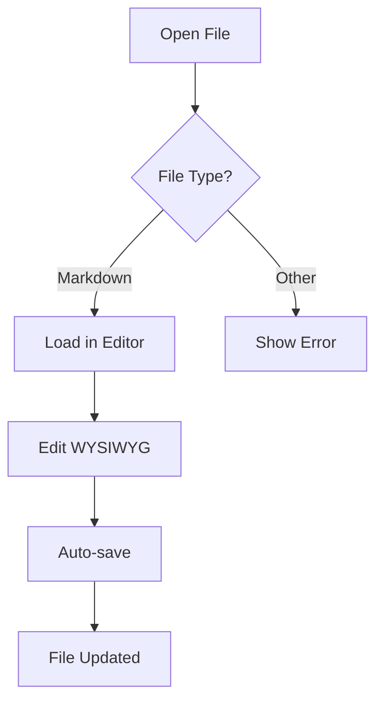
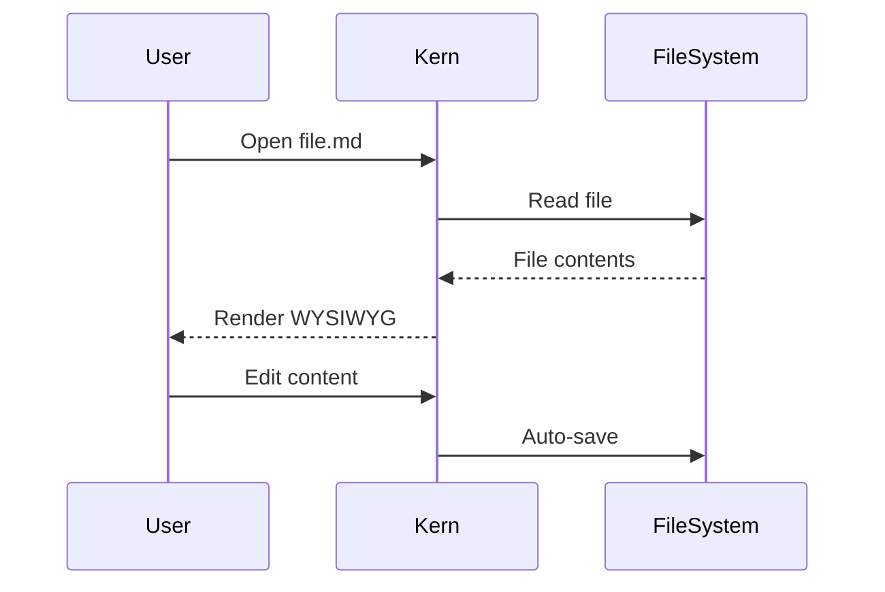

# Kern Comprehensive Stress Test

## Table of Contents

- [Heading Hierarchy](#heading-hierarchy)
- [Inline Formatting](#inline-formatting)
- [Images](#images)
- [Bullet Lists](#bullet-lists)
- [Ordered Lists](#ordered-lists)
- [Task Lists](#task-lists-checklists)
- [Heading Checkboxes (Kern Extension)](#heading-checkboxes-kern-extension)
- [Code Blocks](#code-blocks)
- [Tables](#tables)
- [Math (LaTeX)](#math-latex)
- [Blockquotes](#blockquotes)
- [Horizontal Rules](#horizontal-rules)
- [Mermaid Diagrams](#mermaid-diagrams)
- [Long Paragraph Wrapping Test](#long-paragraph-wrapping-test)

## Heading Hierarchy

### H3 — Section Level

#### H4 — Subsection

##### H5 — Minor Heading

###### H6 — Smallest Heading

## Inline Formatting

This is **bold text**, *italic text*, ~~strikethrough text~~, and `inline code`.

Combined styles: ***bold italic***, ~~**bold strikethrough**~~, *~~italic strikethrough~~*

Here is a [link to Milkdown](https://milkdown.dev) and a [link to GitHub](https://github.com).

## Images

Local image that should load without network access:


Remote images that should load if network access works:


## Bullet Lists

* Simple item
* Another item
  * Nested level 1
  * Nested level 1b
    * Nested level 2
      * Nested level 3 (deep)
* Back to top level

## Ordered Lists

Nested numbering style test: 1 -> a -> i (Notion-like).

1. First item at top level
2. Second item at top level

   1. Sub-item should show as "a"
   2. Sub-item should show as "b"
   3. Sub-item should show as "c"

      1. Deep item should show as "i"
      2. Deep item should show as "ii"
      3. Deep item should show as "iii"
3. Third item at top level
4. Fourth item at top level

## Task Lists (Checklists)

Only checked items should have strikethrough:

* [x] This checked item SHOULD be struck through
* [ ] This unchecked item should NOT be struck through
* [x] Another checked — struck through
* [ ] Another unchecked — normal text

## Nested Checklists — Cascade Bug Test

Parent items should NOT inherit strikethrough from children:

* Top-level bullet (should be NORMAL, not struck)
  * [x] Nested checked task (struck through)
  * [ ] Nested unchecked task (normal)
* Another top-level bullet (should be NORMAL)
  * [x] Done sub-task (struck through)
  * Regular bullet (should be NORMAL)

## Mixed Ordered + Checklist

1. First ordered item (should be NORMAL)

   * [x] Checked sub-task (struck through)
   * [ ] Unchecked sub-task (normal)
2. Second ordered item (should be NORMAL)

   * Bullet child (normal)

     * [x] Deep checked task (struck through)

## Heading Checkboxes (Kern Extension)

Each pair below shows a plain heading then a checkbox heading at the same level. The checkbox heading should be the same font size as the plain one — just with a checkbox icon prepended. Checked headings also get strikethrough + dimmed opacity.

Crepe heading sizes: H1 = 32px bold, H2 = 24px, H3 = 20px, H4 = 28px, H5 = 24px, H6 = 18px.

## Plain H2 (24px, semibold)

## [x] Checked H2 (24px, semibold — strikethrough, dimmed)

## [ ] Unchecked H2 (24px, semibold — empty checkbox icon)

### Plain H3 (20px, semibold)

### [x] Checked H3 (20px — strikethrough, dimmed)

### [ ] Unchecked H3 (20px — empty checkbox icon)

#### Plain H4 (28px, semibold)

#### [x] Checked H4 (28px — strikethrough, dimmed)

#### [ ] Unchecked H4 (28px — empty checkbox icon)

##### Plain H5 (24px, semibold — same size as H2)

##### [x] Checked H5 (24px — strikethrough, dimmed)

##### [ ] Unchecked H5 (24px — empty checkbox icon)

###### Plain H6 (18px, semibold — smallest)

###### [x] Checked H6 (18px — strikethrough, dimmed)

###### [ ] Unchecked H6 (18px — empty checkbox icon)

## Code Blocks

```javascript
// JavaScript with template literals
function greet(name) {
  console.log(`Hello, ${name}!`);
  return { greeting: `Welcome to Kern` };
}

const result = greet("World");
```

```python
# Python with type hints
def fibonacci(n: int) -> list[int]:
    """Generate Fibonacci sequence."""
    a, b = 0, 1
    result = []
    for _ in range(n):
        result.append(a)
        a, b = b, a + b
    return result

print(fibonacci(10))
```

```typescript
// TypeScript interface
interface EditorConfig {
  theme: "light" | "dark";
  fontSize: number;
  fontFamily: string;
  features: {
    mermaid: boolean;
    latex: boolean;
  };
}

const config: EditorConfig = {
  theme: "dark",
  fontSize: 16,
  fontFamily: "SF Pro Text",
  features: { mermaid: true, latex: true },
};
```

```bash
# Shell script
for file in *.md; do
  echo "Processing: $file"
  open -a Kern "$file"
done
```

## Tables

| Feature | Status | Priority | Notes |
| --- | --- | --- | --- |
| WYSIWYG editing | Done | High | Milkdown Crepe |
| Dark mode | Done | High | System theme sync |
| LaTeX math | Done | Medium | KaTeX rendering |
| Mermaid diagrams | Done | Medium | Lazy loaded |
| Tab virtualization | Done | High | Max 5 live |
| File watching | Done | Medium | 300ms debounce |
| Checklist strikethrough | Done | Low | CSS :has() |

### Wide Table (Overflow Test)

| Column A | Column B | Column C | Column D | Column E | Column F | Column G | Column H |
| --- | --- | --- | --- | --- | --- | --- | --- |
| Data that is quite long | More data here | Even more | Still going | Keep going | Almost there | Nearly done | Finally |
| Short | Short | Short | Short | Short | Short | Short | Short |

## Math (LaTeX)

Inline: The equation $E = mc^2$ is famous. Also $\sum_{i=1}^{n} i = \frac{n(n+1)}{2}$.

Block equation:

$$
\int_{-\infty}^{\infty} e^{-x^2} \, dx = \sqrt{\pi}
$$

Another block equation:

$$
f(x) = \frac{1}{\sigma\sqrt{2\pi}} e^{-\frac{(x-\mu)^2}{2\sigma^2}}
$$

## Blockquotes

> "The best way to predict the future is to invent it."
> — Alan Kay

> **Nested blockquote styles:**
> This has *italic*, **bold**, and `code` inside a blockquote.

## Horizontal Rules

Above the rule.

---

Below the rule.

***

Below the rule 2.

___

Below the rule 3.

## Mermaid Diagrams

### Flowchart



### Sequence Diagram



## 한국어 텍스트 (Korean)

Kern 에디터는 한국어 입력을 완벽하게 지원합니다.
한글 조합 중에도 텍스트가 올바르게 표시되며, IME 입력 방식과 호환됩니다.

## 日本語テスト (Japanese)

日本語のテキストも正しく表示されます。漢字、ひらがな、カタカナ。

## Long Paragraph Wrapping Test

This is a very long paragraph that should wrap correctly at the editor's max-width boundary without causing horizontal scrollbars. The text should flow naturally across multiple lines, maintaining proper line-height and spacing. Lorem ipsum dolor sit amet, consectetur adipiscing elit. Sed do eiusmod tempor incididunt ut labore et dolore magna aliqua. Ut enim ad minim veniam, quis nostrud exercitation ullamco laboris nisi ut aliquip ex ea commodo consequat. Duis aute irure dolor in reprehenderit in voluptate velit esse cillum dolore eu fugiat nulla pariatur.

---

*End of stress test — built with Milkdown Crepe on macOS*
