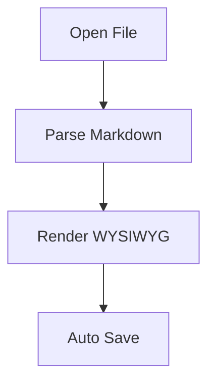
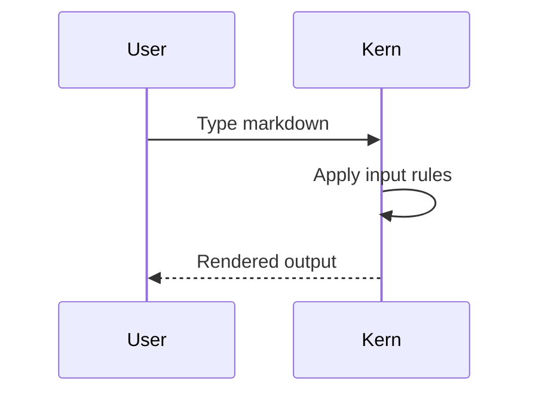

# Kern Ultimate Stress Test (Permutation Dense)

This file is intentionally dense with feature and action permutations.
It is the canonical fixture for exhaustive typing/action matrix tests.

## Table of Contents

- [Heading Matrix](#heading-matrix)
- [List And Task Matrix](#list-and-task-matrix)
- [Inline Formatting Matrix](#inline-formatting-matrix)
- [Code Fence Language Matrix](#code-fence-language-matrix)
- [Table Matrix](#table-matrix)
- [Blockquote And Rule Matrix](#blockquote-and-rule-matrix)
- [Math Matrix](#math-matrix)
- [Image Matrix](#image-matrix)
- [Mermaid Matrix](#mermaid-matrix)
- [Action Permutation Seeds](#action-permutation-seeds)
- [Typing Volume Tail](#typing-volume-tail)

## Heading Matrix

# H1 plain heading
# [ ] H1 unchecked task heading
# [x] H1 checked task heading

## H2 plain heading
## [ ] H2 unchecked task heading
## [x] H2 checked task heading

### H3 plain heading
### [ ] H3 unchecked task heading
### [x] H3 checked task heading

#### H4 plain heading
#### [ ] H4 unchecked task heading
#### [x] H4 checked task heading

##### H5 plain heading
##### [ ] H5 unchecked task heading
##### [x] H5 checked task heading

###### H6 plain heading
###### [ ] H6 unchecked task heading
###### [x] H6 checked task heading

## List And Task Matrix

### Bullet marker `-`

- plain item
- nested parent
  - nested child
- [ ] task using marker -
  - [ ] nested task
- [x] task using marker -
  - [x] nested task

### Bullet marker `*`

- plain item
- nested parent
  - nested child
- [ ] task using marker *
  - [ ] nested task
- [x] task using marker *
  - [x] nested task

### Bullet marker `+`

- plain item
- nested parent
  - nested child
- [ ] task using marker +
  - [ ] nested task
- [x] task using marker +
  - [x] nested task

### Ordered lists and ordered tasks

1. plain ordered item
1. [ ] ordered unchecked task
1. [x] ordered checked task
2. plain ordered item
2. [ ] ordered unchecked task
2. [x] ordered checked task
9. plain ordered item
9. [ ] ordered unchecked task
9. [x] ordered checked task
10. plain ordered item
10. [ ] ordered unchecked task
10. [x] ordered checked task
42. plain ordered item
42. [ ] ordered unchecked task
42. [x] ordered checked task

### Standalone task shortcuts

- [ ] standalone unchecked
- [x] standalone checked
- [ ] standalone shortcut without space

### Mixed nesting permutations

1. ordered parent 1
   - [ ] child unchecked task
   - [x] child checked task
   - child plain bullet
     1. grandchild ordered
     1. [ ] grandchild ordered task
     1. [x] grandchild ordered checked task
2. ordered parent 2
   - [ ] child unchecked task
   - [x] child checked task
   - child plain bullet
     1. grandchild ordered
     1. [ ] grandchild ordered task
     1. [x] grandchild ordered checked task
3. ordered parent 3
   - [ ] child unchecked task
   - [x] child checked task
   - child plain bullet
     1. grandchild ordered
     1. [ ] grandchild ordered task
     1. [x] grandchild ordered checked task
4. ordered parent 4
   - [ ] child unchecked task
   - [x] child checked task
   - child plain bullet
     1. grandchild ordered
     1. [ ] grandchild ordered task
     1. [x] grandchild ordered checked task
5. ordered parent 5
   - [ ] child unchecked task
   - [x] child checked task
   - child plain bullet
     1. grandchild ordered
     1. [ ] grandchild ordered task
     1. [x] grandchild ordered checked task
6. ordered parent 6
   - [ ] child unchecked task
   - [x] child checked task
   - child plain bullet
     1. grandchild ordered
     1. [ ] grandchild ordered task
     1. [x] grandchild ordered checked task
7. ordered parent 7
   - [ ] child unchecked task
   - [x] child checked task
   - child plain bullet
     1. grandchild ordered
     1. [ ] grandchild ordered task
     1. [x] grandchild ordered checked task
8. ordered parent 8
   - [ ] child unchecked task
   - [x] child checked task
   - child plain bullet
     1. grandchild ordered
     1. [ ] grandchild ordered task
     1. [x] grandchild ordered checked task

## Inline Formatting Matrix

### Singles

- `bold` => **bold**
- `italic` => *italic*
- `strike` => ~~strike~~
- `code` => `code`
- `link` => [link](https://example.com/path?q=1#frag)

### Pair combinations

- `bold+italic` => **bold** then *italic*
- `bold+strike` => **bold** then ~~strike~~
- `bold+code` => **bold** then `code`
- `bold+link` => **bold** then [link](https://example.com/path?q=1#frag)
- `italic+strike` => *italic* then ~~strike~~
- `italic+code` => *italic* then `code`
- `italic+link` => *italic* then [link](https://example.com/path?q=1#frag)
- `strike+code` => ~~strike~~ then `code`
- `strike+link` => ~~strike~~ then [link](https://example.com/path?q=1#frag)
- `code+link` => `code` then [link](https://example.com/path?q=1#frag)

### Triple combinations

- `bold+italic+strike` => **bold** / *italic* / ~~strike~~
- `bold+italic+code` => **bold** / *italic* / `code`
- `bold+italic+link` => **bold** / *italic* / [link](https://example.com/path?q=1#frag)
- `bold+strike+code` => **bold** / ~~strike~~ / `code`
- `bold+strike+link` => **bold** / ~~strike~~ / [link](https://example.com/path?q=1#frag)
- `bold+code+link` => **bold** / `code` / [link](https://example.com/path?q=1#frag)
- `italic+strike+code` => *italic* / ~~strike~~ / `code`
- `italic+strike+link` => *italic* / ~~strike~~ / [link](https://example.com/path?q=1#frag)
- `italic+code+link` => *italic* / `code` / [link](https://example.com/path?q=1#frag)
- `strike+code+link` => ~~strike~~ / `code` / [link](https://example.com/path?q=1#frag)

## Code Fence Language Matrix

### javascript

```javascript
const answer = 42;
console.log(`answer=${answer}`);
```

### typescript

```typescript
interface User { id: number; name: string }
const u: User = { id: 1, name: 'A' };
```

### python

```python
def fib(n: int) -> list[int]:
    return [0, 1][:n]
```

### rust

```rust
fn main() {
    println!("hi");
}
```

### go

```go
package main
func main() { println("hi") }
```

### swift

```swift
struct User { let id: Int }
print(User(id: 1))
```

### kotlin

```kotlin
data class User(val id: Int)
println(User(1))
```

### ruby

```ruby
class User; attr_accessor :id; end
puts User.new
```

### java

```java
record User(int id) {}
System.out.println(new User(1));
```

### c

```c
int main(void) {
  puts("hi");
  return 0;
}
```

### cpp

```cpp
int main() {
  std::cout << "hi";
}
```

### bash

```bash
for f in *.md; do
  echo "$f"
done
```

### zsh

```zsh
typeset -a items=(a b c)
print -l -- $items
```

### powershell

```powershell
Write-Host "hello"
Get-ChildItem .
```

### sql

```sql
SELECT id, name FROM users WHERE active = 1;
UPDATE users SET active = 0 WHERE id = 42;
```

### json

```json
{"name":"kern","enabled":true}
```

### yaml

```yaml
name: kern
enabled: true
```

### toml

```toml
[editor]
name = 'kern'
```

### html

```html
<section><h1>Kern</h1></section>
```

### css

```css
.editor { display: grid; gap: 12px; }
```

### xml

```xml
<root><item id="1"/></root>
```

### dockerfile

```dockerfile
FROM swift:6.0
RUN swift --version
```

### lua

```lua
print("hello")
```

### php

```php
<?php
echo "hello";
```

## Table Matrix

| Left | Center | Right |
| :--- | :---: | ---: |
| alpha | beta | gamma |
| **bold** | `code` | [link](https://example.com) |

| Feature | GFM Default | Kern Extensions |
| --- | --- | --- |
| Ordered tasks | literal | rendered |
| Heading checkboxes | literal | rendered |

## Blockquote And Rule Matrix

> "The best way to predict the future is to invent it."
> - [ ] quoted unchecked task
> - [x] quoted checked task
> 1. quoted ordered item
> 1. [ ] quoted ordered task

---

***

___

## Math Matrix

Inline math examples: $E=mc^2$, $\alpha+\beta=\gamma$, and $\sum_{i=1}^{n} i = n(n+1)/2$.

$$
\int_{-\infty}^{\infty} e^{-x^2} dx = \sqrt{\pi}
$$

$$
A = \begin{pmatrix} 1 & 2 \\ 3 & 4 \end{pmatrix}
$$

## Image Matrix


## Mermaid Matrix





## Action Permutation Seeds

These lines are intentionally repetitive for typing/backspace/replace permutations.

- ACTION-SEED-001: alpha beta gamma delta 1
- ACTION-SEED-002: alpha beta gamma delta 2
- ACTION-SEED-003: alpha beta gamma delta 3
- ACTION-SEED-004: alpha beta gamma delta 4
- ACTION-SEED-005: alpha beta gamma delta 5
- ACTION-SEED-006: alpha beta gamma delta 6
- ACTION-SEED-007: alpha beta gamma delta 7
- ACTION-SEED-008: alpha beta gamma delta 8
- ACTION-SEED-009: alpha beta gamma delta 9
- ACTION-SEED-010: alpha beta gamma delta 10
- ACTION-SEED-011: alpha beta gamma delta 11
- ACTION-SEED-012: alpha beta gamma delta 12
- ACTION-SEED-013: alpha beta gamma delta 13
- ACTION-SEED-014: alpha beta gamma delta 14
- ACTION-SEED-015: alpha beta gamma delta 15
- ACTION-SEED-016: alpha beta gamma delta 16
- ACTION-SEED-017: alpha beta gamma delta 17
- ACTION-SEED-018: alpha beta gamma delta 18
- ACTION-SEED-019: alpha beta gamma delta 19
- ACTION-SEED-020: alpha beta gamma delta 20
- ACTION-SEED-021: alpha beta gamma delta 21
- ACTION-SEED-022: alpha beta gamma delta 22
- ACTION-SEED-023: alpha beta gamma delta 23
- ACTION-SEED-024: alpha beta gamma delta 24
- ACTION-SEED-025: alpha beta gamma delta 25
- ACTION-SEED-026: alpha beta gamma delta 26
- ACTION-SEED-027: alpha beta gamma delta 27
- ACTION-SEED-028: alpha beta gamma delta 28
- ACTION-SEED-029: alpha beta gamma delta 29
- ACTION-SEED-030: alpha beta gamma delta 30
- ACTION-SEED-031: alpha beta gamma delta 31
- ACTION-SEED-032: alpha beta gamma delta 32
- ACTION-SEED-033: alpha beta gamma delta 33
- ACTION-SEED-034: alpha beta gamma delta 34
- ACTION-SEED-035: alpha beta gamma delta 35
- ACTION-SEED-036: alpha beta gamma delta 36
- ACTION-SEED-037: alpha beta gamma delta 37
- ACTION-SEED-038: alpha beta gamma delta 38
- ACTION-SEED-039: alpha beta gamma delta 39
- ACTION-SEED-040: alpha beta gamma delta 40
- ACTION-SEED-041: alpha beta gamma delta 41
- ACTION-SEED-042: alpha beta gamma delta 42
- ACTION-SEED-043: alpha beta gamma delta 43
- ACTION-SEED-044: alpha beta gamma delta 44
- ACTION-SEED-045: alpha beta gamma delta 45
- ACTION-SEED-046: alpha beta gamma delta 46
- ACTION-SEED-047: alpha beta gamma delta 47
- ACTION-SEED-048: alpha beta gamma delta 48
- ACTION-SEED-049: alpha beta gamma delta 49
- ACTION-SEED-050: alpha beta gamma delta 50
- ACTION-SEED-051: alpha beta gamma delta 51
- ACTION-SEED-052: alpha beta gamma delta 52
- ACTION-SEED-053: alpha beta gamma delta 53
- ACTION-SEED-054: alpha beta gamma delta 54
- ACTION-SEED-055: alpha beta gamma delta 55
- ACTION-SEED-056: alpha beta gamma delta 56
- ACTION-SEED-057: alpha beta gamma delta 57
- ACTION-SEED-058: alpha beta gamma delta 58
- ACTION-SEED-059: alpha beta gamma delta 59
- ACTION-SEED-060: alpha beta gamma delta 60
- ACTION-SEED-061: alpha beta gamma delta 61
- ACTION-SEED-062: alpha beta gamma delta 62
- ACTION-SEED-063: alpha beta gamma delta 63
- ACTION-SEED-064: alpha beta gamma delta 64
- ACTION-SEED-065: alpha beta gamma delta 65
- ACTION-SEED-066: alpha beta gamma delta 66
- ACTION-SEED-067: alpha beta gamma delta 67
- ACTION-SEED-068: alpha beta gamma delta 68
- ACTION-SEED-069: alpha beta gamma delta 69
- ACTION-SEED-070: alpha beta gamma delta 70
- ACTION-SEED-071: alpha beta gamma delta 71
- ACTION-SEED-072: alpha beta gamma delta 72
- ACTION-SEED-073: alpha beta gamma delta 73
- ACTION-SEED-074: alpha beta gamma delta 74
- ACTION-SEED-075: alpha beta gamma delta 75
- ACTION-SEED-076: alpha beta gamma delta 76
- ACTION-SEED-077: alpha beta gamma delta 77
- ACTION-SEED-078: alpha beta gamma delta 78
- ACTION-SEED-079: alpha beta gamma delta 79
- ACTION-SEED-080: alpha beta gamma delta 80
- ACTION-SEED-081: alpha beta gamma delta 81
- ACTION-SEED-082: alpha beta gamma delta 82
- ACTION-SEED-083: alpha beta gamma delta 83
- ACTION-SEED-084: alpha beta gamma delta 84
- ACTION-SEED-085: alpha beta gamma delta 85
- ACTION-SEED-086: alpha beta gamma delta 86
- ACTION-SEED-087: alpha beta gamma delta 87
- ACTION-SEED-088: alpha beta gamma delta 88
- ACTION-SEED-089: alpha beta gamma delta 89
- ACTION-SEED-090: alpha beta gamma delta 90
- ACTION-SEED-091: alpha beta gamma delta 91
- ACTION-SEED-092: alpha beta gamma delta 92
- ACTION-SEED-093: alpha beta gamma delta 93
- ACTION-SEED-094: alpha beta gamma delta 94
- ACTION-SEED-095: alpha beta gamma delta 95
- ACTION-SEED-096: alpha beta gamma delta 96
- ACTION-SEED-097: alpha beta gamma delta 97
- ACTION-SEED-098: alpha beta gamma delta 98
- ACTION-SEED-099: alpha beta gamma delta 99
- ACTION-SEED-100: alpha beta gamma delta 100
- ACTION-SEED-101: alpha beta gamma delta 101
- ACTION-SEED-102: alpha beta gamma delta 102
- ACTION-SEED-103: alpha beta gamma delta 103
- ACTION-SEED-104: alpha beta gamma delta 104
- ACTION-SEED-105: alpha beta gamma delta 105
- ACTION-SEED-106: alpha beta gamma delta 106
- ACTION-SEED-107: alpha beta gamma delta 107
- ACTION-SEED-108: alpha beta gamma delta 108
- ACTION-SEED-109: alpha beta gamma delta 109
- ACTION-SEED-110: alpha beta gamma delta 110
- ACTION-SEED-111: alpha beta gamma delta 111
- ACTION-SEED-112: alpha beta gamma delta 112
- ACTION-SEED-113: alpha beta gamma delta 113
- ACTION-SEED-114: alpha beta gamma delta 114
- ACTION-SEED-115: alpha beta gamma delta 115
- ACTION-SEED-116: alpha beta gamma delta 116
- ACTION-SEED-117: alpha beta gamma delta 117
- ACTION-SEED-118: alpha beta gamma delta 118
- ACTION-SEED-119: alpha beta gamma delta 119
- ACTION-SEED-120: alpha beta gamma delta 120
- ACTION-SEED-121: alpha beta gamma delta 121
- ACTION-SEED-122: alpha beta gamma delta 122
- ACTION-SEED-123: alpha beta gamma delta 123
- ACTION-SEED-124: alpha beta gamma delta 124
- ACTION-SEED-125: alpha beta gamma delta 125
- ACTION-SEED-126: alpha beta gamma delta 126
- ACTION-SEED-127: alpha beta gamma delta 127
- ACTION-SEED-128: alpha beta gamma delta 128
- ACTION-SEED-129: alpha beta gamma delta 129
- ACTION-SEED-130: alpha beta gamma delta 130
- ACTION-SEED-131: alpha beta gamma delta 131
- ACTION-SEED-132: alpha beta gamma delta 132
- ACTION-SEED-133: alpha beta gamma delta 133
- ACTION-SEED-134: alpha beta gamma delta 134
- ACTION-SEED-135: alpha beta gamma delta 135
- ACTION-SEED-136: alpha beta gamma delta 136
- ACTION-SEED-137: alpha beta gamma delta 137
- ACTION-SEED-138: alpha beta gamma delta 138
- ACTION-SEED-139: alpha beta gamma delta 139
- ACTION-SEED-140: alpha beta gamma delta 140
- ACTION-SEED-141: alpha beta gamma delta 141
- ACTION-SEED-142: alpha beta gamma delta 142
- ACTION-SEED-143: alpha beta gamma delta 143
- ACTION-SEED-144: alpha beta gamma delta 144
- ACTION-SEED-145: alpha beta gamma delta 145
- ACTION-SEED-146: alpha beta gamma delta 146
- ACTION-SEED-147: alpha beta gamma delta 147
- ACTION-SEED-148: alpha beta gamma delta 148
- ACTION-SEED-149: alpha beta gamma delta 149
- ACTION-SEED-150: alpha beta gamma delta 150
- ACTION-SEED-151: alpha beta gamma delta 151
- ACTION-SEED-152: alpha beta gamma delta 152
- ACTION-SEED-153: alpha beta gamma delta 153
- ACTION-SEED-154: alpha beta gamma delta 154
- ACTION-SEED-155: alpha beta gamma delta 155
- ACTION-SEED-156: alpha beta gamma delta 156
- ACTION-SEED-157: alpha beta gamma delta 157
- ACTION-SEED-158: alpha beta gamma delta 158
- ACTION-SEED-159: alpha beta gamma delta 159
- ACTION-SEED-160: alpha beta gamma delta 160
- ACTION-SEED-161: alpha beta gamma delta 161
- ACTION-SEED-162: alpha beta gamma delta 162
- ACTION-SEED-163: alpha beta gamma delta 163
- ACTION-SEED-164: alpha beta gamma delta 164
- ACTION-SEED-165: alpha beta gamma delta 165
- ACTION-SEED-166: alpha beta gamma delta 166
- ACTION-SEED-167: alpha beta gamma delta 167
- ACTION-SEED-168: alpha beta gamma delta 168
- ACTION-SEED-169: alpha beta gamma delta 169
- ACTION-SEED-170: alpha beta gamma delta 170
- ACTION-SEED-171: alpha beta gamma delta 171
- ACTION-SEED-172: alpha beta gamma delta 172
- ACTION-SEED-173: alpha beta gamma delta 173
- ACTION-SEED-174: alpha beta gamma delta 174
- ACTION-SEED-175: alpha beta gamma delta 175
- ACTION-SEED-176: alpha beta gamma delta 176
- ACTION-SEED-177: alpha beta gamma delta 177
- ACTION-SEED-178: alpha beta gamma delta 178
- ACTION-SEED-179: alpha beta gamma delta 179
- ACTION-SEED-180: alpha beta gamma delta 180
- ACTION-SEED-181: alpha beta gamma delta 181
- ACTION-SEED-182: alpha beta gamma delta 182
- ACTION-SEED-183: alpha beta gamma delta 183
- ACTION-SEED-184: alpha beta gamma delta 184
- ACTION-SEED-185: alpha beta gamma delta 185
- ACTION-SEED-186: alpha beta gamma delta 186
- ACTION-SEED-187: alpha beta gamma delta 187
- ACTION-SEED-188: alpha beta gamma delta 188
- ACTION-SEED-189: alpha beta gamma delta 189
- ACTION-SEED-190: alpha beta gamma delta 190
- ACTION-SEED-191: alpha beta gamma delta 191
- ACTION-SEED-192: alpha beta gamma delta 192
- ACTION-SEED-193: alpha beta gamma delta 193
- ACTION-SEED-194: alpha beta gamma delta 194
- ACTION-SEED-195: alpha beta gamma delta 195
- ACTION-SEED-196: alpha beta gamma delta 196
- ACTION-SEED-197: alpha beta gamma delta 197
- ACTION-SEED-198: alpha beta gamma delta 198
- ACTION-SEED-199: alpha beta gamma delta 199
- ACTION-SEED-200: alpha beta gamma delta 200
- ACTION-SEED-201: alpha beta gamma delta 201
- ACTION-SEED-202: alpha beta gamma delta 202
- ACTION-SEED-203: alpha beta gamma delta 203
- ACTION-SEED-204: alpha beta gamma delta 204
- ACTION-SEED-205: alpha beta gamma delta 205
- ACTION-SEED-206: alpha beta gamma delta 206
- ACTION-SEED-207: alpha beta gamma delta 207
- ACTION-SEED-208: alpha beta gamma delta 208
- ACTION-SEED-209: alpha beta gamma delta 209
- ACTION-SEED-210: alpha beta gamma delta 210
- ACTION-SEED-211: alpha beta gamma delta 211
- ACTION-SEED-212: alpha beta gamma delta 212
- ACTION-SEED-213: alpha beta gamma delta 213
- ACTION-SEED-214: alpha beta gamma delta 214
- ACTION-SEED-215: alpha beta gamma delta 215
- ACTION-SEED-216: alpha beta gamma delta 216
- ACTION-SEED-217: alpha beta gamma delta 217
- ACTION-SEED-218: alpha beta gamma delta 218
- ACTION-SEED-219: alpha beta gamma delta 219
- ACTION-SEED-220: alpha beta gamma delta 220
- ACTION-SEED-221: alpha beta gamma delta 221
- ACTION-SEED-222: alpha beta gamma delta 222
- ACTION-SEED-223: alpha beta gamma delta 223
- ACTION-SEED-224: alpha beta gamma delta 224
- ACTION-SEED-225: alpha beta gamma delta 225
- ACTION-SEED-226: alpha beta gamma delta 226
- ACTION-SEED-227: alpha beta gamma delta 227
- ACTION-SEED-228: alpha beta gamma delta 228
- ACTION-SEED-229: alpha beta gamma delta 229
- ACTION-SEED-230: alpha beta gamma delta 230
- ACTION-SEED-231: alpha beta gamma delta 231
- ACTION-SEED-232: alpha beta gamma delta 232
- ACTION-SEED-233: alpha beta gamma delta 233
- ACTION-SEED-234: alpha beta gamma delta 234
- ACTION-SEED-235: alpha beta gamma delta 235
- ACTION-SEED-236: alpha beta gamma delta 236
- ACTION-SEED-237: alpha beta gamma delta 237
- ACTION-SEED-238: alpha beta gamma delta 238
- ACTION-SEED-239: alpha beta gamma delta 239
- ACTION-SEED-240: alpha beta gamma delta 240

## Typing Volume Tail

Volume line 0001: quick brown fox with **bold**, *italic*, `code`, [link](https://example.com/1), and task marker [ ] candidate.
Volume line 0002: quick brown fox with **bold**, *italic*, `code`, [link](https://example.com/2), and task marker [ ] candidate.
Volume line 0003: quick brown fox with **bold**, *italic*, `code`, [link](https://example.com/3), and task marker [ ] candidate.
Volume line 0004: quick brown fox with **bold**, *italic*, `code`, [link](https://example.com/4), and task marker [ ] candidate.
Volume line 0005: quick brown fox with **bold**, *italic*, `code`, [link](https://example.com/5), and task marker [ ] candidate.
Volume line 0006: quick brown fox with **bold**, *italic*, `code`, [link](https://example.com/6), and task marker [ ] candidate.
Volume line 0007: quick brown fox with **bold**, *italic*, `code`, [link](https://example.com/7), and task marker [ ] candidate.
Volume line 0008: quick brown fox with **bold**, *italic*, `code`, [link](https://example.com/8), and task marker [ ] candidate.
Volume line 0009: quick brown fox with **bold**, *italic*, `code`, [link](https://example.com/9), and task marker [ ] candidate.
Volume line 0010: quick brown fox with **bold**, *italic*, `code`, [link](https://example.com/10), and task marker [ ] candidate.
Volume line 0011: quick brown fox with **bold**, *italic*, `code`, [link](https://example.com/11), and task marker [ ] candidate.
Volume line 0012: quick brown fox with **bold**, *italic*, `code`, [link](https://example.com/12), and task marker [ ] candidate.
Volume line 0013: quick brown fox with **bold**, *italic*, `code`, [link](https://example.com/13), and task marker [ ] candidate.
Volume line 0014: quick brown fox with **bold**, *italic*, `code`, [link](https://example.com/14), and task marker [ ] candidate.
Volume line 0015: quick brown fox with **bold**, *italic*, `code`, [link](https://example.com/15), and task marker [ ] candidate.
Volume line 0016: quick brown fox with **bold**, *italic*, `code`, [link](https://example.com/16), and task marker [ ] candidate.
Volume line 0017: quick brown fox with **bold**, *italic*, `code`, [link](https://example.com/17), and task marker [ ] candidate.
Volume line 0018: quick brown fox with **bold**, *italic*, `code`, [link](https://example.com/18), and task marker [ ] candidate.
Volume line 0019: quick brown fox with **bold**, *italic*, `code`, [link](https://example.com/19), and task marker [ ] candidate.
Volume line 0020: quick brown fox with **bold**, *italic*, `code`, [link](https://example.com/20), and task marker [ ] candidate.
Volume line 0021: quick brown fox with **bold**, *italic*, `code`, [link](https://example.com/21), and task marker [ ] candidate.
Volume line 0022: quick brown fox with **bold**, *italic*, `code`, [link](https://example.com/22), and task marker [ ] candidate.
Volume line 0023: quick brown fox with **bold**, *italic*, `code`, [link](https://example.com/23), and task marker [ ] candidate.
Volume line 0024: quick brown fox with **bold**, *italic*, `code`, [link](https://example.com/24), and task marker [ ] candidate.
Volume line 0025: quick brown fox with **bold**, *italic*, `code`, [link](https://example.com/25), and task marker [ ] candidate.
- [ ] checkpoint task 25
1. ordered checkpoint 25
---

Volume line 0026: quick brown fox with **bold**, *italic*, `code`, [link](https://example.com/26), and task marker [ ] candidate.
Volume line 0027: quick brown fox with **bold**, *italic*, `code`, [link](https://example.com/27), and task marker [ ] candidate.
Volume line 0028: quick brown fox with **bold**, *italic*, `code`, [link](https://example.com/28), and task marker [ ] candidate.
Volume line 0029: quick brown fox with **bold**, *italic*, `code`, [link](https://example.com/29), and task marker [ ] candidate.
Volume line 0030: quick brown fox with **bold**, *italic*, `code`, [link](https://example.com/30), and task marker [ ] candidate.
Volume line 0031: quick brown fox with **bold**, *italic*, `code`, [link](https://example.com/31), and task marker [ ] candidate.
Volume line 0032: quick brown fox with **bold**, *italic*, `code`, [link](https://example.com/32), and task marker [ ] candidate.
Volume line 0033: quick brown fox with **bold**, *italic*, `code`, [link](https://example.com/33), and task marker [ ] candidate.
Volume line 0034: quick brown fox with **bold**, *italic*, `code`, [link](https://example.com/34), and task marker [ ] candidate.
Volume line 0035: quick brown fox with **bold**, *italic*, `code`, [link](https://example.com/35), and task marker [ ] candidate.
Volume line 0036: quick brown fox with **bold**, *italic*, `code`, [link](https://example.com/36), and task marker [ ] candidate.
Volume line 0037: quick brown fox with **bold**, *italic*, `code`, [link](https://example.com/37), and task marker [ ] candidate.
Volume line 0038: quick brown fox with **bold**, *italic*, `code`, [link](https://example.com/38), and task marker [ ] candidate.
Volume line 0039: quick brown fox with **bold**, *italic*, `code`, [link](https://example.com/39), and task marker [ ] candidate.
Volume line 0040: quick brown fox with **bold**, *italic*, `code`, [link](https://example.com/40), and task marker [ ] candidate.
Volume line 0041: quick brown fox with **bold**, *italic*, `code`, [link](https://example.com/41), and task marker [ ] candidate.
Volume line 0042: quick brown fox with **bold**, *italic*, `code`, [link](https://example.com/42), and task marker [ ] candidate.
Volume line 0043: quick brown fox with **bold**, *italic*, `code`, [link](https://example.com/43), and task marker [ ] candidate.
Volume line 0044: quick brown fox with **bold**, *italic*, `code`, [link](https://example.com/44), and task marker [ ] candidate.
Volume line 0045: quick brown fox with **bold**, *italic*, `code`, [link](https://example.com/45), and task marker [ ] candidate.
Volume line 0046: quick brown fox with **bold**, *italic*, `code`, [link](https://example.com/46), and task marker [ ] candidate.
Volume line 0047: quick brown fox with **bold**, *italic*, `code`, [link](https://example.com/47), and task marker [ ] candidate.
Volume line 0048: quick brown fox with **bold**, *italic*, `code`, [link](https://example.com/48), and task marker [ ] candidate.
Volume line 0049: quick brown fox with **bold**, *italic*, `code`, [link](https://example.com/49), and task marker [ ] candidate.
Volume line 0050: quick brown fox with **bold**, *italic*, `code`, [link](https://example.com/50), and task marker [ ] candidate.
- [ ] checkpoint task 50
1. ordered checkpoint 50
---

Volume line 0051: quick brown fox with **bold**, *italic*, `code`, [link](https://example.com/51), and task marker [ ] candidate.
Volume line 0052: quick brown fox with **bold**, *italic*, `code`, [link](https://example.com/52), and task marker [ ] candidate.
Volume line 0053: quick brown fox with **bold**, *italic*, `code`, [link](https://example.com/53), and task marker [ ] candidate.
Volume line 0054: quick brown fox with **bold**, *italic*, `code`, [link](https://example.com/54), and task marker [ ] candidate.
Volume line 0055: quick brown fox with **bold**, *italic*, `code`, [link](https://example.com/55), and task marker [ ] candidate.
Volume line 0056: quick brown fox with **bold**, *italic*, `code`, [link](https://example.com/56), and task marker [ ] candidate.
Volume line 0057: quick brown fox with **bold**, *italic*, `code`, [link](https://example.com/57), and task marker [ ] candidate.
Volume line 0058: quick brown fox with **bold**, *italic*, `code`, [link](https://example.com/58), and task marker [ ] candidate.
Volume line 0059: quick brown fox with **bold**, *italic*, `code`, [link](https://example.com/59), and task marker [ ] candidate.
Volume line 0060: quick brown fox with **bold**, *italic*, `code`, [link](https://example.com/60), and task marker [ ] candidate.
Volume line 0061: quick brown fox with **bold**, *italic*, `code`, [link](https://example.com/61), and task marker [ ] candidate.
Volume line 0062: quick brown fox with **bold**, *italic*, `code`, [link](https://example.com/62), and task marker [ ] candidate.
Volume line 0063: quick brown fox with **bold**, *italic*, `code`, [link](https://example.com/63), and task marker [ ] candidate.
Volume line 0064: quick brown fox with **bold**, *italic*, `code`, [link](https://example.com/64), and task marker [ ] candidate.
Volume line 0065: quick brown fox with **bold**, *italic*, `code`, [link](https://example.com/65), and task marker [ ] candidate.
Volume line 0066: quick brown fox with **bold**, *italic*, `code`, [link](https://example.com/66), and task marker [ ] candidate.
Volume line 0067: quick brown fox with **bold**, *italic*, `code`, [link](https://example.com/67), and task marker [ ] candidate.
Volume line 0068: quick brown fox with **bold**, *italic*, `code`, [link](https://example.com/68), and task marker [ ] candidate.
Volume line 0069: quick brown fox with **bold**, *italic*, `code`, [link](https://example.com/69), and task marker [ ] candidate.
Volume line 0070: quick brown fox with **bold**, *italic*, `code`, [link](https://example.com/70), and task marker [ ] candidate.
Volume line 0071: quick brown fox with **bold**, *italic*, `code`, [link](https://example.com/71), and task marker [ ] candidate.
Volume line 0072: quick brown fox with **bold**, *italic*, `code`, [link](https://example.com/72), and task marker [ ] candidate.
Volume line 0073: quick brown fox with **bold**, *italic*, `code`, [link](https://example.com/73), and task marker [ ] candidate.
Volume line 0074: quick brown fox with **bold**, *italic*, `code`, [link](https://example.com/74), and task marker [ ] candidate.
Volume line 0075: quick brown fox with **bold**, *italic*, `code`, [link](https://example.com/75), and task marker [ ] candidate.
- [ ] checkpoint task 75
1. ordered checkpoint 75
---

Volume line 0076: quick brown fox with **bold**, *italic*, `code`, [link](https://example.com/76), and task marker [ ] candidate.
Volume line 0077: quick brown fox with **bold**, *italic*, `code`, [link](https://example.com/77), and task marker [ ] candidate.
Volume line 0078: quick brown fox with **bold**, *italic*, `code`, [link](https://example.com/78), and task marker [ ] candidate.
Volume line 0079: quick brown fox with **bold**, *italic*, `code`, [link](https://example.com/79), and task marker [ ] candidate.
Volume line 0080: quick brown fox with **bold**, *italic*, `code`, [link](https://example.com/80), and task marker [ ] candidate.
Volume line 0081: quick brown fox with **bold**, *italic*, `code`, [link](https://example.com/81), and task marker [ ] candidate.
Volume line 0082: quick brown fox with **bold**, *italic*, `code`, [link](https://example.com/82), and task marker [ ] candidate.
Volume line 0083: quick brown fox with **bold**, *italic*, `code`, [link](https://example.com/83), and task marker [ ] candidate.
Volume line 0084: quick brown fox with **bold**, *italic*, `code`, [link](https://example.com/84), and task marker [ ] candidate.
Volume line 0085: quick brown fox with **bold**, *italic*, `code`, [link](https://example.com/85), and task marker [ ] candidate.
Volume line 0086: quick brown fox with **bold**, *italic*, `code`, [link](https://example.com/86), and task marker [ ] candidate.
Volume line 0087: quick brown fox with **bold**, *italic*, `code`, [link](https://example.com/87), and task marker [ ] candidate.
Volume line 0088: quick brown fox with **bold**, *italic*, `code`, [link](https://example.com/88), and task marker [ ] candidate.
Volume line 0089: quick brown fox with **bold**, *italic*, `code`, [link](https://example.com/89), and task marker [ ] candidate.
Volume line 0090: quick brown fox with **bold**, *italic*, `code`, [link](https://example.com/90), and task marker [ ] candidate.
Volume line 0091: quick brown fox with **bold**, *italic*, `code`, [link](https://example.com/91), and task marker [ ] candidate.
Volume line 0092: quick brown fox with **bold**, *italic*, `code`, [link](https://example.com/92), and task marker [ ] candidate.
Volume line 0093: quick brown fox with **bold**, *italic*, `code`, [link](https://example.com/93), and task marker [ ] candidate.
Volume line 0094: quick brown fox with **bold**, *italic*, `code`, [link](https://example.com/94), and task marker [ ] candidate.
Volume line 0095: quick brown fox with **bold**, *italic*, `code`, [link](https://example.com/95), and task marker [ ] candidate.
Volume line 0096: quick brown fox with **bold**, *italic*, `code`, [link](https://example.com/96), and task marker [ ] candidate.
Volume line 0097: quick brown fox with **bold**, *italic*, `code`, [link](https://example.com/97), and task marker [ ] candidate.
Volume line 0098: quick brown fox with **bold**, *italic*, `code`, [link](https://example.com/98), and task marker [ ] candidate.
Volume line 0099: quick brown fox with **bold**, *italic*, `code`, [link](https://example.com/99), and task marker [ ] candidate.
Volume line 0100: quick brown fox with **bold**, *italic*, `code`, [link](https://example.com/100), and task marker [ ] candidate.
- [ ] checkpoint task 100
1. ordered checkpoint 100
---

Volume line 0101: quick brown fox with **bold**, *italic*, `code`, [link](https://example.com/101), and task marker [ ] candidate.
Volume line 0102: quick brown fox with **bold**, *italic*, `code`, [link](https://example.com/102), and task marker [ ] candidate.
Volume line 0103: quick brown fox with **bold**, *italic*, `code`, [link](https://example.com/103), and task marker [ ] candidate.
Volume line 0104: quick brown fox with **bold**, *italic*, `code`, [link](https://example.com/104), and task marker [ ] candidate.
Volume line 0105: quick brown fox with **bold**, *italic*, `code`, [link](https://example.com/105), and task marker [ ] candidate.
Volume line 0106: quick brown fox with **bold**, *italic*, `code`, [link](https://example.com/106), and task marker [ ] candidate.
Volume line 0107: quick brown fox with **bold**, *italic*, `code`, [link](https://example.com/107), and task marker [ ] candidate.
Volume line 0108: quick brown fox with **bold**, *italic*, `code`, [link](https://example.com/108), and task marker [ ] candidate.
Volume line 0109: quick brown fox with **bold**, *italic*, `code`, [link](https://example.com/109), and task marker [ ] candidate.
Volume line 0110: quick brown fox with **bold**, *italic*, `code`, [link](https://example.com/110), and task marker [ ] candidate.
Volume line 0111: quick brown fox with **bold**, *italic*, `code`, [link](https://example.com/111), and task marker [ ] candidate.
Volume line 0112: quick brown fox with **bold**, *italic*, `code`, [link](https://example.com/112), and task marker [ ] candidate.
Volume line 0113: quick brown fox with **bold**, *italic*, `code`, [link](https://example.com/113), and task marker [ ] candidate.
Volume line 0114: quick brown fox with **bold**, *italic*, `code`, [link](https://example.com/114), and task marker [ ] candidate.
Volume line 0115: quick brown fox with **bold**, *italic*, `code`, [link](https://example.com/115), and task marker [ ] candidate.
Volume line 0116: quick brown fox with **bold**, *italic*, `code`, [link](https://example.com/116), and task marker [ ] candidate.
Volume line 0117: quick brown fox with **bold**, *italic*, `code`, [link](https://example.com/117), and task marker [ ] candidate.
Volume line 0118: quick brown fox with **bold**, *italic*, `code`, [link](https://example.com/118), and task marker [ ] candidate.
Volume line 0119: quick brown fox with **bold**, *italic*, `code`, [link](https://example.com/119), and task marker [ ] candidate.
Volume line 0120: quick brown fox with **bold**, *italic*, `code`, [link](https://example.com/120), and task marker [ ] candidate.
Volume line 0121: quick brown fox with **bold**, *italic*, `code`, [link](https://example.com/121), and task marker [ ] candidate.
Volume line 0122: quick brown fox with **bold**, *italic*, `code`, [link](https://example.com/122), and task marker [ ] candidate.
Volume line 0123: quick brown fox with **bold**, *italic*, `code`, [link](https://example.com/123), and task marker [ ] candidate.
Volume line 0124: quick brown fox with **bold**, *italic*, `code`, [link](https://example.com/124), and task marker [ ] candidate.
Volume line 0125: quick brown fox with **bold**, *italic*, `code`, [link](https://example.com/125), and task marker [ ] candidate.
- [ ] checkpoint task 125
1. ordered checkpoint 125
---

Volume line 0126: quick brown fox with **bold**, *italic*, `code`, [link](https://example.com/126), and task marker [ ] candidate.
Volume line 0127: quick brown fox with **bold**, *italic*, `code`, [link](https://example.com/127), and task marker [ ] candidate.
Volume line 0128: quick brown fox with **bold**, *italic*, `code`, [link](https://example.com/128), and task marker [ ] candidate.
Volume line 0129: quick brown fox with **bold**, *italic*, `code`, [link](https://example.com/129), and task marker [ ] candidate.
Volume line 0130: quick brown fox with **bold**, *italic*, `code`, [link](https://example.com/130), and task marker [ ] candidate.
Volume line 0131: quick brown fox with **bold**, *italic*, `code`, [link](https://example.com/131), and task marker [ ] candidate.
Volume line 0132: quick brown fox with **bold**, *italic*, `code`, [link](https://example.com/132), and task marker [ ] candidate.
Volume line 0133: quick brown fox with **bold**, *italic*, `code`, [link](https://example.com/133), and task marker [ ] candidate.
Volume line 0134: quick brown fox with **bold**, *italic*, `code`, [link](https://example.com/134), and task marker [ ] candidate.
Volume line 0135: quick brown fox with **bold**, *italic*, `code`, [link](https://example.com/135), and task marker [ ] candidate.
Volume line 0136: quick brown fox with **bold**, *italic*, `code`, [link](https://example.com/136), and task marker [ ] candidate.
Volume line 0137: quick brown fox with **bold**, *italic*, `code`, [link](https://example.com/137), and task marker [ ] candidate.
Volume line 0138: quick brown fox with **bold**, *italic*, `code`, [link](https://example.com/138), and task marker [ ] candidate.
Volume line 0139: quick brown fox with **bold**, *italic*, `code`, [link](https://example.com/139), and task marker [ ] candidate.
Volume line 0140: quick brown fox with **bold**, *italic*, `code`, [link](https://example.com/140), and task marker [ ] candidate.
Volume line 0141: quick brown fox with **bold**, *italic*, `code`, [link](https://example.com/141), and task marker [ ] candidate.
Volume line 0142: quick brown fox with **bold**, *italic*, `code`, [link](https://example.com/142), and task marker [ ] candidate.
Volume line 0143: quick brown fox with **bold**, *italic*, `code`, [link](https://example.com/143), and task marker [ ] candidate.
Volume line 0144: quick brown fox with **bold**, *italic*, `code`, [link](https://example.com/144), and task marker [ ] candidate.
Volume line 0145: quick brown fox with **bold**, *italic*, `code`, [link](https://example.com/145), and task marker [ ] candidate.
Volume line 0146: quick brown fox with **bold**, *italic*, `code`, [link](https://example.com/146), and task marker [ ] candidate.
Volume line 0147: quick brown fox with **bold**, *italic*, `code`, [link](https://example.com/147), and task marker [ ] candidate.
Volume line 0148: quick brown fox with **bold**, *italic*, `code`, [link](https://example.com/148), and task marker [ ] candidate.
Volume line 0149: quick brown fox with **bold**, *italic*, `code`, [link](https://example.com/149), and task marker [ ] candidate.
Volume line 0150: quick brown fox with **bold**, *italic*, `code`, [link](https://example.com/150), and task marker [ ] candidate.
- [ ] checkpoint task 150
1. ordered checkpoint 150
---

Volume line 0151: quick brown fox with **bold**, *italic*, `code`, [link](https://example.com/151), and task marker [ ] candidate.
Volume line 0152: quick brown fox with **bold**, *italic*, `code`, [link](https://example.com/152), and task marker [ ] candidate.
Volume line 0153: quick brown fox with **bold**, *italic*, `code`, [link](https://example.com/153), and task marker [ ] candidate.
Volume line 0154: quick brown fox with **bold**, *italic*, `code`, [link](https://example.com/154), and task marker [ ] candidate.
Volume line 0155: quick brown fox with **bold**, *italic*, `code`, [link](https://example.com/155), and task marker [ ] candidate.
Volume line 0156: quick brown fox with **bold**, *italic*, `code`, [link](https://example.com/156), and task marker [ ] candidate.
Volume line 0157: quick brown fox with **bold**, *italic*, `code`, [link](https://example.com/157), and task marker [ ] candidate.
Volume line 0158: quick brown fox with **bold**, *italic*, `code`, [link](https://example.com/158), and task marker [ ] candidate.
Volume line 0159: quick brown fox with **bold**, *italic*, `code`, [link](https://example.com/159), and task marker [ ] candidate.
Volume line 0160: quick brown fox with **bold**, *italic*, `code`, [link](https://example.com/160), and task marker [ ] candidate.
Volume line 0161: quick brown fox with **bold**, *italic*, `code`, [link](https://example.com/161), and task marker [ ] candidate.
Volume line 0162: quick brown fox with **bold**, *italic*, `code`, [link](https://example.com/162), and task marker [ ] candidate.
Volume line 0163: quick brown fox with **bold**, *italic*, `code`, [link](https://example.com/163), and task marker [ ] candidate.
Volume line 0164: quick brown fox with **bold**, *italic*, `code`, [link](https://example.com/164), and task marker [ ] candidate.
Volume line 0165: quick brown fox with **bold**, *italic*, `code`, [link](https://example.com/165), and task marker [ ] candidate.
Volume line 0166: quick brown fox with **bold**, *italic*, `code`, [link](https://example.com/166), and task marker [ ] candidate.
Volume line 0167: quick brown fox with **bold**, *italic*, `code`, [link](https://example.com/167), and task marker [ ] candidate.
Volume line 0168: quick brown fox with **bold**, *italic*, `code`, [link](https://example.com/168), and task marker [ ] candidate.
Volume line 0169: quick brown fox with **bold**, *italic*, `code`, [link](https://example.com/169), and task marker [ ] candidate.
Volume line 0170: quick brown fox with **bold**, *italic*, `code`, [link](https://example.com/170), and task marker [ ] candidate.
Volume line 0171: quick brown fox with **bold**, *italic*, `code`, [link](https://example.com/171), and task marker [ ] candidate.
Volume line 0172: quick brown fox with **bold**, *italic*, `code`, [link](https://example.com/172), and task marker [ ] candidate.
Volume line 0173: quick brown fox with **bold**, *italic*, `code`, [link](https://example.com/173), and task marker [ ] candidate.
Volume line 0174: quick brown fox with **bold**, *italic*, `code`, [link](https://example.com/174), and task marker [ ] candidate.
Volume line 0175: quick brown fox with **bold**, *italic*, `code`, [link](https://example.com/175), and task marker [ ] candidate.
- [ ] checkpoint task 175
1. ordered checkpoint 175
---

Volume line 0176: quick brown fox with **bold**, *italic*, `code`, [link](https://example.com/176), and task marker [ ] candidate.
Volume line 0177: quick brown fox with **bold**, *italic*, `code`, [link](https://example.com/177), and task marker [ ] candidate.
Volume line 0178: quick brown fox with **bold**, *italic*, `code`, [link](https://example.com/178), and task marker [ ] candidate.
Volume line 0179: quick brown fox with **bold**, *italic*, `code`, [link](https://example.com/179), and task marker [ ] candidate.
Volume line 0180: quick brown fox with **bold**, *italic*, `code`, [link](https://example.com/180), and task marker [ ] candidate.
Volume line 0181: quick brown fox with **bold**, *italic*, `code`, [link](https://example.com/181), and task marker [ ] candidate.
Volume line 0182: quick brown fox with **bold**, *italic*, `code`, [link](https://example.com/182), and task marker [ ] candidate.
Volume line 0183: quick brown fox with **bold**, *italic*, `code`, [link](https://example.com/183), and task marker [ ] candidate.
Volume line 0184: quick brown fox with **bold**, *italic*, `code`, [link](https://example.com/184), and task marker [ ] candidate.
Volume line 0185: quick brown fox with **bold**, *italic*, `code`, [link](https://example.com/185), and task marker [ ] candidate.
Volume line 0186: quick brown fox with **bold**, *italic*, `code`, [link](https://example.com/186), and task marker [ ] candidate.
Volume line 0187: quick brown fox with **bold**, *italic*, `code`, [link](https://example.com/187), and task marker [ ] candidate.
Volume line 0188: quick brown fox with **bold**, *italic*, `code`, [link](https://example.com/188), and task marker [ ] candidate.
Volume line 0189: quick brown fox with **bold**, *italic*, `code`, [link](https://example.com/189), and task marker [ ] candidate.
Volume line 0190: quick brown fox with **bold**, *italic*, `code`, [link](https://example.com/190), and task marker [ ] candidate.
Volume line 0191: quick brown fox with **bold**, *italic*, `code`, [link](https://example.com/191), and task marker [ ] candidate.
Volume line 0192: quick brown fox with **bold**, *italic*, `code`, [link](https://example.com/192), and task marker [ ] candidate.
Volume line 0193: quick brown fox with **bold**, *italic*, `code`, [link](https://example.com/193), and task marker [ ] candidate.
Volume line 0194: quick brown fox with **bold**, *italic*, `code`, [link](https://example.com/194), and task marker [ ] candidate.
Volume line 0195: quick brown fox with **bold**, *italic*, `code`, [link](https://example.com/195), and task marker [ ] candidate.
Volume line 0196: quick brown fox with **bold**, *italic*, `code`, [link](https://example.com/196), and task marker [ ] candidate.
Volume line 0197: quick brown fox with **bold**, *italic*, `code`, [link](https://example.com/197), and task marker [ ] candidate.
Volume line 0198: quick brown fox with **bold**, *italic*, `code`, [link](https://example.com/198), and task marker [ ] candidate.
Volume line 0199: quick brown fox with **bold**, *italic*, `code`, [link](https://example.com/199), and task marker [ ] candidate.
Volume line 0200: quick brown fox with **bold**, *italic*, `code`, [link](https://example.com/200), and task marker [ ] candidate.
- [ ] checkpoint task 200
1. ordered checkpoint 200
---

Volume line 0201: quick brown fox with **bold**, *italic*, `code`, [link](https://example.com/201), and task marker [ ] candidate.
Volume line 0202: quick brown fox with **bold**, *italic*, `code`, [link](https://example.com/202), and task marker [ ] candidate.
Volume line 0203: quick brown fox with **bold**, *italic*, `code`, [link](https://example.com/203), and task marker [ ] candidate.
Volume line 0204: quick brown fox with **bold**, *italic*, `code`, [link](https://example.com/204), and task marker [ ] candidate.
Volume line 0205: quick brown fox with **bold**, *italic*, `code`, [link](https://example.com/205), and task marker [ ] candidate.
Volume line 0206: quick brown fox with **bold**, *italic*, `code`, [link](https://example.com/206), and task marker [ ] candidate.
Volume line 0207: quick brown fox with **bold**, *italic*, `code`, [link](https://example.com/207), and task marker [ ] candidate.
Volume line 0208: quick brown fox with **bold**, *italic*, `code`, [link](https://example.com/208), and task marker [ ] candidate.
Volume line 0209: quick brown fox with **bold**, *italic*, `code`, [link](https://example.com/209), and task marker [ ] candidate.
Volume line 0210: quick brown fox with **bold**, *italic*, `code`, [link](https://example.com/210), and task marker [ ] candidate.
Volume line 0211: quick brown fox with **bold**, *italic*, `code`, [link](https://example.com/211), and task marker [ ] candidate.
Volume line 0212: quick brown fox with **bold**, *italic*, `code`, [link](https://example.com/212), and task marker [ ] candidate.
Volume line 0213: quick brown fox with **bold**, *italic*, `code`, [link](https://example.com/213), and task marker [ ] candidate.
Volume line 0214: quick brown fox with **bold**, *italic*, `code`, [link](https://example.com/214), and task marker [ ] candidate.
Volume line 0215: quick brown fox with **bold**, *italic*, `code`, [link](https://example.com/215), and task marker [ ] candidate.
Volume line 0216: quick brown fox with **bold**, *italic*, `code`, [link](https://example.com/216), and task marker [ ] candidate.
Volume line 0217: quick brown fox with **bold**, *italic*, `code`, [link](https://example.com/217), and task marker [ ] candidate.
Volume line 0218: quick brown fox with **bold**, *italic*, `code`, [link](https://example.com/218), and task marker [ ] candidate.
Volume line 0219: quick brown fox with **bold**, *italic*, `code`, [link](https://example.com/219), and task marker [ ] candidate.
Volume line 0220: quick brown fox with **bold**, *italic*, `code`, [link](https://example.com/220), and task marker [ ] candidate.
Volume line 0221: quick brown fox with **bold**, *italic*, `code`, [link](https://example.com/221), and task marker [ ] candidate.
Volume line 0222: quick brown fox with **bold**, *italic*, `code`, [link](https://example.com/222), and task marker [ ] candidate.
Volume line 0223: quick brown fox with **bold**, *italic*, `code`, [link](https://example.com/223), and task marker [ ] candidate.
Volume line 0224: quick brown fox with **bold**, *italic*, `code`, [link](https://example.com/224), and task marker [ ] candidate.
Volume line 0225: quick brown fox with **bold**, *italic*, `code`, [link](https://example.com/225), and task marker [ ] candidate.
- [ ] checkpoint task 225
1. ordered checkpoint 225
---

Volume line 0226: quick brown fox with **bold**, *italic*, `code`, [link](https://example.com/226), and task marker [ ] candidate.
Volume line 0227: quick brown fox with **bold**, *italic*, `code`, [link](https://example.com/227), and task marker [ ] candidate.
Volume line 0228: quick brown fox with **bold**, *italic*, `code`, [link](https://example.com/228), and task marker [ ] candidate.
Volume line 0229: quick brown fox with **bold**, *italic*, `code`, [link](https://example.com/229), and task marker [ ] candidate.
Volume line 0230: quick brown fox with **bold**, *italic*, `code`, [link](https://example.com/230), and task marker [ ] candidate.
Volume line 0231: quick brown fox with **bold**, *italic*, `code`, [link](https://example.com/231), and task marker [ ] candidate.
Volume line 0232: quick brown fox with **bold**, *italic*, `code`, [link](https://example.com/232), and task marker [ ] candidate.
Volume line 0233: quick brown fox with **bold**, *italic*, `code`, [link](https://example.com/233), and task marker [ ] candidate.
Volume line 0234: quick brown fox with **bold**, *italic*, `code`, [link](https://example.com/234), and task marker [ ] candidate.
Volume line 0235: quick brown fox with **bold**, *italic*, `code`, [link](https://example.com/235), and task marker [ ] candidate.
Volume line 0236: quick brown fox with **bold**, *italic*, `code`, [link](https://example.com/236), and task marker [ ] candidate.
Volume line 0237: quick brown fox with **bold**, *italic*, `code`, [link](https://example.com/237), and task marker [ ] candidate.
Volume line 0238: quick brown fox with **bold**, *italic*, `code`, [link](https://example.com/238), and task marker [ ] candidate.
Volume line 0239: quick brown fox with **bold**, *italic*, `code`, [link](https://example.com/239), and task marker [ ] candidate.
Volume line 0240: quick brown fox with **bold**, *italic*, `code`, [link](https://example.com/240), and task marker [ ] candidate.
Volume line 0241: quick brown fox with **bold**, *italic*, `code`, [link](https://example.com/241), and task marker [ ] candidate.
Volume line 0242: quick brown fox with **bold**, *italic*, `code`, [link](https://example.com/242), and task marker [ ] candidate.
Volume line 0243: quick brown fox with **bold**, *italic*, `code`, [link](https://example.com/243), and task marker [ ] candidate.
Volume line 0244: quick brown fox with **bold**, *italic*, `code`, [link](https://example.com/244), and task marker [ ] candidate.
Volume line 0245: quick brown fox with **bold**, *italic*, `code`, [link](https://example.com/245), and task marker [ ] candidate.
Volume line 0246: quick brown fox with **bold**, *italic*, `code`, [link](https://example.com/246), and task marker [ ] candidate.
Volume line 0247: quick brown fox with **bold**, *italic*, `code`, [link](https://example.com/247), and task marker [ ] candidate.
Volume line 0248: quick brown fox with **bold**, *italic*, `code`, [link](https://example.com/248), and task marker [ ] candidate.
Volume line 0249: quick brown fox with **bold**, *italic*, `code`, [link](https://example.com/249), and task marker [ ] candidate.
Volume line 0250: quick brown fox with **bold**, *italic*, `code`, [link](https://example.com/250), and task marker [ ] candidate.
- [ ] checkpoint task 250
1. ordered checkpoint 250
---

Volume line 0251: quick brown fox with **bold**, *italic*, `code`, [link](https://example.com/251), and task marker [ ] candidate.
Volume line 0252: quick brown fox with **bold**, *italic*, `code`, [link](https://example.com/252), and task marker [ ] candidate.
Volume line 0253: quick brown fox with **bold**, *italic*, `code`, [link](https://example.com/253), and task marker [ ] candidate.
Volume line 0254: quick brown fox with **bold**, *italic*, `code`, [link](https://example.com/254), and task marker [ ] candidate.
Volume line 0255: quick brown fox with **bold**, *italic*, `code`, [link](https://example.com/255), and task marker [ ] candidate.
Volume line 0256: quick brown fox with **bold**, *italic*, `code`, [link](https://example.com/256), and task marker [ ] candidate.
Volume line 0257: quick brown fox with **bold**, *italic*, `code`, [link](https://example.com/257), and task marker [ ] candidate.
Volume line 0258: quick brown fox with **bold**, *italic*, `code`, [link](https://example.com/258), and task marker [ ] candidate.
Volume line 0259: quick brown fox with **bold**, *italic*, `code`, [link](https://example.com/259), and task marker [ ] candidate.
Volume line 0260: quick brown fox with **bold**, *italic*, `code`, [link](https://example.com/260), and task marker [ ] candidate.
Volume line 0261: quick brown fox with **bold**, *italic*, `code`, [link](https://example.com/261), and task marker [ ] candidate.
Volume line 0262: quick brown fox with **bold**, *italic*, `code`, [link](https://example.com/262), and task marker [ ] candidate.
Volume line 0263: quick brown fox with **bold**, *italic*, `code`, [link](https://example.com/263), and task marker [ ] candidate.
Volume line 0264: quick brown fox with **bold**, *italic*, `code`, [link](https://example.com/264), and task marker [ ] candidate.
Volume line 0265: quick brown fox with **bold**, *italic*, `code`, [link](https://example.com/265), and task marker [ ] candidate.
Volume line 0266: quick brown fox with **bold**, *italic*, `code`, [link](https://example.com/266), and task marker [ ] candidate.
Volume line 0267: quick brown fox with **bold**, *italic*, `code`, [link](https://example.com/267), and task marker [ ] candidate.
Volume line 0268: quick brown fox with **bold**, *italic*, `code`, [link](https://example.com/268), and task marker [ ] candidate.
Volume line 0269: quick brown fox with **bold**, *italic*, `code`, [link](https://example.com/269), and task marker [ ] candidate.
Volume line 0270: quick brown fox with **bold**, *italic*, `code`, [link](https://example.com/270), and task marker [ ] candidate.
Volume line 0271: quick brown fox with **bold**, *italic*, `code`, [link](https://example.com/271), and task marker [ ] candidate.
Volume line 0272: quick brown fox with **bold**, *italic*, `code`, [link](https://example.com/272), and task marker [ ] candidate.
Volume line 0273: quick brown fox with **bold**, *italic*, `code`, [link](https://example.com/273), and task marker [ ] candidate.
Volume line 0274: quick brown fox with **bold**, *italic*, `code`, [link](https://example.com/274), and task marker [ ] candidate.
Volume line 0275: quick brown fox with **bold**, *italic*, `code`, [link](https://example.com/275), and task marker [ ] candidate.
- [ ] checkpoint task 275
1. ordered checkpoint 275
---

Volume line 0276: quick brown fox with **bold**, *italic*, `code`, [link](https://example.com/276), and task marker [ ] candidate.
Volume line 0277: quick brown fox with **bold**, *italic*, `code`, [link](https://example.com/277), and task marker [ ] candidate.
Volume line 0278: quick brown fox with **bold**, *italic*, `code`, [link](https://example.com/278), and task marker [ ] candidate.
Volume line 0279: quick brown fox with **bold**, *italic*, `code`, [link](https://example.com/279), and task marker [ ] candidate.
Volume line 0280: quick brown fox with **bold**, *italic*, `code`, [link](https://example.com/280), and task marker [ ] candidate.
Volume line 0281: quick brown fox with **bold**, *italic*, `code`, [link](https://example.com/281), and task marker [ ] candidate.
Volume line 0282: quick brown fox with **bold**, *italic*, `code`, [link](https://example.com/282), and task marker [ ] candidate.
Volume line 0283: quick brown fox with **bold**, *italic*, `code`, [link](https://example.com/283), and task marker [ ] candidate.
Volume line 0284: quick brown fox with **bold**, *italic*, `code`, [link](https://example.com/284), and task marker [ ] candidate.
Volume line 0285: quick brown fox with **bold**, *italic*, `code`, [link](https://example.com/285), and task marker [ ] candidate.
Volume line 0286: quick brown fox with **bold**, *italic*, `code`, [link](https://example.com/286), and task marker [ ] candidate.
Volume line 0287: quick brown fox with **bold**, *italic*, `code`, [link](https://example.com/287), and task marker [ ] candidate.
Volume line 0288: quick brown fox with **bold**, *italic*, `code`, [link](https://example.com/288), and task marker [ ] candidate.
Volume line 0289: quick brown fox with **bold**, *italic*, `code`, [link](https://example.com/289), and task marker [ ] candidate.
Volume line 0290: quick brown fox with **bold**, *italic*, `code`, [link](https://example.com/290), and task marker [ ] candidate.
Volume line 0291: quick brown fox with **bold**, *italic*, `code`, [link](https://example.com/291), and task marker [ ] candidate.
Volume line 0292: quick brown fox with **bold**, *italic*, `code`, [link](https://example.com/292), and task marker [ ] candidate.
Volume line 0293: quick brown fox with **bold**, *italic*, `code`, [link](https://example.com/293), and task marker [ ] candidate.
Volume line 0294: quick brown fox with **bold**, *italic*, `code`, [link](https://example.com/294), and task marker [ ] candidate.
Volume line 0295: quick brown fox with **bold**, *italic*, `code`, [link](https://example.com/295), and task marker [ ] candidate.
Volume line 0296: quick brown fox with **bold**, *italic*, `code`, [link](https://example.com/296), and task marker [ ] candidate.
Volume line 0297: quick brown fox with **bold**, *italic*, `code`, [link](https://example.com/297), and task marker [ ] candidate.
Volume line 0298: quick brown fox with **bold**, *italic*, `code`, [link](https://example.com/298), and task marker [ ] candidate.
Volume line 0299: quick brown fox with **bold**, *italic*, `code`, [link](https://example.com/299), and task marker [ ] candidate.
Volume line 0300: quick brown fox with **bold**, *italic*, `code`, [link](https://example.com/300), and task marker [ ] candidate.
- [ ] checkpoint task 300
1. ordered checkpoint 300
---

Volume line 0301: quick brown fox with **bold**, *italic*, `code`, [link](https://example.com/301), and task marker [ ] candidate.
Volume line 0302: quick brown fox with **bold**, *italic*, `code`, [link](https://example.com/302), and task marker [ ] candidate.
Volume line 0303: quick brown fox with **bold**, *italic*, `code`, [link](https://example.com/303), and task marker [ ] candidate.
Volume line 0304: quick brown fox with **bold**, *italic*, `code`, [link](https://example.com/304), and task marker [ ] candidate.
Volume line 0305: quick brown fox with **bold**, *italic*, `code`, [link](https://example.com/305), and task marker [ ] candidate.
Volume line 0306: quick brown fox with **bold**, *italic*, `code`, [link](https://example.com/306), and task marker [ ] candidate.
Volume line 0307: quick brown fox with **bold**, *italic*, `code`, [link](https://example.com/307), and task marker [ ] candidate.
Volume line 0308: quick brown fox with **bold**, *italic*, `code`, [link](https://example.com/308), and task marker [ ] candidate.
Volume line 0309: quick brown fox with **bold**, *italic*, `code`, [link](https://example.com/309), and task marker [ ] candidate.
Volume line 0310: quick brown fox with **bold**, *italic*, `code`, [link](https://example.com/310), and task marker [ ] candidate.
Volume line 0311: quick brown fox with **bold**, *italic*, `code`, [link](https://example.com/311), and task marker [ ] candidate.
Volume line 0312: quick brown fox with **bold**, *italic*, `code`, [link](https://example.com/312), and task marker [ ] candidate.
Volume line 0313: quick brown fox with **bold**, *italic*, `code`, [link](https://example.com/313), and task marker [ ] candidate.
Volume line 0314: quick brown fox with **bold**, *italic*, `code`, [link](https://example.com/314), and task marker [ ] candidate.
Volume line 0315: quick brown fox with **bold**, *italic*, `code`, [link](https://example.com/315), and task marker [ ] candidate.
Volume line 0316: quick brown fox with **bold**, *italic*, `code`, [link](https://example.com/316), and task marker [ ] candidate.
Volume line 0317: quick brown fox with **bold**, *italic*, `code`, [link](https://example.com/317), and task marker [ ] candidate.
Volume line 0318: quick brown fox with **bold**, *italic*, `code`, [link](https://example.com/318), and task marker [ ] candidate.
Volume line 0319: quick brown fox with **bold**, *italic*, `code`, [link](https://example.com/319), and task marker [ ] candidate.
Volume line 0320: quick brown fox with **bold**, *italic*, `code`, [link](https://example.com/320), and task marker [ ] candidate.
Volume line 0321: quick brown fox with **bold**, *italic*, `code`, [link](https://example.com/321), and task marker [ ] candidate.
Volume line 0322: quick brown fox with **bold**, *italic*, `code`, [link](https://example.com/322), and task marker [ ] candidate.
Volume line 0323: quick brown fox with **bold**, *italic*, `code`, [link](https://example.com/323), and task marker [ ] candidate.
Volume line 0324: quick brown fox with **bold**, *italic*, `code`, [link](https://example.com/324), and task marker [ ] candidate.
Volume line 0325: quick brown fox with **bold**, *italic*, `code`, [link](https://example.com/325), and task marker [ ] candidate.
- [ ] checkpoint task 325
1. ordered checkpoint 325
---

Volume line 0326: quick brown fox with **bold**, *italic*, `code`, [link](https://example.com/326), and task marker [ ] candidate.
Volume line 0327: quick brown fox with **bold**, *italic*, `code`, [link](https://example.com/327), and task marker [ ] candidate.
Volume line 0328: quick brown fox with **bold**, *italic*, `code`, [link](https://example.com/328), and task marker [ ] candidate.
Volume line 0329: quick brown fox with **bold**, *italic*, `code`, [link](https://example.com/329), and task marker [ ] candidate.
Volume line 0330: quick brown fox with **bold**, *italic*, `code`, [link](https://example.com/330), and task marker [ ] candidate.
Volume line 0331: quick brown fox with **bold**, *italic*, `code`, [link](https://example.com/331), and task marker [ ] candidate.
Volume line 0332: quick brown fox with **bold**, *italic*, `code`, [link](https://example.com/332), and task marker [ ] candidate.
Volume line 0333: quick brown fox with **bold**, *italic*, `code`, [link](https://example.com/333), and task marker [ ] candidate.
Volume line 0334: quick brown fox with **bold**, *italic*, `code`, [link](https://example.com/334), and task marker [ ] candidate.
Volume line 0335: quick brown fox with **bold**, *italic*, `code`, [link](https://example.com/335), and task marker [ ] candidate.
Volume line 0336: quick brown fox with **bold**, *italic*, `code`, [link](https://example.com/336), and task marker [ ] candidate.
Volume line 0337: quick brown fox with **bold**, *italic*, `code`, [link](https://example.com/337), and task marker [ ] candidate.
Volume line 0338: quick brown fox with **bold**, *italic*, `code`, [link](https://example.com/338), and task marker [ ] candidate.
Volume line 0339: quick brown fox with **bold**, *italic*, `code`, [link](https://example.com/339), and task marker [ ] candidate.
Volume line 0340: quick brown fox with **bold**, *italic*, `code`, [link](https://example.com/340), and task marker [ ] candidate.
Volume line 0341: quick brown fox with **bold**, *italic*, `code`, [link](https://example.com/341), and task marker [ ] candidate.
Volume line 0342: quick brown fox with **bold**, *italic*, `code`, [link](https://example.com/342), and task marker [ ] candidate.
Volume line 0343: quick brown fox with **bold**, *italic*, `code`, [link](https://example.com/343), and task marker [ ] candidate.
Volume line 0344: quick brown fox with **bold**, *italic*, `code`, [link](https://example.com/344), and task marker [ ] candidate.
Volume line 0345: quick brown fox with **bold**, *italic*, `code`, [link](https://example.com/345), and task marker [ ] candidate.
Volume line 0346: quick brown fox with **bold**, *italic*, `code`, [link](https://example.com/346), and task marker [ ] candidate.
Volume line 0347: quick brown fox with **bold**, *italic*, `code`, [link](https://example.com/347), and task marker [ ] candidate.
Volume line 0348: quick brown fox with **bold**, *italic*, `code`, [link](https://example.com/348), and task marker [ ] candidate.
Volume line 0349: quick brown fox with **bold**, *italic*, `code`, [link](https://example.com/349), and task marker [ ] candidate.
Volume line 0350: quick brown fox with **bold**, *italic*, `code`, [link](https://example.com/350), and task marker [ ] candidate.
- [ ] checkpoint task 350
1. ordered checkpoint 350
---

Volume line 0351: quick brown fox with **bold**, *italic*, `code`, [link](https://example.com/351), and task marker [ ] candidate.
Volume line 0352: quick brown fox with **bold**, *italic*, `code`, [link](https://example.com/352), and task marker [ ] candidate.
Volume line 0353: quick brown fox with **bold**, *italic*, `code`, [link](https://example.com/353), and task marker [ ] candidate.
Volume line 0354: quick brown fox with **bold**, *italic*, `code`, [link](https://example.com/354), and task marker [ ] candidate.
Volume line 0355: quick brown fox with **bold**, *italic*, `code`, [link](https://example.com/355), and task marker [ ] candidate.
Volume line 0356: quick brown fox with **bold**, *italic*, `code`, [link](https://example.com/356), and task marker [ ] candidate.
Volume line 0357: quick brown fox with **bold**, *italic*, `code`, [link](https://example.com/357), and task marker [ ] candidate.
Volume line 0358: quick brown fox with **bold**, *italic*, `code`, [link](https://example.com/358), and task marker [ ] candidate.
Volume line 0359: quick brown fox with **bold**, *italic*, `code`, [link](https://example.com/359), and task marker [ ] candidate.
Volume line 0360: quick brown fox with **bold**, *italic*, `code`, [link](https://example.com/360), and task marker [ ] candidate.
Volume line 0361: quick brown fox with **bold**, *italic*, `code`, [link](https://example.com/361), and task marker [ ] candidate.
Volume line 0362: quick brown fox with **bold**, *italic*, `code`, [link](https://example.com/362), and task marker [ ] candidate.
Volume line 0363: quick brown fox with **bold**, *italic*, `code`, [link](https://example.com/363), and task marker [ ] candidate.
Volume line 0364: quick brown fox with **bold**, *italic*, `code`, [link](https://example.com/364), and task marker [ ] candidate.
Volume line 0365: quick brown fox with **bold**, *italic*, `code`, [link](https://example.com/365), and task marker [ ] candidate.
Volume line 0366: quick brown fox with **bold**, *italic*, `code`, [link](https://example.com/366), and task marker [ ] candidate.
Volume line 0367: quick brown fox with **bold**, *italic*, `code`, [link](https://example.com/367), and task marker [ ] candidate.
Volume line 0368: quick brown fox with **bold**, *italic*, `code`, [link](https://example.com/368), and task marker [ ] candidate.
Volume line 0369: quick brown fox with **bold**, *italic*, `code`, [link](https://example.com/369), and task marker [ ] candidate.
Volume line 0370: quick brown fox with **bold**, *italic*, `code`, [link](https://example.com/370), and task marker [ ] candidate.
Volume line 0371: quick brown fox with **bold**, *italic*, `code`, [link](https://example.com/371), and task marker [ ] candidate.
Volume line 0372: quick brown fox with **bold**, *italic*, `code`, [link](https://example.com/372), and task marker [ ] candidate.
Volume line 0373: quick brown fox with **bold**, *italic*, `code`, [link](https://example.com/373), and task marker [ ] candidate.
Volume line 0374: quick brown fox with **bold**, *italic*, `code`, [link](https://example.com/374), and task marker [ ] candidate.
Volume line 0375: quick brown fox with **bold**, *italic*, `code`, [link](https://example.com/375), and task marker [ ] candidate.
- [ ] checkpoint task 375
1. ordered checkpoint 375
---

Volume line 0376: quick brown fox with **bold**, *italic*, `code`, [link](https://example.com/376), and task marker [ ] candidate.
Volume line 0377: quick brown fox with **bold**, *italic*, `code`, [link](https://example.com/377), and task marker [ ] candidate.
Volume line 0378: quick brown fox with **bold**, *italic*, `code`, [link](https://example.com/378), and task marker [ ] candidate.
Volume line 0379: quick brown fox with **bold**, *italic*, `code`, [link](https://example.com/379), and task marker [ ] candidate.
Volume line 0380: quick brown fox with **bold**, *italic*, `code`, [link](https://example.com/380), and task marker [ ] candidate.
Volume line 0381: quick brown fox with **bold**, *italic*, `code`, [link](https://example.com/381), and task marker [ ] candidate.
Volume line 0382: quick brown fox with **bold**, *italic*, `code`, [link](https://example.com/382), and task marker [ ] candidate.
Volume line 0383: quick brown fox with **bold**, *italic*, `code`, [link](https://example.com/383), and task marker [ ] candidate.
Volume line 0384: quick brown fox with **bold**, *italic*, `code`, [link](https://example.com/384), and task marker [ ] candidate.
Volume line 0385: quick brown fox with **bold**, *italic*, `code`, [link](https://example.com/385), and task marker [ ] candidate.
Volume line 0386: quick brown fox with **bold**, *italic*, `code`, [link](https://example.com/386), and task marker [ ] candidate.
Volume line 0387: quick brown fox with **bold**, *italic*, `code`, [link](https://example.com/387), and task marker [ ] candidate.
Volume line 0388: quick brown fox with **bold**, *italic*, `code`, [link](https://example.com/388), and task marker [ ] candidate.
Volume line 0389: quick brown fox with **bold**, *italic*, `code`, [link](https://example.com/389), and task marker [ ] candidate.
Volume line 0390: quick brown fox with **bold**, *italic*, `code`, [link](https://example.com/390), and task marker [ ] candidate.
Volume line 0391: quick brown fox with **bold**, *italic*, `code`, [link](https://example.com/391), and task marker [ ] candidate.
Volume line 0392: quick brown fox with **bold**, *italic*, `code`, [link](https://example.com/392), and task marker [ ] candidate.
Volume line 0393: quick brown fox with **bold**, *italic*, `code`, [link](https://example.com/393), and task marker [ ] candidate.
Volume line 0394: quick brown fox with **bold**, *italic*, `code`, [link](https://example.com/394), and task marker [ ] candidate.
Volume line 0395: quick brown fox with **bold**, *italic*, `code`, [link](https://example.com/395), and task marker [ ] candidate.
Volume line 0396: quick brown fox with **bold**, *italic*, `code`, [link](https://example.com/396), and task marker [ ] candidate.
Volume line 0397: quick brown fox with **bold**, *italic*, `code`, [link](https://example.com/397), and task marker [ ] candidate.
Volume line 0398: quick brown fox with **bold**, *italic*, `code`, [link](https://example.com/398), and task marker [ ] candidate.
Volume line 0399: quick brown fox with **bold**, *italic*, `code`, [link](https://example.com/399), and task marker [ ] candidate.
Volume line 0400: quick brown fox with **bold**, *italic*, `code`, [link](https://example.com/400), and task marker [ ] candidate.
- [ ] checkpoint task 400
1. ordered checkpoint 400
---

Volume line 0401: quick brown fox with **bold**, *italic*, `code`, [link](https://example.com/401), and task marker [ ] candidate.
Volume line 0402: quick brown fox with **bold**, *italic*, `code`, [link](https://example.com/402), and task marker [ ] candidate.
Volume line 0403: quick brown fox with **bold**, *italic*, `code`, [link](https://example.com/403), and task marker [ ] candidate.
Volume line 0404: quick brown fox with **bold**, *italic*, `code`, [link](https://example.com/404), and task marker [ ] candidate.
Volume line 0405: quick brown fox with **bold**, *italic*, `code`, [link](https://example.com/405), and task marker [ ] candidate.
Volume line 0406: quick brown fox with **bold**, *italic*, `code`, [link](https://example.com/406), and task marker [ ] candidate.
Volume line 0407: quick brown fox with **bold**, *italic*, `code`, [link](https://example.com/407), and task marker [ ] candidate.
Volume line 0408: quick brown fox with **bold**, *italic*, `code`, [link](https://example.com/408), and task marker [ ] candidate.
Volume line 0409: quick brown fox with **bold**, *italic*, `code`, [link](https://example.com/409), and task marker [ ] candidate.
Volume line 0410: quick brown fox with **bold**, *italic*, `code`, [link](https://example.com/410), and task marker [ ] candidate.
Volume line 0411: quick brown fox with **bold**, *italic*, `code`, [link](https://example.com/411), and task marker [ ] candidate.
Volume line 0412: quick brown fox with **bold**, *italic*, `code`, [link](https://example.com/412), and task marker [ ] candidate.
Volume line 0413: quick brown fox with **bold**, *italic*, `code`, [link](https://example.com/413), and task marker [ ] candidate.
Volume line 0414: quick brown fox with **bold**, *italic*, `code`, [link](https://example.com/414), and task marker [ ] candidate.
Volume line 0415: quick brown fox with **bold**, *italic*, `code`, [link](https://example.com/415), and task marker [ ] candidate.
Volume line 0416: quick brown fox with **bold**, *italic*, `code`, [link](https://example.com/416), and task marker [ ] candidate.
Volume line 0417: quick brown fox with **bold**, *italic*, `code`, [link](https://example.com/417), and task marker [ ] candidate.
Volume line 0418: quick brown fox with **bold**, *italic*, `code`, [link](https://example.com/418), and task marker [ ] candidate.
Volume line 0419: quick brown fox with **bold**, *italic*, `code`, [link](https://example.com/419), and task marker [ ] candidate.
Volume line 0420: quick brown fox with **bold**, *italic*, `code`, [link](https://example.com/420), and task marker [ ] candidate.
Volume line 0421: quick brown fox with **bold**, *italic*, `code`, [link](https://example.com/421), and task marker [ ] candidate.
Volume line 0422: quick brown fox with **bold**, *italic*, `code`, [link](https://example.com/422), and task marker [ ] candidate.
Volume line 0423: quick brown fox with **bold**, *italic*, `code`, [link](https://example.com/423), and task marker [ ] candidate.
Volume line 0424: quick brown fox with **bold**, *italic*, `code`, [link](https://example.com/424), and task marker [ ] candidate.
Volume line 0425: quick brown fox with **bold**, *italic*, `code`, [link](https://example.com/425), and task marker [ ] candidate.
- [ ] checkpoint task 425
1. ordered checkpoint 425
---

Volume line 0426: quick brown fox with **bold**, *italic*, `code`, [link](https://example.com/426), and task marker [ ] candidate.
Volume line 0427: quick brown fox with **bold**, *italic*, `code`, [link](https://example.com/427), and task marker [ ] candidate.
Volume line 0428: quick brown fox with **bold**, *italic*, `code`, [link](https://example.com/428), and task marker [ ] candidate.
Volume line 0429: quick brown fox with **bold**, *italic*, `code`, [link](https://example.com/429), and task marker [ ] candidate.
Volume line 0430: quick brown fox with **bold**, *italic*, `code`, [link](https://example.com/430), and task marker [ ] candidate.
Volume line 0431: quick brown fox with **bold**, *italic*, `code`, [link](https://example.com/431), and task marker [ ] candidate.
Volume line 0432: quick brown fox with **bold**, *italic*, `code`, [link](https://example.com/432), and task marker [ ] candidate.
Volume line 0433: quick brown fox with **bold**, *italic*, `code`, [link](https://example.com/433), and task marker [ ] candidate.
Volume line 0434: quick brown fox with **bold**, *italic*, `code`, [link](https://example.com/434), and task marker [ ] candidate.
Volume line 0435: quick brown fox with **bold**, *italic*, `code`, [link](https://example.com/435), and task marker [ ] candidate.
Volume line 0436: quick brown fox with **bold**, *italic*, `code`, [link](https://example.com/436), and task marker [ ] candidate.
Volume line 0437: quick brown fox with **bold**, *italic*, `code`, [link](https://example.com/437), and task marker [ ] candidate.
Volume line 0438: quick brown fox with **bold**, *italic*, `code`, [link](https://example.com/438), and task marker [ ] candidate.
Volume line 0439: quick brown fox with **bold**, *italic*, `code`, [link](https://example.com/439), and task marker [ ] candidate.
Volume line 0440: quick brown fox with **bold**, *italic*, `code`, [link](https://example.com/440), and task marker [ ] candidate.
Volume line 0441: quick brown fox with **bold**, *italic*, `code`, [link](https://example.com/441), and task marker [ ] candidate.
Volume line 0442: quick brown fox with **bold**, *italic*, `code`, [link](https://example.com/442), and task marker [ ] candidate.
Volume line 0443: quick brown fox with **bold**, *italic*, `code`, [link](https://example.com/443), and task marker [ ] candidate.
Volume line 0444: quick brown fox with **bold**, *italic*, `code`, [link](https://example.com/444), and task marker [ ] candidate.
Volume line 0445: quick brown fox with **bold**, *italic*, `code`, [link](https://example.com/445), and task marker [ ] candidate.
Volume line 0446: quick brown fox with **bold**, *italic*, `code`, [link](https://example.com/446), and task marker [ ] candidate.
Volume line 0447: quick brown fox with **bold**, *italic*, `code`, [link](https://example.com/447), and task marker [ ] candidate.
Volume line 0448: quick brown fox with **bold**, *italic*, `code`, [link](https://example.com/448), and task marker [ ] candidate.
Volume line 0449: quick brown fox with **bold**, *italic*, `code`, [link](https://example.com/449), and task marker [ ] candidate.
Volume line 0450: quick brown fox with **bold**, *italic*, `code`, [link](https://example.com/450), and task marker [ ] candidate.
- [ ] checkpoint task 450
1. ordered checkpoint 450
---

Volume line 0451: quick brown fox with **bold**, *italic*, `code`, [link](https://example.com/451), and task marker [ ] candidate.
Volume line 0452: quick brown fox with **bold**, *italic*, `code`, [link](https://example.com/452), and task marker [ ] candidate.
Volume line 0453: quick brown fox with **bold**, *italic*, `code`, [link](https://example.com/453), and task marker [ ] candidate.
Volume line 0454: quick brown fox with **bold**, *italic*, `code`, [link](https://example.com/454), and task marker [ ] candidate.
Volume line 0455: quick brown fox with **bold**, *italic*, `code`, [link](https://example.com/455), and task marker [ ] candidate.
Volume line 0456: quick brown fox with **bold**, *italic*, `code`, [link](https://example.com/456), and task marker [ ] candidate.
Volume line 0457: quick brown fox with **bold**, *italic*, `code`, [link](https://example.com/457), and task marker [ ] candidate.
Volume line 0458: quick brown fox with **bold**, *italic*, `code`, [link](https://example.com/458), and task marker [ ] candidate.
Volume line 0459: quick brown fox with **bold**, *italic*, `code`, [link](https://example.com/459), and task marker [ ] candidate.
Volume line 0460: quick brown fox with **bold**, *italic*, `code`, [link](https://example.com/460), and task marker [ ] candidate.
Volume line 0461: quick brown fox with **bold**, *italic*, `code`, [link](https://example.com/461), and task marker [ ] candidate.
Volume line 0462: quick brown fox with **bold**, *italic*, `code`, [link](https://example.com/462), and task marker [ ] candidate.
Volume line 0463: quick brown fox with **bold**, *italic*, `code`, [link](https://example.com/463), and task marker [ ] candidate.
Volume line 0464: quick brown fox with **bold**, *italic*, `code`, [link](https://example.com/464), and task marker [ ] candidate.
Volume line 0465: quick brown fox with **bold**, *italic*, `code`, [link](https://example.com/465), and task marker [ ] candidate.
Volume line 0466: quick brown fox with **bold**, *italic*, `code`, [link](https://example.com/466), and task marker [ ] candidate.
Volume line 0467: quick brown fox with **bold**, *italic*, `code`, [link](https://example.com/467), and task marker [ ] candidate.
Volume line 0468: quick brown fox with **bold**, *italic*, `code`, [link](https://example.com/468), and task marker [ ] candidate.
Volume line 0469: quick brown fox with **bold**, *italic*, `code`, [link](https://example.com/469), and task marker [ ] candidate.
Volume line 0470: quick brown fox with **bold**, *italic*, `code`, [link](https://example.com/470), and task marker [ ] candidate.
Volume line 0471: quick brown fox with **bold**, *italic*, `code`, [link](https://example.com/471), and task marker [ ] candidate.
Volume line 0472: quick brown fox with **bold**, *italic*, `code`, [link](https://example.com/472), and task marker [ ] candidate.
Volume line 0473: quick brown fox with **bold**, *italic*, `code`, [link](https://example.com/473), and task marker [ ] candidate.
Volume line 0474: quick brown fox with **bold**, *italic*, `code`, [link](https://example.com/474), and task marker [ ] candidate.
Volume line 0475: quick brown fox with **bold**, *italic*, `code`, [link](https://example.com/475), and task marker [ ] candidate.
- [ ] checkpoint task 475
1. ordered checkpoint 475
---

Volume line 0476: quick brown fox with **bold**, *italic*, `code`, [link](https://example.com/476), and task marker [ ] candidate.
Volume line 0477: quick brown fox with **bold**, *italic*, `code`, [link](https://example.com/477), and task marker [ ] candidate.
Volume line 0478: quick brown fox with **bold**, *italic*, `code`, [link](https://example.com/478), and task marker [ ] candidate.
Volume line 0479: quick brown fox with **bold**, *italic*, `code`, [link](https://example.com/479), and task marker [ ] candidate.
Volume line 0480: quick brown fox with **bold**, *italic*, `code`, [link](https://example.com/480), and task marker [ ] candidate.
Volume line 0481: quick brown fox with **bold**, *italic*, `code`, [link](https://example.com/481), and task marker [ ] candidate.
Volume line 0482: quick brown fox with **bold**, *italic*, `code`, [link](https://example.com/482), and task marker [ ] candidate.
Volume line 0483: quick brown fox with **bold**, *italic*, `code`, [link](https://example.com/483), and task marker [ ] candidate.
Volume line 0484: quick brown fox with **bold**, *italic*, `code`, [link](https://example.com/484), and task marker [ ] candidate.
Volume line 0485: quick brown fox with **bold**, *italic*, `code`, [link](https://example.com/485), and task marker [ ] candidate.
Volume line 0486: quick brown fox with **bold**, *italic*, `code`, [link](https://example.com/486), and task marker [ ] candidate.
Volume line 0487: quick brown fox with **bold**, *italic*, `code`, [link](https://example.com/487), and task marker [ ] candidate.
Volume line 0488: quick brown fox with **bold**, *italic*, `code`, [link](https://example.com/488), and task marker [ ] candidate.
Volume line 0489: quick brown fox with **bold**, *italic*, `code`, [link](https://example.com/489), and task marker [ ] candidate.
Volume line 0490: quick brown fox with **bold**, *italic*, `code`, [link](https://example.com/490), and task marker [ ] candidate.
Volume line 0491: quick brown fox with **bold**, *italic*, `code`, [link](https://example.com/491), and task marker [ ] candidate.
Volume line 0492: quick brown fox with **bold**, *italic*, `code`, [link](https://example.com/492), and task marker [ ] candidate.
Volume line 0493: quick brown fox with **bold**, *italic*, `code`, [link](https://example.com/493), and task marker [ ] candidate.
Volume line 0494: quick brown fox with **bold**, *italic*, `code`, [link](https://example.com/494), and task marker [ ] candidate.
Volume line 0495: quick brown fox with **bold**, *italic*, `code`, [link](https://example.com/495), and task marker [ ] candidate.
Volume line 0496: quick brown fox with **bold**, *italic*, `code`, [link](https://example.com/496), and task marker [ ] candidate.
Volume line 0497: quick brown fox with **bold**, *italic*, `code`, [link](https://example.com/497), and task marker [ ] candidate.
Volume line 0498: quick brown fox with **bold**, *italic*, `code`, [link](https://example.com/498), and task marker [ ] candidate.
Volume line 0499: quick brown fox with **bold**, *italic*, `code`, [link](https://example.com/499), and task marker [ ] candidate.
Volume line 0500: quick brown fox with **bold**, *italic*, `code`, [link](https://example.com/500), and task marker [ ] candidate.
- [ ] checkpoint task 500
1. ordered checkpoint 500
---

Volume line 0501: quick brown fox with **bold**, *italic*, `code`, [link](https://example.com/501), and task marker [ ] candidate.
Volume line 0502: quick brown fox with **bold**, *italic*, `code`, [link](https://example.com/502), and task marker [ ] candidate.
Volume line 0503: quick brown fox with **bold**, *italic*, `code`, [link](https://example.com/503), and task marker [ ] candidate.
Volume line 0504: quick brown fox with **bold**, *italic*, `code`, [link](https://example.com/504), and task marker [ ] candidate.
Volume line 0505: quick brown fox with **bold**, *italic*, `code`, [link](https://example.com/505), and task marker [ ] candidate.
Volume line 0506: quick brown fox with **bold**, *italic*, `code`, [link](https://example.com/506), and task marker [ ] candidate.
Volume line 0507: quick brown fox with **bold**, *italic*, `code`, [link](https://example.com/507), and task marker [ ] candidate.
Volume line 0508: quick brown fox with **bold**, *italic*, `code`, [link](https://example.com/508), and task marker [ ] candidate.
Volume line 0509: quick brown fox with **bold**, *italic*, `code`, [link](https://example.com/509), and task marker [ ] candidate.
Volume line 0510: quick brown fox with **bold**, *italic*, `code`, [link](https://example.com/510), and task marker [ ] candidate.
Volume line 0511: quick brown fox with **bold**, *italic*, `code`, [link](https://example.com/511), and task marker [ ] candidate.
Volume line 0512: quick brown fox with **bold**, *italic*, `code`, [link](https://example.com/512), and task marker [ ] candidate.
Volume line 0513: quick brown fox with **bold**, *italic*, `code`, [link](https://example.com/513), and task marker [ ] candidate.
Volume line 0514: quick brown fox with **bold**, *italic*, `code`, [link](https://example.com/514), and task marker [ ] candidate.
Volume line 0515: quick brown fox with **bold**, *italic*, `code`, [link](https://example.com/515), and task marker [ ] candidate.
Volume line 0516: quick brown fox with **bold**, *italic*, `code`, [link](https://example.com/516), and task marker [ ] candidate.
Volume line 0517: quick brown fox with **bold**, *italic*, `code`, [link](https://example.com/517), and task marker [ ] candidate.
Volume line 0518: quick brown fox with **bold**, *italic*, `code`, [link](https://example.com/518), and task marker [ ] candidate.
Volume line 0519: quick brown fox with **bold**, *italic*, `code`, [link](https://example.com/519), and task marker [ ] candidate.
Volume line 0520: quick brown fox with **bold**, *italic*, `code`, [link](https://example.com/520), and task marker [ ] candidate.
Volume line 0521: quick brown fox with **bold**, *italic*, `code`, [link](https://example.com/521), and task marker [ ] candidate.
Volume line 0522: quick brown fox with **bold**, *italic*, `code`, [link](https://example.com/522), and task marker [ ] candidate.
Volume line 0523: quick brown fox with **bold**, *italic*, `code`, [link](https://example.com/523), and task marker [ ] candidate.
Volume line 0524: quick brown fox with **bold**, *italic*, `code`, [link](https://example.com/524), and task marker [ ] candidate.
Volume line 0525: quick brown fox with **bold**, *italic*, `code`, [link](https://example.com/525), and task marker [ ] candidate.
- [ ] checkpoint task 525
1. ordered checkpoint 525
---

Volume line 0526: quick brown fox with **bold**, *italic*, `code`, [link](https://example.com/526), and task marker [ ] candidate.
Volume line 0527: quick brown fox with **bold**, *italic*, `code`, [link](https://example.com/527), and task marker [ ] candidate.
Volume line 0528: quick brown fox with **bold**, *italic*, `code`, [link](https://example.com/528), and task marker [ ] candidate.
Volume line 0529: quick brown fox with **bold**, *italic*, `code`, [link](https://example.com/529), and task marker [ ] candidate.
Volume line 0530: quick brown fox with **bold**, *italic*, `code`, [link](https://example.com/530), and task marker [ ] candidate.
Volume line 0531: quick brown fox with **bold**, *italic*, `code`, [link](https://example.com/531), and task marker [ ] candidate.
Volume line 0532: quick brown fox with **bold**, *italic*, `code`, [link](https://example.com/532), and task marker [ ] candidate.
Volume line 0533: quick brown fox with **bold**, *italic*, `code`, [link](https://example.com/533), and task marker [ ] candidate.
Volume line 0534: quick brown fox with **bold**, *italic*, `code`, [link](https://example.com/534), and task marker [ ] candidate.
Volume line 0535: quick brown fox with **bold**, *italic*, `code`, [link](https://example.com/535), and task marker [ ] candidate.
Volume line 0536: quick brown fox with **bold**, *italic*, `code`, [link](https://example.com/536), and task marker [ ] candidate.
Volume line 0537: quick brown fox with **bold**, *italic*, `code`, [link](https://example.com/537), and task marker [ ] candidate.
Volume line 0538: quick brown fox with **bold**, *italic*, `code`, [link](https://example.com/538), and task marker [ ] candidate.
Volume line 0539: quick brown fox with **bold**, *italic*, `code`, [link](https://example.com/539), and task marker [ ] candidate.
Volume line 0540: quick brown fox with **bold**, *italic*, `code`, [link](https://example.com/540), and task marker [ ] candidate.
Volume line 0541: quick brown fox with **bold**, *italic*, `code`, [link](https://example.com/541), and task marker [ ] candidate.
Volume line 0542: quick brown fox with **bold**, *italic*, `code`, [link](https://example.com/542), and task marker [ ] candidate.
Volume line 0543: quick brown fox with **bold**, *italic*, `code`, [link](https://example.com/543), and task marker [ ] candidate.
Volume line 0544: quick brown fox with **bold**, *italic*, `code`, [link](https://example.com/544), and task marker [ ] candidate.
Volume line 0545: quick brown fox with **bold**, *italic*, `code`, [link](https://example.com/545), and task marker [ ] candidate.
Volume line 0546: quick brown fox with **bold**, *italic*, `code`, [link](https://example.com/546), and task marker [ ] candidate.
Volume line 0547: quick brown fox with **bold**, *italic*, `code`, [link](https://example.com/547), and task marker [ ] candidate.
Volume line 0548: quick brown fox with **bold**, *italic*, `code`, [link](https://example.com/548), and task marker [ ] candidate.
Volume line 0549: quick brown fox with **bold**, *italic*, `code`, [link](https://example.com/549), and task marker [ ] candidate.
Volume line 0550: quick brown fox with **bold**, *italic*, `code`, [link](https://example.com/550), and task marker [ ] candidate.
- [ ] checkpoint task 550
1. ordered checkpoint 550
---

Volume line 0551: quick brown fox with **bold**, *italic*, `code`, [link](https://example.com/551), and task marker [ ] candidate.
Volume line 0552: quick brown fox with **bold**, *italic*, `code`, [link](https://example.com/552), and task marker [ ] candidate.
Volume line 0553: quick brown fox with **bold**, *italic*, `code`, [link](https://example.com/553), and task marker [ ] candidate.
Volume line 0554: quick brown fox with **bold**, *italic*, `code`, [link](https://example.com/554), and task marker [ ] candidate.
Volume line 0555: quick brown fox with **bold**, *italic*, `code`, [link](https://example.com/555), and task marker [ ] candidate.
Volume line 0556: quick brown fox with **bold**, *italic*, `code`, [link](https://example.com/556), and task marker [ ] candidate.
Volume line 0557: quick brown fox with **bold**, *italic*, `code`, [link](https://example.com/557), and task marker [ ] candidate.
Volume line 0558: quick brown fox with **bold**, *italic*, `code`, [link](https://example.com/558), and task marker [ ] candidate.
Volume line 0559: quick brown fox with **bold**, *italic*, `code`, [link](https://example.com/559), and task marker [ ] candidate.
Volume line 0560: quick brown fox with **bold**, *italic*, `code`, [link](https://example.com/560), and task marker [ ] candidate.
Volume line 0561: quick brown fox with **bold**, *italic*, `code`, [link](https://example.com/561), and task marker [ ] candidate.
Volume line 0562: quick brown fox with **bold**, *italic*, `code`, [link](https://example.com/562), and task marker [ ] candidate.
Volume line 0563: quick brown fox with **bold**, *italic*, `code`, [link](https://example.com/563), and task marker [ ] candidate.
Volume line 0564: quick brown fox with **bold**, *italic*, `code`, [link](https://example.com/564), and task marker [ ] candidate.
Volume line 0565: quick brown fox with **bold**, *italic*, `code`, [link](https://example.com/565), and task marker [ ] candidate.
Volume line 0566: quick brown fox with **bold**, *italic*, `code`, [link](https://example.com/566), and task marker [ ] candidate.
Volume line 0567: quick brown fox with **bold**, *italic*, `code`, [link](https://example.com/567), and task marker [ ] candidate.
Volume line 0568: quick brown fox with **bold**, *italic*, `code`, [link](https://example.com/568), and task marker [ ] candidate.
Volume line 0569: quick brown fox with **bold**, *italic*, `code`, [link](https://example.com/569), and task marker [ ] candidate.
Volume line 0570: quick brown fox with **bold**, *italic*, `code`, [link](https://example.com/570), and task marker [ ] candidate.
Volume line 0571: quick brown fox with **bold**, *italic*, `code`, [link](https://example.com/571), and task marker [ ] candidate.
Volume line 0572: quick brown fox with **bold**, *italic*, `code`, [link](https://example.com/572), and task marker [ ] candidate.
Volume line 0573: quick brown fox with **bold**, *italic*, `code`, [link](https://example.com/573), and task marker [ ] candidate.
Volume line 0574: quick brown fox with **bold**, *italic*, `code`, [link](https://example.com/574), and task marker [ ] candidate.
Volume line 0575: quick brown fox with **bold**, *italic*, `code`, [link](https://example.com/575), and task marker [ ] candidate.
- [ ] checkpoint task 575
1. ordered checkpoint 575
---

Volume line 0576: quick brown fox with **bold**, *italic*, `code`, [link](https://example.com/576), and task marker [ ] candidate.
Volume line 0577: quick brown fox with **bold**, *italic*, `code`, [link](https://example.com/577), and task marker [ ] candidate.
Volume line 0578: quick brown fox with **bold**, *italic*, `code`, [link](https://example.com/578), and task marker [ ] candidate.
Volume line 0579: quick brown fox with **bold**, *italic*, `code`, [link](https://example.com/579), and task marker [ ] candidate.
Volume line 0580: quick brown fox with **bold**, *italic*, `code`, [link](https://example.com/580), and task marker [ ] candidate.
Volume line 0581: quick brown fox with **bold**, *italic*, `code`, [link](https://example.com/581), and task marker [ ] candidate.
Volume line 0582: quick brown fox with **bold**, *italic*, `code`, [link](https://example.com/582), and task marker [ ] candidate.
Volume line 0583: quick brown fox with **bold**, *italic*, `code`, [link](https://example.com/583), and task marker [ ] candidate.
Volume line 0584: quick brown fox with **bold**, *italic*, `code`, [link](https://example.com/584), and task marker [ ] candidate.
Volume line 0585: quick brown fox with **bold**, *italic*, `code`, [link](https://example.com/585), and task marker [ ] candidate.
Volume line 0586: quick brown fox with **bold**, *italic*, `code`, [link](https://example.com/586), and task marker [ ] candidate.
Volume line 0587: quick brown fox with **bold**, *italic*, `code`, [link](https://example.com/587), and task marker [ ] candidate.
Volume line 0588: quick brown fox with **bold**, *italic*, `code`, [link](https://example.com/588), and task marker [ ] candidate.
Volume line 0589: quick brown fox with **bold**, *italic*, `code`, [link](https://example.com/589), and task marker [ ] candidate.
Volume line 0590: quick brown fox with **bold**, *italic*, `code`, [link](https://example.com/590), and task marker [ ] candidate.
Volume line 0591: quick brown fox with **bold**, *italic*, `code`, [link](https://example.com/591), and task marker [ ] candidate.
Volume line 0592: quick brown fox with **bold**, *italic*, `code`, [link](https://example.com/592), and task marker [ ] candidate.
Volume line 0593: quick brown fox with **bold**, *italic*, `code`, [link](https://example.com/593), and task marker [ ] candidate.
Volume line 0594: quick brown fox with **bold**, *italic*, `code`, [link](https://example.com/594), and task marker [ ] candidate.
Volume line 0595: quick brown fox with **bold**, *italic*, `code`, [link](https://example.com/595), and task marker [ ] candidate.
Volume line 0596: quick brown fox with **bold**, *italic*, `code`, [link](https://example.com/596), and task marker [ ] candidate.
Volume line 0597: quick brown fox with **bold**, *italic*, `code`, [link](https://example.com/597), and task marker [ ] candidate.
Volume line 0598: quick brown fox with **bold**, *italic*, `code`, [link](https://example.com/598), and task marker [ ] candidate.
Volume line 0599: quick brown fox with **bold**, *italic*, `code`, [link](https://example.com/599), and task marker [ ] candidate.
Volume line 0600: quick brown fox with **bold**, *italic*, `code`, [link](https://example.com/600), and task marker [ ] candidate.
- [ ] checkpoint task 600
1. ordered checkpoint 600
---

Volume line 0601: quick brown fox with **bold**, *italic*, `code`, [link](https://example.com/601), and task marker [ ] candidate.
Volume line 0602: quick brown fox with **bold**, *italic*, `code`, [link](https://example.com/602), and task marker [ ] candidate.
Volume line 0603: quick brown fox with **bold**, *italic*, `code`, [link](https://example.com/603), and task marker [ ] candidate.
Volume line 0604: quick brown fox with **bold**, *italic*, `code`, [link](https://example.com/604), and task marker [ ] candidate.
Volume line 0605: quick brown fox with **bold**, *italic*, `code`, [link](https://example.com/605), and task marker [ ] candidate.
Volume line 0606: quick brown fox with **bold**, *italic*, `code`, [link](https://example.com/606), and task marker [ ] candidate.
Volume line 0607: quick brown fox with **bold**, *italic*, `code`, [link](https://example.com/607), and task marker [ ] candidate.
Volume line 0608: quick brown fox with **bold**, *italic*, `code`, [link](https://example.com/608), and task marker [ ] candidate.
Volume line 0609: quick brown fox with **bold**, *italic*, `code`, [link](https://example.com/609), and task marker [ ] candidate.
Volume line 0610: quick brown fox with **bold**, *italic*, `code`, [link](https://example.com/610), and task marker [ ] candidate.
Volume line 0611: quick brown fox with **bold**, *italic*, `code`, [link](https://example.com/611), and task marker [ ] candidate.
Volume line 0612: quick brown fox with **bold**, *italic*, `code`, [link](https://example.com/612), and task marker [ ] candidate.
Volume line 0613: quick brown fox with **bold**, *italic*, `code`, [link](https://example.com/613), and task marker [ ] candidate.
Volume line 0614: quick brown fox with **bold**, *italic*, `code`, [link](https://example.com/614), and task marker [ ] candidate.
Volume line 0615: quick brown fox with **bold**, *italic*, `code`, [link](https://example.com/615), and task marker [ ] candidate.
Volume line 0616: quick brown fox with **bold**, *italic*, `code`, [link](https://example.com/616), and task marker [ ] candidate.
Volume line 0617: quick brown fox with **bold**, *italic*, `code`, [link](https://example.com/617), and task marker [ ] candidate.
Volume line 0618: quick brown fox with **bold**, *italic*, `code`, [link](https://example.com/618), and task marker [ ] candidate.
Volume line 0619: quick brown fox with **bold**, *italic*, `code`, [link](https://example.com/619), and task marker [ ] candidate.
Volume line 0620: quick brown fox with **bold**, *italic*, `code`, [link](https://example.com/620), and task marker [ ] candidate.
Volume line 0621: quick brown fox with **bold**, *italic*, `code`, [link](https://example.com/621), and task marker [ ] candidate.
Volume line 0622: quick brown fox with **bold**, *italic*, `code`, [link](https://example.com/622), and task marker [ ] candidate.
Volume line 0623: quick brown fox with **bold**, *italic*, `code`, [link](https://example.com/623), and task marker [ ] candidate.
Volume line 0624: quick brown fox with **bold**, *italic*, `code`, [link](https://example.com/624), and task marker [ ] candidate.
Volume line 0625: quick brown fox with **bold**, *italic*, `code`, [link](https://example.com/625), and task marker [ ] candidate.
- [ ] checkpoint task 625
1. ordered checkpoint 625
---

Volume line 0626: quick brown fox with **bold**, *italic*, `code`, [link](https://example.com/626), and task marker [ ] candidate.
Volume line 0627: quick brown fox with **bold**, *italic*, `code`, [link](https://example.com/627), and task marker [ ] candidate.
Volume line 0628: quick brown fox with **bold**, *italic*, `code`, [link](https://example.com/628), and task marker [ ] candidate.
Volume line 0629: quick brown fox with **bold**, *italic*, `code`, [link](https://example.com/629), and task marker [ ] candidate.
Volume line 0630: quick brown fox with **bold**, *italic*, `code`, [link](https://example.com/630), and task marker [ ] candidate.
Volume line 0631: quick brown fox with **bold**, *italic*, `code`, [link](https://example.com/631), and task marker [ ] candidate.
Volume line 0632: quick brown fox with **bold**, *italic*, `code`, [link](https://example.com/632), and task marker [ ] candidate.
Volume line 0633: quick brown fox with **bold**, *italic*, `code`, [link](https://example.com/633), and task marker [ ] candidate.
Volume line 0634: quick brown fox with **bold**, *italic*, `code`, [link](https://example.com/634), and task marker [ ] candidate.
Volume line 0635: quick brown fox with **bold**, *italic*, `code`, [link](https://example.com/635), and task marker [ ] candidate.
Volume line 0636: quick brown fox with **bold**, *italic*, `code`, [link](https://example.com/636), and task marker [ ] candidate.
Volume line 0637: quick brown fox with **bold**, *italic*, `code`, [link](https://example.com/637), and task marker [ ] candidate.
Volume line 0638: quick brown fox with **bold**, *italic*, `code`, [link](https://example.com/638), and task marker [ ] candidate.
Volume line 0639: quick brown fox with **bold**, *italic*, `code`, [link](https://example.com/639), and task marker [ ] candidate.
Volume line 0640: quick brown fox with **bold**, *italic*, `code`, [link](https://example.com/640), and task marker [ ] candidate.
Volume line 0641: quick brown fox with **bold**, *italic*, `code`, [link](https://example.com/641), and task marker [ ] candidate.
Volume line 0642: quick brown fox with **bold**, *italic*, `code`, [link](https://example.com/642), and task marker [ ] candidate.
Volume line 0643: quick brown fox with **bold**, *italic*, `code`, [link](https://example.com/643), and task marker [ ] candidate.
Volume line 0644: quick brown fox with **bold**, *italic*, `code`, [link](https://example.com/644), and task marker [ ] candidate.
Volume line 0645: quick brown fox with **bold**, *italic*, `code`, [link](https://example.com/645), and task marker [ ] candidate.
Volume line 0646: quick brown fox with **bold**, *italic*, `code`, [link](https://example.com/646), and task marker [ ] candidate.
Volume line 0647: quick brown fox with **bold**, *italic*, `code`, [link](https://example.com/647), and task marker [ ] candidate.
Volume line 0648: quick brown fox with **bold**, *italic*, `code`, [link](https://example.com/648), and task marker [ ] candidate.
Volume line 0649: quick brown fox with **bold**, *italic*, `code`, [link](https://example.com/649), and task marker [ ] candidate.
Volume line 0650: quick brown fox with **bold**, *italic*, `code`, [link](https://example.com/650), and task marker [ ] candidate.
- [ ] checkpoint task 650
1. ordered checkpoint 650
---

Volume line 0651: quick brown fox with **bold**, *italic*, `code`, [link](https://example.com/651), and task marker [ ] candidate.
Volume line 0652: quick brown fox with **bold**, *italic*, `code`, [link](https://example.com/652), and task marker [ ] candidate.
Volume line 0653: quick brown fox with **bold**, *italic*, `code`, [link](https://example.com/653), and task marker [ ] candidate.
Volume line 0654: quick brown fox with **bold**, *italic*, `code`, [link](https://example.com/654), and task marker [ ] candidate.
Volume line 0655: quick brown fox with **bold**, *italic*, `code`, [link](https://example.com/655), and task marker [ ] candidate.
Volume line 0656: quick brown fox with **bold**, *italic*, `code`, [link](https://example.com/656), and task marker [ ] candidate.
Volume line 0657: quick brown fox with **bold**, *italic*, `code`, [link](https://example.com/657), and task marker [ ] candidate.
Volume line 0658: quick brown fox with **bold**, *italic*, `code`, [link](https://example.com/658), and task marker [ ] candidate.
Volume line 0659: quick brown fox with **bold**, *italic*, `code`, [link](https://example.com/659), and task marker [ ] candidate.
Volume line 0660: quick brown fox with **bold**, *italic*, `code`, [link](https://example.com/660), and task marker [ ] candidate.
Volume line 0661: quick brown fox with **bold**, *italic*, `code`, [link](https://example.com/661), and task marker [ ] candidate.
Volume line 0662: quick brown fox with **bold**, *italic*, `code`, [link](https://example.com/662), and task marker [ ] candidate.
Volume line 0663: quick brown fox with **bold**, *italic*, `code`, [link](https://example.com/663), and task marker [ ] candidate.
Volume line 0664: quick brown fox with **bold**, *italic*, `code`, [link](https://example.com/664), and task marker [ ] candidate.
Volume line 0665: quick brown fox with **bold**, *italic*, `code`, [link](https://example.com/665), and task marker [ ] candidate.
Volume line 0666: quick brown fox with **bold**, *italic*, `code`, [link](https://example.com/666), and task marker [ ] candidate.
Volume line 0667: quick brown fox with **bold**, *italic*, `code`, [link](https://example.com/667), and task marker [ ] candidate.
Volume line 0668: quick brown fox with **bold**, *italic*, `code`, [link](https://example.com/668), and task marker [ ] candidate.
Volume line 0669: quick brown fox with **bold**, *italic*, `code`, [link](https://example.com/669), and task marker [ ] candidate.
Volume line 0670: quick brown fox with **bold**, *italic*, `code`, [link](https://example.com/670), and task marker [ ] candidate.
Volume line 0671: quick brown fox with **bold**, *italic*, `code`, [link](https://example.com/671), and task marker [ ] candidate.
Volume line 0672: quick brown fox with **bold**, *italic*, `code`, [link](https://example.com/672), and task marker [ ] candidate.
Volume line 0673: quick brown fox with **bold**, *italic*, `code`, [link](https://example.com/673), and task marker [ ] candidate.
Volume line 0674: quick brown fox with **bold**, *italic*, `code`, [link](https://example.com/674), and task marker [ ] candidate.
Volume line 0675: quick brown fox with **bold**, *italic*, `code`, [link](https://example.com/675), and task marker [ ] candidate.
- [ ] checkpoint task 675
1. ordered checkpoint 675
---

Volume line 0676: quick brown fox with **bold**, *italic*, `code`, [link](https://example.com/676), and task marker [ ] candidate.
Volume line 0677: quick brown fox with **bold**, *italic*, `code`, [link](https://example.com/677), and task marker [ ] candidate.
Volume line 0678: quick brown fox with **bold**, *italic*, `code`, [link](https://example.com/678), and task marker [ ] candidate.
Volume line 0679: quick brown fox with **bold**, *italic*, `code`, [link](https://example.com/679), and task marker [ ] candidate.
Volume line 0680: quick brown fox with **bold**, *italic*, `code`, [link](https://example.com/680), and task marker [ ] candidate.
Volume line 0681: quick brown fox with **bold**, *italic*, `code`, [link](https://example.com/681), and task marker [ ] candidate.
Volume line 0682: quick brown fox with **bold**, *italic*, `code`, [link](https://example.com/682), and task marker [ ] candidate.
Volume line 0683: quick brown fox with **bold**, *italic*, `code`, [link](https://example.com/683), and task marker [ ] candidate.
Volume line 0684: quick brown fox with **bold**, *italic*, `code`, [link](https://example.com/684), and task marker [ ] candidate.
Volume line 0685: quick brown fox with **bold**, *italic*, `code`, [link](https://example.com/685), and task marker [ ] candidate.
Volume line 0686: quick brown fox with **bold**, *italic*, `code`, [link](https://example.com/686), and task marker [ ] candidate.
Volume line 0687: quick brown fox with **bold**, *italic*, `code`, [link](https://example.com/687), and task marker [ ] candidate.
Volume line 0688: quick brown fox with **bold**, *italic*, `code`, [link](https://example.com/688), and task marker [ ] candidate.
Volume line 0689: quick brown fox with **bold**, *italic*, `code`, [link](https://example.com/689), and task marker [ ] candidate.
Volume line 0690: quick brown fox with **bold**, *italic*, `code`, [link](https://example.com/690), and task marker [ ] candidate.
Volume line 0691: quick brown fox with **bold**, *italic*, `code`, [link](https://example.com/691), and task marker [ ] candidate.
Volume line 0692: quick brown fox with **bold**, *italic*, `code`, [link](https://example.com/692), and task marker [ ] candidate.
Volume line 0693: quick brown fox with **bold**, *italic*, `code`, [link](https://example.com/693), and task marker [ ] candidate.
Volume line 0694: quick brown fox with **bold**, *italic*, `code`, [link](https://example.com/694), and task marker [ ] candidate.
Volume line 0695: quick brown fox with **bold**, *italic*, `code`, [link](https://example.com/695), and task marker [ ] candidate.
Volume line 0696: quick brown fox with **bold**, *italic*, `code`, [link](https://example.com/696), and task marker [ ] candidate.
Volume line 0697: quick brown fox with **bold**, *italic*, `code`, [link](https://example.com/697), and task marker [ ] candidate.
Volume line 0698: quick brown fox with **bold**, *italic*, `code`, [link](https://example.com/698), and task marker [ ] candidate.
Volume line 0699: quick brown fox with **bold**, *italic*, `code`, [link](https://example.com/699), and task marker [ ] candidate.
Volume line 0700: quick brown fox with **bold**, *italic*, `code`, [link](https://example.com/700), and task marker [ ] candidate.
- [ ] checkpoint task 700
1. ordered checkpoint 700
---


*End of Kern Ultimate Stress Test*
